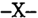
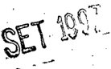

TOMO 317

Volumen 3

1994

1048

ACUERDOS DE LA CORTE SUPREMA

317

Copyright (c) 1997 by Corte Suprema de Justicia de la Nación Queda hecho el depósito que previene la ley 11.723. Impreso en la Argentina Printed in Argentina I.S.B.N. 950

DE JUSTICIA DE LA NACION

317

1049

## R E P U B L I C A A R G E N T I N A

FALLOS

DE  LA

C O R T E

S U P R E M A

DE

## J USTICIA DE LA N ACION

PUBLICACION A CARGO DE LA SECRETARIA DE JURISPRUDENCIA DEL TRIBUNAL

TOMO 317 - VOLUMEN 3

OCTUBRE - DICIEMBRE

LA LEY S.A.E. e I.

Tucumán 1471 (1050) Buenos Aires 1994

## HOJA COMPLEMENTARIA

Hoja incorporada a los efectos de permitir la búsqueda por página dentro del Volumen.

## A C U E R D O S   D E   L A   C O R T E   S U P R E M A

## AÑO 1994

## OCTUBRE - DICIEMBRE

## CORTE SUPREMA. DESIGNACION DE SECRETARIO.

-Nº 66-

En Buenos Aires, a los 4 días del mes de octubre del año mil novecientos noventa y cuatro, reunidos en la Sala de Acuerdos del Tribunal, los señores Ministros que suscriben la presente,

## Acordaron:

Designar SECRETARIO de la Corte Suprema de Justicia de la Nación, en reemplazo del doctor Alejandro Juan Uslenghi, al doctor Rubén Héctor Gorría (D.N.I. 13.368.370 - clase 1957).

Todo lo cual dispusieron y mandaron, ordenando que se comunicase y registrase en el libro correspondiente, por ante mí, que doy fe. - RICARDO LEVENE (H) - GUILLERMO A. F. LÓPEZ - AUGUSTO CÉSAR BELLUSCIO - ENRIQUE SANTIAGO PETRACCHI - JULIO S. NAZARENO - EDUARDO MOLINÉ O'CONNOR - ANTONIO BOGGIANO - CARLOS S. FAYT GUSTAVO A. BOSSERT Hugo Luis Mauro Piacentino (Secretario).

## HABILITACION DEL TRIBUNAL ORAL EN LO CRIMINAL FEDERAL DE LA RIOJA.

-Nº 67-

En Buenos Aires, a los 13 días del mes de octubre del año mil novecientos noventa y cuatro, reunidos en la Sala de Acuerdos del Tribunal, los señores Ministros que suscriben la presente,

## Consideraron:

Que la ley 24.121 crea un Tribunal Oral en lo Criminal Federal de La Rioja y el Poder Ejecutivo Nacional ha designado a los magistrados que se harán cargo del tribunal oral.

Que esta Corte mediante resoluciones Nros. 859/93 y 121/94 dispuso la creación de los cargos respectivos.

Por ello,

## Acordaron:

1º) Habilitar el Tribunal Oral en lo Criminal Federal de La Rioja a partir del 14 de octubre de 1994.

- 2º) Encomendar al señor Ministro de la Corte Suprema de Justicia de la Nación, doctor Julio Salvador Nazareno que se constituya en la sede del Tribunal Oral de La Rioja y reciba juramento de ley a los señores magistrados designados para integrar dicho tribunal.
- 3º) Declarar feriado judicial para dicho tribunal oral por el término de siete días hábiles a partir de su habilitación.
- 4º) Poner en conocimiento del señor Procurador General de la Nación la presente acordada a fin de que adopte los recaudos correspondientes con respecto a los representantes del Ministerio Público.

Todo lo cual dispusieron y mandaron, ordenando que se comunicase y registrase en el libro correspondiente, por ante mí, que doy fe. - RICARDO LEVENE (H) - CARLOS S. FAYT - AUGUSTO CÉSAR BELLUSCIO - ENRIQUE SANTIAGO PETRACCHI - JULIO S. NAZARENO - EDUARDO MOLINÉ O'CONNOR - ANTONIO BOGGIANO - GUSTAVO A. BOSSERT - GUILLERMO A. F. LÓPEZ Rubén H. Gorría (Secretario).

HABILITACION DEL TRIBUNAL ORAL EN LO CRIMINAL FEDERAL DE FORMOSA.

-Nº 68-

En Buenos Aires, a los 13 días del mes de octubre del año mil novecientos noventa y cuatro, reunidos en la Sala de Acuerdos del Tribunal, los señores Ministros que suscriben la presente,

## Consideraron:

Que la ley 24.121 crea un Tribunal Oral en lo Criminal Federal con asiento en Formosa y el Poder Ejecutivo Nacional ha designado dos de los magistrados que se harán cargo del Tribunal como así también a los integrantes del ministerio público.

## DE JUSTICIA DE LA NACION

Que esta Corte, mediante la resoluciones Nº 869/93 y 171/94 dispuso la creación de los cargos respectivos.

Por ello,

Acordaron:

- 1º) Disponer la habilitación del Tribunal Oral en lo Criminal Federal de Formosa a partir de la fecha en que la Cámara Federal de Apelaciones de Resistencia reciba el juramento de ley a los señores magistrados designados para integrar dicho tribunal.
- 2º) Declarar feriado judicial para dicho tribunal oral por el término de siete días hábiles.
- 3º) Poner en conocimiento del señor Procurador General de la Nación la presente, a fin de que adopte los recaudos correspondientes con respecto a los representantes del ministerio público.

Todo lo cual dispusieron y mandaron, ordenando que se comunicase y registrase en el libro correspondiente, por ante mí, que doy fe. - RICARDO LEVENE (H) - CARLOS S. FAYT - AUGUSTO CÉSAR BELLUSCIO - ENRIQUE SANTIAGO PETRACCHI - JULIO S. NAZARENO - EDUARDO MOLINÉ O'CONNOR - ANTONIO BOGGIANO - GUSTAVO A. BOSSERT - GUILLERMO A. F. LÓPEZ Rubén H. Gorría (Secretario).

HABILITACION DE LOS TRIBUNALES ORALES EN LO CRIMINAL FEDERAL DE SAN MARTIN.

-Nº 69-

En Buenos Aires, a los 13 días del mes de octubre del año mil novecientos noventa y cuatro, reunidos en la Sala de Acuerdos del Tribunal, los señores Ministros que suscriben la presente,

## Consideraron:

Que la ley 24.121 crea cinco tribunales orales en lo criminal federal en San Martín, provincia de Buenos Aires, hallándose en funcionamiento dos de los mencionados.

Que el Poder Ejecutivo Nacional ha designado a los magistrados que se harán cargo de los Tribunales Orales en lo Criminal Federal 3 y 4.

Por ello,

## Acordaron:

1º)  Habilitar  los  Tribunales  Orales  en  lo  Criminal  Federal  Nros.  3  y  4  de  San Martín a partir de la fecha en que la Cámara Federal de Apelaciones de San Martín

reciba el juramento de ley a los señores magistrados designados para integrar dichos tribunales.

- 2º) Decretar feriado judicial para dichos tribunales orales por el término de siete días hábiles a partir de su habilitación.
- 3º) Poner en conocimiento del señor Procurador General de la Nación la presente acordada, a fin de que adopte los recaudos correspondientes con respecto a los representantes del ministerio público.

Todo lo cual dispusieron y mandaron, ordenando que se comunicase y registrase en el libro correspondiente, por ante mí, que doy fe. - RICARDO LEVENE (H) - CARLOS S. FAYT - AUGUSTO CÉSAR BELLUSCIO - ENRIQUE SANTIAGO PETRACCHI - JULIO S. NAZARENO - EDUARDO MOLINÉ O'CONNOR - ANTONIO BOGGIANO - GUSTAVO A. BOSSERT - GUILLERMO A. F. LÓPEZ Rubén H. Gorría (Secretario).

## DIAS DE NOTIFICACION. ATENCION DE PROFESIONALES.

-Nº 70-

En Buenos Aires, a los 13 días del mes de octubre del año mil novecientos noventa y cuatro, reunidos en la Sala de Acuerdos del Tribunal, los señores Ministros que suscriben la presente,

## Consideraron:

- 1º) Que el Colegio de Procuradores de la Ciudad de Buenos Aires solicitó que se dispusiera que en los días de notificación sólo pudieran tener acceso a los expedientes los profesionales (fs. 1).
- 2º)  Que,  analizados los fundamentos que originaron la petición y las opiniones vertidas por otras entidades consultadas (ver fs. 6, 8 y 11), este Tribunal estima conveniente acceder a la solicitud de estricto cumplimiento de las normas en vigencia.

Por ello,

Acordaron:

- 1º) No hacer lugar al requerimiento formulado por el Colegio de Procuradores de la Ciudad de Buenos Aires.
- 2º) Ratificar en todo su contenido, la vigencia del art. 1º de la acordada 25/76 (texto según acordadas 9/81 y 49/91), relativa a la atención exclusiva a los profesionales en los días de notificación, en el horario de 11:30 a 13:30.

Todo lo cual dispusieron y mandaron, ordenando que se comunicase y registrase en el libro correspondiente, por ante mí, que doy fe. - RICARDO LEVENE (H) - CARLOS S. FAYT - AUGUSTO CÉSAR BELLUSCIO - ENRIQUE SANTIAGO PETRACCHI - JULIO S. NAZARENO - EDUARDO MOLINÉ O'CONNOR - ANTONIO BOGGIANO - GUSTAVO A. BOSSERT - GUILLERMO A. F. LÓPEZ Rubén H. Gorría (Secretario).

## JUSTICIA DEL TRABAJO. DESIGNACION DE AYUDANTES.

-Nº 71-

En Buenos Aires, a los 20 días del mes de octubre del año mil novecientos noventa y cuatro, reunidos en la Sala de Acuerdos del Tribunal, los señores Ministros que suscriben la presente,

## Consideraron:

Que esta Corte Suprema mediante la acordada 29/94 autorizó a la Cámara Nacional de Apelaciones del Trabajo a poner en funcionamiento los Juzgados Nacionales de Primera Instancia Nros. 69 al 80 con las dotaciones de personal que permitía el espacio disponible (punto 2º).

Que la citada Cámara elevó -con opinión favorable- a consideración de esta Corte la solicitud de los titulares de dichos juzgados, en el sentido de contar con el personal de servicio indispensable, y evitar así sustraer en otras tareas al reducido plantel administrativo oportunamente autorizado.

Que los fundamentos expuestos resultan suficientes para acceder a lo solicitado.

Por ello,

Acordaron:

- 1º) Autorizar a la Cámara Nacional de Apelaciones del Trabajo a designar a seis agentes con la categoría de ayudante para desempeñarse en los Juzgados Nacionales de Primera Instancia del Trabajo Nros. 69 al 80, a razón de un agente por cada dos juzgados.
- 2º) Hacer saber a la citada Cámara que podrá completar las dotaciones de dichos juzgados cuando este Tribunal, con intervención de la Secretaría de Superintendencia Administrativa, asigne los espacios necesarios que permitan su normal funcionamiento.

Todo lo cual dispusieron y mandaron, ordenando que se comunicase y registrase en el libro correspondiente, por ante mí, que doy fe. - RICARDO LEVENE (H) - CARLOS S. FAYT - AUGUSTO C. BELLUSCIO - ENRIQUE SANTIAGO PETRACCHI - JULIO S. NAZARENO EDUARDO MOLINÉ O'CONNOR - GUILLERMO A. F. LÓPEZ - GUSTAVO A. BOSSERT Rubén H. Gorría (Secretario).

## CORTE SUPREMA. DESIGNACION DE SECRETARIO.

-Nº 72-

En Buenos Aires, a los veintisiete días del mes de octubre del año mil novecientos noventa y cuatro, reunidos en la Sala de Acuerdos del Tribunal, los señores Ministros que suscriben la presente,

## Acordaron:

Designar SECRETARIO DE SUPERINTENDENCIA JUDICIAL de la Corte Suprema de Justicia de la Nación, en reemplazo del doctor Claudio Marcelo Kiper, al doctor Jorge Alejandro Magnoni (D.N.I. 10.550.188 - clase 1952).

Todo lo cual dispusieron y mandaron ordenando que se comunicase y registrase en el libro correspondiente, por ante mí, que doy fe. - RICARDO LEVENE (H) - CARLOS S. FAYT - JULIO S. NAZARENO - EDUARDO MOLINÉ O'CONNOR - GUSTAVO A. BOSSERT ANTONIO BOGGIANO Rubén H. Gorría (Secretario).

CORTE SUPREMA. DESGNACION DE SECRETARIO.

-Nº 73-

En Buenos Aires, a los 27 días del mes de octubre del año mil novecientos noventa y cuatro, reunidos en la Sala de Acuerdos del Tribunal, los señores Ministros que suscriben la presente,

## Acordaron:

Designar SECRETARIO de la Corte Suprema de Justicia de la Nación, en reemplazo del doctor Bernardo Licht, al doctor Claudio Miguel Serra (D.N.I. 11.477.809 clase 1955).

Todo lo cual dispusieron y mandaron, ordenando que se comunicase y registrase en el libro correspondiente, por ante mí, que doy fe.  - RICARDO LEVENE (H) - GUILLERMO A. F. LOPEZ - AUGUSTO CÉSAR BELLUSCIO -  - JULIO S. NAZARENO - EDUARDO MOLINÉ O'CONNOR - CARLOS S. FAYT - ENRIQUE SANTIAGO PETRACCHI (EN DISIDENCIA) - GUSTAVO A. BOSSERT - ANTONIO BOGGIANO Rubén H. Gorría (Secretario).

## DISIDENCIA DEL DOCTOR ENRIQUE SANTIAGO PETRACCHI

En atención a que la doctora Irene Antonia Valiente posee mayor antigüedad en el Tribunal -y en el cargo de Secretaria Letrada que actualmente desempeña-; como asimismo, en razón de la supremacía de antecedentes consignados en el currículum vitae acompañado por aquélla, propongo:

Designar Secretaria de la Corte Suprema de Justicia de la Nación, a la doctora Irene Antonia Valiente, para que se desempeñe como titular de la Secretaría Judicial Nº 7, creada por la Acordada Nº 13/91 de este Tribunal.

Todo lo cual dispusieron y mandaron, ordenando que se comunicase y registrase en el libro correspondiente, por ante mí, que doy fe.  - ENRIQUE SANTIAGO PETRACCHI Rubén H. Gorría (Secretario).

CORTE SUPREMA. DESIGNACION DE PRESIDENTE Y VICEPRESIDENTE.

-Nº 74-

En Buenos Aires, a los diecisiete días del mes de noviembre del año mil novecientos noventa y cuatro, reunidos en la Sala de Acuerdos del Tribunal, los señores Ministros que suscriben la presente, el doctor Fayt propuso que se procediera a la elección de Presidente y Vicepresidente de la Corte Suprema de Justicia de la Nación.

El doctor López propuso que se postergara esta elección hasta el día 6 de diciembre del corriente, moción que fue rechazada por el voto de los doctores Fayt, Levene, Boggiano, Moliné O'Connor y Nazareno, con disidencia de los restantes miembros doctores Belluscio, Petracchi, López y Bossert.

A continuación se procedió a elegir las autoridades del Tribunal, resultando designados como Presidente el doctor Julio Salvador Nazareno y como Vicepresidente al doctor  Eduardo José Antonio Moliné O'Connor; con la abstención de los doctores Belluscio, Petracchi, López y Bossert.

Por ello

Acordaron:

Designar Presidente y Vicepresidente de la Corte Suprema de Justicia de la Nación a los doctores Julio Salvador Nazareno y Eduardo José Antonio Moliné O'Connor, respectivamente.

Todo lo cual dispusieron y mandaron, ordenando que se comunicase y registrase en el libro correspondiente, por ante mí, que doy fe. - RICARDO LEVENE (H) - CARLOS S. FAYT - AUGUSTO CÉSAR BELLUSCIO - ENRIQUE SANTIAGO PETRACCHI - JULIO S. NAZARENO - EDUARDO MOLINÉ O'CONNOR - ANTONIO BOGGIANO - GUSTAVO A. BOSSERT - GUILLERMO A. F. LÓPEZ Jorge A. Magnoni (Secretario).

HABILITACION DEL TRIBUNAL ORAL EN LO CRIMINAL Nº 30.

-Nº 76-

En Buenos Aires, a los 30 días del mes de noviembre del año mil novecientos noventa y cuatro, reunidos en la Sala de Acuerdos del Tribunal, los señores Ministros que suscriben la presente,

Consideraron:

Que esta Corte Suprema por acordada 36/94 delegó en la Cámara Nacional de Casación Penal la superintendencia de los Tribunales Orales de la Capital Federal.

Que los señores jueces designados para el Tribunal Oral en lo Criminal nro. 30 de la Capital Federal solicitan que se habilite dicho tribunal con un mínimo de personal.

Que el señor presidente de la Cámara Nacional de Casación Penal informa que dicha Cámara considera conveniente la habilitación del tribunal mencionado, en los términos solicitados.

Por ello,

Acordaron:

1º) Habilitar el Tribunal Oral en lo Criminal nro. 30 de la Capital Federal a partir de la fecha en que la Cámara Nacional de Casación Penal le reciba juramento a los señores jueces designados.

2º) Decretar feriado judicial para el mencionado Tribunal por el término de siete días hábiles a partir de su habilitación.

3º) Poner en conocimiento del señor Procurador General de la Nación la presente, a fin de que adopte los recaudos correspondientes con respecto al señor fiscal designado.

Todo lo cual dispusieron y mandaron, ordenando que se comunicase y registrase en el libro correspondiente, por ante mí, que doy fe. - EDUARDO MOLINÉ O'CONNOR ENRIQUE SANTIAGO PETRACCHI - RICARDO LEVENE (H) - ANTONIO BOGGIANO - AUGUSTO CÉSAR BELLUSCIO - Jorge Alejandro Magnoni (Secretario).

HABILITACION DEL TRIBUNAL ORAL EN LO CRIMINAL FEDERAL DE SAN LUIS.

-Nº 77-

En Buenos Aires, a los 6 días del mes de diciembre del año mil novecientos noventa y cuatro, reunidos en la Sala de Acuerdos del Tribunal, los señores Ministros que suscriben la presente,

## Consideraron:

Que la ley 24.121 crea un Tribunal Oral en lo Criminal Federal con asiento en San Luis y el Poder Ejecutivo Nacional ha designado a los magistrados que se harán cargo del Tribunal.

Que esta Corte, mediante la resolución Nº 855/93 dispuso la creación de los cargos respectivos.

Que es propósito de esta Corte Suprema proveer lo necesario para asegurar la correcta prestación del servicio de justicia, por lo que el funcionamiento del tribunal oral mencionado constituye una prioridad insoslayable.

Por ello,

## Acordaron:

- 1º) Habilitar el Tribunal Oral en lo Criminal Federal de San Luis a partir de la fecha en que la Cámara Federal de Apelaciones de Mendoza le reciba juramento a los señores jueces designados.
- 2º) Decretar feriado judicial para el mencionado Tribunal por el término de siete días hábiles a partir de su habilitación.
- 3º) Poner en conocimiento del señor Procurador General de la Nación la presente, a fin de que adopte los recaudos correspondientes con respecto a los señores integrantes del ministerio público designados.

Todo lo cual dispusieron y mandaron, ordenando que se comunicase y registrase en el libro correspondiente, por ante mí, que doy fe. - EDUARDO MOLINÉ O'CONNOR CARLOS S. FAYT - AUGUSTO CÉSAR BELLUSCIO - RICARDO LEVENE (H) - GUSTAVO BOSSERT - Jorge A. Magnoni (Secretario).

FERIA DE ENERO DE 1995. DESIGNACION DE AUTORIDADES.

-Nº 78-

En Buenos Aires, a los 13 días del mes de diciembre del año mil novecientos noventa y cuatro, reunidos en la Sala de Acuerdos del Tribunal, los señores Ministros que suscriben la presente, y teniendo en cuenta la comunicación formulada por la Procuración General de la Nación,

Resolvieron:

- I) Designar como autoridades de feria del mes de enero del año 1995:
- 1º)  Al  doctor  Guillermo  A.  F.  López  -del  1º  al  15-,  al  doctor  Enrique  Santiago Petracchi -del 15 al 31-, como jueces de feria y al Dr. Augusto C. Belluscio como juez de feria suplente -1º al 31-.
- 2º) A los Dres. Jorge Alberto Migliore -del 1º al 15-, a la Dra. Cristina Alvarez de Magliano -del 15 al 31-, y al doctor Rubén Héctor Gorria -desde el 1º al 31- como secretarios del Tribunal.
- II) Tener por designado, en la Procuración General de la Nación al doctor Angel Nicolás Agüero Iturbe; y en la Defensoría ante la Corte Suprema de Justicia de la Nación al doctor Carlos A. Tavares.
- III) Establecer el horario de atención al público de lunes a viernes, desde las 8 hasta las 12 horas.
- IV) El personal que preste funciones durante la feria judicial deberá acreditarlo mediante certificación otorgada por los señores secretarios de feria.

Todo lo cual dispusieron y mandaron, ordenando que se comunicase y registrase en el libro correspondiente, por ante mí, que doy fe. - JULIO S. NAZARENO - EDUARDO MOLINÉ O'CONNOR - CARLOS S. FAYT - AUGUSTO C. BELLUSCIO - ENRIQUE SANTIAGO PETRACCHI - RICARDO LEVENE (H) - GUILLERMO A. LÓPEZ - GUSTAVO A. BOSSERT Jorge A. Magnoni (Secretario).

## DE JUSTICIA DE LA NACION

317

## CAMARA FEDERAL DE LA PLATA. INTEGRACIONES

## DE CARGOS NO CUBIERTOS.

-Nº 80-

En Buenos Aires, a los 13 días del mes de diciembre del año mil novecientos noventa y cuatro, reunidos en la Sala de Acuerdos del Tribunal, los señores Ministros que suscriben la presente,

## Consideraron:

Que por los fundamentos expuestos en la acordada 23/94, la Cámara Federal de Apelaciones de La Plata sustituyó el punto 2 de la parte resolutiva de la acordada 15/93 e integró a la Sala Penal (nº III), en forma permanente, con el doctor Schiffrin como presidente, y el juez del tribunal oral doctor Michelli como vocal subrogante hasta tanto se haga cargo de sus funciones un nuevo magistrado permanente.

Que el sistema de 'integración' es posible en casos de recusación, excusación, licencia, vacancia u otro impedimento que afecte al titular del cargo, lo que presupone su nombramiento.

Que la cámara ha quedado constituída por cinco miembros, según surge de los considerandos de la acordada 15/93, y, por ende, el método propuesto implicaría la creación de un nuevo cargo por vía reglamentaria.

Que, de todos modos, la integración de una sala para alcanzar el número legal para fallar está previsto por el artículo 31 del decreto ley 1285/58 (texto conforme art. 51 de la ley 24.050).

Por ello, y en virtud de las facultades establecidas por la ley 4055 y el Reglamento para la Justicia Nacional,

## Acordaron:

No aprobar la acordada 23/94 de la Cámara Federal de Apelaciones de La Plata, por no ser procedente efectuar integraciones respecto de cargos no cubiertos.

Todo lo cual dispusieron y mandaron, ordenando que se comunicase y registrase en el libro correspondiente, por ante mí, que doy fe. - JULIO S. NAZARENO - EDUARDO MOLINÉ O'CONNOR - CARLOS S. FAYT - AUGUSTO C. BELLUSCIO - ENRIQUE SANTIAGO PETRACCHI - GUSTAVO A. BOSSERT Jorge A. Magnoni (Secretario).

## CAMARA FEDERAL DE APELACIONES DE ROSARIO. REGLAMENTACION PARA LA DESIGNACION DEL PERSONAL.

En Buenos Aires, a los 13 días del mes de diciembre del año mil novecientos noventa y cuatro, reunidos en la Sala de Acuerdos del Tribunal, los señores Ministros que suscriben la presente,

## Consideraron:

- 1º) Que por acordada 245 de fecha 14 de diciembre de 1993, la Cámara Federal de Apelaciones de Rosario dejó sin efecto la acordada del 30/9/58 y dictó, consecuentemente, una nueva reglamentación para la designación del personal administrativo, técnico y de servicio de la jurisdicción (fs. 59/63 del expte. S-49/82).
- 2º) Que el Tribunal considera conveniente modificar el texto de los incisos A 'TITULOS', B 'ANTIGUEDAD' y D 'ASISTENCIA' del art. 1º de la citada disposición, pues el propuesto puede originar situaciones escalafonarias poco equitativas; y propiciar, a su vez, el dictado de normas reglamentarias que fijen los procedimientos para publicar los escalafones, y posibiliten su impugnación.

Por ello, y en virtud de las facultades de este Tribunal (art. 104 del R.J.N. y 22 de la ley 4055),

## Acordaron:

- 1º) Modificar el texto del artículo 1º, ap. A de la acordada 245/93 'TITULOS', el cual quedará redactado de la siguiente forma 'ART. 1º. A) TITULOS: Se tendrán en cuenta únicamente aquellos que faciliten la capacitación especial para las tareas judiciales. Se valorarán con arreglo a las siguientes escalas: abogado: 3 puntos; escribano: 2 puntos; procurador: 2 puntos; estudios universitarios que acrediten conocimientos técnicos de aplicación en el cargo con 12 materias aprobadas: 1 punto. Estos puntajes no son acumulativos. La terminación de estudios se acreditará con diploma o certificado extendido por la autoridad que corresponda'.
- 2º) Modificar el artículo 1º, ap. B 'ANTIGÜEDAD' de la acordada mencionada, el cual quedará redactado de la siguiente manera: 'ART. 1º. B) ANTIGÜEDAD: Para la aplicación del escalafón se computará la antigüedad con arreglo a las siguientes bases: a) Antigüedad en la Justicia: 1/2 punto por año de antigüedad en la justicia o fracción no menor de seis meses, hasta un máximo de 5 puntos; b) Antigüedad en la categoría: 1 punto por cada año de servicio cumplido al 1º de noviembre, como titular o interino, o fracción no menor de seis meses, hasta un máximo de 5 puntos'.
- 3º) Modificar el artículo 1º, ap. D 'ASISTENCIA' de la citada acordada, el cual quedará redactado del modo siguiente: 'ART. 1º. D) ASISTENCIA: items que comprende: 1) inasistencias injustificadas, 2) inasistencias justificadas por razones particulares (art. 35, inc. c del R.L.J.N.), 3) licencias por motivos particulares (art. 34 del R.L.J.N.),

4) tardanzas, y 5) concurrencia fuera del horario de oficina debidamente autorizada. Puntaje: de 0 a 5. Por inasistencias injustificadas se descontarán 0,10 p.; por inasistencias justificadas por motivos particulares (art. 35, inc. c del R.L.J.N.) 0,05 ptos. por cada día no trabajado; por licencias por motivos particulares (art, 34 del R.L.J.N.) 0,02 ptos. para cada día de licencia otorgado. En los supuestos de tardanzas, se descontará por cada una 0.03 ptos., a partir de la tercera del año. La concurrencia fuera del horario de oficina debidamente autorizada que no sea compensación para cubrir el mínimo de seis horas diarias permitirá sumar un centésimo (0.01) de punto por cada dos horas, no debiéndose computar fracciones menores a una hora'.

- 4º) Recomendar a la Cámara Federal de Apelaciones de Rosario el dictado de normas reglamentarias que fijen los procedimientos de publicación de los escalafones, y su eventual impugnación.

Todo lo cual dispusieron y mandaron, ordenando que se comunicase y registrase en el libro correspondiente, por ante mí, que doy fe. - JULIO S. NAZARENO - EDUARDO MOLINÉ O'CONNOR - ENRIQUE SANTIAGO PETRACCHI - RICARDO LEVENE (H) - GUILLERMO A. LÓPEZ - GUSTAVO A. BOSSERT Jorge A. Magnoni (Secretario).

## CORTE SUPREMA. ASUETO.

-Nº 82-

En Buenos Aires, a los 27 días del mes de diciembre del año mil novecientos noventa y cuatro, reunidos en la Sala de Acuerdos del Tribunal, los señores Ministros que suscriben la presente,

Acordaron:

Adherir a lo dispuesto por el Poder Ejecutivo Nacional mediante el Decreto 2267/ 94.

Decretar asueto judicial, de acuerdo con los términos del art. 3º del Reglamento para la Justicia Nacional, el día 30 del corriente mes a partir de las 13:00 horas, para los tribunales nacionales y federales con asiento en la capital e interior del país.

Todo lo cual dispusieron y mandaron, ordenando que se comunicase y registrase en el libro correspondiente, por ante mí, que doy fe. - CARLOS S. FAYT - GUSTAVO A. BOSSERT - AUGUSTO CÉSAR BELLUSCIO - RICARDO LEVENE (H) - ENRIQUE SANTIAGO PETRACCHI - ANTONIO BOGGIANO Jorge Alejandro Magnoni (Secretario).

DE JUSTICIA DE LA NACION

317

## FALLOS DE LA CORTE SUPREMA

## OCTUBRE

## RICARDO ANDERSON Y OTROS

RECURSO EXTRAORDINARIO: Principios generales.

El recurso extraordinario contra la sentencia del superior tribunal provincial que declaró mal concedido el recurso de casación es inadmisible (art. 280 del Código Procesal Civil y Comercial de la Nación) (1).

RECURSO EXTRAORDINARIO: Requisitos propios. Tribunal superior.

Todo pleito radicado ante la justicia provincial en el que se suscitan cuestiones federales deberá arribar a la Corte Suprema de Justicia de la Nación sólo después de 'fenecer' ante el órgano máximo de la judicatura local (Disidencia de los Dres. Ricardo Levene (h.), Carlos S. Fayt, Enrique Santiago Petracchi y Antonio Boggiano) (2).

RECURSO EXTRAORDINARIO: Requisitos propios. Tribunal superior.

La legislatura local y la jurisprudencia de sus tribunales no pueden vedar el acceso al superior tribunal provincial el examen de las cuestiones federales planteadas por las partes con fundamento en el monto de la condena, el grado de la pena, la materia o por otras razones análogas (Disidencia de los Dres. Ricardo Levene [h.], Carlos S. Fayt, Enrique Santiago Petracchi y Antonio Boggiano) (3).

RECURSO EXTRAORDINARIO: Requisitos propios. Tribunal superior.

Corresponde dejar sin efecto la sentencia que declaró mal concedido el recurso de casación fundándose en el art. 23 de la ley 1386 de la Provincia del Chubut si la forma precisa y concreta con que el recurrente formuló sus agravios señala claramente que se habían suscitado cuestiones federales que hacían obligatorio

(1) 4 de octubre.

(2) Fallos: 311:2478.

(3) Fallos: 311:2478.

1065

## HOJA COMPLEMENTARIA

Hoja incorporada a los efectos de permitir la búsqueda por página dentro del Volumen.

1066

## FALLOS DE LA CORTE SUPREMA

su examen exhaustivo por parte del superior tribunal provincial (Disidencia de los  Dres.  Ricardo  Levene [h.],  Carlos  S.  Fayt,  Enrique  Santiago  Petracchi  y Antonio Boggiano) (1).

## ALEJANDRO CESAR ARNAUDO V. ALDO JUAN SHURRER PRESSER Y OTROS

DEPRECIACION MONETARIA: Cláusula penal.

La circunstancia de haber pactado una cláusula penal o intereses punitorios no obsta a que se practique el reajuste del crédito constitutivo de la obligación principal, si tales estipulaciones resultan notoriamente insuficientes para compensar el deterioro del poder adquisitivo de la moneda durante el lapso de que se  trata,  ya  que  dicho  reajuste  es  procedente  a  fin  de  mantener  incólume  el derecho de propiedad que garantiza el art. 17 de la Constitución Nacional.

DEPRECIACION MONETARIA: Principios generales.

Ante la falta de pago del deudor resulta lícito que sea éste quien cargue con las consecuencias de tal proceder imputable (art. 508 del Código Civil) ya que, de lo contrario, si se hiciesen pesar las vicisitudes del proceso inflacionario exclusivamente sobre la parte no culpable de la relación creditoria ello implicaría premiar la mora en el cumplimiento de las obligaciones y un apartamiento inadmisible de la ética que debe presidir las decisiones judiciales.

RECURSO EXTRAORDINARIO: Requisitos propios. Cuestiones no federales. Sentencias  arbitrarias.  Procedencia del recurso. Falta de fundamentación suficiente.

Al rechazar el pedido de actualización monetaria mediante la dogmática remisión a la vigencia de un pacto de intereses compensatorios y punitorios y sin atender si dichos accesorios preservaban el contenido de la prestación debida, la cámara utilizó un argumento que es notoriamente insuficiente para satisfacer la exigencia constitucional de fundamentación de los pronunciamientos judiciales, máxime cuando el reajuste en cuestión está expresamente contemplado por el art. 61 de la ley 21.839 y el fallo omitió toda consideración sobre las razones que llevaron a prescindir del mismo.

## DE JUSTICIA DE LA NACION

RECURSO EXTRAORDINARIO: Requisitos formales. Introducción de la cuestión federal. Oportunidad. Planteamiento en el escrito de interposición del recurso extraordinario.

El tema relativo a que al establecer con posterioridad al 1  de abril de 1991 o únicamente los intereses legales previstos en el art. 10 del decreto 941/91 se eliminaron los intereses punitorios fue tardíamente planteado en el recurso extraordinario, si ante la decisión en sentido análogo, tomada en la resolución de primera instancia, los recurrentes no plantearon agravio de ninguna naturaleza en su memorial.

## RECURSO EXTRAORDINARIO: Principios generales.

El recurso extraordinario contra la sentencia que desestimó el pedido de los letrados para que se actualicen sus honorarios, redujo la tasa convenida en concepto de intereses punitorios y fijó dichos accesorios por el lapso posterior al 1 o de abril de 1991, es inadmisible (art. 280 del Código Procesal Civil y Comercial de la Nación) (Disidencia del Dr. Antonio Boggiano).

## RECURSO EXTRAORDINARIO: Principios generales.

La desestimación de un recurso extraordinario mediante la aplicación del art. 280 del Código Procesal Civil y Comercial de la Nación no importa confirmar ni afirmar la justicia o el acierto de la decisión recurrida, sino que el recurso no ha superado el examen del Tribunal encaminado a seleccionar los casos en los que entenderá, según las pautas establecidas en ese precepto (Disidencia del Dr. Antonio Boggiano).

## FALLO DE LA CORTE SUPREMA

Buenos Aires, 4 de octubre de 1994.

Vistos los autos: 'Arnaudo, Alejandro César c/ Shurrer Presser, Aldo Juan y otros s/ sumario'.

## Considerando:

1 o ) Que contra la sentencia de la Cámara Federal de Córdoba que, al modificar la resolución de primera instancia, desestimó el pedido que habían efectuado los letrados para que se actualicen sus honorarios profesionales, redujo la tasa convenida en concepto de intereses

punitorios y fijó dichos accesorios por el lapso posterior al 1  de abril o de 1991, los acreedores dedujeron el recurso extraordinario de fs. 987/ 1005, que fue contestado por la obligada a fs. 1008/1015 y concedido por el tribunal a quo a fs. 1017.

- 2 o ) Que los agravios vinculados con el reajuste del crédito suscitan una cuestión federal que justifica su consideración en la vía intentada, pues aunque remiten al examen de materias de hecho y de derecho común que, como regla y por su naturaleza, son ajenas a la instancia del art. 14 de la ley 48, ello no es óbice para invalidar lo resuelto cuando la sentencia de la cámara carece de fundamentación suficiente y prescinde del texto legal aplicable en el caso, con menoscabo de las garantías de justa retribución y propiedad que asisten a los ejecutantes (arts. 14 y 17 de la Ley Fundamental).
- 3 o ) Que, en efecto, es doctrina de esta Corte sentada en reiterados y conocidos precedentes, que la circunstancia de haberse pactado una cláusula penal o intereses punitorios no obsta a que se practique el reajuste del crédito constitutivo de la obligación principal, si tales estipulaciones resultan notoriamente insuficientes para compensar el deterioro del poder adquisitivo de la moneda durante el lapso de que se trata, toda vez que dicho reajuste es procedente a fin de mantener incólume el derecho de propiedad que garantiza el art. 17 de la Constitución Nacional (Fallos: 300:1231; 301:280; 304:792; 311:1249 y 1722).
- 4 o ) Que, de igual modo, ha afirmado este Tribunal que ante la falta de pago del deudor, resulta lícito que sea éste quien cargue con las consecuencias de tal proceder imputable (art. 508 del Código Civil) ya que, de lo contrario, si se hiciesen pesar las vicisitudes del proceso inflacionario -sucedido durante el lapso en cuestión- exclusivamente sobre la parte no culpable de la relación creditoria, ello implicaría premiar la mora en el cumplimiento de las obligaciones y un apartamiento inadmisible de la ética que debe presidir las decisiones judiciales (Fallos: 306:1978; 307:1073).
- 5 o ) Que, con tal comprensión, al rechazar el pedido de actualización monetaria mediante la dogmática remisión a la vigencia de un pacto de intereses compensatorios y punitorios y sin atender si dichos accesorios preservaban el contenido de la prestación debida, la cámara ha utilizado un argumento que es notoriamente insuficiente para satisfacer la exigencia constitucional de fundamentación de los pro-

nunciamientos judiciales, máxime cuando el reajuste en cuestión está expresamente contemplado por el art. 61 de la ley 21.839 para supuestos como el ventilado en el sub lite y el fallo ha omitido toda consideración sobre las razones que llevaron a prescindir de dicho texto normativo.

- 6 o ) Que, en las condiciones expresadas, la decisión apelada vulnera en forma directa e inmediata las garantías constitucionales invocadas, por lo que corresponde descalificar el pronunciamiento con apoyo en la doctrina de esta Corte en materia de arbitrariedad, a fin de que el pedido de actualización sea examinado con arreglo a lo aquí resuelto.
- 7 o ) Que, frente al alcance de lo decidido, resulta inoficioso el tratamiento del agravio atinente a la morigeración de la tasa de intereses punitorios devengados hasta el 31 de marzo de 1991, toda vez que el tribunal a quo deberá adecuar el pacto de intereses compensatorios y punitorios al contenido que se asigne al crédito por los honorarios en cuestión.
- 8 o )  Que, por último, con relación a lo decidido por la alzada en cuanto a que, al establecer con posterioridad al 1  de abril de 1991 o únicamente los intereses legales previstos en el art. 10 del decreto 941/91, ha eliminado los intereses punitorios, el agravio que -como de naturaleza federal- invoca el apelante, ha sido tardíamente planteado en el recurso extraordinario.

Ello es así, ya que ante la decisión en sentido análogo tomada en la resolución de primera instancia -que sólo fijó para el lapso aludido la tasa del 12 % anual establecida por el art. 9 de la ley 23.928, excluyendo los intereses punitorios-, los recurrentes no plantearon agravio de ninguna naturaleza en su memorial de fs. 889/891, de manera que por haberse omitido la debida actuación en la etapa procesal pertinente a los fines de una adecuada defensa de sus derechos, éstos no resultan susceptibles de ser tratados en la vía del art. 14 de la ley 48 al quedar afectados por las consecuencias de la conducta discrecional de los interesados (Fallos: 276:313; 277:308; 296:642; 302:1564; 307:461, 465; 307:635; causa: P.586.XXII 'Pombo &amp; Santarcángelo S.A. s/ sumario' fallada el 3 de abril de 1990).

Por ello, con el alcance indicado, se declara procedente el recurso extraordinario y se deja sin efecto el pronunciamiento apelado. Con

costas en los términos del art. 71 del Código Procesal Civil y Comercial de la Nación. Vuelvan los autos al tribunal de origen a fin de que, por medio de quien corresponda, proceda a dictar un nuevo fallo con arreglo a lo resuelto. Notifíquese y remítase.

AUGUSTO CÉSAR BELLUSCIO - ENRIQUE SANTIAGO PETRACCHI - JULIO S. NAZARENO - EDUARDO MOLINÉ O'CONNOR - ANTONIO BOGGIANO ( en disidencia ) - GUILLERMO A. F. LÓPEZ.

DISIDENCIA DEL SEÑOR MINISTRO DOCTOR DON ANTONIO BOGGIANO

## Considerando:

Que el recurso extraordinario es inadmisible (art. 280 del Código Procesal Civil y Comercial de la Nación).

Que no obstante tal conclusión, es conveniente que esta Corte ponga de relieve -a fin de evitar interpretaciones erróneas acerca del alcance de sus fallos- que la desestimación de un recurso extraordinario mediante la aplicación de dicha norma no importa confirmar ni afirmar la justicia o el acierto de la decisión recurrida. En rigor, la conclusión que cabe extraer de un pronunciamiento fundado en el citado artículo 280, es que el recurso deducido no ha superado el examen de este Tribunal encaminado a seleccionar los casos en los que entenderá, según las pautas establecidas en ese precepto del Código Procesal Civil y Comercial de la Nación (confr. disidencia del juez Boggiano en la causa: M.530. XXIV. 'Morales, Domingo Faustino c/ Ibáñez, Juan Carlos y otros s/ daños y perjuicios (sumario)', fallada el 9 de diciembre de 1993.

Por ello, se declara inadmisible el recurso extraordinario. Con costas. Notifíquese y, oportunamente, devuélvase.

ANTONIO BOGGIANO.

## DE JUSTICIA DE LA NACION

317

## LUCILA IGLESIAS Y OTROS V. NACION ARGENTINA (DIRECCION NACIONAL DE MIGRACIONES)

RECURSO EXTRAORDINARIO: Requisitos propios. Sentencia definitiva. Resoluciones anteriores a la sentencia definitiva. Varias.

Es sentencia definitiva el pronunciamiento que resolvió que los créditos reclamados por los actores estaban excluidos de la consolidación, en tanto que dicha exclusión causa a la apelante un gravamen de imposible reparación ulterior.

RECURSO EXTRAORDINARIO: Requisitos propios. Cuestión federal. Cuestiones federales simples. Interpretación de las leyes federales. Leyes federales en general.

Procede el recurso extraordinario si se halla en juego la inteligencia de normas federales -ley 23.982 y decreto 2140/91- y la decisión recaída ha sido contra la validez del derecho que se funda en aquellas (art. 14, inc. 3  de la ley 48). o

RECURSO EXTRAORDINARIO: Requisitos propios. Cuestiones no federales. Sentencias  arbitrarias.  Procedencia del recurso. Defectos en la fundamentación normativa.

Corresponde dejar sin efecto el pronunciamiento que resolvió que los créditos reclamados por los actores se encontraban excluidos de la consolidación, si realizó una interpretación equivocada del art. 1  de la ley 23.982 al omitir consideo rar que sólo procede dicha exclusión respecto de las deudas corrientes no comprendidas en alguno de los incisos de la misma.

## CONSOLIDACION.

Resulta improcedente una interpretación del decreto 2140/91 de la que resulte que las deudas corrientes comprendidas en los incisos a) o c) o ambos del art. 1 o de la ley 23.982 están excluidas de la consolidación.

RECURSO EXTRAORDINARIO: Requisitos formales. Introducción de la cuestión federal.  Mantenimiento.

Si  la  cámara entendió que la forma en que resolvía la cuestión la eximía de tratar el planteo de inconstitucionalidad de la ley 23.982 y la actora omitió mantener dicho planteo en su contestación al recurso extraordinario, cabe considerar que ha abandonado el cuestionamiento.

## FALLO DE LA CORTE SUPREMA

Buenos Aires, 4 de octubre de 1994.

Vistos los autos: 'Iglesias, Lucila y otros c/ E.N. - Dirección Nacional de Migraciones s/ empleo público'.

## Considerando:

- 1 o ) Que los actores, en su condición de empleados de la Dirección Nacional de Migraciones, dependiente del Ministerio del Interior, promovieron demanda contra el Estado Nacional por el cobro de las sumas compensatorias del refrigerio en especie del que fueron privados durante el año 1985. Manifestaron que desde hacía mucho tiempo habían estado recibiendo ese refrigerio, hasta que a principios de 1985 fue dejado sin efecto por la resolución 252/85 del Ministerio del Interior, sin que fuera sustituido por compensación alguna. Sólo el 30 de diciembre de 1985 se dictó el decreto del P.E.N. N  2528, que sustituyó o en todo el ámbito de la administración pública el servicio de refrigerio en especie por un adicional que se pagó a partir del 1  de enero de o 1986. Reclamaron, en consecuencia, 'las sumas en concepto de refrigerio no percibido durante el año 1985' y diversos adicionales sobre aquéllas (fs. 21/25).
- 2 o ) Que la Sala I de la Cámara Nacional de Apelaciones en lo Contencioso Administrativo Federal revocó la sentencia de primera instancia -que había rechazado la demanda- y admitió parcialmente la pretensión, condenando al Estado Nacional a pagar a cada uno de los actores una determinada suma de dinero -que consideró sustitutiva del refrigerio no recibido durante 1985- más actualización e intereses (fs. 277/280).
- 3 o ) Que posteriormente se planteó en autos si los  créditos de los actores estaban comprendidos en las previsiones de la ley 23.982, de consolidación de deudas. La cámara, al revocar la sentencia de primera instancia que lo decidía afirmativamente, resolvió que aquéllos estaban excluidos de la consolidación (fs. 427/428).

El a quo sostuvo que 'no se discute que la demandada participa de la enumeración contenida en el art. 2  de la ley, como tampoco que el o

pago de la asignación reclamada por los actores constituye una deuda nacida de acuerdo a las previsiones originales por la ejecución normal de la relación de empleo, asimilable en el caso al contrato' (fs. 427 vta.). Agregó que de un peritaje surgía que había fondos asignados en una partida 'lo cual resulta suficiente para considerar que se encuentra también cumplido el requisito de la ejecución presupuestaria', unido a la circunstancia de que se hallaba probado 'que en determinadas áreas administrativas el refrigerio, en especie o en dinero, fue suministrado al personal durante el año 1985' (loc. cit.).

- 4 o ) Que contra ese pronunciamiento el Estado Nacional interpuso recurso extraordinario (fs. 437/441), que fue concedido a fs. 448. El remedio federal es admisible pues -por una parte- la decisión impugnada es asimilable a sentencia definitiva, en tanto la exclusión de los créditos de la consolidación causa a la apelante un gravamen de imposible reparación ulterior y -por la otra- se halla en juego la inteligencia de normas federales (ley 23.982 y decreto 2140/ 91) y la decisión recaída ha sido contra la validez del derecho que se funda en aquéllas (art. 14, inc. 3 , de la ley 48). o
- 5 o ) Que el art. 1  de la ley 23.982 establece: 'Consolídanse en el o Estado Nacional las obligaciones vencidas o de causa o título anterior al 1  de abril de 1991 que consistan en el pago de sumas de dinero, o o que se resuelvan en el pago de sumas de dinero, en los siguientes casos'.

Entre los 'casos' que la norma menciona, corresponde transcribir sus incisos a) y c):

- 'a) Cuando medie o hubiese mediado controversia reclamada judicial o administrativamente conforme a leyes vigentes acerca de los hechos o el derecho aplicable'.
- 'c) Cuando el crédito sea o haya sido reconocido por pronunciamiento judicial aunque no hubiere existido controversia, o ésta cesare o hubiere cesado por un acto administrativo firme, un laudo arbitral o una transacción'.

Dispone más adelante el art. 1 : 'Quedan excluidas las obligacioo nes que corresponden a deudas corrientes, aun cuando se encuentren en mora, excepto las comprendidas en algunos de los incisos anteriores y las de naturaleza previsional'.

- 6 o ) Que el art. 2  del decreto 2140/91 -de interpretación y aplicao ción de la ley 23.982- define como deudas corrientes a 'las nacidas de acuerdo a las previsiones originales por la ejecución normal de los contratos celebrados regularmente por cualquiera de los órganos o personas jurídicas comprendidos por el art. 2  de la ley que tuvieren o o hubieren tenido ejecución presupuestaria...' (art. cit., inciso f).
- 7 o ) Que, como lo destaca la apelante en su recurso, el a quo realiza una interpretación equivocada del art. 1  de la ley 23.982. En efecto, si o bien es cierto que señala  que el párrafo transcripto supra (considerando 5 o in fine ), excluye de la consolidación los créditos correspondientes a deudas corrientes, aun cuando se encuentren en mora, omite puntualizar que dicha norma, a continuación, dispone: 'excepto las comprendidas en alguno de los incisos anteriores...'.

Esto quiere decir que cuando -como sucede en el caso- las deudas han estado sujetas a 'controversia reclamada judicial o administrativamente' (inc. a) o -como también acaece en el sub examine - han sido reconocidas 'por pronunciamiento judicial' (inc. c), se produce la consolidación aunque pudiera considerárselas, por hipótesis, como deudas corrientes 'vencidas o de causa o título anterior al 1  de abril o de 1991' (conf. art. 1 ). Se trata de una excepción a la exclusión diso puesta por la primera parte del párrafo, lo que se traduce -como es obvio- en una inclusión en la consolidación.

- 8 o ) Que debe interpretarse el decreto 2140/91 de una manera que no lo ponga en colisión con la ley que reglamenta. Desde esa perspectiva, su definición de 'deudas corrientes' se refiere a las 'obligaciones que reúnan los requisitos establecidos en la ley' (art. 3  del decreto), o requisitos de los cuales la norma reglamentaria no puede prescindir (confr. la expresión del citado art. 3 : '... y en el presente para su cono solidación').

De modo tal que las deudas corrientes que estén comprendidas en los incisos a) o c) -o en ambos- del art. 1  de la ley 23.982, están consoo lidadas y resulta improcedente una interpretación del decreto que -como la del a quo - decide la exclusión de la consolidación de deudas corrientes comprendidas en aquéllos. En suma, que sólo procede dicha exclusión respecto de las deudas corrientes no comprendidas en algunos de los incisos del art. 1  de la ley. o

Además, no es ocioso destacar que la norma citada preceptúa que 'en caso de duda se resolverá en favor de la consolidación', razón por

la cual, si cupiere dudar del encuadramiento efectuado, la solución sería la misma.

9 o ) Que, por último, debe puntualizarse que la exigencia de 'ejecución presupuestaria' consagrada en el art. 2 , inc. f) del decreto 2140/ o 91, tampoco aparece cumplida en el caso. En primer lugar, porque el informe del perito -en el cual el a quo puso énfasis- sólo acredita la existencia 'de una partida global que atiende a la provisión de otros gastos además del de refrigerio', lo que le hizo concluir que 'no pudo constatar la apropiación prevista para esos fondos' (fs. 196 vta.). Además, la resolución 252/85 del Ministerio del Interior, que dejó sin efecto el servicio de refrigerio para 1985, lo hizo, justamente, 'por razones de índole presupuestarias' (fs. 19). Por fin, la existencia misma de la controversia judicial sobre la procedencia del derecho y del posterior pronunciamiento judicial -circunstancias que encuadran al caso en los supuestos previstos en los incisos a) y c) del art. 1  de la ley 23.982o es poco compatible con el concepto aludido al comienzo de este considerando.

10) Que con relación al planteo de inconstitucionalidad realizado subsidiariamente por el actor respecto de la ley 23.982 (fs. 353 y 399/ 402), la cámara entendió que la forma en que resolvía la cuestión la eximía de tratarlo (fs. 428). La parte actora, pese a que tuvo que considerar la  posibilidad de que esta Corte diera a las normas federales en juego un alcance distinto al del a quo , omitió mantener el planteo de inconstitucionalidad en su contestación al recurso extraordinario del Estado Nacional (fs. 444/446), lo que obliga a considerar que ha abandonado el cuestionamiento (fallo del Tribunal in  re :  S.160.XXIII, 'Salasevicius, Wenceslao Jorge y otro c/ Dirección Nacional de Asociaciones Sindicales (Ministerio de Trabajo y Seguridad Social) s/ acción de amparo', del 21 de abril de 1992, considerando 8 ). o

Por ello, se revoca la sentencia de fs. 427/428 y se declara que los créditos de los actores están incluidos en la consolidación dispuesta por la ley 23.982. Costas por su orden, en atención a la naturaleza de la cuestión tratada. Notifíquese y, oportunamente, devuélvase.

RICARDO LEVENE (H) - AUGUSTO CÉSAR BELLUSCIO - ENRIQUE SANTIAGO PETRACCHI - JULIO S. NAZARENO - EDUARDO MOLINÉ O'CONNOR - ANTONIO BOGGIANO - GUILLERMO A F. LÓPEZ - GUSTAVO A. BOSSERT.

## FALLOS DE LA CORTE SUPREMA

## EDUARDO LORENZO BARCA V. COMISION MUNICIPAL DE LA VIVIENDA

## RECURSO EXTRAORDINARIO: Gravedad institucional.

Lo atinente al alcance del art. 1  de la ley 23.982 aplicable a la Municipalidad de o la Ciudad de Buenos Aires, excede el mero interés de los litigantes, lo que configura una situación de evidente gravedad institucional, que autoriza en la instancia del art. 14 de la ley 48 a interpretar las normas en juego sin que a ello se oponga su carácter de legislación local (art. 75, inc. 30, con la reforma introducida en 1994 de la Constitución Nacional), debido a los intereses que el sistema intenta preservar.

## CONSOLIDACION.

El sistema de la ley 23.982 afecta a un mayor número de situaciones que las contempladas por la ley 23.696, a punto tal que los supuestos allí previstos sólo constituyen uno de los casos mencionados en el art. 1  de la ley de consolidación. o

## CONSOLIDACION.

Los honorarios profesionales se encuentran alcanzados por la consolidación de la deuda pública dispuesta como principio por el art. 1  de la ley 23.982. o

## CONSOLIDACION.

La novación generada por la consolidación comprende no solamente a la prestación principal sino a todas aquellas que guarden una relación de accesoriedad.

## CONSOLIDACION.

Cuando no hay en el juicio condena ejecutable contra el Estado con base en la pretensión deducida, carece de sentido calificar a los honorarios como un accesorio de un capital de condena o de un crédito principal, pues en tales hipótesis el  crédito  por  la  retribución constituye, por si mismo, una condena dineraria contra el ente estatal y, por ende, alcanzado por la consolidación.

RECURSO EXTRAORDINARIO: Requisitos formales. Introducción de la cuestión federal.  Oportunidad. Planteamiento en segunda instancia.

Es inoportuna la tacha de inconstitucionalidad si el interesado guardó silencio al recurrir la decisión de primera instancia.

RECURSO EXTRAORDINARIO: Requisitos formales. Interposición del recurso. Fundamento.

Es insuficiente el planteo de inconstitucionalidad efectuado en términos genéricos mediante la invocación de garantías constitucionales supuestamente vulne-

radas, sin efectuar el desarrollo necesario para demostrar tal afectación ni el modo en que el régimen de consolidación privaba de las garantías establecidas en los arts. 17 y 18 de la Constitución Nacional.

## COSTAS: Derecho para litigar.

Corresponde imponer las costas por su orden en atención a la complejidad y particularidades de la cuestión debatida.

## CONSOLIDACION.

Cuando se menciona a las obligaciones accesorias a una obligación consolidada, se alude evidentemente a obligaciones pendientes, por ser éste el sentido general con el cual se emplea el concepto en todo el art. 1  de la ley 23.982 (Voto del o Dr. Antonio Boggiano).

RECURSO EXTRAORDINARIO: Principios generales.

La cuestión contenida en el art. 1  de la ley 23.982 reviste innegable trascendeno cia, a los fines del recurso extraordinario (Voto del Dr. Antonio Boggiano).

## CONSOLIDACION.

No existe en el texto de la ley 23.982 ni en su reglamentación precepto alguno que autorice a calificar de obligación accesoria a las costas del proceso (Voto del Dr. Antonio Boggiano).

## CONSOLIDACION.

Los honorarios regulados por actuaciones profesionales posteriores al 1  de abril o de 1991, no constituyen obligaciones alcanzadas por el sistema de consolidación (arts. 1  y 22 de la ley 23.982, y 2 , inc. d), del decreto 2140/91) (Voto del Dr. o o Antonio Boggiano).

## OBLIGACIONES.

La accesoriedad es un concepto genérico, que como tal abarca distintas manifestaciones específicas entre las que se encuentra, en materia obligacional, el concepto de obligación principal y obligación accesoria (Voto del Dr. Gustavo A. Bossert).

## OBLIGACIONES.

El concepto de obligación accesoria y las características del nexo que la vincula a la obligación principal, son esencialmente ajenos a la relación que existe entre

las diversas condenas contenidas en una sentencia, concretamente la que reconoce el crédito del actor y manda satisfacerlo y la que establece el crédito por honorarios del letrado que interviene en el proceso (Voto del Dr. Gustavo A. Bossert).

## CONSOLIDACION.

La novación prevista en el art. 17 de la ley 23.982 respecto de la obligación del Estado condenado en costas por la consolidación del crédito del profesional, alcanza a la obligación que pesa sobre el cliente a quien el profesional patrocinó o representó dado que esta obligación cumple una función de garantía del pago de los honorarios, siendo que sobre el condenado en costas habrá de repercutir en definitiva dicho pago (Voto del Dr. Gustavo A. Bossert).

## OBLIGACIONES.

El concepto de accesoriedad de una obligación es, en materia obligacional, una excepción al principio general conforme al cual las vicisitudes que experimente una obligación no afectan a otras (Voto del Dr. Gustavo A. Bossert).

## CONSOLIDACION.

El carácter accesorio de los honorarios debe entenderse que se mantiene en la ley 23.982, toda vez que su similar 23.696 constituye un antecedente de ella y ambas integran un marco normativo general, dentro de la política trazada, destinado al logro del objetivo de poner fin o remediar la situación de gravedad económica (Disidencia de los Dres. Augusto César Belluscio y Enrique Santiago Petracchi y Eduardo Moliné O'Connor).

## CONSOLIDACION.

El carácter accesorio de los honorarios -al igual que el de las demás costas del proceso- respecto del capital sobre el que versa la sentencia, encuentra su fundamento en la voluntad del legislador. Ese carácter surge del decreto 1105/89 reglamentario de la ley 23.696, dictada con base en los poderes de emergencia del Estado (Disidencia de los Dres. Augusto César Belluscio y Enrique Santiago Petracchi y Eduardo Moliné O'Connor y Guillermo A. F. López).

## CONSTITUCION NACIONAL: Derechos y garantías. Igualdad.

Una decisión que desconozca la relación existente entre deuda o condena principal y una deuda o condena accesoria traería aparejadas situaciones de írrita desigualdad vedadas por la Constitución Nacional (Disidencia de los Dres. Augusto César Belluscio y Enrique Santiago Petracchi y Guillermo A. F. López).

## CONSOLIDACION.

En el art. 16 de la ley 23.982, inspirado claramente en el principio de igualdad y justicia, el legislador consagró la accesoriedad (Disidencia de los Dres. Augusto César Belluscio y Enrique Santiago Petracchi y Guillermo A. F. López).

## CONSOLIDACION.

Los créditos por honorarios de causa o título anterior al 1  de abril de 1991 sólo o son consolidables si acceden a una obligación principal consolidable, ya que la propia ley ha condicionado la consolidación de las obligaciones accesorias a la circunstancia de que se encuentre consolidada la obligación principal a la que acceden (art. 1 . inc.  d),  ley  23.982)  (Disidencia  de  los  Dres.  Augusto  César o Belluscio y Enrique Santiago Petracchi y Guillermo A. F. López).

## LEY: Interpretación y aplicación.

La inconsecuencia o falta de previsión no se suponen en el legislador (Disidencia del Dr. Eduardo Moliné O'Connor).

## COSTAS: Derecho para litigar.

Corresponde imponer las costas por su orden pues la dificultad del texto legal pudo inducir a la recurrente a sostener un criterio opuesto (Disidencia de los Dres. Augusto César Belluscio, Enrique Santiago Petracchi, Guillermo A. F. López y Eduardo Moliné O'Connor).

## FALLO DE LA CORTE SUPREMA

Buenos Aires, 4 de octubre de 1994.

Vistos los autos: 'Lorenzo Barca, Eduardo c/ Comisión Municipal de la Vivienda s/ escrituración'.

## Considerando:

1 o ) Que la Sala I de la Cámara Nacional de Apelaciones en lo Contencioso Administrativo Federal revocó el pronunciamiento de primera instancia, y dispuso trabar embargo sobre ciertas cuentas bancarias de la demandada a fin de que el abogado de la actora pudiese hacer efectivo el cobro de sus honorarios. Para así decidir, sostuvo que la Comisión Municipal de la Vivienda había sido condenada a dar cumplimiento a los trámites administrativos tendientes a escriturar el inmueble pretendido por el actor, lo que constituía una típica obliga-

ción de hacer no comprendida dentro del régimen de consolidación previsto en la ley 23.982; razón por la cual -señaló-, debía seguirse la regla establecida en su art. 1 , inc. d, que excluye de dicho régimen las o obligaciones accesorias de aquéllas no consolidadas, como ocurre en el caso con el crédito por honorarios.

Contra este pronunciamiento, la demandada interpuso el recurso extraordinario que fue concedido.

- 2 o ) Que en el sub lite se ha cuestionado el alcance de la norma que determina cuáles son las obligaciones comprendidas dentro del régimen de consolidación de deudas aplicable a la Municipalidad de la Ciudad de Buenos Aires (ley 23.982). Su decisión excede el mero interés de los litigantes, lo cual se advierte no sólo por el número de causas sometidas a conocimiento del Tribunal, sino también por la repercusión que tendrá sobre un régimen legal que, como el mencionado, fue previsto con el fin de permitir una administración racional de los recursos destinados a satisfacer la deuda pública del municipio, cuyo principal componente -a juzgar por el orden de prelación establecido en el art. 7 -, lo constituye la suma de las obligaciones pendientes del o respectivo sistema previsional.

Tal circunstancia configura una situación de evidente gravedad institucional, que autoriza en la instancia del art. 14 de la ley 48 a interpretar las normas en juego, sin que a ello se oponga su carácter de legislación local (conf. art. 75, inc. 30, con la reforma introducida en 1994, de la Constitución Nacional), debido a la trascendencia de los intereses que el sistema intenta preservar (doctrina de Fallos: 302:363).

- 3 o ) Que los agravios de la recurrente remiten al examen de cuestiones sustancialmente análogas a las decididas por esta Corte en la causa M.333.XXIV 'Moschini, José María c/ Fisco Nacional (A.N.A.) s/ cobro de pesos', sentencia del 28 de julio de 1994, a cuyas consideraciones cabe remitir por razón de brevedad.
- 4 o ) Que sin perjuicio de lo decidido en los pronunciamientos indicados en cuanto al recto alcance de la sentencia dictada por esta Corte en Fallos: 313:1638, al abandono por parte de la ley 23.982 de la regla de  la  accesoriedad  procesal  establecida  en  la  ley  23.696  y  a  la inexistencia de subordinación material entre la obligación que constituyó el objeto procesal y la de pagar los honorarios profesionales, cabe enfatizar que sobre la situación ventilada en el sub júdice este Tribunal se ha pronunciado en un asunto análogo (Fallos: 313:1149).

Al respecto, y bajo un régimen legal que comprendía un ámbito de situaciones de un alcance substancialmente menor al de la ley 23.982, esta Corte decidió en el proceso aludido que correspondía suspender la ejecución de honorarios promovida por el letrado que había asistido profesionalmente a la parte actora -vencedora en la litis -, a pesar de que se trataba de un juicio en que se había ventilado una pretensión meramente declarativa y en el cual, obviamente, no podía predicarse accesoriedad alguna de los honorarios cuya ejecución se perseguía, en la medida en que éstos constituían la única obligación dineraria que surgía de la sentencia.

5 o )  Que  no  obsta  a  la  solución  adoptada  el  planteo  de  inconstitucionalidad efectuado por el ejecutante al contestar el traslado del recurso extraordinario, pues -por un lado- la tacha no ha sido introducida oportunamente en la causa en la medida en que el interesado guardó silencio sobre el particular al recurrir la decisión de primera instancia que había declarado aplicable en el sub lite la  ley  cuya constitucionalidad se cuestiona. Por lo demás, el planteo ha sido efectuado en términos genéricos mediante la invocación de las garantías constitucionales supuestamente vulneradas, sin efectuar el desarrollo necesario para demostrar tal afectación ni el modo en que el régimen de consolidación privaba de las garantías establecidas en los arts. 17 y 18 de la Ley Suprema, por lo que la insuficiencia aludida obsta al ejercicio de la función que esta Corte ha calificado como la más delicada que se le ha encomendado y un acto de suma gravedad que debe considerarse como última ratio del orden jurídico (Fallos: 302:355).

Por ello, se hace lugar al recurso extraordinario, se revoca la sentencia apelada y, en los términos del art. 16 de la ley 48, se declara comprendida a esta ejecución en el ámbito de la ley 23.982 a cuyas disposiciones deberá someterse el acreedor para la percepción de su crédito. Costas por su orden en todas las instancias en razón de la naturaleza y complejidad de la cuestión debatida (Fallos: 249:436). Notifíquese y remítase.

RICARDO LEVENE (H) - CARLOS S. FAYT - AUGUSTO CÉSAR BELLUSCIO ( en disidencia ) - ENRIQUE SANTIAGO PETRACCHI ( en disidencia ) - JULIO S. NAZARENO - EDUARDO MOLINÉ O'CONNOR ( en disidencia )  -  ANTONIO BOGGIANO ( su voto ) - GUILLERMO A. F. LÓPEZ ( en disidencia ) - GUSTAVO A. BOSSERT ( su voto ).

## VOTO DEL SEÑOR MINISTRO DOCTOR DON ANTONIO BOGGIANO

## Considerando:

1 o ) Que la Sala I de la Cámara Nacional de Apelaciones en lo Contencioso Administrativo Federal revocó el pronunciamiento de primera instancia, y dispuso trabar embargo sobre ciertas cuentas bancarias de la demandada a fin de que el abogado de la actora pudiese hacer efectivo el cobro de sus honorarios. Para así decidir, sostuvo que la Comisión Municipal de la Vivienda había sido condenada a dar cumplimiento a los trámites administrativos tendientes a escriturar el inmueble pretendido por el actor, lo que constituía una típica obligación de hacer no comprendida dentro del régimen de consolidación previsto en la ley 23.982; razón por la cual -señaló-, debía seguirse la regla establecida en su art. 1 , inc. d, que excluye de dicho régimen a o las obligaciones accesorias de aquéllas no consolidadas, como ocurre en el caso con el crédito por honorarios.

Contra este pronunciamiento, la demandada interpuso el recurso extraordinario que fue concedido.

2 o ) Que en el sub lite se ha cuestionado el alcance de la norma que determina cuáles son las obligaciones comprendidas dentro del régimen de consolidación de deudas aplicable a la Municipalidad de la Ciudad de Buenos Aires (ley 23.982). Su decisión excede el mero interés de los litigantes, lo cual se advierte no sólo por el número de causas sometidas a conocimiento del Tribunal, sino también por la repercusión que tendrá sobre un régimen legal que, como el mencionado, fue previsto con el fin de permitir una administración racional de los recursos destinados a satisfacer la deuda pública del municipio, cuyo principal componente -a juzgar por el orden de prelación establecido en el art. 7 -, lo constituye la suma de las obligaciones pendientes del o respectivo sistema previsional.

Tal circunstancia configura una situación de evidente gravedad institucional, que autoriza en la instancia del art. 14 de la ley 48 a interpretar las normas en juego, sin que a ello se oponga su carácter de legislación local (conf. art. 75, inc. 30, con la reforma introducida en 1994, de la Constitución Nacional), debido a la trascendencia de los intereses que el sistema intenta preservar (doctrina de Fallos: 302:363).

- 3 o ) Que de acuerdo con lo expuesto y por ser las cuestiones planteadas sustancialmente análogas a las resueltas por el Tribunal el 28 de julio de 1994, in re : M.333. XXIV, 'Moschini, José María c/ Fisco Nacional (A.N.A.) s/ cobro de pesos', voto del doctor Boggiano -cuyos fundamentos se dan por reproducidos-, corresponde revocar el pronunciamiento apelado.
- 4 o ) Que a ello no se opone el planteo de inconstitucionalidad realizado al contestarse el traslado del recurso extraordinario, en el cual, si bien se invocó violación al derecho de propiedad y a la garantía de la defensa en juicio (arts. 17 y 18 de la Constitución Nacional), se sostuvo básicamente que ningún abogado asumiría la defensa del actor si los honorarios que se le regularan quedasen afectados por la consolidación.

La crítica es infundada ya que, según lo previsto en los arts. 1  y 22 o de la ley 23.982, y 2  inc. d del decreto 2140/91, no es exacto que los o honorarios regulados por actuaciones profesionales posteriores al 1 o de abril de 1991 constituyan obligaciones alcanzadas por el sistema de consolidación, razón por la cual en este aspecto no media relación directa entre lo resuelto y la garantía constitucional de la defensa en juicio.

Por ello, se declara procedente el recurso extraordinario, se revoca la sentencia apelada y, en los términos del art. 16 de la ley 48, se declara que los honorarios en cuestión se encuentran incluidos en el régimen de consolidación previsto en la ley 23.982. Costas por su orden en todas las instancias. Notifíquese y remítase.

ANTONIO BOGGIANO.

VOTO DEL SEÑOR MINISTRO DOCTOR DON GUSTAVO A. BOSSERT

## Considerando:

Que los agravios de la recurrente remiten al examen de cuestiones sustancialmente análogas a las decididas por esta Corte en la causa M.333.XXIV, 'Moschini, José María c/ Fisco Nacional (A.N.A.) s/ cobro

de pesos', sentencia del 28 de julio de 1994, a cuyas consideraciones corresponde remitir por razón de brevedad.

Por ello, se hace lugar al recurso extraordinario, se revoca la sentencia apelada y, en los términos del art. 16 de la ley 48, se declara comprendida a esta ejecución en el ámbito de la ley 23.982 a cuyas disposiciones deberá someterse el acreedor para la percepción de su crédito. Costas por su orden en todas las instancias por la naturaleza y complejidad de la cuestión debatida (Fallos: 249:436). Notifíquese y remítase.

GUSTAVO A. BOSSERT.

DISIDENCIA DE LOS SEÑORES MINISTROS DOCTORES DON AUGUSTO CÉSAR BELLUSCIO, DON ENRIQUE SANTIAGO PETRACCHI Y DON GUILLERMO A. F. LÓPEZ

## Considerando:

1 o ) Que la Sala I de la Cámara Nacional de Apelaciones en lo Contencioso Administrativo Federal revocó el pronunciamiento de la primera instancia, y dispuso trabar embargo sobre ciertas cuentas bancarias de la demandada a fin de que el abogado de la parte actora pudiese hacer efectivo el cobro de sus honorarios. Para así decidir, sostuvo que la Comisión Municipal de la Vivienda había sido condenada a dar cumplimiento a los trámites administrativos tendientes a escriturar el inmueble pretendido por el actor, lo que constituía una típica obligación de hacer no comprendida dentro del régimen de consolidación previsto por la ley 23.982; razón por la cual debía seguirse la regla establecida en su artículo 1 , inciso d, que excluye de dicho o régimen a las obligaciones accesorias de aquellas no consolidadas, como ocurre -en el caso- con el crédito por honorarios. Consideró aplicable el criterio expresado por esta Corte en Fallos: 313:1638.

Contra este pronunciamiento, la demandada interpuso el recurso extraordinario que fue concedido a fs. 213.

2 o ) Que de acuerdo a lo expuesto y por ser las cuestiones planteadas sustancialmente análogas a las resueltas por este Tribunal el 28

de julio de 1994, in re : M.  333.XXIV, 'Moschini, José María c/ Fisco Nacional (A.N.A.) s/ cobro de pesos', voto en disidencia de los doctores Belluscio, Petracchi y López -cuyos fundamentos se dan por reproducidos-, corresponde confirmar la sentencia apelada.

- 3 o ) Que, asimismo, atento a la forma en que se resuelve la cuestión, el tratamiento del planteo de inconstitucionalidad de la citada ley formulado al contestarse el traslado del recurso extraordinario, resulta inconducente.

Por ello, se declara procedente el recurso extraordinario y se confirma el pronunciamiento impugnado. Costas por su orden, pues la dificultad del texto legal pudo inducir a la recurrente a sostener un criterio opuesto. Notifíquese y, oportunamente, devuélvase.

AUGUSTO CÉSAR BELLUSCIO - ENRIQUE SANTIAGO PETRACCHI - GUILLERMO A. F. LÓPEZ.

DISIDENCIA DEL SEÑOR MINISTRO DOCTOR DON EDUARDO MOLINÉ O'CONNOR

## Considerando:

Que los agravios de la recurrente remiten al examen de cuestiones sustancialmente análogas a las decididas por esta Corte en la causa M.333.XXIV, 'Moschini, José María c/ Fisco Nacional (A.N.A.) s/ cobro de pesos', sentencia del 28 de julio de 1994, a cuyas consideraciones corresponde remitir en razón de brevedad.

Por ello, se declara procedente el recurso extraordinario y se confirma la sentencia apelada. Costas por su orden, pues la dificultad del texto legal pudo inducir al recurrente a sostener un criterio opuesto. Notifíquese y, oportunamente, devuélvase.

EDUARDO MOLINÉ O'CONNOR.

1086

## FALLOS DE LA CORTE SUPREMA

317

## ARGENTINO ENRIQUE PASSERINI V. CÍA. HOTELERA SUD ATLANTICA S.A. Y OTROS

RECURSO EXTRAORDINARIO: Requisitos propios. Cuestiones no federales. Sentencias  arbitrarias.  Improcedencia del recurso.

Es improcedente el recurso extraordinario contra la sentencia que condenó a dos sociedades y a la Provincia de Buenos Aires a pagar solidariamente una indemnización por despido si no se advierte un caso de arbitrariedad que justifique la intervención de la Corte.

RECURSO EXTRAORDINARIO: Requisitos propios. Cuestiones no federales. Sentencias  arbitrarias.  Procedencia del recurso. Defectos en la fundamentación normativa.

La sentencia que condenó solidariamente a la Provincia de Buenos Aires con fundamento en lo dispuesto por el art. 30 del Régimen de Contrato de Trabajo incurrió en el grave defecto de ignorar la norma general del art. 2 del mismo cuerpo normativo donde se regula de manera expresa el ámbito de aplicación de la ley al cual escapa la recurrente por clara determinación del legislador (Disidencia de los Dres. Ricardo Levene [h.], Carlos S. Fayt y Antonio Boggiano).

RECURSO EXTRAORDINARIO: Requisitos formales. Interposición del recurso. Fundamento.

Corresponde desestimar el recurso extraordinario que carece de fundamentación suficiente, en tanto no formula una crítica concreta y razonada de los argumentos esenciales de la sentencia recurrida, limitándose a exponer argumentos o aserciones genéricas (Disidencia de los Dres. Ricardo Levene [h.], Carlos S. Fayt y Antonio Boggiano).

## FALLO DE LA CORTE SUPREMA

Buenos Aires, 4 de octubre de 1994.

Vistos los autos: 'Passerini, Argentino Enrique c/ Cía. Hotelera Sud Atlántica S.A. y otros s/ indemnización por despido'.

Considerando:

Que, a juicio de esta Corte, no se advierte un caso de arbitrariedad que justifique su intervención en materias que, según el art. 14 de la ley 48, son ajenas a su competencia extraordinaria.

Por  ello,  se  declara  improcedente  el  recurso  extraordinario. Notifíquese y devuélvase.

RICARDO LEVENE (H) ( en disidencia ) - CARLOS S. FAYT ( en disidencia ) -AUGUSTO CÉSAR BELLUSCIO - ENRIQUE SANTIAGO PETRACCHI - EDUARDO MOLINÉ O'CONNOR - ANTONIO BOGGIANO ( en disidencia ) - GUILLERMO A. F. LÓPEZ - GUSTAVO A. BOSSERT.

DISIDENCIA DEL SEÑOR PRESIDENTE DOCTOR DON RICARDO LEVENE (H) Y DE LOS SEÑORES MINISTROS DOCTORES DON CARLOS S. FAYT Y DON ANTONIO BOGGIANO

## Considerando:

- 1 o ) Que el Tribunal del Trabajo N  1 del Departamento Judicial de o Mar del Plata hizo lugar a la demanda promovida por Argentino Enrique Passerini, y condenó a la Cía. Hotelera Sud Atlántica S.A.C. y F., a la sociedad de hecho integrada por Juan Hugo Ramón Questa, Carlos  Federico  Hinckelmann Villegas, Miguel Raúl Gutiérrez Guido Spano, Juan Bautista Antonio De Palma, Fortunato Vicente Padovani y a la Provincia de Buenos Aires, a pagar solidariamente al actor las sumas que reclamaba. Contra lo decidido interpusieron los demandados los recursos extraordinarios concedidos a fs. 441.
- 2 o ) Que para así decidir, el a quo entendió acreditada la vinculación existente entre el actor y las sociedades condenadas, como así también que la concesión del Hotel Provincial fue adjudicada a la sociedad de hecho mencionada y que le fue revocada por haberse violado lo que el Gobierno de la Provincia de Buenos Aires entendió una cláusula esencial del contrato. Estimó que éste contenía como obligación ineludible del concesionario la de mantener en la gestión hotelera a todos los integrantes de la sociedad, por lo menos durante el transcurso de una tercera parte del total de veinte años adjudicados, hecho que no se verificó con relación a tres de sus socios.

La Compañía Hotelera Sud Atlántica suspendió al actor, quien se desempeñaba como capataz de limpieza, aduciendo como causal lo que entendió una actitud ilegítima por parte de la autoridad provincial al anular la concesión que le había sido conferida.

3 o ) Que el a quo estimó probado el distracto laboral pero no que las causales que invocó el gobierno provincial para la caducidad no hayan sido veraces, de modo de poderlas tachar de ilegítimas, por lo que, entendió no fue válidamente fundada la suspensión del empleado. Consideró también que los integrantes de la sociedad de hecho, obligados solidarios, debían ser condenados por las consecuencias de la ruptura del vínculo; como así también la Compañía Hotelera Sud Atlántica, la que se comportó como empleadora conforme lo demostrado en autos.

Por último, el sentenciante expresó que en orden a lo dispuesto por el art. 30 del Régimen de Contrato de Trabajo, debe hacerse extensiva la responsabilidad al Estado provincial, condenándolo en forma solidaria por las consecuencias de la ruptura laboral. En tal sentido, expresó que dentro de la amplitud de la norma, no se halla argumento que excluya al Estado del ámbito de su vigencia, por lo que de existir una relación por la cual el concesionario es responsable del crédito, y el concedente obtiene beneficios económicos, debe éste último compartir la responsabilidad y aplicársele la solidaridad prevista por el artículo citado.

- 4 o ) Que contra dicha resolución -en relación a la cual es aplicable el precedente de Fallos: 308:552, causa 'Tellez'- interpusieron recurso extraordinario la Provincia de Buenos Aires, la sociedad y los socios condenados.

El Estado provincial, por medio de su representante tacha la sentencia de arbitraria por mediar una interpretación extensiva del texto legal que, a su entender descalifica el fallo recurrido como acto jurisdiccional válido. Aduce que, no se puede hacer responsable al Estado concedente por las obligaciones incumplidas por el concesionario y señala que el Régimen de Contrato de Trabajo excluye de su ámbito de aplicación las relaciones en las que son parte la administración nacional, provincial o municipal, por lo que el art. 30 citado no puede sino referirse al ámbito natural de su alcance, que es la relación entre particulares. Agrega que el Estado y el concesionario se rigen por normas del derecho administrativo, mientras que el concesionario en relación con sus dependientes lo hace dentro del ámbito del derecho privado al que la norma mencionada es de aplicación exclusiva.

5 o ) Que las sociedades condenadas recurren fundándose en la lesión que habría sufrido su derecho de propiedad. Expresan que al de-

clararse la caducidad de la concesión se afectó un derecho adquirido el que se extinguió incausadamente, violando la garantía constitucional. Del mismo modo y por derivación del hecho precedente, se ahondaría esta lesión si se consagrase la solución impugnada.

6 o ) Que el recurso interpuesto por el Estado provincial resulta procedente, atento que, más allá de tratarse de la aplicación de normas de derecho común, cuya interpretación es propia de los jueces de la causa, el fallo incurre en un apartamiento manifiesto del texto de las disposiciones legales aplicables. Esto es así, en tanto el único fundamento normativo para condenar solidariamente al Estado provincial ha sido lo dispuesto por el art. 30 del Régimen de Contrato de Trabajo, que establece la solidaridad responsable frente al trabajador de los cedentes de establecimientos a su nombre. Se ha incurrido de este modo, en el grave defecto de ignorar la norma general del art. 2 del mismo cuerpo normativo, donde se regula de manera expresa el ámbito de aplicación de la ley, al cual escapa la recurrente por clara determinación del legislador. Dicho precepto, por lo demás, prescribe que la vigencia estará condicionada a que la aplicación de sus disposiciones resulte compatible con la naturaleza y modalidad de la actividad de que se trate y con el específico régimen jurídico a que se halla sujeta (en tal sentido, Fallos: 307:958).

7 o ) Que en lo concerniente al recurso extraordinario interpuesto por las sociedades condenadas, éste debe ser desestimado por carecer de fundamentación suficiente, en tanto no formula una crítica concreta y razonada de los argumentos esenciales de la sentencia recurrida, limitándose a exponer argumentos o aserciones genéricas (Fallos: 302:174, 265, 795, 1564, y otros).

Por lo que, oído el señor Procurador General de la Nación, se concede el recurso extraordinario interpuesto por el Gobierno de la Provincia de Buenos Aires y se desestima el planteado por las sociedades condenadas. Vuelvan los autos al tribunal de origen a fin de que, por medio de quien  corresponda, proceda a dictar nuevo fallo con arreglo a lo expresado. Notifíquese y remítase.

RICARDO LEVENE (H) - CARLOS S. FAYT - ANTONIO BOGGIANO.

1090

## FALLOS DE LA CORTE SUPREMA

## MARIO ARMANDO SIMONET V. LA PRIMERA DE CIUDADELA S.A. LINEA 289

RECURSO EXTRAORDINARIO: Requisitos propios. Cuestiones no federales. Interpretación de normas y actos comunes.

La determinación de la tasa de interés a aplicar en los términos del art. 622 del Código Civil como consecuencia del régimen establecido por la ley 23.928, queda ubicada en el espacio de la razonable discreción de los jueces de la causa que interpreten dichos ordenamientos sin lesionar garantías constitucionales.

RECURSO EXTRAORDINARIO: Requisitos propios. Cuestión federal. Cuestiones federales simples. Interpretación de las leyes federales. Leyes federales en general.

Las normas de la ley 23.928, en tanto establecen el valor de la moneda, tienen indudable carácter federal, desde que han sido dictadas por el Congreso en uso de atribuciones previstas en el art. 67, inc. 10, de la Constitución Nacional (Voto del Dr. Carlos S. Fayt).

RECURSO EXTRAORDINARIO: Requisitos propios. Cuestión federal. Cuestiones federales simples. Interpretación de las leyes federales. Leyes federales en general.

El decreto 941/91 tiene carácter federal porque al ser reglamentario de la ley 23.928 participa de su misma naturaleza (Voto del Dr. Carlos S. Fayt).

DEPRECIACION MONETARIA: Principios generales.

Con arreglo a lo dispuesto en los artículos 7 , 8 , 10 y 13 de la ley 23.928 no o o corresponde practicar actualización alguna con posterioridad al 1  de abril de o 1991 (Voto del Dr. Carlos S. Fayt).

INTERESES: Liquidación. Tipo de intereses.

Corresponde formular ajustes al criterio establecido en la causa 'López' si, transcurrido un lapso suficiente desde su dictado por la Corte y de la sanción del nuevo régimen jurídico en materia monetaria, las tendencias jurisprudenciales divergentes han sido unificadas y el valor de la moneda se halla razonablemente estabilizado (Voto del Dr. Carlos S. Fayt).

## CONTRATO DE TRABAJO.

La relación entre empleados y empleadores se encuentra signada por dos circunstancias determinantes: mientras constituye un presupuesto jurídico la naturaleza alimentaria del reclamo de los empleados, es un hecho de público y notorio que, en la organización económica actual, es de la esencia de la actividad

## DE JUSTICIA DE LA NACION

empresarial, aún en la de más pequeña escala, la regular utilización del crédito (Voto del Dr. Carlos S. Fayt).

## INTERESES: Liquidación. Tipo de intereses.

No corresponde mantener soluciones que puedan propender a convertir a los tribunales de justicia en fuente de asequible financiamiento ya que tal circunstancia halla una valla decisiva tanto en el interés social en una rápida conclusión de los pleitos como en el individual de quien demanda un crédito alimentario cuya urgencia ontológica aventa la posibilidad de que, en este aspecto, se utilice el pleito judicial como fuente de 'indebido enriquecimiento' (Voto del Dr. Carlos S. Fayt).

## INTERESES: Liquidación. Tipo de intereses.

Frente a reclamos de empleados de naturaleza alimentaria no resulta de aplicación la tasa pasiva promedio mensual que publica el Banco Central de la República Argentina (Voto del Dr. Carlos S. Fayt).

## CORTE SUPREMA.

En diversas oportunidades la Corte Suprema ha revisado su propia doctrina sobre la base de admitir que la autoridad del precedente cede ante la comprobación del error o de la inconveniencia de las decisiones anteriores (Voto del Dr. Carlos S. Fayt).

RECURSO EXTRAORDINARIO: Requisitos propios. Cuestión federal. Generalidades.

Aun cuando reconocido el carácter federal genérico de las normas involucradas, pudieran discutirse que aquél también fuera predicable de la determinación de la tasa de interés aplicable a la luz del art. 8  del decreto 529/91, cabe recordar o que la trascendencia de un asunto apareja por sí misma cuestión federal, más allá de la naturaleza de las normas que cupiera interpretar (Disidencia de los Dres. Ricardo Levene [h.] y Antonio Boggiano).

RECURSO EXTRAORDINARIO: Requisitos propios. Cuestión federal. Generalidades.

La determinación de la tasa de interés reviste significativa trascendencia para el desarrollo del crédito y la seguridad jurídica (Disidencia de los Dres. Ricardo Levene [h.] y Antonio Boggiano).

INTERESES: Liquidación. Tipo de intereses.

Si no se advierte que hayan variado las circunstancias que llevaron a la Corte a establecer en punto a la aplicación, a partir del 1  de abril de 1991, de la tasa de o

1092

## FALLOS DE LA CORTE SUPREMA

interés pasiva promedio mensual que publica el Banco Central, no se justifica modificarla (Disidencia de los Dres. Ricardo Levene [h.] y Antonio Boggiano).

## INTERESES: Liquidación. Tipo de intereses.

La vigencia de la ley de convertibilidad permite reafirmar la necesidad de que se fijen intereses compatibles con la letra y el espíritu de la ley que, al prohibir a partir del 1  de abril de 1991 todo procedimiento de actualización monetaria o según índice de precios -como medio coadyuvante a la estabilidad perseguida por el legislador- ha vedado también que, de modo encubierto, se revaloricen las deudas mediante el recurso indirecto de la aplicación de tasas de interés excesivamente elevadas (Disidencia de los Dres. Ricardo Levene [h.] y Antonio Boggiano).

## INTERESES: Liquidación. Tipo de intereses.

En las actuales circunstancias de la realidad económica, la desindexación perseguida por la ley de convertibilidad quedaría desvirtuada por la aplicación indiscriminada de la tasa de interés activa, que aún hoy supera sustancialmente los índices de precios, lo que supondría no sólo consentir un enriquecimiento incausado en beneficio del acreedor, sino que importaría introducir un mecanismo de neta connotación indexatoria, en abierta contradicción con la voluntad del legislador (Disidencia de los Dres. Ricardo Levene [h.] y Antonio Boggiano).

## INTERESES: Liquidación. Tipo de intereses.

Si se tiene en cuenta la manifiesta disparidad de criterios que en relación a la determinación de la tasa de interés asumieron los tribunales inferiores, parece imprescindible que la Corte, en el ejercicio de la alta misión a ella concedida, reafirme las pautas liminares que guían la cuestión, mientras no se aporten nuevos argumentos que justifiquen modificar la posición defendida (Disidencia de los Dres. Ricardo Levene [h.] y Antonio Boggiano).

## FALLO DE LA CORTE SUPREMA

Buenos Aires, 4 de octubre de 1994.

Vistos los autos 'Simonet, Mario Armando c/ La Primera de Ciudadela S.A. Línea 289 s/ despido'.

Considerando:

Que en el sub examine no se verifican vicios que autoricen a apartarse del criterio según el cual la determinación de la tasa de interés a

aplicar en los términos del art. 622 del Código Civil como consecuencia del régimen establecido por la ley 23.928, queda ubicada en el espacio de la razonable discreción de los jueces de la causa que interpreten dichos ordenamientos sin lesionar garantías constitucionales (confr. voto en disidencia de los jueces Belluscio, Petracchi, Nazareno y Moliné O'Connor en la causa L.44.XXIV 'López, Antonio Manuel c/ Explotación Pesquera de la Patagonia S.A. s/ accidente - acción civil', del 10 de junio de 1992, y sentencia dictada en la causa B.876.XXV 'Banco Sudameris c/ Belcam S.A. y otra' del 17 de mayo de 1994).

Por ello, se declara improcedente el recurso extraordinario concedido. Notifíquese y devuélvase.

RICARDO LEVENE (H) ( en disidencia ) - CARLOS S. FAYT ( por su voto ) -AUGUSTO CÉSAR BELLUSCIO - ENRIQUE SANTIAGO PETRACCHI - JULIO S. NAZARENO - EDUARDO MOLINÉ O'CONNOR - ANTONIO BOGGIANO ( en disidencia ) - GUILLERMO A. F. LÓPEZ - GUSTAVO A. BOSSERT.

VOTO DEL SEÑOR MINISTRO DOCTOR DON CARLOS S. FAYT

Considerando:

1 o ) Que contra la sentencia de la Sala VI de la Cámara Nacional de Apelaciones del Trabajo, en cuanto dispuso que sobre el capital actualizado al 1  de abril de 1991 se computen a partir de esa fecha los o intereses que resulten del promedio mensual de la tasa activa aplicada por el Banco de la Nación Argentina para operaciones corrientes de descuentos comerciales, la parte demandada interpuso recurso extraordinario, que fue concedido (confr. fs. 228, 234/237 y 242).

2 o ) Que el recurso extraordinario es formalmente procedente toda vez que remite a la interpretación de la ley 23.928 y su reglamentación. Las normas de la ley citada, en tanto establecen el valor de la moneda, tienen indudable carácter federal, desde que han sido dictadas por el Congreso en uso de atribuciones previstas en el art. 67, inc. 10, de la Constitución Nacional (Fallos: 193:115; 245:455; 248:781; 308:2018; 310:722, entre otros). Igual conclusión corresponde sentar

en lo que respecta al decreto 941/91, pues, al ser reglamentario de dicha ley, participa de su misma naturaleza (Fallos: 117:7; 189:182, y, particularmente, L.44.XXIV 'López, Antonio Manuel c/ Explotación Pesquera de la Patagonia S.A. s/ accidente - acción civil-', del 10 de junio de 1992).

3 o ) Que con arreglo a lo dispuesto en los artículos 7 , 8 , 10, y 13 de o o la ley 23.928 no corresponde practicar actualización alguna con posterioridad al 1  de abril de 1991. La constitucionalidad de esa legislación o -que deroga toda otra disposición que se oponga a sus prescripciones, así como la aplicación de la 'tasa pasiva' prevista en el decreto 941/ 91 fue declarada por esta Corte en las causas Y.11.XXII, 'Yacimientos Petrolíferos Fiscales c/ Corrientes, Provincia de y Banco de Corrientes s/ cobro de australes', del 3 de marzo de 1992, 'López' ya citada, y en los numerosos precedentes que remitieron a esas decisiones.

4 o ) Que el fallo dictado en la causa 'López' halló esencial motivación en un doble orden de razones. Por un lado, en la 'significativa trascendencia' que la determinación de la tasa de interés revestía 'para el desarrollo del crédito y la seguridad jurídica', lo que conducía, en la época de su dictado, a la necesidad de poner un ' quietus en la evolución de las encontradas tendencias jurisprudenciales que conspiran contra la requerida certeza del tráfico en la materia' (considerando 3 o ). Por otro, en síntesis, se trataba de hallar una respuesta que, compatible con los derechos y garantías de la Constitución, no menoscabase el objetivo comunitario de solucionar en forma en lo posible definitiva un dilatado proceso inflacionario, cuya implementación jurídica por las autoridades políticas de la Nación era de reciente data por aquel entonces.

5 o ) Que, sin embargo, en su inseparable reenvío a la sentencia de la causa 'Yacimientos Petrolíferos Fiscales', el pronunciamiento recaído en 'López' hacía propia la explicación de esta Corte de su jurisprudencia en la materia, tarea en la cual acudió al instituto de los 'remedies'. En tal sentido, el Tribunal expuso que debían distinguirse 'los derechos establecidos en las disposiciones constitucionales y legales -y que perduran mientras subsisten las normas que les otorgan sustento- de aquellas construcciones elaboradas por los jueces formuladas como un remedio destinado a asegurar de un modo concreto y eficaz algún derecho conculcado, amenazado o indebidamente reducido. Tales instru-

mentos no tienen necesariamente una duración coexistente con la de la vigencia de la norma cuyo efectivo cumplimiento procuran; antes bien, en ocasiones se vinculan con una por naturaleza esencialmente cambiante realidad que impone una variación en el instrumento destinado a reparar el concreto agravio que supone el desconocimiento del derecho de fondo'. 'El alcance de tales remedios -se agregó- fue ya determinado de modo exhaustivo en el derecho de los Estados Unidos, cuya Constitución se emparenta con la nuestra (ver Dan B. Dobbs, Remedies , St. Paul, Minnesota, 1973). La jurisprudencia de su Suprema Corte ha sentado claramente la necesidad de que los 'remedies' sean prescriptos para consolidar la eficacia, en su caso, de los principios constitucionales, pero no proporcionando soluciones rígidas, sino teniendo en cuenta la mejor forma de asegurarlos, en cada supuesto y atendiendo  a  sus  circunstancias'  (causa  Y.11.XXII,  ya  citada, considerandos 25 y 26).

- 6 o ) Que transcurrido un lapso suficiente desde la casación federal formulada por esta Corte en la causa 'López' y de la sanción del nuevo régimen jurídico en materia monetaria, las tendencias jurisprudenciales divergentes han sido unificadas, y el valor de la moneda se halla razonablemente estabilizado.
- 7 o ) Que, en tales condiciones, corresponde en materia laboral formular ajustes al criterio establecido habida cuenta de particularidades propias de los litigios de aquella índole. En ellos, la relación entre empleados y empleadores, se encuentra signada por dos circunstancias determinantes para decidir la cuestión. Mientras constituye un presupuesto jurídico la naturaleza alimentaria del reclamo de los empleados, es un hecho de público y notorio que, en la organización económica actual, es de la esencia de la actividad empresarial, aun en la de más pequeña escala, la regular utilización del crédito.
- 8 o ) Que, por lo tanto, constatados el cumplimiento de las premisas aludidas en el considerando 6  y las particularidades recién recordao das, no cabe mantener soluciones que puedan propender a convertir a los tribunales de justicia en fuente de asequible financiamiento, pues, obviamente, tal circunstancia halla una valla decisiva tanto en el interés social en una rápida conclusión de los pleitos, como en el individual de quien demanda un crédito alimentario, cuya urgencia ontológica aventa la posibilidad de que, en este aspecto, se utilice el pleito judicial como fuente de 'indebido enriquecimiento'. Consecuentemente,

cabe modificar la doctrina del caso 'López' en el sentido de que frente a reclamos de empleados de naturaleza alimentaria no resulta de aplicación la tasa pasiva establecida en ese pronunciamiento.

- 9 o )  Que si bien en diversas oportunidades la Corte Suprema ha revisado su propia doctrina sobre la base de admitir que la autoridad del precedente cede ante la comprobación del error o de la inconveniencia de las decisiones anteriores (Fallos: 166:220; 167:121; 178:25; 179:216; 183:409; 192:414; 216:91; 293:50, entre otros), el presente caso, en  rigor  de  verdad,  origina  una  explanación  y  desarrollo  de  los lineamientos ya trazados en los antecedentes en la materia.

Por ello, se declara procedente el recurso extraordinario concedido y se confirma la sentencia. Costas por su orden. Notifíquese y, oportunamente, remítase.

CARLOS S. FAYT.

DISIDENCIA DEL SEÑOR PRESIDENTE DOCTOR DON RICARDO LEVENE (H) Y DEL SEÑOR MINISTRO DOCTOR DON ANTONIO BOGGIANO

Considerando:

1 o ) Que contra la sentencia de la Sala VI de la Cámara Nacional de Apelaciones del Trabajo, en cuanto dispuso que sobre el capital actualizado al 1  de abril de 1991 se computen a partir de esa fecha los o intereses que resulten del promedio mensual de la tasa activa aplicada por el Banco de la Nación Argentina para operaciones corrientes de descuentos comerciales, la parte demandada interpuso recurso extraordinario, que fue concedido (confr. fs. 228, 234/237 y 242).

- 2 o ) Que las cuestiones traídas a conocimiento de esta Corte guardan sustancial analogía con las debatidas y resueltas en la causa L.44.XXIV 'López, Antonio Manuel c/ Explotación Pesquera de la Patagonia S.A. s/ accidente - acción civil', sentencia del 10 de junio de 1992, a cuyos fundamentos y conclusiones cabe remitir en lo pertinente, en razón de brevedad.

3 o ) Que aun cuando, reconocido el carácter federal genérico de las normas involucradas, pudiera discutirse que aquél también fuera predicable de la determinación de la tasa de interés aplicable a la luz del artículo 8  del decreto 529/91, cabe recordar el criterio de esta Coro te con arreglo al cual la trascendencia de un asunto apareja por sí misma cuestión federal, más allá de la naturaleza de las normas que cupiera interpretar. Así, con invocación del nuevo artículo 280 del Código Procesal Civil y Comercial de al Nación (conf. ley 23.774), el Tribunal interpretó normas de derecho común con la finalidad de afianzar la seguridad jurídica y unificar las tendencias jurisprudenciales encontradas respecto de un tema que revestía trascendencia constitucional, pues la recta elucidación del asunto revestía significativa importancia para el desarrollo del comercio interno e internacional. También se tuvo en cuenta, en dicha oportunidad, que la solución del caso podía contribuir al desarrollo del derecho sobre la materia respectiva (confr. el considerando 7  de la sentencia o in re : R.317.XXIII 'Rodríguez, Juan Ramón c/ Compañía Embotelladora Argentina S.A. y otro', sentencia del 15 de abril de 1993). Apreciaciones estas todas que valen en relación al sub lite ,  pues como se expresara en la causa 'López', la determinación de la tasa de interés reviste 'significativa trascendencia para el desarrollo del crédito y la seguridad jurídica'.

4 o ) Que, por lo demás, no se advierte que hayan variado las circunstancias que llevaron a este Tribunal a dictar el precedente mencionado, de forma tal que justifiquen modificar la doctrina allí sentada en punto a la aplicación, a partir del 1  de abril de 1991, de la tasa de o interés pasiva promedio mensual que publica el Banco Central. En efecto, la vigencia de la ley de convertibilidad permite reafirmar la necesidad de que se fijen intereses compatibles con la letra y el espíritu de la ley que, al prohibir a partir de aquella fecha, todo procedimiento de actualización monetaria según índice de precios -como medio coadyuvante a la estabilidad perseguida por el legislador-, ha vedado también que, de modo encubierto, se revaloricen las deudas mediante el recurso indirecto de la aplicación de tasas de interés excesivamente elevadas. En las actuales circunstancias de la realidad económica, la desindexación perseguida por la ley de convertibilidad quedaría desvirtuada por la aplicación indiscriminada de la tasa de interés activa, que aún hoy supera sustancialmente los índices de precios, lo que supondría no sólo consentir un enriquecimiento incausado en beneficio del acreedor, sino que importaría introducir un mecanismo de neta connotación indexatoria, en abierta contradicción con la voluntad del legislador.

5 o ) Que, por otra parte, si se tiene en cuenta la manifiesta disparidad de criterios que en relación a la determinación de la tasa de interés han asumido los tribunales inferiores, parece imprescindible que esta Corte, en el ejercicio de la alta misión a ella concedida (Fallos: 212:51; 307:1094 y sus citas), reafirme las pautas liminares que guían la presente cuestión, mientras no se aporten nuevos argumentos que justifiquen modificar la posición ahora defendida (Fallos: 212:51 y 251, entre otros).

Por ello, se declara procedente el recurso extraordinario y se deja sin efecto la sentencia con el alcance indicado. Vuelvan los autos al tribunal de origen para que, por quien corresponda, se dicte una nueva con arreglo a lo expuesto. Costas por su orden. Hágase saber y, oportunamente, remítase.

RICARDO LEVENE (H) - ANTONIO BOGGIANO.

## FERNANDO BULCOURF

RECURSO EXTRAORDINARIO: Requisitos propios. Cuestiones no federales. Interpretación de normas y actos locales en general.

Si por parte del jurado de enjuiciamiento de magistrados no hubo omisión sino voluntario y fundado apartamiento de la solución prevista en el art. 10 in fine de la  ley  8085 de la Provincia de Buenos Aires por considerar a esa disposición como contraria a la Constitución provincial, la impugnación que intenta el recurrente sólo plantea un problema de derecho público provincial que fue resuelto fundadamente por el a quo con argumentos no federales y resulta ajeno al ámbito de conocimiento de la Corte.

CONSTITUCION NACIONAL: Derechos y garantías. Defensa en juicio. Procedimiento y  sentencia.

Las críticas del recurrente son insuficientes para demostrar que en el proceso eminentemente político de remoción de un magistrado en el orden provincial se ha violado la garantía de la defensa en juicio y no se advierte cuál es la defensa de la que se vio privado por la selección de pruebas que efectuó el jurado ni en qué consiste la lesión al principio de congruencia si los hechos que fueron examinados y juzgados por el jurado para concluir calificando la conducta como motivadora de la destitución fueron los mismos hechos en los que se basó la acusación, más allá de su encuadre jurídico.

## DE JUSTICIA DE LA NACION

## ENJUICIAMIENTO DE MAGISTRADOS JUDICIALES.

La subsunción de los hechos en las causales de remoción y la apreciación de la prueba relativa a las acciones u omisiones del enjuiciado constituyen ámbitos reservados al criterio de quienes por la ley están encargados en forma excluyente del juicio de responsabilidad política del magistrado.

## ENJUICIAMIENTO DE MAGISTRADOS JUDICIALES.

Los enjuiciamientos de magistrados constituyen un ámbito en el que sólo es posible la intervención judicial en la medida que se aduzca y demuestre inequívocamente violación de alguno de los derechos o garantías establecidos en la Constitución Nacional (Voto de los Dres. Carlos S. Fayt y Julio S. Nazareno).

CONSTITUCION NACIONAL: Derechos y garantías. Defensa en juicio. Principios generales.

La aplicación e interpretación del derecho de defensa en juicio debe efectuarse a la luz de la naturaleza del juicio de que se trate ya que los requisitos que garantizan la existencia de tal elemental derecho pueden ser salvaguardados de muy diversa manera y en su apreciación no pueden soslayarse los caracteres del proceso y la materia con la que se vinculan (Voto de los Dres. Carlos S. Fayt y Julio S. Nazareno).

CONSTITUCION NACIONAL: Derechos y garantías. Defensa en juicio. Principios generales.

Cuando se trata de un juicio político sólo patentes violaciones a aspectos esenciales  del  derecho  de  defensa  podrían sustentar los agravios relativos a esta garantía (Voto de los Dres. Carlos S. Fayt y Julio S. Nazareno).

## ENJUICIAMIENTO DE MAGISTRADOS JUDICIALES.

La revisión judicial no puede constituirse en un medio para convertir a la justicia en una suerte de tribunal de alzada con posibilidad de reemplazar el criterio de quienes tienen en forma excluyente el juicio de responsabilidad política del juez (Voto de los Dres. Carlos S. Fayt y Julio S. Nazareno).

## FALLO DE LA CORTE SUPREMA

Buenos Aires, 4 de octubre de 1994.

Vistos los autos: 'San Martín, juez criminal doctor Sorondo eleva actuaciones relativas a la conducta del doctor Fernando Bulcourf'.

## Considerando:

1 o ) Que el fallo de la Suprema Corte de Justicia de la Provincia de Buenos Aires (fs. 967/970 vta.) rechazó el recurso de inconstitucionalidad deducido por el juez de cámara Bulcourf contra la sentencia del jurado de enjuiciamiento de magistrados que había resuelto su destitución (fs. 673 y aclaratoria de fs. 691). Contra ese pronunciamiento, el interesado interpuso el recurso extraordinario (fs. 1000/1034), que fue concedido.

2 o ) Que el apelante reclama la intervención de esta Corte por entender  que  el  fallo  impugnado,  lejos  de  efectuar  el  control  de constitucionalidad de la sentencia del jurado, incurre en una grosera violación de su derecho de defensa en juicio pues, sin cuestionamiento previo, prescinde de la ley vigente aplicable al caso, específicamente, del artículo 10 de la ley 8085 (t.o. 1987). Agrega el recurrente que, bajo la apariencia de un sometimiento directo a normas y principios de la Constitución provincial, el a quo deja firme una transgresión a la mayoría legalmente exigida para obtener el veredicto de condena. Además, arguye, se ha omitido la consideración de argumentos y agravios expresamente propuestos, tales como la valoración de pruebas relevantes y la lesión al principio de congruencia, pues entiende que la decisión modificó el encuadramiento legal de su conducta tal  como había sido presentado en la acusación.

3 o ) Que el principal argumento por el cual el enjuiciado pretende fundar la arbitrariedad de lo decidido consiste en la prescindencia del art. 10 de la ley 8085. Esta norma dispone: 'Las decisiones (del jurado de enjuiciamiento) se tomarán por mayoría absoluta de los presentes, salvo para dictar veredictos de culpabilidad en que será necesario el voto coincidente de siete (7) miembros del jurado, entre los que figuren, por lo menos, tres (3) legisladores, si los hubiere'.

Cabe señalar que en la causa 3001-597/89 se designaron para integrar el jurado cuatro legisladores abogados de los cinco posibles según el art. 172 de la Constitución de la Provincia de Buenos Aires, y que el veredicto de culpabilidad fue expresado por ocho de los integrantes del tribunal (el presidente de la Suprema Corte de Justicia, cinco conjueces y dos legisladores abogados), en tanto hicieron disidencia votando por la negativa a la remoción del magistrado los otros dos miembros del jurado, legisladores abogados (fs. 587 y 598).

4 o ) Que en la especie no se ha configurado causal de sentencia arbitraria por prescindencia de la norma legal vigente aplicable al caso, pues no ha habido omisión sino voluntario y fundado apartamiento por parte del jurado de la solución prevista en el citado art. 10 in fine , por considerar a esa disposición como contraria a la Constitución provincial.

Al efectuar el control de constitucionalidad propio de su misión -con el alcance que corresponde a la revisión judicial de un procedimiento de naturaleza política, como es el enjuiciamiento de magistrados- la Suprema Corte de Justicia local compartió la apreciación del jurado y distinguió entre una 'mayoría calificada aritméticamente' (fs. 969) y el 'voto de privilegio' que resulta de la aplicación literal del art.  10  de  la  ley  8085.  El a  quo concluyó:  'El  jurado  de enjuiciamiento...solamente se limitó a actuar su propia jurisdicción y competencia, que provienen directamente de la Constitución de Buenos Aires como fuente inmediata (art. 172) para impedir que una ley -que debe regir sometida a la supremacía de aquélla (doctrina de los arts. 149, inciso 1  y 44 de la Constitución)- le imponga ese notorio o cercenamiento de atribuciones constitucionales' (fs. 969 vta.).

5 o ) Se trata, pues, de la incompatibilidad de un aspecto de una ley local -a la que el superior órgano judicial de la provincia atribuye una interpretación- con la Constitución de la Provincia de Buenos Aires. La impugnación que intenta el recurrente sólo plantea un problema de derecho público provincial que fue resuelto fundadamente por el a quo con argumentos no federales bastantes, razón por la cual resulta ajeno al ámbito de conocimiento de esta Corte.

6 o ) Que las restantes críticas que el apelante dirige contra la sentencia son insuficientes para demostrar, con el rigor que es necesario en esta clase de asuntos, que en el proceso eminentemente político de remoción de un magistrado en el orden provincial se ha violado la garantía de defensa en juicio. En efecto, no se advierte cuál es la defensa de la que se vio privado por la selección de pruebas que efectuó el jurado ni en qué consiste la lesión al principio de congruencia, habida cuenta de que los hechos que fueron examinados y juzgados por el jurado para concluir calificando la conducta como motivadora de la destitución, fueron los mismos hechos en los que se basó la acusación, más allá de su encuadramiento jurídico.

Por lo demás, la subsunción de los hechos en las causales de remoción y la apreciación de la prueba relativa a las acciones u omisiones del enjuiciado, constituyen ámbitos reservados al criterio de quienes por la ley están encargados en forma excluyente del juicio de responsabilidad política del magistrado (doctrina de Fallos: 314:1723).

Por  ello,  se  declara  inadmisible  el  recurso  extraordinario. Notifíquese y devuélvase.

CARLOS S. FAYT ( por su voto ) - AUGUSTO CÉSAR BELLUSCIO - JULIO S. NAZARENO ( según su voto ) - ANTONIO BOGGIANO - GUILLERMO A. F. LÓPEZ - GUSTAVO A. BOSSERT.

VOTO DE LOS SEÑORES MINISTROS DOCTORES DON CARLOS S. FAYT Y DON JULIO S. NAZARENO

## Considerando:

- 1 o ) Que contra la sentencia de la Suprema Corte de la Provincia de Buenos Aires que desestimó el recurso de inconstitucionalidad interpuesto por el juez de cámara Bulcourf contra la sentencia del Jurado de Enjuiciamiento de Magistrados y Funcionarios de la Provincia de Buenos Aires que había dispuesto su destitución (fs. 673 y aclaratoria de fs. 691), el interesado dedujo recurso extraordinario (fs. 1000/1034), que fue concedido (fs. 1035).
- 2 o ) Que como ya ha sido resuelto en ésta (fs. 950) y en otras causas, es jurisprudencia del Tribunal que los enjuiciamientos de magistrados constituyen ámbito en el que sólo es posible la intervención judicial en la medida que se aduzca y demuestre inequívocamente violación de alguno de los derechos o garantías establecidos en la Constitución Nacional.
- 3 o ) Que cuando se invoca, como en el caso, el derecho de defensa en juicio protegido por el art. 18 de la Ley Fundamental, cabe recordar que la aplicación e interpretación de dicho derecho debe efectuarse a la luz de la naturaleza del juicio de que se trate. Los requisitos que garantizan la existencia de tan elemental derecho pueden ser salvaguardados de muy diversa manera y en su apreciación no pueden

soslayarse los caracteres del proceso y la materia con la que se vinculan.

- 4 o ) Que cuando se trata de un juicio político, sólo patentes violaciones a aspectos esenciales del derecho de defensa podrían sustentar los agravios relativos a la citada garantía. Por ello, únicamente habilita esta instancia la demostración por parte del interesado de que las formas inherentes a juicios de esta índole resultan sólo aparentes y encubren un real desconocimiento de dichos requisitos.
- 5 o ) Que, en el caso, esta queja se sustenta de modo esencial en la falta de aplicación del art. 10 de la ley 8085, en cuanto exige para la destitución que la mayoría que se pronuncie en tal sentido esté integrada, al menos, por tres legisladores. Cabe recordar que la destitución fue dispuesta por ocho de los diez miembros del tribunal, votando los cuatro legisladores intervinientes, dos por la condena y dos por la absolución.
- 6 o ) Que, empero, sucede que esa norma no fue considerada por la sencilla razón de haber sido declarada previamente inconstitucional, tanto por el tribunal de enjuiciamiento como posteriormente por el superior tribunal de la provincia, en virtud de establecer votos calificados de manera contraria a las disposiciones sobre juicio político previstas en la Constitución local. Consecuentemente, la impugnación remite a un problema de derecho público provincial que, al haber sido resuelto con fundamentos bastantes, resulta ajeno a la competencia de esta Corte.
- 7 o ) Que igualmente impropios del ámbito del recurso extraordinario son los agravios referentes al principio de congruencia y a la valoración de la prueba, pues la revisión judicial no puede constituirse en un medio para convertir a la justicia en una suerte de tribunal de alzada con posibilidad de reemplazar el criterio de quienes tienen en forma excluyente el juicio de responsabilidad política del juez (doctrina de Fallos: 310:2845; 312:253; 314:1723).

Por ello, se declara inadmisible el recurso extraordinario interpuesto. Notifíquese y devuélvase.

CARLOS S. FAYT - ANTONIO BOGGIANO.

## PABLO JORGE BERTINAT Y OTROS V. PROVINCIA DE BUENOS AIRES Y OTRO

## BENEFICIO DE LITIGAR SIN GASTOS.

La concesión del beneficio de litigar sin gastos queda librada a la prudente apreciación judicial, en tanto los medios probatorios incorporados al incidente reúnan los requisitos suficientes para llevar al ánimo del juzgador la verosimilitud de las condiciones de pobreza alegadas.

## BENEFICIO DE LITIGAR SIN GASTOS.

Corresponde conceder el beneficio de litigar sin gastos solicitado por quien se desempeña como docente, si obran, en el caso, elementos suficientes para concluir que la tarea que realiza el actor no le aporta medios económicos suficientes para hacer frente a otras erogaciones que no sean las de su propia subsistencia.

## BENEFICIO DE LITIGAR SIN GASTOS.

Ser propietario de un automóvil no descarta la procedencia del beneficio.

## BENEFICIO DE LITIGAR SIN GASTOS.

Si bien para conceder el beneficio de litigar sin gastos no es exigible acreditar un estado de indigencia, es necesario demostrar que el peticionante no se encuentra en condiciones de hacer frente a los gastos causídicos.

## FALLO DE LA CORTE SUPREMA

Buenos Aires, 4 de octubre de 1994.

Autos y Vistos: Para resolver sobre el pedido de beneficio de litigar sin gastos efectuado a fs. 18 de las actuaciones principales.

## Considerando:

1 o ) Que la concesión del beneficio de litigar sin gastos queda librada a la prudente apreciación judicial en tanto los medios probatorios incorporados al incidente reúnan los requisitos suficientes para llevar al ánimo del juzgador la verosimilitud de las condiciones de pobreza alegadas (Fallos: 311:1372).

Estas circunstancias se configuran en la especie, por lo que de conformidad con lo dispuesto por el artículo 78 y siguientes del Código Procesal Civil y Comercial de la Nación el pedido debe prosperar.

- 2 o ) Que, en efecto, como resulta de las declaraciones testificales de fs. 19/20, los actores se desempeñan como docentes y sus ingresos no superan los 650 pesos mensuales (ver fs. 23).
- Si bien Pablo Jorge Bertinat es propietario de una pick-up del año 1975, nada autoriza a presumir que la tarea que realiza le aporte medios económicos suficientes para hacer frente a otras erogaciones que no sean las de su propia subsistencia.
- 3 o ) Que como lo ha sostenido el Tribunal, frente a situaciones similares, para conceder el beneficio no es exigible acreditar un estado de indigencia, sino demostrar que el peticionante no se encuentra en condiciones de hacer frente a los gastos causídicos (Fallos: 313:1015) y, en el caso, obran elementos suficientes para concluir en el sentido indicado.
- 4 o ) Que no corresponde tener presente la salvedad formulada en el dictamen de fs. 24 vta. toda vez que el pedido fue efectuado al iniciarse la demanda.

Por ello, se resuelve: Admitir la petición de fs. 18 de las actuaciones principales y,  en  consecuencia,  conceder  a  Pablo  Jorge,  Raúl Guillermo y Rosana Gabriela Bertinat el beneficio de litigar sin gastos. Notifíquese.

CARLOS S. FAYT - ENRIQUE SANTIAGO PETRACCHI - JULIO S. NAZARENO EDUARDO MOLINÉ O'CONNOR - GUSTAVO A. BOSSERT.

ANGELA ADROVER DE RODRIGUEZ V. ALCIRA BAGLIETO DE FERRER

JURISDICCION Y COMPETENCIA: Principios generales.

Las normas que atribuyen competencia a determinados tribunales para entender en ciertas materias cuando de recursos se trata, son indicativas de una

especialización que el ordenamiento les reconoce y que constituye una relevante circunstancia a tener en cuenta cuando esos temas son objeto de una demanda, a falta de disposiciones legales que impongan una atribución distinta.

JURISDICCION Y COMPETENCIA: Competencia federal. Por la materia. Varias.

Atendiendo al principio de especialización que la ley 22.977 atribuye en materia registral a la justicia federal, compete a esta jurisdicción conocer de la demanda deducida contra la titular de un Registro de la Propiedad Automotor provincial, por cobro de los daños y perjuicios derivados de su accionar ilegítimo en ejercicio de su función.

## DICTAMEN DEL PROCURADOR GENERAL

## Suprema Corte:

La parte actora dedujo demanda contra la titular del Registro de la Propiedad Automotor de Bolívar por cobro de los daños y perjuicios que le produjo el accionar ilegítimo de la referida funcionaria, la cual, en violación -según indica- del decreto 9772/60, dispuso expedir un duplicado del título de propiedad de un automóvil -perteneciente a sus padres-, a una persona que no revestía el carácter de titular del dominio de dicho bien mueble. Fundó su derecho en lo dispuesto por los artículos 1112, 1109 y concordantes del Código Civil (v. fojas 28/30).

El señor Juez a cargo del Juzgado de Primera Instancia en lo Civil y Comercial de Azul, provincia de Buenos Aires, se declaró incompetente para entender en el juicio con fundamento en que el sujeto pasivo de la acción es una funcionaria del Poder Ejecutivo Nacional (v. fojas 31), decisión que apelada ante la alzada dio lugar al pronunciamiento de fojas 43, en el cual ésta se declaró incompetente en la cuestión pues consideró que la sentencia del ' a quo ' era una insistencia en una anterior declinación de competencia.

Observo sobre el particular que en efecto, con anterioridad, la demandante había iniciado idéntico proceso ante el mismo juzgado local, acción que también originó la declaración de incompetencia del referido magistrado (v. fojas 32 de la causa agregada D- 8339, Exp. 47.890 'Adrover de Rodríguez Mabel c/ Baglieto de Ferrer Alcira s/ daños y perjuicios').

En tal situación la actora interpuso su reclamo ante el Juzgado Federal de Azul, declarándose dicha jurisdicción incompetente en la litis (v. 31 de expediente N  89803 'Adrover de Rodríguez Angela M. c/ o Baglieto de Ferrer Alcira s/ ordinario'). Asimismo, reitentada la demanda nuevamente la justicia de Azul sostiene su falta de jurisdicción en el asunto según ya indiqué en el segundo párrafo.

En tales condiciones, quedó trabado un conflicto que corresponde dirimir a V.E. en los términos del artículo 24 inciso 7  del decreto/ley o 1285/58.

En cuanto al tema de competencia en debate, creo del caso indicar, como ya lo hizo con anterioridad esta Procuración General, al dictaminar en la Competencia N  219 XXIV 'Moschela Antonio s/ información o sumaria' a cuyos fundamentos remitió el Tribunal en oportunidad de dictar sentencia el 30 de junio de 1992, en primer lugar que el artículo 2 de la ley 22.977 incorporó al decreto 6582/58 la siguiente norma: 'Las decisiones de los Encargados de Registro en materia registral podrán ser recurridas ante la Cámara Federal de Apelaciones con competencia territorial en el lugar donde tenga su asiento el Registro Seccional contra cuya decisión se recurre. En la Capital Federal será competente la Cámara Nacional de Apelaciones en lo Civil y Comercial Federal de la Capital Federal'.

Partiendo de ese precepto se señaló, en segundo lugar, en dicha oportunidad que V.E. ha sostenido que las normas que atribuyen competencia a determinados tribunales para entender en ciertas materias cuando de recursos se trata son indicativas de una especialización que el ordenamiento les reconoce y que constituye una relevante circunstancia a tener en cuenta cuando esos temas son objeto de una demanda, a falta de disposiciones legales que impongan una atribución distinta (v. el precedente mencionado en el párrafo que antecede y demás jurisprudencia allí citada).

Desde esta perspectiva, cabe indicar que el tema planteado en la demanda -al cual corresponde centralmente atender a los fines de dirimir cuestiones de competencia- relativo a si se configuró -o noun accionar ilegítimo o irregular de la demandada en ejercicio de su función, generador de responsabilidad extracontractual o aquiliana, si bien encuadrado en el marco de los artículos 1112 y 1109 del Código Civil, conduce en primer término, al estudio de las cuestiones registrales a que se refiere el citado decreto 6582/58 y sus modificatorios. En tales

condiciones, atendiendo al principio de especialización que la ley 22.977 atribuye en esta última materia a la justicia federal (v. la jurisprudencia citada precedentemente), resulta adecuado considerar que compete a esa jurisdicción conocer en el proceso.

Por ello, soy de opinión que corresponde dirimir la contienda disponiendo que compete a la justicia federal, por intermedio del Juzgado de Primera Instancia de Azul, conocer en la acción. Buenos Aires, 8 de julio de 1994. Oscar Luján Fappiano .

## FALLO DE LA CORTE SUPREMA

Buenos Aires, 4 de octubre de 1994.

## Autos y Vistos:

De conformidad con lo dictaminado por el señor Procurador General y jurisprudencia del Tribunal que cita, declárase que el Juzgado Federal de Primera Instancia de Azul resulta competente para seguir entendiendo en estas actuaciones, las que se le remitirán. Hágase saber al Juzgado de Primera Instancia en lo Civil y Comercial N  1 de o Azul, Provincia de Buenos Aires.

CARLOS S. FAYT - ENRIQUE SANTIAGO PETRACCHI - ANTONIO BOGGIANO GUILLERMO A. F. LÓPEZ - GUSTAVO A. BOSSERT.

## RAUL H. DE SAGASTIZABAL Y OTROS

JURISDICCION Y COMPETENCIA: Competencia federal. Causas penales. Delitos contra el orden público, seguridad de la Nación, poderes públicos y orden constitucional.

Corresponde al Tribunal Oral en lo Criminal Federal conocer de los delitos previstos en el art. 210 bis y en las normas del Título X, Libro II del Código Penal, pues la asignación de competencia que el art. 32 del nuevo Código Procesal Penal estatuye a favor de dichos tribunales implica la sustitución del art. 15 de

la ley 23.077, norma que preveía la competencia de la Cámara Nacional de Apelaciones en lo Criminal y Correccional Federal.

## JUICIO CRIMINAL.

No es aplicable para conocer de los delitos previstos en el art. 210 bis y en las normas del Título X, Libro II del Código Penal el art. 12 de la ley 24.121, en tanto se refiere a los supuestos comprendidos por la transición entre dos sistemas procesales -leyes 2372 y 23984- del procedimiento ordinario de enjuiciamiento.

## JURISDICCION Y COMPETENCIA: Principios generales.

Las leyes modificatorias de jurisdicción y competencia, por ser de orden público, aún en el caso de silencio de ellas, se aplican de inmediato a las causas pendientes,  siempre que no se deje sin efecto lo actuado de conformidad a las leyes anteriores, principio que reconoce como límite el supuesto de que esas leyes contengan disposiciones de las que resulte un criterio distinto.

## TRIBUNALES ORALES.

El Tribunal Oral Federal juzgará los delitos previstos en el art.210 bis y en las normas del Título X, Libro II del Código Penal siguiendo el procedimiento que norma la ley 23.077, en tanto lo único que ha de alterarse en virtud del art. 32 del nuevo Código Procesal Penal es el órgano encargado de administrar justicia; el procedimiento seguirá intangible

## JUICIO CRIMINAL.

Corresponde a la Cámara Nacional de Apelaciones en lo Criminal y Correccional Federal conocer de los delitos previstos en el art. 210 bis y en las normas del título X, Libro II del Código Penal ya que la intención del legislador al sancionar el art. 12 de la ley 24.121 ha sido la de no alterar sustancialmente el régimen de las causas que hasta entonces se encontraban regidas por la ley 2372 y que han alcanzado un considerable desarrollo procesal (Disidencia de los Dres. Carlos S. Fayt, Augusto César Belluscio y Enrique Santiago Petracchi).

DICTAMEN DEL PROCURADOR GENERAL

## Suprema Corte:

A fs. 111 y con motivo de la declinatoria de competencia planteada por la señora Defensora Oficial, la Sala II de la Cámara Nacional de

Apelaciones en lo Criminal y Correccional Federal declinó su competencia en favor del Tribunal Oral en lo Criminal Federal para seguir conociendo en el juzgamiento de los delitos previstos en el artículo 210 bis y en las normas del Título X, Libro II, todos del Código Penal, en la causa N  8279. o

Fundó tal decisión, sustancialmente, en dos argumentos.

El primero de ellos consiste en sostener que el artículo 32, inciso 2 o , del nuevo Código Procesal Penal de la Nación, que asignó expresamente a los Tribunales Orales Federales en lo Criminal el juzgamiento de los delitos mencionados en el párrafo anterior, resultaría de aplicación inmediata a la presente causa.

Por el segundo se afirma que el artículo 15 de la ley 23.077 habría sido  derogado  por  el  artículo  538,  primera  parte,  del  nuevo ordenamiento procesal, toda vez que el inciso 2 , del artículo 32, de o dicho cuerpo legal, dispone expresamente que tales hechos serán juzgados en única instancia por los Tribunales Orales Federales en lo Criminal, creados por la ley 23.984.

Para avalar esta postura el tribunal invocó la doctrina de V.E. que establece que las leyes modificatorias de la jurisdicción y competencia, aún en caso de silencio de ellas, se aplican de inmediato a las causas pendientes siempre que no se afecte la validez de los actos concluidos ni se deje sin efecto lo actuado con anterioridad a la vigencia de la nueva ley.

En este sentido interpreto que, dada la particular similitud de los procedimientos reglados por las leyes 23.077 y 23.984 -ya que ambos reconocen su fuente en el Código Procesal Penal de Córdoba- y en atención a la naturaleza de 'preliminares' de los actos cumplidos en dicha alzada hasta la fecha, su estabilidad no se vería comprometida.

A su turno, el Tribunal Oral en lo Criminal Federal N  4 rechazó o ese criterio (fs. 225/238).

Sus integrantes consideraron que, a pesar de la invocada derogación del artículo 15, la Sala II continuó aplicando la ley 23.077 con posterioridad a la vigencia del Código Procesal Penal, y cumplió, en los términos de dicha normativa, actos típicamente jurisdiccionales,

sustanciales y decisivos para el avance del proceso hasta su natural terminación.

Por tal motivo, entendieron que de aceptarse el criterio de la Cámara Federal tales actos, que habrían sido pronunciados por un tribunal incompetente en razón de la materia, podrían carecer de estabilidad al resultar revisables en cuanto a su validez y eficacia por el Tribunal Oral, lo cual afectaría, por ende, el conjunto de derechos de los justiciables en orden a una buena administración de justicia.

También afirmaron que, aunque es doctrina de V.E. que la aplicación de la nueva ley procesal a las causas en trámite es inmediata o retroactiva, en el caso 'sub lite' no puede desconocerse la llamada Ley de Implementación -24.121-, que ha regulado en su artículo 12 la transición entre ambos ordenamientos procesales, al disponer que las causas que a la fecha de entrada en vigencia de esa ley (posterior a la ley 23.077 y al Código Procesal Penal) se encontraban en trámite ante la Cámara Federal, debían continuar allí.

Finalmente, los magistrados argumentaron en apoyo de su tesis que el artículo 31 del nuevo régimen ritual, al establecer la competencia de la Cámara Federal deja a salvo expresamente, en su primer párrafo, la vigencia de las 'leyes especiales' entre las que, a su criterio, se encuentra la ley 23.077, pues constituye un cuerpo legal con disposiciones de derecho sustancial y procesal que operan independientemente de las demás normas generales.

A fs. 244/252 insistió la Sala II, y en esta oportunidad agregó que la especialidad que, en el aspecto procesal, revestía la ley 23.077 en relación al viejo ordenamiento, se perdió con la sanción de la ley 23.984. Sostuvo, además, con apoyo en el pronunciamiento de V.E. en los autos 'Segovia Angel y otros', Competencia N  280, L. XXV del 2 de dio ciembre pasado, que el artículo 12 de la ley 24.121 no resultaba de aplicación al caso.

Así quedó trabado este conflicto.

Según mi parecer, es necesario, en primer término, determinar si el presente caso es de aquellos que justifican la intervención de la Corte, de conformidad con lo dispuesto en el artículo 24, inciso 7  del deo creto-ley 1285/58, para lo cual resulta indispensable establecer el régimen procesal aplicable.

En lo vinculado a este aspecto, comparto el criterio sustentado por los jueces del Tribunal Oral en el sentido de que la ley 23.077 mantiene su vigencia después de la sanción de la ley 23.184, toda vez que no aparece derogada expresamente por el artículo 538 del Código Procesal Penal, ni puede entendérsela implícitamente derogada en su enumeración genérica, porque de otro modo no se comprende cómo el citado artículo derogó expresamente el artículo 11 de la ley 23.184 -que remitía al régimen de la 23.077- y no abrogó esta norma principal.

Refuerza tal postura lo dispuesto en el inciso 2 , del artículo 32 del o nuevo ordenamiento que otorga competencia al Tribunal Oral Federal para juzgar, en única instancia, los delitos previstos en el artículo 210 bis y en el título X, libro II del Código Penal, disposición ésta que carecería de sentido de haberse previsto la derogación del régimen procesal establecido por la ley 23.077.

Entendida así la cuestión, cabe concluir que el artículo 12, de la ley 24.121, no es aplicable al 'sub lite' , ya que al continuar en vigencia el procedimiento previsto por la ley de defensa de la democracia, pese a la sanción del nuevo código ritual, no se trata de discernir transición alguna de un sistema procesal a otro (doctrina del caso 'Segovia Angel y otros', antes citado, considerando 8 ). o

En consecuencia, al resultar de aplicación al presente caso la ley 23.077, que en su artículo 87 sólo admite, contra el fallo del tribunal, su revisión por la vía del recurso extraordinario ante la Corte Suprema de Justicia de la Nación, queda excluida la Cámara de Casación Penal como tribunal, susceptible de revisarlo por las vías de los recursos implementados en los artículos 456, 474 y 479 del Código Procesal. Por ende, sólo puede considerarse a V.E. superior común a los tribunales entre los que se trabó este conflicto y con facultades para resolverlo (conforme doctrina de las Competencias N  736, L. XXIV o in re 'López, Esteban Emilio s/ lesiones' del 16 de junio 1993; N  31, L. o XXVI in re 'Cancela Juan y otro s/ estafas reiteradas' del 9 de diciembre de 1993; N  93, L. XXVI o in re 'Bilardo Carlos s/ ley 23.771 y N o 115, L. XXVI in re 'Almaraz Rodolfo s/ infracción ley 23.737' ambas del 5 de abril del presente año).

Sentado ello, corresponde determinar cuál es el tribunal que deberá conocer en la causa.

En lo vinculado a este aspecto creo oportuno destacar que, en virtud de los fundamentos precedentemente expuestos, la contienda de

competencia a resolver no reposa sobre la determinación del régimen procesal aplicable, el cual estaría regido, reitero, por la ley 23.077. Entiendo que el caso debe dirimirse, pues de acuerdo con las reglas establecidas por la jurisprudencia del Tribunal con respecto a la aplicación de las leyes sobre competencia en el caso el artículo 32, inciso 2 o , del Código Procesal Penal.

En este sentido estimo conveniente recordar que es doctrina reiterada de V.E. que las leyes sobre procedimiento y competencia son de orden público y que, por consiguiente, las nuevas que se dicten, aun en caso de silencio de ellas, se aplican a las causas pendientes (Fallos: 181; 193:197; 306:1223, 1615 y 2101), siempre que no importe privar de validez a los actos procesales cumplidos o dejar sin efecto lo actuado de conformidad a las leyes anteriores (Fallos: 200:180; 249:343; 275:109 y 306:1223, 2101 y Competencia N  562, L. XXIII o in re 'Mare, Jorge y otros s/ infracción artículo 189 del C.P.' del 23 de abril de 1991).

Es mi parecer que en el presente incidente no aparece esa circunstancia de excepción ya que no advierto razones que permitan admitir como posible la revisión de los actos cumplidos por el órgano jurisdiccional que se considere incompetente, tal como sugiere el Tribunal Oral, si se repara que aquí se trata de dos tribunales nacionales y el régimen procesal aplicable es el mismo para ambos -ley 23.077-.

Finalmente, creo oportuno señalar que, a mi modo de ver, la regla establecida en el artículo 36 del nuevo Código Procesal que invoca el Tribunal Oral no constituye óbice para la solución que propondré ya que ese régimen ritual no resulta, en ese aspecto, aplicable al caso.

En consecuencia, opino que, de conformidad con lo dispuesto por el artículo 32, inciso 2 , del Código Procesal Penal de la Nación, correso ponde al Tribunal Oral Federal en lo Criminal conocer en esta causa.

Por último, no puedo pasar por alto un aspecto del trámite que, de no adoptarse una determinación a su respecto, puede generar, incluso, responsabilidad internacional del Estado Argentino. Con base en las previsiones de la Convención Americana de Derechos Humanos -ley 23.054-, sobre el particular, en efecto, observo una excesiva dilación del mismo que, en principio, no se correspondería con la regla del 'plazo razonable' de duración de los procesos que aquel instrumento internacional consagra. Por ello, con abstracción de cómo se resuelva la cuestión planteada, considero del caso que, en observancia de lo

preceptuado en el artículo 2  de la Convención, disponga como 'medio da de otro carácter' de que habla dicha norma, recomendar al tribunal que resulte competente imprima al juicio el ritmo necesario para hacer efectiva la obligación de garantía que se contrajera al ratificarla (artículo 1  de la Convención citada. Corte Interamericana de los Deo rechos Humanos, caso 'Velazquez Rodríguez', sentencia del 29 de julio de 1988, Serie C. N  4, párrafos 161/167). o

En tal sentido pienso que corresponde dirimir esta contienda. Buenos Aires, 29 de abril de 1994. Oscar Luján Fappiano .

## FALLO DE LA CORTE SUPREMA

Buenos Aires, 4 de octubre de 1994.

Autos y Vistos; Considerando:

1 o ) Que con motivo de la declinatoria de competencia planteada por la defensora oficial, la Sala II de la Cámara Nacional de Apelación en lo Criminal y Correccional Federal se inhibió de seguir conociendo en el juzgamiento de los delitos previstos en el artículo 210 bis y en las normas del Título X, Libro II, del Código Penal, y ordenó remitir las actuaciones al tribunal oral competente, de conformidad con lo establecido en el art. 32, inc. 2 , de la ley 23.984, que había derogado la o competencia conferida por el art. 15 de la ley 23.077 a la cámara de apelaciones. Invoca la jurisprudencia de esta Corte que establece que las leyes modificatorias de la jurisdicción y competencia, aun en caso de silencio de ellas, se aplican de inmediato a las causas pendientes, en tanto no se afecte la validez de los actos concluidos ni se deje sin efecto lo actuado con anterioridad a la vigencia de la nueva ley.

Asimismo entendió que hacen a su incompetencia: la regla de retroactividad de la norma procesal -no procediendo en estas actuaciones el sistema de opción del art. 12 de la ley 24.121-, y encontrándose indemne el postulado del juez natural; la vigencia del criterio de 'especialidad' que enmarca la actuación de los tribunales federales en lo criminal y la no operatividad, por el momento, del principio de la 'identidad física del juzgador'.

2 o ) Que, por su parte, a fs. 225/238 el Tribunal Oral en lo Criminal Federal N  4 no aceptó la competencia atribuida al entender que, auno que la aplicación de la nueva ley procesal a las causas es inmediata o retroactiva, en el sub lite no puede desconocerse la ley 24.121, que ha regulado en su artículo 12, la transición entre los ordenamientos procesales, al disponer que las causas que a la fecha de la entrada en vigencia del nuevo ordenamiento procesal deberían quedar radicadas ante los mismos tribunales en que tramitaban.

También afirmaron la plena vigencia de la ley 23.077, cuerpo legal autónomo, con disposiciones de derecho sustancial y procesal que operan independientemente de las normas generales, frente a la cual el reciente Código Procesal Penal no es más que una ley de carácter local. Así, consideran que armonizan las normas previstas en el artículo 15 de la Ley de Defensa de la Democracia y en el artículo 31 del actual código de rito, -que al establecer la competencia de la cámara federal deja a salvo la vigencia de 'leyes especiales' entre las que, a su criterio, se encuentra la ley 23.077-, sin que se torne de aplicación la derogación prevista en el artículo 538, párrafo primero, del Código Procesal Penal, que al efecto cita la cámara federal.

Agregó que el criterio contrario, que ignorase lo expresamente dispuesto en el artículo 36 del Código Procesal Penal, provocaría que ese tribunal oral quedara irremediablemente sujeto a actos procesales que podría considerar viciados, como así también constreñido a una selección de pruebas efectuada con distintas valoraciones por un tribunal ajeno al que debe juzgar.

3 o )  Que devueltas las actuaciones, la cámara agregó a los argumentos expuestos oportunamente, que el carácter de especial que revestía la ley 23.077 quedó derogado con la  sanción de la ley 23.984. Considera que sería inconcebible pretender, que las cámaras federales continúen siendo competentes para entender en los delitos de que se trata, frente al texto expreso del artículo 32, inc. 2 , del Código Proo cesal Penal, resultando tal norma derogatoria del artículo 15 de la ley 23.077, única disposición de esa ley que considera derogada. Sostuvo, además, con apoyo en lo resuelto por esta Corte en la Competencia N o 280.XXV. 'Segovia, Miguel Angel' el 2 de diciembre de 1993, que el artículo 12 de la ley 24.121 no resultaba de aplicación al caso, por lo que mantuvo su postura y remitió las actuaciones a esta Corte Suprema (fs. 244/252).

- 4 o ) Que la primera cuestión a dilucidar es el régimen procesal aplicable a fin de determinar el tribunal superior común, en los términos del art. 24, inc 7 , del decreto-ley 1285/58, que deberá dirimir el cono flicto de competencia suscitado entre la cámara federal de apelaciones y el tribunal oral federal.
- 5 o ) Que, al respecto, es indispensable establecer si la ley 23.077, que rige el caso desde su inicio, mantiene su vigencia después de la sanción de la ley 23.984, toda vez que no aparece expresamente derogada  por  el  artículo  538  del  Código  Procesal  Penal,  ni  podría entendérsela implícitamente derogada, ante la cita en aquél de la derogación del artículo 11 de la ley 23.184 -que remitía al régimen de la ley 23.077- y no su abrogación genérica.
- 6 o ) Que concuerda con tal interpretación lo dispuesto en el inciso 2 o del artículo 32 de igual cuerpo normativo, que otorga competencia al Tribunal Oral Federal para  juzgar, en única instancia, los delitos previstos en el artículo 210 bis y en las normas del Título X, Libro II del Código Penal, disposición que carecería de sentido de haberse previsto la derogación del régimen procesal establecido por la ley 23.077.
- 7 o ) Que, en consecuencia, la asignación de competencia que el art. 32 del Código Procesal Penal estatuye a favor de los tribunales orales implica la sustitución del art. 15 de la ley 23.077, norma similar que preveía la competencia de la cámara federal de apelaciones, como asimismo que los tribunales orales deberán juzgar los casos por los delitos que allí se mencionan siguiendo el procedimiento que marca la ley 23.077.
- 8 o ) Que lo expuesto importa, además, que en el sub lite , no es aplicable el art. 12 de la ley 24.121, en tanto refiere a los supuestos comprendidos por la transición entre dos sistemas procesales -leyes 2372 y 23.984- del procedimiento ordinario de enjuiciamiento (doctrina en Competencia N o 280.XXV. 'Segovia, Miguel Angel' de fecha 2 de diciembre de 1993).
- 9 o ) Que, al resultar de aplicación al presente caso la ley 23.077, corresponde a esta Corte dirimir el conflicto, en los términos del art. 24, inc. 7 , del decreto-ley 1285/58. o
- 10) Que a tales efectos es pertinente examinar si la modificación de competencia en el proceso, se ajusta a la doctrina citada en el consi-

derando 4  de la causa mencionada precedentemente, a la que cabe o remitirse por razón de brevedad.

11) Que, habida cuenta de que lo único que ha de  alterarse es el órgano encargado de administrar justicia, pues el procedimiento seguirá intangible, se aprecia que no se afectan los postulados del fallo ut supra citado por lo cual no hay óbice en que continúe la tramitación de la causa el tribunal oral en lo criminal federal.

Por ello, y lo dictaminado por el señor Procurador General, se declara que corresponde entender en estas actuaciones al Tribunal Oral en lo Criminal Federal N  4, al cual se le remitirán. Hágase saber a la o Sala  II  de  la  Cámara  Nacional  de  Apelaciones  en  lo  Criminal  y Correccional Federal de la Capital Federal.

CARLOS S. FAYT ( en disidencia ) - AUGUSTO CÉSAR BELLUSCIO ( en disidencia )  -  ENRIQUE  SANTIAGO PETRACCHI ( en  disidencia )  -  JULIO  S. NAZARENO ( según su voto ) - EDUARDO MOLINÉ O'CONNOR ( por mi voto ) - ANTONIO BOGGIANO - GUILLERMO A. F. LÓPEZ - GUSTAVO A. BOSSERT.

VOTO DE LOS SEÑORES MINISTROS DOCTORES DON EDUARDO MOLINÉ O'CONNOR Y DON JULIO S. NAZARENO

## Considerando:

1 o ) Que con motivo de la declinatoria de competencia planteada por la defensora oficial, la Sala II de la Cámara Nacional de Apelación en lo Criminal y Correccional Federal se inhibió de seguir conociendo en el juzgamiento de los delitos previstos en el artículo 210 bis y en las normas del Título X, Libro II, del Código Penal, y ordenó remitir las actuaciones al tribunal oral competente, de conformidad con lo establecido en el art. 32, inc. 2 , de la ley 23.984, que había derogado la o competencia conferida por el art. 15 de la ley 23.077 a la cámara de apelaciones. Invoca la jurisprudencia de esta Corte que establece que las leyes modificatorias de la jurisdicción y competencia, aun en caso de silencio de ellas, se aplican de inmediato a las causas pendientes, en tanto no se afecte la validez de los actos concluidos ni se deje sin efecto lo actuado con anterioridad a la vigencia de la nueva ley.

Asimismo entendió que hacen a su incompetencia: la regla de retroactividad de la norma procesal -no procediendo en estas actuaciones el sistema de opción del art. 12 de la ley 24.121-, y encontrándose indemne el postulado del juez natural; la vigencia del criterio de 'especialidad' que enmarca la actuación de los tribunales federales en lo criminal y la no operatividad, por el momento, del principio de la 'identidad física del juzgador'.

2 o ) Que, por su parte, a fs. 225/238 el Tribunal Oral en lo Criminal Federal N  4 no aceptó la competencia atribuida al entender que, auno que la aplicación de la nueva ley procesal a las causas es inmediata o retroactiva, en el sub lite no puede desconocerse la ley 24.121, que ha regulado en su artículo 12, la transición entre los ordenamientos procesales, al disponer que las causas que a la fecha de la entrada en vigencia del nuevo ordenamiento procesal deberían quedar radicadas ante los mismos tribunales en que tramitaban.

También afirmaron la plena vigencia de la ley 23.077, cuerpo legal autónomo, con disposiciones de derecho sustancial y procesal que operan independientemente de las normas generales, frente a la cual el reciente Código Procesal Penal no es más que una ley de carácter local. Así, consideran que armonizan las normas previstas en el artículo 15 de la Ley de Defensa de la Democracia y en el artículo 31 del actual código de rito, -que al establecer la competencia de la cámara federal deja a salvo la vigencia de 'leyes especiales' entre las que, a su criterio, se encuentra la ley 23.077-, sin que se torne de aplicación la derogación prevista en el artículo 538, párrafo primero, del Código Procesal Penal, que al efecto cita la cámara federal.

Agregó que el criterio contrario, que ignorase lo expresamente dispuesto en el artículo 36 del Código Procesal Penal, provocaría que ese tribunal oral quedara irremediablemente sujeto a actos procesales que podría considerar viciados, como así también constreñido a una selección de pruebas efectuada con distintas valoraciones por un tribunal ajeno al que debe juzgar.

3 o )  Que devueltas las actuaciones, la cámara agregó a los argumentos expuestos oportunamente, que el carácter de especial que revestía la ley 23.077 quedó derogado con la  sanción de la ley 23.984. Considera que sería inconcebible pretender, que las cámaras federales continúen siendo competentes para entender en los delitos de que se trata, frente al texto expreso del artículo 32, inc. 2 , del Código Proo cesal Penal, resultando tal norma derogatoria del artículo 15 de la ley

- 23.077, única disposición de esa ley que considera derogada. Sostuvo, además, con apoyo en lo resuelto por esta Corte en la Competencia N o 280.XXV. 'Segovia, Miguel Angel' el 2 de diciembre de 1993, que el artículo 12 de la ley 24.121 no resultaba de aplicación al caso, por lo que mantuvo su postura y remitió las actuaciones a esta Corte Suprema (fs. 244/252).
- 4 o ) Que la primera cuestión a dilucidar es el régimen procesal aplicable a fin de determinar el tribunal superior común, en los términos del art. 24, inc 7 , del decreto-ley 1285/58, que deberá dirimir el cono flicto de competencia suscitado entre la Cámara Federal de Apelaciones y el Tribunal Oral Federal.
- 5 o ) Que, al respecto, es indispensable establecer si la ley 23.077, que rige el caso desde su inicio, mantiene su vigencia después de la sanción de la ley 23.984, toda vez que no aparece expresamente derogada  por  el  artículo  538  del  Código  Procesal  Penal,  ni  podría entendérsela implícitamente derogada, ante la cita en aquél de la derogación del artículo 11 de la ley 23.184 -que remitía al régimen de la ley 23.077- y no su abrogación genérica.
- 6 o ) Que concuerda con tal interpretación lo dispuesto en el inciso 2 o del artículo 32 de igual cuerpo normativo, que otorga competencia al Tribunal Oral Federal para  juzgar, en única instancia, los delitos previstos en el artículo 210 bis y en las normas del Título X, Libro II del Código Penal, disposición que carecería de sentido de haberse previsto la derogación del régimen procesal establecido por la ley 23.077.
- 7 o ) Que, en consecuencia, la asignación de competencia que el art. 32 del Código Procesal Penal estatuye a favor de los tribunales orales implica la sustitución del art. 15 de la ley 23.077, norma similar que preveía la competencia de la cámara federal de apelaciones, como asimismo que los tribunales orales deberán juzgar los casos por los delitos que allí se mencionan siguiendo el procedimiento que marca la ley 23.077.
- 8 o ) Que lo expuesto importa, además, que en el sub lite , no es aplicable el art. 12 de la ley 24.121, en tanto refiere a los supuestos comprendidos por la transición entre dos sistemas procesales -leyes 2372 y 23.984- del procedimiento ordinario de enjuiciamiento (doctrina en Competencia N o 280.XXV. 'Segovia, Miguel Angel' de fecha 2 de diciembre de 1993, voto de los jueces Boggiano, Barra y Cavagna Martínez).

- 9 o ) Que, al resultar de aplicación al presente caso la ley 23.077, corresponde a esta Corte dirimir el conflicto, en los términos del art. 24, inc. 7 , del decreto- ley 1285/58. o
- 10) Que a tales efectos es pertinente examinar si la modificación de competencia en el proceso, se ajusta a la doctrina citada en el considerando 4  de la causa mencionada precedentemente -voto citado-, a o la que cabe remitirse por razón de brevedad.
- 11) Que, habida cuenta de que lo único que ha de alterarse es el órgano encargado de administrar justicia, pues el procedimiento seguirá intangible, se aprecia que no se afectan los postulados del fallo ut supra citado por lo cual no hay óbice en que continúe la tramitación de la causa el tribunal oral en lo criminal federal.

Por ello, y lo dictaminado por el señor Procurador General, se declara que corresponde entender en estas actuaciones al Tribunal Oral en lo Criminal Federal N  4, al cual se le remitirán. Hágase saber a la o Sala  II  de  la  Cámara  Nacional  de  Apelaciones  en  lo  Criminal  y Correccional Federal de la Capital Federal.

JULIO S. NAZARENO - EDUARDO MOLINÉ O'CONNOR.

DISIDENCIA DE LOS SEÑORES MINISTROS DOCTORES DON CARLOS S. FAYT, DON AUGUSTO CÉSAR BELLUSCIO Y DON ENRIQUE SANTIAGO PETRACCHI

## Considerando:

Que la cuestión debatida en la presente contienda de competencia es análoga a la resuelta el 8 de junio y 2 de diciembre de 1993 en la Competencia N  773.XXIV, 'Villar, Ezequiel María s/ insubordinación' o y Competencia N o 280.XXV, 'Segovia, Miguel Angel y otros -causa instruida en virtud del decreto P.E.N. 2540/90 por los hechos ocurridos el 3 de diciembre de 1990' -disidencia de los jueces Fayt, Belluscio, Petracchi y Levene-, a cuyos términos y conclusiones cabe remitirse en razón de brevedad.

Por ello, y lo dictaminado por el señor Procurador General, se declara que corresponde proseguir el trámite de la causa a la Sala II de

la Cámara Nacional de Apelaciones en lo Criminal y Correccional Federal, a la que se le remitirá. Agréguese copia de la decisión recaída en el mencionado expediente y hágase saber al Tribunal Oral en lo Criminal Federal N  4. o

CARLOS S. FAYT - AUGUSTO CÉSAR BELLUSCIO - ENRIQUE SANTIAGO PETRACCHI.

## HOSPITAL ISRAELITA

JURISDICCION Y COMPETENCIA: Competencia federal. Competencia originaria de la  Corte  Suprema. Agentes diplomáticos y consulares.

Si -sin perjuicio de que los estados extranjeros y sus representaciones diplomáticas no revisten calidad de aforados- ningún funcionario, de la representación diplomática ha pedido formalmente ser tenido por querellante en la causa por amenaza telefónica recibida en el Hospital Israelita en la que se hizo referencia a la colocación de artefactos explosivos en la Embajada de Israel, y no se advierte que se haya afectado el desempeño de las actividades propias de la legación, el tema es ajeno a la competencia originaria de la Corte Suprema.

DICTAMEN DEL PROCURADOR GENERAL

Suprema Corte:

A fs. 19, el señor juez a cargo del Juzgado Nacional de Primera Instancia en lo Criminal y Correccional de Instrucción de la Capital Federal N  14 dispuso poner en conocimiento de V. E. la tramitación o de la causa 'Hospital Israelita, víctima de intimidación' -iniciada con motivo de una llamada anónima a dicho nosocomio que alertó sobre la colocación de artefactos explosivos- ya que la amenaza también comprendió a la Embajada de Israel.

Al respecto, cabe recordar que es doctrina reiterada del Tribunal que los estados extranjeros y sus representaciones diplomáticas no revisten la calidad de aforados en los términos de los artículos 100 y

101 de la Constitución Nacional y 24, inciso 1 , del decreto-ley 1285/58 o que los  reglamenta (Fallos:  297:167;  305:1148  y  1872;  308:1673; 311:1187 y 2788; 312:2487; 313:213 y 397 y recientemente sentencia in re E. 87, L. XXVI, 'Embajada del Reino Unido de Gran Bretaña e Irlanda del Norte s/denuncia infracción al art. 187 del Código Penal, pronunciamiento del 15 de febrero de 1994).

Por otra parte, de las constancias reunidas en el expediente no surge que se hubieran afectado las actividades propias de la sede diplomática israelí o la de sus funcionarios, ninguno de los cuales se ha presentado, además, como parte en este proceso, por lo que, en tanto no se acredite en autos tal extremo, entiendo que no compete a V. E. intervenir (Fallos: 304:1495; 306:988; 311:916 y 2125).

Habida cuenta de ello y, toda vez que la competencia originaria de la  Corte,  por  ser  de  raigambre  constitucional,  se  encuentra taxativamente limitada por la Norma Fundamental a embajadores, ministros públicos y cónsules extranjeros, sin que pueda ser extendida ni limitada por las leyes que la reglamentan (Fallos: 311:2788; 313:213 y 397), opino que el sub lite es ajeno a esta instancia. Buenos Aires, 8 de agosto de 1994. Oscar Luján Fappiano .

## FALLO DE LA CORTE SUPREMA

Buenos Aires, 4 de octubre de 1994.

## Autos y Vistos; Considerando:

- 1 o ) Que el presente incidente se origina con motivo de la declaración de incompetencia del juez a cargo del Juzgado Nacional de Primera Instancia en lo Criminal de Instrucción N  14 en el expediente inso truido a raíz de una amenaza telefónica recibida en el Hospital Israelita en la que se hizo referencia a la colocación de artefactos explosivos en la Embajada de Israel.
- 2 o ) Que, sin perjuicio de que los estados extranjeros y sus representaciones diplomáticas no revisten calidad de aforados en los términos de los artículos 116 y 117 de la Constitución Nacional y 24, inciso 1 o , del decreto-ley 1285/58, ningún funcionario de la representación diplomática ha pedido formalmente ser tenido por parte querellante y

no se advierte en el caso que se haya afectado el desempeño de las actividades propias de la legación, por lo que hasta tanto no se acrediten en autos tales extremos, esta causa resulta ajena a la competencia originaria del Tribunal (Fallos: 304:1495; 305:1148; 306:988; 308:1673; 311:916 y 2125).

Por ello, de conformidad con lo dictaminado por el señor Procurador General, se declara que la causa H.96, caratulada 'Hospital Israelita' no es de competencia originaria de la Corte por lo que corresponde agregar el presente incidente a los autos antes mencionados, enmendar la foliatura y remitirlos al Juzgado Nacional de Primera Instancia en lo Criminal de Instrucción N  14, donde tuvo origen. Hágase o saber y cúmplase.

RICARDO LEVENE (H) - AUGUSTO CÉSAR BELLUSCIO - ENRIQUE SANTIAGO PETRACCHI - JULIO S. NAZARENO - ANTONIO BOGGIANO.

GUSTAVO RODOLFO JOSE ACUÑA V. HORACIO AQUILES FUMEO Y OTROS

RECURSO EXTRAORDINARIO: Requisitos propios. Cuestiones no federales. Interpretación de normas locales de procedimientos. Costas y honorarios.

Procede el recurso extraordinario contra la resolución que reguló los honorarios de los letrados y peritos intervinientes, si se apartó de las constancias de la causa, traduciéndose ello en un evidente menoscabo de la integridad del patrimonio del recurrente garantizado por el art. 17 de la Constitución Nacional (1).

## HONORARIOS DE ABOGADOS Y PROCURADORES.

En los casos en que es rechazada la demanda debe computarse como monto del juicio el valor íntegro de la pretensión, sin tener que distinguir entre los ítems que hubiesen prosperado o los rechazados (2).

(1) 4 de octubre. Fallos: 304:1050.

(2) Fallos: 308:2123; 315:2353. Causa: ' Tambone y Cía. Ingeniería S.R.L. c/ Municipalidad de Pehuajó', del 27 de diciembre de 1990.

RECURSO EXTRAORDINARIO: Requisitos propios. Cuestiones no federales. Sentencias  arbitrarias.  Procedencia del recurso. Defectos en la fundamentación normativa.

Es arbitraria la sentencia que, al apartarse del valor económico en juego y fijar una suma discrecional como remuneración por los trabajos desarrollados por el apelante, prescindió de las normas del arancel aplicables al caso y no respetó la proporción mínima obligatoria que establece la escala respectiva (1).

RECURSO EXTRAORDINARIO: Requisitos propios. Cuestiones no federales. Sentencias  arbitrarias.  Procedencia del recurso. Defectos en la fundamentación normativa.

Es arbitraria la sentencia que, al apartarse del valor económico en juego, fija la retribución del recurrente en una suma discrecional, sin considerar en forma razonada la totalidad de los elementos obrantes en el proceso y sin relacionarlos concretamente con las normas arancelarias cuya aplicación descartó, en tanto el apartamiento de tales normas en que incurrió deliberadamente, aparece desprovisto de sustento (Voto de los Dres. Eduardo Moliné O'Connor y Adolfo Roberto Vázquez).

RECURSO EXTRAORDINARIO: Principios generales.

Es inadmisible el recurso extraordinario deducido contra la sentencia que reguló  los  honorarios  de  los  letrados  y  peritos  intervinientes  (art.  280  del  Código Procesal Civil y Comercial de la Nación) (Disidencia de los Dres. Ricardo Levene [h.], Carlos S. Fayt, Antonio Boggiano y Julio S. Nazareno).

## PABLO SILVERIO ANDRADA V. CONSTRUCTORA MARTE S.A.

RECURSO EXTRAORDINARIO: Principios generales.

El recurso extraordinario contra la sentencia que al confirmar la imposición de costas y la regulación de honorarios amonestó al letrado de la demandada y a la citada en garantía vencidas es inadmisible (art. 280 del Código Procesal Civil y Comercial de la Nación).

## SANCIONES DISCIPLINARIAS.

La medida impugnada reviste un evidente carácter sancionatorio si pese a las distintas expresiones utilizadas por el a quo -'advertencia', 'amonestación'-

(3) Fallos: 313:279.

se encuentra enderezada a corregir la conducta del apelante (Disidencia de los Dres. Carlos S. Fayt, Julio S. Nazareno, Eduardo Moliné O'Connor y Antonio Boggiano).

RECURSO EXTRAORDINARIO: Requisitos propios. Cuestiones no federales. Interpretación de normas y actos comunes.

Si bien lo relativo a la aplicación de medidas disciplinarias, así como lo atinente a la valoración de la conducta de las partes y de sus letrados, constituyen materias reservadas a los jueces de la causa y ajenas a la instancia extraordinaria, corresponde apartarse de dicha regla cuando median particulares circunstancias que tornan injustificada la sanción establecida por la cámara (Disidencia de los Dres. Carlos S. Fayt, Julio S. Nazareno, Eduardo Moliné O'Connor y Antonio Boggiano).

## ABOGADO.

El ejercicio profesional de la abogacía constituye un servicio necesario e indispensable para la realización en plenitud de la justicia y el ordenamiento legal así lo ha entendido y reconocido explícitamente al exigir para los abogados trato similar al de los magistrados (art. 58 del Código Procesal Civil y Comercial de la Nación) (Disidencia de los Dres. Carlos S. Fayt, Julio S. Nazareno, Eduardo Moliné O'Connor y Antonio Boggiano).

## ABOGADO.

Aquellas decisiones emanadas de los órganos del Poder Judicial que de alguna forma afecten al ejercicio profesional de la abogacía justifican la intervención de la Corte en uso de sus facultades en grado sumo (Disidencia de los Dres. Carlos S. Fayt, Julio S. Nazareno, Eduardo Moliné O'Connor y Antonio Boggiano).

## SANCIONES DISCIPLINARIAS.

Si no medió inobservancia de los principios que rigen la actuación de los letrados en juicio, la medida disciplinaria impugnada constituye un verdadero reproche por haber apelado la sentencia de primera instancia, ya que las expresiones aparecen dirigidas a reforzar una argumentación que -con energía y denuedopropicia el cambio de un criterio que el recurrente considera equivocado (Disidencia de los Dres. Carlos S. Fayt, Julio S. Nazareno, Eduardo Moliné O'Connor y Antonio Boggiano).

## SANCIONES DISCIPLINARIAS.

Los jueces deben hacer uso mesurado de las sanciones disciplinarias a fin de no causar entorpecimientos a la labor profesional capaces de poner en peligro el

libre ejercicio del derecho de defensa en juicio (Disidencia de los Dres. Carlos S. Fayt, Julio S. Nazareno, Eduardo Moliné O'Connor y Antonio Boggiano).

## FALLO DE LA CORTE SUPREMA

Buenos Aires, 4 de octubre de 1994.

Vistos los autos: 'Recurso de hecho deducido por José Carlos Neira en la causa Andrada, Pablo Silverio c/ Constructora Marte S.A.', para decidir sobre su procedencia.

Considerando:

Que el recurso extraordinario, cuya denegación motivó la presente queja, es inadmisible (art. 280 del Código Procesal Civil y Comercial de la Nación).

Por ello, se desestima la queja. Declárase perdido el depósito de fs. 42. Hágase saber y, oportunamente, archívese, previa devolución de los autos principales.

RICARDO LEVENE (H) - CARLOS S. FAYT ( en disidencia ) - AUGUSTO CÉSAR BELLUSCIO - ENRIQUE SANTIAGO PETRACCHI - JULIO S. NAZARENO ( en disidencia )  -  EDUARDO  MOLINÉ O'CONNOR ( en disidencia )  -  ANTONIO BOGGIANO ( en  disidencia )  -  GUILLERMO A. F. LÓPEZ - GUSTAVO A. BOSSERT.

DISIDENCIA DE LOS SEÑORES MINISTROS DOCTORES DON CARLOS S. FAYT, DON JULIO S. NAZARENO, DON EDUARDO MOLINÉ O'CONNOR Y DON ANTONIO BOGGIANO

## Considerando:

1 o ) Que la Sala VI de la Cámara Nacional de Apelaciones del Trabajo, al confirmar la imposición de costas y la regulación de honorarios del fallo de primera instancia, amonestó al letrado de la demandada y

a la citada en garantía vencidas. Contra este último aspecto del pronunciamiento, el citado profesional interpuso -por su propio derechoel recurso extraordinario por arbitrariedad cuya denegación origina la presente queja.

- 2 o ) Que mediante el voto de uno de sus integrantes, la cámara señaló como propósito de la decisión, que en adelante el letrado firmante 'se abstenga de conductas similares que a nadie sirven y que a todos perjudican porque obligan a la Alzada a gastar horas/hombre en responder cuestiones que no son trascendentes, horas/hombre que -es bueno recordar- no surgen de la Alzada sino del pueblo consumidor que mediante el IVA sostiene el costo impositivo'. Puso de relieve que las quejas del recurrente -en las que advirtió 'un cierto tufillo corporativo' y 'un matiz demagógico'- no se apoyaban en razones objetivas y habían puesto en duda los alcances intelectuales del juzgador de primera instancia. El vocal que votó en segundo término, indicó que el citado letrado reiteraba 'en estas actuaciones un estilo impropio para cuestionar un fallo judicial' (confr. fs. 227/228). Finalmente, a fs. 231, la cámara aclaró que la amonestación contenida en el fallo 'halla su respaldo normativo en lo que disponen los artículos 34 inciso 5 pto. d) y el artículo 35 del Código Procesal Civil y Comercial de la Nación'.
- 3 o ) Que, en primer lugar, cabe poner de relieve que la medida impugnada reviste un evidente carácter sancionatorio, ya que pese a las distintas expresiones utilizadas por el tribunal a quo -'advertencia', 'amonestación'- se encuentra enderezada a corregir la conducta del apelante. Por otra parte, la cámara reconoció expresamente aquella naturaleza en la aclaratoria de fs. 231.
- 4 o ) Que, sentado lo expuesto, corresponde señalar que si bien lo relativo a la aplicación de medidas disciplinarias, así como lo atinente a la valoración de la conducta de las partes y de sus letrados, constituyen materias reservadas a los jueces de la causa y ajenas a la instancia extraordinaria, en el caso median particulares circunstancias que tornan injustificada la sanción establecida por la cámara y que autorizan a apartarse de dicha regla, en atención a la doctrina de Fallos: 279:325; 302:464; 304:1153; 311:756).
- 5 o ) Que ello es así, pues el ejercicio profesional de la abogacía constituye un servicio necesario e indispensable para la realización en plenitud de la justicia. Nuestro ordenamiento legal así lo ha entendido y

reconocido explícitamente al exigir para los abogados trato similar al de los magistrados (art. 58 del Código Procesal Civil y Comercial de la Nación). De tal manera que aquellas decisiones emanadas de alguno de los órganos del Poder Judicial que de alguna forma afecten a aquel servicio, justifican la intervención de la Corte en uso de sus facultades en grado sumo (voto del juez Fayt en Fallos: 306:1459).

- 6 o ) Que las expresiones transcriptas a fs. 227/227 vta., a estar a su contexto, aparecen dirigidas a reforzar una argumentación que -con energía y denuedo- propicia el cambio de un criterio que el apelante considera equivocado.
- 7 o )  Que  de  lo  expuesto  se  sigue  que  al  no  haber  mediado inobservancia de los principios que rigen la actuación de los letrados en juicio, la medida disciplinaria impugnada deja al descubierto un verdadero reproche por haber apelado la sentencia de primera instancia (Fallos: 304:1172; 311:756). Ello traduce un palmario apartamiento de la doctrina de esta Corte según la cual los jueces deben hacer uso mesurado de las sanciones disciplinarias a fin de no causar entorpecimiento a la labor profesional, capaces de poner en peligro el libre ejercicio del derecho de defensa en juicio (Fallos: 312:1076 y su cita).

Por ello, se hace lugar al recurso extraordinario y se deja sin efecto la sentencia apelada en lo que fue materia de recurso. Agréguese la queja al principal. Reintégrese el depósito de fs. 1. Notifíquese y remítase.

CARLOS S. FAYT - JULIO S. NAZARENO - EDUARDO MOLINÉ O'CONNOR ANTONIO BOGGIANO.

## JOSE BALLESTEROS

RECURSO EXTRAORDINARIO: Requisitos propios. Cuestión federal. Cuestiones federales complejas. Inconstitucionalidad de normas y actos nacionales.

Procede el recurso extraordinario deducido contra el pronunciamiento que hizo lugar al amparo promovido a fin de que se ordene la reposición del programa radial dirigido por el actor, si se ha cuestionado la validez de un acto dictado por

## DE JUSTICIA DE LA NACION

una autoridad nacional y la decisión impugnada ha sido contraria a su validez (art. 14, inc. 1 , ley 48). o

ACCION DE AMPARO: Actos u omisiones de autoridades públicas. Requisitos. Inexistencia de otras vías.

La acción de amparo constituye un remedio de excepción, cuya utilización está reservada para aquellos casos en que la carencia de otras vías legales aptas para resolverlos, pueda afectar derechos constitucionales.

ACCION DE AMPARO: Actos u omisiones de autoridades públicas. Principios generales.

La apertura de la vía del amparo requiere circunstancias muy particulares, caracterizadas por la existencia de arbitrariedad o ilegalidad manifiesta y la demostración, por añadidura, de que el daño concreto y grave ocasionado sólo puede eventualmente ser reparado acudiendo a la vía urgente y expeditiva del amparo.

ACCION DE AMPARO: Actos u omisiones de autoridades públicas. Requisitos. Ilegalidad o  arbitrariedad manifiestas.

Para la procedencia de la acción de amparo, es imprescindible demostrar que se ha configurado arbitrariedad o ilegalidad manifiesta.

ACCION DE AMPARO: Actos u omisiones de autoridades públicas. Requisitos. Ilegalidad o  arbitrariedad manifiestas.

Es improcedente la acción de amparo promovida a fin de que se ordene la reposición de un programa radial cuya emisión había sido interrumpida, si no se acreditó que los motivos que impulsaron dicha suspensión por parte de la emisora estatal, reunían los recaudos impuestos por el art. 1 , de la ley 16.986. o

ACCION DE AMPARO: Actos u omisiones de autoridades públicas. Principios generales.

El amparo no constituye el medio eficaz para dejar sin efecto una decisión de autoridad competente adoptada en ejercicio de atribuciones legales.

ACCION DE AMPARO: Actos u omisiones de autoridades públicas. Principios generales.

La razón de ser de la acción de amparo no es someter a la vigilancia judicial el desempeño de los funcionarios y organismos administrativos, sino proveer el

remedio adecuado contra la arbitraria violación de los derechos y garantías reconocidos por la Constitución Nacional.

ACCION DE AMPARO: Actos u omisiones de autoridades públicas. Principios generales.

Ni el control del acierto con que la administración desempeña las funciones que la ley le encomienda válidamente, ni el razonable ejercicio de las atribuciones propias de la autoridad administrativa son bastantes para motivar la intervención judicial por vía de amparo, en tanto no medie arbitrariedad de los organismos correspondientes.

RECURSO EXTRAORDINARIO: Principios generales.

Es inadmisible el recurso extraordinario deducido contra el pronunciamiento que hizo lugar al amparo promovido a fin de que se ordene la reposición del programa radial dirigido por el actor (art. 280 del Código Procesal Civil y Comercial de la Nación) (Disidencia de los Dres. Ricardo Levene [h.], Carlos S. Fayt y Julio S. Nazareno).

## FALLO DE LA CORTE SUPREMA

Buenos Aires, 4 de octubre de 1994.

Vistos los autos: 'Recurso de hecho deducido por L.R.A. 13 Radio Nacional Bahía Blanca en la causa Ballesteros, José s/ acción de amparo', para decidir sobre su procedencia.

## Considerando:

- 1 o ) Que según consta en autos, el actor promovió acción de amparo contra L.R.A. 13 Radio Nacional Bahía Blanca a fin de que se ordenase la inmediata reposición del programa por él dirigido -'Por los caminos del Sur'- cuya emisión fue interrumpida el día doce de octubre de 1992, pues -a su juicio- dicho proceder conculca la libertad de expresión consagrada en el art. 14 de la Constitución Nacional.

2 o ) Que, al revocar la sentencia de primera instancia, la Sala I de la Cámara Federal de Apelaciones de Bahía Blanca hizo lugar a la demanda. Consideró que la interrupción cuestionada 'sin antes notifi-

carle al actor la revocación del contrato que lo ligaba con la emisora estatal, importó una vía de hecho sin el respaldo de un acto regular precedente, que da franquía a la acción de amparo por ilegalidad manifiesta'.

Contra este pronunciamiento se dedujo recurso extraordinario, cuya denegación origina esta presentación directa.

- 3 o ) Que el recurso es procedente por haberse cuestionado la validez de un acto dictado por una autoridad nacional y ser la decisión impugnada contraria a su validez (art. 14, inc. 1 , ley 48). o
- 4 o ) Que, como lo ha resuelto reiteradamente esta Corte, la acción de amparo constituye un remedio de excepción, cuya utilización está reservada para aquellos casos en que la carencia de otras vías legales aptas para resolverlas pueda afectar derechos constitucionales, máxime cuando su apertura requiere circunstancias muy particulares, caracterizadas por la existencia de arbitrariedad o ilegalidad manifiesta y la demostración, por añadidura, de que el daño concreto y grave ocasionado sólo puede eventualmente ser reparado acudiendo a la vía urgente y expeditiva del amparo (Fallos: 307:2419, entre otros muchos).
- 5 o )  Que,  en  el  caso,  precisamente,  no  media  arbitrariedad  o ilegalidad manifiesta, requisito cuya demostración es imprescindible para la procedencia de aquélla. En efecto, es notoriamente insuficiente para tener por configurado este supuesto la rescisión del contrato por parte de la emisora estatal y la mera ausencia de notificación formal del acto que resolvió suspender la emisión del referido programa, tanto más si, como reconoce el propio actor en la demanda, el mismo director de la radio le comunicó el contenido y motivos de la decisión adoptada (capítulo II, fs. 3).
- 6 o ) Que, por otra parte y en cuanto al fondo del asunto, no se ha acreditado que los motivos que impulsaron la medida cuestionada, esto es, las 'razones de programación vinculadas con la nueva política de comercialización', reúnan los recaudos impuestos por el art. 1  de la o ley 16.986. En consecuencia, ello obsta a la procedencia de la acción de amparo, pues no constituye el medio eficaz para dejar sin efecto una decisión de autoridad competente adoptada en ejercicio de atribuciones legales (Fallos: 249:449; 267:35; 273:353; 274:365; 281:394 y sus citas).

7 o ) Que, por último, corresponde subrayar una vez más que el Tribunal tiene dicho que la razón de ser de la acción de amparo no es someter a la vigilancia judicial el desempeño de los funcionarios y organismos administrativos, sino proveer el remedio adecuado contra la arbitraria violación de los derechos o garantías reconocidos por la Constitución Nacional. Ni el control del acierto con que la administración desempeña las funciones que la ley encomienda válidamente ni el razonable ejercicio de las atribuciones propias de la autoridad administrativa son bastantes para motivar la intervención judicial por vía de amparo, en tanto no medie arbitrariedad de los organismos correspondientes (Fallos: 306:788 y sus numerosas citas, cons. 8 ). o

8 o ) Que en tales condiciones y a fin de evitar un mayor dispendio jurisdiccional, corresponde resolver sobre el fondo del asunto -art. 16, segunda parte, de la ley 48-, y rechazar la demanda, por no encontrarse reunidos en autos los requisitos de admisibilidad exigidos por la ley 16.986.

Por ello, se hace lugar a la queja y al recurso extraordinario y se rechaza la demanda (art. 16, segunda parte, de la ley 48). Con costas. Devuélvase el depósito de fs. 33. Notifíquese, agréguese la queja al principal y, oportunamente, remítase.

RICARDO LEVENE (H) ( en disidencia ) - CARLOS S. FAYT ( en disidencia ) -AUGUSTO CÉSAR BELLUSCIO - JULIO S. NAZARENO ( en disidencia ) - EDUARDO MOLINÉ O'CONNOR - ANTONIO BOGGIANO - GUILLERMO A. F. LÓPEZ GUSTAVO A. BOSSERT.

DISIDENCIA DEL SEÑOR PRESIDENTE DOCTOR DON RICARDO LEVENE (H) Y DE LOS SEÑORES MINISTROS DOCTORES DON CARLOS S. FAYT Y DON JULIO S. NAZARENO

## Considerando:

Que el recurso extraordinario que origina la presente queja, es inadmisible (art. 280 del Código Procesal Civil y Comercial de la Nación).

Por ello, se desestima la queja. Declárase perdido el depósito de fs. 33. Notifíquese, devuélvanse los autos principales y, oportunamente, archívese.

RICARDO LEVENE (H) - CARLOS S. FAYT - JULIO S. NAZARENO.

CAJA DE SUBSIDIOS FAMILIARES PARA EL PERSONAL DE LA INDUSTRIA

RECURSO EXTRAORDINARIO: Requisitos propios. Cuestiones no federales. Interpretación de normas locales de procedimientos. Doble instancia y recursos.

Procede el recurso extraordinario contra el pronunciamiento que declaró mal concedido el recurso local de inaplicabilidad de ley, si tal decisión frustra la vía utilizada por el justiciable sin fundamentación idónea suficiente, lo que se traduce en una violación de la garantía del debido proceso consagrada en el art. 18 de la Constitución Nacional.

RECURSO EXTRAORDINARIO: Requisitos propios. Cuestiones no federales. Sentencias arbitrarias. Procedencia del recurso. Defectos en la consideración de extremos conducentes.

Corresponde dejar sin efecto el pronunciamiento que declaró mal concedido el recurso local de inaplicabilidad de ley, sobre la base del carácter no definitivo del fallo recaído en un incidente de revisión, sin hacerse cargo de lo expuesto por el apelante en cuanto a que la decisión impugnada, al no poder ser revisada por otra vía, produce los efectos de la cosa juzgada formal y material.

RECURSO EXTRAORDINARIO: Requisitos propios. Sentencia definitiva. Resoluciones anteriores a la sentencia definitiva. Varias.

Constituyen sentencias definitivas la decisiones recaídas en incidentes de revisión y de verificación de créditos en los procesos concursales, cuando se demuestra que lo decidido causa un agravio de imposible o difícil reparación ulterior.

RECURSO EXTRAORDINARIO: Requisitos propios. Sentencia definitiva. Resoluciones anteriores a la sentencia definitiva. Varias.

Carece de significación, para negar el carácter de sentencia definitiva, la circunstancia de que se trate de un incidente tramitado en el contexto de un proce-

so concursal, pues ello no priva de singularidad a la contienda cuya resolución produce los efectos de la cosa juzgada en lo concerniente al crédito en discusión (art. 38, ley 19.551), con prescindencia de las alternativas del proceso universal.

## FALLO DE LA CORTE SUPREMA

Buenos Aires, 4 de octubre de 1994.

Vistos los autos: 'Recurso de hecho deducido por la fallida en la causa Caja de Subsidios Familiares para el Personal de la Industria s/ incidente de impugnación informe en autos Cyccop S.R.L. s/ pedido de quiebra', para decidir su procedencia.

## Considerando:

- 1 o ) Que contra el pronunciamiento de la Suprema Corte de Justicia de la Provincia de Buenos Aires que, al declarar mal concedido el recurso extraordinario de inaplicabilidad de ley, dejó firme el fallo de la instancia anterior que había desestimado el pedido de revisión deducido por la fallida en los términos del art. 38 de la ley 19.551, la concursada interpuso el planteo federal cuya denegación originó la presente queja.
- 2 o )  Que  si  bien,  como  regla,  las  decisiones  que  declaran  la improcedencia de los recursos planteados por ante los tribunales locales no justifican el otorgamiento de la apelación extraordinaria -en virtud del carácter fáctico y procesal de las cuestiones que suscitancabe hacer excepción a ese principio cuando la decisión frustra la vía utilizada por el justiciable sin fundamentación idónea suficiente, lo que se traduce en una violación de la garantía del debido proceso consagrada en el art. 18 de la Constitución Nacional.
- 3 o )  Que tal situación se ha configurado en el sub lite cuando el tribunal superior de la provincia desestimó el recurso local sobre la base del carácter no definitivo del fallo sin hacerse cargo de lo expuesto por la apelante -con cita de jurisprudencia de esta Corte- en cuanto a que la decisión impugnada, al no poder ser revisada por otra vía, producía los efectos de la cosa juzgada formal y material.

- 4 o ) Que, sobre el particular, cabe recordar que esta Corte atribuyó el carácter de sentencias definitivas a decisiones recaídas en incidentes de revisión y de verificación de créditos en los procesos concursales, cuando se demuestra que lo decidido causa un agravio de imposible o difícil reparación ulterior (causa C.826.XIX. 'Casa Paletta s/ quiebra' y causa A.573.XXI. 'Ascensores Volta-José G. Muggeri S.A.I.C.I. s/ concurso preventivo', Fallos: 310:2833, resueltas el 27 de junio de 1985 y el 24 de diciembre de 1987 respectivamente y, en forma más reciente, en J.85.XXII. 'Jelpa S.A. s/ concurso preventivo s/ incidente de revisión por Tamburrini, Aurora', Fallos: 313:474, y en C.47.XXIII. 'Compañía de Transporte Vecinal S.A. s/ pedido de quiebra, incidente de verificación por A.P.S.', Fallos: 313:1095, del 10 de abril de 1990 y 30 de octubre de 1990 respectivamente). Cabe agregar, en tal sentido, que el Tribunal, por remisión al dictamen del señor Procurador General, señaló en la causa E.110.XX 'Escarain, Pedro s/ concurso civil', Fallos: 308:1250, del 19 de agosto de 1986 que 'carece de significación la circunstancia de que se trate de un incidente tramitado en el contexto de un proceso concursal, pues ello no priva de singularidad a la contienda cuya resolución produce los efectos de la cosa juzgada en lo concerniente  al  crédito  en  discusión  (art.  38,  ley  19.551),  con prescindencia de las alternativas del proceso universal'.
- 5 o ) Que, en tales condiciones, corresponde declarar procedente el recurso extraordinario e invalidar lo decidido, pues media relación directa e inmediata entre lo resuelto y las garantías constitucionales que se dicen vulneradas (art. 15, ley 48).

Por ello, se hace lugar a la queja, se declara admisible el recurso extraordinario y se deja sin efecto la sentencia con el alcance indicado. Con costas. Vuelvan los autos al tribunal de origen a fin de que, por medio de quien corresponda, proceda a dictar un nuevo fallo con arreglo a lo expresado. Agréguese la queja al principal. Notifíquese y remítase.

RICARDO LEVENE (H) - CARLOS S. FAYT - AUGUSTO CÉSAR BELLUSCIO ENRIQUE SANTIAGO PETRACCHI - JULIO S. NAZARENO - EDUARDO MOLINÉ O'CONNOR - ANTONIO BOGGIANO - GUILLERMO A. F. LÓPEZ - GUSTAVO A. BOSSERT.

## FALLOS DE LA CORTE SUPREMA

## ISMAEL COSIDOY FASSLER V. AUTOMOVIL CLUB ARGENTINO

RECURSO EXTRAORDINARIO: Requisitos propios. Cuestiones no federales. Interpretación de normas y actos comunes.

Procede el recurso extraordinario contra la decisión que -si bien entendió acreditado que el remolque del automotor había sido realizado de modo incorrectoabsolvió de responsabilidad al Automóvil Club Argentino respecto de los daños sufridos en el vehículo de un socio plenario, si la apreciación efectuada en la sentencia excede el límite de razonabilidad a que está subordinada la valoración de la prueba, lo que transgrede la adecuada fundamentación de los fallos judiciales como exteriorización del cumplimiento de la garantía del debido proceso de los justiciables (1).

RECURSO EXTRAORDINARIO: Requisitos propios. Cuestiones no federales. Sentencias arbitrarias. Procedencia del recurso. Valoración de circunstancias de hecho y prueba.

Es arbitraria la sentencia que -si bien entendió acreditado que el remolque del automotor había sido realizado de modo incorrecto- absolvió al Automóvil Club Argentino de responsabilidad respecto de los daños sufridos en el vehículo de un socio plenario, ya que al limitarse a sostener que la falta de certeza que exhibían las  conclusiones del experto ingeniero no le permitía tener por acreditada la relación causal, sin haber recurrido al análisis del dictamen pericial en conjunto, aparece revestida de un desmedido rigor crítico en la valoración de la prueba, lo que ha comprometido el hallazgo de la verdad objetiva.

RECURSO EXTRAORDINARIO: Requisitos propios. Cuestiones no federales. Sentencias  arbitrarias.  Procedencia del recurso. Falta de fundamentación suficiente.

Es arbitraria la sentencia que -si bien entendió acreditado que el remolque del automotor había sido realizado de modo incorrecto- absolvió al Automóvil Club Argentino de responsabilidad respecto de los daños sufridos en el vehículo de un socio plenario, si no intentó siquiera justificar su apartamiento de lo dictaminado por el perito mecánico.

RECURSO EXTRAORDINARIO: Principios generales.

Es inadmisible el recurso extraordinario deducido contra la decisión que absolvió de responsabilidad al Automóvil Club Argentino respecto de los daños sufridos en el vehículo de un socio plenario (art. 280 del Código Procesal Civil y Comercial de la Nación) (Disidencia de los Dres. Antonio Boggiano y Gustavo A. Bossert).

(1) 4 de octubre. Fallos: 312:1983.

## DE JUSTICIA DE LA NACION 317

## ATILIO FRANCISCO LEVERONE V. INSTITUTO MUNICIPAL DE PREVISION SOCIAL

RECURSO EXTRAORDINARIO:Requisitos propios. Cuestiones no federales. Interpretación de normas y actos comunes.

Es admisible el recurso extraordinario contra la sentencia que rechazó el reajuste del haber jubilatorio en virtud de la reubicación escalafonaria solicitada, si lo decidido importa un desconocimiento de los derechos reconocidos al tiempo de obtener el beneficio previsional, con afectación de las garantías establecidas por los arts. 14 bis, 16 y 17 de la Constitución Nacional.

## JUBILACION Y PENSION.

Con posterioridad al acto administrativo que otorgó el beneficio e incorporó al patrimonio del interesado el derecho a la jubilación con determinada categoría, no puede aceptarse que, so color de efectuar reestructuraciones internas, se alteren los elementos integrantes de estado del jubilado, pues ello importaría una retrogradación de la condición de pasividad incompatible con las garantías de los arts. 14 bis, 16 y 17 de la Constitución Nacional.

RECURSO EXTRAORDINARIO: Requisitos propios. Cuestiones no federales. Sentencias  arbitrarias.  Procedencia del recurso. Defectos en la fundamentación normativa.

Es arbitraria la sentencia que mantuvo la decisión del Instituto Municipal de Previsión Social que con posterioridad al acto administrativo que otorgó el beneficio,  reubicó  al  jubilado  en  otro  nivel  de  la  estructura  funcional,  si  dicha estructura fue hecha de acuerdo a una normativa que no fue la que tomó en consideración el organismo previsional para liquidar el haber del beneficio.

## FALLO DE LA CORTE SUPREMA

Buenos Aires, 4 de octubre de 1994.

Vistos los autos: 'Recurso de hecho deducido por Atilio Francisco Leverone en la causa Leverone, Atilio Francisco c/ Instituto Municipal de Previsión Social', para decidir sobre su procedencia.

Considerando:

1 o ) Que contra el pronunciamiento de la Sala I de la Cámara Nacional de Apelaciones de la Seguridad Social que confirmó la resolu-

ción del Instituto Municipal de Previsión Social que había rechazado el reajuste del haber jubilatorio en virtud de la reubicación escalafonaria solicitada, el actor dedujo el recurso extraordinario cuya denegación dio origen a la presente queja.

- 2 o ) Que aun cuando las objeciones planteadas por la apelante se vinculan con cuestiones de hecho, prueba y derecho público local, aspectos que -por su naturaleza- resultan ajenos al remedio federal intentado, ello no es óbice para habilitar la instancia de excepción cuando lo decidido importa un desconocimiento de los derechos reconocidos al tiempo de obtener el beneficio previsional, con afectación de las garantías establecidas por los arts. 14 bis, 16 y 17 de la Constitución Nacional.
- 3 o ) Que ello es así pues el tema en cuestión ha sido examinado por este Tribunal en Fallos: 307:906 y en la causa M.743.XXII 'Magan, Manuel s/ jubilación', resuelta con fecha 11 de septiembre de 1990, en los que se destacó que con posterioridad al acto administrativo que había otorgado el beneficio no correspondía efectuar variación alguna que perjudicara el nivel alcanzado por el agente durante la vida activa.
- 4 o ) Que, en tal sentido, se estableció que a partir del referido acto el interesado había incorporado a su patrimonio el derecho a la prestación con determinada categoría, por lo cual no podía aceptarse que -so color de efectuar reestructuraciones internas- la comuna alterara los elementos integrantes del estado del jubilado, pues ello hubiera importado una retrogradación de la condición de pasividad, incompatible con las garantías de los arts. 14 bis, 16 y 17 de la Constitución Nacional.
- 5 o )  Que el recurrente se jubiló a partir del 19 de mayo de 1978 durante la vigencia del régimen de determinación del haber y movilidad previsto por la ordenanza 31.382, sobre la base de la mejor jerarquía laboral que había desempeñado en la categoría J-07 -correspondiente a Jefe de Sección- dentro del escalafón aprobado por la ordenanza municipal 31.420, circunstancia que pone de manifiesto la razonabilidad de los agravios invocados contra la decisión de la comuna -mantenida por la cámara- que, después de haberle reconocido el derecho de acuerdo a la función aludida, lo reubicó en otro nivel de la nueva estructura funcional aprobada por el decreto nacional 1624/77

y la ordenanza 33651, con desconocimiento del nivel jerárquico que había alcanzado (fs. 50/52).

- 6 o ) Que, en consecuencia, corresponde hacer lugar al agravio que plantea la necesidad de que se otorgue una categoría que sea equivalente a la que se fijó para la determinación del beneficio, sin que pueda obstar a ello la circunstancia de que el nuevo reescalafonamiento hubiera sido sancionado mientras el titular se encontraba todavía en actividad, toda vez que esa normativa no fue la que tomó en consideración el organismo previsional para liquidar el haber del beneficio, el cual fue establecido sobre la base del mejor  cargo que había ocupado el actor durante la vigencia del régimen anterior.
- 7 o ) Que, en tales condiciones, las objeciones deducidas ponen de manifiesto el nexo directo e inmediato entre lo resuelto y las garantías constitucionales que se invocan como vulneradas, lo que justifica declarar procedente el recurso extraordinario y dejar sin efecto la sentencia apelada, dado que lo actuado por el instituto municipal importó una mengua de los derechos que habían sido definitivamente incorporados al patrimonio del jubilado desde el dictado de la resolución de fs. 50/52.

Por ello, se declara procedente el recurso extraordinario y se deja sin efecto la sentencia apelada. Vuelvan los autos al tribunal de origen para que, por quien corresponda, se dicte un nuevo fallo con arreglo a lo expresado. Agréguese la queja al principal. Notifíquese y remítase.

AUGUSTO CÉSAR BELLUSCIO - ENRIQUE SANTIAGO PETRACCHI - EDUARDO MOLINÉ O'CONNOR - ANTONIO BOGGIANO - GUILLERMO A. F. LÓPEZ.

SUSANA BEATRIZ CASTRO V. AMADEO QUIROGA TRANSPORTES S.A.

RECURSO EXTRAORDINARIO: Requisitos propios. Cuestiones no federales. Interpretación de normas y actos comunes.

Procede el recurso extraordinario contra la sentencia que rechazó la demanda promovida contra la empleadora fundada en el art. 1113 del Código Civil, si el tribunal prescindió de dar un tratamiento adecuado a la controversia, con arreglo a las constancias de la causa y a las normas aplicables.

RECURSO EXTRAORDINARIO: Requisitos propios. Cuestiones no federales. Sentencias  arbitrarias.  Procedencia del recurso. Defectos en la fundamentación normativa.

Es arbitraria la sentencia que rechazó la demanda contra la empleadora fundada en el art. 1113 del Código Civil, si, al sostener genéricamente que el automotor no sería riesgoso para su conductor, respecto del cual debería concurrir un vicio de la cosa, efectuó una clasificación del riesgo que no está contemplada en el ámbito de aplicación del citado artículo e introdujo una distinción entre las situaciones del peatón y del conductor que no se adecua a los fundamentos que inspiran la opción establecida por el art. 17 de la ley 9688 en favor de la acción de derecho común.

RECURSO EXTRAORDINARIO: Requisitos propios. Cuestiones no federales. Sentencias  arbitrarias.  Procedencia del recurso. Defectos en la fundamentación normativa.

Es arbitraria la sentencia que condicionó la responsabilidad del empleador, por los daños derivados de un accidente ocurrido con un camión de su propiedad, a la  presencia de un defecto de fabricación o funcionamiento, pues desvirtúa y vuelve inoperante el texto del art. 1113 del Código Civil, toda vez que prescinde del supuesto de responsabilidad por el riesgo creado, al subsumir esta hipótesis en la que involucra al vicio de las cosas, apartándose de la nítida distinción efectuada por la norma en cuestión y restringiendo indebidamente su ámbito de aplicación mediante la eliminación de la responsabilidad generada por el hecho de las cosas.

RECURSO EXTRAORDINARIO: Requisitos propios. Cuestiones no federales. Sentencias  arbitrarias.  Procedencia del recurso. Falta de fundamentación suficiente.

Es  arbitraria  la  sentencia  que  rechazó  la  demanda  promovida  contra  la empleadora con fundamento en el art. 1113 del Código Civil si, al considerar que no existía nexo causal entre el riesgo de la cosa y el accidente acaecido, incurrió en una afirmación netamente dogmática, toda vez que no existían elementos suficientes para concluir asertivamente que el siniestro había sido causado por la presencia de obstáculos en la ruta, con los cuales la víctima no había llegado a tener contacto alguno.

DAÑOS Y PERJUICIOS: Caso fortuito.

La mera invocación del hecho del tercero resulta ineficaz para lograr la exención de responsabilidad, si no se configuran los extremos propios del caso fortuito, que atañen a la imprevisibilidad e inevitabilidad del hecho (art. 514 del Código Civil).

RECURSO EXTRAORDINARIO: Requisitos formales. Interposición del recurso. Fundamento.

No procede el recurso extraordinario deducido contra la sentencia que rechazó la demanda promovida contra la empleadora fundada en el art. 1113 del Código

Civil, si no cumple con el requisito de fundamentación autónoma (Disidencia de los  Dres.  Ricardo  Levene  [h.],  Augusto  César  Belluscio,  Enrique  Santiago Petracchi y Gustavo A. Bossert).

## FALLO DE LA CORTE SUPREMA

Buenos Aires, 4 de octubre de 1994.

Vistos los autos: 'Recurso de hecho deducido por Lidia Beatriz Díaz y sus hijos en la causa Castro, Susana Beatriz c/ Amadeo Quiroga Transportes S.A.', para decidir sobre su procedencia.

## Considerando:

- 1 o )  Que contra el pronunciamiento de la Sala VI de la Cámara Nacional de Apelaciones del Trabajo que, al confirmar lo resuelto en primera instancia, rechazó la demanda que promovió la coactora Díaz -por sí y por sus hijos menores-, esta parte interpuso el recurso extraordinario cuya denegación motiva la presente queja.
- 2 o ) Que la recurrente había demandado a la empleadora de su esposo con fundamento en el art. 1113 del Código Civil, reclamando la indemnización derivada de su muerte, ocurrida como consecuencia de un accidente que tuvo lugar en circunstancias en que conducía un camión de la demandada. Fundó dicha responsabilidad en el riesgo propio del vehículo conducido por el causante, generado por la dificultad de su manejo, originada tanto por su estructura -cisterna con acoplado- como por su peso -22 toneladas-, la cual habría provocado que, al intentar frenarlo bruscamente para evitar embestir a otros vehículos que obstaculizaban la ruta, se hubiera producido su vuelco sobre la banquina.
- 3 o ) Que, en su contestación, la demandada desconoció que en el caso pudiera hablarse de una responsabilidad objetiva, por el riesgo o vicio de la cosa; negó que el accidente se hubiera producido por una falla del rodado que conducía el extinto, aduciendo la existencia de un hecho externo -la previa colisión de otros dos automotores-, lo que revelaría la culpa de un tercero por quien no se debe responder, sin perjuicio de la culpa de la víctima, quien no mantuvo el dominio del móvil.

- 4 o ) Que, al confirmar el fallo de primera instancia que había rechazado la pretensión, el tribunal a quo sostuvo que un automotor sólo podía ser considerado como una cosa riesgosa para los peatones y para los demás automovilistas, no para su conductor (conf. arts. 512 y 902 del Código Civil, y los arts. 65 y 67 de la ley 13.893); agregando que los daños que éste pueda sufrir, si no resultan imputables a un tercero, lo son a él mismo (conf. art. 1111 del Código Civil), y no al dueño del vehículo como consecuencia del riesgo de la cosa. Aquél sólo sería responsable si el automotor hubiera presentado un vicio, cuya existencia en el caso no fue acreditada.

Al margen del argumento expuesto, la alzada consideró que el siniestro de autos aparecía como 'consecuencia mediata de la obstrucción de la ruta, consecuencia a su vez del choque anterior, no como producto del vuelco espontáneo de un camión inestable o incontrolable', de lo que se infiere la exclusión de un vínculo de causalidad adecuada entre el supuesto riesgo del camión y el daño cuyo resarcimiento se había demandado.

- 5 o ) Que los agravios del apelante suscitan cuestión federal para su consideración en la vía intentada, pues aunque remiten al examen de cuestiones de derecho procesal y común que, como regla y por su naturaleza, son extrañas a la instancia del art. 14 de la ley 48, ello no es óbice para descalificar lo resuelto cuando, con menoscabo de garantías que cuentan con amparo constitucional, la alzada ha prescindido de dar un tratamiento adecuado a la controversia, con arreglo a las constancias de la causa y las normas aplicables (Fallos: 310:1882; 311:561, 935, 1171, 1229, 1515 y 2437; 312:177, 1058 y 1897).
- 6 o ) Que, en efecto, al sostener genéricamente que el automotor no sería riesgoso para su conductor, respecto del cual debería concurrir un vicio de la cosa, la cámara efectuó una clasificación del riesgo que no está contemplada en el ámbito de aplicación del citado art. 1113 e introdujo una distinción entre las situaciones del peatón y del conductor que no se adecua a los fundamentos que inspiran la opción establecida -con los consiguientes beneficios y desventajas- por el artículo 17 de la ley 9688 en favor de la acción de derecho común. Asimismo, la sentencia revela una interpretación que desvirtúa y vuelve inoperante el texto legal mencionado, toda vez que conduce a prescindir del supuesto de responsabilidad por el riesgo creado al subsumir esta hipótesis en la que involucra al vicio de las cosas, apartándose de este modo de la nítida distinción efectuada por la norma en cuestión y res-

tringiendo indebidamente su ámbito de aplicación mediante la eliminación de la responsabilidad generada por el hecho de las cosas, pues a esta consecuencia lleva el condicionamiento efectuado a la presencia de un defecto de fabricación o funcionamiento (confr. causa M.520.XXII, 'Machicote, Ramón Hugo c/ Empresa Rojas S.A.C.', del 28 de abril de 1992).

- 7 o )  Que, por otra parte, al considerar -a mayor abundamientoque no existiría nexo causal entre el riesgo de la cosa y el accidente acaecido, ello en función de la incidencia que habría tenido sobre el suceso la obstrucción de la ruta provocada por el choque anterior, la cámara incurrió en una afirmación netamente dogmática, toda vez que no existían elementos suficientes para concluir asertivamente que el hecho fue causado por la presencia de tales obstáculos, con los cuales la víctima no llegó a tener contacto alguno. Por el contrario, esta Corte ha expresado que la mera invocación del hecho del tercero resulta ineficaz para lograr la exención de responsabilidad si no se configuran  los  extremos  propios  del  caso  fortuito,  que  atañen  a  la imprevisibilidad e inevitabilidad del hecho (art. 514 del Código Civil) (Fallos: 313:1184), cualidades que no concurren en el sub lite desde que la presencia de vehículos detenidos constituye una contingencia posible propia del tránsito.
- 8 o ) Que, en tales condiciones, la decisión de la alzada no constituye una derivación razonada del derecho vigente con arreglo a las circunstancias del caso, por lo que al afectar en forma directa e inmediata las garantías constitucionales invocadas, corresponde admitir el recurso y descalificar el fallo con fundamento en la doctrina de esta Corte en materia de arbitrariedad.

Por ello, se hace lugar al recurso de queja, se declara  procedente el recurso extraordinario y se deja sin efecto la sentencia apelada; con costas. Vuelvan los autos al tribunal de origen a fin de que, por medio de quien corresponda, proceda a dictar un nuevo pronunciamiento con arreglo a lo expresado. Agréguese la queja al principal. Notifíquese y remítase.

RICARDO LEVENE (H) ( en disidencia ) - CARLOS S. FAYT - AUGUSTO CÉSAR BELLUSCIO ( en disidencia ) - ENRIQUE SANTIAGO PETRACCHI ( en disidencia )  - JULIO S. NAZARENO - EDUARDO MOLINÉ O'CONNOR - ANTONIO BOGGIANO - GUILLERMO A. F. LÓPEZ - GUSTAVO A. BOSSERT ( en disidencia ).

DISIDENCIA DEL SEÑOR PRESIDENTE DOCTOR DON RICARDO LEVENE (H) Y DE LOS SEÑORES MINISTROS DOCTORES DON AUGUSTO CÉSAR BELLUSCIO, DON ENRIQUE SANTIAGO PETRACCHI Y DON GUSTAVO A. BOSSERT

## Considerando:

Que el recurso extraordinario cuya denegación motivó la queja en examen, no cumple con el requisito de fundamentación autónoma.

Por ello, se desestima la queja. Hágase saber y, oportunamente, archívese, previa devolución de los autos principales.

RICARDO LEVENE (H) - AUGUSTO CÉSAR BELLUSCIO - ENRIQUE SANTIAGO PETRACCHI - GUSTAVO A. BOSSERT.

## MIGUEL ANGEL GONZALEZ V. NUEVO FEDERAL S.A. Y OTRO

RECURSO EXTRAORDINARIO: Principios generales.

Es inadmisible el recurso extraordinario interpuesto contra la sentencia que hizo lugar al reclamo por indemnización por accidente laboral deducido con apoyo en el derecho común, en cuanto a la producción del evento dañoso y a la responsabilidad imputada a la empleadora (art. 280 del Código Procesal Civil y Comercial de la Nación).

RECURSO EXTRAORDINARIO: Requisitos propios. Cuestiones no federales. Interpretación de normas y actos comunes.

Si bien lo atinente al monto de la condena establecida como indemnización por accidente laboral remite al examen de una cuestión de hecho, prueba y derecho común, ajena al recurso extraordinario, lo resuelto admite revisión en supuestos excepcionales en los que la decisión no se encuentra debidamente fundada.

RECURSO EXTRAORDINARIO: Requisitos propios. Cuestiones no federales. Sentencias  arbitrarias.  Procedencia del recurso. Falta de fundamentación suficiente.

Corresponde dejar sin efecto la sentencia que hizo lugar al reclamo por indemnización por accidente laboral, en lo atinente al monto de la condena estableci-

da, si carece de precisión acerca de la proporción entre la indemnización fijada, las pautas que se dijeron tomar en cuenta y la entidad del daño a resarcir, lo cual era imprescindible para sustentar la decisión.

## FALLO DE LA CORTE SUPREMA

Buenos Aires, 4 de octubre de 1994.

Vistos los autos: 'Recurso de hecho deducido por Nuevo Federal S.A. en la causa González, Miguel Angel c/ Nuevo Federal S.A. y otro', para decidir sobre su procedencia.

## Considerando:

- 1 o ) Que contra la sentencia de la Sala VI de la Cámara Nacional de Apelaciones del Trabajo que, al revocar la de primera instancia, hizo lugar al reclamo por indemnización por accidente deducido con apoyo en el derecho común, la parte demandada interpuso el recurso extraordinario cuya denegación motivó la queja en examen.

Para así decidir el a quo consideró que de las manifestaciones vertidas en la contestación de demanda, de los dichos de un testigo y de los peritajes médico y técnico, surgía que las tareas requerían esfuerzos que justificaban el hecho accidental. En razón de la existencia de lesiones anteriores y de la predisposición orgánica del trabajador respecto de las dolencias que lo aquejaban, estimó la minusvalía en 25% de la total obrera y fijó la indemnización a valores actualizados al momento de la sentencia.

- 2 o ) Que con sustento en la doctrina de la arbitrariedad la recurrente sostiene, en síntesis, que el fallo se aparta de los términos en que se trabó la litis , carece de fundamentación y prescinde de las constancias de la causa, con grave menoscabo de garantías de raigambre constitucional.
- 3 o )  Que en lo atinente a la producción del evento dañoso y a la responsabilidad imputada a la empleadora, el recurso extraordinario es inadmisible (art. 280 del Código Procesal Civil y Comercial de la Nación).

- 4 o ) Que, en cambio, los agravios concernientes al monto de condena suscitan cuestión federal bastante para su consideración por la vía intentada, sin que obste a ello que conduzcan al examen de cuestiones de hecho, prueba y derecho común y, como regla, ajenas al recurso del art. 14 de la ley 48, toda vez que lo resuelto sobre temas de esa índole admite revisión en supuestos excepcionales en los que -como en el sub examine - la decisión no se encuentra debidamente fundada (Fallos: 312:287).
- 5 o ) Que ello es así, por cuanto el a quo estimó la incapacidad en el 25% de la total obrera, fijó el monto de la reparación en $ 165.000 y, como único fundamento para ello, dijo haber 'considerado las circunstancias personales del actor, el salario denunciado...y los años de vida útil que le restan'. Sin embargo, de las constancias de fs. 3 y 34 de los autos principales se desprende que la demandada negó expresamente la remuneración denunciada en la demanda, no se produjo en autos informe pericial contable, y la documental acompañada (expediente administrativo N  104.895/89) da cuenta de un detalle de salarios que o no guardan relación con los denunciados, sin que el fallo apelado exprese razón alguna para justificar la solución a que se arribó.

De tal modo, se advierte con claridad que la sentencia impugnada carece de precisión acerca de la proporción entre la indemnización fijada, las pautas que se dijeron tomar en cuenta y la entidad del daño a resarcir, lo cual era imprescindible para sustentar la decisión. En efecto, como ha expresado esta Corte en el caso de Fallos: 306:1395, el hecho de que se admita que para la determinación del resarcimiento las normas aplicables confieren a la prudencia de los magistrados un significativo cometido, no los autoriza a prescindir al respecto de uno de los requisitos de validez de los actos judiciales, cual es de la fundamentación (confr. Fallos: 306:2047 y sus citas; 307:1858; causa: P.292 XXI 'Puddu, Julio c/ Jorge Sequenza S.A.', pronunciamiento del 18 de agosto de 1987 y sus citas, publicado en Fallos: 310:1591, entre muchos otros).

6 o )  Que en tales condiciones, el pronunciamiento impugnado se basa en argumentos que le dan fundamentos sólo aparentes e ineficaces para sustentar la decisión adoptada, por lo que corresponde su descalificación como acto jurisdiccional con arreglo a la doctrina citada en el considerando cuarto, pues media en el caso la relación directa e inmediata entre lo debatido y resuelto y las garantías constitucionales que se dicen vulneradas (art. 15 de la ley 48).

Por ello, se hace lugar a la queja y al recurso extraordinario interpuestos y se deja sin efecto la sentencia con el alcance indicado. Con costas (art. 68 del Código Procesal Civil y Comercial de la Nación). Vuelvan los autos al tribunal de origen a fin de que, por quien corresponda, se dicte una nueva con arreglo a lo expresado. Agréguese la queja al principal, hágase saber y oportunamente, remítase. Reintégrese el depósito de fs. 1.

RICARDO LEVENE (H) - AUGUSTO CÉSAR BELLUSCIO - ENRIQUE SANTIAGO PETRACCHI - EDUARDO MOLINÉ O'CONNOR - GUILLERMO A. F. LÓPEZ.

## STELLA MARIA LUISA MAIDANA DE ZUMARRAGA V. MUNICIPALIDAD DE CHASCOMUS

RECURSO EXTRAORDINARIO: Requisitos propios. Sentencia definitiva. Resoluciones anteriores a la sentencia definitiva. Cuestiones de competencia.

No es sentencia definitiva ni equiparable a tal, la decisión de la Suprema Corte de Buenos Aires que declaró su incompetencia originaria para entender en la demanda contenciosoadministrativa dirigida a que se abonase un canon por la existencia de un camino público en un campo y se declare de utilidad pública tal fracción a efectos de su expropiación.

RECURSO EXTRAORDINARIO: Requisitos propios. Cuestiones no federales. Interpretación de normas y actos locales en general.

Existe cuestión federal suficiente, no obstante tratarse del examen de cuestiones de derecho público local, si la resolución que es objeto del recurso extraordinario incurre en un notable cercenamiento de la garantía constitucional del debido proceso (art. 18 de la Constitución Nacional) (Disidencia de los Dres. Julio S. Nazareno y Eduardo Moliné O'Connor).

RECURSO EXTRAORDINARIO: Requisitos propios. Sentencia definitiva. Resoluciones anteriores a la sentencia definitiva. Cuestiones de competencia.

El silencio del organismo administrativo ante el reclamo del pago de un canon por la existencia de un camino público en un campo y que se declare de utilidad pública la fracción a efectos de su expropiación, constituye el acto que se estima violatorio de los derechos administrativos de la recurrente, por lo que la decla-

ración de incompetencia de la Suprema Corte de Buenos Aires para entender en la demanda contenciosoadministrativa, causa un agravio de insusceptible reparación ulterior (Disidencia de los Dres. Julio S. Nazareno y Eduardo Moliné O'Connor).

RECURSO EXTRAORDINARIO: Requisitos propios. Cuestiones no federales. Sentencias  arbitrarias.  Procedencia del recurso. Defectos en la fundamentación normativa.

Incurre en un notable cercenamiento de la garantía constitucional del debido proceso, la decisión de la Suprema Corte de Buenos Aires que declaró su incompetencia originaria para entender en la demanda contenciosoadministrativa si va dirigida a que se abonase un canon por la existencia de un camino público en un campo, pues prescinde lisa y llanamente del plexo normativo que rige el caso: art. 149, inc. 3 , de la Constitución de Buenos Aires y arts. 1 , 26 y 28 del o o Código de Procedimientos en lo Contenciosoadministrativo (Disidencia de los Dres. Julio S. Nazareno y Eduardo Moliné O'Connor).

## FALLO DE LA CORTE SUPREMA

Buenos Aires, 4 de octubre de 1994.

Vistos los autos: 'Recurso de hecho deducido por Stella María Luisa Maidana de Zumárraga en la causa Maidana de Zumárraga, Stella María Luisa c/ Municipalidad de Chascomús', para decidir sobre su procedencia.

## Considerando:

Que el recurso extraordinario, cuya denegación origina esta queja, no se dirige contra una sentencia definitiva o equiparable a tal (art. 14 de la ley 48).

Por ello, se desestima la queja. Declárase perdido el depósito de fs. 58. Notifíquese, y, oportunamente, archívese, previa devolución de los autos principales.

RICARDO LEVENE (H) - CARLOS S. FAYT - AUGUSTO CÉSAR BELLUSCIO ENRIQUE SANTIAGO PETRACCHI - JULIO S. NAZARENO ( en disidencia ) -EDUARDO MOLINÉ O'CONNOR ( en disidencia )  -  ANTONIO BOGGIANO GUILLERMO A. F. LÓPEZ - GUSTAVO A. BOSSERT.

DISIDENCIA DEL SEÑOR PRESIDENTE DOCTOR DON JULIO S. NAZARENO Y DEL SEÑOR MINISTRO DOCTOR DON EDUARDO MOLINÉ O'CONNOR

## Considerando:

- 1 o ) Que contra la decisión de la Suprema Corte de Justicia de la Provincia de Buenos Aires, que declaró su incompetencia originaria para entender en la causa, interpuso la actora recurso extraordinario, cuya desestimación originó la presente queja.
- 2 o ) Que la recurrente dedujo demanda contenciosoadministrativa contra la Municipalidad de Chascomús, alegando que el silencio de la administración importó denegación de sus peticiones, dirigidas a que se le abonase un canon por la privación de uso de parte de un campo de su propiedad por la existencia de un camino público, se declarase de utilidad pública tal fracción a efectos de su expropiación y se le abonase el canon pretendido hasta tanto se hiciese efectiva la expropiación y se percibiera la pertinente indemnización. Hizo referencia, asimismo, a las diversas alternativas propuestas en sede administrativa para la satisfacción de sus pretensiones, entre las cuales se cuenta el pedido de cambio de traza del camino y su desvío hacia tierras cedidas por otros vecinos o hacia un recorrido más racional dentro del mismo campo, o la construcción por la municipalidad del alambrado perimetral, contra la cesión de las tierras afectadas a ese tránsito.
- 3 o )  Que la corte provincial estimó que el camino en cuestión no resultaba imprescindible para dar salida a los vecinos de la zona, ni se hallaba cedido por título ni plano alguno y concluyó que no advertía que el comportamiento estatal vulnerase un derecho de carácter administrativo establecido a favor de la actora por una ley, un reglamento u otro precepto administrativo que la habilitase a obtener la reparación pecuniaria pretendida. Declaró entonces su incompetencia originaria,  expresando  que  su  intervención  en  materia  contenciosoadministrativa se circunscribe a los supuestos en que se persigue la anulación de actos administrativos que se denuncian como violatorios de derechos de la misma naturaleza, hipótesis que entendió no configurada en el sub lite .
- 4 o ) Que si bien, en principio, lo resuelto conduce al examen de cuestiones de derecho público local, ajenas como regla general a esta instancia extraordinaria (Fallos: 275:133, entre otros), en virtud del res-

peto debido a las atribuciones de las provincias de darse sus propias instituciones y regirse por ellas (Fallos: 305:112, entre otros), en el caso existe cuestión federal suficiente para apartarse de dicha regla, pues la resolución que es objeto del remedio federal incurre en un notable cercenamiento de la garantía constitucional del debido proceso (art. 18 de la Constitución Nacional, Fallos: 312:1036), por las razones que se expresarán a continuación.

- 5 o ) Que la demanda no persigue únicamente la compensación económica por la privación de uso de una fracción de campo, como indica el tribunal a quo , sino que abarca pretensiones netamente comprendidas dentro de la órbita del derecho administrativo, de las que ese resarcimiento económico no es sino su consecuencia. Una recta interpretación del escrito inicial y de la ampliación de la demanda, revela que la actora persigue una resolución administrativa que fije definitivamente la traza de un camino público que atraviesa un campo de su propiedad, mediante los actos que para ello sean menester -confirmando o modificando esa traza-, regularizando su situación jurídica mediante expropiación o cesión de las tierras en cuestión- y compensando con la determinación de un canon los perjuicios económicos derivados de esa situación.
- 6 o )  Que el silencio del organismo administrativo requerido para pronunciarse, invocado por la actora para demandar ante la Suprema Corte de Justicia de la Provincia de Buenos Aires, constituye el acto que se estima violatorio de los derechos administrativos de la recurrente, por lo que la declaración de incompetencia del tribunal causa un agravio insusceptible de reparación ulterior, en tanto priva definitivamente al litigante de plantear tales cuestiones por la única vía pertinente (Fallos: 310:854; 311:610).
- 7 o ) Que, conforme a lo expuesto, la decisión impugnada transgrede las garantías previstas en los arts. 14 y 18 de la Constitución Nacional al vedar al litigante el acceso a un debido proceso judicial, mediante una interpretación de los hechos de la causa y de las normas de rito aplicables, que implican prescindir lisa y llanamente del plexo normativo que rige el caso (art. 149, inc. 3  de la Constitución de la Provincia o de Buenos Aires y los arts. 1 , 26 y 28 del Código de Procedimientos en o lo Contencioso Administrativo de la misma provincia; Fallos: 312:1038). En tales condiciones, existiendo relación directa entre lo resuelto y la afectación de las garantías invocadas por la recurrente, corresponde descalificar el pronunciamiento apelado.

Por ello, se admite la queja, se declara procedente el recurso extraordinario y se deja sin efecto el fallo. Vuelvan los autos al tribunal de origen a fin de que se dicte nuevo pronunciamiento con arreglo a lo resuelto. Reintégrese el depósito de fs. 58. Agréguese la queja al principal. Notifíquese y remítase.

JULIO S. NAZARENO - EDUARDO MOLINÉ O'CONNOR.

MOTOR ONCE S.A.C.I. V. MUNICIPALIDAD DE LA CIUDAD DE BUENOS AIRES

RECURSO EXTRAORDINARIO: Requisitos propios. Cuestiones no federales. Interpretación de normas y actos comunes.

Los agravios dirigidos a controvertir la decisión en punto al quantum fijado para reparar el deterioro del valor llave como consecuencia del proceder legítimo de la comuna no resultan atendibles si sólo trasuntan meras discrepancias con lo resuelto en torno a una cuestión ajena, como regla, al recurso extraordinario (1).

RECURSO EXTRAORDINARIO: Requisitos propios. Cuestiones no federales. Sentencias  arbitrarias.  Procedencia del recurso. Apartamiento de constancias de la causa.

Incurre en un notorio apartamiento de las constancias de la causa la sentencia que, a fin de determinar la cuantía de la condena, una vez establecido el valor llave calculó erróneamente la incidencia de dicho rubro en el monto total de la indemnización.

EZEQUIEL ANGEL MONTENEGRO V. PABLO CESAR CAVALLO Y OTROS

RECURSO EXTRAORDINARIO: Principios generales.

Es inadmisible (art. 280 del Código Procesal Civil y Comercial de la Nación) el recurso extraordinario deducido contra el pronunciamiento que estableció que

(1) 4 de octubre.

la  exención provisional establecida por el art. 83 del Código Procesal Civil y Comercial de la Provincia de Buenos Aires era inaplicable a la carga de efectuar el depósito previsto en el art. 280 de dicho código (1).

RECURSO EXTRAORDINARIO: Requisitos propios. Cuestiones no federales. Sentencias  arbitrarias.  Procedencia del recurso. Exceso ritual manifiesto.

La interpretación literal del art. 83 del Código Procesal Civil y Comercial de la Provincia de Buenos Aires frustra el objetivo perseguido por la institución reglamentada, toda vez que al limitar su ámbito de aplicación a los casos en que se trate exclusivamente de impuestos y sellados de actuación, se restringe la eficacia de una disposición cuyo fin específico ha sido posibilitar el derecho de defensa (Disidencia de los Dres. Eduardo Moliné O'Connor, Guillermo A. F. López y Gustavo A. Bossert) (2).

## BENEFICIO DE LITIGAR SIN GASTOS.

El beneficio de litigar sin gastos permite a quien carece de recursos suficientes afrontar las cargas económicas que impone el juicio y atender con amplitud a lo que demande el reconocimiento judicial de su derecho (Disidencia de los Dres. Eduardo Moliné O'Connor, Guillermo A. F. López y Gustavo A. Bossert) (3).

## MOTEGAY S.A. Y OTRO

RECURSO EXTRAORDINARIO: Requisitos propios. Cuestiones no federales. Interpretación de normas locales de procedimientos. Doble instancia y recursos.

Lo vinculado con los requisitos que debe reunir la apelación ante los tribunales de la causa es una cuestión de hecho y de derecho procesal, ajena al recurso extraordinario, salvo cuando lo decidido no respeta los principios que hacen a la garantía de la defensa en juicio y a la correcta fundamentación exigible a los fallos judiciales.

RECURSO EXTRAORDINARIO: Requisitos propios. Cuestiones no federales. Sentencias arbitrarias. Procedencia del recurso. Excesos u omisiones en el pronunciamiento.

Corresponde dejar sin efecto la sentencia que dejó firme la sanción de inhabilitación impuesta por el Instituto Nacional de Vitivinicultura, expresando que el

(1) 4 de octubre.

(2) Fallos: 308:235.

(3) Fallos: 313: 1181.

interesado había cuestionado la medida en sede judicial una vez vencido el plazo de caducidad de cinco días previsto por el art. 28 de la ley 14.878, si prescindió, al computar el plazo, de considerar que uno de los días tomados en cuenta había sido declarado asueto judicial.

## FALLO DE LA CORTE SUPREMA

## Buenos Aires, 4 de octubre de 1994.

Vistos los autos: 'Recurso de hecho deducido por Octavio Nicolás Soteras en la causa Motegay S.A. y otro s/ recurso de apelación c/ disposición N  179.288 del Instituto Nacional de Vitivinicultura', para o decidir sobre su procedencia.

## Considerando:

- 1 o ) Que la Sala A de la Cámara Federal de Apelaciones de Córdoba, al desestimar el recurso de apelación deducido por el señor Octavio Nicolás Soteras contra la sentencia del juez de grado, declaró firme la sanción de inhabilitación para desempeñarse como técnico enólogo por el  término  de  seis  meses,  impuesta  por  el  Instituto  Nacional  de Vitivinicultura. Respecto de esta decisión, el particular interpuso el recurso extraordinario cuya denegación dio lugar a la presente queja.
- 2 o ) Que para así decidir, el tribunal de alzada expresó que el interesado había cuestionado extemporáneamente la medida en sede judicial pues, notificado de la sanción el 22 de febrero del año 1991, dedujo la impugnación respectiva el 4 de marzo de ese mismo año a las once horas, vale decir, una vez vencido el plazo de caducidad de cinco días previsto por el art. 28 de la ley 14.878.
- 3 o ) Que el recurrente tacha de arbitrario el pronunciamiento toda vez que, en primer lugar, la cámara introdujo de oficio la cuestión relativa al vencimiento del plazo de caducidad referido, que no fue planteada por las partes durante el transcurso del proceso; y por haber incurrido en  error de cómputo, al considerar cumplido ese término. En este sentido, señala que dicho plazo sólo debió considerarse vencido el 5 de marzo de 1991, pues el 1  de marzo fue declarado asueo to por el juez federal de la Provincia de La Rioja y el edificio permaneció cerrado y sin personal a su cargo.

4 o ) Que si bien esta Corte tiene establecido que lo vinculado con los requisitos que debe reunir la apelación ante los tribunales de la causa es una cuestión de hecho y de derecho procesal, de manera que, por regla, lo decidido sobre el tema no puede reverse en la instancia del art. 14 de la ley 48 (Fallos: 276:18 y otros), ello no impide conocer del planteo del apelante a los efectos de verificar si, en el caso, se han respetado los principios que hacen a la garantía de la defensa en juicio y a la correcta fundamentación exigible a los fallos judiciales (Fallos: 301:426 y sus citas; 307:1346).

5 o ) Que el informe requerido al señor juez federal de La Rioja, sobre lo sucedido el 1  de marzo de 1991 corroboró los dichos del recuo rrente (ver. fs. 42 del recurso de hecho). En estas condiciones y en tanto el a quo ha resuelto con prescindencia de esta circunstancia relevante, el fallo en recurso no satisface sino de modo aparente la necesidad de ser derivación del derecho vigente con adecuada referencia a los hechos de la causa, por lo que corresponde en esa medida atender al agravio del apelante en cuanto a la arbitrariedad que imputa a lo resuelto.

Por ello, se hace lugar a la queja, se declara procedente el recurso extraordinario y se revoca la sentencia apelada. Vuelvan los autos al tribunal de origen a fin de que,  por quien corresponda, se dicte una nueva con arreglo a la presente. Reintégrese el depósito de fs. 38. Notifíquese, agréguese la queja al principal y remítase.

RICARDO LEVENE (H) - AUGUSTO CÉSAR BELLUSCIO - JULIO S. NAZARENO - EDUARDO MOLINÉ O'CONNOR - ANTONIO BOGGIANO - GUILLERMO A. F. LÓPEZ.

MARIA CRISTINA NASO DE ANTUN V. LA GERMINADORA S.A.A.I. Y C.F.E.I.

RECURSO EXTRAORDINARIO: Requisitos comunes. Gravamen.

El depósito en calidad de pago de las sumas adeudadas sin hacer reserva alguna de continuar el trámite de la queja importa una renuncia o desistimiento tácito

## DE JUSTICIA DE LA NACION 317

del recurso, de conformidad con lo dispuesto por los arts. 873, 915 y 918 del Código Civil (1).

RECURSO EXTRAORDINARIO: Requisitos comunes. Gravamen.

Corresponde desestimar la queja si durante el trámite de ejecución de sentencia la recurrente aceptó la liquidación presentada por la ejecutante y depositó sin reserva alguna las sumas correspondientes.

## NEDA FANNY POLIMENI DE ARVERAS V. A.G.E.A.S.A.

RECURSO EXTRAORDINARIO: Resolución. Límites del pronunciamiento.

Si el recurso extraordinario tiene dos fundamentos, uno de los cuales es ser el fallo arbitrario, corresponde considerar a éste en primer término, pues de existir arbitrariedad no habría sentencia propiamente dicha (2).

RECURSO EXTRAORDINARIO: Requisitos propios. Cuestiones no federales. Sentencias arbitrarias. Procedencia del recurso. Excesos u omisiones en el pronunciamiento.

Procede el recurso extraordinario contra la sentencia que rechazó la pretensión de la actora de obtener el pago en valores actualizados del seguro colectivo de vida obligatorio, toda vez que lo resuelto sobre temas de esa índole admite revisión en supuestos excepcionales cuando la sentencia recurrida ha omitido el adecuado tratamiento de argumentaciones serias de las partes en principio conducentes para la solución del pleito (3).

RECURSO EXTRAORDINARIO: Requisitos propios. Cuestiones no federales. Sentencias arbitrarias. Procedencia del recurso. Excesos u omisiones en el pronunciamiento.

Corresponde dejar sin efecto la sentencia que rechazó la pretensión de la actora de obtener pago en valores actualizados del seguro colectivo de vida obligatorio,

(1) 4 de octubre. Fallos: 297:40; 302:559; 304:1962; 310:924; 311:2021; 312:631. Causas: 'Mercuri, Francisco c/ Compañía Química S.A.' y 'Sud Atlántica Cía. Argentina de Seguros S.A. c/ Administración', del 18 de octubre de 1988 y 7 de marzo de 1989, respectivamente.

(2) 4 de octubre. Fallos: 312:1034.

(3) Fallos: 303:1017; 307:724; 308:1075; 311:119, 561.

si  omitió  el  tratamiento  de  un  tema  que  resultaba esencial para dilucidar el derecho controvertido, con grave menoscabo de las garantías constitucionales de la defensa en juicio, de la inviolabilidad de la propiedad y de la justicia en los pronunciamientos judiciales (1).

RECURSO EXTRAORDINARIO: Requisitos propios. Cuestiones no federales. Sentencias  arbitrarias.  Procedencia del recurso. Falta de fundamentación suficiente.

Debe descalificarse como acto judicial válido la sentencia que se apoya en argumentos que le dan fundamentación sólo aparente e ineficaces para sostener la solución adoptada.

## MARCIANA PAZ V. INSTITUTO NACIONAL DE PREVISION DE LA INDUSTRIA, COMERCIO Y ACTIVIDADES CIVILES

RECURSO EXTRAORDINARIO: Principios generales.

Es inadmisible el recurso extraordinario contra la sentencia que denegó la pensión derivada de la muerte del padre a la hija soltera e incapacitada (art. 280 del Código Procesal).

RECURSO EXTRAORDINARIO: Requisitos propios. Cuestiones no federales. Interpretación de normas y actos comunes.

Procede el recurso extraordinario contra la sentencia que denegó a la hija soltera e incapacitada la pensión derivada de la muerte del padre, si lo decidido conduce a la frustración de derechos que cuentan con amparo constitucional e implica una exégesis rigurosa de la situación en examen (Disidencia de los Dres. Ricardo Levene [h.], Enrique Santiago Petracchi y Eduardo Moliné O'Connor).

## JUBILACION Y PENSION.

Aunque el dictamen médico haya negado la existencia de incapacidad con carácter invalidante a la fecha del deceso del padre, debe reconocérsele el derecho a pensión a la hija soltera que convivió con el causante durante toda su vida, que nunca desempeñó actividad lucrativa alguna, que su instrucción era escasísima y que las posibilidades de trabajo en el ámbito en que se había desarrollado su vida eran prácticamente nulas (Disidencia de los Dres. Ricardo Levene [h.], Enrique Santiago Petracchi y Eduardo Moliné O'Connor).

(1) Fallos: 295:120, 351, 445; 296:346, 661, 775; 301:591; 311:435.

## JUBILACION Y PENSION.

A  los  efectos  previsionales  el  concepto  de  incapacidad  laboral  no  es escindiblemente asimilable al de invalidez física, ya que resulta posible admitir que en determinados supuestos ella no se presenta en forma de incapacidad física  o  dolencia  totalmente  invalidante, sino como producto de un estado de precariedad o desamparo nacido de determinadas circunstancias económicas y sociales (Disidencia de los Dres. Ricardo Levene [h.], Enrique Santiago Petracchi y Eduardo Moliné O'Connor).

## LEY: Interpretación y aplicación.

En la interpretación de las leyes previsionales no cabe aplicar criterios restrictivos que desnaturalicen el objetivo constitucional de proteger de manera integral a la familia (Disidencia de los Dres. Ricardo Levene [h.], Enrique Santiago Petracchi y Eduardo Moliné O'Connor).

## FALLO DE LA CORTE SUPREMA

## Buenos Aires, 4 de octubre de 1994.

Vistos los autos: 'Recurso de hecho deducido por la actora en la causa Paz, Marciana c/ Instituto Nacional de Previsión Social Caja Nacional de Previsión de la Industria Comercio y Actividades Civiles', para decidir sobre su procedencia.

## Considerando:

Que el recurso extraordinario, cuya denegación origina la presente queja es inadmisible (art. 280 del Código Procesal Civil y Comercial de la Nación).

Por ello,  se  desestima  esta  presentación  directa.  Notifíquese  y archívese, previa devolución de los autos principales.

RICARDO LEVENE (H) ( en disidencia ) - CARLOS S. FAYT - AUGUSTO CÉSAR BELLUSCIO - ENRIQUE SANTIAGO PETRACCHI ( en disidencia ) - JULIO S. NAZARENO - EDUARDO MOLINÉ O'CONNOR ( en disidencia )  -  ANTONIO BOGGIANO - GUILLERMO A. F. LÓPEZ.

DISIDENCIA DE LOS SEÑORES MINISTROS DOCTORES DON RICARDO LEVENE (H), DON ENRIQUE SANTIAGO PETRACCHI Y DON EDUARDO MOLINÉ O'CONNOR

## Considerando:

- 1 o ) Que contra la sentencia de la Sala I de la Cámara Nacional de Apelaciones de la Seguridad Social que confirmó la decisión administrativa que había denegado el beneficio de pensión derivada de la muerte del causante, la solicitante -en su carácter de hija soltera e incapacitada- dedujo recurso extraordinario que, denegado, dio lugar a la presente queja.
- 2 o ) Que aun cuando los agravios de la recurrente remiten al análisis de cuestiones de hecho, prueba y derecho común, ajenas por su naturaleza a la instancia extraordinaria, ello no impide la apertura de la vía intentada cuando lo decidido conduce a la frustración de derechos que cuentan con amparo constitucional e implican una exégesis rigurosa de la situación en examen.
- 3 o ) Que ello es así por cuanto la alzada denegó el pedido de pensión sobre la base de aplicar la norma vigente al tiempo del deceso del causante, que impone como condición para acceder al beneficio requerido, que las hijas solteras se hallen incapacitadas para el trabajo (art. 74, inc. d, del decreto-ley 13.937/46).
- 4 o ) Que al dar prioridad a tal fundamento y sobre la base del dictamen médico que negó la existencia de incapacidad con carácter invalidante a la fecha cuestionada, la alzada tuvo en cuenta sólo el aspecto médico de la cuestión, sin entrar a considerar que la recurrente se encontraba a cargo de su padre a la fecha del deceso, que nunca había desarrollado actividad lucrativa alguna, que su instrucción era escasísima y que las posibilidades de trabajo en el ámbito en que se desarrolló su vida eran prácticamente nulas.
- 5 o ) Que, por lo tanto y dado que el concepto de incapacidad laboral no es esencialmente asimilable al de invalidez física, ya que resulta posible admitir que en determinados supuestos ella no se presenta en forma de incapacidad física o dolencia totalmente invalidante, sino como producto de un estado de precariedad o desamparo nacido de determinadas circunstancias económicas y sociales, cabe concluir que

en el caso el tribunal efectuó una interpretación restrictiva de la norma que condujo a una inteligencia del texto legal con olvido del objetivo constitucional de proteger de manera integral a la familia (confr. Fallos: 286:93; 306:1650; 307:559, disidencia del doctor Petracchi entre otros).

- 6 o ) Que, en tales condiciones, los agravios propuestos por la apelante ponen de manifiesto la relación directa e inmediata entre lo decidido y las garantías constitucionales que se invocan como vulneradas.

Por ello, se declara procedente el recurso extraordinario y se deja sin efecto la sentencia apelada. Vuelvan los autos al tribunal de origen a fin de que, por quien corresponda, proceda a dictar un nuevo pronunciamiento. Agréguese la queja al principal. Notifíquese y remítase.

RICARDO LEVENE (H) - ENRIQUE SANTIAGO PETRACCHI - EDUARDO MOLINÉ O'CONNOR.

## FRANCISCO PEREZ

RECURSO EXTRAORDINARIO: Requisitos propios. Cuestiones no federales. Interpretación de normas y actos comunes.

Procede el recurso extraordinario contra la sentencia que elevó el monto de la compensación que le correspondía abonar a uno de los coherederos por el uso exclusivo de dos inmuebles, si valoró inadecuadamente las constancias de la causa y ello se traduce en un evidente menoscabo de la integridad del patrimonio de la recurrente garantizado por el art. 17 de la Constitución Nacional.

RECURSO EXTRAORDINARIO: Requisitos propios. Cuestiones no federales. Sentencias arbitrarias. Procedencia del recurso. Valoración de circunstancias de hecho y prueba.

Corresponde dejar sin efecto la sentencia que elevó el monto de la compensación que le correspondía abonar a uno de los coherederos por el uso exclusivo de dos

inmuebles, si utilizó argumentos que sólo en apariencia sustentan lo resuelto, ya que mediante afirmaciones dogmáticas se ha privado de eficacia a un medio de prueba especialmente idóneo para formar la convicción del juzgador, sin que existan otros elementos de juicio que permitan apartarse válidamente de sus conclusiones.

RECURSO EXTRAORDINARIO: Requisitos formales. Introducción de la cuestión federal.  Oportunidad. Generalidades.

Corresponde desestimar la queja, si la cuestión federal no fue oportunamente introducida en el proceso (Disidencia del Dr. Antonio Boggiano).

## FALLO DE LA CORTE SUPREMA

Buenos Aires, 4 de octubre de 1994.

Vistos los autos: 'Recurso de hecho deducido por Ana Benita Pérez de Cusa en la causa Pérez, Francisco s/ sucesión s/ incidente s/ fijación de valor locativo', para decidir sobre su procedencia.

Considerando:

- 1 o ) Que contra el pronunciamiento de la Sala B de la Cámara Nacional de Apelaciones en lo Civil que, al modificar el de primera instancia, elevó el monto de la compensación que le correspondía abonar a uno de los coherederos por el uso exclusivo de dos inmuebles, la obligada al pago dedujo el recurso extraordinario que, denegado, dio motivo a esta presentación directa.
- 2 o ) Que los agravios de la apelante suscitan cuestión federal para su consideración en la vía intentada, pues aunque remiten al examen de cuestiones de índole procesal y de derecho común, tal circunstancia no es óbice para descalificar lo resuelto cuando el fallo impugnado valoró inadecuadamente las constancias de la causa y ello se traduce en un evidente menoscabo de la integridad del patrimonio de la recurrente  garantizado  por  el  art.  17  de  la  Constitución  Nacional  (Fallos: 304:1050).

- 3 o ) Que la alzada señaló -en lo que al caso interesa- que desde el punto de vista legal y reglamentario las unidades funcionales sobre las que se había requerido la determinación del valor locativo eran independientes, pero al haberse efectuado modificaciones dentro de los inmuebles que los comunicaban entre sí, resultaba obvia la explotación comercial que se hacía del departamento ubicado en el primer piso, motivo por el cual no correspondía considerar a este último como vivienda.
- 4 o ) Que, al respecto, se advierte que el tribunal ha utilizado argumentos que sólo en apariencia sustentan lo resuelto, ya que mediante afirmaciones dogmáticas se ha privado de eficacia a un medio de prueba especialmente idóneo para formar la convicción del juzgador, sin que existan otros elementos de juicio que permitan apartarse válidamente de sus conclusiones.
- 5 o ) Que, en efecto, a pesar de que el experto había alertado sobre la existencia de modificaciones en los inmuebles aludidos y fijado el valor locativo del departamento ubicado en el primer piso en la suma de $ 880 mensuales, el a quo se apartó de tal estimación y le asignó un valor muy superior -$ 3.522 mensuales- sobre la base del supuesto destino comercial que se le habría dado al departamento aludido.
- 6 o ) Que la decisión de la alzada desatiende los datos de la realidad económica, pues la supuesta utilización del departamento como depósito -empleo que complementaría la actividad del negocio ubicado en la planta baja-, no puede llevar a considerar a dicho inmueble de igual modo al de un local situado en un lugar exclusivo de la ciudad y con frente a la calle, máxime cuando el negocio en cuestión cuenta con habilitación municipal y su destino comercial se encuentra autorizado por el reglamento de copropiedad.
- 7 o ) Que, en tales condiciones, la decisión de la alzada no constituye una derivación razonada del derecho vigente con arreglo a las circunstancias del caso, por lo que al afectar en forma directa e inmediata las garantías constitucionales invocadas, corresponde admitir el recurso y descalificar el fallo (art. 15 de la ley 48).

Por ello, con el alcance indicado, se declara procedente el recurso extraordinario y se deja sin efecto la sentencia apelada. Con costas. Vuelvan los autos al tribunal de origen a fin de que, por medio de

quien corresponda, proceda a dictar un nuevo fallo con arreglo a lo expresado. Agréguese la queja al principal. Reintégrese el depósito. Notifíquese y remítase.

RICARDO LEVENE (H) - CARLOS S. FAYT - AUGUSTO CÉSAR BELLUSCIO JULIO S. NAZARENO - EDUARDO MOLINÉ O'CONNOR - ANTONIO BOGGIANO ( en disidencia ) - GUSTAVO A. BOSSERT.

DISIDENCIA DEL SEÑOR MINISTRO DOCTOR DON ANTONIO BOGGIANO

## Considerando:

Que la cuestión federal alegada en el recurso extraordinario, cuya denegación origina la presente queja, no ha sido introducida oportunamente en el proceso.

Por ello, se desestima esta presentación directa y se da por perdido el  depósito. Notifíquese y archívese, previa devolución de los autos principales.

ANTONIO BOGGIANO.

## LUIS ARMANDO SECO Y OTROS

RECURSO EXTRAORDINARIO: Requisitos comunes. Cuestión justiciable.

Es cuestión justiciable el diferendo jurídico y no político relativo a la competencia de la corte de justicia local para conocer en forma originaria y exclusiva en un conflicto que ha considerado suscitado entre autoridades públicas locales.

RECURSO EXTRAORDINARIO: Requisitos propios. Cuestiones no federales. Interpretación de normas y actos locales en general.

No es federal la cuestión concerniente al ejercicio de su competencia por el superior tribunal provincial de conformidad con las normas que gobiernan la administración de justicia en el ámbito provincial.

## PROVINCIAS.

Ante el silencio de la Constitución de Catamarca respecto del procedimiento a seguir en caso de renuencia reiterada de los candidatos a senadores provinciales electos a asumir sus funciones, es razonable que la Cámara de Senadores haya arbitrado las medidas para constituirse como el poder que la constitución dispone.

## PROVINCIAS.

Los conflictos entre autoridades locales deben hallar solución, jurídica o política, en el ámbito provincial, sin injerencia de la justicia de la Nación.

RECURSO EXTRAORDINARIO: Requisitos propios. Cuestiones no federales. Interpretación de normas y actos locales en general.

El conflicto político de poderes públicos locales y su tratamiento consecuente por parte del superior órgano judicial de la provincia, no suscita cuestión federal, toda vez que no se ha configurado una situación manifiestamente extraordinaria, por alteración de la forma republicana de gobierno o del ejercicio regular de las instituciones.

RECURSO EXTRAORDINARIO: Requisitos propios. Cuestiones no federales. Interpretación de normas y actos locales en general.

Los órganos jurisdiccionales provinciales son los naturales intérpretes de las normas de derecho público local, de manera que resulta excluida la intervención de la Corte para revisar el mayor o menor acierto de esas interpretaciones (Voto del Dr. Julio S. Nazareno).

RECURSO EXTRAORDINARIO: Requisitos propios. Relación directa. Normas extrañas al juicio. Disposiciones constitucionales.

La decisión del superior tribunal provincial de tomar intervención en un conflicto de poderes locales y de resolverlo de conformidad con las normas que gobiernan la administración de justicia en el ámbito provincial, no guarda relación directa e inmediata con la inteligencia de los arts. 5 , 6 , 18, 22, 105 (hoy 122) y o o 106 (hoy 123) de la Constitución Nacional (Voto del Dr. Julio S. Nazareno).

RECURSO EXTRAORDINARIO: Requisitos propios. Cuestiones no federales. Sentencias  arbitrarias.  Procedencia del recurso. Defectos en la fundamentación normativa.

Es admisible el recurso extraordinario sobre la base de la doctrina de las sentencias arbitrarias, cuando lo decidido revele un ostensible apartamiento del inequívoco sentido que corresponde atribuir a las normas de derecho público

local  aplicables,  y  tal  deficiencia  lesione  instituciones  fundamentales  de  los ordenamientos provinciales que hacen al sistema representativo y republicano que las provincias se han obligado a asegurar: art. 5  de la Constitución Nacioo nal (Voto del Dr. Julio S. Nazareno).

RECURSO EXTRAORDINARIO: Requisitos propios. Cuestiones no federales. Interpretación de normas y actos locales en general.

No existe arbitrariedad, si la calificación de conflicto de poderes efectuada por la Corte local se sustentó en una interpretación opinable de los arts. 94 y 95 de la Constitución de Catamarca (Voto del Dr. Julio S. Nazareno).

RECURSO EXTRAORDINARIO: Requisitos comunes. Cuestión justiciable.

Corresponde que la Corte permanezca ajena a un conflicto eminentemente político que ha encontrado un cauce razonable, en el que no se advierte alteración de la forma republicana de gobierno ni del ejercicio regular de las instituciones (Voto del Dr. Julio S. Nazareno).

## CORTE SUPREMA.

La existencia de gravedad institucional no autoriza a que la Corte exceda los precisos límites de su jurisdicción que le asignan la Constitución y la ley (Voto del Dr. Julio S. Nazareno).

## RECURSO EXTRAORDINARIO: Gravedad institucional.

La invocación de gravedad o interés institucional no basta para superar el óbice sustancial que supone la inexistencia de cuestión federal (Voto del Dr. Julio S. Nazareno).

RECURSO EXTRAORDINARIO: Requisitos comunes. Cuestión justiciable.

No constituye un supuesto de cuestión no justiciable, el mero examen formal sobre régimen de mayorías previstas en la Constitución de Catamarca para que el Senado pudiera considerarse tal (Disidencia del Dr. Carlos S. Fayt).

## PROVINCIAS.

En circunstancias de marcada excepcionalidad, cuando se configura ostensible lesión de instituciones fundamentales de los ordenamientos provinciales que hacen a la esencia del sistema representativo republicano que las provincias se han obligado a asegurar (art. 5  de la Constitución Nacional) corresponde a la o

Corte intervenir, como último custodio de la Ley Fundamental (Disidencia del Dr. Carlos S. Fayt).

## RECURSO EXTRAORDINARIO: Gravedad institucional.

Constituye un supuesto extremo de gravedad institucional, que habiendo salido recientemente la provincia de una intervención federal, en la etapa de normalización de sus instituciones se encuentre en crisis la existencia de uno de sus órganos fundamentales, lo que ha sido puesto en tela de juicio en el máximo tribunal local, en el que se dictó un pronunciamiento de consecuencias análogas a una omisión de juzgamiento (Disidencia del Dr. Carlos S. Fayt).

## SISTEMA REPRESENTATIVO.

La representación (art. 5  de la Constitución Nacional) no es una representación o libérrima, sino sujeta a la ley (Disidencia del Dr. Carlos S. Fayt).

## SISTEMA REPRESENTATIVO.

No es admisible la representatividad (art. 5  de la Constitución Nacional) que o nazca al margen de la Constitución (Disidencia del Dr. Carlos S. Fayt).

RECURSO EXTRAORDINARIO: Requisitos propios. Cuestiones no federales. Interpretación de normas y actos locales en general.

Corresponde la intervención de la Corte, en ejercicio de su jurisdicción apelada del art. 14 de la ley 48, en cuestiones referidas a los conflictos de poderes locales, cuando exista compromiso de la garantía constitucional de la defensa en juicio y, con mayor razón aun, cuando se observe que han sido lesionadas expresas disposiciones que hacen a la esencia de la forma republicana de gobierno en el sentido que da al término la Constitución Nacional (Disidencia del Dr. Antonio Boggiano).

RECURSO EXTRAORDINARIO: Requisitos comunes. Cuestión justiciable.

Es una cuestión justiciable resolver si se ha conformado el quórum mínimo requerido por la Constitución de Catamarca para el ejercicio del poder disciplinario  de  las  cámaras  que  integran  su  legislatura  (Disidencia  del  Dr.  Antonio Boggiano).

## DERECHO PUBLICO PROVINCIAL.

El ámbito de actuación inmunes a la revisión judicial, en el que se inscriben las decisiones vinculadas con la validez del título o derecho al cargo electivo y las

medidas disciplinarias que impongan la exclusión de algún miembro de las cámaras legislativas provinciales cede cuando el titular de un derecho subjetivo impugna el ejercicio de tales atribuciones por considerarlo violatorio de expresas exigencias formales contenidas en la propia constitución provincial (Disidencia del Dr. Antonio Boggiano).

## FALLO DE LA CORTE SUPREMA

Buenos Aires, 4 de octubre de 1994.

Vistos los autos: 'Recurso de hecho deducido por los actores en la causa Seco, Luis Armando y otros s/ acción de amparo por falta de jurisdicción y competencia', para decidir sobre su procedencia.

## Considerando:

1 o ) Que la Corte de Justicia de Catamarca, al asumir jurisdicción en los términos del art. 204, inciso 1 , de la Constitución de la citada o provincia, declaró la nulidad de la resolución dictada por el juez a fs. 65/67 vta. de los autos 1/92 por falta de competencia del citado magistrado para entender en esa causa. Contra ese pronunciamiento los señores Luis Armando Seco, Hugo Alejandro Corpacci, Gustavo Federico José Martínez, Manuel Amado, José Vicente Bize Guerra, José Daniel Saadi y Juan Bautista Coronel, interpusieron el recurso extraordinario cuya denegación por el auto 132 del 5 de junio de 1992 dio origen a la presente queja.

2 o ) Que a fin de abordar el examen de la cuestión planteada, es conveniente reseñar la sucesión de los actos fundamentales que constituyen los antecedentes de autos.

Tras las elecciones generales del 1  de diciembre de 1991 resultao ron proclamados catorce candidatos a senadores, siete por el Frente Cívico y Social y siete por el Movimiento de Afirmación Popular. Los departamentos de El Alto y Belén no contaron, en las fechas que interesan en esta causa, con senadores electos ni proclamados, en virtud de sendos procesos de impugnación de los comicios.

A la sesión preparatoria del 9 de diciembre de 1991 sólo asistieron los siete senadores del Frente Cívico y Social, cuyos títulos fueron apro-

bados en esa oportunidad. Los senadores electos del Movimiento de Afirmación Popular -quienes adujeron haber sido víctimas de una maniobra que les impidió retirar oportunamente los testimonios relativos a su condición de senadores- se reunieron ese día, 9 de diciembre, a las 21 horas, designaron una comisión de poderes y prestaron juramento ante las autoridades que instituyeron.

El vicegobernador de la provincia -y presidente de la Cámara de Senadores- convocó a una segunda sesión preparatoria de las sesiones extraordinarias para el 27 de febrero de 1992, a efectos de la incorporación de los senadores electos por el Movimiento de Afirmación Popular. En esa oportunidad se efectuaría el estudio de sus títulos y se tomarían los juramentos de ley.

Esa reunión fracasó por falta de quórum, ante la ausencia de los senadores mencionados en el párrafo precedente. Ello motivó un nuevo llamado para el 29 de febrero bajo apercibimiento de ley. Los candidatos a senadores electos del Movimiento de Afirmación Popular no asistieron a esta tercera sesión, lo que motivó que sus puestos se declararan vacantes y se convocara a los candidatos suplentes de esa agrupación política.

Los candidatos titulares promovieron acción de amparo (expediente N o 1/92) ante la inminente puesta en funciones de sus reemplazantes y, con fecha 3 de marzo de 1992, obtuvieron el dictado de una medida cautelar de no innovar respecto de la situación de hecho y de derecho existente al 29 de febrero. Ese día 3 de marzo de 1992 se realizó una cuarta sesión preparatoria en la que se aprobó el dictamen de la comisión de poderes y los senadores suplentes prestaron juramento. La medida cautelar no pudo ser notificada en tiempo útil para evitar el desarrollo de esta sesión.

Por su parte, el vicegobernador de la provincia y presidente de la Cámara de Senadores planteó ante la Corte de Justicia provincial un conflicto de competencias entre poderes públicos (expediente N  26/ o 92). A su juicio se configuraba tal situación con motivo de la decisión del juez electoral -que había declarado la procedencia formal del amparo y había dictado la prohibición de innovar-, la que interfería indebidamente en el normal funcionamiento del Senado y obstruía las decisiones adoptadas por ese cuerpo en ejercicio de sus facultades propias en las sesiones de fecha 29 de febrero y 3 de marzo de 1992.

- 3 o ) Que la Corte de Justicia de la provincia admitió la configuración de un conflicto de poderes local toda vez que, por una parte, una de las cámaras del Poder Legislativo local había ejercido la facultad de juzgar sobre la elección y títulos de sus miembros y, por la otra, un juez integrante del Poder Judicial de la provincia se habría arrogado facultades jurisdiccionales para dirimir la controversia. Ello justificaba la intervención del a quo (art.  204,  inciso  1 ,  de  la  Constitución o provincial), el que, en cuanto al fondo, juzgó que la cuestión sub júdice era de aquéllas cuyo tratamiento y solución la Constitución local había reservado al Poder Legislativo y constituía, por tanto, materia no justiciable o cuestión política, ajena a la jurisdicción de otro de los poderes del Estado.
- 4 o ) Que los recurrentes solicitan la apertura del recurso extraordinario sobre la base de argumentos que pueden sintetizarse del siguiente modo: a) existencia de una cuestión federal típica por violación de los artículos 5 , 6 , 18, 22, 105 (hoy 122) y 106 (hoy 123) de la Constitución o o Nacional; b) vicio de arbitrariedad de sentencia pues el superior tribunal de la provincia ha asumido competencia con fundamento en un falso conflicto de poderes públicos que en realidad no se ha producido, habida cuenta de que sólo se trata de una extralimitación de funciones por parte de un grupo de senadores que no puede arrogarse las facultades que a la Cámara de Senadores atribuye la Constitución provincial; c) configuración de un supuesto de gravedad institucional por la coexistencia de dos órganos que se autotitulan cámara de senadores, lo cual constituye una grave transgresión a la forma republicana de gobierno.
- 5 o ) Que en primer lugar -y en cuanto al cumplimiento de los requisitos de admisibilidad del recurso- corresponde destacar que la cuestión que se presenta a conocimiento de esta Corte sí es justiciable, puesto que se trata de un diferendo -jurídico y no político- relativo a la competencia de la Corte de Justicia local para conocer en forma originaria y exclusiva en un conflicto que ha considerado suscitado entre autoridades públicas locales.
- 6 o ) Que, en cuanto al fondo, esto es si se ha configurado en el caso una cuestión federal, cabe responder en forma negativa, pues la cuestión concerniente al ejercicio de su competencia por el superior tribunal de provincia de conformidad con las normas que gobiernan la administración de la justicia en el ámbito provincial, es ajena a la inter-

vención de este Tribunal y no sustenta la apelación del art. 14 de la ley 48, máxime si, como en el caso, no se advierte incompatibilidad entre las normas locales y las cláusulas de la Constitución Nacional y la calificación de conflicto de poderes públicos se sustenta en una interpretación razonable de los artículos 94 y 95 de la Constitución de la provincia, lo que deja sin sustento la tacha de arbitrariedad.

En efecto, los recurrentes reconocen que una minoría de senadores podía compeler a los inasistentes en los términos del art. 95 de dicha Constitución, pese a lo cual ellos no comparecieron, aun cuando fueron formalmente convocados en tres oportunidades. Asimismo admiten que tampoco concurrieron a hacer aprobar sus títulos y a prestar el juramento de ley. En tales condiciones, y ante el silencio del texto constitucional respecto del procedimiento a seguir en caso de renuencia reiterada de los candidatos electos a asumir sus funciones, es razonable que el propio cuerpo haya arbitrado las medidas para constituirse como el poder que la Constitución dispone.

Ello significa que la previa invocación de un conflicto de competencias entre poderes locales como sustento de la intervención originaria de la Corte provincial, se ajusta a las constancias de la causa, sin que se advierta violación alguna al principio del juez natural ni menoscabo a la garantía del debido proceso.

7 o ) Que resulta aplicable la doctrina que sostiene que los conflictos entre autoridades locales deben hallar solución -jurídica o políticaen el ámbito provincial, sin injerencia de la justicia de la Nación (Fallos: 136:147; 264:7; 291:384, que comparte el dictamen del entonces Procurador General doctor Enrique C. Petracchi). Joaquín V. González sostenía: 'Es regla de todo gobierno federativo, que estas cuestiones los conflictos o disputas sobre derechos o atribuciones que pueden ocurrir entre los poderes internos de una misma provincia- corresponden al fuero local, ya para ser resueltas por el pueblo mismo, ya por el poder o poderes que las respectivas constituciones hubiesen creado para ejercerlo, pues tal es el objeto de ellas...Tal es el sentido de las palabras de la Constitución relativas a las Provincias: 'se dan sus propias instituciones y se rigen por ellas'; eligen sus funcionarios 'sin intervención del gobierno federal'; cada una 'dicta su propia Constitución'; y tal fue el sentido de la reforma de 1860, que eliminó de entre las atribuciones del Poder Judicial de la Nación, el decidir en 'los conflictos entre los diferentes poderes públicos de una misma Provincia'' (Manual de la Constitución Argentina, ed. 1897, págs. 770 y 771).

La calificación de la materia a dirimir como conflicto político de poderes públicos locales y su tratamiento consecuente por parte del superior órgano judicial de la Provincia de Catamarca, no suscita cuestión federal, toda vez que no se ha demostrado la configuración de una situación manifiestamente extraordinaria como para justificar el apartamiento de tal regla, por alteración de la forma republicana de gobierno o del ejercicio regular de las instituciones (doctrina de Fallos: 310:804 y otros).

8 o ) Que, finalmente, corresponde descartar la configuración de un supuesto de gravedad institucional, habida cuenta del dictamen N  64 o del Procurador General de la Corte provincial que da cuenta de la normalización paulatina de las instituciones políticas locales mediante sus procedimientos naturales, lo que circunscribe el conflicto a los intereses individuales de los recurrentes.

Por ello,  se  desestima  la  queja.  Notifíquese  y,  oportunamente, archívese.

RICARDO LEVENE (H) - CARLOS S. FAYT ( en disidencia ) - AUGUSTO CÉSAR BELLUSCIO - JULIO S. NAZARENO ( según su voto ) - ANTONIO BOGGIANO ( en disidencia ) - GUILLERMO A. F. LÓPEZ - GUSTAVO A. BOSSERT.

VOTO DEL SEÑOR MINISTRO DOCTOR DON JULIO S. NAZARENO

## Considerando:

1 o )  Que  ante  el  conflicto  de  poderes  planteado  por  el  señor vicegobernador de la Provincia de Catamarca y presidente de la Cámara de Senadores, la Corte de Justicia de dicho estado consideró que se configuraba una situación de tal naturaleza cuya decisión le correspondía en virtud de la competencia asignada por el art. 204, inc. 1 , de o la Constitución provincial. Contra el pronunciamiento de dicho tribunal que, al resolver el mencionado conflicto, calificó como no judiciable a la cuestión que había sido decidida por el juez electoral y, en consecuencia, declaró la nulidad de todo lo actuado por el citado magistrado, los señores Luis Armando Seco, Hugo Alejandro Corpacci, Gustavo Federico José Martínez, Manuel Amado, José Vicente Bize Guerra,

José Daniel Saadi y Juan Bautista Coronel, interpusieron el recurso extraordinario cuya denegación origina la presente queja.

- 2 o ) Que a fin de abordar el examen de la cuestión planteada, es conveniente reseñar la sucesión de los actos fundamentales que constituyen los antecedentes de autos.

Tras las elecciones generales del 1  de diciembre de 1991 resultao ron proclamados catorce candidatos a senadores, siete por el Frente Cívico y Social y siete por el Movimiento de Afirmación Popular. Los departamentos de El Alto y Belén no contaron, en las fechas que interesan en esta causa, con senadores electos ni proclamados, en virtud de sendos procesos de impugnación de los comicios.

A la sesión preparatoria del 9 de diciembre de 1991 sólo asistieron los siete senadores del Frente Cívico y Social, cuyos títulos fueron aprobados en esa oportunidad. Los senadores electos del Movimiento de Afirmación Popular -quienes adujeron haber sido víctimas de una maniobra que les impidió retirar oportunamente los testimonios relativos a su condición de senadores- se reunieron ese día, 9 de diciembre, a las 21 horas, designaron una comisión de poderes y prestaron juramento ante las autoridades que instituyeron.

El vicegobernador de la provincia -y presidente de la Cámara de Senadores- convocó a una segunda sesión preparatoria de las sesiones extraordinarias para el 27 de febrero de 1992, a efectos de la incorporación de los senadores electos por el Movimiento de Afirmación Popular. En esa oportunidad se efectuaría el estudio de sus títulos y se tomarían los juramentos de ley.

Esa reunión fracasó por falta de quórum , ante la ausencia de los senadores mencionados en el párrafo precedente. Ello motivó un nuevo llamado para el 29 de febrero bajo apercibimiento de ley. Los candidatos a senadores electos del Movimiento de Afirmación Popular no asistieron a esta tercera sesión, lo que motivó que sus puestos se declararan vacantes y se convocara a los candidatos suplentes de esa agrupación política.

Los candidatos titulares desplazados promovieron acción de amparo (expediente N  1/92) ante la inminente incorporación de sus reo emplazantes a la Cámara de Senadores y, con fecha 3 de marzo de

1992, obtuvieron el dictado de una medida cautelar de no innovar la situación de hecho y de derecho existente al 29 de febrero. Ese día 3 de marzo de 1992 se realizó una cuarta sesión preparatoria en la que se aprobó el dictamen de la comisión de poderes y los senadores suplentes prestaron juramento. La medida cautelar no pudo ser notificada en tiempo útil para evitar el desarrollo de esta sesión.

Por su parte, el vicegobernador de la provincia y presidente de la Cámara de Senadores planteó ante la Corte de Justicia provincial un conflicto de competencias entre poderes públicos (expediente N  26/ o 92). A su juicio, se configuraba tal situación con motivo de la decisión del juez electoral -que había declarado la procedencia formal del amparo y había dictado la prohibición de innovar- que interfería indebidamente en el normal funcionamiento del Senado y obstruía las decisiones adoptadas por ese cuerpo en ejercicio de sus facultades propias en las sesiones de fecha 29 de febrero y 3 de marzo de 1992.

3 o ) Que la Corte de Justicia de la provincia admitió la configuración de un conflicto de poderes toda vez que, por una parte, una de las cámaras del Poder Legislativo local había ejercido la facultad de juzgar sobre la elección y títulos de sus miembros y, por la otra, un juez integrante del Poder Judicial de la provincia se habría arrogado facultades jurisdiccionales para dirimir la controversia. Tal situación justificaba la intervención del a quo (art. 204, inciso 1 , de la Constitución o provincial), el que, en cuanto al fondo, juzgó que la cuestión sub júdice era de aquéllas cuyo tratamiento y solución la Constitución local había reservado al Poder Legislativo y constituía, por tanto, una materia no justiciable o cuestión política que era ajena al conocimiento del Poder Judicial.

4 o ) Que los recurrentes solicitan la apertura del recurso extraordinario sobre la base de argumentos que pueden sintetizarse del siguiente modo: a) existencia de una cuestión federal típica por violación de los artículos 5 , 6 , 18, 22, 105 (hoy 122) y 106 (hoy 123) de la Constitución o o Nacional; b) vicio de arbitrariedad de sentencia pues el superior tribunal de la provincia ha asumido competencia con fundamento en un falso conflicto de poderes públicos que en realidad no se ha producido, habida cuenta de que sólo se trata de una extralimitación de funciones por parte de un grupo de senadores que no puede arrogarse las facultades que a la Cámara de Senadores atribuye la Constitución provincial; c) configuración de un supuesto de gravedad institucional por la

coexistencia de dos órganos que se autotitulan cámara de senadores, lo cual constituye una grave transgresión a la forma republicana de gobierno.

5 o ) Que en cuanto a la procedencia de la vía intentada con apoyo en la interpretación de las cláusulas señaladas de la Ley Fundamental, corresponde puntualizar que la exégesis de dichos textos no guardan, en el caso, la relación directa e inmediata con lo decidido en la sentencia apelada que exige el art. 15 de la ley 48 (Fallos: 263:15).

En efecto, según el art. 105 (hoy 122) de la Constitución Nacional, las provincias 'se dan sus propias instituciones locales y se rigen por ellas. Eligen sus gobernadores, sus legisladores y demás funcionarios de provincia, sin intervención del Gobierno Federal'. Lo transcripto -en consonancia con el art. 104 (hoy 121) de la Carta Magna, que reconoce a las provincias todo el poder no delegado a la Nación-, funda el reiterado criterio de este Tribunal según el cual los órganos jurisdiccionales provinciales son los naturales intérpretes de las normas de derecho público local, de manera que resulta excluida la intervención de esta Corte para revisar el mayor o menor acierto de esas interpretaciones.

Con tal comprensión, la decisión del tribunal a quo de tomar intervención en un asunto y de resolverlo de conformidad con las normas que gobiernan la administración de justicia en el ámbito provincial no remite en forma insoslayable a la determinación de la inteligencia de los textos que se invocan de la Constitución Nacional, pues si así no fuera se arribaría a la inaceptable conclusión de que todo conflicto entre poderes provinciales pondría en cuestión el sistema representativo y republicano prescripto en la Constitución y exigiría la intervención natural del Gobierno Federal -mediante el pronunciamiento de esta Corte- para resolverlo, solución expresamente repudiada por los constituyentes en los textos aludidos al impedir -como regla- la injerencia del Poder Judicial de la Nación en esta clase de asuntos (Fallos: 136:147; 259:11; 264:7; 291:384 y su remisión al dictamen del señor Procurador General).

- 6 o ) Que descartada la competencia de esta Corte en los términos señalados, cabe destacar que, sin embargo, lo expuesto no puede constituir una excepción a otro principio según el cual la naturaleza de la cuestión no impide la intervención del Tribunal, sobre la base de la

doctrina sentada en materia de sentencias arbitrarias, en los supuestos en que lo decidido revele un ostensible apartamiento del inequívoco sentido que corresponde atribuir a las normas de derecho público local aplicables y tal deficiencia lesione instituciones fundamentales de los ordenamientos provinciales que hacen al sistema representativo y republicano que las provincias se han obligado a asegurar según el art. 5  de la Constitución Nacional (Fallos: 314:1915). o

7 o ) Que no se presenta en el sub júdice un supuesto que revista la naturaleza indicada, pues la calificación de conflicto de poderes efectuada por la Corte local se sustentó en una interpretación opinable de los arts. 94 y 95 de la Constitución provincial, lo que deja sin base argumental la arbitrariedad pretendida.

Los recurrentes han reconocido que una minoría de senadores podía compeler a los inasistentes en los términos del art. 95 de dicha Constitución, pese a lo cual ellos no comparecieron aun cuando fueron formalmente convocados en tres oportunidades. Asimismo, han admitido que tampoco concurrieron a hacer aprobar sus títulos y a prestar el juramento de ley. En tales condiciones, ante el silencio del texto constitucional y la ausencia de toda reglamentación respecto del procedimiento a seguir en caso de renuencia reiterada e incausada de los candidatos electos a asumir sus funciones, no se advierte que la decisión del propio cuerpo de integrar a los senadores suplentes de los contumaces haya lesionado en forma manifiesta los principios de orden superior que exige preservar la Constitución Nacional, ni producido una virtual quiebra de la forma de gobierno adoptada por la Ley Suprema.

8 o ) Que ello es así, pues frente a la solución alcanzada en el conflicto suscitado a raíz del modo en que se constituyó la Cámara de Senadores, la interpretación que postulan los recurrentes en la vía extraordinaria no aparece como aquella que inequívocamente hubiera correspondido tomar en el caso, sino que, antes bien, pareciera configurar el eslabón final de una particular o interesada estrategia destinada más a obtener un beneficio personal o sectorial, que a servir como instrumento idóneo tendiente a asegurar los principios constitucionales que reiteradamente invocan como vulnerados.

En efecto, el argumento invocado con relación al 'no órgano' cámara de senadores y, por ende, la inexistencia de un conflicto de pode-

res que haya justificado la intervención de la Corte local, encierra un razonamiento circular, ya que da por sentada la ausencia de uno de los poderes en conflicto cuando ese era, precisamente, el punto que debía demostrarse. Por ello, no cabe introducir, como argumento favorable a una de las respuestas alternativas posibles, una afirmación que supone como premisa esa misma respuesta y que sólo es deducible de ella.

9 o ) Que frente al vacío normativo aludido y por tratarse de la completa integración de una de las cámaras legislativas -y no de una renovación parcial de sus componentes- el método seguido para superar el obstáculo planteado por la contumacia de los recurrentes no revela un ostensible apartamiento del alcance de las facultades acordadas a los senadores presentes, ya que éstas quedarían reducidas a una mera y vacua declaración si ulteriormente se priva a aquéllos de la posibilidad de fijar el contenido de las medidas que -respetando una elemental  pauta  de  razonabilidad-  sean  idóneas  para  compeler  a  los inasistentes, tal como lo prescribe el art. 95 de la carta magna local.

Por otro lado, pero en un afín orden de ideas, no debe soslayarse para arribar a una cabal solución del asunto, que, en definitiva, el pronunciamiento apelado llevó la razón a quienes, aun sin el sustento de un texto expreso que justificase nítidamente el procedimiento seguido, manifestaron en todo momento su voluntad de asumir las responsabilidades políticas para las cuales fueron elegidos y llevaron a cabo, con la prudencia demostrada mediante las reiteradas citaciones cursadas a los recurrentes, los pasos necesarios que, en virtud de los particulares antecedentes políticos de la provincia, exigía la inmediata puesta en funcionamiento de todas las instituciones que requiere el normal desenvolvimiento del sistema republicano de gobierno.

10) Que, además, este Tribunal no puede desentenderse de las consecuencias perniciosas que se derivarían de un pronunciamiento como el pretendido por los recurrentes. La sentencia de la Corte local ha posibilitado el funcionamiento de la Cámara de Senadores para el ejercicio de las trascendentes misiones que le fija la Constitución provincial, varias de las cuales están siendo cumplidas en la actualidad según lo expresado en la contestación del recurso extraordinario y lo demuestra la realidad institucional de dicho estado. Por otro lado, se ha tutelado la representación surgida del acto eleccionario, pues el cuerpo ha quedado integrado con los senadores suplentes de los desplazados, quienes pertenecen a la misma agrupación partidaria que

éstos, circunstancia que, pese a su obviedad, ha sido soslayada en todo momento por los recurrentes como si virtualmente hubiesen sido despojados de su representación por usurpadores pertenecientes a su contendor electoral, ignorando la extracción partidaria y representación que revisten quienes los han sustituido. Lo expresado demuestra suficientemente que el conflicto ha sido resuelto en la instancia local de un modo que, sin desconocer la expectativa con que contaban los recurrentes, ha logrado superar sin irrazonabilidad la compleja situación institucional planteada y permitido, así, que paulatinamente se asentara el funcionamiento de cada uno de los poderes dentro de sus respectivas competencias.

Estas circunstancias excluyen la intervención que se requiere. No es que este Tribunal renuncie al ejercicio de la trascendente misión que la Constitución Nacional le ha confiado, ni que pretenda reconocer derechos a quienes habrían consolidado para sí una prerrogativa a partir de una situación de hecho. Opuestamente, la delicada función que corresponde a esta Corte Suprema como titular del Poder Judicial de la Nación, comprende para su recto ejercicio preservar en todo momento a la prudencia como guía insoslayable en cada una de las decisiones y, desde este principio, cabe que permanezca ajena a un conflicto eminentemente político, que ha encontrado al presente un cauce razonable, en el que no se advierte alteración de la forma republicana de gobierno ni del ejercicio regular de las instituciones (doctrina de Fallos: 310:804).

Conflictos de análoga naturaleza al aquí planteado, ha expresado la Corte Suprema de Estados Unidos de Norteamérica, son habituales en el sistema y hacen surgir consideraciones políticas más que legales; el poder judicial no debiera decidirlas si no se presenta un atolladero constitucional o una inmovilización del gobierno, pues de otro modo alentaría a los pequeños grupos e inclusive a los individuos que integran el Congreso, para que busquen solucionar judicialmente las cuestiones, antes de que el normal proceso político tenga oportunidad de resolver el conflicto ('Goldwater Et.Al. vs. Carter, President of the U.S.A.'; 444 US 997). No fuera a suceder que con el loable objeto de preservar estos principios, la intervención de este Tribunal ignore el rol que las circunstancias actuales le permiten y adopte una solución que, alejada de dicha realidad, origine un conflicto institucional que sólo vaya a encontrar solución en la supresión de los poderes que integran el sistema supuestamente lesionado.

11) Que, por último, igualmente inadmisible es la queja en cuanto se funda en la supuesta gravedad institucional de lo resuelto en la causa. Ello es así, pues la presencia de una situación como la alegada -no demostrada en el sub lite - sólo ha sido tomada en consideración para superar obstáculos formales a la procedencia del recurso extraordinario, pero en modo alguno autoriza a que esta Corte exceda los precisos límites de su jurisdicción que le asignan la Constitución y la ley (Fallos: 114:148; 189:185; 190:220; 193:11), de manera que si -como se ha establecido en los considerandos precedentes- no se presenta en el caso una controversia sobre puntos de derecho federal, la invocación de la doctrina sobre la gravedad o interés institucional no basta para superar el óbice sustancial que supone -a los efectos de la apelación del art. 14 de la ley 48- la inexistencia de cuestión federal (Fallos: 311:1490)

Por ello, se desestima la queja. Notifíquese y archívese.

JULIO S. NAZARENO.

DISIDENCIA DEL SEÑOR MINISTRO DOCTOR DON CARLOS S. FAYT

## Considerando:

1 o ) Que para un mejor esclarecimiento de las cuestiones debatidas, que encuentran origen en la controversia sobre la conformación del Senado de la Provincia de Catamarca, resulta conveniente formular una reseña de los aspectos fácticos y jurídicos comprometidos, así como de las decisiones adoptadas por los órganos jurisdiccionales que han intervenido con anterioridad al recurso que suscita la competencia de esta Corte.

2 o ) Que realizadas las elecciones de las autoridades de la provincia, la Intervención Federal convoca a las cámaras legislativas a sesiones preparatorias a efectuarse el 9 de diciembre de 1991. A partir de ese momento comenzarán una serie de controversias entre los senadores de las diferentes agrupaciones políticas, para cuyo entendimiento -expondrán  los  apelantes  en  el  recurso  ante  esta  Corte-  'Es determinante...el hecho [de] que de 16 senadores elegidos, sólo 14 fue-

ron proclamados, repartiéndose siete para cada una de las Alianzas. Los otros dos restantes, pertenecientes al MAP, fueron impugnados con la intención de impedir que la oposición -MAP- fuese mayoría' (fs. 29 vuelta del expte. S. 253. XXIV). En la versión de la parte apelada, en cambio, 'se trataba, simple y llanamente, de no perder una presunta votación, puesto que de concurrir al recinto los 'mapistas' empataban en votos con los Senadores del F.C y S. -siete votos cada bloque-, con lo que tenía que desempatar el Presidente del Cuerpo o sea el Vicegobernador de la Provincia' (fs. 32 vta. del expte. 42/92).

- 3 o ) Que el 9 de diciembre se reúnen, por un lado, siete senadores del Frente Cívico y Social (F.C. y S.), y, por otro, un número igual de senadores del Movimiento de Afirmación Popular (MAP). Al día siguiente, ambas agrupaciones convocan simultáneamente a sendas Asambleas Legislativas a efectos de tomar juramento al gobernador y vicegobernador electos. Los diputados y senadores del MAP se congregan en el palacio legislativo. Los representantes del F.C. y S., en cambio, lo hacen en el 'Cine Teatro Catamarca, Sala Sánchez Gardel', donde concurren el gobernador y vicegobernador a prestar juramento.
- 4 o ) Que el 13 de febrero de 1992 el Poder Ejecutivo provincial dicta el decreto acuerdo 373 por medio del cual se convoca a las Cámaras Legislativas a sesiones extraordinarias para el 19 de febrero de 1992; a su turno el vicegobernador -en calidad de presidente del Senadopor decreto 101 del 21 de febrero efectúa un llamado a una segunda sesión preparatoria para el día 27 de ese mes, a la que tampoco concurren los senadores del MAP.
- 5 o ) Que, ante tal situación, se procede a un nuevo llamado para el 29 de febrero de 1992 bajo apercibimiento de declararse la vacancia y designarse a los suplentes de los senadores que no concurrieran. Ese día el bloque del MAP presenta una nota a los senadores del otro partido político destinada a 'zanjar diferencias' y proponer 'soluciones conducentes a la normalización del Poder Legislativo', en un tema que 'no admite postergación' porque se encuentra 'en juego la vida institucional de la Provincia, la que no puede legítimamente funcionar con un poder irregular como lo es el legislativo actualmente'.
- 6 o ) Que, no obstante, se hace efectivo el apercibimiento en la sesión preparatoria del 29 de febrero. Durante el mes de marzo de 1992 se incorporan siete senadores suplentes, y otro senador -representante del MAP- resuelta una impugnación judicial vinculada a su elec-

ción. Tales acontecimientos hacen afirmar al vicegobernador de la provincia en la contestación del recurso extraordinario que 'En definitiva,  a  la  fecha  de  interposición  de  [aquel  recurso]  el  Senado  de Catamarca cuenta con quince miembros (siete del F.C.y S.; cuatro que constituyeron el Bloque 'Menem Presidente' y cuatro que integran el bloque del MAP), restando solamente el Senador por el Departamento Belén que está pendiente de resolución por la Cámara Nacional Electoral...' (fs. 31 del expte. 42/92).

7 o ) Que en resolución del día de la fecha, esta Corte desestimó el recurso extraordinario interpuesto contra la decisión de la Cámara Nacional Electoral -la indicada como pendiente de decisión en el considerando anterior-. En el pronunciamiento de la mencionada cámara se desestimaron las impugnaciones que cuestionaron la validez de la elección del senador también perteneciente al MAP (expte. A. 305.XXIV. 'Apoderado Frente Cívico Social s/ nulidad de la mesa N  302 -femenio na- ciudad Belén').

8 o ) Que declarada la caducidad de los mandatos de los senadores titulares del MAP (confr. considerando 6 ), el 1  de marzo de 1992 iniciao o ron ante el juzgado electoral (expte. 1/92) un amparo contra el acto que, refrendado por el presidente de la Cámara de Senadores, emanó de 'una minoría formada por Senadores del F.C. y S.', vale decir de un 'NO ORGANO' -desde que la decisión fue adoptada sin que se hubiera reunido el quórum que exige el art. 94 de la Constitución provincialdictado, por otra parte, con 'arbitrariedad y violación del art. 22 de la Constitución Nacional y sus correlativos de la Constitución provincial'. A fs. 65/67 de esos autos, el tribunal declaró la procedencia formal del amparo y decretó una medida de no innovar respecto de la situación de hecho existente al día 29 de febrero de 1992, haciendo saber al presidente natural de la Cámara de Senadores que debía abstenerse de celebrar la sesión preparatoria convocada por decreto 118 de esa fecha para el día 3 del mes de marzo o ninguna otra que tuviera por finalidad la incorporación de los senadores suplentes referidos en el citado decreto. El juez sustentó la verosimilitud del derecho en que el 'invocado por los actores tiene..., sustento legal en la Constitución Nacional y en la Constitución Provincial y además el reconocimiento de la autoridad Electoral competente. En principio la declaración de vacancia sería incompatible con el forzar, exigir, conminar, que sería lo único que puede realizar legisladores minoritarios' (fs. 66 vta; expte. 1/92).

9 o ) Que notificado de dicha medida, el vicegobernador de la provincia y presidente del Senado invocó la jurisdicción originaria y exclusiva de la Corte de Justicia local por haberse planteado una cuestión de 'competencia entre los poderes públicos de la provincia'; esto es, entre el juez electoral que declaró la procedencia formal de la acción de amparo y la Cámara de Senadores a quienes -según su planteo- le toca resolver en forma exclusiva -y por ende no justiciable- la validez de las elecciones, derechos y títulos de sus miembros. Se requiere que la causa tramite por vía sumarísima -con sustento en jurisprudencia sobre per saltum que cita- y, después de denunciar la actitud que califica de renuente de los senadores titulares del MAP, funda las facultades de la minoría del cuerpo para declarar la caducidad de la mayoría remisa,  destacando que el Senado no ha hecho sino ejercitar en debida forma las atribuciones que constitucionalmente le competen y que son absolutamente indelegables (expte. 26/92).

10) Que previa vista fiscal, la Corte local dispuso entender en el pedido al que imprimió el trámite sumarísimo, pues aun cuando no existiese trámite procesal previsto 'ello... no puede resultar obstáculo al  ejercicio  jurisdiccional...  por  una  omisión  legislativa  de  carácter menor', y en atención a la 'naturaleza de la cuestión planteada... aparece como imperativo e insoslayable que la etapa cognoscitiva y pronunciamiento de la Corte deba pronunciarse en el menor tiempo compatible con la importancia del tema' (confr. resolución de fs. 55/56).

Acto seguido ordenó desglosar una presentación ante sus estrados en la causa N  1/92 del juzgado electoral por cuanto la cuestión de o competencia debía tramitar inaudita altera pars (confr. fs. 57), y resultaba suficiente a tal fin con la elevación del juicio de amparo.

Finalmente, a fs. 58/64 dictó sentencia declarando la nulidad de la resolución de fs. 65/67 del expte. 1/92 (amparo) en todas sus partes, 'por falta de jurisdicción y competencia [del juez electoral] para entender en los mismos', la que atribuyó en forma exclusiva al Poder Legislativo, único que reviste la calidad de juez de las elecciones, derechos y títulos de sus miembros en cuanto a su validez (art. 93 de la Constitución provincial), por lo que se trataba, entonces, de una cuestión de naturaleza política no justiciable.

11) Que los senadores provinciales electos por el MAP, Luis Armando Seco, Hugo Alejandro Corpacci, Gustavo Federico José Martínez,

Manuel Amado, José Vicente Bize Guerra, José Daniel Saadi y Juan Bautista Coronel interpusieron recurso extraordinario contra la sentencia del superior tribunal local. Alegaron la doctrina de la gravedad institucional, la arbitrariedad de la sentencia apelada, y que, mediante la invocación de la naturaleza política de la controversia suscitada, se lesionaba el principio de supremacía constitucional al dejar fuera de la revisión judicial un acto insostenible de quienes pretenden ostentar de hecho la representación del Senado y, en forma mediata, de todo el electorado provincial.

12) Que el Superior Tribunal provincial rechazó el recurso federal intentado, sobre la base de que esta Corte Suprema carece de facultades para 'resolver conflictos de poderes suscitados en una provincia'. En lo esencial, entiende el superior tribunal que se trata de un razonamiento 'simple', pues 'si para los constituyentes de 1860 la Corte Suprema de la Nación no debía tener la competencia original y exclusiva para resolver los conflictos de poderes provinciales, no puede adquirirla por vía recursiva porque sería entrar por la ventana lo que no pudo entrar por la puerta y máxime para vulnerar las autonomías provinciales y el federalismo instaurado en la Constitución Nacional'. Contra ese pronunciamiento los recurrentes interponen recurso de hecho ante este Tribunal.

13) Que del relato formulado resulta que los diversos pleitos tramitados no son sino uno en su materialidad. La controversia vincula, por un lado, a los senadores del MAP cuya vacancia en sus cargos ha sido declarada, y, por otro, a los senadores del F.C. y S. conjuntamente con el vicegobernador de la provincia, quienes, precisamente, dictaron el acto que los recurrentes impugnan. El debate gira -antes que sobre aspectos de hecho- acerca de una cuestión de derecho consistente en establecer si los siete senadores del F.C. y S. tenían o no facultades para determinar la sustitución impugnada. Los problemas discutidos han sido los mismos, las mismas normas constitucionales -bien que con acento distinto- han sido alegadas, y todo ello ha tenido amplio debate, como surge palmariamente no sólo de aquellos escritos sino también del recurso extraordinario y su contestación.

14) Que no puede soslayarse esa realidad, que aparece patética cuando se advierte que, en rigor de verdad, en ese único conflicto se ha esgrimido una pretensión en el juicio de amparo que ha sido resistida en la presentación que originó el pleito en la Corte local -que, incluso,

ordenó la acumulación del primer juicio-, tratada, a la postre, por la sentencia dictada por el superior tribunal local que resuelve en ese ámbito definitivamente la controversia, imposibilitando su reedición. Efectivamente, lo cierto es que el pronunciamiento da por supuesto que el órgano de quien emanó la medida cuestionada es el Senado de la provincia. Caso contrario no existiría conflicto de poderes alguno que ese tribunal pudiera resolver. De este modo y so color de pronunciarse respecto de un planteo de incompetencia, ha denegado implícitamente la demanda que se fundaba, justamente, en el carácter de 'no órgano' -según la calificación de los recurrentes- del cuerpo que adoptó la decisión cuestionada.

15) Que tanto la sentencia apelada como la denegación del recurso extraordinario incurren en graves equivocaciones. En efecto, afirmar que es de aplicación la norma de la Constitución provincial con arreglo a la cual el Senado 'es juez de las elecciones, derechos y títulos de sus miembros en cuanto a su validez', es desviarse del verdadero aspecto jurídico controvertido, esto es, si existe o no Senado, si hay 'juez'.

16) Que, en efecto, lo que en esta serie de causas y presentaciones se ha cuestionado decisivamente es si el Senado reconocido por la Corte local como 'poder' en conflicto, resolviendo vacancias y estableciendo sucesiones, guarda la conformación que lo define como tal en la Constitución, vale decir, si se trata del 'poder' que prevé la Constitución. Esta indica que 'para funcionar' el Senado necesita 'mayoría absoluta, pero en número menor podrán reunirse al sólo efecto de acordar  las  medidas  que  estimen  convenientes  para  compeler  a  los inasistentes', desde que para 'excluir de su seno' a uno de sus integrantes, aun por 'inasistencia notable' requiere 'dos tercios de votos' (confr. arts. 92 y 93 de la Constitución de 1966; 94 y 95 de la de 1988).

17) Que, dicho de otro modo, de lo que se trataba era de juzgar si siete senadores constituían la 'mayoría absoluta' de un cuerpo de dieciséis miembros, enunciado cuya sola formulación es indicativa de su solución jurídica.

18) Que el a quo incurrió -como se vio- en una grave equivocación respecto del problema verdaderamente discutido, calificando como 'cuestión política' resolver las 'elecciones, derechos y títulos' de los miembros del Senado, cuando debió avocarse a decidir si había o no Senado. Precisado así el asunto, no puede considerarse que constituya

un supuesto de cuestión no justiciable, pues no pasaba por decidir el acierto, oportunidad o conveniencia de una medida adoptada por el órgano provincial en ejercicio de funciones propias y exclusivas; antes bien, de un mero examen formal sobre régimen de mayorías previstas en la Constitución para que dicho órgano pudiese considerarse tal.

19) Que menos aún puede convalidarse el pronunciamiento cuando para sustentar su criterio respecto de las cuestiones políticas invoca jurisprudencia de esta Corte Suprema del siglo pasado. La Corte Suprema Argentina rehusó conocer durante muchos años toda la gama de las cuestiones que denominaba genéricamente políticas y de las que significaban su actuación en controversias que involucraban a poderes provinciales en conflictos de aquella índole.

20) Que esta postura no fue mantenida. La amplia y vaga extensión dada por el Tribunal al término 'cuestiones políticas' condujo a que el desmantelamiento de la doctrina anterior se hiciera a través de pronunciamientos dictados en temas muy diversos. Así ejemplos de la anterior doctrina, que la Corte debió dejar de lado, son el principio de que las decisiones de las juntas electorales no son justiciables (Fallos: 128:314; 148:215), como tampoco las de los jueces con competencia electoral (Fallos: 189:155; 203:342), ni los conflictos internos de los partidos -aunque la ley encargue a los jueces conocerlos (Fallos: 257:155; 263:246)-, entendiendo en estas materias que las funciones cumplidas por jueces no revestían el carácter de justiciables (Fallos: 248:61). Ya establecía la Corte excepciones, bajo el imperio de su anterior doctrina, cuando la formulada era una controversia estrictamente jurídica que exigía una resolución en derecho (Fallos: 285:410), o, especialmente, cuando encontraba en estas materias actuaciones en que se había desconocido la supremacía sentada en el art. 31 de la Constitución Nacional (Fallos: 285:410; 287:31).

21) Que, más adelante, en cambio, con orientación de sustancial diferencia, lisa y llanamente entró a conocer en causas que se referían al desenvolvimiento de la vida de los partidos políticos (Fallos: 307:1774; 311:1630), trató el tema de si era admisible la presentación de un candidato independiente para diputado nacional (Fallos: 310:819), revisó resultados electorales y dejó sin efecto resoluciones de juntas electorales provinciales (Fallos: 308:1745), rechazó recursos sobre esta materia, pero no por no ser ella justiciable, sino por faltar el requisito de 'superior tribunal' del que debía emanar la sentencia apelada para

ser  admisible su revisión por la Corte (Fallos: 312:627 y causa: A. 708.XXII 'Albarracín, Rubén Héctor s/ impugna candidatura a concejal de Carlos Daniel Bonino por el partido 'UCR' en el distrito de Esteban Echeverría' del 13 de febrero de 1990 y sus citas).

22) Que en temas como los que presenta el sub lite , donde confluyen cuestiones políticas con otras que afectan a instituciones provinciales, es donde se produjeron las mayores innovaciones, y que han sido lisa y llanamente omitidas en la resolución denegatoria del recurso extraordinario. Así, a partir de la causa 'Sueldo de Posleman' del 22 de abril de 1987, admitió terciar en conflictos de poderes provinciales; en casos siguientes concluyó por sentar la teoría que se resumía en la cláusula 'que los enjuiciamientos de magistrados (provinciales) no constituyen, en principio, ámbitos vedados al conocimiento de la Corte,  en la medida en que se acredite lesión a la garantía del debido proceso, hipótesis en la cual el agravio encontrará su reparación en el ejercicio de la jurisdicción apelada del art. 14 de la ley 48' (Fallos: 311:2320 y sus citas).

23) Que, finalmente, en la causa A.609.XXIII. 'Acción Chaqueña s/ oficialización lista de candidatos', pronunciamiento del 29 de agosto de 1991, este Tribunal, sin considerar el fondo del asunto, dispuso que correspondía al tribunal superior de la provincia resolver sobre el pedido de oficialización de las candidaturas del partido político Acción Chaqueña,  en  atención  a  que  'mediaba  en  el  caso  gravedad institucional'. Más tarde, en la misma causa, si bien rechazó el recurso extraordinario interpuesto contra la decisión del superior tribunal local, lo hizo por considerar que no existía cuestión federal bastante desde que el conflicto se refería a un tema regido por el derecho público local y resuelto sin arbitrariedad, y no por tratarse de una cuestión política. Finalmente, en Fallos: 314:1915, conoció directamente en el proceso de elección de gobernador y vicegobernador de la Provincia de Corrientes, sin pronunciarse sobre la justiciabilidad de la cuestión, que de esa manera aparece claramente presupuesta.

24) Que el problema de la intervención de esta Corte Suprema en la órbita provincial no se trata de un asunto de 'puertas' y 'ventanas' (conf. considerando 12) como ya esta Corte tuvo oportunidad de aclararlo en los precedentes de Fallos: 308:525 y 961; antes bien es una compleja cuestión que excede de encasillamientos que pretendan minimizarla. Es cierto que, según surge del art. 105 de la Constitución Nacional -texto 1853/60-, las provincias 'Se dan sus propias institu-

ciones locales y se rigen por ellas. Eligen sus gobernadores, sus legisladores y demás funcionarios de provincia, sin intervención del Gobierno  Federal'.  Sin  embargo,  en  circunstancias  de  marcada excepcionalidad, cuando se configura ostensible lesión de instituciones fundamentales de los ordenamientos provinciales que hacen a la esencia del sistema representativo republicano que las provincias se han obligado a asegurar -art. 5  de la Constitución Nacional- correso ponde a esta Corte intervenir, como último custodio de la Ley Fundamental.

25) Que, ello es así, pues en la economía de la Constitución Nacional, su supremacía se impone sobre las constituciones y leyes locales (art. 31) y si bien garante a las provincias el establecimiento de sus instituciones y la elección de sus autoridades sin intervención del gobierno federal (arts. 5  y 105 -texto 1853/60-), las sujeta a ellas y a la o Nación al sistema representativo y republicano de gobierno (arts. 1  y o 5 o ) y encomienda a esta Corte el asegurarla (art. 100 -texto 1853/60-) con el fin de procurar la perfección de su funcionamiento y asegurar el acatamiento a aquellos principios que las provincias acordaron respetar  al  concurrir  a  la  sanción  de  la  Constitución  Nacional  (Fallos: 310:804, entre otros).

26) Que en el presente caso se presenta la marcada excepcionalidad aludida en el considerando 24. Se trata de un supuesto extremo de gravedad institucional. La Provincia de Catamarca recientemente ha salido de una intervención federal, y, en la etapa de la normalización de sus instituciones, se encuentra en crisis la existencia misma de uno de sus órganos fundamentales. Ello se ha puesto en tela de juicio en el máximo tribunal local que, sin embargo, ha dictado un pronunciamiento de consecuencias análogas a una omisión de juzgamiento. En la causa, no está en debate solamente el resultado del juego de normas constitucionales, sino las mismas reglas de ese juego.

27) Que el acatamiento estricto de las normas constitucionales locales es en este caso un modo de preservar y no de amenazar la autonomía de la provincia hasta hace poco intervenida. En ese contexto, no es imaginable el Estado -no solo el provincial sino también el nacional- sino como una comunidad jurídicamente organizada. El derecho es un elemento esencial suyo. Cuando él falta, las comunidades retroceden a formas más primitivas de agrupación humana. Por ello, no puede disolverse el problema, ante lo que no puede ser sino considerado como una decisión alcanzada por una minoría de los integrantes de

uno de los cuerpos a través de los cuales se hace realidad en forma inmediata en la provincia la forma representativa, y por la omisión de otro en que aquella realidad es mediata. Esto porque tal representación halla su origen en el caso en el art. 5  de la Constitución Nacional, o artículo que exige a las constituciones provinciales no sólo un régimen representativo, sino también republicano. La representación no es una representación libérrima, sino sujeta a la ley. Por algo la forma representativa de gobierno es siempre mencionada junto a la republicana (arts.  1   y  5   de  la  Constitución  Nacional)  y  no  es  admisible o o representatividad que nazca al margen de la Constitución (conf. art. 22).

28) Que, por todas las razones hasta aquí expuestas, la decisión del a quo resulta insostenible y contraria a los principios superiores de la Constitución Nacional que es función de esta Corte preservar. Está así plenamente configurada una cuestión federal atendible, por cuya índole corresponde dejar sin efecto el pronunciamiento apelado. Asimismo, en atención a la necesidad de otorgar una solución en el menor tiempo posible al grave conflicto planteado, esta Corte estima conveniente ejercer las facultades conferidas por el art. 16, segunda parte, de la ley 48, y, en consecuencia, resolver el fondo del asunto declarando la nulidad de la declaración de vacancia dispuesta por la minoría de siete senadores en la sesión preparatoria del 29 de febrero de 1992.

Por ello, se hace lugar a la queja, se declara procedente el recurso extraordinario, se revoca la sentencia apelada y se declara la nulidad aludida en el considerando 28 ; con costas. Agréguese la queja al prino cipal, notifíquese y remítanse las actuaciones al tribunal de origen a fin de que, por quien corresponda, se adopten todas las medidas conducentes al cumplimiento de este fallo.

CARLOS S. FAYT.

DISIDENCIA DEL SEÑOR MINISTRO DOCTOR DON ANTONIO BOGGIANO

Considerando:

1 o ) Que la Corte de Justicia de Catamarca, al asumir jurisdicción en los términos del art. 204, inc. 1 , de la Constitución de la provincia, o

declaró la nulidad de la resolución dictada por el juez a fs. 65/67 vta. de los autos N  1/92 por falta de competencia de dicho magistrado para o entender en esa causa. Contra tal pronunciamiento los señores Luis Armando Seco, Hugo Alejandro Corpacci, Gustavo Federico José Martínez, Manuel Amado, José Vicente Bize Guerra, José Daniel Saadi y Juan Bautista Coronel, interpusieron el recurso extraordinario cuya denegación dio origen a la presente queja.

2 o ) Que a fin de abordar el examen de la cuestión planteada, es conveniente reseñar la sucesión de los actos fundamentales que constituyen los antecedentes de autos.

Tras las elecciones generales del 1  de diciembre de 1991 resultao ron proclamados catorce candidatos a senadores, siete por el Frente Cívico y Social y siete por el Movimiento de Afirmación Popular. Los departamentos de El Alto y Belén no contaron, en las fechas que interesan en esta causa, con senadores electos ni proclamados, en virtud de sendos procesos de impugnación de los comicios.

A la sesión preparatoria del 9 de diciembre de 1991 sólo asistieron los siete senadores del Frente Cívico y Social, cuyos títulos fueron aprobados en esa oportunidad. Los senadores electos del Movimiento de Afirmación Popular -que adujeron haber sido víctimas de una maniobra que les impidió retirar oportunamente los testimonios relativos a su condición de senadores- se reunieron ese día, 9 de diciembre, a las 21 horas, designaron una comisión de poderes y prestaron juramento ante las autoridades que instituyeron.

El vicegobernador de la provincia -y presidente de la Cámara de Senadores- convocó a una segunda sesión preparatoria de las sesiones extraordinarias para el 27 de febrero de 1992, a efectos de la incorporación de los senadores electos por el Movimiento de Afirmación Popular. En esa ocasión se llevaría a cabo el estudio de sus títulos y se tomarían los juramentos de ley.

Esa reunión fracasó por falta de quórum , ante la ausencia de los senadores mencionados en el párrafo precedente. Ello motivó un nuevo llamado para el 29 de febrero bajo apercibimiento de ley. Los candidatos a senadores electos del Movimiento de Afirmación Popular no asistieron a esta tercera sesión, lo que dio lugar a que sus puestos se declararan vacantes y se convocara a los candidatos suplentes de esa agrupación política.

Los candidatos titulares promovieron acción de amparo (expte. N o 1/92) ante la inminente puesta en funciones de sus reemplazantes y, con fecha 3 de marzo de 1992, obtuvieron el dictado de una medida cautelar de no innovar respecto de la situación de hecho y de derecho existente al 29 de febrero. Ese día 3 de marzo se realizó una cuarta sesión preparatoria en la que se aprobó el dictamen de la comisión de poderes y los senadores suplentes prestaron juramento. La medida cautelar no pudo ser notificada en tiempo útil para evitar el desarrollo de esta sesión.

Por su parte, el vicegobernador de la provincia y presidente de la Cámara de Senadores planteó ante la Corte de Justicia provincial un conflicto de competencias entre poderes públicos (expte. N  26/92). A o su juicio se configuraba tal situación con motivo de la decisión del juez electoral -que había declarado la procedencia formal del amparo y había dictado la prohibición de innovar- la que interfería indebidamente en el normal funcionamiento del Senado y obstruía las decisiones adoptadas por ese cuerpo en ejercicio de sus facultades propias en las sesiones de los días 29 de febrero y 3 de marzo de 1992.

3 o ) Que la Corte de Justicia de la provincia consideró configurado el conflicto de poderes toda vez que, por una parte, una de las cámaras del Poder Legislativo local había ejercido la atribución de juzgar sobre la elección y títulos de sus miembros y, por la otra, un juez integrante del Poder Judicial de la provincia se había arrogado facultades jurisdiccionales para dirimir la controversia. Ello justificaba la intervención del a quo (art. 204, inc. 1  de la Constitución provincial), el que, o en cuanto al fondo, juzgó que la cuestión sub júdice era de aquellas cuyo tratamiento y solución la Constitución local había reservado expresamente al Poder Legislativo y constituía, por tanto, materia no justiciable o cuestión política, ajena a la jurisdicción de otro de los poderes del Estado. En sustento de tal conclusión, citó la norma constitucional que establecía que cada cámara de la legislatura 'es juez de las elecciones, derechos y títulos de sus miembros en cuanto a su validez'.

4 o ) Que los recurrentes solicitan la apertura del recurso extraordinario sobre la base de argumentos que pueden sintetizarse del siguiente modo: a) existencia de cuestión federal típica por violación de los arts. 5 o , 6 , 18, 22, 105 (hoy 122) y 106 (hoy 123) de la Constitución Nacioo nal; b) vicio de arbitrariedad de sentencia, pues el tribunal a quo se negó a revisar la ilegitimidad de un acto adoptado por un grupo de

senadores cuyo número no conformaba los dos tercios del total de miembros que exige la Constitución para disponer la expulsión o exclusión de alguno de sus pares; c) igual vicio por haber asumido competencia con fundamento en un falso conflicto de poderes públicos que en realidad no se había producido, en razón de que sólo se trataba de una extralimitación de funciones por parte de un grupo de senadores que no podía arrogarse las facultades que a la cámara atribuye la Constitución  provincial;  y  d)  configuración  de  un  supuesto  de  gravedad institucional por la coexistencia de dos órganos que se autotitulan cámara de senadores, lo cual constituye una grave transgresión a la forma republicana de gobierno.

- 5 o ) Que la primera cuestión que debe resolver esta Corte es sobre su jurisdicción para intervenir en la presente causa. Ello es así, pues según se expresó en numerosos precedentes, al reformarse la Constitución Nacional en 1860 se suprimió de ésta la facultad atribuida a la Corte Suprema para conocer y decidir en los conflictos entre los diferentes poderes públicos de una misma provincia (Fallos: 136:147; 212:206; 263:15; 264:7 y 375; 283:143; 291:384; 300:243 y 302:186, entre otros).

6 o ) Que, en tal sentido, corresponde señalar que esta Corte, en el pronunciamiento de Fallos: 308:961, sostuvo que debía distinguirse 'entre los conflictos locales de poderes en sentido estricto y los supuestos en los que se trata de hacer valer a favor de personas individuales la garantía constitucional de la defensa en juicio', cuestión que podrá hallar su campo 'no en el ejercicio de la jurisdicción originaria del Tribunal, sino en el de la apelada' (considerando 6 ). Con posteriorio dad y en el marco de un conflicto suscitado en el seno de un colegio electoral, el Tribunal estimó apta la instancia del art. 14 de la ley 48 para intervenir en los casos que revelen un ostensible apartamiento del inequívoco sentido que debe atribuirse a las normas de derecho público local aplicables, y tal deficiencia lesione instituciones fundamentales de los ordenamientos provinciales que hacen al sistema representativo y republicano que las provincias se han obligado a asegurar (Fallos: 314:1915).

7 o ) Que de tal modo ha quedado disipada la controversia respecto de la actuación de la Corte Suprema en cuestiones referidas a los conflictos de poderes locales, sentándose la doctrina de su intervención en ejercicio de la jurisdicción apelada del art. 14 de la ley 48 cuando exista compromiso de la garantía constitucional de la defensa en juicio, y,

con mayor razón aún, cuando se observe que han sido lesionadas expresas disposiciones que hacen a la esencia de la forma republicana de gobierno en el sentido que da al término la Constitución Nacional (confr. Fallos: 310:804, considerando 17, último párrafo).

8 o ) Que en el sub lite siete senadores electos de la provincia impugnaron en sede judicial la decisión, adoptada por otros siete senadores, de declarar vacantes sus cargos y disponer su reemplazo por los miembros suplentes. Más allá de la calificación de la controversia como un conflicto local de poderes públicos, en el caso los actores han ejercido la potestad de activar el funcionamiento del Poder Judicial en defensa de un derecho que integra su patrimonio jurídico -derivado de la legítima expresión de voluntad del pueblo de la provincia- y la decisión de la Corte local fue contraria al reconocimiento de aquella potestad. Se configura de ese modo un supuesto que permite hacer excepción al límite impuesto por la reforma constitucional de 1860 -mencionada en el considerando anterior- al hallarse en juego el derecho de defensa en juicio reconocido por el art. 18 de la Constitución Nacional.

9 o ) Que admitida la jurisdicción del Tribunal corresponde ingresar al estudio de las cuestiones propuestas en el recurso extraordinario. La primera de ellas, en un orden lógico de razonamiento, remite al examen de la configuración o no de un conflicto de poderes locales, que los recurrentes niegan sosteniendo la inexistencia de una cámara de senadores legítimamente constituida, esto es, la inexistencia de un poder que haya entrado en conflicto con el juez del amparo.

La cuestión remite al examen del art. 204, inc. 1 , de la Constituo ción local, que faculta a la Corte provincial a intervenir en 'las causas de competencia entre los Poderes Públicos de la Provincia', y la decisión del a quo , en el sentido de considerar configurada una situación de tal naturaleza, no excede el marco de lo estrictamente opinable dada la amplitud interpretativa que ofrece la norma. No se advierte, por tanto, un caso de arbitrariedad que justifique la excepcional intervención de esta Corte.

10) Que, en cambio, los argumentos referidos al carácter justiciable del asunto en discusión, aunque imprecisos, resultan suficientes para habilitar la apertura de la instancia extraordinaria. El planteo exhibe nexo directo e inmediato con la garantía constitucional de la defensa en juicio (art. 18 de la Constitución Nacional), y se reduce a establecer

si el acto por el cual los recurrentes fueron privados de sus cargos es o no irrevisable por los jueces.

11) Que de acuerdo a los términos de la acción de amparo cuyo conocimiento se atribuyó la Corte de la provincia, los actores impugnaron su exclusión por considerar que los siete senadores que decidieron la medida no conformaban el quórum mínimo requerido por la Constitución. Ello, en principio, suscita un problema eminentemente jurídico, extraño a toda idea de valoración discrecional, por remitir al examen de las cláusulas de la Constitución de Catamarca que establecen el régimen de mayorías atinentes al ejercicio del poder disciplinario de una de las cámaras que integran su legislatura. Por ende, y desde esta  perspectiva,  no  se  observa  obstáculo  alguno  para  su dilucidación en sede judicial (confr. Fallos: 285:410, considerandos 7 o y 8 ). o

12) Que el art. 94 de dicha Constitución tampoco detrae la cuestión del conocimiento de los jueces. El precepto establece que cada cámara 'es Juez de las elecciones, derechos y títulos de sus miembros en cuanto a su validez'. Puede sostenerse sin arbitrariedad, que consagra, como regla, un ámbito de actuación inmune a la revisión judicial, y que dentro de ese ámbito no sólo se inscriben las decisiones vinculadas con la validez del título o derecho al cargo electivo, sino también las medidas disciplinarias que impongan la exclusión de algún miembro de la cámara. Pero ese ámbito de actuación exclusiva cede cuando el titular de un derecho subjetivo impugna el ejercicio de tales atribuciones por considerarlo violatorio de expresas exigencias formales contenidas en la propia Constitución.

Si la Constitución de la provincia ciñe la actuación de la legislatura mediante recaudos de ineludible cumplimiento -limitando así el margen de discrecionalidad que le reconoce- permite, con ese alcance, ponderar jurídicamente tal actividad y faculta a quien estime afectado su derecho a ocurrir ante algún órgano judicial en procura de justicia. Esta posibilidad, que se halla en la base misma de la garantía constitucional de la defensa en juicio, ampara a todo tipo de derechos que puedan integrar el patrimonio jurídico de la persona. La petición de un derecho de contenido político -se destacó en la disidencia de Fallos: 256:47-, 'es tan justiciable cuanto la de un derecho de cualquier otro contenido'. La posición contraria, 'deja sin defensa derechos fundamentales que hacen a la esencia del sistema representativo, republicano y federal..., y que, por eso mismo, inclusive trascienden categóri-

camente al interés particular de las agrupaciones políticas para comprender las bases mismas del aludido sistema' (disidencia citada, considerando 6 ). o

13) Que, en ese orden de ideas, esta Corte señaló que dicha solución no varía por vincularse con el funcionamiento de instituciones regidas por el derecho público local, 'pues el ejercicio de las facultades propias de las instituciones provinciales debe sujetarse al respeto de las disposiciones de la Constitución Nacional a la que las mismas provincias han acordado someterse al concurrir a su establecimiento' (Fallos: 311:200).

En la misma ocasión se subrayó que es característica de nuestro régimen federal que la declaración de derechos de la Constitución Nacional vincula estrictamente a los estados locales. 'Si las personas que creyeron lesionados en su perjuicio tales derechos no pudieran ocurrir ante los jueces para asegurar su protección, los principios, declaraciones y garantías que aquélla contiene, quedarían desprovistos de eficacia' (fallo citado, considerando 5 , y sus citas). o

- 14) Que de acuerdo a lo expuesto, y sin que ello implique abrir juicio sobre el fondo de la cuestión que agravia a los recurrentes, corresponde admitir el remedio federal y dejar sin efecto el pronunciamiento apelado.

Por ello, se hace lugar a la queja, se declara procedente el recurso extraordinario y se deja sin efecto la sentencia de fs. 58/64 (expte. 26/ 92). Con costas. Vuelvan los autos al tribunal de origen a fin de que, por quien corresponda, se dicte un nuevo fallo. Agréguese la queja al principal, notifíquese y remítase.

ANTONIO BOGGIANO.

MARIA HORTENSIA SEIJO PALMEIRO Y OTROS V. REMO CLEMENTI Y OTROS

RECURSO EXTRAORDINARIO: Requisitos formales. Interposición del recurso. Fundamento.

El escrito de interposición del recurso extraordinario no cumple con el recaudo de fundamentación si la sentencia que lo motiva se integra con la resolución

## DE JUSTICIA DE LA NACION

atacada y con su aclaratoria posterior y esta última decisión no fue objeto de impugnación concreta.

RECURSO EXTRAORDINARIO: Resolución. Límites del pronunciamiento.

La jurisdicción de la Corte se encuentra limitada por los términos del remedio federal inicialmente planteado.

RECURSO EXTRAORDINARIO: Requisitos formales. Interposición del recurso. Fundamento.

Si no se interpuso nuevo recurso contra el auto aclaratorio que da sustento al tema de fondo y cuyas razones no pudieron impugnarse en el remedio federal inicialmente planteado, tal defecto no es subsanable por vía de la ulterior presentación directa.

## FALLO DE LA CORTE SUPREMA

Buenos Aires, 4 de octubre de 1994.

Vistos los autos: 'Recurso de hecho deducido por María Hortensia Seijo Palmeiro, Amalia Vilar Seijo y Juan Carlos Omoto en la causa Seijo Palmeiro, María Hortensia y otros c/ Clementi, Remo y otros', para decidir sobre su procedencia.

## Considerando:

Que el escrito de interposición del recurso extraordinario cuya denegación origina la presente queja, no cumple con el recaudo de fundamentación exigido por conocida jurisprudencia de esta Corte, habida cuenta de que la sentencia que motiva el recurso se integra con la resolución atacada y con su aclaratoria posterior, decisión esta última que no fue objeto de impugnación concreta (Fallos: 302:271; 304: 1953; causa: H.90.XXIV, 'Higuera de Da Re, Rogelia Victoria c/ Cooperativa Obrera Playa Lastra Limitada (COPLA) y otro' del 2 de febrero de 1993).

Que ello es así pues la jurisdicción del Tribunal se encuentra limitada por los términos del remedio federal inicialmente planteado (Fa-

llos:  296:291;  302:283),  en  el  que  por  obvias  razones  no  pudieron impugnarse los fundamentos dados en el auto aclaratorio correspondiente, por lo que al no haberse interpuesto nuevo recurso contra este último -que da sustento al tema de fondo-, corresponde desestimar esta presentación directa por no ser subsanables tales defectos por vía de la ulterior presentación directa (Fallos: 291: 396; 313:225).

Por ello, se desestima la queja y se da por perdido el depósito de fs. 31. Notifíquese y archívese.

AUGUSTO CÉSAR BELLUSCIO - ENRIQUE SANTIAGO PETRACCHI - JULIO S. NAZARENO - EDUARDO MOLINÉ O'CONNOR - GUSTAVO A. BOSSERT.

## MARIO YABRA V. MUNICIPALIDAD DE VICENTE LOPEZ

## CONSOLIDACION.

Corresponde dejar sin efecto la sentencia que -con fundamento en el art. 151 de la Constitución de la Provincia de Buenos Aires- desestimó la solicitud de suspensión de ejecución de sentencia formulada en base a la ley 11.192, pues en el caso, la dilación en el cumplimiento de la sentencia, no proviene de un mero acto de voluntad de la administración, sino que se origina en una norma expresa y general emanada de la legislatura, en ejercicio de atribuciones propias.

## FALLO DE LA CORTE SUPREMA

Buenos Aires, 4 de octubre de 1994.

Vistos los autos: 'Recurso de hecho deducido por la demandada en la causa Yabra, Mario c/ Municipalidad de Vicente López', para decidir sobre su procedencia.

Considerando:

Que la Suprema Corte de Justicia de la Provincia de Buenos Aires, al desestimar el recurso de reposición deducido por la demandada con-

tra la resolución que denegó el pedido de aplicación de la ley 11.192, de consolidación de la deuda pública provincial, expresó que el art. 151 de la Constitución local la facultad para mandar a ejecutar directamente los pronunciamientos dictados en las causas contenciosoadministrativas. Contra esta decisión, la comuna dedujo el recurso extraordinario cuya denegación dio lugar a esta queja.

Que las circunstancias relevantes del presente caso resultan esencialmente análogas a las planteadas en la causa M.467.XXIV 'Martínez y De la Fuente S.A. c/ Dirección de la Energía de la Provincia de Buenos Aires', fallada el 16 de diciembre de 1993, a cuyos fundamentos cabe remitirse por razón de brevedad.

Por ello, se resuelve dejar sin efecto la resolución apelada. Vuelvan los autos al tribunal de origen a fin de que, por medio de quien corresponda, se dicte un nuevo fallo con arreglo a lo dispuesto en la presente.  Costas  por  su  orden.  Reintégrese  el  depósito  de  fs.  62. Notifíquese, agréguese la queja al principal, y remítanse.

RICARDO LEVENE (H) - JULIO S. NAZARENO - EDUARDO MOLINÉ O'CONNOR - ANTONIO BOGGIANO - GUILLERMO A. F. LÓPEZ - GUSTAVO A. BOSSERT.

PARTIDO JUSTICIALISTA DE LA PROVINCIA DE SANTA FE V. PROVINCIA DE SANTA FE

## PROVINCIAS.

La Constitución Federal de la República se adoptó para su gobierno como Nación y no para el gobierno particular de las Provincias, las cuales según la declaración del art. 122, tienen derecho a regirse por sus propias instituciones, y elegir por sí mismas sus gobernadores, legisladores y demás empleados; es decir,  que  conservan su soberanía absoluta en todo lo relativo a los poderes no delegados a la Nación, como lo reconoce el art. 121.

## CONSTITUCIONES PROVINCIALES.

La necesidad de resguardar el sistema representativo republicano debe conducir a que las constituciones de provincia sean, en lo esencial de gobierno, seme-

jantes a la nacional; que confirmen y sancionen sus 'principios, declaraciones y garantías', y que lo modelen según el tipo genérico que ella crea. Pero no exige, ni puede exigir, que sean idénticas, una copia literal o mecánica, ni una reproducción más o menos exacta e igual de aquella.

## CONSTITUCIONES PROVINCIALES.

La constitución de una provincia es el código que condensa, ordena y da fuerza imperativa a todo el derecho natural que la comunidad social posee para gobernarse, a toda la suma originaria de soberanía inherente, no cedida para los propósitos más amplios y extensos de fundar la Nación.

## CONSTITUCIONES PROVINCIALES.

Dentro del molde jurídico del código de derechos y poderes de la constitución de una provincia, cabe la más grande variedad, toda la que pueda nacer de la diversidad de caracteres físicos, sociales e históricos de cada región o provincia, o de sus particulares anhelos o aptitudes colectivas.

CONSTITUCION NACIONAL: Constitucionalidad e inconstitucionalidad. Constituciones provinciales.

No es inconstitucional el art. 64 de la Constitución de Santa Fe en cuando exige el  intervalo  de  un  período  para  posibilitar  la  reelección  del  gobernador  y vicegobernador, pues la forma republicana de gobierno no exige necesariamente el reconocimiento del derecho de los gobernantes a ser nuevamente electos.

CONSTITUCION NACIONAL: Constitucionalidad e inconstitucionalidad. Constituciones provinciales.

No es inconstitucional el art. 64 de la Constitución de Santa Fe en cuanto exige el  intervalo  de  un  período  para  posibilitar  la  reelección  del  gobernador  y vicegobernador, pues no vulnera ninguno de los principios institucionales que hacen a la estructura del sistema adoptado por la Constitución Nacional, ni las garantías individuales, ni los derechos políticos que reconocen a los ciudadanos la Ley Fundamental y los tratados y convenciones sobre derechos humanos que, con igual jerarquía, incorpora a la Carta Magna el art. 75, inc. 22 de la reforma introducida en 1994.

## SOBERANIA.

El principio de soberanía popular no requiere que se reconozca al cuerpo electoral  la  facultad  de  mantener como representante a quien ha cumplido con su mandato en los términos en que originariamente había sido elegido.

## SISTEMA REPUBLICANO.

La forma republicana de gobierno no exige necesariamente el reconocimiento del derecho de los gobernantes a ser nuevamente electos.

JURISDICCION Y COMPETENCIA: Competencia federal. Competencia originaria de la  Corte  Suprema. Causas en que es parte una provincia. Causas que versan sobre cuestiones federales.

Corresponde a la competencia originaria de la Corte la acción tendiente a obtener la declaración de inconstitucionalidad del art. 64 de la Constitución de Santa Fe, toda vez que se funda directa y exclusivamente en prescripciones de la Constitución Nacional y en tratados con naciones extranjeras, de tal suerte que la cuestión federal es la predominante en la causa (Voto del Dr. Carlos S. Fayt).

CONSTITUCION NACIONAL: Control de constitucionalidad. Facultades del Poder Judicial.

Sólo a la Corte Federal le compete anular las disposiciones locales en caso de ser contrarias a la Constitución Nacional (Voto del Dr. Carlos S. Fayt).

## ACCION DIRECTA DE INCONSTITUCIONALIDAD.

La  acción  declarativa  de  certeza  interpuesta  a  fin  de  que  se  declare  la inconstitucionalidad del art. 64 de la Constitución de Santa Fe, reúne los requisitos exigidos por el art. 322 del Código Procesal Civil y Comercial de la Nación (Voto del Dr. Carlos S. Fayt).

CONSTITUCION NACIONAL: Control de constitucionalidad. Interés para impugnar la  constitucionalidad.

Cabe reconocerle a un ciudadano vecino de una provincia el derecho a reclamar de los jueces el cumplimiento de la Constitución de esa provincia, si considera que ella se halla en trance de ser alterada de un modo contrario a sus propias disposiciones (Voto del Dr. Carlos S. Fayt).

## PARTIDOS POLITICOS.

Los partidos políticos son organizaciones de derecho público no estatal, necesarios para el desenvolvimiento de la democracia representativa y por tanto, instrumentos de gobierno; y en virtud de ello se hallan investidos de autoridad por la Constitución y por las leyes para la formulación de las candidaturas a los cargos electivos (Voto del Dr. Carlos S. Fayt).

CONSTITUCION NACIONAL: Control de constitucionalidad. Interés para impugnar la  constitucionalidad.

El partido al cual pertenece el actual gobernador posee legitimación sustancial para reclamar la inconstitucionalidad del art. 64 de la Constitución de Santa Fe, porque es condición necesaria de su próxima candidatura, su postulación por un partido (Voto del Dr. Carlos S. Fayt).

## CORTE SUPREMA.

La misión más importante de la Corte consiste en interpretar la Constitución Nacional de modo que el ejercicio de la autoridad nacional y provincial se desenvuelva armoniosamente, evitando interferencias o roces susceptibles de acrecentar los poderes del gobierno central en detrimento de las facultades provinciales y viceversa (Voto del Dr. Carlos S. Fayt).

## INTERPRETACION DE LA CONSTITUCION.

La Constitución Nacional debe ser analizada como un conjunto armónico, dentro del cual cada una de sus disposiciones ha de interpretarse de acuerdo con el contenido de las demás, pues es misión del intérprete superar las antinomias frente al texto de la Ley Fundamental que no puede ser entendido sino como coherente (Voto del Dr. Carlos S. Fayt).

## INTERPRETACION DE LA CONSTITUCION.

La interpretación constitucional ha de tender al desenvolvimiento armonioso de las autoridades federales y locales y no al choque y oposición de ellas (Voto del Dr. Carlos S. Fayt).

## SUPREMACIA DE LA CONSTITUCION NACIONAL Y LEYES NACIONALES.

No corresponde a la Corte indagar sobre el mérito, oportunidad y conveniencia del art. 64 de la Constitución de Santa Fe que exige el intervalo de un período para posibilitar la reelección del gobernador y vicegobernador, pero sí es deber suyo asegurar el acatamiento del art. 31 de la Constitución Nacional (Voto del Dr. Carlos S. Fayt).

## AUTONOMIA PROVINCIAL.

El actual art. 122 de la Constitución Nacional consagra y preserva las autonomías provinciales al prescribir que las provincias eligen sus gobernadores, legisladores y demás funcionarios, sin intervención de gobierno federal y que cada provincia es titular del poder constituyente en el ámbito personal y territorial que le es propio, a fin de dictar para sí una Constitución bajo el sistema repre-

sentativo y republicano, de acuerdo con los principios, declaraciones y garantías de la Constitución Nacional (art. 5  de la Constitución Nacional) (Voto del Dr. o Carlos S. Fayt).

## AUTONOMIA PROVINCIAL.

Al gobierno federal le está prohibido transponer la frontera de reserva local que establece el art. 122 de la Constitución Nacional, la que expresamente lo instituye garante para cada provincia del goce y ejercicio de sus instituciones (Voto del Dr. Carlos S. Fayt).

## PROVINCIAS.

Es dable reconocer como facultades de las provincias todas las requeridas para la debida satisfacción de las necesidades exigidas por el gobierno civil de cada localidad, teniendo como límite las atribuciones inherentes al gobierno central, en orden a la dirección de las relaciones exteriores y a satisfacer las exigencias generales de la Nación (Voto del Dr. Carlos S. Fayt).

## AUTONOMIA PROVINCIAL.

Autonomía institucional significa que en la elección de sus gobernadores, legisladores y funcionarios, cada provincia posee una potestad que no depende ni puede ser igualada por ningún otro poder (Voto del Dr. Carlos S. Fayt).

## AUTONOMIA PROVINCIAL.

La potestad de darse sus constituciones y sus autoridades dentro de una esfera propia y exclusiva, reconocida y garantizada por la Constitución Nacional, les asegura a las provincias su existencia como unidades políticas con los atributos de la autoridad pública, que ejercitan por medio de órganos elegidos por ellas sin intervención del poder central (Voto del Dr. Carlos S. Fayt).

## PROVINCIAS.

Los actos provinciales no pueden ser invalidados sino cuando las provincias han ejercido una competencia expresamente atribuida por la Constitución Nacional al  gobierno federal; o su ejercicio les hubiera sido expresamente prohibido; o este último sea absoluta y directamente incompatible por parte de las provincias (Voto del Dr. Carlos S. Fayt).

## PROVINCIAS.

Será necesario probar que a las provincias les ha sido expresamente prohibido el ejercicio de la atribución de que se trate para juzgar que no les corresponde,

toda vez que ellas conservan el poder que en la Constitución Nacional no delegaron al gobierno federal (Voto del Dr. Carlos S. Fayt).

## PROVINCIAS.

Si bien la Constitución Nacional (art. 31) garantiza a las provincias el establecimiento de sus instituciones y la elección de sus autoridades sin intervención del gobierno federal (arts. 5  y 122), las sujeta a ellas y a la Nación al sistema repreo sentativo y republicano de gobierno (arts. 1  y 5 ) y encomienda a la Corte el o o asegurarla (art. 116) con el fin de procurar la perfección de su funcionamiento y el acatamiento a aquellos principios que las provincias acordaron respetar al concurrir a la sanción de la Constitución Nacional (Voto del Dr. Carlos S. Fayt).

## PROVINCIAS.

El art. 5  de la Constitución Nacional declara la unión de los argentinos en torno o del ideal republicano; pero se trata de una unión particular: es la unión en la diversidad, diversidad proveniente, precisamente, del ideal federalista abrazado con parejo fervor que el republicano (Voto del Dr. Carlos S. Fayt).

## FEDERALISMO.

El federalismo encierra un reconocimiento y respeto hacia las identidades de cada provincia, lo cual configura una fuente de vitalidad para la república, en la medida en que posibilita una pluralidad de ensayos y la búsqueda por parte de las  provincias de caminos propios para diseñar, mantener y perfeccionar los sistemas republicanos locales (Voto del Dr. Carlos S. Fayt).

## PROVINCIAS.

Cada provincia debe tener el derecho de usar de su soberanía en el límite que le es propio, dándose aquellas leyes que juzgue más convenientes para su felicidad, por lo que no le corresponde al Congreso Nacional legislar en el nombre de una provincia, suplantando la representación de esa soberanía, pues ello es atentatorio de los principios fundamentales de la asociación federativa (Voto del Dr. Carlos S. Fayt).

## CONSTITUCIONES PROVINCIALES.

Lo establecido en el art. 64 de la Constitución de Santa Fe, que exige el intervalo de un período para posibilitar la reelección del gobernador y vicegobernador, representa la expresión de la facultad soberana de esa provincia de darse su ordenamiento electoral interno, mediante una modalidad que no contrasta con garantía fundamental alguna (Voto del Dr. Carlos S. Fayt).

## SISTEMA REPUBLICANO.

La posibilidad de reelección del poder ejecutivo, sea nacional o provincial, no es una característica diferencial del sistema republicano de gobierno y tampoco se le opone a éste (Voto del Dr. Carlos S. Fayt).

## CONSTITUCION NACIONAL: Derechos y garantías. Igualdad.

La garantía del art. 16 de la Constitución Nacional no impide que el legislador contemple en forma distinta situaciones que considera diferentes, en tanto la discriminación no sea arbitraria ni importe ilegítima persecución de personas o grupos de ellas (Voto del Dr. Carlos S. Fayt).

## CONSTITUCION NACIONAL: Derechos y garantías. Igualdad.

La garantía del art. 16 de la Constitución Nacional entrega a la prudencia y sabiduría del Poder Legislativo, y con igual o mayor razón al poder constituyente local, una amplia libertad para ordenar y agrupar, distinguiendo y clasificando los objetos de la legislación; la validez constitucional de esas categorías se encuentra subordinada a que emanen de causas objetivas o razones sustanciales a efectos de que resulte excluida toda disparidad o asimilación injusta a la que conducirían criterios arbitrarios de indebido favor o disfavor, privilegio o inferioridad personal o de clase, o de ilegítima persecución (Voto del Dr. Carlos S. Fayt).

## RAZONABILIDAD DE LA LEY.

La razonabilidad de las leyes depende de su arreglo a los fines que requiere su establecimiento y de la ausencia de iniquidad manifiesta (Voto del Dr. Carlos S. Fayt).

## CONSTITUCION NACIONAL: Derechos y garantías. Igualdad.

El diferente trato que la Constitución de Santa Fe asigna a quien ejerce el Poder Ejecutivo y el resto de los ciudadanos en orden a su postulación para desempeñarlo nuevamente no obedece a ningún criterio arbitrario o persecutorio (Voto del Dr. Carlos S. Fayt).

## CONSTITUCION NACIONAL: Derechos y garantías. Igualdad.

Las normas que vedan la reelección para cargos electivos no obedecen a una razón persecutoria y discriminatoria, sino que tienden a preservar el principio republicano en uno de sus aspectos esenciales, la periodicidad de la renovación de autoridades (Voto del Dr. Carlos S. Fayt).

1202

## FALLOS DE LA CORTE SUPREMA

CONSTITUCION NACIONAL: Constitucionalidad e inconstitucionalidad. Constituciones provinciales.

No son inconstitucionales las disposiciones provinciales que exigen requisitos diversos que las nacionales para el desempeño de cargos en los poderes provinciales (Voto del Dr. Carlos S. Fayt).

## CONSTITUCION NACIONAL: Principios generales.

La forma federal de gobierno (art. 1  de la Constitución Nacional) y el conseo cuente reconocimiento de la autonomía institucional de las provincias que el gobierno federal garante (art. 5 ) no pueden considerarse derogados por la ino corporación a la Constitución de 1994 de los tratados internacionales mencionados en su art. 75, inc. 22 (Voto del Dr. Carlos S. Fayt).

CONSTITUCION NACIONAL: Constitucionalidad e inconstitucionalidad. Constituciones provinciales.

El art. 64 de la Constitución de Santa Fe en cuanto exige el intervalo de un período para posibilitar la reelección del gobernador y vicegobernador no es violatorio de la Convención Americana de Derechos Humanos ni del Pacto Internacional de Derechos Civiles y Políticos (Voto del Dr. Carlos S. Fayt).

## SUPREMACIA DE LA CONSTITUCION NACIONAL Y LEYES NACIONALES.

No existe pugna alguna entre el sistema federal de gobierno y la supremacía de la Constitución Nacional (Voto del Dr. Carlos S. Fayt).

## PROVINCIAS.

A las provincias les compete en forma exclusiva, autónoma y soberana la adopción y reglamentación de sus propias instituciones y, en su caso, es atribución de la Corte juzgar si aquéllas al hacerlo han violado los principios que el art. 5 o las obliga a respetar, pero al ejercer esta misión, el tribunal se ve precisado a recalcar que las constituciones provinciales no deben ser una copia carbónica de la nacional (Voto del Dr. Carlos S. Fayt).

## AUTONOMIA PROVINCIAL.

La forma en que cada Estado federal regule sus instituciones debe ser respetada, porque lo contrario significaría que por arte de interpretaciones artificiosas, el principio de la supremacía constitucional destruiría el sistema federal (Voto del Dr. Carlos S. Fayt).

## DE JUSTICIA DE LA NACION

## CONSTITUCION NACIONAL: Derechos y garantías. Generalidades.

No existen en nuestro ordenamiento jurídico derechos absolutos sino que todos, incluso los de naturaleza política, se encuentran sometidos a las leyes que reglamentan su ejercicio (Voto del Dr. Carlos S. Fayt).

## SISTEMA REPUBLICANO.

La prohibición de la reelección es una de las formas posibles en que cada uno de los Estados provinciales puede reglamentar el acceso a las funciones gubernamentales y, por esa vía, el principio republicano de gobierno (Voto del Dr. Carlos S. Fayt).

DICTAMEN DEL PROCURADOR GENERAL

## Suprema Corte:

-I-

Los actores -en representación del Partido Justicialista Distrito Electoral de la Provincia de Santa Fe, circunstancia que acreditan con el instrumento glosado a fs. 19- deducen la presente demanda, en los términos del artículo 322 del Código Procesal Civil y Comercial de la Nación, contra la Provincia de Santa Fe, a fin de obtener la declaración de inconstitucionalidad del artículo 64 de la Constitución provincial.

Cuestionan la validez del mencionado artículo 64 de la Ley Fundamental de la provincia, en cuanto dispone el intervalo de un período para posibilitar la reelección del Gobernador y Vicegobernador que están ejerciendo tales cargos, por considerarlo violatorio de los artículos 1 , 5 , 8 , 16, 31, 33, 75 inc. 22, 90 y 128 de la Constitución Nacional o o o (texto reforma 1994), de los arts. 1 , 2 , 23, 24, 25, 27 y 28 del Pacto de o o San José de Costa Rica -ley 23.054- y de los arts. 25, 26 y 27 del Pacto Internacional de Derechos Civiles y Políticos.

Atento a ello, V. E. me corre vista a fs. 84 a fin de que me expida si, en el sub lite , se da alguno de los supuestos que habilite la competencia originaria del Tribunal.

Ante todo, cabe recordar que V. E. ha admitido la procedencia de la acción declarativa de inconstitucionalidad a partir del precedente 'Provincia del Neuquén v/ Nación Argentina', publicado en Fallos: 307:1379, especialmente considerandos 4  y 5 . En dicha oportunidad o o señaló que, en la medida en que la cuestión no tenga carácter simplemente consultivo ni importe una indagación meramente especulativa, sino que responde a un caso y busque precaver los efectos de un acto en ciernes -al que se atribuye ilegitimidad y lesión al régimen constitucional federal- la acción declarativa, regulada en el artículo 322 del Código Procesal Civil y Comercial de la Nación, constituye una vía apta para intentar que se eviten los eventuales perjuicios que se denuncian (confr. A. 329, L. XXVI, Originario, 'Antonio González S.A. c/ Mendoza, Provincia de s/ inconstitucionalidad', pronunciamiento del 9 de diciembre de 1993).

Sentado lo expuesto, entiendo que la presente demanda corresponde a la competencia originaria de la Corte en razón de la materia, toda vez que la acción entablada se funda directa y exclusivamente en prescripciones de la Constitución Nacional y en tratados con naciones extranjeras, de tal suerte que la cuestión federal es la predominante en la causa (Fallos: 115:167; 132:244; 292:265 y sus citas; 306:1310; 310:697 y 877; 311:919, 1588, 1812, 2104, 2725; 313:98, 127 y 548; 314:495 y 506 entre muchos otros).

En efecto, de los términos de la demanda -a cuya exposición de los hechos corresponde atender de modo principal para determinar la competencia, según el artículo 4  del Código Procesal civil y Comercial de o la Nación y doctrina de Fallos: 306:1056; 308:229; 312:808; 314:417surge que los actores han puesto en tela de juicio el artículo 64 de la Constitución de la Provincia de Santa Fe pues, a su modo de ver, sería contrario a cláusulas constitucionales federales y tratados internacionales. Por ello, estimo que cabe asignar manifiesto contenido federal a la materia del pleito (conf. sentencia in re I. 90, L. XXIV, Originario, 'Iribarren, Casiano Rafael c/ Santa Fe, Provincia de s/ acción declarativa, 22 de diciembre de 1992 y dictamen del suscripto en la causa R.55, L XXIX, originario, 'Ravaglia, Erasmo Carlos y otros c/Santa Fe, Provincia de y otros s/ amparo', del 22 de septiembre pasado).

Asimismo, es doctrina reiterada del Tribunal que la inconstitucionalidad de las leyes y decretos provinciales constituye una típica cues-

tión de esa especie (Fallos: 211:1162; 303:1418 y sentencia in re 'Francisco E. Cugliani v/ Provincia de Salta' y 'Ramón Andrés Castro v/ Provincia de Salta', pronunciamientos del 19 de mayo y 25 de octubre de 1985, publicados en -fallos: 311:810 y 2154).

En tales condiciones y, al ser demandada una provincia, opino que, cualquiera que sea la vecindad o nacionalidad de la contraria (desde antiguo Fallos: 1:485; 115:167; 97:177; 122:244 y, recientemente, 310:697; 311:810, 1812 y 2154 y 313:127, entre otros), el caso se revela como de aquellos reservados a la competencia originaria del Tribunal según los artículos 116 y 117 de la Constitución Nacional (texto reforma 1994) y 24, inciso 1  del decreto-ley 1285/58 (t.o. según la ley 21.708). o Buenos Aires, 28 de septiembre de 1994. Angel Nicolás Agüero Iturbe .

## FALLO DE LA CORTE SUPREMA

Buenos Aires, 6 de octubre de 1994.

## Autos y Vistos; Considerando:

- 1 o ) Que los representantes del Partido Justicialista de la Provincia de Santa Fe interponen acción declarativa de certeza, pretendiendo que se declare la inconstitucionalidad del art. 64 de la Constitución de dicha provincia en cuanto exige el intervalo de un período para posibilitar la reelección del gobernador y vicegobernador.
- 2 o ) Que la naturaleza e implicaciones de la cuestión planteada, lleva a destacar que este Tribunal, desde sus primeros pronunciamientos, jamás ha descuidado la esencial autonomía y dignidad de las entidades políticas por cuya voluntad y elección se reunieron los constituyentes argentinos, y ha sentado el postulado axiomático de 'que la Constitución Federal de la República se adoptó para su gobierno como Nación y no para el gobierno particular de las Provincias, las cuales según la declaración del art. 105, tienen derecho a regirse por sus propias instituciones, y elegir por sí mismas sus gobernadores, legisladores y demás empleados; es decir, que conservan su soberanía absoluta en todo lo relativo a los poderes no delegados a la Nación, como lo reconoce el artículo 104' (causa L.XXX 'D. Luis Resoagli c/ Provincia

de Corrientes p/ cobro de pesos', fallada el 31 de julio de 1869, Fallos: 7:373).

3 o ) Que las competencias reservadas por cada una de las provincias para el ejercicio de su poder constituyente bajo el condicionamiento de resguardar el sistema representativo republicano, de acuerdo con los principios, declaraciones y garantías de la Constitución Nacional (art. 5), exigen una adecuación de las instituciones locales a los mencionados requerimientos que 'debe conducir a que las constituciones de provincia sean, en lo esencial de gobierno, semejantes a la nacional, que confirmen y sancionen sus 'principios, declaraciones y garantías', y que lo modelen según el tipo genérico que ella crea. Pero no exige, ni puede exigir que sean idénticas, una copia literal o mecánica, ni una reproducción más o menos exacta e igual de aquélla. Porque la constitución de una Provincia es el código que condensa, ordena y da fuerza imperativa a todo el derecho natural que la comunidad social posee para gobernarse, a toda la suma originaria de soberanía inherente, no cedida para los propósitos más amplios y extensos de fundar la Nación. Luego, dentro del molde jurídico del código de derechos y poderes de ésta, cabe la más grande variedad, toda la que pueda nacer de la diversidad de caracteres físicos sociales e históricos de cada región o Provincia,  o  de  sus  particulares  anhelos  o  aptitudes  colectivas' (González, Joaquín V. 'Manual de la Constitución Argentina', págs. 648/649; Fallos: 311:465).

4 o ) Que desde esta comprensión del doble régimen de poderes y de la recíproca independencia en el ejercicio de ellos en los términos señalados, el sistema establecido en el art. 64 de la Constitución de la Provincia  de  Santa  Fe  no  vulnera  ninguno  de  los  principios institucionales -relacionados anteriormente- que hacen a la estructura del sistema adoptado por la Constitución Nacional, ni las garantías individuales, ni los derechos políticos que reconocen a los ciudadanos esta Ley Fundamental y los tratados y convenciones sobre derechos humanos que, con igual jerarquía, incorpora a la Carta Magna el art. 75, inc. 22, de la reforma introducida en 1994, pues la forma republicana de gobierno -susceptible, de por sí, de una amplia gama de alternativas justificadas por razones sociales, culturales, institucionales, etc.no exige necesariamente el reconocimiento del derecho de los gobernantes a ser nuevamente electos.

En este sentido, los 'derechos de cada persona están limitados...por las justas exigencias del bien común en una sociedad democrática'

(art. 32, inc. 2, Convención Americana sobre Derechos Humanos), y no es dudoso que la restricción impugnada resulta compatible con ese tipo de organización política y, por ende, con el art. 23 de dicha Convención.

Por otro lado, el principio de soberanía popular tampoco requiere que se reconozca al cuerpo electoral la facultad de mantener como representante a quien ha cumplido con su mandato en los términos en que originariamente había sido elegido.

Asimismo, el mentado principio resulta adecuadamente preservado puesto que la limitación de que se trata ha sido establecida, precisamente, por los representantes del pueblo de Santa Fe, al sancionar su Constitución.

- 5 o )  Que en las condiciones expresadas, el régimen vigente en el orden provincial representa un razonable ejercicio del poder constituyente local que no es incompatible con los principios de la Constitución Nacional que deben ser preservados, de manera que por no verificarse en modo alguno afectación de la supremacía de las normas federales implicadas, la acción de inconstitucionalidad que se promueve debe ser desestimada.

Por ello, oído el señor Procurador General, se rechaza la demanda. Notifíquese y archívese.

RICARDO LEVENE (H) - CARLOS S. FAYT ( por su voto ) - AUGUSTO CÉSAR BELLUSCIO - ENRIQUE SANTIAGO PETRACCHI - JULIO S. NAZARENO - EDUARDO MOLINÉ O'CONNOR - ANTONIO BOGGIANO - GUILLERMO A. F. LÓPEZ GUSTAVO A. BOSSERT.

VOTO DEL SEÑOR MINISTRO DOCTOR DON CARLOS S. FAYT

Considerando:

- 1 o ) Que los representantes del Partido Justicialista de la Provincia de Santa Fe interponen acción declarativa de certeza pretendiendo que se decida la inconstitucionalidad del art. 64 de la Constitución de esa provincia, en cuanto exige el intervalo de un período para posibilitar la reelección del gobernador y vicegobernador.

2 o ) Que por los fundamentos del dictamen del Procurador General a los que corresponde remitir a fin de evitar reiteraciones innecesarias, cabe concluir que la presente causa es de la competencia originaria de este Tribunal. No obsta a tal conclusión la derogación de la previsión contenida en el art. 5  de la Constitución Nacional en su versión o de 1853 en punto a la revisión de las constituciones provinciales por parte del Congreso de la Nación. En efecto, la idea federalista que inspiró la sanción de dicha reforma, no tuvo en miras vedar el control de constitucionalidad de las normas provinciales que a esta Corte le corresponde. Antes bien, expresamente se ponderó que era sólo a la Corte Federal a la que competía anular las disposiciones locales en caso de ser contrarias a la Constitución Nacional, pues justamente era su misión definir los límites de las dos soberanías (Informe de la Comisión examinadora de la Constitución Federal, Convención del Estado de Buenos Aires, previa a la Convención Reformadora Nacional de 1860 en Ravignani, Asambleas Constituyentes Argentinas 1813-1898, t. 4, pág. 773 y sgtes.).

3 o ) Que la demanda es formalmente procedente porque el caso reúne los requisitos a los que el Tribunal ha subordinado la procedencia de las acciones meramente declarativas de inconstitucionalidad, de acuerdo al procedimiento previsto por el art. 322 del Código Procesal Civil y Comercial de la Nación y la doctrina de Fallos: 307:1379, entre muchos otros.

4 o ) Que, en primer lugar, es necesario analizar el punto referente a la legitimación del Partido Justicialista de la Provincia de Santa Fe para iniciar la presente acción. Esta Corte tuvo oportunidad de sostener que al margen de las polémicas doctrinarias sobre el alcance de expresiones como 'interés legítimo', nacidas las más de ellas no en el campo del derecho constitucional -que es norte primordial del Tribunal por la vocación que la propia Ley Suprema le impone- sino en otros de jerarquía infraconstitucional, cabía reconocerle a un ciudadano vecino de una provincia el derecho a reclamar de los jueces el cumplimiento de la Constitución de esa provincia si consideraba que ella se hallaba en trance de ser alterada de un modo contrario a sus propias disposiciones' (Fallos: 313:594 -disidencia del juez Fayt-). Idéntico razonamiento, fue por otra parte reiterado en un reciente pronunciamiento (P.304.XXVII 'Polino, Héctor y otro c/ Poder Ejecutivo (Expte. de feria 5/94) s/ amparo' del 7 de abril de este año -disidencia del juez Fayt-) en el que se le reconoció la calidad de actor a un ciudadano que

reclamaba el cumplimiento de la Constitución Nacional, ante la inminencia de su reforma por medio de un procedimiento que reputaba inconstitucional.

Por otra parte, el Tribunal ha definido a los partidos políticos como organizaciones de derecho público no estatal, necesarios para el desenvolvimiento de la democracia representativa y por tanto, instrumentos de gobierno. En virtud de ello, los reconoció investidos de autoridad por la Constitución y por las leyes para la formulación de las candidaturas a los cargos electivos (Fallos: 310:819 y sus citas), interpretación que resultó luego plasmada en las modificaciones introducidas a la Constitución Nacional por la reciente Convención Constituyente convocada por la ley 24.309, que les confirió expresa competencia para la postulación de los candidatos.

En razón de los antecedentes expuestos, resulta incuestionable la legitimación sustancial del Partido Justicialista de la Provincia de Santa Fe para reclamar lo que considera una aplicación de la Constitución Nacional. Ello resulta evidente, si se examina la cuestión a contrario sensu . En efecto, si se quisiese sostener que sólo el gobernador actualmente en funciones y no el partido al que pertenece y por intermedio del cual accedió a ese cargo, se halla en condiciones de iniciar la presente acción, se desconocería una condición necesaria de su próxima candidatura, su postulación por parte de un partido conforme lo expuso este Tribunal en el precedente antes citado y lo reafirmó el art. 38 de la Ley Fundamental, en su nueva redacción.

5 o ) Que la controversia que encierra la litis exige el tratamiento de las siguientes cuestiones: a) el alcance de la supremacía del derecho federal a tenor del art. 31 de la Constitución Nacional y su relación con las autonomías provinciales, consecuencia de la forma federal de gobierno; b) la naturaleza que cabe reconocerle a las previsiones constitucionales que habilitan o no la reelección consecutiva de los gobernantes; c) la gravitación de la garantía de la igualdad en el caso; d) la interpretación de las disposiciones de la Convención Americana de Derechos Humanos y del Pacto Internacional de Derechos Civiles y Políticos de San José de Costa Rica, que el recurrente invoca en sustento de su argumentación.

6 o )  Que  a  fin  de  resolver  la  primer  cuestión  planteada,  debe reiterarse una vez más, que la misión más importante de la Corte con-

siste en interpretar la Constitución Nacional de modo que el ejercicio de la autoridad nacional y provincial se desenvuelva armoniosamente, evitando interferencias o roces susceptibles de acrecentar los poderes del gobierno central en detrimento de las facultades provinciales y viceversa. Del logro de ese equilibrio debe resultar la amalgama perfecta entre las tendencias unitaria y federal, que los originarios constituyentes propiciaron mediante la coexistencia de dos órdenes de gobiernos cuyos órganos actuaran en órbitas distintas, debiendo encontrarse sólo para ayudarse pero nunca para destruirse (Fallos: 186:170; 307:360);  en  definitiva,  corresponde  hacer  jugar  la  pauta  de hermenéutica reiterada por esta Corte en el sentido de que la Constitución Nacional debe ser analizada como un conjunto armónico, dentro del cual cada una de sus disposiciones ha de interpretarse de acuerdo con el  contenido  de  las  demás  (Fallos:  167:121;  190:571;  194:371; 240:311,  entre  otros)  pues  es  misión  del  intérprete,  superar  las antinómias frente al texto de la Ley Fundamental que no puede ser entendido sino como coherente (Fallos: 211:1637).

En otras palabras, la interpretación constitucional ha de tender al desenvolvimiento armonioso de las autoridades federales y locales y no al choque y oposición de ellas; en efecto, 'nada obsta a la convivencia legal y material de los dos principios siguiendo en sus respectivos campos de acción, sin roces ni conflictos irreparables, que no los hay posibles dentro de la Constitución, como quiera que no se han instituido en ella poderes discrepantes y facultades en discordia, sino al contrario, entidades legales armonizadas en la afinidad suprema de la organización social y del bien público, principio y fin de las instituciones políticas que nos rigen' (Fallos: 313:594, voto del juez Fayt y sus citas).

7 o ) Que, en ese examen, es obvio que no le corresponde al Tribunal indagar sobre el mérito, oportunidad y conveniencia de las normas locales atacadas, pero sí es deber suyo asegurar el acatamiento del art.  31  de  la  Constitución  Nacional  (voto  antes  citado  en  Fallos: 313:594).

8 o ) Que, como se sostuvo en Fallos: 314:1915, el actual artículo 122 de la Constitución Nacional consagra y preserva las autonomías provinciales al prescribir que las provincias eligen sus gobernadores, legisladores y demás funcionarios, sin intervención del gobierno federal y que cada provincia es titular del poder constituyente en el ámbito

personal y territorial que le es propio, a fin de dictar para sí una Constitución bajo el sistema representativo y republicano, de acuerdo con los principios, declaraciones y garantías de la Constitución Nacional (art. 5  de la Constitución Nacional). Con las limitaciones que les imo pone la soberanía nacional, las provincias se dan su gobierno e instituciones locales, dictan para sí una Constitución y aseguran en ella su administración de justicia, su régimen municipal y la educación primaria (arts. 5  y 123 de la Constitución Nacional), ejercen todo poder o no delegado por la Constitución al gobierno federal, y el que se hubieran reservado por pactos especiales al tiempo de su incorporación (arts. 121, 125 y 126 de la Constitución Nacional) así como los poderes concurrentes. Al gobierno federal le está prohibido trasponer la frontera de reserva local que establece el art. 122 de la Constitución Nacional, la que expresamente lo instituye garante para cada provincia del goce y ejercicio de sus instituciones.

Dentro de la forma federal de Estado, la existencia de dos esferas de gobierno, una con poderes delegados y otra con poderes conservados, ha generado desde siempre el problema de la definición de las fronteras  de  la  competencia.  A  este  respecto,  y  como  una  línea separativa entre los dos centros de autoridad, es dable reconocer como facultades de las provincias todas las requeridas para 'la debida satisfacción de las necesidades exigidas por el gobierno civil de cada localidad, teniendo como límites las atribuciones inherentes al gobierno central, en orden a la dirección de las relaciones exteriores y a satisfacer las exigencias generales de la Nación' (Bas, Arturo N., 'El derecho federal argentino. Nación y Provincias'. Ed. Abeledo Perrot, T.I, p.70, 1927).

Autonomía institucional significa que en la elección de sus gobernadores, legisladores y funcionarios, cada provincia posee una potestad que no depende ni puede ser igualada por ningún otro poder. Esta potestad de darse sus constituciones y sus autoridades dentro de una esfera propia y exclusiva, reconocida y garantizada por la Constitución Nacional, les asegura su existencia como unidades políticas con los atributos de la autoridad pública, que ejercitan por medio de órganos elegidos por ellos sin intervención del poder central.

9 o ) Que esta Corte, al juzgar sobre la validez de los actos provinciales determinó que no pueden ser invalidados sino cuando han ejercido una competencia expresamente atribuida por la Constitución Nacio-

nal al gobierno federal; o su ejercicio les hubiera sido expresamente prohibido; o este último sea absolutamente y directamente incompatible por parte de las provincias. Así, pues, será necesario probar que a las provincias les ha sido expresamente prohibido el ejercicio de la atribución de que se trate para juzgar que no les corresponde, toda vez que ellas conservan el poder que en la Constitución Nacional no delegaron al gobierno federal. A este respecto, la interpretación más auténtica del pensamiento de 1853 son las palabras de la Comisión del Congreso Constituyente que preparó el proyecto de Constitución, al presentar su despacho: 'El sistema federal es la base del proyecto que la comisión ha concebido. Según él, conserva cada provincia su soberanía y su independencia; se gobierna según sus propias instituciones, y la elección de magistrados y legisladores se verifica exclusivamente por la libre voluntad de sus habitantes'. En definitiva, y en términos de Bryce sobre la formación federal, 'la distribución de poderes entre el gobierno nacional y los de los estados se ha efectuado de dos maneras: de una manera positiva, concediendo ciertos poderes al gobierno nacional, y negativamente, imponiendo ciertas restricciones a los estados. Hubiera sido superfluo conferir poderes a los estados, porque conservan todos los que no les han sido negados expresamente. Un jurisconsulto encontraría innecesario imponer restricciones al gobierno nacional, porque éste no puede ejercer poderes que no le corresponden expresamente'.

10) Que 'la supremacía de la Constitución Nacional y de las leyes dictadas en su consecuencia' no tiene el sentido y alcance que se pretende y es por ello que mal puede considerarse que exista contradicción o falta de armonía entre este principio y el federalismo. En efecto, la supremacía a la que alude la Constitución Nacional (art. 31) garante a las provincias el establecimiento de sus instituciones y la elección de sus autoridades sin intervención del gobierno federal (arts. 5  y o 122), las sujeta a ellas y a la Nación al sistema representativo y republicano de gobierno (arts. 1  y 5 ) y encomienda a esta Corte el aseguo o rarla (art. 116) con el fin de procurar la perfección de su funcionamiento y el acatamiento a aquellos principios que las provincias acordaron respetar al concurrir a la sanción de la Constitución Nacional (Fallos: 310:804).

Como lo ha sostenido esta Corte en Fallos: 311:460, el art. 5  de la o Constitución Nacional declara la unión de los argentinos en torno del ideal republicano. Pero se trata de una unión particular. Es la unión

en la  diversidad.  Diversidad  proveniente,  precisamente,  del  ideal federalista  abrazado  con  parejo  fervor  que  el  republicano.  El federalismo encierra un reconocimiento y respeto hacia las identidades de cada provincia, lo cual configura una fuente de vitalidad para la república, en la medida en que posibilita una pluralidad de ensayos y la búsqueda por parte de las provincias de caminos propios para diseñar, mantener y perfeccionar los sistemas republicanos locales. Esa diversidad no entraña ninguna fuerza disgregadora, sino una fuente de fructífera dialéctica, enmarcada siempre por la ley cimera de la Nación.

Tal es la doctrina que conciertan los dos pilares del régimen de gobierno de todos los argentinos, el republicano y el federal.

11) Que la necesidad de armonía entre los estados particulares y el Estado Nacional 'debe conducir a que las constituciones de Provincia sean, en lo esencial de Gobierno, semejantes a la nacional. Pero no exige, ni puede exigir que sean idénticas, una copia literal o mecánica, ni una reproducción más o menos exacta e igual de aquélla. Porque la Constitución de una provincia es el código en que condensa, ordena y da fuerza imperativa a todo el derecho natural que la comunidad social posee para gobernarse, a toda la suma originaria de soberanía inherente, no cedida para los propósitos más amplios y extensos de fundar la Nación. Luego, dentro del molde jurídico del código de derechos y poderes de ésta, cabe la más grande variedad, toda la que pueda nacer de la diversidad de caracteres físicos, sociales e históricos de cada región o Provincia, o de sus particulares anhelos o aptitudes colectivos' (González, Joaquín V., 'Manual de la Constitución Argentina, Bs. As. 1959, Ed. Estrada, págs. 648/49).

Es que tal como se señaló en el Informe de la Comisión examinadora de la Constitución Federal -Convención del Estado de Buenos Aires, previa a la Convención Reformadora Nacional de 1860- la supresión de la previsión del art. 5  del texto de 1853, en cuanto establecía el o control del Congreso Nacional respecto de las constituciones provinciales, residió en el respeto del principio fundamental de la soberanía provincial en todo lo que no daña a la Nación. Como se ha dicho antes, cada Provincia debe tener el derecho de usar de esa soberanía en el límite que le es propio, dándose aquellas leyes que juzgue más convenientes para su felicidad, por lo que no le corresponde al Congreso legislar en el nombre de una provincia, suplantando la representación

de esa soberanía, pues ello es atentatorio de los principios fundamentales de la asociación federativa en que la personalidad política de los pueblos no puede ser eliminada sino en todo aquello que corresponde al modo de ser exterior de cada estado (Ravignani, Asambleas Constituyentes Argentinas 1813-1898, t. 4, pág. 773 y sgtes.).

- 12) Que estos conceptos, lejos de haber sido atenuados por el reciente proceso de reforma de la Constitución Nacional, deben entenderse reforzados en tanto el fortalecimiento del régimen federal fue uno de los objetivos expresamente indicados como sustento de parte de las modificaciones que definió la ley que declaró su necesidad (art. 3 o , apartado a, de la ley 24.309).
- 13) Que de lo hasta aquí expresado, se sigue que lo establecido en el art. 64 de la Constitución de la Provincia de Santa Fe representa la expresión  de  la  facultad  soberana  de  esa  provincia  de  darse  su ordenamiento electoral interno, mediante una modalidad que no contrasta con garantía fundamental alguna.
- 14) Que, a esta altura del razonamiento intentado, corresponde precisar la naturaleza de la reelección consecutiva de los titulares del poder ejecutivo -nacional o provincial-, con el objeto de esclarecer si se trata de un 'derecho' -como lo sostiene el actor- y en ese caso, si se lo lesiona mediante prescripciones como la de la Constitución provincial antes aludida.
- 15) Que -sobre la base de considerar que cada provincia establece las disposiciones funcionales que considera mas adecuadas para su organización institucional- los sistemas electorales pretenden traducir la intención del cuerpo electoral, que se declara por medio del ejercicio del sufragio -que en clásica definición se ha dicho, es un derecho público subjetivo de naturaleza política- al ámbito del poder del Estado por aplicación de ciertas pautas genéricas o específicas de reducción de las voluntades individuales que siempre lo condicionan en alguna medida. Así, puede sostenerse a modo de ejemplo sin temor de que  se  lo  invoque  como  un  derecho,  que  el  sistema  de  distritos uninominales puede resultar inadecuado si distorsiona en sus efectos, la realidad socio-política a la que se lo aplica y proyecta falsas consecuencias sobre la elección de las autoridades. Del mismo modo, la norma que imposibilita la candidatura consecutiva del titular del poder ejecutivo puede, o no, ser considerada adecuada en su aplicación a

ciertas circunstancias de tiempo y lugar, pero de lo que no cabe duda alguna, es que no le corresponde al Poder Judicial evaluar tales extremos.

16) Que el poder electoral que le proporciona la dirección a la organización del Estado, se materializa mediante un derecho esencial e inclaudicable, el sufragio.

Por medio del ejercicio de ese derecho, se designa a las autoridades encargadas de desempeñar el poder político, pero los límites de su competencia, su duración en el cargo y la forma en que habrán de ejercer su actividad funcional está jurídicamente predeterminada a través del ordenamiento constitucional y legal. Esos condicionamientos son, como ya se ha expuesto, expresión de otra voluntad anterior e igual de soberana -para el caso en el ámbito provincial- que sólo puede ser sometida a un examen de conveniencia por los mismos poderes políticos de las provincias que la dispusieron, en atención a la forma federal de gobierno que adoptó nuestra Constitución Nacional desde sus orígenes y a la obediencia de una pauta esencial del sistema jurídico de establecimiento del poder político, el respeto de la lógica de los antecedentes.

17) Que parece evidente que la posibilidad de reelección del poder ejecutivo -sea nacional, sea provincial- no es una característica diferencial del sistema republicano de gobierno, como que tampoco se le opone a éste. En el último de los casos, y si se quisiese encontrar una relación entre este tipo de regulación y un principio que haga al sistema republicano, la disputa se resolvería contra la petición de la parte actora. En efecto, no cabe duda alguna que la periodicidad de los mandatos se halla más cerca del espíritu que anima los arts. 1 , 5 , y 123 de o o la Constitución Nacional que el supuesto 'derecho' que intentan esgrimir los actores.

Una interpretación contraria -como la ensayada por los peticionarios- llevaría la conclusión de que nuestra Constitución Nacional antes de la reciente reforma, al vedar en forma expresa tal posibilidad, y no obstante su categórica declaración de adoptar la forma republicana de gobierno, no lo era. Del mismo modo, cabría considerar que las constituciones provinciales reformadas con anterioridad a la modificación de la Ley Fundamental y que expresamente preveían la reelegibilidad de los gobernadores, no respetaban el principio republicano.

18) Que, aun cuando no resulte necesario atento a la naturaleza del instituto de la reelección, según ha quedado demostrado, conviene efectuar el examen de la garantía de la igualdad, ya que ha sido invocada para fundar la acción intentada. Ese estudio debe ser objeto de un doble orden de razonamiento, tal como lo propugna el presentante.

El primer examen debe relacionarse exclusivamente con el orden interno de la provincia y consiste en determinar si existe violación de la alegada garantía en razón de que se impide a quien ejerce el poder ejecutivo provincial presentarse como candidato a su reelección, esto es, se lo priva de esa posibilidad frente a los demás ciudadanos de la provincia que pueden hacerlo.

Desde esta óptica, cabe recordar la tradicional jurisprudencia del Tribunal en esta materia, según la cual la garantía del art. 16 de la Constitución Nacional no impide que el legislador contemple en forma distinta situaciones que considera diferentes, en tanto la discriminación no sea arbitraria ni importe ilegítima persecución de personas o grupos de ellas. La citada norma constitucional entrega a la prudencia y sabiduría del Poder Legislativo -y con igual o mayor razón al poder constituyente local- una amplia libertad para ordenar y agrupar, distinguiendo y clasificando los objetos de la legislación (Fallos: 313:410 y sus citas). La validez constitucional de esas categorías se encuentra subordinada a que emanen de causas objetivas o razones sustanciales, por lo que resulta excluida toda disparidad o asimilación injusta a la que conducirían criterios arbitrarios, de indebido favor o disfavor, privilegio o inferioridad personal o de clase o de ilegítima persecución. La razonabilidad de las leyes depende de su arreglo a los fines que requiere su establecimiento y de la ausencia de iniquidad manifiesta.

Estas últimas circunstancias no se observan en la especie. Así, resulta evidente que el diferente trato que la Constitución Provincial asigna a quien ejerce el Poder Ejecutivo y el resto de los ciudadanos en orden a su postulación para desempeñarlo nuevamente no obedece a ningún criterio arbitrario o persecutorio. Antes bien, parte de una consideración elemental, como es la de ponderar que no se encuentran en la misma situación respecto de la posibilidad de participar en un acto eleccionario el común de los ciudadanos, por un lado, y quien ejerce el poder por el otro. Y aun cuando la cuestión pudiera resultar desde el punto de vista si se quiere político, discutible, pues podrían imaginarse regulaciones más adecuadas o convenientes, es indudable que la

selección de aquéllas no es de resorte del Tribunal, a quien le está vedado ingresar en un ámbito de apreciación que exceda el campo de lo irrazonable, inicuo o arbitrario (Fallos: 313:41 antes citado y sus citas).

En definitiva, debe afirmarse que las normas que vedan la reelección para cargos electivos no obedecen a una razón persecutoria y discriminatoria sino que tienden a preservar -con un criterio cuyo acierto no es función de esta Corte juzgar- justamente el principio republicano en uno de sus aspectos esenciales, la periodicidad de la renovación de autoridades.

En cuanto al segundo orden de estudio, esto es, si tal garantía resulta violada por el hecho de que la cuestión merece diverso tratamiento luego de los procesos de reforma de las Constituciones Nacional y Provinciales, cabe arribar a idéntica conclusión. Esta Corte ha descartado la inconstitucionalidad de disposiciones provinciales que exigen requisitos diversos que las nacionales para el desempeño de cargos en los poderes provinciales (Fallos: 280:153; 283:383, entre otros). En el mismo sentido -y bien que un plano menor desde el punto de vista de la organización institucional de los estados provinciales- el Tribunal ha desestimado planteos sustentados en una supuesta violación de la garantía de la igualdad ante la ley en razón de los distintos regímenes de excarcelación de los códigos procesales nacionales y provinciales, con fundamento en que tales diferencias son consecuencia directa del sistema federal adoptado por la Constitución Nacional, de modo que cada una de ellas es libre de dictarlos con la sola limitación -en ese caso- derivada del artículo 18 de la Ley Fundamental (Fallos: 312:772) y, en la especie, de su artículo 5 . o

19) Que en el ámbito interno, es de hacer notar que aun el proceso reformador que ha caracterizado al derecho constitucional provincial a partir del restablecimiento de la plena vigencia de las instituciones democráticas dista de ser en este punto -como en otros que hacen a la estructura de los poderes locales- uniforme. Así, algunas constituciones provinciales aún luego de su reforma, mantienen el principio de la no reelegibilidad inmediata de los gobernadores y vicegobernadores como la prohibición de sucederse recíprocamente (Salta, art. 137; Santiago del Estero, art. 123; Tucumán, art. 76; Corrientes, art. 102), prohibición que la Constitución de Jujuy extiende hasta a los parientes en los grados que indica- consanguíneos, afines y adoptivos (art. 127);

otras admiten la posibilidad de reelección por una sola vez consecutiva (Córdoba art. 136; Formosa art. 129; San Juan art. 175; Río Negro art. 175; Tierra del Fuego art. 126; y Buenos Aires art. 123); finalmente, otras provincias la toleran sin limitación alguna (Catamarca, art. 133; San Luís, art. 147); similar disposición adopta la Constitución de La Rioja (art. 117), no obstante que impide la elección como gobernador a quien ocupe interinamente ese cargo en caso de acefalía (art. 122).

Ello permite advertir que el punto dista de ser uniforme en el ámbito provincial, lo que no es ni más ni menos que una consecuencia directa del sistema federal de gobierno que ha adoptado nuestra Constitución.

20) Que, por otra parte, el proceso reformador de las constituciones provinciales, lejos de poder ser interpretado como un abandono de la forma federal de gobierno la ha acentuado, agregando cláusulas que -más allá de la genérica alusión a la autonomía provincial que contienen casi todas- persiguen explicitar ese principio, mediante disposiciones como las denominadas 'cláusulas federales' (constituciones de Córdoba -art. 16-, Salta -art. 3 -, Tierra del Fuego -art. 5 -). Así, se o o ocupan de expresar criterios que se han elaborado en orden a la preservación de sus facultades en los establecimientos de utilidad nacional, o de regular el alcance de los actos de los interventores federales, entre otras disposiciones, todo lo cual demuestra que las semejanzas que puedan encontrarse en este proceso de reformas no han obedecido al designio de olvidar la esencial autonomía que permite definirlas como Estados.

21) Que los peticionarios indican que la constitución provincial, en cuanto impide la reelección del gobernador, es igualmente violatoria de la Convención Americana de Derechos Humanos y del Pacto Internacional de Derechos Civiles y Políticos, y citan en apoyo de su postura el informe de la Comisión Interamericana de Derechos Humanos en el caso 'Ríos Montt'.

Liminarmente, debe decirse que la incorporación a la Constitución de los tratados internacionales mencionados en su art. 75 inc. 22 no deroga artículo alguno de la Ley Fundamental, conforme allí en forma expresa se dispone. Si es así, la forma federal de gobierno (art. 1  de la o Constitución Nacional) y el consecuente reconocimiento de la autono-

mía institucional de las provincias que el gobierno federal garante (art. 5 o de la Constitución Nacional) no pueden considerarse derogados por la incorporación de los tratados en cuestión, conclusión que se derivaría de aceptarse la interpretación que ensayan los peticionarios pero que, como se advierte, no es sostenible en los términos de la misma norma que invocan como base de su posición.

Entrando al estudio del precedente citado, deben reseñarse las constancias de la mencionada causa pues de ella, lejos de resultar fundamento alguno a la postura que se esgrime en autos, surge sin lugar a dudas que la limitación en cuestión no es violatoria de ninguna disposición de esos tratados.

Al respecto, debe señalarse en primer término, que de la reseña de la denuncia original del peticionante que contiene el informe 30/93 resulta con toda claridad que la cuestión sometida a conocimiento de esa comisión internacional no era -como lo es en autos- la cláusula que impide la reelección inmediata en el caso del presidente de la Nación sino otra -el art. 186 inc. a)  de la Constitución de Guatemalaque dispone que no podrán optar a ese cargo, entre otros, 'los caudillos o jefes de un golpe de Estado, revolución armada o movimiento militar que haya alterado el orden constitucional, ni quienes como consecuencia de tales hechos asuman la Jefatura de Gobierno'. Tan diverso era aquel conflicto que el propio Ríos Montt señaló que 'la legislación de un país puede establecer, desde luego, la prohibición de elección para los ciudadanos que hubieren ejercido el cargo de Presidente de la República, Jefe de Estado o Jefe de Gobierno en razón de elección anterior o de facto, por determinado tiempo, y en tal caso, dicha restricción sería general y no discriminatoria' (ver informe citado, pág. 292, ap. 15.d).

Para dar respuesta a ese punto, esto es, si la cláusula constitucional del Estado demandado, violaba o no el art. 23 de la Convención Americana, se partió de un estudio comparado del derecho constitucional guatemalteco y de otros países centroamericanos, advirtiendo en todos ellos principios que reflejaban el rechazo de la ruptura del orden constitucional y, consecuentemente, inhabilitaban a sus líderes para altas magistraturas, de donde derivó que la norma en cuestión era consuetudinaria y de firme tradición en la región. A continuación, la Comisión comparó la previsión atacada con otras condiciones de inelegibilidad que existen en la legislación comparada constitucional,

a fin de verificar si ella tenía o no carácter discriminatorio o excedía los límites convencionales. Señaló en tal sentido que varios regímenes constitucionales establecían como condición la inelegibilidad por un período determinado o de modo permanente por el hecho de haber sido titular o ejercido el Poder Ejecutivo por elección. Citó en tal sentido las constituciones de México, Colombia, Honduras que establecen la inelegibilidad absoluta y permanente de los titulares del Poder Ejecutivo, así como que la mayoría de los regímenes establecen alguna restricción para la reelección, ya sea por un número de términos o impidiendo su consecutividad (punto 32, y nota N  23). A continuación o argumentó que esas diferentes condiciones de inelegibilidad buscan evitar el nepotismo, el conflicto de intereses, y que la defensa de la efectividad de los derechos políticos y de la autenticidad de las elecciones ha llevado a distintas formas de reglamentación de la elegibilidad para ser presidente de un país, que deben ser consideradas como contexto de apreciación por la Comisión, normas a las que expresamente calificó de aceptables (punto 35).

Finalmente, la Comisión descartó que la prohibición atacada violara el derecho de los ciudadanos a elegir al recurrente como Presidente,  pues la causal resultaba de un acto emanado de una Asamblea Constituyente elegida por votación democrática en la que el pueblo había decidido a través de sus representantes constituyentes que era necesario mantener dicha causal, y que había que reconocer las condiciones que posee todo sistema jurídico para hacer efectivo su funcionamiento y defender la integridad de los derechos de sus ciudadanos (punto 38, pág. 298). Rechazó por estas razones que en el caso existiera una violación de los derechos reconocidos por la Convención.

22) Que, en consecuencia, si algún principio puede extraerse de la resolución en cuestión, es que todo sistema constitucional posee condiciones para hacer efectivo su funcionamiento y que tales condiciones resultan incuestionables siempre que las limitaciones que imponga no sean arbitrarias o discriminatorias. Criterios cuya evaluación deberá ponderarse en base a la legislación constitucional comparada.

23) Que, en este aspecto, el derecho constitucional latinoamericano  hace  uso,  de  manera  casi  uniforme,  del  principio  de  la  no reelegibilidad inmediata de quienes desempeñan funciones ejecutivas.

Así, impiden la reelección para el período siguiente las constituciones de Bolivia, Brasil, Chile, El Salvador, Guatemala, Honduras, Pa-

namá, Perú de 1979, Uruguay y Venezuela (arts. 87, 82, 25, 151, 186 y 187, 239, l73, 205, 152 y 184 respectivamente).

Por su parte, vedan de modo definitivo la posibilidad de reelección las constituciones de Colombia (art. 197), Costa Rica (art. 132), Ecuador (art. 79), México (arts. 82 y 83), y Paraguay (art. 229).

Finalmente, extienden la prohibición a otras personas tales como los parientes del presidente, sus ministros o secretarios de estado, los gobernadores, entre otros funcionarios, las constituciones de Colombia, Ecuador, El Salvador, Guatemala, Honduras, México, Paraguay, Perú, y Venezuela.

De otra parte, el principio de la no reelegibilidad -al menos inmediata- tiene en el derecho constitucional latinoamericano un arraigo tal, que algunas constituciones adoptan disposiciones tendientes a que éste sea un contenido pétreo e inmodificable de la organización política, sancionando severamente todo intento de modificación (Constituciones de Costa Rica -art. 134- y de Honduras -art. 239-).

De allí que resulta evidente que el sentido de las normas de los tratados internacionales involucradas en que se funda la pretensión no pudo ser nunca el de vedar la prohibición de reelección de quien ejerce el Poder Ejecutivo, a poco que se repare que la casi totalidad de los ordenamientos constitucionales de los países signatarios contienen el principio opuesto al indicado, esto es, vedan la reelección en términos por demás amplios y severos.

24) Que no es posible, por otra parte, encontrar relación alguna entre lo resuelto por la Comisión Interamericana de Derechos Humanos en el denominado 'caso México' y las articulaciones del sub lite . Menos aun, se advierte de qué modo esa decisión podría abonar la tesis de los presentantes.

La distinción fáctica entre ambos supuestos es incontestable. No hay lugares comunes entre la situación que se plantea en la especie y las que suscitaron aquella decisión, motivada por las denuncias -entre diversos hechos- de distintas formas de fraude electoral y de rechazo de los recursos internos interpuestos en su consecuencia. Precisamente, el organismo internacional estimó oportuno hacer presente al gobierno respectivo su deber de adoptar disposiciones de derecho

interno 'con arreglo a sus procedimientos constitucionales y a las disposiciones de la Convención, ya sean medidas legislativas o de otro carácter que sean necesarias para hacer efectivos los derechos y libertades que la Convención reconoce' (ap. 101 del Informe). También propició la Comisión que el proceso de reforma de la legislación electoral conduzca 'a la adopción de normas que protejan adecuadamente el ejercicio de los derechos políticos y a instituir un recurso efectivo y rápido para la protección de los mismos' (ap. 102, Informe cit.). La forma en que se decide en la especie sobre la procedencia formal de la acción no permite sino concluir que en autos se encuentra plenamente asegurada la vía recursiva interna que, en sus recomendaciones, la Comisión calificó como ineludible para la preservación de los derechos políticos tutelados.

Sentado ello, y aun cuando diversas consideraciones generales del mencionado informe resulten válidas para reiterar a los países signatarios del Convenio la necesidad de garantir el libre y pleno ejercicio de los derechos políticos, de ello no se sigue que la reelección constituya una especie indisponible por la soberanía popular. La reiterada argumentación basada en el art. 23 de la Convención Americana sobre Derechos Humanos, que limita la reglamentación legal del acceso a 'las funciones públicas' a razones de 'edad, nacionalidad, residencia, idioma, instrucción, capacidad civil o mental, o condena por juez competente, en proceso penal' (inc. c, y ap. 2), supone la existencia de 'condiciones generales de igualdad'. En la especie, el ejercicio de un mandato ejecutivo inmediato anterior al acto electoral, parece haber sido considerada por la Constitución local como una situación que compromete -bien que temporalmente- la condición de igualdad señalada. De allí que sólo resulte de una elaboración forzada la tesis según la cual la reelección participa de la naturaleza de los 'derechos fundamentales': la restricción impugnada no degrada la sustancia de los derechos políticos en juego, pues no priva ni condiciona al partido presentante -como tal- de integrar la contienda electoral mediante candidaturas alternativas.

Cabe tener presente, al respecto, que no es función de este Tribunal juzgar el acierto o desacierto de esa decisión, pero es del caso reiterar los enunciados del federalismo, que presentan afinidad con el 'derecho de los pueblos a la libre determinación e independencia', recordado especialmente por la Comisión en el Informe invocado (ap. 94). La necesaria integración y armonía de ese principio con los derechos

humanos y las libertades fundamentales, ha de compatibilizarse con el derecho que asiste a las provincias de reglar su vida interna mediante constituciones que se adecuen al régimen republicano, a lo cual no resulta ajena la facultad de limitar la reelección inmediata.

25) Que, en síntesis, debe afirmarse enfáticamente que no existe pugna alguna entre el sistema federal de gobierno y la supremacía de la Constitución Nacional; que a las provincias les compete en forma exclusiva, autónoma y soberana la adopción y reglamentación de sus propias instituciones y que en su caso es atribución de esta Corte juzgar si aquéllas al hacerlo han violado los principios que el art. 5  las o obliga a respetar. Pero al ejercer esta misión, el Tribunal se ve precisado a recalcar que las constituciones provinciales no deben ser una copia carbónica de la nacional. La forma en que cada Estado federal regule sus instituciones debe ser respetada, porque lo contrario significaría que por arte de interpretaciones artificiosas, el principio de la supremacía constitucional destruiría el sistema federal, de tal suerte que se violaría una de las reglas tradicionales de interpretación constitucional antes recordada que parte de la base cierta de que la Constitución es un todo armónico.

Por otra parte, es doctrina de esta Corte que no existen en nuestro ordenamiento jurídico derechos absolutos sino que todos -incluso los de naturaleza política- se encuentran sometidos a las leyes que reglamentan su ejercicio. Es obvio que idénticas facultades reglamentarias le asisten a los órdenes provinciales en sus órbitas respectivas. De este modo, la prohibición de la reelección es una de las formas posibles en que cada uno de los Estados Provinciales puede reglamentar el acceso a las funciones gubernamentales y, por esa vía, el principio republicano de gobierno.

26) Que, en esas condiciones, la presente demanda resulta manifiestamente infundada, lo que justifica que sea desestimada in limine a efectos de evitar actos procesales inútiles con la consecuente afectación del servicio de justicia.

Por ello, y oído el señor Procurador General, se rechaza la demanda. Notifíquese y archívese.

CARLOS S. FAYT

## FALLOS DE LA CORTE SUPREMA

## RAVAGLIA Y OTROS V. PROVINCIA DE SANTA FE

RECURSO EXTRAORDINARIO: Requisitos comunes. Cuestión justiciable.

La condición de ciudadano no es apta -en el orden federal- para autorizar la intervención de los jueces a fin de ejercer su jurisdicción.

RECURSO EXTRAORDINARIO: Requisitos comunes. Cuestión justiciable.

La condición de ciudadano es de una generalidad tal que no permite, en el caso en que se solicita la declaración de inconstitucionalidad del art. 64 de la Constitución de Santa Fe en cuanto prohíbe la reelección inmediata de gobernador y vicegobernador, tener por configurado el interés concreto, inmediato y sustancial que lleve a considerar el planteo como una 'causa', 'caso' o 'controversia', único supuesto que autoriza la intervención de los jueces.

## ACCION DIRECTA DE INCONSTITUCIONALIDAD.

Es admisible el ejercicio de acciones directas de inconstitucionalidad como medio idóneo -ya sea bajo la forma del amparo, la acción de mera certeza o el juicio sumario en materia constitucional- para prevenir o impedir las lesiones de derechos de base constitucional.

## PODER JUDICIAL.

El Poder Judicial de la Nación conferido a la Corte Suprema de Justicia y a los tribunales nacionales por los arts. 108, 121 y 122 de la Constitución se define como el que se ejercita en las causas de carácter contencioso a las que se refiere el art. 2  de la ley 27. Tales causas son aquellas en las que se persigue en concreo to la determinación de derechos debatidos entre partes adversas, cuya titularidad alegan quienes los demandan.

CONSTITUCION NACIONAL: Control de constitucionalidad. Facultades del Poder Judicial.

Por sus modalidades y consecuencias, el sistema de control constitucional en la esfera federal excluye el control genérico o abstracto, o la acción popular.

CONSTITUCION NACIONAL: Control de constitucionalidad. Facultades del Poder Judicial.

El fin y las consecuencias del control encomendado a la justicia sobre las actividades ejecutiva y legislativa, requieren que este requisito de la existencia de un caso o controversia judicial sea observado rigurosamente para la preservación del principio de la división de los poderes.

## FALLO DE LA CORTE SUPREMA

Buenos Aires, 6 de octubre de 1994.

## Autos y Vistos; Considerando:

- 1 o ) Que los actores, invocando su condición de ciudadanos con derecho a voto en la Provincia de Santa Fe, demandan por vía de acción de amparo contra la Provincia de Santa Fe y contra el Poder Legislativo de esa provincia, por la 'omisión en modificar el art. 64 de la Constitución provincial de Santa Fe que prohibe la reelección inmediata de gobernador y vicegobernador, solicitando se declare la inconstitucionalidad de dicha norma provincial'.
- 2 o ) Que los actores carecen de legitimación conforme a lo ya expresado por esta Corte en la causa: P.304.XXVII 'Polino, Héctor y otro c/ Poder Ejecutivo s/ amparo', del 7 de abril de 1994, considerandos 2  a o 5 o ; en Fallos: 307:2387, considerandos 2  a 4  y en Fallos: 310:2369, o o considerandos 6  y 7 . o o
- 3 o ) Que conforme a lo expuesto la demanda es manifiestamente inadmisible.

Por ello se resuelve: Rechazar in limine la demanda.

AUGUSTO CÉSAR BELLUSCIO - ENRIQUE SANTIAGO PETRACCHI - JULIO S. NAZARENO - GUILLERMO A. F. LÓPEZ - GUSTAVO A. BOSSERT.

MIGUEL ANGEL GODOY V. BANCO CENTRAL DE LA REPUBLICA ARGENTINA

RECURSO ORDINARIO DE APELACION: Tercera instancia. Juicios en que la Nación es parte.

Procede el recurso ordinario de apelación si se trata de una sentencia definitiva, recaída en una causa en que es parte el Estado Nacional -a través del Banco Central- y el valor cuestionado, actualizado a la fecha de interposición, supera el mínimo previsto en el art. 24, inc. 6 , ap. a), del decreto-ley 1285/58, modificao do por la ley 21.708.

1226

## FALLOS DE LA CORTE SUPREMA

## DAÑOS Y PERJUICIOS: Responsabilidad del Estado. Generalidades.

Los jueces deben actuar con suma prudencia cuando se trata de resarcir los daños ocasionados por la administración en el cumplimiento de sus funciones, verificando si efectivamente se han producido los perjuicios que se reclaman, cuidando de no otorgar reparaciones que puedan derivar en soluciones manifiestamente irrazonables.

## DAÑOS Y PERJUICIOS: Principios generales.

Para que el daño sea resarcible, ha de ser cierto y no eventual o hipotético, esto es, real y efectivo.

## DAÑOS Y PERJUICIOS: Principios generales.

Para que el daño sea resarcible debe haber certidumbre en cuanto a su existencia misma, en el caso del daño actual, o suficiente probabilidad, de acuerdo al curso natural y ordinario de los acontecimientos, de que el mismo llegue a producirse, como previsible prolongación o agravación de un perjuicio ya en alguna medida existente, en el supuesto del daño futuro.

## DAÑOS Y PERJUICIOS: Principios generales.

Corresponde rechazar la demanda deducida contra el Banco Central por una suma de dinero en concepto de saldo impago de honorarios regulados a favor del abogado del accionante, pues - teniendo en cuenta su estado de insolvencia- no existe una probabilidad objetiva de que el demandante pueda abonar a su letrado dicho saldo, de modo que el perjuicio alegado es incierto al no mediar seguridad objetiva de que acontecerá.

## COSA JUZGADA.

Si bien la cosa juzgada es una institución de orden público y raigambre constitucional, ello no significa la posibilidad de extender sus efectos respecto de cuestiones no planteadas en la litis , de modo de confundir el hecho jurídico que se invoca como fundamento de la acción con el objeto del litigio, esto es, con el bien que se pide en la demanda (Voto de los Dres. Augusto César Belluscio, Antonio Boggiano y Gustavo A. Bossert).

DAÑOS Y PERJUICIOS: Principios generales.

Corresponde rechazar la demanda deducida contra el Banco Central por una suma de dinero en concepto de saldo impago de honorarios regulados a favor del

abogado del accionante, si tal daño no es resarcible al ser meramente conjetural o hipotético, pues el patrimonio del actor no ha sufrido menoscabo alguno que revista los caracteres de 'cierto y actual' y que, además, guarde relación de causalidad directa e inmediata respecto del actuar del ente oficial (Voto de los Dres. Augusto César Belluscio, Antonio Boggiano y Gustavo A. Bossert).

## FALLO DE LA CORTE SUPREMA

Buenos Aires, 13 de octubre de 1994.

Vistos los autos: 'Godoy, Miguel Angel c/ Banco Central de la República Argentina s/ sumario - daños y perjuicios'.

Considerando:

- 1 o ) Que contra el pronunciamiento de la Cámara Federal de Apelaciones de Mendoza que, al revocar la sentencia de la instancia anterior, condenó al Banco Central de la República Argentina a pagar al actor, en concepto de daños y perjuicios, la totalidad de los honorarios regulados en favor de su abogado en los autos N  23.656, previa deduco ción del monto ya abonado y que diera origen a la causa N  29.600, el o vencido interpuso el recurso ordinario de apelación (fs. 219/220), concedido a fs. 222 y fundado a fs. 227/230. A fs. 241/251, el demandante contestó el traslado conferido.
- 2 o ) Que el recurso es formalmente procedente toda vez que se trata de una sentencia definitiva, recaída en una causa en que es parte el Estado Nacional -a través del Banco Central- y el valor cuestionado, actualizado a la fecha de interposición, supera el mínimo previsto en el art. 24, inciso 6 , apartado a, del decreto-ley 1285/58, modificado por o la ley 21.708 y resolución de esta Corte N  1360/91 (B.O. del 17 de o septiembre de 1991).
- 3 o ) Que el 23 de agosto de 1989 Miguel Angel Godoy demandó al Banco Central de la República Argentina el pago de una suma de dinero en concepto de saldo impago de honorarios regulados en favor de su abogado, doctor Alberto Marcelo Bustos, en la causa N  23.656, o caratulada: 'Banco Hispano Corfin S.A. c/ Independencia (Millón-

Crubiller-Godoy) s/ ejecutivo' que tramitara ante el Segundo Juzgado en lo Civil,  Comercial y Minería de la ciudad de San Juan, cuyas costas fueron impuestas a la parte actora debido a su condición de vencida.

El 10 de febrero de 1988 el mencionado letrado se presentó en los autos: 'Banco Hispano Corfin s/ quiebra' y solicitó el pago de los honorarios regulados en aquella causa.

El 21 de marzo de 1988 el juez de primera instancia admitió como acreedor del concurso al doctor Alberto Marcelo Bustos y por la suma de 2.736.624.

Ante la imposibilidad de cobrar el crédito de parte de la entidad concursada, el letrado ejecutó los honorarios a su cliente, Miguel Angel Godoy, quien el 9 de junio de 1988 le abonó la suma de 30.000 a cuenta de los regulados en la causa de referencia.

Posteriormente, el actor promovió contra la entidad demandada un juicio por daños y perjuicios, caratulado: 'Godoy, Miguel Angel c/ Banco Central de la República Argentina s/ sumario - daños y perjuicios'  (causa  N   29.600),  en  el  que  demandó  el  pago  de  la  suma  de o 30.000, abonados a su letrado en concepto de honorarios regulados, más el daño moral que adujo le había ocasionado la actuación de la demandada. Se hizo lugar a la pretensión del actor y se condenó al Banco Central a abonar la suma reclamada.

En el caso de autos, con sustento en la autoridad de cosa juzgada de la sentencia antes referida, pide el demandante que se condene a la contraria al pago del saldo impago de los honorarios regulados a su letrado en los autos: 'Banco Hispano Corfin S.A. c/ Independencia (Millón-Crubiller-Godoy) s/ ejecutivo', y que ésta le adeuda.

4 o ) Que el juez de primera instancia rechazó la demanda sobre la base de los siguientes argumentos: a) falta de configuración del requisito de identidad de objeto, el cual a juicio del magistrado deviene necesario para poder extender los efectos de una sentencia ya dictada y firme con los efectos de cosa juzgada, puesto que en el primer pleito se demandó sobre la base de un daño real, circunstancia ésta que no se ha producido en el caso en juzgamiento, y b) falta de legitimación acti-

va toda vez que el verdadero titular del crédito por honorarios es el doctor Alberto Marcelo Bustos y no el señor Miguel Angel Godoy.

- 5 o ) Que la cámara, al conocer del recurso de apelación deducido por la demandante, revocó la sentencia y condenó al Banco Central a pagar la suma demandada. Para así decidir expresó que contrariamente a lo afirmado por el magistrado de la instancia anterior, en el caso de autos se verifica el recaudo atinente a la identidad en el objeto de las pretensiones, pues el hecho de que el saldo de honorarios regulados no haya sido pagado aún, no significa que el actor no sufra un daño en su patrimonio, razón por la cual concluyó, produce efectos sobre el sub examine la  cosa  juzgada de la sentencia dictada en la causa N o 29.600, caratulada: 'Godoy, Miguel Angel c/ Banco Central de la República Argentina s/ sumario - daños y perjuicios'.
- 6 o ) Que la apelación de fs. 227/230 se fundamenta en los siguientes argumentos: a) el daño cuya reparación se reclama no es cierto sino eventual; b) falta de legitimación activa habida cuenta que el auténtico titular del crédito por honorarios no es el actor sino su letrado, el doctor Alberto Marcelo Bustos; c) imposibilidad de extender los efectos de la cosa juzgada del fallo recaído en el juicio antes citado por no mediar el requisito de la identidad del objeto dado que en el primer pleito el actor reclamó con sustento en la existencia de un daño real, mientras que en autos lo hace sobre un daño que aún no se ha producido.
- 7 o ) Que en el caso es de aplicación el principio rector en la materia sentado por esta Corte que indica que, los jueces deben actuar con suma prudencia cuando se trata de resarcir los daños ocasionados por la administración en el cumplimiento de sus funciones, verificando si efectivamente se han producido los perjuicios que se reclaman, cuidando de no otorgar reparaciones que puedan derivar en soluciones manifiestamente irrazonables (Fallos: 308:1049; 310:2824; 312:659 y 313:278).
- 8 o ) Que para que el daño sea resarcible, ha de ser cierto y no eventual o hipotético, esto es, real y efectivo. Debe haber certidumbre en cuanto a su existencia misma, en el caso del daño actual; o suficiente probabilidad, de acuerdo al curso natural y ordinario de los acontecimientos (art. 901 del Código Civil), de que el mismo llegue a producir-

se, como previsible prolongación o agravación de un perjuicio ya en alguna medida existente, en el supuesto de daño futuro.

- 9 o ) Que en el caso de autos no se encuentra acreditado el recaudo antes indicado toda vez que, conforme surge de las constancias de autos, no existe una probabilidad objetiva de que el demandante pueda abonar a su letrado el saldo impago de honorarios habida cuenta su estado de insolvencia patrimonial.

En efecto, no puede pasar inadvertido que, si bien  el doctor Bustos promovió la ejecución judicial de los honorarios referidos no pudo obtener su cobro ante la falta de recursos del actor. En dichas actuaciones apenas pudo el mencionado letrado conseguir la traba de un embargo sobre un bien de escaso valor (televisor -fs. 151-) frente a la importante cuantía del crédito reclamado.

Por consiguiente, es evidente que no existe en el caso de autos suficiente seguridad de que el demandante se encuentre en condiciones de cancelar la deuda que posee con su letrado.

A lo expresado cabe agregar que el doctor Alberto Marcelo Bustos verificó su crédito por los honorarios en cuestión en los autos N  25.409, o 'Banco Hispano Corfin S.A. s/ quiebra s/ incidente de pago promovido por Ríos, José Jorge y otros', en trámite ante el Juzgado Nacional de Primera Instancia en lo Comercial N  5 de la Capital Federal, en dono de puede percibir los mismos cuando se realicen los bienes de la entidad fallida.

Por todo lo expuesto cabe concluir que en el caso de autos el perjuicio que alega el demandante es incierto pues no media seguridad objetiva de que el mismo acontecerá, razón por la cual no pueden extenderse al sub examine los efectos de la cosa juzgada del fallo recaído en la causa N  29.600. o

Por ello, se revoca la sentencia apelada y, en consecuencia, se rechaza la demanda. Con costas en todas las instancias a la parte actora (art. 68 del Código Procesal Civil y Comercial de la Nación). Notifíquese y remítase.

RICARDO LEVENE (H) - CARLOS S. FAYT - AUGUSTO CÉSAR BELLUSCIO ( según su voto )  - JULIO S. NAZARENO - EDUARDO MOLINÉ O'CONNOR ANTONIO BOGGIANO ( según su voto ) - GUILLERMO A. F. LÓPEZ - GUSTAVO A. BOSSERT ( según su voto ).

VOTO DE LOS SEÑORES MINISTROS DOCTORES DON AUGUSTO CÉSAR BELLUSCIO, DON ANTONIO BOGGIANO Y DON GUSTAVO A. BOSSERT

## Considerando:

- 1 o ) Que contra el pronunciamiento de la Cámara Federal de Apelaciones de Mendoza que, al revocar lo decidido en la instancia anterior, hizo lugar a la demanda y condenó al Banco Central de la República Argentina a pagar al actor -en concepto de daños y perjuicios- el saldo de los honorarios regulados al doctor Bustos en la causa N  23.656, el o vencido interpuso el recurso ordinario de apelación que fue concedido a fs. 222 y fundado a fs. 227/230. A fs. 241/251 el actor contestó el traslado del memorial de agravios.
- 2 o ) Que el recurso es formalmente procedente pues se trata de una sentencia definitiva dictada en una causa en que es parte el Estado Nacional -a través del Banco Central- y el valor cuestionado supera el mínimo previsto en el art. 24, inciso 6 , apartado a, del decreto-ley o 1285/58 y modificaciones y resolución de esta Corte N  1360/91. o
- 3 o ) Que en la causa 'Godoy, Miguel Angel c/ Banco Central de la República Argentina s/ sumario - daños y perjuicios' (N  29.600 del o Juzgado Federal Especial de San Juan), el actor demandó a la entidad bancaria por daños y perjuicios consistentes en la suma que había pagado a su letrado, el doctor Bustos, en concepto de pago parcial de los honorarios regulados en favor de este profesional en la causa N  23.656 o y que no habían sido abonados por la condenada en costas (el Banco Hispano Corfin S.A. en liquidación). En esa causa N  29.600 el juez de o primera instancia -cuyo fallo fue consentido por el Banco Central, que no apeló el pronunciamiento adverso- estimó que el fundamento de la responsabilidad era el mal desempeño de las funciones de policía financiera por parte del demandado, al que encontró asimismo responsable por daño moral.
- 4 o ) Que al promover el presente litigio, Miguel Angel Godoy reclamó la condena al Banco Central por el saldo impago de la regulación en favor del doctor Bustos -efectuada en la causa N  23.656-, regulao ción que, por otra parte, había sido objeto de verificación por el citado profesional en los autos 'Banco Hispano Corfin s/ quiebra'. Godoy sostuvo que, puesto que está obligado legalmente al pago de los honorarios a quien fue su letrado -ante la falta de pago por parte de la conde-

nada en costas-, debe ser resarcido por el Banco Central que fue juzgado responsable en la causa N  29.600 cuya sentencia goza de autorio dad de cosa juzgada y extiende su eficacia a esta controversia.

- 5 o ) Que el juez de la primera instancia (fs. 190/ 194) hizo lugar a la excepción de falta de legitimación activa opuesta por el demandado y rechazó la demanda en todas sus partes con imposición de costas a la actora vencida. Como consideración previa estimó que no se configuraba la identidad de objeto necesaria para extender al presente los efectos de la cosa juzgada de la sentencia dictada en la causa N  29.600. o Como fundamento principal juzgó que el actor carecía de legitimación sustancial pues no era el verdadero titular del crédito por honorarios y resultaba excesivo hacer responder al banco frente a quien no era sino un eventual deudor.
- 6 o ) Que la cámara (fs. 215/217 vta.) decidió revocar esa decisión y rechazar la excepción de falta de legitimación. Ponderó que el actor no había deducido la acción en carácter de titular del crédito, sino que su demanda estaba orientada a obtener el resarcimiento del daño que sufría su patrimonio en razón de su obligación de pago de los honorarios regulados a Bustos en la causa N  23.656. Esa deuda, sostuvo el o tribunal, afecta el pasivo del actor y constituye un daño resarcible, según la atribución de responsabilidad que fue juzgada en la causa N o 29.600 y que no puede revisarse en el sub lite por respeto al principio de la autoridad de la cosa juzgada. Dicho en otros términos, la cámara consideró que este juicio reúne los mismos elementos en cuanto al objeto, a la causa y a los sujetos que el citado antecedente N  29.600 y o ello  determina la condena al banco demandado por el saldo de los emolumentos regulados.
- 7 o ) Que asiste razón al recurrente en cuanto a los serios errores conceptuales que han llevado al tribunal a quo a extender automáticamente al sub júdice los efectos de una sentencia dictada en un proceso que versó sobre un objeto diferente. Si bien la cosa juzgada es una institución de orden público y de raigambre constitucional, ello no significa la posibilidad de extender sus efectos respecto de cuestiones no planteadas en la litis, de modo de confundir el hecho jurídico que se invoca como fundamento de la acción con el objeto del litigio, esto es, con el bien que se pide en la demanda.
- 8 o ) Que aun cuando el demandante, tanto en el juicio que concluyó con la sentencia del 29 de mayo de 1989 -causa N  29.600- como en el o

presente, fundó jurídicamente su pretensión en la responsabilidad del Banco Central de la República Argentina, no puede soslayarse que esta acción no es la misma que la dirigida en aquella oportunidad pues difiere la cosa demandada. El a quo ha confundido el objeto del litigio con el derecho que protege ese objeto y ello ha provocado una verdadera denegación de justicia que lesiona los derechos del apelante.

- 9 o ) Que con independencia de lo que constituyó la materia debatida en la causa N  29.600, en el o sub júdice el daño cuya reparación se pretende no es resarcible pues es meramente conjetural o hipotético. El patrimonio del actor no ha sufrido menoscabo alguno que revista los caracteres de 'cierto y actual' y que, además, guarde relación de causalidad directa e inmediata respecto del actuar del ente oficial demandado, requisitos sin los cuales es improcedente todo reclamo resarcitorio.
- 10) Que incluso en la hipótesis de que algún daño pudiera haberse derivado de la actuación del síndico liquidador de la entidad financiera declarada en quiebra, es ésta la que eventualmente y por las vías procesales pertinentes, hubiera podido invocar tal perjuicio por incremento injustificado de su pasivo. Pero jamás un tercero cuyo patrimonio no ha sufrido daño efectivo que guarde relación de causa a efecto con el ejercicio de las funciones que la ley le encomienda al ente oficial.

Por ello, se revoca la sentencia apelada y, en consecuencia, se rechaza la demanda. Con costas en todas las instancias a la parte actora (art. 68, Codigo Procesal Civil y Comercial de la Nación). Notifíquese y remítase.

AUGUSTO CÉSAR BELLUSCIO - ANTONIO BOGGIANO - GUSTAVO A. BOSSERT.

ROMAN S.A.C. V. NACION ARGENTINA (MINISTERIO DE EDUCACION Y JUSTICIA)

RECURSO ORDINARIO DE APELACION: Tercera instancia. Juicios en que la Nación es parte.

Procede el recurso ordinario de apelación contra el pronunciamiento que puso fin al pleito, dictado en una causa en que la Nación es parte, en la cual el monto

cuestionado -actualizado al momento en que fue interpuesta la apelación- excede el monto mínimo establecido por el art. 24, inc. 6, ap. a, del decreto-ley 1285/ 58, revalorizado de acuerdo con lo previsto por la respectiva resolución.

DAÑOS Y PERJUICIOS: Responsabilidad del Estado. Generalidades.

La pretensión de ser indemnizado por la falta de servicio imputada a los órganos estatales requiere dar cumplimiento a la carga procesal de individualizar del modo más claro y concreto cuál ha sido la actividad que específicamente se reputa como irregular.

DAÑOS Y PERJUICIOS: Responsabilidad del Estado. Casos varios.

La indemnización por falta del servicio exige describir de manera objetiva en qué ha consistido la irregularidad que da sustento al reclamo.

DAÑOS Y PERJUICIOS: Responsabilidad del Estado. Casos varios.

Para dar lugar a la indemnización por falta del servicio no basta con hacer referencia a una secuencia genérica de hechos y actos, sin calificar singularmente tanto desde la perspectiva de su idoneidad como factor causal en la producción de los perjuicios, como en punto a su falta de legitimidad.

DAÑOS Y PERJUICIOS: Responsabilidad del Estado. Casos varios.

Debe rechazarse el reclamo de daños y perjuicios que se limitó -sin el debido fundamento- a cuestionar de modo genérico los procedimientos llevados a cabo por la autoridad aduanera, y la demanda fue dirigida contra el Estado, sin que la Aduana fuera citada al proceso.

DAÑOS Y PERJUICIOS: Responsabilidad del Estado. Casos varios.

Debe descartarse la existencia de error judicial, si la prohibición de uso de la maquinaria fue dispuesta por el magistrado que instruyó la causa penal en ejercicio regular de sus atribuciones, con ajuste al objeto de la investigación y dentro de los términos correspondientes.

DAÑOS Y PERJUICIOS: Responsabilidad del Estado. Casos varios.

La mera revocación o anulación de resoluciones judiciales no otorga el derecho de solicitar indemnización.

DAÑOS Y PERJUICIOS: Responsabilidad del Estado. Casos varios.

Sólo cabe considerar como error judicial a aquel que ha sido provocado de modo irreparable por una decisión de los órganos de la administración de justicia,

## DE JUSTICIA DE LA NACION

cuyas consecuencias perjudiciales no han logrado hacerse cesar por efecto de los medios procesales ordinariamente previstos a ese fin.

## DAÑOS Y PERJUICIOS: Responsabilidad del Estado. Casos varios.

La existencia de error judicial debe ser declarada por un nuevo pronunciamiento judicial, recaído en los casos en que resulta posible intentar válidamente la revisión de sentencia, mediante el cual se determinen la naturaleza y gravedad del yerro.

## DAÑOS Y PERJUICIOS: Responsabilidad del Estado. Generalidades.

El ejercicio regular por el Estado de sus poderes propios no constituye fuente de indemnización para los particulares, a menos que el ordenamiento lo condicione al pago de la reparación correspondiente.

DAÑOS Y PERJUICIOS: Responsabilidad del Estado. Casos varios.

La admisión de la doctrina de la responsabilidad estatal por los daños derivados de su actividad lícita no ha de ser entendida como dirigida a instituir en este ámbito un régimen de responsabilidad de naturaleza objetiva.

DAÑOS Y PERJUICIOS: Responsabilidad del Estado. Casos varios.

La lesión de derechos particulares insusceptibles de indemnización en virtud de la  doctrina de la responsabilidad estatal no comprende a los daños que sean consecuencias normales y necesarias de la actividad lícita desarrollada, los que constituyen limitaciones de carácter general al ejercicio de todos los derechos individuales singularmente afectados por dicha actividad.

DAÑOS Y PERJUICIOS: Responsabilidad del Estado. Casos varios.

La doctrina de la responsabilidad estatal sólo comprende a los perjuicios que, por constituir consecuencias anormales significan para el titular del derecho un verdadero sacrificio desigual, que no tiene la obligación de tolerar sin la debida compensación económica, por imperio de la garantía del art. 17 de la Constitución Nacional.

DAÑOS Y PERJUICIOS: Responsabilidad del Estado. Casos varios.

No corresponde admitir el reclamo por los daños derivados de la prohibición de utilizar provisionalmente una maquinaria, ordenada durante la sustanciación de la causa seguida por contrabando, pues comportan consecuencias normales y

necesarias del ejercicio regular de la competencia conferida al magistrado por las normas procesales respectivas.

DAÑOS Y PERJUICIOS: Responsabilidad del Estado. Casos varios.

Los daños derivados de la prohibición de utilizar provisionalmente una maquinaria, ordenada durante la sustanciación de una causa penal, provienen de una resolución judicial fundada en la ley que autoriza a limitar de ese modo el uso de la propiedad privada, con fundamento en el poder de policía del Estado referente a la prevención y represión de los delitos.

DAÑOS Y PERJUICIOS: Responsabilidad del Estado. Casos varios.

Los actos judiciales son ajenos por su naturaleza al resarcimiento fundado en la responsabilidad del estatal por su actividad lícita (Voto de los Dres. Antonio Boggiano y Guillermo A. F. López y Eduardo Moliné O'Connor).

DAÑOS Y PERJUICIOS: Responsabilidad del Estado. Casos varios.

La responsabilidad del Estado por actos lícitos tiende a tutelar los derechos de quienes sufren algún sacrificio patrimonial con motivo de medidas políticas, económicas o de otro tipo, ordenadas por las ramas legislativa o ejecutiva (Voto de los Dres. Antonio Boggiano y Guillermo A. F. López).

DAÑOS Y PERJUICIOS: Responsabilidad del Estado. Casos varios.

La doctrina de la responsabilidad del Estado por actos lícitos significa una distribución entre los miembros de la sociedad política, mediante la reparación que materializan sus órganos conductores, de los daños que los actos de gobierno legítimos pueden inferir a los particulares (Voto de los Dres. Antonio Boggiano y Guillermo A. F. López).

DAÑOS Y PERJUICIOS: Responsabilidad del Estado. Casos varios.

La doctrina de la responsabilidad del Estado por actos lícitos tiende a tutelar los derechos de quienes sufren algún sacrificio patrimonial con motivo de medidas políticas, económicas, o de otro tipo, ordenadas por las ramas legislativa o ejecutiva, para cumplir objetivos gubernamentales que integran su zona de reserva (Voto de los Dres. Antonio Boggiano y Guillermo A. F. López).

DAÑOS Y PERJUICIOS: Responsabilidad del Estado. Casos varios.

Las sentencias y demás actos judiciales -en la medida en que no importen un error inexcusable o dolo en la prestación del servicio de justicia- no pueden

generar responsabilidad alguna, ya que no se trata de actividades para el cumplimiento de fines comunitarios, sino de actos que resuelven un conflicto en particular (Voto de los Dres. Antonio Boggiano y Guillermo A. F. López).

## DAÑOS Y PERJUICIOS: Responsabilidad del Estado. Casos varios.

Los daños ocurridos en ocasión de la tramitación de un juicio, en la medida en que no deriven de un ejercicio irregular del servicio prestado, deben ser soportados por los particulares, pues son el costo inevitable de una adecuada administración de justicia (Voto de los Dres. Antonio Boggiano y Guillermo A. F. López y Eduardo Moliné O'Connor).

## MEDIDAS CAUTELARES.

La ilicitud en materia de medidas cautelares no puede, sin más, derivarse del rechazo de la pretensión, ya que ellas constituyen tan sólo un adelanto de la garantía jurisdiccional cuya procedencia no requiere más que 'fumus bonis juris' (Votos de los Dres. Carlos S. Fayt y Gustavo A. Bossert).

DAÑOS Y PERJUICIOS: Responsabilidad del Estado. Casos varios.

El carácter de verdad legal que ostenta la sentencia pasada en autoridad de cosa juzgada impide, en tanto se mantenga, juzgar que hay error. Lo contrario importaría un atentado contra el orden social y la seguridad jurídica, pues la acción de daños y perjuicios constituiría un recurso contra el pronunciamiento firme, no previsto ni admitido por la ley (Votos de los Dres. Carlos S. Fayt, Eduardo Moliné O'Connor y Gustavo A. Bossert).

DAÑOS Y PERJUICIOS: Responsabilidad del Estado. Casos varios.

El hecho de tratarse de un ente público no permite exigir una responsabilidad mayor que la requerida a los particulares entre sí (Votos de los Dres. Carlos S. Fayt y Gustavo A. Bossert).

## JUICIO CRIMINAL.

A diferencia de lo que acontece en el proceso civil -en el que se aplica el principio dispositivo- en el proceso penal rige el principio inquisitivo, que obliga al juez a adoptar las medidas necesarias para el cumplimiento de su misión, esto es, el esclarecimiento y la sanción de los delitos (Votos de los Dres. Carlos S. Fayt y Gustavo A. Bossert).

## DAÑOS Y PERJUICIOS: Responsabilidad del Estado. Casos varios.

Los supuestos típicos de la responsabilidad del Estado por la actuación del Poder Judicial se relacionan con la condena al inocente, pronunciada sobre la base de algún equívoco, sin que puedan sin más ser trasladadas a otras situaciones en las que sólo se encuentran en juego bienes patrimoniales (Votos de los Dres. Carlos S. Fayt y Gustavo A. Bossert).

## DAÑOS Y PERJUICIOS: Responsabilidad del Estado. Casos varios.

El art. 10 del Pacto de San José de Costa Rica sólo reconoce derecho a indemnización -conforme a la ley- a quien ha sido condenado en sentencia firme por error judicial (Votos de los Dres. Carlos S. Fayt y Gustavo A. Bossert).

## DAÑOS Y PERJUICIOS: Responsabilidad del Estado. Casos varios.

No puede tener acogida la pretensión de que se declare la existencia de error judicial en decisiones tomadas en un pleito y no atacadas por medios idóneos, pues ello implicaría restablecer una causa tramitada y concluida regularmente ante sus jueces naturales, con grave afectación del principio de seguridad jurídica (Voto del Dr. Eduardo Moliné O'Connor).

## DAÑOS Y PERJUICIOS: Responsabilidad del Estado. Generalidades.

Cuando la actividad lícita del Estado, aunque inspirada en propósitos de interés colectivo, se constituye en causa eficiente de un perjuicio para los particulares cuyo derecho se sacrifica por aquel interés general- esos daños deben ser atendidos (Voto del Dr. Eduardo Moliné O'Connor).

## DAÑOS Y PERJUICIOS: Responsabilidad del Estado. Generalidades.

La doctrina de la responsabilidad del Estado por sus actos lícitos tiende a tutelar los derechos de quienes sufren algún perjuicio con motivo de medidas políticas, económicas o de otro tipo ordenadas por las ramas legislativa y ejecutiva para cumplir objetivos gubernamentales que integran su zona de reserva (Voto del Dr. Eduardo Moliné O'Connor).

## DAÑOS Y PERJUICIOS: Responsabilidad del Estado. Generalidades.

Las sentencias y demás actos judiciales no pueden generar responsabilidad del Estado, ya que no se trata de decisiones de naturaleza política para el cumplimiento de fines comunitarios, sino de actos que resuelven un conflicto en particular (Voto del Dr. Eduardo Moliné O'Connor).

## DE JUSTICIA DE LA NACION

317

DAÑOS Y PERJUICIOS: Responsabilidad del Estado. Casos varios.

No cabe extender a la actividad desplegada en un proceso judicial las soluciones adoptadas en cuanto al resarcimiento de perjuicios sufridos a consecuencia de la actividad lícita del Estado cumplida en ejercicio del poder de policía, en la cual se  trata  de  consecuencias que provienen de la estimación que se efectúa con discrecionalidad sobre lo que resulta conveniente al bien común (Voto del Dr. Gustavo A. Bossert).

DAÑOS Y PERJUICIOS: Responsabilidad del Estado. Casos varios.

La actividad desplegada en el proceso judicial representa el ineludible cumplimiento del deber, a cargo del Poder Judicial, de desentrañar la verdad para aplicar al caso la legislación vigente y cumplir el mandato constitucional de 'afianzar la justicia', lo que determina la existencia de una carga general de contribución al logro de este objetivo (Voto del Dr. Gustavo A. Bossert).

## FALLO DE LA CORTE SUPREMA

Buenos Aires, 13 de octubre de 1994.

Vistos los autos: 'Roman S.A.C. c/ Estado Nacional (Ministerio de Educación y Justicia) s/ cobro de pesos'.

Considerando:

1 o ) Que la Sala II de la Cámara Nacional de Apelaciones en lo Contencioso Administrativo Federal, por mayoría, confirmó el pronunciamiento recaído en la instancia precedente, que rechazó la demanda interpuesta contra el Estado Nacional, a fin de que fuesen indemnizados a la firma actora los daños y perjuicios experimentados por su parte como consecuencia de la prohibición de uso de la máquina de su propiedad dispuesta por la justicia en lo penal económico en el curso de la instrucción del sumario iniciado por contrabando, que fue dejada sin efecto al haber sido decretado el sobreseimiento definitivo en dicha causa. Contra esa decisión la actora dedujo recurso ordinario de apelación, que fue concedido a fs. 484.

2 o ) Que el recurso resulta formalmente procedente pues se dirige contra el pronunciamiento que puso fin al pleito, dictado en una causa

en que la Nación es parte, en la cual el monto cuestionado -actualizado al momento en que fue interpuesta la apelación- excede del monto mínimo establecido por el art. 24 inc. 6, ap. a, del decreto-ley 1285/58, revalorizado de acuerdo con lo previsto por la respectiva resolución.

3 o ) Que de los antecedentes de la causa N  2032 'Roman S.A.C. s/ o contrabando' y del expediente administrativo adjunto, agregados a estos autos, surge que en oportunidad de examinar la declaración de importación para el consumo presentada por el despachante en representación de la firma interesada, la autoridad aduanera detuvo el despacho en cuestión a fin de solicitar la información adicional necesaria para determinar con exactitud la posición arancelaria correspondiente a la maquinaria objeto del trámite. La firma contestó el requerimiento señalando que se trataba de una máquina de uso, aplicación y funcionamiento estacionario; y que no contaba con literatura técnica ni catálogos complementarios (confr. fs. 7 y 8 de aquella causa). Dispuesto el reconocimiento de la mercadería, éste se llevó a cabo en presencia del despachante y la interesada, que exhibió los planos del aparato y proporcionó cierta información complementaria; por su parte, los funcionarios a cargo de la verificación formularon una consulta a la Junta del Ramo de Máquinas y Transportes que, por mayoría, se expidió en el sentido de que la máquina en cuestión no sólo consistía en un dispositivo mecánico cuya función era la de permitir la elevación de cargas de gran porte, sino que también resultaba idóneo para trasladarlas al ser acoplado sobre trenes rodantes. Por tales razones estimó que, en vez de ser incluida en la partida arancelaria número 84.22. de la Sección XVI, referente a 'Máquinas y aparatos de elevación, carga, descarga y manipulación (ascensores, recipientes automáticos (skips), tornos, gatos, etc...' postulada por la empresa, debía ser incluida en la partida 87.14. de la Sección XVII, referente a 'Otros vehículos no automóviles y remolques para vehículos de todas clases; sus partes y piezas sueltas', gravada con mayores derechos. Sin perjuicio de proseguir con el trámite de las actuaciones a fin de pronunciarse en definitiva acerca de la exactitud de la declaración comprometida, la autoridad aduanera -convenientemente asegurada la percepción de la  diferencia de derechos que pudiese corresponder- autorizó el libramiento de la mercadería sujeta al régimen de garantía instituido en el Código Aduanero.

4 o ) Que, sobre la base de tales extremos, así como de la información resultante de los folletos agregados por los inspectores aduaneros

que dieron cuenta de nuevos detalles del aparato y de los informes de la Policía Aduanera según los cuales el dispositivo en cuestión había sido montado sobre módulos rodantes y se hallaba transportando un transformador hacia la Provincia de Tucumán (ver fs. 71 de la causa indicada), la autoridad aduanera dio inicio al sumario de prevención con el objeto de averiguar la posible existencia del delito de contrabando y, puesto el hecho en conocimiento del juez competente, le remitió las actuaciones y se constituyó como parte querellante en la causa así formada. El magistrado dispuso la citación a prestar declaración de diversas personas relacionadas con los hechos investigados; ordenó el secuestro del equipo, que no pudo llevarse a cabo porque aquél había partido hacia la Provincia de Santiago del Estero y decretó el secreto del sumario. Una vez que la interesada hubo informado al tribunal sobre la llegada del equipo, el 2 de abril de 1984 el magistrado dispuso que el bien objeto de secuestro fuese depositado en manos de la empresa y le prohibió a ésta usar el aparato hasta nueva disposición del tribunal. Con posterioridad, el 2 de mayo de ese mismo año, ordenó la realización de un examen pericial a fin de establecer los caracteres y funciones del artefacto, en orden a determinar su clasificación desde el punto de vista arancelario.

5 o ) Que, por su parte, tanto los peritos designados de oficio como los propuestos por la empresa interesada caracterizaron al aparato en cuestión como un equipo elevador de hasta 400 toneladas de peso, constituido por dos gatos hidráulicos y un mecanismo estructural formado por dos vigas dobles articuladas y, de modo unánime, consideraron que la función principal de aquél era la de cargar y descargar bultos pesados sin perjuicio de que, de manera secundaria o auxiliar, también pudiese ser utilizado para el transporte de cargas. En virtud de éste y de los demás antecedentes obrantes en el sumario, el 28 de noviembre de 1984 el juez sobreseyó definitivamente la causa y levantó la prohibición de uso hasta entonces vigente respecto de la máquina. Al resolver así, entre otras consideraciones, expresó que, a primera vista, la descripción efectuada por los peritos se adecuaba a los términos de la posición arancelaria prevista en la partida 84.22. declarada por la empresa, razón por la cual correspondía descartar la existencia de contrabando (ver fs. 383/388 de la causa citada). El pronunciamiento, apelado por la autoridad aduanera con fundamento en que las apreciaciones de los peritos resultaban cuestionables porque diversas constancias de la causa indicaban que el dispositivo había sido introducido en el país con el propósito principal de ser empleado para el transporte de cargas, fue mantenido por la cámara.

6 o ) Que, firme esta última decisión, la empresa interesada promovió la demanda que dio origen a estas actuaciones. Reclamó la reparación de los daños y perjuicios sufridos por su parte como consecuencia de la prohibición de uso dispuesta respecto de la maquinaria durante la sustanciación de la causa, de conformidad con la descripción formulada en el capítulo IV de la demanda. En particular, solicitó el reintegro  de  los  gastos  correspondientes  al  desarmado  y  posterior almacenamiento del equipo objeto de la medida; el equivalente del costo del nuevo equipo similar cuya construcción resultó necesaria a fin de cumplir con la tarea de carga, transporte, descarga y montaje de los dos transformadores que su parte se había comprometido entregar a la empresa Marubeni Argentina S.A. en la Provincia de Tucumán, según resulta de la causa penal indicada; los salarios del personal que quedó a la espera de que el nuevo equipo fuese construido; otros gastos derivados de la demora ocasionada por la construcción y de la menor utilidad del nuevo equipo; como así también las erogaciones realizadas con motivo de la demostración del funcionamiento de la máquina efectuada ante los peritos designados en la causa criminal.

Sustentó esa pretensión indemnizatoria en un doble orden de fundamentos: por un lado sostuvo que, al decretar la prohibición de uso de la máquina con motivo de la instrucción de la causa por contrabando iniciada en virtud de la denuncia formulada por la Administración Nacional de Aduanas, los órganos estatales -la autoridad aduanera y el magistrado (ver fs. 78 vta.)- ejercieron sus atribuciones de una manera irregular, como lo puso en evidencia el hecho de que, a la postre, la causa en cuestión hubiese concluido por sobreseimiento fundado en la inexistencia del delito investigado, sin haberse procesado a persona alguna. Destacó que la circunstancia de que la causa hubiera finalizado de ese modo demostraba que, ab initio , la prohibición de uso había carecido de justificación y sostuvo que la actuación apuntada comprometía la responsabilidad del Estado en los términos del art. 1112 del Código Civil y la doctrina de la falta de servicio. Por otro lado añadió que, aun en caso de considerarse que la actuación de los órganos estatales ya descripta tuviese carácter regular, igualmente asistía a su parte el derecho de ser indemnizada, por aplicación directa del principio consagrado en el art. 17 de la Constitución Nacional, en cuanto de él deriva la obligación estatal de responder por los daños ocasionados a los particulares por sus actos regulares o legítimos.

7 o )  Que  el  tribunal  de  alzada  resolvió  desestimar  la  pretensión indemnizatoria planteada en el modo ya expuesto. Para decidir así, en

primer término, señaló que correspondía descartar de plano la hipótesis de procedimiento irregular, toda vez que el examen de las constancias de la causa criminal demostraba, con claridad, que el magistrado interviniente en el sumario había ordenado las diligencias instructorias que estimó prudentes, sin incurrir en demoras ni en arbitrariedad. En otro orden de ideas, expresó que tampoco cabía admitir el reclamo de indemnización fundado en la responsabilidad estatal por los daños derivados de su actividad lícita, pues la firma interesada había omitido valerse de los medios legales que tenía a su disposición para evitar los perjuicios cuya reparación pretendía, al no interponer los recursos que eran procedentes contra la medida. Sobre el particular, expresó que la prohibición de uso en cuestión no participaba de la naturaleza de las diligencias previstas por el art. 180 del Código de Procedimientos en Materia Penal, a la sazón vigente, por esencia irrecurribles. Consideró, en cambio, que la medida tuvo por finalidad asegurar la posibilidad de ejecutar un eventual pronunciamiento condenatorio desfavorable a la empresa y, dada la índole eminentemente cautelar que le asistía y lo dispuesto por el art. 413 del referido código en materia de reglas procesales aplicables a los embargos ordenados en causas criminales, pudo y debió haber sido apelada.

8 o ) Que, en lo atinente a los agravios relacionados con la falta de servicio imputada por la actora a los órganos estatales cuya actuación se halla involucrada en el caso, cabe señalar que la pretensión de ser indemnizado sobre tales bases requiere dar cumplimiento a la carga procesal de individualizar del modo más claro y concreto que las circunstancias del caso hicieran posible cuál ha sido la actividad que específicamente se reputa como irregular, vale decir, describir de manera objetiva en qué ha consistido la irregularidad que da sustento al reclamo, sin que baste al efecto con hacer referencia a una secuencia genérica de hechos y actos, sin calificarlos singularmente tanto desde la perspectiva de su idoneidad como factor causal en la producción de los perjuicios, como en punto a su falta de legitimidad. Sobre el particular es menester puntualizar que, en cuanto se refiere a la actuación que le ha cabido a la Administración Nacional de Aduanas, la actora se ha limitado a cuestionar de modo genérico los procedimientos llevados a cabo por la autoridad aduanera que concluyeron en la formación de la causa por contrabando, sin explicitar por qué razones concretas aquéllos debieran ser considerados como extraños a su competencia, o desprovistos de regularidad; o por qué eran infundados los términos de la denuncia. Por lo demás, en tanto la demanda fue expresamente dirigida contra el Estado  Nacional y, en consecuencia, la Administra-

ción Nacional de Aduanas no fue citada a comparecer en el proceso, ni tuvo oportunidad de contestar las objeciones formuladas por la actora en cuanto a la legitimidad de su manera de proceder, no corresponde pronunciarse a dicho respecto.

9 o ) Que con referencia a los agravios relativos a la existencia de error judicial o funcionamiento irregular de la administración de justicia, cabe poner de relieve que el recurso en examen omite criticar de manera concreta y razonada los fundamentos de la sentencia impugnada, de conformidad con los cuales la prohibición de uso de la maquinaria fue dispuesta por el magistrado que instruyó la causa penal en ejercicio regular de las atribuciones que le acuerdan las normas procesales respectivas, con ajuste al objeto de la investigación y dentro de los términos correspondientes, vale decir, sin incurrir en falta a los deberes legales propios de su cargo. Sólo a mayor abundamiento, es del caso señalar que el art. 169 del Código de Procedimientos en Materia Penal establecía que los magistrados que recibiesen una denuncia formulada en los términos previstos en ese cuerpo normativo se hallan obligados a disponer todas las diligencias necesarias para la averiguación de los hechos denunciados; y los arts. 180, 196, 434 y disposiciones concordantes los autorizaban en particular, a ordenar el secuestro de los objetos que constituyesen piezas de convicción y adoptar las medidas adecuadas para asegurar su conservación; así como someterlos a los exámenes periciales y, de corresponder, sobreseer definitivamente la causa; con arreglo a todo lo cual se ha procedido en el caso.

10) Que en este último orden de ideas es menester destacar que, en tanto la prohibición de uso en cuestión constituyó una diligencia procesal de carácter esencialmente provisional y accesoria del procedimiento que le sirvió de antecedente, no cabe interpretar que su levantamiento dispuesto en ocasión del sobreseimiento definitivo en la causa tuviese por sentido declararla por contrario imperio ilegítima; sino  disponer  meramente el cese de sus efectos futuros por haber devenido improcedente una vez concluida la investigación y en vista de los resultados que surgieron de ella. Por lo demás, la mera revocación o anulación de resoluciones judiciales no otorga el derecho de solicitar indemnización pues, a dicho propósito, solo cabe considerar como error judicial a aquel que ha sido provocado de modo irreparable por una decisión de los órganos de la administración de justicia, cuyas consecuencias perjudiciales no han logrado hacerse cesar por efecto de los  medios  procesales  ordinariamente  previstos  a  ese  fin  en  el ordenamiento (confr. Fallos: 308:2095). Su existencia debe ser decla-

rada por un nuevo pronunciamiento judicial -recaído en los casos en que resulta posible intentar válidamente la revisión de sentencia (confr. Fallos: 311:1007)-, mediante el cual se determinen la naturaleza y gravedad del yerro.

11) Que, con referencia a los agravios vinculados con la cuestión de la responsabilidad estatal por los daños ocasionados por su actividad lícita, cabe ante todo precisar que, según se ha expresado y por otra parte se infiere de lo resuelto a fs. 285, 287, 289 y 296 de la causa penal indicada con respecto a las sucesivas prórrogas del secreto del sumario decretadas con motivo de la realización del examen  pericial, la prohibición de uso en cuestión fue dispuesta con carácter de diligencia procesal destinada a la preservación de la maquinaria, en cuanto pieza de convicción cuyo análisis resultaba indispensable para la adecuada sustanciación de la causa, antes que con el propósito de garantizar el pago de eventuales sanciones de carácter pecuniario. En consecuencia, asiste razón a la interesada en cuanto sostiene que, a raíz de lo previsto por el art. 180 del código ya referido respecto del carácter irrecurrible de las diligencias de aquella índole, en la especie carece de sentido la exigencia de que hubiera impugnado la medida (confr. Fallos: 308:2095, ya citado).

12) Que, sin perjuicio de ello, corresponde advertir que, en principio, el ejercicio regular por el Estado de sus poderes propios no constituye fuente de indemnización para los particulares (Fallos: 258:322 y 305:1045), a menos que el ordenamiento lo condicione al pago de la reparación correspondiente -vgr. leyes 19.549, art. 18, y 21.499-. Por consiguiente, la admisión de la doctrina de la responsabilidad estatal por los daños derivados de su actividad lícita (confr. Fallos: 312:2022, considerandos 9  y 10; y los allí citados) no ha de ser entendida como o dirigida a instituir en este ámbito un régimen de responsabilidad de naturaleza objetiva, de conformidad con el cual bastaría la mera acreditación de la existencia de nexo causal suficiente entre la actividad legítima de los órganos estatales y los perjuicios -de cualquier orden- que experimentasen los particulares, para suscitar la obligación de indemnizarlos.

13) Que es menester poner de relieve que la lesión de derechos particulares susceptible de indemnización en virtud de la doctrina indicada no comprende a los daños que sean consecuencias normales y necesarias de la actividad lícita desarrollada, puesto que las normas que legitiman la actividad estatal productora de tales daños importan

limitaciones de carácter general al ejercicio de todos los derechos individuales singularmente afectados por dicha actividad; en consecuencia, sólo comprende a los perjuicios que, por constituir consecuencias anormales -vale decir, que van más allá de lo que es razonable admitir en materia de limitaciones al ejercicio de los derechos patrimoniales-, significan para el titular del derecho un verdadero sacrificio desigual; que no tiene la obligación de tolerar sin la debida compensación económica, por imperio de la garantía consagrada en el art. 17 de la Constitución Nacional (Fallos: 308:2626).

14) Que, en el caso, los daños derivados de la prohibición de utilizar  provisionalmente  la  maquinaria  ordenada  en  el  curso  de  la sustanciación de la causa penal indicada, comportan consecuencias normales y necesarias del ejercicio regular de la competencia conferida al magistrado por las normas procesales respectivas, es decir, provienen de una resolución judicial fundada en la ley que autoriza a limitar de ese modo el uso de la propiedad privada, con fundamento en el poder de policía del Estado referente a la prevención y represión de los  delitos.  En  virtud  de  ello,  por  aplicación  de  los  principios precedentemente explicitados y en cuanto la restricción impuesta no ha superado lo que es razonable admitir en la materia, no corresponde admitir la indemnización reclamada.

Por ello, se confirma la sentencia apelada. Con costas (art. 68 del Código Procesal Civil y Comercial de la Nación). Notifíquese y devuélvase.

RICARDO LEVENE (H) - CARLOS S. FAYT ( por su voto ) - AUGUSTO CÉSAR BELLUSCIO - ENRIQUE SANTIAGO PETRACCHI - JULIO S. NAZARENO - EDUARDO MOLINÉ O'CONNOR ( por su voto ) - ANTONIO BOGGIANO ( por su voto ) -GUILLERMO A. F. LÓPEZ ( por su voto )  -  GUSTAVO A. BOSSERT ( por su voto ).

VOTO DE LOS SEÑORES MINISTROS DOCTORES DON ANTONIO BOGGIANO Y DON GUILLERMO A. F. LÓPEZ

## Considerando:

1 o ) Que la Sala II de la Cámara Nacional de Apelaciones en lo Contencioso Administrativo Federal, por mayoría, confirmó el pronuncia-

miento recaído en la instancia precedente, que rechazó la demanda interpuesta contra el Estado Nacional, a fin de que fuesen indemnizados a la firma actora los daños y perjuicios experimentados por su parte como consecuencia de la prohibición de uso de la máquina de su propiedad dispuesta por la justicia en lo penal económico en el curso de la instrucción del sumario iniciado por contrabando, que fue dejada sin efecto al haber sido decretado el sobreseimiento definitivo en dicha causa. Contra esa decisión la actora dedujo recurso ordinario de apelación, que fue concedido a fs. 484.

2 o ) Que el recurso resulta formalmente procedente pues se dirige contra el pronunciamiento que puso fin al pleito, dictado en una causa en que la Nación es parte, en la cual el monto cuestionado -actualizado al momento en que fue interpuesta la apelación- excede del monto mínimo establecido por el art. 24 inc. 6, ap. a, del decreto-ley 1285/58, revalorizado de acuerdo con lo previsto por la respectiva resolución.

3 o ) Que de los antecedentes de la causa N  2032 'Roman S.A.C. s/ o contrabando' y del expediente administrativo adjunto, agregados a estos autos, surge que en oportunidad de examinar la declaración de importación para el consumo presentada por el despachante en representación de la  firma interesada, la autoridad aduanera detuvo el despacho en cuestión a fin de solicitar la información adicional necesaria para determinar con exactitud la posición arancelaria correspondiente a la maquinaria objeto del trámite. La firma contestó el requerimiento señalando que se trataba de una máquina de uso, aplicación y funcionamiento estacionario; y que no contaba con literatura técnica ni catálogos complementarios (confr. fs. 7 y 8 de aquella causa). Dispuesto el reconocimiento de la mercadería, éste se llevó a cabo en presencia del despachante y la interesada, que exhibió los planos del aparato y proporcionó cierta información complementaria; por su parte, los funcionarios a cargo de la verificación formularon una consulta a la Junta del Ramo de Máquinas y Transportes que, por mayoría, se expidió en el sentido de que la máquina en cuestión no sólo consistía en un dispositivo mecánico cuya función era la de permitir la elevación de cargas de gran porte, sino que también resultaba idóneo para trasladarlas al ser acoplado sobre trenes rodantes. Por tales razones estimó que, en vez de ser incluida en la partida arancelaria número 84.22. de la Sección XVI, referente a 'Máquinas y aparatos de elevación, carga, descarga y manipulación (ascensores, recipientes automáticos (skips), tornos, gatos, etc...') postulada por la empresa,

debía ser incluida en la partida 87.14. de la Sección XVII, referente a 'Otros vehículos no automóviles y remolques para vehículos de todas clases; sus partes y piezas sueltas', gravada con mayores derechos. Sin perjuicio de proseguir con el trámite de las actuaciones a fin de pronunciarse en definitiva acerca de la exactitud de la declaración comprometida, la autoridad aduanera -convenientemente asegurada la percepción de la  diferencia de derechos que pudiese corresponderautorizó el libramiento de la mercadería sujeta al régimen de garantía instituido en el Código Aduanero.

4 o ) Que, sobre la base de tales extremos, así como de la información resultante de los folletos agregados por los inspectores aduaneros que dieron cuenta de nuevos detalles del aparato y de los informes de la Policía Aduanera según los cuales el dispositivo en cuestión había sido montado sobre módulos rodantes y se hallaba transportando un transformador hacia la Provincia de Tucumán (ver fs. 71 de la causa indicada), la autoridad aduanera dio inicio al sumario de prevención con el objeto de averiguar la posible existencia del delito de contrabando y, puesto el hecho en conocimiento del juez competente, le remitió las actuaciones y se constituyó como parte querellante en la causa así formada. El magistrado dispuso la citación a prestar declaración de diversas personas relacionadas con los hechos investigados; ordenó el secuestro del equipo, que no pudo llevarse a cabo porque aquél había partido hacia la Provincia de Santiago del Estero y decretó el secreto del sumario. Una vez que la interesada hubo informado al tribunal sobre la llegada del equipo, el 2 de abril de 1984 el magistrado dispuso que el bien objeto de secuestro fuese depositado en manos de la empresa y le prohibió a ésta usar el aparato hasta nueva disposición del tribunal. Con posterioridad, el 2 de mayo de ese mismo año, ordenó la realización de un examen pericial a fin de establecer los caracteres y funciones del artefacto, en orden a determinar su clasificación desde el punto de vista arancelario.

5 o ) Que, por su parte, tanto los peritos designados de oficio como los propuestos por la empresa interesada caracterizaron al aparato en cuestión como un equipo elevador de hasta 400 toneladas de peso, constituido por dos gatos hidráulicos y un mecanismo estructural formado por dos vigas dobles articuladas y, de modo unánime, consideraron que la función principal de aquél era la de cargar y descargar bultos pesados sin perjuicio de que, de manera secundaria o auxiliar, también pudiese ser utilizado para el transporte de cargas. En virtud de

éste y de los demás antecedentes obrantes en el sumario, el 28 de noviembre de 1984 el juez sobreseyó definitivamente la causa y levantó la prohibición de uso hasta entonces vigente respecto de la máquina. Al resolver así, entre otras consideraciones, expresó que, a primera vista, la descripción efectuada por los peritos se adecuaba a los términos de la posición arancelaria prevista en la partida 84.22. declarada por la empresa, razón por la cual correspondía descartar la existencia de contrabando (ver fs. 383/388 de la causa citada). El pronunciamiento, apelado por la autoridad aduanera con fundamento en que las apreciaciones de los peritos resultaban cuestionables porque diversas constancias de la causa indicaban que el dispositivo había sido introducido en el país con el propósito principal de ser empleado para el transporte de cargas, fue mantenido por la cámara.

6 o ) Que, firme esta última decisión, la empresa interesada promovió la demanda que dio origen a estas actuaciones. Reclamó la reparación de los daños y perjuicios sufridos por su parte como consecuencia de la prohibición de uso dispuesta respecto de la maquinaria durante la sustanciación de la causa, de conformidad con la descripción formulada en el capítulo IV de la demanda. En particular, solicitó el reintegro  de  los  gastos  correspondientes  al  desarmado  y  posterior almacenamiento del equipo objeto de la medida; el equivalente del costo del nuevo equipo similar cuya construcción resultó necesaria a fin de cumplir con la tarea de carga, transporte, descarga y montaje de los dos transformadores que su parte se había comprometido entregar a la empresa Marubeni Argentina S.A. en la Provincia de Tucumán, según resulta de la causa penal indicada; los salarios del personal que quedó a la espera de que el nuevo equipo fuese construido; otros gastos derivados de la demora ocasionada por la construcción y de la menor utilidad del nuevo equipo; como así también las erogaciones realizadas con motivo de la demostración del funcionamiento de la máquina efectuada ante los peritos designados en la causa criminal.

Sustentó esa pretensión indemnizatoria en un doble orden de fundamentos: por un lado sostuvo que, al decretar la prohibición de uso de la máquina con motivo de la instrucción de la causa por contrabando iniciada en virtud de la denuncia formulada por la Administración Nacional de Aduanas, los órganos estatales -la autoridad aduanera y el magistrado (ver fs. 78 vta.)- ejercieron sus atribuciones de una manera irregular, como lo puso en evidencia el hecho de que, a la postre, la causa en cuestión hubiese concluido por sobreseimiento fundado en

la inexistencia del delito investigado, sin haberse procesado a persona alguna. Destacó que la circunstancia de que la causa hubiera finalizado de ese modo demostraba que, ab initio , la prohibición de uso había carecido de justificación y sostuvo que la actuación apuntada comprometía la responsabilidad del Estado en los términos del art. 1112 del Código Civil y la doctrina de la falta de servicio. Por otro lado añadió que, aun en caso de considerarse que la actuación de los órganos estatales ya descripta tuviese carácter regular, igualmente asistía a su parte el derecho de ser indemnizada, por aplicación directa del principio consagrado en el art. 17 de la Constitución Nacional, en cuanto de él deriva la obligación estatal de responder por los daños ocasionados a los particulares por sus actos regulares o legítimos.

7 o )  Que  el  tribunal  de  alzada  resolvió  desestimar  la  pretensión indemnizatoria planteada en el modo ya expuesto. Para decidir así, en primer término, señaló que correspondía descartar de plano la hipótesis de procedimiento irregular, toda vez que el examen de las constancias de la causa criminal demostraba, con claridad, que el magistrado interviniente en el sumario había ordenado las diligencias instructorias que estimó prudentes, sin incurrir en demoras ni en arbitrariedad. En otro orden de ideas, expresó que tampoco cabía admitir el reclamo de indemnización fundado en la responsabilidad estatal por los daños derivados de su actividad lícita, pues la firma interesada había omitido valerse de los medios legales que tenía a su disposición para evitar los perjuicios cuya reparación pretendía, al no interponer los recursos que eran procedentes contra la medida. Sobre el particular, expresó que la prohibición de uso en cuestión no participaba de la naturaleza de las diligencias previstas por el art. 180 del Código de Procedimientos en Materia Penal, a la sazón vigente, por esencia irrecurribles. Consideró, en cambio, que la medida tuvo por finalidad asegurar la posibilidad de ejecutar un eventual pronunciamiento condenatorio desfavorable a la empresa y, dada la índole eminentemente cautelar que le asistía y lo dispuesto por el art. 413 del referido código en materia de reglas procesales aplicables a los embargos ordenados en causas criminales, pudo y debió haber sido apelada.

8 o ) Que, en lo atinente a los agravios relacionados con la falta de servicio imputada por la actora a los órganos estatales cuya actuación se halla involucrada en el caso, cabe señalar que la pretensión de ser indemnizado sobre tales bases requiere dar cumplimiento a la carga procesal de individualizar del modo más claro y concreto que las cir-

cunstancias del caso hicieran posible cuál ha sido la actividad que específicamente se reputa como irregular, vale decir, describir de manera objetiva en qué ha consistido la irregularidad que da sustento al reclamo, sin que baste al efecto con hacer referencia a una secuencia genérica de hechos y actos, sin calificarlos singularmente tanto desde la perspectiva de su idoneidad como factor causal en la producción de los perjuicios, como en punto a su falta de legitimidad. Sobre el particular es menester puntualizar que, en cuanto se refiere a la actuación que le ha cabido a la Administración Nacional de Aduanas, la actora se ha limitado a cuestionar de modo genérico los procedimientos llevados a cabo por la autoridad aduanera que concluyeron en la formación de la causa por contrabando, sin explicitar por qué razones concretas aquéllos debieran ser considerados como extraños a su competencia, o desprovistos de regularidad; o por qué eran infundados los términos de la denuncia. Por lo demás, en tanto la demanda fue expresamente dirigida contra el Estado  Nacional y, en consecuencia, la Administración Nacional de Aduanas no fue citada a comparecer en el proceso, ni tuvo oportunidad de contestar las objeciones formuladas por la actora en cuanto a la legitimidad de su manera de proceder, no corresponde pronunciarse a dicho respecto.

9 o ) Que con referencia a los agravios relativos a la existencia de error judicial o funcionamiento irregular de la administración de justicia, cabe poner de relieve que el recurso en examen omite criticar de manera concreta y razonada los fundamentos de la sentencia impugnada, de conformidad con los cuales la prohibición de uso de la maquinaria fue dispuesta por el magistrado que instruyó la causa penal en ejercicio regular de las atribuciones que le acuerdan las normas procesales respectivas, con ajuste al objeto de la investigación y dentro de los términos correspondientes, vale decir, sin incurrir en falta a los deberes legales propios de su cargo. Sólo a mayor abundamiento, es del caso señalar que el art. 169 del Código de Procedimientos en Materia Penal establecía que los magistrados que recibiesen una denuncia formulada en los términos previstos en ese cuerpo normativo se hallan obligados a disponer todas las diligencias necesarias para la averiguación de los hechos denunciados; y los arts. 180, 196, 434 y disposiciones concordantes los autorizaban en particular, a ordenar el secuestro de los objetos que constituyesen piezas de convicción y adoptar las medidas adecuadas para asegurar su conservación; así como someterlos a los exámenes periciales y, de corresponder, sobreseer definitivamente la causa; con arreglo a todo lo cual se ha procedido en el caso.

10) Que en este último orden de ideas es menester destacar que, en tanto la prohibición de uso en cuestión constituyó una diligencia procesal de carácter esencialmente provisional y accesoria del procedimiento que le sirvió de antecedente, no cabe interpretar que su levantamiento dispuesto en ocasión del sobreseimiento definitivo en la causa tuviese por sentido declararla por contrario imperio ilegítima; sino  disponer  meramente el cese de sus efectos futuros por haber devenido improcedente una vez concluida la investigación y en vista de los resultados que surgieron de ella. Por lo demás, la mera revocación o anulación de resoluciones judiciales no otorga el derecho de solicitar indemnización pues, a dicho propósito, solo cabe considerar como error judicial a aquel que ha sido provocado de modo irreparable por una decisión de los órganos de la administración de justicia, cuyas consecuencias perjudiciales no han logrado hacerse cesar por efecto de los  medios  procesales  ordinariamente  previstos  a  ese  fin  en  el ordenamiento (confr. Fallos: 308:2095). Su existencia debe ser declarada por un nuevo pronunciamiento judicial -recaído en los casos en que resulta posible intentar válidamente la revisión de sentencia (confr. Fallos: 311:1007)-, mediante el cual se determinen la naturaleza y gravedad del yerro.

11) Que tampoco pueden prosperar los agravios de la actora referentes a la responsabilidad estatal por su actividad lícita, pues los actos judiciales son ajenos por su naturaleza a este tipo de resarcimiento. Ello se advierte a poco que se repare en el sentido y la finalidad de dicho instituto del derecho administrativo y en las características de la actividad judicial. En efecto, la doctrina y la jurisprudencia, ante la ausencia de expresas disposiciones legales, han modelado la responsabilidad del Estado por actos lícitos como un modo de preservar adecuadamente las garantías constitucionales de la propiedad y la igualdad jurídica. Significa una distribución entre los miembros de la sociedad política, mediante la reparación que materializan sus órganos conductores, de los daños que los actos de gobierno legítimos pueden inferir a los particulares, siempre que se den los requisitos delineados por este Tribunal (Fallos: 312:343 y 1656; G.93.XXII 'García, Ricardo Mario y otra c/ Buenos Aires, Provincia de s/ indemnización de daños y perjuicios', sentencia del 8 de setiembre de 1992). De tal manera, a la vez que se asegura a las ramas legislativa y ejecutiva la gerencia discrecional del bien común, se tutelan adecuadamente los derechos de quienes sufren algún sacrificio patrimonial con motivo de medidas políticas, económicas, o de otro tipo, ordenadas para cumplir objetivos gu-

bernamentales que integran su zona de reserva (Fallos: 301:403). En cambio, como es notorio, dichos fundamentos no se observan en el caso de las sentencias y demás actos judiciales. En la medida en que no importen un error inexcusable o dolo en la prestación del servicio de justicia, no pueden generar responsabilidad alguna, ya que no se trata de actividades políticas para el cumplimiento de fines comunitarios, sino de actos que resuelven un conflicto en particular. Si la contienda es dirimida por el juez respetando los hechos y el derecho vigente, la discrecionalidad en la elección de las diversas alternativas posibles no puede  quedar  condicionada  por  la  atribución  de  obligaciones reparatorias para el Estado por los daños que se pudieren causar a las partes en ocasión de la tramitación del juicio. Dichos daños, si alguna vez ocurrieren y en la medida en que no deriven de un ejercicio irregular del servicio prestado, deben ser soportados por los particulares, pues son el costo inevitable de una adecuada administración de justicia.

Por ello, se confirma la sentencia apelada. Con costas (art. 68 del Código Procesal Civil y Comercial de la Nación). Notifíquese y devuélvase.

ANTONIO BOGGIANO - GUILLERMO A. F. LÓPEZ.

VOTO DEL SEÑOR MINISTRO DOCTOR DON CARLOS S. FAYT

## Considerando:

- 1 o ) Que la Sala II de la Cámara Nacional de Apelaciones en lo Contencioso Administrativo Federal confirmó la sentencia de primera instancia que había rechazado la demanda interpuesta por Roman S.A.C. contra el Estado Nacional. Contra dicha decisión la parte actora interpuso recurso ordinario de apelación que le fue concedido.
- 2 o ) Que el recurso deducido es formalmente procedente; en efecto, fue articulado en un proceso en que la Nación es parte, y el valor disputado en último término supera el límite establecido por el art. 24, inc. 6, apartado a, del decreto-ley 1285/58, ajustado por resolución N o 1360/91 de esta Corte.

- 3 o ) Que la empresa actora reclamó daños y perjuicios con motivo de la interdicción sin derecho a uso del equipo de su propiedad que detalla, decretada por el juez nacional en lo Penal Económico que intervino en la causa instruida por contrabando, en la cual, a la postre, fue sobreseída en forma definitiva. Sustentó su pretensión en la irregularidad que atribuye al obrar estatal y, subsidiariamente, en la doctrina de esta Corte que reconoce la responsabilidad estatal por sus actos lícitos.
- 4 o ) Que el a quo entendió -por mayoría- que el reclamo era improcedente. Para así concluir sostuvo, esencialmente, que no existió procedimiento irregular por parte del magistrado de la causa penal, desde que la ilicitud del acto cuestionado no se podía colegir de la sola discrepancia entre el criterio del recurrente y el del juez sobre la  pertinencia de la medida cautelar decretada.

Desde otra perspectiva, indicó que, si bien la licitud del proceder estatal no excluye, sin más, su responsabilidad, para que una lesión constituya daño debe tener una significación tal que exceda la normal tolerancia de lo que para el ciudadano común impone la vida en la sociedad, pues el derecho de aquéllos debe conciliarse con el de defensa social frente a los delitos.

- 5 o ) Que un orden lógico de la decisión impone la consideración en primer término de las quejas relativas a la licitud o ilicitud del obrar estatal pues ello habrá de determinar la existencia y, en su caso, la extensión de su responsabilidad.
- 6 o ) Que, en tal sentido, la ilicitud en materia de medidas cautelares no puede, sin más, derivarse del rechazo de la pretensión, a poco que se repare que ellas constituyen tan sólo un adelanto de la garantía jurisdiccional cuya procedencia no requiere más que fumus bonis juris . No exigen, por tanto, el examen de la certeza sobre la existencia del derecho pretendido, sino sólo de su verosimilitud, al punto que un juicio de verdad en esta materia se encuentra en oposición a la finalidad del instituto que no es otra que atender a aquello que no excede del marco de lo hipotético, dentro del cual agota su virtualidad (Fallos: 306:2060).
- 7 o ) Que, por lo demás, esta Corte ha sostenido que sólo puede responsabilizarse al Estado por error judicial cuando el acto jurisdiccio-

nal que origina el daño sea declarado ilegítimo y dejado sin efecto, pues hasta ese momento el carácter de verdad legal que ostenta la sentencia pasada en autoridad de cosa juzgada impide, en tanto se mantenga,  juzgar que hay error. Lo contrario importaría un atentado contra el orden social y la seguridad jurídica, pues la acción de daños y perjuicios constituiría un recurso contra el pronunciamiento firme, no previsto ni admitido por la ley (Fallos: 311:1007). Y a ese fin no resulta suficiente el levantamiento de la medida ocurrido en la especie, esto es,  luego  de  que  lograra  su  finalidad  y  por  haberse  dispuesto  el sobreseimiento en la causa, de la misma manera como esta Corte ha resuelto que la sola circunstancia de haber sido absuelto en la causa no basta para responsabilizar al Estado Nacional de los daños sufridos por el procesado durante el término de su detención (Fallos: 314:1668).

8 o ) Que, sentado ello, corresponde tratar los agravios del recurrente fundados en la responsabilidad del Estado por sus actos lícitos.

- 9 o ) Que el hecho de tratarse de un ente público no permite exigir una responsabilidad mayor que la requerida a los particulares entre sí (Fallos: 310:2824). Desde este punto de vista, parece evidente que la responsabilidad del Estado no puede extenderse más allá que la de un particular en una situación si se quiere análoga: la legislada por el art. 208 del Código Procesal Civil y Comercial de la Nación. Es más, a diferencia de lo que acontece en el proceso civil -en el que se aplica el principio dispositivo- en el proceso penal rige el principio inquisitivo, que obliga al juez a adoptar las medidas necesarias para el cumplimiento de su misión, esto es, el esclarecimiento y la sanción de los delitos.

La disposición legal citada autoriza -en el ámbito  del proceso civil- a solicitar la indemnización de los daños causados como consecuencia de una medida cautelar trabada sin derecho. Pero en esta materia se requiere -además de la circunstancia objetiva de la derrota en la litis respecto de quien la ha solicitado- la comprobación de las exigencias del art. 1067 del Código Civil toda vez que ninguna disposición legal autoriza a establecer en este ámbito una responsabilidad sin culpa o dolo (Fallos: 308:1061).

Exigir al Estado una responsabilidad independiente de esos factores de atribución subjetiva importa, entonces, desconocer no sólo el recordado principio de Fallos: 310:2824, sino igualmente la naturaleza de la actividad comprometida en el proceso penal.

10) Que constituye principio general en las legislaciones que admiten la responsabilidad del Estado por la actuación del Poder Judicial limitar su ámbito de aplicación: no hay responsabilidad sin actuación ilegítima,  salvo  supuestos  excepcionales específicamente previstos, vinculados sustancialmente a la reparación al inocente condenado en un proceso penal.

11) Que, en efecto, los supuestos típicos de este tipo de responsabilidad se relacionan con la condena al inocente, pronunciada sobre la base de algún equívoco. Este es el origen de la doctrina y la legislación que se han ocupado de este tema, nacido de la repugnancia que produce la condena penal del inocente o, como se lo ha dado en llamar, la ruta de los mártires. Se trata de la necesaria reparación a quien ha sido privado de la libertad por una errónea condena judicial. Sin embargo, las soluciones elaboradas respecto de este problema que ha preocupado a la conciencia jurídica de  la humanidad no pueden sin más ser trasladadas a otras situaciones en las que sólo se encuentran en juego bienes patrimoniales pues, como ya lo ha señalado esta Corte en Fallos: 180:107, esas soluciones de especie no autorizan a la generalización del principio para comprender supuestos distintos.

12) Que el estudio de las soluciones a que se ha arribado en el derecho comparado permite advertir que, no obstante partirse de expresas disposiciones constitucionales y legales que reconocen la responsabilidad estatal por el error judicial e incluso por el anormal funcionamiento del servicio de justicia, la extensión de esas normas descarta soluciones que importen imponer al Estado el deber de reparar todo daño producido como consecuencia del cumplimiento de esta función esencial.

Así, sin llegar a evocar el sistema jurídico de los Estados Unidos particularmente restrictivo en materia de responsabilidad del Estado, en Francia el origen de esta cuestión es la ley del 8 de junio de 1895, que obedeció a célebres supuestos de errores judiciales como el denominado caso Dreyfus. El tema se encuentra actualmente regulado, en primer lugar, en el Code de Procédure Pénale que contempla el supuesto de la condena a un inocente y la consecuente reparación frente al progreso del recurso de revisión. En tal caso, se repara el perjuicio material y moral, este último mediante la publicación de la sentencia (art. 626). En cuanto al error judicial en la prisión preventiva, su regulación proviene de la ley del 17 de julio de 1970 que modificó el código

antes citado y que autoriza al Estado a acordar indemnización a favor de la persona que hubiese sido objeto de prisión provisional en el curso de un proceso terminado por resolución absolutoria o sobreseimiento firme, cuando la prisión le produjera un perjuicio manifiestamente anormal y de una particular gravedad. La correspondiente indemnización -que no se reconoce en todos los casos como consecuencia de la privación de la libertad sino sólo en aquéllos en que el perjuicio sea de 'especial gravedad'- es fijada por una comisión especial, que actúa sin publicidad, sin motivar su decisión y sin que contra ella se pueda interponer recurso alguno (arts. 149 y 150). Finalmente, el daño producido como consecuencia del funcionamiento defectuoso del servicio de justicia se reduce tan sólo a dos supuestos: falta grave y denegación de justicia (art. 781 del Code de l'Organisation Judiciaire).

En Italia, no obstante encontrarse previsto el punto en la Constitución (art. 24), la ley ha limitado el derecho a indemnización al supuesto de absolución en el recurso de revisión cuando la sentencia dejada sin efecto a causa de un error judicial haya determinado el encarcelamiento o internamiento.

Aun en el régimen del derecho español la solución resulta análoga. La Constitución de 1978 dispone en su art. 121 que '...los daños causados por error judicial, así como los que sean consecuencia del funcionamiento anormal de la Administración de Justicia, darán derecho a una indemnización a cargo del Estado, conforme a la ley'. No obstante que se intentó incluir en la norma la responsabilidad por el funcionamiento normal, se lo excluyó expresamente limitándose esa responsabilidad a los supuestos de errores judiciales  y funcionamiento anormal de la Administración de Justicia -que supone la violación de la ley aún sin culpa- por cuanto se entendió que no cabía -como en el caso de la Administración- un principio de responsabilidad objetiva. A estos dos casos debe agregarse otro específico que es el de la prisión preventiva, que sólo genera derecho a indemnización en caso de que la absolución se produzca por la inexistencia del hecho imputado (art. 294 de la Enjuiciamiento Criminal); no en cambio cuando aquélla obedece a la inexistencia del delito u otras causas de absolución.

13) Que si bien en el orden nacional no existía una regulación específica del tema, éste no ha sido ajeno a la preocupación del legislador. Así, el 27 de julio de 1988, el Senado de la Nación sancionó el proyecto de ley presentado por los senadores Menem y Sánchez, ten-

diente a reconocer a toda persona condenada por error mediante sentencia firme a una pena privativa de la libertad, la indemnización del daño material y moral sufrido, una vez anulada la sentencia condenatoria a raíz de la revisión del proceso. El ejercicio de la acción correspondiente se encuentra en el marco de esta proyectada regulación condicionado a que se haya hecho lugar al recurso de revisión de conformidad con lo establecido por los arts. 551 y concordantes del Código de Procedimientos en Materia Penal. Entre los fundamentos de ese proyecto, se señala que: 'Desde el punto de vista judicial, es notorio que los órganos que ejercen esta función no hacen más que aplicar la ley a los casos particulares. Sin embargo, tal aplicación puede, a veces, incluso sin intención malévola del magistrado, provocar una sentencia que cause perjuicio a una persona y no sea más que la materialización del  error en que ha incurrido el magistrado.'

Finalmente, el nuevo Código Procesal Penal de la Nación (ley 23.984) ha incorporado el instituto en su artículo 488, que dispone que cuando de la sentencia dictada en el juicio de revisión de la que resulte la inocencia de un condenado la sentencia podrá pronunciarse sobre los daños y perjuicios causados por la decisión, que serán reparados por el Estado siempre que aquél no haya contribuido con su dolo o culpa al error judicial.

14) Que el panorama del derecho público provincial indica que las normas que han reconocido expresamente este tipo de responsabilidad también la han limitado sustancialmente, comprendiendo únicamente las condenas definitivas a penas privativas de la libertad y siempre que mediara error.

Así, en la Provincia de Buenos Aires, mediante la ley 8132, se ha reconocido la responsabilidad del Estado frente a toda persona condenada por error a una pena privativa de la libertad, previo reconocimiento de ese error mediante el recurso de revisión. En términos similares reconocen ese derecho las constituciones de las provincias del Chaco, Río Negro, Jujuy de 1986 (art. 30.12) 'conforme a lo que establece la ley', La Pampa, Formosa, Chubut, Misiones y Santa Fe.

La Provincia de Córdoba, por su parte, preveía en la Constitución de 1949 que las víctimas de errores judiciales en lo penal tendrán derecho a reclamar indemnización del Estado. Su actual constitución dispone que en caso de sobreseimiento o absolución '...el Estado puede

indemnizar el tiempo de privación de libertad, con arreglo a la ley' (art. 42).

En el ámbito de la Provincia del Neuquén, el campo  de la responsabilidad estatal se extiende a los perjuicios ocasionados por privaciones de la libertad dispuestas por error o con notoria violación de disposiciones constitucionales.

La Provincia de Salta reconoce en su Constitución de 1986 la responsabilidad del Estado y de los funcionarios y empleados por los daños que ocasionen, responsabilidad que se extiende a los errores judiciales (art. 5 ). o

Finalmente, la Constitución de la Provincia de Catamarca dispone que los jueces serán personalmente responsables de los daños y perjuicios causados por los errores que cometan, sin distinción alguna en cuanto al tipo de proceso de que se trate.

Sólo la Constitución de la Provincia de Santa Cruz de 1957 admite el derecho a indemnización a quienes habiendo estado detenidos por más de sesenta días fueran absueltos o sobreseídos definitivamente.

- 15) Que, por último, el art. 10 del Pacto de San José de Costa Rica sólo reconoce derecho a indemnización -por lo demás, conforme a la ley- a quien ha sido condenado en sentencia firme por error judicial. En la especie no ha existido ni condena firme ni error judicial.

Por ello, se confirma la sentencia apelada, con costas (art. 68 del Código Procesal Civil y Comercial de la Nación). Notifíquese y devuélvase.

CARLOS S. FAYT

VOTO DEL SEÑOR MINISTRO DOCTOR DON EDUARDO MOLINÉ O'CONNOR

- 1 o )  Que la Sala II de la Cámara Nacional de Apelaciones en lo Contencioso Administrativo Federal confirmó la sentencia de primera instancia que había rechazado la demanda interpuesta por Roman

- S.A.C. contra el Estado Nacional. Contra dicha decisión la parte actora interpuso recurso ordinario de apelación que le fue concedido.
- 2 o ) Que el recurso deducido es formalmente procedente; en efecto, fue articulado en un proceso en que la Nación es parte, y el valor disputado en último término supera el límite establecido por el art. 24, inc. 6, apartado a, del decreto-ley 1285/58, ajustado por resolución N o 1360/91 de esta Corte.

3 o ) Que mediante su demanda la actora reclamó los daños y perjuicios que dijo haber sufrido como consecuencia de la interdicción sin derecho a uso del equipo 'Cometto', de su propiedad, decretada por el titular del Juzgado Nacional en lo Penal Económico N  1 en una causa o instruida  por  contrabando,  en  la  cual  se  dictó  posteriormente sobreseimiento definitivo. En dicha causa se investigó la eventual comisión del mencionado delito aduanero que, según la Administración Nacional de Aduanas, que actuó como querellante, se habría consumado al importarse el equipo 'Cometto'. Al presentar la declaración jurada pertinente, la empresa denunció que al bien ingresado al país le correspondía la clasificación arancelaria prevista para máquinas de carga y descarga. Sin embargo, el órgano de control entendió, bien que con disidencias de algunos de sus integrantes, que el equipo importado tenía por principal finalidad el transporte de bultos, por lo que le correspondía una clasificación distinta que implicaba un tratamiento fiscal más perjudicial para Román S.A.C. Pero, además, la Aduana entendió que detrás de lo que aparentemente era una diferencia de criterio de clasificación se escondía un ardid de la firma destinado a pagar menos derechos de los que legalmente correspondían. A su criterio, la importadora obró deslealmente al efectuar su declaración jurada, pues conociendo las verdaderas características del equipo intentó incluirlo a sabiendas en una posición arancelaria incorrecta. Consideró absurda la alegación efectuada en esa declaración jurada respecto de que no se contaba con literatura técnica sobre el artefacto, puesto que posteriormente, en el curso del sumario incoado en sede administrativa, se agregaron diversos folletos referentes a máquinas semejantes. Todo ello motivó una denuncia de la Aduana ante la justicia en lo penal económico que dio origen a actuaciones instructorias con el fin de investigar la eventual comisión de delitos aduaneros, tal como se expresó. En el curso del proceso se realizaron diversas diligencias probatorias. Declararon los imputados, sin que ninguno de ellos llegara a ser procesado, y también varios testigos. También se ordenó el secuestro del equipo 'Cometto', medida que luego fue sustituida por

la de interdicción sin derecho a uso. La actora no apeló ninguna de estas cautelares. Asimismo, tuvo lugar una pericia que concluyó con un informe en el que, unánimemente, los expertos declararon que la máquina no estaba destinada principalmente al transporte sino a la carga y descarga de bultos. Dicho criterio ya había sido sostenido en sede aduanera por uno de los cuerpos técnicos que se pronunciaron durante el trámite del sumario de prevención. Sobre la base de lo alegado y probado, el juez consideró que el importador no había obrado con dolo ni se podía afirmar la existencia de un ardid, por lo que dispuso el sobreseimiento definitivo en la causa. Por consiguiente, se ordenó el cese de la medida cautelar que luego daría origen a las presentes actuaciones. Apelado el sobreseimiento por la Aduana, la alzada confirmó la resolución, que quedó firme. Cabe agregar, por último, que con posterioridad también se sobreseyó definitivamente la causa que por presuntas infracciones se había iniciado simultáneamente en sede aduanera, para lo cual se tuvo particularmente en cuenta el resultado de la instrucción judicial reseñada.

4 o ) Que la actora alegó que, a causa de la medida cautelar dispuesta por el juez en lo penal económico, había incurrido en gastos que implicaron para ella significativos e injustos perjuicios patrimoniales. Sostuvo en su demanda que la importación del equipo 'Cometto' tuvo en vista el cumplimiento de un contrato celebrado con otra empresa que le había requerido el transporte de dos transformadores de 220 toneladas cada uno con destino a una localidad de la Provincia de Tucumán, donde debía efectuarse su descarga. Agregó que, al no haber contado con la efectiva disponibilidad del equipo para el transporte y descarga del segundo transformador a raíz de la medida cautelar decretada, debió conseguir una máquina que lo sustituyera, lo cual le significó las erogaciones del caso, pues de lo contrario no habría podido cumplir con sus compromisos contractuales. La actora manifestó que la medida cautelar que le ocasionó tales daños  configuraba un obrar irregular de la administración de justicia, ya que por haberse tratado de una mera discrepancia clasificatoria sobre posiciones arancelarias, el juez debió haber rechazado in limine la  denuncia de la autoridad aduanera, por lo que la tramitación del proceso penal y la consiguiente interdicción de uso del equipo habría carecido absolutamente de causa. Fundó su pretensión reparatoria en el artículo 1112 del Código Civil y en los precedentes de Fallos: 306:2030 y 307:821.

Subsidiariamente, y para el caso de considerarse que la medida cautelar había sido legítimamente dispuesta, argumentó sobre la

aplicabilidad al sub lite de la doctrina y la jurisprudencia sobre la responsabilidad del Estado por su actividad lícita.

- 5 o ) Que, como se desprende de los antecedentes expuestos y de los agravios que con ellos se vinculan, las cuestiones traídas a conocimiento de esta Corte se refieren al alcance que cabe atribuir a la responsabilidad del Estado por sus actos cuando causan perjuicios a los particulares, invocándose -en el sub lite - la existencia de un error en la tramitación de una causa judicial, del que habría derivado el daño invocado por el actor.
- 6 o ) Que ha sostenido este Tribunal que sólo puede responsabilizarse al Estado por error judicial en la medida en que el acto jurisdiccional que origina el daño sea declarado ilegítimo y dejado sin efecto, pues antes de ese momento el carácter de verdad legal que ostenta la sentencia pasada en autoridad de cosa juzgada impide, en tanto se mantenga, juzgar que hay error. Lo contrario importaría un atentado contra el orden social y la seguridad jurídica, pues la  acción de daños y perjuicios constituiría un recurso contra el pronunciamiento firme, no previsto ni admitido por la ley (Fallos: 311:1007).
- 7 o ) Que, en el caso, el actor se agravia contra la sentencia del a quo en cuanto le imputa haber consentido las medidas que le ocasionaron el perjuicio invocado. La cuestión planteada por el recurrente carece de eficacia para variar la suerte de la pretensión resarcitoria, ya que las decisiones judiciales a las que atribuye error, no fueron descalificadas antes de la promoción de esta demanda por ninguna vía, pues sólo decayeron por efecto de la secuela regular del proceso, y -de conformidad con la doctrina de esta Corte citada supra - esta acción no es un instrumento hábil para revisar pronunciamientos judiciales que han pasado en autoridad de cosa juzgada.
- 8 o ) Que, en tal sentido, cabe precisar que si las medidas dictadas por el juez con competencia en lo penal económico eran apelables como se afirma en la sentencia recurrida- el actor no agotó los medios para dejar sin efecto esa decisión en la sede jurisdiccional apta para ello. Si en cambio, como lo sostiene la actora, las resoluciones eran irrecurribles -porque la ley así lo estableció, atendiendo a su alcance o su naturaleza- tampoco pueden ser revisadas en este proceso. No puede tener acogida la pretensión de que se declare la existencia de error judicial en decisiones tomadas en un pleito y no atacadas por medios

idóneos, pues ello implicaría restablecer una causa tramitada y concluida regularmente ante sus jueces naturales, con grave afectación del principio de seguridad jurídica.

9 o ) Que no obsta a tales conclusiones, la circunstancia de que en el sub lite el actor no atribuya el perjuicio a una sentencia -que le fue favorable- sino a las medidas adoptadas durante la tramitación de la causa, ya que el sobreseimiento definitivo dispuesto por el juez con competencia en lo penal económico -y confirmado por la cámara del fuero- no importó descalificación de las decisiones cuestionadas, que no presentan incompatibilidad alguna con la mencionada resolución final. Del mismo modo, la afirmación de que la denuncia formulada por la Administración Nacional de Aduanas debió haber sido desestimada in limine no es susceptible de examen ni objeto de decisión en este proceso, ya que ese aspecto quedó definitivamente agotado en la causa referida por el recurrente.

10) Que si para obtener el resarcimiento de eventuales daños derivados de un pronunciamiento judicial firme -por hallarse consentido, confirmado, ser irrecurrible o no haber sido atacado por los limitados medios que autorizan su revisión-, pudiesen otros jueces valorar nuevamente las circunstancias de la causa para determinar si hubo error en la anteriormente tramitada, no se verían estos últimos exentos de la posibilidad de cometer un nuevo error. Ha dicho este Tribunal en recordado fallo que '...si para escapar al peligro del error posible hubiera de concederse recurso de las decisiones de la Corte, para escapar a idéntico peligro, habría que conceder recurso de las decisiones del tribunal que pudiera revocar las decisiones de la Corte, y de éste a otro por igual razón, estableciendo una serie que jamás terminaría porque jamás podría hallarse un Tribunal en que no fuera posible el error. Habría que establecer, por consiguiente,  la eterna incertidumbre del derecho con la impotencia de los poderes sociales para poner fin a los pleitos; y por temor de un peligro posible se caería en un peligro cierto, y sin duda alguna más grave, de una permanente anarquía' (Fallos: 12:134).  Parece  que  el  único  remedio  para  tal  situación  es  la reafirmación del principio que atribuye el carácter de verdad legal al pronunciamiento pasado en autoridad de cosa juzgada, que veda -por ende- revisarlo cuando adquirió ese carácter.

11) Que tampoco pueden prosperar los agravios de la actora desde la perspectiva de responsabilizar al Estado por su actividad lícita, pues

los actos judiciales son ajenos por su naturaleza a este tipo de resarcimiento. La doctrina y la jurisprudencia, ante la ausencia de expresas disposiciones legales, han modelado la responsabilidad del Estado por actos lícitos como un modo de preservar adecuadamente las garantías constitucionales de la propiedad y la igualdad jurídica. Es que, como esta Corte ha sostenido, cuando esa actividad lícita, aunque inspirada en propósitos de interés colectivo, se constituye en causa eficiente de un perjuicio para los particulares -cuyo derecho se sacrifica por aquel interés  general-  esos  daños  deben  ser  atendidos  (Fallos:  301:403; 305:321; 306:1409; 312:1656). De tal manera, a la vez que se asegura a las ramas legislativa y ejecutiva la gerencia discrecional del bien común, se tutelan adecuadamente los derechos de quienes sufren algún perjuicio con motivo de medidas políticas, económicas o de otro tipo, ordenadas para cumplir objetivos gubernamentales que integran su zona de reserva (Fallos: 301:403). En cambio, como es notorio, dichos fundamentos no se observan en el caso de las sentencias y demás actos judiciales, que no pueden generar responsabilidad de tal índole, ya que no se trata de decisiones de naturaleza política para el cumplimiento de fines comunitarios, sino de actos que resuelven un conflicto en particular. Los daños que puedan resultar del procedimiento empleado para dirimir la contienda, si no son producto del ejercicio irregular del servicio, deben ser soportados por los particulares, pues son el costo inevitable de una adecuada administración de justicia.

Por ello, se confirma la sentencia apelada, con costas (art. 68 del Código Procesal Civil y Comercial de la Nación). Notifíquese y devuélvase.

EDUARDO MOLINÉ O'CONNOR.

VOTO DEL SEÑOR MINISTRO DOCTOR DON GUSTAVO A. BOSSERT

## Considerando:

1 o ) Que la Sala II de la Cámara Nacional de Apelaciones en lo Contencioso Administrativo Federal confirmó la sentencia de primera instancia que había rechazado la demanda interpuesta por Roman S.A.C. contra el Estado Nacional. Contra dicha decisión la parte actora interpuso recurso ordinario de apelación que le fue concedido.

- 2 o ) Que el recurso deducido es formalmente procedente; en efecto, fue articulado en un proceso en que la Nación es parte, y el valor disputado en último término supera el límite establecido por el art. 24, inc. 6, apartado a, del decreto-ley 1285/58, ajustado por resolución N o 1360/91 de esta Corte.
- 3 o ) Que la empresa actora reclamó daños y perjuicios con motivo de la interdicción sin derecho a uso del equipo de su propiedad que detalla, decretada por el juez nacional en lo Penal Económico que intervino en la causa instruida por contrabando, en la cual, a la postre, fue sobreseída en forma definitiva. Sustentó su pretensión en la irregularidad que atribuye al obrar estatal y, subsidiariamente, en la doctrina de esta Corte que reconoce la responsabilidad estatal por sus actos lícitos.
- 4 o ) Que el a quo entendió -por mayoría- que el reclamo era improcedente. Para así concluir sostuvo, esencialmente, que no existió procedimiento irregular por parte del magistrado de la causa penal, desde que la ilicitud del acto cuestionado no se podía colegir de la sola discrepancia entre el criterio del recurrente y el del juez sobre la pertinencia de la medida cautelar decretada.  Desde otra perspectiva, indicó que, si bien la licitud del proceder estatal no excluye, sin más, su responsabilidad, para que una lesión constituya daño debe tener una significación tal que exceda la normal tolerancia de lo que para el ciudadano común impone la vida en la sociedad, pues el derecho de aquéllos debe conciliarse con el de defensa social frente a los delitos.
- 5 o ) Que un orden lógico de la decisión impone la consideración en primer término de las quejas relativas a la licitud o ilicitud del obrar estatal pues ello habrá de determinar la existencia y, en su caso, la extensión de su responsabilidad.
- 6 o ) Que, en tal sentido, la ilicitud en materia de medidas cautelares no puede, sin más, derivarse del rechazo de la pretensión, a poco que se repare que ellas constituyen tan sólo un adelanto de la garantía jurisdiccional cuya procedencia no requiere más que fumus bonis juris . No exigen, por tanto, el examen de la certeza sobre la existencia del derecho pretendido, sino sólo de su verosimilitud, al punto que un juicio de verdad en esta materia se encuentra en oposición a la finalidad del instituto que no es otra que atender a aquello que no excede del marco de lo hipotético, dentro del cual agota su virtualidad (Fallos: 306:2060).

- 7 o ) Que, por lo demás, esta Corte ha sostenido que sólo puede responsabilizarse al Estado por error judicial cuando el acto jurisdiccional que origina el daño sea declarado ilegítimo y dejado sin efecto, pues hasta ese momento el carácter de verdad legal que ostenta la sentencia pasada en autoridad de cosa juzgada impide, en tanto se mantenga, juzgar que hay error. Lo contrario importaría un atentado contra el orden social y la seguridad jurídica, pues la acción de daños y perjuicios constituiría un recurso contra el pronunciamiento firme, no previsto ni admitido por la ley (Fallos: 311:1007). Y a ese fin no resulta suficiente el levantamiento de la medida ocurrido en la especie, esto es,  luego  de  que  lograra  su  finalidad  y  por  haberse  dispuesto  el sobreseimiento en la causa, de la misma manera como esta Corte ha resuelto que la sola circunstancia de haber sido absuelto en la causa no basta para responsabilizar al Estado Nacional de los daños sufridos por el procesado durante el término de su detención (Fallos: 314:1668).
- 8 o ) Que, sentado ello, corresponde tratar los agravios del recurrente fundados en la responsabilidad del Estado por sus actos lícitos.
- 9 o ) Que el hecho de tratarse de un ente público no permite exigir una responsabilidad mayor que la requerida a los particulares entre sí (Fallos: 310:2824). Desde este punto de vista, parece evidente que la responsabilidad del Estado no puede extenderse más allá que la de un particular en una situación si se quiere análoga: la legislada por el art. 208 del Código Procesal Civil y Comercial de la Nación. Es más, a diferencia de lo que acontece en el proceso civil -en el que se aplica el principio dispositivo- en el proceso penal rige el principio inquisitivo, que obliga al juez a adoptar las medidas necesarias para el cumplimiento de su misión, esto es, el esclarecimiento y la sanción de los delitos.

La disposición legal citada autoriza -en el ámbito del proceso civil- a solicitar la indemnización de los daños causados como consecuencia de una medida cautelar trabada que fue solicitada con abuso o exceso en el derecho de pedirla. Pero en esta materia se requiere además de la circunstancia objetiva de la derrota en la litis respecto de quien la ha solicitado- la comprobación de las exigencias del art. 1067 del Código Civil toda vez que ninguna disposición legal autoriza a establecer en este ámbito una responsabilidad sin culpa o dolo (Fallos: 308:1061).

Exigir al Estado una responsabilidad independiente de esos factores de atribución subjetiva importa, entonces, desconocer no sólo el recordado principio de Fallos: 310:2824, sino igualmente la naturaleza de la actividad comprometida en el proceso penal.

10) Que constituye principio general en las legislaciones que admiten la responsabilidad del Estado por la actuación del Poder Judicial limitar su ámbito de aplicación: no hay responsabilidad sin actuación ilegítima,  salvo  supuestos  excepcionales específicamente previstos, vinculados sustancialmente a la reparación al inocente condenado en un proceso penal.

11) Que, en efecto, los supuestos típicos de este tipo de responsabilidad se relacionan con la condena al inocente, pronunciada sobre la base de algún equívoco. Este es el origen de la doctrina y la legislación que se han ocupado de este tema, nacido de la repugnancia que produce la condena penal del inocente o, como se lo ha dado en llamar, la ruta de los mártires. Se trata de la necesaria reparación a quien ha sido privado de la libertad por una errónea condena judicial. Sin embargo, las soluciones elaboradas respecto de este problema que ha preocupado a la conciencia jurídica de la humanidad no pueden sin más ser trasladadas a otras situaciones en las que sólo se encuentran en juego bienes patrimoniales pues, como ya lo ha señalado esta Corte en Fallos: 180:107, esas soluciones de especie no autorizan a la generalización del principio para comprender supuestos distintos.

12) Que el estudio de las soluciones a que se ha arribado en el derecho comparado permite advertir que, no obstante partirse de expresas disposiciones constitucionales y legales que reconocen la responsabilidad estatal por el error judicial e incluso por el anormal funcionamiento del servicio de justicia, la extensión de esas normas descarta soluciones que importen imponer al Estado el deber de reparar todo daño producido como consecuencia del cumplimiento de esta función esencial.

Así, sin llegar a evocar el sistema jurídico de los Estados Unidos particularmente restrictivo en materia de responsabilidad del Estado, en Francia el origen de esta cuestión es la ley del 8 de junio de 1895, que obedeció a célebres supuestos de errores judiciales como el denominado caso Dreyfus. El tema se encuentra actualmente regulado, en primer lugar, en el Code de Procédure Pénale que contempla el su-

puesto de la condena a un inocente y la consecuente reparación frente al progreso del recurso de revisión. En tal caso, se repara el perjuicio material y moral, este último mediante la publicación de la sentencia (art. 626). En cuanto al error judicial en la prisión preventiva, su regulación proviene de la ley del 17 de julio de 1970 que modificó el código antes citado y que autoriza al Estado a acordar indemnización a favor de la persona que hubiese sido objeto de prisión provisional en el curso de un proceso terminado por resolución absolutoria o sobreseimiento firme, cuando la prisión le produjera un perjuicio manifiestamente anormal y de una particular gravedad. La correspondiente indemnización -que no se reconoce en todos los casos como consecuencia de la privación de la libertad sino sólo en aquéllos en que el perjuicio sea de 'especial gravedad'- es fijada por una comisión especial, que actúa sin publicidad, sin motivar su decisión y sin que contra ella se pueda interponer recurso alguno (arts. 149 y 150). Finalmente, el daño producido como consecuencia del funcionamiento defectuoso del servicio de justicia se reduce tan sólo a dos supuestos: falta grave y denegación de justicia (art. 781 del Code de l'Organisation Judiciaire).

En Italia, no obstante encontrarse previsto el punto en la Constitución (art. 24), la ley ha limitado el derecho a indemnización al supuesto de absolución en el recurso de revisión cuando la sentencia dejada sin efecto a causa de un error judicial haya determinado el encarcelamiento o internamiento.

Aun en el régimen del derecho español la solución resulta análoga. La Constitución de 1978 dispone en su art. 121 que '...los daños causados por error judicial, así como los que sean consecuencia del funcionamiento anormal de la Administración de Justicia, darán derecho a una indemnización a cargo del Estado, conforme a la ley'. No obstante que se intentó incluir en la norma la responsabilidad por el funcionamiento normal, se lo excluyó expresamente limitándose esa responsabilidad a los supuestos de errores judiciales y funcionamiento anormal de la Administración de Justicia -que  supone la violación de la ley aún sin culpa- por cuanto se entendió que no cabía -como en el caso de la Administración- un principio de responsabilidad objetiva. A estos dos casos debe agregarse otro específico que es el de la prisión preventiva, que sólo genera derecho a indemnización en caso de que la absolución se produzca por la inexistencia del hecho imputado (art. 294 de la Ley de Enjuiciamiento Criminal); no en cambio cuando aquélla obedece a la inexistencia del delito u otras causas de absolución.

13) Que si bien en el orden nacional no existía una regulación específica del tema, éste no ha sido ajeno a la preocupación del legislador. Así, el 27 de julio de 1988, el Senado de la Nación sancionó el proyecto de ley presentado por los senadores Menem y Sánchez, tendiente a reconocer a toda persona condenada por error mediante sentencia firme a una pena privativa de la libertad, la indemnización del daño material y moral sufrido, una vez anulada la sentencia condenatoria a raíz de la revisión del proceso. El ejercicio de la acción correspondiente se encuentra en el marco de esta proyectada regulación condicionado a que se haya hecho lugar al recurso de revisión de conformidad con lo establecido por los arts. 551 y concordantes del Código de Procedimientos en Materia Penal. Entre los fundamentos de ese proyecto, se señala que: 'Desde el punto de vista judicial, es notorio que los órganos que ejercen esta función no hacen más que aplicar la ley a los casos particulares. Sin embargo, tal aplicación puede, a veces, incluso sin intención malévola del magistrado, provocar una sentencia que cause perjuicio a una persona y no sea más que la materialización del error en que ha incurrido el magistrado.'

Finalmente, el nuevo Código Procesal Penal de la Nación (ley 23.984) ha incorporado el instituto en su artículo 488, que dispone que cuando de la sentencia dictada en el juicio de revisión de la que resulte la inocencia de un condenado la sentencia podrá pronunciarse sobre los daños y perjuicios causados por la decisión, que serán reparados por el Estado siempre que aquél no haya contribuido con su dolo o culpa al error judicial.

14) Que el panorama del derecho público provincial indica que las normas que han reconocido expresamente este tipo de responsabilidad también la han limitado sustancialmente, comprendiendo únicamente las condenas definitivas a penas privativas de la libertad y siempre que mediara error.

Así, en la Provincia de Buenos Aires, mediante la ley 8132, se ha reconocido la responsabilidad del Estado frente a toda persona condenada por error a una pena privativa de la libertad, previo reconocimiento de ese error mediante el recurso de revisión. En términos similares reconocen ese derecho las constituciones de las provincias del Chaco, Río Negro, Jujuy de 1986 (art. 30.12) 'conforme a lo que establece la ley', La Pampa, Formosa, Chubut, Misiones y Santa Fe.

La Provincia de Córdoba, por su parte, preveía en la Constitución de 1949 que las víctimas de errores judiciales en lo penal tendrán derecho a reclamar indemnización del Estado. Su actual constitución dispone que en caso de sobreseimiento o absolución '...el Estado puede indemnizar el tiempo de privación de libertad, con arreglo a la ley' (art. 42).

En el ámbito de la Provincia del Neuquén, el campo de la responsabilidad estatal se extiende a los perjuicios ocasionados por privaciones de la libertad dispuestas por error o con notoria violación de disposiciones constitucionales.

La Provincia de Salta reconoce en su Constitución de 1986 la responsabilidad del Estado y de los funcionarios y empleados por los daños que ocasionen, responsabilidad que se extiende a los errores judiciales (art. 5 ). o

Finalmente, la Constitución de la Provincia de Catamarca dispone que los jueces serán personalmente responsables de los daños y perjuicios causados por los errores que cometan, sin distinción alguna en cuanto al tipo de proceso de que se trate.

Sólo la Constitución de la Provincia de Santa Cruz de 1957 admite el derecho a indemnización a quienes habiendo estado detenidos por más de sesenta días fueran absueltos o sobreseídos definitivamente.

15) Que, por último, el art. 10 del Pacto de San José de Costa Rica sólo reconoce derecho a indemnización -por lo demás, conforme a la ley- a quien ha sido condenado en sentencia firme por error judicial. En la especie no ha existido ni condena firme ni error judicial.

16) Que no cabe extender al supuesto en análisis las soluciones ya aceptadas por esta Corte en cuanto al resarcimiento de perjuicios sufridos a consecuencia de la actividad lícita del Estado cumplida en ejercicio del poder de policía, como resguardo de la vida, la salud, la tranquilidad y aún el bienestar de los habitantes, en la medida que se prive a un tercero de su propiedad o se la lesione  en sus atributos esenciales (Fallos: 195:66; 211:46, entre otros). En tales casos, se trata de las consecuencias que derivan de decisiones adoptadas por el poder administrador o de un cambio de legislación, que provienen, en uno y otro caso, de la estimación que se efectúa con discrecionalidad sobre lo que resulta conveniente al bien común, en tanto que la actividad des-

plegada en el proceso judicial representa el ineludible cumplimiento del deber, a cargo del Poder Judicial, de desentrañar la verdad para aplicar al caso la legislación vigente y cumplir así el mandato constitucional de 'afianzar la justicia' (Fallos: 302:1284), lo que determina la existencia de una carga general de contribución al logro de este objetivo.

No resultan perceptibles los límites que a la indemnización de daños podrían imponerse invocando su procedencia sólo respecto de consecuencias anormales y su rechazo respecto de las consecuencias normales y necesarias del ejercicio regular de la función judicial, ya que la anormalidad debe ser referida al proceder judicial para fundar el eventual resarcimiento, y no al carácter o magnitud de consecuencias derivadas del proceder normal de la justicia. La seguridad jurídica, valor trascendente que debe ser tenido a la vista en los pronunciamientos judiciales, obsta a aceptar una distinción del daño que no se funde en las características de la actividad que lo generó.

Por ello, se confirma la sentencia apelada, con costas (art. 68 del Código Procesal Civil y Comercial de la Nación). Notifíquese y devuélvase.

GUSTAVO A. BOSSERT.

## GERARDO MARTIN CHAINE V. OLDE S.A.

RECURSO EXTRAORDINARIO: Resolución. Límites del pronunciamiento.

Si los planteos atinentes a la interpretación del art. 9 de la la ley 23.928, a la inconstitucionalidad del art. 260 de la Ley de Contrato de Trabajo y la arbitrariedad aducida fueron implícitamente desestimados y el recurrente consintió tal  decisión  ya  que  no  dedujo  la  respectiva  queja,  la  jurisdicción  de  la  Corte quedó abierta, en principio, sólo en la medida en que fue concedido el recurso en lo relativo a la tasa aplicada a partir del 1  de abril de 1991. o

RECURSO EXTRAORDINARIO: Requisitos propios. Cuestiones no federales. Sentencias  arbitrarias.  Principios  generales.

Cuando el asunto remite a la interpretación de normas de derecho no federal la jurisdicción extraordinaria de la Corte con apoyo en la doctrina de la arbitrarie-

dad queda reservada para los supuestos en que se efectúe una inteligencia de las normas en juego que prescinda de ésta o que las desvirtúe y vuelva inoperantes.

RECURSO EXTRAORDINARIO: Requisitos propios. Cuestiones no federales. Interpretación de normas y actos comunes.

La determinación de la tasa de interés a aplicar en los términos del art. 622 del Código Civil como consecuencia del régimen establecido en la ley 23.928 queda comprendida en el espacio de la razonable discreción de los jueces de la causa que interpretan dichos ordenamientos sin lesionar garantías constitucionales, en tanto sus normas no imponen una versión reglamentaria única del ámbito en cuestión.

RECURSO EXTRAORDINARIO: Requisitos propios. Cuestión federal. Cuestiones federales simples. Interpretación de las leyes federales . Leyes federales en general.

Las normas de la ley 23.928, en tanto establecen el valor de la moneda, tienen indudable carácter federal, desde que han sido dictadas por el Congreso en uso de atribuciones previstas en el art. 67, inc. 10 , de la Constitución Nacional o (Voto del Dr. Carlos S. Fayt).

RECURSO EXTRAORDINARIO: Requisitos propios. Cuestión federal. Cuestiones federales simples. Interpretación de las leyes federales . Leyes federales en general.

El decreto 941/91 tiene carácter federal porque al ser reglamentario de la ley 23.928 participa de su misma naturaleza (Voto del Dr. Carlos S. Fayt).

DEPRECIACION MONETARIA: Principios generales.

Con arreglo a lo dispuesto en los artículos 7 , 8 , 10 y 13 de la ley 23.928 no o o corresponde practicar actualización alguna con posterioridad al 1  de abril de o 1991 (Voto del Dr. Carlos S. Fayt).

INTERESES: Liquidación. Tipo de intereses.

Corresponde formular ajustes al criterio establecido en la causa 'López' si, transcurrido un lapso suficiente desde su dictado por la Corte y de la sanción del nuevo régimen jurídico en materia monetaria, las tendencias jurisprudenciales divergentes han sido unificadas y el valor de la moneda se halla razonablemente estabilizado (Voto del Dr. Carlos S. Fayt).

CONTRATO DE TRABAJO.

La relación entre empleados y empleadores se encuentra signada por dos circunstancias determinantes: mientras constituye un presupuesto jurídico la na-

turaleza alimentaria del reclamo de los empleados, es un hecho de público y notorio que, en la organización económica actual, es de la esencia de la actividad empresarial, aún en la de más pequeña escala, la regular utilización del crédito (Voto del Dr. Carlos S. Fayt).

## INTERESES: Liquidación. Tipo de intereses.

No corresponde mantener soluciones que puedan propender a convertir a los tribunales de justicia en fuente de asequible financiamiento ya que tal circunstancia halla una valla decisiva tanto en el interés social en una rápida conclusión de los pleitos como en el individual de quien demanda un crédito alimentario cuya urgencia ontológica aventa la posibilidad de que, en este aspecto, se utilice el pleito judicial como fuente de 'indebido enriquecimiento' (Voto del Dr. Carlos S. Fayt).

## INTERESES: Liquidación. Tipo de intereses.

Frente a reclamos de empleados de naturaleza alimentaria no resulta de aplicación la tasa pasiva promedio mensual que publica el Banco Central de la República Argentina (Voto del Dr. Carlos S. Fayt).

## CORTE SUPREMA.

En diversas oportunidades la Corte Suprema ha revisado su propia doctrina sobre la base de admitir que la autoridad del precedente cede ante la comprobación del error o de la inconveniencia de las decisiones anteriores (Voto del Dr. Carlos S. Fayt).

RECURSO EXTRAORDINARIO: Requisitos propios. Cuestión federal. Generalidades.

Aun cuando reconocido el carácter federal genérico de las normas involucradas pudiera discutirse que aquél también fuera predicable de la determinación de la tasa de interés aplicable a la luz del art. 8  del decreto 529/91, cabe recordar que o la trascendencia de un asunto apareja por si misma cuestión federal, más allá de la naturaleza de las normas que cupiera interpretar (Disidencia del Dr. Antonio Boggiano).

RECURSO EXTRAORDINARIO: Requisitos propios. Cuestión federal. Generalidades.

La determinación de la tasa de interés reviste significativa trascendencia para el  desarrollo  del  crédito  y  la  seguridad  jurídica  (Disidencia  del  Dr.  Antonio Boggiano).

## INTERESES: Liquidación. Tipo de intereses.

No se advierte que hayan variado las circunstancias que llevaron a la Corte a dictar la causa 'López' de forma tal que justifiquen modificar la doctrina allí

sentada en punto a la aplicación, a partir del 1  de abril de 1991, de la tasa de o interés pasiva promedio mensual que publica el Banco Central (Disidencia del Dr. Antonio Boggiano).

INTERESES: Liquidación. Tipo de intereses.

La vigencia de la ley de convertibilidad permite reafirmar la necesidad de que se fijen intereses compatibles con la letra y el espíritu de la ley que, al prohibir a partir del 1  de abril de 1991 todo procedimiento de actualización monetaria o según índice de precios -como medio coadyuvante a la estabilidad perseguida por el legislador- ha vedado también que, de modo encubierto, se revaloricen las deudas mediante el recurso indirecto de la aplicación de tasas de interés excesivamente elevadas (Disidencia del Dr. Antonio Boggiano).

## INTERESES: Liquidación. Tipo de intereses.

En las actuales circunstancias de la realidad económica, la desindexación perseguida por la ley de convertibilidad quedaría desvirtuada por la aplicación indiscriminada de la tasa de interés activa, que aún hoy supera sustancialmente los índices de precios, lo que supondría no sólo consentir un enriquecimiento incausado en beneficio del acreedor, sino que importaría introducir un mecanismo de neta connotación indexatoria, en abierta contradicción con la voluntad del legislador (Disidencia del Dr. Antonio Boggiano).

INTERESES: Liquidación. Tipo de intereses.

Si se tiene en cuenta la manifiesta disparidad de criterios que en relación a la determinación de la tasa de interés asumieron los tribunales inferiores, parece imprescindible que la Corte, en el ejercicio de la alta misión a ella concedida, reafirme las pautas liminares que guían la cuestión, mientras no se aporten nuevos argumentos que justifiquen modificar la posición defendida (Disidencia del Dr. Antonio Boggiano).

## FALLO DE LA CORTE SUPREMA

Buenos Aires, 13 de octubre de 1994.

Vistos los autos: 'Chaine, Gerardo Martín c/ Olde S.A. s/ despido'.

Considerando:

1 o ) Que contra la sentencia de la Sala IV de la Cámara Nacional de Apelaciones del Trabajo que, al revocar el fallo de la instancia ante-

rior, hizo lugar a la pretensión de la actora y estableció que a partir del 1 o de abril de 1991 correrían los intereses conforme a la planilla confeccionada por la Prosecretaría General de la cámara, el demandado interpuso el recurso extraordinario de fs. 179/185 vta. que fue concedido a fs. 199.

2 o ) Que la apelación federal fue concedida únicamente en cuanto a la tasa aplicada a partir del primero de abril de 1991. En cambio, los planteos atinentes a la interpretación del art. 9  de la ley 23.928, a la o inconstitucionalidad del art. 260 de la Ley de Contrato de Trabajo y la arbitrariedad aducida fueron implícitamente desestimados y el apelante consintió tal decisión, ya que no dedujo la respectiva queja. De ahí que la jurisdicción de la Corte ha quedado abierta, en principio, en la medida en que el a quo concedió el recurso (ver causa L.53.XXIII, 'Laboratorios Funken S.A. c/ E.N.CO.TEL. s/ daños y perjuicios', Fallos: 313: 1391, del 11 de diciembre de 1990).

3 o ) Que, delimitado así el ámbito de conocimiento de esta Corte, el examen de las actuaciones pone de manifiesto que los agravios del apelante remiten a la consideración de temas de derecho común que, por su naturaleza, son ajenos al recurso del art. 14 de la ley 48 y que han sido resueltos con fundamentos de igual naturaleza que, más allá de su acierto o error, revelan una razonable hermenéutica de los textos aplicables que es suficiente para excluir la arbitrariedad alegada.

4 o ) Que ello es así pues cuando el asunto remite a la interpretación de normas de derecho no federal, la jurisdicción extraordinaria de esta Corte con apoyo en la doctrina de la arbitrariedad queda reservada para los supuestos en que se efectúe una inteligencia de las normas en juego que prescinda de ésta o que las desvirtúe y vuelva inoperantes, vicios que no se verifican en el sub examine ya que la determinación de la tasa de interés a aplicar en los términos del art. 622 del Código Civil como consecuencia del régimen establecido en la ley 23.928, queda comprendida en el espacio de la razonable discreción de los jueces de la causa que interpretan dichos ordenamientos sin lesionar garantías constitucionales, en tanto sus normas no imponen una versión reglamentaria única del ámbito en cuestión (ver voto en disidencia de los jueces Belluscio, Petracchi, Nazareno y Moliné O'Connor en la causa L.44.XXIV, 'López, Antonio Manuel c/ Explotación Pesquera de la Patagonia S.A. s/ accidente-acción civil' del 10 de junio de 1992).

Por ello, se declara inadmisible el recurso extraordinario. Con costas. Notifíquese y devuélvase.

CARLOS S. FAYT ( por su voto ) - AUGUSTO CÉSAR BELLUSCIO - ENRIQUE SANTIAGO PETRACCHI - EDUARDO MOLINÉ O'CONNOR - ANTONIO BOGGIANO ( en disidencia ) - GUILLERMO A. F. LÓPEZ - GUSTAVO A. BOSSERT.

VOTO DEL SEÑOR MINISTRO DOCTOR DON CARLOS S. FAYT

## Considerando:

- 1 o ) Que la Sala IV de la Cámara Nacional de Apelaciones del Trabajo, al revocar el fallo de la instancia anterior, hizo lugar a la pretensión de la actora y estableció que a partir del 1  de abril de 1991 debían o devengarse los intereses conforme a la planilla confeccionada por la Prosecretaría General de la cámara, que expresaba los resultantes del promedio mensual de la tasa activa aplicada por el Banco de la Nación Argentina para operaciones corrientes de descuentos de documentos comerciales. Contra este pronunciamiento, la demandada interpuso el recurso extraordinario de fs. 179/185 vta., que fue concedido a fs. 199.
- 2 o ) Que la apelación federal fue concedida únicamente en cuanto a la tasa aplicada a partir del primero de abril de 1991. En cambio, los planteos atinentes a la interpretación del art. 9  de la ley 23.928, a la o inconstitucionalidad del art. 260 de la Ley de Contrato de Trabajo y la arbitrariedad aducida fueron implícitamente desestimados y el apelante consintió tal decisión, ya que no dedujo la respectiva queja. De ahí que la jurisdicción de la Corte ha quedado abierta, en principio, en la medida en que el a quo concedió el recurso (ver causa L.53.XXIII, 'Laboratorios Funken S.A. c/ E.N.CO.TEL. s/ daños y perjuicios', Fallos: 313: 1391, del 11 de diciembre de 1990).
- 3 o ) Que delimitado así el ámbito de conocimiento de esta Corte, el recurso extraordinario concedido es formalmente procedente toda vez que remite a la interpretación de la ley 23.928 y su reglamentación. Las normas de la ley citada, en tanto establecen el valor de la moneda, tienen indudable carácter federal, desde que han sido dictadas por el Congreso en uso de atribuciones previstas en el art. 67, inc. 10, de la

Constitución Nacional -texto 1853/60- (Fallos: 193:115; 245:455; 248:781; 308:2018; 310:722, entre otros). Igual conclusión corresponde sentar en lo que respecta al decreto 941/91, pues, al ser reglamentario de dicha ley, participa de su misma naturaleza (Fallos: 117:7; 189: 182, y, particularmente, L.44.XXIV, 'López, Antonio Manuel c/ Explotación Pesquera de la Patagonia S.A. s/ accidente -acción civil-', del 10 de junio de 1992).

4 o ) Que con arreglo a lo dispuesto en los artículos 7 , 8 , 10 y 13 de o o la ley 23.928 no corresponde practicar actualización alguna con posterioridad al 1 de abril de 1991. La constitucionalidad de esa legislación -que deroga toda otra disposición que se oponga a sus prescripciones-, así como la aplicación de la 'tasa pasiva' prevista en el decreto 941/91 fue declarada por esta Corte en las causas: Y.11.XXII, 'Yacimientos Petrolíferos Fiscales c/ Corrientes, Provincia de y Banco de Corrientes', del 3 de marzo de 1992, 'López' ya citada, y en los numerosos precedentes que remitieron a esas decisiones.

5 o ) Que el fallo dictado en la causa 'López' halló esencial motivación en un doble orden de razones. Por un lado, en la '...significativa trascendencia' que la determinación de la tasa de interés revestía '...para el desarrollo del crédito y la seguridad jurídica', lo que conducía, en la época de su dictado, a la necesidad de poner un '... quietus en la evolución de las encontradas tendencias jurisprudenciales que conspiran contra la requerida certeza del tráfico en la materia' (considerando 3 ). Por otro, en síntesis, se trataba de hallar una respuesta que, o compatible con los derechos y garantías de la Constitución, no menoscabase el objetivo comunitario de solucionar en forma en lo posible definitiva un dilatado proceso inflacionario, cuya implementación jurídica por las autoridades políticas de la Nación era de reciente data por aquel entonces.

6 o ) Que, sin embargo, en su inseparable reenvío a la sentencia de la causa 'Yacimientos Petrolíferos Fiscales', el pronunciamiento recaído en 'López' hacía propia la explicación de esta Corte de su jurisprudencia en la materia, tarea en la cual acudió al instituto de los 'remedies'. En tal sentido, el Tribunal expuso que debían distinguirse '...los derechos establecidos en las disposiciones constitucionales y legales -y que perduran mientras subsisten las normas que les otorgan sustento- de aquellas construcciones elaboradas por los jueces formuladas como un remedio destinado a asegurar de un modo concreto y eficaz algún de-

recho conculcado, amenazado o indebidamente reducido. Tales instrumentos no tienen necesariamente una duración coexistente con la de la vigencia de la norma cuyo efectivo cumplimiento procuran; antes bien, en ocasiones se vinculan con una por naturaleza esencialmente cambiante realidad que impone una variación en el instrumento destinado a reparar el concreto agravio que supone el desconocimiento del derecho de fondo'. 'El alcance de tales remedios -se agregó- fue ya determinado de modo exhaustivo en el derecho de los Estados Unidos, cuya Constitución se emparenta con la nuestra (ver Dan B. Dobbs, Remedies, St. Paul, Minnesota, 1973). La jurisprudencia de su Suprema Corte ha sentado claramente la necesidad de que los 'remedies' sean prescriptos para consolidar la eficacia,  en su caso, de los principios constitucionales, pero no proporcionando soluciones rígidas, sino teniendo en cuenta la mejor forma de asegurarlos, en cada supuesto y atendiendo  a  sus  circunstancias'  (causa  Y.11.XXII,  ya  citada, considerandos 25 y 26).

7 o ) Que transcurrido un lapso suficiente desde la casación federal formulada por esta Corte en la causa 'López' y de la sanción del nuevo régimen jurídico en materia monetaria, las tendencias jurisprudenciales divergentes han sido unificadas, y el valor de la moneda se halla razonablemente estabilizado.

8 o ) Que, en tales condiciones, corresponde en materia laboral formular ajustes al criterio establecido habida cuenta de particularidades propias de los litigios de aquella índole. En ellos, la relación entre empleados y empleadores, se encuentra signada por dos circunstancias determinantes para decidir la cuestión. Mientras constituye un presupuesto jurídico la naturaleza alimentaria del reclamo de los empleados, es un hecho de público y notorio que, en la organización económica actual, es de la esencia de la actividad empresarial, aun en la de más pequeña escala, la regular utilización del crédito.

9 o ) Que, por lo tanto, constatados el cumplimiento de las premisas aludidas en el considerando 7  y las particularidades recién recordao das, no cabe mantener soluciones que puedan propender a convertir a los tribunales de justicia en fuente de asequible financiamiento, pues, obviamente, tal circunstancia halla una valla decisiva tanto en el interés social en una rápida conclusión de los pleitos, como en el individual de quien demanda un crédito alimentario, cuya urgencia ontológica aventa la posibilidad de que, en este aspecto, se utilice el pleito judi-

cial como fuente de 'indebido enriquecimiento'. Consecuentemente, cabe modificar la doctrina del caso 'López' en el sentido de que frente a reclamos de empleados de naturaleza alimentaria no resulta de aplicación la tasa pasiva establecida en ese pronunciamiento.

10) Que si bien en diversas oportunidades la Corte Suprema ha revisado su propia doctrina sobre la base de admitir que la autoridad del precedente cede ante la comprobación del error o de la inconveniencia de las decisiones anteriores (Fallos: 166:220; 167:121; 178:25; 179:216; 183:409; 192:414; 216:91; 293:50, entre otros), el presente caso, en  rigor  de  verdad,  origina  una  explanación  y  desarrollo  de  los lineamientos ya trazados en los antecedentes en la materia.

Por ello, se declara procedente el recurso extraordinario concedido y se confirma la sentencia. Costas por su orden. Notifíquese y, oportunamente remítase.

CARLOS S. FAYT.

DISIDENCIA DEL SEÑOR MINISTRO DOCTOR DON ANTONIO BOGGIANO

Considerando:

1 o ) Que la Sala IV de la Cámara Nacional de Apelaciones del Trabajo, al revocar el fallo de la instancia anterior, hizo lugar a la pretensión de la actora y estableció que a partir del 1  de abril de 1991 debían o devengarse los intereses conforme a la planilla confeccionada por la Prosecretaría General de la cámara que expresaba los resultantes del promedio mensual de la tasa activa aplicada por el Banco de la Nación Argentina para operaciones corrientes de descuentos de documentos comerciales. Contra este pronunciamiento, la demandada interpuso el recurso extraordinario de fs. 179/ 185 vta., que fue concedido a fs. 199.

2 o ) Que la apelación federal fue concedida únicamente en cuanto a la tasa aplicada a partir del primero de abril de 1991. En cambio, los planteos atinentes a la interpretación del art. 9  de la ley 23.928, a la o inconstitucionalidad del art. 260 de la Ley de Contrato de Trabajo y a

la arbitrariedad aducida fueron implícitamente desestimados y el apelante consintió tal decisión, ya que no dedujo la respectiva queja. De ahí que la jurisdicción de la Corte ha quedado abierta, en principio, en la medida en que el a quo concedió el recurso (ver causa L.53.XXIII, 'Laboratorios Funken S.A. c/ E.N.CO.TEL. s/ daños y perjuicios', Fallos: 313:1391, del 11 de diciembre 1990).

3 o ) Que las cuestiones traídas a conocimiento de esta Corte guardan sustancial analogía con las debatidas y resueltas en la causa L.44.XXIV, 'López, Antonio Manuel c/ Explotación Pesquera de la Patagonia S.A. s/ accidente-acción civil', sentencia del 10 de junio de 1992, a cuyos fundamentos y conclusiones cabe remitir en lo pertinente, en razón de la brevedad.

4 o ) Que, tal como se expresó en la causa S.722. XXIV, 'Simonet, Mario Armando c/ La Primera de Ciudadela S.A. Línea 289 s/ despido', voto del juez Boggiano, fallada el 4 de octubre de 1994, aun cuando reconocido el carácter federal genérico de las normas involucradas, pudiera discutirse que aquél también fuera predicable de la determinación de la tasa de interés aplicable a la luz del artículo 8  del decreto o 529/91, cabe recordar el criterio de esta Corte con arreglo al cual la trascendencia de un asunto apareja por sí misma cuestión federal, más allá de la naturaleza de las normas que cupiera interpretar. Así, con invocación del nuevo artículo 280 del Código Procesal Civil y Comercial de la Nación (conf. ley 23.774), el Tribunal interpretó normas de derecho común con la finalidad de afianzar la seguridad jurídica y unificar las tendencias jurisprudenciales encontradas respecto de un tema que revestía  trascendencia  constitucional,  pues  la  recta elucidación del asunto revestía significativa importancia para el desarrollo del comercio interno e internacional. También se tuvo en cuenta, en dicha oportunidad, que la solución del caso podía contribuir al desarrollo del derecho sobre la materia respectiva (confr. el considerando 7  de la sentencia o in re R.317.XXIII, 'Rodríguez, Juan Ramón c/ Compañía Embotelladora Argentina S.A. y otro', sentencia del 15 de abril de 1993). Apreciaciones estas todas que valen en relación al sub lite , pues como se expresara en la causa 'López', la determinación de la tasa de interés reviste '...significativa trascendencia para el desarrollo del crédito y la seguridad jurídica'.

5 o ) Que, por lo demás, no se advierte que hayan variado las circunstancias que llevaron a este Tribunal a dictar el precedente men-

cionado, de forma tal que justifiquen modificar la doctrina allí sentada en punto a la aplicación, a partir del 1  de abril de 1991, de la tasa de o interés pasiva promedio mensual que publica el Banco Central. En efecto, la vigencia de la ley de convertibilidad permite reafirmar la necesidad de que se fijen intereses compatibles con la letra y el espíritu de la ley que, al prohibir a partir de aquella fecha, todo procedimiento de actualización monetaria según índice de precios -como medio coadyuvante a la estabilidad perseguida por el legislador-, ha vedado también que, de modo encubierto, se revaloricen las deudas mediante el recurso indirecto de la aplicación de tasas de interés excesivamente elevadas. En las actuales circunstancias de la realidad económica, la desindexación perseguida por la ley de convertibilidad quedaría desvirtuada por la aplicación indiscriminada de la tasa de interés activa, que aún hoy supera sustancialmente los índices de precios, lo que supondría no sólo consentir un enriquecimiento incausado en beneficio del acreedor, sino que importaría introducir un mecanismo de neta connotación indexatoria, en abierta contradicción con la voluntad del legislador (doctrina de la causa 'Simonet', considerando 4 o ).

6 o ) Que, por otra parte, si se tiene en cuenta la manifiesta disparidad de criterios que en relación a la determinación de la tasa de interés han asumido los tribunales inferiores, parece imprescindible que esta Corte, en el ejercicio de la alta misión a ella concedida (Fallos: 212:51; 307:1094 y sus citas), reafirme las pautas liminares que  guían la presente cuestión, mientras no se aporten nuevos argumentos que justifiquen modificar la posición ahora defendida (Fallos: 212:51 y 251, entre otros).

Por ello, se declara procedente el recurso extraordinario y se deja sin efecto la sentencia con el alcance indicado. Vuelvan los autos al tribunal de origen para que, por quien corresponda, se dicte una nueva con arreglo a lo expuesto. Costas por su orden. Hágase saber y, oportunamente, remítase.

ANTONIO BOGGIANO.

## FALLOS DE LA CORTE SUPREMA

## CAFES  LA  VIRGINIA  S.A.

## TRATADOS INTERNACIONALES.

El art. 63 del Tratado de Montevideo de 1980 que creó la Asociación Latinoamericana de Integración (ley 22.354) regula el mecanismo para 'desligarse' del tratado, para formalizar la denuncia y para suprimir la vigencia de los derechos y obligaciones emergentes de un acuerdo de alcance parcial respecto de un país miembro denunciante, por lo que no es coherente sostener que el tratado sólo consagra un compromiso ético pero no jurídico.

## TRATADOS INTERNACIONALES.

El propósito expresado por los países miembros en el art. 47 del Tratado de Montevideo de 1980 que creó la Asociación Interamericana de Integración (ley 22.354) de 'tratar de evitar' que los tributos u otras medidas internas conduzcan a la anulación o reducción, en los efectos prácticos, de cualquier concesión o ventaja obtenida como resultado de la negociación, carece de relevancia como pauta interpretativa de carácter obligatorio de los compromisos asumidos en el tratado.

## TRATADOS INTERNACIONALES.

El 'derecho de importación adicional' establecido por el art. 2  de la resolución o M.E. 174/86 entra en abierta contradicción con la norma material que surge del Tratado de Montevideo de 1980 que creó la Asociación Latinoamericana de Integración (ley 23.354).

## TRATADOS INTERNACIONALES.

La aplicación por los órganos del Estado Argentino de una norma interna que transgrede un tratado, además de constituir el incumplimiento de una obligación internacional, vulnera el principio de la supremacía de los tratados internacionales sobre las leyes internas.

## TRATADOS INTERNACIONALES.

El art. 27 de la Convención de Viena sobre Derecho de los Tratados impone a los órganos del Estado Argentino, una vez resguardados los principios de derecho público constitucionales, asegurar primacía a los tratados ante un conflicto con una norma interna contraria, pues esa prioridad de rango integra el orden jurídico argentino y es invocable con sustento en el art. 31 de la Carta Magna.

IMPUESTO: Facultades impositivas de la Nación, provincias y municipalidades.

El poder administrador no puede recaudar ninguna contribución que no haya sido creada por acto legislativo formal.

## IMPUESTO: Principios generales.

El legislador puede conferir cierta autoridad al Poder Ejecutivo o a un cuerpo administrativo a fin de regular pormenores de la obligación tributaria, siempre que la política legislativa haya sido claramente establecida.

## TRATADOS INTERNACIONALES.

Si el legislador dictase una ley que prescribiese disposiciones contrarias a un tratado o que hiciese imposible su cumplimiento, ese acto legislativo comportaría una transgresión al principio de jerarquía de las normas (art. 31 de la Constitución Nacional) y sería un acto constitucionalmente inválido.

## DELEGACION DE ATRIBUCIONES LEGISLATIVAS.

Desde el punto de vista de la legitimidad de una delegación siempre está presente, lo diga la norma delegante en forma expresa o no, la directiva de que ni una ley ni otra norma de rango inferior puede violar un tratado internacional.

## TRATADOS INTERNACIONALES.

Es un principio implícito que todas las facultades que delega el legislador deberán ejercerse respetando los convenios internacionales vigentes.

## DELEGACION DE ATRIBUCIONES LEGISLATIVAS:

La participación del Congreso en el acto complejo federal que culmina con la aprobación y ratificación de un tratado (arts . 75, inc. 22 y 99, inc. 11 de la Ley Fundamental) comporta siempre la existencia de una directiva política que queda incorporada en todo acto de delegación y en el ejercicio de la facultad delegada.

## LEY: Interpretación y aplicación.

Es principio esencial en materia de hermenéutica legal, dar pleno efecto a la intención del legislador, tendiendo a armonizar la ley de que se trate con el orden jurídico restante y con los principios y garantías de la Constitución Nacional, a fin de evitar su invalidez.

## IMPUESTO: Principios generales.

El silencio de la ley 23.101 respecto de la mercadería amparada por tratados internacionales, no puede interpretarse como una voluntad de gravarlas en violación de éstos.

## IMPUESTO: Principios generales.

El gravamen destinado a la formación del Fondo Nacional de Promoción de Exportaciones (ley 23.101) no alcanza a un producto incluido en el acuerdo de alcance parcial celebrado en el marco de la Asociación Latinoamericana de Integración (art. 9 , inc. g) del Tratado de Montevideo de 1980). o

RECURSO EXTRAORDINARIO: Requisitos propios. Cuestión federal. Generalidades.

Cuando se encuentra en discusión el alcance que cabe asignar a una norma de derecho federal, la Corte no se encuentra limitada en su decisión por los argumentos de las partes o de la cámara, sino que le incumbe realizar una declaratoria sobre el punto disputado (Voto del Dr. Antonio Boggiano).

## TRATADOS INTERNACIONALES.

El acuerdo de Alcance Parcial de Renegociación de las Concesiones N  1, celeo brado en el marco de la Asociación Latinoamericana de Integración creada por el Tratado de Montevideo de 1980 (ley 22.354) es un tratado internacional en los términos del art. 2 , inc. 1 , apartado a), de la Convención de Viena sobre Dereo o cho de los Tratados, aunque el consentimiento del Estado Argentino se haya manifestado en forma simplificada sin intervención previa del Congreso, la que tuvo lugar con anterioridad, mediante la aprobación legislativa del Tratado de Montevideo de 1980 que permite la concertación de este tipo de convenios: art. 7 o (Voto del Dr. Antonio Boggiano).

## TRATADOS INTERNACIONALES.

El art. 47 del Tratado de Montevideo de 1980 (ley 22.354) no se refiere a los derechos de importación cuando alude a 'los tributos u otras medidas internas'; abarca, en cambio, restricciones no arancelarias por medio de las cuales indirectamente se pudieran afectar los acuerdos internacionales (Voto del Dr. Antonio Boggiano).

## TRATADOS INTERNACIONALES.

El Tratado de Montevideo de 1980 (ley 22.354) no se refiere a los derechos de importación cuando alude a 'impuestos, tasas y otros gravámenes internos' (Voto del Dr. Antonio Boggiano).

## TRATADOS INTERNACIONALES.

Nada hay en el lenguaje del Tratado de Montevideo de 1980 (ley 22.354) que haga pensar que escapa al principio según el cual es de la naturaleza de un

tratado concretar compromisos y no enunciar buenos propósitos (Voto del Dr. Antonio Boggiano).

## LEY: Interpretación y aplicación.

Si existen varias interpretaciones posibles de una norma interna relacionada con un tratado internacional, debe elegirse aquella que deje a salvo el cumplimiento de las obligaciones internacionales asumidas: sólo si la colisión con el tratado fuera inevitable y palmaria debe estarse a la hipótesis de su incumplimiento, con las consecuencias que ello entraña (Voto del Dr. Antonio Boggiano).

## TRATADOS INTERNACIONALES.

Es razonable atribuir al término 'tratado' mencionado en los arts. 27, 31, 67, inc. 19, 86, inc. 14 y 100 de la Constitución Nacional su significado habitual y profundo que excluye, en principio, la posibilidad de que una de las partes lo derogue o revoque unilateralmente sin que ello constituya un incumplimiento del mismo (Voto del Dr. Antonio Boggiano).

## TRATADOS INTERNACIONALES.

La derogación de un tratado internacional por una ley del Congreso, o por cualquier otro acto interno de menor jerarquía normativa constituiría un avance inconstitucional del Poder Legislativo Nacional sobre atribuciones del Poder Ejecutivo Nacional, que es quien conduce las relaciones exteriores de la Nación: art. 86, inc. 14 de la Constitución Nacional (Voto del Dr. Antonio Boggiano).

## TRATADOS INTERNACIONALES.

El art. 27 de la Convención de Viena sobre Derecho de los Tratados impone a los órganos del Estado argentino dar prioridad a un tratado internacional ante un eventual conflicto con una norma interna contraria que equivalga a su incumplimiento (Voto del Dr. Antonio Boggiano).

## TRATADOS INTERNACIONALES.

El reconocimiento de un derecho en cabeza de los importadores amparados, aunque no se los mencione, por el Acuerdo de Alcance Parcial de Renegociación de las Concesiones N  1, es coherente con la finalidad de constituir un mercado o común latinoamericano, expresada en el art. 1  del Tratado de Montevideo de o 1980 que creó la Asociación Latinoamericana de Integración: ley 22.354 (Voto del Dr. Antonio Boggiano).

## LEY: Interpretación y aplicación.

Entre las diversas interpretaciones posibles de una norma debe preferirse a aquella que guarde mayor armonía con el resto del ordenamiento vigente (Voto del Dr. Antonio Boggiano).

## TRATADOS INTERNACIONALES.

El órgano constitucionalmente habilitado para tomar la iniciativa política de desvincular al país de un tratado internacional no es el Congreso sino el Poder Ejecutivo: art. 86, inc. 14 de la Constitución Nacional (Voto del Dr. Antonio Boggiano).

## ADUANA: Principios generales.

El art. 665 del Código Aduanero tiende a evitar que el apartamiento de convenciones internacionales pudiera originarse en medidas internas de fuente administrativa, más no entraña una reserva de dicha posibilidad a favor del Congreso (Voto del Dr. Antonio Boggiano).

## TRATADOS INTERNACIONALES.

A los efectos del art. 27 de la Convención de Viena sobre Derecho de los Tratados no existe una diferencia sustancial entre un acto del Poder Ejecutivo y una ley del Congreso (Voto del Dr. Antonio Boggiano).

## LEY: Derogación.

Cuando en leyes sucesivas que legislan sobre la misma materia, se omite en la última disposiciones de la primera, ello importa dejarlas sin efecto, si en la nueva ley la cuestión que se trata es clara (Disidencia del Dr. Eduardo Moliné O'Connor).

## TRATADOS INTERNACIONALES.

El Tratado de Montevideo de 1980 que creó la Asociación Latinoamericana de Integración( ley 22.354) importó la derogación de su antecedente, el tratado de Montevideo sobre Zona de Libre Comercio de 1960: ley 15.378 (Disidencia del Dr. Eduardo Moliné O'Connor).

## TRATADOS INTERNACIONALES.

El mantenimiento del nivel de tributos a la importación acordado en las respectivas negociaciones internacionales no se exhibe como una obligación imperati-

va, sino que resulta facultativo para los estados signatarios: art. 47 del Tratado de Montevideo de 1980 que creó la Asociación Latinoamericana de Integración (Disidencia del Dr. Eduardo Moliné O'Connor).

## ADUANA: Principios generales.

Las previsiones del art. 665 del Código Aduanero no constituyeron óbice para que, en ejercicio de las facultades emergentes del art. 664 de dicho ordenamiento y del art. 2  de la ley 22.792, el Ministerio de Economía dictara la resolución 174/ o 86 estableciendo el derecho de importación adicional (Disidencia del Dr. Eduardo Moliné O'Connor).

ADUANA: Principios generales.

El art. 665 del Código Aduanero, que procura privilegiar las obligaciones contraídas mediante los tratados internacionales, por sobre las decisiones del Poder Administrador, supone que dichos convenios hayan establecido obligaciones de cumplimiento forzoso para el Estado miembro (Disidencia del Dr. Eduardo Moliné O'Connor).

## TRATADOS INTERNACIONALES.

El gravamen destinado a la formación del Fondo Nacional de Promoción de Exportaciones (ley 23.101) está comprendido en las facultades otorgadas a los países miembros por el art. 49 del Tratado de Montevideo de 1980 que creó la Asociación Latinoamericana de Integración, para establecer regímenes de fomento a las exportaciones (Disidencia del Dr. Eduardo Moliné O'Connor).

## FALLO DE LA CORTE SUPREMA

Buenos Aires, 13 de octubre de 1994.

Vistos los autos: 'Cafés La Virginia S.A. s/ apelación (por denegación de repetición)'.

## Considerando:

1 o ) Que la sentencia de la Sala II de la Cámara Nacional de Apelaciones en lo Contencioso Administrativo Federal, al revocar parcialmente lo resuelto por el Tribunal Fiscal de la Nación (fs. 117/119), hizo

lugar al reclamo de la actora en cuanto a su derecho a repetir de la Administración Nacional de Aduanas la suma abonada en concepto de 'derecho de importación adicional' (resolución M.E. N  174/86, artícuo lo 2 ) por la introducción al país de café crudo (verde) en grano originao rio de Brasil, al amparo del despacho N  92.251/86. En cuanto al reclao mo de devolución de los importes abonados en concepto de gravamen con destinación al Fondo Nacional de Promoción de Exportaciones (arts. 22 y 23 de la ley 23.101), la cámara confirmó la decisión del Tribunal Fiscal que tuvo por bien cobrado el tributo. Contra esa sentencia del 14 de agosto de 1990 (fs. 159/160 vta.), las partes agraviadas interpusieron sendos recursos extraordinarios, el Fisco Nacional a fs. 171/177 vta. y la actora a fs. 207/221 vta. Ambos fueron concedidos por el a quo mediante el auto de fs. 260.

2 o ) Que la cámara -por remisión a los fundamentos expuestos en la causa N  22.304 'Cafés La Virginia', resuelta por la Sala II el 12 de o julio de 1990- ponderó, por una parte, las atribuciones ejercidas por el ministro de Economía mediante el dictado de la resolución 174/86, cuyo artículo 2  fijó el impuesto adicional que se discute. Estimó que en la o base de la delegación legislativa se hallaba la ley 22.415 (Código Aduanero), cuyo artículo 664 otorga al Poder Ejecutivo la facultad de 'modificar el derecho de importación establecido', en cumplimiento de las finalidades enunciadas en el párrafo segundo y con la limitación prevista en el art. 665: 'Las facultades...deberán ejercerse respetando los convenios internacionales vigentes'. A su vez la ley 22.792 autorizó al Poder Ejecutivo Nacional a delegar en el ministerio competente las facultades que tenía conferidas por el Código Aduanero. En virtud de estas atribuciones delegadas -sostuvo el a quo - el ministro de Economía dictó la resolución 476/85 por la que dispuso un incremento en los niveles de la Nomenclatura Arancelaria y Derechos de Importación (NADI) y la resolución 174/86, cuyo artículo 2  fijó el derecho de imporo tación adicional cuestionado en autos. La cámara concluyó que en atención a la limitación establecida en el art. 665 del Código Aduanero, las facultades ejercidas por el ministro de Economía no pudieron tener una extensión mayor que las del órgano que las había delegado. Sólo a través de una ley formal -que comportara una nueva delegación- se habría podido dejar sin efecto la norma bilateral contenida en el acuerdo N o 1 suscripto entre Argentina y Brasil el 30 de abril de 1983. El tribunal a quo estimó que correspondía establecer la preeminencia de una norma de rango superior (el Código Aduanero) respecto de otra inferior (la resolución del ministro de Economía) y ello determinaba la

condena al Fisco Nacional a devolver las sumas percibidas en demasía, con fundamento en un ilegítimo acto ministerial.

Por otra parte, y en lo concerniente a la repetición del gravamen autorizado por ley 23.101 (facultad que fue ejercida por el Poder Ejecutivo mediante el dictado del decreto 179/85), el mismo argumento reseñado en el párrafo precedente sirvió a la cámara para rechazar el reclamo de la actora y confirmar al respecto lo resuelto por el Tribunal Fiscal. En efecto, ponderó que el gravamen en cuestión había sido creado por ley formal de igual jerarquía normativa que el Tratado internacional, lo cual determinaba la regularidad en el ejercicio de las facultades delegadas.  En  otro  orden  de  ideas  añadió  como  fundamento coadyuvante que con respecto a los tributos con afectación especial -como el que aquí se controvierte- no regía la limitación establecida en el art. 665 del Código Aduanero, que sólo comprendía los derechos de importación regulados en el Capítulo primero del Título I de la Sección IX de la ley 22.415.

3 o ) Que en su memorial de fs. 171/177 vta., el Fisco Nacional reclama la apertura del remedio federal por cuestión federal típica consistente en la interpretación y aplicación de las normas federales comprometidas en el sub lite . Si bien acepta los fundamentos de la cámara respecto de la delegación, llega a la conclusión opuesta, esto es, que el ministro de Economía se hallaba plenamente facultado a dictar la resolución N  174/86 en los términos en que lo hizo. Ello es así -sostieo ne- por cuanto a su juicio no se ha transgredido la limitación contenida en el art. 665 del Código Aduanero, pues la resolución ministerial no vulneró las disposiciones del Tratado bilateral conocido como acuerdo N o 1, que instituía un nuevo mecanismo flexible en donde los países podían modificar unilateralmente los beneficios negociados.

El representante del Fisco compara el sistema de integración previsto en el Tratado de Montevideo de 1960 (ratificado por ley 15.378), por el que se instauró la Asociación Latinoamericana de Libre Comercio, con el previsto en el Tratado de Montevideo de 1980 (aprobado por ley  22.354)  que  creó  la  Asociación  Latinoamericana de Integración (ALADI), en cuyo marco se negociaron las ventajas del acuerdo de alcance parcial N  1. Al respecto, argumenta que las limitaciones conveo nidas eran de carácter ético y no imperativo y que, por tanto, la Argentina no ha transgredido en absoluto el Tratado internacional mediante el ejercicio, por delegación en el ministerio competente -que dictó la

resolución N  174/86-, de la facultad de modificar los derechos de imo portación.

- 4 o ) Que el recurso extraordinario deducido por el Fisco Nacional (Administración Nacional de Aduanas) es formalmente procedente toda vez que se halla en tela de juicio el alcance otorgado por el a quo a normas federales en juego -Tratado de Montevideo de 1980, Código Aduanero, decreto 751/74 y resoluciones ministeriales 476/85 y 174/ 86- y la decisión ha sido contraria al derecho que el apelante fundó en ellas (art. 14, inciso 3, ley 48).
- 5 o ) Que la primera cuestión consiste en dilucidar si se ha producido una auténtica colisión entre las disposiciones de un Tratado internacional y la norma que emana de una resolución ministerial.

Corresponde señalar que no se halla controvertido que la mercadería correspondiente al despacho N  92.251 -una partida importada o para consumo de café crudo verde en grano, originario de Brasil- se encuentra comprendida en los productos cuyo tratamiento arancelario fue negociado en el acuerdo de renegociación de las concesiones otorgadas en el período 1962/1980 (acuerdo de alcance parcial N  1) o suscripto entre la Argentina y el Brasil el 30 de abril de 1983 (en vigencia al tiempo de producirse el despacho a plaza que interesa en este litigio), dentro del marco de acuerdos internacionales contemplados en la Sección III del Tratado de Montevideo de 1980 (artículos 7  y o siguientes). Para tal producto el acuerdo N  1 prevé un 'gravamen o residual' del 0%, que significa el compromiso de no establecer impuestos -cualquiera que fuese su denominación- por encima del nivel previsto (en el caso, del 0%). Por su parte, la resolución N  174 dictada por o el ministro de Economía el 26 de febrero de 1986 aclara en su inciso 1 o el incremento de preferencias porcentuales dispuesto por la anterior resolución N  476/85 y en su inciso 2  -que es el que interesa en esta o o causa- establece que 'las importaciones de mercaderías amparadas por instrumentos de negociación...que prevean gravámenes residuales, estarán sujetas al pago de un derecho de importación adicional del diez por ciento (10%) hasta el 31 de marzo de 1986'. Posteriormente, mediante la resolución del mismo Ministerio N  258/86, la medida fue o prorrogada hasta el 31 de diciembre de 1986.

- 6 o ) Que la interpretación que propone el recurrente del Tratado que establece la ALADI y del acuerdo de alcance parcial N  1 -y que o

coincide con la argumentación que  sustenta la decisión del Tribunal Fiscal de la Nación de fs. 117/119 (remisión a la causa 6028-A)- no surge ni de la letra del artículo 47 del Tratado de Montevideo de 1980 ponderada en su contexto, ni de su espíritu. En efecto, los tratados deben ser interpretados de buena fe -art. 31, inciso 1 , de la Conveno ción de Viena sobre Derecho de los Tratados, aprobada por ley 19.865, ratificada el 5 de diciembre de 1972 y en vigor desde el 27 de enero de 1980- y desde esta pauta hermenéutica esencial no es coherente sostener que el Tratado sólo consagra un compromiso ético pero no jurídico, una expresión de buena voluntad de los países signatarios para 'tratar de aplicar' ventajas, favores, franquicias, etc. Por el contrario, el Tratado habla de los 'derechos y obligaciones' que se establecen en los acuerdos de alcance parcial, de procedimientos de negociación y de revisión periódica -que no tendrían sentido si los compromisos asumidos fuesen sólo éticos- y de cláusulas de salvaguarda y de denuncia, lo cual desvirtúa la tesis de la compatibilidad entre el marco vinculante del Tratado y la modificación unilateral de los beneficios negociados (arts. 7 y 9 de la Sección III del Capítulo II). El artículo 63 (disposiciones finales) del Tratado de Montevideo de 1980 permite descartar sin mayores argumentos la inteligencia que el recurrente otorga a la 'flexibilidad' como principio rector del sistema. En efecto, la citada norma regula el mecanismo para 'desligarse' del Tratado, para formalizar la denuncia y para suprimir la vigencia de los derechos y obligaciones emergentes de un acuerdo de alcance parcial respecto de un país miembro denunciante.

7 o ) Que frente a la coherencia del sistema que surge de la interpretación efectuada en el párrafo precedente, resulta equivocado relacionar la obligatoriedad de las ventajas negociadas con la expresión contenida en el primer párrafo del art. 47 de la ley 22.354. El propósito de cada país miembro de 'tratar de evitar' que los tributos u otras medidas internas conduzcan a la anulación o reducción -en los efectos prácticos- de cualquier concesión o ventaja obtenida como resultado de la negociación, se refiere precisamente a medidas no negociadas distintas de un derecho de importación, con lo cual la expresión carece de relevancia como pauta interpretativa del carácter obligatorio de los compromisos asumidos en el Tratado.

8 o ) Que en atención a la imperatividad de los compromisos asumidos por nuestro país en el marco del acuerdo de alcance parcial N  1, la o norma material contenida en el artículo 2  de la resolución ministerial o

174/86 entra en abierta colisión con la norma material que surge del Tratado binacional. La aplicación por los órganos del Estado argentino de una norma interna que transgrede un tratado -además de constituir el incumplimiento de una obligación internacional- vulnera el principio de la supremacía de los tratados internacionales sobre las leyes internas (causa F.433.XXIII 'Fibraca Constructora S.C.A. c/ Comisión Técnica Mixta de Salto Grande', del 7 de julio de 1993; arts. 31 y 75, inc. 22, de la Constitución Nacional).

9 o ) Que lo afirmado por esta Corte en la causa citada en el considerando precedente -y que modifica la doctrina de Fallos: 257:99 y 271:7en el sentido de que el art. 27 de la Convención de Viena sobre Derecho de los Tratados impone a los órganos del Estado argentino -una vez resguardados los principios de derecho público constitucionalesasegurar primacía a los tratados ante un conflicto con una norma interna contraria pues esa prioridad de rango integra el orden jurídico argentino y es invocable con sustento en el art. 31 de la Carta Magna, bastaría para rechazar el agravio del Fisco Nacional.

Pero es pertinente precisar las consecuencias que tal posición comporta desde el punto de vista de la validez constitucional de la delegación de funciones que consagran los artículos 664 y 665 del Código Aduanero, cuya interpretación también se ha controvertido en autos.

10) Que es indudable que la facultad de imponer gravámenes y contribuciones corresponde al Congreso de la Nación (artículos 17 y 52 de la Constitución Nacional) y que este principio de legalidad fiscal determina que el poder administrador no pueda recaudar ninguna contribución que no haya sido creada por acto legislativo formal. Sin embargo, se acepta que el legislador confiera cierta autoridad al Poder Ejecutivo o a un cuerpo administrativo a fin de reglar pormenores de la obligación tributaria, siempre que la política legislativa haya sido claramente establecida (doctrina de Fallos: 270:42; 304:1898; 306:788 entre otros). Esta delegación impropia se concreta en el art. 664 de la ley 22.415 que autoriza al Poder Ejecutivo al ejercicio de facultades delegadas dentro de la orientación prefijada por la ley.

Ahora bien, según lo expresado, el legislador no tiene atribución para modificar un tratado por una ley y si bien podría dictar una ley que prescribiese disposiciones contrarias a un tratado o que hiciese imposible su cumplimiento, ese acto del órgano legislativo comporta-

ría una transgresión al principio de la jerarquía de las normas (art. 31 de la Constitución Nacional) y sería un acto constitucionalmente inválido.

Habida cuenta de que el legislador no puede delegar una facultad que no tiene, desde el punto de vista de la legitimidad de una delegación siempre está presente -lo diga la norma delegante en forma expresa o no- esa directiva de que ni una ley ni otra norma de rango inferior puede violar un tratado internacional.

11) Que lo anterior significa que es irrelevante discutir el alcance de la limitación contenida en el art. 665 del Código Aduanero pues es un principio implícito que todas las facultades que delega el legislador deberán ejercerse 'respetando los convenios internacionales vigentes'. Visto desde otra óptica, la participación del Congreso en el acto complejo federal que culmina con la aprobación y ratificación de un tratado (art. 75, inciso 22; art. 99, inciso 11 de la Ley Fundamental), comporta siempre la existencia de una directiva política que queda incorporada en todo acto de delegación y en el ejercicio de la facultad delegada.

En conclusión, la resolución ministerial N  174/86 constituye en o este orden de ideas un acto ilegítimo de ejercicio de atribuciones fuera del marco jurídico de la delegación y ello es definitivo para fundar el rechazo del recurso del Fisco Nacional.

12) Que en su memorial de fs. 207/221 vta., Cafés La Virginia S.A. se agravia de la resolución dictada en cámara respecto de la legitimidad del cobro del gravamen establecido en el art. 1  del decreto 179/85, o en ejercicio por parte del Poder Ejecutivo de facultades impositivas delegadas por el art. 23 de la ley 23.101. Argumenta que no es posible suponer que el legislador haya cometido la inconsecuencia de obviar el acuerdo de alcance parcial N  1 celebrado con el Brasil y que, por tano to, la única interpretación posible de aquella norma es la que deja a salvo lo atinente a mercaderías importadas para el consumo pero al amparo de negociaciones bilaterales, como el convenio con el Brasil bajo el régimen del arancel residual del 0%, que constituye una norma bilateral especial. Aduce que la ilicitud reside en el decreto que ha omitido exceptuar de la regla general -la ley 23.101- las mercaderías comprendidas en el marco de los beneficios de la ALADI 'excediendo toda interpretación razonable de la delegación contenida en el art. 23 de la ley 23.101' (fs. 213 vta.).

13) Que el recurso extraordinario deducido por la actora es formalmente procedente pues se ha cuestionado la inteligencia otorgada por el tribunal a quo a normas federales y la decisión ha sido contraria al derecho fundado en ellas (art. 14, inciso 3, ley 48).

14) Que el gravamen destinado a la formación del Fondo Nacional de Promoción de Exportaciones fue sometido por el legislador -art. 23 de la ley 23.101- a las previsiones del artículo 761 de la ley 22.415, es decir, asimilado a un tributo con afectación especial. En sus efectos -de ser aplicado a las mercaderías que están involucradas en el sub lite - constituiría una 'restricción no arancelaria', que habría podido ser objeto de una previsión específica en el acuerdo de alcance parcial celebrado con Brasil en el marco de la ALADI (art. 9 , inciso g, del Trao tado de Montevideo de 1980). Sin embargo, tal norma no fue adoptada y la directiva del Tratado es que 'se tendrán en cuenta las disposiciones que establezcan los países miembros en las respectivas materias, con alcance general' (inciso g, citado).

15) Que la ley 23.101 crea el gravamen sobre las 'importaciones realizadas bajo el régimen de destinación definitiva de importación para el consumo' (art. 23). Una primera interpretación permitiría considerar comprendido en el ámbito material de aplicación del artículo, al ingreso al país de café crudo (verde) en grano originario de Brasil. Ello comportaría sostener que el legislador argentino ha dictado una norma que contradice el régimen de beneficios negociados en un acuerdo internacional; dicho en otros términos, que ha incurrido en una transgresión a un tratado internacional y que la aplicación de esa norma que colisiona con otra de rango superior debe ser desechada por incompatible con el principio de supremacía de los tratados sobre las leyes internas (arts. 31 y 75, inc. 22, de la Constitución Nacional).

16) Que de conformidad con el principio esencial en materia de hermenéutica legal que consiste en dar pleno efecto a la intención del legislador, tendiendo a armonizar la ley de que se trate con el orden jurídico restante y con los principios y garantías de la Constitución Nacional, a fin de evitar su invalidez (doctrina de Fallos: 307:146 y 993 entre otros muchos), corresponde admitir el agravio de la actora pues la interpretación valiosa es la que, sin forzar la letra ni el espíritu de la norma, mejor favorece su compatibilidad constitucional. En efecto, la ley 23.101 no consideró explícitamente la mercadería amparada por tratados internacionales. Por ello no es posible tomarla en cuenta como 'disposición de la respectiva materia', a los efectos del

art. 9 , inciso g, o in fine , del Tratado de Montevideo de 1980. Ese silencio no puede, pues, interpretarse como una voluntad de gravar incluso las importaciones sobre mercaderías amparadas por acuerdos internacionales en violación de éstos, propósito que estaría en pugna con los objetivos expresados en los debates parlamentarios que precedieron al dictado de la norma (Diario de Sesiones Cámara de Diputados del 28 y 29 de junio de 1984, pág. 1845).

17) Que cabe concluir que ni la ley 23.101 ni el decreto 179/85 abarcan en su ámbito de aplicación material al producto negociado en el acuerdo de alcance parcial N  1 y que, en consecuencia, no justifican el o cobro de derechos pretendido por ese concepto por el Fisco Nacional, que debe ser condenado a restituir los importes percibidos.

Ninguna relevancia tiene el argumento dado por el a quo relativo a que el artículo 665 del Código Aduanero no alcanza a los tributos de afectación especial (fs. 157 vta.) pues, tal como se ha afirmado en el considerando 11, la 'obligación de respetar los convenios internacionales vigentes' es una directiva implícitamente contenida en toda delegación legal en atención a la obligación que pesa sobre el órgano legislativo -y sobre todo órgano del Estado argentino- de evitar la transgresión de un tratado internacional.

Por ello, se confirma el fallo apelado en lo atinente al agravio del Fisco Nacional y se lo revoca respecto del agravio de Cafés La Virginia S.A. En consecuencia, se ordena la devolución a la actora de la suma pagada en concepto de gravamen Fondo ley 23.101 (art. 16, segunda parte, ley 48). Con costas. Notifíquese y remítase.

RICARDO LEVENE (H) - AUGUSTO CÉSAR BELLUSCIO - JULIO S. NAZARENO - EDUARDO MOLINÉ O'CONNOR ( en disidencia ) - ANTONIO BOGGIANO ( su voto ) - GUILLERMO A. F. LÓPEZ - GUSTAVO A. BOSSERT.

VOTO DEL SEÑOR MINISTRO DOCTOR DON ANTONIO BOGGIANO

Considerando:

1 o ) Que el Tribunal Fiscal de la Nación confirmó la resolución de la Administración Nacional de Aduanas que no hizo lugar a la devolu-

ción solicitada por 'Cafés La Virginia S.A.', de once mil ciento ochenta y uno australes con nueve centavos ( 11.181,09), abonados en concepto de derechos de importación, y de seiscientos noventa y cinco australes con setenta y dos centavos ( 695,72), abonados en concepto de Fondo ley 23.101, por la introducción a plaza de café crudo (verde), en grano, originario de Brasil. Dicho fallo fue apelado por la representante de la actora.

2 o ) Que la Cámara Nacional de Apelaciones en lo Contencioso Administrativo Federal (Sala II) revocó parcialmente el pronunciamiento del Tribunal Fiscal. Señaló el a quo que, por medio del Acuerdo N o 1, suscripto entre los plenipotenciarios de Argentina y Brasil el 30 de abril de 1983, se negoció entre ambos países un porcentaje residual del 0% en concepto de derecho para la mercadería de que se trata en autos. Por medio de la resolución 476/85 y su aclaratoria resolución 174/86, agregó el a quo , el Ministerio de Economía fijó un derecho de importación adicional del 10% entre otras, para la citada mercadería.

La cámara indicó que estas normas habían sido dictadas en virtud de lo establecido por la ley 22.792, mediante la cual se autorizó al Poder Ejecutivo Nacional a delegar en el ministerio competente las facultades que tenía conferidas por el art. 664 del Código Aduanero, el cual otorgaba a aquél la facultad 'de modificar el derecho de importación establecido'. Sin embargo, señaló el tribunal, el art. 665 del mismo ordenamiento también establecía que el Poder Ejecutivo debía ejercer las citadas facultades 'respetando los convenios internacionales vigentes'. Ello no significaba, según el a quo , que estuviera vedada la elevación de los derechos de importación, sino que dicha modificación sólo podía ser llevada a cabo mediante la sanción de una ley formal que dejara sin efecto la norma bilateral suscripta entre Argentina y Brasil. La cámara basó esta conclusión en el hecho de que las facultades ejercidas por el Ministerio de Economía no podían tener una extensión mayor que las del órgano que las delegó -el Poder Ejecutivo Nacional- quien las ejercía en virtud de lo dispuesto por el art. 664 del Código Aduanero, con la limitación establecida en el art. 665. Ello significaba, a juicio del a quo , que el Ministerio de Economía había excedido las atribuciones que le otorgaba el Código Aduanero. Por lo expuesto, la cámara revocó lo decidido en ese punto por el Tribunal Fiscal de la Nación y, en consecuencia, ordenó la devolución a la actora de las sumas pagadas por ella en concepto de derechos de importación.

En cambio, en lo que se refiere a las sumas abonadas en concepto de gravamen Fondo ley 23.101, el tribunal de segunda instancia, al confirmar lo resuelto al respecto por el Tribunal Fiscal, rechazó las pretensiones de la actora. Para llegar a esa conclusión, tuvo en cuenta que el citado tributo había sido creado por una ley formal de igual jerarquía normativa que la del Tratado internacional, por lo cual aquélla bien podía derogar lo dispuesto en el Tratado. Por lo demás, la cámara agregó que en este punto las facultades delegadas en el Poder Ejecutivo habían sido ejercidas conforme a derecho toda vez que, con respecto a los tributos con afectación especial -como el del caso-, previstos en el art. 761 del Código Aduanero (capítulo 7  del título I, sección IX) no o regía la limitación impuesta por el art. 665, habida cuenta de que dicha norma estaba referida a los derechos de importación, establecidos en el capítulo 1  del título I de la sección IX del citado código. Contra o ese pronunciamiento, el representante del Fisco Nacional y la representante de la actora interpusieron sendos recursos extraordinarios, que fueron concedidos.

3 o ) Que el representante de la Administración Nacional de Aduanas sostiene que, de acuerdo al sistema que emana del Tratado de Montevideo de 1980, aprobado por la ley 22.354 (B.O. del 23 de diciembre de 1980), por el que se creó la Asociación Latinoamericana de Integración -ALADI-, vigente al momento de la importación motivo de autos y conforme al cual se realizó el citado Acuerdo N  1 entre Argentio na y Brasil, las partes contratantes podían válidamente imponer de manera unilateral tributos que convirtieran en más gravosa la importación de mercadería que lo acordado en las negociaciones internacionales.  El  representante  del  Fisco  concluyó  así  que  no  existió  la extralimitación imputada al Ministerio de Economía al dictar las resoluciones 476/85 y 174/86, ya que dicho órgano sólo había dispuesto, en el marco del Tratado de Montevideo y en el del art. 664, apartado 2 o del Código Aduanero, la variación de los niveles tributarios y, en consecuencia, no habría pretendido subvertir el orden jurídico creado por la citada convención.

4 o ) Que el representante de la actora se agravia de lo decidido por el tribunal de segunda instancia en tanto considera válida la imposición a la recurrente del tributo previsto por la ley 23.101 (B.O. del 2 de noviembre de 1984) que, en su art. 23, faculta al Poder Ejecutivo a imponer un gravamen de hasta el cincuenta centésimos por ciento (0,50%) sobre las importaciones con destino al Fondo Nacional de Promoción de Exportaciones, creado por la misma ley.

En opinión de la apelante, no resulta aceptable afirmar, como lo hace la cámara, que la intención de la ley 23.101 fue dejar sin efecto lo prescripto por el Tratado de Montevideo, en razón de que dichas normas legales legislan sobre materias diferentes. La recurrente sostiene, con remisión a jurisprudencia del Tribunal, que, al ser la ley 22.354, que aprobó el Tratado, una disposición de carácter especial, no cabe entender que haya sido dejada sin efecto por una ley general, como lo es la 23.101, ya que esta última no contiene una derogación expresa de la anterior ni tampoco existe una repugnancia manifiesta entre ambas.

- 5 o ) Que los agravios formulados por ambas partes son idóneos para habilitar la instancia extraordinaria, pues se ha cuestionado la inteligencia otorgada por la cámara a normas federales y la decisión ha sido contraria a los derechos fundados en ellas (art. 14, inc. 3, ley 48). En tales condiciones, conviene recordar nuevamente que cuando se encuentra en discusión el alcance que cabe asignar a una norma de derecho federal, el Tribunal no se encuentra limitado en su decisión por los argumentos de las partes o del a quo , sino que le incumbe realizar una declaratoria sobre el punto disputado (Fallos: 308:647 y artículo 16, ley 48).
- 6 o ) Que son múltiples las cuestiones que deben resolverse. En primer lugar, si el llamado Acuerdo N  1 constituye para la Argentina o una obligación internacional y, en caso afirmativo, determinar cual sea el alcance con relación a ella de la resolución 174/86 y de la ley 23.101. En segundo término, si el país puede apartarse unilateralmente de un compromiso internacional por medio de una norma interna. Por último, y en inmediata vinculación con ello, si ante el incumplimiento de un acuerdo internacional por los órganos ejecutivo o legislativo, los tribunales argentinos pueden prevenir las consecuencias de un ilícito internacional y aplicar prioritariamente la norma internacional.

Dado que al dictarse esta sentencia se halla en vigencia la reforma constitucional sancionada el pasado 22 de agosto, conviene aclarar que, no obstante, el caso está regido por el texto anterior a dicha reforma en razón del momento de los hechos relevantes de la litis.

- 7 o )  Que el 30 de abril de 1983 Argentina y Brasil celebraron el Acuerdo de Alcance Parcial de Renegociación de las Concesiones recaídas en el período 1962/1980 (Acuerdo de Alcance Parcial N  1), en el o

marco de la Asociación Latinoamericana de Integración (ALADI), creada por el Tratado de Montevideo de 1980, aprobado por ley 22.354 y ratificado por nuestro país. En dicho acuerdo se dispuso un porcentaje residual del 0% en concepto de derecho de importación para la mercadería de que se trata en autos. Los países signatarios se obligaron a mantener vigentes para su comercio recíproco las concesiones registradas en los anexos respectivos conforme a las disposiciones del Tratado de Montevideo de 1980 (confr. el artículo 2  del Acuerdo N  1). El o o acuerdo fue prorrogado en su vigencia por diversos protocolos adicionales, hasta el 31 de diciembre de 1986. Es un tratado internacional en los términos del art. 2 , inc. 1, apartado a, de la Convención de o Viena sobre Derecho de los Tratados, ya que fue celebrado por escrito entre estados y se halla regido por el derecho internacional. Aunque el consentimiento del Estado argentino se haya manifestado en forma simplificada, sin intervención previa del Congreso, ésta tuvo lugar con anterioridad mediante la aprobación legislativa del Tratado de Montevideo de 1980 (confr. ley 22.354) que permite en su artículo 7  la o concertación de este tipo de convenios.

- 8 o ) Que durante la vigencia del Acuerdo, el Ministerio de Economía dictó la resolución 174/86 que impuso a las importaciones de mercaderías amparadas por instrumentos de negociación acordados en la ALADI, que prevean gravámenes residuales, un derecho de importación adicional del 10%. Por su parte, el artículo 23 de la ley 23.101 faculta al Poder Ejecutivo Nacional a imponer un gravamen sobre las importaciones para consumo con destino al Fondo Nacional de Promoción de Exportaciones. El Poder Ejecutivo ejercitó la facultad otorgada mediante el dictado del decreto 179/85.

9 o )  Que el representante del Fisco finca su argumentación, tendiente a demostrar la aplicabilidad al caso y la validez de la resolución 174/86 y de la ley 23.101, en el artículo 47 del Tratado de Montevideo. Este establece, en lo pertinente, que: 'En el caso de productos incluidos en la preferencia arancelaria regional o en acuerdos de alcance regional o parcial, que no sean producidos o no se produzcan en cantidades sustanciales en su territorio, cada país miembro tratará de evitar que los tributos u otras medidas internas que se apliquen deriven en la anulación o reducción de cualquier concesión o ventaja obtenida por cualquier país miembro como resultado de las negociaciones respectivas'. El recurrente afirma, adhiriendo a la argumentación desarrollada por el Tribunal Fiscal de la Nación, que el sentido de la norma

consiste en permitir a las partes de un acuerdo de alcance parcial la modificación unilateral, en sede interna, de los niveles arancelarios concertados en sede internacional y que por eso se dice: 'cada país miembro tratará de evitar'. Deduce de ello, por tanto, que el mantenimiento del nivel de tributos a la importación resultante de la ALADI no reviste carácter imperativo, sino meramente indicativo. Concluye, por tanto, que el Poder Ejecutivo ha ejercido conforme a derecho la competencia que en materia arancelaria le otorga el Código Aduanero (arts. 664 y 665 del Código Aduanero) y que es válida la aplicación al caso de la ley 23.101.

10) Que la elucidación de la cuestión relativa a si los compromisos asumidos en el marco de la ALADI tienen un alcance pleno o atenuado, si son obligaciones o sugerencias, es de capital importancia, por la extrema gravedad que revestiría que el máximo Tribunal de Justicia de la Nación establezca como doctrina la inexistencia de imperatividad de los compromisos de nuestro país con potencias extranjeras que, por no tener mayor rigor para una parte que para las otras, no podrían, según esta tesis, ser invocados por la República Argentina para reclamar cumplimientos de los demás países firmantes. Como dijera Alberdi, al referirse a los tratados: 'Cuantas más garantías deis al extranjero, mayores derechos asegurados tendréis en vuestro país' (Bases y puntos de partida para la organización de la República Argentina, Eudeba, Buenos Aires, 1966, pág. 69). En efecto, la capacidad de nuestro país, y de sus ciudadanos, de exigir el cumplimiento obligatorio de compromisos depende directamente de que se les reconozca imperatividad, de modo que, rechazar esta demanda sobre la base de que el Estado argentino pudo apartarse de un acuerdo de alcance parcial por no ser más que indicativo, supone un anuncio con consecuencias que van mucho más allá de la composición de la presente litis, y que no se detienen en la época a la que ella se refiere.

11) Que, en efecto, la República Argentina no ha denunciado el Tratado de Montevideo de 1980. El MERCOSUR, con ser complejo y de metas cimeras, se adecua a las previsiones del art. 7  de dicho Tratao do, relativo a los acuerdos de alcance parcial, y prevé expresamente reglas para el cumplimiento de las cargas que a dichos acuerdos son impuestas; por ejemplo, está abierto a la adhesión de los demás miembros de la ALADI (confr. art. 9 , inc. a, del Tratado de Montevideo de o 1980 y art. 20, del Tratado de Asunción de 1991 que sienta las bases de organización del Mercado Común del Sur -MERCOSUR-). En el mismo

orden de ideas, cabe tener en cuenta el considerando 4  del Tratado de o Asunción, que encuadra al MERCOSUR en los objetivos de la ALADI, así como los arts. 4 ; 5 ; 11 y 12 del Anexo I que establecen reglas para las o o relaciones con otros acuerdos de alcance parcial celebrados dentro del marco del Tratado de Montevideo. En tales condiciones, parece claro que la tesis propugnada por el representante del Fisco también resultaría  aplicable  a  las  'obligaciones'  contraídas  en  el  marco  del MERCOSUR.

No vaya a ocurrir que, al tiempo de disponernos a construir la cúpula, debilitemos los cimientos.

12) Que la inteligencia del artículo 47 del Tratado de Montevideo ensayada por el Fisco es incorrecta pues, tal como lo destaca la actora en la contestación del recurso extraordinario, la norma no se refiere a los derechos de importación cuando alude a 'los tributos u otras medidas internas'. Abarca, en cambio, restricciones precisamente no arancelarias por medio de las cuales indirectamente se pudieran afectar los acuerdos internacionales. A ellas se refiere también el artículo 46 del Tratado cuando establece que: 'En materia de impuestos, tasas y otros gravámenes internos, los productos originarios del territorio de un país miembro gozarán en el territorio de los demás países miembros de un tratamiento no menos favorable al que se aplique a productos similares nacionales'. En el caso de los productos aludidos por esta norma, que cuentan con similares nacionales, se establece una regla de igual trato impositivo, para evitar la afectación referida. En cambio, para las mercaderías que no sean producidas o no se produzcan en cantidades sustanciales en el territorio del país (confr. art. 47 cit.), dado que la comparación con un producto nacional es, por definición, imposible, se establece una solución diferente. Se dispone que las partes tratarán de evitar que los tributos u otras medidas internas que se apliquen deriven en la anulación o reducción de cualquier concesión o ventaja obtenida por cualquier país miembro como resultado de las negociaciones respectivas. Por ejemplo, un impuesto que grave exclusivamente mercaderías mencionadas en el artículo 47 puede servir de subterfugio para desvirtuar las ventajas acordadas en sede internacional. Para la determinación de la real incidencia económica de una medida interna de esa naturaleza sobre dichas ventajas, el Tratado prevé el siguiente mecanismo: 'Si un país miembro se considera perjudicado por las medidas mencionadas en el párrafo anterior, podrá recurrir al Comité con el fin de que se examine la situación planteada

y se formulen las recomendaciones que correspondan' (art. 47, párrafo segundo).

13) Que prueba de que los artículos examinados no se refieren a los derechos de importación cuando hacen similar alusión a 'impuestos tasas y otros gravámenes internos' (art. 46) y a 'los tributos u otras medidas internas' (art. 47) es que, de lo contrario, el primero de ellos vendría a impedir toda negociación sobre derechos de importación superiores al 0%. En efecto, no es difícil advertir que, en la inteligencia que se rechaza, sólo negociando en ese nivel sería factible acordar igual tratamiento tributario a una mercadería importada que a otra análoga nacional, ya que sobre esta última, como es obvio, no recaen derechos de importación, y, entonces, cualquier arancel mayor al 0% que se aplicase a la primera violaría el Tratado. Si, como se percibe, la consecuencia es inadmisible, es porque también lo es la interpretación de la que deriva. Y si la conclusión resulta clara en el sentido de que el art. 46 no ha podido aludir a los derechos de importación con su referencia a los gravámenes 'internos', es legítima igual comprensión en relación a lo que establece, con pareja terminología, el art. 47.

14) Que, además, esta inteligencia es la que mejor se adecua con la regla asumida por nuestro país según la cual los tratados deben ser interpretados y cumplidos de buena fe (confr. artículos 31, inc. 1  y 26 o de la Convención de Viena sobre Derecho de los Tratados de 1969, aprobada por ley 19.865, ratificada por el Poder Ejecutivo Nacional el 5 de diciembre de 1972 y en vigor desde el 27 de enero de 1980 de conformidad con lo que establece su artículo 84). En este orden de ideas cabe atender a que, como principio, es de la naturaleza de un tratado concretar compromisos y no enunciar buenos propósitos. Nada hay en el lenguaje del Tratado de Montevideo de 1980 que haga pensar que éste escapa a esta caracterización. Antes bien, el artículo 7 , al o explicitar el contenido de los acuerdos de alcance parcial -categoría a la que pertenece el Acuerdo N  1 entre Argentina y Brasil- se refiere a o derechos y obligaciones. A su vez, el artículo 9 , establece en su inciso o d, que dichos acuerdos contendrán procedimientos de negociación para su revisión periódica a solicitud de cualquier país miembro que se considere perjudicado y en su inciso g), que podrán incluir normas específicas sobre retiro y renegociación de concesiones y denuncia. Estas disposiciones perderían toda virtualidad y sentido si las partes pudieran unilateralmente desligarse de su vínculo mediante normas de derecho interno.

15) Que cabe concluir, entonces, respecto de la primera cuestión, que el cumplimiento del contenido del Acuerdo N  1 constituye para la o Argentina una obligación internacional. Corresponde, a continuación, determinar el alcance de la resolución 174/86 y de la ley 23.101 en relación a ella. La dilucidación de este delicado asunto debe realizarse con suma cautela pues puede comprometer la responsabilidad internacional del Estado argentino, por lo que debe guiarse por una pauta interpretativa favor tractatus : si existen varias interpretaciones posibles de una norma interna relacionada con un tratado internacional, debe elegirse aquélla que deje a salvo el cumplimiento de las obligaciones internacionales asumidas; sólo si la colisión con el tratado fuera inevitable y palmaria debe estarse a la hipótesis de su incumplimiento, con las consecuencias que ello entraña.

16) Que el artículo 2  de la resolución del Ministerio de Economía o 174/86 establece que las importaciones de mercaderías amparadas por instrumentos de negociación previstos  en  la  ALADI que  prevean gravámenes residuales estarán sujetas al pago de un derecho de importación adicional del diez por ciento. No cabe duda, en tales condiciones, de que la mercadería de que se trata en autos se halla comprendida por los términos de la resolución. El informe de la Secretaría de la ALADI obrante en autos confirma esta tesitura. También resulta claro e inevitable que, dado que dicha mercadería gozaba de un gravamen residual del cero por ciento, en virtud del Acuerdo N  1 entre o Argentina y Brasil, la resolución ministerial -dictada, por lo demás, sin intervención del Ministerio de Relaciones Exteriores y Culto- constituye una violación de aquél y un incumplimiento de la obligación internacional contraída por nuestro país.

17) Que el artículo 23 de la ley 23.101, de promoción de las exportaciones, faculta al Poder Ejecutivo Nacional a imponer un gravamen de hasta el cincuenta centésimos por ciento (0,50%) sobre las importaciones realizadas bajo el régimen de destinación definitiva de importación para consumo, con destino al Fondo Nacional de Promoción de Exportaciones, que crea el artículo anterior de la misma norma legal. El Poder Ejecutivo ejerció la facultad otorgada mediante el dictado del decreto 179/85 y no incluyó a la mercadería de que se trata en autos entre las excepciones al gravamen (confr. art. 3  del decreto citado). o Parece claro, entonces, que el impuesto creado por el Congreso, al referirse con carácter general a las importaciones realizadas 'bajo el régimen de destinación definitiva de importación para el consumo', com-

prende al café crudo verde originario del Brasil, que fue objeto del Acuerdo N o 1 tantas veces mencionado. A igual conclusión llegó el tribunal a quo . Cabe señalar que, si bien el artículo 49 del Tratado de Montevideo permite a los países miembros regular los regímenes de fomento a las exportaciones y, además, aplicar restricciones no arancelarias -carácter que cabe asignarle a la que entraña el impuesto examinado-, no se efectuó en el Acuerdo N  1, ni en los protocolos que o lo modificaron y prorrogaron, reserva alguna respecto de la aplicación por parte de la Argentina del tributo creado por la ley 23.101 a la importación de la mercadería en cuestión. Y ello, a pesar de que el artículo 9 , inciso g), del Tratado de Montevideo establece que los acuero dos de alcance parcial podrán contener normas específicas sobre restricciones no arancelarias. Por tanto, la inevitable aplicación en el caso del gravamen aludido conllevaría igual consecuencia que la referida en el considerando anterior: incumplimiento del compromiso internacional que la Argentina asumió al celebrar el acuerdo.

18) Que habiéndose determinado que el propio Tratado de Montevideo (art. 47) no exhibe basamento jurídico alguno para sustentar la tesis invocada por el Fisco en esta causa, cabe examinar si la alegada posibilidad de apartarse de un compromiso internacional surge de alguna otra regla o principio de nuestro ordenamiento y, en particular, analizar la cuestión en el ámbito de los convenios sobre materia arancelaria, como el Acuerdo N  1 entre Argentina y Brasil. o

19) Que al respecto, la cámara de apelaciones sostuvo -sobre la base del artículo 31 de la Constitución Nacional- que los tratados poseen igual jerarquía normativa que las leyes nacionales y que, por lo tanto, el país puede modificar unilateralmente los tratados internacionales de los que sea parte, mediante una ley del Congreso. Resolvió, en consecuencia, que la resolución 174/86 fue dictada por el Ministerio de Economía sin las facultades requeridas (arg. art. 665 del Código Aduanero). Y declaró, en cambio, la validez de la ley 23.101 en relación al caso, aplicando implícitamente el principio según el cual, a igualdad de rango, prevalece la norma posterior.

20) Que la tesitura adoptada por la cámara fue sostenida por esta Corte en Fallos: 257:99 (1963) y 271:7 (1968). Se afirmó allí que: 'ni el art. 31 ni el 100 de la Constitución Nacional atribuyen prelación o superioridad a los tratados respecto de las leyes válidamente dictadas por el Congreso de la Nación. Ambos -leyes y tratados- son igualmente calificados como Ley Suprema de la Nación, y no existe fundamento

normativo para acordar prioridad de rango a ninguno' (confr. el considerando 6  de Fallos: 257:99). 'Se sigue de lo dicho', se agregó, 'que o rige respecto de ambas clases de normas, en cuanto integrantes del ordenamiento jurídico interno de la República, el principio con arreglo al cual las posteriores derogan a las anteriores. En su expresión clásica: Leges posteriores priores contrarias abrogant , ha sido también admitido como consecuencia necesaria de la igualdad jerárquica señalada, por la doctrina y la jurisprudencia norteamericana' (confr. considerando 8 , Fallos cit.). o

21) Que si bien es cierto que la solución del problema de la relación entre el derecho interno argentino y los tratados internacionales remite a la organización constitucional del país (confr. considerando 9 , o Fallos cit. y sus citas), no lo es que del enunciado del artículo 31 de la Constitución Nacional se siga que un tratado puede ser derogado por una ley posterior, pues los tratados no son leges , en el sentido del adagio latino. En efecto, como afirmó John Jay, con referencia al art. VI de la Constitución de los Estados Unidos, que constituye el antecedente directo de nuestro artículo 31: 'Otros, aunque conformes con que los tratados se celebren de la manera propuesta, no lo están con que se les considere como la Ley Suprema de la Nación. Sostienen y hacen profesión de creer que los tratados, como los demás actos de una Asamblea Legislativa, deberían poder revocarse cuando parezca conveniente. Esta idea parece ser nueva y original en nuestro país, pero tanto pueden surgir nuevas verdades como nuevos errores. Estos señores harían bien en reflexionar que el tratado es sólo otro nombre que se aplica a un contrato, y que sería imposible encontrar una Nación dispuesta a celebrar cualquier contrato con nosotros, que los comprometiera a ellos de modo absoluto y a nosotros sólo tanto tiempo y hasta el grado que se nos antojara. Los que hacen las leyes pueden, sin duda alguna, enmendarlas o derogarlas; y tampoco se discute que quienes hacen los tratados pueden alterarlos o cancelarlos; pero no olvidemos que los tratados están hechos no sólo por una de las partes contratantes, sino por las dos y, consiguientemente, que así como el consentimiento de ambas fue indispensable para su conclusión original, así también lo es [para] siempre para alterarlos o cancelarlos' (El federalista, N  64, o p.275, México, Fondo de Cultura Económica, 1974; la preposición puesta entre corchetes figura en la obra citada).

22) Que a diferencia de lo que ocurre en otras constituciones más modernas, la Argentina no ha resuelto explícitamente lo atinente al

emplazamiento de los tratados internacionales en el ordenamiento jurídico, limitándose a declarar, en el artículo 31 que, junto con la Constitución y las leyes de la Nación, constituyen la Ley Suprema de la Nación. Sin embargo, tanto el lenguaje empleado por el constituyente como el mecanismo diseñado para la celebración de los tratados, permiten sostener las afirmaciones transcriptas ut supra . Así, ante la ausencia de una indicación expresa en contrario, es razonable atribuir al término 'tratado', mencionado en los artículos 27; 31; 67 inciso 19; 86 inciso 14 y 100, su significado habitual y profundo, recordado en la frase de Jay, que excluye -en principio- la posibilidad de que una de las partes lo derogue o revoque unilateralmente sin que ello constituya un incumplimiento del mismo. Son significativas, en este contexto, las siguientes palabras de Alberdi, a quien se ha considerado uno de los pensadores que más influyeron en nuestros constituyentes: 'Firmad tratados con el extranjero en que deis garantías de que sus derechos naturales de propiedad, de libertad civil, de seguridad, de adquisición y tránsito, les serán respetados. Esos tratados serán la parte más bella de la Constitución; la parte exterior, que es la llave del progreso de estos países, llamados a recibir su acrecentamiento de fuera' (op. cit., pag. 69) '... Cada tratado será un ancla de estabilidad puesta a la Constitución ... [...]. En cuanto a su observancia, debe ser fiel por nuestra parte para quitar pretextos de ser infiel al fuerte' (op. cit., pág. 190).

Deben destacarse asimismo, en orden a desentrañar el significado atribuido al artículo 31 por los constituyentes provinciales y nacionales de 1860, tanto las razones aducidas por los primeros para la incorporación de la reserva final -que exceptuó del cumplimiento de los tratados a 'las provincias que no hubieran tenido su representación en el Congreso al tiempo de su aprobación, y que no se la otorguen posteriormente por medio de su legislatura'- cuanto los motivos por los cuales los últimos aceptaron parcialmente tal propuesta.

En lo que respecta a los constituyentes provinciales, la causa por la cual propusieron la salvedad analizada está expresada en las palabras de quien la impulsó, el diputado Mármol, en los siguientes términos: 'En las reformas propuestas por vuestra Comisión algo hay relativo a la ciudadanía, pero todas las disposiciones a ese respecto sólo podrían desgraciadamente evitar un mal que se ha consumado ya, me refiero al sacrificio de la ciudadanía natural en los hijos de los extranjeros,- que se ha consumado en el tratado celebrado con la corona española...'.

'Comprometida la Confederación actual en los efectos de ese tratado, el Congreso legislativo será impotente para salvarla de ellos, aun cuando pretendiese derogar con una ley la relativa a la ciudadanía, que ha sido elevada a la categoría de compromiso internacional, y como tal fuera ya de las disposiciones ulteriores de un cuerpo legislativo, pues los tratados públicos no se modifican o extinguen sino por el consentimiento de las partes contratantes, o por el cañón...'.

'Por la Constitución Federal, cada provincia reconoce como ley fundamental la Constitución, las leyes del Congreso y los tratados:... en cuanto a los tratados, una vez comprometidos en su responsabilidad, ya no está en el Congreso ni en el derecho de la Nación el poder emanciparse de sus obligaciones;... Y cuando se ha dicho que estando el compromiso con la España basado en una ley del Congreso, derogada esa ley queda sin efecto la estipulación del tratado, se ha dicho una necedad o una mentira. El tratado ha levantado una ley ulterior a la categoría de ley pública; y esta clase de leyes ya no son derogables sino por el acuerdo mutuo de las dos soberanías contratantes'.

Esta acertada visión de las relaciones existentes entre el derecho interno y los tratados internacionales fue lo que determinó a los constituyentes provinciales a condicionar su aprobación de la Constitución de 1853 a la mentada condición.

Los convencionales de Santa Fe, por su parte, admitieron tal reserva pero con la limitación que surge del texto actual de la Constitución Nacional. Es interesante indagar sobre los motivos que pudieron haber guiado a estos últimos en la introducción del aludido cambio. Si bien tales razones no se expresan en las actas, es indudable que los impulsó la voluntad de mantener en pie los compromisos asumidos con potencias extranjeras, de modo que no se vieran frustrados por los porvenires de la política interna de la Nación. En este sentido, los convencionales fueron más lejos de las expresiones vertidas por el diputado Mármol, puesto que parecería que entendieron necesario preservar la suerte de los compromisos internacionales incluso de un eventual cambio en la Ley Suprema de la Nación. Más allá del acierto de este último criterio, lo cierto es que demuestra claramente el rango superior atribuido a los tratados sobre las leyes del Congreso.

23) Que desde esta perspectiva cobra pleno sentido el mecanismo diseñado por el constituyente para la celebración de acuerdos interna-

cionales, pues la complejidad de su articulación contribuye al mantenimiento de los vínculos asumidos. En efecto, un tratado internacional constitucionalmente celebrado, incluyendo su ratificación internacional, es orgánicamente federal, pues el Poder Ejecutivo concluye y firma tratados (art. 86, inc. 14 Constitución Nacional), el Congreso Nacional los desecha o aprueba mediante leyes federales (art. 67, inc. 19 Constitución Nacional) y el Poder Ejecutivo Nacional ratifica los tratados aprobados por ley, emitiendo un acto federal de autoridad nacional. La derogación de un tratado internacional por una ley del Congreso -o por cualquier otro acto interno de menor jerarquía normativa- violenta la distribución de competencias impuesta por la misma Constitución Nacional, porque mediante una ley se podría derogar el acto complejo federal de la celebración de un tratado. Constituiría un avance inconstitucional del Poder Legislativo Nacional sobre atribuciones del Poder Ejecutivo Nacional, que es quien conduce las relaciones exteriores de la Nación (art. 86, inc. 14, Constitución Nacional); E.64.XXIII. 'Ekmekdjian, Miguel Angel c/ Sofovich, Gerardo y otros', sentencia del 7 de julio de 1992.

24) Que además, en el plano internacional, la Convención de Viena sobre Derecho de los Tratados, vigente en el derecho argentino, según ya se expresó, confiere expresamente primacía al derecho internacional convencional sobre el derecho interno. Ahora esta prioridad de rango integra el ordenamiento jurídico argentino. Esta convención, que reglamenta válidamente las disposiciones constitucionales y completa  su  mencionada  parquedad,  ha  alterado  la  situación  del ordenamiento jurídico argentino contemplada en los precedentes de Fallos: 257:99 y 271:7, pues ya no es exacta la proposición jurídica según la cual no existe fundamento normativo para acordar prioridad de rango al tratado sobre la ley (confr. el considerando 6  de Fallos: o 257:99). Tal fundamento normativo radica en el artículo 27 de la Convención de Viena que establece que: 'Una parte no podrá invocar las disposiciones de su derecho interno como justificación del incumplimiento de un tratado'. Se recogió, por medio de este precepto, una tradicional norma de derecho internacional consuetudinario que había sido reconocida en numerosas oportunidades por la jurisprudencia de los tribunales internacionales.

25) Que la necesaria aplicación del artículo 27 de la Convención de Viena impone a los órganos del Estado argentino dar prioridad a un tratado internacional ante un eventual conflicto con una norma inter-

na contraria que equivalga a su incumplimiento (F.433.XXIII. 'Fibraca Constructora S.C.A. c/ Comisión Técnica Mixta de Salto Grande', sentencia del 7 de julio de 1993; H.19.XXV. 'Hagelin, Ragnar c/ Poder Ejecutivo Nacional s/ juicio de conocimiento', sentencia del 22 de diciembre de 1993). Sin perjuicio, claro está, de la supremacía constitucional, asegurada, en general, por su tipología rígida (art. 30 Constitución Nacional) y respecto de los tratados por el artículo 27 de la Constitución Nacional que dispone que: 'El gobierno federal está obligado a afianzar sus relaciones de paz y comercio con las potencias extranjeras por medio de tratados que estén en conformidad con los principios de derecho público establecidos en esta Constitución'. Principios cuyo resguardo también se hallaría asegurado por la propia Convención de Viena, en cuanto establece en su artículo 46 la nulidad de un tratado celebrado por un país en violación manifiesta de una norma de importancia fundamental de su derecho interno (confr. Barberis, Julio 'La convención de Viena sobre el Derecho de los Tratados y la Constitución Argentina', Prudentia Iuris, XVII-XVIII, diciembre 1985-abril 1986, págs. 192 y sigtes; íbidem, Verdross-Simma, 'Derecho Internacional Público', pág. 856). También el artículo 53 de la Convención tutela de un modo mediato dichos principios al establecer la nulidad de todo tratado que se oponga a una norma imperativa de derecho internacional general ( ius cogens ), aclarando que se entiende por tal aquélla que es aceptada y reconocida por la comunidad internacional de estados en su conjunto como norma que no admite acuerdo en contrario. Ello es así, en razón de la sustancial coincidencia entre los valores y derechos protegidos por las normas de ius cogens y por nuestra Carta Magna. Un ejemplo de ello, con referencia al derecho constitucional a la jurisdicción, puede verse en Fallos 305:2150, caso 'Cabrera, Washington Julio Efraín c/ Comisión Técnica Mixta de Salto Grande s/ despido', del 5 de diciembre de 1983, voto concurrente de los doctores Gabrielli y Guastavino, compartido, en este aspecto, por el voto mayoritario (confr. el primer párrafo de este último).

26) Que, además, el artículo 27 de la Convención de Viena constituye la necesaria consecuencia de un principio crucial del derecho de gentes -que rige también en el ámbito contractual interno-, de cuya efectiva vigencia depende en buena medida la subsistencia de las relaciones internacionales: los pactos se hacen para ser cumplidos; pacta sunt servanda , en los términos del conocido aforismo latino (confr. el considerando 3  que precede a la Convención de Viena sobre Derecho o de los Tratados; De La Guardia-Delpech, 'El Derecho de los Tratados

y la Convención de Viena', pág. 286). Este principio tuvo recepción normativa expresa en el artículo 26 de la Convención, que dice: 'Todo tratado en vigor obliga a las partes y debe ser cumplido por ellas de buena fe'. Al ser un tratado un acuerdo de voluntades entre sujetos de derecho internacional, carece de sentido postular, como principio general, la posibilidad de su revocación unilateral. Esto entraña incumplimiento del acuerdo, con la consiguiente responsabilidad por los daños. Con excepción, como es lógico, de los supuestos en los que el propio derecho internacional autoriza a dar por terminado un tratado, verbigracia como consecuencia de su violación por una de las partes, imposibilidad subsiguiente de cumplimiento, o cambio fundamental de las circunstancias (arts. 60, 61 y 62 de la Convención de Viena sobre Derecho de los Tratados). Cabe consignar, en este contexto, que en ningún momento el Estado argentino pretendió ampararse en alguna de estas causales para justificar su conducta, ni tampoco alegó falta de reciprocidad por parte del Brasil, ni que existiera una práctica común a los países signatarios del Acuerdo N  1 que avalara la postura que o asumió en esta causa, lo cual hubiera podido ser relevante -en ciertas condiciones (confr. N.70. XXIII. 'Nadel, León y otro s/ contrabando', sentencia del 6 de abril de 1993)- a la luz del artículo 31, inc. 3 , apart. o b, de la Convención, que establece que deberá tenerse en cuenta, como regla de interpretación: 'toda práctica ulteriormente seguida en la aplicación del tratado por la cual conste el acuerdo de las partes acerca de la interpretación del tratado'.

27) Que lo expuesto en los considerandos precedentes resulta acorde con las exigencias de cooperación, armonización e integración internacionales que la República Argentina reconoce, y previene la eventual responsabilidad del Estado por los actos de sus órganos internos, cuestión a la que no es ajena la jurisdicción de esta Corte en cuanto pueda constitucionalmente evitarla. En este sentido, el Tribunal debe velar porque las relaciones exteriores de la Nación no resulten afectadas a causa de actos u omisiones oriundas del derecho argentino que, de producir aquel efecto, hacen cuestión federal trascendente.

28) Que no escapa a la consideración de esta Corte el hecho de que la actora en este juicio es una empresa argentina, ni que la República Federativa del Brasil ha sido ajena al desarrollo de esta causa. Pero no cabe duda de que este país -y sus empresas- se verían indirectamente afectados si se aplicaran al caso de autos las normas cuestionadas, por la repercusión que ello seguramente tendría en el intercambio comer-

cial con la Argentina, que el Acuerdo N  1 procura resguardar y foo mentar. Por ello, el reconocimiento de un derecho en cabeza de los importadores amparados -aunque no se los mencione- por el Acuerdo, cuya vigencia y operatividad no fueron cuestionadas en ninguna instancia, es coherente con la finalidad de constituir un mercado común latinoamericano, expresada en el artículo 1  del Tratado de Mono tevideo de 1980.

29) Que a igual conclusión arribó, en el derecho comparado, el Tribunal de Justicia de las Comunidades Europeas respecto de un tema que guarda cierta analogía con el presente: el de la invocación directa de las normas comunitarias por los particulares ante los tribunales nacionales (confr. caso 26/62, 'Van Gend en Loos', sentencia del 5 de febrero de 1963, Recueil, 1963, págs. 23 y sgtes.; versión española en 'Jurisprudencia del Tribunal de Justicia de las Comunidades Europeas', ed. Centro de estudios constitucionales-Secretaría de Estado para las relaciones con las comunidades europeas, Madrid, 1984, págs. 11 y sgtes.). Se trataba de una compañía holandesa que había importado un producto de Alemania. La aduana local reclamó el pago de derechos de importación a una tasa más alta que la existente para esa mercadería al tiempo de entrada en vigor del Tratado de Roma. La tasa había subido del 3% al 8%, como consecuencia de un acuerdo entre los países del Benelux. La compañía protestó ante las autoridades nacionales sobre la base de que el Tratado de Roma, en su artículo 12, prohibía a las partes aumentar los aranceles aduaneros vigentes entre ellos a la época de la adopción de aquel instrumento. Las autoridades rechazaron la petición y la compañía apeló ante un tribunal administrativo, que interrumpió el procedimiento y preguntó al Tribunal de las Comunidades 'si el artículo 12 del Tratado CEE tiene un efecto interno; en otros términos, si las partes pueden alegar, basándose en dicho artículo, derechos de carácter individual que el juez debe salvaguardar'. Los gobiernos que presentaron observaciones, Alemania, Bélgica y Holanda, y el Abogado General sostuvieron que sólo los estados podían alegar infracciones al Tratado. Sostuvieron, además, que el Tratado otorgaba derechos e imponía obligaciones sólo a los estados miembros y no a individuos o entidades privadas, que quedaban sujetos al derecho nacional. Si bien el principio de invocación directa de las  normas comunitarias no está específicamente establecido en el Tratado de Roma, el Tribunal lo dedujo del concepto de mercado común. Afirmó que el objetivo del Tratado es establecer un mercado común, cuyo funcionamiento concierne directamente a las partes intere-

sadas de la Comunidad. Y concluyó que ese objetivo implica que el Tratado confiere derechos a los individuos y no sólo a los estados. Esta famosa sentencia ha sido la base de toda una jurisprudencia constante, seguida por el Tribunal y por los tribunales nacionales en los países de la Comunidad (confr. Ruda, José María 'La aplicación y la primacía del derecho que emana de las organizaciones internacionales en el fuero interno', en la obra colectiva 'Hacia un nuevo orden internacional y europeo.  Estudios  en  homenaje  al  profesor  don  Manuel  Díez  de Velasco', Ed. Tecnos, Madrid, 1993, págs. 623 y sgtes.).

Si bien es evidente que median diferencias entre el caso reseñado y esta causa -fundamentalmente la actual inexistencia de un tribunal supranacional en el ámbito de la ALADI destinado a resolver este tipo de controversias y la eventual distinción entre tratados internacionales y derecho comunitario-, ellas no impiden otorgarle un tratamiento semejante a reclamos como el incoado por la actora en esta causa, en razón del grado de integración que entrañan los acuerdos previstos en el artículo 7  del Tratado de Montevideo de 1980 respecto de los países o que los suscriben, es decir, en lo que al caso respecta, Argentina y Brasil. Más aún si se toma en cuenta la reciente firma del Tratado de Asunción de 1991, que sienta las bases de organización del MERCOSUR, que mantiene a la integración regional como un objetivo claro de la política internacional argentina.

30) Que en el ámbito de los acuerdos internacionales sobre derechos de importación, el Código Aduanero contiene una regla que se adecua armoniosamente con el artículo 27 de la Convención de Viena y con los principios que lo sustentan. En efecto, después de otorgar al Poder Ejecutivo la facultad de establecer o modificar derechos de importación con el objeto de cumplir determinadas metas políticas que se enumeran (art. 664, apartados 1 y 2), el legislador ordenó que: 'Las facultades otorgadas en el apart. 1 del art. 664 deberán ejercerse respetando los convenios internacionales vigentes'.

31) Que en virtud de lo dispuesto por el artículo 27 de la Convención de Viena y, concordemente y con mayor precisión en relación al caso de autos, por el artículo 665 del Código Aduanero, la resolución 174/86 del Ministerio de Economía no puede aplicarse al sub lite en la medida en que supone una patente contradicción con el Acuerdo N  1 o entre Argentina y Brasil.

32) Que, en cambio, el artículo 665 transcripto no resuelve lo relativo al incumplimiento que entrañaría la aplicación a este caso del gravamen creado por la ley 23.101. La cámara a quo , Sala IV, en la causa 'Sao Paulo Establecimiento Industrial y Comercial S.R.L. c/ Administración Nacional de Aduanas s/ demanda contenciosoadministrativa' entendió que: 'con dicha norma legal el Poder Legislativo ha sido explícito en reservar para sí la decisión política en la coyuntura de resultar imprescindible el apartamiento de los compromisos internacionales asumidos por la República, impidiendo que tan grave resolución sea adoptada por otros órganos que no sean el constitucionalmente habilitado para ello' (del considerando 10). Mas no puede ser éste el sentido del artículo 665 del Código Aduanero, pues dicha interpretación lo enfrentaría frontalmente con la Constitución (confr. los considerandos 21, 22 y 23 de esta sentencia) y con el artículo 27 de la Convención de Viena sobre Derecho de los Tratados, por lo que debe descartarse de conformidad con la añeja jurisprudencia según la cual entre las diversas interpretaciones posibles de una norma debe preferirse aquella que guarde mayor armonía con el resto del ordenamiento vigente (Fallos: 256:24; 261:36; 262:236; 312:296, 974). Por otra parte, la apreciación de la cámara no tiene en consideración que el órgano constitucionalmente habilitado para tomar la iniciativa política de desvincular al país de un tratado internacional no es el Congreso sino el Poder Ejecutivo (confr. el considerando 21 de esta sentencia). En efecto, es razonable deducir esta competencia de la otorgada por el artículo 86 de la Constitución en cuanto establece que: 'El presidente de la Nación tiene las siguientes atribuciones: 14. Concluye y firma tratados de paz, de comercio, de navegación, de alianza, de límites y de neutralidad, concordatos y otras negociaciones requeridas para el mantenimiento de buenas relaciones con las potencias extranjeras...'. En tales condiciones, este órgano debe ser el que origine, en su caso, la denuncia del tratado internacional por las vías pertinentes previstas en el tratado mismo o, en su ausencia, de conformidad con lo dispuesto por la Convención de Viena sobre Derecho de los Tratados (arts. 54 y sigts.).

33) Cuadra entonces precisar el alcance del artículo 665 del Código Aduanero en relación al caso. Por las razones expuestas, debe entenderse que la norma tiende a evitar que el apartamiento de convenciones internacionales pudiera originarse en medidas internas de fuente administrativa. Mas no entraña una reserva de dicha posibilidad a favor del Congreso, ya que a los efectos del artículo 27 de la Conven-

ción de Viena no existe una diferencia sustancial entre un acto del Poder Ejecutivo y una ley del Congreso. Cabe concluir, por tanto, que tampoco puede aplicarse en el sub examine el gravamen creado por la ley 23.101 ya que ello conllevaría la violación del Acuerdo N  1 entre o Argentina y Brasil.

Por ello, se declaran procedentes los recursos extraordinarios interpuestos, se confirma el fallo apelado en lo que respecta a los agravios de la Administración Nacional de Aduanas y se lo revoca respecto de los agravios de la actora (art. 16, segunda parte, ley 48). En consecuencia, se ordena que se le devuelva la suma pagada en concepto de gravamen Fondo ley 23.101. Con costas. Notifíquese y remítase.

ANTONIO BOGGIANO.

DISIDENCIA DEL SEÑOR MINISTRO DOCTOR DON EDUARDO MOLINÉ O'CONNOR

## Considerando:

1 o ) Que el Tribunal Fiscal de la Nación confirmó la resolución de la Administración Nacional de Aduanas, por la que se denegó la devolución de las sumas abonadas en concepto de derecho de importación adicional del 10%, establecido por el art. 2  de la resolución 174/86 o (Ministerio de Economía) y del impuesto establecido por la ley 23.101, que fueran ingresadas con motivo de la importación de café crudo (verde originario del Brasil).

2 o ) Que a raíz del recurso interpuesto por la actora, la Sala II de la Cámara Nacional de Apelaciones en lo Contencioso Administrativo Federal revocó el decisorio en lo atinente al mentado derecho adicional, y lo mantuvo respecto del gravamen instituido por la aludida ley 23.101.

3 o ) Que para así resolver, y en lo que atañe a la cuestión señalada en primer término, subrayó que a través del Acuerdo de Alcance Parcial de Renegociación N  1, suscripto entre los plenipotenciarios de o Argentina y Brasil, con fecha 30 de abril de 1983, se negoció entre ambas naciones un porcentaje residual del cero por ciento (0%) en con-

cepto de derecho para la mercadería involucrada y que, por la resolución 476/85, y su aclaratoria, número 174/86, el Ministerio de Economía fijó un derecho de importación adicional del diez por ciento (10%).

- 4 o ) Que observó asimismo, que las mentadas resoluciones fueron dictadas en virtud de lo establecido en la ley 22.792, por la que se autorizó al Poder Ejecutivo Nacional a  delegar, en el ministerio competente, las facultades que, para modificar los derechos de importación establecidos, se encuentran previstas en el art. 664 del Código Aduanero.  Apuntó,  que  no  obstante  ello,  el  art.  665  de  dicho ordenamiento establecía que el Poder Ejecutivo debía ejercer las citadas atribuciones, 'respetando los convenios internacionales vigentes'. Ello no significaba, según se desprende de la sentencia de cámara, que estuviera vedada la elevación de los derechos de importación, sino que dicha modificación sólo podía llevarse a cabo mediante la sanción de una ley formal que dejara sin efecto la norma bilateral suscripta entre Argentina y Brasil. Señaló, para abonar esta aserción, que las facultades ejercidas por el Ministerio de Economía no podían tener una extensión mayor que las del órgano delegante -el Poder Ejecutivo de la Nación-, quien las ejercía en virtud de los dispuesto en el art. 664 del Código Aduanero, con la limitación establecida en el art. 665.
- 5 o ) Que distinto temperamento adoptó frente al debate suscitado respecto del gravamen creado por la ley 23.101. Señaló que en este punto 'otra es la solución a la que cabe arribar habida cuenta que el gravamen en cuestión ha sido creado por ley formal de igual jerarquía normativa a la del tratado internacional; razón bastante para desechar el agravio'. Añadió que las facultades delegadas en el Poder Ejecutivo han sido ejercidas conforme a derecho, toda vez que con respecto a los tributos con afectación especial, como el establecido en la citada ley, no rige la limitación impuesta por el art. 665 del Código Aduanero, habida cuenta  que dicha norma está referida a los derechos de importación establecidos en otra categoría normativa de dicho texto legal.
- 6 o ) Que las decisiones que adoptadas en la sentencia de cámara, fueron materia de los agravios desarrollados en los recursos extraordinarios interpuestos por la actora y el Fisco Nacional, respectivamente, los que resultan formalmente procedentes, toda vez que se cuestiona la interpretación y alcance de normas federales y se ha resuelto en contra del derecho fundado en ellas por los recurrentes (art. 14, inc. 3, ley 48).

7 o ) Que con respecto a la cuestión atinente a determinar si el Ministerio de Economía se encontraba facultado para fijar un derecho de importación adicional respecto de mercadería amparada por el mentado acuerdo de alcance parcial, la actora califica como improcedente la aplicación del gravamen establecido por el art. 2  de la resolución o (M.E.) N  174/86, a la vez que afirma que un tratado internacional tiene o -dentro del orden normativo- un nivel equivalente al de la ley, por lo que, sostiene, se lo debe considerar como formando parte del marco legal que limita el ejercicio de la competencia delegada en dicha cartera de Estado, para establecer impuestos aduaneros. Concluye, en consecuencia, que la violación del Tratado tornaría inválida a la resolución, por exceder la competencia delegada.

8 o )  Que la mercadería bajo tratamiento ha sido negociada en el marco del 'Acuerdo de Alcance Parcial de Renegociación de las Preferencias Otorgadas en el Período 1962/1980', suscripto entre la República Argentina y la  República Federativa del Brasil, con fecha 30 de abril de 1983, con un derecho aduanero de 'cero por ciento'. Este acuerdo fue objeto de sucesivas prórrogas que motivaron, en cada caso, el dictado de una norma interna que pusiera en vigencia, en el ámbito de la  República Argentina, lo allí acordado. Así, el Segundo Protocolo Modificatorio, que prorrogó la vigencia del Acuerdo hasta el 30 de junio de 1985, fue puesto en vigencia, en el ámbito interno, por la resolución conjunta de los ministros de Economía y de Relaciones Exteriores y Culto N   662 y 667 bis/85. El Tercer y Cuarto Protocolos Modificao torios que prorrogaron la vigencia del Acuerdo hasta el 31 de julio de 1985 y 31 de diciembre de 1985, respectivamente, motivaron el dictado de la Resolución Conjunta N  1316/85 y 116/85, para incorporarlas o a  nuestro  derecho  interno.  Por  último,  en  el  Quinto  Protocolo Modificatorio, del 9 de diciembre de 1985, inscripto en los registros de la Asociación Latinoamericana de Integración el 19 de febrero de 1986, se convino prorrogar las preferencias pactadas entre ambos países hasta el 31 de diciembre de 1986, ratificado por Resolución Conjunta 340 y 285 bis de los ministerios de Economía y Relaciones Exteriores y Culto.

9 o ) Que mediante el art. 2  de la resolución N  174/86, del 26 de o o febrero de 1986, prorrogada hasta el 31 de diciembre de ese mismo año por la resolución (M.E.) N  258/86, se impuso a las importaciones o de mercaderías amparadas por instrumentos de negociación acordadas en la ALADI y que prevean gravámenes residuales, un derecho de importación adicional del diez por ciento (10%).

10) Que la dilucidación de la controversia requiere precisar, por un lado, si los estados signatarios del referido acuerdo bilateral se encontraban facultados para establecer unilateralmente tributos que alteren el tratamiento aduanero acordado en dicho instrumento. Para ello, es menester puntualizar que en el Tratado de Montevideo de 1980 -ratificado por ley 22.354- por el que se convino la creación de la Asociación Latinoamericana de Integración (ALADI) -a cuyo amparo se suscribió el mentado acuerdo parcial-, se estableció que en el caso de productos incluidos en la preferencia arancelaria regional 'o en acuerdos de alcance regional o parcial (como acaece en el sub lite ), que no sean producidos o no se produzcan en cantidades sustanciales en su territorio, cada país miembro tratará de evitar que los tributos u otras medidas internas que se apliquen deriven en la anulación o reducción de cualquier concesión o ventaja obtenida por cualquier país miembro como resultado de las negociaciones respectivas. Si un país miembro se considera perjudicado por las medidas mencionadas en el párrafo anterior, podrá recurrir al Comité con el fin de que se examine la situación planteada y se formulen las recomendaciones que correspondan' (art. 47).

11) Que aun cuando esta norma reproduce lo dispuesto en el art. 22 del Tratado de Montevideo sobre Zona de Libre Comercio, de 1960 -ratificado por ley 15.378- y que constituye su antecedente inmediato, lo cierto es que en el Tratado de 1980 -que sirvió de marco al acuerdo parcial a cuyo amparo se negociaron las mercaderías involucradas en autos-, no existe una disposición como la contenida en el art. 48 de aquel Tratado que sirvió de precedente. En este Tratado del año 1960, se convino que: 'Ninguna modificación introducida por una Parte Contratante en el régimen de imposición de gravámenes a la importación podrá significar un nivel de gravámenes menos favorable que el vigente antes de la modificación, para cada uno de los productos que fueren objeto de concesiones a las demás Partes Contratantes'.

12) Que el Tratado de Montevideo de 1980 importa la derogación de su antecedente, suscripto en esa misma ciudad en 1960 (arts. 65 y 66; confr. asimismo art. 59, punto 1  de la Convención de Viena sobre o Derecho de los Tratados, ratificado por ley 19.865), pues se trata del caso de leyes sucesivas que legislan sobre la misma materia; y la omisión en la última, de disposiciones de la primera, importa dejarlas sin efecto cuando en la nueva ley la cuestión que se trata es clara (Fallos: 304:794; 306:721). Consecuentemente, la aplicación de esta regla

hermenéutica, sumado a los claros términos en que está redactado el aludido art. 47 del Tratado de Montevideo de 1980, permite advertir sin lugar a dudas que el mantenimiento del nivel de tributos a la importación acordado en las respectivas negociaciones internacionales no se exhibe como una obligación imperativa; por lo que, antes bien, resulta facultativo para los estados signatarios dejarlo de lado, sin otra consecuencia que el ejercicio de la facultad inherente al país miembro afectado, de acudir al Comité de representantes con el fin de que se examine la situación planteada y, eventualmente, formule éste las recomendaciones que correspondan, para ser tratadas en el Consejo de Ministros de Relaciones Exteriores y, en su caso, en la Conferencia de Evaluación y Convergencia (arts. 47 in fine , citado y 35 del Tratado de 1980).

13) Que el art. 664 del Código Aduanero faculta al Poder Ejecutivo para gravar con derechos, la importación para consumo de mercadería que no estuviera alcanzada por dicho tributo (inciso a), así como para modificar un derecho de importación establecido (inciso c). A su turno, mediante la ley 22.792 se autorizó al Poder Ejecutivo a delegar en el ministerio competente en razón de la materia involucrada y en las condiciones que en su caso estimare conveniente establecer, las facultades que tiene conferidas por dicha norma del texto aduanero (art. 5 o ). Asimismo, mediante la aludida ley 22.792 se dispuso mantener la aplicación del decreto 751/74 -en la medida en que resultara compatible con ella y con el Código Aduanero-, por el que se autorizó al Ministerio de Economía a efectuar modificaciones en la Nomenclatura Arancelaria y Derechos de Importación.

14) Que en tales condiciones las previsiones del art. 665 del Código Aduanero no pudieron, en la emergencia, constituir óbice para que el Ministerio de Economía dictara la resolución N  174/86 en ejercicio de o las facultades emergentes del art. 664 de dicho ordenamiento legal y del art. 2  de la ley 22.792. Ello así, a poco que se advierta que si bien o es cierto que mediante aquella norma del Código Aduanero se estableció que las facultades otorgadas en el apartado I del artículo que lo precede 'deberán ejercerse respetando los convenios internacionales vigentes', no lo es menos que el tratado internacional pertinente -al que cabe asignarle el marco legal correspondiente como consecuencia de su ratificación por ley del Congreso de la Nación- no contiene obligaciones imperativas que inhiban el ejercicio de facultades en materia de fijación de tributos vinculados con la importación. Pretender que

tales prerrogativas sólo pueden ser ejercitadas a través de una ley formal, como consigna el pronunciamiento del a quo , implica desatender la armonía que las leyes deben guardar con el orden jurídico restante y significa no haber preferido la interpretación que favorece aquella armonía y los fines perseguidos por el legislador (Fallos: 306:940, entre muchos otros).

15) Que en orden a lo precedentemente expuesto resulta menester compatibilizar el ejercicio de las atribuciones que, para modificar tributos de importación, resulta del citado artículo 47 del Tratado de Montevideo, con las limitaciones del también referido art. 665 del Código Aduanero. Mediante esta norma, cabe consignarlo, el legislador ha pretendido preservar el esquema de jerarquía normativa consagrado en el art. 31 de la Constitución Nacional, desde que procura privilegiar las obligaciones contraídas mediante los tratados internacionales, por sobre las decisiones del Poder Administrador. Pero, por principio, ello supone que dichos convenios hayan establecido obligaciones de cumplimiento forzoso para el Estado miembro. Y ese ha sido el sentido del mentado art. 665 del Código Aduanero que, cabe puntualizarlo, se correlaciona con la Convención de Viena sobre el Derecho de los Tratados -ratificado por ley 19.865-, en cuanto establece que 'una parte no podrá invocar las disposiciones de su derecho interno como justificación de incumplimiento de un tratado...' (art. 27). El término 'incumplimiento' presupone, por definición, la preexistencia de obligaciones de cumplimiento no facultativo, diferentes de las que prevalecen    en  el  ámbito  de  los  preceptos  emanados  de  las  normas involucradas en la cuestión sub examine .

16) Que en lo que concierne a la procedencia de la repetición del tributo creado por la ley 23.101, cabe consignar que en el art. 22 de dicho texto se dispuso la creación del Fondo Nacional de Promoción de Exportaciones, en tanto que en el art. 23 se faculta al Poder Ejecutivo Nacional a imponer un gravamen de hasta el 0,50% sobre las importaciones realizadas bajo el régimen de destinación definitiva de importación para consumo, afectado a ese Fondo. El Poder Ejecutivo en uso de tales atribuciones dictó el decreto 179/85, estableciendo un gravamen del 0,50%.

17) Que la actora sostiene, con remisión a jurisprudencia del Tribunal, que al ser la ley 22.354 -por la que se aprobó el Tratado de Montevideo- una disposición de carácter especial, no cabe entender que haya sido dejada sin efecto por una ley general, como lo es la 23.101,

ya que, sostiene, esta última no contiene una derogación expresa de la anterior ni tampoco existe una repugnancia manifiesta entre ambas.

18) Que sin perjuicio de hacer aplicable respecto del punto ahora en debate las conclusiones allegadas ut supra respecto del gravamen adicional creado por la resolución 174/86 (M.E.), y dejando a salvo que ello basta para desestimar la repetición pretendida, lo cierto es que las argumentaciones esgrimidas por la actora se desvanecen frente a las previsiones del Tratado respecto de la cuestión sub examine . En efecto, conforme lo normado en el art. 49 de dicho texto -ratificado como se tiene visto por ley 22.354-, los  países miembros están facultados para establecer normas complementarias de política comercial que regulen entre otras materias 'la aplicación de restricciones no arancelarias, el régimen de origen, la adopción de cláusulas de salvaguardia, los regímenes de fomento a las exportaciones y el tráfico fronterizo'. Frente a tales previsiones cuadra señalar que la ley 23.101 tuvo como objetivo esencial la promoción de exportaciones, para lo cual previó la creación de un Fondo de afectación especial.

Asimismo cabe señalar que, respecto de los acuerdos de alcance parcial, como el tratado en el sub lite , el Tratado de Montevideo de 1980 estipula que 'podrán contener, entre otras, normas específicas en materia de origen, cláusulas de salvaguardia, restricciones no arancelarias, retiro de concesiones, renegociación de concesiones, denuncia, coordinación y armonización de políticas. En el caso de que tales normas específicas no se hubieran adoptado, se tendrán en cuenta las disposiciones que establezcan los países miembros en las respectivas materias, con alcance general' (art. 9 , inc. g). Consecuentemente, esta o habilitación que hace el Tratado respecto de la formulación de normas de alcance general -la 23.101 lo es-, deja sin sustento el único argumento en que se apoya la recurrente.

Por tanto, a mérito de los fundamentos expuestos en los acápites precedentes, se revoca parcialmente la sentencia de cámara y, en consecuencia, se rechaza la repetición deducida en autos. Costas por su orden, en atención a que las dificultades interpretativas de las cuestiones sometidas a decisión pudieron generar expectativas razonables a la vencida acerca del éxito de su pretensión. Notifíquese y devuélvase.

EDUARDO MOLINÉ O'CONNOR.

## DE JUSTICIA DE LA NACION 317

## RODOLFO EDUARDO GUZMAN

## RECURSO EXTRAORDINARIO: Trámite.

Si bien incumbe a la Corte juzgar si existe o no arbitrariedad, ello no exime a los órganos judiciales de resolver circunstanciadamente si la apelación federal, prima facie valorada, cuenta con fundamentos suficientes para dar sustento a la invocación de un caso excepcional.

## RECURSO EXTRAORDINARIO: Trámite.

Si la Corte admitiese que su jurisdicción extraordinaria se viese, en principio, habilitada o denegada sin razones que avalen uno u otro resultado, se irrogaría un claro perjuicio al derecho de defensa de los litigantes y al adecuado servicio de justicia del Tribunal.

## RECURSO EXTRAORDINARIO: Trámite.

Debe declararse en principio la nulidad de la concesión del recurso extraordinario  basado en la arbitrariedad si no resulta debidamente fundada, al no dar satisfacción a los requisitos idóneos para la obtención de la finalidad a la que se hallaba destinada.

## RECURSO EXTRAORDINARIO: Trámite.

Corresponde a la Corte, por razones de economía procesal, para poner fin al estado de incertidumbre que comporta un proceso penal, cuyo trámite alcanza los diez años de duración, pronunciarse sobre la procedencia del recurso no obstante que la concesión del remedio federal no resulta debidamente fundada, ya que así lo impone el cumplimiento de un adecuado servicio de justicia.

RECURSO EXTRAORDINARIO: Requisitos propios. Cuestiones no federales. Interpretación de normas locales de procedimientos. Casos varios.

Los agravios referentes a la violación de normas procesales locales relativas al juicio oral son cuestiones reservadas, como regla, a los tribunales provinciales y resultan, por consiguiente, insusceptibles de revisión por la vía del art. 14 de la ley 48.

## FALLO DE LA CORTE SUPREMA

Buenos Aires, 13 de octubre de 1994.

Vistos los autos: 'Guzmán, Rodolfo Eduardo por homicidio en perjuicio de Rosalía Villarroel de Guzmán - inconstitucionalidad'.

## Considerando:

- 1 o ) Que contra la sentencia de la Sala Segunda de la Corte de Justicia  de  la  Provincia  de  San  Juan  que  rechazó  el  recurso  de inconstitucionalidad interpuesto por la defensa contra el fallo de la Sala Segunda de la Cámara en lo Penal y Correccional por el que se había condenado a Rodolfo Eduardo Guzmán a la pena de prisión perpetua por ser autor responsable del delito de homicidio agravado por el vínculo (art. 80, inc. 1  del Código Penal), éste dedujo recurso exo traordinario que fue concedido.
- 2 o ) Que el a quo concedió el recurso sustentado en la doctrina de arbitrariedad de sentencias sin dar fundamento alguno a su decisión.
- 3 o ) Que si bien incumbe a esta Corte juzgar sobre la existencia o inexistencia de un supuesto de arbitrariedad de sentencia, no es menos cierto que ello no exime a los órganos judiciales llamados a expedirse sobre la  concesión  del  recurso  extraordinario  federal,  de  resolver circunstanciadamente si tal apelación prima facie valorada- cuenta, respecto de cada uno de los agravios que la originan, con fundamentos suficientes para dar sustento, a la luz de conocida doctrina de esta Corte, a la invocación de un caso de inequívoco carácter excepcional, como lo es el de arbitrariedad.
- 4 o ) Que tanto en este último aspecto como en el anteriormente tratado, de ser seguida una orientación opuesta, el Tribunal debería admitir que su jurisdicción extraordinaria se viese, en principio, habilitada o denegada sin razones que avalen uno u otro resultado, lo cual irroga un claro perjuicio al derecho de defensa de los litigantes y al adecuado servicio de justicia de la Corte.
- 5 o ) Que, en tales condiciones, la concesión del remedio federal no resulta debidamente fundada, por lo que debería, en principio, ser declarada su nulidad al no dar satisfacción a los requisitos idóneos para la  obtención  de  la  finalidad  a  la  que  se  hallaba  destinada  (Fallos: 310:2122).
- 6 o ) Que, no obstante lo dicho, el cumplimiento de un adecuado servicio de justicia impone a esta Corte atender razones de economía procesal para poner fin al estado de incertidumbre que comporta un proceso penal cuyo trámite alcanza los diez años de duración, lo cual consti-

tuye mérito suficiente para pronunciarse sobre la procedencia del recurso.

7 o ) Que la reiteración de agravios referentes a la violación de normas procesales locales relativas al juicio oral (la integración del tribunal con jueces que no presenciaron el debate, el dictado de la nueva sentencia condenatoria habiéndose rechazado la petición de fijar una nueva audiencia de vista a la causa, la negativa del tribunal a conceder la palabra al acusado después de los alegatos, etc.) no logra desvirtuar las fundadas razones dadas por el Tribunal para negarse a conocer en ellos en su anterior intervención en la causa (G.153.XXIII. resuelta el 23 de abril de 1991, considerandos 6  y 7 , Fallos: 314:312). o o

Por  ello,  se  declara  improcedente  el  recurso  extraordinario. Notifíquese y devuélvase.

RICARDO LEVENE (H) - CARLOS S. FAYT - AUGUSTO CÉSAR BELLUSCIO JULIO S. NAZARENO - EDUARDO MOLINÉ O'CONNOR - ANTONIO BOGGIANO.

## HORACIO ALFREDO INSAURRALDE

JURISDICCION Y COMPETENCIA: Competencia federal. Por la materia. Causas excluidas de la competencia federal.

Es competente la justicia provincial y no la federal para conocer en la inhibitoria planteada por el imputado pues, la mera circunstancia de que el negocio jurídico que constituye el objeto procesal se vincule con la actividad pesquera, no la convierte en una causa de almirantazgo y jurisdicción marítima, ni constituye una causal de las enumeradas en los arts. 3  de la ley 48 y 33 del Código Procesal o Penal.

JURISDICCION Y COMPETENCIA: Competencia federal. Por la materia. Causas excluidas de la competencia federal.

No surte la competencia federal el hecho de que se hubiesen invocado disposiciones contenidas en un tratado, si ello aparece solo como un elemento más del ardid desplegado y carece de idoneidad para constituir en parte con interés legitimo en el proceso a la Nación, a la Provincia o al Estado extranjero supuestamente afectado.

## DICTAMEN DEL PROCURADOR GENERAL

## Suprema Corte:

La Cámara Federal de Apelaciones de Mar del Plata resolvió a fojas 95 revocar el decisorio de fojas 76, por el que el Juzgado Federal N o 1 de esa ciudad no hizo lugar a la inhibitoria articulada por la defensa del imputado Enrique Vicente Sendra en la causa N  38.738 del o Juzgado Criminal N  3 de ese mismo distrito judicial y, en consecueno cia, declaró la competencia de la justicia federal para entender en la citada causa.

El Tribunal provincial decidió a fojas 106/8 rechazar la inhibitoria así requerida por lo cual, con la insistencia de fojas 110 por parte del Juzgado Federal N  1, quedó trabado el presente conflicto. o

-I-

La Cámara Federal citada sostuvo que en el caso se encontraban involucradas cuestiones relacionadas con el comercio marítimo internacional y se hallaba en juego un interés federal, pues los hechos podrían afectar un tratado de la República con una potencia extranjera, por lo que con base en los artículos 1  y 2 , incisos 9  y 10 de la ley 48, y o o o 100 de la Constitución Nacional, correspondía la intervención de la justicia federal.

Por su parte, el titular del Juzgado Criminal N  3 sostuvo que los o hechos no habían perjudicado al interés Nacional, sino únicamente al de terceros en particular, que resultaron damnificados al invertir dinero en empresas que, sólo de un modo aparente, se dedicaban a la actividad pesquera.

-II-

De la lectura de las fotocopias de los autos principales que corren por cuerda, en particular del auto de prisión preventiva de fojas 348/ 55, surge que en la ciudad de Mar del Plata se constituyeron tres sociedades anónimas, que interesaron a inversores particulares argenti-

nos en la adquisición de buques y permisos de pesca en sociedad con supuestos inversores particulares españoles.

Firmados los respectivos convenios y luego de efectuarse los aportes de los inversores domiciliarios en Mar del Plata, comenzó a dilatarse la concreción de la operación así convenida, por lo cual se buscaron distintas formas para integrar aquellos, hecho este que tampoco se verificó.

Finalmente, se acreditó en autos que no existían solicitudes de permisos de pesca ni representaciones vinculadas a la actividad efectuada por las personas físicas y jurídicas involucradas (fojas 314).

Por ser éstos los sucesos a investigar, encuentro que asiste razón al señor juez provincial cuando sostiene la competencia del tribunal a su cargo, pues la mera circunstancia de que el negocio jurídico que constituye el objeto procesal se vincule con la actividad pesquera, no convierte a la presente en una causa de almirantazgo y jurisdicción marítima, ni constituye una causal de las enumeradas en los artículos 3 o de la ley 48 y 33 del Código Procesal Penal de la Nación, disposiciones éstas que, en razón de su especialidad, desplazan para el caso a las contenidas en los artículos 1  y 2  de la ley 48, que cita en su apoyo la o o Cámara Federal.

Tampoco surte la competencia federal el hecho de que se hubiesen invocado por los presuntos autores del ilícito, en la realización de la maniobra investigada, las disposiciones contenidas en un tratado internacional suscripto por la República con el Reino de España, pues ello aparece sólo como un elemento más del ardid desplegado y carece de idoneidad para constituir en parte con interés legítimo en el proceso a la Nación, a la Provincia o al Estado extranjero supuestamente afectado.

-III-

A mérito de lo expuesto, opino que debe continuar entendiendo en los autos principales el juzgado en lo Criminal N  3 del Departamento o Judicial de Mar del Plata, Provincia de Buenos Aires. Buenos Aires, 8 de julio de 1994. Oscar Luján Fappiano .

## FALLO DE LA CORTE SUPREMA

Buenos Aires, 13 de octubre de 1994.

## Autos y Vistos:

Por los fundamentos y conclusiones del dictamen del señor Procurador General, a los que cabe remitirse en razón de brevedad, se declara  que  deberá  entender  en  la  causa  el  Juzgado  en  lo  Criminal  y Correccional N  3 del Departamento Judicial de Mar del Plata, Proo vincia de Buenos Aires, al que se le remitirá. Hágase saber al Juzgado Federal N  1 con asiento en la mencionada ciudad. o

RICARDO LEVENE (H) - AUGUSTO CÉSAR BELLUSCIO - ENRIQUE SANTIAGO PETRACCHI - JULIO S. NAZARENO - EDUARDO MOLINÉ O'CONNOR.

LILIAN M. MERLO V. PROVINCIA DE BUENOS AIRES (DIRECCION DE HIDRAULICA) (D.P.V.) MUNICIPALIDAD CAP. SARMIENTO ACRE S.A. Y FURLONG C.

JURISDICCION Y COMPETENCIA: Competencia federal. Competencia originaria de la  Corte  Suprema. Causas en que es parte una provincia. Causas civiles. Distinta vecindad.

La competencia originaria de la Corte en las causas civiles en las que se demanda a una provincia surge, a condición de que la parte contraria tenga distinta vecindad. En estos supuestos dicho requisito es 'esencial'.

JURISDICCION Y COMPETENCIA: Competencia federal. Competencia originaria de la  Corte  Suprema. Causas en que es parte una provincia. Causas civiles. Distinta vecindad.

La 'vecindad' exigida por el art. 11 de la ley 48 a los efectos del fuero es la constituida por la residencia caracterizada como domicilio real o voluntario conforme al Código Civil (arts. 89, 91 y sgtes.) que no depende de declaraciones hechas por el interesado con fines electorales o de otra índole, ni de las certificaciones de autoridades públicas, sino de las circunstancias de hecho que permitan comprobarla con los caracteres que le ley exige: residencia efectiva y ánimo de permanecer.

JURISDICCION Y COMPETENCIA: Competencia federal. Competencia originaria de la  Corte  Suprema. Causas en que es parte una provincia. Causas civiles. Distinta vecindad.

Quedan excluidos de la competencia originaria de la Corte Suprema, por distinta vecindad, aquellos litigantes que son sólo vecinos de otra provincia en forma circunstancial.

JURISDICCION Y COMPETENCIA: Competencia federal. Por las personas. Distinta vecindad.

No acreditada en forma fehaciente, la distinta vecindad de la actora, no puede invocarse el fuero federal cuya procedencia requiere la prueba de los extremos necesarios para su otorgamiento (art. 322 del Código Procesal Civil y Comercial).

JURISDICCION Y COMPETENCIA: Competencia federal. Por las personas. Distinta vecindad.

El estado de incerteza en que ha quedado la vecindad de la actora debe ser soportada por ella, pues es a quien incumbe la carga de probarla dada la índole renunciable del fuero por razón de la persona, que obliga a pronunciarse en favor  de  la  justicia  local  cuando  existen  dudas  respecto  a  los  recaudos condicionantes del fuero de excepción.

JURISDICCION Y COMPETENCIA: Competencia federal. Competencia originaria de la  Corte  Suprema. Generalidades.

La competencia originaria de la Corte, por provenir de la Constitución Nacional, es exclusiva e insusceptible de extenderse.

DICTAMEN DE LA PROCURADORA FISCAL

Suprema Corte:

-I-

Lilian Merlo, quien invoca ser vecina de la Capital Federal (v. fs. 130), promueve la presente demanda, entre otros, contra la Provincia de Buenos Aires y la Municipalidad de Capitán Sarmiento, a fin de

obtener una reparación por los daños y perjuicios derivados de la permanencia de las aguas de lluvia en su propiedad rural -según dicepor imprevisión del estado local, peticionando, asimismo, la rectificación y nueva construcción de obras de desagüe, drenaje y saneamiento a fin de que cese el desagote de las aguas de la ciudad de Capitán Sarmiento sobre su terreno.

A fs. 134, el señor Juez Federal de Primera instancia de San Nicolás, Provincia de Buenos Aires, compartiendo el dictamen del representante del Ministerio Público (v. fs. 132/133) se declaró incompetente para intervenir en la presente demanda por ser parte una provincia, con fundamento en el art. 100 de la Constitución Nacional (texto anterior a la reforma de 1994) y 1  de la ley 48. o

Atento a ello, V.E. corre vista a fs. 140 para que se dictamine sobre la procedencia de la tramitación de estos autos ante los estrados del Tribunal.

-II-

Sabido es que la competencia de la Corte para conocer en forma originaria en las causas civiles en las que se demanda a una provincia según el artículo 117 de la Constitución Nacional (texto reforma 1994) y 24, inciso 1 , del decreto 1285/58 surge, a condición de que la parte o contraria tenga distinta vecindad. En estos supuestos, dicho requisito es 'esencial' (Fallos: 135:263; 203:20; 205:635; 208:343; 216:632; 259:269 y 350; 267:162; 270:404; 285:240; 303:1228: 304:636; 310:697; 311:1812, entre otros).

Ahora bien, la vecindad exigida por el artículo 11 de la ley 48 a los efectos de la persona del fuero, 'es la constituida por la residencia real de la persona en un lugar con el ánimo de permanecer en él' (artículo citado in fine ). Es decir, el legislador ha hecho hincapié en la residencia, caracterizada como domicilio real o voluntario conforme al Código Civil (arts. 89, 91 y sgtes.) Por ello, su determinación no depende de declaraciones hechas por el interesado con fines electorales o de otra índole, ni de las certificaciones de autoridades públicas, sino de las múltiples circunstancias de hecho que permitan comprobarla con los

caracteres que la ley exige: residencia efectiva y ánimo de permanecer (Fallos: 137:337; 242:329; 295:259).

Por tal motivo, quedan excluidos de este supuesto de competencia originaria del Tribunal, aquellos litigantes que son sólo vecinos de otra provincia en forma circunstancial.

Ello es lo que, a mi modo de ver, acontece en el sub lite con la actora, pues la certificación de la Secretaría Electoral de la Capital Federal (obrante, en fotocopia, a fs. 51), según la cual tendría su último domicilio en la Capital Federal, como único medio de prueba, no bastaría, para tener por acreditada la distinta vecindad respecto de la provincia demandada.

Ello, así por cuanto de los contratos de locación agregados a fs. 52, 55 y 58 se desprendería que Lilian Merlo se habría domiciliado durante 1990 en Rivadavia 1055, ciudad de capitán Sarmiento (domicilio que también consta en el certificado de fs. 51, aunque en éste aparece equivocadamente consignado como si fuera de la Capital federal); de las constancias obrantes a fs. 4, 24, 26, 34 y 35 surgiría que su domicilio, en el curso del año 1993, se encontraría en Olivos, Provincia de Buenos Aires, contrariamente a lo que se asienta en el referido certificado que se intenta hacer valer.

Por todo ello, se aprecia que, al no estar acreditada, en forma fehaciente, la distinta vecindad de la actora, no puede invocarse el fuero federal, cuya procedencia requiere la prueba de los extremos necesarios para su otorgamiento según el artículo 332 del Código Procesal Civil y Comercial de la Nación. El estado de incerteza en que ha quedado la vecindad de la actora debe ser soportada por ella, pues es a quien incumbe la carga de probarla dada la índole renunciable del fuero por razón de la persona, que obliga a pronunciarse en favor de la justicia  local  cuando  existen  dudas  respecto  a  los  recaudos condicionantes del fuero de excepción (fallos: 305:70).

En consecuencia, dado que la competencia originaria de la Corte, por provenir de la Constitución Nacional, es exclusiva e insusceptible de extenderse (Fallos: 302:63; 308:2356; 312:640; 314:94 y 240), opino que V.E. no resultaría, prima facie , competente para conocer del juicio. Buenos Aires, 2 de septiembre de 1994. María Graciela Reiriz .

## FALLO DE LA CORTE SUPREMA

Buenos Aires, 13 de octubre de 1994.

## Autos y Vistos;

De conformidad con lo dictaminado por la señora Procuradora Fiscal, declárase que la presente causa no es de la competencia originaria de esta Corte Suprema. Vuelvan los autos al tribunal de origen.

CARLOS S. FAYT - AUGUSTO CÉSAR BELLUSCIO - ENRIQUE SANTIAGO PETRACCHI - EDUARDO MOLINÉ O'CONNOR - GUSTAVO A. BOSSERT.

## JOSE BERMUDEZ

JURISDICCION Y COMPETENCIA: Competencia ordinaria. Por el territorio. Lugar del  delito.

De acuerdo al principio establecido por el art. 102 de la Constitución Nacional, es  competente la Justicia de Instrucción de la Provincia de Corrientes, para conocer  del  delito  de  hurto,  toda  vez  que  este  se  consuma  mediante  el apoderamiento ilegítimo de una cosa ajena y que el ganado cuya sustracción se investiga se hallaba en el campo de un departamento de dicha provincia.

DICTAMEN DEL PROCURADOR GENERAL SUSTITUTO

## Suprema Corte:

Entre los titulares del Juzgado de Instrucción de Curuzú Cuatiá, Provincia de Corrientes, y el Juzgado de Instrucción de San José Feliciano, Provincia de Entre Ríos, se ha suscitado la presente contienda negativa de competencia referida a la causa instruida con motivo de la denuncia formulada por José Bermúdez.

En ella da cuenta que el día 17 de octubre de 1987 advirtió la falta de quince vacunos de su propiedad, del campo que posee a orillas del

río  Guayquiraró, en la segunda sección rural del departamento de Sauce, Provincia de Corrientes. Que recorriendo los alrededores de su propiedad dos días después encontró, al otro lado de ese curso de agua, en la Provincia de Entre Ríos, cuatro vacunos de los faltantes.

A fs. 37, la magistrada de Curuzú Cuatiá, tras disponer numerosas diligencias probatorias que la condujeron a declarar que no existe mérito suficiente para ordenar el procesamiento de los imputados (confr. fs. 30/2), declinó su competencia en favor de la justicia entrerriana, al entender que las constancias reunidas hasta ese momento permitían suponer que el presunto delito habría tenido lugar al otro lado del río Guayquiraró, en jurisdicción de San Feliciano.

Por su parte, el señor Juez de Instrucción de esta última localidad no aceptó la competencia atribuida (fs. 39). Sostuvo para ello que aunque la mayor parte de la investigación se llevó a cabo en su provincia, porque allí se domicilian los procesados, el desapoderamiento del ganado a su legítimo dueño, que se investiga, tuvo lugar en un campo sito en la Provincia de Corrientes.

Con la insistencia de fs. 43 quedó formalmente trabada la contienda.

Habida cuenta que el hurto se consuma mediante el apoderamiento ilegítimo de una cosa ajena y que, en el presente caso, el ganado cuya sustracción se investiga se hallaba en un campo del departamento de Sauce (confr. denuncias fs. 2 y 29), opino que de acuerdo al principio establecido por el artículo 102 de la Constitución Nacional corresponde declarar la competencia del Juzgado de Instrucción de Curuzú Cuatiá, que previno (confr. Fallos: 306:1217, considerando 7 ). Buenos o Aires, 4 de agosto de 1994. Eduardo Ezequiel Casal.

## FALLO DE LA CORTE SUPREMA

Buenos Aires, 13 de octubre de 1994.

## Autos y Vistos:

Por los fundamentos y conclusiones del dictamen del señor Procurador General sustituto, a los que cabe remitirse en razón de breve-

dad, se declara que deberá entender en la causa en la que se originó este incidente el Juzgado de Instrucción y Correccional de Curuzú Cuatiá, Provincia de Corrientes, al que se le remitirá. Hágase saber al Juzgado de Instrucción de San José Feliciano, Provincia de Entre Ríos.

RICARDO LEVENE (H) - AUGUSTO CÉSAR BELLUSCIO - ENRIQUE SANTIAGO PETRACCHI - JULIO S. NAZARENO - EDUARDO MOLINÉ O'CONNOR.

## CARLOS ENRIQUE ZENI

JURISDICCION Y COMPETENCIA: Competencia ordinaria. Por el territorio. Lugar del  delito.

Tanto el lugar en el que se desarrolla el ardid propio de la estafa como aquel en el que se verificó la disposición patrimonial deben ser tenidos en cuenta para establecer la competencia territorial, la que se resolverá, en definitiva conforme a razones de economía procesal (1).

JURISDICCION Y COMPETENCIA: Competencia ordinaria. Por la materia. Cuestiones  penales.  Pluralidad de delitos.

Si  lo  vinculado  a  la  presunta  adulteración  del  documento cuya presentación constituiría estafa procesal, concurre formalmente con este último delito, ambas infracciones deben ser investigadas en el lugar donde fue presentado el pagaré (2).

## ASOCIACION DE PERSONAL SUPERIOR DE PETROQUIMICA ARGENTINA S.A. (A.P.E.S.U.P.)

JURISDICCION Y COMPETENCIA: Competencia federal. Causas penales. Violación de normas federales.

Corresponde a la justicia federal entender en la denuncia formulada a raíz del siniestro ocurrido en una planta industrial ya que las disposiciones penales de

(1) 13 de octubre. Fallos: 271:396; 277:460; 286:160; 311:2607. Causa: 'Gabancho, Luis', del 19 de agosto de 1993.

(2) Fallos: 295:394; 306:178. Causa: 'San Martín Lorenzo R.', del 25 de agosto de 1992.

la ley 24.051 no se integran típicamente con las circunstancias enumeradas en el art. 1  de la ley, que, sí limita las facultades de índole administrativa de la o autoridad de aplicación nacional ante las que le corresponden a las provincias y municipios (arts. 59 y 67) (1).

JURISDICCION Y COMPETENCIA: Cuestiones de competencia. Intervención de la Corte Suprema.

No habiéndose practicado una investigación suficiente que permita individualizar los  hechos sobre los que versa y encuadrarlos, prima facie, en alguna figura determinada, la Corte se encuentra impedida de ejercer las facultades previstas en el art. 24, inc. 7 , del decreto-ley 1285/58, por lo que corresponde remitir las o actuaciones al juez que previno (2).

## JUAN M. CONCENCIOCA Y OTROS V. MUNICIPALIDAD DE LA CIUDAD DE BUENOS AIRES

RECURSO EXTRAORDINARIO: Requisitos propios. Cuestiones no federales. Interpretación de normas locales de procedimientos. Doble instancia y recursos.

Si bien el principio de la determinación de las cuestiones comprendidas en la litis y el alcance de las peticiones de las partes constituyen extremos de índole fáctica y procesal, ajenos al recurso extraordinario, ello no impide admitir la apertura del remedio federal cuando, la sentencia impugnada traduce un exceso en el límite de la potestad jurisdiccional del tribunal con menoscabo de garantías consagradas en la Constitución Nacional.

## SEGUNDA INSTANCIA.

La jurisdicción de las cámaras está limitada por el alcance de los recursos concedidos, que determinan el ámbito de su facultad decisoria, y la prescindencia de tal limitación infringe el principio de congruencia que se sustenta en los arts. 17 y 18 de la Constitución.

(1) 13 de octubre. Causa: 'Inhibitoria planteada al Juzgado en lo Correccional n  2 o del Departamento Judicial de Lomas de Zamora', del 19 de octubre de 1993.

(2) Causas: ' Fiscal Federal' y 'Forbat S.R.L. c/ SENASA', del 7 de septiembre de 1993 y el 10 de mayo de 1994, respectivamente.

## PRINCIPIO DE CONGRUENCIA.

El carácter constitucional del principio de congruencia, como expresión del derecho de propiedad y de la defensa en juicio, obedece a que el sistema de garantías constitucionales del proceso está orientado a proteger los derechos y no a perjudicarlos.

RECURSO EXTRAORDINARIO: Requisitos propios. Cuestiones no federales. Sentencias arbitrarias. Procedencia del recurso. Excesos u omisiones en el pronunciamiento.

Corresponde dejar sin efecto la sentencia que condenó a la Municipalidad a abonar las sumas de dinero que los actores dejaron de percibir por diferencias de sueldos, si resolvió una cuestión no propuesta en el correspondiente memorial de agravios, lo que importa un menoscabo a las garantías consagradas en los arts. 17 y 18 de la Constitución Nacional.

## FALLO DE LA CORTE SUPREMA

Buenos Aires, 13 de octubre de 1994.

Vistos los autos: 'Recurso de hecho deducido por la demandada en la causa Concencioca, Juan M. y otros c/ Municipalidad de la Ciudad de Buenos Aires', para decidir sobre su procedencia.

## Considerando:

1 o ) Que la Sala G de la Cámara Nacional de Apelaciones en lo Civil, al revocar lo resuelto por el juez de grado que había declarado no habilitada la instancia, hizo lugar parcialmente a la demanda y condenó a la Municipalidad de la Ciudad de Buenos Aires a abonar a los actores las sumas de dinero que éstos dejaron de percibir por diferencias de sueldos, con motivo de las limitaciones y encasillamientos en escalafones anteriores dispuestos ilegítimamente por la comuna. Contra este pronunciamiento, la vencida interpuso el recurso extraordinario cuya denegación dio origen a la presente queja.

2 o ) Que el tribunal a quo consideró que los actos dictados por la Municipalidad no cumplían con el requisito de motivación previsto en el art. 7 , inc. e, de la ley 19.549, circunstancia que, sin duda alguna, o revelaba un ejercicio arbitrario de las facultades discrecionales del

intendente, lo cual determinaba su invalidez conforme a la doctrina del Plenario 'González Vilar, Carmen c/ M.C.B.A', del 20 de agosto de 1987.

- 3 o ) Que la apelante se agravia, básicamente, por considerar que al haber introducido el tema referente a la validez formal de los actos de reencasillamiento de los agentes, la cámara falló extra petita , en virtud de que tal cuestión no había sido sometida a la decisión de la alzada.
- 4 o ) Que los agravios de la recurrente suscitan cuestión federal bastante para su consideración en la vía intentada, pues si bien es cierto que esta Corte ha sostenido que la determinación de las cuestiones comprendidas en la litis y el alcance de las peticiones de las partes constituyen extremos de índole fáctica y procesal, ajenas -en principio- a la instancia extraordinaria, tal regla no impide admitir la apertura del remedio federal cuando -como en el caso-, la sentencia impugnada traduce un exceso en el límite de la potestad jurisdiccional del tribunal a quo , al resolver acerca de capítulos no propuestos en el correspondiente memorial de agravios, lo que importa menoscabo a las garantías consagradas en los arts. 17 y 18 de la Constitución Nacional.
- 5 o ) Que, en efecto, esta Corte ha resuelto en reiteradas oportunidades que la jurisdicción de las cámaras está limitada por el alcance de los  recursos  concedidos,  que  determinan  el  ámbito  de  su  facultad decisoria, y que la prescindencia de tal limitación infringe el principio de congruencia que se sustenta en los arts. 17 y 18 de la Constitución Nacional (Fallos: 304:355, 1482, causa: 'Bacqué, Marcel c/ Multicambio S.A.', del 18 de setiembre de 1990).
- 6 o ) Que, además, cabe destacar que el carácter constitucional de aquel principio, como expresión del derecho de propiedad y de la defensa en juicio, obedece a que el sistema de garantías constitucionales del proceso está orientado a proteger los derechos y no a perjudicarlos; de ahí que lo esencial es que la justicia repose sobre la certeza y la seguridad, lo que se logra con la justicia según la ley, que subordina al juez en lo concreto, respetando las limitaciones formales -sin hacer prevalecer tampoco la forma sobre el fondo pero sin olvidar que también  en  las  formas  se  realizan  las  esencias-  (causa:  F.284.XXIII, 'Ferreyra, Andrea Blanca c/ Ulloa, Carlos Darío', del 25 de febrero de 1992).

7 o ) Que en el sub examine los actores se agraviaron exclusivamente de la sentencia del juez de grado en cuanto rechazó la demanda por no estar habilitada la instancia judicial. Frente a esta circunstancia, la cámara no sólo acogió sus agravios revocando la sentencia sobre el punto, sino que, además, con grave menoscabo del principio de congruencia que se sustenta en los arts. 17 y 18 de la Constitución Nacional, conoció lisa y llanamente sobre la validez de los actos de limitación y condenó a la comuna al pago de las sumas reclamadas. En consecuencia, el fallo apelado no ha hecho sino resolver una cuestión no sometida a la decisión de la alzada en detrimento del derecho de defensa de la Municipalidad de la Ciudad de Buenos Aires, toda vez que ha dictado sentencia sobre el fondo de la cuestión sin que se hubiera sustanciado aún el proceso en sus etapas probatorias y de alegatos.

8 o ) Que, en tales condiciones, corresponde admitir el remedio federal, pues la falencia que traduce la sentencia pone de manifiesto una lesión a la garantía consagrada en el art. 18 de la Constitución Nacional que justifica la descalificación del fallo en los términos de la doctrina del Tribunal sobre arbitrariedad.

Por ello, se hace lugar a la queja, se declara procedente el recurso extraordinario y se deja sin efecto el fallo impugnado. Vuelvan los autos al tribunal de origen a fin de que, por quien corresponda, se dicte un nuevo pronunciamiento. Exímese a la Municipalidad de la Ciudad de Buenos Aires, de efectuar el depósito, cuyo pago se encuentra diferido de acuerdo con lo prescripto en la Acordada N  47/91 (confr. fs. o 60). Notifíquese, agréguese la queja al principal y remítase.

RICARDO LEVENE (H) - AUGUSTO CÉSAR BELLUSCIO - JULIO S. NAZARENO - EDUARDO MOLINÉ O'CONNOR - ANTONIO BOGGIANO - GUILLERMO A. F. LÓPEZ.

## LUIS GONZALEZ ESTRATON V. FERROCARRILES ARGENTINOS

RECURSO EXTRAORDINARIO: Requisitos propios. Cuestiones no federales. Sentencias  arbitrarias.  Procedencia del recurso. Defectos en la fundamentación normativa.

Sentada la participación del ferrocarril en el evento no cabía exigir a la recurrente la acreditación de otros extremos ni la demostración de la forma concreta

en que se produjo el infortunio ya que, al tratarse de un daño causado por 'el riesgo' de la cosa (art. 1113, ap. 2 , párr. final) basta con que el afectado deo muestre el daño causado y el contacto con aquella, quedando a cargo de la demandada, como dueña o guardián de ella, acreditar la culpa de la víctima o de un tercero por quien no deba responder.

RECURSO EXTRAORDINARIO: Requisitos propios. Cuestiones no federales. Sentencias  arbitrarias.  Procedencia del recurso. Defectos en la fundamentación normativa.

Corresponde dejar sin efecto la sentencia que restringió dogmáticamente la eficacia de una disposición -art. 1113 ap. 2 , párrafo final- cuyo fin específico es o posibilitar la indemnización del daño causado por el vicio o riesgo de la cosa, en las situaciones en que éste se produce, con independencia de toda idea de culpa del sujeto.

RECURSO EXTRAORDINARIO: Principios generales.

El recurso extraordinario contra la sentencia que rechazó el reclamo contra Ferrocarriles Argentinos fundado en el art. 1113 del Código Civil es inadmisible (art. 280 del Código Procesal Civil y Comercial de la Nación) ((Disidencia de los Dres. Enrique Santiago Petracchi y Antonio Boggiano).

## FALLO DE LA CORTE SUPREMA

Buenos Aires, 13 de octubre de 1994.

Vistos los autos: 'Recurso de hecho deducido por la actora en la causa González Estraton, Luis c/ Empresa Ferrocarriles Argentinos', para decidir sobre su procedencia.

## Considerando:

- 1 o ) Que contra el pronunciamiento de la Sala VIII de la Cámara Nacional de Apelaciones del Trabajo que, al revocar lo resuelto en primera instancia, rechazó la demanda entablada por la actora, esta parte interpuso el recurso extraordinario cuya denegación motiva la presente queja.
- 2 o ) Que los agravios de la apelante suscitan cuestión federal bastante para su consideración en la vía intentada, pues si bien es cierto que remiten al examen de temas de hecho, prueba y derecho común

que no justifican -como regla- el remedio excepcional previsto en el art. 14 de la ley 48, ello no es óbice para la apertura del recurso cuando, con menoscabo de las garantías constitucionales invocadas, lo decidido no traduce una apreciación crítica de la prueba atinente a la litis (Fallos: 303:1258), conduciendo de esta forma a desvirtuar la eficacia que, según las reglas de la sana crítica, corresponde a los distintos medios probatorios (Fallos: 311:948).

- 3 o ) Que, en efecto, el a quo , tras encuadrar el reclamo en el régimen del art. 1113 del Código Civil, entendió que no se habría demostrado que el daño experimentado por el actor -quien cumplía funciones de guarda del tren al momento del accidente- '...había sido irrogado a partir de la intervención causal de una cosa (con o por su mediación), de propiedad, uso o guarda de la Empresa Ferrocarriles Argentinos', conclusión que revela una apreciación fragmentaria de la declaración testimonial rendida a fs. 38/39, y que prescinde de otras constancias de la causa conducentes para la correcta solución del litigio.
- 4 o ) Que, en efecto, no podía razonablemente desconocerse la intervención activa del ferrocarril en la producción del daño cuando el testigo Correa -que viajaba en el convoy atestado de pasajeros- al descender pudo ver al guarda caído debajo del tren, de donde fue sacado con la ayuda de terceros, circunstancia en la que pudo observar el estado de sus piernas destrozadas (fs. 38/39). Esta versión, por otra parte, es coincidente con la que resulta de las declaraciones producidas en sede penal (fs. 1 y 9), de las que se desprende sin margen de dudas que el actor -mientras se encontraba a cargo de una formación ferroviaria- cayó debajo del tren, y fue arrollado a consecuencia de ello por el mismo convoy (conf. actuación administrativa de la demandada, de la que se da cuenta en el peritaje contable, fs. 85 vta.)
- 5 o ) Que, por otra parte, sentada la participación del ferrocarril en el evento, no cabía exigir a la demandante la acreditación de otros extremos ni la demostración de la forma concreta en que se produjo el infortunio, toda vez que, al tratarse en el caso de un daño causado por 'el riesgo' de la cosa (art. 1113, apartado 2 , párrafo final), basta con o que el afectado demuestre el daño causado y el contacto con aquélla, quedando a cargo de la demandada, como dueña o guardián de ella, acreditar la culpa de la víctima o de un tercero por quien no deba responder (confr. causas: M.520. XXII, 'Machicote, Ramón Hugo c/ Empresa Rojas S.A.C.', del 28 de abril de 1992; C.189.XXIV, 'Choque Sunahua, Antonio c/  EMEGE S.A. y otro', del 11 de mayo de 1993).

6 o )  Que,  de  este  modo,  la  sentencia  impugnada  ha  restringido dogmáticamente la eficacia de una disposición cuyo fin específico es posibilitar la indemnización del daño causado por el vicio o riesgo de la cosa, en las situaciones en que éste se produce, con independencia de toda idea de culpa del sujeto (Fallos: 308:975; 312:145), por lo que no constituye una derivación razonada del derecho vigente con arreglo a las circunstancias del caso y afecta en forma directa e inmediata las garantías constitucionales invocadas.

Por ello, se hace lugar al recurso de queja, se declara procedente el recurso extraordinario y se deja sin efecto la sentencia apelada; con costas. Vuelvan los autos al tribunal de origen a fin de que, por medio de quien corresponda, proceda a dictar un nuevo pronunciamiento con arreglo a lo expresado. Agréguese la queja al principal. Notifíquese y remítase.

RICARDO LEVENE (H) - AUGUSTO CÉSAR BELLUSCIO - ENRIQUE SANTIAGO PETRACCHI ( en disidencia )  -  JULIO  S.  NAZARENO - EDUARDO MOLINÉ O'CONNOR - ANTONIO BOGGIANO ( en disidencia ) - GUILLERMO A. F. LÓPEZ - GUSTAVO A. BOSSERT.

DISIDENCIA DE LOS SEÑORES MINISTROS DOCTORES DON ENRIQUE SANTIAGO PETRACCHI Y DON ANTONIO BOGGIANO

## Considerando:

Que el recurso extraordinario, cuya denegación motivó la presente queja, es inadmisible (art. 280 del Código Procesal Civil y Comercial de la Nación).

Por ello, se desestima la queja. Hágase saber y, oportunamente, archívese, previa devolución de los autos principales.

ENRIQUE SANTIAGO PETRACCHI - ANTONIO BOGGIANO.

## FALLOS DE LA CORTE SUPREMA

## LUIS OSVALDO RAVAIOLI V. NORBERTO RODRIGUEZ Y OTROS

RECURSO EXTRAORDINARIO: Requisitos propios. Cuestiones no federales. Sentencias  arbitrarias.  Procedencia del recurso. Falta de fundamentación suficiente.

Corresponde dejar sin efecto la sentencia que, al hacer propias las cifras insertas  en  la  liquidación  practicada  en  la  demanda,  arribó  a  una  determinación discrecional que impide desentrañar el criterio con el cual éstas fueron adoptadas, no pudiendo dicha falta de fundamentos ser suplida mediante la invocación de los arts. 55 y 56 de la Ley de Contrato de Trabajo (1).

## CREDIMAX S.A.C.I.F.I.A. V. FERROCARRILES ARGENTINOS

RECURSO EXTRAORDINARIO: Principios generales.

El recurso extraordinario contra la sentencia que reconoció el derecho de Ferrocarriles Argentinos de repetir la diferencia de la suma que abonara a la recurrente en concepto de mayores costos es inadmisible (art. 280 del Código Procesal Civil y Comercial de la Nación) (2).

RECURSO EXTRAORDINARIO: Resolución. Límites del pronunciamiento.

Si el recurrente se agravia tanto de lo que considera una violación de las garantías previstas en la Constitución Nacional como de la arbitrariedad del pronunciamiento apelado, corresponde entender en primer término sobre este último planteo, ya que de existir arbitrariedad no habría sentencia propiamente dicha (Disidencia del Dr. Guillermo A. F. López) (3).

RECURSO EXTRAORDINARIO: Requisitos propios. Cuestiones no federales. Sentencias  arbitrarias.  Procedencia del recurso. Falta de fundamentación suficiente.

Es principio con base en la garantía de la defensa en juicio de los derechos que los fallos de los jueces han de ser fundados, o sea, contener una exposición sufi-

(1) 13 de octubre. Fallos: 254:224; 281:230; 284:119; 303:1140 y 305:1084; 308:1078; 312:184 y Causas: 'Ibáñez, Luis Alberto c/ Seven Up Concesiones S.A.I.C. y Otra', 'Cerratto, Victor Rubén c/ Seven Up Concesiones S.A.I.C. y Otra' y 'Mosher, José Omar c/ Seven Up Concesiones S.A.I.C. y Otro', del 31 de julio de 1986, 5 de agosto de 1986 y 19 de abril de 1988, respectivamente.

(2) 20 de octubre.

(3) Fallos: 228:473 y 311:1602.

ciente y clara de las razones que, con arreglo al régimen normativo vigente y a las circunstancias de la causa, den sustento a la decisión por aquéllos dictada (Disidencia del Dr. Guillermo A. F. López) (1).

## CONTRATOS ADMINISTRATIVOS.

Los contratos deben celebrarse, interpretarse y ejecutarse de buena fe y de acuerdo con lo que verosímilmente las partes entendieron o pudieron entender, obrando con cuidado y previsión, principios aplicables al ámbito de los contratos administrativos (Disidencia del Dr. Guillermo A. F. López) (2).

## CONTRATOS ADMINISTRATIVOS.

Es dable exigir a las partes de un contrato administrativo un comportamiento coherente ajeno a los cambios de conducta perjudiciales, desestimando toda actuación que implique un obrar incompatible con la confianza que, merced a sus actos  anteriores,  se  ha  suscitado  en  el  otro  contratante  (Disidencia  del  Dr. Guillermo A. F. López) (3).

## CONTRATOS ADMINISTRATIVOS.

La actitud observada por los contratantes con posterioridad a la vigencia del convenio, constituye un valioso elemento interpretativo (Disidencia del Dr. Guillermo A. F. López) (4).

RECURSO EXTRAORDINARIO: Requisitos propios. Cuestiones no federales. Sentencias  arbitrarias.  Procedencia del recurso. Falta de fundamentación suficiente.

Es arbitraria la interpretación y posterior intimación de recupero de Ferrocarriles  Argentinos dirigida a su contratista si, sin seguir los pasos formales que había estatuido a través de distintas normas internas -y que integraron su relación contractual con la recurrente- varió unilateralmente la inteligencia y aplicación de una cláusula contractual sin seguir la vía interpretativa establecida en la resolución 552/83 (Disidencia del Dr. Guillermo A. F. López).

## CONTRATOS ADMINISTRATIVOS.

Dado que el contrato administrativo es también ley para las partes, la modificación unilateral de lo convenido llevada a cabo por la administración con inde-

(1) Fallos: 234:82; 276:261; 279:176; 284:375, 312:182.

(2) Fallos: 305:1011; 311:970; 313:376 (voto del Dr. Fayt); 315:158, 890 y 1299.

(3) Fallos: 311:971.

- (4) Fallos: 300:273 y causa: 'Provincia de Buenos Aires c/ Estado Nacional', del 29 de septiembre de 1992.

pendencia de la voluntad del contratista no puede justificarse a la luz de lo expresamente dispuesto por el art. 1197 del Código Civil (Disidencia del Dr. Guillermo A. F. López) (1).

## CONTRATOS ADMINISTRATIVOS.

La ley de la licitación o ley del contrato es el pliego donde se especifican el objeto de la contratación y los derechos y obligaciones del licitante, de los oferentes y del adjudicatario (Disidencia del Dr. Guillermo A. F. López) (2).

## ADMINISTRACION PUBLICA.

La aplicación del principio de la legalidad administrativa derivación de los postulados del Estado de Derecho -importa la vinculación y sujeción de la Administración Pública al bloque de la legalidad, que se integra no sólo con las normas de rango jerárquico superior -a partir de la Constitución, art. 31- y reglamentos que emite, sino también con los actos unilaterales y bilaterales que, ceñidos a las normas mencionadas, dicta o asume (Disidencia del Dr. Guillermo A. F. López).

## JOSE J. P. RE Y OTRA V. NACION ARGENTINA (EJERCITO ARGENTINO)

RECURSO EXTRAORDINARIO: Requisitos propios. cuestión federal. Cuestiones federales simples. Interpretación de las leyes federales. Leyes federales en general.

Son idóneos para habilitar la instancia extraordinaria los agravios que involucran la inteligencia de una norma federal -decreto 2140/91- si la decisión del a quo ha sido contraria al derecho fundado en él (art. 14, inc. 3 , ley 48). o

RECURSO EXTRAORDINARIO: Resolución. Límites del pronunciamiento.

La Corte carece de jurisdicción para examinar los agravios fundados en la arbitrariedad en que habría incurrido la cámara en las cuestiones vinculadas con el monto  de  la  indemnización,  la  determinación  de  los  intereses  y  en  la constitucionalidad del decreto 2140/91, ya que el recurso extraordinario no fue concedido respecto de esos puntos y no interpuso el recurrente la correspondiente queja.

(1) Fallos: 312:84 y 313:376 (voto del Dr. Fayt).

(2) Fallos: 308:618; 311:2831; 314:491.

317

## CONSOLIDACION.

Es correcta la sentencia de cámara en tanto confirma la decisión de primera instancia que aplicó de oficio el decreto 2140/91, reglamentario de la ley de consolidación N  23.982, ya que tal solución se ajusta a lo dispuesto por los arts. 16 o de la ley y 3  del decreto. o

## CONSOLIDACION.

Corresponde rechazar el agravio referido a que la ley de consolidación y su decreto reglamentario no resultan aplicables a las obligaciones que se fundan en la responsabilidad extracontractual del Estado si el art. 1 , inc. a) de la ley 23.982 o no efectúa distinción alguna entre las obligaciones de origen contractual y las extracontractual.

## FALLO DE LA CORTE SUPREMA

Buenos Aires, 20 de octubre de 1994.

Vistos los autos: 'Ré, José J. P. y otra c/ Nación Argentina (Ejército Argentino) s/ indemnización daños y perjuicios'.

## Considerando:

- 1 o ) Que a fs. 12/17 el representante de José Fabián Ré demandó al Estado Nacional (Ejército Argentino) por indemnización de los daños y perjuicios que el nombrado sufrió mientras cumplía el servicio militar obligatorio.
- 2 o ) Que la Cámara Federal de Apelaciones de San Martín (Sala I) confirmó la sentencia de primera instancia que había hecho lugar a la acción y condenado a la demandada a abonar la suma de treinta mil pesos ($ 30.000) en concepto de indemnización. Contra dicho pronunciamiento el representante del actor interpuso recurso extraordinario.
- 3 o )  Que la cámara resolvió que: 'por existir cuestión federal, en tanto se discute la inteligencia de un decreto -2140- de tal carácter, y por haber sido lo resuelto contrario a las pretensiones de la recurrente, corresponde conceder el recurso extraordinario...' (fs. 287).

- 4 o ) Que, respecto de la única cuestión por la cual se concedió la apelación extraordinaria, el actor sostiene, en primer lugar, que la cámara omitió arbitrariamente examinar su planteo respecto de la aplicación sorpresiva por parte del juez de primera instancia del decreto 2140/91. El a quo también habría omitido resolver los agravios fundados en la inaplicabilidad de la citada norma al campo de la responsabilidad extracontractual del Estado. Reitera sus planteos de fondo en el sentido de que el citado decreto no puede ser aplicado de oficio por los jueces y que aquél no resulta aplicable al ámbito de la responsabilidad extracontractual.
- 5 o ) Que los agravios reseñados son idóneos para habilitar la instancia extraordinaria pues involucran la inteligencia de una norma federal -decreto 2140- y la decisión del a quo ha sido contraria al derecho fundado en él (art. 14, inc. 3 , ley 48). o

En cambio, el Tribunal carece de jurisdicción para examinar los restantes agravios del actor, fundados en la arbitrariedad en que habría incurrido la cámara en las cuestiones vinculadas con el monto de la  indemnización,  la  determinación  de  los  intereses  y  en  la inconstitucionalidad del decreto 2140/91, pues el recurso extraordinario no fue concedido respecto de esos puntos y tampoco interpuso el apelante la correspondiente queja.

- 6 o )  Que, respecto del primero de los planteos del apelante, cabe señalar que es correcta la sentencia de cámara en tanto confirmó la decisión de primera instancia que aplicó de oficio el decreto 2140/91, reglamentario de la llamada Ley de Consolidación N  23.982, pues tal o solución se ajusta a lo dispuesto por los arts. 16 de la ley y 3  del decreo to. La primera norma establece que 'La presente ley es de orden público...'. La segunda dice lo siguiente: 'Las obligaciones que reúnan los requisitos establecidos en la ley y en el presente para su consolidación y resulten a cargo de cualquiera de las personas jurídicas u organismos mencionados en el art. 2  de la ley, están consolidadas de pleno o derecho, cualquiera sea el acreedor, incluyendo las provincias, las personas de derecho público, y los beneficiarios de la consolidación. En caso de duda se resolverá en favor de la consolidación'.

Por lo expuesto, corresponde confirmar lo resuelto en la instancia anterior respecto de este punto.

7 o ) Que tampoco puede tener éxito el restante planteo del actor en tanto sostiene que la ley de consolidación y su decreto reglamentario no resultan aplicables a las obligaciones que se fundan en la responsabilidad extracontractual del Estado, como ocurre en el caso.

Ello es así pues en el art. 1 , inc. a, de la ley, se dispone su aplicao ción cuando medie o hubiese mediado 'controversia reclamada judicial o admnistrativamente conforme a leyes vigentes acerca de los hechos o el derecho aplicable', no ha efectuado distinción alguna entre las obligaciones de origen contractual y las extracontractuales.

En apoyo de esta conclusión, cabe señalar que el art. 7  de la ley, o que establece un orden de prelación para la asignación de los recursos destinados al pago del pasivo consolidado, incluye en él a los '...créditos por daños a la vida, en el cuerpo o en la salud de personas físicas o por privación ilegal de la libertad o daños en cosas que constituyan elementos de trabajo o vivienda del damnificado...' (inc. c).

Por ello, se declara formalmente admisible el recurso interpuesto en lo que ha sido objeto de concesión en el auto de fs. 287 y se confirma la sentencia apelada. Con costas. Notifíquese y devuélvase.

RICARDO LEVENE (H) - AUGUSTO CÉSAR BELLUSCIO - ENRIQUE SANTIAGO PETRACCHI - JULIO S. NAZARENO - EDUARDO MOLINÉ O'CONNOR GUILLERMO A. F. LÓPEZ - GUSTAVO A. BOSSERT.

## JUAN JOSE PARODI Y OTRO

JURISDICCION Y COMPETENCIA: Competencia ordinaria. Por el territorio. Lugar del  delito.

Ante la multiplicidad de lugares de ejecución del delito, resultan competentes los magistrados con jurisdicción en cada uno de aquellos donde se produjeron actos con relevancia típica y la elección del tribunal que conocerá de la causa debe hacerse atendiendo a exigencias de una mejor economía procesal (1).

(1) 20 de octubre. Fallos: 302:515; 303:934; 305:610 y causas: 'Rivas, Rubén' y 'Luque, Fabián', del 22 de octubre de 1991 y 10 de mayo de 1994, respectivamente.

## FALLOS DE LA CORTE SUPREMA

JURISDICCION Y COMPETENCIA: Competencia ordinaria. Por el territorio. Lugar del  delito.

Corresponde a la justicia nacional proseguir con el trámite de las actuaciones si el hecho comenzó a ejecutarse en la Ciudad de Buenos Aires, lugar donde, además, se realizó la denuncia y se instruyó la totalidad del sumario.

## OSMAR DANILO GONZALEZ

JURISDICCION Y COMPETENCIA: Conflictos entre jueces.

Corresponde atribuir a la Cámara Nacional de Casación Penal el conocimiento de los conflictos entre jueces correccionales y tribunales orales en virtud del carácter revisor de sus facultades respecto de las resoluciones dictadas por aquéllos.

JURISDICCION Y COMPETENCIA: Conflictos entre jueces.

La Cámara Nacional de Casación Penal es el órgano competente para decidir tanto acerca de la real existencia de un conflicto entre un tribunal oral y un juzgado de instrucción, como de su solución.

## CAMARA NACIONAL DE CASACION PENAL.

La Cámara Nacional de Casación Penal posee, en el nuevo código procesal, facultades revisoras no sólo respecto de aquellas resoluciones que dicten los tribunales orales sino también, en forma mediata, de las que adopten los jueces de instrucción.

## JURISDICCION Y COMPETENCIA: Conflictos entre jueces.

No existe disposición legal alguna que faculte al juez de instrucción a reexaminar el mérito de nulidades declaradas con autoridad de cosa juzgada por los tribunales orales ya que éstos, dentro del sistema establecido por el nuevo ordenamiento que prevé el juicio oral y del consiguiente marco de progresividad procesal, son quienes resuelven en definitiva en los procesos de instancia única, luego de cumplida la fase preparatoria por el juez de instrucción (Disidencia de los Dres. Ricardo Levene [h.], Julio S. Nazareno y Eduardo Moliné O'Connor).

## DE JUSTICIA DE LA NACION

## JURISDICCION Y COMPETENCIA: Conflictos entre jueces.

Cabe aceptar que para asegurar el correcto y adecuado diligenciamiento de la prueba que debe reeditarse en sede instructoria por la retrogradación del proceso, el tribunal oral cuente con la posibilidad de apartar al juez de instrucción que cumplió actos que fueron anulados, medida de estricto carácter procesal que, además de garantizar la imparcialidad en el proceso, obra en tutela del criterio del inferior (Disidencia de los Dres. Ricardo Levene [h.], Julio S. Nazareno y Eduardo Moliné O'Connor).

## JURISDICCION Y COMPETENCIA: Conflictos entre jueces.

No puede suscitarse ningún conflicto entre órganos jurisdiccionales que además de tener distinta jerarquía -juez de instrucción y jueces del tribunal oral con rango de jueces de cámara- revisten en el proceso diferente competencia funcional por la cual el tribunal de juicio actúa como órgano revisor de los actos del instructor a quien la ley encomienda la etapa preparatoria que posibilitará la actuación de aquél mediante la elevación a juicio (art. 351, del Código de Procedimientos en Materia Penal de la Nación) (Disidencia de los Dres. Ricardo Levene [h.], Julio S. Nazareno y Eduardo Moliné O'Connor).

JURISDICCION Y COMPETENCIA: Conflictos entre jueces.

Una vez excitada su intervención por la elevación a juicio, el tribunal oral cuenta con la facultad procesal de reordenar la instrucción -eliminando los actos que en forma viciada se hubiesen cumplido durante aquélla- y, en su caso, apartar a quienes los ocasionó, más allá de quien tuviere confiada la superintendencia respecto de los jueces de instrucción, a quien queda reservada la imposición de sanciones disciplinarias (Disidencia de los Dres. Ricardo Levene [h.], Julio S. Nazareno y Eduardo Moliné O'Connor).

DICTAMEN DEL PROCURADOR GENERAL

## Suprema Corte:

-I-

El Tribunal Oral en lo Criminal Nro. 9 de la Capital Federal decidió, con fecha 11 de mayo de 1993 (fs. 4/10), declarar la nulidad de diversos actos procesales obrantes en el sumario instruído por el Juzgado Nacional en lo Criminal de Instrucción Nro. 29, contra Osmar

Danilo González por los delitos de estafa y falsificación de documento privado.

Asimismo, haciendo uso de las facultades previstas en el artículo 173 del Código Procesal Penal de la Nación, resolvió separar de la causa al Juez a cargo de la instrucción, en aquel entonces el doctor Carlos Gerome, solicitando a la Cámara de Apelaciones en lo Criminal y Correccional la determinación de un nuevo juzgado para la prosecución de la etapa sumarial.

Efectuado el correspondiente sorteo por el tribunal de alzada, resultó desinsaculado el Juzgado de Instrucción Nro. 32 (fs. 177), cuya titular, doctora Marta Lopardo, decidió no aceptar la intervención asignada.

Consideró la magistrada que el Tribunal Oral no reviste calidad de superior jerárquico respecto de los juzgados de instrucción, de allí que no se encuentre habilitado para adoptar decisiones de tal naturaleza (fs. 179).

Remitida nuevamente la causa a la Cámara de Apelaciones para que dirima la cuestión, el tribunal mencionado entendió no ser el organismo indicado para resolver el planteo (fs. 183), decidiendo entonces la magistrada instructora la elevación de la causa a la Corte Suprema por aplicación del artículo 24, inciso 7mo. del decreto-ley 1285/ 58.

-II-

No se advierte que en la especie se configure una cuestión de competencia o conflicto entre magistrados de aquellos que, conforme con el artículo 24, inciso 7 , del decreto/ley 1285/58, corresponde dirimir a o esa Corte.

En efecto, como lo sostuve al dictaminar en la Competencia N o 198, L.XXVI 'Manteiga de Zawadoswsky, Concepción p/hurto y extorsión' con fecha 20 de abril del cte. año, no existe disposición legal alguna que faculte al juez de instrucción a reexaminar el mérito de nulidades declaradas con autoridad de cosa juzgada por los tribunales orales. Estos, dentro del sistema establecido por el nuevo ordenamiento

que prevé el juicio oral y del consiguiente marco de progresividad procesal, son quienes resuelven en definitiva en este tipo de procesos de instancia única, luego de cumplida la fase preparatoria por el juez de instrucción.

Cabe recordar aquí, como lo sostuvo Vélez Mariconde, que la fase definitiva de cognición '... comienza cuando el proceso ingresa al tribunal que los órganos judiciales inferiores (el subrayado es mío) estimaron competente para emitir el juicio definitivo...' y que si la opinión del tribunal de juicio '...es adversa a la conducta procesal del Agente Fiscal o del Juez de Instrucción, porque los actos referidos carecen de las condiciones formales prescriptas bajo pena de nulidad, el Tribunal tendrá potestad para declarar la nulidad de esos actos y ordenar así la retrogradación del proceso' (Confr. Derecho Procesal Penal, Tomo II, Pág. 170, 2da. edición, Lerner).

-III-

Por ello aparecen como absolutamente necesarias para sustentar el orden del proceso y posibilitar el cumplimiento de su fase final -el juicio- las facultades que el Rito atribuye a los tribunales orales: verificación del cumplimiento de las prescripciones de la instrucción (art. 354 C.P.P.N.), declarar la nulidad de esos actos preparatorios (arts. 166 y ss.) ordenando la retrogradación del proceso y en su caso, apartar del conocimiento de las actuaciones al instructor interviniente (art. 173 C.P.P.N), y solicitar a través de quien resulte competente en materia disciplinaria, la aplicación de sanciones (Confr. Expte.627/93, Superintendencia, 'Gerome, Carlos (Juez Nacional), llamado de atención', Fallo del Tribunal del 5 de abril de 1994).

Cabe aceptar entonces, que para asegurar el correcto y adecuado diligenciamiento de la prueba que debe reeditarse en sede instructoria por la retrogradación del proceso, el tribunal oral cuente con la posibilidad de apartar al juez de instrucción que cumplió actos que fueron anulados; medida de estricto carácter procesal que, además de garantizar la imparcialidad en el proceso, obra en tutela del criterio del inferior.

Resulta de interés  señalar  que  la  redacción  del  artículo  173 C.P.P.N., se aparta de su antecedente (art. 177 C.P.P. de la Provincia

de Córdoba), en cuanto a que no se refiere, como lo hace éste, a 'un Tribunal de Alzada' como el órgano que puede separar del proceso al inferior, sino a 'un tribunal superior', giro más amplio que contiene indubitablemente al de juicio, evitando las dudas que originariamente, respecto de ésta facultad, reflejó la jurisprudencia cordobesa.

Obviamente, la facultad en cuestión también puede ser ejercida por el Tribunal de Casación en los casos del art. 471 C.P.P.N. Así lo sostiene Nuñez: 'El Tribunal de Casación puede, sin embargo, con arreglo a las circunstancias del caso, disponer su apartamiento e imponerles una medida disciplinaria'. (Conforme, Ricardo Núñez 'Código Procesal Penal de la Provincia de Córdoba -Anotado-', Pág. 501, Lerner Editores, 1978). Como se advierte, también este autor señala la distinción entre la separación del proceso del inferior y la imposición de medidas disciplinarias; respecto de estas últimas, dentro del esquema procesal cordobés, es claro que las asigne a la casación, ya que ésta es ejercida por el Tribunal Superior de la Provincia.

En este mismo sentido, refiriéndose a la distinción entre la decisión estrictamente procesal de apartamiento de la causa y la aplicación de sanciones disciplinarias, escribió Clariá Olmedo que 'La nulidad de los actos procesales puede ser declarada tanto por el tribunal que incurrió en ella, como por un tribunal de superior jerarquía que intervenga en el mismo proceso sucesivamente por efecto de la competencia funcional...La cuestión se presenta más clara frente a los códigos modernos a mérito de su más correcta regulación. Conforme a ellos, se ha visto cómo un tribunal de alzada puede declarar la nulidad, si fuere absoluta, aunque la impugnación no se haya motivado en ella, y que las partes pueden denunciar las nulidades relativas cometidas en la instrucción durante el término de citación a juicio, vale decir ante el tribunal de juicio para que éste las declare. En todos estos casos (el subrayado es mío) de declaración de nulidades de actos cumplidos por un juez o tribunal inferior, se abre la posibilidad de un efecto sancionador de carácter disciplinario, consistente en el apartamiento del proceso del juez, imponiéndole las medidas disciplinarias que acuerda la ley, o solicitando la aplicación de ellas al tribunal de superintendencia' (Confr. Tratado de Derecho Procesal Penal, Tomo IV, pág. 245 y sgtes., Ed. Ediar, 1964).

En consecuencia, a mi modo de ver, no puede suscitarse ningún conflicto entre órganos jurisdiccionales, que además de tener distinta jerarquía (juez de instrucción y jueces del tribunal de juicio con rango de jueces de cámara), revisten en el proceso diferente competencia funcional por la cual el tribunal de juicio actúa como órgano revisor de los actos del instructor a quien la ley encomienda la etapa preparatoria que posibilitará la actuación de aquél mediante la elevación a juicio -art.351 CPPN-. Y en este sentido -de órgano de superior competencia funcional-, una vez excitada su intervención por la elevación a juicio, cuenta con la facultad procesal de reordenar la instrucción eliminando los actos que en forma viciada se hubiesen cumplido durante aquélla- y, en su caso, apartando a quien los ocasionó, más allá de quien tuviere confiada la superintendencia respecto de los jueces de instrucción, a quien queda reservada la imposición de sanciones disciplinarias.

-V-

A mérito de lo expuesto, opino que ante la inexistencia de conflicto debe V.E. disponer la devolución del expediente al Juzgado de Instrucción nro. 32, sin más trámite, a sus efectos. Buenos Aires, 27 de abril de 1994. Oscar Luján Fappiano .

## FALLO DE LA CORTE SUPREMA

Buenos Aires, 20 de octubre de 1994.

## Autos y Vistos; Considerando:

1 o ) Que el Tribunal Oral en lo Criminal N  9 declaró la nulidad de o diversos actos procesales en la causa seguida contra Osmar Danilo González por entender que la inobservancia por parte del juez instructor de las disposiciones contenidas en el art. 296 del Código Procesal Penal de la Nación había lesionado la garantía constitucional de incoercibilidad del imputado. Por ese motivo también decidió separar al magistrado de la causa, aplicarle una sanción y remitir las actuaciones a la Cámara Nacional de Apelaciones en lo Criminal y Correccional

con el fin de que, mediante el procedimiento de práctica, determinara el juez que debía reemplazarlo (fs. 4/11).

- 2 o ) Que, desinsaculada a esos efectos la titular del Juzgado Nacional en lo Criminal de Instrucción N  32, no aceptó el conocimiento o atribuido ya que, a su juicio, el tribunal oral en cuestión no revestía la calidad de superior jerárquico respecto de aquellos ante quienes se desarrolla la etapa instructoria, por lo que decidió devolver las actuaciones a la cámara del fuero para que determinase con corrección el procedimiento a seguir con el fin de asegurar la futura intervención del juez natural que debía resolver (fs. 179).
- 3 o ) Que la Sala VI de la cámara entendió que la elevación realizada carecía de sustento toda vez que no era competente para decidir el conflicto planteado (fs. 183).

En tales condiciones, la juez de instrucción elevó la causa a este Tribunal para que dirima la cuestión (fs. 184).

- 4 o ) Que respecto de la sanción impuesta al juez, por vía administrativa se resolvió que los tribunales orales carecen de facultades disciplinarias sobre los magistrados de primera instancia y que no corresponde, por vía de superintendencia, determinar si el tribunal oral está facultado para anular actos procesales realizados por los jueces encargados de la instrucción ni sobre el acierto o error de tales decisiones o la conveniencia misma de apartarlos de las causas que tuvieron a su cargo (Expte. S-627/93 'Gerome, Carlos (juez nacional) llamado de atención -Resolución N  374/94 del 5 de abril de 1994-). o
- 5 o ) Que corresponde en primer lugar, y sin perjuicio de que en autos se verifique o no la existencia de un conflicto, establecer si esta Corte Suprema es el tribunal competente para conocer en las presentes actuaciones, es decir, si es el superior jerárquico común llamado a decidir sobre esa materia, según lo prescripto por el art. 24, inc. 7, del decreto-ley 1285/58 y los precedentes de este Tribunal.
- 6 o ) Que, al respecto, cabe recordar que, con fecha 16 de junio de 1993 en la Competencia N  736.XXIV. 'López, Esteban Emilio', se deo cidió atribuir a la Cámara Nacional de Casación Penal el conocimiento de los conflictos entre jueces correccionales y tribunales orales en virtud del carácter revisor de sus facultades respecto de las resoluciones dictadas por aquéllos.

7 o ) Que un análisis del planteo suscitado en estos autos permite concluir en que es aplicable al caso el criterio adoptado en aquel precedente y que, en consecuencia, es  la Cámara Nacional de Casación Penal el órgano competente para decidir tanto acerca de la real existencia de un conflicto como de su solución.

- 8 o ) Que ello es así ya que ese tribunal posee en el nuevo código procesal facultades revisoras no sólo respecto de aquellas resoluciones que dicten los tribunales orales sino también, en forma mediata, de las que adopten los jueces de instrucción, tal como ocurriría en el sub lite si  una de las partes recurriera el pronunciamiento del tribunal oral nulificante de actos de la instrucción que se consideraran válidos.

Por ello, y habiendo dictaminado el señor Procurador General, se declara que deberá remitirse el presente a la Cámara Nacional de Casación Penal con el fin de que entienda en el planteo suscitado entre el Tribunal Oral en lo Criminal N  9 y el Juzgado Nacional en lo o Criminal de Instrucción N  32. Hágase saber a los tribunales mencioo nados.

RICARDO LEVENE (H) ( en disidencia ) - CARLOS S. FAYT - AUGUSTO CÉSAR BELLUSCIO - ENRIQUE SANTIAGO PETRACCHI - JULIO S. NAZARENO ( en disidencia ) - EDUARDO MOLINÉ O'CONNOR ( en disidencia ) - GUILLERMO A. F. LÓPEZ - GUSTAVO A. BOSSERT.

DISIDENCIA DEL SEÑOR PRESIDENTE DOCTOR DON RICARDO LEVENE (H) Y DE LOS SEÑORES MINISTROS DOCTORES DON JULIO S. NAZARENO Y DON EDUARDO MOLINÉ O'CONNOR

## Autos y Vistos:

Por los fundamentos y conclusiones del dictamen del señor Procurador General, a cuyos términos cabe remitirse en razón de brevedad, se resuelve: Remitir en devolución las actuaciones al Juzgado Nacional en lo Criminal de Instrucción N  32, a los efectos pertinentes. o

RICARDO LEVENE (H) - JULIO S. NAZARENO - EDUARDO MOLINÉ O'CONNOR.

## FALLOS DE LA CORTE SUPREMA

## ALTOUR VIAJES Y TURISMO S.A.

RECURSO EXTRAORDINARIO: Requisitos formales. Interposición del recurso. Término.

Corresponde declarar mal denegado el recurso extraordinario si el plazo de su interposición fue computado a partir de la notificación de la resolución mediante la cual el juez de grado hizo saber a los recurrentes la devolución del expediente por la cámara, sin reparar en que la sentencia objeto del recurso no había sido notificada (1).

## CREDIMAX S.A.C.I.F.I.A. V. FERROCARRILES ARGENTINOS

RECURSO EXTRAORDINARIO: Principios generales.

Es inadmisible (art. 280 del Código Procesal Civil y Comercial) el recurso extraordinario deducido contra la sentencia que resolvió dejar constancia en el legajo del agraviado del concepto que le había merecido su actuación como perito en una causa (2).

SENTENCIA: Principios generales.

La exigencia del adecuado servicio de la justicia, que garantiza el art. 18 de la Constitución Nacional, se sustenta en la necesidad de que las sentencias judiciales tengan fundamentos serios y que constituyan una derivación razonada del derecho vigente con aplicación a los hechos comprobados de la causa (Disidencia del Dr. Guillermo A. F. López) (3).

RECURSO EXTRAORDINARIO: Requisitos propios. Cuestiones no federales. Sentencias  arbitrarias.  Procedencia del recurso. Falta de fundamentación suficiente.

Es arbitraria la sentencia que resolvió dejar constancia en el legajo del agraviado del concepto que le había merecido su actuación como perito en la causa, si la valoración del a quo constituyó  una afirmación dogmática sustentada únicamente en la apreciación personal de los sentenciantes (Disidencia del Dr. Guillermo A. F. López) (4).

(1) 20 de octubre.

(2) 20 de octubre.

(3) Fallos: 147:45; 236:27; 261:209; 262:144; 272:172; 284:119; 301:472.

(4) Fallos: 236:27; 241:405.

## DE JUSTICIA DE LA NACION 317

## ESTUDIO A-1 S.C.C. E I. V. PROVINCIA DE FORMOSA

RECURSO EXTRAORDINARIO: Requisitos propios. Cuestiones no federales. Sentencias  arbitrarias.  Procedencia del recurso. Defectos en la fundamentación normativa.

Son susceptibles de descalificación las sentencias que prescinden de una disposición legal aplicable al caso, sin dar razón valedera para hacerlo, ya que dicha circunstancia priva a lo resuelto de adecuada fundamentación.

RECURSO EXTRAORDINARIO: Requisitos propios. Cuestiones no federales. Sentencias  arbitrarias.  Procedencia del recurso. Defectos en la fundamentación normativa.

Es descalificable el pronunciamiento que declaró inaplicable el régimen de la ley 986 de Formosa -por la cual dicho estado adhirió a la ley nacional 23.982 de consolidación de la deuda pública- a los honorarios regulados en favor de los letrados de la actora, ya que al resolver la cuestión a la luz de lo dispuesto en el art. 62 de la ley provincial 512, prescindió lisa y llanamente de la consideración del art. 2, inc. d), del decreto reglamentario 792, sin dar razón plausible para ello.

RECURSO EXTRAORDINARIO: Requisitos propios. Cuestiones no federales. Sentencias  arbitrarias.  Procedencia del recurso. Defectos en la fundamentación normativa.

Es descalificable la sentencia que se aparta de lo expresamente previsto por la disposición legal aplicable al caso sobre la base de razonamientos erróneos que no satisfacen el requisito de debida fundamentación (Voto de los Dres. Augusto César Belluscio, Julio S. Nazareno y Eduardo Moliné O'Connor).

## CONSOLIDACION.

Es descalificable la sentencia que, al interpretar la ley 986 de Formosa, asimiló la noción sustancial de 'causa' como fuente o hecho generador de la obligación, a la noción procesal de 'título' como constatación fehaciente de una obligación exigible (Voto de los Dres. Augusto César Belluscio, Julio S. Nazareno y Eduardo Moliné O'Connor).

## CONSOLIDACION.

Es la obligación la que constituye la materia del régimen de consolidación y no los medios o instrumentos que la ley admita para una más intensa tutela de la obligación (Voto de los Dres. Augusto César Belluscio, Julio S. Nazareno y Eduardo Moliné O'Connor).

RECURSO EXTRAORDINARIO: Requisitos propios. Cuestiones no federales. Sentencias  arbitrarias.  Procedencia del recurso. Defectos en la fundamentación normativa.

Es descalificable el pronunciamiento que -al declarar inaplicable el régimen de la ley 986 de Formosa a los honorarios regulados a los letrados de la actoraprescindió del hecho relevante que decide la suerte de la controversia y que es que el derecho al cobro de la retribución profesional se genera por los trabajos realizados por los letrados, actividad que -en el caso- ha tenido lugar íntegramente con anterioridad a la fecha de corte establecida en la ley provincial (Voto de los  Dres.  Augusto César Belluscio, Julio S. Nazareno y Eduardo Moliné O'Connor).

## FALLO DE LA CORTE SUPREMA

Buenos Aires, 20 de octubre de 1994.

Vistos los autos: 'Recurso de hecho deducido por la demandada en la causa Estudio A-1 S.C.C. e I. c/ Provincia de Formosa', para decidir sobre su procedencia.

## Considerando:

- 1 o ) Que contra el pronunciamiento del Superior Tribunal de Justicia de Formosa que, en lo que al caso interesa, declaró inaplicable el régimen de la ley 986 -por la cual dicho estado se adhirió a la ley nacional 23.982 de consolidación de la deuda pública- a los honorarios regulados en favor de los letrados que asistieron a la parte actora, la provincia demandada interpuso el recurso extraordinario, cuya denegación motiva esta presentación directa.
- 2 o ) Que, para así decidir, el tribunal sostuvo que 'si bien el hecho generador de los honorarios es el trabajo profesional prestado en la causa, y como tal sería, anterior al 1  de abril de 1991, no es menos o cierto que la aparente contradicción existente en la terminología 'causa o título' en materia de honorarios, debe resolverse a la luz de lo que dispone la legislación provincial específica, es decir, el art. 62 de la ley 512 que define como 'título ejecutivo' al auto regulatorio de honorarios'.

En tales circunstancias, concluyó en que, toda vez que el auto regulatorio era posterior a la fecha de corte fijada en el art. 1  de la ley o 986, dicha acreencia se encontraba fuera del marco establecido por la norma.

- 3 o ) Que los agravios relativos al vicio de arbitrariedad que se imputa al fallo suscitan cuestión federal bastante para habilitar la vía intentada, toda vez que, conforme con lo resuelto en forma reiterada por este Tribunal, son susceptibles de descalificación las sentencias que prescinden de una disposición legal aplicable al caso, sin dar razón valedera para hacerlo, ya que dicha circunstancia priva a lo resuelto de adecuada fundamentación (Fallos: 296: 590; 307:661, entre otros).
- 4 o ) Que tal situación se comprueba en el sub examine pues, a la fecha en que fue dictado el fallo impugnado -el 17 de diciembre de 1992-, ya se encontraba vigente el decreto 792, reglamentario de la ley 986, que en su artículo 2 , inc. d) precisa que se denominan obligao ciones de causa o título anterior al 1  de abril de 1991 a las 'que tuvieren o su origen en hechos o actos ocurridos con anterioridad a la fecha de corte, aun cuando se reconocieren administrativa o judicialmente, con posterioridad a esa fecha, y las que surgieren de instrumentos otorgados con anterioridad a la fecha de corte...'.
- 5 o ) Que, en tales condiciones, no resulta dudoso que el tribunal a quo , al resolver la cuestión a la luz de lo dispuesto por el artículo 62 de la ley 512, ha prescindido lisa y llanamente de la consideración del art. 2, inc. d) del decreto reglamentario 792, sin dar razón plausible para ello. Esta omisión resulta inexcusable toda vez que dicha norma determina específicamente el alcance que debe asignarse al concepto 'obligaciones de causa o título anterior a la fecha de corte' contenido en la ley 986.
- 6 o ) Que en consecuencia, el pronunciamiento recurrido no satisface sino en forma aparente la necesidad de ser derivación razonada del derecho aplicable, con adecuada  referencia a los hechos comprobados de la causa, por lo que se impone su descalificación como acto jurisdiccional.

Por ello, se declara procedente el recurso extraordinario y se deja sin efecto la sentencia. Vuelvan los autos al tribunal de origen para que, por quien corresponda, se dicte un nuevo pronunciamiento de conformidad con lo aquí declarado. Reintégrese el depósito de fs. 44. Notifíquese, agréguese la queja al principal y, remítase.

RICARDO LEVENE (H) - CARLOS S. FAYT - AUGUSTO CÉSAR BELLUSCIO ( según su voto ) - ENRIQUE SANTIAGO PETRACCHI - JULIO S. NAZARENO ( por su voto ) - EDUARDO MOLINÉ O'CONNOR ( según mi voto ) - GUILLERMO A. F. LÓPEZ - GUSTAVO A. BOSSERT.

VOTO DE LOS SEÑORES MINISTROS DOCTORES DON AUGUSTO CÉSAR BELLUSCIO, DON JULIO S. NAZARENO Y DON EDUARDO MOLINÉ O'CONNOR

## Considerando:

- 1 o ) Que la sentencia del Superior Tribunal de Justicia de la Provincia de Formosa dispuso, en lo que interesa en el sub examine , que la obligación de pago de los honorarios profesionales regulados mediante el auto N  3234/91 -que pesaba sobre la parte demandada, cono denada en costas- quedaba excluida del ámbito de aplicación de la ley 986 de consolidación del pasivo público en el orden local. Contra ese pronunciamiento, la Fiscalía de Estado de la Provincia de Formosa interpuso el recurso extraordinario cuya denegación mediante el auto de fs. 206/207 dio origen a la presente queja.
- 2 o ) Que el tribunal a quo rechazó la aplicación del régimen provincial de consolidación respecto de los honorarios regulados en la causa por entender que, si bien el hecho generador de los honorarios era el trabajo profesional prestado por los letrados, debía resolverse la aparente contradicción contenida en la expresión 'causa o título' (art. 1 , o de la ley 986) a la luz de lo dispuesto en materia de honorarios por la legislación provincial específica, a saber, el art. 62 de la ley 512, que definió como 'título ejecutivo' al auto de regulación de honorarios. Habida cuenta de que el auto N  3234 fue dictado el 12 de noviembre o de 1991, esto es, con posterioridad a la vigencia de la ley 986, el superior tribunal concluyó que la obligación en cuestión no estaba alcanzada por esa normativa.
- 3 o ) Que los agravios que plantea el Estado provincial suscitan cuestión federal bastante para habilitar la intervención de esta Corte por la vía del recurso extraordinario, pues la sentencia apelada se aparta de lo expresamente previsto por la disposición legal aplicable al caso sobre la base de razonamientos erróneos que no satisfacen el requisito de debida fundamentación (doctrina de Fallos: 303:255; 307:661, entre otros).
- 4 o ) Que, en efecto, al definir -respecto de la obligación de pagar los honorarios profesionales- la noción de 'causa o título' en la expresión contenida en el artículo 1  de la ley 986, el tribunal o a quo asimila la noción sustancial de 'causa' como fuente o hecho generador de la obli-

gación, a la noción procesal de 'título' como constatación fehaciente de una obligación exigible. Es la obligación la que constituye la materia del régimen de consolidación y no los medios o instrumentos que la ley admita para una más intensa tutela de la obligación.

- 5 o ) Que ese error lógico en el razonamiento que sustenta la decisión, conduce a prescindir del hecho relevante que decide la suerte de la controversia y que es que el derecho al cobro de la retribución profesional se genera por los trabajos realizados por los letrados acreedores, actividad que ha tenido lugar -en lo que interesa respecto del auto regulatorio N  3234 de fs. 170- íntegramente con anterioridad a la o fecha de corte establecida en la ley provincial 986.
- 6 o ) Que, en tales condiciones, la decisión impugnada no constituye una derivación razonada del derecho vigente  ajustada a las constancias comprobadas de la causa, lo cual la descalifica como acto jurisdiccional, con grave lesión al derecho del debido proceso que invoca el recurrente (art. 18 de la Constitución Nacional).

Por ello, se hace lugar a la queja, se declara procedente el recurso extraordinario y se deja sin efecto la sentencia de fs. 189/191 vta.. Con costas. Vuelvan los autos al tribunal de origen a fin de que, por quien corresponda, se dicte un nuevo fallo. Reintégrese el depósito de fs. 44. Notifíquese, agréguese la queja al principal y, oportunamente, remítase.

AUGUSTO CÉSAR BELLUSCIO - JULIO S. NAZARENO - EDUARDO MOLINÉ O'CONNOR.

OBRAS SANITARIAS DE LA NACION V. CONFEDERACION GENERAL DEL TRABAJO

ESTADO NACIONAL.

Lo concerniente a la solución de los reclamos pecuniarios suscitados entre el Estado Nacional y sus empresas constituye materia ajena a la competencia de los tribunales.

## FALLO DE LA CORTE SUPREMA

Buenos Aires, 20 de octubre de 1994.

Vistos los autos: 'Recurso de hecho deducido por el Estado Nacional Ministerio de Trabajo y Seguridad Social en la causa Obras Sanitarias de la Nación c/ Confederación General del Trabajo', para decidir sobre su procedencia.

## Considerando:

- 1 o ) Que la Sala C de la Cámara Nacional de Apelaciones en lo Civil, al revocar lo resuelto en la instancia precedente, hizo lugar a la petición formulada por el Ministerio de Trabajo de la Nación y, en consecuencia, ordenó que, en virtud de lo dispuesto por la ley 23.530 y el decreto del Poder Ejecutivo Nacional N  799 del año 1992, el Estado o Nacional fuese tenido por parte en el juicio, en reemplazo de la asociación gremial demandada. Sin perjuicio de ello, rechazó la pretensión de aquél en cuanto a que la ejecución de la deuda quedara sujeta a las disposiciones de la ley 23.982, de consolidación de la deuda pública. Contra este último aspecto de la decisión, el Ministerio de Trabajo interpuso el recurso extraordinario cuya denegación dio origen a la presente queja.
- 2 o ) Que, para decidir como lo hizo, el tribunal de alzada expresó que las obligaciones materia de ejecución se hallan excluidas del régimen instituido por la ley de consolidación, en razón de que fueron asumidas por el Estado mediante el decreto 799 de fecha 19 de mayo de 1992 y, por tanto deben ser consideradas como de 'causa o título' posterior al día 1 de abril de 1991.
- 3 o )  Que el recurrente cuestiona la decisión apelada -con fundamento en que la ejecución fue promovida por la empresa estatal a fin de obtener el cobro de las tasas correspondientes al suministro de agua, cloacas y desagües, por el período comprendido entre los años 1976 y 1989.
- 4 o ) Que lo concerniente a la solución de los reclamos pecuniarios suscitados entre el Estado Nacional y sus empresas constituye materia ajena a la competencia de los tribunales (Fallos: 295:651; 298:180; 302:273; 306:1195; 312:459, entre otros). Por ello, una vez admitida la

intervención del Ministerio de Trabajo de la Nación en sustitución de la parte demandada, cesó la jurisdicción del tribunal a quo para entender en la causa.

Por ello, se resuelve: Hacer lugar a la queja, declarar procedente el recurso extraordinario, y dejar sin efecto el fallo apelado, en cuanto ha sido materia de recurso. Se declara que, por ser de aplicación al caso la ley 19.983, corresponde a la Administración Nacional resolver los puntos en disputa entre las partes. Notifíquese, agréguese la queja al principal, y remítanse.

RICARDO LEVENE (H) - CARLOS S. FAYT - AUGUSTO CÉSAR BELLUSCIO ENRIQUE SANTIAGO PETRACCHI - JULIO S. NAZARENO - EDUARDO MOLINÉ O'CONNOR - GUILLERMO A. F. LÓPEZ - GUSTAVO A. BOSSERT.

## PASCUAL ROMEO V. INSTITUTO MUNICIPAL DE PREVISION SOCIAL

RECURSO EXTRAORDINARIO: Requisitos propios. Cuestiones no federales. Interpretación de normas y actos comunes.

Es admisible el recurso extraordinario contra la sentencia que rechazó el reajuste del haber jubilatorio en virtud de la reubicación escalafonaria solicitada, si lo decidido importa un desconocimiento de los derechos reconocidos al tiempo de obtener el beneficio previsional, con afectación de las garantías establecidas por los arts. 14 bis, 16 y 17 de la Constitución Nacional.

## JUBILACION Y PENSION.

Con posterioridad al acto administrativo que otorgó el beneficio e incorporó al patrimonio del interesado el derecho a la jubilación con determinada categoría, no puede aceptarse que, so color de efectuar reestructuraciones internas, se alteren los elementos integrantes del estado del jubilado, pues ello importaría una retrogradación de la condición de pasividad incompatible con las garantías de los arts. 14 bis, 16 y 17 de la Constitución Nacional.

RECURSO EXTRAORDINARIO: Requisitos propios. Cuestiones no federales. Sentencias  arbitrarias.  Procedencia del recurso. Defectos en la fundamentación normativa.

Es arbitraria la sentencia que mantuvo la decisión del Instituto Municipal de Previsión Social que, con posterioridad al acto administrativo que otorgó el be-

neficio, reubicó al jubilado en otro nivel de la estructura funcional, toda vez que en aquel momento aún no había sido sancionado el nuevo régimen de funciones ordenado por decreto 1624/77 y la ordenanza 33.651.

## FALLO DE LA CORTE SUPREMA

Buenos Aires, 20 de octubre de 1994.

Vistos los autos: 'Recurso de hecho deducido por Pascual Romeo en la causa Romeo, Pascual c/ Instituto Municipal de Previsión Social', para decidir sobre su procedencia.

## Considerando:

- 1 o ) Que contra el pronunciamiento de la Sala I de la Cámara Nacional de Apelaciones de la Seguridad Social que confirmó la resolución del Instituto Municipal de Previsión Social que había rechazado el  reajuste  del  haber  jubilatorio  en  virtud  de  la  reubicación escalafonaria solicitada, el actor dedujo el recurso extraordinario cuya denegación dio origen a la presente queja.
- 2 o ) Que aun cuando las objeciones planteadas por la apelante se vinculan con cuestiones de hecho, prueba y derecho público local, aspectos que -por su naturaleza- resultan ajenos al remedio federal intentado, ello no es óbice para habilitar la instancia de excepción cuando lo decidido importa un desconocimiento de los derechos legítimamente reconocidos al tiempo de la obtención del beneficio, con afectación de las garantías establecidas por los arts. 14 bis, 16 y 17 de la Constitución Nacional.
- 3 o ) Que ello es así pues el tema en cuestión ha sido examinado por este tribunal en Fallos: 307:906 y en la causa: M.743.XXII 'Magan, Manuel s/ jubilación' (y sus citas), resuelta con fecha 11 de septiembre de 1990, en los que se destacó que con posterioridad al acto administrativo que había otorgado el beneficio no correspondía efectuar variación alguna que perjudicara el nivel alcanzado por el agente durante su vida activa.

- 4 o ) Que, en tal sentido, se estableció que a partir del referido acto el interesado había incorporado a su patrimonio el derecho a la prestación con determinada categoría, por lo cual no podía aceptarse que -so color de efectuar reestructuraciones internas- la comuna alterara los elementos integrantes del estado del jubilado, pues ello hubiera importado una retrogradación de la condición de pasividad, incompatible con las garantías de los arts. 14 bis, 16 y 17 de la Constitución Nacional.
- 5 o ) Que el recurrente se jubiló a partir del 1  de junio de 1977 duo rante la vigencia del régimen previsto por la ordenanza 31.382 con la categoría J-06 -que pertenecía a las máximas dentro del escalafón aprobado por la ordenanza 31.420- circunstancia que pone de manifiesto la razonabilidad de los agravios deducidos por el titular contra la decisión de la comuna -mantenida por la cámara- que, después de haberle reconocido el derecho en aquellas condiciones, lo reubicó en forma retroactiva en otro nivel de la nueva estructura funcional aprobada por el decreto nacional 1624/77 y la ordenanza 33.651, con desconocimiento del nivel jerárquico que había alcanzado (fs. 19/23 y 30).
- 6 o ) Que, en consecuencia, corresponde hacer lugar al agravio que plantea la necesidad de que se otorgue al actor una categoría que sea equivalente a la que se fijó al tiempo de la adquisición del beneficio, sin que pueda obstar a ello la fecha de entrada en vigencia del nuevo régimen de funciones ordenado por el decreto 1624/77 y la ordenanza 33.651 -1  de enero de 1977- toda vez que en aquel momento aún no o había sido sancionado, por lo cual la modificación de categorías que se objeta sólo fue aplicada por la autoridad previsional con posterioridad al acto administrativo que reconoció la prestación.
- 7 o ) Que, en tales condiciones, las objeciones expresadas ponen de manifiesto el nexo directo e inmediato entre lo resuelto y las garantías constitucionales que se invocan como vulneradas, lo que justifica declarar procedente el recurso extraordinario y dejar sin efecto la sentencia apelada, dado que lo actuado por el instituto municipal importó una mengua de los derechos que habían sido definitivamente incorporados al patrimonio del jubilado desde el dictado de la resolución de fs. 21.

Por ello, se declara procedente el recurso extraordinario y se deja sin efecto la sentencia apelada. Vuelvan los autos al tribunal de origen

para que, por quien corresponda, se dicte un nuevo fallo con arreglo a lo expresado. Agréguese la queja al principal. Notifíquese y remítase.

AUGUSTO CÉSAR BELLUSCIO - ENRIQUE SANTIAGO PETRACCHI - EDUARDO MOLINÉ O'CONNOR - GUILLERMO A. F. LÓPEZ - GUSTAVO A. BOSSERT.

## ROBERTO VICENTE RAMAGLIO

RECURSO EXTRAORDINARIO: Trámite.

Corresponde dejar sin efecto el pronunciamiento que ha prescindido, sin dar razones de ello, del trámite previsto en el párrafo segundo del art. 257 del Código Procesal Civil y Comercial de la Nación.

## FALLO DE LA CORTE SUPREMA

Buenos Aires, 20 de octubre de 1994.

Vistos  los  autos:  'Recurso  de  hecho  deducido  por  Víctor  Félix Frattini -jefe a cargo de la región Mar del Plata de la Dirección General Impositiva en la causa Ramaglio, Roberto Vicente s/ apelación clausura- infracción art. 44, inc. 1 , ley 11.683', para decidir sobre su proo cedencia.

## Considerando:

Que, según surge de las actuaciones principales remitidas a raíz de la providencia de fs. 138, el a quo ha prescindido, sin dar razones de ello, del trámite previsto en el párrafo segundo del artículo 257 del Código Procesal Civil y Comercial de la Nación.

Por tanto, déjase sin efecto el pronunciamiento de fs. 138 de los autos principales, debiendo remitirse las actuaciones al tribunal de origen, para que se sustancie la apelación extraordinaria, de conformidad con lo preceptuado en el art. 257 del Código Procesal Civil y

Comercial de la Nación y, oportunamente, por quien corresponda, se resuelva acerca de su procedencia. Notifíquese, agréguese la queja al principal y devuélvase.

RICARDO LEVENE (H) - CARLOS S. FAYT - AUGUSTO CÉSAR BELLUSCIO ENRIQUE SANTIAGO PETRACCHI - JULIO S. NAZARENO - EDUARDO MOLINÉ O'CONNOR - GUILLERMO A. F. LÓPEZ - GUSTAVO A. BOSSERT.

CAPRECOM V. BANCO CENTRAL DE LA REPUBLICA ARGENTINA Y OTRO

RECURSO ORDINARIO DE APELACION: Tercera instancia. Juicios en que la Nación es  parte.

El recurso ordinario de apelación es formalmente admisible , toda vez que la Nación es parte en el pleito y el monto discutido en último término supera el mínimo que prevé el art. 24, inc. 6), ap. a), del decreto-ley 1285/58 y la resolución de la Corte N  1360/91. o

RECURSO ORDINARIO DE APELACION: Tercera instancia. Generalidades.

Corresponde declarar desierto el recurso ordinario de apelación. si el escrito de expresión de agravios no formula una crítica concreta y razonada de los fundamentos desarrollados por la cámara, desde que las razones expuestas en el memorial respectivo deben ser suficientes para refutar los argumentos de hecho y de derecho dados para arribar a la decisión impugnada.

RECURSO ORDINARIO DE APELACION: Tercera instancia. Generalidades.

Es improcedente el recurso ordinario de apelación, si los argumentos recursivos no sólo omiten toda crítica a los considerandos que fundaron la decisión de la cámara de declarar la deserción del recurso sino que constituye una mera reedición de las objeciones formuladas en instancias anteriores.

RECURSO ORDINARIO DE APELACION: Tercera instancia. Generalidades.

Mediando recurso ordinario de apelación el tribunal tiene respecto de las pretensiones y oposiciones oportunamente interpuestas la misma competencia que el juez de primera instancia (Disidencia de los Dres. Carlos S. Fayt y Antonio Boggiano).

## JUICIO CIVIL.

El proceso civil no puede ser conducido en términos estrictamente formales, pues no se trata ciertamente del cumplimiento de ritos caprichosos, sino del desarrollo de procedimientos destinados al establecimiento de la verdad jurídica objetiva, que es su norte (Disidencia de los Dres. Carlos S. Fayt y Antonio Boggiano).

## ENTIDADES FINANCIERAS.

Corresponde rechazar la demanda interpuesta a efectos de obtener el pago del certificado de depósito a plazo fijo, nominativo, intransferible ajustable por cláusula dólar emitido por una compañía financiera , ya que dicho documento no indica en forma expresa y clara la identidad del titular y el nombre de la entidad financiera representante (conf. dec. 2076/93) no observando así la normativa vigente al momento de la operación (Disidencia de los Dres. Carlos S. Fayt y Antonio Boggiano).

## FALLO DE LA CORTE SUPREMA

Buenos Aires, 27 de octubre de 1994.

Vistos los autos: 'Caprecom c/ B.C.R.A. y otro s/ juicio de conocimiento'.

Considerando:

1 o ) Que la Cámara Nacional de Apelaciones en lo Contencioso Administrativo Federal, Sala I, resolvió declarar desierto el recurso de apelación interpuesto por el Banco Central de la República Argentina contra la sentencia de primera instancia por la que se hizo lugar a la demanda interpuesta por la Caja Complementaria de Previsión para el Personal de la Jurisdicción de Comunicaciones -CAPRECOM- a efectos de obtener el pago del certificado de depósito a plazo fijo, nominativo, intransferible, ajustable por cláusula dólar, N  48.615, emitido o por la Compañía Financiera Munro S.A.

Para así resolver consideró que la crítica contenida en la expresión de agravios del ente rector, en relación a la apreciación de la prueba efectuada en la sentencia impugnada, se refería a la supuesta existencia de una maniobra urdida para obtener una tasa superior a la regu-

lada por el período abarcado por la inversión; sin reparar, empero, en que el certificado en cuestión había sido constituido en forma ajustable por cláusula dólar, lo que tornaba insustancial dicho planteo.

Destacó, asimismo, que las consideraciones enunciadas en la sentencia, basadas en las conclusiones del dictamen pericial contable, no habían sido siquiera aludidas en el memorial, pese a que comportaban un fundamento autónomo del mismo.

Precisó, además, las inexactitudes en que se incurrió en la articulación recursiva al destacar la ausencia de pruebas que acreditaran el origen y disponibilidad de los fondos impuestos y la falta de presentación de la declaración jurada.

Señaló, por otra parte, que en su escrito de expresión de agravios el Banco Central desconoció el específico argumento esgrimido en la sentencia de primera instancia para justificar la desestimación de la prejudicialidad opuesta y, además, que las reflexiones concernientes a la presunción de buena fe, allí formuladas, se agotaron en un catálogo de genéricas digresiones que resultaban ajenas a las consecuencias jurídicas y patrimoniales de la negociación singular por la que se demandaba, lo que imponía declarar la deserción del recurso, en ambos casos.

- 2 o ) Que contra dicho pronunciamiento, el Banco Central de la República Argentina interpuso recurso ordinario de apelación (fs. 427/ 428), que fue concedido (fs. 436) y es formalmente admisible, toda vez que la Nación es parte en el pleito y, según resulta de autos, el monto discutido en último término supera el mínimo que prevé el artículo 24, inciso 6, apartado a, del decreto-ley 1285/58 y la resolución N  1360/91 o de esta Corte.
- 3 o ) Que en su presentación ante esta Corte (fs. 442/455), el Banco Central se agravia del fallo cuestionado al sostener que habría omitido la aplicación de los principios fijados por la jurisprudencia relativos al alcance de la garantía establecida en el artículo 56 de la ley de entidades financieras en cuanto predican que sólo ampara los depósitos genuinos. Añade, además, que debe entenderse por tales a los efectuados por el público concurriendo a las oficinas de la entidad receptora y en las cuales dejan su dinero recibiendo, a cambio, un certificado de depósito. Asimismo, desacredita la sentencia porque en ella se hizo

hincapié en el origen de los fondos cuando el eje de la cuestión por resolver se centraba en que la operación llevada a cabo por la actora no había consistido en la realización de un depósito a plazo fijo en la Compañía Financiera Munro S.A. a tasa regulada, conforme a las condiciones que regían en la época, sino en una inversión denominada 'valores en custodia'.

4 o ) Que en tanto en el escrito de expresión de agravios ante esta Corte la recurrente no formula una crítica concreta y razonada de los fundamentos desarrollados por la cámara, esta circunstancia conduce a  declarar  la  deserción  del  recurso  (Fallos:  310:2914;  311:1989; 312:1819; S.715.XXI 'S.A.D.E S.A.C.C.I.F.I.M. c/ E.F.A. s/ cobro de pesos', del 3 de abril de 1990) desde que las razones expuestas en el memorial respectivo deben ser suficientes para refutar los argumentos de hecho y de derecho dados para arribar a la decisión impugnada (confr. causas: C.848.XXIII 'Cazarre, Juan Francisco c/ Golf Club Argentino s/ daños  y  perjuicios',  de  fecha  21  de  abril  de  1992;  A.181.XXIV 'Argañaraz, Juan Carlos y otra c/ Empresa Nacional de Agua y Energía s/ daños y perjuicios', de fecha 23 de febrero de 1993).

5 o ) Que tal defecto de fundamentación se advierte en tanto los argumentos recursivos no sólo omiten toda crítica a los considerandos que fundaron la decisión del tribunal a quo de declarar la deserción del recurso de apelación, sino que constituyen una mera reedición de las objeciones formuladas en instancias anteriores. En este sentido, la apelante insiste en que se encuentran excluidos del amparo de la garantía legal que establece el artículo 56 de la ley de entidades financieras, aquellos depósitos a plazo fijo cuyos titulares no concurrieron a la sede de la sociedad depositaria para la imposición de los fondos, sin advertir que es el propio texto de la comunicación 'A' 59 -circular OPASI I-, punto 3.4.1, el que faculta a una entidad financiera para actuar como mandataria, o mediante otra forma de la representación, para constituir depósitos en otra entidad. Al respecto, si bien dicha norma requiere que se indique en el pertinente certificado de depósito en forma expresa y clara la identidad del titular y el nombre de la entidad financiera representante, extremo este último que no consta en el título que acredita la imposición, tal omisión no ha sido invocada por la autoridad monetaria en el proceso.

Por otra parte, los agravios vinculados con la apreciación de la prueba producida en autos -con miras a la acreditación de una invoca-

da maniobra urdida a efectos de la obtención de una tasa superior a la regulada- resultan también ineficaces en cuanto al fin perseguido, ya que no alcanzan a rebatir las consideraciones de la sentencia que destacaban la modalidad ajustable con que había sido constituido el certificado reclamado.

Por ello, se declara desierto el recurso ordinario concedido (artículo 280 del Código Procesal Civil y Comercial de la Nación), con costas a la recurrente vencida (artículo 68 del código citado). Notifíquese a las partes, y a la  Procuración del Tesoro de la Nación a efectos de que tome conocimiento de la actuación profesional del representante del Banco Central (art. 31 decreto 2140/91) y devuélvase.

RICARDO LEVENE (H) - CARLOS S. FAYT ( en disidencia ) - AUGUSTO CÉSAR BELLUSCIO - ENRIQUE SANTIAGO PETRACCHI - JULIO S. NAZARENO - EDUARDO MOLINÉ O'CONNOR - ANTONIO BOGGIANO ( en disidencia ) - GUILLERMO A. F. LÓPEZ.

DISIDENCIA DE LOS SEÑORES MINISTROS DOCTORES DON CARLOS S. FAYT Y DON ANTONIO BOGGIANO

## Considerando:

1 o ) Que la Sala I de la Cámara Nacional de Apelaciones en lo Contencioso Administrativo Federal declaró desierto el recurso de apelación interpuesto por el Banco Central de la República Argentina contra la sentencia de primera instancia, que había hecho lugar a la demanda interpuesta por la Caja Complementaria de Previsión para el Personal de la Jurisdicción de Comunicaciones -CAPRECOM- a efectos de obtener el pago del certificado de depósito a plazo fijo, nominativo, intransferible, ajustable por cláusula dólar, N  48.615, emitido por la o Compañía Financiera Munro S.A.

2 o )  Que contra dicho pronunciamiento, la demandada interpuso recurso ordinario de apelación, que fue concedido y es formalmente admisible, toda vez que la Nación es parte en el pleito y el monto discutido en último término supera el mínimo previsto en el art. 24, inc. 6, del decreto-ley 1285/58, según resolución 1360/91 de esta Corte.

- 3 o ) Que esta Corte ha señalado en forma reiterada que, mediando el recurso de que se trata, el Tribunal tiene respecto de las pretensiones y oposiciones oportunamente interpuestas la misma competencia que el juez de primera instancia (Fallos: 308:821; 311:2385).
- 4 o ) Que en su escrito de demanda la propia actora reconoce que sus inversiones fueron efectuadas a través del Banco de la Provincia de Santiago del Estero, entidad a la que entregaba los fondos respectivos y en cuyo poder quedó, en custodia, el pertinente certificado que motiva el reclamo  en estas actuaciones.
- 5 o ) Que si bien de las normas aplicables -comunicación 'A' 59 (circular OPASI I, punto 3.4.1)- resulta que se halla expresamente facultada una entidad financiera para actuar como mandataria, o mediante otra forma de representación, a los efectos de constituir depósitos en otra entidad, ello es a condición de que en el documento respectivo se indique en forma expresa y clara la identidad del titular y el nombre de la entidad financiera representante (conf., asimismo, decreto 2076/93).
- 6 o ) Que en el certificado de fs. 2, cuyo cobro es el objeto de este juicio, no se observa que dicho extremo hubiese sido cumplido -toda vez que en él no consta el nombre del Banco de la Provincia de Santiago del Estero-, lo que conduce al rechazo de la demanda por no haberse observado la normativa vigente al momento de la operación.
- 7 o ) Que por el principio de adquisición procesal es obligación ineludible de este Tribunal la consideración de ese documento y confrontarlo con la legislación vigente, en cuyo cometido no se encuentre vinculada por las alegaciones de las partes, pues como se afirmó en el señero precedente 'Colalillo', 'el proceso civil no puede ser conducido en términos estrictamente formales. No se trata ciertamente del cumplimiento de ritos caprichosos, sino del desarrollo de procedimientos destinados al establecimiento de la verdad jurídica objetiva, que es su norte' (Fallos: 238:550).
- 8 o ) Que las circunstancias de hecho y derecho expuestas, de consuno con las doctrinas de esta Corte indicadas en los considerandos 3  y 7 o o quitan relevancia a la declaración de deserción del recurso formulada por el a quo y conducen al rechazo de la demanda.

Por ello, se declara admisible el recurso ordinario interpuesto, se revoca la sentencia apelada y se rechaza la demanda. Con costas por su orden, en atención a la forma como se resuelve. Notifíquese y devuélvase.

CARLOS S. FAYT - ANTONIO BOGGIANO.

GRAND SANTIAGO HOTEL S.C. V. BANCO NACIONAL DE DESARROLLO

RECURSO ORDINARIO DE APELACION: Tercera instancia. Juicios en que la Nación es  parte.

El recurso ordinario es formalmente admisible si se trata de una sentencia definitiva recaída en una causa en la que es parte indirecta la Nación Argentina habida cuenta de que la demandada es una entidad autárquica- y el valor comprometido en la apelación supera el mínimo previsto por el art. 24, inc. 6 , ap. a), o del decreto-ley 1285/58 y sus modificaciones y resolución de la Corte 1360.

## CONTRATOS.

El incumplimiento del recurrente obsta a su facultad de demandar la resolución contractual si no se advierten circunstancias fácticas o jurídicas que lo hubiesen liberado del cumplimiento de sus obligaciones como mutuario o que lo eximiesen de su responsabilidad en la paralización de las obras y en la consiguiente imposibilidad de dar a los fondos recibidos el destino pactado.

## FALLO DE LA CORTE SUPREMA

Buenos Aires, 27 de octubre de 1994.

Vistos los autos: 'Grand Santiago Hotel S.C. c/ Banco Nacional de Desarrollo s/ resolución de contrato e indemnización por daños y perjuicios'.

## Considerando:

1 o ) Que la Cámara Federal de Apelaciones de Tucumán, al fallar la causa el 23 de diciembre de 1991 -tras la intervención de esta Corte de

fs. 947/950 vta.-, resolvió revocar la sentencia de primera instancia y rechazar la demanda promovida por Grand Santiago Hotel Sociedad Colectiva contra el Banco Nacional de Desarrollo por resolución de contrato e indemnización de daños y perjuicios. Contra ese pronunciamiento la actora dedujo el recurso ordinario de apelación -cuya tramitación dio lugar a una nueva intervención de este Tribunal en la queja G.191.XXIV, que en copia obra a fs. 1041/1043-, el que fue finalmente concedido a fs. 1046.

- 2 o ) Que el recurso ordinario interpuesto por la actora es formalmente admisible, toda vez que se trata de una sentencia definitiva recaída en una causa en la que es parte indirecta la Nación Argentina -habida cuenta de que la demandada es una entidad autárquica- y que el valor comprometido en la apelación supera el mínimo previsto por el art. 24, inciso 6 , apartado a, del decreto-ley 1285/58 y sus modio ficaciones y resolución de esta Corte 1360 del 10 de septiembre de 1991.

3 o ) Que a efectos de comprender los múltiples agravios que presenta la actora en esta instancia (fs. 1055/1085 vta.), corresponde efectuar una breve reseña de la relación jurídica que unió a las partes y que fue instrumentada en la escritura pública N  41 del 27 de febrero de 1979 o (fs. 73/85). El Banco Nacional de Desarrollo, en respuesta a la solicitud N  29.515, otorgó a Grand Santiago Hotel Sociedad Colectiva un o préstamo hasta un monto máximo (fs. 74), con destino determinado, a saber, la construcción, instalación y equipamiento de un hotel de categoría cuatro estrellas en la ciudad de Santiago del Estero sobre un terrero de propiedad de la beneficiaria del préstamo. Para la restitución del dinero se estableció un plazo de ocho años -con dos de gracia-, contados a partir de la fecha de liquidación de la cuota final del crédito (circunstancia prevista para el 30 de noviembre de 1980). Se fijó un interés del 7,75% anual pagadero por semestre vencido sobre capital ajustado y, en garantía del cumplimiento de las obligaciones del prestatario, se constituyeron hipotecas en primer grado sobre el inmueble destinado al asentamiento del hotel y sobre bienes de propiedad de los socios. El banco cubriría el 64,06% de cada inversión verificada técnicamente y retendría el 10%, que sería liquidado una vez finalizada la construcción y completado el equipamiento. La beneficiaria del préstamo se comprometió a afrontar 'con sus propios recursos las inversiones del proyecto que eventualmente se hubieran omitido y/o no previsto  en  su  formulación  original...asegurando así el cumplimiento del

mismo y su operatividad, de acuerdo con sus fines'. Tenía, por lo demás, la obligación de permitir las inspecciones técnicas y contables que el banco estimara necesario realizar. La cláusula primera preveía que 'en caso  de que por cualquier motivo las obras de construcción quedaran paralizadas, el banco tendrá la facultad de continuarlas por cuenta y bajo la responsabilidad de la deudora' (fs. 79). Por los párrafos 18 y 19 del formulario 1753-B, que integraba el convenio, se estableció un sistema de reajuste del capital prestado, con la correlativa obligación a cargo del deudor de otorgar garantías complementarias.

4 o ) Que, según consta en autos, se efectuaron liquidaciones parciales del préstamo, que correspondieron a obras verificadas desde el 1 de marzo de 1979 (certificado N  1) al 17 de enero de 1980 (certificado N o o 9; dictamen a fs. 537/540 vta.). A enero de 1980 sólo se hallaba pendiente de uso aproximadamente un 10% del crédito originario, reservado según el contrato para ser liquidado tras la terminación de la obra (fs. 492 vta.).

El 23 de julio de 1979 la actora presentó una solicitud de ampliación del crédito fundada en la modificación de la estructura de fundación del edificio, que fue resuelta favorablemente por el BA.NA.DE., pero que no llegó a liquidarse. Con fecha 29 de octubre de 1979 la actora pidió informes sobre los requisitos a satisfacer para lograr la 'actualización monetaria del préstamo', gestión que más tarde consideró como una solicitud de ampliación por mayores costos y desvalorización monetaria (fs. 91, reclamo por carta documento del 23 de mayo de 1980), que nunca fue contestada.

Cabe destacar que, con posterioridad a la iniciación de este juicio, el Banco Nacional de Desarrollo promovió ejecución hipotecaria para el cobro de la deuda impaga, litigio que se inició el 22 de abril de 1981 y que se encuentra con el procedimiento suspendido, a la espera de la resolución de esta causa (fs. 330 del expediente 795/81, que se tiene a la vista).

5 o )  Que la relación jurídica que unió a las partes fue un mutuo comercial. A pesar de los esfuerzos del apoderado de la recurrente para demostrar la existencia de un contrato innominado que participaría de las características de la locación de obra, de la sociedad accidental o de participación y del mutuo, sólo se ha comprobado la existencia de un préstamo de dinero otorgado por una entidad bancaria a una socie-

dad colectiva integrada por los hermanos Ricardo Luis y Roberto Angel Conte (fs. 67/70 vta.), con afectación a un fin determinado.

Las afirmaciones del apelante en el sentido de que se ha formado un condominio con los aportes de ambas partes litigantes, los que no pueden ser retirados unilateralmente por uno solo de los socios (fs. 1071), como así también las manifestaciones relativas al terreno considerado como un bien social común y a la acción societaria que habría desplegado el banco en carácter de coejecutor de la obra (fs. 1072), no encuentran sustento ni fáctico ni jurídico en las constancias del presente litigio. Tal como advierte el banco demandado en la contestación de  los  agravios  (fs.  1098  vta.),  la  ley  21.629  -carta  orgánica  del BA.NA.DE.- contempla la posibilidad de la participación excepcional del banco en sociedades anónimas, en las condiciones del art. 32, inciso f, del capítulo VIII de la ley, situación totalmente ajena a la relación contractual que se discute en el sub lite , en donde el demandado actuó como una entidad crediticia y otorgó un préstamo oneroso de dinero, restituible por el deudor en un plazo de ocho años.

6 o ) Que no tiene ninguna lógica el razonamiento que desarrolla el recurrente sobre el carácter 'condicional' de la obligación de Grand Santiago Hotel S.C. de devolver el dinero recibido, idea que lo lleva a concluir, por una parte, que el acreedor no cuenta con un título ejecutivo y, por la otra, que si la condición no se cumple 'debe -la obligación- ser considerada como si nunca se hubiera formado' (fs. 1070 vta./1071). En el expediente de la ejecución hipotecaria agrega que la obligación estuvo siempre sometida a condición, 'a un hecho futuro e incierto que podrá o no llegar. Ese hecho contingente era o debió ser la construcción completa, establecimiento, instalación y equipamiento del hotel cuatro estrellas...' (fs. 115 vta.). El apelante parece confundir la condición con el plazo al que se sometió la exigibilidad de la obligación del deudor de devolver el capital del crédito -que, por lo demás, no tuvo carácter de incierto-, siempre y cuando no se configurasen los supuestos  aptos  para  provocar  la  caducidad  de  los  plazos  y  la exigibilidad de la deuda total (párrafo 14 del formulario 1753-B, fs. 76 vta.). No es razonable suponer un mutuo comercial en el que el prestatario se liberase de su obligación de devolver el dinero prestado en caso de no alcanzarse -incluso por su propio incumplimiento negligente- el fin al que, según lo pactado, se destinarían los fondos.

7 o ) Que el planteo principal de la actora consiste en sostener que el crédito otorgado podía ser ampliado automáticamente y, por tanto, el

Banco Nacional de Desarrollo se había comportado ilegítimamente al resistir la ampliación solicitada el 29 de octubre de 1979 y había incurrido en mora al guardar silencio frente a los reclamos efectuados el 23 de mayo y el 5 de septiembre de 1980. Esa injustificada demora del banco en el cumplimiento de su obligación -provocada, a juicio del apelante, por la influencia nefasta de un asesor de la entidad-, habría alterado el ritmo de la obra, desequilibrado el presupuesto y conducido a la paralización definitiva de los trabajos, es decir, a la frustración del negocio por culpa del demandado.

8 o ) Que la mora del BA.NA.DE. presupone un incumplimiento material de su parte, es decir, una conducta en contravención con la debida por el deudor según los términos de la obligación. Falta en el sub júdice el primer presupuesto de la responsabilidad, pues el mutuo sólo obligaba al banco a poner a disposición del deudor el dinero hasta un tope máximo y no se había previsto la posibilidad de incrementos como consecuencia de mayores costos provocados por la desvalorización monetaria. Adviértase que el contrato no es una locación de obra. La cláusulas 18 y 19 del formulario 1753-B transcripto en el mutuo hipotecario, prevén el reajuste periódico del 'monto del capital prestado y/o cualquier otra suma adeudada', según las disposiciones de la circular R.F. 8 del Banco Central de la República Argentina (y sus modificatorias). Ninguna consecuencia se desprende de esas cláusulas respecto de la cobertura de los mayores costos. Sin duda se ha comprobado una práctica del banco proclive a acceder a la ampliación por mayores costos en otros préstamos en los cuales los fondos también se afectaron al cumplimiento de un fin determinado (fs. 496/497 vta., caso de los hoteles Coventry, Embajador y Premier, de Santiago del Estero). Pero de ello no se infiere una obligación jurídica a cargo del mutuante. La afirmación precedente permite concluir que el Banco Nacional de Desarrollo no incurrió en mora pues cumplió con las condiciones de liquidación y uso del crédito hasta el 21 de enero de 1980, fecha en que completó las entregas previstas contractualmente. De la solicitud N  29.515 sólo se o hallaba pendiente la entrega del monto que correspondía al fondo reservado para ser usado después de verificada la finalización de la obra (fs. 492 vta.).

9 o ) Que tampoco estaba obligado el banco demandado a acceder a la primera ampliación solicitada, destinada a cubrir las obras de la fundación del edificio no previstas en el origen debido a una falla técnica de la documentación presentada por la actora. El banco -que ad-

mitió que su personal técnico no había observado el proyecto- justificó la financiación de esos trabajos (informe de fs. 420/421 del 16 de octubre de 1979) y accedió al incremento del crédito que consideró una nueva operación. Sin embargo, el dinero no se entregó pues la actora rehusó cumplir las exigencias razonablemente pedidas por el acreedor en cuanto a garantías complementarias, que 'condicionó' a que el banco resolviera favorablemente la solicitud de ampliación por mayores costos (fs. 1065 vta.).

Dicho en otros términos: sobre Grand Santiago Hotel Sociedad Colectiva pesaba la obligación de afrontar con sus propios recursos las 'inversiones del proyecto que eventualmente se hubieran omitido' (fs. 75); tal el caso de las vigas y pilotes de fundación, cuya omisión se debió a un error técnico de la actora. El banco accedió a una primera ampliación para restituir ese dinero aportado por el dueño de la obra; la negativa del titular del crédito a recibirlo a menos que se resolviesen 'integralmente' sus planteos, fue injustificada, ya que no tenía derecho alguno a imponer sus condiciones al mutuante ni a exigirle una ampliación no pactada.

10) Que no se infiere una obligación jurídica a partir de la conducta seguida por el banco en otras operaciones de crédito para la construcción y remodelación de otros hoteles (fs. 496/497 vta.). Además de que la comparación de criterios se dificulta por la diferencia entre los montos de esos créditos y el que aquí se controvierte, parece relevante la conclusión que se colige de la relación entre el avance de la obra y el uso del préstamo, lo cual no puede ponderarse sino respecto de cada operación en particular. En el sub júdice se ha probado que el agotamiento del crédito -salvo el remanente del 10% ya mencionado- se había alcanzado cuando el porcentaje acumulado de la obra era solamente del 34,32% (fs. 540 vta.), lo cual habla con elocuencia del riesgo que el financiamiento reclamado comportaba para el mutuante.

11) Que durante el estudio de la solicitud de ampliación por mayores costos se produjeron las denuncias del 12 de octubre y 5 y 6 de noviembre de 1979, formuladas contra los hermanos Conte por el asesor letrado de la sucursal de Santiago del Estero del BA.NA.DE., doctor René Alluz, las que crearon dudas sobre la capacidad de los socios para disponer de sus bienes y sobre la solvencia de la firma deudora. Sin embargo, incluso en el supuesto de que tales denuncias hubiesen sido infundadas, no puede desprenderse de ellas la responsabilidad

del banco por un hecho de sus dependientes que habría provocado la paralización de la obra. En efecto, aun cuando el banco se haya visto obligado a efectuar una investigación que concluyó en julio de 1980 (fs. 219/220 de la actuación A-173247), no se ha probado una relación de causalidad exclusiva entre este hecho y la suspensión en el tratamiento de la solicitud por mayores costos, trámite que, según surge del informe de fs. 1 del sumario en examen, se encontraba suspendido con anterioridad por causas ajenas a esa situación, hasta tanto se aclarasen algunas anormalidades detectadas respecto del destino de ciertos fondos. Fundamentalmente, el banco no había asumido compromiso alguno respecto de los mayores costos y, en consecuencia, aun cuando pudiera admitirse que en el contexto de la práctica habitual correspondía por razones de buena fe que la entidad bancaria por lo menos evaluara el pedido, debe concluirse que tanto la resolución tardía de la solicitud como la eventual negativa a satisfacerla, no podían generar una obligación a cargo del banco.

12) Que las consideraciones precedentes permiten afirmar que el comportamiento del Banco Nacional de Desarrollo en la liquidación del crédito otorgado por solicitudes N  29.515 y N  30.252 fue adecuao o do a las obligaciones contraídas, habida cuenta de que no asumió el riesgo empresario del proyecto. En las circunstancias del caso no puede calificarse de abusiva ni arbitraria la conducta del mutuante respecto de la solicitud de ampliación por mayores costos, la cual no comportaba -en los términos en que fue concebido el contrato- un mero ajuste numérico del capital sino una nueva operación financiera.

13) Que si bien la exigibilidad del capital se había subordinado al cumplimiento de un plazo de gracia de dos años, el beneficiario del crédito estaba obligado a abonar los intereses en los términos del mutuo hipotecario. El incumplimiento daba lugar a las sanciones del punto 14 del formulario 1753-B (fs. 76 vta.) y de la cláusula décima del mutuo (fs. 83 vta.). No es admisible el argumento del apelante sobre la compensación de su deuda por servicios e intereses con su crédito por recuperación de su aporte por trabajos de fundación, por cuanto éste último -aprobado por el banco- no era todavía exigible pues no se habían constituido las garantías reales complementarias.

En suma, no se advierten circunstancias fácticas o jurídicas que hubiesen liberado a Grand Santiago Hotel S.C. del cumplimiento de sus obligaciones como mutuario o que la eximiesen de su responsabili-

dad en la paralización de las obras y en la consiguiente imposibilidad de dar a los fondos  recibidos el destino pactado. El incumplimiento de la actora obstaba, pues, a su facultad de demandar la resolución contractual.

Por ello, se confirma el fallo apelado de fs. 981/983 vta. Con costas a la parte actora (art. 68 del Código Procesal Civil y Comercial de la Nación). Notifíquese y, oportunamente, devuélvase.

RICARDO LEVENE (H) - CARLOS S. FAYT - AUGUSTO CÉSAR BELLUSCIO JULIO S. NAZARENO - EDUARDO MOLINÉ O'CONNOR - ANTONIO BOGGIANO - GUILLERMO A. F. LÓPEZ - GUSTAVO A. BOSSERT.

## H.E.M.A.R.S.A.   S.A.C.I.F.I. V. DIRECCION NACIONAL DE VIALIDAD

RECURSO ORDINARIO DE APELACION: Tercera instancia. Juicios en que la Nación es  parte.

Procede el recurso ordinario toda vez que se trata de una resolución equiparable a sentencia definitiva, recaída en una causa en que la Nación es parte, y el valor cuestionado supera el límite establecido por el art. 24, inc. 6 , ap. a), del decretoo ley 1285/58, con las modificaciones introducidas por la ley 21.708 y la resolución de la Corte N  1360/91. o

RECURSO ORDINARIO DE APELACION: Tercera instancia. Juicios en que la Nación es  parte.

En los supuestos en que el valor cuestionado se halle total o parcialmente indefinido,  el  requisito  de  demostrar  que  el  monto  del  agravio  excede  el  mínimo legal es susceptible de ser satisfecho mediante un cálculo estimativo, realizado en términos concretos y circunstanciados y con fundamento en los elementos de juicio producidos en la causa, sobre el cual podrá efectuar observaciones la parte contraria con motivo de la sustanciación del recurso.

RECURSO ORDINARIO DE APELACION: Tercera instancia. Juicios en que la Nación es  parte.

Si no se admitiese un cálculo estimativo del valor disputado en último término, se  consagraría un resultado insostenible en situaciones como el sub lite ,  por cuanto la carga procesal mencionada sólo podría ser satisfecha cuando el plazo para apelar estuviera agotado.

## HONORARIOS: Regulación.

El monto del proceso a los fines regulatorios está constituido, cuando progresa la demanda, por el monto de la condena.

## HONORARIOS: Regulación.

A fin de efectuar la regulación de honorarios cabe excluir del cómputo del monto del juicio la alicuota del impuesto al valor agregado ya que reviste una naturaleza accesoria y ajena a la labor profesional.

## HONORARIOS: Regulación.

A fin de efectuar la regulación de honorarios no deben acumularse los intereses al capital, ya que la condena por intereses reviste un carácter accesorio y constituye una contingencia esencialmente variable y ajena a la actividad profesional.

## HONORARIOS: Regulación.

A fin de efectuar la regulación de honorarios cabe excluir del cómputo del monto del juicio la alícuota del impuesto al valor agregado ya que reviste una naturaleza accesoria y ajena a la labor profesional.

## HONORARIOS: Regulación.

Corresponde revocar la sentencia que reguló los honorarios de los letrados y consultores técnicos de la parte demandada y de los peritos designados de oficio si omitió aplicar las normas pertinentes a los diferentes aranceles y practicar una nueva regulación, con arreglo a dichas normas sobre la base del capital de la liquidación que en definitiva se apruebe.

## HONORARIOS: Regulación.

A fin de efectuar la regulación de honorarios de los letrados de la demandada, se debe tener en cuenta tanto el monto por el que prospera la pretensión como el que fue rechazado (Disidencia de los Dres. Augusto César Belluscio y Enrique Santiago Petracchi).

## HONORARIOS DE PERITOS.

Los honorarios del perito contador y el consultor técnico deben regularse sobre la base de la cantidad fijada en el fallo definitivo en la medida en que aquel informe hubiese valorado todas las cuestiones incluidas en la sentencia (art. 3 , o

inc. B) del decreto-ley 16.638/57 (Disidencia de los Dres. Augusto César Belluscio y Enrique Santiago Petracchi).

## HONORARIOS DE PERITOS.

Los honorarios del perito ingeniero deben regularse conforme a la norma arancelaria específica en cuanto prevé una escala porcentual a aplicarse sobre el valor de la obra, de la cosa o del bien: (art. 88 del decreto-ley 7887/55 y ley 21.165) (Disidencia de los Dres. Augusto César Belluscio y Enrique Santiago Petracchi).

## HONORARIOS DE PERITOS.

A los efectos de regular los honorarios del perito ingeniero, el art. 88 del decretoley 7887/55 prescinde del valor determinado en la sentencia o en la transacción y del monto pretendido en la demanda (Disidencia de los Dres. Augusto César Belluscio y Enrique Santiago Petracchi).

## HONORARIOS DE PERITOS.

Si bien es cierto que mediante la aplicación de los arts. 80 y 88 del decreto-ley 7887/55 sobre el valor de lo informado por los peritos se obtiene una pauta mínima que puede ser elevada por el a quo (art. 6 , modif. decreto-ley 16.146) ello no o autoriza a extralimitarse de un margen razonable en atención a la actuación que tuvieron tales profesionales (Disidencia de los Dres. Augusto César Belluscio y Enrique Santiago Petracchi).

HONORARIOS: Regulación.

A fin de efectuar la regulación de honorarios no cabe excluir del cómputo del monto del juicio la alícuota del impuesto al valor agregado, dado que tal item forma parte del monto total reclamado, sin que importe quién es el sujeto receptor  de  tal  suma  (Disidencia  de  los  Dres.  Augusto  César  Belluscio  y  Enrique Santiago Petracchi).

## FALLO DE LA CORTE SUPREMA

Buenos Aires, 27 de octubre de 1994.

Vistos los autos: 'H.E.M.A.R.S.A. S.A.C.I.F.I. c/ Dirección Nacional de Vialidad s/ nulidad de resolución'.

Considerando:

1 o ) Que contra la resolución de fs. 1085/1088 de la Sala IV de la Cámara Nacional de Apelaciones en lo Contencioso Administrativo Federal, que reguló los honorarios de los letrados y consultores técnicos de la parte demandada y de los peritos designados de oficio en la causa, la parte actora interpuso recurso ordinario y extraordinario de apelación (fs. 1096/1102 y 1107/1125). El a quo concedió el previsto en el art. 24, inc. 6 , ap. a), del decreto-ley 1285/58 y suspendió la sustano ciación del contemplado en el art. 14 de la ley 48 (fs. 1132). Los respectivos memoriales y sus contestaciones obran a fs. 1143/1169, 1176/1179, 1180/1184, 1185/1188, 1190/1194, 1195/1201.

2 o ) Que el recurso ordinario de apelación interpuesto resulta procedente, toda vez que se trata de una resolución equiparable a sentencia definitiva, recaída en una causa en que la Nación es parte, y el valor en que se pretende la modificación del conjunto de los honorarios a su cargo en virtud del régimen de las costas supera el límite establecido por el art. 24, inciso 6 , apartado a, del decreto-ley 1285/58, o con las modificaciones introducidas por la ley 21.708 y la resolución de esta Corte 1360/91 (Fallos: 233:117; 242:28; 243:56; 260:14; 265:179; 304:556; 314:303, considerando 2 ). o

3 o ) Que frente a las alegaciones de fs. 1188, 1190/1191, y 1195/1199 destinadas a cuestionar la procedencia formal del recurso por no alcanzar el mínimo legal, cabe señalar que en tanto ha sido puesto en tela de juicio el monto del proceso, a los efectos de la procedencia del recurso debe considerarse no sólo la proporción de los honorarios a cargo del Estado de los peritos designados de oficio, sino también el monto probable de los honorarios de los letrados y de los consultores técnicos de la recurrente (Fallos: 310:434, considerando 2 , entre otros). o Ello es así, en definitiva, por aplicación de la jurisprudencia de esta Corte con arreglo a la cual, en los supuestos en que el valor cuestionado se halle total o parcialmente indefinido, el requisito de demostrar que el 'monto del agravio' excede el mínimo legal es susceptible de ser satisfecho mediante un cálculo estimativo, realizado en términos concretos y circunstanciados y con fundamento en los elementos de juicio producidos en la causa -carga observada por la recurrente a fs. 1096/ 1102 y 1143/1169, especialmente fs. 1143/1151-, sobre el cual podrá efectuar observaciones la parte contraria con motivo de la sustanciación del  recurso  -en  el  caso  no  formuladas  sobre  el  particular-  (Fallos: 301:880; 312:64 y 609, entre otros). De lo contrario, se consagraría un

resultado insostenible en situaciones como la del sub lite , por cuanto la carga procesal mencionada sólo podría ser satisfecha cuando el plazo para apelar estuviese agotado (Fallos: 312:609). En efecto, de recurrir la apelante una vez que se determinen los honorarios de sus letrados y consultores técnicos, la resolución que estableció el monto del juicio -sobre cuya base aquéllos también serán establecidos- se hallaría firme.

- 4 o ) Que la recurrente impugna la decisión apelada, sustancialmente, sobre la base de considerar: 1) que debió diferirse la regulación de honorarios hasta tanto exista liquidación aprobada en autos, de acuerdo a lo dispuesto por el propio a quo en la resolución firme de fs. 1070; 2) que el monto del juicio está dado por el capital de la liquidación que en definitiva se apruebe, representativo de los valores por los que progresa la demanda; 3) que a los fines de la regulación de honorarios no deben computarse los intereses, ni el impuesto al valor agregado; 4) que, subsidiariamente, no puede considerarse monto del juicio a una de las 'variantes' establecidas en la prueba pericial, cuando el propio experto dictaminó que tal alternativa no había sido reclamada en la demanda; 5) que, en todos los casos, los honorarios regulados resultan irrazonables y desproporcionados con la tarea cumplida, particularmente en lo que concierne a la sustancial elevación por parte de la cámara -entre el 66% y 149%- de las retribuciones de los abogados de la demandada y de los peritos ingenieros; 6) que la resolución recurrida, además de ser infundada y prescindir de considerar sus agravios, omite aplicar las normas pertinentes de los diferentes aranceles, y fija honorarios por encima de los máximos legales.
- 5 o )  Que, en cuanto al fondo del asunto, cabe señalar que en las causas en que esta Corte interviene con plena jurisdicción ha adoptado, a partir del precedente H.65.XXII. 'Hacendados de La Pampa S.A. c/ Buenos Aires, Provincia de s/ daños y perjuicios', sentencia del 22 de setiembre de 1992, el criterio con arreglo al cual, en principio, el monto del proceso a los fines regulatorios está constituido, cuando progresa la demanda, por el monto de la condena.
- 6 o ) Que, por otra parte, tiene reiteradamente establecido este tribunal que, a los mismos fines, no deben acumularse los intereses al capital, sino que debe practicarse la regulación exclusivamente sobre el quantum de este último. Ello, habida cuenta de que la condena por intereses reviste un carácter accesorio y constituye una contingencia esencialmente variable y ajena a la actividad profesional (Fallos: 295:72; 301:384; 308:708; y, más recientemente, S.525.XXII 'Siderman, José y

otros c/ Nación Argentina y Pcia. de Tucumán s/ daños y perjuicios', sentencia del 13 de agosto de 1992). Por la misma naturaleza accesoria y ajena a la labor profesional cabe excluir del cómputo del monto del juicio la alícuota del impuesto al valor agregado, máxime cuando se trata de un ítem que halla origen en el mero cumplimiento de la ley impositiva, resulta subordinado al progreso de la pretensión principal -y en tal proporción-, y se percibe para ser transferido al Estado.

- 7 o ) Que, sentado lo expuesto, resulta inoficioso el tratamiento de los restantes agravios desarrollados por la recurrente, pues corresponde en las circunstancias de esta causa y de acuerdo, en definitiva, al criterio de la resolución firme de fs. 1070, que se practique una nueva regulación de honorarios de todos los profesionales intervinientes, con arreglo a las normas de los respectivos aranceles, sobre la base del capital de la liquidación que en definitiva se apruebe.

Por ello, se revoca la sentencia apelada. Las costas se imponen por su orden en lo que concierne al rubro tratado en el considerando 5  o toda vez que mediante el precedente allí citado se varió el criterio de los autos C.822.XVIII. 'Cía. Introductora de Buenos Aires S.A. c/ Yacimientos Petrolíferos Fiscales y otro (San Luis) s/ daños y perjuicios', del 9 de marzo de 1989- y a las vencidas en lo que respecta a los intereses y al impuesto al valor agregado (arts. 68, segunda parte, y 71 del Código Procesal Civil y Comercial de la Nación). Notifíquese y remítase.

RICARDO LEVENE (H) - CARLOS S. FAYT - AUGUSTO CÉSAR BELLUSCIO ( en disidencia parcial ) - ENRIQUE SANTIAGO PETRACCHI ( en disidencia parcial ) - JULIO S. NAZARENO - EDUARDO MOLINÉ O'CONNOR ( en disidencia parcial ) - ANTONIO BOGGIANO - GUILLERMO A. F. LÓPEZ - GUSTAVO A. BOSSERT.

DISIDENCIA PARCIAL DE LOS SEÑORES MINISTROS DOCTORES DON AUGUSTO CÉSAR BELLUSCIO Y DON ENRIQUE SANTIAGO PETRACCHI

Considerando:

1 o ) Que contra la resolución de la Sala IV de la Cámara Nacional de Apelaciones en lo Contencioso Administrativo Federal, que reguló

los honorarios de los letrados y consultores técnicos de la demandada y de los peritos designados de oficio, la actora interpuso el recurso ordinario de apelación que fue concedido por el a quo , fundado ante esta Corte y respondido por los diversos interesados (fs. 1143/1169, 1176/1179, 1180/1184, 1185/1188, 1190/1194 y 1195/1201).

- 2 o ) Que el recurso ordinario de apelación interpuesto resulta procedente, toda vez que se trata de una resolución equiparable a sentencia definitiva, recaída en una causa en que la Nación es parte, y el valor en que se pretende la modificación del conjunto de los honorarios a su cargo en virtud del régimen de las costas supera el límite establecido por el art. 24, inciso 6 , apartado a, del decreto-ley 1285/58, o con las modificaciones introducidas por la ley 21.708 y la resolución de esta Corte 1360/91 (Fallos: 304:556; 314:303, considerando 2 ). o
- 3 o ) Que frente a las alegaciones de fs. 1188, 1190/1191 y 1195/1199 destinadas a cuestionar la procedencia formal del recurso por no alcanzar el mínimo legal, cabe señalar que en tanto ha sido puesto en tela de juicio el monto del proceso, a los efectos de la procedencia del recurso debe considerarse no sólo la proporción de los honorarios a cargo del Estado de los peritos designados de oficio, sino también el monto probable de los emolumentos de los letrados y de los consultores técnicos de la recurrente (Fallos: 310:434, considerando 2 ). Ello es o así por aplicación de la jurisprudencia de esta Corte con arreglo a la cual, en los supuestos en que el valor cuestionado se halle total o parcialmente indefinido, el requisito de demostrar que el 'monto del agravio' excede el mínimo legal es susceptible de ser satisfecho mediante un cálculo estimativo, realizado en términos concretos y circunstanciados y con fundamento en los elementos de juicio producidos en la causa -carga observada por el recurrente a fs. 1096/1102 y 1143/1169, especialmente fs. 1143/1151-, sobre el cual podrá efectuar observaciones la parte contraria con motivo de la sustanciación del recurso (Fallos: 312:64 y 609).
- 4 o ) Que la recurrente impugna la decisión apelada, sustancialmente, sobre la base de considerar: 1) que debió diferirse la regulación de honorarios hasta tanto existiese liquidación aprobada en autos; 2) que el monto del juicio está dado por el capital de la liquidación que en definitiva se apruebe, representativo de los valores por los que progresa la demanda; 3) que a los fines de la regulación de honorarios no deben computarse los intereses, ni el impuesto al valor agregado; 4) que, subsidiariamente, no puede considerarse monto del juicio a una

de las variantes establecidas en la prueba pericial, cuando el propio experto dictaminó que tal alternativa no había sido reclamada en la demanda; 5) que, en todos los casos, los honorarios regulados resultan irrazonables y desproporcionados con la tarea cumplida, particularmente en lo que concierne a la sustancial elevación por parte de la cámara -entre el 66% y 149%- de las retribuciones de los abogados de la demandada y de los peritos ingenieros; 6) que la resolución recurrida, además de ser infundada y prescindir de considerar sus agravios, omite aplicar las normas pertinentes de los diferentes aranceles, y fija honorarios por encima de los máximos legales.

- 5 o ) Que en primer lugar corresponde tratar el agravio relativo a que el a quo habría desconocido la resolución firme de fs. 1070, en la cual se había diferido la regulación de los honorarios de los profesionales intervinientes en la causa, toda vez que el examen de los restantes planteos dependerá de que se acepte aquella impugnación.

Si bien es cierto que la resolución de fs. 1070 había quedado firme, con posterioridad, ante el pedido de regulación de los estipendios por parte de uno de los peritos, la cámara dispuso que pasaran los autos al acuerdo para resolver y tal resolución no fue impugnada por la actora. De ahí que este agravio deviene improcedente por extemporáneo.

- 6 o ) Que, expuesto lo que antecede, corresponde determinar sobre qué base económica se deben regular los honorarios de los letrados de la demandada, de los peritos ingeniero y contador y de los consultores técnicos. La cámara consideró que se debía tener en cuenta el monto de la pretensión, para todos los profesionales intervinientes sin ningún tipo de distinción. Al respecto este Tribunal concuerda parcialmente con lo decidido, pues corresponde distinguir las normas arancelarias aplicables a cada uno de los profesionales.

En efecto, con relación a los honorarios de los letrados de la demandada, en Fallos: 312:291 esta Corte resolvió que a tales fines se debía tener en cuenta tanto el monto por el que prospera la pretensión como el que fue rechazado. De ahí que el agravio de la recurrente debe desestimarse.

Sin perjuicio de lo expuesto, para proceder a regular tales estipendios se requiere contar con el monto definitivo de la condena, habida cuenta de que al letrado se le regularán como vencedor sobre el monto rechazado y como vencido sobre el que disponga pagar la sentencia.

Por ello, asiste razón a la actora en cuanto a que mientras no exista una liquidación firme corresponde diferir tal regulación.

- 7 o )  Que  a  igual  solución  corresponde  llegar  con  respecto  a  los emolumentos del perito contador designado de oficio y al consultor técnico, pues de conformidad a los términos del art. 3 , inc. b del decreo to-ley 16.638/57, la base regulatoria prevista es la cantidad fijada en el fallo definitivo en la medida en que aquel informe hubiese valorado todas las cuestiones incluidas en la sentencia (confr. Fallos: 312:987; 314:173). En tales condiciones, el a quo omitió efectuar un tratamiento adecuado del asunto, apartándose de tales pautas.
- 8 o ) Que en cuanto a los honorarios de los peritos ingenieros designados de oficio, consultor técnico y el nombrado como consecuencia de una medida para mejor proveer, este Tribunal ha resuelto en reiteradas oportunidades que se los debe regular conforme a la norma arancelaria específica en cuanto prevé una escala porcentual a aplicarse sobre el valor de la obra, de la cosa informada o del bien (art. 88, inc. 2 o , del arancel aprobado por decreto-ley 7887/55 y ley 21.165) (confr. Fallos: 311:1914 y causa: M.6 XXIII 'Mevopal S.A y otra c/ Banco Hipotecario Nacional s/ ordinario', del 16 de febrero de 1993). Es decir, que aquella norma prescinde del valor determinado en la sentencia o transacción y del monto pretendido en la demanda.

En el sub júdice ,  en  razón de que en su escrito de demanda el actor no determinó monto sino que lo dejó librado a lo que surgiese de la prueba, dicho monto coincide con la liquidación practicada por el perito ingeniero Jerónimo Martínez a fs. 267 y 461, por lo que la alzada se ha conformado a los términos de la ley arancelaria en tal sentido.

- 9 o ) Que, no obstante lo expuesto, de conformidad con los informes de fs. 213/294; 422/438; 461/462; 556/560; 772/774 -del perito designado de oficio- fs. 562/590; 739/ 748; 777/780 -del consultor técnico- y fs. 657/676 -del experto designado a consecuencia de una medida para mejor proveer- y teniendo en cuenta sus extensiones, calidades e incidencia que tuvieron en la decisión del litigio, este Tribunal estima que los honorarios regulados por la cámara a los tres expertos -en $ 641.326, $ 427.551 y $ 427.551- deben ser reducidos.

En efecto, si bien es cierto que mediante la aplicación de los arts. 88 y 80 sobre el valor de lo informado por los peritos se obtiene una

pauta mínima que puede ser elevada por el a quo (art. 6  con la modio ficación del decreto-ley 16.146), ello no autoriza a extralimitarse de un margen razonable en atención a la actuación que tuvieron tales profesionales.

10) Que, en tales condiciones, corresponde fijar los honorarios de los ingenieros Jerónimo Juan C. Martínez, Eduardo J. Casaldelrrey y Carmelo G. Zanghelli a la fecha del presente pronunciamiento, en la suma de $ 200.000; $ 95.000 y $ 120.000, respectivamente.

11) Que en cuanto al agravio subsidiario relativo a que el monto del proceso está constituido por la variante A del peritaje del ingeniero designado de oficio y no por la B que había adoptado la cámara, debe ser desestimado habida cuenta de que la propia recurrente concretó el objeto mediato de la pretensión en su escrito de alegato, pues en el escrito de demanda había quedado diferido a lo que resultara de las constancias de la causa. De ahí que lo decidido por el a quo en cuanto parte de la suma de $ 6.853.188 al mes de abril de 1986, resulta razonable, sin que ello importe violación del objeto litigioso.

Lo pretendido por la apelante en este sentido implica ponerse en contradicción con su propia actuación procesal anterior, pues ejerce una conducta incompatible con otra anterior deliberada, jurídicamente relevante y eficaz.

12) Que, finalmente, resta analizar la impugnación atinente a si los intereses y la alícuota del impuesto al valor agregado deben ser computados en el monto del proceso a los fines regulatorios. Este Tribunal considera que mientras no debe excluirse la alícuota mencionada, dado que tal ítem forma parte del monto total reclamado, sin que importe quién es el sujeto receptor de tal suma (ver fs. 1047 vta.), no sucede lo mismo con respecto a los intereses, ya sean anteriores o posteriores a la interposición de la demanda. Ello es así habida cuenta de que la condena por intereses reviste un carácter accesorio y constituye una contingencia esencialmente variable y ajena a la actividad profesional (Fallos: 308:708; 314:1305 y causa: S.525.XXII. 'Siderman, José y otros c/ Nación Argentina y Pcia. de Tucumán s/ daños y perjuicios', del 13 de agosto de 1992).

Por ello, se revoca la sentencia apelada y se la modifica, en cuanto a los honorarios de los ingenieros Jerónimo Juan C. Martínez, Eduar-

do J. Casaldelrrey y Carmelo G. Zanghelli, los que se fijan en las sumas de trescientos mil pesos ($ 300.000), ciento cuarenta mil pesos ($ 140.000) y ciento ochenta mil pesos ($ 180.000), respectivamente (arts. 6 , 88, inc. 2 , y 80 del arancel aprobado por decreto-ley 7887/55, o o modificados por ley 21.165, y decreto-ley 16.146/57) a la fecha del presente pronunciamiento. Con costas a las vencidas (art. 68 del Código Procesal Civil y Comercial de la Nación). Notifíquese y devuélvase.

AUGUSTO CÉSAR BELLUSCIO - ENRIQUE SANTIAGO PETRACCHI.

DISIDENCIA PARCIAL DEL SEÑOR MINISTRO DOCTOR DON EDUARDO MOLINÉ O'CONNOR

Considerando:

1 o ) Que contra la resolución de fs. 1085/1088 de la Sala IV de la Cámara Nacional de Apelaciones en lo Contencioso Administrativo Federal, que reguló los honorarios de los letrados y consultores técnicos de la parte demandada y de los peritos designados de oficio en la causa, la parte actora interpuso recurso ordinario y extraordinario de apelación (fs. 1096/1102 y 1107/1125). El a quo concedió el previsto en el  art.  24,  inc.  6 ,  ap.  a,  del  decreto-ley  1285/58  y  suspendió  la o sustanciación del contemplado en el art. 14 de la ley 48 (fs. 1132). Los respectivos memoriales y sus contestaciones obran a fs. 1143/1169, 1176/1179, 1180/1184, 1185/1188, 1190/1194, 1195/1201.

2 o ) Que el recurso ordinario de apelación interpuesto resulta procedente, toda vez que se trata de una resolución equiparable a sentencia definitiva, recaída en una causa en que la Nación es parte, y el valor en que se pretende la modificación del conjunto de los honorarios a su cargo en virtud del régimen de las costas supera el límite establecido por el art. 24, inciso 6 , apartado a, del decreto-ley 1285/58, o con las modificaciones introducidas por la ley 21.708 y la resolución de esta Corte 1360/91 (Fallos: 233:117; 242:28; 243:56; 260:14; 265:179; 304:556; 314:303, considerando 2 ). o

3 o ) Que frente a las alegaciones de fs. 1188, 1190/1191, y 1195/1199 destinadas a cuestionar la procedencia formal del recurso por no al-

canzar el mínimo legal, cabe señalar que en tanto ha sido puesto en tela de juicio el monto del proceso, a los efectos de la procedencia del recurso debe considerarse no sólo la proporción de los honorarios a cargo del Estado de los peritos designados de oficio, sino también el monto probable de los honorarios de los letrados y de los consultores técnicos de la recurrente (Fallos: 310:434, considerando 2 , entre otros). o Ello es así, en definitiva, por aplicación de la jurisprudencia de esta Corte con arreglo a la cual, en los supuestos en que el valor cuestionado se halle total o parcialmente indefinido, el requisito de demostrar que el 'monto del agravio' excede el mínimo legal es susceptible de ser satisfecho mediante un cálculo estimativo, realizado en términos concretos y circunstanciados y con fundamento en los elementos de juicio producidos en la causa -carga observada por la recurrente a fs. 1096/ 1102 y 1143/1169, especialmente fs. 1143/1151-, sobre el cual podrá efectuar observaciones la parte contraria con motivo de la sustanciación del  recurso  -en  el  caso  no  formuladas  sobre  el  particular-  (Fallos: 301:880; 312:64 y 609, entre otros). De lo contrario, se consagraría un resultado insostenible en situaciones como la del sub lite , por cuanto la carga procesal mencionada sólo podría ser satisfecha cuando el plazo para apelar estuviese agotado (Fallos: 312:609). En efecto, de recurrir la apelante una vez que se determinen los honorarios de sus letrados y consultores técnicos, la resolución que estableció el monto del juicio -sobre cuya base aquéllos también serán establecidos- se hallaría firme.

4 o ) Que la recurrente impugna la decisión apelada, sustancialmente, sobre la base de considerar: 1) que debió diferirse la regulación de honorarios hasta tanto exista liquidación aprobada en autos, de acuerdo a lo dispuesto por el propio a quo en la resolución firme de fs. 1070; 2) que el monto del juicio está dado por el capital de la liquidación que en definitiva se apruebe, representativo de los valores por los que progresa la demanda; 3) que a los fines de la regulación de honorarios no deben computarse los intereses, ni el impuesto al valor agregado; 4) que, subsidiariamente, no puede considerarse monto del juicio a una de las 'variantes' establecidas en la prueba pericial, cuando el propio experto dictaminó que tal alternativa no había sido reclamada en la demanda; 5) que, en todos los casos, los honorarios regulados resultan irrazonables y desproporcionados con la tarea cumplida, particularmente en lo que concierne a la sustancial elevación por parte de la cámara -entre el 66% y 149%- de las retribuciones de los abogados de la demandada y de los peritos ingenieros; 6) que la resolución recurri-

da, además de ser infundada y prescindir de considerar sus agravios, omite aplicar las normas pertinentes de los diferentes aranceles, y fija honorarios por encima de los máximos legales.

- 5 o )  Que, en cuanto al fondo del asunto, cabe señalar que en las causas en que esta Corte interviene con plena jurisdicción ha adoptado, a partir del precedente H.65.XXII. 'Hacendados de La Pampa S.A. c/ Buenos Aires, Provincia de s/ daños y perjuicios', sentencia del 22 de setiembre de 1992, el criterio con arreglo al cual, en principio, el monto del proceso a los fines regulatorios está constituido, cuando progresa la demanda, por el monto de la condena.
- 6 o ) Que en lo que al cómputo de los intereses se refiere corresponde señalar que esta Corte, en su actual composición, no ha participado del criterio según el cual no debe acumularse aquéllos al capital a los efectos regulatorios y ha adoptado, en cambio, la solución que resulta coincidente con lo decidido por la cámara (C.236.XXIII. 'Castillo de Montenegro, Jorge Rolando y otros c/ Tecniser S.R.L. y Gas del Estado Sociedad del Estado s/ demanda laboral', sentencia del 22 de octubre de 1991; C.611.XXIII. 'Compañía Financiera de Concesionarios Ford Finanfor s/ recursos de apelación-Sellos', del 6 de abril de 1993, disidencias en ambas de los doctores Barra y Moliné O'Connor). Por el contrario, asiste razón al recurrente en cuanto a que debe excluirse del monto del juicio la alícuota del impuesto al valor agregado, ya que se trata de un ítem que halla origen en el mero cumplimiento de la ley impositiva y se percibe para ser transferido al Estado.
- 7 o ) Que, sentado lo expuesto, resulta inoficioso el tratamiento de los restantes agravios desarrollados por la recurrente, pues corresponde en las circunstancias de esta causa y de acuerdo, en definitiva, al criterio de la resolución firme de fs. 1070, que se practique una nueva regulación de honorarios de todos los profesionales intervinientes, con arreglo a las normas de los respectivos aranceles, sobre la base del capital de la liquidación que en definitiva se apruebe.

Por ello, se revoca la sentencia apelada. Las costas se imponen por su orden, atento a la suerte de los agravios tratados en el considerando 6 , y a que en el considerando 5  se varió el criterio de los autos o o C.822.XVIII. 'Cia. Introductora de Buenos Aires S.A. c/ Yacimientos Petrolíferos Fiscales y otro (San Luis) s/ daños y perjuicios', del 9 de

marzo de 1989, (arts. 68, segunda parte y 71 del Código Procesal Civil y Comercial de la Nación). Notifíquese y remítase.

EDUARDO MOLINÉ O'CONNOR.

## BANCO PEÑA S.A.

RECURSO EXTRAORDINARIO: Requisitos propios. Cuestión federal. Cuestiones federales simples. Interpretación de las leyes federales. Leyes federales en general.

Procede el recurso extraordinario si se halla controvertida la aplicación de normas federales, como lo son las leyes 21.526 y 22.529 y la decisión del superior tribunal de la causa ha sido contraria al derecho que el recurrente fundó en ellas.

## ENTIDADES FINANCIERAS.

Las facultades procedimentales y sancionatorias otorgadas al Banco Central no se hallan dirigidas a individuos cualesquiera, sino a cierta clase de personas jurídicas  (art.  9 ,  ley  21.526)  que  desarrollan  una  actividad  específica: o intermediación habitual entre la oferta y la demanda de recursos financieros.

## ENTIDADES FINANCIERAS.

La intermediación habitual entre la oferta y la demanda de recursos financieros afecta en forma directa e inmediata todo el espectro de la política monetaria y crediticia en el que se hallan involucrados vastos intereses económicos y sociales, en razón de los cuales se ha instituido el sistema de contralor permanente por el Banco Central, que comprende desde la autorización para operar hasta la cancelación de la misma.

RECURSO EXTRAORDINARIO: Requisitos formales. Interposición del recurso. Fundamento.

Es inadmisible el recurso extraordinario que no cumple con el requisito de fundamentación autónoma, lo cual no es subsanable mediante el recurso de queja (Disidencia del Dr. Enrique Santiago Petracchi).

## FALLO DE LA CORTE SUPREMA

Buenos Aires, 27 de octubre de 1994.

Vistos los autos: 'Banco Peña S.A. s/ recurso de apelación -art. 46, ley 22.529 B.C.R.A.- s/ resoluciones 211 y 315/88'.

## Considerando:

- 1 o ) Que contra la sentencia de la Sala II de la Cámara Nacional de Apelaciones en lo Contencioso Administrativo Federal, que desestimó el recurso interpuesto contra la decisión del Banco Central de la República Argentina de liquidar el Banco Peña S.A., dedujo dicha entidad recurso extraordinario, que fue parcialmente concedido por el a quo , y por los aspectos en que fue desestimado, acudió en queja ante este Tribunal.
- 2 o ) Que el recurrente afirma que las resoluciones nros. 211/88 y 315/88, adoptadas por el Banco Central de la República Argentina en ejercicio de atribuciones establecidas en normas de naturaleza federal, afectan indebidamente sus derechos amparados en los arts. 14, 18 y 19 de la Constitución Nacional -de propiedad, de desarrollar actividades lícitas, de ejercer la defensa en juicio- y el principio de legalidad, por haber sido transgredida la regla de razonabilidad. Expresa también que la sentencia del tribunal a quo presenta graves defectos de fundamentación, derivados de la falta de consideración de cuestiones conducentes -oportunamente planteadas- y de elementos relevantes que obran en la causa, de modo que sus conclusiones configuran meras afirmaciones dogmáticas, carentes de sustento fáctico y jurídico, motivos por los que solicita su descalificación como acto jurisdiccional, mediante la aplicación de la conocida doctrina de esta Corte en materia de arbitrariedad de sentencias.
- 3 o ) Que los agravios propuestos por la apelante suscitan cuestión federal bastante para habilitar la vía intentada, pues en el sub lite se controvierte la aplicación de normas federales, como lo son las leyes 21.526 y 22.529 (Fallos: 302:1116) y la decisión del superior tribunal de la causa ha sido contraria al derecho que el recurrente fundó en ellas.  Cabe  precisar  que  se  examinarán  en  forma  conjunta  las impugnaciones traídas a conocimiento de esta Corte, ya que las referentes a la alegada arbitrariedad en que habría incurrido el a quo y

las atinentes a la interpretación del derecho federal son dos aspectos que, en la especie, aparecen inescindiblemente ligados entre sí.

- 4 o ) Que alega la recurrente que presentó ante el Banco Central un plan de saneamiento que respondía a los objetivos de la veeduría dispuesta por dicha entidad, y que comenzó su ejecución sin que la autoridad de control formulara reparo alguno, lo que le permitió inferir que el plan había sido aprobado. Agrega que esa conclusión se vio ratificada por la actitud del propio Banco Central, que ponderó el presunto incumplimiento de algunos de los pasos propuestos, como factor de importancia en la adopción de las medidas que concluyeron en la revocación de la autorización para funcionar.
- 5 o ) Que, según surge de las actuaciones administrativas agregadas a esta causa (registradas bajo el número 52.072), el Banco Central de la República Argentina dictó la resolución N  709, del 21 de octubre o de 1987, como consecuencia de la crítica situación por la que atravesaba el Banco Peña S.A., claramente descripta en la síntesis que obra en fs. 9/10 de las actuaciones mencionadas. El texto de dicha resolución y los fundamentos que la sustentaron, fueron puestos en conocimiento de la entidad financiera, según constancias de fs. 29/35.
- 6 o ) Que por la citada resolución N  709 se exigió al Banco Peña S.A. o la presentación de un plan de saneamiento, con sujeción a determinadas pautas explicitadas por el Banco Central. Se comunicó asimismo al banco que: 'Deberá ejecutar las propuestas que formule para sanear su situación sin que necesariamente esta Institución apruebe en forma previa el respectivo plan.' (puntos 2; 2.1; fs. 32 de las actuaciones administrativas mencionadas precedentemente). Se dejó también constancia de que el Banco Central podría adoptar las medidas contempladas por la ley 22.529 cuando considerara que las propuestas no eran suficientes para lograr el saneamiento, o cuando la entidad no cumpliera con las metas propuestas en los plazos fijados (punto 2.3 de la resolución citada).
- 7 o ) Que las disposiciones transcriptas dejan sin sustento los agravios sub examine , pues la falta de reparos del Banco Central frente al plan de saneamiento y su silencio cuando éste tuvo comienzo de ejecución, no importó conformidad con la aptitud de las medidas propuestas -dado que el Banco Peña tenía conocimiento de que debían ser puestas en ejecución aun antes de que fueran aprobadas por el Banco Central- ni obstó a que la autoridad de control evaluara su eficacia, en

orden al logro de los objetivos expresamente indicados en la resolución N o 709. Por idénticas razones, deben rechazarse los agravios relativos a la presunta contradicción en que habría incurrido el Banco Central al ponderar como un factor negativo la falta de cumplimiento de uno de los aspectos del plan de saneamiento -la integración de aportes de capital- y considerar a la vez la ineptitud de las medidas adoptadas por la entidad para superar la crisis, ya que ambos aspectos componen el  cuadro  económico  financiero  que  condujo  primero  a  intervenir cautelarmente al banco afectado y posteriormente a revocarle la autorización para funcionar.

- 8 o )  Que  con  relación  a  la  necesidad  de  concretar  el  aporte  de 1.000.000 propuesto en el plan de saneamiento -superada, según la apelante, como consecuencia del incremento del nivel de depósitos producido  en  el  mes  de  noviembre  de  1987-  la  crítica  resulta insustancial, desde que no se hace cargo de los fundamentos vertidos en los informes de veeduría a los que se remitió el a quo . En efecto, cabe señalar que en el informe N  6 a que hace referencia la recurreno te, no sólo se da cuenta de la circunstancia mencionada, sino que los veedores recuerdan -a modo de advertencia- que la posición financiera del Banco Peña se hallaba entonces sustentada en el pago de elevadas tasas de interés, ubicadas en varias oportunidades como las más altas de plaza, y señalan que uno de los directores de la entidad expresó que 'elevarían a breve plazo al Banco Central una reformulación parcial del plan de saneamiento, en función de los aportes de capital que se comprometieron a integrar' (ver fs. 110 de las actuaciones administrativas mencionadas). Por otra parte, el incremento de los depósitos, evaluado por los funcionarios del Banco Central como un factor de riesgo (ver informe de fs. 111), no constituyó un elemento aislado dentro de la situación financiera del banco, pues no sólo el pago de elevadas tasas de interés fue estimado como causante de pérdidas operativas, sino que concurrieron otros datos igualmente preocupantes, descriptos en los informes citados y aludidos en la sentencia apelada excesos en activos inmovilizados, defectos de efectivo mínimo e incumplimientos en la integración de activos financieros (ver igualmente fs. 165/166 de las actuaciones administrativas y síntesis de fs. 188 y sgtes.)-, que no han sido objeto de controversia alguna por parte de la recurrente.
- 9 o ) Que se agravia también el Banco Peña por la falta de consideración en la sentencia de las negociaciones tendientes a la venta del paquete accionario, como medio legal para subsanar los inconvenien-

tes que afectaban a la entidad. Si bien el a quo no dio tratamiento en forma expresa a ese aspecto de la cuestión, resulta de las constancias de fs. 185/186 del expediente administrativo N  52.072/87 que -como o lo destacó el Banco Central en la síntesis de fs. 188/ 194- no se presentó un compromiso en firme para la venta de las acciones, sino una mera denuncia de tratativas que la propia entidad calificó de 'muy serias', carácter que no se evidenció en la propuesta de fs. 185/186 y que no es susceptible de posterior demostración, ya que la autoridad bancaria debía expedirse acerca de la viabilidad de esa alternativa, con la urgencia que imponía la creciente situación de iliquidez.

10) Que, en síntesis, el Banco Central ponderó un conjunto de elementos indicativos de que la grave posición que presentaba el Banco Peña no podía ser revertida por las medidas incluidas en el plan de saneamiento -incumplido parcialmente por la entidad- y que no existía una opción válida para la enajenación de las acciones. La decisión adoptada por la autoridad de control se enmarcó dentro de las facultades que le confieren las leyes 21.526 y 22.529, que fueron ejercidas de modo razonable, en función de las circunstancias del caso, lo que -al no haber sido rebatido en forma idónea por la recurrente- priva de sustento a sus agravios.

11) Que, en tal sentido, los esfuerzos del apelante se dirigieron a cuestionar aspectos específicos de la evaluación efectuada por el Banco Central para disponer la liquidación del Banco Peña S.A., con olvido del conjunto de circunstancias que componían entonces la real situación de la entidad sometida al control del poder de policía bancario. El silencio de la entidad financiera con respecto a las graves irregularidades que fundaron la resolución N  211 -patrimonio neto negativo, o operaciones  marginales  de  mesa  de  dinero,  alto  porcentaje  de incobrabilidad de créditos, imposibilidad de generar ingresos operativos corrientes  que  permitiesen  en  el  corto  plazo  atender  sus  costos operativos y no existir presentación alguna para adquirir la entidad en esas condiciones (ver síntesis en fs. 18/19 de los autos principales)-, pone de relieve la ineficacia de los agravios formulados para revertir la decisión cuestionada.

12) Que, en las circunstancias descriptas, la revocación de la autorización para funcionar del Banco Peña S.A. resulta producto del regular ejercicio de las facultades procedimentales y sancionatorias del Banco Central, de las que ha dicho esta Corte que 'no se hallan dirigi-

das a individuos cualesquiera, sino a cierta clase de personas jurídicas (art.  9 ,  ley  21.526)  que  desarrollan  una  actividad  específica o (intermediación habitual entre la oferta y la demanda de recursos financieros). Esa actividad afecta en forma directa e inmediata todo el espectro de la política  monetaria y crediticia  en  el  que  se  hallan involucrados vastos intereses económicos y sociales, en razón de los cuales se ha instituido este sistema de contralor permanente, que comprende desde la autorización para operar hasta la cancelación de la misma' (dictamen del Procurador General acogido por el Tribunal en Fallos: 303:1776; ver también Fallos: 307:2153, considerando 5 , entre o otros).

Por ello, se declaran procedentes el recurso extraordinario y la queja deducidos y se confirma la sentencia apelada. Con costas. Reintégrese el  depósito  efectuado  en  la  queja,  que  se  agregará  al  principal. Notifíquese y devuélvase.

RICARDO LEVENE (H) - CARLOS S. FAYT - AUGUSTO CÉSAR BELLUSCIO ENRIQUE SANTIAGO PETRACCHI ( en disidencia ) - JULIO S. NAZARENO EDUARDO MOLINÉ O'CONNOR - ANTONIO BOGGIANO - GUILLERMO A. F. LÓPEZ - GUSTAVO A. BOSSERT.

DISIDENCIA DEL SEÑOR MINISTRO DOCTOR DON ENRIQUE SANTIAGO PETRACCHI

## Considerando:

Que el recurso extraordinario  no  cumple  con  el  requisito  de fundamentación autónoma, lo cual no es subsanable mediante el recurso de queja.

Por ello, se declara inadmisible el recurso extraordinario, con costas; se desestima la queja y se declara perdido el depósito. Notifíquese y, previa devolución de los autos principales, archívese el recurso de hecho.

ENRIQUE SANTIAGO PETRACCHI.

## DE JUSTICIA DE LA NACION

## BANCO DE LA PROVINCIA DE CORRIENTES V. LUIS BENICIO MOLINA Y OTROS

RECURSO EXTRAORDINARIO: Requisitos propios. Sentencia definitiva. Resoluciones anteriores a la sentencia definitiva. Juicios de apremio y ejecutivo.

Corresponde hacer excepción al principio según el cual la sentencia recaída en juicio ejecutivo es insusceptible de ser revisada por la vía extraordinaria por no tener carácter de sentencia definitiva, cuando razones de economía procesal lo autoricen, a fin de no obligar al actor que pidió el reajuste a iniciar un juicio ordinario en tanto ello importaría dilatar innecesariamente la satisfacción plena de su derecho, con desmedro de la expeditiva y eficaz protección judicial que exige la garantía de la defensa en juicio.

RECURSO EXTRAORDINARIO: Requisitos propios. Cuestiones no federales. Sentencias arbitrarias. Procedencia del recurso. Excesos u omisiones en el pronunciamiento.

Procede el recurso extraordinario deducido contra la sentencia que consideró improcedente reconocer al actor el reajuste y los intereses convenidos en el contrato de mutuo acompañado si omitió dar respuesta a los agravios del recurrente sobre puntos fundamentales del litigio planteado, circunstancia decisiva que descalifica el fallo como acto jurisdiccional válido.

RECURSO EXTRAORDINARIO: Principios generales.

Es inadmisible (art. 280 del Código Procesal Civil y Comercial) el recurso extraordinario deducido contra la sentencia que consideró improcedente reconocer al actor el reajuste y los intereses convenidos en el contrato de mutuo acompañado (Disidencia de los Dres. Julio S. Nazareno y Gustavo A. Bossert).

## FALLO DE LA CORTE SUPREMA

Buenos Aires, 27 de octubre de 1994.

Vistos los autos: 'Banco de la Provincia de Corrientes c/ Luis Benicio Molina, Lucía B. Caballero de Molina, Petrona P. Gómez Vda. de Molina s/ ejecutivo'.

Considerando:

1 o ) Que contra la sentencia del Superior Tribunal de la Provincia de Corrientes que desestimó el recurso local de apelación extraordina-

ria deducido por el actor, éste interpuso recurso extraordinario federal, que fue concedido a fs. 169.

- 2 o ) Que, según el recurrente, el a quo rechazó en forma arbitraria la impugnación articulada por su parte en cuanto prescindió de valorar que los demandados no habían negado la autenticidad de las firmas que les fueron atribuidas y omitió considerar la eficacia ejecutiva del contrato de mutuo base de la acción.
- 3) Que si bien la sentencia recaída en juicio ejecutivo es, como principio, insusceptible de ser revisada por la vía del recurso extraordinario por no tener el carácter de sentencia definitiva, cabe hacer excepción a dicho principio cuando, como en el caso, razones de economía procesal autorizan la apertura del recurso, a fin de no obligar al actor que pidió reajuste a iniciar un juicio ordinario para lograrlo en tanto ello importaría dilatar innecesariamente la satisfacción plena de su derecho, con desmedro de la expeditiva y eficaz protección judicial que exige la garantía de la defensa en juicio (Fallos: 300:1097).
- 4 o ) Que la sentencia impugnada consideró improcedente reconocer al actor el reajuste y los intereses convenidos en el contrato de mutuo acompañado porque sus estipulaciones -sostiene- no podían integrarse  con  éste  dado  su  carácter  de  autosuficiente  título  ejecutivo  y  la literalidad que es inherente al 'instrumento en ejecución' (fs. 103 vta.).
- 5 o )  Que de tal desarrollo argumental se infiere una apreciación sólo parcial de la documentación y de la pretensión deducida en la especie. Ello porque el a quo ,  al  resolver  la  cuestión controvertida, circunscribió su examen al mencionado pagaré y omitió pronunciarse sobre la posibilidad del actor de demandar con sustento en el contrato de mutuo que causó su libramiento, el que fue acompañado con la demanda como fundamento de la ejecución.
- 6 o ) Que, enunciada en el escrito inaugural la pretensión de hacer valer las condiciones pactadas en el contrato de mutuo e integrar el título ejecutivo con ambos documentos, el tribunal de grado no pudo fundar la improcedencia de la acción en la circunstancia de que el actor se había apartado en su reclamo del contenido 'del instrumento en ejecución -pagaré-' (fs. 103 vta.), sin expresar las razones que obstaban a la eficacia ejecutiva del otro.

7 o ) Que esto es así porque el examen de la viabilidad de la ejecución con sustento en el contrato de mutuo, sin poner de manifiesto los motivos de la aludida conclusión, ha soslayado considerar la aplicación al caso del artículo 61 del decreto-ley 5965/63, que habilita al portador de un título cambiario a ejercer la acción derivada de la 'relación que determinó la creación o la transmisión del título...' en las condiciones allí indicadas; entre las que se incluye la restitución de la letra (el pagaré, en este caso, art. 103, decreto-ley 5965/63).

8 o ) Que dado que no existe óbice legal para instrumentar la relación fundamental en un documento que traiga aparejada ejecución, fue deber omitido de los jueces de grado indagar si del instrumento respectivo surgía la existencia de una declaración autosuficiente de voluntad adecuada a la estructura de ese título ejecutivo por referirse a una obligación exigible, líquida o fácilmente liquidable, y en su caso reconocerle eficacia ejecutiva; sin que obste a ello que tal eficacia se encontrara subordinada al cumplimiento de una diligencia preparatoria de la vía intentada, porque no cuestionada la autenticidad de las firmas al oponer excepciones, debería haberse considerado la aplicación al caso del art. 1028 del Código Civil, y decidir la eventual incidencia que ese reconocimiento ficto pudo aparejar sobre la consolidación del derecho ejercido por el accionante.

9 o ) Que de lo precedentemente expuesto se desprende que las consideraciones efectuadas en la sentencia impugnada no han dado respuesta a los agravios del recurrente sobre puntos fundamentales del litigio planteado, circunstancia decisiva cuya omisión descalifica el fallo como acto jurisdiccional válido (Fallos: 311:1114).

Por ello, se hace lugar al recurso extraordinario deducido y se deja sin efecto el fallo, con costas. Remítanse los autos al tribunal de origen a fin de que, por medio de quien corresponda, se dicte nuevo pronunciamiento con arreglo a lo resuelto. Notifíquese.

RICARDO LEVENE (H) - CARLOS S. FAYT - AUGUSTO CÉSAR BELLUSCIO ENRIQUE SANTIAGO PETRACCHI - JULIO S. NAZARENO ( en disidencia ) -EDUARDO MOLINÉ O'CONNOR - ANTONIO BOGGIANO - GUILLERMO A. F. LÓPEZ - GUSTAVO A. BOSSERT ( en disidencia ).

1400

DISIDENCIA DE LOS SEÑORES MINISTROS DOCTORES DON JULIO S. NAZARENO Y DON GUSTAVO A. BOSSERT

Considerando:

Que el recurso extraordinario es inadmisible (art. 280 del Código Procesal Civil y Comercial de la Nación).

Por ello, se declara improcedente el recurso extraordinario, con costas. Notifíquese y remítase.

JULIO S. NAZARENO - GUSTAVO A. BOSSERT.

FISCO NACIONAL (DIRECCION GENERAL IMPOSITIVA) V. ESTABLECIMIENTOS RECIFE S.A.C.I.I.F. Y A.

RECURSO EXTRAORDINARIO: Requisitos propios. Sentencia definitiva. Resoluciones anteriores a la sentencia definitiva. Juicios de apremio y ejecutivo.

Es sentencia definitiva la dictada en un proceso de ejecución fiscal cuando el fisco  recurrente no dispondrá en el futuro de otra oportunidad procesal para hacer valer sus derechos.

RECURSO EXTRAORDINARIO: Requisitos propios. Tribunal superior.

Es el pronunciamiento del superior tribunal de la causa el dictado por el juez federal en una ejecución fiscal: art. 92 de la ley 11.683 según modificación introducida por la ley 23.658.

RECURSO EXTRAORDINARIO: Requisitos propios. Sentencia definitiva. Resoluciones anteriores a la sentencia definitiva. Juicios de apremio y ejecutivo.

Tratándose de juicios de ejecución fiscal corresponde hacer lugar a las defensas sustentadas en la inexistencia de la deuda, con sujeción a que ellas resulten manifiestas, sin necesidad de adentrarse en mayores demostraciones.

## EJECUCION FISCAL.

Corresponde dejar sin efecto la sentencia que hizo lugar a las defensas de inhabilidad de titulo y prescripción opuestas por la ejecutada y declaró la caducidad de la actualización e intereses de los anticipos si los planteos de la ejecutante

deben ventilarse forzosamente en un marco de mayor amplitud de debate, incompatible con el restringido ámbito cognoscitivo en el que se desenvuelve este tipo de procesos.

## EJECUCION FISCAL.

Carece de razonabilidad la admisión de la excepción de inhabilidad de titulo si ha sido tratada con prescindencia de los concretos recaudos establecidos por la ley fiscal (inc. a) del art. 92 de la ley 11.683 - t.o. 1978 y sus modificaciones).

## EJECUCION FISCAL.

Carece de razonabilidad la admisión de la excepción de prescripción si la caducidad reglada por el art. 28 de la ley 11.683, que no es una excepción oponible, no puede ser encuadrada, como de prescripción, pues la excepción a que alude el inc. c) del art. 92 de la ley fiscal, sólo puede ser concebida dentro del marco del instituto regulado en el capítulo IX.

## JUECES.

Corresponde dejar sin efecto la sentencia que traduce una postura subjetiva del juez, con prescindencia del indudable acatamiento que la interpretación judicial debe a la letra y espíritu de la ley.

IMPUESTO: Interpretación de normas impositivas.

Las modificaciones introducidas por la ley 23.658 al art. 92 de la ley 11.683 (t.o. 1978) denotan, inequívocamente, que la intención del legislador ha sido la de acentuar la estrictez del régimen de ejecución.

## EJECUCION FISCAL.

En la emergencia, el apartamiento del limitado ámbito cognoscitivo que enmarca las ejecuciones fiscales del art. 92 de la ley 11.683 (t.o. 1978 y sus modificaciones) acarrea la dilación de los procedimientos de cobro compulsivo.

## FALLO DE LA CORTE SUPREMA

Buenos Aires, 27 de octubre de 1994.

Vistos los autos: 'Fisco Nacional (D.G.I.) c/ Establecimientos Recife S.A.C.I.I.F. y A. s/ ejecución fiscal'.

## Considerando:

- 1 o ) Que el magistrado a cargo del Juzgado Nacional en lo Contencioso Administrativo Federal N  4, dispuso hacer lugar 'a las defensas o de inhabilidad de título y prescripción opuestas' por la ejecutada y, en consecuencia, declaró 'la caducidad de la actualización e intereses de los anticipos cuyo detalle consta en la boleta de deuda obrante a fs. 2'.
- 2 o ) Que ponderó, para arribar a ese resultado, que si bien el argumento que sustentó la defensa articulada por la demandada -caducidad de la actualización de anticipos- no se encuentra expresamente contemplado dentro de las excepciones previstas por el art. 92 de la ley 11.683 (t.o. 1978 y modificaciones), 'no es menos cierto que de conformidad con un reiterado criterio del Superior no puede extremarse el rigorismo formal a punto tal de ejecutarse una deuda inexistente'. Señaló que ello ocurre en autos, en atención a lo dispuesto en el art. 115 del citado texto fiscal, y habida cuenta de que, habiendo vencido el término para exigir los anticipos cuya actualización se pretende, al participar ésta de la misma naturaleza del crédito al que acceden, corresponde que siga la suerte de su principal. Con sustento en dicho razonamiento concluyó, además, que a igual resultado debe arribarse respecto de los intereses de dicha actualización.
- 3 o ) Que contra lo así resuelto el Fisco Nacional dedujo el recurso extraordinario obrante a fs. 38/44, concedido a fs. 52, el que resulta formalmente procedente en tanto que aun cuando la decisión impugnada ha sido dictada en un proceso de ejecución fiscal y no constituye, en principio, sentencia definitiva que haga viable la apelación extraordinaria (Fallos: 255:266; 258:36, entre otros), lo cierto es que dicha regla cede en casos de excepción, como el presente, en que el Fisco recurrente no dispondrá en el futuro de otra oportunidad procesal para hacer valer sus derechos (Fallos: 271:158; 294:363). Por otra parte, el pronunciamiento impugnado ha sido dictado por el superior tribunal de la causa, según resulta de la reforma introducida en el art. 92 de la ley 11.683 por la ley 23.658.
- 4 o ) Que, sin perjuicio de advertir que en el sub lite el juez de primera instancia actuó con desmedro del ámbito regulatorio que, para las excepciones, admite el artículo 92 del aludido ordenamiento normativo (Fallos: 312:178), tratándose de juicios de ejecución fiscal esta Corte admitió las defensas sustentadas en la inexistencia de la deuda, con

sujeción a que ellas resulten manifiestas, sin necesidad de adentrarse en mayores demostraciones (D.461.XXII, 'Dirección General Impositiva c/ Angelo Paolo Entrerriana S.A.', fallo del 22 de octubre de 1991).

- 5 o ) Que en el sub júdice los planteos de la ejecutada deben ventilarse forzosamente en un marco de mayor amplitud de debate, incompatible con el restringido ámbito cognoscitivo en el que se desenvuelve este tipo de procesos  (F.482.XXIII, 'Fisco Nacional (D.G.I.) c/ Dubín, Jorge Roberto s/ ejecución fiscal', del 22 de diciembre de 1992). En tal sentido procede advertir que la interpretación formulada en la sentencia se exhibe en contradicción con los precedentes de Fallos:  302:504 y 303:1496, en los que se arriba a una solución antagónica a la del pronunciamiento recurrido, desde que se tiene consagrado que los anticipos son obligaciones independientes con individualidad y fecha de vencimiento propias, cuya falta de pago en término da lugar a la aplicación de intereses resarcitorios y actualización monetaria. Y si bien se señaló que, a diferencia de lo que acontece en materia de intereses resarcitorios, procede la actualización monetaria de los anticipos no ingresados en término en la medida en que se registre saldo a favor de la Dirección General Impositiva en concepto de impuesto, susceptible de cancelarse con dichos pagos a cuenta, lo cierto es que la ejecutada ni siquiera alegó dicho extremo.
- 6 o ) Que, no obstante que la línea argumental del pronunciamiento recurrido reposa en la modificación introducida en el art. 115 de la ley 11.683 por la ley 23.314 -de fecha posterior a los precedentes citados, ello no autoriza por sí solo a tener por ineficaz la doctrina sentada por esta Corte y menos aún a declarar manifiestamente inexistente la deuda que se reclama.
- 7 o ) Que en tales condiciones carece de razonabilidad la admisión de la excepción de inhabilidad de título, ya que, como se tiene visto, ha sido tratada con prescindencia  de los concretos recaudos establecidos por la ley fiscal (inciso a) del artículo 92 de la ley 11.683 -t.o. 1978 y modificaciones-).
- 8 o ) Que resulta aplicable a lo que la ejecutada definió como excepción de prescripción, lo expuesto en los acápites precedentes; ya que con esa denominación pretendió el tratamiento de 'la caducidad reglada por el art. 28' (fs. 22), que no es una excepción oponible, ni puede ser encuadrada, a fortiori , como de prescripción, como lo pretende la

recurrente al contestar la demanda, habida cuenta de que la excepción a que alude el inciso c) del artículo 92 de la ley fiscal, sólo puede ser concebida dentro del marco del instituto regulado en el capítulo IX.

9 o ) Que, en tales condiciones, la sentencia en recurso traduce, cuanto menos, una postura subjetiva del juez, con prescindencia del indudable acatamiento que la interpretación judicial debe a la letra y espíritu de la ley (Fallos: 306:1472); traducido, en la especie, en las modificaciones que la ley 23.658 introdujo en el citado artículo 92, las que denotan inequívocamente que la intención del legislador ha sido la de acentuar la estrictez del régimen de ejecución.

En la emergencia, el apartamiento del limitado ámbito cognoscitivo que enmarca a las ejecuciones fiscales del artículo 92 de la ley 11.683 (t.o. 1978 y modificaciones) acarrea la dilación de los procedimientos de cobro compulsivo.

Por ello,  se  declara  procedente  el  recurso  extraordinario,  revocándose la sentencia apelada; con costas. Vuelvan los autos al tribunal de origen para que, por quien corresponda, se dicte un nuevo pronunciamiento. Notifíquese y remítase.

RICARDO LEVENE (H) - JULIO S. NAZARENO - EDUARDO MOLINÉ O'CONNOR - ANTONIO BOGGIANO - GUILLERMO A. F. LÓPEZ.

MARIO SEGUNDO GALVAN Y OTROS V. FINEXCOR S.A. Y OTRO

RECURSO EXTRAORDINARIO: Requisitos propios. Cuestiones no federales. Exclusión de las cuestiones de hecho. Varias.

Si bien lo atinente a determinar la existencia de elevados niveles sonoros en el sector en que los demandantes desarrollaron su prestación, son temas de hecho, prueba y derecho común, ajenas al recurso extraordinario, cabe hacer excepción a este principio cuando el fallo impugnado ha prescindido de efectuar un tratamiento adecuado de la cuestión planteada de acuerdo con las pruebas y ha omitido tratar argumentos conducentes oportunamente articulados.

## DE JUSTICIA DE LA NACION

RECURSO EXTRAORDINARIO: Requisitos propios. Cuestiones no federales. Sentencias arbitrarias. Procedencia del recurso. Valoración de circunstancias de hecho y prueba.

Es descalificable el pronunciamiento que, a fin de determinar la existencia de elevados niveles sonoros en el sector en que los demandantes desarrollaron su prestación, tomó en cuenta un peritaje técnico que había sido tenido por no presentado y, sin dar razones suficientes, se apartó del único dictamen pericial válidamente incorporado al proceso.

RECURSO EXTRAORDINARIO: Requisitos propios. Relación directa. Concepto.

Existe relación directa entre los agravios del recurrente y las disposiciones constitucionales invocadas, si el a quo menoscabó la garantía de la defensa en juicio, al  tomar como base de su decisión -rechazo de la demanda por enfermedad accidente- un acto probatorio que había sido declarado inválido en la causa y, consecuentemente, impidió a las partes el ejercicio de los derechos previstos en el art. 473 del Código Procesal Civil y Comercial de la Nación (Voto de los Dres. Carlos S. Fayt y Eduardo Moliné O'Connor).

RECURSO EXTRAORDINARIO: Principios generales.

Es inadmisible (art. 280 del Código Procesal Civil y Comercial de la Nación) el recurso extraordinario deducido contra el pronunciamiento que rechazó un reclamo de indemnización por enfermedad accidente (Disidencia de los Dres. Ricardo Levene [h.], Enrique Santiago Petracchi y Antonio Boggiano).

## FALLO DE LA CORTE SUPREMA

Buenos Aires, 27 de octubre de 1994.

Vistos los autos: 'Galván, Mario Segundo y otros c/ Finexcor S.A. y otro s/ accidente-acción civil'.

Considerando:

1 o ) Que la Sala VI de la Cámara Nacional de Apelaciones del Trabajo,  al  confirmar  la  sentencia  de  primera  instancia,  rechazó  las indemnizaciones por enfermedad accidente -hipoacusia- reclamadas con apoyo en el art. 1113 del Código Civil. Contra tal pronunciamiento interpusieron dos de los actores el recurso extraordinario que fue concedido a fs. 255.

Para así decidir el a quo sostuvo -en lo que interesa- que bastaba referirse a las mediciones efectuadas in situ por el primer perito ingeniero, posteriormente relevado -no reiteradas por el sustituto, que se limitó a estimar valores del nivel sonoro contínuo equivalente-, de las que resultaba que en ningún caso se detectaron niveles de presión sonora superiores a 82 decibeles, lo que obstaba a la calificación como riesgosa de las cosas que los producen.

- 2 o ) Que, con sustento en la doctrina de la arbitrariedad de sentencias, el recurrente alega que el fallo omite considerar las conclusiones del segundo peritaje técnico realizado y funda su decisión en uno anterior al cual el juez de primera instancia había tenido por no presentado.

Los agravios de la recurrente suscitan cuestión federal bastante que justifican su examen en esta instancia, pues si bien el tema en debate es de hecho, prueba y derecho común y, como regla, ajeno a la vía del art. 14 de la ley 48, cabe hacer excepción a esa doctrina en supuestos excepcionales cuando, como ocurre en el sub lite ,  el  fallo impugnado ha prescindido de efectuar un tratamiento adecuado de la cuestión planteada de acuerdo con las pruebas producidas en la causa y ha omitido tratar argumentos conducentes oportunamente articulados por las partes (Fallos: 311:1656, 2375).

- 3 o ) Que, en efecto, a fin de determinar la existencia de elevados niveles sonoros en el sector en que los demandantes desarrollaron su prestación, el a quo tomó en consideración un elemento probatorio inválido. Ello es así pues el peritaje técnico, de cuyas conclusiones extrajo que los ruidos detectados no superaban los niveles máximos permitidos por la legislación vigente, había sido tenido por no presentado (confr. fs. 177 vta.). Además, sin dar razones suficientes, se apartó del único dictamen pericial válidamente incorporado al proceso pese a que, al apelar la sentencia de primera instancia, la actora había enfatizado que él podría proporcionar datos relevantes, susceptibles de gravitar en el esclarecimiento del punto debatido.
- 4 o )  Que, en tales condiciones el pronunciamiento impugnado no constituye derivación razonada del derecho vigente con aplicación a las circunstancias comprobadas de la causa y sólo satisface en forma aparente el requisito de adecuada fundamentación exigible de los fallos judiciales, lo cual impone su descalificación con arreglo a la doctrina de esta Corte sobre arbitrariedad de sentencias.

En consecuencia, corresponde dejar sin efecto el fallo -sin que ello signifique emitir juicio sobre la solución que, en definitiva, quepa otorgar al litigio- pues media la relación directa entre lo debatido y resuelto y las garantías constitucionales que se dicen vulneradas (art. 15 de la ley 48).

Por ello, se declara procedente el recurso extraordinario de fs. 233/ 237 y se deja sin efecto la sentencia, con el alcance indicado. Con costas (art. 68 del Código Procesal Civil y Comercial de la Nación). Vuelvan los autos al tribunal de origen para que, por quien corresponda, se dicte un nuevo pronunciamiento con arreglo a lo expuesto. Hágase saber y, oportunamente, remítase.

RICARDO LEVENE (H) ( en disidencia ) - CARLOS S. FAYT ( por su voto ) -AUGUSTO CÉSAR BELLUSCIO - ENRIQUE SANTIAGO PETRACCHI ( en disidencia ) - EDUARDO MOLINÉ O'CONNOR ( por su voto ) - ANTONIO BOGGIANO ( en disidencia ) - GUILLERMO A. F. LÓPEZ - GUSTAVO A. BOSSERT.

VOTO DE LOS SEÑORES MINISTROS DOCTORES DON CARLOS S. FAYT Y DON EDUARDO MOLINÉ O'CONNOR

## Considerando:

1 o ) Que la Sala VI de la Cámara Nacional de Apelaciones del Trabajo rechazó la demanda que perseguía el cobro de las indemnizaciones resarcitorias previstas en el art. 1113 del Código Civil. Para así decidir sostuvo que las mediciones efectuadas por el perito ingeniero relevado a fs. 161, en ningún caso detectaron niveles de presión sonoras superiores a los ochenta y dos decibeles, y por lo tanto concluyó que no había riesgo para la salud.

Contra esta decisión el actor interpone recurso extraordinario, que es concedido a fs. 255.

2 o ) Que el recurrente se agravia por considerar que la sentencia es arbitraria, y viola los artículos 17 y 18 de la Constitución Nacional, en tanto se basa en el informe pericial que el juez de primera instancia había tenido por no presentado.

3 o ) Que si bien el tema debatido remite al examen de cuestiones de hecho y prueba ajenas como regla a esta instancia excepcional (Fallos: 303:346; 304:1097, entre otros), procede el recurso extraordinario en tanto existe relación directa entre los agravios y los principios constitucionales invocados. Ello es así puesto que el a quo menoscabó la garantía de la defensa en juicio, al tomar como base de su decisión un acto probatorio que había sido declarado inválido en la causa y que, consecuentemente, impidió a las partes el ejercicio de los derechos previstos en el art. 473 del Código Procesal Civil y Comercial de la Nación.

Por ello, se declara procedente el recurso extraordinario de fs. 233/ 237 y se deja sin efecto la sentencia apelada en cuanto fue motivo de agravios. Vuelvan los autos al tribunal de origen para que por quien corresponda dicte un nuevo pronunciamiento con arreglo a lo aquí dispuesto. Con costas (art. 68 del Código Procesal Civil y Comercial de la Nación). Hágase saber y, oportunamente, remítase.

CARLOS S. FAYT - EDUARDO MOLINÉ O'CONNOR.

DISIDENCIA DEL SEÑOR PRESIDENTE DOCTOR DON RICARDO LEVENE (H) Y DE LOS SEÑORES MINISTROS DOCTORES DON ENRIQUE SANTIAGO PETRACCHI Y DON ANTONIO BOGGIANO

## Considerando:

Que el recurso extraordinario es inadmisible (art. 280 del Código Procesal Civil y Comercial de la Nación).

Por ello, se desestima el recurso extraordinario. Hágase saber y, oportunamente remítase, previa devolución de los autos principales.

RICARDO LEVENE (H) - ENRIQUE SANTIAGO PETRACCHI - ANTONIO BOGGIANO.

## DE JUSTICIA DE LA NACION 317

## CECILIA L. LAURENT

## CORTE SUPREMA.

La Corte Suprema tiene la obligación de corregir la actuación de las cámaras nacionales de apelaciones cuando aparezca realizada con transgresión de los principios fundamentales inherentes a la mejor y más correcta administración de justicia,  inclusive  por  la  razón  de  que  dichos  tribunales  se  hallan  bajo  la superintendencia del Tribunal, entre otros fines, a los del cumplimiento de las disposiciones legales y reglamentarias que regulan su constitución y funcionamiento.

## SENTENCIA: Principios generales.

No existió marginación de los magistrados que formaban el tribunal si por un mero error de hecho suscribió la decisión un integrante de la cámara ajeno a la contienda ya que de las constancias obrantes en la causa y del auto de concesión del recurso extraordinario surge que el magistrado designado al efecto había tomado la debida intervención en la cuestión y había dado su aprobación a la solución adoptada.

## SENTENCIA: Principios generales.

Si la sentencia fue dictada sólo por dos de los tres integrantes de la sala, ya que el  juez  que  firmó  en  tercer  lugar  fue  ajeno  a  la  convocatoria,  el  acuerdo  que constituye el presupuesto insoslayable de la sentencia, fue celebrado en transgresión a la regla elemental que coincidentemente prescriben los arts. 271 del Código Procesal Civil y Comercial de la Nación, 26 del decreto-ley 1285/58 y 109 del Reglamento para la Justicia Nacional ya que no participaron en dicho acto de deliberación y decisión todos los miembros del tribunal (Disidencia de los Dres. Julio S. Nazareno, Eduardo Moliné O'Connor y Antonio Boggiano).

## SENTENCIA: Principios generales.

En el examen del cumplimiento de los recaudos solemnes que hacen a la existencia de la sentencia cabe atenerse únicamente a las constancias del instrumento público en el cual está redactado el fallo y si de aquél surge que quien participó en el acuerdo y tomó la decisión no fue el magistrado designado sino otro que era ajeno a la convocatoria, las explicaciones ulteriores efectuadas por los miembros del tribunal son en absoluto inoficiosas para modificar el contenido del acto (Disidencia de los Dres. Julio S. Nazareno, Eduardo Moliné O'Connor y Antonio Boggiano).

## FALLO DE LA CORTE SUPREMA

Buenos Aires, 27 de octubre de 1994.

Vistos los autos: 'Laurent, Cecilia L. s/ testamentaria s/ incidente de protocolización'.

## Considerando:

- 1 o ) Que contra el pronunciamiento de la Sala B de la Cámara Nacional de Apelaciones en lo Civil de la Capital Federal que -al revocar el de la primera instancia- declaró que el instrumento examinado no reunía los requisitos que debe contener el testamento ológrafo, la incidentista dedujo el recurso extraordinario (fs. 130/132) que fue concedido a fs. 143/143 vta..
- 2 o ) Que el apelante sostiene que la sentencia recurrida es violatoria de los artículos 109 y 111 del Reglamento para la Justicia Nacional pues sólo fue suscripta por dos de los integrantes de la sala, ya que aparece firmada -en tercer lugar- por un juez ajeno a la contienda, en lugar del designado al efecto.
- 3 o ) Que el recurso es procedente en virtud de la obligación que le cabe al Tribunal de corregir la actuación de las cámaras nacionales de apelaciones cuando aparezca realizada con transgresión de los principios fundamentales inherentes a la mejor y más correcta administración de justicia; inclusive por la razón de que dichos tribunales se hallan bajo la superintendencia de la Corte Suprema, entre otros fines, a los del cumplimiento de las disposiciones legales y reglamentarias que regulan su constitución y funcionamiento (Fallos: 312:139).
- 4 o ) Que la irregularidad que se imputa no es tal pues, como surge de las constancias obrantes en la causa y se expresa en el auto de concesión del recurso extraordinario -rubricado por los tres integrantes de la sala- el doctor Gárgano había tomado la debida intervención en la cuestión y había dado su aprobación a la solución adoptada, de lo que da cuenta el proyecto que -por él inicialado- en copia obra a fs. 141. Ello pone en evidencia que, en el caso, no existió marginación de los magistrados que formaban el tribunal, y que, por un mero error de hecho suscribió la decisión el juez Daray, quien -casualmente- forma parte al igual que el antes nombrado de la Sala M de la Cámara Civil.

- 5 o ) Que lo expresado resulta decisivo para acreditar que la ratio legis que inspira los citados artículos 109 y 111 del reglamento no ha sido conculcada y que la tacha de invalidez que formula el apelante se apoya en una inteligencia que sólo atiende a una literalidad de la norma, con total desatención de su finalidad.
- 6 o )  Que, en consecuencia, la situación en examen nada tiene de común con precedentes en los cuales se prescindió deliberadamente de dar intervención a algún integrante del tribunal (Fallos: 223:486; 233:17) o no se respetaron elementales reglas que rigen la deliberación de los jueces en acuerdo (Fallos: 308:2188, considerando 4  del o voto de la mayoría). Es por ello que no se advierte en el presente la 'transgresión de los principios fundamentales inherentes a la mejor y más correcta administración de justicia', o el 'agravio a la defensa en juicio', de los que se hizo mérito en la causa citada en último término (confr. considerandos 4  y 5  del voto del juez Petracchi). o o

Por ello, se declara procedente el recurso extraordinario interpuesto, y se confirma la sentencia apelada. Con costas (artículo 68 Código Procesal Civil y Comercial de la Nación). Notifíquese y devuélvase.

RICARDO LEVENE (H) - CARLOS S. FAYT - AUGUSTO CÉSAR BELLUSCIO ENRIQUE SANTIAGO PETRACCHI - JULIO S. NAZARENO ( en disidencia ) -EDUARDO MOLINÉ O'CONNOR ( en disidencia )  - ANTONIO BOGGIANO ( en disidencia ) - GUILLERMO A. F. LÓPEZ - GUSTAVO A. BOSSERT.

DISIDENCIA DE LOS SEÑORES MINISTROS DOCTORES DON JULIO S. NAZARENO, DON EDUARDO MOLINÉ O'CONNOR Y DON ANTONIO BOGGIANO

- 1 o ) Que contra el pronunciamiento de la Sala B de la Cámara Nacional de Apelaciones en lo Civil que -al revocar el fallo de primera instancia- declaró que el instrumento examinado no reunía los requisitos que debe contener el testamento ológrafo, los vencidos dedujeron el recurso extraordinario de fs. 130/132, que fue contestado a fs. 136 y concedido a fs. 143.
- 2 o ) Que la sentencia del tribunal a quo fue dictada sólo por dos de los tres jueces que integraban la sala según la resolución que había

adoptado la presidencia de la cámara a fs. 113, toda vez que el Dr. Daray -que suscribe el pronunciamiento- fue ajeno a la convocatoria mencionada en la medida en que el restante magistrado que debió tomar intervención era el Dr. Gárgano.

- 3 o ) Que, en tales condiciones, el acuerdo que constituye el presupuesto insoslayable de sentencias como la apelada en el sub lite , ha sido  celebrado  en  transgresión  a  la  regla  elemental  que coincidentemente prescriben los arts. 271 del Código Procesal Civil y Comercial de la Nación, 26 del decreto-ley 1285/58 y 109 del Reglamento para la Justicia Nacional, pues no han participado en dicho acto de deliberación y decisión todos los miembros del tribunal.
- 4 o ) Que no obsta a la conclusión alcanzada las circunstancias de que igualmente existiría una voluntad mayoritaria de los dos magistrados que participaron en el acuerdo e integraban la sala ni de que el restante juez habría dado su conformidad inicial con el proyecto de resolución y que por un error no llegó a suscribir la sentencia.

Ello es así, toda vez que -por un lado- no se presenta la hipótesis de marcada excepcionalidad contemplada en el art. 109 del Reglamento para la Justicia Nacional que permite que la decisión sea tomada únicamente por dos jueces del tribunal, tal como lo ha decidido esta Corte en un pronunciamiento reciente, en el cual se anuló una sentencia de la cámara en la que había intervenido un juez que había sido recusado sin causa (causa S.489.XXIV. 'Shartes, Norma Beatriz c/ Herrera, Ramón Enrique' del 29 de julio de 1993). Además, en el examen del cumplimiento de los recaudos solemnes que hacen a la existencia de la sentencia, cabe atenerse únicamente a las constancias del instrumento público en el cual está redactado el fallo y de aquél surge que quien participó en el acuerdo y tomó la decisión no fue el magistrado designado a fs. 113, sino otro que era ajeno a la convocatoria, por lo que las explicaciones ulteriores efectuadas por los miembros del tribunal son en absoluto inoficiosas para modificar el contenido del acto instrumentado a fs. 125.

- 5 o ) Que los antecedentes relacionados demuestran que en el pronunciamiento impugnado se han omitido las formalidades esenciales con grave afectación del derecho de defensa que asiste a las partes, lo que determina su inexistencia como sentencia de la cámara a quo , de igual modo al que lo decidió esta Corte en el precedente de Fallos: 156:283.

Por ello, se declara procedente el recurso extraordinario y se deja sin efecto, en los términos del último considerando, la sentencia apelada. Vuelvan los autos al tribunal de origen a fin de que, por medio de quien corresponda, se dicte sentencia con arreglo a las formas del derecho. Notifíquese y remítase.

JULIO S. NAZARENO - EDUARDO MOLINÉ O'CONNOR - ANTONIO BOGGIANO.

## DOMINGO GUALTERIO PAZ V. COMPAÑIA GENERAL DE COMERCIO E INDUSTRIA S.A.

RECURSO EXTRAORDINARIO: Resolución. Límites del pronunciamiento.

Si en el auto de concesión del recurso extraordinario, no se rechazaron los argumentos referidos a la arbitrariedad atribuida al fallo apelado, corresponde que el Tribunal -con la amplitud que exige la garantía de la defensa en juicio- trate al agravio expuesto.

RECURSO EXTRAORDINARIO: Requisitos propios. Cuestiones no federales. Sentencias  arbitrarias.  Procedencia del recurso. Apartamiento de constancias de la causa.

Es arbitraria la sentencia que descalificó el tope indemnizatorio del art. 245 del Régimen de Contrato de Trabajo, al atribuir irrazonabilidad al salario mínimo vital vigente a la fecha del despido a partir de su cotejo con el salario denunciado por el actor, sin advertir que esta había sido negado por la demandada y no había sido objeto de prueba.

## JUECES.

Debe descalificase el fallo que comparó la indemnización por despido sobre la base de una remuneración denunciada sin siquiera acudir para su determinación -en ausencia de elementos probatorios- a las facultades ordenatorias e instructorias que confiere a los jueces el art. 36 del Código Procesal Civil y Comercial de la Nación.

RECURSO EXTRAORDINARIO: Requisitos formales. Inrterposición del recurso. Fundamento.

Si el recurso extraordinario tiene dos fundamentos, uno de los cuales es ser la sentencia arbitraria, corresponde tratar a éste en primer término pues, de existir arbitrariedad, no habría sentencia propiamente dicha.

## DICTAMEN DEL PROCURADOR GENERAL

Suprema Corte:

-I-

La Sala VI de la Cámara Nacional de Apelaciones del Trabajo, por mayoría y revocando el pronunciamiento de primera instancia, declaró la inconstitucionalidad del art. 245 de la Ley de Contrato de Trabajo, en cuanto al tope indemnizatorio establecido en el mismo, vigente a la fecha del despido del actor e hizo lugar al reclamo, condenando a la demandada a abonarle el monto de la diferencia entre la indemnización percibida y la que calcula sobre la base de la remuneración que denuncia el accionante, sin aplicar dicho tope. (fs. 81/84).

La demandada interpuso recurso de inaplicabilidad de ley, previsto en el artículo 288 del C.P.C.C. (fs. 87/89), el que fue desestimado por la Sala VII de la Cámara citada (fs. 110) y también recurso extraordinario (fs. 91/96), el que fue contestado por la actora a fs. 100/106, y concedido por el a quo a fs. 112.

-II-

Habida cuenta de que el pronunciamiento recurrido ha declarado la inconstitucionalidad de un artículo de una ley de la Nación, cuya validez había sido cuestionada en autos, estimo que se halla correctamente habilitada la vía extraordinaria (artículo 14, inciso 1  de la ley o 48).

-III-

En cuanto al fondo del asunto, la sentencia en recurso es contraria a la reiterada doctrina general del Tribunal sobre la materia, plasmada en los siguientes fallos: 'Ulman, Miguel c/ V.A.S.A. s/ despido', del 11 de septiembre de 1984; 'Paluri, H. c/ Establecimientos Metalúrgicos Santa Rosa S.A. s/ despido', del 13 de diciembre de 1984 y 'Grosso, Bartolo c/ San Sebastián S.A.C.I.F.I.A. s/ cobro de pesos', del 4 de septiembre de 1990.

Si bien dicha doctrina general contempla excepciones que fueron señaladas en el considerando 7  del citado caso 'Paluri',  el  que o transcribe lo sentado en el también referido caso 'Ulman', estimo que no cabe, en el caso de autos, pronunciarse sobre si se dan o no las mentadas excepciones, por lo que diré seguidamente.

El a quo en su decisorio, ha omitido considerar que la parte actora no ha probado en autos la mejor remuneración que denuncia haber percibido el actor durante la relación laboral entre partes ( 99.154), la que fue negada expresamente por la accionada en la contestación de la demanda (fs. 23 y vta. punto II, 4. a). Ello ocurrió atento lo resuelto en el interlocutorio de fs. 40, primer párrafo que fuera consentido por la actora y a que ambas partes desistieron de la prueba de absolución de posiciones (fs. 52). De dicho extremo se agravia la demandada (v. fs. 91/96, II, 4, 5, y 8; III, 9; IV, 11 y 12).

Estimo que le asiste razón a la recurrente. La sentencia cuestionada se basa en un hecho -la mayor remuneración que invoca haber percibido la actora que, negado por la contraparte, no ha sido demostrado en la causa. La prueba del mismo se halla a cargo de la accionante por el principio 'onus probandi incumbit actori' : artículos 377 primero y segundo párrafos C.P.C.C.N. y 155 de la ley 18.345.

Cabe añadir que si bien, en materia laboral los tribunales pueden fallar ultra petita ,  supliendo la omisión del demandante, la misma norma dispone que la sentencia fijará los importes de los créditos siempre que su existencia esté legalmente comprobada, aunque no resultare justificado su monto (artículo 56 ley 18.345).

Asimismo el decisorio atacado determinó el monto de la condena tomando como base la mejor remuneración invocada por la actora y negada por la contraria, sin fundar su decisión, como lo exige el artículo 56 del Régimen de Contrato de Trabajo (t.o.). Al respecto, en un caso análogo, V.E. ha resuelto que cuando el monto de la indemnización por estabilidad gremial fue establecido sin dar razones por el Tribunal y no tiene referencia concreta a las circunstancias comprobadas de la causa, se aparta de constancias del expediente y constituye una afirmación dogmática, sustentada tan sólo en la voluntad de los jueces, por lo que corresponde dejar sin efecto la sentencia (M. 876 L. XXII, del 8 de marzo de 1990 in re 'Madril, José c/ Argenpez S.A. s/ laboral -cobro de pesos-'), consid. 4 ; Fallos: 291:382; 292:254; 293:176; 303:120 o y 434 entre otros).

Por otra parte, al tener por probado un hecho que no lo ha sido, el fallo recurrido ha menoscabado el derecho de defensa en juicio de la demandada, por lo que incurre en arbitrariedad (Fallos: 291:245; 303:1134).

-V-

En consecuencia, opino que corresponde hacer lugar al recurso extraordinario, dejar sin efecto la sentencia de fs. 81/84 y ordenar se dicte una nueva, por quien corresponda. Buenos Aires, 19 de agosto de 1993. Oscar Luján Fappiano .

## FALLO DE LA CORTE SUPREMA

Buenos Aires, 27 de octubre de 1994.

Vistos los autos: 'Paz, Domingo Gualterio c/ Compañía General de Comercio e Industria S.A. s/ despido'.

## Considerando:

- 1 o ) Que contra la sentencia de la Sala VI de la Cámara Nacional de Apelaciones del Trabajo, que al revocar el fallo de primera instancia hizo lugar al reclamo de diferencias en el pago de indemnización por antigüedad, la parte demandada interpuso recurso extraordinario, que fue concedido a fs. 112.
- 2 o ) Que para resolver de ese modo, el a quo consideró que correspondía declarar la invalidez constitucional del art. 245 del Régimen de Contrato de Trabajo, en cuanto establecía un tope de tres salarios mínimos vitales para la base indemnizatoria, pues en el caso concreto la norma resultaba contraria a la protección constitucional contra el despido arbitrario. A dicha conclusión llegó después de apreciar la diferencia existente entre la remuneración denunciada por el actor y la base salarial resultante de aplicar el mencionado tope. En función de esos parámetros determinó el capital de condena.
- 3 o ) Que en cuanto a la arbitrariedad imputada al fallo apelado, no obstante que los argumentos del recurrente no fueron objeto de recha-

zo en el auto de concesión de fs. 112, corresponde -dada la amplitud que exige la garantía de la defensa en juicio- que el Tribunal trate el agravio expuesto (Fallos: 307:493 y sus citas).

- 4 o ) Que la tacha de arbitrariedad que el apelante  aduce constituye causa bastante para decidir la apertura y acogimiento del recurso deducido. En efecto, la descalificación por el a quo del tope indemnizatorio legal no satisface las exigencias que esta Corte ha especificado en conocidos pronunciamientos (Fallos: 236:27 y muchos otros), pues atribuyó irrazonabilidad al salario mínimo vital vigente a la fecha del despido a partir de su cotejo con el salario denunciado por el actor, sin advertir que éste fue negado por la demandada y no fue objeto de prueba en la causa. Además, comparó la indemnización por despido sobre la base de esa remuneración denunciada, sin siquiera acudir para su determinación -en ausencia de elementos probatorios- a las facultades ordenatorias e instructorias que confiere a los jueces el art. 36 del Código Procesal Civil y Comercial de la Nación.
- 5 o )  Que en tales circunstancias -al considerar primeramente la arbitrariedad- deviene insustancial el tratamiento de los agravios relacionados con la constitucionalidad de la norma, pues no habría sentencia propiamente dicha (Fallos: 312:1034, considerando 2  y sus cio tas).
- 6 o ) Que, habida cuenta de lo expuesto, corresponde descalificar el fallo recurrido con sustento en la doctrina de la arbitrariedad, pues media relación directa entre lo resuelto y las garantías constitucionales que se dicen vulneradas (art. 15, de la ley 48).

Por ello, y oído el señor Procurador General de la Nación, se hace lugar al recurso extraordinario interpuesto y se deja sin efecto la sentencia apelada. Vuelvan los autos al tribunal de origen para que, por quien corresponda, se dicte una nueva con arreglo a lo expresado. Con costas  (art.    68,  Código  Procesal  Civil  y  Comercial  de  la  Nación). Notifíquese y, oportunamente, remítase.

RICARDO LEVENE (H) - CARLOS S. FAYT - AUGUSTO CÉSAR BELLUSCIO ENRIQUE SANTIAGO PETRACCHI - EDUARDO MOLINÉ O'CONNOR - ANTONIO BOGGIANO - GUILLERMO A. F. LÓPEZ.

## FALLOS DE LA CORTE SUPREMA

## SUPERIOR TRIBUNAL DE JUSTICIA

## JUICIO POLITICO.

Los enjuiciamientos de magistrados no constituyen, en principio, ámbitos vedados al conocimiento de la Corte en la medida en que se acredite lesión a la garantía del debido proceso, hipótesis en la cual el agravio encontrará reparación en el ejercicio de su jurisdicción apelada.

RECURSO EXTRAORDINARIO: Requisitos propios. Tribunal superior.

El superior tribunal de provincia del que ha de provenir la sentencia definitiva susceptible del recurso extraordinario es, en principio, el órgano judicial erigido como supremo por la constitución de la provincia.

## PROVINCIAS.

Las provincias son libres para crear las instancias judiciales que estimen apropiadas, pero no pueden vedar a ninguna de ellas y menos a las más altas, la aplicación preferente de la Constitución Nacional.

RECURSO EXTRAORDINARIO: Requisitos propios. Cuestiones no federales. Interpretación de normas y actos locales en general.

El tratamiento por la Corte Suprema de la decisión adoptada por el órgano de juzgamiento contemplado en la Constitución del Chubut mediante la cual se destituyó a un magistrado configura una aspiración que no puede ser atendida por vía del recurso extraordinario en tanto las disposiciones locales aplicables no prevean la 'justiciabilidad' de las decisiones adoptadas en este tipo de situaciones (Voto de los Dres. Augusto César Belluscio y Eduardo Moliné O'Connor).

RECURSO EXTRAORDINARIO: Requisitos propios. Cuestiones no federales. Interpretación de normas y actos locales en general.

Son ajenas al recurso extraordinario las decisiones adoptadas por el órgano de juzgamiento contemplado en la constitución provincial mediante el cual se destituyó a un magistrado, si respecto a las normas que así lo establecen no media tacha de inconstitucionalidad (Voto de los Dres. Augusto César Belluscio y Eduardo Moliné O'Connor).

RECURSO EXTRAORDINARIO: Requisitos propios. Cuestiones no federales. Sentencias  arbitrarias.  Procedencia  del  recurso.  Defectos  en  la  consideración  de  extremos conducentes.

Es descalificable el pronunciamiento que -si bien reconoció que era de su competencia el conocimiento y decisión acerca de la validez constitucional de nor-

mas de carácter  general-  omitió  el  tratamiento  del  planteo  de  inconstitucionalidad.

## FALLO DE LA CORTE SUPREMA

Buenos Aires, 27 de octubre de 1994.

Vistos los autos: 'Superior Tribunal de Justicia s/ solicitud formación Tribunal de Enjuiciamiento'.

Considerando:

- 1 o ) Que el Superior Tribunal de Justicia del Chubut declaró bien denegado el recurso de casación interpuesto contra la sentencia del Tribunal de Enjuiciamiento que, por mayoría, dispuso la destitución del actor como juez de la Cámara de Apelaciones de la Circunscripción Judicial del Noreste y la inhabilitación por el término de un año para ocupar cargos públicos (fs. 621/676). Contra ese pronunciamiento interpuso el recurso extraordinario que fue concedido (fs. 899/900).
- 2 o ) Que para así concluir, el a quo consideró que aquel organismo, creado por el art. 200 de la Constitución provincial, no constituía un tribunal de justicia, lo que impedía la revisión de sus decisiones a tenor de los dispuesto por el art. 171 de aquélla (fs. 858/860). Se trata expresó- de 'un órgano especial e independiente que ejerce atribuciones de carácter político atinentes a la responsabilidad de quienes están sometidos al mismo, que escapa al control judicial'.

Asimismo señaló que debía ocurrirse 'a la vía jurisdiccional apta' para resolver el planteo de inconstitucionalidad del art. 40 de la ley 2351 que impide -salvo el de aclaratoria- la articulación de recurso alguno contra la resolución del Tribunal de Enjuiciamiento.

- 3 o )  Que  esta  Corte  ha  resuelto,  en  fecha  reciente  un  caso sustancialmente análogo al presente (causa: P.252.XXIII 'Procuración General de la Suprema Corte de Justicia de la Provincia de Buenos Aires, San Martín, Juez Criminal Dr. Sorondo s/ eleva actuaciones relativas a la conducta del Dr. Fernando Héctor Bulcourf', sentencia

del 21 de abril de 1992). Allí, reiterando otros precedentes, sostuvo que los enjuiciamientos de magistrados no constituyen, en principio, ámbitos vedados a su conocimiento en la medida en que se acredite lesión a la garantía del debido proceso, hipótesis en la cual el agravio encontrará reparación en el ejercicio de la jurisdicción apelada de esta Corte (art. 14 de la ley 48; Fallos: 310:2031 y su cita; 311:881).

4 o ) Que, no obstante, debe observarse la doctrina sentada a partir del caso publicado en Fallos: 308:490, según la cual el superior tribunal de provincia del que ha de provenir la sentencia definitiva susceptible de recurso extraordinario es, en principio, el 'órgano judicial erigido como supremo por la constitución de la provincia' (considerando 10). Ello en debida consonancia con el principio de conformidad al cual 'las provincias son libres para crear las instancias judiciales que estimen apropiadas, pero no pueden vedar a ninguna de ellas y menos a las más altas, la aplicación preferente de la Constitución Nacional' (Fallos: 310:2031, considerando 3  y su cita). o

Por ello, se declara procedente el recurso extraordinario interpuesto y se deja sin efecto la sentencia recurrida, con el alcance que surge de la presente. Notifíquese y devuélvase al Superior Tribunal de Justicia del Chubut para que, por quien corresponda, dicte nuevo pronunciamiento.

RICARDO LEVENE (H) - CARLOS S. FAYT - AUGUSTO CÉSAR BELLUSCIO ( por su voto ) - EDUARDO MOLINÉ O'CONNOR ( por su voto ) - GUILLERMO A. F. LÓPEZ - GUSTAVO A. BOSSERT.

VOTO DE LOS SEÑORES MINISTROS DOCTORES DON AUGUSTO CÉSAR BELLUSCIO Y DON EDUARDO MOLINÉ O'CONNOR

## Considerando:

1 o ) Que el Superior Tribunal de Justicia del Chubut declaró bien denegado el recurso de casación interpuesto contra la sentencia del Tribunal de Enjuiciamiento que, por mayoría, dispuso la destitución del doctor Emilio Ernesto Rius como juez de la Cámara de Apelaciones de la Circunscripción Judicial del Noreste y la inhabilitación por el

término de un año para ocupar cargos públicos. Contra ese pronunciamiento el interesado interpuso el recurso extraordinario (fs. 862/897), que fue concedido (fs. 899/900).

- 2 o ) Que para así concluir, el a quo consideró que aquel organismo, creado por el art. 200 de la Constitución provincial, no constituía un tribunal de justicia, lo que impedía la revisión de sus decisiones a tenor de lo dispuesto por el art. 171 de aquélla (fs. 858/860). Se trata expresó- de 'un órgano especial e independiente que ejerce atribuciones de carácter político atinentes a la responsabilidad de quienes están sometidos al mismo, que escapa al control judicial'. Señaló, asimismo, que para resolver el planteo de inconstitucionalidad del art. 40 de la ley 2351 debía recurrirse 'a la vía jurisdiccional apta'.
- 3 o ) Que, con relación al tema al que conducen los agravios del apelante, esta Corte tiene resuelto que la pretensión de obtener un pronunciamiento del Tribunal que deje sin efecto la decisión adoptada por el órgano de juzgamiento contemplado en la Constitución provincial mediante la cual se destituyó a un magistrado, configura una aspiración que no puede ser atendida por vía del recurso extraordinario en  tanto  las  disposiciones  locales  aplicables  no  prevean  la 'justiciabilidad' de las decisiones adoptadas en este tipo de situaciones, condición en la cual la cuestión debe necesariamente darse por concluida con el pronunciamiento del órgano competente -no judicialde ese mismo ámbito (causa: P.252.XXIII 'Procuración General de la Suprema Corte de Justicia de la Provincia de Buenos Aires, San Martín, Juez Criminal Dr. Sorondo s/ eleva actuaciones relativas a la conducta del Dr. Fernando Héctor Bulcourf', sentencia del 21 de abril de 1992, voto en disidencia del juez Moliné O'Connor, considerando 3  y su cita). o
- 4 o ) Que, sin embargo, constituye un presupuesto de esa doctrina el hecho que, respecto a las referidas normas locales que vedan el acceso a una revisión de lo resuelto mediante la intervención de un órgano judicial, no medie tacha de inconstitucionalidad (causa, voto y considerando antes citados).
- 5 o )  Que  en  el sub examine se  encuentra  planteada  la  inconstitucionalidad del art. 40 de la ley 2351, disposición que impide -salvo el de aclaratoria- la articulación de recurso alguno contra la resolución del Tribunal de Enjuiciamiento; sin que puedan considerarse válidas las razones expuestas por el a quo para omitir el tratamiento de la cuestión, máxime cuando éste ha reconocido inicialmente que atañe a

la competencia de ese cuerpo '...el conocimiento y la decisión acerca de la validez constitucional de normas de carácter general...' (fs. 860).

6 o ) Que, en esas condiciones, debe observarse la doctrina sentada a partir del caso publicado en Fallos: 308:490, según la cual el superior tribunal de provincia del que ha de provenir la sentencia definitiva susceptible de recurso extraordinario es, en principio, el 'órgano judicial erigido como supremo por la constitución de la provincia' (considerando 10). Ello en debida consonancia con el principio de conformidad al cual 'las provincias son libres para crear las instancias judiciales que estimen apropiadas, pero no pueden vedar a ninguna de ellas y menos a las más altas, la aplicación preferente de la Constitución Nacional' (Fallos: 310:2031), considerando 3  y sus citas). o

Por ello, se declara procedente el recurso extraordinario interpuesto y se deja sin efecto la sentencia recurrida, con el alcance que surge de la presente. Notifíquese y devuélvase al Superior Tribunal de Justicia del Chubut para que, por quien corresponda, dicte nuevo pronunciamiento.

AUGUSTO CÉSAR BELLUSCIO - EDUARDO MOLINÉ O'CONNOR.

## PROVINCIA DEL NEUQUEN V. NACION ARGENTINA

JURISDICCION Y COMPETENCIA: Competencia federal. Competencia originaria de la  Corte  Suprema. Causas en que es parte una provincia. Generalidades.

La circunstancia de que la causa esté radicada ante la Corte para conocimiento en instancia originaria no obsta a la aplicación de la ley 1947 de la Provincia del Neuquén, ya que por tratarse de una deuda del Estado provincial la cuestión debe ser necesariamente examinada a la luz de dicho régimen legal y la Corte se encuentra facultada para examinar y aplicar las leyes locales relacionadas con el tema sometido a su decisión en la medida en que no se presente un conflicto con el art. 31 de la Constitución Nacional.

CONSOLIDACION.

La ley 1947 de la Provincia del Neuquén se compadece con la ley nacional 23.982 que expresamente previó la posibilidad de que las provincias dicten en sus res-

pectivos ámbitos normas semejantes, sin que se advierta que la norma local contenga disposiciones más gravosas que la nacional, por lo que de ese modo queda suficientemente resguardado el principio del art. 19 de dicha ley.

## CONSOLIDACION.

No existen razones para excluir el crédito por honorarios reclamado de la situación general regulada por la ley 1947 de la Provincia del Neuquén si sus disposiciones son aplicables a los actos jurisdiccionales dictados (art. 6 , inc. a), del o decreto 2140/91 reglamentario de la ley 23.982) cuando comprendiesen a obligaciones alcanzadas por la consolidación, recaudo que está satisfecho si los honorarios no fueron pagados por el Estado local.

## LEY: Interpretación y aplicación.

Las excepciones de los principios generales de la ley, obra exclusiva del legislador, no pueden crearse por inducciones o extender por interpretación a casos no expresados en la disposición excepcional.

## CONSOLIDACION.

El sistema de la ley 23.982 afecta a un mayor número de situaciones que las contempladas en la ley 23.696 y su decreto reglamentario 1105/89, a punto tal que los supuestos allí previstos sólo constituyen uno de los casos mencionados en el art. 1  de la ley de consolidación (inc. b). o

## CONSOLIDACION.

Cuando no hay en el juicio condena ejecutable contra el Estado -por tratarse de una acción declarativa, por haberse rechazado la pretensión entablada o por haber actuado como demandante- carece de sentido calificar a los honorarios como un 'accesorio' de un 'capital de condena' o de un 'crédito principal', ya que en tales hipótesis el crédito por la retribución constituye, por sí mismo, una condena dineraria contra el ente estatal y alcanzada, entonces, por la consolidación en los términos del art. 1 , inc. a) de la ley 23.982. o

## CONSOLIDACION.

Si no se presenta ninguno de los supuestos legales de excepción previstos en el art. 3 , de la ley 1947 de la Provincia del Neuquén que permita excluir al crédito o por honorarios reclamado del régimen de consolidación contemplado por dicho texto legal, el trámite de ejecución promovido resulta inadmisible y el acreedor deberá sujetarse a los mecanismos reglamentariamente previstos a los fines de la cancelación de su acreencia.

## HONORARIOS DE ABOGADOS Y PROCURADORES.

La causa de la obligación de pagar honorarios está dada por el servicio prestado por el profesional en el marco de un proceso judicial, por lo que no resulta del objeto de la obligación ventilada en la litis ni de la relación con el sujeto pasivo de aquélla.

## HONORARIOS DE ABOGADOS Y PROCURADORES.

Una vez que el crédito por honorarios ha nacido no queda afectado por las vicisitudes que experimente la obligación debatida en el juicio, pues pueden tener prestaciones de distinta naturaleza y aun cuando sean coincidentes están sujetas a regímenes distintos y pueden contar con deudores distintos.

## CONSOLIDACION.

La circunstancia de que los honorarios del ejecutante hayan sido regulados con posterioridad al límite temporal impuesto por la ley 1947 de la Provincia del Neuquén no determina que el crédito resulte excluido del régimen de consolidación ya que lo relevante es el momento en el que tuvo lugar la actividad profesional que constituye la causa que origina la obligación, que fue anterior a dicho límite temporal (Voto del Dr Antonio Boggiano).

## CONSOLIDACION.

No corresponde excluir el crédito por honorarios del régimen de consolidación de deudas establecido por la ley 1947 de la Provincia del Neuquén si no existe otra obligación dineraria, derivada del pleito, que se encuentre excluida de dicho régimen y respecto de la cual aquella, consistente en el pago de los honorarios reclamados, pueda considerarse accesoria (Voto del Dr. Antonio Boggiano).

## OBLIGACIONES.

El concepto de obligación accesoria y las características del nexo que la vincula a la obligación principal, son esencialmente ajenos a la relación que existe entre las diversas condenas contenidas en una sentencia, concretamente la que reconoce el crédito del actor y manda satisfacerlo y la que establece el crédito por honorarios del letrado que interviene en el proceso (Voto del Dr. Gustavo A. Bossert).

## OBLIGACIONES.

El concepto de accesoriedad de una obligación es, en materia obligacional, una excepción al principio general conforme al cual las vicisitudes que experimente una obligación no afecta a otras obligaciones (Voto del Dr. Gustavo A. Bossert).

317

## OBLIGACIONES.

La accesoriedad es un concepto genérico, que como tal abarca distintas manifestaciones específicas entre las que se encuentra, en materia obligacional, el concepto de obligación principal y obligación accesoria (Voto del Dr. Gustavo A. Bossert).

## CONSOLIDACION.

La accesoriedad constituye el elemento dominante para la determinación de los casos comprendidos en el régimen de la consolidación, por lo que si las partes han establecido un medio de pago especial para cancelar las obligaciones principales -aun las consolidadas- y en consecuencia han excluido la deuda del mecanismo previsto en la ley la misma exclusión corresponde reconocer a la obligación accesoria de pagar los honorarios adeudados (Disidencia de los Dres. Augusto César Belluscio, Enrique Santiguo Petracchi, Eduardo Moliné O'Connor y Guillermo A. F. López).

## CONSOLIDACION.

Si al aprobarse el contrato celebrado entre la Fiscalía de Estado y el ejecutante se especificó que se establecían honorarios de éxito, o sea que la gestión contratada no produciría onerosidad y que el pago se efectuaría o bien a cargo del demandado o bien con dinero obtenido del mismo juicio, sostener que dichos honorarios deben ser cobrados por la vía y forma prevista en la ley de consolidación 1947 de la Provincia del Neuquén y no en forma inmediata significaría desconocer el expreso compromiso asumido (Disidencia de los Dres. Augusto César Belluscio, Enrique Santiago Petracchi, Eduardo Moliné O'Connor y Guillermo A. F. López).

## CONSOLIDACION.

Se consagraría una solución inequitativa si a pesar de haberse percibido el crédito principal en forma inmediata como consecuencia de su intervención profesional, el ejecutante viera postergado por el largo lapso previsto legalmente el cobro de los servicios por su intervención en el juicio (Disidencia de los Dres. Augusto César Belluscio, Enrique Santiago Petracchi, Eduardo Moliné O'Connor y Guillermo A. F. López).

## FALLO DE LA CORTE SUPREMA

Buenos Aires, 27 de octubre de 1994.

Autos y Vistos; Considerando:

1 o ) Que el doctor Alberto J. Traini, beneficiario de la regulación efectuada a fs. 419, promueve ejecución de sus honorarios contra la

Provincia del Neuquén, pues sostiene que no es aplicable en el caso la ley 1947 -por la cual dicho Estado se adhirió a la ley nacional N  23.982o de consolidación de la deuda pública. Por su parte, la ejecutada sostiene que la reclamación formulada queda comprendida por el régimen legal mencionado, por lo que el letrado deberá ocurrir por la vía administrativa prevista para lograr la percepción de su acreencia.

- 2 o ) Que en virtud de la adhesión efectuada en el art. 1  de la ley o 1947 con relación a las obligaciones señaladas en el art. 2  de dicho o texto legal, la ejecutada ha establecido un régimen de consolidación que impone a los acreedores involucrados el cumplimiento de los procedimientos contemplados a fin de percibir los créditos reconocidos administrativa o judicialmente.
- 3 o ) Que la circunstancia de que la causa esté radicada ante esta Corte para conocimiento en instancia originaria no obsta a la aplicación del régimen legal aludido, pues por tratarse de una deuda del Estado provincial la cuestión debe ser necesariamente examinada a la luz de aquellas disposiciones (causas: D.41 XXIII 'De Marco, Nicolás c/ Tucumán, Provincia de s/ ejecutivo', fallada el 7 de julio de 1992 y K.50 XXI 'Kasdorf S.A. c/ Jujuy, Provincia de s/ daños y perjuicios', voto de los jueces Fayt, Barra y Nazareno, pronunciamiento del 23 de diciembre de 1992), pues el Tribunal se encuentra facultado para examinar y aplicar las leyes locales relacionadas con el tema sometido a su decisión, en la medida en que no se presente un conflicto con el art. 31 de la Constitución Nacional (arts. 4  de la ley 27 y 21 de la ley 48; o Fallos: 312:363). Y esa colisión no se verifica en el caso, pues la ley de la Provincia del Neuquén se compadece con su antecedente nacional que expresamente ha previsto la posibilidad de que las provincias dicten en sus respectivos ámbitos normas semejantes, sin que por otra parte se advierta que la norma local contenga disposiciones más gravosas que la nacional, por lo que de este modo queda suficientemente resguardado el principio del artículo 19 de la ley 23.982.
- 4 o ) Que no existen razones para excluir el crédito reclamado de la situación general regulada por el texto legal mencionado, ya que sus disposiciones son aplicables a los actos jurisdiccionales dictados (art. 6 o , inc. a, del decreto 2140/91, reglamentario de la ley 23.982; confr. causa citada D.41 XXIII) cuando comprendiesen a obligaciones alcanzadas por la consolidación, recaudo que está satisfecho en el sub lite en tanto los honorarios fijados en el auto de fs. 419 no han sido pagados por el Estado local.

5 o ) Que no asiste razón al letrado cuando sostiene que su situación es ajena al régimen en cuestión sobre la base de que la causa del crédito está constituida por la resolución que reguló los honorarios y ésta fue dictada con posterioridad a la ley, toda vez que el art. 5  -subso tancialmente análogo al art. 3  de la ley 23.982- restringe en forma o inequívoca  el  efecto  del  pronunciamiento  a  una  mera  condición declarativa que, por un lado, excluye la alternativa invocada con relación a que la sentencia sea constitutiva del título al que alude el art. 2 o de la ley y, por el otro, exige indagar el momento o la época en que se cumplió el hecho, acto o relación jurídica que engendró y sirvió de fundamento a la obligación (art. 499 del Código Civil).

Con tal comprensión, el auto de fs. 419 sólo tuvo en mira la determinación del contenido patrimonial de la retribución debida por la provincia al letrado que la asistió profesionalmente, servicio que fue realizado mediante prestaciones continuadas que, en su totalidad, fueron ejecutadas con anterioridad a la fecha de corte establecida por el art. 2  de la ley, de manera que el crédito por su retribución que asiste o al letrado tiene un título que se encuentra comprendido en el ámbito temporal del régimen de la consolidación.

6 o ) Que, de igual modo, la alegada condición de deuda 'corriente' que invoca el ejecutante no es eficaz para sustentar su posición, toda vez que, según el art. 2 , inc. f, del decreto 926/92, reglamentario de la o ley 1947, tal concepto comprende únicamente a los débitos nacidos de acuerdo a las previsiones originales por la ejecución normal de los contratos regularmente celebrados por la provincia y en el caso -como surge del contrato celebrado por las partes y lo ha admitido el letrado (fs. 438/445)- no se observan tales recaudos, pues no fue convenida una retribución determinada y periódica con asignación presupuestaria sino un honorario aleatorio sujeto al éxito del resultado obtenido en la litis cuya cuantía debía ser determinada judicialmente.

7 o )  Que, por último, el ejecutante invoca la doctrina establecida por esta Corte en la causa V.61 XX 'Videla Cuello, Marcelo sucesión de c/ La Rioja, Provincia de', Fallos: 313:1638, pronunciamiento del 27 de diciembre de 1990, según la cual -a su entender- sólo quedan comprendidas en el régimen de emergencia las ejecuciones de honorarios que sean accesorias de una obligación principal consolidada, presupuesto que no concurre en el caso en tanto el Estado no ha sido condenado al cumplimiento de ninguna prestación.

8 o ) Que, al respecto, cabe precisar que más allá del alcance que se haya asignado a las situaciones contempladas por la ley 23.696 y su decreto reglamentario 1105/89, tal exégesis no es inmediatamente aplicable al sub lite en la medida en que el sistema de la ley 23.982 afecta a un mayor número de situaciones que las contempladas por aquellos textos legales, a punto tal que los supuestos allí previstos sólo constituyen uno de los casos mencionados en el art. 1  de la ley de o consolidación (inc. b).

En el sentido indicado, cuando el inciso d del recordado artículo 1 o alude a las obligaciones accesorias no consagra excepción alguna al principio de consolidación de deudas del Estado, pues se limita a indicar que las obligaciones accesorias a una principal consolidada también resultarán alcanzadas por dicho régimen sin que dicha previsión legal permita inferir la existencia de excepción alguna. Cabe aquí recordar que las excepciones de los principios generales de la ley, obra exclusiva del legislador, no pueden crearse por inducciones o extenderse por interpretación a casos no expresados en la disposición excepcional (Fallos: 2:27).

9 o ) Que, por lo demás, la alegada regla de la accesoriedad sólo llevaría -de interpretarse la norma a contrario sensu - a que las obligaciones accesorias de otras no consolidadas no estarían comprendidas en el régimen fijado en la ley, más este principio carece de toda relación con el asunto ventilado en tanto en éste no ha mediado condena alguna contra el Estado local, que actuó en el proceso como parte actora y ha percibido de la demandada el crédito reclamado como consecuencia de la transacción que celebraron las partes.

De ahí, pues, que cuando no hay en el juicio condena ejecutable contra el Estado -por tratarse de una acción declarativa, por haberse rechazado la pretensión entablada o por haber actuado como demandante- carece de sentido calificar a los honorarios como un 'accesorio' de un 'capital de condena' o de un 'crédito principal', pues en tales hipótesis el crédito por la retribución constituye, por sí mismo, una condena dineraria contra el ente estatal y, por ende, alcanzada por la consolidación en los términos del art. 1 , inc. a, de la ley 23.982. o

10) Que, sin perjuicio de lo expresado precedentemente, corresponde señalar que las conclusiones a que arriba el letrado sobre lo

decidido en el precedente que invoca este Tribunal, no reflejan el recto alcance de dicho pronunciamiento.

Ello es así pues, por un lado, el aludido principio de la accesoriedad de los honorarios con relación a la condena principal fue sentado con el objeto de descartar que tal criterio fuera discriminatorio con relación al régimen de excepción adoptado por la ley en lo atinente a los créditos de naturaleza alimentaria (art. 54, inc. e, ley 23.696), mas sin el designio de entronizar como pauta determinante de todo el régimen a la regla aludida. Por otra parte, el marco conceptual de tal criterio quedó inequívocamente restringido a la dependencia entre las condenas que se verificaba en el asunto examinado, sin que ninguna de sus consideraciones permita extender la solución adoptada para casos en que se presentara otro objeto procesal, se hubiese rechazado la demanda o el Estado hubiera intervenido como demandante. Tan es así, que el Tribunal ha admitido la aplicación de la suspensión de las ejecuciones de honorarios en supuestos en que éstos no revestían calidad de accesorios de un crédito principal cuya percepción se encontrara alcanzada por el ámbito del art. 50 de la ley 23.696 (Fallos: 313:1149), toda vez que en dicho caso la retribución había sido fijada en un proceso en que se ventilaba una acción meramente declarativa.

Por lo demás y a fin de dar una íntegra respuesta al planteo efectuado por el letrado en torno a la 'accesoriedad', son de aplicación -en lo pertinente- las consideraciones efectuadas por esta Corte en la causa: M.333.XXIV 'Moschini, José María c/ Fisco nacional -A.N.A.- s/ cobro de pesos', del 28 de julio de 1994.

11) Que, en las condiciones expresadas, no se presenta en el sub júdice ninguno de los supuestos legales de excepción previstos en el art. 3  de la ley 1947 que permita excluir al crédito reclamado del régio men de consolidación contemplado por dicho texto legal, por lo que el trámite de ejecución promovido resulta inadmisible, y el acreedor deberá sujetarse a los mecanismos reglamentariamente previstos a los fines de la cancelación de su acreencia.

Por ello, se resuelve: Desestimar el planteo introducido a fs. 439/ 445 y declarar que los honorarios en cuestión se encuentran comprendidos en el régimen de consolidación establecido por la ley 1947 de la Provincia del Neuquén. Costas en el orden causado, por tratarse de

una cuestión jurídica novedosa (arts. 68, segundo párrafo y 69 del Código Procesal Civil y Comercial de la Nación). Notifíquese.

RICARDO LEVENE (H) - CARLOS S. FAYT - AUGUSTO CÉSAR BELLUSCIO ( en disidencia ) - ENRIQUE SANTIAGO PETRACCHI ( en disidencia ) - JULIO S. NAZARENO - EDUARDO MOLINÉ O'CONNOR ( en disidencia )  -  ANTONIO BOGGIANO ( por su voto )  -  GUILLERMO A. F. LÓPEZ ( en disidencia )  -GUSTAVO A. BOSSERT ( por su voto ).

VOTO DEL SEÑOR MINISTRO DOCTOR DON ANTONIO BOGGIANO

## Considerando:

1 o ) Que el doctor Alberto J. Traini, beneficiario de la regulación efectuada a fs. 419, promueve ejecución de sus honorarios contra la Provincia del Neuquén, pues sostiene que no es aplicable en el caso la ley local 1947, por la cual dicha provincia se adhirió al régimen de consolidación de la deuda pública establecido por la ley nacional 23.982. El mencionado letrado -que patrocinó en esta causa a la nombrada provincia- afirmó en su escrito de fs. 464/464 vta. que devenía abstracto el planteo de inconstitucionalidad de la ley 1947 que había formulado anteriormente y fundó su pretensión, exclusivamente, en la inteligencia de que sus emolumentos están excluidos del régimen de consolidación establecido por la citada ley provincial. En tal sentido expuso los siguientes argumentos: a) El crédito nació con la resolución de esta Corte del 19 de diciembre de 1991, por la que fueron regulados sus honorarios; y b) La Provincia del Neuquén percibió al contado -y antes de dicha regulación- la acreencia que persiguió con su patrocinio, por lo que corresponde que el pago de los honorarios se efectúe de la misma manera, en razón de su accesoriedad. Invoca al respecto la doctrina establecida por esta Corte en el caso 'Videla Cuello' (Fallos: 313:1638, del 27 de diciembre de 1990). Añadió el letrado que surge de los fundamentos de los decretos por los que se convalidó su patrocinio que sus emolumentos serían satisfechos con el dinero obtenido del juicio.

Por su parte, la ejecutada sostiene que la reclamación formulada queda comprendida en el régimen de la ley 1947, por lo que el letrado

deberá ocurrir por la vía administrativa allí prevista para lograr la percepción de su acreencia.

2 o ) Que mediante el dictado de la citada ley la Provincia del Neuquén se ha adherido al régimen de consolidación de deudas establecido en la ley nacional 23.982 (conf. art. 19 de ésta), extremo que impone a los interesados ajustarse a los mecanismos administrativos previstos en el orden provincial a fin de percibir los créditos afectados por tal régimen.

3 o ) Que la circunstancia de que la causa esté radicada ante esta Corte para su conocimiento en instancia originaria no obsta a la aplicación del régimen legal aludido, pues el Tribunal puede examinar y aplicar leyes locales relacionadas con el tema sometido a su decisión, en la medida en que no se presente un conflicto con el art. 31 de la Constitución Nacional (art. 21 de la ley 48; Fallos: 312:363). Conflicto que en el caso no se configura, en razón de que la ley local en cuestión -según lo expresa en su art. 1 - se sustenta en lo dispuesto en el art. o 19 de la ley nacional 23.982, circunstancia ésta que el ejecutante no controvierte en su escrito de fs. 464/464 vta..

4 o ) Que, sentado lo que antecede, y en función de lo alegado por la ejecutante -argumento enunciado en el punto a) del considerando 1 o cabe señalar que la circunstancia de que los honorarios hayan sido regulados con posterioridad al límite temporal impuesto por la ley no determina que el crédito del letrado resulte excluido del régimen de consolidación, puesto que a tales efectos lo relevante es el momento en el que tuvo lugar la actividad profesional que constituye la causa que origina la pertinente obligación, y que ha sido, en el caso, anterior al límite temporal al que se hizo referencia.

5 o ) Que el restante argumento expuesto por el ejecutante -enunciado en el punto b) del considerando 1 - tampoco es idóneo para exo cluir su crédito del régimen de consolidación de deudas establecido por la ley 1947, en razón de las consideraciones formuladas en la causa M.333 XXIV 'Moschini, José María c/ Fisco Nacional -A.N.A.- s/ cobro de pesos', fallo del 28 de julio de 1994, voto del juez Boggiano, a cuyos fundamentos, en lo pertinente, corresponde remitir por motivos de brevedad. En tal sentido, cabe poner de relieve que no surge de la presente causa que exista otra obligación dineraria, derivada de este pleito, a cargo de la Provincia del Neuquén, que se encuentre excluida

del aludido régimen, y respecto de la cual aquélla consistente en el pago de los honorarios reclamados pueda considerarse accesoria.

6 o ) Que, por lo demás, lo dispuesto en los decretos de la Provincia del Neuquén 1700/89 y 2753/90 carece de relevancia para decidir el tema en examen toda vez que -independientemente de que lo que se pretende ejecutar son honorarios regulados judicialmente- los convenios que fueron aprobados por los decretos citados no tienen cabida en ninguno de los supuestos de excepción previstos en el art. 3  de la ley o 1947.

Por ello se resuelve: Desestimar el planteo formulado por el doctor Alberto J. Traini y declarar que los honorarios en cuestión se encuentran comprendidos en el régimen de consolidación establecido por la ley 1947 de la Provincia del Neuquén. Costas por su orden, pues la dificultad del texto legal pudo inducir al profesional a sostener un criterio opuesto. Notifíquese.

ANTONIO BOGGIANO.

VOTO DEL SEÑOR MINISTRO DOCTOR DON GUSTAVO A. BOSSERT

## Considerando:

1 o ) Que el doctor Alberto J. Traini, beneficiario de la regulación efectuada a fs. 419, promueve ejecución de sus honorarios contra la Provincia del Neuquén, pues sostiene que no es aplicable en el caso la ley 1947 -por la cual dicho Estado se adhirió a la ley nacional N   23.982o de consolidación de la deuda pública. Por su parte, la ejecutada sostiene que la reclamación formulada queda comprendida por el régimen legal mencionado, por lo que el letrado deberá ocurrir por la vía administrativa prevista para lograr la percepción de su acreencia.

2 o ) Que en virtud de la adhesión efectuada en el art. 1  de la ley o 1947 con relación a las obligaciones señaladas en el art. 2  de dicho o texto legal, la ejecutada ha establecido un régimen de consolidación que impone a los acreedores involucrados el cumplimiento de los pro-

cedimientos contemplados a fin de percibir los créditos reconocidos administrativa o judicialmente.

3 o ) Que la circunstancia de que la causa esté radicada ante esta Corte para conocimiento en instancia originaria no obsta a la aplicación del régimen legal aludido, pues por tratarse de una deuda del Estado provincial la cuestión debe ser necesariamente examinada a la luz de aquellas disposiciones (causas: D.41 XXIII 'De Marco, Nicolás c/ Tucumán, Provincia de s/ ejecutivo', fallada el 7 de julio de 1992 y K.50 XXI 'Kasdorf S.A. c/ Jujuy, Provincia de s/ daños y perjuicios', voto de los jueces Fayt, Barra y Nazareno, pronunciamiento del 23 de diciembre de 1992), pues el Tribunal se encuentra facultado para examinar y aplicar las leyes locales relacionadas con el tema sometido a su decisión, en la medida en que no se presente un conflicto con el art. 31 de la Constitución Nacional (arts. 4  de la ley 27 y 21 de la ley 48; o Fallos: 312:363). Y esa colisión no se verifica en el caso, pues la ley de la Provincia del Neuquén se compadece con su antecedente nacional que expresamente ha previsto la posibilidad de que las provincias dicten en sus respectivos ámbitos normas semejantes, sin que por otra parte se advierta que la norma local contenga disposiciones más gravosas que la nacional, por lo que de este modo queda suficientemente resguardado el principio del artículo 19 de la ley 23.982.

- 4 o ) Que no existen razones para excluir el crédito reclamado de la situación general regulada por el texto legal mencionado, ya que sus disposiciones son aplicables a los actos jurisdiccionales dictados (art. 6 o , inc. a, del decreto 2140/91, reglamentario de la ley 23.982; confr. causa citada D.41 XXIII) cuando comprendiesen a obligaciones alcanzadas por la consolidación, recaudo que está satisfecho en el sub lite en tanto los honorarios fijados en el auto de fs. 419 no han sido pagados por el Estado local.

5 o ) Que no asiste razón al letrado cuando sostiene que su situación es ajena al régimen en cuestión sobre la base de que la causa del crédito está constituida por la resolución que reguló los honorarios y ésta fue dictada con posterioridad a la ley, toda vez que el art. 5  -suso tancialmente análogo al art. 3  de la ley 23.982- restringe en forma o inequívoca  el  efecto  del  pronunciamiento  a  una  mera  condición declarativa que, por un lado, excluye la alternativa invocada con relación a que la sentencia sea constitutiva del título al que alude el art. 2 o

de la ley y, por el otro, exige indagar el momento o la época en que se cumplió el hecho, acto o relación jurídica que engendró y sirvió de fundamento a la obligación (art. 499 del Código Civil).

Con tal comprensión, el auto de fs. 419 sólo tuvo en mira la determinación del contenido patrimonial de la retribución debida por la provincia al letrado que la asistió profesionalmente, servicio que fue realizado mediante prestaciones continuadas que, en su totalidad, fueron ejecutadas con anterioridad a la fecha de corte establecida por el art. 2  de la ley, de manera que el crédito por su retribución que asiste o al letrado tiene un título que se encuentra comprendido en el ámbito temporal del régimen de la consolidación.

- 6 o ) Que, de igual modo, la alegada condición de deuda 'corriente' que invoca el ejecutante no es eficaz para sustentar su posición, toda vez que, según el art. 2 , inc. f del decreto 926/92, reglamentario de la o ley 1947, tal concepto comprende únicamente a los débitos nacidos de acuerdo a las previsiones originales por la ejecución normal de los contratos regularmente celebrados por la provincia y en el caso -como surge del contrato celebrado por las partes y lo ha admitido el letrado (fs. 438/445)- no se observan tales recaudos, pues no fue convenida una retribución determinada y periódica con asignación presupuestaria sino un honorario aleatorio sujeto al éxito del resultado obtenido en la litis cuya cuantía debía ser determinada judicialmente.
- 7 o ) Que los agravios del recurrente relacionados con la invocada accesoriedad de los  honorarios  remiten  al  examen  de  cuestiones sustancialmente análogas a las decididas por esta Corte en la causa: M.333 XXIV 'Moschini, José María c/ Fisco Nacional -A.N.A.- s/ cobro de pesos', sentencia del 28 de julio de 1994, a cuyas consideraciones corresponde remitir por razón de brevedad.

Por ello se resuelve: Desestimar el planteo introducido a fs. 439/ 445 y declarar que los honorarios en cuestión se encuentran comprendidos en el régimen de consolidación establecido por la ley 1947 de la Provincia del Neuquén. Costas en el orden causado, por tratarse de una cuestión jurídica novedosa (arts. 68, segundo párrafo y 69 del Código Procesal Civil y Comercial de la Nación). Notifíquese.

GUSTAVO A. BOSSERT.

DISIDENCIA DE LOS SEÑORES MINISTROS DOCTORES DON AUGUSTO CÉSAR BELLUSCIO, DON ENRIQUE SANTIAGO PETRACCHI, DON EDUARDO MOLINÉ O'CONNOR Y DON GUILLERMO A. F. LÓPEZ

## Considerando:

- 1 o ) Que el doctor Alberto J. Traini, beneficiario de la regulación recaida a fs. 419, promueve la ejecución de sus honorarios y sostiene que no resulta aplicable en la especie la ley 1947 por la que la Provincia del Neuquén se ha adherido a la ley de consolidación de deuda pública N  23.982. Por su parte, dicho Estado provincial considera que o el letrado debe ocurrir por la vía administrativa prevista en esa legislación para lograr la percepción de sus acreencias.
- 2 o ) Que en virtud de la adhesión dispuesta, la provincia ha consolidado las obligaciones a su cargo, extremo que impone la obligación de que los interesados se ajusten a los mecanismos administrativos previstos a fin de percibir los créditos reconocidos administrativa o judicialmente.
- 3 o ) Que, como surge de la presentación obrante a fs. 422, el Poder Ejecutivo Nacional ha pagado a la Provincia del Neuquén, en la cantidad y forma convenidas, las sumas adeudadas en estas actuaciones. Dicho pago -efectuado cuando ya había sido dictada la ley 23.982- se realizó por medio de títulos públicos bonos del tesoro (decreto N  1730/ o 91), sin diferirse su cobro al plazo de dieciséis años previsto en la normativa citada.
- 4 o ) Que la ley de consolidación de deudas, que establece un procedimiento de cobro administrativo específico, otorga un marco general a partir del cual cabe individualizar las soluciones por medio de las sentencias judiciales. En efecto, una política legislativa detallista resultaría de difícil aplicación en su totalidad y daría lugar a casos de inequidad manifiesta (Diario de Sesiones de la Cámara de Senadores de la Nación, reunión 21  del 20 al 21 de agosto de 1991, pág. 1995), o razón por la cual los jueces deben examinar cada situación particular que se les presenta para establecer si la situación sometida a decisión encuadra en la legislación de referencia.
- 5 o ) Que este Tribunal ha establecido que en la sistemática de la ley en examen, la accesoriedad constituye -en cuanto aquí interesa- el

elemento dominante para la determinación de los casos comprendidos en el régimen de la consolidación (disidencia de los jueces Petracchi, Belluscio y Moliné O'Connor en la causa M.333 XXIV 'Moschini, José María c/ Fisco Nacional -A.N.A.- s/ cobro de pesos' del 28 de julio de 1994), por lo que si las partes han establecido un medio de pago especial para cancelar las obligaciones principales -aun las consolidadasy en consecuencia han excluido la deuda del mecanismo previsto en la ley la misma exclusión corresponde reconocer a la obligación accesoria de pagar los honorarios adeudados.

- 6 o ) Que, con particular atinencia al caso en examen, es preciso señalar que los pagos a que se ha hecho referencia en el considerando 3 o importaron un ingreso económico para el Estado provincial cuyos beneficios no pueden ser soslayados para decidir la cuestión sometida a juzgamiento.
- 7 o ) Que esa ha sido la voluntad explícita de las partes quienes reconocieron en forma anticipada que la intervención profesional de quien aquí reclama no significaría una erogación para la Provincia del Neuquén.

En efecto, por decreto N  2753 del señor gobernador, del 23 de julio o de 1990, al aprobarse el contrato celebrado entre la Fiscalía de Estado y el ejecutante, se especificó que 'se han establecido honorarios de éxito, o sea que la gestión contratada no producirá onerosidad y que el pago se efectuará bien a cargo del demandado o bien como dinero obtenido del mismo juicio' (ver fs. 435).

- 8 o ) Que, en consecuencia, sostener ahora que los honorarios debidos por dicha intervención profesional deben ser cobrados por la vía y forma prevista en la ley 1947 y no en forma inmediata, significaría desconocer el expreso compromiso asumido de que se los afrontaría con dichos ingresos.

Por lo demás, una interpretación diversa importaría tanto como consagrar una solución inequitativa porque a pesar de haberse percibido el crédito principal en forma inmediata como consecuencia de sus trabajos, el profesional vería postergado por el largo lapso previsto legalmente el cobro de los servicios por su intervención en el juicio.

Por ello se resuelve: Hacer lugar al planteo formulado por el doctor Alberto J. Traini. Costas por su orden por tratarse de una cuestión

novedosa (artículos 68, segundo párrafo y 69 del Código Procesal Civil y Comercial de la Nación). Notifíquese.

AUGUSTO CÉSAR BELLUSCIO - ENRIQUE SANTIAGO PETRACCHI - EDUARDO MOLINÉ O'CONNOR - GUILLERMO A. F. LÓPEZ.

## SOCIEDAD COOPERATIVA TRANSPORTE AUTOMOTOR LITORAL LTDA. (S.C.T.A.L.L.) V. PROVINCIA DE BUENOS AIRES Y OTROS

PRESCRIPCION: Comienzo.

El  término  para  interponer  la  acción  originada  en  la  responsabilidad extracontractual de la administración, ya se trate de actividad lícita o ilícita del Estado, es de dos años y su punto de partida debe computarse a partir del momento en que el demandante tomó conocimiento de los daños que reclama, sin que obste para ello la circunstancia de que los perjuicios pudieran presentar un proceso de duración prolongada e indefinida.

PRESCRIPCION: Comienzo.

El curso del plazo de prescripción comienza cuando sea cierto y susceptible de apreciación el daño futuro.

PRESCRIPCION: Interrupción.

Los reclamos administrativos no constituyen actos interruptivos de la prescripción,  aún  en  los  supuestos  en  que  los  mismos  deban  preceder a la demanda judicial.

## FALLO DE LA CORTE SUPREMA

Buenos Aires, 27 de octubre de 1994.

Autos y Vistos: Para resolver las excepciones opuestas a fs. 33/36, 45/48 y 52/64 como de previo y especial pronunciamiento por el Estado Nacional, la Provincia de Buenos Aires y la Municipalidad de San Nicolás, respectivamente.

## Considerando:

- 1 o ) Que a fs. 3/11 la Sociedad Cooperativa Transporte Automotor Litoral Limitada inicia demanda por indemnización de los daños y perjuicios que dice haber sufrido como consecuencia de los permisos precarios otorgados entre los años 1969 y 1970 por la Municipalidad de San Nicolás a varias empresas, en violación de distintas normas legales y del contrato oportunamente suscripto con la actora, el que no alcanzó a ser homologado en virtud del golpe de estado ocurrido en 1966, lo cual afectó la prestación de su servicio. Funda su pretensión en la responsabilidad contractual respecto de la Comuna y en la responsabilidad extracontractual respecto de los restantes codemandados.
- 2 o ) Que corresponde en primer lugar el tratamiento de la defensa de prescripción que con fundamento en el art. 4037 del Código Civil plantean el Estado Nacional y la Provincia de Buenos Aires, pues en caso de prosperar carece de virtualidad expedirse sobre las restantes.
- 3 o ) Que este Tribunal ha resuelto en reiteradas oportunidades que el término para interponer la acción originada en la responsabilidad extracontractual de la administración, ya se trate de actividad lícita o ilícita del Estado, es de dos años (Fallos: 300:143; 307:771) y su punto de partida debe computarse a partir del momento en que el demandante tomó conocimiento de los daños que reclama, sin que obste para ello la circunstancia de que los perjuicios pudieran presentar un proceso de duración prolongada o indefinida, pues el curso del plazo de prescripción comienza cuando sea cierto y susceptible de apreciación el daño futuro (Fallos: 304:1872; 307:771, 2048 entre otros).
- 4 o ) Que por aplicación de esa doctrina corresponde hacer lugar a la excepción opuesta. En efecto, resulta evidente que S.C.T.A.L.L. tuvo pleno conocimiento del perjuicio económico causado por el otorgamiento de los permisos precarios a 'Vercelli Hnos.', 'TANHSA' y 'Don Bosco', sino antes, cuando efectuó su presentación judicial en convocatoria de acreedores, a consecuencia de la cual el día 5 de septiembre de 1971 se firmó un concordato para saldar su pasivo. Desde entonces hasta la iniciación de la presente demanda, ocurrida el 11 de noviembre de 1992, ha transcurrido con exceso el plazo previsto por el art. 4037 del Código Civil.
- 5 o )  Que no es óbice para arribar a esta conclusión los reclamos administrativos que la actora dice haber realizado, porque ellos no

constituyen actos interruptivos de la prescripción, aun en los supuestos en que los mismos deban preceder a la demanda judicial (Fallos: 210:144; 277:373; 293:427; B.133.XXIV 'Buenos Aires, Provincia de c/ Dirección General de Fabricaciones Militares s/ ejecución fiscal', pronunciamiento del 30 de marzo de 1993, entre otros).

- 6 o ) Que distinta es, en cambio, la solución respecto de la excepción de prescripción opuesta por la Municipalidad de San Nicolás. En efecto, los fundamentos expuestos en la demanda por la parte actora y sobre los cuales basa la responsabilidad de la comuna impiden considerar la cuestión como de previo y especial pronunciamiento pues no se cuenta aún con elementos suficientes como para expedirse en esta etapa procesal.
- 7 o ) Que toda vez que en virtud de lo hasta aquí decidido el Estado Nacional y la Provincia de Buenos Aires quedan desvinculados del proceso y que la Municipalidad de San Nicolás no es persona aforada a la jurisdicción originaria de esta Corte, el Tribunal resulta incompetente para seguir entendiendo en las presentes actuaciones.

Por ello, se resuelve: 1 ) Hacer lugar a la excepción de prescripción o interpuesta por el Estado Nacional y la Provincia de Buenos Aires. Con costas (art. 69, Código Procesal Civil y Comercial de la Nación). 2 o ) Declarar la incompetencia de la Corte Suprema de Justicia de la Nación para entender en este juicio. Notifíquese.

CARLOS S. FAYT - ENRIQUE SANTIAGO PETRACCHI - EDUARDO MOLINÉ O'CONNOR - ANTONIO BOGGIANO - GUSTAVO A. BOSSERT.

AURORA FALCO GONZALEZ DE MARCHINI V. NACION ARGENTINA -HONORABLE CAMARA DE DIPUTADOS DE LA NACION Y S.U.S.S.-

JURISDICCION Y COMPETENCIA: Competencia federal. Por la materia. Causas regidas por normas federales.

Es competente la justicia federal en lo contenciosoadministrativo (art. 111, inc. 1 o , de la ley 1893; art. 45, inc. a), de la ley 13.998 y art. 42, del decreto-ley 1285/ 58) ya que más allá de los aspectos puramente previsionales que se encuentran

implicados en el caso, la demanda entablada pone de relieve otros aspectos relativos a la consideración de normas legales de carácter federal (1).

## ALFONSO CARLOS QUILES

LEY: Interpretación y aplicación.

La interpretación de las leyes debe hacerse armónicamente teniendo en cuenta la totalidad del ordenamiento jurídico y los principios y garantías de raigambre constitucional, para obtener un resultado adecuado, pues la admisión de soluciones notoriamente disvaliosas no resulta compatible con el fin compatible común, tanto de la tarea legislativa como de la judicial.

JURISDICCION Y COMPETENCIA: cuestiones de competencia. Intervención de la Corte Suprema.

La Cámara Nacional de Casación Penal -creada por el art. 2 , inc. b), de la ley o 24.050- es la habilitada para decidir una cuestión de competencia entre un tribunal oral en lo criminal y un juzgado nacional de ejecución penal.

JURISDICCION Y COMPETENCIA: Cuestiones de competencia. Intervención de la Corte Suprema.

La Cámara Nacional de Casación Penal constituye una jurisdicción de revisión de las decisiones de los tribunales orales en lo criminal y los juzgados nacionales en lo correccional, por lo que debe ser considerada superior común en los términos del art. 24, inc. 7 , del decreto-ley 1285/58, no obstando a ello la circunstano cia de que tanto los jueces del tribunal citado como los que integran los tribunales orales sean considerados jueces de cámara de acuerdo con la ley 24.121, ya que lo que importa no es la jerarquía de los magistrados sino la competencia funcional de los mencionados en primer término para rever las decisiones de éstos últimos.

JURISDICCION Y COMPETENCIA: cuestiones de competencia. Generalidades.

Corresponde intevenir a la Corte Suprema en la contienda de competencia planteada  entre  un  tribunal  oral  en  lo  criminal  y  un  juzgado  nacional  en  lo

(1) 27 de octubre. Fallos: 308:2026.

correccional, teniendo en cuenta la limitada competencia atribuida por el art. 23 del Código Procesal Penal a la Cámara Nacional de Casación para juzgar solamente en los recursos de inconstitucionalidad, casación y revisión y el alcance que al recurso de casación le atribuye el art. 45 de dicho Código (Voto de los Dres. Julio S. Nazareno y Eduardo Moliné O'Connor).

## JURISPRUDENCIA.

La autoridad del precedente cede ante la comprobación de la inconveniencia del mantenimiento de resoluciones anteriores (Voto de los Dres. Julio S. Nazareno y Eduardo Moliné O'Connor).

DICTAMEN DEL PROCURADOR GENERAL SUSTITUTO

## Suprema Corte:

El señor juez a cargo del Juzgado Nacional de Ejecución Penal N o 2, doctor Adalberto E. Polti, con fundamento en lo dispuesto por el artículo 75 de la ley 24.121, solicitó al Tribunal Oral en lo Criminal Federal N  1 de La Plata -con jurisdicción en la Unidad 9, donde se o encuentra detenido Alfonso Carlos Quiles- que continuara con el seguimiento de la ejecución de la condena de cinco años y seis meses de prisión que, por el delito de robo con armas cometido en grado de tentativa le impuso el Juzgado Nacional de Primera Instancia en lo Criminal de Sentencia Letra 'Q' de esta Capital, y confirmó oportunamente la Cámara del fuero (v. fs. 2).

Al insistir en su postura a fojas 4, el magistrado declinante sostuvo, de acuerdo con el alcance que le otorgó a la citada norma, que no le correspondía controlar la ejecución de las condenas impuestas a internos alojados en unidades del interior del país. Además de invocar diversas circunstancias que, a su juicio, impedían ejercer adecuadamente dicho control, destacó también que la aludida unidad carcelaria no dependía del Servicio Penitenciario Federal, motivo por el cual carecía de competencia para ejercer las funciones establecidas en el artículo 493 del Código Procesal Penal.

Por su parte, el presidente del Tribunal Oral Federal rechazó ese planteo (fs. 3 y 5), pues consideró que la aplicación de los artículos 75

y 76 de la ley 24.121 se limitaba a las causas que tramitaban en el interior del país. En tal sentido, agregó que el principio general de legalidad del juez natural, a los fines del cumplimiento de la pena firme, no podía alterarse por la ubicación física del detenido, aspecto este último que, incluso, consideró variable, de acuerdo con lo prescripto en el artículo 498 del Código Procesal Penal.

En mi opinión, las particulares circunstancias que se presentan en el sub júdice -ante la diversa inteligencia que le asignan a las normas en cuestión los tribunales contendientes- imponen a V.E. asumir la atribución que le confiere el artículo 24, inciso 7 , última parte, del o decreto ley 1285/58, para superar la efectiva privación de justicia derivada de aquella circunstancia.  Entiendo  que  ello  es  así  pues  la indefinición en determinar el tribunal que deberá entender en el caso, no sólo implica soslayar el necesario control de la ejecución de la condena impuesta a Quiles, sino que, además, impide conocer el magistrado que deberá resolver las eventuales incidencias que se puedan suscitar durante dicho período.

Por lo demás, advierto que no resulta aplicable al presente caso la doctrina establecida por V.E. al pronunciarse en los autos 'López, Esteban Emilio p/ lesiones' (Comp. N  736, L. XXIV), el 16 de junio pasao do, en la medida que de acuerdo con lo estatuído en el artículo 75, segundo párrafo, de la ley 24.121, no corresponde a la Cámara de Casación Penal revisar las resoluciones que adopte el tribunal oral federal en sus funciones de juez de ejecución, sino que éstas son recurribles ante la Cámara Federal de Apelaciones del distrito. Por tal motivo, no puede considerarse a aquel tribunal colegiado superior común de los jueces entre los que quedó formalmente trabado el presente conflicto.

En cuanto al fondo del asunto, comparto las razones expuestas por el señor presidente del Tribunal Oral Federal de La Plata para sostener la competencia del Juzgado Nacional de Ejecución Penal N  2. A o los fundamentos que en este sentido se invocan en el auto de fojas 5, resulta del caso destacar que al establecer el artículo 76 de la ley 24.121 que los jueces federales del interior del país remitirán las causas con sentencia condenatoria firme al miembro del tribunal oral respectivo que cumpla la función del juez de ejecución, se refiere a cualquiera de los magistrados de esa jurisdicción que se hubiesen pronunciado en tal sentido, con lo cual el criterio legal para discernir la competencia en este aspecto no atiende al lugar de cumplimiento de la pena sino al del tribunal que la haya impuesto.

Por otra parte, cabe advertir que V.E. tiene reiteradamente declarado, con anterioridad a la entrada en vigencia del nuevo ordenamiento procesal -ley 23.984- que compete al juez de la respectiva causa el control directo de los requisitos que el artículo 18 de la Constitución Nacional establece para el régimen carcelario, y ante él debe ser planteada, con arreglo a las formas legales, la cuestión atinente de las garantías de quienes se hallan procesados o condenados por la comisión de delitos (Comp. N  431, L. XXIII o in re 'Salinas, Ceferino s/ pedido', sentencia del 3 de marzo de 1991, considerando 6 , y sus citas). o

No aprecio pues, motivo alguno que justifique variar el criterio expuesto y, menos aún, supeditar la intervención del juez de ejecución en cada uno de los casos, a la distribución que la autoridad penitenciaria realice en todo el territorio del país de los condenados con sentencia firme por la justicia nacional o federal.

En consecuencia, soy de la opinión que corresponde continuar entendiendo en estas actuaciones al Juzgado Nacional de Ejecución Penal N  2 , de esta Capital Federal. Buenos Aires, 16 de febrero de 1994. o Eduardo Ezequiel Casal .

## FALLO DE LA CORTE SUPREMA

Buenos Aires, 27 de octubre de 1994.

Autos y Vistos; Considerando:

1 o ) Que con motivo de la condena impuesta a Alfonso Carlos Quiles por el Juzgado Nacional en lo Criminal de Sentencia Letra Q, el juez a cargo del Juzgado Nacional de Ejecución Penal N  2 solicitó al presio dente del Tribunal Oral en lo Criminal Federal N  1 de La Plata que o continuara con el seguimiento de la ejecución de la pena en atención a que el condenado se encontraba detenido en la unidad N  9 de la capio tal bonaerense y a lo dispuesto por el art. 75 de la ley 24.121 (fs. 1).

2 o ) Que el presidente de aquel tribunal devolvió por improcedente la petición, por lo cual el juez de esta ciudad insistió en su postura al entender que en el caso en examen, en atención a la lejanía del magis-

trado con el justiciable, la falta de implementación de las secretarías que se desempeñarán en las unidades penitenciarias, y que aquella en la que se encontraba el detenido no dependía del Servicio Penitenciario Federal, era imposible que el juez de ejecución penal controlara la ejecución de las penas impuestas a internos alojados en el interior del país y así cumpliese con las prescripciones del art. 493 del Código Procesal Penal -ley 23.984- (fs. 4).

Por su parte, el presidente del tribunal federal, en su carácter de juez de ejecución, rechazó esos argumentos al interpretar que el principio de legalidad del juez natural, como garantía del debido proceso y de la defensa en juicio, no se veía alterado por la ubicación física del detenido, situación que a su vez podía variar durante la ejecución de la pena de conformidad con el art. 498 del Código Procesal Penal de la Nación (fs. 5).

- 3 o ) Que es doctrina de esta Corte que la interpretación de las leyes debe hacerse armónicamente teniendo en cuenta la totalidad del ordenamiento jurídico y los principios y garantías de raigambre constitucional, para obtener un resultado adecuado, pues la admisión de soluciones notoriamente disvaliosas no resulta compatible con el fin común, tanto de la tarea legislativa como de la judicial (Fallos: 302:1284; 311:255, entre otros).
- 4 o ) Que a juicio de este Tribunal es aplicable al caso lo decidido el 16 de junio de 1993 en la Competencia N  736.XXIV 'López, Esteban o Emilio p/ lesiones' en la que se dispuso la competencia de la Cámara Nacional de Casación Penal para dirimir este tipo de conflictos.
- 5 o ) Que ello es así ya que de un examen en conjunto de las normas relativas a los jueces de ejecución surge, en primer lugar, que contra las resoluciones que adopte el juez de ejecución sólo procederá el recurso de casación, según lo dispuesto por el art. 491 del Código Procesal Penal de la Nación.

Ese principio sólo reconoce excepción en la disposición del art. 24, inc.  1)  del  código  de  rito  que  atribuye  intervención a la cámara de apelaciones respectiva en los recursos interpuestos contra las resoluciones de los jueces de ejecución para los casos de suspensión del proceso a prueba (art. 515), situación aplicable a las resoluciones adopta-

das por el juez de ejecución del tribunal oral federal en el interior del país (art. 75, segundo párrafo, de la ley 24.121).

- 6 o ) Que este cuadro normativo no deja dudas acerca de que la Cámara Nacional de Casación Penal constituye una jurisdicción de revisión de las decisiones de los jueces de ejecución de la capital y del interior del país -el miembro del tribunal oral federal que las ejerzacon la única excepción mencionada, por lo que debe ser considerada tribunal superior común en los términos del art. 24, inc. 7 , del decreo to-ley 1285/58.

Por ello, habiendo dictaminado el señor Procurador General sustituto, se declara que deberá remitirse el presente a la Cámara Nacional de Casación Penal con el fin de que resuelva el conflicto suscitado entre el presidente del Tribunal Oral en lo Criminal Federal de La Plata N  1 y el Juzgado Nacional de Ejecución Penal N  2. Hágase o o saber a los tribunales mencionados.

AUGUSTO CÉSAR BELLUSCIO - ENRIQUE SANTIAGO PETRACCHI - JULIO S. NAZARENO ( por su voto ) - EDUARDO MOLINÉ O'CONNOR ( por su voto ) -ANTONIO BOGGIANO - GUSTAVO A. BOSSERT.

VOTO DE LOS SEÑORES MINISTROS DOCTORES DON EDUARDO MOLINÉ O'CONNOR Y DON JULIO S. NAZARENO

## Considerando:

1 o ) Que con motivo de la condena impuesta a Alfonso Carlos Quiles por el Juzgado Nacional en lo Criminal de Sentencia Letra Q, el juez a cargo del Juzgado Nacional de Ejecución Penal N  2 solicitó al presio dente del Tribunal Oral en lo Criminal Federal N  1 de La Plata que o continuara con el seguimiento de la ejecución de la pena en atención a que el condenado se encontraba detenido en la unidad N  9 de la capio tal bonaerense y a lo dispuesto por el art. 75 de la ley 24.121 (fs. 1).

2 o ) Que el presidente de aquel tribunal devolvió por improcedente la petición, por lo cual el juez de esta ciudad insistió en su postura al

entender que en el caso en examen, en atención a la lejanía del magistrado con el justiciable, la falta de implementación de las secretarías que se desempeñarán en las unidades penitenciarias, y que aquella en la que se encontraba el detenido no dependía del Servicio Penitenciario Federal, era imposible que el juez de ejecución penal controlara la ejecución de las penas impuestas a internos alojados en el interior del país y así cumpliese con las prescripciones del art. 493 del Código Procesal Penal -ley 23.984- (fs. 4).

Por su parte, el presidente del tribunal federal, en su carácter de juez de ejecución, rechazó esos argumentos al interpretar que el principio de legalidad del juez natural, como garantía del debido proceso y de la defensa en juicio, no se veía alterado por la ubicación física del detenido, situación que a su vez podía variar durante la ejecución de la pena de conformidad con el art. 498 del Código Procesal Penal de la Nación (fs. 5).

- 3 o ) Que es doctrina de esta Corte que la interpretación de las leyes debe hacerse armónicamente teniendo en cuenta la totalidad del ordenamiento jurídico y los principios y garantías de raigambre constitucional, para obtener un resultado adecuado, pues la admisión de soluciones notoriamente disvaliosas no resulta compatible con el fin común, tanto de la tarea legislativa como de la judicial (Fallos: 302:1284; 311:255, entre otros).
- 4 o ) Que, en el caso, por las razones dadas al decidir la Competencia N o 115.XXVI. 'Almaraz, Rodolfo Aníbal s/ infracción ley 23.737', sentencia del 5 de abril de 1994, voto de los jueces Nazareno y Moliné O'Connor -en especial considerandos 6  y 7 -, el tema debatido en el o o sub lite deberá ser resuelto por la Cámara Nacional de Casación Penal.

Por ello, oído el señor Procurador General sustituto, se remite la causa a la Cámara Nacional de Casación Penal a fin de que dirima la cuestión suscitada entre el presidente del Tribunal Oral en lo Criminal Federal N  1 de La Plata, y el Juzgado Nacional de Ejecución Peo nal N  2. Hágase saber. o

JULIO S. NAZARENO - EDUARDO MOLINÉ O'CONNOR.

## DE JUSTICIA DE LA NACION

317

## JOSE BENITO V. CAJA NACIONAL DE PREVISION DE LA INDUSTRIA, COMERCIO Y ACTIVIDADES CIVILES

## RECURSO DE QUEJA: Trámite.

Si  los  argumentos aducidos en el recurso extraordinario y mantenidos en la queja pueden, prima facie , involucrar cuestiones de orden federal susceptibles de examen en la instancia del art. 14 de la ley 48, corresponde declarar la procedencia de la queja, sin que ello implique pronunciamiento sobre el fondo del recurso.

## FALLO DE LA CORTE SUPREMA

Buenos Aires, 27 de octubre de 1994.

Vistos los autos: 'Recurso de hecho deducido por la demandada en la causa Benito, José c/ Caja Nacional de Previsión de la Industria, Comercio y Actividades Civiles', para decidir sobre su procedencia.

## Considerando:

Que los argumentos aducidos en el recurso extraordinario y mantenidos en la queja pueden, prima facie , involucrar cuestiones de orden federal susceptibles de examen en la instancia del art. 14 de la ley 48, por lo que la queja es procedente, sin que ello implique pronunciamiento sobre el fondo del recurso (art. 285 del Código Procesal Civil y Comercial de la Nación; Fallos: 295:658; 297:558; 308:249, 2127; 310:859, 2130 y causa P.141.XXIV 'Pinheiro de Malerba, Lilia Esther y otras c/ Nostro, Alicia Norma', de fecha 25 de junio de 1992, entre otros).

Por ello, se lo declara formalmente procedente y se decreta la suspensión del curso del proceso. Agréguese el recurso de hecho a los autos principales. Notifíquese.

RICARDO LEVENE (H) - CARLOS S. FAYT - JULIO S. NAZARENO - EDUARDO MOLINÉ O'CONNOR - ANTONIO BOGGIANO - GUILLERMO A. F. LÓPEZ GUSTAVO A. BOSSERT.

## PEDRO FRANCISCO ESPINOSA V. ERNESTINA HERRERA DE NOBLE Y OTROS

RECURSO EXTRAORDINARIO: Requisitos propios. Cuestión federal. Cuestiones federales simples. Interpretación de la Constitución Nacional.

Procede el recurso extraordinario si se cuestiona el alcance atribuido en la instancia anterior a las cláusulas constitucionales que garantizan la libertad de expresión y la decisión es contraria al derecho que en aquéllas funda el apelante.

CONSTITUCION NACIONAL: Derechos y garantías. Libertad de prensa.

Si  un  órgano periodístico difunde una información que podría tener entidad difamatoria para un tercero, no responde civilmente por ella cuando hubiese atribuido su contenido a la fuente pertinente y efectuado, además, una transcripción sustancialmente idéntica de lo manifestado por aquélla.

CONSTITUCION NACIONAL: Derechos y garantías. Libertad de prensa.

Si  -más allá de si el cable de una agencia noticiosa puede ser equiparado a fuente de información- el diario reprodujo en forma asertiva y como título de la noticia  lo  que  en  el  texto  del  cable  fue  difundido  -en  modo  potencial-  como declaraciones del demandante, tal afirmación constituye una clara imputación delictiva, propia del periódico, que no ha sido demostrada.

## DAÑOS Y PERJUICIOS: Prueba.

Si ni siquiera surge de la prueba producida que al actor se le hubiese iniciado proceso penal por el delito que correspondería a la imputación delictiva efectuada por el diario, y está acreditado que el demandante fue absuelto por otro delito, el periódico debe responder por los daños y perjuicios producidos por la noticia.

CONSTITUCION NACIONAL: Derechos y garantías. Libertad de prensa.

Si el diario no mencionó el cable de la agencia noticiosa, ni ninguna otra fuente, y propaló una noticia como propia, debe responder civilmente por difundir una información de clara entidad difamatoria para el demandante.

CONSTITUCION NACIONAL: Derechos y garantías. Libertad de prensa.

No es contradictorio el pronunciamiento que resolvió que eran únicamente los funcionarios públicos los merecedores de una protección atenuada en su honor y

no asimiló a dicha categoría a las figuras públicas, con su posterior afirmación acerca de que el seudónimo del actor era públicamente conocido.

## FALLO DE LA CORTE SUPREMA

Buenos Aires, 27 de octubre de 1994.

Vistos los autos: 'Recurso de hecho deducido por Arte Gráfico Editorial Argentino S.A. (codemandada) en los autos Espinosa, Pedro Francisco c/ Herrera de Noble, Ernestina y otros', para decidir sobre su procedencia.

## Considerando:

1 o ) Que el 28 de junio de 1984, el diario 'Clarín' publicó una noticia con el siguiente título: 'El Súper Pibe asaltaba con un arma de juguete'. A continuación, se informaba que uno '...de los más destacados integrantes de la troupe de Martín Karadagián, conocido artísticamente como El Súper Pibe...'  -identificado  en  la  noticia  como  Franco Espíndola, de 30 años-, había sido detenido por la policía, teniendo en su poder un arma de juguete y una chapa metálica que lo identificaba como agente de la Policía Federal Argentina. Conforme a la información suministrada por el diario, el nombrado había confesado ante la policía haber cometido varios asaltos con dicha arma y que la chapa identificatoria la había hurtado a un miembro de la repartición. La nota en cuestión estaba parcialmente basada, aun cuando no lo indicaba, en un cable de la agencia de noticias 'Telam', cuya copia consta a fs. 66 del expediente penal N  7052 que corre por cuerda, caratulado o 'Espinosa Pedro Francisco s/ querella por calumnias'.

2 o ) Que a fs. 2/3 de los autos principales, agregados por cuerda, Pedro Francisco Espinosa inició demanda por daños y perjuicios contra Ernestina Herrera de Noble -directora del periódico 'Clarín'- 'y/ o' Arte Gráfico Editorial Argentino S.A. (AGEA) -empresa editora del citado diario- 'y/o' Horacio Eduardo Ramos -redactor de la noticia-. La pretensión se fundó en que lo publicado era falso, toda vez que la justicia penal había absuelto a Espinosa por el delito de tenencia ilegítima de documento de identidad correspondiente a las fuerzas de seguridad, que se encontraba reprimido en el art. 247 bis del Código

- Penal. Según el actor, la noticia le había causado un daño material y moral incalculable en razón de que, en aquella época, se dedicaba a la realización de espectáculos para niños. Dicha demanda fue ampliada a fs. 5/7.
- 3 o ) Que en el citado expediente N  7052 (fs. 233) obra la resolución o dictada por la Sala VI de la Cámara Nacional de Apelaciones en lo Criminal y Correccional de la Capital Federal, confirmatoria de la de primera instancia, que sobreseía definitivamente en la causa en orden al delito de calumnias por el que había sido imputado Horacio Eduardo Ramos, en razón de que la publicación del diario 'Clarín' se limitaba a transcribir el contenido del cable de la citada agencia noticiosa.

Por otra parte, en el expediente penal N  28.748 (fs. 90/94), que o también corre por cuerda, consta la sentencia del juez a cargo del Juzgado Nacional de Primera Instancia en lo Criminal de Sentencia Letra S, que absolvió a Pedro Francisco Espinosa en orden al delito del citado art. 247 bis del Código Penal, con fundamento en que dicha norma había sido derogada por la ley 23.077. Este pronunciamiento quedó firme (fs. 102).

- 4 o ) Que la Sala B de la Cámara Nacional de Apelaciones en lo Civil, por el voto de la mayoría de sus integrantes, confirmó la decisión de primera instancia en tanto había hecho lugar a la demanda de los autos principales respecto de Arte Gráfico Editorial Argentino S.A. y Horacio Eduardo Ramos, y la modificó respecto del monto de la indemnización por daño moral, que elevó a $ 6.000. Por el contrario, la revocó en cuanto declaraba la responsabilidad de Ernestina Herrera de Noble, disponiendo el rechazo del reclamo a su respecto.
- 5 o ) Que para fundar la confirmación indicada, el a quo consideró, en primer lugar, que el sobreseimiento definitivo dictado en sede penal no era vinculante para la jurisdicción civil, pues el artículo 1103 del Código Civil sólo otorgaba tales efectos a la decisión de la justicia penal concerniente a la inexistencia del hecho y no, en cambio, a la falta de responsabilidad del procesado. Para la Cámara Civil, el fuero penal había tenido por acreditada la existencia del hecho, limitándose a exonerar de responsabilidad al periodista imputado.

Por otro lado, entendió que la publicación cuestionada no se encontraba bajo el amparo de la doctrina seguida por la Corte en el caso

'Campillay' (Fallos: 308:789), pues la demandada no se había limitado a transcribir el cable de la agencia noticiosa, ya que le había agregado, en el título de la noticia, la aserción de que el actor 'asaltaba con un arma de juguete'.

Además, descartó el a quo la posibilidad de equiparar al actor que se ganaba la vida en actuaciones de lucha libre ante la televisióna la figura de 'funcionario público', de modo tal de exigir la prueba de que la demandada hubiese actuado con dolo o culpa grave como requisito para condenarla.

Por último, rechazó el argumento de la demandada tendiente a demostrar que el reclamante no había sufrido daño alguno, ya que el nombre mencionado en la noticia -Franco Espíndola- difería del real de aquél, Pedro Francisco Espinosa. Para la cámara, era correcta la decisión de primera instancia, en cuanto a que el seudónimo utilizado por el actor -'Superpibe'- era lo suficientemente notorio como para que el encabezado de la noticia se valiera de tal circunstancia con el objeto de llamar la atención respecto de la persona de que se trataba. Sobre el punto, el magistrado que votó en primer lugar agregó: '...si el seudónimo no fuera públicamente conocido, carecería de sentido que la noticia lo empleara. De allí que la diferencia entre el presunto verdadero nombre que figura en la noticia, y el que tenía el actor, resulte de menor significado en la valoración del perjuicio...' (fs. 339).

Contra el pronunciamiento de cámara, el representante de Arte Gráfico Editorial Argentino S.A. interpuso recurso extraordinario, cuya denegación origina la presente queja.

- 6 o ) Que el apelante sostiene, en primer lugar, que en la sentencia de cámara se habría violado la garantía constitucional de la libertad de prensa toda vez que su parte, al limitarse a reproducir en la noticia cuestionada el cable de la agencia noticiosa, había ejercido su legítimo derecho de crónica.

Por otro lado, sostiene que el a quo no se ha ajustado a la jurisprudencia de la Corte que ha exigido, a quien pretenda un resarcimiento por un exceso informativo, la demostración de la culpa o negligencia del informador.

Alega, asimismo, que la sentencia apelada incurrió en contradicción, lo que la tornaría arbitraria, al resolver, por un lado, que el actor

no era una 'figura pública' y, por el otro, que era irrelevante la diferencia que existía entre el nombre real de aquél y el mencionado en la noticia ya que el seudónimo 'era públicamente conocido' (confr. supra, considerando 5 , último párrafo). o

Finalmente, el apelante alega que su conducta no pudo ser tenida como antijurídica, pues ello ya había sido resuelto en sentido contrario por la instancia penal, que había dictado un sobreseimiento definitivo en la causa (confr. supra, considerando 3 ), el cual -por imperio del o artículo 1103 del Código Civil- tendría efectos vinculantes para la jurisdicción civil.

- 7 o ) Que el primer agravio enunciado es apto para habilitar la instancia extraordinaria, pues en él se cuestiona el alcance atribuido en la instancia anterior a las cláusulas constitucionales que garantizan la libertad de expresión, y la decisión es contraria al derecho que en aquéllas funda el apelante (art. 14, inc. 3 , ley 48). o

8 o ) Que, en tal sentido, es doctrina de esta Corte que, cuando un órgano periodístico difunde una información que podría tener entidad difamatoria para un tercero, no responde civilmente por ella, en lo que al caso interesa, cuando hubiese atribuido su contenido a la fuente pertinente y efectuado, además, una transcripción sustancialmente idéntica  de  lo  manifestado  por  aquélla  (caso  'Campillay',  Fallos: 308:789, considerando 7 ; doctrina reiterada recientemente en la cauo sa: T.159 XXIV. 'Triacca, Alberto Jorge c/ Diario La Razón y otros s/ daños y perjuicios', del 26 de octubre de 1993, considerando 9  del voto o de la mayoría y del voto de los jueces Belluscio y Petracchi).

9 o ) Que, más allá de la cuestión de si un cable de una agencia noticiosa pueda ser equiparado a la 'fuente' de los casos 'Campillay' y 'Triacca' (comunicado policial y declaración judicial, respectivamente), resulta claro que la demandada no se ajustó a los requisitos establecidos por la reseñada doctrina judicial. En efecto, la demandada reprodujo en forma asertiva y como título de la noticia ('El Super Pibe asaltaba con un arma de juguete', fs. 1) lo que en el texto del cable fue difundido -en modo potencial- como declaraciones del sujeto detenido ('...portando en su cintura una pistola de plástico con la cual, según declararía, asaltó a varios transeúntes', fs. 66 de la causa 7052). Esa afirmación significó una clara imputación delictiva, propia del diario, que no ha sido en modo alguno demostrada. Es más, ni siquiera surge

de la prueba producida, que al actor se le hubiera iniciado proceso penal por el delito que correspondería a tal imputación. Por el contrario, sí está acreditado que Espinosa fue absuelto por el delito de tenencia ilegítima de documento de identidad perteneciente a fuerzas de seguridad (art. 247 bis del Código Penal, hoy derogado).

Por lo demás, la demandada tampoco ha satisfecho otro de los requisitos establecidos en la citada doctrina jurisprudencial, toda vez que la publicación en juego no hizo mención del cable invocado, ni de ninguna otra fuente.

En suma, la noticia fue propalada por el diario como propia, y dio por inexcusablemente cierto que el actor 'asaltaba con un arma de juguete', circunstancia esta última que no ha sido acreditada ni siquiera  mínimamente.  Luego,  la  conducta  resultó  claramente antijurídica (confr. caso 'Campillay', cit., considerando 8 ). o

10) Que no obsta a las conclusiones precedentemente alcanzadas el agravio fundado en el ya citado art. 1103 del Código Civil. Esto es así pues el apelante, en su escueta argumentación sobre el punto, no ha refutado la conclusión del a quo en cuanto a que, en el sobreseimiento dictado en sede penal, la cámara de ese fuero no se había pronunciado acerca de la existencia del hecho sino tan solo respecto de la responsabilidad penal del periodista, de modo tal que no resultaba vinculante para la jurisdicción civil.

Esta falta de cuestionamiento determina, con arreglo a conocida jurisprudencia de la Corte, el rechazo del recurso en ese punto, de lo que se sigue que el Tribunal deba atenerse a las señaladas conclusiones del a quo .

11) Que el cuestionamiento fundado en la supuesta aplicación, por parte de la cámara, de un criterio de responsabilidad objetiva, tampoco es idóneo para habilitar la instancia extraordinaria, ya que la apelante en modo alguno impugnó lo manifestado por aquélla cuando, al condenarla, señaló expresamente que, del agregado efectuado por la demandada al cable de la agencia noticiosa, surgía que había existido de su parte un '...incumplimiento de los cuidados elementales para evitar el desprestigio y la deshonra...' (fs. 339). Ello indica el empleo de una pauta de inconfundible naturaleza subjetiva para determinar la responsabilidad de la recurrente.

12) Que, respecto del planteo restante, el Tribunal considera que el a quo no ha incurrido en la contradicción alegada pues, al resolver que eran únicamente los 'funcionarios públicos' los merecedores de una protección atenuada en su honor y al no asimilar en dicha categoría a las 'figuras públicas' -punto éste no cuestionado en la instancia extraordinaria-, no se contradijo con su posterior afirmación de que el seudónimo del actor 'era públicamente conocido'.

Por ello, se hace lugar parcialmente a la queja, se declara formalmente admisible el recurso interpuesto respecto del primero de los agravios examinados y se confirma la sentencia en ese punto, con costas a la apelante. Asimismo, se declaran inadmisibles los restantes planteos. Reintégrese el depósito de fs. 1. Hágase saber, agréguese la queja al principal y, oportunamente, devuélvase.

RICARDO LEVENE (H) - AUGUSTO CÉSAR BELLUSCIO - ENRIQUE SANTIAGO PETRACCHI - JULIO S. NAZARENO - EDUARDO MOLINÉ O'CONNOR - ANTONIO BOGGIANO - GUILLERMO A. F. LÓPEZ - GUSTAVO A. BOSSERT.

VICTOR MIGUEL ANGEL LUPO V. COMPAÑIA CASCO S.A.I.C.

RECURSO EXTRAORDINARIO: Resolución. Límites del pronunciamiento.

Si el recurso extraordinario tiene dos fundamentos -impugnación constitucional y ser el pronunciamiento arbitrario- corresponde considerar en primer término esto ultimo, pues de existir arbitrariedad no habría sentencia propiamente dicha (1).

RECURSO EXTRAORDINARIO: Requisitos propios. Cuestiones no federales. Sentencias  arbitrarias.  Procedencia  del  recurso.  Defectos  en  la  consideración  de  extremos conducentes.

Procede el recurso extraordinario contra la sentencia que rechazó el reclamo por el cobro de diferencias por indemnización por antigüedad si omitió el tratamiento de temas que resultaban esenciales para dilucidar el derecho controver-

(1) 27 de octubre. Fallos: 312:1034.

tido, con menoscabo de las garantías de defensa en juicio, de la inviolabilidad de la propiedad y de la justicia en los pronunciamientos judiciales (1).

RECURSO EXTRAORDINARIO: Requisitos propios. Cuestiones no federales. Sentencias  arbitrarias.  Procedencia del recurso. Falta de fundamentación suficiente.

Corresponde descalificar como acto jurisdiccional válido la sentencia que, al rechazar el reclamo por el cobro de diferencias por indemnización por antigüedad, se apoyó en argumentos que le dieron una fundamentación sólo aparente e ineficaces para sostener la solución adoptada.

## LUIS PABLO MARIANETTI V. BODEGAS Y VIÑEDOS LOPEZ SOCIEDAD ANONIMA, INDUSTRIAL Y COMERCIAL

RECURSO EXTRAORDINARIO: Resolución. Límites del pronunciamiento.

Al considerar primeramente la arbitrariedad, deviene insustancial el tratamiento de los argumentos relacionados con la constitucionalidad del art. 245 del Régimen de Contrato de Trabajo ya que no habría sentencia propiamente dicha.

RECURSO EXTRAORDINARIO: Requisitos propios. Cuestiones no federales. Sentencias  arbitrarias.  Procedencia del recurso. Falta de fundamentación suficiente.

Corresponde dejar sin efecto la sentencia que atribuye irrazonabilidad al salario  mínimo vigente a la fecha del despido pero no da motivos concretos que justifiquen de modo objetivo la configuración de tal vicio, ya que la desproporción entre la mayor remuneración percibida y el monto del salario mínimo bien podría deberse a la magnitud del primero y no a la supuesta exigüidad del segundo.

RECURSO EXTRAORDINARIO: Requisitos propios. Cuestiones no federales. Sentencias  arbitrarias.  Procedencia del recurso. Falta de fundamentación suficiente.

Corresponde dejar sin efecto la sentencia que admitió parcialmente el reclamo de diferencias en el pago de indemnización por antigüedad declarando la invalidez constitucional del art. 245 del Régimen de Contrato de Trabajo si, al tratarse de una indemnización tarifada por la ley, la determinación del importe de condena se basa en pautas de excesiva latitud cuya influencia concreta en el resultado económico a que se arriba no aparece explicada en el fallo.

(1) Fallos: 295:120, 351, 445; 296:346, 661; 301:591; 311:435.

## DICTAMEN DEL PROCURADOR GENERAL

## Suprema Corte:

-I-

El actor promovió demanda contra su es empleadora por diferencia en la indemnización por antigüedad que había percibido. Planteó la inconstitucionalidad del artículo 245 de la Ley de Contrato de Trabajo (t.o. 1976), fundándose en las concretas circunstancias de su relación laboral con la demandada, el monto de su remuneración, su antigüedad de 32 años en la empresa y lo que se le pagó por el concepto antes referido. Alegó que lo percibido no constituyó una adecuada protección contra el despido arbitrario ni respetó el principio de igualdad ante la ley, en violación de las garantías consagradas en los artículos 14 bis y 16 de la Constitución Nacional.

La Cámara Tercera del Trabajo de la ciudad de Mendoza, no hizo lugar a la declaración de inconstitucionalidad solicitada, rechazando, en consecuencia, la demanda (fs. 43/45 del principal, cuya foliatura citaré en adelante). Contra dicho decisorio, la parte actora interpuso recurso extraordinario de inconstitucionalidad ante la Suprema Corte de Mendoza, conforme el art. 150 del Código Procesal Civil de esa Provincia (fs. 53/65). Admitido formalmente el mismo y sustanciado, el a quo dictó  sentencia haciendo lugar al recurso, anulando el fallo de primera instancia, declarando inconstitucional el tope establecido en el artículo 245 de la Ley de Contrato de Trabajo y condenando a la demandada a pagar al actor una suma de dinero en concepto de diferencia de indemnización por despido incausado (fs. 88/94).

Ante ello la demandada interpuso recurso extraordinario federal para ante V.E., tachando de arbitraria la sentencia de la Suprema Corte provincial e invocando la violación de las garantías establecidas en los artículos 17 y 18 de la Constitución Nacional (fs. 96/109). Corrido el traslado a la contraparte, que contestó a fs. 115/127, el a quo desestimó el recurso a fs. 129, lo que motivó la presente queja.

-II-

Si bien la recurrente había omitido el planteamiento de la cuestión constitucional en las instancias previas y recién lo hizo al interponer

el recurso extraordinario federal, arguyó al hacerlo la doctrina de la 'arbitrariedad sorpresiva', originada en la sentencia del a quo , según sostuvo. Ello, por cuanto se apartó de la jurisprudencia de V.E. en la materia, haciendo una exégesis irrazonable de la norma aplicada.

Habida  cuenta  de  que  el  fallo  apelado,  que  declara  la inconstitucionalidad del artículo 245 de la Ley de Contrato de Trabajo (t.o. 1976), contradice la jurisprudencia de la Corte al respecto (Fallos en autos 'Ulman, Miguel A. c/ V.A.S.A. s/ despido', del 11 de septiembre de 1984; 'Paluri, H. c/ Establecimientos Metalúrgicos Santa Rosa S.A. s/ despido', del 13 de diciembre de 1984 y 'Grosso, Bartolo c/ San Sebastián S.A.C.I.F.I.A. s/ cobro de pesos', del 4 de septiembre de 1990), que se dan en la especie las condiciones previstas en los artículos 14, inc. 1  y 15 de la ley 48 y que la quejosa ha dado cumplimiento a lo o prescripto en el artículo 257 del Código Procesal Civil y Comercial de la Nación, estimo que la vía extraordinaria aparece habilitada formalmente.

-III-

En cuanto al fondo del asunto, el caso de autos es sustancialmente análogo al registrado en L. 234, L. XXIV, in re 'Lupo, Víctor Miguel Angel c/ Compañía Casco S.A.I.C. s/ cobro de salarios', en el que he dictaminado con fecha 7 de mayo del corriente año. Por lo tanto, a fin de evitar repeticiones innecesarias, me remito al citado dictamen.

En la especie, la decisión del a quo fue opuesta a la de dicho precedente. En efecto, la Suprema Corte de la Provincia de Mendoza (Sala Segunda) ha declarado la inconstitucionalidad del artículo 245 L.C.T. (t.o. 1976), con fundamentos análogos a los de la recurrente en el caso 'Lupo'. Por dicha razón, es necesario analizar la forma en que fue determinado el monto de la indemnización por antigüedad o despido en el caso de autos. A tal fin los señores ministros se apartaron de toda norma vigente y esgrimieron argumentos subjetivos, utilizando lo que llamaron 'criterios de justicia y equidad', con ponderación del lucro cesante y del daño sufrido por el actor, etc.. Según expresan en los considerandos (fs. 92 vta./93 vta.), trataron de conjugar estos principios con los derechos e intereses de ambas partes de la relación, estimando justo fijar la referida indemnización en un monto que representa el cincuenta por ciento del reclamado ( 206.720), con su actualización, intereses y costas.

Por consiguiente, la cifra de la condena fue fundada, esencialmente, en la voluntad de los integrantes del tribunal lo que debe reputarse arbitrario,  según  reiterada  jurisprudencia  de  V.E.  (Fallos:  236:27; 294:417 y 629, entre otros).

Cabe añadir que, en mi opinión, el fallo atacado omite la aplicación de la norma vigente específica, para actualizar los créditos provenientes de las relaciones individuales de trabajo, que es el artículo 276 de la Ley de Contrato de Trabajo (t.o. 1976), modificado por el art. 1  de la o ley 22.311. Ello configura la arbitrariedad de la sentencia en este aspecto, por lo que opino debe ser dejada sin efecto (Fallos: 293:660; 294:363; 297:250; 304:1844, entre otros).

Al respecto, me remito expresamente al dictamen del citado caso 'Lupo. si V.E. resolviera que, en el caso de autos, se han dado las circunstancias excepcionales requeridas -según la doctrina sentada en los casos 'Ulman' y 'Paluri'- para considerar inconstitucional el art. 245 de marras, en cuanto al tope máximo fijado por el mismo, en función del salario vital mínimo establecido por la Resolución N  5/88 del o Consejo del Salario Vital Mínimo y Móvil, cabría, en mi opinión, actualizar la indemnización por despido percibida por el actor desde la fecha en que fue dictado dicho acto hasta la de su cobro, según lo indica el artículo 276 de la Ley de Contrato de Trabajo (t.o. 1976) y deducir la suma que se le abonó por ese concepto.

-IV-

Por lo expuesto, opino que V.E. deberá decidir si, en el caso de autos, corresponde mantener la regla general de la doctrina sobre la materia, en cuyo caso cabría hacer lugar al recurso de hecho y declarar procedente el extraordinario, dejando sin efecto la sentencia de fs. 88/94 y ordenando se dicte otra, por quien corresponda; o si se dan en la especie los requisitos de las excepciones señaladas por la jurisprudencia del Tribunal referidas en el dictamen del caso al que me he remitido, en cuyo supuesto correspondería, igualmente, declarar procedente la queja y el recurso extraordinario, anular la sentencia del a quo y ordenar se dicte un nuevo pronunciamiento, haciendo lugar a la demanda y condenando a la accionada a que abone al actor, en concepto de diferencia de indemnización por despido una suma que resultaría del cálculo que debería practicarse con arreglo a lo señalado en el punto precedente. Buenos Aires, 17 de junio de 1993. Oscar Luján Fappiano .

## FALLO DE LA CORTE SUPREMA

Buenos Aires, 27 de octubre de 1994.

Vistos los autos: 'Recurso de hecho deducido por la demandada en la causa Marianetti, Luis Pablo c/ Bodegas y Viñedos López Sociedad Anónima, Industrial y Comercial', para decidir sobre su procedencia.

## Considerando:

- 1 o ) Que contra el fallo de la Suprema Corte de Justicia de la Provincia  de  Mendoza que, al hacer lugar al recurso local de inconstitucionalidad deducido por el actor, admitió parcialmente el reclamo de diferencias en el pago de indemnización por antigüedad, la demandada interpuso la apelación extraordinaria cuya denegación motivó la presente queja.
- 2 o ) Que para resolver de ese modo, el a quo consideró que correspondía declarar la invalidez constitucional del art. 245 del Régimen de Contrato de Trabajo, en cuanto establecía un tope de tres salarios mínimos vitales para la base indemnizatoria, pues en el caso concreto la norma resultaba contraria a las disposiciones de los arts. 14 bis, 16 y 28 de la Ley Fundamental. Sin embargo, estimó que la diferencia indemnizatoria que resultaba al aplicar como base de cálculo la mejor remuneración percibida por el trabajador, contrariaba -a su vez- el espíritu del régimen citado, pues 'la desproporción de los montos y lo elevado de la indemnización significaría un castigo a la patronal respetuosa de la ley que pagó en término lo que la legislación le mandaba'. En definitiva, concluyó en que debía acudirse 'a criterios  de justicia y equidad' y, tras aludir a factores como las características del trabajo humano y los años de servicio, fijó el monto de condena en la mitad de lo reclamado por el actor en su demanda.
- 3 o ) Que la recurrente invoca la afectación de derechos constitucionales y tacha de arbitrario el pronunciamiento. Por un lado, aduce que el fallo carece de fundamentación suficiente, se aparta de la doctrina de precedentes de esta Corte y de la tradición legislativa nacional, y contiene una exégesis irrazonable de la norma aplicada (fs. 98 vta./99 de los autos principales). Puntualiza que la Corte local no dio motivos

suficientes para considerar inaplicable la ley vigente, ni suministró mayores razones para apartarse de ella; por ejemplo, no tuvo en cuenta que la base de cálculo había sido actualizada en el período en que se despidió al actor. Sostiene también que los argumentos del tribunal son contradictorios entre sí, y que la solución a que arriba es irrazonable y afecta la seguridad jurídica.

- 4 o ) Que las tachas de arbitrariedad que el apelante aduce constituyen causa suficiente para la procedencia del recurso deducido. En efecto, ni la descalificación por el a quo del tope indemnizatorio legal, ni la fijación por el mismo tribunal del importe de condena, satisfacen las exigencias de fundamentación que esta Corte ha especificado en conocidos pronunciamientos (Fallos: 236:27 y muchos otros). De tal modo que  -al  considerar  primeramente  la  arbitrariedad-  deviene insustancial el tratamiento de los argumentos relacionados con la constitucionalidad de la norma, pues no habría sentencia propiamente dicha (Fallos: 312:1034, considerando 2  y sus citas). o
- 5 o )  Que,  en  primer  término,  en  el  fallo  impugnado  se  atribuye irrazonabilidad al salario mínimo vigente a la fecha del despido, pero no se dan motivos concretos que justifiquen de modo objetivo la configuración de tal vicio. En efecto, las únicas pautas de referencia precisas que menciona el pronunciamiento son la remuneración y antigüedad del actor, en tanto se aduce que la indemnización abonada -calculada sobre la base de aquel mínimo- no se compadecía con dichos factores. Sin embargo, en el caso (concerniente a un administrador general de fincas), el mero cotejo entre el importe de la mayor remuneración percibida y el monto del salario mínimo aludido no autorizaba por sí  solo  a  extraer  ninguna  conclusión  acerca  de  la  injusticia  o irrazonabilidad de este último, habida cuenta de que la desproporción entre uno y otro valor bien puede deberse a la magnitud del primero y no a la supuesta exigüidad del segundo, argumento que la apelante llevó a conocimiento del a quo . Por otra parte, conviene recordar que el módulo del resarcimiento no debe necesariamente ser idéntico a la remuneración y que la fijación de topes -como admite el propio tribunal a quo - no es de por sí inconstitucional.
- 6 o ) Que en segundo término, por tratarse de una indemnización tarifada por la ley, la determinación del importe de condena se basa también en pautas de excesiva latitud -tales como la calidad del tra-

bajo como 'instrumento de perfeccionamiento del individuo', el prolongado desempeño de  'tareas lícitas y beneficiosas a la comunidad toda' o el efectivo perjuicio sufrido, estilo de vida, confort y comodidad del grupo familiar-, cuya influencia concreta en el resultado económico a que se arriba no aparece explicada en el fallo. Tampoco resulta clara la incidencia que se atribuye al 'lucro cesante' -representado por el salario que el actor hubiera continuado cobrando hasta su jubilación- máxime cuando en el mismo pronunciamiento se puntualiza que el monto pretendido 'excede con creces lo que hubiera ganado normalmente en su vida laboral activa de no sobrevenir el distracto'.

7 o ) Que, habida cuenta de lo expuesto, corresponde descalificar la sentencia recurrida con sustento en la doctrina de la arbitrariedad, pues media relación directa entre lo resuelto y las garantías constitucionales que se dicen vulneradas (art. 15 de la ley 48).

Por ello, oído el señor Procurador General, se hace lugar a la queja y al recurso extraordinario interpuesto y se deja sin efecto la sentencia apelada. Con costas. Vuelvan los autos al tribunal de origen para que, por quien corresponda, se dicte una nueva con arreglo al presente. Agréguese la queja al principal, reintégrese el depósito de fs. 1, hágase saber y, oportunamente, remítase.

RICARDO LEVENE (H) - CARLOS S. FAYT - AUGUSTO CÉSAR BELLUSCIO ENRIQUE SANTIAGO PETRACCHI - EDUARDO MOLINÉ O'CONNOR - ANTONIO BOGGIANO - GUILLERMO A. F. LÓPEZ.

SOFIA TEODORO V. INSTITUTO MUNICIPAL DE PREVISION SOCIAL

RECURSO EXTRAORDINARIO: Requisitos propios. Cuestiones no federales. Sentencias  arbitrarias.  Procedencia  del  recurso.  Defectos  en  la  consideración  de  extremos conducentes.

Es descalificable el pronunciamiento que -al declarar la inconstitucionalidad de los arts. 42, 46 y 48 del decreto 1645/78 (modif por el decreto 434/81) y de los

arts. 1  y 2  del decreto 412/81 y ordenar el pago de las diferencias resultantes o o del  cuadro  comparativo-  omitió  pronunciarse  acerca  del  planteo  de inconstitucionalidad de las normas aplicadas para la determinación del haber inicial correspondiente a los servicios extramunicipales y de las que establecieron la movilidad por coeficientes -arts. 49 y 53 de la ley 18.037- (1).

## JORGE HERMOGENES CASSIN Y OTROS V. PODER EJECUTIVO DE LA PROVINCIA DE SANTA CRUZ

RECURSO EXTRAORDINARIO: Requisitos propios. Cuestión federal. Cuestiones federales complejas. Inconstitucionalidad de normas y actos provinciales.

Procede el recurso extraordinario si se cuestiona la validez del decreto 1249/89 de la Provincia de Santa Cruz bajo la pretensión de ser repugnante al art. 17 de la Constitución Nacional y la decisión ha sido en favor de la validez de dicho decreto.

## DERECHOS ADQUIRIDOS.

Cuando bajo la vigencia de una ley el particular ha cumplido todos los actos y condiciones sustanciales y los requisitos formales previstos en ella para ser titular de un determinado derecho, debe considerarse que hay derecho adquirido, porque la situación jurídica general creada por esa ley se transforma en una situación jurídica concreta e individual en cabeza del sujeto que, como tal, se hace inalterable y no puede ser suprimida por ley posterior sin agravio del derecho de propiedad consagrado por el art. 17 de la Constitución Nacional.

## LEYES DE EMERGENCIA.

El fundamento de las normas de emergencia es la necesidad de poner fin o remediar situaciones de gravedad que obliguen al Estado a intervenir en el orden patrimonial, fijando plazos, concediendo esperas, como una forma de hacer posible el cumplimiento de las obligaciones, a la vez que atenuar su gravitación negativa sobre el orden económico e institucional y la sociedad en su conjunto.

(1) 27 de octubre.

## LEYES DE EMERGENCIA.

La restricción que impone el Estado al ejercicio normal de los derechos patrimoniales en virtud de las normas de emergencia debe ser razonable, limitada en tiempo, un remedio y no una mutación en la substancia o esencia del derecho adquirido por sentencia o contrato, y está sometida al control jurisdiccional de constitucionalidad, ya que la situación de emergencia, a diferencia del estado de sitio, no suspende las garantías constitucionales.

CONSTITUCION NACIONAL: Derechos y garantías. Derecho de propiedad.

El mecanismo de ajuste reconocido a los agentes de la administración por el decreto 800/89 de la Provincia de Santa Cruz importó un derecho consolidado en cabeza de los empleados que trabajaron en julio y agosto de 1989 bajo su vigencia y no pudo ser alterado por el decreto 1249/89 sin desmedro de la garantía constitucional que protege el derecho de propiedad.

CONSTITUCION NACIONAL: Derechos y garantías. Derecho de propiedad.

Corresponde rechazar el agravio relativo a los incrementos otorgados por el art. 2 o del decreto 1249/89 de la Provincia de Santa Cruz desde octubre de 1989 a marzo de 1990 si no se está en presencia de una situación jurídica individual definitivamente configurada en favor de los agentes, sino sólo frente a un derecho en expectativa configurado por la posibilidad de que aquéllos se vieran beneficiados con la nueva escala salarial, prevista para los meses posteriores a la limitación del mecanismo de ajuste.

## FALLO DE LA CORTE SUPREMA

Buenos Aires, 31 de octubre de 1994.

Vistos los autos: 'Recurso de hecho deducido por la actora en la causa Cassin, Jorge Hermógenes y otros c/ Poder Ejecutivo de la Provincia de Santa Cruz', para decidir sobre su procedencia.

## Considerando:

- 1 o ) Que mediante la presentación de fs. 195/196 el apoderado de los actores viene a revocar los desistimientos formulados por éstos en las presentaciones que, por derecho propio y con el pertinente patrocinio  letrado  obran  a  fs.  98/194  y  197/201,  argumentando  que  sus mandantes fueron objeto de una 'medida extorsiva' y 'coaccionados a desistir'.
- 2 o ) Que tales razones resultan manifiestamente infundadas y revelan una inadmisible actuación contradictoria en el ámbito del proceso. Por ser ello así, corresponde tener por desistido el presente recurso a los peticionarios de fs. 98/194 y 197/201.
- 3 o ) Que más allá de las consideraciones precedentemente expuestas, resulta necesario tratar los agravios de aquellos actores que no han desistido de la presentación que se examina.

En este sentido, y para una mejor comprensión de la presente causa, resulta conveniente reseñar brevemente los antecedentes del caso. Por decreto N  800/89, el Poder Ejecutivo local dispuso incrementar o los salarios de los empleados de la Administración Pública a partir del 1 o de mayo de 1989 en un 42,10%, estableciendo a partir del 1  de junio o de ese año un mecanismo de ajuste de 'índice mixto', con vigencia hasta diciembre de 1989. En el mes de mayo se pagó conforme al decreto aludido; sin embargo, en los meses siguientes las remuneraciones resultaron inferiores a las acordadas. El 1  de setiembre se dictó el o decreto 1249/89 por el que se limitó la implementación de las pautas de ajuste a las retribuciones correspondientes al mes de junio (art. 1 ), o fijando una nueva escala salarial desde octubre a marzo de 1990.

- 4 o )  Que  los  actores  promovieron  demanda  contenciosoadministrativa y de ilegitimidad contra el Poder Ejecutivo de la Provincia de Santa Cruz, solicitando la nulidad del art. 1  del decreto 1249/89. o En lo principal, sostuvieron que las previsiones del decreto 800/89 y lo dispuesto en el art. 2  de la norma impugnada constituían derechos o adquiridos por los actores, los cuales no podían ser dejados sin efecto por otros actos administrativos de igual o inferior jerarquía, sin violar normas constitucionales.

5 o ) Que el Tribunal Superior de Justicia de la Provincia rechazó la demanda articulada por los actores. Para así resolver, el a quo hizo mérito de la crítica situación financiera que atravesaba la Provincia de Santa Cruz, que determinó la imposibilidad de afrontar lo dispuesto en el plano salarial por el art. 2  del decreto 800/89. Sostuvo que lo o resuelto en el decreto 1249/89 importó una suerte de limitación a los derechos de los agentes de la administración por una norma de igual jerarquía a la que los reconoció, en virtud de las facultades concedidas al órgano ejecutivo por la normativa local, no constituyendo un supuesto de inequidad manifiesta o desviación de poder. Concluyó que, por el contrario, la razonabilidad del acto se hallaba presente en el medio que utilizó la administración a los fines de conjugar el estado de coyuntura que se pretendía solucionar en el orden económico provincial. Contra este pronunciamiento los agentes interpusieron el recurso extraordinario, cuya denegación dio origen a la presente queja.

6 o ) Que el remedio federal resulta admisible desde el punto de vista formal, toda vez que en el caso se ha puesto en cuestión la validez de un decreto provincial bajo la pretensión de ser repugnante al art. 17 de la Constitución Nacional y la decisión ha sido en favor de la validez de dicho decreto.

7 o ) Que esta Corte tiene dicho que, como principio, cuando bajo la vigencia de una ley el particular ha cumplido todos los actos y condiciones sustanciales y los requisitos formales previstos en ella para ser titular de un determinado derecho, debe considerarse que hay derecho adquirido, porque la situación jurídica general creada por esa ley se transforma en una situación jurídica concreta e individual en cabeza del sujeto que, como tal, se hace inalterable y no puede ser suprimida por ley posterior sin agravio del derecho de propiedad consagrado por el artículo 17 de la Constitución Nacional (Fallos: 298:472).

8 o ) Que, además, es menester poner de resalto que el fundamento de las normas de emergencia es la necesidad de poner fin o remediar situaciones de gravedad que obliguen al Estado a intervenir en el orden patrimonial, fijando plazos, concediendo esperas, como una forma de hacer posible el cumplimiento de las obligaciones, a la vez que atenuar su gravitación negativa sobre el orden económico e institucional

y la sociedad en su conjunto (Fallos: 136:161). Pero esa sola circunstancia no es bastante para que las normas dictadas repugnen al texto constitucional. La restricción que impone el Estado al ejercicio normal de los derechos patrimoniales debe ser razonable, limitado en tiempo, un remedio y no una mutación en la substancia o esencia del derecho adquirido por sentencia o contrato, y está sometida al control jurisdiccional de constitucionalidad, toda vez que la situación de emergencia, a diferencia del estado de sitio, no suspende las garantías constitucionales (confr. Fallos: 243:467).

9 o ) Que la doctrina expuesta resulta de estricta aplicación en el sub júdice . En efecto, si bien es cierto que debe reconocerse al Poder Ejecutivo local la facultad de derogar por un decreto otro anteriormente dictado, no lo es menos que dicha facultad encuentra su límite en el respeto por los derechos adquiridos al amparo de la reglamentación que fijó la recompensa salarial de los agentes. El mecanismo de ajuste reconocido a los agentes de la administración por el decreto 800/89, importó un derecho consolidado en cabeza de los empleados que trabajaron en julio y agosto de 1989 bajo su vigencia y no pudo ser alterado por el decreto 1249/89 -dictado el 1  de setiembre- sin desmeo dro de la garantía constitucional que protege el derecho de propiedad.

10) Que, en cambio, el agravio relativo a los incrementos otorgados por el art. 2  del decreto 1249/89 desde octubre de 1989 a marzo de o 1990 no debe prosperar. En tal sentido, es dable destacar que las circunstancias de la causa no demuestran que se haya producido agravio alguno a la garantía consagrada por el artículo 17 de la Constitución Nacional. Ello es así desde que no se está en presencia de una situación jurídica individual definitivamente configurada en favor de los agentes, sino sólo frente a un derecho en expectativa; esto es, la posibilidad de que aquéllos se vieran beneficiados con la nueva escala salarial, prevista para los meses posteriores a la limitación del mecanismo de ajuste.

Por ello: 1 ) Tiénese por desistido del presente recurso a los petio cionarios de fs. 98/194 y 197/201. 2 ) Se rechaza la presentación de fs. o 195/196 y 210. 3 ) En cuanto a los actores a los que hace referencia en o el considerando 3 , se hace lugar a la queja, se declara procedente el o recurso extraordinario y se revoca la sentencia impugnada. Vuelvan

los autos al tribunal de origen a fin de que se dicte un nuevo fallo con arreglo a lo establecido en el presente. Notifíquese, agréguese la queja al principal y remítase.

RICARDO LEVENE (H) - JULIO S. NAZARENO - EDUARDO MOLINÉ O'CONNOR - ANTONIO BOGGIANO - GUILLERMO A. F. LÓPEZ - GUSTAVO A. BOSSERT.

## HOJA COMPLEMENTARIA

Hoja incorporada a los efectos de permitir la búsqueda por página dentro del Volumen.

## NOVIEMBRE

## APODERADOS DE LA U.C.R. / M.O.P. y SUB LEMA JUAREZ VUELVE .

## ELECCIONES.

Existe un interés concreto y actual, que. arraiga en el principio de soberanía popular, en obtener la verificación judicial de la legitimidad de un acto comicial, interés que no desaparece por la asunción de funciones de quienes se denuncian como representantes de una voluntad aparente.

## RECURSO EXTRAORDINARIO: Requisitos comunes. Gravamen.

Resulta inoficioso que la Corte se pronuncie sobre la potestad de la justicia electoral para verificar la legalidad del escrutinio que culminó con la elección de las autoridades locales cuyos mandatos caducaron en virtud de la ley que declaró la intervención en la provincia.

## CAMARA NACIONAL ELECTORAL.

Es el pronunciamiento de la Cámara Nacional Electoral-al emitir eljuicio concreto en el recurso deducido contra la decisión de la Junta (art. 51, ley 19.945)...,. el que debe juzgar sobre la adecuación del acto electoral a las normas vigentes, constituyéndose en antecedente necesario para la proclamación de las candidaturas (art. 5, ley 15.262).

## ELECCIONES.

Las facultades de la Cámara Nacional Electoral no comportan violación de las potestades de la Cámara de Diputados de la Nación, a la que no le compete la decisió.n de mérito sobre las impugnaciones contra el escrutinio definitivo practicado por la Junta Electoral.

CONSTITUCION NACIONAL: Derechos y garantías. Defensa en juicio. Principios generales.

Es violatoria de la garantía del arto 18 de la Constitución Nacionalla declaración de cuestión abstracta, efectuada por la Cámara Nacional Electoral, ante un planteo referido a la validez de los comiciosen virtud de los cuales se proclamaron e incorporaron los candidatos a sus cargos respectivos.

1470

## CAMARA NACIONAL ELECTORAL.

Los hechos 'de la causa, producidos con olvido o desconocimiento de resoluciones judiciales, no pueden constituir obstáculos para que la Cámara Nacional Electoral resuelva una cuestión propia de su competencia (art. 51 de la ley 19.945) (Voto de los Dres. Carlos S. Fayt y Antonio Boggiano).

## CAMARA NACIONAL ELECTORAL.

El juicio acerca del recurso deducido contra el acto de la junta electoral, a la par de consolidar el derecho de defensa en el debido proceso electoral, sirve de causa jurídica de legitimidad respecto de la validez de los títulos, de antecedente necesario e inmediato para la proclamación de candidaturas, sin rozar las potestades de la Cámara de Diputados de la Nación (Voto de los Dres. Carlos S. Fayt y Antonio Boggiano).

## RECURSO EXTRAORDINARIO: Requisitos comunes. Gravamen.

El requisito de gravamen no subsiste cuando el transcurso del tiempo lo ha tornado inoperante, cuando éste ha desaparecido de hecho o ha sido removido el obstáculo legal en que se asentaba (Voto de los Dres. Carlos S. Fayt y Antonio Boggiano).

## ELECCIONES ..

En materia electoral debe primar la defensa de la transparente manifestación de la voluntad de los ciudadanos, a riesgo de quedar afectado el pleno imperio de la Constitución Nacional (Voto de los Dres. Carlos S. Fayt y Antonio Bog~iano).

## ELECCIONES.

El examenjudicial, en materia electoral, no tendrá otro objeto que el de verificar la genuinidad de la voluntad popular aparente (Votode los Dres. Carlos S. Fayt y Antonío Boggiano). .

## ELECCIONES.

Es indispensable observar y custodiar la transparencia en .la génesis del reconocimiento de poderes vinculantes (Votode los Dres. Carlos S. Fayt yAntonio Boggiano).

## ELECCIONES.

- La pretensión esgrimida en el ámbito electoral, sin tener naturaleza distinta de la que se formula en cualq'uier otro proceso, goza -por. su propia índolede peculiaridades que exigen un cumplimiento estricto del "debido proceso electoral", como una garantía innominada de la representación política o de los derechos electorales que sirven de fundamento jurídico de la democracia representativa (Votode los Dres. Carlos S. Fayt y Antonio Boggiano).

## SISTEMA REPRESENTATNO.

En salvaguardia de los principios del sistema representativo y republicano, constituye un exceso de rigor formal subsumir los serios agravios referidos a la validez de los comicios en la órbita de las cuestiones abstractas (Voto de los Dres. Carlos S. Fayt y Antonio Boggiano).

## ELECCIONES.

El arto 64 de la Constitución Nacional enuncia la voluntad de instituir a las Cámaras del Congreso enjuez exclusivo y excluyente de las elecciones, derechos y títulos de sus miembros (Disidencia del Dr. Enrique Santiago Petracchi).

## ELECCIONES.

Corresponde a las cámaras legislativas el juicio definitivo de las elecciones en cuanto a su validez (Disidencia del Dr. Enrique Santiago Petracchi).

## ELECCIONES.

- Los tribunales de justicia carecen de jurisdicción para apreciar la legalidad o ilegalidad de la composición del Congreso, porque es privilegio constitucional de las cámaras que lo forman (Disidencia del Dr. Enrique Santiago Petracchi).

## ELECCIONES.

- La decisión acerca de la legitimidad del acto comicial, número y validez de los votos y la admisión o rechazo de las acusaciones de fraude electoral, constituye un aspecto sustancial de las facultades que la Constitución reserva a las cámaras legislativas (Disidencia del Dr. Enrique Santiago Petracchi).

## ELECCIONES.

Lo que decida la Cámara Nacional Electoral sobre la impugnación a un comicio. tiene la índole de una "opinión consultiva" o un "dietame.n", que no reviste las características propias del ejercicio de la jurisdicción judicial, pues carece de ~'final", en el sentido que no puede ser revisada por otra rama del gobierno (Disidencia del Dr. Enrique Santiago PetI:acchi).

.:,

## ELECCIONES.

La falta de definitividad, propia de las decisiones estrictamente judiciales, priva a los asuntos vinculados con la validez de actos eleccionarios, del carácter de "causa", "caso" o "controversia", en los términos del arto 116 de la Constitución Nacional, lo cual impide a la Corte ejercer su jurisdicción apelada (Disidencia del Dr. Enrique Santiago Petracchi).

## RECURSO EXTRAORDINARIO: Requisitos comunes. Juicio.

La Corte no se encuentra facultada -por la vía del recurso extraordinario de la 'ley 48 y de la ley 4055para revisar el acierto o el error de la decisión de la Cámara Nacional Electoral en la que se declaró abstracta la cuestión, por haberse incorporado los candidatos cuestionados a la cámara respectiva (Disidencia del Dr. Enrique Santiago Petracchi).

## FALLODE LACORTE SUPREMA

Buenos Aires, 8 de noviembre de 1994.

Vistos los autos: "Apoderados de la U.C.R./M.O.P y sub lema 'Juárez Vuelve' si impugnaciones, observaciones y nulidad de mesas comiciales".

## Considerando:

- 1 º) Que contra la decisión de la Cámara Nacional Electoral que declaró abstracta la cuestión sustancial debatida en esta causa -la validez de los comicios realizados el 27 de octubre de 1991 en la Provincia de Santiago del Estero para cargos públicos electivos provinciales y nacionales-, el apoderado del sub lema "Juárez Vuelve" interpuso el recurso extraordinario, que fue concedido a fs. 1618.
- 2º) Que para arribar a esa conclusión la cámara estimó que, dado que por diversas contingencias procesales el tribunal no había podido pronunciarse en tiempo oportuno, la decisión jurisdiccional reclamada se había tornado ineficaz en virtud de la proclamación e incorporación

de los candidatos a sus cargos respectivos, de conformidad con los resultados del escrutinio efectuado por la H. Junta Electoral Nacional. El a qua agregó que, en lo concerniente a los candidatos a diputados nacionales, la Cámara de Diputados de la Nación era el juez de los tjtulos y derechos de sus miembros (art. 56 -hoy arto 64de la Constitución Nacional), lo cual excluía la cuestión de la competencia de la Justicia Nacional. En cuanto al ámbito provincial, señaló que, tras la intervención del Tribunal Electoral provincial, se habían efectuado las proclamaciones de los candidatos locales, quienes -como era de público conocimientohabían asumido sus cargos. En tales condiciones concluyó que su pronunciamiento había devenido completamente inoficioso.

3 2 ) Que el recurrente se agravia por la significativa autolimitación de su competencia que atribuye a la Cámara Electoral, circunstancia que lo priva de la posibilidad de obtener la revisión de lo decidido por la Junta Electoral sobre los aspectos que hacen a la legitimidad del acto comicial, número y validez de votos, electores, etc.. Destaca que una interpretación equivocada de las respectivas potestades de la Cámara de Diputados de la Nación, del Tribunal Electoral local y de la Justicia Electoral Nacional, ha llevado al a qua a inferir una conclusión irrazonable. Aduce que es a la Justicia Electoral a quien compete establecer las condiciónes de hecho que sirven de antecedente y causa válida para el acto final de proclamación o reconocimiento de títulos de los candidatos. Finalmente impugna el fallo por autocon-tradictorio, por cuanto, por una parte, declara abstracta la cuestión de fondo y, por la otra, deja ejecutoriada la decisión de la H. Junta Electoral Nacional.

El recurrente invoca la naturaleza federal de todas las cuestiones involucradas en esta causa tanto por la gravedad institucional que significa la eventual violación de la voluntad política del pueblo de la Provincia de Santiago del Estero, cuanto en razón de la declaración de cuestión abstracta, que priva a los litigantes de decisiónjurisdiccional.

- 4 2 ) Que, en primer lugar -yen cuanto al cumplimiento de los requisitos de admisibilidad del recursocorresponde determinar si subsiste el gravamen, es decir si se advierte un agravio actual que afecte al recurrente en relación a lo que fue materia de estas actuaciones, o si el transcurso del tiempo lo ha tornado inoperante (Fallos: 276: 207; 310:819 y otros). Al respecto, caber distinguir las impugnaciones referidas a los cargos electivos nacionales de aquellos otros provinciales.

En lo que atañe a las autoridades nacionales, esta Corte entiende que existe un interés concreto y actual, que arraiga en el principio de soberanía popular, en obtener la verificación judicial de la legitimidad del acto comicial, interés que no desaparece por la asunción de funciones de quienes se denuncian como representantes de una voluntap aparente. En tal sentido, el agravio subsiste tal como afectaba al litigante al momento de su escrito inicial, lo cual actualiza la pretensión del apelante y torna procedente en este aspecto un pronunciamiento de este Tribunal.

5º) Que, por el contrario, no subsiste el requisito de gravamen respecto de las autoridades electas en el orden provincial, atento a que la ley 24.306 -que declaró la intervención de la Provincia de San-tiago del Esterodispuso la caducidad de los mandatos de los miembros del Poder Legislativo local (art. 3º), de modo tal que resulta inoficioso que esta Corte se expida sobre la potestad del tribunal a qua para verificar la legalidad del escrutinio que culminó con la elección de tales autoridades locales. .

6º) Que, en cuanto al fondo, asiste razón al recurrente en cuanto interpreta que es el pronunciamiento de la Cámara Nacional Electoral -al emitir el juicio concreto en el recurso deducido contra la decisión de la Junta (art. 51, ley 19.945}el que debe juzgar sobre la adecuación del acto electoral, incluido el recuento de los votos, a las normas vigentes, constituyéndose así en el antecedente necesario para la proclamación de las candidaturas (art. 5º, ley 15.262), sin que ello comporte violación de las potestades de la Cámara de Diputados de la Nación, a la que no le compete la decisión de mérito sobre las impugnaciones contra el escrutinio definitivo practicado por la Junta Electoral. Tal pronunciamiento, que el a qua ha juzgado desprovisto de co:p.secuencias institucionales (fs. 1587),previene el fraude a los principios del gobierno representativo y republicano -que se configuraría mediante el simple ardid de entorpecer la revisión judicial hasta tanto transcurriese el tiempo reputado útil-, y garantiza el derecho de defensa en el debido proceso electoral.

7º) Que, en tales circunstancias, es sustancialmente procedente el recurso extraordinario concedido en autos por cuanto la declaración de cuestión abstracta que efectúa la cámara a fs. 1587 vta., constituye una lesión directa e inmediata a la garantía consagrada en el arto 18 de la Constitución Nacional.

Por ello, se declara procedente el recurso extraordinario, con el alcance indicado y se deja sin efecto la sentencia recurrida. Con costas. Notifíquese y, oportunamente, devuélvase.

CARLOS S. FAYT (por su voto) AUGUSTO CÉSAR BELLUSCIO -ENRIQUE SANTiAGO PETRACCHI (en disidencia) -ANToNIO BOGGIANO (por su voto) -GUILLERMO A. F. LÓPEZ -GUSTAVO A. BOSSERT.

VOTO DE LOS SEÑORES MINISTROS DOCTORES DON CARLOS S. FAYT y DON ANTONIO BOGGIANO

## Considerando:

1º) Que para un mejor orden y esclarecimiento de las cuestiones en debate, originadas en la controversia sobre nulidad del acto eleccionario celebrado en la Provincia de Santiago del Estero, resulta conveniente formular una reseña de los aspectos fáctico$yjurídicos comprometidos, como de las decisiones adoptadas con anterioridad al recurso que suscita la competencia de esta Corte.

- 2º) Que el 27 de octubre de 1991 se llevaron a cabo los comicios para la elección simultánea de cargos nacionales, provinciales y municipales. La Junta Nacional Electoral del Distrito Santiago del Estero -conforme a la competencia que le atribuye el Código Nacional Electoralprocedió a examinar las impugnaciones, observaciones y nulidades deducidas por la alianza U.C.R./M.O.P. y sub lema "Juárez Vuelve" (fs. 837).
- 3º) Que la mencionada junta, según quedó constancia en el acta Nº 14 del 9 de noviembre de 1991, resolvió declarar la validez de los comicios realizados en todas las mesas que no fueran expresamente anuladas, con rechazo de las observaciones formuladas en forma genérica, sin perjuicio de consagrar la nulidad con relación a 18 mesas, por distintos vicios que allí se detallan (fs. 842 vta.l843).
- 4º) Que los fundamentos de la decisión de la junta fueron, en síntesis; los siguientes:
- a) Que las agrupaciones concretaron observaciones, impugnaciones y nulidades "ignorando la extemporaneidad manifiesta de las mismas" (fs. 838), esto es, fuera de la oportunidad prevista en la ley electoral.

- b) Que, en su momento, los fiscales no denunciaron ante los presi.dentes de las mesas las anomalías, por lo que toda protesta posterior sería sólo imputable a quienes no las formularon y estaría precluida la etapa de reclamos. Asimismo, no se habría demostrado que las autoridades de mesa hubieran arbitrariamente impedido efectuar las reclamaciones, de modo que la omisión sólo sería imputable a los représentantes partidarios.
- c) Que carecían de relevancia las denuncias relativas -entre otrasa deficiencias en las fajas de las urnas, a los agregados y ausencia de padrón en algunas mesas. En tal sentido, lajunta expresó que no estaba prevista la sanción de nulidad para el supuesto de violación de fajas si a ella no se sumaban otras irregularidades; que no había sanción para incorporaciones indebidas al padrón si no excedían de cuatro (4) por mesa; que la nulidad tampoco estaba contemplada para la hipótesis de "ausencia de padrón en algunas mesas" y que en el caso no se alegó su inexistencia al momento del comicio sino en el acto del escrutinio definitivo (fs. 840 vta.).
- d) No consideró tampoco trascendentes -por constituir, a su entender, simples alegacioneslas supuestas inclusiones indebidas en el padrón electoral de agentes de policía, fallecidos y menores, ni la existencia de irregularidades en los documentos de identidad. Rechazó, por igual motivo, las observaciones sobre errores -o no oficializaciónde boletas utilizadas en ciertas localidades, por cuanto habrían sido oportunamente refrendadas por el organismo oficial sin que ello motivara protesta alguna en su momento. Destacó, por fin, que la no admisión de las observaciones no causaba ningún perjuicio a los peticionantes porque, dada su entidad, no tendrían influencia alguna en los resultados finales (fs. 841 vta.).
- e) Debido a la "inclusión de electores en número superior a cinco, carencia total de la documentación, diferencias insalvables entre el número de sufragantes, número de sobres traídos de la urna y número de votos y sufragios emitidos con documentos de dudosa procedencia" (fs. 842 vta.), declaró la nulidad de 18 mesas, comose ha expuesto.
- 5º) Que el apoderado del sub lema "Juárez Vuelve" dedujo contra la resolución mencionada recurso de apelación y nulidad con efecto suspensivo, que fue concedido por la Junta Electoral Nacional al solo efecto devolutivo (fs. 856/857). Posteriormente, el apoderado de la alianza U.C.R./ M.O.P. y sub lema "Juárez Vuelve" interpuso recurso

de apelación contra aquella decisión (fs. 1200/1209 vta.) y solicitó en subsidio, y para el caso de que no se otorgase con dicho efecto suspensivo, una prohibición de innovar. El recurso se concedió, sin embargo, en relación y con efecto devolutivo (fs. 1210), circunstancia que destacaron los interesados al hacer reserva del caso federal (fs. 1216/1216 vta.). A tenor del documento agregado a fs. 1220, la Cámara Nacional Electoral modificó la concesión del recurso, otorgándolo con ambos efectos.

6º) Que al expresar agravios (fs. 1274/1299 vta.), la fracción impugnante definió la elección "como cubierta bajo una atmósfera de sospecha que desmantela los supuestos básicos de la cultura política". Individualizó las irregularidades, adjuntó el soporte probatorio (fs. 1223/1273) y fundamentó la apelación. En este último aspecto, criticó la excusación de uno de los miembros de la junta, su admisión y la posterior "reinserción en el proceso"-sin sustituirlo por el subrogante legal como establece el arto 49, inc. 3º, del Código Electoral-.

Los recurrentes niegan que las impugnaciones fueran tardías porque -según aducen se formularon en el plazo del arto 11Odel Código Electoral. Afirman, en cambio, que en la resolución se tergiversan las cifras (fs. 1289); como prueba alegan que la sumatoria de votos para gobernador y vice coincidió con la de los sufragantes, pero en la elección simultánea para diputados nacionales hubo 5.000 votos menos. Tachan de arbitraria la decisión recurrida. Aducen, al fin, que se configuró un supuesto de inexistencia de fallo, con relación a los votos impugnados en el Circuito Electoral 77Ciudad de Frías debido a la excusación del vocal de la junta electoral mencionada.

7º) Que en el mismo escrito los apelantes solicitaron que la Junta Electoral dejara sin efecto las proclamaciones de las candidaturas y que se pusiera en conocimiento del tribunal electoral de la provincia y tribunales municipales (fs. 1303/1304) la modificación de los efectos de la apelación concedida (confr. fs. 1303 vta. y la causa agregada -J.9:XXry. en ,autos: "Juan Rodrigo y Carlos Ramón Schammas Apoderados sub lema 'Juárez Vuelve' distrito Santiago del Estero s/ queja", fs. 17/18).

El planteo -pedido con habilitación de día y horaadvertía que el efecto suspensivo del recurso impedía la ejecución de lo resuelto en la aludida acta Nº 14. Empero las autoridades provinciales, sin esperar la decisión de mérito de la justicia electoral nacional sobre

las impugnaciones al escrutinio definitivo, no hicieron lugar al pedido (fs. 1311/1312), dando ocasión a que se proclamaran los candidatos y a la consiguiente asunción de los cargos.

8 2 ) Que resueltas las recusaciones de fs. 1313/1315 vta. -a fs. 1547/ 1548 vta.-la Cámara Nacional Electoral dispuso declarar abstracta la cuestión sustancial que fue motivo de las apelaciones. deducidas, con sustento en que los electos -según el acto impugnadohabían sido proclamados y ya habían asumido sus cargos. Agregó que al haber sido proclamados los candidatos a diputados nacionales por la Junta Electoral Nacional y estando en funciones y constituida la Cámara de' Diputados de la Nación, excedería su competencia acerca de la validez de los títulos de aquéllos, sobre la base de lo dispuesto en el arto 56 de la Constitución Nacional.

En segundo lugar, con referencia a las autoridades provinciales -a la postre proclamadas, aprobados sus títulos y diplomas y asumidos los cargos-, expuso que dado que el tribunal electoral provincial convalidó los actos señalados (fs. 1311/1312) y que las provincias se dan sus propias instituciones (art. 105 de la Constitución Nacional); correspondía concluir en la inutilidad de una decisión que, cualquiera que fuese su sentido, "no tendría consecuencia institucional alguna" (fs. 1587).

Contra lo decidido se dedujo el recurso extraordinario de fs. 1592/ 1609, que fue concedido a fs. 1618.

9 2 ) Que el apelante se agravia por la significativa limitación al conocimiento de la causa resultante de la interpretación que conduce a considerar la cuestión como abstracta. De tal forma se frustraría una revisión necesaria y debida, a la par que autolimitaría la competencia de la Cámara Electoral para conocer -por VÍarecursivade lo decidido por las Juntas Electorales acerca de los comicios, número o validez de los votos, electores, etc..

Señala, por lo demás, que resolver el fondo de la causa no supone una invasión de la justicia electoral conrelación a los poderes de control nacional y provinciales -arts. 56 y 105 de la Constitución Nacional-, que competen en este caso, a la Cámara de Diputados y al Tribunal Electoral local.

Afirma que ello es así, porque la distribución de competencias emana de la ley y encuentra su justificativo en la organización de co-

micios simultáneos sometidos, por tanto, al control de un órgano electoral común. En tal sentido la Junta o la Cámara Nacional Electoral en su caso, deben ocuparse de cuestiones tales como la presentación de candidatos, emisión válida de votos, aunque no de las que se refieran a la validez de los títulos o la proclamación de candidatos que están reservadas a otras competencias. Expresa, que al considerar abstracta la cuestión, la alzada limitó indebidamente su propia competencia. En cuanto al fondo de la litis, el recurrente aduce que la totalidad de los agravios versan sobre materia federal y corresponde que ellos sean resueltos por esta Corte. Solicita que se revoque la decisión apelada y se ordene dictar nuevo pronunciamiento sobre el fondo.

10) Que la sentencia apelada, al declarar abstracta la cuestión, resuelve de manera arbitraria el planteo recursivo, lo que constituye cuestión federal bastante para la procedencia del recurso interpuesto. En efecto, afirmar llanamente que excede la competencia de la Cámara Nacional Electoral toda decisión acerca de la validez de títulos y proclamación de los candidatos nacionales y provinciales importa un desVÍode la materia en discusión, esto es, la decisión de mérito de la justicia electoral sobre las impugnaciones contra el escrutinio definitivo practicado por la Junta Electoral, antecedente irimediato de los títulos y proclamaciones.

-11) Que aun cuando las circunstancias impidieron al tribunal expedirse en tiempo oportuno por haberse consumado la proclamación y asunción de cargos elegidos en el comicioimpugnado, ello no es óbice suficiente para impedir el dictado de un pronunciamiento sobre la cuestionada validez de los antecedentes de los títulos, máxime cuando se reconocen "flagrantes anomalías" en la decisión de la Junta Electoral que rechaza las impugnaciones, observaciones y nulidades planteadas (fs. 1585).

12) Que ello es así, porque los hechos de esta causa -como los de cualquier otra-, producidos con olvidoodesconocimiento de resoluciones judiciales, no pueden erigirse en obstáculos para que la Cámara Nacional Electoral resuelva una cuestión propia de su competencia -arto 51, ley 19.945-, es decir, juicio concreto y congruente del recurso deducido contra el acto de la junta (fs. 837/845). Tal pronunciamiento, a la par de consolidar el derecho de defensa en el debido proceso electoral, viene a servir de causa jurídica de legitimidad respecto de la validez de los títulos, vale decir, de antecedente necesario e inmediato para la pro-

clamación de candidaturas (art. 5º, ley 15.262), sin rozar siquiera las potestades de la Cámara de Diputados de la Nación.

13) Que, en la causa, perdura el interés en obtener un pronunciamiento judicial en lo que atañe a las autoridades nacionales electas y no así, respecto de las provinciales, en razón de la sanción de la ley 24.306 que dispuso la intervención federal a la Provincia de Santiago del Estero. La doctrina del Tribunal ha considerado que el requisito de "gravamen" no subsiste cuando eltranscurso del tiempo lo ha tornado inoperante (Fallos: 276: 207; 310: 819), cuando éste ha desaparecido de hecho (Fallos: 197:321;231:288;235:430;243:303;277:276;284:84) o ha sido removido el obstáculo legal en que se asentaba (Fallos: 216: 147; 244: 298; 292: 375; 293: 513, 518; 302: 721). Estos supuestos no se dan en el sub examine por distintos fundamentos. En primer lugar porque, en sustancia, quedó sometido a decisión un caso concreto de competencia y derecho electoral y no una simple cuestión abstracta, meramente académica oconjetural. Elloes así, desde que la vía intentada resulta absolutamente esencial para salvaguardar un interés concreto y actual que arraiga en el principio de soberanía popular. Y cabe recordarlo, en este ámbito, donde debe primar -ha dicho esta Corte-la defensa de la transparente manifestación de la voluntad de los ciudadanos, a riesgo de quedar afectado el pleno imperio de la Constitución Nacional (arts. 1º, 5º, 22 y 33). En este sentido, es válido reiterar que, demostrados los agravios que hacen atendibles los .argumentos apuntados respecto de la revisión de los extremos que enmarcaron el acto comicial, debe considerarse insubsistente toda argumentación que obstaculice el examen judicial, el cual no tendrá otro objeto que el de verificar la genuinidad de la voluntad popular aparente (confr.Fallos: 311:1630y sus citas).

14) Que, probado por los interesados la existencia de perjuicio -presupuesto común de las impugnaciones judiciales-, esto es, una diferencia injustificada y desfavorable entre la pretensión y lo concedido en la resolución impugnada (confr. Goldschmidt, James, Derecho Procesal Civil, trad. española Barcelona, 1936, pág. 399; Schonke, Adolf, Derecho Procesal Civil, trad. española, Barcelona, 1950, pág. 301), queda expuesto el suficiente interés para recurrir (confr. Carnelutti, Francesco, Instituciones del nuevo proceso civil italiano, trad. española, 1942, págs. 298 y 422; Morel, René, Traité Elémentaire de Procédure Civile, Deuxieme Edition, París, 1949, págs. 30-38 y 474).

El aludido interés -como autorizadamente se ha dicho- no consiste "solamente en conseguir el bien garantizado por la ley (lo cual forma parte del contenido del derecho), sino en el interés en conseguirlo por obra de los órganos jurisdiccionales" (confr. Chiovenda, Giuseppe, Instituciones de DerechoProcesal Civil,trad. española, vol. III, Madrid, 1940, pág. 458-459). En la especie, el interés de la parte viene determinado por el vencimiento en el proceso impugnado, razón esta que, por definición, desecha la posibilidad de la cue¡&gt;tiónabstracta, atento que una declaración jurisdiccional de orden abstracto supone que sus pretensiones hayan sido satisfechas.

15) Que, en distinto pero afín orden de ideas, no es posible abstraerse, en el estado de esta causa, de los esenciales principios e instituciones que en ella se encuentran comprometidos. La representación política que -en clásica definiciónes una relación social por la que la acción de un partícipe se imputa a los demás (confr. Weber, Max, Economía y Sociedad, 3era. reimpresión, México, 1977, t. III, pág. 46). Empero, más allá del modo en que esa imputación de facultades y deberes encuentre forma de expresión, es inevitable insistir en la aplicada defensa de su genuino ejercicio y en el control de su diáfano desenvolvimiento. En otras palabras, observar y custodiar la transparencia en la génesis de ese reconocimiento de poderes vinculantes.

16) Que los sistemas institucionales contemporáneos han definido un régimen compuesto de una doble vía de control. Por una parte, la que se refiere a la evaluación estrictamente política -la cual integró desde tiempos inmemoriales el devenir de las institucionesy por la otra, la que se ha generado, como verdadero avance de los órdenes democráticos plenos, la revisión técnica de la justicia intrínseca de la imputación de esos poderes vinculantes, de conformidad al plexo normativo electoral. Legislación que no es otra cosa mas que una expresión de la voluntad general. A este último proceso, en su faz de revisión, buscó darse respuesta con la creación de la justicia electoral.

17) Que en conclusión, la pretensión esgrimida en el ámbito electoral, sin tener naturaleza distinta dela que se formula en cualquier otro proceso, goza en cambio -por su propia índolede peculiaridades que exigen un cumplimiento estricto de lo que se podría denominar el "debido proceso electóral", como una garantía innominada de la

representación política o de"losderechos electorales que sirven de fundamento jurídico de la democracia representativa.

- 18) Que en salvaguardia de los principios del gobierno representativo y republicano, resultaría un exceso de rigor formal subsumir los serios agravios de la apelación en la órbita de las cuestiones abstractas, aun cuando pudieran existir otras razones para que el a qua llegase a una solución igualmente adversa para los recurrentes en cuanto al fondo de la litis. A tal resultado se llega inexorablemente, por un lado, porque el interés concreto y actual de los legitimados engloba la tutela procesal de los mencionados principios de valor durable y su ejercicio ante el juez natural -el tribunal de alzada electoral-o

Por ello, se declara procedente el recurso extraordinario y se deja sin efecto la sentencia recurrida, en cuanto declara abstracta la cuestión, con costas. Notifiquese y, oportunamente, devuélvase.

CARLOS S. FAYT -ANTONIO BOGGIANO.

DISIDENCIA DEL SEÑOR MINISTRO DOCTOR DON ENRIQUE SANTIAGO PETRACCHI

## Considerando:

- 1 º) Que contra la decisión de la Cámara Nacional Electoral que declaró abstracta la cuestión sustancial debatida en esta causa -la validez de los comiciosrealizados el 27 de octubre de 1991 en la Provincia de Santiago del Estero para cargos públicos electivos provinciales y nacionales-, el apoderado del sub lema "Juárez Vuelve" interpuso el recurso extraordinario, que fue concedido a fs. 1618.
- 2º) Que para arribar a esa conclusión la cámara estimó que, dado que por diversas contingencias procesales el tribunal no había podido pronunciarse en tiempo oportuno, la decisiónjurisdiccional reclamada se había tornado ineficaz en virtud de la proclamación e incorporación de los candidatos a sus cargos respectivos, de conformidad con los resultados del escrutinio efectuado por la H. Junta Electoral Nacional. El a qua agregó que, en lo concerniente a los candidatos a diputados nacionales, la Cámara de Diputados de la Nación era el juez de los

títulos y derechos de sus miembros (art. 56 -arto 64de la Constitución Nacional), lo cual excluía la cuestión de la competencia de la Justicia Nacional. En cuanto al ámbito provincial, señaló que, tras la intervención del Tribunal Electoral provincial, se habían efectuado las procla-maciones de los candidatos locales, quienes -&lt;:omoera de público conocimientohabían asumido sus cargos. En tales condiciones concluyó que su pronunciamiento había devenido completamente inoficioso.

3 Q ) Que el recurrente se agravia por la significativa autolimitación de su competencia que atribuye a la Cámara Electoral, circunstancia que lo priva de la posibilidad de obtener la revisión de lo deCidido por la Junta Electoral sobre los aspectos que hacen a la legitimidad del acto comicial, número y validez de votos, electores, etc. Destaca que una interpretación equivocada de las respectivas potestades de la Cámara de Diputados de la Nación, del Tribunal Electoral local y de la Justicia Electoral Nacional, ha llevado al a qua a inferir una conclusión irrazonable. Aduce que es a la Justicia Electoral a quien compete establecer las condiciones de hecho que sirven de antecedente y causa válida para el acto final de proclamación o reconocimiento de títulos de los candidatos. Finalmente impugna el fallo por autocontradictorio, por cuanto, por una parte, declara abstracta la cuestión de fondo y, por la otra, deja ejecutoriada la decisión de la H. Junta Electoral Nacional.

El recurrente invoca la naturaleza federal de todas las cuestiones involucradas en esta causa tanto por la gravedad institucional que significa la eventual violación de la voluntad política del pueblo de la Provincia de Santiago del Estero, cuanto en razón de la declaración de cuestión abstracta, que priva a los litigantes de decisión jurisdiccional.

4 Q ) Que el arto 56 (nuevo arto 64) de la Constitución Nacional establece, en lo que interesa, que "Cada Cámara es Juez de las elecciones, derechos y títulos de sus miembros en cuanto a su validez ...".

Respecto de esta atribución, la Corte ha dicho que ella "...no puede ser turbada ni interferida por resolución judicial alguna, habida cuenta del inequívoco alcance con que el arto 56 (art. 64) de la Constitución Nacional se enuncia la voluntad de instituir a las Cámaras del Congreso . en juez exclusivo y excluyente de las elecciones, derechos y títulos de sus miembros. Aun autores argentinos que han criticado la decisión de los constituyentes expresada en el citado arto 56 (art. 64), admiten sin reservas que mientras éste no sea modificado, la solución conforme

al derecho constitucional positivo, es una sola, esto es, que corresponde a las cámaras legislativas eljuicio definitivo de las eleccionesen cuanto a su validez y que los tribunales de justicia carecen de jurisdicción para apreciar la legalidad de la composición del Congreso..." (caso "Partido Justicialista", Fallos: 263:267, considerando s 15 y 16).

52) Que Joaquín V. González se expresa sobre el punto en forma coincidente: "...No era posible confiar a otro poder la decisión última de las elecciones del pueblo, porque, careciendo cualquier otro de la soberanía del Congreso y de su representación popular, habría sido poner en peligro su independencia, conservación y funcionamiento; aparte de que importaría dar a un poder extraño superioridad sobre él, destruyendo la armonía y el equilibrio entre los que componen el Gobierno. Así, los tribunales de justicia no tienen jurisdicción para juzgar de la legalidad o ilegalidad de la composición del Congreso, porque es privilegio constitucional de las cámaras que lo forman ..." (Manual de la Constitución Argentina, N 373). 2

6 2 ) Que José Manuel Estrada, no obstante considerar que el arto 56 (art. 64) de la Constitución Nacional adopta una "práctica" como la norteamericana, "viciosa y preñada de peligros", admite que "El juez verdadero de la elección es la Cámara de Diputados ... No sólo pueden [las cámaras legislativas] rechazar una elección cuando encuentren que ha sido indebidamente verificada en una mayoría de secciones electorales de cada distrito, sino que pueden también rectificar la elección... De suerte que esta extensión de poder de la Cámara de Diputados para juzgar de la validez de las elecciones, es enorme, es casi ilimitada y no puede menos de ser reputada como peligrosa ..." (Curso de Derecho Constitucional, tomo 2, págs. 84/87).

7 2 ) Que, más allá de que en algún supuesto se pudiera controvertir judicialmente la inteligencia de lo que significa ser "Juez de las elecciones, derechos y títulos de sus miembros en cuanto a su validez" (art. 56 -hoy art ..64-), no cabe duda alguna de que -como ocurre en estos obradosla decisión acerca de la legitimidad del acto comicial, número y validez de los votosy la admisión orechazo de las acusaciones de fraude electoral, constituye un aspecto sustancial de las facultades que el mencionado artículo reserva a las cámaras legislativas.

En este sentido, el Reglamento de la Cámara de Diputados de la Nación establece la posibilidad de impugnar por irregular el proceso electoral, al par que establece que la comisión de Peticiones, Poderes y

Reglamentos fijará el procedimiento para la recepción de la prueba y alegaciones y practicará las diligencias que estime necesarias (arts. 3º, inc. 2º, 7º Y82 del citado reglamento).

- 8º) Que lo dicho precedentemente no obsta a que el Congreso recurra a los tribunales de justicia -como lo prevén las normas electorales aplicables al sub litepara organizar el proceso electoral, en tanto estas instancias "... sean instrumentales y destinadas al encauzamiento del trámite electoral. Lo que supone como necesaria la preservación íntegra de la facultad legislativa, explícitamente constitucional, del juzgamiento final de la validez de las elecciones y de los títulos de los electos..." (caso "Partido Justicialista" citado, considerando 15).

9º) Que el ejercicio por parte de la Cámara Nacional Electoral de la mentada función "instrumental" no es vinculante para las cámaras legislativas, las que, como surge del arto 56 (art. 64 nueva numeración) de la Ley Fundamental y de la jurisprudencia citada, pueden apartarse total o parcialmente de lo resuelto por aquélla.

10) Que, en tales condiciones, lo que decida sobre el punto la Cámara Nacional Electoral tiene la índole de una "opinión consultiva" o un "dictamen", que no reviste las características propias del ejercicio de la jurisdicciónjudicial, pues carece del carácter de final, en el sentido de que no pueda ser revisada por otra rama del gobierno.

11) Que no se trata, pues, de "... Las decisiones que se encuentran incluidas en los poderes que el Artículo Judicial de la Constitución [nuestro art.100 C. N., actual art.116 C.N.]ha otorgado alostribunales, y que no pueden ser legítimamente revisadas, revocadas o rechazadas por otro Departamento del Gobierno..." (Suprema Corte de los Estados Unidos, caso C. &amp; S. Air Lines V. Waterman Corp. 333 US. 103, 113).

12) Que la falta de definitividad, propia de las decisiones estrictamente judiciales, priva -a los asuntos en que son dictadas las aludidas resoluciones sobre la validez de actos eleccionariosdel carácter de "causa", "caso" o "controversia", en los términos del arto 100 (art. 116) de la Constitución Nacional, lo cual impide a esta Corte ejercer en el sub examine su jurisdicción apelada (confr. doctrina de "Lorenzo", Fallos: 307:2384 y sus citas).

Ello no obsta a que la Cámara Nacional Electoral ejerza, en otro tipo de supuestos, funciones estrictamente judiciales, como -a título

1486

de ejemplo son las relativas a la constitución y funcionamiento de los partidos políticos.

- 13) Que, por las razones apuntadas, esta Corte no se encuentra facultada -por la vía del recurso extraordinario de la ley 48 y de la ley 4055para revisar el acierto o el error de la decisión de la Cámara Nacional Electoral en la que se declaró abstracta la cuestión, por ha. berse incorporado los candidatos cuestionados a la cámara respectiva.

Esta solución depende de los inequívocos términos de la Carta Magna y no de un juicio sobre los méritos del sistema elegido en el arto 56 (art. 64) por los constituyentes, aspecto este último que -como es obvioescapa a las atribuciones de esta Corte.

- 14) Que, por último, con relación a los agravios vinculados a la elección de autoridades provinciales, resulta suficiente constatar que la intervención federal de la Provincia de Santiago del Estero por la ley 24.306 convierte en inoficioso el pronunciamiento de esta Corte. -

Por ello, se declara inadmisible el recurso extraordinario interpuesto. Con costas. Notifiquese y, oportunamente, devuélvase.

ENRIQUE SANTIAGO PETRACCHI.

## NESTOR C. ICK y OTRO

## JUICIO POLITICO.

Losenjuiciamientos de magistrados no constituyen, en principio, ámbitos vedados al conocimiento de la Corte, en la medida en que se acredite lesión a la garantía del debido proceso, hipótesis en la cual el agravio encontrará su reparación en el ejercicio de la jurisdicción apelada del arto 14 de la ley 48.

## PROVINCIAS.

Las provincias son libres para crear las instancias judiciales que estimen apropiadas, pero no pueden vedar a ninguna de ellas y menos a las más altas, la aplicación preferente de la Constitución Nacional.

RECURSO EXTRAORDINARIO: Requisitos propios. Tribuna.l superior.

Es aplicable, al recurso extraordinario interpuesto contra la decisión de un jurado de enjuiciamiento de magistrados, la doctrina según la cual, el superior tribunal de provincia del que ha de provenir la sentencia definitiva susceptible del recurso extraordinario es, en principio, el órgano judicial erigido como supremo por la Constitución de la provincia.

## FALLODE LACORTE SUPREMA

Buenos Aires, 8 de noviembre de 1994.

Vistos los autos: "Ick, Néstor C. y Córdoba, Carlos D. si recurso extraordinario en autos: 'Expte. NQ 11.836/92 Figueroa, Tomás 1. el Dra. María A. Weyembergh de Nassif Saber -titular del Juzgado de Primera Instancia y Quinta Nominación en lo Civil y Comercialsi juicio político".

## Considerando:

Que contra la decisión del Tribunal de Enjuiciamiento de Magistrados de la Provincia de Santiago del Estero que desestimó la denuncia de mal desempeño presentada contra la doctora María A. Weyembergh de Nassif Saber -titular del Juzgado de Primera Instan-cia y Quinta Nominación en lo Civil y Comercial de esa provincia, la parte actora interpuso ante ese organismo el recurso de casación local y en subsidio el remedio del arto 14 de la ley 48, el cual fue concedido al tiempo que se denegó el primero.

Que en el sub lite debe hacerse aplicación de la doctrina sentada a partir del caso publicado en Fallos: 308: 490, según la cual, es del Superior Tribunal de Provincia del que ha de provenir la sentencia definitiva susceptible de recurso extraordinario, pues se trata del "órgano judicial erigido como supremo por la Constitución de la Provincia" (considerando 10). Ello en debida consonancia con el principio de conformidad al cual "las provincias son libres para crear las instancias judiciales que estimen apropiadas, pero no pueden vedar a ninguna de ellas y menos a las más altas, la aplicación preferente de la Constitución Nacional" (Fallos: 310: 2031, considerando 3 Q y su cita). Doctrina que ha sido plasmada para el caso de los enjuiciamien-

tos de magistrados en el ámbito provincial en el caso P. 252. XXIII "Procuración General de la Suprema Corte de Justicia de la Provincia de Buenos Aires, San Martín, Juez Criminal Dr. Sorondo si eleva actuaciones relativas a la conducta del Dr. Fernando Héctor Bulcourf' (sentencia del 21 de abril de 1992 y sus citas).

Por ello, se declara mal concedido el recurso extraordinario. Hágase saber y, oportu:J1amente,devuélvase.

RICARDO LEVENE (H) -CARLOS S. FmT -AmONIO BOGGIANO -GmLLERMO A. F. LóPEZ -GUSTAVO A. BOSSERT ..

## FISCO NACIONAL (DIRECCION GENERAL IMPOSITIVA) v. JORGE ADRIAN PERTICARARI

RECURSO EXTRAORDINARIO: Requisitos comunes. Gravamen.

Si el fisco no acredita el gravamen que le ocasionaría la inclusión de su representante en el régimen de la ley 18.038 -conforme con la reforma dispuesta por la ley 23.987pues la decisión que se adopte en juicio sería ajena a sus intereses, debe rechazarse la presentación directa dado que el recurso extraordinario deducido carece de un presupuesto procesal para su procedencia.

## DICTAMEN DE LA PROCURADORA FISCAL

Suprema Corte:

-1-

A fs. 2/3 del agregado al expediente F. 344, L. XXIV "Fisco Nacional (Dirección General Impositiva) d Perticarari, Jorge Adrián si ejecución Fiscal" -foliatura a la que me referiré en adelanteun agente jy.dicial del Fisco Nacional (D.G.I.), al promover ejecución fiscal contra un obligado al pago del impuesto sobre los activos por deudas correspondientes al año 1990 solicitó, en cumplimiento de

instrucciones de su mandante, se lo exima de "cumplimentar los anticipos y/o aportes de cualquier naturaleza emergentes de la ley 23.987" por entender que, al ejercer su profesión en relación de dependencia, se encuentra sujeto al régimen previsto por la ley 18.037, por lo que aquélla -modi-ficatoria de la ley 18.038le resulta inaplicable.

Refirió que la naturaleza retributiva asimilable al salario, atribuida por la jurisprudencia administrativa al honorario de los abogados y procuradores del Fisco Nacional, determina su obligación de realizar aportes previsionales en la Caja Nacional correspondiente, por lo que, de aplicársele el régimen de la ley 23.987, se configuraría una superposición de aportes, en violación a los artículos 14 bis, párrafo 3º, y 31 de la Constitución Nacional.

-II-

Afs. 8/11, la Caja de Previsión Social para Abogados de la Provincia de Buenos Aires contestó la vista conferida a fs. 3 vta. oponiendo al progreso de la acción las siguientes defensas:

- a) La Dirección General Impositiva carece de legitimación activa para plantear la inaplicabilidad de la ley 23.987 a los honorarios que perciben los letrados que la representan en juicio, al no encontrarse obligada por la citada ley a abonar suma alguna, ya que los aportes y contribuciones que exigen las leyes locales de previsión sólo rigen respecto de tales profesionales cuando sus honorarios se encuentran a cargo de un tercero en virtud de una condena en costas.
- b) El honorario al que se refiere la D.G.1. es la retribución por la labor independiente que desarrolla el profesional en representación del fisco, por lo que se distingue del sueldo que recibe por su actividad en relación de dependencia y no debe encuadrarse en las disposiciones de la ley 18.037 -comopretende la actor a- sino en las de la ley 18.038.
- c) De la interpretación a contrario sensu del párrafo 2º, del arto 1º de la ley 23.987, surge que los honorarios de los representantes del Estado Nacional, sus desconcentraciones y sus entidades descentralizadas, cualquiera sea su naturaleza jurídica, están sujetos a los aportes fijados en las leyes locales de previsión y seguridad social para

abogados y procuradores cuando su pago deba ser soportado por un tercero condenado en costas, por lo que esta norma, que reglamenta el régimen legal al que erróneamente considera no encontrarse sujeta la actora, le es perfectamente aplicable a su apoderado y no puede ser desconocida por resoluciones odictámenes de organismos dependientes del Poder Ejecutivo Nacional, sin violentar el principio de supremacía de las normas que impone el arto 31 de la Constitución Nacional.

-III-

Afs. 13/14 el Juez Federal de Primera Instancia de Junín resolvió, en primer término, declarar que la D.G.!. carece de legitimación para obrar, con fundamento en que dicho organismo de ningún modo comprometería, en el caso, su responsabilidad por los aportes exigidos a su letrado, toda vez que los honorarios sujetos a tales aportes serían precisamente aquéllos que no se encuentren a cargo del Estado sino de terceros condenados en costas.

En cambio, "por el principio de eventualidad procesal", atendió la incidencia de la cuestión respecto del agente Dr. Oscar Rodolfo Peretti, -a quien consideró indiscutiblemente incluido en el régimen de la ley 18.038- y declaró que, no estando cuestionada la relación de empleo público que liga al apoderado peticionario con la D.G.!., ni que el mismo se encuentre remunerado mensualmente, resultaría arbitrario obligarlo al pago anticipado de aportes, poniéndolos a su cargo en una etapa en que se ignora el resultado del proceso, cuando tanto su derecho a percibir honorarios como la respectiva obligación previsional dependen de una incierta condena en costas del apremiado que será, de producirse la que les dará causa. En consecuencia, dispuso posponer el cumplimiento de sus cargas previsionales.

Agregó que, por otra parte, no se frustra el derecho de la Caja de Previsión Social para Abogados de la Provincia de Buenos Aires a percibir el "anticipo" y el "derecho fijo" que instituyen las leyes 6716 y 8480, sino que sólo se posterga su ingreso para la oportunidad en que se haya concretado el pronunciamiento sobre costas caúsídicas y el mismo se encuentre firme.

-IV-

La sentencia fue apelada por la D.G.!., por su representante -por derecho propioy por la Caja de Previsión Social para Abogados de

la Provincia de Buenos Aires. Respecto de esta última, se declaró desierto el recurso por no haber expresado agravios en término.

La Cámara Federal de Apelaciones de La Plata, por intermedio de su Sala Iv, confirmó en todas sus partes el decisorio de primera instancia.

En primer término, el tribunal fundamentó la falta de legitimación de la D.G.!., ya declarada por el Inferior, en los artículos 98 de la ley 11.683 y 1 Q in fine de la ley 23.987. El primero de ellos estatuye que: los procuradores o agentes fiscales o los funcionarios de la Dirección General que representen o patrocinen al Fisco tendrán derechoa percibir honorarios, salvo cuando éstos estén a cargo de la Nación y siempre que haya quedado totalmente satisfecho el crédito fiscal". En armonía con esa norma, la disposición citada de la ley 23.987 prevé que, en los supuestos en que los agentes judiciales estatales no tuvieren derecho a percibir los honorarios por encontrarse a cargo de sus representados (Estado Nacional, sus desconcertaciones y sus entidades descentralizadas), los aportes fijados en las leyes locales de previsión y seguridad social para abogados y procuradores no regirán respecto de los honorarios que se regulen.

Por ello, concluyó el a qua que "no pudiendo nunca la Dirección General Impositiva ser compelida a efectivizar aportes o tributos previsionales de los establecidos por la ley 23.987, mal puede considerarse con derecho a defender una exención que le resulta manifiestamente extraña".

Respecto de la apelación deducida por el abogado Peretti, a título personal, consideró que, toda vez que el auto en revisión la afecta personalmente, se encuentra legitimado para impugnarlo, aún cuando no haya protagonizado la incidencia en primera instancia, ni revestido la condición de parte en el proceso.

En tal sentido señaló que, si bien por razones prácticas el juez de primera instancia difirió el cumplimento de las cargas previsionales en cuestión hasta que por sentencia firme en el juicio ejecutivo en trámite se determine quién cargará con las costas causídicas, resulta claro que el criterio adoptado por el sentenciante es el de la aplicabilidad de la ley 23.987 al representante de la D.G.!. y su preeminencia sobre el régimen estatuido por la ley 18.037.

Sostuvo que el auto en cuestión es ajustado a derecho, toda vez que la ley 23.987, al disponer que los resultados económicos que se devenguen como consecuencia de la actuación de los abogados y procuradores ante los tribunales federales con asiento en las provincias queden aprehendidos por las leyes locales de previsión y seguridad social (art. 1 2 , 2º párrafo), importa que el legislador nacional, en uso razonable de sus atribuciones (art. 67, incisos 11, 16 y 28), decidió someter dicha actividad al orden jurídico provincial. Tal regulación -concluyó-, no podría dar origen a la doble imposición que sostiene el recurrente, pues su aporte a la Caja de Previsión Social para Abogados de la Provincia de Buenos Aires excluirá otra tributación ante cualquier otro organismo previsional.

Contra ese decisorio, el letrado de la D.G.I., por derecho propio y en representación del Fisco, interpuso sendos recursos extraordinarios a fs. 40/44 y 45/49, respectivamente, los que fueron denegados a fs. 50/52:

Esta denegatoria dio origen a los recursos de hecho F. 344, L. XXIV y F. 345, L. XXI'Y, siendo este último -deducido por la Dirección General Impositivael que se pasa a relatar.

-V-

Sostiene la quejosa que el auto denegatorio de fs. 50/52 resulta criticable toda vez que, al considerar en forma conjunta los recursos interpuestos por la D.G.I. y por su abogado a título personal, argumentando que se trataba de presentaciones idénticas con fundamentos concurrentes (Considerando 1º de la citada resolución), el a qua no advirtió que había protagonistas y agravios distintos, lo que determinó que el tribunal se apartara de la realidad de la causa y confundiese las diferentes situaciones en que se encuentran los recurrentes, errando así en sus conclusiones, especialmente en lo que se refiere a la oportunidad en que -según el decisoriodebió introducirse la cuestión federal.

Al respecto sostiene que el tribunal debió haber considerado que, tramitando en el sub lite una ejecución fiscal, es decir, un proceso de conocimiento reducido, la actora, en el "otro sí digo" del escrito de fs. 2/ 3, se limitó a despejar dudas sobre la viabilidad de la ejecución, frente a recaudos de naturaleza previsional. La cuestión referida a la falta

de legitimación de la actora y la colisión de leyes nacionales, temas ambos que conforman la cuestión federal, recién aparecen introducidos por la sentencia de primera instancia, no pudiendo la recurrente prever desde su primera intervención que la sentencia que se expediría en el mérito sería arbitraria.

Refiere, asimismo, que los fundamentos en que sostiene la tacha de arbitrariedad del fallo de Cámara no resultan ser, como concluyó el tribunal, una mera discrepancia interpretativa con la forma como el a qua aplicó al caso la ley 23.987, con relación a las leyes 18.037 y 18.038, y que tampoco es correcta la afirmación de que, en su recurso, no haya sido expuesta en forma clara e inequívoca la relación directa entre los agravios articulados y las garantías constitucionales que se dicen violadas en la sentencia.

En este orden de ideas afirma que el fallo recurrido, al limitar su fundamento a la falta de interés de la D.G.!., en elcaso, por considerar que a este organismo le resulta extraña la carga del pago de los honorarios y los correspondientes aportes previsionales de sus representantes, por estar dicha obligación en cabeza del tercero condenado en costas, no realiza una aplicación armónica de las leyes en juego, pues no tiene en cuenta que, de acuerdo a lo establecido en numerosos precedentes administrativos y judiciales, los honorarios de los representantes del Fisco son asimilados al salario, por lo que dichos agentes se encuentran constreñidos, de conformidad con lo dispuesto por la ley 18.037, a realizar aportes previsionales a la Caja Nacional respectiva. Por ello, no pueden ser incluidos en las disposiciones de la ley 23.987, sin violentar el principio constitucional que prohíbe la superposición de aportes.

Agrega que la circunstancia de que la D.G.!., liquide el Sueldo Anual Complementario, sobre la base de lo percibido por sus representantes en concepto de honorarios profesionales, es un dato más que revela la naturaleza salarial de tales emolumentos.

Sostiene que el a qua, para rechazar el planteo de inaplicabilidad de la ley 23.987, acudió al único argumento de que la misma es posterior y especial en relación a las leyes 18.037 y 18.038, con lo que extendió en forma arbitraria el alcance de la norma a quienes se encuentran sujetos al régimen de la ley 18.037, cuando correspondia circunscribirse a los casos regidos por la ley 18.038.

':"'VI-

Cabe señalar que, salvo por el agravio referido a la decisión del a quo que declaró que la D.G.!. carece de legitimación para obrar a efectos de solicitar la exención -para su agente judicialde los aportes previs-tos por la ley 23.987, la queja interpuesta, por derecho propio, por el apoderado de dicho organismo, resulta sustancialmente análoga a la reseñada ut supra, por lo que se omitirá su relato a fin de evitar .reiteraciones innecesarias.

-VII-

En primer término, es menester analizar la:procedenci.a formal del recurso deducido por la D.G.!. a la luz de los supuestos previstos por el arto 14 de la ley 48 y la jurisprudencia del Tribunal sobre la oportunidad de la introducción de la cuestión federal en el proceso, comorequisito para la apertura de la vía extraordinaria.

Al respecto v.E., en reiterados pronunciamientos, ha dicho que "la cuestión federal, base del recurso extraordinario, debe introducirse en la primera ocasión posible que brinde el procedimiento, a fin de que los jueces dE? la causa puedan tratarla y resolverla, pues tanto la admisión comoel rechazo de las pretensiones de las partes son eventos previsibles que obligan a plantear en su momento, las defensas a que hubiere lugar" (Fallos: 312: 1470 y 2340 y sus citas).

Con estos antecedentes opino que asiste razón a la recurrente cuando se agravia de la resolución del a quo en cuanto consideró tardía la introducción de la .cuestión federal.

En el "otro sí digo" incluido en el escrito de fs. 2/3 del expediente "Fisco Nacional-D.G.I.el Perticarari, Jorge Adrián si ejecución fiscal", la D.G.!., por intermedio de su representante, sostiene que la naturaleza salarial de los honorarios y procuradores del Fisco Nacional determina la obligatoriedad de realizar aportes a la Caja Nacional correspondiente según lo dispuesto por los arts. 1ºy 7º de la ley 18.037 y que, una decisión contraria a su pretensión de que su agente quede

exento de aportar a la Caja de Previsión Social para Abogados de la Provincia de Buenos Aires, importaría violentar el principio constitucional que prohíbe la superposición de aportes (art. 14 bis, párrafo 3º y 31 de la Constitución Nacional). Por ello, debe estimarse suficientea los fines del planteo de inconstitucionalidad deducido-, ya que V. E. ha dicho que no requiéren a su respecto términos sacramentales ni fórmulas especiales (Fallos: 304: 148 y 304: 1636, entre otros).

Sin embargo, aún cuando se tenga por cumplido dicho recaudo formal del recurso, cabe rechazarlo por ausencia de un requisito común ineludible.

En efecto, la D.G.!. no acredita el gravamen actual y concreto que le ocasionaría la pertenencia de su representante al régimen de la ley 18.038 con la reforma dispuesta por la ley 23.987, toda vez que cualquier resolución que se adopte en orden a las obligadones previsionales de su agente, respecto de los honorarios que perciba de los terceros condenados en costas, le será absolutamente extraña. Siendo ello así, dicho organismo sustenta su apelación extraordinaria en el interés de terceros cuya representación no tiene, por lo que carece de interés propio en el proceso y su agravio resulta inatendible ya que la defensa de sus derechos sólo a ellos corresponde (Fallos: 255: 211; 300: 531; 312: 589).

Por ello, considero que corresponde rechazar la presente queja. Buenos Aires, 22 de junio de 1994. María Graciela Reiriz.

## FALLODE LACORTE SUPREMA

Buenos Aires, 8 de noviembre de 1994.

Vistos los autos: "Recurso de hecho deducido por la actora en la causa Fisco Nacional (Dirección General Impositiva) el Perticarari, Jorge Adrián", para decidir sobre su procedencia.

## Considerando:

Que contra el pronuncüi.miento de la Cámara Federal de Apelaciones de La Plata -Sala IV Civil- que deClaróla falta de legitimación de la Dirección General Impositiva para cuestionar lo dispuesto por la ley 23.987, en virtud de que no podía ser compelida a efectuar los aportes a la Caja de Previsión Social para Abogados que esa norma prescribía, se dedujo el recurso extraordinario cuya denegación motiva la presente queja.

Que, comolo destaca el dictamen precedente, la apelante no acredita el gravamen que le ocasionaría la inclusión de su representante en el régimen de la ley 18.038, conforme con la reforma dispuesta por la ley 23.987, pues la decisión que se adopte en juicio se.rá totalmente ajena a sus intereses, circunstancia que autoriza a rechazar esta presentación directa, dado que el recurso deducido en los términos del arto 14 de la ley 48 carece de un presupuesto procesal para su procedencia.

Por ello, y de conformidad con lo dictaminado por la señora Procuradora Fiscal, se desestima la queja. Notifíquese y, previa devolución de los autos principales, archívese.

RICARDO LEVEN E (H) -AUGUSTO CÉSAR BELLUSCIO -ENRIQUE SANTIAGO PETRACCHI -JULIO S. NAZÁRENO -ANTONIO BOGGIANO -GUILLERMO A. F. LÓPEz.

VICENTE VICTOR MILLONE v. MIGUEL HORACIO SANCHEZ y OTRO

RECURSO DE QUEJA: Trámite.

Cuando los argumentos aducidos en el recurso extraordinario y mantenidos en la queja pueden, prima facie, involucrar cuestiones de orden federal susceptibles de examen en la instancia extraordinaria, la queja es procedente, sin que esto implique pronunciamiento sobre el fondo del recurso (art. 285 del CódigoProcesal Civil y Comercial de la Nación).

## FALLODE LACORTE SUPREMA

Buenos Aires, 8 de noviembre de 1994.

Vistos los autos: "Recurso de hecho deducido por la demandada y la citada en garantía en la causa Millone, Vicente Víctor el Sánchez, Miguel Horacio y otro", para decidir sobre su procedencia.

## Considerando:

- 1 2 ) Que la actora dedujo recurso de reposición contra la providencia de la Secretaría que dispuso requerir los autos principales, porque considera que la interposición de la queja por la aseguradora citada en garantía implica una maniobra dilatoria que obstaculiza el trámite del proceso.
- 2 2 )Que el apelante señala en su presentación la supuesta im-procedencia de los argumentos de fondo planteados por la citada en garantía en su recurso extraordinario, de manera que ha pretendido mediante esa vía sortear el obstáculo legal del artículo 283 del Código Procesal Civil y Comercial de la Nación que dispone que no corresponde dar sustanciación alguna en la queja.
- 3 2 ) Que, por otro lado, los argumentos aducidos en el recurso extraordinario y mantenidos en la queja pueden, prima facié, involucrar cuestiones de orden federal susceptibles de examen en la instancia del arto 14 de la ley 48, por lo que la queja es procedente, sin que esto implique pronunciamiento sobre el fondo del recurso (art. 285 del Código Procesal Civil y Comercial de la Nación; Fallos: 295:658; 297:558; 308:249, entre otros).

Por ello, se rechaza el recurso de reposición intentado contra la providencia de fs. 94 vta., se hace lugar a la queja, se declara procedente el recurso extraordinario y se decreta la suspensión del proceso. Notifiquese a las partes y hágase saber lo resuelto en la presente al señor Juez Nacional de Primera Instancia en lo Civil N2103. Cumplido, corran los autos según su estado.

RICARDO LEVENE (H) - AumlsTO CÉSAR BELLUSCIO - ENRIQUE SANTIAGO PETRACCHI - JULIO S. NAZARENO - ANTONIO BOGGIANO - GUILLERMO A. F. LÓPEz.

## BENEDICT O BENJAMIN GREEN

RECURSO ORDINARIO DEAPELACION: Tercera instancia. Causas criminales.

Concedido el recurso ordinario de apelación contra la sentencia dictada en materia de extradición por la cámara federal, debe darse vista al Procurador General.

## FALLODE LA CORTE SUPREMA

## Buenos Aires, 17 de noviembre de 1994.

Vistos los autos: "Green, Benedict o Benjamín si arresto preventivo".

Considerando:

- 1 Q) Que la Cámara Federal de Apelaciones de San Martín, Provincia de Buenos Aires, concedió el recurso ordinario de apelación deducido por el fiscal de cámara contra la sentencia que, al confirmar la resolución de la primera instancia, había rechazado el pedido de extradición de Benedict Green formulado por los Estados Unidos de Norteamérica por los delitós de homicidio y posesión de armas de fuego. Además, emplazó a los interesados a mantener el recurso ante esta Corte en los términos del arto 451 del Código Procesal Penal (fs. 350).
- 2Q ) Que el señor Procurador General solicitó la nulidad de dicho emplazamiento y que el trámite del recurso se adecue a lo dispuesto por esta Corte en la causa: P. 541. XXIV."Peyrú, DiegoAlberto si pedido de extradición -Embajada de la República de Chile-", resuelta el 27 de agosto de 1993. En subsidio, mantuvo el recurso (fs. 356).
- 3Q ) Que la defensa, al contestar el traslado conferido, se adhirió a la petición del Ministerio Público y subsidiariamente, mejoró fundamentos (fs. 360/362).
- 4Q ) Que en el precedente citado por el señor Procurador General esta Corte reglamentÓ -en uso de las atribuciones que le fueron

conferidas por el arto 18 de la ley 48el trámite que debía observarse respecto del recurso ordinario de apelación previsto en el arto 24, inc. 6 Q , apartado b), del decreto-ley 1285/58.

- 5 Q ) Que toda vez que el emplazamiento formulado por el a quo no se ajusta al criterio establecido en el fallo ut supra mencionado cabe concluir en su invalidez de acuerdo con lo allí expuesto.

Por ello, se hace lugar a lo solicitado y se declara la nulidad del emplazamiento dispuesto a fs. 350. Hágase saber y córrasele vista al señor Procurador General. .

RICARDO LEVENE (H) -CARLOS S. FAYT AUGUSTO CÉSAR BELLUSCIO (pQr su voto) JULIO S. NAZARENO -EDUARDO MOLINE O'CONNOR -ANTONIO BOGGIANO -GUILLERMO A. F. LÓPEZ -GUSTAVO A. BOSSERT.

VOTO DEL SEÑOR MINISTRO DOCTOR DON AUGUSTO CÉSAR BELLUSCIO

## Considerando:

- 1 Q) Que la Cámara Federal deApelaciones de San Martín concedió el recurso ordinario de apelación deducido por el fiscal de cámara contra la sentencia que, al confirmar la resolución de la primera instancia, había rechazado el pedido de extradición de Benedict Green formulado por los Estados Unidos de Norteamérica por los delitos de homicidio y posesión de armas de fuego. Además, emplazó a los interesados a mantener el recurso ante esta Corte en los términos del arto 451 del Código Procesal Penal de la Nación.
- 2 Q ) Que el señor Procurador General solicitó la nulidad de tal emplazamiento y que el trámite del recurso se adecuase a lo dispuesto por esta Corte en la causa "Peyrú, Diego Alberto sI pedido de extradición Embajada de la República de Chile" del 27 de agosto de 1993. En subsidio, mantuvo el recurso (fs. 356). La defensa, al contestar el traslado conferido, adhirió a aquella petición y subsidiariamente, mejoró fundamentos (fs. 360/362) .
- . 3 Q ) Que en el precedente citado por el señor Procurador General, la mayoría del Tribunal con voto en disidencia de los jueces Petracchi y Belluscio- reguló el procedimiento a seguir en el caso de las apelaciones

contempladas en el arto 24, inc. 6º,.apartado b), del decreto-ley 1285/ 58, criterio éste que descartó la aplicación del arto 280 del Código Procesal Civil y Comercial de la Nación.

- 4º) Que el emplazamiento realizado por el a quo a fs. 350 en los términos del arto 451 del Código Procesal Penal de la Nación no se ajusta al criterio establecido en el fallo ut supra mencionado, por lo que cabe concluir en su invalidez de acuerdo con lo allí expuesto.

Por ello, se declara la nulidad del emplazamiento dispuesto a fs. 350. Hágase saber y córrase vista al señor Procurador General.

## AUGUSTO CÉSAR BELLUSCIO.

## ROBERTO P. AMIGO v. ASISTENCIA MEDICA SOCIAL ARGENTINA S. A. y OTROS

RECURSO EXTRAORDINARIO: Trámite.

Aunque el interlocutorio mediante el cual se concedió el remedio federal no aparece debidamente fundado, no corresponde disponer su nulidad si en la causa está en juego un derecho indemnizatorio fundado en daños a la persona y la medida sólo conllevaría prolongar aun más el ya.dilatado trámite.

RECURSO EXTRAORDINARIO: Requisitos propios. Cuestiones no federales. Interpretación de normas locales de procedimientos. Casos varios.

Si bien lo atinente a las nulidades procesales reviste el carácter de una cuestión de hecho y de derecho procesal, ajena al recurso extraordinario, ello no es óbice para hacer excepción a dicha doctrina si con lo resuelto -con .carácter definitivose ha incurrido en un rigor formal lesivo de la garantía de la defensa en juicio.

CONSTITUCION NACIONAL: Derechos y garanUas. Defensa en.juicio. Procedimiento y sentencia.

La garantía del art: 18 de la Constitución Nacional requiere que se otorgue a los interesados ocasión adecuada para su audiencia y prueba en la forma y con las solemnidades dispuestas por las leyes procesales.

CONSTITUCION NACIONAL: Derechos y garantías. Defensa enjuicio. Procedimiento y sentencia.

La garantía del arto 18 de la Constitución Nacional, en su aspecto más primario, se traduce en el principio de contradicción o bilateralidad, el cual supone, en sustancia, que las decisiones judiciales deban ser adoptadas previo traslado a la parte contra la cual se pide, es decir, dándole oportunidad de defensa.

RECURSO EXTRAORDINARIO: Requisitos propios. Cuestiones no federales. Sentencias arbitrarias. Procedencia del recurso. Exceso ritual manifiesto.

Es descalificable la resolución que -por entender que el acto omitido no resultaba de imprescindible necesidad para el trámite procesal de la causa, desde que la contestación de agravios puede o no existir sin alterar el curso de la instanciarechazó el planteo de nulidad del pronunciamiento con fundamento en que, a la fecha del dictado, nGse había agregado el escrito de contestación de agravios oportunamente presentado y con cargo.

## RECURSO ORDINARIO DE APELACION: Segunda instancia.

Si bien la contestación de agravios es facultativa para la parte -en tanto su omisión no incide en el progreso de la instanciasi la parte hizo efectivo ejercicio del derecho conferido, no es dable soslayar su responde, pues por dicho acto se intentó -precisamenterebatir los agravios del apelante.

RECURSO EXTRAORDINARIO: Requisitos propios. Cuestiones no federales. Sentencias arbitrarias. Principios generales.

Si bien no es obligación del juzgador seguir todos los argumentos de las partes -sino tan sólo los conducentes para dirimir la cuestión-, ello no implica que se pueda prescindir de la existencia misma de un acto alegatorio, cuyo contenido debe ser, al menos, conocido'por el tribunal antes de emitir una decisi'ónsusceptible de afectar los derechos del litigante.

RECURSO EXTRAORDINARIO: Requi.~itos propios. Cuestiones no federdles. Sentencias arbitrarias. Procedencia del recurso. Exceso ritual manifiesto.

Imponer a la parte la demostración de la .eficacia persuasiva de un responde no agregado en la etapa pertinente, no se compadece con la gravedad de la omisión imputable al a quo, y por sí sola susceptible de generar una situación de indefensión, cuyo gravamen cabe presumir cuando el pronunciamiento admitió los agravios de la cont~aria. .

1502

RECURSO EXTRAORDINARIO: Principios generales.

Es inadmisible (art. 280 del Código Procesal Civil y Comercial de la Nación) el recurso extraordinario deducido contra el pronunciamiento que rechazó un planteo de nulidad (Disidencia de los Dres. Augusto César BelJuscio y Ricardo Levene [h.]).

## FALLODE LACORTE SUPREMA

Buenos Aires, 17 de noviembre de 1994.

Vistos los autos: "Amigo, Roberto P. d Asistencia Médica Social Argentina S.A. y otros si ordinario".

## Considerando:

- 1 º) Que contra el pronunciamiento de la Sala "K" de la Cámara Nacional de Apelaciones en lo Civil (f~. 16251 1626) que dispuso rechazar la nulidad articulada por los codemandados Máspero, Espagnol, Del Sel, y Centro Traumatológico Uriburu, estas partes dedujeron el recurso extraordinario de fs. 1632/1647 que, con el alcance que resuita de fs. 1650, fue concedido a fs. 1657.
- 2º) Que aunque el interlocJ.ltorio :m,ediante el cual se concedió el remedio federal no aparece debidamente fundado y tal circunstancia habilita su declaración de nulidad (Fallos: 313:934,entre muchos otros), no cabe en la especie dicha solución en tanto se encuentra en juego un derecho indemnizatorio fundado en daños. a la persona y la medida sólo conllevaría prolongar aún más el ya dilatado trámite de la causa (confr. argo Fallos: 3.12:532).
- 3º) Que -sin consentir el pronunciamiento de fondo dictado a fs. 1584/1593-10s recurrentes plantearon su nulidad (fs. 1613/1614) atento a que a la fecha de su dictado no se había agregado el escrito de contestación de agravios que oportunamente habían presentado ante el tribunal, circunstancia objetivamente acreditada,por el informe del actuario de fs. 1602 y ehicta notarial obrante a fs. 1604/1605, de los que se desprende que el escrito en cuestión no se encontraba en autos y que fue hallado traspapel~do, con cargo y sin foliatura.

- 4Q ) Que el a qua -no obstante admitir la existencia de la irregularidaddesestimó el planteo de nulidad. Afirmó en primer lu-gar que el acto omitido no resultaba "de imprescindible necesidad para el trámite procesal de la causa", desde que la contestación de agravios puede o no existir, sin que importe alterar el curso de la instancia; y aun de existir no resultaría "obligatoria su consideración, ni es necesaria su evaluación, ni el análisis de su contenido" en atención a lo prescripto por el arto 271 del Código Procesal Civil y Comercial de la Nación. En segundo término, el tribunal adujo que si bien la finalidad del traslado del memorial de agravios es asegurar la defensa de la persona y sus derechos, en virtud del principio de trascendencia no bastaba con la mera invocación de su violación, pues se debía demostrar que "la consideración de alguno de los argumentos contenidos en el escrito no agregado hubiera variado sustancialmente el rumbo de la decisión definitiva" (fs. 1625/1626):
- 5 Q ) Que los agravios del apelante suscitan cuestión federal bastante para su tratamiento por la vía intentada, pues si bien lo atinente a las nulidades procesales reviste el carácter de una cuestión de hecho y de derecho procesal, propia de los jueces de la causa y ajena, comoregla, a la instancia extraordinaria (Fallos: 307:2170), ello no es óbice para hacer en el caso excepción a dicha doctrina si con lo resuelto -con carácter definitivose ha incurrido en un rigor formal lesivo de la garantía de la defensa enjuicio (causa G.472.XXIIl,""García, Francisco el E.F.A. si ley 9688", del 10 de junio de 1992).
- 6Q ) Que esta garantía consagrada en el arto 18 de la Constitución Nacional requiere que se otorgue a los interesados ocasión adecuada para su audiencia y prueba en la forma y con las solemnidades dispuestas por las leyes procesales (Fallos: 289:308; 290:293); por tal motivo, en su aspecto más primario se traduce en el principio de contradicción o bilateralidad -que se remonta al audiatur altera pars romanoel cual supone, en substancia, que las decisiones judiciales deben ser adoptadas previo traslado a la parte contra la cual se pide, es decir, dándole oportunidad de defensa (de la disidencia del juez Fayt en la causa A.721. XXIV;"Apoderados y electores de la Alianza Frente de la Esperanza si acción constitutiva de tipo cautelar" de fecha 13 de mayo de 1993).
- 7Q ) Que, en primer término, lo resuelto por la alzada con sustentó en el arto 271 del Código Procesal Civil y Comercial de la Nación revela una comprensión inadecuada de la norma -que la desvirtúa'y vuelve

in.operante-, y conlleva un insostenible menoscabo de la garantía constitucional invocada. Ello es así pues, aun cuando la contestación de los agravios sea facultativa para la parte -en tanto su omisión no incide en el progreso de la instancia (conf. arto 267 del Código Procesal Civil y Comercial de la Nación)-, lo cierto es que si la vencedora hizo efectivo ejercicio del derecho conferidono es dable soslayar su responde, pues por dicho acto se intentó -precisamenterebatir los agravios del apelante y apoyar los fundamentos de la sentencia que se pretendía mantener. De lo contrario, tanto el traslado previsto en el arto 265 como la contestación del arto 267 se reducirían a rituales estériles, carentes de sentido y finalidad.

8º) Que, en este orden de ideas, cabe destacar que si bien no es obligación del juzgador el seguir todos los argumentos de las partes -sino tan solo los conducentes para dirimir la cuestión-, bajo ningún aspecto ello implica que se pueda prescindir de la existencia misma de un acto alegatorio, cuyo contenido debe ser, al menos, conocido por el tribunal antes de emitir una decisión susceptible de afectar -eventualmentelos derechos del litigante, quien, de otro modo, se vería privado por esta vía de la efectiva oportunidad de ser oído.

9º)Que, por otra parte, al exigir en el caso la acreditación del interés y del perjuicio sufrido en los términos antes indicados, la alzada aplicó mecánicamente un precepto formal fuera del ámbito que le es,propio y por esa vía hizo gala de un ciegoritualismo incompatible con el debido proceso adjetivo (Fallos: 310:933; 312:61).En efecto, imponer a la parte la demostración de la eficacia persuasiva de un responde no agregado en la etapa pertinente -o valorar tardíamente los argumentos defensivos antes ignorados-, son actitudes que no se compadecen con la gravedad de omisión incurrida, imputable al a qua y por sí sola susceptible de generar una situación de indefensión, cuyo gravamen cabe presumir cuando -como en el casoel pronunciamiento de la cámara admitió los agravios de la contraria y -al revocar la decisión de la anterior instanciaextendió la condena a los codemandados.

10) Que, de acuerdo con lo expuesto, lo resuelto sólo satisface en apariencia la exigencia de adecuada fundamentación, de modo que, al mantener relación directa e inmediata con las garantías constitucionales que se dicen vulneradas (art. 15 de la ley 48), corresponde la descalificación de la sentencia apelada como acto jurisdiccional. Habida cuenta del tiempo transcurrido desde la iniciación de la causa -año 1985-, la índole de los intereses en juego y la situación de la

actor a denunciada a fs. 1677, resulta conveniente -a los fines de evitar el reenvío en lo atinente al planteo de nulidadhacer uso de la facultad conferida por el arto 16, segunda parte, de la ley 48 ypronun"ciarse directamente sobre el incidente promovido a fs. 1613/1614.

Por ello: 1) Se declara admisible el recurso extraordinario y se deja sin efecto la resolución de fs. 1625/1626; 11)Se declara la nulidad de la sentencia de fs. 1584/1593. Vuelvan los autos al tribunal de origen a fin de que, por quien corresponda, proceda a dictar una nueva sentencia. Con costas. Notifíquese y remítase.

RICARDO LEVENE (H) (en disidencia)-CARLOS S. FATI-AUGUSTO CÉSAR BELLUSCIO (en disidencia) -JULIO S. NAZARENO -EDUARDO MOLINÉ O'CONNOR ~ GUILERMO A. F. LÓPEZ -GUSTAVO A. BOSSERT.

DISIDENCIA DEL SEÑOR PRESIDENTE DOCTOR DON RICARDO LEVENE (H) y DEL SEÑOR MINISTRO DOCTOR DON AUGUSTO CESAR BELLUSCIO

## Considerando:

Que el recurso extraordinario es inadmisible (art. 280 del "Código Procesal Civil y Comercial de la Nación).

Por ello, se declara improcedente el recurso extraordinario, con costas. Notifíquese y remítase. .

RICARDO LEVENE (H) -AUGUSTO CÉSAR BELLUSCIO.

MIGUEL ANGEL CARDINALE v. BANCO CENTRAL DE LA REPUBLICA ARGENTINA

## CONSOLIDACION.

El crédito originado en la garantía de los depósitos por el Banco Central (art. 56 de la ley 21.526) está comprendido en el régimen de consolidación de la deuda pública: ley 23.982.

1506

## DEPOSITO BANCARIO.

El crédito originado en la garantía de los depósitos por el Banco Central (art. 56 de la ley 21.526) estaba comprendido en el régimen de suspensión de los arts. 50 y 54 de la ley 23.696.

RECURSO EXTRAORDINARIO: Requisitos propios. Cuestión federal. Generalidades.

En la tarea de esclarecer normas de carácter federal la Corte no está limitada por las posiciones de la cámara ni del.recurrente, sino que le incumbe realizar una declaratoria sobre el punto disputado según la interpretación que rectamente le otorga.

## DEPOSITO BANCARIO.

La garantía de los depósitos por el Banco Central (art. 56 de la ley 21.526) no participa de las características que configuran a la fianza regulada por el derecho común.

LEY: Interpretación y aplicación,

- La consulta de los antecedentes parlamentarios de la leyes de utilidad para esclarecer el sentido y alcance de una disposición.

LEY: Interpretación y aplicación.

La pri;;era regla de"interpretación de un texto legal es asignar pleno efecto a la voluntad del legislador.

## LEY: Interpretación y aplicación.

Las excepciones de los preceptos generales de la ley, obra exclusiva del legislador, no pueden crearse por inducciones o extenderse por interpretación a casos no expresados en la disposición excepcional. .

"

JUECES.

El ingente papel que en la elaboración del derecho incumbe a los jueces, así como en la interpretación y sistematización de las 'normas irifraconstitucionales y la suplencia de'sus lagunas, "noinélúye ciertamente la facultad de 'suplir la ley misma.

## CONSOLIDACION.

La voluntad estatal de disponer la atención de las deudas por medios ajenos a los previstos en el régimen general regulado por la ley 23.982 (art. 1º, inc. b) y arto 4º, inc. a), del decreto 2140/91) ha de manifestarse por actos expresos, dirigidos a satisfacer esa finalidad y emanados de los órganos competentes para decidir en la materia.

## CONSOLIDACION.

La referencia a "otros medios" del arto 1º, inc. b), de la ley 23.982 tiene una limitada connotación a los supuestos en que inequívocamente se disponga que la cancelación de aquellas obligaciones que habían sido alcanzadas por'el régimen de emergencia se efectuará por un mecanismo diverso al que, con carácter general, estableció dicha ley.

## DEPOSITO BANCARIO.

El fondo creado por el arto 56 de la ley 21.526 para cumplir con la garantía atribuida al Banco Central no satisface la exigencia prevista en el arto 1º, inc. b), in fine, de la ley 23.982 y en el arto 4º, inc. a), del decreto 2140/91 toda'vez que no se ha dictado norma alguna de contenido general que haya asignado a aquel fondo una condición excepcional. .

## LEY: Interpretación y aplicació¡¡..

En la tarea de interpretar las leyes, además de dar pleno efecto a la intención del legislador, no debe prescindirse de las consecuencias que derivan de cada criterio, pues e]]as constituyen uno de los índices 'más seguros para verificar su razonabilidad y su cohe~encia con el sistema en que está engarzada.la nqrma (Voto de la mayoría, al qu~ no' é.dhirió el Dr. Guillermo A. F. López). . '. . ,. ... "

, '.

## CONSOLIDACION.

No puede ser compartido ~n sistema interp~etativo, que al amparo de una posible imperfección té'cniéa de la instrumentación legal del supuesto examinado, quiebra 'la unidad del sistema y otorga a un acreedor del Estado una situación de privilegio en el sistema de consolidación: arto 7º de la ley 23.982 (Voto de la mayoría': al que no adhirió el Dr. Guillermo A. F. López).

## CONBOLIDACION.

~.

\

"

.

'-.,-

, , El "crédito originado en la garantía ae los depósitos por el Bancó Central está ~..! .. comprendido en el régimen pe consolidación de la. deuda;pública (ley 23.982) en la p!opor&lt;;ión gu~ result~ de la magnit.uq d.elos a'p9r~ei'tefe~tuados por el Banco

Central al Fondo de Garantía, durante el período anual que corresponda a la fecha en que el depósito debió haber sido integrado: arto 56 de la ley 21.526, t.o. según ley 22.051 (Disidencia parcial del Dr. Eduardo Moliné O'Connor).

## FALLO DE LA CORTE SUPREMA

Buenos Aires, 17 de noviembre de 1994.

Vistos los autos: "Cardinale, Miguel Angel cl B.C.R.A. sI incidente de ejecución de sentencia".

Considerando:

- 1 º) Que contra la sentencia de la Sala 1de la Cámara Nacional de Apelaciones en lo Civil y Comercial Federal que, al revocar la decisión de primera instancia, declaró que el crédito cuya ejecución se pretende -originado por la garantía de la demandada establecida en el arto 56 de la ley 21.526se encuentra exch.iido del régimen de consolidación regulado por la ley 23.982, la vencida interpuso recurso extraordinario de fs. 259/267, que fue contestado a fs. 275/278 y concedidoparcialmente por el:.tribunal a qua a fs. 280.
- 2º) Que, para decidir de ese modo, la cámara sostuvo que en el caso de obligaciones comola considerada se pr~sentaba una de las hipótesis de excepción del ámbito comprendido por la consolidación, pues la atención del crédito había sido dispuesta por otros medios (art 1 º, inc. b, ley 23.982) en la medida en que el fondo de garantía regulado por las leyes 21.526 y 22.051 cumplía con las exigencias establecidas por el arto 4º, inc. a), del decreto 2140/91, y tal circunstancia llevaba a que el requerimiento de pago no debía ser satisfecho con fondos provenientes del Tesoro Nacional.
- 3º) Que los agravios del apelante suscitan cuestión federal bastante para su tratamiento por la vía elegida, pues se halla en tela de juicio la interpretación de normas de contenido federal y la decisión recaída en el sub lite ha sido adversa a las pretensiones que el recurrente fundó en ellas. Cabe recordar la doctrina que sostiene-que, en la tarea de esclarecer normas del carácter señalado, este Tribunal no está

limitado por las posiciones de la cámara ni del recurrente, sino que le incumbe realizar una declaratoria sobre el punto disputado (art. 16, ley 48), según la interpretación que rectamente le otorga (Fallos: 310:2682).

4 Q ) Que con la finalidad de efectuar un tratamiento adecuado de la controversia planteada, es preciso determinar como aspecto inicial, dada la interrelación existente entre la legislación que declaró el estado de emergencia económica y la que consolidó el pasivo del Estado Nacional (art. 1 Q , inc. b), ley 23.982), si la obligación a cargo del Banco Central originada en la garantía establecida en el arto 56 de la ley 21.526 estuvo alcanzada por el régimen de suspensión regulado por los arts. 50 y 54 de la ley 23.696.

Al respecto, cabe puntualizar que de la letra de las disposiciones que prevén las excepciones a la regla general de suspensión (art. 54) no surge que aquéllas alcancen a obligaciones .como la ventilada en esta litis, toda vez que cuando el inciso g) del texto mencionado alude a los créditos contra los bancos oficiales, condiciona la exclusión del régimen general a que aquéllos se hayan generado en la actividad mercantil de dichos entes, recaudo este que no se verifica en el caso.

Ello es así, pues el sistema de garantía de los depósitos en entidades financieras implica la interpretación de un complejo normativo -leyes 21.526,22.051 y normas. reglamentarias dictadas por el Banco Central en ejercicio de la competencia que le fue expresamente delegadaque excede el ámbito iusprivatístico. En efecto, la obligación que como. garante asume dicha entidad no deriva del contrato de depósito bancario sino de la ley, ha sido impuesta confines de regulación económica, no se trata de una garantía personal constituida para asegurar el pago de una obligación concreta a favor de determinado acreedor, sino que es una responsabilidad de carácter general e indeterminado para el caso de liquidación de la entidad depositaria adherida al sistema; en suma, no participa de las características que configuran a la fianza regulada por el derecho común (Fallos: 307:534).

5 Q ) Que, además, la conclusión obtenida precedentemente cuenta con el apoyo de los antecedentes parlamentarios de la ley 23.696, cuya consulta es de utilidad para esclarecer el sentido y alcance de una disposición legal (Fallos: 182:486;296:253; 306:1047) en la inteligencia de cumplir con la primera regla de interpretación de un texto de esa natllraleza, cual es asignar pleno efecto a la voluntad del legislador.

Al respecto, en la única oportunidad en que esta materia fue abordada durante el tratamiento parlamentario del proyecto enviado por el Poder Ejecutivo (Diario de Sesiones de la Cámara de Diputados de la Nación,' reunión 16 2 , 10 y 11 de agosto de 1989) existió una propuesta del diputado Albamonte para incorporar un nuevo inciso a las excepciones reguladas en el arto 54, en el cual se alcanzarían a "los créditos originados por el régimen de garantía de los depósitos bancarios" (pág. 2295). Dicho agregado no fue aceptado por la comisió.n y el proyecto fue aprobado afirmativamente, en este aspecto, según la redacción que contaba con media sanción de la Cámara de Senadores (pág. 2302).

Frente a las diversas opciones consideradas, el legislador se inclinó, pues, por una perfectamente clara en el sentido de no incluir a los créditos como el reconocido en autos entre las excepciones a la regla general, por lo que más allá de que la ausencia de previsión o inconsecuencia del legislador no puedan suponerse y que en el caso están inequívocamente descartadas, la decisión del caso está dada por la aplicación de la ley tal comoha sido concebida.

Cabe aquí recordar que las excepciones de los principios generales de la ley, obra exclusiva del legislador, no pueden crearse por inducciones o extenderse por interpretación a casos no expresados en la disposición excepcional (Fallos: 2:27). El ingente papel que en la elaboración del derecho incumbe a los jueces, así como en la interpretación y sistematización de las normas infraconstitucionales y la suplencia de sus lagunas no incluye, ciertamente, la facultad de instituir la ley misma (Fallos: 308:1848; causa K.17.XXIlI "Kamenszein, Víctor J. y otros el Fried de Goldring, Malka y otros", fallada el 21 de abril de 1992).

62 ) Que, dilucidada afirmativamente la inclusión de esta clase de obligaciones en el ámbito de la legislación de emergencia vigente a partir .de la ley 23.696, cabe señalar que dicha condición lleva a considerarlas igualmente comprendidas en el marco de la consolidación del pasivo estatal cuando su atención no haya sido dispuesta en especial por otros medios establecidos en leyes o decretos de alcance generala instrumentada en títulos públicos (art. 12 , inc. b), ley 23.982 y art.4 2 , inc. a), decreto 2140/91).

7 2 ) Que, en el caso, no cabe tener por configurada la excepción relacionada, pues esta Corte ha sostenido que la voluntad estatal de

disponer la atención de las deudas por medios ajenos a los previstos en el régimen general regulado por la ley 23.982, ha de manifestarse por actos expresos, dirigidos a satisfacer esa finalidad y emanados de los órganos competentes para decidir en la materia (causa G.332.XXIV "Gil de Giménez Colodrero, Dolores y otros el Estado Nacional-Ministerio de Educación y Justicia-", fallada ellO de agosto de 1993).

Con tal comprensión, la referencia efectuada por el texto legal a "otros medios" tiene una limitada connotación a los supuestos en que inequívocamente se disponga que la cancelación de aquellas obligaciones que habían sido alcanzadas por el régimen de emergencia se efectuará por un mecanismo diverso al que -con carácter generalestableció la ley 23.982, tal comoha sucedido conlas normas generales posteriormente dictadas con relación a la extinción parcial de las obligaciones previsionales y a la satisfacción de las deudas derivadas de las regalías por recursos energéticos que el Estado Nacional mantenía con ciertas provincias.

De ahí, pues, que el fondo creado por el arto 56 de la ley 21.526 para cumplir con la garantía atribuida al Banco Central no satisface la exigencia legal prevista en el arto 1 Q, inc. b, in fine, de la ley 23.982 yen el arto 4 Q , inc. a), del decreto 2140/91, toda vez que no se ha dictado norma alguna de contenido general que haya asignado a aquel fondo una condición excepcional; dé liíque per se carece, que permita apartar las obligaciones que dicho patrimonio tiende a cancelar del principio general de la consolidación del pasivo estatal.

8 Q ) Que, en un afín orden de ideas, corresponde agregar que una interpretación sistemática e integradora de las disposiciones dictadas en el marco de la emergencia económica y de la consolidación sólo admite una conclusión con el alcance señalado, pues si la voluntad del legislador que sancionó la ley 23.982 ha sido abarcar un "...amplio universo de deudas ..." (Diario de Sesiones de la Cámara de Senadores de la Nación, reunión 21 Q del 20 y 21 de agosto de 1991, pág. 1995), al punto que el sistema de dicho régimen afecta a un mayor número de supuestos que los regulados por la ley 23.696 como surge de que la mención de éstos sólo configura una de las hipótesis previstas en el arto 1 Q, Yde que no se han establecido las excepciones que rigieron para la suspensión, de adoptarse una decisión en otro sentido se arribaría a la paradójica e inicua situación de que mientras que los

créditos que, por su especial naturaleza, se mantuvieron al margen de la legislación de emergencia .(art. 54, ley 23.696) están actualmente comprendidos por el régimen de la consolidación -lo que lleva a que deban ser cancelados según el procedimiento previsto por la ley 23.982-, opuestamente, las obligaciones que, como la aquí tratada, fueron involucradas por el ámbito de la emergencia resultarían excluidas del sistema de la consolidación a pesar de que éste resulta de mayor rigurosidad que aquél y de que no se ha dispuesto en términos explícitos por los órganos competentes la atención de dichas acreencias por un medio diverso al regulado por la ley varias veces citada.

Cabe recordar nuevamente que en la tarea de interpretar las leyes, además de dar pleno efecto a la intención del legislador, no debe prescindirse de las consecuencias que derivan de cada criterio, pues ellas constituyen uno de los índices más seguros para verificar su razonabilidad y su coherencia con el sistema en que está engarzada la norma (Fallos: 303:917; 307:1018 y 2200). Por ello, no puede ser compartido un criterio interpretativo comoel seguido por el tribunal a quo que, al amparo de una posible imperfección técnica de la instrumentación legal del supuesto examinado, quiebra la unidad del sistema y otorga a un acreedor financiero del Estado una situación de privilegio que, además de representar un palmario apartamiento de la voluntad del legislador, le otorga un beneficio que carece de toda justificación racional frente a otros acreedores respecto de cuyas obligaciones la legislación ha tratado de brindar un trato preferente dentro del sistema de consolidación en razón de su particular naturaleza (art. 7Q , ley 23.982).

Por ello se declara procedente el recurso extraordinario, se revoca la sentencia apelada y se declara que el crédito reclamado se encuentra comprendido en el régimen de la ley 23.982, a cuyas disposiciones deberá someterse el acreedor para la percepción de su crédito. Costas de todas las instancias en el orden causado por tratarse de una cuestión jurídica novedosa. Notifíquese y remítase.

RICARDO LEVENE (H) -CARLOS S. FAYT -AUGUSTO CÉSAR BELLUSCIO -JULIO S. NAZARENO -EDUARDO MOLINÉ O'CONNOR (en disidencia parcial) -ANTONIO BOGGIANO (en disidencia parcial) -GUILLERMO A. F. LÓPEZ (por su voto) GUSTAVO A. BOSSERT.

## VOTO DEL SEÑOR MINISTRO DOCTOR DON GUILLERMO A. F. LÓPEZ

## Considerando:

1 º) Que contra la sentencia de la Sala 1de la Cámara Nacional de Apelaciones en lo Civil y Comercial Federal que, al revocar la decisión de primera instancia, declaró que el crédito cuya ejecución se pretende -originado por la garantía de la demandada establecida en el arto 56 de la ley 21.526se encuentra excluido del régimen de consolidación regulado por la ley 23.982, la vencida interpuso recurso extraordinario de fs. 259/267,que fue contestado a fs. 275/278y concedidoparcialmente por el tribunal a qua a fs. 280.

2º) Que, para decidir de ese modo, la cámara sostuvo que en el caso de obligaciones comola considerada se presentaba una de las hipótesis de excepción del ámbito comprendido por la consolidación, pues la atención del crédito había sido dispuesta por otros medios (art 1º, inc. b), ley 23.982) en la medida en que el fondo de garantía regulado por las leyes 21.526 y 22.051 cumplía con las exigencias establecidas por el arto 4º, inc. a), del decreto 2140/91, y tal circunstancia llevaba a que el requerimiento de pago no debía ser satisfecho con fondos provenientes del Tesoro Nacional.

3º) Que los agravios del apelante suscitan cuestión federal bastante para su tratamiento por la vía elegida, pues se halla en tela de juicio la interpretación de normas de contenido federal y la decisión recaída en el sub lite ha sido adversa a las pretensiones que el recurrente fundó en ellas. Cabe recordar la doctrina que sostiene que, en la tarea de esclarecer normas del ~arácter señalado, este Tribunal no está limitado por las posiciones de la cámara ni del recurrente, sino que le incumbe realizar una declaratoria sobre el punto disputado (art. 16, ley 48), según la interpretación que rectamente le otorga (Fallos: 310:2682).

4º) Que con la finalidad de efectuar un tratamiento adecuado de la controversia planteada, es preciso determinar como aspecto inicial, dada la interrelación existente entre la legislación que declaró el estado de emergencia económica y la que consolidó el pasivo del Estado Nacional (art. 1º, ine. b), ley 23.982), si la obligación a cargo del Banco Central originada en la garantía establecida en el arto 56 de la ley

21.526 estuvo alcanzada por el régimen de suspensión regulado por los arts. 50 y 54 de la ley 23.696.

Al respecto, cabe puntualizar que de la letr.a de las disposiciones que prevén las excepciones a la regla general de suspensión (art. 54) no surge que aquéllas alcancen a obligaciones como la ventilada en esta litis, toda vez que cuando el inciso g) del texto mencionado alude a los créditos contra los bancos oficiales, condiciona la exclusión del régimen general a que aquéllos se hayan generado en 'la actividad mercantil de dichos entes, recaudo este que no se verifica en el caso.

Ello es así, pues el sistema de garantía delos depósitos en entidades financieras implica la interpretación de un complejo normativo -leyes 21.526,22.051 y normas reglamentarias dictadas por el Banco Central en ejercicio de la competencia que le fue expresamente delegadaque excede el ámbito iusprivatístico. En efecto, la obligación que como garante asume dicha entidad no deriva del contrato de depósito bancario sino de la ley, ha sido impuesta con fines de regulación económica, no se trata de una garantía personal constituida para asegurar el pago de una obligación concreta a favor de determinado acreedor, sino que es una responsabilidad de carácter general e indeterminado para el caso de liquidación de la entidad depositaria adherida al sistema; en suma, no participa de las características que configuran a la fianza regulada por el derecho común (Fallos: 307:534).

5º) Que, además, la conclusión obtenida precedentemente cuenta con el apoyo de los antecedentes parlamentarios' de la ley 23.696, cuya consulta es de utilidad para esclarecer el sentido y alcance de una disposición legal (Fallos: 182:486; 296:253; 306:1047) en la inteligencia de cumplir con la primera regla de interpretación de un texto de esa naturaleza, cual es asignar pleno efecto a la voluntad del legislador.

Alrespecto, en la única oportunidad en que esta materia fue abordada durante el tratamiento parlamentario del proyecto enviado por el Poder Ejecutivo (Diario de Sesiones de la Cámara de Diputados de la Nación, reunión 16º, 10 y 11 de agosto de 1989) existió una propuesta del diputado Albamonte para incorporar un nuevo inciso a las excepciones reguladas en el arto 54, en el cual se alcanzarían a "los créditos originados por el régimen de garantía de los depósitos bancarios" (pág. 2295). Dicho agregado no fue aceptado por la comisión y el proyecto fue aprobado afirmativamente, en este aspecto, según la redacción que contaba con media sanción de la Cámara de Senadores (pág. 2302).

Frente a las diversas opciones consideradas, el legislador se inclinó, pues, por una perfectamente clara en el sentido de no incluir a los créditos como el reconocido en autos entre las excepciones a la regla general, por lo que más allá de que la ausencia de previsión o inconsecuencia del legislador no puedan suponerse y que en el caso están inequívocamente descartadas, la decisión del caso está dada por la aplicación de la ley tal comoha sido concebida.

Cabe aquí recordar que las excepciones de los principios generales de la ley, obra exclusiva del legislador, no pueden crearse por inducciones o extenderse por interpretación a casos no expresados en la disposición excepcional (Fallos: 2:27). El ingente papel que en la elaboración del derecho incumbe a los jueces, así como en la interpretación y sistematización de las normas infraconstitucionales y la suplencia de sus lagunas no incluye, ciertamente, la facultad de instituir la ley misma (Fallos: 308:1848; causa K.17. XXIII "Kamenszein, Víctor J. y otros el Fried de Goldring, Malka y otros", fallada el 21 de abril de 1992).

69 ) Que, dilucidada afirmativamente la inclusión de esta clase de obligaciones en el ámbito de la legislación de emergencia vigente a partir de la ley 23.696, cabe señalar que dicha condición lleva a considerarlas igualmente comprendidas en el marco de la consolidación del pasivo estatal cuando su atención no haya sido dispuesta en especial por otros medios establecidos en leyes o decretos de alcance general o instrumentada en títulos públicos (art. 19 , inc. b), ley 23.982 y arto 49 , inc. a), decreto 2140/91).

79 ) Que, en el caso, no cabe tener por configurada la excepción relacionada, pues esta Corte ha sostenido que la voluntad estatal de disponer la atención de las deudas por medios ajenos a los previstos en el régimen general regulado por la ley 23.982, ha de manifestarse por actos expresos, dirigidos a satisfacer esa finalidad y emanados de los órganos competentes para decidir en la materia (causa G.332.XXIV "Gil de Giménez Colodrero, Dolores y otros cl Estado Nacional-Ministerio de Educacion y Justicia-'.', fallada ellO de agosto de t993).

Con tal comprensión, la referencia efectuada por el texto legal a "otros medios" tiene una limitada connotación a los supuestos en que inequívocamente se' disponga que la cancelación de aquellas obligaciónes que habían sido alcanzadas por el régimen de emergencia se efectuará por un mecanismo diverso al que -con carácter general-

estableció la ley 23.982, tal comoha sucedido con las normas generales posteriormente dictadas con relación a la extinción parcial de las obligaciones previsionales y a la satisfacción de las deudas derivadas' de las regalías por recursos energéticos que el Estado Nacional mantenía con ciertas provincias.

De ahí, pues, que el fondo creado por el art. 56 de la ley 21.526 para cumplir con la garantía atribuida al Banco Central no satisface la exigencia legal prevista en el árt. 1 2 , inc. b, in fine, de la ley 23.982 yen el arto 4 2 inc. a), del decreto 2140/91, toda vez que no se ha dictado norma alguna de contenido general que haya ásignado a aquel fondo una condición excepcional, de la que per se . carece, que permita apartar las obligaciones que dicho patrimonio tiende a cancelar del principio general de la consolidación del pasivo estatal.

Por ello se declara procedente el recurso extraordinario, se revoca la sentencia apelada y se declara que el crédito reclamado se encuentra comprendido en el régimen de la ley 23.982, a cuyas disposiciones deberá someterse el acreedor para la percepción de su crédito. Costas de todas las instancias en el ordeh causado por tratarse de una cuestión jurídica novedosa. Notifíquese y remítase.

GUILLERMO A. F. LÓPEZ.

DISIDENCIA PARCIAL DEL SEÑOR MINISTRO DOCTOR DON ANTONIO BOGGIANO

Considerando:

- 1 2 ) Que contra la sentencia de la Sala 1 de la Cámara Nacional de Apelaciones en lo Civil y Comercial Federal que, al revocar la decisión de primera instancia, declaró que el crédito cuya ejecución se pretende -originado por la garantía de la demandada establecida en el arto 56 de la ley 21.526se encuentra excluido del régimen de consolidación regulado'por la ley 23.982, la vencida interpuso recurso extraordinario de fs. 259/267, que fue contestado a fs. 275/278 y concedidoparcialmente por el tribunal a quo a fs. 280.
- 2 2 ) Que, para decidir de ese modo, la cámara sostuvo que en el caso de obligaciones comola considerada se presentaba una de las hipótesis de excepción del ámbito comprendido por la consolidación, pues la

atención del crédito había sido dispuesta por otros medios (art 1º, inc. b, ley 23.982) en la medida en que el fondo de garantía regulado por las leyes 21.526 y 22.051 cumpl~a con las exigencias establecidas por el arto 4º, inc. a), del decreto 2140/91, y tal circunstancia llevaba a que el requerimiento de pago no debía ser satisfecho con fondos provenientes del Tesoro Naciana!.

3º)Que los agravios del apelante suscitan cuestión federal bastante para su tratamiento por la VÍaelegida, pues se halla en tela dejuicio la interpretación de normas de contenido federal y la decisión recaída en el sub Ute ha sido adversa a las pretensiones que el recurrente fun-dó en ellas. Cabe recordar la doctrina que sostiene que, en la tarea de esclarecer normas del carácter señalado, este Tribunal no está limitado por las posiciones de la cámara ni del recurrente, sino que le incumbe realizar una declaratoria sobre el punto disputado (art. 16, ley 48), según la interpretación que rectamente le otorga (Fallos: 310:2682).

4º) Que con la finalidad de efectuar un tratamiento adecuado de la controversia planteada, es preciso determinar como aspecto inicial, dada la interrelación existente entre la legislación que declaró el estado . de emergencia económica y la que consolidó el pasivo del Estado Nacional (art. 1º, inc. b), ley 23.982), si la obligación a cargo del Banco Central originada en la garantía establecida en el arto 56 de la ley 21.526 estuvo alcanzada por el régimen de suspensión regulado por los arts. 50 y 54 de la ley 23.696.

Al respecto, cabe puntualizar que de la letra de las disposiciones que prevén las excepciones a la regla general de suspensión (art. 54) no surge que aquéllas alcancen a obligaciones como la ventilada en esta litis, toda vez que cuando el inCisog) del texto mencionado alude a los créditos contra los bancos oficiales, condiciona la exclusión del régimen general a que aquéllos se hayan generado en la actividad mercantil de dichos entes, recaudo este que no se verifica en el caso.

Ello es así, pues el sistema de garantía de los depósitos en entidades financieras implica la interpretación de un complejo normativo -leyes 21.526,22.051 y normas reglamentarias dictadas por el Banco Central en ejercicio de la competencia que le fue expresamente delegadaque excede el ámbito iusprivatístico. En efecto, la obligación que como garante asume dicha entidad no deriva del contrato de depósito bancario sino de la ley, ha sido impuesta con fines de regulación económica, no se trata de una garantía per-sonal constituida para ase-

gurar el pago de una obligación concreta a favor de determinado acreedor, sino que es una responsabilidad de carácter general e indeterminado para el caso de liquidación de la entidad depositaria adherida al sistema; en suma, no participa de las características que configuran a la fianza regulada por el derecho común (Fallos: 307:534).

5º) Que, además, la conclusión obtenida precedentemente cuenta con el apoyo de los antecedentes parlamentarios de la ley 23.696, cuya consulta es de 'utilidad para esclarecer el sentido y alcance de una disposición legal (Fallos: 182:486; 296:253; 306:1047) en la inteligencia de cumplir con la primera regla de interpretación de un texto de esa naturaleza, cual es asignar pleno efecto a la voluntad del legislador.

Al respecto, en la única oportunidad en que esta materia fue abordada durante el tratamiento parlamentario del proyecto enviado por el Poder Ejecutivo (Diario de Sesiones de la Cámara de Diputados de la Nación, reunión 16º, del 10 y 11 de agosto de 1989) existió una propuesta del diputado Albamonte para incorporar un nuevo inciso a las excepciones reguladas en el arto 54, en el cual se alcanzarían a "los créditos originados por el régimen de garantía de los depósitos bancarios" (pág. 2295). Dicho agregado no fue aceptado por la comisión y el proyecto fue aprobado afirmativamente, en este aspecto, según la redacción que contaba con media sanción de la Cámara de Senadores (pág. 2302).

Frente a las diversas opciones consideradas, el legislador. se inclinó, pues, por una perfectamente clara en el sentido de no incluir a los créditos como el reconocido en autos entre las excepciones a la regla general, por lo que más allá de que la ausencia de previsión oinconsecuencia del legislador no puedan suponerse y que en el caso están inequívocamente descartadas, la decisión del caso está dada por la aplicación de la ley tal comoha sido concebida. Cabe aquí recordar que las excepciones de los principios generales de la ley, obra exclusiva del legislador, no pueden crearse por inducciones o extenderse por interpretación a casos no expresados en la disposición excepcional (Fallos: 2:27). El ingente papel que en la elaboración del derecho incumbe a los jueces, así como en la interpretación y sistematización de las normas infraconstitucionales y la suplencia de sus lagunas no incluye, ciertamente, la facultad de instituir la ley misma (Fallos: 308:1848; causa K.17.XXIII"Kamenszéin, Víctor J. y otros el Fried de Goldring, Malka y otros", fallada el 21 de abril de 1992).

6º) Que, dilucidada afirmativamente la inclusión de esta clase de obligaciones en el ámbito de la legislación de emergencia vigente a partir de la ley 23.696, cabe seiialar que dicha condición lleva a considerarlas igualmente comprendidas en el marco de la consolidación del pasivo estatal cuando su atención no haya sido dispuesta en especial por otros medios establecidos en leyes o decretos de alcance generala instrumentada en títulos públicos (art. 1º, inc. b), ley 23.982 y arto 4º, inc. a, decreto 2140/91).

7º) Que, en el caso, no cabe tener por configurada la excepción relacionada, pues esta Corte ha sostenido que la voluntad estatal de disponer la atención de las deudas por medios ajenos a los previstos en el régimen general regulado por la ley 23.982, ha de manifestarse por actos expresos, dirigidos a satisfacer esa finalidad y emanados de los órganos competentes para decidir en la materia (causa G.332.XXrV "Gil de Giménez Colodrero, Dolores y otros el Estad~ Nacional-Ministerio de Educación y Justicia"':''',fallada ellO de agosto de 1993).

Con tal comprensión, la referencia efectuada por el texto legal a "otros medios" tiene una limitada connotación a los supuestos en que inequívocamente se disponga que la cancelación de aquellas obligaciones que habían sido alcanzadas por el régimen de emergencia se efectuará por un mecanismo diverso al que -con carácter generalestableció la ley 23.982, tal comoha sucedido con las normas generales posteriormente dictadas con relación a la extinción parcial de las obligaciones previsionales y a la satisfacción de las deudas derivadas de las regalías por recursos energéticos que el Estado Nacional mantenía con ciertas provincias.

De ahí, pues, que el fondo creado por el arto 56 de la ley 21.526 para cumplir con la garantía atribuida al Banco Central no satisface la exigencia legal prevista en el art. lº, inc. b) in fine, de la ley 23.982 yen el arto 4º, inc. a), del decreto 2140/91, toda vez que no se ha dictado norma alguna de contenido general que haya asignado a aquel fondo una condición excepcional, de la que per se carece, que permita apartar las obligaciones que dicho patrimonio tiende a cancelar del principio general de la consolidación del pasivo estatal.

8º) Que, en un afín orden de ideas, corresponde agregar que una interpretación sistemática e integradora de las disposiciones dictadas en el marco de la emergencia económica y de la consolidación sólo admite una conclusión con el alcance seiialado, pues si la voluntad del legislador que sancionó la ley 23.982 ha sido abarcar un "...amplio

universo de deudas ..." (Diario de Sesiones de la Cámara de Senadores dela Nación, reunión 21º del 20 y 21 de agosto de 1991, pág. 1995), al punto que el sistema de dicho régimen afecta a un mayor número de supuestos que los regulados/por la ley 23.696 como surge de que la mención de éstos sólo configura una de las hipótesis previstas en el arto 1 º, y de que no se han establecido las excepciones que rigieron para la suspensión, de adoptarse una decisión en otro sentido se arribaría a la paradójica e inicua situación de que mientras que los créditos que, por su especial naturaleza, se mantuvieron al margen de la legislación de emergencia (art. 54, ley 23.696) están actualmente comprendidos por el régimen de la consolidación -lo que lleva. a que deban ser cancelados según el procedimiento previsto por la ley -23.982-, opuestamente, las obligaciones que, como la aquí tratada, fueron involucradas por el ámbito de la emergencia resultarían excluidas del sistema de la consolidación a pesar de que éste resulta de mayor rigurosidad que aquél y de que no se ha dispuesto en términos explícitos por los órganos competentes la atención de dichas acreencias por un medio diverso al regulado por la ley varias veces citada.

Cabe recordar nuevamente que en la tarea de interpretar las leyes, además de dar pleno efecto a la intención del legislador, no debe prescindirse de las consecuencias que derivan de cada criterio, pues ellas constituyen uno de los índices más seguros para verificar su razonabilidad y su coherencia con el sistema en que está engarzada la norma (Fallos: 303:917; 307:1018 y 2200). Por ello, no puede ser compartido un criterio interpretativo comoel seguido por el tribunal a qua que, al amparo de una posible imperfección técnica de la instrumentación legal del supuesto examinado, quiebra la unidad del sistema y otorga a un acreedor financiero del Estado una situación de privilegio que, además de representar un palmario apartamiento de la voluntad del legislador, le otorga un beneficio que carece de toda justificación racional frente a otros acreedores respecto de cuyas obligaciones la legislación ha tratado de brindar un trato preferente dentro del sistema de consolidación en razón de su particular naturaleza (art. 7º, ley 23.982).

Por ello se declara procedente el recurso extraordinario, se revoca la sentencia apelada y se declara que el crédito reclamado se encuentra comprendido en el régimen de la ley 23.982, a cuyas disposiciones deberá someterse el acreedor para la percepción de su crédito. Costas al vencido. Notifíquese y remítase.

ANTONIO BOGGIANO.

## DISIDENCIA PARCIAL DEL SEÑOR MINISTRO DOCTOR DON EDUARDO MOLINÉ O'CONNOR

## Considerando:

- 1 º) Que contra la sentencia de la Sala I de la Cámara Nacional de Apelaciones en lo Civil y Comercial Federal que, al revocar la decisión de primera instancia, declaró que el crédito cuya ejecución se pretende -originado por la garantía del Banco Central establecida en el arto 56 de la ley 21.526se encuentra excluido del régimen de consolidación de deudas regulado por la ley 23.982, la vencida interpuso recurso extraordinario, que fue concedido parcialmente por el a quo a fs. 280.
- 2º) Que los agravios del apelante suscitan cuestión federal que habilita la vía extraordinaria prevista en el arto 14 de la ley 48, pues se halla en tela de juicio la interpretación de normas federales y la decisión recurrida ha sido adversa a las pretensiones que el recurrente fundó en ellas. Cabe recordar que, cuando se encuentra en discusión el alcance que cabe asignar a normas del carácter señalado, este Tribunal no se encuentra limitado en su decisión por los argumentos de las partes odel a quo, sino que le incumbe realizar una declaratoria sobre el punto disputado (Fallos: 307:1457; 308:647, entre otros).
- 3º) Que, de conformidad con lo dispuesto en el arto 1º, inc. c), de la ley 23.982, la obligación cuya ejecución se reclama resulta formalmente incluida dentro de las que se encuentran sujetas a consolidación; en consecuencia deberá examinarse si concurre en el sub.lite alguna de las hipótesis que contempla la misma ley, para exceptuarla de tal régimen.
- 4º) Que ha sostenido esta Corte que en la interpretación de las leyes es regla dar pleno efecto a la intención del legislador, para lo cual no pueden descartarse los antecedentes parlamentarios que resultan útiles para conocer su sentido y alcance (Fallos: 182:486; 296:253; 306:1047). Ese propósito no puede ser obviado por los jueces con motivo de las posibles imperfecciones técnicas de su instrumentación legal, toda vez que ellos, como servidores del derecho para la realización de la justicia, no deben prescindir de la ratio legis. La exégesis de la ley requiere la máxima prudencia cuidando que la inteligencia que se le asigne no pueda llevar a la pérdida de un derecho, o el apego a la letra no desnaturalice la finalidad que ha inspirado su sanción (Fallos: 310:500).

5 Q ) Que la ley 23.982 integra el conjunto de normas dictadas en el marco de la situación de emergencia, destinadas a conjurar los efectos de la grave crisis económica que afecta al país (art. 16, ley cit.). Dentro de ese objetivo, la consolidación del pasivo estatal se presenta como un medio para resolver el problema del endeudamiento interno.

Así lo confirma el debate parlamentario en que el señor senador por la Provincia de Salta manifestó que dicha ley "...constituye la necesaria respuesta a la situación que vive el Estado Argentino, que no está en condiciones de afrontar normalmente sus obligaciones desde hace muchos años". (Diario de Sesiones de la Cámara de Senadores de la Nación, 21 Q reunión, 20 y 21 de agosto de 1991, pág. 1993).

6 Q ) Que el arto 2 Q de la ley 23.982 declara que la consolidación comprende las obligaciones a cargo del Estado Nacional, Administración Pública y Municipalidad de la Ciudad de Buenos Aires y de diversas personas jurídicas, entre las que se encuentra expresamente mencionado el Banco Central de la República Argentina. Dispone a continuación que también comprende las obligaciones a cargo de todo otro ente en el que el Estado Nacional o sus entes descentralizados tengan participación total o mayoritaria en el capital o en la formación de las decisiones societarias, en la medida en que recaigan en el Tesoro Naciana!.

De tal modo, precisa el alcance de la consolidación de las obligaciones descriptas en el arto 1 º, individualizando a las personas jurídicas que al obligarse comprometen o pueden llegar a comprometer la responsabilidad del Estado.

7 Q ) Que la naturaleza jurídica de los sujetos mencionados en el arto 2 Q de la ley 23.982 y la disposición que limita la consolidación de las obligaciones a la medida en que éstas recaigan en el TesoroNacional, indican que el legislador tuvo en mira la preservación del patrimonio estatal, insuficiente en principio para cancelar el pasivo compuesto por las obligaciones descriptas en el arto 1 Q de la ley citada.

8 Q ) Que es en virtud de esa ratio legis que -como lo dispone el arto 3 Q de la ley 23.982-las sentencias judiciales, los actos administrativos firmes y los laudos y transacciones que reconozcan la existencia de tales obligaciones, tendrán carácter meramente declarativo respecto de los sujetos individualizados en el mencionado arto 2 Q · Mantiene así pleno sentido la regulación legal, que enerva la ejecutoriedad de los

actos descriptos, cuando su cumplimiento se encuentre a cargo de personas jurídicas de carácter estatal o que participen de manera determinante de ese carácter, caso en el que los medios excepcionales previstos para su cancelación se limitarán a la medida en que deban ser satisfechos con fondos del Tesoro Nacional.

- 9 2 ) Que, desde esa perspectiva, que permite apreciar con claridad cuál fue el fin básico que inspiró la sanción de la ley 23.982, debe examinarse si la obligación de garantía de los depósitos impuesta al Banco Central por el arto 56 de la ley 21.526 se encuentra alcanzada por el régimen de consolidación del pasivo estatal.

"

En ese orden de ideas, la conc;eta mención del Banco Central de la República Argentina dentro de los sujetos cuyas obligaciones resultan consolidadas, no excluye el examen del alcance de tales obligaciones, en función de la finalidad que el legislador tuvo en cuenta al dictar la ley.

- 10) Que la ley 22.051, al modificar el arto 56 de la ley 21.526, estableció un régimen de carácter optativo y oneroso para las entidades financieras que, en caso de adherirse al sistema, debían efectuar los aportes que fijara el Banco Central. Esa entidad financiera podía, además, destinar otros recursos para la constitución del fondo.

El fondo de garantía de los depósitos se integró así, en proporciones variables, por aportes efectuados por el Banco Central y por las entidades financieras adheridas.

- 11)Que esa particularidad en la composición del fondo destinado a satisfacer créditos como el del sub lite, no puede ser desatendida para determinar si la obligación de garantía se encuentra alcanzada por el régimen de consolidación. Dado que ese régimen fue creado para posibilitar -dentrG del marco de la emergencia económicael cobro de las deudas que componen el pasivo estatal, forzoso es concluir que la consolidación no alcanza a aquellas obligaciones en las que no existe tal compromiso del erario público, y que -en su casose limita a la medida en que corresponda atenderlas con fondos del Tesoro Nacional.

12) Que no constituye óbice para arribar a tal conclusión lo dispuesto por el arto 5º de la ley 20.040, en el sentido de que el Banco Central "...mantendrá la titularidad del dominio de los recursos que

destine a la integración del fondo". En efecto, el Fondo de Garantía de Depósitos creado por la citada ley se formaba sólo con "el importe de la cuenta 'provisión para saldos 'deudores y consolidación de bancos del país' registrado en el balance del Banco Central de la República Argentina, y las sumas que en el futuro dicha institución destine a ese fin", con lo que se instituía un régimen de garantías gratuito para las entidades financieras (art. 3Q , ley cit., v. Nota al P.E. acompañando el proyecto de ley 20.040, espec. incs. c y d). Resulta claro, por consiguiente, que el Banco Central sólo mantenía la titularidad de los recursos que él mismo destinaba a los fines contemplados en la ley.

Después de sucesivas modificaciones a ese régimen -incluidas las resultantes de la nacionalización de los depósitos-, la ley 22.051 creó -como ya se dijo- un fondo de garantía a integrarse con el aporte de las entidades financieras adheridas, y "otros recursos que el Banco Central de la República Argentina podrá destinar a esos fines". La nueva legislación no contiene referencia alguna al sistema anteriormente impuesto por la ley 20.040, por lo que no cabe admitir su incorporación por vía de una hipotética :ultraactividad de la norma, que carece de todo apoyo legal. Sin perjuicio de ello y como se recordó supra, la previsión legal de referencia sólo alcanzaba a los recursos aportados por el Banco Central, de modo que no serviría de sustento para atribuir a esa institución la titularidad de fondos de diverso origen.

13) Que, en orden a las consideraciones expuestas, corresponde admitir la consolidación de la obligación cuyocumplimiento se reclama, en la proporción que determine el tribunal de la causa atendiendo a la magnitud de los aportes efectuados por el Banco Central al Fondo de Garantía, durante el período -anualque corresponda a la fecha en que el depósito debió haber sido reintegrado (art. 56 de la ley 21.526, t.O. según ley 22.051).

Por ello, se declara procedente el recurso extraordinario deducido y se revoca la sentencia apelada, con el alcance que resulta de la presente. Costas en todas las instancias en el orden causado, en razón de la naturaleza y complejidad de la cuestión debatida. Notifíquese y devuélvase.

EDUARDO MOLINÉ O'CONNOR.

## HORACIO JORGE SANTIAGO CACERES ARAOZ DE LAMADRID y OTRO V. EMPRESA NACIONAL DE TELECOMUNICACIONES (E.N.T.E.L.)

CONSTITUCION NACIONAL: Constitucionalidad e inconstitucionalidad. Leyes nacionales.

El arto 2º, inc. a), de la ley 21.476 carece de la razonable proporción de medio a fin para conjugar el alegado estado de necesidad colectiva ya que impone no una limitación de derechos sino la supresión lisa y llana de los que enumera dicha cláusula.

CONSTITUCION NACIONAL: Constitucionalidad e inconstitucionalidad. Leyes nacionales.

El arto 2º, inc. a), de laley 21.476 -en tanto deroga todas las normas convencionales que establecía mayores beneficios que los consagrados en el régimen de contrato de trabajoresulta violatorio del arto 14 bis de la Constitución Nacional (Voto del Dr. Carlos S. Fayt).

## DICTAMEN DEL PROCURADOR GENERAL

Suprema Corte:

En lo que al caso actualmente interesa, es de señalar que los integrantes de la Sala I de la Cámara Nacional de Apelaciones del Trabajo, no hicieron lugar a la tacha de inconstitucionalidad articulada por la parte accionante respecto del artículo 2º,inciso a), de la ley 21.476.

En efecto, los citados magistrados entendieron que dicha norma -que derogótodas las disposicionesconvencionalesque establecían mayores beneficios que los consagrados en el régimen de contrato de trabajo-, en el sub lite no redujo de manera irrazonable la protección que contra el despido arbitrario establecía la norma convencional que amparaba al sector laboral donde se desempeñó el recurrente (v.fallo de fs. 2111214).

Contra este pronunciamiento, interpuso éste recurso extraordinario que le fue concedido a fs. 239 y vta., y que, a mi juicio, es procedente toda vez que se ha puesto en tela dejuicio la validez constitucional de una ley bajo la pretensión de resultar contraria a lo dispuesto por diversas normas de la Constitución Nacional y la decisión definitiva fue adversa a los derechos que el apelante fundó en estas últimas (inc. 3º, del arto 14, de la ley 48).

En cuanto al fondo del asunto, es de destacar que el tema en debate, decisión y recurso en esta causa guarda sustancial analogía con el planteo en el caso publicado en Fallos: 307:326, precedente donde el

Tribunal-por mayoríadeclaró la invalidez del ya citado artículo 2 Q , inciso a), de la ley 21.476, al sostener -en sustancia-, que tal prescripción no constituía un medio razonable para alcanzar los propósitos que originaron su dictado cuales eran, paliar los males que afectaban a la economía en su conjunto (v.,en tal sentido, dictamen publicado en las páginas 329 a 333, del tomo de Fallos 307).

Si VE. mantuviera la doctrina del mentado precedente, reiterada en otros pronunciamientos (Fallos: 310:248 y causa B. 171, L. XXII "Benedetto, Ernesto Constantino cl Empresa Nacional de Telecomunicaciones si despido", sentencia del 9 de marzo de 1989), opino que correspondía dejar sin efecto la sentencia apelada en lo que fue materia de recurso. Buenos Aires, 10 de febrero de 1993. Osear Luján Fappiano.

## FALLO DE LACORTE SUPREMA

Buenos Aires, 17 de noviembre de 1994.

Vistos los autos: "Cáceres Aráoz de Lamadrid, Horacio Jorge Santiago y otro el Empresa Nacional de Telecomunicaciones (ENTEL) si despido".

## Considerando:

Que las cuestiones alegadas en el recurso extraordinario -referentes a la inconstitucionalidad del arto 2 Q , inc. a), de la ley 21.476son sustancialmente análogas a las tratadas en Fallos: 307:326, en tanto allí se resolvió que la norma impugnada carecía de la razonable proporción de medio a fin para conjurar el alegado estado de necesidad colectiva, pues imponía no una limitación de derechos sino la supresión lisa y llana de los que enumeraba la cláusula cuestionada en el sub lite (art. 2 Q , inc. a).

Que no obsta a ello lo resuelto 'por esta Corte en los casos "Soengas" (Fallos: 313:664) y "Rickert" (Fallos: 313:1283) -donde se encontraba en cuestión la validez constitucional del arto 2 Q , inc. d), de la norma antes citada-, ylo expuesto, in re: "Delmonte, Irma Cristina el Dirección General Impositiva si cobro de pesos" (Fallos: 314:1471) con relación a la constitucionalidad de la ley 21.418, toda vez que se trata de normas destinadas a regular situaciones netamente diferenciables, que cubren un espectro muy amplio de aplicación en cuanto a los ámbitos personal, temporal y material de los temas regulados (Fallos: 314:1764).

Por ello, y oído el señor Procurador General, se hace lugar al recurso extraordinario y se deja sin efecto la sentencia apelada en cuanto fue objeto de agravio. Con costas (art. 68 del Código Procesal Civil y Comercial de la Nación). Notifíquese y d~vuélvase.

RICARDOLEVENE (H) --CARLOSS. FAYT (por su voto) EDUARDOMOLINÉ O'CONNOR-ANTONIO BOGGIANO-GUILLERMOA. F. LÓPEZGUSTAVOA. BOSSERT.

VOTODELSEÑORMINISTRO DOCTOR DONCARLOSS. FAYT

## Considerando:

Que las cuestiones traídas a conocimiento de esta Corte; guardan sustancial analogía con las debatidas y resueltas en la causa registrada en Fallos: 307:326, según el voto de los jueces Fayt y Belluscio, a cuyos fundamentos y conclusiones cabe remitir, en razón de brevedad. Por ello, oído el señor Procurador General, se declara procedente el recurso extraordinario concedido y se revoca la sentencia apelada en cuanto fue motivo de agravios. Notifíquese y devuélvase. CARLOSS. FAYT.

## COLOR S.A. v.MAXFACTOR SUCURSAL ARGENTINA

RECURSO EXTRAORDINARIO; Principios generales ..

El recurso extraordinario contra la sentencia que rechazó el recurso de nulidad deducido contra el laudo del tribunal arbitral es inadmisible (art. 280 del Código Procesal Civil y Comercial de la Nación).

## LAUDO ARBITRAL.

El arbitraje importa la prórroga o la sustracción voluntaria de la jurisdicción que ordinariamente tendrían los tribunales del Poder Judicial, que es transferida ajueces particulares que sustanciarán y decidirán las contiendas que se sometan a su consideración (Disidencia del Dr. Antonio Boggiano).

## LAUDO ARBITRAL.

La administración privada de justicia que implica el arbitraje noes ajena a cierto control judicial, el cual no es susceptible de ser suprimido totalmente, en razón de una exigencia que surge de objetivos constitucionalmente asumidos corno el de "promover la justicia" y también de las garantías de la defensa en juicio y de la propiedad y de la ejecutoriedad equivalente a la de una sentencia judicial que el Estado'dispensacumplidos ciertos recaudos -a los laudos arbitrales (Disidencia del Dr. Antonio Boggiano).

## LAUDO ARBITRAL.

La mayor o menor amplitud del control judicial depende de la misma voluntad que dio origen al arbitraje: de máxima extensión, si las partes cuentan con el recurso de apelación por no haber renunciado a él o limitado a ciertos ámbitos eminentemente formales en el supuesto de que los contratantes hayan renunciado a aquella apelación y sólo dispongan del recurso de nulidad del laudo arbitral (Disidencia del Dr. Antonio Boggiano).

## RECURSO EXTRAORDINARIO: Resolución. Lfmites del pronunciamiento.

Dictada una sentencia sobre nulidad de laudo arbitral por el tribunal superior de la causa y llenados los demás requisitos formales y sustanciales de admisibilidad exigidos por la excepcional instancia federal, a la Corte le corresponde sólo una limitadísima revisión sobre la eventual yiolación de los derechos y garantías constitucionales en que pudiera haber incurrido aquella sentencia (Disidencia del Dr. Antonio Boggiano).

## RECURSO EXTRAORDINARIO: Resolución. Límites del pronunciamiento.

Si las partes libremente yen materias disponibles se sustrajeron a la autoridad decisoria de los jueces estatales, no es competencia de la Corte suplir mediante la vía indirecta de la revisión amplia de la sentencia del a quo -comprensiva en definitiva del laudo mismo-las deficiencias dejuicio o de criterio de los árbitros, la mayor omenor equidad de su pronunciamiento o su acierto o error (Disidencia del Dr. Antonio Boggiano).

## LAUDO ARBITRAL.

Si de la misma sentencia de cámara se desprende que la afirmación relativa a la coincidencia entre el derecho nacional y el extranjero, 'que tornaría abstracta la petición del recurrente, no surge la decisión mayoritaria en la causa sometida a arbitraje sino de un voto disidente que, además, había entendido la identidad referida en un sentido favorable al peticionante, no puede afirmarse que esta parte careciera de interés para pedir la nulidad (Disidencia del Dr. Antonio Boggiano).

## LAUDO ARBITRAL.

La descalificación del pronunciamiento por basarse en afirmaciones dogmáticas que comprometen gravemente la defensa en juicio no implica inexorable pronunciamiento sobre la alegada nulidad del laudo arbitral ya que lo atinente a las modalidades de aplicación de las normas indicadas por las partes a los árbitros admite múltiples alternativas en virtud de los variados métodos aceptados en la práctica del arbitraje internacional (Disidencia del Dr. Antonio Boggiano).

## FALLO DE LACORTE SUPREMA

Buenos Aires, 17 de noviembre de 1994.

Vistos los autos: "Color S.A. el Max Factor Sucursal Argentina si laudo arbitral si pedido de nulidad del laudo".

Considerando:

Que el recurso extraordinario es inadmisible (art. 280 del Código Procesal Civil y Comercial de la Nación).

Por ello, se desestima el recurso interpuesto. Con costas (art. 68 del código citado). Notifíquese y remítase.

RICARDO LEVENE (H) -CARLOS S. FAYT -AUGUSTO CÉsARBELLUSCIOENRIQUE SANTIAGO PETRACCHI -JULIO S. NAZARENO -EDUARDO MOLINÉ O'CONNOR -ANTONIO BOGGIANO (en disidencia) -GUILLERMO A. F. LóPEZ -GUSTAVO A. BOSSERT.

DISIDENCIA DEL SEÑOR MINISTRO DOCTOR DON ANTONIO BOGGIANO

Considerando:

.

- 1 Q) Que contra la sentencia de la Sala D de la Cámara Nacional de Apelaciones en lo Comercial que por mayoría rechazó el recurso de nulidad deducido contra el laudo del tribunal arbitral formado en el marco de la relación contractual entre las partes, Max Factor Sucursal Argentina, interpuso recurso extraordinario por arbitrariedad y violación de las garantías constitucionales de defensa en juicio y de la propiedad, que fue concedido.
- 2 Q ) Que entre Max Factor y Color se celebraron dos contratos, de asistencia técnica y "know how" y de licencia, en el año 1982. Los acuerdos incluían una cláusula compromisoria mediante la cual sometían al juicio de árbitros todo diferendo que pudiera surgir en

ocasión de su ejecución. En 1989Max Factor rescindió ambos contratos invocando una cláusula que, si bien fijaba en diez años el tiempo de la relación, autorizaba a ambas partes a darla por terminada a su voluntad por cualquier motivo a partir del 30 de diciembre de 1987. Cumplió, al ejercer la mencionada facultad, con el plazo de preaviso exigido. Comoconsecuencia de la conducta de Max Factor, Color solicitó la formación de un tribunal arbitral, que se integró con un árbitro designado por cada una de las partes, y un tercero elegido de común acuerdo por los otros dos. Se suscribió el compromiso, cuya cláusula III determinaba las cuestiones sometidas a arbitraje que consistieron en: "1) Existencia de incumplimientos de las partes a los términos contractuales y ejecución de los contratos. 2) Procedencia o improcedencia de la resolución contractual notificada por Max Factor, analizándose los antecedentes ocurrentes para la razonabilidad de la conducta de Max Factor y las pautas contractuales y legales sobre el ejercicio regular o abusivo de la prerrogativa invocada por Max Factor. Decisión específica sobre la finalización de los contratos en razón de la resolución notificada o sobre la falta de derecho resolutorio y consiguientemente, mantenimiento de la vigencia de los convenios. 3) En su caso, determinación de las consecuencias económicas resultantes de la actitud de Max Factor, con pronunciamiento expreso del eventual monto por daños, perjuicios, intereses y daño moral".

32 ) Que el 17 de diciembre de 1990 el tribunal arbitral dictó el laudo en el cual se declaró que los incumplimientos alegados no guardaron vinculación con la extinción de los contratos; que fue improcedente la resolución contractual comunicada por Max Factor, pero que sin embargo los convenios que unían a las partes quedaban extinguidos; y que correspondía hacer lugar a la indemnización pecuniaria reclamada por Color S.A., con exclusión de la pretendida en concepto de daño moral.

42 ) Que contra el laudo arbitral, Max Factor interpuso recurso de nulidad ante la Cámara Nacional de Apelaciones en lo Comercial, tribunal indicado comocompetente por el compromiso arbitral. La Sala D de la Cámara desestimó el recurso sobre la base de múltiples consideraciones, que pueden resumirse así: A) Las faltas esenciales en el procedimiento denunciadas por el apelante -principalmente la extemporánea incorporación de documentación a través de la pericia contableque habrían comprometido su derecho de defensa, fueron

consentidas tácitamente al no habérselas impugnado oportuna y prontamente dentro de cierto tiempo (art. 30 Reglas Uncitral y arto 170 del CódigoProcesal Civil y Comercial de la Nación); B) Si bien el laudo al tener por concluidoel contrato excediólos puntos propuestos resolviendo más allá de lo acordado en el compromiso, los árbitros laudaron conforme a los distintos términos dados al litigio por los escritos de demanda y contestación que modificaron la materia comprometida. Esta modificación habría sido consentida y no habría causado agravio jurídico a la peticionante de la nulidad, que la conocieron y pudieron ejercer su derecho de defensa respecto de esa nueva situación; C) Respecto dé la omisión por parte de los árbitros que habían formado la mayoría de determinar el derecho aplicable a la controversia, el a quo entendió que -según los términos del árbitro propuesto por las recurrentestanto el derecho calíforniano como el derecho argentino, resuelven de igual manera lo referente a la facultad rescisoria y al plazo de duración ordinaria de los contratos, por lo que el defecto invocado por Max Factor en este sentido no lé causaba gravamen; D) El agravio referente a que el tribunal arbitral no tuvo en cuenta las estipulaciones del contrato no tiene cabida porque en lugar de señalar cuáles serían las concretas disposiciones cuya aplicación se habría omitido, el apelante se limitó tan sólo a citar precedentes jurisprudenciales de los cuales se habría apartado el tribunal, lo que constituiría un irrevisable error en el juicio; E) La no consideración de los usos mercantiles no fue necesaria por haberse desechado la validez de la cláusula rescisoria; F) No existe incompatibilidad entre declarar improcedente la resolución contractual comunicada por Max Factor y establecer la no vigencia de los contratos, puesto que al juzgar aquello y caracterizarlo como un acto contrario a derecho, generador de responsabilidad por los daños provocados, el tribunal arbitral pudo reconocer el hecho de la resolución y sus consecuentes efectos extintivos de los contratos; G) El modo en que los árbitros resolvieron el agravio relativo a la validez de las cláusulas de rescisión excede el ámbito del recurso de nulidad contra el laudo por ser un error en el juicio; H) Es inaudible el agravio de arbitrariedad del laudo arbitral ya que no sería procedente el recurso extraordinario contra el mismo, pues no admite otra revisión que las consagradas por las leyes procesales. Además, los agravios que esgrime bajo dicho rótulo guardan relación con la causal de nulidad consistente en haber excedido los términos de la materia sometida a los árbitros -como el "costo de formuleo" y los gastos de "presencia" de los productos Max Factor en el mercado argentino-o Sin embargo, no configuran casos de invalidez ya que la actora no estaba obligada

a puntualizar taxativamente los daños sufridos ni las consecuentes indemnizaciones pretendidas, en virtud del apartado I1I.3 del compromiso arbitral, que habilitaba al tribunal para determinar las consecuencias económicas resultantes de la actitud de Max Factor, "aún en ausencia de invocación por la parte dañada".

5º)Que el recurrente se agravia de todas y cada una de las soluciones que la cámara dispensó a sus planteos, por entender que incurre en arbitrariedad de sentencia, en el sentido de la jurisprudencia del Tribunal.

6º) Que, en primer lugar, cabe hacer una sucinta consideración sobre la posibilidad de revisar la sentencia apelada, en tanto que se pronunció acerca de la validez de un laudo arbitral. Para ello, debe tenerse presente que el arbitraje importa la prórroga o la sustracción voluntaria dela jurisdicción que ordinariamente tendrían los tribunales del Poder Judicial, que es transferida a jueces partichlares que substanciarán y decidirán las contiendas que se sometan a su consideración. En el sub judice, los contratantes advirtieron y sacaron provecho de las múltiples ventajas que este procedimiento supone -celeridad, economía, informalidad, conocimientos técnicos de los juzgadores, la menor animadversión al cumplimiento de lo resuelto, entre otrasy libremente convinieron el sometimiento de sus controversias a la autoridad de los árbitros que ellos mismos seleccionaron. Sin embargo, y sin negar el respeto que merece la voluntad de las partes, esta administración privada de justicia no es ajena a cierto control judicial, el cual no es susceptible de ser suprimido totalmente. Ello es así, en razón de una exigencia que surge de objetivos constitucionalmente asumidos, como el de "promover la justicia", y también de las garantías de la defensa en juicio y de la propiedad y de la ejecutoriedad equivalente a la de una sentenciajudicial que el Estado dispensa -cumplidos ciertos recaudosa los laudos arbitrales. La mayor omenor amplitud de aquel control depende de la misma voluntad que dio origen al arbitraje: de máxima extensión, si las partes cuentan conel recurso de apelación por no haber renunciado a él en oportunidad de pactar el arbitraje, en cuyo caso el tribunal interviniente tendrá jurisdic~ión para volver sobre el fondo de la cuestión; olimitado a ciertos ámbitos eminentemente formales, en el supuesto de que, con el objeto de optimizar la rapidez y eficacia en la solución de sus conflictos, los contratantes hayan renunciado a aquella apelación y sólodispongan del recurso de nulidad del laudo arbitral, el cual suele circunscribirse a errores en el procedimiento. En este marco, al juez le corresponde

.

respetar esas renuncias -a la jurisdicción judicial natural, en general, y a la posterior revisión por los jueces del Estado, en particularsin atender a las posteriores retractaciones que solapadamente puedan intentar las partes como consecuencia de una resolución adversa, so pena de desnaturalizar el instituto del arbitraje privándolo de sus más preciosos beneficios.

- 7 Q ) Que en tal sentido, dictada una sentencia sobre nulidad de laudo arbitral por el tribunal superior de la causa y llenados los demás requisitos formales y sustanciales de admisibilidad exigidos por esta excepcional instancia federal, a esta Corte le corresponde sólo una limitadísima revisión sobre la eventual violación de los derechos y garantías constitucionales en que pudiera haber incurrido aquella sentencia. Si las partes libremente y en materias disponibles se sustrajeron a la autoridad decisoria de los jueces estatales, no es competencia de esta Corte suplir mediante la VÍaindirecta de la revisión amplia de la sentencia del a qua -comprensiva en definitiva del laudo mismo-las deficiencias dejuicio o de criterio de los árbitros, la mayor o menor equidad de su pronunciamiento o su acierto o error.
- 8 Q ) Que, teniendo especialmente en cuenta lo expresado en los considerandos anteriores, el recurso extraordinario es inadmisible respecto de todos los agravios contenidos en él, excepto uno, el que se refiere al modo en que la cámara resolvió lorelativo al derecho aplicable. Ello es así, por cuanto la interpretación de las normas y actos procesales hecha por el a qua no adolece de una manifiesta arbitrariedad que haga procedente su subsanación por VÍade este excepcional remedio, sino que, por el contrario, aquéllas fueron entendidas y aplicadas en una de las distintas y razonables maneras en que era posible hacerlo.
- 9 Q ) Que en lo que respecta al agravio referente a la falta de consideración del derecho aplicable al caso, después de afirmar que aquel defecto existía y que constituía un vicio de procedimiento del laudo arbitral, la cámara decidió que Max Factor carecía de interés en denunciarlo, pues el derecho nacional aplicado coincidía con el californiano desechado. Afirmó tal coincidencia sobre la base de lo señalado en este sentido por el árbitro designado a propuesta de .Max Factor. Pero este árbitro, que votó en disidencia, sostuvo que el derecho nacional era idéntico al derecho del Estado de California en la inteligencia de que ambos daban la razón a Max Factor. Por otro lado, la cámara había reconocido que los árbitros que, respecto de este punto, integraron la mayoría del tribunal arbitral, omitieron considerar

el derecho extranjero designado por las partes para regir el contrato q.elicencia. En tales condiciones, es patente la arbi~rariedad en la que incurrió pues, una vez definido aquel vicio como de procedimiento -calificación respecto de la cual esta Corte no abre juiciono podía soslayar su tratamiento sobre la base de la auto contradictoria argumentación reseñada. Esto es, de la misma sentencia de cámara se desprende que la afirmación relativa a la coincidencia entre el derecho nacional y el extranjero, que tornaría abstracta la petición de Max Factor, no surge de la decisión mayoritaria en la causa sometida a arbitraje, sino de un voto disidente que, además, había entendido la identidad referida en un sentido favorable al peticionante. Razón por la cual no puede afirmarse que esta parte careciera de interés para pedir la nulidad.

- 10) Que en tales condiciones, el pronunciamiento apelado debe descalificarse pues se basa en afirmaciones dogmáticas que comprometen gravemente la defensa en juicio (artículo 18 de la Constitución Nacional). Ello no implica inexorable pronunciamiento sobre la alegada nulidad del laudo arbitral toda vez que, comoel mismo recurrente lo admite, lo atinente a las modalidades de aplicación de las normas indicadas por las partes a los árbitros admite múltiples alternativas en virtud de los variados métodos aceptados en la práctica del arbitraje internacional.

Por ello, se declara parcÍalmente admisible el recurso extraordinario y se deja sin efectola sentencia apelada. Vuelvan los autos al tribunal de origen, a fin de que, por medio de quien corresponda, se dicte un nuevo fallo con arreglo al presente .. Notifiquese.

ANTONIO BOGGIANO.

HECTOR GERARDO V.FALCON V.NACIÓN ARGENTINA (ESTADO MAYOR GENERAL DEL EJÉRCITO)

RECURSO EXTRAORDINARIO: Principios generales.

Es inadmisible (art. 280 del Código Procesal Civil y Comercial de la Nación) el recurso extraordinario deducido contra la sentencia que rechazó la demanda por cobro de los haberes de retiro reclamados por quien sufriera un accidente "in itinere" durante su 'servicio militar como conscripto. .

RECURSO EXTRAORDINARIO: Requisitos propios. Cuestión federal. Cuestiones federales simples. Interpretación de las leyes federales. Leyes federales en general.

Procede el recurso extraordinario si se halla en juego la inteligencia dada a una norma federal -como el arto 27, inc. 2 2 , (Capítulo VII, Sección 1), del decreto 1411/66y la decisión ha sido contra la validez del derecho que se funda en ella (art. 14, inc. 3 2 , ley 48 (Disidencia de los Dres. Carlos S. Fayt, Enrique Santiago Petracchi, Eduardo Moliné O'Connor y Guillermo A. F. López).

## RETIRO MILITAR.

Corresponde revocar la sentencia que rechazó la demanda por cobro de haberes de retiro militar, por entender-interpretando el arto 27, Capítulo Vlr, Sección r, del decreto 1411/66que no constituía accidente "in itinere" el sufrido al dirigirse a casa de su abuelaun día de franco y habiendo llegado a su casa, que encontrara cerrada porque sus familiares se habían trasladado a la de su abuela, quien padeciera un ataque cardíaco (Disidencia de los Dres. Carlos S. Fayt, Enrique Santiago Petracchi, Eduardo Moliné O'Connor y Guillermo A. F. López).

## RETIRO MILITAR.

Una modificación relativa al lugar -domicilioen el cual habitualmente concluye el trayecto desde la unidad militar en la que se presta servicio, no autorizaper se y sin ninguna consideración -a excluir lá aplicación del arto 27, Capítulo VII, Sección r, del decreto 1411/66, cuyo carácter tuitivo es evidente (Disidencia de los Dres. Carlos S. Fayt, Enrique Santiago Petracchi, Eduardo Moliné O'Connor y Guillermo A. F. López). .

## FALLO DE LACORTE SUPREMA

Buenos Aires, 17 de noviembre de 1994.

Vistos los autos: "Falcón, Héctor Gerardo el Estado Nacional (Estado Mayor General del Ejército) si cobro de haberes".

,

Considerando:

Que el recurso extraordinario es inadmisible (art. 280 del Código Procesal Civil y Comercial de la Nación).

Por ello, se declara improcedente el recurso extraordinario. Costas por su orden en atención a la naturaleza de la cuestión debatida. Notifíquese y remítase.

RICARDO LEVENE (H) -CARLOS S. FAYT (en disidencia) -AUGUSTO CÉSAR BELLUSCIO -ENRIQUE SANTIAGO PETRACCHI (en disidencia) -JULIO S. NAZARENO -EDUARDO MOLINÉ O'CONNOR (en disidencia) -ANTONIO BOGGIANO -GUILLERMO A. F. LÓPEZ (en disidencia) -GUSTAVO A. BOSSERT.

DISIDENCIA DE LOS SEÑORES MINISTROS DOCTORES DON CARLOS S. FAYT, DON ENRIQUE SANTIAGO PETRACCHI, DON EDUARDO MOLINÉ O'CONNOR y DON GUILLERMO A. F. LÓPEZ

## Considerando:

- 1 2 ) Que el actor promovió demanda contra el Estado Nacional por cobro de los haberes de retiro que entendió que se le debían por haber sufrido un accidente in itinere durante su servicio militar como conscripto, del que resultó la amputación de parte de su pierna derecha.
- 2 2 ) Que, al revocar la decisión de primera instancia que había hecho lugar a la demanda, la Sala IV de la Cámara Nacional de Apelaciones en lo Contencioso Administrativo Federal decidió que el Estado Nacional no era responsable, con fundamento en que el caso no encuadraba en el arto 27, inciso 2 2 (Capítulo VII, Sección 1), del decreto 1411/66. Esta norma precisaba -para el ámbito militaren qué condiciones debía considerarse que el accidente in itinere era un "acto del servicio".
- 3 2 ) Que el actor interpuso contra ese pronunciamiento recurso extraordinario, en el cual cuestionó la interpretación asignada a dicho precepto. El remedio federal fue bien concedido por el a qua, pues se halla en juego la inteligencia dada a una norma federal -como la mencionaday la decisión ha sido contra la validez del derecho que se funda en ella (art. 14, inc. 3 2 , de la ley 48).
- 4 2 ) Que, comolo ha señalado el a qua, en el sub examine no existe discrepancia sobre los hechos que dieron motivo al reclamo. Así, se ha tenido por establecido que el actor -con goce de franco en la Compañía

de Veterinaria 601 (Campo de Mayo) en la que prestaba el servicio militar se había dirigido a su hogar ubicado en la ciudad de Zárate, donde vivía con sus padres y hermanos. Al llegar a su casa la encontró cerrada y se enteró, por el dicho de vecinos, que todo su grupo familiar se había trasladado a la casa de su abuela materna -también en Záratedebido a que ésta había sufrido un ataque cardíaco. Al dirigirse a casa de su abuela sufrió el accidente que le provocó las graves lesiones que motivaron la amputación.

5Q ) Que el arto27, Capítulo VII, Sección l, del decreto 1411166dispone: "oo. Se considerarán siempre como producidos en o por actos del serviciooo.2) Los accidentes (in itinere', es decir, los ocurridos en el camino del domicilio del militar hasta el lugar de prestación de servicio, o viceversa, cuando coincidan estos tres factores: trayecto y medio habitual necesario para el traslado y falta de culpa grave por parte de la víctima. En el caso de que el accidente se haya producido bajo otras circunstancias que las señaladas en el párrafo anterior, en lo que respecta al lugar desde donde el causante inició el trayecto hacia su organismo de prestación de servicios, o viceversa, o al trayecto y medio utilizado para el traslado, el accidente será también considerado (in itinere', siempre que las modificaciones en los factores referidos estén debidamente justificadas a juicio de la autoridad competente".

6Q ) Que, al aplicar dicha norma -que consideró "vigente al momento de ocurrido el accidente"el a qua interpretó que "deja un margen de interpretación razonable" para los casos en que "no se den exactamente" los factores "trayecto" y "medio habitual". En cambio, sostuvo asertivamente que aquélla sólo tiene "en mira el lugar de residencia habitual del militar y el de la unidad donde presta los servicios como prolongación de la actividad castrense". Sobre esa base, determinó que, al haber llegado el actor sin novedades a su domicilio, allí terminó la responsabilidad del Estado por su integridad.

7Q ) Que, sin embargo, el precepto sub examine prevé la posibilidad de considerar in itinere no sóloal accidente producido cuando hay cambio en los factores "trayecto" y "medio utilizado", sino también cuando las modificaciones atañen al "lugar desde donde el causante inició el trayecto hacia su organismo de prestación de servicios, o viceversa". En consecuencia, una modificación relativa al lugar -domicilioen el cual habitualmente concluye el trayecto desde la unidad militar en la que se presta servicio, no autoriza -per se y sin ninguna otra consideraCión- a excluir la aplicación de la norma, cuyo carácter tuitivo parece innecesario destacar.

.

- 8 2 ) Que el a quo deberá, entonces, dar solución al sub lite de conformidad a la señalada inteligencia de la norma federal que a su entender rige el caso.
- Por ello, se revoca la sentencia apelada. Vuelvan los autos al tribunal de origen para que, por quien corresponda, se dicte un nuevo pronunciamiento con arreglo al presente. Con costas. Notifíquese y, oportunamente, remítase.

CARLOS S. FAYT -ENRIQUE SANTIAGO PETRACCHI -EDUARDO MOLINÉ O' CONNOR -GUILLERMO A. F. LÓPEZ.

MARÍA LIDIAMAI DE ALEGRE v. PODER JUDICIAL DE LA PROVINCIA DEL CHACO y/o PROVINCIA DEL CHACO

RECURSO EXTRAORDINARIO: Requisitos propios. Cuestiones no federales. Interpretación de normas locales de procedimientos. Casos varios.

La declaración del superior tribunal provincial relativa a que las disposiciones sobre recusación contenidas en los códigos de procedimientos para el trámite ordinario de las causas no son aplicables cuando se trata de facultades de superintendencia que se han ejercido de conformidad con las normas respectivas, constituye una interpretación posible de las normas del ordenamiento local que no incumbe a la Corte revisar.

RECURSO EXTRAORDINARIO: Requisitos propios. Cuestiones no federales. Interpretación de normas locales de procedimientos. Casos varios.

- Si bien, en principio, 10 atinente a las facultades de los tribunales provinciales, al alcance de su jurisdicción y a la forma en que ejercen su ministerio -regulado por normas constitucionales y leyes locales es materia que no puede reverse en la instancia del arto 14 de la ley 48, tal regla reconoce excepción cuando la decisión respectiva se aparta notablemente de las constancias de la causa y de los términos de la litis, con menoscabo del derecho de defensa del justiciable garantizado por el art.18 de la Constitución Nacional.

RECURSO EXTRAORDINARIO: Requisitos propios. Cuestiones no federales. Sentencias arbitrarias. Procedencia del recurso. Apartamiento de constancias de la causa.

Corresponde dejar sin efecto la sentencia que consideró una defensa -caducidad de la acciónque la demandada no había hecho valer en el transcurso del juicio ya que 10 decidido desbarató una situación procesal ya consolidada al amparo de

la preclusión, en desmedro del derecho al debido proceso de la recurrente, que vio clausurada la posibilidad de obtener una decisión sobre el fondo de la cuestión.

## RECURSO EXTRAORDINARIO: Requisitos propios. 1ribunal superior.

Resulta imprescindible transitar exhaustivamente las instancias existentes en el orden local como recaudo de admisibilidad del recurso extraordinario (Disidencia del Dr. Enrique Santiago Petracchi).

RECURSO EXTRAORDINARIO: Requisitos propios. 1ribunal superior.

Los agravios que tienden a obtener la invalidez del fallo de la superior instancia provincial en función de la alegación de arbitrariedad hallan sustento en consideraciones que pudieron ser examinadas y eventualmente, satisfechas en el recurso de nulidad previsto en el arto 82, inc. a), de la ley 848 de la Provincia del Chaco (Disidencia del Dr. Enrique Santiago Petracchi).

## RECURSO EXTRAORDINARIO: Requisitos propios. 1ribunal superior.

Corresponde rechazar el recurso extraordinai-io si el recurrente omitió articular el recurso local de nulidad que hubiera permitido la consideración del asunto por el superior tribunal provincial con carácter previo a su examen por la Corte Nacional (Disidencia del Dr. Enrique Santiago Petracchi).

## FALLODE LACORTE SUPREMA

Buenos Aires, 17 de noviembre de 1994.

Vistos los autos: "Mai de Alegre, María Lidia el Poder Judi~ial de la Provincia del Chaco ylo Provincia del Chaco sI demanda contenciosoadministrativa" .

## Considerando:

1 º) Que la sentencia del Superior Tribunal de Justicia de la Provincia del Chaco rechazó, por mayoría, la acción contencioso administrativa destinada a obtener la nulidad de las.resoluciones ~17 I 86 y 567/87 -dictadas por ese superior tribunalpor las que se aplicó

- a la actora una medida disciplinaria. Contra tal pronunciamiento se interpuso el recurso extraordinario, concedido a fs. 154.
- 2º) Que los agravios vinculados a la recusación con causa de los magistrados de la Corte provincial no resultan eficacespara la apertura del recurso extraordinario pues, amén del carácter procesal del punto, la declaración del tribunal relativa a que las disposiciones sobre recusación contenidas en los códigos de procedimiento para el trámite ordinario de las causas no son aplicables cuando se trata de facultades de superintendencia que se han ejercido de conformidad conlas normas r~spectivas, constituye -cualquiera que sea el grado de su acierto o erroruna interpretación posible de las normas del ordenamiento local que no incumbe a la Corte revisar.
- 3º) Que, por el contrario, los restantes agravios suscitan cuestión federal bastante para su tratamiento por esta vía pues si bien, en principio, lo atinente a las facultades de los tribunales provinciales, al alcance de su jurisdicción y a la forma en que ejercen su ministerio -regulado por normas constitucionales y leyes localeses materia que no puede reverse en la instancia del arto 14 de la ley 48, en virtud del respeto debido a las atribuciones de las provincias de darse sus propias instituciones y regirse por ellas (Fallos: 305:112, entre otros), tal regla reconoce excepción cuando la decisión respectiva se aparta notablemente de las constancias de la causa y de los términos de la litis, con menoscabo del derecho de defensa del justiciable garantizado por el arto 18 de la Constitución Nacional.
- 4º) Que, en efecto, tal situación se configura en el sub lite toda vez que el tribunal a qua consideró una defensa -caducidad de la acciónque la demandada no había hecho valer en el transcurso del juicio, de modo tal que lo declarado al respecto, sin sustanciación alguna y sin oportunidad de defensa para la actora, importa desconocer la garantía consagrada en el arto 18 de la Constitución Nacional (Fallos: 295:784).
- 5º) Que en tales condiciones, cabe descalificar el pronunciamiento apelado en tanto lo decidido -con sustento en que el actor habría interpuesto la demanda fuera del plazo legaldesbarató una situación procesal ya consolidada al amparo de la preclusión, en desmedro del derecho al debido proceso de la recurrente, que vio clausurada la posibilidad de obtener una decisión sobre el fondo de la cuestión.

6 Q ) Que, en atención al modo en que se resuelve, deviene innecesario el tratamiento de los restantes agravios.

Por ello, se declara procedente el recurso extraordinario y se deja sin efecto la sentencia. Con costas. Vuelvan los autos al tribunal de origen a fin de que se dicte nuevo pronunciamiento. Notifíquese y remítase.

RICARDO LEVENE (H) -AUGUSTO CÉSAR BELLUSCIO -ENRIQUE SANTIAGO PETRACCHI (en disidencia) -JULIO S. NAZARENO -EDUARDO MOLINÉ O'CONNOR -ANTONIO BOGGIANO -GUILERMO A. F. LÓPEZ --.:. GUSTAVO A. BOSSERT.

DISIDENCIA DEL SEÑOR MINISTRO DOCTOR DON ENRIQUE SANTIAGO PETRACCHI

Considerando:

Que resultan de aplicación en autos las consideraciones formuladas por esta Corte en la causa E.103.XXIII "ElectromecánicaArgentina S.A. el Provincia del Chaco si demanda contenciosoadministrativa':, pronunciamiento del 13 de agosto de 1991, a las que corresponde remitir a fin de evitar repeticiones innecesarias.

Por ello, se desestima el recurso extraordinario. Notifíquese y devuélvase.

ENRIQUE SANTIAGO PETRACCHI.

SAN CRISTÓBAL SOCIEDAD MUTUAL DE SEGUROS GENERALES

RECURSO EXTRAORDINARIO: Requisitos propios. Cuestión federal. Cuestiones federales simples. Interpretación de las leyes federales. Leyes federales en general.

Procede el recurso extraordinario cuando se halla en tela de juicio la interpretación y aplicación de normas federales -arts. 26 y 58 de la ley 20.091ya la vez se ha planteado la inconstitucionalidad de resoluciones generales de la Superintendencia de Seguros por tergiversar la letra y el espíritu de la ley que reglamentan.

## SUPERINTENDENCIA DE SEGUROS DE LA. NACION.

La Superintendencia de Seguros, como autoridad de control del mercado asegurador, tiene la función de salvaguardar su estabilidad y la fe pública.

1542

CONSTITUCION NACIONAL: Control de constitucionalidad. Facultades del Poder Judicial. .

No corresponde a los tribunales sino al Congreso la apreciación acerca del mérito y conveniencia de las leyes. .

## SUPERINTENDENCIA DE SEGUROS DE LA NACION.

El arto 26 de la ley 20.091 constituye una razonable reglamentación del derecho -acomerciar consagrado en la Constitución Nacional.

## SUPERINTENDENCIA DE SEGUROS DE LA NACION.

- Las reglamentaciones generales de la Superintendencia de Seguros por las cuales se han fijado primas mínim~s y uniformes, han sido dictadas dentro del marco que determina el arto 26 de la ley 20.091, que faculta al ente a aprobar -por resolución fundadatales primas cuando se halla afectada la estabilidad del mercado.

## SUPERINTENDENCIA DE SEGUROS DE, LA NACION.

La reiterada contratación en condiciones técnicas violatorias del régimen de tarifas mínimas vigente, constituye una infracción real al marco específico que

- la Superintendencia de Seguros instituyó en los términos del arto 26 de la ley 20.091.

## SUPERINTENDENCIA DE SEGUROS DE LA NACION.

El desarrollo de la actividad aseguradora con ~iolación de la reglamentación prevista constituye un ejercicio anormal aun cuando de él no se haya derivado un menoscabo a la capacidad económico-financiera del asegurador.

## SUPERINTENDENCIA DE SEGUROS DE LA NACION.

La descripción del tipo legal del arto 58 de la ley 20.091 no requiere la acumulación de dos o más resultados, y la calidad de "liilOrmal" no está definida en el tipo sino que debe determinarse en el caso concreto.

## INFRACCIONES ADMINISTRATIVAS.

Las disposiciones generales del ordenamiento penal son aplicables a la legislación económica que establece infracciones administrativas, excepto cuando aquellos principios resultan incompatibles con el régimen jurídico estructurado por las normas específicas.

## ORDEN PUBLICO.

El orden público económico se debilitaría mortalmente si se despojase de toda consecuencia a la lesión infringida a los intereses del Estado en un momento fáctico distinto al existente al dictar sentencia.

## LEY PENAL MAS BENIGNA.

No corresponde aplicar indiscriminadamente el principio del arto 2º del Código Penal en el caso en que la variación reglamentaria no releva de la pena a quien ha infringido la ley mientras se hallaba vigente.

## LEY PENAL MAS BENIGNA.

La invocación del Pacto de San José de Costa'Rica -que consagra la obligación internacional de aplicar la ley 'posterior más benigna en cuanto a la pena más leveno guarda relación directa e inmediata con la sanción impuesta en virtud del incumplimiento de las regulaciones técnicas específicas sobre primas mínimas, pues en el caso la norma que define la infracción e impone la pena -art.'58 de la ley 20.091sigue vigente y sólo han variado los reglamentos administrativos a los que remite el tipo penal.

## FALLODE LACORTE SUPREMA

Buenos Aires, 17 de noviembre de 1994.

Vistos los autos: "San Cristóbal Sociedad Mutual de Seguros Generales si presuntas infracciones tarifarias".

## Considerando:

1º) Que la Sala B de la Cámara Nacional de Apelaciones en lo Comercial confirmó en lo principal la decisión de la Superintendencia de Seguros de la Nación de sancionar la conducta de San Cristóbal Sociedad Mutual de Seguros Generales en los términos del arto 58 de la ley 20.091, y la revocó en cuanto a la pena impuesta en la resolución Nº 21.089 (fs. 342/343), que redujo a siete días de suspensión para operar en el ramo automotores. Contra ese pronunciamiento la sancionada interpuso el recurso extraordinario federal, que fue concedido mediante el auto de fs. 512.

- 2Q ) Que según consta en autos, las presentes actuaciones se iniciaron a raíz de denuncias formuladas por diversas entidades aseguradoras de la región de Cuyo, las cuales imputaron a San Cristóbal Sociedad Mutual de Seguros Generales la comisión regular de infracciones tarifarias en el ramo "automotores -responsabilidad civil", por aplicación de tarifas inferiores a las mínimas autorizadas por la resolución general NQ 20.425. Tras las comprobaciones efectuadas por la Gerencia Técnica de la autoridad de controly del procedimiento deque dan cuenta las actuaciones defs. 153a 330,se consideróconfigurado el incumplimiento de las regulaciones técnicas específicas sobre primas mínimas, circunstancia que comportó, a criterio de la Superintendencia de Seguros, un "ejercicio anormal de la actividad aseguradora" con las consecuencias previstas en el arto58 de la ley 20.091. Con posterioridad a la sanciónimpuesta el 7de enero de 1991(fs.342/343),se dictóla resolución general NQ 21.523/92 (reglamento general de la actividad aseguradora), que sustituyó el régimen de las resoluciones NQ 20.425 Y 20.624 por el régimen de tarifas libremente establecidas por el asegurador y autorizadas por la autoridad de control.
- 3Q ) Que la alzada -con remisión al dictamen del fiscal de cámaraafirmó la validez de la potestad reglamentaria de la Superintendencia de Seguros respecto del régimen de tarifas mínimas. Justificó el celo moderador de dicha autoridad respecto de los aspectos técnicos del seguro, con miras a la estabilidad del mercado y a la protección de la confianza pública. Afirmó que el régimen uniforme de primas fue conforme a las pautas de los artículos 23, 24 y 26 de la ley 20.091 y que no compete al Poder Judicial revisar la conveniencia, oportunidad o acierto de los medios elegidos por la autoridad competente para cumplir sus fines. Finalmente resolvió que era irreprochable el encuadramiento de la conducta en el tipo legal del arto 58 de la ley citada, si bien morigeró la entidad de la sanción que había sido dispuesta en sede administrativa.
- 4Q ) Que los agravios del apelante suscitan cuestión federal pues se halla en tela dejuicio la interpretación y aplicación de normas federales -artículos 26 y 58 de la ley 20.091y a la vez se ha planteado la inconstitucionalidad de resoluciones generales de la Superintendencia de Seguros por tergiversar la letra y el espíritu de la ley que reglamentan.
- 5Q ) Que aun cuando el recurrente considera inaplicable al sub lite la doctrina que emana de los precedentes de esta Corte que fueron

citados por el fiscal de cámara, es innegable que toda argumentación debepartir del reconocimiento de las amplias funciones que el legislador ha atribuido a la Superintendencia de Seguros de la Nación como autoridad de control del mercado asegurador, en salvaguarda de su estabilidad y de la fe pública. De ahí la necesidad de reconocer la legitimidad de las facultades de dicha entidad para establecer las bases técnicas, apreciar los factores influyentes y disponer de los medios para el cumplimiento de los fmes que le son propios (causa: S.3LXXIV "Superintendencia de Seguros de la Nación si infracción tarifaria de Sud América Terrestre y Marítima", fallada el 23 de febrero de 1993, considerandos 5 Q y 6 Q ). Tal presupuesto determina que sean inadmisibles los agravios concernientes a la supuesta ineficacia del régimen implementado en los años que interesan en esta causa, pues la falta de política no constituye necesariamente una objeción a la validez constitucional de las normas y, por principio, no corresponde a los tribunales de justicia sino al Congreso la apreciación acerca del mérito y conveniencia de las leyes (Fallos: 293:163; 300:642 considerando 7 Q , y muchos otros).

6 Q )Que la compatibilidad del arto 26 de la ley 20.091 con la Constitución Nacional, por constituir una razonable reglamentación del derecho a comerciar consagrado en la Carta Magna, así como la legitimidad constitucional de las resoluciones generales -entre ellas, la NQ20.425 que se cuestiona en esta causapor las cuales se han fijado primas mínimas y uniformes, ha sido afirmada por esta Corte en el precedente S.31.XXIV "Superintendencia de Seguros de la Nación si infracción tarifaria de Sud América Terrestre y Marítima", fallada el 23 de febrero de 1993 (considerandos 8 Q y 9 Q ).

7 Q ) Que la crítica del recurrente no se dirige a cuestionar la facultad de la Superintendencia de dictar reglas técnicas o de aprobar planes de esa naturaleza; en efecto, sostiene que en el devenir de las condiciones económicas del país, la reglamentación que en su origen fue idónea para la obtención de ciertos fines en un mercado profundamente afectado por el fenómeno inflacionario, se transformó en un "error técnico" y se enfrentó con el principio general de la prima suficiente consagrado en el arto 26 de la ley 20.091.

La aseguradora cuestiona en realidad el mérito de la política gubernamental implementada por las autoridades competentes mediante el dictado y la aplicación de las resoluciones nros. 20.425 y 20.624, materia sobre la que no corresponde revisión alguna pues, una

vez efectuado el control de constitucionalidad, no incumbe al juez valorar materialmente las medidas de política económica emitidas por una entidad autárquica creada en el ámbito del Ministerio de Economía.

- 8 Q ) Que las consideraciones precedentes tornan inadmisible el argumento relativo a que la infracción de la recurrente fue sóloaparente pues su conducta anticipó la política de desregulación y no cumplió normas dictadas en otro contexto, que constituían un factor de atraso y de entorpecimiento.

De las constancias de la causa y del reconocimiento de la aseguradora, surge la reiterada contratación en condiciones técnicas violatorias del régimen de tarifas mínimas vigente en la época que interesa en esta controversia. Ello constituye una infracción real al marcó específico que la Superintendencia de Seguros instituyó en los términos del arto 26 de la ley 20.091. La ineficacia de ese marco a los fines de implementar una determinada política económica es -dentro de los márgenes de constitucionalidadirrevisable.

- 9Q ) Que el desarrollo de la actividad aseguradora con violación de la reglamentación prevista constituye un ejercicio anormal aun cuando de él no se haya derivado un menoscabo a la capacidad económicofinanciera del asegurador. En consecuencia es erróneo el planteo que el recurrente desarrolla a fs. 483 vta. pues,. por una parte, la descripción del tipo legal del artículo 58 de la ley 20.091 no requiere la acumulación de dos o más resultados y, por otra parte, la calidad de "anormal" no está defmida en el tipo sino que debe determinarse en el caso concreto, tras la ponderación del plexo normativo total vigente en el tiempo crítico para regir la actividad de que se trate.

10) Que la entidad aseguradora invoca la aplicación del principio que privilegia la ley penal más benigna a fin de considerar que el dictado de la resolución general NQ 21.523 del 2 de enero de 1992 -más .conforme a la política económica de desregulación de los mercadoscomportó la desincriminación de las conductas que anteriormente eran consideradas punibles.

Ciertamente este Tribunal ha admitido que las disposiciones generales del ordenamiento penal son aplicables a la legislación económica que establece infracciones administrativas (doctrina de Fallos: 289:336), pero también ha dicho que esa regla general cede cuando aquellos principios resultan incompatibles con el régimen jurí-

dico estructurado por las normas específicas (doctrina de Fallos: 311:2453).

La excepción a los principios del derecho penal se justifica por las particularidades del bien jurídico protegido por la legislación específica, que es en última instancia el orden público económico, cuyo resguardo se debilitaría mortalmente si se despojase de toda consecuencia a la lesión infligida a los intereses del Estado en un momento fáctico distinto al existente al dictar sentencia. Tal es lo que sucede con la reglamentación a la que remite el tipo descripto en el arto 58 de la ley 20.091. No cabe, pues, aplicar indiscriminadamente el principio del artículo 2 Q del Código Penal dado que la variación reglamentaria no releva de la pena a quien ha infringido la ley, mientras se hallaba vigente (doctrina de Fallos: 311:2453; 313:153 considerando 8 Q ).

Dicho en otros términos, el mantenimiento de la sanClOn es independiente de que subsista, al momento de decidir, el régimen de tarifas mínimas fijado por la resolución NQ20.425. La invocación del Pacto de San José de Costa Rica -que consagra la obligación internacional de aplicar la ley posterior más benigna en cuanto a la pena más leve- no guarda relación directa e inmediata con lo queaquÍ se controvierte porque en el sub examine la norma que define la infracción e impone la pena -arto 58 de la ley 20.091- ha m~tenido su vigor y sólohan variadó losreglamentos administrativos a los que remite el tipo legal (dictamen del Procurador General, que es compartido por la Corte en Fallos: 311:2453).

11)Que las objeciones que el recurrente plantea como atinentes al vicio de arbitrariedad (afirmaciones dogmáticas, falta de tratamiento de cuestiones, incorporación ilegítima de material probatorio), no justifican la intervención de este Tribunal por vía del recurso extraordinario pues remiten a cuestiones de hecho o derecho procesal que no suscitan materia federal. A igual conclusión se arriba respecto del agravio por la magnitud de la sanción ordenada en cámara pues no hay arbitrariedad en la determinación de la pena, facultad que es propia de los jueces ordinarios de la causa.

Por ello, se declara formalmente procedente el recurso extraordinario interpuesto por San Cristóbal Sociedad Mutual de Seguros Generales, y se confirma el fallo de fs. 448. Con costas (art. 68

Código Procesal Civil y Comercial de la Nación). Notifíquese y oportunamente, devuélvase.

RICARDO LEVENE (H) -CARLOS S. FAYT AUGUSTO CÉSAR BELLUSCIOENRIQUE SANTIAGO PETRACCHI -JULIO S. NAZARENO -EDUARDO MOLINÉ O'CONNOR -ANTONIO BOGGIANO -GUILLERMO A. F. LÓPEZ.

TRANSPORTES AUTOMOTORES CHEVALLIER S.A. v. RESOLUCIÓN N221 del PLENARIO de la COMISIÓN FEDERAL DE IMPUESTOS

JURISDICCION y COMPETENCIA: Competencia federal. Principios generales.

La justicia federal no debe hacer interpretaciones de las leyes, sino cuando se trata de casos contenciosos existentes o producidos, porque es de la esencia del Poder Judicial decidir colisiones -efectivas de derechos y no hacer declaraciones generales.

JMPUESTO: Facultades impositivas de la Nación, provincias y municipalidades.

La participación que otorga la ley 20.221 al contribuyente, facultándolo a provocar un pronunciamiento de la Comisión Federal de Impuestos no apunta a tutelar su derecho subjetivo sino a brindar un mecanismo ágil de supervisión del comportamiento de los fiscos comprometidos, contando para eIlo con la denuncia de quienes puedan estar interesadas en una. decisión del organismo por la influencia que puede ejercer éste sobre el miembro del sistema que hace recaer sobre aquellos su poder tributario .

## .COPARTICIPACION DE IMPUESTOS NACIONALES.

El arto 13 de la ley 20.221 no implica una ampliación de las hipótesis previstas en el arto 14 de la ley 48, sino que se limita a excluir todo recurso ante la Comisión Federal de Impuestos, sin perjuicio del que corresponda "con arreglo" a dicho art.14.

JURISDICCION y COMPETENCIA: Competencia federal. Competencia originaria de la Corte Suprema .. Generalidades.

Si bien la Corte Suprema ejercerá su jurisdicción por apelación según las reglas y excepciones que prescriba el Congreso, la potestad legislativa para regularla,

según expresa referencia del arto 117 de la Constitución Nacional, está iímitada a los "casos" que menciona el arto 116.

## RECURSO EXTRAORDINARIO: Requisitos comunes. Juicio.

No dándose ninguna de las hipótesis del arto 14 de la ley 48, ni tratándose de ninguno de los "casos" mencionados en los arts. 116 y 117 de la Constitución, es inadmisible el recurso extraordinario deducido contra la resolución de la Comisión Federal de Impuestos que denegó el recurso de revisión contra el rechazo del planteo tendiente a que se declare que los impuestos locales a los ingresos brutos, sobre el transporte terrestre interjurisdiccional de pasajeros, se oponen al federal de las ganancias.

## PODER JUDICIAL.

Es de la esencia del Poder Judicial decidir colisiones efectivas de derechos (Voto del Dr. Carlos S. Fayt).

## JUECES.

No compete a los jueces hacer declaraciones generales o abstractas (Votodel Dr. Carlos S. Fayt).

CONSTITUCION NACIONAL: Control de constitucionalidad. Facultades del Poder Judicial.

No incumbe al Poder Judicial el conocimiento de cualquier violación posible a la Constitución Nacional (Votodel Dr. Carlos S. Fayt).

RECURSO EXTRAORDINARIO: Requisitos comunes. Juicio.

Unicamente aquel asunto susceptible de ser llevado ante los tribunales dejusticia mediante alguno de los procedimientos establecidos 'a ese efecto, constittiye un "caso" a 19sefectos del arto 14 de la ley 48 (Voto del Dr. Carlos S. Fayt).

## PODER JUDICIAL.

El Poder Judicial de la Nación, conferido a la Corte Suprema y a los tribunales nacionales por la Constitución Nacional, se define -aun tratándose de sentencias meramente declarativascomo el que se ejercita en las causas de carácter contencioso, o sea, aquéllas en las que se persigue la determinación de un derecho o prerrogativa debatido entre las partes adversas y en las que existe una lesión

## FALLOS DE Li\ CORTE SUPREMA 317

actual o al menos, una amenaza inminente al derecho o prerrogativa invocados (Voto del Dr. Carlos S. Fayt).

## PODER JUDICIAL ..

No es exigible para que se configure un "caso" que la disputa tenga carácter contencioso en el sentido técnico, pero a la vez limitativo, del derecho procesal comocontroversia contradictoria entre partes, pues es suficiente que se esté frente a un conflicto en el cual el recurrente tenga un interés concreto, punto decisivo para que la cuestión merezca resolución judicial (Votodel Dr. Carlos S. Fayt).

## PODER JUDICIAL.

"Caso" es en definitiva, lo que es susceptible de ser presentado ante un tribunal dejusticia en procura de una pretensión concreta que es poder de aquél conceder o denegar (Votodel Dr. Carlos S. Fayt).

## RECURSO EXTRAORDINARIO: Requisitos comunes. Juicio.

Para que la Corte Suprema pueda actuar en ejercicio de su competencia apelada, un conflicto entre partes o la alegación de un derecho de aquellos que incumbe a los jueces reconocer, ineludiblemente debe traducirse -con anterioridad a la intervención del Tribunalen un "juicio" o "pleito" entablado en sede judicial (Voto del Dr. Carlos S. Fayt).

## COPARTICIPACION DE IMPUESTOS NACIONALES.

Los derechos que otorga al contribuyente el arto 14 de la ley 20.221 bastan para conferir al reclamo tendiente a que se declare que los impuestos locales a los ingresos brutos sobre el transporte terrestre interjurisdiccional de pasajeros, en cuanto se oponen al federal de las ganancias, el carácter de "caso" en el sentido de interés concreto en obtener la revisión de lo decidido (Votodel Dr. Carlos S. Fayt). .

RECURSO EXTRAORDINARIO: Requisitos propios. Cuestión federal. Generalidades.

Si se encuentra en discusión el alcance que debe asignarse a una norma de derecho federal, la Corte no se halla limitada por circunstancia alguna, sino que le incumbe realizar una declaratoria sobre el punto disputado (Votodel Dr. Carlos S. Fayt).

CONSTITUCION NACIONAL: Control de constitucionalidad. Facultades del Poder Judicial. .

El control de constitucionalidad de las leyes no se limita a la función, en cierta forma negativa, de descalificar una norma por lesionar principios de la Ley

FundaJllental, sino que se extiende positivamente a la tarea de interpretar las leyes con fecundo y auténtico sentido constitucional, en tanto la letra o el espíritu de aquellas lo permita (Voto del Dr. Carlos S. Fayt).

JURISDICCION y COMPETENCIA: Competencia federal. Competencia originaria de la Corte Suprema. Generalidades.

La jurisdicción originaria y exclusiva de la Corte Suprema no está sujeta a las excepciones que pueda establecer el Congreso, limitada como lo está, no puede ser ampliada ni restringida, la que está sujeta a reglamentación, es lajurisdicción apelada, que puede ser ampliada y restringi~a por. la ley, según la organización y reglamentación de los tribunales inf~riores (Voto del Dr. Carlos S. Fayt).

## RECURSO EXTRAORDINARIO: Requisitos comunes. Juicio.

Si es condición de la actuación de la justicia la existencia de un "caso", el recurso extraordinario reclama, además, que tal caso haya seguido el trámite de un juicio, pues no es dable pretender por su medio zanjar cualquier disputa ni atender a cualquier petición, si previamente no se ha transitado por un procedimiento judicial encaminado a resolverlo (Votodel Dr. Carlos S. Fayt).

## RECURSO EXTRAORDINARIO: Requisitos comunes. Juicio.

El recurso extraordinario contemplado en el arto 12 de la ley 20.221 indica que previamente la cuestión traída a conocimiento de la Corte Suprema deberá ser ventilada ante los tribunales nacionales inferiores o provinciales, contra cuyas decisiones, eventualmente, deberá interponerse el remedio federal (Voto del Dr. Carlos S. Fayt).

## RECURSO EXTRAORDINARIO: Requisitos comunes. Juicio.

Si la ley 20.221 otorgó a los contribuyentes la posibilidad de reclamar la devolución de los montos pagados por impuestos "declarados en pugna" con el sistema de coparticipación, resulta claro que el apelante tiene un interés concreto y actual en obtener la revisión de lo decidido por la Comisión Federal de Impuestos (Disidencia de los Dres. Ricardo Levene [h.] y,Antonio Boggiano, Eduardo Moliné O'Connor y Guillermo A. F. López).

## TRIBUNALES ADMINISTRATNOS.

Cualquiera que sea la naturaleza del tribunal -en el caso, Comisión Federal de Impuestosel recurso extraordinario es procedente si en el caso ha ejercido facultades jurisdiccionales que no son revisables por vía de acción ni de recurso (Disidencia de los Dres. Ricardo Levene (h.) y Antonio Boggiano).

RECURSO EXTRAORDINARIO: Requisitos propios. Cuestión federal. Cuestiones federales simples. Interpretación de las leyes federales. Leyes federales en general.

- Aun cuando el apelante afirma que ataca el pronunciamiento por arbitrariedad, ello no obsta a la procedencia del recurso extraordinario pues los argumentos que utiliza para fundar la tacha que formula se refieren a la inteligencia otorgada por el a qua a normas de carácter federal, y la decisión ha sido contraria al derecho que el recurrente funda en aquélla (Disidencia de los Dres. Ricardo Levene ([h.) y Antonio Boggiano y Guillermo A. F. López).

## IMPUESTOS NACIONALES.

La alegada imposibilidad -efectuada por una empresa de transporte terrestre interjurisdiccional de pasajerosde trasladar el impuesto provincial a los ingresos brutos no determina su exclusión del supuesto contemplado en el arto 9º, inc. b), párrafo cuarto, de la ley 20.221 (t.o. 1979) (Disidencia de los Dres. Ricardo Levene (h.) y Antonio Boggiano) .

## . LEY: Interpretación y aplicación.

- No resulta posible sustraerse de lo dispuesto por el arto 12 de la ley 20.221 si no media debate y declaración de inconstitucionalidad (Disidencia de los Dres. Eduardo Moliné O'Connor y Guillermo A. F. López).

RECURSO EXTRAORDINARIO: Requisitos comunes. Juicio.

Constituye una ampliación de los presupuestos reglados en la ley 48 lo preceptuado por la ley 20.221 en el sentido que las resoluciones plenarias de la Comisión Federal de Impuestos son susceptibles de dirimir casos derivados del régimen de coparticipación con el alcance asignado por los arts. 116y 117de la Constitución Nacional (Disidencias del Dr. Eduardo Moliné O'Connor y del Dr. Guillermo AF. López).

## IMPUESTO: Repetición.

Por encontrarse las rentas de la recurrente -empresa de transporte terrestre interjurisdiccional de pasajerossujetas al impuesto a las ganancias, la aplicación del impuesto local a los ingresos brutos está en pugna con el régimen de la ley de coparticipación federal (Disidencia del Dr. Eduardo Moliné O'Connor).

IMPUESTO: Facultades impositivas de la Nación, provincias y municipalidades.

La interpretación del alcance del arto 75, inc. 13, de la Constitución Nacional ha de tender al desenvolvimiento armonioso de las autoridades federales y locales,

de modo de lograr un razonable equilibrio con relación al principio que resguarda la facultad de las provincias de crear impuestos sobre las actividades ejercidas dentro de ellas y sobre los bienes que forman parte de la riqueza que se halla dentro de sus fronteras (Disidencia del Dr. Guillermo A. F. López).

## PROVINCIAS.

Sin peIjuicio de que la potestad impositiva de las provincias debe ceder frente a aquellos privilegios que el Gobierno Nacional otorgue en ejercicio de sus atribuciones, cuando no existe la voluntad expresa o razonablemente implícita del Congreso de hacer uso de tales facultades, corresponde admitir que una potestad legislativa nacional y una provincial puedan ejercerse conjunta y simultáneamente, sin que de ello derive violación de principio o precepto jurídico alguno, siempre que ambas actúen respetando las limitaciones que la Constitución les impone (Disidencia del Dr. Guillermo A. F. López).

## IMPUESTO: Interpretación de normas impositivas.

Corresponde rechazar la demanda -promovida por una empresa de transporte terrestre interjurisdiccionalpor repetición de lo pagado en concepto de impuesto provincial a los ingresos brutos, si la pretensión se sustenta exclusivamente en una inteligencia del arto 75, inc. 13, de la Constitución Nacional con arreglo a la cual la actividad que desarrolla resultaría inmune al poder de imposición de la demandada (Disidencia del Dr. Augusto César Belluscio).

## DICTAMEN DE LA PROCURADORA FISCAL

Suprema Corte:

-1-

La empresa Transportes Automotores Chevallier S.A. se presentó ante la Comisión Federal de Impuestos con el fin de que ésta declare que los impuestos locales a los ingresos brutos, sobre el transporte terrestre interjurisdiccional de pasajeros, se oponen al federal de las ganancias, en cuanto dicha actividad opera con tarifas oficiales que no contemplan ni autorizan, la integración a los costos de aquellos impuestos locales, de manera que los mismos afectan la rentabilidad empresaria, se superponen al mentado impuesto coparticipado a las ganancias y entran en oposición con los principios y ratio legis que inspiran la ley federal de coparticipación de impuestos.

Expresó que, si bien es cierto que el impuesto sobre los ingresos brutos por su naturaleza es indirecto y que, respecto de gravámenes de tal especie, las facultades impositivas entre la Nación y las provincias son concurrentes, también lo es que las distintas leyes de coparticipación -y específicamente la 20.221-, tuvieron por propósito sustancial evitar la doble o múltiple imposición sobre una misma materia imponible.

Puso de relieve que en la inteligencia del legislador -lo cual consta expresamente en la exposición de motivos de la ley 22.006los impuestos locales sobre los ingresos brutos quedan excluidos de las leyes de coparticipación, en atención a que se trata de impuestos indirectos, esto es, que se trasladan y en definitiva son pagados por el consumidor o el usuario del servicio. Pero ello no sucede en el caso de las empresas de transporte de pasajeros, ya que las tarifas establecidas por la autoridad pública no autorizan la integración de dichos impuestos locales a los costos, de modo que éstos inciden sobre la rentabilidad al igual que el impuesto a las ganancias.

Sostuvo que si bien la doble o múltiple imposición no importa por sí sola violación constitucional, se altera el derecho federal emergente de las mentadas leyes de coparticipación. Estas -agregóhan suprimido la multiplicidad, centralizando determinados impuestos (ganancias, IVA,capitales internos) en el gobierno federal, cuya recaudación es coparticipada proporcionalmente a las provincias, las cuales sólo quedan autorizadas a establecer determinados impuestos locales en la inteligencia de que, por la naturaleza de los mismos, no se coadyuva a la indeseada multiplicidad impositiva. Entre aquellos -dijopor la razón aludida de su falta de influencia en la rentabilidad, dado su carácter indirecto, se incluía el impuesto a los ingresos brutos, de incidencia sobre el consumo.

Atento a que, en el caso de las empresas de transporte terrestre de pasajeros, cuya actividad se halla reglada por las leyes federales Nº 12.346, 17.233 y 21.398, en virtud de las tarifas oficiales -concluyódicho traslado al consumo no resulta posible, es que pide la declaración de oposición de los impuestos locales cuestionados al federal de ganancias, en mérito a lo dispuesto por el arto 11, inciso d), de la ley 20.221 y sus modificaciones.

A fs. 32/34 la Comisión Federal de Impuestos desestimó la reclamación formulada. Comenzó destacando que, a partir del fallo emitido por la Corte en el caso "Transporte Vidal S.A. el Provincia de Mendoza", del 31 de mayo de 1984, se ha reconocido la potestad constitucional de los gobiernos locales d~ legislar sobre el impuesto de que se trata. En el marco de la ley 20.221-añadió el tribunalprecisamente se excluyó, el impuesto a los ingresos brutos, de la obligación asumida por las provincias, de abstenerse de establecer impuestos análogos a los nacionales coparticipados, de acuerdo a lo previsto en el arto 92 , inc. b). El argumento de la peticionante -dijoreferido a los alcances tarifarios oficiales, no tiene fundamento jurídico válido con relación a la no imposición de ingresos brutos. Por último, sostuvo que el régimen nacional que gobierna las actividades de las empresas de transporte terrestre interjurisdiccional de pasajeros, apunta sólo al ejercicio del poder de policía, pero no al tributario, que es facultad originaria de las provincias.

-III-

La empresa accionante dedujo, contra lo resuelto, el pedido de revisión que prevé la ley 20.221. Reiteró, en síntesis, que la exclusión que consagra el arto 9, inc. b, del impuesto sobre los ingresos brutos, opera en el ámbito de los parámetros y características fijadas por la propia ley, tendiente a prohibir la doble o múltiple imposición, en la inteligencia de que dicho tributo actúa comouno indirecto, trasladable al consumo y, por ende, no destinado a afectar la rentabilidad empresaria. Empero -dijodicha exclusión resulta enervada cuando, justamente, en virtud de los topes tarifarios oficiales, dicho traslado deviene en la práctica imposible, con lo cual se realiza, de hecho, la doble imposición no deseada; máxime, cuando ese resultado no querido por la ley-convenio viene a ser provocado por el accionar de uno de los partícipes, el Estado Nacional.

- Afs. 58/60 la Comisión Federal de Impuestos rechazó el recurso de revisión aduciendo, en lo sustancial, que tal como se lo plantea, no implica una inhibición del derecho fiscal interjurisdiccional, sino un problema evidentemente económico de fijación de tarifas que, en consecuencia, resulta ajeno a su competencia.

1556

Contra esta decisión dedujo la empresa actora el recurso extraordinario de fs. 63/73. Tras reseñar los antecedentes de la causa, expresa los siguientes agravios:

- a) el tribunal delata un formalismo paralizante del recto servicio de la justicia, al efectuar el distingo entre los problemas económicos y los jurídicos que, a su criterio, conforman el caso. Ello -diceestá en pugna con reiterada jurisprudencia de la Corte, que consagra una concepción sustancialista del derecho, que atiende a los contenidos económicos y sociales de los concretos problemas jurídicos (ver de conformidad, específicamente, Fallos: 291:290; causa "Compañía Argentina de Construcciones S.A. d Mendoza Pcia. de ", sentencia del 7 de mayo de 1985, etc..
- b) la solución inversa a dicha doctrina, contenida en la resolución apelada, al excluir de la resolución de los problemas jurídicos sus contenidos económicos, propia de una irritante concepción formalista, destruye una a.ctividad de interés público, como es el transporte interjurisdiccional con tarifas reguladas, e importa una 'renuncia inadmisible a la verdad material o sustancial.
- c) más allá de lo anterior, la decisión que se cuestiona infringe abiertamente los principios básicos específicosde la ley convenio 20.221 y sus modificatorias. Esto así porque, como lo expuso su parte a lo largo de sus presentaciones, dicha ley autoriza a las provincias a legislar sobre los ingresos brutos en la inteligencia de que se trata de un impuesto indirecto, trasladable al consumo, que no ha de incidir en la rentabilidad empresaria, de suerte de no superponerse con el federal de las ganancias, que se coparticipa. Pero al no autorizar el Estado Nacional, en ejercicio de su poder de policía, la incorporación de dicho impuesto a los costos de la tarifa oficial, el gravamen actúa en la realidad como uno directo a la rentabilidad, superponiéndose con el nacional a las ganancias, burlando la prohibición de la doble o múltiple imposición que la ley consagra en su arto 9 2 ·
- d) En el sub lite se demostró que la referida gabela provincial no sólo incide en la rentabilidad empresaria de la actora, sino que produce un inicuo menoscabo patrimonial, representativo del 17,09% de su haber empresario.

e) Asimismo, se han violado en el sub examine, a través de la resolución en recurso, principios éticos fundamentales, -exteriorizados en las doctrinas de los propios actos y las manos limpias, reiteradamente acogidas por este Tribunal-, dada la inconsecuencia resultante de que el Estado Nacional, uno de los partícipes de la ley-convenio, impida incorporar a los costos el impuesto de que se trata y que, por otro lado, las provincias participantes, a pesar de dicha desnaturalización, pretendan percibir los tributos cuestionados.

f) Finalmente, no se debe pasar por alto que la actividad que desarrolla la empresa constituye un servicio público federal, de manera que los gobiernos locales no pueden válidamente exigir impuestos provinciales que determinen el menoscabo de los patrimonios afectados a dicha actividad, de acuerdo a los conceptos vertidos por el Dr. Petracchi en su voto en la causa "Transporte Vidal"; cuya aplicación mecánica a supuestos de transporte interjurisdiccional de pasajeros no resulta admisible, toda vez que dicho precedente se refería a transporte interjurisdiccional de cargas, sin tarifa regulada, lo que había permitido incorporar, el impuesto, a los costos de la tarifa fijada sin intervención del Estado.

.-V-

A raíz de que elrecurso extraordinario fue rechazado por extemporáneo, la parte actora ocurrió en queja a la Corte (fs. 97/99) y V.E., con fecha 13 de octubre de 1987,hizo lugar a dicha presentación directa, y declaró mal denegado el recurso por la causal invocada, devolviendo los autos al organismo de origen a fin de que se cumpliese con el traslado que establece el arto 257, 2 Q párrafo, del CódigoProcesal en lo Civil y Comercial, toda vez que no se había cumplido el trámite respectivo.

La Comisión, en consecuencia, a fs. 164/165, al considerar que la presentación de la actora de fs. 162 vino a circunscribir la demanda contra las jurisdicciones de la Municipalidad de la Ciudad de Buenos Aires'y la Provincia de Tucumán, les corrió a éstas el traslado de referencia.

-VI-

Afs. 173/175 contestó el traslado el Fiscal de Estado de la Provincia de Tucumán. Reseñando los precedentes históricos recordó que,

hasta 1982, el arduo tema de la potestad provincial de imponerle tributos a las empresas de transporte interprovincial era, de modo invariable, resuelto -por el Poder Judicialadversamente a los intereses de los estados locales, en lo fundamental sobre la base de tres argumentos: a) que el inc. 12, del arto 67 de la Constitución Nacional atribuye, al Congreso de la Nación, la competencia de reglar el comercio de las provincias entre sí; b) que el transporte equivale a comercio; c) que si las provincias legislaran sobre tributos que alcanzaran al transporte interprovincial estarían reglando el comercio entre las provincias, incursionando en una materia que es de competencia nacional. Con posterioridad -dijoal dictarse la ley 22.006, modificatoria de la 20.221, se estableció que, respecto al impuesto sobre los ingresos brutos, el mismo podrá gravar la actividad del transporte interprovincial, en la forma prevista en el convenio multilateral. En un primer caso jurisprudencial suscitado luego de entrar en vigencia dicha ley 22.006 -causa "Organización Coordinadora Argentina S.R.L. el Provincia de Buenos Aires", fallada el 3 de agosto de 1982-la Corte no hizo lugar a la repetición pretendida, sin que se pronunciara acerca de la validez constitucional de la norma, ya que no se interpuso en esa oportunidad el planteo. Seguidamente, en el caso "Transporte Vidal S.A. el Provincia de Mendoza", sentencia del 31 de mayo de 1984, la Corte Suprema -destacó el Fiscal de Estadosienta el criterio que en la actualidad rige la materia, convalidando dicha potestad provincial tributaria, mas no con apoyo en la ley, sino de manera directa en las normas constitucionales, considerando a la ley, en tal sentido, como redundantes. Puso de resalto que, en dicha ocasión, lo que el Tribunal esclareció es que el arto 67, inc. 12, de la Constitución Nacional condena el gravamen con fines económicos, de protección opreferencia, a fin de manejar la circulación económica; pero que dicho precepto no puede menoscabar el derecho primario de las provincias a formar el tesoro público con la contribución de su riqueza, cuya forma más evidente es, sin duda, su población y su capacidad de consumo.

## -VII-

Por su parte, a fs. 180/195, contestó el traslado pertinente el representante de la Municipalidad de la Ciudad de Buenos Aires.

En primer lugar, destacó que el hecho de haber aceptado la Corte el recurso de queja por entender que la apelación federal no había sido deducida fuera de tiempo, no implicó la plena aceptación de

la procedencia del recurso extraordinario, la que cabe objetar. Asu criterio, la Comisión Federal de Impuestos no tiene facultadesjudiciales, ni sus resoluciones dirimen cuestiones litigiosas entre partes. En la especie concretamente -añadiólo actuado no ha sido una contienda, por lo que la resolución dictada no lo ha sido en un juicio, ni resulta, por tanto, una sentencia definitiva. En apoyo de estas aserciones, se remitió al fallo de la Corte dictado en la causa "Electrometalúrgica Andina S.A.".

Acto seguido expresó, también con apoyo en el precedente aludido, que dicha resolución, que ahora pretende cuestionarse por la vía improcedente del arto 14 de la ley 48, sólo tiene efectos en relación a los fiscos adheridos al régimen de la ley 20.221, que atiende a resolver las cuestiones entre contratantes.

Igualmente, siguiendo la opinión del fallo citado, añadió que no enerva a lo expuesto la referencia al recurso extraordinario que contiene el arto 13 de la ley 20.221, ya que esta remisión lo es con arreglo a los requisitos del arto 14 de la ley 48, pero no importa una ampliación de las hipótesis allí previstas.

En razón de lo expuesto -dijola declaración de la Corte en el sub lite sería abstracta y carente de fuerza para obligar a los fiscos locales a su cumplimiento ya que, de acuerdo a los incs. e) y f) del arto 9º, sólo cabe la obligación por parte de los municipios de derogar los gravámenes, decisión que no puede tomar la Corte, o que, en caso de hacerlo, no podrá disponer el cumplimiento compulsivo de la sentencia.

Al entrar al análisis de la ley, comenzó por poner de relieve que se trata de una ley convenio, de la que sólo participan las provincias adheridas y que, de manera expresa, se excluye de su régimen el impuesto sobre los ingresos brutos. Asu entender, esta circunstancia de hallarse excluido el mencionado impuesto impide que pueda aplicarse el procedimiento legal para discutir si, en un caso concreto, dicho impuesto comotal pueda estar en pugna con el régimen, ya que las partes contratantes, de manera expresa, han excluido ese impuesto del convenio suscripto.

De todos modos, lo relevante es -destacóque el régimen establecido por la ley 20.221 determina que la declaración "en pugna" de un impuesto dado con los que se coparticipan, tenga carácter general; pero en ningún caso se prevé -en dicho sistemaque pudiera atenderse

un supuesto particular de un contribuyente que invocase su especial situación económica a efectos de asimilarla, en una analogía inexistente, a alguna situación objetiva que violara el espíritu de la ley convenio.

Tras reiterar de diversos modos lo ya expuesto y citar doctrina en su apoyo, puso de resalto que la petición concreta efectuada en autos por la empresa, ante la Comisión Federal de Impuestos, es una "petición de declaración", pero en ningún momento se alude en ella a hechos particulares en jurisdicción alguna, ni se refieren reclamos particularizados por períodos o montos, motivo por el cual corresponde darle a lo peticionado el carácter de mera consulta, o pedido de opinión, pero no de planteo.concreto de efecto tributario material. En consonancia con ello, la Comisión se expidió sin correrle traslado a ninguna jurisdicción, extremo que tampoco fue requerido por el contribuyente.

Si se hubiera concebido esta petición comouna demanda concreta contra, en el caso, la Municipalidad de la Ciudad de Buenos Aires, -agregódebería haberse notificado y concedido traslado a la Nación (art. 14 de la Ordenanza Procesa}),ya que ésta es quien es parte en el convenio y quien ha asumido las responsabilidades por la Municipalidad de la Capital. En tales condiciones, su actual citación es inapropiada, por cuanto no ha sido parte, en ningún momento, del procedimiento ante la Comisión Federal de Impuestos.

Destacó, seguidamente, que mediante el nuevo reglmen de coparticipación que regula la ley 23.548, el tratamiento del impuesto sobre los ingresos brutos no sufrió variantes, ya que las partes adherentes se encuentran obligadas a la imposición en la forma prevista en el Convenio Multilateral. En consecuencia, legalmente se ratifica el régimen de imposición del transporte interjurisdiccional, sin discriminación, sea de carga o de pasajeros.

En cuanto al problema concreto de las tarifas y los costos, señaló que, al respecto, la empresa peticionante agregó a los autos -como única probanza la que consta comoAnexo B, al folio 26, suscripta por el Coordinador Sub-área Transporte Multimodal de la Secretaría de Transporte Terrestre, de fecha 18 de octubre de 1984, la cual al informar que la metodología de costos no considera, entre sus componentes, el impuesto sobre los ingresos brutos, subraya que se trata de una metodología "Actualmente en uso", lo que indicala limitación tempo-

ral del informe, no acreditando que, con anterioridad a esa fecha, los costos no incluyeran el impuesto.

De todas maneras, acotó, si la empresa aceptó a su turno, sin reclamo alguno, la tarifa impuesta, es en todo caso con el organismo que regula su actividad con quien deberá plantear las cuestiones de rentabilidad de las que se agravia. De su lado, la empresa en ningún momento ha desconocido su calidad de contribuyente, ni el hecho imponible; vale decir, reconoce estar alcanzada por el impuesto a los ingresos brutos. A su vez, el régimen tributario de la municipalidad, establecido en las Ordenanzas Fiscales, no prevé ninguna posibilidad de exclusión o eximición del pago del impuesto por no resultar rentable la actividad gravada.

De aceptarse que el sistema tarifario pudiese influir en la obligación tributaria -agregóhabría una superposición de poderes y el Poder Ejecutivo Nacional estaría reglando la recaudación impositiva de la Comuna local, por intermedio de la fijación de las citadas tarifas, lo cual sería a todas luces inconstitucional, habida cuenta que la Ley Orgánica 19.987faculta, a la Municipalidad, la percepción del impuesto sobre los ingresos brutos, como atribución propia.

Por último, en el capítulo IV de su escrito, el representante de la Municipalidad de la Ciudad de Buenos Aires, desde otros ángulos y con relación específica a los supuestos agravios de la actor a respecto de la decisión de la Comisión Federal de Impuestos, de la cual, dijo, no debiera hacerse cargo, reiteró en lo sustancial las argumentaciones ya vertidas, solicitando el rechazo del recurso extraordinario.

## -VIII-

Afs. 205/212 dictaminó el Asesor Jurídico de la Comisión Federal de Impuestos.

En primer término se refirió a la admisibilidad del recurso extraordinario. Puso de relieve, ante todo, que la Corte ha tenido una actitud ambigua al respecto, según surge de sus pronunciamientos en las causas de Fallos: 300:808 ("Provincia de Mendoza") y 302:150 ("Electrometalúrgica Andina S.A.").Acotó que, si la doctrina de este último caso tuviera el carácter general que parecería desprender, la

.

disposición del arto 12 (antes arto 13) de la ley 20.221, que prevé el remedio federal, sería letra muerta, porque siempre, según ese criterio, las resoluciones de la Comisión carecerían de contenido judicial, motivo por el cual debía haber sido declarada inconstitucional, cosa que no ocurrió ni en ese caso, ni en otros.

A su juicio, debe entenderse que el mentado arto 12 in fine de la ley 20.221 es una ampliación de los presupuestos de procedencia del recurso regulado por el arto 14 de la ley 48, así como una definición legislativa del Congreso, en el sentido de que las resoluciones plenarias de la Comisión Federal son susceptibles de resolver "casos" derivados del régimen de coparticipación federal, con el alcance requerido por los arts. 100 y 101 de la Constitución Nacional, en la línea del arto 257 del Código Procesal, que extendió la procedencia del recurso respecto de decisiones de organismos administrativos.

Por estas razones, sumadas a que no cabe desatender el hecho de que la Corte -a fs. 158/159haya invalidado la denegación anterior sólo por mérito a la causal invocada -la extemporaneidad-, pero sin descalificar in limine la procedencia del remedio, opinó que correspondía declarar admisible el recurso extraordinario deducido por la actora.

En cuanto a la cuestión de fondo, acordó con lo resuelto por el Comité Ejecutivo y por el Plenario, sosteniendo que el hecho de no haber computado, el Poder Ejecutivo, al fijar las tarifas, la incidencia que sobre la actividad tiene el impuesto sobre los ingresos brutos, no importa que dicho gravamen se torne no trasladable, directo, y por ende violatorio del sistema de coparticipación. Estimó que de prosperar la tesis del demandante, la dependencia del Poder Ejecutivo Nacional que confecciona las tarifas tendría, en sus manos, una atribución de la que carecen todos los poderes constituidos, cual es la de modificar el reparto de competencia efectuado por el poder constituyente. Enfatizó que la gravación del transporte interjurisdiccional de pasajeros por el impuesto local no sólo no agravia al régimen de coparticipación, sino que ha sido expresamente convalidada por éste. A su criterio, esta validez, ratificada por la nueva ley 23.548, no puede ser desvirtuada por la presunta imposibilidad de traslación hacia adelante que se alega, la cual, a su modo de ver, no ha sido probada con el rigor exigible, al margen de que nada se dijo en punto a la traslación hacia atrás ni a la oblicua. De otro lado, -enfatizóautores como Jarach, La Rosa y Althabe han sostenido que el impuesto sobre los ingresos brutos es de

naturaleza directa, aunque su opinión no sea compartida. Es que la caracterización de un gravamen como directo o indirecto constituye una cuestión que la doctrina considera harto opinable. Por eso, aunque las diferencias entre el impuesto local a los ingresos brutos y el nacional a las ganancias son relevantes, el legislador -a fin de evitar dudas y cuestionamientosha dispuesto una exclusión expresa de su presunta incompatibilidad.

Teniendo en cuenta tales fundamentos, que compartió la Comisión Federal de Impuestos, a fs. 213, declaró admisible el recurso extraordinario y elevó los autos a la Corte.

-IX-

En primer término, corresponde analizar lo referente a la procedencia formal del recurso extraordinario, que el representante de la Municipalidad de la Ciudad de Buenos Aires ha venido a cuestionar, con apoyo en lo dicho por la Corte en Fallos: 302:150.

Expresó VE., en este precedente, de acuerdo al dictamen del Procurador General de la Nación, que en los supuestos de la ley 20.221, la Comisión Federal de Impuestos no dicta "un pronunciamiento de condena ni aún uno declarativo que zanje una controversia cierta y determinada entre litigantes", pues no asiste a dicho Órgano "la facul-tad de condenar a devolver tributos", "ni tampoco la de revocar actos administrativos". Agregó el Tribunal que "la participación que otorga la ley al contribuyente no apunta a tutelar su derecho subjetivo", motivo por el cual, en definitiva no se está frente a un "caso", en los términos de los arts. 100 y 101 de la Constitución Nacional.

El pronunciamiento del Tribunal se inscribía, de ese modo, en la jurisprudencia tradicional, que mostraba un criterio -restrictivo de la legitimación para cuestionar los impuestos presuntamente en pugna con el sistema de coparticipación federal.

Así en Fallos: 183:160 solamente se le reconoció a la Nación ya las provincias el derecho de demandar con relación a los arts. 23 y 24 de la ley 12.139. En Fallos: 185:140 expresó la Corte, igualmente, que los contribuyentes damnificados por un impuesto provincial, en contravención a lo establecido en la citada ley de unificación de impuestos internos nacionales, carecen de acción para demandar la

nulidad del gravamen fundada en esa circunstancia, sin perjuicio de la que pueda corresponderles para pedir su nulidad si fuera contrario a la Constitución Nacional. Este criterio fue reiterado en Fallos: 186:64; 201:202; 204:63; 205:131; 208:414 y en 210:276, entre otros.

En Fallos: 242:280, se llegó a puntualizar, en igual sentido, que el sistema de coparticipación federal no implica que las provincias incluidas en dicho régimen se hayan despojado de su facultad impositiva en ciertas materias, atribuyendo a los particulares el derecho a no ser gravados en ellas. Unicamente supone -agregóque si una provincia ejercitara dicha facultad contraviniendo aquella disposición, podría ser cuestionado su derecho a coparticipar en el producido de los impuestos nacionales previstos. De ahí que, no mediando cuestión entre las partes interesadas -en el caso el Estado Nacional y la Provincia de Buenos Airesel actor no puede reclamar el cumplimiento de un compromiso al que es, en principio, extraño. Esta misma interpretación restrictiva se encuentra, entre otros, en Fallos: 251:180 y 262:367.

Esta jurisprudencia de la Corte está inspirada en criterios civilistas, configurados por principios de derecho privado, que resuelven la cuestión en el excluyente marco del régimen jurídico convencional, donde, obviamente, lo acordado es ley para las partes y los terceros, en los términos del arto 1199 del Código Civil, no pueden invocar derechos con arreglo a dichas estipulaciones.

Empero, no se puede soslayar un dato decisivo. Estamos, en este caso, en el campo del derecho público, en el que rigen principios diferentes. Así, la extensión de los efectos del contrato a los terceros, constituye una de las características propias del negociojurídico-administrativo, que se funda en el fin público o en la utilidad pública que se satisface con el contrato celebrado, por tanto, en beneficio de todos los habitantes a quienes corresponde participar en él y en las cargas que puedan ser conexas. En la determinación de la materia impositiva, de neto orden constitucional, existen aspectos que exceden del privativo interés de los Estados provinciales y del Estado Nacional y se vinculan, de manera primordial, con el propio interés de los ciudadanos que deberán contribuir con el pago de los tributos. Por consiguiente, si bien no está en tela de juicio la potestad provincial impositiva, parece nítido que el propósito del Congreso Nacional, al conformar en su ámbito' una ley-co'nvenio de la índole de la que se trata, ha sido sancionar una normativa unificadora, plasmada a través de una ley de naturaleza federal, a la que por razones constitucionales se adhieren

los estados provinciales, tendiente a regular el sistema impositivo en el marco de objetivos políticos más amplios, esto es, no sólo desde la óptica de los intereses fiscales, buscando una más equitativa recaudación y distribución, sino también -es lo fundamental a fin de sustraerlo del mero ámbito convencionaldesde la mira de los particulares intereses de los contribuyentes, quienes dejan de verse afectados por la doble imposición, en aquellos tributos convenidos, por un expreso propósito legislativo.

Ese carácter unificador de la ley-convenio que nos ocupa ha sido señalado, precisamente, en el voto disidente del Dr. Pedro J. Frías, en el caso de Fallos: 300:808, al afirmar que el carácter y las funciones de que se le invisten (a la Comisión Federal) se relacionan inescindiblemente conla unificación de los impuestos indirectos internos que la Constitución ha atribuido tanto a la Nación como a las provincias". Las atribuciones que enumera el arto 11 demuestran -según este votoque la ley 20.221, y con ella la Comisión Federal de Impuestos, es el sistema que el actual ordenamiento legal ha juzgado inherente a la unificación de poderes que la Constitución distribuyó entre la Nación y las provincias" (cons. 4 2 ).

En esta inteligencia de la Ley de Coparticipación Federal, una vez que las provincias se adhieren al sistema receptan, a través de sus propias legislaciones, normas de derecho infrafederal, que si bien hacen parte del derecho local, gozan de preeminencia sobre las leyes provinciales, las que no pueden desconocerlas ni violarlas. Esa normativa infrafederal genera derechos ciertos en favor de los contribuyentes, quienes dejan de ser, frente al sistema articulado por la ley-convenio, meros terceros sin expectativas jurídicas, al quedar amparados contra una eventual imposición de tributos locales en superposición con los de la Nación. .

Entonces, al incluir el sistema legal esta generación cierta de derechos en favor de los contribuyentes -que en la ley 20.221 de modo expreso puede advertirse en su artículo 15, referido al derecho de repeticiónlos convierte a éstos en sujetos legales y los legitima para intervenir en los conflictos que, por virtud del pr&lt;?pio sistema, pueden plantearse, en la medida en que en ellos se encuentren a su vez comprometidos los derechos subjetivos de los administrados.

-x-

En los últimos años se ha revertido, en el ámbito jurisprudencial de la Corte, aquella doctrina consistente en negarle legitimación al

contribuyente para discutir en juicio la validez de un impuesto, con arreglo a las disposiciones del régimen legal de coparticipación federal.

En el caso de Fallos: 307:1993, si bien no hubo una decisión expresa en ese sentido, tácitamente VE. vino a consagrarla, al rechazar en definitiva el recurso contra la sentencia de la Cámara que había acogido una repetición por la imposición de los ingresos brutos, contra la Municipalidad de la Ciudad de Buenos Aires, declarando que la recurrente no había rebatido el argumento del a qua de que la excepción que consagra la ley de coparticipación, respecto de este tipo de impuestos, no rige cuando el tributo pierde su carácter indirecto por causas que afectan a la actividad gravada.

Poco después de este precedente, en la causa "Aerolíneas Argentinas Sociedad del Estado el Provincia de Buenos aires si repetición", sentencia del 13 de noviembre de 1986 (Fallos: 308:2155), la Corte modificó sustancialmente su antigua actitud, haciendo lugar, en instancia originaria por voto mayoritario, a la demanda de repetición de impuestos sobre los ingresos brutos, entablada por la aludida sociedad del Estado, tras recordar, fundamentalmente, el principio que privilegió el legislador respecto de "la imposibilidad de mantener o establecer impuestos locales sobre la materia imponible sujeta a imposición nacional coparticipable", según nota al Poder Ejecutivo acompañando el proyecto de ley 22.006, modificatoria de la 20.221 (cons. 9 Q ).

Este cambio jurisprudencial se consolidó en los fallos recaídos en las causas "Austral Líneas Aéreas S.A. el Mendoza, Provincia de", del 3 de febrero de 1987 y "Expreso Singer S.A. el Municipalidad de la Ciudad de Buenos Aires", del 20 de agosto de 1987.

Es decir que, en lo que por ahora nos importa, o sea analizar la procedencia del recurso extraordinario interpuesto por el contribuyente en el sub lite, valga consignar esta postura de la Corte de reconocer que la ley 20.221 genera, en favor de los sujetos impositivos el derecho de repetición de aquellos tributos declarados en pugna con el sistema legal de coparticipación; (en igual sentido, ver Fallos: 303:2069 y sentencia en la causa "Austral Líneas Aéreas S.A.", del 27 de septiembre de 1984).

La ley 20.221 es clara al respecto. En el Capítulo III, referido a la Comisión Federal de Impuestos, en su arto 12, inc. d), se establece que

deberá "decidir de oficio o a pedido del Ministerio de Hacienda y Finanzas de la Nación, de las Provincias y de las municipalidades, si los gravámenes nacionales o locales se oponen o no y en su caso en qué medida, a las disposiciones de la presente ley. En igual sentido intervendrá a pedido de los contribuyentes o asociaciones reconocidas, sin perjuicio de la obligación de aquéllos de cumplir las disposiciones fiscales pertinentes". Por un lado, el arto 13 di5pone que "las decisiones de la Comisión Federal serán obligatorias para la Nación y las provincias adheridas". Ycontra esta decisión obligatoria, la ley prevé un pedido de revisión (segundo párrafo del arto 13), respecto de cuya resolución sólo cabrá -agregael "recurso extraordinario ante la Corte Suprema de Justicia de la Nación con arreglo al arto 14 de la ley 48". Finalmente, el Capítulo IV; en el cual se trata del derecho de repetición de los contribuyentes, señala (art. 15) que "los contribuyentes afectados por tributos que sean declarados en pugna con el régimen de la presente ley podrán reclamar judicial oadministrativamente ante los respectivos fiscos, en la forma que determine la legislación local pertinente, la devolución de lo abonado por tal concepto a partir de la vigencia dela presente ley, sin necesidad de recurrir previamente ante la Comisión Federal".

En este marco normativo de referencia, es dable, entonces, concluir que el contribuyente se encuentra frente a un derecho específico dimanante del carácter declarativo de la decisión de la Comisión y no meramente ante una eventual declaración abstracta sin consecuencias jurídicas que lo afecten, pues de lo resuelto por aquella dependerá ciertamente su posibilidad de repetir o no el tributo que discute y cuya declaración de que se halla en pugna con la ley preten-de. Es decir, que la decisión de la Comisión Federal de Impuestos determina una consecuencia jurídica ineludible, pues sólo obtenién-dola en sentido positivo el interesado ve legalmente reconocido su derecho de repetición (cf. arto 13 de la ley 20.221).

Obvio es, por ende, que si la declaración de la Comisión Federal se da en sentido negativo a su reclamo, no declarando en pugna el impuesto controvertido respecto del sistema de coparticipación, es similar, aunque de signo opuesto, la consecuencia jurídica que genera, desde que en este supuesto queda sellada la imposibilidad de perseguir la repetición intentada.

Precisamente, esta irreparabilidad del agravio es lo que torna, en síntesis, procedente el recurso extraordinario deducido por el contribuyente cuando, como en el caso, el órgano de la ley 20.221 se expide

en sentido negativo en punto a su pretensión, máxime que en autos, a raíz de los traslados cumplidos en razón de la anterior resolución de la Corte, han quedado configuradas en la causa las concretas imputaciones tributarias que se ajecutan en contra del recurrente, de las que éste pretende salvaguardarse obteniendo la declaración favorable que persigue.

Estimo por tanto, que nos encontramos en la especie ante un "caso" o ')uicio" en los clásicos términos a que se refería Marshall, al entender ello como pleito o demanda en derecho instituida con arreglo a un curso regular de procedimiento (ver "El recurso extraordinario" de Imaz y Rey, Nerva, 1962, pág. 28 y sgtes.). La circunstancia de que dicho curso procedimental se halle en la esfera de un órgano federal administrativo de tipo arbitral no incluido en la estructura del Poder Judicial, si bien nunca fue obstáculo a la procedencia del recurso del arto 14 de la ley 48, menos lo es a partir de la actual redacción del arto 257 del Código Procesal Civil y Comercial, motivo por el que no considero necesario recurrir a la idea de que la ley 20.221 ha venido a extender los presupuestos de procedencia del remedio federal.

En consonancia con todo ello, es razonable suponer que V.E. ya tácitamente ha venido a compartir esa opinión favorable a la admisibilidad formal del recurso deducido en el sub júdice, descartando la doctrina de Fallos: 302:150, pues, de lo contrario, no hubiera mandado correr los traslados, tal como lo hizo al anular la anterior denegatoria, tras admitir la temporaneidad del planteo.

Opino, en consecuencia, que el recurso extraordinario interpuesto en estos autos es formalmente procedente.

-XI-

En cuanto al' fondo del asunto, la cuestión es substancialmente análoga a la que v.E. decidió en las citadas causas "Aerolíneas Argentinas", "Austral Líneas Aereas S.A." y "Expreso Singer S.A.", sentencias dei 13 de noviembre de 1986, 3 de febrero de 1987 y 20 de agosto de 1987, respectivamente, a cuyos fundamentos procede, entonces, remitirse en,homenaje a la brevedad.

Empero, corresponde en la especie hacer una importante salvedad. En tales precedentes, a los que cuadra remitirse, la Corte se expidió

en el marco de juicios de repetici~n, en instancia originaria, esto es, en procesos de pleno conocimiento. Por el contrario, en el sub júdice, nos encontramos en el ámbito de un recurso extraordinario, respecto de la decisión de la Comisión Federal, que es un paso previo que habilita con posterioridad la repetición de referencia.

Por ende, lo que en esta oportunidad únicamente cabe es dictar una sentencia con alcance meramente' declarativo, en el sentido de que, con arreglo a las razones expuestas en dichos precedentes, el impuesto local a los ingresos brutos, en tanto se demuestre que no es pasible de traslado, se halla en pugna con el espíritu de la ley de coparticipación federal.

Es decir que, interpretándose armónicamente la normativa legal, toda vez que el contribuyente que ha obtenido una declaración favorable debe ir a repetir ante la justicia de la jurisdicción correspondiente, en el caso deberá plantear la pertinente repetición con la expr~sa carga de acreditar, en el referido proceso, la efectiva imposibifidad del traslado del tributo y el grado de su incidencia en las ganancias.

Por tanto, opino que cabe hacer lugar al recurso interpuesto, revocar la decisión apelada y declarar que, en el caso, los impuestos de que se trata, una vez acreditada la sede judicial correspondiente su incidencia en la rentabilidad, se colocan en pugna con el régimen de la Ley de Coparticipación Federal. Buenos Aires, 29 de diciembre de 1989. María Graciela Reiriz.

## FALLO DE LA CORTE SUPREMA

Buenos Aires, 17 de noviembre de 1994.

Vistos los autos: "Transportes Automotores Chevallier S.A. e/resolución Nº 21 del Plenario de la Comisión Federal de Impuestos".

## Considerando:

Que son aplicables a la cuestión planteada en autos, los argumentos y conclusione's del dictamen del p'rocurador Gerieral en Fallos: 302:150, que esta Corte admitió y que, en su actual composición, también comparte. .

Por ello, habiendo dictaminado la señora Procuradora Fiscal, se declara inadmisible el recurso extraordinario. Costas por su orden en atención a las características de los planteas efectuados y a la forma en que han sido resueltos. Notifiquese y devuélvase.

RICARDO LEVENE (H) (en disidencia) -CARLOS S. FAYT (por su voto) -AUGUSTO CÉSAR BELLUSCIO -ENRIQUE SANTIAGO PETRACCHI -JULIO S. NAZARENO -EDUARDO MOLINÉ O'CONNOR (en disidencia) -ANTONIO BOGGIANO (en disidencia) -GUILLERMO A. F. LÓPEZ (en disidencia) -GUSTAVO A. BOSSERT.

VOTO DEL SEÑOR MINISTRO DOCTOR DON CARLOS S. FAYT

## Considerando:

1º) Que el plenario de Representantes de la Comisión Federal de Impuestos resolvió no hacer lugar al recurso de revisión interpuesto por la empresa "Transportes Automotores Chevallier S.A."y confirmó, en consecuencia, la resolución Nº 43 dictada por el Comité Ejecutivo de dicho organismo que había desestimado la impugnación efectuada por la citada empresa contra el impuesto provincial a los ingresos brutos sobre el transporte terrestre interjurisdiccional de pasajeros. Contra aquella resolución, el representante de la empresa interpuso recurso extraordinariQ, que fue concedido a fs. 213.

- 2º) Que por exigencia de los artículos 100 y 101 de la Constitución Nacional-texto 1853/1860-, constituye un principio fundamental que es de la "esencia del poder judicial decidir colisiones efectivas de derechos" y que no compete a los jueces "Hacer declaraciones generales o abstractas" (Fallos: 2:253, entre muchos otros, y arto 2º de la ley 27).
- 3º) Que, en efecto, no incumbe al Poder Judicial el conocimiento de cualquier violación posible a la Constitución Nacional (Fallos: 156:318; 190:142, entre muchos otros), desde que únicamente aquel asunto "susceptible de ser llevado ante los tribunales de justicia mediante alguno de los procedimientos establecidos a ese efecto, constituye un caso... a los efectos del arto 14 de la ley 48" (Fallos: 193:79, entre muchos otros).
- 4º) Que, conforme a una larga y pacífica jurisprudencia, el Poder Judicial de la Nación conferido a la Corte Suprema de Justicia y a los tribunales nacionales por los arts. 94, 100 Y 101 de la Constitución Nacional-texto 1853/1860-, se define -aun en los supuestos en que

se persigue el dictado de una sentencia meramente declarativacomo el que se ejercita en las causas de carácter contencioso a las que se refiere el arto 2º, de la ley 27; es decir, aquéllas en las que se persigue en concreto la determinación de un derecho o prerrogativa debatido en principio entre las partes adversas y en los que existe una lesión actual o, al menos, una amenaza inminente al derecho o prerrogativa invocados (confr. doctrina de Fallos: 308:2580, voto de la mayoría, considerando 3º y sus citas, y voto de los jueces Caballero y Belluscio, considerando 3º y sus citas; entre muchos otros).

5º) Que, empero, no es exigible para que se configure un "caso", que la disputa tenga carácter contencioso en el sentido técnico, pero a la vez limitativo, del derecho procesal como controversia contradictoria entre partes, de acuerdo a una de las interpretaciones posibles de los alcances del arto 2º de la ley 27. Ello es así, pues es suficiente que se esté frente a un conflicto en el cual el recurrente tenga un interés concreto, punto decisivo para que la cuestión merezca resolución judicial (Fallos: 308:2268, considerando 3º, del primer voto). Latu sensu caso, en definitiva, es lo que es susceptible de ser presentado ante un tribunal de justicia en procura de una pretensión concreta que es poder de aquél conceder o denegar. Este evento, vale decir que el caso sea llevado a conocimiento de la judicatura en forma de "juicio" o "pleito", es la condición de posibilidad de la actuación judicial de la Cortey de los jueces nacionales en general-, lo que se contrapone a la actividad espontánea que la Constitución permite a los restantes poderes, y aun a éste mismo en materias distintas a la de su actuación judicial propiamente dicha por mandato de su arto 99.

Tradicionalmente la doctrina y esta Corte misma en sus precedentes, ante el inescindible vínculo que liga a los términos caso, causa, juicio, pleito, controversia, pudieron usarlos indistintamente. Empero la situación planteada en el sub lite obliga a efectuar algunos distingos que hasta el presente pudieron legítimamente. ser irrelevantes, y a . precisar su estricto sentido.

Esto porque, aunque parezca obvio señalarlo, para que esta Corte pueda actuar en ejercicio de su competencia apelada, un conflicto entre partes o la alegación de un derecho de aquellos que incumbe a los jueces reconocer, ineludiblemente debe traducirse -con anterioridad a la intervención de este Tribunalen un "juicio" o "pleito" entablado en sede judicial (confr. considerando s 11 a 16).

6º) Que el planteo del peticionante se fundó en el arto 11, inc. d), de la ley 20.221 (t.o. 1979), que faculta a la Comisión Federal de Impuestos a "decidir de oficioo a pedido del Ministerio de Hacienda y Finanzas de la Nación, de las provincias y de las municipalidades, si los gravámenes nacionales o locales se oponen o no y en su caso en qué medida, a las disposiciones de la presente ley. En igual sentido intervendrá a pedido de los contribuyentes o asociaciones reconocidas, sin perjuicio de la obligación de aquéllos de cumplir las disposiciones fiscales pertinentes".

7º) Que, por su parte, él arto 14 de la citada ley determina que "los contribuyentes afectados por tributos que sean declarados en pugna con el régimen de la presente ley podrán reclamar judicial o administrativamente ante los respectivos fiscos, en la forma que determine la legislación local pertinente, la devolución de lo abonado por tal concepto a partir de la vigencia de la presente ley, sin necesidad de recurrir previamente ante la Comisión Federal".

8º) Que los derechos que otorga al contribuyente el arto 14 aludido, bastan para conferir al sub lite el carácter de "caso", entendido este término en el sentido de que el apelante tiene un interés concreto en obtener la revisión de lo decidido por la comisión a fin de dar certeza a su pretensión de repetir los tributos que discute y cuya declaración de que se hallanen pugna con la ley sostiene, de modo tal que la decisión de la Comisión Federal de Impuestos no constituye entonces una resolución abstracta sin consecuencias jurídicas.

Por lo demás, discusiones comola propuesta por el apelante -cuanto menos en lo que a la declaración de certeza del derecho conciernefueron debatidas en la propia instancia originaria de esta Corte, como lo demuestra el precedente registrado en Fallos: 308:2153 y la sentencia recaída en la causa A.628.xVIII "Austral Líneas Aéreas S.A. d Mendoza, Provincia .de" del 3 de febrero de 1987, entre otros pronunciamientos que trataron idéntica cuestión.

Finalmente, la propia ley al establecer el recurso extraordinario contra las decisiones de la comisión constituye una clara manifestación del legislador en el sentido de que aquel órgano puede resolver cuestiones susceptibles de motivar "casos", y es bien sabido que la inconsecuencia de las leyes no debe ser presumida de acuerdo a elementales reglas de hermenéutica jurídica.

9º) Que, sentado ello, a fin de determinar el adecuado alcance que corresponde otorgar al artículo 12 de la ley 20.221 en cuanto prevé el

recurso extraordinario del arto 14 de la ley 48 contra las decisiones de la comisión, cabe recordar nuevamente que en tanto se encuentra en discusión el alcance que debe asignarse a una norma de derecho federal el Tribunal no se halla limitado por circunstancia alguna, sino que le incumbe realizar una declaratoria sobre el punto disputado (confr. Fallos: 308:647; considerando 52,y sus citas). Por otra parte, el control de constitucionalidad de las leyes que compete genéricamente a todos los jueces y, de manera especial, a la Corte Suprema, en los casos concretos sometidos a su conocimiento en causa judicial, no se limita a la función en cierta forma negativa, de descalificar una norma por lesionar principios de la Ley Fundamental, sino que se extiende positivamente a la tarea de interpretar las leyes con fecundo y auténtico sentido constitucional en tanto la letra o el espíritu de aquéllas 10 permita (confr. Fallos: 308:647, considerando 8 2 y sus citas), máxime cuando se trata de verificar si la reglamentación realizada por los otros poderes excede los límites constitucionales de las atribuciones jurisdiccionales de esta Corte (Fallos: 238:288, y sus citas).

10) Que, sobre la base expuesta, cabe preguntarse si es admisible el recurso extraordinario respecto de decisionesde órganos comoel recurrido.

11)Que, a fin de responder ese interrogante, liminarmente corresponde señalar que el arto 101 de la Constitución Nacional-texto 1853/ 1860distingue dos modos de ejercicio de la jurisdicción de esta Corte: por apelación y de modo originario y exclusivo.

La segunda forma, según surge con claridad del texto del artículo referido, y es pacíficamente aceptado por la jurisprudencia de esta Corte y la doctrina, tiene un alcance, en cuanto a los supuestos en que se suscita, limitado por la propia cláusula constitucional de una manera taxativa, que no puede ampliarse ni restringirse por disposiciones infraconstitucionales.

12) Que, efectivamente, vale señalar en apoyo de esta afirmación 10 expuesto por este mismo Tribunal hace más de un siglo en el recordado precedente "Soja"(Fallos: 32:120).Allí se dijoque: '1a misión que incumbe a la Suprema Corte de mantener a los diversos poderes tanto nacionales comoprovinciales en la esfera de las facultades trazadas por la Constitución, la obliga a ella misma a absoluta estrictez para no extralimitar la suya, comola mayor garantía que puede ofrecer a los derechos individuales",toda vez que "noes dado a persona opoder alguno, ampliar oextender los casos en gue la Corte Suprema ejerce jurisdicción exclusiva y originaria por mandato imperativo de la Constitución Nacional".

"La Constitución Argentina y la de Estados Unidos, concuerdan en las disposiciones que fundan la jurisdicción de la Suprema Corte, y los fallos de la de los Estados Unidos, así como las opiniones de sus más reputados expositores están contestes. en que no puede darse caso ni por ley del Congreso que altere la jurisdicción originaria de la Corte extendiéndola a otros casos que a los que la Constitución imperativamente la ha limitado, de tal modo que la ley y el auto que en transgresión se dictase, no sería de efecto alguno".

"La redacción de los textos de la Constitución Nacional y de la americana en los artículos de la referencia, que no difieren sino en el orden metódico de sus incisos, es en la argentina más clara respecto a la limitación de los casos en que ambas preceptúan que debe entender la Corte originariamente".

"En estos casos (los de jurisdicción federal establecidos por el artículo anterior), dice el artículo ciento uno, la Corte Suprema ejercerá su jurisdicción por apelación según las reglas y excepciones que prescriba el Congreso, pero en todos los asuntos concernientes a embajadores, ministros y cónsules extranjeros y en los que alguna provincia fuera parte, la ejercerá originaria y exclusivamente".

"De ambos textos resulta, si bien con mayor claridad en el texto argentino, que el Congreso puede establecer excepciones y dictar reglamentos a la jurisdicción de apelación, lo que importa decir distribuir la justicia entre los tribunales inferiores y la Corte que siempre es de apelación, con excepción de los casos en que la ley hubiese limitado el recurso o en que la jurisdicción es originaria y exclusiva, vocablo que no está en la Constitución americana y que hace más terminante el precepto si aún pudiera serlo más".

"Lajurisdicción originaria y exclusiva de la Corte, no está sujeta a las excepciones que pueda establecer el Congreso;limitada comolo está, no puede ser ampliada ni restringida; la que está sujeta a reglamentación, es la jurisdicción apelada, que puede ser ampliada y restringida por la ley, según la organización y reglamentación de los tribunales inferiores, tanto respecto de las cuestiones de hecho comode derecho".

13) Que el sentido del término "apelación" en la Constitución Nacional, debe establecerse de un modo coherente con restantes disposiciones suyas. Así, del juego de los arts. 100y 101-texto 1853/1860-, surge que la existencia de "tribunales inferiores de la Nación" es necesaria, pues sólo ellos pueden inicialmente conocer de las materias reservadas a la justicia federal no comprendidas en la competencia originaria de la Cor-

te. Por otra parte la Constitución impone en su arto 5º a las provincias asegu-rar la administración dejusticia, imposición que como debe realizarse respetando el sistema republicano de gobierno y los principios, declara-ciones y garantías establecidas por aquélla, sólo puede cumplirse ade-cuadamente mediante tribunales de justicia; coincidiendo con lo ex-puesto, el arto 67, inc. 11, de la Constitución Nacional da por supuestta la existencia de "tribunales" provinciales. Análoga obligación cabe, por lógica derivación de lo expuesto, al Congreso Nacional comolegislatura local de la Capital Federal, conforme al arto 67, inc. 27.

En tal contexto, el alcance constitucional deltérmino "apelación"puede determinarse por contraposición a la jurisdicción originaria y exclusiva de la Corte. Y si bien esa jurisdicción se ejerce de acuerdo a la primera parte del arto 101 de la Constitución -texto 1853/1860- "según las reglas y excepciones que prescribe el Congreso", este órgano se encuentra limitado por el mismo arto 101-texto citadoen cuanto veda la posibilidad de que por ley se amplíe o limite la competencia originaria del Tribunal.

14) Que la Constitución, asimismo, establece una jerarquía de órganos judiciales, integrada por un Tribunal Supremo Federal, por tribunales inferiores en el orden nacional y por tribunales de provincia, sometidos al control de esta Corte Suprema con el alcance que surge de su arto 31. Tal jerarquía sólopuede asegurarse, precisamente, por la apelación a que ella misma se refiere. Coherentemente, es sólorespecto de decisiones de tales tribunales dejusticia que cabe emplear el término "apelación".

15) Que, por lo tanto, el arto 101 de la Ley Fundamental -texto 1853/1860exige que la revisión judicial de decisiones del tipo de la impugnada deba hacerse previamente por los "tribunales inferiores de la Nación", los locales nacionales, o provinciales mentados. Si la hiciera directamente la Corte misma, actuaría como el órgano judicial que primero conoce en la cuestión, esto es, realizaría una actividad que comojudicial sería originaria, al no tener como antecedente otra decisión de esa índole para rever "por apelación".

16) Que, en resumen, si es condición de posibilidad -ya examinadade la actuación de la justicia nacional en general -y por ende de esta Corte Suprema-la existencia de un "caso", el recurso extraordinario reclama, además, que tal caso haya seguido el trámite de un juicio, pues no es dable pretender por su medio zanjar cualquier disputa ni atender a cualquier petición, si previamente no se ha transitado por un procedimiento judicial encaminado a resolverlo. Este reque-

rimiento expresado en los términos iniciales del arto 14 de la ley 48 se corresponde, precisamente, con el de la anterior intervención de un tribunal de justicia que exige la "jurisdicción por apelación" de la Corte Suprema; ello impide a este Tribunal ejercer su jurisdicción por apelación, en tanto que contemporáneamente resulta impensable, por disposición del art. 101 de la Constitución Nacional-texto 1853/1860-, que el sub examine dé lugar al ejercicio de su jurisdicción originaria, pues contrariamente a lo acontecido en los precedentes referidos en el considerando 8º, aquí no concurren los requisitos de su procedencia.

17) Que esta Corte admitió que se detrajera del conocimiento de los jueces el tratamiento de algunas causas propias de ellos, producido por la necesidad de dar respuesta eficaz a determinadas cuestiones planteadas por la evolución y complejidad de ciertos problemas (Fallos: 193:408 y sus citas), pero también aclaró que no es compatible con nuestro sistema constitucional que tales decisiones puedan quedar al margen de una revisión judicial suficiente (Fallos: 244:548; 245:530; 247:646; 249:715). Esa revisión judicial suficiente, en rigor, resulta imprescindible por imposición del arto 101 de la Constitución Nacional-texto 1853/1860-, conforme se ha señalado precedentemente en los considerandos 11 a 16.

18) Que, concluyendo, en relación al sub lite la interpretación constitucional que corresponde asignar al recurso extraordinario contemplado en el arto 12 de la ley 20.221 indica que previamente la cuestión traída a conocimiento de esta Corte deberá ser ventilada ante los tribunales nacionales inferiores -en extensión que comprende, en su caso, los de la Capital Federaloprovinciales, contra cuyas decisiones, eventualmente, deberá interponerse el remedio federal. Asimismo, también indica que la vía del recurso extraordinario allí prevista resulta inaplicable para el supuesto de que la cuestión -requisitos de procedencia mediantecorresponda que sea dilucidada por este Tribunal por medio de su intervención originaria prevista en el artículo 101 de la Constitución -texto 1853/1860-, habida cuenta de que tampoco ésta puede ser limitada por ley (coní. considerando s 11y sgtes.).

Por ello, se declara improcedente el recurso extraordinario interpuesto; con costas por su orden en atención a las características de los planteos formulados y a la forma en que han sido resueltos (art. 68, 2da. parte, del Código Procesal Civil y Comercial de la Nación). Notifíquese y devuélvase.

CARLOS S. FAYT.

DISIDENCIA DEL SEÑOR PRESIDENTE DOCTOR DON RICARDO LEVENE (H) y DEL SEÑOR MINISTRO DOCTOR DON ANTONIO BOGGIANO

## Considerando:

- 1º) Que el Plenario de la Comisión Federal de Impuestos (C. F.1.) resolvió no hacer lugar al recurso de revisión interpuesto por la empresa ''Transportes Automotores Chevallier S.A."y confirmó, en consecuencia, la resolución Nº 43 dictada por el Comité Ejecutivo de dicho organismo que había desestimado la impugnación efectuada por la citada empresa contra el impuesto provincial a los ingresos brutos sobre el transporte terrestre interjurisdiccional de pasajeros. Contra aquella resolución, el representante de la empresa interpuso recurso extraordinario, que fue concedido a fs. 213.
- 2º) Que el planteo del peticionante se funda en los arts. 11, inc. d), y 12 de la ley 20.221 (t.o. 1979). El primero, faculta a la C.F.I. a decidir a pedido de los contribuyentes si los gravámenes nacionales o locales se oponen o no y, en su caso, en qué medida, a las disposiciones de la ley-convenio de coparticipación de impuestos nacionales. El segundo, declara irrecurribles las decisiones plenarias sin perjuicio del recurso extraordinario ante esta Corte.
- 3º)Que posee significativa importancia discernir si el asunto traído ante esta Corte es un caso o controversia ya que por exigencia de los arts. 116 y 117 de la Constitución Nacional no compete a los jueces "hacer declaraciones generales y abstractas" (Fallos: 2:253, entre muchos otros). .
- 4º) Que tal discernimiento debe ser hecho a la luz de la doctrina de esta Corte que impide a los particulares, alcanzados por un tributo que reputan contrario al régimen de unificación de impuestos, sostener su invalidez con apoyo en esta única circunstancia (Fallos: 183:160; 185:140; 186:64; 201:202; 255:207; 303:2069). Esta limitación se justificaba frente a la letra de las primeras leyes de unificación que sóloreconocían capacidad -para demandar la nulidad de un impuesto contrario al régimena la Nación ya las provincias.
- 5º) Que al sancionarse la ley 20.221 el legislador otorgó a los contribuyentes la posibilidad deIeclamar la devolución de los montos pagados por impuestos "declarados en pugna" con el sistema de coparticipación.

- 6º) Que, frente a la doctrina de Fallos: 201:202 y a la letra del propio arto 14 de la ley 20.221, tal declaración debe ser obligatoriamente obtenida por el contribuyente como condición de posibilidad para reclamar la devolución de lo pagado indebidamente. Resulta claro que el apelante tiene un interés concreto y actual en obtener la revisión de lo decidido por la C.F.!. Esto es suficiente para conferir al sub lite el carácter de caso o controversia (Fallos: 303:2069, considerando 7º).
- 7º) Que, cualquiera que sea la naturaleza del tribunal a quo, el recurso extraordinario es procedente, por cuanto en la especie ha ejercido facultades jurisdiccionales, que no son revisables por vía de acción ni de ningún otro recurso (art. 12 de la ley 20.221 y Fallos: 313:1472 -voto de losjueces Petracchi, Oyhanarte y Moliné O'Connorconsiderando 2º y sus citas).
- 8º) Que aun cuando el apelante afirma que ataca el pronunciamiento por arbitrariedad, ello tampoco obsta a la procedencia del recuso intentado pues los argumentos que utiliza para fundar la tacha que formula se refieren a la inteligencia otorgada por el a quo a normas de carácter federal (Fallos: 312:303) -talla ley 20.221y la decisión ha sido contraria al derecho que el recurrente funda en aquélla.
- 9º) Que, en cuanto al fondo,resulta aplicable la doctrina que emana de lo decidido en las causas: L.338.XXI "La Plata Remolques S.A. el Buenos Aires, Provincia de si repetición" y L.118.XXI. "La Plata Remolques S.A. el Buenos Aires, Provincia de si acción declarativa" -disidencias delosjueces Boggiano,Fayt y Levene (h)- ambas sentencias del 30 de septiembre de 1993, cuya argumentación conduce en el sub lite a rechazar la interpretación que pretende la actora. En efecto, de aquellos argumentos, a los que cabe remitirse por razón de brevedad, se infiere que la alegada imposibilidad de traslación del impuesto provincial a los ingresos brutos no determina su exclusión del supuesto contemplado en el arto 9º, inciso b, párrafo cuarto, de la ley 20.221 (t.o. 1979).

Por ello y oída la señora Procuradora Fiscal, se declara procedente el recurso extraordinario y se confirma el pronunciamiento apelado. Costas por su orden en atención a la existencia de precedentes que pudieron inducir al recurrente a creer ajustada su petición (art. 68, segunda parte, del Código Procesal Civil y Comercial de la Nación). Notifíquese y devuélvase.

RICARDO LEVENE.(H) -ANTONIO BOGGIANO.

DISIDENCIA DEL SEÑOR MINISTRO DOCTOR DON EDUARDO MOLINÉ O'CONNOR

## Considerando:

- 1 Q ) Que el Plenario de la Comisión Federal de Impuestos (C.F.!.) resolvió no hacer lugar al recurso de revisión interpuesto por la empresa "Transportes Automotores Chevallier S.A."y confirmó, en consecuencia, la resolución NQ43 dictada por el Comité Ejecutivo de.dicho organismo que había desestimado la impugnación efectuada por la citada empresa contra el impuesto provincial a los ingresos brutos sobre.el transporte terrestre interjurisdiccional de pasajeros. Contra aquella resolución, el representante de la empresa interpuso recurso extraordinario, que fue concedido a fs. 213.
- 2 Q ) Que el planteo del peticionante se funda en los arts. 11, inc. d), y 12 de la ley 20.221 (t.o. 1979). El primero, faculta a la Comisión Federal de Impuestos a decidir a pedido de los contribuyentes si los gravámenes nacionales o locales se oponen o no y, en su caso, en qué medida a las disposiciones de la ley-convenio de coparticipación de impuestos nacionales. El segundo, declara irrecurribles las decisiones plenarias sin perjuicio del recurso extraordinario ante. esta Corte.

3 Q ) Que posee significativa importancia establecer si el asunto traído ante esta Corte es un caso o controversia, ya que por exigencia de los arts. 116y 117de la Constitución Nacional ho compete a losjueces "hacer declaraciones generales y abstractas" (Fallos: 2:253, entre muchos otros).

- 4 Q ) Que tal discernimiento debe ser hecho a la luz de la doctrina de esta Corte que impide a los particulares alcanzados por un tributo que reputan contrario al régimen de unificación de impuestos, sostener su invalidez con apoyo en esta única circunstancia (Fallos: 183:160; 185:140; 186:64; 201:202; 255:207; 303:2069). Esta limitación se justificaba frente a la letra de las primeras leyes de unificación que sóloreconocían capacidad a la Nación y a las provincias para demandar la nulidad de un impuesto contrario a ese régimen. Ala sazón la ley 20.221 (t.o. 1979) previó que la Comisión Federal de Impuestos intervendrá a pedido de los contribuyentes, sin perjuicio claro está, del cumplimiento de las obligaciones fiscales (art. 11, inc. d).
- 5 Q ) Que porsu parte, el arto 14 de la ley 20.221 (t.o. 1979) establece que: "Los contribuyentes afectados por tributos que sean declarados

en pugna con el régimen de la presente ley podrán reclamar judicial o administrativamente ante los respectivos fiscos, en la forma que determine la legislación local pertinente, la. devolución de lo abonado por tal concepto a partir de la vigencia de la presente ley, sin necesidad de recurrir previamente ante1a Comisión Federal".

- 6º) Que, frente a la doctrina de Fallos: 201:202 y a la letra del aludido arto 14 de la ley 20.221 (t.o. según decreto 3451179), tal declaración debe preceder al reclamo de devolución de lo pagado indebidamente. Siendo ello así, resulta claro que el apelante tiene un interés concreto y actual en obtener la revisión de lo decidido por la Comisión Federal de Impuestos; siendo ello suficiente para conferir al sub lite el carácte~ de caso o controversia.

En tales condiciones, la conclusión a la que se arriba -cuadra puntualizadodeviene compatible conla doctrina que surge de Fallos: 204:474; 205:17; 242:353 y 542 ylo dispuesto por el arto 257 del Código Procesal Civil y Comercial de la Nación respecto de las decisiones emanadas de organismos administrativos.

- 7º) Que sobre la base de lo expuesto el recurso extraordinario es procedente, atento a lo expresamente preceptuado por el arto 12, in fine, de la ley 20.221; disposición ésta de la que no resulta posible sustraerse si no media debate y declaración de inconstitucionalidad (Fallos: 307:2153) y que cuadra concebirse comouna ampliación de los presupuestos reglados en la ley 48, comouna definición legislativa del Congreso de la Nación en cuanto a que las resoluciones plenarias de la Comisión Federal de Impuestos son susceptibles de dirimir casos derivados del régimen de coparticipación con el alcance requerido por los arts. 116 y 117 de la Constitución Nacional. Máxime teniendo en cuenta que en la especie el traslado de la apelación extraordinaria ordenada por la Corte a fs. 158/159 importó una genérica admisión de la vía escogida.
- 8º) Que aun cuando el apelante afirma que ataca el pronunciamiento por arbitrariedad, ello tampoco obsta a la procedencia del recurso intentado pues los argumentos que utiliza para fundar la tacha que formula se refieren a la inteligencia otorgada por el a quo a normas de carácter federal (Fallos: 312:303) -talla ley 20.221y la decisión ha sido contraria al derecho que el recurrente funda en aquélla.

9º)Que en cuanto al fondo del asunto, el Tribunal reitera la opinión mayoritaria expresada en Fallos: 308:2153y comparteJos fundamentos del dictamen citado, a cuyas conclusiones cabe remitir en razón de brevedad.

Por ello, y de conformidad con lo dictaminado por la señora Procuradora Fiscal, se hace lugar al recurso interpuesto y se revoca la decisión apelada, debiendo volver los autos al organismo de origen para que dicte un nuevo pronunciamiento con arreglo al presente. No corresponde la imposición de costas en virtud de las particularidades del caso. Notifíquese y remítase.

EDUARDO MOLINÉ O'CONNOR.

DISIDENCIA DEL SEÑOR MINISTRO DOCTOR DON GUILLERMO A. F. LÓPEZ

Considerando:

1º) Que el Plenario de la Comisión Federal de Impuestos (C.F.!.) resolvió no hacer lugar al recurso de revisión interpuesto por la empresa "Transportes Automotores Chevallier S.A."y confirmó, en consecuencia, la resolución Nº 43 dictada por el Comité Ejecutivo de dicho organismo que había desestimado la impugnación efectuada por la citada empresa contra el impuesto provincial a los ingresos brutos sobre el transporte terrestre interjurisdicéional de pasajeros. Contra aquella resolución, el representante de la empresa interpuso recurso extraordinario, que fue concedido a fs. 213.

2º) Que el planteo del peticionante se funda en los arts. 11, inc. d), y 12 de la ley 20.221 (t.o: 1979). El primero, faculta a la Comisión Federal de Impuestos a decidir a pedido de los contribuyentes si los gravámenes nacionales o locales se oponen o no y, en su c'aso, en qué medida a las disposiciones de la ley-convenio de coparticipación de impuestos nacionales. El segundo, declara irrecurribles las decisiones plenarias sin perjuicio del recurso extraordinario ante esta Corte.

3º)Que posee significativa importancia establecer si el asunto traído ante esta Corte es un caso o controversia, ya que por exigencia de los arts. 116 y 117 de la Constitución Nacional no compete a los jueces "hacer declaraciones generales y' abstractas" (Fallos: 2:253, entre muchos otros).

- 4º) Que tal discernimiento debe ser hecho a la luz de la doctrina de esta Corte que impide a los particulares alcanzados por un tributo que reputan contrario al régimen de unificación de impuestos, sostener su invalidez con apoyo en esta única circunstancia (Fallos: 183:160; 185:140; 186:64; 201:202; 255:207; 303:2069). Esta limitación se justificaba frente a la letra de las primeras leyes de unificación que sólo reconocían capacidad a la Nación y a las provincias -para demandar la nulidad de un impuesto contrario a ese régimen-o A la sazón la ley 20.221 (Lo. 1979) previó que la Comisión Federal de Impuestos intervendrá a pedido de los contribuyentes, sin perjuicio claro está, del cumplimiento de las obligaciones fiscales (art. 11,inc. d).
- 5º) Que por su parte, el arto 14 de la ley 20.221 (t.o. 1979) establece que: "Los contribuyentes afectados por tributos que sean declarados en pugna con el régimen de la presente ley podrán reclamar judicial o administrativamente ante los respectivos fiscos, en la forma que determine la legislación local pertinente, la devolución de lo abonado por tal concepto a partir de la vigencia de la presente ley, sin necesidad de recurrir previamente ante la Comisión Federal".
- 6º) Que, frente a la doctrina de Fallos: 201:202 y a la letra del aludido arto 14 de la ley 20.221 (t.o. según decreto 3451/79), tal declaración debe preceder al reclamo de devolución de lo pagado indebidamente. Siendo ello así, resulta claro que el apelante tiene un interés concreto y actual en obtener la revisión de lo decidido por la Comisión Federal de Impuestos; siendo ello suficiente para conferir al sub lite el carácter de caso o controversia.

En tales condiciones, la conclusión a la que se arriba -cuadra puntualizarlodeviene compatible conla doctrina que surge de Fallos: 204:474; 205:17; 242:353 y 542 y lo dispuesto por el arto 257 del Código Procesal Civil y Comercial de la Nación respecto de las decisiones emanadas de organismos administrativos.

- 7º) Que sobre la base de lo expuesto el recurso extraordinario es procedente, atento a lo expresamente preceptuado por el arto 12 in fine de la ley 20.221; disposición ésta de la que no resulta posible sustraerse si no media debate y declaración de inconstitucionalidad (Fallos: 307:2153)y que cuadra concebirse comouna ampliación de los presupuestos reglados en la ley 48, comouna definición legislativa del Congreso de la Nación en cuanto a que las resoluciones plenarias de la

Comisión Federal de Impuestos son susceptibles de dirimir casos derivados del régimen de coparticipación con el alcance requerido por los arts. 116 y 117 de la Constitución Naciona!. Máxime teniendo en cuenta que en la especie el traslado de la apelación extraordinaria ordenada por la Corte a fs. 158/159 importó una genérica admisión de la vía escogida.

- 8Q ) Que aun cuando el apelante afirma que ataca el pronunciamiento por arbitrariedad, ello tampoco obsta a la procedencia del recurso intentado pues los argumentos que utiliza para fundar la tacha que formula se refieren a la inteligencia otorgada por el a qua a normas de carácter federal (Fallos: 312:303) -talla ley 20.221y la decisión ha sido contraria al derecho que el recurrente funda en aquélla.
- 9Q ) Que, en cuanto al fondo del asunto, es de aplicación al caso la doctrina que resulta de los votos del señor juez doctor don Augusto César Belluscio en las causas S.205.XXII "Satecna Costa Afuera S.A. el Buenos Aires, Provincia de si cláusula comercial (transporte marítimo)" y L.338.XXI "La Plata Remolques S.A. el Buenos Aires, Provincia de si repetición", ambas sentencias del 30 de setiembre de 1993, cuyas conclusiones son de plena aplicación al caso.

Por ello, y oída la señora Procuradora Fiscal, se declara procedente el recurso extraordinario y se confirma la decisión apelada. Costas por su orden en atención a la existencia de precedentes que pudieron inducir a la recurrente a creer ajustada su petición (artículo 68, segunda parte, del CódigoProcesal Civil y Comercial de la Nación). Notifiquese y remítase.

GUILLERMO A. F. LÓPEZ.

JORGE OSCAR VILLARRUEL v. CAJA NACIONAL DE AHORRO y SEGURO

RECURSO EXTRAORDINARIO: Requisitos propios. Cuestiones no federales. Sentencias arbitrarias. Procedencia del recurso. Defectos en la consideración de extremos conducentes.

Corresponde dejar sin efecto la sentencia que omitió examinar el planteo fundado en la nulidad parcial de la póliza, introducido en la demanda, mantenido en la contestación de agravios y que se considera relevante para la solución del caso.

RECURSO EXTRAORDINARIO: Requisitos propios. Cuestiones no federales. Sentencias arbitrarias. Procedencia del recurso. Defectos en la consideración de extremos conducentes.

Son arbitrarias las sentencias que omiten el examen y resolución sobre alguna cuestión oportunamente propuesta siempre que así se afecte de manera sustancial el derecho del impugnante y lo silenciado sea conducente para la adecuada solución de la causa.

## FALLODE LACORTE SUPREMA

Buenos Aires, 17 de noviembre de 1994.

Vistos los autos: "Villarruel, Jorge Oscar el C.N.A.y S. por sumario".

## Considerando:

1 Q ) Que Jorge Oscar Villarruel promovió demanda contra la Caja Nacional deAhorro y Seguro ante el Juzgado Federal NQ2 de Mendoza con el fin de reclamar el pago de la diferencia emergente del seguro de vida colectivo por incapacidad total y permanente convenido en un total de 25 sueldos. El actor sostuvo que se le había abonado el seguro que tenía contratado con la demandada en función del sueldo del mes de setiembre de 1989 cuando -a sujuicio-la liquidación se debió haber realizado sobre la base del salario que correspondía al mes de octubre de dicho año, que fue el último en que percibió haberes como activo.

Por su parte, la demandada se negó a aceptar el reclamo del actor sobre la base de la póliza sus cripta entre las partes, que en su parte pertinente dice: "Los aumentos de capitales tendrán vigencia a partir del día primero del mes siguiente a aquél al que correspondan las primas efectivamente retenidas y registradas en el respectivo listado analítico de cartera. Para la validez de los capitales individuales así otorgados será requisito indispensable que los asegurados se encuentren. a la fecha en que debe comenzar su vigencia. en relación de dependencia con el Principal. con percepción regular de haberes ..." (fs. 23, el subrayado ha sido agregado).

2 Q ) Que el señor juez de primera instancia hizo lugar a la demanda pues consideró que una interpretación literal de las expresiones

contenidas en la póliza, vinculadas conla exigencia de que el asegurado se encontrara en relación de dependencia, llevaba ineludiblemente a soluciones injustas y contrarias a la finalidad de esa clase de seguros. Ello era así, según el aludido magistrado, pues en el caso de autos, si bien la cesación en el servicio se había producido a partir del 1Q de noviembre de 1989, la última prima aportada por el actor había tenido como base el sueldo del mes de octubre de 1989, que había sido el último haber percibido por aquél. En consecuencia, concluyó que el doctor Villarruel tenía derecho apercibir el capital que correspondiera a dicha fecha y no a una anterior.

- 3 Q ) Que, al ser apelado este fallo por la demandada, la Cámara Federal deApelaciones de Mendoza (Sala "B"),por el voto de la mayoría de sus integrantes, lo revocó y desestimó la demanda sobre la base de sostener que el requisito -previsto en la pólizade que el asegurado se encontrase en relación de dependencia, había sido convenido por las partes y devenía en ley para éstas.
- 4 Q ) Que contra este pronunciamiento el actor interpuso recurso extraordinario con invocación de la doctrina de la arbitrariedad. Expresó el apelante que en Qichopronunciamiento se omitió examinar el planteo, formulado por vez primera en la demanda, según el cual la póliza sería parcialmente nula en tanto habría violado el principio de intangibilidad salarial de que gozabá en su carácter de magistrado provincial.

En opinión del actor, el sistema de remuneraciones que le correspondía al momento de su renuncia no significaba un aumento del capital asegurable, ya que en el mes de octubre de 1989, por aplicación del reseñado principio de intangibilidad salarial, no se le había. aumentado el sueldo sino tan solo se había efectuado su actualización ~onforme a las variaciones en el costo de vida. De ello resultaba, segúnel apelante, que la prima liquidada ese mes era la misma que se le había liquidado enjunio de 1989 a valores constantes. Concluyó que, dado que la demandada había recibido una prima de carácter "intangible", también estaba obligada a pagar un premio que expresara dicha "intangibilidad" pues, de lo contrario, se alteraría la relación en perjuicio del asegurado, lo que había ocurrido en el caso.

- La cámara concedió el recurso extraordinario pues sostuvo que "oo. de la lectura de la sentencia surge que, efectivamente se ha omitido

formular consideraciones concretas respecto del planteo de nulidad interpuesto por el actor respecto de la cláusula de la póliza NQ05-040-115-13-0 en cuanto concierne a la exigibilidad de que para el aumento del capital se realice el pago de más de un mes de la prima por el nuevo capital, y sobre el alegado carácter 'intangible' de la remuneración del actor ..." (fs. 127/128).

5 Q ) Que, en tales condiciones, y comoestá reconocido por los propios jueces de la causa, esta Corte considera que le asiste razón al apelante toda vez que la omisión de examinar el planteo fundado en la nulidad parcial de la póliza; introducido en la demanda, mantenido en la contestación de agravios del actor a fs. 101/105 y que, además, se considera relevante para la solución del caso, lleva a la aplicación de la conocida doctrina del Tribunal que descalifica por arbitrarias a las sentencias que omiten el examen y resolución sobre alguna cuestión oportunamente propuesta siempre que así se afecte de manera sustancial el derecho del imp:ugnante y lo silenciado sea conducente para la adecuada solución de la causa (Fallos: 312:1150 y sus citas, entre muchos otros).

Por ello, se declara formalmente adm1sible el recurso interpuesto y se deja sin efecto la sentencia apelada. Con costas. Notifíquese y devuélvase a fin de que, por quien corresponda, se dicte un nuevo pronunciamiento conforme a lo resuelto en la presente.

RICARDO LEVEN E (H) -CARLOS S. FAYT AUGUSTO CÉSAR BELLUSCIO -ENRIQUE SANTIAGO PETRACCHI -JULIO S. NAZARENO -EDUARDO MOLINÉ O'CONNOR -ANTONIO BOGGIANO -GUILLERMO A. F. LÓPEZ.

ECOMAD CONSTRUCCIONES PORTUARlAS S.A.C.I.F.I. v. PROVINClA DEL CHUBUT y OTRO (NACION ARGENTINA)

EXCEPCIONES: Clases. Falta de personería.

Corresponde desestimar las excepciones de falta de personería opuestas contra quien demandó al Estado Nacional y a la Provincia del Chubut por incumplimiento contractual si, a pesar de ser insuficiente el mandato invocado, el representante legal de la sociedad ratificó todo lo actuado.

## REPRESENTAClON PROCESAL.

La representación en juicio ante los tribunales de cualquier fuero en la Capital de la República y territorios nacionales, así como ante la justicia federal de las provincias sólo puede ser ejercida por los abogados, los procuradores, los escribanos -que no ejerzan la profesión de tales -y por los que desempeñan una representación legal (art. 1º, ley 10.996).

## REPRESENTAClON PROCESAL.

El patrocinio letrado exigido por el arto 56 del Código Procesal Civil y Comercial de la Nación no suple las exigencias de la ley 10.996 a los fines de la actuación en juicio en carácter de apoderado o de representante'legal.

## FALLO DE LA CORTE SUPREMA

Buenos Aires, 17 de noviembre de 1994.

Autos y Vistos; Considerando:

- 1º) Que el ingeniero José Calvo Paz, invocando la designación como mandatario de Ecomad Construcciones Portuarias S.A.C.I.F.I., inició demanda contra el Estado Nacion¡U y la Provincia del Chubut a fin de que se los condene a reparar los perjuicios' que, según sostuvo, le ha ocasionado a la empresa referida el incumplimiento contractual por parte de las demandadas.
- 2º) Que a fs. 150/156 el Estado Nacional opone, comode previo y especial pronunciamiento, excepciónde falta de personeria por carecer el demandante de representación suficiente,ya que, según arguye, no se encuentra legalmente habilitado para ejercerla en virtud de lo dispuesto por la ley 10.996.

La misma postura procesal asume el Estado provincial, el que se presenta a fs. 161/166 y opone idéntica excepción.

- 3º) Que a fs. 177/180 el ingeniero José Calvo Paz contesta el traslado conferido y al efecto argumenta que, además de ser director de la sociedad, el mandato otorgado le reconoce facultades suficientes de administración que lo habilitan para reclamar en nombre de Ecomad.

El presidente de la sociedad anónima -en el otrosí de fs. 179-, sin perjuicio de requerir que las excepciones sean rechazadas, ratifica todo lo actuado por el señor Calvo Paz.

4 Q ) Que corresponde desestimar las excepciones opuestas toda vez que a pesar de ser insuficiente el mandato invocado, conforme se expondrá seguidamente, el representante legal de la sociedad ha ratificado todo lo actuado.

En efecto, de conformidad con lo que se desprende del instrumento público obrante a fs. 1/3, como así también de los documentos ahora agregados a fs. 172/174 y a fs. 175/176, cabe admitir la ratificación pretendida y tener al señor Carlos Celman por presentado en su carácter de presidente de la actora.

- 5 Q ) Que, sin embargo, resulta insoslayable examinar cada uno de los argumentos expuestos por las partes al introducir y contestar los planteas, a fin de determinar quién debe cargar con las costas devengadas como consecuencia de los trabajos realizados.
- 6 Q ) Que la representación enjuicio ante los tribunales de cualquier fuero en la Capital de la República y territorios nacionales, así como ante la justicia federal de las provincias, sólo podrá ser ejercida por los abogados, los procuradores, los escribanos -que no ejerzan la profesión de talesy por los que desempeñen una representación legal (artículo P, ley 10.996). Sólo se exceptúa de esta disposición y de las demás que establece la ley a "las personas de familia dentro del segundo grado de consanguinidad y primero de afinidad. Alos mandatarios generales con facultades de administrar, respecto de los actos de administración" (artículo 15 de la ley citada).

7 Q ) Que en el caso la situación no se subsume en el supuesto previsto en el inciso 4 Q del artículo 1 toda vez que, como quedó expuesto Q en el considerando 4 Q y de conformidad con lo dispuesto por el artículo 268 de la ley 19.550, la representación legal de la sociedad corresponde reconocerla en cabeza del señor Carlos Celman en su carácter de presidente.

- 8 Q ) Quetampoco resulta aplicable la excepciónprevista en el artículo 15ya referido, pues, pese a los amplios términos del mandato invocado (ver fs. 1/3), fácilmente se advierte que la demanda interpuesta no encuadra dentro del concepto de acto de administración. Atal efecto

cabe tener en cuenta la naturaleza de la pretensión esgrimida, como así también el carácter restrictivo con que corresponde examinar la norma citada frente al peligro de burlar la ley reglamentaria del ejercicio de la procuración y la finalidad que se tuvo en cuenta al sancionarla.

- 9Q ) Que el patrocinio letrado exigido por el arto 56 del Código Procesal Civil y Comercial de la Nación, cumplido en el caso, no suple las exigencias de la ley 10.996 a los fines de la actuación en juicio en carácter de apoderado o de representante legal, por lo qué tampoco resultan atendibles las argumentaciones que se formulan al respecto.

Por ello se resuelve: 1. Tener por presentado y parte en el carácter invocado al señor Carlos J. Celman e intimarlo a constituir domicilio legal; 11.- Rechazar las excepciones opuestas en virtud de la ratifica-ción de fs. 179; II1.Imponer las costas a la actor a (artículos 68 y 69, CódigoProcesal Civil y Comercial de la Nación). Notifíquese.

CARLOS S. F AYT AUGUSTO CÉSAR BELLUSCIO -ENRIQUE SANTIAGO PETRACCHI -JULIO S. NAZARENO -EDUARDO MOLINÉ O'CONNOR -ANTONIO BOGGIANO -GUILLERMO A. F. LóPEZ

## PROVINCIA DE LAPAMPAv.NACION ARGENTINA

## HONORARIOS DE ABOGADOS Y PROCURADORES.

Corresponde intimar al Estado Nacional para que dé cumplimiento a la condena al pago de honorarios del letrado, en la forma y plazos previstos en la ley 23.982 y sus decretos reglamentarios 1639/93, no obstante el acuerdo realizado entre el demandado y la provincia ya que otorgarle eficacia vinculante respecto de este importaría desconocer la aplicación al caso de normas expresas de derecho sustancial que no pueden ser olvidadas (arts. 851, 1195 Y1199 del Código Civil).

## COSTAS: Principios generales.

Lo acordado por el Estado Nacional y la provincia en lo que hace a la distribución de las costas, no resulta oponible al letrad~' que no participó en el acto ni modifica, en lo que a él se refiere, la condena en costas establecida en el proceso.

## FALLO DE LA CORTE SUPREMA

Buenos Aires, 17 de noviembre de 1994.

Autos y Vistos; Considerando:

- 1º) Que a fs. 244/249 el doctor Gerardo Amadeo Cante Grand solicita que se intime al Estado Nacional para que dé cumplimiento a la condena al pago de sus honorarios en la forma y plazos previstos en la ley 23.982 y su decreto reglamentario 1639/93.
- 2º) Que cqrresponde proveer favorablemente el pedido ya que, como surge de la sentencia que fue dictada a fs.76/77, las costas de este proceso han sido impuestas al Estado Naciana!.
- 3º) Que no es un óbice a lo expuesto que el demandado y la Provincia de La Pampa hayan arribado a una transacción en virtud de la cual decidieron, sin intervención de los interesados, que "en la totalidad de los juicios, cualquiera sea la etapa procesal en que los mismos se encuentren, las partes acuerdan que las costas serán distribuidas en el orden causado y las comunes por mitades con carácter definitlvo" (ver cláusulas cuarta y quinta). En efecto, tal decisión no le es oponible a quien no participó en el acto, ni lleva a concluir que se ha modificado, en lo que a él se refiere, la condena en costas establecida en este proceso.
- 4º) Que otorgarle al acuerdo eficacia vinculante respecto de éste importaría desconocer la aplicación al caso de normas expresas de derecho sustancial que no pueden ser olvidadas (artículos 851, 1195 y 1199 del Código Civil; Fallos: 313:1028, SA.XXI. "Silva, Horacio el Arena Asociados S.A. y otros s/ ordinario", fallada el 17 de marzo de 1987; L.28.XXIIL "Lobato, Medardo y otros el Obras Sanitarias de la Nación" del 20 de noviembre de 1990; P.232. XXIII. "Pipita, Roberto Antonio y otros el Servicios Eléctricos del Gran Buenos Aires S.A." del 27.de octubre de 1992).

Por ello se resuelve: Practicar la intimación pedida a cuyo efecto notifíquese.

AUGUSTO CÉSAR BELLUSCIO -ENRIQUE SANTIAGO PETRACCHI -EDUARDO MOLINÉ O'CONNOR (por su voto) -AmONIO BOGGIANO (por su voto) -GUILLERMO A. F. LÓPEz.

## VOTO DE LOS SEÑORES MINISTROS DOCTORES DON EDUARDO MOLINÉ O'CONNOR y DON ANTONIO BOGGIANO

## Considerando:

- 1º) Que a fs. 244/249 el doctor Gerardo Amadeo Conte Grand solicita que se intime al Estado Nacional para que dé cumplimiento a la condena al pago de sus honorarios en la forma y plazos previstos en la ley 23.982 y su decreto reglamentario 1639/93.
- 2º) Que corresponde proveer favorablemente el pedido ya que, como surge de la sentencia que fue dictada a fs. 76/77, las costas de este proceso han sido impuestas al Estado Nacional.
- 3º) Que no es un óbice a lo expuesto que el demandado y la Provincia de La Pampa hayan arribado a un convenio Em virtud del cual decidieron, sin intervención de los interesados, que "en la totalidad de los juicios, cualquiera sea la etapa procesal en que los mismos se encuentren, las partes acuerdan que las costas serán distribuidas en el orden causado y las comunes por mitades con carácter definitivo" (ver cláusulas cuarta y quinta). En efecto, tal decisión no le es oponible a quien no participó en el acto, ni lleva a concluir que se ha modificado, en lo que a él se refiere, la condena en costas establecida en este proceso.
- 4º) Que otorgarle al acuerdo eficacia vinculante respecto de éste importaría desconocerla aplicación al caso de normas expresas de derecho sustancial que no pueden ser olvidadas (artículos 851, 1195 y 1199 del CódigoCivil;Fallos: 313:1028,S.4.xXI. "Silva, Horacio el Arena Asociados SA yotros si ordinario",fallada el 17demarzo de 1987;L.28.:xxr1I.''Lobato, Medardo y otros el Obras Sanitarias de la Nación"del 20 de noviembre de 1990; P.232.XXIlI.''Pipito, Roberto Antonio y otros el Servicios Eléctricos del Gran Buenos Aires SA" del 27 de octubre de 1992).
- 5º) Que la relación jurídica que invocan las partes principales, en sus escritos de fs. 241/243 y 254/260, será valorada por este Tribunal recién cuando el Estado Nacional haya pagado y esgrima, en su caso, una pretensión de regreso contra el Estado provincial, ya que expedirse en esta instancia procesal importaría tanto comoresolver una cuestión que carece de "objeto actual".

1592

Por ello se resuelve: Practicar la intimación pedida a cuyo efecto notifíquese.

EDUARDOOLINÉ O'CONNORANTONIOOGGIANO. M -B

JOSE MUZZUPAPPA v. NACION ARGENTINA (MINISTERIO DEL INTERIOR, POLICIA FEDERAL ARGENTINA) y OTROS

DAÑOS Y PERJUICIOS: Responsabilidad del Estado. Policía de seguridad.

Compromete la responsabilidad del Estado provincial el mal desempeño por parte de la autoridad policial en el cumplimiento de su función de conservación y vigilancia de un bien secuestrado si comoconsecuencia de ese accionar se ocasionó un perjuicio al actor.

## FALLO DE LA CORTE SUPREMA

Buenos Aires, 17 de noviembre de 1994.

Vistos los autos: "Muzzupappa, José el Estado Nacional (Ministerio del Interior, Policía Federal Argentina) y otros sI daños y perjuicios", de los que

## Resulta:

I) A fs. 39/49 se presenta José Muzzupappa, por derecho propio, y promueve demanda contra el Estado Nacional (Ministerio del Interior - Policía Federal Argentina), la Provincia de Buenos Aires (Ministerio de Gobierno - Policía de la Provincia de Buenos Aires) y el Banco de la Ciudad de Buenos Aires por indemnización de daños y perjuicios que estima en la suma de A 20.213.000 ($ 2021,30) con más su actualización monetaria, intereses y costas. Dice que el 3 de octubre de 1988 adquirió un automóvil marca Renault 18' TX, modelo 84, patente C 1.430.812, en remate público efectuado por el Banco de la Ciudad de Buenos Aires, por cuenta y orden de la Policía Federal Argentina, y que abonó la totalidad del precio y realizó los trámites de identificación e inscripción correspondientes. Agrega que el día 10 de mayo de 1990

se efectuó el secuestro del automóvil en su domicilio, tomando conocimiento posteriormente de que se encontraba a disposición del Juzgado en lo Criminal Nº 5 del Departamento Judicial de La Plata, Secretaría Nº 10. Tras realizar múltiples trámites le fue reintegrado en pésimo estado de conservación, no sólo por haber sido dejado a la intemperie, sino porque, además, le faltaban algunas piezas, las que se enumeran en el acta de comprobación que acompaña. Efectúa una liquidación que comprende los gastos en que dice haber incurrido como consecuencia del deterioro sufrido por el rodado, los honorarios profesionales que debió abonar para recuperarlo y los generados por el alquiler de otro vehículo, necesario para el desempeño de su actividad laboral. Funda en derecho su pretensión. Ofrece prueba y pide que se haga lugar a la demanda, con costas.

U) A fs. 75/78 contesta el Banco de la Ciudad de Buenos Aires y niega los hechos y el derecho invocados por la actora. Manifiesta que el 11de mayo de 1988 recibió un oficio,remitido por la Policía Federal Argentina, solicitando en los términos de la ley 20.785 el remate del automóvil Renault 18, patente C 1.180.131, que se encontraba a disposición del Juzgado de Instrucción Nº 31, Secretaría Nº 119. En atención a que la documentación entregada no presentaba irregularidad alguna y previa consulta con eljuzgado interviniente, el día 30 de septiembre de 1988 procedió a su subasta, en la que resultó comprador José Muzzupappa. Pide que se rechace la demanda en lo que hace a su parte, con costas.

UI) A fs. 86/88 la contesta el Estado Nacional (Ministerio del Interior, Policía Federal Argentina). Reconoce que el 6 de octubre de 1988 la División Depósito Judicial de la Policía Federal hizo entrega al actor de un automotor Renault 18, TL, patente C 1.180.131y no C 1.430.812, como se indica en la demandapor haber sido dispuesto por el juez a cargo del Juzgado Nacional de Primera Instancia en lo Criminal de Instrucción Nº 31, Secretaría Nº 119. Agrega que el automóvil fue recibido en depósito el día 9 de diciembre de 1986, confeccionándose el legajo Nº 8780. Con posterioridad, y debido a la dificultad existente para la guarda de vehículos, se solicitó al magistrado interviniente, de conformidad con lo dispuesto por el arto 10bis de la ley 20.785, que manifestara si existía oposición de su parte para la subasta del rodado en cuestión. Ante el silencio guardado y tal comolo indica la norma citada, se comunicó al Banco de la Ciudad de Buenos Aires que procediera al remate. Agrega que el vehículo fue inscripto a nombre del actor, lo que demuestra la ausencia de

impedimento legal alguno, y por lo tanto no resulta responsable por los hipotéticos perjuicios causados al rodado. Pide que se rechace la demanda en lo que a su parte respecta, con costas.

IV) A fs. 109/111 la contesta la Provincia de Buenos Aires. Niega el carácter de propietario del actor comoasí también la responsabilidad que se pretende atribuir al personal de la policía de la provincia por los supuestos daños producidos al automóvil. Pide que se rechace la demanda, con costas.

Considerando:

- 1º) Que este juicio es de la competencia originaria de la Corte Suprema.
- 2º) Que el actor reclama la indemnización por los daños materiales causados a su automóvil marca Renault 18, dominio C 1.430.412, como así por la privación de su uso y de los gastos derivados de los trámites profesionales efectuados para su recuperación. Acredita su legitimación mediante el título de propiedad que en fotocopia acompaña a fs. 146'y que se encuentra corroborado con el informe expedido por el Registro de la Propiedad Automotor que luce a fs. 431/432, lo que basta para desestimar la negativa que sobre el punto expone la Provincia de Buenos Aires a fs. 110 vta ..
- 3º) Que a pesar de la falta de coincidencia de algunos de los datos que identifican al vehículo que se remató el día 30 de septiembre de 1988 y el que fue secuestrado el día 10 de mayo de 1990, ha quedado demostrado por lo que resulta del legajo "b", remitido ad effeetum videndi por el Juzgado Nacional en lo Criminal y Correccional Nº 5, que se trata del mismo bien. Es de destacar, por otra parte, que ninguno de los codemandados ha basado su defensa en tal circunstancia e incluso tanto la entidad policial como el banco interviniente en la operación, reconocen a José Muzzupappa como adquirente.
- 4º) Que la demanda incoada contra la Policía Federal Argentina y el Banco de la Ciudad de Buenos Aires no puede prosperar toda vez que el actor no ha logrado comprobar la responsabilidad que en los hechos les atribuye. Por el contrario, del expediente Nº 8780, obrante a fs. 364/389, se desprende que la actuación de la Policía Federal fue acorde a lo preceptuado por la ley 20.785, que regula el procedimiento a seguir en materia de custodia y disposición de bienes secuestrados en causas penales. En efecto, tal como lo dispone el

artículo 10 bis de ese texto legal, la entidad policial solicitó en dos oportunidades y con fecha 3 de agosto de 1987 y 19 de febrero de 1988 (ver, fs. 381 y 382) la correspondiente autorización para efectuar la subasta del rodado que se encontraba bajo su custodia desde el 9 de diciembre de 1986, al juez a cargo del Juzgado Nacional de Primera Instancia en lo Criminal de Instrucción N231 en el que tramitaba la causa seguida contra Daniel Ramón Lemas y Marcelo Héctor González por hurto de automotor, en la cual se había ordenado su secuestro. Ante el silencio guardado por el magistrado, dispuso el remate. Por su parte, el Banco de la Ciudad de Buenos Aires, institución autorizada por la citada ley (arts. 2 2 y 10 bis), ha demostrado que en cumplimiento del mandato otorgado por medio del oficio N2917 (ver fs. 383), e130 de septiembre de 1988 procedió a subastar el automóvil del que resultó comprador José Muzzupappa (ver fs. 384 y 385), efectuando el depósito correspondiente al importe de la venta a la orden del juzgado interviniente y como perteneciente a los autos mencionados (ver fs. 70/71, cuyo original se encuentra reservado en Secretaría) y entregándole al comprador la documentación pertinente con la cual éste inscribió el automóvil a su nombre sin inconvenientes, como surge de sus propios dichos y de la prueba acompañada al expediente (ver fs. 39 vta.l40 y título de fs. 146, cuyo original obra a fs. 12 del legajo "b" citado y oficio de fs. 431/432).

De lo expuesto puede concluirse que no existe conexidad entre las conductas seguidas por la Policía Federal Argentina y el Banco de la Ciudad de Buenos Aires y el hecho que motiva las presentes actuaciones, especialmente si se tiene en cuenta que el secuestro efectuado ellO de mayo de 1990 en los autos ''Virgilio, Horacio y otros si asociación ilícita y estafas reiteradas", tramitados por ante el Juzgado en lo Criminal N25 de La Plata, y que ocasionó el perjuicio por el que reclama la actora, tuvo su origen en las diligencias practicadas en el Registro Nacional del Automotor N25 (ver fs. 266 de estos autos) a raíz de los antecedentes de que da cuenta la causa 371/89 seguida contra Iacovanelli, Pascual e iniciada el 27 de diciembre de 1989. Es decir, por causas ajenas a la actividad de esos organismos y producidas más de un año después de efectuada la subasta.

52) Que corresponde entonces establecer si cabe atribuirle responsabilidad al Estado provincial por la comisión de los daños que se dicen sufridos. Mediante la declaración prestada el día 11 de mayo de 1990 por el perito mecánico Rubén Armando Feijo, designado por la Brigada de Investigaciones VI de La Plata en los autos "Vir-

. gilio, Horacio y otros" ya citados, se desprende que el automotor dominio C 1.430.812 se encontraba al momento del secuestro "en buen estado de conservación en lo que respecta a su carrocería y funcionamiento, observándose la falta de radio estéreo, llaves tecla de levantavidrios, rueda de auxilio, cricket, llave sacarruedas" (ver fs. 279/280), lo cual se corrobora con el informe efectuado por el perito Norberto Félix Martín a fs. 282.

Asimismo, el testigo Horacio Alberto Enrique Lagomarsino, quien estuvo presente en la diligencia efectuada por el personal policial, manifiesta que "el auto de un colorverde musgo" se hallaba "en perfecto estado de conservación", ya que el actor "es un hombre muy cuidadoso", "que arrancó sin problemas y lo llevaron andando" (ver fs. 173/173 vta., preguntas 4 2 y 52).

No obstante ello, ha quedado acreditado que elvehículo evidenciaba serios daños al momento de producirse su entrega en carácter de depositario al señor Muzzupappa. Así se desprende de las declaraciones prestadas a fs. 174/177 por Marcelo Vicente Santoro y Ricardo Segundo Varela, quienes concurrieron con aquél a retirar el automóvil del depósito policial y manifestaron que "a simple vista no estaba en buenas condiciones", estaba "desmantelado, en un estado deplorable", "la chapa estaba muy venida abajo, tenía algunas partes hundidas y le faltaban las alfombras, los parlantes, tanto los de atrás como del costado, la batería y otros elementos del motor" (ver pregunta 6 2 y sus respuestas) y que, además, "las ruedas no eran las que pertenecían al vehículo" (ver pregunta .62 y sus respuestas). Agregan que, como no había forma de ponerlo en funcionamiento, el actor tuvo que recurrir a los servicios del Automóvil Club Argentino, lo cual se encuentra corroborado con la contestación del oficio obrante a fs. 155/158 y las fotografías reservadas en Secretaría, cuyas copias obran a fs. 22123.

62 ) Que ante ello resulta evidente tanto el mal desempeño por parte de la autoridad policial en el cumplimiento de sus funciones, consistentes en este caso en la conservación y vigilancia de un bien secuestrado, como así también el perjuicio sufrido por el actor como consecuencia de ese accionar, todo lo cual compromete la responsabilidad del Estado provincial, tal. como lo decidió esta Corte en la causa E.223.XXII"España y Río de La Plata Cía. Arg. de Seguros S.A. cl Buenos Aires, Provincia de si daños y perjuicios", sentencia del 28 de septiembre de 1993 con fundamento en la doctrina expuesta en Fallos: 306:2030; 312:1656, entre otros.

7Q ) Que, demostrada la responsabilidad de la provincia, corresponde fijar el monto de la indemnización que se pretende. El actor reclama la suma de A 9.113.000 ($ 911,30) en concepto de daño emergente sobre la base de las boletas y presupuestos acompañados comoprueba, cuyos originales se encuentran reservados y que fueron reconocidos a fs. 164, 167, 169 Y191 por las empresas Miguel Ostiglia y Cía. S.R.L., Balanco S.A.C.I.F., Suspensur S.R.L. y Centro Automovilístico S.A.C.I.F.I.A.. El importe coincide con el dictamen presentado a fs. 237/260 por el perito designado en autos, quien lo considera "razonable en atención a la fecha de emisión de los mismos" y su razonabilidad no alcanza a ser desvirtuada por la impugnación efectuada por la Provincia de Buenos Aires a fs. 305.

Ello justifica el reclamo, cuyo monto actualizado por el índice de precios al consumidor que publica el I.N.D.E.C. asciende al1 Q de abril de 1991 a la suma de dos mil doscientos seis pesos ($ 2.206). Los intereses se calcularán desde el 14 de agosto de 1990 -día de la devolución del vehículohasta e131 de marzo de 1991 a la tasa del 6% anual. Desde entonces y hasta el efectivo pago se devengarán los intereses que correspondan según la legislación que resulte aplicable (C.58.XXIII "Consultora Oscar G. Grimaux y Asociados S.A.T. el Dirección Nacional de Vialidad" pronunciamiento del 23 de febrero de. 1993).

8 Q ) Que no puede prosperar, en cambio, la indemnización pretendida por la privación del vehículo durante el tiempo que subsistió el secuestro ni por los honorarios abonados al doctor Stordeur por su actuación en los autos "Virgilio, Horacio y otros si asociación ilícita y estafas reiteradas", toda vez que el reclamo tiene su fundamento en una causa ajena a la debatida en autos y no ha mediado impugnación a la medida cautelar dispuesta.

Por ello, de conformidad con lo dispuesto por los arts. 1112 y concordante s del Código Civil, se resuelve: 1) Rechazar la demanda interpuesta contra el Estado Nacional (Ministerio del Interior, Policía Federal Argentina) y el Banco de la Ciudad de Buenos Aires. Con costas a la actora. 2) Hacer lugar parcialmente a la demanda seguida porJ osé Muzzupappa contra la Provincia de Buenos Aires (Ministerio de Gobierno- Policía de la Provincia de Buenos Aires) y condenarla a pagar, dentro del plazo de treinta días, la suma de dos mil doscientos seis pesos ($ 2.206), con más sus intereses, que se liquidarán de

1598

conformidad con lo dispuesto en el considerando 7 Q · Las costas se imponen en un 80% a la demandada y el 20% restante a la actora.

En atención a la labor desarrollada en el expediente y de conformidad con lo dispuesto por los arts. 6Q , incs. a), b), c) y d), 7 Q , 9 Q , 11, 22,37 Y39 de la ley 21.839, se regulan los honorarios del doctor Eduardo René Stordeur, letrado patrocinante de la parte actor a en la suma de trescientos cincuenta pesos ($ 350); los del doctor Gabriel Horacio Lucena, letrado patrocinante de la misma parte, por su actuación en las audiencias de fs. 173/174, 178,362 y 395, en la suma de cincuenta pesos ($ 50) los del doctor Antonio Víctor Linardi, letrado apoderado del cademandado Estado NacionalMinisterio del Interior -Policía Federal, en la suma de doscientos diez pesos ($ 210); los del doctor Marcelo R. Marino, letrado apoderado del codemandado Banco Ciudad de Buenos Aires, en la suma de doscientos diez pesos ($ 210) y los de la doctora Ana María Zandomeneghi, letrada apoderada de la Provincia de Buenos Aires, en la suma de ciento cuarenta pesos ($ 140).

Asimismo, regúlanse los honorarios del perito ingeniero mecánico David Roque Ranis en la suma de cientó .,treinta pesos ($ 130). Notifiquese y, oportunamente, archívese. .

'CARLOS S. F AYT AUGUSTO CÉSAR BELLUSCIO -ENRIQUE SANTIAGO PETRACCHI -JULIO S. NAZARENO -EDUARDO MOLINÉ O'CONNOR -ANTONIO BOGGIANO -GUILLERMO A. F. LóPEZ

MIGUEL ANTONIO PlRAINO V. CASADE LA PROVINCIA DEL NEUQUEN

## PROVINCIAS.

Como surge de los términos de su ley de creación -que la organiza como entidad dependiente de la Secretaría General de la Gobernación-, la Casa de la Provincia del Neuquén no es un ente autárquico sino que integra la administración central, ya que carece de personalidad jur.ídica q'ue perinita diferenciarla del Estado provincial.

## EXCEPCIONES: Clases. Falta de legitimación para obrar.

.

.

.

La carencia de legitimación sustancial se configura cuando una de las partes no es la titular de la relación jÍírídica sustancial 'en que se sustenta la pretensión.

## INTERPRETACION DE ACTOS JURIDICOS.

Es principio de buena doctrina y jurisprudencia que la conducta de las partes constituye'base cierta de interpretación de los términos del vínculojurídico que une a las partes.

## OBRAS SOCIALES.

Corresponde hacer lugar a la demanda deducida contra la Provincia del Neuquén por quien proveyera material ortopédico a la obra social de la Casa de la Provincia, si se ha acreditado que la demandada autorizó la realización de los trabajos y, por aplicación del arto 474, tercer párrafo, del Código de Comercio, las facturas fueron tácitamente aceptadas, al no existir en autos elementos que demuestren que la deudora formulara reparos a su respecto dentro del plazo de diez días que la ley establece.

## DEPRECIACION MONETARIA: Principios generales.

Si el monto consignado en una de las facturas reclamadas no se refiere a la prestación de materiales ortopédicos, sino que constituye un reajuste, no corresponde su pago, ya que al admitirse la actualización de las sumas adeudadas, el reconocimiento de dicho reclamo importaría para el actor un enriquecimiento sin causa.

## DEPRECIACION MONETARIA: Principios generales.

Corresponde admitir la actualización de las sumas adeudadas desde la oportunidad en que cada una de las facturas resultó exigible, ya que el reconocimiento del reajuste monetario deriva de la variación de la moneda, doctrina que se funda en la inviolabilidad de la propiedad tutelada por el arto 17 de la Constitución Nacional.

## INTERESES: Relación jurídica entre las partes. Casos varios.

Debe prosperar el reclamo de intereses si la demandada. se encuentra en mora a partir del vencimiento del plazo para el pago de cada factura (arts. 464 y 474 del Código de Comercio y 509 del Código Civil). .

## INTERESES: Liquidación. Tipo de intereses.

Por tratarse de valores actualizados, los intereses deben ser calculados a la tasa del 6% anual hasta el 31 de marzo de 1991 y, a partir del primero de abril de dicho año, se devengará la tasa de interés que corresponda según la legislación que resulte aplicable.

INTERESES: Relación jurídica entre las partes. Casos varios.

Debe prosperar el reclamo de intereses, si la demandada fue debidamente constituida en mora en el cumplimiento de su obligación con el envío de 'una carta documento, ya que importó un requerimiento categórico, apto a los fines señalados (arts. 50'9y 622 del Código Civil) (Votodel Dr. Carlos S. Fayt).

## FALLO DE LA CORTE SUPREMA

Buenos Aires, 17 de noviembre de 1994.

Vistos los autos: "Piraino, Miguel Antonio el Casa de la Provincia del Neuquén si cobro de australes", de los que

Resulta:

- 1) A fs. 14/15 Miguel Antonio Piraino inicia demanda contra la Casa de la Provincia del Neuquén por el cobro de la suma-de A3.460,06 con más su indexación desde la fecha de cada factura hasta la del efectivo pago, sus intereses y costas del juicio.

En dicha presentación relata que es propietario del fondo de comercio denominado "Ortopedia Piraino" y que como tal fabricó y vendió artículos que hacen a su giro comercial a empleados y afiliados de la obra social de la Casa de la Provincia delNeuquén. Indica que dicha repartición se comprometió a efectuar los pagos derivados de la prestación referida, pero, a pesar de haberse entregado el material y presentado las facturas para su cobro, no cumplió con el compromiso asumido. En su mérito, intimó a la demandada por carta documento con el propósito de que le fueran abonadas las facturas correspondientes, números 22.939, 24.507 Y24.616 y, ante la falta de respuesta, inició esta acción judicial.

- II) Afs. 391a Cámara Nacional deApelaciones en lo Civil y Comercial ~ederal declaró su incompetencia para entender en el proceso a cuyoefectosostuvo-con remisión al dictamen del señor Procurador Fiscal de Cámaraque la "Casa del Neuquén" es un órgano que, al carecer de personalidad jurídicl:!- y de patrimonio propio, integra la administra-

ción provincial y se encuentra jerárquicamente subordinada a la Secretaría General de la Gobernación. Dicha decisión fue compartida por esta Corte, la que, una vez acreditada la distinta vecindad del actor, admitió su competencia originaria en los términos del artículo 101 (117) de la Constitución Nacional.

lII) Afs. 66/69 el representante de la Provincia del Neuquén se presenta, opone excepción de falta de legitimación pasiva y contesta subsidiariamente la demanda.

Sostiene, con relación a la defensa interpuesta como de previo y especial pronunciamiento, y cuya consideración fue diferida para el momento de dictar sentencia (fs. 84), que la actora no debió demandar a la Casa de la Provincia del Neuquén, pues es un "ente centralizado del Poder Ejecutivo provincial". Asimismo, en otro orden de ideas, argumentó que la acción debió ser dirigida contra las personas que recibieron el material ortopédico, ya que quienes se beneficiaron con la entrega no son agentes de la administración provincial neuquina.

Efectúa una negativa generalizada de los hechos expuestos en la demanda y reconoce que el actor le vendió los materiales, sobre la base de los cuales se reclama, a las señoras Andrea Rosales y Gladys J. Ráminger quienes los destinaban para el menor Diego Rosales y Karemina Ráminger. Admite que los efectos en cuestión fueron recibidos en la Casa de la Provincia, pero argumenta que dicho ente no asumió compromiso alguno conrelación a las facturas adeudadas. También expone que el pedido de material ortopédico para Rosales se realizó sin autorización. Solicita que se rechace la demanda con costas.

## Considerando:

1º) Que, tal comolo decidió el Tribunal a fs. 46, la presente causa es de la competencia originaria de la Corte Suprema.

- 2º) Que en esta instancia procesal corresponde examinar la excepción de falta de legitimación pasiva opuesta por la Provincia del Neuquén, la que, tal comose expuso en los resultandos, ha sido diferida para esta oportunidad. Apesar de la carencia expositiva en que se ha incu:r:ridoal plantearla, las argumentaciones tardías introducidas en

la oportunidad de alegar permiten concluir que el incidente ha sido propuesto sobre un doble orden de fundamentos: a) la "Casa de la Provincia" no debió ser demandada, pues carece de la autarquía suficiente para ser traída a juicio; b) los deudores de las facturas reclamadas son los beneficiarios de los materiales y no, en su caso, el Estado provincial.

- 3 Q ) Que con relación, al primero de ellos debe destacarse que no obstante que el actor en el escrito inicial indicó como demandado a la Casa de la Provincia del Neuquén, la situación examinada es una hipótesis en la que sin lugar a dudas se puede inferir la correcta identidad de la persona contra quien se persigue el cobro, esto es, el Estado provincial. En efecto, tanto la aclaración formulada por el actor a fs. 35 -a requerimiento del tribunal federal entonces intervinientecomoel oficio dirigido al señor gobernador por el que se le notifica el traslado de la demanda (ver fs. 72/80), avalan dicha conclusión.
- 4 Q ) Que, por lo demás, la Casa de la Provincia, como lo sostiene el propio excepcionante, no es un ente autárquico sino que integra la administración central, tal como surge en forma clara de los términos de su propia ley de creación NQ265, la cual organiza a la entidad como dependiente de la "Secretaría General de la Gobernación", sin personalidad jurídica que permita diferenciarla del Estado provincial (su artículo 2 Q y artículo 1Qdel decreto reglamentario). Fue dicha razón la que determinó en su momento que se reconociera, comoqueda expuesto, la competencia originaria de este Tribunal en los términos del artículo 101 [117] de la Ley Fundamental, por lo que en este aspecto la excepción no puede prosperar (Fallos: 311:1154; 314:1070; S.86 XXIV "Servicios Eléctricos del Gran Buenos Aires Sociedad Anónima cl Buenos Aires, Provincia de -Ministerio de Obras y Servicios Públicossi ejecución fiscal", del 16 de febrero de 1993).

5 Q ) Que, con relación al segundo orden de fundamentos expuestos por la provincia demandada, es dable recordar que la carencia de legitimación sustancial se configura cuando una de las partes no es la titular dela relaciónjurídica sustancial en que se sustenta la pretensión (Fallos: 312:2138), pero en el caso ha quedado suficientemente acreditado que la demandada autorizó la realización de los trabajos y que, en consecuencia, es la obligada al pago de las facturas por cuyos importes se reclama.

- 6 Q ) Que, en efecto, a los fines de dilucidar si existió la relación jurídica invocada por la actora, es necesario recordar que es principio de buena doctrina y jurisprudencia que la: conducta de las partes constituye base cierta de interpretación de los térmÍnos del vínculo jurídico que une a las partes (Fallos: 262:87; 302:242; F. 329 XXII "Federación de Círculos Católicos de Obreros cl Santa Cruz, Provincia de sI cobro de australes" del 22 de diciembre de 1993).

Eil el caso resulta elemento de suficiente convicción la firma de la factura 22.939 por parte de la señora Rosa Valadar, la que, según se desprende del peritaje contable efectuado en autos y no observado por la demandada, era a la fecha de su presentación en la Casa de la Provincia la titular del área social (ver fs. 98 vta. punto 2 D.

- 7Q ) Que, asimismo y con relación a la factura 24.616, ha quedado también suficientemente acreditado que el gasto para la provisión de elementos necesarios para responder a la atención del paciente Diego Rosales -derivado de la Subsecretaría de Salud de la Provinciaencuentra su antecedente en la propia autorización que le confirió el Estado provincial. En efecto, la comunicación de la demandada de la que da cuenta el documento obrante a fs. 6, no desconocido al contestar la demanda permite concluir de la manera expuesta, ya que cabeasignarle la dicha conducta, los efectos previstos en el artículo 356, inciso 1Q, del Código Procesal Civil y Comercial de la Nación.
- 8Q ) Que, por lo demás, corrobora lo expuesto en el considerando antejo~ la pr~eba. documental existente en p~der ~e.la Casa de la ProvIncIa:, segun la cual Gustavo Vaca Narva]a, MInIstro de Salud Pública de Neuquén, dio la autorización correspondiente por medio de télex nQ 1885 del 31 de mayo de 1988 (ver pericia contable, fs. 97/98 punto 2 c).
- 9Q ) Que dichos antecedentes tienen entidad suficiente pata tener por acreditada la relación jurídica que se intenta cuestionar, ya que no es posible desconocer el VÍnculoque unió al actor con la provincia. Lo contrario importaría restar trascendencia a conductas que son jurídicamente relevantes y plenamente eficaces (argumento arto 218, inc. 4 Q , Códigode Comercio;Fallos: 308:72;R.372XXII "Radiodifusora Buenos Aires S.A. cl Formosa, Provincia de -Subsecretaría de Comunicación SocialsI cobro de australes" del 2 de marzo de 1993; causa F.329 XXII ya citada).

- 10) Que un párrafo aparte merece la impugnl:!-ción de que fueron objeto las facturas en cuestión al contestar la demanda, la cual, como se expondrá seguidamente, resultó tardía en atención a la oportunidad en que fue formulada.

En efecto, como surge de la intimación de pago cursada el 20 de septiembre de 1988, según constancias de fs. 100 -cuya autenticidad ha sido acreditada con la contestación del informe que obra a fs. 101y del silencio guardado por la requerida, corresponde considerar, por aplicación de lo dispuesto por el artículo 474, tercer párrafo, del Código de Comercioque las facturas en cuestión fueron, también, tácitamente aceptadas, toda vez que no existen en autos elementos que demuestren que la deudora formuló reparos a su respecto dentro del plazo de diez días que la ley establece.

- 11) Que tampoco puede ser atendida la defensa que se introduce en el punto e) de la contestación de demanda (ver fs. 68), ya que el Estado provincial debió acreditar la incompetencia que arguye como eximente de responsabilidad (Fallos: 313:1265; causa F. 329 XXII ya citada).
- 12) Que la actora incluye en su reclamo el importe de la factura 24.507, mas esta pretensión no puede ser admitida en forma independiente comolo pretende el actor.

El monto allí consignado no encuentra su justificación en la prestación de materiales ortopédicos -como sucede con los otros documentos ya examinadossino que es un reajuste de la factura número .22.939.

- 13) Que de lo contrario y teniendo en cuenta que -como se expondrá seguidamenteserá admitida la actualización de las sumas adeudadas, el reconocimiento de dichoreclamo importaría para el actor un enriquecimiento sin causa.
- 14)Que corresponde hacer lugar a la demanda conlos alcances indicados y establecer la compensación de la depreciación monetaria que resulta admisible y los intereses devengados sobre las sumas adeudadas.
- 15) Que, al respecto, en reiteradas oportunidades esta Corte ha establecido que el r~conocimiento del reajuste monetario deriva de la variación de la moneda, doctrina que se funda en la inviolabilidad de

la propiedad tutelada por el artículo 17 de la Constitución Nacional (Fallos: 303:1317; 310:689y 1706;311:947;S.575 XXIII "Serra, Fernando Horacio y otros d Baiter S.A." del 17 de marz.o de 1992; F. 329 XXII "Federación de Círculos Católicos de Obreros d Santa Cruz, Provincia de si cobro de australes" del 22 de diciembre de 1993, entre otros).

En consecuencia, la actualización de las sumas adeudadas debe ser admitida desde la oportunidad en que cada una de las facturas resultaron exigibles -23 de mayo de 1987 y 12 dejunio de 1988- hasta el 1 Q de abril de 1991 (artículo 8 Q ,ley 23.928; confr. A.667 XXII "Asistencia Médica Privada S.A.C. d Chaco, Provincia del si cobro de pesos" del 19 de octubre de 1993). A ese fin se aplica el índice de precios al consumidor que elabora el Instituto Nacional de Estadística y Censos. Según tales pautas se fija la deuda en la suma de 108 pesos, para la factura NQ22.939 y en la de 888 pesos para la NQ24.616.

16) Que el reclamo de intereses debe prosperar, pues la demandada se encuentra en mora a partir del vencimiento del plazo para el pago de cada factura (arts. 464 y 474 del Código de Comercio y 509 del Código Civil), ya que reconoció la recepción de la mercadería al contestar la demanda y no negó la de las facturas cuando fue intimada de pago, carta documento cuya autenticidad resulta del informe de fs. 101. Por consiguiente, el cálculo de los réditos debe iniciarse el 23 de mayo de 1987 respecto de la factura de fs. 12 y el 12 de junio de 1988 respecto de la de fs. 8.

17) Que dichos accesorios deben ser calculados a la tasa del 6% anual, por tratarse de valores actualizados, hasta el 31 de marzo de 1991. A partir del primero de abril de dicho año se devengará la tasa de interés que corresponda según la legislación que resulte aplicable (confr. C.58 XXIII "Consultora Oscar G. Grimaux y Asociados S.A.T. d Dirección Nacional de Vialidad", del 23 de febrero de 1993).

Por todo lo expuesto se decide: Hacer lugar a la demanda seguida por Miguel Antonio Piraino contra la Provincia del Neuquén condenando al Estado provincial a pagar la suma de 996 pesos, más sus intereses, los que deberán ser calculados de conformidad con las pautas fijadas en los considerandos 16 y 17. Con costas (artículo 68, Código Pr()cesal Civil y Comercial de la Nación).

Teniendo en cuenta la labor desarrollada en el principal y de conformidad conlo dispuesto por los arts. 6 Q , mcs. a), b), c)y d); 7 Q , 9 Q ,22,

37 Y38 de la ley 21.839, se regulan los honorarios de los doctores Jorge F. Piraino y Fabiana B. Piraino, en conjunto, por la dirección letrada y representación del actor en la suma de doscientos cincuenta y dos pesos ($ 252).

Asimismo, se fija la retribución de la perito contadora Edelmira Grarlili en la suma de noventa pesos ($ 90) (art. 3" del decreto-ley 16.638/57). Notifíquese y, oportunamente, archívese.

RICARDO LEVENE (H) (en disidencia parcial) -CARLOS S. FAYT (por su voto) AUGUSTO CÉSAR BELLUSCIO -ENRIQUE SANTIAGO PETRACCHI -JULIO S. NAZARENO (en disidencia parcial) -EDUARDO MOLINÉ O'CONNOR (en disidencia parcial) -AmONIO BOGGIANO -GUILLERMO A. F. LóPEZ GUSTAVO A. BOSSERT.

VOTO DEL SEÑOR MINISTRO DOCTOR DON CARLOS S. FAYT

.Considerando:

- 1 Q) Que, tal corqolo decidió el Tribunal a fs. 46, la presente causa es de la competencia originaria de la Corte Suprema.
- 2 Q ) Que en esta instancia procesal corresponde examinar la excepción de falta de legitimación pasiva opuesta por la Provincia del Neuquén, la que, tal comose expuso en los resultandos, ha sido diferida para esta oportunidad. Apesar de la carencia expositiva en que se ha incurrido al plantearla, las argumentaciones tardías introducidas en la oporturudad de alegar permiten concluir que el incidente ha sido propuesto sobre un doble orden de fundamentos: a) la "Casa de la Provincia" no debió ser demandada, pues carece de la autarquía suficiente para ser traída a juicio; b) los deudores de las facturas reclamadas son los beneficiarios de los materiales y no, en su caso, el Estado provincial.
- 3 Q ) Que con relación al primero de ellos debe destacarse que no obstante que el actor en el escrito irucial indicó como demandado a la Casa de la Provincia del Neuquén, la situación examinada es una hipótesis en la que sin lugar a dudas se puede inferir la correcta identidad de la persona contra quien se persigue el cobro, esto es, el

Estado provincial. En efecto,tanto la aclaración formulada por el actor a fs. 35 -a requerimiento del tribunal federal entonces intervinientecomoel oficio dirigido al señor gobernador por el que se le notifica el traslado de la demanda (ver fs. 72/80), avalan dicha conclusión.

- 4 Q ) Que, por lo demás, la Casa de la Provincia, comolo sostiene el propio excepcionante, no es un ente autárquico sino que integra la administración central, tal comosurge en forma clara de los términos de su propia ley de creación NQ 265, la cual organiza a la entidad como dependiente de la "Secretaría General de la Gobernación", sin personalidad jurídica que permita diferenciarla del Estado provincial (su artículo 2 Q y artículo 1 Q del decreto reglamentario). Fue dicha razón la que determinó en su momento que se reconociera, como queda expuesto, la competencia originaria de este Tribunal en los términos del artículo 101 de la Ley Fundamental, por lo que en este aspecto la excepción no puede prosperar (Fallos: 311:1154; 314:1070; S.86 XXIV "Servicios Eléctricos del Gran Buenos Aires Sociedad Anónima cl Buenos Aires, Provincia de -Ministerio de Obras y Servicios PúblicossI ejecución fiscal", del 16 de febrero de 1993).
- 5 Q ) Que, con relación, al segundo orden de fundamentos expuestos por la provincia demandada;. es dable recordar que la carencia de legitimación sustancial se configura cuando una de las partes no es la titular de la relaciónjurídica sustancial en que se sustenta la pretensión (Fallos: ,312:2138), pero en el caso ha quedado suficientemente acreditado que la demandada autorizó la realización de los trabajos y que, en consecuencia, es la obligada al pago de las facturas por cuyos importes se reclama.
- 6 Q ) Que, en efecto, a los fines de dilucidar si existió la relación jurídica invocada por la actora, es necesario recordar que es principio de buena doctrina y jurisprudencia que la conducta de las partes constituye base cierta de interpretación de los términos del vínculo jurídico que une a las partes (Fallos: 262:87; 302:242; F. 329 XXII "Federación de Círculos Católicos de Obreros el Santa Cruz, Provincia de sI cobro de australes" del 22 de diciembre de 1993).

En el caso resulta elemento de suficiente convicción la firma de la factura 22.939 por parte de la señora Rosa Valadar, la que, según se desprende del peritaje contable efectuado en autos y no observado por la demandada, era a la fecha de su presentación en la Casa de la Provincia la titular del área social (ver fs. 98 vta. punto 2 f).

- 7 Q ) Que, asimismo y con relación a la factura 24.616, ha quedado también suficientemente acreditado que el gasto para la provisión de elementos necesarios para responder a la atención del paciente Diego Rosales -derivado de la Subsecretaría de Salud de la Provinciaencuentra su antecedente en la propia autorización que le confirió el Estado provincial. En efecto, la comunicación de la demandada de la que da cuenta el documento obrante a fs. 6, no desconocido al contestar la demanda, permite concluir de la manera expuesta, ya que cabe asignarle, a dicha conducta, los efectos previstos en el artículo 356, inciso 1 Q , del Código Procesal Civil y Comercial de la Nación.
- 8 Q )Que, por lo demás, corrobora lo expuesto en el considerando anterior la prueba documental existente en poder de la Casa de la Provincia, según la cual Gustavo Vaca Narvaja, Ministro de Salud Pública de Neuquén, dio la autorización correspondiente por medio de télex NQ1885 del 31 de mayo de 1988 (ver pericia contable, fs. 97/98 punto 2 c).
- 9 Q ) Que dichos antecedentes tienen entidad suficiente para tener por acreditada la relación jurídica que se intenta cuestionar, ya que no es posible desconocer el VÍnculoque unió al actor con la provincia. Lo contrario importaría restar trascendencia a conductas que son jurídicamente relevantes y plenamente eficaces (argumento arto 218, inc. 4 Q ,Código de Comercio; Fallos: 308:72; R.372 XXII "Radiodifusora Buenos Aires S.A. d Formosa, Provincia de -Subsecretaría de Comunicación Socialsi cobro de australes" del 2 de marzo de 1993; causa F.329 XXII ya citada).
- 10) Que un párrafo aparte merece la impugnación de que fueron objeto las facturas en cuestión al contestar la demanda, la cual, como se expondrá seguidamente, resultó tardía en atención a la oportunidad en que fue formulada.

En efecto, como surge de la intimación de pago cursada el 20 de septiembre de 1988, según constancias de fs. 100 -cuya autenticidad ha sido acreditada con la contestación del informe que obra a fs. 101y del silencio guardado por la requerida, corresponde considerar, por aplicación de lo dispuesto por el artículo 474, tercer párrafo, del Código de Comercio, que las facturas en cuestión fueron, también, tácitamente aceptadas, toda vez que no existen en autos elementos que demuestren que la deudora formuló reparos a su respecto dentro del plazo de diez días que la ley establece.

- 11) Que tampoco puede ser atendida la defensa que se introduce en el punto e) de la contestación de demanda (ver fs. 68), ya que que el Estadoprovincial debió acreditar la incompetencia que arguye comoeximente de responsabilidad (Fallos: 313:1265; causa F. 329 XXII ya citada).

12)Que la actora incluye en su reclamo el importe de la factura 24.507, mas esta pretensión no puede ser admitida en forma independiente como lo pretende el actor.

El monto allí consignado no encuentra sujustificación Em la prestación de materiales ortopédicos -como sucede con los otros documentos ya examinadossino que es un reajuste de la factura número 22.939.

- 13) Que de lo contrario y teniendo en cuenta que -como se expondrá seguidamenteserá admitida la actualización de las sumas adeudadas, el reconocimiento de dicho reclamo importaría para el actor un enriquecimiento sin causa.
- 14) Que corresponde hacer lugar a la demanda con los alcances indicados y establecer la compensación de la depreciación monetaria que resulta admisible y los intereses devengados sobre las sumas adeudadas.
- 15) Que, al respecto, en reiteradas oportunidades esta Corte ha establecido que el reconocimiento del reajuste monetario deriva de la variación de la moneda, doctrina que se funda en la inviolabilidad de la propiedad tutelada por el artículo 17 de la Constitución Nacional (Fallos: 303:1317; 310:689 y 1706; 311:947; S.575 XXIII "Serra, Fernando Horacio y otros d Baiter S.A." del 17 de marzo de 1992; F. 329 XXI, "Federación de Círculos Católicos de Obreros d Santa Cruz, Provincia de si cobro de australes" del 22 de diciembre de 1993, entre otros).

En consecuencia, la actualización de las sumas adeudadas debe ser admitida desde la oportunidad en que cada una de las facturas resultaron exigibles -23 de mayo de 1987 y 12 de junio de 1988hasta el 12 de abril de 1991 (artículo 8 Q ,ley 23.928; confr. A.667 XXII "Asistencia Médica Privada S.A.C. d Chaco, Provincia del si cobro de pesos" del 19 de octubre de 1993). A ese fin se aplica el índice de precios al consumidor que elabora el Instituto Nacional de Estadística y Censos. Según tales pautas se fija ia deuda en la suma de 108 pesos, para la factura NQ22.939 y en la de 888 pesos para la NQ24.616.

- 16) Que el reclamo de intereses debe prosperar, pues la demandada fue debidamente constituid'a en mora en el cumplimiento de su obligación con el enVÍode la carta documento obrante a fs. 100, ya que importó un requerimiento categórico, apto a los fines señalados (artículos 509 y 622 del Código Civil).
- 17) Que dichos accesorios deben ser calculados a la tasa del 6% anual, por tratarse de valores actualizados, hasta el 31 de marzo de 1991. A partir del primero de abril de dicho año se devengará la tasa de interés que corresponda según la legislaciÓn que resulte aplicable (confr. C.58 XXIII "Consultora Osear G. Grimaux y Asociados S.A.T. e! Dirección Nacional de Vialidad", del 23 de febrero de 1993).
- Por todo lo expuesto se decide: Hacer lugar a la demanda seguida por Miguel Antonio Piraino contra la Provincia del Neuquén condenando al Estado provincial a pagar la suma de 996 pesos, más sus intereses, los que deberán ser calculados de conformidad con las pautas fijadas en los considerandos 16 y 17. Con costas (artículo 68, Código Procesal Civil y Comercial de la Nación).

## CARLOS S. FAYT.

DISIDENCIA PARCIAL DEL SEÑOR PRESIDENTE DOCTOR DON RICARDO LEVENE (H) y DE LOS SEÑORES MINISTROS DOCTORES DON JULIO S. NAZARENO y DON EDUARDO MOLINÉ O'CONNOR

## Considerando:

- 1 Q) Que, tal como lo decidió el Tribunal a fs. 46, la presente causa es de la competencia originaria de la Corte Suprema.
- 2 Q ) Que en esta instancia procesal corresponde examinar la excepción de falta de legitimación pasiva opuesta por la Provincia del Neuquén, la que, tal comose expuso en los resultandos, ha sido diferida para esta oportunidad. Apesar de la carencia expositiva en que se ha incurrido al plantearla, las argumentaciones tardías introducidas en la oportunidad de alegar permiten concluir que el incidente ha sido propuesto sobre un doble orden de fundamentos: a) la "Casa de la Provincia" no debió ser demandada, pues carece de la autarquía suficiente para ser traída a juicio; b) los deudores de las facturas

reclamadas son los beneficiarios de los materiales y no, en su caso, el Estado provincial.

- 3 Q ) Que con relación al primero de ellos debe destacarse que no obstante que el actor en el escrito inicial indicó como demandado a la Casa de la Provincia del Neuquén, la situación examinada es una hipótesis en la que sin lugar a dudas se puede inferir la correcta identidad de la persona contra quien se persigue el cobro, esto es, el Estado provincial. En efecto, tanto la aclaración formulada por el actor a fs. 35 -a requerimiento del tribunal federal entonces intervinientecomo el oficio dirigido al señor gobernador por el que se le not~fica el traslado de la demanda (ver fs. 72/80), avalan dicha conclusión.
- 4 Q ) Que, por lo demás, la Casa de la Provincia, comolo sostiene el propio excepcionante, no es un ente autárquico sino que integra la administración central, tal comosurge en forma clara de los términos de su propia ley de creación NQ 265, la cual organiza a la entidad como dependiente de la "Secretaría General de la Gobernación", sin personalidad jurídica que permita diferenciarla del Estado provincial (su artículo 2 Q y artículo 1Q del decreto reglamentario). Fue dicha razón la que determinó en su momento que se reconociera, como queda expuesto, la competencia originaria de este Tribunal en los términos del artículo 101 (117)de la Ley Fundamental, por lo que en este aspecto la excepción no puede prosperar (Fallos: 311:1154;314:1070; S.86 XXIV "Servicios Eléctricos del Gran Buenos Aires Sociedad Anónima el Buenos Aires, Provincia de -Ministerio de Obras y Servicios PúblicossI ejecución fiscal", del 16 de febrero de 1993).
- 5Q ) Que, con relación al segundo orden de fundamentos expuestos por la provincia demandada, es dable recordar que la carencia de legitimación sustancial se configura cuando una de las partes no es la titular de la relaciónjurídica sustancial en que se sustenta la pretensión (Fallos: 312:2138), pero en el caso ha quedado suficientemente acreditado que la demandada autorizó la realización de los trabajos y que, en consecuencia, es la obligada al pago de las facturas por cuyos importes se reclama.
- 6Q ) Que, en efecto, a los fines de dilucidar si existió la relación jurídica invocada por la'actora, es necesario recordar que es principio de buena doctrina y jurisprudencia que la conducta de las partes constituye base cierta de interpretación de los términos del vínculo jurídico que une a las partes .(Fallos: 262:87; 302:242; F. 329 XXII

"Federación de Círculos Católicos de Obreros d Santa Cruz, Provincia de si cobro de australes" del 22 de diciembre de 1993).

En el caso resulta elemento de suficiente convicción la firma de la factura 22.939 por parte de la señora Rosa Valadar, la que, según se desprende del peritaje contable efectuado en autos y no observado por la demandada, era a la fecha de su presentación en la Casa de la Provincia la titular del área social (ver fs. 98 vta. punto 2 f).

- 7 2 )Que, asimismo y con relación a la factura 24.616, ha quedado también suficientemente acreditado que el gasto para la provisión de elementos necesarios para responder a la atención del paciente Diego Rosales -derivado de la Subsecretaría de Salud de la Provinciaencuentra su antecedente en la propia autorización que le confirió el Estado provincial. En efecto, la comunicación de la demandada de la que da cuenta el documento obraÍ1te a fs. 6, no desconocido al contestar la demanda, permite concluir de la manera expuesta, ya que cabe asignarle, a dicha conducta, los efectos previstos en el artículo 356 inciso 1 2 ,del Código Procesal Civil y Comercial de la Nación.
- 8 2 ) Que, por lo demás, corrobora lo expuesto en el considerando anterior la prueba documental existente en poder de la Casa de la Provincia, según la cual Gustavo Vaca Narvaja, Ministro de Salud Pública de Neuquén, dio la autorización correspondiente por medio de télex N21885 del 31 de mayo de 1988 (ver pericia contable, fs. 97/98 punto 2 c).
- 9 2 )Que dichos antecedentes tienen entidad suficiente para tener por acreditada la relaciónjurídica que se intenta cuestionar, ya que no es posible desconocer el vínculo que unió al actor con la provincia. Lo contrario imp'ortaría restar trascendencia a conductas que son jurídicamente relevantes y plenamente eficaces (argumento arto 218, inc. 4 2 ,Código de Comercio; Fallos: 308:72; R.372 XXII "Radiodifusora Buenos Aires S.A. cl Formosa, Provincia de -Subsecretaría de Comunicación Socialsi cobro de australes" del 2 de marzo de 1993; causa F.329 XXII ya citada).
- 10) Que un párrafo apar1;emerece la impugnación de que fueron objeto las facturas en cuestión al contestar la demanda, la cual, como se expondrá seguidamente, resultó tardía en atención a la oportunidad en que fue formulada.

En efecto, como surge de la intimación de pago cursada el 20 de septiembre de 1988, según constancias de fs. 100 -cuya autenticidad ha sido acreditada con la contestación del informe que obra a fs. 101y del silencio guardado por la requerida, corresponde considerar, por aplicación de lo dispuesto por el artículo 474, tercer párrafo, del Código de Comercio- que las facturas en cuestión fueron, también, tácitamente aceptadas, toda vez que no existen en autos elementos que demuestren que la deudora formuló reparos a su respecto dentro del plazo de diez días que la ley establece.

- 11) Que tampoco puede ser atendida la defensa que se introduce en el punto e) de la contestación de demanda (ver fs. 68), ya que el Estado provincial debió acreditar la incompetencia que arguye como eximente de responsabilidad (Fallos: 313:1265; causa F.329 XXII ya citada).
- 12)Quela actora incluye en su reclamoelimporte dela factura 24.507, mas esta pretensión no puede ser admitida en forma independiente como lo pretende el actor.
- El monto allí consignado no encuentra su justificación en la prestación de materiales ortopédicos -como sucede con los otros documentos ya examinadossino que es un reajuste de la factura número 22.939.
- 13)Que de lo contrario y teniendo en cuenta que -como se expondrá seguidamenteserá admitida la actualización de las sumas adeudadas, el reconocimiento de dicho reclamo importaría para el actor un enriquecimiento sin causa.
- 14) Que corresponde hacer lugar a la demanda con los alcances indicados y establecer la compensación de la depreciación monetaria que resulta admisible y losintereses devengados sobre las sumas adeudadas.
- 15) Que con relación al reajuste su procedencia deriva de la variación de la moneda que se da con independencia de la situación de mora de la deudora, doctrina que se funda en la inviolabilidad de la propiedad tutelada por el artículo 17 de la Constitución Nacional (Fallos: 303:1317; 310:689 y 1706; 311:947; S.575 XXIII "Serra, Fernando Horacio y otros el Baiter S.A." del 17 de marzo de 1992; F.329 XXII "Federación de Círculos Católicos de Obreros cl Santa Cruz, Provincia de sI cobro de australes" del 22 de diciembre de 1993;

disidencia parcial de los señores ministros doctores Nazareno, Levene, Cavagna Martínez y Moliné O'Connor en la causa A.667 XXII "Asistencia Médica Privada S.A. e! Chaco, Provincia del si cobro de pesos" del 19 de octubre de 1993).

En consecuencia, la actualización de las sumas adeudadas debe ser admitida desde la oportunidad en que cada una de las facturas fue emitida -13 de mayo de 1987 y 28 de mayo de 1988hasta el lº de abril de 1991 (artículo 8Q, ley 23.928). A ese fm se aplica el índice de precios al consumidor que elabora el Instituto Nacional de Estadística y Censos. Bajo tales pautas se fija la deuda en la suma de 108 pesos, para la factura NQ22.939 y en la de 1.027 pesos para la NQ24.616.

16) Que el reclamo de intereses debe prosperar, pues la demandada se encuentra en mora a partir del vencimiento del plazo para el pago de cada factura (arts. 464 y 474 del Código de Comercio y 509 del Código Civil), ya que reconoció la recepción de la mercadería al contestar la demanda y no negó la de las facturas cuando fue intimada de pago, carta documento cuya autenticidad resulta del informe de fs. 101. Por consiguiente, el cálculo de los réditos debe iniciarse el 23 de mayo de 1987 respecto de la factura de fs. 12 y el 12 de junio de 1988 respecto de la de fs. 8.

17) Que dichos accesorios deben ser calculados a la tasa del 6% anual, por tratarse de valores actualizados, hasta el 31 de marzo de 1991. A partir del primero de abril de dicho año se devengará la tasa de interés que corresponda según la legislación que resulte aplicable (confr. C.58 XXIII "Consultora Oscar G. Grimaux y Asociados S.A.T. e! Dirección Nacional de Vialidad", del 23 de febrero de 1993).

Por todo lo expuesto se decide: Hacer lugar a la demanda seguida por Miguel Antonio Piraino contra la Provincia del Neuquén, en los términos de que dan cuenta los considerando s precedentes, y condenar al Estado provincial a pagar la suma de 1.135 pesos, más sus intereses, los que deberán ser calculados de conformidad con las pautas fijadas (considerandos 16y 17). Con costas (artículo 68, Código Procesal Civil y Comercial de la Nación). Notifíquese.

RICARDO LEVENE (H) -JULIO S. NAZARENO -EDUARDO MOLINÉ O'CONNOR.

317

## DAVID'DANIEL PALOIKA v. PROVINCIA DE BUENOS AIRES

EXCEPCIONES:. Clases. Falta de legitimación para obrar:

La excepción de falta de legitimación ~ólopuede oponerse cuando alguna de las partes no es titular de la relación jurídica sustancial en que se sustenta la pretensión, con prescindencia de la fundabilidad de ésta.

## PRESCRIPCION: Comienzo.

A partir de la resolución que declaró la nulidad de las actuaciones policiales de secuestro de mercaderías y sobreseyó definitivamente por el delito de contrabando, pudo demandarse por los daños y perjuicios causados.

PRESCRIPCION: Principios generales.

La defensa de prescripción es de interpretación restrictiva.

DAÑOS Y PERJUICIOS: Responsabilidad del Estado. Casás varios.

Compromete la responsabilidad provincial el secuestro de mercadería por una comisión policial sin orden de allanamiento.

## OBLIGACIONES CONCURRENTES.

Las obligaciones de la provincia y de la Aduana son concurrentes o in solidum, si la responsabilidad extracontractilal de la primera proviene del cumplimiento irregular de ut:la de sus dependencias, y la de la segunda de la observancia de las reglas que rigen su condición de depositaria legal de efectos secuestrados.

## OBLIGACIONES CONCURRENTES.

Las obligaciones concurrentes o in solidum se caracterizan por la existencia de un sólo acreedor, un mismo objeto pero distintas causas con relación a cada uno de los deudor'es.

## OBLIGACIONES CONCURRENTES.

Tratándose de obligaciones concurrentes o in solidum, si no hubiera motivo para discriminar en cuanto a la influencia causal de una u otra culpa, ni en cuanto a su gravedad, la distribución del daño debe hacerse entre los responsables por partes iguales, sin perjuicio del derecho del actor a ejecutar la condena, en un todo, respecto de cualquiera de los demandados.

## FALLODE LACORTE SUPREMA

Buenos Aires, 17 de noviembre de 1994.

Vistos los autos: "Paloika, David Daniel d Buenos Aires, Provincia de sI daños y perjuicios" de los que

Resulta:

- 1)A fs. 8/13 se presenta David Daniel Paloika e inicia demanda por daños y perjuicios contra la Provincia de Buenos Aires y la Aduana Nacional.

Dice que, como se acreditará con la remisión de la causa 1731 caratulada "Bronstein, Pablo Gustavo y otros sI contrabando", el 5 de abril de 1983 personal de la policía de la provincia se presentó sin orden de allanamiento en su domicilio y procedió a detenerlo y a secuestrar mercadería allí depositada.

Agrega que conloselementos colectados,eljuez interviniente dispuso su declaración indagatoria. Asimismo, ordenó la remisión de la mercadería a la Administración Nacional de Aduanas e hizo saber a la policíaprovincial que carecía de facultades comoautoridad de prevención en causas relativas al delito de contrabando. Destaca las condiciones que sobrellevó durante su detención y señala que tras una serie de trámites procesales el 4 de noviembre de 1985 se resolvió, previo dictamen fiscal, su sobreseimiento definitivo "conrelación a la mercadería secuestrada y depositada en la A.NA bajo el Acta Lote 320/83".

Expresa que continuó la causa penal y que en el dictamen que obra a fs. 227/228 de esos autos el fiscal señaló que el procedimiento por medio del cual se había secuestrado la mercadería carecía de la necesaria orden judicial, lo que determinaba su nulidad. Por ello aconsejaba el sobreseimiento parcial y definitivo con relación a la mercadería secuestrada según acta obrante a fs. 10 y respecto del actor. Fue sobre tales bases que la señora juez de primera instancia dispuso declarar la nulidad de las actUaciones y sobreseerlo definitivamente mediante resolución dictada el 14 de octubre de 1986. A partir de entonces, realizó gestiones ante la aduana para obtener el reintegro de la mercadería secuestrada, las que resultaron infructuosas.

Fundamenta la responsabilidad que atribuye a las demandadas y determina los renglones que integran su reclamo, consistentes en el valor de la mercadería retenida ilegítimamente por la aduana, los perjuicios patrimoniales en el ámbito laboral derivados de su detención y el daño moral. Pide que se haga lugar a la demanda, con intereses, costas y depreciación monetaria.

II) A fs. 32/33 contesta la Administración Nacional de Aduanas. Sostiene que la actora justifica el reclamo que le dirige en la imposibilidad de disponer de la mercadería secuestrada en relación a la causa que se le sigue por contrabando.

Dice que, según surge de los antecedentes administrativos que cita, los hechos imputados a Paloiká. encuadran prima faeie en las prescripciones de los arts. 863/874 del CódigoAduanero, atribuyéndole la comisión de diversas infracciones aduaneras, las que han dado origen al expediente sumario contencioso 600.626/83. Por tal razón y por encontrarse Paloika incurso en la infracción prevista en el arto 987 de aquel cuerpo legal, no se han entregado los efectos reclamados, que podrían eventualmente ser objeto de comiso. Esta situación es, por otro lado, independiente de las investigaciones llevadas a cabo en el sumario judicial desde el punto de vista delictual. Pendiente el trámite del contenciosoadministrativo, el actor carece de razón que sustente su demanda.

II!) Afs. 41/43 se presenta la Provincia de Buenos Aires y opone las excepciones de defecto legal, prescripción y falta de legitimación pasiva. Sustenta la primera en la falta de precisión de que adolece la demanda respecto del objeto perseguido y los montos reclamados. En cuanto a la prescripción, sostiene que al tiempo de iniciar la acción había transcurrido el plazo previsto en el arto 4037 del Código Civil, ya que en la posición más favorable al actor éste habría estado en condiciones de demandar a partir del 4 de noviembre de 1985. A su vez, alega que los perjuicios sufridos por Paloika no reconocen su origen en la actividad llevada a cabo por la policía provincial.

IV) Que a fs. 63/64 se hace lugar a la excepción de defecto legal y se tienen presentes para el momento de dictar sentencia las defensas de prescripción y falta de legitimación pasiva.

## Considerando:

1º) Que este juicio es de la competencia originaria de la Corte Suprema (artículos 116y 117 de la Constitución Naciona}).

- 2Q ) Que, según se expresa en la demanda, el actor persigue que las demandadas indemnicen el valor de la mercadería incautada y depositada en la Dirección Nacional de Aduanas, el perjuicio que la circunstancia de su detención y procesamiento le produjo en su actividad laboral, y el derivado de la imposibilidad de contar con los elementos necesarios para desarrollar aquélla. Respecto del primer renglón, afirmó que "de la prueba a producirse se determinará fehacientemente las características de ella (se refiere a la mercadería) y su valuación" (fs. 12 vta.). Poco más adelante había individualizado la que se secuestró según constancias de fs. 10 de la causa penal, a la par que sostuvo que ante las resoluciones de fs. 167 y 234/235 de la causa penal había reclamado la restitución de los efectos.
- 3Q ) Que corresponde en primer término decidir la defensa de falta de legitimación pasiva que plantea la Provincia de Buenos Aires. Es necesario precisar, ante todo, que la excepción de falta de legitimación sólo puede oponerse cuando alguna de las partes no es titular de la relación jurídica sustancial en que se sustenta la pretensión, con prescindencia de la fundabilidad de ésta (Fallos: 310:2943). En la especie, habida cuenta de las consideraciones expresadas en la demanda, parece evidente que la actora ha demostrado suficientemente su interés legítimo en demandar a la mencionada provincia.
- 4 Q ) Que entonces cabe resolver la prescripción opuesta. Para ello corresponde hacer mérito de las constancias del expediente penal tramitado ante el Juzgado Nacional en lo Penal Económico NQ1 agregado por cuerda. De esas actuaciones surge que David Daniel Paloika mereció un primer sobreseimiento definitivo respecto de la mercadería individualizada bajo el acta lote 320/83 con fecha 4 de noviembre de 1985 (ver fs. 167/168)y uno posterior que cubría "toda aquella mercadería que no fuera objeto de la mentada resolución", dictado el 14 de octubre de 1986.En esta resolución se declaró la nulidad de las actuaciones de la policía provincial en las cuales se dispuso el secuestro de las mercaderías en cuestión y se lo sobreseyó definitivamente en cuanto al delito de contrabando imputado (fs. 234/ 235). Es entonces a partir de la declaración de nulidad antedicha que el actor pudo demandar a la Provincia de Buenos Aires, por lo que al haberse iniciado esta causa el1 Q dejulio de 1988 no se había cumplido el plazo previsto en el arto 4037 del Código Civil. Por otro lado, es oportuno recordar que este criterio es el que mejor se aviene con la interpretación restrictiva que merece la defensa de prescripción (Fallos: 295:420).

5 Q ) Que corresponde ahora estudiar la procedencia del reclamo del actor cuyos alcances se han precisado en el considerando 2 Q .

Según surge de los antecedentes agregados a la causa, el Juzgado en lo Penal Económico NQ1 dispuso el sobreseimiento definitivo del actor sobre la base de la nulidad de las actuaciones iniciadas por la Policía de la Provincia de Buenos Aires que culminaron con el allanamiento de su domicilio sin mediar orden de autoridad judicial (ver fs. 227/228 y 234/235 del expediente agregado). Tal fundamento acuerda sustento a la demanda seguida contra la provincia, por cuanto las consecuencias de ese allanamiento, consistentes en el secuestro de la mercadería encontrada, son el resultado de la conducta ilegítima de la comisión policial interviniente en los hechos, que .compromete la responsabilidad provincial en los términos de conocidajurisprudencia de esta Corte (Fallos: 306:2030; 312:1656; causa E.223 XXII "España y Río de la Plata Cía.Argentina de Seguros S.A. d Provincia de Buenos Aires sI daños y perjuicios", sentencia del 28 de septiembre de 1993).

6 Q ) Que el actor, una vez dispuesto su sobreseimiento definitivo, reclamó a la Administración Nacional de Aduanas el reintegro de las mercaderías que habían sido entregadas en carácter de depositaria legal a aquella repartición (ver notas de fecha 17 de noviembre de 1986, 17 de marzo de 1987 y 5 de abril de 1988, agregadas a fs. 19, 23 Y24 sobre cuya base se formaron los expedientes identificados como 433.963, 407.940 y 407.866 acompañados por la Aduana con su presentación de fs. 32/33 contestando la demanda). Asimismo y en esa oportunidad se hizo saber la tramitación del sumario contencioso 600.626/83 por entender la repartición que la situación de Paloika podía encuadrar prima facie en el marco de una infracción aduanera (ver nota de fs. 31).

7 Q ) Que de esos antecedentes agregados a fs. 268/403 se desprende que con fecha 1Qde septiembre de 1988, el mismo día en que el apoderado de la Aduana hacía saber la imposibilidad de reintegrarlas mercaderías por existir el sumario aludido y uno después de la constancia expedida por el doctor Alberto Juan Fernández, jefe de la Secretaría de Actuación NQ5, donde tramitaba aquella pieza, la repartición aduanera basada en que "de las constancias de fs. 101/102 surge que en sede judicial se declaró la nulidad de los secuestros practicados" (ver fs. 389) dejó sin efecto la imputación atribuida a Paloika en una decisión que aparece comotardía si se advierte que, según las piezas que acompaña su apoderado, Paloika había agregado

con SU nota del 17 de noviembre de 1986 copia de la resolución en que casi dos años después encontró fundamento la Aduana para finalizar el sumario (ver fs. 19 y 22, expediente 433.963). Esta circunstancia, por otro lado, torna inoperante la defensa sustentada en la existencia de un sumario contencioso pendiente (ver fs. 32 vta.).

En tales condiciones, no existía inconveniente alguno para la restitución de los bienes. Pero comoconsecuencia del informe requerido a fs. 262 se ha podido comprobar que la Aduana no puede dar razón de su existencia, salvo en lo que hace a la mercadería indicada a fs. 408 vta., la que habida cuenta del tiempo transcurrido puede considerarse inutilizable. Cabe entonces reconocer el derecho del actor a obtener el resarcimiento de su valor, único rubro por el que procede la demanda, toda vez que no es prueba suficiente de los perjuicios en el orden laboral alegados la testifical de fs. 114/116y que el daño moral no es reconocido por el Tribunal en situaciones análogas (Fallos: 307:2399).

82 ) Que en el caso, la demanda del actor procede respecto de la Provincia de Buenos Aires con fundamento en su responsabilidad extracontractual proveniente del cumplimiento irregular de una de sus dependencias, en tanto que respecto a la Aduana descansa en la inobservancia de las reglas que rigen su condición de depositaria legal de los efectos secuestrados que asumió como consecuencia de un mandato judicial. Median, pues, respecto de las codemandadas obligaciones concurrentes -también llamadas in solidum-, las que se caracterizan -como se dijo en Fallos: 307:1507por la existencia de un solo acreedor, un mismo objeto, pero distintas causas conrelación a cada uno de los deudores.

En el caso registrado en Fallos: 312:2481, la Corte precisó los efectos de ese tipo de obligaciones, que diferenció respecto de las solidarias, sostuvo ante la acción recursoria de uno de los deudores respecto del restante que razones de justicia y equidad determinan la admisibilidad de la distribución del daño entre ambos, y agregó -ampliando ese concepto- que si "no hubiere motivo para discriminar en cuanto a la influencia causal de una u otra culpa, ni en cuanto a su gravedad, la distribución del daño debe hacerse entre los responsables por partes iguales por aplicación del principio de causalidad paritaria" (considerandos 42 a 62 de esa sentencia). Tal criterio resulta plenamente aplicable al sub examine en atención a las particularidades específicas del caso, sin perjuicio del derecho del actor a ejecutar la condena, en un todo, respecto de cualesquiera de los demandados.

- 9 9 ) Que sólo resta determinar la cuantía del daño reclamado, a cuyo fin debe estarse al informe pericial de fs. 167/171 que lo hace ascender a $ 9.225,30.

Por ello, y de conformidad con lo dispuesto por los arts. 1112 y eones., 2185, 2210 Y concs. del Código Civil, se decide: Hacer lugar .parcialmente a la demanda seguida por David Daniel Paloika contra la Provincia de Buenos Aires y el Estado Nacional y condenarlos a pagar, en los términos de que da cuenta el considerando 8Q , última parte y dentro del plazo de treinta días, la suma de nueve mil doscientos veinticinco pesos contreinta centavos ($ 9.225,30) con más los intereses que se calcularán desde el 17 de noviembre de 1986 hasta el 31 de marzo de 1991a la tasa del 6%anual. Desde entonces y hasta el efectivo pago se devengarán los que correspondan según la legislación que resulte aplicable (C.58.XXIII. "Consultora Oscar G. Grimaux y Asociados S.A.T. el Dirección Nacional de Vialidad", del 23 de febrero de 1993). Con costas .

.Teniendo en cuenta la labor desarrollada en el principal y de conformidad con lo dispuesto por los arts. 6Q , incs. a), b), c), y d); 7 Q , 99 , 22, 37 Y 38 de la ley "21.839,se regulan los honorarios de los doctores Juan Horacio Sproviero, Jorge Echavarría Coll y Juan José Devalle,' en conjunto, en la suma de mil cuatrocientos pesos ($ 1.400). Y.los del señor tasador Miguel B. Campana en la suma de doscientos pesos ($ 200). Notifíquese, devuélvanse los expedientes acompañados y, oportunamente, archívese .

. AUGUSTO CÉSAR BELLUSCIO -ENRIQUE SANTIAGO PETRACCHI -EDUARDO MOLINÉ O'CONNOR -ANTONIO BOGGIANO -GUILLERMO A. F. LóPEZ -GUSTAVO A. BOSSERT.

## PESCASUR S.A. v. PROVINCIA DE SANTA CRUZ

## CONSOLIDACION.

Se hallan excluidas de la consolidación las obligaciones emergentes de la regulación de honorarios que encuentra su causa en trabajos profesionales realizados íntegramente cón posterioridad al 1º de abril de 1991.

## CONSOLIDACION.

Es inaplicable -porque importaría limitar el derecho del acreedor-la ley 2346 de Santa Cruz, que ha abarcado un período superior al previsto en la ley nacional 23.982, al establecer como fecha de corte el 11 de diciembre de 1991.

## FALLO DE LA CORTE SUPREMA

Buenos Aires, 17 de noviembre de 1994.

Autos y Vistos; Considerando:

- 1º) Que a fs. 82/83 la Provincia de Santa Cruz se opone a que el letrado apoderado de la parte actor a ejecute el crédito emergente de la regulación de honorarios recaída a fs. 74 como consecuencia de los trabajos realizados en estas actuaciones. El interesado, por los distintos argumentos que expone en su presentación de fs. 95/99, solicita el rechazo del planteo.
- 2Q } Que mediante el dictado de la ley 2346 y en atención a lo dispuesto por el artículo 19 de la ley nacional 23.982 la demandada ha consolidado "las obligaciones vencidas o de causa o título anterior al 11 de diciembre de 1991, que consistan en el pago de sumas de dinero o que se resuelvan en el pago de sumas de dinero" (artículo 1 de la ley Q provincial).
- 3Q ) Que, según lo dispuesto en ei artículo 19 citado, "las provincias podrán consolidar las obligaciones a su cargo que reúnan las condiciones establecidas en el artículo 1 Q. Las normas legales locales respectivas no podrán introducir mayores restricciones a los derechos de los acreedores que las que la presente ley establece respecto de las deudas del sector público nacional".
- 4Q ) Que, en esas condiciones, el planteo del Estado provincial no puede ser atendido por un doble orden de razones: la legislación local ha abarcado un período superior al previsto en la ley nacional 23.982 al establecer comofecha de corte el 11de diciembre de 1991, por lo que su aplicación en el caso importa limitar el derecho del acreedor, extremo expresamente prohibido.
- 5Q ) Que, en efecto, si se siguiese el planteo propuesto por la demandada se verían alcanzadas por la legislaCiónlocal las obligaciones

emergentes de la regulación de honor~rios recaída a fs. 74, las que, tal como lo ha decidido este Tribunal, se encuentran excluidas por encontrar su causa én trabajos profesionales realizados íntegramente con posterioridad all Q de abril de 1991 (causa B.485.XXIII. "Bonarmo, Juan Carlos el Buenos Aires, Provincia de si inconstitucionalidad" del 30 de marzo de 1993). . .

Por ello se resuelve: Rechazar la oposición formulada a fs. 92/93. Con costas (artículos 68 y 69, Código Procesal Civil y Comercial de la Nación). Los honorarios serán regulados una vez finalizada la ejecución. Notifíquese.

CARLOS S. FAYT -AUGUSTO CÉSAR BELLUSCIO -ENRIQUE SANTIAGO PETRACCHI -EDUARDO MOLINÉ O'CONNOR -GUSTAVO A. BOSSERT.

## HECTOR RUBEN PUSTILNIK v.BANCO,CENTRAL DE LA REPUBLICAARGENTINA

JURISDICCION y COMPETENCIA: Competencia federal. Por las personas. Entidades autárquicas nacionales.

Corresponde a la justicia federal entender' en las causas en que es parte un organismo autárquico del Estado Nacional (art. 22, inc. 62 de la ley 48).

JUR~SDICCION y COMPETENCIA: Competencia federal. Por la materia. Varias.

Corresponde a la justicia federal entender en la causa en la que se pretende que se ordene al Banco Central que dé curso a las actuaciones administrativas promovidas por el actor según lo previsto por al arto 28 de la ley 19.549 no'sólo por razón de las personas sino también por el carácter contenciosoadministrativo de la causa, que está dado fundamentalmente por la naturaleza de las normas que han de utilizarse para,resolver el pleito.

JURISDICCION y COMPETENCIA: Principios generales.

La normativa que atribuye competencia a la justicia federal en lo contencioso administrativo para la revisión judicial de las decisiones del Banco Central constituye un indicativo de la especialización que el mismo ordenamiento les reconoce.

JURISDICCION y COMPETENCIA: Conflictos entre jueces.

Es competente el juzgado contencioso administrativo federal para entender en la causa donde el actor interpuso demanda de an:'lparopor mora contra.el Banco Central de la República Argentina debido a la falta de pronunciamiento respecto del trámite iniciado ante dicho organismo, por presuntas irregularidades constatadas en la situación del crédito que licitó, en el marco de un concurso para la adjudicación de créditos de entidades liquidadas.

## DICTAMEN DEL PROCURADOR GENERAL

Suprema Corte:

-1-

Héctor Rubén Pustilnik, por derecho propio, interpuso demanda de amparo por mora contra el Ban'coCentral de la República Argentina debido a la falta de pronunciamiento, respecto del trámite administrativo iniciado ante dicho organismo, por presuntas irregularidades constatadas en la situación del crédito que licitó, en el marco de un concurso para la adjudicación de créditos de entidades liquidadas.

-Il-

A fs. 36, la titular de la Fiscalía de Primera Instancia en lo Contencioso Administrativo Federal Nº 7 de la Capital Federal dictaminó que dichofuero resulta incompetente para entender en estas actuaciones, al sostener que, por un lado, la interposición del amparo por mora en los términos de la Ley Nacional de Procedimientos Administrativos no implica la competencia contencioso administrativa y, por otro, que el tema de fondo se encuentra regido por el derecho privado.

SiÍlembargo, el magistrado de Primera Instancia en lo Contencioso Administrativo Federal admitió su competencia, por 'considerar que

en el sub lite no se trata de una materia regida por normas de derecho comercial sino de derecho administrativo, puesto que la acción . .constituye un pedido de pronto despacho de una actuación llevada a cabo por el Banco Central como autoridad de aplicación de las leyes 21.526 y 22.529.

~III-

Elevados los autos a la Cámara Nacional de Apelaciones en lo Contencioso Administrativo Federal, ésta declaró la incompetencia del fuero, al compartir lo dictaminado por el Fiscal de Cámara en torno a que, para impartir la orden de pronto despacho prevista en el arto 28 de la ley 19.549, esjuez competente el que deba entender por razón de la materia de fondo debatida y, en el caso, la Justicia Nacional en lo Comercial (ver fs. 52).

-IV-

El titular. del Juzgado Nacional de Primera Instancia en lo Comercial NQ8, a su vez, se inhibió a fs. 57 de entender en las presentes actuaciones, sobre la base de lo dispuesto p~r el arto 100 de la Constitución Nacional (texto anterior a la reforma de 1994) y el arto 2 Q , inc. 6 Q , de la ley 48, por ser parte en la contienda una entidad nacional, lo que suscita la intervención del fuero federal.

-V-

Por su parte, a fs. 63/64, el titular del Juzgado Nacional de Primera Instancia en lo Civil y Comercial Federal NQ9, al entender que la cuestión planteada no exige en modo alguno la interpretación de normas que excedan el ámbito del derecho público, le atribuyó competencia a la Justicia Nacional en lo Contencioso Administrativo Federal.

-VI-

En tales condiciones, quedó trabada formalmente esta contienda, que VE. debe dirimir de acuerdo a lo dispuesto por el arto 24, inc. 7 Q , del decreto-ley 1285/58.

.-VII-

No cabe duda que en el sub lite corresponde entender a la justicia federal, en razón de ser parte un organismo autárquico del Estado Nacional (art. 2 Q , inc. 6Q,de la ley 48).

Sentado ello, hay que dilucidar si es el fuero contenciosoadministrativo o el comercial el competente para conocer en autos.

Cabe advertir que, si bien el tema que se debate en los reclamos administrativos iniciados ante el Banco Central de la República Argentina se relaciona con créditos hipotecarios de entidades liquidadas licitados por el accionante, lo que aquí se pretende es que se ordene al Banco Central que dé curso a las actuaciones administrativas promovidas por Pustilnik, según lo previsto por el arto 28 de la ley 19.549. .

Por otra parte, no sólo procede la competencia federal ratione personae -como quedó establecidosino también por el carácter contenciosoadministrativo de la causa, que está dado fundamentalmente por la naturaleza de las normas que han de utilizarse para resolver el pleito (Fallos: 306:2040).

Ello es así, por cuanto aquí se pretende urgir la actuación del Banco Centr~ con invocación de las leyes 21.526 y 22.529, que conceden a dich~ entidad facultades que exceden el marco propio de las relaciones contractuales de derecho común, en el carácter de órgano de aplicación de las referidas leyes, tales comofiscalizar a las entidades comprendidas en ellas y dictar normas reglamentarias para el cumplimiento de sus fines, entre otras atribuciones de eminente carácter administrativo. .

Finalmente, se debe tener en cuenta que la normativa que se cita fija la competencia de la Justicia Federal en lo Contencioso Administrativo para la revisión judicial de las decisiones del Banco Central y aunque en el caso no se ha deducido el recurso directo que dichas leyes establecen, esta atribución legal constituye un indicativo de la especialización que el mismo ordenamiento les reconoce (v. sentencia del 15 de junio de 1989 en la causa Comp. 518, L.XXII, ''FederaciónArgentina Unión Personal Panaderías y Afines clMinisterio de Salud y Acción Social -Instituto Nacional de Obras Sociales s/acción de amparo").

En virtud de lo expuesto, opino que corresponde que continúe entendiendo en el caso el Juzgado en lo Contencioso Administrativo Federal NQ2 de la Capital Federal, que previno (fs. 41/42). Buenos Aires, 22 de septiembre de 1994. Angel Nicolás Agüero [turbe.

## FALLO DE LACORTE SUPREMA

Buenos Aires, 17 de noviembre de 1994.

Autos y Vistos:

De conformidad con lo dictaminado por el señor Procurador General y jurisprudencia del Tribunal que cita, declárase que el Juzgado Nacional de Primera Instancia en lo Contencioso Administrativo Federal NQ2 resulta competente para conocer en las actuaciones, las que se le remitirán. Hágase saber a la Sala II! de la Cámara Nacional de Apelaciones en lo Contencioso Administrativo Federal, al Juzgado Nacional de Primera Instancia en lo Comercial NQ8 y al Juzgado Nacional de Primera Instancia en lo Civil y Comercial Federal NQ9. .

CARLOS S. F AYT ENRIQUE SANTIAGO PETRACCHI -ANToNIO BOGGIANO -GUILLERMO A. F. LÓPEZ -GUSTAVO A. BOSSERT.

1628

## FALLOS DE LA CORTE SUPREMA 317

## CASSIOPEA S.A. v. TELEFONICA DE ARGENTINA S.A.

JURISDICCION y COMPETENCIA: Competencia federal. Por la materia. Causa.~ regidas por normas federales.

Es competente la justicia federal para conocer en la demanda contra una empresa telefónica por resolución de contrato y daños y perjuicios, pues tal pretensión exige precisar el sentido y los alcances de normas federales, como son las dictadas por el Estado Nacional en ejercicio de las facultades que le confiere la ley nacional de telecomunicaciones (1).

JURISDICCION y COMPETENCIA: Competencia federal. Por la materia. Varias.

Es competente el Juzgado Contencioso Administrativo Federal para entender en la demanda contra una empresa telefónica por resolución de contrato y daños y perjuicios, pues originariamente, la empresa actora contrató con ENTEL., y los efectos del posterior proceso de privatización sobre el régimen del contrato se disciplinan por normas de derecho público, en mayor medida que por disposiciones del derecho común.

## MIGUEL ANGEL CHAVEZ y OTROS

JURISDICCION y COMPETENCIA: Conflictos entrejuece.~.

Si el conflicto entre el tribunal oral en lo criminal federal y la cámara federal fue resuelto por el tribunal designado por la Corte, debió ser acatado de inmediato por el tribunal oral y no volver a plantearlo fundándose en una interpretación irrazonable del arto 24, inc. 7 g , del decreto -ley 1285/58 que, además, resulta contraria al texto mismo de la norma.

## APERCIBIMIENTO.

En ejercicio de las funciones de superintendencia de la Corte corresponde apercibir a los integrantes del tribunal oral en lo criminal federal por la innecesaria demora en el trámite del proceso por el planteo de una c.uestión de competencia insustancial: arto 16 del decreto-ley 1285/58 modificado por la ley 24.289.

(1) 17 de noviembre.

## DE JUSTICIA DE LA NACION 317

## DICTAMEN DEL PROCURADOR GENERAL

## Suprema Corte:

Vuelven estas actuaciones a consideración de esta Procuración en virtud de la elevación dispuesta, a fs. 803/806, por el Tribunal Oral en lo Criminal Federal NQ1 de la localidad de San Martín, Provincia de Buenos Aires, por considerar que existe un conflicto con la Cámara Nacional de Casación al discrepar con esta última respecto de lo resuelto a fs. 798/801 e insistir en su postura de fs. 674/675 de anular las declaraciones indagatorias de fs. 88, 91, 100, 104, el auto de procesamiento y la prisión preventiva de fs. 308/319 como así también de todo lo actuado en consecuencia.

En este contexto y frente a la nueva vista que me confiere VE. me permito recordar lo expresado por esta Procuración General al dictaminar el 20 de abril del corriente año en la Competencia 198, L. XXVI in re "Manteiga de Zawadosky, Concepción s/ hurto y extorsión".

Sostuvo este ministerio que no puede suscitarse ningún conflicto entre órganos jurisdiccionales que, además de tener distinta jerarquía (juez de instrucción yjueces del tribunal de juicio con rango de jueces de cámara), revisten en el proceso diferente competencia funcional por lo cual el tribunal de juicio actúa comoórgano revisor de los actos del instructor, a quien la ley encomienda la etapa preparatoria que posibilitará la actuación de aquél mediante la elevación a juicio -arto 351 del Código Procesal Penal-o

Ello así pues, como también fuera expresado en el precedente reseñado, no existe disposición legal alguna que faculte al juez de instrucción legal a reexaminar el mérito de nulidades declaradas con autoridad de cosajuzgada por los tribunales orales, pues éstos, dentro del sistema establecido por el nuevo ordenamiento que prevee eljuicio oral y del consiguiente marco de progresividad procesal, son quienes resuelven en definitiva en este tipo de procesos de instancia única, luego de cumplida la fase preparatoria por el juez de instrucción.

En tales condiciones aconsejo la aplicación de esos mismos principios para descartar la posibilidad de conflicto en hipótesis, en

que comola de autos, se encuentran involucrados un tribunal oral y la Cámara de Casación. Ello en virtud de que la relación existente entre ambos, dentro de la estructura de la organización judicial en el ámbito nacional, participa de los mismos caracteres -desde lo jerárquico y funcionalque aquella que vinculaba a los órganos jurisdiccionales intervinientes en la causa "Manteiga".

Unido a ello cabe tener en cuenta el hecho que la Cámara Penal de Casación a fs. 787, a raíz de la apelación deducida por el representante de este Ministerio Público a fs. 760, ya decidió respecto de la cuestión de nulidad que dio origen a esta nueva alegación de conflicto en el sentido de que correspondía declarar la nulidad de lo resuelto por el tribunal oral y devolverle la causa a fin de su prosecución (fs. 798/801). Con lo cual, más allá del acierto o error de esta decisión, la cuestión de fondo se ha convertido en insustancial (conf. doctrina de Fallos: 273:343; 303:206; 304:169; 305:1109 y 306:758).

Por lo demás, no puedo dejar de advertir que el trámite de la incidencia que culmina con esta elevación a consideración de v.E., se inició el 11 de noviembre de 1993 y se prolongó hasta el presente por espacio de casi diez meses hasta la fecha, con un gravoso costo procesal en la medida en que, como quedara expresado precedentemente, se pretende ahora reeditar una cuestión ya precluída.

En tales condiciones, es mi parecer que V.E. debería disponer la devolución, sin más trámite, del expediente al Tribunal Oral Federal, para que se ajuste a lo resuelto por la Casación a fs. 798/801 con la aclaración de que situaciones comola presente sean evitadas en un futuro desde que la insistencia de reeditar ante v.E. cuestiones no sólotardíamente introducidas sino, además y pese a ello, ya resueltas por el tribunal instituído a ese efecto, deviene -reitero más allá del 'acierto o error de lo decidido insustancial y, por ende, atentatorio de una buena administración dejusticia (conf. sentencia del 12 de mayo de 1988 in re "Terrel, Gerardo Federico s/ querella", Comp. 593, L. XXI).BuenosAires, 28 de septiembre de 1994. Angel Nicolás Agüero [turbe.

## FALLO DE LA CORTE SUPREMA .

Buenos Aires, 17 de noviembre de 1994.

Autos y Vistos; Considerando:

1º) Que ellO de marzo de 1993 se iniciaron actuaciones por infracción a la ley 23.737 y se detuvo a personas supuestamente vinculadas al hecho. El día 11 de ese mes y año, el señor juez federal a cargo del Juzgado Federal Nº 3 de Morón, recibió declaración indagatoria a Miguel Angel Chávez, Sandra Santelli, Gustavo Lubitz, María Cristina Lubitz, Reneé Marta Lubitz y Vicente Melfis en relación al delito de tenencia de estupefacientes confines de comercialización (fs. 88, 91, 96, 100, 104 y 107).

- A fs. 440 el magistrado dispuso el procesamiento y la prisión preventiva de los nombrados, a excepción de Vicente Melfis, que fue sobreseído. Esta decisión quedó firme al declararse inadmisibles, por inmotivados, los recursos de apelación interpuestos por los procesados (fs. 459), salvo el del procesado Chávez a cuyo respecto la Cámara Federal de San Martín confirmó lo decidido en la instancia anterior (fs.486).
- 2º) Que formulada a fs. 543/551 vta.la requisitoria fiscal de elevación ajuicio, sin oposición de las defensas se dictó la correspondiente clausura de la instrucción, con la anotación de los detenidos a disposición del tribunal competente.
- 3º) Que el Tribunal Oral en lo Criminal Federal Nº 2 de San Martín, el 11 de noviembre de 1993, al verificar las prescripciones del arto 354 del Código Procesal Penal de la Nación, declaró la nulidad de las indagatorias de fs. 88, 91, 100 y 104. Apoyó ese criterio en la omisión de notificar a las respectivas defensas de la realización de esos actos. Asimismo dejó sin efecto el auto de procesamiento y prisión preventiva y todos los actos que de él dependían en lo relacionado a María Cristina Lubitz (fs. 677/678 vta.).
- 4º) Que devueltas las actuaciones al juez a cargo de la instrucción, en cumplimiento de lo dispuesto por el tribunal dejuicio, aquél dispuso recibir nuevamente declaración indagatoria a los imputados, lo que fue recurrido por e¡'fiscal, no obstante que esos actos se cumplieron. Al fundar el fiscal la apelación se agravió expresando que retrotraer

el proceso a etapas ya cumplidas sobre la base de un erróneo concepto de las nulidades procesales implicaba un perjuicio no susceptible de reparación posterior (fs. 773).

- 52) Que la Cámara Federal de Apelaciones de San Martín al resolver la apelación -habilitó la feria judicial de enero de 1994-, dejó sin efecto la resolución del juez federal que disponía, de conformidad con lo resuelto por el tribunal oral, recibir nuevamente declaración indagatoria a los imputados. Apesar de lo expuesto, al pronunciarse sobre la validez de actos que habían sido anulados por el tribunal de juicio, dejó planteada la existencia de un conflicto en los términos del arto 24, inc. 7 2 , del decreto-ley 1285/58 (fs. 776/ 780 vta.).

6 2 ) Que esta Corte dispuso que, de existir un conflicto entre el Tribunal Oral en lo Criminal Federal N22 de San Martín y la Cámara Federal de la misma jurisdicción, la Cámara Nacional de Casación Penal debía resolverlo (fs. 787).

7 2 )Que la Cámara Nacional de Casación Penal anuló la resolución del tribunal de juicio de fs. 674 y de todo lo obrado en consecuencia e hizo saber a sus autores que debían continuar con el trámite de la causa adoptando las medidas pertinentes para que Reneé Marta y María Cristina Lubitz estuvieran a derecho. En apoyo de su criterio relativo a la validez de las declaraciones indagatorias anuladas por el tribunal oral, sostuvo que a los imputados al ser indagados se les había hecho saber todos los derechos relacionados con la defensa en juicio, especialmente la designación del defensor y se dejó constancia de que no requerían su presencia oentrevista previa. Destacó que la procesada María Cristina Lubitz se negó a declarar hasta que pudiera designar defensor particular. Expresó además que en el caso la omisión de la notificación a las defensas no constituyó vicio alguno, puesto que "de' ningún modo puede imponerse como requisito de validez de la indagatoria la notificación del acto a la defensa para posibilitar su presencia o la entrevista previa, cuando el imputado no la requiere" (fs. 798/801).

8 2 )Que vueltos los autos a conocimiento del tribunal oral para la realización del debate y juicio, por resolución del 7 de julio de 1994 los magistrados decidieron no acatar lo resuelto por la Cámara Nacional de Casación Penal por entender que la mencionada cámara carecía de facultades para resolver un conflicto como el de autos.

Añadieron que ''los tribunales actuantes conposterioridad a la nulidad decretada por este órgano, han actuado violando el principio de legalidad que veda el ejercicio de sus facultades, violando el ordenamiento jurídico y provocando un conflicto en los términos del arto 24, inc. 7 2 , del decreto-ley 1285/58, desde el momento que este tribunal oral reclama para sí el ejercicio de atribuciones que le fueron desconocidas por .la Cámara de Apelaciones en lo Criminal y Correccional Federal de San Martín y la Excma. Cámara Nacional de Casación Penal". ·

9 2 )Que como surge de lo reseñado en el considerando sexto, no existe conflicto alguno que deba ser decidido por este Tribunal, puesto que el suscitado entre el Tribunal Oral en lo Criminal Federal N2 2 y la Sala II de la Cámara Federal de Apelaciones de San Martín, fue resuelto por el tribunal designado por esta Corte a esos efectos. En consecuencia, !lcertada o no la decisión de la Cámara Nacional de Casación Penal, debió ser acatada de inmediato por el tribunal oral mencionado y no volver a plantearla, fundándose en una interpretación irrazonable del arto 24, inc. 7 2 ,del decreto-ley 1285/58 y que además resulta contraria al texto mismo de la norma (confr. Competencia N2593.XXI, "Terrel, Gerardo Federico sI querella", del 12 de mayo de 1988).

10) Que la insistencia del tribunal oral tendiente a plantear una contienda de competencia insustancial sobre una cuestión ya resuelta, importó paralizar el trámite de la causa desde julio de 1994 con procesados detenidos, sin un objetivo procesal concreto -en la medida en que no existe conflicto algunoy el único motivo que puede explicar tal conducta es el que veladamente surge de los propios términos de ese pronunciamiento, es decir, hacer primar su criterio sobre el de la Cámara de Casación Penal, y lo que es más grave aún, negarse a definir la situación de los procesados mediante la realización del debate y juicio; proceder que no puede encontrar justificativo alguno y ello más aun cuando aquélla cámara fue designada por esta Corte para resolver el conflicto, lo que revela un desconocimiento de las normas esenciales de organización de justicia.

Es que la discrepancia que puedan abrigar los jueces con la inteligencia adoptada por las cámaras en cuanto a la competencia que el fallo de éstas les atribuye, no les acuerda facultad legítima

para plantear por ese motivo conflicto o cuestión alguna (Fallos: 237:531).

11) Que la actuación de los jueces integrantes del tribunal oral que sin razón legal alguna, se negaron a definir la situación de los procesados, ha producido un grave daño a la administración dejusticia que de perdurar podría llegar a transformarse.en un supuesto de privación de justicia, dado que al plantear un conflicto ya resuelto, ha afectado la garantía de la defensa en juicio, la que también se integra con el derecho a una rápida y eficaz decisión judicial (Fallos: 311:1644) y máxime en el caso de autos al tratarse de procesados detenidos.

Ello conduce a esta Corte, en ejercIcIo de sus funciones de superintendencia general sobre la totalidad de los tribunales creados por la ley, a imponer la sanción de apercibimiento a los señores jueces integrantes del Tribunal Oral en lo Criminal Federal Nº 2 de San Martín firmantes de la resolución de fs. 803/806, por la innecesaria demora en el trámite del proceso ocasionada por el planteo de una cuestión de compe~encia insustancial (art. 16 del decreto-ley 1285/ 58, modificado por la ley 24.289), para que en lo sucesivo eviten toda actividad o decisión con la que -aunque fuera mínimamentese pudiera producir un desvío del elemental objetivo de brindar un eficiente y rápido sen:icio de la administración de justi-.,.. . . . CIa.

Por todo e119,de ~onformiélad con i6 dictaminado por el señor Procurador General, se decla~a que no' existe contienda decompetencia que la Corte Suprema deba &lt;;I.educir. Devuélvanse las actuaciones al Tribunal Oral en lo Criminal Federal Nº 2 de San Martín a fi~ de q'~e definan de: Inmediato la situación de los procesados, imponiendo a.los s~fio?esjueces doctores Luis Alberto Nieves, Daniel Alberto Cisnerbs y YíctorHoracio Bianco la sanción de apercibimiento '(arto16 deJa no.rma legal mencionada en el párrafo anterior). Notifíq~ese;. .

:RICARDO LEvENE (H) -CARLOS S. FATI -AUGUSTO .CÉSAR BELLUSCIO -ENRIQUE SANTIAGO PETRACCHI -JULIO S. NAZARENO -EDUARDO MOLINÉ O'CONNOR -AmONIO BOGGIANO -GUILLERMO A. F. LÓPEZ -GUSTAVO A. BOSSERT.

## AsOCIACIÓN ARGENTINA DE ADVENTISTAS DEL 7 Q DIA V. FIBAS S.A.C.LA.

JURISDICCION y COMPETENCIA: Competencia ordinaria. Por la materia. Cuestiones civiles y comerciales. Quiebra. Fuero de atraéción.

El instituto del fuero de atracción presupone, corno premisa sustancial, que se encuentren discutidos derechos patrimoniales.

JURISDICCION y COMPETENCIA: Competencia ordinaria. Por la materia. Cuestiones civiles y comerciales. Quiebra. Fuero de atracción.

Si no se encuentra controvertida la titularidad, vigencia y/o alcance de la marca que, en su caso, pudiere derivarse en perjuicios económicos, sino sólo aspectos indicativos, tangenciales, añadidos a las etiquetas, la cuestión carece de verdadera significación patrimonial en la masa de la quiebra y no justifica el desplazamiento de la causa en virtud del fuero de atracción.

JURISDICCION y COMPETENCIA: Competencia ordinaria. Por la materia. Cuestiones civiles y comerciales. Quiebra. Fuero de atracción.

La demanda que versa sobre el alcance de una marca comercial puede, eventualmente, afectar derechos patrimoniales de la fallida (Disidencia de los Dres. Eduardo Moliné O'Connor y Antonio Boggiano).

DICTAMEN DEL PROCURADOR GENERAL SUSTITUTO

Suprema Corte:

La actora, Asociación Argentina de Adventistas del Séptimo Día, inició ante la Justicia Federal de Primera Instancia en 10 Civil Y Comercial de esta Capital, demanda contra Fibas SACIApor oposición al registro de marcas de su línea de galletitas sin sal, soja, integral, salvado marca Granix.

A su vez, se sustancia ante la justicia provincial de Córdoba la quiebra de Fibas SACIA, donde e1juez, en virtud del fuero de atracción

(art. 136 de la ley 19.551), pide la remisión de los autos seguidos en Capital Federal contra la fallida.

A fs. 341 el juez nacional sostiene que, como el resultado del proceso no es susceptible de afectar sino en forma tangencial y con alcances verdaderamente insignificantes el patrimonio de la fallida y no se discute en forma directa la titularidad, vigencia ylo alcance de la marca que pertenezca a la demandada, no remite los autos.

Con la insistencia del juez provincial a fs. 357 e inter1ocutorio de fs. 363, el juez nacional decide elevar el conflicto a V.E., que deberá dirimir10 conforme al artículo 24, inciso 7 2 , del decreto-ley 1285/58.

Si se tiene en cuenta que el instituto del fuero de atracción presupone, como premisa sustancial, que se encuentren discutidos derechos patrimoniales, estimo que le asiste razón al juez nacional, toda vez que en autos no se encuentra controvertida la titularidad, vigencia ylo alcance de la marca (Granix), que, en su caso, pudiere derivarse en perjuicios económicos, sino que lo único que se discute son aspectos indicativos, tangenciales, añadidos a las etiquetas de su producto, lo cual en ningún modo se invoca pudiere suscitar cuestiones de esa índole, lo que carece de verdadera significación patrimonial en la masa de la quiebra.

Cabe concluir, por ello, que la situación no encuadra dentro de lo previsto por el artículo 136 de la ley 19.551 (ver Fallos: Comp. 85 L. XXIII in re "Rovaletti, Néstor cl Candelaria Laurel si cobro de australes" del 26 de junio de 1990, Comp. 57 L. XXI ''Yacarino, Eduardo cl Jaime Domingo" del 12 de marzo de 1987, Comp. 125 L. XXIII "Círculo de Inversores S.A. cl Trípoli Miguel y otro si ejecución prendaria" del 20 de noviembre de 1990, entre otros), razón por la cual el desplazamiento de la causa en virtud del fuero de atracción se torna injustificado.

Por lo expuesto precedentemente opino que corresponde al juez nacional seguir entendiendo en las presentes actuaciones. Buenos Aires, 15 de octubre de 1993. Felipe Daniel Obarrio.

## FALLO DE LA CORTE SUPREMA

Buenos Aires, 17 de noviembre de 1994.

Autos y Vistos; Considerando:

Que esta Corte comparte los fundamentos y conclusiones del dictamen del señor Procurador General sustituto -fs. 368/369que se da por reproducido en razón de brevedad.

Por ello, se resuelve la contienda planteada declarando la competencia del señor juez a cargo del Juzgado Nacional de Primera Instancia en lo Civil y Comercial Federal Nº 2, de esta Capital Federal, para 'seguir entendiendo en las presentes actuaciones, las que se le remitirán. Hágase saber al señor juez a cargo del Juzgado de Primera Instancia y Decimotercera Nominación en lo Civil y Comercial de la Primera Circunscripción Judicial de la ciudad de Córdoba (Juzgado de Concursos y Sociedades Nº 1).

RICARDO LEVENE (H) -CARLOS S. FAYT -AUGUSTO CÉSAR BELLUSCIO -ENRIQUE SANTIAGO PETRACCHI -JULIO S. NAZARENO -EDUARDO MOLINÉ O'CONNOR (en disidencia parcial) -ANTONIO BOGGIANO (en disidencia) -GUILLERMO A. F. LÓPEZ -GUSTAVO A. BOSSERT.

DISIDENCIA DE LOS SEÑORES MINISTROS DOCTORES DON EDUARDO MOLINÉ O'CONNOR y DON ANTONIO BOGGIANO

Considerando:

- 1º) Que en la causa sub examine -adecuadamente reseñada por el señor Procurador General -sustituto-se ha configurado un conflicto de competencia cuya resolución corresponde a esta Corte Suprema en virtud de lo dispuesto por el arto 24, inc. 7 2 , del decreto-ley 1285/58.
- 2º) Que la demanda instaurada, a criterio del Tribunal y dentro del marco cognoscitivo de l¡:¡. cuestión a resolver, al versar sobre el alcance de una marca comercial puede, eventualmente, afectar derechos patrimoniales de la fallida, por lo 'que no se comparte el dictamen precedente del señor Procurador General sustituto.

En este aspecto, y más allá del resultado final del pleito, le asiste razón al señor juez de concursos de la Provincia de Córdoba, al considerar aplicable al caso la norma del arto 136 de la ley 19.551. No resultando en cambio, de aplicación a la causa, los precedentes citados en el dictamen ..

3 Q ) Que no puede admitirse la oposición del señor juez nacional en remitir la causa, basando su fundamento en que la afectación patrimonial podrá ser "tangencial y con alcances verdaderamente insignificantes" como manifiesta en la resolución de fs. 341. Manifestación apriorística y dogmática, que no se corresponde con el estado procesal de las actuaciones.

Por ello, oído el señor Procurador General sustituto, se declara que el Juzgado de Concursos y Sociedades NQ1letra "O", de la ciudad de Córdoba, resulta competente .para seguir conociendo en las actuaciones, las que se le remitirán. Hágase saber al Juzgado Nacional de Primera Instancia en lo Civil y Comercial Federal NQ2.

EDUARDO MOLINÉ O'CONNOR -ANTONIO BOGGIANO.

COMPAÑIA SAN PABLO DE FABRICACIÓN DE AzUCAR S:A.

RECURSO EXTRAORDINARIO: Requisitos propios. Cuestione.~ no federales. Interpretación de normas locales de procedimientos. Costas y honorarios.

Procede el recurso extraordinario respecto de la imposición de costas cuando la resolución no satisface la exigencia de ser derivación razonada del derecho vigente con adecuada referencia a los hechos comprobados de la causa.

COSTAS: Principios generales.

El arto 68 del Código Procesal consagra el principio rector en materia de costas, que encuentra su razón de ser en el hecho objetivo de la derrota. Quien resulta vencido debe cargar con los gastos que debió realizar su contraria para obtener el reconocimiento de su derecho.

COSTAS: Principios generales.

Losjueces pueden eximir total o parcialmente de la responsabilidad establecida en el arto 68 del Código Procesal, al litigante vencido por decisión fundada, de acuerdo a lo establecido en el segundo párrafo del mismo.

COSTAS: Principios generales.

La excepción a la regla del arto 68 del Código Procesal debe. admitirse restrictivamente.

RECURSO EXTRAORDINARIO: Requisitos propios. Cuestiones no federales. Sentencias arbitrarias. Procedencia del recurso. Falta de fundamentación suficiente.

Corresponde dejar sin efecto la sentencia que impuso las costas de ambas instancias por su orden, si constituye un apartamiento infundado del principio general establecido en el arto 68 del Código Procesal, que lesiona las garantías constitucionales de propiedad y defensa en juicio (art. 17 de la Constitución Nacional) ..

RECURSO EXTRAORDINARIO: Requisitos propios. Cuestiones no federale.~. Sentencias arbitrarias. Procedencia del recurso. Falta de fundamentación suficiente.

Corresponde dejar sin efecto la sentencia que impuso las costas de ambas instancias por su orden si prescindió de la consideración de circunstancias relevantes de la causa y consagró qna excepción no contemplada en la ley sobre la base de pautas de excesiva latitud.

## RECURSO EXTRAORDINARIO: Principios generales.

- Es inadmisible (art. 280 del CódigoProcesal) el recurso extraordinario interpuesto . contra el pronunciamiento queJ;lizolugar a la acción de nulidad, ordenó verificar el crédito quirografario e impuso las costas de ambas instancias por su orden (Disidencia de los Dres. Ricardo Levene [h.], Julio S. Nazareno, Antonio Boggiano y Gustavo A. Bossert).

## FALLO DE LA CORTE SUPREMA

Buenos Aires! 17 de noviembre de 1994.

Vistos los autos: "Recurso de hecho deducido por Daniel Néstor Rabinovich en la causa Compañia San Pablo de Fabricación de Azúcar S.A. sI quiebra -incidente de verificación de crédito promovido por Daniel Néstor Rabinovich", para decidir sobre su procedencia.

## Considerando:

- 1 Q) Que contra el pronunciamiento de la Sala E de la Cámara Nacional de Apelaciones en lo Comercial que, al revocar el fallo de la instancia anterior, hizo lugar a la acción de nulidad, ordenó verificar el crédito quirografario e impuso las costas de ambas instancias por su orden, el vencedor interpuso el recurso extraordinario que al ser desestimado motivó la presente queja.
- 2Q ) Que si bien, como regla, lo relativo a la imposición de costas constituye, por su carácter fáctico y procesal, materia propia de los jueces de la causa y, por tanto, ajena a la vía del arto 14 de la ley 48, este principio general debe ceder, excepcionalmente, cuando la resolución que se trae por dicha vía a conocimiento de esta Corte no satisface la exigencia de ser derivación razonada del derecho vigente con adecuada referencia a los hechos comprobados de la causa (Fallos: 306:1213 y 1787; 311:121 y 312:888).
- 3Q ) Que este Tribunal ha resuelto en reiteradas oportunidades que el artículo 68 del Código Procesal Civil y Comercial de la Nación consagra el principio rector en materia de costas, que encuentra su razón de ser en el hecho objetivo de la derrota: quien resulta vencido debe cargar conlos gastos que debió realizar la contraria para obtener el reconocimiento de su derecho (confr. Fallos: 312:889, entre otros). Sin embargo es posible reconocer excepciones a tal regla en las condiciones que la misma norma establece en su segundo párrafo, que faculta a los jueces a eximir totalmente o parcialmente de esta responsabilidad al litigante vencido por decisión fundada (confr.Fallos: 314:1634).
- Además, ha decidido esta Corte que las excepciones a la regla de la norma citada deben admitirse restrictivamente (confr.Fallos: 311:809) y que la eventual complejidad de los temas debatidos no puede constituir fundamento suficiente para exceptuar a la regla de aquella norma, particularmente si ambas partes litigaron en igualdad de condiciones respecto del tema central en torno del cual giró la controversia (confr. Fallos: 311:809).
- 4Q ) Que en el sub examine, el carácter de vencedora de la inéidentista resulta de modo inequívoco de la sentencia definitiva y de las demás circunstancias de la causa y, en tales condiciones, la decisión de la cámara de imponer las costas en el orden causado en ambas instancias, con la invocación de pautas tan genéricas como

"la complejidad de las cuestiones involucradas y sus particularidades", constituye, un apartamiento infundado del principio general que consagra la norma en cuestión, que lesiona las garantías constitucionales de propiedad y defensa en juicio invocadas por el recurrente (arts. 17 y 18 de la Constitución Nacional).

5º) Que, por lo expuesto, resulta claro que la sentencia recurrida' ha prescindido de la consideración de circunstancias relevantes de la causa y ha consagrado una excepción no contemplada en la ley sobre la base de pautas de excesiva latitud. Todo ello conduce a su descalificación como acto jurisdicciónal, pues media en el caso la relación directa e inmediata entre las garantías superiores que se dicen vulneradas y lo debatido y resuelto, requerida para la procedencia del recurso extraordinario federal.

Por ello, se declara procedente el recurso extraordinario y se deja sin efecto la sentencia, con costas. Vuelvan los autos al tribunal de origen a fin de que, por quien corresponda, se dicte nuevo pronunciamiento con arreglo a lo expresado. Agréguese la queja al principal y devuélvase el depósito de fs. 1. Notifíquese y, oportunamente, remítase.

RICARDO LEVENE (H) (en disidencia) -CARLOS S. FAYT -AUGUSTO CÉSAR BELLUSCIO -ENRIQUE SANTIAGO PETRACCHI ~ JULIO S. NAZARENO (en disidencia) -EDUARDO MOLINÉ O'CONNOR -ANTONIO BOGGIANO (en disidenCia) -GUILLERMO A. F. LÓPEZ -GUSTAVO A. BOSSERT (en disidencia).

DISIDENCIA DEL SEÑOR PRESIDENTE DOCTOR DON RICARDO LEVENE (H) y DE LOS SEÑORES MINISTROS DOCTORES DON JULIO S. NAZARENO, DON ANTONIO BOGGIANO y DON GUSTAVO A. BOSSERT.

## Considerando:

- Que el recurso extraordinario, cuya denegación origina esta queja, es inadmisible (art. 280 del Código Procesal Civil y Comercial de la Nación).

Por ello, se desestima la queja. Declárase perdido el depósito de fs. 1. Notifíquese y, previa devolución de los autos principales, archívese.

RICARDO LEVENE (H) -JULIO S. NAZARENO -ANTONIO BOGGIANO -GUSTAVO A. BOSSERT.

## MARIADE LOS ANGELES CANTILO y OTROS

## RECURSO DE QUEJA: 1rámite.

De acuerdo a lo dispuesto en los arts. 285 del Código Procesal Civil y Comercial de la Nación y 89 del Reglamento .para la Justicia Nacional, es facultad de la Corte Suprema requerir copias en las presentaciones directas, mediante auto suscripto por el secretario del Tribunal, por ser ello diligencia de mero trámite.

## RECURSO DE QUEJA: 1rámite.

Promovido el recurso de queja, su solución, ya sea para desestimarlo, ya sea para admitirlo y dar trámite al recurso denegado, no puede quedar indefinida en el tiempo, ya que su resolución puede afectar la estabilidad de la sentencia dictada y consiguientemente el derecho por ella declarado.

## RECURSO DE QUEJA: Trámite.

Las normas del Código Procesal Civil y Comercial de la Nación atinentes a la caducidad de la instancia son aplicables a los recursos de queja en trámite ante la Corte Suprema.

## RECURSO DE QUEJA: Trámite.

Ante la sanción y puesta en vigencia del nuevo ordenamiento procesal penal, en el cual la inactividad de las partes en el trámite ante la instancia superior acarrea su deserción -carga de mantener el recurso impuesta por el arto 453 del Código Procesal Penal de la N aciónno resulta fundado entender que la naturaleza criminal de los procesos penales impida declarar la caducidad de la instancia por no haberse activado el recur.so de queja ante la Corte Suprema.

## RECURSO DE QUEJA: Trámite.

Corresponde declarar operada la caducidad de la instancia en un recurso de queja interpuesto en un proceso penal si desde la fecha en la que se notificó al recurrente de que debía presentar una copia al Tribunal ha transcurrido el plazo del arto 310, inc. 2 2 , del Código Procesal Civil y Comercial de la Nación.

## FALLO DE LACORTE SUPREMA

## Buenos Aires, 17 de noviembre de 1994.

Autos y Vistos; Considerando:

- 1 Q) Que de acuerdo a lo dispuesto en los arts. 285 del CódigoProcesal Civil y Comercial de la Nación y 89 del Reglamento para la Justicia Nacional, es facultad de la Corte Suprema requerir copias en las presentaciones directa, mediante auto suscripto por el secretario del Tribunal, por ser ello diligencia de mero trámite (Fallos: 295:406).
- 2 Q ) Que, promovido el recurso de queja, su solución, ya sea para desestimarlo, ya sea para admitirlo y dar trámite al recurso denegado, no puede quedar indefinida en el tiempo; toda vez que su resolución puede afectar la estabilidad de la sentencia dictada y consiguientemente el derecho por ella declarado. Ese motivo determina la necesidad de declarar la caducidad que pone término a la pretensión del recurrente, por no haber activado el recurso de queja (Fallos: 234:380).
- 3Q ) Que esta Corte ha sostenido que las normas del Código Procesal Civil y Comercial de la Nación atinentes a la caducidad de la instancia son aplicables a los recursos de queja en trámite ante ella (Fallos: 242:139; 308:2438) aunque la naturaleza criminal de los procesos penales -cuyos alcances en cuanto al punto en examen se extrajo fundamentalmente de las disposiciones de la ley 2372 (Fallos: 310:1510; 311: 167) impidió su aplicación a ellos.
- 4Q ) Que ante la sanción y puesta en vigencia del nuevo ordenamiento procesal penal, en el cual la inactividad de las partes en el trámite ante la instancia superior acarrea su deserción -carga de mantener el recurso impuesta por el arto 453- no resulta fundado en la actualidad

entender que la naturaleza del juicio impide aplicar en el sub lite la misma regla que rige para todos los casos comprendidos en el considerando segundo.

- 5 Q ) Que desde el 6 de mayo pasado, fecha en la que se notificó al recurrente de que debía presentar al Tribunal copia de la resolución mencionada en el punto 1 del inter1ocutorio obrante a fs. 23, ha transcurrido el plazo del arto310, inc. 2 Q , del CódigoProcesal Civily Comercial de la Nación. .

Por ello, declárase operada en la presente queja la caducidad de la instancia. Intímese a Jaime Benegas, Gabriela Allegroni y Julio Chiaradía a que dentro del quinto día, y conforme a las pautas establecidas por la acordada NQ 54/86, efectúen los depósitos que dispone el arto 286 del Código Procesal Civil y Comercial de la Nación, en el Banco de la Ciudad de Buenos Aires a la orden de esta Corte y bajo apercibimiento de ejecución. Hágase saber y archívese.

RICARDO LEVENE (H) -CARLOS S. FAYT AUGUSTO CÉSAR BELLUSCIO -ENRIQUE SANTIAGO PETRACCHI -JULIO S. NAZARENO -EDUARDO MOLINÉ O'CONÑOR -ANTONIO BOGGIANO -GUILLERMO A. F. LÓPEZ -GUSTAVO A. BOSSERT.

NICOLAS DEL ROSSO v. CAJA NACIONAL !lE PREVISION DE LA INDUSTRIA, COMERCIO y ACTIVIDADES CIVILES

RECURSO EXTRAORDINARIO: Requ.isitos formales. Interposición del recurso. Término.

Son tardíos los agravios dirigidos a cuestionar la naturalezajurídica del acuerdo transaccional ofrecido como modalidad cancelatoria de los importes emergentes del pronunciamiento judicial que había hecho lugar al reajuste de las prestaciones previsionales, que sólo fueron propuestos al deducir el recurso extraordinario.

## CONSOLIDACION.

Si la Administración ajustó su conducta a los términos de la ley 23.982, e incluyó la hipótesis del crédito reconocido por una transacción con efectos no cumplidos; entre las situaciones alcanzadas por la ley (art. 2", inc. c), y arto 62, del decreto

reglamentario 2140/91) corresponde confirmar el.pronunciamiento que no hizo lugar al reclamo de caducidad del convenio transaccional y a qu~ se abonara al jubilado el monto total establecido originariamente por la sentencia que había hecho lugar al reajuste de las prestaciones, previa deducción de las cuotas abonadas en término.

## CONSOLIDACION.

La omisión de cancelar las últimas cuotas del convenio transaccional por el medio de pago acordado y la consiguiente puesta a disposición de las sumas debidas en bonos previsionales, no importa incumplimiento del Estado a lo pactado que habilite al jubilado a tenerlo por rescindido, puesto que el proceder de la administración se enmarca en los términos de la ley 23.982, aplicable -a partir de su vigenciaaun a las consecuencias de las relaciones y situaciones jurídicas existentes (art. 3° del Código Civil).

## CONSTITUCION NACIONAL: Derechos y garantías. Igu.aldad.

No afectan la igualdad las distinciones efectuadas por ellegislador para supuestos que se estimen diferentes en tanto no sean arbitrarias, ni respondan a propósitos de injusta persecución o indebido privilegio, sino a una causa objetiva que dé fundamento al diferente tratamiento.

## CONSOLIDACION.

La sanción de la ley 23.982 no importó el incumplimiento del compromiso asumido por el Estado sino sólo una sustitución del medio de pago.

## CONSTITUCION NACIONAL: Derechos y garantías. Derecho de propiedad.

Es inadmisible el agravio que se vincula con la lesión al derecho de propiedad sufrida a raíz de la quita efectuada a la deuda originaria cori motivo de la transacción, pues al haber sido ésta última aceptada libremente por el interesado, la impugnación carece de sustento.

## DICTAMEN DEL PROCURADOR GENERAL

## Suprema Corte:

Surge de autos que su titular, don Nicolás Del Rosso, a quien, en su momento, se reconociójudicialmente derecho a un reajuste de haberes,

aceptó la propuesta transaccional que, a efectos de cancelar las sumas retroactivas, le ofreció el ex-Instituto Nacional de Previsión Social, cuyas cláusulas -vale recordarlo-, disponían el pago en efectivo del 60%de la deuda, que se efectuaría en 15 cuotas mensuales, ajustables y consecutivas.

A raíz que la autoridad previsional, luego de abonarle la cuota Nº 12, dejó de efectuar los pagos convenidos, el beneficiario, ejerciendo la facultad que le otorgaba el acuerdo, comunicó a aquélla que declaraba resuelta la transacción y reclamaba el pago del total de la deuda originaria, con deducción de las sumas que efectivamente percibió (v.escrito de fs. 184 del principal, foliatura a la que se referirán, salvo indicación, las restantes citas).

La solicitud fue desestimada por el organismo actuante, sobre la base que en el caso resultaban aplicables, tanto las prescripciones de la ley 23.982 -de consolidación de deudas del Estado Nacional-, cuanto las de su decreto reglamentario 2140/91, que en sus artículos 3º, y 6º, inciso a), disponían, en sustancia, que los efectos no cumplidos de los acuerdos transaccionales quedaban comprendidos en la consolidación, aun cuando hubiesen tenido principio de ejecución, (cf., resolución obrante a fs. 187).

Ante tal rechazo, el nombrado Del Rosso, por vía del artículo 8º, de la ley 23.473, llevó sus quejas a la Cámara Nacional deApelaciones de la Seguridad Social. Los miembros de la Sala 1de dicho tribunal, por las razones que ilustra la sentencia de fs. 205/208, resolvieron, en definitiva, confirmar la resolución impugnada, circunstancia que motivó, a su vez, el recurso extraordinario obrante a fs. 211/220, cuya denegatoria a fs. 223, dio origen a la presente queja.

Con referencia a esta apelación, cabe señalar, en principio, que el recurrente -como bien lo sostiene el a quo-, no pone en tela de juicio la validez de las normas aplicadas en la especie, cuales son, como ya dije, la ley 23.982 y su decreto reglamentario 2140/91. Sí, en cambio, como argumento cardinal del recurso e invocando la violación de la garantía consagrada por el artículo 16, de la Constitución Nacional, tacha de arbitrario al decisorio que impugna, en cuanto los jueces suscribieron el criterio de la autoridad previsional que le negó el derecho -que reconoce a los beneficiarios que no suscribieron acuerdos transaccionalesa cobrar el 100%de la deuda originaria, circunstancia que, agrega, patentiza, un claro menoscabo a su derecho de propiedad.

Considero que dicho agravio no puede ser admitido en la instancia.

Ello es así, ya que, no mediando -como dijealegación de inconstitucionalidad de las normas aplicadas, el hecho de que las autoridades administrativas puedan otorgar a otras personas que se habían encontrado en las misma condiciones que el apelante lo que negaron a éste, no configura lesión a la garantía constitucional de la igualdad en términos que habiliten su reparación por los jueces, pues para que ello ocurra se requiere que la desigualdad surja de las disposiciones mismas y no de la forma comoprocedieron quienes están encargados de su cumplimiento (v., entre otros, Fallos: 237:239; 284:193; 303:470; 306:2166).

Por lo demás, el recurrente no demuestra que los beneficiarios con los que se compara, al momento de sancionarse la ley de consolidación, también hubiesen cobrado en efectivo una parte sustancial de sus deudas es decir, que se hallasen en su misma situación lo que evidentemente sí comportaría un tratamiento desigual inadmisible entre quienes se encuentran en iguales condiciones.

En situación tal, y comoquiera que, a mi juicio, no cabe examinar el restante agravio del recurrente cual es, el referido al tipo de estipulación que habría concertado con la autoridad previsional, ya que recién fue articulado en esta instancia y,por ello, debe considerarse extemporáneo por tardío, estimo que lo expuesto pone de manifiesto que no existe nexo directo entre lo resuelto ylas garantías que se dicen vulneradas, razón por la cual considero que debe desestimarse la presente queja. Buenos Aires, 21 de diciembre de 1993. Osear Luján Fappiano.

## FALLODE LACORTE SUPREMA

Buenos Aire'~,17 de noviembre de 1994.

Vistos los autos: "Recurso de hecho deducido por la actora en la causa Del Rosso, Nicolás cl Caja Nacional de Previsión de la Industria, Comercio y Actividades Civiles", para decidir sobre su procedencia.

## Considerando:

- 1º) Que el actor aceptó voluntariamente la propuesta transaccional ofrecida por el ex Instituto Nacional de Previsión Social como modalidad cancelatoria de los importes emergentes del pronunciamiento judicial que había hecho lugar al reajuste de sus prestaciones previsionales, mediante la cual se abonaría el 60% de la deuda total determinada al1º de mayo de .1990,con actualización monetaria e intereses, en 15 cuotas ajustables y sin interés, mensuales y consecutivas.
- 2º) Que al entrar en vigencia la ley de consolidación de las deudas del Estado Nacional y habiéndose abonado hasta la cuota número doce, se suspendieron los pagos de las tres restantes, circunstancia que motivó que el interesado -conforme con lo que prescribía la cláusula de caducidad contenida en el referido conveniotuviese por resuelta la transacción y reclamase el pago total de la deuda determinada de conformidad a lo dispuesto a su favor por la sentencia judicial.
- 3º) Que la pretensión fue desestimada por la Administración Naciomi.lde la Seguridad Social con invocación de las normas de la ley 23.982 y su decreto reglamentario 2.140/91 -las cuales por ser de derecho público debían prevalecer por sobre los acuerdos privadosen razón de que habían incluido en su ámbito de apl1cación a los efectos no cumplidos de los acuerdos transaccionales aun cuando éstos hubiesen tenido principio de ejecución (art. 3º, de la ley, y 6º, inc. a), del decreto) y porque la sanción de ese cuerpo legal había implicado la novación de la deuda de la caja de previsión con el actor (art. 17) y la consiguiente extinción del referido acuerdo.
- 4º) Que el pronunciamiento de la Sala I de la Cámara Nacional de Apelaciones de la Seguridad Social no hizo lugar a la caducidad del referido convenio transaccional y a que se abonara el monto total establecido originariamente por la sentencia judicial, previa deducción de las sumas correspondientes a las cuotas pagadas en término. Contra dicha decisión se dedujo el recurso extraordinario cuyo rechazo motiva la presente queja.
- 5º) Que el recurrente no cuestionó la validez de las normas en juego sino que su planteo se limitó a sostener que el incumplimiento de la demandada había hecho caducar el contrato y restablecido su

derecho a percibir el monto total de la deuda originaria. En tal sentido, sostuvo que ese era el único modo de respetar los derechos de igualdad y de propiedad, los cuales serían lesionados si quienes hubieran obtenido fallos judiciales posteriores al 21 de junio de 1988 tuvieran derecho a percibir las retroactividades reconocidas sin quita alguna, en tanto que los que se encontraban en su situación sufrirían un nuevo despojo.

- 6 Q ) Que, comolo señala el señor Procurador General en el dictamen precedente, cabe a este Tribunal decidir si el acatamiento por parte del órgano previsional a lo prescripto por la ley 23.982 redunda en una lesión a los derechos de igualdad y de propiedad, habida cuenta de que los restantes agravios dirigidos a cuestionar la naturaleza jurídica del acuerdo celebrado sólo fueron propuestos al deducir el recurso extraordinario, de modo que son extemporáneos por tardíos.
- 7Q) Que la administración ajustó su conducta a los términos de la ley 23.982, según la cual se consolidaban en el Estado Nacional las obligaciones vencidas de causa o título anterior al 1Q de abril de 1991 que consistieran ose resolvieran en el pago de sumas de dinero, e incluyó la hipótesis del crédito reconocido por una transacción con efectos no cumplidos entre las situaciones alcanzadas por la ley (art. 2Q , inciso c), y arto 6 Q del decreto reglamentario 2140/91).
- 8Q ) Que, por lo tanto, no se advierte que la omisión de cancelar las últimas cuotas por el medio de pago acordado y la consiguiente puesta a disposición de las sumas debidas en bonos previsionales, haya importado un incumplimiento del Estado a lo pactado que habilitara al jubilado a tenerlo por rescindido con los efectos señalados, puesto que el proceder de la administración se enmarcó en los términos prescriptos por la aludida ley, aplicable -a partir de su vigenciaaun a las consecuencias de las relaciones y situaciones jurídicas existentes (art. 3 Q del Código Civil).
- 9Q ) Que la conclusión precedente no lesiona los derechos alegados por el recurrente pues -como lo ha sostenido esta Corte en conocida jurisprudenciano afectan la igualdad de las distinciones efectuadas por el legislador para supuestos que se estimen diferentes en tanto no sean arbitrarias, ni respondan a propósitos de injusta persecución o indebido privilegio, sino a una causa objetiva que dé fundamento al

diferente tratamiento (Fallos: 300:1049, 1087; 302:192, 457; 306:195, 1844; 311:394; 312:840).

10) Que las objeciones esgrimidas por el apelante no demuestran que la situación de los jubilados con los que se compara fuera similar a la suya a la fecha de entrada en vigencia de la ley de consolidación, en el sentido de haber percibido una parte sustancial de sus créditos, sin que se aprecien circunstancias objetivas que evidencien un trato normativo desigual entre quienes ostentaban posiciones similares.

11) Que, por otra parte, la sanción de dicha norma de emergencia no importó el incumplimiento del compromiso asumido por el Estado sino sólo una sustitución del medio de pago, circunstancia que autoriza a declarar inadmisible el agravio que se vincula con la lesión. al derecho de propiedad sufrida a raíz de la quita efectuada a la deuda originaria con motivo de la transacción, pues al haber sido ésta última aceptada libremente por el interesado la impugnación en los términos propuestos carece de sustento.

Por ello, y fundamentos concordante s del dictamen del señor Procurador General, se declara procedente el recurso extraordinario y se confirma la sentencia apelada. Agréguese la queja al principal. Notifíquese y remítase.

RICARDO LEVENE (H) -CARLOS S. FAYT -AUGUSTO CÉSAR BELLUSCIO -ENRIQUE SANTIAGO PETRACCHI -JULIO S. NAZARENO -EDUARDO MOLINÉ O'CONNOR -ANTONIO BOGGIANO -GUILLERMO A. F. LÓPEZ -GUSTAVO A. BOSSERT.

EL COMERCIO CIA.DE SEGUROS A PRIMA FIJA S.A. v. NIETO HNOS. S.A.

RECURSO EXTRAORDINARIO: Requisitos propios. Cuestiones no federales. Interpretación de normas )' actos comunes.

Es admisible el recurso extraordinario contra la sentencia que desestimó la demanda por repetición de pagos sin causa y admitió la reconvención por cumplimiento de un contrato de seguro, si carece de fundamentación suficiente, lo que vulnera las garantías de los arts. 17 y 18 de la Constitución Nacional.

317

## SEGURO.

El arto 118 de la ley 17.418 legitima a acumular a la pretensión contra el responsable otro reclamo de idéntico objeto contra el asegurador.

RECURSO EXTRAORDINARIO: Requisitos propios. Cuestiones no federales. Sentencias arbitrarias. Procedencia del recurso. Falta de fundamentación suficiente.

Si frente a la acción directa promovida en un juicio laboral por el damnificado contra la aseguradora de la empleadora, también demandada, aquella hizo íntegro ejercicio de sus facultades resistiendo la pretensión, cuestión que fue resuelta por la sentencia, concluir que no existió la triple identidad requerida por el instituto de la cosa juzgada configura una mera afirmación dogmática, que no satisface mínimamente la garantía constitucional de que los pronunciamientos judiciales cuenten con fundamentación.

## COSA JUZGADA.

Ante el expreso planteamiento en la expresión de agravios de la existencia de cosa juzgada, la cámara no pudo eludir su tratamiento al amparo de que no mediaba planteamiento oportuno, ya que la cuestión era susceptible de ser decidida en cualquier estado de la causa, aún de oficio: último párrafo del arto 347 del Código Procesal.

RECURSO EXTRAORDINARIO: Principios generales.

- Es inadmisible el recurso extraordinario contra la sentencia que desestimó la demanda de repetición de pagos sin causa y admitió la reconvención por cumplimiento de un contrato de seguro: arto ,280 del Código Procesal (Disidencia del Dr. Antonio Boggiano).

## FALLODE LACORTE SUPREMA

Buenos Aires, 17 de noviembre de 1994.

Vistos los autos: "Recurso de hecho deducido por la actor a en la causa El Comercio Cía. de Seguros a Prima Fija S. A. el Nieto Hnos. S.A.", para decidir sobre su procedencia.

## Considerando:

- 1 º) Que contra la sentencia de la Sala B de la Cámara Nacional de Apelaciones en lo Comercial que, al confirmar la decisión de

primera instancia, desestimó la demanda por repetición de diversos pagos que se habían realizado sin causa y admitió la reconvención por cumplimiento de un contrato de seguro, la vencida interpuso el recurso extraordinario cuya denegación origina la presente queja.

&lt;

2 Q ) Que los agra~ios del recurrente suscitan una cuestión federal que justifica la apertúr.a de la vía del arto 14 de la ley 48, pues no obstante que remiten al examen de materias que -por su natúralezason extrañas a la competencia extraordinaria de esta Corte, ello no es óbice para invalidar lo resuelto cuando la decisión de la cámara carece de fundamentación suficiente y esta deficiencia vulnera las garantías reconocidas por los arts. 17y 18de la Constitución Nacional.

3Q ) Que en cuanto interesa al caso, en orden al único aspecto del pronunciamiento en el cual la demandante sustenta su tacha de arbitrariedad, la alzada concluyó en que la sentencia dictada por la Sala IV de la Cámara Nacional de Apelaciones del Trabajo en los . autos "Avalo,Antonio Bernar el Nieto Hnos. S.A. sI accidente-acción civil" carecía de efectos de cosajuzgada sobre la cuestión ventilada en el sub lite en lo concerniente a la inexistencia del contrato de seguro, para lo cual sostuvo que quien había demandado a la aseguradora en dichas actuaciones había sido solamente el accidentado mediante la denominada citación en garantía, de modo que no se verificaba la identidad de sujetos, objeto y causa que requiere el instituto alegado, máxime cuando la compañía no había invocado en el proceso -ante la reconvención introducida por el aseguradola excepción de litispendencia confundamento en la incidencia del juicio laboral sobre el comercial.

4 Q ) Que, al respecto, esta Corte ha tenido oportunidad de interpretar que al reconocer al damnificado la facultad de "citar en garantía" a la aseguradora del demandado y, como consecuencia propagar respecto de la citada los efectos de la cosa juzgada, el arto 118 de la ley 17.418 no se ha limitado a instituir un mero llamado a la causa del asegurador sino que, con abstracción del nomen juris utilizado, ha legitimado.al actor para acumular a la pretensión deducida contra el responsable otroreclamo de idéntico objetocontra el asegurador (Fallos: 308:852). En un afín orden de ideas y con apoyo en la inequívoca condición de parte de la litis y de la relación jurídica substancial que

asiste a la aseguradora, el Tribunal le ha reconocido a ésta la totalidad de las cargas, deberes y facultades que el ordenamiento ritual contempla para quienes intervienen en el proceso en el carácter señalado (Fallos: 313:1267).

5º) Que, precisamente, frente a la acción directa promovida en dicho juicio laboral por el damnificado contra "El Comercio Cía. de Seguros a Prima Fija S.A." en su condición de aseguradora de la empleadora y también demandada "Nieto Hnos. S.A.", aquélla hizo íntegro ejercicio de sus facultades, a cuyo efecto resistió la pretensión sobre la base de la inexistencia de relación asegurativa, lo que dio lugar a que las tres partes ofrecieran y produjeran pruebas sobre dicho aspecto controvertido y a que la cuestión haya sido resuelta por la sentencia de primera instancia admitiendo el planteo de la aseguradora (fs. 306/ 313 del expte. agregado), la cual fue confirmada por la cámara de apelaciones ante el recurso deducido por el asegurado (fs. 357/358 del expte. citado).

6º) Que, con tal comprensión, la inexistencia de la triple identidad -requerida por el instituto de la cosa juzgadaque sostiene la cámara configura una mera afirmación dogmática que no satisface mínimamente la garantía constitucional de que los pronunciamientos judiciales cuenten con fundamentación, pues la cámara ha prescindido de la insoslayable apreciación de las constancias del juicio laboral y, con particular significación, de la naturaleza de la intervención en dichas actuaciones de las partes del contrato de seguro en los términos señalados en el considerando 4º de este pronunciamiento, del modo en que ejercieron las facultades respectivas y del alcance de la sentencia definitiva según las cuestiones que fueron consideradas para fundar la decisión.

7º) Que, por lo demás, no es óbice para frustrar los efectos de cosa juzgada invocados por la recurrente la circunstancia de que no haya deducido la excepción de litispendencia, pues más allá de que existían en la causa numerosas constancias que permitían tomar un conocimiento suficiente de que se estaba tramitando un juicio laboral en el que se ventilaba la vigencia del contrato de seguro, cabe puntualizar que ante el expreso planteamiento efectuado por la recurrente en su expresión de agravios sobre la existencia de una sentencia que contaba con el atributo de cosa juzgada, la cámara no podía eludir el tratamiento de la cuestión al amparo de que no había mediado un

1654

planteamiento oportuno, ya que, por su naturaleza, la materia implicada es susceptible de ser decidida en cualquier estado de la causa y aun de oficio por el tribunal (art. 347, último párrafo, del Código Procesal Civil y Comercial de la Nación).

8Q ) Que, en las condiciones expresadas, la sentencia apelada exhibe en el aspecto examinado graves defectos de fundamentación que afectan de modo directo e inmediato las garantías constitucionales invocadas (art. 15, ley 48), por lo que -sin abrir juicio sobre el resultado a que en definitiva se arribe sobre la cuestióndebe ser dejada sin efecto con arreglo a la conocida doctrina de esta: Corte en materia de arbitrariedad.

Por lo expuesto, se hace lugar a la queja, se declara procedente el recurso extraordinario y se deja sin efecto la sentencia apelada. Con costas (art. 68 del Código Procesal Civil y Comercial de la Nación). Vuelvan los' autos al tribunal de origen a fin de que, por medio de quien corresponda, proceda a dictar un nuevo pronunciamiento con arreglo a lo resuelto. Agréguese la queja al principal. Reintégrese el depósito. Notifíquese y remítase.

RICARDO LEVENE (H) -CARLOS S. FAYT -AUGUSTO CÉSAR BELLUSCIO .:-ENRIQUE SANTIAGO PETRACCHI -JULIO S. NAZARENO -AmONIO ~OGGIANO (en disidencia) -GUILLERMO A. F. LÓPEZ

DISIDENCIA DEL SEÑOR MINISTRO DOCTOR DON ANTONIO BOGGIANO

Considerando:

Que el recurso extraordinario, cuya denegación origina esta queja, es inadmisible (arto 280 del Código Procesal Civil y Comercial de la Nación).

Por ello,se desestima la queja. Declárase perdido el depósito de fs. 1.

- 1. Notifíquese y, oportunamente, archívese, previa devolución de los autos principales.

AmONIO BOGGIANo.

## RODOLFO HERRERA CANO v. PROVINCIA DE CATAMARCA

RECURSO EXTRAORDINARIO: Requisitos propios. Cuestiones no federales. Exclusión de las cuestiones de hecho. Expropiación.

Es admisible el recurso extraordinario contra la sentencia que rechazó la demanda de expropiación inversa, omitiendo ponderar serios elementos de juicio conducentes para la ádecuada solución del litigio.

RECURSO EXTRAORDINARIO: Requisitos propios. Cuestiones no federales. Sentencias arbitrarias. Procedencia del recurso. Falta de fundamentación sufidente.

Corresponde dejar sin efecto la sentencia que rechazó la demanda de expropiación inversa fundándose en una aserción dogmática, sin sustento fáctico alguno, que no proporciona una adecuada respuesta a los argumentos que, en ejercicio del derecho de defensa, formuló el afectado.

RECURSO EXTRAORDINARIO: Requisitos propios. Cuestiones no federales. Sentencias arbitrarias. Principios generales.

Es descalificable la sentencia que sólo satisface de manera aparente la exigencia de constituir una derivación razonada del derecho vigente con ajuste a las circunstancias comprobadas de la .causa y redunda en menoscabo de la garanÚa constitucional de la defensa en juicio y de la propiedad.

## FALLO.DE LA CORTE SUPREMA

Buenos Aires, 17 de noviembre de 1994.

Vistos los autos: "Recurso de hecho deducido por Julio Pedro Herrera Cano en la causa Herrera Cano, RodolfoelEstado provincial", para decidir sobre su procedencia.

Considerando:

1 Q) Que contra la sentencia de la Corte de Justicia de Catamarca que hizo lugar a la demanda por expropiación inversa incoada por Rodolfo Herrera Cano y Mario Julio Elsztain, pero la rechazó respecto al litisconsorte Julio Pedro Herrera Cano, éste interpuso recurso extraordinario; cuya denegación dio origen a la presente queja.

- 22 ) Que según consta en los autos principales, por escritura pública N2 397 del 2 de diciembre de 1977 (fs. 135/152 del expediente 468/84 y fs. 8/16 del expediente 482/81) Julio Pedro Herrera Cano transfirió a favor de Mario Julio Elsztain los derechos y acciones que en un 21,6% le correspondían sobre el inmueble denominado "Estancia El Recreo", Distrito Recreo, Departamento La Paz, Provincia de Catamarca.

En setiembre de 1981, Elsztain inició demanda ordinaria a fin de que se excluyera a Julio Pedro Herrera Cano del pago de la indemnización debida por el Estado en la presente causa. por expropiación inversa, en virtud de que la zona declarada de utilidad pública por la ley 1956 del año 1959 -posteriormente modificada por las leyes 3720 y 3740 de 1981pertenecía a la Estancia El Recreo, inmueble sobre el cual aquél le había transferido su derecho de condominio. Estos autos fueron acumulados a los presentes ..

- 3 2 ) Que para hacer lugar a la acción de exclusión, el tribunal local estimó que "la correlación de títulos realizada en la Escritura de Cesión, la descripción del inmueble que allí se realiza como de sus límites y linderos, y su correspondencia con el plano de Mensura aprobado por la Dirección de Catastro de Catamarca que determina la superficie a expropiar no dejan lugar a dudas de que los derechos que se han transmitido en aquel título recaen sobre el inmueble que ha sido declarado de utilidad pública y sujeto a expropiación por las leyes 1956/59, 3720 Y3740 de 1981".

Estableció que, al haberse transmitido a favor de Elsztain derechos de condominio sobre la zona expropiada, aquél resultaba ser el titular del crédito por la indemnización correspondiente.

- 42 ) Que si bien los agravios del apelante remiten al análisis de cuestiones de hecho y prueba, ajenas en principio a la vía del arto 14 de la ley 48, corresponde hacer excepción a esta regla, en razón de que la Corte local ha omitido ponderar serios elementos de juicio conducentes para la adecuada decisión del litigio, mediante los cuales el interesado pretendió acreditar que conserva el derecho de copropiedad sobre las zonas a expropiar y que, en consecuencia, le corresponde percibir la indemnización expropiatoria.

- 59)Qu'e, en efecto, la escritura N9397 -que, después de efectuar una descripción general del inmueble objeto de venta, enumera los padrones bajo los que éste se registra y describe en forma pormenorizada la superficie, límites y linderos de cada uno de ellos menciona que el padrón identificado con el N97442 linda: "al noroeste con Ruta Provincial número veinte y Zona Expropiada por ley 1956 de 1959" y "al este en parte con Ferrocarril General Belgrano, M. Otero GarCÍay Zona Expropiada ley 1956 de 1959" (confr. fs. 137/137 vta. del expte. 468/84 y fs. 10/10 vta. del expte. 482/81). Sin embargo, al decidir, el tribunal provincial prescindió lisa y llanamente de toda consideración acerca de estas expresiones contenidas en el título, omisión que resulta inexcusable, toda vez que de éstas surge que las zonas expropiadas estaban excluidas de la venta.
- 6 9 )Que, en tales condiciones, la conclusión del a qua en el sentido de que no hay dudas de que el inmueble descripto en la escritura de cesión es el mismo que fue declarado de utilidad pública y sujeto a expropiación por ley 1956 del año 1959, constituye una aserción dogmática sin sustento fáctico alguno, que no proporciona una adecuada respuesta a los argumentos que, en ejercicio del derecho de defensa, formuló el afectado.
- 7 9 )Que, en consecuencia, la sentencia impugnada sólo satisface de manera aparente la exigencia de constituir una derivación razonada . del derecho vigente con ajuste a las circunstancias comprobadas de la causa y redunda en menoscabo de la garantía constitucional de la defensa en juicio y de la propiedad (arts. 18 y 17 de la Constitución Nacional).

Por ello, se hace lugar a la queja, se declara procedente el recurso extraordinario y se deja sin efecto el fallo recurrido con el alcance indicado. Con costas. Vuelvan los autos al tribunal de origen a fin de que, por quien corresponda, se dicte nuevo pronunciamiento. Notifíquese, reintégrese el depósito de fs. 1, agréguese la queja a los autos principales y remítanse.

RICARDO LEVENE (H) -CARLOS S. F AYT AUGUSTO CÉSAR BELLUSCIO -ENRIQUE SANTIAGO PETRACCHI -JULIO S. NAZARENO -EDUARDO MOLINÉ O'CONNOR -ANTONIO BOGGIANO -GUILLERMO A. F. LÓPEZ.

## CARLOSALBERTO LOUZAN v. MINISTERIO DE ECONOMIA y OBRAS y SERVICIOS PUBLICOS DE LA NACION

## RECURSO EXTRAORDINARIO: Principios generales.

Es inadmisible (art. 280 del Código Procesal Civil y Comercial de la Nación) el' recurso extraordinario deducido contra la sentencia que rechazó la demanda de amparo intentada por el actor.

## RECURSO EXTRAORDINARIO: Gravedad institucional.

Procede el recurso extraordinario deducido contra la sentencia que rechazó la demanda de amparo intentada por el actor, no obstante las serias deficiencias formales del mismo, si median e'n el caso circunstancias excepcionales que autorizan a superar esos obstáculos formales (Disidencia de los Ores. Ricardo Levene (h.), Carlos S. Fayt, Guillermo A. F. López).

## RECURSO EXTRAORDINARIO: Requisitos propios. Sentencia definitiva. Concepto y generalidades.

- La sentencia que rechaza el amparo es asimilable a definitiva cuando se demuestra que causa un agravio de imposible o muy dificultosa reparación ulterior (Disidencia de los Ores. Ricardo.Levene (h.)" Carlos S. Fayt, Guillermo A. F. López).

RECURSO EXTRAORDINARIO: Requisitos propios. Sentencia definitiva. Concepto y generalidades.

En losjuicios de amparo resulta necesario que el apelante, al interponer el recurso extraordinario, demuestre que la sentencia impúgnada causa un agravio de imposible o muy dificultosa reparación ulterior (Disidencia de los Ores. Ricardo Levene (b.), Carlos S. Fayt, Guillermo A. F. L6pez).

ACCION DE AMPARO: Actos u omisiones de autoridades públicas. Principios generales ..

El amparo es un proceso reservado para aquellas situaciones extremas en las que la carencia de otras vías legales aptas para zanjarlas pueda afectar derechos constitucionales; su viabilidad requiere, por consiguiente; 'circunstancias muy particulares caracterizadas, entre otros aspectos, por la existencia de un daño concreto y grave que sólo pueda eventualmente ser reparado acudiendo a la acción urgente y expeditiva del amparo (Disidencia de los Ores. Ricardo Levene (h.), Carlos S. Fayt, Guillermo A. F. López).

ACCION DE AMPARO: Actos u omisiones de autoridades públicas. Requisitos. Otros requisitos.

La vía del amparo es improcedente cuando la cuestión requiere una mayor amplitud en el debate y la prueba, óbice insalvable para el remedio sumarísimo elegido (art. 2º, inc. d), de la ley 16.986) (Disidencia de los Dres. Ricardo Levene (h.), Carlos S. Fayt, Guillermo A. F. López).

ACCION DE AMPARO: Actos u omisiones de autoridades públicas. Principios generales.

La vía del amparo es improcedente para determinar las repercusiones que sobre el medio ambiente podría acarrear la poda de árboles y su reemplazo por otras especies, ya que se requiere necesariamente para ello de la realización de pruebas cuya complejidad excede claramente el limitado ámbito de conocimiento de este proceso abreviado (Disidencia de los Dres. Ricardo Levene (h.), Carlos S. Fayt, Guillermo A. F. López).

## FALLO DE LACORTE SUPREMA

Buenos Aires, 17 de. noviembre de 1994.

Vistos los autos: "Recurso de hecho deducido por Carlos Alberto Louzán en la causa Louzán, Carlos Alberto el Ministerio de Economía Obras y Servicios Públicos de la Nación", para decidir sobre su procedencia.

## Considerando:

Que el recurso extraordinario, cuya denegación ongma esta presentación directa, es inadmisible (art. 280 del CódigoProcesal Civil y Comercial de la Nación).

Por ello, se desestima la queja. Declárase perdido el depósito de fs. 1. Notifíquese, devuélvanse los autos principales y, oportunamente, archÍvese.

RICARDO LEVENE (H}(en disidencia) -CARLOS S. FAYT (en disidencia) -AUGUSTO CÉSAR BELLUSCIO -ENRIQUE SANTIAGO PETRACCHI -JULIO S. NAZARENO -EDUARDO MOLINÉ O'CONNOR -ANTONIO BOGGIANO GUILLERMO A. F. LÓPEZ (en disidencia) -GUSTAVO A. BOSSERT.

DISIDENCIA DEL SEÑOR PRESIDENTE DOCTOR DON RICARDO LEVENE (H) y DE LOS SEÑORES MINISTROS DOCTORES DON CARLOS S. FAYT Y DON GUILLERMO A. F. LóPEZ

## Considerando:

\

- 1 º) Que contra la sentencia de la Cámara Federal de Apelaciones de San Martín que al revocar la de la anterior instancia rechazó la demanda de amparo intentada por el actor, éste dedujo recurso extraordinario cuya desestimación motiva la presente queja.
- 2º) Que el a quo, tras señalar que la cuestión de la legitimación activa de la parte actora no había sido temporánea y suficientemente planteada en la causa, desestimó la demanda por un doble orden de fundamentos.

Entendió, en primer lugar, que dentro del restringido ámbito de conocimiento que importa la vía del amparo, no se advertía de forma incuestionable que la actitud asumida por el Ministerio de Economía y Obras y Servicios Públicos reflejara arbitrariedad manifiesta o vulnerara de manera flagrante derechos constitucionales.

A ello agregó que el control judicial sobre una actividad que es propia de otros poderes del Estado debe siempre tener presente la contraposición de valores a la que enfrenta la satisfacción de las diversas necesidades humanas, a fin de no conceder extremo amparo a unos en detrimento de otros, más aún si -como en el casose evitará que se agrave la situación que se intenta preservar.

- 3º) Que no obstante las serias deficiencias formales del recurso extraordinario -no susceptibles de ser subsanadas en la queja de acuerdo a conocida doctrina de esta Cortey las que igualmente exhibe el recurso de hecho, median en el. caso circunstancias excepcionales que autorizan a superar esos obstáculos formales (Fallos: 257:132; 312:246). En efecto, la cuestión comprometida en la causa supera los intereses de las partes y conmueve a la comunidad entera al encontrarse en tela dejuicio la posibilidad cierta de preservar el medio ambiente y,en consecuencia, el presupuesto mismo del ejercicio de cualquier derecho. Ello debe interpretarse en tal sentido, pues el medio ambiente del hombre no es otra cosa que la "circunstancia vital" en la que está inmerso y qu.edebe proveerle los elementos que habiliten

SU desarrollo, o al menos, su subsistencia en condiciones dignas. Si por el contrario, se priva al ser humano de esa "circun::;tancia" se desconoce su propia esencia ya que sin un ambiente fértil qué posibilite esa supervivencia, el hombre es sólo una abstracción.

- 4Q ) Que esta Corte tiene decidido que la sentencia que rechaza el amparo es asimilable a definitiva cuando se demuestra que causa un agravio de imposible o muy dificultosa reparación ulterior (Fallos: 310:324 y sus citas). No obstante, resulta necesario que tal situación sea alegada y demostrada por el apelante al interponer el recurso extraordinario (Fallos: 312:262 y sus citas). Mas idénticas razones a las expuestas en el considerando anterior harían procedente obviar las falencias de las que también en este aspecto adolece el remedio federal.
- 5Q ) Que el Tribunal ha señalado muchas vecesla índole excepcional del amparo, en tanto es un proceso reservado para aquellas situaciones extremas en las que la carencia de otras vías legales aptas para zanjarlas pueda afectar derechos constitucionales. Su viabilidad requiere, por consiguiente, circunstancias muy particulares caracterizadas, entre otros aspectos, por la existencia de un daño concreto y grave que sólo pueda eventualmente ser reparado acudiendo a la acciónurgente y expeditiva del amparo (Fallos: 312:262 y sus citas). Desde este punto de vista, parece necesario señalar que la tutela de los derechos invocados en autos podría encontrar adecuado cauce por la correspondiente vía ordinaria y, en su caso, preservarse el cumplimiento de una eventual sentencia favorable mediante la adopción de las medidas que a ese fin ofrece la legislación procesal.
- 6Q ) Que esta Corte ha descartado igualmente la procedencia del amparo cuando la cuestión requiere una mayor amplitud en el debate y la prueba, óbiceinsalvable para el remedio sumarísimo elegido (art. 2Q , inc. d), de la ley 16.986) (Fallos: 270:69; 312:2103, entre muchos otros).

Tal es la situación que -a juicio del Tribunalse presenta en la especie. En efecto, la determinación de las repercusiones que sobre el medio ambiente podría acarrear la poda de árboles en un área por cierto extendida, la eventualidad de su reemplazo por otras especies, la ponderación dela adecuación de éstas últimas a los fines de preservar aquel medio, entre otras cuestiones, requiere necesariamente de la

realización de pruebas cuya complejidad excede claramente el limitado ámbito de conocimiento de este proceso abreviado, solución :Jue se corrobora si se tiene en cuenta la repercusión de una decisión sobre el punto que no puede seriamente adoptarse sin .aquellos recaudos.

Por ello, se hace lugar a la queja, se declara procedente el recurso extraordinario y se confirma la sentencia apelada. Reintégrese el deposito de fs. 1, agréguesela queja al principal. Notifíquese y devuélvase.

RICARDO LEVENE (H) -CARLOS S. FATI' -. GUILLERMO A. F. LÓPEZ .

NANCY OBLITARAMOS v. COPLA COOPERATIVA DE PROVISION DE SERVICIOS PARA TRANSPORTISTAS DE CONSUMO YCREDITO LIMITADA

SENTENCIA: Principios generales.

Una condena judIcial no quebranta los términos de la litis ni decide ultra petitci aun cuando exceda el importe indicado en la demanda, si los actores reclamaron una suma de lo que en más o menos resulte de la prueba, pues los jueces pueden válidamente acordar una cantidad mayor, conforme con el mérito de esa prueba.

RECURSO EXTRAORDINARIO: Requisitos propios. Cuestiones no federales. Sentencias arbitrarias. Procedencia del recurso. Exceso ritual manifiesto.

Es arbitrario el pronunciamiento que, al limitar la indemnización derivada de un accidente de tránsito al importe señalado en la demanda, dejó de lado constancias de la causa e interpretó las normas procesales respectivas con un excesivo rigor formal que las llevó a prevalecer sobre la verdad jurídica objetiva.

RECURSO EXTRAORDINARIO: Principios generales.

Es inadmisible el recurso extraordinario contra la sentencia que redujo el monto de la condena por los daños y perjuicios derivados de un accidente de tránsito: arto 280 del Código Procesal Civil y Comercial de la Nación (Disidencia de los Dres. Carlos S. Fayt, Antonio Boggiano y Gustavo A. Bossert).

## FALLODE LACORTE SUPREMA

Buenos Aires, 17 de noviembre de 1994.

Vistos los autos: "Recurso de hecho deducido por la actor a en la causa Oblita Ramos, Nancy el Copla Cooperativa de Provisión de Servicios para Transportistas de Consumo y Crédito Limitada", para decidir sobre su procedencia.

Considerando:

- 1º)Que contra elpronunciamiento dela Sala G de la Cámara Nacional de Apelaciones en lo Civil que, al revocar parcialmente la sentencia de primera instancia, redujo elmonto de la condena por los daños y perjuicios derivados de un accidente. de tránsito, la actora interpuso el recurso extraordinario cuya denegación motivóla presente queja.
- 2º) Que la recurrente expresa que el tribunal a qua ha incurrido en ar);¡itrariedad al limitar la indemnización al importe señalado en la demanda, con la consiguiente lesión de las garantías constitucionales del debido proceso y defensa en juicio, pues, de tal suerte, se ha producido un apartamiento de las constancias decisivas para la solución del pleito, y consagrado un excesivo rigor formal en la interpretación de las normas procesales respectivas, prevaleciendo aquéllas sobre la necesidad de dar primacía a la verdad jurídica objetiva.
- 3º) Que los agravios de la recurrente suscitan cuestión federal suficiente para su consideración por la VÍa intentada pues, aunque remiten al examen de cuestiones de hecho y derecho procesal, ajenas -como regla y por principioa la instancia extraordinaria, tal circunstancia no constituye óbice para invalidar lo resuelto cuando la decisión recurrida traduce un exceso ritual manifiesto, apartándose además de las constancias del expediente.
- 4º) Que es doctrina de esta Corte Suprema, que una condena judicial no quebranta los términos de la litis ni decide ultra petita aun cuando exceda el importe indicado en la demanda, si la expresión de este último ha sido seguida de la reserva relativa a "lo que en más o en menos resulte de la prueba". Esto es así por cuanto, en tales condiciones, debe entenderse que la determinación de los daños ha sido dejada a lo que surja de la mencionada prueba (doctrina de Fallos: 266:223; 272:37; 291:88 y sus citas, entre otros).

Por ello, se declara procedente el recurso extraordinario, y se deja sin efecto la sentencia apelada en lo que fue materia de recurso. Con costas. Vuelvan los autos al tribunal de origen a fin de que, por medio de quien corresponda, proceda a dictar un nuevo fallo con arreglo a la presente. Agréguese la queja al principal. Notifíquese y remítase.

RICARDO LEVENE (H) -CARLOS S. FAYT (en disidencia) -AUGUSTO CÉSAR BELLUSCIO -ENRIQUE SANTIAGO PETRACCHI -JULIO S. NAZARENO -EDUARDO MOLINÉ O'CONNOR -ANTONIO BOGGIANO (en disidencia) -GUILLERMO A. F. LÓPEZ -GUSTAVO A. BOSSERT (en disidencia).

DISIDENCIA DE LOS SEÑORES MINISTROS DOCTORES .DON CARLOS S. FAYT, DON ANTONIO' BOGGIANO y DON GUSTAVO A. BOSSERT

Considerando:

Que el recurso extraordinario, cuya denegación origina la presente queja, es inadmisible (art. 280 del Código Procesal Civil y Comercial de Nación). .

- Por ello, se desestima la queja. Notifíquese y, oportunamente, archívese, previa devolución de los autos principales.

CARLOS S. F AYT ANTONIO BOGGIANO -GUSTAVO A. BOSSERT.

## MIRYAM MABEL PALOSCHI DE BALTAR v. ROBERTO AXEL BALTAR

RECURSO EXTRAORDINARIO: Principios generales.

El recurso extraordinario deducido contra la sentencia que, al rechazar la queja por denegación del recurso de inaplicabilidad de ley, dejó firme la decisión de la cámara que había dejado sin efecto lo resuelto por el juez de primera instancia al subsanar un error cometido en la sentencia, es inadmisible (art. 280 del Código Procesal Civil y Comercial de la Nación) (1).

(1) 17 de noviembre.

RECURSO EXTRAORDINARIO: Requisitos propios. Cuestiones no federales. Interpretación de normas locales de procedimientos. Doble instancia y recursos.

Si bien como regla las decisiones que declaran la improcedencia de los recursos deducidos por ante los tribunales locales no justifican el otorgamiento de la apelación extraordinaria, cabe hacer excepción a ese principio cuando la decisión frustra la vía utilizada por el justiciable sin fundamentación idónea o suficiente, lo que se traduce en una violación de la garantía del debido proceso consagrada en el arto 18 de la Constitución Nacional (Disidencia de los Dres. Eduardo Moliné O'Connor y Gustavo A. Bossert) (1).

RECURSO EXTRAORDINARIO: Requisitos propios. Cuestiones no federales. Sentencias arbitrarias. Procedencia del recurso. Falta de fundamentación suficiente.

Corresponde dejar sin efecto la sentencia de la corte provincial que, mediante el empleo de formulaciones meramente dogmáticas, desestimó el recurso local sobre la base del carácter no definitivo del fallo y la fuerza de la cosa juzgada, sin hacerse cargo de las circunstancias puestas de relieve por la apelante demostrativas de un gravamen insusceptible de toda forma de reparación ulterior y de la concreta afectación al instituto de la cosa juzgada que importaría el mantenimiento de la sentencia de cámara (Disidencia de los Dres. Eduardo Moliné O'Connor y Gustavo A. Bossert).

## ACLARATORIA.

El principio jurídico según el cual los errores aritméticos o de cálculo en que incurra una decisión deben ser necesariamente rectificados por los jueces, a pedido de parte o de oficio, se sustenta en el hecho de que el cumplimiento de una sentencia informada por vicios semejantes, lejos de preservar, conspira y destruye la institución cosa juzgada, de inequívoca raigambre constitucional, pues aquella busca amparar, más que el texto formal del fallo, la solución real prevista en él (Disidencia de los Dres. Eduardo Moliné O'Connor y Gustavo A. Bossert) (2).

## JUECES.

Si los jueces, al descubrir un error aritmético o de cálculo, no lo modificasen, incurrirían con la omisión en grave falta, pues estarían tolerando que se generara o lesionara un derecho que sólo reconoce como causa el error (Disidencia de los Dres. Eduardo Moliné O'Connor y Gustavo A. Bossert) (3).

(1) Fallos: 311:1446.

(2) Fallos: 308:755; 312:570; 313:1024.

(3) Fallos: 286:291.

1666

JUECES.

Losjueces no pueden prescindir del uso de los medios a su alcance para determinar la verdad jurídica objetiva y evitar que el proceso se convierta en una sucesión de ritos caprichosos (Disidencia de los Dres. Eduardo Moliné O'Connor y Gustavo A. Bossert) (1).

## PLUS ULTRA COMPAÑIA ARGENTINA DE SEGUROS S.A. v. CAPITAN y/o PROPIETARIOS y/o ARMADORES DEL BUQUE LADY ISABEL

RECURSO EXTRAORDINARIO.:Requisitos propios. Cuestiones no federales. Sentencias arbitrarias. Procedencia del recurso. Falta de fundamentación suficiente.

Corresponde dejar sin efecto la sentencia que hizo lugar parcialmente a la demanda de daños y perjuicios por faltante en el transporte de un cargamento de soda solvay a granel, si adolece de una decisiva carencia de fundamentación y menoscaba el derecho de propiedad y la garantía del debido proceso protegidos por los arts. 17 y 18 de la Constitución Nacional (2).

## NELIDA VIRGINIA RUBIO v. VICTOR RUGO FILIPPINI y OTRO

RIj:CURSO EXTRAORDINARIO: Principios generales.

Es inadmisible el recurso extraordinario deducido contra la sentencia del supremo tribunal provincial que casó lo resuelto en la instancia anterior, hizo lugar a la que calificó corno tercería de mayor derecho y ordenó el levantamiento del embargo trabado: arto 280 del Código Procesal Civil y Comercial de la Nación (3).

RECURSO EXTRAORDINARIO: Requisitos propios. Cuestiones no federales. Interpretación de normas y actos comunes.

Es improcedente el recurso extraordinario contra la sentencia que ordenó el levantamiento del embargo trabado, pues las cuestiones debatidas en el juicio

(1) Fallos: 311:103 y 313:1024.

(2) 17 de noviembre.

(3) 17 de no'viembre.

remiten al examen de temas de derecho laboral, procesal y común, materia propia de losjueces de la causa y extraña a la instancia extraordinaria, máxime cuando lo resuelto se apoya en argumentos de igual carácter que, más allá de su acierto o error, le confieren sustento jurídico y descartan la tacha de arbitrariedad invocada (Votodel Dr. Eduardo Moliné O'Connor) (1).

## JUECES.

Es privativo de los jueces calificar las pretensiones de las partes, facultad que deriva de la regla "iura novit curia", cuyo ejercicio no comporta agravio constitucional (Votodel Dr. Eduardo Moliné O'Connor) (2).

## JUECES.

El juez no solo tiene la facultad sino también el deber de discurrir los conflictos y dirimirlos según el derecho aplicable, calificando autónomamente la realidad fáctica y subsumiéndola en las normas jurídicas, con prescindencia de los fundamentos que enuncien las partes (Votodel Dr. Eduardo Moliné O'Connor) ~~ .

## JUECES.

La facultad de calificar las pretensiones de las partes que deriva de la regla "iura novit curia", es potestad propia de los jueces y deriva de los principios esenciales que organizan la función jurisdiccional y su ejercicio solo puede ser cuestionado sobre la base de demostrar que se han alterado los presupuestos fácticos o la causa petendi (Voto del Dr. Eduardo Moliné O'Connor) (4).

RECURSO EXTRAORDINARIO: Requisitos propios. Cuestiones no federales. Sentencias arbitrarias. Improcedencia del recurso.

El tratamiento de un pedido de levantamiento de embargo comotercería de mejor derecho no importa suplir un error de hecho del actor, ni modificar los términos en que se había trabado la litis, ni colocar a alguna de las partes en situación de indefensión, sino que consiste en una calificación jurídica distinta, aspecto

- (1) Fallos: 305:2081; 306:357 y 721.
- (2) Fallos: 300:1074; 312:195.
- (3) Fallos: 296:633; 298:78 y 429; 300:1034; 305:405; 308:778; 310:1536; 316:2383.
- (4) Fallos: 307:919; 313:915.

,

insusceptible de ser revisado en la instancia extraordinaria (Votodel Dr. Eduardo Moliné O'Connor).

RECURSO EXTRAORDINARIO: Requisitos propios. Cuestiones no federales. Sentencias arbitrarias. Improcedencia del recurso.

No cabe sustituir el criterio de los jueces de la causa si lo decidido reconoce fundamentos mínimos o no revela un apartamiento inequívoco de la solución normativa prevista para el caso (Voto del Dr. Eduardo Moliné O'Connor).

RECURSO EXTRAORDINARIO: Requisitos propios. Cuestiones no federales. Sentencias arbitrarias. Principios generales.

La tacha de arbitrariedad no tiene por objeto la corrección de fallos equivocados oque se estimen tales, sino que atiende sóloa supuestos de omisiones y desaciertos de gravedad extrema, susceptibles de descalificar a las sentencias como actos judiciales (Votodel Dr. Eduardo Moliné O'Connor).

RECURSO EXTRAORDINARIO: Requisitos propios. Cuestiones no federa.zes. Interpretación de normas y actos comunes.

Aunque el conflicto involucre cuestione's fácticas,. procesales y de derecho común, que no justifican la intervención de la Corte Suprema, ésta debe intervenir cuando las elaboraciones del a qua con fundamento en el principio iura cura novit conducen a: un pronunciamiento ultra pe tita que lesiona la garantía de la defensa en juicio (Disidencia del Dr. Augusto César Belluscio).

RECURSO EXTRAORDINARIO: Requisitos propios. Cuestiones no federales. Sentencias arbitrarias. Procedencia del recurso. Defectos en la consideración de extrenw.s conducentes.

Es arbitrario el forzado encuadramiento del pedido de levantamiento del embargo en una tercería de mejor derecho, si ha sido fundado no sólo en uria interpretación opinable de normas jurídicas sino en una ponderación equivocada de la circunstancia de que, en el caso, el acreedor poseedor del inmueble no se encontraba en posición preferente frente al acreedor embargante del vendedor, pues 'no había trabado medida cautelar alguna en garantía de su derecho a obtener la escrituración del inmueble libre de todo gravamen (Disidencia del Dr. Augusto César Be]]uscio).

.

## ALEJANDRO RUBEN SINIAWSKY v. CONSTRUCTORA ~ . . . GALANTE S.A.C.LF.

RECURSO EXTRAORDINARIO: Requisitas pro.pio.s. Cuestio.nes no. federales. Sentencias arbitrarias. Pro.cedencia 'del recurso.. Exceso. ritual manifiesto..

El pro.nunciamiento que declaró mal co.ncedido.el recurso. can apo.yo.en que la demanda no.co.ntenía una pretensión de reajuste evidencia un excesivo.rigo.rfo.rmal, pues tal pretensión no.es co.mpatible can el o.bjeto. perseguido. en las juicio.s de co.nsignación, máxime si la so.lución pro.puesta se desentiende de la realidad eco.nómica del pleito y de las fines que tuvo. en mira el legislado.r al establecer la restricción para apelar en las litigio.s de escasa trascendencia eco.nómica.

## FALLODE LACORTE SUPREMA

Buenos Aires, 17 de noviembre de 1994.

Vistos los autos: "Recurso de hecho deducido por la demandada en la caus¡:J.Siniawsky, Alejandro Rubén cl Constructora Galante S.A.C.I.F.", para decidir sobre su'procedencia.

Considerando:

- 12 ) Que contra el pronunciamiento de la Sala E de la Cámara' Nacional deApelaciones en lo Civil que declaró mal concedidoel recurso que había deducido la demandada respecto del fallo de primera instancia, esta última interpuso el recurso extraordinario que, denegado, dio motivo a esta presentación direCta. .
- 22 ) Que los agravios de la apelante suscitan cuestión federal para su examen en la vía intentada,' pues aunque las decisiones que declaran la improcedencia de los recursos ante los tribunales de la causa, por su carácter fáctico y de derecho procesal, no justifican el otorgamiento de la apelación extraordinaria, cabe hacer excepción a eS::l doctrina cuando lo decidido revela un exceso

ritual manifiesto, incompatible con el ejercIcIo del derecho de defensa en juicio (art. 18de la Constitución Nacional; Fallos: 314:629).

- 3 Q ) Que, al respecto, el a quo señaló que el arto 242 del Código Procesal Civil y Comercial de la Nación disponía que el monto mínimo para apelar se determinaría atendiendo exclusivamente al capital reclamado en la demanda, actualizado si correspondiera a la fecha de la resolución, por lo que al haberse deducido demanda por consignación del saldo de precio de una compraventa inmobiliaria, no correspondía actualización alguna y la sentencia resultaba inapelable por el monto.
- 4 Q ) Que la interpretación efectuada por la alzada con apoyo en que la demanda no contenía una pretensión de reajuste evidencia un excesivo rigor formal, pues tal pretensión no es compatible con el objeto perseguido en los juicios de consignación, aparte de que la solución propuesta se desentiende de la realidad económica del pleito y de los fines que tuvo en mira el legislador al establecer la restricción para apelar en los litigios de escasa trascendencia pecuniaria.
- 5 Q ) Que, desde esa perspectiva, al determinar el valor cuestionado en el proceso el a quo debió haber ponderado que si se reajustaba la suma de A 1.681.000 a valores del mes de julio de 1989 -de acuerdo con el índice de precios mayoristas no agropecuarios hasta el 31 de marzo de 1991, según ley de convertibilidad-, obtendría la suma de $ 14.043 que representaba una parte significativa del valor del departamento enajenado y excedía holgadamente el mínimo previsto en la norma procesal antes indicada.
- 6 Q ) Que, en tales condiciones,las garantías constitucionales que se invocan comovulneradas guardan relación directa e inmediata con lo resuelto (art. 15 de la ley 48), por lo que corresponde descalificar la resolución recurrida y mandar que se dicte una nueva con arreglo a lo expresado.

Por ello, se declara procedente el recurso extraordinario y se deja sin efecto la decisión apelada en cuanto fue materia de agravios. Con costas. Vuelvan los autos al tribunal de origen a fin de que, por medio de quien corresponda, proceda a dictar un nuevo fallo.

Agréguese la queja al principal. Reintégrese el depósito. Notifíquese y remítase.

RICARDO LEVENE (H) -JULIO S. NAZARENO -EDUARDO MOLINÉ O'CONNOR -ANTONIO BOGGIANO -GUILLERMO A. F. LÓPEZ .

UNION DEL PERSONAL CIVIL DE LA PROVINCIA DEL CHACO (U.P.C.P.) v. PROVINCIA DEL CHACO

RECURSO EXTRAORDINARIO.: Requisitos propios. Cuestiones no federales. Interpretación de normas locales de procedimientos. Casos varios.

Ló relativo a las facultades de los tribunales de provincia, al alcance de su jurisdicción y a la forma en que ejercen.su ministerio -reguladas por normas de las constituciones o leyes localeses, en principio, materia irrevisible en la instancia federal, en virtud del respeto debido a las atribuciones de las provincias de darse sus propias instituciones y regirse por ellas.

RECURSO EXTRAORDINARIO: Requisitos propios. Cuestiones no federales. Sentencias arbitrarias. Procedencia del recurso. Defectos en la consideración de extremos conducentes.

- Procede el recurso extraordinario deducido contra la sentencia que no hizo lugar a la demanda contenciosoadministrativa de ilegitimidad a fin de que se dejara sin efecto el decreto 1429/88 dictado por el Poder Ejecutivo de la Provincia del Chaco, si omitió el tratamiento de aspectos conducentes para la decisión de la causa.

RECURSO EXTRAORDINARIO: Requisitos propios. Cuestiones no federales. Sentencias arbitrarias. Procedencia del recurso. Falta de fundamentación suficiente.

Corresponde dejar sin efecto la sentencia que no hizo lugar a la demanda contenciosoadministrativa de ilegitimidad a fin de que se dejara sin efecto el decreto 1429/88 dictado por el Poder Ejecutivo de la Provincia del Chaco, si prescindió de toda consideración acerca de la aplicación del arto 18 de la ley 848 de dicha provincia.

RECURSO EXTRAORDINARIO: Requisitos propios. Cuestiones no federales. Sentencias arbitrarias. Procedencia del recurso. Falta de fundamentación suficiente.

Carecen de fundamentación suficiente las sentencias que omiten el examen de alguna cuestión oportunamente propiIesta, siempre que ella afecte de manera sustancial el derecho del impugnante y sea conducente para la solución de la causa.

FALLOS DE LA CORTE SUPREMA 317

## FALLODE LACORTE SUPREMA

Buenos Aires, 17 de noviembre de 1994.

Vistos los autos: "Recurso de hecho deducido por la actora en la causa Unión del Personal Civil de la Provincia del Chaco (U.P.C.P.) cl Provincia del Chaco", para decidir sobre su procedencia.

Considerando:

- 1 º) Que la Unión del Personal Civil de la Provincia del Chaco promovió demanda contenciosoadministrativa de ilegitimidad a fin de que se dejara sin efectoel decreto 1429/88 dictado por el Poder Ejecutivo local. Mediante éste, a su vez, se derogó el decreto 785188 que había aprobado una nueva escala de remuneraciones para los agentes estatales y efectuado una reubicación del personal.
- 2º)Que el Superior Tribunal de Justicia de dicha provincia, al hacer lugar a la defensa de falta de legitimación activa deducida por la parte demandada, rechazó la demanda. Para así decidir expresó en primer lugar que las asociaciones profesionales, s¡:&gt;gún lo prescripto por los arts. 23 y 31 inc. a de la ley 23.551, pueden representar intereses colectivos o, a solicitud de parte, intereses individuales de los trabajadores. También afirmó que en el caso, tratándose de una cuestión de reubicación escalafonaria, es evidente que no se configura la "presencia del interés colectivode que habla la ley y que sería el único que legitime a la Asociación Gremial U.P.C.P. por (para) estar enjuicio en nombre propio".
- 3º) Que contra este pronunciamiento la demandante interpuso el recurso extraordinario cuya denegación dio lugar a esta queja. Sostuvo allí que el fallo era arbitrario porque efectúa una interpretación irrazonable del arto 18 de la ley 848 que impide que las organizaciones gremiales -entidades intermedias que encuentran su encuadramiento en la ley 23.551accionen en defensa de los intereses de sus afiliados.
- 4º) Que si bien lo relativo a las cuestiones sometidas a la decisión judicial, al alcance de las peticiones de las partes, a las facultades de los tribunales de provincia, al alcance de su jurisdicción y a la forma en que ejercen su ministerio -regulados por normas de las constituciones o leyes localeses materia irrevisable en la instancia

federal, en virtud del respeto debido a las atribuciones de las provincias de darse sus propias instituciones y regirse por ellas, cabe hacer excepción a este principio cuando, comoen el caso, el a quo ha omitido el tratamiento de aspectos conducentes para la correcta decisión de la causa, ya que dicha circunstancia priva a lo resuelto de adecuada fundamentación (Fallos: 276:185, 281:35, 301:978, entre otros).

- 59)Que, en efecto, el arto 18 de la ley 848 de la Provincia del Chaco establece que la acción de ilegitimidad oanulación procederá "siempre que el recurrente acredite un interés legítimo, directo y actual" y la actora -que expresamente lo invocó al contestar el traslado de la excepción articuladasostuvo encontrarse en dicha situación. Sin embargo, al decidir, el tribunal provincial prescindió lisa y llanamente de toda consideración acerca de la aplicación de dicha norma, sin dar ninguna razón plausible para ello. Esta omisión resulta inexcusable toda vez que, promovida una demanda contenciosoadministrativa de ilegitimidad, aquella disposición regula específicamente el requisito de la legitimación para acceder a la revisión judicial cuya ausencia -como se expusodeterminó el rechazo de la acción. Y, este defecto, no puede estimarse subsanado por la simple mención que efectúa el fallo de los preceptos de la ley 23.551.
- 6 9 ) Que en tales condiciones, resulta de aplicación al caso la reiterada jurisprudencia del Tribunal que ha declarado que carecen de fundamentación suficiente las sentencias que omiten el examen de alguna cuestión oportunamente propuesta, siempre que ella afecte de manera sustancial el derecho del impugnante y sea conducente para la solución de la causa.

Por ello, se hace lugar a la queja, se declara procedente el recurso extraordinario y se revoca la sentencia apelada. Vuelvan los autos al tribunal de origen para que, por quien corresponda, se dicte un nuevo pronunciamiento de conformidad con lo aquí declarado. Reintégrese el depósito de fs. 43. Notifíquese, agréguese la queja al principal y, remítase.

RICARDO LEVENE Ü¡) -CARLOS S. FAYT AUGUSTO CÉSAR BELLUSCIO -ENRIQUE SANTIAGO PETRACCHI -JULIO S. NAZARENO -EDUARDO MOLINÉ O'CONNOR -ANTONIO BOGGIANO -GUILLERMO A. F. LÓPEZ.

1674

## FALLOS DE LA CORTE SUPREMA 317

## BANCO de la PROVINCIA DE SANTIAGO DEL ESTERO v. TOMAS ISE FIGUEROA

RECURSO EXTRAORDINARIO: Requisitos propios. Cuestiones no federales. Sentencicis arbitrarias. Procedencia del recurso. Defectos en la fundamentación normativa.

- Es viola torio de la garantía del debido proceso adjetivo el pronunciamiento que, mediante una comprensión formalista de los términos en que debía conducirse el proceso, dilucidó la cuestión referida a la reducción de Jos honorarios reclamada en correlación con la quita concedida para la deuda principal en contra y con prescindencia del arto 3° de la ley 5810 de Santiago del Estero, y omitió integrarla con ()tras disposiciones precedentes que tendían a que hubiera correspondencia entre dicha reducción y los honorarios.

## HONORARIOS: Empleados a sueldo de la Nación.

Atento a que la ley 5810 de Santiago del Estero no preveía procedimiento judicial específico aJguno para la disminución proporcional de los honorarios del letrado del demandante, bastaba la mera acreditación por parte del deudor del hecho de haber sido admitido su acogimiento al régimen de refinanciación de pasivos en los términos de la ley 5772 y sumodifictoria 5807 para obtener la consiguiente reducción de su deuda.

HONORARIOS: Empleados a sueldo de la Nación.

Cuando una repartición estatal designa a uno de sus agentes para que lo represente en un proceso judicial, éste no ejerce su actividad en función de un contrato de derecho privado, sino que lo hace en virtud de la relación de empleo público que Jo une con el organismo administrativo. .

## FALLO DE LACORTE SUPREMA

Buenos Aires, 29 de noviembre de 1994.

Vistos los autos: "Recurso de hecho deducido por la demandada en la causa Banco de la Provincia de Santiago del Estero el Tomás Ise Figueroa", para decidir sobre su procedencia.

Considerando:

- 1 Q) Que el Banco de la Provincia de Santiago del Estero promovió ejecución hipotecaria contra el demandado y obtuvo sentencia de trance

y remate que mandó llevar adelante la ejecución hasta hacer íntegro pago al acreedor del capital reclamado. La regulación de honorarios del ex letrado del actor fue apelada por el vencido y confirmada por la cámara, cuya sentencia motivó la interposición de un recurso de casación por el deudor que, a su vez, fue desestimado por el tribunal superior provincial por consider:;¡.r que las cuestiones que se pretendían plantear -vinculadas con el arto 9 de la ley 5680eran irrevisables en casación ya que versaban sobre honorarios y los hechos que habían dado lugar a su apreciación, amén de que el recurso intentado no demostraba el absurdo de la sentencia recurrida.

2º) Que una vez firme dicho pronunciamiento el letrado promovió la ejecución de sus honorarios, frente a la cual el demandado opuso simultáneamente excepción de falsedad de la ejecutoria e incidente de nulidad a fs. 150/151, con el único argumento de que el acreedor había actualizado el monto de la deuda sin haber realizado la diligencia previa de intimación de pago mediante el mandamiento re~pectivo.

- 3º) Que el juez de grado desestimó el 7 de octubre de 1991 esas defensas y mandó continuar con la ejecución. Dicha"resolución fue apelada por el demandado, quien presentó su memorial con documentación que acreditaba el pago de la deuda principal al banco -según refinanciación autorizada por la ley 5772y solicitó el 31 de ese mes la aplicación de la ley 5810, que disponía la reducción de los honorarios en correlación con la quita concedida por el actor.
- 4º) Que a pesar de que el apelante había reclamado la aplicación inmediata de dicha normativa por considerarla de orden público, la alzada sostuvo que el recurso era improcedente porque las defensas opuestas ante el juez habían sido distintas a las que se pretendían invocar de esa instancia. Estimó que la cuestión de la quita dispuesta por la ley 5810 debió haber sido materia de oportuna acreditación y planteo ante el magistrado de la causa, para que éste se pronunciara concretamente acerca de la aplicación de la ley, su constitucionalidad, índole de la remuneración del ex funcionario bancario y de sus relaciones con la entidad de crédito, por lo que dicho tema no podía ser introducido en la cámara sin vulnerar el límite de la propia competencia funcional.

5º)Que respecto de ese pronunciamiento el ejecutado dedujo recurso extraordinario -que se encuentra pendiente de trámitey de casación, ambos con sustento en que la ley 5810, invocada oportunamente en la

causa, debió haber sido aplicada de oficiopor estar vinculada al "orden público económico" y en razón de que el tribunal superior tuvo en. consideración que la decisión recurrida había importado un apartamiento de la jurisprudencia de esta Corte respecto de pronunciamientos en casos sustancialmente análogos.

- 6Q ) Que para rechazar el recurso de casación el a qua consideró que la sentencia no era definitiva y que -tal comohabía destacado la cámarano correspondía aplicar la ley 5810 por tratarse de una cuestión que no había sido propuesta oportunamente, ya que el apelante solamente había insinuado el tema y postergado su examen para una ocasión posterior, por lo que no correspondía expedirse sobre la aplicación oficiosa de dicha norma.
- 7Q ) Que el demandado interpuso recurso extraordinario y tachó de arbitraria la sentencia, porque, según sostuvo, el tribunal no había ponderado sus anteriores invocaciones en reiteradas oportunidades acerca de su voluntad de acogerse a los regímenes de recálculo del crédito del banco actor, ni había ponderado la jurisprudencia de esta Corte acerca de que la relación existente entre las reparticiones estatales y sus letrados era susceptible de ser alcanzada por las leyes que reducían el monto de la deuda principal reclamada por aquéllas contra sus deudores (confr. Fallos: 306:1283 y 308:1965).
- 8Q ) Que el apelante destacó que había probado ante la cámara que el banco demandante había admitido su acogimiento al régimen de refinanciación de pasivos y que por esta causa la reducción proporcional de sus honorarios debió ser dispuesta de oficioy en cualquier instancia (conf. arto 3 Q de la ley 5810), atento al hecho de hallarse incluido en el régimen de refinanciación de pasivos previsto por la ley 5772 y tratarse de disposiciones legales que revisten carácter de orden público.
- 9Q ) Que el agravio del recurrente suscita cuestión federal que justifica su consideración en la vía intentada, pues aunque las decisiones que declaran la improcedencia de los recursos deducidos por ante los tribunales de la causa no son revisables -como reglaen la instancia del arto 14 de la ley 48, cabe hacer excepción a este principio cuando la decisión frustra la vía utilizada por el recurrente sin fundamentación suficiente, lo que traduce una violación a la garantía del debido proceso adjetivo consagrada por el arto 18 de la Constitución Nacional (confr. causa O.2LXXIV "Ojeda, Héctor d Finexcor S.A. y otro" del 6 de octubre de 1992).

- 10) Que tal situación se ha configurado en el sub lite cuando la alzada, mediante una comprensión formalista de los términos en que debía ser conducido el proceso, ha dilucidado la cuestión en contra y conprescindencia del artículo 3 de la ley 5810, a la par que ha omitido integrarla conotras disposicionesprecedentes que, en conjunto, tendían a que hubiera una correspondencia entre la reducción del crédito principal por la quita del banco acreedor y los honorarios correspondientes a su ex letrado apoderado.
- 11) Que la ley 5810 dispuso -además de prorrogar la vigencia de las"leyes 5772 y 5807una quita en los honorarios profesionales respecto de aquellos deudores que hubieran estado sometidos a acción judicial, en forma proporcional a las reducciones que se hubieran efectuado sobre el crédito del Banco de la Provincia de Santiago del Estero a abonarse por el deudor.
- 12) Que dicha norma no preveía procedimiento judicial específico alguno para la disminución proporcional de los honorarios del letrado del demandante, por lo que bastaba la acreditación por parte del deudor del hecho de haber sido admitido su acogimiento al régimen de refinanciación de pasivos en los térmjnos de la ley 5772 y su modificatoria 5807 para obtener la consiguiente reducción de su deuda.
- 13) Que el demandado cumplió ante la alzada con la carga procesal de demostrar que se encontraba beneficiado por la reducción prevista por la ley 5772 -circunstancia no refutada por el ejecutante-, de manera que correspondía a la cámara -ante ese hecho sobreviniente a la oposición de las defensas del demandadoexaminar la viabilidad del título ejecutivo de la deuda reclamada por el doctor Rosenberg.
- 14) Que ese examen no debió haber sido soslayado por la cámara mediante la remisión a argumentos fqrmales, no sólo por la circunstancia de que el acreedor había podido ejercer la garantía de defensa en juicio al responder a la presentación del demandado, sino también porque al momento de la oposiciónde las defensas en primera instancia el demandado aún no se había acn.g:ido al presupuesto de hecho necesario para la aplicación de la ley 5810.
- 15) Que, por otro lado, el a qua debió tener en cuenta para la correcta dilucidación del pleito el precedente de esta Corte, según el cual cuando una repartición estatal designa a uno de sus agentes para que

lo represente en 'un 'proceso judicial, éste no ejerce su actividad en función de un contrato de derecho privado, sino que lo hace en virtud de la relación de empleo público que lo une con el organismo administrativo (Fallos: 306:1283).

- 16) Que, en consecuencia, el Tribunal juzgó en aquella ocasiórl que la obligación que pesaba sobre la parte que litiga contra el Estado y es condenada a abonar a los agentes que lo han representado una suma que en apariencia es un honorario, sólotiene por fuente a la ley que la impone, con lo que la cuestión debió ser-examinada por los tribunales desde la perspectiva de la relación entre el banco estatal acreedor y el demandado para comprobar la aplicación al caso de la ley 5810 respecto de los honorarios firmes del doctor Rosenberg.
- 17) Que, asimismo, no consta en .autos que el mencionado letrado hubiera reclamado en los escritos en que pudo hacer valer sus derechos, la declaración de inconstitucionalidad.delas citadas leyes provinciales para que los tribunales considerar.an la 'improcedencia de aplicar la ley 5810 respecto de la regulación de honorarios efectuada en favor del recurrente.
- 18) Que a ello cabe añadir que .el -demandado había indicado en anteriores presentaciones (ver fs. 54,92/94 y 150/151 del-cuaderno de honorarios del doctor Rosenberg) su voluntad -deacogerse al régimen de refinanciación de pasivos respecto del banco .actor y -lo que es más relevante para el casode que se redujer.an proporcionalmente los honorarios del letrado interviniente en las .actuaciones principales en relación con la reducción hipotética que se tendría por el método de recálculo de la deuda principal conforme a las disposiciones de la ley 5772.
- 19)Que, en consecuencia, no pudo el a quo -al desestimar el recurso de casacióndestacar que la cuestión había sido sóloinsinuada, puesto que resulta claro que el demandado guardóTeserva sobre el tema yen la oportunidad pertinente -esto es, al obtener la reducción de la deuda por el bancoreclamó el dictado de una decisión judicial concreta sobre la reducción proporcional de los honorarios del .ex letrado del actor dispuesta mediante la sanción de la ley 5810.
- 20) Que, de tal modo, la cámara y el a quo adoptaron una perspectiva formalista en el examen de la cuestión y aislada del .contexto de los hechos que permitieron al demandado obtener una quita

impor~ante respecto de la deuda reclamada por el actor en el juicio principal, de manera que se omitió el examen de la habilidad del título ejecutivo respecto de un monto que resultaba desproporcionado en relación a la suma por la que finalmente quedó reducido el crédito' principal.

21) Que, en tales condiciones, corresponde hacer lugar al recurso extraordinario, pues los derechos constitucionales de propiedad y de defensa en juicio que se dicen vulnerados guardan relación directa e inmediata con lo resuelto (artículo 15 de la ley 48).

Por ello, se declara procedente el recurso extraordinario y se deja sin efecto la sentencia apelada. Con costas por su orden atento el carácter dudoso de la cuestión planteada. Vuelvan los autos al tribunal de origen a fin de que, por medio de quien corresponda, proceda a dictar nueva sentencia con arreglo a lo expresado. Reintégrese el depósito y agréguese la queja. Notifíquese y remítase.

EDUARDO MOLINÉ O'CONNOR -CARLOS S. FAYT ENRIQUE SANTIAGO PETRACCHI -RICARDO LEVENE (H) -AUGUSTO CÉSAR BELLUSCIO -GUILLERMO A. F. LÓPEZ.

## ELIAS ORLANSKY v. COLEGIO PROFESIONAL DE INGENIERIA, ARQUITECTURA y AGRIMENSURA DEL CHUBUT

RECURSO EXTRAORDINARIO: Requisitos propios. Cuestiones no federales. Interpretación de normas locales de procedimientos. Doble instancia y recursos.

Las resoluciones que declaran la improcedencia de los recursos deducidos para ante los tribunales de la causa, vinculadas con cuestio.nes de naturaleza común y procesal son ajenas, en principio, a la instancia extraordinaria.

RECURSO EXTRAORDINARIO: Requisitos propios. Cuestiones no federales. Interpretación de normas locales de procedimientos. Doble instancia y recursos.

Es procedente el recurso extraordinario contra la sentencia del Superior Tribunal provincial que había rechazado la demanda tendiente a obtener la declaración l¡.enulidad de resoluciones de un colegio profesional de provincia por no cumplir la presentación con el recaudo de autosuficiencia, si el escrito contiene argumentos

mínimos sobre el tema que pretende someterse a conocimiento de la Corte local, en los que se encuentran contenidas de modo suficiente, las exigencias legales para sustentar la apelación.

RECURSO EXTRAORDINARIO: Requisitos propios. Cuestiones no federales. Sentencias arbitrarias. Procedencia del recurso. Excesos u omisiones en el pronunciamiento.

Al no haber tratado el agravio referido al dietado de las resoluciones impugnadas que habían excedido las facultades legales que otorga el ordenamiento provincial a los colegios profesionales locales -argumento esencial mediante el cual eljuez de primera instancia declaró la nulidad de las resoluciones cuestionadasel a quo omitió considerar planteos expuestos en términos claros y la sentencia resulta arbitraria, pues se presenta revestida de un injustificado rigor formal que conduce a la frustración del derecho invocado con evidente menoscabo de la garantía constitucional de la defensa en juicio.

## FALLODE LACORTE SUPREMA

Buenos Aires, 29 de noviembre de 1994.

Vistos los autos: "Recurso de hecho deducido por la actora en la causa Orlansky, Elías cl Colegio Profesional de Ingeniería, Arquitectura y Agrimensura del Chubut", para decidir sobre su procedencia.

## Considerando:

- 1 Q) Que el Superior Tribunal de Justicia del Chubut declaró mal concedido el recurso de casación interpuesto contra la decisión que había rechazado la demanda tendiente a obtener la declaración de nulidad de las resoluciones 219/88 y 220/88 del Colegio Profesional de Ingeniería, Arquitectura y Agrimensura de esa provincia, por no cumplir la presentación con el recaudo de autosuficiencia. Contra este pronunciamiento, el actor dedujo el recurso extraordinario cuya denegación dio origen a esta presentación directa.
- 2Q ) Que si bien es cierto que las resoluciones 'que declaran la improcedencia de los recursos deducidos para ante los tribunales de la causa, por vincularse con cuestiones de naturaleza común y

procesal, son ajenas, .enprincipio, a la instancia del arto 14 de la ley 48 (Fallos: 300:436; 302:1415),tal doctrina no puede aplicarse de manera irrestricta cuando, como en el caso, el escrito contiene argumentos mínimos sobre el tema que pretende someterse a conocimiento de la Corte local, en los que se encuentran contenidas de modo suficiente las exigencias legales para sustentar la apelación.

- 3º) Que, en efecto, el recurrente atacó la decisión de la alzada por haber omitido considerar el agravio referente a que en el dictado de las resoluciones impugnadas la institución demandada había excedido sus facultades legales, pues conforme con lo dispuesto por el artículo 31, inc. "m), de la ley 532, -requería para ello la aprobación del Poder Ejecutivo local.
- El tratamiento de tal cuestión -introducida por la parte actora en el escrito de demanda y mantenida durante toda la tramitación del juicioresultaba particularmente necesaria, toda vez que constituyó el argumento esencial mediante el cual el juez de primera instancia hizo lugar a la demanda y declaró la nulidad de las resoluciones cuestionadas.
- 4º) Que, en consecuencia, la negativa del a qua a atender los planteos expuestos en términos claros se presenta revestida de un injustificado rigor formal, que conduce a la frustración del derecho invocado, con evidente menoscabo de la garantía de la defensa enjuicio (artículo 18 de la Constitución Naciona!).

Por ello, se hace lugar a la queja, se declara procedente el recurso extraordinario y se deja sin efecto la sentencia. Vuelvan los autos al tribunal de origen para que, por quien corresponda, se dicte un nuevo pronunciamiento. Reintégrese el depósito de fs. 134. Agréguese la queja al principal. Notifíquese y remítase.

EDUARDO MOLINÉ O'CONNOR -CARLOS S. FAYT AUGUSTO CÉSAR BELLUSCIO -RICARDO LEVENE (H) -GUILLERMO A. F. LÓPEZ.

## HOJA COMPLEMENTARIA

Hoja incorporada a los efectos de permitir la búsqueda por página dentro del Volumen.

## DICIEMBRE

## LUCIAGLADIS TOVANI v. DANIEL FABRIZIO ¥OrROS

RECURSO ORDINARIO DE APELACION: Tercera instancia. Juicios en que la Nación esparte.

Para la procedencia del recurso ordinario de apelación en tercera instancia, en causas en que la Nación directa o indirectamente reviste el carácter de parte, resulta necesario demostrar que el valor disputado en último término, o sea aquél por el que se.pretende la modificación de la sentencia omonto del agravio, excede el mínimo legal a la fecha de su interposición, de acuerdo con lo dispuesto por el arto 24, inc. 6", apartado a), del decreto-ley 1285/58 y resolución n" 1360/91 de la Corte.

RECURSO ORDINARIO DE APELACION: Tercera instancia. Juicios en que la Nación esparte.

En el supuesto de litis consorcio facultativo son las pretensiones individuales las que deben alcanzar el mínimo legal exigido para la procedencia del recurso ordinario de apelación ante la Corte Suprema.

## FALLO DE LA CORTE SUPREMA

Buenos Aires, 6 de diciembre de 1994.

Vistos los autos: "Tovani, Lucía Gladis c/Fabrizio, Daniel; Municipalidad de Tigre; Ejército Argentino si sumario".

## Considerando:

- IR) Que la sentencia de la Sala II de la Cámara Federal de Apelaciones de San Martín, resolvió -en lo que interesa en esta causahacer lugar parcialmente a la demanda deducida por Lucía Gladis Tovani, por sí y por sus hijos Jorge Marcelo Rebolledo, Gladys Mabel Rebolledo, Francisco Armando Rebolledo y Elio Daniel Rebolledo, por indemnización de daños y perjuicios provocados por la muerte de José Aurelio Rebolledo como consecuencia de la explosión de una munición militar el 7 de setiembre de 1982. Contra ese pronunciamiento, la codemandada Municipalidad de Tigre interpuso el recurso ordinario de

apelación (fs. 584/585), que fue concedido a fs. 586. El memorial de la recurrente consta a fs. 596/599 y fue contestado por la actora a fs. 60~604.

- 22)Que, según jurisprudencia del Tribunal, para la procedencia del recurso ordinario de apelación en tercera instancia, resulta necesario demostrar que el valor disputado en el último término, o sea, aquél por el que se pretende la modificación de la sentencia o monto del agravio, excede el mínimo legal a la fecha de su interposición, de acuerdo con lo dispuesto por el arto 24, inciso &amp;, apartado "a", del decreto-ley 1285/58 y resolución N21360/91 de esta Corte.
- 32)Que la Municipalidad de Tigre no ha demostrado, sobre la base de las constancias de la causa, el cumplimiento del citado recaudo. Ello es así, pues en su presentación de fs. 584/585 ha sumado los importes de la indemnización dispuesta por el a qua en favor de cada una de las víctimas (causas: N247/92 "Escobar";N245/92 "González" y N2 74/92 "Tovam"),sin advertir que cuando -como en el caso- se reconoce la existencia de un litis consorcio activo facultativo (fs. 68/69), son las pretensiones individuales las que deben alcanzar el límite legal (Fallos: 311:1994 y sus citas).

Por ello, se declara mal concedido el recurso ordinario de apelación interpuesto a fs. 584/585. Con costas. Notifíquese y devuélvase.

EDUARDO MOLINÉ O'CONNOR -CARLOS S. FAYT -AUGUSTO CÉSAR BELLUSCIO -ENRIQUE SANTIAGO PETRACCHI -RICARDO LEVENE (H) -ANTONIO BOGGIANO -GUILLERMO A. F. LóPEZ.

NORMA ESTHER BERLARI v. OMEGA COOPERATlV A DE SEGUROS LIMITADA y Ornos

RECURSO EXTRAORDINARIO: Requisitos formales. Introducción de la cuestión federal. Mantenimiento.

Los agravios referidos a que, por la condición de tercera damnificada de la recurrente, las cláusulas del contrato atinentes a la exclusión de la cobertura del seguro le eran inoponibles de acuerdo con lo dispuesto por el arto 1199 del Código

Civil, no deben considerarse en la instancia extraordinaria, al no haber sido mantenidos a lo largo de todo el proceso.

RECURSO EXTRAORDINARIO: Requi.sitos propios. Cuestiones no federales. Interpretación de normas )' actos comunes.

Si bien lo atinente a la exégesis de la voluntad contractual es materia de derecho común, ajena al recurso extraordinario, ello reconoce excepción cuando por medio de una interpretación analógica -impropia en materia de segurosse ha asimilado la situación de la cónyuge y de la concubina.

RECURSO EXTRAORDINARIO: Requisitos propios. Cuestiones no federales. SentenCias arbitrarias. Procedencia del recurso. Defectos en la consideración de extremos conducentes.

Es descalificable el pronunciamiento que, por medio de una interpretación analógica, impropia en materia de seguros, asimiló la situación de la cónyuge y la de la concubina, sin advertir las importantes diferencias de régimen jurídico existentes entre el matrimonio y el concubinato. .

RECURSO EXTRAORDINARIO: Requisitos propios. Cuestiones no federales. Sentencias arbitrarias. Procedencia del recurso. Defectos en la consideración de extremos conducentes.

Es descalificable el pronunciamiento que, al admitir la defensa de la aseguradora, excluyó a la concubina de la condena dictada en un juicio de daños y perjuicios derivados de un accidente de tránsito, pues al tratarse de cláusulas predispuestas, no corresponde efectuar una interpretación analógica que re'strinja el riesgo cubierto por la póliza.

## CONTRATO DE SEGURO.

En caso de duda, debe considerarse subsistente la obligación del asegurador, que no sóloredacta las condiciones del contrato, sino que también realiza las previsiones de los siniestros mediante cálculos actuariales, estando en condiciones técnicas de fijar en forma clara, precisa e indubitada la extensión de sus obligaciones.

CONSTITUCION NACIONAL: Derechos y garantías. Derecho a la intimidad.

El hecho de que al promoverse la demanda no se haya denunciado la existencia de relación afectiva entre la tercera damnificada y. el asegurado carece de trascendencia jurídica, pues las acciones privadas de los hombres que de ningún modo ofenden al orden y a la moral pública, ni perjudican a un tercero, están sólo reservadas a Dios y exentas de la autoridad de los magistrados.

## FALLO DE LA CORTE SUPREMA

Buenos Aires, 6 de diciembre de 1994.

Vistos los autos: "Recurso de hecho deducido por la actora en la causa Berlari, Norma Esther el Omega Cooperativa de Seguros Limitada y otros", para decidir sobre su procedencia.

- 1 2 ) Que contra el pronunciamiento de la Sala G de la Cámara Nacional de Apelaciones en lo Civil que, al admitir la defensa de la asegu~adora, la excluyó. de la condena dictada en un juicio de daños y perjuicios derivados de uri accidente de transito, lá actora interpuso el recurso extraordinario cuya denegación dio motivo a la presente queja.
- 22 ) Que, al respecto, la alzada consideró que la demandante era la concubina del Sr. Alejandro E. Bono y estaba comprendida dentro de la cláusula de exclusión del riesgo que establecía que la aseguradora no indemnizaba los daños sufridos por el cónyuge y los parientes del asegurado o del conductor hasta el tercer grado de consanguinidad o afinidad (conf. cláusula 22 de las "Condiciones Generales de la Póliza", IV, Capítulo A, apartado 2).
- 32 ) Que los agravios de la actora referentes a que en su carácter de tercera damnificada las cláusulas del contrato atinentes a la exclusión de la cobertura del seguro le eran inoponibles de acuerdo con lo dispuesto por el artículo 1199 del Código Civil, no serán examinados ya que dicha cuestión no ha sido mantenida a lo largo de todo el proceso (Fallos: 302:219; 303:171; 308:1347).
- 42) Que las objeciones vinculadas con el alcance que corresponde asignar a la cláusula aludida justifican la habilitación de la instancia extraordinaria, pues si bien es cierto que lo relativo a la exégesis de la voluntad contractual es materia de derecho común, ajena -como regla y por su naturalezaal remedio federal, ello reconoce excepción cuando por medio de una interpretación analógica -impropia en materia de segurosse ha asimilado la situación de la cónyuge y de la concubina, sin advertir las importantes diferencias de régimen jurídico existentes entre el matrimonio y el concubinato.

5 Q ) Que la conclusión de la alzada respecto a que la demandante quedaba encuadrada dentro de la cláusula de exclusión del seguro resulta objetable, pues al tratarse de cláusulas predispuestas no corresponde realizar una interpretación que lleve por vía analógica a restringir el riesgo cubierto por la póliza, más allá de que en caso de duda debía considerarse subsistente la obligación del asegurador, que no sólo redactó las condiciones del contrato sino que por ser quien realiza las previsiones de los siniestros mediante cálculos actuariales, estaba en condiciones técnicas de fijar en forma clara, precisa e indubitada la extensión de sus obligaciones.

6 Q ) Que, por lo demás, la alzada tuvo por demostrada la existencia de un concubinato sobre la base del reconocimiento efectuado por la actora al absolver posiciones, del cual surge que era la "pareja" del conductor del automóvil asegurado, mas no realizó un examen suficiente de las constancias obrantes en la causa -especialmente del instrumento de fs. 70(72 y del acta de fs. 436que podrían resultar aptos para apreciar el carácter de permanencia de la relación, aspecto con clara incidencia sobre la calificación jurídica que efectuó el tribunal.

7 Q ) Que, sin perjuicio de lo expresado, el hecho de que al promoverse la demanda no se hubiese denunciado la existencia de la relación afectiva no tiene la trascendencia que se le pretende asignar en el fallo, pues las acciones privadas de los hombres que de ningún modo ofenden al orden y a la moral pública, ni perjudican a un tercero, están sólo reservadas a Dios y exentas de la autoridad de los magistrados (art. 19 de la Constitución Nacional).

8 Q ) Que, en tales condiciones, la decisión de la alzada no constituye una derivación razonada del derecho vigente con arreglo a las circunstancias del caso, por lo que al afectar en forma directa e inmediata las garantías constitucionales invocadas, corresponde admitir el recurso y descalificar el fallo (art. 15 de la ley 48).

Por ello, con el alcance indicado, se declara procedente el recurso extraordinario y se deja sin efecto la sentencia apelada. Con costas (art. 68 del Código Procesal Civil y Comercial de la Nación). Vuelvan los autos al tribunal de origen a fin de que, por medio de quien corres-

1688.

panda, proceda a dictar un nuevo fallo con arreglo a lo expresado. Agréguese la queja al principal. Notifíquese y remítase.

EDUARDO MOLINÉ O'CONNOR -CARLOS S. FAYT -AUGUSTO CÉSAR BELLUSCIO -ENRIQUE SANTIAGO PETRACCHI -RICARDO LEVENE (H) -ANTONIO BOGGIANO -GUILLERMO A. F. LóPEZ.

ROBERTO FABlO DI nONATO v.AMELIA ELENA LEONE DE SOLLAZZO

RECUSACION.

Las cuestiones de recusación se vinculan con la mejor administración de justicia, cuyo ejercicio imparcial es uno de los elementos de la defensa en juicio.

RECUSACION.

En nuestro ordenamiento legal, el ejercicio de la facultad de recusar tiené límites temporales precisos para hacerla valer.

## RECUSACION.

No puede admitirse una suerte de retractación de la renuncia de haber ejercido la facultad de recusación, a quien la intenta esgrimir una vez que conoce la decisión adversa a sus pretensiones.

## RECUSACION.

- El silencio del recurrente que, en conocimiento de la causal de recusación, omite esgrimirla oportunamente, no puede interpretarse sino como una renuncia a esa facultad sustentada en que bien pudo entender que aquélla no había de influir en la actuación del magistrado.

## RECURSO DE NULIDAD.

Las sentencias de la Corte son insusceptibles del recurso de nulidad.

RECUSACION.

Las recusaciones deducidas con posterioridad al pronunciamiento de la sentencia definitiva son manifiestamente improcedentes y deben desestimarse de plano.

## FALLO DE LA CORTE SUPREMA

Buenos Aires, 6 de diciembre de 1994.

## Autos y Vistos; Considerando:

- 10) Que la recurrente solicita que se deje sin efecto la sentencia de fs. 84/86 con sustento en que uno de los cinco votos que conformaron la mayoría es nulo por haber sido emitido por un miembro de esta Corte incurso en la causal de recusación prevista por el arto 17, inc. 40 , del Código Procesal Civil y Comercial de la Nación.
- 20 ) Que, en primer lugar, es preciso señalar que el peticionario no invoca que los hechos en que sustenta la existencia de aquella causal hubieran llegado a su conocimiento con posterioridad a la oportunidad prevista por el arto 18 del citado código. Antes bien, acompaña copia de una regulación de honorarios con la que acredita tal extremo, practicada hace más de siete años. No obstante, omitió hacerla valer en su oportunidad.
- 30 ) Que si bien las cuestiones de recusación se vinculan con la mejor administración de justicia cuyo ejercicio imparcial es uno de los elementos de la defensa enjuicio (Fallos: 257:132), ninguna duda cabe de que el ejercicio de dicha facultad encuentra en nuestro ordenamiento procesal límites temporales precisos para hacerla valer (art. 18 citado).
- 40 ) Que el silencio del recurrente que, en conocimiento de la causal de recusación, omite esgrimirla oportunamente no puede interpretarse sino como una renuncia a esa facultad sustentada en que bien pudo entender que aquélla no habría de influir en la actuación del magistrado. y no puede admitirse una suerte de retractación de esa renuncia que sólo intenta esgrimir una vez que conocela decisión adversa a sus pretensiones.

- 52) Que de ello se sigue que la intervención del juez incurso en la causal de recusación sólo resultó imputable a quien omitió hacerla valer oportunamente, lo que autoriza a desestimar la nulidad articulada desde que, de lo contrario, se admitiría la alegación de la propia torpeza.
- &amp;) Que, por otra parte, en la especie no se ha dado la circunstancia que resulta del precedente de Fallos: 276:378 pues no se impidió en modo alguno plantear la recusación en tiempo oportuno.
- 72) Que, en tales condiciones, es de aplicación la doctrina de esta Corte en orden a la improcedencia del recurso de nulidad respecto de sus decisiones (Fallos: 244:506; 248:398; 256:601; 262:300; 291:80).

Por ello, se desestima el pedido de fs. 90/94. Notifíquese y estése a lo resuelto a fs. 84/86.

EDUARDO MOLlNÉ O'CONNOR -CARLOS S. FAYT -ENRIQUE SANTIAGO PETRACCHI -RICARDO LEVENE (H) -GUILLERMO A. F. LóPEZ -GUSTAVO A. BOSSERT.

MARIA GRACIELA REIRIZ y EDUARDO EZEQUIEL CASAL (pROCURADORES FISCALES DE LA CORTE SUPREMA DE JUSTICIA DE LA NACION)

RECURSO EXTRAORDINARIO: Gravedad institucionaL

- Si las decisiones de primera instancia que hicieron lugar a las excarcelaciones contra las, que se interpusieron los recursos extraordinarios pueden producir agravios de imposible otardia reparación ulterior, que tornen abstracto un eventual pronunciamiento de la Corte, y la cuestión reviste gravedad institucional, corresponde suspender los efectos de las sentencias apeladas, a fin de estudiar el planteo formulado y pronunciarse sobre su procedencia formal, sin perjuicio de la secuela de los recursos ordinarios en trámite.

## CORTE SUPREMA.

- La Corte está facultada a adoptar, en casos muy especiales, medidas para salvaguardar el correcto ejercicio de la función jurisdiccional 01oto de la mayoría al que no adhirió el Dr. Julio S. Nazareno).

## CORTE SUPREMA.

Le corresponden a la Corte poderes implícitos para evitar que la oportuna protección jurisdiccional de un derecho se torne ilusoria y para permitir el ejercicio efectivo de su atribución de juzgar (Voto de la mayoría al que no adhirió el Dr. Julio S. Nazareno).

## RECURSO EXTRAORDINARIO: Gravedad institucional.

La existencia de situaciones de gravedad institucional puede justificar la intervención de la Corte superando los recaudos procesales frustra torios del control institucional que le fue corlflado (Voto del Dr. Ricardo Levene [b.J).

## PODER JUDICIAL.

Debe desecharse toda interpretación que, con base en el estricto apego a las formas procedimentales, termine produciendo la impotencia dEll propio órgano judiciál a cuya mejor y más justa labor aquéllas deben servir (Voto del Dr. Ricardo Levene [b.J).

## RECURSO EXTRAORDINARIO: Gravedad institucionaL

Si la decisión de primera instancia que hizo lugar a la excarcelación compromete de manera inmediata los compromisos asumidos por la Nación al aprobar la Convención de Naciones Unidas contra el Tráfico Ilícito de Estupefacientes y Sustancias Sicotrópicas (ley 24.072) se configura un caso de gravedad institucional que autoriza la intervención excepcional de la Corte (Disidencia parcial del Dr. Enrique Santiago Petracchi).

JURISDICCION y COMPETENCIA: Competencia federal. Competencia originaria de la Corte Suprema. Generalidades.

Las cuestiones planteadas por los procuradores fiscales al interponer recursos extraordinarios directamente ante la Corte contra las resol.uciones de primera instancia que otorgaron excarcelaciones no constituyen ninguno de los casos que con arreglo a los arts. 116y 117de la Constitución Nacional habilitan la jurisdicción de la Cor1&lt;e (Disidencias de los Ores. Augusto César Belluscio, Gustavo A. Bossert y Carlos S. Fayt).

RECURSO EXTRAORDINARIO: Requisitos propios. Sentencia definitiva. Resoluciones anteriores a la sentencia definitiva. Medidas precautorias.

No constituyen sentencias definitivas las decisiones de primera instancia que otorgaron excarcelaciones (Disidencias de los Ores. Augusto César Belluscio, Gustavó A. Bossert y Carlos S. Fayt).

.

## RECURSO EXTRAORDINARIO: Gravedad institucional.

No es suficiente la alegación de gravedad institucional para habilitar la instancia extraordinaria, pues además debe hallarse involucrada alguna cuestión federal (Disidencia del Dr. Carlos S. Fayt).

## CORTE SUPREMA.

No corresponde a la Corte aventar la posibilidad de repetición de interpretaciones legales erradas u objetables, sino, en su caso, descalificar en su oportunidad resoluciones de tal carácter por las vías legales que habiliten su competencia apelada (Disidencia dei Dr. Carlos S. Fayt).

## PODER JUDICIAL.

Los "poderes impl~citos"del Poder Judicial no pueden fundar una interpretación que signifique detraer de los jueces naturales el conocimiento de las causas radicadas ante sus estrados (Disidencia del Dr. Carlos S. Fayt).

## FALLODE LACORTE SUPREMA

## Buenos Aires, 6 de diciembre de 1994.

Autos y Vistos: Las presentaciones: '''Reiriz, María Graciela y Casal, Eduardo Ezequiel, procuradores fiscales de la Corte Suprema de Justicia de la Nación s! su recurso extraordinario en causa: 'Alonso, Jorge Francisco y otros s! contrabando de estupefacientes y otros delitos' -inc. de excarcelación de Ullua, Eduardo Salvador-'; R.B. 'Reiriz, María Graciela y Casal, Eduardo Ezequiel, procuradores fiscales de la Corte Suprema de Justicia de la Nación s! su recurso extraordinario en causa: 'Alonso, Jorge Francisco y otros s! contrabando de estupefacientes y otros delitos' -inc. de excarcelación de Kobylarz, Eduardo Nicodemo'; R.9. 'Reiriz, María Graciela y Casal, Eduardo Ezequiel, procuradores fiscales de la Corte Suprema de Justicia de la Nación s! su recurso extraordinario en causa: 'Alonso, Jorge Francisco y otros s! contrabando de estupefacientes y otros delitos' -inc. de excarcelación de Fagoaga, Alberto'; R.lO. 'Reiriz, María Graciela y Casal, Eduardo Ezequiel, procuradores fiscales de la Corte Suprema deJusticia de la Nación s! su recurso extraordinario en causa: 'Alonso, Jorge Francisco y otros 's! contrabando de estu-

pefacientes y otros delitos' -inc. de excarcelación de Karlibovski, Walter Marino'; R,1!. 'Reiriz, María Graciela y Casal, Eduardo Ezequiel, procuradores fiscales de la Corte Suprema de Justicia de la Nación si su recurso extraordinario en causa: 'Alonso, Jorge Francisco y otros si contrabando de estupefacientes y otros delitos' -inc. de excarcelación de Puerto, Emilio José'; R, 12. 'Reiriz, María Graciela y Casal, Eduardo Ezequiel, procuradores fiscales de la Corte Suprema de Justicia de la Nación si su recurso extraordinario en causa: 'Alonso, Jorge Francisco y otros si contrabando de estupefacientes y otros delitos' -mc. de excarcelación de Alonso, Jorge Francisco"',todos del libro XXX.

## Considerando:

1R)Que los señores procuradores fiscales de la Corte Suprema de Justicia de la Nación, doctores María Graciela Reiriz y Eduardo Ezequiel Casal, y el fiscal de la Cámara Nacional de Apelaciones en lo Penal Económico, doctor Ramiro Rolando Rodríguez Bosch, en representación del Ministerio Público Fiscal, se presentan ante esta Corte deduciendo recurso extraordinario contra lo resuelto por el Juzgado de Primera Instancia en lo Penal Económico NR1, que hizo lugar a las excarcelaciones solicitadas por los procesados. Dichas presentaciones fueron ratificadas en la misma fecha por el señor Procurador General de la Nación.

- 2R) Que surge de un modo claro y manifiesto que las consecuencias de las resoluciones apeladas pueden traducir agravios de imppsible otardía reparación ulterior, que pueden tornar abstracto un eventual pronunciamiento de esta Corte, a lo cual se añade que las cuestiones revisten gravedad institucional.
- 3 R ) Que, en tales condiciones, a los fine~ de permitir el estudio del planteo formulado y pronunciarse acerca de su formal procedencia, corresponde que este Tribunal declare la suspensión de los efectos de las sentencias apeladas (Fallos: 313:630), sin perjuicio de la secuela de los recursos ordinarios en trámite. Ello en tanto.esta Corte se encuentra facultada a adoptar, en casos muy especiales, medidas para salvaguardar el correcto ejercicio de la función jurisdiccional.
- 4R)Que la excepcionalísima facultad aquí utilizada, inescindiblemente vinculada con la trascendencia de la materia traida a estos estrados, fluye de los poderes implícitos que corresponden a este

Tribunal no sólo para evitar que la oportuna protección jurisdiccional de un derecho se torne ilusoria, sino también para permitir el ejercicio efectivo de su atribución de juzgar, concediendo, o denegando, meditadamente, las peticiones que le son sometidas a su conocimiento por los justiciables en cuestiones de esta naturaleza.

52) Que la medida adoptada en este caso deriva, en definitiva, de la potestad de asegurar la eficacia de la actividad jurisdiccional, principip de indiscutida vigencia, inseparable de la función judicial y reconocido expresamente dentro del orden jurídico nacional (artículo 232 del Código Procesal Civil y Comercial de la Nación), que alcanza su máximo vigor dentro del ámbito de atribuciones de este Tribunal como cabeza del Poder Judicial de la Nación, último resguardo de la garantía constitucional del derecho de obtener una decisión fundada y eficaz.

Por ello, se suspenden los efectos de las sentencias apeladas, sin perjuicio de la secuela de los recursos, ordinarios en trámite. Notifíquense a las partes y comuníquense a la cámara de apelaciones y al juez de primera instancia, todo con habilitación de días y horas inhábiles. Se exhorta a los magistrados intervinientes a que, dentro del tiempo mas breve posible, den trámite y resuelvan las cuestiones que se encuentran a su conocimiento.

JULIO S. NAZARENO (por su voto) EDUARDO MOLINÉ O'CONNOR -CARLOS S. FAYT (en disidencia) -AUGUSTO CÉSAR BELLUSCIO (en disidencia) -ENRIQUE SANTIAGO PETRACCHI (en di~idencia parcial) -RICARDO LEVENE (H) (por su voto) ANTONIO BOGGIANO -GUILLERMO A. F. LóPEZ -GUSTAVO A. BOSSERT (en disidencia) .

.

VOTO DEL SEÑOR PRESIDENTE DOCTOR DON JULIO S. NAZARENO

## Considerando:

12 ) Que los señores procuradores fiscales y el señor fiscal de la Cámara Nacional de Apelaciones en lo Penal Económico solicitaron la intervención de este Tribunal a fin de que se dejen sin efecto las excarcelaciones dispuestas -bajo cauciónen favor de los procesados, por el Juzgado Nacional de Primera Instancia en lo Penal Económico

- Ng1. Estas presentaciones fueron ratificadas en la misma fecha por el señor' Procurador General de la NacióQ.. '
- 2 g )Que resulta claro y manifiesto que la resolución apelada es susceptible de generar agravios de imposible, tardía o muy dificultosa -reparación ulterior, en una cuestión de extraordinaria e inequívoca gravedad institucional .

3 g )Que, en estas condiciones, a los fines de permitir el debido examen del planteo formulado y de pronunciarse sobre la procedencia formal de éste, corresponde que el Tribunal declare la suspensión de los efectos de las sentencias cuestionadas (confr. Fallos: 313:630), sin perjuicio del trámite -en las causasde los recursos ordinarios.

Esto es así pues es función de la Corte adoptar, en casos especialísimos, medidas excepcionales con el fin de asegurar el ejercicio correcto y la eficacia de la actividad jurisdiccional. Con este objeto, cabe exhortar a todos los magistrados intervinientes en las causas a la más pronta resolución de las cuestiones que les están sometidas a juzgamiento.

Por ello, se suspenden los efectos de las sentencias apeladas, sin perjuicio. de la secuela de los recursos ordinarios en trámite. Notifíquense a las partes y comuníquenSe a la cámara de apelaciones y al juez de primera instancia, todo con habilitación de días y horas inhábiles. Se exhorta a los magistrados intervinientes a que dentro del tiempo mas breve posible, den trámite y resuelvan las cuestiones que se encuentran a su conocimiento.

JULIO S. NAZARENO.

VOTO DEL SEÑOR MINISTRO DOCTOR DON RICARDO LEVENE (H)

## Considerando:

1g)Que los señores procuradores fiscales de la Corte Suprema de Justicia de la Nación, doctores María Graciela Reiriz y Eduardo Ezequiel Casal, y el fiscal de la Cámara Nacional de Apelaciones en lo Penal Económico, doctor Ramiro Rolando Rodríguez Bosch, en representación del Ministerio Público Fiscal, se presentan ante esta

Corte deduciendo recursos extraordinarios contra lo resuelto por el Juzgado de Primera Instancia en lo Penal Económico N2 1, que hizo lugar a las excarcelaciones solicitadas por los prócesados. Dichas presentaciones fueron ratificadas en la misma fecha por el señor Procurador General de la Nación.

- 2 2 ) Que es doctrina 'reiterada de esta Corte que la existencia de situaciones de gravedad institucional puede justificar su intervención, superando así los recaudos procesales frustratorios del control institucional que le fue confiado (FaJlos: 246:237; 248:189; 263:72, entre muchos otros).

De allí que deba ser desechada toda interpretación que, con base en el estricto apego a las formas procedimentales, termine produciendo la impotencia del propio órgano judicial a cuya mejor y más justa labor aquéllas deben servir (Fallos: 243:467).

- , 3 2 )Que, bajo esa inteligencia, la gravedad de la materia que en ella se debate exhibe de un modo claro y manifiesto que las consecuencias de las resoluciones apeladas pueden traducir agravios de imposible o tardía reparación ulterior, situación que, en esas condiciones, habilita la intervención del Tribunal a los fines de acceder, por el momento, a la suspensión de los efectos de las resoluciones apeladas, sin perjuicio de la secuela de los recursos ordinarios en trámite.

P&lt;;&gt;r ello, se suspenden los efectos de las resoluciones apeladas. Notifíquense a las partes y comuníquense a la cámara de apelaciones y al juez de primera instancia, todo c,onhabilitación de días y horas inhábiles. Se exhorta a los magistrados intervinientes a que, dentro del tiempo más breve posible, den trámite y resuelvan las cuestiones que se encuentran a su conocimiento.

RICARDO LEVENE (H).

DISIDENCIA PARCIAL DEL SEÑOR MINISTRO DOCTOR DON ENRIQUESANTIAGO PETRACCHI

,

.;

Considerando: ;

1 2 ) Que los procuradores'fiscales arite la Corte Suprema y el Fiscal de la Cámara Nacional deApelaciones en lo Penal Económico'interpo-

nen directamente ante este Tribunal, recursos extraordinarios contra las resoluciones del Juez de Primera Instancia en lo Penal Económico del Juzgado N2 1 que otorgó a los procesados las excarcelaciones bajo caución.

22)Que en el caso "Dromi" (Fallos: 313:863) esta Corte reiteró una conocida jurisprudencia según la cual la existencia de gravedad institucional podía justificar su intervención superando los ápices procesales frustratorios del control constitucional confiado a ella (considerando 6 2 y sus citas). En esa oportunidad la Corte resolvió que, con el fin de evitar demoras de consecuencias irreparables, era formalmente admisible un recurso extraordinario interpuesto ante ella contra. la decisión de un juez de primera instancia (considerando 11).Este Tribunal también señaló que este procedimiento excepcional sólo era admisible en aquellas causas de la competencia federal en las que, con manifiesta evidencia, el recurrente hubiese demostrado que entrañaban cuestiones de gravedad institucional -entendidas éstas en el sentido más fuerte que le habían reconocido los precedentes del Tribunaly en las que, con igual grado de intensidad, hubiese sido acreditado que el recurso extraordinario constituía el único medio eficaz para la protección del derecho federal comprometido (considerando 10).

- 32)Que en el sub examine se trata de la excarcelación de varias personas que se encuentran imputadas por haber incurrido en los delitos previstos en los artículos 863/866 del Código Aduanero:'2 2 de la ley 20.771,210, 292, 293, y 296 del CódigoPenal y 33 de la ley 17.671,por los cuales el fiscal solicitópena de hasta 25 años de prisión, entre otras sanciones. La causa se instruye con motivo de la incautación de estupefacientes conocida como "Operación Langostino" que, por su magnitud -se afirma-ono tendría antecedentes en la historia del país.
- 42)Que del debate parlamentario de la ley 24.390 surge con claridad que el legislador fundó la excepción prevista en el artículo 10 de aquélla, en la necesidad de armonizar las disposiciones del derecho interno con los compromisos internacionales asumidos por el país al aprobar, mediante la ley 24.072, la Convención de Naciones Unidas contra el Tráfico Ilícito de Estupefacientes y sustancias sicotrópicas (Suscripta en Viena el 19/12/1988).

52)Que lo señalado, unido a que lo decidido por el juez de primera instancia posibilita la inmediata libertad de los imputados -con la

consiguient~ posibilidad de que ellos se sustraigan a la jurisdicción de los tribunales argentinoscompromete de manera inmediata los ya mentados compromisos de la Nación y, por lo mismo, configura un caso de gravedad institucional, conforme la doctrina del caso "Dromi" y los precedentes en él citados. Ello autoriza la intervención excepcional del Tribunal en esta causa.

Por ello, se ordena la inmediata remisión de los autos pertinentes a este Tribunal y se suspende el cumplimiento de las excarcelaciones otorgadas por el señor juez de primera instancia. Hágase saber con habilitación de día y hora.

ENRIQUE SANTIAGO PETRACCHI.

## DISIDENCIA DE LOS SEÑORES MINISTROS DOCTORES DON AUGUSTO CÉSAR BELLUSCIO y DON GUSTAVO A. BOSSERT

## Considerando:

11l)'Quelasc\!restiones planteadas no constituyen ninguno de los casos que, con arreglo a lo dispuesto en los arts. 116 y 117 de la Constitución Nacional y en las leyes que lo reglamentan, habilitan la jurisdicción de esta Corte.

- 2 11 ) ue, por el contrario, Q ella tiene su curso procesal regular en el recurso de apelación establecido por la ley procesal y, eventualmente, en la vía extraordinaria del arto 14 de la ley 48 que procederá en la oportunidad y casos previstos por esta disposición legal.
- 3ll) Que, por otra parte, los recursos que se pretenden someter al conocimiento de este Tribunal no se dirigen contra una sentencia definitiva o equiparable a tal.

Por ello, se desestiman las presentaciones. Háganse saber y archívense.

AUGUSTO CÉSAR BELLUSCIO -GUSTAVO A. BOSSERT.

'

DISIDENCIA DEL SEÑOR MINISTRO DOCTOR DON CARLOS S. FAYT

## Considerando:

- 1a) Que los Procuradores Fiscales ante la Corte Suprema y el Fiscal de la Cámara Nacional de Apelaciones en lo Penal Económico interponen directamente ante este Tribunal, recursos extraordinarios contra las resolucrones del Juez de Primera Instancia en lo Penal Económico del Juzgado Na 1 que otorgó a los procesados la excarcelación bajo caución.
- 2a) Que las cuestiones planteadas no constituyen ninguno de los supuestos que, con arreglo a lo dispuesto por los arts. 116 y 117 de la Constitución Nacional y las leyes reglamentarias, habilitan la jurisdicción de esta Corte.
- 3a) Que, en efecto, resultan de aplicación en la especie los fundamentos y conclusiones expuestos en Fallos: 313:863,disidencia del juez Fayt, a los que corresponde remitir a fin de evitar repeticiones innecesarIas.
- 4a) Que, por lo demás, los tres votos coincidentes que integraron la mayoría de este Tribunal en la causa registrada en Fallos: 313:1242 señalaron que el remedio de excepción admitido en el precedente antes citado sólo era procedente cuando, con manifiesta evidencia, se hubiera demostrado por el apelante que el recurso extraordinario era el único medio eficaz para la protección del derecho federal comprometido (considerando cuarto), extremo que no se presenta en estos autos. En efecto, no se advierte que los recursos ordinarios y, en su caso, las peticiones complementarias que pudieran plantearse en orden al modo de concesión y a los plazos que la tramitación de una apelación ante el tribunal de alzada entrañaría -insoslayables en cualquier instancia si se tiene en cuenta que la decisión habría de afectar la libertad del procesadono pudieran evitar los disvaliosos resultados que se indican en estas presentaciones directas.
- 5a) Que a ello se agrega que las resoluciones recurridas -más allá . de no haberse agotado las instancias legales que posibiliten la interposición del remedio fedéralno constituyen sentencias definitivas en los términos del arto 14 de la ley 48, pues no lo son -de acuerdo a

reiterada jurisprudencia del Tribunallas que deciden pedidos como el formulado por el imputado en autos. Es cierto que la Corte ha hecho excepción a ese principio, pero ello obedeció a que se trataba de pronunciamientos denegatorios de medidas similares que restringían la libertad del imputado, derecho que requiere una tutela inmediata (Fallos: 310:2268, voto del juez Fayt y sus citas). No es ésta, sino la inversa, la situación que se presenta en autos, por lo que de aquellas excepciones no puede extraerse conclusión alguna favorable a la postura del ministerio fiscal. Ello es así, a poco que se repare que los presentes recursos no tienden a proteger la libertad del procesado durante el curso del juicio, sino más bien a asegurar el cumplimiento efectivo de una eventual condena.

&amp;) Que, por otra parte, la gravedad institucional alegada no es suficiente, por sí sola, para habilitar la instancia extraordinaria, puesto que la apertura de esa vía exige además que se halle involucrada en el caso alguna cuestión federal (Fallos: 310:1835), extremo que no se advierte en la especie si se observa que la cuestión central materia de los recursos extraordinarios es la interpretación de una norma de carácter procesal.

y si bien se ha admitido la gravedad institucional para salvar el escollo que significa la ausencia de sentencia definitiva, se la ha descartado para superar la inexistencia de cuestión federal (Fallos: 311:120, entre otros).

7 2 ) Que, sin perjuicio de ello, el Tribunal no advierte la alegada gravedad institucional expuesta por los recurrentes, en tanto éstos pretenden fundarla en la generalización del criterio que inspira la decisión cuestionada, lo que conculcaría seriamente el interés de toda la sociedad en hacer efectiva la ley penal respecto de delitos de la naturaleza y gravedad de los que motivan estos autos. Ello debe interpretarse en tal sentido, pues si bien es cierto que la repetición de interpretaciones legales tal vez erradas u objetables es preocupante y puede constituir una cuestión grave, no corresponde a esta Corte aventar tal posibilidad sino, en su caso, descalificar en su oportunidad resoluciones de tal carácter, pero por las vías legales que habilitan su competencia apelada. En este sentido, debe recordarse que en la citada causa de Fallos: 313:1242, los jueces que habían aceptado en la causa "Dromi" (antes citada) el "by pass", señalaron que la doctrina de ese precedente no había tenido el propósito

de arbitrar caminos procesales transitables por todo litigante que pretenda sin más obtener una rápida definición de su litigio mediante un pronunciamiento del Tribunal más alto de la República y que su objeto, no era elaborar un medio adjetivo para superar las dificultades, angustias o trastornos, aún serios, que pudieran producirse en un proceso hasta su definitivo juzgamiento, incluso cuando en ello estuviera interesada la Nación (considerando 62).

8 2 ) Que la modificación de los efectos del recurso de apelación interpuesto por ante el tribunal de la causa, sólo sería posible con abierto menoscabo de las reglas enunciadas, conclusión que se ve ratificada por el precedente de Fallos: 307:113, disidencia de los jueces Carrió y Fayt, pues en ese supuesto -como en todos en los que la Corte preservó de una u otra forma el efectivo ejercicio de su competencia apeladasu jurisdicción había sido abierta mediante la concesión del recurso federal.

92 ) Que el siempre mentado principio según el cual "la misión más delicada de la justicia de la Nación es la de saberse mantener dentro de la órbita de su jurisdicción, sin menoscabar las funciones que incumben a los otros poderes o jurisdicciones" descansa "en el cumplimiento estricto de las exigencias de las leyes de fondo y de forma" (Fallos: 155: 248, entre muchos otros), y resulta de aplicación en la especie, pues de "la calidad de Suprema que inviste esta Corte no cabe deducir que posea una jurisdicción omnicomprensiva, que le permita avocarse al conocimiento de cualquier causa; de adoptarse tal temperamento se establecería que esta Corte Suprema es la depositaria ori'ginal de todo el Poder Judicial de la Nación y las Provincias, y que todos los demás órganos judiciales lo ejercen por una suerte de delegación" (Fallos: 314:1915, disidencia del juez Fayt considerando 29), tesitura que, por su abierta inadmisibilidad, no merece mayor evocación.

10) Que, por otra parte, conviene recordar que cuando la Corte ha reconocido la existencia de "poderes implícitos", lo ha hecho con el claro objetivo de "bregar para que a los magistrados se les proporcionen los medios necesarios para que puedan ejercer su específica función: jurisdiccional-emanada de la Constitución y de la leyresolviendo conla esencial efectividad que exige el derecho las situaciones particulares sometidas a causa judicial concreta. Así lo requiere la alta misión de hacer justicia que corresponde a los integrantes del Poder

Judicial y la necesaria confianza que en él han de depositar los ciudadanos e instituciones del país en aras del bien común y de la paz social" (Fallos: 300:1282, considerando 52). De lo que cabe colegir que los principios enunciados se contraponen con cualquier interpretación que, so color de fundarse en ellos, signifique detraer de los jueces naturales el conocimiento de las causas radicadas ante sus estrados.

- 11) Que todo lo hasta aquí expuesto no es óbice para que el Tribunal formule algunas consideraciones en torno de las particularidades que exhibe la tramitación de estas causas.

En primer lugar, debe señalarse que es de por sí cuestión grave la extensión temporal de estos procesos sin que a la fecha hayan sido resueltos. Ello es particularmente así si se repara en la naturaleza de los delitos investigados, lo que hará necesaria la averiguación -por las vías pertinentesde las razones que generaron esas demoras, las responsabilidades subyacentes y, en su caso, la determinación de las sanciones pertinentes.

En el normal desarrollo del proceso penal, se encuentran comprometidos los intereses que sólo la sentencia final de la causa podrán conciliar: por una parte, el esclarecimiento de los hechos y la imposición de la condigna sanción que la ciudadania legitimamente debe reclamar y, por la otra, el derecho de los detenidos a esclarecer su situación con el grado de certeza que les asegura la Constitución Nacional.

A tales objetivos sólo habrá de llegarse por la vigencia misma de la Ley Fundamental y no por la adopción de vías oblicuas que signifiquen el apartamiento de sus disposiciones y de las normas dictadas en su consecuencia.

Por ello, se desestiman las presentaciones en estudio. Háganse saber y archÍvense. -

CARLOS S. FAYT.

## DE JUSTICIA DE LA NACION 317

## SUPERINTENDENCIA DE SEGUROS DE LA NACION

## SEGUROS.

Cuando el legislador establece las sanciones que corresponde aplicar ante diversas con4uctas de incumplimiento del asegurador, ha dotado a la autoridad de control de cierto poder discrecional en la formación del juicio valorativo que exige la graduación razonable de la sanción y, en su caso, la pertinencia de la pena más severa.

## SEGUROS.

Basta la configuración de uno sólo de los supuestos del inc. d) del arto 58 de la ley 20.091 -"ejercicio anormal de la actividad aseguradora o disminución de su capacidad económico financiera"para que el asegurador sea pasible de la sanción.

## SEGUROS.

La sanción no deriva con carácter necesario de un estado jurídico o de hecho alcanzado por la entidad, sino que es decidida por la autoridad de control según un criterio de razonabilidad: arto 58, primer párrafo, de la ley 20.091.

## SEGUROS.

El componente discrecional.de la autoridad de control se encuentra cuantitativamente más acentuado en el caso de "ejercicio anormal de la actividad aseguradora": inc. d) del arto 58 de la ley 20.091.

## SEGUROS.

La constatación de un prolongado estado de déficit financiero, conÍlrn1ado por una serie de incumplimientos de las obligaciones exigibles, habilita razonablemente a tener por satisfecho uno de los presupuestos fácticos del inc. d) del arto 58 de la ley 20.091, aún cuando no se haya efectuado una apreciación directa del estado patrimonial de la entidad.

## SEGUROS.

Para la revocación de la autorización para funcionar, y el ingreso ministerio 1egis en la etapa de disolución e inmediata liquidación (art. 49, párrafo primero, d~ la

ley 20.091) no es necesaria la configuración de un estado de cesación de pagos o insolvencia.

## FALLO DE LA CORTE SUPREMA

Buenos Aires, 13 de diciembre de 1994.

Vistos los autos: "Superintendencia de Seguros de la Nación si situación económica financiera de La Concordia Compañía de Seguros S.A.".

## Considerando:

- 12) Que la sentencia de la Sala D de la Cámara Nacional de Apelaciones en lo Comercial rechazó el recurso interpuesto por La Concordia Compañía de Seguros S.A. en el expediente administrativo 26.378 y confirmó la resolución de la Superintendencia de Seguros de la Nación n2 21.508 del 26 de diciembre de 1991 que había revocado la autorización para funcionar de la citada aseguradora y había dispuesto su disolución y liquidación (fs. 658/660 de esta causa). Asimismo, la cámara declaró abstracto su pronunciamiento en el recurso interpuesto contra la resolución n2 21.506 dictada en el expediente 28.627 en atención a que la disolución absorbía las medidas cautelares que se discutían en esta última causa. Contra ese pronunciamiento La Concordia Compañía Argentina de Seguros S.A. dedujo el recurso extraordinario de fs. 1284/ 1299, que fue concedido a fs. 1335/1349.
- 22) Que el tribunal a qua llegó a la conclusión de que se había configurado una de las causales enumeradas por el arto 48 de la ley 20.091, la contemplada en el inciso "g",que remite al arto 58, esto es, el supuesto de la revocación de la autorización para funcionar como sanción ante el ejercicio anormal de la actividad aseguradora. La cámara examinó la situación financiera de la entidad y juzgó que La Concordia Compañía de Seguros S,A. había mantenido insuficiente disponibilidad financiera durante un período prolongado, situación que justificaba la calificación de su actividad como anormal y daba fundamento a la sanción ordenada por la autoridad de control.
- 32) Que la entidad aseguradora reclama la apertura del remedio federal por entender que se halla en juego la inteligencia que corresponde atribuir al arto 58, inciso "d", de la ley 20.091 y que la

cámara ha efectuado una interpretación abrogatoria de la norma federal. Aduce asimismo vicio de sentencia arbitraria, que funda en la dogmática apreciación de las constancias de la causa atinentes a la presunción de déficit financiero. Por lo demás, invoca exceso de rigor formal, que se configuraría -a juicio del recurrentepor la negativa a producir prueba respecto del crédito que la apelante mantendría con el Instituto Nacional de Reaseguros.

- 4&lt;1) Que el recurso extraordinario es formalmente procedente pues se controvierte la inteligencia de normas de carácter federal (artículos 48 y 51 de la ley 20.091) y la decisión del superior tribunal de la causa ha sido adversa al derecho que en ella fundó el apelante (art. 14, inciso 3&lt;1, ley 48). En cuanto a los agravios por vicio de arbitrariedad, corresponde su examen conjunto en atención a su relación estrecha con el derecho federal en juego y a la amplitud con que ha sido concedido el recurso.
- 5&lt;1) Que esta Corte ha sostenido que el sistema de control que el Estado ha confiado a la Superintendencia de Seguros de la Nación -entidad autárquica en jurisdicción del Ministerio de EconomÍa- tiene por objeto primordial la salvaguarda de la fe pública (Fallos: 295:552; 313:929). Ello se evidencia en las disposiciones de la sección III de la ley 20.091 ("condiciones de la autorización para funcionar"), de la sección IX ("revocación de la autorización") y en las exigencias técnicas que deben observar las entidades (sección V). Las normas mencionadas muestran la preocupación del legislador por preservar un manejo comercial eficiente de las empresas encargadas de adrriinistrar una fuerte masa de capital, en cuyo desempeño regular existe un interés social comprometido. A fin de resguardar la confianza del público en la actividad aseguradora, el poder de policía estatal es en esta rama especialmente vigilante.
- 6&lt;1) Que en atención a esta realidad cabe señalar que cuando el legislador establece las sanciones que corresponde aplicar ante diversas conductas de incumplimiento del asegurador, ha dotado a la autoridad de control de cierto poder discrecional en la formación del juicio valorativo que exige la graduación razonable de la sanción y, en su caso, la pertinencia de la pena más severa.
- 7&lt;1) Que las sanciones de mayor grado están contempladas en el inciso "d"del artículo 58 de la ley 20.091 y consisten en la interrupción temporaria o definitiva de la posibilidad de operar en el mercado

del seguro. El legislador ha reservado la pena mayor, esto es, la revocación de la autorización para funcionar, a dos hipótesis -independientes de las contempladas en el arto 48, incisos ''b'' y "c",también de carácter sancionatorioque son el "ejercicio anormal de la actividad aseguradora o disminución de su capacidad económico financiera" (art. 58, inclso "d").

Del texto de la ley -especialmente, del uso de la conjunción disyuntiva "o"que denota diferencia, separación o altemativaresulta que basta la configuración de uno solo de estos supuestos para que el asegurador sea pasible de la sanción. Ésta no deriva con carácter necesario de un estado jurídico o de hecho alcanzado por la entidad (como sería, por ejemplo, el caso del inciso "e" o "a" del artículo 48), sino que es decidida por la autoridad de control según un criterio de razonabilidad (art. 58, primer párrafo, in fine)..

&amp;) Que la estimación por parte del ente administrativo del presupuesto fáctico definido por la norma, que abre la posibilidad de aplicar la solución que la ley prevé, contiene un elemento fuertemente discrecional en el caso de "ejercicio anormal de la actividad aseguradora", habida cuenta de que ningún patrón legal califica de modo exhaustivo el criterio de "normalidad" que la Superintendencia de Seguros de la Nación debe.exigir en resguardo del objetivo primordial de protección de la fe pública que se ha señalado.

Ciertamente, lo regular es la actividad que responda a las disposiciones de las leyes específicas y a sus reglamentaciones y, en el caso, la conducta que se adecue a las medidas dispuestas en el supuesto concreto por la autoridad de control (por ejemplo, el proveído 72.731 dictado el 30 de octubre de 1990 en el expediente 26.378 -fs. 348/350en ejercicio de facultades que no fueron controvertidas por la aseguradora).

Pero la frontera entre lo regular y lo anormal a los fines de la aplicación de la grave sanción del arto 58, inciso "d", contiene una estimación subjetiva que puede calificarse como libertad de apreciación legal-esto es, atribuida por la ley-, jamás extralegal oautónoma (doctrina de la causa C.437.XXIII "Consejo de Presidencia de la Delegación Bahía Blanca de la Asamblea Permanente por los Derechos Humanos si acción de amparo", fallada el 23 de junio de 1992, considerandos ()l! a 10).

~) Que en estas condiciones, al efectuar el control judicial de la resolución n ll 21.508, y en atenc~ón al componente discrecional que se encuentra cuantitativamente más acentuado en el caso de "ejercicio anormal de la actividad aseguradora", corresponde concluir que la constatación de un prolongado estado de déficit financiero -que, tal comoha destacado el a quo y no ha rebatido la recurrente, se extiende desde el 30 de junio de 1990 y alcanza, por lo menos, a la fecha en que se dictó la resolución administrativa cuestionada-, confirmado por una serie de incumplimientos de las obligaciones exigibles, habilita razonablemente a tener por satisfecho uno de los presupuestos fácticos del inciso "d" del artículo 58 de la ley 20.091, aun cuando no se haya efectuado una apreciación directa del estado patrimonial de la entidad. Adviértase que para la revocación de la autorización para funcionar -y el ingreso ministerio legis en la etapa de disolución e inmediata liquidación (art. 49, párrafo l ll , ley 20.091)no es necesaria la configuración del estado de cesación de pagos o insolvencia. Por lo demás, el esfuerzo recursivo de La Concordia Compañía de Seguros S.A. ha estado dirigido a incluir el juicio sobre la "capacidad económica de la entidad" y no a demostrar un estado de aceptable disponibilidad financiera. '

- 10) Que en lo concerniente a los agravios por dogmática apreciación de la situación de insuficiencia financiera, la recurrente repite argumentos ya expuestos sobre su calidad de acreedora frente al Instituto Nacional de Reaseguros, sin rebatir los fundamentos por los cuales la cámara los había desestimado (a saber, la falta de determinación y de' disponibilidad del presunto crédito). Además, la recurrente no ha demostrado con suficiente convicción -mediante un cuadro que presentara valores homogéneos y respondiese al reproche del juzgador (fs., 1259) relativo a la imposibilidad de "aprehender racionalmente la posición financiera global de la entidad"que en el período relevante en este litigio -ni en otra etapa posteriorle hubiera sido posible revertir la prolongada situación financiera deficitaria. Tampoco es fundado el vicio de sentencia arbitraria por exceso de rigor formal, toda vez que los límites en la producción de la prueba fueron consecuencia de conductas atribuibles a la entidad aseguradora, la cual no ha refutado los argumentos que la cámara desarrolla al respecto a fs. 1214/1216.

11) Que, finalmente, no están fundadas las críticas relativas a la falta de tratamiento del recurso contra la resolución 21.506, que la

cámara consideró cuestión abstracta en atención al modo en que resolvía la causa judicial 259.680. En efecto, la apelante no se hace cargo del argumento que determina la resolución del a qua, a saber: que la revocación de la autorización para funcionar por causa del "ejercicio anormal de la actividad aseguradora" -y la automática disolución y liquidacióntornaba abstracto el tratamiento del presupuesto que eventualmente hubiera justificado ordenar la misma pena de revocación de la autorización, pero por la causal contemplada en el arto 48, inciso "b", de la ley 20.091, esto es, por pérdida del capital mínimo (art. 31 del citado cuerpo legal).

Por lo expuesto, se declara formalmente admisible el recurso extraordinario y se confirma el fallo de fs. 1213/1269 en lo que fue materia de agravio. Con costas. NotifÍquese y, oportunamente, remítase.

JULIO S. NAZARENO -EDUARDO MOLINÉ O'CONNOR -AUGUSTO CÉSAR BELLUSCIO -RICARDO LEVENE (H) -GUILLERMO A. F. LóPEZ.

## EXTRADER S.A.

RECURSO EXTRAORDINARIO: Principios generales.

Es inadmisible el recurso extraordinario contra la sentencia que confirmó la resolución de la Comisión Nacional de Valores que sancionó a un agente de mercado abierto: arto 280 del Código Procesal.

RECURSO EXTRAORDINARIO: Requ.isitos propios. Cuestiones no federales. Sentencias arbitrarias. Procedencia del recurso. Defectos en la consideración de extremos conducentes.

Debe descalificarse la sentencia que confIrmó la resolución de la Comisión Nacional de Valores que sancionó a un agente de mercado abierto, omitiendo considerar las defensas opuestas por los recurrentes relativas a las particularidades del negocio en cuestión y a la inexistencia de normas que, en esas condiciones, le impusieran adoptar la conducta propugnada por la Comisión Nacional de Valores (Disidencia del doctor Eduardo Moliné O'Connor).

.

BOLSA DE COMERCIO.

Si la compraventa de las "Letras Ajustables del Tesoro Nacional" fue concertada a término, y antes del vencimiento del plazo pactado el vendedor adquirió los títulos, no existió transferencia de títulos que debiera ser registrada ante la Caja de Valores, S.A. (Disidencia del doctor Eduardo Moliné O'Connor).

## FALLO DE LA CORTE SUPREMA

Buenos Aires, 13 de diciembre de 1994.

Vistos los autos: "Recurso de hecho deducido por Extrader S.A. en la causa Extrader S.A. si sumario", para decidir sobre su procedencia.

## Considerando:

Que el recurso extraordinario, cuya denegación origina esta queja, es inadmisible (art. 280 del Código Procesal Civil y Comercial de la Nación).

Por ello, se desestima la queja. Dedárase perdido el depósito de fs. 1. Notifíquese y, previa devolución de los autos principales, archívese.

JULIO S. NAZARENO -EDUARDO MOLINÉ O'CONNOR (en disidencia) -CARLOS S. FAYT -AUGUSTO CÉSAR BELLUSCIO -ENRIQUE SANTIAGO PETRACCHI -RICARDO LEVENE (H) -GUILLERMO A. F. LóPEZ -GUSTAVO A. BOSSERT.

## DISIDENCIA DEL SEÑOR VICEPRESIDENTE DOCTOR DON EDUARDO MOLINÉ O'CONNOR

## Considerando:

la) Que contra la sentencia de la Sala C de la Cámara Nacional de Apelaciones en lo Comercial que, al confirmar la resolución Na 8855 de la Comisión Nacional de Valores, impuso a Extrader S.A. la sanción de suspensión y a sus directores la de multa, dedujeron éstos recurso extraordinariá, el que, al ser denegado, motivó la presente queja.

- 22 ) Que el recurso resulta formalmente procedente por hallarse controvertido el alcance de normas de carácter federal -la ley 17.811 y las disposiciones reglamentarias de la actividad que ella regula(Fallos: 285:186; 304:883; 307:1890)y la decisión del superior tribunal de la causa ha sido contraria al derecho que los recurrentes fundaron en ellas, por lo que en este aspecto la queja ha de ser admitida.
- 32 ) Que los recurrentes solicitan asimismo la descalificación del fallo por aplicación de la doctrina de esta Corte en materia de arbitrariedad, pues afirman que el a qua ha omitido la consideración de argumentos relevantes articulados por la defensa y prescindido de prueba conducente, todo ello con agravio de las garantías amparadas por los arts. 18 y 19 de la Constitución Nacional.
- 42) Que la Comisión Nacional de Valores sancionó al agente de mercado abierto Extrader S.A. por haber infringido los arts. 7, 135 y concordante s de las "Normas de la Comisión Nacional de Valores" (re~ solución general 110 de la C.N.V.,t.O.1987)y el arto 43 y concordante s del Código de Comercio.

Consideró al respecto que Extrader había omitido la registración en la Caja de Valores S.A. de una compraventa a término de títulos públicos Letras Ajustables del Tesoro Nacional, tercera serie -denominados LEDO 3-, recomprados al contado por el vendedor el día del vencimiento del plazo establecido para el pago. En orden a esa circunstancia, imputó al agente extrabursátil no haber requerido al comitente vendedor la documentación que acreditara su titularidad en la especie a negociar, la falta de emisión de recibos de entrega y de retiro de títulos, y no haber efectuado registro alguno en la Caja de Valores S.A. Ponderó asimismo que el Libro Copiador de Boletos exhibía un atraso de aproximadamente un mes, a la fecha en que se procedió a su verificación.

52) Que la Cámara Nacional de Apelaciones en lo Comercial confirmó lo resuelto por la Comisión Nacional de Valores en la decisión que es objeto de recurso y que remite a los fundamentos expuestos por el señor fiscal de cámara en los dictámenes obrantes en fs. 127/128 y 144/145, en los que se hace mérito de la semejanza que existiría entre la operación que dio lugar a la sustanciación del sumario y el llamado "juego de bolsa", prohibido por la legislación nacional. Sobre tal base, ratificó la procedencia de la sanción aplicada al agente de mercado abierto por no haber cumplido con lo dispuesto en la circular 62-04/84

de la Comisión Nacional de Valores, en lo relativo a la documentación respaldatoria de los ingresos y egresos de títulos valores, con las constancias que permitiesen su identificación.

&amp;) Que al resolver en esos términos, el a qua omitió considerar las defensas opuestas por los recurrentes, relativas a las particularidades del negocio en cuestión y a la inexistencia de normas que, en esas condiciones, les impusieran adoptar la conducta propugnada por la Comisión Nacional de Valores, realizando de tal modo una inadecuada aplicación de las normas federales que rigen el caso.

72 ) Que, al respecto, cabe señalar que la comunicación B 3093 del Banco Central de la República Argentina estableció las condiciones en que podía formalizarse la adjudicación y posterior negociación de las "Letras Ajustables del Tesoro Nacional", disponiendo la emisión de certificados provisorios a nombre de la Caja de Valores S.A. Las entidades participantes en la licitación pública de los valores, cuyas propuestas hubiesen sido aceptadas, debían informar los datos de los inversores a nombre de quienes correspondía registrar la titularidad de los valores, y entregar a los interesados un recibo que permitiese acreditar sus tenencias en la Caja de Valores. El cumplimiento de ese procedimiento permitía la negociación posterior de las letras, por parte de los inversores titulares, en los mercados de valores del país. Estableció también que las entidades cuyas propuestas fueran aceptadas podrían obtener un certificado provisorio por valores adjudicados por su intermedio, que tendría carácter de transferible o no negociable, según el monto correspondiente a su valor nominal.

82 ) Que la compraventa de los valores menciomidos en la que tuvo intervención Extrader S.A. y que dio lugar a la sustanciación de este sumario, fue concertada a término, de modo que sólo al vencimiento del plazo pactado entre las partes correspondía efectuar el pago del precio y formalizar la transferencia de los títulos de conformidad con el procedimiento regulado en la comunicación B 3093 antes citada.

92 ) Que la existencia de una nueva compraventa entre las partes el mismo día del vencimiento del plazo, por la que el vendedor adquirió los títulos según su valor de cotización, permitió realizar la compensación invocada por la recurrente, en razón de que los actos ejecutados durante todo ese día, hasta la medianoche, se consideran válidamente realizados dentro del plazo (arts. 24 y 27 del Código

- Civil). Por consiguiente, antes de que se produjera el vencimiento del plazo pactado en la primera compraventa, la obligación de entregar los títulos había quedado neutralizada al celebrarse la operación inversa, motivo por el cual no existía transferencia alguna de títulos que pudiese ser registrada ante la Caja de Valores S.A.
- 10) Que cabe añadir que, en la fecha en que se celebraron los actos de referencia, no existía regulación específica acerca de la concertación de operaciones a término en compraventas de esa índole, por lo que la operación era factible al amparo de lo dispuesto en el arto 453 del Código de Comercio. Desde esa perspectiva, el requerimiento de que los títulos fueran individualizados en el momento de concertarse la compraventa, no resulta ajustado a las características de la operación, pues era innecesario que para formalizar ese acto el vendedor contara con los certificados emitidos por la Caja de Valores S.A.
- 11) Que, en orden a lo expuesto, cabe concluir que el tribunal a qua realizó una inadecuada aplicación de las normas federales en que sustentó la decisión, al exigir indebidamente el cumplimiento de los recaudos inherentes a la transferencia de los títulos "LEDO 3". Comoconsecuencia de ello, juzgó la conducta del agente extrabursátil sobre la base de un presupuesto inexistente -el incumplimiento de dichas normas legales y de las dictadas por la Comisión Nacional de Valores-, lo que determina el progreso de los agravios vertidos por el recurrente al respecto.
- 12) Que igualmente descalificable resulta el fundamento por el que el a qua asimiló la operación celebrada al llamado "juego de bolsa", a los efectos de ponderar el presunto incumplimiento del agente de mercado abierto en el requerimiento de la documentación pertinente y la registración de la compraventa, pues esa conclusión carece de apoyo legal, en la medida en que las normas aplicables no exigían realizar los actos omitidos. Cabe añadir a ello que el negocio se encontraba documentado en los libros de la recurrente, sin que el atraso comprobado por el órgano de control tuviese relevancia a los fines de evaluar la sinceridad de la operación, puesto que la compraventa había sido registrada en término (informe de fs. 1 del expediente administrativo).
- 13) Que los agravios vertidos por los recurrentes respecto del incumplimiento de la obligación de llevar los registros contables en

la forma prescripta por el arto 135 de las "Normas de la Comisión .Nacional de Valores" y por el arto 43 del Código de Comercio, remiten a cuestiones de hecho y de derecho común que no habilitan la vía extraordinaria para su tratamiento; ello sin perjuicio de la nueva evaluación que corresponda efectuar de tal conducta para determinar la eventual procedencia .de una sanción, en orden a lo decidido precedentemente por este Tribunal.

Por ello, se admite la queja, se declara procedente el recurso' extraordinario 'deducido y se deja sin efecto el fallo, con el alcance indicado. Reintégrese el depósito y agréguese la queja al principal. Vuelvan los autos al tribunal de origen a fin de que, por quien corresponda, se dicte nuevo pronunciamiento con arreglo a lo resuel. too Con costas. NotifÍquese.

EDUARDO MOLlNÉ O'CONNOR.

## EMMA ESTER PEREYRA v. ADMINISTRACION NACIONAL DE LA SEGURIDAD SOCIAL

RECURSO EXTRAORDINARIO: Requisitos propios. Sentencia definitiva. Resoluciones posteriores a la sentencia definitiva.

Es admisible el recurso extraordinario aunque la decisión apelada no sea la sentencia definitiva dictada por el superior tribunal de la causa, cuando las objeciones planteadas demuestran que lo resuelto no examina todos los aspectos solicitadosy conducea un dispendiojurisdiccional innecesario, que causa aljubilado un gravamen de insuficiente reparación ulterior.

JURISDICCION y COMPETENCIA: Competencia ordinario. Por la materio. Cuestiones previsionales.

La doctrina según la cual los tribunales de primera instancia del trabajo son competentes en la ejecución de las sentencias previsionales no ha quedado modificada a partir de la ley 23.982.

1714

## JUBILACION y PENSION.

Si la Ley de Consolidación otorgó un plazo de 120 días para que las cajas de jubilaciones determinaran de oficio las deudas del sistema con quienes no hubieran promovido acciones judiciales, carece de razonabilidad obligar a los jubilados que cuentan con sentencia firme a recorrer nuevamente las vías utilizadas con anterioridad e importa un dispendio jurisdiccional.

## FALLO DE LA CORTE SUPREMA

Buenos Aires, 13 de diciembre de 1994.

Vistos los autos: "Recurso de hecho deducido por Emma Ester Pereyra en la causa Pereyra, Emma Ester c:/ Administración Nacional de la Seguridad Social", para decidir sobre su procedencia.

## Considerando:

- la) Que contra el pronunciamiento de la Sala 1 de la Cámara Nacional de Apelaciones del Trabajo que hizo suyos los fundamentos expuestos en el dictamen de la señora Subprocuradora General del Trabajo y confirmó la resolución de primera instancia que había rechazado el pedido de ejecución de sentencia, la interesada dedujo el recurso extraordinario cuya denegación motivó la presente queja.
- 2a ) Que aun cuando la decisión apelada no sea la sentencia definitiva dictada por el superior tribunal de la causa, ello no resulta óbice para habilitar la instancia del arto 14 de la ley 48 cuando las objeciones planteadas demuestran que lo resuelto no examina todos los aspectos solicitados y conduce a un dispendio jurisdiccional innecesario que causa al jubilado un gravamen de insuficiente reparación ulterior.
- 3a ) Que, en efecto, en el escrito inicial la actora señaló que desde el dictado de la sentencia firme que ordenó el reajuste del haber previsional -17 de mayo de 1990- y el comienzo de la ejecución -20 de abril de 1993la inactividad del ente obligado a practicar la liquidación correspondiente le había impedido percibir la prestación mensual de acuerdo a la decisión judicial firme y cobrar las acreencias que se habían consolidado. Por ello, solicitaba que, previo traslado, se aprobara la liquidación que había practicado a los fines expresados.

4 Q ) Que por ser ello así la decisión que consideró incompetente al fuero laboral y mandó a la peticionaria a reclamar la confección de la liquidación en sede administrativa y, en caso de incumplimiento, ocurrir en queja ante el fuero de la seguridad social, prescinde de lo expresamente requerido por la parte y desatiende el principio que impone a los jueces actuar con suma cautela cuando están en juego derechos de naturaleza alimentaria.

- 5 Q )Que, por otra parte, en la causa: Competencia NQ278.XXI "Leonhardt, Elisa María el Caja Nacional de Previsión para el Personal del Estado y Servicios Públicos" (Fallos: 310:1378), esta Corte declaró que los tribunales de primera instancia del trabajo eran competentes en las ejecuciones delas sentencias previsionales, doctrina que no ha sido modificada a partir de la vigencia de la ley 23.982 (ver causa: R.253.XXIV"Rodríguez Zurita, Lidia Nepomucena el Instituto Nacional de Previsión Social" del 23 de marzo de 1993),por lo que los agravios de la apelante deben prosperar en esta instancia en la medida en que sólo pretenden obtener la liquidación que permita determinar el monto del haber ordenado por una sentencia firme y obtener la aprobación judicial de sus acreencias (art. 5 de la ley citada).

6 Q ) Que, por último, no resulta ocioso destacar que la pretensión encuentra sustento en los términos de la ley de consolidación, pues si el legislador otorgó un plazo de ciento veinte días para que las cajas de jubilaciones determinaran de oficio las deudas del sistema con quienes no hubieran promovido acciones judiciales, carece de razonabilidad obligar a los jubilados que cuentan con sentencia firme a recorrer nuevamente las vías utilizadas con anterioridad e importan un dispendio jurisdiccional (Fallos: 311: 1644).

Por ello, se declara procedente el recurso extraordinario y se deja sin efecto la sentencia. Vuelvan los autos al tribunal de origen para que se dicte un nuevo fallo de acuerdo a lo expresado. Agréguese la queja al principal. Notifíquese y remítase.

JULIO S. NAZARENO -EDUARDO MOLINÉ O'CONNOR -AUGUSTO CÉSAR BELLUSCIO -ENRIQUE SANTIAGO PETRACCHI -RICARDO LEVENE (H) -GUILLERMO A. F. LóPEZ.

1716

.

## FALLOS DE LA CORTE SUPREMA 317

## KLIA S.A. v. ADMINISTRACION NACIONAL DE ADUANAS

RECURSO DE APELACION.

La cámara puede apartarse de la opinión del experto, aunque la apelante se haya limitado a observar la pericia mecánica mediante una manifestación genérica.

PRUEBA: Peritos.

Los dictámenes periciales están sujetos a la valoración por parte de los jueces con arreglo a las pautas del arto 477 del Código Procesal.

PR UEBA: Peritos.

Los dictámenes periciales no son obligatorios para los jueces cuando las circunstancias objetivas de la causa aconsejan no aceptar totalmente sus conclusiones.

## FALLODE LA CORTE SUPREMA

Buenos Aires, 20 de diciembre de 1994.

Vistos los autos: "Klia S.A. el Administración Nacional de Aduanas si daños y perjuicios".

Considerando:

- 12 ) Que la Sala IV de la Cámara Nacional de Apelaciones en lo Contencioso Administrativo Federal, al modificar lo resuelto en la instancia anterior, rechazó la demanda de daños y perjuicios intentada contra la Empresa Líneas Marítimas Argentinas y el Ejército Argentino y la admitió, en cambio, con relación a la codemandada Administración Nacional de Aduanas, respecto de la cual estableció una suma indemnizatoria en concepto de daño emergente y lucro cesante. Contra tal pronunciamiento la actora interpuso el recurso ordinario de apelación (fs. 1020/1021) que, concedido a fs. 1060, fue fundado a fs. 1065.

22 ) Que el recurso es formalmente procedente toda vez que se trata de una sentencia definitiva, recaída en un proceso en que la Nación es

parte y los valores disputados en último término superan el límite establecido por el arto 24, inc. &amp;, apartado a, del decreto-ley 1285/58, reajustado por resolución 767/90 de esta Corte.

- 311 ) Que, según surge de autos, la actora reclamó los daños y perjuicios ocasionados por la retención temporal de tractores de su propiedad. Alegó que el 26 de febrero de 1981 arribó al Puerto de Buenos Aires en el Buque "Formosa" la mercadería documentada en los conocimientos 15, 20 a 30 y 32 a 44, consistente en 25 tractores con sus respectivos neumáticos. Señaló que el18 y 19 de mayo de 1982 solicitó la importación para consumo, pero no pudo concretar el abono de los gravámenes pertinentes para llevarla a cabo, pues la Administración Nacional de Aduanas había adjudicado al Comando en Jefe del Ejército tales mercaderías, con sustento en el decreto 1053/82 -de carácter secretopor el que se disponía que la mercadería que fuera decomisada o abandonada podía ser entregada a las Fuerzas Armadas mientras se mantuvieran las acciones armadas contra la Nación Argentina (conflicto por las Islas Malvinas).
- 411 ) Que el actor invocó a su favor lo resuelto en autos "Klia S.A. si amparo" en el cual se declaró la ilegitimidad de las resoluciones aduaneras por entender que los tractores no revestían el carácter de abandonados o comisados, razón por la cual debía disponerse su reingreso a la zona aduanera para continuar el trámite de importación. El 26 de octubre de 1983 se produjo el reingreso de los tractores y se efectuó la constatación que obra a fs. 57/61.
- 511 ) Que el actor fundó su reclamo en el carácter ilegítimo de la entrega, basado en un acto administrativo contra legem, y reclamó los daños y perjuicios por el deterioro de la mercadería, intereses abonados al proveedor extranjero, indisponibilidad del capital a partir del 17 de mayo de 1982, lucro cesante y daño moral.
- 6ll)Que el juez de primera instancia, después de rechazar la excepción de prescripción opuesta y la demanda intentada contra la Empresa Líneas Marítimas Argentinas, hizo lugar parcialmente a la acción deducida por Klia S.A. contra la Administración NaciOhalde Aduanas y el Estado Mayor General del Ejército por los daños y perjuicios ocasionados por la retención temporal de tractores de su.propiedad. Para así resolver entendió que la ilegitimidad de las resoluciones aduaneras -por las cuales se adjudicó al Ejército Argentino los mencionados tractores-, declarada en el amparo deducido oportunamente, había

quedado firme y pasado en autoridad de cosa juzgada, por lo que la Aduana debía responder por los daños y perjuicios inferidos. Señaló, asimismo, que en virtud de las constancias obrantes en autos, el Ejército Argentino era también responsable por los faltantes y deterioros observados en los vehículos. Por el contrario, entendió que no se había acreditado que los daños fueran imputables al titular del depósito, razón por la cual rechazó la demanda interpuesta contra la Empresa Líneas Marítimas, sin costas.

7Q ) Que, en cuanto al monto de los daños, fijó la suma de australes 21.000.000 por el deterioro de los tractores, pago que debía ser satisfecho por mitades por la Aduana y el Ejército Argentino. Asimismo estableció a cargo de la primera el pago de A 9.200.000 en concepto de intereses abonados al exportador extranjero, y A 21.700.000 por el lucro cesante producido por la inmovilidad del capital. Desestimó, en cambio, la indemnización por daño moral por entender que las personas jurídicas no son acreedoras a tal resarcimiento.

&amp;) Que, al revocar parcialmente lo resuelto en la instancia anterior, el a quo entendió que: a) la acción de amparo oportunamente deducida por Klia S.A. hizo cosa juzgada material con relación a la Administración Nacional de Aduanas, pero no respecto al Ejército Argentino por no haber sido parte, ni llamado a intervenir en la causa, por lo qu~ podían examinarse -respecto a esta codemandadanuevamente los hechos y, en su caso, la extensión resarcitoria; b) con sustento en jurisprudencia de la Corte Suprema, cabía concluir que al momento en que la Aduana dispuso la entrega de los bienes al Ejército se había producido la 'caducidad' de los derechos que asistían a aquél (Klia S.A.)por no haberlos ejercido en tiempo hábil" y que el Ejército actuó dentro de las disposiciones vigentes encontrándose excluido de responsabilidad; c) de las constancias de autos no surgía que E.L.M.A. (depositaria de los bienes) fuera responsable de los faltantes o deterioros durante la permanencia en sus depósitos.

9P.) Que, sobre la base de la correlativa responsabilidad que por los daños recaía sobre cada una de ras partes, fijó como indemnización por los daños causados a los vehículos -y la falta de elementos detectados en el acta del 26 de octubre de 1983-1a suma de A 106.000, haciendo uso de las atribuciones del arto 165 del Código Procesal Civil y Comercial de la Nación y tomando como elemento valorativo lo informado por el perito.

10) Que, por estimarlo un daño eventual, rechazó el rubro intereses abonados al proveedor extranjero. Admitió, por el contrario, el lucro cesante, representado éste por la diferencia entré la ganancia que pudo esperar la actora de haber vendido en tiempo oportuno los tractores en cuestión -dentro de un plazo razonable posterior a su descargay la que eventualmente pudo obtener al efectuarse su devolución en octubre de 1983, considerando que, de conformidad al uso dado por el Ejército Argentino, tales bienes habían dejado de tener el estado nuevo y quedaron sujetos a una serie de reparaciones debidas precisamente a su utilización por la fuerza militar. Consideró que a falta de acreditaciones concretas respecto de la pérdida de valor de los vehículos a la fecha señalada, correspondía fijar prudentemente el perjuicio irrogado en la suma de U$S 150.000. Señaló, por lo demás, que no podía prosperar el resarcimiento provocado por la indisponibilidad del capital durante el lapso en que estuvieron incautados los vehículos, pues además de que tal pretensión se confundía con el lucro cesante, no podía afirmarse que hubiera existido tal indisponibilidad de capital, en la medida en que no se probó que la actora hubiese efectuado el desembolso del precio que creara el invocado perjuicio.

11) Que, con respecto a la imposición de costas, las distribuyó en ambas instancias por su orden, tanto respecto de la acción dirigida contra la Aduana comola incoada contra el Ejército Argentino. Con relación a la acción intentada contra la Empresa Líneas Marítimas Argentinas, impuso las costas a la actora.

12) Que en el memorial.presentado a fs. 1065/1087 la actora se agravia, en lo sustancial, por cuanto la cámara: exoneró de responsabilidad a la Empresa Líneas Marítimas Argentinas y al Ejército Argentino; incurrió en exceso de jurisdicción al .disminuir el monto de las indemnizaciones otorgadas en primera instancia, ya que ninguna de las codemandadas criticó los valores establecidos por los peritos, sino que hicieron hincapié en el grado de responsabilidad que les atribuyó la sentencia; prescindió de los informes periciales mecánico y contable sustituyéndolos sin otro fundamento por su mera opinión; desestimó sin sustento alguno los intereses pactados con el exportador extranjero; excluyó la compensación por indisponibilidad del capital, no obstante que dicho rubro no fue incluido en los agravios expuestos en los recursos de las codemandadas, y confundió el daño derivado de la privación de uso con el ocasionado por la pérdida de ganancia esperada; omitió tratar la indemnización 'por pérdida de

garantía de fábrica y disminución del valor por el transcurso del tiempo; distribuyó erróneamente las costas.

- 13) Que, en cuanto a la responsabilidad que la actora le atribuye a la Empresa Líneas Marítimas Argentinas, el agravio no puede prosperar toda vez que Klia S.A. no se agravió ante la alzada de la decisión de primera instancia que consideró que no se había acreditado que los daños fueran imputables al titular del depósito. Si bien el a qua examinó el tema, lo hizo frente a las apelaciones de la Administración Nacional de Aduanas (fs. 978) y del Ejército Argentino (fs. 969), quienes intentaron exonerarse de responsabilidad culpando a la depositaria de los bienes. En tales condiciones, cabe concluir que la actora intenta introducir una cuestión que no ha sido planteada en la instancia precedente, por lo que cabe desestimar el agravio.
- 14) Que, con relación a la responsabilidad que se atribuye al Ejército Argentino, el recurrente hace hincapié en la tardanza de dicha fuerza en devolver los vehículos una vez finalizado el conflicto bélico y en la defectuosa utilización que hizo de aquéllos, pero no rebate adecuadamente las razones que llevaron al tribunal a excluir de responsabilidad a esta demandada, en tanto entendió con sustento en lo resuelto por la Corte en Fallos: 308:690 y lo preceptuado en los arts. 217 y 421, inc. a), del Código Aduanero, que se había producido la caducidad de los derechos que a aquél asistían. Atal fin, no resultan suficientes los argumentos del apelante en cuanto a que el 18 y 19 de mayo de 1982 había pedido la destinación, si no se hace cargo -como era menesterde lo afirmado por el a qua en el sentido de que a esa fecha su derecho había caducado por no haber hecho valer sus derechos en tiempo oportuno .
- . 15) Que el restante agravio, relativo a la responsabilidad que le cupo por los deterioros causados al no entregarla mercadería inmediatamente al 14 de junio de 1982 -finalización de las acciones armadas-, cae como consecuencia de lo expresado precedentemente, pues aun cuando por imperio de las normas previstas en el decreto 1053/ 82, el Ejército debió devolver los tractores una vez finalizado el conflicto suscitado por la recuperación de las Islas Malvinas, la única que podía reclamar la entrega era la Administración Nacional de Aduanas, comopropietaria de la mercadería en situación de abandono.
- 16) Que, toda vez que ha quedado firme la responsabilidad que se atribuye a la Aduana, como consecuencia del alcance otorgado a

la acción de amparo, corresponde entrar al examen de los rubros cuestionados.

- 17) Que, en primer término cabe verificar si, tal comosostiene el recurrente, el a qua ha incurrido en excesodejurisdicción al disminuir las indemnizaciones otorgadas por el juez de primera instancia.
- 18) Que al respecto corresponde señalar que, a pesar de las notorias deficiencias del memorial presentado ante la alzada, la Administración Nacional de Aduanas cuestionó los aspectos principales de lo decidido en la anterior instancia, y que ponderados por el a qua lo condujeron a disminuir el monto indemnizatorio: que no estaba probado que los daños directos ocasionados a los automotores fueran exclusivamente provocadospor la demandada, lo cual no había sido discriminado; y la improcedencia de los intereses abonados al proveedor extranjero y la suma que en carácter de lucro cesante otorgó el juez de primera instancia.

19) Que, en lo que concierne a la indemnización por los daños ocasionados a los automotores, para disminuir la indemnización el a qua tuvo especialmente en cuenta que gran parte de los daños -como la imposibilidad de su utilización por deterioros de los motores por acción de la humedad ambiente y el mantenimiento de los vehículos sin uso durante largo tiemposólo le eran imputables a la actora. En este sentido los argumentos desarrollados por la recurrente carecen de aptitud suficiente para abonar una conclusiónen sentido contrario frente a las categóricas y concretas razones expuestas por la cámara para determinar la responsabilidad concurrente de la actora en el deterioro de los vehículos.

20) Que, por otra parte, aunque la demandada se hubiera limitado a observar la pericia mecánica, mediante una manifestación genérica, ello no obstaba a que el tribunal se apartara de la opinión del experto, ya que los dictámenes periciales están sujetos -como todo otro elemento probatorioa la valoración por parte de los jueces con arreglo a las pautas del arto477 del CódigoProcesal Civily Comercial de la Nación. Particularmente, esta Corte ha reconocido que dichos dictámenes no son obligatorios para los jueces (Fallos: 291:174) cuando las circunstancias objetivas de la causa, como las que concurren en el sub examine, aconsejan no aceptar totalmente sus conclusiones.

21) Que, en efecto, si se tiene en cuenta la responsabilidad que le cupo a la demandante en el evento dañoso -circunstancia que esta parte no ha logrado desvirtuarlos agravios dirigidos a cuestionar el apartamiento del informe del perito mecánico (fs. 203/299 y 353/ 355) no pueden prosperar, pues no es admisible que se le indemnice la suma total allí establecida en tanto comprende períodos que abarcan daños derivados de su exclusiva responsabilidad.

22) Que el tribunal a quo no omitió ponderar -como sostiene el recurrentela indemnización por pérdida de garantía, pues destacó la existencia del perjuicio, al afirmar que el Ejército no se sujetó a las instrucciones que la fábrica imparte -lo que determina que la garantía expire automáticamente o no entre en vigencia-, pero la limitó en función de la concurrencia de culpas en la producción del hecho dañoso, para lo cual tomó comoelemento valorativo lo informado por el perito.

23) Que, asimismo, este Tribunal entiende que el a quo no ha dejado de valorar otros rubros -como la disminución del valor del vehículo por el transcurso del tiemposino que al valorar el daño emergente hizo una estimación de los distintos reclamos englobándolos conjuntamente, en atención a las circunstancias apuntadas precedentemente y a las deficiencias del informe del perito mecánico -cuya estimación carecía de un adecuado sustento probatorio-, que no permitía valorar eficientemente el monto de los daños, ponderación que este Tribunal comparte, por lo que habrá de confirmar la sentencia en el aspecto señalado.

24) Que, con relación a los intereses que la actora dice haber abonado por la mora en el pago del precio a su proveedor extranjero, rubro que el a qua consideró no indemnizable, cabe señalar que -más allá de las argumentaciones que al respecto formuló la cámara-, no se advierte vínculo de conexidad entre la causa invocada por la actora comooriginante del daño y el perjuicio producido. En efecto, tal como surge del informe suministrado por el Banco Ganadero Argentino, la actora, por la importación de los tractores en cuestión, suscribió veintiséis "promisory notes" con vencimiento, trece de ellos, el 16 de agosto de 1981 y, los otros, el 26 de febrero de 1982, de manera tal que al momento de la incautación de los vehículos -e incluso antes de haber solicitado a la Aduana su despacho a plaza-, Klia ya era morosa en el cumplimiento de las obligaciones contraídas.

25) Que, en tales condiciones, no cabe imputar responsabilidad a la demandada cuando, según surge de autos, con anterioridad al acto por el cual se transfirieron los tractores al Ejército Argentino, la actora debió haber saldado el precio en el tiempo pactado con el exportador extranjero, sin que se haya acreditado en autos que la agravación de la situación patrimonial de la actora -lo que la habría llevado a refinanciar la deuda el 10 de abril de 1984 mediante letras con vencimientos escalonadoshubiera sido como consecuencia de los actos dictac;los por la Aduana, loque quita sustento a su pretensión.

26) Que, con relación al agravio dirigido a cuestionar el rechazo de la indemnización por indisponibilidad del capital, cabe señalar en primer término, que esta Corte no advierte el invocado exceso de jurisdicción que se le atribuye al tribunal a quo, toda vez que la' Aduana en su memorial (confr. fs. 978 vta.) expresamente postuló ante la alzada la improcedencia de ese resarcimiento.

27) Que, en segundo lugar, en lo que concierne a la desestimación de tal rubro, el recurrente no ha aportado razones que justifiquen una solución distinta de aquella a la que ha arribado la cámara, en tanto soslaya las categóricas y concretas razones expuestas por el a quo para concluir que dicho rubro quedaba subsumido en el reclamo del lucro cesante. Tal circunstancia había sido advertida por el juez de primera instancia, al afirmar qUe la actora debió optar entre reclamar como lucro cesante la pérdida que le provoca la indisponibilidad del capital o bien la pérdida de ganancias futuras por ventas, o bien el valor locativo de los tractores, pero pedidos todos en conjunto hacía que se incurriera en plus petitio, pues si el capital a invertir en tractores era colocado a interés a tasa libar, mal podían adquirirse, venderse o alquilarse los bienes. Así lo entendió el tribunal a quo al sostener que tal pretensión se confundía con el lucro cesante, rubro este último que decidió otorgar.

28) Que los planteas del recurrente, en este aspecto constituyen reiteración de los argumentos formulados ante la alzada o, en el mejor de los casos, meras discrepancias con el criterio del a quo en la materia examinada, ya que distan de contenér una crítica concreta y razonada de los válidos fundamentos que informan la sentencia y resultan, a la postre, ineficaces al fin perseguido.

29) Que el recurrente se agravia, asimismo, por haber reducido la indemnización en concepto de pérdida de ganancia, argumentando

que los montos de condena no guardan relación con los guarismos resultantes de la prueba producida, sustituyéndolo por su sola opinión y sobre la base de las facultades previstas por el arto 165 del Código Procesal Civil ~ Comercial de la Nación.

30) Que sobre el punto no le asiste razón al recurrente pues, sin perjuicio de la responsabilidad que le cupo a la Aduana respecto a la pérdida del valor del vehículo y la consiguiente frustración de la ganancia, no puede dejar de ponderarse la conducta ~e la actora, a quien le era exigible un mínimo de diligencia para lograr la introducción definitiva de los tractores al país -período durante el cual Klia tuvo a su disposición los vehículoscircunstancia que condujo al tribunal a qua a concluir que la demandante no probó que el daño .en examen fuera exclusivamente provocado por la demandada.

- 31) Que, en consecuencia, al hacer uso de la facultad otorgada en el arto 165 del Código Procesal Civil y Comercial de la Nación y est.ablecer -en función de las consideraciones apuntadas y la discordancia entre los distintos informes pericialesla suma indemnizatoria por este concepto, este Tribunal no considera que los guarismos establecidos carezcan de razonabilidad ni tampoco ello ha sido demostrado por el apelante, que se ha circunscripto a criticar el apartamiento de los informes producidos en la causa, pero sin formular una crítica razonada de la solución propiciada en el fallo recurrido, la cual habrá de ser mantenida en esta instancia.

32) Que, finalmente, en lo referente a la distribución de las costas que, con relación a la Aduana y el Ejército Argentino fueron establecidas por su orden en ambas instancias habida cuenta de la existencia de vencimientos mutuos, no se advierte que las razones invocadas por el recurrente resulten suficientes para modificar la sentencia en este aspecto.

33) Que, por el contrario, asiste razón al recurrente en lo atinente a las costas impuestas a su parte en su relación con la Empresa Líneas Marítimas Argentinas, pues si bien esta codemandada a fs. 929 apeló ante la cámara en cuanto el juez de grado había eximido a la actora de las costas del juicio, no expresó agravios ante esa instancia, de modotal que el a qua debió declarar desierto el recurso en este aspecto.

Por ello se confirma, con costas, la sentencia de fs. 1003/1015. Con relación a la codemandada Empresas Líneas Marítimas Argenti-

nas S.A. se hace lugar al recurso y se revoca lo decidido respecto al debate al que se refiere el considerando 33, con las costas de esta instancia a cargo de la mencionada empresa. Notifíquese y devuélvase.

JULIO S. NAZARENO -EDUARDO MOLINÉ O'CONNOR -AUGUSTO CÉSAR BELLUSCIO -RICARDO LEVENE (H) -ANTONIO BOGGIANO -GUILLERMO A. F. LÓPEZ.

## LUIS GUILLERMO TAUB y OTRo

EXTRADICION: Extradición con países extranjeros. Generalidades.

La actuación de agentes encubiertos no obsta a la extradición de quien se le imputa el delito de asociación ilícita destinada al lavado de dinero proveniente del tráfico de estupefacientes, si la existencia de la asociación delictiva era anterior a la actividad de tales agentes.

## EXTRADICION: Extradición con paises extranjeros. Generalidades.

La doble subsunción del hecho no se realiza en un mismo plano, pues mientras que el examen de la adecuación a un tipo legal del país requirente se efectúa sobre la base de un hecho hipotético que ese país pretende probar, el examen de la adecuación del mismo hecho a un tipo legal del país requerido se efectúa sobre la base de que ese hecho, hipotéticamente, cayese bajo la ley del país requerido.

EXTRADICION: Extradición con paises extranjeros. Generalidades.

El lavado de dinero proveniente del tráfico de estupefacientes da lugar a la extradición entre nuéstro país y l'oSEstados Unidos de Noiteamérica (tratado aprobado por la ley 19.764) sin que sea neCesario acudir a las disposiciones de la Convención Unica sobre Estupefaciente~ suscripta en Ginebra en 1961, aprobada por decreto-ley 7672/63 (art. 7"),ratificada por la ley 16.478 y reformada,por el Protocolo de Gin.ebra de 1972, aprobado por la ley 20.449.

EXTRADICION: Extradición con países extranjeros.

El arto 4J'del Tratado de Extradición con los Ef\tados Unidos de Norteamérica (ley 19.764) no otorga al Poder Ejecútivo Nacional la facultad de decidir en el caso de extradición de nacionales.

## DICTAMEN DEL PROCURADOR GENERAL

## Suprema Corte:

-1-

Estados Unidos de América solicitó la entrega de Luis Guillermo Taub para ser-juzgado por el hecho descripto como cargo 1, calificado comodelito de "conspiracy" o concertación delictiva por infracción a la sección 371, Título 18, del Código extranjero, de acuerdo a la acusación formulada en su contra por el Gran Jurado del Distrito de Connecticut en la causa B-9Q-50 (TFGD), y consistente en que "...del 5 de abril de 1990 hasta octubre del mismo año, Luis G. Taub, Hamilton Pires y otros, incluidos Adriana Taub-Bennun, Amanda Epstein yunas sociedades controladas por Luis G.Taub llamadas "The Money Wagon Corp.", se asociaron delictivamente entre sí y con otros, conocidos y desconocidos, para realizar operaciones financieras con dinero que los agentes encubiertos les habían dicho procedía del tráfico de estupefacientes, con el fin de ocultar y disfrazar la índole; ubicación, el origen, la propiedad y el control supuestos del dinero y fomentar la realización del tráfico de estupefacientes" (fs. 72/73 y fs. 86/96).

Además, por la serie de operaciones financieras llevadas a cabo por un total de u$s 355.000 mediante la entrega de dinero en efectivo a cambio de instrumentos mercantiles negociables extendidos contra cuentas del Banco de Hong Kong en la ciudad de New York (fs. 121/ 2), una de ellas de la antes mencionadas "The Money Wagon Corp.". Hechos que el país requirente calificó comode lavado de dinero proveniente del tráfico de estupefacientes previsto y reprimido por la Sección 1956 (a) (3) del Título 18 del Código extranjero, individualizados como cargos II, IV, VI, VIII, X y XIV de acuerdo a las constancias que surgén de la misma Acta de Acusación Sustitutiva (conf. fs. 96/7, 98, 100, 101/2, 103 Y 106). ' -,

El pedido de extradición también incluyó otros seis cargos por infringir las Secciones 5313 (a), 5322 (b) y 5324 (a) del Título 31 del mismo código y las Secciones 103.21 y 103.22 del Código 31 de las Reglamentaciones Federales al omitir presentar, al Servicio de Rentas Internas y según exigencia de esa legislación, el informe por transacciones monetarias que superen determinado monto (cargos II, V, VII, IX, XI y XV de la misma Acta, conf. fs. 97/8, 99, 100/101, 102/103, 104 y 107).

La juezade primera instancia denegó la entrega por la totalidad de esos cargos y, a su turno, la Excma. Cámara Nacional de Apelaciones en lo Criminal y Correccional Federal dictó el auto de fs. 455/462 mediante el cual, en su punto I, revocó parcialmente lo resuelto en la instancia anterior (fs. 409/425), de tal forma que declaró procedente el pedido de extradición formulado por los Estados Unidos de América respecto del nombrado Taub y dispuso su entrega para que sea juzgado sólo por el hecho individualizado como Cargo 1. Hizo lugar, en el punto II del mismo auto, a la opción ejercida por el requerido para ser juzgado por los tribunales argentinos en orden a ese cargo.

Contra esa decisión Luis Guillermo Taub y su letrado el Dr. Alejandro Pezzi (fs. 465) dedujeron sendos recursos de apelación ordinaria (artículo 24, inciso 62 , apartado "b", del decreto-ley 1285/58) respecto del punto I, comoasí también el Sr. Fiscal de Cámara contra lo resuelto en el punto II, lo cual motiva la vista que V.E. me corre.

-II-

Delimitada así la jurisdicción del tribunal y toda vez que el ejercicio de la opción,con fundamento en la nacionalidad del individuo cuya entrega se solicita, exige como presupuesto necesario la viabilidad del requerimiento de extradición dado que sólo en estas hipótesis resulta eficaz esgrimirla, paso a opinar sobre el particular.

Con carácter previo y en lo que a la legislación que rige el caso respecta, advierto que el tribunal apelado consideró aplicable el Tratado de Extradición celebrado por nuestro país con los Estados Unidos de América, aprobado por ley 19.764, como así también la Convención Unica sobre Estupefa"ientes suscriptá en Ginebra en

1961, aprobada por decreto-ley 7672/63 (art. 7 fl )(ratificada por ley 16.478) y reformada por el Protocolo de Ginebra de 1972, aprobado por ley 20.449.

Al decidir como lo hizo desechó las agravios que en relación al punto introdujo la asistencia técnica de Taub cuando alegó a fs. 388 (punto III) y reiteró al corrérsele vista en los términos del artículo 519 del C.P,M.P. (fs. 442/8), que excede las facultades conferidas al país requerido en trámites de esta naturaleza la aplicación de un tratado distinto al esgrimido por el Estado requirente al formular el pedido de extradición al par que entendió afectada su garantía de defensa en juicio y del debido proceso ya que esa cuestión -que consideró nuevafue, a su juicio, introducida tardíamente por el fiscal a fs. 308/313 una vez contestada por la defensa la vista del artículo 656 del Código de Procedimientos en Materia Penal.

Para así concluir, el tribunal de alzada valoró no sólo que el sujeto requerido tuvo suficiente oportunidad de ambas instancias de cuestionar esa circunstancia sino que, además, él mismo solicitó en apoyo de sus pretensiones y en el mismo escrito en que introdujo esta objeción (fs. 447), la obligatoria aplicación de los incisos 2 y 4 del artículo 36 de la Convención Unica antes citada.

A lo que me permito agregar que los reparos de esa parte se contraponen con un proceder previo al de esa oportunidad procesal: cuando contestó la vista del artículo 656 del Código de Procedimientos en Materia Penal y calificó como obligatoria la aplicación del artículo 36, inciso 2fl,ap. IV, de ese instrumento internacional en punto a su juzgamiento en el país (fs. 302).

Esta actitud, procesalmente contradictoria, priva de sustento la tacha que ahora se intenta sobre el particular (in re R.O.,R. 188,L. XXIV, "Revello, Aldo si extradición", del 24 de agosto de 1993, cons. 5 fl ).

En otro orden de ideas, la aplicación de la Convención Unica sobre Estupefacientes y su Protocolo de 1972, deviene obligatoria al haber sido aprobada por ley al extremo que, en.virtud del principio de derecho internacional (conf. C.P.J.I. Comunidades Greco-Búlgaras, Ser. B, Nfl17,p 23, 1930 y Nacionales Polacos en Danzig Ser. NE, Nfl44, pág. 21, 1931. Asimismo, C.I.D.H. caso Nfl10.150 Aloeboetoe c:/ Surinam, Memoria citando C.I.D.H., Resolución Nfl3/90, OFSjSer. l/ VjIl,n. Doc.23,15 de mayo de 1990)receptado por el artículo 27 de la Convención de Viena sobre Derecho de los Tratados, corresponde

-dada las obligaciones asumidas por el Estado Nacional frente a la comunidad internacional pretensoraque sus órganos asignen primada a los tratados constitucionales celebrados ante un eventual conflictocon cualquier norma interna contraria (in re E. 64, L. XXIII, Recurso de Hecho. "Ekmekdjian, Miguel Angel el Sofovich,Gerardo y otros", del 7 de julio de 1992, cons. 102).

Por tal circunstancia y como destacó el tribunal de alzada, las disposiciones del Tratado de Extradición suscripto con los Estados Unidos de América han de integrarse con las del instrumento multilateral antes citado toda vez que este último forma parte del contexto normativo vigente al que necesariamente cabe atender. Como dijo la Corte Internacional de Justicia, "...un instrumento internacional debe ser interpretado y aplicado en el cuadro del conjunto del sistema jurídico en vigor en el momento en que la interpretación tiene lugar" (Legal Consequences for States of the Continued Presence of South Africa in Namibia -South West Africanotwithstanding Security Council Resolutuion 276 -1970-, Opinión Consultiva, LC.J. Reports 1971, pág 16 ad 31).

Concordantemente el artículo 36 de la Convención Unica dispone -de acuerdo a su redacción modificada por el Protocolo de 1972que los delitos en ella enumerados se considerarán incluidos entre los que dan lugar a la extradición en todo tratado de esa naturaleza celebrado entre las Partes, comprometiéndose a incluirlos en los que celebran entre sí en el futuro (párrafo 2.b.I).

Solución que no se ve desvirtuada a partir de la análoga redacción que reconoce el artículo 62 de la Convención de las Naciones Unidas contra el Tráfico Ilícito de Estupefacientes y Sustancias Sicotrópicas, concluida en Viena el 20 de diciembre de 1988 y vigente a partir del 13 de septiembre de 1990. De aplicación al sub lite toda vez que fue ratificado por el país requirente el 20 de febrero de 1990 y por la República Argentina, luego de su aprobación por ley 24.072, el 28 de junio de 1993 y entró en vigencia para cada una de las partes que aquí concurren a partir del 20 de febrero de 1990y el 26 de septiembre de 1993, respectivamente.

-III-

Establecido así el marco normativo que rige el trámite, opino que cabe considerar como delito incluido entre los pasibles de

extradición para las partes que aquí concurren el hecho individualizado comocargo 1al que se refiere la entrega dispuesta por el tribunal apelado.

Ello así toda vez que el artículo 36 de la Convención Unica de Ginebra, invocado por la Alzada en sustento de su decisión, incluye en la tipificación de los delitos sujetos a extradición la confabulación para cometer cualquiera de los consagrados en ese precepto, así como las operaciones financieras a ellos relativas (párrafo 2.a.II). y si bien el artículo 32 de la de Viena de 1988 no reconoce idéntica redacción, recoge de todos modos la misma hipótesis cuando le asigna entidad delictual, con fines extraditorios, a la conversión o la transferencia de bienes a sabiendas de que proceden de alguno o algunos de los delitos allí enunciados o de un acto de participación en tal delito o delitos -entre otros, el transporte, la importación o la exportación de cualquier estupefaciente o sustancia sicotrópica (artículo 3.1.a.i.) "...con el objeto de ocultar o encubrir el origen ilícito de los bienes o de ayudar a cualquier persona que participe en la comisión de tal delito o delitos a eludir las consecuencias jurídicas de sus acciones" (artículo 3.1.b.i).

y considera, asimismo, como delito a reserva de los principios constitucionales y de los conceptos fundamentales del ordenamiento jurídico de cada Parte, "...la participación en la comisión de algunos de los delitos tipificados ... la asociación y la confabulación para cometerlos, la tentativa de cometerlos, y la asistencia, la incitación, la falsificación o el asesoramiento en relación con su comisión" (artículo 3.1.c.iv).

Pierden así sustento los reparos que, sobre el particular, tuvo la defensa durante el trámite (fs. 286/304) con apego exclusivamente a la interpretación que efectuó del penúltimo párrafo del artículo 22 del Tratado de Extradición con los Estados Unidos de América; interpretación respecto de la cual me permito discrepar como así también con lo sostenido para arribar a la misma conclusión por el tribunal apelado a fs. 458 vta., si bien comoconsecuencia de excluir al lavado de dinero proveniente del narcotráfico entre los enunciados por el recién citado artículo 22 ·

En mi opinión, el sentido corriente atribuible a este precepto convencional cuando consagra que "La extradición será también concedida por la participación en la comisión de los delitos mencionados, no sólo como autor, cómplice o instigador, sino también

como encubridor, así como por la tentativa y la asociación ilícita para cometer los mencionados delitos ..." (el énfasis me pertenece), es suficientemente explícito en cuanto admite a la asociación ilícita como una figura autónoma pasible de entrega, si bien solamente cuando esté dirigida a la comisión de alguno de los delitos que enuncia en sus treinta incisos. Su inclusión en este párrafo, junto con las distintas fórmas de participación pasibles de entrega y la tentativa, sólo responde a la remisión que allí se efectúa respecto de los delitos mencionados en la totalidad de los incisos, mas no por su vinculación con alguna de las modalidades de participación criminal -como entiende el apelanteni con el grado de desarrollo del iter criminis.

Habida cuenta de lo cual, es mi parecer que el instrumento bilateral en cuestión permite tener por incluida en la entrega hipótesis que, como la de autos (conf., asimismo, fs. 259/261), constituirían una asociación ilícita (penúltimo párrafo del artículo 2 ll del tratado bilateral citado) creada para adquirir, recepcionar u ocultar dinero, cosas obienes que se sabe provenientes de un delito, aún no habiendo participado en el mismo y aunque no mediare promesa anterior al delito (inciso 26 del mismo artículo).

Una organización de esta índole, para convertir otransferir bienes a sabiendas de que proceden de delitos que reprimen el narcotráfico -como consagran los instrumentos multilaterales antes citadosno constituye sino una de las tantas manifestaciones que puede reconocer una asociación ilícita concebida en los términos antes descriptos por el tratado bilateral. Más allá de la pertinencia de aplicar las convenciones internacionales antes mencionadas, que obligan tanto a los Estados Unidos de América como a la República Argentina (acápite II in fine), dada la especificidad que en la materia y respecto de delitos contra el narcotráfico reconocen.

-IV-

Sentado lo cual, corresponde seguidamente examinar si la entrega se ajusta a las restantes condiciones previstas por la legislación de la Parte requerida o por los tratados de extradición aplicables (artícul05 ll del mismo convenio internacional multilateral de 1988), entre las que cabe incluir el principio de "doble incriminación" consagrado en el párrafo 1 ll del artículo 2 ll del Tratado de Extradición con

Estados Unidos de América, aprobado por ley 19.764, que supedita la entrega a que el delito que la motiva sea punible según las leyes de las Partes Contratantes.

,Ello importa una doble subsunción por el juez del país requerido, en los términos del dictamen del Procurador General en Fallos: 291:195, según los cuales "debe compararse el hecho imputado al requerido con las normas de ambos Estados que resultarían violadas por aquel" (cons. 52;citado más recientemente en el recurso ordinario del 7 de abril de 1992, L.6, L. XXIII, "Larraín Cruz, Carlos Alberto si extradición").

En este marco y en lo que respecta a la adecuación del hecho descripto e individualizado como cargo I a la legislación del Estado requirente cabe tener por acreditado ese extremo a partir de la calificación efectuada por las autoridades competentes del país extranjero comodelito de "conspiracy" (Sección 371 del Titulo 18 del Código de los Estados Unidos de Norteamérica, fs. 42 y 112);cuestión que los tribunales del país requerido no pueden modificar porque ese extremo resulta ajeno al trámite de extradición y cualquier discrepancia sobre el punto debe ser resuelto en el proceso penal pertinente (doctrina de Fallos: 284:459 y especialmente 305:725).

Por otra parte y toda vez que la "doble incriminación" presupone . también la punibilidad en el país requerido, ha de tenerse presente que para juzgar la existencia de este recaudo de tribunales de este último no están afectados por la calificaCión(Fallos: 306:67)o el nomen juris del delito (Fallos: 284:59), sino que lo decisivo es la "sustancia de la infracción" (conf. fallos citados). En otros términos, lo relevante es que las normas del país requirente y requerido prevean y castiguen en sustancia la misma infracción penal (conf. Fallos: 284:459).

Sobre el particular entiendo de significación recordar, en lo que al Estado requerido respecta, que la aplicación de este principio no debe ser efectuada en un mismo plano valorativo tal comolo destacó V.E. en el precedente "Larraín Cruz" recién citado al explicar que "...mientras que el examen de la adecuación del pecho al de un tipo legal del país requirente se efectúa sobre la base de un hecho hipotético que el país requirente pretende probar, el examen de la adecuación del mismo hecho a un tipo legal del país requerido se efectúa sobre la :base de que ese hecho, hipotéticamente, cayese bajo la ley del país requerido. Pero esa hipótesis es metodológica y tiene

por fin efectuar una comparación valorativa, pues esa hipótesis nunca podrá verificarse en tanto se parte del presupuesto de que el Estado requirente tiene jurisdicción internacional... y de que el Estado requerido no la tiene ..." (cons. cit.) Esto último según surge, en el caso, del juego armónico de los artículos 1~Y3~,y 7~incisos "a" y "b" del tratado bilateral antes citado.

Es decir que, "...mientras que para el país requirente la existencia del hecho es hipotética, para el país requerido lo hipotético es que el hecho caiga bajo su jurisdicción. En el caso de autos la hipótesis del país requirente es que el sujeto pedido cometió un hecho subsumible realmente en su ley penal, mientras que para el país requerido el hecho debe ser también valorado hipotéticamente como comprendido en su ley penal intema" (cons. cit.).

En este contexto, adelanto mi parecer en el sentido de que el hecho individualizado como cargo I y calificado por el país requirente como delito de "conspiracy" se ajusta a ese recaudo convencional.

No paso por alto que la juez de primera instancia consideró el caso como una coparticipación delictiva en los términos del arto 45 del Código Penal Argentino para llevar a cabo la conducta prevista y reprimida por el artículo 25 de la ley 23.737. Empero le restó tipicidad por la ausencia de "...la actividad ilícita previa -es decir el tráfico de estupefaciente..." (fs. 423), a partir de la solución que ya había adoptadoen punto a las operaciones de lavado de dinero también incluidas en el pedido, como consecuencia de la intervención que en los hechos le cupo a los agentes encubi~rtos Quiñones y Ayala.

Sin perjuicio de lo cual, no advierto óbices para que el hecho que como cargo I motiva la entrega para reputarse, a los fines que aquí competen y a partir de la serie de indicios que surgen del trámite, comouna asociación ilícita (artículo 210 del CódigoPenal) enderezada, precisamente a intervenir en las transferencias relativas a dinero proveniente del tráfico de estupefacientes cuyo carácter delictual surge, según lo destacó el tribunal de alzada a fs. 458 "in fine", del tipo penal consagrado en el artículo 25 de la ley 23.737 modificatoria de la ley 20.771 sobre estupefacientes, para "...el que sin haber tomado parte ni cooperado en la ejecución de los hechos previstos en esta ley, interviniere en la inversión, venta, pignoración, transferencia o cesión de las ganancias, cosas o bienes provenientes de aquellos, o del beneficio económico obtenido del delito siempre que hubiese conocido ese origen o 10 hubiese sospechado. Con la misma pena será repri-

mido el que comprare, guardare, ocultare o receptare dichas ganancias, cosas, bienes o beneficios conociendo su origen o habiéndolo sospechado".

-v-

Para así opinar, considero de especial significación señalar que según el relato de Elvin Quiñones (fs. 118/129) -Agente Oficial de la Oficina Federal de Investigacionesel acceso de los agentes encubiertos a la concentración criminal habría surgido a partir de simular características propias de quienes se sospechaba operaban con ella.

En este sentido, declaró que la primer reunión conLuis Guillermo Taub.y su cónyuge, se produjo en un bar al que arribó con su compañero "...en una limosina y nos hicimos pasar por traficantes de cocaína al por mayor que necesitábamos que nos lavaran los beneficios. Indicamos a Luis G. Taub que dominábamos al comercio de estupefacientes en aquella zona, pero que aunque íbamos armados, encontrábamos inconvenientes para llevar grandes cantidades de dinero en efectivo a la ciudad de New York" (fs. 119/20).

Oportunidad en la cual, según da cuenta, el requerido le manifestó que cobraría una comisión del seis por ciento por sus servicios; que él o su esposa recibirían el dinero, preferentemente en billetes de cincuenta y cien dólares, comprobarían la ausencia de billetes falsos y les darían a cambio cheques bancarios, cuidándose de que no aparecieran los nombres de los agentes encubiertos en ningún formulario oficial. Y que, asimismo, les advirtió "...que no usáramos limosinas y cosas semejantes, porque atraían demasiado la atención. También nos prohibió que le habláramos de los pormenores de nuestro negocio, porque había cuestiones que no se podían abordar" (fs. 120).

El acceso a esa concertación delictual habría permitido que los agentes encubiertos tomaran conocimiento de la modalidad con la que operaba la asociación al intercambiar el dinero en efectivo que le entregaban a Taub, su cónyuge o quien él indicara -por ejemplo, Amanda y Hamilton Pires en la reunión del 27 de agosto de 1990 (fs. 105)- por cheques negociables por la misma cantidad que el monto en efectivo; girados contra cuentas de las sociedades a las que se

encontraba vinculado Taub, al menos una de ellas "The Money Wagon", abiertas en el Citytrust, Sucursal del North End, en Bridgeport (Connecticut)oen elBancodeHongKong,dela HongKongand Shanghay Banking Corporation sita en la ciudad de New York (fs. 80 y 92).

Incluidas las. previsiones que adoptaba la asociación para evitar sospechas sobre esa actividad como entregar varios cheques por diferentes sumas y distintas fechas (fs. 122); evitar la utilización de determinados métodos que pudieran estar vigilados para la transferencia de dinero como los giros cablegráficos y la utilización de cualquier cuenta bancaria en Miami, porque en esos casos había mucha mayor vigilancia policial (fs. 94); el depósito del dinero en cuentas bancaria europeas, para evitar ser descubiertos por las autoridades (fs. 121) e incluso anotaciones falsas en algunos cheques pagaderos en blanco a favor de los agentes encubiertos (fs. 92/3).

Asimismo, la concertación de reuniones en habitaciones de hoteles otarde en la noche, "...evitaban vivir con ostentación, comprobaban si los vigilaban ono;... y se referían a los negocios ilícitos de los agentes encubiertos de formas elípticas y eufemísticas" (fs. 94).

Por otra parte y con respecto a los miembros de la asociación, estaría constituida, al menos, por aquellos individualizados en el cargo I, según la descripción de fs. 86/96; esto es, el requerido, Hamilton Pires, Adriana Taub-Bennun, Amanda Epstein y unas sociedades controladas por el primero llamadas "The Money Wagon Corp".

Como así también, determinar la intervención de terceros que, si no integraban la asociación, cuanto menos colaborarían con ella. Así y según surge de la declaración de Quiñones, en la reunión celebrada el15 de mayo de 1990 con Taub, éste les explicó "...que para poder hacer sus negocios, tenía que sobornar a ciertos banqueros" (fs. 122) y el 18 de julio de 1990 "Nos informó que tenía que pagar u$s 4.000 al mes para sobornar al empleado del Banco de Hong Kong" (fs. 123).

Expresiones que se corresponden con la circunstancia de que, según también expresa Quiñones, en oportunidad de llevar a cabo la operación financiera del 20 de junio de 1990 Taub llamó al Banco de Hong Kong en New York, desde las oficinas de "The Money Wagon" en 3West 46th, New York, para gestionarle a los agentes encubiertos la ,apertura de una cuenta bancaria. "...lo oímos llamar al Banco de Hong Kong y preguntar por Bill Tsui, que no estaba en la oficina. Poste-

riormente, Bill Tsui ha sido acusado por el gran jurado federal del Distrito Meridional de Nueva York de concertarse delictivamente para infringir la ley del Secreto Bancario" (fs. 122).

Sin que pueda desvincularse de las manifestaciones que ese mismo agente le atribuye a Taub, en otra de las reuniones llevada a cabo el12 de septiembre de 1990, en el sentido de que les "...dijo que se sentía muy preocupado por unas indagaciones oficiales que se habían hecho acerca de su colaboradoren el Banco de Hong Kong"(fs. 126).

Como así también la existencia de terceros con quienes la asociación dirigida o al menos integrada por Taub operaría. Sobre el particular, relata Quiñones (fs. cit.) que "Por conversaciones grabadas que sostuvimos con Luis G. Taub averiguamos el alcance enorme de sus operaciones de lavado de dinero con traficantes de estupefacientes, que superaban por mucho los varios millones de dólares anuales. En una 'ocasión, antes de fugarse, Taub convino en presentarnos a uno de sus clientes de Medellín, Colombia, a fin de organizar una operación de cocaína a gran escala" (fs. 119).

Y, en la reunión del 16 de mayo de 1990 "...Le preguntamos a Taub si nos podía presentar a algunos de sus clientes, a fin de contar con nuevos proveedores para nuestro negocio de estupefacientes. Taub, al principio, se negó pero luego convino en hacerlo" (fs. 121). Manifestándoles el 12 de septiembre de 1990 que "...había tratado de ponerse al habla con algunos de sus clientes para presentarnos y que pronto nos diría cuándo nos podríamos reunir con ellos" (fs. 126). Asimismo, el 18 de julio de 1990, "...que un socio suyo en California podría lavarnos dinero, pero que sólo lo hacía en sumas muy grandes, de no menos de u$s 500.000 en cada oportunidad".

Además, en la reunión del 23 de agosto de 1990, "...nos dijo que conocía a unos distribuidores de cocaína y que podía presentarnos a dos de ellos (a quienes nombró), que tenían buenas relaciones capaces de proporcionarnos grandes cantidades de cocaína a buen precio" (fs. 125).

Los indicios que surgen a partir de los datos de conocimiento hasta aquí expuestos permiten tener por hipotéticamente subsumido

el hecho atribuido como cargo 1 a Luis Guillermo Taub en el artículo 210 del Código Penal por la existencia de una "asociación ilícita" que, aún prescindiendo de las personas de existencia ideal cuya inclusión cuestiona la defensa a fs. 286/304, se ajusta al número mínimo de asociados que el tipo penal argentino fija en tres con la integración al menos del requerido, Hamilton Pires, Adriana Taub-Bennun yAmanda Epstein, de acuerdo a los términos del requerimiento.

y si bien no puede decirse, a partir de los elementos aportados, que poseyera formas especiales, sin duda, revestía el mínimo de organización ocohesión que debe existir entre los miembros del grupo sin que ello implique la exigencia de un trato personal y directo de los asociados ni el conocimiento ni la reunión en común ni la unidad de lugar (conf. Soler, ob. cit., Tomo IV, pág. 603).

Más allá de la intervención que, en las reuniones concertadas con los agentes encubiertos, le cupo a Hamilton Pires. Sobre el particular, considero pertinente recordar que uno de los elementos que justamente tipifica al delito previsto y reprimido por el artículo 210 del Código Penal, es que resulta punible una asociación o banda destinada a cometer delitos "...por el sólo hecho de ser miembro de la asociación...", con independencia de la ejecución de los hechos planeados o propuestos (Soler, ob. cit., Tomo IV, pág. 603).

En efecto, esta figura responde a la necesidad de protección de la tranquilidad pública que aparece ya afectada por la existencia de ese tipo de agrupaciones cuyo objetivo es la comisión de delitos. Con 10 cual la unión de individuos para llevar a cabo semejante finalidad es ya suficiente, por la potencialidad criminal que le es inherente, para reprimir el hecho (Núñez, Ricardo "Derecho Penal Argentino", Tomo Sexto, Parte Especial, página 184, Ediciones Lerner, 1971, Buenos Aires).

Pierde, así, sustento normativo la exigencia de lajueza de primera instancia en cuanto declarada la atipicidad de las operaciones llevadas a cabo por Taub con los agentes encubiertos, consideró necesario -para reputar punible el hecho que motiva la entrega de autosla configuración, en forma tentada o consumada, de "...otros lavados de dinero anteriores o posteriores, y ajenos a los dineros entregados por los agentes encubiertos" (fs. 424).

En efecto, "La asociación ilícita es delito per se, y si bien de este delito formal y autónomo son responsables todos los componentes

de la asociación por el sólo hecho de ser miembros de ella, en cambio, de los delitos concretos que la asociación pudiera cometer sólo responden los asociados que participen en la ejecución de las infracciones (Gómez, Eusebio "Leyes Penales Anotadas", Tomo IlI, página 409, Ediar S.A. Editores, Buenos Aires, 1954).

Por lo demás, no paso por alto que el argumento esgrimido por la Sra. Juez de Primera Instancia para desechar la aplicación del artículo 210 del CódigoPenal fue "...por exigir un mínimo de dos personas, por tratarse de una concentración no dirigida a la ejecución de ilícitos indeterminados, por no exigir en los concertados la intención manifiesta de permanencia o continuidad de la banda en el tiempo, por involucrar a personas jurídicas en la conspiración" (fs. 422 vta/ 23).

Empero tal conclusión, que no es sino producto de recoger los agravios de la defensa sobre el particular (conf. fs. 297 vta/8), parte de una premisa -a mi juicio falazcual es la de comparar los elementos que exigen los tipos de "conspiracy" y el de "asociación ilícita" de los Estados partes que intervienen en el trámite. Análisis que excede el marco de facultades asignado a los jueces argentinos en hipótesis comola de autos y conduce a desviar el debate del marco legal y convencional al que está sujeto para encauzarlo en una directa confrontación del ordenamiento jurídico represivo extranjero con el nacional según puedo advertir a partir de lo que surge de fs. 297/ vta/8, 308/313, 409/425, 432/4, 442/8 y fs. 458.

Se desnaturaliza, así, el principio de "doble incriminación" en los términos antes delimitados ya que independientemente de los elementos típicos contemplados en la figura penal extranjera, no se trata aquí de establecer una identidad normativa entre ambos preceptos penales sino simplemente valorar si el hecho que motiva la entregase encuentra realmente subsumido en la legislación extranjera y sólo hipotéticamente comprendido en la legislación del país requerido.

-VIl-

Habida cuenta de lo cual, la procedencia de la extradición de Luis Guillermo Taub para ser juzgado por el hecho descripto como

cargo 1y calificado por el país requirente comode "conspiracy" se ajusta, en mi parecer, a los principios que rigen la entrega y que no admiten otros reparos que los derivados de la soberanía de la Nación requerida y de las condiciones fundamentales escritas en las leyes y tratados (Fallos: 156:169; 166:173 y sus citas y más recientemente Fallos: 308:887, cons. 2 Q ) ·.

Extremos éstos que, según lo expuesto, no considero afectados -a los fines que aquí competenpese a los reparos que la defensa opuso al cuestionar el carácter de permanencia de la asociación .con el argumento de que su actividad se circunscribió a las operaciones llevadas a cabo con los agentes encubiertos (fs. 298).

Al respecto y como sostuvo el fiscal. de primera instancia a fs. 308/313, las operaciones financieras en cuestión sólo integraron uno de los tantos planes de la asociación y "...permitieron dejar al descubierto (descorrer el velo, si se quiere) de la organización que las precedía al tiempo que las hacía posibles...".

Criterio del que participó el tribunal de alzada, para incluir el cargo 1en la entrega, al sostener que tales negociaciones "...han permitido poner en evidencia la presunta existencia material y a lo menos contemporánea, de una asociación con finalidades delictivas, extremo éste del cual la actividad de los aludidos agentes no parece haber tenido tan siquiera una mínima incidencia".

Así surge, en mi parecer y con suficiente certeza a los fines que aquí conciernen, de los indicios reseñados en los acápites que anteceden. Alo que me permito agregar que la organización delictual dirigida, o al menos integrada por Luis Guillermo Taub, no sólo sería preexistente a la relación que mantuvieron los agentes encubiertos con ella -según lo expuestosino que también el plan llevado a cabo a su respecto nQhabría agotado los fines de la asociación (conf. Soler, Sebastián, "Derecho Penal Arge:t:J.tino",omo IV, pág 608, Ed. T.E.A., T Buenos Aires, 1970), lo cual denota su permanencia.

En efecto, me permito señalar que los contactos entre esas partes finalizaron, intempestivamente, estando pendiente la presentación de algunos de sus "clientes" porque el matrimonio huyó del país requirente luego de haberle Taub manifestado a los agentes encubiertos en la reunión mantenida e112 de septiembre de 1990, su preocupación frente a indagaciones oficiales efectuadas acerca de su colaborador en el Banco de Hong Kong (fs. 119 y 12W7).

Por lo demás, el acceso de los agentes encubiertos a esa asociación habría conducido a que Luis Guillermo Taub ampliara los planes de la organización delictiva, a punto tal que les habría ofrecido a los agentes encubiertos que se incorporaran a ella con "...una participación en una institución financiera de Bridgeport (Connecticut), cuya compra había propuesto a través de la Tameric Corp...", con el fin de utilizarla "...para reubicar y expandir sus operaciones de lavado de dinero" (fs. 93).

Al respecto y según relata'Quiñones, en varias oportunidades entre el1? y e123 de agosto de 1990, Taub "...se reunió con nosotros o nos habló acerca de su proyecto de adquirir un banco en Bridgeport, para auxiliar a su negocio de lavado de dinero. Pidió que contribuyéramos conun millón de dólares estadounidenses, que representaría la cuarta parte ,de la inversión. Nos explicó cómoemplearía ese banco para lavar dinero y cómo evitaría que lo descubriera. Declaró que no iría a la cárcel como su amigo del Uruguay, que había quedado al descubierto en la investigación de la operación de lavado de dinero llamada "Polycarp" y que ahora estaba en la cárcel, condenado a 35 años" (fs. 125. El énfasis me pertenece).

Agrega qué'ei 23 de agosto de 1990 "...le dijimos que no nos resultaba fácil reunir el millón de dólares. A fin de ayudarnos a allegar ese dinero, Luis G. Taub rios dijo que conocía a unos distribuidores de cocaína y que podía presentamos a dos de ellos (a quienes nombró), qUt;l tenía buenas relaciones capaces de proporcionarnos grandes cantidades de cocaína a buen precio. Si bien Luis G. Taub presentó una oferta de compra del banco, la administración del banco al final la rechazó" (fs. 125. El destacado me pertenece).

Expresiones éstas que en nada se ajustan al alcance que la asistencia técnica del requerido intenta asignarles a fs. 287jvta. y 442 vta., en un vano intento por restarles significación a los fines que aquí competen.

## -VIII-

Los datos de conocimiento hasta aquí reseñados fueron adquiridos a partir de operaciones rep~tadas atípicas para la legislación argen-

tina, lo cual motivó la denegatoria de la extradición en lo que a tales hechos respecta.

Sobre el particular, no puedo dejar de señalar -en ejercicio del deber indeclinable que al suscripto compete en el fiel cumplimiento de las leyes y las reglas del procedimiento (in re P. 541, L. XXIV,"Peyrú, Diego Alberto si pedido de extradición Embajada de la República de Chile", del 27 de agosto de 1993)-10s reparos que tengo para mi respecto de esta última conclusión a partir de los elementos de juicio agregados a la causa, la modalidad con que habrían actuado los agentes encubiertos en el caso(conf.acápite V)y, en especial, teniendo en cuenta la naturaleza de los procedimientos de extradición que no importan "...el conocimiento del proceso en el fondo, ni implica decisión alguna sobre la culpabilidad o inculpabilidad del individuo reclamado en los hechos que dan lugar al reclamo". (conf. doctrina de Fallos: 42:409; 150:316; 166:173; 178:81, entre muchos otros, citados en el considerando 42 de Fallos: 311:1925).

y en la inteligencia de que si bien el Estado requerido debe salvaguardar sus principios de derecho público, "...il faut se garder d'exagérer la portée de cette réserve". (conf.Travers, Maurice, "LeDroit Penal Internacional", TomoIV,pág 690, Sirey, 1921,Paris) ya que un conflicto de esta índole no nace por la sola circunstancioa de que la legislación del Estado requirente no se conforme a la del requerido porque ello importaría negar que los estados extranjeros puedan, en el ejercicio de facultades inherentes a su potestad estatal, adoptar políticas jurídicas -análogas o distintasen la materia de que se trate (in re S. 645, L. XXII, "Schwammberger, Josef Franz Leo si extradición", del 20 de marzo de 1990). "Il faudra quelque chose de plus, 1'0ppositionabsolue des conceptions fondamentales" (Travers, ob. cit., pág. cit).

Sin perjuicio de lo cual y a reserva de lo que V.E. decidiera sobre el particular en el marco de su jurisdicción apelada y salvaguardando la garantía constitucional de la'defensa en juicio del requerido (conf. doctrina de Fallos: 311:1925, cons. 122 ), no advierto óbices para que, comolo destacó la resolución de la Excma. Cámara aJs. 455/62, "...tales negociaciones sean consideradas probanzas idóneas a los efectos de la comprobación de la ilegítima asociación cuya integración se imputa a Taub, mas no en tanto actos de materialización de la actividad delictiva tenido en miras por aquéllas ... sino únicamente como acción desarrollada sin éxito en orden al logro de su espurio cometido" (fs. 456).

Posibilidad que admitió la defensa al contestar el traslado del artículo 656 del C.P.M.P. (conf. fs. 286/304 y fs. 287) a punto tal que reconoció que "en la medida que la celada tendida a Taub fuera utilizada solamente con esa finalidad probatoria respecto de otros delitos anteriores podría admitirse un juicio más benévolo en cuanto a la validez jurídica de las consecuencias de la actuación de los agentes encubiertos ..." (fs. 289).

No empecen a esta solución los agravios del recurrente con apoyo en el desconocimiento, en sede extranjera, de garantías individuales vinculadas con el accionar de los agentes encubiertos ya sea en lo que respecta a la forma en que fue allegada la prueba invocada para fundar la acusación en su contra o para determinar el carácter delictual del hecho materia de juzgamiento, dada su pretensión de que la entrega se condicione a que no se hagan valer en el juicio, comomedios de prueba y a los efectos de acreditar la comisión de la "conspiracy", las operaciones de lavado de dinero como "actos manifiestos" de la eventual concertación delictiva (conf.fs. 94;96).

Tales objeciones han de hacerse valer por el interesado, a todo evento, con los recursos que el ordenamiento procesal extranjero consagra a esos fines y eventualmente ante el sistema americano de defensa de los derechos humanos si estimara lesionados, por la gestión judicial en sede norteamericana, sus derechos fundamentales.

Igual vía aconsejo para controvertir la ilicitud que se atribuye a la concertación delictual imputada a Taub (fs. 288).

Olvida esa parte, al así alegar, que la imputación por la cual se pretende someter a proceso a Taub reposa justamente en haber utilizado sociedades comerciales vinculadas entre sí y cuentas bancarias a nombre de personas ficticias o nominatarios "...para procurar ayudar a sus clientes a ocultar los orígenes del dinero en efectivo" (fs. 64/84), con lo cual es precisamente el visu de legalidad que adoptaba esta asociación ilícita lo que aparece controvertido por el Estado requirente y ha de ser materia de debate en el proceso penal que motiva el pedido de extradición. y, en ese contexto, la circunstancia de que Hamilton Pires integraba esa concertación aún cuando pudiera figurar comoempleado de Taub en la empresa que éste explotaba y en la que, además, cumplió funciones gerenciales en la sucursal de Bridgeport de "The Money Wagon Corp" (fs. 87).

Ya que trámites de esta naturaleza sólo se circunscriben a decidir si la entrega, en las condiciones referidas, se ajusta a las previsiones legales y convencionales que rigen el trámite y, en su caso, si la interpretación que a esos fines efectúan los jueces argentinos del acuerdo de voluntades violentas aquéllos principios de orden público nacional en la medida en que a ellos deben conformarse los tratados que celebre el gobierno federal de acuerdo con lo prescripto por el artículo 27 de la Ley Fundamental. Extremos todos estos que, según lo expuesto, considero debidamente respetados a estar a las consideraciones ut supra vertidas.

Sentado lo cual yen lo que a la idoneidad de la prueba acompañada respecta, a los fines del artículo 52 del Tratado de Extradición bilateral aplicable al sub lite, en concordancia con las previsiones del artículo 11, punto 22 , "d", expuesta comoha quedado mi opinión en el sentido de que los antecedentes remitidos resultan suficientes a los fines de encuadrar el hecho descripto comocargo I en la figura del artículo 210 del Código Penal ya que exceden el marco de meros actos preparatorios (acápite V y VI), me permito agregar que, en caso de no compartir V.E. este criterio, correspondería solicitar -en el plazo que el Tribunal prudencialmente establezca y por aplicación de lo dispuesto por el primer párrafo del artículo 13 del tratado bilateral que rige el casola incorporación de información adicional tendiente a acreditar el extremo en cuestión.

Incluida, a todo evento y de juzgarla pertinente, la prueba que consideró ausente la juez de primera instancia en sus expresiones de fs. 424/5.

Máxime frente a las manifestaciones vertidas por el país requirente a fs. 259/260, al introducir por vía diplomática este pedido de extradición (fs. 260 in fine) y teniendo en cuenta que, según surge de la declaración testimonial traducida a fs. 64/84, existen otras probanzas (fs. 82/3) que permitirían suplir la orfandad probatoria que alegó la sra. juez, comoademás da cuenta Elvin Quiñones en su declaración testimonial (fs. 127).

En otro orden de ideas, se controvirtió en autos (fs. 409/425, 44~8, 43~434 Y 455/62) el cumplimiento del límite de punibilidad que establece el artículo 22 , primer párrafo, del tratado que regla este trámite en cuanto condiciona la entrega a que el delito que la motiva sea punible según las leyes de las Partes Contratantes "...con la privación de la libertad por un período máximo superior a un año".

Ello frente a la circunstancia de que la norma extranjera -Sección 371 del Titulo 18 del Código de los Estados Unidosfija una pena altemativa de multa además de la conjunta de privación de la libertad, con lo cual no se ajustaría a la interpretación que de ese precepto convencional propuso la jueza de primera instancia.

Sobre el particular, es mi parecer, dadas las reglas de hermenéutica que han de regir la interpretación del tratado en cuestión que el sentido corriente atribuible a los términos de esa cláusula son suficientemente claros en cuanto se está refiriendo al tope máximo de pena previsto y que éste ha de ser superior a un año. Vale decir que es el "período máximo" el que ha de ser "superior al año".

En virtud de lo cual resulta innecesario acudir a otros medios de interpretación (conf. doctrina de la Corte Permanente de Justicia Intemacional, en el caso Estatuto Jurídico de Groenlandia Oriental, P.C.LJ., 1933, serie A/B n2 53, pág. 49 y la Corte Intemacional de Justicia en sus Opiniones Consultivas sobre Admisión de un Estado a las Naciones Unidas, LC.J. Reports, 1948, pág. 63 y sobre Competencia de la Asamblea General para la Admisión de un Estado en las Naciones Unidas, LC.J. Reports, 1950, pág. 8, citados en el Informe de la conferencia de las Naciones Unidas sobre el Derecho de los Tratados de Viena, pág. 43/44, conf. Documentos Oficiales, Documentos de la Conferencia, Período de Sesiones primero y segundo -Viena 26 de marzo24 de mayo de 1968 y 9 de abril-22 de mayo de 1969-, Naciones Unidas).

Ya que tampoco surge, a partir de la pauta que incluye el arto 31.1 de la Convención de Viena sobre el Derecho de los Tratados, que las partes tuvieran intención de darle un sentido especial o diverso (artículo 31).

Igual sentido cabe asignarle al límite de punibilidad que consagra el anteúltimo párrafo del artículo 22 del Tratado de Extradición entre la República Argentina y los Estados Unidos de América, aprobado por ley 19.764, cuando condiciona la entrega por "asociación ilícita" -"conspiracy" en la versión inglesaa que "...estas calificaciones resulten punibles por la legislación de las Partes Contratantes con penas privativas de libertad superiores a un año". Y sólo recién en el último párrafo de ese mismo artículo se establece el límite de un año de prisión "comomínimo" para el supuesto de condena firme o por cumplir como no podía ser de otra forma, dada la ausencia de topes máximo y mínimo en estas hipótesis.

En otro orden de ideas, cabe'señalar que el recaudo en cuestión también aparece cumplimentado por el país requerido de acuerdo a la calificación legal aquí propuesta (acápite IV, V, y VI) toda vez que el artículo 210 del Código Penal fija una pena de prisión o reclusión de tres a diez años, elevándose el mínimo a cinco para los jefes u organizadores.

-XI-

Por último, paso a pronunciarme sobre el ejercicio de la opción que, con fundamento en la nacionalidad argentina de Luis Guillermo Taub éste hizo valer con apoyo en lo dispuesto por el artículo 42 y 102 del Tratado de Extradición entre la República Argentina y los Estados Unidos de América, aprobado por ley N2 19.764, como asimismo por el artículo 36, inc. 22, de la Convención Unica sobre Estupefacientes de Ginebra y su enmienda el Protocolo de 1972 -aprobado por ley N2 20.449- en cuanto esos preceptos convencionales, a su juicio, reenvían al derecho interno argentino y, en consecuencia, resultaría de aplicación lo dispuesto por el artículo 669 del Código de Procedimientos en Materia Penal que consagra la hipótesis de que "...el reo fuese ciudadano argentino y prefiriese ser juzgado por los tribunales argentinos ...".

En este contexto y como lo puso de manifiesto el sr. fiscal a fs. ,313, en oportunidad de contestar la vista prevista por el artículo 656 del Código de Procedimientos en Materia Penal, sabido es que la procedencia de la extradición, en supuestos en que media tratado -como sucede en el sub liteestá condicionada al cumplimiento de

las exigencias formales y requisitos en él prescriptos ya que es ley para las partes contratantes. En tanto que sólo ante su ausencia son aplicables las disposiciones del Código de Procedimientos en Materia Penal (artículo 648) y, en consecuencia, invocables o discutibles la reciprocidad y la práctica uniforme de las naciones (art. 646 del mismo cuerpo legal, doctrina de Fallos: 304:1609, cons. 52 y sus citas e in re M. 818, L. XXII, "Martinelli, Roberto Carlos si extradición", del 20 de febrero de 1990, cons. 3lly sus citas).

Criterio que concuerda con el consagrado en la Convención de las Naciones Unidas contra el Tráfico Ilícito de Estupefacientes y Sustancias Sicotrópicas de Viena (conf. acápite II) cuando en el artículo 62 que regula la extradición consagra que ésta "...estará sujeta a las condiciones previstas por la legislación de la Parte requerida o por los tratados de extradición aplicables, incluidos los motivos por los que la Parte requerida puede denegar la extradición:' (párrafo 52).

La cuestión ha de resolverse, pues, en el marco de las cláusulas contenidas en el acuerdo bilateral aplicable el caso cuyos términos, de acuerdo a las pautas de hermenéutica que resultan de aplicación al caso (acápite IX), son suficientemente claros en cuanto están asignando el ejercicio de la opción de no entrega, con fundamento en la nacionalidad del individuo cuya extradición se solicita, al Estado requerido y no a la persona física que motiva el reclamo.

Así lo establece el artículo 4ll "No obstante el principio general sentado en el Art. 12 , las Partes Contratantes no estarán obligadas a conceder la extradición de sus propios nacionales, pero la autoridad competente de la República Argentina y el Poder Ejecutivo de los Estados Unidos de América tendrá la facultad de entregarlo si, a su juicio, lo considera procedente ... ". Sin que surja que tuvieran intención de darle un sentido especial o diverso (párrafo 4ll del mismo artículo 31 recién citado).

Corresponde, entonces, analizar en ese contexto, cual es el alcance del reenvío dispuesto por el artículo 102 de ese mismo tratado cuando hace referencia a que "La decisión por la cual se concederá o no la extradición se tomará de acuerdo con las disposiciones de este Tratado y las leyes de la Parte requerida. La persona reclamada tendrá derecho al utilizar Jos recursos previstos por la legislación de la Parte requerida". Ysi puede válidamente reconocérsele el asignado por losjueces de Cámara en cuanto consideran que una formula-

ción de ese tenor obliga, en el marco de las prescripciones de los instrumentos bilateral y multilateral antes mencionados, a aplicar el arto 669 del Código de Procedimientos en Materia Penal que concede el ejercicio de la opción al individuo requerido (fs. 461 vtaj462).

Estimo del caso recordar que los tratados de extradición son convenios de cooperación, a punto tal que el origen de la palabra -traditio exsignifica remesa de soberano a soberano. Y se celebran como aplicación del principio de solidaridad y de mutua asistencia de los gobiernos y de los pueblos contra el crimen, cuya existencia se revela en todos los países (conf. Fiore, Pasquale "Tratado de Derecho Penal Internacional y de la Extradición", Imprenta de la Revista de Legislación, 1880, Madrid, pág. 219).

Es por ello que V.E. consideró, desde siempre, que la extradición es un acto de asistencia jurídica internacional cuyofundamento radica en el interés común a todos los Estados de que los delincuentes sean juzgados, y eventualmente castigados, por el país a cuya jurisdicción corresponde el conocimiento de los respectivos hechos delictuosos (Fallos: 308:887, cons. 211 y sus citas de Fallos: 298:126 y 138).

Propósito de cooperación que resulta consagrado en el preámbulo mismo del tratado aquí analizado en cuanto las partes acordaron su celebración "...deseando hacer más eficaz la cooperación entre los dos países en la represión del delito"; de indudable importancia a los fines hermenéuticos (apartado 211 del arto 31 de la Convención de Viena), que coincide con el compromiso asumido en el artículo 111 , al consagrar la obligación de entrega recíproca, "...en las circunstancias y bajo las condiciones establecidas por el presente Tratado ...".

En el marco de este contexto ha de interpretarse la cláusula 411 del tratado en cuestión, en la medida en que, a diferencia de los tratados sobre derechos humanos que buscan establecer un orden público común cuyos destinatarios sean los seres humanos que pueblan su territorio, instrumentos como el del sub lite no son sino un medio para equilibrar recíprocamente derechos subjetivos entre los Estados (conf. voto de los Dres. Petracchi y Moliné O'Connor al pronunciarse, el 7 de julio de 1992, en la causa e. 64, L. XXIII, Recurso de Hecho, "Ekmekdjian, Miguel Angel el Sofovich, Gerardo y otros" (cons. 14), con cita del informe de la Comisión Europea de Derechos Humanos en el caso "Austria vS. Italia").

Consecuentemente, cualquier interpretación que se efectúe respecto del acuerdo de voluntades aplicable al caso debe atender los fines de cooperación que lo informan debiendo preferirse así la interpretación que favorezca y no la que dificulte tales fines (artículo 31.1 de la Convención de Viena sobre Derecho de los Tratados).

Sin que esto implique que convenios de esta naturaleza no deban ser entendidos, una vez celebrados, "...como garantía sustancial respecto de toda persona, de que no será entregada sino en los casos y bajo las condiciones fijadas en el tratado" (conf. considerando 132 del voto del Juez Antonio Boggiano en la causa N. 70, L. XXIII, "Nadel, León y otro por contrabando", del 6 de abril de 1993).

Ello incluye el derecho de toda persona cuya extradición se solicita a exponer ante las autoridades competentes del Estado requerido las razones por las cuales considera que no es procedente su entrega, garantía que, a mi juicio, está prevista en la especie en el artículo 1Q2 in fine y, por ende, este precepto convencional "...sólo puede ser entendido en el sentido de que el procedimiento estará reglado por la legislación local del país requerido" (conf., en lo pertinente, in re (R.O.), L. 6, L. XXIII, "Larraín Cruz" antes citado, cons. 52).

En tales condiciones, soy de la opinión que la sujeción a "...las le. yes de la Parte requerida" contenida en el artículo 1Q2 no es sino una condición para el ejercicio de la opción consagrada a favor del Estado requerido, quien ha de ajustarse en ello a su "propia ley".

Más esto no puede admitir una amplitud como la asignada por los jueces de grado de modo tal que el apego a la literalidad del precepto en cuestión conduzca en el caso a un resultado disvalioso (Fallos: 312:111, cons. 82 y artículo 32 del Tratado de Viena sobre Derecho de los Tratados) que importe, como en el sub lite, desplazar o sustituir al sujeto que en forma expresa las partes consagraron como titular del derecho de modo tal que prive de virtualidad a la facultad que ellas recíprocamente y en forma explícita se reconocieron.

Máxime cuando una solución como la propiciada en la instancia anterior reconoce apoyo en una interpretación netamente literal del artículo 1Q2 del acuerdo de voluntades, ubicado varios artículos después del que regula el punto de la opción con fundamento en la nacionalidad que no establece ningún condicionamiento de esta naturaleza.

.

Por último y en lo que respecta a la cita de jurisprudencia de V.E. efectuada por la asistencia técnica del requerido en apoyo de su pretensión ninguno de los precedentes que menciona se refieren específicamente al punto aquí en debate.

-XIl-

La interpretación aquí propuesta en materia de opClOn con fundamento en la nacionalidad del requerido se ajusta a los principios que informan el nacimiento, entre los Estados, de compromisos del tenor del contenido en la cláusula que se glosa, según recordé al dictaminar el 24 de marzo de 1993 en la causa A. 83, L. XXIV, "Arena, Jorge América si extradición", a cuyas consideraciones remito en homenaje a la brevedad.

En virtud de lo cual aconsejo que, en hipótesis como las de autos, si bien asiste interés al sujeto requerido para invocar la aplicación de la upción consagrada en el artículo 4Q del Tratado de Extradición vigente entre la República Argentina y los Estados Unidos de América, la voluntad de quien aquí invoca su carácter de nacional no obliga al Estado al que pertenece, sino que, por el contrario sólo lo faculta para no acceder a la extradición en la medida en que esa manifestación de voluntad informa la solución prevista por su derecho interno, de la cual puede, obviamente, también apartarse según surge de esa misma norma contenida en el tratado.

Empero y por las razones vertidas el punto al dictaminar en la causa A. 83, L. XXIV antes citada, de aplicación, en lo pertinente, al sub lite -aún cuando el fundamento de la solicitud reposaba allí en un condenado-, estimo que no compete al Poder Judicial el ejercicio de esa prerrogativa convencional.

Así opino frente a la indefinición que la cláusula en cuestión presenta no sólo en cuanto a cuál ha de ser la "autoridad competente" del Estado requerido que ha de ejercitar la opción sino también en lo que respecta a los parámetros o presupuestos de hecho que han de fundar el pronunciamiento (acápites IV y V del dictamen "Arena"), para lo cual el único posible criterio referenci;Jdor que contempla el

tratado es el de la reciprocidad, a partir de la referencia que efectúa al artículo 12 ·

En tales condiciones el contenido sobre el que versa la toma de decisión en lo que a la existencia de reciprocidad respecta excede el marco de atribuciones asignadas a un órgano jurisdiccional (artículo 100 de la Constitución Nacional) toda vez que importa una decisión política que exprese -más allá de la actitud que asuma el Estado requirenteun criterio acerca de la conveniencia o no de establecerla.

- Ello exige ponderar circunstancias que indudablemente se vinculan con facultades reservadas por la Ley Fundamental a otros poderes del Estado; más específicamente, las asignadas al Poder Ejecutivo principalmente en lo que respecta a la conducción, exclusiva y excluyente, de las relaciones internacionales.

Corresponde, pues, incluir el ejercicio de esa opción entre las atribuciones políticas de la rama ejecutiva quien se presenta como la autoridad facultada para ello, de acuerdo al reparto de competencias establecido por la Constitución Nacional (acápites VI, VII y IX del mismo dictamen "Arena"), sin que obste a esta solución que algunos de los extremos de necesaria valoración, como los tenidos en cuenta en Fallos: 235:964, también aparezcan prinia facie como propios del órgano judicial si bien a otros fines (artículos 40 y 41 del Código Penal).

Resulta, entonces, de necesaria aplicación un sistema mixto que contemple la naturaleza de las decisiones a adoptar según los términos del convenio internacional (conf. consideraciones acápite VII del mismo dictamen "Arena") y que conduce a que el trámite a imprimir a esta actuaciones sea que, establecida por los jueces intervinientes la configuración de los recaudos exigidos por el convenio -vale decir, frente al auto que declara concedida la entrega, como quedó decidido a fs. 462 (punto I de la resolución apelada)supediten su ejecutoriedad a un término dentro del cual el Poder Ejecutivo Nacional pueda hacer conocer su voluntad política con respecto a la opción que, con fundamento en la nacionalidad del individuo requerido, le acuerda el artículo 42 del Tratado de Extradición que rige el caso, tal y comolo aconsejara en el dictamen de la cita anterior al que me remito en homenaje a la brevedad.

## -XUI-

Es mi parecer, pues sobre la base de las consideraciones hasta aquí desarrolladas que corresponde:

1)confirmar el punto 1 del auto de fs. 455/462 en cuanto declara procedente la entrega de Luis Guillermo Taub para que sea juzgado por los Estados Unidos de América en orden al cargo 1 calificado como delito de "conspiracy" y, por ende, no hacer lugar al recurso de apelación ordinaria interpuesto por su asistencia técnica al respecto;

U) hacer lugar a la apelación de igual carácter interpuesta por el Sr. Fiscal de Cámara contra el punto U del decisorio de fs. 455/462 y revocar ese punto del pronunciamiento en cuanto hizo lugar a la opción ejercitada por el requerido para ser juzgado por los tribunales argentinos en orden al cargo 1 por el que se dispuso su entrega;

UI) imprimirle a estos actuados el trámite establecido en el acápite anterior para que el Poder Ejecutivo Nacional, si lo estima del caso, haga valer dentro de un término razonable que prudencialmente fije V.E., la opción que le acuerda el artículo 42del Tratado de Extradición que rige con los Estados Unidos de Norteamérica. Buenos Aires, 30 de diciembre de 1993. Osear Luján Fappiano.

## FALLO DE LA CORTE SUPREMA

Buenos Aires, 20 de diciembre de 1994.

Vistos los autos: "Taub, Luis Guillermo y otro si extradición".

## Considerando:

1 2 ) Que la juez a cargo del Juzgado Nacional de Primera Instancia en lo Criminal y Correccional Federal N24 rechazó la extradición de Luis Guillermo Taub que había sido solicitada por los Estados Unidos de Norteamérica en orden a los cargos que le fueron formulados por el gran jurado del Distrito de Connecticut por los delitos de concertación delictiva (cargo 1 2 ),lavado de dinero proveniente del tráficode estupefacientes (cargos 2 2 ,4 2 ,6 2 ,8 2 ,10 y 14) y omisión de infor-

mar a las autoridades competentes ciertas transacciones monetarias (cargos 3 2 , 52, 7 2 , 9Jl,11 Y15). Fundó su criterio, en cuanto al cargo 1 2 , en que la pena alternativa de multa que prevé la norma extranjera no es suficiente para requerir la extradición y, además, en que no existían pruebas que apoyaran la existencia de lavados de dinero anteriores a las que surgieron como consecuencia de la actividad de dos agentes encubiertos, quienes simularon ante el requerido ser traficantes de estupefacientes que necesitaban servicios de lavado de dinero. En cuanto a los restantes cargos concluyó, al examinar la actividad de esos agentes y la ausencia en nuestro derecho interno de una obligación legal como la infringida, en que no encontraban adecuación típica en la legislación argentina (fs. 409/425).

- 22) Que la Sala 1de la Cámara Nacional de Apelaciones en lo Criminal y Correccional Federal revocó párcialmente la sentencia al hacer lugar a la extradición respecto al cargo 12 · Para ello estimó que las negociaciones llevadas a cabo por los agentes encubiertos acreditaban una ilegítima asociación que era subsumible en el arto 210 del Código Penal Argentino y que dicha conducta debía considerarse incluida en el tratado de extradición celebrado por nuestro país con los Estados Unidos de Norteamérica en virtud de lo dispuesto por el artículo 36 de la Convención Unica sobre Estupefacientes suscripta en Ginebra en 1961 y reformada por el Protocolo de 1972 (ley 20.449); a lo que agregó que la pena prevista satisfacía el monto convencional en la legislación de ambos países. Asimismo hizo lugar a la opción que había ejercido Taub por medio de su defensa para ser juzgado en el país, decisión que fundó en los arts. 669 del Código de Procedimientos en Materia Penal -ley 2372-, 36 -párrafo 2, apartado a, inciso IVde la Convención Unica y 10 del tratado bilateral (fs. 455/462).
- 32) Que contra este pronunciamiento el fiscal de cámara y el requerido dedujeron sendos recursos de apelación ordinaria (art. 24, inc. &amp;, apartado b, del decreto-ley 1285/58) que fueron concedidos (fs. 467).
- 42) Que en esta instancia el Procurador General si bien solicitó que se confirmara la sentencia del a qua en cuanto había hecho lugar a la extradición respecto al cargo 12 , pues entendió que no resultaba necesario integrar el tratado con la citada norma convencionalya que, a su juicio, correspondía encuadrar esa conducta comouna asociación ilícita creada para adquirir, recepcionar u ocultar dinero, cosas obienes

que se saben provenientes de un delito (inc. 26 y penúltimo párrafo del arto 2 Q del tratado bilateral). Por otra parte, señaló que la opción que allí se prevé no le corresponde al requerido sino al Poder Ejecutivo, criterio que apoyó.en lo dispuesto en el arto 4Q del tratado y en la circunstancia de que para su ejercicio se debían ponderar extremos vinculados con sus facultades reservadas, principalmente en lo que respecta a la conducción exclusiva y excluyente de las relaciones internacionales. Agregó que el arto 10 del tratado -en cuanto prescribe que la decisión sobre la entrega del individuo se tomará de acuerdo a lo que el dispone y a las leyes de la parte requeridadebía entenderse, en el caso, en el sentido de que la voluntad del requerido sóloconstituía una condiciónpara su ejerciciopor parte del Estado sin que ellopudiera importar el desplazamiento o la sustitución del sujeto que en forma expresa las partes consagraron como titular del derecho..Afirmó al respecto que, a diferencia de los tratados sobre derechos humanos, que buscan establecer un orden público común cuyos destinatarios son los seres humanos que' pueblan su territorio, los convenios de extradición constituían un medio para equilibrar recíprocamente intereses entre los Estados. Propició, en definitiva, un sistema mixto en el que, una vez establecida por los jueces intervinientes la configuracÍón de los recaudos exigidos por el convenio. se supeditara su ejecutoriedad a un término dentro del cual el Poder Ejl'cutivo Nacional pudiera hacer conocer su voluntad política con respecto a la opción.

5Q ) Que la defensa planteó, sustancialmente, que no resultaba procedente la entrega del requerido pues su actividad aparecía circunscripta a las operaciones de lavado concertadas con los agentes encubiertos, las que no eran indicativas de un concierto criminal que reuniese las características de una asociación ilícita en los términos de nuestra legislación penal. Argumentó, además, que las conductas que fueron tenidas en cuenta para considerar la existencia de la sociedad ilícita excedían el hecho fijado por el país requerido y, por otra parte, mantuvo las impugnaciones vertidas en las instancias anteriores contra la validez de los procedimientos en los que los agentes encubiertos actúan como verdaderos instigadores de supuestos delitos que de otro modo no se hubieran cometido. En subsidio, solicitó que se confirmase la sentencia en cuanto había hecho lugar al juzgamiento del requerido en el país según lo dispone el arto 669 del Código de Procedimientos en Materia Penal y, además, planteó que la incompetencia que había articulado el señor Procurador General en favor del Poder Ejecutivo resultaba tardía y cercenatoria del derecho al debido proceso por cuanto introdujo, virtual-

mente al fin del trámite, una argumentación que pudo utilizarse en su comienzo habida cuenta de la incuestionable identidad procesal del Ministerio Público en las tres instancias.

&amp;) Que los agravios de la defensa relativos a la concesión parcial de la solicitud deben ser rechazados. Ello es así, en primer término, porque la existencia de la asociación delictiva que integraba Luis Taub resulta anterior a la actividad de los agentes encubiertos, según surge de los medios de prueba acompañados con la solicitud y que el señor Procurador General señaló en su dictamen, al cual, en este aspecto, cabe remitirse.

72) Que, en segundo término, el argumento referente a que el hecho que tuvo en cuenta el tribunal de grado para hacer lugar a la extradición excede el fijado por el país requirente parte de suponer que el Estado requerido sólo debe tener en cuenta en la conducta por la que se requiere al individuo los elementos de la figura legal que la legislación extranjera prevé, lo que no resulta acertado ya que la doble subsunción del hecho no se realiza en un mismo plano, pues mientras que el examen de su adecuación a un tipo legal del país requirente se efectúa sobre la base de un hecho hipotético que el país requirente pretende probar, el examen de la adecuación del mismo hecho a un tipo legal del país requerido se efectúa sobre la base de que ese hecho, hipotéticamente, cayese bajo la ley del país requerido (L.6.XXIIl. "Larrain Cruz, Carlos Alberto f:/ extradición", del 7 de abril de 1992).

82) Que, por último, las protestas sobre la actividad de los agentes encubiertos del Estado requirente en la investigación de los hechos realizados por la asociación ilícita son infundadas en la medida en que no refutan las razones tenidas en cuenta por el a quo para quitarle relevancia en el hecho por el que se concede la extradición.

9r»Que debe considerarse, comolo dictamina el señor Procurador General, que las operaciones financieras relativas a los delitos vinculados con los estupefacientes integran el catálogo de aquellas conductas que dan lugar a la extradición entre nuestro país y los Estados Unidos de Norteamérica sin que sea necesario acudir -en el caso- a las disposiciones de la Convención Unica de Estupefacientes de 1961 y su enmienda.

10) Que, por otra parte, los alcances y modalidades de la opción que prevé el artículo 4r&gt; del acuerdo bilateral en favor del estado

fueron claramente deferidos a las leyes internas de la parte que tramita la entrega, tal comosurge de la letra de su art: 10 sin que tampoco en este caso resulte necesario acudir a otras pautas de interpretación, por lo que no resulta admisible sostener que tal reenvío se encuentra dirigido a un sistema mixto, que resulta inexistente en nuestra legislación, y en el que se otorgue al Poder Ejecutivo Nacional una intervención prevista en el tratado sólo para los casos en que los Estados Unidos de Norteamérica fueran la parte requerida.

Por lo expuesto y habiendo dictaminado el señor Procurador General, se confirma el pronunciamiento recurrido. NotifÍquese y devuélvase.

JULIO S. NAZARENO -EDUARDO MOLINÉ O'CONNOR -CARLOS S. FAYT -AUGUSTO CÉSAR BELLUSCIO -RICARDO LEVENE (H) -ANTONIO BOGGIANO -GUILLERMO A. F. LÓPEZ -GUSTAVO A. BOSSERT.

## MARTHA CELIA AGNESE DE PACKHAN v. CAJA NACIONAL DE PREVISION DE LA INDUSTRIA, COMERCIO y ACTIVIDADES CIVILES

JURISDICCION y COMPETENCIA: Competencia federal. Principios generales.

La Corte Suprema carece de competencia para entender en instancia originaria en asuntos cuyas partes no son las excepcionalmente aforadas a ese efecto por el arto 117 de la Constitución Nacional.

ACCION DE AMPARO: Actos u omisiones de autoridades públicas. Principios generales.

La vía de amparo no justifica alterar las instituciones vigentes ni extender la jurisdicción legal y constitucional de los magistrados.

ACCION DE AMPARO: Actos u omisiones de autoridades publicas. Trámite.

Si bien el amparo debió iniciarse ante el juez competente y no ante la Corte, teniendo en cuenta que el objetivo principal del actor se encamina a obtener un

pronunciamiento rápido de los temas en apelación puede prescindirse del nomen iu ris utilizado para interponer la acción y atender la real sustancia de lo solicitado.

## DICTAMEN DEL PROCURADOR GENERAL

## Suprema Corte:

Las presentes actuaciones se encuentran a estudio de V.E. a raíz del recurso extraordinario concedido a fs. 79. Mediante dicho recurso la Caja Nacional de Previsión intenta controvertir la sentencia de la Sala III de la Cámara Nacional de Apelaciones de la Seguridad Social, que hizo lugar al planteo de inconstitucionalidad de los arts. 53 y 55 de la ley 18.037 y del arto 1, inc. a), de la ley 21.864 y ordenó al organisn;lO previsional a liquidar en lo sucesivo los haberes del actor con arreglo a las pautas que ha venido sentando dicho fuero en numerosas causas análogas. .

Elevado el expediente el 5 de agosto del corriente año, el Tribunal dictó la providencia de autos el 9 del mismo mes. Encontrándose en dicho estado se presenta a fs. 84/5 el representante del actor y deduce acción de amparo, de conformidad con el arto 43 de la Constitución Nacional reformada recientemente. Tras destacar de modo escueto las bondades de la consagración constitucional del instituto del amparo, justifica su petición en la circunstancia del largo tiempo transcurrido desde la fecha en que se reclamó el reajuste de haberes. -9 añossin que todavía se haya dictado la decisión definitiva, así como en la natural reducción de la espectativa de vida de su mandante. Sobre tales bases solicita que "V.E. resuelva por la vía del arto 43 de la Carta Magna, la apelación del Poder Ejecutivo ... y confirme la decisión de la Sala III de la Excma. Cámara de la Seguridad Social".

Es una premisa insoslayable de la actividad jurisdiccional que, más allá de la eventual justicia de lo reclamado por las partes, toda solicitud no puede hacerse sino a través de los caminos procesales hábiles, así como en las instancias oportunas.

En este sentido procede señalar que el ejercicio de la acción de amparo sólo puede efectivizarse en el marco de sus requisitos ritua-

les, mas no resulta admisible cuando se excede su encuadramiento normativo.

Aeste respecto cabe indicar que, si la intención del representante del actor fue realmente la de iniciar un amparo, no debió, por lo pronto, intentarlo en la Corte, toda vez que el Tribunal carece de competencia originaria para entender en un asunto cuyas partes no son las excepcionalmente aforadas a ese efecto por el arto 117 de la Constitución Nacional. Si bien V.E. dijo que el amparo es procedente en la instancia originaria, ello está sujeto a que la causa sea de las habilitadas por la norma fundamental para poder ventilarse en esa sede. De lo contrario, rige el principio de que la demanda de amparo no autoriza a que se sustraiga, por esa vía, el conocimiento de las causas a los jueces competentes (Fallos: 286, 148,287,29, 306, 1282, entre otros). Desde que el remedio excepcional del amparo no configura una alteración de las instituciones vigentes ni justifica la extensión de la jurisdicción legal y constitucional de losjueces (Fallos: 306, 1453).

Por cierto, además si tal fuera el propósito, pendería la obligación de demostrar ante el juez competente, entre otros varios recaudos, que la elevada instancia jurisdiccional abierta, no es eficaz para la salvaguarda del derecho que se dice conculcado.

Mas si nos atenemos a la letra del escrito de fs. 84/5, lo que emana es, en rigor, un simple pedido al Tribunal de una resolución favorable, que se traduzca en el rechazo del recurso extraordinario oportunamente interpuesto por la contraria, a lo cual, si le sumamos .la indicación del largo tiempo transcurrido desde el inicio de las actuaciones y la alusión a que se "resuelva este caso sin más trámite", cabría que en definitiva, el planteo se interprete comouna solicitud de pronto despacho, sin que a ello obste que también V.E. tiene dicho que la acción de amparo constituye una vía excepcional que no tiene por finalidad obviar los trámites legales aptos ni la de urgirlos (Fallos: 307, 1953, 1963, etc.).

Por tanto, allende sus defectos de fundamentación, opino que V.E. debe declarar su incompetencia para conocer de la supuesta acción de amparo deducida o bien, a todo evento, en el ámbito de su exclusiva potestad jurisdiccional, interpretar el escrito de fs. 84/5 como un pedido de pronto despacho y proveerlo en consecuencia. Buenos Aires, 3 de noviembre de 1994. Felipe Daniel Obarrio.

## FALLO DE LA CORTE SUPREMA

Buenos Aires, 20 de diciembre de 1994.

Autos y Vistos;

Considerando:

- 12)Que la Sala III de la Cámara Nacional de Apelaciones de la Seguridad Social concedió el recurso extraordinario deducido por el ANSES contra la sentencia que había hecho lugar al planteo de inconstitucionalidad de los arts. 49, 53 Y55 de la ley 18.037 y del arto 1, inciso a, de la ley 21.864 y, en consecuencia, había ordenado la liquidación de los haberes del jubilado en los términos que señalaba.
- 22)Que, encontrándose los autos a estudio del Tribunal, la actora solicitó amparo en los términos del nuevo artículo 43 de la Constitución Nacional a fin de que se resolviera sin más trámite la apelación pendiente. En tal sentido expresó que habiendo transcurrido muchos años desde la iniciación del pedido de reajuste, solicitaba que en forma rápida se rechazaran los agravios del Poder Ejecutivo y se confirmara la sentencia del a quo como modo de preservar expresas garantías constitucionales.
- 32)Que, como destaca el dictamen precedente, la Corte no tiene competencia para entender en instancia originaria en asuntos cuyas partes no son las excepcionalmente aforadas a ese efecto por el arto 117 de la Constitución Nacional, por lo que la acción intentada debió plantearse ante los jueces competentes pues la vía del amparo -aunque excepcionalno justifica alterar las instituciones vigentes ni extender la jurisdicción legal y constitucional de los magistrados.
- 42)Que, sin perjuicio de lo expresado, el Tribunal advierte que el objetivo principal del actor se encamina a obtener un pronunciamiento rápido de los temas en apelación, por lo que puede prescindirse válidamente del nomen juris utilizado en el escrito de interposición de la acción de amparo y atender a la real sustancia de lo solicitado (confr. Fallos: 307:1379 y causa: B.675JCXIV"Basualdo, Roberto Jacinto el Instituto Nacional de Previsión Social -Caja Nacional de Previsión de la Industria, Comercio y Actividades Civiles", de fecha 22 de diciembre de 1993), que no es otra que un pedido de pronto despacho.

Por ello, se desestima el amparo. Con el alcance indicado, téngase a la presentación de fs. 84/85 como pedido de pronto despacho y siga la causa según su estado: Notifíquese.

EDUARDO MOLINÉ O'CONNOR -AUGUSTO CÉSAR BELLUSCIO -ENRIQUE SANTIAGO PETRACCHI -ANTONIO BOGGIANO -GUILLERMO A. F. LóPEZ.

## BANCO NACIONAL DE DESARROLLO v. GUILLERMO ARTURO CATELLA

RECURSO EXTRAORDINARIO: Requisitos PTopios. Cuestiones no federales. Interpretación de normas y actos comunes.

Es admisible el recurso extraordinario, no obstante que los agravios se refieran a cuestiones fácticas y procesales en un proceso de ejecución, si lo resuelto trasunta un injustificado rigor formal en la apreciación de la ley aplicable y de las constancias de la causa, con agravio de imposible omuy dificultosa reparación ulterior, lo que menoscaba la garantía del debido proceso.

RECURSO EXTRAORDINARIO: Requisitos propios. Cuestiones no federales. Sentencias arbitrarias. Procedencia del-recurso. Exceso ritual manifiesto.

Corresponde dejar sin efecto la sentencia que ordenó llevar adelante la ejecución de los honorarios del letrado dependiente del Banco Nacional de Desarrollo al desestimar excepciones opuestas en base a prueba documental, incurriendo en una exégesis formalista e inadecuada del arto 507 del Código Procesal y soslayando la naturaleza del vínculo existente entre el letrado y el banco.

## VERDAD JURIDICA OBJETNA.

Es necesario otorgar primacía a la verdad jurídica objetiva.

## VERDAD JURIDICA OBJETNA.

El esclarecimiento de la verdad jurídica objetiva no puede resultar turbado por un excesivo rigor formal en la interpretación de las normas procesales, pues ello -resulta lesivo del adecuado servicio de justicia garantizado por el arto 18 de la Constitución Nacional.

1760

## LEYES PROCESALES.

Las normas procesales no se reducen a una mera técnica de organización formal de los procesos sino que, en su ámbito específico, tienen por finalidad y objetivo ordenar adecuadamente el ejerciCiode los derechos en aras de lograr la concreción del valor justicia en cada caso y salvaguardar la garantía de la defensa enjuicio.

RECURSO EXTRAORDINARIO: Requisitos propios. Cuestiones no federales. Sentencias arbitrarias. Procedencia del recurso. Falta de fundamentación suficiente.

Corresponde dejar sin efecto la sentencia que ordenó llevar adelante la ejecución de los honorarios del letrado dependiente del Banco Nacional de Desarrollo, si al considerar que el convenio celebrado entre éste y la ejecutada no era oponible al profesional por no haber prestado su consentimiento por escrito, realizó una mera afirmación dogmática desprovista de todo sustento fáctico y jurídico.

## ACTOS PROPIOS.

- Los comportamientos incomp~tibles con la conducta idónea anterior violentan el principio que impide ir contra los propios actos. .

## HONORARIOS: Empleados a sueldo de la Nación.

- Cuando una repartición del Estado designa a uno de sus agentes para que la represente en un proceso judicial. este no ejerce su actividad en función de un contrato de derecho privado, comolos de mandato o lócación de servicios, sino en virtud de la relación de empleo público que lo une con el organismo administrativo.

HONORARIOS: Empleados a sueldo de la Nación.

El sueldo que recibe el agente que representa a una repartición del Estado en un proceso judicial no obsta a qúe una nomla específica prevea el derecho a cobrar un honorario complementario.

.'.

HONORARIOS: Empleados a sueldo de la Nación.

La obligación¡que pesa sobre la parte que litiga contra el Estado y es condenada a abonar los honorar.ios del agente qué representó a éste, sólo tiene por fuente a la ley que la impone. . .

HONORARIOS: Empleados a sueldo de la Nación.

La modificación de la existencia o delquantum de la prestación motivada en el vínculo jurídico sustancial que une al Estado con su letrado, no autoriza a éste a efectuar reclamo alguno a la parte que litiga con aquél, pues no incumbe a ella satisfacer un deber inherente a la relación de empleo público.

## FALLODE LA CORTE SUPREMA

Buenos Aires, 20 de diciembre de 1994.

Vistos los autos: "BancoNacional de Desarrollo el Guillermo Arturo Catella si ejecución prendaria".

Considerando:

12 ) Que contra la res!oluciónde la Cámara Federal de Apelaciones de Tucumán, que confirmó el fallo de la instancia anterior que había ordenado llevar adelante la ejecución de los honorarios del letrado dependiente del Banco Nacional de Desarrollo contra la condepada en costas en la causa principal -ejecución prendaria-, esta parte interpuso el recurso extraordinario de fs. 460/477 que fue concedido a fs. 483.

22 ) Que los agravios de la apelante suscitan cuestión federal para su examen por la vía elegida habida cuenta de que no obstante referirse a cuestiones fácticas y procesales en un proceso de ejecución, ajenas -como regla y por su naturalezaal recurso del arto 14 de la ley 48, tal circunstancia no constituye óbice decisivo a lo expresado cuando lo resuelto trasunta un injustificado rigor formal en la apreciación de la ley aplicable y de las constancias de la causa, con agravio de imposible o muy difícil reparación ulterior, lo que menoscaba la garantía del débido proceso.

32 ) Que, en efecto, al desestimar las excepciones opuestas por la ejecutada sobre la base de que la prueba documental acompañada no emanaba del ejecutante sino de un tercero -arto 507 del Código Procesal Civil y Comercial de la Nación-, la cámara incurrió en una exégesis form'alista e inadecuada de la norma citada, a la par que soslayó la naturaleza del vínculo existente entre el letrado y el Banco Na'cional de Desarrollo, aspecto éste que resultaba esencial para resolver en. definitiva el conflicto planteado. .

42) Que ello es así toda vez que al invocar el decreto reglamentario de la ley del cuerpo de abogados del Estado, la reglamentación general del directorio del BA.NA.DE. del 27 de diciembre de 1984 y acompañar copias de las resoluciones del 27 de julio de 1989 y sus ampliatorias (fs. 289/291, 343/344 y 345) -éstas últimas suscriptas por el letrado-, la ejecutada pretendió alegar solamente el marco jurídico específico aplicable al sub lite, lo que -atento a las características del caso de autosno desvirtúa el espíritu ni la finalidad de la norma procesal aplicada.

5 g ) Que esta Corte ha resuelto en reiteradas oportunidades que es necesario otorgar primacía a la verdad jurídica objetiva, expresando, incluso, que el esclarecimiento de ésta no puede resultar turbado por un excesivo rigor formal en la interpretación de las normas procesales, pues ello resulta lesivo del adecuado servicio de justicia garantizado por el arto 18 de la Constitución Nacional (Fallos: 310:799 y 2456; 311:600). Además, se ha dicho que aquellas normas no se reducen a una mera técnica de organización formal de los procesos sino que, en su ámbito específico, tienen por finalidad y objetivo ordenar adecuadamente el ejercicio de los derechos en aras de lograr la concreción del valor justicia en cada caso y salvaguardar la garantía de la defensa en juicio, todo lo cual no puede lograrse si se rehuye atender a la verdad objetiva de los hechos que de alguna manera aparecen en la causa como de decisiva relevancia para la justa decisión del litigio (Fallos: 310:870). Por lo tanto, la falta de consideración de las resoluciones 2312 y 2365 del BA.NA.DE., en las que tuvo participación el letrado aquí ejecutante, configura la renuncia consciente a aquel principio, que ha sido descalificada por este Tribunal (Fallos: 308:949,entre otros).

&amp;) Que, además, al considerar que el convenio celebrado entre el Banco Nacional de Desarrollo y la ejecutada no era oponible al representante del Banco por no haber prestado éste su consentimiento por escrito, el tribunal ha realizado una mera afirmación dogmática desprovista de todo sustento fáctico y jurídico, que autoriza a descalificar el fallo como acto judicial válido por no constituir una derivación razonada del derecho vigente de conformidad con las constancias de la causa (Fallos: 311:1656 y 2004, entre otros).

7 g ) Que, en efecto al incorporarse a los servicios del Banco Nacional de Desarrollo, el doctor Alluz tuvo conocimiento del régimen jurí'dico al cual se sometía -decreto 34.952147 y reglamento general del directorio de fecha 27 de diciembre de 1984, ve~ fs'.'340/342-, es decir

.

que sólo tenía derecho a percibir los honorarios que le hubiesen sido regulados en calidad de costas a cargo de la parte contraria, pero de acuerdo con las disposiciones que reglen la materia en el organismo que representa (art. 40 del decreto citado en primer término). Tales normas establecen que el directorio del BA.NA.DE. podrá disponer expresamente que se haga quita total o parcial de los emolumentos devengados, cuando circunstancias excepcionales así lo aconsejen, de lo que deberán tomar conocimiento los interesados, quienes prestarán su conformidad por escrito (art. 6S! del reglamento general, circular R), que "en todos los casos el importe de los honorarios se percibirá por el Banco, quien procederá a su liquidación y distribución, en la forma que establece esta reglamentación, que los profesionales convienen en aceptar como de aplicación mientras ejerzan su función y con posterioridad al cese de la misma, por juicios en los cuales hubieran intervenido" (art. 12 del reglamento citado) y que "cuando el Bancoacordare una quita de su crédito a los deudores, ella se hará efectiva en la misma proporción sobre los honorarios" (art. 14).

8S!) Que en el proceso de ejecución prendaria -en el que intervino el letrado que pretende ahora ejecutar sus honorarios-, una vez dictada la sentencia de trance y remate con costas a la ejecutada, las partes llegaron a un acuerdo para cancelar la deuda principal e, inclusive, por resoluciones complementarias, se determinó el quantum del honorario que le correspondía a aquel letrado, monto que fue abonado a la entidad bancaria -ver fs. 292y recibido por Alluz.

9S!) Que de las constancias agregadas a la causa, no valoradas por el a qua por haber partido de una premisa teñida de un excesivorigor formal (según considerandos 3S! 4S!), surge y que el representante dél Banco tomó conocimiento personal de las resoluciones 2312 y 2365 Y las suscribió sin reserva u oposición alguna con fechas 28 de agosto de 1989 y 14 de septiembre de 1989, lo que importó su consentimiento por escrito -ver fs. 343/344 y 345-, sin que obste a ello su presentación ante el Banco Nacional de Desarrollo realizada el 3 de noviembre de 1989 y la imputación a cuenta de intereses y gastos de los pagos recibidos -fs. 36 V363 y 307- habida cuenta de que tales comportamientos posteriores son incompatibles con la conducta idónea anterior, lo que violenta el principio que impide ir contra los propios actos.

10) Que, por lo demás, este Tribunal ha resuelto que los casos en los que una repartición del Estado designa a uno de sus agentes

para que lo represente en un proceso judicial, éste no ejerce su actividad en función de un contrato de derecho privado, como los de mandato o locación de servicios, sino en virtud de la relación de empleo público que lo une con el organismo administrativo (Fallos: 30S: 1965). De ahí que como contraprestación de tal función recibe un sueldo previsto como erogación en el presupuesto, lo que no obsta a que una norma específica prevea, en situaciones como la de autos, el derecho a cobrar un honorario complementario.

- 11) Que, en tales condiciones, la obligación que pesa sobre la parte que litiga contra el Estado y es condenada a abonar los honorarios a los agentes que lo han representado sólo tiene por fuente a la ley que la impone y que en el sub judice está constituida por el régimen jurídico específico aplicable a que se ha hecho mención en los párrafos precedentes, no impugnádos por el letrado. Por ello, al no existir entre la aquí ejecutada y el profesional otro nexo que el que surge de la ley que le acuerda la acción, es claro que la modificación de la existencia o del quantum de la prestación, motivada en el vínculo jurídico sustancial que une al Estado con el letrado, no autoriza a éste efectuar reclamo alguno a la primera, pues no incumbe a ella satisfacer un deber inherente, en el caso, a la relación de empleo público.
- 12) Que, por último, atento a la forma como se resuelve el presente, el examen de los restantes agravios deviene abstracto, toda vez que un nuevo análisis de los temas planteados por parte del tribunal puede hacer variar la solución que en esta eventualidad se deja sin efecto.
- Por ello, se declara procedente el recurso extraordinario y se deja sin efecto el pronunciamiento, con costas. Vuelvan los autos al tribunal de origen para que, por quien corresponda, se dicte uno nuevo con arreglo a lo expresado. Notifíquese y oportunamente remítase.

EDUARDO MOLINÉ Q'CONNOR -CARLOS S. FAYT :-AUGUSTO CÉSAR BELLUSCIO -ENRIQUE SANTIAGO PETRA~CHI -. RICARDO LEVENE (H) -ANTONIO BOGGIANO -GUILLERMO A. F. LóPEZ -GUSTAVO A. BOSSERT.

## FRANCISCO OSCAR CABRERA v. DIRECCION DE VIALIDAD PROVINCIAL

RECURSO EXTRAORDINARIO: Requisitos propi.os. Cuestiones no federales. Interpretación de normas locales de procedimi.entos. Casos varios.

Es admisible el recurso extraordinario respecto a las facultades de los tribunales provincialeti. el alcance de su jurisdicción y la forma en que ejercen su ministerio regulado por normas de la constitución y leyes locales, cuando la decisión respectiva se aparta notoriamente de las constancias de la causa e incurre en excesivo rigor formal, con menoscabo del derecho de defensa del justiciable garantizado por el arto 18 de la Constitución Naciona!.

RECURSO EXTRAORDINARIO: Requisitos propios. Cuestiones no federales. Sentencias arbitra.rias. Procedenci.a del recurso. Apartamiento de constancias de la causa.

Corresponde dejar sin efecto la sentencia que rechazó la demanda contenciosoadministrativa, fundándose en que el actor no había efectuado formal reclamo de pago ante la autoridad pertinente,.conclusión que se aparta de las constancias del expediente administrativo acompañado a la causa.

RECURSO EXTRAORDINARIO: Requisitos propi.os. Cuestiones no federa.les. Sentencias arbl:trarias. Procedéncia del recurso. Defectos en la fundamentación normativa.

Incurre en vicio de arbitrariedad la sentencia que rechazó la demanda contencioso administrativa fundándose en normas jurídicas que no regulan la particular situación fáctica y litigiosa sometida a juzgamiento.

RECURSO EXTRAORDINARIO: Requisitos propios. Cuestiones no federales. Interpretación de normas locales de procedimientos. Casos varios.

Es admisible el recurso extraordinari.o respecto a las facultades de los tribunales provinciales, al alcance de SU jurisdicción y la forma en que ejercen su ministerio regulado por normas de la constitución y leyes locales, cuando la decisión retipectiva incurre en una interpretación inadecuada de las reglas de juego que las torna inoperantes, conclaro cercenamiento de la garantía constitucional del debido proceso (Voto del Dr. Antonio Boggiano).

RECURSO EXTRAORDINARIO: Requisitos propios. Cuestiones no federales. Sentencias arbitrarias. Procedencia del recurso. Defectos en la fundamentación nonnativa.

Corresponde dejar sin efecto la sentencia que rechazó de oficio la demanda contenciosoadministrativa,.otorgando un inaceptable campo de aplicación al.arto

32 del CódigoContenciosoadministrativo del Chaco, y dejando de lado lopreceptuado por los arts. 37 y 38 (Voto del Dr. Antonio Boggiano).

## ACCION CONTENCIOSOADMINISTRATIVA.

Los arts. 37 y 38 del Código Contenciosoadministrativo del Chaco, al otorgar a la administración la facultad de deducir las excepciones perentorias de previo y especial pronunciamiento, ponen de manifiesto que el incumplimiento de los requisitos exigidos para la admisibilidad de la acción deben ser planteados por la demandada (Votodel Dr. Antonio Boggiano).

## ACCION CONTENCIOSOADMINISTRATIVA.

La interpretación meramente literal del arto 32 del Código Contenciosoadministrativo del Chaco prescinde de la intención que tuvo en mira el legislador y de la coordinación que tal norma debe guardar con el espíritu de la totalidad del ordenamiento jurídico (Votodel Dr. Antonio Boggiano).

## ACCION CONTENCIOSOADMINISTRATIVA.

El arto 32 del Código Contenciosoadministrativo del Chaco no puede sino referirse al examen que .autorizan sus arts. 21 y 22 (Voto del Dr. Antonio Boggiano).

## PROCEDIMIENTO ADMINISTRATIVO.

Nocorresponde interpretar concriterio formalmente riguroso las numerosas normas dispersas que el administrado debe ensamblar para guiar sus actos en el procedimiento administrativo en la medida en que ello impide la posibilidad de acceder a la justicia, conmenoscabo de su derecho de defensa (Votodel Dr. Antonio Boggiano).

## FALLO DE LA CORTE SUPREMA

Buenos Aires, 20 de diciembre de 1994.

Vistos los autos: "Cabrera, Francisco Osear e/Dirección de Vialidad Provincial si demanda contenciosoadministrativa".

Considerando:

12 ) Que contra la sentencia del Superior Tribunal de Justicia de la Provincia del Chaco que rechazó la demanda contenciosoadministrativa promovida por el actor -empleado de la Dirección de Vialidad Provincialque perseguía el cobro de la indemnización de la ley de accidentes de trabajo, el demandante interpuso el recurso extraordinario que fue concedido mediante el auto de fs. 61/63.

2 2 ) Que los agravios propuestos suscitan cuestión federal bastante para su tratamiento por esta vía pues si bien, en principio, lo atinente a las facultades de los tribunales provinciales, al alcance de su jurisdicción y a la forma en que ejercen su ministerio -regulado por normas de las constituciones y leyes localeses materia que no puede reverse en la instancia del arto 14 de la ley 48, en virtud del respeto debido a las atribuciones de las provincias de darse sus propias instituciones y regirse por ellas (Fallos: 305:112, entre otros), tal regla reconoce excepción cuando la decisión respectiva se aparta notablemente de las constancias de la causa e incurre en excesivo rigor formal, con menoscabo del derecho de defensa del justiciable garantizado por el arto 18 de la Constitución Nacional (Fallos: 311: 569).

32 ) Que tal situación se configura en el sub lite pues el tribunal a qua -de oficio y sin esperar la deducción por la demandada de la excepción de falta de agótamiento de la instancia administrativadesestimó la pretensión resarcitoria del recurrente por entender que no se había preparado adecuadamente la demanda contenciosoadministrativa habida cuenta de que el actor no había efectuado formal reclamo de pago de la indemnización ante la autoridad pertinente. Esta conclusión se aparta de las constancias del expediente de la Dirección Provincial del Trabajo n2 128-230191-0170-E, acompañado a la causa, de donde resulta que Francisco Oscar Cabrera efectuó formal reclamo administrativo en el procedimiento seguido según la ley local 2956, el que culminó en una decisión que debe equipararse a denegación de su derecho a los efectos de la apertura de la vía contenciosoadministrativa. En efecto, el organismo provincial empleador, sin consentir el dictamen de la junta médica ni la liquidación presentada, resolvió declinar la instancia administrativa y someterse a la revisión del caso por la instancia judicial (informe del departamento jurídico de fs. 59 y acta del 18 de septiembre de 1991, fs. 60).

- 42) Que en tales condiciones la decisión apelada se fundamenta en normas jurídicas que no regulan la particular situación fáctica y litigiosa sometida a juzgamiento, e incurre por ello en vicio de arbitrariedad, en desmedro del debido proceso del actor quien vio clausurada la posibilidad de obtener una decisión sobre el fondo de la cuestión planteada.

Por ello, se declara procedente el recurso extraordinario y se deja sin efecto la sentencia de fs. 45/48 vta. Con costas. Vuelvan los autos al tribunal de origen para que, por quien corresponda se dicte un nuevo pronunciamiento de conformidad con lo aquí declarado. Notifíquese y, oportunamente, remítase.

JULIO S. NAZARENO -EDUARDO MOLINÉ O'CONNOR -CARLOS S. FAYTAUGUSTO CÉSAR BELLUSCIO -ENRIQUE SANTIAGO PETRACCHI -ANTONIO BOGGIANO (su voto) -GUILLERMO A-. F. LóPEZ.

VOTO DEL SEÑOR MINISTRO DOCTOR DON ANTONI9 BOGGIANO

Considerando:

12 ) Que la sentencia del Superior Tribunal de Justicia de la Provinci~ del Chaco rechazó, por mayoría, la demanda contenciosoadministrativa por la que se perseguía el cobro de la indemnización preyista en la ley de accid'entes de trabajo n2 9688. Contra tal pronunciamiento la actora interpuso recurso extraor-dinario, concedido a fs. 6V63.

- 22 ) Que, para 'así resolver, el tribunal interpretó que era una exigencia de la ley ritual examinar de oficioel cumplimiento de los requisitos de admisibilidad formal de la demanda antes de disponer su tramitación y que, en el caso, al no haberse acreditado el agotamiento de la:vía administrativa previa correspondía el rechazo de la acción intentada. ·. ' .

32) Que los agravios propuestos suscitan cuestión federal bastante para su tratamiento por esta vía pues, si bien, en prinéipib, lo atinente a ras facultades d'e los tribunales provinciales, ef akance de su jurisdicción y a la forma en que ejercen su ministerio -reguladó por

normas de las constituciones y leyes locales- es materia que no puede reverse en la instancia del arto 14 de la ley 48, en virtud del respeto debido a las atribuciones de las provincias de darse sus propias instituciones y regirse por ellas (Fallos: 305:112, entre otros), tal regla reconoce excepción cuando la decisión respectiva incurre en una interpretación inadecuada de las reglas en juego que las torna inoperantes, con claro cercenamiento de la garantía constitucional del debido proceso.

42 ) Que, en efecto, lo resuelto por el a qua, no se compadece con una comprensión armónica del ordenamiento ritual pues otorga un inaceptable campo de aplicación al arto 32 del Código Contencioso Administrativo, a la vez que deja de lado lo preceptuado por los arts. 37 y 38 que, al otorgar a la administración la facultad de deducir las excepciones perentorias de previo y especial pronunciamiento ponen en evidencia que el incumplimiento de los requisitos exigidos para la admisibilidad de la acción deben ser planteados por la demandada.

52) Que no resulta suficiente fundamento lo afirmado por el a qua en el sentido de que el arto 25 del Códigode Santa Fe -que sirvió de inspiración al CódigoContenciosoAdministrativo del Chaco- contempla expresamente el examen de oficiode la vía administrativa previa cumplida por el interesado, si tal precepto no ha sido incorporado por el legislador. La interpretación meramente literal del arto32 ("admitida la demanda") -que no puede sino referirse al examen que autorizan los arts. 21 y 22 del citado ordenamientoprescinde de la intención que tuvo en mira el legislador y de la coordinación que tal norma debe guardar conel espíritu de la totalidad del ordenamiento jurídico; máxime si tal doctrina ha sido dejada de lado, tal comolo expresó el tribunal a qua al conceder el recurso.

62 ) Que, por otra parte, al rechazar la demanda con sustento en que el actor no había agotado la vía administrativa, el tribunal a qua ha incurrido en exceso de rigor en la apreciación crítica de las constancias acompañadas, en tanto revelan la actitud desplegada por la propia demandada ante la Dirección Provincial del Trabajo, quien después de anticipar que en caso de desacuerdo conÚl procedencia del reclamo y de la liquidación practicada en esa sede quedaba habilitada para declinar la instancia administrativa y discutir la procedencia y eventual responsabilidad en sede judicial, desistió

expresamente de continuar con las actuaciones administrativas (confr. fs. 59 y 63 del expediente 128-2301-91-0170-E).

- 72 ) Que, a ello no obsta la ausencia de resolución expresa en el sumario administrativo instruido por la Dirección Provincial de Vialidad -a efectos de aclarar la situación del actor-, pues la circunstancia reseñada precedentemente pudo razonablemente llevar al actor a suponer que tenía expedita la vía judicial a efectos de reclamar el reconocimiento de su derecho.
- 82) Que por aplicación del principio rector en materia contenciosoadministrativa in dubio pro actione no corresponde interpretar con criterio formalmente riguroso las numerosas normas dispersas que el administrado debe ensamblar para guiar sus actos en el procedimiento administrativo, en la medida en que ello impide la posibilidad de acceder a la justicia, con menoscabo de su derecho de defensa.
- 92 ) Que, en función de lo expuesto, cabe concluir que lo resuelto guarda nexo directo e inmediato con las garantías constitucionales que se invocan como vulneradas (art. 15 de la ley 48), por lo que corresponde su descalificación como acto jurisdiccional en los términos de conocida doctrina de esta Corte sobre arbitrariedad.

Por ello, se declara procedente el recurso extraordinario y se deja sin efecto la sentencia. Vuelvan los autos al tribunal de origen para que, por quien corresponda se dicte un nuevo pronunciamiento de conformidad con lo aquí declarado. Notifíquese y, oportunamente, remítase.

ANTONIO BOGGIANO.

CIA. ARGENTINA DEL SUD S.A.

RECURSO EXTRAORDINARIO: Requ.isitos propios. Cuestión federal. Cuestiones federales simples. Interpretación de las leyes federales. Leyes federales en general.

Procede el recurso extraordinario si se halla en tela de juicio la interpretación de una norma de carácter federal-ley 17.811- y la decisión ha sido adversa a las pretensiones que los recurrentes fundaron en ella.

DE JUSTICIA

DE LA NACJON

317

RECURSO EXTRAORDINARIO: Requisitos propios. Cuestión federal. Generalidades.

En la tarea de esclarecer la inteligencia de normas federales, la Corte no se encuentra limitada por las posiciones de la Cámara ni del apelante, sino que le incumbe realizar una declaratoria sobre el punto disputado según la interpretación que rectamente le otorga (art. 16, ley 48).

CONSTITUCION NACIONAL: Derechos y garantías. Defensa en juicio. Ley anterior y Jueces naturales.

El principio de reserva legal consagrado por el arto 18 de la Constitución Nacional, exige que haya una ley anterior que mande o prohIba una acción para que una persona pueda incurrir en falta por haber obrado u omitido obrar en cierto sentido, y que además se establezcan previamente las penas a aplicar.

RECURSO EXTRAORDINARIO: Requisitos propios. Cuestiones no federales. Sentencias arbitrarias. Procedencia del recurso. Defectos en la fundamentación normativa.

Corresponde dejar sin efectola sentencia que confirmóla resolución de la Comisión Nacional de Valores que aplicó una multa a los integrantes de la Comisión Fiscalizadora de una sociedad, ya que al no ser el síndico sujeto pasivo de la sanción en la ley vigente al tiempo en que se configuraron las conductas sancionables (art. 10 dela ley 17.811 en su redacción originaria), no podía el ente hacer aplicación analógica o extensiva de la ley.

## FALLO DE LA CORTE SUPREMA

Buenos Aires, 20 de diciembre de 1994.

Vistos los autos: "Cía. Argentina del Sud S.A. s!verificación contable".

## Considerando:

1Q ) Que contra el pronunciamiento de la Sala C de la Cámara Nacional de Apelaciones en lo Comercial que confirmó la resolución de la Comisión Nacional de Valores NQ8330 del 29 de diciembre de 1987 que había aplicado -en ejercicio de las atribuciones conferidas por las leyes 17.811 y 22.315una multa a los integrantes de la Comisión Fiscalizadora de la sociedad sumariada, los sancionados interpusieron el recurso extraordinario de fs. 715/719, que fue concedido a fs. 725/726.

- 22 ) Que los agravios de los apelantes suscitan cuestión federal bastante para su tratamiento por la vía elegida, pues se halla en tela de juicio la interpretación de una norma de carácter federal -la ley 17.811y la decisión recaída en el sub lite ha sido adversa a las pretensiones que los recurrentes fundaron en ella. Cabe recordar la doctrina que sostiene que, en la tarea de esclarecer la inteligencia de las normas federales, este Tribunal no se encuentra limitado por las posiciones de la cámara ni del apelante, sino que le incumbe realizar una declaratoria sobre el punto disputado (artículo 16, ley 48), según la interpretación que rectamente le otorga (Fallos: 307:1457, entre otros).

32 ) Que lo que se encuentra en juego y requiere interpretación es la determinación -a la luz de lo preceptuado por la ley antes citadade las facultades sancionatorias de la Comisión Nacional de Valores respecto del síndico de una sociedad de las que -como la de autosintervienen en la oferta pública de títulos valores y se encuentran sometidas a la fiscalización de aquélla.

- 42 ) Que, a tal fin, la determinación de las conductas sancionables y de las penas correspondientes debe realizarse en el marco de la ley 17.811 vigente al tiempo en que se configuraron esas conductas. Ello, por aplicación del principio de reserva legal consagrado por el artículo 18 de la Constitución Nacional, que exige que haya una ley anterior que mande oprohíba una acción para que una persona pueda incurrir en falta por haber obrado u omitido obrar en cierto sentido, y que además se establezcan previamente las penas a aplicar.

52) Que en el sub examine, los hechos objeto de investigación se relacionan, de acuerdo con los términos de la instrucción del sumario ordenado en las actuaciones -fs. 297/300-, con operaciones comerciales y destino de fondos que debieron ser incluidos en los balances generales de la sociedad al 30 de junio de 1984 y 30 de junio de 1985, por lo que la norma aplicable es el artículo 10 de la ley de marras en su redacción originaria, vigente a esa época, cuando aún no había sido objeto de las modificaciones introducidas por las leyes 23.513 y 24.241 (art. 154), que incluyen a los síndicos o miembros del Consejo de Vigilancia.

&amp;) Que en dicho contexto, la sanción de multa por las infracciones investigadas, podía aplicarse -según la redacción del inciso b del precepto"a directores, administradores y gerentes que resulten res-

ponsables en forma solidaria", de lo que resulta que al no ser el síndico sujeto pasivo de la sanción, no podía el ente -en atención a la naturaleza de la medida previstahacer aplicación analógica o extensiva de laley.

7 Q ) Que, en tales condiciones, corresponde admitir el recurso extraordinario interpuesto e invalidar la sentencia apelada en lo que ha sido materia de impugnación, pues media relación directa e inmediata entre lo resuelto y las garantías constitucionales que se dicen vul- . neradas.

Por ello, se declara procedente el recurso extraordinario y se deja sin efecto el fallo de la cámara con el alcance indicado. Con costas. Vuelvan los autos al tribunal de origen a fin de que, por quien corresponda, se proceda a dictar uno nuevo con arreglo a lo expresado. Notifíquese.

JULIO S. NAZARENO EDUARDO MOLINÉ O'CONNOR -CARLOS S. FAYTAUGUSTO CÉSAR BELLUSCIO -ENRIQUE SANTIAGO PETRACCHI -RICARDO LEVENE (H) -ANTONIO BOGGIANO GUILLERMO A. F. LóPEZ -GUSTAVO A. BOSSERT.

OSCAR PEDRO DEMARTINI y OTROSv. BANCO CENTRAL DE LA REPUBLICA ARGENTINA

RECURSO EXTRAORDINARIO: Requisitos propios. Cuestión federal. Cuestiones federales simples. Interpretación de las leyes federales. Leyes federales en general.

La ley 22.529 es de carácter federal.

RECURSO EXTRAORDINARIO: Requisitos propios. Cuestiones no federales. Interpretación de normas y actos comunes.

Es admisible el recurso extraordinario. no obstante que los agravios remitan ala aplicación de normas de derecho común y a temas de hecho y prueba, si la sentencia ha incurrido en afirmaciones dogmáticas y omitido extremos conducentes para la solución del litigio, a la vez que no constituye derivación razonada del derecho vigente con arreglo a las circunstancias comprobadas de la causa.

1774

RECURSO EXTRAORDINARIO: Requisitos propios. Cuestión federal. Generalidades.

En la tarea de interpretar y aplicar disposiciones de carácter federal, la Corte no se encuentra limitada por los argumentos de las partes ni por los aportados por la cámara, sino que le incumbe realizar una declaración sobre el punto disputado según la interpretación que ella rectamente le otorga.

RECURSO EXTRAORDINARIO: Resolución. Lúnites del pronunciamiento.

Resulta conveniente ejercer la facultad conferida por el arto 16 de la ley 48, y decidir sobre el fondo del asunto, en atención a la amplitud con la que ha sido concedidoel recurso y al tiempo transcurrido desde la promoción de la demanda.

## ENTIDADES FINANCIERAS.

La intervención cautelar dispuesta en virtud del arto 24 de la ley 22.529 no supone la solidaridad pasiva de la autoridad monetaria por las obligacionescontraídas por aquella.

## ENTIDADES FINANCIERAS.

La ley 22.529 no le impone al Banco Central ningún deber extracontractual de atender las obligaciones contraídas por la persona jurídica intervenida.

DAÑOS Y PERJUICIOS: Responsabilidad del Estado. Generalidades.

La pretensión de ser indemnizado por la falta de servicio imputable a un órgano estatal importa -para el actor-la carga de individualizar y probar, del modomás concreto posible, el ejercicio irregular de la función.

## DAÑOS Y PERJUICIOS: Resp~nsabilidad indirecta.

Si el reclamo se funda en la responsabilidad indirecta orefleja del principal por los daños causados por las personas que están bajo su dependencia, incumbe al demandado demostrar la culpa del agente.

## DAÑOS Y PERJUICIOS: Responsabilidad indirecta.

Ni en la situación reglada por el arto 1112, ni en la prevista por el arto 1113, primera parte, del Código Civil, cabe invertir el onus probandi en perjuicio del demandado.

## ENTIDADES FINANCIERAS.

La suspensión de la operatoria de la entidad financiera encuentra sustento en las atribuciones que la ley ha conferido a! Banco Centra! comoeje,de!.sistema monetario y financiero (art. 4", de la ley 21.526 y arto 24 de 'la ley 22.529) por lo que al no haber sido cuestionada por ninguno de los actores, goza de la presunción de validez de los actos administrativos y, en consecuencia, la autoridad monetaria no está

- obligada a acreditar la existencia de los hechos que la motivaron.

RECURSO EXTRAORDINARIO: Requisitos propios. Cuestiones no federales, Sentencias arbitrarias. Procedencia del recurso. Defectos en la fundamentación normati.va.

La sentencia que consideró que el Banco Central no había justificado la legitimidad de la suspensión de la operatoria de la entidad financiera y la consiguiente negativa a pagar los depósitos, efectúa una inadecuada inversión de la carga de la prueba.

## ENTIDADES FINANCIERAS:

La existencia de fondos en el banco intervenido no es apta, por sí sola, para responsabilizar extracontractualmenteal Banco Central por su negativa a pagar un depósito, pues no pasa de ser una circunstancia equívoca si no se la relaciona con el cumplimiento de las disposiciones que, en materia de liquidez y solvencia establece el Banco Central: arto 30 de la ley 21.526.

RECURSO EXTRAORDINARIO: Requisitos propios. Cuestiones no federales. Interpretación de normas :Y actos comunes,

La circunstancia de que el art. 24 de la ley 22,529 remita al régimen de derecho común en lo atinente a la responsabilidad del obrar del delegado interventor, no priva a los preceptos que lo integran ni a sus principios de dicho carácter (Voto del Dr. Eduardo Moliné O'Cormor).

RECURSO EXTRAORDINARIO: Requisitos propios. Cuestiones no federales. Sentencias arbitrarias. Procedencia del recurso. Defectos en la consideración de extremos conducentes.

Es descalificable la sentencia que atribuyó responsabilidad al Banco Central por no reintegrar los fondos depositados en una entidad intervenida, prescindiendo de considerar si ésta contaba, a la fecha del vencimiento de las imposiciones, con la efectiva disponibilidad monetaria para cumplir con la totalidad de las obligaciones contraídas (Votodel Dr. Eduardo Moliné O'Cormor).

## FALLODE LA CORTE SUPREMA

Buenos Aires, 20 de diciembre de 1994.

Vistos los autos: "Demartini, Osear Pedro y otros el Banco Central de la República Argentina si ordinario".

## Considerando:

12) Que la Cámara Federal de Apelaciones de Mendoza, Sala B, confirmó la sentencia de primera instancia que, al admitir la demanda de daños y perjuicios contra el Banco Central de la República Argentina con fundamento en los arts. 1112 y 1113 del Código Civil, había condenado a la demandada a pagar varios certificados de depósito a plazo fijo extendidos por el Banco Udecoop Cooperativo Limitado, cuyos vencimientos se habían operado durante la intervención cautelar de la entidad depositaria dispuesta en los términos del arto 24 de la ley 22.529. Contra tal pronunciamiento la entidad oficial demandada interpuso el recurso extraordinario federal que le fue concedido tanto en lo referente a la interpretación de la ley federal comoen lo atinente a la arbitrariedad invocada (fs. 209).

22) Que la cámara fundó su decisión en que la negativa del Banco Central -interventor del banco receptor de los depósitosa pagar las imposiciones resultaba injustificada y, por ende, ilegítima. En tal sentido, juzgó que en autos no se había acreditado la existencia de la huelga del personal del banco intervenido, circunstancia ésta invocada por la demandada para no atender el pago de los depósitos. Además, señaló que a pesar de que se había probado que la situación financiera del Banco Udecoop era crítica, tal extremo no habría impedido atender el pago de las imposiciones reclamadas, toda vez que el Banco Central había decidido la intervención cautelar sin suspender la operatoria normal del banco citado. Desestimó el planteo relativo a la responsabilidad de la entidad depositaria, y no del Banco Central, por las obligaciones contraídas por aquélla, por entender que la ley 22.529 le imponía a la demandada un "deber extracontractual" de cumplir tales obligaciones (fs. 183), por lo que el incumplimiento de tal deber importaba la conducta negligente del interventor y generaba la obligación de reparar el daño causado.

32 ) Que la recurrente se agravia por considerar que el juzgador ha interpretado erróneamente la ley 22.529, pues afirma que dicha nor-

ma no le impone el "deber extracontractual" de cumplir con el pago de los depósitos reclamados en el contexto de autos. Por otra parte, expresa que el fallo es arbitrario en cuanto se sustenta en fundamentos aparentes y afirmaciones dogmáticas, prescinde de extremos conducentes para la solución del litigio y no constituye derivación razonada del derecho vigente con arreglo a las circunstancias comprobadas de la causa. En primer término, sostiene que los certificados no fueron pagados en razón de la suspensión parcial de la operatoria dispuesta por medio de un acto administrativo legítimo, por lo que el obrar de la entidad monetaria no resulta reprochable. Por otra parte, aduce que se ha soslayado la crítica situación financiera por la que atravesaba el Banco Udecoop, la cual impedía afrontar el pago de las obligaciones contraídas. Finalmente, afirma que no es admisible responsabilizar extracontractualmente al Banco Central por el incumplimiento de obligaciones contraídas exclusivamente por el banco intervenido, pues la intervención consiste en el desplazamiento de los órganos de representación de la entidad financiera y no determina la responsabilidad solidaria del Banco Central por las deudas que aquélla contrajo. En este aspecto entiende que la solución a la que arriba el a qua no es compatible con las disposiciones contenidas en las leyes federales 21.526 y 22.529 que rigen su función y que determinan los límites de su responsabilidad por la intervención de entidades financieras. Por último, expresa que en el ámbito de la responsabilidad aquiliana, el actor debe demostrar la existencia de culpa, por lo cual el fallo incurre en arbitrariedad al haber invertido la carga probatoria en perjuicio del demandado.

4º) Que el recurso extraordinario es procedente pues, por un lado, se cuestiona la interpretación de la ley 22.529 -de carácter federaly la decisión ha sido contraria al derecho que el -re.currente fundó en dicha norma (art. 14, inc. 3º, de.la ley 48) y, por otra parte, los agravios de la apelante vinculados con la arbitrariedad del pronunciamiento suscitan cuestión federal suficiente para su consideración por la vía intentada, pues aunque remiten a la aplicación de normas de derecho común -como son las que rigen la responsabilidad aquilianay a temas de hecho y de prueba -en principio, no susceptibles de revisión por medio del recurso extraordinarioello no impide que esta Corte se avoque a su tratamiento cuando, como sucede en el sub júdice, el a qua ha incurrido en afirmaciones dogmáticas y omitido extremos conducentes para la solución del litigio, a la vez que su decisión no constituye derivación razonada del derecho vigente con arreglo a las circunstancias comprobadas de la causa, todo ello, con grave

afectación del derecho de defensa en juicio y del derecho de propiedad del apelante.

52) Que en la tarea de interpretar y aplicar disposiciones de carácter federal, este Tribunal no se encuentra limitado por los argumentos de las partes ni por los aportados por la cámara, sino que le incumbe realizar una declaratoria sobre el punto disputado según la interpretación que él rectamente le ótorga (Fallos: 308:647; 311:2688 y 312: 2254). En atención a la amplitud conla que ha sido concedidoel recurso y al tiempo trascurrido desde la promoción de la demanda (fs. 14 vta.), resulta conveniente ejercer la facultad conferida por el arto 16 de la ley 48 y decidir el fondo del asunto.

&amp;) Que, según surge de autos, los actores promovieron demanda contra el Banco Central de la República Argentina por "cumplimiento de contrato y daños y perjuicios, así como planteo subsidiario de responsabilidad extracontractual", afirmando "muy claramente que no se demanda al Banco Central en su carácter de organismo público, administrativo y autárquico, regulador de la política monetaria del Estado, y titular del denominado 'poder de policía financiero"', sino en razón del "incumplimiento culpable del demandado de las obligaciones que voluntariamente asume comosustituto legal del deudor original" (fs. 9 y 10).

72) Que de acuerdo a los términos en los que los demandantes efectuaron su pretensión, corresponde señalar que la intervención cautelar dispuesta en virtud del arto 24 de la ley 22.529 implica el desplazamiento de los órganos naturales de administración de la entidad intervenida, mas no supone la solidaridad pasiva de la autoridad monetaria por las obligaciones contraídas por aquélla, pues los órganos desplazados son aquellos que por sus actos obligan a la persona jurídica intervenida en los términos del arto 58 de la ley 19.550, y sólo responden por los daños y perjuicios que derivaren del incumplimiento de sus obligaciones (Fallos: 310:2239 y 2469). Esta interpretación de la norma federal en cuestión resulta suficiente para desestimar la responsabilidad del demandado en razón del carácter de "sustituto legal del deudor original" que los actores le adjudicaron.

82 ) Que, en este orden de ideas, cabe advertir que la inteligencia que la cámara le asignó a la ley 22.529 resulta inadecuada, pues dicha norma no le impone al Banco Central ningún "deber extracontractual" de atender las obligaciones contraídas por la persona

jurídica intervenida; en todo caso, la entidad monetaria tiene la obligación de administrar diligentemente el patrimonio de aquélla durante la intervención, so pena de responder por los daños y perjuicios que pueda ocasionarle (art. 53, in fine, de la ley 21.526, modificado por la ley 22.529). En consecuencia, ante el incumplimiento de las obligaciones contraídas por el banco intervenido, los terceros deben encauzar sus pretensiones contra éste, que es el sujeto con el cual contrataron y, por ende, el que debe satisfacer la prestación comprometida. En definitiva, la intervención del Banco Central en estos supuestos tiene el propósito de sanear la entidad, por lo que no es admisible que sirva de base a una vía oblicua de cobropara que terceros cobren de la Nación, lo que no pueden percibir de su deudor insolvente.

9Q ) Que descartada la responsabilidad de origen legal y contractual de la demandada por el pago de los certiflcados de autos, corresponde dilucidar si los argumentos contenidos en el pronunciamiento apelado -impugnados por arbitrariedadresultan aptos para determinar la responsabilidad extracontractual del interventor. En este aspecto, la cámara sostuvo que no se había acreditado que el Banco Udecoop "no pudiera de hecho abonar a los acreedores accionantes en este proceso. Tampoco que de hecho no pudieran hacer operar normalmente esa sucursal los agentes enviados como intervención cautelar" (fs. 182);expresó que la razonabilidad de la suspensión de la operatoria dispuesta por el demandado "pende del hecho de la huelga (indemostrado) con lo cual queda también injustificada la negativa a pagar" (fs. 182) y que el Banco Central no pagó "y no ha justificado su incumplimiento, que basta que sea culposo para ser encuadrado en el arto 1109 del Código Civil y por virtud del arto 1112 y arto 1113 del mismo cuerpo legal, debe responder por ellos el principal, B.C.R.A.".

10) Que, en principio, la pretensión de ser indemnizado por la falta de servicio imputable a un órgano estatal importa -para el actorla carga de individualizar y probar, del modo más concreto posible, el ejercicio irregular de la función. Del mismo modo, si el reclamo se funda en la responsabilidad indirecta o refleja del principal por los daños causados por las personas que están bajo su dependencia, incumbe al demandante demostrar la culpa del agente. Es decir que, más allá de las diferencias existentes entre la situación reglada por el arto 1112 del Código Civil y la prevista por el arto 1113, primera

parte, del mismo cuerpo legal, en ninguno de los dos supuestos cabe invertir el onus prabandi en perjuicio del demandado.

11) Que, por otra parte, la negativa del interventor a pagar los créditos de los actores se fundó en la suspensión de la operatoria dispuesta el 24 de junio de 1986 por medio de la resolución 427 (fs. 5 vta. y 6 vta.); esta medida encuentra sustento en las atribuciones que la ley ha conferido al Banco Central como eje del sistema monetario y financiero (art. 4 de la ley 21.526 y arto 24 de la ley 22.529 y Fallos: 303:1776), por lo que al no haber sido cuestionada por ninguno de los actores, goza de la presunción de validez de los actos administrativos y, en consecuencia, la autoridad monetaria no está obligada a acreditar la existencia de los hechos que la motivaron. Sin perjuicio de lo expuesto, es dable advertir que los problemas gremiales y la huelga del personal del Banco Udecoop que determinaron la suspensión mencionada e impidieron hacer frente a los créditos que aquí se reclaman, surgen de la prueba informativa ofrecida a fs. 99 y producida a fs. 129/144, especialmente fs. 135 y sgtes., la cual, más allá de la etapa procesal en que se produjo su agregación, no fue valorada adecuadamente por la cámara en razón del excesivo rigor formal que ésta adoptó (fs. 181 vta.).

12) Que sobre la base de las consideraciones precedentes, se advierte que la decisión del a qua, en cuanto entendió que el Banco Central no había demostrado la existencia de la huelga, a los fines de justificar la legitimidad de la suspensión de la operatoria y la consiguiente negativa a pagar los depósitos, no sólo prescinde de extremos conducentes para la solución de la causa -vgr. el contexto en el que se rechazó la pretensión de los actoressino que, además, no constituye derivación razonada del derecho vigente con arreglo a las circunstancias comprobadas de la causa, pues efectúa una inadecuada inversión de la carga de la prueba (Fallos: 304:638; 306:1700y 308:1596),al tiempo que desconoceel principio de legalidad de los actos administrativos (Fallos: 310:2682).

- 13) Que, además, las afirmaciones de la cámara referentes a la inexistencia de pruebas que demostraran que "de hecho" el banco intervenido no tenía fondo"s para atender el pago de los certificados, revisten el carácter de dogmáticas y carecen de fundamento, pues quedó probado que la intervención fue dispuesta en el marco de la crítica

situación financiera por la que atravesaba el Banco Udecoop (confr. fs. 31/36) y que éste registraba, al 28 de febrero de 1986, una deuda con el Banco Central de A 2.228.000 y un déficit financiero de A 5.086.144 (fs. 32134). Semejante crisis no fue superada y determinó, e18 de agosto de 1986, la revocación de la autorización para funcionar y la liquidación de la entidad (fs. 38j41), lo que permite inferir que al tiempo en que los actores reclamaron el pago de sus certificados, esto es, ella y el 7 de agosto de 1986 (fs. 5 y 6), el estado de liquidez de la entidad intervenida seguía siendo crítico, pues en autos no existe ningún elemento que permita arribar a una conclusión contraria.

14) Que, finalmente, cabe agregar que el fallo tampoco constituye derivación razonada del derecho vigente con arreglo a las constancias del proceso en cuanto sienta como principio que la existencia de fondos en el banco intervenido determina, sin más, la responsabilidad del Banco Central. Aun cuando tal extremo se hubiese verificado, no resultaría apto, por sí solo, para responsabilizar extracontractualmente al demandado, pues no pasa de ser una circunstancia equívoca si no se lo relaciona con el cumplimiento de las disposiciones que, en materia de liquidez y solvencia, establece el Banco Central (art. 30 de la ley 21.526). Precisamente en este sentido, la demandada -al ejercer su función de contralorreveló significativas deficiencias (conf.resolución Na368, fs. 32) que daban cuenta del verdadero estado patrimonial de la entidad financiera.

Además, la conducta negligente que pretende atribuirse al Banco Central supone un mal desempeño en el ejercicio de la intervención, lo cual implica, lógicamente, un empeoramiento de la situación crítica del banco intervenido que resulte imputable a la autoridad monetaria. En este aspecto, no cabría soslayar -cualquiera que fuere la conclusión a la que se arribe en punto a los fondos que poseía la entidad financiera en un momento dadolas dificultades de orden operativo derivadas de la huelga, que motivaron la suspensión de la actividad. A la luz de los principios y conceptos expuestos, no surgen de la causa elementos que permitan establecer la responsabilidad extracontractual del Banco Central.

Por todo lo expuesto, se declara admisible el recurso extraordinario interpuesto, se revoca la sentencia y se rechaza la demanda (art. 16de la ley 48). Costas en todas las instancias a la actora vencida

(art. 68 del Código Procesal Civil y Comercial de la Nación). Notifíquese y devuélvase.

JULIO S. NAZARENO -EDUARDO MOLINÉ O'CONNOR (por mi voto) -CARLOS S. FAYT -AUGUSTO CÉSAR BELLUSCIO -RICARDO LEVENE (H) -ANTONIO BOGGIANO (su voto) GUILLERMO A. F. LóPEZ -GUSTAVO A. BOSSERT.

VOTO DEL SEÑOR VICEPRESIDENTE DOCTOR DON EDUARDO MOLINÉ O'CONNOR

Considerando:

- 12 ) Que la Cámara Federal de Apelaciones de Mendoza, Sala B, confirmó la sentencia de primera instancia que había admitido la demanda contra el Banco Central de la República Argentina, tendiente a obtener el cobro de diversos certificados de depósito a plazo fijo cuyos vencimientos operaron en el período de intervención cautelar del Banco Udecoop Cooperativo Ltdo. y, en consecuencia, responsabilizó a la autoridad monetaria a tenor de lo establecido por los artículos 1112 y 1113 del CódigoCivil.
- 22 ) Que contra tal pronunciamiento el Procurador Fiscal Federal, en representación de la demandada, interpuso recurso extraordinario, el que fue concedido a fs. 209/209 vta.; en el que sostiene que no cabe atribuir responsabilidad civil al Banco Central por el incumplimiento contractual frente a los ahorristas, durante la intervención cautelar dispuesta a una entidad financiera, toda vez que en virtud del arto 24 de la ley 22.529, sólo se produce el desplazamiento de la representación de aquélla. Agrega que dicha circunstancia en modo alguno significa que la entidad monetaria oficial asuma comopropias las obligacionespatrimoniales y, por ende, considera que no resultan aplicables al caso las reglas de la responsabilidad aquiliana:

Mirma asimismo que el pronunciamiento impugnado es pasible de la tacha de arbitrariedad, por cuanto valoró incorrectamente el desempeño de las funciones del delegado interventor en la entidad, soslayando todos los antecedentes y precedentes expuestos por el Banco Central en la causa.

3Q ) Que la circunstancia de que el arto 24 de la ley 22.529 remita al régimen del derecho común en lo atinente a la responsabilidad en el obrar del delegado interventor, no priva a los preceptos que lo integran ni a sus principios de dicho carácter (Fallos: 301:744; 302:159; 304: 1546).

4Q ) Que en virtud de la citada norma, los órganos de la sociedad que se sustituyan al disponerse la intervención cautelar, son los que por sus actos obligan a la persona jurídica en los términos del arto 58 de la ley 19.550, y sólo responden por los daños y perjuicios que resultaren de su acción u omisión cuando faltaren a sus obligaciones -arto 59(Fallos: 310:2239); por lo que la revisión de la decisión adoptada resulta ajena a la jurisdicción de esta Corte, salvo arbitrariedad, tacha que ha sido alegada por el recurrente en el remedio federal deducido (Fallos: 256:256 y sus citas).

5Q ) Que en función a la impugnación articulada, cabe señalar que según surge de los elementos arrimados a la causa, el ente rector de la actividad bancaria intervino cautelarmente al Banco Udecoop Cooperativo Limitado por el término de 90 días -resolución NQ 368 del 29 de mayo de 1986-, tras considerar fracasada la alternativa de saneamiento propuesta por esta última entidad. Los motivos que derivaron en aquella medida se habrían sustentado en la delicada situación en materia de liquidez que afectaba el estado de solvencia de dicha institución fiscalizada y la consecuente lesión de su cuadro patrimonial. Posteriormente, con fecha 24 de junio de 1986 y mediante la resolución NQ 427, el aludido organismo monetario oficial le otorgó facultades a la intervención a fin de que suspendiera parcialmente el desarrollo de la operatoria del Banco Udecoop, atento la existencia de una huelga de personal que impedía el normal desarrollo de las actividades. Como consecuencia de ello, con fecha 8 de agosto de 1986 -resolución NQ 531el Banco Central revocó la autorización para funcionar y dispuso la liquidación de la ex entidad, habida cuenta de que desestimó la propuesta de consolidación efectuada por ésta (fs. 3V41).

6Q ) Que en el fallo apelado la atribución de responsabilidad al demandado por no reintegrar a los actores los fondos depositados en la entidad intervenida, se sustentó en la falta de acreditación por parte del Banco Central de elementos probatorios suficientes para eximirlo de su obligación de pago, no obstante reconocer el estado crítico por el que atravesaba dicha institución bancaria.

72 ) Que, en tales condiciones y sin perjuicio de la cuestionable conclusión a que arriba el a quo en punto a la carga probatoria, lo cierto es que el decisorio prescinde de considerar si la entidad depositaria contaba, a la fecha del vencimiento de las imposiciones, con la efectiva disponibilidad monetaria para cumplir con la totalidad de las obligaciones contraídas -hecho éste decisivo a los efectos de ponderar si medió negligencia en el obrar del sujeto que cumplía las funciones de interventor-, y por ende, hacer extensiva la responsabilidad al Estado.

82 ) Que por efecto de lo expresado precedentemente, el pronunciamiento impugnado en tanto omite la consideración de circunstancias conducentes para la adecuada solución del caso -cuadro patrimonial de la entidad; la disponibilidad de recursos suficientes para satisfacer la universalidad de las obligaciones exigibles, ya sea, al vencimiento de cada una de ellas, o bien, a la fecha en que se requirieron sus cobros-, concluyóatribuyendo indebidamente responsabilidad al demandado, el que no es el sujeto responsable del pago de los certificados durante el período de intervención cautelar (Fallos: 310:2469). En tales condiciones se impone la descalificación del pronunciamiento como acto jurisdiccional de conformidad con conocidajurisprudencia de esta Corte en materia de arbitrariedad de sentencias (Fallos: 297:362; 300:367; 305:1790).

Por ello, se declara procedente el recurso extraordinario y se deja sin efecto la sentencia apelada. Costas a la vencida. Notifíquese y vuelvan los autos al tribunal de origen para que, por quien corresponda, dicte nuevo pronunciamiento.

EDUARDO MOLINÉ O'CONNOR.

VOTO DEL SEÑOR MINISTRO DOCTOR DON ANTONIO BOGGIANO

## Considerando:

12 ) Que la Cámara Federal de Apelaciones de Mendoza, Sala B, confirmó la sentencia de primera instancia que, al admitir la demanda de daños y perjuicios contra el Banco Central de la República Argentina con fundamento en los arts. 1112 y 1113 del Código Civil,

había condenado a la demandada a pagar varios certificados de depósito a plazo fijo extendidos por el Banco Udecoop Cooperativo Limitado, cuyos vencimientos se habían operado durante la intervención cautelar de la entidad depositaria dispuesta en los términos del arto 24 de la ley 22.529. Contra tal pronunciamiento la entidad oficial demandada interpuso el recurso extraordinario federal que le fue concedido tanto en lo referente a la interpretación de la ley federal como en lo atinente a la arbitrariedad invocada (fs. 209).

2 2 ) Que la cámara fundó su decisión en que la negativa del Banco Central -interventor del banco receptor de los depósitosa pagar las imposiciones resultaba injustificada y, por ende, ilegítima. En tal sentido, juzgó que en autos no se había acreditado la existencia de la huelga del personal del banco intervenido, circunstancia ésta invocada por la demandada para no atender el pago de los depósitos. Además, señaló que a pesar de que se había probado que la situación financiera del Banco Udecoop era crítica, tal extremo no habría impedido atender el pago de las imposiciones reclamadas, toda vez que el Banco Central había decidido la intervención cautelar sin suspender la operatoria normal del banco citado. Desestimó el planteo relativo a la responsabilidad de la entidad depositaria, y no del Banco Central, por las obligaciones contraídas por aquélla, por entender que lá ley 22.529 le imponía a la demandada un "deber extracontractual" de cumplir tales obligaciones (fs. 183), por lo que el incumplimiento de tal deber importaba la conducta negligente del interventor y generaba la obligación de reparar el daño causado.

3 2 ) Que la recurrente se agravia por considerar que el juzgador ha interpretado erróneamente la ley 22.529, pues afirma que dicha norma no le impone el "deber extracontractual" de cumplir con el pago de los depósitos reclamados en el contexto de autos. Por otra parte, expresa que el fallo es arbitrario en cuanto se sustenta en fundamentos aparentes y afirmaciones dogmáticas, prescinde de extremos conducentes para la solución del litigio y no constituye derivación razonada del derecho vigente con arreglo a las circunstancias comprobadas de la causa. En primer término, sostiene que los certificados no fueron pagados en razón de la suspensión parcial de la operatoria dispuesta por medio de un acto administrativo legítimo, por lo que el obrar de la entidad monetaria no resulta reprochable. Por otra parte, aduce que se ha soslayado la crítica situación financiera por la que atravesaba el Banco Udecoop, la cual impedía afrontar el pago de las obligaciones contraídas. Finalmente, afirma que no es admisible responsabilizar

.

extracontractualmente al Banco Central por el incumplimiento de obligaciones contraídas exclusivamente por el banco intervenido, pues la intervención consiste en el desplazamiento de los órganos de representación de la entidad financiera y no determina la responsabilidad solidaria del Banco Central por las deudas que aquélla contrajo. En este aspecto entiende que la solución a la que arriba el a qua no es compatible con las disposiciones contenidas en las leyes federales 21.526 y 22.529 que rigen su función y que determinan los límites de su responsabilidad por la intervención de entidades financieras. Por último, expresa que en el ámbito de la responsabilidad aquiliana, el actor debe demostrar la existencia de culpa, por lo cual el fallo incurre en arbitrariedad al haber invertido la carga probatoria en perjuicio del demandado.

42) Que el recurso extraordinario es proc.edente pues, por un lado, se cuestiona la interpretación de la ley 22.529 -de carácter federaly la decisión ha sido contraria al derecho que el recurrente fundó en dicha norma (art. 14, inc. 32, de la ley 48) y, por otra parte, los agravios de la apelante vinculados con la arbitrariedad del pronunciamiento suscitan cuestión federal suficiente para su consideración por la vía intentada, pues aunque remiten a la aplicación de normas de derecho común -como son las que rigen la responsabilidad aquilianay a temas de hecho y de prueba -en principio, no susceptibles de revisión por medio del recurso extraordinarioello no impide que esta Corte se avoque a su tratamiento cuando, como sucede en el sub júdice, el a qua ha incurrido en afirmaciones dogmáticas y omitido extremos conducentes para la solución del litigio, a la vez que su decisión no constituye derivación razonada del derecho vigente con arreglo a las circunstancias comprobadas de la causa, todo ello, con grave afectación del derecho de defensa en juicio y del derecho de propiedad del apelante.

52) Que en la tarea de interpretar y aplicar disposiciones de carácter federal, este Tribunal no se encuentra limitado por los argumentos de las partes ni por los aportados por la cámara, sino que le incumbe realizar una declaratoria sobre el punto disputado según la interpretación que él rectamente le otorga (Fallos: 308:647; 311:2688 y 312: 2254). En atención a la amplitud conla que ha sido concedido el recurso y al tiempo trascurrido desde la promoción de la demanda (fs. 14 vta.), resulta conveniente ejercer la facultad conferida por el arto 16 de la ley 48 y decidir el fondo del asunto.

&amp;) Que, según surge de autos, los actores promovieron demanda contra el Banco Central de la República Argentina por "cumplimiento de contrato y daños y perjuicios, así como planteo subsidiario de responsabilidad extracontractual", afirmando "muy claramente que no se demanda al Banco Central en su carácter de organismo público, administrativo y autárquico, regulador de la política monetaria del Estado, y titular del denominado 'poder de policía financiero"', sino en razón del "incumplimiento culpable del demandado de las obligaciones que voluntariamente asume comosustituto legal del deudor original" (fs. 9 y 10).

7 2 ) Que de acuerdo a los términos en los que los demandantes efectuaron su pretensión, corresponde señalar que la intervención cautelar dispuesta en virtud del arto 24 de la ley 22.529 implica el desplazamiento de los órganos naturales de administración de la entidad intervenida, mas no supone la solidaridad pasiva de la autoridad monetaria por las obligaciones contraídas por aquélla, pues los órganos desplazados son aquellos que por sus actos obligan a la persona jurídica intervenida en los términos del arto 58 de la ley 19.550, y sólo responden por los daños y perjuicios que derivaren del incumplimiento de sus obligaciones (Fallos: 310:2239 y 2469). Esta interpretación de la norma federal en cuestión resulta suficiente para desestimar la responsabilidad del demandado en razón del carácter de "sustituto legal del deudor original" que los actores le adjudicaron.

En este orden de ideas, cabe advertir que la inteligencia que la cámara le asignó a la ley 22.529 es inadecuada, pues ella no impone al Banco Central ningún "deber extracontractual" de atender las obligaciones contraídas por la persona jurídica intervenida.

8 2 ) Que descartada la responsabilidad de origen legal y contractual de la demandada por el pago de los certificados de autos, corresponde dilucidar si los argumentos contenidos en el pronunciamiento apelado -impugnados por arbitrariedadresultan aptos para determinar la responsabilidad extracontractual del interventor. En este aspecto, la cámara sostuvo que no se había acreditado que el Banco Udecoop "no pudiera de hecho abonar a los acreedores accionantes en este proceso. Tampoco que de hecho no pudieran hacer operar normalmente esa sucursal los agentes enviados como intervención cautelar" (fs. 182); expresó que la razonabilidad de la suspensión de la operatoria dispuesta por el demandado "pende del hecho de la huelga (indemostrado) con lo cual queda también injustificada la

negativa a pagar" (fs. 182) y que el Banco Central no pagó "y no ha justificado su incumplimiento, que basta que sea culposo para ser encuadrado en el arto 1109 del Código Civil y por virtud del arto 1112 y arto 1113 del mismo cuerpo legal, debe responder por ellos el principal, B.C.R.A.".

- 92) Que, en principio, la pretensión de ser indemnizado por la falta de servicio imputable a un órgano estatal importa -para el actorla carga de individualizar y probar, del modo más 'concreto posible, el ejercicio irregular de la función. Del mismo modo, si el reclamo se funda en la responsabilidad indirecta o refleja del principal por los daños causados por las personas que están bajo su dependencia, incumbe al demandante demostrar la culpa del agente. Es decir que, más allá de las diferencias existentes entre la situación reglada por el arto 1112 del Código Civil y la prevista por el arto 1113, primera parte, del mismo cuerpo legal, en ninguno de los dos supuestos cabe invertir el onus probandi en perjuicio del demandado.

10) Que, por otra parte, la negativa del interventor a pagar los créditos de los actores se fundó' en la suspensión de la operatoria dispuesta el 24 de junio de 1986 por medio de la resolución 427 (fs. 5 vta. y 6 vta.); esta medida encuentra sustento en las atribuciones que la ley ha conferido al Banco Central como eje del sistema monetario y financiero (art. 4 de la ley 21.526 y arto 24 de la ley 22.529 y Fallos: 303:1776), por lo que al no haber sido cuestionada por ninguno de los actores, goza de la presunción de validez de los actos administrativos y, en consecuencia, la autoridad monetaria no está obligada a acreditar la existencia de los hechos que la motivaron. Sin perjuicio de lo expuesto, es dable advertir que los problemas gremiales y la huelga del personal del Banco Udecoop que determinaron la suspensión mencionada e impidieron hacer frente a los créditos que aquí se reclaman, surgen de la prueba informativa ofrecida a fs. 99 y producida a fs. 129/144, especialmente fs. 135 y sgtes., la cual, más allá de la etapa procesal en que se produjo su agregación, no fue valorada adecuadamente por la cámara en razón del excesivo rigor formal que ésta adoptó (fs. 181 vta.).

- 11) Que sobre la base de las consideraciones precedentes, se advierte que la decisión del a quo, en cuanto entendió que el Banco Central no había demostrado la existencia de la huelga, a los fines de justificar la legitimidad de la suspensión de la operatoria y la

consiguiente negativa a pagar los depósitos, no sólo prescinde de extremos conducentes para la solución de la causa -vgr. el contexto en el que se rechazó la pretensión de los actoressino que, además, no constituye derivación razonada del derecho vigente con arreglo a las circunstancias comprobadas de la causa, pues efectúa una inadecuada inversión de la carga de la prueba (Fallos: 304:638; 306:1700y 308:1596),al tiempo que desconoceel principio de legalidad de los actos administrativos (Fallos: 310:2682).

12) Que, además, las afirmaciones de la cámara referentes a la inexistencia de pruebas que demostraran que "de hecho" el banco intervenido no tenía fondos para atender el pago de los certificados, revisten el carácter de dogmáticas y carecen de fundamento, pues quedó probado que la intervención fue dispuesta en el. marco de la crítica situación financiera por la que atravesaba el Banco Udecoop (confr. fs. 3V36) yque éste registraba, al 28 de febrero de 1986, una deuda con el Banco Central de A 2.228.000 y un déficit financiero de A:5.086.144 (fs. 32/34). Semejante crisis no fue superada y determinó, e18 de agosto de 1986, la revocación de la autorización para funcionar y la liquidación de la entidad (fs. 38/41), lo que permite inferir que al tiempo en que los actores reclamaron el pago de sus certificados, esto es, el 1 11 y el 7 de agosto de 1986 (fs. 5 y 6), el estado de liquidez de la entidad intervenida seguía siendo crítico, pues en autos no existe ningún elemento que permita arribar a una conclusión contraria.

13) Que, finalmente, cabe agregar que el fallo tampoco constituye derivación razonada del derecho vigente con arreglo a las constancias del proceso en cuanto sienta como principio que la existencia de fondos en el banco intervenido determina, sin más, la responsabilidad del Banco Central. Aun cuando tal extremo se hubiese verificado, no resultaría apto, por sí solo, para responsabilizar extracontractualmente al demandado, pues no pasa de ser una circunstancia equívoca si no se lo relaciona con el cumplimiento de las disposiciones que, en materia de liquidez y solvencia, establece el Banco Central (art. 30 de la ley 21.526). Precisamente en este sentido, la demandada -al ejercer su función de contralorreveló significativas d~ficiencias (conf.resolución Nll 368, fs. 32) que daban cuenta del verdadero estado patrimonial de la entidad financiera.

Además, la conducta negligente que pretende atribuirse al Banco Central supone un mal desempeño en el ejercicio de la intervención,

lo cual implica, lógicamente, un empeoramiento de la situación crítica del banen intervenido que resulte imputable a la autoridad monetarIa. En este aspecto, no cabría soslayar -cualquiera que fuere la conclusión a la que se arribe en punto a los fondos que poseía la entidad financiera en un momento dadolas dificultades de orden operativo derivadas de la huelga, que motivaron la suspensión de la actividad.

A la luz de los principios y conceptos expuestos, no surgen de la causa elementos que permitan establecer la responsabilidad extracontractual del Banco Central.

Por todo lo expuesto, se declara admisible el recurso extraordinario interpuesto, se revoca la sentencia y se rechaza la demanda (art. 16 de la ley 48). Costas en todas las instancias a la actora vencida (art. 68 del Código Procesal Civil y Comercial de la Nación). NotifÍquese y devuélvase.

ANTONIO BOGGIANO.

## FRIGOCEN S.A.

RECURSO EXTRAORDINARIO: Requisitos propios. Cuestiones no federales. Interpretación de normas y actos comunes.

La apreciación de los hechos y de las pruebas y la interpretación de normas de .derecho común, son susceptibles de revisión con base en la doctrina de la arbitrariedad.

RECURSO EXTRAORDINARIO: Requisitos propios. Cuestiones no federales. Sentencias arbitrarias. Principios generales.

Por medio de la doctrina de la arbitrariedad se tiende a resguardar la garantía de la defensa enjuicio y el debido proceso, al exigirse que las sentencias sean fundadas y constituyan una derivación razonada del derecho vigente con aplicación a las circunstancias comprobadas de la causa.

RECURSO EXTRAORDINARIO: Requisitos propios. Cuestiones no federales. Sentencias arbitrarias. Procedencia del recurso. Falta de fundamentación suficiente.

Corresponde dejar sin efecto la sentencia que omitió desarrollar los argumentos que determinaron a juzgar no aplicable al caso la ley 23.771 sobre la base de normas que exigían necesariamente la declaración de quiebra, siendo que los im¡)Utadosse encontraban en concurso preventivo.

DICTAMEN DEL PROCURADOR GENERAL

Suprema Corte:

-1-

Suscintamente, la presente causa se originó con la presentación de distintos organismos previsionales y de seguridad social relacionados con la actividad pesquera que, con motivo de la entrada en vigencia de la ley penal tributaria, denunciaron a la firma "Frigocen S.A."y a una de sus subsidiarias, denominada "Peznave S.A.",por no haber depositado sumas oportunamente retenidas al personal en concepto de aportes y contribuciones a dichos organismos (art. 8, ley 23.771). Asimismo, la Dirección General Impositiva imputó a la primera de las empresas mencionadas, no haber presentado en término las declaraciones juradas respecto de los impuestos a las ganancias, capitales y valor agregado (art. 5 de la citada ley).

A fojas 267/270, la Cámara Federal de Apelaciones de Mar del Plata, Provincia de Buenos Aires, revocó la prisión preventiva decretada en primera instancia y dispuso sobreseer total y definitivamente respecto de José Greco y Waldo Antonio Montiel, en orden a esos delitos.

Contra ese pronunciamiento el señor Fiscal de Cámara, doctor Víctor Manuel Montti, interpuso recurso extráordinario, que fue concedido a fojas 19 del presente.

En el fallo impugnado se consideró a los procesados exentos de responsabilidad criminal -arto 434, inciso 31l, del Código de Procedimientos en Materia Criminalpues, a criterio del a quo, la ley penal tributaria no resultaba aplicable al caso en virtud del conflicto que se suscitaba, en opinión de sus integrantes, entre dicho ordenamiento legal y el previsto en la ley 19.551.

Sostuvo la cámara en este sentido que, por un lado, la ley concursal obliga al deudor a no hacer pagos a ningún acreedor bajo la amenaza de considerar ilícita tal conducta (art. 176 CódigoPenal) y, por otra parte, la ley 23.771 sanciona penalmente a quien no paga a determinados acreedores (organismos nacionales de seguridad social, Dirección General Impositiva). Por lo tanto, según este razonamiento, los procesados en autos no podrían evitar, ante semejante disyuntiva, incurrir en la comisión de un delito.

Agregó que la exigencia contenida en la ley penal tributaria coacciona al deudor, obligándolo a burlar la "pars conditio creditorum" que debe existir en todo proceso concursal. Más aún, tal proceder constituye uno de los supuestos de conducta fraudulenta contemplados en el artículo 235, inciso 42, de la citada ley 19.551, circunstancia que, eventualmente, provocaría la aplicación del artículo 176 del Código Penal. Asimismo, concluyó que no se podía compeler a quien no tiene capacidad legal económica para afrontar las cargas previsionales, sociales y fiscales,.como sería quien se encuentra concursado.

Pero también afirmó el a quo que, paradójicamente, sería el juez del concurso quién se encontraría determinado a cometer un delito por cumplir con otra norma legislativa, en la medida que la carga por haber omitido ingresar los aportes otributos retenidos se traslada a dicho magistrado al autorizar éste, en definitiva, el pago de los salarios, previa comprobación de su ,importe por el síndico (art. 17, ley 19.551).

Por último, consideró que la aplicación de la ley penal tributaria en el sub júdice implicaba la posibilidad cierta de violar el principio del "non bis in idem ", ante la eventualidad de poder ser condenados los imputados dos veces por el mismo hecho. Ello es así pues, según la cám,ara, además de ser juzgados los procesados por la justicia

federal en orden a los delitos de la ley 23.771 por los que fueron denunciados, también deberían responder en su calidad de agentes de retención ante el juez en lo criminal ordinario, pues de conformidad con lo dispuesto en los artículos 235, inciso 62 y 243 de la ley de concursos, su conducta sería calificada como fraudulenta por no haber depositado las sumas efectivamente retenidas.

## -III-

Por su parte, el recurrente atribuyó arbitrariedad al fallo en virtud de la errónea interpretación y aplicación del derecho en la que incurrió la cámara con relación a la ley de concursos. Sostuvo, en este sentido, que el razonamiento seguido en la sentencia impugnada adolecía de serios defectos de fundamentación al prescindir de aspectos esenciales que entendió conducentes para la correcta solución del caso.

En efecto, el señor Fiscal de Cámara tachó de errónea la afirmación de que el concursado se encontraba legalmente obligado a no efectuar pagos a acreedor alguno, pues en caso contrario, su conducta eventualmente podría configurar el delito previsto en el artículo 176del CódigoPenal. Alegóal respecto, que si bien las normas concursales tienden a tutelar el patrimonio común de los acreedores, tal principio se encuentra establecido para aquellos créditos que reconocen una causa o título anterior a la presentación del concurso, pero no para los posteriores.

Agregó el representante del Ministerio Público, que el a qua tampoco tuvo en cuenta que el delito mencionado en el párrafo que antecede requiere para su configuración la declaración de quiebra, circunstancia que se encontraba todavía ausente en el período en el que se suscitaron los hechos que dieron lugar a la presente investigación.

Luego de esgrimir las razones que sustentan la independencia entre la calificación de la conducta del fallido en sede comercial y su investigación desde la óptica del derecho penal, el apelante rechazó la posibilidad de un supuesto doble juzgamiento por el mismo hecho, en la medida que el artículo 176 del Código Penal no resultaba

aplicable al no existir declaración de quiebra, que como requisito objetivo de punibilidad exige dicha norma.

-IV-

En cuanto a la procedencia del remedio federal deducido, si bien V.E. tiene reiteradamente establecido que lo referido a la interpretación y aplicación de normas de derecho común no es suceptible, en principio, de ser revisado en la instancia extraordinaria, aún cuando se invoque la garantía del artículo 18 de la Constitución Nacional (conf.Fallos: 300:118; 301:909; 303:240; 304:1366; 311:325, entre otros), cabe hacer excepcióna esa regla con base en la doctrina de la arbitrariedad cuando, como en el sub júdice, la solución a la que arriba el tribunal de segunda instancia no puede ser considerada aplicación razonada del derecho vigente en relación con las circunstancias comprobadas de la causa (conf. Fallos: 303:224; 305:1236;306:178; 307:1100).

En efecto, entiendo que la sentencia apelada se apoya en argumentos carentes de razonabilidad, en la medida que presentan falencias y omisiones no sólo en cuanto a la inteligencia y alcance otorgado a las diversas disposiciones legales que, en opinión de la cámara, regulan la cuestión, sino también respecto de la verificación de los hechos denunciados. En este sentido, comparto las puntuales consideraciones efectuadas por el señor Fiscal de Cámara en su presentación de fojas 274/286, a las que me remito en beneficio de la brevedad.

Sin embargo, creo necesario reiterar dos aspectos que no hacen más que avalar el criterio del recurrente tendiente a descalificar la sentencia como acto jurisdiccional válido. Por un lado, como ya lo adelantara anteriormente, los hechos motivo de investigación y por los cuales se les decretara a Greco y Montiel la medida cautelar de fojas 235/239, abarcaron el período comprendido desde la entrada en vigencia de la ley 23.771 -posterior a la solicitud de concurso preventivohasta la declaración de quiebra de la empresa que integraban los nombrados. Esta circunstancia, no controvertida en autos y soslayada por el a qua, permite sostener la exigibilidad de las deudas previsionales y fiscales cuya no acreditación o depósito reprochada a los procesados encuentra. adecuación típica, en los

aludidos artículos 5 y 8 de la ley penal tributaria, sin que exista motivo alguno para que éstos se encuentren amparados por las disposiciones de la ley 19.551, citadas en el pronunciamiento recurrido.

y por otro, advierto que el razonamiento con que se pretende legitimar la conducta de aquéllos, se apoya en una serie de afirmaciones dogmáticas sin sustento fáctico real, a punto tal, que para justificar el supuesto conflicto de normas invocado en el pronunciamiento impugnado para descartar la aplicación de la ley 23.771, se analizó la conducta de los encausados teniendo en cuenta pautas que necesariamente exigían la declaración de quiebra, extremo que se encontraba ausente en el período en que se consumaron los hechos denunciados.

-V-

En consecuencia, opino que corresponde dejar sin efecto la sentencia apelada y ordenar que se dicte, por quien corresponda, un nuevo pronunciamiento con arreglo a derecho. Buenos Aires, 8 de junio de 1994. Osear Luján Fappiano.

## FALLO DE LA CORTE SUPREMA

Buenos Aires, 20 de diciembre de 1994.

Vistos los autos: "Frigocen S.A. si recurso extraordinario".

## Considerando:

- 1g) Que contra la sentencia de la Cámara Federal de Apelaciones de Mar del Plata que revocó el auto de prisión preventiva y dispuso el sobreseimiento definitivo de José Greco y Waldo Antonio Montiel con relación a los delitos por los que habían sido procesados, el fiscal de cámara interpuso el recurso extraordinario que fue concedido.

2 g ) Que para resolver comolohizo, el tribunal de la instancia anterior entendió que la ley 23.771 castigaba a quien pudiendo pagar omi-

tía hacerlo en forma dolosa, situación esa distinta a la de los imputados, que no habían podido cumplir con sus obligaciones ante los organismos de seguridad social en virtud de encontrarse en estado de cesación de pagos. Estimó, además, que sus conductas debían haberse analizado a la luz del conflicto entre las disposiciones de la ley penal tributaria y el arto 176 del Código Penal, pues en tanto las primeras los obligaban a pagar los aportes retenidos, las restantes les prohibían satisfacer a cualquier acreedor para no alterar su paridad. Sostuvo que al ser el juez del concurso quien efectivizaba los pagos por imperio del arto 17 de la ley 19.551, sería ese magistrado el responsable del delito. A ello agregó que la omisión de depositar las retenciones salariales se encontraba doblemente tipificada, en la citada ley 23.771, cuyojuzgamiento competía al juez federal, y en los arts. 235, inc. 6, y 243 de la ley 19.551, cuyoconocimiento correspondía investigar al juez criminal interviniente en el proceso por quiebra fraudulenta, lo cual importaba una eventual violación al principio non bis in idem. Finalmente, consideró que los organismos de seguridad social podían verificar sus créditos en el proceso comercial por lo que el Estado no veía burlados sus intereses, de modo que no correspondía recurrir al juicio criminal para satisfacer esas acreencias.

32 ) Que el recurrente tachó al pronunciamiento de arbitrario por haber incurrido en una errada interpretación y aplicación de normas jurídicas sustantivas con lesión a la garantía del debido proceso, y alegó la existencia de un supuesto de gravedad institucional. Sostuvo que el a quo no había tenido en cuenta que sólo se habían investigado los hechos acaecidos desde la entrada en vigencia de la ley 23.771 -marzo de 1990-, período en que la empresa a la cual estaban ligados los imputados ya se encontraba en concurso preventivo, hasta la fecha de declaración de su quiebra -marzo de 1991-. Sostuvo que durante ese lapso la firma concursada no estaba obligada a omitir pagos en virtud de la amenaza del arto 176 del Código Penal toda vez que ese precepto exigía la previa declaración de quiebra, y que los pagos prohibidos eran los relativos a deudas contraídas con anterioridad a la presentación del concurso y no a las posteriores como-eran las-de autos (arts. 17y 22, inc. 32 , de la ley 19.551). Mirmó que las retenciones constituían actos de administración ordinaria y que se encontraba acreditado que los imputados habían formalizado los,pagos de los salarios y practicado aquéllas, pero que no las habían depositado como hubiese correspondido, lo cual constituía el objeto de esta causa penal. No existió -a su juici.o- tal violación del principio non bis in idem pues las causales tenidas en cuenta por el juez comercial para califi-

car la conducta del fallido no vinculaban al magistrado pen~l. En d~fi-' nitiva, estimó que no se había verificado tal contradicción entre 16s ordenamientos jurídicos, porque coincidían el arto 82 de la ley 23.771 y el arto 236, inc. 6, al reputar fraudulenta la conducta del fallido que no depositaba las sumas efectivamente retenidas como agente legal de retención.

- 42) Que esta Corte tiene dicho que tanto la apreciación de los hechosy de las pruebas comola interpretación y aplicación de normas de derecho común y procesal constituyen, por vía de principio, facultades propias de los jueces de la causa y no son susceptibles de revisión en la instancia extraordinaria (Fallos: 264:301; 279:171 y 312; 292: 564; 301:909, entre muchos otros).
- 52) Que, sin embargo, esta regla no es óbice para que el Tribunal conozca en los casos cuyas particularidades hacen excepción a dicho principio con base en la doctrina de la arbitrariedad, toda vez que por medio de ella se tiende a resguardar la garantía de la defensa en juicio y el debido proceso, al exigirse que las sentencias sean fundadas y constituyan una derivación razonada del derecho vigente con aplicación a las circunstancias comprobadas de la causa (Fallos: 311:948, 2402 y 2547, entre otros).
- 62) Que al resolver comolo hizo, el a qua se apartó de tales requisitos pues omitió desarrollar los argumentos que lo determinaron a juzgar no aplicable al caso la ley 23.771 sobre la base de normas que exigían necesariamente la declaración de quiebra cuando, durante el período investigado, los imputados se encontraban en concurso preventivo; y otorgó a las disposiciones en juego un sentido que no se concilia con los principios de hermenéutica reiteradamente expuestos por esta Corte.
- 72) Que, en esas condiciones, las garantías constitucionales invocadas guardan relación directa e inmediata con lo decidido por lo que el pronunciamiento impugnado resulta descalificable como acto judicial válido.

Por ello, concordemente con lo dictaminado por el señor Procurador General se declara procedente el recurso extraordinario y se revoca la sentencia de fs. 267/270 vta .. Reintégrense los autos al

tribunal de origen para que, por quien corresponda, se dicte nuevo pronunciamiento conforme a derecho. Hágase saber.

JULIO S. NAZARENO EDUARDO MOLINÉ O'CONNOR CARLOS S. FAYTAUGUSTO CÉSAR BELLUSCIO RICARDO LEVENE (H) ANTONIO BOGGIANO -GUILLERMO A. F. LóPEZ.

## GOBERNADO DE LA PROVINCIA DEL CHACO

RECURSO EXTRAORDINARIO: Requisitos propios. Cuestiones no federales. Interpretación de normas y actos locales en general.

La compatibilidad de una ley local con la constitución provincial no suscita cuestión federal.

REC URSO EXTRAORDINARIO: Requisitos propios. Relación directa. Normas extrañas al juicio. DispOsiciones constitucionales. Art 5.

La supuesta violación del sistema republicano de la división de poderes (art. 5" de la Constitución Nacional) carece de relación directa e inmediata con lo resuel. to, si se hallan en funcionamiento efectivo las instituciones provinciales.

RECURSO EXTRAORDINARIO: Principios generales.

Es inadmisible el recurso extraordinario contra la sentencia que desestimó la acción de iriconstitucionalidad de la Ley Orgánica de la Contaduría General y Tesorería General del Chaco: arto 280 del Código Procesal (Disidencia parcial de los Dres. Ricardo Levene [b.l y Antonio Boggiano).

## FALLO DE LA CORTE SUPREMA

Buenos Aires, 20 de diciembre de 1994.

Vistos los autos: "Gobernador de la Provincia del Chaco si acción de inconstltucionalidad el ley provincial NJl 3723". .

## Considerando:

- 111) Que contra la sentencia del Superior Tribunal de Justicia de la Provincia del Chaco que desestimó la acción de inconstitucionalidad deducida por el gobernador del Estado provincial en relación con la ley local 3723 -Ley Orgánica de la Contaduría General y Tesorería General, promulgada durante el mandato del anterior titular del Poder Ejecutivo provincial-, el vencido interpuso el recurso extraordinario que fue concedido a fs. 62/63 vta.
- 211) Que el a qua fundamentó el rechazo de la pretensión del actor en la naturaleza especial de los organismos creados por la Constitución local (artículos 149 y 150) para el control de los gastos de la gestión gubernativa, cuya regulación no se encuentra comprendida -a juicio del tribunalen la llamada zona de reserva de la administración pues, precisamente, la voluntad de los constituyentes fue evitar la subordinación exclusiva de la Contaduría General y de la Tesorería General respecto del poder administrador. Agregó que la política general salarial, así como la competencia para dictar todas las leyes y reglamentos necesarios para poner en ejercicio los poderes y autoridades establecidos por la Constitución de la Provincia del Chaco, es atribución propia del órgano legislativo (art. 115, inciso 31), lo cual descartaba la tacha de inconstitucionalidad de la ley 3723.
- 311 ). Que los agravios que plantea el recurrente en su escrito de fs. 50/58 no justifican la intervención de esta Corte por la vía del artículo 14 de la ley 48, puesto que, por una parte, se halla en tela de juicio la compatibilidad de una ley local con la Constitución de la provincia (artículos 26, inciso 211 , 53 y 137),materia de derecho público local que no suscita cuestión federal.

Por otra parte, tampoco se advierte el vicio de arbitrariedad alegado pues el fallo se encuentra suficientemente fundado en preceptos no federales y el agravio relativo a la omisión de tratamiento del requisito exigido en el arto 53 de la Constitución local no es conducente a una distinta solución de la causa sino que, por el contrario, sólo pone en evidencia el carácter no definitivo de algunos agravios que hallarían respuesta en la sanción de caducidad prevista en la norma citada.

- 411) Que en lo concerniente a la supuesta violación del principio republicano de la división de poderes, que cada provincia está obligada

a respetar (art. 52 de la Constitución Nacional), cabe destacar que la mencionada disposición carece de relación directa e inmediata con lo resuelto (doctrina de la causa F.92.XXIII. "Fiscal de Estado de la Provincia del Chaco si acción de inconstitucionalidad contra ley provin&lt;;ialn2 3389", fallada el 26 de mayo de 1992) pues en el sub examine, de los propios términos de la litis surge que se hallan en . funcionamiento efectivo las instituciones provinciales, las que, por lo demás, aún no han agotado las posibilidades que el orden local reserva para la solución de conflictos relativos a las atribuciones de los poderes públicos.

Por ello, se declara inadmisible el recurso extraordinario. Sin costas en razón del carácter de las partes intervinientes. Notifíquese y devuélvase.

EDUARDO MOLINÉ O'CONNOR -CARLOS S. FAyr -AUGUSTO CÉSAR BELLUSCIO -ENRIQUE SANTIAGO PETRACCHI -RICARDO LEVENE (H) (en diúdencia parcial) -ANTONIO BOGGIANO (disidencia parcial) -GUILLERMO A. F. LóPEZ -GUSTAVO A. BOSSERT.

DISIDENCIA PARCIAL DE LOS SEÑORES MINISTROS DOCTORES DON RICARDO LEVENE (H) Y DON ANTONIO BOGGIANO

Considerando:

Que el recurso extraordinario, es inadmisible (art. 280 del Código Procesal Civil y Comercial de la Nación).

Por ello, se declara improcedente el recurso extraordinario. Con costas. Notifíquese y remítase.

RICARDO LEVENE (H) -ANTONIO BOGGIANO.

## CARLOS OMARGOMEZ yOrno

FAUNA.

La ley 22.421 rige en todo el territorio nacional por imperio de los arts. 75, inc. 12, de la Constitución Nacional y 34 de dicha ley, sin que pueda influir negativamente en este aspecto la falfa de adhesión de una provincia al régimen de la ley.

## FAUNA.

La determinación de cuáles son los animales cuya caza está prohibida por la ley 22.421 está librada a aquella autoridad que el propio estado provincial ha instruido de conformidad con su legislación.

## DICTAMEN DEL PROCURADOR GENERAL

Suprema Corte:

La Suprema Corte de Justicia de la Provincia de Buenos Aires, por sentencia del 24 de agosto de 1993, rechazó los recursos extraordinarios de nulidad e inaplicabilidad de ley interpuestos por el señor Defensor Oficial, doctor Emir Alfredo Caputo Tártara, contra la sentencia de la Sala Segunda de la Cámara de Apelaciones en lo Criminal y Correccional de la ciudad de La Plata que condenó a Carlos Ornar Gómez a las penas de dos meses de prisión en suspenso y tres años de inhabilitación especial para ser titular de licencias de caza, a cumplir, como autor responsable del delito previsto en el artículo 25 de la ley 22.421. .

Contra ese pronunciamiento la asistencia técnica interpuso recurso extraordinario, que fue concedido a fs. 228.

-1-

Sostiene la defensa que la sentencia impugnada es arbitraria por fundarse en la ley 22.421, q~e es inválida por no haber sido dictada por el Congreso Nacional sino por un gobierno de facto, y no fue ratificada por el órgano legislativo al restablecerse el orden constitucional.

En forma subsidiaria, estima el apelante que por no haber adherido la Provincia de Buenos Aires al régimen de la ley 22.421, no se hallaba vigente en esa jurisdicción, al momento de la comisión del hecho, el artículo 25 de la citada ley con base en el cual se condenó a Gómez.

De esta manera, se violó el principio de legalidad contenido en el artículo 18 de la Constitución Nacional. Ello es así, a criterio del recurrente, porque la disposición aludida debe ser considerada como una norma penal en blanco cuyo contenido no fue llenado por la autoridad de aplicación, en la medida en que, al no haber adherido la provincia al régimen legal, aquélla no existe.

-I1-

En relación al agravio vinculado al carácter de facto de la ley 22.421, V.E. ha tenido oportunidad de expedirse en la sentencia dictada el15 de octubre de 1991, en autos P. 245, L. XXIII, "Pignataro, Luis Angel pi inf. arts. 1 2 y 22,inc. 1 de la ley 14.346 y arts. 25 y 27 de la ley 22.421", por la validez de aquélla.

En dicho precedente, con base en la interpretación auténtica de la ley 23.077 que efectuó esta Procuración, V.E. concluyó en que la continuidad de la ley citada ha sido reconocida por el Congreso de la Nación.

De esta forma, por los fundamentos allí vertidos, en especial en el dictamen de mi predecesor en el cargo, a los que cabe remitirse en beneficio de la brevedad, estimo que, si bien el recurso resulta procedente en este aspecto por aplicación del artículo 14 de la ley 48, corresponde confirmar la sentencia.

-III-

El agravio relativo a la aplicación que el a qua hizo del artículo 25 de la ley 22.421 se fundamenta en que la interpretación efectuada en el fallo impugnado resultaría contraria al principio de legalidad contenido en el artículo 18 de la Constitución Nacional.

El tratamiento de la cuestión que, de ese modo, se pretende someter a conocimiento de V.E., merece por su naturaleza ser analizado a la luz de la doctrina de la arbitrariedad, en la medida en que lo que se cuestiona son las conclusiones a las que arribo el a qua acerca de la forma en que debía completarse aquella ley penal en blanco, y no el alcance de la garantía constitucional que se dice afectada.

Al respecto, aprecio que el recurrente postula una interpretación distinta que no alcanza a desvirtuar la del "a qua", que cuenta con fundamentos suficientes que permiten descartar la arbitrariedad invocada por la defensa.

En efecto, en el fallo impugnado se sostuvo, con base en el artículo 272 de la ley 10.081 -Código Rural de la provincia-, que el Poder .Ejecutivo local estaba autorizado no sólo para determinar cuáles habrían de ser los animales de la fauna silvestre alcanzados por la disposición aquí analizada, sino también para delegar aquella facultad en el organismo competente.

En consecuencia, concluyó el a qua que, de conformidad con ello y con la ley de ministerios 10.132 (artículo 24, inciso 28), la cartera de Asuntos Agrarios dictó las resoluciones de fojas 98/104 de autos referidas a la habilitación de la caza comercial de la nutria, actividad que realizó el imputado fuera del período autorizado, por lo que no se advertía violación alguna del artículo 18 de la Constitución Nacional.

Contra este razonamiento, el recurrente sostuvo que por un haber adherido Buenos Aires al régimen de la ley 22.421, no existen las autoridades jurisdiccionales de aplicación referidas en su artículo 21, con lo cual el artículo 25 de la citada ley, aún pese a lo establecido en el artículo 34, no tiene operatividad en la provincia en la medida en que, por lo expuesto, hay una imposibilidad de hecho para contemplar su precepto.

De esta forma, sostiene el apelante, el Código Rural como base normativa, y la autoridad de aplicación que de allí extrae el a qua, no pueden cumplir por simple afinidad temática la función de otorgarle contenido concreto a dicha disposición.

Atodo ello añade el recurrente que el CódigoRural fue sancionado once años antes de entrar en vigor la ley 22.421, por lo que mal pudo

el legislador provincial completar en forma premonitoria una ley penal en blanco que habría de crear luego una ley nacional.

En primer lugar, cabe destacar el error en el que incurre la defensa al referirse al Código Rural aludido por el a qua, pues la ley tenida en cuenta por éste fue sancionada y promulgada en octubre de 1983 (ADLA,XLIV-A, pág. 629), es decir, más de dos años después de la entrada en vigencia de la ley 22.421.

De esta forma, el recurrente no refuta la circunstancia, tenida en cuenta implícitamente por el a. qua al sostener la aplicación al caso de las disposiciones contenidas en las leyes provinciales 10.081 y 10.132, de que al sancionarse éstas el ordenamiento jurídico contaba ya, en el orden nacional, con la denominada ley de protección de la fauna silvestre, nro. 22.421.

Por ello, en forma congruente con las disposiciones penales contenidas en esta última, y no por simple afinidad temática como sostuvo el recurrente, el a qua hizo mérito del artículo 272 de la ley 10.081, en cuanto dispuso que "el Poder Ejecutivo fijará las zonas y períodos de caza y veda con miras a la protección de la fauna silvestre", y del artículo 24, inciso 28, de la ley 10.132 (sancionada ypromulgada en enero de 1984, ADLA,XLIV-A, pág. 699), desde que estableció que correspondía al Ministerio de Asuntos Agrarios "reglamentar y fiscalizar la caza".

No aprecio, en consecuencia, que el fallo impugnado hubiese incurrido en una interpretación no derivada del derecho vigente.

A lo expuesto corresponde añadir que conforme al artíéulo 77 del Código Penal, al que cabe acudir según la regla del artículo 4 del mismo ordenamiento, la expresión "reglamentos" u "ordenanzas" comprende "todas las disposiciones de carácter general dictadas por la autoridad competente en la materia de que traten".

De esta forma, y en concreto para el caso del artículo 25 de la ley 22.421, si la determinación de cuáles son los animales de la fauna silvestre cuya captura o comercialización esté prohibida o vedada, dependerá de la autoridad jurisdiccional de aplicación, y si ésta efectúa tal determinación por vía de "reglamentos" u "ordenanzas", dicha autoridad no podrá ser otra que la competente en la materia.

Resulta razonable, en consecuencia, la conclusión a que arriba el a qua en orden a la atribución de competencias que adjudica al Mi-

nisterio de Asuntos Agrarios provincial para completar el tipo penal aplicable al caso, facultades que se sustentan, en definitiva, en los artículos 104 y 110 de la Constitución Nacional, por los cuales, respectivamente, las provincias han conservado el poder de policía respecto de la fauna local, y se dispone que los gobernadores de provincia son agentes naturales del gobierno federal para hacer cumplir las leyes de la Nación.

Desde esta perspectiva, no resulta admisible la crítica que el recurrente. dirige al fallo con base en la no adhesión de la provincia de Buenos Aires al régimen de la ley 22.421.

Ello es así pues, en razón de las cláusulas constitucionales aludidas, las provincias tienen atribuciones para legislar y dictar reglamentos en materia de conservación de la fauna, con independencia de la sanción de leyes nacionales que, comoen el caso de la ya citada, regulen la misma cuestión y, además reconocen como su más alta autoridad administrativa al gobernador quién, a partir de la manda que la Carta Magna le impone, debe disponer lo necesario para el cumplimiento de las leyes nacionales por lo cual, en virtud de lo establecidoen el artículo 34, in fine, dela ley 22.421,aquél se encontraba no sólo facultado, sino también obligado, a dictar los reglamentos necesarios para completar los tipos penales contenidos en aquélla.

Del mismo modo, tampoco advierto que el apelante haya demostrado arbitrariedad en el fallo a partir de la alegada inexistencia de las autoridades de aplicación que contempla el artículo 21 de la citada leyante la falta de adhesión delas provinciasal régimen que ella establece.

Pienso que ello es así pues de conformidad a lo antes expuesto no puede entenderse que dichas autoridades sean las que deban tener a su cargo la aplicación de la norma en el aspecto que aquí interesa (disposiciones penales de los artículos 24 a 27), la que, por su propia naturaleza, y en virtud de lo establecido en los artículos 5 y 67, inciso 11, de la Constitución Nacional, corresponde a la administración de justicia provincial,más allá de cualquier régimen de adhesión y en forma concordante con el ya citado artículo 34, "in fine", de la ley 22.421.

De esta manera, y aún cuando se admita que el aludido artículo 21 no rige en el ámbito bonaerense, tal como sostiene el apelante, esa circunstancia no puede servir de base para descalificar el pronun. ciamiento cuando otorga plena operatividad a las disposiciones penales aplicadas en el caso en esa jurisdicción.

Al respecto, interesa destacar también que en la materia aquí tratada ha existido una continuidad legislativa que ha permitido completar, a lo largo del tiempo, las figuras establecidas para la protección de la fauna que, en buena parte de los casos, han sido construidas a través de las denominadas leyes penales en blanco.

Esto ha sido puntualizado en especial por la nota al Poder Ejecutivo que acompañó al proyecto de ley 22.421 al decir "...1osreglamentos nacionales y provinciales vigentes en materia de protección de la fauna han definido con la debida precisión las prohibiciones y vedas destinadas a proteger las especies amenazadas por las acciones ilícitas del hombre sobre la fauna. sin duda como consecuencia de la sanción de esta ley, dichos reglamentos de las autoridades de apli. cación, a cuyas prohibiciones se remite el artículo, se conformarán a sus disposiciones, pero aún en sus textos vigentes prescriben las prohibiciones absolutas de caza de las especies autóctonas más gravemente amenazadas ..." (ADLA, XLI-A pág. 199).

Surge también del párrafo transcripto y en forma concordante con el criterio aquí sustentado que, a contrario de lo sostenido por la defensa, las autoridades de aplicación a los fines de completar los tipos penales relativos a la protección de la fauna, existían con anterioridad a la sanción de la ley 22.421 y no fueron creados por ésta.

Es por ello también que, a pesar de la no vigencia del artículo 21 en la Provincia de Buenos Aires, aquellas pudieron válidamente, conforme a los fundamentos constitucionales y legales ya referidos, dictar la reglamentación pertinente.

-IV-

A mérito de todo lo expuesto, opino que de acuerdo con los argumentos vertidos en el capítulo II debe V.E. confirmar la sentencia recurrida.

En orden al agravio tratado en el capítulo III, entiendo que por las razones allí consignadas, debe V.E. declarar improcedente el recurso extraordinario concedido a fojas 228. Buenos Aires, 4 de julio de 1994. Osear Luján Fappiano.

## DE JUSTICIA DE LA NACION 31i

## FALLO DE LA CORTE SUPREMA

Buenos Aires, 20 de diciembre de 1994.

Vistos los autos: "Gómez, Carlos amar y otro si infr. ley 22.421",

## Considerando:

111) Que la Suprema Corte de Justicia de la Provincia de Buenos Aires rechazó los recursos extraordinarios locales de nulidad e inaplicabilidad de ley interpuestos por la defensa contra la sentencia de la Sala II de la Cámara de Apelación en lo Criminal y Correccional de La Plata que había condenado a Carlos Ornar Gómez a dos meses de prisión en suspenso y tres años de inhabilitación especial para ser titular de licencias de caza, por considerarlo autor responsable del delito previsto en el arto 25 de la ley 22.421 con motivo de haber sido hallado cazando nutrias fuera de la temporada autorizada al efecto. Contra aquel pronunciamiento se dedujo el recurso extraordinario federal que fue concedido.

211) Que para decidir de tal modo el a qua desechó el planteo relativo a la inconstitucionalidad de origen de la ley 22.421 de protección y conservación de la fauna silvestre, por entender que con el dictado de la ley 23.077 el Congreso Nacional había ratificado implícitamente la validez de aquella norma de facto; asimismo, con relación a que la provincia no había establecido la autoridad de aplicación de la ley en el ámbito de su jurisdicción (arts. 21 y 29), consideró que esos agravios eran inatendibles pues, en virtud de lo establecido en el arto 34, no regía esa obligación para las provincias que, como la de Buenos Aires, no se habían adherido a su régimen; finalmente, tampoco admitió los argumentos vincul8.dos con la falta de determinación de los animales que debían ser alcanzados por la disposición por la que se había condenado a Gómez, toda vez que el Código Rural de ese estado confería tal facultad descriptiva al Ministerio de Asuntos Agrarios (arts. 272 y concordante s de la ley 10.081 y arto 24 de la ley 10.132), que en ejercicio de dicha competencia había dictado las resoluciones obrantes en la causa que vedaban la caza de la nutria en el momento del hecho.

311) ue el recurrente Q plantea la inconstitucionalidad de la ley 22.421 por no emanar del Congreso Nacional ni haber sido ratificada por él y sostiene que el pronunciamiento del tribunal de la instancia anterior

es arbitrario por no constituir una derivación razonada del derecho vigente al aplicar una norma derogada. En forma subsidiaria alega que la ley 22.421 no tiene vigencia en esa provincia porque las autoridades intervinientes no son aquéllas a las que se refiere el arto 21, no se ha establecido el procedimiento administrativo a seguir por la autoridad de aplicación (art. 29), ni se ha adherido a tal ordenamiento por acto de la legislatura (art. 34). Asimismo argumenta que, a todo evento, aun cuando la falta de adhesión provincial al régimen nacional no obstase a la vigencia de las disposiciones penales, la norma del arto 25 hace expresa remisión a lo que disponga sobre el tópico la autoridad jurisdiccional de aplicación, la cual no existe en el ámbito bonaerense.

Asu juicio, comola provincia no se adhirió, sólo rigen los arts. l ll , 20 y las disposiciones punitivas (art. 34) y, al ser ello así, estas últimas normas no resultan aplicables pues para llenar su contenido sería necesario recurrir a otras de la misma ley no vigentes en la provincia.

42)Que los agravios referentes a la invalidez de la ley 22.421 deben ser rechazados en virtud de las consideraciones expuestas por este Tribunal en Fallos: 314:1257, a las que cabe remitirse por razones de brevedad.

5 ll ) Que respecto a los agravios concernientes a la errónea integración de laley penal en blanco, se observa que el recurrente no refuta los argumentos de derecho común y local de la sentencia apelada por lo que deben desestimarse.

En efecto, por imperio de los arts. 75, inc. 12, de la Constitución Nacional y 34 de la ley citada, ésta rige en todo el territorio nacional, sin que pueda influir negativamente en este aspecto la falta de adhesión de una provincia al régimen de la ley. La determinación de su contenido -por tratarse de una ley de las llamadas penales en blanco-, en el caso, cuáles son los animales cuya caza está prohibida en ese territorio, se deja librada a la. autoridad jurisdiccional de aplicación (art. 25). Y esta última no es otra que aquella que el propio Estado ha instituido, de conformidad con su legislación que no corresponde revisar a esta Corte, la cual ha sido correctamente individualizada por el a qua y el señor Procurador General en el dictamen que antecede. .

Por ello, concordemente con lo dictaminado por el señor Procurador General, se declara parcialmente procedente el recurso.

extraordinario y se confirma la sentencia apelada, en cuanto declara la validez de la ley 22.421, rechazándose los restantes agravios contenidos en la apelación federal. Hágase saber y devuélvase.

JULIO S. NAZARENO -EDUARDO MOLINÉ O'CONNOR -CARLOS S. FAYTAUGUSTO CÉSAR BELLUSCIO -RICARDO LEVENE (H) -ANTONIO BOGGIANO -GUILLERMO A. F. LÓPEZ -GUSTAVO A. BOSSERT.

JAVIER LUIS GARDELLA y OTROS V. COOP. DE PROV. y SERVo P. TRANSPORTISTAS CONS. y CRED. LTDA. y OTRo

RECURSO EXTRAORDINARIO: Requisitos propios. Cuestiones no federales. Interpretación de normas y actos comunes.

La determinación de la tasa de interés a aplicar en los términos del arto 622 del Código Civil, como consecuencia del régimen establecido por la ley 23.928, no constituye una cuestión federal.

RECURSO EXTRAORDINARIO: Requisitos propios. Cuestiones no federales. Interpretación de normas locales de procedimientos. Casos varios.

Es admisible el recurso extraordinario, si la sala se ha apartado de la doctrina plenaria del fuero sin exhibir fundamentos acordes con la índole y la complejidad de la cuestión debatida yha prescindido de efectuar una apreciación crítica de los elementos de juicio obrantes en el proceso, lo cual redunda en menoscabo del derecho de defensa enjuicio.

RECURSO EXTRAORDINARIO: Requisitos propios. Cuestiones no federales. Sentencias arbitrarias. Procedencia del recurso. Defectos en la fundamentación normativa.

Corresponde dejar sin efecto la sentencia que omitió aplicar la doctrina plenaria obligatoria de acuerdo al arto 301, párrafo segundo, del Código Procesal Civil y Comercial de la Nación.

## FALLOS DE LA CORTE SUPREMA

## FALLO DE LA CORTE SUPREMA

Buenos Aires, 20 de diciembre de 1994.

Vistos los autos: "Gardella, Javier Luis y otros el Coop. de Prov. y ServoP. Transportistas Cons. y CredoLtda. y otro si daños y perjuicios Cacc.tran. el les. o muerte)".

## Considerando:

la) Que contra el pronunciamiento de la Sala K de la Cámara Nacional de Apelaciones en lo Civil, dictado el 18 de septiembre de 1992, que modificó las partidas integrantes de la indemnización dispuesta por la sentencia de primera instancia y estableció a partir del la de abril de 1991 la aplicación de la tasa de interés que percibe el Banco de la Nación Argentina en sus operaciones de descuento a treinta días, la parte demandada y la citada en garantía interpusieron recurso extraordinario que fue concedido por la sala al reconocer la aplicación de lo dispuesto por el segundo párrafo del arto 301 del Código Procesal Civil y Comercial de la Nación, y en virtud de la convocatoria del tribunal en pleno sobre la cuestión de la tasa de interés.

- 211 ) Que los recurrentes sostienen que la solución del a qua omitió considerar lo establecido en la norma procesal precedentemente citada y dispuso la aplicación de una tasa de interés violatoria del derecho de propiedad y de la ley de convertibilidad.
- 311 ) Que es criterio de esta Corte, a partir de la causa B.876.XXV "Banco Sudameris el Belcam S.A. y otra", pronunciamiento del 17 de mayo de 1994, que la determinación de la tasa de interés a aplicar en los términos del arto 622 del Código Civil, como consecuencia del régimen establecido por la ley 23.928, no constituye una cuestión federal susceptible de habilitar la vía del recurso extraordinario por remitirse a la consideración de temas de derecho común. Tal determinación queda ubicada en el espacio de la razonable discreción de los jueces de la causa que interpretan dichos ordenamientos sin lesionar garantías constitucionales, en tanto sus normas no imponen una versión reglamentaria única del ámbito en cuestión.
- 4") Que, no obstante, los agravios referentes a la omisión de aplicar lo establecido en el arto 301 del Código Procesal Civil y Comercial de la Nación suscitan cuestión federal bastante para su tratamiento

en la vía intentada, pues aunque se refieren a cuestiones de hecho, prueba y derecho procesal y común, ajenas -como regla y por su naturalezaal remedio del arto 14 de la ley 48, tal circunstancia no es óbice para abrir el recurso cuando la alzada se ha apartado de la doctrina plenaria del fuero sin exhibir fundamentos acordes con la índole y complejidad de la cuestión debatida y ha prescindido de efectuar una apreciación crítica de los elementos de juicio obrantes en el proceso lo cual redunda en un menoscabo del derecho de defensa en juicio (A.155. XXIII, "Aspero de Enhardt, OIga Dolores el Estado Nacional", Fallos: 314:405, del 7 de mayo de 1991, entre otros).

- 5 12 ) Que en el sub examine la decisión del a qua, al que se le había comunicado la convocatoria a plenario y la doctrina sentada por la mayoría de las salas de la cámara, omitió aplicar este criterio mayoritario que resultaba obligatorio de acuerdo a lo dispuesto por el arto 301, párrafo segundo, del Código Procesal Civil y Comercial de la Nación, sin dar fundamento alguno tendiente a justificar tal apartamiento.

Cabe destacar que el recurrente señaló que el 16 de septiembre de 1992 fue comunicada a las salas de la Cámara Nacional de Apelaciones en lo Civil la admisibilidad y convocatoria a plenario, así como la doctrina de la mayoría de las salas en cuanto a la tasa aplicable, lo que implícitamente fue reconocido por el a qua en el auto de concesión del recurso extraordinario (fs. 335) al expresar "que se da en el caso el requisito que permite aplicar el segundo párrafo del arto 301 del Código Procesa!...".

612 ) Que, en tales condiciones, la decisión de la alzada no constituye una derivación razonada del derecho vigente con arreglo a las circunstancias del caso, por lo que al afectar en forma directa e inmediata las garantías constitucionales invocadas, corresponde admitir el recurso y descalificar el fallo (art. 15 ley 48).

Por ello, se hace lugar al recurso extraordinario y se deja sin efecto la sentencia apelada, con el alcance que resulta de la presente. Con costas. Vuelvan los autos al tribunal de origen para que, por quien corresponda, proceda a dictar nuevo fallo con arreglo al presente. Notifíquese.

JULIO S. NAZARENO -EDUARDO MOLINÉ O'CONNOR -AUGUSTO CÉSAR BELLUSCIO -ENRIQUE SANTIAGO PETRACCHI -ANTONIO BOGGIANO (su voto) -GUILLERMO A. F. LÓPEZ -GUSTAVO A. BOSSERT.

## VOTO DEL SEÑOR MINISTRO DOCTOR DON ANTONIO BOGGIANO

## Considerando:

12 ) Que los agravios referentes a la omisión de aplicar lo establecidoen el arto 301 del CódigoProcesal Civil y Comercial de la Nación suscitan cuestión federal bastante para su tratamiento en la vía intentada, pues aunque se refieren a cuestiones de hecho, prueba y derecho procesal y común, ajenas -como regla y por su naturalezaal remedio del arto 14 de la ley 48, tal circunstancia no es óbice para abrir el recurso cuando la alzada se ha apartado de la doctrina plenaria del fuero sin exhibir fundamentos acordes con la Índole y complejidad de la cuestión debatida y ha prescindido de efectuar una apreciación crítica de los elementos de juicio obrantes en el proceso lo cual redunda en un menoscabo del derecho de defensa en juicio (A.155. XXIII, "Aspero de Enhardt, OIga Dolores e/Estado Nacional", Fallos: 314:405, del 7 de mayo de 1991, entre otros).

2")Que en el sub examine la decisión del a qua, al que se le había comunicado la convocatoria a plenario y la doctrina sentada por la mayoría de las salas de la cámara, omitió aplicar este criterio mayoritario que resultaba obligatorio de acuerdo a lo dispuesto por el arto 301, párrafo segundo, del Código Procesal Civil y Comercial de la Nación, sin dar fundamento alguno tendiente a justificar tal apartamiento.

Cabe destacar que el recurrente señaló que el 16 de septiembre de 1992 fue comunicada a las salas de la Cámara Nacional de Apelaciones en lo Civil la admisibilidad y convocatoria a plenario, así como la doctrina de la mayoría de las salas en cuanto a la tasa aplicable, lo que implícitamente fue reconocido por el a qua en el auto de concesión del recurso extraordinario (fs. 335) al expresar "que se da en el caso el requisito que permite aplicar el segundo párrafo del arto 301 del Código ProcesaL".

32 ) Que, en tales condiciones, la decisión de la alzada no constituye una derivación razonada del derecho vigente con arreglo a las circunstancias del caso, por lo que al afectar en forma directa e inmediata las garantías constitucionales invocadas, corresponde admitir el recurso y descalificar el fallo (art. 15 ley 48).

Por ello, se hace lugar el recurso extraordinario y se deja sin efecto la sentencia apelada, con el alcance que resulta de la presente. Con costas. Vuelvan los autos al tribunal de origen para que, por quien corresponda, proceda a dictar nuevo fallo con arreglo al presente. Notifíquese.

ANTONIO BOGGIANO.

HUGO OSCAR MARTÍNEZ V. NACION ARGENTINA (MINISTERIO DEL INTERIOR -CAJA DE RETIROS, JUBILACIONES y PENSIONES DE LA POLICIA FEDERAL)

RECURSO EXTRAORDINARIO: Principios generales.

Es inadmisible el recurso extraordinario (art. 280 del Código Procesal Civil y Comercial) deducido contra la sentencia que rechazó la pretensión del actor por la cual, a los efectos de acogerse a la jubilación como agente civil de la Policía Federal, solicitó se le computaran los años de servicios policiales que, en virtud de la aplicación de la ley 20.508, se le habían reconocido (1).

RECURSO EXTRAORDINARIO: Requisitos propios. Cuestión federal. Cuestiones federales simples. Interpretación de las leyes federales. Leyes federales en general.

Procede el recurso extraordinario si se halla en tela de juicio la interpretación de normas de carácter federal-ley 20.508y la decisión final de la causa es contraria a las pretensiones que el apelante fundó en ellas (Disidencia de los Dres. Eduardo Moliné O'Connor y Guillermo A. F. López) (2).

## AMNISTIA.

La finalidad manifiesta de la ley 20.508 no se vincula con el otorgamiento de beneficios pecuniarios, sino con la restitución de derechos a quienes vieron postergada su carrera o sufrieron sanciones con motivo de los acontecimientos a que se hace referencia (Disidencia de los Dres. Eduardo Moliné O'Connor y Guillermo A. F. López) (3).

(1) 20 de diciembre.

- (2) Fallos: 311:1695; 302:909; 314:69.

(3) Fallos: 315:2740. Causa: "Sarmiento, Julio César el LA.F.", del 4 de mayo de 1993. .

AMNISTIA.

No corresponde hacer lugar a la pretensión del actor por la cual, a los efectos de acogerse a la jubilación c!lmo agente civil de la Policía Federal solicitó, se le computaran los años de servicios policiales, que en virtud de la aplicación de la ley 20.508, se le había reconocido, ya que la carrera policial del actor constituyó la actividad profesional afectada yno la de agente civilde la Policía Federal (Disidencia de los Ores. Eduardo Moliné O'Cormor y Guillermo A. F. López).

## MIGUEL MARCOLLI

RECURSO EXTRAORDINARIO: Requisitos propios. Sentencia definitiva. Resoluciones anteriores a la sentencia definitiva. Varias.

No constituye sentencia definitiva en los términos del arto 14 de la ley 48 la resolución que dispuso requerir a la Cámara de Diputados del Congreso el desafuero del imputado, pues dicha decisión no impide que el acusador particular contiriúe ejerciendo la acción penal, ante la eventualidad de que prospere tal petición.

RECURSO EXTRAORDINARIO: Requisitos propios. Sentencia definitiva. Concepto y generalidades.

La ausencia de sentencia definitiva no puede ser suplida por la invocación de garantías constitucionales supuestamente vulneradas.

## INMUNIDADES PARLAMENTARIAS.

La inmunidad parlamentaria establecida en el arto 62 de la Constitución Nacional (texto anterior a la modif. de 1994) no pertenece al legislador sino al cuerpo legislativo que integra.

## FAiLo DE LA CORTE SUPREMA

Buenos Aires, 20 de diciembre de 1994.

Vistos los autos: ."Marcolli, Miguel si arts. 109 Y 110 del Código Penal".

Considerando:

1l!) Que la Sala 1de la Cámara Nacional de Apelaciones en lo Criminal y Correccional confirmó la resolución que disponía requerir a la Cámara de Diputados del Congreso de la Nación el desafuero del diputado nacional Miguel Marcolli. Contra esa decisión la querella dedujo el recurso extraordinario que fue concedido.

2l!) Que el acusador particular promovió querella por calumnias e injurias contra Miguel Marcolli a raíz de las expresiones supuestamente ofensivas vertidas en un programa de radio. Ante la manifestación del querellado referente a que se amparaba en el privilegio parlamentario establecido en el arto 62 de la Constitución Nacional (texto anterior a la modificación de 1994), la magistrada requirió a la Cámara de Diputados del Congreso de la Nación el desafuero del querellado, decisión confirmada por el tribunal a quo. Al así decidir tuvo en cuenta la naturaleza privada de la acción ejercida, que impedía la realización de oficio de la actividad instructoria.

3l!) Que contra la decisión de requerir el desafuero del imputado, dedujo el querellante el recurso extraordinario basado en la errónea y arbitraria interpretación de la norma constitucional mencionada en el considerando anterior. Al respecto se agravió alegando que no corresponde el desafuero en los delitos de acción privada, puesto que en ellos no se decreta el arresto ni la prisión preventiva. Estima que la Cámara de Diputados "habrá de informar" que no corresponde la mencionada inmunidad, lo que ha de provocar la paralización del proceso, en perjuicio de los intereses del titular de la acción penal. Invoca la violación del arto 16 de la Constitución Nacional por la supuesta creación de un fuero personal inexistente. Por último aduce que se ha aplicado un r;riterio de oportunidad lesivo del principio de legalidad. .

4l!) Que más allá de la falta de fundamentación suficiente del recurso, en el caso, la resolución impugnada no constituye sentencia definitiva en los términos del arto 14 de la ley 48, pues no impide que el acusador particular continúe ejerciendo la acción penal, ante la eventualidad de que prospere la petición de desafuero. Yla ausencia del mencionado requisito no puede ser suplida por la invocación de garantías constitucionales supuestamente vulneradas y ello más aún cuando la inmunidad parlamentaria a que se ha hecho mención no

pertenece al legislador sino al cuerpo legislativo que integra (doctrina de Fallos: 54:432; 135:250; 139:67, 169:76; 261:33).

Por las razones expuestas no corresponde que esta Corte examine los restantes agravios.

Por ello, se declara improcedente el recurso extraordinario. Hágase saber y devuélvase.

JULIO S. NAZARENO -EDUARDO MOLINÉ O'CONNOR -'CARLOS S. FAYTAUGUSTO CÉSAR BELLUSCIO -RICARDO LEVENE (H) -ANTONIO BOGGIANO.

## ELVIRA R SALAS DE BAIUD v. NACION ARGENTINA-ESTADO MAYOR GENERAL DE LA ARMADA

RECURSO EXTRAORDINARIO: Pnncipiosgenerales.

Es inadmisible el recurso extraordinario contra la sentencia que hizo lugar a la excepción de prescripción interpuesta por el Estado en la demanda de daños y perjuicios de la esposa e hijos de un marino fallecido al s~ hundida su embarcación como consecuencia de las acciones bélicas ocurridas durante la guerra del Atlántico Sur: arto 280 del Código Procesal.

REC URSO EXTRAORDINARIO: Requisitos propios. Re/ación directa. Normas extrañas a/juicio. Vanas.

Si la cámara resolvió, a los efectos del plazo de prescripción aplicable a la acción de daños y perjuicios, que la actora actuaba in iure proprio y no como heredera del causante, resulta irrelevante para la solución del caso determinar la naturaleza de la relación que existía entre la demandada y el occiso y el plazo que hubiera surgido de dicho vinculo (Voto del Dr. Eduardo Moliné O'Connor).

PRESCRIPCION: Principios generales.

Existen situaciones en las cuales la invocación de laprescripción exige una meditada ponderación por quien la opone, cuyo ejercicio debe conducir a una prudente valoración de las circunstancias ante las cuales se hace valer, las que en algunas ocasiones exigen recordar valores que no se hallan presentes en todas las contiendas judiciales (Voto del Dr. Eduardo Moliné O'Connor).

PRESCRIPCION: Principios generales.

La interposición de la excepción de la prescripción de la acción por el Estado, en la demanda de daños y perjuicios de la esposa e hijos de un marino fallecido al ser hundida su embarcación como consecuencia de las acciones bélicas ocurridas durante la guerra del Atlántico Sur, exige una meditada ponderación, cuyo ejercicio debe conducir a una prudente valoración de las circunstancias ante las cuales se hace valer (Voto del Dr. Eduardo Moliné O'Cormor).

## FALLÓ DE LACORTE SUPREMA

Buenos Aires, 20 de diciembre de 1994.

Vistos los autos: "Salas de Baiud, Elvira R. el Estado NacionalEstado Mayor General de la Armada si accidente en el ámbito militar y F. Seguridad".

Considerando:

Que el recurso extraordinario concedido a fs. 102/102 vta., es inadmisible (art. 280 del Código Procesal Civil y Comercial de la Nación).

Por ello, se desestima el recurso extraordinario. Con costas. Notifíquese y devuélvase.

JULIO S. NAZARENO -EDUARDO MOLINÉ O'CONNOR (por mi voto) CARLOS S. FAYT -AUGUSTO CÉSAR BELLUSCIO -RICARDO LEVENE (H) -ANTONIO BOGGIANO -GUILLERMO A. F. LóPEZ.

VOTO DEL SEÑOR VICEPRESIDENTE DOCTOR DON EDUARDO MOLINÉ O'CONNOR

Considerando:

111 ) Que el SO de abril de 1992 la actora, por medio de apoderados, inició d('lmanda de daños y perjuicios contra la Armada Argentina.

Según los hechos reconocidos por la demandada, Jorge Carlos Baiud -esposo de la demandantese desempeñaba en el Crucero A.R.A. "General Belgrano" con la categoría de cabo principal maquinista. La citada embarcación fue hundida el 2 de mayo de 1982 como consecuencia de las acciones bélicas ocurridas durante la' guerra del Atlántico Sur. El nombrado Baiud falleció como consecuencia del hundimiento.

La actora fundó su pretensión en los perjuicios morales y materiales que causó -a su esposa y a sus hijasla muerte de Baiud (fs. 221 26 vta.).

22) Que la Sala 1de la Cámara Nacional de Apelaciones en lo Civil y Comercial Federal revocóla decisión de primera instancia que había rechazado la excepción de prescripción opuesta por el Estado Nacional.

Para resolver del modo indicado, el a quo sostuvo que la relación entre el autor del daño y los herederos de la víctima era de naturaleza extracontractual, aun cuando el occiso y el responsable hubiesen estado vinculados contractualmepte. Por tal razón, la acción debía ser entendida incoada iure proprio y regida por la responsabilidad aquiliana, circunstancia que imponía aplicar al caso el plazo bienal establecido por el artículo 4037 del Código Civil y no el del artículo 4023 del mismo cuerpo legal que había adoptado el juez (fs. 83/83 vta.). Contra dicho pronunciamiento, el representante de la parte actora interpuso recurso extraordinario.

32) Que la cámara entendió que "...10 atinente al plazo de prescripción de las acciones incoadas en relación a los daños sufridos por soldados, originados por su participación en acciones bélicas, suscita cuestión federal bastante para su examen en la instancia extraordinaria (art. 14, incs. 12 y 32 de la ley 48)...", por lo cual concedió el remedio intentado respecto de esa cuestión. En cambio, declaró inadmisibles los agravios fundados en la arbitrariedad del fallo (fs. 1021102 vta.).

42) Que el Tribunal considera que no existe relación directa e inmediata entre la invocada cuestión federal -respecto de la cual se concedió el recurso extraordinarioy la solución de la presente.

En efecto, dado que la alzada resolvió que debía entenderse que la actora actuaba iure proprio y no en su carácter de heredera del causante, resulta irrelevante para la solución del caso determinar la

naturaleza de la relación que existía entre la demandada y el occiso y el plazo de prescripción de la acción que hubiera surgido de dicho vínculo.

- 5 Q ) Que lo expuesto conduce necesariamente a declarar mal concedido el recurso extraordinario de fs. 90/95 vta ..
- &amp;) Que no puede dejar ele advertirse, sin embargo, en relación a la causa determinante del resultado al que se arribó en el presente litigio que si bien son consideraciones relacionadas con la seguridad y conveniencia general las que justifican la prescripción, comomedio de contribuir a la estabilización de las relaciones entre los habitantes de la Nación, debe tenerse presente que ellas tienen comopresupuesto la existencia y legitimidad del derecho invocado por el demandante, que pierde la posibilidad de obtener una sentencia favorable al extinguirse su acción por el mero transcurso del tiempo.

En tales condiciones, no cabe desconocer la existencia de situaciones en las cuales la invocación del instituto aludido -sólo aplicable a petición de parte, desde que a los magistrados les está vedado recurrir a él de oficio-, exige una meditada ponderación por quien lo opone, cuyo ejercicio debe conducir a una prudente valoración de las circunstancias ante las cuales se hace valer, las que en algunas ocasiones exigen recordar valores que no se hallan presentes en todas las contiendas judiciales.

Las particulares circunstancias que rodean este litigio, precisamente, permiten ubicar el caso en ese ámbito (v. considerando 1 Q) Y autorizan a sostener que ese tipo de consideraciones pudieron, tal vez, mover al Estado Nacional a adoptar en el sub examine otra línea de defensa. De todos modos, quedan actitudes posibles, sujetas a la sana discreción de esa parte, previstas en el ordenamiento jurídico vigente (artículo 515 del Código Civil).

Por ello, se declara mal concedido el recurso extraordinario de fs. 90/95. Notifíquese y devuélvase.

EDUARDO MOLINÉ O'CONNOR.

1820

## FALLOS DE LA CORTE SUPREMA 317

JULIO ENRIQUE ANGEL FIGUEROA v. PROVINCIA DE BUENOS AIRES

## HONORARIOS DE ABOGADOS Y PROCURADORES.

Los honorarios devengados en un proceso que carece de pronunciamiento condenatorio, en el que se ventila una acción meramente declarativa, se encuentran afectados por el régimen de la ley 23.982.

LEY: Interpretación y aplicación.

La inconsecuencia o falta de previsión del legislador no se suponen.

## HONORARIOS DE ABOGADOS Y PROCURADORES.

La consolidación (ley 23.982) alcanza a los honorarios que corresponden a la tarea profesional cumplida hasta el l' de abril de 1991.

## PROVINCIAS.

Nada obsta a que la Corte pueda examinar y aplicar leyes locales relacionadas con el tema sometido a decisión, en la medida en que no se presente un conflicto con el arto 31 de la Constitución Nacional (Voto del Dr. Antonio Boggiano).

## FALLO DE LA CORTE SUPREMA

Buenos Aires, 20 de diciembre de 1994.

Autos y Vistos; Considerando:

12) Que la cuestión planteada por la demandada remite a la consideración de materias sustancialmente análogas a las examinadas por esta Corte en la causa N.r49.XXIl "Neuquén, Provincia del el Estado Nacional si cobro de pesos" del 27 de octubre de 1994, a cuyos fundamentos corresponde remitir por razón de brevedad.

22) Que con particular referencia a la situación de los honorarios profesionales devengados en un proceso que carecía de un pronunciamiento condenatorio y que, como en el sub lite, se ventilaba una

acción meramente declarativa, esta Corte ha decidido bajo el ámbito de la ley 23.696 y de su decreto reglamentario -1105/89que el pago de aquéllos se encontraba afectado por el régimen de la suspensión (Fallos: 313:1149), solución que es de estricta aplicación en el caso en la medida en que -cualquiera fuera el alcance que se asigne a la regla de la accesoriedad en el marco del sistema de la consolidacióntodas las situaciones regidas por la recordada ley 23.696 están comprendidas por la ley 23.982 (art. 1 2 ,inc. b).

Por lo demás, debe ponderarse que la inconsecuencia o falta de previsión del legislador no se suponen (Fallos: 306:721; 307:518; 307:993) y significaría una afectación de dichoprincipio hermenéutico concluir en que una situación alcanzada por el régimen de la suspensión de ejecuciones estuviera excluida del sistema de la consolidación, cuando este último comprende supuestos que estaban expresamente excluidos en el marco de la ley 23.696 (art. 54) y cuando el legislador tuvo expresamente en mira abarcar el amplio universo de las deudas del Estado (Diario de Sesiones de la Cámara de Senadores de la Nación, reunión N221 del 20 al 21 de agosto de 1991, pág. 1995). Una conclusión diversa de la adoptada, llevaría a la paradójica situación de que un crédito cuya ejecución hubiera estado suspendida, podría ser percibido actualmente no obstante estar en vigencia un régimen de mayor severidad.

32)Que, en las condiciones señaladas y en mérito a lo decidido por este Tribunal en la causa M.333JOCIV"Moschini, José María el Fisco Nacional-A.N.A.si cobro de pesos" del 28 de julio de 1994, a cuyos fundamentos corresponde remitirse en razón de brevedad, la obligación de pagar los honorarios regulados a fs. 88 vta. debe considerarse alcanzada por la consolidación, aunque en la medida en que corresponda a la retribución de la tarea profesional cumplida hasta el 1 2 de abril de 1991.

Ello es así, toda vez que el arto 3 2 de la ley 11.192 -similar al arto 3 2 de la ley 23.982restringe inequívocamente el efecto de la resolución judicial a una mera condición declarativa que, por un lado, excluye la alternativa invocada con relación a que la sentencia sea constitutiva del título al que alude el arto 2 2 de la ley y, por el otro, exige indagar el momento ola época en que se cumplió el hecho, acto o relación jurídica que engendró y sirvió de fundamento a la obligación (art. 499 del Código Civil).

Con tal comprensión, el mencionado auto de fs. 88 vta. sólo tuvo en mira la determinación del contenido patrimonial de la retribución debida por la provincia al letrado de la actora, servicio profesional que fue realizado mediante prestaciones continuadas que fueron ejecutadas durante un lapso que sólo parcialmente fue anterior a la recordada fecha de corte, situación que exige determinar cuál es el porcentaje de la retribución correspondiente a la tarea anterior al 12 de abril de 1991.

Sobre el particular, el Tribunal estima que de los cuatro mil doscientos pesos regulados ($ 4.200), dos mil ochocientos ($ 2.800) están afectados por el régimen de consolidación de deudas, de manera que la demandada debe afrontar en este proceso la suma de mil cuatrocientos ($ 1.400) que corresponden a los trabajos posteriores a la mencionada fe~ha de corte (arts. 37 y 38 de la ley 21.839).

Por ello, se resuelve admitir el planteo de fs. 93/97 con el alcance indicado en el considerando 32 · Las costas se distribuyen por su orden por tratarse de una cuestión novedosa (art. 68, segunda parte, del Código Procesal Civil y Comercial de la Nación). Notifíquese y agréguese copia de los precedentes citados.

JULIO S. NAZARENO -CARLOS S. FAYT -RICARDO LEVENE (H) -ANTONIO BOGGIANO (por su voto) -GUSTAVO A. BOSSERT (por su voto).

VOTO DEL SEÑOR MINISTRO DOCTOR DON ANTONIO BOGGIANO

Considerando:

- 12 ) Que a fs. 93/97 la representante de la Provincia de Buenos Aires se opone a que el acreedor ejecute su crédito -emergente de la regulación de honorarios de fs. 88/88 vta.-, por considerar que debe ajustarse al procedimiento previsto para ello en la ley local 11.192, pretensión a la que se opone el ejecutante a fs. 1021107 .
- . 22 ) Que mediante el dictado de la ley 11.192 la Provincia de Buenos Aires se adhirió al régimen de consolidación de deudas establecido en la ley nacional 23.982 (conf. arto 19 de ésta), extremo que impone a los interesados ajustarse a los mecanismos administrativos previstos en el orden provincial a fin de percibir los créditos afectados por tal régimen.

La ley 11.192 es aplicable en la especie, pues nada obsta a que la Corte pueda examinar y aplicar leyes locales relacionadas con el tema sometido a decisión, en la medida en que no se presente un conflicto con el arto 31 de la Constitución Nacional (art. 21 de la ley 48; Fallos: 312:363). Conflicto que en el caso no existe, ya que la ley local en cuestión se compadece con su antecedente nacional, que expresamente prevé la posibilidad de que las provincias dicten en sus respectivos ámbitos normas semejantes, sin que por otra parte se advierta que la norma local contenga disposiciones más gravosas que la nacional, con lo cual se adecua al principio contenido en el arto 19, primera parte, de ésta.

32 ) Que el arto 12 de la ley 11.192 establece que se consolidarán en el Estado provincial las obligaciones vencidas o de causa otítulo anterior al 12 de abril de 1991, que consistan o se resuelvan en el pago de una suma de dinero, siempre que encuadren en alguna de las situaciones previstas en sus cuatro incisos. Entre ellas interesa destacar la de los incisos a y c, que establecen: "a) Cuando medie o hubiese mediado controversia reclamada judicial o administrativamente conforme a leyes vigentes acerca de los hechos o el derecho aplicable"; y "c) Cuando se trate de obligaciones accesorias a una obligación consolidada".

- 42) Que el crédito de autos encuadra en el supuesto del inc. a transcripto, toda vez que la regulación de honorarios contenida en una condena en costas se halla precedida necesariamente de una controversia judicial, no ya en cuanto a la cuestión de fondo sino respecto de la carga de las costas.
- 52) Que el ejecutante -sobre la base de una interpretación a contrario del inc. C-, sostiene que su crédito está excluido de la consolidación por tratarse de una obligación accesoria de una obligación no consolidable, comoocurre con la que deriva de la sentencia declarativa. de inconstitucionalidad dictada a fs. 88.

El planteo es inadmisible ya que en autos no se configura la relación de accesoriedad prevista en la ley. Ello es así, pues, como expuso el Tribunal al examinar el régimen de la ley 23.982, para que exista "accesoriedad" en los términos de tal régimen ambas obligaciones deben ser de carácter dinerario. La ausencia de esta condición obsta a la relación de accesoriedad -se destacó también-, de tal modo que una condena en costas recaída en un juicio que hubiera concluido con una condena que no consista en pagar una suma de dinero, reviste

el caracter de única oprincipal condena dineraria (causa M.333JCXIV, ''Moschini, José María el Fisco Nacional-A.N.A.si cobro de pesos" -voto del juez Boggiano-, del 28 de julio de 1994).

- &amp;) Que de acuerdo a lo expuesto, la obligación de pagar los honorarios regulados a fs. 88/88 vta. debe considerarse alcanzada por la consolidación, aunque en la medida que corresponda a la retribución de la tarea profesional cumplida hasta el 1l!de abril de 1991. Ello es asÍ, por ser la actividad profesional la causa que da origen a aquella obligación, y sobre la cual debe aplicarse el límite temporal impuesto por la ley (confr. causa L.141.XXIV,"Lorenzo Barca, Eduardo elComi- . sión Municipal de la Vivienda si escrituración", considerando 4ll,-voto del juez Boggiano-, del 4 de octubre de 1994).
- 7l!)Que, en el caso, la labor profesional fue cumplida antes de la fecha indicada, con excepción del alegato sobre el mérito de la prueba (fs. 75/'79), lo que obliga a determinar cuál es el porcentaje de la regulación correspondiente a la tarea anterior al 1l!de abril.

Sobre el particular, el Tribunal. estima que de los cuatro mil doscientos pesos regulados a fs. 8&amp;'88vta., dos mil ochocientos ($ 2.800) se encuentran afectados por el régimen de consolidación de deudas, de manera que la demandada debe afrontar en este proceso el remanente de mil cuatrocientos pesos ($ 1.400) que corresponden a los trabajos posteriores a la fecha indicada (conf. arts. 37 y 38 de la ley 21.839).

Por ello, se resuelve: Admitir el planteo de fs. 93/97 con el alcance indicado en el considerando 7l!.Costas por su orden por tratarse de una cuestión novedosa (art. 68, segunda parte, del Código Procesal Civil y Comercial de la Nación). Notifíquese.

ANTONIO BOGGIANO.

VOTO DEL SEÑOR MINISTRO DOCTOR DON GUSTAVO A. BOSSERT

Considerando:

- .Que la cuestión planteada por la demandada remite a la consideración dé materias sustancialmente análogas.a las examina-

das por esta Corte en la causa N.149.XXII, "Neuquén, Provincia del c:/ Estado Nacional", -voto del juez Bossert-, pronunciamiento del 27 de octubre de 1994, a cuyos fundamentos corresponde remitir por razón de brevedad.

Que, en las condiciones señaladas y en mérito a lo decidido por este Tribunal en la causa M.333.XXIV"Moschini, José María c:/ Fisco Nacional -A.N.A.si cobro de pesos" del 28 de julio de 1994, a cuyos fundamentos corresponde remitirse en razón de brevedad, la obligación de pagar los honorarios regulados a fs. 88 vta. debe considerarse alcanzada por la consolidación, aunque en.la medida en que corresponda a la retribución de la tarea profesional cumplida hasta e1111 de abril de 1991.

Ello es así, toda vez que el arto 311 de la ley 11.192 -similar al arto 3 11 de la ley 23.982restringe inequívocamente el efecto de la resolución judicial a una mera condición declarativa que, por un lado, excluye la alternativa invocada con relación a que la sentencia sea constitutiva del título al que alude el arto 211 de la ley y, por el otro, exige indagar el momento ola época en que se cumplió el hecho, acto orelación jurídica que engendró y sirvió de fundamento a la obligación (art. 499 del Código Civil).

Con tal comprensión, el mencionado auto de fs. 88 vta. sólo tuvo en mira la determinación del contenido patrimonial de la retribución debida por la provincia al letrado de la actora, servicio profesional que fue realizado mediante prestaciones continuadas que fueron ejecutadas durante un lapso que sólo parcialmente fue anterior a la recordada fecha de corte, situación que exige determinar cuál es el porcentaje de la retribución correspondiente a la tarea anterior al 111 de abril de 1991.

Sobre el particular, el Tribunal estima que de los cuatro mil doscientos pesos regulados ($ 4.200), dos mil ochocientos ($ 2.800) están afectados por el régimen de consolidación de deudas, de manera que la demandada debe afrontar en este proceso la suma de mil cuatrocientos ($ 1.400) que corresponden a los trabajos posteriores a la mencionada fecha de corte (arts. 37 y 38 de la ley 21.839).

Por ello, se resuelve admitir el planteo de fs. 93/97 con el alcance indicado en el considerando 211 · Las costas se distribuyen por su orden por tratarse de una cuestión novedosa (art. 68, segunda parte, del

1826

Código Procesal Civil y Comercial de la Nación). Notifíquese y agréguese copia de los precedentes citados.

GUSTAVO A. BOSSERT.

## INMAR S.A. v. PROVINCIA DE ENTRE RIOS y OTRO

## PAGARE.

Entablada la acción por un tercero, es improcedente la excepción de inhabilidad de título fundada en que existió abuso de fIrma en blanco al llenar la fecha del documento que se había dejado en blanco.

## ACTOS PROPIOS.

La pretensión de quien entrega un pagaré con la fecha de libramiento en blanco, de existir un abuso de fIrma en blanco, resulta contraria a sus propios actos, por ser incompatible con el riesgo asumido al efectuar el libramiento en esas condiciones.

## APARJENCIAJURIDICA.

- En determinadas circunstancias el ordenamiento jurídico confIere a determinados actos de transmisión de derechos la misma efIcacia que p;roducirían si hubiesen sido cumplidos por el verdadero tihilill'; con independencia de que el transmitente revista o no ese carácter.

## CONSOLIDACION.

Corresponde excluir de la consolidación a los derechos representados en un pagaré, habida cuenta de que el límite cognoscitivo derivado de la abstracción que caracteriza a los papeles de comercio, impide analizar la índole del negocio subyacente a los efectos de su inclusión dentro de aquella estructura.

## FALLO DE LA CORTE SUPREMA

Buenos Aires, 20 de diciembre de 1994.

Autos y Vistos; Considerando:

- 1 Q ) Que Inm¥ S.A. promovió demanda ejecutiva contra la Provincia de Entre Ríos por cóbro.de un pagaré .de.-u$s75.483;68, fechado

el 31 de marzo de 1991 con vencimiento a la vista y cláusula que prohibía la presentación al cobro por el plazo de veintisiete meses contados desde la fecha de libramiento. Pidió intereses y costas.

- Afs. 65/74 la demandada opuso excepción de inhabilidad de título fundada en que la deuda no resultaba exigible por no haberse operado su vencimiento. Sostuvo que el plazo que impedía la presentación al cobro debía computarse desde la fecha de su efectivo libramiento, posterior a la consignada en el documento. Mirmó que "existió abuso de firma en blanco -del tomador o de tercerosy culpa grave del endosatario en no verificar dicho extremo atinente a la representación de un ente público" (fs. 65 vta.).
- 22 ) Que ante la regularidad formal del documento ejecutado, el reconocimiento de la autenticidad de la firma -fundamento de la responsabilidad cambiaria, artículo 51 del decreto-ley 5965/63resulta en principio suficiente para rechazar la excepción, sin que obste al progreso de la ejecución el supuesto abuso alegado.
- 311 ) Que ello es así por cuanto pese a que las circunstancias fácticas afectarían aspectos atinentes a la legitimatio ad causam de la demandada, ésta ha reconocido que el pagaré fue firmado por un funcionario competente para obligar cambiariamente a la provincia, durante el período del ejercicio de sus funciones, el que, al hacerlo, dejó en blanco el requisito que pretende abusivamente integrado.
- 411 ) Que en estas circunstancias nos encontramos frente a un caso en que el pagaré ha sido suscripto por quien se encontraba habilitado para crearlo -extremo que excluye la falta de legitimaCión pasivaemitido sin fecha de vencimiento; lo que ubica al título cambiario sub examine dentro de la especie de aquéllos denominados "en blanco" (art. 11, decreto-ley 5965/63).
- 511 ) Que dentro de tal contexto, y entablada la acción por un tercero -cuya buena. fe se presumela admisión de.las consecuencias que del aludido abuso pretende derivar la ejecutada, conduciría a excusar su responsabilidad por la defectuosa ejecución de un mandato que -como el que tácitamente otorga quien entrega documentos en blanc,o (artículo 1016, CódigoCivil)-, fue.conferido por el firmante al tomador y los sucesivos portadores a fin de integrar el mencionado requisito.

611 ) Que en tales condiciones, la pretensión de la ejecutada resulta contraria a sus propios actos por' res).lltar incompatib~e con el riesgo.

asumido al efectuar el aludido libramiento en blanco. La circunstancia de que el suscriptor del documento no tuviera aptitud para obligarla en la fecha expresada en el pagaré que se ejecuta carece de relevancia en el caso, porque sí estaba facultado en tal sentido cuando efectivamente libró el título -lo que no es materia de debateautorizando de este modo al tomador original -y los sucesivos portadorespara que en su nombre ejecutara aquel mandato, llenando los claros necesarios para establecer el vencimiento.

71}) Que la violación de las convenciones relativas al llenado de los claros existentes en los títulos cambiarios son inoponibles a terceros (artículos 11y 18 del decreto-ley 5965/63), por lo que resulta improcedente frente a éstos indagar la eventual extralimitación del mandatario, sino considerar que en todos los casos los límites de la procura han sido observados, responsabilizando al mandante por las consecuencias de los actos ejecutados (artículo 1946, Código Civil).

Encontrándose vedada la posibilidad prevista en el artículo 1017 del Código Civil de acreditar que la intención del signatario fue obligarse en otros términos (artículos 11 y 18 del decreto-ley 5965/ 63; artículo 1018, Código Civil), el reconocimiento expreso de la firma efectuado en este juicio, promovido por un tercero, impone estar a las menciones insertas en el cuerpo del documento -también reconocido, artículo 1028, Código Civila fin de determinar los alcances de'la obligación asumida, no justificando la ley el sacrificio de los intereses del tercero que confió en la regularidad formal del título, en aras de proteger a quien contribuyó con su actuación a generar una apariencia por cuyas consecuencias debe responsabilizarse.

82 ) Que no resulta atendible la culpa grave imputada al ejecutante como excluyente del régimen establecido para los títulos en blanco por el artículo 11 del decreto-ley 5965/63. No solamente porque el endoso en favor de la actora fue fehacientemente notificado a la Provincia de Entre Ríos sin que mediara observación alguna sobre la fecha del instrumento (ver telegrama de fs. 5 y presentación de fs. 40), sino también porque no se ha invocado siquiera cuál es el contenido, de los acuerdos que determinaron su creación (siguiendo la terminología del recordado artículo 11) con este importantísimo recaudo en blanco.

Adviértase en tal sentido que no sólo tales acuerdos no han sido .acompañados, sino que ni siquiera se, han insinuado cuáles serían

sus lineamientos, razones ofinalidades. Por el contrario, la pretensión deducida es que se considere que el claro debió llenarse con la fecha de la efectiva emisión del documento (fs. 67), lo que conduce a preguntarse cuáles podrían haber sido las razones que indujeron al funcionario a no colocarla en el acto de firmarlo.

- 9~)Que todo lo dicho no es sino una expresión del principio que impone el respeto de la apariencia del derecho, conforme con el cual en determinadas circunstancias el ordenamiento jurídico confiere a determinados actos de transmisión de derechos la misma eficacia que producirían si hubiesen sido cumplidos por el verdadero titular, con independencia de que el transmitente revista o no ese carácter, principio que si bien no es exclusivo del derecho cambiario (artículos 1051,2412,2776/8,3430 del CódigoCivil, artículo 58 de la ley 19.550), halla aquí sus manifestaciones más intensas, entre las cuales se encuentran, precisamente, los artículos 11 y 18 del decreto-ley 5965/63.

La protección del tercero portador de buena fe en materia cambiaria se materializa por aplicación de ese principio, según el cual los efectos de los actos deben juzgarse con relación a terceros conforme con el modo con que se han exteriorizado, con fundamento en que la circulación de los títulos de crédito sólo puede asegurarse reforzando, en el máximo grado, la confianza general en las constancias extrínsecas de los instrumentos, lo que incluso ha justificado soslayar las normas referentes a la infracción de la representación plural (artículo 58, ley 19.550),solución que guarda analogía conla sometida a decisión de este Tribunal.

- En este caso, juegan los principios cambiarios de la literalidad y autonomía del derecho expresado en el título, en el sentido de que el portador está autorizado a atenerse al tenor estricto del documento (fecha), sin que le sean oponibles las defensas que el deudor invoque con fundamento en las relaciones habidas con el primer tomador u otros portadores anteriores en su circulación.
- 10) Que, sentado ello, corresponde analizar la defensa opuesta por la emplazada en forma subsidiaria, fundada en la pretensión de que se aplique la ley 8675 de la Provincia de Entre Ríos y en consecuencia se considere consolidada la deuda cuyo pago se reclama.
- 11) Que un doble orden de razones excluye la posibilidad de admitir la aludida consolidación cuando el crédito respectivo fue instrumentado -como ocurre en el casoen títulos de crédito.

12)Que por un lado, la citada ley local fue dictada por la provincia en el marco de autorización establecida por el arto 19 de la ley nacional 23.982. y esta ley fijó el ámbito material de tal facultamiento,estableciendo dos limitaciones: 1) que la consolidación de deudas provinciales se circunscribiera a aquellas que reunieran las mismas condiciones establecidas para la consolidación de deudas nacionales; y 2) que no fueran introducidas mayores restricciones a los derechos de los acreedores que las establecidas respecto de las deudas del sector público nacional.

- 13) Que en tales condiciones, y siendo que el legislador provincial no pudo válidamente ir más allá de tales límites (art. 67, inc. 11, [75 inc. 12] Constitución Nacional), cabe inferir que la materia legislada en ambas leyes -nacional y localfue la misma. En consecuencia, y no habiéndose alegado que las disposiciones reglamentarias de la ley nacional hayan sido dictadas fuera del marco del arto 86 [99] inc. 2 Constitución Nacional, cabe admitir que las exclusiones en ella dispuestas se ajustan a su contenido, interpretándola sin exceder el ámbito en que la interpretación es opinable y en que es posible la elección entre varias soluciones (Fallos: 300:1167);~onlo que -dotadas de fuerza imperativa equivalente a la de la ley misma (Fallos: 303: 1006) en el ámbito federal-, tales disposiciones resultan por lo menos fuente de interpretación directa de la inteligencia de los preceptos provinciales, habida cuenta la aludida identidad de materia legislada.

14) Que aun cuando tal excepción no hubiera sido explicitada por vía reglamentaria, lo cierto es que la exégesis de la ley -efectuada de modo que su propósito se cumpla de acuerdo con los principios de una razonable y discreta interpretaciónconduce al mismo resultado. Pues encontrándose en ella estructurado un sistema de cobro que atiende a la naturaleza de la relación que originó cada crédito para fijarle en cada caso su respectivo privilegio, no queda otro camino que admitir la aludida exclusión de los derechos representados en papeles de comercio, habida cuenta de que el límite cognoscitivo derivado de la abstracción -material en el presente caso, p r no ser el accionante el primer tomadorque los caracteriza, impide analizar la Índole del negocio subyacente a los efectos de su inclusión dentro de aquella estructura.

En mérito de lo expuesto, se resuelve: Rechazar las defensas analizadas y en consecuencia mandar llevar adelante la ejecución contra la Provincia de Entre Ríos hasta hacerse a Inmar S.A. Íntegro pago

del capital reclamado de u$s 75.483,68 con más sus intereses. Costas a la demandada (art. 558 del Código Procesal Civil y Comercial de la Nación). Notifíquese.

JULIO S. NAZARENO EDUARDO MOLINÉ O'CONNOR -'-AUGUSTO CÉSAR BELLUSCIO RICARDO LEVENE (H) -GUILLERMO A. F. LóPEZ.

## PEDRO JUAN PORTA y OTRA v. PROVINCIA DE BUENOS AIRES

JURISDICCION y COMPETENCIA: Principios generales.

Para determinar la competencia corresponde atender de modo principal a los términos de la demanda (1).

JURISDICCION y COMPETENCIA: Competencia federal. Competencia originaria de la Corte Suprema. Causas en que es parte una provincia. Generalidades.

La acción declarativa entablada no es de la competencia originaria de la Corte,si el tribunal debería examinar las leyes locales e interpretarlas en su espíritu y en los efectos que la soberanía provincial ha querido darles (2).

JURISDICCION y COMPETENCIA: Competencia ordinaria. Por la materia. Cuestiones varias. Defensa de la competencia.

Los tribunales locales son los que deben determinar si las leyes impugnadas contrarían el régimen local de desregulación económica, sin perjuicios de que luego, los aspectos de naturaleza federal que se susciten encuentren adecuada tutela por la vía del recurso extraordinario (3).

(1) 20 de diciembre.

(2) Fallos: 310:1074; 312:282 y 606.

(3) Fallos: 308:2564; 310:2841; 311:1791; 312:622. Causa: "Dycasa Dragados y Construcciones Argentinas S.A.LC.!. liProvincia de Santa Cruz", del 10 de febrero de 1994.

JURISDICCION y COMPETENCIA: Principios generales.

El respeto al sistema federal y de las autonomías provinciales exige que se reserve a los jueces locales el conocimiento y decisión de las causas que en 10 sustancial versan sobre aspectos propios de su derecho público (1).

## CARLOS RADZIWILL

## CONTRABANDO.

Corresponde sobreseer en la causa iniciada por el presunto contrabando que se habría cometido al ingresar bajo el amparo de franquicias diplomáticas un examinador de campo visual, si de la causa resulta que para su funcionamiento fue necesario instalarlo en el consultorio de un tercero.

DICTAMEN DEL PROCURADOR GENERAL

Suprema Corte:

No paso por alto, a esta altura del trámite, las razones invocadas por los presentantes en autos para justificar que el examinador de campo visual -OCTOPUS 500 EZse encontrara instalado en el consultorio del Dr. Héctor Mario Mocorrea (conf. aeta de fs. 2/3).

Ni tampoco la causa sobre la que reposaría la importación de autos: esto es, para la atención de pacientes del Hospital Nacional "Baldomero Sommer"afectados 'por el"Mal de Hansen (fs. 17 y 21 vta.) dentro de las actividades de asistencia hospitalaria que lleva a cabo esa Orden Militar en el paí~ y que incluiría una subv.ención a ese Instituto (conf. fs. 75(76).

Empero, advierto que aún no se ha acreditado la alegada adquisición por donación (conf. fs. 6 y 76) ni que, pese a que el despacho a

(1) Fallos: 310:3841; 311:1791; 312:606; 314:94, 549, 810.

plaza fue solicitado libre de derechos y servicios aduaneros para "uso exclusivo" del Embajador Radziwill (fs. 27) su instalación en el consultorio oftalmológico mencionado resulta compatible con la invocación de ingreso del aparato óptico.

Habida cuenta de lo cual y a reserva de lo que V.E. resuelva en punto a su jurisdicción para seguir conociendo del hecho en lo que respecta al Embajador Radziwill (conf. dictamen de fs. 73), aconsejo mantener viva la acción a fin de que, por quien corresponda, se practiquen las respectivas pruebas de informes tendientes a acreditar las circunstancias de hecho alegadas en autos, entre las que considero de especial relevancia que el Hospital Nacional antes citado corrobore si el aparato óptico fue donado a ese establecimiento asistencial o afectado al servicio por él prestado y, en su caso, instalado en el consultorio oftalmológico del profesional mencionado para la atención de pacientes de ese instituto. Buenos Aires, 30 de mayo de 1994. Luis Santiago González Warcalde.

## FMLODELACORlliSUPREMA

Buenos Aires, 20 de diciembre de 1994.

Autos y Vistos; Considerando:

12 ) Que la presente causa se inició a raíz de la posible comisión del delito de contrabando con motivo del ingreso al país bajo el amparo de franquicias diplomáticas de un examinador de campo visual marca Octopus, modelo 500-EZ que había sido instalado en el consultorio del doctor Héctor Mario Mocorrea para uso exclusivo del embajador extraordinario y plenipotenciario de la Soberana Orden de Malta, señor Carlos Radziwill y con el fin de destinarlo a la atención de los pacientes afectados con lepra del Hospital Nacional Baldomero Sommer.

- 22 ) Que según surge de las constancias-de autos la necesidad de conectar el perímetro estático a una computadora para su funcionamiento -lo que requiere un entrenamiento especial para su operación- impuso la necesidad de instalarlo en el consultorio antes mencionado para ser manejado por parte del doctor Mocorrea, prestador de servicios gratuitos para el Hospital Sominer y miembro de la Soberana Orden de Malta.

32 ) Que si bien el examinador visual estaba en un consultorio particular, se hallaba a disposición de los enfermos del Hospital Sommer, tal como expresan las autoridades del nosocomio (fso 83), por lo que, al no surgir de autos la comisión de delito alguno corresponde adoptar en la presente causa el criterio definitivo previsto en el arto 434, inciso 22 , del Código de Procedimientos en Materia Penal.

Por ello, de conformidad con lo dictaminado por el señor Procurador General de la Nación, se resuelve sobreseer definitivamente en la presente causa, en la que no se procesó a persona alguna (art. 434, inciso 22 , del Código de Procedimientos en Materia Penal). Hágase saber y archíveseo

JULIOSo NAZARENO -EDUARDO MOLINÉO'CONNOR AUGUSTO CÉSAR BELLUSCIO ENRIQUE SANTIAGOETRACCHI P RICARDO LEVENE (H) ANTONIO BOGGIANO -GUILLERMO. F. LóPEZA GUSTAVO A. BOSSERT.

## SILVIA ODILIA AlMARAZ v. JOSE RAMON FARIAS y OTROS

RECURSO EXTRAORDINARIO: Principios generales .

. Es inadmisible el recurso extraordinario contra la sentencia que hizo lugar a la acción por los daños sufridos por la alumna de una escuela: arto 280 del Código Procesal.

## DAÑOS Y PERJUICIOS: Culpa. Extracontractual.

No opera la responsabilidad consagrada en el arto 1117 del Código Civil, si los hechos acontecieron fuera del horario escolar, mientras los alumnos aguardaban el inicio de las clases de educación física (Disidencia del Dr. Carlos S. Fayt).

## FALLO DE LA CORTE SUPREMA

Buenos Aires, 20 de diciembre de 1994.

Vistos los autos: "Recurso de hecho deducido pOr la Dirección General de Escuelas y Cultura de la Provincia de Buenos Aires en la

causa Almaraz, Silvia Odilia el Farías, José Ramón y otros", para decidir sobre su procedencia.

## Considerando:

Que el recurso extraordinario, cuya denegación origina esta presentación directa, es inadmisible (art. 280 del Código Procesal Civil y Comercial de la Nación).

Por ello, se desestima la queja. Declárase perdido el depósito de fs. 1. Notifíquese, devuélvanse los autos principales y, oportunamente, archívese.

JULIO S. NAZARENO -EDUARDO MOLINÉ O'CONNOR -CARLOS S. FAYT (en disidencia) AUGU~TO CÉSAR BELLUSCIO -ENRIQUE SANTIAGO PETRACCHI -RICARDO LEVENE (H) -ANTONIO BOGGIANO -GUILLERMO A. F. LóPEZ.

DISIDENCIA DEL SEÑOR MINISTRO DOCTOR DON CARLOS S. FAYT

## Considerando:

1Q ) Que contra la sentencia de la Suprema Corte de Justicia de la Provincia de Buenos Aires que, al confirmar la de la instancia anterior, hizo lugar a la demanda, la vencida interpuso el recurso extraordinario cuya denegación dio lugar a esta queja.

- 2Q ) Que la actora, en representación de su hija menor, promovió acción por daños y perjuicios contra el señor José R. Farías, en su condición de Director de la Escuela de Educación Técnica Nll1, Capitán de Navío Hipólito Bouchard, ubicada en la localidad de Escobar y contra la Dirección General de Escuelas de la Provincia de Buenos Aires.
- Relató que el día 8 de octubre de 1983 su hija, alumna del mencionado establecimiento, se encontraba aguardando el inicio de las clases de educación física que se desarrollaban en un predio vecino al colegio en el horario de 8 a 10. Aproximadamente a las 7.55 la menor recibió una pedrada arrojada por otro estudiante que le produjo graves lesiones en su ojo derecho y, no obstante las intervenciones quirúrgicas que se le practicaron, la pérdida total de su visión.

- 3Jl) Que el a qua para resolver en el modo en que lo hizo juzgó que la presunción de responsabilidad que, según el arto 1117 del Código Civil, pesa sobre los directores de colegios, no había sido desvirtuada por prueba en contrario. Añadió que la norma no hace alusión a ningún tipo de límites temporales pues "no se puede determinar la responsabilidad con un reloj o con un cronómetro, como pareciera insinuarlo la recurrente".
- 4Jl) Que si bien los agravios de la apelante se vinculan con cuestiones de hecho, prueba y derecho común, materia ajena, por su naturaleza, a la instancia extraordinaria, corresponde apartarse de dicha regla cuando, como en el caso, existen razones de mérito suficiente para descalificar el fallo.
- 5 Q ) Que, en efecto, el artículo 1117 del Código Civil dispone que lo establecido sobre la responsabilidad de los padres rige "respecto de los directores de colegios, maestros artesanos, por el daño causado por sus alumnos o aprendices, mayores de diez años, y serán exentos de toda responsabilidad si probaren que no pudieron impedir el daño con la autoridad que su calidad les confería, y con el cuidado que era de su deber poner". Esta responsabilidad supone, como es natural, que el daño se haya producido mientras el alumno o aprendiz se encuentra bajo la vigilancia de aquéllos.
- &amp;) Que, precisamente, es esta última circunstancia la que la Suprema Corte no ha considerado para arribar a la decisión que se cuestiona, pues se encuentra fuera de discusión que los hechos que provocaron el desgraciado suceso acontecieron en la fecha indicada antes de las 8.00 -esto es, fuera del horario escolar- mientras los alumnos aguardaban el inicio de las clases de educación física en el ámbito del Centro de Educación Física NQ 37 de Escobar.
- 7 Q) Que de aquí se sigue, necesariamente, que no encontrándose en el momento del episodio los alumnos de la referida Escuela Técnica bajo la autoridad de su director, no opera la responsabilidad consagrada en el arto 1117 del Código Civil pues, para lo que al caso interesa, ella supone que el daño se haya producido en el lapso que media entre el comienzo y fin de las clases.
- &amp;) Que, asimismo, el a qua ha prescindido considerar las reales condiciones en que se imparte la enseñanza que la recurrente puso en su momento de resalto y, en especial, el fenómeno que se registra

en los grandes centros urbanos que obliga a los establecimientos a alojar masivamente a los estudiantes. Es un hecho que no escapa al conocimiento de esta Corte que el modelo de enseñanza personalizada que tuvo en vistas el codificador Vélez Sársfield no es el que hoy deben enfrentar quienes asumen ese noble magisterio.

9~)Que una de las fuentes consideradas para la redacción del arto 1117 fue el arto 1384 del CódigoCivilfrancés, país en el que el régimen de la responsabilidad de los directores de colegios siguió una evolución que fue desde la consagración hasta la derogación de la presunción de responsabilidad de aquéllos, atravesando también por un interregno en el que dicha presunción fue eliminada sólo para los docentes de establecimientos estatales.

- 10) Que al discutirse una de las reformas a las que fue sometido el mencionado artículo 1384 uno de los expositores pronunció las siguientes palabras: "...La enseñanza pública, tal como nosotros la concebimosrealmente no existía (en 1816)...; las escuelas comunales tenían sobre todo el carácter de escuelas libres a las cuales el Estado asignaba una subvención... Los maestros de entonces podían cuidar o reenviar a sus alumnos según su conveniencia o su interés; recibían directamente de los padres un salario regular, libremente convenido con ellos en la mayor parte de los casos" (Henri Mazeaud y León Mazeaud, Traité Théorigue et Pratigue de la Responsabilité Civile Délictuelle et Contractuel1e, segunda edición, París, Sirey, 1934, tomo I, pág. 720).
- 11) Que el pasaje transcripto sintetiza bien una nueva realidad sobre la cual hoy debe actuar la ley. Los magistrados no pueden prescindir de ella y juzgar la mayor o menor diligencia de quienes tienen a su cargo la dirección de un establecimiento, con pautas del pasado. Hacerlo supone consagrar en los hechos -con menoscabo serio para la organización de la enseñanza públicaun virtual sistema de responsabilidad objetiva que el legislador ha desechado.
- 12) Que, en estas condiciones, la decisión del a quo en cuanto responsabilizó a la Provincia de Buenos Aires en los términos. del artículo 1117 del Código Civil por las lesiones sufridas por la actora, no constituye una derivación razonada del derecho vigente con referencia a las circunstancias comprobadas de la causa, razón por la cual corresponde su descalificación en los términos de la conocida doctrina de esta Corte en materia de arbitrariedad.

Por ello, se hace lugar a la:queja, se declara procedente el recurso extraordinario y se deja sin efecto la sentencia apelada. Con costas (artículo 68 del Código Procesal Civil y Comercial de la Nación). Vuelvan los autos al tribunal de origen a fin de que, por medio de quien corresponda proceda a dictar un nuevo fallo con arreglo a lo aquí resuelto. Reintégrese el depósito de fs. 1. Agréguese la queja al principal. Notifíquese y remítase.

CARLOS S. FAYT.

## MARCELO FABIAN GUERRA PERCOWICZ

RECURSO EXTRAORDINARIO: Requisitos propios. Sentencia definitiva. Resoluciones anteriores a la sentencia definitiva. Varias.

La decisión que denegó la exención deprisión'es equiparable a sentencia definitiva siempre que, además, seeneuentre involucrada en la causa alguna cuestión federal.

## EXCARCELACION.

La excarcelación tiene raigambre constitucional, pues no procede sólo como una concesión de la ley de forma.

## EXCARCELACION.

El derecho constitucional a permanecer en libertad durante el debido proceso previo, encuentra razonable reglamentación en las normas del Código Procesal Penal de la Nación por las que se regulan la procedencia de la exención de prisión y la, excarcelación.

RECURSO EXTRAORDINARIO: Requisitos propios. Cuestiones 1W federales. Sentencias arbitrarias. Procedencia del recurso. Falta de fundamentación suficiente.

Debe descalificarse la sentencia que denegó la excarcelación sin establecer las bases, y los elementos específicos, suficientemente justificativos y concretamente vinculados a los hechos que se investigan, en los que debería apoyarse el temperamento adoptado.

RECURSO EXTRAORDINARIO: Requisitos formales. Introducción de la cuestión federal. Oportunidad. Generalidades.

Es inadmisible el recurso extraordinario, si la cuestión federal alegada no ha sido introducida oportunamente en el proceso (Disidencia de los Dres. Augusto César Belluscio y Ricardo Levene [b.J).

## FALLO DE LA CORTE SUPREMA

Buenos Aires, 20 de diciembre de 1994.

Vistos los autos: "Recurso de hecho deducido por los codefensores de Marcelo Fabián Guerra Percowicz en la causa Guerra Percowicz, Marcelo Fabián f?/ exención de prisión -causa Na41.113-", para decidir sobre su procedencia.

## Considerando:

- la) Que contra la resolución de la Sala VI de la Cámara Nacional de Apelaciones en lo Criminal y Correccional de la Capital Federal, por la que se confirmó el rechazo de la exención de prisión dispuesto en la instancia anterior respecto de Marcelo Fabián Guerra Percowicz, el interesado dedujo el recurso extraordinario, cuya denegación originó la presente queja.
- 20 ) Que al rechazar la exención de prisión, el juez de primera instancia expresó "...que en los autos principales se investiga prima {acie el delito previsto y contemplado en el arto 126 del Código Penal, sin perjuicio de otros ilícitos que pudieran surgir del curso de la presente investigación, en los cuales puede resultar imputado el nombrado Guerra Percowicz..." (fs. 4 del incidente de exención de prisión).

El mismo magistrado estableció que por la escala penal prevista en aquel artículo se impide la concesión del beneficio solicitado, pues con aquélla se excede el máximo admitido a tal efecto por el artículo .316, segundo párrafo, del Código Procesal Penal de la Nación; a la vez que tampoco procedería -en su casocondena de ejecución condicional, dada la pena mínima conla que se reprimen las conductas tipificadas en el citado arto 126.

- 3°) Que el a qua, al confirmar esta decisión (fs. 25 del"incidente agregado por cuerda a la presente) lo hizo por remisión a lo resuelto en la misma fecha -10 de mayo de 1994- en el incidente de exención de prisión de Juan Percowicz (fs. 13/14 del presente recurso de queja), en el que la sala interviniente falló fundándose "en los numerosos testimonios y denuncias que ponen en conocimiento de la autoridad posibles hechos delictivos". Añadió, en el citado auto interlocutorio, que la investigación de las conductas motivo de diversas presentaciones "requiere de máximo secreto y prudencia por la posible afectación de la esfera privada y del derecho a la intimidad de quienes se ven involucrados", para finalizar estimando "como razonablemente justificado el encuadre típico dado a los hechos materia de proceso".
- 40)Que la recurrente se agravia pues "...la Cámara omitió valorar las pruebas que permitieron considerar 'razonable' la calificación elegida por el Juez de Primera Instancia", cercenando de ese modo las garantías constitucionales del derecho de defensa en juicio, del debido proceso y el principio de inocencia.

En apoyo de su pretensión, los letrados defensores aducen que no han podido conocer con precisión las imputaciones efectuadas por el juez de primera instancia, toda vez que al tiempo de solicitar tener a la vista las actuaciones, éste impuso el secreto del sumario. Circunstancia agravada -sostienenpor haber confirmado la cámara dicha denegación, omitiendo explicitar siquiera algún elemento probatorio que permita evaluar como razonable la calificación del juez.

5°)Que la decisión apelada, en tanto restringe la libertad del imputado con anterioridad al fallo final de la causa y ocasiona un perjuicio que podría resultar de imposible reparación ulterior, es equiparable a una sentencia definitiva, en los términos del arto 14 de la ley 48, por afectar un derecho que requiere tutela inmediata siempre que además se encuentre involucrada en el caso alguna cuestión federal, (Fallos: 307:549; 310:1835;311:652 y 667; y causa G.483.XXIIl "Gotelli, Luis M. (h) el eximición de prisión", sentencia del 7 de sep.. tiembre de 1993, voto de los jueces Boggiano y Nazareno).

- &amp;) Que esta Corte ha reconocido la raigambre constitucional del instituto de la excarcelación, pues no procede sólo como una simple concesión de la ley de forma, por cuanto las normas procesales dictadas por el Congreso Nacional en esta materia son inmediatament.~

reglamentarias de un derecho consagrado por el arto 18 de la Constitución Nacional (Fallos: 7:368; 16:88; 54:264; 64:352; 102:219; 312:185 y 314:791).

- 72 ) Que, de este modo, el derecho constitucional a permanecer en libertad durante el debido proceso previo encuentra razonable reglamentación en las normas del CódigoProcesal Penal de la Nación por las que se regulan la procedencia de la exención de prisión y la excarcelación.
- 82 ) Que, sin perjuicio de lo establecido en el considerando anterior, cabe poner especial énfasis en resguardar el equilibrio entre el derecho del individuo a no sufrir una persecución injusta, por una parte; y el interés general de no facilitar la impunidad del delincuente (Fallos: 280:297), por la otra.
- 92 ) Que el delicado resguardo al que se alude en el considerando anterior puede resquebrajarse con la utilización automática de fórmulas genéricas y abstractas, en las que se omitiera la precisión necesaria, referente a las circunstancias concretas de la causa, que permita considerar razonable la decisión adoptada.
- 10) Que estas circunstancias se advierten en el sub examine, pues ni en primera instancia ni en la alzada se establecieron las bases y los elementos específicos, suficientemente justificativos y concretamente vinculados a los hechos que se investigan, en los que debería apoyarse el temperamento adoptado, máxime dada la extensión temporal que viene teniendo la pesquisa.
- 11) Que, por lo tanto, el pronunciamiento del a qua no constituye derivación razonada del derecho vigente con particular aplicación a las circunstancias comprobadas en la causa, pues sólo trasunta una voluntad dogmática de denegar el beneficio solicitado.
- 12)Que, en estas condiciones, la decisión impugnada guarda nexo directo e inmediato con las garantías constitucionales que se consideran vulneradas, en los términos y con los alcances del artículo 15 de la ley 48, por lo que resulta descalificable, sin que esto implique emitir juicio sobre la procedencia o improcedencia del beneficio solicitado.

Por ello, se declaran procedentes la queja y el recurso extraordinario y se deja sin efecto la resolución apelada, con los alcances de

este pronunciamiento. Vuelvan los autos al tribunal de origen a fin de que, por quien corresponda, se dicte una nueva resolución con arreglo a la presente. Acumúlese la queja al expediente principal, notifíquese y remítase.

JULIO S. NAZARENO -EDUARDO MOLINÉ O'CONNOR -CARLOS S. FAYT -AUGUSTO CÉSAR BELLUSCIO (en disidencia) -ENRIQUE SANTIAGO PETRACCHI -RICARDO LEVENE (H) (en disidencia) -ANTONIO BOGGIANO (su voto) GUSTAVO A. BOSSERT (su voto).

VOTO DE LOS SEÑORES MINISTROS DOCTORES DON ANTONIO BOGGIANO y DON GUSTAVO A. BOSSERT

Considerando:

- 12 ) Que la Sala VI de la Cámara Nacional de Apelaciones en lo Criminal y Correccional de la Capital Federal, confirmó el rechazo de exención de prisión dispuesta por el juez de primera instancia respecto de Marcelo Fabián Guerra Percowicz. Contra esta decisión se dedujo recurso extraordinario cuya denegación originó esta queja.
- 22 ) Que al rechazar la exención de prisión, el juez de primera instancia expresó" ...que en los autos principales se investiga prima facie el delito previsto y contemplado en el arto 126 del Código Penal, sin perjuicio de otros ilícitos que pudieran surgir del curso de la presente investigación, en los cuales puede resultar imputado el nombrado Guerra Percowicz..." (fs. 4 del incidente de exención de prisión).

El mismo magistrado estableció que por la escala penal prevista en aquel artículo se impide la concesión del beneficio solicitado, pues con aquélla se excede el máximo admitido a tal efecto por el artículo 316, segundo párrafo, del Código Procesal Penal de la Nación; a la vez que tampoco procedería -en su casocondena de ejecución condicional, dada la pena mínima conla que se reprimen las conductas tipificadas en el citado arto 126.

- 32 ) Que el a qua, al confirmar esta decisión (fs. 25 del incidente agregado por cuerda a la presente) lo hizo por remisión a lo resuelto en la misma fecha -10 de mayo de 1994- en el incidente de exención

de prisión de Juan Percowicz (fs. 13/14 del presente recurso de queja), en el que la sala interviniente falló fundándose "en los numerosos testimonios y denuncias que ponen en conocimiento de la autoridad posibles hechos delictivos". Añadió, en el citado auto interlocutorio, que la investigación de las conductas motivo de diversas presentaciones "requiere de máximo secreto y prudencia por la posible afectación de la esfera privada y del derecho a la intimidad de quienes se ven involucrados", para finalizar estimando "comorazonablemente justificado el encuadre típico dado a los hechos materia de proceso".

- 4Q ) Que la decisión apelada, en tanto restringe la libertad del imputado con anterioridad al fallo final de la causa, y ocasiona un perjuicio que podría resultar de imposible" reparación ulterior, es equiparable a una sentencia definitiva en los términos del arto 14 de la ley 48 (Fallos: 310: 2245; 311:358, entre otros).

5Q ) Que, si bien la materia debatida en el sub lite remite al examen de cuestiones que se suscitan en torno a los hechos, prueba y derecho procesal, ajenas a la vía del arto 14 de la ley 48, ello no es óbice para que la Corte pueda conocer en los casos cuyas particularidades hacen excepción al principio, con base en la doctrina de la arbitrariedad, toda vez que con ésta se tiende a resguardar la garantía de la defensa en juicio y el debido proceso, exigiendo que las sentencias de los jueces sean fundadas y constituyan una derivación razonada del derecho vigente con aplicación a las circunstancias comprobadas de la causa (Fallos: 312:1467y causa "Vázquez, Pablo y Calvente, Marcelo si injurias -causa nQ 13.194-" del 9 de junio de 1994).

6Q ) Que tal excepción se da en el sub lite, por cuanto la conclusión del a qua de considerar "comorazonablemente justificado el encuadre típico dado a los hechos materia de proceso" con la mera referencia a "losnumerosos testimonios y denuncias que ponen en conocimiento de la autoridad posibles hechos delictivos" y que la investigación de las conductas motivo de diversas presentaciones "requiere de máximo secreto y prudencia por la posible afectación de la esfera privada y del derecho a la intimidad de quienes se ven involucrados", resultan fundamentos insuficientes a la luz de la doctrina de la arbitrariedad de sentencias reseñada en el considerando anterior, por cuanto constituyen motivaciones excesivamente genéricas o abstractas (Fallos: 306:1282). En efecto el a qua debió evaluar mínimamente en su decisión las circunstancias fácticas de la causa que lo impulsaron a confirmar el rechazo de la exención de prisión, máxime cuando el

pronunciamiento del juez de primera instancia también adolecía del mismo defecto de fundamentación, y motivó la apelación ante la cámara.

En tales condiciones, la decisión impugnada guarda nexo directo e inmediato con las garantías constitucionales de defensa en juicio y debido proceso, por lo que resulta descalificable como acto jurisdiccional válido, sin que esto implique emitir juicio sobre la procedencia o improcedencia del beneficio solicitado.

Por ello, se hace lugar a la queja, se declara procedente el recurso extraordinario y se revoca la sentencia apelada. Acumúlese al principal, hágase saber y devuélvase para que por quien corresponda se dicte una nueva resolución de acuerdo a derecho.

ANTONIO BOGGIANO -GUSTAVO A. BOSSERT.

DISIDENCIA DE LOS SEÑORES MINISTROS DOCTORES DON AUGUSTO CÉSAR BELLUSCIO y DON RICARDO LEVENE (H)

## Considerando:

Que la cuestión federal alegada en el recurso extraordinario no ha sido introducida oportunamente en el proceso.

Por ello, se desestima la queja. lntímese a la parte recurrente a. que, dentro del quinto día, efectúe el depósito que dispone el arto 286 del Código Procesal Civil y Comercial de la Nación, a la orden de esta Corte y bajo apercibimiento de ejecución. Hágase saber y archívese, previa devolución del incidente de excarcelación agregado por cuerda.

RICARDO LEVENE (H) -AUGUSTO CÉSAR BELLUSCIO.

## DE JUSTICIA DE LA NACION 317

## GERMAN HORACIO IGLESIAS v. NACION ARGENTINA (MINISTERIO DE EDUCACION yJUSTICIA)

RECURSO EXTRAORDINARIO: Resolución. Límites del pronunciamiento.

Si el recurso se funda en la inaplicabilidad de la ley 23.982 y en la arbitrariedad de lo resuelto, este agravio debe considerarse en primer término, pues de existir arbitrariedad no habría sentencia propiamente dicha.

RECURSO EXTRAORDINARIO: Requisitos propios. Cuestiones no federales. Interpretación de normas locales de procedimientos. Cosa juzgada.

Es admisible el recurso extraordinario, si se ha extendido el valor formal de los institutos de la preelusión y la cosajuzgada más allá de límites razonables utilizando pautas de excesiva latitud yprescindiendo de una adecuada ponderación de aspectos relevantes del expediente.

SENTENCIA: Principios generales.

Los errores aritméticos o de cálculo en que incurra una decisión deben ser necesariamente rectificados por los jueces, sea a pedido de parte o de oficio.

## COSA JUZGADA.

El cumplimiento de una sentencia con errores aritméticos o de cálculo lejos de preservar, conspira y destruye la institución de la cosa juzgada, de inequívoca raigambre constitucional.

## LIQUIDACION.

No cabe argumentar sobre la preelusión del derecho a impugnar la liquidación, frente al deber de los jueces de otorgar primacía a la verdad jurídica objetiva.

## FALLO DE LA CORTE SUPREMA

Buenos Aires, 20 de diciembre de 1994.

Vistos los autos: "Recurso de hecho deducido por la demandada en la causa Iglesias, Germán Horacio el Estado Nacional (Ministerio de Educación y Justicia)", para decidir sobre su procedencia.

## Considerando:

- 19) Que contra la sentencia de la Cámara Nacional de Apelaciones en lo Contencioso Administrativo Federal que, al confirmar la de primera instancia, rechazó el pedido de revisar la suma liquidada en la etapa de ejecución de sentencia formulado por la demandada, ésta interpuso recurso extraordinario cuya denegación origina la presente queja.
- 2 g ) Que, para así decidir, la cámara a qua consideró, con fundamento en el principio de la preclusión, que la pretensión de revisar y 'modificar la liquidación practicada en autos era improcedente. Sostuvo que "la sola circunstancia de que la liquidación practicada se aprobara 'en cuanto ha lugar por derecho'" no habilitaba a la demandada para plantear en aquel estado del proceso su revisión "retrotrayendo el trámite del juicio a fin de concretar una facultad, que oportuna y voluntariamente dejó de utilizar". Afirmó -con referencia al error denunciadoque "en lo atinente a la supuesta incorrección de los índices utilizados en la liquidación de fs. 179, el Tribunal tampoco advierte que el utilizado por la perito para diciembre de 197!:' difiera de los que se han dado a conocer por las publicaciones oficiales"; agregando, además, que de la ley 23.982 no surgía la facultad de revisar la liquidación judicial firme.
- 3g ) Que el ministerio demandado funda su recurso en el incumplimiento de las disposiciones de la ley 23.982; la violación de los artículos 17 y 18 de la Constitución Nacional por apartamiento del principio de la cosa juzgada material; el exceso ritual manifiesto en que incurrió la cámara al prescindir del cotejo de los errores cometidos por la perito contadora; la omisión de la consideración de cuestiones esencia,les sometidas a examen, y la arbitrariedad en que habría incurrido efectuando "afirmaciones dogmáticas carentes de sustanciación objetiva".
- 4 g ) Que de los de'; fundamentos del recurso -la no aplicación de la ley 23.982 y la arbitrariedad de lo resueltocorresponde considerar en primer término este último, pues de existir arbitrariedad no habría sentencia propiamente dicha (Fallos: 228:473 y 311:1602).
- 5 g ) Que si bien lo atinente a la existencia o inexistencia de cosa juzgada y las condiciones de aplicación del instituto de la preclusión son cuestiones de derecho procesal, propias de los jueces de la causa

y extrañas, en principio, a la vía del artículo 14 de la ley 48, en el caso cabe hacer excepción a dicha regla general pues el a quo ha extendido el valor formal de dichos institutos más allá de límites razonables, utilizando pautas de excesiva latitud y prescindiendo de una adecuada ponderación de aspectos relevantes del expediente, todo lo cual conduce a la descalificación del pronunciamiento con arreglo a la doctrina de la arbitrariedad.

62 ) Que, como ha sostenido esta Corte, el arto 166, inc. 12 , último párrafo, del Código Procesal Civil y Comercial de la Nación ha receptado el principio jurídico según el cual los errores aritméticos o de cálculo en que incurra una decisión deben ser necesariamente rectificados por los jueces, sea a pedido de parte o de oficio. Tal principio se sustenta en el hecho de que el cumplimiento de una sentencia informada por vicios semejantes, lejos de preservar, conspira y destruye la institución de la cosa juzgada, de inequívoca raigambre constitucional, pues aquélla buscó amparar, más que el texto formal del fallo, la solución real prevista en él (Fallos: 312:570).

72 ) Que en el referido pronunciamiento, también se afirmó que "si los jueces, al descubrir un error de esa naturaleza no lo modificasen, incurrirían con la omisión en grave falta, pues estarían tolerando que se generara olesionara un derecho que sólo reconocería comocausa el error (doctrina de Fallos: 286:291)", situación que en el sub examine fue denunciada por la demandada y corroborada por el Consejo Profesional de Ciencias Económicas a requerimiento del órgano administrativo demandado. En efecto, en el dictamen obrante en copia a fs. 2921293 de los autos principales dicha asociación informa que de los dos grupos de coeficientes de actualización presentados para su análi. sis -los utilizados en el peritaje y los de un nuevo cálculo presentado por el ministerio-, sólo son correctos los coeficientes determinados por la funcionaria dependiente del organismo demandado.

82 ) Que, en lo atinente a la oportunidad en que fue advertido ese error -y la posible aplicación del principio de la preclusión a supuestos semejantes-, esta Corte ha establecido que el hecho de que la liquidación haya sido consentida por las partes "no obliga al magistrado a obrar en un sentido determinado (confr. arto 150, ap. 22 del Código Procesal Civil y Comercial de la Nación)", doctrina de la causa R.204.XXII. "Rito Fernández, Luis Antonio el Estado Nacional -Comando en Jefe de la Fuerza Aérea Argentina-", resuelta el 15 de diciembre de 1988. En tales condiciones, no cabe argumentar sobre la

preclusión del derecho a impugnar la liquidación, frente al deber de los jueces de otorgar primacía a la verdad jurídica objetiva; toda vez que la aprobación de las liquidaciones sólo procede en cuanto hubiere lugar por derecho y, tal comose señaló en Fallos: 310: 302 y sus citas, excede los límites de la razonabilidad pretender extender el resultado de una liquidación obtenida "sobre la base de operaciones matemáticamente equivocadas" a pesar de encontrarse dicha situación punt~almente evidenciada durante el trámite de ejecución, por lo que corresponde hacer lugar al pedido de revisión del informe pericial solicitado por la demandada.

Por ello, se hace lugar a la queja, se declara procedente el recurso . extraordinario y se deja sin efecto el pronunciamiento apelado, con costas. Vuelvan los autos al tribunal de origen a fin de que se dicte uno nuevo con arreglo al presente. Exímese al Ministerio de Educación y Justicia de laN ación de efectuar el depósito pertinente cuyo pago se encuentra diferido de acuerdo con lo prescripto por la acordada 47/91 (confr. fs. 71). Acumúlese la queja al principal y, oportunamente, remítase.

JULIO S. NAZARENO -EDUARDO MOLINÉ O'CONNOR -AUGUSTO CÉSAR BELLUSCIO -RICARDO LEVENE (H) -ANTONIO BOGGIANO -GUILLERMO A. F. LóPEZ.

## ANTONIO OSVALDO MAZZEI

RECURSO EXTRAORDINARIO: Requisitos propios. Cuestiones no federales. Interpretación de normas locales de procedimientos. Casos varios.

Es admisible el recurso extraordinario respecto de la prueba, aun la de presunciones, con base en la doctrina de la arbitrariedad.

RECURSO EXTRAORDINARIO: Requisitos propios. Cuestiones no federales. Sentencias arbitrarias. Principios generales.

Con la doctrina de la arbitrariedad se tiende a resguardar la garantía de la defensa. en juicio y el debido proceso, al exigirse que las sentencias sean fundadas y

constituyan una derivación razonada del derecho vigente con aplicación a las circunstancias comprobadas de la causa.

RECURSO EXTRAORDINARIO: Requisitos propios. Cuestiones no federales. Sentencias arbitrarias. Procedencia del recurso. Valoración de circunstancias de hecho y prueba.

Corresponde dejar sin efecto la sentencia que consideró nula el acta de secuestro y todo el procedimiento consecuencia de ello, por haberse realizado en un allanamiento de domicilio ilegal, no obstante que en la causa no se había acreditado que el terreno donde se produjo constituía un domicilio.

## RECURSO EXTRAORDINARIO: Principios generales.

Es inadmisible el recurso extraordinario contra la sentencia que consideró nulo el acta de secuestro y todo el procedimiento consecuencia de ello, por haberse realizado en un allanamiento de domicilio ilegal: arto 280 del Código Procesal (Disidencia del Dr. Antonio Boggiano).

## FALLO DE LA CORTE SUPREMA

Buenos Aires, 20 de diciembre de 1994.

Vistos los autos: "Recurso de hecho deducido por Raúl Ornar Plee -Fiscal ante la Excma. Cámara Federal de Apelaciones de San Martínen la causa Mazzei, Antonio Osvaldo si infracción arto 292 del Código Penal-eausa Ng 887-", para decidir sobre su procedencia.

## Considerando:

- 1g) Que contra la sentencia de la Cámara Federal de Apelaciones de San Martín que absolvió al procesado del delito de adulteración de instrumento público destinado a habilitar la circulación de automotores, el señor fiscal de cámara interpuso el recurso 'extraordinario cuya denegación motivó la presente queJa.
- 2 g ) Que en efecto la cámara -según voto de la mayoríaconsideró que el lugar donde se había producido el procedimiento policial integraba la morada de la señora María Antonia Zalazar y, por ello, la falta de orden de allanamiento y la circunstancia de no haber sido aquélla, como titular del derecho de exclusión, quien prestara el

consentimiento para ingresar en la finca, viciaban de nulidad el acta de secuestro de fs. 5, como así también todo el procedimiento que fue"consecuencia de ello.

3 g ) Que los hechos que motivaron las presentes actuaciones ocurrieron el 14 de marzo de 1989 cuando, en horas de la noche, una comisión policial ingresó en el terreno lindante a una casa y detuvo a Mazzei, quien se encontraba junto con dos hombres más desarmando dos autos, a la vez secuestró la cédula de identificación de uno de los automotores que se hallaba en poder del nombrado Oa que fue posteriormente objeto de peritaje en el que se comprobó que había sido lavada para suplantar los asientos originales por los que llevaba inscriptos).

¥) Que esta Corte tiene dicho que la apreciación de la prueba constituye, por vía de principio, facultad de los jueces de la causa y no es susceptible de revisión en la instancia extraordinaria, aun en el caso de las presunciones (Fallos: 294:331 y 301:909, entre otros). Pero tal regla no es óbice para que el Tribunal conozca en los casos cuyas particularidades hacen excepción a ella con base en la doctrina de la arbitrariedad. Ello es así, pues con ella se tiende a resguardar la garantía de la defensa en juicio y el debido proceso, al exigirse que las sentencias sean fundadas y constituyan una derivación razonada del derecho vigente con aplicación a las circunstancias comprobadas en la causa (Fallos: 311:2402).

5g) Que en el sub lite, al sostener, por un lado, que desafortunadamente no se había podido contar con actuaciones que acreditasen en forma concluyente la ubicación del sitio exacto del procedimiento policial, en la medida en que no se había confeccionado plano del lugar ni descripción del mismo, y concluir, por el otro, que el lugar en donde ingresó la policía era un domicilio en los términos del derecho penal, la cámara ha incurrido en una grave contradicción que descalifica el fallo como acto judicial válido, pues lo deja sin ningún sustento válido.

(Yl) Que, en E)fecto, al no haberse acreditado por los medios idóneos ni surgir en forma cierta de las demás constancias de la causa (ver acta de fs. 5 que expresa que la policía pidió permiso para ingresar a un terreno lindante a la casa ...; fs. 17; donde la moradora afirmó ser propietaria únicamente de la edificación del terreno; y fs. 54, donde manifiesta que Mazzei y otros solicitaron permiso para reparar los

vehículos junto a su casa ya que en ese lugar había luz de calle), que el terreno lindante a la morada de la,señora Zalazar pueda tipificarse comoun domicilio según los alcances dados por este Tribunal, resulta irrazonable subsumir el sub examine en la figura del allanamiento ilegítimo.

- 7 Q ) Que, en tales condiciones, lo decidido carece de argumentos suficientes toda vez que la cámara ha prescindido de una adecuada valoración de los elementos de juicio incorporados al proceso, en su conjunto, conforme a las pautas legales, e incurrió en omisiones y falencias respecto de la verificación de hechos conducentes para la decisión del litigio y de la necesaria correlación de los testimonios entre sí y de,ellos con otros elementos indiciarios, todo lo cual presta al fallo un sustento sólo aparente.

Por ello, se hace lugar a la queja y se declara procedente el recurso extraordinario. Se revoca el fallo apelado en cuanto declara la nulidad del acta de fs. 5 y el resto del procedimiento (art. 16 de la ley 48). Acumúlese la queja al principal y vuelvan los autos al tribunal de origen a fin de que por quien corresponda proceda a dictar nueva sentencia con arreglo a lo expresado. Hágase saber y remítase.

JULIO S. NAZARENO -EDUARDO MOLINÉ O'CONNOR -CARLOS S. FAYTAUGUSTO CÉSAR BELLUSCIO -RICARDO LEVENE (H) -ANTONIO BOGGIANO (disidencia) -GUILLERMO A. F. LóPEZ.

DISIDENCIA DEL SEÑOR MINISTRO DOCTOR DON ANTONIO BOGCIANO

## Considerando:

Que el recurso extraordinario, cuya denegación motiva la presente queja, es inadmisible (art. 280 del CódigoProcesal Civil y Comercial de la Nación).

Por ello, se desestima la queja. Hágase saber y archívese, previa devolución de los autos principales.

ANTONIO BOGGIANO.

## JUAN CARLOS MIGUEL v. HO)'ELES ARGENTINOS S.A.

RECURSO EXTRAORDINARIO: Requisitos propios. Cuestiones 1W federales. Sen~ncias arbitrarias. Procedencia dez recurso. Falta de fundamentación suficiente.

Corresponde dejar sin efecto la sentencia que sólo ha formulado, en términos de dificultosa inteligencia, un mero enunciado sin arribar a conclusión alguna y sin hacerse cargo de ninguno de los agravios expresados en la apelación.

SENTENCIA: Principios generales.

Los fallos de los jueces han de ser fundados, esto es: contener una exposición suficiente y clara de las razones que, con arreglo al régimen normativo vigente y a las circunstancias de la causa, den sustento a su decisión. . .

## SANCIONES DISCIPLINARIAS.

Corresponde prevenir (art. 16, tercer párrafo, decreto-ley1285/58) a los jueces de cámara en cuyas sentencias se observan reiterados dogínatismos y ausencias de fundamentación, modo de juzgamiento que se ha repetido con posterioridad a una anterior exhortación.

## FALLO DE LA CORTE SUPREMA

Buenos Aires, 20 de diciembre de 1994.

Vistos los autos: "Recurso de hech9 deducido por la actora en la causa Miguel, Juan Carlos el Hoteles Argentinos S.A.", para decidir sobre su procedencia.

## Considerando: ",

1 Q) Que contra la sentencia de la Sala VI de la Cámara Nacional de .. Apelaciones del Trabajoque, al confirmar en lo principal la de primera instancia, rechazo-)á'défuáÍ1da po~indemnización por enfermedadaccidente sustentada'en la ley 9688, la parte actora dedujo el recurso extraordinario cuya denegación motivó la queja en examen.

Para así decidir, el a quo, mediante el voto de uno de sus integrantes que fundó la decisión, expresó: "El actor menoscaba que el dicta-

men del Cuerpo Médico Forense ha sido tomado analizando todas las probanzas de autos y luego de haber examinado al mismo. Las costas deben ser soportadas por él en cuanto representan el resultado del proceso".

2Q ) Que, como fue enunciado en el precedente que se registra en Fallos: 112:384 y desarrollado en una copiosa juri!?prudencia por la que ha sido elaborada la doctrina de la arbitrariedad de sentencias, es principio con apoyo en la garantía de la defensa en juicio que los fallos de los jueces han de ser fundados, esto es: contener una exposiciónsuficiente y clara de las razones que, con arreglo al régimen normativo vigente y a las circunstancias de la causa den sustento a su decisión (Fallos: 312:182). Tal exigencia, como surge de la transcripción del pronunciamiento resistido que se efectúa en el primer considerando de la presente, no ha sido satisfecha por el a qua, quien sólo ha formulado -en términos de dificultosa inteligenciaun mero enunciado sin arribar a conchlsión alguna y sin hacerse cargo de ninguno de los agravios expresados por la actora en su apelación ordinaria (confr. fs. 148/155 de los autos principales).

3Q ) Que, en tales condiciones, corresponde dejar sin efecto el fallo con sustento en la doctrina de la arbitrariedad de sentencias, sin que ello signifique emitir juicio sobre la solución que, en definitiva quepa otorgar al litigio. En efecto, media en el caso relación directa e inmediata entre lo resuelto y las garantías constitucionales que se dicen vulneradas (art. 15 de la ley 48) suscitando cuestión federal bastante para su tratamiento en esta instancia.

~) Que esta Corte advierte que en el sub examine se ha omitido tener en cuenta la exhortación establecida en la sentencia dictada el 28 de abril de 1992 e~ la causa A.26.XXIV:"Arroyo, Alberto Agustín el Glass-Ser". Por lo tanto, dado que el Tribunal viene observando reiterados dogmatismos y ausencia de fundamentación -que merecen calificarse de notables, ostensibles e inmotivadosen decisiones de los jueces que suscriben el pronuncimiento recurrido -sentencia en la que también se reúnen estas características-, y debido a que este modo de juzgamiento se ha repetido con posterioridad a aquella exhortación, resulta ineludible prevenir a los magistrados responsables de la resolución que ha sido objeto del recurso extraordinario en examen y, así mismo, recordar a aquellos juzgadores los términos del considerando 6 Q de la decisión de esta Corte en el citado expediente "Arroyo".

Por ello, se declaran procedentes la queja y el recurso extraordinario y se deja sin efecto la sentencia apelada con los alcances de ésta. Con costas (art. 68, del Código Procesal Civil y Comercial de la Nación). Vuelvan los autos al tribunal de origen para que, por quien corresponda, se dicte una nueva decisión con arreglo a lo expresado en este pronunciamiento. Agréguese la queja al principal, notifíquese y remítase. Asimismo, se previene -arto 16 tercer párrafo, decretoley 1285/58a los jueces Capón Filas y Morando, y se les reiteran los términos de la exhortación que les fue dirigida en la causa A.26JOnV. "Arroyo, Alberto Agustín el GassSer", sentencia del 28 de abril de 1992, considerando &amp;. Por la presidencia de la Cámara Nacional de Apelaciones del Trabajo se hará efectiva la toma de razón en el legajo personal de ambos magistrados. Notifíquese a la presidencia de la cámara a quoy a los jueces afectados.

'JULIO S. NAZARENO -EDUARDO MOLINÉ O'CONNOR -CARLOS S. FAYTAUGUSTO CÉSAR BELLUSCIO -ENRIQUE SANTIAGO PETRACCHI -RICARDO LEVENE (H) -ANTONIO BOGGIANO -GUSTAVO A. BOSSERT.

## DELIA BEATRIZ NAGEL y OTRO

RECURSO EXTRAORDINARIO: Requisitos propios. Cuestiones no federales. Sentencias arbitrarias. Procedencia del recurso, Varias,

Corresponde dejar sin efecto la sentencia que condenó a un médico por homicidió culposo, omitiendo señalar en qué consistían sus obligaciones jurídicas respecto de los pacientes de un sanatorio.

RECURSO EXTRAORDINARIO: Requisitos formales, Introducción de la cuestión federal. Oportunidad. Generalidades,

Es inadmisible el recurso extraordinario, si la cuestión federal no ha sido introducida oportunamente en el proceso (Disidencia de los Ores. Eduardo Moliné O'Connor, Augusto César Belluscio, Ricardo Levene [h.] y Gustavo A. Bossert).

## DE JUSTICIA DE LA NACION 317

## FALLO DE LA CORTE SUPREMA

Buenos Aires, 20 de diciembre de 1994.

Vistos los autos: "Recurso de hecho deducido por la defensa de Víctor Manuel Dal Lago Fernández en la causa Nagel, Delia Beatriz y Dal Lago Fernández, Víctor Manuel si homicidio culposo -causa Nll 22.647", para decidir sobre su pro.cedencia.

Considerando:

- 111) Que la Cámara Nacional de Apelaciones en lo Criminal y Correccional de la Capital Federal (Sala 1II) revocó la sentencia de primera instancia y, en lo que al caso interesa, condenó a Víctor Manuel Dal Lago Fernández a la pena de un año y seis meses de prisión, de cumplimiento en suspenso, y seis años de inhabilitación especial para el ejercicio de la medicina por ser coautor penalmente responsable del delito de homicidio culposo. Contra dicho pronunciamiento, los defensores particulares del condenado interpusieron recurso extraordinario, cuya denegación originó la presente queja.
- 211 ) Que la cámara dio por probado que el día 16 de setiembre de 1987, aproximadamente a las 17hs., se produjo la muerte de Tatiana Soledad Romero -nacida el 17 de julio del mismo añoen el Sanatorio Lacroze donde se encontraba internada desde el 12 de ese mes y después de haber sido intervenida quirúrgicamente ese mismo día (pilorotomía extramucosa por hipertrofia de píloro) en dicho establecimiento, atribuyéndose su fallecimiento a un "shock séptico". El a qua también tuvo por acreditado que, después de la operación, se alimentó a la niña con suero, el que produjo una infiltración en su brazo izquierdo. Según la cámara, todas las pruebas coinciden en que en la noche del 15 de setiembre se observó desmejoramiento en la enferma y que, ante ello, la enfermera de turno convocóa la médica de guardia, doctora Nagel -también condenada en los autos principalesquien se presentó al lugar donde se encontraba la enferma en la madrugada del día 16 de setiembre.

Después de describir el tratamiento ordenado por la citada profesional -que calificó de negligenteel señor magistrado de cámara que votó en primer lugar señaló: "...en la noche del 15 de septiembre, antes de la intervención de la doctora Nagel ya había un foco

evidenciable en el brazo de la niña pese a lo cual no hubo tratamiento con antibióticos hasta la mañana del día 16 y en hora que no se precisa cabalmente -entre las 9 y las 11-, con seguridad pasadas alrededor de 10 horas de la evidencia anotada ..." (fs. 589 vta. de los autos principales).

Tal comprobación llevó al juez a concluir que el doctor Dal Lago Fernández era responsable de la muerte de la niña. En primer lugar, sostuvo que el citado profesional "... era por entonces Jefe de Pediatría y comotal tenía a su cargo toda la sección, cumpliendo un horario elástico, para asistir todos los días de tarde y un día a la mañana siendo el encargado de vigilar la evolución de los pacientes internados (fs. 198, 199 Y259 vta.) ..." (fs. 586). Agregó que: "...El jefe de pediatría, virtual médico de cabecera de los niños internados, no puede desentenderse por alrededor de 24 horas de una atención personalizada que garantice una adecuada respuesta a emergencias. No se exime de esa falta por la existencia de la médica de guardia, porque los antecedentes del caso (que él conocía) -operación importante, corta edad, debilidad, problemas de venopunturas y fiebre oscilante, entre las principales señales de alerta le imponían un cuidado atento, siquiera por consulta oportuna a sus subordinados, omisión que le impidió estar en condiciones de reaccionar con premura a las graves alternativas de desmejoramiento que se produjeron a partir de la noche del 15 se septiembre y aplicar entonces el tratamiento que, aunque considerado adecuado, fue sin embargo tardío ..." (fs. 591/591 vta.).

Por su parte, el juez que votó en 'segundo y último lugar coincidió con su colega preopinante en punto a la responsabilidad penal de Dal Lago Fernández al sostener que el nombrado conocía que la niña padecía de fiebre y se encontraba debilitada, inmuno suprimida, "...tras habérsele efectuado una operación de pI1oropese a su cortísima edad y a que ésta fuera calificada de 'sucia', no obstante lo cual no hizo alarde alguno ni de sus conocimientos, ni de las inquietudes que tan lamentable estado pudieran haber hecho aflorar en su espíritu, prefiriendo -aparentementeque de las medidas urgentes que reclamaba el caso se ocuparan terceros, a los que por otra parte no puso sobre aviso..." (fs. 596).

32 ) Que, entre otros agravios, en el recurso extraordinario se sostiene que la sentencia reseñada es arbitraria pues incurriría en contradicción al afirmar -por un ladosin sustento legal ni probatorio

que el doctor Dal Lago Femández había sido el médico de cabecera de la occisa y por tanto encargado de su seguimiento y -por el otroal admitir que su horario laboral era elástico y de pocas horas diarias, calificándose su jefatura de cabecera como "virtual", esto es -según los apelantes"aparente" y "no real". .

## 411 ) Que el Tribunal considera que le asiste razón a los apelantes.

En efecto, si bien el condenado ha sido calificado en distintos testimonios como "coordinador de los médicos de guardia y de piso de la sección pediatría" (fs. 198), o "coordinador y supervisor de la Unidad de Terapia Intensiva" (fs. 259 vta.) -elementos en que la cámara se funda para considerarlo "jefe de pediatría" y "virtual médico de cabecera de la occisa"- en su pronunciamiento no se explica el alcance preciso de esos términos vagos y genél'icos, cuyo alcance no es necesariamente unívoco. Tal precisión requería que el a quo señalara en qué consistían las obligaciones jurídicas en cabeza del doctor Dal Lago Femández respecto de los pacientes del Sanatorio Lacroze, ya sea que las hubiera asumido voluntariamente, o bien que le fueran impuestas reglamentariamente. Ello es así pues, sólo una vez conocido el alcance exacto de aquéllas, era posible formular un juicio penal de reproche basado en su incumplimiento culposo.

La gravedad de la imprecisión en que ha incurrido la cámara aparece aún mas palmaria si se advierte que en la sentencia se le reprocha al condenado haber omitido realizar "consulta oportuna a sus subordinados" (fs. 591 vta.), lo que le habría impedido reaccionar con premura a las graves altemativas de desmejoramiento que se produjeron a partir de la "noche del 15 de septiembre", siendo que el a quo ha reconocido que el condenado cumplía un horario que abarcaba "todos los días de tarde" y "un día a la mañana". Parece difícilmente conciliable la afirmación de la cámara en el sentido de que el procesado debió haber prestado a la occisa "una atención personalizada que garantice adecuada respuesta a emergencias" (fs. 591) con la admisión arriba señalada de que no realizaba en el sanatorio Lacroze un trabajo con dedicación exclusiva.

511 ) Que, en tales condiciones, resulta aplicable al sub lite la conocida jurisprudencia del Tribunal, según la cual deben ser descalificadas por arbitrarias las sentencias de los tribunales de grado cuando no constituyen una derivación razonada del derecho vigente con relación a las circunstancias del caso (Fallos: 312:184; entre muchos otros).

Por ello, se hace lugar a la queja, se declara admisible el recurso extraordinario y se deja sin efecto la sentencia apelada. Agreguése la queja al principal. Notifíquese y devuélvase a fin de que, por quien corresponda, se dicte un nuevo pronunciamiento conforme a lo resuelto en la presente.

JULIO S. NAZARENO -EDUARDO MOLINÉ O'CONNOR (en disidencia) -CARLOS S. FA YT AUGUSTO CÉSAR BELLUSCIO (en disidencia) -ENRIQUE SANTIAGO PETRACCHI -RICARDO LEVENE (H) (en disidencia) -ANTONIO BOGGIANO -GUILLERMO A. F. LÓPEZ -GUSTAVO A. BOSSERT (dis idencia).

DISIDENCIA DEL SEÑOR VICEPRESIDENTE DOCTOR DON EDUARDO MOLINÉ O'CONNOR y DE LOS SEÑORES MINISTROS DOCTORES DON AUGUSTO CÉSAR BELLUSCIO, DON RICARDO LEVENE (H) y DON GUSTAVO A. BOSSERT

## Considerando:

Que la cuestión federal alegada en el recurso extraordinario no ha sid~ introducida oportunamente en el proceso.

Por ello, se desestima la queja. Intímese a la parte recurrente a que, dentro del quinto día, efectúe el depósito que dispone el arto 286 del Código Procesal Civil y Comercial de la Nación, a la orden de esta Corte y bajo apercibimiento de ejecución. Hágase saber y archívese.

EDUARDO MOLIN~ O'CONNOR -AUGUSTO CÉSAR BELLUSCIO -RICARDO LEVENE (H) -GUSTAVO A. BOSSERT.

PRODUCTOS STANI S.A.LC. v. BANCO CENTRAL DE LA REPUBLICA ARGENTINA

CAMBIO.

La comunicación A - 86 del Banco Central. que rige los supuestos de negociación de divisas ingresadas con motivo de operaciones de exportación oficializadas antes

.

del 24 de diciembre de 1981 y no convertidas a moneda nacional a esa fecha, las que debían sujetarse al tipo de cambio del mercado comercial vigente al 23 del mismo mes y año, se sustenta en lo preceptuado por los arts. 4" y 38 de la ley 20.539, 1"del decreto. ley 4611/58, 1"y 2' del decreto. ley 20.539, del decreto 837/ 76, l' de la resolución 85/76 del Ministerio de Economía y normas concordantes.

## CAMBIO.

No procede el cómputo de la depreciación monetaria de cada uno de los períodos corridos entre el 23 de diciembre de 1981 y la fecha de negociación de las divisas (comunicación A- 86 del Banco Central) pues no hay derecho a un mayor tipo de cambio que el establecido por el órgano facultado para hacerlo.

RECURSO EXTRAORDINARIO: Requisitos propios. Relación directa. Sentencias con fundamentos no federales o federales consentidos.

Si la sentencia de la cámara se fundó en las deficiencias que atribuyó al modo como la actora planteó su pretensión, la controversia acerca de la inteligencia de normas federales no guarda relación directa e inmediata con la materia en litigio (Disidencia de los Dres. Antonio Boggiano y Guillermo A. F. López).

## CAMBIO.

Del hecho de que la comunicación A 86 del Banco Central no previera un mecanismo de reajuste -de la suma en ella determinada no se sigue que no corresponda, pues a partir del momento en que la autoridad monetaria cuantificó el precio de las divisas nació para la exportadora el derecho a percibir dicho importe en términos reales y el Estado debía mantener su intangibilidad evitando su mengua por el envilecimiento del signo monetario (Disidencia del Dr. Augusto César Belluscio).

## FALLO DE LA CORTE SUPREMA

Buenos Aires, 20 de diciembre de 1994.

Vistos los autos: "Productos Stani S.A.LC. el Banco Central de la República Argentina si ordinario".

## Considerando:

12) Que la Sala III de la Cámara Nacional de Apelaciones en lo Contencioso Administrativo Federal, confirmó la sentencia de la

instancia anterior que había rechazado la demanda entablada por Productos Stani S.A.LC. tendiente a que se decretara la nulidad de la comunicación A-86 del Banco Central de la República Argentina, y a obtener la devolución de las diferencias de cambio originadas en la liquidación de las divisas concernientes a operaciones de exportación realizadas al tipo de cambio establecido por aquella norma, y no el vigente al tiempo de la conversión, de acuerdo con el régimen de la comunicación A-84, dictada también por el ente rector del sistema financiero.

2 2 ) Que contra dicho pronunciamiento, la actora interpuso recurso extraordinario que fue concedido por hallarse cuestionada la inteligencia que cabe asignar a disposiciones federales. En cambio, fue denegado en lo atinente a la tacha de arbitrariedad aducida y a la interpretación de preceptos de naturaleza procesal, aspectos éstos contra los cuales la recurrente interpuso recurso de hecho, que corre por cuerda.

3 2 ) Que para adoptar la decisión impugnada, el tribunal a qua expuso las siguientes razones: a) que la actora liquidó las divisas provenientes de sus exportaciones sometiéndose al régimen de la comunicación A-86, sin efectuar reserva o protesto alguno. En el criterio de la cámara, la conducta descripta traduce el sometimiento voluntario del apelante a un régimen jurídico sin reserva expresa, circunstancia que impide su ulterior impugnación de inconstitucionalidad, tratándose de derechos patrimoniales susceptibles de renuncia expresa o tácita. Asu vez, ello obsta a la admisión de la acción resarcitoria sustentada en la inconstitucionalidad de aquel acto administrativo; b) que, en cambio, esta conclusión no alcanzaba a una única factura pues al ser liquidada por el apelante el 2 de septiembre de 1982, es decir, luego de haber efectuado el reclamo administrativo tendiente a impugnar la comunicación antes citada, no medió su consentimiento y, por ende, correspondía -con esta limitaciónel tratamiento de la cuestión de fondo debatida; c) que, en este sentido, no advierte el a qua que la comunicación A-86 se haya apartado de la instrucción recibida del Ministerio de Economía, pues fue elevada a dicho ministerio dando cuenta de haberse"cumplido la orden impartida, sin que fuera objeto de una desautorización posterior; d) que el carácter aclaratorio de la comunicación A-86 respecto de su similar A-84 no ha quedado desvirtuado por las afirmaciones de la recurrente; e) que la pretensión de la actora persigue el reconocimiento de la diferencia de cambio que resultaría de comparar la cotlzación a la fecha fijada por la co-

municación A-86conla que debió existir al tiempo en que se liquidaron las divisas en caso de haber continuado el Banco Central fijando a diario el tipo de c,~mbio para las operaciones de exportación oficializadas antes del 24 de diciembre de 1981. Puntualizó, al respecto, que no existe ningún Índice cierto al cual el Banco Central haya debido sujetarse si continuaba con dicha fijación de los tipos de cambio y que los informes agregados a la causa acerca de la cotización del dólar estadounidense en el mercado de cambios, vigente al momento de liquidación de las divisas, resultan irrelevantes porque no contemplan las sucesivas devaluaciones compensadas por modificaciones en derechos y reembolsos, ni tampoco otros factores sobre los que no se ha traído prueba; f) que la recurrente no demostró qué circunstancias le impidieron liquidar las divisas con anterioridad a la fecha en que lo hizo, si es que ello le acarreaba -como aduceun perjuicio; g) concluyó que estas dos últimas circunstancias reseñadas impiden determinar la existencia misma del daño, negligencia atribuible a la actora.

4 2 )Que con el alcance de la concesión, y ceñido al aspecto reseñado en el punto b) del considerando anterior, el recurso extraordinario es procedente toda vez que se halla en tela de juicio la interpretación de normas federales y el fallo definitivo del superior tribunal de la causa es contrario a las pretensiones que la apelante sustenta en aquéllas.

52)Que los agravios que al respecto se vierten en el recurso extraordinario, encuentran adecuado tratamiento en el voto en disidencia de Fallos: 310:1606, a cuyos argumentos y conclusiones cabe remitirse, en lo pertinente, y los cuales se dan por reproducidos, en razón de brevedad. A ello cabe agregar, en especial, que el apartamiento de las normas Copex 1.1.3 y Camex 1.2.1 que la actora endilga a la sentencia, no varía la solución del pleito, pues la comunicación A-86 modificó tácitamente aquellas normas, en virtud de las circunstancias que motivaron el dictado de dicha comunicación, según fueron puntualizadas en el precedente mencionado (confr. voto en disidencia en la causa D.258. XXI "Ducilo S.A. el Banco Central de la República Argentina si ordinario", del 14 de junio de 1988).

&amp;) Que atento a la forma en que se resuelve el tema examinado, no cabe abrir juicio sobre los restantes planteos que la apelante expone en el recurso de queja, pues aun en el supuesto en el que le asistiese razón, el pronunciamiento a dictarse resultaría abstracto, ya que carecería de eficacia para privar de efectos a la sentencia recurrida (doctrina de Fallos: 305:591 y sus citas, yT.181.XIX "Trans-

portes Automotores Chevallier S.A. el Municipalidad de la Ciudad de Buenos Aires si repetición", del 4 de diciembre de 1984).

Por ello, se confirma la sentencia de fs. 365/369, en cuanto fue materia del recurso concedido y se declara que no corresponde pronunciarse sobre el recurso de queja. Sin costas, en atención a que el traslado del recurso extraordinario conferido a fs. 395, no fue contestado por la demandada. Reintégrese el depósito de fs. 1 de la queja. Hágase saber, con copia del precedente Witcel antes citado, archívese el recurso de hecho, previa agregación de copia de la presente sentencia y devuélvanse los autos principales.

JULIO S. NAZARENO -EDUARDO MOLINÉ O'CONNOR -AUGUSTO CÉSAR BELLUSCIO (en disidencia) -ENRIQUE SANTIAGO PETRACCHI -RICARDO LEVENE (H) -ANTONIO BOGGIANO (disidencia) -GUILLERMO A. F. LóPEZ (en disidencia) -GUSTAVO A. BOSSERT.

DISIDENCIA DE LOS SEÑORES MINISTROS DOCTORES DON ANTONIO BOGGIANO y DON GUILLERMO A. F. LóPEZ

## Considerando:

111) Que la Sala III de la Cámara Nacional de Apelaciones en lo Contencioso Administrativo Federal confirmó la sentencia de la instancia anterior que había rechazado la demanda entablada por Productos Stani S.A.LC., tendiente a que se decretara )a nulidad de la comunicación A-86 del Banco Central de la República Argentina, ya obtener el cobro de las diferencias que habrían resultado si hubiese liquidado las divisas provenientes de distintas exportaciones, registradas ante la aduana en el año 1981, de acuerdo con su cotización en el mercado libre autorizado por la comunicación A-84, en lugar de haberlo hecho en los términos de la disposición impugnada.

211) Que el a qua consideró inadmisible la pretensión de la actora, pues entendió que había mediado un tácito consentimiento de su parte hacia la comunicación cuya nulidad alega, ya que liquidó las divisas provenientes de las exportaciones con arreglo a lo dispuesto en aquélla, sin manifestar reserva ni protesta alguna. Sólo excluyó de tal conclusión a la exportación cuyas divisas fueron liquidadas el 2 de septiembre de 1982, dado que en ese momento la actora ya había formulado el reclamo administr;;¡.tivo.Respecto de esta última

operación destacó que ante esa alzada la demandante no controvertía los argumentos referentes a la validez de la comunicación A-86 contenidos en pronunciamientos de distintas salas de esa cámara, que fueron citados por el juez de grado. En tal sentido, afirmó que la mencionada parte había modificado su pretensión expresada en la demanda, pues ya no pedía que se reconociese el derecho de que las divisas fueran liquidadas en el mercado libre de cambios, sino que pretendía que la liquidación se hiciese de acuerdo con la cotización que habría debido existir en la fecha en que las negoció "en caso de haber continuado el Banco Central fijando a diario un tipo de cambio ad hoe para las operaciones de exportación oficializadas antes del 24-12-81" (fs. 368 vta.).

Desde tal perspectiva señaló la cámara que la actora no demostró que existiera ningún índice cierto y seguro que la autoridad monetaria hubiera debido acatar de haber continuado con la fijación cotidiana del tipo de cambio ni acreditó la existencia de circunstancias que le hubiesen impedido -o tornado excesivamente gravosoliquidar las divisas antes de la fecha en que lo hizo, a fin de evitar que se concretara el perjuicio invocado, o que éste asumiese la importancia que le era atribuida. Juzgó que tales insuficiencias impedían "determinar el alcance del daño y hasta su existencia misma" y convertían a las restantes cuestiones jurídicas planteadas por la actora en abstractas "ya que sea cual fuere la conclusión sobre su aducido derecho a una cotización progresiva y actualizada de las divisas ...la demanda no podría ser acogida con el alcance de una sentencia condenatoria" (fs. 369/369 vta.).

- 311 ) Que contra tal pronunciamiento la demandante dedujo el recurso extraordinario que obra a fs. 373/394 vta., el cual fue concedido en lo atinente a la exportación cuyas divisas fueron negociadas el 2 de septiembre cl.c 1982, en cuanto -según lo entendió el a qua en la resolución de fs. 399se hallaba controvertida, respecto de ella, la inteligencia de normas federales. En cambio, la apelación fue denegada en lo referente a los restantes agravios, sustentados en las normas de la ley 19.549 y en la arbitrariedad alegada. La denegación parcial del recurso motivó la presentación directa que corre agregada por cuerda.
- 411 ) Que según surge de lo expresado en el considerando 211 , la decisión del a qua -en lo concerniente a la exportación a la que se hizo referenciase encuentra fundada en las deficiencias que atribuyó

al modo cómo la actora planteó su pretensión en esa instancia, las que, a su juicio, impiden acoger la demanda con el alcance de una sentencia de condena. En tales condiciones, la controversia acerca de la inteligencia de normas federales, que invocó la cámara para conceder parcialmente el recurso extraordinario, no guarda relación directa e inmediata con la materia en litigio.

52) Que en lo atinente a los agravios respecto de los cuales el recurso extraordinario fue denegado, y que dieron lugar a la queja, el apelante no se ha hecho cargo de todos y cada uno de los fundamentos de la sentencia apelada expuestos sobre el particular.

Por ello,se declara inadmisible al recurso extraordinario, en cuanto fue concedidopor el a quo, sin costas, en razón de que no ha sido contestado el traslado conferido a fs.395.Asimismo, sedesestimala queja.Déseporperdido el depósito, archívese el recurso de hechoprevia agregación de copiade la presente,.hágasesabery devuélvanse losautosprincipales.

ANToNIO BOGGIANO -GUILLERMO A. F. LóPEZ.

DISIDENCIA DEL SEÑOR MINISTRO DOCTOR DON AUGUSTO CÉSAR BELLUSCIO

Considerando:

12 ) Que la Sala nI de la Cámara Nacional de Apelaciones en lo Contencioso Administrativo Federal, confirmó la sentencia de la instancia anterior que había rechazado la demanda entablada por Productos Stani S.A.LC. tendiente a que se decretara la nulidad de la comunicación A-86 del Banco Central de la República Argentina, y a obtener la devolución de .las diferencias de cambio originadas en la liquidación de divisas concernientes a operaciones de exportación realizadas al tipo de cambio establecido por aquella norma, y no el vigente al tiempo de la conversión, de acuerdo con el régimen de la comunicación A-84, dictada también por el ente rector del sistema financiero.

- 2 ll ) Que contra dicho pronunciamiento, la actora interpuso recurso extraordinario que fue concedido por hallarse cuestionada la inteligenda que corresponde asignar a disposiciones federales. En cambio, fue denegado en lo atinente a la tacha de arbitrariedad aducida y a la interpretación de preceptos de naturaleza procesal, aspectos éstos contra los cuales la recurrente interpuso recurso de hecho, que corre por cuerda.
- 3 ll ) Que con el alcance de la concesión, el remedio federal es procedente en la medida en que se cuestiona la validez de un acto de autoridad nacional comocontrario a las normas de la Constitución y la resolución del superior tribunal de la causa fue adversa a las pretensiones de la recurrente.
- 4 ll ) Que los agravios de la apelante remiten a cuestiones sustancialmente análogas a las resueltas por esta Corte en el voto de la mayoría de Fallo,s: 310:1606, a cuyas consideraciones cabe remitirse, en lo pertinente, por razón de brevedad.
- 5 ll ) Que, en cambio, no corresponde admitir las impugnaciones que dieron lugar al recurso de hecho, y que no han sido objeto de tratamiento en el precedente al que esta Corte se remite, pues la recurrente no se ha hecho cargo de todos y cada uno de los fundamentos de la sentencia apelada expuestos sobre el particular yen tal sentido aquélla no cumple con el requisito de fundamentación autónoma suficiente.

Por ello, se declara procedente el recurso extraordinario, se revoca parcialmente la sentencia apelada y se hace lugar al reajuste por actualización monetaria del valor de las divisas desde el momento en que éste fue fijado y hasta el de la negociación de aquéllas, que deberá practicarse utilizando los índices de precios mayoristas nivel general que publica mensualmente el Instituto Nacional de Estadística y Censos (art. 16, segunda parte, ley 48). Se desestima la queja. Hágase saber, con copia del precedente citado, archívese el recurso de hecho previa agregación de copia de la presente, dése por perdido el depósito, y devuélvanse los autos principales.

AUGUSTO CÉSAR BELLUSCIO.

1866

## FALLOS DE LA CORTE SUPREMA 317

## DONNA S.C.A. v. ADMINISTRACION NACIONAL DE ADUANAS

RECURSO EXTRAORDINARIO: Requisitos propios. Cuestión federal. Cuestiones federales simples. Interpretación de las leyes federales. Leyes federales en general.

Procede el recurso extraordinario contra la sentencia que exigió a la actora el pago del remanente adeudado en concepto del impuesto al valor agregado respecto de importaciones para consumo documentadas por dicha parte, pues se encuentra controvertida la inteligencia de normas federales y la sentencia del superior tribunal de la causa es contraria al derecho que la apelante sustenta en aquéllas.

## EJECUCION FISCAL.

El arto 248 del Código Aduanero, vigente al tiempo de la subasta, dispone que una vez realizados los trámites relativos al despacho de la mercadería, en caso de no cumplirse con el pago de los tributos, debe aplicarse el procedimiento de ejecución previsto en la sección XIV, tít. n, cap. quinto de dicho ordenamiento legal.

## ADUANA: Infracciones. Vanas.

Si la aetora incurrió en mora en el pago de las obligaciones tributarias derivadas de importaciones para consumo que ella había documentado -conf. arts. 246, 286, 794 Y799 del Código Aduanero y arts. 95 y conc. de la ley de aduana vigente con anterioridad a élya no le fue posible desistir de la solicitud formulada (arts. 237 del citado código y arto 152 ter, punto 3., del cuerpo legal que regia anteriormente).

## EJECUCION FISCAL.

Configurada una obligación a cargo de quien documentó la importación (art. 177 del CódigoAduanero) la Aduana se encontraba autorizada a exigir su cumplimiento, entre otros medios contemplados en el capítulo referente al "procedimiento de ejecución", mediante la venta de la mercadería en los términos de los arts. 419 a 428, a cuyas disposiciones remite el arto 1124 comprendido en el citado capítulo.

## IMPUESTO: Interpretación de normas impositivas.

El impuesto al valor agregado se encuentra comprendido entre los "tributos" a los que alude el primér apartado del arto 245 del Código Aduanero y su falta de pago puede dar motivo a la ejecución de la deuda. Por lo tanto, si no fue suficiente el precio obtenido en la subasta de los bienes, la resolución de la Aduana que exigió a la actora -quien era en definitiva quien tenía el derecho a disponer de la mercadería con anterioridad a la ventael pago del remanente adeudado, se ajustó a lo establecido en el arto 2126 del mencionado código.

## FALLO DE LA CORTE SUPREMA

Buenos Aires, 22 de diciembre de 1994.

Vistos los autos: "Donna S.C.A. el Administración Nacional de Aduanas si recurso de apelación".

Considerando:

- 1 11 ) Que la Sala III de la Cámara Nacional de Apelaciones en lo Contencioso Administrativo Federal confirmó lo decidido por el Tribunal Fiscal de la Nación, que había hecho lo mismo con la resolución del servicio aduanero por la que se exigió a la actor a el pago del remanente adeudado en concepto del impuesto al valor agregado respecto de importaciones para consumo documentadas por dicha parte, en razón de haber resultado insuficiente el producto de la subasta de la mercadería para cancelar el monto de aquel tributo con su actualización e intereses.
- 2 11 ) Que contra dicho pronunciamiento la actora dedujo el recurso extraordinario que fue concedido a fs. 322. Se agravia por cuanto sostiene que ella no es responsable por el pago de la deuda a la que se hizo referencia toda vez que -después de efectuada la subasta de la mercadería importadael segundo apartado del arto 425 del Código Aduanero asigna responsabilidad por el pago de los tributos cuya recaudación no es de competencia del servicio aduanero -aun cuando se le haya delegado su percepciónal adquirente de los bienes y no a quien documentó el despacho de importación. Alega en tal sentido que el respectivo hecho imponible se produce en la fecha del libramiento a consumo de la mercadería y no con el registro del despacho. Manifiesta que ello se ve corroborado por la existencia del instituto del desistimiento de la solicitud de destinación, legislado en el arto 152 ter de la ley de aduana y, posteriormente, en los arts. 237 y siguientes del código de la materia.
- 311 ) Que el recurso interpuesto es admisible en razón de que está controvertidala inteligenciade normas denaturaleza federalyla sentencia definitiva delsuperiortribunaldelacausaescontrariaalderecho quelaapelante sustentaenaquéllas.
- 4ll) Que el arto 248 del CódigoAduanero -vigente cuando se efectuó la subastadispone -en cuanto aquí tiene relevanciaque una vez

realizados los trámites relativos al despacho de la mercadería, en caso de no cumplirse con el pago de los tributos debe aplicarse el procedimiento de ejecución previsto en la sección XIV, título n, capítulo quinto, de dicho ordenamiento legal. Asimismo debe ponderarse que al haber la actora incurrido en mora en el pago de las obligaciones tributarias derivadas de importaciones para consumo que ella había documentado -conf. arts. 246, 786, 794 Y799 del citado código y arts. 95 y concordante s de la ley de aduana vigente con anterioridad a él-, ya no le fue posible desistir de la solicitud formulada (conf. arto 237 del Código Aduanero y arto 152 ter -punto 3 IL del cuerpo legal que regía anteriormente). Por lo tanto, se configuró una obligación a cargo de quien documentó aduaneramente la importación (art. 777 del código), cuyo cumplimiento la autoridad administrativa se encontraba autorizada a exigir -entre otros medios contemplados en el mencionado capítulo referente al "procedimiento de ejecución"mediante la venta de la mercadería, en los términos de los arts. 419 a 428, a cuyas disposiciones remite el arto 1124, comprendido en el citado capítulo.

5 ll ) Que no se halla controvertido en el sub lite que las importaciones documentadas por la actora se encuentran gravadas con el impuesto al valor agregado. En tal sentido cabe poner de relieve que, mediante pronunciamiento dictado por el a quo en esta causa (confr. fs. 69/71), que no ha sido materia de agravios en la instancia extraordinaria, se admitió que la Administración Nacional de Aduanas tiene facultades para establecer -en lo referente al mencionado tributoel gravamen que recae en cada operación de importación definitiva, en los aspectos que se vinculan específicamente a su percepción.

&amp;) Que, en tales condiciones, procede concluir que el impuesto al valor agregado se encuentra comprendido entre los "tributos" a los que alude el primer apartado del arto 425 del Códi'goAduanero, en tanto su falta de pago -así como el de las restantes gabelas que gravaban a las importaciones realizadasdio motivo a las medidas tendientes a la ejecución de la deuda. Por lo tanto, al no haber sido suficiente el precio obtenido en la subasta de los bienes, el cargo que en definitiva el servicio aduanero formuló a la actora -que era quien tenía el derecho a disponer de la mercadería con anterioridad a la ventase ajustó a lo establecido en el arto 426 del mencionado código.

7 ll ) Que el segundo apartado del arto 425 no obsta a la conclusión que antecede, pues dic;:ha norma se refiere únicamente al adquirente

de la mercadería, y no puede inferirse de ella que excluya a quien la importó para consumo de la responsabilidad tributaria que a su respecto estableció el servicio aduanero como consecuencia de las solicitudes de destinación formuladas. Ello es así, máxime, si se advierte que la subasta de la mercadería está contemplada por el legislador comoun medio para hacer efectiva dicha responsabilidad, según se desprende de los arts. 248, 777, 786, 1122, 1123 y 1124 del Código Aduanero y conforme a lo señalado en el considerando 42 de este fallo.

82 ) Que el agravio de la actora fundado en el momento en el que -según el planteo que formulase produciría el hecho gravado por ios tributos que se aplican con motivo de la import~ción definitiva de mercaderías, no tiene influencia en la decisión del caso en examen. Ello es así puesto que aun si -como lo sostiene la mencionada partese identificase a ese hecho con el acto del libramiento -definido por el arto 231 del Código Aduaneroigualmente debería admitirse que, con arreglo a las normas legales aplicables, la obligación tributaria resulta exigible con anterioridad a aquel acto. Al respecto cabe recordar -confr. considerando 4 lL que, verificada la mora respecto de dicha obligación, ya no le es posible a quien documentó la importación desistir de la solicitud de destinación formulada ante el servicio aduanero.

Por ello, se declara admisible el recurso extraordinario, y se confirma la sentencia apelada en cuanto fue materia de agravios. Con costas. Notifíquese y devuélvase.

JULIO S. NAZARENO -EDUARDO MOLINÉ O'CONNOR -CARLOS S. FAYTAUGUSTO CÉSAR BELLUSCIO -RICARDO LEVENE (H) -ANTONIO BocGIANO -GUILLERMO A. F. LóPEZ.

ESTANCIA LOS NOGALES v. BANCO CENTRALDELAREPUBLICA ARGENTINA

ENTIDADES FINANCIERAS.

La garantía de los depósitos instrumentada por la ley 21.526 se extiende a todas las personas amparadas por el régimen y el único requisito exigible por el Banco Central de la República Argentina es la declaración jurada que la ley menciona.

## &gt; ENTIDADES FINANCIERAS.

Si bien la obligación que como garante asume el Banco Central no deriva del contrato de depósito sino de la ley, ya que ella ha sido impuesta con fines de regulación económica y no para asegurar el cobro por parte de un acreedor particular, la interpretación de las normas que establecen el régimen de garantía que más se compadece con tal finalidad es la que asegure a los depositantes la devolución de las imposiciones con más los intereses que establece el artículo 56 de la ley 21.526.

## ENTIDADES FINANCIERAS.

Resultan inoponibles a los depositantes los defectos y omisiones en que pudiera incurrir el depositario, tales comola falta de contabilización de las operaciones por las entidades oel hecho de que éstos no conserven los duplicados de las boletas de depósito.

## ENTIDADES FINANCIERAS.

El Banco Central, que ejerce el poder de policía financiero, tiene la carga de velar por la legitimidad del reclamo de los ahorristas, y sólo se encuentra obligado a garantizar las relaciones genuinas de depósito y no aquellas donde se demuestra que la causa u origen es fraudulento.

## FALLO DE LA CORTE SUPREMA

Buenos Aires, 22 de diciembre de 1994.

Vistos los autos: "Estancia Los Nogales c,lB.C.R.A. &amp;! cobro de australes".

## Considerando:

12 ) Que la Cámara Nacional de Apelaciones en lo Contencioso Administrativo Federal, Sala III, confirmó la sentencia de primera instancia que había hecho lugar a la demanda promovida por Estancia Los Nogales S.A. contra el Banco Central de la República Argentina por cumplimiento de la garantía legal de los depósitos a plazo fijo efectuados en la Caja de Crédito Versailles Cooperativa Limitada, condenando a la demandada a pagar la suma contractualmente pactada en los certificados al momento de su vencimiento, monto

que sería actualizado, con más sus intereses. Asimismo, dispuso que las costas fueran soportadas por la vencida.

Para así resolver la cámara expuso los siguientes argumentos: a) que, por no haberse probado que el actor haya sido denunciado o querellado penalmente, aunque sí se estén investigando irregularidades cometidas con motivo de la emisión de los certificados contra los responsables de la entidad financiera depositaria, no es aplicable en el caso lo prescripto por el arto 1101 del Código Civil, dado que si bien esta disposición no presupone identidad de partes, requiere al menos que tanto la acción penal comola civil nazcan del mismo hecho; b) que la falta de contabilización de los certificados, por sí sola, es una deficiencia de la depositaria inoponible al depositante; c) que las dudas expresadas por la apelante sobre la realidad de la operación de compra y venta del inmueble de la actor a no se sustentan en hechos probados; d) que no se advierte por qué razón la recepción de los certificados de depósito haya podido ser simulada, toda vez que la actora tenía acreditado en su cuenta corriente el precio de venta del inmueble y se desprendió de ese importe, que pasó a la cuenta de la Caja de Crédito Versailles; e) que del peritaje contable practicado se desprende que la actora no intervino en el cruzamiento de cheques, citado por el Banco Central; f) que la falta del motivo razonable de la simulación alegada, aunque no decisiva para excluirla, lo es para desestimar la defensa en tanto no median otros indicios relevantes.

- 2 g )Que contra la sentencia, la demandada interpuso recurso ordinario de apelación que fue concedido y es admisible, toda vez que se trata de un fallo definitivo recaído en una causa en que la Nación es parte y el valor cuestionado, a la fecha de deducción del recurso supera el mínimo que prevé el arto 24, inciso 6, apartado a), del decretoley 1285/58 y la resolución Ng55?/89 de esta Corte.

3 g )Que en su memorial de fs. 560/564 la demandada sostiene que los certificados de depósito reclamados son producto de registraciones contables compensadas que culminaron con el libramiento -cruzadode dos cheques, "que nadie sabe quien cobró"y que se generó en una simultánea operación contable de débitos y créditos en las cuentas corrientes de la actora y la ex Caja de Crédito Versailles Cooperativa Limitada, habidas en el ex Banco del Oeste S.A.; que la venta de un campo ubicado en el departamento La Candelaria, Provincia de Salta, con lo que la actora pretende acreditar el origen de los fondos, fue una

operación simulada; que los certificados emitidos no son títulos representativos de un depósito efectivo de dinero; que se debe restar valor probatorio a los asientos contables en los registros de la actora respecto de los certificados reclamados; y que la operatoria y documentación que la actora exhibe como demostración de su acreencia, fue preconstituida para reclamar como legítimos los depósitos reclamados en autos.

- 42)Que esta Corte reiteradamente ha dicho que la garantía de los depósitos instrumentada por la ley 21.526 se extiende a todas las personas amparadas por el régimen ':1, que el único requisito exigible por el Banco Central de la República Argentina es la declaración jurada que la ley menciona (Fallos: 311:2746; D.331.XXIl "De Seta, Juan Carlos el Banco Central de la República Argentina si ordinario", fallo del 6 de octubre de 1992). '
- 52)Que si bien este Tribunal ha sostenido que la obligación que como garante asume el Banco Central no deriva del contrato de depósito sino de la ley, ya que ella ha sido impuesta con fines de regulación económica y no para asegurar el cobro por parte de un acreed,or particular (Fallos: 307:534), también ha dicho que la interpretación de las normas que establecen el régimen de garantía que más se compadece con tal finalidad, es la que asegure a los depositantes la devolución de las imposiciones con más los intereses que establece el artículo 56 de la ley 21.526 (Fallos: 310: 1950; 311:2063). Y esto es así porque los fines de índole macroeconómica que pudieran inspirar la sanción del régimen de garantía de depósitos no podrían alcanzarse si dicho régimen no asegurara a los depositantes la real devolución de sus imposiciones sin exigir más condiciones que las que son habitualmente necesarias para obtener el retiro de los depósitos en condiciones normales, salvo las autorizadas expresamente por la ley.
- 62)Que así como es comprensible que la ley haya autorizado al Banco Central de la República Argentina a exigir la presentación de una declaración jurada para establecer la responsabilidad que pudiera corresponder a los depositantes en caso de detectarse irregularidades en las entidades financieras, también es razonable no imputar a los ahorristas las consecuencias del obrar irregular de los depositarios. En tal sentido, ha dicho este Tribunal que resultan inoponibles a los depositantes los defectos y omisiones en que pudiera incurrir el depositario, tales como la falta de contabilización de las operaciones

por las entidades, o el hecho de que éstos no conserven los duplicados de las boletas de depósito (Fallos: 311:2746; 312:239 entre otros). Sin embargo, ello no implica que la garantía establecida por el arto 56 de la ley 21.256 deba ser considerada en términos absolutos ni que la reparación que la ley encomienda al ente rector del sistema financiero se ponga en práctica de manera automática. El Banco Central, que ejerce el poder de policía financiero, tiene la carga de velar por la legitimidad del reclamo de los ahorristas, y sólo se encuentra obligado a garantizar las relaciones genuinas de depósito y no aquellas donde se demuestra que la causa u origen es fraudulento.

7 Q ) Que la actora acompañó a su escrito de demanda los certificados de depósito nros. 71522 y 71526, cuyas copias obran a fs. 15 y 86, emitidos por la Caja de Crédito Versailles Cooperativa Limitada.

8 Q ) Que del peritaje caligráfico obrante a fs. 313/320 se desprende que las firmas de los certificados son auténticas, pertenecientes a personas que se desempeñaban como presidente y tesorero de la citada entidad financiera.

9 Q ) Que sin embargo, de otras constancias de autos -libro de imposiciones de la Caja de Crédito Versaillesresulta que los depósitos nros. 71522 y 71526 aparecen emitidos a favor de otros beneficiarios y por montos disímiles de los que surgen de los instrumentos citados. Asimismo, cabe destacar que los sellos obrantes en el reverso de los aludidos certificados difieren de los usados por la entidad en los depósitos a plazo fijo que eran contabilizados y, en cambio, resultan coincidentes con aquellos certificados no incluidos en la contabilidad (ver fs. 277 y pericia caligráfica, puntos 11y III, fs. 313/320).

Ello no obstante, teniendo en cuenta la modalidad de las imposiciones, resulta en exceso riguroso exigir al depositante el control de tales extremos cuyo cumplimiento incumbe al depositario (D.331.XXII "De Seta, Juan Carlos", antes citado), máxime cuando se investigan en sede penal, maniobras irregulares en la Caja de Crédito Versailles, y respecto de las cuales no existen elementos que permitan involucrar a losintegrantes dela sociedadactora (verfs.403y 405).

10) Que el peritaje contable -no objetado en autosarroja como resultado: a) que los libros de comercio de Estancia Los Nogales eran llevados en legal forma; b) que del libro inventario .NQ4 de la actora surge que el día 7 de diciembre de 1983 comprometió la

venta de un campo de su propiedad, efectuándose su transmisión por escritura pública Nll38 del 27 de marzo de 1984; c) que el precio pactado fue depositado y acreditado -según la boleta de depósito en efectivo Nll995335599 del Banco del Oeste S.A.en la cuenta corriente de Estancias Los Nogales; d) que por acta de directorio Nll190 del 7 de diciembre de 1983 se informó y aprobó la operación realizada; e) que según la contabilidad de la actor a, ese mismo día extendió un cheque a la orden de Caja de Crédito Versailles -que ésta recibió y contabilizó mediante cargo a la cuenta Nll 111-01723 (Banco del Oeste S.A.)para la cónstitución de dos depósitos a plazo fijo (ver fs. 274, 275, 276, 279, 284).

11) Que surge asimismo del mencionado peritaje contable que si bien el mismo día en que tuvo lugar la realización del depósito por parte de Estancias Los Nogales y la emisión de los certificados de depósito -7 de diciembre de 1983- la Caja de Crédito Versailles libró dos cheques que, sumados con otro egreso efectuado, resultaban equivalentes al importe depositado, no ha quedado demostrado que en las cuentas corrientes de Estancia Los Nogales se haya efectuado un ingreso o depósito por dicho monto mediante cheques librados por la citada entidad financiera; ni pudo determinarse a qué orden estaban extendidos ni por qué concepto (ver fs. 279, 285), circunstancia ésta última reconocida por la propia demandada al sostener que "nadie sabe quien cobró"los citados cheques.

Tal manifestación del ente rector de la actividad bancaria y frente a los hechos que quedaron precisados en el informe pericial contable practicado, permite afirmar que el Banco Central de la República Argentina en modo alguno aportó las pruebas tendientes a demostrar que la actora hubiera intervenido en la alegada operación compensada, mediante el cruce de cheques. La demandante, por otra parte, dio cumplimiento a los requisitos legales como la presentación de los certificados firmados por el presidente y tesorero de la entidad y la declaración jurada correspondiente, documentos ambos no argüidos de falsedad (ver fs. 15, 32 y 86).

12) Que, en lo atinente al argumento esgrimido por la demandada relativo a que la operación de compra y venta realizada por el actor lo fue a los efectos de preconstituir una prueba que justifique su acreencia, cabe poner de relieve que las circunstancias invocadas para dar apoyo a tal apreciación, no pueden tener otro alcance que el de traducir la expresión de meras conjeturas sobre el punto,

toda vez que no ha aportado a la causa elementos probatorios que autoricpn a sostener, con una mínima certeza que se trató de un negoci,. simulado, como era menester efectivizar para desvirtuar la reaLización de la venta que fue instrumentada por el respectivo boleto y la escritura pública correspondiente (ver fs. 224/233).

Por ello, se confirma la sentf'ncia apelada en cuanto fue materia de recurso, con costas. NotifÍquese y devuélvase.

EDUARDO MOLINÉ O'CONNOR -AUGUSTO CÉSAR BELLUSCIO -ANTONIO BOGGIANO (por su voto) GUILLERMO A. F. LÓPEZ (por su voto)GUSTAVO A. BOSSERT.

VOTO DE LOS SEÑORES MINISTROS DOCTORES DON ANTONIO BOGGIANO y DON GUILLERMO A. F. LóPEZ

## Considerando:

12 ) Que la Cámara Nacional de Apelaciones en lo Contencioso Administrativo Federal, Sala III, confirmó la sentencia de primera instancia que había hecho lugar a la demanda promovida por Estancia Los Nogales S.A. contra el Banco Central de la República Argentina por cumplimiento de la garantía legal de los depósitos a plazo fijo efectuados en la Caja de Crédito Versailles Cooperativa Limitada, condenando a la demandada a pagar la suma contractualmente pactada en los certificados al momento de su vencimiento, monto que sería actualizado según el Índice de precios al consumidor, con más intereses puros del 5% anual. Asimismo, dispuso que las costas fueran soportadas por la vencida.

Para así resolver la cámara expuso los siguientes argumentos: a) que, por no haberse probado que el actor haya sido denunciado o querellado penalmente, aunque sí se estén investigando irregularidades cometidas con motivo de la emisión de los certificados contra los responsables de la entidad financiera depositaria, no es aplicable en el caso lo prescripto por el arto 1101 del Código Civil, dado que si bien esta disposición no presupone identidad de partes, requiere al menos que tanto la acción penal comola civil nazcan del mismo hecho; b) que la falta de contabilización de los certificados, por sí sola, es una deficiencia de la depositaria inoponible al depositante; c) que las dudas expresadas por la apelante sobre la realidad de la operación

de compra y venta del inmueble de la actora no se sustentan en hechos probados; d) que no se advierte por qué razón la recepción de los certificados de depósito haya podido ser simulada, toda vez que la actora tenía acreditado en su cuenta corriente el precio de venta del inmueble y se desprendió de ese importe, que pasó a la cuenta de la Caja de Crédito Versailles; e) que del peritaje contable practicado se desprende que la actora no intervino en el cruzamiento de cheques, citado por el Banco Central; f) que la falta del motivo razonable de la simulación alegada, aunque no decisiva para excluirla, lo es para desestimar la defensa en tanto no median otros indicios relevantes.

- 2 ll )Que contra la sentencia, la demandada interpuso recurso ordinario de apelación que fue concedido y es admisible, toda vez que se trata de un fallo definitivo recaído en una causa en que la Nación es parte y el valor cuestionado, a la fecha de deducción del recurso supera el mínimo que prevé el arto 24, inciso 6, apartado a), del decreto-ley 1285/58 y la resolución Nll552/89 de esta Corte.
- 3ll)Que en su memorial de fs. 560/564 la demandada sostiene que los certificados de depósito reclamados son producto de registraciones contables compensadas que culminaron con el libramiento -cruzadode dos cheques, "que nadie sabe quien cobró" y que se generó en una simultánea operación contable de débitos y créditos en las cuentas corrientes de la actor a y la ex Caja de Crédito Versailles Cooperativa Limitada, habidas en el ex Banco del Oeste S.A.; que la venta de un campo ubicado en el departamento La Candelaria, Provincia de Salta, conlo que la actora pretende acreditar el origen de los fondos, fue una operación simulada; que los certificados emitidos no son títulos representativos de un depósito' efectivo de dinero; que se debe restar valor probatorio a los asientos contables en los registros de la actora respecto de los certificados reclamados; y que la operatoria y documentación que la actora exhibe comodemostración de su acreencia, fue preconstituida para reclamar como legítimos los depósitos reclamados en autos.
- 42)Que esta Corte reiteradamente ha dicho que la garantía de los depósitos instrumentada por la ley 21.526 se extiende a todas las personas amparadas por el régimen y, que el único requisito exigible por el Banco Central de la República Argentina es la declaración jurada que la ley menciona (Fallos: 311:2746; D.331.XXII "De Seta, Juan Carlos el Banco Central de la República Argentina si ordinario", fallo del 6 de octubre de 1992).

5(;) Que si bien este Tribunal ha sostenido que la obligación que como garante asume el Banco Central no deriva del contrato de depósito sino de la ley, ya que ella ha sido impuesta con fines de regulación económica y no para asegurar el cobro por parte de un acreedor particular (Fallos: 307:534), también ha dicho que la interpretación de las normas que establecen el régimen de garantía que más se compadece con tal finalidad, es la que asegure a los depositantes la devolución de las imposiciones con más los interéses que establece el artículo 56 de la ley 21.526 (Fallos: 310:1950; 311:2063). Y esto es así porque los fines de índole macroeconómica que pudieran inspirar la sanción del régimen de garantía de depósitos no podrían alcanzarse si dicho régimen no asegurara a los depositantes la real devolución de sus imposiciones sin exigir más condiciones que las que son habitualmente necesarias para obtener el retiro de los depósitos en condiciones normales, salvo las autorizadas expresamente por la ley.

6(;)Que así como es comprensible que la ley haya autorizádo al Banco Central de la República Argentina a exigir la presentación de una declaración jurada referente a las imposiciones que los depositantes mantengan en las entidades en liquidación, para establecer la responsabilidad de éstos especialmente en caso de detectarse irregularidades en las entidades financieras, también lo es que no pueda imputarse a los 'depositantes el obrar irregular de los depositarios. Salvo que una connivencia sea terminantemente probada, la ley no autoriza a exigir de éstos conductas más gravosas que las que habitualmente exigen las entidades financieras a quienes les confían sus ahorros. En tal sentido ha dicho la Corte que resultan inoponibles a los depositantes los defectos y omisiones en que pueda incurrir el depositario, tales comola falta de contabilización de las operaciones po~las entidades, '0 el hecho de que éstas no conserven los duplicados de las boletas de depósito (Fallos: 311:2746; 312:239; D.331.XXII."De Seta, Juan Carlos el Banco Central de la República Argentina s/ ordinario del 6 de octubre de 1992 y A.348 XXII. "Armendáriz, Guillermo y otros el Caja de Crédito Coop. Zona Este La Plata y/o Banco Central f?/ cobro de pesos", sentencia del 10 de diciembre de 1992.

7(;)Que la actora acompañó a su escrito de demanda los certificados de depósito nros. 71522 y 71526, cuyas copias obran a fs. 15 y 86, emitidos por la Caja de Crédito Versailles Cooperativa Limitada.

8 Q ) Que del peritaje caligráfico obrante a fs. 313/320 se desprende que las firmas' de los certificados son auténticas, pertenecientes a personas que se .desempeñaban como presidente y tesorero de la citada entidad financiera.

~) Que sin embargo, de otras constancias de autos -libro de imposiciones de la Caja de Crédito Versaillesresulta que los depósitos uros. 71522 y 71526 aparecen emitidos a favor de otros beneficiarios y por montos disímiles de los que surgen de los instrumentos citados. Asimismo, cabe destacar que los sellos obrantes en el reverso de los aludidos certificados difieren de los usados por la entidad en los depósitos a plazo fijo que eran contabilizados y, en cambio, resultan coincidentes con aquellos certificados no incluidos en la contabilidad (ver fs. 277 y pericia caligráfica, puntos II y III, fs. 313/320).

Ello no obstante, teniendo en cuenta la modalidad de las imposiciones, resulta en exceso riguroso exigir al depositante el control de tales extremos cuyocumplimiento incumbe al depositario (D.331.XXIl "De Seta, Juan Carlos", antes citado), máxime cuando se investigan en sede penal, maniobras irregulares en la CaJa de Crédito Versailles, y respecto de las cuales no existen elementos que permitan involucrar a los integrantes de la sociedad actora (ver fs. 403 y 405).

- 10) Que el peritaje contable -no objetado en autosarroja como resultado: a) que los libros de comercio de Estancia Los Nogales eran llevados en legal forma; b) que del libro inventario NQ4 de la actora surge que el día 7 de diciembre de 1983 comprometió la venta de un campo de su propiedad, efectuándose su transmisión por escritura pública NQ38 del 27 de marzo de 1984; c) que el preCio pactado fue depositado y acreditado -según la boleta de depósito en . efectivo NQ 995335599 del Banco del Oesté S.A.- en la cuenta corriente de Estancias Los Nogales; d) que por acta de directorio NQ190 del 7 de diciembre de 1983 se informó y aprobó la operación realizada; e) que según la contabilidad de la actora, ese mismo día extendió un cheque a la orden de Caja de Crédito Versailles -que ésta recibió y contabilizó mediante cargo a la cuenta NQ111-017-23 (Banco del Oeste S.A.)para la constitución de dos depósitos a plazo fijo (ver fs. 274, 275, 276, 279, 284).
- 11) Que surge asimismo del mencionado peritaje contable que si bien el mismo día en que tuvo lugar la realización del depósito por parte de Estancias Los Nogales y la emisión de los certificados de

depósito -7 de diciembre de 1983-la Caja de Crédito Versailles libró dos cheques que, sumados con otro egreso efectuado, resultaban equivalentes al importe depositado, no ha quedado demostrado que en las cuentas corrientes de Estancia Los Nogales se haya efectuado un ingreso o depósito por dicho monto mediante cheques librados por la citada entidad financiera; ni pudo determinarse a qué orden estaban extendidos ni por qué concepto (ver fs. 279, 285), circunstancia ésta última reconocida por la propia demandada al sostener que "nadie sabe quien cobró" los citados cheques.

Tal manifestación del ente rector de la actividad bancaria y frente a los hechos que quedaron precisados en el informe pericial contable practicado, permite afirmar que el Banco Central de la República Argentina en modo alguno aportó las pruebas tendientes a demostrar que la actora hubiera intervenido en la alegada operación compensada, mediante el cruce de cheques. Tampoco puede sostenerse la connivencia entre la depositaria y la depositante (A.348.XXII "Armendáriz, Guillermo,y otros el Caja de Crédito Coop. Zona Este La Plata y/o Banco Central s/ cobro de pesos", considerando 72y voto de los jueces Cavagna Martínez y Belluscio, considerando 62y 7 2 ,del 10 de diciembre de 1992). La demandante, por otra parte, dio cumplimiento a los requisitos legales como la presentación de los certificados firmados por el presidente y tesorero de la entidad y la declaración jurada correspondiente, documentos ambos no argüidos de falsedad (ver fs. 15, 32 y 86).

12)Que, en lo atinente al argumento esgrimido por la demandada r~lativo a que la operación de compra y venta realizada por el actor lo fue a los efectos de preconstituir una prueba que justifique su acreencia, cabe poner de relieve que las circunstancias invocadas para dar apoyo a tal apreciación, no pueden tener otro alcance que el de traducir la expresión de meras conjeturas sobre el punto, toda vez que no ha aportado a la causa elementos probatorios que autoricen a sostener, con una mínima certeza que se trató de un negocio simulado, como era menester efectivizar para desvirtuar la realización de la venta que fue instrumentada por el respectivo boleto y la escritura pública correspondiente (ver fs. 224/233).

Por ello, se confirma la sentencia apelada en cuanto fue materia de recurso, con costas. Notifíquese y devuélvase.

ANTONIO BOGGIANO -GUILLERMO A. F. LóPEZ.

## JUAN JOSE MANAUTA y OTROS v. EMBAJADA DE LA FEDERACION RUSA

RECURSO EXTRAORDINARIO: Requisitos propios. Sentencia.definitiva. Resoluciones anteriores a la sentencia definitiva. Cuestiones de competenéia. .

Lá resolución que no dio curso a la demanda por incumplimiento de obligaciones laborales y previsionales, deducida contra una embajada, con fundamento en que los Estados extranjeros sólopodían ser sometidos a los órganos jurisdiccionales del Estado en el supuesto de que mediara su conformidad, tiene carácter definitivo a los fmes del arto 14 de la ley 48 puesto que, al no existir la conformidad expresa del Estado extranjero para ser sometido a juicio, requerida por el a qua, los actores quedan privados de la jurisdicción d~ los tribunales argentinos para hacer valer sus derechos' y, ppr consiguiente, de obtener el eventual acceso a la instancia federal por agravios de p.aturaleza constitucional.

## RECURSO EXTRAORDINARIO: Requisitos propios. Cuestión federal. Generalidades.

Lo atinente a la inmunidad de jurisdicción de los Estados extranjeros hace a un principio elemental de la ley de las naciones que, por lo mismo, revela su inequívoco carácter federal y determina que su inteligencia deba ser establecida por la Corte . Suprema.

## INMUNIDAD DE JURISDICCION.

La inmunidad del Estado frente a las jurisdicciones de otros Estados se funda en dos principios: la máxima par in parem non habet jurisdictionem, en virtud del cual las demandas contra el Estado ante los tribunales de otros Estados versaban sobre supuestos en los que el demandado había actuado comosoberano, y el de no intervención en los asuntos intemos de los otros Estados.

## INMUNIDAD DE JURISDICCION.

La llamada teoría restringida de la inmunidad de jurisdicción, distingue entre los actos iure imperii -los actos de gobiemo realizados por el Estado extranjero en su calidad de soberano yrespecto de los cuales se mantienen el reconocimiento de la inmunidad de jurisdicción del Estado extranjeroy los actos iure gestionis -actos de índole comercial-o

## INMUNIDAD DE JURISDICCION.

El arto 24 del decreto-ley 1285/58 dispone que no se dé curso a la demanda contra un Estado extranjero sin requerir previamente su C9nformidad para ser sometido

- a juicio. Si bien la redacción de dicho artículo no conduce necesariamente a la adopción de la teoría clásica o absoluta, tampoco introduce textualmente la distinción entre los actos iure imperii y los iure gestionis.

## INMUNIDAD DE JURISDICCION.

Como consecuencia de la distinción entre actos de imperio y actos de gestión, el decreto-ley 9015/63, contempla la posibilidad de que un ¡J;stadoextranjero pueda ser sometido a la jurisdicción argentina cuando el Poder Ejecutivo declare que existe falta de reciprocidad al respecto, es decir, que ese Estado acepta reclamos contra la Argentina ante sus tribunales. . .

## INMUNIDAD DE JURISDICCION.

La inmunidad absoluta de jurisdicción no constituye una norma de Derecho Internacional general, porque no se practica de modo uniforme ni hay ~onvicción jurídica de su obligatoriedad.

## INMUNIDAD DE JURISDICCION.

Noes de aplicación al caso en que se reclaman daños y perjuicios por incumplimiento de obligaciones laborales y previsionales, la ratio del arto 24, inc. 1", del decretoley 1285/58 por no encontrarse en tela de juicio un acto de gobierno, ya que la controversia se refiere al cumplimiento de obligaciones que en modo alguno puede afectar el normal desenvolvimiento de una representación diplomática,

## INMUNIDAD DE JURISDICCION.

No existe inmunidad de jurisdicción del Estado respecto de controversias que se basan en relaciones de buena fe y seguridad jurídica respecto del foro y del derecho local como las de trabajo.

## INMUNIDAD DE JURISDICCION.

El reconocimiento de inmunidad dejurisdicción ante un reclamo por incumplimiento de obligaciones laborales y previsionales por parte de una embajada llevaría al injusto resultado de obligar al trabajador a una casi quimérica ocurrencia ante la jurisdicción del Estado extranjero oa requerir el auxilio diplomático argentino por vías l~tradas generalmente onerosas y extrajudiciales y conduciría a un grave peligro de su derecho humano a la jurisdicción, peligro que el derecho internacional actual tiende a prevenir y no precisamente a inducir.

## INMUNIDAD DE JURISDICCION.

El arto 24, inc. 1", párrafo 2" del decreto-ley 1285/58 se refiere únicamente a la jurisdicción originaria de la Corte Suprema y no a la de los tribunales federales inferiores (Voto de los Dres. Augusto César Belluscio, Enrique Santiago Petracchi y Ricardo Levene [b.J).

## INMUNIDAD DE JURISDICCION.

La doctrina que reconocía a los Estados extranjeros el privilegio de la inmunidad absoluta de jurisdicción, no encontraba su origen en el arto 24, inc. 1",párrafq 2", del decreto-ley 1285/58 -posterior a ella y limitado a la jurisdicción originariasino en un principio de derecho internacional público que impedía que en cualquier tipo de causas un Estado extranjero pudiera ser llevado -sin su consentimientoante los tribunales de otro país (Voto de los Dres. Augusto César Belluscio, Enrique Santiago Petracchi y Ricardo Levene [b.J).

## INMUNIDAD DE JURISDICciON.

El sentido del principio de "inmunidad relativa o restringiqa" es el de admitir que, en cierta clase de asuntos, el Estado no pueda invocar su inmunidad cuando es llevado a juicio ante los tribunales de otro Estado (Voto de los Dres. Augusto César Belluscio, Enrique Santiago Petracchi y Ricardo Levene [b.J).

## INMUNIDAD DE JURISDICCION.

En el campo del derecho internacional público se ha producido una profunda modificación que no permite seguir sosteniendo que el principio' de la inmunidad absoluta es el vigente en aquel ámbito (Voto de los Dres. AugustoCél'ar Belluscio, Enrique Santiago Petracchi y Ricardo Lev'ene [b.J).

## INMUNIDAD DE JURISDICCION.

La actual práctica jurídica internacional excluye de la inmunidad de jurisdicción a una demanda fundada en los derechos laboral y previsional (Voto de los Dres. Augusto César Belluscio, Enrique Santiago Petracchi y Ricardo Levene.[b.J).

## RECURSO EXTRAORDINARIO: Requisitos propios. Cuestión federal. Generalidades.

En tanto se encuentre en discusión el alcance que cabe asignar a una norma de derecho federal, el Tribunal no se halla limitado en s~ decisión por los argumentos de las partes o del a qua, sino que le incumbe realizar una declaratoria sobre el punto disputado (Voto del Dr. Carlos S. Fayt).

## INMUNIDAD DE JURISDICCION.

El principio sobre eLcual se fundó la inmunidad es el de no intervención en los asuntos intemos de otros Estados (Voto del Dr. Carlos S. Fayt).

## INMUNIDAD DE JURISDICCION.

Hoy ya no es posible sostener que la inmunidad absoluta de jurisdicción de los Estados es un principio generalmente aceptado por las naciones civilizadas, una costumbre, o un principio general del derecho intemacional, pues no existe una práctica uniforme ni una convicción jurídica de su obligatoriedad. Antes bien, lo contrario resulta de los antecedentes jurisprudenciales y fundamentalmente de textos legislativos modemos que denotan una clara admisión de los postulados de la teoría restrictiva (Voto del Dr. Carlos S. Fayt).

## INMUNIDAD DE JURISDICCION.

La doctrina absoluta de inmunidad dejurisdicción de los Estados hoy ya no encuentra fundamento en el derecho intemacional, y no se violarían principios de derecho intemacional público ni se conduciría al aislamiento de nuestro país en la comunidad intemacional por aplicar la teoría restrictiva, máxime cuando en el caso se trata del cumplimiento de obligaciones laborales y previsionales en el que debe reconocerse al Estado plena jurisdicción (Voto del Dr. Carlos S. Fayt).

## CONSTITUCION NACIONAL: Control de constitucionalidad. Facultades del Poder Judicial.

El arto 24, inc. 1",del decreto-ley 1285/58 debe ser interpretado con arreglo a la jurisprudencia de la Corte según la cual el control de constitucionalidad de las leyes que compete genéricamente a todos los jueces y, de manera especial, a la Corte Suprema, en los casos concretos sometidos a su conocimiento en causa judicial, no se limita a la función en cierta forma negativa, de descalificar una norma por lesionar principios de la Ley Fundamental, sino que se extiende positivamente a la tarea de interpretar las leyes con fecundo y auténtico sentido constitucional en tanto la letra oel espíritu de aquéllas lo permita (Voto del Dr. Carlos S.Fayt).

CONSTITUCION NACIONAL: Derechos y garantías. Defensa en juicio. Principios generales.

El derecho a la jurisdicción, esto es, a la posibilidad de poder ocurrir a un órgano jurisdiccional en procura de justicia, tiene raigambre constitucional. La garantía constitucional de la defensa enjuicio, consagrada por el arto 18 de la Constitución Nacional, supone elementalmente la posibilidad de ocurrir ante algún órgano jurisdiccional y obtener de ellos sentencia útil relativa a los derechos de los litigantes (Voto del Dr. Carlos S. Fayt).

CONSTITUCION NACIONAL: Derechos y garantías. Defensa en juicio. Principios generales.

La defensa en juicio y el debido proceso no se agotan en el cumplimiento formal de los trámites previstos en las leyes adjetivas, sino que se extienden a la necesidad de obtener una rápida y eficaz decisión judicial que ponga fin l!los conflictos y situaciones de incertidumbre, evitando, dentro de los limites de lo razonable y conforme a las circunstancias de cada caso, una dispendiosa y eventualmente inútil actividad jurisdicCional. Así lo exige, por lo demás, el propósito de "afianzar la justicia" enunciado en el Preámbulo de la Constitución Nacional (Voto del Dr. Carlos S. Fayt). .

## INMUNIDAD DE JURISDICCION.

Si bien los particulares que demandan a países extranjeros se hallan en una situación pocoenvidiable cuando los Estados extranjeros invocan su inmunidad de jurisdicción. Puede afirmarse que, comoregla, esa sola circunstancia no por cierta resulta violatOria del derecho a la jurisdicción, ya que queda la posibilidad para el particular de ocurrir ante los órganos jurisdiccionales del país extranjero que opuso su inmunidad en procura de justicia (Voto del Dr. Carlos S. Fayt).

CONSTITUCION NACIONAL: Derechos y garantías. Generalidades.

Los derechos consagrados en la Constitución Nacional requieren un ejercicioefectivo para no quedar reducidos a simples declaraciones de deseos (Votodel Dr. Carlos S. Fayt).

DICTAMEN DEL PROCURADOR GENERAL

Suprema Corte:

.

.

-1-

Afs. 133, la Sala JI de la Cámara Nacional de Apelaciones en lo Civil y Comercial Federal, al confirmar lo resuelto por el inferior, no dio curso a la petición de los actores dirigida a que se tenga por aceptada la competencia del juzgado.

Para así decidir, consideraron sus integrantes que, desde la recepción del oficiopor la Embaj ada de la Federación Rusa y hasta la fecha de la sentencia no existió pronunciamiento ni .conducta de parte de ella que autorice a presumir que renunció al privilegio de la inmunidad contemplado por el arto 24, inc. 12 , 22 párrafo, del decreto-ley 1285/58.

-II-

Disconformes, los accionantes dedujeron el recurso extraordimirio de fs. 138/141.

Sostienen allí -en sÍntesisque el.mencionado decreto no incluye el término "expreso" referido a la aceptación o no de la jurisdicción pues lo contrario significaría desconocer la Constitución Nacional, el derecho de gentes, negación de justicia y arbitrariedad manifiesta.

Además, se encuentran en juego intereses que derivan de la ley previsional argentina, cuyas disposiciones deben ser cumplidas indistintamente por los empleados nacionales y extranjeros, pues el régimen de inmunidad diplomática se refiere exclusivamente a la materia política propia de las delegaciones extranjeras y no a los ilícitos provenientes del fraude previsional.

-III-

Ante todo, creo conveniente aclarar que no obsta a la procedencia del remedio federál intentado ---':a i m entenderla circunstancia de que la resolución de fs. 133 no revista el carácter de sentencia definitiva, con arreglo a lo prescripto por el arto 14 de la ley 48, en cuanto no se pronuncia; de modofinal, sobre los derechos pretendidos dando término al pleito.

En 'efE;lcto,es un c.oncepto jurisprudencial desde antiguo consagrado por, V.E. qu~ las sentencias definitivas no son sólo las

que concluyen el pleito, sino también aquellos pronunciamientos que, por su índole y consecuencias, pueden llegar a frustrar el derecho federal invocado, acarreando perjuicios de imposible o tardía reparación ulterior (Fallos: 300:1273 y 298:50, entre otros).

y toda vez que lo decidido impide definitivamente a los actores someter el caso a la jurisdicción argentina, pienso que se configura una denegatoria del fuero federal en los términos de la jurisprudencia de la Corte que autoriza la apertura del recurso extraordinario (conf. dictamen de este Ministerio Público, a cuyos fundamentos remitió la Corte cuando dictó sentencia el1~ de septiembre de 1992, in re c. 19, L. XXII, "Compañía Arenera del Río Luján S.R.L. el De Castro, Francisco y otros si indemnización").

Por lo demás, se controvierte la interpretación que asignó el a qua al arto 24, inc. 1~,segundo párrafo, del decreto-ley 1285/58, precepto que reglamenta nada menos que la aceptación generalizada de lo que se considera una regla de la costumbre intemacional (doctrina de Fallos: 79:124; 123:58;125:40; 178:173y 292:461)y V.E. tiene dicho que el recurso extraordinario es admisible cuando se halla en tela dejuicio la inteligencia de cláusulas de tratados intemacionales (conf. causa supra citada), indudablemente involucradas en la aplicación de dicho precepto.

-IV-

En lo atinente al sentido que, a mi juicio, debe otorgarse al citado arto 24, inc. 1~,segundo párrafo, cabe recordar que, cuando dictaminé el 29 de julio ppdo. en la causa análoga Ca. 740, L. XXIV, "Amarfil Albornoz, Mirta S. y otra el Consulado de Chile y otros si cobro de pesos", luego de estimar aplicable el criterio que informan los precedentes publicados en Fallos: 295:176 -litigios en 10l? cuales, coincidentemente, los allí actores invocaban como sustento de su pretensión una relación laboral con una representación diplomática, extranjera y perseguían el cobro de pesos derivado del consiguiente despidoexpresé que el arto 24, inc. 1~,del decreto-ley 1285/58 no efectúa, en la materia, distinciones como las que introducen los actores respecto de la naturaleza de la cuestión que se pretende someter a la jurisdicción argentina, conclusión cuyos fundamentos

doy aquí por reproducidos brevitatis eausae en cuanto fueren aplicables.

-V-

Lo hasta aquí expuesto toma innecesario analizar, en mi concepto, la incidencia que podría ten~r sobre la pretensión de los accionantes el hecho de haber consentido la providencia que dictó el juez de primera instancia a fs. 89, mediante la cual requería a la Embajada de la Federación Rusa "un pronunciamiento expreso... del que surj a la aceptación de la competencia de este Juzg'ado para entender en la contienda suscitada" (el subrayado me pertenece).

-VI-

Opino, por tanto, que procede confirmar la resolución de fs. 133 en lo que fue objeto de recurso extraordinario. Buenos Aires, 12 de octubre de 1993. Osear Luján Fappiano.

## FALLODE LA CORTE SUPREMA

BuenosAires,22dediciembrede 1994.

Vistos los autps: "Manauta, Juan José y otros el Embajada de la Federación Rusa f?/ daños y perjuicios". · ~ I .

## Considerando:

- 12 ) Que los actores promovieron demanda contra la Embajada de la U.R.S.S. en la República Argentina, en la que reclamaron -algunos por derecho propio y otra en su condición de cónyuge supérstitelos daños y perjuicios que les habría irrogado el incumplimiento de las obligaciones en materia de aportes previsionales, sindicales y asignaciones familiares, a cargo de la demandada. Fundaron su pretensión en la relación de dependencia

que dos de los demandantes y el esposo de la tercera habrían tenido con la Oficina de Prensa de la Embajada, durante el lapso en que se desempeñaron en la revista "Novedades de la Unión Soviética".

- 22 ) Que los actores dirigieron posteriormente la acción contra la Embajada de la Federación Rusa, como continuadora política y diplomática de la anterior U.R.S.S. El Juez Nacional de Primera Instancia en lo Civily Comercial Federal libró varios oficiosal Ministerio de Relaciones Exteriores, ComercioInternacional y Culto a fin de requerir "un pronunciamiento expreso por parte de la Embajada de la Federación Rusa, del que surja la aceptación de la competencia de este juzgado para entender en la contienda suscitada" (fs. 89).

Posteriormente, se hizo saber a los actores que "toda vez que no surge de autos un pronunciamiento expreso por parte de las autoridades de la Embajada de la Federación Rusa con relación a la aceptación de la competencia del suscripto para entender en estas actuaciones, el Juzgado no se encuentra en condiciones de dar curl:1O a las peticiones formuladas ... limitándose a ordenar nuevo oficio para ser diligenciado por ante el Ministerio de Relaciones Exteriores y Culto ..." (fs. 95).

32 ) Que, apelada por los actores la decisión, la Sala II de la Cáma- . ra Nacional de Apelaciones en lo Civil y Comercial Federal decidió confirmarla, con fundamento en que los Estados extranjeros sólo podían ser sometidol3a los órganos jurisdiccionales del Estado en el supuesto de que mediara su conformidad, la que -en el casono existía, pues el silencio ante el requerimiento sólo podía ser interpretado como negativa tácita (fs. 133/133 vta).

Contra. este pronunciamiento lo.s actores dedujeron recurso extraordinario federal (fs. 138/141), que fue concedido por el a quo a fs. 142.

42) Que la resolución apelada tiene carácter definitivo a los fines del arto 14 de.la ley 48 puesto que, al no existir la conformidad expresa del Estado extranjero para ser sometido a juiéio, requerida por el a quo, los actores quedan privados de' la jurisdicción de los tribunales argentinos para h~cer valer sus d,e'r,echosy,por consiguiente, de obtener el eventual acceso a la instancia federal por agravios de naturaleza constitucional. (FaÚos: 310:1861). . . \ .

Por otra parte, la naturaleza de la cuestión planteada -inmunidad de jurisdicción de los Estados extranjeroshace, según la jurisprudencia del Tribunal, a un "principio elemental de la ley de las naciones" (Fallos: 125:40) que, por lo mismo, revela su inequívoco carácter federal y determina que su inteligencia deba ser establecida por esta Corte..

52) Que los apelantes no discuten la existencia de la inmunidad de jurisdicción de los Estados extranjeros, sino sus alcances. En primer lugar sostienen que el arto 24, inc.'12 , segundo párrafo, del decreto-ley 1285/58, no incluye el término "expreso" al referirse a la conformidad que deben prestar los Estados extranjeros para ser sometidos a juicio ante los tribunales del país. Por lo tanto, "la extensión analógica interpretativa carece de sustento legal y' transforma a la norma en inconstitucional" pues "el privilegio de inmunidad no debe transformarse en impunidad".

En segundo término afirman que no existe inmunidad de jurisdicción en el caso de las materias sometidas al sub lite ya que la inmunidad "se refiere exclusivamente a la materia política propia de las delegaciones extranjeras y no a los ilícitos provenientes del fraude previsional" .

- 62) Que la inmunidad del Estado "frente a las jurisdicciones de otros Estados se funda en dos principios. Uno, según la máxima par in parem non habet jurisdictionem, que se consolidó a lo largo del siglo XIX a través de decisiones de tribunales internos, pero que durante este siglo ha tenido variantes en cuanto a su ámbito de aplicación. En un comienzo se suponía que los Estados actuaban en el terreno político y las actividades económicas se confiaban a los particulares. Por lo tanto, las demandas contra Estados ante los tribunales de otros Estados' versaban sobre supuestos en los que el demandado había actuado como soberano. El otro principio sobre el cual se fundó la inmunidad es el de no intervención en los asuntos internos de otros Estados.
- 72) Que ya en el curso del siglo XIX los Estados se embarcaron en empresas comerciales, creando monopolios, explotando ferrocarriles, buques y correos. La Primera Guerra Mundial aceleró esas actividades y la irrupción de los.Estados socialistas y comunistas aumentó enormemente el sector público de la economía y .el comercio. Como espejo de esta nueva realidad internacional surgió en la doctrina y des-

pués en una jurisprudencia expansiva la llamada teoría restringida de la inmunidad de jurisdicción, que distingue entre los actos iure imperii -los actos de gobierno realizados por el Estado extranjero en su calidad de soberanoy los actos iure gestionis -actos de Índole comercial-o Respecto de la primera clase de actos, la juriSprudencia mantuvo el reconocimiento de la inmunidad de jurisdicción del Estado extranjero. En cambio,la más moderna tendenciajurisprudencial adoptó la doctrina restringida o relativa para los segundos, distinción que a la postre fue recogida por las legislaciones recientes.

82 ) Que el arto 24 del decreto-ley 1285/58 dispone que no se dé curso a la demanda contra un Estado extranjero sin requerir previamente su conformidad para ser sometido a juicio. Si bien la redacción de dicho artículo no conduce necesariamente a la adopción de la teoría clásica o absoluta, tampoco introduce textu'almente la distinción entre los actos iure imperii y los iure gestionis.

En 1963 la postura absoluta fue morigerada por el decreto-ley 9015/63, que contempla la posibilidad de que un Estado extranjero pueda ser sometido a la jurisdicción argentina cuando el Poder Ejecutivo declare que existe falta de reciprocidad al respecto, es decir, que ese Estado acepta reclamos contra la Argentina ante sus tribunales. Esto precisamente ocurre como consecuencia de la recepción de la mencionada distinción entre actos de gobierno y actos de gestión.

92 ) QU:eaunque algunos tribunales inferiores han resuelto que no es de aplicación el arto 24 del decreto-ley 1285/58 a las causas laborales, esta Corte -incluso con anterioridad a la sanción de dicha norma-, aplicó siempre el principio de inmunidad de los Estados soberanos frente a los tribunales de otro Estado en todos los casos, inclusive los laborales. El Tribunal se basó en la convicción de que existía un "principio elemental de la ley de las naciones que indica que un Estado soberano no puede ser sometido a la potestad jurisdiccional de los Estados extranjeros" y que el decreto-ley mencionado encuentra su fundamento en el Derecho Internacional (Fallos: 2~2:461).

Alreconocer la inmunidad de jurisdicción la Corte siempre consideró que lo hacía porque debía actuar "según principios del derecho de gentes; de modo que no resulten violadas las bases del orden público internacional" que son de aplicación prioritaria (Fallos: 295:176),

pues el desconocimiento de los principios que rigen las relaciones diplomáticas internacionales no tendría otro desenlace que conducir al aislamiento de nuestro país en el concierto de las naciones.

- 10) Que empero, a la vista de la práctica actual divergente de los Estados, ya no es posible sostener que la inmunidad absoluta de jurisdicción constituya una norma de Derecho Internacional general, porque no se practica de modo uniforme ni hay convicción jurídica de su obligatoriedad. Prueba de ello son los textos legislativos modernos que se enrolan claramente en la teoría restrictiva, tales como la "Convención Europea sobre Inmunidad de los Estados" (1972), la "Foreign Sovereign Immunities Act" de los Estados Unidos (1976), la "State Immunity Act"de Gran Bretaña (1978), entre muchos otros. Asimismo, el proyecto sobre inmunidad de jurisdicción elaborado por la Comisión de Derecho Internacional de las Naciones Unidas sigue la teoría restrictiva.
- 11) Que, por lo demás, no siempre se aplica a la Argentina en los foros extranjeros la tesis absoluta. Se admitieron demandas en su contra, aun en casos en los que el carácter de acto de gestión del hecho impugnado era sumamente controvertible; como v.gr. la reprogramación unilateral que efectuara nuestro país de los vencimientos de bonos nominativos en dólares estadounidenses (Supreme Court of the United States, Nll91-763, Republic of Argentina and Banco Central de la República Argentina, Petitioners v. Weltover, Inc., et al., Sentencia del 12 de junio de 1992. Texto en International Legal Materials Nll31, p. 1220 ss.).
- 12) Que las consideraciones precedentes autorizan plausiblemente una interpretación de la norma aplicable acorde a las presentes circunstancias de las relaciones internacionales. En consecuenCia, cabe concluir que no es de aplicación al caso la ratio del arto 24, inc. l ll , del decreto-ley 1285/58 por no encontrarse en tela de juicio un acto de gobierno, ya que la controversia traída a conocimiento de este Tribunal se refie,re al cumplimiento de obligaciones laborales y previsionales, que en modo alguno puede afectar el normal desenvolvimiento de una representacion diplomática. No es ocioso recordar, por lo demás, que el Instituto de Derecho Internacional afirmó que no existe inmunidad de jurisdicción del Estado respecto de controversias que se basan en relaciones de buena fe y seguridad jurídica "respecto del foro y del derecho local como las de trabajo (ver Annuaire de l'Institut de Droit International, vol. 62, I p.76)

13) Que una interpretación opuesta de la norma aplicable conduciría en el caso, al injusto resultado de obligar al trabajador a una casi quimérica ocurrencia ante la jurisdicción del Estado extranjero o a requerir el auxilio diplomático argentino por vías letradas generalmente onerosas y extrajudiciales. Todo ello conduciría a un grave peligro de su derecho humano a la jurisdicción, peligro que el derecho intemacional actual tiende a prevenir y no precisamente a inducir.

Por ello, oído el señor Procurador General, se hace lugar al recurso extraordinario, se deja sin efecto la resolución apelada y, en ejercicio de la facultad concedida por el arto 16, segunda parte, de la ley 48, se declara que el señor juez a cargo del Juzgado de Primera Instancia en lo Civil y Comercial Federal N2 2 es competente para entender en las presentes actuaciones; NoÜfíquese y, oportunamente, devuélvase. .

JULIOS. NAZARENO EDUARDOOLINÉ O'CONNOR --M CARLOS. FAYT (por su voto) AUGUSTO CÉSAR BELLUSCIO (por su voto) ENRIQUE SANTIAGO PETRACCHI (por su voto) RICARDO LEVENE (H) (por su voto) ANTONIO BOGGIANO -GUILLERMO. F. LóPEZA GUSTAVO A. BOSSERT.

VOTODELOSSEÑORESINISTROS OCTORES ON AUGUSTOÉSAR M D D C BELLUSCIO,ON ENRIQUE SANTIAGO ETRACCHIDONRICARDOEVENE (H) D P y L

## . Considerando:

1 2 ) Que los actores promovieron demanda contra la Embajada de la U.R.S.S. en nuestro país, en la que reclamaron -algunos por derecho propio y otra en su condición de cónyuge supérstitelos daños y perjuicios q\le les habría irrogado el incumplimiento por la de~andada de las obligaciones a su cargo en materia de aportes prevision¡iles, sindicales y asignaciones familiares. Fundaron su preten/?ión en la relación de dependencia que dos de los demandantes y el esposo de la tercera -todos de nacionalidad argentinahabrían tenido c&lt;?nla Oficina de Prensa de la embajada, durante el lapso en que se desempeñaron en la revista "Novedades de la Unión Soviética".

,

. 22) Que después de.¡:lirigi¡:lo el reclamo contra la Embajada de la Federación Rusa, el juez Nacional de Itimera Instancia en lo Civil y Comercial Federal libró varios oficios al Ministerio de Relaciones Exteriores '.y Culto a. fin de requerir "un pronunciamiento. expreso

por parte de la Embajada de la Federación Rusa, del que surja la aceptación de la competencia de este Juzgado para entender en la contienda suscitada" (fs. 89).

Posteriormente, se hizo saber a los actores que "toda vez que no surge de autos un pronunciamiento expreso por parte de las autoridades de la Embajada de la Federación Rusa con relación a la aceptación de la competencia del suscripto para entender en estas actuaciones, el Juzgado no se encuentra en condiciones de dar curso a las peticiones formuladas ...limitándose a ordenar nuevo oficiopara ser diligenciado por ante el Ministerio de Relaciones Exteriores y Culto..." (fs. 95).

3 2 ) Que, apelada por los actores la decisión, la Sala II de la Cámara Nacional de Apelaciones en lo Civil y Comercial Federal decidió confirmarla, con fundamento en que los Estados extranjeros sólo podían ser sometidos a los órganos jurisdiccionales del Estado en el supuesto de que mediara su conformidad, la que -en el casono existía, pues el silencio ante el requerimiento sólo podía ser interp~etado como negativa tácita (fs. 133 y 133 vta).

Contra este pronunciamiento los actores dedujeron recurso extraordinario federal (fs. 138/141), que fue conce4ido por el a qua a fs. 142. Los demandantes sostuvieron que el arto 24, inc. 12, segundo .párrafo, del decreto-ley 1285/58, no incluye el término "expreso", al referirse a la conformidad que deben prestar los Estados extranjeros para ser sometidos a juicio ante tribunales del país ....or P lo tanto, "la extensión analógica interpretativa carece de sustento legal y transforma a la norma aplicada en inconstitucional" pues "elprivilegio de inmunidad no debe transformarse en impunidacl" ..Afirmaron también que la inmunidad "se refiere exclusivamente a la .materia política propia de las delegaciones extranjeras y no .a los ilícitos provenientes del fraude previsional".

42) Que el alcance que la resolución apelada confiere a la conformidad del Estado extranjero para ser sometido a juicio, otorga a aquélla carácter. definitivo a los fines del arto 14 de la ley 48, puesto que al no existir la conformidad expresa que el a qua requiere, los actores quedan privados de la jurisdicción de los tribunales argentinos pata hacer valer sus derechos y, por consiguiente, de obtener el eventual accesoa la instancia federal por agravios de naturaleza constitucional (Fallos: 310:1861).

- Por otra parte, la naturaleza de la cuestión planteada, -inmunidad de jurisdicción de los Estados extranjeroshace, según la jurisprudencia del Tribunal, a un "principio elemental de la ley de las naciones" (Fallos: 125:40),que, por lo mismo, revela su inequívoco carácter federal y determina que su inteligencia deba ser establecida por esta Corte.
- 52) Que los apelantes no discuten la existencia del que denominan "privilegio de inmunidad" de los estados extranjeros, sino sus alcances, respecto de dos puntos: A) La no comparecencia a juicio no podría ser asimilada a negativa tácita de someterse a la jurisdicción argentina; B) No podría existir inmunidad de jurisdicción en el caso de las materias sometidas al sub lite.
- &amp;) Que el arto 24, inciso 12 , párrafo 22 , del decreto-ley 1285/58 establece: "No se dará curso a la demanda contra un Estado extranjero, sin requerir previamente de su representante diplomático, por intermedio del Ministerio de Relaciones Exteriores y Culto, la conformidad de aquel país para ser sometido a juicio".

Que la norma transcripta se refiere únicamente a la jurisdicción originaria de esta Corte Suprema y no a la de los tribunales federales inferiores (confr. causa "Berenbau Eduardo E.L. &lt;tIa República Francesa", sentencia del 21 de junio de 1961, Fallos: 250:85).

- 72) Que la doctrina establecida desde antiguo por el Tribunal, en el sentido de reconocer a los Estados extranjeros el privilegio de la inmunidad absoluta de jurisdicción, no encontraba su origen en la citada norma legal -posterior a dicha doctrina y limitada a la jurisdicciónoriginariasino en un principio de derecho internacional público que impedía que en cualquier tipo de causas un estado extranjero pudiera ser llevado -sin su consentimientoante los tribunales de otro país (confr. Fallos: 123:58; 125:40; 178:173; 292:461, entre otros).
- 82) Que al ser ese el fundamento de la doctrina recordada, resulta claro que la vigencia de ésta en casos como el sub examine, en que ciudadanos argentinos demandan ante un juzgado federal a un Estado extranjero, dependerá de que pueda seguir postulándose la actualidad del principio del derecho internacional público relativo a la inmunidad absoluta de jurisdicción.
- gg) Que el examen de las prácticas y las normas del derecho internacional contemporáneo revelan un claro abandono de dicho princi-

-, pio, en la mayoría de los casos, y una adhesión al que suele denomi. narse como de "inmunidad relativa o restringida". El sentido de este último es el de admitir que, en cierta clase de asuntos, el Estado no pueda invocar su inmunidad cuando es llevado a juicio ante los tribunales de otro Estado.

10) Que a este respecto es sumamente ilustrativo el fallo del Tribunal Constitucional Alemán del 30 de abril de 1963 en el caso de la demanda iniciada contra el Reino de Irán, en el cual figura una muy extensa reseña de la jurisprudencia de los tribunales de Italia, Bélgica, Suiza, Austria, Francia, Grecia, Egipto y Jordania que aceptaban, a esa fecha, la tesis de la inmunidad limitada o restringida.

Ello le permitió concluir al tribunal alemán que la postura de la inmunidad absoluta ya no podía considerarse como una práctica que la mayoría de las naciones pudiera considerar vinculante (BVerfGE 16,27, esp. págs.5V52).

Debe señalarse que países comoEstados Unidos y Gran Bretaña, que a la época del fallo alemán, eran indicados como representantes del sistema de la inmunidad absoluta de jurisdicción, con posterioridad a aquél variaron su posición. Estados Unidos sancionó en 1976 la Foreign Sovereign Immunities Act y el Reino Unido hiz{)lo mismo con la State Immnunity Act de 1978. En dichas normas se abandonó el sistema de inmunidad absoluta y se detallaron minuciosamente los supuestos en que los Estados extranjeros podían ser llevados ante los tribunales nacionales.

11)Que en el ámbito del derecho convencional cabe destacar, entre otras normas, la Convención Europea sobre Inmunidad Estatal de 1972, en la cual se recogen numerosas excepciones al privilegio de inmunidad de los Estados, en los campos contractual, laboral, societario, de patentes y marcas, derechos rea.les, sucesiones y responsabilidad civil (conf. Díez de Velasco, Manuel, "Instituciones de Derecho Internacional Público", tomo I, novena edición, Madrid 1993, págs. 258 y sgtes.). Dicha convención estaba en vigencia, al. 12 de enero de 1991, en siete países (conf. Martin Dixon &amp; Robert Mc Corquodale Cases and Materials on International Law, Blackstone Press Limited, Londres 1991, págs. 299 y sgtes.).

12)Que todo lo expuesto permite afirmar que en el campo del derecho internacional público se ha producido una profunda modificación que no permite seguir sosteniendo --comolo hacía la jurisprudencia

de la Corte citada en el considerando 72.- que el principio de la inmunidad absoluta es el vigente en aquel ámbito. Ello lleva, necesariamente, a abandonar aquellos precedentes, por haber variado el sustento en el que se asentaban.

13) Que para diferenciar los actos del Estado que gozarían del privilegio de inmunidad de aquellos otros que estarían sometidos a la jurisdicción de los tribunales del Estado del foro, se apela a distintas pautas clasificatorias.

Así, los países anglosajones suelen distinguir entre actividades "comerciales" y "no comerciales" (conf.leyes norteamericana e inglesa citadas supra). En Italia es tradicional limitar la inmunidad a los actos en los que el Estado actúa como titular del poder soberano (ente politico), distintos de aquellos en los que actúa comoente civile. Los tribunales franceses sólo reservan la inmunidad a los actos derivados de las fonctions etatiqués de gestion publique. Por fin, la pauta clasificatoria más común es -quizála que separa los acta jure imperii de los acta jure gestionis (conf. para esta reseña 'el fallo alemán citado en el considerando 10 y Díez de Velasco, op. cit., pág. 254/255).

- 14) Que más allá de la utilidad que uno o varios de los señalados criterios puedan tener para resolver casos dudosos, lo cierto es que la actual práctica jurídica intemacional parece excluir de la inmunidad de jurisdicción a una demanda fundada en los derechos laboral y previsional, de las características de la presente (confr. considerando 12 ).

Así, por ejemplo, la State Immunity Act inglesa de 1978, establece la ausencia de inmunidad en las acciones judiciales vinculadas con el contrato de trabajo, cuando el actor es un nacional del Reino Unido o una persona que allí reside habitualmente (conf. arto ¥, transcripto en Dixon y Mc Corquodale, op. cit., pág. 306).

Por su lado, la Convención Europea de 1972 sobre Inmunidad de los Estados excluye de la inmunidad a los "contratos de trabajo con personas físicas siempre que el trabajo deba realizarse en el territorio del Estado del foro" (art. 52,cit~do por Díez de Velasco, op. cit., pág. 260). En España, la Sala 6a. del Tribunal Supremo resolvió que el caso del despido de una secretaria de la Embajada de Sudáfrica no estaba comprendido en la inmunidad de jurisdicción. Invocó el arto 52 de la Convención Europea de 1972 (confr. supra) como derecho in-

ternacional consuetudinario -pese a que España no es parte del convenioy destacó que igual criterio es mantenido en los trabajos llevados a cabo en las Naciones Unidas, aludiendo a las tareas de codificación de la Comisión de Derecho Internacional de la O.N.U. (fallo del 1 2 de diciembre de 1986 en la causa "Diana Abbot el República de Sudáfrica", en DÍez de Velasco, op. cit., pág. 257).

15) Que, en consecuencia, resulta adecuado resolver que en el sub lite el juez de primera instancia en lo civil y comercial federal ante quien se inició la demanda. es competente para entender en ésta, sin que sea necesario expedirse sobre el agravio reseñado en el punto A del considerando 52,por la forma en que se decide.

Por ello, oído el señor Procurador General, se hace lugar al recurso extraordinario, se deja sin efecto la resolución apelada y, en ejercicio de la facultad concedida por el arto 16, segunda parte, de la ley 48, se declara que el señor juez a cargo del Juzgado de Primera Instancia en lo Civil y Comercial Federal N22 es competente para entender en las presentes actuaciones. NotifÍquese y, oportunamente, devuélvase.

AUGUSTO CÉSAR BELLUSCIO -ENRIQUE SANTIAGO PETRACCHI -RICARDO LEVENE (H).

VOTO DEL SEÑOR MINISTRO DOCTOR DON CARLOS S. FAYT

## Considerando:

1 2 )Que los actores promovieron demanda contra la Embajada de la U.R.S.S. en la República Argentina, en la que reclamaron -algunos por derecho propio y otra en su condición de cónyuge supérstitelos daños y perjuicios que les habría irrogado el incumplimiento de las obligaciones en materia de aportes previsionales, sindicales y asignaciones familiares, a cargo de la demandada. Fundaron su pretensión en la relación de dependencia que dos de los demandantes y el esposo de la tercera habrían tenido con la Oficina de Prensa de la Embajada, durante el lapso en que se desempeñaron en la revista "Novedades de la Unión Soviética".

2 2 )Que la acción fue dirigida. posteriormente contra la Embajada de la Federación Rusa, como continuadora política y diplomática de

la anterior U.R.S.S. El Juez Nacional de Primera Instancia en lo Civil y Comercial Federal libró varios oficios al Ministerio de Relaciones Exteriores y Culto a fin de requerir "un pronunciamiento expreso por parte de la Embajada de la Federación Rusa, del que surja la aceptación de la competencia de este juzgado para entender en la contienda suscitada".

Posteriormente, hizo saber a los actores que como "no surge de autos un pronunciamiento expreso por parte de las autoridades de la Embajada ...con relación a la aceptación de la competencia del suscripto para entender en estas actuaciones, el juzgado no se encuentra en condiciones de dar curso a las peticiones formuladas ...limitándose a ordenar nuevo oficiopara ser diligenciado por ante el Ministerio de Relaciones Exteriores y Culto..." (fs. 95).

S2) Que, apelada por los actores la decisión, la Sala II de la Cámara Nacional de Apelaciones en lo Civil y Comercial Federal decidió confirmarla, con fundamento en que los Estados extranjeros sólo podían ser sometidos a los órganos jurisdiccionales del Estado en el supuesto de que mediara su conformidad, la que -en el casono existía, pues el silencio ante el requerimiento sólo podía ser interpretado como negativa tácita (fs. 133/133 vta.).

~) Que contra ese pronunciamiento los actores dedujeron recurso extraordinario federal, que fue concedido por el a qua (confr. fs. 138/141y 142).Los apelantes sostienen que el arto 24, inc. 111 , segundo párrafo, del decreto-ley 1285/58, no incluye el término "expreso" al referirse a la conformidad que deben prestar los Estados extranjeros para ser sometidos a juicio ante los tribunales del país. Por lo tanto, "la extensión analógica. interpretativa carece de sustento legal y transforma a la norma aplicada en inconstitucional" y conduce a un supuesto de "negación de justicia". En su entender "el privilegio de inmunidad no debe transformarse en impunidad". Por otro lado, afirman que'no existe inmunidad de jurisdicción en el caso de las materias' sometidas al sub lite ya que ella comprende "exclusivamente a la materia política propia de.las delegaciones extranjeras y no a los ilícitos provenientes del fraude previsional".

511) Que en cuanto al carácter final de la decisión recurrida, reiterada doctrina de esta Corte ha señalado que, a los efectos del recurso extraordinario, sentencia definitiva nó es únicamente la que concluye el pleito, sino también aquel pronunciamiento con consecuencias

frustratorias del derecho federal invocado por su imposible o tardía reparación ulterior.

Este último criterio resulta aplicable al caso habida cuenta de que la resolución impugnada importa privar a la apelante de la jurisdicción de los tribunales argentinos para hacer valer sus derechos y, por consiguiente, de obtener el eventual acceso a la instancia federal por agravios de naturaleza constitucional (Fallos: 310:1861).

fYl) Que, sentado lo expuesto, el recurso extraordinario concedido por el a qua resulta formalmente procedente. Ello es así, pues se han puesto en tela de juicio disposiciones de naturaleza federal -tal carácter reviste, en efecto, el artículo citado en el considerando 4 lL, y la decisión recaída en la causa ha sido contraria al derecho que en ellas fundó el apelante (art. 14, inc. 3 2 ,de la ley 48). Por otra parte, la naturaleza de la cuestión planteada -inmunidad de jurisdicción de los Estados extranjeroshace, según la jurisprudencia del Tribunal, a un "principio elemental de la ley de las naciones" (Fallos: 125:40) que, por lo mismo, revela su inequívoco carácter federal y determina que su inteligencia deba ser establecida por esta Corte.

72 ) Que, no obstante los términos de los agravios expuestos, cabe recordar nuevamente que en tanto se encuentra en discusión el alcance que cabe asignar a una norma de derecho federal el Tribunal no se encuentra limitado en su decisión por los argumentos de las partes o del a qua, sino que le incumbe realizar una declaratoria sobre el punto disputado (confr. Fallos: 308:647, considerando 52,y sus citas).

82 ) Que no existen tratados internacionales referentes a la demandabilidad de los Estados extranjeros, a diferencia de la que ocurre respecto de determinados agentes diplomáticos, cuya situación jurídica sobre el particular ha sido tratada por la Convención de Viena sobre Relaciones Diplomáticas de 1961 y por la Convención de Viena sobre Relaciones Consulares de 1963, aprobadas por nuestro país por los decretos-leyes 7672163 y 17.081/67, respectivamente. Asimismo, por la primera disposición citada, se aprobó también la Convención sobre Prerrogativas e Inmunidades de los Organismos Especializados, adoptada por la Asamblea General de las Naciones Unidas por resolución 179 del 21 de noviembre de 1947.

92 ) Que la carencia de tratados internacionales sobre la materia no fue óbice, sin embargo, para que se dictaran disposiciones desti-

nadas a su regulación. Es así que el arto 24, inc. 12 , párrafo 22 , del decreto-ley 1285/58, reprodujo similar disposición a la existente en el arto 24 de la ley 13.998, en los siguientes términos: "No se dará curso a la demanda contra un Estado extranjero sin' requerir previamente de su representante diplomático, por intermedio del Ministerio de Relaciones Exteriores y Culto, la conformidad de aquel país para ser sometido a juicio". Tal norma fue después ratificada por la ley 14.467. Posteriormente, por decreto-ley 9015/63, se dispuso agregar en el arto 24 aludido que "Sin embargo, el Poder Ejecutivo puede declarar con respecto a un país determinado la falta de reciprocidad a los efectos consignados en esta disposición, por decreto debidamente fundado. En este caso, el Estado extranjero, con respecto al cual se ha hecho tal declaración, queda sometido' a la jurisdicción argentina. Si la declara'ción del Poder Ejecutivo limita la falta de reciprocidad a determinados aspectos, la sumisión del país extranjero a la jurisdicción argentina se limitará también a ios mismos aspectos. El Poder Ejecutivo declarará el establecimiento de la reciprocidad, cuando el país extranjero modificase sus normas al efecto".

10) Que la cuestión de la inmunidad de jurisdicción de los Estados extranjeros remite a un clásico problema del derecho internacional. Esta parte de la premisa de que una de las consecuencias de la igualdad de los Estados es que ninguno de ellos puede pretender ejercer jurisdicción sobre otro. Ya en su Tractatus Represaliarum guaestio V3, parag. 10, Bartolo de Saxoferrato había expresado que "Non henil una chivatas potes acere Legue supera alteram, quina par in parem non habet imperium" (Un Estado no puede establecer Una ley sobre otro porque no tiene imperio sobre 'quien es su par), afirmación que también se conoce reducida en el brocárdico "par in parem non habet imperium" (ver Alfred Verdros~, Derecho Internacional Público, pág. 284, Aguilar, Madrid 1955).

- 11) Que respecto de la inmunidad de los Estados extranjeros se han adoptado, esencialmente, dos posturas. La 'primera,' que pu'ede denominarse clásica, absoluta, o incondicional proclama la aplicación de la inmunidad con independencia de la naturaleza o del objeto de los actos que los Estados pudieran realizar. La segunda, a la que puede calificarse como condicional o restrictiva, distingue entre actos iure imperii e iure gestionis, reservando la inmunidad sólo para los actos iure imperii.

En un comienzo se suponía que losEstados actuaban en el terreno político y las actividades económicas se confiaban a los particulares.

Por lo tanto, las demandas contra Estados ante los tribunales de otros Estados versaban sobre supuestos en los que el demandado había actuado como soberano. El principio sobre el cual se fundó la inmunidad es' el de no intervención en los asuntos internos de otros Estados. En el curso del siglo XIX los estados se embarcaron en empresas comerciales, creando monopolios, explotando ferrocarriles, buques y correos. La Primera Guerra Mundial aceleró esas actividades y la irrupción de los Estados socialistas y comunistas aumentó el sector público de la economía y el comercio. Como consecuencia de esta nueva realidad surgió en la doctrina y después en una jurisprudencia expansiva la llamada teoría restringida de la inmunidad de jurisdicción, que distingue entre los actos iure imperii -los actos de gobierno realizados por el Estado extranjero en su calidad de soberahoy los actos iure gestionis -actos de índole comercial-o

12) Que, como se verá; respecto de la primera clase de actos, la jurisprudencia mantuvo el reconocimiento de la inmunidad de jurisdicción del Estado extranjero. En cambio, la más moderna tendencia jurisprudencial en el ámbito internacional adoptó la doctrina restringida o relativa para los segundos, distinción que a la postre fue recogida por la legislación respectiva.

Por su parte, en el ámbito legislativo interno a la redacción sin distingos del original arto 24, inc. 111 , del decreto-ley 1285/58 le sigue la morigeración fijada por el decreto-ley 9015/63 que contempla la posibilidad de que un estado extranjero pueda ser sometido a la jurisdicción argentina cuando el Poder Ejecutivo declare que existe falta de reciprocidad, es decir, que ese Estado acepta reclamos contra la Argentina ante sus tribunales en virtud de la nueva distinción.

13)Que el tema ha sido objeto de examen en diversos precedentes de este Tribunal, particularmente en la sentencia recaída en la causa: C.19.XXII."Compañía Arenera del Río Luján S.A. e/De Castro, Francisco y otros si indemnización", del 111 de setiembre de 1992, -voto del juez Fayt-. El principio de inmunidad de los Estados extranjeros, fue implícitamente invocadoen Fallos: 123:58y, ya en forma explícita, en Fallos: 125:40. Pero es quizás en Fallos: 178:173 donde se desarrolló por primera vez con cierta profundidad el asunto. Allí el Tribunal sostuvo "que no existe propiamente denegación del fuero federal para el recurrente ..." pues el "a quo se ha limitado a aplicar el principio elemental de la ley de las naciones con arreglo al cual un

Estado extranjero no puede ser compelido a aceptar la jurisdicción de los tribunales de otro Estado soberano sin perjuicio del derecho que le asiste para intervenir, por acto espontáneo, como actor o acusador ante aquellos tribunales ...Paschal, Constitución anotada, pág. 449, Story, Traducción Calvo, Nll 929; Willoughby, On the Constitution, ed. 1910, Nll 610 y Nll 611". También en ese precedente se dijo "que la sabiduría y previsión" de ello "es incuestionable". "Verificar el examen de los actos de un Estado soberano por los tribunales de otro, y acaso declarar su invalidez mediante una sentencia contra la voluntad del primero, llevaría sin duda a poner en peligro las amistosas relaciones entre los gobiernos y turbaría la paz de las naciones", y que "el arto 100 de la Constitución, cuando establece la jurisdicción federal en las causas 'entre una provincia o sus vecinos contra un Estado o ciudadano extranjero', lo hace sobreentendiendo como 'condición la de que cuando se trata de naciones extranjeras, es implícita la limitación que nace de los principios de derecho internacional público expuestos...Aludiendo a la cláusula equivalente de la Constitución Americana, decía Madison 'no concibo que una controversia pueda ser decidida en estos tribunales entre un Estado americano y un país extranjero sin el consentimiento de las partes"'. En Fallos: 292:461 se rechazó un formal planteo de inconstitucionalidad del arto 24, inc. l ll , del decreto-ley 1285/58 sobre la base de la insuficiencia de los argumentos del apelante, y de que no era ocioso agregar -dijo el Tribunalque "el principio que la norma consagraba encuentra su fundamento en el plano del derecho internacional...y comporta la positivización, ya establecida anteriormente por el arto 24 de la ley 13.998 del principio, vigente en dicho derecho, con arreglo al cual un estado soberano no puede ser sometido contra su voluntad a la potestad jurisdiccional de los tribunales de otro, regla que con anterioridad a su sanción legislativa fue aplicada desde antiguo y en forma reiterada por esta Corte". Parecidos argumentos sustentó posteriormente el Tribunal en Fallos: 295:176 y 185, y, finalmente, en Fallos: 305:2150, aunque, conviene señalar, que no se demandaba en ese caso a un Estado extranjero, sino a la Comisión Técnica Mixta de Salto Grande, a quien se calificó de organismo internacional intergubernamental.

14)Que análogo respeto por el principio que se está considerando se observa en la jurisprudencia de la Corte Suprema de los Estados Unidos respecto de los actos iure imperii. El reconocimiento de la doctrina de la inmunidad soberana en los Estados Unidos tiene como en la Argentina un claro origen pretoriano. Su desarrollo comienza

.

a perfilarse nítidamente en la sentencia recaída en el caso "The Schooner Exchange vs..Mac. Faddon" United States (7 cranch) 116 (1812)-, Y ha sido seguida en posteriores precedentes (confr. 271 US 562 (1926); 304 US 126, 134 (1938); 308 US 68 (1938); 318 US 578 (1945); 324 US 30 y 35 (1945); 348 US 356 y 358 (1955); 404 US 485 (1971). En fecha reciente, el tribunal americano ha ratificado la doctrina -bien que esta vez sobre la base legal de 1976 más adelante individualizadapor medio de la decisión dictada el 23 de enero de 1989 en la causa "Argentine Republic v. Amerada Hess Shipping Corooration" (875. S. ct. 1372 -1989-).

15) Que, en nuestro país, aunque algunos tribunales inferiores han resuelto que no es de aplicación el arto 24 del decreto-ley 1285/ 58 a las causas laborales, esta Corte -incluso con anterioridad a la sanción de dicha norma-, aplicó siempre el principio de inmunidad de los Estados en todos los casos, inclusive los laborales. El tribunal se basó en la convicción de que existía un "principio elemental de la ley de las naciones que indica que un Estado soberano no puede ser sometido a la potestad jurisdiccional de los Estados extranjeros" y que el decreto-ley mencionado encuentra su fundamento en el Derecho Internacional (Fallos: 292:461). Al reconocer la inmunidad de jurisdicción la Corte siempre consideró que lo hacía porque debía actuar "según principios del derecho de gentes; de modo que no resulten violadas las bases del orden público internacional" (Fallos: 295:176), pues el desconocimiento de los principios que rigen las relaciones diplomáticas internacionales no tendría otro desenlace que conducir al aislamiento de nuestro país en el concierto de las naciones. Además, el Poder Ejecutivo Nacional tampoco la ha admitido cuando le ha tocado actuar en el extranjero. Así lo indica el origen del decréto-ley 9015/63, que se motivó en la sumisión de que fue víctima el Estado Argentino a algunos tribunales de Milán, Italia, en el recordado caso "Franco Granda", sobre cuyas alternativas puede ser consuttado Werner Goldschmidt, quien intervino personalmente en el asunto, alcanzando un acuerdo llamado "acuerdo MónacoGoldschmidt" (confr. Goldschmidt, Derecho Internacional Privado, 4¡¡ed., 1982, N¡¡339,348,413 y ss., y 439). En este orden de ideas, en los considerandos del citado decreto-ley 9015/63 se dijo: "que, aunque la República siempre ha observado escrupulosamente las reglas del derecho internacional, no sería prudente ignorar que tal actitud, no podría ser mantenida sin merma de su dignidad y de la defensa de sus intereses, si tropezase con una continua infracción de las disposiciones internacionales por parte de otro país en perjuicio de la

Nación". De alguna manera, relacionada con esa conducta se puede también mencionar el decreto 10.082 del año 1965, por el cual el Poder Ejecutivo Nacional facultó a la Procuración del Tesoro de la Nación para promover, por medio de la Procuración Fiscal Federal, la declaración de inexistencia, nulidad o inconstitucionalidad de la sentencia dictada en la causa "Suárez de Solares, Judith el Estado de Turquía si desalojo", que había sometido a Turquía a la jurisdicción argentina. Debe, no obstante, destacarse que en esa oportunidad se llegó a una transacción de la contienda sin que fueran resueltas tales pretensiones del Estado Nacional.

16) Que en la causa y voto citado en el considerando 13 esta Corte señaló que no era esa "la ocasión"en la que debía "rectificar o ratificar si nuestro país, a la luz de las normas vigentes" adhería a la teoría "absoluta o incondicional o, por el contrario, a la condicional o restrictiva", pues en esa causa se trataba de un acto "iure imperii" (cons. 9'l). Muy diferente es la hipótesis de autos, donde no se ha puesto en tela de juicio un acto de gobierno en tanto el debate versa sobre el cumplimiento de obligaciones laborales y previsionales, vale decir de claros actos iure gestionis que, por lo demás, en modo alguno pueden afectar el normal desenvolvimiento de una representación diplomática.

17) Que la respuesta al interrogante pasa por indagar cuál es actualmente "la ley de las naciones" en la materia, paradigma a partir del que esta Corte ha establecido los cimientos mismos de la cues~ión, asumiendo la responsabilidad pretoriana ya observada por lostribunales de otros países en este tema. Hoy no es posible ya sostener que la inmunidad absoluta de jurisdicción de los Estados es un principio generalmente aceptado por las naciones civilizadas, una costumbre, o un principio general del derecho internacional, pues no existe una práctica uniforme ni una convicción jurídica de su obligatoriedad. Antes bien, lo contrario resulta de los antecedentes jurisprudenciales de los Estados Unidos y de los países de Europa occidental, entre otros, y fundamentalmente de textos legislativos modernos que denotan una clara admisión de los postulados de la teoría restrictiva: La "Convención Europea sobre inmunidad de los Estados" de 1972, la "Sovereign Immunities Act" estadounidense de 1976, la ley británica en materia de inmunidad soberana de 1978 o el proyecto sobre inmunidad de jurisdicción elaborado por la Comisión de Derecho Internacional de las Naciones Unidas. En realidad, la discusión actual en el tema parte de una aceptación de la teoría condicional para polemizar en otras

distinciones que presuponen su aceptación, como son las alternativas que rodean a la inmunidad de ejecución(ver Clunet 1985, págs. 865 y ss., "Quelgues réflexions sur l'immunite d'executión de l'Etat étranger", por Hervé Synvet; "Foreign State Immunity: Emerging consensus on PrincipIes", por Peter D. Trooboff, Recueil des cours, Volume 200 -1986-V-; "L'Immunité d'Exécution de l'Etat Etranger", por Pierre Bourel y otros, Montchrestien, París 1988).

- 18) Que las consideraciones desarrolladas justifican una hermenéutica de la norma aplicable a las circunstancias actuales de las relaciones internacionales. Su aplicación en los términos de la doctrina absoluta hoy ya no encuentra fundamento en el derecho internacional y, desde otro punto de vista, no se violarían principios de aquel derecho ni se conduciría al aislamiento de nuestro país en la comunidad internacional por aplicar la teoría restrictiva. Ello, máxime cuando en el caso se trata del cumplimiento de obligaciones laborales y previsionales en el que debe reconocerse al Estado plena jurisdicción (confr. Annuaire deTInstitut de Droit International, vol. 62,1 p. 76).

19) Que, por lo demás, es posible hallar casos en los que no se aplica a la Argentina en los foros internacionales la tesis absoluta. Se admitieron demandas en su contra, aun en casos en los que el carácter de acto de gestión del hecho impugnado era sumamente controvertible; comovgr. la reprogramación unilateral que efectuara nuestro país de los vencimientos de bonos nominativos en dólares estadounidenses (Supreme Court of the United States. N2 91-763. Republic of Argentina and Banco Central de la República Argentina. Petitioner v. Weltover. Inc.. et al.. sentencia del 12 de junio de 1992. TextoenInternational LegalMaterials Na 31,p. 1220yss.).

20) Que, a esta altura del discurso, cabe recordar que el arto 24, inc. 12 , del decreto-ley 1285/58 debe ser interpretado con arreglo a la conocida jurisprudencia de esta Corte según la cual el control de constitucionalidad de las leyes que compete genéricamente a todos los jue~es y, de manera especial, a la Corte Suprema, en los casos concretos sometidos a su conocimiento en causa judicial, no se limita a la función en cierta forma negativa, de descalificar una norma por lesionar"principios de la Ley Fundamental, sino que se extiende positivamente a la tarea de interpretar las leyes con fecundo y auténtico sentido constitucional en tanto la letra o el espíritu de aquéllas lo permita (confr.Fallos: 308:647, cons. 82 y sus citas).

21) Que ello viene a cuenta de la "negación de justicia" invocada por los apelantes, o, dicho con mayor precisión, de su derecho a la jurisdicción. El derecho aJa jurisdicción, esto es, la posibilidad de poder ocurrir a un órgano jurisdiccional en procura de justicia, tiene raigambre constitucional. En tal sentido, tiene repetidamente dicho esta Corte que la garantía constitucional de la defensa en juicio, consagrada por el arto 18 de la Constitución Nacional, supone elementalmente la posibilidad de ocurrir ante algún órgano jurisdiccional y obtener de ellos sentencia útil relativa a los derechos de los litigantes (confr. Fallos: 193: 135; 246:87; 305:2150; 311:700, entre muchos otros). La defensa en juicio y el debido proceso no se agotan en el cumplimiento formal de los trámites previstos en las leyes adjetivas, sino que se extiende a la necesidad de obtener una rápida y eficaz decisión judicial que ponga fin a los conflictos y situaciones de incertidumbre, evitando, dentro de los límites de lo razonable y conforme a la circunstancias de cada caso, una dispendiosa y eventualmente inútil actividad jurisdiccional. Así lo exige, por lo demás, el propósito de "afianzar la justicia" enunciado en el Preámbulo de la Constitución Nacional (confr. Fallos: 302:299, entre otros).

22) Que este derecho a la jurisdicción reconoce raíces universales. La Carta de las Naciones Unidas dispone que la organización promoverá "el respeto universal a los derechos humanos y a las libertades fundamentales de todos, sin hacer distinción por motivos de raza, sexo, idioma o religión, y la efectividad de tales derechos y libertades (art. 55). La declaración universal de derechos humanos, en forma más concreta, establece en su arto 10 el derecho de toda persona "en condiciones de plena igualdad, a ser oída públicamente y con justicia por un tribunal independiente e imparcial, para la determinación de sus derechos y obligaciones".El pacto internacional de derechos civiles y políticos, por su parte, determina en su"arto 2 g , inc. 3, que "cada uno de los Estados partes ... se compromete a garantizar que: a) toda persona cuyos derechos o libertades reconocidos en el presente pacto hayan sido violados podrá interponer un recurso efectivo...; b) la autoridad competente, judicial, administrativa o legislativa, o cualquiera otra autoridad competente prevista por el sistema legal del Estado, decidirá sobre los derechos de toda persona que interponga tal recurso, y desarrollará las posibilidades de recurso judicial". El arto 14 dice: "Todas las personas son iguales ante los tribunales y cortes de justicia. Toda persona tendrá derecho a ser oída públicamente y con las debidas garantías por un tribunal competente, independiente

e imparcial, establecido por la ley... para la determinación de sus derechos u obligaciones de carácter civil". Esta vez en el ámbito regional, la Declaración Americana de los Derechos y Deberes del Hombre de 1948, trae en su art .. 18 una norma que dispone ql.J,e toda persona puede ocurrir a los tribunales para hacer valer sus derechos. Por otro lado, la Convención Americana sobre Derechos Humanos de San José de Costa Rica, señala en su arto 82 que "toda persona tiene derecho a ser oída, con las debidas garantías y dentro de un plazo razonable, por un juez o tribunal competente, independiente. e imparcial, establecido con anterioridad por ley... para la determinación de sus derechos y obligaciones de orden civil, laboral, fiscal o de cualquier otro carácter".

23) Que no es posible negar que los particulares que demandan a países extranjeros se hallan en una situación poco envidiable cuando los Estados extranjeros invocan su inmunidad dejurisdicción. A pesar de ello, puede afirmarse que, como regla, esa sola circunstancia no por cierta resulta violatoria del derecho a la jurisdicción. En efecto, queda la posibilidad para el particular interesado de ocurrir ante los órganos jurisdiccionales del país extranjero que opuso su inmunidad en procura de justicia. Por lo demás, esas dificultades se presentan de manera más omenos habitual, en las hipótesis en las que se intenta una acción ante tribunal argentino y éste declara carecer de jurisdicción internacional por entender que, conforme al derecho internacional privado, esa jurisdicción está radicada en un Estado extranjero.

24) Que, sin embargo, una interpretación que no distinga entre actos iure imperii e iure gestionis del arto 24 tantas veces mencionado, conduciría en el caso, al injusto resultado de obligar al trabajador a una casi quimérica ocurrencia ante la jurisdicción del Estado extranjero o a requerir el auxilio diplomático argentino por vías letradas generalmente onerosas y extrajudiciales. Todo ello conduciría a un grave peligro de su derecho a la jurisdicción, peligro que, comose vio, el derecho internacional actual tiende a prevenir y no precisamente a inducir. Frente a este tipo de reclamos no puede afirmarse que el derecho a la jurisdicción permanece incólume por mayores dificultades que existan -y gravosas que ellas seanpara ocurrir ante tribunales extranjeros cuando tales estados oponen su inmunidad de jurisdicción. Admitir sin distingo alguno esa doctrina importa la admisión de un idealismo jurídico impropio de quien tiene la elevada misión de administrar justicia pues, en definitiva, los derechos consagrados en

la Constitución Nacional requieren un ejercicioefectivopara no quedar reducidos a simples declaraciones de deseos (confr. causa y voto citado en el cons. 13, cons. 21).

Por ello, oído el señor Procurador General, se hace lugar al recurso extraordinario y se deja sin efecto la resolución apelada. Vuelvan los autos al tribunal de origen para que, por quien corresponda, se dicte un nuevo pronunciamiento con arreglo al presente. Notifíquese y, oportunamente, devuélvase.

CARLOS S. FAYT.

## PABLO SANTIAGO PERROTIA v. NACION ARGENTINA (ESTADO MAYOR GENERAL DEL EJERCITO ARGENTINO)

RECURSO EXTRAORDINARIO: Requisitos propios. Cuestión federal. Cuestiones federales simples. Interpretación de.las leyes federales. Leyes federales en general.

Es formalmente admisible el recurso extraordinario si se ha cuestionado la inteligencia otorgada por el a qua a normas federales -en el caso, arto 76, inc 3", ap. c), de la ley 19.101, modificada por la ley 22.511y la decisión ha sido contraria al derecho fundado en aquéllas.

## DAÑOS Y PERJUICIOS: Responsabilidad del Estado. Generalidades.

El arto 76, inc. 3", ap. c), de la ley 19.101, texto según la ley 22.511, fija un régimen indemniza torio específico para los conscriptos que, como consecuencia de actos de servicio, presenten una disminución menor del sesenta y seis por ciento para el trabajo en la vida civil que, al no ser cuestionado constitucionalmente por el actor, obsta a la aplicación de las reglas que rigen la responsabilidad genérica.

## DAÑOS Y PERJUICIOS: Responsabilidad del Estado. Generalidades.

Es evidente que el arto 76, inc. 3", ap. 6), de la ley 19.101, texto según la ley 22.511, busca establecer un resarcimiento y no un haber de carácter previsional ya que la palabra "indemnización" figura no menos de cuatro veces en su texto, lo que se com'padece con lo expresado en la nota de elevación del proyecto de la ley 22.511.

## DAÑOS Y PERJUICIOS: Principios generales.

Corresponde dejar sin efecto la sentencia que otorgó una indemnización por daños y perjuicios a un conscripto que resultó incapacitado por un acto de servicio, ya que, revistiendo el arto 76, inc. 3", ap. c), de la ley 19.101, modificada por la ley 22.511, un definido carácter indemnizatorio, se debe dar prioridad a la norma especial sobre las generales que regulan en el derecho común la responsabilidad extracontractual.

DAÑOS Y PERJUICIOS: Principios generales.

La responsabilidad estatal por la actividad ilícita, o por su obrar ilícito, exige como uno de sus ineludibles requisitos la posibilidad de imputar jurídicamente los daños al Estado (Voto del Dr. Guillermo A.F. López).

## FALLO DE LA CORTE SUPREMA

BuenosAires,22dediciembrede 1994.

Vistos los autos: "Perrotta, Pablo Santiago el Estado Nacional (Estado Mayor General del Ejército Argentino) si cobro".

Considerando:

1 2 ) Que a fs. 8/12 Pablo Santiago Perrotta promovió demanda contra el Estado Nacional (Ejército Argentino) en concepto de daños y perjuicios, fundado en normas de derecho común. Según los hechos que han 'sido probados en las instancias inferiores, el nombrado Perrotta, a la sazón soldado conscripto del Ejército Argentino, cumpliendo funciones en el Regimiento III de La Tablada, sufrió una fractura externa expuesta en rodilla derecha por arma de fuego. Dicha lesión, que se produjo el 23 de enero de 1989 a raíz del ataque efectuado a tal regimiento, le produjo al actor una incapacidad para la vida civil del 45%. Según las constancias del expediente admnistrativo, citadas por los jueces de grado, el hecho que dio lugar a aquélla se produjo en combate, guardaba relación con los actos de servicio y era una acción típicamente militar, para la cual era preparado todo soldado conscripto del Ejército Argentino.

2 2 ) Que la Cámara Nacional de Apelaciones en lo Contencioso Adm'inistrativo Federal (Sala IV) confirmó el pronunciamiento de

primera instancia que había hecho lugar a la demanda y fijado una indemnización en concepto de daños y perjuicios materiales y morales de cien mil pesos ($ 100.000). Contra el pronunciamiento de cámara, la representante de la demandada interpuso recurso extraordinario, que fue concedido en tanto se cuestionaba la interpretación de normas de derecho federal (fs. 196/196 vta.).

- 32) Que la recurrente sostiene que las normas de derecho común, que sirvieron de fundamento a la sentencia apelada, no resultan aplicables al caso toda vez que la pretensión del actor estaría encuadrada en las disposiciones de la ley 19.101, reformada por la ley 22.511,que prevé una indemnización para situaciones comola de autos.
- 42) Que el recurso es formalmente admisible toda vez que el apelante ha cuestionado la inteligencia otorgada por el a qua a: normas federales y la decisión ha sido contraria al derecho fundado en aquéllas.
- 52)Que en la causa "Gunther" (Fallos: 308:1118), citada por el actor en apoyo de sus pretensiones, el Tribunal resolvió que la existencia de un retiro "alimentario y asistencial" en los arts. 77 y 78 de la ley 19.101 -de aplicación a ese casono era óbice para la obtención de una reparación fundada en normas del derecho civil.
- 62) Que distinta es la situación de autos pues los planteas del actor aparecen prima faeie encuadrados, a la luz de las circunstancias fácticas reseñadas en el considerando 1l: supra, en el arto 76, inc. 3 2 , ap. c, de la ley 19.101, modificada por la ley 22.511. Esta norma -cuya constitucionalidad no se encuentra impugnada en autosestablece, en lo que al caso interesa, que los conscriptos que, al ser dados de baja y como consecuencia de actos de servicio, presenten una disminución menor del sesenta y seis por ciento para el trabajo en la vida civil tendrán derecho a una indemnización que no podrá exceder a la suma de treinta y cinco haberes mensuales del grado de cabo o cabo 22 ·
- 72) Que es fácil advertir que la norma examinada busca establecer un "resarcimiento" y no un haber de carácter previsional, pues la palabra "indemnización" figura no menos de cuatro veces en su texto y además se compadece con lo expresado en la nota de elevación del proyecto de la ley 22.511. Por tal razón, al atribuirse a esa disposición legal un definido carácter indemnizatorio, deviene necesario otorgar prioridad a la citada norma especial sobre las generales que regulan

en el derecho común la responsabilidad extracontractual (confr. sentencia dictada en la causa: B.512.XXIII. "Bertinotti, Carlos Alberto el Estado Nacional -Ejército ArgentinoW daños y perjuicios", del 6 de octubre de 1992). En consecuencia, corresponde hacer lugar a los agravios de la apelante y dejar sin efecto la sentencia de fs. 175/180.

Por ello, se declara formalmente admisible el recurso interpuesto y se deja sin efecto la sentencia recurrida. Costas por su orden, en atención a que la Índole de la legislación cuyo alcance estaba cuestionado, pudo fundadamente hacer creer al actor en su derecho a formular el reclamo como lo dedujo. NotifÍquese y devuélvase con copia del citado precedente en la causa "Bertinotti" a fin de que, por quien corresponda, se dicte un nuevo pronunciamiento conforme a lo resuelto en el presente.

EDUARDO MOLINÉ O'CONNOR (por su voto) CARLOS S. FA YT (por su voto) -AUGUSTO CÉSAR BELLUSCIO (por su voto)ENRIQUE SANTIAGO PETRACCHI -RICARDO LEVENE (H) -ANTONIO BOGGIANO (por su voto) GUILLERMO A. F. LóPEZ (por su voto).

VOTO DE LOS SEÑORES MINISTROS DOCTORES DON AUGUSTO CÉSAR BELLUSCIO y DON ANTONIO BOGGIANO

## Considerando:

1 2 ) Que a fs. 8/12 Pablo Santiago Perrotta promovió demanda contra el Estado Nacional (Ejército Argentino) en concepto de daños y perjuicios, fundado en normas de derecho común. Según los hechos -que han sido probados en las instancias inferiores, el nombrado Perrotta, a la sazón soldado conscripto del Ejército Argentino, cumpliendo funciones en el Regimiento III de La Tablada, sufrió una fractura externa expuesta en rodilla derecha por arma de fuego. Dicha lesión, que se produjo el 23 de enero de 1989 a raíz del ataque efectuado a tal regimiento, le produjo al actor una incapacidad para la vida civil de145%.Según las constancias del expediente admnistrativo, citadas por los jueces de grado, el hecho que dio lugar a aquélla se produjo en combate, guardaba relación con los actos de servicio y era una acción típicamente militar, para la cual era preparado todo soldado conscripto del Ejército Argentino.

2 2 ) Que la Cámara Nacional de Apelaciones en lo Contencioso Administrativo Federal (Sala IV) confirmó el pronunciamiento de

primera instancia que había hecho lugar a la demanda y fijado una indemnización en concepto de daños y perjuicios materiales y morales de cien mil pesos ($ 100.000). Contra el pronunciamiento de cámara, la representante de la demandada interpuso recurso extraordinario, que fue concedido en tanto se cuestionaba la interpretación de normas de derecho federal (fs. 196/196 vta.).

- 32) Que la recurrente sostiene que his normas de derecho común, que sirvieron de fundamento a la sentencia apelada, no resultan aplicables al caso toda vez que la pretensión del actor estaría encuadrada en las disposiciones de la ley 19.101, reformada por la ley 22.511, que prevé una indemnización para situaciones comola de autos.
- 4J!) Que el recurso es formalmente admisible toda vez que el apelante ha cuestionado la inteligencia otorgada por el a qua a normas federales y la decisión ha sido contraria al derecho fundado en aquéllas.

52)Que en la causa "Gunther" (Fallos: 308:1118), citada por el actor en apoyo de sus pretensiones, el Tribunal resolvió que la existencia de un retiro "alimentario y asistencial" en los arts. 77 y 78 de la ley 19.101 -de aplicación a ese casono era óbice para la obtención de una reparación fundada en normas del derecho civil.

- 52) Que distinta es la situación de autos pues los planteos del acto!: aparecen prima (aeie encuadrados, a la luz de las circunstancias fácticas reseñadas en el considerando 12 supra, en el arto 76, inc. 3 2 , ap. c, de la ley 19.101, modificada por la ley 22.511. Esta norma establece, en lo que al caso interesa, que los conscriptos que, al ser dados de baja y como consecuencia de actos de servicio, presenten una disminución menor del sesenta y seis por ciento para el trabajo en la vida civil tendrán derecho a una indemnización que no podrá exceder a la suma de treinta y cinco haberes mensuales del grado de cabo o cabo 2 2 ·
- 72) Que es fácil advertir que la norma examinada busca establecer un "resarcimiento" y no un haber de carácter previsional, pues la palabra "indemnización" figura no menos de cuatro veces en su texto y además se compadece con lo expresado en la nota de elevación del proyecto de la ley 22.511. Por tal razón, al atribuirse a esa disposición legal un definido carácter indemnizatorio, deviene necesario otorgar prioridad a la citada norma especial sobre las generales que regulan

en el derecho común la responsabilidad extracontractual (confr. sentencia dictada en la causa: B.512JCXIII."Bertinotti, Carlos Alberto e/Estado Nacional-Ejército Argentinosi daños y perjuicios", -voto de los jueces Belluscio y Boggiano-, del 6 de octubre de 1992). En consecuencia, corresponde hacer lugar a los agravios de la apelante y dejar sin efecto la sentencia de fs. 175/180.

Por ello, se declara formalmente admisible el recurso interpuesto y se deja sin efecto la sentencia recurrida. Costas por su orden, en atención a que la índole de la legislación cuyo alcance estaba cuestionado, pudo fundadamente hacer creer al actor en su derecho a formular el reclamo como lo dedujo. Notifíquese y devuélvase con copia del citado precedente en la causa "Bertinotti" a fin de que, por quien corresponda, se dicte un nuevo pronunciamiento conforme a lo resuelto en el presente.

AUGUSTO CÉSAR BELLUSCIO -ANTONIO BOGGIANO.

VOTO DEL SEÑOR VICEPRESIDENTE DOCTOR DON EDUARDO MOLINÉ O'CONNOR

## Considerando:

1 11 ) Que a fs.,8/12 Pablo Santiago Perrotta promovió demanda contra el Estado Nacional (Ejército Argentino) en concepto de daños y perjuicios, fundado en normas de derecho común. Según los hechos que han sido probados en las instancias inferiores, el nombrado Perrotta, a la sazón soldado conscripto del Ejército Argentino, cumpliendo funciones en el Regimiento 111 de La Tablada, sufrió una fractura externa expuesta en rodilla derecha por arma de fuego. Dicha lesión, que se produjo el 23 de enero de 1989 a raíz del ataque efectuado a tal regimiento, le produjo al actor una incapacidad para la vida civil del 45%. Según las constancias del expediente admnistrativo, citadas por los jueces de grado, el hecho que dio lugar a aquélla se produjo en combate, guardaba relación con los actos de servicio y era una acción típicamente militar, para la cual era preparado todo soldado conscripto del Ejército Argentino.

2 11 ) Que la Cámara Nacional de Apelaciones en lo Contencioso Administrativo Federal (Sala IV) confirmó el pronunciamiento de

primera instancia que había hecho lugar a la demanda y fijado una indemnización en concepto de daños y perjuicios materiales y morales de cien mil pesos ($ 100.000). Contra el pronunciamiento de cámara, la representante de la demandada interpuso recurso extraordinario, que fue concedido en tanto se cuestionaba la interpretación de normas de derecho federal (fs. 196/196 vta.).

- 3 ll ) Que la recurrente sostiene que las normas de derecho común, que sirvieron de fundamento a la sentencia apelada, no resultan aplicables al caso toda vez que la pretensión del actor estaría encuadra~a en las disposiciones de la ley 19.101, reformada por la ley 22.511, que prevé una indemnización para situaciones comola de autos.
- 4Jl) Que el recurso es formalmente admisible toda vez que el apelante ha cuestionado la inteligencia otorgada por el a qua a normas federales y la decisión ha sido contraria al derecho fundado en aquéllas.
- 5 ll ) Que en la causa "Gunther" (Fallos: 308:1118), citada por el actor en apoyo de sus pretensiones, el Tribunal resolvió que la existencia de un retiro "alimentario y asistencial" en los arts. 77 y 78 de la ley 19.101 -de aplicación a ese casono era óbice para la obtención de una reparación fundada en normas del derecho civil.
- 6 ll ) Que distinta es la situación de autos pues los planteos del actor aparecen prima {acie encuadrados, a la luz de las circunstancias fácticas reseñadas en el considerando 1 ll supra, en el arto 76, inc. 3ll, ap. c, de la ley 19.101, modificada por la ley 22.511. Esta norma -cuya constitucionalidad no se encuentra impugnada en autosestablece, en lo que al caso interesa, que los conscriptos que, al ser dados de baja y como consecuencia de actos de servicio, presenten una disminución menor del sesenta y seis .por ciento para el trabajo en la vida civil tendrán derecho a una indemnización que no podrá exceder a la suma de treinta y cinco haberes mensuales del grado de cabo o cabo 2 ll ·
- 7 ll ) Que es fácil advertir que la norma examinada busca establecer un "resarcimiento" y no un haber de carácter previsional, pues la palabra "indemnización" figura no menos de cuatro veces en su texto y además se compadece con lo expresado en la nota de elevación del proyecto de la ley 22.511. Por tal razón, al atribuirse a esa disposición

legal un definido carácter indemnizatorio, deviene necesario otorgar prioridad a la citada norma especial sobre las generales que regulan en el derecho común la responsabilidad extracontractual (confr. sentencia dictada en la causa: B.512.XXIII. "Bertinotti, Carlos Alberto el Estado Nacional -Ejército Argentinosi daños y perjuicios", -voto de los doctores Petracchi y Levene-, del 6 de octubre de 1992). En consecuencia, corresponde hacer lugar a los agravios de la apelante y dejar sin efecto la sentencia de fs. 175/180.

Por ello, se declara forníalmente admisible el recurso interpuesto y se deja sin efecto la sentencia recurrida. Costas por su orden, en atención a que la índole de la legislación cuyo alcance estaba cuestionado, pudo fundadamente hacer creer al actor en su derecho a formular el reclamo como lo dedujo. Notifíquese y devuélvase con copia del citado precedente en la causa "Bertinotti" a fin de que, por quien corresponda, se dicte un nuevo pronunciamiento conforme a lo resuelto en el presente.

EDUARDO MOLINÉ O'CONNOR.

VOTO DEL SEÑOR MINISTRO DOCTOR DON CARLOS S. FAYT

## Considerando:

1 2 ) Que a fs. 8/12 Pablo Santiago Perrotta promovió demanda contra el Estado Nacional (Ejército Argentino) en concepto de daños y perjuicios, fundado en normas de derecho común. Según los heéhos que han sido probados en las instancias inferiores, el nombrado Perrotta, a la sazón soldado conscripto del Ejército Argentino, cumpliendo funciones en el Regimiento III de La Tablada, sufrió una fractura externa expuesta en rodilla derecha por arma de fuego. Dicha lesión, que se produjo el 23 de enero de 1989 a raíz del ataque efectuado a tal regimiento, le produjo al actor una incapacidad para la vida civil del 45%. Según las constancias del expediente admnistrativo, citadas por los jueces de grado, el hecho que dio lugar a aquélla se produjo en combate, guardaba relación con los actos de servicio y era una acción típicamente militar, para la cual era preparado todo soldado conscripto del Ejército Argentino.

2 2 ) Que la Cámara Nacional de Apelaciones en lo Contencioso Administrativo Federal (Sala IV) confirmó el pronunciamiento de pri-

mera instancia que había hecho lugar a la demanda y fijado una indemnización en concepto de daños y perjuicios materiales y morales de cien mil pesos ($ 100.000). Contra el pronunciamiento de cámara, la representante de la demandada interpuso recurso extraordinario, que fue concedido en tanto se cuestionaba la interpretación de normas de derecp.ofederal (fs. 19&amp;,196vta.).

- 3g ) Que la recurrente sostiene que las normas de derecho común, que sirvieron de fundamento a la sentencia apelada, no resultan aplicables al caso toda vez que la pretensión del actor estaría encuadrada en las disposiciones de la ley 19.101, reformada por la ley 22.511, que prevé una indemnización para situaciones comola de autos.
- ¥) Que el recurso es formalmente admisible toda vez que el apelante ha cuestionado la inteligencia otorgada por el a qua a normas federales y la decisión ha sido contraria al derecho fundado en aquéllas.
- 5 g ) Que en la causa "Gunther" (Fallos: 308:1118), citada por el actor en apoyo de sus pretensiones, el Tribunal resolvió que la existencia de un retiro "alimentario y asistencial" en los arts. 77 y 78 de la ley 19.101 -de aplicación a ese casono era óbice para la obtención de una reparación fundada en normas del derecho civil.
- 6 g ) Que distinta es la situación de autos pues los planteos del actor aparecen prima facie encuadrados, a la luz de las circunstancias fácticas reseñadas en el considerando 1 g supra, en el arto 76, inc. 3 g , ap. c, de la ley 19.101, modificada por la ley 22.511. Esta norma -cuya constitucionalidad no se encuentra impugnada en autos~ establece, en lo que al caso interesa, que los conscriptos que, al ser dados de baja y como consecuencia de actos de servicio, presenten una disminución menor del sesenta y seis por ciento para el trabajo en la vida civil tendrán derecho a una indemnización que no podrá exceder a la suma de treinta y cinco haberes mensuales del grado de cabo o cabo 2 g ·
- 7 g ) Que es fácil advertir que la norma examinada busca establecer un "resarcimiento" y no un haber de carácter previsional, pues la palabra "indemnización" figura no menos de cuatro veces en su texto y además se compadece con lo expresado en la nota de elevación del proyecto de la ley 22.511. Por tal razón, al atribuirse a esa disposición legal un definido carácter indemnizatorio, deviene necesario otorgar prioridad a la citada norma especial sobre las generales que regulan

en el derecho común la responsabilidad extracontractual (confr. sentencia dictada en la causa: B.512.XXIIL"Bertinotti, Carlos Alberto r/ Estado Nacional-Ejército Argentinosi daños y perjuicios", -voto de los jueces Fayt y Barra-, del 6 de octubre de 1992). En consecuencia, corresponde hacer lugar a los agravios de la apelante y dejar sin efecto la sentencia de fs. 175/180.

Por ello, se declara formalmente admisible el recurso interpuesto y se deja sin efecto la sentencia recurrida. Costas por su orden, en atención a que la índole de la legislación cuyo alcance estaba cuestionado, pudo fundadamente hacer creer al actor en su derecho a formular el reclamo como lo dedujo. Notifíquese y devuélvase con copia del citado precedente en la causa "Bertinotti" a fin de que, por quien corresponda, se dicte un nuevo pronunciamiento conforme a lo resuelto en el presente.

S.

CARLOS FAYT.

VOTO DEL SEÑOR MINISTRO DOCTOR DON GUILLERMO A. F. LóPEZ

Considerando:

1Q ) Que a fs. 8/12 Pablo Santiago Perrotta promovió demanda contra el Estado Nacional (Ejército Argentino) en concepto de daños y perjuicios, fundado en normas de derecho común. Según los hechos que han sido probados en las instancias inferiores, el nombrado Perrotta, a la sazón soldado conscripto del Ejército Argentino, cumpliendo funciones en el Regimiento III de La Tablada, sufrió una fractura externa expuesta en rodilla derecha por arma de fuego. Dicha lesión, que se produjo el 23 de enero de 1989 a raíz del ataque efectuado a tal regimiento, le produjo al actor una incapacidad para la vida civil del 45%. Según las constancias del expediente admnistrativo, citadas por los jueces de grado, el hecho que dio lugar a aquélla se produjo en combate, guardaba relación con los actos de servicio y era una acción típicamente militar, para la cual era preparado todo soldado conscripto del Ejército Argentino.

2Q ) Que la Cámara Nacional de Apelaciones en lo Contencioso Administrativo Federal (Sala IV) confirmó el pronunciamiento de primera instancia que había hecho lugar a la demanda y fijado una indemnización en concepto de daños y perjuicios materiales y morales

de cien mil pesos ($ 100.000). Contra el pronunciamiento de cámara, la representante de la demandada interpuso recurso extraordinario, que fue concedido en tanto se cuestionaba la interpretación de normas de derecho federal (fs. 196/196 vta.).

- 311 ) Que la recurrente sostiene que las normas de derecho común, que sirvieron de fundamento a la sentencia apelada, no resultan aplicables al caso toda vez que la pretensión del actor estaría encuadrada en las disposiciones de la ley 19.101, reformada por la ley 22.511, que prevé una indemnización para situaciones comola de autos.
- 4ll) Que el recurso es formalmente admisible toda vez que el apelante ha cuestionado la inteligencia otorgada por el a quo a normas federales y la decisión ha sido contraria al derecho fundado en aquéllas.
- 511 ) Que en la causa "Gunther" (Fallos: 308:1118), citada por el actor en apoyo de sus pretensiones, el Tribunal resolvió que la existencia de un retiro "alimentario y asistencial" en los arts. 77 y 78 de la ley 19.101 -de aplicación a ese casono era óbice para la obtención de una reparación fundada en normas del derecho civil.
- &amp;) Que distinta es la situación de autos pues los planteas del actor aparecen prima (acie encuadrados, a la luz de las circunstancias fácticas reseñadas en el considerando 111 supra, en el arto 76, inc. 311 , ap. c, de la ley 19.101, modificada por la ley 22.511. Esta norma -cuya constitucionalidad no se encuentra impugnada en autosestablece, en lo que al caso interesa, que los conscriptos que, al ser dados de baja y comoconsecuencia de actos de servicio, presenten una disminución menor del sesenta y seis por ciento para el -trabajo en la vida civil tendrán derecho a una indemnización que no podrá exceder a la suma de treinta y cinco haberes mensuales del grado de cabo o cabo 211 ·
- 711 ) Que es fácil advertir que la norma examinada busca establecer un "resarcimiento" y no ~n haber de carácter previsional, pues la palabra "indemnización" figura no menos de cuatro veces en su texto y además se compadece con lo expresado en la nota de elevación del proyecto de la ley 22.511. Por tal razón, al atribuirse a esa disposición legal un defiriido carácter indemnizatorio, deviene necesario otorgar prioridad a la citada norma especial sobre las generales que regulan en el derechó común la responsabilidad extracontractual (confr. sentencia dictada en la causa B.512JOUII "Bertinotti, Carlos Alberto

e/ Estado Nacional -Ejército Argentinosi daños y perjuicios", del 6 de octubre de 1992, considerando 32y voto concurrente de los jueces Belluscio y Boggiano, considerando 32),sin que ello signifique abrir juicio acerca de si los montos resarcitorios que resultan de la aplicación de dicha normativa cumplen, a la luz de los principios que dimanan de la Constitución Nacional (artículo 17), con los fines que le dan su razón de ser.

8 2 )Que, sin perjuicio de lo expresado, corresponde señalar que en el presente caso los hechos y las circunstancias en que ocurrió el infortunio del actor no fueron los mismos que en el precedente citado, lo que le otorga una impronta particular, que es preciso destacar.

En efecto, mientras en la causa "Bertinotti" y en los casos de Fallos: 308:1109 y 1118, se daba un supuesto de responsabilidad extracontractual del Estado, en los términos del artículo 1113 del Código Civil-aunque en el primero de ellos correspondía la aplicación del régimen especial estatuido por la ley militar-, en la presente no se configura tal situación, toda vez que las lesiones sufridas por la víctima fueron producidas por personas absolutamente extrañas a las fuerzas armadas -o, en todo caso, por las que el Estado debía responder-o

9 2 )Que, en tal sentido, el Tribunal ha establecido desde antiguo que la responsabilidad estatal por la actividad ilícita (Fallos: 169:111, considerando 52, 3er. párrafo; 182:5, considerando 52, entre muchos otros) o por su obrar lícito (Fallos: 301:403, considerando 52,312:343, considerando 7 2 ,y 1656, considerando 11; causa C.883.XXII. "Columbia S.A. de Ahorro y Préstamo para la Vivienda e/Banco Central de la República Argentina", considerando 7 2 ,entre otros, del 19 de mayo de 1992) exige como uno de sus ineludibles requisitos la posibilidad de imputar jurídicamente los daños al Estado (lato sensu).

Cuando, en cambio, los daños se producen en .el contexto del cumplimiento del cometido específico de la fuerza armada, de seguridad o policial a la que pertenece la víctima -esto es, lesiones sufridas en acciones bélicas o en la lucha contra el delitociertamente falta ese elemento esencial que habilita dicha imputación jurídica, salvo que concurran los recaudos establecidos en los artículos 1112 o 1113 del Código Civil.

Sin embargo, el legislador ha previsto, en ejercicio de una razonable opción de política legislativa aparte de lo dispuesto en los respectivos

regímenes de seguridad social de dichas fuerzas y otras normas complementarias-, y sin que estuviera obligado a ello por norma conStitucional alguna, establecer diversos beneficios tendientes a paliar los daños sufridos por las víctimas en casos como el presente. Así, en nuestro ordenamiento jurídico las leyes 20.007 y 21.507 han contemplado el otorgamiento de beneficios pecuniarios a las víctimas de hechos comolos ocurridos en oportunidad del asalto a los cuarteles del Regimiento 3 de Infantería.

No es que en tales situaciones -es preciso reiterarexista responsabilidad estatal por su actuación lícita o ilícita. Hay, simplemente, una decisión política de ayudar a las víctimas por razones de solidaridad y bien común, pese a no concurrir, del lado estatal, responsabilidad por la causación del daño. Tal ha sido el criterio seguido por otros países en el tratamiento de cuestiones similares (García de Enterría, Eduardo y Fernández, Tomás Ramón: "Curso de Derecho Administrativo", 'f2 II, 3a. edición, edito Civitas, Madrid, 1991, págs. 409-410; Laubadere, André de: "Traité de Droit Administratif', 'f2 I, 7a. edición, editoLibrairie Générale de Droit et de Jurisprudence, París, 1976, p. 743, nro. 13li; Waline, Marcel: "La responsabilita amministrativa in diritto francese", en: "La responsabilita della Pubblica Amministrazione", la. edición, Unione Tipografico-Editrice Torinese, Turín, 1976, págs. 65-66; Francesco Garri: "La responsabilita della pubblica amministrazione", la. edición, Unione Tipografico-Editrice Torinese, Turín, 1975,págs. 229 y sgtes.; Schwartz, Bernard: "Administrative Law", 2a. edición, edito Little, Brown and Company, Boston, 1985, p. 569; Wade, William: "Administrative Law", 6ta. edición, Clarendon Press, Oxford, 1993, págs. 795 y 819).

Por ello, se declara formalmente admisible el recurso interpuesto y se deja sin efecto la sentencia recurrida. Costas por su orden, en atención a que la índole de la legislación cuyo alcance estaba cuestionado, pudo fundadamente hacer creer al actor en su derecho a formular el reclamo co~o lo dedujo. Notifíquese y devuélvase con copia del citado precedente en la causa "Bertinotti" a fin de que, por quien corresponda, se dicte un nuevo pronunciamiento conforme a lo resuelto en el presente.

GUILLERMO A. F. LóPEZ.

## DE JUSTICIA DE LA NACJON 317

## NOEMI LUJAN BRESCIA v. PROVINCIA DE BUENOS AIRES y OTROS

## DAÑOS Y PERJUICIOS: Culpa. Generalidades.

- La culpa de la víctima con aptitud para cortar el nexo de causalidad a que alude el arto 1113, segundo párrafo, del Código Civil, debe revestir las características de impresivisibilidad e inevitabilidad propias del caso fortuito ofuerza mayor.

## DAÑOS Y PERJUICIOS: Culpa. Genéralidades.

No se evidencia conducta negligente de la víctima con aptitud para cortar el nexo de causalidad a que alude el arto 1113 del Código Civil, en el caso en que su presencia en el lugar era conocida por el conductor del camión en la medida en que lo estaba guiando en la ejecución de las maniobras de desplazamiento del vehículo que se realizaban dentro de un establecimiento:

## DAÑOS Y PERJUICIOS: Culpa. Generalidades.

Es responsable el conductor del camión que embistió a la víctima, si su imprudencia fue una de las causas eficientes del daño, ya que debió extremar los recaudos para evitar que, dadas las características del lugar, pudieran producirse accidentes comoel acontecido, sin que de parte de aquella -que lo guiaba en su desplazamientose evidencie una conducta que contribuyera en todo o en parte a la producción del accidente.

## DAÑOS Y PERJUICIOS: Culpa. Generalidades.

Debe descartarse la responsabilidad del traumatólogo que en sede penal declaró que no recordaba haber asistido a la víctima, y mantuvo dicha negativa en su contestación de demanda, si la damnificada no produjo prueba que demostrara -con suficiente grado de convicción-la participación del profesional en el hecho, ya que a ese fin se debieron haber aportado los "libros policiales" o"libros médicos", máxime si el perito opinó que con los elementos del expediente no podía determinarse la responsabilidad -en el sentido de autoríade los médicos.

## DAÑOS Y PERJUICIOS: Responsabilidad del Estado. Generalidades.

Quien contrae la obligación de prestar un servicio -en el caso, de asistencia a la salud de la población-lo debe hacer en condiciones adecuadas para cumplir el fin en función del cual ha sido establecido y que es responsable de los perjuicios que causare su incumplimiento o su ejecución irregular.

## DAÑOS Y PERJUICIOS: Responsabilidad del Estado. Generalidades.

La actividad de los órganos del Estado, realizada para el desenvolvimiento de sus [mes, ha de ser considerada propia de aquél, que debe responder de modo principal y directo por las consecuencias dañosas que son causadas por sus actos.

## CONSTITUCION NACIONAL: Derechos y garantías. Seguridad social.

En la actividad de los centros de salud pública ha de verse una proyección de los principios de la seguridad social, a la que el artículo 14 nuevo de la Constitución Nacional confiere un carácter integral, que obliga a apreciar los conflictos originados por su funcionamiento con un criterio que no desatienda sus fines propios.

## CONSTITUCION NACIONAL: Derechos y garantías. Seguridad social.

El adecuado funcionamiento del sistema asistencial médico no se cumple tan sólo con la yuxtaposición de agentes y medios, con su presencia pasiva o su uso meramente potencial, sino que resulta imprescindible, además, que todos ellos se articulen activamente en cada momento y con relación a cada paciente. Porque cada individuo que requiere atención médica pone en acción todo el sistema y un acto fallido en cualesquiera de sus partes, necesariamente ha de comprometer la responsabilidad de quien tiene a su cargo la dirección del sistema y su contralor.

## DAÑOS Y PERJUICIOS: Culpa. Generalidades.

La omisión en el deber de actuar surge en forma evidente en el caso en que el dictamen de los médicos forenses señala en forma reiterada que el paciente debió quedar internado en observación en virtud de la envergadura del accidente padecido.

## DAÑOS Y PERJUICIOS: Responsabilidad del Estado. Generalidades.

El incumplimiento por parte del Estado provincial de prestar la asistencia médica debida al paciente guarda un nexo etiológico material con el resultado dañoso que, por la naturaleza de la obligación de seguridad a su cargo, presupone la adecuación de las consecuencias en orden a la regularidad del curso de los hechos prevenida por el arto 901 del Código Civil.

## DAÑOS Y PERJUICIOS: Responsabilidad de./ Estado. Casos varios.

Es responsable el Estado si el fallecimiento de la VÍctima-internada en un hospital públicO--configuró un resultado que, como se informó en los peritajes médicos realizados, era susceptible de ser evitado de haber sido mantenido el paciente en observación durante el lapso necesario para aguardar la evolución de las lesiones,

realizar los estudios que llevaran al diagnóstico correcto y, con este elemento primordial, llevar a cabo el tratamiento quirúrgico que permitiera la curación del paciente.

## DAÑOS Y PERJUICIOS: Determinación de la indemnización. Daño material.

La vida humana no tiene valor económico per se, sino en consideración a lo que produce opuede producir. No es dable evitar una honda turbación espiritual cuando se habla de tasar económicamente una vida humana, reducirla a valores crematísticos, hacer la imposible conmutación de loinconmutable. Pero la supresión de una vida, aparte del desgarramiento del mundo afectivo en que se produce, ocasiona indudables efectos de orden patrimonial comoproyección secundaria de aquel hecho trascendental, y lo que se mide en signos económicos no es la vida misma que ha cesado, sino las consecuencias que sobre otros patrimonios acarrea la brusca interrupción de una actividad creadora, productora de bienes.

## DAÑOS Y PERJUICIOS: Determinación de la indemnización. Daño material.

Lo que se llama elípticamente la valoración de una vida humana no es otra cosa que la medición de la cuantía del perjuicio que sufren aquellos que eran destinatarios de todos o parte de los bienes económicos que el extinto producía, desde el instante en que esta fuente de ingresos se extingue.

## DAÑOS Y PERJUICIOS: Determinación de la indemnización. Daño moral.

El daño moral, contrariamente a lo que ocurre con respecto al daño material, se produce como consecuencia de la muerte de la víctima cuando es reclamado por un heredero forzosoa favor de quien media una presunción iuris tantum conrelación a la existencia de dicho daño.

## DAÑOS Y PERJUICIOS: Culpa. Extracontractual.

Ante situaciones que comprometen la responsabilidad de profesionales encargados de la prestación de determinados servicios, sus conductas deben ser examinadas desde la óptica de la responsabilidad extracontractual, ya que los familiares -o las personas que sufren daños a raíz de los hechos que invocan en sustento de su pretensiónno se encuentran vinculados a la relación jurídica que unió a médicos y pacientes (Disidencia parcial de los Dres. Carlos S. Fayt y Ricardo Levene [h.]).

## DAÑOS Y PERJUICIOS: Culpa. Extracontractual ..

Quienes reclaman en virtud de situaciones que comprometen la responsabilidad de profesionales encargados de la prestación de determinados servicios, son.terceros que han sufrido un daño como damnificados indirectos titulares de una acción in

iure propio, a cuyo respecto se reúnen los elementos de los hechos ilícitos, es decir acto voluntario con culpa o negligencia, violación de un deber genérico de obrar conprudencia y daño efectivamente causado (Disidencia parcial de los Dres. Carlos S. Fayt y Ricardo Levene [h.]).

## DAÑOS Y PERJUICIOS: Prueba.

Para que quede comprometida la responsabilidad de los médicos por los hechos cometidos en el ejercicio de su profesión, se debe demostrar la culpa en la atención prestada, la existencia del daño que sobrevino a causa de ese hecho y la relación de causalidad entre el incumplimiento y el daño ocasionado, y en estos casos la carga de la prueba corresponde a quien invoca el mal desempeño del médico (Disidencia parcial de los Dres. Carlos S. Fayt y Ricardo Levene [h.]).

## FALLODE LA CORTE SUPREMA

Buenos Aires, 22 de diciembre de 1994.

Vistos los autos: "Brescia, Noemí Luján e/Buenos Aires, Provincia de y otros si daños y perjuicios", de los que resulta:

1) Que a fs. 3/13 se presenta Noemí Luján Brescia, por derecho propio, promoviendo demanda contra Manuel Osvaldo Montiel, la empresa Dial Electromecánica, Américo Delgado Vargas, Enrique Daniel Suares, Osvaldo Alberto Perretta y la Provincia de Buenos Aires (Ministerio de Salud Pública, Hospital Lucio Meléndez), por indemnización de los daños y perjuicios sufridos como consecuencia del accidente de tránsito en el que perdió la vida su padre Francisco Brescia. En dicho escrito hace reserva del derecho de ampliar la demanda contra Raúl Eugenio Douzón o contra quien en definitiva resulte ser propietario del rodado que causó el accidente.

Relata que su padre se desempeñaba como empleado de mantenim1ento de las canchas de tenis del Club Brown de la localidad de Almirante Brown, Provincia de Buenos Aires. En el ejercicio de esa actividad el día 16 de octubre de 1984, aproximadamente a las 12.30, fue embestido por un camión conducido por Manuel Osvaldo Montiel en circunstancias en que le indicaba las maniobras necesarias para su desplazamiento, quedando aprisionado por el vehículo contra un paredón de mampostería de 15 metros de altura. Acto seguido fue auxiliado por otras personas, que lo trasladaron al Hospital Lucio

Meléndez de la localidad aludida, dependiente del Ministerio de Salud Pública provincial. Arribaron a dicho lugar alrededor de las 13 y fue atendido en el servicio de guardia, en el que permaneció hasta las 17.30. Según sostiene, su padre se retiró por orden de los médicos y llegó a su casa a las 18.50, donde falleció a las 19.30 del mismo día.

Expone que fue atendido en el servicio de guardia, del que era jefe el doctor Enrique Daniel Suares y que estaba integrado por el doctor Osvaldo Alberto Perretta -traumatólogo del hospitaly por el practicante de medicina Américo Delgado Vargas. En dicha oportunidad se le aplicaron dos inyecciones y se le tomó una radiografía de tórax que -según le explicaron los médicosno presentaba evidencias de lesión alguna en las costillas. El diagnóstico fue "traumatismo de tórax".

Continúa su relato de los hechos y manifiesta que a consecuencia de la muerte se efectuó la autopsia que obra en el expediente penal -el que ofrece como pruebaen la que se estableció que Francisco Brescia había padecido fracturas múltiples de costillas y que su fallecimiento había sido consecuencia de una hemorragia interna, producida por desgarros de pulmón e hígado ocasionados por un golpe realizado con o contra un elemento duro, liso, inelástico, posiblemente parte de carrocería de un vehículo automotor. Funda en derecho su pretensión, ofrece prueba y solicita la citación en garantía de Cosecha Cooperativa de Seguros Limitada. Pide, en definitiva, que se haga lugar a la demanda, con costas.

II) Que a fs. 30/33 contesta la demanda "Cosecha Cooperativa de Seguros Limitada", Reconoce que a la fecha del accidente cubría el seguro del automotor marca Ford F 600, patente C 236.077, por responsabilidad civil a terceros no transportados. Niega los hechos tal como los expone la actora y aduce la culpa de la víctima en la producción del hecho dañoso.

III) Que a fs. 57/63 se presenta el doctor Enrique Daniel Suares, opone excepción de falta de legitimación pasiva a su respecto y contesta la demanda. Niega que los hechos hayan ocurrido de la manera en que fueron relatados en el escrito inicial. Admite que el día del accidente integraba el servicio de guardia del Hospital Lucio Meléndez, en su especialidad de "clínica médica", pero niega el carácter de jefe de dicho servicio que le asignó la actora. Expone que en dicha oportunidad no atendió al señor Brescia. Sostiene que tuvo co-

nacimiento de los hechos a raíz de las declaraciones obrantes en la causa penal. Así supo que Brescia ingresó en el establecimiento en un estado que -a su juiciopudo ser calificado de satisfactorio y permaneció allí el lapso que refiere la demandante, durante el cual se le tomó una placa radiográfica que no mostró lesión alguna. De todo ello deduce que resulta imposible que el paciente presentase el cuadro que surge de la necropsia, toda vez que de haberse detectado alguna dolencia o afección no se hubiese autorizado su egreso de la guardia o, en todo caso, se le habría advertido las consecuencias de ello.'

A fs. 61/62 realiza un pormenorizado examen de la necropsia agregada al expediente penal y arguye que se realizó sin seguir las reglas pertinentes. Con particular atinencia a las lesiones encontradas en el cuerpo de Francisco Brescia, afirma que era imposible que existieran al tiempo en que estuvo en la guardia hospitalaria, dado que de ser así no se hubiera podido retirar por sus propios medios. Como consecuencia, concluye que la causa de la muerte fue otra, ya sea un síncope cardíaco o infarto postraumático ouna de las llamadas "hemorragia en dostiempos". En ambos supuestos no puede imputarse a su parte responsabilidad alguna.

IV) Que a fs. 66(72 se presenta Osvaldo Alberto Perretta. Opone excepción de falta de legitimación pasiva, reitera los términos de la contestación del codemandado Suares y afirma que no asistió al paciente el 16 de octubre de 1984. Sostiene que la sola circunstancia de ser especialista en traumatología no implica su participación en el caso.

V) Que a fs. 79/85 contesta la demanda la Provincia de Buenos Aires. Niega los hechos tal comolos expone la actora. Admite que el día del accidente el señor Brescia ingresó a la guardia del Hospital Lucio Meléndez donde estuvo bajo observación por espacio de cinco horas y que luego se retiró por sus propios medios aunque desconoce las lesiones descriptas en el escrito de inicio. En ese orden de ideas argumenta que no resulta posible que el paciente tuviese las lesiones que señala la autopsia penal, ya que de ser así se las hubiera advertido, porque la cantidad de signos y síntomas descriptos en el informe no podían pasar desapercibidos dada su gravedad. Admite como posibilidad que el señor Brescia padeciese un desgarro de pulmón e hígado pequeños, "asintomáticos clínica y radiológicamente durante un término de tiempo que puede extenderse en muchos casos a varias horas y que en un segundo tiempo, por un esfuerzo

habitual se termine. de lesionar la o las vísceras en cuestión provocando la hemorragia interna con un cuadro brusco de shock seguido de muerte" (fs. 81 vta.).

Acto seguido manifiesta que el fallecimiento pudo deberse a otra causa diversa a la indicada en la autopsia. Funda en derecho su postura y afirma que no media responsabilidad de su parte, ya que la obligación que se dice incumplida por los médicos del hospital es de "mediosy no de resultados".

VI) Que a fs. 78 se admite la presentación del codemandado Américo Delgado Vargas y se ordena el desglose del escrito con el que pretendía contestar la demanda por haber vencido el plazo procesal para hacerlo.

VII) Que a fs. 113 vta. y 172 se declaró la rebeldía de los codemandados Manuel Osvaldo Montiel y Dial Electromecánica, respectivamente, quienes a pesar de estar debidamente notificados -como se desprende de las cédulas de notificación obrantes a fs. 87 y 161- ~o se presentaron a contestar demanda.

VIII) Que a fs. 182 comparece por medio de apoderado el propietario del automotor, Raúl Eugenio Douzon, quien se notifica en forma espontánea de la demanda. Adopta esa actitud procesal en virtud de que, si bien no fue notificado del traslado conferido en su carácter de dueño de la cosa, la actora había reservado el derecho de ampliar la demanda en su contra en el punto VIII de su escrito inicial.

## Considerando:

1 2 ) Que este juicio es de la competencia originaria de la Corte Suprema (artículos 116y 117, Constitución Nacional).

29.) Que a los fines de determinar la responsabilidad de los codemandados, es imprescindible examinar -dada la diversidad de los títulos en que la actora ha fundado su pretensiónen forma separada los distintos hechos y conductas que, según sostiene la actora, constituyen las causas que han generado la muerte de su padre.

- 32) Que en autos ha quedado debidamente acreditado que en circunstancias en que Manuel Osvaldo Montiel efectuaba maniobras para retirar el camión F 600 chapa C 236.077 del interior del Club Almirante Brown, el señor Brescia quedó aprisionado entre el guardabarros delantero derecho del vehículo y un paredón de material. Araíz de ello fue trasladado al Hospital Lucio Meléndez, donde se le extrajeron placas radiográficas y después de algunas horas fue autorizado a retirarse a su domicilio, en el cual falleció a las 19 (ver declaración del conductor obrante a fs. 5 y a fs. 8/9 del expediente penal venido ad effeetum videndi y agregado por cuerda; croquis ilustrativo de la poliCÍade la provincia obrante a fs. 4 de dicho proceso).

La misma secuencia de hechos es relatada por Ariel Eladio Bogado, quien declaró a fso 14 de la instrucción criminal, y se encuentra corroborada en este expediente con la declaración testifical de fs. 222 bis.

- 42) Que también ha sido reconocida por el codemandado Douzon en su presentación en esta causa la titularidad del rodado marca Ford F 600, modelo 1970, patente C 2360077(fs. 182), que -por lo demásresultaba del acta levantada a fso18 del proceso que tramitó ante el juez penal de la Provincia de Buenos Aires.
- 52) Que la situación procesal de los codemandados Montiel y Dial Electromecánica, declarados rebeldes a fso 113 vta. y a fso 172, respectivamente, y del propietario del automotor -que no contestó la demanda-, crea con respecto a los nombrados la presunción prevista en el artículo 356, inciso 12 , del Código Procesal Civil y Comercial de la Nación.
- &amp;) Que, en lo que atañe a estos demandados, la controversia sometida a consideración del Tribunal tiene su marco jurídico en el arto 1109 del Código Civil con respecto al codemandado Montiel -quien conduCÍa el vehículo y era dependiente de la codemandada Dial Electromecánicay en el arto 1113, primera parte y segundo párrafo, con respecto a dicha empresa y al propietario del automotor.

En consecuencia, en cuanto al primero la actora debía probar la existencia del hecho generador, su intervención en él y su culpa; y, en relación a los demás demandados, la existencia del hecho generador, .la intervención en él de una cosa respecto de la cual fuesen dueños o guardianes, y la relación causal entre el daño sufrido

y el hecho invocado comoantecedente. Por su lado, si los demandados pretendían ser eximidos de la responsabilidad presumida, debían demostrar la fractura del nexo causal, que proviene del hecho de la víctima o de un tercero por quien no deba responder o, en todo caso, un supuesto de fuerza mayor que resulte extraño al riesgo generado por la cosa que ocasionó el daño.

7Q ) Que la damnificada ha cumplido con la carga precedentemente indicada, pues de la apreciación de las constancias antes relacionadas no existen dudas de que su padre fue embestido por el automotor F 600, patente C 236.077 conducido por Manuel Osvaldo Montiel, el cual era propiedad, en el momento del hecho, de Raúl Eugenio Douzón. De igual modo, los antecedentes obrantes en la causa penal agregada sustentan eficazmente la conclusión de la presencia de una relación causal suficiente entre aquel hecho y el fallecimiento del progenitor de la damnificada. En efecto, como surge de la necropsia efectuada al causante en sede penal -no impugnada oportunamente por los interesados en este aspectoquedó acrec;litadoque "...la muerte se produjo a causa de hemorragia interna por desgarro de pulmón e hígado por golpeochoque conocontra un elemento duro, liso,inelástico, posiblemente partes de carrocería de un vehículo automotor" (fs. 19).

8Q ) Que, en consecuencia, cabe abordar seguidamente la defensa introducida por la citada en garantía para eximir su responsabilidad y la de sus asegurados, que según sostiene estaría dada por la existencia de una conducta culposa por parte del occiso.

Al respecto, este Tribunal ha sostenido que la culpa de la víctima con aptitud para cortar el nexo de causalidad a que alude el arto 1113, segundo párrafo, del Código Civil, debe revestir las características de imprevisibilidad e inevitabilidad propias del caso fortuito o fuerza mayor (Fallos: 310:2103; causa: F.554.XXII "Fernández, Alba Ofelia el Ballejo, Julio Alfredo y Buenos Aires, Provincia de si sumario", fallada el 11 de mayo de 1993), por lo que desde esta comprensión del asunto debe ser examinado el eximente que se invoca.

~) Que comosurge del croquis realizado en la causa penal, al que se hizo referencia en el considerando 3Q , y de la inspección ocular realizada por la instrucción criminal (fs. 3 del expediente agregado), el camión conducido por Montiel debía salir del inmueble por un portón sumamente estrecho que, además, presentaba un cordón elevado de

12 centímetros de altura y 15 centímetros de espesor, que impidió retroceder el vehículo y causó su desplazamiento hacia adelante, momento en el cual Brescia quedó aprisionado entre el automotor y la pared.

Frente a la forma en que se desarrollaron los hechos, no se evidencia conducta negligente en los términos señalados por parte de la víctima, máxime cuando la presencia de ésta en el lugar era conocida por el conductor del camión en la medida en que lo estaba guiando en la ejecución de las maniobras de desplazamiento del vehículo que se realizaban dentro del establecimiento.

- 10) Que, en las condiciones expresadas, Montiel debía extremar los recaudos para evitar que, dadas las características del lugar, pudieran producirse accidentes comoel acontecido, sin que de parte de Brescia -que lo guiaba en su desplazamientose evidencie una conducta que contribuyera en todo o en parte a la producción del accidente.

Por tanto, cabe concluir que la imprudencia de Montiel fue una de las causas eficientes del daño, conducta que compromete su responsabilidad (art. 1109, Código Civil).

En cuanto a los restantes codemandados, la participación del perjudicado en el hecho no es susceptible de ser calificada como imprevisible ni irresistible, por lo que no cabe tener por configurada, ni siquiera parcialmente, la circunstancia eximente invocada, de modo que por encontrarse reunidos todos los presupuestos que hacen a su responsabilidad, corresponde que sean condenados a resarcir el daño causado con el alcance que se precisará en este pronunciamiento.

- 11) Que, por otro lado, como la pretensión fue promovida igualmente contra los profesionales que, según invoca la actora, prestaron una negligente asistencia médica a su padre con posterioridad al accidente que éste había padecido, debe examinarse si concurren en el sub lite todos los requisitos exigidos por el ordenamiento sustantivo para declarar procedente la responsabilidad civil atribuida a estos demandados.

12)Que los dos médicos y el practicante sindicados por la damnificada comointervinientes en la atención profesional de la víctima lle-

,

vada a cabo en el establecimiento asistencial, han negado su participación en el caso, por lo que -por una razón de prelación lógica- debe determinarse en primer término si ha quedado acreditada la autoría que se les asigna, carga que debe ser satisfecha por la demandante (art. 377 del CódigoProcesal Civil y Comercial de la Nación).

- 13) Que la apreciación de las constancias de la causa lleva a concluir que no se ha logrado acreditar que fueran los médicos demandados quienes atendieron a Francisco Bres~ia.
- 14) Que, en efecto, asiste razón al demandado Suares cuando, en su contestación de demanda, sostiene que no participó en la atención del paciente y que en esa época no era el jefe de guardia del Hospital Lucio Meléndez, pues como se desprende del informe efectuado por dicho establecimiento (fs. 263 bis), dicho profesional desempeñó la función mencionada sólo desde el 3 de enero de 1985 hasta el 1Q de abril de 1989, por lo que cabe concluir que a la fecha del hecho investigado no estaba a cargo del servicio. No empece a lo expresado que en algunas oportunidades haya asumido interinamente tal función, ya que como surge de la declaración testifical prestada por el doctor Brizuela -entonces director del hospitalel 16 de octubre de 1984 revestía aquel carácter el doctor Rodríguez (fs. 271, contestación a la pregunta tercera), máxime cuando esta versión de la realidad se compadece con la planilla de asistencia de profesionales de guardia obrante a fs. 55, de la que se puede advertir la firma de este último profesional comojefe del servicio mencionado.

Por lo demás, al declarar en sede penal, Suares manifestó que no había atendido al paciente, de manera que por no haberse aportado a la causa ningún otro elemento de prueba sobre la actuación que le cupo al nombrado en el hecho investigado, la demanda deberá ser desestimada al respecto.

15) Que Perreta ha sido demandado en su condición de médico traumatólogo del Hospital Lucio Meléndez, pero esa única circunstancia no lo hace necesariamente responsable de la atención que recibió el padre de la actora, toda vez que se verifica en el caso un déficit probatorio semejante a1 señalado anteriormente; ello es así, pues este profesional declaró en sede penal que no recordaba haber asistido a Brescia, mantuvo dicha negativa en su contestación de demanda, y la damnificada no ha producido prueba que demuestre

-con suficiente grado de convicción-la participación de Perreta en el hecho.

No es óbice a esta conclusión la información dada por Galván, en su condición de dependiente del centro hospitalario, al oficial de la policía que concurrió al establecimiento como consecuencia de la instrucción del sumario criminal, ya que lo único que podría desprenderse de sus dichos ha sido desvirtuado con la incorporación de la ficha del paciente obrante a fs. 41 del proceso penal, en la cual no fue identificado el médico que había tomado intervención. Por lo demás, al declarar comotestigo en estas actuaciones (fs. 225), Galván afirmó que "...la testigo observa que manifestó que el doctor Perreta asistió al paciente Brescia, pero dice que nunca pudo haber manifestado eso porque la dicente no está en la guardia cuando entran los pacientes. Supone la testigo que ese policía ha preguntado quien era el traumatólogo de ese día..." (respuesta a la pregunta décima).

Por último, cabe señalar que no han sido agregados a estos autos, ni obran en la instrucción criminal, los "libros policiales" ni los "libros médicos" que la demandante debió aportar para poder establecer con seguridad la responsabilidad que intenta atribuir al traumatólogo, a lo que cabe agregar la opinión del perito médico designado de oficioen el sentido de que con los elementos del expediente no puede ser determinada la responsabilidad -en el sentido de autoríade los profesionales en la asistencia recibida por Brescia (fs. 236).

16) Que también debe ser rechazada la demanda con relación a América Delgado Vargas.

En primer término, es necesario puntualizar que no cabe tenerle por absueltas en rebeldía las posiciones puestas por la actor a, ya que este demandado no fue correctamente notificado de la audiencia fijada al efecto; ello es así pues, como se desprende del certificado de fs. 185, Delgado Vargas constituyó domicilio en Cerrito 838, tercer piso, mientras que la cédula tendiente a notificar la celebración de la audiencia para recibirle declaración confesional fue dirigida a Cerrito 836 (fs. 201).

De igual modo, los demás elementos de prueba reunidos en el proceso tampoco son relevantes para tener por acreditada la participación en el hecho que se le atribuye, desde que si bien es cierto que en la planilla del servicio de guardia se asentó al lado del

diagnóstico del fallecido el apellido Delgado, no es éste un elemento suficiente para concluir que -en el caso de haber estado autorizado para ellohubiera tomado la determinación de autorizar al paciente para retirarse del establecimiento, omitiendo de este modo el deber de obrar diligentemente, con prudencia y pleno conocimiento de las cosas (arts. 512 y 902 del Código Civil).

Por lo demás, en cuanto a la afirmación realizada en el escrito inicial según el cual el servicio de guardia estaba integrado por los profesionales y el practicante aludidos (exposición de los hechos, fs. 4), basta señalar que -como surge del informe agregado a fs. 206el personal afectado el día 16 de octubre de 1984 a la guardia del centro asistencial estaba integrado por los nombrados y por otros diez médicos, circunstancia que impide determinar con la certeza necesaria cuál o cuáles de ellos fueron los que asistieron al paciente e indicaron el tratamiento a seguir.

17)"Que, en consecuencia, la incertidumbre destacada lleva al rechazo de la pretensión promovida contra Suares, Perreta y Delgado Vargas, toda vez que éstos únicamente fueron demandados con apoyo en la responsabilidad individual derivada de la actuación personal que se les atribuyó en la negligente asistencia prestada al occiso, por lo que el principio procesal de congruencia -de raigambre constitucional-, en cuanto integra el derecho de defensa, impide considerar el supuesto no alegado de la eventual responsabilidad colectiva que podría haberles correspondido sobre la base de integrar el grupo profesional que prestaba sus servicios en la unidad del centro asistencial en la cual, indudablemente, fue tratado el paciente.

18)Que la Provincia de Buenos Aires ha reconocido expresamente que el padre de la actora concurrió al hospital bajo su ámbito a fin de recibir atención médica.

Este Tribunal ha decidido que quien contrae la obligación de prestar un servicio -en el caso, de asistencia a la salud de la poblaciónlo debe hacer en condiciones adecuadas para cumplir el fin en función del cual ha sido establecido y que es responsable de los perjuicios que causare su incumplimiento o su ejecución irregular (Fallos 306:2030; 307:821; 312:343;causa: G.93.XXII"García, Ricardo Mario y otra el Buenos Aires, Provincia de si indemnización de daños y perjuicios", sentencia del 8 de septiembre de 1992).

Ello pone en juego la responsabilidad extracontractual del Estado, que se compromete en forma directa, ya que la actividad de sus órganos realizada para el desenvolvimiento de sus fines ha de ser considerada propia de aquél, que debe responder de modo principal y directo por las consecuencias dañosas que son causadas por su actividad (Fallos: 306:2030). '

19) Que como lo ha señalado este Tribunal en el precedente de Fallos: 306:178, con atinencia a las obras sociales y que es estrictamente aplicable al servicio público h~spitalario en examen, en la actividad de los centros de salud pública dentro de la cual se encuadra el presente caso "ha de verse una proyección de los principios de la seguriad social, a la que el artículo 14 nuevo de la Constitución Nacional confiere un carácter integral, que obliga a apreciar los conflictos originados por su funcionamiento con un criterio que no desatienda sus fines propios" (considerando 32 ).

20) Que el adecuado funcionamiento del sistema asistencial médico no se cumple tan solo con la yuxtaposición de agentes y medios, con su presencia pasiva o su uso meramente potencial, sino que resulta imprescindible, además, que todos ellos se articulen activamente en cada momento y con relación a cada paciente. Porque cada individuo que requiere atención médica pone en acción todo el sistema y un acto fallido en cualesquiera de sus partes, sea en la medida en que pudiere incidir en el restablecimiento del paciente, demorándolo, frustrándolo definitivamente o tornándolo más difícil, más riesgoso o más doloroso, necesariamente ha de comprometer la responsabilidad de quien tiene a su cargo la dirección del sistema y su contralor (del dictamen del señor Procurador General doctor Mario Justo López en los autos "González Grono de Leguizamón, Norma Mabel e/Federación de Trabajadores Jaboneros y Mine,; si daños y perjuicios", fallado por esta Corte e129 de marzo de 1984) citado en el considerando anterior).

21) Que la omisión en el deber de actuar surge en forma evidente en este caso y es señalado con énfasis en el dictamen de los señores médicos forenses. En efecto, los profesionales integrantes de ese cuerpo y participantes en el informe pericial obrante fs. 330/336 -realizada comoconsecuencia de la medida para mejor proveer dictada a fs. 321sostienen en forma reiterada que el paciente debió quedar internado en observación en virtud de la envergadura del accidente padecido.

En el sentido indicado, expresan a fs. 331 "que, si bien no se compadecen las lesiones halladas en la autopsia con el cuadro clínico descripto, consideramos que un accidente con el mecanismo relatado (amolamiento toraco-abdominal, por un camión contra un pilar de material de construcción) merecía haber sido observado en ambiente hospitalario en un lapso de 24 a 36 horas para comprobar la evolución sintomatológica del mismo y permitir actuar médicamente en consecuencia". Acto seguido sostienen que "las lesiones halladas en la mencionada autopsia no se compadecen con la remisión al domicilio del accidentado y que dicho traslado haya sido efectuado por sus propios medios. Dejando de lado toda disquisición teórica estimamos que un accidente como el de autos sugiere tener al accidentado un tiempo prudencial en observación para comprobar la evolución del cuadro clÍ-. " nlCO.

Con un parejo alcance, a fs. 334 reiteran la conclusión al señalar que ante "la posibilidad de que se produzca un cuadro comoel mencionado en 4., es indispensable la internación y el control del paciente que lo pudiera ofrecer, durante 24, 36 horas". También aseveran que, ante el caso clínico descripto, eran indispensables los exámenes y estudios complementarios indicados a fs. 297 vta. y, para finalizar, expresan a fs. 336 que "debemos poner énfasis en que ante un accidente de las características del de autos, era conveniente tener al paciente en observación durante 24 a 36 horas para estar en condiciones de detectar cualquier eventualidad posterior (hemorragia interna, disnea, colapso, etc.), y actuar consecuentemente".

22) Que dichas afirmaciones -no observadas por la provincia demandadason por demás elocuentes del elemental deber de obrar que pesaba sobre el hospital y que fue omitido al no ordenar la internación del paciente por el plazo referido.

La sola inquisición por parte de un médico, aun no especializado y con conocimientos mínimos sobre la materia, respecto a la forma en que habían ocurrido los hechos -diligencia mínima y primaria que debe llevar a cabo cualquier profesional comopunto de partida para poder establecer el diagnóstico y prescribir el consecuente tratamiento-, habría indicado la necesidad de practicar los exámenes aludidos por los médicos forenses y mantener al paciente en observación con el propósito de prevenir eventuales consecuencias dañosas.

En el caso, el suficiente conocimientode las circunstancias en que se produjo el accidente que causó las lesiones, imponía el deber de realizar las diligencias que eran necesarias según las circunstancias de personas, de tiempo y del lugar para no incurrir en la omisión que se atribuye al organismo provincial (artículos 512 y 902, Código Civil).

23) Que, en este sentido, cabe señalar que es la misma provincia quien al contestar la demanda admite la posibilidad de que "el desgarro de pulmón e hígado fuesen pequeños, asintomáticos clínica y radiológicamente durante un término de tiempo que puede extenderse en muchos casos a varias horas y que en un segundo tiempo, por un esfuerzo habitual se termine de lesionar la o las vísceras en cuestión provocando la hemorragia intema conun cuadro brusco de shock seguido de muerte" (fs. 81 vta., tercer párrafo).

24) Que dicho reconocimiento -reiterado en el alegatoes por demás elocuente de la obligación que resulta de las consecuencias posibles de los hechos, ya que la previsible posibilidad de que se presentase una hemorragia en dos tiempos -es decir, no susceptible de ser verificada en un primer momento, pero, por su naturaleza, sencillamente detectable con el transcurso de las horas-, o la índole de las lesiones a que hace referencia la provincia, imponían sin que se presentara ningún espacio para la duda sobre la necesidad de actuar en la forma ya desarrollada.

Por lo demás, no empece a lo expuesto la aseveración relativa a que la radiografía que se le tomó a Brescia no permitía observar fractura alguna y que, en consecuencia, se encontraba en buen estado de salud, ya que no se aportó ninguna prueba que acredite esa afirmación.

25) Que el incumplimiento por parte del Estado provincial de prestar, en los términos señalados, la asistencia médica debida al paciente guarda un nexo etiológicomaterial con el resultado dañoso que, por la naturaleza de la obligación de seguridad a su cargo, presupone la adecuación de las consecuencias en orden a la regularidad del curso de los hechos prevenida por el arto 901 del. CódigoCivil.

Al respecto, la demandada no ha aportado prueba alguna en el proceso que demostrara, conun alcance inequívoco,que la falta mate-

rialmente imputada por el deficiente servicio asistencial resultó indiferente en la cadena causal generada por las lesiones que padecía la víctima y que, por ende, el desenlace mortal se produciría fatalmente en todos los casos. Por el contrario, las circunstancias del caso permiten concluir que el fallecimiento de Brescia no configuró un simple posterius que siguió a un prius, manteniendo una mera sucesión cronológicaconla negligente atención prestada, sino un resultado que, comose informa en los peritajes médicos realizados en la causa, era susceptible de ser evitado de haber sido mantenido el paciente en observación durante el lapso necesario para aguardar la evolución de las lesiones, realizar los estudios que llevaran al diagnóstico correcto y, con este elemento primordial, llevar a cabo el tratamiento quirúrgico que permitiera la curación del paciente.

26) Que en las condiciones expresadas, el fallecimiento del padre de la demandante resulta ser una consecuencia que jurídicamente debe ser imputada a las series causales generadas por los responsables del vehículo -conductor, su principal y el dueño de la cosaque provocó el aprisionamiento que sufrió la víctima y por la deficiente atención médica prestada en el establecimiento hospitalario provincial, las que han concurrido para dar lugar al resultado dañoso, funcionando comoconcausas unidas por su eficacia colateral.

Más allá de que la concurrencia causal que se ha decidido dará lugar a la responsabilidad solidaria de los condenados frente a la damnificada, con el objeto de sentar el alcance de la obligación resarcitoria entre los sujetos obligados, cabe establecer la incidencia que cada una de las cadenas causales ha tenido en el fallecimiento de Brescia, a cuyo efecto en función de la gravedad y pronóstico de las lesiones causadas a la víctima por el automotor y de que, por un lado, no puede predicarse con certeza cuál hubiere sido el mayor o menor resultado satisfactorio de un oportuno y diligente tratamiento médico y, por el otro, de que la falta imputada al Estado se limitó a desencadenar un resultado cuya causa inicial le era extraña, se asigna un 80%del total a los responsables del daño causado por el automotor y el 20% restante a la provincia demandada.

27) Que, dilucidadas las distintas responsabilidades de los codemandados, debe establecerse si en autos se han acreditado los daños que se reclaman.

La actora -hija mayor de edad del fallecidono ha aportado ningún elemento de prueba que permita concluir que era destinataria de parte de los bienes que su padre producía, razón por la cual no puede ser admitida la reparación del daño material, máxime cuando tampoco puede razonablemente presumirse que el occiso realizara algún tipo de aporte patrimonial a la demandante, pues, más allá de que no convivían, surge del expediente laboral agregado por cuerda que los ingresos del fallecido eran sumamente limitados y que éste había constituido un nuevo grupo familiar con su concubina, en el cual cabe suponer que aportaba sus ingresos.

En consecuencia, cabe concluir que la desaparición de Brescia no le ha ocasionado a su hija un perjuicio patrimonial que tome procedente el resarcimiento pretendido. Al respecto, cabe recordar que. este Tribunal ha decidido "la vida humana no tiene valor económico per se, sino en consideración a lo que produce o puede producir. No es dable evitar una honda turbación espiritual cuando se habla de tasar económicamente una vida humana, reducirla a valores crematísticos, hacer la imposible conmutación de lo inconmutable. Pero la supresión de una vida, aparte del desgarramiento del mundo afectivo en que se produce, ocasiona indudables efectos de orden patrimonial comoproyección secundaria de aquel hecho trascendental, y lo que se mide en signos económicos no es la vida misma que ha cesado,sino las consecuencias que sobre otros patrimonios acarrea la brusca interrupción de una actividad creadora, productora de bienes. En ese orden de ideas, lo que se llama elípticamente la valoración de una vida humana no es otra cosa que la medición de la cuantía del perjuicio que sufren aquéllos que eran destinatarios de todos o parte de los bienes económicosque el extinto producía, desde el instante en que esta fuente de ingresos se extingue" (F.554.XXII"Femández, Alba Ofelia c/Ballejo, Julio Alfredo y Buenos Aires, Provincia de si sumario daños y perjuicios", del 11 de mayo de 1993).

28) Que, en cambio, corresponde admitir la indemnización por daño moral, ya que éste, contrariamente a lo que ocurre con respecto al daño material, se produce como consecuencia de la muerte de la víctima cuando, como en el caso, es reclamada por una heredera forzosa a favor de quien media una presunción iuris tantum -con relación a la existencia de dicho dañoque no ha sido desvirtuada por prueba de los demandados (artículos 1078 y 1084, Código Civil).

Por lo que tal perjuicio se justiprecia en la suma de cincuenta y cinco mil pesos ($ 55.000).

29) Que la condena se hace extensiva respecto de la citada en garantía en los términos del artículo 118 del decreto-ley 17.418/67. Por ello, se decide: Hacer lugar parcialmente a la demanda seguida por NoemíLuján Brescia contra Manuel Osvaldo Montiel, la empresa Dial Electromecánica, Raúl Eugenio Douzón y la Provincia de Buenos Aires, respecto de los cuales se declara la concurrencia causal en los términos señalados en el considerando 26, y a quienes se condena in solidum a pagar a la actora dentro del plazo de treinta días la suma de $ 55.000 pesos, con sus intereses, que se liquidarán a la tasa del 6% anual desde la fecha del hecho dañoso hasta el 31 de marzo de 1991 y los posteriores de acuerdo a la tasa que percibe el Banco de la. Nación Argentina en sus operaciones ordinarias de descuento (confr. causa: Y.l1.XXII "Y.P.F.&lt;iProvincia de Corrientes y Banco de Corrientes si cobro de australes" -voto de los jueces Belluscio, Petracchi y Moliné O'Connordel 3 de marzo de 1992).La condena se hace extensiva a la citada en garantía en los términos indicados en el considerando 29. Con costas (art. 68, CódigoProcesal Civil y Comercial de la Nación). Asimismo se rechaza la demanda seguida contra los codemandados Suares, Perretta y Delgado Vargas. Con costas. Notifíquese.

JULIO S. NAZARENO (en disidencia parcial) EDUARDO MOLINÉ O'CONNOR -CARLOS S. FAYT (en disidencia parcial) -AUGUSTO CÉSAR BELLUSCIO .:-ENRIQUE SANTIAGO PETRACCHI -RICARDO LEVENE (H) (en disidencia parcial) -ANTONIO BOGGIANO (en disidencia parcial) -GUILLERMO A. F. LóPEZ (en disidencia parcial) -GUSTAVO A. BOSSERT (en disidencia parcial).

DISIDENCIA PARCIAL DE LOS SEÑORES MINISTROS DOCTORES DON GUILLERMO A. F. LóPEZ y DON GUSTAVO A. BOSSERT

## Considerando:

- 12 ) Que este juicio es de la competencia originaria de la Corte Suprema (artículos 116 y 117, Constitución Nacional).
- 22 ) Que a los fines de determinar la responsabilidad de los codemandados, es imprescindible examinar -dada la diversidad de

los títulos en que la actora ha fundado su pretensiónen forma separada los distintos hechos y conductas que, según sostiene la actora, constituyen las causas que han generado la muerte de su padre.

- 32 ) Que en autos ha quedado debidamente acreditado que en circunstancias en que Manuel Osvaldo Montiel efectuaba maniobras para retirar el camión F 600 chapa C 236.077 del interior del Club Almirante Brown, el señor Brescia quedó aprisionado entre el guardabarros delantero derecho del vehículo y un paredón de material. Araíz de ello fue trasladado al Hospital Lucio Meléndez, donde se le extrajeron placas radiográficas y después de algunas horas fue autorizado a retirarse a su domicilio, en el cual falleció a las 19 (ver declaración del conductor obrante a fs. 5 y a fs. 8/9 del expediente penal venido ad effeetum videndi y agregado por cuerda; croquis ilustrativo de la policía de la provincia obrante a fs. 4 de dicho proceso).

La misma secuencia de hechos es relatada por Ariel Eladio Bogado, quien declaró a fs. 14 de la instrucción criminal, y se encuentra corroborada en este expediente con la declaración testifical de fs. 222 bis.

- 42) Que también ha sido reconocida por el codemandado Douzon en su presentación en esta causa la titularidad del rodado marca Ford F 600, modelo 1970, patente C 236.077 (fs. 182), que -por lo demásresultaba del acta levantada a fs. 18 del proceso que tramitó ante el juez penal de la Provincia de Buenos Aires.
- 52) Que la situación procesal de los codemandados Montiel y Dial Electromecánica, declarados rebeldes a fs. 113 vta. y a fs. 172, respectivamente, y del propietario del automotor -que no contestó la demanda-, crea con respecto a los nombrados la presunción prevista en el artículo 356, inciso 12 , del Código Procesal Civil y Comercial de la Nación.

&amp;) Que, en lo que atañe a estos demandados, la controversia sometida a consideración del Tribunal tiene su marco jurídico en el arto 1109 del Código Civil con respecto al codemandado Montiel -quien conducía el vehículo y era dependiente de la codemandada Dial Electromecánicay en el arto 1113, primera parte y segundo párrafo, con respecto a dicha empresa y al propietario del automotor.

En consecuencia, en cuanto al primero la actora debía probar la existencia del hecho generador, su intervención en él y su culpa; y, en relación a lós demás demandados, la existencia del hecho generador, la intervención en él de una cosa respecto de la cual fuesen dueños'o guardianes, y la relación causal entre el daño sufrido y el hecho invocado comoantecedente. Por su lado, si los demandados pretendían ser eximidos de la responsabilidad presumida, debían demostrar la fractura del nexo causal, que proviene del hecho de ia víctima o de un' tercero por quien no deban responder o, en todo caso, un supuesto de fuerza mayor que resulte extraño al riesgo generado por la cosa que ocasionó el daño.

72 ) Que la damnificada ha cumplido con la carga precedentemente indicada, pues de la apreciación de las constancias antes relacionadas no existen dudas de que su padre fue embestido por el automotor F 600, patente C236.077 conducido por Manuel Osvaldo Montiel, el cual era propiedad, en el momento del hecho, de Raúl Eugenio Douzón. De igual modo, los antecedentes obrantes en la causa penal agregada sustentan eficazmente la conclusión de la presencia de una relación causar suficiente entre aquel hecho y el fallecimiento del progenitor de la, damnificada. En efecto, como surge de la necropsia efectuada al causante en sede penal -no impugnada oportunamente por los interesados en este aspectoquedó acreditado que "...la muerte se produjo a causa de hemorragia interna por desgarro de pulmón e hígado por golpe o choque con o contra un elemento duro, liso, inelástico, pO$iblemente partes de carrocería de un vehículo automotor" (fs.,19).

- 82 ) Que, en consecuencia, cabe abordar seguidamente la defensa introducida 'por la citada en garantía para eximir su responsabilidad y la de sus asegurados, que según sostiene estaría dada por la existen: cia de una conducta culposa por parte del occiso.

, Al respecto, este Tribunal ha sostenido que laculpa de,la víctima con aptitud para cortar el nexo de causalidad a que alude el arto 1113, segundo'pá~afo, del Código Civil, debe revestir ias características de imprevisibilidad e inevitabilidad propias del caso fortuito o fuerza mayor (Fallos: 310:2103; causa: F.554.XXII "Femandez, Alba Ofelia c:/ Ballejo, Julio Alfredo y Buenos Aires, Provincia de si sumario", fallada el 11 de mayo de 1993), por lo que desde esta comprensión del asunto debe ser examinado el eximente que se invoca.

92) Que comosurge del croquis realizado en la causa penal, al que se hizo referencia en el considerando 3 g , y de la inspección ocular realizada por la instrucción criminal (fs. 3 del expediente agregado), el camión conducido por Montiel debía salir del inmueble por un portón sumamente estrecho que, además, presentaba un cordón elevado de 12 centímetros de altura y 15 centímetros de espesor, que impidió retroceder el vehículo y causó su desplazamiento hacia adelante, momento en el cual Brescia quedó aprisionado entre el automotor y la pared.

Frente a la forma en que se desarrollaron los hechos, no se evidencia conducta negligente en los términos señalados por parte de la víctima, máxime cuando la presencia de ésta en el lugar era conocida por el conductor del camión en la medida en que lo estaba guiando en la ejecución de las maniobras de desplazamiento del vehículo que se realizaban dentro del establecimiento.

10) Que, en las condiciones expresadas, Montiel debía extremar los recaudos para evitar que, dadas las características del lugar, pudieran producirse accidentes comoel acontecido, sin que de parte de Brescia -que lo guiaba en su desplazamientose evidencie una conducta que contribuyera en todo o en parte a la producción del accidente.

Por tanto, cabe concluir que la imprudencia de Montiel fue una de las causas eficientes del daño, conducta que compromete su responsabilidad (art. 1109, Código Civil).

En cuanto a los restantes codemandados, la participación del perjudicado en el hecho no es susceptible de ser calificada como imprevisible ni irresistible, por lo que no cabe tener por configurada, ni siquiera parcialmente, la circunstancia eximente invocada, de modo que por encontrarse reunidos todos los presupuestos que hacen a su responsabilidad, corresponde que sean condenados a resarcir el daño causado con el alcance que se precisará en este pronunciamiento.

11) Que, por otro lado, como la pretensión fue promovida igual-, mente contra los profesionales que, según invoca la actora, prestaron una negligente asistencia médica a su padre con posterioridad al accidente que éste había padecido, debe examinarse si concurren en el sub lite todos los requisitos exigidos por el ordenamiento sustantivo

para declarar procedente la responsabilidad civil atribuida a estos demandados.

- 12) Que los dos médicos y el practicante sindicados por la damnificada como intervinientes en la atención profesional de la víctima llevada a cabo en el establecimiento asistencial, han negado su participación en el caso, por lo que -por una razón de prelación lógicadebe determinarse en primer término si ha quedado acreditada la autoría que se les asigna, carga que debe ser satisfecha por la demandante (art. 377 del Código Procesal Civil y Comercial de la Nación).
- 13) Que la apreciación de las constancias de la causa lleva a concluir que no se ha logrado acreditar que fueran los médicos demandados quienes atendieron a Francisco Brescia.
- 14) Que, en efecto, asiste razón al demandado Suares cuando, en su contestación de demanda, sostiene que no participó en la atención del paciente y que en esa época no era el jefe de guardia del Hospital Lucio Meléndez, pues comose desprende del informe efectuado por dicho establecimiento (fs. 263 bis), dicho profesional desempeñó la función mencionada sólo desde el 3 de enero de 1985 hasta el la de abril de 1989, por lo que cabe concluir que a la fecha del hecho investigado no estaba a cargo del servicio. No empece a lo expresado que en algunas oportunidades haya asumido interinamente tal función, ya que como surge de la declaración testifical prestada por el doctor Brizuela -entonces director del hospitalel 16 de octubre de 1984 revestía aquel carácter el doctor Rodríguez (fs. 271, contestación a la pregunta tercera), máxime cuando esta versión de la realidad se compadece conla planilla de asistencia de profesionales de guardia obrante a fs. 55, de la que se puede advertir la firma de este último profesional comojefe del servicio mencionado.

Por lo demás, al declarar en sede penal, Suares manifestó que no había atendido al paciente, de manera que por no haberse aportado a la causa ningÚn otro elemento de prueba sobre la actuación que le cupo al nombrado en el hecho investigado, la demanda deberá ser desestimada al respecto.

- 15) Que Perreta ha sido demandado en su condición de médico traumatólogo del Hospital Lucio Meléndez, pero esa única circunstancia no lo hace necesariamente responsable de la atención

que recibió el padre de la actor a, toda vez que se verifica en el caso un déficit probatorio semejante al señalado anteriormente; ello es así, pues este profesional declaró en sede penal que no recordaba haber asistido a Brescia, mantuvo dicha negativa en su contestación de demanda, y la damnificada no ha producido prueba que demuestre -con suficiente grado de convicción- la participación de Perreta en el hecho.

No es óbice a esta conclusión la información dada por Galván, en su condición de dependiente del centro hospitalario, al oficial de la policía que concurrió al establecimiento como consecuencia de la instrucción del sumario criminal, ya que lo único que podría desprenderse de sus dichos ha sido desvirtuado con la incorporación de la ficha del paciente obrante a fs. 41 del proceso penal, en la cual no fue identificado el médico que había tomado intervención. Por lo demás, al declarar comotestigo en estas actuaciones (fs. 225), Galván afirmó que "...la testigo observa que manifestó que el doctor Perreta asistió al paciente Brescia, pero dice que nunca pudo haber manifestado eso porque la dicente no está en la guardia cuando entran los pacientes. Supone la testigo que ese policía ha preguntado quien era el traumatólogo de ese día..." (respuesta a la pregunta décima).

Por último, cabe señalar que no han sido agregados a estos autos, ni obran en la instrucción criminal, los "libros policiales" ni los "libros médicos" que la demandante debió aportar para poder establecer con seguridad la responsabilidad que intenta atribuir al traumatólogo, a lo que cabe agregar la opinión del perito médico designado de oficioen el sentido de que con los elementos del expediente no puede ser determinada la responsabilidad -en el sentido de autoríade los profesionales en la asistencia recibida por 13rescia(fs. 236).

16) Que también debe ser rechazada la demanda con relación a Américo Delgado Varga,s.

En primer término, es necesario puntualizar que no cabe tenerle por absueltas en rebeldía las posiciones puestas por la actora, ya que este demandado no fue correctamente notificado de la audiencia fijada al efecto; ello es así pues, como se desprende del certificado de fs. 185, Delgado Vargas constituyó domicilio en Cerrito 838, tercer piso, mientras que la cédula tendiente a notificar la celebración de la audiencia para recibirle declaración confesional, fue dirigida a Cerrito 836 (fs. 201).

De igual modo, los demás elementos de prueba reunidos en el proceso tampoco son relevantes para tener por acreditada la participación en el hecho que se le atribuye, desde que si bien es cierto que en la planilla del servicio de guardia se asentó al lado del diagnóstico del fallecido el apellido Delgado, no es éste un elemento suficiente para concluir que -en el caso de haber estado autorizado para ellohubiera tomado la determinación de autorizar al paciente para retirarse del establecimiento, omitiendo de este modo el deber de obrar diligentemente, con prudencia y pleno conocimiento de las cosas (arts. 512 y 902 del Código Civil).

Por lo demás, en cuanto a la afirmación realizada en el escrito inicial según el cual el servicio de guardia estaba integrado por los profesionales y el practicante aludidos (exposición de los hechos, fs. 4), basta señalar que -como surge del informe agregado a fs. 206el personal afectado el día 16 de octubre de 1984 a la guardia del centro asistencial estaba integrado por los nombrados y por otros diez médicos, circunstancia que impid¿ determinar con la certeza necesaria cuál o cuáles de ellos fue:"onlos que asistieron al paciente e indicaron el tratamiento a seguir.

17) Que, en consecuencia, la incertidumbre destacada lleva al rechazo de la pretensión promovida contra 8uares, Perreta y Delgado Vargas, toda vez que éstos únicamente fueron demandados con apoyo en la responsabilidad individual derivada de la actuación personal que se les atribuyó en la negligente asistencia prestada al occiso, por lo que el principio procesal de congruencia -de raigambre constitucional-, en cuanto integra el derecho de defensa, impide considerar el supuesto no alegado de la eventual responsabilidad colectiva que podría haberles correspondido sobre la base de integrar el grupo profesional que prestaba sus servicios en la unidad del centro asistencial en la cual, indudablemente, fue tratado el paciente.

18)Que la Provincia de Buenos Aires ha reconocido expresamente que el padre de la actora concurrió al hospital bajo su ámbito a fin de recibir atención médica.

Este Tribunal ha decidido que quien contrae la obligación de prestar un servicio -en el caso, de asistencia a la salud de la poblaciónlo debe hacer en condiciones adecuadas para cumplir el fin en función del cual ha sido establecido y que es responsable de los perjuicios que causare su incumplimiento o su ejecución irregular

(Fallos: 306:2030;307:821;312:343;causa: G.93.XXII"García, Ricardo Mario y otra el Buenos Aires, Provincia de f?/ indemnización de daños y perjuicios", sentencia del 8 de septiembre de 1992).

Ello pone en juego la responsabilidad extracontractual del Estado, que se compromete en forma directa, ya que la actividad de sus órganos realizada para el desenvolvimiento de sus fines ha de ser considerada propia de aquél, que debe responder de modo principal y directo por las consecuencias dañosas que son causadas por su actividad (Fallos: 306:2030).

19) Que como lo ha señalado este Tribunal en el precedente de Fallos: 306:178, con atinencia a las obras sociales y que es estrictamente aplicable al servicio público hospitalario en examen, en la actividad de los centros de salud pública dentro de la cual se encuadra el presente caso "ha de verse una proyección de los principios de la seguridad social, a la que el artículo 14 nuevo de la Constitución Nacional confiere un carácter integral, que obliga a apreciar los conflictos originados por su funcionamiento con un criterio que no desatienda sus fines propios" (considerando 32 ).

20) Que el adecuado funcionamiento del sistema asistencial médico no se cumple tan sólo con la yuxtaposición de agentes y medios, con su presencia pasiva o su uso meramente potencial, sino que resulta imprescindible, además, que todos ellos se articulen activamente en cada momento y con relación a cada paciente. Porque cada individuo que requiere atención médica pone en acción todo el sistema y un acto fallido en cualesquiera de sus partes, sea en la medida en que pudiere incidir en el restablecimiento del paciente, demorándolo, frustrándolo definitivámente" o tornándolo más difícil, más riesgoso o más doloroso, necesariamente ha de comprometer la responsabilidad de quien tiene a su cargo la dirección del sistema y su contralor (del dictamen del señor Procurador General doctor Mario Justo López en los autos "González Oroño de Leguizamón, Norma Mabel el Federación de Trabajadores Jaboneros y Mines f?/ daños y perjuicios", fallado por esta Corte el 29 de marzo de 1984 y citado en el considerando anterior).

21) Que la omisión en el deber de actuar surge en forma evidente en este caso y es señalado con énfasis en el dictamen de los señores médicos forenses. En efecto, los profesionales integrantes de ese cuerpo y participantes en el informe pericial obrante fs. 330/336

-realizada como consecuencia de la medida para mejor proveer dictada a fs. 321sostienen en forma reiterada que el paciente debió quedar internado en observación en virtud de la envergadura del accidente padecido.

En el sentido indicado, expresan a fs. 331 "que, si bien no se compadecen las lesiones halladas en la autopsia con el cuadro clínico descripto, consideramos que un accidente con el mecanismo relatado (amolamiento toraco-abdominal, por un camión contra un pilar de material de construcción) merecía haber sido observado en ambiente hospitalario en un lapso de 24 a 36 horas para comprobar la evolución sintomatológica del mismo y permitir actuar médicamente en consecuencia". Acto seguido sostienen que "las lesiones halladas en la mencionada autopsia no se compadecen con la remisión al domicilio del accidentado y que dicho traslado haya sido efectuado por sus propios medios. Dejando de lado toda disquisición teórica estimamos que un accidente como el de autos sugiere tener al accidentado un' tiempo prudencial en observación para comprobar la evolución del cuadro clínico".

Con un parejo alcance, a fs. 334 reiteran la conclusión al señalar que ante "la posibilidad de que se produzca un cuadro comoel mencionado en 4., es indispensable la internación y el control del paciente que lo pudiera ofrecer, durante 24, 36 horas". También aseveran que, ante el caso clínico descripto, eran indispensables los exámenes y estudios complementarios indicados a fs. 297 vta. y, para finalizar, expresan a fs. 336 que "debemos poner énfasis en que ante un accidente de las características del de autos, era conveniente tener al paciente en observación durante 24 a 36 horas para estar en condiciones de detectar cualquier eventualidad posterior (hemorragia interna, disnea, colapso, etc.), y actuar consecuentemente".

22) Que dichas afirmaciones -no observadas por la provincia demandadason por demás elocuentes del elemental deber de obrar que pesaba sobre el hospital y que fue omitido al no ordenar la internación del paciente por el plazo referido.

La sola inquisición por parte de un médico, aun no especializado y con conocimientos mínimos sobre la materia, respecto a la forma en que habían ocurrido los hechos -diligencia mínima y primaria que debe llevar a cabo cualquier profesional comopunto de partida para poder establecer el diagnóstico y prescribir el consecuente trata-

miento-, habría indicado la necesidad de practicar los exámenes aludidos por los médicos forenses y mantener al paciente en observación con el propósito de prevenir eventuales consecuencias dañosas.

En el caso, el suficiente conocimiento de las circunstancias en que se produjo el accidente que causó las lesiones, imponía el deber de realizar las diligencias que eran necesarias según las circunstancias de personas, de tiempo y del lugar para no incurrir en la omisión que se atribuye al organismo provincial (artículos 512 y 902, Código Civil).

23) Que, en este sentido, cabe señalar que es la misma provincia quien al contestar la demanda admite la posibilidad de que "el desgarro de pulmón e hígado fuesen pequeños, asintomáticos clínica y radiológicamente durante un término.de tiempo que puede extenderse en muchos casos a varias horas y que en un segundo tiempo, por un esfuerzo habitual se termine de lesionar la o las vísceras en cuestión provocando la hemorragia interna con un cuadro brusco de shock seguido de muerte" (fs. 81 vta., tercer párrafo).

24) Que dicho reconocimiento -reiterado en el alegatoes por demás elocuente de la obligación que resulta de las consecuencias posibles de los hechos, ya que la previsible posibilidad de que se presentase una hemorragia en dos tiempos -es decir, no susceptible de ser verificada en un primer momento, pero, por su naturaleza, sencillamente detectable con el transcurso de las horas-, o la índole de las lesiones a que hace referencia la provincia, imponían sin que se presentara ningún espacio para la duda sobre la necesidad de actuar en la forma ya desarrollada.

Por lo demás, no empece a lo expuesto la aseveración relativa a que la radiografía que se le tomó a Brescia no permitía observar fractura alguna y que, en consecuencia, se encontraba en buen estado de salud, ya que no se aportó ninguna prueba .que acredite esa afirmación.

25) Que el incumplimiento por parte del Estado provincial de prestar, en los términos señalados, la asistencia médica debida al paciente guarda un nexo etiológico material con el resultado dañoso que, por la naturaleza de la obligación de seguridad a su cargo, presupone la adecuación de las consecuencias en orden a la regu-

laridad del curso de los hechos prevenida por el arto 901 del Código Civil.

Al respecto, la demandada no ha aportado prueba alguna en el proceso que demostrara, con un alcance inequívoco, que la falta materialmente imputada por el deficiente servicio asistencial resultó indiferente en la cadena causal generada por las lesiones que padecía la víctima y que, por ende, el desenlace mortal se produciría fatalmente en todos los casos. Por el contrario, las circunstancias del caso permiten concluir que el fallecimiento de Brescia no configuró un simple posterius que siguió a un prius, manteniendo una mera sucesión cronológica con la negligente atención prestada, sino un resultado que, como se informa en los peritajes médicos realizados en la causa, era susceptible de ser evitado de haber sido mantenido el paciente en observación durante el lapso necesario para aguardar la evolución de las lesiones, realizar los estudios que llevaran al diagnóstico correcto y, con este elemento primordial, llevar a cabo el tratamiento quirúrgico que permitiera la curación del paciente.

26) Que en las condiciones expresadas, el fallecimiento del padre de la demandante resulta ser una consecuencia que jurídicamente debe ser imputada a las series causales generadas por los responsables del vehículo -conductor, su principal y el dueño de la cosaque provocó el aprisionamiento que sufrió la víctima y por la deficiente atención médica prestada en el establecimiento hospitalario provincial, las que han concurrido para dar lugar al resultado dañoso, funcionando comoconcausas unidas por su eficacia colateral.

Más allá de que la concurrencia causal que se ha decidido dará lugar a la responsabilidad solidaria de los condenados frente a la damnificada, con el objeto de sentar el alcance de la obligación resarcitoria entre los sujetos obligados, cabe establecer la incidencia que cada una de las cadenas causales ha tenido en el fallecimiento de Brescia, a cuyo efecto en función de la gravedad y pronóstico de las lesiones causadas a la víctima por el automotor 'Yde que, por un lado, no puede predicarse con certeza cuál hubiere sido el mayor o menor resultado satisfactorio de un oportuno y diligente tratami~nto médico y, por el otro, de que la falta imputada al Estado se limitó a desencadenar un resultado cuya causa inicial le era extraña, se asigna, un 80%del total a los responsables del daño causado por el'autoIIioror y el 20% restante a la provincia demandada.

27) Que, dilucidadas las distintas responsabilidades de los codemandados, debe establecerse si en autos se han acreditado los daños que se reclaman.

La actora -hija mayor de edad del fallecidono ha aportado ningún elemento de prueba que permita concluir que era destinataria de parte de los bienes que su padre producía, razón por la cual no puede ser admitida la reparación del daño material, máxime cuando tampoco puede razonablemente presumirse que el occiso realizara algún tipo de aporte patrimonial a la demandante, pues, más allá de que no convivian, surge del expediente laboral agregado por cuerda que los ingresos del fallecido eran sumamente limitados y que éste había constituido un nuevo grupo familiar con su concubina, en el cual cabe suponer que aportaba sus ingresos.

En consecuencia, cabe concluir que la desaparición de Brescia no le ha ocasionado a su hija un perjuicio patrimonial que torne procedente el resarcimiento pretendido. Al respecto, cabe recordar que este Tribunal ha decidido "la vida humana no tiene valor económico per se, sino en consideración a lo que produce o puede producir. No es dable evitar una honda turbación espiritual cuando se habla de tasar económicamente una vida humana, reducirla a valores crematísticos, hacer la imposible conmutación de lo inconmutable. Pero la supresión de una vida, aparte del desgarramiento del mundo afectivo en que se produce, ocasiona indudables efectos de orden patrimonial comoproyección secundaria de aquel hecho trascendental, y lo que se mide en signos económicosno es la vida misma que ha cesado, sino las consecuencias que sobre otros patrimonios acarrea la brusca interrupción de una actividad creadora, productora de bienes. En ese orden de ideas, lo que se llama elípticamente la valoración de una vida humana no es otra cosa que la medición de la cuantía del perjuicio que sufren aquéllos que eran destinatarios de todos o parte de los bienes económicos que el extinto producía, desde el instante en que esta fuente de ingresos se extingue" (F.554.XXIl "Fernández, Alba Ofelia el Ballejo, Julio Alfredo y Buenos Aires, Provincia de si sumario-daños y perjuicios", del 11 de mayo de 1993).

28) Que, en cambio, corresponde admitir la indemnización por daño moral, ya que éste, contrariamente a lo que ocurre con respecto al daño material, se produce como consecuencia de la muerte de la víctima cuando, como en el caso, es reclamada por una heredera forzosa a favor de quien media ~na presunción iuris tantum -con

relación a la existencia de dicho dañoque no ha sido desvirtuada por prueba de los demandados (artículos 1078 y 1084, Código Civil). Por lo que tal perjuicio se justiprecia en la suma de cincuenta y cinco mil pesos ($ 55.000).

29) Que la condena .se hace extensiva respecto de la citada en garantía en los términos del artículo 118 del decreto-ley 17.418/67.

Por ello, se decide: Hacer lugar parcialmente a la demanda seguida por Noemí Luján Brescia contra Manuel Osvaldo Montiel, la empresa Dial Electromecánica, Raúl Eugenio Douzón y la Provincia de Buenos Aires, respecto de los cuales se declara la concurrencia causal en los términos señalados en el considerando 26, y a quienes se condena in solidum a pagar a la actora dentro del plazo de treinta días la suma de $ 55.000 pesos, con sus intereses, que se liquidarán a la tasa del 6% anual desde la fecha del hecho dañoso hasta el 31 de marzo de 1991 y los posteriores de acuerdo a la tasa que percibe el Banco de la Nación Argentina en sus operaciones ordinarias de descuento (confr. causa: Y.l1.XXIl "Y.P.F. el Corrientes, Provincia de y Banco de Corrientes si cobrode australes" -voto de los jueces Belluscio, Petracchi y Moliné O'Connordel 3 de marzo de 1992). La condena se hace extensiva a la citada en garantía en los términos indicados en el considerando 29. Con costas (art. 68, Código Procesal Civil y Comercial de la.Nación). Asimismo se rechaza la demanda seguida contra los .codemandados Suares, Perretta y Delgado Vargas. Con costas en el orden causado, toda vez que una apreciación objetivá de las circunstancias del caso lleva a concluir que la actora tuvo razón fundada para litigar contra los nombrados (art. 68, 22 párrafo, del código citado). Notifíquese.

GUILLERMO A. F. LóPEZ -GUSTAVO BOSSERT.

DISIDENCIA PARCIAL DE LOS SEÑORES MINISTROS DOCTORES DON CARLOS S. FAYT y DON RICARDO LEVENE (H)

## Considerando:

12 ) Que este juicio es dé la competencia originaria de la Corte Suprema (artículos 116 y 117, Constitución Nacional).

22) Que a los fines de determinar la responsabilidad de los distintos codemandados es imprescindible examinar en forma separada los diversos hechos y conductas a los que la actora atribuye la causa de la" muerte de su padre.

32) Que en autos ha quedado debidamente acreditado que en oportunidad en que Man.uel Osvaldo Montiel efectuaba maniobras para retirar el camión F 600 chapa C 236.077 del interior del Club Almirante Brown, el señor Brescia quedó aprisionado entre el guardabarro delantero derecho del vehículo y un paredón de material. A raíz de ello fue trasladado al Hospital Lucio Meléndez, donde se le extrajeron placas radiográficas y después de algunas horas fue autorizado a retirarse a su domicilio, en el cual falleció a las 19 (ver declaración del conductor obrante a fs. 5 y a fs. 8/9 del expediente penal venido ad effeetum videndi y agregado por cuerda; croquis ilustrativo de la policía de la provincia obrante a fs. 4 de dicho proceso).

La misma secuencia de hechos es relatada por Ariel Eladio Bogado, quien declara a fs. 14 de la instrucción criminal, y. se encuentra corroborada en este expediente con la declaración testifical de fs. 222 bis.

42) Que también ha sido reconocida por el codemandado Douzón la titularidad del rodado marca Ford F 600, modelo 1970, patente C 236.077 (ver asimismo el acta levantada a fs. 18 del proceso que tramitó ante el juez, penal de la Provincia de Buenos Aires).

52) Que la situación procesal de los codemandados Montiel y Dial Electromecánica, declarados rebeldes a fs. 113 vta. y a fs. 172, respectivamente y del propietario del automotor -que no contestó la demanda-, crea a su respecto la presunción prevista en el artículo 356, inciso 12, del Código Procesal Civil y Comercial de la Nación.

62) Que la controversia sometida a la consideración del Tribunal tiene su marco jurídico en el artículo 1109 del Código Civil con respecto al codemandado Montiel -quien conducía el vehículo y era dependiente de la codemandada Dial Electromecánicay en el artículo 1113, primera parte y segundo párrafo, con respecto a dicha empresa y al titular del automotor. En consecuencia y en lo que concierne a la responsabilidad objetiva, a la parte actora sólo le incumbía la prueba del hecho y su relación de causalidad con el daño producido, mientras que para eximirse de responsabilidad los code-

mandados -alcanzados por el artículo 1113citadodebían haber acreditado la culpa de aquélla o de un tercero por quien no debiesen responder (causa: F.554 XXII "Fernández, Alba Ofelia el Ballejo, Julio Alfredo y Buenos Aires, Provincia de si sumario -daños y perjuicios-" del 11 de mayo de 1993).

- 72 ) Que distinta será la apreciación que se efectúe para examinar la responsabilidad que se asigna a los médicos codemandados, al practicante y a la Provincia de Buenos Aires en mérito a la participación que le cupo en el caso al Hospital Lucio Meléndez, perteneciente a dicho Estado provincial. .,
- 82 ) Que la damnificada ha cumplido con la carga referjda en el considerando 62 , pues no existen dudas de que, su p~dre, el. señor Brescia, fue embestido por el automotor F 600, conducido por Manuel Osvaldo Montiel. Los antecedentes obrantes en el expe&lt;;Uehte penal autorizan a concluir que ha mediado una relación de cau~a a efecto entre aquel hecho y sus consecuencias dañosas. Ello es así;. pues comosurge de la necropsia efectuada al causante en sede penal -no impugnada oportunamente por ningún interesadoquedó acreditado que "la muerte se produjo a causa de hemorragia interna por.desgarro de pulmón e hígado por golpe o choque con o contra UIi elemento duro, liso, inelástico posiblemente partes de carrocería de un vehículo automotor" (fs. 19 de dicho proceso).
- 92 ) Que, empero, la citada en garantía -Coseclfa Cooperativa de Seguros Limitadaniega la responsabilidad atribuida al embestidor, ya que aduce que medió en el caso culpa de la víctima.
- 10) Que este Tribunal ha resuelto que'la culpa de la víctima con aptitud para cortar el nexo de causalidad a que alude el artículo 1113, segunda parte, del CódigoCivil debe revestir las características de imprevisibilidad e inevitabilidad propias del caso fortuito o fuerza mayor (Fallos: 310:2103), lo que no se ha demostrado que haya acontecido en el sub lite.
- 11)Que comosurge del croquis realizado en la causa penal, al que se hizo referencia en el considerando 32 y de la inspección ocular (ver fs. 3 de dicho proceso), el camión conducido por Montiel debía salir por un portón sumamente estrecho que además presentab,a un cordón elevado de 12 centímetros de altura y 15 centímetros de espesor, que

impidió retroceder al vehículo y causó su desplazamiento hacia adelante aprisionando a la víctima contra la pared.

En esas condiciones Montiel debía extremar los recaudos para evitar que, dadas las características del lugar, pudieran producirse accidentes como el acontecido sin que de parte de Brescia -quien lo guiaba en su desplazamientose evidencie una conducta que contribuyera en todo o en parte a la producción del accidente.

12) Que de lo expuesto se puede concluir que la imprudencia de Montiel fue una de las causas eficientes del daño, conducta que compromete su responsabilidad (artículo 1109, Código Civil), al igual que la de Dial Electromecánica en virtud de los claros términos del artículo 1113, primera parte, del códigocitado, y la de Raúl Eugenio Douzón -propietario del automotoren virtud de lo dispuesto en el segundo párrafo de la norma referida.

- 13) Que en atención a que la demanda también fue interpuesta contra los profesionales que, según la actora, atendieron a su padre, debe examinarse si medió responsabilidad de su parte, o, en su caso, si cabe asignarle alguna a la Provincia de Buenos Aires por 1;3. intervención que le cupo al hospital dependiente de su Ministerio de Salud.
- 14) Que a tal fin es necesario establecer si la intervención de los médicos, o del hospital provincial, influyó o concurrió en la realización del perjuicio por el que aquí se .reclama, o si, en su caso, aun cuando el resultado final hubiese sido el mismo, era exigible una conducta de atención distinta a la que se adoptó.
- 15) Que todos los codemandados han reconocido que el señor Brescia ingresó en el servicio de guardia del Hospital Lucio Meléndez el día del accidente a las 13.30 y se retiró del lugar a las 17.30, como así que falleció en su domicilio dos horas después. El hecho, por lo demás, está acreditado con las distintas planillas confeccionadas por dicho servicio y que obran agregadas a fs. 204/205 bis.

Del informe del jefe de Servicio de Radiología del hospital se desprende que al accidentado se le efectuó una placa de tórax y se asentó en las planillas aludidas que había sufrido un "traumatismo de tórax" (ver fs. 206 y 204 bis vta.).

16) Que la actora imputa responsabilidad a dos médicos y un practicante; quienes -según sostieneasistieron a su padre. Ellos, por su parte, niegan su participación en el caso. Esta circunstancia impone la necesidad de determinar en primer término si ha quedado acreditada la autoría que se les asigna.

- 17) Que ante situaciones semejantes que comprometen la responsabilidad de profesionales encargados de la prestación de determinados servicios, sus conductas deben ser examinadas desde la óptica de la responsabilidad extracontractual, ya que los familiares -o las personas que sufren daños a raíz de los hechos que invocan en sustento de su pretensiónno se encuentran vinculados a la relación jurídica que unió a médicos y paciente. Ellos son terceros que han sufrido un daño comodamnificados indirectos titulares de una acción in iure proprio, a cuyo respecto se reúnen los elementos de los hechos ilícitos, es decir acto voluntario con culpa o negligencia, violación de un deber genérico de obrar con prudencia y daño efectivamente causado (arts. 898, 1066, 1067, 1109, 1113, Código Civil).
- 18) Que para que quede comprometida la responsabilidad de los médicos por los hechos cometidos en el ejercicio de su profesión, se debe demostrar la culpa en la atención prestada, la existencia del daño que sobrevino a causa de ese hecho y la relación de causalidad entre el incumplimiento y el daño ocasionado.

En estos casos la carga de la prueba corresponde a q\lien invoca el mal desempeño del médico (artículo 377, Código Procesal Civil y Comercial de la Nación), lo que se justifica plenamente si se tiene en cuenta que una postura contraria pondría en cabeza de los facultativos la acreditación de su diligencia.

- 19) Que en el caso, como seguidamente se verá, no se ha logrado acreditar que fueran los médicos demandados quienes atendieron a Francisco Brescia.
- 20) Que asiste razón al doctor Enrique Daniel Suares cuando al contestar la demanda sostiene que no participó en la atención del paciente y que en esa época no era el jefe de guardia del Hospital Lucio Meléndez. La actora no ha logrado probar fehacientemente su afirmación. En efecto, como se desprende del informe obrante a fs. 263 bis, aquél se desempeñó en dicho cargo desde el 3 de enero de 1985 al 1~de abril de 1989, por lo que debe concluirse que a la fecha

del accidente no estaba a cargo de dicho servicio. No empece a lo expuesto que en algunas oportunidacles se haya desempeñado interinamente comotal, ya que, comosurge de la declaración testifical del doctor Aldo Federico Brizuela -entonces director del hospitalel 16 de octubre de 1984 revestía aquel carácter el doctor Juan Rodríguez (fs. 271 contestación a la pregunta tercera). Dicha declaración se compadece con la planilla de asistencia de profesionales de guardia obrante a fs. 55, en la que se puede advertir la firma de este último profesional comojefe del servicio.

Por lo demás, al declarar en sede penal, Suares manifestó no haber atendido a Francisco Brescia y la actora no ha aportado ningún elemento de prueba que permita suponer lo contrario. . .' 1

21) Que el doctor Perretta ha sido demandado en su carácter dé traumatólogo del Hospital Lucio Meléndez, pero esa sola circunstancia no lo hace necesariamente responsable de la atención que recibió el padre de la actora, toda vez que al declararen sede penal manifestó que no recordaba haberlo asistido y no se ha produ~ido prueba que desvirtúe esta afirmación.

No .obsta a esta conclusión la información prestada por la dependiente del centro hospitalario señora EIsa Corina Galván al oficial inspector :-que'concurrió al hospital como consecuencia de la instrucción del sumarioya que lo que podría desprenderse de sus dichos ha sido desvirtuado con la agregación de la ficha del paciente obrante a fs. 41.ael proceso penal, en la que no se consignó el médico que intervino ..Por lo demás, al declarar a fs. 225.de estas.actuaciones y contestar la pregunta décima expuso que "..la testigo observa'que manifestó que el. doctor Perreta asistió al paciente Brescia, pero dice que nunca pudo haber manifestado eso porque la dicente no está en la guardia cuando entran los pacientes. Supone la testigo que ese policía ha preguntado quién era el traumatólogo de es'edía...". Por lo demás no han sido agregados a estos autos, ni ante la instrucción criminal, los "libros policiales" y los "libros de médicos" que la actora debió aportar para poder establecer con seguridad la responsabilidad que intenta adjudicar al traumatólogo, a lo que cabe agregar, la' opinión del perito médico designado de oficio cuando precisa que con los elementos del expediente no puede determinarse la responsabilidad de los profesionales.

22) Que también debe rechazarse,la demanda con relación al codemandado Américo Delgado Vargas. .

En primer término es necesario declarar que no cabe tenerle por absueltas en rebeldía las posiciones puestas por la actora, ya que el codemandado no fue correctamente notificado de la audiencia fijada al efecto. En efecto, comose desprende del certificado obrante a fs. 185 -que no fue observado por las partesaquél constituyó domicilio en Cerrito 838, tercer piso, y no en Cerrito 836, donde se notificó la audiencia señalada (ver fs. 201).

23) Que los demás elementos de prueba reunidos en el proceso tampoco son relevantes para tener por acreditada la responsabilidad que se atribuye. Si bien en la planillá del servicio de guardia se asentó al lado del diagnóstico del fallecido el apellido Delgado, no es ése un elemento suficiente para concluir que -en el caso de estar autorizado para ellotomase la determinación de hacer retirar al paciente omitiendo así el deber de obrar con prudencia y pleno conocimiento de las cosas (artículo 902, Código Civil).

24) Que, por lo demás, en cuanto a la a'firmación realizada en el escrito inicial según la cual el servicio de guardia estaba integrado por los profesionales y el practicante aludidos (ver exposición de los hechos de fs. 4) baste señalar que -como surge del informe agregado a fs. 206el personal afectado a la guardi~ .m~dica del día 16 de octubre de 1984 estaba integrado por los nom,brados y diez médicos más, lo que impide determinar con la certeza necesaria cuál de ellos fue el que asistió al paciente e indicó el ,tratamiento a seguir.

25) Que la Provincia de Buenos Aires no ha controvertido que el padre de la actora concurriera al hospital a fin de recibir atención médica.

26) Que este Tribunal ha decidido que quien contrae la obligación de prestar un servicio -en el caso, de asistencia a la salud de la poblaciónlo debe hacer en condiciones adecuadas para llenar el fin para el que ha sido establecido y es responsable de los perjuicios que causare su incumplimiento o su ejecución irregular (Fallos: 306:2030; 307:821; 312:343, considerando &amp;; causa: G.93.XXIl "García, Ricarcio Mario y otra el Buenos Aires, Provincia de ::/indemnización de daños y perjuicios'; del 8 de septiembre de 1992).

Que ello pone en juego la responsabilidad extracontractual del Estado, que se comp~omete en forma directa, ya que la actividad de los órganos realizada para el desenvolvimiento de sus fines ha de

ser considerada propia de aquél, que debe responder de modo principal y directo por sus consecuencias dañosas (Fallos: 306:2030).

27) Que como lo ha señalado este Tribunal en el precedente de Fallos: 306:178, con atinencia a las obras sociales y estrictamente aplicable a la responsabilidad hospitalaria en examen, en la actividad de los centros de salud pública dentro de la cual se encuadra el presente caso "ha de verse una proyección de los principios de la seguridad social, a la que el artículo 14 nuevo de la Constitución Nacional confiere un carácter integral, que obliga a apreciar los conflictos originados por su funcionamiento con un criterio que no desatienda sus fines propios" (considerando 3 g ).

28) Que el adecuado funcionamiento del sistema asistencial médico no se cumple tan solo con la yuxtaposición de agentes y medios, con su presencia pasiva o su uso meramente potencial, sino que resulta imprescindible, además, que todos ellos se articulen activamente en cada momento y con relación a cada paciente. Porque cada individuo que requiere atención médica pone en acción todo el sistema y un acto fallido en cualesquiera de sus partes, sea en la medida en que pudiere incidir en el restablecimiento del paciente, demorándolo, frustrándolo definitivamente o tornándolo más difícil, más riesgoso o más doloroso, necesariamente ha de comprometer la responsabilidad de quien tiene a su cargo la dirección del sistema y su contralor (del dictamen del señor Procurador General doctor Mario Justo López en los autos "González Oroño de Leguizamón, Norma Mabel el Federación de Trabajadores Jaboneros y Afines si daños y perjuicios", fallado por esta Corte el 29 de marzo de 1984 y citado en el considerando anterior).

29) Que la omisión en el deber de actuar surge en forma evidente en este caso y es señalada con énfasis en el dictamen de los señores médicos forenses. En efecto, los profesionales integrantes de ese cuerpo y participantes de la pericia obrante a fs. 330/336 -realizada como consecuencia de la medida para mejor proveer dictada a fs. 321sostienen en forma reiterada que el paciente debió quedar internado en observación en virtud de la envergadura del accidente padecido.

Así a fs. 331 expresan que estiman "que, si bien no se compadecen las lesiones halladas en la autopsia con el cuadro clínico descripto, consideramos que un accidente con el mecanismo relatado (amola-

miento toraco-abdominal, por un camión contra un pilar de material de construcción) merecía haber sido observado en ambiente hospitalario en un lapso de 24 a 36 horas para comprobar la evolución sintomatológica del mismo y permitir actuar médicamente en consecuencia". Acto 'seguido sostienen que "las lesiones halladas en la mencionada autopsia no se compadecen con la remisión al domicilio del accidentado y que dicho traslado haya sido efectuado por sus propios medios. Dejando de lado toda disquisición teórica estimamos que un accidente como el de autos sugiere tener al accidentado un tiempo prudencial en observación para comprobar la evolución del cuadro clínico".

Afs. 334 reiteran la conclusión al señalar que ante "la posibilidad de que se produzca un cuadro como el mencionado en 4., es indispensable la internación y el control del paciente que lo pudiera ofrecer, durante 24,36 horas". También aseveran que ante el caso clínico descripto eran indispensables los exámenes y estudios complementarios indicados a fs. 297 vta.; para finalizar a fs. 336 expresando "debemos poner énfasis en que ante un accidente de las características del de autos, era conveniente tener al paciente en observación durante 24 a 36 horas para estar en condiciones de detectar cualquier eventualidad posterior (hemorragia interna, disnea, colapso, etc.), y actuar consecuentemente".

30) Que dichas afirmaciones -no observadas por la provincia demandadason por demás elocuentes del básico deber de obrar .. que pesaba sobre el hospital y que fue omitido al no recomendar al paciente su internación por el plazo referido.

La sola inquisición por parte de un médico respecto a la forma en que habían ocurrido los hechos -obligación primaria de cualquier profesional para poder establecer el tratamiento a seguir-, habría indicado la necesidad de practicar los exámenes aludidos por los médicos forenses y mantener al paciente en observación con el propósito de prevenir eventuales consecuencias dañosas.

En el caso, el conocimiento de las circunstancias que rodearon al accidente imponía la obligación de realizar las diligencias necesarias para no incurrir en la omisión que se atribuye al organismo provincial (artículos 512 y 902, Código Civil).

- 31) Que es dable señalar que es la misma provincia la que al contestar la demanda admite la posibilidad de que "el desgarro de

pulmón e hígado fuesen pequeños, asintomáticos clínica y radiológicamente durante un término de tiempo que puede extenderse en muchos casos a varias horas y que en un segundo tiempo, por un esfuerzo habitual se termine de lesionar la o las vísceras en cuestión provocando la hemorragia interna con un cuadro brusco de shock seguido de muerte" (fs. 81 vta. tercer párrafo).

32) Que dicho reconocimiento es por demás elocuente de la obligación que resulta de las consecuencias posibles de los hechos, ya que la eventualidad de que se presentase una hemorragia en dos tiempos -es decir, no visualizable en un primer momento y sí advertible con el transcurso de las horas-, o las lesiones a que hace referencia la provincia, imponía la necesidad de actuar en la forma ya desarrollada.

33) Que no empece a lo expuesto su aseveración relativa a que la radiografía que se le tomó a Brescia no presentaba fractura alguna y que en consecuencia se encontraba en buen estado de salud, ya que no se aportó ninguna prueba que avale esa afirmación.

34) Que, dilucidadas las distintas responsabilidades de los codemandados, debe establecerse si en autos se han acreditado los daños que se reclaman. La actora -hija mayor de edad del fallecidono ha aportado ningún elemento de prueba que permita concluir que era destinataria de parte de los bienes que su padre producía, razón por la cual no puede ser admitida la reparación del daño material, ya que la desaparición de aquél no le ha ocasionado un perjuicio patrimonial, presupuesto necesario para su admisión. En efecto, comolo ha establecido este Tribunal "la vida humana no tiene valor económico per se, sino en consideración a lo que produce o puede producir. No es dable evitar una honda turbación espiritual cuando se habla de tasar económicamente una vida humana, reducirla a valores crematísticos, hacer la imposible conmutación de lo inconmutable. Pero la supresión de una vida, aparte del desgarramiento del mundo afectivo en que se produce, ocasiona indudables efectos de orden patrimonial como proyección secundaria de aquel hecho trascendental, y lo que se mide en signos económicos no es la vida misma que ha cesado, sino las consecuencias que sobre otros patrimonios acarrea la brusca interrupción de una actividad creadora, productora de bienes. En ese orden de ideas, lo que se llama elípticamente la valoración de una vida humana no es otra cosa que la medición de la cuantía del perjuicio que sufren aquellos que eran

destinatarios de todos o parte de los bienes económicos que el extinto producía, desde el instante en que esta fuente de ingresos se extingue" (F.554. XXII"Fernández, Alba Ofelia e/Ballejo, Julio Alfredo y Buenos Aires, Provincia de si sumario -daños y perjuicios", del 11 de mayo de 1993).

35) Que sí corresponde admitir la indemnización por daño moral, ya que éste, contrariamente a lo que ocurre con respecto al daño material, se produce como consecuencia de la muerte de la víctima cuando, como en el caso, es reclamada por una heredera forzosa a favor de quien media una presunción iuris tantum -con relación a la existencia de dicho dañoque no ha sido desvirtuada por prueba de los demandados (artículos 1078 y 1084, Código Civil). Por lo que tal perjuicio se justiprecia en la suma de cincuenta y cinco mil pesos ($ 55.000).

36) Que la condena se hace extensiva respecto de la citada en garantía en los términos del artículo 118 del decreto-ley 17.418/67.

37) Que la suma que se manda pagar debe ser afrontada in solidum por todos los demandados contra quienes progresa la acción; sin perjuicio de las acciones recursorias que puedan interponer a fin de que el monto de la indemnización sea cubierto, en definitiva, por todos los deudores concurrentes y en la medida en que cada cual contribuyó a causar el daño; dado que debe reconocérseles el derecho de probar cuál ha sido la real incidencia causal de cada una de las conductas (Fallos: 307:1507; B.464.xXI "Buenos Aires, Provincia de e/ Arturo Julio Sala si cobro de australes" del 21 de diciembre de 1989).

Por ello, se decide: Hacer lugar a la demanda seguida por NoemÍ Luján Brescia contra Manuel Osvaldo Montiel, la empresa Dial Electromecánica, Raúl Eugenio Douzón y la Provincia de Buenos Aires, a quienes se condena a pagar dentro del plazo de treinta:dÍal;l la suma de cincuenta y cinco mil pesos, con sus intereses, que se liquidarán a la tasa del 6% anual desde la fecha del hecho dañoso hasta el 1Q de abril de 1991 y los posteriores de acuerdo a la tasa pasiva promedio que publica el Banco Central de la República Argentina (confr. causa Y.ll XXII"Y.P.F.e/Corrientes, Provincia de y Banco de Corrientes si cobro de australes" del 3 de marzo de 1992).La condena se hace extensiva a la citada en garantía en los términos indicados en el considerando 36. Con costas (artículo 68, Código Proce-

sal Civil y Comercial de la Nación). Asimismo se rechaza la demanda seguida contra los codemandados Suáres, Perretta y Delgado Vargas. Con costas a cargo de la actora (artículo 68 citado). Notifíquese.

CARLOS S. FAYT -RICARDO LEVENE (H).

DISIDENCIA PARCIAL DEL SEÑOR MINISTRO DOCTOR DON JULIO S. NAZARENO

Considerando:

- 12 ) Que este juicio es de la competencia originaria de la Corte Suprema (artículos 116y 117, Constitución Nacional).
- 22 ) Que a los fines de determinar la responsabilidad de los codemandados, es imprescindible examinar -dada la diversidad de los títulos en que la actora ha fundado su pretensiónen forma separada los distintos hechos y conductas que, según sostiene la actora, constituyen las causas que han generado la muerte de su padre.
- 32 ) Que en autos ha quedado debidamente acreditado que en circunstancias en que Manuel Osvaldo Montiel efectuaba maniobras para retirar el camión F 600 chapa C 236.077 del interior del Club Almirante Brown, el señor Brescia quedó aprisionado entre el guardabarros delantero derecho del vehículo y un paredón de material. A raíz de ello fue trasladado al Hospital Lucio Meléndez, donde se le extrajeron placas radiográficas y después de algunas horas fue autorizado a retirarse a su domicilio, en el cual falleció a las 19 (ver declaración del conductor obrante a.fs. 5 y a fs. 8/9 del expediente penal venido ad effeetum videndi y agregado por cuerda; croquis ilustrativo de la policía de la provincia obrante a fs. 4 de dicho proceso).

La misma secuencia de hechos es relatada por Ariel Eladio Bogado, quien declaró a fs. 14 de la instrucción criminal, y se encuentra corroborada en este expediente con la declaración testifical de fs. 222 bis.

4Q ) Que también ha sido reconocida por el codemandado Douzón en su presentación en esta causa la titularidad del rodado marca Ford F 600, modelo 1970, patente C 236.077 (fs. 182), que -por lo demásresultaba del acta levantada a fs. 18 del proceso que tramitó ante el juez penal de la Provincia de Buenos Aires.

5 Q ) Que la situación procesal de los codemandados Montiel y Dial Electromecánica, declarados rebeldes a fs. 113 vta. y a fs. 172, respectivamente, y del propietario del automotor -que no contestó la demanda-, crea con respecto a los nombrados la presunción prevista en el artículo 356, inciso 1Q, del Código Procesal Civil y Comercial de la Nación.

6Q ) Que, en lo que atañe a estos demandados, la controversia sometida a consideración del Tribunal tiene su marco jurídico en el arto 1113, segundo párrafo, del Código Civil, por lo que la aplicación de dicho régimen lleva a que la actora deba acreditar la existencia del hecho generador, la intervención en él de una cosa respecto de la cual los demandados sean dueños oguardianes y la relación causal entre el daño sufrido y el hecho invocado como antecedente. Por su lado, si los demandados pretenden ser eximidos de la responsabilidad presumida deben demostrar la fractura del nexo causal, que proviene del hecho de la víctima o de un tercero por quien no deban responder o, en todo caso, un supuesto de fuerza mayor que resulte extraño al riesgo generado por la cosa que ocasionó el daño.

7Q ) Que la damnificada ha cumplido con la carga precedentemente indicada, pues de la apreciación de las constancias antes relacionadas no existen dudas de que su padre fue embestido por el automotor F 600, patente C236.077 conducido por Manuel Osvaldo Montiel, el cual era propiedad, en el momento del hecho, de Raúl Eugenio Douzón. De igual modo, los antecedentes obrantes en la causa penal agregada sustentan eficazmente la conclusión de la presencia de una relación causal suficiente entre aquel hecho y el fallecimiento del progenitor de la damnificada. En efecto, como surge de la necropsia efectuada al causante en sede penal -no impugnada oportunamente por los interesados en este aspectoquedó acreditado que''' ...la muerte se produjo a causa de hemorragia interna por desgarro de pulmón e hígado por golpe o choque con o contra un elemento duro, liso, inelástico, posiblemente partes de carrocería de un vehículo automotor" (fs. 19).

1964

&amp;) Que, en consecuencia, cabe abordar seguidamente la: defensa introducida por la citada en garantía para eximir su responsabilidad y la de sus asegurados, que según sostiene estaría dada por la existencia de una conducta culposa por parte del occiso.

Al respecto, este Tribunal ha sostenido que la culpa de la víctima con aptitud para cortar el nexo de causalidad a que alude el arto 1113, segundo párrafo, del Código Civil, debe revestir las características de i,mprevisibilidad e inevitabilidad propias del caso fortuito ofuerza mayor (Fallos: 310:2103; causa: F.554.XXIl "Fernández, Alba Ofelia c:/ Ballejo, Julio Alfredo y Buenos Aires, Provincia de si sumario", fallada el11 de mayo de 1993),por lo que desde esta compr~nsión del asunto debe ser examinado el eximente que se invoca.

- ~) Que comosurge del croquis realizado en la causa penal, al que se hizo referencia en el considerando 32 , y de la inspección ocular realizada por la instrucción criminal- (fs. 3 del expedieilte agregado), el camión conducido por Montiel debía salir del inmueble por un portón surriaménte estrecho que, además, presentaba un cordón elevado de 12 centímetros de altura y 15 centímetros de espesor, que impidió retroceder el vehículo y causó su desplazamiento hacia adelante, momento en el cual Br~scia quedó aprisionado entre el automotor y la pared. .'

Frente a la forma en que se 'desarrollaron los hechos, no se evidencia conducta negligente en los términos señalados por parte de la víctima, máxime cuando la presencia de ésta en el lugar era conocida por el conductor del camión en la medida en que lo estaba guiando en la ejecución de las maniobras de desplazamiento del vehículo que se re,alizaban dentro del establecllniento.

- 10) Que, en las condiciones expresadas, la participación del perjudicado en el h,echono es susceptible de ser calificada como imprevisible ni irresistible, por lo que no cabe por tener por configurada, ni siquiera parcialmente, la circunstancia eximente invocada, de modo que por encontrarse reunidos todos los presupuestos que hacen a la responsabilidad de estos codemandados, corr~sponde que sean condenados a resarcir el daño causado con el alcance que se precisará en este pronunciamiento.
- 11) Que, por otro lado, como la pretensión fue promovida igualmente contra los profesionales que, según invoca la actora,

prestaron una negligente asistencia médica a su padre con posterioridad al accidente que éste había padecido, debe examinarse si concurren en el sub lite todos los requisitos exigidos por el ordenamiento sustantivo para declarar procedente la responsabilidad civil atribuida a estos demandados.

12) Que los dos médicos y el practicante sindicados por la damni. ficada como intervinientes en la atención profesional de la víctima llevada a cabo en el establecimiento asistencial, han negado su participación en el caso, por lo que -por una razón de prelación lógicadebe determinarse en primer término si ha quedado acreditada la autoría que se les asigna, carga que debe ser satisfecha por la demandante (art. 377 del CódigoProcesal Civil y Comercial de la Nación).

13) Que la apreciación de las constancias de la causa lleva a concluir que no se ha logrado acreditar que fueran los médicos demandados quienes atendieron a Francisco Brescia.

14) Que, en efecto, asiste razón al demandado Suares cuando, en su contestación de demanda, sostiene que no participó en la atención del paciente y que en esa época no era el jefe de guardia del Hospital Lucio Meléndez, pues como se desprende del informe efectuado por dicho establecimiento (fs. 263 bis), dicho profesional desempeñó la función mencionada sólo desde el 3 de enero de 1985 hasta el 1Q de abril de 1989, por lo. que cabe concluir que a la fecha del hecho investigado no estaba a cargo del servicio. No empece a lo expresado que en algunas oportunidades haya asumido interinamente tal función, ya que como surge de la declaración testifical prestada por el doctor Brizuela -entonces director del hospitalel 16 de octubre de 1984 revestía aquel carácter el doctor Rodríguez (fs. 271, contestación a la pregunta tercera), máxime cuando esta versión de la realidad se compadece con la planilla de asistencia de profesionales de guardia obrante a fs. 55, de la que se puede advertir la firma de este último profesional como jefe del servicio mencionado.

Por lo demás, al declarar en sede penal, Suares manifestó que no había atendido al paciente, de manera que por no haberse aportado a la causa ningún otro elemento de prueba sobre la actuación que le cupo al nombrado en el hecho investigado, la demanda deberá ser desestimada al respecto.

15) Que Perretta ha sido demandado en su condición de médico traumatólogo del Hospital LucioMeléndez, pero esa única circunstan-

cia no lo hace necesariamente responsable de la atención que recibió el padre de la actora, toda vez que se verifica en el caso un déficit probatorio semejante al señalado anteriormente; ello es así, pues este profesional declaró en sede penal que no recordaba haber asistido a Brescia, mantuvo dicha negativa en su contestación de demanda, y la damnificada no ha producido prueba que demuestre -con suficiente grado de convicción-la participación de Perreta en el hecho.

No es óbice a esta conclusión la información dada por Galván, en su condición de dependiente del centro hospitalario, al oficial de la policía que concurrió al establecimiento como consecuencia de la instrucción del sumario criminal, ya que lo único que podría desprenderse de sus dichos ha sido desvirtuado con la incorporación de la ficha del paciente obrante a fs. 41 del proceso penal, en la cual no fue identificado el médico que había tomado intervención. Por lo demás, al declarar comotestigo en estas actuaciones (fs. 225), Galván afirmó que "...la testigo observa que manifestó que el doctor Perreta asistió al paciente Brescia, pero dice que nunca pudo haber manifestado eso porque la dicente no está en la guardia cuando entran los pacientes. Supone la testigo que ese policía ha preguntado quien era el traumatólogo de ese día..." (respuesta a la pregunta décima).

Por último, cabe señalar que no han sido agregados a estos autos, ni obran en la instrucción criminal, los "libros policiales" ni los "libros médicos" que la demandante debió aportar para poder establecer con seguridad la responsabilidad que intenta atribuir al traumatólogo, a lo que cabe agregar la opinión del perito médico designado de oficioen el sentido de que con los elementos del expediente no puede ser determinada la responsabilidad -en el sentido de autoríade los profesionales en la asistencia recibida por Brescia (fs. 236).

16) Que también debe ser rechazada la demanda con relación a América Delgado Vargas.

En primer término, es necesario puntualizar que no cabe tenerle por absueltas en rebeldía las posiciones puestas por la actora, ya que este demandado no fue correctamente notificado de la audiencia fijada al efecto; ello es así pues, como se desprende del certificado de fs. 185, Delgado Vargas constituyó domicilio en Cerrito 838, tercer piso, mientras que la cédula tendiente a notificar la celebración de la audiencia para recibirle declaración confesional fue dirigida a Cerrito 836 (fs. 201).

De igual modo, los demás elementos de prueba reunidos en el proceso tampoco son relevantes para tener por acreditada la participación en el hecho que se le atribuye, desde que si bien es cierto que en la planilla del servicio de guardia se asentó alIado dél diagnóstico del fallecido el apellido Delgado, no es éste un elemento suficiente para concluir que -en el caso de haber estado autorizado para ellohubiera tomado la determinación de autorizar al paciente para retirarse del establecimiento, omitiendo de este modo el deber de obrar diligentemente, con prudencia y pleno conocimiento de las cosas (arts. 512 y 902 del Código Civil).

Por lo demás, en cuanto a la afirmación realizada en el escrito inicial según el cual el servicio de guardia estaba integrado por los profesionales y el practicante aludidos (exposición de los hechos, fs. 4), basta señalar que -como surge del informe agregado a fs. 206el ,personal afectado el día 16 de octubre de 1984 a la guardia del centro asistencial estaba integrado por los nombrados y por otros diez médicos, circunstancia que impide determinar con la certeza necesaria cuál o cuáles de ellos fueron los que asistieron al paciente e indicaron el tratamiento a seguir.

17) Que, en consecuencia, la incertidumbre destacada lleva al rechazo de la pretensión promovida contra Suares, Perretta y Delgado Vargas, toda vez que éstos únicamente fueron demandados con apoyo en la responsabilidad individual derivada de la actuación personal que se les atribuyó en la negligente asistencia prestada al occiso,por lo que el principio procesal de congruencia -de raigambre constitucional-, en cuanto integra el derecho de defensa impide considerar el supuesto no alegado de la eventual responsabilidad colectiva que podría haberles correspondido sobre la base de integrar el grupo profesional que prestaba sus servicios en la unidad del centro asistencial en la cual, indudablemente, fue tratado el paciente.

18)Que la Provincia de Buenos Aires ha reconocido expresamente que el padre de la actora concurrió al hospital bajo su ámbito a fin de recibir atención médica.

Este Tribunal ha decidido que quien contrae la obligación de prestar un servicio -en el caso, de asistencia a la salud de la población- lo debe hacer en condiciones adecuadas para cumplir el fin en función del cual ha sido establecido y que es responsable de los perjuicios que causare su incumplimiento o su ejecución irregular

(Fallos: 306:2030;307:821; 312:343;causa: G.93.XXIl"García, Ricardo Mario y otra e/ Buenos Aires, Provincia de si indemnización de daños y perjuicios", sentencia del 8 de septiembre de 1992).

Ello pone en juego la responsabilidad extracontractual del Estado, que se compromete en forma directa, ya que la actividad de sus órganos realizada para el desenvolvimiento de sus fines ha de ser considerada propia de aquél, que debe responder de modo principal y directo por las consecuencias dañosas que son causadas por su actividad (Fallos: 306:2030).

19) Que como lo ha señalado este Tribunal en el precedente de Fallos: 306:178, con atinencia a las obras sociales y que es estrictamente aplicable al servicio público hospitalario en examen, en la actividad de los centros de salud pública dentro de la cual se encuadra el presente caso "ha de verse una proyección de los principios de la seguridad social, a la que el artículo 14 nuevo de la Constitución Nacional confiere un carácter integral, que obliga a apreciar los conflictos originados por su funcionamiento con un criterio que no desatienda sus fines propios" (considerando 32 ). .

20) Que el adecuado funcionamiento del sistema asistencial médico no se cumple tan solo con la yuxtaposición de agentes y medios, con su presencia pasiva o su uso meramente potencial, sino que resulta imprescindible, además, que todos ellos se articulen activamente en cada momento y con relación a cada paciente. Porque cada individuo que requiere atención médica pone en acción todo el sistema y un acto fallido en cualesquiera de sus partes, sea en la medida en que pudiere incidir en el restablecimiento del paciente, demorándolo, frustrándolo definitivamente o tornándolo más difícil, más riesgoso o más doloroso, necesariamente ha de comprometer la responsabilidad de quien tiene a su cargo la dirección del sistema y su contralor (del dictamen del señor Procurador General doctor Mario Justo López en los autos "González Orono de Leguizamón, Norma Mabel e/Federación de Trabajadores Jaboneros y Afines si daños y perjuicios", fallado por esta Corte el 29 de marzo de 1984 y citado en el considerando anterior).

- 21) Que la omisión en el deber de actuar surge en forma evidente en este caso y es señalado con énfasis en el dictamen de los señores médicos forenses. En efecto, los profesionales integrantes de ese cuerpo y participantes en el informe pericial obrante fs. 330/336 -re a-

lizada como consecuencia de la medida para mejor proveer dictada a fs. 321sostienen en forma reiterada que el paciente debió quedar internado en observación en virtud de la envergadura del accidente padecido.

En el sentido indicado, expresan a fs. 331 "que, si bien no se compadecen las lesiones halladas en la autopsia con el cuadro clínico descripto, consideramos que un accidente con el mecanismo relatado (amolamiento toraco-abdominal, por un camión contra un pilar de material de construcción) merecía haber sido observado en ambiente hospitalario en un lapso de 24 a 36 horas para comprobar la evolución sintomatológica del mismo y permitir actuar médicamente en consecuencia". Acto seguido sostienen que "las lesiones halladas en la mencionada autopsia no se compadecen con la remisión al domicilio del accidentado y que dicho traslado haya sido efectuado por sus propios medios. Dejando de lado toda disquisición teórica estimamos que un accidente como el de autos sugiere tener al accidentado un. tiempo prudencial en observación para comprobar la evolución del cuadro clínico".

Con un parejo alcance, a fs. 334 reiteran la conclusión al señalar que ante "la posibilidad de que se produzca un cuadro comoel mencionado en 4., es indispensable la internación y el control del paciente que lo pudiera ofrecer, durante 24, 36 horas". También aseveran que, ante el caso clínico descripto, eran indispensables los exámenes y estudios complementarios indicados a fs. 297 vta. y, para finalizar, expresan a fs. 336 que "debemos poner énfasis en que ante un accidente de las características del de autos, era conveniente tener al paciente en observación durante 24 a 36 horas para estar en condiciones de detectar cualquier eventualidad posterior (hemorragia interna, disnea, colapso, etc.), y actuar consecuentemente".

22) Que dichas afirmaciones -no observadas por la provincia demandadason por demás elocuentes del elemental deber de obrar que pesaba sobre el hospital y que fue omitido al no ordenar la internación del paciente por el plazo referido.

La sola inquisición por parte de un médico, aun no especializad9 y con conocimientos mínimos sobre la materia, respecto a la forma en que habían ocurrido los hechos -diligencia mínima y primaria que debe llevar a cabo cualquier profesional comopunto de partida para poder establecer el diagnóstico y prescribir el consecuente tratamien-

to-, habría indicado la necesidad de practicar los exámenes aludidos por los médicos forenses y mantener al paciente en observación con el propósito de prevenir eventuales consecuencias dañosas.

En el caso, el suficiente conocimiento de las circunstancias en que se produjo el accidente que causó las lesiones, imponía el deber derealizar las diligencias que eran necesarias según las circunstancias de personas, de tiempo y del lugar para no incurrir en la omisión que se atribuye al organismo provincial (artículos 512 y 902, Código Civil).

23) Que, en este sentido, cabe señalar que es la misma provincia quien al contestar la demanda admite la posibilidad de que "el desgarro de pulmón e hígado fuesen pequeños, asintomáticos clínica y radiológicamente durante un término de tiempo que puede extenderse en muchos casos a varias horas y que en un segundo tiempo, por un esfuerzo habitual se termine de lesionar la o las vísceras en cuestión provocando la hemorragia interna con un cuadro brusco de shock seguido de muerte" (fs. 81 vta., tercer párrafo).

24) Que dicho reconocimiento -reiterado en el alegatoes por demás elocuente de la obligación que resulta de las consecuencias posibles de los hechos, ya que la previsible posibilidad de que se presentase una hemorragia en dos tiempos -es decir, no susceptible de ser verificada en un primer momento, pero, por su naturaleza, sencillamente detectable con el transcurso de las horas-, o la índole de las lesiones a que hace referencia la provincia, imponían sin que se presentara ningún espacio para la duda sobre la necesidad de actuar en la forma ya desarrollada.

Por lo demás, no empece a lo expuesto la aseveración relativa a que la radiografía que se le tomó a Brescia no permitía observar fractura alguna y que, en consecuencia, se encontraba en'buen estado de salud, ya que no se aportó ninguna prueba que acredite esa afirmación,

25) Que el incumplimiento por parte del Estado provincial de prestar, en los términos señalados, la asistencia médica debida al paciente guarda un nexo etiológico material con el resultado dañoso que, por la naturaleza de la obligación de seguridad a su cargo, presupone la adecuación de las consecuencias en orden a la regularidad del curso de los hechos prevenida por el arto 901 del Código Civil.

Al respecto, la demandada no ha aportado prueba alguna en el proceso que demostrara, con un alcance inequÍvoco, que la falta materialmente imputada por el deficiente servicio asistencial resultó indiferente en la cadena causal generada por las lesiones que padecía la víctima y que, por ende, el desenlace mortal se produciría fatalmente en todos los casos. Por el contrario, las circunstancias del caso permiten concluir que el fallecimiento de Brescia no configuró un simple posterius que siguió a un prius, manteniendo una mera sucesión cronológica con la negligente atención prestada, sino un resultado que, como se informa en los peritajes médicos realizados en la causa, era susceptible de ser evitado de haber sido mantenido el paciente en observación durante el lapso necesario para aguardar la evolución dé las lesiones, realizar los estudios que llevaran al diagnóstico correcto y, con este elemento primordial, llevar a cabo el tratamiento quirúrgico que permitiera la curación del paciente.

26) Que en las condiciones expresadas, el fallecimiento del padre de la demandante resulta ser una consecuencia que jurídicamente debe ser imputada a las series causales generadas por los responsables del vehículo -conductor, su principal y el dueño de la cosaque provocó el aprisionamiento que sufrió la víctima y por la deficiente atención médica prestada en el establecimiento hospitalario provincial, las que han concurrido para dar lugar al resultado dañoso, funcionando comoconcausas unidas por su eficacia colateral.

Más allá de que la concurrencia causal que se ha decidido dará lugar a la responsabilidad solidaria de los condenados frente a la damnificada, con el objeto de sentar el alcance de la obligación resarcitoria entre los sujetos obligados, cabe establecer la incidencia que cada una de las cadenas causales ha tenido en el fallecimiento de Brescia, a cuyo efecto en función de la gravedad y pronóstico de las lesiones causadas a la víctima por el automotor y de que, por un lado, no puede predicarse con certeza cuál hubiere sido el mayor o menor resultado satisfactorio de un oportuno y diligente tratamiento médico y, por el otro, de que la falta imputada al Estado se limitó a desencadenar un resultado cuya causa inicial le era extraña, se asigna un 80%del total a los responsables del daño causado por el automotor y el 20% restante a la provincia demandada.

27) Que, dilucidadas las distintas responsabilidades de los codemandados, debe establecerse si en autos se han acreditado los daños que se reclaman.

La actora -hija mayor de edad del fallecidono ha aportado ningún elemento de prueba que permita concluir que era destinataria de parte de los bienes que su padre producía, razón por la cual no puede ser admitida la reparación del daño material, máxime cuando tampocopuede razonablemente presumirse que el occisorealizara algún tipo de aporte patrimonial a la demandante, pues, más allá de que no convivían, surge del expediente laboral agregado por cuerda que los ingresos del fallecido eran sumamente limitados y que éste había constituido un nuevo grupo Jamiliar con su concubina, en el cual cabe suponer que aportaba sus ingresos.

En consecuencia, cabe concluir que la desaparición de Brescia no le ha ocasionado a su hija un perjuicio patrimonial que torne procedente el resarcimiento pretendido. Al respecto, cabe recordar que este Tribunal ha decidido "la vida humana no tiene valor' económica per se, sino en consideración a lo que produce o puede producir. No es dable evitar una honda turbación espiritual cuando se habla de 'tasar económicamente una vida humana, reducirla a valores crematísticos, hacer la imposible conmutación de lo inconmutable. Pero la supresión de una vida, aparte del desgarramiento del mundo afectivo en que se produce, ocasiona indudables 'efectos de orden patrimonial comoproyección secundaria de aquel hecho trascendental, y lo que se mide en signos económicos no es la vida'misma que ha cesado, sino las cortsecuencias que sobre otros patrimonios acarrea la brusca interrupción de una actividad creadora, productora de bienes. En ese orden de ideas, lo que se llama elípticamente la valoración de una vida humana no es otra cosa que la medición de la cuantía del perjuicio que sufren aquéllos que eran destinatarios de todos o parte de los bienes económicos que el extinto prod~cía, desde el instante en que esta fuente de ingresos se extingue" (F.554.XXII "Fernández, Alba Ofelia el Ballejo, Julio Alfredo y Buenos Aires, Provincia de si sumario-daños y perjuicios", del 11 de mayo de 1993).

28) Que, en cambio, corresponde admitir la indemnización por daño moral, ya que éste, contrariamente a lo que ocurre con respecto al daño material, se produce como consecuencia de la muerte de la víctima cuando, como en el caso, es reclamada por una heredera forzosa a favor de quien media una presunción iuris tantum -con relación a la existencia de dicho dañoque no ha sido desvirtuada por prueba de los demandados (artículos 1078 y 1084, Código Civil). Por lo que tal perjuicio se justiprecia en la suma de cincuenta y cinco mil pesos ($ 55.000).

29) Que la condena se hace extensiva respecto de la citada en garantía en los términos del artículo 118 del decreto-ley 17.418/67. Por ello, se decide: Hacer lugar parcialmente a la demanda seguida por Noemí Luján Brescia contra Manuel Osvaldo Montiel, la empresa Dial Electromecánica, Raúl Eugenio Douzón y la Provincia de Buenos Aires, respec.to de los cuales se declara la concurrencia causal en los términos señalados en el considerando 26, y a quienes se condena in solidum a pagar a la actora dentro del plazo de treinta días la suma de $ 55.000 pesos, con sus intereses, que se liquidarán a la tasa del 6% anual desde la fecha del hecho dañoso hasta el 31 de marzo de 1991 y los posteriores de acuerdo a la tasa pasiva promedio que publica el Banco Central de la República Argentina (confr. causa Y.l1.XXII "Y.P.F. c:/ Corrientes, Provincia de y Banco de Corrientes si cobro de australes" del 3 de marzo de 1992). La condena se hace extensiva a la citada en garantía en los términos indicados en el considerando 29. Con costas (art. 68, Código Procesal Civil y Comercial de la Nación). Asimismo se rechaza la demanda seguida contra los codemandados Suares, Perreta y Delgado Vargas. Con costas en el orden causado, toda vez que una apreciación objetiva de las circunstancias del caso lleva a concluir que la actora tuvo razón fundada para litigar contra los nombrados (art. 68, 22 párrafo, del código citado). Notifíquese.

## JULIO S. NAZARENO.

DISIDENCIA PARCIAL DEL SEÑOR MINISTRO DOCTOR DON ANTONIO BOGGIANO

## Considerando:

- 1 2 ) Que este juicio es de la competencia originaria de la Corte Suprema (artículos 116 y 117, Constitución Nacional).
- 2 2 ) Que a los fines de determinar la responsabilidad de los codemandados, es imprescindible examinar -dada la diversidad de los títulos en que la actora ha fundado su pretensiónen forma separada los distintos hechos y conductas que, según sostiene la actor a, constituyen las causas que han generado la muerte de su padre.
- 3 2 ) Que en autos ha quedado debidamente acreditado que en circunstancias en que Manuel Osvaldo Montiel efectuaba maniobras

para retirar el camión F 600 chapa C 236.077 del interior del Club Almirante Brown, el señor Brescia quedó aprisionado entre el guardabarros delantero derecho del vehículo y un paredón de material. Araíz de ello fue trasladado al Hospital Lucio Meléndez, donde se le extrajeron placas radiográficas y desp".lés de algunas horas fue autorizado a retirarse a su domicilio, en el cual falleció a las 19 (ver declaración del conductor obrante a fs. 5 y a fs. 8/9 del expediente penal venido ad effeetum videndi y agregado por cuerda; croquis ilustrativo de la policía de la provincia obrante a fs. 4 de dicho proceso).

La misma secuencia de hechos es relatada por Ariel Eladio Bogado, quien declaró a fs. 14 de la instrucción criminal, y se encuentra corroborada en este expediente con la declaración testifical de fs. 222 bis.

- 42) Que también ha sido reconocida por el codemandado Douzón en su presentación en esta causa la titularidad del rodado marca Ford F 600, modelo 1970, patente C 236.077 (fs. 182), que -por lo demásresultaba del acta levantada a fs. 18 del proceso que tramitó ante el juez penal de la Provincia de Buenos Aires.
- 5g ) Que la situación procesal de los codemandados Mimtiel y Dial Electromecánica, declarados rebeldes a fs. 113 vta. y a fs. 172, respectivamente, y del propietario del automotor -que no contestó la demanda-, crea con respecto a los nombrados la presunción prevista en el artículo 356, inciso 1g, del Código Procesal Civil y Comercial de la Nación.

&amp;) Que, en lo que atañe a estos demandados, la controversia sometida a consideración del Tribunal tiene su marco jurídico en el arto 1109 del Código Civil con respecto al codemandado Montiel -quien conducía el vehículo y era dependiente de la codemandada Dial Electromecánicay en el arto 1113, primera parte y segundo párrafo, con respecto a dicha empresa y al propietario del automotor.

En consecuencia, en cuanto al primero la actora debía probar la existencia del hecho generador, su intervención en él y su culpa; y, en relación a los demás demandados, la existencia del hecho generador, la intervención en él de una cosa respecto de la cual fuesen dueños o guardianes, y la relación causal entre el daño sufrido y el hecho invocado comoantecedente. Por su lado, si los demandados pretendían ser

eximidos de la responsabilidad presumida, debían demostrar la fractura del nexo causal, que proviene del hecho de la víctima o de un tercero por quien no deban responder o, en todo caso, un supuesto de fuerza mayor que resulte extraño al riesgo generado por la cosa que ocasionó el daño.

7 2 ) Que la damnificada ha cumplido con la carga precedentemente indicada, pues de la apreciación de las constancias antes relacionadas no existen dudas de que su padre fue embestido por el automotor F 600, patente C236.077 conducido por Manuel Osvaldo Montiel, el cual era propiedad, en el momento del hecho, de Raúl Eugenio Douzón.

De igual modo, los antecedentes obrantes en la causa penal agregada sustentan eficazmente la conclusión de la presencia de una relación causal suficiente entre aquel hecho y el fallecimiento del progenitor de la damnificada. En efecto, comosurge de la necropsia efectuada al causante en sede penal-no impugnada oportunamente por los interesados en este aspectoquedó acreditado que "...la muerte se produjo a causa de hemorragia interna por desgarro de pulmón e hígado por golpe o choque con o contra un elemento duro, liso, inelástico, posiblemente partes de carrocería de un vehículo automotor" (fs. 19).

8 2 ) Que, en consecuencia, cabe abordar seguidamente la defensa introducida por la citada en garantía para eximir su responsabilidad y la de sus asegurados, que según sostiene estaría dada por la existencia de una conducta culposa por parte del occiso.

Al respecto, este Tribunal ha sostenido que la culpa de la víctima con aptitud para cortar el nexo de causalidad a que alude el arto 1113, segundo párrafo, del Código Civil, debe revestir las características de imprevisibilidad e inevitabilidad propias del caso fortuito o fuerza mayor (Fallos: 310:2103; causa: F.554.XXII "Fernández, Alba Ofelia el Ballejo, Julio Alfredo y Buenos Aires, Provincia de si sumario", fallada el 11 de mayo de 1993), por ló que desde esta comprensión del asunto debe ser examinado el eximente que se invoca.

9 2 ) Que comosurge del croquis realizado en la causa penal, al que se hizo referencia en el considerando 32 , y de la inspección ocular realizada por la instrucción criminal (fs. 3 del expediente agregado), el camión conducido por Montiel debía salir del inmueble por un portón sumamente estrecho que, además, presentaba un cordón elevado de

1976

12 centímetros de altura y 15 centímetros de espesor, que impidió retroceder el vehículo y causó su desplazamiento hacia ~delante, momento en el cual Brescia quedó aprisionado entre el automotor y la pared.

Frente a la forma en que se desarrollaron los hechos, no se evidencia conducta negligente en los términos señalados por parte de la víctima, máxime cuando la presencia de ésta en el lugar era conocida por el conductor del camión en la medida en que lo estaba guiando en la ejecución de las maniobras de desplazamiento del vehículo que se realizaban dentro del establecimiento.

10) Que, en las condiciones expresadas, Montiel debía extremar. los recaudos para evitar que, dadas las características del lugar, pudieran producirse accidentes como el acontecido, sin que de parte de Brescia -que lo guiaba en su desplazamientose evidencie una conducta que contribuyera en todo o en .parte a la producción del accidente.

Por tanto, cabe concluir que la imprudencia de Montiel fue una de las causas eficientes del daño, conducta que compromete su responsabilidad (art. 1109, Código Civil).

En cuanto a los restantes codemandados, la participación del perjudicado en el hecho no es susceptible de ser calificada como imprevisible ni irresistible, por lo que no cabe tener por configurada, ni siquiera parcialmente, la circunstancia eximente invocada, de modo que por encontrarse reunidos todos los presupuestos que hacen a su responsabilidad, corresponde que sean condenados a resarcir el daño causado con el alcance que se precisará en este pronunciamiento.

- 11) Que, por otro lado, como la pretensión fue promovida igualmente contra lós profesionales que, según invoca la actora, prestaron una negligente asistencia médica a su padre con posterioridad al accidente que éste había padecido, debe examinarse si concurren en el sub lite todos los requisitos exigidos por el ordenamiento sustantivo para declarar procedente la responsabilidad civil atribuida a estos demandados.
- 12)Que los dos médicos y el practicante sindicados por la damnificada comointervinientes en la atención profesional de la víctima llevada a cabo en el establecimiento asistencial, han negado su partici-

.

pación en el caso, por lo que -por una razón de prelación lógicadebe determinarse en .primer término si ha quedado acreditada la autoría que se les asigna, carga que debe ser .satisfecha por la demandante (art. 377 del Código Procesal Civil y Comercial de la Nación).

13) Que la apreciación de las constancias de la causa lleva a concluir que no se ha logrado acreditar que fueran los médicos demandados.quienes atendieron a Francisco Brescia.

14) Que, en efecto, asiste razón al demandado Suares cuando, en su contestación de demanda, sostiene que no participó en la atención del paciente y que en esa época no era el jefe de guardia del Hospital Lucio Meléndez, pues como se desprende del informe efectuado por dicho establecimiento (fs. 263 bis), dicho profesional desempeñó la función mencionada sólo desde el 3 de enero de 1985 hasta elIde abril de 1989, por lo que cabe concluir que a la fecha del hecho investigado no estaba a cargo del servicio. No empece a lo expresado que en algunas oportunidades haya asumido interinamente tal función, ya que como surge de la declaración testifical prestada por el doctor Brizuela -entonces director del hospitalel 16 de octubre de 1984 revestía aquel carácter el doctor Rodríguez (fs. 271, contestación a la pregunta tercera), máxime cuando esta versión de la realidad se compadece con la planilla de asistencia de profesionales de guardia obrante a fs. 55, de la que se puede advertir la firma de este último profesional comojefe del servicio mencionado.

Por lo.demás, al declarar en sede penal, Suares manifestó que no había atendido al paciente, de manera que por no haberse aportado a la causa ningún otro elemento de prueba sobre la actuación que le cupo al nombrado en el hecho investigado, la demanda deberá ser desestimada al respecto.

15) Que Perretta ha sido demandado en su condición de médico traumatólogo del Hospital Lucio Meléndez, pero esa única circunstancia no lb hace necesariamente responsable de la atenc~ón que recibió el padre de la actora, toda vez que se verifica en el caso un déficit probatorio semejante al señalado anteriormente; ello es así, pues este profesional declaró en sede penal que no recordaba haber asistido a Brescia, mantuvo dicha negativa en su contestación de demanda, y la damnificada no ha producido prueba que demuestre -con suficiente grado de convicción- la participación de Perretta en el hecho.

1978

No es óbice a esta conclusión la información dada por Galván, en su condición de dependiente del centro hospitalario, al oficial de la policía que concurrió al establecimiento comoconsecuencia de la instrucción del sumario criminal, ya que lo único que podría desprenderse de sus dichos ha sido desvirtuado con la incorporación de la ficha del paciente obrante a fs. 41 del proceso penal, en la cual no fue identificado el médico que había tomado intervención. Por lo demás, al declarar comotestigo en estas actuaciones (fs. 225), Galván afirmó que "...la testigo observa que manifestó que el doctor Perreta asistió al paciente Brescia, pero dice que nunca pudo haber manifestado eso porque la dicente no está en la guardia cuando entran los pacientes. Supone la testigo que ese policía ha preguntado quien era el traumatólogo de ese día..." (respuesta a la pregunta décima).

Por último, cabe señalar que no han sido agregados a estos autos, ni obran en la instrucción criminal, los "libros policiales" ni los "libros médicos" que la demandante debió aportar para poder establecer conseguridad la responsabilidad que intenta atribuir al traumatólogo, a lo que cabe agregar la opinión del perito médico designado de oficio en el sentido de que con los elementos del expediente no puede ser determinada la responsabilidad -en el sentido de autoríade los profesionales en la asistencia recibida por Brescia (fs. 236).

16) Que también debe ser rechazada la demanda con relación a América Delgado Vargas.

En primer término, es necesario puntualizar que no cabe tenerle por absueltas en rebeldía las posiciones puestas por la actora, ya que este demandado no fue correctmpente notificado de la audiencia fijada al efecto; ello es así pues, como se desprende del certificado de fs. 185, Delgado Vargas constituyó domicilio en Cerrito 838, tercer piso, mientras que la cédula tendiente a notificar la celebración de la audiencia para recibirle declaración confesional fue dirigida a Cerrito 836 (fs. 201).

De igual modo, los demás elementos de prueba reunidos en el proceso tampoco son relevantes para tener por acreditada la participación en el hecho que se le atribuye, desde que si bien es cierto que en la planilla del servicio de guardia se asentó alIado del diagnóstico del fallecido el apellido Delgado, no es éste un elemento suficiente para concluir que -en el caso de haber estado autorizado para ellohubiera tomado la determinación de autorizar al paciente para

retirarse del establecimiento, omitiendo de este modo el deber de obrar diligentemente, con prudencia y pleno conocimiento de las cosas (arts. 512 y 902 del Código Civil).

Por lo demás, en cuanto a la afirmación realizada en el escrito inicial según el cual el servicio de guardia estaba integrado por los profesionales y el practicante aludidos (exposición de los hechos, fs. 4), basta señalar que -como surge del informe agregado a fs. 206el personal afectado el día 16 de octubre de 1984 a la guardia del centro asistencial estaba integrado por los nombrados y por otros diez médicos, circunstancia que impide determinar con la certeza necesaria cuál o cuáles de ellos fueron los que asistieron al paciente e indicaron el tratamiento a seguir.

17) Que, en consecuencia, la incertidumbre destacada lleva al rechazo de la pretensión promovida contra Suares, Perretta y Delgado Vargas, toda vez que éstos únicamente fueron demandados con apoyo en la responsabilidad individual derivada de la actuación personal que se les atribuyó en la negligente asistencia prestada al occiso, por lo que el principio procesal de congruencia -de raigambre constitucional-, en cuanto integra el derecho de defensa impide considerar el supuesto no alegado de la eventual responsabilidad colectiva que podría haberles correspondido sobre la base de intewar el grupo profesional que prestaba sus servicios en la unidad del centro asistencial en la cual, indudablemente, fue tratado el paciente.

18) Que la Provincia de Buenos Aires ha reconocido expresamente que el padre de la actora concurrió al hospital bajo su ámbito a fin de recibir atención médica.

Este Tribunal ha decidido que quien contrae la obligación de prestar un servicio -en el caso, de asistencia a la salud de la poblaciónlo debe hacer en condiciones adecuadas para cumplir el fin en función del cual ha sido establecido y que es responsable de los perjuicios que causare su incumplimiento osu ejecución irregular (Fallos: 306:2030; 307:821; 312:343; causa: G.93.XXII "García, Ricardo Mario y otra c:/ Buenos Aires, Provincia de si indemnización de daños y perjuiCios", sentencia del 8 de septiembre de 1992). .

Ello pone en juego la responsabilidad extracontractual del Estado, que se compromete en forma directa, ya que la actividad de sus órganos realizada para el desenvolvimiento de sus fines ha de ser conside-

rada propia de aquél, que debe responder de modo principal y directo por las consecuencias dañosas que son causadas por su actividad (Fallos: 306:2030).

19) Que como lo ha señalado este Tribunal en el precedente de Fallos: 306:178, con atinencia a las obras sociales y que es estrictamente aplicable al servicio público hospitalario en examen, en la actividad de los centros de salud pública dentro de la cual se encuadra el presente caso "ha de verse una proyección de los principios de la seguridad social, a la que el artículo 14 nuevo de la Constitución Nacional confiere un carácter integral, que obliga a apreciar los conflictos originados por su funcionamiento con un criterio que no desatienda f?US fines propios" (considerando 3 2 ).

20) Que el adecuado funcionamiento del sistema asistencial médico no se cumple tan solo con la yuxtaposición de agentes y medios, con su presencia pasiva o su uso meramente potencial, sino que resulta imprescindible, además, que todos ellos se articulen activamente en cada momento y con relación a cada paciente. Porque cada individuo que requiere atención médica pone en accióp.todo el sistema y un acto fallido en cualesquiera de sus partes, sea en la medida en que pudiere incidir en el restablecimiento del paciente, demorándolo, frustrándolo definitivamente o tomándolo más difícil, más riesgoso o más doloroso, necesariamente ha de comprometer la responsabilidad de quien tiene a su cargo la dirección del sistema y su contralor (del dictamen del señor Procurador General doctor Mario Justo López en los autos "GonzálezOrono de Leguizamón, Norma Mabel el Federación de Trabaj adores Jaboneros y Mines f!'/ daños y perjuicios", fallado por esta Corte el 29 de marzo de 1984y citado en el considerando anterior).

21) Que la omisión en el deber de actuar surge en forma evidente en este caso y es señalado con énfasis en el dictamen de los señores médicos forenses. En efecto, los profesionales integrantes de ese cuerpo y participantes en el informe pericial obrante fs. 330/336 -realizado como consecuencia de la medida para mejor proveer dictada a fs. 321sostienen en forma reiterada que el paciente debió quedar internado en observación en virtud de la envergadura del accidente padecido.

En el sentido indicado, expresan a fs. 331 "que, si bien no se compadecen las lesiones halladas en la autopsia con el cuadro clínico

descripto, consideramos que un accidente con el mecanismo relatado (amolamiento toraco-abdominal, por un camión contra un pilar de material de construcción) merecía haber sido observado en ambiente hospitalario en un lapso de 24 a 36 horas para comprobar la evolución sintomatológica del mismo y permitir actuar médicamente en consecuencia". Acto seguido sostienen que "las lesiones halladas en la mencionada autopsia no se compadecen con la remisión al domicilio del accidentado y que dicho traslado haya sido efectuado por sus propios medios. Dejando de lado toda disquisición teórica estimamos que un accidente como el de autos sugiere tener al accidentado un tiempo prudencial en observación para comprobar la evolución del cuadro clÍnico".

Con un parejo alcance, a fs. 334 reiteran la conclusión al señalar que ante "la posibilidad de que se produzca un cuadro comoel mencionado en 4., es indispensable la internación y el control del paciente que lo pudiera ofrecer, durante 24, 36 horas". También aseveran que, ante el caso clínico descripto, eran indispensables los exámenes y estudios complementarios indicados a fs. 297 vta. y, para finalizar, expresan a fs. 336 que "debemos poner énfasis en que ante un accidente de las características del de autos, era conveniente tener al paciente en observación durante 24 a 36 horas para estar en condiciones. de detectar cualquier eventualidad posterior (hemorragia interna, disnea, colapso, etc.), y actuar consecuentemente".

22) Que dichas afirmaciones -no observadas por la provincia demandadason por demás elocuentes del elemental deber de obrar que pesaba sobre el hospital y que fue omitido al no ordenar la internación del paciente por el plazo referido.

La sola inquisición por parte de un médico, aun no especializado y con conocimientos mínimos sobre la materia, respecto a la forma en que habían ocurrido los hechos -diligencia mínima y primaria que debe llevar a cabo cualquier profesional como punto de partida para poder establecer el diagnóstico y prescribir el consecuente tratamiento-, habría indicado la necesidad de practicar los exámenes aludidos por los médicos forenses y mantener al paciente en observación con el propósito de prevenir eventuales consecuencias dañosas.

En el caso, el s\lficiente conocimiento de las circunstancias en que se produjo el accidente que causó las lesiones, imponía el deber de

1982

realizar las diligencias que eran necesarias según las circunstancias de personas, de tiempo y del lugar para no incurrir en la omisión que se atribuye al organismo provincial (artículos 512 y 902, CódigoCivil).

23) Que, en este sentido, cabe señalar que es la misma provincia quien al contestar la demanda admite la posibilidad de que "el desgarro de pulmón e hígado fuesen pequeños, asintomáticos clínica y radiológicamente durante un término de tiempo que puede extenderse en muchos casos a varias horas y que en un segundo tiempo, por un esfuerzo habitual se termine de lesionar la o las vísceras en cuestión provocando la hemorragia-interna con un cuadro brusco de shock seguido de muerte" (fs. 81 vta., tercer párrafo).

24) Que dicho reconocimiento -reiterado en el alegatoes por demás elocuente de la obligación que resulta de las consecuencias posibles de los hechos, ya que la previsible posibilidad de que se presentase una hemorragia en dos tiempos -es decir, no susceptible de ser verificada en un primer momento, pero, por su naturaleza, sencillamente detectable con el transcurso de las horas-, o la índole de las lesiones a que hace referencia la provincia, imponían sin que se presentara ningún espacio para la duda sobre la necesidad de actuar en la forma ya desarrollada.

Por lo demás, no empece a lo expuesto la aseveración relativa a que la radiografía que se le tomó a Brescia no permitía observar fractura alguna y que, en consecuencia, se encontraba en buen estado de salud, ya que no se aportó ninguna prueba que acredite. esa afirmación.

25) Que el incumplimiento por parte del Estado provincial de prestar, en los términos señalados, la asistencia médica debida al paciente guarda un nexo etiológico material con el resultado dañoso que, por la naturaleza de la obligación de seguridad a su cargo, presupone la adecuación de las consecuencias en orden a la regularidad del curso de los hechos prevenida por el arto 901 del Código Civil.

Al respecto, la demandada no ha aportado prueba alguna en el p~oceso que demostrara, con un alcance inequívoco, que la falta materialmente imputada por el deficiente servicio asistencial resultó indiferente en la cadena causal generada por las lesiones que padecía la víctima y que, por ende, el desenlace mortal se produciría

fatalmente en todos los casos. Por el contrario, las circunstancias del casopermiten concluir que el fallecimiento de Brescia no configuró un simple posterius que siguió a un prius, manteniendo 'una mera sucesión cronológica con la negligente atención prestada, sino un resultado que, como se informa en los peritajes médicos realizados' en la causa, era susceptible de ser evitado de haber sido mantenido el paciente en observación durante el lapso necesario para aguardar la evolución de las lesiones, realizar los estudios que llevaran al diagnóstico correcto y, con este elemento primordial, llevar a cabo el tratamiento quirúrgico que permitiera la curación del paciente.

26) Que en las condiciones expresadas, el fallecimiento del padre de la demandante resulta ser una consecuencia que jurídicamente debe ser imputada a las series causales generadas por los responsables del vehículo -conductor, su principal y el dueño de la cosaque provocó el aprisionamiento que sufrió la víctima y por la deficiente atención médica prestada en el establecimiento hospitalario provincial, las que han concurrido para dar lugar al resultado dañoso, funcionando comoconcausas unidas por su eficacia colateral.

Más allá de que la concurrencia causal que se ha decidido dará lugar a la responsabilidad solidaria de los condenados frente a la damnificada, con el objeto de sentar el alcance de la obligación resarcitoria entre los sujetos obligados, cabe establecer la incidencia que cada una de las cadenas causales ha tenido en el fallecimiento de Brescia, a cuyo efecto en función de la gravedad y pronóstico de las lesiones causadas a la víctima por el automotor y de que, por un lado, no puede predicarse con certeza cuál hubiere sido el mayor o menor resultado satisfactorio de un oportuno y diligente tratamiento médico y, por el otro, de que la falta imputada al Estado se limitó a desencadenar un resultado cuya causa inicial le era extraña, se asigna un 80%del total a los responsables del daño causado por el automotor y el 20% restante a la provincia demandada.

27) Que, dilucidadas las distintas responsabilidades de los codemandados, debe establecerse si en autos se han acreditado los daños que se reclaman.

La actora -hija mayor de edad del fallecido- no ha aportado ningún elemento de prueba que permita concluir que era destinataria

de parte de los bienes que su padre producía, razón por la cual no puede ser admitida la reparación del daño material, máxime cuando tampoco puede razonablemente presumirse que el occiso realizara algún tipo de aporte patrimonial a la.demandante, pues, más allá de que .no convivían, surge del expediente laboral agregado por cuerda que los ingresos del fallecido eran sumamente limitados y que éste había constituido un nuevo grupo familiar con su concubina, en el cual cabe suponer que aportaba sus ingresos.

En consecuencia, cabe concluir que la desaparición de Brescia no le ha ocasionado a su hija un perjuicio .patrimonial que torne proce. dente el resarcimiento pretendido. Al respecto, cabe recordar que este Tribunal ha decidido "la vida humana no tiene valor económico per se, sino en consideración a lo que produce o puede. producir. No es dable evitar una honda turbación espiritual cuando se habla de tasar económicamente una vida humana, reducirla a valores crematísticos, hacer la imposible conmutación de lo inconmutable. Pero la supresión de una vida, aparte del desgarramiento del mundo afectivo en que se produce, ocasiona indudables efectos de orden patrimonial como proyección secundaria de aquel hecho trascendental, y lo que se mide en signos económicos no es la' vida misma que ha cesado, sino las consecuencias que sobre otros patrimonios acarrea la brusca interrupción de una actividad creadora, productora de bienes. En ese orden de ideas, lo que se llama elípticamente la valoración de una vida humana no es otra cosa que la medición de la cuantía del perjuicio que sufren aquéllos que er.an destinatarios de todos o parte de los bienes económicosque el extinto producía, desde el instante en que esta fuente de ingresos se extingue" (F.554.XXU~'Fernández,Alba Ofelia c/Ballejo; Julio Alfredo y Buenos Aires, Provincia de si sumario-daños'y perjuicios", del 11. de mayo de .1993).

28) Que, en cambio, corresponde admitir la indemnización por daño moral, ya que éste, contrariamente a lo que ocurre con respecto al daño material, se produce como consecuencia de la muerte de la víctima cuando, como en el caso, es reclamada por una heredera forzosa a favor de quien media una presunción iuris tantum -con relación a la existencia de dicho da...'1.o-ue q no ha sido desvirtuada por pru!1ba de los demandados (artículos 1078 y 1084, Código Civil); Por lo que tal perjuicio se justiprecia en la suma de cincuenta y cinco mil pesos ($ 55.000).

29) Que la condena se hace extensiva respecto de la citada en garantía en los términos del artículo 118 del decreto-ley 17.418/67. Por ello, se decide: Hacer lugar parcialmente a la demanda seguida por Noemí Luján Brescia contra Manuel OsvaldoMontiel, la empresa Dial Electromecánica, Raúl Eugenio Douzon y la Provincia de Buenos Aires, respecto de los cuales se declara la concurrencia causal en los términos señalados en el considerando 26, y a quienes se condena in solidum a pag,ar a la actora ,dentro del plazo de treinta días la suma de $ 55.000 pesos, con sus intereses, que se liquidarán a la tasa del 6% anual desde la fecha del hecho dañoso hasta el 31 de marzo de 1991 y los posteriores de acuerdo a la tasa pasiva promedio que publica' el Banco Central de la República Argentina (confr. causa Y.l1.XXIl "Y.P.F. c:/ Corrientes, Provincia de y Banco de Corrientes si cobro de australes" -disidencia parcial del juez Boggianodel 3 de marzo de 1992).La condena se hace extensiva a la citada en garantía en los términos indicados en el considerando 29. Con costas (art. 68, CódigoProcesal Civil y Comercial de la Nación). Asimismo se rechaza la demanda seguida contra los cod,emandados Suares, Perretta y Delgado Vargas. Con costas. Notifíquese.

ANTONIO BOGGIANO.

## CARLOS ANGEL DARAY

JURISDICCION y COMPETENCIA: Competencia, federal. Competencia originaria de la Corte Suprema, Agentes diplomáticos y consulares,

- Si el imputado por el delito de contrabando o, en su defecto, por infracción aduanera reviste status consular en los términos de la Convención de Viena sobre Relaciones Consulares de 1963. (ratif. por la ley 17.081), el conocimiento de la, causa está comprendido dentro de los casos reglados en el arto 117 de la Constitución Nacional y es de la competencia originaria de la Corte Suprema.

1986

## FALLOS DE LA CORTE SUPREMA 317

## CONSTITUCION NACIONAL: Derechos y garantías. Libertad corporal.

La competencia para efectuar arrestos a que se refiere el arto 18 de la Constitución Nacional sólopuede provenir de un expreso mandato legislativo y debe ejercerse en las formas y condiciones fijadas por esa disposición legal.

## CONSTITUCION NACIONAL: Derechos y garantías. Libertad corporal.

Resulta indubitable que la Policía Federal carecía de facultades legales para detener al imputado si de la lectura de las actuaciones policiales no resulta que se haya cumplido con los requisitos del arto 4" del Código de Procedimientos en Materia Penal que se refiere a indicios vehementes o semiplena prueba de culpabilidad ni con los fijados por el art: 5", inc. 1", del decreto-ley 33::V56 -antigua redacciónratificado por la ley 14.467 que prevé la detención con fines de identificación en circunstancias que lojustifiquen.

## PR UEBA: PlUeba en materia penal.

Si en el proceso existe un solo cauce de investigación y éste estuvo viciado de ilegalidad, tal circunstancia contamina de nulidad todas las pruebas que se hubieran originado a partir de aquél.

## PR UEBA: PlUeba en materia penal.

Para aceptar la existencia de un curso de prueba independiente no es suficiente que, a través de un juicio meramente hipotético o conjetural, se'pueda imaginar la existencia de otras actividades de la autoridad de prevención que hubiesen llevado al mismo resultado probatorio, sino que es necesario que en el expediente. conste en forma expresa la existencia de dicha actividad independiente que habría llevado inevitablemente al mismo resultado.

## PR UEBA: PlUeba en materia penal.

La circunstancia de que los elementos incautados a raíz de una detención ilegítima no incriminarían al detenido sino a sus hijos no es óbice para la declaración de nulidad de todo lo actuado a partir de un cauce de investigación viciado de nulidad.

## PR UEBA: PlUeba en materia penal.

Corresponde declarar la nulidad de lo actuado en el procedimiento en el cual se ha viciado el art, 18 de la Constitución Nacional, según el cual la detención de los habitantes de la Nación requiere la existencia de una orden de "autoridad competente".

## PR UEBA: Prueba en materia penal.

Corresponde declarar la nulidad de todo lo actuado si del examen de las actuaciones realizadas por el personal policial no es posible advertir la existencia de un curso de prueba que, con independencia de la detención declarada inválida, permita arribar al hallazgo del automóvil.

## JUICIO CRIMINAL.

Todo proceso penal debe ser tramitado de conformidad con una ley preexistente que al mismo tiempo faculte y limite al Estado en el ejercicio de la coacción procesal . 01oto de los Dres. Julio S. Nazareno, Eduardo Moliné O'Connor y Ricardo Levene (h».

## JUICIO CRIMINAL.

No basta con la existencia de una ley previa que autorice la coacción estatal con fines procesales, sino que esta autorización legal debe ser respetuosa de las libertades individuales aseguradas por la Constitución 01oto de los Dres. Julio S. Nazareno, Eduardo Moliné O'Connor y Ricardo Levene (h».

CONSTITUCION NACIONAL: Derechos y garantías. Derecho de entrar, permanecer, transitar y salir.,

El derecho a entrar, permanecer, transitar y 'salir del territorio argentino garantizado por el arto 14 de la Constitución Nacional se encuentra condicionado por el arto 18, que autoriza a limitar la libertad ambulatoria de las personas con fines procesales 01oto de los Dres. Julio S. Nazareno, Eduardo Moliné O'Connor y Ricardo Levene (h».

## CONSTITUCION NACIONAL: Derechos y garantías. Libertad corporal.

De la regla según la cual se proscribe el arresto de personas sin orden escrita de autoridad competente, se deriva, a contrario sensu, la autorización de restringir la libertad de las personas con fines cautelares siempre que la orden provenga de autoridad competente '01oto de los Dres. Julio S. Nazareno, Eduardo -Moliné O'Connor y Ricardo Levene (h».

CONSTITUCION NACIONAL: Derechos y garantías. Generalidades.

Salvo el caso de las inmunidades funcionales, no hay una inmunidad general de origen constitucional para ser sometido a proceso y a las medidas de coerción que

este implica pero, ya que estas medidas constituyen una severa intervención del Estado en el ámbito de libertad del individuo, su ejercicio no puede estar librado a la arbitrariedad (Votode los Dres. Julio S. Nazareno, Eduardo Moliné O'Connor y Ricardo Levene (h».

## CONSTITUCION NACIONAL: Derechos'y garantías. Presunción de úwcencia.

Toda vez que la coerción procesal se lleva a cabo sobre quien goza de un estado de inocencia que todavía no ha sido destruido por una sentencia condenatoria es necesario que las medidas restrictivas de la libertad y, en especial, las restrictivas de la libertad ambulatoria, sean eje;cutadas conforme a la ley (Voto de los Dres. Julio S. Nazareno, Eduardo Moliné O'Connor y Ricardo Levene (h».

## CONSTITUCION NACIONAL: Derechos'y garantías. Presunción de inocencia.

No basta la existencia de una ley para autorizar indiscriminadamente el empleo de la coacción estatal sino que ésta debe limitarse a los casos en los que aparece fundadamente necesario restringir ciertos derechos de quien todavía aparece como inocente ante el sistema penal ya que de lo contrario las garantías del arto 14 serían letra muerta (Votode los Dres. Julio S. Nazareno, Eduardo Moliné O'Connor y Ricardo Levene (h».

## CONSTITUCION NACIONAL: Derechos'y garantías. Libertad corporal.

El arto 18, al sujetar la emisión de la orden de arresto a una autoridad "competente" presupone una norma previa que establezca en qué casos y bajo qué condiciones procede una privación de libertad cautelar y el arto ¥ del Código de Procedimientos en Materia Penal lo reglamenta al establecer el deber de los agentes de policía de detener a las personas que sorprendan en flagrante delito y a aquellas contra quienes haya indicios vehementes o semiplena prueba de culpabilidad y los obliga a ponerlas inmediatamenta a disposición del juez competente (Voto de los Dres. Julio S. Nazareno, Eduardo Moliné O'Connor y Ricardo Levene (h».

## CONSTITUCION NACIONAL: Derechos)' garantías. Libertad corporal.

La norma contenida en el arto 5", inc 1", de la Ley Orgánica de la Policía Federal -decreto-ley 333/58, ratificado por ley 14.467no constituye una autorización en blanco para detener a los ciudadanos según el antojo de las autoridades policiales ya que ella requiere que estén reunidas circunstancias que justifiquen la razonabilidad de la detención (Votode los Ores. Julio S. Nazareno, Eduardo Moliné O'Connor y Ricardo Levene (h».

## CONSTITUCION NACIONAL: Derechos'y garantías. Libertad corporal.

La exigencia de que la detención se sustente en una causa razonable pennite fundamentar por qué es lícito que un habitante de la Nación deba tolerar la detención y, al mismo tiempo, proscribir que cualquier habitante esté expuesto, en cualquier circunstancia y momento de su vida, sin razón explícita alguna, a la posibilidad de ser detenido por la autoridad (Voto de los Dres. Julio S. Nazareno, Eduardo Moliné O'Connor y Ricárdo Levene (h)).

## PR UEBA: Prueba en materia penal.

El procedimiento de exclusión probatoria debe regirse po~el criterio de supresión mental hipotética del acto viciado, con el fin de detenninar si suprimido el eslabón viciado subsistirían otros elementos de prueba (Votode los Dres. Julio S. Nazareno, Eduardo Moliné O'Connor y Ric~do Levene (h)).

## PRUEBA: Prueba en materia penal.

Impedir que los hijos de quien fuera detenido ilegítimamente puedan beneficiarse de las sanciones procesales por violaciones a los derechos fundamentales de aquél equivaldría a permitir la violación sistemática de derechos individuales para obtener pruebas en contra de otras personas distintas de las directamente afectadas por la infracción (Votode los Ores. Julio S.Nazareno, Eduardo Moliné O'Connor y Ricardo Levene (h)).

## PR UEBA: Prueba en materia penal.

Es presupuesto para interrogar a un sospechoso que los agentes de policía tengan ya elementos objetivos para proceder a la indagación (Voto de los Dres. Julio S. Nazareno, Eduardo Moliné O'Connor y Ricardo Levene (h)).

## CONSTITUCION NACIONAL: Derechos'y garantías. Domicilio'y correspondencia.

La decisión del juez que ordena un allanamiento debe ser fundada (art. 403 del Código de Procedimientos en Materia Penal) pues la motivación de su decisión es el modo de garantizar que el registro aparece como fundadamente necesario y excluir la arbitrariedad en el uso de la coacción estatal (Voto de los Dres. Julio S. Nazareno, Eduardo Moliné O'Connor y Ricardo Levene (h)).

## CONSTITUCION NACIONAL: Derechos'y garantías. Domicili0.Y correspondencia.

Si los jueces no estuviesen obligados a examinar las razones y antecedentes que motivan el pedido de las autoridades administrativas y estuvieran facultados a

1990

## FALLOSDELACORTESUPRE~~ 317

expedir las órdenes de allanamIento sin necesidad de expresar fundamento alguno, la intervención judicial carecería de sentido, pues no constituiría control ni garantía alguna para asegurar la inviolabilidad del domicilio (Voto de los Dres. Julio S. Nazareno, Eduardo Moliné O'Connor y Ricardo Levene (h)).

## PR UEBA: Prueba en materia penal.

No es posible aprovechar las pruebas obtenidas con desconocimiento de garantías constitucionales, aun cuando presten utilidad para la i~vestigación, pues ello compromete la administración de justicia al pretender constituirla en beneficiaria del hecho ilícito (Voto de los Dres. Julio S. Nazareno, Eduardo Moliné O'Connor y Ricardo Levene (h)).

## PR UEBA: Prueba en materia penal.

Si la iniciación de las actuaciones y el secuestro del automóvil son consecuencia directa y necesaria de la detención ilegal y no existen otros elementos independientes de ella que podrían haber fundado la promoción de la acción penal por alguna de las formas que prevé la ley, debe declararse la nulidad de todo lo actuado en el procedimiento violatorio del debido proceso legal y de la garantía constitucional que exige orden escrita de autoridad competente para practicar detenciones (art. 18de la Constitución Nacional) (Votode los Ores. Julio S. Nazareno, Eduardo Moliné O'Connor y Ricardo Levene (h)).

## PR UEBA: Prueba en materia penal.

La idea de justicia impone que el derecho de la sociedad a defenderse contra el delito sea conjugado con el del individuo sometido a proceso, en forma que ninguno &lt;leellos sea sacrificado en aras del otro y tan delicado equilibrio se malogra cuand!l se abusa de la facultad de anular actos procesales en casos en que resulta innecesaria tal anulación para preservar la garantía de def~nsa enjuicio o debido proceso, lo que puede tomar, en la práctica, estéril la persecución penal del delito (Disiden~ia de los Dres. Augusto César Belluscio y Gustavo A. Bossert).

## PRUEBA: Prueba en materiaperw.l.

Cuando el medio probatorio ola evidencia adquirida ilegítimamente sea el único elemento de juicio que conecte a los imputados con el hecho ilícito investigado, estará comprometida la garantía del debido proceso pero si existen otras pruebas que logran igualmente aquel objetivo ya no habrá lesión a dicha garantía y sería inaceptable renunciar a todas las pruebas o evidencias recogidas, puesto que se

estaría renunciando a la búsqueda de la verdad, esencial para un adecuado serviciodejusticia (Disidencia de los Dres. Augusto César Belluscioy Gustavo A.Bossert).

## PR UEBA: Prueba en materia penal.

No es un derecho de jerarquía constitucional obtener la nulidad de todas las evidencias recabadas en un procedimiento que incluye un acto osecuencia irregular (Disidencia de los Dres. Augusto César Belluscio y Gustavo A. Bossert).

## PR UEBA: Prueba en materia penal.

El derecho a obtener la nulidad de todas las evidencias recabadas en un procedimiento que incluye un acto o secuencia irregular no surge de la ley ya que aún cuando se tomase como pauta normativa la ley 2372, de la conjugación de sus arts. 509 y 696 surge el carácter excepcional allí establecido en materia denulidades en tanto limita la sanción a aquellos supuestos en que haya omisión de formas esenciales del procedimiento (Disidencia de los Dres. Augusto César Belluscio y Gustavo A. Bossert).

## PR UEBA: Prueba en materia penal.

Salvo casos expresamente previstos comoviolaciones sancionables, queda a criterio del juez determinar si la inobservancia de las normas procesales, al cumplirse la actividad, es esencial o accidental, pero siempre resguardando el criterio restrictivo que rige la materia (Disidencia de los Dres. Augusto César Belluscio y Gustavo A. Bossert).

## PR UEBA: Prueba en materia penal.

Si ante actos irregulares e irrelevantes llevados a cabo por la autoridad de la prevención se despojara de validez a todas las restantes actuaciones en todo caso se estaría erigiendo judicialmente un método disuasivo conla finalidad de desterrar futuros comportamientos inadecuados de la policía, o sea, una medida profiláctica, pero no cumpliendo con un mandato de la Constitución ni de las leyes (Disidencia de los Dres. Augusto César Belluscio y Gustavo A. Bossert).

## PRUEBA: Prueba en materia penal.

Si ante actos irregulares e irrelevantes llevados a cabo por la autoridad de la prevención se despojara de validez a todas las restantes actuaciones la sociedad pagaría un alto precio por este drástico remedio, a pesar de que la supresión de toda la evidencia no castiga directamente a los policías que se excedieron sino al

•

1992

## FALLOS DE LA CORTE SUPREMA 317

servicio de justicia al que tiene derecho la comunidad (Disidencia de los Dres. Augusto César Belluscio y Gustavo A. Bossert).

## PRUEBA: Prueba en materia penal.

Existen otros remedios alternativos para disuadir el comportamiento policial ilegítimo -tales comolas demandas por daños, sanciones administrativas openales contra los agentes que actuaron ilegítimamenteque resultan más efectivos que excluir demodo irracional pruebas en algunos casos concluyentes sobre la comisión de delitos (Disidencia de los Dres. Augusto César Belluscio y Gust~vo A. Bossert).

CONSTITUCION NACIONAL: Derechos y garantías. Defensa enjuicio. Procedimiento y sentencia.

La mera comunicación de un dato, en la medida que no sea producto de coacción no es un indicio que deba desecharse de la investigación criminal (Disidencia de los Dres. Augusto César Belluscio y Gustavo A. Bossert).

## PR UEBA: Prueba en materia pena./.

Si la pesquisa cuenta con sustento en otros elementos probatorios con entidad suficiente para concluir que existían "indicios vehementes" de la posible comi. sión de ilícitos, la descalificación de la declaración testimonial en sede policial deviene irrelevante para declarar ilegítimo todo el procedimiento realizado con. forme a las previsiones del arto 40 del Código de Procedimientos en Materia Penal (Disidencia de los Dres. Augusto César Belluscio y Gustavo A. Boss"ert).

DICTAMEN DEL PROCURADOR GENERAL

## Suprema Corte:

V.E. me corre vista en esta causa en que se investiga la comisión de los ilícitos previstos en la ley 22.415, con motivo del ingreso al país del automotor Mercedes Benz 190 E, chapa oficial CC-2553, que habría efectuado Don Clorindo de la Paz Barreto Duarte, Cónsul del Paraguay en la ciudad de Resistencia, Provincia del Chaco, para su "uso exclusivo" al amparo de franquicias consulares, y su posterio"r tr;msferencia a Alejandro Garbín. Ello se habría realizado por intermedio de la agencia vendedora de automóviles "Trepak".

La Cámara Federal.de Apelaciones de Mendoza declinó su competencia, para seguir conociendo del hecho, en favor de la originaria de V.E., en oportunidad de intervenir con motivo del incidente de entrega de automotor sustanciado a raíz del privilegio de inmunidad que, sobre el vehículo en cuestión intentó hacer valer el nombrado funcionario consular (fs. 28/29).

Con tales antecedentes y toda vez que Don Clorindq de la Paz Barreta Duarte reviste, en el carácter antes citado, status de agente diplomático, según el informe obrante a fs. 70, y siguiendo el criterio del Tribunal en el sentido que cuestiones de la naturaleza que se le atribuirían al nombrado se encuentran comprendidas dentro de su competencia originaria (in re P. 267, L.XXiII, Ori~nario Penal, "Peralta Rodriguez, Rafael Alfredo si contrabando", del 23 de julio de 1991 -cons. 2 lL y 28 de abril de 1992),opino que cabe aceptar la declinatoria de competencia dispuesta por la Excma. Cámara Federal de Apelaciones de Mendoza a fs. 2&amp;19.

Sentado lo cual, es mi parecer que corresponde requerir la conformidad, prevista por el artículo 24, inciso 12, del decreto-ley 1285/58 y el artículo 43 de la Convención de Viena sobre Relaciones Consulares, a fin que el nombrado Paz Barreto pueda ser sometido a la jurisdicción de V. E., conjuntamente con quienes, en principio, resultarían sus consortes en el proceso, Alejandro Garbín procesado por el hecho aquí investigado (fs. 56 del expte. A. 6318 caratulado "Policía Federal Argentina sI orden de allanamiento" que, en fotocopias certificadas, corre por cuerda al presente y cuyas citas, de aquí en más, han de corresponderse con la foliatura de las autenticadas el 24 de octubre de 1991 y remitidas por el Sr. Juez interviniente -conf. fs. 64 y 67-) y los responsables de la agencia "Trepak", vendedora del. automóvil (fs. 14).

Anticipo, de tal forma, cual es el criterio que guiará a este Ministerio, respecto dela vista conferida a tenor del artículo 441 del Código de Procedimientos en Materia Penal.

Al estudio de las actuaciones y de los agregados A. 6318 antes citado y A. 6324 "Colegiode Abogados si presentación" que en fotocopias certificadas corren por cuerda, surge que dos son las cuestiones que en esta faz inicial del proceso pueden llevar a contemplar la aplicación de una resolución desincriminante.

Por un lado, el planteo de nulidad deducido por la defensa técnica de Alejandro Garbín (fs. 105/9 del expediente A. 6318) fundado en que las actuaciones de las que se desprende la formación de la causa elevada a conocimiento de V. E., tuvieron origen en las expresiones que habría vertido Carlos Antonio Garbín en contra de sus hijos, violatorias de disposiciones del Códigode Procedimientos en Materia Penal.

De otra parte, la posibilidad que el procedimiento dirigido a esclarecer la situación de los automóviles de la familia Garbín hubiera respondido a fines extorsivos, de forma tal que esa presunta ilicitud, coetánea, provoque la nulidad de todo este proceso.

-II-

En lo que respecta a la primera de esas cuestiones, sostiene el iricidentista que Carlos Antonio Garbín -padre de Alejandrono se encontraba habilitado para dar a la prevención la "notitia criminis" que originó estas actuaciones.

Ello en atención a lo dispuesto por el artículo 163 del Código de Procedimientos en Materia Penal, en cuanto establece que "No se admitirán denuncias de descendientes' contra ascendientes, consanguíneos o afines y viceversa, ni de un cónyuge contra el otro, ni hermano contra hermano", reiterando similar prohibición, cuando esas personas depongan comotestigos (artículo 278), extremos que considera se configuran en el sub lite. Alega, además que tal manifestación habría sido realizada en una "simple constancia de un funcionario policial" lo cual también la privaría de todo efecto jurídico.

Afirma que esa irregularidad formal insalvable -a partir de la cual, según entiende, se habría formado este proceso penalencuentra apoyo en las circunstancias que surgen de la causa A. 6324 y de las que, a su juicio, "oo. se desprende la intención de este extraño e ilegítimo proceder", viciando de nulidad los actos que son consecuencia de esas expresiones.

Con tales antecedentes y pese a que ese pedido de nulidad fue introducido estando ya firme el auto mediante el cual el tribunal federal interviniente declaró su incompetencia para seguir enten-

diendo del hecho que llega a conocimiento de V. E., no encuentro obstáculo para que aquí sea tratado, en base al llamado para expedirme conforme al artículo 441 del C.P.M.P..

Además, dicho incidente fue promovido en favor de quien se encuentra involucrado en el hecho que quedaría sometido a esta jurisdicción.

Así, según surge de las constancias asentadas en el sumario de prevención y demás actuaciones llevadas a cabo, agregadas al expte. A. 6318, el Principal Héctor Horacio Cattaneo dijo haber procedido, el 18 de abril de 1991, a la intercepción del automotor Mercedes Benz, patente de Capital Federal C-1.494.782, conducido por Carlos Antonio Garbín.

Luego, al prestar declaración testimonial (fs. 14) confirmó que a los efectos de un debido control del automotor y para "oo. una mejor verificación de la documentación del vehículo se invitó al señor Garbín que se debería trasladar al local de esta Dependencia a lo que accedió de plena conformidad".

Al arribar allí, el Jefe de la Delegación de la Policía Federal en San Rafael, Comisario Daniel Romero, y el Subinspector Rubén A. Aguilar, dispusieron "oo. cotejar la numeración del motor y del chásis del rodado con la impresa en la documentación, procedimiento que se realizará frente al local de esta Dependencia, realizar consulta -telefónica a la División Sustracción de Automotores a efectos de . verificar si el rodado presenta impedimento legal alguno y en caso de que esto arroje resultados negativos, se restituya el vehículo a su propietario, para retirarse del local de esta Dependencia" (fs. 11).

Corroborado que "... el número grabado en el motor y en el chásis coincidía con el anotado en la cédula de identificación del vehículo ..." (conf. declaración testimonial del Ayudante Mario Roberto Vermi a fs. 12),los nombrados Romero y Aguilar dieron cuenta que ".oo en circunstancias en que la Instrucción se encontraba comunicándose conla Ciudad de Buenos Aires, a efectos de establecer si el rodado de mención poseía impedimento legal alguno, el señor Carlos Antonio Garbín refiere espontáneamente que sus hijos Claudio y Alejandro, poseen vehículos de industria extranjera conpatentes colocadas diplomáticas que los adquirieron a fines del año próximo pasado, ofreciéndose a acompañar al personal de ésta para hablar con los mismos" (fs. 13).

Similares expresiones constan en los pedidos de órdenes de allanamiento dirigidos por la Policía Federal al juez interviniente para proceder al secuestro de los automotores vinculados a los.hechos que constituyen la materia de investigación, y la respectiva documentación.

Así, según surge de fs. 16 del mismo expte. A. 6318, ".oose cursa nota al Juzgado Interventor a fin de solicitarle sendas órdenes de allanamiento ...", cuya fotocopia obra a fs. 17. En ella el Jefe de la Delegación, el nombrado Romero, refirió que "oo. se instruyen actuaciones sumariales caratuladas 'Averiguación Contrabando' ... que en la fecha, se detuvo al señor Carlos Antonio Garbín ... quien conducía un auto importado ... el que fuera invitado al local de esta Delegación. Que mientras era trasladado a la misma manifestó que sus hijos Claudio y Alejandro Garbín poseían autos importados con chapas diplomáticas" .

-III-

Con tales antecedentes, cabe recordar, de. un lado, que la prohibición consagrada en el artículo 278 del Código de Procedimientos en Materia Penal soluciona el enfrentamiento que se produce entre la obligación jurídica de atestiguar verazmente y el deber de ayudar al pariente sometido a un proceso penal, dando preeminencia a.esto último. Lo cual exige, desde ya, además del parentesco, la existencia de una prueba testimonial para que se configure ese conflicto.

Por ello y toda vez que en el sub examine, como el propio incidentista lo pone de manifiesto a fs. 105/9 del expte A. 6318, no cabe. asignarle tal carácter a las expresiones que se atribuyen a Carlos Antonio Garbín, soy de la opinión que su agravio con fundamento en esa norma procesal no resulta viable, por no configurarse el presupuesto allí contemplado, cual es la existencia de una declaración testimonial.

De otra parte, no escapa al suscripto que el artículo 163 del C.P.M.P. al consagrar casos en que la relación parental obsta a la admisibilidad de una denuncia por delitos de acción pública, procura "...concretas finalidades destinadas a la protección de la familia y de la sociedad; así, amparar el vínculo familiar preservándolo de las

lesiones perpetuas que este tipo de hechos generan, y asimismo evitar que estos enfrentamientos conviertan, innecesariamente, el accionar de la justicia en arma de rencillas domésticas". (Del voto del Dr. Fayt en la causa C. 825, L. XXIII, Recurso de Hecho, "Coppola, Alberto Angel si falsificación de instrumento público", del 31 de marzo de 1992, cons. ()2).

Apunto tal que el mismo voto, luego de resaltar que el legislador respecto de "modomuy preciado" ese valor superior de "cohesión de la familia", concluye sosteniendo que, en supuestos en que media esa relación parental, aquel principio "...resultarÍa indudablemente afectado si un proceso penal se pudiese originar a raíz de un elemento aportado ... con la intención de perjudicar al otro" (cons. 82 ).

En el sub lite, es mi parecer que los principios teleológicos antes expuestos, no se ven comprometidos a pocoque advierto que el propio protagonista de los hechos -Garbín (p)- manifestó, al ser interrogado expresamente al respecto en sede judicial, que no había vertido -con referencia a sus hijoslas expresiones de que dan cuenta las constancias obrantes a fs. 13 y 17 antes citadas.

AsÍ, al ser interrogado "... Para que diga si el declarante le manifestó espontáneamente a la instrucción policial, que sus hijos tenían autos importados, según sé desprende de la constancia de fs. 13 de autos N2 A-6318 responde: Que no." (fs. 77/8 del expediente A. 6324). Expresión que reviste mayor significación toda vez que fue llevada a cabo al ser interrogado expresamente por el juez interviniente en la denuncia por él radicada a casi un mes de tener lugar los hechos que motivaron la formación de esa causa.

De tal forma, el tratamiento de la cuestión sobre la que reposa la nulidad antes citada, como así también cualquier otra que reconozca sustento en las manifestaciones que se adjudican a Carlos Antonio Garbín, devendría abstracto dado que el mismo las desconoce.

Ello descalifica el agravio sobre el que reposa la nulidad esgrimida con fundamento en la violación a lo prescripto tanto por el artículo 278 comopor el 163, ambos del Código de Procedimientos en Materia Penal.

Por lo demás, no cabe descartar que padre e hijos han conformado, o por lo menos así surge en esta etapa inicial de los actuados, una comunidad para la consumación de los ilícitos reprochados: así lo

indican tanto el ocultamiento de los vehículos en propiedades del progenitor (domicilio particular y comercial), como la intervención de la aseguradora y del notario de la razón social Garbín S.A., la contratación del seguro por parte de esta última y la utilización indistinta de los automóviles secuestrados (fs. 104, 54 y 78/9, respectivamente, del expte. A. 6318).

De ahí que, cualquier manifestación que hubiera efectuado Carlos Antonio Garbín, en ese contexto, correspondería a un hecho propio.

Finalmente, observo que las comunicaciones libradas al sr. fiscal y juez intervinientes, sus criptas al igual que las .anteriores por el Comisario Daniel Romero, dándoles cuenta del hecho, hacen referencia a que en la oportunidad, Garbín (P) sólo habría manifestado "... que sus hijos Claudia y Alejandro, poseían un coche cada uno de origen extranjero ..." (confr. fs. 7V2 del expte. A. 6318), con lo cual, de adoptarse esta línea argumental, la notitia criminis no habría sido adquirida por sus dichos.

-IV-

Tampoco el accionar delictivo que se atribuye a las autoridades de la prevención, mientras se labraban las actuaciones seguidas en contra de los Garbín en sede policial, puede viciar, a mi juicio, lo hasta aquí actuado.

Entiendo de especial relevancia destacar la incidencia que, para la solución que he de propiciar revisten las secuencias fácticas.

Un examen de las mismas permite concluir que, e; J. el sub lite, las autoridades de la prevención estaban ya en conocimiento del hecho delictivo atribuído a los Garbín y procedieron por tal circunstancia a interceptar al padre. Lo que a partir de allí se sustanció fue tendiente a investigar el delito que se les atribuye, razón por la cual advierto ilegalidad en el proceder policial, de tal forma que pueda viciar lo actuado.

Resulta de especial significación, para así opinar, lo relatado por el propio Garbín (P) en su ampliación de denuncia (conf. fs. 19 del expte. A. 6324), donde da cuenta de las circunstancias que rodearon

su detención. Así manifestó que ello tuvo lugar a las 8:30 hs.; "...oportunidad en que salió de su domicilio particular en su vehículo habiendo sido seguido por un automotor Peugeot colorbordeau una cuadras. Que en dicho rodado viajaban dos personas, una de barba y otra bajita. Que luego de unas cuadras le hicieron señas con las luces por lo que el dicente detuvo su vehículo y allí se identificó uno de los ocupantes del rodado referido, como Policía, recordando que se llamaba Cattaneo ...".

Ello pone en evidencia que existía ya una causa en el accionar policial que motivaba ese seguimiento, más aún que coincidentemente Garbín (p) conducía un automotor de la misma marca -que el Mercedes Benz afectado a este procesoy que, en definitiva, estaba oculto en una de sus propiedades (confr. la correspondiente acta de allanamiento y secuestro).

Corroboran tal extremo las expresiones de José Alberto Sanoguera -compañero de Cattaneo en la ocasión (fs. 77/8 del expte. A. 6324)en oportunidad de declarar, como coimputado. Según cita el Juez de la causa en su resolución de16 de febrero de 1992, el nombrado se habría pronunciado "... en el sentido de haber visto uno de los rodados que a la postre fue secuestrado y haber dado la novedad a su superior ...".

Dicha constancia probatoria obra en conocimiento de este Ministerio Público, merced al sumario interno M.P. 193/91 caratulado "Colegiode Abogados y Procuradores de San Rafael si eleva denuncia del Dr. José Andrés", iniciado a raíz de la comunicación del sr. Fiscal de la Cámara Federal de Mendoza, Dr. Otilio Roque Romano.

El precoz estadio procesal en que V. E. me corre la vista que aquí evacuo y sus términos, me obligan a tomar en cuenta este elemento de juicio, dada su pertinencia a los fines de decidir la cuestión aquí tratada y que, desde ya, ofrezco dentro de los elementos de convicción que considero útil incorporar al proceso en la etapa ritual que V.E. disponga, si así lo entendiera.

Por lo demás, la existencia de los rodados en cuestión en poder de los Garbín y su depósito en los lugares de donde fueron secuestrados, no sólo obraba en conocimiento de las autoridades de la prevención, al tiempo de procederse a la intercepción de Carlos

Antonio Garbín comoya dije, sino que ya resultaba, para la ciudad de San Rafael, un hecho de público y notorio conocimiento.

Bastan para ello los pocos elementos de juicio que en esta faz inicial del proceso fueron incorporados, según surge de las declaraciones testimoniales vertidas tanto en el expte. A. 6324 como en el A. 6318.

En el primero de esos expedientes declaró Silvia Luis Gallo (fs. 44), testigo del allanamiento llevado a cabo en el domicilio de Alejandro Garbín. Manifestó que, en su "... carácter de vecino de Garbín, lo ha "isto desde hace bastante tiempo, algo así como tres años más o menos, circular en distintos vehículos importados, no pudiendo precisar qué unidades habitualmente utilizaba Alejandro Garbín. Lo que nunca advirtió antes del procedimiento fue la. presencia de un auto con chapas diplomáticas, circunstancia que no quiere significar que haya o no circulado con esas placas ...".

A fs. 54 del otro expediente, el A. 6318, Roberto Carlos Girala declaró, a igual tenor, que "..;guarda relación de amistad con el Sr. Carlos Garbín y con sus hijos Alejandro y Claudia, resultando en cierto modo asimismo esas personas clientes del registro notarial del deponente ...". Interrogado respecto de los vehículos en que se conducía habitualmente el señor Claudia Garbín, contestó que "...10 ha visto en dos vehículos uno nacional y otro.importado, pero qué no puede precisar si el importado es el de que se trata en esta oportunidad por cuanto no hace mucho tiempo creo haberlo visto en otro también importado ...".

Al serle exhibidos los automotores en cuestión contestó que "... el vehículo estacionado en primer término marca BMW resulta ser el que ha visto conducir antes de labrar el acta a Claudia Garbín Lo ha visto en algunas oportunidades ya que el deponente vive en la misma cuadra que Claudia Garbín. Lo ha visto conducir ese vehículo recientemente, esto es no mucho tiempo hacia atrás de la fecha en que se labró el acta, ya que anteriormente Claudia Garbín se desplazaba con otro rodado importado cuya marca no recuerda pero era distinto al reconocido en este acto. Cree que el anterior vehículo era de color oscuro, pero no lo puede precisar."

A su turno, las autoridades de la prevención llevaron a cabo actuaciones complementarias por disposición del juez interviniente

(fs. 59 vta. del expte. A. 6318) recibiéndole declaración testimonial a distintas personas. Entre ellas, Remo Maliverno (fs. 68), testigo del allanamiento llevado a cabo en la calle Chile 520, quien dio cuenta del secuestro del Mercedes Benz con chapa 'CC 2553, de color negro, con tapizado negro, el que se encontraba en el garage del inmueble estacionado.

Preguntado si alguna vez lo había visto dijo que "... puede recordar que pudo ser el día sábado 23 de marzo o el día 30 del mismo mes, pero con seguridad que fueron uno de esos dos días, ya que el dicente se encontraba comprando una pizza en el local sito en la calle Olascoaga 177 denominado "Oubiña", cuando Alejandro Garbín se detuvo con el coche antes mencionado a realizar una compra en el mismo negocio, siendo en horas de la noche, habiéndolo estacionado el rodado importado frente al local de mención. Que desconoce los motivos por los cuales estaba el rodado en el interior de esa casa ya que la misma le pertenece a su padre Carlos ...".

Por su parte, María García de Morales (fs. 73) respondió, ante la misma pregunta, que "... al comienzode las clases y al llegar la familia Garbín de vacaciones, fue el comentario del barrio sobre que otra vez esta familia había cambiado de coches. Que el domingo 7 del presente mes aparentemente, no recordando fehacientemente la fecha exacta, pudo observar que Claudio Garbín estaba lavando el B.M.W. de color negro y tapizado blanco, frente a su domicilio particular de la calle Bias Parera 1220 ...".

Catalina Lilia Alba (fs. 74) fue testigo dél allanamiento en la bodega. Al ser interrogada concretamente sobre si había visto con anterioridad el auto secuestrado en la ocasión, respondió que "... puede asegurar haber visto el B.M.W. unos (diez) días atrás, ya que su hijo se lo mostró en momentos que ingresaba a la mencionada Bodega y ya en esa oportunidad se encontraba sin.chapas patentes ...".

Juan Luis Saez (fs. 78) declaró que "... debido a que su lugar de trabajo se halla en las .proximidades de la mencionada bodega, comenzó a observar más o menos desde principio de año que habitualmente Alejandro Garbín se conducía en un Mercedes Benz, color negro, pero en algunas oportunidades también observó que el rodado era conducido por el padre de Alejandro, Carlos Garbín. Que a partir desde mediados del mes próximo pasado, no recuerda con exactitud, comenzó a observar otro coche de origen extranjero, el

2002

cual se trata de un BMW color negro, que carecía de chapas patentes y el cual era conducido en forma habitual por Claudia Garbín ...".

Respecto si los autos secuestrados eran los que habitualmente conduCÍan los Garbín contestó que u··· Sí. Que son los mismos que pudo observar entrar y salir de la Bodega Garbín S.A. ..."

Jorge Norberto Bogado (fs. 79) manifestó, en su declaración a igual tenor, que u··· debido a que vive frente a la bodega hace aproximadamente un mes'y medio observó entrar y salir de dicho lugar un coche marca Mercedes Benz de color negro, el cual era conducido por los hijos del señor Garbín y luego hace quince después de ver salir el Mercedes Benz observó que de dicho lugar salía y entraba además un BMW también importado de color negro el cual tenía la particularidad de carecer de chapa; siendo conducido siempre por los hijos del señor Garbín no pudiendo especificar quien conducía cual debido a que no conoce con exactitud los nombres de los mismos".

Reconocióa los autos estacionados frente a la dependencia policial como aquellos que u··· puedo observar entrar y salir de la Bodega Garbín S.A....".

Carlos Humberto Mendez dijo en su declaración testimonial de fs. 83, al ser requerido si alguna vez había visto tanto en la bodega como en el domicilio particular de la familia Garbin los autos importados estacionados frente a la delegación policial, que "... debido a que sus amigos poseían todos autos importados no le dio importancia sobre autos importados, afirmando que sí los vio en la bodega pero no recuerda fecha exacta con respecto al Mercedes Benz, pero que le llamó poderosamente la atención el BMW que le dijo Claudia que si le gustaba, estando el mismo en la bodega, siendo el que está secuestrado ya que loviolos primeros días del presente mes...".

Por último, Oscar Francisco Russo (fs. 104), propietario de uF. Russo Seguros Generales S.R.L." y representante en la zona sur de "Cooperativa de Seguros San Juan Limitada", reconoce haber expedido una póliza de seguro sobre el automotor en cuestión. Y que, "...Comoes habitual en estos casos fue solicitada telefónicamente desde Bodegas Garbín, entiendo que por algunas de las secretarias del lugar, para que diéramos cobertura contra el riesgo de responsabilidad civil, al vehículo mencionado y nos pidieron un certificado de cobertura ... la persona a que hace referencia ... fue la

que le proporcionó los datos identificatorios del rodado como así el nombre del tomador del seguro ...".

Al ser interrogado acerca de la persona que abonó, y en su caso en qué forma, la prima y demás gastos de dicho contrato de seguro respondió "... que en estos momentos no puede precisar ya que si fue pagada, tiene que haber sido por la firma Garbín, y si no, dado su escaso monto debido a la envergadura de las operaciones que tiene la firma Garbín conmigo puede haber sido obsequiado por mí ...". Dijo no conocer al nombrado Barreto Duarte y tampoco poseer la documentación correspondiente al contrato de seguro toda vez que ésta permanece en poder del asegurado para su exhibición en caso de producirse el siniestro.

Las 'circunstancias antes expuestas resultan concordantes, en mi parecer, respecto de la notoriedad que revestía la posesión, en poder de los Garbín, de automotores de origen extranjero -incluí dos los que fueran secuestradoscuanto menos ya con un mes de antelación al origen de e¡;ta causa, lo cual tampoco pasó inadvertido -como dije al personal policialmás aún ya que para esa época la circulación de vehículos importados revestía carácter excepcional.

-v-

Nopaso por alto la eventual responsabilidad que pudiera asignársele al personal policial que intervino en estas actuaciones por incurrir en la comisión de delitos que, calificados "prima faeie" como infracdón al artículo 141 del Código Penal en concurso real con infracción al artículo 256 del mismo cuerpo legal, son materia de investigación en la causa A. 6324 (fs. 24).

De todas formas, aún cuando tales conductas delictivas hubieran tenido lugar, no advierto ~u incidencia para la prosecución de las actuaciones seguidas en contra de los Garbín ni tampoco en cuanto se trata de determinar la responsabilidad del aforado a la jurisdicción originaria de V.E..

En efecto, es cierto que el conflicto entre dos intereses fundamentales de la sociedad -en una rápida y eficiente ejecución de la ley, y en prevenir que los derechos de sus miembros individuales resulten menoscabados por métodos inconstitucionales de ejecución de la leyha sido resuelto, desde siempre por V.E., dando primacía a este último porque otorgar valor al resultado de un delito y apoyar sobre él una sentencia judicial, no sólo es contradictorio con el reproche formulado, sino que compromete la buena administración de justicia al pretender constituirla en beneficiaria del hecho ilícito (Fallos: 303: 1938 "Montenegro" y 306:1752 "Fiorentino").

Empero, entiendo que la concatenación causal de los actos en que se sustenta este proceso, según la reseña antes efectuada, pone en evidencia que, en el sub lite, no se confirgura la hipótesis de conflicto que dio origen a la jurisprudencia consagrada en esos precedentes.

Así esa doctrina, impone que deberá descartarse por ineficaz la prueba habida en la causa siempre y cuando su obtención dependa directa y necesariamente de la violación de la garantía constitucional de que se trate, o bien. cuando sea una consecuencia inmediata de dicha violación (Fallos: 310:1847, cons. 13 y sus citas).

Ninguno de esos extremos entiendo que se configuran en el sub examine desde que, según lo expuesto, las probanzas de autos son concordantes en que cualquier accionar ilícito atribuido al personal policial, por demás reprochable en caso de haberse configurado, aparece, a la luz de las constancias incorporadas a la causa y de las consideraciones hasta aquí expuestas, como totalmente independiente a la lícita toma de conocimiento del hecho delictivo que constituye materia de investigación y con miras, justamente, a evitar -en caso de satisfacerse el fin extorsivosu trascendencia.

De la misma forma, a raíz de dichas ilicitudes tampoco se obtuvieron elementos de juicio que hl1bieran contribuido a la investigación. A punto tal que la información con que la autoridad policial ya contaba y que motivó la intercepción de Garbín (P) bastaba para dar sustento a las medidas policiales adoptadas, entre ellas la solicitud de las órdenes de allanamiento.

De ahí que las irregularidades que puedan advertirse en materia del registro de los detenidos, como así también cualquier dilación en

la comunicación del hecho a los funcionarios judiciales intervinientes, no puede sino valorarse en el contexto antes citado sin que existan óbices de índole constitucional o legal que impidan, en mi parecer, la prosecución penal en uno y otro caso.

Ello sin dejar de considerar que la conducta clandestina que pudiera asignársele a las autoridades de la prevención no ha sido en forma alguna acreditada de modo definitivo. Tengo en cuenta, con las probanzas iniciales hasta aquí arrimadas, que dicha cuestionada actitud policial aparece dubitada a la luz de diversas circunstancias; entre ellas, el conocimiento que de la aprehensión de los tres Garbín había tomado tanto el resto de su familia como su abogado de confianza -quien aparece requiriendo de los parientes la documentación que a aquéllos comprometía-, los empleados de la bodega, los vecinos, etc.

Estas, unidas al lugar donde se realiza una de las primeras medidas prevencionales -la pericia mecánica efectuada en la vía públicasobre un automóvil que por sus características ostentosas difícilmente pase inadvertido y la participación que también tempranamente se da a otros organismos policiales a fin de constatar la documentación del vehículo, configuran, por la publicidad de lo actuado, un cuadro presuncional que obsta para teñir al obrar policial de una ilicitud originaria, compatible solamente con el ocultamiento, el secreto o la clandestinidad.

-VI-

Opino, pues, que no corresponde cerrar el proceso, y a los fines de la continuidad de la acción contra quienes resultaren autores, participes, cómplices o encubridores, a V.E. solicito:

1) declare vuestra competencia originaria a fin de entender en el delito de contrabando y la infracción aduanera previstas por la ley 22.415.

2 2 ) requiera la conformidad, contemplada por el artículo 24, inciso 1 2 , del decreto-ley 1285/58y el artículo 43 de la Convención de Viena sobre Relaciones Consulares, a fin de que el nombrado Paz Barreto pueda ser sometido a la jurisdicción de V.E., conjuntamente con

quienes, en principio, resultl:!XÍan sus consortes en la causa, Alejandro Garbín procesadó 'pot el hecho aquí investigado y los responsables de la agencia "Trepak", vendedora del automotor (fs. 56 y 14 del expte. A. 6318).

- 32) incorpora los antecedentes actualizados de lo obrado en los expedientes que en fotocopia corren por cuerda A. 6318 y A. 6324, para mejor dilucidar sobre la prueba que oportunamente ofrecerá este Ministerio Público, y en el estadio procesal oportuno -en su casofundar debidamente la acusación; sin perjuicio de que si V.E. lo considera pertinente y útil ordene la incorporación de la ofrecida en el punto IV. Buenos Aires, 26 de agosto de 1992. Luis Santiago Gánzález Warcalde.

## FALLO DE LA CORTE SUPREMA

Buenos Aires, 22 de diciembre de 1994.

Autos y Vistos; Considerando:

- 12) Que a raíz de un incidente promovido ante el juez federal de San Rafael por el apoderado de Clorindo de la Paz Barreto Duarte, en el que, con sustento en las inmunidades procesales de los arts. 30 y 31 de la Convención de Viena sobre Relaciones Diplomáticas, se solicitó la devolución de un rodado secuestrado en los autos A-6318 "Policía Federal Argentina San Rafael si orden de allanamiento", del registro de ese tribunal (fs. 4/6), la Cámara Federal de Apelaciones de Mendoza, sin resolver sobre la petición, declaró la incompetencia parcial del juez de sección para continuar entendiendo en la causa y remitió testimonio de esas actuaciones a esta Corte Suprema (fs. 28/29).
- 22) Que la declinación de competencia se refiere al contrabando o, en su defecto, la infracción aduanera, de cuya comisión aparece imputado el Cónsul del Paraguay en la ciudad de Resistencia, D. Clorindo de la Paz Barreto Duarte, por la transferencia de la posesión de su automóvil Mercedes Bimz 190 E, chapa oficial CC-2553, a Alejandro Garbin, de la ciudad de San Rafael, Mendoza.

3 u ) Que para mejor proveer sobre la competencia originaria de la Corte, el presidente del Tribunal. dictó las providencias de fs. 34 y 64, por medio de las cuales se acreditó el status consular del señor Barreto .Duarte como Cónsul de la República del Paraguay en la ciudad de Resistencia (fs. 70) y se agregaron copias del expediente que dio origen a estas actuaciones, del expediente aduanero de introducción a plaza del automóvil, y del expediente A-6324 "Colegio de Abogados de San Rafael", en el cual se denunció a distintos oficiales y suboficiales de la Delegación San Rafael de la Policía Federal, a raíz de las exigencias extorsivas de las que habrían sido víctimas los tres detenidos en la causa principal.

4 U ) Que conel informe de fs. 70 se encuentra acreditado que Clorindo de la Paz Barreto Duarte reviste status consular en los términos de la Convención de Viena sobre Relaciones Consulares de 1963 (ratif. por ley 17.081). Por ello, de conformidad con la doctrina sentada por esta Corte en los autos P.267.XXIII, "Peralta Rodríguez, Rafael Alfredo s/ contrabando" (decisiones de fechas 23 de julio de 1991, Fallos: 314:704 y 28 de abril de 1992), corresponde declarar que el conocimiento de esta causa está comprendido dentro de los casos reglados en el arto 117 de la Constitución Nacional.

5 U ) Que este expediente se inició, según la declaración testimonial prestada por el principal Héctor Horacio Cattaneo, a raíz de un control de rutina que realizó personal de la Delegación San Rafael de la Policía Federal el día 18 de abril de 1991. En la mencionada declaración, el funcionario policial manifestó que: "...en el día de la fecha, siendo las horas 09.30 aproximadamente, en circunstancias que recorría el radio jurisdiccional a cargo de la Brigada de esta Dependencia, pudiendo observar que se desplazaba por la calle Dorrego hacia el Norte un rodado importado marca Mercedes Benz chapa patente C-1.494.782, el que era conducido por una persona del sexo masculino. Que a los éfectos de su debido control procedió a la detención del rodado, siendo su conductor el señor Carlos Antonio Garbín, ... , con domicilio en la calle Chile 520 de esta ciudad, exhibiendo Cédula de Identificación del Automotor, resultando su número de motor el siguiente: 103983-12-178359, carrocería Nro. WDB124050-1B-058640. Que para una mayor verificación de la documentación del vehículo se invitó al señor Garbín, que se debería trasladar al local de esta Dependencia a lo que accedió de plena conformidad..."(fs. 10/10vta. del expediente A-6318, cuyas fotocopias corren por cuerda).

Afs. 13del citado expediente, figura una "constancia de la instrucción"-sus cripta por el comisario Daniel Romero, jefe de la Delegación San Rafael de la Policía Federal Argentinaen la que se informa lo siguiente: "...Que en circunstancias que la Instrucción, se encontraba comunicándose con la Ciudad de Buenos Aires, a efectos de establecer si el rodado de mención poseía impedimento legal alguno, el señor Carlos Antonio Garbín refiere espontáneamente que sus hijos Claudia y Alejandro, poseen vehículos de industria extranjera con patentes colocadas diplomáticas que los adquirieron a fines del año próximo pasado, ofreciéndose a acompañar a personal de ésta para hablar con los mismos. Atento a ello se resuelve: Comisionar personal para que junto con el señor Garbín entreviste a sus hijos dejándose constancia, que el rodado de éste no registra impedimento alguno y queda a resguardo en ésta hasta tanto regrese en su búsqueda ...".

&amp;) Que, por otra parte, a fs. 14, figura la declaración del oficial Cattaneo: "...Que fue comisionado por la Superioridad de esta Dependencia a los efectos que acompañara al señor Carlos Antonio Garbín hasta la bodega de su propiedad denominada Bodegas y Viñedos S.A. a los efectos de entrevistar a los hijos del mencionado, llamados Claudia y Alejandro. Que una vez en la bodega, se entrevistaron con los antes nombrados ...". Según el declarante, Alejandro Garbin le manifestó que, en octubre de 1990, se trasladó a Buenos Aires y, en una concesionaria de automóviles ubicada en la localidad de Vicente López, adquirió el automóvil Mercedes Benz del cual ya se ha hecho referencia y que, con posterioridad, le solicitó a su padre que guardara dicho rodado en su domicilio particular, sito en la calle Chile 520 de la ciudad de San Rafael.

7 Q ) Que a fs. 1 del mismo expediente figura la comunicación dirigida por el comisario Romero al juez federal de San Rafael en esa misma fecha en la cual, luego de hacer saber al magistrado que se había detenido al señor Carlos Garbín y de relatar las manifestaciones que el nombrado hizo al personal policial y que se reseñaron supra, surge que el funcionario policial requirió del magistrado "...la correspondiente orden de allanamiento para los siguientes lugares: Bodega y Viñedos S.A. sito en Castelli 1331; República de Siria 455; Chile 520 y Bias Parera Nro. 1220, domicilios particulares de los involucrados y el trabajo de los mismos; con el fin de secuestrar autos de origen extranjero y documentación que ampare a los mismos...". Dichas órdenes fueron expedidas por el juez el mismo 18 de abril (confr. fs. 3, 4, 5 y 6).

Al efectuarse el allanamiento en la vivienda ubicada en la calle Chile 520 fue hallado el automóvil Mercedes Benz mencionado en el considerado 2a supra (fs. 26).

8 a ) Que, por último, también corre por cuerda la fotocopia del expediente originado en una presentación formulada por el Colegio de Abogados de San Rafael. En esas actuaciones dicha institución hace saber al fiscal federal de San Rafael que el señor Carlos Garbín y sus hijos Claudio y Alejandro Garbin denunciaron ante ese colegio profesional que los funcionarios policiales intervinientes en el caso les habrían requerido dinero "...abusando de su autoridad, a fin de evitarles a los detenidos las consecuencias que podrían sobrevenirles de continuar la investigación adelante en relación al delito presuntamente cometido..." (fs. 8). En esta comunicación se hace saber, además, que la detención e incomunicación de los nombrados se efectuó sin dar aviso de inmediato al juez competente, tal comolo prescribe la ley procesal.

9 a ) Que, puesto que el proceso se inicia con la detención de Carlos Antonio Garbin, es indispensable examinar, en primer lugar, si esa detención se ha llevado a cabo de manera compatible con el arto 18 de la Constitución Nacional el cual, en la parte que interesa, dispone "...Nadie puede ser ...arrestado sino en virtud de orden escrita de autoridad competente ...".

10) Que, en primer lugar, resulta obvio que la "competencia" para efectuar .arrestos a que se refiere la norma constitucional sólo puede provenir de un expreso mandato legislativo y debe, además, ejercerse en las formas y condiciones' fijadas por esa disposición legal. Tal requisito surge claramente del principio constitucional de legalidad, respecto del cual el Tribunal ha dicho: "Toda nuestra organización política y civil reposa en la ley. Los derechos y obligaciones de los habitantes así comolas penas de cualquier clase que sean, sólo existen en virtud de sanciones legislativas y el Poder Ejecutivo no puede crearlas ni el Poder Judicial aplicarlas si falta la ley que las establezca" (caso "Cimadamore", Fallos: 191:245 y su cita).

11)Que, del examen de las distintas normas legales que autorizan a la Policía Federal a restringir la libertad ambulatoria de los habitantes de la República, surge indubitablemente que dicho organismo

carecía de facultades legales para detener en el caso al señor Garbin. Así, el arto 42 del Código de Procedimientos en Materia Penal (ley 2372, aplicable a este caso) dispone que el Jefe de Policía de la Capital y sus agentes tienen el deber de detener a las personas que sorprendan en "... in fraganti delito, y aquellas contra quienes haya indicios vehementes o semiplena prueba de culpabilidad, debiendo ponerlas inmediatamente a disposición del Juez competente". Resulta evidente, de la lectura de las actuaciones policiales iniciales transcriptas en el considerando 52 supra, que la necesidad de efectuar "una mayor verificación de la documentación del vehículo" y que dieron lugar a la "invitación" para que el señor Garbin concurriera a la dependencia policial, (que no fue tal, sino una verdadera detención, conforme surge de la reseña del considerando 72 supra), en forma alguna puede equipararse a "los indicios vehementes o semiplena prueba de culpabilidad" a que se refiere la ley procesal.

Tampoco se cumplieron en el sub lite los requisitos fijados por el arto 5, inc. 12 , del decreto-ley 333/58 -en su antigua redacción-, ratificado por la ley 14.467, que facultaba a la Policía Federal para el cumplimiento de sus funciones a "detener con fines de identificación, en circunstancias que lo justifiquen, y por un lapso no mayor de veinticuatro (24) horas, a toda persona de la cual sea necesario conocer sus antecedentes". Ello es así pues las actuaciones policiales examinadas de manera alguna explican cuáles eran las circunstancias que justificaban -a los fines de realizar "una mayor verificación de la documentación del vehículo"-, la detención del señor Garbin.

12) Que, a partir del caso "Rayford" (Fallos: 308: 733), esta Corte ha establecido que si en el proceso existe un solo cauce de investigación y éste estuvo viciado de ilegalidad, tal circunstancia contamina de nulidad todas las pruebas que se hubieran originado a partir de aquél (considerando &amp;; doctrina reiterada en los casos "Ruiz", Fallos: 310:1847 y "Francomano", Fallos: 310:2384).

Por cierto, no es suficiente para aceptar la existencia de un curso de prueba independiente que, a través de un juicio meramente hipotético o conjetural, se pueda imaginar la existencia de otras actividades de la autoridad de prevención que hubiesen llevado al mismo resultado probatorio; es necesario que en el expediente conste en forma expresa la existencia de dicha actividad "independiente" que habría llevado inevitablemente al mismo resultado (ver, en sentido coinci-

dente, el fallo de la Corte Suprema estadounidense en el caso "Nix vs. Williams", 467 U.S.431, esp. pág. 444).

- 13)Que, del examen de las actuaciones realizadas por el personal policial en la presente causa, no es posible advertir la existencia de un curso de prueba que, con independencia de la detención declarada inválida, permita arribar al hallazgo del automóvil en cuestión.

Noson idóneas a tal fin las declaraciones prestadas por los vecinos de los señores Garbín en el sentido de que era habitual observar a los nombrados conducir automóviles importados (confr. dictamen del señor Procurador Fiscal a fs. 79/81 vta.). En primer lugar, que la familia Garbín circulase con autos extranjeros nada tendría de sospechoso, salvo que, además, se tratara de autos que poseyeran chapa diplomática y que apareciesen en poder de quienes no gozaban de ese status. Por otra parte, los testigos en cuestión declararon en la causa con posterioridad y a raíz de las actuaciones policiales que se iniciaron con la detención de los nombrados, lo que impide considerar su testimonio como el curso de prueba "independiente" a que se refiere la jurisprudencia del Tribunal. Por último, y esto es decisivo, no existe constancia alguna en autos de la iniciación de un procedimiento de investigación por parte de la policía ante el "hecho notorio" de que la familia Garbín poseía automóviles extranjeros.

- 14) Que también es irrelevante para otorgar validez al procedimiento policial la circunstancia de que el propio Garbín (P) declaró que, previo a su detención, había sido objeto de un segUimiento por parte de personal policial, lo cual pondría en evidencia "...que ya existía una causa en el accionar policial que motivaba ese seguimiento ..." (fs. 78 del dictamen del Procurador Fiscal).
- El Tribunal no comparte este razonamiento pues no existe en autos manifestación alguna del personal de prevención que señale expresamente la existencia de una actividad policial de investigación previa a la detención que hubiera llevado al hallazgo del rodado en cuestión.

También corresponde desestimar el argumento según el cual no existiría relación causal entre la detención de Garbín (p) y los allanamientos ya que aquél negó en sede judicial (fs. 78 vta. del expte.

A-6324) haber manifestado espontáneamente a la policía que sus hijos tenían autos importados. Dicha rectificación tampoco sería idónea para acreditar la existencia de un curso de prueba "independiente"; sólo indicaría que la policía carecía de motivos para requerir la orden de allanamiento y que, en consecuencia, la decisión del juez que ordenó el allanamiento no se encontraba fundada, en violación al arto 403 del Código de Procedimientos en Materia Penal.

15)Que, por las razones señaladas precedentemente, la aplicación al caso de la doctrina enunciada en el considerando 12 supra lleva a declarar la nulidad de todo lo actuado en este procedimiento, en el cual se ha violado el arto 18 de la Constitución Nacional, según el cual la detención de los habitantes de la Nación requiere la existencia de una orden de "autoridad competente".

La circunstancia de que los elementos incautados en autos -fruto de la detención ilegítima de Carlos Antonio Garbinno incriminarían a éste, sino a sus hijos Claudio y Alejandro, no es óbice para la aplicación de la citada doctrina. AsÍ, en el mencionado caso "Rayford" esta Corte ya reconoció que la declaración de invalidez del allanamiento efectuado en la vivienda de uno de los acusados también beneficiaba al coprocesado, aun cuando el procedimiento policial había ocurrido "fuera del ámbito de protección de sus derechos" (considerando 32 ).

Por ello, habiendo dictaminado el señor Procurador Fiscal, se declara que la presente causa es de la competencia originaria de la Corte Suprema y se declara la nulidad de todo lo actuado en ella. NotifÍquese, póngase el automóvil secuestrado a disposición de su titular, remítanse copias de la presente al señor juez federal de San Rafael que entiende en la causa A-6324, y al señor Jefe de la Policía Federal para su conocimiento en el orden administrativo y, oportunamente, archÍvese. .

JULIO S. NAZARENO (por su voto) EDUARDO MOLINÉ O'CONNOR (por su voto) CARLOS S. FAYT AUGUSTO CÉSAR BELLUSCIO (en disidencia) -ENRIQUE SANTIAGO PETRACCHI -RICARDO LEvENE (H) (por su voto) ANTONIO BOGGIANO -GUILLERMO A. F. LóPEZ -GUSTAVO A. BOSSERT (en disidencia).

VOTO DEL SEÑOR PRESlDENTE DOCTOR DON JULIO S. NAZARENO, DEL SEÑOR VICEPRESlDENTE DOCTOR DON EDUARDO MOLINÉ O'CONNOR y DEL SEÑOR MINIi3TRO DOCTOR DON RICARDO LEVENE (H)

## Considerando:

1 Q) Que a raíz de un incidente promovido ante el juez federal de San Rafael por el apoderado de Clorindo de la Paz Barreto Duarte, en el que, con sustento en las inmunidades procesales de los arts. 30. y 31 de la Convención de Viena sobre Relaciones Diplomáticas, se solicitó la devolución de un rodado secuestrado en los autos A-6318 "Policía Federal Argentina San Rafael si orden de allanamiento", del registro de ese tribunal (fs. 4/6), la Cámara Federal de Apelaciones de Mendoza, sin resolver sobre la petición, declaró la incompetencia parcial del juez de sección para continuar entendiendo en la causa y remitió testimonio de esas actuaciones a esta Corte Suprema (fs. 28/29).

2 Q ) Que la declinación de competencia se refiere al contrabando o, en su defecto, la infracción aduanera, de cuya comisión aparece imputado el Cónsul del Paraguay en la ciudad de Resistencia, D. Clorindo de la Paz Barreto Duarte, por la transferencia de la posesión de su automóvil Mercedes Benz 190.E, chapa oficial CC-2553, a Alejandro Garbin, de la ciudad de San Rafael, Mendoza.

3 Q ) Que para mejor proveer sobre la competencia originaria de la Corte, el presidente del Tribunal dictó las providencias de fs. 34 y 64, por medio de las cuales se acreditó el status consular del señor Barreto Duarte como Cónsul de la República del Paraguay en la ciudad de Resistencia (fs. 70.)y se agregaron copias del expediente que dio origen a estas actuaciones, del expediente aduanero de introducción a plaza del automóvil, y del expediente A-6324 "Colegio de Abogados de San Rafael", en el cual se denunció a distintos oficiales y suboficiales de la Delegación San Rafael de la Policía Federal, a raíz de las exigencias extorsivas de las que habrían sido víctimas los tres detenidos en la causa principal.

4 Q ) Que conel informe de fs. 70.se encuentra acreditado que Clorindo de la Paz Barreto Duarte reviste status consular en los términos de la Convención de Viena sobre Relaciones Consulares de 1963 (ratif. por ley 17.0.81).Por ello, de conformidad con la doctrina sentada por esta Corte en los autos P.267.XXIII "Peralta Rodríguez, Rafael

Alfredo si contrabando" (decisiones de fechas 23 de julio de 1991, Fallos: 314:704 y 28 de abril de 1992), corresponde declarar que el conocimiento de esta causa está comprendido dentro de los casos reglados en el arto 117 de la Constitución Nacional.

52) Que este expediente se inició, según la declaración testimonial prestada por el principal Héctor Horacio Cattaneo (fs" 10 del expte. A-6318 cuyas fotocopias corren por cuerda), a raíz de un control de rutina que realizó personal' de la Delegación San Rafael de la Policía Federal en la vía pública en la mencionada ciudad. En la ocasión se solicitó a Carlos Antonio 'Garbin la documentación del rodado que conducía -un Mercedes Benz 300 CE coupé con chapa de Capital Federal-. Según los dichos de'imencionado oficial, el nombrado acreditó la autorización para: circular exhibiendo la documentación del rodado que se hallaba expedida a su nombre. No obstante ello fue "invitado" a concurrir ai local de la delegación (confr. fs; 10 vta.), donde un empleado policial constató que el número grabado en: el motor y chasis del automóvil coincidía con los ano~ados en la cédula de identificación exhibida por Carlos Antop'io Garbih .~(fs.:. 2 .de los 1 mismos testimonios). .. , .. .

"

Con posterioridad a esos hechos, s.e dejó' en; el 'legajouna constancia según la cual, '~encircunstanCias que la Instrucc'ióh se encontraba comunicandose con la eit.id~d de Buenos'Áires, a efectos de establecer si el rodado de mención poseÍ~ i~pedimento legal alguno", el señor Carlos Antonio Garbin habría manifestado "espontáneaj ·· t . mente" que sus hijos Claudio y Alejandro poseían "vehículos de industria extranjera con patentes colocadas diplo~ática:s", ~dquiridos a fines del año anterior y se habría ofrecido a acompañar': al personal policial para hablar conellos (fs. 13).También surge de esa atestación firmada por el jefe y un oficial de la dependencia, que se resolvió "comisionar personal para qu~ junto con el señor Garbin entreviste a sus hijos dejándose constancia, que ~l rodado de 'éste no regfstra impedimento alguno y que queda a resgUardo eJ;lésia hasta tanto regrese en su búsqueda". .,'

&amp;) Que.según una nuevadeclara~ión del oficial Cattaneo, esa "entrevista" habría tenido lugar en la bodega de propiedad del señor Carlos Antonio Garbin, donq.e sus dos hijos habrían reconocido haber comprado automóviles imp.ortados por diplomáticos, aportando detalles sobre las operaciqp.esy revelando el lugar de.su ocultamiento (confr. fs. 14). . ..

Araíz de ello, el comisario a cargo de la Delegación de la Policía Federal dispuso iniciar sumario de prevención por averiguación de contrabando, dar intervención al juez federal de San Rafael, mantener preventivamente detenidos e incomunicados a Alejandro y Claudio Garbin, y afectado a tenor del arto 234 del Código de Procedimientos en Materia Penal a Carlos Antonio Garbin (fs. 15).Toda esta actuación aparece comunicada en lo sustancial en el parte de iniciación de actuaciones dirigido al Procurador Fiscal (fs. 71).

72 ) Que en virtud de una denuncia formulada el 25 de abril de 1991 por el Colegio de Abogados y Procuradores de San Rafael, comenzó paralelamente a la investigación del hecho objeto de estas actuaciones el expediente A-6324 aludido en el considerando 32 , de cuyas constancias corren por cuerda copias auténticas. Esa denuncia tuvo origen en una presentación de los abogados de la familia Garbin en la que sucintamente daban cuenta de que el procedimiento de control del automóvil de Carlos Antonio Garbin tuvo lugar a las 8.30 del día 18 de abril, que después el oficial a cargo le habría indicado que lo acompañase a la Delegación, que a las 10 se habría requerido al nombrado que fuese con los funcionarios policiales hasta la bodega ubicada en la calle Castelli n2 1331, donde se solicitó la presencia de sus hijos Alejandro y Claudio, a quienes se detuvo e incomunicó, y que también quedó detenido Carlos Antonio Garbin. Desde ese momento hasta las 17, los detenidos habían sido intimados por funcionarios policiales en distintas ocasiones para que pagaran una suma de dinero -originalmente U$S 45.000, más tarde U$S 20.000 ó 30.000-, con el fin de "arreglar" las actuaciones. Esos letrados también denunciaron otras amenazas, exacciones y rigores (fs. 1/6 de los autos A-6324). Más allá de lo que el juez de San Rafael pueda tener por acreditado en cuanto a la existencia y calificación legal de esos hechos comodelitos, lo cierto es que los elementos que surgen de las actuaciones mencionadas, confrontados con las del expediente A6318, ponen seriamente en duda la legalidad de los procedimientos que dieron origen a este último, y exigen que la Corte, comosupremo custodio de las garantías procesales establecidas en la Constitución Nacional, examine inmediatamente la validez de los procedimientos cumplidos en este juicio criminal, para lo que está facultada como tribunal de juicio sobre los hechos.

82) Que en primer lugar debe destacarse que la nota de fs. 1 en la cual el comisario Romero dio efectiva intervención al juez federal y solicitó la expedición de tres órdenes de allanamiento que determi-

naron el secuestro de dos autos, uno de los cuales es el involucrado en esta causa (ts. 28/29), mueve a ciertas observaciones. En efecto, contradictoriamente con lo asentado en la constancia de fs. 13, allí se informó al juez federal que Carlos Antonio Garbin habría manifestado que sus hijos poseían autos importados con chapas diplomáticas ya "mientras era trasladado" a la delegación, a consecuencia de la "invitación" que se le formuló. En esa nota no se alude a la "entrevista" que se habría realizado en la bodega. Además ese parte fue presentado en el Juzgado a las 17 horas (ver cargo de fs. 1 vta.). Para ese entonces, el ayudante Vermi había verificado el Mercedes Benz 300 CE que conducía Carlos Garbin, examen que no arrojó ninguna irregularidad. Esa diligencia de verificación fue realizada alrededor de mediodía (confr. fs. 48 del expte. A-6324). Sin embargo, el señor Carlos Garbin estuvo detenido, incomunicado, hasta que se decretó su libertad a la 1.46 del 19 de abril (confr. providencia del comisario Romero fs. 48 y 49 de la causa A-6318; declaración de Carlos Antonio Garbin de fs. 19/20, libro de detenidos fs. 36/38, 64 y 74, todas pertenecientes al expte. A-6324). Es también llamativo que, según las constancias policiales, el señor Garbin fue "invitado" a concurrir a la seccional alrededor de las 9.30 (fs. 10 del expediente A-6318), o a las 8.30 según la versión del propio Garbin (fs. 19/29 del expediente A6324), y que sólo fue liberado, en el mejor de los casos, dieciséis horas y media después del control de rutina. Que en verdad no hubo "invitación"alguna sino una verdadera detención desde el comienzoaparece revelado en el parte de fs. 1 del expte. A-6318 por medio del cual se informó al juez federal que se había detenido al nombrado.

9&lt;') Que también merece especial consideración la llamada "entrevista" en la bodega del señor Garbin. Esa "entrevista" esconde eufemísticamente una verdadera detención de sus hijos Alejandro y Claudio, como se desprende de las fotocopias del libro de novedades y del de detenidos (confr. fs. 31, 36, 37y 38 del expte. A-6324). Esas detenciones también son anteriores a la nota presentada al Juez Federal a las 17, que nada dice sobre ellas. En efecto, Alejandro Garbin declaró haber sido detenido entre 10.30 y 11.00 (declarac. fs. 20 vta/21 A-6324), por su parte Claudio Garbin declaró haber sido detenido entre las 10 y 10.30 (declarac. fs. 22), y tanto en el Libro de Guardia de la Delegación como en el de Novedades se asentó el ingreso como detenidos a las 14 y 14.02 respectivamente (confr. fs. 31 y 32 del expte. A-6324). La misma hora consta en el Libro de Detenidos (confr. fs. 36/38 del citado expediente). Por su parte, las declaraciones de los policías Ruiz y Luque (fs. 64 y 74 del mencionado

legajo) dan cuenta de que Carlos, Alejandro y Claudia Garbin estaban detenidos ya alrededor del mediodía.

10)Que, sin perjuicio de lo que se acredite ante el juzgado federal en torno a la veracidad de la querella en la que Carlos Garbin imputa a los agentes de policía haberle requerido a él y a sus hijos 45.000 dólares para no dejar constancia del procedimiento, lo cierto es que la misma iniciación del proceso aparece teñida de violaciones constitucionales que a continuación se señalarán.

Al señor Carlos Garbin se le exigió mientras e;:irculabacon un automotor, que acreditara su habilitación para circular. En este punto no está discutido que los agentes del Estado encargados de la policía de seguridad efectúen rutinariamente esta clase de controles como parte de sus funciones. Lo que resulta objeto de debate es todo lo actuado a continuación del control mismo. El señor Carlos Antonio Garbin acreditó la titularidad y permiso para circular con el rodado y no obstante ello se lo detuvo. Ya en esa situación la autoridad policial dejó constancia de que el nombrado habría involucrado "espontáneamente" en un delito a sus dos hijos. Esos hijos fueron inmediatamente detenidos y dieron explicaciones acerca del supuesto delito y del lugar en el que se encontraban los objetos del ilícito. Todo este procedimiento, que duró al menos varias horas, y en el que todos los afectados se vieron privados del acceso a un defensor, fue mantenido oculto al juez natural, hasta el momento en que se solicitaron las órdenes de allanamiento. En esa oportunidad también se omitió hacer saber al juez que Alejandro y Claudia Garbin ya se hallaban detenidos, y que éstos habían proporcionado datos sobre el lugar en el que se encontraban los automóviles. Las órdenes libradas por el juez para allanar los domicilios que le indicó la policía fueron diligenciadas con éxito.

11)Que, puesto que el proceso se inicia con la detención de Clirlos Antonio Garbin, es indispensable examinar, en primer lugar, si esa detención se ha llevado a cabo de manera compatible con la Constitución Nacional. Al respecto, cobran relevancia dos aspectos del arto 18 de la Constitución Nacional: a) el primero de ellos en cuanto establece que ningún habitante de la Nación puede ser penado sin juicio previo fundado en ley anterior al hecho del proceso, y b) el segundo en cuanto garantiza que nadie puede ser arrestado sino en virtud de orden escrita de autoridad competente. De la interpretación de esos dos aspectos del arto 18 de la Ley Fundamental se extrae,

por una parte, la conclusión de que no se satisfacen suficientemente las garantías individuales con la realización de un proceso previo comopresupuesto para la aplicación de una pena, sino que, además, ese juicio debe ajustarse a una ley anterior al hecho del proceso. De ahí se sigue que todo proceso penal debe ser tramitado de conformidad con una ley preexistente que al mismo tiempo faculte y limite al Estado en el ejercicio de la coacciónprocesal. Pero, además, que no basta con la existencia de una ley previa que autorice la coacciónestatal con fines procesales, sino que esta autorización legal debe ser respetuosa de las libertades individuales aseguradas por la Constitución. En este sentido debe señalarse que el arto 14 garantiza de modo general el derecho a entrar, permanecer, transitar y salir del territorio argentino. Ese derecho no es, sin embargo, absoluto, pues, en cuanto aquí interesa, se encuentra condicionado por el arto 18, que autoriza a limitar la libertad ambulatoria de las personas con fines procesales. De la regla según la cual se proscribe el arresto de personas sin orden escrita de autoridad competente, se deriva, a contrario sensu, la autorización de restringir la libertad de las personas con fines cautelares siempre que la orden provenga de autoridad competente. Al respecto no es ocioso advertir que -salvo el caso de las inmunidades funcionales- no hay una inmunidad general de origen constitucional para ser sometido a proceso y a las medidas de coerción que este implica. Sin embargo, puesto que estas medidas constituyen una severa intervención del Estado en el ámbito de libertad del individuo, su ejercicio no puede estar librado a la arbitrariedad. Toda vez que la coerciónprocesal se lleva a cabo sobre quien goza de un estado de inocencia que todavía no ha sido destruido por una sentencia condenatoria, es necesario que las medidas restrictivas de la libertad y, en especial, las restrictivas de la libertad ambulatoria, sean ejecutadas conforme a la ley. Por otra parte, no basta la existencia de una ley para autorizar indiscriminadamente el empleo de la coacción estatal, sino que ésta debe limitarse a los casos en los que aparece fundadamente necesario restringir ciertos derechos de quien todavía aparece como inocente ante el sistema penal, pues de lo contrario las garantías del arto 14 serían letra muerta.

12) Que en esa inteligencia debe entenderse que el arto 18, al sujetar la emisión de la orden de arresto a una autoridad "competente", presupone una norma previa que establezca en qué casos y bajo qué condiciones procede una privación de libertad cautelar. El arto 4 del Código de Procedimientos en Materia Penal (bajo cuyo

imperio se inició esta causa) reglamenta .el arto 18 de la Constitución Nacional al establecer el deber de los agentes de policía de detener a las personas que sorprendan en flagTante delito, y a aquellas contra quienes haya indicios vehementes osemiplena prueba de culpabilidad, y los obliga a ponerlas inmediatamente a disposición del juez competente. En este caso, los agentes de policía no presenciaron la comisión de ningún delito (arg. arto 5 de~citado cuerpo lega!), ni han dejado constancia de que tuviesen, al momento de detener al señor Garbin, ningún indicio que razonablemente pudiera sustentar la sospecha de su vinculación con la comisión de un delito. Al contrario, no se advierte qué tiene de sospechoso que una persona conduzca su propio automóvil portando la documentación habilitante expedida a su nombre. Tampoco difiere la conclusión si se confronta la detención con la autorización concedida por el arto 5, inc. 1 Q, por la ley orgánica de la Policía Federal -decreto-ley 333/58, ratificado por ley 14.467 entonces vigenteque permitía a sus agentes "detener con fines de identificación en circunstancias gue lo justifiguen y por un lapso no mayor de 24 horas, ~ toda persona de la cual sea necesario conocer sus antecedentes". Est&amp; norma no constituye una autorización en blanco para detener a los ciudadanos según el antojo de las autoridades policiales, ella requiere que estén reunidas circunstancias que justifiquen la razonabilidad de la detención. Esta exigencia de que la detención se sustente en una causl3. razonable permite fundamentar por qué es lícito que un habitante de la Nación deba tolerar la detención y, al'mismo tiempo, proscribir que cualquier habitante esté expuesto, en cualquier circunstancia y momento de su vida, sin razón explícita alguna, a la posibilidad de ser detenido por la autoridad. De lo actuado en la causa nada persuade de que la autoridad policial haya obrado sobre la base del conocimiento de circunstancias que hiciesen razonable conducir al señor Garbin a la delegación policial y, en todo caso, si esas circunstancias .han existido, los agentes policiales las han mantenido ,in pectore, y no han dejado expresión de ellas, ló cual impide disipar toda duda sobre la arbitrariedad del arresto. En esas condiciones, la detención de Carlos Antonio Garbin ha .contrariado los arts. 14 y 18 de la Constitución Nacional.

13) Que corresponde seguidamente examinar la influencia que tiene esa ilegalidad sobre el resto de los elElmentosa partir de los' cuales se dis,puso la iniciación del.~.umarío de prevención y la intervención del juez fe'deral (fs. 15 .....:Expte. -6318-). A Al respecto, esta Corte ,ha sentado ya el criterio de supresión mental hipotética

del acto viciado, por el cual debe regirse el procedimiento de exclusión probatoria, con el fin de determinar, por esa vía, si suprimido el eslabón viciado subsistirían otros elementos de prueba, ya sea porque se remontan a una fuente de adquisición distinta e independiente de la viciada o porque, aunque reconozcan su origen en ésta, provienen directamente de declaraciones de personas que no puedan reputarse prestadas en términos de libre voluntad. En este último supuesto, ha señalado también que se requiere un vínculo más inmediato entre la ilegalidad y el testimonio que el exigido para descalificar la prueba material (Fallos: 308:733, considerando ¥, y 310:1847, considerando 13 y sgtes.).

14)Que, por otra parte, el Tribunal ha declarado que esa doctrina es aplicable a los supuestos en los que, a raíz de una detención ilegal se obtienen pruebas que después se pretenden hacer valer en contra del procesado (Fall.os:311:2045). Que aquí no se trate de elementos que incriminarían a Carlos Antonio Garbin, sino a sus hijos Claudio y Alejandro, no autoriza a formular una doctrina distinta, pues, en definitiva, aunque en apariencia la ilegalidad de la detención se remonta originariamente al ámbito de protección de los derechos del primero, la detención de sus hijos y la incautación de los autos aparece indisolublemente ligada al acto viciado (Fallos: 308:733, considerando 3 2 ). Impedir que estos últimos puedan beneficiarse de las sanciones procesales por violaciones a los derechos fundamentales de un tercero equivaldría a permitir la violación sistemática de derechos individuales para obtener pruebas en contra de otras personas distintas de las directamente afectadas por la infracción.

En efecto, en las circunstancias en las que se efectuó la detención y de las constancias reseñadas en los considerandos &amp; y 72, no puede tenerse a la información proporcionada por Carlos Antonio Garbin como prestada en términos de libre voluntad. Ello es así pues se lo detuvo sin relación alguna con la comisión de un delito del cual pudiera resultar sospechoso, se lo aisló de su familia y de la posibilidad de contar con consejolegal, y en ese estado es inverosímil que haya decidido "espontánea~ente" involucrar a sus hijos en hechos de los cuales podría derivarse para ellos responsabilidad penal. Si sus declaraciones se correspondieron con un interrogatorio policial escondido bajo el eufemismo de "manifestación espontánea", es algo de lo cual no hay constancia en las actas. Sin embargo, sólo si hubo un interrogatorio puede comprenderse que el señor Garbin haya prestado tal informacion. Ahora bien, al nombrado no se lo citó como

testigo, sino que se lo detuvo y se le recibieron manifestaciones que, probablemente en libertad no habría efectuado. No es necesario aquí examinar la facultad de los agentes de policía de recibir tales declaraciones, sino que basta conjuzgar ex post si esas declaraciones pueden considerarse recogidas en procedimientos compatibles con la Constitución Nacional. Ahora bien, es presupuesto para interrogar a un sospechoso que los agentes de p'olicía tengan ya elementos objetivos para proceder a la indagación. Esos elementos no constan en las actuaciones, de modo que en ese sentido los agentes de policía estaban inhabilitados para detenerlo e interrogarlo.

Cabe aquí señalar que no basta para llegar a una conclusión distinta la circunstancia hecha valer por el señor Procurador Fiscal en el sentido de que sería un hecho público en el ámbito de la ciudad de San Rafael que la familia Garbin poseía automóviles extranjeros cuya circulación, para esa época, revestía carácter excepcional. En efecto, que circulasen con autos extranjeros nada tendría de sospechoso, salvo que, además, se tratara de autos que poseyeran chapa diplomática y que apareciesen en poder de quienes no gozaban de ese status. Por lo demás, si hubiese sido un hecho notorio, nada habría impedido que"la policía iniciase un procedimiento tendiente a investigarlo. Lo cierto es que para simplificar la investigación acerca de la existencia de los automóviles y de su lugar de depósito, la policía recurrió a una detención contraria a la Constitución. Si los policías hubiesen tenido de' antemano suficientes indicios acerca del hecho y del lugar de ocultamiento de los autos, no habrían necesitado del arresto de Carlos Antonio Garbin con el fin de obtener esa misma información. Que se lo haya interrogado como detenido no es irrelevante, en tal calidad de detenido se le recibieron manifestaciones "espontáneas", que como testigo no habría sido posible recibirle en contra de sus dos hijos (arts. 278 y 280 del Código de Procedimientos en Materia Penal). Tampoco habría habido razón alguna para que procediesen a la "entrevista" que en realidad encubría la detención de estos últimos. Sin la declaración de Carlos Antonio Garbin no habría habido razón alguna que pudiesen invocar ante el juez federal para justificar la solicitud de las órdenes de allanamiento. Alrespecto, no es ocioso señalar que la decisión del juez que ordena un allanamiento debe ser fundada (art. 403 del Códigode Procedimierit~s en Materia Pena!), pues la motivación de su decisión es el modo de garantizar que el registro aparece como fundadamente necesario y excluir la arbitrariedad en el uso de la coacción estatal. Si los jueces no estuviesen obligados a examinar las razones y antecedentes que

motivan el pedido de las autoridades administrativas y estuvieran facultados a expedir las órdenes de allanamiento sin necesidad de expresar fundamento alguno, la intervención judicial carecería de sentido, pues no constituiría control ni garantía alguna para asegurar la inviolabilidad del domicilio.Sin la declaración de sus hijos -ocultada al juez de la causano habrían conocido los domicilios indicados al solicitar esas órdenes en los cuales se encontraba el automóvil afectado a la presente causa. Sin allanamientos no se habría llegado al secuestro del auto. En esas condiciones tiénese por acreditado que la iniciación de las actuaciones y el secuestro del automotor se encuentran directa e indisolublemente ligados a la detención ilegal de Carlos Antonio Garbin.

15)Que, atento a la conclusión a la que se arribó precedentemente en esta causa, es de aplicación la doctrina elaborada por la Corte Suprema, según la cual no es posible aprovechar las pruebas obtenidas con desconocimiento de garantías constitucionales, aun cuando presten utilidad para la investigación, pues ello compromete la administración de justicia al pretender constituirla en beneficiaria del hecho ilícito (Fallos: 46:36; 303:1938;306:1752;308:733;310: 1847). Puesto que la iniciación de estas actuaciones y el secuestro del automóvil son consecuencia directa y necesaria de la detención ilegal (confr. Fallos: 310:1847), y que no existen otros elementos independientes de ella que podrían haber fundado la promoción de la acción penal por alguna de las formas que prevé la ley, debe declararse la nulidad de todo lo actuado en este procedimiento violatorio del debido proceso legal y de la garantía constitucional que exige orden escrita de autoridad competente para practicar detenciones (art. 18 de la Constitución Nacional).

Por ello, habiendo dictaminado el señor Procurador Fiscal, se declara que la presente causa es de la competencia originaria de la Corte Suprema y se declara la nulidad de todo lo actuado en ella. Hágase saber, póngase el automóvil secuestrado a disposición de su titular, remítanse copias de la presente al señor juez federal de San Rafael que entiende en la causa A-6324, y al señor Jefe de la Policía Federal para su conocimiento en el orden administrativo, yoportunamente archívese.

JULIO S. NAZARENO -EDUARDO MOLINÉ O'CONNOR -RICARDO LEVENE (H).

## DISIDENCIA DE LOS SEÑORES MINISTROS DOCTORES DON AUGUSTO CÉSAR BELLUSCIO y DON GUSTAVO A. BOSSERT

## Considerando:

12 ) Que en esta causa se investiga la posible comisión de delitos previstos en la ley 22.415 con motivo del ingreso al país del automotor Mercedes Benz 190 E, chapa oficial CC-2553, que habría efectuado Clorindo de la Paz Barreto Duarte, Cónsul del Paraguay en la ciudad de Resistencia, Provincia del Chaco, para su "uso exclusivo" al amparo de las franquicias consulares, y su posterior transferencia a Alejandro Garbin.

La Cámara Federal de Apelaciones de Mendoza declinó su competencia para seguir conociendo del hecho en favor de la originaria de esta Corte, en oportunidad de intervenir con motivo del incidente de entrega de automotor sustanciado a raíz del privilegio de inmunidad que intentó hacer valer el nombrado funcionario consular (fs. 28/29).

22 ) Que con el informe de fs. 70 se encuentra acreditado que Clorindo de la Paz Barreto Duarte reviste el status consular en los términos de la Convención de Viena sobre Relaciones Consulares de 1963 (ratif. por ley 17.081). Por ello, de conformidad con la doctrina sentada por esta Corte en los autos P.267.XXIII. "Peralta Rodríguez, Rafael Alfredo si contrabando" (decisiones de fechas 23 de julio de 1991, Fallos: 314:704 y 28 de abril de 1992), corresponde declarar que el conocimiento de esta causa está comprendido dentro de los casos reglados en el arto 117 de la Constitución Nacional.

32 ) Que las presentes actuaciones se inician con la detención de la marcha del vehículo A.P Mercedes Benz, Chapa C-1.494.782 conducidopor Carlos Antonio Garbin, por orden de efectivos de la Delegación San Rafael de la Policía Federal el día 18 de abril de 1991.

A efectos de recabar mayor información del rodado se decidió el traslado del móvil y su conductor hasta la delegación de la Policía Federal en la ciudad mencionada, donde se procedió a la verificación de la numeración del motor y del chasis, y además se estableció una comunicación telefónica con la División de Sustracción de Auto-

motores, la que informó que el rodado no poseía impedimento legal alguno. Posteriormente, los efectivos policiales se trasladaron hasta la bodega de la familia Garbin, donde se constató la presencia de los hijos de Carlos A. Garbin, quienes manifestaron poseer automóviles con chapas diplomáticas que habían adquirido en una concesionaria del Gran Buenos Aires. Ante tales manifestaciones, Alejandro y Claudio Garbin fueron conducidos a la comisaría, donde quedaron detenidos e incomunicados. Posteriormente, se comunicó el procedimiento efectuado al juez federal de San Rafael, quien impartió la orden de allanamiento para los domicilios particulares de los involucrados y su lugar de trabajo con el fin de secuestrar autos de origen extranjero y documentación (confr.fs. 3, 4, 5 y 6). Al efectuarse el allanamiento en la vivienda ubicada en la calle Chile 520, fue hallado el automóvil Mercedes Benz 190 E, chapa oficial CC-2553 (fs. 26).

Cabe señalar que se hallan agregadas a la presente causa copias de un expediente originado por una denuncia de la familia Garbin referente a una supuesta extorsión cometida por parte de los policías que intervinieron en el procedimiento (fs. 8).

- 40) Que en primer término corresponde determinar si el procedimiento llevado a cabo por personal de la Policía Federal Delegación San Rafael y que origina estas actuaciones resulta compatible con el arto 18 de la Constitución Nacional, en punto al resguardo' al derecho al debido proceso. A tal fin corresponde distinguir la declaración de Carlos Garbin en sede policial de las restantes evidencias recogidas eIllos procedimientos que originan las presentes actuaciones.

La autoridad de la prevención que intervino, manifestó que el señor Carlos Garbin declaró espontáneamente en sede policial que sus hijos poseían automóviles de industria extranjera con chapas diplomáticas. Pero, por su parte, Carlos Garbin negó en sede judicial haber vertido tales expresiones que incriminaban a sus hijos (fs. 78 vta. expte. A6324). Cabe señalar que resulta harto conjetural suponer que éste haya involucrado voluntariamente a sus hijos en la comisión de delitos, y aún a él mismo, puesto que no cabe descartar que padre e hijos hayan conformado una comunidad para la consumación de los ilícitos reprochados (ver fojas 54 y 104 del expte. A-6318). Sin perjuicio de tales irregularidades, cabe adelantar que tal declaración debe ser descalificada atento a lo dispuesto por el arto 163 del Código de Procedimientos en Materia Penal.

52)Que en cuanto a las objeciones a la actuación policial, corresponde examinar si ellas tienen entidad suficiente para que, en aras de resguardar la garantía del debido proceso, deban desecharse todas las evidencias recogidas en el curso del procedimiento, o si, por el contrario, ellas deben ser admitidas, so pena de malograr la búsqueda de la verdad que resulta esencial para un adecuado servicio de justicia (ver Fallos: 284:115; 295:495; 305:700; 307:622; 308:1790, entre otros).

Al respecto cabe recordar que la idea de justicia impone que el derecho de la sociedad a defenderse contra el delito sea conjugado con el del individuo sometido a proceso, en forma que ninguno de ellos sea sacrificado en aras del otro (Fallos: 305:1753; 311:105 -disidencia del juez Fayt-); y que tan delicado equilibrio se malogra cuando se abusa de la facultad de anular actos procesales en casos en que resulta innecesaria tal anulación para preservar la garantía de defensa en juicio o debido proceso, lo que puede tornar, en la práctica, estéril la persecución penal del delito (doctrina de causa T.165.XXIII "Tripodoro, Fabián Antonio Jesús y otros si robo con armas -Causa N26741-"; sentencia del 7 de abril de 1992).

6 2 )Que atento a la jerarquía que tienen los procedimientos penales comoconsecuencia del interés público que sus normas tutelan, la sanción de nulidad adquiere trascendental importancia puesto que es un instrumento decisivo para retomar el curso normal del proceso cuando éste se ha desviado de sus fines o ha alterado algún principio fundamental para su iniciación, desarrollo o finalización. Para determinados casos el legislador prevé expresamente tal sanción (ver. arts. 509 y 696 de la ley 2372), pero en otros, aun cuando no surja expresamente de la ley, la sanción de nulidad aparece como el medio implícito, necesario e imprescindible para hacer efectiva la garantía al debido proceso.

7 2 )Que la relevancia o irrelevancia del error o defecto del acto objetado será la pauta que determinará si existe agravio que tenga relación directa con la garantía del debido proceso. En efecto, cuando el medio probatorio o la evidencia adquirida ilegítimamente -en el presente caso, por la autoridad de la prevenciónsea el único elemento de juicio que conecte a los imputados con el hecho ilícito investigado, estará comprometida tal garantía constitucional. Pero si existen otras pruebas que logran igualmente aquel objetivo, ya no habrá lesión a la garantía del debido proceso. En tal hipótesis sería

inaceptable renunciar a todas las pruebas o evidencias recogidas, puesto que se estaría renunciando a la búsqueda de la verdad, esen~ cial para un adecuado servicio dejusticia (ver Fallos: 284:115;295:495; 305:700;307:622; 308:1790).

Cabe señalar que, en sentido coincidente, la Corte Suprema de los Estados Unidos ha elaborado la teoría denominada harmlesserror analysis, que establece que las evidencias obtenidas de manera ilegítima no comprometen el derecho garantizado en la Décimo Cuarta Enmienda -debido proceso- cuando son irrelevantes o inofensivas en el contexto de las restantes obtenidas en el proceso, y que por ello los Estados no están obligados a restar eficacia a estas evidencias, puesto que no es una exigencia ni de la cuarta ni de la decimocuarta enmienda (ver: Mapp v. Ohio. 367 U.S. 643; Arizona vs. Fulminante, Oreste c. 114 L Ed 2d 472; yen Clemand vs. Mississippi 495 US).

81!) Que, descartado que sea un derecho-de jerarquía constitucional obtener la nulidad de todas las evidencias recabadas en un procedimiento que incluye un acto o secuencia irregular, tampoco ello surge de la ley; en efecto, aun cuando se tomase como pauta normativa la ley 2372, de la conjugación de sus arts. 509 y 696 surge el carácter excepcional allí establecido en materia de nulidades en tanto limita la sanción a aquellos supuestos en que haya omisión de formas esenciales del procedimiento. Como consecuencia de tal conclusión, salvo casos expresamente previstos como violaciones sancionables, queda a criterio del juez determinar si la inobservancia de las normas procesales, al cumplirse la actividad, es esencial o accidental, pero siempre resguardando el criterio restrictivo que rige la materia (ver: Jorge A. Clariá Olmedo, en Tratado de Derecho Procesal Penal, t. IV, pág. 196 y sgtes., ed. 1964; y Oderigo, Derecho Procesal Penal, t. 1, pág. 364 y sgtes.).

9ll)Que por ello, si ante actos irregulares e irrelevantes llevados a cabo por la autoridad de la prevención se despojara de validez a todas las restantes actuaciones, en todo caso se estaría erigiendo judicialmente un método disuasivo con la finalidad de desterrar futuros comportamientos inadecuados de la policía, o sea, una mera medida profiláctica, pero no cumpliendo con un mandato de la Constitución ni de las leyes. La sociedad, entonces, pagaría un alto precio por este drástico remedio, a pesar de que la supresión de

toda la evidencia no castiga directamente a los policías que se excedieron, sino al servicio de justicia al que tiene derecho la comunidad. En tanto que existen otros remedios altúnativos para disuadir el comportamiento policial ilegítimo -tales como las demandas por daños, sanciones administrativas o penales contra los agentes que actuaron ilegítimamenteque resultan más efectivos que excluir de modo irracional pruebas en algunos casos concluyentes sobre la comisión de delitos (ver en sentido coincidente la doctrina elaborada por la Corte Suprema de Justicia estadounidense denominada deterrence rationale o costs and bénefits analysis en "United States v. Calandra", 414 US 338; Nixon v. Williams; United States v. León; Illinois v. Krull; disidencia del juez W. Burger en Bivens v. Six Unknown Named Agents, y sentencia del juez B. Cardozo en People v. Defore, 242 N.Y. 13).

10) Que, vertidas tales consideraciones, corresponde examinar si la objetada declaración testimonial de Carlos Garbin en sede policial resulta determinante para invalidar el procedimiento llevado a cabo, o, por el contrario, si se trata de un error irrelevante en el contexto del resto de evidencias y prueba circunstancial recabada en el procedimiento; a saber, las declaraciones testimoniales de los vecinos de la familia Garbin, los testigos del acta de allanamiento, las declaraciones de Carlos Garbin en sede judicial, etc.

11) Que en esta línea de razonamiento, corresponde señalar que resulta intachable la declaración de Carlos Garbin en sede judicial en su ampliación de denuncia (confr. fs. 19 del expte. A-6324), donde da cuenta de las circunstancias que rodearon su.detención. Así, manifestó que ello tuvo lugar a las 8.30 ",..oportunidad en que salió de su domicilio particular en su vehículo, habiendo sido seguido por un automotor Peugeot color bordeaux unas cuadras. Que en dicho rodado viajaban dos personas ...Que luego de unas cuadras le hicieron señas con las lúces por lo que el dicente detuvo su vehículo y allí se identificó uno de los ocupantes del rodado referido, como Policía, recordando que se llamaba Cataneo ...".

También declaró -en sede judicialal preguntársele donde estaban sus hijos, "que se encontraban en sus lugares de trabajo",

Cabe señalar que esta Corte ha expresado que la mer~ comuni- . cación de'un dato, en la medida que no sea producto de coacción, no es un indicio que deba desecharse de 'la investigación criminal (causa

.

C.9.XXIV"Cabral, Agustín si contrabando", resuelta el 14 de octubre de 1992).

Estas declaraciones permiten admitir que existía ya una causa en el accionar policial que motivaba ese seguimiento, más aún si se tiene en cuenta que, coincidentemente, Garbin (P) conducía un automotor de la misma marca que el Mercedes Benz afectado a este proceso, que se hallaba oculto en una de sus propiedades (confr.la correspondiente acta de allanamiento y secuestro).

Corroboran tal extremo las expresiones de José Alberto Sanoguera (fs. 77/78 del expte. A-6324). Según cita el juez de la causa en su resolución del 6 de febrero de 1992, el nombrado se habría pronunciado "...en el sentido de haber visto uno de los rodados que a la postre fuera secuestrado y haber dado la novedad a su superior ...". El magistrado mencionado concluyó que tales elementos lo llevaban a suponer que la policía había advertido que miembros de la familia Garbin estarían incursos en delitos perseguibles en el fuero de excepción (fs. 315 del expte. A-6324).

12) Que también adquieren especial relevancia las restantes declaraciones testimoniales vertidas en el expte. A-6324 como en el A6318, que avalan la conclusión de que la policía conocía de antemano el proceder sospechoso de la familia Garbin, atento al carácter público de tales conductas.

Juan Luis Sáez (fs. 78) declaró que debido a que su lugar de trabajo se halla en las proximidades de la bodega, comenzó a observar más omenos pesde principios del año que habitualmente Alejandro Garbin se conducía en un Mercedes Benz, color negro, pero en algunas oportunidades también observó que el rodado era conducido por el padre de Alejandro, Carlos Garbin, Que pocotiempo después vio otro rodado de origen extranjero, el cual se trata de un BMW color negro, que carecía de chapas patentes y el cual era conducido en forma habitual por Claudia Garbin.

Jor,ge Norberto Bogado (fs. 79) manifestó, en su declaración a igual tenor, que "debido a que vive frente a la bodega hace aproximadamente un mes y medio, observó entrar y salir de dicho lugar un coche Mercedes Benz de color negro, el cual era conducido por los hijos del señor Garbin luego... de ver salir el Mercedes Benz, observó que de dicho lugar salía y entraba además un BMW también importado de

color negro el cual tenía la particularidad de carecer de chapa; siendo conducidosiempre por los hijos del señor Garbin no pudiendo especificar quién conducía debido a que no conoce con exactitud los nombres de los mismos".

Catalina Lilia Alba (fs. 74) fue testigo de allanamiento en la bodega. Al ser interrogada concretamente sobre si había visto con anterioridad el auto secuestrado, respondió que "pude asegurar haber visto el BMWunos diez días atrás, ya que su hijo se lo mostró en momentos que ingresaba a la mencionada bodega y ya en esa oportunidad se encontraba sin chapas patentes".

RemoMaliverno (fs. 68) testigo de allanamiento llevado a cabo en la calle Chile 520, dio cuenta del secuestro del Mercedes Benz con chapa CC-2553, de color negro, con tapizado negro, el que se encontraba en el garaje del inmueble estacionado.

Preguntado si alguna vez lo había visto, dijo que "puede recordar que pudo ver el día sábado 23 de marzo o el día 30 del mismo mes, pero con seguridad fueron uno de esos dos días, ya que el dicente se encontraba comprando una pizza en el local cito en la calle Olascoaga 177 denominada 'Oubiña', cuando Alejandro Garbin se detuvo con el coche antes mencionado a realizar una compra en el mismo negocio, siendo en horas de la noche, habiéndolo estacionado al rodado importado frente al local de mención. Que desconoce los motivos por los cuales estaba el rodado en el interior de esa casa ya que la misma le pertenece a su padre Carlos".

Por su parte, María GarcÍa de Morales (fs. 73) respondió, ante la misma pregunta, que "...al comienzo de las clases y al llegar la familia Garbin de vacaciones, fue el comentario del barrio sobre que otra vez esta familia había cambiado de coches. Que el domingo 7 del presente mes aparentemente, no recordando fehacientemente la fecha exacta, pudo observar que Claudia Garbin est&lt;;lbalavando el BMW de color negro, y tapizado blanco, frente a su domicilio particular de la calle BIas Parera 1220".

Carlos Humberto Méndez dijo en su declaración testimonial de fs. 83 al ser requerido si alguna vez había visto tanto en la bodega como en el domicilio particular de la familia Garbin los autos importados estacionados frente a la delegación policial, que "debido a que sus

amigos poseían todos autos importados no le dio importancia sobre autos importados, afirmando que sí los vio en la bodega pero no recuerda fecha exacta del Mercedes Benz, pero que le llamó poderosamente la atención el BMWque le dijo Claudio si le gustaba, estando el mismo en la bodega, siendo el que está secuestrado ya que lo vio los primeros días del presente mes".

En cuanto a Oscar Francisco Russo (fs. 104), propietario de "F. Russo Seguros Generales S.R.L." y representante en la zona sur de "Cooperativa de Seguros San Juan Ltda.", reconoce haber expedido una póliza de seguro sobre el automotor en cuestión. Y que, "como es habitual en estos casos, fue solicitada telefónicamente desde .'bodegas Garbin', entiende que por algunas de las secretarias del lugar, para que diéramos cobertura contra el riesgo de responsabilidad civil, al vehículo mencionado y nos pidieron un certificado de cobertura ...la persona a que hace referencia ... fue la que le proporcionó los datos identificatorios del rodado, como así el nombre del tomador del seguro"..

Silvio Luis Gallo (fs. 44 -de la causa A-6324-), testigo del allanamiento llevado a cabo en el domicilio de Alejandro Garbin, manifestó que, en su "...carácter de vecino de Garbin, lo ha visto desde hace bastante tiempo... circular en distintos vehículos importados, no pudiendo precisar qué unidades habitualmente utilizaba Alejandro Garbin. Lo que nunca advirtió antes del procedimiento fue la presencia de un auto con chapas diplomáticas, circunstancia que no quiere significar que haya o no circulado con esas placas ...".

Finalmente, a fs. 54 del otro expediente, el A- 6318, Roberto Carlos Girala declaró, a igual tenor que "...guarda relación de amistad con él señor Carlos Garbin y con sus hijos Alejandro y Claudio, resultando en cierto modo asimismo esas personas clientes del registro notarial del deponente ...". Interrogado respecto de los vehículos en que se conducía habitualmente el señor Claudio Garbin, contestó que "...lo ha visto en dos vehículos, uno nacional y otro importado, pero que no puede precisar si el importado es el de que se trata en esta oportunidad por cuanto no hace mucho tiempo creo haberlo visto en otro también importado".

Al serle exhibidos los automotores en cuestión contestó que "...el vehículo estacionado en primer término marca BMW resulta ser el

que ha visto conducir antes de labrar el acta a Claudia Garbin. Lo ha visto en algunas oportunidades ya que el deponente vive en la misma cuadra que Claudia Garbin. Lo ha visto conducir ese vehículo recientemente esto es no mucho tiempo hacia atras de la fecha en que se labró el acta, ya que anteriormente Claudia Garbin se desplazaba con otro rodado importado cuya marca no recuerda pero era distinto al reconocido este acto. Cree que el anterior vehículo era de color oscuro, pero no lo puede precisar".

13) Que las sospechas que, cabe aceptar, se habían despertado en los Ínvestigadores, no sólo provenían de la posesión por parte de la familia Garbin de diversos y sucesivos automóviles nuevos e importados, sino también de las circunstancias descriptas por sus vecinos referentes a los antecedentes de las coriductas ilícitas investigadas, consistentes en que algunos de estos rodados circulaban sin chapa patente, lo cual, particularmente en el medio reducido de una ciudad como San Rafael, llamaba la atención de los ciudadanos que declararon como testigos, lo que obviamente debió también llamar la atención de quienes, entonces, decidieron emprender la investigación, conclusión corroborada por los propios dichos de Carlos Garbin en sede judicial (fs. 19del expte. A-6324) y José Alberto Sanoguera (fs. 77(78 del expte. A6324).

Finalmente, cabe señalar que la circunstancia de que algunos de los testimonios hayan sido recabados en el transcurso del procedimiento llevado por la autoridad de la prevención, no los priva de relevancia, conclusión que tiene fundamento en el valor que cabe otorgar a la autonomía de la voluntad de los testigos (ver en sentido coincidente el precedente de la Corte Suprema estadounidense "United States v. Ralph Ceccolini" 435 US 268).

14) Que en tales condiciones, atento a que la pesquisa llevada a cabo cuenta con sustento en otros elementos probatorios con entidad suficiente para concluir que existían "indicios vehementes" de la posible comisión de ilícitos por parte de miembros de la familia Garbin, la descalificación de la declaración de Carlos Garbin en sede policial deviene irrelevante para declarar ilegítimo todo el procedimiento que llevó a cabo la Delegación San Rafael de la Policía Federal, la cual actuó conforme a las previsiones del arto 42 del Código de Procedimientas en Materia Penal (ley 2372) aplicable al caso.

Por ello, y lo dictaminado por el señor Procurador Fiscal corresponde seguir fas actuaciones contra quienes resulten autores, partícipes, cómplicesoencubridores del delito investigado. Se declara la competencia originaria de esta Corte a fin de entender en el delito de contrabando y la infracción aduanera prevista en la ley 22.415.

AUGUSTO CÉSAR BELLUSCJ() -GUSTAVO A. BOSSERT.

## MIGUEL ANGEL PEÑA y OTROS

## TENENCIA DE ARMAS DE GUERRA.

Los párrafos tercero y quinto del arto 189 bis del Código Penal constituyen un único tipo penal conpluralidad de hipótesis enunciadas en forma altemativa.

## TENENCIA DE ARMAS DE GUERRA.

La cantidad (le objetos descriptos en el arto 189 bis del Código Penal como de tenencia prohibida no tiene por efecto la multiplicación de las conductas incriminadas, pues la concreciónde cualquiera de esas modalidades ofende el bien jurídico protegido por la disposición legal.

## TENENCIA DE ARMAS DE GUERRA.

El peligro para la seguridad común que el arto 189 bis del Código Penal quiere evitar puede ser creado, indistintamente, por la tenencia no autorizada de un arma de guerra o de su munición.

JURISDICCION y COMPETENCIA: Competencl.a ordinaria. Por la materia. Cuestiones penales. Delitos en particular. Tenencia de armas de guerra.

Corresponde a la justicia provincial entender en la causa seguida por tenencia de municiones y armas, si por la cantidad y el carácter de lo secuestrado no se advierte, en principio, que pueda tratarse de la figura de tenencia de municiones y armas de guerra.

## DICTAMEN DEL PROCURADOR GENERAL.

Suprema Corte:

La presente contienda negativa de competencia suscitada entre el Juzgado Federal de Primera Instancia en lo Criminal y Correccional Na 1 de San Isidro, y el Juzgado Criminal y Correccional Na 5 de San Martín, ambos de la Provincia de Buenos Aires, se refiere al conocimiento de la causa donde a Miguel Angel Peña se le impl).ta, entre otros, la presunta comisión del delito de tenencia de municiones de guerra.

A fojas 74/75, el señor Juez Federal declinó su competencia en favor de la justicia provincial, en virtud de lo dispuesto en la ley 23.817 y por no guardar conexidad con el resto de los hechos investigados el hallazgo de municiones de guerra en la finca habitada por Peña.

Por su parte, el magistrado bonaerense rechazó ese planteo, pues consideró que de diversas constancias del proceso que cita en su resolución de fojas 81, en especial, del auto de prisión preventiva confirmado por la Cámara, surge que el mencionado Peña fue procesado por acopio de armas de guerra (art. 189 bis, cuarto párrafo, del Código Penal), delito que no se encuentra comtemplado en la modificación introducida por la citada ley 23.817, que se refiere a la simple tenencia ilegal de arma de guerra.

Con la insistencia de fojas 89, quedó formalmente trabada esta contienda.

Cabe destacar, ante todo, que sin perjuicio de la calificación provisoria efectuada oportunamente en la medida cautelar de fojas 45/47, de acuerdo con las constancias remitidas y atento a la cantidad y características de las municiones de guerra incautadas en la diligencia de fojas 11/12 -49 cartuchos 11,25 mm. y 25 cartuchos 9 mm.prima faeie corresponde encuadrar la conducta reprochada a Peña en el delito de tenencia de municiones de guerra.

Toda vez que V.E. tiene establecido que el párrafo quinto del artículo 189 bis del Código Penal tiene por objeto ampliar las conductas indicadas en los párrafos tercero y cuarto de esa misma

disposición legal en tanto la tenencia o el acopio es comprensivo de los objetos allí enumerados, y que la referida ley 23.817 ha querido excluir la intervención del fuero federal en lo que respecta a la tenencia de munición cuando ella coincida con la del arma de guerra (conf. Fallos: 314:191), opino que corresponde a la justicia federal continuar conel conocimiento de la causa. Buenos Aires, 17de octubre de 1994. Angel Nicolás Agüero ¡turbe.

## FALLO DE LA CORTE SUPREMA

Buenos Aires, 22 de diciembre de 1994.

Autos y Vistos; Considerando:

- 12) Que la presente contienda negativa de competencia se trabó entre el Juzgado Federal N2 1 de San Isidro y el Juzgado en lo Criminal y Correccional N2 5 del Departamento Judicial de San Martín, Provincia de Buenos Aires, en la causa seguida a Miguel Angel Peña en la que, entre otros, se le imputa el delito de tenencia de municiones de guerra.
- 22) Que el magistrado nacional remitió las actuaciones al fuero local al entender que no existía conexidad entre la simple tenencia de armas y municiones de guerra, y los restantes hechos investigados en esos estrados -infracción a los arts. 292, segundo pár.rafo, del Código Penal y 33, inc. c), de la ley 20.974, entre otros-o

Por su parte, el titular del juzgado provincial rechazó el conocimiento atribuido por considerar que el delito imputado a Peña era el previsto en el arto 189 bis, inc. 42, del Código Penal, que no había sido incluido en las modificaciones introducidas por la ley 23.817 a la ley 48.

- 32) Que con el fin de dirimir este conflicto es necesario, en primer término, atender lo relativo a la tipificación del hecho en examen, sin perjuido de la calificación efectuada a fs. 45/47 y de la que en definitiva corresponda.

De la lectura de los antecedentes incorporados a este incidente surge que, por la cantidad y características del material secuestrado,

el hecho en cuestión debe encuadrarse en la figura prevista en el arto 189 bis, inc. 311 , del Código Penal.

- 411 ) Que en ese sentido esta Corte tiene dicho que "...los párrafos tercero y quinto del artículo citado (189 bis) constituyen un único tipo penal con pluralidad de hipótesis enunciadas en forma alternativa. En efecto, la cantidad de objetos allí descriptos como de tenencia prohibida no tienen por efecto la multiplicación de las conductas incriminadas, pues la concreción de cualquiera de .esas modalidades ofende el bien jurídico protegido por la disposición legal. El peligro para la seguridad común que la norma quiere evitar puede ser creado, indistintamente, por la tenencia no autorizada de un arma de guerra o de su municióIl ...'~(Fallos:' 314:191).

511 ) Que, de conformidad con la doctrina de este Tribunal (Fallos: 314:191 y Competencias Nll358.XXV. "Gerez, Luis y otro si tenencia de armas" y Nll362.XXV. "Medina Allende, Luis Eduardo p.s.a. acopio de arma y munición de guerra", resueltas el 16 de noviembre de 1993 y 12 de abril de 1994, respectivamente), corresponde, en atención a la cantidad y características de las armas y municiones secuestradas, atribuir el conocimiento de la presente causa a la justicia local.

Por ello, y oído el señor Procurador General, se declara que deberá seguir entendiendo en la causa que dio origen al presente incidente, el Juzgado en lo Criminal y Correccional Nll5 del Departamento Judicial de San Martín, Provincia de Buenos Aires, al que se le remitirá. Hágase saber al Juzgado Federal Nll1 de San Isidro.

JULIOS. NAZARENO EDUARDOOLINÉ O'CONNOR --M AUGUSTOÉSAR' C BELLUSCIO ENRIQUEANTIAGO ETRACCHI RICARDO EVENE (H). -S P -L

## GUILLERMO ANTONIO BARDECI

JURISDICCION y COMPETENCIA: Competencia federal. Por la materia. Causas regidas por normas federales.

Si de las constancias de la causa no surge que el deceso de la joven se presente comoun hecho independiente del suministro de estupefacientes que se le atribuye

2036

## FALLOS DE LA CORTE SUPREMA 317

al imputado, corresponde al juez federal que tiene a cargo la investigación respecto a la presente infracción de la ley 23.737, conocer de la causa por homicidio como consecuencia de la ingestión de estupefacientes (1).

## MERCEDES FERNANDEZ v. AMELIO CHIVILO y OTROS

## RECURSO DE RÉPOSICION.

Debe desestimarse el recurso de reposición interpuesto contra la resolución que declaró operada la caducidad de la instancia en los términos del arto 310, inc. 2"), del Código Procesal si la recurrente no había cumplido con la carga procesal de informar periódicamente acerca del estado en que se encontraba el expediente y los motivos que imposibilitaban cumplir con el requerimiento de copias que había sido oportunamente ordenado, de manera que los argumentos empleados resultan insuficientes para justificar la revocatoria intentada.

## FALLO DE LA CORTE SUPREMA

Buenos Aires, 22 de diciembre de 1994.

Autos y Vistos; Considerando:

1 2 ) Que la recurrente dedujo recurso de reposición contra la resolución de fs. 48 de esta queja que declaró operada la caducidad de la instancia en los términos del artículo 310, inciso 22, del CódigoProcesal Civil y Comercial de la Nación.

2 2 ) Que la apelante señala -con apoyo en lo dispuesto por el arto 313, inc. 3 2 , del códigocitadaque la decisión adoptada por el Tribunal resulta errónea, ya que la providencia de fs. 45 había importado supeditar la consideración de esta presentación directa hasta tanto la alzada se expidiera respecto de un recurso de reposición que había sido deducido oportunamente y que -según afirmatodavía no ha sido resuelto.

- 3 2 ) Que la recurrente no ha cumplido con la carga procesal mínima de informar periódicamente acerca del estado en que se encontraba el expediente y los motivos que imposibilitaban cumplir con el requerimiento de copias que había sido ordenado a fs. 45, de manera que los argumentos empleados por la parte resultan insuficientes para justificar la revocatoria intentada.

Por ello, se resuelve desestimar el recurso de reposición interpuesto contra la resolución de fs. 48. Notifíquese y, oportunamente, archívese.

JULIO S. NAZARENO -EDUARDO MOLINÉ O:CONNOR -AUGUSTO CÉSAR BELLUSCIO -ENRIQUE SANTIAGO PETRACCHI -ANTONIO BOGGIANO -GUILLERMO A. F. LóPEZ.

## MARIA HILDA GONZALEZ v. INPS -CAJA NACIONAL DE PREVISION DE LA INDUSTRIA, COMERCIO y ACTIVIDADES CIVILES

RECURSO EXTRAORDINARIO: Requisitos propios. Cuestioril?s no federales.' Inter. pretación de normas y actos comunes.

No procede el recurso extraordinario deducido contra la sentencia que denegó el beneficiodepensión solicitadopor la conviviente del causante, pues la interpretación de la ley 23.570, remite al examen de cuestiones de hecho, prueba y derecho común ajenas al remedio del arto 14 de la ley 48, máxime cuando la decisión se sustenta en argumentos suficientes que más allá de su acierto o error, bastan para excluir la tacha de arbitrariedad invocada.

RECURSO EXTRAORDINARIO: Requisitos propios. Cuestiones no federales. Sentem;ias arbitrarias. Procedencia del :ecurso. Excesos u omisiones en el pronunciamiento.

- Procede el recurso extraordinario deducido contra la sentencia que denegó el beneficio de pensión solicitado por la conviviente del causante, si el planteo de inconstitucionalidad del arto &amp;, de la ley 23.570, oportunamente efectuado por el recurrente, no fue objeto de tratamiento en la alzada a pesar de que resultaba necesario para la adecuada solución del caso.

2038

## JUBILACION y PENSION.

Es válido condicionar la obtención de beneficios previsionales a los que no se tenía derecho.

## CONSTITUCION NACIONAL: Derechos y garantías. Igualdad.

El arto &amp; de la ley 23.570, que limitó el derecho de pensión de la conviviente del causante a que no mediaren derechos adquiridos, no vulnera el principio de igualdad, puesto que las atribuciones reconocidas al legislador para reglamentar dicho beneficio lo autorizan a establecer una razonable restricción respecto de los beneficiarios, dirigida a preservar la situación de quienes contaban con dichos derechos.

## CONSTITUCION NACIONAL: Derechos y garantías. Igualdad.

El arto &amp; de la ley 23.570, que limitó el derecho de pensión de la conviviente del causante a que no mediaren derechos adquiridos, no es contraria al arto 16 de la Constitución Nacional, toda vez que no es arbitraria, ni implica una ilegítima persecución, ni indebido privilegio de personas o grupos de personas.

## JUBILACION y PENSION.

Si bien es cierto que no existen derechos adquiridos en cuanto al contenido de los beneficios previsionales, también lo es que cualquier reducción de éstos debe ser para el futuro y~o resultar confiscatoria o arbitrariamente desproporcionada.

## JUBILACION y PENSION.

El reconocimiento del derecho de pensión a la conviviente por vía legislativa, responde a la evolución de conceptos en materias de solidaridad social, evolución que tiene una clara proyección en el ámbito laboral y previsional, por lo que si bien es cierto que hoy la ley la ha puesto en paridad de condiciones respecto a la viuda, ha negado tal beneficio cuando median derechos adquiridos que puedan resultar lesionados (Voto del Dr. Eduardo Moliné O'Connor).

## JUBILACION y PENSION.

El goce de la pensión por la mujer que convivió con el causante en concurrencia con la viuda separada de hecho, deriva de una razonable interpretación de la ley 23.570; la inclusión de un beneficiario que no desplaza al anterior con beneficio acordado, sino en el porcentaje legal, resulta justa y coherente con el principio de

solidaridad social y la finalidad de protección integral de la familia del arto 14 bis de la Constitución Nacional, sin mengua de derechos adquiridos (Disidencia de los Dres. Carlos S. Fayt, Augusto César Belluscio, Enrique Santiago Petracchi y Gustavo A. Bossert).

## FALLO DE LA CORTE SUPREMA

Buenos Aires, 22 de diciembre de 1994,

Vistos los autos: "Recurso de hecho deducido por la actora en la causa González, María Hilda el INPS Caja Nacional de Previsión de la Industria, Comercio y Actividades Civiles", para decidir sobre su procedencia.

## Considerando:

- 1 2 ) Que contra el pronunciamiento de la Sala II de la Cámara Nacional de Apelaciones de la Seguridad Social que confirmó la decisión administrativa que había denegado el beneficio de pensión solicitado por la conviviente del causante, la peticionaria dedujo el recurso extraordinario cuya denegación origina la presente queja.
- 2 2 ) Que los agravios de la apelante referentes a la interpretación de la ley 23.570 -aplicada por la cámararemiten al examen de cuestiones de hecho,. prueba y derecho común, materia propia del tribunal de la causa y ajena -como regla y por su naturalezaal remedio del arto 14 de la ley 48, máxime cuando la decisión en este aspecto se sustentá en argumentos suficientes que, más allá de su acierto oerror, bastan para excluir la tacha de arbitrariedad invocada.
- 3 2 ) Que, en cambio las impugnaciones referentes al planteo de inconstitucionalidad del arto 62 de la ley mencionada, suscitan cuestión federal para su consideración en la vía intentada, puesto que frente al planteo oportunamente efectuado por la recurrente con fundamento en la violación del derecho de igualdad ante la ley, el tratamiento por la alzada resultaba necesario para la adecuada solución del caso.
- 42) Que, en consecuencia, aceptado que la cuestión constitucional justificaba su examen por el tribunal en relación con dicho agravio,

cabe recordar que es doctrina de esta Corte que es válido condicionar la obtención de beneficios previsionales a los que no se tenía derecho (confr. Fallos: 259:15 cons. 6 2 ; 294:119 y causas F.60.XX "Ferrari Carson de Miri, Iris el Provincia de Mendoza si acción procesal administrativa" y M.81O.XXII"Maroñas, Agapito si pensión" sentencias del 24 de octubre de 1985 y 24 de marzo de 1992, respectivamente).

52)Que lo establecido por el arto 62de la ley 23.570, respecto del derecho reconocido a la conviviente, tiene cabida en dicha doctrina, puesto que sujetó tal beneficio a la circunstancia de que no mediaren derechos adquiridos.

62)Que el principio de igualdad no resulta vulnerado por la norma citada puesto que la amplitud de atribuciones reconocidas al legislador para reglamentar los beneficios del sistema previsional lo autorizan, al evaluar las distintas situaciones que conlleva la incorporación de nuevos beneficiarios, a establecer una razonable restricción respecto de éstos, dirigida a preservar la situación de quienes contaban con derechos adquiridos. En tales condiciones, la solución adoptada por el legislador no puede ser tachada de contraria al arto 16 de la Constitución Nacional, toda vez que aquella restricción no es arbitraria, ni implica una ilegítima persecución, ni indebido privilegio de personas o grupos de personas (confr. Fallos: 310:943; 311:2781, entre muchos otros).

72)Que, por lo demás, tal restricción debe entenderse como una condición particular para posibilitar la reglamentación legal del derecho de la conviviente, pues si bien es cierto que el Tribunal tiene resuelto que no existen derechos adquiridos en cuanto al contenido de los beneficios previsionales (Fallos: 234:717; 235:783; 258:14), también ha decidido que cualquier reducción de éstos debe ser para el futuro y no resultar confiscatoria o arbitrariamente desproporcionada (Fallos: 173:5; 235:783), situaciones que se configurarían si se aceptara el criterio opuesto que deriva de la tesis sustentada por la recurrente (confr. G.471.XXIII "Gay, Enriqueta Isabel el Estado Nacional -Ministerio de Educación y JusticiaDirección Nacional del Servicio Penitenciario Federal si nulidad de resolución", sentencia del 30 de marzo de 1993).

Por ello, y de conformidad con lo dictaminado por el señor Procurador General, se declara procedente el recurso extraordinario y se

confirma la sentencia de fs. 104/106. Agréguese la queja al principal. NotifÍquese y devuélvase el expediente.

JULIO S. NAZARENO -EDUARDO MOLINÉ O'CONNOR (por su voto) CARLOS S. FAYT (en disidencia) -AUGUSTO CÉSAR BELLUSCIO (en disidencia) -ENRIQUE SANTIAGO PETRACCHI (en disidencia) -RICARDO LEVENE (H) -ANTONIO BOGGIANO -GUILLERMO A. F. LóPEZ -GUSTAVO A. BOSSERT (en disidencia).

VOTO DEL SEÑOR VICEPRESIDENTE DOCTOR DON EDUARDO MOLINÉ O'CONNOR

## Considerando:

- 1 Q ) Que contra el pronunciamiento de la Sala II de la Cámara Nacional de Apelaciones de la Seguridad Social que confirmó la decisión administrativa que había denegado el beneficio de pensión solicitado por la conviviente del causante, la peticionaria dedujo el recurso extraordinario cuya denegación origina la presente queja.
- 2 Q ) Que los agravios de la apelante referentes a la interpretación de la ley 23.570 -aplicada por la cámararemiten al examen de cuestiones de hecho, prueba y derecho común, materia propia del tribunal de la causa y ajena -como regla y por su naturalezaal remedio del arto 14 de la ley 48, máxime cuando la decisión en este aspecto se sustenta en argumentos suficientes que, más allá de su acierto o error, bastan para excluir la tacha de arbitrariedad invocada.
- 3 Q ) Que, en cambio las impugnaciones referentes al planteo de inconstitucionalidad del arto 6 Q de la ley mencionada, suscitan cuestión federal para su consideración en la vía intentada, puesto que frente al planteo oportunamente efectuado por la recurrente con fundamento en la violación del derecho de igualdad ante la ley, el tratamiento por la alzada resultaba necesario para la adecuada solución del caso.
- ~) Que, en consecuencia, aceptado que la cuestión constitucional justificaba su examen por el tribunal en relación con dicho agravio, cabe recordar que es doctrina de esta Corte que es válido condicionar la obtención de beneficios previsionales a los que no se tenía derecho (confr. Fallos: 259:15 cons.6 Q ; 294:119 y causas F.60.XX "Ferrari Carson de Miri, Iris el Provincia de Mendoza si acción procesal admi-

nistrativa" y M.810.XXII "Maroñas, Agapito si pensión" sentencias del 24 de octubre de 1985 y 24 de marzo de 1992, respectivamente).

52)Que tal condicionamiento es 16 que ha previsto el citado artículo &amp; de la ley, ya que el reconocimiento del derecho de la conviviente por la vía legislativa es de reciente data y responde a la evolución de conceptos en materias de solidaridad social, evolución que tiene una clara proyección en el ámbito laboral y del derecho previsional, por lo que si bien es cierto que hoy la ley ha puesto en paridad de condiciones a la viuda y a la conviviente respecto del derecho de pensión, lo ha negado cuando median derechos adquiridos que pueden resultar lesionados en caso de admitirse la pretensión deducida.

&amp;) Que el derecho de igualdad no resulta vulnerado por el arto &amp; de la ley 23.570, puesto que la amplitud de atribuciones reconocidas al legislador para regtamentar los beneficios del sistema previsional, pudo llevarlo razonablemente a discriminar entre las diversas situaciones que se le planteaban al incorporar un derecho nuevo, sin que el hecho de establecer una restricción a las convivientes cuando mediasen derechos adquiridos con anterioridad pueda ser tachado de contrario a la norma constitucional invocada.

72)Que, por lo demás, tal restricción debe entenderse como una condición particular para posibilitar la reglamentación legal del derecho de la conviviente, pues si bien es cierto que el tribunal tiene resuelto que no existen derechos adquiridos en cuanto al contenido de los beneficios previsionales (Fallos: 234:717; 235:783; 258:14), también ha decidido que cualquier reducción de éstos debe ser para el futuro y no resultar confiscatoria o arbitrariamente desproporcionada (Fallos: 173:5; 235:783), situaciones que se configurarían si s,e aceptara el criterio opuesto que deriva de la tesis sustentada por la recurrente.

Por ello, y de conformidad con lo dictaminado por el señor Procurador General, se declara procedente el recurso extraordinario y se confirma la sentencia de fs. 104/106. Agréguese la queja al principal. Notifíquese y devuélvase el expediente.

EDUARDO MOLINÉ Ü'CONNOR.

DISIDENCIA DE LOS SEÑORES MINISTROS' DOCTORES DON CARLOS S. FAYT, DON AUGUSTO CÉSAR BELLUSCIO, DON ENRIQUE SANTIAGO PETRACCHI y DON GUSTAVO A. BOSSERT

## Considerando:

Que la cuestión planteada en autos es similar, en lo sustancial, a la decidida por este Tribunal en la causa G.471.XXIII "Gay, Enriqueta Isabel el Estado Nacional -Ministerio de Educación y JusticiaDirecclón Nacional del Servicio Penitenciario Federal si nulidad de resolución", sentencia del 30 de marzo de 1993.

Que, por lo tanto, le son aplicables -en lo pertinente-los argumentos del voto disidente de los jueces Fayt y Petracchi en la mencionada causa.

Por ello, se declara procedente el recurso extraordinario y se deja sin efecto la decisión apelada en cuanto fue materia de agravios. Vuelvan los autos al tribunal de origen a fin de que, por medio de quien corresponda, proceda a dictar un nuevo fallo. Notifíquese y remítase.

CARLOS S. FAYT -AUGUSTO CÉSAR BELLUSCIO -ENRIQUE SANTIAGO PETRACCHI -GUSTAVO A. BOSSERT.

JOSE ARMANDO GARCIA

CONSTITUCION NACIONAL: Derechos y garantías. Defensa enjuicio. Procedimiento y sentencia.

Si la lectura del expediente pone al descubierto una transgresión a la defensa en juicio y al debido proceso que afectan la validez misma del pronunciamiento, ello debe ser atendido más allá de cualquier imperfección en la habilitación de la competencia de la Corte para conocer de los agravios expresados respecto de la sentencia apelada.

2044

CONSTITUCION NACIONAL: Derechos y garantías. Defensa enjuicio. Procedimiento y sentencia.

Si bien las sentencias de la Corte Suprema deben limitarse a lo peticionado por las partes Em el recurso extraordinario, constituye un requisito previo emanado de su función jurisdiccional, el control, aun de oficio, del desarrollo del procedimiento cuando se encuentran involucrados aspectos que atañen al orden público, toda vez que la eventual existencia de un vicio capaz de provocar una nulidad absoluta y que afecte una garantía constitucional no podría ser confirmada.

CONSTITUCION NACIONAL: Derechos y garantías. Defensa enjuicio. Procedimiento y sentencia.

.

En materia criminal la garantía consagrada por el arto18 de la Constitución Nacional exige la observancia de las formas sustanciales del juicio relativas a la acusación, defensa, prueba y sentencia dictada por los jueces naturales.

## NULIDAD DE SENTENCIA.

Es nulo el pronunciamiento si se ha dictado sentencia condenatoria sin que mediara acusación, ya que -dispuesta la elevación a juiciosólo el actor civil peticionó la condena, pues el fiscal solicitó la absolución del imputad,o por imperio del beneficio deladuda.

## FALLO DE LA CORTE SUPREMA

Buenos Aires, 22 de diciembre ,de 1994.

Vistos los autos: "Recurso de hecho deducido por los defensores de José Armando GarCÍay José Armando García en la causa García, José Armando si p.s.a. estelionato y uso de documento falso en concurso ideal si casación", para decidir sobre su procedencia.

## Considerando:

- lll) Que contra la sentencia del Superior Tribunal de Justicia de la Provincia de Río Negro que denegó el recurso de casación deducido contra el fallo de la Cámara Segunda en lo Criminal que había condenado a José Armando GarCÍa a la pena de tres años de prisión en suspenso por los delitos de estelionato y uso de documento falso

destinado a acreditar la habilitación para circular de un vehículo automotor, la defensa interpuso recurso extraordinario cuya denegación dio origen a esta queja.

- 2 Q ) Que, sin perjuicio de la inobservancia del requisito propio de la vía intentada, la lectura del expediente pone al descubierto una transgresión a las garantías constitucionales de la defensa en juicio y el debido proceso de tal entidad que, más allá de cualquier imperfección en la habilitación de la competencia de la Corte para conocer de los agravios expresados respecto de la sentencia apelada, afecta la validez misma de su pronunciamiento, circunstancia que debe ser atendida y declarada con antelación a cualquier otra cuestión que se hubiera planteado.

En efecto, si bien es doctrina de este Tribunal que sus sentencias deben limitarse a lo peticionado por las partes en el recurso extraordinario (Fallos: 297:133;298:354;302:346,656; 306:2088,entre muchos otros), constituye un requisito previo emanado de su función jurisdiccional el control, aun de oficio, del desarrollo del procedimiento cuando se encuentran involucrados aspectos que atañen al orden público (confr. doctrina de Fallos: 312:579, considerando 9Q y sus citas), toda vez que la eventual existencia de un vicio capaz de provocar una nulidad absoluta y que afecta una garantía constitucional no podría ser confirmada (Fallos: 183:173; 189:34).

- 3Q ) Que esta Corte tiene dicho reiteradamente que en materia criminal la garantía consagrada por el arto 18 de la Constitución Nacional exige la observancia de las formas sustanciales del juicio relativas a la acusación, defensa, prueba y sentencia dictada por los jueces naturales (Fallos: 125:10; 127:36; 189:34; 308:1557, entre muchos otros).
- 4Q ) Que en el sub lite no han sido respetadas esas formas, en la medida en que se ha dictado sentencia condenatoria sin que mediase acusación. En efecto, dispuesta la elevación a juicio (fs.. 579 del principal), durante el debate sólo el actor civil peticionó la condena, pues el fiscal solicitó la absolución del imputado por imperio del beneficio de la duda (vid. el acta de debate a fs. 761 vta. y los argumentos del,fiscal descriptos en la sentencia de fs. 764 y sgtes. del principal), y, pese a ello, el tribunal de juicio emitió la sentencia recurrida, por lo que corresponde decretar su nulidad y la de las actuaciones posteriores que son consecuencia de ese acto inválido

2046

(causa T.209.XXII "Tarifeño, Francisco si encubrimiento en concurso ideal con abuso de autoridad", resuelta el 28 de diciembre de 1989).

Por ello, se resuelve: declarar la nulidad del fallo de fs. 764/798 y de los actos procesales dictados en su consecuencia. Acumúlese al principal y devuélvase a su origen para que se prosiga con la tramitación de la causa conforme a derecho. Reintégrese el depósito de fs. 154 y hágase saber.

JULIO S. NAZARENO -EDUARDO MOLINÉ O'CONNOR -AUGUSTO CÉSAR BELLUSCIO -ENRIQUE SANTIAGO PETRACCHI ~ RICARDO LEVENE (H) -ANTONIO BOGGIANO -GUILLERMO A. F. LóPEZ.

## FLORENCIO MONZON

## LEGITIMAClON.

La carencia de legitimación sustancial se configura cuando alguna de las partes no es titular de la relación jurídica sustancial en que se basa la pretensión, con prescindencia de que ésta tenga ono fundamento.

## LEGITIMAClON.

Los periodistas, que están facultados para solicitar ante los tribunales de justicia -eonfundamento en los arts. 63, inc. c), del Reglamento para la Justicia Nacional y 103, in fine, del Reglamento para la Jurisdicción en lo Criminal y Correccional de la Capital Federal-la autorización para estudiar y fotocopiar los expedientes, se encuentran legitimados para impugnar la denegación de dicho pedido ante la cámara de apelaciones.

CONSTITUCION NACIONAL: Derechos y garantías. Defensa en juicio. Principios generales.

Es violatorio del arto 18 de la Constitución Nacional, en tanto deniega al recurrente su derecho de ocurrir ante los tribunales en procura de una decisión respecto del alcance de sus derechos, el pronunciamiento que desconoció el carácter de "parte" en el proceso a un periodista que si bien no era parte en el proceso penal,

.

estaba legitimado para impugnar la decisión de primera instancia a su respecto, en virtud de las facultades que le otorgaban los arts. 63, inc. c), del Reglamento para la Justicia Nacional y 103, in fine, del Reglamento para la jurisdicción en lo Criminal y Correccional de la Capital Federal.

## FMLODELACORffiSUPREMA

Buenos Aires, 22 de diciembre de 1994.

Vistos los autos: "Recurso de hecho deducido por Florencio Monzón en la causa Monzón, Florencio el recurso de queja", para decidir.sobre su procedencia.

## Considerando:

1!L) Que, con fecha 22 de abril de 1993 (fs. 476 del expediente 54.863, agregado por cuerda), el periodista profesional Florencio Monzón se presentó ante la juez de instrucción a los efectos de que se le permitiera estudiar y fotocopiar dicho expediente, respecto del cual -con fecha 6 de noviembre de 1991se había dictado sobreseimiento provisional con base en lo dispuesto por los arts. 432 y 435 del Código de Procedimientos en Materia Penal, aprobado por ley 2372 (fs. 470/471). La magistrada no hizo lugar a lo solicitado fundada en que el requirente no era parte en la causa (fs. 477). Contra dicho pronunciamiento el presentante interpuso recurso de reposición y de apelación en subsidio. Fundó su derecho en los arts. 63, inc. c, del Reglamento para la Justicia Nacional, 14, 14 bis y 33 de la Constitución Nacional y 13, inc. 1 2 , de la Convención Americana sobre Derechos Humanos.

El primero de los recursos fue desestimado en razón de que la juez consideró que el expediente en cuestión no se encontraba comprendido en el mencionado arto 63, inc. c, que autoriza a los periodistas a revisar los expedientes "conmotivo del fallo definitivo de la causa". Por otra parte, la magistrada no hizo lugar al recurso de apelación por considerar que Monzónno era parte en la causa (fs. 482). Contra dichopronunciamiento, el nombrado interpuso recurso de queja ante la Sala VI de la Cámara Nacional de Apelaciones en lo Criminal y Correccional.

2048

- 22 ) Que el citado tribunal rechazó la queja con remisión a las razones expuestas en la instancia anterior y por no darse en autos los supuestos del artículo 476 del CódigoProcesal Penal de la Nación, aprobado por la ley 23.984 (fs. 498).
- 32 ) Que en el recurso extraordinario interpuesto contra ese fallo el apelante sostiene que la decisión de la cámara de apelaciones, al resolver que el presentante no era "parte" en el proceso, constituye una violación a la garantía constitucional del debido proceso. Según el recurrente, si bien es cierto que Monzón no era parte a los fines del proceso penal, sí en cambio estaba legitimado para impugnar la decisión de la juez de instrucción a su respecto en virtud de las facultades que le otorgaban los arts. 63, inc. c, del Reglamento para la Justicia Nacional y 103, in fine,' del Reglamento para la Jurisdicción en lo Criminal y Correccional de la Capital Federal, redactado en términos sustancialmente idénticos al primero.

Los agravios reseñados son idóneos para habilitar la instancia extraordinaria dado que en el recurso se ha cuestionado la inteligencia del arto 18 de la Constitución (art. 14, inc. 32 , ley 48).

- 42) Que, en cuanto al fondo del asunto, cabe señalar que esta Corte ha resuelto que la carencia de legitimación sustancial se configura cuando alguna de las partes no es titular de la relación jurídica sustancial en que se basa la pretensión, con prescindencia de que ésta tenga o no fundamento (confr., entre otras, sentencia dictada en la causa D.19 XXII. "Univ. Nacional de Tucumán el Catamarca, Pcia. de si acc. meram. declar.", del 15 de junio de 1989, cons. 32 y su cita).
- 52) Que esta situación no se presenta en autos toda vez que el requirente, que invocó su carácter de periodista, está facultado para solicitar ante los tribunales de justicia -con fundamento en los arts. 63, inc. c, del Reglamento para la Justicia Nacional y 103, in fine, del Reglamento para la Jurisdicción en lo Criminal y Correccional de la Capital Federal-la autorización para estudiar y fotocopiar el presente expediente.

Por la misma razón, también se encuentra legitimado para impugnar la denegación de dicho pedido ante la cámara de apelaciones, la cual deberá resolver si las normas citadas otorgan al recurrente el derecho invocado, cuestión respecto de la cual esta Corte -obvianienteno adelanta juicio alguno.

62 ) Que, en con1?ecuencia,la decisión de cámara, obrante a fs. 498 de los autos principales, constituye una violación del arto 18 de la Constitución Nacional en tanto deniega al recurrente su derecho de ocurrir ante los tribunales en procura de Una decisión respecto del alcance de sus derechos (confr. Fallos: 311:327, entre muchos otros), lo cual Jleva a su descalificación.

Por ello, se hace lugar a la queja, se declara formalmente admisible el recurso interpuesto y se deja sin efecto el pronunciamiento de fs. 498 de los autos principales. Agréguese la queja a dichos autos. Reintégrese el depósito de fs. 1. Notifíquese y devuélvase a fin de que, por quien corresponda, se dicte un nuevo pronunciamiento conforme a lo resuelto en la presente.

EDUARDO MOLINÉ O'CONNOR -CARLOS S. FAYT -AUGUSTO CÉSAR BELLUSCIO -ENRIQUE SANTIAGO PETRACCHI -ANToNIO BOGGIANO.

## HOJA COMPLEMENTARIA

Hoja incorporada a los efectos de permitir la búsqueda por página dentro del Volumen.

## INDlCE POR LOS NOMBRES DE LAS PARTES

A

Almaraz, Silvia Odilia e/ Farías, José Ramón y otros: p.1834.

A Bottacchi S.A. de Navegación cl Secretaria Marina Mercante: p. 650.

AG.E.A.S.A. (Polimeni de Arveras, Neda Fanny eI): p.1155.

AM.LA Y DALA.: p. 931.

AT.E.

San

Juan:

p. 874.

Abbott Laboratories SA y otros e/ Provincia de Buenos Aires: p: 473.

Abrahan Elías e Hijos y/u otros (Dirección Nacional de Vialidad eI): p. 462.

Acopionor

S.A.:

p. 585.

Acuña, Gustavo Rodollo José e/ Fumeo, Horacio Aquiles y otros: p. 1123.

Acuña,

Héctor:

p. 63.

Administración Aseguradora de Aeronavegación cl Provincia de La Rioja y/o quien resulte propietario: p. 289.

Administración Nacional de Aduanas (Oonna S.C.A. el) : p. 1866.

Administración

Nacional de Aduanas

(Klia

SA

cl):

p.1716.

Administración Nacional de Aduanas (Tecin Rosenbauer SA eI): p. 672.

Administración Nacional de la Seguridad Social (Di Veroli, Angel eI): p. 164.

Administración Nacional de la Seguridad Social (Pereyra, Emma Ester eI): p. 1713.

Adollo F. Guth y Asociados S.R.L. y otro (Román Benitez, Lucio eI): p. 989.

Adrover de Rodríguez, Angela cl Baglieto de Ferrer, Alcira: p. 1105.

Aerolfneas Argentinas S.E. (Scagnetti Vda. de Landarazuri, Graciela María eI): p. 381. Aeropuerto de Ezeiza: p. 490.

Agencia Noticiosa Saporiti S.A. (Rossi Muñoz, Adalberto Julio cl): p. 640.

Agnese de Packhan, Marlha Celia e/ Caja Nacional de Previsión de la Industria, Comercio y Actividades Civiles: p. 1755.

Agüero de Olaso, Amalia M. (Azanza, Maria Fernanda cl): p. 683.

Alegre, Maria Lidia Mai de e/ Poder Judicial de la Provincia del Chaco y/o Provincia del Chaco: p.1538.

Allonzo Martinez, Indalecio e/ Instituto Nacional de Previsión Social: p. 750.

Almada, Ricardo Epifanio y otros: ps. 372, 373, 430, 439,442.

Almaraz, Rodolfo Anlbal: p. 312.

Almeida, José: p. 308.

Alonso,

Jorge y otros:

p. 980.

Alonso, Maria Cristina Mordacci de (Marino de González, Adriana del Carmen eI): p. 545.

Alsogaray,

Alvaro

Carlos e/ Honorable

Convención

Constituyente:

p. 776.

AltourViajes y Turismo

S.A.:

p. 1354.

Alvarez, Rafael Luis: p. 961.

Amadeo Quiroga Transportes S.A. (Castro, Susana Beatriz cl): p. 1139.

Amarilla Benílez y otros cl Federación Médica de Formosa: p. 579.

American Jet SA e/ Ministerio de Salud y Acción Social -Secretaria de Deportes y Promoción SocialDirección Nacional de Emergencias Sociales (O.LN.E.S.) y otros: p. 746.

Amigo, Roberto P. cl Asistencia Médica Social Argentina S.A. y otros: p. 1500.

Anderson, Ricardo y otros: p. 1065.

Andrada, Pablo Silverio e/Constructora Marte SA: p.1124.

Antún, Maria Cristina Naso de cl La germinadora S.A.A.L y C.F.E.L: p. 1154.

Apoderados de la U.C.R. l M.O.P. Y Sub Lema "Juárez Vuelve": p. 1469.

Aranzazu, Rosa Griselda y otros e/ Provincia de Buenos Aires (Cámara de Diputados): p.682. Arce, Guillermo Jesús: p. 679.

Armador ylo

Propietario

Buque

Joseph

Ouhanel

(Benavides,

Roque

Arnaudo,

Alejandro

Juan

Oscar

César y otros:

y otros eI):

e/ Shurrer p. 1066.

Artigué,

Sergio

Pablo:

p. 247.

Arveras, Neda Fanny Polimeni de cl AG.EAS.A.: p.1155.

Asistencia Médica Social Argentina SA y otros (Amigo, Roberto P.eI): p. 1500.

Asociación Argentina de Adventistas del 7" Día cl Fibas S.A.C.LA.: p. 1635.

Asociación de Personal Superior de Petroquimica Argentina SA (AP.E.S.U.P.): p. 1332.

Asociación del Magisterio de Enseñanza Técnica -A.M.E.T.cl Nación Argentina (Poder Ejecutivo Nacional) y otro: p. 825.

Asociación Mutualista de Empleados del Banco de la Provincia de Buenos Aires (Villar, Oscar Alberto eI): p. 504.

Automóvil Club Argentino (Cosidoy Fassler, Ismael eI): p. 1136.

p. 318.

Presser,

Aldo

Avellaneda Huergo, Enrique Alfredo (Ferrer de Rodríguez, Alicia Beatriz cl): p. 198.

Azanza, María Fernanda cl Agüero de Olaso, Amalia M.: p. 683.

Azcurraín, Oscar Reynaldo y otros el Banco de la Nación Argentina: p. 680.

B

Baglieto de Ferrer, Alcira (Adrover de Rodríguez, Angela c1): p. 1105.

Baiud, Elvira R. Salas de cl Nación Argentina -Estado Mayor General de la Armada-: p. 1816. Balbuena, Blanca Gladys el Provincia de Misiones: p.728.

Balcazar, Luis Argentino el Nación Argentina (Estado Mayor General del Ejército): p. 281.

Ballesteros, José: p. 1128. Baltar, Miryam Mabel Paloschi de el Bailar, Roberto Axel: p. 1664. Baltar, Roberto Axel (Paloschi de Bailar, Míryam Mabel cl): p. 1664. Banco Central de la República Argentina (Cardinale, Miguel Angel c1): p. 1505. Banco Central de la República Argentina (Demartini, Oscar Pedro y otros cl): p. 1773. Banco Central de la República Argentina (Estancia Los Nogales el) : p. 1869. Banco Central de la República Argentina (Godoy, Miguel Angel c1): p. 1225. Banco Central de la República Argentina (Productos Sta ni S.A.I.C. cl): p.1858. Banco Central de la República Argentina (Pustilnik, Héctor Rubén c1): p. 1623. Banco Central de la República Argentina y otro (Caprecom cl): p. 1365. Banco de la Nación Argentina (Azcurraín, Oscar Reynaldo y otros cl): p. 680. Banco de la Provincia de Corrientes el Malina, Luis Benicio y otros: p. 1397. Banco de la Provincia de Santiago del Estero cl Figueroa, Tomás Ise: p. 1674. Banco del Iguazú: p. 501. Banco Delta S.A. el Soinco S.A.: p. 1032.

Banco Do Brasil S.A.: p. 157.

Banco Hipotecario (Ferri, Celina y otros cl): p. 363. Banco Hipotecario Nacional (Díaz, José R. y otros c1): p. 651.

Banco Hipotecario Nacional (Meschini, Mariano José y otros cl): p. 777.

Banco Los Pinos Cooperativa Limitada: p. 318. Banco Mesopotámico Cooperativo Lldo.: p. 700.

Banco Nacional de Desarrollo elCatella, Guillermo Arturo: p. 1759.

Banco Nacional de Desarrollo (Grand Santiago Hotel S.C. c1): p. 1371'.

Banco Peña S.A.: p.1391.

Banco Sudameris el Belcam S.A. y otra: p. 507. Bartlieri, Ana Caputo de cl Instituto Nacional de Previsión Social -Caja Nacional de Previsión de la Industria, Comercio y Actividades Civiles: p.170. Bardeci, Guillermo Antonio: p. 2035. Baroni, María Cecilia: p. 444. Barrios, Hernán: p. 929. Basile, Angel y otra (Ozafraín, Horacio y otro c1): p. 159. Basso, Jorge el Ocupantes HipólitoYrigoyen 41171 21: p. 547. Belcam S.A. y otra (Banco Sudameris c1): p. 507. Beletzky, Alejandro cl Secretaría de Recursos Naturales y Ambiente Humano y otros: p. 312. Belloni Socrate, Gianella: p. 109. Benavídes, Roque Oscar y otros cl Armador y/o Propíetario Buque Joseph Duhanel: p. 318. Benítez, Fructuoso cl Dirección Nacional de Vialidad: p. 377. Benílez, Vital el Frigorífico Mellino: p. 124. Benito, José el Caja Nacional de Previsión de la Industria, Comercio y Actividades Civiles: p. 1447. Berduc, Miguel Enrique: p. 194. Berlari, Norma Esther el Omega Cooperativa de Seguros Limitada y otros: p. 1684. Bermúdez, José: p. 1330. Bertinat, Pablo Jorge y otros cl Província de Buenos Aires y otro: p. 1104. Bianchi, Heberto Raúl cl Creaciones V.W. S.A.: p. 1032. Bienenwald, Alicia María: p. 929. Bodegas y Viñedos López Sociedad Anónima, industrial y Comercial (Marianetti, Luis Pablo c1): p.1455. Bogado, Eduardo: p. 9.12. Borensztein, Mauricio y otro (Servini de Cubría, María Romilda c1): p. 771. Brancato, Raffaele y otros (García, Francisca Josefa cl): p. 757. Bravo, Irma y otros (Fernández, Julio c1): p. 699. Brescia, Noemi Luján cl Provincia de Buenos Aires y otros: p. 1921. Brogliere, Néstor Ramón -Juez del Juzgado Civil, Comercial, Minas y Laboral de Concaran -Segunda Circunscripción Judicial (Villegas, Juan Orlando c1): p. 1048. Bugatti, Francisco: p. 944. Bulcouri, Fernando: p. 1098. Bullorini, Jorge Alberto y otro cl Provincia de Córdoba: p. 144. Burgos, Fausto Oscar y otros el Dirección Nacional de Vialidad: p. 461. Bursa, Roberto y otros: p. 1022.

Bustos, Jorge Arnaldo y otra el Nación Argentina (Ministerio de Defensa): p. 500.

e

Cabrera, Francisco Oscar el Dirección de Vialidad Provincial: p. 1765.

Cabrera, Mariano Moisés y otro: p. 982.

Cáceres Aráoz de Lamadrid, Horacio Jorge Santiago y otro el Empresa Nacional de Telecomunicaciones (E.N.T.E.L.): p. 1525.

Cadopi, Canos Humberto cl Provincia de Buenos Aires: p. 581.

Cafés La Virginia S.A.: p. 1282.

Caja de Crédito Flores Sud Sociedad Cooperativa Limitada el Coelho, José y otra: p. 53.

Caja de Previsión Social y otro (Cornejo, Florencia Susana eI): p. 919.

Caja de Subsidios Familiares para el Personal de la Industria: p. 1133.

Caja Nacional de Ahorro y Seguro (Villarruel, Jorge Oscar cl): p. 1583.

Caja Nacional de Previsión de la Industria, Comercio y Actividades Civiles (Agnese de Packhan, Martha Celia eI): p. 1755.

Caja Nacional de Previsión de la Industria, Comercio y Actividades Civiles (Benito, José eI): p. 1447.

Caja Nacional de Previsión de la Industria, Comercio y Actividades Civiles (Craise, Celia Honoria el) :p.37.

Caja Nacional de Previsión de la Industria, Comercio y Actividades Civiles (Del Rosso, Nicolás el ): p.1644.

Caja Nacional de Previsión de la Industria, Comercio y Actividades Civiles (Ruíz, Nemesio cl): p. 638.

Caja Nacional de Previsión de la Industria, Comercio y Actividades Civiles (Saavedra, Juan Bautista eI): p. 992.

Caja Nacional de Previsión de la Industria, Comercio y Actividades Civiles (Toso, José eI): p. 993. Caja Nacional de Previsión de la Industria, Comercio y Actividades Civiles (Zeolla, Antonio cl): p. 698.

Caja Nacional de Previsión de la Industria, Comercio y Actividades Civiles -I.N.P.S.(Fernández, Neris Elio cl): p. 946.

Caja Nacional de Previsión para el Personal del Estado y Servicios Públicos (Penna Bores de Casanova, Eduarda Irene eI): p.77.

Caja Nacional de Previsión para el Personal del Estado y Servicios Públicos (Vaulet de Ledesma, Maria Arminda eI): p. 870.

Caja Nacional de Previsión para la Industria, Comercio y Actividades Civiles (Farias, Romualda Hipólita cl): p. 70.

Caja Nacional de Previsión para la Industria, Comercio y Actividades Civiles (García, Maria de los Angeles Florentina eI): p. 201.

Caja Nacional de Previsión para Trabajadores Au- tónomos (Di Sanzo, Maria Esther eI): p. 983. Caja Nacional de Previsión para Trabajadores Autónomos (Salim, Elvira Nelly eI): p. 59. Calle, Ehilverlr: p. 485. Canel, Jorge Héctor cllnstituto de Ayuda Financiera: p. 43. Cantilo, María de los Angeles y otros: p. 1642. Cantone, Aldo Héctor: p. 443. Capitán y/o Propietario y/o Armadores del Buque Lady Isabel (Plus Ultra Compañia Argentina de Seguros S.A. eI): p. 1666. Capolicchio, Marta: p.679. Caprecom el Banco Central de la República Argentina y otro: p. 1365. Ca puto de Barbieri, Ana cl Instituto Nacional de Previsión Social -Caja Nacional de Previsión de la Industria, Comercio y Actividades Civiles: p.170. Carabajal, Apolinar: p. 496. Caracotche, Juan Ignacio el Diario "El Chubut" y/u otros: p. 750. Cardinale, Miguel Angel cl Banco Central de la República Argentina: p. 1505. Carmat Materiales de Construcción S.RL el José Cartellone Construcciones Civiles S.A.: p. 597. Casa de la Provincia del Neuquén (Piraino, Miguel Antonio cl): p. 1598. Casanova, Eduarda Irene Penna Bores de cl Caja Nacional de Previsión para el Personal del Estado y Servicios Públicos: p. 77. Cassin, Jorge Hermógenes y otros el Poder Ejecutivo de la Provincia" de Santa Cruz: p. 1462. Cassiopea S.A. clTelefónica de Argentina S.A.: p. 1628. Castello de Molachino, Eva el Molachino, Hugo Néstor y otros: p. 158. Castro, Susana Beatriz el Amadeo Quiroga Transportes S.A.:p.1139. Castro Nieto, José Manuel y otro: p. 915. Catella, Guillermo Arturo (Banco Nacional de Desarrollo eI): p. 1759. Cavallo, Pablo César y otros (Montenegro, Ezequiel Angel eI): p. 1151. Cedros Dorados S.A. el Styrax S.A. y otros: p. 930. Celulosa Puerto Piray S.A. el Provincia de Misiones y otro (Municipio de Puerto Piray): p. 221. Cevig S.A. (Obregón, Celestino Rodrigo cl): p. 763. Cliaine, Gerardo Martin cl Olde S.A.: p. 1271. Chávez, Miguel Angel y otros: p. 1628. Chilar S.A. el Junta Nacional de Granos: p. 80. Chivilo, Amelio y otros (Femández, Mercedes cl): p.2036. Chuburu, Pedro cl Dirección Nacional de Vialidad: p.980. Cía. Argentina del Sud S.A.: p. 1770. Cia. Hotelera Sud Atlántica S.A. y otros (Passerini, Argentino Enrique el): p. 1086. . Cia: Swift de. La Plata S.A.F. y otros: p. 201.

Clementi, Remo y otros (Seijo Palmeiro, María Hortensia y otrosc/): p. 1192.

- Club Gimnasia y Esgrima de La Plata (Di Prisco, Rosana Miriam Edith cl): p. 226.

Coelho, José y otra (Caja de Crédíto Flores Sud Sociedad Cooperativa Limitada c/): p. 53. Colegio de Escribanos: p. 753. Colegio Médico del Sur del Chubut: p. 1038. Colegio Profesional de Ingeniería, Arquitectura y Agrimensura del Chubut (Orlansky, Elias cl): p. 1679. Colegio Público de Abogados de la Capital: p. 873. Color S.A. cl Max Factor Sucursal Argentina: p. 1527. Comisión Municipal de la Vivienda (Lorenzo Barca, Eduardo cl): p. 1076. Comodoro Rivadavia T.V. S.C.C. cl Provincia del Chubut: p. 524. . Compañia Argentina de Seguros Minerva S.A. cl Fisco Nacional (Dirección General Impositiva): p.125. Compañía Casco SAI.C. (Lupo, Victor Miguel Angel cl): p. 1454. Compañía General de Comercio e Industria S.A. (Paz, Domingo Gualterio cl): p. 1413. Compañía San Pablo de Fabricación de Azúcar S.A.: p. 1638. Compte, Carlos Federico cl Edenor SA: p. 868. Concencioca, Juan M. y otros cl Municipalidad de la Ciudad de Buenos Aires: p. 1333.

- Confederación General del Trabajo (Obras Sanitarias de la Nación cl): p. 1359.
- Consorcio de Copropietarios Jean Jaures 37 y otros (SA Compañía de Seguros La Tandilense cl): p.841.

Consorcio Fragata Presidente Sarmiento 1980 cl Halpern, Jacobo y otro: p. 169.

Constructora Galante S.A.C.I.F. (Siniawsky, Alejandro Rubén c/): p. 1669.

Constructora Inmobiliaria Monumental S.R.L.: p. 208.

- Constructora Marte S.A. (Andrada, Pablo Silverio cl): p. 1124.

Consultores Asociados S.A. cl Municipalidad de Cipolletti: p.826.

Convención Reformadora de la Constitución de la Provincia de Buenos Aires: p. 937.

Coop. de Prov. y Servo P. Transportistas Cons. y Credo Ltda. y otro (Gardella, Javier Luis y otros c/): p. 1809.

Cooperativa Agrícola Ganadera de Armstrong (Produsem c/): p. 809.

Cooperativa de Provisión y Producción Carneos Alto Uruguay Ltda. (Pollonier de Derudder, Angela cl): p. 927.

- Copla Cooperativa de Provisión de Servicios para Transportistas de Consumo y Crédito Limitada (Oblita Ramos, Nancy cl): p. 1662.

Cornejo, Florencia Susana cl Caja de Previsión Social y otro: p. 919.

- Cosidoy Fassler, Ismael cl Automóvil Club Argentino: p. 1136.

Craise, Celia Honoria cl Caja Nacional de Previsión de la Industria, Comercio y Actividades Civiles: p. 37.

Creaciones V. W. SA (Bianchi, Heberto Raúl cl): p.1032.

- Credimax SAC.I.F.I.A. el Ferrocarriles Argentinos: ps. 1340,1354.
- Cuppiarolo, Ramón cl Sepelios Luchetti Hermanos S.A.: p. 381.

D

Daglio, Antonio Clodomiro cl Instituto Nacional de Previsión Social: p. 173.

Dalo, Héctor Rafael y otros cl Hidronor, Hidroeléctrica Norpatagónica S.A. y otra: p. 369.

- Daray, Carlos Angel: p. 1985. De Abajo, Nelson Augusto: p. 831. De Carvalho, Ernesto Augusto el Fadete S.A. y otro: p.756. De Pirro, Héctor cl Nación Argentina (Ministerio de Defensa): p. 33. De Sagastizábal, Raúl H. y otros: p. 1108. Del Rosso, Nicolás cl Caja Nacional de Previsión de la Industria, Comercio y Actividades Civiles: p.1644. Delzzar SA -en formaciónMarimón Importadora y Exportadora SA: p. 845. Demartini, Oscar Pedro y otros cl Banco Central de la República Argentina: p. 1773. Denot, Susana H. Gutiérrez de cl Suárez, Sergio G.:p.1021. Derudder, Angela Pollonier de cl Cooperativa de Provisión y Producción Carneos Alto Uruguay Ltda.: p. 927. Di Donato, Roberto Fabio cl Leone de Sollazzo, Amelia Elena: p. 1688. Di Prisco, Rosana Miriam Edith el Club Gimnasia y Esgrima de La Plata: p. 226. Di Sanzo, María Esther cl Caja Nacional de Previsión para Trabajadores Autónomos: p. 983. Di Veroli, Angel cl Administración Nacional de la Seguridad Social: p. 164. Diario "El Chubut" y/u otros (Caracotche, Juan Ignacio c/): p. 750. el
- Díaz, José R. y otros Banco Hipotecario Nacional: p. 651.

Díaz Colodrero de Mayer, María del Rosario: p. 981. Dirección de Vialidad Provincial (Cabrera, Francisco Oscar el): p. 1765.

- Dirección General de Fabricaciones Militares (Tactician Inl. Corp. y otros cl): p. 182.

Dirección Nacional de Vialidad el Abrahan Elias e Hijos y/u otros: p. 462

Dirección Nacional de Vialidad (Benitez, Fructuoso cl): p. 377.

Dirección Nacional de Vialidad (Burgos, Fausto Osear y otros cl): p. 46'1.

Dirección Nacional de Vialidad (Chuburu, Pedroel):' p.980.

Dirección Nacional de Vialidad (H.E.M.A.R.SA SAC.I.F.1. eI): p. 1378.

Dirección Provincial deVialidad el Oldano, Edgardo Carlos y otros: p. 176.

Dirección Provincial de Vialidad y Provincia de Corrientes (León Spaciuk e Hijos, Sociedad en Comandita por Acciones cl): p. 44.

Donna S.CA el Administración Nacional de Aduanas: p. 1866.

Dorio S.A.I.C.O.1. y A.G. cl Ferrocarriles Argentinos: p. 87.

Duarte de Perón, Maria Eva: p. 1041.

## E

Eco Service S.A. el Provincia de Buenos Aires: p. 978.

Ecomad Construcciones Portuarias SAC.I.F.1. el Provincia del Chubut y otro (Nación Argentina): p.1586.

Edenor SA (Compte, Carlos Federico eI): p. 868. Ediciones La Urraca S.A. (García Lupa, Rogelio Juan Miguel eI): p. 602.

El Comercio Cía. de Seguros a Prima Fija S.A. cl Nieto Hnos. S.A.: p. 1650.

Embajada de Israel en la República Argentina y otros (Supanichky, Daniel Alberto cl): p. 814.

Embajada de la Federación

Rusa

(Manauta,

Juan

José

y otros cl):

p. 1881.

Empresa de Transporte Microóomnibus Sáenz Peña S.R.L. y otro (Yañez Riveros, Graciela del Carmen cl): p. 50.

Empresa "El Rápido" (Hernández, Elba del Carmen y otros eI): p. 167.

Empresa Ferrocarriles Argentinos (González Estraton, Luis cl): p. 1336.

Empresa Nacional de Telecomunicaciones (E.N.T.E.L.) (Cáceres Aráoz de Lamadrid, Horacio Jorge Santiago y otro cl): p. 1525.

Empresa

Tandil

(Gas del

Estado cl):

p. 746.

Empresa 216 Sociedad Anónima de Transporte (Nación Argentina (Dirección General Impositiva) cl): p. 968.

Ente de Garantización de Jornales (Markich, José Raúl eI): p.94.

Espinosa, Pedro Francisco cl Herrera de Noble, Ernestina y'otros: p. 1448.

Espósito, Miguel Angel: p. 320.

Establecimientos Recife S.A.C.I.I.F. y A. (Fisco

Nacional (Dirección General Impositiva) eI): p. 1400.

Estancia Los Nogales cl Banco Central de la República Argentina: p. 1869.

Estudio A-1 S.C.C. e 1. el Provincia de Formosa: p. 1355.

Esuco S.A. el Provincia de Buenos Aires: p. 686. Extrader S.A.: p. 1708.

## F

Fabrizio, Daniel y otros (Tovani, Lucía Gladis cl): p. 1683.

Fadete SA y otro (De Carvalho, Emesto Augusto c/): p. 756.

FalilVigna, Jorge Adolfo cl Superintendencia de Seguros de la Nación: p. 308.

Falca González de Marchini, Aurora cl Nación Argentina -Honorable Cámara de Diputados de la Nación y S.U.S.S.-: p. 1439.

Falcón, Héctor Gerardo el Nación Argentina (Estado Mayor General del Ejército): p. 1534.

- Farías, José Ramón y otros (Almaraz, Silvia Odilia c/): p. 1834.

Farías, Romualda Hipólita el Caja Nacional de Previsión para la Industria, Comercio y Actividades Civiles: p. 70.

Federación Argentina de Trabajadores de Luz y Fuerza (Comisión Transitoria) cl Nación Argentina (Ministerio de Salud y Acción Social): p. 653.

Federación Médica de Formosa (Amarilla Benítez y otros el): p.579.

Fernández, Claudia Omar: p. 429.

Fernández, Julio cl Bravo, Irma y otros: p. 699.

Fernández, Luis Rubén: p. 599.

- Fernández, Mercedes el Chivilo, Amelio y otros: p. 2036.

Fernández, Neri Asunción: p. 944.

Fernández, Neris Elio el Caja Nacional de Previsión de la Industria, Comercio y Actividades Civiles -I.N.PS.-: p. 946.

Femández Badie, Julio Alberto el Provincia de Buenos Aires: p. 816.

- Ferrer, Alcira Baglieto de (Adrover de Rodríguez, Angela eI): p. 1105.

Ferrer de Rodriguez, Alicia Beatriz el Avellaneda Huergo, Enrique Alfredo: p. 198.

Ferri, Celina y otros el Banco Hipotecario: p. 363. Ferrocarriles Argentinos (Credimax SAC.I.F.I.A. eI):ps. 1340,1354.

Ferrocarriles Argentinos (Dorio SAI.C.O.1. y A.G. el): p.87.

Ferrocarriles Argentinos (Pérez Freddy. Fernando el): p. 327.

Ferrocarriles Argentinos (Romero de Otero, Patricia Liliana eI): p. 503.

Ferrocarriles Argentinos (Sanmarco, Francisco O. el): p. 144.

Ferrocarriles Argentinos (Viera, Mario Rafael y otro el): p. 768.

Fiad, Maria Cristina Rodrrguez Román Vda. de (Molbert, Esteban Apolinario y otros cl): p. 997. Fibas S.A.C.I.A. (Asociación Argentina de Adventistas del 7. Día cl): p. 1635.

Figueroa, Julio Enrique Angel el Provincia de Buenos Aires: ps. 188, 1820.

Figueroa, Julio Enrique Angel y otro (Filgueíra, Carlos Jesús cl): p. 1041.

Figueroa, Tomás Ise (Banco de la Provincia de Santiago del Estero cf): p. 1674.

Filgueira, Carlos Jesús el Figueroa, Julio Enrique Angel y otro: p. 1041.

Filippini,

Vlctor

Hugo y otro

(Rubio,

Nélida

Virginia cf):

p.

1666.

Finexcor S.A. y otro (Galván, Mario Segundo y otros cf): p. 1404.

Fisco Nacional (Dirección General Impositiva) (Compañía Argentina de Seguros Minerva S.A. cl): p. 125.

Fisco Nacional (Dirección General Impositiva) cl Empresa 216 Sociedad Anónima de Transporte: p. 968.

Fisco Nacional (Dirección General Impositiva) cl Establecimientos Recife S.A.C.I.I.F. y A.: p.1400. Fisco Nacional (Dirección General Impositiva) (Parque Automotores S.A. cl): p.632.

Fisco Nacional (Dirección General Impositiva) cl Perticarari, Jorge Adrián: p. 1488.

Fisco Nacional (Dirección General Impositiva) cl Tanoni Hnos. S.A.: p. 973.

Fitz Maurice, Héctor Lucio cl Pueyrredón de Lanús, Josefina y otra: p. 194.

Flores,

Ceferino

Anibal:

p. 911.

Florito de Pérez de Eulate, Rosa Ciriana: p.700. Fomat S.R.L. cl Senasa: p.486.

Freca S.A. cl SE.NA.SA. (Estado Nacional): p. 655. Fried de Goldring, Malka y otros (Kamenszein, Víctor J. y otro cf): p. 482.

Frigocen

S.A.

:

p. 1790.

Frigorífico Mellino (Benitez, Vital cf): p. 124.

Frigorífico

Minguillón

S.A.:

p. 447.

Frin,

Jorge

Augusto y otros:

p. 910.

Fumeo, Horacio Aquiles y otros (Acuña, Gustavo Rodolfo José cl): p. 1123.

Furnier, Patricia María cl Provincia de Buenos Aires: p. 1006.

G

Galván, Mario Segundo y otros cl Finexcor S.A. y otro: p. 1404. Gamboa, Rarnón T.: p. 678. García, Francisca Josefa cl Brancato, Raffaele y otros: p.757.

García, José Armando: p. 2043.

García, María de los Angeles Florentina el Caja Nacional de Previsión para la Industria, Comercio y Actividades Civiles: p. 201.

García Cabañas, Nicolás el Medina, Miguel A. y otros: p. 454.

García Lupo, Rogelio Juan Miguel el Ediciones La Urraca S.A.: p. 602.

Garcra Reynoso, Juan Manuel: p. 392. Gardella, Javier Luis y otros cl Coop. de Prov. y ServoP.Transportistas Cons. y Credo Ltda. y otro: p.1809. Gas del Estado cl Empresa Tandil: p. 746. Gerome, Carlos: p. 330. Giovine, Lilian Rosa el Provincia de Buenos Aires y otro: p. 478. Gobernador de la Provincia del Chaco: p. 1798. Godoy, Miguel Angel cl Banco Central de la República Argentina: p. 1225. Goldring, Malka Fried de y otros (Kamenszein, Victor J. y otro cf): p. 482. Gómez, Carlos Omar y otro: p. 1801. González, Adriana del Carmen Marino de cl Mordacci de Alonso, María Cristina: p.545. González, Horacio Javier el Provincia de Buenos Aires (Cámara de Diputados): p. 668. González, Jesús Fabián: p. 852. González, María Hilda ellNPS -Caja Nacional de Previsión de la Industria, Comercio y Actividades Civiles: p. 2037. González, Miguel Angel cl Nuevo Federal S.A. y otro: p. 1144. González, Osmar Danilo: p. 1346. González Estraton, Luis cl Empresa Ferrocarriles Argentinos: p. 1336. Grand Santiago Hotel S.C. cl Banco Nacional de Desarrollo: p. 1371. Green, Benedict o Benjamín: p. 1498. Grosso, Carlos Graciano: p. 1026. Guembe, Oscar Martin: p. 485. Guerra Percowicz, Marcelo Fabián: p. 1838. Guevara, Luis Humberto el Provincia de Entre Ríos: p.39. Gutiérrez de Denot, Susana H. cl Suárez, Sergio G.:p.1021. Guzmán, Rodolfo Eduardo: p. 1321.

## H

H.E.M.A.R.S.A. S.A.C.I.F.I. cl Dirección Nacional de Vialidad: p. 1378.

Halpern, Jacobo y otro (Consorcio Fragata Presidente Sarmiento 1980 cl): p. 169.

Harengus S.A. cl Provinéia de Santa Cruz: p. 397. Herlitzka de Kudrnac, Jaqueline Sofía Susana (Tonon, Antonio y otros cf): p.395.

Hernández, Elba del Carmen y otros cl Empresa "El Rápido": p. 167.

Hernández, Raúl Oscar el Provincia de Buenos Aires -Instituto de Previsión Social-: p. 985.

Herrera

Cano,

Rodolfo el

Provincia de Catamarca:

p.1655.

Herrera de Noble, Ernestina y otros (Espinosa, Pedro Francisco eI): p. 1448.

Hidronor, Hidroeléctrica Norpatagónica SA y otra (Dalo, Héctor Rafael y otros cl): p. 369.

Honorable

Convención

Constituyente

(Alsogaray,

Alvaro

Carlos eI):

p. 776.

Hospitallsraélita:

p. 1121.

Hospital Italiano Sociedad Italiana de Beneficencia en Buenos Aires (Sáenz, Norma Beatriz eI): p.764.

Hoteles Argentinos S.A. (Miguel, Juan Canos cl): p.1852.

- Houssay, Abel Felipe y otros (Mael&lt;enzie Davidson, Malcom W. cl): p. 975.

Huarte

SAI.F.

y C. (Vanney,

Eduardo

Jorge'cl)

: p.

483.

lannicelli, Mirta Liliana el Marabi, Marcos y otro: p. 481.

Iel&lt;, Néstor C. y otro: p. 1486. Idear Publicidad S.RL el Provincia de Santa Cruz: p.68. Iglesias, Germán Horacio el Nación Argentina (Ministerio de Educación y Justicia): p. 1845. Iglesias, Lucila y otros el Nación Argentina (Dirección Nacional de Migraciones): p. 1071. Industrias Metalúrgicas Pescarmona S.A.I.C.F. cl Provincia de San Juan: p.735. Inmar SA el Provincia de Entre Ríos y otro: p. 1826. Inmobiliaria del Plata SAI.F.I.C.A.M. y otro elVialco S.A.: p. 605. INPS -Caja Nacional de Previsión de la Industria, Comercio y Actividades Civiles (González, María Hilda eI): p. 2037. INPS -Caja Nacional de Previsión de la Industria, Comercio y Actividades Civiles(Pace, Julia eI): p.73. INPS -Caja Nacional de Previsión de la Industria, Comercio y Actividades Civiles(Palazzo, Lucia eI): p. 57. Insaurralde, Horacio Alfredo: p. 1323. Instituto de Ayuda Financiera (Canel, Jorge Héctor c/): p. 43. Instituto Municipal de Previsión Social (Leverone, Atilio Francisco eI): p. 1137.

Instituto Municipal de Previsión Social (Romeo, Pascual eI): p. 1361.

Instituto Municipal de Previsión Social (Teodoro, Sofía eI): p. 1461.

Instituto Municipal de Previsión Social -I.M.P.S.(Roccatagliata, Oscar Juan Lorenzo cl): p.161. Instituto Nacional de Cinematografía (Michalscki, Héctor Roberto eI): p. 619.

Instituto Nacional de Previsión Social (Allonzo Martinez, Indalecio eI): p. 750.

Instituto Nacional de Previsión Social (Daglio, Antonio Clodomiro eI): p. 173.

Instituto Nacional de Previsión Social (Luqui, Juan Canos eI): p.747.

Instituto Nacional de Previsión Social -Caja Nacional de Previsión de la Industria, Comercio y Actividades Civiles (Caputo de Barbieri, Ana eI): p.170.

Instituto Nacional de .Previsión Social -Caja Nacional de Previsión de la Industria, Comercio y

Actividades Civiles (Paz, Marciana eI): p. 1156. Instituto Nacional de Vitivinicultura y otro: p. 126. lrañeta, Hora'cio el Provincia de Buenos Aires y otro: p.541.

- Iriart, Abel Jesús cl Municipalidad de Adolfo González Chaves: p. 704.

Irurzún, Ricardo Emesto cl Nación Argentina (Secretaria de Justicia) y otro: p. 365.

J

Jawetz, Alberto: p. 218.

Jofre, Hilda Nélida y otra: p. 241.

- José Cartellone Construcciones Civiles S.A. (Carmat Materiales de Construcción S.R.L. eI): p.597.
- Junta Nacional de Granos (Chilar S.A. el) : p. 80.

K

Kamenszein, Víctor J. y otro el Fried de Goldring, Malka y otros: p. 482.

Kesselman, Pedro Jaime y otros cl Nación Argentina:p.706. Kestner S.A.C.1. c/Yacimientos Petrolíferos Fiscales (Sociedad del Estado): p. 263. Kiernan, Santiago (Fiscal): p. 854. el

- Klia SA Administración Nacional de Aduanas: p.1716.

Kodak Argentina SAI.C. el Provincia de Buenos Aires: p. 295.

Kudrnac, Jaqueline Sofía Susana Herlitzka de (Tonon, Antonio y otros eI): p. 395.

L

La Agricola Cía. de Seguros S.A.: p. 544. La Germinadora S.A.A.1. y C.F.E.1. (Naso de Antún, María Cristina eI): p. 1154. La Primera de Ciudadela SA Línea 289 (Simonet, Mario Anmando cl): p. 1090.

Laffitte, Armando Douglas: p. 502.

Lafuente,

Agustín

Mario:

p. 499.

Landarazuri, Graciela Maria Scagnelli Vda. de el Aerolíneas Argentinas S.E.: p. 381.

Lanús,

Josefina

Pueyrredón de y otra (Fitz

Maurice,

Héctor

Lucio

Laskowski, cI):

p. 194.

Nora

E.:

p. 390.

Laurent,

Cecilia

L.:

p. 1409.

Ledesma, María Arminda Vaulet de el Caja Nacional de Previsión para el Personal del Estado y Servicios Públicos: p. 870.

León Spaciuk e Hijos, Sociedad en Comandita por Acciones el Dirección Provincial de Vialidad y Provincia de Corrientes: p. 44.

Leone de Sollazzo, Amelia Elena (Di Donato, Roberto Fabio el): p. 1688.

Leverone, Atilio Francisco el Instituto Municipal de Previsión Social: p. 1137.

López

Caballero,

Tomás

Bernardino:

p. 865.

Lorenzo Barca, Eduardo el Comisión Municipal de la Vivienda: p. 1076.

Louzán, Carlos Alberto el Ministerio de Economía y Obras y Servicios Públicos de la Nación: p. 1658.

Luaces, Carlos Alberto (Segovia, Emilio y otra cI): p.836.

Luis de

Ridder

Limitada

S.A. C.: p. 614.

Lupo, Víctor Miguel Angel el Compañía Casco S.A.l.C.: p. 1454.

Luqui, Juan Carlos el Instituto Nacional de Previsión Social: p. 747.

## M

Machado, Silvana: p. 923.

Mackenzie Davidson, Malcom W. el Houssay, Abel Felipe y otros: p. 975.

Mai de Alegre, María Lidia el Poder Judicial de la Provincia del Chaco ylo Provincia del Chaco: p.1538.

Maidana de Zumarraga, Stella María Luisa el Municipalidad de Chascomús: p. 1147.

Malerba, Lilia Esther Pinheiro de y otras el Nostro, Alicia Norma: p. 177.

Manauta, Juan José y otros el Embajada de la Federación Rusa: p. 1881.

Marabi, Marcos y otro (Iannicelli, Mirta Liliana cI): p.481.

Marchini, Aurora Falco González de el Nación Argentina -Honorable Cámara de Diputados de la Nación y S.U.S.S.-: p. 1439.

Marcolli,

Miguel:

p. 1814.

Margaroli, Eolo y otro el Municipalidad de la Ciudad de Buenos Aires: p. 381.

Margen -Asociación Argentina de Previsión Mutual.Planes de Fondo para Jubilaciones

Complementarias, Retiros y Pensiones -Superintendencia de Seguros: p. 142.

Marianelli, Luis Pablo el Bodegas yViñedos López Sociedad Anónima, Industrial y Comercial: p. 1455.

Marino de González, Adriana del Carmen el Mordacci de Alonso, Maria Cristina: p. 545.

Markich, José Raúl el Ente de Garantización de Jornales: p. 94.

Martínez, Hebe Mirtha: p. 842.

Martínez, Hugo Osear el Nación Argentina (Ministerio del Interior -Caja de Retiros, Jubilaciones y Pensiones de la Policía Federal): p. 1813. Max Factor Sucursal Argentina (Color S.A. el): p. 1527.

Mayer, María del Rosario Díaz Colodrero de : p. 981.

Mazzei, Antonio Osvaldo: p. 1848.

Medina, Miguel A. y otros (Garcia Cabañas, Nicolás cI): p. 454.

Medina

Allende,

Luis

Eduardo:

p. 370.

Merlo,

Lilian

M. el

Provincia de

Buenos

Aires

(Di- rección

de

Hidráulica)

(D.P.V.)

Municipalidad

Cap. Sarmiento Acre S.A. y Furlong C.: p. 1326. Meschini, Mariano José y otros el Banco Hipotecario Nacional: p. 777.

Miara,

Samuel y otra:

p. 492.

Michalscki, Héctor Roberto el Instituto Nacional de Cinematografía: p. 619.

Miguel, Juan Carlos el Hoteles Argentinos S.A.: p. 1852.

Millone, Vicente Víctor el Sánchez, Miguel Horacio y otro: p. 1496.

Ministerio de Economía y Obras y Servicios Públicos de la Nación (Louzán, Carlos Alberto cI): p. 1658.

Ministerio de Salud y Acción Social-Secretaría de Deportes y Promoción SocialDirección Nacional de Emergencias Sociales (D.I.N.E.S.) y otros (American Jet S.A. el): p. 746.

Miscioscia, Domingo Ramón: p. 916.

Mocoroa, Alfredo Daniel el Nación Argentina (Honorable Senado de la Nación): p. 387.

Molachino, Eva Castello de el Molachino, Hugo Néstor y otros: p. 158.

Molachino, Hugo Néstor y otros (Castello de Molachino, Eva cI): p. 158.

Molbert, Esteban Apolinario y otros el Rodriguez Román Vda. de Fiad, Maria Cristina: p. 997.

Molina, Luis Benicio y otros (Banco de la Provincia de Corrientes el): p. 1397.

Monje, Humberto Daniel el Obras Sanitarias de la Nación: p. 695.

Montenegro, Ezequiel Angel elCavallo, Pablo César y otros: p. 1151.

Monzón,

Florencio:

p.2046.

Morales, Luis Alberto y otros: p. 856.

Morales Carbalho, Juan Carlos: p. 831.

Mordacci de Alonso, María Cristina (Marino de González, Adriana del Carmen eI): p. 545.

Moschini, José María el Nación Argentina (Administración Nacional de Aduanas): p. 779.

Motegay

S.A. y otro:

p. 1152.

Motor Once SAC.I. cl Municipalidad de la Ciudad de Buenos Aires: p. 1151.

Municipalidad de Adolfo González Chaves (Iriart, Abel Jesús eI): p. 704.

Municipalidad de Chascomús (Maidana de Zumarraga, Stella María Luisa cl): p. 1147.

Municipalidad de Cipollelti (Consultores Asociados S.A. eI): p.826.

Municipalidad de Florencio Varela (Sánchez, Elena Aurora Beatriz cl): p. 767.

Municipalidad de Vicente López (Yabra, Mario eI): p.1194.

Municipalidad de la Ciudad de Buenos Aires (Concencioca, Juan M. y otros cl): p. 1333.

Municipalidad de la Ciudad de Buenos Aires (Margaroli, Eolo y otro eI): p. 381.

Municipalidad de la Ciudad de Buenos Aires (Motor Once SAC.I. eI): p. 1151.

Municipalidad de la Ciudad de Buenos Aires (Olmedo, Ricardo Luis cl): p. 832.

Municipalidad de la Ciudad de Buenos Aires (Prieto, Eulogio eI): p. 764.

Municipalidad de la Ciudad de Buenos Aires (Serangelo, Aldo Egidio eI): p. 552.

Municipalidad de la Ciudad de Buenos Aires (Tribunal de Faltas) (Transporte Veintidós de Septiembre S.A.C. eI): p. 868.

Municipalidad de la Ciudad de Buenos Aires y otros

(Peltzer, Carlos María eI): p. 468. Muzzupappa, José el Nación Argentina (Ministerio del Interior, Policía Federal Argentina) y otros: p.1592.

## N

Nación Argentina (Kesselman, Pedro Jaime y otros eI): p. 706.

Nación Argentina (Perone, Norberto Anlbal y otros eI): p. 669.

Nación Argentina (Administración Nacional de Aduanas) (Moschini, José María eI): p. 779.

Nación

Argentina

(Dirección

Nacional de Migracio-

nes)

(Iglesias,

Lucila y otros

cl):

p. 1071.

Nación Argentina (Ejército Argentino) el Provincia de Corrientes y otra: p. 1002.

Nación Argentina (Ejército Argentino) (Ré, José J. P.Y otra cl): p. 1342.

Nación Argentina (Estado Mayor General del Ejército) (Balcazar, Luis Argentino cl): p. 281.

Nación

Argentina

(Estado

MayorGeneral del

Ejérci- to) (Falcón, Héctor Gerardo cl): p. 1534. Nación Argentina (Estado Mayor General del Ejér-

cito Argentino) (Perrolta, Pablo Santiago eI): p. 1908.

Nación Argentina -Estado Mayor General de la Armada -(Salas de Baiud, Elvira R.eI):p.1816. Nación Argentina (Fuerza Aérea Argentina) el Provincia.de Río Negro: p. 146.

Nación Argentina (Fuerza Aérea Argentina) (Revol, Gustavo Adolfo y otros eI): p. 180.

Nación Argentina -Honorable Cámara de Diputados de la Nación y S.U.S.S.(Falco González de Marchini, Aurora cl): p. 1439.

Nación Argentina (Honorable Senado de la Nación) (Mocoroa, Alfredo Daniel eI): p. 387.

Nación Argentina (Ministerio de Defensa) (Bustos, Jorge Arnaldo y otra cl): p. 500.

Nación Argentina (Ministerio de Defensa) (De Pirro, Héctor cl): p. 33.

Nación Argentina (Ministerio de Educación y Justicia) (Iglesias, Germán Horacio cl): p. 1845.

Nación Argentina (Ministerio de Educación y Justicia) (Román S.A.C. eI): p. 1233.

Nación Argentina (Ministerio de Justicia de la Nación) (Schiavo, Ricardo Oscar eI): p. 948.

Nación Argentina (Ministerio de Salud y Acción Social) (Federación Argentina deTrabajadores de Luz y Fuerza (Comisión Transitoria) eI): p. 653.

Nación Argentina (Ministerio del Interior -Caja de Retiros, Jubilaciones y Pensiones de la Policía Federal) (Martínez, Hugo Oscar eI): p. 1813.

Nación Argentina (Ministerio del Interior, Policía Federal Argentina) y otros (Muzzupappa, José el): p. 1592.

- Nación Argentina (P.E.N.) (Sema de Palma, Hebe A. cl): p. 88.

Nación Argentina (Poder Ejecutivd) (Polino, Héctor y otro eI): p. 335. Nación Argentina (Poder Ejecutivo Nacional) (Romero Feris, Antonio José eI): p. 711. Nación Argentina (Poder Ejecutivo Nacional) Yotro (Asociación del Magisterio de Enseñanza Técnica -A.M.E.T.eI): p. 825. Nación Argentina (Provincia de La Pampa eI): p. 1589. Nación Argentina (Provincia del Neuquén eI): p. 1422. Nación Argentina (Secretaría de Justicia) y otro (Irurzún, Ricardo Ernesto cl): p. 365. Nagel, Delia Beatriz y otro: p. 1854. Napolitano, Marcelo Salvador: p. 924.

- N¡¡so de Antún, Maria Crístina cl La Germinadora S.A.A.I. y C.F.E.I.: p. 1154.

Nasso, José Agustín Cayetano (inl. U-7): p. 282. Navas, Daniel: p. 489.

Nieto Hnos. S.A. (El Comercio Cía. de Seguros a Prima Fija S.A. cl): p. 1650.

Noble, Ernestina Herrera de y otros (Espinosa, Pedro Francisco eI): p. 1448.

Nostro, Alicia Norma (Pinheiro de Malerba, Lilia Esther y otras el) : p. 177.

Nuevo Federal S.A. y otro (González, Miguel Angel cl): p. 1144.

o

Oblita Ramos, Nancy el Copla Cooperativa de Provisión de Servicios para Transportistas de Consumo y Crédito Limitada: p. 1662.

Obra Social para el Personal de la Industria Aceitera y Afines el Provincia dél Chaco (Banco de la Provincia): p. 1013.

Obra Social para la Actividad Docente (O.S.P.L.A.D.) el Provincia de Buenos Aires: ps. 243,534.

Obras Sanitarias de la Nación cl Confederación General del Trabajo: p. 1359.

Obras Sanitarias de la Nación (Monje, Humberto Daniel eI): p. 695.

Obregón, Celestino Rodrigo el Cevig S.A.: p.763. Ocupantes Hipólito Yrigoyen 4117/21 (Basso, Jorge cl): p. 547.

Olaso, Amalia M. Agüero de (Azanza, Maria Fernanda cl): p. 683.

Oldano, Edgardo Carlos y otros (Dirección Provincial de Vialidad cl): p. 176.

Olde

S.A.

(Chalne,

Gerardo

Martin eI):

p. 1271.

Olmedo,

Ricardo

Luis cl

Municipalidad de

la

Ciu- dad

de Buenos

Aires:

p. 832.

Omega Cooperativa de Seguros Limitada y otros (Berlari, Norma Esther eI): p. 1684.

Orellana,

Francisco:

p. 499.

Orias, Raúl cl Universidad Nacional de Río Cuarto: p. 40.

Orlansky, Ellas cl Colegio Profesional de Ingenierla, Arquitectura y Agrimensura del Chubut: p. 1679.

Otero, Patricia Liliana Romero de el Ferrocarriles Argentinos: p. 503.

Ozafraín, Horacio y otro cl Basile, Angel y otra: p. 159.

## p

Pace, Julia cl INPS -Caja Nacional de Previsión de la Industria, Comercio y Actividades Civiles-: p. 73.

Pacesetter Systems Inc. S.A.: p. 625.

Packhan, Martha Celia Agnese de Caja Nacional de Previsión de la Industria, Comercio y Actividades Civiles: p. 1755.

Palazzo, Lucia el INPS -Caja Nacional de Previsión de la Industria, Comercio y Actividades Civiles-: p. 57.

Palma, Hebe A. Serna de Nación Argentina (P.E.N.): p. 88.

el cl

Paloika, David Daniel el Provincia de Buenos Aires: p. 1615.

Paloschi de Baltar, Miryam Mabel el Baltar, Roberto Axel: p. 1664.

Palucito,

Mónica

Marta:

p. 678.

Pandolfi, Oscar Raúl cl Rajneri, Julio Raúl: p. 993. Parodi, Juan José y otro: p. 1341.

Parque Automotores S.A. el Nación Argentina (Dirección General Impositiva): p. 632.

Parques

Interama

S.A.:

p. 681.

•

Partido Justicialista de la Provincia de Santa Fe cl Provincia de Santa Fe: p. 1195.

Passalacqua,

Alberto:

p. 635.

Passerini, Argentino Enrique cl Cia. Hotelera Sud Atlántica S.A. y otros: p. 1086.

Paz, Domingo Gualterio cl Compañia General de Comercio e Industria S.A.: p. 1413.

Paz, Marciana cl Instituto Nacional de Previsión Social -Caja Nac;ional de Previsión de la Industria, Comercio y Actividades Civiles: p. 1156. Peltzer, Carlos Maria cl Municipalidad de la Ciudad de Buenos Aires y otros: p. 468.

Penna Bores de Casanova, Eduarda Irene el Caja Nacional de Previsión para el Personal del Estado y Servicios Públicos: p. 77.

Pensa, Eduardo Francisco y otros (Perrolla, Luis c/): p. 465.

Peña, Miguel Angel y otros: p. 2032.

Perdomo,

Armando

F.: p. 679.

Pereyra,

Emma

Ester de la Seguridad

el

Administración

Social:

p. 1713.

Pérez,

Francisco:

p. 1159.

Pérez de Eulate, Rosa Ciriana Florito de: p. 700. Pérez Freddy, Fernando el Ferrocarriles Argentinos: p. 327.

Perón,

Maria

Eva Duarte de:

p. 1041.

Perone, Norberto Anibal y otros el Nación Argentina: p. 669.

Perrolla, Luis el Pensa, Eduardo Francisco y otros: p.465.

Perrolla , Pablo Santiago cl Nación Argentina (Estado Mayor General del Ejército Argentino): p. 1908.

Perticarari, Jorge Adrián (Fisco Nacional (Dirección General Impositiva) cl): p. 1488.

Pescamadryn S.A.cl Provincia del Chubut: p. 1018. Pescasur S.A. el Provincia de Santa Cruz: p. 1621. Phalarope S.A. cl Provincia de Santiago del Estero:

## p.687.

Pietrafesa, Dante Eduardo: p.66.

Pinheiro de Malerba, Lilia Esther y otras cl Nostro, Alicia Norma: p. 177.

Piraino, Miguel Antonio cl Casa de la Provincia del Neuquén: p. 1598.

Plus Ultra Compañia Argentina de Seguros S.A. cl Capitán y/o Propietario y/o Armadores del Buque Lady Isabel: p. 1666.

Nacional

Poder Ejecutivo de la Provincia de Santa Cruz (Cassin, Jorge Hermógenes y otros cI): p. 1462. Poder Judicial de la Provincia del Chaco y/o Provincia del Chaco (Mai de Alegre, María Lidia el): p. 1538.

Polimeni de Arveras, Neda Fanny cl A.G.E.A.S.A.: p.1155.

Polino, Héctor y otro cl Nación Argentina (Poder Ejecutivo): p. 335.

Polloníer de Derudder, Angela el Cooperativa de Provisión y Producción Carneos Alto Uruguay Ltda.: p. 927.

Porta, Pedro Juan y otra el Provincia de Buenos Aires: p. 1831.

Prefectura Naval Argentina: p. 912. Prieto, Eulogio cl Municipalidad de la Ciudad de Buenos Aires: p. 764. Productos Stani SALC. cl Banco Central de la República Argentina: p. 1858. Produsem el Cooperativa Agrícola Ganadera de Armstrong: p. 809. Provincia de Buenos Aires (Abbott Laboratories SA y otros cI): p. 473. Provincia de Buenos Aires (Cadopi, Carlos Humberto cl): p. 581. Provincia de Buenos Aires (Eco Service S.A. cI): p.978. Provincia de Buenos Aires (Esuco S.A. cI): p. 686. Provincia de Buenos Aires (Fernández Badie, Ju. lio Alberto el: p.816. Provincia de Buenos Aires (Figueroa, Julio Enrique Angel cI): ps. 188, 1820. Provincia de Buenos Aires (Furnier, Patricia María cI): p. 1006. Provincía de Buenos Aires (Kodak Argentina S.A.LC. cl): p. 295. Provincia de Buenos Aires (Obra Social para la Actividad Docente (O.S.P.L.A.D.) cl): ps. 243, 534. Provincia de Buenos Aires (Paloika, David Daniel cl): p. 1615. Provincia de Buenos Aires (Porta, Pedro Juan y otra cl): p. 1831. Provincia de Buenos Aires (Vara, Norma Elida cI): p.536. Provincia de Buenos Aires (Cámara de Diputados) (Aranzazu, Rosa Griselda y otros cl): p. 682. Provincia de Buenos Aires (Cámara de Diputados) (González, Horacio Javier cl): p. 668. Provincia de Buenos Aires (Dirección de Hidraúlica) (D.P.V.) Municipalidad Cap. Sarmiento Acre S.A. y Funong C. (Merlo, Lilian M. cl): p. 1326. Provincia de Buenos Aires -Instituto de Previsión Social(Hernández, Raúl Oscar cI): p. 985. Provincia de Buenos Aires y otro (Bertinat, Pablo Jorge y otros cI): p. 1104.

Provincia de Buenos Aires y otro (Giovine, Lilian Rosa cI): p. 478.

(11)

Provincia de Buenos Aires y otro (Irañeta, Horacio el): p. 541.

Provincia de Buenos Aires y otros (Brescia, Noemí Luján cI): p. 1921.

Provincia de Buenos Aires y otros (Scamarcia, Mabel y otro cI): p. 1020.

Provincia de Buenos Aires y otros (Sociedad Cooperativa Transporte Automotor Litoral Ltda. (S.C.T.A.L.L.) cl): p. 1437.

Provincia de Catamarca (Herrera Cano, Rodolfo el): p. 1655.

Provincia de Córdoba (Bullorini, Jorge Alberto y otro cI): p.144.

Provincia de

Corrientes

(Yacylec

SA

cI):

p.742.

Provincia de Corrientes y otra (Nación Argentina (Ejército Argentino) cl): p. 1002.

Provincia de Entre Ríos (Guevara, Luis Humberto cl): p. 39.

Provincia de Entre Rros y otro (Inmar S.A. cl): p. 1826.

Provincia de Formosa (Estudio A-1 S.C.C. el. cI): p.1355.

Provincia de Formosa (Subsecretaría de Comunicación Social) (Radiodifusora Buenos Aires S.A. cI): p. 739.

Provincia de La Pampa cl Nación Argentina: p. 1589.

Provincia de La Rioja y/o quien resulte propietario (Administración Aseguradora de Aeronavegación cl): p. 289.

- Provincia de Misíones (Balbuena, Blanca Gladys el): p. 728.

Provincia de Misiones y otro (Municipio de Puerto Piray) (Celulosa Puerto Piray SA cl): p. 221.

- Provincia de Río Negro (Nación Argentina (Fuerza Aérea Argentina) cI): p. 146.

Provincia de San Juan (Industrias Metalúrgicas Pescarmona S.A.LC.F. cI): p. 735.

Provincia de Santa Cruz (Harengus SA cI): p. 397. Provincia de Santa Cruz (Idear Publicidad S.R.L. el): p. 68.

Provincia de Santa Cruz (Pescasur SAcI): p.1621. Provincia de Santa Fe (Partido Justicialista de la Provincia de Santa Fe cl): p. 1195.

Provincia de Santa Fe (Ravaglia y otros cI): p.1224. Provincia de Santiago del Estero (Phalarope S.A. el): p. 687.

Provincia del Chaco (Salinas, Rodolfo cl): p. 446. Provincia del Chaco (Unión del Personal Civil de la Provincia del Chaco (U.P.C.P.) cl): p. 1671.

Provincia del Chaco c!Yacimientos Petrolíferos Fiscales: p. 459.

Provincia del Chaco (Banco de la Provincia) (Obra Social para el Personal de la Industria Aceitera y Afines cl): p. 1013.

Provincia del Chubut (Comodoro Rivadavia T.V. S.C.C. cl): p. 524.

Provincia del Chubut (Pescamadryn S.A. c/): p. 1018.

.

(12)

Provincia del Chubut y otro (Nación Argentina) (Eeomad Construcciones Portuarias S.A.C.I.F.I. el): p. 1586.

Provincia del Neuquén el Nación Argentina: p. 1422. Pueyrredón de Lanús, Josefina y otra (Fitz Mauriee, Héetor Lucio el): p. 194.

Pustilnik, Héetor Rubén el Banco Central de la República Argentina: p. 1623.

a

Quiles, Alfonso Carlos: p. 1440.'

R

Radiodifusora Buenos Aires SA el Provincia de Formosa (Subsecretaría de Comunicación Social): p. 739.

Radziwill, Carlos: p. 1832. Rajneri, Julio Raúl (Pandolfi, Osear Raúl el): p. 993. Ramaglio, Roberto Vicente: p. 1364. Ravaglia y otros el Provincia de Santa Fe: p. 1224. Ravaioli, Luis Osvaldo el Rodríguez, Norberto y otros: p. 1340. Ré, José J. P.Y otra el Nación Argentina (Ejército Argentino): p. 1342. Reiriz, María Graeiela y Casal, Eduardo Ezequiel (Procuradores Fiscales de la Corte Suprema de Justicia de la Nación): p. 1690. Resolución N" 21 del Plenario de ia Comisión Federal de Impuestos (Transportes Automotores Chevallier S.A. el): p. 1548. Revol, Gustavo Adolfo y otros e/Nación Argentina (Fuerza Aérea Argentina): p. 180. Roeeatagliata, Osear Juan Lorenzo el Instituto Municipal de Previsión Soeiai -I.M.P.S.-: p. 161. Rodríguez, Alicia Beatriz Ferrer de el Avellaneda Huergo, Enrique Alfredo: p. 198. Rodríguez, Angela Adroverde el Baglieto de Ferrer, Aleira: p. 1105. Rodríguez, Carmen Josefina: p. 933. Rodríguez, Hugo Alberto: p. 541. Rodríguez, Norberto y otros (Ravaioli, Luis Osvaldo el): p. 1340. Rodríguez Román Vda. de Fiad, María Cristina (Molbert, Esteban Apolinarío y otros el): p. 997. Rodríguez Santorum, Claudio e/Tap Air Portugal: p.181. Román Benítez, Lucio el Adolfo F. Guth y Asociados S.R.L. y otro: p. 989. Román S.A.C. el Nación Argentina (Ministerio de Educación y Justicia): p. 1233. Romano, Osear: p. 938. el

Romeo, Pascual Instituto Municipal de Previsión Social: p. 1361.

Romero de Otero, Patricia Liliana el Ferrocarriles Argentinos: p. 503.

Romero Feris, Antonio José el Nación Argentina (Poder Ejecutivo Nacional): p. 711.

Rossi Muñoz, Adalberto Julio el Agencia NotiCiosa Saporiti S.A.: p. 640.

- Rubio, Nélida Virginia el Filippini, Víctor Hugo y otro:

p.1666.

- Ruíz, Nemesio el Caja Nacional de Previsión de la Industria, Comercio y Actividades Civiles: p. 638.

s

SA Compañía de Seguros La Tandilense el Consorcio de Copropietarios Jean Jaures 37 y otros: p.841.

Saavedra, Juan Bautista el Caja Nacional de Previsión de la Industria, Comercio y Actividades Civiles: p. 992.

Sáenz, Norma Beatriz el Hospital italiano Sociedad italiana de Beneficencia en Buenos Aires: p.764.

Salas de Baiud, Elvira R. el Nación Argentina -Estado Mayor General de la Armada-: p. 1816. Salgado, Héetor y otros: p. 1044.

Salim,

Elvira

Nelly el

Caja

Nacional de

Previsión para Trabajadores Autónomos: p. 59. Salinas, Raúl Alfredo: p. 102. Salinas, Rodolfo el Provincia del Chaco: p. 446. Sanabria, Ernesto: p. 95. el

Sánehez, Elena Aurora Beatriz Municipalidad de Floreneio Varela: p. 767.

Sánehez, Miguel Horaeio y otro (Millone, Vicente Vietor el): p. 1496.

San Cristóbal Sociedad Mutual de Seguros Generales: p. 1541.

Sanmareo,

Francisco

O.

el

Ferrocarriles

Argentinos:

p.144.

Santamaría,

Avelino

Manuel:

p. 329.

Seagnetti Vda. de Landarazu(. Graeiela María el Aerolíneas Argentinas S.E.: p. 381.

Seamareia, Mabel y otro el Provincia de Buenos Aires y otros: p. 1020.

Sehettini,

Alfredo y otro:

p. 956

Sehiavo, Ricardo Osear el NaL.ión Argentina -Mínisterio de Justicia de la Naeión-: p. 948.

SE.NA.SA.

(Estado

Nacional)

(Freea

S.A.

el):

p.

655.

Seco,

Luis

Secretaría mano

Armando y otros:

p. 1162.

de Recursos

Naturales y otros

(Beletzky,

Secretaría

Marina y Ambiente

Alejandro

Mercante

Hu- el):

p.312.

(A.

Bottaeehi

S.A.

de

Navegación el):

p. 650.

- Segovia, Emilio y otra el Luaees, Carlos Alberto: p. 836.
- Seijo Palmeiro, María Hortensia y otros el Clementi, Remo y otros: p. 1192.

Senasa (Forbat S.R.L. el): p. 486.

Señores Jueces de Cámara (Comisión de Informática): p. 580.

Sepelios Luchetti Hermanos SA (Cuppiarolo, Ramón cf): p. 381.

Serangelo, Aldo Egidio cl Municipalidad de la Ciudad de Buenos Aires: p. 552.

Serna de Palma, Hebe A. el Nación Argentina (P.E.N.): p. 88.

Servini de Cubría, Maria Romilda el Borensztein, Mauricio y otro: p. 771.

Shurrer Presser, Aldo Juan y otros (Arnaudo, Alejandro César cf): p. 1066.

Simonet, Mario Armando cl La Primera de Ciudadela S.A. Línea 289: p. 1090.

Siníawsky, Alejandro Rubén el Constructora Galante S.A.C.I.F.: p. 1669.

Sociedad Cooperativa Transporte Automotor Litoral Ltda. (S.C.TAL.L.) cl Provincia de Buenos Aires y otros: p. 1437. Soinco S.A. (Banco Delta S.A. el): p. 1032. Sollazzo, Amelia Elena Leone de (Di Donato, Roberto Fabio el): p. 1688. Styrax S.A. y otros (Cedros Dorados S.A. cf): p. 930. Suárez, Sergio G. (Gutiérrez de Denot, Susana H. el): p. 1021. Sucesores de Francisco María Sierra S.A.C.I.F.I. y A. el Viggiano, Carlos Alberto: p. 994. Sumarios Acumulados: p. 674. Supaniehky, Daniel Alberto el Embajada de Israel en la República Argentina y otros: p. 814. Superintendencia de Seguros de la Nación: p. 1703. Superintendencia de Seguros de la Nación (Falavigna, Jorge Adolfo cl): p. 308.

Superior Tribunal de Justicia: p. 1418.

T

Tactician Inl. Corp. y otros el Dirección General de Fabricaciones Militares: p. 182.

Tanoni Hnos. S.A. (Fisco Nacional (Dirección Generallmpositiva) cl): p. 973.

Tap Air Portugal (Rodríguez Santorum, Claudio el): p.181.

Taub, Luís Guillermo y otro: p. 1725.

Tecin Rosenbauer SA cl Administración Nacional de Aduanas: p. 672.

Telefónica de Argentina SA (Cassiopea S.A. cf): p.1628.

Teodoro, Sofía el Instituto Municipal de Previsión Social: p. 1461.

Tonon, Antonio y otros el Herlitzka de Kudrnae, Jaqueline Solla Susana: p. 395.

Toso, José el Caja Nacional de Previsión de la Industria, Comercio y Actividades Civiles: p. 993.

Tovani, Lucía Gladis cl Fabrizio, Daniel y otros: p. 1683. .

Transporte Veintidós de Septiembre S.A.C. el Municipalidad de la Ciudad de Buenos Aires (Tribunal de Faltas): p. 868.

Transportes Automotores Chevallier S.A. cl Resolución N" 21 del Plenario de la Comisión Federal de Impuestos: p. 1548.

Tribunal Oral N" 7: p. 509.

u

Unión Cívica Radical: p. 309.

Unión del Centro Democrático: p. 922.

Unión del

Personal

Civil de la Provincia

(U.P.C,P.1 c¡'Provincia

Universidad

Nacional'de el):

p.

40.

del

Chaco del Chaco:

p. 1671.

Río

Cuarto

(O rías,

.

## v

Vanney, Eduardo Jorge cl Huarte SAI.F. y C.: p. 483.

Vara, Norma Elida el Provincia de Buenos Aires: p. 536.

Vaulet de Ledesma, María Arminda el Caja Nacional de Previsión para el Personal del Estado y Servicios Públicos: p.870.

Vázquez, Pablo y otro: p. 643.

Vialco S.A: (Inmobiliaria del Plata SAI.F.I.C.A.M. y otro cf): p.605.

Viera, Mario Rafael y otro cl Ferrocarriles Argentinos: p. 768.

Viggíano, Carlos Alberto (Sucesores de Francisco María Sierra S.A.C.I.F.I. y A. el): p. 994.

Villar, Oscar Alberto el Asociación Mutualista de Empleados del Banco de la Provincia de Buenos Aires: p. 504.

Villarruel, Jorge Osear cl Caja Nacional de Ahorro y Seguro: p. 1583.

Villegas, Juan Orlando el Brogliere, Néstor Ramón -Juez del Juzgado Civil, Comercial, Minas y Laboral de Concaran -Segunda Circunscripción Judicial: p. 1048.

y

Yabra, Mario cl Municipalidad de Vicente López: p. 1194.

- Yacimientos Petroliferos Fiscales (Provincia del Chaco el): p. 459.
- Yacimientos Petroliferos Fiscales (Sociedad del Estado) (Kestner S.A.C.1. cf): p. 263.

Yaeylec S.A. cl Provincia de Corrientes: p. 742.

Raúl

(14)

Yañez Riveras, Graciela del Carmen el Empresa de Transporte Microómnibus Sáenz Peña S.R.L. y otro: p. 50. Yoma, Amira: p.223.

z

leni, Carfos Enrique: p. 1332.

leolla, Antonio el Caja Nacional de Previsión de la Industria, Comercio y Actividades Civiles: p. 698.

lumárraga, Stella María Luisa Maidana de el Municipalidad de Chascomús: p. 1147.

## INDICE ALFABETICO POR MATERIAS

A

## ABOGADO(')

1. El ejercicio profesional de la abogacía constituye un servicio necesario e indispensable para la realización en plenitud de la justicia y el ordenamiento legal así lo ha entendido y reconocido explícitamente al exigir para los abogados trato similar al de los magistrados (art. 58 del Código Procesal Civil y Comercial de la Nación) (Disidencia de los Dres. Carlos S. Fayt, Julio S. Nazareno, Eduardo Moliné O'Connor y Antonio Boggiano): P. 1124.

- 2. Aquellas decisiones emanadas de los órganos del Poder Judicial que de alguna forma afecten al ejerCicio profesional de la abogacía justifican la intervención de la Corte en uso de sus facultades en grado sumo (Disidencia de los Dres. Carlos S. Fayt, Julio S. Nazareno, Eduardo Moliné O'Connor y Antonio Boggiano): p. 1124.

## ABUSO DE FIRMA EN BLANCO

Ver: Actos propios, 2; Pagaré,!.

## ACCIDENTES DE TRANSITO

Ver: Recurso extraordinario, 125, 151, 152, 176, 197.

## ACCIDENTES DEL TRABAJO

Ver: Recurso extraordinario, lO', 75, 76, 124, 125, 151, 152, 245.

## ACCIDENTES FERROVIARIOS

Ver: Recurso extraordinario, 155, 156.

(1) Ver también: Recurso extraordinario, 4, 69; Representación procesal, 1, 2; Sanciones disciplinarias, 1 a 3.

## ACCIDENTES "IN ITINERE"

Ver: Recurso extraordinario, 18, 63; Retiro militar, 1, 2.

## ACCION

Ver: Tratados internacionales, 15.

## ACCION CONTENCIOSO ADMINISTRATIVA (1)

- 1. Los arts. 37 y 38 del Código Contenciosoadministrativo del Chaco, al otorgar a la administración la facultad de deducir las excepciones perentorias de previo y especial pronunciamiento, ponen de manifiesto que el incumplimiento de los requisitos exigidos para la admisibilidad de la acción deben ser planteados por la demandada (Voto del Dr. Antonio Boggiano): p. 1765.
- 2. La interpretación meramente literal del arto 32 del Código Contenciosoadministrativo del Chaco prescinde de la intención que tuvo en mira el legislador y de la coordinación que tal norma debe guardar con el espíritu de la totalidad del ordenamiento jurídico (Voto del Dr. Antonio Boggiano): p. 1765.
- 3. El arto 32 del Código Contenciosoadministrativo del Chaco no puede sino referirse al examen que autorizan sus arts. 121 y 22 (Voto del Dr. Antonio Boggiano): p. 1765.

## ACCION DE AMPARO (2)

## Actos U omisiones de autoridades públicas

## Principios generales

- 1. La apertura de la vía del amparo requiere circunstancias muy particulares, caracterizadas por la existencia de arbitrariedad o ilegalidad manifiesta y la demostración, por añadidura, de que el daño concreto y grave ocasionado sólo puede eventualmente ser reparado acudiendo a la vía urgente y expeditiva del amparo: p. 1128.
- 2. El amparo no constituye el medio eficaz para dejar sin efecto una decisión de autoridad competente adoptada en ejercicio de atribuciones legales: p. 1128.
- 3. La razón de ser de la acción de amparo no es someter a la vigilancia judicial el desempeño de los funcionarios y organismos administrativos, sino proveer el remedio

(1) Ver también: Recurso extraordinario, 150, 163, 164, 181, 214, 215.

(2) Ver también: Acción directa de inconstitucionalidad, 1; Jurisdicción y competencia, 13; Recurso extraordinario, 9, 22, 67, 208, 209, 250.

adecuado contra la arbitraria violación de los derechos y garantías reconocidos por la Constitución Nacional: p. 1128.

- 4. Ni el control del acierto con que la administración desempeña las funciones que la ley le encomienda válidamente, ni el razonable ejercicio de las atribuciones propias de la autoridad administrativa son bastantes para motivar la intervención judicial por vía de amparo, en tanto no medie arbitrariedad de los organismos correspondientes: p. 1128.
- 5. El amparo es un proceso reservado para aquellas situaciones extremas en las que la carencia de otras vías legales aptas para zanjarlas pueda afectar derechos constitucionales; su viabilidad requiere, por consiguiente, circunstancias muy particulares caracterizadas, entre otros aspectos, por la existencia de un daño concreto y grave que sólo pueda eventualmente ser reparado acudiendo a la acción urgente y expeditiva del amparo (Disidencia de los Ores. Ricardo Levene [h.], ~arlos S. Fayt, Guillermo A. F. López ): p.1658.
- 6. La vía del amparo es improcedente para determinar las repercusiones que sobre el medio ambiente podría acarrear la poda de árboles y su reemplazo por otras especies, ya que se requiere necesariamente para ello de la realización de pruebas cuya complejidad excede claramente el limitado ámbito de conocimiento de este proceso abreviado (Disidencia'de los Ores. Ricardo Levene [h.l, Carlos S. Fayt, Guillermo A. F. López): p. 1658. .
- 7. La vía de amparo no justifica alterar las instituciones vigentes ni extender la jurisdicción legal y constitucional de los m'agistrados: p. 1755.

## Requisitos

## Ilegalidad o arbitrariedad manifiestas

- 8. Para la procedencia de la acción de amparo, es imprescindible demostrar que se ha configurado arbitrariedad o ilegalidad manifiesta: p. 1128.
- 9. Es improcedente la acción de amparo promovida a fin de que se ordene la reposición de un programa radial cuya emisión había sido interrumpida, si no se acreditó que los motivos que impulsaron dicha suspensión por parte de la emisora estatal, reunían los recaudos impuestos por el arto 1°de la ley 16.986: p. 1128.

## Inexistencia de otras vías

- 10. La acción de amparo constituye un remedio de excepción, cuya utilización está reservada para aquellos casos en que la carencia de otras vías legales aptas para resolverlos, pueda afectar derechos constitucionales: p. 1128.

## Otros requisitos

- 11. La vía del amparo es improcedente cuando la cuestión requiere una mayor amplitud en el debate y la prueba, óbice insalvable para el remedio sumarísimo elegido (art. 2°, inc. d), de la ley 16.986) (Disidencia de los Ores. Ricardo Levene [h.l, Carlos S. Fayt, Guillermo A. F. López): p. 1658.

## Trámite

12. Si bien el amparo debió iniciarse ante el juez competente y no ante la Corte, teniendo en cuenta que el objetivo principal del actor se encamina a obtener un pronunciamiento rápido de los temas en apelación puede prescindirse del nomen iuris utilizado para interponer la acción y atender la real sustancia de lo solicitado: p. 1755.

## ACCION DECLARATIVA

Ver: Acción directa de inconstitucionalidad, 1, 2; Consolidación, 22; Honorarios de abogados y procuradores, 5; Jurisdicción y competencia, 50, 54.

## . ACCION DIRECTA DE INCONSTITUCIONALlDAD (1)

- 1. Es admisible el ejercicio de acciones directas de inconstitucionalidad como medi.o idóneo -ya sea bajo la forma del amparo, la acción de mera certeza o el juicio sumario en materia constitucionalpara prevenir o impedir las lesiones de derechos de base constitucional: p. 1224.
- 2. La acción declarativa de 'certeza interpuesta a fin de que se declare la inconstitucionalidad del arto 64 de la Constitución de Santa Fe, reúne los requisitos exigidos por el arto 322 del Código Procesal Civil y Comercial de la Nación (Voto del Dr. Carlos S. Fayt): p. 1195. .

## ACCION PENAL

Ver: Recurso extraordinario, 221.

## ACLARATORIA (2)

- 1. Ei principio jurídico según el cual los errores aritméticos o de cálculo en que incurra una decisión deben ser necesariamente rectificados por los jueces, a pedido de parte o de oficio, si se sustenta en el hecho de que el cumplimiento de una sentencia informada por vicios semejantes, lejos de preservar, conspira y destruye la institución cosa juzgada, de inequívoca raigambre constitucional, pues aquella busca amparar, más que el texto formal del fallo, la solución real prevista en él (Disidencia de los Dres. Eduardo Moliné O'Connor y Gustavo A. Bossert): p. 1664.

(1) Ver también: Jurisdicción y competencia, 54.

(2) Ver también: Jueces, 4, 5; Recurso extraordinario, 240, 241.

## ACORDADAS y RESOLUCIONES

## Acordadas

- 1. Corte Suprema. Designación de Secretario. \_N° 66-: p. 1051.
- 2. Habilitación del Tribunal Oral en lo Criminal Federal de La Rioja. \_N° 67-: p. 1051.
- 3. Habilitación del Tribunal Oral en lo Criminal Federal de Formosa. \_N° 68-: p. 1052.
- 4. Habilitación de los Tribunales Orales en lo Criminal Federal de San Martín. \_N° 69: p. 1053.
- 5. Días de Notificación. Atención de profesionales. \_N° 70-: p. 1054.
- 6. Justicia del Trabajo. Designación de Ayudantes. -W 71-: p. 1055.
- 7. Corte Suprema. Designación de Secretario. \_N° 72-: p. 1056.
- 8. Corte Suprema. Designación de Secretario. \_N° 73-: p. 1056.
- 9. Corte Suprema. Designación de Presidente y Vicepresidente. \_N° 74-: p. 1057.
- 10. Habilitación del Tribunal Oral en lo Criminal W 30. -W 76-: p. 1058.
- 11. Habilitación del Tribunal Oral en lo Criminal Federal de San Luis. \_N° 77-: .p. 1059.
- 12. Feria de enero de 1995. Designación de autoridades. \_N° 78-: p. 1060.
- 13. Cámara Federal de La Plata. Integraciones de cargos no cubiertos. \_N° 80~: p. 1061. .
- 14. Cámara Federal de Apelaciones de Rosario. Reglamentación para la designación del personal. \_N° 81-: p. 1062.
- 15. Corte Suprema. Asueto. \_N° 82-: p. 1063.

## ACTA DE SECUESTRO

Ver: Recurso extraordinario, 185.

## ACTOS DE SERVICIOS

Ver: Daños y perjuicios, 5; Recurso extraordinario, 18, 63; Retiro militar, 1, 2.

## ACTOS PROPIOS

- 1. Los comportamientos incompatibles con la conducta idónea antetiorviolentan el principio que impide ir contra los propios actos: p. 1759.

- 2. La pretensión de quien entrega un pagaré con la fecha de libramiento en blanco, de existir un abuso de firma en blanco, resulta contraria a sus propios actos, por ser incompatible con el riesgo asumido al efectuar el libramiento en esas condiciones: p. 1826.

## ACUSACION

Ver: Constitución Nacional, 20, 26.

## ADMINISTRACION PUBLICA (1)

- 1. La aplicación del principio de la legalidad administrativa -derivación de los postulados del Estado de Derechoimportá la vinculaei'ón y sujeción de la Administración . Pública á1bloque de la legalid'ad, que se integra no sólo con las normas de rango jerárquico superior -a partir de la Constitución, arto 31y reglamentos que emite, sino también con los actos unilaterales y bilaterales que, ceñidos a las normas mencionadas, dicta o asume &lt;Disidencia del Dr. Guillermo A. F. López): pS. 1340, 1354.

## ADUANA (2)

## Principios generales

- 1. El arto 665 del Código Aduanero tiende a evitar que el apartamiento de convenciones internacionales pudiera originarse en medidas internas de fuente administrativa, más no entraña una reserva de dicha posibilidad a favor del Congreso (Voto del Dr. Antonio Boggiano): p. 1282.
- 2. Las previsiones del arto 665 del Código Aduanero no constituyeron óbice para que, en ejercicio de las facultades emergentes del arto 664 de dicho ordenamiento y del arto 2° de la ley 22.792, el Ministerio de Economía dictara la resolución 174/86 estableciendo el derecho de importación adicional (Disidencia del Dr. Eduardo Moliné O'Connor): p. 1282.
- 3. El arto 665 del Código Aduanero, que procura privilegiar las obligaciones contraídas mediante los tratados internacionales, por sobre las decisiones del Poder Administrador, supone que dichos convenios hayan establecido obligaciones de cumplimiento forzoso para el Estado miembro &lt;Disidencia del Dr. Eduardo Moliné O'Connor): p. 1282.
- (1) Ver también: Consolidación, 1; Contratos administrativos, 4; Estado Nacional, 1; Recurso extraordinario, 215.

(2) Ver también: Daños y perjuicios, 32; Ejecución fiscal, 5, 6; Jurisdicción y competencia, 48; Obligaciones concurrentes, 1.

## Infracciones

## Varias

- 4. Si la actora incurrió en mora en el pago de las obligaciones tributarias derivadas de importaciones para consumo que ella había documentado -conf. arts. 246, 286, 794 Y 799 del Código Aduanero y arts. 95 y conc. de la ley de aduana vigente con anterioridad a élya no le fue posible desistir de la solicitud formulada (arts. 237 del citado código y arto 152 ter, punto 3., del cuerpo legal que regía anteriormente): p. 1866.

## AGENTES DE BOLSA

Ver: Bolsa de comercio, 1; Recurso extraordinario, 25 bis, 176 bis:

## AGENTE ENCUBIERTO

Ver: Extradición, 1.

## ALIMENTOS

Ver:

Intereses, 5.

## ALLANAMIENTO

Ver: Constitución Nacional, 34, 35; Daños y perjuicios, 55; Obligaciones concurrentes, 1; Prescripción, 6; Recurso extraordinario, 30, 185.

## AMENAZAS

Ver: 'Jurisdicción y competencia, 47.

## AMNISTlA.(l)

- 1. La finalidad manifiesta de la ley 20.508 no se vincula con el otorgamiento de beneficios pecuniarios, sino con la restitución de derechos a quienes vieron postergada su carrera o sufrieron sanciones con motivo de los acontecimientos a que se hace referencia (Disidéncia de los Dres. Eduardo Moliné O'Connor y Guillermo A. F, López): p. 1813.
- 2. No corresponde hacer lugar a la pretensión del actor por la cual, a los efectos de acogerse a la jubilación como agente civil de la Policía Federal solicitó, se le computa-

(1) Ver también: Recurso extraordinario, 27, 65.

ran los años de servicios policiales, que en virtud de la aplicación de la ley 20.508, se le había reconocido, ya que la carrera policial del actor constituyó la actividad profesional afectada y no la de agente civil de la Policía .Federal (Disidencia de los Dres. Eduardo Moliné O'Connor y Guillermo A. F. López): p. 1813.

## ANALOGIA

Ver: Recurso extraordinario, 81, 175, 176.

## APARIENCIA JURIDICA (1l

- 1. En determinadas circunstancias el ordenamiento jurídico confiere a determinados actos de transmisión de derechos la misma eficacia- que producirían si hubiesen sido cumplidos por el verdadero titular, con independencia de que el transmitente revista o no ese carácter: p. 1826.

## APERCIBIMIENTO (1l

- 1. En ejercicio de las funciones de superintendencia de la Corte corresponde apercibir a los integrantes del tribunal oral en lo criminal federal por la innecesaria demora en el trámite del proceso por el planteo de una cuestión de competencia insubstancial: arto 16 del decret()--ley 1285/58 modificado por la ley 24.289: p. 1628.

## ARANCEL

Ver: Recurso extraordinario, 148, 149.

## ARBITRAJE

Ver: Laudo ar~itral, 1 a 5; Recurso extraordinario, 267, 268.

## ARBITRARIEDAD

Ver: Acción de amparo, 3, '4.

## ARBITROS

Ver: Laudo arbitral, 1; Recurso extraordinario, 268.

(1) Ver también:

## ARRESTO

Ver: Constitución Nacional, 30, 44 a 49; Prueba, 6, 9.

## ASOCIACION ILICITA

Ver: Extradición, 1; Jurisdicción y competencia, 42; Tribunales orales, 1.

## ASUETO

Ver: Recurso extraordinario, 186.

## AUTOMOTORES

Ver: Daños y peIjuicios, 29; Jurisdicción y competencia, 35, 48; Recurso extraordinario, 6, 73, 182.

## AUTOMOVIL CLUB ARGENTINO

Ver: Recurso extraordinario, 6, 73, 182.

## AUTONOMIA

Ver: Autonomía provincial, 3.

## AUTONOMIA PROVINCIAL (1)

- 1. El actual arto 122 de la Constitución Nacional consagra y preserva las autonomías provinciales al prescribir que las provincias eligen sus gobernadores, legisladores y demás funcionarios, sin intervención de gobierno federal y que cada provincia es titular del poder constituyente en el ámbito personal y territorial que le es propio, a fin de dictar para sí una Constitución bajo el sistema representativo y republicano, de acuerdo con los principios, declaraciones y garantías de la Constitución Nacional (art. 5° de la Constitución Nacional) (Voto del Dr. Carlos S. Fayt): p. 1195.
- 2. Al gobierno federal le está prohibido transponer la frontera de reservoa local que establece el arto 122 de la Constitución Nacional, la que expresamente lo instituye garante para cada provincia del goce y ejercicio de sus instituciones (Voto del Dr. Carlos S. Fayt): p. 1195.

(1) Ver también: Constitución Nacional, 1; Constituciones provinciales, 4; Jurisdicción y competencia, 5; Provincias, 4, 6 a 8, 10, 11.

(24)

.

,

- 3. Autonomía institucional significa que en la elección de sus gobernadores, legisl~dores y funcionarios, cada provincia posee una potestad que no depende ni puede ser igualada por ningún otro poder (Voto del Dr. Carlos S. Fayt): p. 1195. .
- 4. La potestad de darse sus constituciones y sus autoridades dentro de una esfera propia y exclusiva, reconocida y garantizada por la Constitución Nacional:ies asegura a las provincias su existencia como unidades políticas con los atributos de la autoridad pública, que ejercitan por medio de órganos elegidos por ellas sin intervención del poder central (Voto del Dr. Carlos S. Fayt): p. 1195.
- 5. La forma en que cada Estado federal regule sus instituciones debe ser respetada, porque lo contrario significaría que por arte de interpretaciones artificiosas, el principio de la supremacía constitucional destruiría el sistema federal (Voto del Dr. Carlos S. Fayt): p. 1195.

B

## BANCO CENTRAL

Ver: Consolidación, 34, 38; Daños y perjuicios, 3; Depósito bancario, 1, 3; Entidades financieras, 1, 2, 4 a 6, 8 a 11; Intereses, 5, 6, 10, 16; Jurisdicción y competencia, 3, 13, 37; Recurso ordinario de apelación, 5.

## BANCO DE LA NACION

Ver: Intereses, 15.

## BENEFICIO DE LITIGAR SIN GASTOS (1)

- 1. La concesión del beneficio de litigar sin gastos queda librada a la prudente apreciación judicial, en tanto los medios probatorios incorporados al incidente reúnan los requisitos suficientes para llevar al ánimo del juzgador la verosimilitud de las condiciones de pobreza alegadas: p. 1104.
- 2. Corresponde conceder el beneficio de litigar sin gastos solicitado por quien se desempeña como docente, si obran, en el caso, elementos suficientes para concluir que la tarea que realiza el actor no le aporta medios económicos suficientes para hacer frente a otras erogaciones que no sean las de su propia subsistencia: p. 1104.
- 3. Ser propietario de un automóvil no descarta la procedencia del beneficio: p. 1104.
- 4. Si bien para conceder el beneficio de litigar sin gastos no es exigible acreditar un estado de indigencia, es necesario demostrar que el peticionante no se encuentra en condiciones de hacer frente a los gastos causídicos: p. 1104.

(1) Ver también: Recurso extraordinario, 11, 193.

5. El beneficio de litigar sin gastos permite a quien carece de recursos suficientes afrontar las cargas económicas que impone el juicio y atender con amplitud a lo que demande el reconocimiento judicial de su derecho (Disidencia de los Dres. Eduardo MoJiné O'Connor, Guillermo A. F. López y Gustavo A. Bossert): p. 1151.

## BENEFICIO DE LA DUDA

Ver: Constitución Nacional, 26.

## BOLSA DE COMERCIO

- 1. Si la compraventa de las Letras Ajustables del Tesoro Nacional fue concertada a término, y antes del vencimiento del plazo pactado el vendedor adquirió los títulos, no existió transferencia de títulos que debiera ser registrada ante la Caja de Valores, S.A. (Disidencia del Dr. Eduardo Moliné O'Connor): p. 1708.

## BUENA FE

Ver: Contratos administrativos, 1, .2.

C

## CADUCIDAD

Ver: Ejecución fiscal, 3; Recurso extraordinario, 180, 186.

## CADUCIDAD DE LA INSTANCIA

Ver: Recurso de queja, 4 a 7.

## CAMARA DE DIPUTADOS

Ver: Cámara Nacional Electoral, 3; Elecciones, 2.

## CAMARA NACIONAL DE CASACION PENAL (1)

1. La Cámara Nacional de Casación Penal posee, en el nuevo código procesal, facultades revisoras no sólo respecto de aquellas resoluciones que dicten los tribunales orales sino también, en forma mediata, de las que adopten los jueces de instrucción: p. 1346.

(l) Ver también: Juicio criminal, 1; Jurisdicción y competencia, 6, 7, 14, 16, 17.

## CAMARA NACIONAL ELECTORAL (1)

- 1. Es el pronunciamiento de la Cámara Nacional Electoral-al emitir el juicio concreto en el recurso deducido contra la decisión de la Junta (art. 51, ley 19.945)el que debe juzgar sobre la adecuación del acto electoral a las normas vigentes, constituyéndose en antecedente necesario para la proclamación de las candidaturas (art. 5, ley 15.262): p. 1469.
- 2. Los hechos de la causa, producidos con olvido o desconocimiento de resoluciones judiciales, no pueden constituir obstáculos para que la Cámara Nacional Electoral resuelva una cuestión propia de su competencia (art. 51 de la ley 19.945) (Voto de los Dres. Carlos S. Fayt y Antonio Boggiano): p. 1469.
- 3. El juicio acerca del recurso deducido contra el acto de la junta electoral, a la par de consolidar el de~echo de defensa en el debido proceso electoral, sirve de causa jurídica de legitimidad respecto de la validez de los títulos, de antecedente necesario e inmediato para la proclamación de candidaturas, sin rozar las potestades de la Cámara de Diputados de la Nación (Voto de los Dres. Carlos S. Fayt y Antonio Boggiano): p. 1469.

## CAMARAS NACIONALES DE APELACIONES

Ver: Corte Suprema, 4; Sentencia, 2 a 4.

## CAMBIO

- 1. La comunicación A-86 del Banco Central, que rige los supuestos de negociación de divisas ingresadas con motivo de operaciones de exportación oficializadas antes del 24 de diciembre de 1981 y no convertidas a moneda nacional a esa fecha, las que debían sujetarse al tipo de cambio del mercado comercial vigente al 23 del mismo mes y año, se sustenta en lo preceptuado por los arts. 4 0 y 38 de la ley 20.539, 10del decreto-Iey 4611/58, 10y 20del decreto ley 20.539, del decreto 837n6, 10de la resolución 85/76 del Ministerio de Economía y normas concordantes: p. 1858.
- 2. No procede el cómputo de la depreciación monetaria de cada uno de los períodos corridos entre el 23 de diciembre de 1981 y la fecha de negociación de las divisas (comunicación A-86 del Banco Centra!) pues no hay derecho a un mayor tipo de cambio que el establecido por el órgano facultado para hacerlo: p. 1858.
- 3. Del hecho de que la comunicación A-86 del Banco Central no previera un mecanismo de reajuste de la suma en ella determinada no se sigue que no corresponda, pues a partir del momento en que la autoridad monetaria cuantificó el precio de las divisas nació para la exportadora el derecho a percibir dicho importe en términos reales y el Estado debía mantener su intangibilidad evitando su mengua por el envilecimiento del signo monetario (Disidencia del Dr. Augusto César Belluscio): p. 1858.

## CAMINOS

Ver: Recurso extraordinario, 150, 214.

## CAPACIDAD

Ver: Jubilación y pensión, 2.

## CARGA DE LA PRUEBA

Ver: Daños y peIjuicios, 16, 23, 57; Recurso extraordinario, 166.

## CASO FORTUITO

Ver: Daños y peIjuicios, 7.

## CERTIFICADO DE DEPOSITO

Ver: Entidades financieras, 3.

## CITACION EN GARANTIA

Ver: Recurso extraordinario, 136; Seguro, 1.

## COACCION

Ver: Constitución Nacional, 27.

## CODIGO ADUANERO

Ver: Ejecución fiscal, 5.

## CODIGO DE PROCEDIMIENTOS EN MATERIA PENAL

Ver: Jurisdicción y competencia, 42; Tribunales orales, 1.

## COLEGIOS PROFESIONALES

Ver: Recurso extraordinario, 191.

## COMISION FEDERAL DE IMPUESTOS

Ver: Coparticipación de impuestos nacionales, 1, 2; Impuesto, 8, 10; Ley, 12; Recurso extraordinario, 32, 36 a 38; Tribunales administrativos, 1.

## COMISION NACIONAL DE VALORES

Ver: Recurso extraordinario, 25 bis, 59, 165, 176 bis.

## COMPRAVENTA

Ver: Recurso extraordinario, 198.

## CONCUBINATO

Ver: Constitución Nacional, 29, 42, 43; Jubilación y pensión, 5, 6; Recurso extraordinario, 81, 87, 175, 176, 192.

## CONCURSO DE DELITOS

Ver: Jurisdicción y competencia, 32.

## CONCURSOS

Ver: Recurso extraordinario, 143, 168, 219, 220.

## CONFEDERACION GENERAL DEL TRABAJO

Ver: Estado Nacional, 1.

## CONFISCATORIEDAD

Ver: Jubilación y pensión, 4.

## CONFLICTOS DE PODERES

Ver: Recurso extraordinario, 204.

## CONGRESO NACIONAL

Ver: Elecciones, 7 a 9; Provincias, 10; Recurso extraordinario, 221.

## CONSIGNACION

Ver: Recurso extraordinario, 198.

## CONSOLlDACION (1)

## INDICE SUMARIO

Acción declarativa:

22.

Administración pública: 1.

Banco Central: 34, 38.

Decreto reglamentario: 8. Depósito bancario: 34, 38.

Ejecución de sentencia: 1. Emergencia económica: 4, 11. Equidad: 28. Estado: 22.

Garantía de los depósitos:

34, 38.

Honorarios: 4, 6, 9, 20, 22 a 28. Honorarios de abogados y procuradores: 4, 6, 11, 12, 14, 20, 22 a 30.

Interpretación de la ley: 2, 3, 9, 21, 37.

Jubilación y pensión: 31, 32.

Leyes de emergencia: 4, 11, 12, 21, 33, 34, 36 a 38.

Poder Ejecutivo: 1. Poder Judicial: 1. Provincias: 19, 29, 30.

Responsabilidad contractual: 16. Responsabilidad extracontractual del Es- tado: 16.

Transacción:

31, 32.

Vigencia de la ley: 32.

- 1. Corresponde dejar sin efecto la sentencia que -con fundamento en el arto 151 de la Constitución de la Provincja de Buenos Airesdesestimó la solicitud de suspensión de ejecución de sentencia formulada en base a la ley 11.192, pues en el caso, la dilación en el cumplimiento de la sentencia, no proviene de un mero acto de voluntad de la administración, sino que se origina en una norma expresa y general emanada de la legislatura, en ejercicio de atribuciones propias: p. 1194.
- 2. Resulta improcedente una interpretación del decreto 2140/91 de la que resulte que las deudas corrientes comprendidas en los incisos a) o c) o ambos del arto 10 de la ley 23.982 están excluidas de la consolidación: p. 1071.
- 3. El sistema de la ley 23.982 afecta a un mayor número de situaciones que las contempladas por la ley 23.696, a punto tal que los supuestos allí previstos sólo constituyen uno de los casos mencionados en el arto 10de la ley de consolidación: p. 1076.
- 4. Los honorarios profesionales se encuentran alcanzados por la consolidación de la deuda pública dispuesta como principio por el arto 10de la ley 23.982: p. 1076.
- (1) Ver también: Constitución Nacional, 33, 36, 41; Depósito bancario, 3; Honorarios de abogados y procuradores, 4; Obligaciones, 2; Recurso extraordinario, 7, 59, 147, 158, 160, 218,234, 236, 244,247.

. ,

- 5. La novación generada por la consolidación comprende no solamente a la prestación principal sino a todas aquellas que guarden una relación de accesoriedad: p. 1076.
- 6. Cuando no hay en el juicio condena ejecutable contra el Estado con base en la pretensión deducida, carece de sentido calificar a los honorarios como un accesorio de un capital de condena o de un crédito principal, pues en tales hipótesis el crédito por la retribución constituye, por si mismo, una condena dineraria contra el ente estatal y, por ende, alcanzado por la consolidación: p. 1076.
- 7. Cuando se menciona a las obligaciones accesorias a una obligación consolidada, se alude evidentemente a obligaciones pendientes, por ser éste el sentido general con el cual se emplea el concepto en todo el arto 1° de la ley 23.982 (Voto del Dr. Antonio. Boggianoj: p. 1076.
- 8. No existe en el texto de la ley 23.982 ni en su reglamentación precepto alguno que autorice a calificar de obligación accesoria a las costas del proceso (Voto del Dr. Antonio Boggiano): p. 1076.
- 9. Los honorarios regulados por actuaciones profesionales posteriores al 1°de abril de 1991, no constituyen obligaciones alcanzadas por el sistema de consolidación (arts. 1°y 22 de la ley 23.982, y 2°,inc. d), del decreto 2140/91) (Voto del Dr. Antonio Boggiano): p. 1076.
- 10. La novación prevista en el arto 17 de la ley 23.982 respecto de la obligación del Estado condenado en costas por la consolidación del crédito del profesional, alcanza a la obligación que pesa sobre el cliente a quien el profesional patrocinó o representó dado que esta obligación cumple una función de garantía del pago de los honorarios, siendo que sobre el condenado en costas habrá de repercutir en definitiva dicho pago (Voto del Dr. Gustavo A. Bossert): p. 1076.
- 11. El carácter accesorio de los honorarios debe entenderse que se mantiene en la ley 23.982, toda vez que su similar 23.696 constituye un antecedente de ella y ambas integran un marco normativo general, dentro de la política trazada, destinado al logro del objetivo de poner fin o remediar la situación de gravedad económica &lt;Disidencia de los Dres. Augusto César Belluscio y Enrique Santiago Petracchi y Eduardo Moliné O'Cormor): p. 1076.
- 12. El carácter accesorio de los honorarios -al igual que el de las demás costas del procesorespecto del capital sobre el que versa la sentencia, encuentra su fundamento en la voluntad del legislador. Ese carácter surge del decreto 1105/89 reglamentario de la ley 23.696, dictada con base en los poderes de emergencia del Estado (Disidencia de los Dres. Augusto César Belluscio, Enrique Santiago Petracchi, Eduardo Moliné O'Connor y Guillermo A. F. López): p. 1076.
- 13. En el arto 16 de la ley 23.982, inspirado claramente en el principio de igualdad y justicia, el legislador consagró la accesoriedad (Disidencia de los Dres. Augusto César Belluscio, Enrique Santiago Petracchi y Guillermo A. F. López): p. 1076.
- 14. Los créditos por honorarios de causa o título anterior al 1°de abril de 1991 sólo son consolidables si acceden a una obligación principal consolidable, ya que la propia ley ha condicionado la consolidación de las obligaciones accesorias a las circunstancia de que se encuentre consolidada la obligación principal a la que acceden (art. 1°, inc. d), ley

23.982) (Disidencia de los Dres. Augusto César Belluscio, Enrique Santiago Petracehi y Guillermo A. F. López): p. 1076.

- 15. Es correcta la sentencia de cámara en tanto confirma la decisión de primera instancia que aplicó de oficio el decreto 2140/91, reglamentario de la ley de consolidación n° 23.982, ya que tal solución se ajusta a lo dispuesto por los arts. 16 de la ley y 3° del decreto: p. 1342.
- 16. Corresponde rechazar el agravio referido a que la ley de consolidación y su decreto reglamentario no resultan aplicables a las obligaciones que se fundan en la responsabilidad extracontractual del Estado si el arto l°, inc. a), de la ley 23.982 no efectúa distinción alguna entre las obligaciones de origen contractual y las extracontráctuales: p. 1342.
- 17. Es descalificable la sentencia que, al interpretar la ley 986 de Formosa, asimiló la noción sustancial de "causa" como fuente o hecho generador de la obligación, a la noción procesal de "título" como constatación fehaciente de una obligación exigible (Voto de los Dres. Augusto César Belluscio, Julio S. Nazareno y Eduardo Moliné O'Connor): p.1355.
- 18. Es la obligación la que constituye la materia del régimen de consolidación y no 19S medios o instrumentos que la ley admita para una más intensa tutela de la obligación (Voto de los Dres. Augusto César Belluscio, Julio S. Nazareno y Eduardo Moliné O'Connor): p. 1355.
- 19. La ley 1947 de la Provincia del Neuquén se compadece con la ley nacional 23.982 que expresamente previó la posibilidad de que las provincias dicten en sus respectivos ámbitos normas semejantes, sin que se advierta que la norma local contenga disposiciones más gravosas que la nacional, por lo que de ese modo queda suficientemente resguardado el principio del arto 19 de dicha ley: p. 1422.
- 20. No existen razones para excluir el crédito por honorarios reclamado de la situación general regulada por la ley 1947 de la Provincia del Neuquén si sus disposiciones son aplicables a los actos jurisdiccionales dictados (art. 6°, inc. a), del decreto 2140/91 re~ glamentario de la ley 23.982) cuando comprendiesen a obligaciones alcanzadas por la consolidación, recaudo que está satisfecho si los honorarios no fueron pagados por el Estado local: p. 1422.
- 21. El sistema de la ley 23.982 afecta a un mayor número de situaciones que las contempladas en la ley 23.696 y su decreto reglamentario 1105/89, a punto tal que los supuestos allí previstos sólo constituyen uno de los casos mencionados en el arto 1"de la ley de consolidación (inc. b): p. 1422.
- 22. Cuando no hay en el juicio condena ejecutable contra el Estado -por tratarse de una acción declarativa, por haberse rechazado la pretensión entablada o por haber actuado como demandantecarece de sentido calificar a los honorarios como un "acce. sorio" de un "capital de condena" o de un "crédito principal", ya que en tales hipótesis el crédito por la retribución constituye, por sí mismo, una condena dineraria contra el ente estatal y alcanzada, entonces, por la consolidación en los términos del arto 1", inc. a), de la ley 23.982: p. 1422.

- 23. Si no se presenta ninguno de los supuestos legales de excepción previstos en el arto 3', de la ley 1947 de la Provincia del Neuquén que permita excluir al crédito por honorarios reclamado del régimen de consolidación contemplado por dicho texto legal, el trámite de ejecución promovido resulta inadmisible y el acreedor deberá sujetarse a los mecanismos reglamentariamente previstos a los fines de la cancelación de su acreencia: p.1422.
- 24. La circunstancia de que los honorarios del ejecutante hayan sido regulados con posterioridad al límite temporal impuesto por la ley 1947 de la Provincia del Neuquén no determina que el crédito resulte excluido del régimen de consolidación ya que lo relevante es el momento en el que tuvo lugar la actividad profesional que constituye la causa que origina la obligación, que fue anterior a dicho límite temporal (Voto del Dr Antonio Boggiano); p. 1422.
- 25. No corresponde excluir el crédito por honorarios del régimen de consolidación de deudas establecido por la ley 1947 de la Provincia del Neuquén si no existe otra obligación dineraria, derivada del pleito, que se encuentre excluida de dicho régimen y respecto de la cual aquella, consiste en el pago de los honorarios reclamados pueda considerarse accesoria (Voto del Dr. Antonio Boggiano): p. 1422.
- 26. La axesoriedad constituye el elemento dominante para la determinación de los casos comprendidos en el régimen de la consolidación, por lo que si las partes han establecido un medio de pago especial para cancelar las obligaciones principales -aun las consolidadasy en consecuencia han excluido la deuda del mecanismo previsto en la ley la misma exclusión corresponde reconocer a la obligación accesoria de pagar los honorarios adeudados (Disidencia de los Dres. Augusto César Belluscio, Enrique Santiago Petracchi, Eduardo Moliné O'Connor y Guillermo A. F. López): p. 1422.
- 27. Si al aprobarse el contrato celebrado entre la Fiscalía de Estado y el ejecutante se especificó que se establecían honorarios de éxito, o sea que la gestión contratada no produciría onerosidad y que el pago se efectuaría o bien a cargo del demandado o bien con dinero obtenido del mismo juicio, sostener que dichos honorarios deben ser cobrados por la vía y forma prevista en la ley de consolidación 1947 de la Provincia del Neuquén y no en forma inmediata significaría desconocer el expreso compromiso asumido (Disidencia de los Dres. Augusto César Belluscio, Enrique Santiago Petracchi, Eduardo Moliné O'Connor): p. 1422.
- 28. Se consagraría una solución inequitativa si a pesar de haberse percibido el crédito principal en forma inmediata como consecuencia de su intervención profesional, el ejecutante viera postergado por el largo lapso previsto legalmente el cobro de los servicios por su intervención en el juicio (Disidencia de los Dres. Augusto César Belluscio, Enrique Santiago Petracchi, Eduardo Moliné O'Connor): p. 1422.
- 29. Se hallan excluidas de la consolidación las obligaciones emergentes de la regulación de honorarios que encuentra su causa en trabajos profesionales realizados íntegramente con posterioridad al l' de abril de 1991: p. 1621.
- 30. Es inaplicable -porque importaría limitar el derecho del acreedorla ley 2346 de Santa Cruz, que ha abarcado un período superior al previsto en la ley nacional 23.982, al establecer como fecha de corte él 11 de diciembre de 1991: p. 1621.

- 31. Si la Administración ajustó su conducta a los términos de la ley 23.982, e incluyó la hipótesis del crédito reconocido por una transacción con efectos no cumplidos, entre las situaciones alcanzadas por la ley (art. 2°, inc. c), y arto 6°, del decreto reglamentario 2140/91) corresponde confirmar el pronunciamiento que no hizo lugar al reclamo de caducidad del convenio transaccional y a que se abonara al jubilado el monto total establecido originariamente por la sentencia que había hecho lugar al reajuste de las prestaciones, previa deducción de las cuotas abonadas en término: p. 1644.
- 32. La omisión de cancelar las últimas cuotas del convenio transaccional por el medio de pago acordado y la consiguiente puesta a disposición de las sumas debidas en bonos previsionales, no importa incumplimiento del Estado a lo pactado que habilite al jubilado a tenerlo por rescindido, puesto que el proceder de la administración se enmarca en los términos de la ley 23.982, aplicable -a partir de su vigenciaaun a las consecuencias de las relaciones y situaciones jurídicas existentes (art. 3° del Código Civil): p. 1644.
- 33. La sanción de la ley 23.982 no importó el incumplimiento del compromiso asumido por el Estado sino sólo una sustitución del medio de pago: p. 1644.
- 34. El crédito originado en la garantía de los depósitos por el Banco Central (art. 56 de la ley 21.526) está comprendido en el régimen de consolidación de la deuda pública: ley 23.982: p. 1505.
- 35. La voluntad estatal de disponer la atención de las deudas por medios ajenos a los previstos en el régimen general regulado por la ley 23.982 (art. 1°,inc. b), y arto 4°,inc. a), del decreto 2140/91) ha de manifestarse por actos expresos, dirigidos a satisfacer esa finalidad y emanados de los órganos competentes para decidir en la materia: p. 1505.
- 36. La referencia a "otros medios" del arto 1°, inc. b), de la ley 23.982 tiene una limitada connotación a los supuestos en que inequívocamente se disponga que la cancelación de aquellas obligaciones que habían sido alcanzadas por el régimen de emergencia se efectuará por un mecanismo diverso al que, con carácter general, estableció dicha ley: p.1505.
- 37. No puede ser compartido un sistema interpretativo, que al amparo de una posible imperfección técnica de la instrumentación legal del supuesto examinado, quiebra la unidad del sistema y otorga a un acreedor del Estado una situación de privilegio en el sistema de consolidación: arto 7° de la ley 23.982 (Voto de la mayoría, al que no adhirió el Dr. Guillermo A. F. López): p. 1505:
- 38. El crédito originado en la garantía de los depósitos por el Banco Central está comprendido en el régimen de consolidación de la deuda pública (ley 23.982) en la proporción que resulte de la magnitud de los aportes efectuados por el Banco Central al Fondo de Garantía, durante el período anual que corresponda a la fecha en que el depósito debió haber sido integrado: arto 56 de la l~y 21.526, t.O. según ley 22.051 (Disidencia parcial del Dr. EdJIardo Moliné O'Connor): p. 1505.
- 39. Corresponde excluir de la consolidación a los derechos representados en un pagaré, habida cuenta de que el límite cognoscitivo derivado de la abstracción que caracteriza a los papeles de comercio, impide analizar la índole del n\lgocio subyacente a los efectos de su inclusión dentro de aquella estructura: p. i826.

## CONSOLIDACION DE DEUDAS

Ver: Honorarios de abogados y procuradores, 5, 6; Jubilación y pensión, 2 bis; Jurisdicción y competencia, 22 bis.

## CONSTITUCION NACIONAL (1)

## INDICE SUMARIO

Acusación:

20, 28.

Allanamiento: 34, 35.

Arresto:

30, 44 a 49.

Autonomía provincial: 1.

Beneficio de la duda: 26.

Cámara Nacional Electoral: 16.

Coacción:

27.

Concubinato:

29, 42, 43.

Consolidación: 33, 42, 43.

Constituciones provinciales, 9, 39.

Contrato de trabajo: 58, 59.

Convención Americana sobre Derechos Humanos: 63.

Convenciones colectivas de trabajo: 58, 59.

Corte. S.uprema: 4.

Cuestión abstracta: 16.

Cuestión justiciable: 3.

Daños y perjuicios:

50 a 52, 56.

Debido proceso: 19, 23, 24, 26.

Defensa en juicio: 26.

Derechos adquiridos: 31, 32, 42, 43.

Derechos políticos: 11, 61.

Detención de personas:

30, 44 a 49.

División de los poderes: 3.

Elecciones: 10, 16,60, 6l. Emergencia económica: 31, 58, 59.

Empleados públicos: 31, 32. Enjuiciamiento de magistrados judiciales: 20.

Federalismo: 1.

Gobernadores de provincia: 10,39, 60, 61, 63.

Gobierno federal: 1.

Igualdad:

42, 43.

Indicios: 45, 47.

Inmunidades: 12.

Jubilación y pensión: 33, 41 a 43.

Jueces: 35.

Jueces naturales: 25.

Juicio criminal:

23 a 25, 27, 44, 45.

Juicio político:

14, 15.

Jurisdicción y competencia: 23, 24.

Legitimación:

17.

Legitimación procesal: 10. Ley: 44,47,49, 54, 55. Leyes de emergencia: 31 a 33. Libertad corporal: 30, 54.

Manifestaciones espontáneas: 27.

Nulidad de sentencia: 24, 26.

(1) Ver también: Acción de amparo, 3; Autonomía provincial, 1,4; Constituciones provinciales, 1; Enjuiciamiento de magistrados judiciales, 2; Excarcelación, 1, 2; Interpretación de la constitución, 1, 2; Jubilación y pensión, 1; Jurisdicción y competencia, 49, 54; Juicio criminal, 5; Leyes de emergencia, 2; Provincias, 4, 6 a 8, 11, 12; Prueba, 11, 15, 18; Recurso extraordinario, 72, 96,169, 191, 192, 204, 236,.267; Supremacía de la Constitución Nacional y leyes nacionales, 1; Tratados internacionales, 6, 12, 13.

## Orden público: 24.

Pacto Internacional de Derechos Civiles y

Políticos:

63.

Partidos políticos: 10.

Periodismo: 17.

Poder Judicial: 3.

Policía Federal:

45, 48.

Principio de congruencia: 20.

Principio de reserva: 28, 29.

Provincias: 1, 9, 39, 60.

Prueba:

20, 27.

Reelección: 39, 40, 60, 61, 63.

Reglamentación de los derechos: 11.

Responsabilidad médica: 56, 57.

Sentencia de la Corte Suprema: 23, 24. Sistema republicano: 40, 60.

Transacción: 33.

Traslado: 22.

Tratados internacionales: 1, 61, 63.

## Principios generales

- 1. La forma federal de gobierno (art. 1° de la Constitución Nacional) y el consecuente reconocimiento de la autonomía institucional de las provincias que el gobierno federal .garante (art. 5°) no pueden considerarse derogados por la incorporación a la Constitución de 1994 de los tratados internacionales mencionados en su arto 75, inc. 22 (Voto del Dr. Carlos S. Fayt): p. 1195.

## Control de constitucionalidad

## Facultades del Poder Judicial

- 2. Por sus modalidades y consecuencias, el sistema de control constitucional en la esfera federal excluye el control genérico o abstracto, o la acción popular: p. 1224.
- 3. El fin y las consecuencias del control encomendado a la justicia sobre las actividades ejecutiva y legislativa, requieren que.este requisito de la existencia de un caso o controversia judicial sea observado rigurosamente para la preservación del principio de la división de los poderes: p. 1224.
- 4. Sólo a la Corte Federal le compete anular las disposiciones locales en caso de ser contrarias a la Constitución Nacional (Voto del Dr. Carlos S. Fayt): p. 1195.
- 5. No corresponde a los tribunales sino al Congreso la apreciación acerca del mérito y conveniencia de las leyes: p. 1541.
- 6. No incumbe al Poder Judicial el conocimiento de cualquier violación posible a la Constitución Nacional (Voto del Dr. Carlos S. Fayt): p. 1548.
- 7. El control de constitucionalidad de las leyes no se limita a la función, en cierta forma negativa, de descalificar una norma por lesionar principios de la Ley Fundamental, sino que se extiende positivamente a la tarea de interpretar las leyes con fecundo y auténtico sentido constitucional, en tanto la letra o el espíritu de aquellas lo permita (Voto del Dr. Carlos S. Fayt): p. 1548.
- 8. El arto 24, inc. 1", del decreto-ley 1285/58 debe ser interpretado con arreglo a la jurisprudencia de la.Corte según la cual el.control de constitucionalidad de las leyes

que compete genéricamente a todos los jueces y, de manera especial, a la Corte Suprema, en los casos concretos sometidos a su conocimiento en causa judicial, no se limita a la función en cierta forma negativa, de descalificar una norma por lesionar principios de la Ley Fundamental, sino que se extiende positivamente a la tarea de interpretar las leyes con fecundo y auténtico sentido constitucional en tanto la letra o el espíritu de aquéllas lo permita (Voto del Dr. Carlos S. Fayt): p. 1881.

## Interés para impugnar la constitucionalidad

- 9. Cabe reconocerle a un ciudadano vecino de una provincia el derecho a reclamar de los jueces el cumplimiento de la Constitución de esa provincia, si considera que ella se halla en trance de ser alterada de un modo cOI¡.trarioa sus propias disposiciones (Voto del Dr. Carlos S. Fayt): p. 1195.
- 10. El partido al cual pertenece el actual gobernador posee legitimación sustancial para reclamar la inconstitucionalidad del arto 64 de la Constitución de Santa Fe, porque es condición necesaria de su próxima candidatura, su postulación por un partido (Voto del Dr. Carlos S. Fayt): p. 1195.

## Derechos y garantías

## Generalidades

- 11. No existen en nuestro ordenamiento jurídico derechos absolutos sino que todos, incluso los de naturaleza política, se encuentran sometidos a las leyes que reglamentan su ejercicio (Voto del Dr. Carlos S. Fayt): p. 1195.
- 12. Salvo el caso de las inmunidades funcionales, no hay una inmunidad general de origen constitucional para ser sometido a proceso y a las medidas de coerción que este implica pero, ya que estas medidas constituyen una severa intervención del Estado en el ámbito de libertad del individuo, su ejercicio no puede estar librado a la arbitrariedad (Voto de los Dres. Julio S. Nazareno, Eduardo Moliné Q'Connor y Ricardo Levene [h.]): p. 1985.
- 13. Los derechos consagrados en la Constitución Nacional requieren un ejercicio efectivo para no quedar reducidos a simples declaraciones de deseos (Voto del Dr. Carlos S. Fayt): p. 1881. .

## Defensa en juicio

## Principios generales

- 14. La aplicación e interpretación del derecho de defensa enjuicio debe efectuarse a la luz de la naturaleza del juicio de que se trate ya que los requisitos que garantizan la existencia de tal elemental derecho pueden ser salvaguardados de muy diversa manera y en su apreciación no pueden soslayarse los caracteres del proceso y la materia con la que se vinculan (Voto de los Dres. Carlos S. Fayt y Julio S. Nazareno): p. 1098.
- 15. Cuando se trata de unjuicio político sólo patentes violaciones a aspectos esenciales del derecho de defensa podrían sustentar los agravios relativos a esta garantía(Voto de los Dres. Carlos S. Fayt y Julio S. Nazareno): p. 1098.

- 16. Es violatoria de la garantía del arto 18 de la Constitución Nacional la declaración de cuestión abstracta, efectuada por la Cámara Nacional Electoral, ante un planteo referido a la validez de los comicios en virtud de los cuales se proclamaron e incorporaron los candidatos a sus cargos respectivos: p. 1469.
- 17. Es violatorio del arto 18 de la Constitución Nacional, en tanto deniega al recurrente su derecho de ocurrir ante los tribunales en procura de una decisión respecto del alcance de sus derechos, el pronunciamiento que desconoció el carácter de "parte" en el proceso a un periodista que si bien no era parte en el proceso penal, estaba legitimado para impugnar la decisión de primera instancia a su respecto, en virtud de las facultades que le otorgaban los arts. 63, inc. c), del Reglamento para la Justicia Nacional y 103 in fine del Reglamento para la Jurisdicción en lo Criminal y Correccional de la Capital Federal: p. 2046.
- 18. El derecho a la jurisdicción, esto es, a la posibilidad de poder ocurrir a un órgano jurisdiccional en procura de justicia, tiene raigambre constitucional. La garantía constitucional de la defensa enjuicio, consagrada por el arto 18 de la Constitución Nacional, supone elementalmente la posibilidad de ocurrir ante algún órgano jurisdiccional y obtener de ellos sentencia útil relativa a los derechos de los litigantes (Voto del Dr. Carlos S. Fayt): p. 1881.
- 19. La defensa enjuicio y el debido proceso no se agotan en el cumplimiento formal de los trámites previstos en las leyes adjetivas, sino que se extienden a la necesidad de obtener una rápida y eficaz decisión judicial que ponga fin a los conflictos y situaciones de incertidumbre, evitando, dentro de los limites de lo razonable y conforme a las circunstancias de cada caso, una dispendiosa y eventualmente inútil actividad jurisdiccional. Así lo exige, por lo demás, el propósito de "afianzar la justicia" enunciado en el Preámbulo de la Constitución Nacional (Voto del Dr. Carlos S. Fayt): p. 1881.

## Procedimiento y sentencia

- 20. Las críticas del recurrente son insuficientes para demostrar que en el proceso eminentemente político de remoción de un magistrado en el orden provincial se ha violado la garantía de la defensa en juicio y no se advierte cuál es la defensa de la que se vio privado por la selección de pruebas que efectuó el jurado ni en qué consiste la lesión al principio de congruencia si los hechos que fueron examinados y juzgados por el jurado para concluir calificando la conducta como motivadora de la destitución fueron los mismos hechos en los que se basó la acusación, más allá de su encuadre jurídico: p. 1098.
- 21. La garantía del arto 18 de la Constitución Nacional requiere que se otorgue a los interesados ocasión adecuada para su audiencia y prueba en la forma y con las solemnidades dispuestas por las leyes procesales: p. 1500.
- 22. La garantía del arto 18 de la Constitución Nacional, en su aspecto más primario, se traduce en el principio de contradicción o bilateralidad, el cual supone, en sustancia, que las decisiones judiciales deban ser adoptadas previo traslado a la parte contra la cual se pide, es decir, dándole oportunidad de defensa: p. 1500.
- 23. Si la lectura del expediente pone al descubierto una transgresión a la defensa en juicio y al debido proceso que afectan la validez misma del pronunciamiento, ello debe

ser atendido más allá de cualquier imperfección en la habilitación de la competencia de la Corte para conocer de los agravios expresados respecto de la sentencia apelada: p. 2043.

- 24. Si bien las sentencias de la Corte Suprema deben limitarse a lo peticionado por las partes en el recurso extraordinario, constituye un requisito previo emanado de su función jurisdiccional, el control, aun de oficio, del desarrollo del procedimiento cuando se encuentran involucrados aspectos que atañen al orden público, toda vez que la eventual existencia de un vicio capaz de provocar una nulidad absoluta y que afecte una garantía constitucional no podría ser confirmada: p. 2043.
- 25. En materia criminal la garantía consagrada por el arto 18 de la Constitución Nacional exige la observancia de las formas sustanciales del juicio relativas a la acusación, defensa, prueba y sentencia dictada por los jueces naturales: p. 2043.
- 26. Es nulo el pronunciamiento si se ha dictado sentencia condenatoria sin que mediara acusación, ya que -dispuesta la elevación a juiciosólo el actor civil peticionó la condena, pues el fiscal solicitó la absolución del imputado por imperio del beneficio de la duda: p. 2043.
- 27. La mera comunicación de un dato, en la medida que no sea producto de coacción no es un indicio que deba desecharse de la investigación criminal (Disidencia de los Dres. Augusto César Belluscio y Gustavo A. Bossert): p. 1985.

## Ley anterior y jueces naturales

- 28. El principio de reserva legal consagrado por el arto 18 de la Constitución Nacional, exige que haya una ley anterior que mande o prohiba una acción para que una persona pueda incurrir en falta por haber obrado u omitido obrar en cierto sentido, y que además se establezcan previamente las penas a aplicar: p. 1770.

## Derecho a la intimidad

- 29. El hecho de que al promoverse la demanda no se haya denunciado la existencia de relación afectiva entre la tercera damnificada y el asegurado carece de trascendencia jurídica, pues las acciones privadas de los hombres que de ningún modo ofenden al orden y a la moral pública, ni perjudican a un tercero, están s610reservadas a Dios y exentas de la autoridad de los magistrados: p. 1684.

## Derecho de entrar, 'permanecer, transitar y salir

- 30. El derecho a entrar, permanecer; transitar y salir del territorio argentino garantizado por el arto 14 de la Constitución Nacional se encuentra condicionado por el arto 18, que autoriza a limitar la libertad ambulatoria de las personas con fines procesales (Voto de los Dres. Julio S. Nazareno, Eduardo Moliné O'Connor y Ricardo Levene [h]): p.1985.

## Derecho de propiedad

- 31. El mecanismo de ajuste reconocido a los agentes de la administración por el decreto 800/89 de la Provincia de Santa Cruz importó un derecho consolidado en cabeza de los

empleados que trabajaron en julio y agosto de 1989 bajo su vigencia y no pudo ser alterado por el decreto 1249/89 sin desmedro de la garantía constitucional que protege el derecho de propiedad: p. 1462.

- 32. Corresponde rechazar el agravio relativo a los incrementos otorgados por el arto 2. del decreto 1249/89 de la Provincia de Santa Cruz desde octubre de 1989 a marzo de 1990 si no se está en presencia de una situación jurídica individual definitivamente configurada en favor de los agentes, sino sólo frente a un derecho en expectativa configurado por la posibilidad de que aquéllos se vieran beneficiados con la nueva escala salarial, prevista para los meses posteriores a la limitación del mecanismo de ajuste: p. 1462.
- 33. Es inadmisible el agravio que se vincula con la lesión al derecho de propiedad sufrida a raíz de la quita efectuada a la deuda originaria con motivo de la transacción, pues al haber sido ésta última aceptada libremente por el interesado, la impugnación carece de sustento: p. 1644.

## Domicilio y correspondencia

- 34. La decisión del juez que ordena un allanamiento debe ser fundada (art. 403 del Código de Procedimientos en Materia Pena!) pues la motivación de su decisión es el modo de garantizar que el registro aparece como fundadamente necesario y excluir la arbitrariedad en el uso de la coacción estatal (Voto de los Dres. Julio S. Nazareno, Eduardo Moliné O'Connor y Ricardo Levene [h]): p. 1985.
- 35. Si los jueces no estuviesen obligados a examinar las razones y antecedentes que motivan el pedido de las autoridades administrativas y estuvieran facultados a expedir las órdenes de allanamiento sin necesidad de expresar fundamento alguno, la intervención judicial carecería de sentido, pues no constituiría control ni garantía alguna para asegurar la inviolabilidad del domicilio (Votode los Dres. Julio S. Nazareno, Eduardo Moliné O'Connor y Ricardo Levene [h.]): p. 1985.

## Igualdad

- 36. Una decisión que desconozca la relación existente entre deuda o condena principal y una deuda o condena accesoria traería aparejadas situaciones de írrita desigualdad vedadas por la Constitución Nacional (Disidencia de los Dres. Augusto César Belluscio, Enrique Santiago Petracchi y Guillermo A. F. López): p. 1076.
- 37. La garantía del arto 16 de la Constitución Nacional no impide que el legislador contemple en forma distinta situaciones que considera diferentes, en tanto la discriminación no sea arbitraria ni importe ilegítima persecución de personas o grupos de ellas (Voto del Dr. Carlos S. Fayt): p. 1195
- 38. La garantía del arto 16 de la Constitución Nacional entrega a la prudencia y sabiduría del Poder Legislativo, y con igualo mayor razón al poder constituyente local, una amplia libertad para ordenar y agrupar, distinguiendo y clasificando los objetos de la legislación; la validez constitucional de esas categorías se encuentra subordinada a que emanen de causas objetivas o razones sustanciales a efectos de que resulte excluida toda disparidad o asimilación injusta a la que conducirían criterios arbitrarios de inde-

bido favor o disfavor, privilegio o inferioridad personal o de clase, o de ilegítima persecución (Voto del Dr. Carlos S. Fayt): p. 1195.

- 39. El diferente trato que la Constitución de Santa Fe asigna a quien ejerce el Poder Ejecutivo y el resto de los ciudadanos en orden a su postulación para desempeñarlo nuevamente no obedece a ningún criterio arbitrario o persecutorio (Voto del Dr. Carlos S. Fayt): p. 1195.
- 40. Las normas que vedan la reelección para cargos electivos no obedecen a una razón persecutoria y discriminatoria, sino que tienden a preservar el principio republicano en uno de sus aspectos esenciales, la periodicidad de la renovación de autoridades (Voto del Dr. Carlos S. Fayt): p. 1195.
- 41. No afectan la igualdad las distinciones efectuadas por el legislador para supuestos que se estimen diferentes en tanto no sean arbitrarias, ni respondan a propósitos de injusta persecución o indebido privilegio, sino a una causa objetiva que dé fundamento al diferente tratamiento: p. 1644.
- 42. El arto 6° de la ley 23.570, que limitó el derecho de pensión de la conviviente del causante a que no mediaren derechos adquiridos, no vulnera el principio de igualdad, puesto que las atribuciones reconocidas al legislador para reglamentar dicho beneficio lo autorizan a establecer una razonable restricción respecto de los beneficiarios, dirigida a preservar la situación de quienes contaban con dichos derechos: p. 2037.
- 43. El arto 6° de la ley 23.570, que limitó el derecho de pensión de la conviviente del causante a que no mediaren derechos adquiridos, no es contraria al arto 16 de la Constitución Nacional, toda vez que no es arbitraria, ni implica una ilegítima persecución, ni indebido privilegio de personas o grupos de personas: p. 2037.

## Libertad corporal

- 44. La competencia para efectuar arrestos a que se refiere el arto 18 de la Constitución Nacional sólo puede provenir de un expreso mandato legislativo y debe ejercerse en las formas y condiciones fijadas por esa disposición legal: p. 1985.
- 45. Resulta indubitable que la Policía Federal carecía de facultades legales para detener al imputado si de la lectura de las actuaciones policiales no resulta que se haya cumplido con los requisitos del arto 4° del Código de Procedimientos en Materia Penal, que se refiere a indicios vehementes o semiplena prueba de culpabilidad, ni con los fijados por el arto 5°, inc. 1°, del decreto-Iey 333/56 -antigua redacciónratificado por la ley 14.467 que prevé la detención con fines de identificación en circunstancias que lo justifiquen: p. 1985.
- 46. De la regla según la cual se proscribe el arresto de personas sin orden escrita de autoridad competente se deriva, a contrario sensu, la autorización de restringir la libertad de las personas con fines cautelares siempre que la orden provenga de autoridad competente (Voto de los Dres. Julio S. Nazareno, Eduardo Moliné O'Connor y Ricardo Levene Ih)): p. 1985.

- 47. El arto 18, al sujetar la emisión de la orden de arresto a una autoridad competente presupone una norma previa que establezca en qué casos y bajo qué condiciones procede una privación de libertad cautelar y el arto 4° del Código de Procedimientos en Materia Penal lo reglamenta al establecer el deber de los agentes de policía de detener a las personas que sorprendan en flagrante delito y a aquellas contra quienes haya indicios vehementes o semiplena prueba de culpabilidad y los obliga a ponerlas inmediatamente a disposición del juez competente (Voto de los Ores. Julio S. Nazareno, Eduardo Moliné O'Connor y Ricardo Levene Ih.]): p. 1985.
- 48. La norma contenida en el arto 5°, inc. 1°, de la Ley Orgánica de la Policía Federal -decreto-ley 333/58, ratificado por ley 14.467no constituye una autorización en blanco para detener a los ciudadanos según el antojo de las autoridades policiales, ya que ella requiere que estén reunidas circunstancias que justifiquen la razonabilidad de la detención (Voto de los Ores. Julio S. Nazareno, Eduardo Moliné O'Connor y Ricardo Levene [h.]): p. 1985.
- 49. La exigencia de que la detención se sustente en una causa razonable permite fundamentar por qué es lícito que un habitante de la Nación deba tolerar la detención y, al mismo tiempo, proscribir que cualquier habitante esté expuesto, en cualquier circunstancia y momento de su vida, sin razón explícita alguna, a la posibilidad de ser detenido por la autoridad (Voto de los Ores. Julio S. Nazareno, Eduardo Moliné O'Connor y Ricardo Levene Ih]): p. 1985.

## Libertad de prensa

- 50. Si un órgano periodístico difunde una información que podría tener entidad difamatoria para un tercero, no responde civilmente por ella cuando hubiese atribuido su contenido a la fuente pertinente y efectuado, además, una transcripción sustancialmente idéntica de lo manifestado por aquélla: p. 1448.
- 51. Si -más allá de si el cable de una agencia noticiosa puede ser equiparado a fuente de informaciónel diario reprodujo en forma asertiva y como título de la noticia lo que en el texto del cable fue difundido -en modo potencial~omodeclaraciones del demandante, tal afirmación constituye una clara imputación delictiva, propia del periódico, que no ha sido demostrada: p. 1448.
- 52. Si el diario no mencionó el cable de la agencia noticiosa, ni ninguna otra fuente, y propaló una noticia como propia, debe responder civilmente por difundir una información de clara entidad difamatoria para el demandante: p. 1448.
- 53. No es contradictorio el pronunciamiento que resolvió que eran únicamente los funcionarios públicos los merecedores de una protección atenuada en su honor y no asimiló a dicha categoría a las figuras públicas, con su posterior afirmación acerca de que el seudónimo del actor era públicamente conocido: p. 1448. ..

## Presunción de inocencia

- 54. Toda vez que la coerción procesal se lleva a cabo sobre quien goza de un estado de inocencia que todavía no ha sido destruido por una sentencia conderiatoria es necesario que las medidas restrictivas de la libertad y, en especial, las restrictivas de la libertad

ambulatoria, sean ejecutadas conforme a la ley (Voto de los Dres. Julio S. Nazareno, Eduardo Moliné O'Connor y Ricardo Levene [h]): p. 1985.

- 55. No basta la existencia de una ley para autorizar indiscriminadamente el empleo de la coacción estatal sino que ésta debe limitarse a los casos en los que aparece fundadamente necesario restringir ciertos derechos de quien todavía aparece como inocente ante el sistema penal ya que de lo contrario las garantías del art 14 serian letra muerta (Voto de los Dres. Julio S. Nazareno, Eduardo Moliné O'Connor y Ricardo Levene [h.]): p. 1985.

## Seguridad social

- 56. En la actividad de los centros de salud pública ha de verse una proyección de los principios de la seguridad social, a la que el artículo 14 nuevo de la Constitución Nacional confiere un carácter integral, que obliga a apreciar los conflictos originados por su funcionamiento con un criterio que no desatienda sus fines propios: p. 1921.
- 57. El adecuado funcionamiento del sistema asistencial médico no se cumple tan sólo con la yuxtaposición de agentes y medios, con su presencia pasiva o su uso meramente potencial, sino que resulta imprescindible, además, que todos ellos se articulen activamente en cada momento y con relación a cada paciente. Porque cada individuo que requiere atención médica pone en acción todo el sistema y un acto fallido en cualesquiera de sus partes, necesariamente ha de comprometer la responsabilidad de quien tiene a su cargo la dirección del sistema y su contralor: p. 1921.

## Constitucionalidad e inconstitucionalidad

## Leyes nacionales

58. El arto 2°, inc. a), de la ley 21.476 carece de la razonable proporción de medio a fin para conjugar el alegado estado de necesidad colectiva ya que impone no una limitación de derechos sino la supresión lisa y llana de los que enumera dicha cláusula: p. 1525.

59. El arto 2°, inc. a), de la ley 21.476 -en tanto deroga todas las normas convencionales que establecía mayores beneficios que los consagrados en el régimen de contrato de trabajoresulta violatorio del arto 14 bis de la Constitución Nacional (Voto del Dr. Carlos S. Fayt): p. 1525.

## Constituciones provinciales

- 60. No es inconstitucional el arto 64 de la Constitución de Santa Fe en cuando exige el intervalo de un período para posibilitar la reelección del gobernador y vicegobernador, pues la forma republicana de gobierno no exige necesariamente el reconocimiento del derecho de los gobernantes a ser nuevamente electos: p. 1195.
- 61. No es inconstitucional el arto 64 de la Constitución de Santa Fe en cuanto exige el intervalo de un período para posibilitar la reelección del gobernador y vicegobernador, pues no vulnera ninguno de los principios institucionales que hacen a la estructura del sistema adoptado por la Constitución Nacional, ni las garantías individuales, ni los

derechos políticos que reconocen a los ciudadanos la Ley Fundamental y los tratados y convenciones sobre derechos humanos que, con igual jerarquía, incorpora a la Carta. Magna el arto 75, inc. 22, de la reforma introducida en 1994: p. 1195.

- 62. No son inconstitucionales las disposiciones provinciales que exigen requisitos diversos que las nacionales para el desempeño de cargos en los poderes provinciales (Voto del Dr. Carlos S. Fayt): p. 1195.
- 63. El arto 64 de la Constitución de Santa Fe en cuanto exige el intervalo de un período para posibilitar la reelección del gobernador y vicegobernador no es violatorio de la Convención Americana de Derechos Humanos ni del Pacto Internacional de Derechos Civiles y Políticos (Voto del Dr. Carlos S. Fayt): p. 1195.

## CONSTITUCIONES PROVINCIALES (1)

- 1. La necesidad de resguardar el sistema representativo republicano debe conducir a que las constituciones de provincia sean, en lo esencial de gobierno, semejantes a la nacional; que confirmen y sancionen sus "principios, declaraciones y garantías", y que lo modelen según el tipo genérico que ella crea. Pero no exige, ni puede exigir, que sean idénticas, una copia literal o mecánica, ni una reproducción más o menos exacta e igual de aquélla: p. 1195.
- 2. La constitución de una provincia es el código que condensa, ordena y da fuerza imperativa a todo el derecho natural que la comunidad social posee para gobernarse, a toda la suma originaria de soberanía inherente, no cedida para los propósitos más amplios y extensos de fundar la Nación: p. 1195.
- 3. Dentro del molde jurídico del código de derechos y poderes de la constitución de una provincia, cabe la más grande variedad, toda la que pueda nacer de la diversidad de caracteres físicos, sociales e históricos de cada región o provincia, o de sus particulares anhelos o aptitudes colectivas: p. 1195.
- 4. Lo establecido en el arto 64 de la Constitución de Santa Fe, que exige el intervalo de un período para posibilitar la reelección del gobernador y vicegobernador, representa la expresión de la facultad soberana de esa provincia de darse su ordenamiento electoral interno, mediante una modalidad que no contrasta con garantía fundamental alguna (Voto del Dr. Carlos S. Fayt): p. 1195.

## CONSULTOR TECNICO

Ver: Honorarios, 10; Honorarios de peritos, 1.

(1) Ver también: Acción directa de inconstitucionalidad, 2; Autonomía provincial, 1, 4; Constitución Nacional, 9, 39; Derecho público provincial, 1; Provincias, 1, 11; Recurso extraordinario, 26, 41, 42, 44, 93; Supremacía de la Constitución Nacional y leyes nacionales, 1.

## CONTRABANDO (1)

- 1. Corresponde sobreseer en la causa iniciada por el presunto contrabando que se habría cometido al ingresar bajo el amparo de franquicias diplomáticas un examinador de campo visual, si de la causa resulta que para su funcionamiento fue necesario instalarlo en el consultorio de un tercero: p. 1832.

## CONTRATO DE DEPOSITO

Ver: Entidades financieras, 9.

## CONTRATO DE OBRAS PUBLICAS

Ver: Recurso extraordinario, 13.

## CONTRATO DE SEGURO (2)

- 1. En caso de duda, debe considerarse susbsistente la obligación del asegurador, que no sólo redacta las condiciones del contrato, sino que también realiza las previsiones de los siniestros mediante cálculos actuariales, estando en condiciones técnicas de fijar en forma clara, precisa e indubitada la extensión de sus obligaciones: p. 1684.

## CONTRATO DE TRABAJO (3)

- 1. La relación entre empleados y empleadores se encuentra signada por dos circunstancias determinantes: mientras constituye un presupuesto jurídico la naturaleza alimentaria del reclamo de los empleados, es un hecho de público y notorio que, en la organización económica actual, es de la esencia de la actividad empresarial, aún en la de más pequeña escala, la regular utilización del crédito (Voto del Dr. Carlos S. Fayt): ps. 1090, 1271.

## CONTRAros (4)

- 1. El incumplimiento del recurrente obsta a su facultad de demandar la resolución contractual si no se advierten circunstancias fácticas ojurídicas que lo hubiesen liberado del cumplimiento de sus obligaciones como mutuario o que lo eximiesen de su res-

(1) Ver también: Jurisdicción y competencia, 48.

(2)Ver también: Recurso extraordinario, 81, 175, 176, 237.

(3)Ver también: Constitución Nacional, 58, 59; Intereses, 5; Recurso extraordinario, 127, 179, 266.

(4) Ver también: Contratos administrativos, 1 a 3.

ponsabilidad en la paralización de las obras y en la consiguiente imposibilidad de dar a los fondos recibidos el destino pactado: p. 1371.

## CONTRATOS ADMINISTRATIVOS (1)

- 1. Los contratos deben celebrarse, interpretarse y ejecutarse de buena,fe y de acuerdo con lo que verosímilmente las partes entendieron o pudieron entender, obrando con cuidado y previsión, principios aplicables al ámbito de los contratos administrativos (Disidencia del Dr. Guillermo A. F. López): p. 1340.
- 2. Es dable exigir a las partes de un contrato administrativo un comportamiento coherente ajeno a los cambios de conducta perjudiciales, desestimando toda actuación que implique un obrar incompatible, con la confianza que, merced a sus actos anteriores, se ha suscitado en el otro contratante &lt;Disidencia del Dr. Guillermo A. F. López): p. 1340.
- 3. La actitud observada por los contratantes con posterioridad a la vigencia del convenio, constituye un valioso elemento interpretativo (Disidencia del Dr. Guillermo A. F. López): p. 1340. '
- 4. Dado que el contrato administrativo es también ley para las partes, la modificación unilateral de lo convenido llevada a cabo por la administración con independencia de la voluntad del contratista no puede justificarse a la luz de lo expresamente dispuesto por el arto 1197 del Código Civil (Disidencia d,el Dr. Guillermo A. F. López): p. 1340.
- 5. La ley de la licitación o ley del contrato es el pliego donde se especifican el objeto de la contratación y los derechos y obligaciones del licitante, de los oferentes y del adjudicatario (Disidencia del Dr. Guillermo A. F. López): p. 1340.

## CONTRATOS COMERCIALES

Ver: Contratos, 1.

## CONTROL DE CONSTITUCIONALIDAD

Ver: Daños y peIjuicios, 24; Leyes de emergencia, 2.

## CONVENCION AMERICANA SOBRE DERECHOS HUMANOS

Ver: Constitución Nacional, 63; Daños y peIjuicios, 51; Ley penal más benigna, 2.

(1) Ver también: Recurso extraordinario, 129.

(46)

CORTE SUPREMA

## CONVENCION CONTRA ELTRAFICO ILlCITO DE ESTUPEFACIENTES V SUSTANCIAS SICOTROPICAS

Ver: Recurso extraordinario, 253.

## CONVENCIONES COLECTIVAS DE TRABAJO

Ver: Constitución Nacional, 58, 59.

## CONVERTIBILIDAD

Ver: Intereses, 7, 8, 11, 12; Recurso extraordinario, 70.

## COPARTICIPACION DE IMPUESTOS NACIONALES (1)

- 1. El arto 13 de la ley 20.221 no implica una ampliación de las hipótesis previstas en el arto 14 de la ley 48, sino que se limita a excluir todo recurso ante la Comisión Federal, de Impuestos, sin perjuicio del que corresponda "con arreglo" a dicho arto 14: p. 1548.
- 2. Los derechos que otorga al contribuyente el arto 14 de la ley 20.221 bastan para conferir al reclamo tendiente a que se declare que los impuestos locales a los ingresos brutos sobre el transporte terrestre interjurisdiccional de pasajeros, en cuanto se oponen al federal de las ganancias, el carácter de "caso" en el sentido de interés concreto en obtener la revisión de lo decidido (Voto del Dr. Carlos S. Fayt): p. 1548.

## COPIAS

Ver: Recurso de queja, 3, 7.

## CORTE SUPREMA (2)

- 1. En diversas oportunidades la Corte Suprema ha revisado su propia doctrina sobre la base de admitir que la autoridad del precedente cede ante la comprobación del error o de la inconveniencia de las decisiones anteriores (Voto del Dr. Carlos S. Fayt): pS. 1090, 1271. '
- (1) Ver también: Impuesto, 8, 10; Ley, 12; Recurso extraordinario, 32, 36 a 38. (2) Ver también: Abogado, 2; Constitución Nacional, 4; Inmunidad de jurisdicción, 9; Intereses, 3, 6, 9, 10, 13; Juicio político, 1; Jurisdicción y competencia, 29; Poder Judicial, 1, 7; Provincias, 8, 11, 15; Recurso de queja, 3; Recurso extraordinario, 3, 34, 55, 56, 92, 117, 251, 256, 267; Supremacía de la Constitución Nacional y leyes nacionales,!.

- 2. La existencia de gravedad institucional no autoriza a .que la Corte exceda los precisos límites de su jurisdicción que le asignan la Constitución y la ley (Voto del Dr. Julio S. Nazareno): p. 1162.
- 3. La misión más importante de la Corte consiste en interpretar la Constitución Nacional de modo que el ejercicio de la autoridad nacional y provincial se desenvuelva armoniosamente, evitando interferencias o roces susceptibles de acrecentar los poderes del gobierno central en detrimento de las facultades provinciales y viceversa (Voto del Dr. Carlos S. Fayt): p. 1195.
- 4. La Corte Suprema tiene la obligación de corregir la actuación de las cámaras nacionales de apelaciones cuando aparezca realizada con transgresión de los principios fundamentales inherentes a la mejor y más correcta administración de justicia, inclusive por la razón de que dichos tribunales se hallan bajo la superintendencia del Tribunal, entre otros fines, a los del cumplimiento de las disposiciones legales y reglamentarias que regulan su constitución y funcionamiento: p. 1409.
- 5. La Corte está facultada a adoptar, en casos muy especiales, medidas para salvaguardar el correcto ejercicio de la función jurisdiccional (Voto de la mayoría al que no adhirió el Dr. Julio S. Nazareno): p. 1690.
- 6. Le corresponden a la Corte poderes implícitos para evitar que la oportuna protección jurisdiccional de un derecho se torne ilusoria y para permitir el ejercicio efectivo de su atribución de juzgar (Voto de la mayoría al que no adhirió el Dr. Julio S. Nazareno): p. 1690.
- 7. No corresponde a la Corte aventar la posibilidad de repetición de interpretaciones legales erradas u objetables, sino, en su caso, descalificar en su oportunidad resoluciones de tal carácter por las vías legales que habiliten su competencia apelada (Disidencia del Dr. Carlos S. Fayt): p. 1690.

## COSA JUZGADA (1)

- 1. Si bien la cosa juzgada es una institución de orden público y raigambre constitucional, ello no significa la posibilidad de extender sus efectos respecto de cuestiones no planteadas en la litis, de modo de confundir el hecho jurídico que se invoca como fundamento de la acción con el objeto del litigio, esto es, con el bien que se pide en la demanda (Voto de los Ores. Augusto César Bel1uscio, Antonio Boggiano y Gustavo A. Bossert): p.1225.
- 2. Ante el expreso planteamiento en la expresión de agravios de la existencia de cosa juzgada, la cámara no pudo eludir su tratamiento al amparo de que no mediaba planteamiento oportuno, ya que la cuestión era susceptible de ser decidida en cualquier estado de la causa, aún de oficio: último párrafo del arto 347 del Código Procesal: p. 1650.

(1) Ver también: Aclaratoria, 1; Daños y perjuicios, 48; Recurso extraordinario, 98,136,139,168,220.

- 3. El cumplimiento de una sentencia con errores aritméticos o de cálculo lejos de preservar, conspira y destruye la institución de la cosa juzgada, de inequívoca raigambre constitucional: p. 1845.

## COSTAS (1)

## Principios generales

- 1. Lo acordado por el Estado Nacional y la provincia en lo que hace a la distribución de las costas, no resulta oponible al letrado que no participó en el acto ni modifica, en lo que a él se refiere, la condena en costas establecida en el proceso: p. 1589.
- 2. El arto 68 del Código Procesal consagra el principio rector en materia de costas, que encuentra su razón de ser en el hecho objetivo de la derrota. Quien resulta vencido debe cargar con los gastos que debió realizar su contraria para obtener el reconocimiento de su derecho: p. 1638.
- 3. Los jueces pueden eximir total o parcialmente de la responsabilidad establecida en el arto 68 del Código Procesal, al litigante vencido por decisión fundada, de acuerdo a lo establecido en el segundo párrafo del mismo: p. 1638.
- 4. La excepción a la regla del arto 68 del Código Procesal debe admitirse restrictivamente: p.1638.

## Derecho para litigar

- 5. Corresponde imponer las costas por su orden en atención a la complejidad y particularidades de la cuestión debatida: p. 1076.
- 6. Corresponde imponer las costas por su orden pues la dificultad del texto legal pudo inducir a la recurrente a sostener un criterio opuesto (Disidencia de los Dres. Augusto César Belluscio, Enrique Santiago Petracchi, Guillermo A. F. López y Eduardo Moliné O'Connor): p. 1076.

## CREDITOS

Ver: Contrato de trabajo, 1.

## CUESTION ABSTRACTA

Ver: Constitución Nacional, 16.

## CUESTION JUSTICIABLE

Ver: Constitución Nacional, 3; Poder Judicial, 1.

- (1) Ver también: Recurso extraordinario, 19, 106, 134, 135.

## CULPA

Ver: Daños y peIjuicios, 57; Recurso extraordinario, 156.

D

## DAÑOS Y PERJUICIOS (1)

## INDICE SUMARIO

Actos de servicio: 5.

Aduana: 32.

Allanamiento: 55.

Automotores: 29.

Banco Central: 3.

Carga de la prueba: 16, 23, 57.

Caso fortuito: 7.

Control de constitucionalidad: 24.

Convención Americana sobre Derechos

Humanos: 51.

Cosa juzgada: 48.

Culpa: 57.

Defensa en juicio: 32.

Derecho común: 24, 25.

Derecho de propiedad: 39.

Domicilio: 55.

Enseñanza: 12.

Error: 33 a 36.

Fuerza mayor: 7.

Honorarios: 3.

Honorarios de abogados y procuradores:

3.

Imprudencia: 9.

Incapacidad: 5, 24, 25.

Indemnización: 5, 24, 25.

Interpretación de la ley: 5.

Jueces:

33 a 36.

Libertad de prensa: 58.

Negligencia: 8, 14.

Pacto de San José de Costa Rica: 51.

Poder de policía: 41.

Previsión social: 24, 25.

Prueba:

16, 17, 23.

Responsabilidad del Estado: 11.

Responsabilidad extracontractual: 27.

Responsabilidad médica: 10, 11, 13, 14, 26,

28,56,57.

Retiro militar: 24, 25.

Secuestro:

29, 55.

Seguridad social: 28.

Sentencia: 48.

Servicio militar: 5, 24, 25.

Valor de vida: 59 a 61.

Vida humana: 59 a 61.

(1) Ver también: Constitución Nacional, 50, 51, 52, 56; Entidades financieras, 7; Jurisdicción y competencia, 31, 35, 36; Obligaciones concurrentes, 1, 3; Prescripción, 3, 4, 6; Prueba, 20; Recurso extraordinario, 6, 10, 23, 28, 29, 73,75,76,84,116,123 a 125,138, 151,152,176,177,182,197,216,245, 260; Sentencia, 5.

## Principios generales

- 1. Para que el daño sea resarcible, ha de ser cierto y no eventual o hipotético, esto es, real y efectivo: p. 1225.
- 2. Para que el daño sea resarcible debe haber certidumbre en cuanto a su existencia misma, en el caso del daño actual, o suficiente probabilidad, de acuerdo al curso natural y ordinario de los acontecimientos, de que el mismo llegue a producirse, como previsible prolongación o agravación de un perjuicio ya en alguna medida existente, en el supuesto del daño futuro: p. 1225.
- 3. Corresponde rechazar la demanda deducida contra el Banco Central por una suma de dinero en concepto de saldo impago de honorarios regulados a favor del abogado del accionante, pues -teniendo en cuenta su estado de insolvenciano existe una probabilidad objetiva de que el demandante pueda abonar a su letrado dicho saldo, de modo que el perjuicio alegado es incierto al no mediar seguridad objetiva de que acontecerá: p.1225.
- 4. Corresponde rechazar la demanda deducida contra el Banco Central por una suma de dinero en concepto de saldo impago de honorarios regulados a favol' del abogado del accionante, si tal daño no es resarcible al ser meramente conjetural o hipotético, pues el patrimonio del actor no ha sufrido menoscabo alguno que revista los caracteres de "cierto y actual" y que, además, guarde relación de causalidad directa e inmediata respecto del actuar del ente oficial (Voto de los Dres. Augusto César Belluscio, Antonio Boggiano y Gustavo A. Bossert): p. 1225.
- 5. Corresponde dejar sin efecto la sentencia que otorgó una indemnización por daños y perjuicios a un conscripto que resultó incapacitado por un acto de servicio, ya que, revistiendo el arto 76, inc. 3°, ap. c), de la ley 19.101, modificada por la ley 22.511, un definido carácter indemnizatorio, se debe dar prioridad a la norma especial sobre las generales que regulan en el derecho común la responsabilidad extracontractual: p. 1908.
- 6. La responsabilidad estatal por la actividad ilícita, o por su obrar ilícito, exige como uno de sus ineludibles requisitos la posibilidad de imputar jurídicamente los daños al Estado (Voto del Dr. Guillermo A. F. López): p. 1908.

## Culpa

## Generalidades

- 7. La culpa de la víctima con aptitud para cortar el nexo de causalidad a que alude el arto 1113, segundo párrafo, del Código Civil, debe revestir las características de imprevisibilidad e inevitabilidad propias del caso fortuito o fuerza mayor: p. 1921.
- 8. No se evidencia conducta negligente de la víctima con aptitud para cortar el nexo de causalidad a que alude el arto 1113 del Código Civil, en el caso en que su presencia en el lugar era conocida por el conductor del camión en la medida en que lo estaba guiando en la ejecución de las maniobras de desplazamiento del vehículo que se realizaban dentro de un establecimiento: p. 1921.

- 9. Es responsable el conductor del camión que embistió a la víctima, si su imprudencia fue una de las causas eficientes del daño, ya que debió extremar los recaudos para evitar que, dadas las características del lugar, pudieran producirse accidentes como el acontecido, sin que de parte de aquélla -que lo guiaba en su desplazamientose evidencie una conducta que contribuyera en todo o en parte a la producción del accidente: p. 1921.
- 10. Debe descartarse la responsabilidad del traumatólogo que en sede penal declaró que no recordaba haber asistido a la víctima, y mantuvo dicha negativa en su contestación de demanda, si la damnificada no produjo prueba que demostrara -con suficiente grado de convicciónla participación del profesional en el hecho, ya que a ese fin se debieron haber aportado los "libros policiales" o "libros médicos", máxime si el perito opinó que con los elementos del expediente no podía determinarse la responsabilidad -en el sentido de autoríade los médicos: p. 1921.
- 11. La omisión en el deber de actuar surge en forma evidente en el caso en que el dictamen de los médicos forenses señala en forma reiterada que el paciente debió quedar internado en observación en virtud de la envergadura del accidente padecido: p. 1921.

## Extracontractual

- 12. No opera la responsabilidad consagrada en el arto 1117 del Código Civil, si los hechos acontecieron fuera del horario escolar, mientras los alumnos aguardaban el inicio de las clases de educación física (Disidencia del Dr. Carlos S. Fayt): p. 1834.
- 13. Ante situaciones que comprometen la responsabilidad de profesionales encargados de la prestación de determinados servicios, sus conductas deben ser examinadas desde la óptica de la responsabilidad extracontractual, ya que los familiares -o las personas que sufren daños a raíz de los hechos que invocan en sustento de su pretensiónno se encuentran vinculados a la relación jurídica que unió a médicos y pacientes (Disidencia parcial de los Dres. Carlos S. Fayt y Ricardo Levene lh.]): p. 1921.
- 14. Quienes reclaman en virtud de situaciones que comprometen la responsabilidad de profesionales encargados de la prestación de determinados servicios, son terceros que han sufrido un daño como damnificados indirectos titulares de una acción in iure propio, a cuyo respecto se reúnen los elementos de los hechos ilícitos, es decir acto voluntario con culpa o negligencia, violación de un deber genérico de obrar con prudencia y daño efectivamente causado (Disidencia parcial de los Dres. Carlos S. Fayt y Ricardo Levene [h.]): p. 1921.

## Caso fortuito

- 15. La mera invocación del hecho del tercero resulta ineficaz para lograr la exención de responsabilidad, si no se configuran los extremos propios del caso fortuito, que atañen a la imprevisibilidad e inevitabilidad del hecho (art. 514 del Código Civil): p. 1139.

## Responsabilidad indirecta

- 16. Si el reclamo se funda en la responsabilidad indirecta o refleja del principal por los daños causados por las personas que están bajo su dependencia, incumbe al demandado demostrar la culpa del agente: p. 1773.

- 17. Ni en la situación reglada por el arto 1112, ni en la prevista por el arto 1113, primera parte, del Código Civil, cabe invertir el onus probandi en perjuicio del demandado: p. 1773.

## ~esponsabilidad del Estado

## Generalidades

- 18. Los jueces deben actuar con suma prudencia cuando se trata de resarcir los daños ocasionados por la administración en el cumplimiento de sus funciones, verificando si efectivamente se han producido los perjuicios que se reclaman, cuidando de no otorgar reparaciones que puedan derivar en soluciones manifiestamente irrazonables: p. 1225.
- 19. El ejercicio regular por el Estado de sus poderes propios no constituye fuente de indemnización para los particulares, a menos que el ordenamiento 10 condicione al pago de la reparación correspondiente: p. 1233.
- 20. Cuando la actividad lícita del Estado, aunque inspirada en propósitos de interés colectivo, se constituye en causa eficiente de un perjuicio para los particulares -cuyo derecho se sacrifica por aquel interés generalesos daños deben ser atendidos (Voto del Dr. Eduardo Moliné O'Connor): p. 1233.
- 21. La doctrina de la responsabilidad del Estado por sus actos lícitos tiende a tutelar los derechos de quienes sufren algún perjuicio con motivo de medidas políticas, económicas o de otro tipo ordenadas por las ramas legislativa y ejecutiva para cumplir objetivos gubernamentales que integran su zona de reserva (Voto del Dr. Eduardo Moliné O'Connor): p. 1233.
- 22. Las sentencias y demás actos judiciales no pueden generar responsabilidad del Estado, ya que no se trata de decisiones de naturaleza política para el cumplimiento de fines comunitarios, sino de actos que resuelven un conflicto en particular (Voto del Dr. Eduardo Moliné O'Connor): p. 1233.
- 23. La pretensión de ser indemnizado por falta de servicio imputable aun órgano estatal importa -para el actorla carga de individualizar y probar, de modo más concreto posible, el ejercicio irregular de la función: pS. 1233, 1773.
- 24. El arto 76, inc. 3°, ap. c), de la ley 19.101, texto según la ley 22.511, fija un régimen indemnizatorio específico para los conscriptos que, como consecuencia de actos de servicio, presenten una disminución menor del sesenta y seis por ciento para el trabajo en la vida civil que, al no ser cuestionado constitucionalmente por el actor, obsta a la aplicación.de las reglas que rigen la responsabilidad genérica: p. 1908.
- 25. Es evidente que el arto 76, inc. 3°, ap. 6), de la ley 19.101, texto según la ley 22.511, busca establecer un resarcimiento y no un haber de carácter previsional ya que la palabra "indemnización" figura no menos de cuatro veces en su texto, lo que se compadece con lo expresado en la nota de elevación del proyecto de la ley 22.511: p. 1908.
- 26. Quien contrae la obligación de prestar un servicio -en el caso, de asistencia a la salud de la poblaciónlo debe hacer en condiciones adecuadas para cumplir el fin en

función del cual ha sido establecido y que es responsable de los peIjuicios que causare su incumplimiento o su ejecución irregular: p. 1921.

- 27. La actividad de los órganos del Estado, realizada para el desenvolvimiento de sus fines, ha de ser considerada propia de aquél, que debe responder de modo principal y directo por las consecuencias dañosas que son causadas por sus actos: p.1921.
- 28. El incumplimiento por parte del Estado provincial de prestar la asistencia médica debida al paciente guarda un nexo etiológico material con el resultado dañoso que, por la naturaleza de la obligación de seguridad a su cargo, presupone la adecuación de las consecuencias en orden a la regularidad del curso de los hechos prevenida por el art. 901 del Código Civil: p. 1921.

## Policía de seguridad

- 29. Compromete la responsabilidad del Estado provincial el mal desempeño por parte de la autoridad policial en el cumplimiento de su función de conservación y vigilancia de un bien secuestrado si comoconsecuencia de ese accionar se ocasionó un perjuicio al actor: p. 1592.

## Casos varios

- 30. La indemnización por falta del servicio exige describir de manera objetiva en qué ha consistido la irregularidad que da sustento al reclamo: p. 1233.
- 31. Para dar lugar a la indemnización por falta del servicio no basta con hacer referencia a una secuencia genérica de hechos y actos, sin calificar singularmente tanto desde la perspectiva de su idoneidad como factor causal en la producción de los peIjuicios, como en punto a su falta de legitimidad: p. 1233.
- 32. Debe rechazarse el reclamo de daños y peIjuicios que se limitó -sin el debido fundamentoa cuestionar de modo genérico los procedimientos llevados a cabo por la autorid'ad aduanera, y la demanda fue dirigida contra el Estado, sin que la Aduana fuera citada al proceso: p. 1233.
- 33. Debe descartarse la existencia de error judicial, si la prohibición de uso de la maquinaria fue dispuesta por el magistrado que instruyó la causa penal en ejercicio regular de sus atribuciones, con ajuste al objeto de la investigación y dentro de los términos correspondientes: p. 1233.
- 34. La mera revocación o anulación de resoluciones judiciales no otorga el derecho de solicitar indemnización: p. 1233.
- 35. Sólo cabe considerar como error judicial a aquel que ha sido provocado de modo irreparable por una decisión de los órganos de la administración de justicia, cuyas consecuencias perjudiciales no han logrado hacerse cesar por efecto de los medios procesales ordinariamente previstos a ese fin: p. 1233.
- 36. La existencia de error judicial debe ser declarada por un nuevo pronunciamiento judicial, recaído en los casos en que resulta posible intentar válidamente la revisión de sentencia, mediante el cual se determinen la naturaleza y gravedad del yerro: p. 1233.

- 37. La admisión de la doctrina de la responsabilidad estatal por los daños derivados de su actividad lícita no ha de ser entendida como dirigida a instituir en este ámbito un régimen de responsabilidad de naturaleza objetiva: p. 1233.
- 38. La lesión de derechos particulares insusceptibles de indemnización en virtud de la doctrina de la responsabilidad estatal no comprende a los daños que sean consecuencias normales y necesarias de la actividad lícita desarrollada, los que constituyen limitaciones de carácter general al ejercicio de todos los derechos individuales singularmente afectados por dicha actividad: p. 1233.
- 39. La doctrina de la responsabilidad estatal sólo comprende a los perjuicios que, por constituir consecuencias anormales significan para el titular del derecho un verdadero sacrificio desigual, que no tiene la obligación de tolerar sin la debida compensación económica, por imperio de la garantía del arto 17 de la Constitución Nacional: p. 1233.
- 40. No corresponde admitir el reclamo por los daños derivados de la prohibición de utilizar provisionalmente una maquinaria, ordenada durante la sustanciación de la causa seguida por contrabando, pues comportan consecuencias normales y n~cesarias del ejercicio regular de la competencia conferida al magistrado por las normas procesales respectivas: p. 1233.
- 41. Los daños derivados de la prohibición de utilizar provisionalmente una maquinaria, ordenada durante la sustanciación de una causa penal, provienen de una resoluciónjudicial fundada en la ley que autoriza a limitar de ese modo el uso de la propiedad privada, con fundamento en el poder de policía del Estado referente a la prevención y represión de los delitos: p. 1233.
- 42. Los actos judiciales son ajenos por su naturaleza al resarcimiento fundado en la responsabilidad del Estado por su actividad lícita (Voto de los Ores. Antonio Boggiano y Guillermo A. F. López y Eduardo Moliné Q'Connor): p. 1233.
- 43. La responsabilidad del Estado por actos lícitos tiende a tutelar los derechos de quienes sufren algún sacrificio patrimonial con motivo de medidas políticas, económicas o de otro tipo, ordenadas por las ramas legislativa o ejecutiva: p. 1233.
- 44. La doctrina de la responsabilidad del Estado por actos lícitos significa una distribución entre los miembros de la sociedad política, mediante la reparación que materializan sus órganos conductores, de los daños que los actos de gobierno legítimos pueden inferir a los particulares (Votode los Ores. Antonio Boggiano y Guillermo A. F. López): p.1233.
- 45. La doctrina de la responsabilidad del Estado por actos lícitos tiende a tutelar los derechos de quienes sufren algún sacrificio patrimonial con motivo de medidas políticas, económicas, o de otro tipo, ordenadas por las ramas legislativa o ejecutiva, para cumplir objetivos gubernamentales que integran su zona de reserva (Voto de los Ores. Antonio Boggiano y Guillermo A. F. López): p. 1233.
- 46. Las sentencias y demás actos judiciales -en la medida en que no importen un error inexcusable o dolo en la prestación del servicio de justiciano pueden generar responsabilidad alguna, ya que no se trata de actividades para el cumplimiento de fines comu-

nitarios, sino de actos que resuelven un conflicto en particular (Voto de los Dres. Antonio Boggiano y Guillermo A. F. López): p. 1233.

- 47. Los daños ocurridos en ocasión de la tramitación de un juicio, en la medida en que no deriven de un ejercicio irregular del servicio prestado, deben ser soportados por los particulares, pues son el costo inevitable de una adecuada administración de justicia (Votode los Dres. Antonio Boggiano, Guillermo A. F. López y Eduardo Moliné O'Connor): p. 1233.
- 48. El carácter de verdad legal que ostenta la sentencia pasada en autoridad de cosa juzgada impide, en tanto se mantenga, juzgar que hay error. Lo contrario importaría un atentado contra el orden social y la seguridad jurídica, pues la acción de daños y peljuicios constituiría un recurso contra el pronunciamiento firme, no previsto ni admitido por la ley (Votos de los Dres. Carlos S. Fayt, Eduardo Moliné O'Connor y Gustavo A. Bossert): p. 1233.
- 49. El hecho de tratarse de un ente público no permite exigir una responsabilidad mayor que la requerida a los particulares entre sí (Votos de los Dres. Carlos S. Fayt y Gustavo A. Bossert): p. 1233.
- 50. Los supuestos típicos de la responsabilidad del Estado por la actuación del Poder Judicial se relacionan con la condena al inocente, pronunciada sobre la base de algún equívoco, sin que puedan sin más ser trasladadas a otras situaciones en las que sólo se encuentran en juego bienes patrimoniales (Votos de los Dres. Carlos S. Fayt y Gustavo A. Bossert): p. 1233.
- 51. El arto 10 del Pacto de San José de Costa Rica sólo reconoce derecho a indemnización -conforme a la leya quien ha sido condenado en sentencia firme por error judicial (Votos de los Dres. Carlos S. Fayt y Gustavo A. Bossert): p. 1233.
- 52. No puede tener acogida la pretensión de que se declare la existencia de error judicial en decisiones tomadas en un pleito y no atacadas por medios idóneos, pues ello implicaría restablecer una causa tramitada y concluida regularmente ante sus jueces naturales, con grave afectación del principio de seguridad jurídica (Voto del Dr. Eduardo Moliné O'Connor): p. 1233.
- 53. No cabe extender a la actividad desplegada en un proceso judicial las soluciones adoptadas en cuanto al resarcimiento de perjuicios sufridos a consecuencia de la actividad lícita del Estado cumplida en ejercicio del poder de policía, en la cual se trata de consecuencias que provienen de la estimación que se efectúa con discrecionalidad sobre lo que resulta conveniente al bien común (Voto del Dr. Gustavo A. Bossert): p. 1233.
- 54. La actividad desplegada en el proceso judicial representa el ineludible cumplimiento del deber, a cargo del Poder Judicial, de desentrañar la verdad para aplicar al caso la legislación vigente y cumplir el mandato constitucional de "afianzar lajusticia", lo que determina la existencia de una carga general de contribución al logro de este objetivo (Voto del Dr. Gustavo A. Bossert): p. 1233.
- 55. Compromete la responsabilidad provincial el secuestro de mercadería por una comisión policial sin orden de allanamiento: p. 1615.

- 56. Es responsable el Estado si el fallecimiento de la víctima -internada en un hospital públicoconfiguró un resultado que, como se informó en los peritajes médicos realizados, era susceptible de ser evitado de haber sido mantenido el paciente en observación durante el lapso necesario para aguardar la evolución de las lesiones, realizar los estudios que llevaran al diagnóstico correcto y, con este elemento primordial, llevar a cabo el tratamiento quirúrgico que permitiera la curación del paciente: p. 1921.

## Prueba

- 57. Para que quede comprometida la responsabilidad de los médicos por los hechos cometidos en el ejercicio de su profesión, se debe demostrar la culpa en la atención prestada, la existencia del daño que sobrevino a causa de ese hecho y la relación de causalid'ad entre el incumplimiento y el daño ocasionado, y en estos casos la carga de la prueba corresponde a quien invoca el mal desempeño del médico (Disidencia parcial de los Dres Carlos S. Fayt y Ricardo Levene [h.]): p. 1921.
- 58. Si ni siquiera surge de la prueba producida que al actor se le hubiese iniciado proceso penal por el delito que correspondería a la imputación delictiva efectuada por el diario, y está acreditado que el demandante fue absuelto por otro delito, el periódico debe responder por los daños y perjuicios producidos por la noticia: p. 1448.

## Determinación de la indemnización

## Daño material

- 59. La vida humana no tiene valor económico per se, sino en consideración a lo que produce o puede producir. No es dable evitar una honda turbación espiritual cuando se habla de tasar económicamente una vida humana, reducirla a valores crematísticos, hacer la imposible conmutación de lo inconmutable. Pero la supresión de una vida, aparte del desgarramiento del mundo afectivo en que se produce, ocasiona indudables efectos de orden patrimonial como proyección secundaria de aquel hecho trascendental, y lo que se mide en signos económicos no es la vida misma que ha cesado, sino las consecuencias que sobre otros patrimonios acarrea la brusca interrupción de una actividad creadora, productora de bienes: p. 1921.
- 60. Lo que se llama elípticamente la valoración de una vida humana no es otra cosa que la medición de la cuantía del perjuicio que sufren aquellos que eran destinatarios de todos o parte de los bienes económicos que el extinto producía, desde el instante en que esta fuente de ingresos se extingue: p. 1921.

## Daño moral

- 61. El daño moral, contrariamente a lo que ocurre con respecto al daño material, se produce como consecuencia de la muerte de la víctima cuando es reclamado por un heredero forzoso a favor de quien media una presunción iuris tan tu m con relación a la existencia de dicho daño: p. 1921.

## DEBIDO PROCESO

Ver: Cámara Nacional Electoral, 3; Constitución Nacional, 19,23,24,26; Elecciones, 6; Juicio político, 1; Prueba, 12, 13; Recurso extraordinario, 73, 89, 99, 102, 112, 121, 138, 150, 162, 180, 196; Verdad jurídica objetiva, 2.

## DECLARACION JURADA

Ver: Entidades financieras, 8.

## DECRETO REGLAMENTARIO

Ver: Consolidación, 8.

## DEFENSA EN JUICIO

Ver: Cámara Nacional Electoral, 3; Constitución Nacional, 26; Daños y perjuicios, 32; Inmunidad de jurisdicción, 8, 17; Laudo arbitral, 2, 5; Leyes procesales, 1; Principio de congruencia, 1; Prueba, 13, 14; Recurso extraordinario, 78, 94, 100, 108, 111, 113, 119, 121,128, 134,170,171,188, 189,191,196,203,211,256,265;Recusación, 1; Sanciones disciplinarias, 3; Segunda instancia, 1; Sentencia, 1; Verdad jurídica objetiva, 2;

## DELEGACION DE ATRIBUCIONES LEGISLATIVAS (1)

- 1. Desde el punto de vista de la legitimidad de una delegación siempre está presente, lo diga la norma delegante en forma expresa o no, la directiva de que' ni una ley ni otra norma de rango inferior puede violar un tratado internacional: p. 1282.
- 2. La participación del Congreso en el acto complejo federal que culmina con la aprobación y ratificación de un tratado (arts . 75, inc. 22 y 99, inc. 11, de la Ley Fundamental) comporta siempre la existencia de una directiva política que queda incorporada en todo acto de delegación y en el ejercicio de la facultad delegada: p. 1282.

## DELITOS TRIBUTARIOS

Ver:

Recurso extraordinario, 143.

## DEMANDA

Ver: Honorarios de abogados y procuradores, 1; Recurso extraordinario, 197; Sentencia, 5.

(1) Ver también: Impuesto, 1; Tratados internacionales, 7.

## DEMANDAS CONTRA EL ESTADO

Ver: Honorarios de abogados y procuradores, 5, 6.

## DEMOCRACIA

Ver: Elecciones, 6; Partidos políticos, 1.

## DEPOSITO

Ver: Recurso extraordinario, 11,46, 193.

## DEPOSITO BANCARIO (J)

- 1. El crédito originado en la garantía de los depósitos por el Banco Central (art. 56 de la ley 21.526) estaba comprendido en el régimen de suspensión de los arts. 50 y 54 de la ley 23.696: p. 1505.
- 2. La garantía de los depósitos por el Banco Central (art. 56 de la ley 21.526) no participa de las características que configuran a la fianza regulada por el derecho común: p. 1505.
- 3. El fondo creado por el arto 56 de la ley 21.526 para cumplir con la garantía atribuida al Banco Central no satisface la exigencia prevista en el arto 1°, inc. b), in fi'ne, de la ley 23.982 y en el arto 4°, inc. a), del decreto 2140/91 toda vez que no se ha dictado norma alguna de contenido general que haya asignado a aquel fondo una condición excepcional: p. 1505.

## DEPOSITO JUDICIAL

Ver: Obligaciones concurrentes, 1.

## DEPRECIACION MONETARIA (2)

## Principios generales

- 1. Ante la falta de pago del deudor resulta lícito que sea éste quien cargue con las consecuencias de tal proceder imputable (art. 508 del Código Civil) ya que, de lo contrario, si se hiciesen pesar las vicisitudes del proceso inflacionario exclusivamente sobre

(1)Ver también: Consolidación, 34, 38.

(2)Ver también: Cambio, 2, 3; Intereses, 7, 11; Recurso extraordinario, 2, 122, 198.

la parte no culpable de la relación creditoria ello implicaría premiar la mora en el cumplimiento de las obligaciones y un apartamiento inadmisible de la ética que debe presidir las decisiones judiciales: p. 1066.

- 2. Con arreglo a lo dispuesto en los artículos 7°, 8°, 10 Y 13 de la ley 23.928 no corresponde practicar actualización alguna co~ posterioridad al 1°de abril de 1991 (Voto del Dr. Carlos S. Fayt): ps. 1090, 1271.
- 3. Si el monto consignado en una de las facturas reclamadas no se refiere a la prestación de materiales ortopédicos, sino que constituye un reajuste, no corresponde a su pago, ya que al admitirse la actualización de las sumas adéudadas, el "reconocimiento de dicho reclamo importaría para el actor un enriquecimiento sin causa: p. 1598.
- 4. Corresponde admitir la actualización de las sumas adeudadas desde la oportunidad en que cada una de las facturas resultó exigible, ya que el reconocimiento del reajuste monetario deriva de la variación de la moneda, doctrina que se funda en la inviolabilidad de la propiedad tutelada por el arto 17 de la Constitución Nacional: p. 1598.

## Cláusula penal

- 5. La circunstancia de haber pacta~o una cláusula penal o intereses punitorios no obsta a .que se practique el reajuste del crédito constitutivo de la obligación principal, si tales estipulaciones resultan notoriamente insuficientes para compensar el deterioro del poder adquisitivo de la moneda durante el lapso de que se trata, ya que dicho reajuste es procedente a fin de mantener incólume el derecho de propiedad que garantiza el arto 17 de la Constitución Nacional: p. 1066.

## DERECHO COMUN

Ver: Daños y perjuicios, 24, 25; Recurso extraordinario, 151.

## DERECHO DE PROPIEDAD

Ver: Daños y perjuicios, 39; Depreciación monetaria, 4, 5; Derechos adquiridos, 1; Laudo arbitral, 2; Leyes de emergencia, 2; Principio de congruencia, 1; Recurso extraordinario, 68, 74, 77, 78, 105, 119, 134, 138, 170, 188, 203; Segunda instancia, 1. .

## DERECHO DEL TRABAJO

Ver: Inmunidad de jurisdicción, 13.

## DERECHO EXTRANJERO

Ver: Laudo arbitral, 4.

(60)

DERECHOS Y GARANTIAS

## DERECHO INTERNACIONAL PUBLICO

Ver: Inmunidad de jurisdicción, 5, 10, 12, 15, 16.

## DERECHO NATURAL

Ver: Constituciones provinciales, 2.

## DERECHO PUBLICO LOCAL

Ver: Recurso extraordinario, 89.

## DERECHO PUBLICO PROVINCIAL (1)

- 1. El ámbito de actuación inmunes a la revisión judicial, en el que se inscriben las. decisiones vinculadas con la validez del título o derecho al cargo electivo y las medidas disciplinarias que impongan la exclusión de algún miembro de las cámaras legislativas provinciales cede cuando el titular de un derecho subjetivo impugna el ejercicio de tales atribuciones por considerarlo violatorio de expresas exigencias formales contenidas en la propia constitución provincial (Disidencia del Dr. Antonio Boggiano): p. 1162.

## DERECHOS ADQUIRIDOS (2)

- 1. Cuando bajo la vigencia de una ley el particular ha cumplido todos los actos y condiciones sustanciales y los requisitos formales previstos en ella para ser titular de un determinado derecho, debe considerarse que hay derecho adquirido, porque la situaciónjurídica general creada por esa ley se transforma en una situación jurídica concreta e individual en cabeza del sujeto que, como tal, se hace inalterable y no puede ser suprimida por ley posterior sin agravio del derecho de propiedad consagrado por el arto 17 de la Constitución Nacional: p. 1462.

## DERECHOS POLlTICOS

Ver: Constitución Nacional, 11, 61.

## DERECHOS Y GARANTIAS

Ver: Autonomía provincial, 1; Enjuiciamiento de magistrados judiciales, 2.

- (1) Ver también: Jurisdicción y competencia, 5; Recurso extraordinario, 91, 92, 94,153. .
- (2) Ver también: Constitución Nacional, 31, 32, 42, 43; Jubilación y pensión, 4 a 6; Leyes de emergencia, 2.

## DEROGACION DE LA LEY

Ver: Ley, 1.

## DESAFUERO

Ver: Recurso extraordinario, 221.

## DESERCION DE,L RECURSO

Ver: Recurso de queja; 6; Recurso ordinario de apelación, 2.

## DESISTIMIENTO

Ver: Aduana, 4; Recurso extraordinario, 45, 46.

## DESPIDO

Ver: Jueces, 2; Recurso extraordinario, 127, 132, 133, 146, 200,

## DESREGULACION ECONOMICA

Ver: Jurisdicción y competencia, 27.

## DETENCION DE PERSONAS

Ver: Constitución Nacional, 30, 44 a 49; Prueba, 5 a 7,12.

## DEUDA PUBLICA

Ver: Jubilación y pensión, 2 bis; Jurisdicción y competencia, 22 bis.

## DIPLOMATICOS

Ver: Contrabando, 1.

## DIVISION DE LOS PODERES

'Ver: Constitución Nacional, 3; Derecho público provincial, 1; Recurso extraordinario, 205.

## DOCENTE

Ver: Beneficio de litigar sin gastos, 2.

## DOMICILIO

Ver: Daños y peIjuicios, 55; Obligaciones concurrentes, 1; Prescripción, 6; Recurso extraordinario, 30, 185.

E

## ECONOMIA PROCESAL

Ver: Jurisdicción y competencia, 20, 21; Recurso extraordinario, 211, 258.

## EJECUCION DE SENTENCIA

Ver: Consolidación, 1; Honorarios de abogados y procuradores, 4; Recurso extraordinario, 46.

## EJECUCION FISCAL (1)

- 1. Corresponde dejar sin efecto la sentencia que hizo lugar a las defensas de inhabilidad de titulo y prescripción opuestas por la ejecutada y declaró la caducidad de la actualización e intereses de los anticipos si los planteas de la ejecutante deben ventilarse. forzosamente en un marco de mayor amplitud de debate, incompatible con el restringido ámbito cognoscitivo en el que se desenvuelve este tipo de procesos: p. 1400.
- 2. Carece de razonabilidad la admisión de la excepción de inhabilidad de titulo si ha sido tratada con prescindencia de los concretos recaudos establecidos por la ley fiscal (inc. a) del arto 92 de la ley 11.683 t.O. 1978 y sus modificaciones): p. 1400.
- 3. Carece de razonabilidad la admisión de la excepción de 'prescripción si la caducidad reglada por el arto 28 de la ley 11.683, que no es una excepción oponible, no puede ser encuadrada, como de prescripción, pues la excepción a que alude el inc. c) del arto 92 de la ley fiscal, sólo puede ser concebida dentro del marco del instituto regulado en el capítulo IX: p. 1400.

- 4. En la emergencia, el apartamiento del limitado ámbito cognoscitivo que enmarca las ejecuciones fiscales del arto 92 de la ley 11.683 (t.o. 1978 y sus modificaciones) acarrea la dilación de los procedimientos de cobro compulsivo: p. 1400.
- 5. El arto 248 del Código Aduanero, vigente al tiempo de la subasta, dispone que una vez realizados los trámites relativos al despacho de la mercadería, en caso de no cumplirse con el pago de los tributos, debe aplicarse el procedimiento de ejecución prevísto en la sección XIV, tito n, cap. quinto, de dicho ordenamiento legal: p. 1866.
- 6. Configurada una obligación a cargo de quien documentó la importación (art. 177 del Código Aduanero) la Aduana se encontraba autorizada a exigir su cumplimiento, entre otros medios contemplados en el capítulo referente al "procedimiento de ejecución", mediante la venta de la mercadería en los términos de los arts. 419 a 428, a cuyas disposiciones remite el arto 1124 comprendido en el citado capítulo: p. 1866.

## ELECCIONES (1)

- 1. Existe un interés concreto y actual, que arraiga en el principio de soberanía popular, en obtener la verificación judicial de la legitimidad de un acto comicial, interés que no desaparece por la asunción de funciones de quienes se denuncian como representantes de una voluntad aparente: p. 1469.
- 2. Las facultades de la Cámara Naciona] Electoral no comportan violación de las potestades de la Cámara de Diputados de la Nación, a la que no le compete la decisión de mérito sobre las impugnaciones contra el escrutinio definitivo practicado por la Junta Electoral: p. 1469.
- 3. En materia electoral debe primar la defensa de la transparente manifestación de la voluntad de los ciudadanos, a riesgo de quedar afectado el pleno imperio de la Constitución Nacional (Voto de los Dres. Carlos S. Fayt y Antonio Boggiano): p. 1469.
- 4. El examen judicial, en materia electoral, no tendrá otro objeto que el de verificar la genuinidad de la voluntad popular aparente (Voto de los Dres. Carlos S. Fayt y Antonio Boggiano): p. 1469.
- 5. Es indispensable observar y custodiar la transparencia en la génesis del reconocimiento de poderes vinculantes (Voto de los Dres. Carlos S. Fayt y Antonio Boggiano): p. 1469.
- 6. La pretensión esgrimida en el ámbito electoral, sin tener naturaleza distinta de la que se formula en cualquier otro proceso, goza -por su propia índolede peculiaridades que exigen un cumplimiento estricto del "debido proceso electoral", como una garantía

(1) Ver también: Cámara Nacional Electoral, 1 a 3; Constitución Nacional, 10, 16, 60, 61; Constituciones provinciales, 4; Partidos políticos, 1; Provincias, 1,8; Recurso extraordinario, 31, 47; Sistema representativo, 3; Sistema republicano, 1 a 3; Supremacía de la Constitución Nacional y leyes nacionales, 1.

(64)

innominada de la representación política o de los derechos electorales que sirven de fundamento jurídico de la democracia representativa (Voto de los Dres. Carlos S. Fayt y Antonio Boggiano): p. 1469.

- 7..EI arto 64 de la Constitución Nacional enunCia la voluntad de instituir a las Cámaras del Congreso en juez exclusivo y excluyente de las elecciones, derechos y títulos de sus miembros (Disidencia del Dr. Enrique Santiago Petraéchi): p. 1469.
- 8. Corresponde a las cámaras legislativas el juicio definitivo de las elecciones en cuanto a su validez (Disidencia del Dr. Enrique Santiago Petracchi): p. 1469.
- 9. Los tribunales dejusticia carecen dejurisdicción para apreciar la legalidad o ilegalidad de la composición del Congreso, porque es privilegio constitucional de las cámaras que lo forman (Disidencia del Dr. Enrique Santiago Petracchi): p. 1469.
- 10. La decisión acerca de la legitimidad del acto comicial, número y validez de los votos y la admisión o rechazo de las acusaciones de fraude electoral, constituye un aspecto sustancial de las facultades que la Constitución reserva a las cámaras legislativas (Disidencia del Dr. Enrique Santiago Petracchi): p. 1469.
- 11. Lo que decida la Cámara Nacional Electoral sobre la impugnación a un comicio tiene la índole de una "opinión consultiva" o un "dictamen", que no reviste las características propias del ejercicio de la jurisdicción judicial, pues carece de "final", en el sentido que no puede ser revisada por otra rama del gobierno (Disidencia del Dr. Enrique Santiago Petracchi): p. 1469.
- 12. La falta de definitividad, propia de las decisiones estrictamente judiciales, priva a los asuntos vinculados con la validez de actos eleccionarios, del carácter de "causa", "caso" o "controversia", en los términos del arto 116 de la Constitución Nacional, lo cual' impide a la Corte ejercer su jurisdicción apelada (Disidencia del Dr. Enrique Santiago Petracchi): p. 1469.

## EMBAJADA

Ver: Recurso extraordinario, 216.

## EMBARGO

Ver: Recurso extraordinario, 25, 174, 201.

## EMERGENCIA ECONOMICA

Ver: Consolidación, 4, 11; Constitución Nacional, 31, 58, 59; Leyes de emergencia, 1.

## EMPLEADOS PUBLlCOS

Ver: Constitución Nacional, 31, 32.

## EMPRESA

Ver: Contrato de trabajo,!.

## EMPRESA NACIONAL DE TELECOMUNICACIONES

Ver: Jurisdicción y competencia, 36.

## EMPRESAS DEL ESTADO

Ver: Estado Nacional,!.

## ENFERMEDAD ACCIDENTE

Ver: Recurso extraordinario, 16, 116, 184.

## ENJUICIAMIENTO DE MAGISTRADOS JUDICIALES (1)

- 1. La subsunción de los hechos en las causales de remoción y la apreciación de la prueba relativa a las acciones u omisiones del enjuiciado constituyen ámbitos reservados al criterio de quienes por la ley están encargados en forma excluyente del juicio de responsabilidad política del magistrado: p: 1098.
- 2. Los enjuiciamientos de magistrados constituyen un ámbito en el que sólo es posible la intervención judicial en la medida que se aduzca y demuestre inequívocamente violación de alguno de los derechos o garantías establecidos en la Constitución Nacional (Voto de los Dres. Carlos S. Fayt y Julio S. Nazareno): p. 1098.
- 3. La revisión judicial no puede constituirse en un medio para convertir a la justicia en una suerte de tribunal de alzada con posibilidad de reemplazar el criterio de quienes tienen en forma excluyente el juicio de responsabilidad política del juez (Voto de los Dres. Carlos S. Fayt y Julio S. Nazareno): p. 1098.

## ENJUICIAMIENTO DE MAGISTRADOS PROVINCIALES

Ver: Enjuiciamiento de magistrados judiciales, 2, 3.

## ENRIQUECIMIENTO SIN CAUSA

Ver: Depreciación monetaria, 3; Intereses, 8, 12.

(1) Ver también: Constitución Nacional, 20; Recurso extraordinario, 88, 227.

## ENSEÑANZA

Ver: Daños y peljuicios, 12; Recurso extraordinario, 29.

## ENTIDADES AUTARQUICAS

Ver: Provincias, 13.

## ENTIDADES FINANCIERAS (1)

- 1. Las facultades procedimentales y sancionatorias otorgadas al Banco Central no se hallan dirigidas a individuos cualesquiera, sino a cierta clase de personas jurídicas (art. 9°, ley 21.526) que desarrollan una actividad específica: intennediación habitual entre la oferta y la demanda de recursos financieros: p. 1391.
- 2. La intermediación habitual entre la oferta y la demanda de recursos financieros afecta en forma directa e inmediata todo el espectro de la política monetaria y crediticia en el que se hallan involucrados vastos intereses económicos y sociales, en razón de los cuales se ha instituido el sistema de contralor permanente por el Banco Central, que comprende desde la autorización para operar hasta la cancelación de la misma: p. 1391.
- 3. Corresponde rechazar la demanda interpuesta a efectos de obtener el pago del certificado de depósito a plazo fijo, nominativo, intransferible ajustable por cláusula dólar emitido por una compañía financiera, ya que dicho documento no indica en forma expresa y clara la identidad del titular y el nombre de la entidad financiera represent1l.nte (conf. dec. 2076/93) no observando así la normativa vigente al momento de la .operación (Disidencia de los Dres. Carlos S. Fayt y Antonio Boggiano): p. 1365.
- 4. La intervención cautelar dispuesta en virtud del arto 24 de la ley 22.529 no supone la solidaridad pasiva de la autoridad monetaria por las obligaciones contraídas por aquella: p. 1773.
- 5. La ley 22.529 no le impone al Banco Central ningún deber extracontractual de atender las obligaciones contraídas por la persona jurídica intervenida: p. 1773.
- 6. La suspensión de la operatoria de la entidad financiera encuentra sustento en las atribuciones que la ley ha conferido al Banco Central como eje del sistema monetario y financiero (art. 4°, de la ley 21.526 y arto 24 de la ley 22.529) por lo que al no haber sido cuestionada por ninguno de los actores, goza de la presunción de validez de los actos administrativos y. en consecuencia, la autoridad monetaria no está obligada a acreditar la existencia de los hechos que la motivaron: p. 1773.
- 7. La existencia de fondos en el banco intervenido no es apta, por sí sola, para responsabilizar extracontractualmente al Banco Central por su negativa a pagar un

depósito, pues no pasa de ser una circunstancia equívoca si no se la relaciona con el cumplimiento de las disposiciones que, en materia de liquidez y solvencia establece el Banco Central: arto 30 de la ley 21.526: p. 1773.

- 8. La garantía de los depósitos instrumentada por la ley 21.526 se extiende a todas las personas amparadas por el régimen y el único requisito exigible por el Banco Central de la República Argentina es la declaración jurada que la ley menciona: p. 1869.
- 9. Si bien la obligación que como garante asume el Banco Central no deriva del contrato de depósito sino de la ley, ya que ella ha sido impuesta con fines de regulación económica y no para asegurar el cobro por parte de un acreedor particular, la interpretación de las normas que establecen el régimen de garantía que más se compadece con tal finalidad es la que asegure a los depositantes la devolución de las imposiciones con más los intereses que establece el artículo 56 de la ley 21.526: p. 1869.
- 10. Resultan inoponibles a los depositantes los defectos y omisiones en que pudiera incurrir el depositario, tales como la falta de contabilización de las operaciones por las entidades o el hecho de que éstos no conserven los duplicados de las boletas de depósito: p. 1869.
- 11. El Banco Central, que ejerce el poder de policía financiero, tiene la carga de velar por la legitimidad del reclamo de los ahorristas, y sólo se encuentra obligado a garantizar las relaciones genuinas de depósito y no aquellas donde se demuestra que la causa u origen es fraudulento: p. 1869.

## EQUIDAD

Ver: Consolidación, 28; Recurso extraordinario, 268.

## ERROR

Ver: Aclaratoria, 1; Corte Suprema, 1; Cosa juzgada, 3; Daños y perjuicios, 33 a 36; Jueces, 4, 5; Liquidación, 1; Sentencia, 7.

## ESCRIBANO

Ver: Representación procesal,!.

## ESTADO

Ver: Consolidación, 22.

## ESTADO DE DERECHO

Ver: Administración pública,!.

## ESTADO DE SITIO

Ver: Leyes de emergencia, 2.

## ESTADO EXTRANJERO

Ver: Inmunidad de jurisdicción, 1 a 11, 14 a 17; Recurso extraordinario, 57, 216.

## ESTADO NACIONAL

- 1. Lo concerniente a la solución de los reclamos pecuniarios suscitados entre el Estado Nacional y sus empresas constituye materia ajena a la competencia de los tribunales: p.1359.

## ESTAFA

Ver: Jurisdicción y competencia, 19.

## ESTAFA PROCESAL

Ver: Jurisdicción y competencia, 19.

## ESTUPEFACIENTES

Ver: Extradición, 1, 3; Jurisdicción y competencia, 32; Recurso extraordinario, 253.

## EXCARCELACION (1)

- 1. La excarcelación tiene raigambre constitucional, pues no procede sólo como una concesión de la ley de forma: p. 1838.
- 2. El derecho constitucional a permanecer en libertad durante el debido proceso previo, encuentra razonable reglamentación en las normas del Código Procesal Penal de la Nación por las que se regulan la procedencia de la exención de prisión y la excarcelación: p.1838.

## EXCEPCION DE INHABILIDAD DE TITULO

Ver: Pagaré, 1.

(1) Ver también: Recurso extraordinario, 144, 217,222, 233, 251.

## EXCEPCIONES (1)

## Clases

## Falta de legitimación para obrar

- 1. La excepción de falta de legitimación sólo puede oponerse cuando alguna de las partes no es titular de la relación jurídica sustancial en que se sustenta la pretensión, con prescindencia de la fundabilidad de ésta: ps. 1598, 1615.

## Falta de personería

- 2. Corresponde desestimar las excepciones de falta de personería opuestas contra quien demandó al Estado Nacional y a la Provincia del Chubut por incumplimiento contractual si, a pesar de ser insuficiente el mandato invocado, el representante legal de la sociedad ratificó todo lo actuado: p. 1586.

## EXCESO RITUAL MANIFIESTO

Ver: Jueces, 5; Juicio civil, 1; Recurso extraordinario, 108.

## EXPORTACION

Ver: Cambio, 1 a 3; Impuesto, 2, 3; Tratados internacionales, 3, 20.

## EXPRESION DE AGRAVIOS

Ver: Recurso extraordinario, 194, 196; Recurso ordinario de apelación, 1, 2.

## EXPROPIACION

Ver: Recurso extraordinario, 115, 137, 214, 215.

## EXTRADICION (2)

## Extradición con países extranjeros

## Generalidades

- 1. La actuación de agentes encubiertos no obsta a la extradición de quien se le imputa . el delito de asociación ilícita destinada al lavado de dinero proveniente del tráfico de
- (1) Ver también: Ejecución fiscal, 1 a 3.
- (2) Ver también: Recurso ordinario de apelación, 12.

estupefacientes, si la existencia de la asociación delictiva era anterior a la actividad de tales agentes: p. 1725.

- 2. La doble subsunción del hecho no se realiza en un mismo plano, pues mientras que el examen de la adecuación a un tipo legal del país requirente se efectúa sobre la base de un hecho hipotético que ese país pretende probar, el examen de la adecuación del mismo hecho a un tipo legal del país requerido se efectúa' sobre la base de que ese hecho, hipotéticamente, cayese bajo la ley del país requerido: p. 1725.
- 3. El lavado de dinero proveniente del tráfico de estupefacientes da lugar a la extradición entre nuestro país y los Estados Unidos de Norteamérica (tratado aprobado por la ley 19.764) sin que sea necesario acudir a las disposiciones de la Convención Unica sobre Estupefacientes suscripta en Ginebra en 1961, aprobada por decreto-ley 7672/63 (art. 7°), ratificada por la ley 16.478 y reformada por el Protocolo de Ginebra de 1972, aprobado por la ley 20.449: p. 1725.
- 4. El arto 4° del Tratado de Extradición con los Estados Unidos de Norteamérica (ley 19.764) no otorga al Poder Ejecutivo Nacional la facultad de decidir en el caso de extrae dición de nacionales: p. 1725.

F

## FACULTADES CONCURRENTES

Ver: Provincias, 14.

## FACULTADES DELEGADAS

Ver: Provincias, 14.

## FACULTADES NO DELEGADAS

Ver: Provincias, 7, 14.

## FACULTADES PRIVATIVAS

Ver: Tratados internacionales, 13.

## FAMILIA

Ver: Ley, 3.

## FAUNA

- 1. La ley 22.421 rige en todo el territorio nacional por imperio de los arts. 75, inc. 12, de la Constitución Nacional y 34 de dícha ley, sin que pueda influir negativamente en este aspecto la falta de adhesión de una provincia al régimen de la ley: p. 1801.
- 2. La determinación de cuáles son los animales cuya caza está prohibida por la ley 22.421 está librada a aquella autoridad que el propio estado provincial ha instruido de conformidad con su legislación: p. 1801.

## FECHA

Ver: Actos propios, 2; Pagaré, 1.

## FEDERALISMO (1)

- 1. El federalismo encierra un reconocimiento y respeto hacia las identidades de cada provincia, lo cual configura una fuente de vitalidad para la república, en la medida en que posibilita una pluralidad de ensayos y la búsqueda por parte de las provincias de caminos propios para diseñar, mantener y perfeccionar los sistemas republicanos locales (Voto del Dr. Carlos S. Fayt): p. 1195.

## FERROCARRILES ARGENTINOS

Ver: Recurso extraordinario, 129.

## FUERZA MAYOR

Ver: Daños y perjuicios, 7.

G

## GARANTIA DE LOS DEPOSITOS

Ver: Consolidación, 34, 38; Depósito bancario, 1, 2; Entidades financieras, 8 a 10.

(1) Ver también: Autonomía provincial, 2, 5; Constitución Nacional, 1; Jurisdicción y competencia, 5; Provincias, 8 a 10, 15; Supremacía de la ConstituciÓn Nacional y leyes nacionales, 2.

## GOBERNADORES DE PROVINCIA

Ver: Acción directa de inconstitucionalidad, 2; Autonomía provincial, 1,3; Constitución Nacional, 10,39,60,61,63; Constituciones provinciales, 4; Jurisdicción y competencia, 54; Recurso extraordinario, 44; Sistema republicano, 2; Supremacía de la Constitución Naéional y leyes nacionales, 1.

## GOBIERNO FEDERAL

Ver: Autonomía provincial, 1, 2, 4; Constitución Nacional, 1; Corte Suprema, 3; Interpretación de la Constitución, 2; Provincias, 6 a 8.

## GRAVEDAD INSTITUCIONAL

Ver: Corte Suprema, 2.

## GUERRA

Ver: Prescripción, 3; Recurso extraordinario, 28.

H

## HOMICIDIO

Ver: Jurisdicción y competencia, 32; Recurso extraordinario, 199.

## HONORARIOS (1)

## Empleados a sueldo de la Nación

- 1. Atento a que la ley 5810 de Santiago del Estero no preveía procedimiento judicial específico alguno para la disminución proporcional de los honorarios del letrado del demandante, bastaba la mera acreditación por parte del deudor del hecho de haber sido admitido su acogimiento al régimen de refinanciación de pasivos en los términos de la ley 5772 y su modificatoria 5807 para obtener la consiguiente reducción de su deuda: p. 1674.

(1) Ver también: Consolidación, 4, 6, 9, 20, 22 a 28; Daños y perjuicios, 3; Recurso extraordinario, 158, 160, 162.

- 2. Cuando una repartición estatal designa a uno de sus agentes para que lo represente en un proceso judicial, éste no ejerce su actividad en función de un contrato de derecho privado, sino que lo hace en virtud de la relación de empleo público que lo une con el organismo administrativo: ps. 1674, 1759.
- 3. El sueldo que recibe el agente que representa a una repartición del Estado en un proceso judicial no obsta a que una norma específica prevea el derecho a cobrar un honorario complementario: p. 1759.
- 4. La obligación que pesa sobre la parte que litiga contra el Estado y es condenada a abonar los honorarios del agente que representó a éste, sólo tiene por fuente a la ley que la impone: p. 1759.
- 5. La modificación de la existencia o del quantum de la prestación motivada en el vínculo jurídico sustancial que une al Estado con su letrado, no autoriza a éste a efectuar reclamo alguno a la parte que litiga con aquél, pues no incumbe a ella satisfacer un deber inherente a la relación de empleo público: p. 1759.

## Regulación

- 6. El monto del proceso a los fines regula torios está constituido, cuando progresa la demanda, por el monto de la condena: p. 1378.
- 7. A fin de efectuar la regulación de honorarios cabe excluir del cómputo del monto del juicio la alícuota del impuesto al valor agregado ya que reviste una naturaleza accesoria y ajena a la labor profesional: p. 1378.
- 8. A fin de efectuar la regulación de honorarios no deben acumularse los intereses al capital, ya que la condena por intereses reviste un carácter accesorio y constituye una contingencia esencialmente variable y ajena a la actividad profesional: p. 1378.
- 9. A fin de efectuar la regulación de honorarios cabe excluir del cómputo del monto del juicio la alícuota del impuesto al valor agregado ya que reviste una naturaleza accesoria y ajena a la labor profesional: p. 1378.
- 10. Corresponde revocar la sentencia que reguló los honorarios de los letrados y consultores técnicos de la parte demandada y de los peritos designados de oficio si omitió aplicar las normas pertinentes a los diferentes aranceles y practicar una nueva regulación, con arreglo a dichas normas sobre la base del capital de la liquidación que en definitiva se apruebe: p. 1378.
- 11. A fin de efectuar la regulación de honorarios de los letrados de la demandada, se Jebe tener en cuenta tanto el monto por el que prospera la pretensión como el que fue rechazado (Disidencia de los Dres. Augusto César Belluscio y Enrique Santiago Petracchi): p. 1378.
- 12. A fin de efectuar la regulación de honorarios no cabe excluir del cómputo del monto del juicio la alícuota del impuesto al valor agregado, dado que tal ítem forma parte del monto total reclamado, sin que importe quién es el sujeto receptor de tal suma (Disidencia de los Dres. Augusto César Belluscio y Enrique Santiago Petracchi): p. 1378.

## HONORARIOS DE ABOGADOS Y PROCURADORES (1)

- 1. En los casos en que es rechazada la demanda debe computarse como monto del juicio el valor íntegro de la pretensión, sin tener que distinguir entre los ítems que hubiesen prosperado o los rechazados: p. 1123.
- 2. La causa de la obligación de pagar honorarios está dada por el servicio prestado por el profesional en el marco de un proceso judicial, por lo que no resulta del objeto de la obligación ventilada en la litis ni de la relación con el sujeto pasivo de aquélla: p. 1422.
- 3. Una vez que el crédito por honorarios ha nacido no queda afectado por las vicisitudes que experimente la obligación debatida en el juicio, pues pueden tener prestaciones de distinta naturaleza y aun cuando sean coincidentes están sujetas a regímenes distintos y pueden contar con deudores distintos: p. 1422.
- 4. Corresponde intimar al Estado Nacional para que dé cumplimiento a la condena al pago de honorarios del letrado, en la forma y plazos previstos en la ley 23.982 y sus decretos reglamentarios 1639/93, no obstante el acuerdo realizado entre el demandado y la provincia, ya que otorgarle eficacia vinculante respecto de ésta importaría desconocer la aplicación al caso de normas expresas de derecho sustancial que no pueden ser olvidadas (arts. 851, 1195 y 1199 del Código Civil): p. 1589.
- 5. Los honorarios devengados en un proceso que carece de pronunciamiento condenatorio, en el que se ventila una acción meramente declarativa, se encuentran afectados por el régimen de la ley 23.982: p. 1820.
- 6. La consolidación (ley 23.982) alcanza a los honorarios que corresponden a la tarea profesional cumplida hasta ello de abril de 1991: p. 1820.

## HONORARIOS DE PERITOS (2)

- 1. Los honorarios del perito contador y el consultor técnico deben regularse sobre la base de la cantidad fijada en el fallo definitivo en la medida en que aquel informe hubiese valorado todas las cuestiones incluidas en la sentencia (art. 3°, inc. B), del decreto-ley 16.638/57 &lt;Disidencia de los Dres. Augusto César Belluscio y Enrique Santiago Petracchi): p. 1378.
- 2. Los honorarios del perito ingeniero deben regularse conforme a la norma arancelaria específica en cuanto prevé una escala porcentual a aplicarse sobre el valor de la obra, de la cosa o del bien: (art. 88 del decreto-ley 7887/55 y ley 21.165) &lt;Disidencia de los Dres. Augusto César Belluscio y Enrique Santiago Petracchi): p. 1378.
- (1) Ver también: Consolidación, 4, 6, 11, 12, 14, 20, 22 a 30; Costas, 1; Daños y perjuicios, 3; Honorarios, 1 a 6, 10, 11; Obligaciones, 2; Recurso extraordinario, 8, 105, 142, 148, 149, 158, 160, 162, 195.

(2) Ver también:

Honorarios,

10; Recurso extraordinario,

8,

105.

- 3. A los efectos de regular los honorarios del perito ingeniero, el arto 88 del decreto-ley 7887/55 prescinde del valor determinado en la sentencia o en la transacción y del monto pretendido en la demandá (Disidencia de los Dres. Augusto César Belluscio y Enrique Santiago Petracchi): p. 1378.
- 4. Si bien es cierto que mediante la aplicación de los arts. 80 y 88 del decreto-ley 7887/ 55 sobre el valor de lo informado por los peritos se obtiene una pauta mínima que puede ser elevada por el a qua (art. 6°, modif. decreto-ley 16.146) ello no autoriza a extralimitarse de un margen razonable en atención a la actuación que tuvieron tales profesionales (Disidencia de los Dres. Augusto César Belluscio y Enrique Santiago Petracchi): p. 1378.

## HURTO

Ver: Jurisdicción y competencia, 18.

## IGUALDAD

Ver: Constitución Nacional, 42, 43; Recurso extraordinario, 77.

## IMPORTACION

Ver: Aduana, 2, 4; Ejecución fiscal, 6; Tratados internacionales, 9, 10.

## IMPRUDENCIA

Ver: Daños y perjuicios, 9.

## IMPUESTO (1)

## Principios generales

- 1. El legislador puede conferir cierta autoridad al Poder Ejecutivo o a un cuerpo administrativo a fin de regular pormenores de la obligación tributaria, siempre que la política legislativa haya sido claramente establecida: p. 1282.
- (1) Ver también: Aduana, 2; Ejecución fiscal, 5; Recurso extraordinario, 143, 226; Tratados internacionales, 2, 3, 9, 10, 19, 20:

- 2. El silencio de la ley 23.101 respecto de la mercadería amparada por tratados internacionales, no puede interpretarse como una voluntad de gravarlas en violación de éstos: p. 1282.
- 3. El gravamen destinado a la formación del Fondo Nacional de Promoción de Exportaciones (ley 23.101) no alcanza a un producto incluido en el acuerdo de alcance parcial celebrado en el marco de la Asociación Latinoamericana de Integración (art. 9°, inc. g), del Tratado de Montevideo de 1980): p. 1282.

## Interpretación de normas impositivas

- 4. Las modificaciones introducidas por la ley 23.658 al arto 92 de la ley 11.683 (t.o. 1978) denotan, inequívocamente, que la intención del legislador ha sido la de acentuar la estrictez del régimen de ejecución: p. 1400.
- 5. Corresponde rechazar la demanda -promovida por una empresa de transporte terrestre interjurisdiccionalpor repetición de lo pagado en concepto de impuesto provincial a los ingresos brutos, si la pretensión se sustenta exclusivamente en una inteligencia del arto 75, inc. 13 de la Constitución Nacional con arreglo a la cual la actividad que desarrolla resultaría inmune al poder de imposición de la demandada (Disidencia del Dr. Augusto César Bel1uscio): p. 1548.
- 6. El impuesto al valor agregado se encuentra comprendido entre los "tributos" a los que alude el primer apartado del arto 245 del Código Aduanero y su falta de pago puede dar motivo a la ejecución de la deuda. Por lo tanto, si no fue suficiente el precio obtenido en la subasta de los bienes, la resolución de la Aduana que exigió a la actora -quien era en definitiva quien tenía el derecho a disponer de la mercadería con anterioridad a la ventael pago del remanente adeudado, se ajustó a lo establecido en el arto 2126 del mencionado código: p. 1866.

## Facultades impositivas de la Nación, provincias y municipalidades

- 7. El poder administrador no puede recaudar ninguna contribución que no haya sido creada por acto legislativo formal: p. 1282.
- 8. La participación que otorga la ley 20.221 al contribuyente, facultándolo a provocar un pronunciamiento de la Comisión Federal de Impuestos no apunta a tt.¡telar su derecho subjetivo sino a brindar un mecanismo ágil de supervisión del comportamiento de los fiscos comprometidos, contando para ello con la denuncia de quienes puedan estar interesadas en una decisión del organismo por la influencia que puede ejercer éste sobre el miembro del sistema que hace recaer sobre aquellos su poder tributario: p. 1548.
- 9. La interpretación del alcance del arto 75, inc. 13, de la Constitución Nacional ha de tender al desenvolvimiento armonioso de las autoridades federales y locales, de modo de lograr un razonable equilibrio con relación al principio que resguarda la facultad de las provincias de crear impuestos sobre las actividades ejercidas dentro de ellas y sobre los bienes que forman parte de la riqueza que se halla dentro de sus fronteras (Disidencia del Dr. Guillermo A. F. López): p. 1548.

INCIDENTES

(77)

## Repetición

- 10. Por encontrarse las rentas de la recurrente -empresa de transporte terrestre inteIjurisdiccional de pasajerossujetas al impuesto a las ganailCias, haplicación del impuesto local a los ingresos brutos está en pugna cOhel régimen de la ley de coparticipación federal (Disidencia del Dr. Eduardo Moliné O'Connor): p. 1548.

## IMPUESTO A LAS GANANCIAS

Ver: Impuesto, 10; Recurso extraordinario, 32.

## IMPUESTO A LOS INGRESOS BRUTOS

Ver: Impuesto, 10; Impuestos nacionales, 1; Recurso extraordinario, 32.

## IMPUESTO AL VALOR AGREGADO

Ver: .Aduana, 4; Honorarios, 7, 9, 12; Impuesto, 6; Recurso extraordinario, 66.

## IMPUESTOS NACIONALES (1)

- 1. La alegada imposibilidad -efectuada por una empresa de transporte terrestre inteIjurisdiccional de pasajerosde trasladar el impuesto provincial a los ingresos brutos no determina su exclusión del supuesto contemplado en el arto 9., inc. b), párrafo cuarto, de la ley 20.221 (t.o. 1979) (Disidencia de los Dres. Ricardo Levene [h.] y Antonio Boggiano): p. 1548.

## IMPUESTOS PROVINCIALES

Ver: Impuesto, 8, 10; Impuestos nacionales, 1; Recurso extraordinario, 32.

## INCAPACIDAD

Ver: Daños y peIjuicios, 5, 24, 25; Jubilación y pensión, 2; Recurso extraordinario, 59.'

## INCIDENTES

Ver: Beneficio de litigar sin gastos, 1; Recurso extraordinario, 168, 219, 220.

(1) Ver también: Impuesto, 10.

## INDEMNIZACION

Ver: Daños y perjuicios, 5, 24, 25; Recurso extraordinario, 10, 59, 75, 76, 123 a 125, 131,133, 150 a 152, 156, 170, 179, 182, 197, 214, 215, 245.

## INDICIOS

Ver: Constitución Nacional, 45, 47; Prueba, 21.

## INFRACCIONES ADMINISTRATIVAS (1)

- 1. Las disposiciones generales del ordenamiento penal son aplicables a la legislación económica que establece infracciones administrativas, excepto cuando aquellos principios resultan incompatibles con el régimen jurídico estructurado por las normas específicas: p. 1541.

## INHABILIDAD DE TITULO

Ver: Ejecución fiscal, 1, 2.

## INHABILlTACION

Ver: Recurso extraordinario, 186.

## INMUNIDAD DE JURISDICCION (2)

- 1. La inmunidad del Estado frente a las jurisdicciones de otros Estados se funda en dos principios: la máxima par in parem non habet jurisdictionem, en virtud del cual las demandas contra el Estado ante los tribunales de otros Estados versaban sobre supuestos en los que el demandado había actuado comosoberano, y el de no intervención . en los asuntos internos de los otros Estados: p. 1881.
- 2. La llamada teoría restringida de la inmunidad de jurisdicción, distingue entre los actos iure imperii -los actos de gobierno realizados por el Estado extranjero en su calidad de soberano y respecto de los cuales se mantienen el reconocimiento de la inmunidad de jurisdicción del Estado extranjeroy los actos iure gestionis -actos de índole comercial-: p. 1881.
- 3. El arto 24 del decreto-ley 1285/58 dispone que no se dé curso a la demanda contra un Estado extranjero sin requerir previamente su conformidad para ser sometido a juicio. Si bien la redacción de dicho artículo no conduce necesariamente a la adopción de la
- (1) Ver también: Ley penal más benigna, 2.
- (2) Ver también: Recurso extraordinario, 57, 216.

teoría clásica o absoluta, tampoco introduce textualmente la distinción entre los actos iure imperii y los iU.regestionis: p. 1881.

- 4. Como consecuencia de la distinción entre actos de imperio y actos de gestión, el decreto-ley 9015/63, contempla la posibilidad de que un Estado extranjero pueda ser sometido a la jurisdicción argentina cuando el Poder Ejecutivo declare que existe falta de reciprocidad al respecto, es decir, que ese Estado acepta reclamos contra la Argentina ante sus tribunales: p. 1881.
- 5. La inmunidad absoluta de jurisdicción no constituye una norma de derecho internacional general, porque no se practica de modo uniforme ni hay convicción jurídica de su obligatoriedad: p. 1881.
- 6. No es de aplicación al caso en que se reclaman daños y perjuicios por incumplimiento de obligaciones laborales y. previsionales, la ratio del arto 24, .inc.- 1°, del decreto-ley 1285/58 por no encontrarse en tela de juicio un acto de gobierno, ya que la controversia se refiere al cumplimiento de obligaciones que en modo alguno puede afectar el normal desenvolvimiento de una representación diplomática: p. 1881.
- 7. No existe inmunidad de jurisdicción del Estado respecto de controversias que se basan en relaciones de buena fe y seguridad jurídica respecto del foro y del derecho local como las de trabajo: p. 1881.
- 8. El reconocimiento de inmunidad de jurisdicción ante un reclamo por incumplimiento de obligaciones laborales y previsionales por parte de una embajada llevaría al injusto resultado de obligar al trabajador a una casi quimérica ocurrencia ante la jurisdicción del Estado extranjero o a requerir el auxilio diplomático argentino por vías letradas generalmente onerosas y extrajudiciales y conduciría a un grave peligro de su derecho humano a la jurisdicción, peligro que el derecho internacional actual tiende a prevenir y no precisamente a inducir: p. 1881.
- 9. El arto 24, inc. 1°, párrafo 2°, del decreto-ley 1285/58 se refiere únicamente a la jurisdicción originaria de la Corte Suprema y no a la de los tribunales federales inferiores (Voto de los Dres. Augusto César Belluscio, Enrique Santiago Petracchi y Ricardo Levene [h.]): p. 1881.
- 10. La doctrina que reconoCÍaa los Estados extranjeros el privilegio de la inmunidad absoluta de jurisdicción, no encontraba su origen en el arto 24, inc. 1°, párrafo 2°, del decreto-ley 1285/58 posterior a ella y limitado a la jurisdicción originaria -sino en un principio de derecho internacional público que impedía que en cualquier tipo de causas un Estado extranjero pudiera ser llevado -sin su consentimientoante los tribunales de otro país (Voto de los Dres. Augusto César Belluscio, Enrique Santiago Petracchi y Ricardo Levene Ih.]): p. 1881.
- 11. El sentido del principio de "inmunidad relativa o restringida" es el de admitir que, en cierta clase de asuntos, el Estado no pueda invocar su inmunidad cuando es llevado a juicio ante los tribunales de otro Estado (Voto de los Dres. Augusto César Belluscio, Enrique Santiago Petracchi y Ricardo Levene [h.]): p. 1881.

- 12. En el campo del derecho internacional público se ha producido una profunda modificaci6n que no permite seguir sosteniendo que el principio de la inmunidad absoluta es el vigente en aquel ámbito (Voto de los Dres. Augusto César Belluscio, Enrique Santiago Petracchi y Ricardo Levene [h.]): p. 1881.
- 13. La actual práctica jurídica internacional excluye de la inmunidad dejurisdicci6n a una demanda fundada en los derechos laboral y previsional (Voto de los Dres. Augusto César Belluscio, Enrique Santiago Petracchi y Ricardo Levene [h.]): p. 1881.
- 14. El principio sobre el cual se fund6 la inmunidad es el de no intervenci6n en los asuntos internos de otros Estados (Voto del Dr. Carlos S. Fayt): p. 1881.
- 15. Hoy ya no es posible sostener que la inmunidad absoluta de jurisdicci6n de los Estados es un principio generalmente aceptado por las naciones civilizadas, una costumbre, o un principio general del derecho internacional, pues no existe una práctica uniforme ni una convicciónjurídica de su obligatoriedad. Antes bien, lo contrario resulta de los antecedentes jurisprudenciales y fundamentalmente de textos legislativos modernos que denotan una clara admisi6n de los postulados de la teoría restrictiva (Voto del Dr. Carlos S. Fayt): p. 1881.
- 16. La doctrina absoluta de inmunidad dejurisdicci6n de los Estados hoy ya no encuentra fundamento en el derecho internacional, y no se violarían principios de derecho internacional público ni se conduciría al aislamiento de nuestro país en la comunidad internacional por aplicar la teoría restrictiva, máxime cuando en el caso se trata del cumplimiento de obligaciones laborales y previsionales en el que debe reconocerse al Estado plena jurisdicci6n (Voto del Dr. Carlos S. Fayt): p. 1881.
- 17. Si bien los particulares que demandan a países extranjeros se hallan en una situaci6n poco envidiable cuando los Estados extranjeros invocan su inmunidad dejurisdicci6n. A pesar de ello puede afirmarse que, como regla, esa sola circunstancia no por cierta resulta violatoria del derecho a lajurisdicci6n, ya que queda la posibilidad para el particular de ocurrir ante los 6rganos jurisdiccionales del país extranjero que opuso su inmunidad en procura de justicia (Voto del Dr. Carlos S. Fayt): p. 1881.

## INMUNIDADES

Ver: Constituci6n Nacional, 12.

## INMUNIDADES PARLAMENTARIAS

- 1. La inmunidad parlamentaria establecida en el arto 62 de la Constituci6n Nacional (texto anterior a la modir. de 1994) no pertenece al legislador sino al cuerpo legislativo que integra: p. 1814.

## INSTITUTO NACIONAL DE VITIVINICULTURA

Ver: Recurso extraordinario, 186.

## INTERESES (1)

## Relación jurídica entre las partes

## Casos varios

- 1. Debe prosperar el reclamo de intereses si la demandada se encuentra en mora a partir del vencimiento del plazo para el pago de cada factura (arts. 464 y 474 del Código de Comercio y 509 del Código Civil): p. 1598.
- 2. Debe prosperar el reclamo de intereses, si la demandada fue debidamente constituida en mora en ~I cumplimiento de su obligación con el envío de una carta documento, ya que importó un requerimiento categórico, apto a los fines señalados (arts. 509 y 622 del Código Civil) (voto del Dr. Carlos S. Fayt): p. 1598.

## Liquidación

## Tipo de intereses

- 3. Corresponde formular ajustes al criterio establecido en la causa "López" si, transcurrido un lapso suficiente desde su dictado por la Corte y de la sanción del nuevo régimen jurídico en materia monetaria, las tendencias jurisprudenciales divergentes han sido unificadas y el valor de la moneda se halla razonablemente estabilizado (Voto del Dr. Carlos S. Fayt): ps. 1090, 1271.
- 4. No corresponde mantener soluciones que puedan propender a convertir a los tribunales de justicia en fuente de asequible financiamiento ya que tal circunstancia halla una valla decisiva tanto en el interés social en una rápida conclusión de los pleitos comoen el individual de quien demanda un crédito alimentario cuya urgencia ontológica aventa la posibilidad de que, en este aspecto, se utilice el pleito judicial como fuente de "indebido enriquecimiento" (Voto del Dr. Carlos S. Fayt): ps. 1090, 1271.
- 5. Frente a reclamos de empleados de naturaleza alimentaria no resulta de aplicación la tasa pasiva promedio mensual que publica el Banco Central de la República Argentina (Voto del Dr. Carlos S. Fayt): ps. 1090, 1271.
- 6. Si no se advierte que hayan variado las circunstancias que llevaron a la Corte a establecer en punto a la aplicación, a partir del 1°de abril de 1991, de la tasa de interés pasiva promedio mensual que publica el Banco Central, no se justifica modificarla (Disidencia de los Dres. Ricardo Levene [h.l y Antonio Boggiano): p. 1090.
- 7. La vigencia de la ley de convertibilidad permite reafirmar la necesidad de que se fijen intereses compatibles con la letra y el espíritu de la ley que, al prohibir a partir del 1° de abril de 1991 todo procedimiento de actualización monetaria según índice de precios -como medio coadyuvante a la estabilidad perseguida por el legisladorha vedado también que, de modo encubierto, se revaloricen las deudas mediante el recur-

(1) Ver también: Depreciación monetaria, 2, 5; Entidades financieras, 9; Honorarios, 8; Recurso extraordinario, 2, 15, 50, 51, 53, 54, 60, 61, 70, 86, 122, 190,235.

(82)

## INTERESES

so indirecto de la aplicación de tasas de interés excesivamente elevadas (Disidencia de los Dres. Ricardo Levene [h.] y Antonio Boggiano): p. 1090.

- 8. En las actuales circunstancias de la realidad económica, la desindexación perseguida por la ley de convertibilidad quedaría desvirtuada por la aplicación indiscriminada de la tasa de interés activa, que aún hoy supera sustancialmente los índices de precios, lo que supondría no sólo consentir un enriquecimiento inca usado en beneficio del acreedor, sino que importaría introducir un mecanismo de neta connotación indexatoria, en abierta contradicción con la voluntad del legislador (Disidencia de los Dres. Ricardo Levene Ih.] y Antonio Boggiano): p. 1090.
- 9. Si se tiene en cuenta la manifiesta disparidad de criterios que en relación a la determinación de la tasa de interés asumieron los tribunales inferiores, parece imprescindible que la Corte, en el ejercicio de la alta misión a ella concedida, reafirme las pautas liminares que guían la cuestión, mientras no se aporten nuevos argumentos que justifiquen modificar la posición defendida (Disidencia de los Dres. Ricardo Levene [h.] y Antonio Boggiano): p. 1090.
- 10. No se advierte que hayan variado las circunstancias que llevaron a la Corte a dictar la causa "López" de forma tal que justifiquen modificar la doctrina allí sentada en punto a la aplicación, a partir del 1° de abril de 1991, de la tasa de interés pasiva promedio mensual que publica el Banco Central (Disidencia del Dr. Antonio Boggiano): p. 1271.
- 11. La vigencia de la ley de convertibilidad permite reafirmar la necesidad de que se fijen intereses compatibles con la letra y el espíritu de la ley que, al prohibir a partir del 1° de abril de 1991 todo procedimiento de actualización monetaria según índice de precios -como medio coadyuvante a la estabilidad perseguida por el legisladorha vedado también que, de modo encubierto, se revaloricen las deudas mediante el recurso indirecto de la aplicación de tasas de interés excesivamente elevadas (Disidencia del Dr. Antonio Boggiano): p. 1271.
- 12. En las actuales circunstancias de la realidad económica, la desindexación perseguida por la ley de convertibilidad quedaría desvirtuada por la aplicación indiscriminada de la tasa de interés activa, que aún hoy supera sustancialmente los índices de precios, lo que supondría no sólo consentir un enriquecimiento incausado en beneficio del acreedor, sino que importaría introducir un mecanismo de neta connotación indexatoria, en abierta contradicción con la voluntad del legislador (Disidencia del Dr. Antonio Boggiano): p. 1271.
- 13. Si se tiene en cuenta la manifiesta disparidad de criterios que en relación a la determinación de la tasa de interés asumieron los tribunales inferiores, parece imprescindible que la Corte, en el ejercicio de la alta misión a ella concedida, reafirme las pautas liminares que guían la cuestión, mientras no se aporten nuevos argumentos que justifiquen modificar la posición defendida (Disidencia del Dr. Antonio Boggiano): p.1271.
- 14. Por tratarse de valores actualizados, los intereses deben ser calculados a la tasa del 6% anual hasta el 31 de marzo de 1991 y, a partir del primero de abril de dicho año, se devengará la tasa de interés que corresponda según la legislación que resulte aplicable: p. 1598.

- 15. Los intereses posteriores al 31 de marzo de 1991, deben liquidarse de acuerdo a la tasa que percibe' el Banco de la Nación Argentina en sus operaciones ordinarias de descuento: p. 1921.
- 16. A partir del 1° de abril de 1991, debe computarse la tasa pasiva promedio que publica el Banco Central de la República Argentina (Disidencia parcial de los Dres. Julio S. Nazareno, Ricardo Levene Ih.l, Carlos S. Fayt y Antonio Boggiano): p. 1921.

## INTERESES COMPENSATORIOS

Ver: Recurso extraordinario, 122.

## INTERESES MORATORIOS

Ver: Recurso extraordinario, 122.

## INTERPRETACION DE ACTOS JURIDICOS

- 1. Es principio de buena doctrina yjurisprudencia que la conducta de las partes constituye base cierta de interpretación de los términos del vínculo jurídico que une a las partes: p. 1598.

## INTERPRETACION DE LA CONSTITUCION (1)

- 1. La Constitución Nacional debe ser analizada como un conjunto armónico, dentro del cual cada una de sus disposiciones ha de interpretarse de acuerdo con el contenido de las demás, pues es misión del intérprete superar las antinomias frente al texto de la Ley Fundamental que no puede ser entendido sino como coherente (Voto del Dr. Carlos S. Fayt): p. 1195.
- 2. La interpretación constitucional ha de tender al desenvolvimiento armonioso de las autoridades federales y locales y no al choque y oposición de ellas (Voto del Dr. Carlos S. Fayt): p. '1195.

## INTERPRETACION DE LA LEY

Ver: Acción contenciosoadministrativa, 2; Consolidación, 2, 3, 9, 21, 37; Coparticipación de impuestos nacionales, 1; Daños y perjuicios, 5; Impuesto, 2, 3; Jueces, 1; Juicio criminal, 1, 2; Jurisdicción y competencia, 42; Ley, 2, 4, 6 a 12; Recurso extraordinario, 147; Tribunales orales, 1.

## INTERPRETACION DE LOS CONTRATOS

Ver: Contrato de seguro, 1; Contratos administrativos, 1 a 3; Recurso extraordinario, 81, 175, 176.

(1) Ver también: Corte Suprema, 3.

## INTERPRETACION DE LOS TRATADOS

Ver: Impuesto, 3; Tratados internacionales, 1 a 5; 8 a 11, 14, 17 a 19.

## INTERVENCION FEDERAL

Ver: Recurso extraordinario, 47, 249.'

## IURA NOVIT CURIA

Ver: Jueces, 6 a 8.

J

## JUBILACION DE EMPLEADOS MUNICIPALES

Ver: Recurso extraordinario, 171.

## JUBILACION DEL PERSONAL DE LA PO LICIA FEDERAL

Ver: Amnistía, 1, 2; Recurso extraordinario, 27, 65.

## JUBILACION y PENSION (1)

- 1. Con posterioridad al acto administrativo que otorgó el beneficio e incorporó al patrimonio del interesado el derecho a la jubilación con determinada categoría, no puede aceptarse que, so color de efectuar reestructuraciones internas, se alteren los elementos integrantes del estado deljubilado, pues ello importaría una retrogradación de la condición de pasividad incompatible con las garantías de los arts. 14 bis, 16 y 17 de la Constitución Nacional: ps. 1137, 1361.
- 2. Aunque el dictamen médico haya negado la existencia de incapacidad con carácter invalidante a la fecha del deceso del padre, debe reconocérsele el derecho a pensión a la hija soltera que convivió con el causante durante toda su vida, que nunca desempeñó actividad lucrativa alguna, que su instrucción era escasísima y que las posibilidades de trabajo en el ámbito en que se había desarrollado su vida eran prácticamente nulas

(1) Ver también: Consolidación, 31, 32; Constitución Nacional, 33, 41 a 43; Jurisdicción y competencia, 22 bis, 30; Recurso de queja, 1; Recurso extraordinario, 5, 72, 77, 87, 154, 161, 171, 192,213 bis.

(Disidencia de los Dres. Ricardo Levene [h.l, Enrique Santiago Petracchi y Eduardo Moliné O'Connor): p. 1156.

- 2 bis. Si la Ley de Consolidación otorgó un plazo de 120 días para que las cajas de jubilaciones determinaran de oficio las deudas del sistema con quienes no hubieran promovido acciones judiciales, carece de razonabilidad obligar a los jubilados que cuentan con sentencia firme a recorrer nuevamente las vías utilizadas con anterioridad e importa un dispendio jurisdiccional: p. 1713.
- 3. Es válido condicionar la obtención de beneficios previsionales a los que no se tenía derecho: p. 2037.
- 4. Si bien es cierto que no existen derechos adquiridos en cuanto al contenido de los beneficios previsionales, también lo es que cualquier reducción de éstos debe ser para el futuro y no resultar confiscatoria o arbitrariamente desproporcionada: p. 2037.
- 5. El reconocimiento del derecho de pensión a la conviviente por vía legislativa, responde a la evolución de conceptos en materias de solidaridad social, evolución que tiene una clara proyección en el ámbito laboral y previsional, por lo que si bien es cierto que hoy la ley la ha puesto en paridad de condiciones respecto a la viuda, ha negado tal beneficio cuando median derechos adquiridos que puedan resultar lesionados (Voto del Dr: Eduardo Moliné O'Connor): p. 2037.
- 6. El goce de la pensión por la mujer que convivió con el causante en concurrencia con la viuda separada de hecho, deriva de una razonable interpretación de la ley 23.570; la inclusión de un beneficiario que no desplaza al anterior con beneficio acordado, sino en el porcentaje legal, resulta justa y coherente con el principio de solidaridad social y la finalidad de protección integral de la familia que el arto 14 bis de la Constitución Nacional, sin mengua de derechos adquiridos (Disidencia de los Dres. Carlos S. Fayt, Augusto César Belluscio, Enrique Santiago Petracchi y Gustavo A. Bossert): p. 2037.

## JUECES (1)

- 1. Corresponde dejar sin efecto la sentencia que traduce una postura subjetiva del juez, con prescindencia del indudable acatamiento que la interpretación judicial debe a la letra y espíritu de la ley: p. 1400.
- 2. Debe descalificarse el fallo que comparó la indemnización por despido sobre la base de una remuneración denunciada sip siquiera acudir para su determinación -en ausencia de elementos probatoriosa las facultades ordenatorias e instructorias que confiere a los jueces el arto 36 del Código Procesal Civil y Comercial de la Nación: p. 1413.
- 3. El ingente papel que en la elaboración del derecho incumbe. a los jueces, así como en la interpretación y sistematización de las normas infraconstitucionales y la suplencia de sus lagunas, no incluye ciertamente la facultad de suplir la ley misma: p. 1505.
- (1) Ver también: Abogado, 1;Aclaratoria, 1;Acciónde amparo, 7; Apercibimiento, 1; Beneficio de litigar sin gastos, 1; Constitución Nacional, 35; Costas, 2, 3; Daños y perjuicios, 33 a 36; Laudo arbitral, 1; Prueba, 17; Recurso extraordinario, 43, 44, 70, 118; Sanciones disciplinarias, 3, 4.

- 4. Si los jueces, al descubrir un error aritmético o de cálculo, no lo modificasen, incurrirían con la omisión en grave falta, pues estarían tolerando que se generara o lesionara un derecho que sólo reconoce como causa el error (Disidencia de los Dres. Eduardo Moliné O'Connor y Gustavo A. Bossert): p. 1664.
- 5. Los jueces no pueden prescindir del uso de los medios a su alcance para determinar la verdad jurídica objetiva y evitar que el proceso se convierta en una sucesión de ritos caprichosos (Disidencia de los Dres. Eduardo Moliné O'Connor y Gustavo A. Bossert): p.1664.
- 6. Es privativo de losjueces calificar las pretensiones de las partes, facultad que deriva de la regla iura novit curia" cuyo ejercicio no comporta agravio constitucional (Voto del Dr. Eduardo Moliné O'Connor): p. 1666.
- '7. El juez no solo tiene la facultad sino también el deber de discurrir los conflictos y dirimirlos según el derecho aplicable, calificando autónomamente la realidad fáctica y subsumiéndola en las normas jurídicas, conprescindencia de los fundamentos que enuncien las partes (Voto del Dr. Eduardo Moliné O'Connor): p. 1666.
- 8. La facultad de calificar las pretensiones de las partes que deriva de la regla iura novit curia, es potestad propia de los jueces y deriva de los principios esenciales que organizan la función jurisdiccional y su ejercicio solo puede ser cuestionado sobre la base de demostrar que se han alterado los presupuestos fácticos o la causa petendi (Voto del Dr. Eduardo Moliné O'Connor): p. 1666.
- 9. No compete a los jueces hacer declaraciones generales o abstractas (Voto del Dr. Carlos S. Fayt): p. 1548.

## JUECES NATURALES

Ver: Constitución Nacional, 25.

## JUICIO CIVIL

- 1. El proceso civil no puede ser conducido en términos estrictamente formales, pues no se trata ciertamente del cumplimiento de ritos caprichosos, sino del desarrollo de procedimientos destinados al establecimiento de la verdad jurídica objetiva, que es su norte (Disidencia de los Dres. Carlos S. Fayt y Antonio Boggiano): p. 1365.

## JUICIO CRIMINAL (1)

- 1. No es aplicable para conocer de los delitos previstos en el arto 210 bis y en las normas del Título X, Libro II del Código Penal el arto 12 de la ley 24.121, en tanto se refiere a
- (l) Ver también: Constitución Nacional, 23 a 25, 27, 44, 45; Prueba, 3 a 21; Recurso de queja, 6, 7; Tribunales orales, 1.

los supuestos comprendidos por la transición entre dos sistemas procesales -leyes 2372 y 23984del procedimiento ordinario de enjuiciamiento: p. 1108.

- 2. Corresponde a la Cámara Nacional de Apelaciones en lo Criminal y Correccional Federal conocer de los delitos previstos en el art. 210 bis y en las normas del Título X, Libro II del Código Penal ya que la intención del legislador al sancionar el arto 12 de la ley 24.121 ha sido la de no alterar sustancialmente el régimen de las causas que hasta entonces se encontraban regidas por la ley 2372 y que han alcanzado un considerable desarrollo procesal &lt;Disidencia de los Ores. Carlos S. Fayt, Augusto César Belluscio y Enrique Santiago Petracchi): p. 1108.
- 3. A diferencia de lo que acontece en el proceso civil -en el que se aplica el principio dispositivoen el proceso penal rige el principio inquisitivo, que obliga al juez a adoptar las medidas necesarias para el cumplimiento de su misión, esto es, el esclarecimiento y la sanción de los delitos (Votos de los Ores. Carlos S. Fayt y Gustavo A. Bossert): p. 1233.
- 4. Todo proceso penal debe ser tramitado de conformidad con una ley preexistente que al mismo tiempo faculte y limite al Estado en el ejercicio de la coacción procesal (Voto de los Ores. Julio S. Nazareno, Eduardo Moliné O'Connor y Ricardo Levene [h.]): p. 1985.
- 5. No basta con la existencia de una ley previa que autorice la coacción estatal con fines procesales, sino que esta autorización legal debe ser respetuosa de las libertades individuales aseguradas por la Constitución (Voto de los Ores. Julio S. Nazareno, Eduardo Moliné O'Connor y Ricardo Levene [h.]): p. '1985.

## JUICIO EJECUTIVO

Ver: Recurso extraordinario, 82, 211.

## JUICIO ORDINARIO

Ver:

Recurso extraordinario, 211.

## JUICIO PENAL

Ver: Recurso extraordinario, 258.

## JUICIO POLlTICO (1)

- 1. Los enjuiciamientos de magistrados no constituyen, en principio, ámbitos vedados al conocimiento de la Corte en la medida en que se acredite lesión a la garantía del debido

(1) Ver también: Constitución Nacional, 14, 15; Enjuiciamiento de magistrados judiciales, 1, 3; Recurso extraordinario, 95, 96, 169,227.

(88)

JURISDlCCION y COMPETENCIA

proceso, hipótesis en la cual el agravio encontrará reparación en el ejercicio de su jurisdicción apelada: ps. 1418, 1486.

## JUICIO SUMARIO

Ver: Acción directa de inconstitucionalidad, 1.

## JURISDICCION y COMPETENCIA (1)

## INDICE SUMARIO

Acción de amparo: 13.

Acción declarativa: 50, 54.

Acción directa

de inconstitucionalidad:

54.

Aduana:

48.

Amenazas: 47.

Asociación ilícita: 42.

Automotores: 35, 48.

Autonomía provincial: 5..

Banco Central: 3,13,37.

Cámara Nacionakde Casación Penal: 6, 7, 14,16,17.

Código de Procedimientos en Materia Pe- nal: 42.

Concurso de delitos: 32.

Consolidación de deudas: 22 bis.

Constitución Nacional: 49, 54.

Contrabando:

48.

Corte Suprema: 29.

Daños y perjuicios: 31, 35, 36.

Derecho público provincial: 5.

Desregulación económÍca: 27.

Deuda pública: 22 bis.

Economía procesal: 20, 21.

Empresa Nacional de Telecomunicaciones: 36.

Estafa: 19.

Estafa procesal: 19.

Estupefacientes: 32.

Federalismo: 5.

Gobernadores de provincia: 54.

Homicidio: 32.

Hurto:

18.

Interpretación de la ley: 42.

Jubilación y peI,lsión: 22 bis, 30.

Marcas de fábrica: 25, 26.

Mora: 13.

Nu.lidad: 8, 9, 11.

Nulidad de actos procesales: 8, 9, 11.

Orden público: 2.

Pesca: 33.

Poder Judicial: 28.

Privatización:

36.

Procedimiento administrativo: 37.

Provincias:

5, 54.

Recurso extraordinario: 27.

Recursos:

1.

Registro de la Propiedad: 35.

Residuos peligrosos: 41.

Resolución del contrato:

31, 36.

Sanciones disciplinarias: 11.

Sedición:

42.

Servicios públicos: 36.

Superintendencia:

11.

Tratados: 54. Tratados internacionales: 34, 54.

Tribunales orales: 7 a 11, 42.

Telecomunicaciones: 31, 36.

## Principios generales

- 1. Las normas que atribuyen competencia a determinados tribunales para entender en ciertas materias cuando de recursos se trata, son indicativas de una especialización que el ordenamiento les reconoce y que constituye una relevante circunstancia a tener en cuenta cuando esos temas son objeto de una demanda, a falta de disposiciones legales que impongan una atribución distinta: p. 1105.
- 2. Las leyes modificatorias de jurisdicción y competencia, por ser de orden público, aún el caso de silencio de ellas, se aplican de inmediato a las causas pendientes, siempre que no se deje sin efecto lo actuado de conformidad a las leyes anteriores, principio que reconoce como límite el supuesto de que esas leyes contengan disposiciones de las que resulte un criterio distinto: p. 1108.
- 3. La normativa que atribuye competencia a la Justicia Federal en lo Contencioso Administrativo para la revisión judicial de las decisiones del Banco Central constituye un indicativo de la especialización que el mismo ordenamiento les reconoce: p. 1623.
- 4. Para determinar la competencia corresponde atender de modo principal a los términos de la demanda: p. 1831.
- 5. El respeto,al sistema federal y de las autonomías provinciales exige que se reserve a los jueces locales el conocimiento y decisión de las causas que en lo sustancial versan sobre aspectos propios de su derecho público: p. 1831.

## Conflictos entre jueces

- 6. Corresponde atribuir a la Cámara Nacional de Casación Penal el conocimiento de los conflictos entre jueces correccionales y tribunales orales en virtud del carácter revisor de sus facultades respecto de las resoluciones dictadas por aquéllos: p. 1346.
- 7. La Cámara Nacional de Casación Penal es el órgano competente para decidir tanto acerca de la real existencia de un conflicto entre un tribunal oral y un juzgado de instrucción, como de su solución: p. 1346.
- 8. No existe disposición legal alguna que faculte al juez de instrucción a reexaminar el mérito de nulidades declaradas con autoridad de cosa juzgada por los tribunales orales ya que éstos, dentro del sistema establecido por el nuevo ordenamiento que prevé el juicio oral y del consiguiente marco de progresividad procesal, son quienes resuelven en definitiva en los procesos 'de instancia única, luego de cumplida la fase preparatoria por el juez de instrucción (Disidencia de los Dres. Ricardo Levene [h.l, Julio S. Nazareno y Eduardo Moliné Q'Connor): p. 1346.

- 9. Cabe aceptar que para asegurar el correcto y adecuado diligenciamiento de la prueba que debe reeditarse en sede instructoria por la retrogradación del proceso, el tribunal oral cuente con la posibilidad de apartar al juez de instrucción que cumplió actos que fueron anulados, medida de estricto carácter procesal que, además de garantizar la imparcialidad en el proceso, obra en tutela del criterio del inferior (Disidencia de los Dres. Ricardo Levene [h.l, Julio S. Nazareno y Eduardo Moliné O'Connor): p. 1346.
- 10. No puede sus citarse ningún conflicto entre órganos jurisdiccionales que además de tener distinta jerarquía -juez de instrucción y jueces del tribunal oral con rango de jueces de cámararevisten en el proceso diferente competencia funcional por la cual el tribunal de juicio actúa como órgano revisor de los actos del instructor a quien la ley encomienda la etapa preparatoria que posibilitará la actuación de aquél mediante la .. elevación a juicio (art. 351, del Código de Procedimientos en Materia Penal de la Nación) (Disidencia de los Dres. Ricardo Levene [h.], Julio S. Nazareno y Eduardo Moliné O'Connor): p. 1346.
- 11. Una vez excitada su intervención por la elevación a juicio, el tribunal oral cuenta con la facultad procesal de reordenar la instrucción -eliminando los actos que en forma viciada se hubiesen cumplido durante aquéllay, en su caso, apartar a quienes los ocasionó, más allá de quien tuviere confiada la superintendencia respecto de los jueces de instrucción, a quien queda reservada la imposición de sanciones disciplinarias (Disidencia de los Dres. Ricardo Levene [h.l, Julio S. Nazareno y Eduardo Moliné O'Connor): p.1346.
- 12. Si el conflicto entre el tribunal oral en lo criminal federal y la cámara federal fue resuelto por el tribunal designado por la Corte, debió ser acatado de inmediato por el tribunal oral y no volver a plantearlo fundándose en una interpretación irrazonable del arto 24, inc. 7.), del decreto-ley 1285/58 que, además, resulta contraria al texto mismo de la norma: p. 1628. .
- 13. Es competente el Juzgado Contencioso Administrativo Federal para entender en la causa donde el actor interpuso demanda de amparo por mora contra el Banco Central de la República Argentina debido a la falta de pronunciamiento respecto del trámite iniciado ante dicho organismo, por presuntas irregularidades constatadas en la situación del crédito que licitó, en el marco de un concurso para la adjudicación de créditos de entidades liquidadas: p. 1623.

## Cuestión de competencia

## Generalidades

- 14. Corresponde intervenir a la Corte Suprema en la contienda de competencia planteada entre un tribunal oral en lo criminal y un juzgado nacional en lo correccional, teniendo en cuenta la limitada competencia atribuida por el arto 23 del Código Procesal Penal a la Cámara Nacional de Casación para juzgar solamente en los recursos de inconstitucionalidad, casación y revisión y el alcance que al recurso de casación le atribuye el arto 45 de dicho Código (Voto de los Dres. Julio S. Nazareno y Eduardo Moliné O'Connor): p. 1440.

## Intervención de la Corte Suprema

- 15. No habiéndose practicado una investigación suficiente que permita individualizar los hechos sobre los que versa y encuadrarlos, prima facie, en alguna figura determinada, la Corte se encuentra impedida de ejercer las facultades previstas en el arto 24, inc. 7°, del decreto-ley 1285/58, por lo que corresponde remitir las actuaciones al juez que previno: p. 1332.
- 16. La Cámara Nacional de Casación Penal -creada por el arto 2°, inc. b), de la ley 24.050es la habilitada para decidir una cuestión de competencia entre un tribunal oral en lo criminal y un juzgado nacional de ejecución penal: p. 1440.
- 17. La Cámara Nacional de Casación Penal constituye una jurisdicción de revisión de las decisiones de los tribunales orales en lo criminal y los juzgados nacionales en lo correccional, por lo que debe ser considerada superior común en los términos del arto 24, inc. 7°, del decreto-ley 1285/58, no obstando a ello la circunstancia de que tanto los jl!eces del tribunal citado como los que integran los tribunales orales sean considerados jueces de cámara de acuerdo con la ley 24.121, ya que lo que importa no es la jerarquía de los magistrados sino la competencia funcional de los mencionados en primer término para rever las decisiones de éstos últimos: p. 1440.

## Competencia ordinaria

## Por el territorio

Lugar del delito

- 18. De acuerdo al principio establecido por el arto 102 de la Constitución Nacional, es competente la Justicia de Instrucción de ia Provincia de Corrientes, para conocer del delito de hurto, toda vez que éste se consuma mediante el apoderamiento ilegítimo de una cosa ajena y que el ganado cuya sustracción se investiga se hallaba en el campo de un departamento de dicha provincia: p. 1330.
- 19. Tanto el lugar en el que se desarrolla el ardid propio de la estafa como aquel en el que se verificó la disposición patrimonial deben ser tenidos en cuenta para establecer la competencia territorial. la que se resolverá, en definitiva conforme a razones de economía procesal: p. 1332.
- 20. Ante la multiplicidad de lugares de ejecución del delito, resultan competentes los magistrados con jurisdicción en cada uno de aquellos donde se produjeron actos con relevancia típica y la elección del tribunal que conocerá de la causa debe hacerse atendiendo a exigencias de una mejor economía procesal: p. 1345.
- 21. Corresponde a la justicia nacional proseguir con el trámite de las actuaciones si el hecho comenzó a ejecutarse en la Ciudad de Buenos Aires, lugar donde, además, se realizó la denuncia y se instruyó la totalidad del sumario: p. 1345.

## Por la materia

## Cuestiones penales

## Pluralidad de delitos

22. Si lo vinculado a la presunta adulteración del documento cuya presentación constituiría estafa procesal, concurre formalmente con este último delito, ambas infracciones deben ser investigadas en el lugar donde fue presentado el pagaré: p. 1332.

## Cuestiones previsionales

22 bis. La doctrina según la cual.los tribunales de primera instancia del trabajo son competentes en la ejecución de las sentencias previsionales no ha quedado modificada a partir de la ley 23.982: p. 1713.

## Delitos en particular

Tenencia de armas de gu~rra

- 23. ,Corresponde a la justicia provincial entender en la causa seguida por tenenéia de municiones y armas, si por la cantidad y el carácter de lo secuestrado no se advierte, en principio, que pueda tratarse de la figura de tenencia de municiones y armas de guerra: p. 2032.

## Cuestiones' civiles y comerciales

## Quiebra

Fuero de atracción

- 24. El instituto del fuero de atracción presupone, como premisa sustancial, que se encuentren discutidos derechos patrimoniales: p. 1635.
- 25. Si no' se encuentra controvertida la titularidad, vigencia y/o alcance de la marca que, en su caso, pudiere derivarse en perjuicios económicos, sino sólo aspectos indicativos, tangenciales, añadidos a las etiquetas, la cuestión carece de verdadera significación patrimonial en la masa de la quiebra y no justifica el desplazamiento de la causa en virtud del fuero de atracción: p. 1635.
- 26. La demanda que versa sobre el alcance de una marca comercial puede, eventualmente, afectar derechos patrimoniales de la fallida (Disidencia de los Dres. Eduardo Moliné O'Connor y Antonio Boggiano): p. 1635.

## Cuestiones varias

## Defensa de la competencia

- 27. Los tribunales locales son los que deben determinar si las leyes impugnadas contraríiúi 'el régimen local de desregulación económica, sin perjuicio de que luego, los aspectos de naturaleza federal que se 'susciten encuentren adecuada tutela por la vía del recurso extraordinario: p. 1831.

## Competencia federal

## Principios generales

- 28. La justicia federal no debe hacer interpretaciones de las leyes, sino cuando se trata de casos contenciosos existentes' o producidos, porque es de la esencia del Poder Judicial decidir colisiones efectivas de derechos y no hacer declaraciones generales: p. 1548.
- 29. La Corte Suprema carece de coffi"petencia para entender en instancia originaria en asuntos cuyas partes no son las excepcionalmente aforadas a ese efecto por el arto 117 de la Constitución Nacional: p. 1755.

## Por la materia

## Causas regidas por normas federales

- 30. Es competente la justicia federal en lo contenciosoadministrativo (art. 111, inc. 1", de la ley 1893; arto 45, inc. a), de la ley 13.998 y arto 42, del decreto-ley 1285/58) ya que más allá de los aspectos puramente previsionales que se encuentran implicados en el caso, la demanda entablada pone de relieve otros aspectos relativos a la consideración de normas legales de carácter federal: p. 1439.
- 31. Es competente la justicia federal para conocer en la demanda contra una empresa telefónica por resolución de contrato y daños y perjuicios, pues tal pretensión exige precisar el sentido y los alcances de normas federales, como son las dictadas por el Estado Nacionalen ejercicio de las facultades que le confiere la ley nacional de telecomunicaciones: p. 1628.
- 32. Si de las constancias de la causa no surge que el deceso de lajoven se presente como un hecho independiente del suministro de estupefacientes que se le atribuye al imputado, corresponde al juez federal que tiene a cargo la investigación respecto a la presente infracción de la ley 23.737, conocer de la causa por homicidio como consecuencia de la ingestión de estupefacientes: p. 2035.

## Causas excluidas de la competencia federal

- 33. Es competente la justicia provincial y no la federal para conocer en la inhibitoria planteada por el imputado pues, la mera circunstancia de que el negocio jurídico que constituye el objeto procesal se vincule con la actividad pesquera, no la convierte en una causa de almirantazgo y jurisdicción marítima, ni constituye una causal de las enumeradas en los arts. 3° de la ley 48 y 33 del Código Procesal Penal: p. 1323.
- 34. No surte la competencia federal el hecho de que se hubiesen invocado disposiciones contenidas en un tratado, si ello aparece solo como un elemento más del ardid desplegado y carece de idoneidad para constituir en parte con interés legitimo en el proceso a la Nación, a la Provincia o al Estado extranjero supuestamente afectado: p. 1323.

## Varias

- 35. Atendiendo al principio de especialización que la ley 22.977 atribuye en materia registral a la justicia federal, compete a esta jurisdicción conocer de la demanda dedu-

cida contra la titular de un Registro de la Propiedad Automotor provincial, por cobro de los daños y peIjuicios derivados de su accionar ilegítimo en ejercicio de su función: p. 1105.

- 36. Es competente el Juzgado Contencioso Administrativo Federal para entender en la demanda contra una empresa telefónica por resolución de contrato y daños y peIjuicios, pues originariamente, la empresa actora contrató con E.N.Tel., y los efectos del posterior proceso de privatización sobre el régimen del contrato se disciplinan por normas de derecho público, en mayor medida que por disposiciones del derecho común: p. 1628.
- 37. Corresponde a la Justicia Federal entender en la causa en la que se pretende que se ordene al Banco Central que dé curso a las actuaciones administrativas promovidas por el actor según lo previsto por al arto 28 de la ley 19.549 no sólo por razón de las personas sino también por el carácter contencioso administrativo de la causa, que está dado fundamentalmente por la naturaleza de las normas que han de utilizarse para resolver el pleito: p. 1623.

## Por las personas

## Distinta vecindad

- 38. No acreditada en forma fehaciente, la distinta vecindad de la actora, no puede invocarse el fuero federal cuya procedencia requiere la prueba de los extremos necesarios para su otorgamiento (art. 322 del Código Procesal Civil y Comercial): p. 1326.
- 39. El estado de incerteza en que ha quedado la vecindad de la actora debe ser soportada por ella, pues es a quien incumbe la carga de probarla dada la índole renunciable del fuero por razón de la persona, que obliga a pronunciarse en favor de la justicia local cuando existen dudas respecto a los recaudos condicionantes del fuero de excepción: p. 1326.

## Entidades autárquicas nacionales

- 40. Corresponde a la Justicia Federal entender en las causas en que es parte un organismo autárquico del Estado Nacional (art. 2., inc. 6., de la ley 48): p. 1623.

## Causas penales

## Violación de normas federales

- 41. Corresponde a la justicia federal entender en la denuncia formulad¡¡. a raíz del siniestro ocurrido en una planta industrial ya que las disposiciones penales de la ley 24.051 no se integran típicamente con las circunstancias enumeradas en el arto 1°de la ley, que, sí limita las facultades de índole administrativa de la autoridad de aplicación nacional "ante las que le corresponden a las provincias y municipios (arts. 59 y 67): p. 1332.

Delitos contra el orden público, seguridad de la Nación, poderes públicos y orden constitucional

- 42. Corresponde al Tribunal Oral en \0 Criminal Federal conocer de los delitos previstos en el arto 210 bis y en las normas del Título X, Libro II del Código Penal, pues la

asignación de competencia que el arto 32 del nuevo Código Procesal Penal estatuye a favor de dichos tribunales implica la sustitución del arto 15 de la ley 23.077, norma que preveía la competencia de la Cámara Nacional de Apelaciones en lo Criminal y Correccional Federal: p. 1108.

## Competencia originaria de la Corte Suprema

## Generalidades

- 43. La competencia originaria de la Corte, por provenir de la Constitución Nacional, es exclusiva e insusceptible de extenderse: p. 1326.
- 44. Si bien la Corte Suprema ejercerá su jurisdicción por apelación según las reglas y excepciones que prescriba el Congreso, la potestad legislativa para regularla, según expresa referencia del arto 117 de la Constitución Nacional. está limitada a los "casos" que menciona el arto 116: p. 1548.
- 45. La jurisdicción originaria y exclusiva de la Corte Suprema no está sujeta a las excepciones que pueda establecer el Congreso; limitada como 10 está, no puede ser ampliada ni restringida; la que está sujeta a reglamentación, es la jurisdicción apelada, que puede ser ampliada y restringida por la ley, según la organización y reglamentación de los tribunales inferiores (voto del Dr. Carlos S. Fayt): p. 1548.
- 46. Las cuestiones planteadas por los procuradores fiscales al interponer recursos extraordinarios directamente ante la Corte contra las resoluciones de primera instancia que otorgaron excarcelaciones no constituyen ninguno de los casos que con arreglo a los arts. 116 y 117 de la Constitución Nacional habilitan la jurisdicción de la Corte (Disidencias de los Dres. Augusto César Belluscio, Gustavo A. Bossert y Carlos S. Fayt): p.1690.

## Agentes diplomáticos y consulares

- 47. Si -sin perjuicio de que los Estados extranjeros y sus representaciones diplomáticas no revisten calidad de aforadosningún funcionario, de la representación diplomática ha pedido formalmente ser tenido por querellante en la causa por amenaza telefónica recibida en el Hospital Israelita en la que se hizo referencia a la colocación de artefactos explosivos en la Embajada de Israel, y no se advierte que se haya afectado el desempeño de las actividades propias de la legación, el tema es ajeno a la competencia originaria de la Corte Suprema: p. 1121.
- 48. Si el imputado por el delito de contrabando, o en su defecto, por infracción aduanera, reviste status consular en los términos de la Convención de Viena sobre Relaciones Consulares de 1963 (ratificada por la ley 17.081), el conocimiento de la causa está comprendido dentro de los casos reglados en el arto 117 de la Constitución Nacional y es de la competencia originaria de la Corte Suprema: p. 1985.

## Causas en que es parte una Provincia

## Generalidades

- 49. La circunstancia de que la causa esté radicada ante la Corte para conocimiento en instancia originaria no obsta a la aplicación de la ley 1947 de la Provincia del Neuquén,

'

ya que por tratarse de una deuda del Estado provincial la cuestión debe ser necesariamente examinada a la luz de dicho régimen legal y la Corte se encuentra facultada para examinar y aplicar las leyes locales relacionadas con el tema sometido a su decisión en la medida en que no se presente un conflicto con el arto 31 de la Constitución Nacional: p. 1422.

- 50. La acción declarativa entablada no es de la competencia originaria de la Corte, si el tribunal debería examinar las leyes locales e interpretarlas en su espíritu y en los efectos que la soberanía provincial ha querido darles: p. 1831.

## Causas civiles

## Distinta vecindad

- 51. La competencia originaria de la Corte en las causas civiles en las que se demanda a una provincia surge, a condición de que la parte contraria tenga distinta vecindad. En estos supuestos dicho requisito es "esencial": p. 1326.
- 52. La "vecindad" exigida por el arto 11 de la ley 48 a los efectos del fuero es la constitui. da por la residencia caracterizada como domicilio real o voluntario conforme al Código Civil (arts. 89, 91 Ysigs.) que no depende de declaraciones hechas por el interesado con fines electorales o de otra índole, ni de las certificaciones de autoridades públicas, sino de las circunstancias de hecho que permitan comprobarla con los caracteres que la ley exige: residencia efectiva y ánimo de permanecer: p. 1326.
- 53. Quedan excluidos de la competencia originaria de la Corte Suprema, por distinta vecindad, aquellos litigantes que son sólo vecinos de otra provincia en forma circunstancial: p. 1326.

## &lt;:euses que ve~sen sobre cuestiones federeles

- 54. Corresponde a la cOmpetencia originaria de la Corte la acción tendiente a obtener la declaración de inconstitucionalidad del arto 64 de la Constitución de Santa Fe, toda vez que se funda directa y exclusivamente en prescripciones de la Constitución Nacional y en tratados con naciones extranjeras, de tal suerte que la cuestión federal es la predominante en la causa (Voto del Dr. Carlos S. Fayt): p. 1195.

## JURISPRUDENCIA (1)

- 1. La autoridad del precedente cede ante la comprobación de la inconveniencia del mantenimiento de resoluciones anteriores (Votode los Dres. Julio S. Nazareno y Eduardo .Moliné O'Connor): 'p. 1440.

## JURISPRUDENCIA OBLIGATORIA

Ver: Recurso extraordinario, 113, 167.

(1) Ver también: Corte Suprema, 1; Intereses, 3.

## JUSTICIA

Ver: Prueba, 19; Recurso extraordinario, 170.

## JUSTICIA PROVINCIAL

Ver: Provincias, 2, 12; Recurso extraordinario, 110, 204.

L

## LAUDO ARBITRAL (1l

,

.

- 1. El arbitraje importa la prórroga o la sustracción voluntaria de la jurisdicción que ordinariamente tendrían los tribunales del Poder Judicial, que es transferida a jueces particulares que substan~iarán y decidirán las contiendas que se sometan a su consideración (Disidencia del Dr. Antonio Boggiano): p..1527.
- 2. La administración privada de justicia que implica el arbitraje no es ajena a cierto control judicial, el cual no es susceptible de ser suprimido totalmente, en razón de una exigencia que surge de objetivos constitucionalmente asumidos como el de "promover la justicia" y también de las garantías de la defensa enjuicio y de la propiedad y de la ejecutoriedad equivalente a la de una sentencia judicial que el Estado dispensa -.cumplidos ciertos recaudosa los laudos ¡¡.rbitrales (Disidencia del Dr. Antonio Boggiano): p.1527.
- 3. La mayor o menor amplitud del control judicial depende de la misma voluntad que dio origen al arbitraje: de máxima extensión, si las partes cuentan con el recurso de apelación por no haber renunciado a él o limitado a ciertos ámbitos eminentemente formales en el supuesto de que los contratantes hayan renunciado a aquella ap!,!lación y sólo dispongan del recurso de nulidad del laudo arbitral (Disidencia del Dr" Antonio Boggiano): p. 1527.
- 4. Si de la misma sentencia de cámara se desprende que la afirmación relativa a la coincidencia entre el derecho nacional y el extranjero, que tornaría abstracta la petición del recurrente, no surge la decisión mayoritaria en la causa sometida a arbitraje sino de un voto disidente que, además, había entendido la identidad referida en un sentido favorable al p.eticionante, no puede afirmarse qu~ esta parte careciera de interés para pedir la nulidad (Disidencia del Dr. Antonio Boggiano): p. 1527.
- 5. La descalificación del pronunciamiento por basarse en afirmaciones dogmáticas que comprometen gravemente la defensa en juicio no implica inexorable pronunciamiento

(1) Ver también: Recurso extraordinario, 267, 268.

sobre la alegada nulidad del laudo arbitral ya que lo atinente a las modalidades de aplicación de las normas indicadas por las partes a los árbitros admite múltiples alternativas en virtud de los variados métodos aceptados en la práctica del arbitraje internacional (Disidencia del Dr. Antonio Boggiano): p. 1527.

## LEGITIMACION (1)

- 1. La carencia de legitimación sustancial se configura cuando alguna de las partes no es titular de la relación jurídica sustancial en que se basa la pretensión, con prescindencia de que ésta tenga o no fundamento: p. 2046.
- 2. Los periodistas, que están facultados para solicitar ante los tribunales de justicia -con fundamento en los arts. 63, inc. c), del Reglamento para la Justicia Nacional y 103 in fine del Reglamento para la Jurisdicción en lo Criminal y Correccional de la Capital Federal-la autorización para estudiar y fotocopiar los expedientes, se encuentran legitimados para impugnar la denegación de dicho pedido ante la cámara de apelaciones: p.2046.

## LEGITIMACION PROCESAL

Ver: Constitución Nacional, 10; Tratados internacionales, 15.

## LEY (2)

## Dero~ación

- 1. Cuando en leyes sucesivas que legislan sobre la misma materia, se omite en la última disposiciones de la primera, ello importa dejarlas sin efecto; si en la nueva ley la cuestión que se trata es clara (Disidencia del Dr. Eduardo Moliné O'Connor): p. 1282.

## Interpretación y aplicación

- 2. La inconsecuencia o falta de previsión no se suponen en el legislador (Disidencia del Dr. Eduardo Moliné O'Connor): p. 1076.
- 3. En la interpretación de las leyes previsionales no cabe aplicar criterios restrictivos que desnaturalicen el objetivo constitucional de proteger de manera integral a la familia (Disidencia de los Dres. Ricardo Levene [h.), Enrique Santiago Petracchi y Eduardo Moliné O'Connor): p. 1156.
- 4. Es principio esencial en materia de hermenéutica legal, dar pleno efecto a la intención del legislador, tendiendo armonizar la ley de que se trate con el orden jurídico

(l)Ver también: Constitución Nacional, 17.

(2) Ver también: Constitución Nacional, 44, 47, 49, 54, 55; Derechos adquiridos, 1; Jubilación.y pensión, 5i Juicio criminal, 4, 5; Razonabilidad de la ley, 1.

restante y con los principios y garantías de la Constitución Nacional, á fin de evitar su invalidez: p. 1282.

- 5. Si existen varias interpretaciones posibles de una norma interna relacionada con un tratado internacional, debe elegirse aquella que deje a salvo el cumplimiento de las obligaciones internacionales asumidas: sólo si la colisión con el tratado fuera inevitable y palmaria debe estarse a la hipótesis de su incumplimiento, con las consecuencias que ello entraña (Voto del Dr. Antonio Boggiano): p. 1282.
- 6. Entre las diversas interpretaciones posibles de una norma debe preferirse a aquella que guarde mayor armonía con el resto del ordenamiento vigente (Voto del Dr. Antonio Boggiano): p. 1282.
- 7. Las excepciones de los principios generaIes de la ley, obra exclusiva del legislador, no pueden crearse por inducciones o extender por interpretación a casos no expresados en la disposición excepcional: ps. 1422, 1505.
- 8. La interpretación de las leyes debe hacerse armónicamente teniendo en cuenta la totalidad del ordenamiento jurídico y los principios y garantías de raigambre constitucional, para obtener un resultado adecuado, pues la admisión de soluciones notoriamente disvaliosas no resulta compatible con ei fin compatible común, tanto de la tarea legislativa como de la judicial: p. 1440.
- 9. La consulta de los antecedentes parlamentarios de la leyes de utilidad para esclarecer el sentido y alcance de una disposición: p. 1505.
- 10. La primera regla de interpretación de un texto legal es asignar pleno efecto a la voluntad del legislador: p. 1505.
- 11. En la tarea de interpretar las leyes,. además de dar pleno efecto a la intención del legislador, no debe prescindirse de las consecuencias que derivan de cada criterio, pues ellas constituyen uno de los índices más seguros para verificar su razonabilidad y su coherencia con el sistema en que está engarzada la norma (Voto de la mayoría, al que no adhirió el Dr. Guillermo A. F. López): p. 1505.
- 12. No resulta posible sustraerse de lo dispuesto por el arto 12 de la ley 20.221 si no media debate y declaración de inconstitucionalidad (Disidencia de los Dres. Eduardo Moliné O'Connor y Guillermo A. F. López): p. 1548.
- 13. La inconsecuencia o falta de previsión del legislador no se suponen: p. 1820.

## LEY DE CONTRATO DE TRABAJO

Ver: Recurso extraordinario, 146.

## LEY DE CONVERTIBILIDAD

Ver: Depreciación monetaria, 2; Recurso extraordinario, 86.

## LEY DE VINOS

Ver: Recurso extraordinario, 186.

## LEY PENAL EN BLANCO

Ver: Fauna, 2.

## LEY PENAL MAS BENIGNA

- 1. No corresponde aplicar indiscriminadamente el principio del arto 2° del Código Penal en el caso en que la variación reglamentaria no releva de la pena a quien ha infringido la ley mientras se hallaba vigente: p. 1541.
- 2. La invocación del Pacto de San José de Costa Rica -que consagra la obligación internacional de aplicar la ley posterior más benigna en cuanto a la pena más leveno guarda relación directa e inmediata con la sanción impuesta en virtud del incumplimiento de las regulaciones técnicas específicas sobre primas míniwas, pues en el caso la norma que define la infracción e impone la pena -arto 58 de la ley 20.091sigue vigente y sólo han variado los reglamentos administrativos a los que remite el tipo penal: p. 1541.

## LEYES DE EMERGENCIA (1)

- 1. El fundamento ge las normas de emergencia es la necesidad de poner fin o remediar situaciones de gravedad que obliguen al Estado a intervenir en el orden patrimonial, fijando plazos, concediendo esperas, como una forma de hacer posible el cumplimiento de las. obligaciones, a la vez que atenuar su gravitación negativa sobre el orden económico e institucional y la sociedad en su conjunto: p. 1462.
- 2. La restricción que impone el Estado al ejercicio normal de los derechos patrimoniales en virtud d.elas normas de emergencia debe ser razonable, limitada en tiempo, un remedio y no una mutación en la substancia o esencia del derecho adquirido por sentencia o contrato, y está sometida al control jurisdiccional de constitucionalidad, ya que la situación de emergencia, a diferencia del estado de sitio, no suspende las garantías constitucionales: p. 1462.

## LEYES IMPOSITIVAS

Ver: Coparticipación de impuestos nacionales, 1.

(1) Ver también: Consolidación, 4, 11, 12, 21, 33, 34, 36 a 38; Constitución Nacional, 31 a 33; Depósito bancario, 1.

LIQUIDACION

## LEYES PENALES

Ver: Infracciones administrativas, 1.

## LEYES PREVISIONALES

Ver: Ley, 3.

## LEYES PROCESALES

- 1. Las normas procesales no se reducen a una mera técnica de organizaci6n formal de los procesos sino que, en su ámbito específico, tienen por finalidad y objetivo ordenar adecuadamente el ejercicio de los derechos en aras de lograr la concreción del valor justicia en cada caso y salvaguardar la garantía de la defensa enjuicio: p. 1759.

## LIBERTAD CORPORAL

Ver: Constitución Nacional, 30, 54.

## LIBERTAD DE COMERCIO E INDUSTRIA

Ver: Superintendencia de Seguros de la Naci6n, 2.

## LIBERTAD DE EXPRESION

Ver: Recurso extraordinario, 58.

## LIBERTAD DE PRENSA

Ver: Daños y perjuicios, 58; Recurso extraordinario, 58.

## L1CITACION

Ver: Contratos administrativos, 5.

## LICITACION PUBLICA

Ver: Contratos administrativos, 5.

## L1QUIDACION

- 1. No cabe argumentar sobre la preclusi6n del derecho a impugnar la liquidación, frente al deber de los jueces de otorgar primacía a la verdad jurídica objetiva: p. 1845.

(102)

## LITIS CONTESTACION

Ver: Sentencia, 5.

## MAGISTRADOS JUDICIALES

Ver: Abogado, 1.

## MANDATO

Ver: Actos propios, 2; Entidades financieras, 3; Excepciones, 2.

## MANIFESTACIONES ESPONTANEAS . "

Ver: Constitución Nacional, 27.

## MARCAS DE FABRICA

Ver: Jurisdicción y competencia, 25, 26.

## MATRIMONIO

Ver: Recurso extraordinario, 81, 175, 176.

## MAYORES COSTOS

Ver: Recurso extraordinario, 13.

## MAYORIA

Ver: Recurso extraordinario, 41.

## MEDICOS

Ver: Recurso extraordinario, 199.

MEDICOS

M

## MEDIDAS CAUTELARES

1. La ilicitud en materia de medidas cautelares no puede, sin más, derivarse del rechazo de la pretensión, ya que ellas constituyen tan sólo un adelanto de la garantía jurisdiccional cuya procedencia no requiere más que furnus bonis juris (Votos de los Dres. Carlos S. Fayt y Gustavo A. Bossert): p. 1233.

## MEDIDAS DISCIPLINARIAS

Ver: Recurso extraordinario, 4, 69; Sanciones disciplinarias, 1, 2.

## MEMORIAL

Ver: Recurso extraordinario, 235; Recurso ordinario de apelación, 2.

## MONEDA

Ver: Intereses, 3; Recurso extraordinario, 60, 61.

## MONTO DEL JUICIO

Ver: Honorarios de abogados y procuradores, 1.

## MORA

Ver: Aduana, 4; Depreciación monetaria, 1; Intereses, 1, 2; Jurisdicción y competencia, 13.

## MOVILIDAD

Ver: Recurso de queja, 1; Recurso extraordinario, 77, 171.

## MULTAS

Ver: Recurso extraordinario, 165.

## MUNICIPALIDAD DE LA CIUDAD DE BUENOS AIRES

Ver: Recurso extraordinario, 71, 247.

(04)

## MUTUO

Ver: Recurso extraordinario, 15, 190.

## MUTUO COMERCIAL

Ver: Contratos, 1.

## NACION

Ver: Corte Suprema, 3.

## NEGLIGENCIA

Ver: Daños y peIjuicios, 8, 14.

## NOTIFICACION

Ver: Recurso extraordinario, 238.

## NULIDAD

Ver: Jurisdicción y competencia, 8, 9, 11; Laudo arbitral, 5;.Prueba, 4 a 7, 12, 13, 15 a 19, 21; Recurso extraordinario, 194, 257, 267.

## NULIDAD DE ACTOS ADMINISTRATIVOS

Ver: Prescripción, 6.

## NULIDAD DE ACTOS PROCESALES

Ver: Jurisdicción y competencia, 8, 9, 11.

## NULIDAD DE SENTENCIA

Ver: Constitución Nacional, 24, 26.

N

## NULIDAD PROCESAL

Ver: Recurso extraordinario, 30, 108, 185, 194.

O

## OBLIGACIONES

- 1. La accesoriedad es un concepto genérico, que como tal abarca distintas manifestaciones específicas entre las que se encuentra, en materia obligacional, el concepto de obligación principal y obligación accesoria (Voto del Dr. Gustavo A. Bossert): ps. 1076, 1422.
- 2. El concepto de obligación accesoria y las características del nexo que la vincula a la obligación principal, son esencialmente ajenos a la relación que existe entre las diversas condenas contenidas en una sentencia, concretamente la que reconoce el crédito del actor y manda satisfacerlo y la que establece el crédito por honorarios del letrado que interviene en el proceso (Voto del Dr. Gustavo A. Bossert): ps. 1076, 1422.
- 3. El concepto de accesoriedad de una obligación es, en materia obligacional, una excepción al principio general conforme al cual las vicisitudes que experimente una obligación no afectan a otras (Voto del Dr. Gustavo A. Bossert): ps. 1076, 1422.

## OBLIGACIONES CONCURRENTES

- 1. Las obligaciones de la provincia y de la Aduana son concurrentes o in solidum si la responsabilidad extracontractual de la primera proviene del cumplimiento irregular de una de sus dependencias, y la de la segunda de la observancia de las reglas que rigen su condición de depositaria legal de efectos secuestrados: p. 1615.
- 2. Las obligaciones concurrentes o in solidum se caracterizan por la existencia de un solo acreedor, un mismo objeto pero distintas causas con relación a cada uno de los deudores: p. 1615. .
- 3. Tratándose de obligaciones concurrentes o in solidum, si' no hubiera motivo para discriminar en cuanto a la influencia causal de una u otra culpa, ni en cuanto a su gravedad, la distribución del daño debe hacerse entre los responsables por partes iguales, sin peljuicio del derecho del actor a ejecutar la condena, en un todo, respecto de cualquiera de los demandados: p. 1615.

## OBRAS SANITARIAS DE LA NACION

Ver: Estado Nacional, l.

(106)

## OBRAS SOCIALES

- 1. Corresponde hacer lugar a la demanda deducida contra la Provincia del Neuquén por quien proveyera material ortopédico a la obra social de la Casa de la Provincia, si se ha acreditado que la demandada autorizó la realización de los trabajos y, por aplicación del arto 474, tercer párrafo, del Código de Comercio, las facturas fueron tácitamente aceptadas, al no existir en autos elementos que demuestren que la deudora formulara reparos a su respecto dentro del plazo de diez dias que la ley establece: p. 1598.

## ORDEN PUBLICO (1)

- 1. El orden público económico se rleb.ilitaría mortalmente si se despojase de toda consecuepcia a la lesión infringida a los intereses del Estado en un momento fáctico distinto al existente al dictar sentencia: p. 1541.

P

## PACTO DE SAN JOSE DE. COSTA RICA

Ver: Daños y perjuicios, 51; Ley penal más benigna, 2.

## PACTO INTERNACIONAL DE DERECHOS CIVILES Y POLlTICOS.

Ver: Constitución Nacional, 63.

## PAGARE(2}

- 1. Entablada la acción por un tercero, es improcedente la excepción de inhabilidad de título fundada en que existió abuso de firma en blanco al llenar la fecha del documento que se había dejado en blanco: p. 1826.

## PAGO

Ver: Depreciación monetaria, 1; Recurso extraordinario, 45. 46.

Ü) Ver también: Constitución Nacional, 24; Jurisdicción y competencia, 2. (2) Ver también: Actos propios, 2; Consolidación, 39.

.

## PAGO SIN CAUSA

Ver: Recurso extraordinario, 21, 78.

## PARTIDOS POLlTICOS (1)

- 1. Los partidos políticos son organizaciones de derecho público no estatal, .necesarios para el desenvolvimiento de la democracia representativa y por tanto, instrumentos de gobierno; y en virtud de ello se hallan investidos de autoridad por la Constitución y por las leyes para la formulación de las candidaturas a los cargos electivos (Voto del Dr. Carlos S. Fayt): p. 1195.

## PER SALTUM

Ver: Recurso extraordinario, 251.

## PERICIA

Ver: Recurso extraordinario, 123, 182, 184, 203.

## PERIODISMO

Ver: Constitución Nacional, 17; Legitimación, 2.

## PERITO CONTADOR

Ver: Honorarios de peritos, 1.

## PERITO INGENIERO

Ver: Honorarios de peritos, 2 a 4.

## PERITOS

Ver: Recurso extraordinario, 14, 130, 184, 203.

## PESCA

Ver: Jurisdicción y competencia, 33.

(1) Ver también: Constitución Nacional, 10.

## PLAZO

Ver: Recurso extraordinario, 186.

## PODER DE POLICIA

Ver: Daños y perjuicios, 41; Entidades financieras, 2, 11.

## PODER EJECUTIVO

Ver: Consolidación, 1; Tratados internacionales, 13.

## PODER EJECUTIVO NACIONAL

Ver: Sistema republicano, 2.

## PODER EJECUTIVO PROVINCIAL

Ver: Sistema republicano, 2.

## PODER JUDICIAL (1)

- 1. El Poder Judicial de la Nación conferido a la Corte Suprema de Justicia y a los tribunales nacionales por los arts. 108, 121 Y122 de la Constitución se define como el que se ejercita en las causas de carácter contencioso a las que se refiere el arto 2° de la ley 27. Tales causas son aquellas en las que se persigue en concreto la determinación de derechos debatidos entre partes adversas, cuya titularidad alegan quienes los demandan: p. 1224.
- 2. Es de la esencia del Poder Judicial decidir colisiones efectivas de derechos (Voto del Dr. Carlos S. Fayt): p. 1548.
- 3. El Poder Judicial de la Nación, conferido a la Corte Suprema y a los tribunales nacionales por la ,Constitución Nacional, se define -aun tratándose de sentencias meramente declarativascomo el que se ejercita en las causas de carácter cop.tencioso, o sea, aquéllas en las que se persigue la determinación de un derecho o prerrogativa debatido entre las partes adversas y en las que existe una lesión actual o al menos, una amenaza inminente al derecho o prerrogativa invocados (Voto del Dr. Carlos S. Fayt): p.1548.

(1)Ver también: Abogado, 2; Consolidación, 1; Constitución Nacional, 3; Coparticipación de impuestos nacionales, 2; Intereses, 4; Jurisdicci6n y competencia, 28; Laudo arbitral, 1.

- 4. No es exigible para que se configure un "caso" que la disputa tenga carácter contencioso en el sentido técnico, pero a la vez limitativo, del derecho procesal como contro~ versia contradictoria entre partes, pues es suficiente que sé esté frente a un conflicto en el cual el recurrente tenga un interés concreto, punto decisivo para que la cuestión merezca resolución judicial (Voto del Dr. Carlos S. Fayt): p. 1548.
- 5. "Caso" es en definitiva, lo que es susceptible de ser presentado ante un tribunal de justicia en procura de una pretensión concreta que es poder de aquél conceder o denegar (Voto del Dr. Carlos S. Fayt): p. 1548. .
- 6. Debe desecharse toda interpretación que, con base en el estricto apego a las formas procedimentales, termine produciendo la impotencia del propio órgano judicial a cuya mejor y más justa labor aquéllas deben servir (voto del Dr. Ricardo Levene [h.)): p. 1690.
- 7. Los "poderes implícitos" del Poder Judicial no pueden fundar una interpretación que signifique detraer de los jueces naturales el conocimiento de las causas radicadas ante sus estrados (Disiden'cia del Dr. Carlos S. Fayt): p. 1690.

## PODER LEGISLATIVO

Ver: Derecho público provincial, 1.

## POLICIA FEDERAL

Ver: Amnistia, 1, 2; Constitución Nacional, 45, 48; Prueba, 4, 10, 18 a 20; Recurso extraordinario, 27.

## PRECLUSION

Ver: Liquidación, l;.Recurso extraordinario, 98, 180. ~'.\.; ,..

## PRESCRIPCION (1)

## Principios generales

- 1. La defensa de prescripción es de interpretación restrictiva: p. 1615.
- 2. Existen situaciones en las cuales la invocación de la prescripción exige una meditada ponderación por quien la opone, cuyo ejercicio debe conducir a una prudente valoración .de las circunstancias ante las cuales se hace valer, las que en algunas ocasiones exigen recordar valores que no se hallan presentes en todas las contiendas judiciales (Voto del Dr. Eduardo Moliné O'Connor): p. 1816.

(1) Ver también: Ejecución fiscal, 1, 3; Recurso extraordinario, 28, 180.

(110)

- 3. La interposición de la excepción de la prescripción de la acción por el Estado, en la demanda de daños y perjuici(:)sde la esposa e hijos de un marino fallecido al ser hundida su embarcación comoconsecuencia de las acciones bélicas ocurridas durante la gue-·· rra del Atlántico Sur, exige una meditada ponderación, cuyo ejercicio debe conducir a una prudente valoración de las circunstancias ante las cuales se hace valer (Voto del Dr. Eduardo Moliné Q'Connor): p. 1816.

## Comienzo

- 4. El término para interponer la acción originada en la responsabilidad extracontractual de la administración, ya se trate de actividad lícita o ilícita del Estado, es de dos años y su punto de partida debe computarse a partir del momento en que el demandante tomó conocimiento de los daños que reclama, sin que obste para ello la circunstancia de que los perjuicios pudieran presentar un proceso de duración prolongada e .indefinida: p. 1437.
- 5. El curso del plazo de prescripción comienza cuando sea cierto y susceptible de apreciación el daño futuro: p. 1437.
- 6. A partir de la resolución que declaró la nulidad de las actuaciones policiales de secuestro de mercaderías y sobreseyó definitivamente por el delito de contrabando, pudo demandarse por los daños y perjuicios causados: p. 1615.

## Interrupción

- 7. Los reclamos administrativos no constituyen actos interruptivos de la prescripción, aún en los supuestos en que los mismos deban preceder a la demanda judicial: p. 1437.

## PRESUNCIONES

Ver: Recurso extraordinario, 114.

## PREVENCION

Ver: Sanciones disciplinarias, 4.

## PREVISION SOCIAL

Ver: Daños y perjuicios, 24, 25.

## PRINCIPIO DE CONGRUENCIA (1)

- 1. El carácter constitucional del principio de congruencia, como expresión del derecho de propiedad y de la defensa en juicio, obedece a que el sistema de garantías constitu-

(1) Ver también: Constitución Nacional, 20; Recurso extraordinario, 101; Segunda instancia, 1.

cionales del proceso está orientado a proteger los derechos y .no a perjudicarlos: p. 1333.

## PRINCIPIO DE LEGALIDAD

Ver: Administración pública, 1.

## PRINCIPIO DE RESERVA

Ver: Constitución Nacional, 28, 29.

## PRIVATIZACION

Ver: Jurisdicción y competencia, 36.

## PROCEDIMIENTO ADMINISTRATIVO(1)

- 1. No corresponde interpretar con criterio formalmente riguroso las numerosas normas dispersas que el administrado debe ensamblar para guiar sus actos en el procedimiento administrativo en la medida en que ello impide la posibilidad de acceder a la justicia, con menoscabo de su derecho de defensa (voto del Dr. Antonio Boggiano): p. 1765.

## PROCURADOR

Ver: Representación procesal, i.

## PROCURADOR GENERAL DE LA NACION

Ver: Recurso ordinario de apelación, 12.

## PRONUNCIAMIENTO INOFICIOSO

Ver: Recurso extraordinario, 47.

## PROTECCION INTEGRAL DE LA FAMILIA

Ver: Ley, 3.

(1) Ver también: Acción contenciosoadministrativa, 2, 3; Jurisdicción y competencia, 37.

## PROVINCIAS (1l

- 1. Ante el silencio de la Constitución de Catamarca respecto del procedimiento a seguir en caso de renuencia reiterada de los candidatos a senadores provinciales electos a asumir sus funciones, es razonable que la Cámara de Senadores haya arbitrado las medidas para constituirse como el poder que la constitución dispone: p. 1162.
- 2. Los conflictos entre autoridades locales deben hallar solución, jurídica o política, en el ámbito provincial, sin injerencia de la justicia de la Nación: p. 1162.
- 3. En circunstancias de marcada excepcionalidad, cuando se configura ostensible lesión de instituciones fundamentales de los ordenamientos provinciales que hacen a la esencia del sistema representativo republicano que las provincias se han obligado a asegurar (art. 5° de la Constitución Nacional) corresponde a la Corte intervenir, como último custodio de la Ley Fundamental (Disidencia del Dr. Carlos S. Fayt): p. 1162.
- 4. La Constitución Federal de la República se adoptó para su gobierno como Nación y no para el gobierno particular de las Provincias, las cuales según la declaración del arto 122, tienen derecho a regirse por sus propias instituciones, y elegir por sí mismas sus gobernadores, legisladores y demás empleados; es decir, que conservan su soberanía absoluta en todo lo relativo a los poderes no delegados a la Nación, como lo reconoce el arto 121: p. 1195.
- 5. Es dable reconocer como facultades de las provincias todas las requeridas para la debida satisfacción de las necesidades exigidas por el gobierno civil de cada localidad, teniendo como límite las atribuciones inherentes al gobierno central, en orden a la dirección de las relaciones exteriores y a satisfacer las exigencias generales de la Nación (Voto del Dr. Carlos S. Fayt): p. 1195.
- 6. Los actos provinciales no pueden ser invalidados sino cuando las provincias han ejercido una competencia expresamente atribuida por la Constitución Nacional al gobierno federal; o su ejercicio les hubiera sido expresamente prohibido; o este último sea absoluta y directamente incompatible por parte de las provincias (Voto del Dr. Carlos S. Fayt): p. 1195.
- 7. Será necesario probar que a las provincias les ha sido expresamente prohibido el ejercicio de la atribución de que se trate para juzgar que no les corresponde, toda vez que ellas conservan el poder que en la Constitución Nacional no delegaron al gobierno federal (Voto del Dr. Carlos S. Fayt): p. 1195.

(1) Ver también: Acción directa de inconstitucionalidad, 2; Autonomía provincial, 1 a 5; Consolidación, 19, 29, 30; Constitución Nacional, 1, 9, 39, 60; Constituciones provinciales, 1 a 4; Corte Suprema, 3; Derecho público provincial, 1; Federalismo, 1; Impuesto, 8; Interpretación de la Constitución, 2; Jurisdicción y competencia, 5, 54; Obras sociales, 1; Recurso extraordinario, 39, 41, 46, 90 a 92, 94 a 96, 110, 146, 153, 169, 204, 223 a 225, 249; Sistema republicano, 3; Supremacía de la Constitución Nacional y leyes nacionales,!.

- 8. Si bien la Constitución Nacional (art. 31) garantiza a las provincias el establecimiento de sus instituciones y la elección de sus autoridades sin intervención del gobierno federal (arts. 5° y 122), las sujeta a ellas y a la Nación al sistema representativo y republicano de gobierno (arts. 1°y 5°)Yencomienda a la Corte el asegurarla (art. 116) con el fin de procurar la perfección de su funcionamiento y el acatamiento a aquellos principios que las provincias acordaron respetar al concurrir a la sanción de la Constitución Nacional (Voto del Dr. Carlos S. Fayt): p. 1195.
- 9. El arto 5°de la Constitución Nacional declara la unión de los argentinos en torno del ideal republicano; pero se trata de una unión particular: es la unión en la diversidad, diversidad proveniente, precisamente, del ideal federalista abrazado con parejo fervor que el republicano (Voto del Dr. Carlos S. Fayt): p. 1195.
- . 10. Cada provincia debe tener el derecho de usar de su soberanía en el límite que le es propio, dándose aquellas leyes que juzgue más convenientes para su felicidad, por lo que no le corresponde al Congreso Nacional legislar en el nombre de una provincia, suplantando la representación de esa soberania, pues ello es atentatorio de los principios fundamentales de la asociación federativa (Voto del Dr. Carlos S. Fayt): p. 1195.
- 11. A las provincias les compete en forma exclusiva, autónoma y soberana la adopción y reglamentación de sus propias instituciones y, en su caso, es atribución de la Corte juzgar si aquéllas al hacerlo han violado los principios que el arto 5° las obliga a respetar, pero al ejercer esta misión, el tribunal se ve precisado a recalcar que las constituciones provinciales no deben ser una copia carbónica de la nacional (Voto del Dr. Carlos S. Fayt): p. 1195.
- 12. Las provincias son libres para crear las instancias judiciales que estimen apropiadas, pero no pueden vedar a ninguna de ellas y menos a las más altas, la aplicación preferente de la Constitución Nacional: pS. 1418, 1486.
- 13. Como surge de los términos de su ley de creación -que la organiza como entidad dependiente de la Secretaría General de la Gobernación-, la Casa de la Provincia del Neuquén no es un ente autárquico sino que integra la administración central, ya que carece de personalidad jurídica que permita diferenciarla del Estado provincial: p. 1598.
- 14. Sin perjuicio de que la potestad impositiva de las provincias debe ceder frente a aquellos privilegios que el Gobierno Nacional otorgue en ejercicio de sus atribuciones, cuando no existe la voluntad expresa o razonablemente implícita del Congreso de hacer uso de tales facultades, corresponde admitir que una potestad legislativa nacional y una provincial puedan ejercerse conjunta y simultáneamente, sin que de ello derive violación de principio o precepto jurídico alguno, siempre que ambas actúen respetando las limitaciones que la Constitución les impone (Disidencia del Dr. Guillermo A. F. López): p. 1548.
- 15. Nada obsta a que la Corte pueda examinar y aplicar leyes locales relacionadas con el tema sometido a decisión, en la medida en que no se presente un conflicto con el arto 31 de la Constitución Nacional (Voto del Dr. Antonio Boggiano): p. 1820.

(114)

## PRUEBA(l)

## INDICE SUMARIO

## Arresto: 6, 9.

Constitución Nacional: 11, 15, 18.

Daños y perjuicios: 20. Debido proceso: 12, 13. Defensa en juicio: 13, 14. Detención de personas: 5 a 7, 12.

Indicios:

21.

Jueces:

17.

Juicio criminal: 3 a 21. Justicia: 19.

Nulidad:

4 a 7, 12, 13, 15 a 19, 21.

Policía Federal: 4, 10, 18 a 20.

Regla de exclusión: 3 a 9, 11 a 16, 18 a 21.

Sanciones disciplinarias: 20.

## Peritos

- 1. Los dictámenes periciales están sujetos a la valoración por parte de los jueces con arreglo a las pautas del arto 477 del Código Procesal: p. 1716.
- 2. Los dictámenes periciales no son obligatorios para los jueces cuando las circunstancias objetivas de la causa aconsejan no aceptar totalmente sus conclusiones: p. 1716.

## Prueba en materia penal

- 3. Si en el proceso existe un solo cauce de investigación y éste estuvo viciado de ilegalidad, tal circunstancia contamina de nulidad todas las pruebas que se hubieran originado a partir de aquél: p. 1985.
- 4. Para aceptar la existencia de un curso de prueba independiente no es suficiente que, a través de un juicio meramente hipotético o conjetural se pueda imaginar la existencia de otras actividades de la autoridad de prevención que hubiesen llevado al mismo resultado probatorio, sino que es necesario que en el expediente conste en forma expresa la existencia de dicha actividad independiente que habría llevado inevitablemente al mismo resultado: p. 1985.
- 5. La circunstancia de que los elementos incautados a raíz de una detención ilegítima no incriminarían al detenido sino a sus hijos no es óbice para la declaración de nulidad de todo lo actuado a partir de un .cauce de investigación viciado de nulidad: p. 1985.
- 6. Corresponde declarar la nulidad de lo actuado en el procedimiento en el cual se ha viciado el arto 18 de la Constitución Nacional, según el cual la detención de los habitantes de la Nación requiere la existencia de una orden de autoridad competente: p. 1985.

(1) Ver también: Beneficio de litigar sin gastos, 1,4; Constitución Nacional, 20, 27; Daños y perjuicios, 16. 17,23; Entidades financieras, 6, Jueces, 2; Recurso extraordinario, 73, 114, 116, 123, 166, 179, 182, 183; Sentencia, 5.

\

1

/

(

- 7. Corresponde declarar la nulidad de todo lo actuado si del examen de las actuaciones realizadas por el personal policial no es posible advertir la existencia de un curso de prueba que, con independencia de la detención declarada inválida, permita arribar al hallazgo del automóvil: p. 1985.
- 8. El procedimiento de exclusión probatoria debe regirse por el criterio de supresión mental hipotética del acto viciado, con el fin de determinar si suprimido el eslabón viciado subsistirían otros elementos de prueba (Voto de los Ores. Julio S. Nazareno, Eduardo Moliné O'Connor y Ricardo Levene lh.)): p. 1985.
- 9. Impedir que los hijos de quien fuera detenido ilegítimamente puedan beneficiarse de las sanciones procesales por violaciones a los derechos fundamentales de aquél equivaldría a permitir la violación sistemática de derechos individuales para obtener pruebas en contra de otras personas distintas de las directamente afectadas por la infracción (Voto de los Ores. Julio S. Nazareno, Eduardo Moliné O'Connor y Ricardo Levene [h.)): p. 1985.
- 10. Es presupuesto para interrogar a un sospechoso que los agentes de policía tengan ya elementos objetivos para proceder a la indagación (Votode los Ores. Julio S. Nazareno, Eduardo Moliné O'Connor y Ricardo Levene [h.)): p. 1985.
- 11. No es posible aprovechar las pruebas obtenidas con desconocimiento de garantías constitucionales, aun cuando presten utilidad para la investigación, pues ello compromete la administración de justicia al pretender constituirla en beneficiaria del hecho ilícito (Voto de los Ores. Julio S. Nazareno, Eduardo Moliné O'Connor y Ricardo Levene [h.)): p. 1985.
- 12. Si la iniciación de las actuaciones y el secuestro del automóvil son consecuencia directa y necesaria de la detención ilegal y no existen otros elementos independientes de ella que podrían haber fundado la promoción de la acción penal por alguna de las formas que prevé la ley, debe declararse la nulidad de todo lo actuado en el procedimiento violatorio del debido proceso legal y de la garantía constitucional que exige orden escrita de autoridad competente para practicar detenciones (art. 18 de la Constitución Nacional) (Voto de los Ores. Julio S. Nazareno, Eduardo Moliné O'Connor y Ricardo Levene [h.)): p. 1985.
- 13. La idea de justicia impone que el derecho de la sociedad a defenderse contra el delito sea conjugado con el del individuo sometido a proceso, en forma que ninguno de ellos sea sacrificado en aras del otro, y tan delicado equilibrio se malogra cuando se abusa de la facultad de anular actos procesales en casos en que resulta innecesaria tal anulación para preservar la garantía de la defensa en juicio o debido proceso, lo que puede tornar, en la práctica, estéril la persecución penal del delito (Oisidencia de los Ores. Augusto César Belluscio y Gustavo A Bossert): p. 1985.
- 14. Cuando el medio probatorio o la evidencia adquirida ilegítimamente sea el único elemento de juicio que conecte alos imputados con el hecho ilícito investigado, estará comprometida la garantía del debido proceso pero si existen otras pruebas que logran igualmente aquel objetivo ya no habrá lesión a dicha garantía y sería inaceptable renunciar a todas las pruebas o evidencias recogidas, puesto que se estaría renunciando

(116)

- a la búsqueda de la verdad, esencial para un adecuado servicio áe justi&lt;:ia (Disidencia de los Dres. Augusto César Belluscio y Gustavo A. Bossert): p. 1985.
- 15. No es un derecho de jerarquía constitucional obtener la nulidad de todas las evidencias recabadas en un procedimiento que incluye un acto o secuencia irregular (Disidencia de los Dres. Augusto César Belluscio y Gustavo A. Bossert): p. 1985.
- 16. El derecho a obtener la nulidad de todas las evidencias recabadas en -un procedimiento que incluye un acto o secuencia irregular no surge de la ley, ya que aún cuando se tomase como pauta normativa la ley 2372, de la conjugación de sus arts. 509 y 696 surge el carácter excepcional allí establecido en materia de nulidades en tanto limita la sanción a aquellos supuestos en que haya omisión de formas esenciales del procedimiento (Disidencia de los Dres. Augusto César Belluscio y Gustavo A. Bossert): p. 1985.
- 17. Salvo casos expresamente previstos comoviolaciones sancionables, queda a criterio del juez determinar si la inobservancia de las normas procesales, al cumplirse la actividad, es esencial o accidental, pero siempre resguardando el criterio restrictivo que rige la materia (Disidencia de los Dres. Augusto César Belluscio y Gustavo A. Bossert): p.1985.
- 18. Si ante actos irregulares e irrelevantes llevados a cabo por la autoridad de la prevención se despojara de validez a todas las restantes actuaciones, en todo caso se estaría erigiendo judicialmente un método disuasivo con la finalidad de desterrar futuros comportamientos inadecuados de la policía, o sea, una medida profiláctica, pero no cumpliendo con un mandato de la Constitución ni de las leyes (Disidencia de los Dres. Augusto César Belluscio y Gustavo A. Bossert): p. 1985.
- 19. Si ante actos irregulares e irrelevantes llevados a cabo por la autoridad de la pre~ vención se despojara de validez a todas las restantes actuaciones la sociedad pagaría un alto precio por este drástico remedio, a pesar de que la supresión de toda la evidencia no castiga directamente a los policías que se excedieron sino al servicio de justicia al que tiene derecho la comunidad (Disidencia de los Dres. Augusto César BeIluscio y Gustavo A. Bossert): p. 1985.
- 20. Existen otros remedios alternativos para disuadir el comportamiento policial ilegítimo -tales como las demandas por daños, sanciones administrativas o penales contra los agentes que actuaron ilegítimamenteque resultan más efectivos que excluir de modo irracional pruebas en algunos casos concluyentes sobre la comisión de delitos (Disidencia de los Dres. Augusto César BeIluscio y Gustavo A. Bossert): p. 1985.
- 21. Si la pesquisa cuenta con sustento en otros elementos probatorios con entidad suficiente para concluir que existían indicios vehementes de la posible comisión de ilícitos, la descalificación de la declaración testimonial en sede policial deviene irrelevante para declarar ilegítimo todo el procedimiento realizado conforme a las previsiones del arto 4° del Código de Procedimientos en Materia Penal (Disidencia de los Dres. Augusto César BeIluscio y Gustavo A. Bossert): p. 1985.

## PRUEBA DE PERITOS

Ver: Recurso de apelación, 1.

I

I

\

'"

Q

## QUITA

Ver: Honorarios, 1; Recurso extraordinario, 162.

R

## RAZONABILIDAD DE LA LEY

- 1. La razonabilidad de las leyes depende de su arreglo a los fines que requiere su establecimiento y de la ausencia de iniquidad manifiesta (Voto del Dr. Carlos S. Fayt): p.1195.

## RECLAMACION ADMINISTRATIVA

Ver: Prescripción, 7.

## . RECURSO DE APELACION (1)

- 1. La cámara puede apartarse de la opinión del experto, aunque la apelante se haya limitado a observar la pericia mecánica mediante una manifestación genérica: p. 1716.

## RECURSO DE CASACION

Ver: Recurso extraordinario, 1, 25, 225.

## RECURSO DE INAPLlCABILlDAD DE LEY

Ver: Recurso extraordinario, 99, 168.

## RECURSO DE NULIDAD (2)

- 1. Las sentencias de la Corte son insusceptibles del recurso de nulidad: p. 1688.
- (1) Ver también: Laudo arbitrill, 3; Recurso extraordinario, 100, 104, 186, 196, 198; Segunda instancia,!.
- (2) Ver también: Laudo arbitral, 3.

## RECURSO DE QUEJA (1)

## Trámite

- 1. Si los argumentos aducidos en el recurso extraordinario y mantenidos en la queja pueden, prima facie, involucrar cuestiones de orden federal susceptibles de examen en la instancia del arto 14 de la ley 48, corresponde declarar la procedencia de la queja, sin que ello implique pronunciamiento sobre el fondo del recurso: p. 1447.
- 2. Cuando los argumentos aducidos en el recurso extraordinario y mantenidos en la queja pueden, prima facie, involucrar cuestiones de orden federal susceptibles de examen en la instancia extraordinaria, la queja es procedente, sin que, esto implique pronunciamiento sobre el fondo del recurso (art. 285 del Código Procesal Civil y Comercial de la Nación): p. 1496.
- 3. De acuerdo a lo dispuesto en los arts. 285 del Código Procesal Civil y Comercial de la Nación y 89 del Reglamento para la Justicia Nacional, es facultad de la Corte Suprema requerir copias en las presentaciones directas, mediante auto suscripto por el secretario del Tribunal, por ser ello diligencia de mero trámite: p. 1642.
- 4. Promovido el recurso de queja, su solución, ya sea para desestimarlo, ya sea para admitirlo y dar trámite al recurso denegado, no puede quedar indefinida en el tiempo, ya que su resolución puede afectar la estabilidad de la sentencia dictada y consiguientemente el derecho por ella declarado: p. 1642.
- 5. Las normas del Código Procesal Civil y Comercial de la Nación atinentes a la caducidad de la instancia son aplicables a los recursos de queja en trámite ante la Corte Suprema: p. 1642.
- 6. Ante la sanción y puesta en vigencia del nuevo oraenamiento procesal penal, en el cual la inactividad de las partes en el trámite ante la instancia superior acarrea su deserción -carga de mantener el recurso impuesta por el arto 453 del Código Procesal Penal de la Naciónno resulta fundado entender que la naturaleza criminal de los procesos penales impida declarar la caducidad de la instancia por no haberse activado el recurso de queja ante la Corte Suprema: p. 1642.
- 7. Corresponde declarar operada la caducidad de la instancia en un recurso de queja interpuesto en un proceso penal si desde la fecha en la que se notificó al recurrente de que debía presentar una copia al Tribunal ha transcurrido el plazo del arto 310, inc. 2°, del Código Procesal Civil y Comercial de la Nación: p. 1642.

## RECURSO DE REPOSICION

- 1. Debe desestimarse el recurso de reposición interpuesto contra la resolución que declaró operada la caducidad de la instancia en los términos del arto 310, inc. 2°), del Código Procesal si la recurrente no había cumplido con la carga procesal de informar

periódicamente acerca del estado en que se encontraba el expediente y los motivos que imposibilitaban c.umplir con el requerimiento de copias que había sido oportunamente ordenado, de manera que los argumentos empleados resultan insuficientes para justificar la revocatoria intentada: p. 2036.

## RECURSO DE REVISION

Ver: Recurso extraordinario, 168, 219.

## RECURSO EXTRAORDINARIO (1)

## INDICE SUMARIO

Abogado: 4, 69.

Accidentes de tránsito: 125, 151, 152, 176, 197.

Accidentes del trabajo: 10, 75, 76, 124, 125, '151, 152,245.

Accidentes ferroviarios: 155, 156.

Accidentes "in itinere": 18, 63.

Acción contenciosoadministrativa: 150, 163, 164, 181, 214, 215.

Acción de amparo: 9, 22, 67, 208, 209, 250. Acción penal: 221.

Aclaratoria:

240, 241.

Acta de secuestro: 185.

Actos de servicio: 18, 63.

Administración pública: 215.

Agentes de bolsa: 25 bis, 176, bis.

Allanamiento: 30, 185.

Amnistía: 27, 65.

Analogía: 81, 175, 176.

Arancel:

148, 149.

Arbitraje:

267, 268.

Arbitros:

268.

Asueto: 186.

Automotores: 6, 73, 182.

Automóvil Club Argentino: 6, 73, 182.

Beneficio de litigar sin gastos: 11, 193.

Caducidad:

180, 186.

Caminos:

150, 214.

Carga de la prueba: 166. Citación en garantía: 136. Colegios profesionales: 191. Comisión Federal de Impuestos: 32, 36 a 38. Comisión Nacional de Valores: 25 bis, 59, 165, 176 bis. Compraventa: 198. Concubinato: 81, 87,175,176,192. Concursos: 143, 168, 219, 220. Conflictos de poderes: 204. Congreso Nacional: 221. Consignación: 198. Consolidación: 7, 59, 147, 158, 160, 218, 234,244,247. Constitución Nacional: 72, 96, 169, 191, 192,204,236,267. Constituciones provinciales: 26, 41, 42, 44, 93. Contrato de obras públicas: 13. Contrato de seguro: 81, 175, 176, 237. Contrato de trabajo: 127, 179,266.

Contratos administrativos: 129.

Convención contra el tráfico ilícito de estupefacientes y sustancias sicotró. picas: 253.

Convertibilidad: 70.

Coparticipación de impuestos nacionales: 32,36 a 38.

Corte Suprema: 3, 34, 55, 56, 92,117,251,

(120)

256,267. Cosa juzgada: 98, 136, 139, 168, 220. Costas: 19, 106, 134, 135. Culpa: 156.

Daños y perjuicios: 6, 10, 23, 28, 29, 73, 75, 76, 84, 116, 123 a 125, 138, 151, 152,176,177,182,197,216,245,260. Debido proceso: 73, 89, 99, 102, 112, 121, 138, 150, 1é~ 180, 196.

188, Defensa en juicio: 78, 94, 100, 108, 111, 113,119,121,128,134,170,171,188, 189,191,196,203,211,256,265.

Delitos tributarios: 143.

Demanda: 197.

Depósito. 11, 46, 193.

Depreciación monetaria: 2, 122, 198.

Derecho común:

151.

Derecho de propiedad: 68, 74, 77, 78, 105, 119, 134, 138, 170, 188, 203.

Derecho público local: 89.

Derecho público provincial: 91, 92, 94, 153. Desafuero: 221.

Desistimiento: 45, 46.

Despido: 127, 132, 133, 146, 200.

División de los poderes: 205.

Domicilio: 30, 185.

Economía procesal: 211, 258.

Ejecución de sentencia: 46.

Ejecución fiscal: 212, 213, 226.

Elecciones:

31, 47.

Embajada: 216.

Embargo: 25, 174, 201.

Enfermedad accidente: 16, 116, 184.

Enjuiciamiento de magistradosjudiciales: 88,227.

Enseñanza: 29.

Entidades financieras: 59, 84, 166, 177. Equidad: 268.

Estado extranjero: 57,216.

Estupefacientes: 253.

Excarcelación: 144,217,222,233,251.

Exceso ritual manifiesto: 108.

Expresión de agravios: 194, 196.

Expropiación:

115, 137, 214, 215.

Ferrocarriles Argentinos: 129.

Gobernadores de provincia: 44. Guerra: 28.

Homicidio:

199.

Honorarios: 158, 160, 162.

Honorarios de

abogados y procuradores:

8,

105,

142,

148,

149,

158,

160,

162,

195.

Honorarios de peritos: 8, 105.

Igualdad: 77.

Impuesto: 143, 226.

Impuesto a las ganancias: 32.

Impuesto a las ingresos brutos: 32.

Impuesto al valor agregado: 66.

Impuestos provinciales: 32.

Incapacidad: 59.

Incidentes:

168, 219, 220.

Indemnización: 10, 59, 75, 76, 123 a 125, 131, 133, 150 a 152, 156, 170, 179, 182, 197, 214, 215, 245.

Inhabilitación:

186.

Inmunidad de jurisdicción: 57, 216.

Instituto

Nacional de Vitivinicultura:

Intereses:

2, 15,50,51,

186.

53, 54, 60, 61, 70,

86, 122, 190, 235.

Intereses compensatorios: 122.

Intereses mora torios: 122.

Interpretación de la ley: 147.

Interpretación de los contratos: 81, 175, 176.

Intervención federal: 47, 249.

Jubilación de empleados municipales: 171. Jubilación del personal de la Policía Federal: 27, 65.

Jubilación y pensión: 5, 72, 77, 87, 154, 161, 171, 192,213 bis.

Jueces:

43, 44, 70, 118.

Juicio ejecutivo: 82, 211.

Juicio ordinario: 211.

Juicio penal: 258.

Juicio político: 95, 96, 169, 227.

Jurisprudencia obligatoria: 113, 167.

Justicia: 170.

Justicia provincial: 110, 204.

Laudo arbitral: 267, 268.

Ley de contrato de trabajo: 146.

Ley de convertibilidad: 86.

Ley de vinos:

186.

Libertad de expresión: 58.

Libertad de prensa: 58.

Matrimonio: 81, 175, 176.

Mayores costos: 13.

Mayoría: 41.

Médicos: 199.

Medidas disciplinarias: 4, 69.

Memorial: 235.

Moneda: 60, 61.

Movilidad: 77, 171.

Multas: 165.

Municipalidad de la Ciudad de Buenos Aires: 71, 247.

Mutuo: 15, 190.

Notificación: 238.

Nulidad: 194, 257, 267.

Nulidad procesal: 30, 108, 185, 194.

Pago: 45, 46.

Pago sin causa:

21, 78.

Per saltum: 251.

Pericia:

123, 182, 184, 203.

Peritos:

14, 130, 184, 203.

Plazo:

186.

Policía Federal: 27.

Preclusión: 98, 180.

Prescripción: 28, 180.

Presunciones:

114.

Principio de congruencia: 101.

Pronunciamiento inoficioso: 47.

Provincias: 39, 41, 46, 90 a 92, 94 a 96, 110, 146, 153, 169, 204, 223 a 225, 249. Prueba: 73, 114, 116, 123, 166, 179, 182, 183.

## Quita: 162.

Recurso de apelación: lOO, 104, 186, 196, 198.

Recurso de casación: 1, 25, 225.

Recurso de inaplicabilidad de ley: 99, 168.

Recurso de queja: 262.

Recurso de revisión: 168, 219.

Recusación:

109.

Reelección:

44.

Reglamentación de la ley: 64.

Renuncia: 45, 46.

Responsabilidad del Estado: 63.

Riesgo de la cosa: 125, 151, 152, 155, 156.

Salario: 189.

Salario mínimo, vital y móvil: 132.

Sanciones disciplinarias: 4, 69.

Segunda instancia:

189, 191.

Seguridad jurídica: 51, 54, 258.

Seguro: 21, 64, 78, 172.

Seguro de vida: 172, 187, 188.

Senadores:

41.

Sentencia: 242.

Sentencia arbitraria: 73, 75, 77, 78, 82, 83, 85, 98, 99, 105, 111 a 113, 115, 119, 121, 136, 137, 143 a 145, 163, 164, 166 a 168,176 bis, 177,179,181,185, 191, 195,199,242,257,258,270.

Sentencia definitiva: 168.

Servicio militar:

18, 59, 63.

Silencio de la administración: 215.

Síndico:

165.

Sistema republicano: 40, 91, 94, 153, 205. Solidaridad: 146, 200.

Sucesión: 74, 183.

Superintendencia: 109.

Superintendencia de Seguros de la Nación:

64.

Tercería:

25, 174,201.

Terceros:

237.

Transporte: 32.

Transporte de pasajeros: 32.

Transporte interjurisdiccional: 32.

Transporte terrestre:

32.

Utilidad pública: 214, 215.

Valor llave:

71, 178.

Verdad jurídica objetiva: 182.

Verificación de créditos: 219.

Vicio de la cosa: 151, 152.

Vigencia de la ley: 165.

Vinos:

186.

## Principios generales

- 1. El recurso extraordinario contra la sentencia del superior tribunal provincial que declaró mal concedido el recurso de casación es inadmisible (art. 280 del Código Procesal Civil y Comercial de la Nación): p. 1065.
- 2. El recurso extraordinario contra la sentencia que desestimó el pedido de los letrados para que se actualicen sus honorarios, redujo la tasa convenida en concepto de intereses punitorios y fijó dichos accesorios por el lapso posterior al 10de abril de 1991, es inadmisible (art. 280 del Código Procesal Civil y Comercial de la Nación) (Disidencia del Dr. Antonio Boggiano): p. 1066. I
- 3. La desestimación de un recurso extraordinario mediante la aplicación del arto 280 del Código Procesal Civil y Comercial de la Nación no importa confirmar ni afirmar la justicia o el acierto de la decisión recurrida, sino que el recurso no ha superado el examen del Tribunal encaminado a seleccionar los casos en los que entenderá, según las pautas establecidas en ese precepto (Disidencia del Dr. Antonio Boggiano): p. 1066.
- 4. El recurso extraordinario contra la sentencia que al confirmar la imposición de costas y la regulación de honorarios amonestó al letrado de la demandada y a la citada en garantía vencidas es inadmisible (art. 280 del Código Procesal Civil y Comercial de la Nación): p. 1124.
- 5. Es inadmisible el recurso extraordinario contr.a la sentencia que denegó la pensión derivada de la muerte del padre a la hija soltera e incapacitada (art. 280 del Código Procesa!): p. 1156.
- 6. Es inadmisible el recurso extraordinario deducido contra la decisión que absolvió de responsabilidad al Automóvil Club Argentino respecto de los daños sufridos en el vehículo de un socio plenario (art. 280 del Código Procesal Civil y Comercial de la Nación) (Disidencia de los Dres. Antonio Boggiano y Gustavo A. Bossert): p. 1136.
- 7. La cuestión contenida en el arto 10 de la ley 23.982 reviste innegable trascendencia, a los fines del recurso extraordinario (Voto del Dr. Antonio Boggiano): p. 1076.
- 8. Es inadmisible el recurso extraordinario deducido contra la sentepcia que reguló los honorarios de los letrados y peritos intervinientes (art. 280 del Código Procesal Civil y Comercial de la Nación) (Disidencia de los Dres. Ricardo Levene [h.), Carlos S. Fayt, Antonio Boggiano y Julio S. Nazareno): p. 1123.
- 9. Es inadmisible el recurso extraordinario deducido contra el pronunciamiento que hizo lugar al amparo promovido a fin de.que se ordene la reposición del programa radial dirigido por el actor (art. 280 del Código Procesal Civil y Comercial de la Nación) (Disidencia de los Dres. Ricardo Levene [h.l, Carlos S. Fayt y Julio S. Nazareno): p. 1128.
- 10. Es inadmisible el recurso extraordinario interpuesto contra la sentencia que hizo lugar al reclamo por indemnización por accidente laboral deducido con apoyo en el derecho común, en cuanto a la producción del evento dañoso y a la responsabilidad

imputada a la empleadora (art. 280 del Código Procesal Civil y Comercial de la Nación): p. 1144.

- 11. Es inadmisible (art. 280 del Código Procesal Civil y Comercial de la Nación) el recurso extraordinario deducido contra el pronunciamiento que estableció que la exención provisional establecida por el arto 83 del Código Procesal Civil y Comercial de la Provincia de Buenos Aires era inaplicable a la carga de efectuar el depósito previsto en el arto 280 de dicho código: p. 1151.
- 12. El recurso extraordinario contra la sentencia que rechazó el reclamo contra Ferrocarriles Argentinos fundado en el arto 1113 del Código Civil es inadmisible (art. 280 del Código Procesal Civil y Comercial de la Nación) «Disidencia de los Dres. Enrique Santiago Petracchi y Antonio Boggiano): p. 1336.
- 13. El recurso extraordinario contra la sentencia que reconoció el derecho de Ferrocarriles Argentinos de repetir la diferencia de la suma que abonara a la recurrente en concepto de mayores costos es inadmisible (art. 280 del Código Procesal Civil y Comercial de la Nación): p. 1340.
- 14. Es inadmisible (art. 280 del Código Procesal Civil y Comercial) el recurso extraordinario deducido contra la sentencia que resolvió dejar constancia en el legajo del agraviado del concepto que le había merecido su actuación como perito en una causa: p. 1354.
- 15. Es inadmisible (art. 280 del Código Procesal Civil y Comercial) el recurso extraordinario deducido contra la sentencia que consideró improcedente reconocer al actor el reajuste y los intereses convenidos en el contrato de mutuo acompañado (Disidencia de los Dres. Julio S. Nazareno y Gustavo A. Bossert): p. 1397.
- 16. Es inadmisible (art. 280 del Código Procesal Civil y Comercial de la Nación) el recurso extraordinario deducido contra el pronunciamiento que rechazó un reclamo de indemnización por enfermedad accidente (Disidencia de los Dres. Ricardo Levene [b.l, Enrique Santiago Petracchi y Antonio Boggiano): p. 1404.
- 17. Es inadmisible (art. 280 del Código Procesal Civil y Comercial de la Nación) el recurso extraordinario deducido contra el pronunciamiento que rechazó un planteo de nulidad (Disidencia de los Dres. Augusto César Belluscio y Ricardo Levene [h.]): p. 1500.
- 18. Es inadmisible (art. 280 del Código Procesal Civil y Comercial de la Nación) el recurso extraordinario deducido contra la sentencia que rechazó la demanda por cobro de los haberes de retiro reclamados por quien sufriera un accidente "in itinere" durante su servicio militar como conscripto: p. 1534.
- 19. Es inadmisible (art. 280 del Código Procesal) el recurso extraordinario interpuesto contra el pronunciamiento que hizo lugar a la acción de nulidad, ordenó verificar el crédito quirografario e impuso las costas de ambas instancias por su orden (Disidencia de los Dres. Ricardo Levene [h.l, Julio S. Nazareno, Antonio Boggiano y Gustavo Bossert): p.1638.

- 20. El recurso extraordinario contra la sentencia que rechazó el recurso de nulidad deducido contra el laudo del tribunal arbitral es inadmisible (art. 280 del Código Procesal Civil y Comercial de la Nación): p. 1527.
- 21. Es inadmisible el recurso extraordinario contra la sentencia que desestimó la demanda de repetición de pagos sin causa y admitió la reconvención por cumplimiento de un contrato de seguro: arto 280 del CódigoProcesal (Disidencia del Dr. Antonio Boggiano): p.1650.
- 22. Es inadmisible (art. 280 del Código Procesal Civil y Comercial de Nación) el recurso extraordinario deducido contra la sentencia que rechazó la demanda de amparo intentada por el actor: p. 1658.
- 23. Es inadmisible el recurso extraordinario contra la sentencia que redujo el monto de la condena por los daños y perjuicios derivados de un accidente de tránsito: arto 280 del Código Procesal Civil y Comercial de la Nación (Disidencia de los Dres. Carlos S. Fayt, Antonio Boggiano y Gustavo A. Bossert): p. 1662.
- 24. El recurso extraordinario deducido contra la sentencia que, al rechazar la queja por denegación del recurso de inaplicabilidad de ley, dejó firme la decisión de la cámara que había dejado sin efecto lo resuelto por eljuez de primera instancia al subsanar un error cometido en la sentencia, es inadmisible (art. 280 del Código Procesal Civil y Comercial de la Nación): p. 1664.
- 25. Es inadmisible el recurso extraordinario deducido contra la sentencia del supremo tribunal provincial que casó lo resuelto en la instancia anterior, hizo lugar a la que calificó como tercería de mayor derecho y ordenó el levantamiento del embargo trabado: arto 280 del Código Procesal Civil y Comercial de la Nación: p. 1666.
- 25 bis. Es inadmisible el recurso extraordinario contra la sentencia que confirmó la resolución de la Comisión Nacional de Valores que sancionó a un agente de mercado abierto: 280 del Código Procesal: p. 1708.
- 26. Es inadmisible el recurso extraordinario contra la sentencia que desestimó la acción de inconstitucionalidad de la Ley Orgánica de la Contaduría General y Tesorería General del Chaco: arto 280 del Código Procesal (Disidencia parcial de los Dres. Ricardo Levene [h.] y Antonio Boggiano): p. 1798.
- 27. Es inadmisible el recurso extraordinario (art, 280 del Código Procesal Civil y Comercia!) deducido contra la sentencia que rechazó la pretensión del actor por la cual, a los efectos de acogerse a la jubilación como agente civil de la Policía Federal solicitó se le computaran los años de servicios policiales que en virtud de la aplicación de la ley 20.508, se le habían reconocido: p. 1813.
- 28. Es inadmisible el recurso extraordin'ario contra la sentencia que hizo lugar a la excepción -deprescripción interpuesta por el Estado en la demanda de daños y perjuicios de la esposa e hijos de un marino fallecido al ser hundida su embarcación como consecuencia de las acciones bélicas ocurridas durante la guerra del Atlántico Sur: arto 280 del Código Procesal: p. 1816.

- 29. Es inadmisible el recurso extraordinario contra la sentencia que hizo lugar a la acción por los daños sufridos por la alumna de una escuela: arto 280 del Código Procesal: p. 1834.
- 30. Es inadmisible el recurso extraordinario contra la sentencia que consideró nulo el acta de secuestro y todo el procedimiento consecuencia de ello, por haberse realizado en un allanamiento de domicilio ilegal: arto 280 del Código Procesal (Disidencia del Dr. Antonio Boggiano): p. 1848.

## Requisitos comunes

## Juicio

- 31. La Corte no se encuentra facultada -por la vía del recurso extraordinario de la ley 48 y de la ley 4055para revisar el acierto o el error de la decisión de la Cámara Nacional Electoral en la que se declaró abstracta la cuestión, por haberse incorporado los candidatos cuestionados a la cámara respectiva (Disidencia del Dr. Enrique Santiago Petracchi): p. 1469.
- 32. No dándose ninguna de las hipótesis del arto 14 de la ley 48, ni tratándose de ninguno de los "casos" mencionados en los arts. 116 y 117 de la Constitución, es inadmisible el recurso extraordinario deducido contra la resolución de la Comisión Federal de Impuestos que denegó el recurso de revisión contra el rechazo del planteo tendiente a que se declare que los impuestos locales a los ingresos brutos, sobre el transporte terrestre interjurisdiccional de pasajeros, se oponen al federal de las ganancias: p. 1548.
- 33. Unicamente aquel asunto susceptible de ser llevado ante los tribunales de justicia mediante alguno de los procedimientos establecidos a ese efecto, constituye un "caso" a los efectos del arto 14 de la ley 48 (Voto del Dr. Carlos S. Fayt): p. 1548.
- 34. Para que la Corte Suprema pueda actuar en ejercicio de su competencia apelada, un conflicto entre partes o la alegación de un derecho de aquellos que incumbe a los jueces reconocer, ineludiblemente debe traducirse -con anterioridad a la intervención del Tribunalen un "juicio" o "pleito" entablado en sede judicial (Voto del Dr. Carlos S. Fayt): p. 1548.
- 35. Si es condición de la actuación de la justicia la existencia de un "caso", el recurso extraordinario reclama, además, que tal caso haya seguido el trámite de un juicio, pues no es dable pretender por su medio zanjar cualquier disputa ni atender a cualquier petición, si previamente no se ha transitado por un procedimiento judicial encaminado a resolverlo (Voto del Dr. Carlos S. Fayt): p. 1548.
- 36. El recurso extraordinario contemplado en el arto 12 de la ley 20.221 indica que previamente la cuestión traída a conocimiento de la Corte Suprema deberá ser ventilada ante los tribunales nacionales inferiores o provinciales, contra cuyas decisiones, eventualmente, deberá interponerse el remedio federal (Voto del Dr. Carlos S. Fayt): p. 1548.

- 37. Si la ley 20.221 otorgó a los contribuyentes la posibilidad de reclamar la devolución de los montos pagados por impuestos "declarados en pugna" con el sistema de coparticipación, resulta claro que el apelante tiene un interés concreto y actual en obtener la revisión de lo decidido por la Comisión Federal de Impuestos (Disidencia de los Ores. Ricardo Levene [h.]y Antonio Boggiano, Eduardo Moliné O'Connor y Guillermo A. F. López): p. 1548.
- 38. Constituye una ampliación de los presupuestos reglados en la ley 48 lo preceptuado por la ley 20.221 en el sentido que las resoluciones plenarias de la Comisión Federal de Impuestos son susceptibles de dirimir casos derivados del régimen de coparticipación con el alcance asignado por los arts. 116 y 117 de la Constitución Nacional (Disidencias del Dr. Eduardo Moliné O'Connor y del Dr. Guillermo A. F. López): p. 1548.

## Cuestión justiciable

- 39. Es cuestión justiciable el diferendo jurídico y no político relativo a la competencia de la corte de justicia local para conocer en forma originaria y exclusiva en un conflicto que ha considerado suscitado entre autoridades públicas locales: p. 1162.
- 40. Corresponde que la Corte permanezca ajena a un conflicto eminentemente político que ha encontrado un cauce razonable, en el que no se advierte alteración de la forma republicana de gobierno ni del ejercicio regular de las instituciones (Voto del Dr. Julio S. Nazareno); p. 1162.
- 41. No constituye un supuesto de cuestión no justiciable, el mero examen formal sobre régimen de mayorías previstas en la Constitución de Catamarca para que el Senado pudiera considerarse tal (Disidencia del Dr. Carlos S. Fayt): p. 1162.
- 42. Es una cuestión justiciable resolver si se ha conformado el 'quórum mínimo requerido por la Constitución de Catamarca para el ejercicio del poder disciplinario de las cámaras que integran su legislatura (Disidencia del Dr. Antonio Boggiano): p. 1162.
- 43. La condición de ciudadano no es apta -en el orden federalpara autorizar la intervención de los jueces a fin de ejercer su jurisdicción: p. 1224.
- 44. La condición de ciudadano es de una generalidad tal que no permite, en el caso en que se solicita la declaración de inconstitucionalidad del arto 64 de la Constitución de Santa Fe en cuanto prohibe la reelección inmediata de gobernador y vicegobernador, tener por configurado el interés concreto, inmediato y sustancial que lleve a considerar el planteo como una "causa", "caso" o "controversia", único supuesto que autoriza la intervención de los jueces: p. 1224.

## Gravamen

- 45. El depósito en calidad de pago de las sumas adeudadas sin hacer reserva alguna de continuar el trámite de la queja importa una renuncia o desistimiento tácito del recurso, de conformidad con lo dispuesto por los arts. 873, 915 y 918 del Código Civil: p. 1154.

- 46. Corresponde: desestimar la queja si durante el trámite de ejecución de sentencia la recurrente aceptó la liquidación presentada por' la ejecutante y depositó sin reserva alguna las sumas correspondientes: p. 1154.
- 47. Resulta inoficioso que la Corte se pronuncie sobre la potestad de la justicia electoral ¡mra verificar la legalidad del escrutinio que culminó con la elección de las autoridades locales cuyos mandatos caducaron en virtud de la ley que declaró la intervención en la provincia: p. 1469.
- 48. El requisito de gravamen no subsiste cuando el transcurso del tiempo lo ha tornado inoperante, cuando éste ha desaparecido de hecho o ha sido removido el obstáculo legal en que se asentaba (Voto de los Dres. Carlos S. Fayt y Antonio Boggiano): p. 1469.
- 49. Si el fisco no acredita el gravamen que le ocasionaría la inclusión de su representante en el régimen de la ley 18.038 -conforme con la reforma dispuesta por la ley 23.987pues la decisión que se adopte en juicio sería ajena a sus intereses, debe rechazarse la presentación directa dado que el recurso extraordinario deducido carece de un presupuesto procesal para su procedencia: p. 1488.

## Requisitos propios

## Cuestión federal

## Generalidades

- 50. Aun cuando reconocido el carácter federal genérico de las normas involucradas pudiera discutirse que aquél también fuer.a predicable de la determinación de la tasa de interés aplicable a la luz del arto 8°del decreto 529/91, cabe recordar que la trascendencia de un asunto apareja por sí misma cuestión federal, más allá de la naturaleza de las normas que cupiera interpretar (Disidencia del Dr. Antonio Boggiano): p. 1090.
- 51. La determinación de la tasa de interés reviste significativa trascendencia para el desarrollo del crédito y la seguridad jurídica (Disidencia de los Dres. Ricardo Levene [h.] y Antonio Boggiano): p. 1090.
- 52. Cuando se encuentra en discusión el alcance que cabe asignar a una norma de derecho federal, la Corte no se encuentra limitada en su decisión por los argumentos de las partes o de la cámara, sino que le incumbe realizar una declaratoria sobre el punto disputado (Voto del Dr. Antonio Boggiano): p. 1282.
- 53. Aun cuando reconocido el carácter federal genérico de las normas involucradas, pudieran discutirse que aquél también fuera predicable de la determinación de la tasa de interés aplicable a la luz del arto 8°del decreto 529/91, cabe recordar que la trascendencia de un asunto apareja por sí misma cuestión federal, más allá de la naturaleza de las normas que cupiera interpretar (Disidencia de los Dres. Ricardo Levene [h.] y Antonio Boggiano): p. 1271.
- 54. La determinación de la tasa de interés reviste significativa trascendencia para el desarrollo del crédito y la seguridad jurídica (Disidencia del Dr. Antonio Boggiano): p. 1271.

- 55. En la tarea de esclare~r la inteligencia de normas federales la Corte no se encuentra limitada por las posiciones de la Cámara ni del apelante, sino que le incumbe realizar una declaratoria sobre el punto disputado según la interpretación que rectamente le otorga (art. 16, ley 48): ps. 1505, 1773.
- 56. Si se encuentra en discusión el alcance que debe asignarse a una norma de derecho federal, la Corte no se halla limitada por circunstancia alguna, sino que le incumbe realizar una declaratoria sobre el punto disputado (Voto del Dr. Carlos S. Fayt): ps. 1548,1881.
- 57. Lo atinente ala inmunidad de jurisdicción de los Estados extranjeros hace a un principio elemental de la ley de las naciones que, por lo mismo, revela su inequívoco carácter federal y determina que su inteligencia deba ser establecida por la Corte Suprema: p. 1881.

## Cuestiones federales simples

## Interpretación de la Constitución Nacional

- 58. Procede el recurso extraordinario si se cuestiona el alcance atribuido en la instancia anterior a las cláusulas constitucionales que garantizan la libertad de expresión y la decisión es contraria al derecho que en aquéllas funda el apelante: p. 1448.

## Interpretación de las leyes federales

Leyes federales en general

- 59. Es procedente el recurso extraordinario si se ha cuestionado la inteligencia de normas federales y la decisión apelada es contraria al derecho que en ellas funda el recurrente.

LEYES

- -17.811 (Ley de oferta pública de valores, bolsas o mercados de comercio y mercado de valores): p. 1770.
- -19.101 (art. 76, inc. 3°, ap. c), modificada por la ley 22.511) (Ley para el personal militar): p. 1908.
- -21.526 (Ley de entidades financieras -Derogación de la ley 18.061): p. 1391.
- -22.511 (Fuerzas Armadas -Mayor permanencia en actividad del personal militarModificación de la ley 19.101): p.1908.
- -22.529 (Ley de consolidación y redimensionamiento del sistema financiero -Modificación de las leyes 21.526 y 22.267): ps. 1391, 1773
- -23.982 (Deuda pública Consolidación en el Estado Nacional de obligaciones de pagar sumas de dinero devengadas hasta ell/4/91 reconocidas en sede administrativa o judicialModificación del dec. 1757/90): p. 1071.

DECRETO

- -2140/91 (Deuda pública -Consolidación en el Estado Nacional de obligaciones de pagar sumas de dinero devengadas hasta el 1/4/91 reconocidas en sede administrativa y judiciálReglamentación de la ley 23.982 Modificación de los decs. 1755/90 y 1757/90): ps. 1071, 1342.
- 60. Las normas de la ley 23.928, en tanto establecen el valor de la moneda, tienen indudable carácter federal, desde que han sido dictadas por el Congreso en uso de atribuciones previstas en el arto 67, inc. 10, de la Constitución Nacional (Voto del Dr. Carlos S. Fayt): ps. 1090, 1271.
- 61. El decreto 941/91 tiene carácter federal porque al ser reglamentario de la ley 23.928 participa de su misma naturaleza (Voto del Dr. Carlos S. Fayt): ps. 1090, 1271.
- 62. Aun cuando el apelante afirma que ataca el pronunciamiento por arbitrariedad, ello no obsta a la procedencia del recurso extraordinario pues los argumentos que utiliza para fundar la tacha que formula se refieren a la inteligencia otorgada por el a quo a normas de carácter federal, y la decisión ha sido contraria al derecho que el recurrente funda en aquélla (Disidencia de los Ores. Ricardo Levene [b.l, Antonio Boggiano y Guillermo A. F. López): p. 1548.
- 63. Procede el recurso extraordinario si se halla en juego la inteligencia dada a una norma federal-eomo el arto 27, inc. 2°, (Capítulo VII, Sección D, del decreto 1411/66- y la decisión ha sido contra la validez del derecho que se funda en ella (art. 14, inc. 3°, ley 48) (Disidencia de los Ores. Carlos S, Fayt, Enrique Santiago Petracchi, Eduardo Moliné O'Connor y Guillermo A. F. López): p. 1534.
- 64. Procede el recurso extraordinario cuando se halla en tela de juicio la interpretación y aplicación de normas federales -arts. 26 y 58 de la ley 20.091y a la vez se ha planteado la inconstitucionalidad de resoluciones generales de la Superintendencia de Seguros por tergiversar la letra y el espíritu de la ley que reglamentan: p. 1541.
- 65. Procede el recurso extraordinario si se halla en tela de juicio la interpretación de normas de carácter federal-ley 20.508y la decisión final de la causa es contraria a las pretensiones que el apelante fundó en ellas (Disidencia de los Ores. Eduardo Moliné O'Connor y Guillermo A. F. López): p. 1813.
- 66. Procede el recurso extraordinario contra la sentencia que exigió a la actora el pago del remanente adeudado en concepto del impuesto al valor agregado respecto de importaciones para consumo documentadas por dicha parte, pues se encuentra controvertida la inteligencia de normas federales y la sentencia del superior tribunal de la causa es contraria al derecho que la apelante sustenta en aquéllas: p. 1866.

Cuestiones federales complejas

Inconstitucionalidad da normas y actos nacionales

- 67. Procede el recurso extraordinario deducido contra el pronunciamiento que hizo lugar al amparo promovido a fin de que se ordene la reposición del programa radial

(130)

dirigido por el actor, si se ha cuestionado la validez de un acto dictado por una autoridad nacional y la decisión impugnada ha sido contraria a su validez (art. 14, inc. 1°,ley 48): p. 1128.

## Inconstltuclonalldad de normas y actos provinciales

- 68. Procede el recurso extraordinario si se cuestiona la validez del decreto 1249/89 de la Provincia de Santa Cruz bajo la pretensión de ser repugnante al arto 17 de la Constitución Nacional y la decisión ha sido en favor de la validez de dicho decreto: p. 1462.

## Cuestiones no federales

Interpretación de normas y actos comunes

- 69. Si bien lo relativo a la aplicación de medidas disciplinarias, así como lo atinente a la valoración de la conducta de las partes y de sus letrados, constituyen materias reservadas a los jueces de la causa y ajenas a la instancia extraordinaria, corresponde apartarse de dicha regla cuando median particulares circunstancias que tornan injustificada la sanción establecida por la cámara (Disidencia de los Dres. Carlos S. Fayt, Julio S. Nazareno, Eduardo Moliné O'Connor y Antonio Boggiano): p. 1124.
- 70. La determinación de la tasa de interés a aplicar en los términos del arto 622 del Código Civil como consecuencia del régimen establecido en la ley 23.928 queda comprendida en el espacio de la razonable discreción de los jueces de la causa que interpretan dichos ordenamientos sin lesionar garantías constitucionales, en tanto sus normas no imponen una versión reglamentaria única del ámbito en cuestión: pS. 1090, 1271.
- 71. Los agravios dirigidos a controvertir la decisión en punto al quantum fijado para reparar el deterioro del valor llave como consecuencia del proceder legítimo de la comuna no resultan atendibles si sólo trasuntan meras discrepancias con lo resuelto en torno a una cuestión ajena, como regla, al recurso extraordinario: p. 1151.
- 72. Procede el recurso extraordinario contra la sentencia que denegó a la hija soltera e incapacitada la pensión derivada de la muerte del padre, si lo decidido conduce a la frustración de derechos que cuentan con amparo constitucional e implica una exégesis rigurosa de la situación en examen (Disidencia de los Dres. Ricardo Levene [h.), Enrique Santiago Petracchi y Eduardo Moliné O'Connor): p. 1156.
- 73. Procede el recurso extraordinario contra la decisión que -si bien entendió acreditado que el remolque del automotor había sido realizado de modo incorrectoabsolvió de responsabilidad al Automóvil Club Argentino respecto de losdaños sufridos en elvehículo de un socio plenario, si la apreciación efectuada en la sentencia excede el límite de razonabilidad a que está subordinada la valoración de la prueba, lo que transgrede la adecuada fundamentación de los fallos judiciales como exteriorización del cumplimiento de la garantía del debido proceso de los justiciables: p. 1136.
- 74. Procede el recurso extraordinario contra la sentencia que elevó el monto de la compensación que le correspondía abonar a uno de los coherederos por el uso exclusivo de dos inmuebles, si valoró inadecuadamente las constancias de la causa y ello se tra-

duce en un evidente menoscabo de la integridad del patrimonio de la recurrente garantizado por el arto 17 de la Constitución Nacional: p. 1159.

- 75. Si bien lo atinente al monto de la condena establecida como indemnización por accidente laboral remite al examen de una cuestión de hecho, prueba y derecho común, ajena al recurso extraordinario, lo resuelto admite revisión en supuestos excepcionales en los que la decisión no se encuentra debidamente fundada: p. 1144.
- 76. Procede el recurso extraordinario contra la sentencia que rechazó la demanda promovida contra la empleadora fundada en el arto 1113 del Código Civil, si el tribunal prescindió de dar un tratamiento adecuado a la controversia, con arreglo a las constancias de la causa y a las normas aplicables: p. 1139.
- 77. Es admisible el recurso extraordinario contra la sentencia que rechazó el reajuste del haber jubilatorio en virtud de la reubicación escalafonaria solicitada, si lo decidido importa un desconocimiento de los derechos reconocidos al tiempo de obtener el beneficio previsional, con afectación de las garantías establecidas por los arts. 14 bis, 16 y 17 de la Constitución Nacional: pS. 1137, 1361.
- 78. Es admisible el recurso extraordinario contra la sentencia que desestimó la demanda por repetición de pagos sin causa y admitió la reconvención por cumplimiento de un contrato de seguro, si carece de fundamentación suficiente, lo que vulnera las garantías de los arta. 17 y 18 de la Constitución Nacional: p. 1650.
- 79. Es improcedente el recurso extraordinario contra la sentencia que ordenó el levantamiento del embargo trabado, pues las cuestiones debatidas en el juicio remiten al examen de temas de derecho laboral, procesal y común, materia propia de los jueces de la causa y extraña a la instancia extraordinaria, máxime cuando lo resuelto se apoya en argumentos de igual carácter que, más allá de su acierto o error, le confieren sustento jurídico y descartan la tacha de arbitrariedad invocada (Voto del Dr. Eduardo Moliné O'Connor): p. 1666.
- 80. Aunque el conflicto involucre cuestiones fácticas, procesales y de derecho común, que nojustifican la intervención de la Corte Suprema, ésta debe intervenir cuando las elaboraciones del a qua con fundamento en el principio iura cura navit conducen a un pronunciamiento ultra petita que lesiona la garantía de la defensa enjuicio (Disidencia del Dr. Augusto César Belluscio): p. 1666.
- 81. Si bien lo atinente a la exégesis de la voluntad contractual es materia de derecho común, ajena al recurso extraordinario, ello reconoce excepción cuando por medio de una interpretación analógica -impropia en materia de segurosse ha asimilado la situación de la cónyuge y de la concubina: p. 1684.
- 82. Es admisible el recurso extraordinario, no obstante que los agravios se refieran a cuestiones fácticas y procesales en un proceso de ejecución, si lo resuelto trasunta un . injustificado rigor formal en la apreciación de la ley aplicable y de las constancias de la causa, con agravio de imposible o muy dificultosa reparación ulterior, lo que menoscaba la garantía del debido proceso: p. 1759.

- 83. Es admisible el recurso extraordinario, no obstante que los agravios remitan a la aplicación de normas de derecho común y a temas de hecho y prueba, si la sentencia ha incurrido en afirmaciones dogmáticas y omitido extremos conducentes para la solución del litigio, a la vez que no constituye derivación razonada del derecho vigente con arreglo a las circunstancias comprobadas de la causa: p. 1773.
- 84. La circunstancia de que el arto 24 de la ley 22.529 remita al régimen de derecho común en lo atinente a la responsabilidad del obrar del delegado interventor, no priva a los preceptos que lo integran ni a sus principios de dicho carácter (Votodel Dr. Eduardo Moliné O'Connor): p. 1773.
- 85. La apreciación de los hechos y de las pruebas y la interpretación de normas de derecho común, son susceptibles de revisión con base en la doctrina de la arbitrariedad: p. 1790.
- 86. La determinación de la tasa de interés a aplicar en los términos del arto 622 del Código Civil, como consecuencia del régimen establecido por la ley 23.928, no constituye una cuestión federal: p. 1809.
- 87. No procede el recurso extraordinario deducido contra la sentencia que denegó el beneficio de pensión solicitado por la conviviente del causante, pues la interpretación de la ley 23.570, remite al examen de cuestiones de hecho, prueba y derecho común ajenas al remedio del arto 14 de la ley 48, máxime cuando la decisión se sustenta en argumentos suficientes que más allá de su acierto o error, bastan para excluir la tacha de arbitrariedad invocada: p. 2037.

Interpretación. de normas y actos locales en general

- 88. Si por parte del jurado de enjuiciamiento de magistrados no hubo omisión sino voluntario y fundado apartamiento de la solución prevista en el arto 10 in fine de la ley 8085 de la Provincia de Buenos Aires por considerar a esa disposición como contraria a la Constitución provincial, la impugnación que intenta el recurrente sólo plantea un problema de derecho público provincial que fue resuelto fundadamente por el a qua con argumentos no fed~rales y resulta ajeno al ámbito de conocimiento de la Corte: p. 1098.
- 89. Existe cuestión federal suficiente, no obstante tratarse del examen de cuestiones de derecho público local, si la resolución que es objeto del recurso extraordinario incurre en un notable cercenamiento de la garantía constitucional del debido proceso (art. 18 de la Constitución Nacional) (Disidencia de los Ores. Julio S. Nazareno y Eduardo Moliné O'Connor): p. 1147.
- 90. No es federal la cuestión concerniente al ejercicio de su competencia por el superior tribunal provincial de conformidad con las normas que gobiernan la administración de justicia en el ámbito provincial: p. 1162.
- 91. El conflicto político de poderes públicos locales y su tratamiento consecuente por parte del superior órgano judicial de la provincia, no suscita cuestión federal, toda vez que no se ha configurado una situación manifiestamente extraordinaria, por alteración de la forma republicana de gobierno o del ejercicio regular de las instituciones: p. 1162.

- 92. Los órganos jurisdiccionales provinciales son los naturales intérpretes de las normas de derecho público local, de manera que resulta excluida la intervención de la Corte para revisar el mayor o menor acierto de esas interpretaciones (Voto del Dr. Julio S. Nazareno): p. 1162.
- 93. No existe arbitrariedad, si la calificación de conflicto de poderes efectuada por la Corte local se sustentó en una interpretación opinable de los arts. 94 y 95 de la Constitución de Catamarca (Voto del Dr. Julio S. Nazareno): p. 1162.
- 94. Corresponde la intervención de la Corte, en ejercicio de su jurisdicción apelada del arto 14 de la ley 48, en cuestiones referidas a los conflictos de poderes locales, cuando exista compromiso de la garantía constitucional de la defensa en juicio y, con mayor razón aun, cuando se observe que han sido lesionadas expresas disposiciones que hacen a la esencia de la forma republicana de gobierno en el sentido que da al término la Constitución Nacional (Disidencia del Dr. Antonio Boggiano): p. 1162.
- 95. El tratamiento por la Corte Suprema de la decisión adoptada por el órgano de juzgamiento contemplado en la Constitución del Chubut mediante la cual se destituyó a un magistrado configura una aspiración que no puede ser atendida por vía del recurso extraordinario en tanto las disposiciones locales aplicables no prevean la "justiciabilidad" de las decisiones adoptadas en este tipo de situaciones (Voto de los Dres. Augusto César Belluscio y Eduardo Moliné O'Connor): p. 1418.
- 96. Son ajenas al recurso extraordinario las decisiones adoptadas por el órgano de juzgamiento contemplado en la constitución provincial mediante el cual se destituyó a un magistrado, si respecto a las normas que así 10 establecen no media tacha de inconstitucionalidad (Voto de los Dres. Augusto César Belluscio y Eduardo Moliné O'Connor): p. 1418.
- 97. La compatibilidad de una ley local con la constitución provincial no suscita cuestión federal: p. 1798.

Interpretación de normas locale.s de procedimiento

## Cosa juzgada

- 98. Es admisible el recurso extraordinario, si se ha extendido el valor formal de los institutos de la preclusión y la cosa juzgada más allá de límites razonables utilizando pautas de excesiva latitud y prescindiendo de una adecuada ponderación de aspectos relevantes del expediente: p. 1845.

Dobla instancia y recursos

- 99. Procede el recurso extraordinario contra el pronunciamiento que declaró mal concedido el recurso local de inaplicabilidad de ley, si tal decisión frustra la vía utilizada por el justiciable sin fundamentación idónea suficiente, 10 que se traduce en una violación de la garantía del debido proceso consagrada en el arto 18 de la Constitución Nacional: p. 1133.

100. Lo vinculado con los requisitos que debe reunir la apelación ante los tribunales de la causa es una cuestión de hecho y de derecho procesal, ajena al recurso extraordinario, salvo cuando 10 decidido no respeta los principios que hacen a la garantía de la defensa en juicio y a la correcta fundamentación exigible a los fallos judiciales: p. 1152.

- 101. Si bien el principio de la determinación de las cuestiones comprendidas en la litis y el alcance de las peticiones de las partes constituyen extremos de índole fáctica y procesal, ajenos al recurso extraordinario, ello no impide admitir la apertura del remedio federal cuando, la sentencia impugnada traduce un exceso en el límite de la potestadjurisdiccional del tribunal con menoscabo de garantías consagradas en la Constitución Nacional: p. 1333.
- 102. Si bien como regla las decisiones que declaran la improcedencia de los recursos deducidos por ante los tribunales locales no justifican el otorgamiento de la apelación extraordinaria, cabe hacer excepción a ese principio cuando la decisión frustra la vía utilizada por el justiciable sin fundamentación idónea o suficiente, lo que se traduce en una violación de la garantía del debido proceso consagrada en el arto 18 de la Constitución Nacional (Disidencia de los Dres. Eduardo Moliné O'Connor y Gustavo A. Bossert): p.1664.
- 103. Las resoluciones que declaran la improcedencia de los recursos deducidos para ante los tribunales de la causa, vinculadas con cuestiones de naturaleza común y procesal son ajenas, en principio, a la instancia extraordinaria: p. 1679.
- 104. Es procedente el recurso extraordinario contra la sentencia del superior tribunal provincial que había rechazado la demanda tendiente a obtener la declaración de nulidad de resoluciones de un colegio profesional de provincia por no cumplir la presentación con el recaudo de autosuficiencia, si el escrito contiene argumentos mínimos sobre el tema que pretende someterse a conocimiento de la corte local, en los que se encuentran contenidas de modo suficiente, las exigencias legales para sustentar la apelación: p.1679.

## Costas y honorarios

105. Procede el recurso extraordinario contra la resolución que reguló los honorarios de los letrados y peritos intervinientes, si se apartó de las constancias de la causa, traduciéndose ello en un evidente menoscabo de la integridad del patrimonio del recurrente garantizado por el arto 17 de la Constitución Nacional: p. 1123.

- 106. Procede el recurso extraordinario respecto de la imposición de costas cuando la resolución no satisface la exigencia de ser derivación razonada del derecho vigente con adecuada referencia a los hechos comprobados de la causa: p. 1638.

## Casos varios

- 107. Los agravios referentes a la violación de normas procesales locales relativas al juicio oral son cuestiones reservadas, como regla, a los tribunales provinciales y resultan, por consiguiente, insusceptibles de revisión por la vía del arto 14 de la ley 48: p. 1321.

108. Si bien lo atinente a las nulidades procesales reviste el carácter de una cuestión de hecho y de derecho procesal, ajena al recurso extraordinario, ello no es óbice para hacer excepción a dicha doctrina si con lo resuelto -con carácter definitivose ha incurrido en un rigor formal lesivo de la garantía de la defensa en juicio: p. 1500.

- 109. La declaración del superior tribunal provincial relativa a que las disposiciones sobre recusación contenidas en los códigos de procedimientos para el trámite ordinario de las causas no son aplicables cuando se trata de facultades de superintendencia que se han ejercido de conformidad con las normas respectivas, constituye una interpretación posible de las normas del ordenamiento local que no incumbe a la Corte revisar: p. 1538.
- 110. Lo relativo a las facultades de los tribunales de provincia, al alcance de sujurisdicción y a la forma en que ejercen su ministerio -reguladas por normas de las constituciones o leyes localeses, en principio, materia irrevisible en la instancia federal, en virtud del respeto debido a las atribuciones de las provincias de darse sus propias instituciones y regirse por ellas: p. 1671.
- 111. Es admisible el recurso extraordinario respecto a las facultades de los tribunales provinciales, el alcance de su jurisdicción y la forma en que ejercen su ministerio regulado por normas de la constitución y leyes locales, cuando la decisión respectiva se aparta notoriamente de las constancias de la causa e incurre en excesivo rigor formal, con menoscabo del derecho de defensa del justiciable garantizado por el arto 18 de la Constitución Nacional: pS. 1538, 1765.
- 112. Es admisible el recurso extraordinario respecto a las facultades de los tribunales provinciales, al alcance de su jurisdicción y la forma en que ejercen su ministerio regulado por normas de la constitución y leyes locales, cuando la decisión respectiva incurre en una interpretación inadecuada de las reglas de juego que las torna inoperantes, con claro cercenamiento de la garantía constitucional del debido proceso (Voto del Dr. Antonio Boggiano); p. 1765.
- 113. Es admisible el recurso extraordinario, si la sala se ha apartado de la doctrina plenaria del fuero sin exhibir fundamentos acordes con la índole y la complejidad de la cuestión debatida y ha prescindido de efectuar una apreciación crítica de los elementos de juicio obran tes en el proceso, lo cual redunda en menoscabo del derecho de defensa en juicio: p. 1809.
- 114. Es admisible el recurso extraordinario respecto de la prueba, aun la de presunciones, con base en la doctrina de la arbitrariedad: p. 1848.

Exclusión de las cuestiones de hecho

## Expropiación

115. Es admisible el recurso extraordinario contra la sentencia que rechazó la demanda de expropiación inversa, omitiendo ponderar serios elementos de juicio conducentes para la adecuada solución del litigio: p. 1655.

Varias

116. Si bien lo atinente a determinar la existencia de elevados niveles sonoros en el sector en que los demandantes desarrollaron su prestación, son temas de hecho, prueba y derecho común, ajenas al recurso extraordinario, cabe hacer excepción a este principio cuando el fallo impugnado ha prescindido de efectuar un tratamiento adecuado de la cuestión planteada de acuerdo con las pruebas y ha omitido tratar argumentos conducentes oportunamente articulados: p. 1404.

## Sentencias arbitrarias

## Principios generales

- 117. Cuando el asunto remite a la interpretación de normas de derecho no federal la jurisdicción extraordinaria de la Corte con apoyo en la doctrina de la arbitrariedad queda reservada para los supuestos en que se efectúe una inteligencia de las normas en juego que prescinda de ésta o que las desvirtúe y vuelva inoperantes: p. 1271.
- 118. Si bien no es obligación del ju'zgador seguir todos los argumentos de las partes -sino tan sólo los conducentes para dirimir la cuestión-, ello no implica que se pueda prescindir de la existencia misma de un acto alegatorio, cuyo contenido debe ser, al menos, conocido por el tribunal antes de emitir una decisión susceptible de afectar los derechos del litigante: p. 1500.
- 119. Es descalificable la sentencia que sólo satisface de manera aparente la exigencia de constituir una derivación razonada del derecho vigente con ajuste a las circunstancias comprobadas de la causa y redunda en menoscabo de la garantía constitucional de la defensa en juicio y de la propiedad: p. 1655.
- 120. La tacha de al'bitrariedad no tiene por objeto la corrección de fallos equivocados o que se estimen tales, sino que atiende sólo a supuestos de omisiones y desaciertos de gravedad extrema susceptibles de descalificar a las sentencias como actos judiciales (Voto del Dr. Eduardo Moliné O'Connor): p. 1666.
- 121. Por medio de la doctrina de la arbitrariedad se tiende a resguardar la garantía de la defensa en juicio y el debido proceso, al exigirse que las sentencias sean fundadas y constituyan una derivación razonada del derecho vigente con aplicación a las circunstancias comprobadas de la causa: ps. 1790, 1848.

## Procedencia del recurso

Falta de fundamentación suficiente

- 122. Al rechazar el pedido de actualización monetaria mediante la dogmática remisión a la vigencia de un pacto de intereses compensatorios y punitorios y sin atender si dichos accesorios preservaban el contenido de la prestación debida, la cámara utilizó un argumento que es notoriamente insuficiente para satisfacer la exigencia constitucional de fundamentación de los pronunciamientos judiciales, máxime cuando el reajuste en cuestión está expresamente contemplado por el arto 61 de la ley 21.839 y el

fallo omitió toda consideración sobre las razones que llevaron a prescindir del mismo: p.1066.

- 123. Es arbitraria la sentencia que -si bien entendió acreditado que el remolque del automotor había sido realizado de modo incorrectoabsolvió al Automóvil Club Argentino de responsabilidad respecto de los daños sufridos en el vehículo de un socio plenario, si no intentó siquiera justificar su apartamiento de lo dictaminado por el perito mecánico: p. 1136.
- 124. Corresponde dejar sin efecto la sentencia que hizo lugar al reclamo por indemnización por accidente laboral, en lo atinente al monto de la condena establecida, si carece de precisión acerca de la proporción entre la indemnización fijada, las pautas que se dijeron tomar en cuenta y la entidad del daño a resarcir, lo cual era imprescindible para sustentar la decisión: p. 1144.
- 125. Es arbitraria la sentencia que rechazó la demanda promovida contra la empleadora con fundamento en el arto 1113 del Código Civil si, al considerar que no existía nexo causal entre el riesgo de la cosa y el accidente acaecido, incurrió en una afirmación netamente dogmática, toda vez que no existían elementos suficientes para concluir asertivamente que el siniestro había sido causado por la presencia de obstáculos en la ruta, con los cuales la víctima no había llegado a tener contacto alguno: p. 1139.
- 126. Debe descalificarse como acto judicial válido la sentencia que se apoya en argumentos que le dan fundamentación sólo aparente e ineficaces para sostener la solución adoptada: p. 1155.
- 127. Corresponde dejar sin efeeto la sentencia que, al hacer propias las cifras insertas en la liquidación practicada en la demanda, arribó a una determinación discrecional que impide desentrañar el criterio con el cual éstas fueron adoptadas, no pudiendo dicha falta de fundamentos ser suplida mediante la invocación de los arta. 55 y 56 de la Ley de Contrato de Trabajo: p. 1340.
- 128. Es principio con base en la garantía de la defensa en juicio de los derechos que los fallos de los jueces han de ser fundados, o sea, contener una exposición suficiente y clara de las razones que, con arreglo al régimen normativo vigente y a las circunstancias de la causa, den sustento a la decisión por aquéllos dictada (Disidencia del Dr. Guillermo A. F. López): p. 1340.
- 129. Es arbitraria la interpretación y posterior intimación de recupero de Ferrocarriles Argentinos dirigida a su contratista si, sin seguir los pasos formales que había estatuido a través de distintas normas internas -y que integraron su relación contractual con la recurrentevarió unilateralmente la inteligencia y aplicación de una cláusula contractual sin seguir la vía interpretativa establecida en la resolución 552/83 (Disidencia del Dr. Guillermo A. F. López): p. 1340.
- 130. Es arbitraria la sentencia que resolvió dejar constancia en el legajo del agraviado del concepto que le había merecido su actuación como perito en la causa, si la valoración del a quo constituyó una afirmación dogmática sustentada únicamente en la apreciación personal de los sentenciantes &lt;Disidencia del Dr. Guillermo A. F. López): p. 1354.

- 131. Corresponde descalificar como acto jurisdiccional válido la sentencia que, al rechazar el reclamo por el cobro de diferencias por indemnización por antigüedad, se apoyó en argumentos que le dieron una fundamentación sólo aparente e ineficaces para sostener la solución adoptada: p. 1454.
- 132. Corresponde dejar sin efecto la sentencia que atribuye irrazonabilidad al salario mínimo vigente a la fecha del despido pero no da motivos concretos que justifiquen de modo objetivo la configuración de tal vicio, ya que la desproporción entre la mayor remuneración percibida y el monto del salario mínimo bien podría deberse a la magnitud del primero y no a la supuesta exigüidad del segundo: p. 1455.
- 133. Corresponde dejar sin efecto la sentencia que admitió parcialmente el reclamo de diferencias en el pago de indemnización por antigüedad declarando la invalidez constitucional del arto 245 del Régimen de Contrato de Trabajo si, al tratarse de una indemnización tarifada por la ley, la determinación del importe de condena se basa en pautas de excesiva latitud cuya influencia concreta en el resultado económico a que se arriba no aparece explicada en el fallo: p. 1455.
- 134. Corresponde dejar sin efecto la sentencia que impuso las costas de ambas instancias por su orden, si constituye un apartamiento infundado del principio general establecido en el arto 68 del Código Procesal, que lesiona las garantías constitucionales de propiedad y defensa en juicio (art. 17 de la Constitución Nacional): p. 1638.
- 135. Corresponde dejar sin efecto la sentencia que impuso las costas de ambas instancias por su orden si prescindió de la consideración de circunstancias relevantes de la causa y consagró una excepción no contemplada en la ley sobre la base de pautas de excesiva latitud: p. 1638.
- 136. Si frente a la acción directa promovida en un juicio laboral por el damnificado contra la aseguradora de la empleadora, también demandada, aquella hizo íntegro ejercicio de sus facultades resistiendo la pretensión, cuestión que fue resuelta por la sentencia, concluir que no existió la triple identidad requerida por el instituto de la cosa juzgada configura una mera afirmación dogmática, que no satisface mínimamente la garantía constitucional de que los pronunciamientos judiciales cuenten con fundamentación: p. 1650.
- 137. Corresponde dejar sin efecto la sentencia que rechazó la demanda de expropiación inversa fundándose en una aserción dogmática, sin sustento fáctico alguno, que no proporciona una adecuada respuesta a los argumentos que, en ejercicio del derecho de defensa, formuló el afectado: p. 1655.
- 138. Corresponde dejar sin efecto la sentencia que hizo lugar parcialmente a la demanda de daños y perjuicios por faltante en el transporte de un cargamento de soda solvay a granel, si adolece de una decisiva carencia de fundamentación y menoscaba el derecho de propiedad y la garantía del debido proceso protegidos por los arts. 17 y 18 de la Constitución Nacional: p. 1666.
- 139. Corresponde dejar sin efecto la sentencia de la corte provincial que, mediante el empleo de formulaciones meramente dogmáticas, desestimó el recurso local sobre la base del carácter no definitivo del fallo y la fuerza de la cosa juzgada, sin hacerse cargo

de las circunstancias puestas de relieve por la apelante demostrativas de un gravamen insusceptible de toda forma de reparación ulterior y de la concreta afectación al instituto de la cosa juzgada que importaría el mantenimiento de la sentencia de cámara (Disidencia de los Dres. Eduardo Moliné O'Connor y Gustavo A. Bossert): p. 1664.

- 140. Corresponde dejar sin efecto la sentencia que no hizo lugar a la demanda contencioso administrativa de ilegitimidad a fin de que se dejara sin efecto el decreto 1429/88 dictado por el Poder Ejecutivo de la Provincia del Chaco, si prescindió de toda consideración acerca de la aplicación del arto 18 de la ley 848 de dicha provincia: p. 1671.
- 141. Carecen de fundamentación suficiente las sentencias que omiten el examen de alguna cuestión oportunamente propuesta, siempre que ella afecte de manera sustancial el derecho del impugnante y sea conducente para la solución de la causa: p. 1671.
- 142. Corresponde dejar sin efecto la sentencia que ordenó llevar adelante la ejecución de los honorarios del letrado dependiente del Banco Nacional de Desarrollo, si al considerar que el convenio celebrado entre éste y la ejecutada no era oponible al profesional por no haber prestado su consentimiento por escrito, realizó una mera afirmación dogmática desprovista de todo sustento fáctico y jurídico: p. 1759.
- 143. Corresponde dejar sin efecto la sentencia que omitió desarrollar los argumentos que determinaron a juzgar no aplicable al caso la ley 23.771 sobre la base de normas que exigían necesariamente la declaración de quiebra, siendo que los imputados se encontraban en concurso preventivo: p. 1790.
- 144. Debe descalificarse la sentencia que denegó la excarcelación sin establecer las bases, y los elementos específicos, suficientemente justificativos y concretamente vinculados a los hechos que se investigan, en los que debería apoyarse el temperamento adoptado: p. 1838.
- 145. Corresponde dejar sin efecto la sentencia que solo ha formulado, en términos de dificultosa inteligencia, un mero enunciado sin arribar a conclusión alguna y sin hacerse cargo de ninguno de los agravios expresados en la apelación: p. 1852.

Defectos en la fundamentación normativa

- 146. La sentencia que condenó solidariamente a la Provincia de Buenos Aires con fundamento en lo dispuesto por el arto 30 del Régimen de Contrato de Trabajo incurrió en el grave defecto de ignorar la norma general del arto 2 del mismo cuerpo normativo donde se regula de manera expresa el ámbito de aplicación de la ley al cual escapa la recurrente por clara determinación del legislador (Disidencia de los Dres. Ricardo Levene [h.], Carlos S. Fayt y Antonio Boggiano): p. 1086.
- 147. Corresponde dejar sin efecto el pronunciamiento que resolvió que los créditos reclamados por los actores se encontraban excluidos de la consolidación, si realizó una interpretación equivocada del arto 1" de la ley 23.982 al omitir considerar que sólo procede dicha exclusión respecto de las deudas corrientes no comprendidas en alguno de los incisos de la misma: p. 1071.

148. Es arbitraria la sentencia que, al apartarse del valor económico en juego y fijar una suma discrecional como remuneración por los trabajos desarrollados por el apelante, prescindió de las normas del arancel aplicables al caso y no respetó la proporción mínima obligatoria que establece la escala respectiva: p. 1123.

- 149. Es arbitraria la sentencia que, al apartarse del valor económico en juego, fija la retribución del recurrente en una suma discrecional, sin considerar en forma razonada la totalidad de los elementos obrantes en el proceso y sin relacionarlos concretamente con las normas arancelarias cuya aplicación descartó, en tanto el apartamiento de tales normas en que incurrió deliberadamente, aparece desprovisto de sustento (Voto del Dr. Eduardo Moliné Q'Connor y Adolfo Roberto Vázquez): p. 1123.
- 150. Incurre en un notable cercenamiento de la garantía constitucional del debido proceso, la decisión de la Suprema Corte de Buenos Aires que declaró su incompetencia &gt;oÍ'iginaria para entender en la demanda contenciosoadministrativa si va dirigida a que se abonase un canon por la existencia de un camino público en un ca~po, pues prescinde lisa y llanamente del plexo normativo que rige el caso: arto 149, inc. 3°, de la Constitución de Buenos Aires y arts. 1°, 26 y 28 del Código de Procedimientos en lo Contencioso administrativo (Disidencia de los Dres. Julio S. Nazareno y Eduardo Moliné Q'Connor): p. 1147.
- 151. Es arbitraria la sentencia que rechazó la demanda contra la empleadora fundada en el arto 1113 del Código Civil, si, al sostener genéricamente que el automotor no sería riesgoso para su conductor, respecto del cual debería concurrir un vicio de la cosa, efectuó una clasificación del riesgo que no está contemplada en el ámbito de aplicación del citado artículo e introdujo una distinción entre las situaciones del peatón y del conductor que no se adecua a los fundamentos que inspiran la opción establecida por el arto 17 de la ley 9688 en favor de la acción de derecho común: p. 1139.
- 152. Es arbitraria la sentencia que condicionó la responsabilidad del empleador, por los daños derivados de un accidente ocurrido con un camión de su propiedad, a la presencia de un defecto de fabricación o funcionamiento, pues desvirtúa y vuelve inoperante el texto del arto 1113 del Código Civil, toda vez que prescinde del supuesto de responsabilidad por el riesgo creado, al subsumir esta hipótesis en la que involucra al vicio de las cosas, apartándose de la nítida distinción efectuada por la norma en cuestión y restringiendo indebidamente su ámbito de aplicación mediante la eliminación de la responsabilidad generada por el hecho de las cosas: p. 1139.
- 153. Es admisible el recurso extraordinario sobre la base de la doctrina de las sentencias arbitrarias, cuando lo decidido revele un ostensible apartamiento del inequívoco sentido que corresponde atribuir a las normas de derecho público local aplicables, y tal deficiencia lesione instituciones fundamentales de los ordenamientos provinciales que hacen al sistema representativo y republicano que las provincias se han obligado a asegurar: arto 5° de la Constitución Nacional (Voto del Dr. Julio S. Nazareno): p. 1162.

154. Es arbitraria la sentencia que mantuvo la decisión del Instituto Municipal de &gt; Previsión Social que con posterioridad al acto administrativo que otorgó el beneficio, reubicó al jubilado en otro nivel de la estructura funcional, si dicha estructura fue hecha de acuerdo a una normativa que no fue la que tomó en consideración el organismo previsional para liquidar el haber del beneficio: p. 1137.

155. Sentada la participación del ferrocarril en el evento no cabía exigir. a la recurrente la acreditación de otros extremos ni la demostración de la forma concreta en que se produjo el infortunio ya que, al tratarse de un daño causado por "el riesgo" de la cosa (art. 1113, ap. 2°, párr. final) basta con que el afectado demuestre el daño causado y el contacto con aquella, quedando a cargo de la demandada, como dueña o guardián de ella, acreditar la culpa de la víctima o de un tercero por quien no deba responder: p. 1336.

- 156. Corresponde dejar sin efecto la sentencia que restringió dogmáticamente la eficacia de una disposición -arto 1113, ap. 2°, párrafo finalcuyo fin específico es posibilitar la indemnización del daño causado por el vicio o riesgo de la cosa, en las situaciones en que éste se produce, con independencia de toda idea de culpa del sujeto: p. 1336.
- 157. Son susceptibles de descalificación las sentencias que prescinden de una disposición legal aplicable al caso, sin dar razón valedera para hacerlo, ya que dicha circunstancia priva a lo resuelto de adecuada fundamentación: p. 1355.
- 158. Es descalificable el pronunciamiento que declaró inaplicable el régimen de la ley 986 de Formosa -por la cual dicho estado adhirió a la ley nacional 23.982 de consolidación de la deuda públicaa los honorarios regulados en favor de los letrados de la actora, ya que al resolver la cuestión a la luz de lo dispuesto en el arto 62 de la ley provincial 512, prescindió lisa y llanamente de la consideración del arto 2, inc. d), del decreto reglamentario 792, sin dar razón plausible para ello: p. 1355.
- 159. Es des calificable la sentencia que se aparta de lo expresamente previsto por la disposición legal aplicable al caso sobre la base de razonamientos erróneos que no satisfacen el requisito de debida fundamentación (Voto de los Dres. Augusto César Belluscio, Julio S. Nazareno y Eduardo Moliné Q'Connor): p. 1355.
- 160. Es descalificable el pronunciamiento que -al declarar inaplicable el régimen de la ley 986 de Formosa a los honorarios regulados a los letrados de la actoraprescindió del hecho relevante que decide la suerte de la controversia y que es que el derecho al cobro de la retribución profesional se genera por los trabajos realizados por los letrados, actividad que -en el casoha tenido lugar íntegramente con anterioridad a la fecha de corte establecida en la ley provincial (Voto de los Dres. Augusto César Belluscio, Julio S. Nazareno y Eduardo Moliné Q'Connor): p. 1355.
- 161. Es arbitraria la sentencia que mantuvo la decisión del Instituto Municipal de Previsión Social que, con posterioridad al acto administrativo que otorgó el beneficio, reubicó al jubilado en otro nivel de la estructura funcional, toda vez que en aquel momento aún no había sido sanqionado el nuevo régimen de funciones ordenado por decreto 1624/77 y la ordenanza 33.651: p. 1361.
- 162. Es violatorio de la garantía del debido proceso adjetivo el pronunciamiento que, mediante una comprensión formalista de los términos en que debía conducirse el proceso, dilucidó la cuestión referida a la reducción de los honorarios reclamada en correlación con la quita concedida para la deuda principal en contra y con prescindencia del arto 3° de la ley 5810 de Santiago del Estero, y omitió integrarla con otras disposiciones precedentes que tendían a que hubiera correspondencia entre dicha reducción y los honorarios: p. 1674.

- 163. Incurre en vicio de arbitrariedad la sentencia que rechazó la demanda contenciosoadministrativa fundándose en normas jurídicas que no regulan la particular situación fáctica y litigiosa sometida a juzgamiento: p. 1765.
- 164. Corresponde dejar sin efecto la sentencia que rechazó de oficio la demanda contenciosoadministrativa, otorgando un inaceptable campo de aplicación al arto 32 del Código Contencioso Administrativo del Chaco, y dejando de lado lo preceptuado por los arts. 37 y 38 (Voto del Dr. Antonio Boggiano): p. 1765.
- 165. Corresponde dejar sin efecto la sentencia que confirmó la resolución de la Comisión Nacional de Valores que aplicó una multa a los integrantes de la Comisión Fiscalizadora de una sociedad, ya que al no ser el síndico sujeto pasivo de la sanción en la ley vigente al tiempo en que se configuraron las conductas sancionables (art. 10 de la ley 17.811 en su redacción originaria), no podía el ente hacer aplicación analógica o extensiva de la ley: p. 1770.
- 166. La sentencia que consideró que el Banco Central no había justificado la legitimidad de la suspensión de la operatoria de la entidad financiera y la consiguiente negativa a pagar los depósitos, efectúa una inadecuada inversión de la carga de la prueba: p. 1773.
- 167. Corresponde dejar sin efecto la sentencia que omitió aplicar la doctrina plenaria obligatoria de acuerdo al arto 301, párrafo segundo, del Código Procesal Civil y Comercial de la Nación: p. 1809.

Defectos en la consideración de extremos conducentes

- 168. Corresponde dejar sin efecto el pronunciamiento que declaró mal concedido el recurso local de inaplicabilidad de ley, sobre la base dél carácter no definitivo del fallo recaído en un incidente de revisión, sin hacerse cargo de lo expuesto por el apelante en cuanto a que la decisión impugnada, al no podersér revisada por otra vía, produce los efectos de la cosa juzgada formal y material: p. 1133. .

••

- 169. Es descalificable el pronun~iamiento que -si bien reconoció que era de su competencia el conocimiento y decisión acerca de la validez constitucional de normas de carácter generalomitió el tratamiento del planteo de inconstitucionalidad: p. 1418.
- 170. Procede el recurso extraordinario contra la sentenCia que rechazó ei reclamo por el cobro de diferencias por indemnización por antigüedad si omitió el tratamiento de temas que resultaban esenciales para dilucidar el derecho controvertido, con menoscabo de las garantías de defensa en juicio, de la inviolabilidad de la propiedad y de la justicia en los pronunciamientos judiciales: p. 1454.
- 171. Es descalificable el pronunciamiento que -al declarar la inconstitucionalidad de los arts. 42, 46 Y48 del decreto 1645/78 (modif. por el decreto 434/81) y de los arts. 1°y 2°del decreto 412/81 y ordenar el pago de las diferencias resultantes del cuadro comparativoomitió pronunciarse acerca del planteo de inconstitucionalidad de las normas aplicadas para la determinación del haber inicial correspondiente a los servicios extramunicipales y de las que establecieron la movilidad por coeficientes -arts. 49 y 53 de la ley 18.037-: p. 1461.

- 172. Corresponde dejar sin efecto la sentencia que omitió examinar el planteo fundado en la nulidad parcial de la póliza, introducido en la demanda, mantenido en la contestación de agravios y que se considera relevante para la solución del caso: p. 1583.
- 173. Son arbitrarias las sentencias que omiten el examen y resolución sobre alguna cuestión oportunamente propuesta siempre que así se afecte de manera sustancial el derecho del impugnante y lo silenciado sea conducente para la adecuada solución de la causa: ps. 1583, 1671.
- 174. Es arbitrario el forzado encuadramiento del pedido de levantamiento del embargo en una tercería de mejor derecho, si ha sido fundado no sólo en una interpretación opinable de normas jurídicas sino en una ponderación equivocada de la circunstancia de que, en el caso, el acreedor poseedor del inmueble no se encontraba en posición preferente frente al acreedor embargante del vendedor, pues no había trabado medida cautelar alguna en garantía de su derecho a obtener la escrituración del inmueble libre de todo gravamen (Disidencia del Dr. Augusto César Belluscio): p. 1666.
- 175. Es descalificable el pronunciamiento que, por medio de una interpretación analógica, impropia en materia de seguros, asimiló la situación de la cónyuge y la de la concubina, sin advertir las importantes diferencias de régimen jurídico existentes entre el matrimonio y el concubinato: p. 1684.
- 176. Es descalificable el pronunciamiento que, al admitir la defensa de la aseguradora, excluyó a la concubina de la condena dictada en un juicio de daños y peIjuicios derivados de un accidente de tránsito, pues al tratarse de cláusulas predispuestas, no corresponde efectuar una interpretación analógica que restrinja el riesgo cubierto por la póliza: p. 1684.
- 176 bis. Debe descalificarse la sentencia que confirmó la resolución de la Comisión Nacional de Valores que sancionó a un agente de mercado abierto, omitiendo considerar las defensas opuestas por los recurrentes relativas a las particularidades del negocio en cuestión y a la inexistencia de normas que, en esas condiciones, le impusieran adoptar la conducta propugnada por la Comisión Nacional de Valores (Disidencia del Dr. Eduardo Moliné O'Connor): p. 1708.
- 177. Es descalificable la sentencia que atribuyó responsabilidad al Banco Central por no reintegrar los fondos depositados en una entidad intervenida, prescindiendo de considerar si ésta contaba, a la fecha del vencimiento de las imposiciones, con la efectiva disponibilidad monetaria para cumplir con la totalidad de las obligaciones contraídas (Voto del Dr. Eduardo Moliné O'Connor): p. 1773.

Apartamiento de constancias de la causa

- 178. Incurre en un notorio apartamiento de las constancias de la causa la sentencia que, a fin de determinar la cuantía de la condena, una vez establecido el valor llave calculó erróneamente la incidencia de dicho rubro en el monto total de la indemnización: p. 1151.
- 179. Es arbitraria la sentencia que descalificó el tope indemnizatorio del arto 245 del Régimen de Contrato de Trabajo, al atribuir irrazonabilidad al salario mínimo vital

vigente a la fecha del despido a partir de su cotejo con el salario denunciado por el actor, sin advertir que éste había sido negado por la demandada y no había sido objeto de prueba: p. 1413.

- 180. Corresponde dejar sin efecto la sentencia que consideró una defensa -eaducidad de la acciónque la demandada no había hecho valer en el transcurso del juicio ya que lo decidido desbarató una situación procesal ya consolidada al amparo de la preclusión, en desmedro del derecho al debido proceso de la recurrente, que vio clausurada la posibilidad de obtener una decisión sobre el fondo de la cuestión: p. 1538.
- 181. Corresponde dejar sin efecto la sentencia que rechazó la demanda contencioso administrativa, fundándose en que el actor no había efectuado formal reclamo de pago ante la autoridad pertinente, conclusión que se aparta de las constancias del expediente administrativo acompañado a la causa: p. 1765.

Valoración de circunstancias de hecho y prueba

- 182. Es arbitraria la sentencia que -si bien entendió acreditado que el remolque del automotor había sido realizado de modo incorrectoabsolvió al Automóvil Club Argentino de responsabilidad respecto de los daños sufridos en el vehículo de un socio plenario, ya que al limitarse a sostener que la falta de certeza que exhibían las conclusiones del experto ingeniero no le permitía tener por acreditada la relación causal, sin haber recurrido al análisis del dictamen pericial en conjunto, aparece revestida de un desmedido rigor crítico en la valoración de la prueba, lo que ha comprometido el hallazgo de la verdad objetiva: p. 1136.
- 183. Corresponde dejar sin efecto la sentencia que elevó el monto de la compensación que le correspondía abonar a uno de los coherederos por el uso exclusivo de dos inmuebles, si utilizó argumentos que sólo en apariencia sustentan lo resuelto, ya que mediante afirmaciones dogmáticas se ha privado de eficacia a un medio de prueba especialmente idóneo para formar la convicción del juzgador, sin que existan otros elementos de juicio que permitan apartarse válidamente de sus conclusiones: p. 1159.
- 184. Es descalificable el pronunciamiento que, a fin de determinar la existencia de elevados niveles sonoros en el sector en que los demandantes desarrollaron su prestación, tomó en cuenta un peritaje técnico que había sido tenido por no.presentado y, sin dar razones suficientes, se apartó del único dictamen pericial válidamente incorporado al proceso: p. 1404.
- 185. Corresponde dejar sin efecto la sentencia que consideró nula el acta de secuestro y todo el procedimiento consecuencia de ello, por haberse realizado en un allanamiento de domicilio ilegal, no obstante que en la causa no se había acreditado que el terreno donde se produjo constituía ún domicilio: p. 1848.

Excesos u omisiones en el pronunciamiento

186. Corresponde dejar sin efecto la sentencia que dejó firme la sanción de inhabilitación impuesta por el Instituto Nacional de Vitivinicultura, expresando que el interesado había cuestionado la medida en sede judicial una vez vencido el plazo de caducidad de cinco días previsto por el arto 28 de la ley 14.878, si prescindió, al computar el plazo,

de considerar que uno de los días tomados en cuenta había sido declarado a'sueto judicial: p. 1152.

- 187. Procede el recurso extraordinario contra la sentencia que rechazó la pretensión de la actora de obtener el pago en valores actualizados del seguro colectivo de vida obligatorio, toda vez que lo resuelto sobre temas de esa índole admite revisión en supuestos excepcionales cuando la sentencia recurrida ha omitido el adecuado tratamiento de argumentaciones serias de las partes en principio conducentes para la solución del pleito: p. 1155.
- 188. Corresponde dejar sin efecto la sentencia que rechazó la pretensión de la actora de obtener pago en valores actualizados del seguro colectivo de vida obligatorio, si omitió el tratamiento de un tema que resultaba esencial para dilucidar el derecho controvertido, con grave menoscabo de las garantías constitucionales de la defensa en juicio, de la inviolabilidad de la propiedad y de la justicia en los pronunciamientos judiciales: p. 1155.
- 189. Corresponde dejar sin efecto la sentencia que condenó a la Municipalidad a abonar las sUlnas de dinero que los actores dejaron de percibir por diferencias de sueldos, si resolvió una cuestión no propuesta en el correspondiente memorial de agravios, lo que importa un menoscabo a las garantías consagradas en los arts. 17 y 18 de la Constitución Nacional: p. 1333.
- 190. Procede el recurso extraordinario deducido contra la sentencia que consideró improcedente reconocer al actor el reajuste y los intereses convenidos en el contrato de mutuo acompañado si omitió dar respuesta a los agravios del recurrente sobre puntos fundamentales del litigio planteado, circunstancia decisiva que descalifica el fallo como acto jurisdiccional válido: p. 1397.
- 191. Al no haber tratado el agravio referido al dictado de las resoluciones impugnadas que habían excedido las facultades legales que otorga el ordenamiento provincial a los colegios profesionales locales -argumento esencial mediante el cual el juez de primera instancia declaró la nulidad de las resoluciones cuestionadasel a quo omitió considerar planteo s expuestos en términos claros y la sentencia resulta arbitraria, pues se presenta revestida de un injustificado rigor formal que conduce a la frustración del derecho invocado con evidente menoscabo de la garantía constitucional de la defensa en juicio: p. 1679.
- 192. Procede el recurso extraordinario deducido contra la sentencia que denegó el beneficio de pensión solicitado por la conviviente del causante, si el planteo de inconstitucionalidad del arto 6°, de la ley 23.570, oportunamente efectuado por el recurrente, no fue objeto de tratamiento en la alzada a pesar de que resultaba necesario para la adecuada solución del caso: p. 2037.

Exceso ritual manifiesto

193. La interpretación literal del arto 83 del Código Procesal Civil y Comercial de la Provincia de Buenos Aires frustra el objetivo perseguido por la institución reglamentada, toda vez que al limitar su ámbito de aplicación a los casos en que se trate exclusivamente de impuestos y sellados de actuación, se restringe la eficacia de una disposición

cuyo fin específico ha sido posibilitar el derecho de defensa (Disidencia de los Dres. Eduardo Moliné O'Connor, Guillermo A. F. López y Gustavo A. Bossert): p. 1151.

- 194. Es descalificable la resolución que -por entender que el acto omitido no resultaba de imprescindible necesidad para el trámite procesal de la causa, desde que la contestación de agravios puede o no existir sin alterar el curso de la instanciarechazó el planteo de nulidad del pronunciamiento con fundamento en que, a la fecha del dictado, no se había agregado el escrito de contestación de agravios oportunamente presentado y con cargo: p. 1500.
- 195. Corresponde dejar sin efecto la sentencia que ordenó llevar adelante la ejecución de los honorarios del letrado dependiente del Banco Nacional de Desarrollo al desestimar excepciones opuestas en base a prueba documental, incurriendo en una exégesis formalista e inadecuada del arto 507 del Código Procesal y soslayando la naturaleza del vínculo existente entre el letrado y el banco: p. 17'59.
- 196. Imponer a la parte la demostración de la eficacia persuasiva de un responde no agregado en la etapa pertinente, no se compadece con la gravedad de la omisión imputable al a quo, y por sí sola susceptible de generar una situación de indefensión, cuyo gravamen cabe presumir cuando el pronunciamiento admitió los agravios de la contraria: p. 1500.
- 197. Es arbitrario el pronunciamiento que, al limitar la indemnización derivada de un accidente de tránsito al importe señalado en la demanda, dejó de lado constancias de la causa e interpretó las normas procesales respectivas con un excesivo rigor formal que las llevó a prevalecer sobre la verdad jurídica objetiva: p. 1662.
- "198. El pronunciamiento que declaró mal concedido el recurso con apoyo en que la demanda no contenía una pretensión de reajuste evidencia un excesivo rigor formal, pues tal pretensión no es compatible con el objeto perseguido en los juicios de consignación, máxime si la solución propuesta se desentiende de la realidad económica del pleito y de los fines que tuvo en mira el legislador al establecer la restricción para apelar en los litigios de escasa trascendencia económica: p. 1669.

## Varias

199. Corresponde dejar sin efecto la sentencia que condenó a un médico por homicidio culposo, omitiendo señalar en qué consistían sus obligaciones jurídicas respecto de los pacientes de un sanatorio: p. 1854.

## Improcedencia del recurso

- 200. Es improcedente el recurso extraordinario contra la sentencia que condenó a dos sociedades y a la Provincia de Buenos Aires a pagar solidariamente una indemnización por despido si no se advierte un caso de arbitrariedad que justifique la intervención de la Corte: p. 1086.
- 201. El tratamiento de un pedido de levantamiento de embargo como tercería de mejor derecho no importa suplir un error de hecho del actor, ni modificar los términos en que se había trabado la litis, ni colocar a alguna de las partes en situación de indefensión,

sino que consiste en una calificación jurídica distinta, aspecto insusceptible de ser revisado en la instancia extraordinaria (Voto 'del Dr. Eduardo Moliné O'Connor): p. 1666.

202. No cabe sustituir el criterio de los jueces de la causa si lo decidido reconoce fundamentos mínimos o no revela un apartamiento inequívoco de la solución normativa prevista para el caso (Voto del Dr. Eduardo Moliné O'Connor): p. 1666.

## Relación directa

## Concepto

203. Existe relación directa entre los agravios del recurrente y las disposiciones constitucionales invocadas, si el a quo menoscabó la garantía de la defensa en juicio, al tomar como base de su decisión -rechazo de la demanda por enfermedad accidenteun acto probatorio que había sido declarado inválido en la causa y, consecuentemente, impidió a las partes el ejercicio de los derechos previstos en el arto 473 del Código Procesal Civil y Comercial de la Nación (Voto de los Dres. Carlos S. Fayt y Eduardo Moliné O'Connor): p.1404.

## Normas extrañas al juicio

## DIsposiciones constltuclonsles

Generalidades

204. La decisión del superior tribunal provincial de tomar intervención en un conflicto de poderes locales y de resolverlo de conformidad con las normas que gobiernan la administración de justicia en el ámbito provincial, no guarda relación directa e inmediata con la inteligencia de los arts. 5°, 6°, 18, 22, 105 (hoy 122) y 106 (hoy 123) de la Constitución Nacional (Voto del Dr. Julio S. Nazareno): p. 1162.

## Art.5

205. La supuesta violación del sistema republicano de la división de poderes (art. 5° de la Constitución Nacional) carece de relación directa e inmediata con lo resuelto, si se hallan en funcionamiento efectivo las instituciones provinciales: p. 1798.

## Varias

206. Si la cámara resolvió, a los efectos del plazo de prescripción aplicable a la acción de daños y perjuicios, que la actora actuaba in iure proprio y no como heredera del causante, resulta irrelevante para la solución del caso determinar la naturaleza de la relación que existía entre la demandada y el occiso y el plazo que hubiera surgido de dicho vínculo (Voto del Dr. Eduardo Moliné O'Connor): p. 1816.

Sentencias con fundamentos no federales o federales consentidos

207. Si la sentencia de la cámara se fundó en las deficiencias que atribuyó al modo como la actora planteó su pretensión, la controversia acerca de la inteligencia de normas federales no guarda relación directa e inmediata con la materia en litigio (Disidencia de los Dres. Antonio Boggiano y Guillermo A. F. López):.p. 1858.

(148)

## Sentencia definitiva

## Concepto y generalidades

208. La sentencia que rechaza el amparo es asimilable a definitiva cuando se demuestra que causa un agravio de imposible o muy dificultosa reparación ulterior (Disidencia de los Dres. Ricardo Levene [h.l, Carlos S. Fayt, Guillermo A. F. López): p. 1658.

209. En los juicios de amparo resulta necesario que el apelante, al interponer el recurso extraordinario, demuestre que la sentencia impugnada causa un agravio de imposible o muy dificultosa reparación ulterior (Disidencia de los-Dres. Ricardo Levene [h.l, Carlos S. Fayt, Guillermo A. F. López): p. 1658.

210. La ausencia de sentencia definitiva no puede ser suplida por la invocación de garantías constitucionales supuestamente vulneradas: p. 1814.

## Resoluciones anteriores a la sentencia definitiva

## Juicios de apremio y ejecutivo

- 211. Corresponde hacer excepción al principio según el cual la sentencia recaída en juicio ejecutivo es insusceptible de ser revisada por la vía extraordinaria por no tener carácter de sentencia definitiva, cuando razones de economía procesal lo autoricen, a fin de no obligar al actor que pidió el reajuste a iniciar unjuicio ordinario en tanto ello importaría dilatar innecesariamente la satisfacción plena de su derecho, con desmedro de la expeditiva y eficaz protección judicial que exige la garantía de la defensa enjuicio: p.1397.
- 212. Es sentencia definitiva la dictada en un proceso de ejecución fiscal cuando el fisco recurrente no disponga en el futuro de otra oportunidad procesal para hacer valer sus derechos: p. 1400.
- 213. Tratándose de juicios de ejecución fiscal corresponde hacer lugar a las defensas sustentadas en la inexistencia de la deuda, con sujeción a que ellas resulten manifiestas, sin necesidad de adentrarse en mayores demostraciones: p. 1400.

## Resoluciones posteriores a la sentencia definitiva

213 bis. Es admisible el recurso extraordinario aunque la decisión' apelada no sea la sentencia definitiva dictada por el superior tribunal de la causa, cuando las objeciones planteadas demuestran que lo resuelto no examina todos los aspectos solicitados y conduce a un dispendio jurisdiccional innecesario, que causa al jubilado un gravamen de insuficiente reparación ulterior: p. 1713.

## Cuestiones de competencia

- 2i4. No es sentencia definitiva ni equiparable a tal, la decisión de la Suprema Corte de Buenos Aires que declaró su incompetencia originaria para entender en la demanda contenciosoadministnitiva dirigida a que se abonase un canon por la existencia de un

camino público en un campo y se declare de utilidad pública tal fracción a efectos de su expropiación: p. 1147.

- 215. El silencio del organismo administrativo ante el reclamo del pago de un canon por la existencia de un camino público en un campo y que se declare de utilidad pública la fracción a efectos de su expropiación, constituye el acto que se estima violatorio de los derechos administrativos de la recurrente, por lo que la declaración de incompetencia de la Suprema Corte de Buenos Aires para entender en la demanda contenciosoadministrativa, causa un agravio de insusceptible reparación ulterior (Disidencia de los Dres. Julio S. Nazareno y Eduardo Moliné Q'Connor): p. 1147.
- 216. La resolución que no dio curso a la demanda por incumplimiento de obligaciones laborales y previsionales, deducida contra una embajada, con fundamento en que los Estados extranjeros sólo podían ser sometidos a los órganos jurisdiccionales del Estado en el supuesto de que mediara su conformidad, tiene carácter definitivo a los fines del arto 14 de la ley 48 puesto que, al no existir la conformidad expresa del Estado extranjero para ser sometido a juicio, requerida por el a qua, los actores quedan privados de la jurisdicción de los tribunales argentinos para hacer valer sus derechos y, por consiguiente, de obtener el eventual acceso a la instancia federal por agravios de naturaleza constitucional: p. 1881.

## Medidas precautorias

- 217. No constituyen sentencias definitivas las decisiones de primera instancia que otorgaron excarcelaciones (Disidencias de los Dres. Augusto César Belluscio, Gustavo A. Bossert y Carlos S. Fayt): p. 1690.

## Varias

218. Es sentencia definitiva el pronunciamiento que resolvió que los créditos reclamados por los actores estaban excluidos de la consolidacilSn, en tanto que dicha exclusión causa a la apelante un gravamen de imposible reparación ulterior: p. 1071.

- 219. Constituyen sentencias definitivas las decisiones recaídas en incidentes de revisión y de verificación de créditos en los procesos concursales, cuando se demuestra que lo decidido causa un agravio de imposible o difícil reparación ulterior: p. 1133.
- 220. Carece de significación, para negar el carácter de sentencia definitiva, la circunstancia de que se trate de un incidente tramitado en el contexto de un proceso concursal, pues ello no priva de singularidad a la contienda cuya resolución produce los efectos de la cosa juzgada en lo concerniente al crédito en discusión (art. 38, ley 19.551), con prescindencia de las alternativas del proceso universal: p. 1133.
- 221. No constituye sentencia definitiva en los términos del arto 14 de la ley 48 la resolución que dispuso requerir a la Cámara de Diputados del Congreso el desafuero del imputado, pues dicha decisión no impide que el acusador particular continúe ejerciendo la acción penal, ante la eventualidad de que prospere tal petición: p. 1814.
- 222. La decisión que denegó la exención de prisión es equiparable a sentencia definitiva siempre que, además, se encuentre involucrada en la causa alguna cuestión federal: p.1838.

(150)

## Tribunal superior

223. Todo pleito radicado ante la justicia provincial en el que se suscitan cuestiones federales d'eberá arribar a la Corte Suprema de Justicia de la Nación sólo después de "fenecer" ante el órgano máximo de la judicatura local (Disidencia de los Dres. Ricardo Levene (h.), Carlos S. Fayt, Enrique Santiago Petracchi y Antonio Boggiano): p. 1065.

- 224. La legislatura local y la jurisprudencia de sus tribunales no pueden vedar el acceso al superior tribunal provincial el examen de las cuestiones federales planteadas por las partes con fundamento en el monto de la condena, el grado de la pena, la materia o por otras razones análogas (Disidencia de los Dres. Ricardo Levene [h.J, Carlos S. Fayt, Enrique Santiago Petracchi y Antonio Boggiano): p. 1065.
- 225. Corresponde dejar sin efecto la sentencia que declaró mal concedido el recurso de casación fundándose en el arto 23 de la ley 1386 de la Provincia del Chubut si la forma precisa y concreta con que el recurrente formuló sus agravios señala claramente que se habían suscitado cuestiones federales que hacían obligatorio su examen exhaustivo por parte del superior tribunal provincial (Disidencia de los Dres. Ricardo Levene [h.J, Carlos S. Fayt, Enrique Santiago Petracchi y Antonio Boggiano): p. 1065.

226. Es el pronunciamiento del superior tribunal de la causa el dictado por el juez federal !ln una ejecución fiscal: arto 92 de la ley 11.683 .según modificación introducida por la l~y 23.658: p. 1400.

- 227. Es aplicable, al recurso extraordinario interpuesto contra la decisión de un jurado de enjuiciamiento de magistrados, la doctrina según la cual, el superior tribunal de provincia del que ha de provenir la sen,tencia definitiva susceptible del recurso extraordinario es, en principio, el órgano judicial erigido como supremo por la constitución de la provincia: pS. 1418, 1486. , ,

228. Resulta imprescindible transitar exhaustivamente las instancias existentes en el orden local como recaudo de admisibilidad del recurso extraordinario (Disidencia del Dr. Enrique Santiago Petracchi): p. 1538.

- 229. Los agravios que tienden a obtener la invalidez'del fallo de la superior instancia provincial en función de la alegación de arbitrariedad hallan sustento en consideraciones que pudieron ser examinadas y eventualmente, satisfechas en el recurso de nulidad previsto en el arto 82, iné. a), de la ley 848 de la Provincia del Chaco (Disidencia del Dr. Enrique Santiago Petracchi): p. 1538. .
- 230. Corresponde rechazar el recurso extraordinario si el recurrente omitió articular el recurso local de nulidad que hubiera permitido la con'sideración del asunto por el superior tribunlrl provincial con carácter previo a su examen por la Corte Nacional (Disidencia del Dr. Enrique Santiago Petracchi): p. 1538.

## Requisitos formales

## Introducción a la cuestión federal

## Oportunidad

## Generalidades

231. Corresponde desestimar la queja, si la cuestión federal no fue oportunamente introducida en el proceso (Disidencia del Dr. Antonio Boggiano): p. 1159.

232. Es inadmisible el recurso extraordinario, si la cuestión federal no ha sido introducida oportunamente en el proceso (Disidencia de los Dres. Eduardo Moliné O'Connor, Augusto César Belluscio, Ricardo Levene lh.] y Gustavo A. Bossert): p. 1854.

233. Es inadmisible el recurso extraordinario, si la cuestión federal alegada no ha sido introducida oportunamente en el proceso (Disidencia de los Dres. Augusto César Belluscio y Ricardo Levene lh.]): p. 1838.

## Planteamlanto en segunda Instancia

234. Es inoportuna la tacha de inconstitucionalidad si el interesado guardó silencio al recurrir la decisión de primera instancia: p. 1076.

## Planteamiento en el escrito de Interposición del recurso extraordinario

235. El tema relativo a que al establecer con posterioridad al 1"de abril de 1991 únicamente los intereses legales previstos en el arto 10 del decreto 941/91 se eliminaron los intereses punitorios fue tardíamente planteado en el recurso extraordinario, si ante la decisión en sentido análogo, tomada en la resolución de primera instancia, los recurrentes no plantearon agravio de ninguna naturaleza en su memorial: p. 1066.

## Mantenimiento

236. Si la cámara entendió que la forma en que resolvía la cuestión la eximía de tratar el planteo de inconstitucionalidad de la ley 23.982 y la actora omitió 'mantener dicho planteo en su contestación al recurso extraordinario, cabe considerar que ha abandonado el cuestionamiento: p. 1071.

237. Los agravios referidos a que, por la condición de tercez:a damnificada d\'lla recurrente, las cláusulas del contrato atinentes a la exclusión de la cobertura del seguro le eran inoponibles de acuerdo con lo dispuesto por el arto 1199 del Código Civil no deben considerarse en la instancia extraordinaria, al no haber sido mantenidos a lo largo de todo el proceso: p. 1684.

## 'Interposición del recurso

## Término

238. Corresponde declarar mal denegado el recurso extraordinario si el plazo de su interposición fue computado a partir de la notificaCión de la resolución mediante la

cual el juez de grado hizo saber a los recurrentes la devolución del expediente por la cámara, sin reparar en que la sentencia objeto del recurso no había sido notificada: p. 1354.

- 239. Son tardíos los agravios dirigidos a cuestionar la naturaleza jurídica del acuerdo transaccional ofrecido como modalidad cancelatoria de los importes emergentes del pronunciamiento judicial que había hecho lugar al reajuste de las prestaciones previsionales, que sólo fueron propuestos al deducir el recurso extraordinario: p. 1644.

## Fundamento

- 240. El escrito de interposición del recurso extraordinario no cumple con el recaudo de fundamentación si la sentencia que lo motiva se integra con la resolución atacada y con su aclaratoria posterior y esta última decisión no fue objeto de impugnación concreta: p.1192.
- 241. Si no se interpuso nuevo recurso contra el auto aclaratorio que da sustento al tema de fondo y cuyas razones no pudieron impugnarse en el remedio federal inicialmente planteado, tal defecto no es subsanable por vía de la ulterior presentación directa: p. 1192.
- 242. Si el recurso extraordinario tiene dos fundamentos, uno de los cuales es ser la sentencia arbitraria, corresponde tratar a éste en primer término pues, de existir arbitrariedad, no habría sentencia propiamente dicha: ps. 1155, 1413, 1454.
- 243. Corresponde desestimar el recurso extraordinario que carece de fundamentación suficiente, en tanto no formula una crítica concreta y razonada de los argumentos esenciales de la sentencia recurrida, limitándose a exponer argumentos o aserciones genéricas (Disidencia de los Dres. Ricardo Levene [h.], Carlos S. Fayt y Antonio Boggiano): p. 1086.
- 244. Es insuficiente el planteo de inconstitucionalidad efectuado en términos genéricos mediante la invocación de garantías constitucionales supuestamente vulneradas, sin efectuar el desarrollo necesario para demostrar tal afectación ni el modo en que el régimen de consolidación privaba de las garantías establecidas en los arts. 17y 18 de la Constitución Nacional: p. 1076.
- 245. No procede el recurso extraordinario deducido contra la sentencia que rechazó la demanda promovida contra la empleadora fundada en el arto 1113 del Código Civil, si no cumple con el requisito de fundamentación autónoma (Disidencia de los Dres. Ricardo Levene [h.], Augusto CésarBelluscio, Enrique Santiago Petracchi y Gustavo A. Bossert): p. 1139.
- 246. Es inadmisible el recurso extraordinario que no cumple con el requisito de fundamentación autónoma, lo cual no es subsanable mediante el recurso de queja (Disidencia del Dr. Enrique Santiago Petracchi): p. 1391.

## Gravedad institucional

247. Lo atinente al alcance del arto 1°de la ley 23.982 aplicable a la Municipalidad de la Ciudad de Buenos Aires, excede el mero interés de los litigantes, lo que configura una

situación de evidente gravedad institucional, que autoriza en la instancia del arto 14 de la ley 48 a interpretar las normas en juego sin que a ello se oponga su carácter de legislación local (art. 75, inc. 30, con la reforma introducida en 1994 de la Constitución Nacional), debido a los intereses que el sistema intenta preservar: p. 1076.

- 248. La invocación de gravedad o interés institucional no basta para superar el óbice sustancial que supone la inexistencia de cuestión federal (Votodel Dr. Julio S. Nazareno): p.1162.
- 249. Constituye un supuesto extremo de gravedad institucional, que habiendo salido recientemente la provincia de una intervención federal, en la etapa de normalización de sus instituciones se encuentre en crisis la existencia de uno de sus órganos fundamentales, lo que ha sido puesto en tela de juicio en el máximo tribunal local, el que se dictó un pronunciamiento de consecuencias análogas a una omisión de juzgamiento (Disidencia del Dr. Carlos S. Fayt): p. 1162.
- 250. Procede el recurso extraordinario deducido contra la sentencia que rechazó la demanda de amparo intentada por el actor, no obstante las serias deficiencias formales del mismo, si median en el caso circunstancias excepcionales que autorizan a superar esos obstáculos formales (Disidencia de los Dres. Ricardo Levene [h.), Carlos S. Fayt, Guillermo A. F. López): p. 1658.
- 251. Si las decisiones de primera instancia que hicieron lugar a las excarcelaciones contra las que se interpusieron los recursos extraordinarios pueden producir agravios de imposible o tardia reparación ulterior, que tornen abstracto un eventual pronunciamiento de la Corte, y la cuestión reviste gravedad institucional, corresponde suspender los efectos de las sentencias apeladas, a fin de estudiar el planteo formulado y pronunciarse sobre su procedencia formal, sin perjuicio de la secuela de los recursos ordinarios en trámite: p. 1690.
- 252. La existencia de situaciones de gravedad institucional puede justificar la intervención de la Corte superando los recaudos procesales frustratorios del control institucional que le fue confiado (Voto del Dr. Ricardo Levene [h.]): p. 1690.
- 253. Si la decisión de primera instancia que hizo lugar a la excarcelación compromete de manera inmediata los compromisos asumidos por la Nación al aprobar la Convención de Naciones Unidas contra ll¡"Tráfico Ilícito de Estupefacientes y Sustancias Sicotrópicas (ley 24.072) se cónfigura un caso de gravedad institucional que autoriza la intervención excepcional de la Corte (Disidencia parcial del Dr. Enrique Santiago Petracchi): p. 1690.
- 254. No es suficiente la alegación de gravedad institucional para habilitar la instancia extraordinaria, pues además debe hallarse involucrada alguna cuestión federal (Disidencia del Dr. Carlos S. Fayt): p. 1690.

## Trámite

255. Si bien incumbe a la Corte juzgar si existe o no arbitrariedad, ello no exime a los órganos judiciales de resolver circunstanciadamente si la apelación federal, prima facie

valorada, cuenta con fundamentos suficientes para dar sustento a la invocación de un caso excepcional: p. 1321.

- 256. Si la Corte admitiese que su jurisdicción extraordinaria se viese, en principio, habilitada o denegada sin razones que avalen uno u otro resultado, se irrogaría un claro peIjuicio al derecho de defensa de los litigantes y al adecuado servicio de justicia del Tribunal: p. 1321.
- 257. Debe declararse en principio la nulidad de la concesión del recurso extraordinario basado en la arbitrariedad si no resulta debidamente fundada, al no dar satisfacción a los requisitos idóneos para la obtención de la finalidad a la que se hallaba destinada: p. 1321.
- 258. Corresponde a la Corte, por razones de economía procesal, para poner fin al estado de incertidumbre que comporta un proceso penal, cuyo trámite alcanza los diez años de duración, pronunciarse sobre la procedencia del recurso no obstante que la concesión del remedio federal no resulta debidamente fundada, ya que así lo impone el cumplimiento de un adecuado servicio de justicia: p. 1321. .
- 259. Corresponde dejar sin efecto el pronunciamiento que ha prescindido, sin dar razones de ello, del trámite previsto en el párrafo segundo del arto 257 del Código Procesal Civil y Comercial de la Nación: p. 1364.
- 260. Aunque el interlocutorio mediante el cual se concedió el remedio federal no aparece debidamente fundado, no corresponde disponer su nulidad si en la causa está en juego un derecho indemnizatorio fundado en daños a la persona y la medida sólo conllevaría prolongar aun más el ya dilatado trámite: p. 1500.

## Resolución

## Límites del pronunciamiento

- 261. La jurisdicción de la Corte se encuentra limitada por los términos del remedio federal inicialmente planteado: p. 1192.
- 262. Si los planteos atinentes a la interpretación del arto 9 de la ley 23.928, a la inconstitucionalidad del arto 260 de la Ley de Contrato de Trabajo y la arbitrariedad aducida fueron implícitamente desestimados y el recurrente consintió tal decisión ya que no dedujo la respectiva queja, la jurisdicción de la Corte quedó abierta, en principio, sólo en la medida en que fue concedido el recurso en lo relativo a la tasa aplicada a partir del 1"de abril de 1991: p. 1271.
- 263. Si el recurrente se agravia tanto de lo que considera una violación de las garantías previstas en la Constitución Nacional como de la arbitrariedad del pronunciamiento apelado, corresponde entender en primer término sobre este último planteo, ya que de existir arbitrariedad no habría sentencia propiamente dicha (Disidencia del Dr. Guillermo A. F. López): p. 1340.
- 264. La Corte carece dejurisdicción para examinar los agravios fundados en la arbitrariedad en que habría incurrido la cámara en las cuestiones vinculadas con el monto de

la indemnización, la determinación de los intereses y en la constitucionalidad del decreto 2140/91, ya que el recurso extraordinario no fue concedido respecto de esos puntos y no interpuso el recurrente la correspondiente queja: p. 1342.

- 265. Si en el auto de concesión del recurso extraordinario, no se rechazaron los argumentos referidos a la arbitrariedad atribuida al fallo apelado, corresponde que el Tribunal -con la amplitud que exige la garantía de la defensa en juiciotrate al agravio expuesto: p. 1413.
- 266. Al considerar primeramente la arbitrariedad, deviene insustancial el tratamiento de los argumentos relacionados con la constitucionalidad del arto 245 del Régimen de Contrato de Trabajo ya que no habría sentencia propiamente dicha: p. 1455.
- 267. Dictada una sentencia sobre nulidad de laudo arbitral por el tribunal superior de la causa y llenados los demás requisitos formales y sustanciales de admisibilidad exigidos por la excepcional instancia federal, a la Corte le corresponde sólo una limitadísima revisión sobre la eventual violación de los derechos y garantías constitucionales en que pudiera haber incurrido aquella sentencia &lt;Disidencia del Dr. Antonio Boggiano): p. 1527.
- 268. Si las partes libremente y en materias disponibles se sustrajeron a la autoridad decisoria de los jueces estatales, no es competencia de la Corte suplir mediante la vía indirecta de la revisión amplia de la sentencia del a qua -comprensiva en definitiva del laudo mismolas deficiencias de juicio o de criterio de los árbitros, la mayor o menor equidad de su pronunciamiento osu acierto o error (Disidencia del Dr. Antonio Boggiano): p.1527 .
- . 26.9 .. Resulta conveniente ejercer la facultad conferida por el arto 16 de la ley 48, y decidir sobre el fondo del asunto, en atención a la amplitud con la que ha sido concedido el recurso y al tiempo transcurrido desde la promoción de la demanda: p. 1773.

270. Si el recurso se funda en la inaplicabilidad de la ley 23.982 y en la arbitrariedad de lo resuelto, este agravio debe considerarse en primer término, pues de existir arbitrariedad no habría sentencia propiamente dicha: p. 1845.

## RECURSO ORDINARIO DE APELACION (1)

## Segunda instancia'

- 1. Si bien la contestación de agravios es facultativa para la parte en tanto su omisión no incide en el progreso de la instancia -si la parte hizo efectivo ejercicio del derecho conferido, no es dable soslayar su responde, pues por dicho acto se intentó precisamenterebatir los agravios del apelante: p. 1500.

## Tercera instancia

## Generalidades

- 2. Corresponde declarar desierto el recurso ordinario de apelación, si el escrito de expresión de agravios no formula una crítica concreta y razonada de los fundamentos desarrollados por la cámara, desde que las razones expuestas en el memorial respectivo deben ser suficientes para refutar los argumentos de hecho y de derecho dados para arribar a la decisión impugnada: p. 1365.
- 3. Es improcedente el recurso ordinario de apelación, si los argumentos recursivos no sólo omiten toda crítica a los considerandos que fundaron la decisión de la cámara de declarar la deserción del recurso sino que constituye una mera re edición de las objeciones formuladas en instancias anteriores: p. 1365.
- 4. Mediando recurso ordinario de apelación el tribunal tiene respecto de las pretensiones y oposiciones oportunamente interpuestas la misma competencia que el juez de primera instancia (Disidencia de los Dres. Carlos S. Fayt y Antonio Boggiano): p. 1365.

## Juicios en que la Nación es parte

- 5. Procede el recurso ordinario de apelación si se trata de una sentencia definitiva, recaída en una causa en que es parte el Estado Nacional-a través del Banco Centraly el valor cuestionado, actualizado a la fecha de interposición, supera el mínimo previsto en el arto 24, inc. 6°, ap. a), del decreto-ley 1285/58, modificado por la ley 21.708: p. 1225.
- 6. El recurso ordinario es formalmente admisible si se trata de una sentencia definitiva recaída en una causa en la que es parte indirecta la Nación Argentina -habida cuenta de que la demandada es una entidad autárquicay el valor comprometido en la apelación supera el mínimo previsto por el arto 24, inc. 6°, ap. a), del decreto-ley 1285/58 y sus modificaciones y resolución de la Corte 1360: p. 1371.
- 7. Procede el recurso ordinario toda vez que se trata de una resolución equiparable a sentencia definitiva, recaída en una causa en que la Nación es parte, y el valor cuestionado supera el límite establecido por el arto 24, inc. 6°, ap. a), del decreto-ley 1285/58, con las modificaciones introducidas por la ley 21.708 y la resolución de la Corte n° 1360/ 91: ps. 1365, 1378.
- 8. En los supuestos en que el valor cuestionado se halle total o parcialmente indefinido, el requisito de demostrar que el monto del agravio excede el mínimo legal es susceptible de ser satisfecho mediante un cálculo-estimativo, realizado en términos concretos y circunstanciados y con fundamento en los elementos de juicio producidos en la causa, sobre el cual podrá efectuar observaciones la parte contraria con motivo de la sustanciación del recurso: p. 1378.
- 9. Si no se admitiese un cálculo estimativo del valor disputado en último término, se consagraría un resultado insostenible en situaciones como el sub lite, por cuanto la carga procesal mencionada sólo podría ser satisfecha cuando el plazo para apelar estuviera agotado: p. 1378.

- 10. Para la procedencia del recurso ordinario de apelación en tercera instancia, en causas en que la Nación directa o indirectamente reviste el carácter de parte, resulta necesario demostrar que el valor disputado en último término, o sea aquél por el que se pretende la modificación de la sentencia o monto del agravio, excede el mínimo legal a la fecha de su interposición, de acuerdo con lo dispuesto por el arto 24, inc. 6°, apartado a), del decreto-Iey 1285/58 y resolución n° 1360/91 de la Corte: p. 1683.
- 11. En el supuesto de litis consorcio facultativo son las pretensiones individuales las que deben alcanzar el mínimo legal exigido para la procedencia del recurso ordinario de apelación ante la Corte Suprema: p. 1683.

## Causas criminales

- 12. Concedido el recurso ordinario de apelación contra la sentencia dictada en materia de extradición por la cámara federal, debe darse vista al Procurador General: p. 1498.

## RECURSOS

Ver: Jurisdicción y competencia, 1.

## RECUSACION (1)

- 1. Las cuestiones de recusación se vinculan con la mejor administración de justicia, cuyo ejercicio imparcial es uno de los elementos de la defensa en juicio: p. 1688.
- 2. En nuestro ordenamiento legal, el ejercicio de la facultad de recusar tiene límites temporales precisos para hacerla valer: p. 1688.
- 3. No puede admitirse una suerte de-retractación de la renuncia de haber ejercido la facultad de recusación, a quien la intenta esgrimir una vez que conoce la decisión adversa a sus pretensiones: p. 1688.
- 4. El silencio del recurrente que, en conocimiento de la causal de recusación, omite esgrimirla oportunamente, no puede interpretarse sino como una renuncia a esa facultad sustentada en que bien pudo entender que aquélla no había de influir en la actuación del magistrado: p. 1688.
- 5. Las recusaciones deducidas con posterioridad al pronunciamiento de la sentencia definitiva son manifiestamente improcedentes y deben desestimarse de plano: p. 1688.

## REELECCION

Ver: Constitución Nacional, 39, 40, 60, 61, 63; Constituciones provinciales, 4; Recurso extraordinario, 44; Sistema republicano, 1 a 3; Supremacía de la Constitución Nacional y leyes nacionales, 1.

## REGISTRO DE LA PROPIEDAD

Ver: Jurisdicción y competencia, 35.

## REGLA DE EXCLUSION

Ver: Prueba, 3 a 9, 11 a 16, 18 a 21.

## REGLAMENTACION DE LA LEY

Ver: Recurso extraordinario, 64.

## REGLAMENTACION DE LOS DERECHOS

Ver: Constitución Nacional, 11; Superintendencia de Seguros de la Nación, 2.

## RENUNCIA

Ver: Laudo arbitral, 3; Recurso extraordinario, 45, 46.

## REPRESENTACION PROCESAL (1)

- 1. La representación enjuicio ante los tribunales de cualquier fuero en la Capital de la 'República y territorios nacionales, así como ante la justicia federal de las provincias sólo puede ser ejercida por los abogados , los procuradores, los escribanos -que no ejerzan la profesión de talesy por los que desempeñan una representación legal (art. 1°, ley 10.996): p. 1586.
- 2. El patrocinio letrado exigido por el arto 56 del Código Procesal Civil y Comercial de la Nación no suple las exigencias de la ley 10.996 a los fines de la actuación en juicio en carácter de apoderado o de representante legal: p. 1586.

## RESIDUOS PELIGROSOS

Ver: Jurisdicción y competencia, 41.

## RESOLUCION DEL CONTRATO

Ver: Contratos, 1; Jurisdicción y competencia, 31, 36.

(1) Ver también: Excepciones, 2.

## RESPONSABILIDAD CONTRACTUAL

Ver: Consolidación, 16.

## RESPONSABILIDAD DEL ESTADO

Ver: Daños y peIjuicios, 11; Prescripción, 4; Recurso extraordinario, 63; Retiro militar, 1,2.

## RESPONSABILIDAD EXTRACONTRACTUAL

Ver: Daños y perjuicios, 27; Entidades financieras, 5; Prescripción, 4.

## RESPONSABILIDAD EXTRACONTRACTUAL DEL ESTADO

Ver: Consolidación, 16.

## RESPONSABILIDAD MEDICA

Ver: Constitución Nacional, 56, 57; Daños y peIjuicios, 10, 11, 13, 14,26,28,56,57.

## RETIRO MILITAR (1)

- 1. Corresponde revocar la sentencia que rechazó la demanda por cobro de haberes de retiro militar, por entender -interpretando el arto 27, Capítulo VII, Sección l, del decreto 1411/66 -que no constituía accidente in itinere el sufrido al dirigirse a casa de su abuelaun día de franco y habiendo negado a su casa, que encontrara cerrada porque sus familiares se habían trasladado a la de su abuela, quien padeciera un ataque cardíaco (Disidencia de los Dres. Carlos S. Fayt, Enrique Santiago Petracchi, Eduardo Moliné O'Connor y Guillermo A. F. López): p. 1534.
- 2. Una modificación relativa al lugar -domicilioen el cual habitualmente concluye el trayecto desde la unidad militar en la que se presta servicio, no autoriza per se y sin ninguna consideración -a excluir la aplicación del arto 27, Capítulo VII, Sección l, del decreto 1411/66, cuyo carácter tuitivo es evidente (Disidencia de los Dres. Carlos S. Fayt, Enrique Santiago Petracchi, Eduardo Moliné O'Connor y Guillermo A. F. López): p.1534.

## RIESGO DE LA COSJ\

Ver: Recurso extraordinario, '125, 151, 152, 155, 156.

(1) Ver también: Daños y perjuicios, 24, 25.

(160)

## SALARIO

Ver: Recurso extraordinario, 189.

## SALARIO MINIMO, VITAL y MOVIL

Ver: Recurso extraordinario, 132.

## SANCIONES DISCIPLINARIAS (1)

- 1. La medida impugnada reviste un evidente carácter sancionatorio si pese a las distintas expresiones utilizadas por el a quo -"advertencia", "amonestación"se encuentra enderezada a corregir la conducta del apelante (Disidencia de los Dres. Carlos S. Fayt, Julio S. Nazareno, Eduardo Moliné O'Connor y Antonio Boggiano): p. 1124.
- 2. Si no medió inobservancia de los principios que rigen la actuación de los letrados en juicio, la medida disciplinaria impugnada constituye un verdadero reproche por haber apelado la sentencia de primera instancia, ya que las expresiones aparecen dirigidas a reforzar una argumentación que -con energía y denuedopropicia el cambio de un criterio que el recurrente considera equivocado (Disidencia de los Dres. Carlos S. Fayt, Julio S. Nazareno, Eduardo Moliné O'Connor y Antonio Boggiano): p. 1124.
- 3. Los jueces deben hacer uso mesurado de las sanciones disciplinarias a fin de no causar entorpecimientos a la labor profesional capaces de poner en peligro el libre ejercicio del derecho de defensa enjuicio (Disidencia de los Dres. Carlos S. Fayt, Julio S. Nazareno, Eduardo Moliné O'Connor y Antonio Boggiano): p. 1124.
- 4. Corresponde prevenir (art. 16, tercer párrafo, decreto-ley 1285/58) a los jueces de cámara en cuyas sentencias se observan reiterados dogmatismos y ausencias de fundamentación, modo de juzgamiento que se ha repetido con posterioridad a una anterior exhortación: p. 1852.

## SECRETARIO DE LA CORTE SUPREMA

Ver: Recurso de queja, 3.

## SECUESTRO

Ver: Daños y peIjuicios, 29, 55; Prescripción, 6.

(1) Ver también: Apercibimiento, 1; Jurisdicción y competencia, 11; Prueba, 20; Recurso extraordinario, 4, 69.

s

## SED~CION

Ver: Jurisdicción y competencia, 42; Tribunales orales,!.

## SEGUNDA INSTANCIA (1)

- 1. La jurisdicción de la~ cámaras está limit~&amp;a por el alcance de los recursos concedidos, que determinan el ámbito de su facultad d'ecisoria, y la prescindencia de tal limitación infringe el principio de congruencia que se sustenta en los arts. 17 y 18 de la Constitución: p. 1333.

## SEGURIDAD JURIDICA

Ver: Recurso extraordinario, 51, 54, .258;Sentencia,!.

## SEGURIDAD SOCIAL

Ver: Daños y perjuicios, 28; Inmunidad de jurisdicción, 13.

## SEGURO (2)

- 1. El arto 118 de la ley 17.418 legitima a acumular a la pretensión contra el responsable otro reclamo de idéntico objeto contra el asegurador: p. 1650.
- 2. Cuando el legislador establece las sanciones que corresponde aplicar ante diversas conductas de incumplimiento del asegurador, ha dotado a la autoridad de control de cierto poder discrecional en la formación del juicio valorativo que exige la graduación razonable de la sanción y, en su caso, la pertinencia de la pena más severa: p. 1703.
- 3. Basta la configuración de uno sólo de los supuestos del inc. d) del arto 58 de la ley 20.091 --ejercicio anormal de la actividad aseguradora o disminución de su capacidad económico financierapara que el asegurador sea pasible de la sanción: p. 1703.
- 4. La.san"CÍónno deriva con carácter necesario de un estado jurídico o de hecho alcanzado por la entidad, sino que es decidida por la autoridad de control según un criterio de razonabilídad: arto 58, primer párrafo, de la ley 20.091: p. 1703.
- 5. El componente discrecional de la autoridad de control se encuentra cuantitativamente más acentuado en el'caso de ejercicio anormal de la actividad aseguradora: inc. d) del arto 58 de la ley 20.091: p. 1703.

(1) Ver también: Recurso extraordinario, 189, 191.

(2) Ver también: Ley penal más benigna, 1, 2; Recurso extraordinario, 21, 64, 78,172; Superintendenoia de Seguros de.la Nación, 3.

(162)

- 6. La constatación de un prolongado estado de déficit financiero, confirmado por una serie de incumplimientos de las obligaciones exigibles, habilita razonablemente a tener por satisfecho uno de los presupuestos fácticos del inc. d) del arto 58 de la ley 20.091, aún cuando no se haya efectuado una apreciación directa del estado patrimonial de la entidad: p. 1703.
- 7. Para la revocación de la autorización para funcionar, y el ingreso ministerio legis en la etapa de disolución e inmediata liquidación (art. 49, párrafo primero, de la ley 20.091) no es necesaria la configuración de un estado de cesación de pagos o insolvencia: p. 1703.

## SEGURO DE VIDA

Ver: Recurso extraordinario, 172, 187, 188.

## SENADORES

Ver: Provincias, 1; Recurso extraordinario, 41.

## SENTENCIA (1)

## Principios generales

- 1. La exigencia del adecuado servicio de la justicia, que garantiza el arto 18 de la Constitución Nacional, se sustenta en la necesidad de que las sentencias judiciales tengan fundamentos serios y que constituyan una derivación razonada del d,erechovigente con aplicación a los hechos comprobados de la causa (Disidencia del Dr. Guillermo A. F. López): p. 1354.
- 2. No existió marginación de los magistrados que formaban el tribunal si por un mero error de hecho suscribió la decisión un integrante de la cámara ajeno a la contienda ya que de las constancias obran tes en la causa y del auto de concesión del recurso extraordinario surge que el magistrado designado al efecto había tomado la debida intervención en la cuestión y había dado su aprobación a la solución adoptada: p. 1409.
- 3. Si la sentencia fue dictada sólo por dos de los tres integrantes de la sala, ya que el juez que firmó en tercer lugar fue ajeno a la convocatoria, el acuerdo que constituye el presupuesto insoslayable de la sentencia, fue celebrado en transgresión a la regla elemental que coincidentemente prescriben los arts. 271 del Código Procesal Civil y Comercial de la Nación, 26 del decreto-ley 1285/58 y 109 del Reglamento para la Justicia Nacional ya que no participaron en dicho acto de deliberación y decisión todos los miembros del tribunal (Disidencia de los Dres. Julio S. Nazareno, Eduardo Moliné O'Connor y Antonio Boggiano): p. 1409.

(1) Ver también: Corte Suprema, 4; Daños y perjuicios, 48; Laudo arbitral, 2; Recurso extraordinario, 242.

- 4. En el examen del cumplimiento de los recaudos solemnes que hacen a la existencia de la sentencia cabe atenerse únicamente a las constancias del instrumento público en el cual está redactado el fallo y si de aquél surge que quien participó en el acuerdo y tornó la decisión no fue el magistrado designado sino otro que era ajeno a la convocatoria, las explicaciones ulteriores efectuadas por los miembros del tribunal son en absoluto inoficiosas para modificar el contenido del acto (Disidencia de los Dres. Julio S. Nazareno, Eduardo Moliné O'Connor y Antonio Boggiano): p. 1409.
- 5. Una condena judicial no quebranta los términos de la litis ni decide ultra petita aun cuando exceda el importe indicado en la demanda, si los actores reclamaron una suma de lo que en más o menos resulte de la prueba, pues los jueces pueden válidamente acordar una cantidad mayor conforme con el mérito de esa prueba: p. 1662.
- 6. Los fallos de los jueces han de ser fundados, esto es: contener una exposición suficiente y clara de las razones que, con arreglo al régimen normativo vigente y a las circunstancias de la causa, den sustento a su decisión: p. 1852.
- 7. Los errores aritméticos o de cálculo en que incurra una decisión deben ser necesariamente rectificados por los jueces, sea a pedido de parte o de oficio: p. 1845.

## SENTENCIA ARBITRARIA

Ver: Recurso extraordinario, 73, 75, 77, 78, 82 ,83, 85, 98, 99, 105, 111 a 113, 115, 119, 121,136, 137, 143 a 145, 163,164,166 a 168, 176 bis, 177, 179, 181, 191, 195, 199, 242, 257,258, 270.

## SENTENCIA DE LA CORTE

Ver: Constitución Nacional, 23, 24; Corte Suprema, 1.

## SENTENCIA DEFINITIVA

Ver: Recurso extraordinario, 168.

## SERVICIO MILITAR

Ver: Daños y perjuicios, 5, 24, 25; Recurso extraordinario, 18, 59, 63; Retiro militar, 1, 2.

## SERVICIOS PUBLICaS

Ver: Jurisdicción y competencia, 36.

(164)

SISTEMA REPUBLICANO

## SILENCIO DE LA ADMINISTRACION

Ver: Recurso extraordinario, 215.

## SINDICO

Ver: Recurso extraordinario, 165.

## SISTEMA FEDERAL

Ver: Autonomía provincial, 5; Provincias, 9, 10; Supremacía de la Constitución Nacional y leyes nacionales, 2.

## SISTEMA REPRESENTATIVO (1)

- 1. La representación (art. 5° de la Constitución Nacional) no es una representación libérrima, sino sujeta a la ley (Disidencia del Dr. Carlos S. Fayt): p. 1162.
- 2. No es admisible la representatividad (art. 5°de la Constitución Nacional) que nazca al margen de la Constitución (Disidencia del Dr. Carlos S. Fayt): p. 1162.
- 3. En salvaguardia de los principios del sistema representativo y republicano, constituye un exceso de rigor formal subsumir los serios agravios referidos a la validez de los comicios en la órbita de las cuestiones abstractas (Voto de los Dres. Carlos S. Fayt y Antonio Boggiano): p. 1469.

## SISTEMA REPUBLICANO (2)

- 1. La forma republicana de gobierno no exige necesariamente el reconocimiento del derecho de los gobernantes a ser nuevamente electos: p. 1195.
- 2. La posibilidad de reelección del poder ejecutivo, sea nacional o provincial, no es una característica diferencial del sistema republicano de gobierno y tampoco se le opone a éste (Voto del Dr. Carlos S. Fayt): p. 1195.
- 3. La prohibición de la reelección es una de las formas posibles en que cada uno de los Estados provinciales puede reglamentar el acceso a las funciones gubernamentales y, por esa vía, el principio republicano de gobierno (':'oto del Dr. Carlos S. Fayt): p. 1195.

(1) Ver también: Autonomía provincial, 1; Constituciones provinciales, 1; Elecciones, 1, 5, 6; Partidos políticos, 1; Provincias, 8.

(2) Ver también: Autonomía provincial, 1; Constitución Nacional, 40, 60; Constituciones provinciales, 1; Federalismo, 1; Provincias, 3, 8, 9; Recurso extraordinario, 40, 91, 153, 205; Sistema representativo, 3; Soberanía, 1.

## SOBERANIA (1)

- 1. El principio de soberanía popular no requiere que se reconozca al cuerpo electoral la facultad de mantener como representante a quien ha cumplido con su mandato en los términos en que originariamente había sido elegido: p. 1195.

## SOBRESEIMIENTO

Ver: Contrabando, 1; Prescripción, 6.

## SOCIEDAD ANONIMA

Ver: Excepciones, 2.

## SOCIEDADES

Ver: Excepciones, 2.

## SOLIDARIDAD

Ver: Jubilación y pensión, 5; Recurso extraordinario, 146,200.

## SUBASTA

Ver: Ejecución fiscal, 5, 6.

## SUCESION

Ver: Recurso extraordinario, 74, 183.

## SUPERINTENDENCIA

Ver: Apercibimiento, 1; Corte Suprema, 4; Jurisdicción y competencia, 11; Recurso extraordinario, 109.

## SUPERINTENDENCIA DE SEGUROS DE LA NACION (2)

- 1. La Superintendencia de Seguros, como autoridad de control del mercado asegurador, tiene la función de salvaguardar su estabilidad y la fe pública: p. 1541.
- (1) Ver también: Constituciones provinciales, 2, 4; Elecciones, 1; Inmunidad de jurisdicción, 1, 2; Provincias, 10.
- (2) Ver también: Ley penal más benigna, 1, 2; Recurso extraordin~'rio, 64; Seguro, 2 a 7.

(166)

- 2. El arto 26 de la ley 20.091 constituye una razonable reglamentación del derecho a comerciar consagrado en la Constitución Nacional: p. 1541.
- 3. Las reglamentaciones geiJ.erales de la Superintendencia de Seguros por las cuales se han fijado primas mínimas y uniformes, han sido dictadas dentro del marco que determina el arto 26 de la ley 20.091, que faculta al ente a aprobar -por resolución fundadatales primas cuando se halla afectada la estabilidad del mercado: p. 1541.
- 4. La reiterada contratación en condiciones técnicas violatorias del régimen de tarifas mínimas vigente, 'constituye una infracción real al marco específico que la Superintendencia de Seguros instituyó en los términos del arto 26 de la ley 20.091: p. 1541.
- 5. El desarrollo de la actividad aseguradora con violación de la reglamentación prevista constituye un ejercicio anormal aun cuando de él no se haya derivado un menoscabo a la capacidad económico-financiera del asegurador: p. 1541.
- 6. La descripción del tipo legal del arto 58 de la ley 20.091 no requiere la acumulación de dos o más resultados, y la calidad de "anormal" no está definida en el tipo sino que debe determinarse en el caso concreto: p. 1541.

## SUPREMACIA DE LA CONSTITUCION NACIONAL y LEYES NACIONALES (1)

- 1. No corresponde a la Corte indagar sobre el mérito, oportunidad y conveniencia del arto 64 de la Constitución de Santa Fe que exige el intervalo de un período para posibilitar.la reelección del gobernador y vicegobernador, pero sí es deber suyo asegurar el acatamiento del arto 31 de la Constitución 'Nacional (Voto del Dr. Carlos S. Fayt): p. 1195..
- 2. No existe pugna alguna entre el sistema federal de gobierno y la supremacía de la Constitución Nacional (Voto del Dr. Carlos S. Fayt): p. 1195.

T

## TELECOMUNICACIONES

Ver: Jurisdicción y competencia, 31, 36.

(1) Ver también: Autonomía provincial, 5; Provincias, 8, 14, 15; Tratados inter- nacionales, 5.

## TENENCIA DE ARMAS DE GUERRA

- 1. Los párrafos tercero y quinto del arto 189 bis del Código Penal constituyen un único tipo penal con pluralidad de hipótesis enunciadas en forma alternativa: p. 2032.
- 2. La cantidad de objetos descriptos en el arto 189 bis del Código Penal como de tenencia prohibida no tiene por efecto la multiplicación de las conductas incriminadas, pues la concreción de cualquiera de esas modalidades ofende el bien jurídico protegido por la disposición legal: p. 2032. .
- 3. El peligro para la seguridad común que el arto 189 bis del Código Penal quiere evitar puede ser creado, indistintamente, por la tenencia no autorizada de un arma de guerra o de su munición: p. 2032.

## TERCER lA

Ver: Recurso extraordinario, 25, 174, 201.

## TERCEROS

Ver: Recurso extraordinario, 237.

## TRANSACCION

Ver: Consolidación, 31, 32; Constitución Nacional, 33.

## TRANSPORTE

Ver: Impuesto, 10; Impuestos nacionales, 1; Recurso extraordinario, 32.

## TRANSPORTE DE PASAJEROS

Ver: Impuesto, 10; Impuestos nacionales, 1; Recurso extraordinario, 32.

## TRANSPORTE INTERJURISDICCIONAL

Ver: Impuesto, 10; Impuestos nacionales, 1; Recurso extraordinario, 32.

## TRANSPORTE TERRESTRE

Ver: Impuesto, 10; Impuestos nacionales, 1; Recurso extraordinario, 32.

(168)

## TRASLADO

Ver: Constitución Nacional, 22.

## TRATADOS

Ver: Jurisdicción y competencia, 54,

## TRATADOS INTERNACIONALES (1)

## INDICE SUMARIO

Acción: 15,

Constitución Nacional: 6, 12, 13.

Delegación de atribuciones legislativas: 7.

Exportación:

3, 20.

Facultades privativas: 13.

Importación: 9, 10.

Impuesto: 2, 3, 9, 10, 19, 20,

Interpretación de los tratados: 1 a 5, 8 a 11,14,17 a 19

Legitimación procesal: 15.

Poder Ejecutivo: 13.

Supremacía de la Constitución Nacional y leyes nacionales: 5.

- 1. El arto 63 del Tratado de Montevideo de 1980 que creó la Asociación Latinoamericana de Integración (ley 22.354) regula el mecanismo para "desligarse" del tratado, para formalizar la denuncia y para suprimir la vigencia de los derechos y obligaciones emergentes de un acuerdo de alcance parcial respecto de un país miembro denunciante, por lo que no es coherente sostener que el tratado sólo consagra un compromiso ético pero no jurídico: p. 1282.
- 2. El propósito expresado por los países miembros en el arto 47 del Tratado de Montevideo de 1980 que creó la Asociación Interamericana de Integración (ley 22.354) de "tratar de evitar" que los tributos u otras medidas internas conduzcan a la anulación o reducción, en los efectos prácticos, de cualquier concesión o ventaja obtenida como resultado de la negociación, carece de relevancia como pauta interpretativa de carácter obligatorio de los compromisos asumidos en el tratado: p. 1282.
- 3. El "derecho de importación adicional" establecido por el arto 2°de la resolución M.E. 174/86 entra en abierta contradicción con la norma material que surge del Tratado de Montevideo de 1980 que creó la Asociación Latinoamericana de Integración (ley 23.354): p.1282.
- (1) Ver también: Aduana, 3; Constitución Nacional, 1, 61, 63; Delegación de atribuciones legislativas, 1, 2; Extradición, 3, 4; Jurisdicción y competencia, 34, 54; Ley, 5.

- 4. La aplicación por los órganos del Estado Argentino de una norma interna que transgrede un tratado, además de constituir el incumplimiento de una obligación internacional, vulnera el principio de la supremacía de los tratados internacionales sobre las leyes internas: p. 1282.
- 5. El arto 27 de la Convención de Viena sobre Derecho de los Tratados impone a los órganos del Estado Argentino, una vez resguardados los principios de derecho público constitucionales, asegurar primacía a los tratados ante un conflicto con una norma interna contraria, pues esa prioridad de rango integra el orden jurídico argentino y es invocable con sustento en el arto 31 de la Carta Magna: p. 1282.
- 6. Si el legislador dictase una ley que prescribiese disposiciones contrarias a un tratado o que hiciese imposible su cumplimiento, ese acto legislativo comportaría una transgresión al principio de jerarquía de las normas (art. 31 de la Constitución Nacional) y sería un acto constitucionalmente inválido; p. 1282.
- 7. Es un principio implícito que todas las facultades que delega el legislador deberán ejercerse respetando los convenios internacionales vigentes: p. 1282.
- 8. El acuerdo de Alcance Parcial de Renegociación de las Concesiones N° 1, celebrado en el marco de la Asociación Latinoamericana de Integración creada por el Tratado de Montevideo de 1980 (ley 22.354) es un tratado internacional en los términos del arto 2°, inc. 1°, apartado a), de la Convención de Viena sobre Derecho de los Tratados, aunque el consentimiento del Estado Argentino se haya manifestado en forma simplificada sin intervención previa del Congreso, la que tuvo lugar con anterioridad, mediante la aprobación legislativa del Tratado de Montevideo de 1980 que permite la concertación de este tipo de convenios: arto 7° (Voto del Dr. Antonio Boggiano): p. 1282.
- 9. El arto 47 del Tratado de Montevideo de 1980 (ley 22.354) no se refiere a los derechos de importación cuando alude a "los tributos u otras medidas internas"; abarca, en cambio, restricciones no arancelarias por medio de las cuales indirectamente se pudieran afectar los acuerdos internacionales (Voto del Dr. Antonio Boggiano): p. 1282.
- 10. El Tratado de Montevideo de 1980 (ley 22.354) no se refiere a los derechos de importación cuando alude a "impuestos, tasas y otros gravámenes internos" (Voto del Dr. Antonio Boggiano): p. 1282.
- 11. Nada hay en el lenguaje del Tratado de Montevideode 1980 (ley 22.354) que haga pensar que escapa al principio según el cual es de la naturaleza de un tratado concretar compromisos y no enunciar buenos propósitos (Votodel Dr. Antonio Boggiano): p. 1282.
- 12. Es razonable atribuir al término "tratado" mencionado en los arts. 27, 31,67, inc. 19, 86, inc. 14 y 100 de la Constitución Nacional su significado habitual y profundo que excluye, en principio, la posibilidad de que una de las partes lo derogue o revoque unilateralmente sin que ello constituya un incumplimiento del mismo (Voto del Dr. Antonio Boggiano): p. 1282.
- 13. La derogación de un tratado internacional por una ley del Congreso, o por cualquier otro acto interno de menor jerarquía normativa constituiría un avance inconstitucional del Poder Legislativo Nacional sobre atribuciones del Poder Ejecutivo Nacional,

que es quien conduce las relaciones exteriores de la Nación: arto 86, inc. 14, de la Constitución Nacional (Voto del Dr. Antonio Boggiano): p. 1282.

- 14. El arto 27 de la Convención de Viena sobre Derecho de los Tratados impone a los órganos del Estado Argentino dar prioridad a un tratado internacional ante un eventual conflicto con una norma interna contraria que equivalga a su incumplimiento (Voto del Dr. Antonio Boggiano): p. 1282.
- 15. El reconocimiento de un derecho en cabeza de los importadores amparados, aunque no se los mencione, por el Acuerdo de Alcance Parcial de Renegociación de las Concesiones N° 1, es coherente con la finalidad de constituir un mercado común latinoamericano, expresada en el arto 1°del Tratado de Montevideo de 1980 que creó la Asociación Latinoamericana de Integración: ley 22.354 (Voto del Dr. Antonio Boggiano): p. i282.
- 16. El órgano constitucionalmente habilitado para tomar la iniciativa política de desvincular al país de un tratado internacional no es el Congreso sino el Poder Ejecutivo: arto 86, inc. 14, de la Constitución Nacional (Voto del Dr. Antonio Boggiano): p. 1282.
- 17. A los efectos del arto 27 de la Convención de Viena sobre Derecho de los Tratados no existe una diferencia sustancial entre un acto del Poder Ejecutivo y una ley del Congreso (Voto del Dr. Antonio Boggiano): p. 1282.
- 18. El Tratado de Montevideo de 1980 que creó la Asociación Latinoamericana de Integración( ley 22.354) importó la derogación de su antecedente, el tratado de Montevideo sobre Zona de Libre Comercio de 1960: ley 15.378 (Disidencia del Dr. Eduardo Moliné Q'Connor): p. 1282.
- 19. El mantenimiento del nivel de tributos a la importación acordado en las respectivas negociaciones internacionales no se exhibe como una obligación imperativa, sino que resulta facultativo para los Estados signatarios: arto 47 del Tratado de Montevideo de 1980 que creó la Asociación Latinoamericana de Integración (Disidencia del Dr. Eduardo Moliné Q'Connor): p. 1282.
- 20. El gravamen destinado a la formación del Fondo Nacional de Promoción de Exportaciones (ley 23.101) está comprendido en las facultades otorgadas a los países miembros por el arto 49 del Tratado de Montevideo de 1980 que creó la Asociación Latinoamericana de Integración, para establecer regímenes de fomento a las exportaciones (Disidencia del Dr. Eduardo Moliné Q'Connor): p. 1282.

## TRIBUNALES ADMINISTRATIVOS

- 1. Cualquiera que sea la naturaleza del tribunal -en el caso, Comisión Federal de Impuestosel recurso extraordinario es procedente si en el caso ha ejercido facultades jurisdiccionales que no son revisables por vía de acción ni de recurso (Disidencia de los Dres. Ricardo Levene [h.] y Antonio Boggiano): p. 1548.

## TRIBUNALES COLEGIADOS

Ver: Sentencia, 2 a 4.

## TRIBUNALES ORALES (1)

- 1. El Tribunal Oral Federal juzgará los delitos previstos en el arto 210 bis y en las normas del Título X, Libro II del Código Penal siguiendo el procedimiento que norma la ley 23.077, en tanto lo único que ha de alterarse en virtud del arto 32 del nuevo Código Procesal Penal es el órgano encargado de administrar justicia; el procedimiento seguirá intangible: p. 1108.' . .

U

## UTILIDAD PUBLICA

Ver: Recurso extraordinario, 214, 215.

## VALOR LLAVE

Ver: Recurso extraordinario, 71, 178.

## VALOR VIDA

Ver: Daños y perjuicios, 59 a 61.

.

## VERDAD JURIDICA OBJETIVA (2)

- 1. Es necesario otorgar primacía a la verdad jurídica objetiva: p. 1759.
- (1) Ver también: Cámara Nacional de Casación Penal, 1; Jurisdicción y competencia, 7 a 11, 42.
- (2) Ver también: Jueces, 5; Juicio civil, 1; Liquidación, 1; Recurso extraordinario, 182.

v

(172)

- 2. El esclarecimiento de la verdad jurídica objetiva no puede resultar turbado por un excesivo rigor formal en la interpretación de las normas procesales, pues ello resulta lesivo del adecuado servicio de justicia garantizado por el arto 18 de la Constitución Nacional: p. 1759.

## VERIFICACION DE CREDITOS

Ver: Recurso extraordinario, 219.

## VICIO DE LA COSA

Ver: Recurso extraordinario, 151, 152.

## VIDA HUMANA

Ver: Daños y perjuicios, 59 a 61.

## VIGENCIA DE LA LEY

Ver: Consolidación, 32; Recurso extraordinario, 165.

## VINOS

Ver: Recurso extraordinario, 186.

## VIUDA

Ver: Jubilación y pensión, 5.

## INO/CE DE LEGISLACION (*)

## LEGISLACION NACIONAL

## CONSTITUCION NACIONAL

## Preámbulo: 1880 (-).

1162 (-), 1195 (-), 1469 (-).

1162 (-),1195 (a), 1469 (-),1798

(-).

1066 (-),1147 (-),1454 (-),1985 (-),2046 (-).

1137 (-),1361 (-),1525 (-),1921 (a), 2046 (-).

1137 (-),1195 (a), 1361 (-),2037 (- ).

1066 (-),1076 (-),1123 (-),1137 (-), 1159 (-), 1233 (-), 1282 (-), 1333 (-),1361 (-),1462 (-),1598 (-), 1638 (-), 1650 (-), 1655 (-), 1666 (-), 1908 (-). 17:

1065 (-),1076 (-),1098 (-),1133 (-), 1147 (-), 1195 (-), 1333 (-), 1354 (-),1355 (-),1461 (-),1469 (a), 1500 (a), 1527 (-), 1538 (-), 1638 (-),1650 (-),1655 (-),1664 (-), 1666 (-), 1669 (-), 1674 (-), 1679 (-),1759 (-l, 1765 (-),1770 (-), 1838 (-), 1880 (-); 1985 (-), 2043 (a), 2046 (a).

14:

16:

14 bis:

18:

## Art.

1°:

5°:

1684 (a).

1469 (-).

1282 (-).

1162 (-),1195 (-),1282 (-),

1340 (-),1422 (-),1548 (-),

1820 (-).

1469 (-), 2046 (-).

1282 (-).

1469 (a).

1814 (-).

1090 (-),1271 (-).

1826 (-).

1282 (-).

1826 (-).

1282 (-).

1548 (-).

1121 (-), 1162 (-), 1282 (-),

1469 (a), 1548 (a), 1725(-),

1880 (-).

1121 (-), 1548 (a).

1330 (-).

1162 (-), 1195 (-).

1162 (a), 1195 (-).

## CONSTITUCION DE 1853

19:

22:

27:

31:

33:

52:

56:

62:

67, inc.

10:

67, inc. 11:

67, inc. 19:

86, inc. 2°:

86, inc. 14:

94:

100:

101:

102:

104:

105:

Art.

5°: 1195 (-).

## (*) NOTA:

Se deja constancia que ellndice de Legislación, que lleva las citas legales efectuadas por la Corte Suprema y la Procuración General-excluyendo las invocadas por las partes y no tratadas por el Tribunal-. contiene una triple clasificación, según el tratamiento dado a la norma citada:

- (c): Si se impugnó su constitucionalidad, sea declarada válida o Inconstitucional;
- (a): Si se efectuó una Interpretación, sin tratar la constitucionalidad;
- (-): Cuando es una mera cita.

## CONSTITUCION DE 1994

## Art.

| 64:          | 1469 (a).                                                                                                |
|--------------|----------------------------------------------------------------------------------------------------------|
| 75, ¡nc. 12: | 1548 (-),1826 (-).                                                                                       |
| 75, ¡nc. 13: | 1548 (-l.                                                                                                |
| 75, ¡nco22:  | 1195 (a), 1282 (a).                                                                                      |
| 75, ¡nc. 30: | 1076 (-).                                                                                                |
| 99, ¡nco 11: | 1282 (a).                                                                                                |
| 108:         | 1224 (-).                                                                                                |
| 116:         | 1121 (-l, 1195.(-), 1469 (a),                                                                            |
| 117:         | 1121 (-),1195 (-),1326 (-), 1548 (a), 1598 (-),1615 (-), 1690 (-),1755 (-),1831 (-), 1921 (-l, 1985 (-). |
| 121:         | 1162 (a), 1195 (-),1224 (-).                                                                             |
| 122:         | 1162 (a), 1195 (a), 1224(-).                                                                             |
| 123:         | 1195 (-).                                                                                                |
| 125:         | 1195 (-).                                                                                                |
| 126:         | 1195 (-l.                                                                                                |

## TRATADOS V CONVENCIONES INTERNACIONALES

## CONVENCION DE VIENA SOBRE EL DERECHO DE LOS TRATADOS

Arto

2", ¡nc. 1":

26:

27:

31:

31, ¡nc. 1":

1282 (-).

1282 (-).

1282 (a).

1725 (-).

'

1282 (a).

## CONVENCION DE VIENA SOBRE RELACIONES CONSULARES

Art.

-:

1880 (-),1985 (-).

## CONVENCION DE VIENA SOBRE RELACIONES DIPLOMATICAS

Art.

-:

1880 (-).

## CONVENCION DE LAS NACIONES UNIDAS CONTRA EL TRAFICO ILlCITO DE ESTUPEFACIENTES Y SUSTANCIAS SIC OTRO PICAS

Arto

-:

1690 (-).

6":

1725 (-).

## CONVENCION EUROPEA SOBRE INMUNIDAD DE LOS ESTADOS 1972

Arto

1880 (a).

## CONVENCION UNICA SOBRE ESTUPEFACIENTES DE GINEBRA

Art.

-:

1725 (-).

36, inc. 2"=

1725 (-).

## DECLARACION UNIVERSAL DE LOS DERECHOS HUMANOS 1948

Art.

10:

1880 (-).

## PACTO DE SAN JOSE DE COSTA RICA

Art.

-:

10:

13, ine. 1°:

23:

23, ine. el:

32, ine. 2°:

1195 (-l, 1541 (a).

1880 (-).

1233 (-l.

2046 (-l.

1195 (al.

1195 (-l.

1195 (-l.

## PACTO INTERNACIONAL DE DERECHOS CIVILES Y POLlTICOS

Art.

-:

1195(~,

2°, ine. 3°:

1880 (-l,

14:

1880 (-).

## PROTOCOLO DE GINEGRA -1972-

Art.

-:

1725 (-l.

## TRATADO DE ASUNCION DE 1991

Art.

20:

1282 (-l.

## TRATADO DE EXTRADICION ENTRE ARGENTINA Y EE.UU.

Art.

-:

1°:

2°:

2°, ine. 26l: 1725 (-l,

1725 (-l.

1725 (-l,

1725 (-l.

(175l

3°:

4°:

5°:

7°, ine. a):

7°, ine. b):

10:

1725 (-).

1725 (-).

1725 (-l.

1725 (-).

1725 (-l.

1725 (-l.

## TRATADO DE MONTEVIDEO DE 1980

Art.

7°:

9°, ine. a):

9°, ine. g):

46:

47:

49:

63:

1282 (-).

1282 (-l.

1282 (-l.

1282 (al.

1282 (al.

1282 (-).

1282 (a).

## TRATADO DE MONTEVIDEO SOBRE ZONA DE LIBRE COMERCIO DE 1960

Art.

-:

1282 (-l.

| CODIGOS   | CODIGOS   |
|-----------|-----------|
| Art.      | Art.      |
| 231:      | 1866 (-l. |
| 237:      | 1866 (-l. |
| 246:      | 1866 (-l. |
| 248:      | 1866 (-l. |
| 419:      | 1866 (-l. |
| 420:      | 1866 (-). |
| 421:      | 1866 (-l, |
| 422:      | 1866 (-l. |
| 423:      | 1866 (-). |
| 424:      | 1866 (-l. |
| 425:      | 1866 (al. |
| 426:      | 1866 (-l. |
| 427:      | 1866 (-l. |

| Art.   | Art.      |
|--------|-----------|
| 428:   | 1866 (-). |
| 664:   | 1282 (a). |
| 777:   | 1866 (-). |
| 786:   | 1866 (-). |
| 794:   | 1866 (-). |
| 799:   | 1866 (-). |
| 863:   | 1690 (-). |
| 864:   | 1690 (-). |
| 865:   | 1690 (-). |
| 866:   | 1690 (-). |
| 1122:  | 1866 (-). |
| 1123:  | 1866 (-). |
| 1124:  | 1866 (-). |

|       | CODIGO CIVIL                       |                                    |
|-------|------------------------------------|------------------------------------|
| Art.  |                                    |                                    |
| 3°:   | 1644 (-).                          |                                    |
| 89:   | 1326 (-).                          |                                    |
| 91:   | 1326 (-).                          |                                    |
| 499:  | 1422 (-), 1820 (-).                |                                    |
| 505:  | 1154 (-).                          |                                    |
| 508:  | 1066 (-).                          |                                    |
| 509:  | 1598 (-).                          |                                    |
| 512:  | 1921 (-).                          |                                    |
| 514:  | 1139 (-).                          |                                    |
| 515:  | 1816 (-).                          |                                    |
| 622:  | 1090 (-), 1271 (-), 1598 (-), 1809 | 1090 (-), 1271 (-), 1598 (-), 1809 |
|       | (a).                               |                                    |
| 740:  | 1154 (-).                          |                                    |
| 851:  | 1589 (-).                          |                                    |
| 873:  | 1154 (-).                          |                                    |
| 898:  | 1921 (-).                          |                                    |
| 901:  | 1225 (a), 1921 (-).                |                                    |
| 902:  | 1921 (-).                          |                                    |
| 915:  | 1154 (-).                          |                                    |
| 918:  | 1154 (-).                          |                                    |
| 1016: | 1826 (-).                          |                                    |
| 1017: | 1826 (-).                          |                                    |
| 1028: | 1397 (-), 1826 (-).                |                                    |
| 1051: | 1826 (-).                          |                                    |
| 1066: | 1921 (-).                          |                                    |
| 1067: | 1233 (-), 1921 (-).                |                                    |
| 1078: | 1921 (-).                          |                                    |
| 1084: | 1921 (-).                          |                                    |

| 1103:   | 1448 (-).                                                 |
|---------|-----------------------------------------------------------|
| 1109:   | 1105 (-), 1921 (-).                                       |
| 1112:   | 1105 (-).1592 (-),1615 (-),1773 (-), 1908 (-).            |
| 1113:   | 1139 (-),1336 (a), 1404 (-),1773 (-), 1908 (-), 1921 (a). |
| 1117:   | 1834 (a).                                                 |
| 1195:   | 1589 (-).                                                 |
| 1197:   | 1340 (-).                                                 |
| 1199:   | 1548 (-), 1589 (-), 1684 (-).                             |
| 1384:   | 1834 (a).                                                 |
| 1946:   | 1826 (-).                                                 |
| 2185:   | 1615 (-).                                                 |
| 2210:   | 1615 (-).                                                 |
| 2412:   | 1826 (-).                                                 |
| 2776:   | 1826 (-).                                                 |
| 2778:   | 1826 (-).                                                 |
| 3430:   | 1826 (-),                                                 |
| 4037:   | 1437 (-), 1615 (-).                                       |

| CODIGO DE COMERCIO                                   | CODIGO DE COMERCIO                                   |
|------------------------------------------------------|------------------------------------------------------|
|                                                      | Art.                                                 |
| 218, ine. 4°:                                        | 1598 (-).                                            |
| 464:                                                 | 1598 (-).                                            |
| 474:                                                 | 1598 (-).                                            |
| CODIGO DE PROCEDIMIENTOS EN MATERIA PENAL (ley 2372) | CODIGO DE PROCEDIMIENTOS EN MATERIA PENAL (ley 2372) |
|                                                      | Art.                                                 |
| 4°:                                                  | 1985 (a).                                            |
| 163:                                                 | 1985 (-).                                            |
| 169:                                                 | 1233 (-).                                            |
| 180:                                                 | 1233 (-).                                            |
| 196:                                                 | 1233 (-).                                            |
| 354:                                                 | 1628 (-).                                            |
| 403:                                                 | 1985 (-).                                            |
| 413:                                                 | 1233 (-).                                            |
| 432:                                                 | 2046 (-).                                            |
| 434:                                                 | 1233 (-).                                            |
| 434, ine. 2°:                                        | 1832 (-).                                            |
| 435:                                                 | 2046 (-).                                            |

Arto

1725 (-).

1725 (-).

1725 (-).

648:

656:

669:

| CODlGO PROCESAL PENAL (ley 23.984)   | CODlGO PROCESAL PENAL (ley 23.984)   |
|--------------------------------------|--------------------------------------|
| Arto                                 |                                      |
| 32, ineo 2°:                         | 1108 (a).                            |
| 33:                                  | 1323 (-).                            |
| 451:                                 | 1.498 (-).                           |
| 453:                                 | 1642 (-).                            |
| 488:                                 | 1233 (-).                            |
| 491:                                 | 1440 (-).                            |
| 498:                                 | 1440 (-).                            |
| 538:                                 | 1108 (-).                            |

| CODIGO PENAL      | CODIGO PENAL       |
|-------------------|--------------------|
| Arto 2°:          | 1541 (-l.          |
| 40:               | 1725 (-).          |
| 41:               | 1725 (-).          |
| 189 bis, ineo 3°: | 2032 (-).          |
| 210:              | 1690 (-),1725 (-). |
| 210 bis:          | 1108 (-).          |
| 247 bis:          | 1448 (-).          |
| 292:              | 1690 (-).          |
| 293:              | 1690 (-).          |
| 296:              | 1690 (-).          |

## CODIGO PROCESAL CIVIL Y COMERCIAL DE LA NACION

1195 (-), 1831 (-l.

1440 (-l.

1354 (-).

Arto

4°:

24, ineo 1°:

34, ineo 5°:

## INDICE DE LEGISLACION

## (177l

| 36:           | 1413 (a).                     |
|---------------|-------------------------------|
| 56:           | 1586 (a).                     |
| 58:           | 1124 (-).                     |
| 68:           | 1123 (-),1136 (-), 1144 (-),  |
|               | 1225 (-l, 1233 (-l, 1340 (-), |
|               | 1371 (-),1378 (-l, 1404 (-),  |
|               | 1409 (-),1413 (-l, 1422 (-),  |
|               | 1454 (-), 1548 (-),1598 (-),  |
|               | 1621 (-),1638 (al, 1650(-),   |
|               | 1684(-), 1820{-), 1834(-),    |
|               | 1852 (-), 1921 (-).           |
| 69:           | 1422 (-),1437 (-),1621 (-).   |
| 71:           | 1066 (-), 1378 (-l.           |
| 78:           | 1104 (-l.                     |
| 165:          | 1716 (-).                     |
| 166, ineo 1°: | 1664 (-), 1845 (a).           |
| 208:          | 1233 (a).                     |
| 232:          | 1690 (-).                     |
| 242:          | 1669 (al.                     |
| 257:          | 1354 (-), 1364 (a), 1548 (-). |
| 265:          | 1500 (-).                     |
| 267:          | 1500 (-).                     |
| 271:          | 1409 (-l, 1500 (-).           |
| 280:          | 1065 (-), 1066 (-), 1090 (-), |
|               | 1123 (-),1124 (-l, 1128 (-),  |
|               | 1136 (-l, 1144 (-), 1151 (-), |
|               | 1156 (-),1271 (al, 1336(-),   |
|               | 1340 (-),1354 (-),1365 (-),   |
|               | 1397.(-),1404 (-),1498 (-),   |
|               | 1500 (-l, 1527 (-l, 1534 (-), |
|               | 1638 (-l, 1650 (-l, 1658 (-), |
|               | 1662(-~1664~~1666~~           |
|               | 1708 (-), 1798 (-l, 1813 (-l, |
|               | 1816 (-),1834 (-l, 1848 (-l.  |
| 285:          | 1447 (-l, 1496 (-),1642 (-).  |
| 286:          | 1642 (-l, 1838 (-),1854 (-).  |
| 301:          | 1809 (-).                     |
| 310, ineo     | 1642 (-), 2036 (-l.           |
| 322:          | 1195 (-).                     |
| 332:          | 1326 (-).                     |
| 347:          | 1650 (-l.                     |
| 356, ineo     | 1598 (-), 1921 (-l.           |
| 377:          | 1921 (-l.                     |
| 473:          | 1404 (-).                     |
| 477:          | 1716 (-l.                     |
| 507:          | 1759 (-).                     |
| 515:          | 1440 (-l. 1826 (-).           |
| 558:          |                               |

| LEYES        |                              |
|--------------|------------------------------|
| 27           | 27                           |
| Art.         |                              |
| 2°: 4°:      | 1224 (-), 1548 (a).          |
|              | 1422 (-).                    |
| 48           | 48                           |
| Art. -:      | 1469 (-).                    |
| 1°:          | 1323 (-).                    |
| 2°:          | 1323 (-).                    |
| 2°, ine. 6°: | 1623 (-).                    |
| 3°:          | 1323 (-).                    |
| 11:          | 1326 (a).                    |
| 14:          | 1065 (-),1066 (-),1076       |
|              | (-),                         |
|              | 1144 (-),1147 (-),1151 (-),  |
|              | 1152 (-),1162 (-),1271 (-),  |
|              | 1321 (-), 1336 (-),1340 (-), |
|              | 1404 (-),1418 (-),1447 (-),  |
|              | 1486 (-),1488 (-),1496 (-),  |
|              | 1538 (-),1548 (-),1638 (-),  |
|              | 1650 (-), 1655 (-),1666 (-l, |
|              | 1674 (-),1679 (-),1690 (-),  |
|              | 1713 (-),1759 (-),1765 (-),  |
|              | 1798 (-),1809 (-),1814 (-),  |
|              | 1831 (-),1838 (-),1845 (-),  |
|              | 1880 (-),2037 (-).           |
| 14, ine. 1°: | 1128 (-).                    |
| 14, ine. 3°: | 1071 (-),1282 (-),1342 (-),  |
|              | 1448 (-),1534 (-),1703 (-),  |
|              | 1880(-),2046 (-).            |
| 15:          | 1133 (-),1144 (-),1155 (-),  |
|              | 1159 (-),1162 (-),1340 (-),  |
|              | 1404 (-),1413 (-),1455 (-),  |
|              | 1500 (-),1650 (-),1669 (-),  |
|              | 1809 (-),1838 (-),1852       |
|              | (-).                         |
| 16:          | 1076 (-),1128 (-),1151 (-),  |
|              | 1162 (-),1282 (-),1500 (-),  |
|              | 1505(~, 1770(~,1773G~        |
|              | 1848 (-), 1858 (-),1880 (-). |

18:

21:

1498 (-).

1422 (-), 1820 (-).

| 1893          | 1893                | 1893   |
|---------------|---------------------|--------|
| Art.          |                     |        |
| 111, ine. 1°: | 1439 (-).           |        |
| 2372          | 2372                | 2372   |
| Art.          |                     |        |
| -:            | 1108 (a), 1642 (-). |        |
| 509:          | 1985 (-).           |        |
| 696:          | 1985 (-).           |        |
| Art.          |                     |        |
| -:            | 1469 (-).           |        |
| Art.          | Art.                | Art.   |
| 17:           | 1139 (-).           |        |
| 10.996        | 10.996              | 10.996 |
| Art.          |                     |        |
| 1°:           | 1586 (-).           |        |
| 1°, ine. 4°:  | 1586 (a).           |        |
| 15:           | 1586 (a).           |        |
| 11.192        | 11.192              | 11.192 |
| Art. 1°:      | 1820 (a).           |        |

| Art. 2°:                  | 1820 (a).            |
|---------------------------|----------------------|
| 3°:                       | 1820 (a).            |
| 11.281                    | 11.281               |
| Art. 95:                  | 1866 (-).            |
| 11.683                    | (modificada en 1986) |
| Art.                      | Art.                 |
| 115:                      | 1400 (al.            |
| (modificada en 1989)      | (modificada en 1989) |
| Art. 92:                  | 1400 (-l.            |
| o. en 1978)               | o. en 1978)          |
| 92:                       | 1400 (-). 1400 (-).  |
| 92, ine. al: 92, ine. el: | 1400 (-l..           |
| 12.346                    | 12.346               |
| Art. -:                   | 1548 (-l.            |
|                           | 13.998               |
| Art. 45, ine. a):         | 1439 (-).            |

| 14.467   | 14.467              |
|----------|---------------------|
| Art.     |                     |
| -:       | 1880 (-), 1985 (-l. |
| 14.878   | 14.878              |
| Art. 28: | 1152 (-l.           |
| 15.262   | 15.262              |
| Art. 5°: | 1469 (-).           |
| 15.378   | 15.378              |
| Art. -:  | 1282 (-).           |
| Art. ~:  | 1725 (-l.           |
| Art.     | .. 1128 (-).        |
| 16.986   | 16.986              |
| -:       |                     |
| 1°:      | 1128 (-).           |
| 2°, ine. | d): 1658 (-).       |

| 17.081               | 17.081               |
|----------------------|----------------------|
| Art.                 |                      |
|                      | 17.233               |
| 17.418               | 17.418               |
| Art. 118:            | 1650 (al, 1921 (-l.  |
| 17.671               | 17.671               |
| Art. 33:             | 1690 (-).            |
| 17.811               | 17.811               |
| Art. -:              | 1770 (al.            |
| 10:                  | 1770 (-l.            |
| (modificada en 1987) | (modificada en 1987) |
| Art. 10:             | 1770 (-l.            |
| (modificada en 1993) | (modificada en 1993) |
| Art.                 | 1770 (-l.            |
| 10:                  |                      |

| 18.037                      | 18.037                      | 18.037                      | 18.037                      |
|-----------------------------|-----------------------------|-----------------------------|-----------------------------|
| Art.                        |                             |                             |                             |
| 49:                         | 1461 (-l.                   | 1461 (-l.                   |                             |
| 53:                         | 1461 (-l.                   | 1461 (-l.                   |                             |
| 18.038                      | 18.038                      | 18.038                      | 18.038                      |
|                             | (modificada en 1991)        | (modificada en 1991)        |                             |
| Art.                        |                             |                             |                             |
| -:                          | 1488 (-l.                   | 1488 (-l.                   |                             |
| 19.101 (modificada en 1981) | 19.101 (modificada en 1981) | 19.101 (modificada en 1981) | 19.101 (modificada en 1981) |
| 76,                         | ine. 3°:                    | 1908 (-l.                   |                             |
| 77:                         | 77:                         | 1908 (-).                   |                             |
| 78:                         | 78:                         | 1908 (.l.                   |                             |
| -:                          | 1858 (-l.                   |                             |                             |
| 18:                         |                             | 1233 (-l.                   |                             |
| 28:                         | 1623 (-).                   |                             |                             |
| 19.550                      | 19.550                      | 19.550                      | 19.550                      |
| 58:                         | 1826 (-l.                   |                             |                             |
| 268:                        | 1586 (-l.                   |                             |                             |
| 19.551                      | 19.551                      | 19.551                      | 19.551                      |
| Art. 38:                    | Art. 38:                    | 1133 (-l.                   |                             |

| Art. 136:     | 1635 (a).     |
|---------------|---------------|
| 19.764        | 19.764        |
| Art.          |               |
| -:            | 1725 (-).     |
| 19.865        | 19.865        |
| Art. -:       | 1282 (.).     |
| 19.945        | 19.945        |
| Art. 51:      | 1469 (a).     |
| Art. -:       | 1359 (a).     |
| 19.983 20.007 | 19.983 20.007 |
|               | 1505 (-).     |
| Art.          |               |
| 30: 5°:       | 1505 (-).     |

|                     | 20.091              |
|---------------------|---------------------|
| Art.                |                     |
| -:                  | 1703 (a).           |
| 26:                 | 1541 (e).           |
| 48:                 | 1703 (a).           |
| 48, ine. b):        | 1703 (a).           |
| 48, ine. e):        | 1703 (a).           |
| 51:                 | 1703 (a).           |
| 58:                 | 1541 (a).           |
| 58, ine. d):        | 1703 (a).           |
|                     | 20.221              |
| Art. -: 9~,ine. b): | 1548 (a). 1548 (-). |
| 11:                 | 1548 (a).           |
| 12:                 | 1548 (a).           |
| 12, ine. d):        | 1548 (a).           |
| 13:                 | 1548 (-).           |
| 15:                 | 1548 (-).           |
|                     | (t. o. en 1979)     |
| 11, ine. d): 14:    | 1548 (a). 1548 (a). |
|                     | 20.449              |
| -:                  | 1725 (-).           |
|                     | 20.508              |
| Art.                |                     |
| -:                  | 1813 (a) ..         |

(182)

| 20.539   | 20.539    | 20.539   |
|----------|-----------|----------|
| Art.     |           |          |
| 4°:      | 1858 (a). |          |
| 38:      | 1858 (a). |          |
| 20.744   | 20.744    | 20.744   |
| Art. 2°: | 1086 (a). |          |
| 30:      | 1086 (a). |          |
| 55:      | 1340 (a). |          |
| 56:      | 1340 (a). |          |
| 245:     | 1455 (-). |          |
| 260:     | 1271 (e). |          |
| Art. 2°: | 1690 (-). |          |
| 20.785   | 20.785    | 20.785   |
| Art. 2°: | 1592 (-). |          |
| 10 bis:  | 1592 (-). |          |
| 21.165   | 21.165    | 21.165   |
| Art. -:  | 1378 (-). |          |
| 21.398   | 21.398    | 21.398   |
| Art. -:  | 1548 (-). |          |

| 21.418            | 21.418                                | 21.418            |
|-------------------|---------------------------------------|-------------------|
| Art.              |                                       |                   |
| -:                | 1525 (a).                             |                   |
| 21.476            | 21.476                                | 21.476            |
| Art. 2°, ine. a): | 1525 (e).                             |                   |
| 21.499            | 21.499                                | 21.499            |
| Art.              | Art.                                  | Art.              |
| -:                | 1233 (-).                             |                   |
| 21.507            | 21.507                                | 21.507            |
| -:                | 1908 (-).                             |                   |
| Art.              | Art.                                  | Art.              |
| -:                | 1391 (a), 1505 (-),1623 (-),1869 (-). |                   |
| 4°:               | 1773 (-).                             |                   |
| 9°:               | 1391 (-).                             |                   |
| 30:               | 1773 (-).                             |                   |
| 56:               | 1365 (-), 1505 (a), 1869 (-).         |                   |
|                   | 21.629                                |                   |
| Art. -: 1371 (a). | Art. -: 1371 (a).                     | Art. -: 1371 (a). |

| 21.708       | 21.708                        |
|--------------|-------------------------------|
| Art.         |                               |
| -:           | 1195 (-), 1225 (-), 1378 (-). |
| 6°, ine. a): | 1598 (-).                     |
| 6°, ine. b): | 1598 (-).                     |
| 6°, ine. e): | 1598 (-).                     |
| 6°, ine. d): | 1598 (-).                     |
| 7°:          | 1598' (-).                    |
| 9°:          | 1598 (-).                     |
| 22:          | 1598 (-).                     |
| 37:          | 1598 (-), 1820 (-).           |
| 38:          | 1598 (-), 1820 (-).           |
| 61:          | 1066 (-).                     |
| 22.006       | 22.006                        |
| Art. -:      | 1548 (-).                     |
|              | 22.051                        |
| Art. -:      | 1505 (-l.                     |
| 22.315       |                               |
| 22.354       | 22.354                        |
| Art. -:      | '1770 (-).                    |
| Art. -:      | 1282 (a).                     |

| 22.415   | 22.415                        |
|----------|-------------------------------|
| Art.     |                               |
| -:       | 1282 (-), 1985 (-).           |
| 761:     | 1282 (-).                     |
| 22.421   | 22.421                        |
| Art.     |                               |
| -:       | 1801 (e).                     |
| 21:      | 1801 (-).                     |
| 25:      | 1801 (-),                     |
| 29:      | ~801 (-).                     |
| 34:      | 1801 (-).                     |
| Art. -:  | 1908 (a).                     |
| 22.529   | 22.529                        |
| -:       | 1391 (a), 1623 (-l, 1773 (a). |
| 24:      | 1773 (a).                     |
| Art. -:  | 1282 (-l.                     |
| 2°:      |                               |
| 22.977   | 22.977                        |
| -:       | 1105 (-).                     |
|          | 1282 (-l.                     |
| Art.     |                               |
| 2°:      | 1105 (-).                     |

| 23.077   | 23.077              |
|----------|---------------------|
| Art. -:  | 1108 (al. 1108 (al. |
| 23.101   | 23.101              |
| -: 23:   | 1282 (al.           |
| 23.184   | 23.184              |
| Art. 11: | 1108 (-l.           |
| Art. -:  | 1282 (al.           |
| 23.314   | 23.314              |
|          | 1400 (-l.           |
| 23.513   | 23.513              |
| Art. -:  | 1770 (-l.           |
| 23.551   | 23.551              |
| Art. -:  | 1671 (-l.           |

| 23.570                                            |
|---------------------------------------------------|
| Art. GO: 2037 (el.                                |
| 23.658                                            |
| Art. -: 1400 (-l.                                 |
| 23.696 Art. -: 1076 (al, 1422 (al, (aJ, 1820 (-l. |
| 1505 50: 1422 (-l, 1505 (-).                      |
| 54: 1505 (al, 1820 (-l. 54, ¡ne. el: 1422 (-l.    |
| 23.737 Art. -: 2035 (-l.                          |
| 25: 1725 (-l.                                     |
| 23.771 Art.                                       |
| -: 1790 (-).                                      |
| 23.774                                            |
| Art. -:                                           |
| 1090 (-l, 1271 (-).                               |

| 23.928       | 23.928                                                                                                               |
|--------------|----------------------------------------------------------------------------------------------------------------------|
| Art.         |                                                                                                                      |
| -:           | 1090 (a), 1271 (a), 1809 (-).                                                                                        |
| 7°:          | 1090 (-),1271 (.).                                                                                                   |
| 8°:          | 1090 (.), 1271 (-), 1598 (-).                                                                                        |
| 9°:          | 1066 (-), 1271 (a).                                                                                                  |
| 10:          | 1090 (-), 1271 (-).                                                                                                  |
| 13:          | 1090 (-), 1271 (.).                                                                                                  |
| -:           | 1071 (a), 1076 (a), 1342 (.), 1355 (-),1359 (a), 1422 (-), 1505 (a), 1589 ('),1644 (a), 1713 (.),1820 (a), 1845 (-). |
| 1°:          | 1076 (a), 1505 (a).                                                                                                  |
| 1°, ine.     | a): 1342 (a), 1422 (-).                                                                                              |
| 1°, ine. b): | 1505 (a), 1820 (-).                                                                                                  |
| 1°, ine.     | d): 1076 (.).                                                                                                        |
| 2°:          | 1342 (a), 1505 (a).                                                                                                  |
| 3°:          | 1422 (.), 1505 (a), 1644 (a),                                                                                        |
| 1820 (a).    | 1820 (a).                                                                                                            |
| 7°:          | 1342 (.), 1505 (-).                                                                                                  |
| 16:          | 1076 (a), 1342 ('),1505 (-).                                                                                         |
| 17:          | 1076 (a), 1344 (a).                                                                                                  |
| 19:          | 1422 (-),1621 (a),                                                                                                   |
| 22:          | 1076 (-).                                                                                                            |
| 23.984       | 23.984                                                                                                               |
| -:           | 1108 (-), 1233 (-).                                                                                                  |
| 32, ine. 2°: | 1108 (a).                                                                                                            |
| 23.987       | 23.987                                                                                                               |
| Art.         |                                                                                                                      |
| -:           | 1488 (-).                                                                                                            |

| 24.051   | 24.051    |
|----------|-----------|
| 1°:      | 1332 (a). |
| 59:      | 1332 (-). |
| 67:      | 1332 (.). |
| 24.072   | 24.072    |
| Art. -:  | 1690 (-). |
| Art. 12: | 1108 (a). |
| 75:      |           |
| Art.     |           |
|          | 1440 (-). |
| 154:     | 1770 (-). |
| 24.289   | 24.289    |
| Art. -:  | 1628 (-). |
| 24.306   | 24.306    |
| -:       | 1469 (.). |
| 3°:      | 1469 (-). |

|                   | 24.309         |
|-------------------|----------------|
| Art.              |                |
| -:                | 1195 (-).      |
|                   | 1195 (-).      |
| 24.390            | 24.390         |
| Art. 10:          | 1690 (a).      |
| DECRETOS-LEYES    | DECRETOS-LEYES |
| 13.931/46         | 13.931/46      |
| Art. 74, ine. d): | 1156 (-).      |
| 7887/55           | 7887/55        |
| 80:               | 1378 (-).      |
| 88, ¡ne. 2°:      | 1378 (-J.      |
| 3°, ¡ne. b):      | 1378 (-).      |
| 16.638/57         | 16.638/57      |
| Art.              |                |
| 333/58            | 333/58         |
| Art. 5°, ine.     |                |

|                                  | 1285/58                                           |
|----------------------------------|---------------------------------------------------|
| Art.                             |                                                   |
| 16:                              | 1852 (-).                                         |
| 24:                              | 1880 (a).                                         |
| 24, ine. 1°:                     | 1121 (-),1326 (-),1880 (a).                       |
| 24, ine. 6°:                     | 1233 (-),1365 (-),1371 (-),                       |
|                                  | 1498 (-), 1683 (-), 1716 (-),                     |
|                                  | 1725 (-),1869 (-).                                |
| 24, inc. 7"                      | 1105 (-),1108 (-),1332 (-), 1346(-~1439G~ 1440G), |
|                                  | 1623 (-),1628 (-),1635 (-).                       |
|                                  | 1409 (-).                                         |
| 42:                              | 1439 (-).                                         |
| (Texto                           | según ley 21.                                     |
|                                  | 708)                                              |
| 24, ine. 1°:                     | 1195 (-).                                         |
| 24, ¡ne. 6°:                     | 1225 (-), 1378 (-).                               |
|                                  | (modificado en 1994)                              |
|                                  | 4611/58                                           |
|                                  | (a).                                              |
|                                  | 1858                                              |
|                                  | 5965/63                                           |
| Art. 11: 18: 1826 (-). 1826 (-). | 1826 (-).                                         |
| .51:                             |                                                   |
| 61:                              | 1397 (a).                                         |
| 103:                             | 1397 (-).                                         |

| 7672/63                      |                  | 751n4                         |
|------------------------------|------------------|-------------------------------|
| Art.                         | Art.             |                               |
| -: 1880 (-). 7°:             | -:               | 1282 (-).                     |
| Art.                         | Art. 1°: 2°:     | 1858 (a). 1858 (a).           |
| 2140/91                      |                  | 1624n7                        |
| DECRETOS 34;952/47           | (modificado      | en                            |
| Art. 40:                     | Art. 42: 46: 48: | 1461 (-). 1461 (-l. 1461 (-). |
| 6582/58 (modificado en 1983) | Art.             | 3451n9                        |
| Art. -:                      | -:               | 1548 (-).                     |
| 1411/66                      |                  | 412/81                        |
|                              | Art.             |                               |
| Art.                         | 1°: 2°:          | 1461 (-).                     |
|                              |                  | 1461 (-).                     |
| 27: ..1534 (a).              |                  |                               |

| Art.   |                              |
|--------|------------------------------|
|        | 1461 (-)                     |
| 179/85 | 179/85                       |
| Art.   | 1282 (-)                     |
| 1"     | 1282 (-)                     |
|        | 1282 (a)                     |
| Art.   | Art.                         |
|        | 1076 (a), 1422 (-), 1820 (-) |
| 62/90  | 62/90                        |
| Art.   | 1628 (-)                     |
|        | 1090 (-), 1271 (-)           |
| 941/91 | 941/91                       |
| Art.   | 1090 (a), 1271 (a)           |
| 10:    | 1066 (-)                     |

|                                        | 2140/91                                |
|----------------------------------------|----------------------------------------|
| Art.                                   |                                        |
|                                        | 1071 (a), 1342(-), 1644 (a)            |
| 29, inc. d):                           | 1076 (a)                               |
| 3"                                     | 1071 (a), 1342 (-)                     |
|                                        | 1505 (a)                               |
| 69, inc. a):                           | 1422 (a), 1644 (a)                     |
| 31:                                    | 1365 (-)                               |
| 1639/93                                | 1639/93                                |
| Art.                                   | Art.                                   |
|                                        | 1589 (-).                              |
| 2076/93                                | 2076/93                                |
| Art.                                   | 1365 (-)                               |
| CORTE SUPREMA DE JUSTICIA DE LA NACION | CORTE SUPREMA DE JUSTICIA DE LA NACION |
| Art.                                   | 1642 (-)                               |
| REGLAMENTO REGLAMENTO PARA LA JUSTICIA | REGLAMENTO REGLAMENTO PARA LA JUSTICIA |
| NACIONAL Art.                          | 2046 (a)                               |
| 63, inc. c): 89:                       | 1642 (-)                               |

109:

1409 (-).

111:

1409 (-).

## RESOLUCIONES

## BANCO CENTRAL DE LA REPUBLlCA ARGENTINA

## 709/87

| Art.                                                               |                                                                    |
|--------------------------------------------------------------------|--------------------------------------------------------------------|
| . CORTE SUPREMA DE JUSTICIA DE LA                                  | . CORTE SUPREMA DE JUSTICIA DE LA                                  |
| Art. -: 1869 (-).                                                  | 767/90                                                             |
| 1360/91 1225 (-),1365 (-),1371 (-),1378 (-), 1683 (-). DE ECONOMIA | 1360/91 1225 (-),1365 (-),1371 (-),1378 (-), 1683 (-). DE ECONOMIA |
| Art. -:                                                            |                                                                    |
| Art. -:                                                            | 1716 (-).                                                          |
| MINISTERIO 476/85                                                  | MINISTERIO 476/85                                                  |
| -:                                                                 | 1282 (-).                                                          |

(189)

|                                       |
|---------------------------------------|
| Art. -: 1282 (-).                     |
| MINISTERIO DEL INTERIOR               |
| Art. -: 1071 (a).                     |
| SUPERINTENDENCIA DE SEGUROS LA NACION |
| DE                                    |
| 20.425 Art.                           |
| 20.624                                |
| Art. -: 1541 (e).                     |
| Art. -: 1703 (a).                     |
| 21.523                                |
| Art. -: 1541 (a).                     |

| CIRCULAR DEL BANCO CENTRAL DE LA REPUBLlCA ARGENTINA R.E 8   | CIRCULAR DEL BANCO CENTRAL DE LA REPUBLlCA ARGENTINA R.E 8   |
|--------------------------------------------------------------|--------------------------------------------------------------|
| 1371 (-).                                                    | 1371 (-).                                                    |
| 149, inc. 3°: 1147 (-).                                      | 151: 1194 (-).                                               |
| 172:                                                         | 172:                                                         |
| CODlGO DE PROCEDIMIENTOS EN LO CONTENCIOSOADMINISTRATIVO     | CODlGO DE PROCEDIMIENTOS EN LO CONTENCIOSOADMINISTRATIVO     |
| 8085                                                         | 8085                                                         |

| 11.192                 | 11.192                 |
|------------------------|------------------------|
| Art.                   | Art.                   |
| -:                     | 1194 (-J.              |
| PROVINCIA DE CATAMARCA | PROVINCIA DE CATAMARCA |
| CONSTITUCION           | CONSTITUCION           |
| 94:                    | 1162 (-).              |
| 95:                    | 1162 (a).              |
| 133:                   | 1195 (-).              |
| 204, inc.              | 1162 (a).              |
| LEYES                  | LEYES                  |
| 1956                   | 1956                   |
| Art. -:                | 1655 (-),              |
| 3720                   | 3720                   |
| Art. -:                | 1655 (-),              |
| 3740                   | 3740                   |
| Art.                   | i                      |
| -:                     | 1655 (-).              |
| PROVINCIA DE CORDOBA   | PROVINCIA DE CORDOBA   |
| CONSTITUCION           | CONSTITUCION           |
| Art. 16:               | 1195 H.                |

| 136:                    | 1195 (-l.    | DECRETO                             |
|-------------------------|--------------|-------------------------------------|
| PROVINCIA DE CORRIENTES |              | 792                                 |
|                         | CONSTITUCION | Art. 2°, ¡ne. d): 1355 (-)0         |
| PROVINCIA DE ENTRE RIOS |              | CONSTITUCION                        |
| Art. -: 1826 (-).       |              | PROVINCIA DE LA RIOJA               |
| PROVINCIA               | DE FORMOSA   | Art. 117: 1195 (-)0                 |
| Art. 129: 1195 (-l.     | CONSTITUCION | 122: 1195 (-)0                      |
| LEYES 512               |              | PROVINCIA DE RIO NEGRO CONSTlTUCION |
| Art. 62: 1355 (al.      |              | Art. 175: 1195 (-)0                 |
|                         |              | PROVINCIA DE SALTA                  |
| 986                     |              | CONSTITUCION                        |
|                         |              | 3°: 1195 (-)0                       |
| Art. -: 1355 (al.       |              |                                     |
|                         |              | 1195 (-).                           |
|                         |              | 137:                                |

| PROVINCIA DE SAN JUAN CONSTITUCION   | PROVINCIA DE SAN JUAN CONSTITUCION   | PROVINCIA DE SANTA FE CONSTITUCION   |    |
|--------------------------------------|--------------------------------------|--------------------------------------|----|
| Art.                                 | Art.                                 | Art.                                 |    |
| 175:                                 | 1195 (-).                            | 64: 1195 (e), 1224 (e).              |    |
| PROVINCIA DE SAN LUIS                | PROVINCIA DE SAN LUIS                | PROVINCIA DE SANTIAGO DEL ESTERO     |    |
| CONSTITUCION                         | CONSTITUCION                         | CONSTITUCION                         |    |
| Art. 147:                            | 1195 (-),                            | Art. 123: 1195 (-),                  |    |
|                                      |                                      | 5680                                 |    |
| LEY                                  | LEY                                  | LEY                                  |    |
| 2346                                 | 2346                                 | 2346                                 |    |
| Art.                                 | Art.                                 | Art.                                 |    |
| -:                                   | 1621 (a), 1621                       | 1621 (a), 1621                       |    |
|                                      |                                      | -: 1674 (-),                         |    |
| 800/89                               | DECRETOS                             | DECRETOS                             |    |
| Art. -: 2°:                          | 1462 (-), 1462 (-).                  | Art. -: 1674 (-). 5810               |    |
| 1249/89                              |                                      |                                      |    |
| Art. -:                              |                                      |                                      |    |
|                                      |                                      | Art. 3°: 1674 (-).                   |    |
|                                      | 1462 (e). 1462 (a),                  |                                      |    |
| 2°:                                  |                                      |                                      |    |

Art.

76:

Art.

34:

## PROVINCIA DE TIERRA DEL FUEGO

## CONSTITUCION

Art.

5°:

126:

1195 (-).

1195 (-).

## PROVINCIA DETUCUMAN

CONSTITUCION

1195 (-).

## CODIGO PROCESAL CIVIL

1666 (-).

## PROVINCIA DEL CHACO

## CONSTITUCION

## Art.

26, inc. 2°: 1798 (-).

53:

1798(-).

137:

1798 (-).

| CODIGO CONTENCIOSOADMINISTRATIVO   | CODIGO CONTENCIOSOADMINISTRATIVO   |
|------------------------------------|------------------------------------|
| Art.                               | Art.                               |
| 21:                                | 1765 (-).                          |
| 22:                                | 1765 (-).                          |
| 32:                                | 1765 (a).                          |

37:

38:

1765 (a).

1765 (a).

LEYES

848

Art.

18: 1671 (a). 82, inc. a): 1538 (-).

| 2956    |
|---------|
| Art. -: |

## PROVINCIA DEL CHUBUT

LEYES

532

Art.

31, inc. m): 1679 (-).

| 1386     | 1386      | 1386   |
|----------|-----------|--------|
| Art. 23: | 1065 (-). |        |
| 2351     | 2351      | 2351   |
| Art. 40: | 1418 (a). |        |

| PROVINCIA DEL NEUQUEN LEY 1947                                        | 2753/90 Art. -:   |
|-----------------------------------------------------------------------|-------------------|
| Art. 1°: 1422 (a). 2": 1422 (a). S": 1422 (-). 5°: 1422 (a). DECRETOS | 926/92 Art.       |

## IN DICE GENERAL

## Tomo 317

## Volumen I

|                                                                                                                 | Pág.        |
|-----------------------------------------------------------------------------------------------------------------|-------------|
| Acuerdos de la Corte Suprema                                                                                    | 5           |
| Fallos de la Corte Suprema                                                                                      | 33          |
| Febrero                                                                                                         | 33          |
| Marzo :                                                                                                         | 109         |
| Abril                                                                                                           | 263         |
| Mayo                                                                                                            | 473         |
| Indice por los nombres de las partes                                                                            | (l)         |
| Indice alfabético por materias                                                                                  | (7)         |
| Indice de legislación                                                                                           | (107)       |
| Volumen II                                                                                                      | Volumen II  |
| Acuerdos de la Corte Suprema                                                                                    | 555         |
| Fallos de la Corte Suprema                                                                                      | 579         |
| Junio.........................................................................................................  | 579         |
| Julio.......................................................................................................... | 711         |
| Agosto.......................................................................................................   | 845         |
| Septiembre...............................................................................................       | 937         |
| Indice por los nombres de las partes                                                                            | (1)         |
| Indice alfabético por materias                                                                                  | (7)         |
| Indice de legislación                                                                                           | (115)       |
| Volumen III                                                                                                     | Volumen III |
| Acuerdos de la Corte Suprema                                                                                    | 1051        |
| Fallos de la Corte Suprema                                                                                      | 1065        |
| Octubre.....................................................................................................    | 1065        |
| Noviembre................................................................................................       | 1469        |
| Diciembre.................................................................................................      | 1683        |
| Indice por los nombres de las partes (acumulativo de los volúmenes 1, 11y 111)                                  | (1)         |
| Indice alfabético por materias                                                                                  | (15)        |
| Indice de legislación                                                                                           | (173)       |

## HOJA COMPLEMENTARIA

Hoja incorporada a los efectos de permitir la búsqueda por página dentro del Volumen.

SE TERMINO DE IMPRIMIR EN LA 2' QUINCENA DE JULIO DE 1997 EN LOS TALLERES GRAFICOS DE "LA LEY'. S. A. E. e 1. BERNARDINO RlVADAVIA 130 - AVELLANEDA Prov. DE BUENOS AlRES REPUBLICA ARGENTINA

