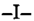

TOMO 318

Volumen 2

1995

1120

ACUERDOS DE LA CORTE SUPREMA

318

Copyright (c) 1997 by Corte Suprema de Justicia de la Nación Queda hecho el depósito que previene la ley 11.723. Impreso en la Argentina Printed in Argentina

DE JUSTICIA DE LA NACION

318

1121

## R E P U B L I C A A R G E N T I N A

FALLOS

DE  LA

C O R T E

S U P R E M A

DE

## J USTICIA DE LA N ACION

PUBLICACION A CARGO DE LA SECRETARIA DE JURISPRUDENCIA DEL TRIBUNAL

TOMO 318 - VOLUMEN 2

JUNIO - SEPTIEMBRE

LA LEY S.A.E. e I.

Tucumán 1471 (1050) Buenos Aires 1995

## HOJA COMPLEMENTARIA

Hoja incorporada a los efectos de permitir la búsqueda por página dentro del Volumen.

DE JUSTICIA DE LA NACION

318

1123

## A C U E R D O S   D E   L A   C O R T E   S U P R E M A

## AÑO 1995

## JUNIO - SEPTIEMBRE

DR. EDUARDO DALMACIO CRAVIOTTO. SU FALLECIMIENTO.

-N o 26-

En Buenos Aires, a los 20 días del mes de junio del año mil novecientos noventa y cinco, reunidos en la Sala de Acuerdos del Tribunal, los señores Ministros que suscriben la presente,

## Consideraron:

Que el día 18 del corriente mes ocurrió el fallecimiento del Doctor Eduardo Dalmacio Craviotto, juez de la Cámara Nacional de Apelaciones en lo Civil y Comercial Federal de esta Capital Federal y ex Secretario de esta Corte Suprema de Justicia de la Nación.

Que es deber del Tribunal asociarse al duelo que provoca la desaparición del distinguido Magistrado.

Por ello,

Acordaron:

Dirigir nota de condolencia a la familia del extinto con transcripción de la presente acordada.

Todo lo cual dispusieron y mandaron, ordenando que se comunicase y registrase en el libro correspondiente, por ante mí, que doy fe.  - JULIO S. NAZARENO - EDUARDO MOLINÉ O'CONNOR - CARLOS S. FAYT - AUGUSTO CÉSAR BELLUSCIO - ENRIQUE SANTIAGO PETRACCHI - RICARDO LEVENE (H.) - GUILLERMO A. F. LÓPEZ Jorge Alejandro Magnoni (Secretario).

## ACUERDOS DE LA CORTE SUPREMA

## AUTORIDADES DE FERIA DE JULIO DE 1995.

## -N o 27-

En Buenos Aires, a los 6 días del mes de julio del año mil novecientos noventa y cinco, reunidos en la Sala de Acuerdos del Tribunal, los señores Ministros que suscriben la presente,

## Resolvieron:

- I) Designar como autoridades de feria del mes de julio del corriente año:
- 1 o ) Al doctor Gustavo A. Bossert -1ra. semana- y al doctor Guillermo A. F. López -2da. semana- como jueces de feria.
- 2 o ) A la doctora María Cristina Alvarez de Magliano -2da. semana- y al doctor Jorge Morán -las dos semanas- como secretarios del Tribunal.
- II)  Establecer el horario de atención al público de lunes a viernes, desde las 8 hasta las 12 horas.
- III) El personal que preste funciones durante la feria judicial deberá acreditarlo mediante certificación otorgada por los señores secretarios de feria.

Todo lo cual dispusieron y mandaron, ordenando que se comunicase y registrase en el libro correspondiente, por ante mí, que doy fe.  - JULIO S. NAZARENO - CARLOS S. FAYT - AUGUSTO CÉSAR BELLUSCIO - ENRIQUE SANTIAGO PETRACCHI - RICARDO LEVENE (H.) - ANTONIO BOGGIANO - GUILLERMO A. F. LÓPEZ - GUSTAVO A. BOSSERT Jorge Alejandro Magnoni (Secretario).

## CORTE SUPREMA. PERITOS.

## -N o 28-

En Buenos Aires, a los 18 días del mes de julio del año mil novecientos noventa y cinco, reunidos en la Sala de Acuerdos del Tribunal, los señores Ministros que suscriben la presente,

## Consideraron:

Las solicitudes formuladas en los expedientes de la Secretaría Acordada 63/92 Nros. 750/94, 794/94, 811/94, 887/94 y 923/94 y la opinión favorable del titular de la Secretaría de Juicios Originarios en las mencionadas actuaciones.

Por ello,

## Acordaron:

1 o ) Incluir en la nómina de especialidades que forma parte de la acordada N  52/92 o a  las  siguientes:  ingenieros  especializados  en  medio  ambiente  y  contaminación  de ecosistemas, ingenieros textiles, analistas de sistemas, ingenieros aeronáuticos y espaciales, especialistas en lingüística y semiología.

Todo lo cual dispusieron y mandaron, ordenando que se comunicase y registrase en el libro correspondiente, por ante mí, que doy fe.  - CARLOS S. FAYT - AUGUSTO CÉSAR BELLUSCIO - RICARDO LEVENE (H.) - GUILLERMO A. LÓPEZ - ENRIQUE SANTIAGO PETRACCHI Javier M. Leal de Ibarra (Secretario).

## ARANCEL DE SERVICIOS Y ACTIVIDADES ADMINISTRATIVAS.

## -N o 29-

En Buenos Aires, a los 10 días del mes de agosto del año mil novecientos noventa y cinco, los señores Ministros que suscriben la presente,

## Consideraron:

Que, por acordada 15/91 esta Corte aranceló distintos servicios y actividades administrativas que presta el Poder Judicial de la Nación.

Que, ante un nuevo examen de la cuestión, teniendo en cuenta la experiencia lograda hasta el presente, el Tribunal advierte que es menester dictar una nueva reglamentación.

Por ello,

## Acordaron:

- 1 o ) Dejar sin efecto la acordada 15, dictada el 18 de junio de 1991 y todas aquellas acordadas y resoluciones que se opongan a la presente.
- 2 o ) Arancelar, a partir del 1  de octubre de 1995 -en las sumas que se determinan o para cada caso- las siguientes solicitudes, con excepción de las que realicen miembros del Poder Judicial de la Nación o provinciales y funcionarios dependientes de los otros poderes:

## DE JUSTICIA DE LA NACION

- a) Inscripción de peritos, síndicos y martilleros -cincuenta pesos ($50)-.
- b) Denuncias formuladas por particulares ante el Cuerpo de Auditores Judiciales -diez pesos ($10)-. En caso de ser admitida la veracidad de los hechos puestos en conocimiento de la Corte, se reintegrará al denunciante.
- c) Expedición de certificados y testimonios -diez pesos ($10)-.
- d) Consultas a las oficinas de jurisprudencia -cinco pesos ($5)-.
- e) La impresión de la consulta de jurisprudencia efectuada por sistema informático -un peso ($1) por cada cuatro hojas impresas-.
- f) Las solicitudes de expedición de fotocopias de resoluciones, sentencias, etc. un peso ($1), debiendo adicionarse un peso ($1) por cada 10 fotocopias que se entreguen al interesado-.
- g)  Certificación  sobre  la  autenticidad  de  la  fotocopias  -un  peso  ($1),  debiendo adicionarse un peso ($1) por cada cinco fotocopias que sean certificadas-.
- h) Venta de los boletines de jurisprudencia -cinco pesos ($5)-.
- i) Certificaciones de firmas -cinco pesos ($5)-.
- j) Oficios que ingresen al archivo solicitando fotocopias, certificados, remisiones, etc. (con excepción de los casos previstos en el art. 30 del reglamento aprobado por la acordada 30/81) -dos pesos ($2)-.
- k) Consultas de expedientes archivados -diez pesos ($10)-.
- l) Informes brindados por el archivo público -dos pesos ($2) para el trámite normal y cinco pesos ($ 5) más si el trámite es urgente.
- 2 o ) Encomendar a la Prosecretaría del tribunal la instrumentación de la presente, disponiendo para el pago de los aranceles fijados, el uso de estampillas, de conformidad con el convenio oportunamente suscripto con el Banco de la Ciudad de Buenos Aires para los tribunales y organismos con asiento en la Capital Federal; y en las ciudades sede de los Tribunales Federales con asiento en el interior del país a través de las habilitaciones respectivas.

Todo lo cual dispusieron y mandaron, ordenando que se comunicase y registrase en el libro correspondiente, por ante mí, que doy fe.  - JULIO S. NAZARENO - AUGUSTO CÉSAR BELLUSCIO - ENRIQUE SANTIAGO PETRACCHI - ANTONIO BOGGIANO - GUSTAVO A. BOSSERT Javier María Leal de Ibarra (Secretario).

## DE JUSTICIA DE LA NACION 318

## CORTE SUPREMA. PERITOS.

-N o 30-

## NOMINA DE ESPECIALIDADES

(Acordadas nros. 25/85, 45/85, 59/86, 37/88, 41/89, 52/90, 41/91, 68/92 y 28/95)

ACTUARIOS

AGRIMENSORES

ANALISTAS DE SISTEMAS

ARQUITECTOS

Dres. en CIENCIAS ECONOMICAS

Dres. en QUIMICA

ENOLOGOS FRUTICULTORES

ESPECIALISTAS EN ESTADISTICAS

ESPECIALISTAS EN IMAGENES SATELITALES

ESPECIALISTAS EN LINGÜISTICA Y SEMIOLOGIA

FOTOINTERPRETES

GEOLOGOS

HIDROGEOLOGOS

ING. CIVILES

ING. ELECTRONICOS

ING. c/ ESPECIALIDAD EN HIDRAULICA

ING. INDUSTRIALES

ING. MECANICOS

ING. EN PETROLEO

ING. GEODESTAS GEOFISICOS

ING. QUIMICOS

ING. EN TELECOMUNICACIONES

ING. AGRONOMO

ING. ESPECIALIDAD MEDIO AMBIENTE Y CONTAMINACION DE ECOSISTEMAS

ING. TEXTILES

ING. AERONAUTICOS Y ESPACIALES

LICENCIADO EN ECONOMIA

METEOROLOGOS

PERITOS DE ARTE

VETERINARIOS

Javier María Leal de Ibarra (Secretario).

## OBRA SOCIAL DEL PODER JUDICIAL. APROBACION DE MEMORIA Y BALANCE.

-N o 31-

En Buenos Aires, a los 15 días del mes de agosto del año mil novecientos noventa y cinco, reunidos en la Sala de Acuerdos del Tribunal, los señores Ministros que suscriben la presente,

Consideraron:

Que las Memorias y Balances Generales cerrados el día 31 de diciembre de 1992 y de 1993, presentados por el señor Director General de la Obra Social del Poder Judicial de la Nación, dieron cumplimiento a lo dispuesto por el art. 17 , inciso i) de sus Estatuo tos.

Que el informe técnico obrante a fs. 589/598 indica que tales documentos reflejan aceptablemente la situación patrimonial, económica y financiera de la mencionada institución por lo cual aconseja su aprobación.

Por ello,

Acordaron:

Aprobar las Memorias y Balances Generales correspondientes a los Ejercicios 1992 y 1993 presentados por la Dirección General de la Obra Social del Poder Judicial de la Nación.

Todo lo cual dispusieron y mandaron, ordenando que se comunicase y registrase en el libro correspondiente, por ante mí, que doy fe.  - JULIO S. NAZARENO - EDUARDO MOLINÉ O'CONNOR - AUGUSTO CÉSAR BELLUSCIO - RICARDO LEVENE (H.) - ANTONIO BOGGIANO - GUILLERMO A. F LÓPEZ - GUSTAVO A. BOSSERT Jorge Alejandro Magnoni (Secretario).

ADMINISTRACION GENERAL DE LA CORTE SUPREMA DE JUSTICIA DE LA NACION.

-N o 32-

En Buenos Aires, a los 17 días del mes de agosto del año mil novecientos noventa y cinco, reunidos en la Sala de Acuerdos del Tribunal, los señores Ministros que suscriben la presente,

## Consideraron:

1 o ) Que para el mejor ejercicio de las funciones vinculadas a la administración del Poder Judicial, esta Corte dispuso en un primer momento la creación de la Secretaría de Superintendencia (Fallos 204: 12), que luego dividió en la Administrativa y Judicial, en razón de la 'diversidad y volumen' de las funciones que le habían sido originariamente encomendadas (Acordada 8/84). En un afín orden de ideas, con posterioridad fue creado el Cuerpo de Auditores Judiciales (Acordada 84/90), al cual se asignaron facultades que hasta entonces eran ejercidas por la Secretaría de Superintendencia Judicial. Asimismo, el Tribunal dispuso poner en funcionamiento un consejo de Administración -constituido por tres de sus integrantes-, que fue luego dejado sin efecto. Por último, mediante la Acordada 63/92 se resolvió asignar a un nuevo secretario del Tribunal facultades de índole administrativa que fueron detraídas de otras secretarías.

La evolución reseñada no agota, por cierto, la creación de numerosas y disímiles dependencias en el área administrativa del Poder Judicial, que ha dado lugar a un complejo organigrama de direcciones, subdirecciones, departamentos, centros y unidades, que presenta particularidades que, advertidas por esta Corte, fueron también puestas de relieve por la Auditoría General de la Nación y por otros organismos -externos e internos- a los que, con el objeto de contar con un diagnóstico fehaciente y objetivo, oportunamente les fue encargada la realización de estudios sobre la cuestión.

- 2 o ) Que, cabe enfatizar, que aquél crecimiento obedeció a la necesidad de responder al significativo aumento de las estructuras jurisdiccionales, federales y nacionales, que fueron instituidas por distintas leyes entradas en vigencia en la última década. A lo  que  hay  que  agregar,  con  análoga  incidencia,  la  alteración  de  las  circunstancias económicas que en numerosas oportunidades exigieron al Tribunal, autoabastecer sus requerimientos ante la imposibilidad de afrontar compromisos con proveedores, constructores o prestadores de servicios, externos a su estructura funcional.
- 3 o )  Que resulta necesario coordinar y racionalizar el ejercicio de las funciones y estructuras administrativas, para lo cual este Tribunal considera conveniente contratar un Administrador General de la Corte Suprema de Justicia de la Nación, con rango de Secretario de Corte, bajo la directa dependencia del Sr. Presidente del Tribunal, que suscribirá un contrato que éste podrá renovar con quién resulte seleccionado.
- 4 o ) Que el Administrador General coordinará el funcionamiento de las Secretarías de Superintendencia Administrativa, de Superintendencia Judicial, del Cuerpo de Auditores Judiciales y de todas las funciones que le fueron asignadas al secretario aludido en la Acordada 63/92, y ejercerá -en el caso de que mediare delegación por parte del Presidente del Tribunal- todas las tareas de superintendencia que a éste le corresponden.

Por ello,

Acordaron:

- 1 o ) Autorizar la contratación de un Administrador General de la Corte Suprema de Justicia de la Nación, con jerarquía de Secretario General y bajo la dependencia directa del Presidente del Tribunal, el cual suscribirá un contrato que podrá renovar

con quien resulte seleccionado y dispondrá todas las medidas que sean necesarias para su inmediata asunción del cargo.

- 2 o )  Establecer que el Administrador General coordine el funcionamiento de las Secretarías de Superintendencia Judicial, de Superintendencia Administrativa, del Cuerpo de Auditores Judiciales y de las funciones asignadas al secretario aludido en la Acordada 63/92, y ejerza todas las facultades que sean delegadas por el Presidente del Tribunal en los términos del considerando 4 ) de la presente. o

Todo lo cual dispusieron y mandaron, ordenando que se comunicase y registrase en el libro correspondiente, por ante mí, que doy fe.  - JULIO S. NAZARENO - EDUARDO MOLINÉ O'CONNOR - CARLOS S. FAYT - AUGUSTO CÉSAR BELLUSCIO - ENRIQUE SANTIAGO PETRACCHI - RICARDO LEVENE (H.) - ANTONIO BOGGIANO - GUILLERMO A. LÓPEZ - GUSTAVO A. BOSSERT Jorge Alejandro Magnoni (Secretario).

## PRESUPUESTO DEL PODER JUDICIAL.

## -N o 33-

En Buenos Aires, a los 18 días del mes de agosto del año mil novecientos noventa y cinco, reunidos en la Sala de Acuerdos del Tribunal, los señores Ministros que suscriben la presente,

## Consideraron:

- I) Que corresponde a esta Corte Suprema de Justicia, como cabeza del Poder Judicial  de  la  Nación,  estimar  el  presupuesto  correspondiente al ejercicio fiscal del año 1996 a fin de remitirlo al Poder Ejecutivo para su posterior envío al Honorable Congreso de la Nación.
- II) Que una vez más se ha tenido en cuenta la restricción de gastos que impone la situación general de país, por lo que el presente cálculo se ha realizado en el contexto de máxima austeridad.
- III) Que se ha intentado reducir al mínimo los gastos corrientes e inversiones sin olvidar los distintos tribunales y organismos del ministerio público creados, con magistrados y titulares ya designados en alguno de ellos, y pendientes de habilitación.
- IV) Que se han recibido recientemente las pautas elaboradas por el Ministerio de Economía y Obras y Servicios Públicos en las que se estima -en el rubro específicoque el Poder Judicial deberá compensar con su presupuesto las erogaciones que se deriven del funcionamiento del futuro Consejo de la Magistratura y del Ministerio Público en el contexto de la reciente reforma constitucional, entre otras consideraciones.

Que con relación a la aludida compensación cabe señalarse la imposibilidad de encararla en tanto no se han reglamentado aún ambos institutos, más allá de apreciar, en base de la erogación en sueldos que la proporción que corresponde al Ministerio Público es aproximadamente del orden del 12%.

Sobre este particular se ha recibido de la Procuración General de la Nación una enumeración de necesidades que no pueden dejar de tenerse en cuenta como son la organización de su propio servicio administrativo, su sistema informático y la atención en general de las necesidades que hagan a su futuro funcionamiento, lo que se entiende necesario prever.

Es menester destacar que la situación de insuficiencia presupuestaria que está afectando al Poder Judicial de la Nación -en razón de no haber sido previsto en la Ley N o 24.447 el nivel de necesidades consignadas en la acordada CSJN N  56/94 (de presuo puesto para el año 1995), no permitirá afrontar nuevos gastos siendo ya de gran dificultad la atención de sus necesidades presentes, entre los que han quedado pendientes los órganos de contralor de la ley 24.156.

A lo ut-supra consignado debe resaltarse que en el corriente ejercicio 1995 se ha recaudado al 31 de julio el 45 por ciento de lo estimado originalmente en el cálculo de recursos.

Que por ello es motivo de profunda preocupación la posibilidad de que vuelvan a resultar insuficientes los recursos para financiar las erogaciones durante el ejercicio 1996.

Que se observa con intranquilidad que en los niveles comunicados no se ha efectuado previsión alguna para el inciso 4 -Bienes de Uso-, siendo imprescindible la adquisición de mobiliario, máquinas de escribir, libros, equipamiento informático -con especial mención de la continuación de la licitada informatización de la justicia civil de la Capital-, así como la realización de trabajos en numerosos inmuebles judiciales, la continuación de diversos trámites de expropiaciones en marcha y otros elementos propios de funcionamiento.

En esos términos el plan de necesidades de la presente Acordada habrá de superar los niveles comunicados por el Poder Ejecutivo.

V) Una vez más se señala la importancia de lograr un mecanismo anual de ajuste de la alícuota que establece la Ley 23.853 (de autarquía), que guarde relación con la envergadura del Poder Judicial.

Que en este último sentido es de recordar el permanente desarrollo que caracteriza al Poder Judicial por la constante necesidad de habilitar tribunales en distintos lugares del país, producto de un creciente requerimiento del servicio que presta la justicia, atendiendo el notable incremento de expedientes, muchas veces originado en la propia política de recaudación impositiva y previsional; como en otros tantos por el incesante crecimiento de la litigiosidad.

La perspectiva de las innovaciones procesales en práctica (sistema penal oral) y otras en estudio (reforma del procedimiento civil-comercial y laboral; mediación, etc.)

presentan la posibilidad futura de revertir esta tendencia y, por ende, agilizar las tramitaciones, reduciendo al mismo tiempo el número de causas.

VI) Así las cosas deben mencionarse entre otros, y pendientes de habilitación los diez juzgados del trabajo que se crearon por ley 23.640 para los cuales se han designado ya a sus jueces; las Salas recientemente creadas para la Cámara de Apelaciones del Trabajo, los juzgados para ejecuciones previsionales (en trámite). En el interior del país, en la Provincia de Buenos Aires: nuevas vocalías para la Cámara Federal de La Plata y juzgados federales en Lomas de Zamora, Campana, Mar del Plata, Necochea y Reconquista (Provincia de Santa Fe); además de los tribunales federales orales en Santiago del Estero, Corrientes, Santa Cruz, Tierra del Fuego, Córdoba, etc., así como las secretarías para ejecuciones fiscales y previsionales para los juzgados federales, cuya implementación sin duda redundará en una mayor agilidad en los expedientes de ese origen. Por igual motivo, resulta imprescindible contemplar la ampliación de la planta de personal para las mesas de entradas de los juzgados federales en lo civil y comercial de esta Capital, que como es de conocimiento público, se hallan atestadas de causas aguardando su trámite.

En materia de proyectos parlamentarios en trámite debe reiterarse los ya consignadas en la Acordada 56/94 de Presupuesto para el presente año 1995, como ser el fuero de menor cuantía; el contravencional; que de sancionarse impondrá la necesidad de implementar las medidas del caso para su concreción.

VII) Que en relación a lo expuesto en el punto anterior es justo poner de relieve el esfuerzo volcado en atender las necesidades de la prestación del servicio, con muy escasos recursos, lo que ha motivado en no pocas oportunidades contar con la colaboración de gobiernos provinciales, municipios, colegios de abogados y el propio Poder Ejecutivo que lo hiciera con edificios y elementos desafectados de otros órganos del Estado. En este último sentido cabe destacar la colaboración de diversas instituciones públicas que han cedido mobiliario y máquinas de escribir que se han podido reciclar y devolverlos a su vida útil.

De esa forma se ha aligerado el nivel de gastos.

Debe destacarse la permanente contribución de los señores magistrados y demás integrantes del Poder Judicial que de su propio peculio han venido y siguen cubriendo parte de las necesidades del servicio diario.

Es de esperar que la situación general del país permita ir contando en el futuro con los medios tanto de infraestructura como de equipamiento, adecuados a la función.

VIII) Como se consignara en anteriores Acordadas se pone de manifiesto la permanente preocupación que aqueja a este Poder Judicial por el futuro previsional de sus integrantes.

No está de más recordar la justicia de resguardar un régimen que atienda a la naturaleza de un servicio de tal responsabilidad, dedicación y consagración, que se prolonga durante la vida útil del individuo.

IX) Que al no haber sido contemplado en la Ley 24.447 de presupuesto para el presente ejercicio, es menester insistir una vez más en la necesidad de regularizar los

suplementos por zona y por trabajo insalubre (en los términos de la Acordada C.S.J.N. N o 71/93).

X) Que también se reitera la existencia de los juicios iniciados por magistrados y funcionarios en actividad y retirados por los que se reclaman diferencias salariales. Estas acciones -de prosperar- originarán una erogación que no podrá ser atendida por esta Corte, motivo por el cual se solicita al Poder Administrador se adopten las previsiones presupuestarias pertinentes.

XI) Tal como se adelantara ut-supra , en el punto IV) se ha contemplado en esta Acordada -en la forma habitual- el gasto correspondiente al Ministerio Público por lo que al efectuarse su separación deberán reducirse las distintas partidas -excepto el inciso 5- en el orden del 12%. Este cálculo se realiza teniendo en cuenta la cantidad de personal que revista en el ministerio dada la dificultad que representa hacerlo sobre las demás erogaciones en la medida en que se comparten en casi todos los casos, los asientos físicos, los bienes, siendo común el servicio administrativo.

Por ello,

Acordaron:

1 o ) Establecer el proyecto de presupuesto de gastos del Poder Judicial de la Nación para el ejercicio financiero del año 1996, a efectos de obtener su financiamiento a la suma de pesos SETECIENTOS NOVENTA Y CUATRO MILLONES OCHOCIENTOS CATORCE MIL ($794.814.000) conforme al siguiente detalle:

| Inciso 1 - Personal                | $ 634.892.000.   |
|------------------------------------|------------------|
| Inciso 2 - Bienes de Consumo       | $   16.143.000.  |
| Inciso 3 - Servicios no Personales | $   49.296.000.  |
| Inciso 4 - Bienes de Uso           | $   76.275.000.  |
| Inciso 5 - Transferencias          | $   18.208.000.  |

2 o ) Solicitar a los Poderes Ejecutivo y Legislativo su intervención para resguardar la situación previsional de los señores Magistrados y Funcionarios del Poder Judicial al amparo de un sistema que reconozca las especiales exigencias del servicio de justicia.

- 3 o ) Solicitar, asimismo, al Poder Ejecutivo que adopte las previsiones correspondientes a los efectos señalados en los considerandos IV y X de la presente.
- 4 o ) La Subsecretaría de Administración deberá adoptar los recaudos pertinentes para instrumentar, en su oportunidad, lo prescripto por el artículo 120 de la Constitución Nacional.

Todo lo cual dispusieron y mandaron, ordenando que se comunicase y regístrase en el libro correspondiente, por ante mí, que doy fe.  - EDUARDO MOLINÉ O'CONNOR CARLOS S. FAYT - RICARDO LEVENE (H.) - ANTONIO BOGGIANO - GUILLERMO A. F. LÓPEZ GUSTAVO A. BOSSERT Hugo L. M. Piacentino (Secretario).

## ACUERDOS DE LA CORTE SUPREMA

## SECRETARIA JUDICIAL N o  2 - ASIGNACION DE FUNCIONES A LA SECRETARIA LETRADA.

## -N o 34-

En Buenos Aires, a los 24 días del mes de agosto del año mil novecientos noventa y cinco, reunidos en la Sala de Acuerdos del Tribunal, los señores Ministros que suscriben la presente,

## Consideraron:

Que en razón del aumento de causas en trámite en materia de seguridad social ante la Secretaría Judicial N  2 a cargo del doctor Fernando Vocos, resulta necesario o procurar que dicha circunstancia no incida en la celeridad y eficacia del procedimiento en los expedientes correspondientes,

## Acordaron:

Autorizar a la secretaria letrada doctora Inés E. Cures de Rennella a colaborar con la firma del despacho de trámite y las providencias simples correspondientes a los expedientes de la Secretaría Judicial N  2 (art. 89 R.J.N.). o

Todo lo cual dispusieron y mandaron, ordenando que se comunicase y registrase en el libro correspondiente, por ante mí, que doy fe.  - JULIO S. NAZARENO -  EDUARDO MOLINÉ O'CONNOR - RICARDO LEVENE (H.) - AUGUSTO CÉSAR BELLUSCIO - ENRIQUE SANTIAGO PETRACCHI - GUSTAVO A. BOSSERT -  GUILLERMO A. F. LÓPEZ - ANTONIO BOGGIANO -Jorge Alejandro Magnoni (Secretario).

JEFES DE DEPARTAMENTO. ANTIGÜEDAD.

-N o 35-

En Buenos Aires, a los 24 días del mes de agosto del año mil novecientos noventa y cinco, reunidos en la Sala de Acuerdos del Tribunal, los señores Ministros que suscriben la presente,

## Consideraron:

1 o ) Que por Acordada N  75/93 este Tribunal consideró la situación de los agentes o que, con destacada antigüedad concluyen su carrera en el cargo de prosecretario administrativo.

- 2 o ) Que a tal fin, se dispuso que los prosecretarios administrativos con diez (10) años de antigüedad en el cargo percibieran una remuneración equivalente a la de prosecretario jefe.
- 3 o ) Que, en esa oportunidad no se tuvo en cuenta a los agentes que se desempeñan en cargos superiores al de prosecretario administrativo como los de jefe de departamento y segundo jefe de departamento.
- 4 o ) Que, en consecuencia, estos últimos no pueden acceder al plus que se les otorga a los prosecretarios administrativos, superando éstos los haberes de aquellos que fueron promovidos a cargos superiores por méritos evaluados en su oportunidad.

Por ello,

Acordaron:

- 1 o ) Los jefe de departamento y segundo jefe de departamento que acrediten una antigüedad de diez (10) años en esos cargos o desde que accedieron al de prosecretario administrativo, percibirán una remuneración equivalente a la de prosecretario jefe, conforme a la reglamentación vigente.
- 2 o ) Hacer saber a las dependencias que deberán comunicar a esta Corte las vacantes de los cargos de Jefe de Departamento y 2do. Jefe de Departamento que cuenten en la actualidad como así también las que se produzcan en el futuro a fin de su supresión.

Todo lo cual dispusieron y mandaron, ordenando que se comunicase y registrase en el libro correspondiente, por ante mí, que doy fe.  - JULIO S. NAZARENO - EDUARDO MOLINÉ O'CONNOR - CARLOS S. FAYT - RICARDO LEVENE (H.) - ANTONIO BOGGIANO Jorge Alejandro Magnoni (Secretario).

OFICINA DE ESTADISTICAS. REGLAMENTO.

-N o 36-

En Buenos Aires, a los 29 días del mes de agosto del año mil novecientos noventa y cinco, reunidos en la Sala de Acuerdos del Tribunal, los señores Ministros que suscriben la presente,

## Consideraron:

- 1 o )  Que por acordada 33/92 esta Corte aprobó el Reglamento para la Oficina de Estadísticas del Poder Judicial de la Nación.

2 o )  Que la creación de nuevos fueros y dependencias y los avances tecnológicos operados en el campo de la informática, tornan necesaria la actualización de las disposiciones contenidas en el anexo que integra la referida acordada.

Por ello, y de conformidad con lo solicitado a fs. 204/205 del expediente S-1867/92, y, lo dispuesto en la resolución del Ministerio Público N  2/95 (fs. 275/277 del mismo o expediente).

## Acordaron:

1 o ) Modificar el texto de los artículos 2, inc. c); 7; 24; 25 y 26 del Reglamento para la Oficina de Estadísticas del Poder Judicial de la Nación, los cuales quedarán redactados de la siguiente forma:

Art. 2 , inc. c): 'Organizará un banco de datos con la información generada por o cada uno de los organismos y dependencias del Poder Judicial de la Nación'.

Art. 7: 'La Corte Suprema de Justicia de la Nación, Cuerpos Técnicos Periciales, Archivo General del Poder Judicial de la Nación, Dirección General de Mandamientos y Notificaciones para la Justicia Nacional y Subsecretaría de Administración; Cámara Nacional de Casación Penal; cámaras y juzgados de la Capital Federal y del interior del país; tribunales orales de la Capital Federal y federales del interior del país y juzgados nacionales de ejecución penal, remitirán mensualmente, a partir del 1  de febrero de o cada año, en la forma prevista en el artículo 8 , las planillas actualizadas con el ingreso o y trámite de los expedientes cuyo formato general se presenta en los artículos siguientes'.

Art. 23 (ex artículo 24): 'El presente reglamento rige a partir del año 1993 para la Corte Suprema de Justicia de la Nación y sus dependencias; Cámara Nacional de Casación Penal; fueros en lo Criminal y Correccional Federal, Criminal y Correccional, Penal Económico, Civil, Electoral, del Trabajo, y de la Seguridad Social; tribunales orales de la Capital Federal y federales del interior del país y juzgados nacionales de ejecución penal; y en las jurisdicciones federales de San Martín y La Plata; y a partir de 1994 para el fuero Comercial.

Los tribunales, organismos y/o dependencias judiciales que se creen o reestructuren quedarán sujetos a las disposiciones del presente.

Los restantes fueros y jurisdicciones no incluidos en los párrafos anteriores se ajustarán, por el momento, a lo dispuesto en el art. 34 del Reglamento para la Justicia Nacional, y se incorporarán al régimen vigente en la forma prevista por el art. 21" (ex artículo 22).

Art. 24 (ex artículo 24): 'Hasta tanto la Oficina de Estadísticas cuente con los recursos necesarios para procesar mensualmente la información, las Cámaras Nacionales de Apelaciones en lo Criminal y Correccional Federal, en lo Criminal y Correccional y en lo Penal Económico confeccionarán sus estadísticas semestralmente'.

Art. 25 (ex artículo 26): 'Incorpóranse, como parte integrante del presente reglamento, los formularios elaborados de conformidad con lo previsto en el art. 21 (ex artículo 22) y nominados como anexos A, B, C, D, E, F, G, H, I, J, K, L, LL, M y N'.

2 o ) Suprimir el texto del artículo 19 del citado reglamento y corregir la numeración en la forma que corresponda.

Todo lo cual dispusieron y mandaron, ordenando que se comunicase y registrase en el libro correspondiente, por ante mí, que doy fe.  - JULIO S. NAZARENO - EDUARDO MOLINÉ O'CONNOR - AUGUSTO CÉSAR BELLUSCIO -  ENRIQUE SANTIAGO PETRACCHI - ANTONIO BOGGIANO Jorge Alejandro Magnoni (Secretario).

## SERVICIO DE SEGURIDAD Y VIGILANCIA DEL PODER JUDICIAL.

-N o 37-

En Buenos Aires, a los 12 días del mes de septiembre del año mil novecientos noventa y cinco, reunidos en la Sala de Acuerdos del Tribunal, los señores Ministros que suscriben la presente,

## Consideraron:

Que con fecha 6 de septiembre del corriente año, el señor Presidente de la Corte Suprema de Justicia formalizó con el señor Jefe de la Policía Federal Argentina un convenio para reglamentar los servicios de seguridad y vigilancia que ejerce dicha institución a través de la Comisaría del Poder Judicial de la Nación.

Por ello,

Resolvieron:

Aprobar el convenio suscripto el 6 de septiembre del corriente, por el señor Presidente de la Corte Suprema de Justicia de la Nación, doctor don Julio S. Nazareno y el señor Jefe de la Policía Federal Argentina, Comisario General don Adrián Juan Pelacchi para la reglamentación de los servicios de seguridad y vigilancia del Poder Judicial de la Nación.

Todo lo cual dispusieron y mandaron, ordenando que se comunicase y registrase en el libro correspondiente, por ante mí, que doy fe. - JULIO S. NAZARENO - EDUARDO MOLINÉ O'CONNOR - AUGUSTO CÉSAR BELLUSCIO - ANTONIO BOGGIANO -  ENRIQUE SANTIAGO PETRACCHI - GUSTAVO A. BOSSERT - GUILLERMO A. F. LÓPEZ Javier M. Leal de Ibarra (Secretario).

## CONVENIO

En la ciudad de Buenos Aires a los 6 días del mes de septiembre del año mil novecientos noventa y cinco entre el Poder Judicial de la Nación, en adelante 'LA CORTE SUPREMA DE JUSTICIA DE LA NACION' representado en este acto por S.

E.  el  señor  Presidente  de  la  Corte  Suprema  de  Justicia  de  la  Nación,  Dr.  Julio NAZARENO y la Policía Federal Argentina, en adelante 'LA POLICIA FEDERAL ARGENTINA' representada por el señor Jefe de la misma, Comisario General D. Adrián Juan PELACCHI, acuerdan en celebrar el presente convenio, el que se regirá por las cláusulas que siguen a continuación:

PRIMERA: Ambas partes ratifican el contenido del acuerdo suscripto con fecha 19 de agosto de 1981.

SEGUNDA: Conforme lo establecido en el artículo 3  del convenio mencionado o precedentemente, 'LA CORTE SUPREMA DE JUSTICIA DE LA NACION' encomienda a 'POLICIA FEDERAL ARGENTINA' en el marco de las funciones que la misma posee asignadas como Policía del Estado, las responsabilidades que se detallan en los siguientes artículos.

TERCERA: 'LA POLICIA FEDERAL ARGENTINA' deberá asegurar la custodia interna y externa de la sede de los edificios judiciales con asiento en la Capital Federal y en los Tribunales Federales del interior del país.

CUARTA: Dicha custodia consistirá en aquellos procedimientos tendientes a asegurar la protección de personas y bienes que se encuentren en forma permanente o en tránsito en los edificios judiciales, no pudiendo los Magistrados y Funcionarios disponer de los efectivos policiales afectados, móviles, equipos y medios para su beneficio personal o para el de la dependencia a su cargo, salvo expresa autorización de 'LA CORTE SUPREMA DE JUSTICIA DE LA NACION'.

QUINTA: La distribución del personal policial deberá propender a un mayor aprovechamiento de los recursos, estableciendo la cobertura de zonas por efectivo, en lugar de su asignación a determinadas unidades funcionales, en forma tal de privilegiar la seguridad general por sobre la particular.

SEXTA: Durante las horas hábiles de funcionamiento de los tribunales, los agentes policiales que ejercen dicha custodia deberán encontrarse apostados en los lugares previamente asignados y con su uniforme reglamentario, para controlar la circulación de personas e impedir reuniones que dificulten el desplazamiento del personal ocupado del comparendo de detenidos y los diálogos con éstos.

SEPTIMA: Estando prohibido en el horario inhábil el ingreso y permanencia en los edificios judiciales de personas que no justifiquen debidamente su intervención en diligencias judiciales, 'LA POLICIA FEDERAL ARGENTINA' establecerá un servicio de rondas de agentes policiales tendiente a efectuar el consiguiente control.

OCTAVA: 'LA POLICIA FEDERAL ARGENTINA' deberá establecer un sistema de control de acceso por medio de credenciales, para los ingresantes en la zona de despachos de los Sres. Ministros de la Corte Suprema de Justicia de la Nación. Tal procedimiento deberá contemplar un mecanismo de detección de metales.

NOVENA: Durante los días de pago de haberes y subsiguientes al mismo, 'LA POLICIA FEDERAL ARGENTINA' deberá disponer de severas medidas de seguridad, otorgándole a dicho objetivo carácter prioritario y asignando en consecuencia el perso-

nal que considere necesario, para lo cual podrá excepcionalmente desafectar recursos de otros objetivos, previa evaluación del grado de vulnerabilidad de los mismos.

DECIMA: La asignación de custodia a Magistrados y Funcionarios sólo tendrá carácter excepcional y deberá ser previamente evaluada por 'LA CORTE SUPREMA DE JUSTICIA DE LA NACION' con la asistencia técnica de la 'POLICIA FEDERAL ARGENTINA' la que mensualmente informará a la 'CORTE SUPREMA DE JUSTICIA DE LA NACION' la evolución de las razones que sugieran el mantenimiento de dichos servicios.

DECIMA PRIMERA: Igual criterio se aplicará para la custodia de los despachos de los Magistrados y Funcionarios con asiento en la Capital Federal o en los Tribunales Federales del interior del país.

DECIMA SEGUNDA: 'LA CORTE SUPREMA DE JUSTICIA DE LA NACION' deberá mantener actualizada la nómina de efectivos policiales afectados a los servicios establecidos en el presente convenio. A tal efecto, la 'POLICIA FEDERAL ARGENTINA', deberá remitirle la nómina de dicho personal, en la que deberá constar: nombre y apellido, número de legajo personal, rango, objetivo asignado y horario de cobertura.

DECIMA TERCERA: 'LA CORTE SUPREMA DE JUSTICIA DE LA NACION' podrá requerir de la 'POLICIA FEDERAL ARGENTINA' la desafectación de determinado personal por razones de mejor servicio o cuando verifique el incumplimiento por parte de aquél de lo establecido en el presente convenio. Ello, sin perjuicio de solicitar a la 'LA POLICIA FEDERAL ARGENTINA' la aplicación de las sanciones disciplinarias pertinentes, en razón del mantenimiento de la relación jerárquica y administrativa de dichos efectivos con esos mandos superiores.

DECIMA CUARTA: Todo cambio de destino de los efectivos o la desafectación de un objetivo, deberá ser previamente informada a 'LA CORTE SUPREMA DE JUSTICIA DE LA NACION'. En el primer supuesto sólo será admitido en tanto medien razones de servicio debidamente justificadas. En cuanto al segundo, sólo cuando urgentes y graves razones impongan garantizar la seguridad pública y procurando que ello no afecte sustancialmente el desarrollo de las funciones judiciales.

DECIMA QUINTA: En el marco de éste convenio, los requerimientos de personal, móviles, material, equipos y demás recursos que efectúen los Magistrados y Funcionarios del Poder Judicial de la Nación, deberán ser formulados exclusivamente por intermedio de 'LA CORTE SUPREMA DE JUSTICIA DE LA NACION'. Serán desestimadas las solicitudes dirigidas directamente a 'LA POLICIA FEDERAL ARGENTINA'.

DECIMA SEXTA: Con igual criterio que el expresado en las cláusulas cuarta y quinta, 'LA POLICIA FEDERAL ARGENTINA' efectuará un riguroso control en las playas de estacionamiento dependientes de 'LA CORTE SUPREMA DE JUSTICIA DE LA NACION' y en las zonas reservadas a idéntico fin para los automotores oficiales y de Magistrados y Funcionarios del Poder Judicial de la Nación debidamente autorizados por 'LA CORTE SUPREMA DE JUSTICIA DE LA NACION'.

DECIMA SEPTIMA: 'LA POLICIA FEDERAL ARGENTINA' arbitrará los medios tendientes a asegurar el ordenamiento del tránsito vehicular en la zona de los

edificios judiciales, con especial atención en aquellas sedes en las que ingresan y egresan móviles de traslado de personas detenidas.

DECIMA OCTAVA: A través de la Superintendencia de Bomberos, 'LA POLICIA FEDERAL ARGENTINA' efectuará la evaluación de riesgo de los edificios judiciales y brindará el asesoramiento para prevención de siniestros. Semestralmente deberá emitir un informe de evolución.

DECIMA NOVENA: Ambas partes manifiestan su expresa voluntad de implantar lo establecido en el artículo 2  de la Resolución 29/95 dictada por la Corte Suprema de o Justicia de la Nación por lo que destacarán sendos funcionarios para que efectúen el estudio de adecuación de los mecanismos y estructuras existentes que permita el desarrollo de lo contenido en la citada norma.

VIGESIMA: 'LA POLICIA FEDERAL ARGENTINA' cuando razones de gravedad lo justifiquen podrá solicitar la intervención de 'LA CORTE SUPREMA DE JUSTICIA DE LA NACION', para que interprete y resuelva en materia de procedencia de directivas vinculadas con la ejecución del presente convenio. Se firman dos ejemplares del presente convenio de un solo tenor y a un único efecto en el lugar y fecha indicados. JULIO S. NAZARENO - ADRIÁN JUAN PELACCHI.

## TRIBUNALES ORALES. SUBROGANCIA.

-N o 38-

En Buenos Aires, a los 12 días del mes de septiembre del año mil novecientos noventa y cinco, reunidos en la Sala de Acuerdos del Tribunal, los señores Ministros que suscriben la presente,

## Consideraron:

Que la acordada 46/94 estableció el sistema de subrogancia de los tribunales orales en lo criminal federal con asiento en el interior del país.

Que en tal sentido dispuso la forma de integrar los tribunales orales, en caso de vacancia, ausencia o impedimento de uno de sus miembros -puntos 1) y 2)- sin especificar qué organismo deberá desinsacular el vocal para integrar el tribunal.

Que, por lo expuesto, el Tribunal considera necesario adoptar una medida general, indispensable para el correcto funcionamiento del sistema.

Por ello,

Acordaron:

Modificar la acordada 46/94 efectuando el siguiente agregado:

'En todos los casos el requerimiento de magistrado subrogante se dirigirá a la presidencia del tribunal que deberá desinsacular a uno de sus miembros para integrar el tribunal oral. Tal solicitud -salvo razones fundadas- será remitida con una antelación no inferior a los 10 días hábiles, contados desde la fecha en la que habrá de realizarse la diligencia procesal en la cual intervendrá el vocal subrogante.'

Todo lo cual dispusieron y mandaron, ordenando que se comunicase y registrase en el libro correspondiente, por ante mí, que doy fe.  - JULIO S. NAZARENO -  EDUARDO MOLINÉ O'CONNOR - CARLOS S. FAYT - AUGUSTO CÉSAR BELLUSCIO - ENRIQUE SANTIAGO PETRACCHI - GUILLERMO A. F. LÓPEZ Jorge Alejandro Magnoni (Secretario).

## VISITAS DE LA CORTE SUPREMA A TRIBUNALES FEDERALES.

-N o 39-

En Buenos Aires, a los 12 días del mes de septiembre del año mil novecientos noventa y cinco, reunidos en la Sala de Acuerdos del Tribunal, los señores Ministros que suscriben la presente,

## Consideraron:

Que la creación de nuevos tribunales federales, hace necesario adaptar las disposiciones de la acordada 35/86.

Por ello,

Acordaron:

- 1 o ) Modificar el punto 2  de la acordada 35/86 del 9 de septiembre de 1986, el cual o quedará redactado así:
- '2 ) A los efectos de las visitas a realizarse, se considerará dividido el país en las o siguientes nueve zonas:

Zona 1: Cámaras Federales de La Plata, Mar del Plata y Bahía Blanca; Tribunales Orales en lo Criminal Federal de La Plata, Mar del Plata, Bahía Blanca y La Pampa y Juzgados Federales de La Plata, Lomas de Zamora, Junín, Mar del Plata, Azul, Dolores, Bahía Blanca y Santa Rosa.

- Zona 2: Cámaras Federales de Mendoza y Rosario; Tribunales Orales en lo Criminal Federal de Mendoza, San Juan, San Luis y Rosario y Juzgados Federales de Mendoza, San Rafael, San Juan, San Luis, Rosario, San Nicolás y Santa Fe.

Zona 3: Cámara Federal de General Roca; Tribunales Orales en lo Criminal Federal de General Roca y Neuquén y Juzgados Federales de General Roca, Viedma, San Carlos de Bariloche, Neuquén y Zapala.

Zona 4: Cámaras Federales de Paraná y Posadas; Tribunales Orales en lo Criminal Federal de Paraná y Posadas y Juzgados Federales de Paraná, Paso de los Libres, Concepción del Uruguay, Posadas y Eldorado.

Zona 5: Cámara Federal de Resistencia; Tribunal Oral en lo Criminal Federal de Formosa y Juzgados Federales de Resistencia, Formosa y Corrientes.

Zona 6: Cámara Federal de Córdoba; Tribunales Orales en lo Criminal Federal de Córdoba y La Rioja y Juzgados Federales de Córdoba, Bell Ville, Río Cuarto y La Rioja.

Zona 7: Cámara Federal de San Martín; Tribunales Orales en lo Criminal Federal de San Martín y Juzgados Federales de San Martín, San Isidro, Morón y Mercedes.

Zona 8: Cámaras Federales de Tucumán y Salta; Tribunales Orales en lo Criminal Federal de Tucumán, Catamarca, Salta y Jujuy y Juzgados Federales de Tucumán, Catamarca, Santiago del Estero, Salta y Jujuy.

Zona 9: Cámara Federal de Comodoro Rivadavia; Tribunal Oral en lo Criminal Federal de Comodoro Rivadavia; Juzgados Federales de Comodoro Rivadavia, Rawson, Río Gallegos, Ushuaia y Río Grande y Juzgado Nacional Ordinario de Ushuaia'.

2 o ) Distribuir el turno de visitas de la siguiente manera:

Zona 1: Dr. Eduardo Moliné O'Connor; 2: Dr. Gustavo Alberto Bossert; Zona 3: Dr. Guillermo A. F. López; Zona 4: Dr. Antonio Boggiano; Zona 5: Dr. Ricardo Levene (h.); Zona 6: Dr. Julio Salvador Nazareno; Zona 7: Dr. Carlos Santiago Fayt; Zona 8: Dr. Enrique Santiago Petracchi; Zona 9: Dr. Augusto César Belluscio.

3 o ) La distribución dispuesta en el punto anterior regirá hasta el mes de agosto de 1996, en que se procederá a efectuar una nueva con arreglo a lo dispuesto en el punto 3 o de la acordada N  35/86. o

Todo lo cual dispusieron y mandaron, ordenando que se comunicase y registrase en el libro correspondiente, por ante mí, que doy fe. - JULIO S. NAZARENO - EDUARDO MOLINÉ O'CONNOR - CARLOS S. FAYT - AUGUSTO CÉSAR BELLUSCIO - ENRIQUE SANTIAGO PETRACCHI - RICARDO LEVENE (H.) - ANTONIO BOGGIANO - GUILLERMO A. F. LÓPEZ GUSTAVO A. BOSSERT Jorge Alejandro Magnoni (Secretario).

MAGISTRADOS Y FUNCIONARIOS. ESCALAFON.

-N o 40-

En Buenos Aires, a los 28 días del mes de septiembre del año mil novecientos noventa y cinco, reunidos en la Sala de Acuerdos del Tribunal, los señores Ministros que suscriben la presente,

## Consideraron:

Que a fin de lograr una mejor administración de los recursos personales y financieros y atento a lo dispuesto por el art. 120 de la Constitución Nacional, resulta necesario -a partir de la entrada en vigencia de la ley reglamentaria del Ministerio Público- modificar y ordenar los alcances del Anexo I del Escalafón para la Justicia Nacional (magistrados y funcionarios).

Por ello,

Acordaron:

Aprobar el escalafón de magistrados y funcionarios del Poder Judicial de la Nación -con las categorías que se detallan en el anexo I y la tabla de equivalencias que se incorpora- a partir de la fecha de entrada en vigencia de la ley reglamentaria del funcionamiento del Ministerio Público.

Todo lo cual dispusieron y mandaron, ordenando que se comunicase y registrase en el libro correspondiente, por ante mí, que doy fe.  - JULIO S. NAZARENO - EDUARDO MOLINÉ O'CONNOR - AUGUSTO CÉSAR BELLUSCIO - RICARDO LEVENE (H.) - ANTONIO BOGGIANO - GUILLERMO A. F. LÓPEZ Jorge Alejandro Magnoni (Secretario).

## ESCALAFON PARA LA JUSTICIA NACIONAL

## ANEXO I

01.01 Juez de la Corte Suprema

02.01 Juez de Cámara

02.02 Secretario de la Corte Suprema

03.01 Juez de Primera Instancia

03.02 Secretario de Cámara Nacional Electoral

03.03 Secretario Letrado de C. Suprema

03.04 Director General

04.01 Subdirector General

04.02 Director Médico

04.03 Peritos Oficiales

05.01 Secretario de Cámara

05.02 Prosecretario Letrado C. Suprema

06.01 Secretario de Juzgado

06.02 Prosecretario de Cámara

06.03 Prosecretario Jefe

07.01 Prosecretario Administrativo

## CATEGORIAS TRANSITORIAS

25.02 Subsecretario de Matrícula (*)

30.01 Prosecretario de la Corte Suprema (**)

30.06 Prosecretario Jefe de 2da. (**)

1144

55.01 Jefe de Departamento (***)

60.01 2  Jefe de Departamento (***) o

55.04 Jefe de Despacho de 2da. (**)

- (*) En esta categoría no hay agentes en actividad (cfr. ley 23.187).
- (**) En esta categoría no hay agentes en actividad.

(***) Ver acordada 35 del 24/8/95.

|   Cod. act. | denominación de las categorías en el anexo I del escalafón modificado   | equivalencias c/las nuevas Categorías   |
|-------------|-------------------------------------------------------------------------|-----------------------------------------|
|        1.01 | Juez de la Corte Suprema                                                |                                         |
|        3.01 | Procurador General de la Nación                                         |                                         |
|       13.06 | Defensor Oficial ante la Corte                                          |                                         |
|        5.01 | Fiscal General F.N.I. Administrativas                                   |                                         |
|        1.02 | Juez de Cámara                                                          |                                         |
|        1.06 | Juez de Cámara de Casación                                              |                                         |
|        5.02 | Fiscal de Cámara                                                        |                                         |
|        3.02 | Procurador General del Trabajo                                          |                                         |
|        7.01 | Subprocurador Gral. del Trabajo                                         |                                         |
|       10.01 | Asesor de Menores de 2da. Inst.                                         |                                         |
|       13.01 | Defensor de Pobres, Inc. y Aus.                                         |                                         |
|       15.01 | Secretario de la Corte Suprema                                          |                                         |
|       15.02 | Secretario de la Procuración General                                    |                                         |
|        3.03 | Procurador Fiscal de la C. Suprema                                      |                                         |
|        5.03 | Fiscal Adj. Fiscalía N. Invest.                                         |                                         |
|       25.02 | Subsecretario de Matrícula                                              |                                         |
|        1.03 | Juez de 1ra. Instancia                                                  |                                         |
|       15.03 | Secretario de Cámara Nacional Electoral                                 |                                         |
|       30.01 | Prosecretario de Corte Suprema                                          |                                         |
|       15.04 | Secretario Letrado C. Suprema                                           |                                         |
|       15.05 | Secretario Letrado Procuración General                                  |                                         |
|       13.02 | Def. de Pob. Inc. y Aus. 1 y 2  Inst. Inter. o o                        |                                         |
|       35.01 | Director General                                                        |                                         |
|        5.04 | Fiscal de 1ra. Inst.                                                    |                                         |
|       10.02 | Asesor de Menores de 1ra. Inst                                          |                                         |
|       15.06 | Sec. General Fisc. Nac. Inv. Adm.                                       |                                         |
|       13.03 | Def. de Pob. Inc. y Aus. 1  y 2  Inst. o o                              |                                         |
|       40.01 | Subdirector General                                                     |                                         |
|       35.02 | Director Médico                                                         |                                         |
|       45.01 | Perito Médico                                                           |                                         |
|       45.02 | Perito Químico                                                          |                                         |
|       45.03 | Perito Contador                                                         |                                         |
|       45.04 | Perito Calígrafo                                                        |                                         |
|       15.07 | Secretario de Cámara                                                    |                                         |
|       15.15 | Sec. de Ases. de Menores 2da. Inst.                                     |                                         |
|       15.08 | Sec. Letrado Proc. Gral del Trabajo                                     |                                         |
|       15.09 | Sec. Letrado Fisc. Nac. Inv. Admin.                                     |                                         |

|   50.01 | Abogado Pric. Cámara Nac. Electoral   |
|---------|---------------------------------------|
|   25.03 | Subsecretario Legal                   |
|   30.02 | Prosecretario letrado C. Suprema      |
|   15.11 | Secretario de Juzgado                 |
|   15.12 | Secretario Electoral Interior         |
|   30.04 | Prosecretario de Cámara               |
|   15.16 | Secretario Def. C. Suprema y T. Fed.  |
|   30.05 | Prosecretario Electoral               |
|   25.04 | Subsecretario Administrativo          |
|   30.03 | Prosecretario Jefe                    |
|   30.06 | Prosecretario Jefe de 2da.            |
|   55.01 | Jefe de Departamento                  |
|   55.02 | Jefe Contador de la Cámara Comercial  |
|   60.01 | 2do. Jefe de Departamento             |
|   55.04 | Jefe de Despacho de 2da.              |
|   30.07 | Prosecretario Administrativo          |

Jorge A. Magnoni (Secretario).

## HOJA COMPLEMENTARIA

Hoja incorporada a los efectos de permitir la búsqueda por página dentro del Volumen.

DE JUSTICIA DE LA NACION

318

1147

## R E S O L U C I O N E S   D E   L A   C O R T E   S U P R E M A

## AÑO 1995

## JUNIO - SEPTIEMBRE

## OBRA SOCIAL DEL PODER JUDICIAL.  MEDICOS AUDITORES.

-N o 920-

Buenos Aires, 18 de julio de 1995.

Vistas las actuaciones S-41/95 en las cuales el Presidente de la Cámara Federal de Apelaciones de Salta solicita intervención de la cámara en lo relativo a la formación de la nómina de médicos auditores, y

## Considerando:

Que, según lo dispuesto por el art. 21, inc. d) del Estatuto de la Obra Social aprobado por acordada 43/81, son funciones de los directores de los servicios médicos la organización y dirección de los sistemas de control y auditoría tendientes a lograr la mejor prestación de los beneficios.

Que, por otra parte, en el art. 17, inc. e), se halla prescrita la facultad del Director General en materia de contrataciones.

Que, no obstante, parece conveniente que en los casos de designación de médicos auditores en las delegaciones del interior del país, se efectúe una previa consulta a las cámaras de la jurisdicción presuponiéndose que sus integrantes tienen mayor conocimiento de los profesionales que se desempeñan dentro del ámbito donde deberán efectuarse las prestaciones asistenciales.

Por ello, y sin que la directiva implique restringir las funciones otorgadas por el Estatuto,

## Se resuelve:

Poner en conocimiento del señor Director General de la Obra Social del Poder Judicial que antes de celebrar los contratos que incorporen servicios de médicos auditores en el interior del país deberá recabar una nómina de profesionales idóneos a las cámaras de la jurisdicción.

Comunicar a las cámaras federales que la consulta a que se refiere el párrafo anterior requiere trámite breve y por ello deberá ser respondida dentro de los 10 días de formulada, para no afectar la prestación de los servicios cubiertos por la Obra Social.

Regístrese, hágase saber y oportunamente, archívese.  - EDUARDO MOLINÉ O'CONNOR - CARLOS S. FAYT - AUGUSTO CÉSAR BELLUSCIO - ENRIQUE SANTIAGO PETRACCHI - RICARDO LEVENE (H.).

## RESOLUCIONES DEL PRESIDENTE DE LA CORTE SUPREMA

CORTE SUPREMA. ADMINISTRADOR GENERAL.

-N o 1010-

Buenos Aires, 17 de agosto de 1995.

Visto: Lo dispuesto en la Acordada N  32/95, o

Se resuelve:

- 1 o ) Contratar, con jerarquía de Secretario General, al Dr. Nicolás Alfredo Reyes (D.N.I. 6.719.530, clase 1942), como Administrador General de la Corte Suprema de Justicia de la Nación.
- 2 o ) Disponer que el Administrador General redacte un proyecto de reglamento de funciones y competencias del área bajo su coordinación.
- 3 o )  Instruir al Sr. Secretario de Superintendencia Administrativa para que disponga lo necesario a los efectos de dotar inmediatamente al Administrador General de los espacios físicos que permitan su instalación y funcionamiento en el 4  piso del Palao cio de Justicia.

Regístrese y hágase saber. JULIO S. NAZARENO (Presidente).

## CAMARA NACIONAL ELECTORAL. HORAS EXTRAORDINARIAS.

-N o 1075-

Buenos Aires, 30 de agosto de 1995.

Vistas las presentes actuaciones, y

Considerando:

Que mediante convenio de fs. 135, celebrado con el Ministerio del Interior, el Poder Ejecutivo Nacional se comprometió a transferir a esta Corte Suprema la suma de

pesos trescientos setenta mil ($ 370.000.-) para ser destinados al pago de los gastos derivados de la habilitación y realización de servicios personales en el Juzgado Federal con competencia electoral y la Junta Electoral de la ciudad de Buenos Aires, por el período comprendido entre el 1  de septiembre de 1995 y el 31 de octubre de 1995, y de o pesos ciento ochenta mil ($ 180.000.-) para la Cámara Nacional Electoral a fin de atender los gastos de igual origen.

Que, por lo tanto, corresponde dictar las medidas tendientes a reglamentar la inversión de tales fondos.

Por ello,

Se resuelve:

- 1 o ) Autorizar a la Cámara Nacional Electoral a proceder a la habilitación de horas extraordinaria en la Secretaría Electoral dependiente del Juzgado Federal con competencia electoral de esta capital y en su propia sede para los agentes afectados a tareas pre y post comiciales con desempeño en las citadas reparticiones que se encuentran a cargo de la ejecución de actividades electorales. En caso de ser necesario, podrán adjudicarse horas extraordinarias al personal de otras dependencias para desempeñarse fuera de su horario habitual.
- 2 o )  Cada una de las áreas indicadas dispondrá de un número máximo de horas extras para los distintos niveles, a ejecutarse durante el período comprendido entre el 1 o de septiembre y el 31 de octubre de 1995, cuya cantidad y distribución quedan limitadas por los montos indicados en el considerando primero de la presente. Ese lapso podrá ser prorrogado, según razones de servicio y en tanto cuenten con un cupo de horas para ser habilitadas. La facultad para el otorgamiento de servicios personales será ejercida por el juez en atención a las necesidades del área y bajo la supervisión y control de la Cámara.
- 3 o ) La habilitación para realizar tareas electorales será de hasta tres (3) horas por día hábil y de hasta nueve (9) horas por día no laborable para los agentes de la dotación permanente y no permanente del distrito electoral. El secretario y prosecretario electoral de primera instancia no podrán percibir suma alguna por este concepto.

Exceptúase, por la índole especial que revisten las tareas electorales,  a  los prosecretarios administrativos para quienes se deberá requerir previamente autorización a esta Corte justificando la solicitud.

- 4 o ) Establécese la remuneración horaria de las prestaciones que se disponen en la presente en los siguientes valores: Supervisión: $ 7.- y Ejecución: $ 6.-, sumas que estarán sujetas a las pertinentes retenciones previsionales y de obra social.
- 5 o )  El  señor  juez  federal  con  competencia electoral del distrito comunicará a la Cámara Nacional Electoral la nómina del personal autorizado a realizar horas extras consignando la cantidad de horas habilitadas a cada agente. El total de horas extras no podrá superar, en su monto global, los importes establecidos en el considerando prime-

ro, deducidas las sumas destinadas -tanto por la Cámara Nacional Electoral, como por el juzgado con competencia electoral- al pago de los contratos de agentes de planta transitoria.

6 o ) El área remitirá a la Cámara Nacional Electoral -antes del día 5 de cada meslas planillas informativas en las que deberán consignar los siguientes datos: número de legajo, apellido y nombres, número de documento y total de horas efectivamente trabajadas por cada agente en el mes. Esa información deberá ser remitida en forma inmediata a la Subsecretaría de Administración dependiente de esta Corte para su liquidación y pago.

- 7 o ) Autorízase la contratación de agentes en la planta transitoria, con una remuneración equivalente a la suma de pesos quinientos noventa y cinco ($ 595.-) sujetos a retenciones previsionales y de obra social, desde el 1  de septiembre hasta el 31 de o octubre del presente año, venciendo indefectiblemente ese día. La cantidad de agentes por contratar -tanto por la Cámara Nacional Electoral, como por el juzgado con competencia electoral- estará limitada por los montos indicados en el considerando primero de la presente, deducidos los importes destinados al pago de horas extras.

Tales agentes no tendrán derecho al régimen general de licencias existentes para el personal judicial. Les corresponderá -en concepto de vacaciones- un día de descanso por cada veinte (20) de trabajo efectivo y tendrán derecho a justificar las inasistencias por enfermedades de corto tratamiento.

- 8 o ) Los agentes contratados de conformidad a lo establecido por la presente resolución tendrán derecho al cobro de las asignaciones familiares que legalmente les correspondan, no así a otras bonificaciones que benefician al personal judicial.
- 9 o ) El señor juez con competencia electoral en el distrito propondrá a la Cámara Nacional Electoral el nombramiento del personal que le corresponda. Los contratos respectivos serán firmados por el magistrado y, en su caso, por el Secretario de la citada Cámara.
- 10) No será de aplicación al personal por designar que ya se hubiese desempeñado en el Poder Judicial de la Nación lo establecido en el art. 11 del Reglamento para la Justicia Nacional (acordada N  59/92 C.S.J.N.), quienes tendrán prioridad para su cono tratación, salvo que medien razones fundadas.
- 11) La Subsecretaría de Administración informará mensualmente a la Cámara Nacional Electoral y al juzgado con competencia electoral en el distrito, los egresos que se vayan produciendo en las respectivas partidas, a efectos de que puedan disponer el incremento en las tareas, si ello fuera necesario y por razones de servicio, posibilitando el aumento en la habilitación de horas extraordinarias.

Regístrese, hágase saber a la Cámara Nacional Electoral a los fines de su comunicación y remítanse las actuaciones a la Subsecretaría de Administración, a sus efectos. JULIO S. NAZARENO (Presidente).

DE JUSTICIA DE LA NACION

318

## FALLOS DE LA CORTE SUPREMA

## JUNIO

## MUNICIPALIDAD DE DAIREAUX V. PEQUEÑA OBRA DE LA DIVINA PROVIDENCIA

RECURSO EXTRAORDINARIO: Requisitos propios. Sentencia definitiva. Resoluciones anteriores a la sentencia definitiva. Juicios de apremio y ejecutivo.

Tratándose de juicios de apremio, la vía extraordinaria procede, en forma excepcional, cuando resulta manifiesta la inexistencia de deuda exigible, pues lo contrario importa privilegiar un excesivo rigor formal con grave menoscabo de garantías constitucionales.

## JUICIO DE APREMIO.

Los tribunales inferiores se encuentran obligados a tratar y resolver, adecuadamente, en los juicios de apremio, las diferencias fundadas en la inexistencia de deuda, siempre y cuando ello no presuponga el examen de otras cuestiones cuya acreditación excede el limitado ámbito de estos procesos.

## EJECUCION FISCAL.

Si la solución definitiva del caso, sólo requiere la interpretación de la ordenanza general 296/81, ello no afecta el carácter ejecutivo del juicio de apremio intentado.

RECURSO EXTRAORDINARIO: Requisitos propios. Cuestiones no federales. Sentencias arbitrarias. Procedencia del recurso. Falta de fundamentación suficiente.

Si el a quo no se hizo cargo de la defensa opuesta por la demandada -inexistencia de la deuda e impedimento de los jueces para indagar el origen del crédito ejecutado- con el argumento de que excedía el estrecho marco del proceso de ejecución fiscal, cuando la solución del caso sólo requiere la interpretación del art. 1 o de la ordenanza general 296/81 y ello no afecta el carácter ejecutivo de la acción, la sentencia es arbitraria y debe dejarse sin efecto.

1151

RECURSO EXTRAORDINARIO: Requisitos propios. Cuestiones no federales. Sentencias arbitrarias. Procedencia del recurso. Falta de fundamentación suficiente.

La sentencia que no satisface sino en forma aparente la necesidad de ser derivación razonada del derecho vigente con adecuada referencia a los hechos de la causa, es arbitraria y debe ser dejada sin efecto.

## FALLO DE LA CORTE SUPREMA

Buenos Aires, 6 de junio de 1995.

Vistos los autos: 'Municipalidad de Daireaux c/ Pequeña Obra de la Divina Providencia s/ apremio'.

Considerando:

- 1 o ) Que la Suprema Corte de Justicia de la Provincia de Buenos Aires, por mayoría, al revocar la sentencia de la instancia anterior, ordenó llevar adelante la ejecución hasta que el deudor, 'Pequeña Obra de  la  Divina  Providencia',  pague  al  acreedor,  Municipalidad  de Daireaux, la suma reclamada en la demanda. Contra este pronunciamiento aquél interpuso el recurso extraordinario que fue concedido a fs. 251.
- 2 o ) Que para así resolver consideró que en los juicios de apremio en ningún caso puede controvertirse el origen del crédito ejecutado, pues así lo establece el art. 6  del decreto-ley 9122. Esta restricción en las o defensas -señaló- se funda en la presunción de legitimidad que, en virtud de su origen y su naturaleza, acompaña a los respectivos títulos ejecutivos y obedece a la imperiosa necesidad de que el fisco perciba sin mayores dilaciones las sumas que se le adeudan, destinadas a fines de utilidad general.
- 3 o ) Que el recurrente tacha de arbitraria la sentencia impugnada en razón de que aquélla habría prescindido de examinar la defensa fundada en la inexistencia de deuda reclamada. Afirma, en este sentido, que la excepción de inhabilidad de título que opuso se fundó en que no reviste condición de obligada al pago pues, constituyendo una entidad eclesial sin fines de lucro, la ordenanza general 296/81 la exime del tributo reclamado.

- 4 o ) Que los agravios del recurrente suscitan cuestión federal bastante para su examen por la vía elegida, sin que obste a ello que las cuestiones debatidas sean de hecho, prueba y derecho público local y, como regla, ajenas al recurso del art. 14 de la ley 48, toda vez que lo resuelto sobre temas de esa índole admite revisión en supuestos excepcionales cuando -como en el presente- omite ponderar argumentos conducentes para la correcta solución del pleito e importa la aplicación mecánica de una norma legal.
- 5 o ) Que, en efecto, tratándose de juicios de apremio, esta Corte ha admitido en forma excepcional, la procedencia de la vía extraordinaria, cuando resultaba manifiesta la inexistencia de deuda exigible pues lo contrario importaba privilegiar un excesivo rigor formal con grave menoscabo de garantías constitucionales (Fallos: 278:346; 298:626; 302:861, entre otros).
- 6 o ) Que, conforme a ello, los tribunales inferiores también se encuentran obligados a tratar y resolver adecuadamente en tales pleitos, las defensas fundadas en la inexistencia de deuda, siempre y cuando ello no presuponga el examen de otras cuestiones cuya acreditación exceda el limitado ámbito de estos procesos (Fallos: 312:178).
- 7 o ) Que en el sub lite surge de las constancias de autos que la demandada opuso, desde su primera presentación en juicio (fs. 68/74), la defensa basada en la inexistencia de la deuda, pues sostuvo que la ordenanza general 296/81 la exime del pago de la tasa reclamada e, incluso, objetó la constitucionalidad del art. 6  del decreto-ley 9122 (fs. o 70) norma que, en el orden local, impide a los jueces indagar sobre el origen del crédito ejecutado.
- 8 o ) Que, sin embargo, el a quo no se hizo cargo de ninguno de tales planteos sino que, por el contrario, eludió su tratamiento con el argumento de que excedía el estrecho marco del proceso cuando, en rigor, la solución definitiva del caso sólo requiere la interpretación del art. 1 o de la mencionada ordenanza (fs. 77) sin que ello, en la especie, afecte el carácter ejecutivo de la acción promovida.
- 9 o ) Que, en estas condiciones, cabe concluir que la sentencia de la Suprema Corte de Justicia de la Provincia de Buenos Aires, no satisface sino en forma aparente la necesidad de ser derivación del derecho vigente con adecuada referencia a los hechos de la causa, por lo que

corresponde atender los agravios del apelante en cuanto a la arbitrariedad que imputa a lo resuelto.

Por ello, se declara procedente el recurso extraordinario y se deja sin  efecto  el  pronunciamiento  impugnado, con costas a la vencida (art. 68 del Código Procesal Civil y Comercial de la Nación). Vuelvan los autos al tribunal de origen para que, por quien corresponda, proceda a dictar una nueva sentencia con arreglo a la presente. Notifíquese.

JULIO S. NAZARENO - EDUARDO MOLINÉ O'CONNOR - CARLOS S. FAYT RICARDO LEVENE (H.) - ANTONIO BOGGIANO - GUILLERMO A. F. LÓPEZ.

VIDEO CLUB DREAMS V. INSTITUTO NACIONAL DE CINEMATOGRAFIA

RECURSO EXTRAORDINARIO: Requisitos propios. Cuestión federal. Cuestiones federales simples. Interpretación de las leyes federales. Leyes federales de carácter procesal.

El punto de partida del plazo que establece el art. 2  , inc. e) de la ley 16.986 es o una cuestión de índole procesal que, aunque regida por una ley federal, no autoriza, en principio, la intervención de la Corte por la vía del recurso extraordinario.

ACCION DE AMPARO: Actos u omisiones de autoridades públicas. Requisitos. Inexistencia de otras vías.

La existencia de otras vías procesales aptas no es postulable en abstracto, sino que depende en cada caso de la situación concreta de cada demandante, cuya evaluación, como es obvio, es propia del tribunal de grado.

CONSTITUCION NACIONAL: Control de constitucionalidad. Principios generales.

El control de constitucionalidad constituye la primera y principal misión de la Corte.

## ACTOS PROPIOS.

Ni la inscripción por la actora en el registro que ordena crear el art. 4  del decreo to 2736/91, ni el pago del impuesto, traducen una clara voluntad de someterse a las normas de los decretos 2736/91 y 949/92, impugnados de inconstitucionalidad.

## RECURSO DE APELACION.

Entre las facultades del tribunal de grado se encuentra la de seleccionar los agravios que tratará, pudiendo omitir la consideración de aquellos que repute inconducentes.

CONSTITUCION NACIONAL. Control de constitucionalidad. Interés para impugnar la constitucionalidad.

Los decretos 2736/91 y 949/92 emplazan al titular del video club como agente de percepción y lo someten a una serie de obligaciones cuyo incumplimiento acarrea sanciones legales, lo que evidencia el interés jurídico de dicho titular en hacer caer ese régimen.

## REGLAMENTOS DE NECESIDAD.

Corresponde que la Corte estudie la procedencia del ejercicio presidencial de facultades legislativas en materia impositiva sujetas a la existencia de una situación de emergencia.

## REGLAMENTOS DE NECESIDAD.

Corresponde que la Corte estudie si en la especie se hallan presentes las circunstancias de hecho que justifican la adopción de decretos de necesidad y urgencia.

## REGLAMENTOS DE NECESIDAD.

No existen óbices para que la Corte valore la calificación de excepcionalidad y urgencia, lo que no implica un juicio de valor acerca del mérito, oportunidad o conveniencia de la medida sino que deviene imprescindible para admitir o rechazar el ejercicio de la función legislativa por parte del Poder Ejecutivo.

CONSTITUCION NACIONAL: Constitucionalidad e inconstitucionalidad. Decretos nacionales.

El decreto 2736/91, con las modificaciones introducidas por el decreto 949/92, en cuanto crea un hecho imponible distinto del previsto por la ley 17.741, no es compatible con nuestro régimen constitucional, sin que la circunstancia de su recíproca vinculación o parecido permita obviar los alcances del principio de legalidad.

1156

## REGLAMENTOS DE NECESIDAD.

Del principio de legalidad en materia impositiva resulta la invalidez de los decretos de necesidad y urgencia que establecen impuestos.

## REGLAMENTOS DE NECESIDAD.

Los motivos que impulsaron el dictado de los decretos 2736/91 y 949/92 no se exhiben como respuesta a una situación de grave riesgo social que hiciera necesario el dictado de medidas súbitas.

CONSTITUCION NACIONAL. Constitucionalidad e inconstitucionalidad. Decretos nacionales.

La remisión de los decretos 2736/91 y 949/92, al Congreso, dispuesta en esas normas, no satisface el claro requerimiento constitucional de que sea ese órgano, y no otro, quien decida qué impuestos se crearán y quiénes deberán pagarlo.

## REGLAMENTOS DE NECESIDAD.

La consideración por el Congreso de la incidencia del impuesto creado por los decretos 2736/91 y 949/92, en el cálculo de los recursos y gastos del Instituto Nacional de Cinematografía al aprobar el presupuesto, no lo convalida.

ACCION DE AMPARO: Actos u omisiones de autoridades públicas. Requisitos. Ilegalidad o arbitrariedad manifiestas.

Es procedente la acción de amparo contra la intimación efectuada por el Instituto Nacional de Cinematografía fundada en los decretos 2736/91 y 949/92, normas cuya inconstitucionalidad aparece manifiesta: art. 1  de la ley 16.986. o

## REGLAMENTOS DE NECESIDAD.

Aun admitiendo que la Constitución Nacional en su redacción anterior a la reforma de 1994 otorgó validez a los decretos de necesidad y urgencia, ellos no serían idóneos para crear tributos (Voto de los Dres. Enrique Santiago Petracchi y Gustavo A. Bossert).

CONSTITUCION NACIONAL: Derechos y garantías. Generalidades.

Es preciso evitar que el juego de los procedimientos ordinarios torne ilusoria la efectividad  de  las  garantías  constitucionales  (Voto  del  Dr.  Augusto  César Belluscio).

CONSTITUCION NACIONAL: Control de constitucionalidad. Principios generales.

El control de constitucionalidad debe hacerse según las normas fundamentales vigentes al tiempo de aplicación de las disposiciones impugnadas por manifiesta ilegalidad (Voto del Dr. Augusto César Belluscio).

## REGLAMENTOS DE NECESIDAD.

El espíritu y la letra del texto constitucional vigente con anterioridad a la reforma de 1994 no admitía la validez del dictado por el Presidente de la Nación de decretos-leyes que invadieran áreas de competencia legislativa (Voto del Dr. Augusto César Belluscio).

## IMPUESTO: Principios generales.

El poder administrador no puede recaudar ninguna contribución que no haya sido creada por acto legislativo formal (Voto del Dr. Augusto César Belluscio).

CONSTITUCION NACIONAL: Control de constitucionalidad. Principios generales.

Incumbe al Poder Judicial, al juzgar los casos que se le planteen, apreciar si los tributos satisfacen el requisito de legalidad y, en caso contrario, declarar su inconstitucionalidad por falta de causa jurídica (Voto del Dr. Augusto César Belluscio).

## IMPUESTO: Principios generales.

De la ley de presupuesto 24.191 no surge la voluntad del Congreso de imponer un tributo como el contenido en los decretos 2736/91 y 949/92 (Voto del Dr. Augusto César Belluscio).

CONSTITUCION NACIONAL: Constitucionalidad e inconstitucionalidad. Decretos nacionales.

La voluntad legislativa plasmada en la creación del impuesto contemplado en el art. 24, inc. b) de la ley de fomento de la cinematografía nacional (art. 11 de la ley 24.377) no tiene incidencia alguna en la inconstitucionalidad declarada de los decretos 2736/91 y 949/92 (Voto del Dr. Augusto César Belluscio).

ACCION DE AMPARO: Actos u omisiones de autoridades públicas. Requisitos. Otros requisitos.

No es arbitraria la sentencia que interpretó que el inc. e) del art. 2  de la ley o 16.986 se refiere al acto de intimación a ingresar el tributo establecido por los

decretos 2736/91 y 949/92, y que a partir de su acaecimiento debe contarse el plazo en él establecido (Voto del Dr. Antonio Boggiano).

## REGLAMENTOS DE NECESIDAD.

La mera conveniencia de que por un mecanismo más eficaz se consiga un objetivo de gobierno, en modo alguno justifica la franca violación de una separación de poderes que supone la asunción por parte de uno de ellos de competencias que sin lugar a dudas le pertenecen a otro (Voto del Dr. Antonio Boggiano).

CONSTITUCION NACIONAL: Constitucionalidad e inconstitucionalidad. Decretos nacionales.

La ulterior remisión de los decretos 2736/91 y 949/92, al Congreso, no satisface el  claro  requerimiento constitucional de que sea ese órgano, y no otro, quien decida qué impuestos se crearán y quiénes deberán pagarlos (Voto del Dr. Antonio Boggiano).

CONSTITUCION NACIONAL: Constitucionalidad e inconstitucionalidad. Decretos nacionales.

La consideración por el Congreso de la incidencia del impuesto creado por los decretos 2736/91 y 949/92, en el cálculo de recursos y gastos al aprobar el presupuesto, carece de efectos convalidatorios (Voto del Dr. Antonio Boggiano).

## PODER JUDICIAL.

No compete a los jueces valorar la oportunidad, el mérito o el acierto de las decisiones de los otros poderes (Voto del Dr. Antonio Boggiano).

## IMPUESTO: principios generales.

Compete al Congreso la eventual decisión política que entraña la creación de un impuesto para beneficiar la cinematografía, con arreglo a nuestro sistema constitucional de división funcional del poder (Voto del Dr. Antonio Boggiano).

ACCION DE AMPARO: Actos u omisiones de autoridades públicas. Requisitos. Ilegalidad o arbitrariedad manifiestas.

Reúne los recaudos que habilitan la procedencia de la acción de amparo (art. 1 o de  la  ley  16.986)  la  intimación  que  se  sustenta  en  una  norma  cuya inconstitucionalidad aparece manifiesta (Voto del Dr. Antonio Boggiano).

## DE JUSTICIA DE LA NACION

RECURSO EXTRAORDINARIO: Requisitos propios. Cuestión federal. cuestiones federales simples. Interpretación de las leyes federales. Leyes federales de carácter procesal.

Es cuestión federal determinar si en el caso se encuentran reunidos los extremos que posibiliten acceder a la vía del remedio excepcional del amparo establecido en la ley 16.986 (Disidencia parcial del Dr. Eduardo Moliné O'Connor).

## RECURSO EXTRAORDINARIO: Gravedad institucional.

La índole procesal de algunos de los preceptos en juego no obsta a la admisibilidad del recurso extraordinario cuando la controversia suscitada excede el mero interés de las partes involucradas e interesa a la comunidad íntegramente considerada, por los valores comprometidos (Disidencia parcial del Dr. Eduardo Moliné O'Connor).

CONSTITUCION NACIONAL: Control de constitucionalidad. Principios generales.

La supremacía de la Constitución no se ha de considerar subordinada a las leyes ordinarias (Disidencia parcial del Dr. Eduardo Moliné O'Connor).

CONSTITUCION NACIONAL: Control de constitucionalidad. Principios generales.

Las leyes ordinarias y las construcciones técnicas edificadas sobre ellas, tienen solamente un valor relativo, esto es, presuponen las reservas necesarias para que su aplicación no menoscabe o ponga en peligro los fines esenciales de la Ley Suprema (Disidencia parcial del Dr. Eduardo Moliné O'Connor).

CONSTITUCION NACIONAL: Control de constitucionalidad. Principios generales.

Todas las construcciones técnicas, todas las doctrinas generales no impuestas por la Constitución, valen en la Corte sólo 'en principio', salvo la Constitución misma, que ella sí, y sólo ella, vale absolutamente (Disidencia parcial del Dr. Eduardo Moliné O'Connor).

CONSTITUCION NACIONAL: Derechos y garantías. Generalidades.

Es preciso evitar que el juego de los procedimientos ordinarios torne ilusoria la efectividad de las garantías constitucionales (Disidencia parcial del Dr. Eduardo Moliné O'Connor).

ACCION DE AMPARO: Actos u omisiones de autoridades públicas. Requisitos. Otros requisitos.

El art. 2 , inc. e) de la ley 16.986, en cuanto impone la necesidad de presentar la o demanda de amparo dentro de los 15 días hábiles a partir de la fecha en que el

acto fue ejecutado o debió producirse, no es un escollo insalvable cuando con la acción incoada se enjuicia una ilegalidad continuada, sin solución de continuidad, originada tiempo antes de recurrir a la justicia, pero mantenida al momento de accionar y también en el tiempo siguiente (Disidencia parcial del Dr. Eduardo Moliné O'Connor).

## ACTOS PROPIOS.

La regla según la cual el sometimiento a la norma veda su impugnación con base en la Constitución Nacional, requiere que medie un cumplimento voluntario que pueda entenderse como una renuncia al cuestionamiento ulterior de la norma (Disidencia parcial del Dr. Eduardo Moliné O'Connor).

## ACTOS PROPIOS.

La inscripción en los registros creados por la resolución 52/92 del Instituto Nacional de Cinematografía no implica el consentimiento a la gabela allí prevista si la falta de inscripción expondría a una situación insostenible en el mercado (Disidencia parcial del Dr. Eduardo Moliné O'Connor).

ACCION DE AMPARO: Actos u omisiones de autoridades públicas. Requisitos. Inexistencia de otras vías.

La existencia de otras vías aptas para la tutela de los derechos reclamados (art. 2  de la ley 16.986) se presenta con características netamente procesales, lo o que permite su remoción cuando su aplicación menoscabe o ponga en peligro los fines esenciales de la Ley Suprema (Disidencia parcial del Dr. Eduardo Moliné O'Connor).

CONSTITUCION NACIONAL: Control de constitucionalidad. Interés para impugnar la constitucionalidad.

No puede fundarse la falta de legitimación para impugnar la constitucionalidad del impuesto creado por los decretos 2736/91 y 949/92, en que la actora puede adicionar el tributo al precio que percibe, pues su interés legítimo emana de la carga impuesta personalmente, cuyo incumplimiento le acarrearía una serie de consecuencias que afectan o restringen su esfera jurídica individual y lo tornan pasivo de graves sanciones (Disidencia parcial del Dr. Eduardo Moliné O'Connor).

## IMPUESTO: Principios generales.

El principio de reserva de la ley tributaria, de rango constitucional y propio del Estado de Derecho, únicamente admite que una norma jurídica con la naturaleza de ley formal tipifique el hecho que se considera imponible y que constituirá la posterior causa de la obligación tributaria, por más que se motive la resolu-

ción adoptada en genéricas pautas de políticas fijadas por las autoridades económicas y la existencia de un estado de calamidad económica interna (Disidencia parcial del Dr. Eduardo Moliné O'Connor).

## IMPUESTO: Principios generales.

Los motivos que impulsaron el dictado de los decretos 2736/91 y 949/92, no se exhiben como respuesta a una situación de grave riesgo social que haga necesario el dictado de medidas súbitas (Disidencia parcial del Dr. Eduardo Moliné O'Connor).

## FALLO DE LA CORTE SUPREMA

Buenos Aires, 6 de junio de 1995.

Vistos los autos: 'Video Club Dreams c/ Instituto Nacional de Cinematografía s/ amparo'.

Considerando:

- 1 o ) Que contra la sentencia de la Sala III de la Cámara de Apelaciones en lo Contencioso Administrativo Federal que confirmó la de primera instancia que había hecho lugar a la acción de amparo, declarando la inconstitucionalidad de los decretos 2736/91 y 949/92 y anulado la intimación al actor realizada en aplicación de esas normas, la Procuración del Tesoro de la Nación interpuso recurso extraordinario que fue concedido.
- 2 o ) Que para arribar a ese resultado el a quo desestimó los planteos referentes a la extemporaneidad del plazo previsto para la interposición de la demanda, a la vez que rechazó los relativos a la invocada falta de legitimación de la parte actora y la existencia de otras vías procesales aptas para el ejercicio de los derechos invocados. En cuanto al fondo de la cuestión sostuvo que los decretos 2736/91 y 949/92 crean impuestos, determinan los sujetos obligados al pago, fijan la base imponible y la alícuota correspondiente, modifican la ley 17.741 en lo que atañe a las facultades de inspección y verificación, tipifican infracciones y sanciones, erigiendo de tal modo al Instituto Nacional de Ci-

nematografía en juez administrativo con facultades de control y fiscalización.

Sobre dicha base señaló que la solución de la controversia pasa por la pertinente aplicación del principio de legalidad tributaria y la reserva constitucional de ley formal para la imposición de tributos, imposibles de obviarse mediante el dictado de decretos de necesidad y urgencia.

3 o ) Que contra lo así resuelto, la Procuración del Tesoro de la Nación dedujo el recurso extraordinario de fs. 68/99, con sustento en la tacha de arbitrariedad en el tratamiento de los siguientes tópicos: a) la cuestión atinente al cómputo del plazo para interponer el amparo; b) la idoneidad de la vía elegida, a la luz de otros remedios aptos para la tutela de los derechos que se dicen comprometidos; c) lo relativo a los actos propios de la actora. Expresa que la accionante, al inscribirse en los registros del organismo demandado y depositar los importes de impuestos percibidos en el mes de abril de 1992, convalidó con tales conductas la legalidad de las normas que ahora ataca; d) la legitimación del peticionario. Afirma que la actora nunca esgrimió como agravio la imposición de una presunta carga pública, tal como lo menciona el fallo en recurso, ya que sólo fundó su reclamo en la afectación de sus derechos de trabajar y ejercer industria lícita; e) los derechos federales que dicen afectados. Sobre este último, expresa que la posibilidad de adicionar el impuesto al precio que percibe el actor pone de relieve que aquél no recae sobre su patrimonio, ya que su traslación despeja todo reproche con sustento en los derechos invocados y que tampoco existe afectación del derecho de trabajar y ejercer industria lícita, alegación que, por otra parte, hubiera exigido probar, cuando menos, el efecto de reducción de las locaciones que resultaría del traslado impuesto a los precios.

Desde  otra perspectiva, sostiene que al declarar la inconstitucionalidad de los decretos cuestionados, la cámara ha efectuado una interpretación estrictamente estática de las disposiciones constitucionales, prescindiendo de una concepción dinámica, a la luz de lo sentado por la Corte en el caso 'Peralta' (Fallos: 313:1513). Expresa que aun cuando es cierto que en materia de impuestos la Constitución dispuso para su creación la competencia exclusiva del Congreso Nacional ello no obsta, dentro de la dinámica que predica, a la aplicación de los 'reglamentos de urgencia'; en los cuales se prescinde

precisamente por su naturaleza, del proceso de la formación de las leyes en el sentido constitucional puro. Tales reglamentos, destaca, son válidos si se cumplen los requisitos que la Corte ha establecido en el aludido caso a saber: a) la existencia de una situación de emergencia que imponga al Estado el deber de amparar intereses vitales de la comunidad; b) que la ley tenga por finalidad proteger intereses generales y no individuales; c) que concurra el requisito de razonabilidad y d) que su duración sea limitada al tiempo indispensable para que desaparezcan las causas que originan la situación de emergencia.

Sin perjuicio de ello, alega que, con sustento en el fallo dictado por esta Corte en la causa R.210.XXIV 'Rossi Cibils, Miguel Angel y otros s/ acción de amparo', del 8 de septiembre de 1992, correspondía tener en consideración que el Poder Legislativo no era ajeno a la medida 'en virtud de habérsele dado cuenta del decreto del Poder Ejecutivo.... El silencio del Congreso importaba una actitud convalidatoria de la decisión del poder político'. Añade, en el mismo orden de ideas, que corresponde conceptualizar a 'la sanción de leyes posteriores que implican la ratificación del reglamento de necesidad y urgencia, por lo que la llamada aquiescencia silenciosa no consistiría exclusivamente en el silencio, sino en actos positivos posteriores que conduzcan a la conclusión de la ratificación'.

En función de ello, y respecto de los decretos 2736/91 y 949/92 señala que el Congreso Nacional aprobó la ley 24.191 de Presupuesto Nacional, correspondiente al ejercicio del año 1993 (B.O. 30-12-92), en cuyo art. 47 se detallan en las planillas anexas al capítulo III los importes determinados en los arts. 1  y 2  de la ley citada, contempláno o dose en el art. 3  los gastos de financiamiento de los organismos deso centralizados. Dentro de los organismos de tal carácter figura el Instituto Nacional de Cinematografía (art. 1  ley 17.741), 'en cuyo presuo puesto de gastos y recursos se contempló expresamente la incidencia de la recaudación derivada del impuesto del art. 24 inc. a) de la ley 17.741 y su aplicación conforme los decretos 2736/91 y 949/92'. Ese cálculo de recursos constituye un expreso acto normativo del Poder Legislativo convalidatorio del tributo.

4 o ) Que con relación a los agravios reseñados en el primer párrafo del considerando precedente, el recurso resulta improcedente.

En efecto, en cuanto al punto de partida del plazo de 15 días, que establece el art. 2, inciso e, de la ley 16.986, debe recordarse que se

trata de una cuestión de índole procesal que, aunque regida por una ley federal, no autoriza -en principio- la intervención de esta Corte por la vía excepcional utilizada (Fallos: 310:2937; 312:1332, entre muchos otros). En el caso, no corresponde apartarse del señalado principio -a efectos de considerar el inicio del plazo de 15 días citado- pues el a quo pudo razonablemente entender que 'el acto [de autoridad pública que, en forma actual o inminente, lesione...] fue ejecutado' (arts. 1 o y 2 , inciso e), con la intimación efectuada por la demandada meo diante el acta de fs. 2 y no -en cambio- con el mero dictado de las normas generales en las cuales la intimación tuvo sustento.

Las circunstancias fácticas del sub examine difieren totalmente de las tenidas en cuenta por este Tribunal al dictar sentencia en Fallos: 307:1054 y fundan suficientemente el razonamiento del a quo ,  más allá de su acierto o error.

- 5 o ) Que, asimismo, en cuanto a la alegada existencia de otras vías procesales aptas que harían improcedente el amparo, cabe señalar que la mencionada existencia no es postulable en abstracto sino que depende -en cada caso- de la situación concreta de cada demandante, cuya evaluación, como es obvio, es propia del tribunal de grado.

Desde esta óptica, los argumentos de orden fáctico y procesal que el apelante formula, no tienen entidad suficiente para refutar los fundamentos del a quo ni para dilatar el control de constitucionalidad que constituye la primera y principal misión de esta Corte.

- 6 o ) Que, por otra parte, en cuanto a la invocada omisión de aplicar la doctrina de los propios actos en que habría incurrido el a quo , corresponde indicar que de las constancias de la causa no se desprende con nitidez que la actora haya efectuado actos de acatamiento voluntario a las facultades tributarias ejercidas por el Poder Ejecutivo.

Así, ni la inscripción por parte de la actora en el registro que ordena crear el art. 4  del decreto 2736/91 -instrumentado por la resoluo ción 38/92 del Instituto Nacional de Cinematografía-, ni el único pago del impuesto que parece haber efectuado aquélla, en las condiciones que expone a fs. 55, traducen una clara voluntad de someterse a las normas impugnadas en el sub lite . Por el contrario, dichos actos revelan -más bien- la intención de no quedar marginada del circuito de comercialización de videos.

En tales condiciones, el hecho de que el a quo no haya abordado expresamente el punto, no convierte en arbitrario el pronunciamiento, puesto que entre las facultades del tribunal de grado se encuentra la de seleccionar los agravios que tratará pudiendo omitir la consideración de aquellos que repute inconducentes.

- 7 o ) Que, por fin, en lo concerniente a la alegada falta de legitimación de la actora, que el apelante sustenta en la circunstancia de que aquélla no es la obligada al pago, tampoco el agravio puede prosperar. En efecto, el sistema previsto en los decretos impugnados, emplaza al titular del video club como agente de percepción y, por ende, lo somete a una serie de obligaciones cuyo incumplimiento acarrea sanciones legales. Lo expuesto, por sí solo, evidencia el interés jurídico de la actora en hacer caer el régimen cuestionado.
- 8 o )  Que  ello  sentado  y  entrando  en  el  examen  de  la  tacha  de inconstitucionalidad de los decretos 2736/91 y 949/92, es dable advertir que la propia recurrente ha precisado que aquéllos pertenecen a la categoría de normas denominadas de 'necesidad y urgencia' (fs. 90 y sgtes.).
- 9 o ) Que en tales condiciones, corresponde que esta Corte estudie tanto la procedencia del ejercicio presidencial de facultades legislativas en materia impositiva -sujetas a la existencia de una situación de emergencia- como asimismo, si en la especie se hallan presentes las circunstancias de hecho que justifican la adopción de decretos de necesidad y urgencia. Examen, este último, en el que no existen óbices para que esta Corte valore la calificación de excepcionalidad y urgencia -método, por otra parte, reconocido por esta Corte en el precedente 'Peralta', ya citado-; lo que no implica un juicio de valor acerca del mérito, oportunidad o conveniencia de la medida, sino que deviene imprescindible para admitir o rechazar el ejercicio de la función legislativa por parte del Poder Ejecutivo. Es que el estudio de facultades como las aquí ejercidas por parte de aquel poder, guarda estrecha relación con el principio de la llamada 'división de poderes', que se vincula con el proceso de constitucionalismo de los estados y el desarrollo de la forma representativa de gobierno.

10) Que el artículo 1 del decreto 2736/91, modificado por el decreto 949/92, establece que: 'El impuesto establecido por el inc. a) del art. 24 de la ley 17.741 se aplicará además: a) A la venta o locación de todo tipo de videograma grabado destinado a su exhibición pública o priva-

da, cualquiera fuera su género; b) A la exhibición de todo tipo de películas, cualquiera fuera su género, a través de los canales de televisión abierta o por cable y en los video-bares y/o en todo otro local en los que la misma se realice por cualquier medio'. A su vez, el artículo 24 de la ley 17.741 determina que 'El Fondo de Fomento Cinematográfico, cuya administración estará a cargo del Instituto Nacional de Cinematografía,  se  integrará: a) por un impuesto equivalente al 10% del precio básico de toda localidad o boleto entregado gratuita u onerosamente para presenciar espectáculos cinematográficos en todo el país, y cualquiera sea el ámbito donde se efectúen. Los empresarios o entidades exhibidoras adicionarán este impuesto al precio básico de cada localidad. La aplicación, percepción y fiscalización de este impuesto estará a cargo del Instituto Nacional de Cinematografía, el que establecerá la forma y el plazo en que los responsables deberán ingresarlo, así como las normas de liquidación y multas por omisión o defraudación'.

11) Que de las normas transcriptas surge con claridad que el Poder Ejecutivo, mediante un decreto, ha extendido el hecho imponible creado por una ley a otro hecho imponible que es distinto y nuevo, aun cuando guarda relación con el primero, pues ambos se vinculan con la actividad cinematográfica, bien que de modo diverso.

12) Que, en fecha reciente, confirmando una tradicional línea de jurisprudencia, esta Corte resolvió -frente a un caso que guarda cierta similitud con el presente (E.35.XXIV. 'Eves Argentina S.A. s/ recurso de apelación- I.V.A.', sentencia del 14 de octubre de 1993)- que era ajustada a derecho la sentencia apelada que había declarado inconstitucional el decreto allí impugnado, en cuanto éste importaba extender un impuesto a un supuesto distinto del contemplado por el legislador. Consideró, a mayor abundamiento, que cualquier extensión analógica, aun por vía reglamentaria, de los supuestos taxativamente previstos en la ley se exhibía en pugna con el principio constitucional de legalidad del tributo y que ninguna carga tributaria puede ser exigible sin la preexistencia de una disposición legal encuadrada dentro de los preceptos y recaudos constitucionales, esto es válidamente creada por el único poder del Estado investido de tales atribuciones, de conformidad con los artículos 4, 17, 44 y 67 -texto 1853-1860- de la Constitución Nacional (considerandos 9  y 10, con cita de Fallos: 312:912  -y o sus referencias- y 248:482; en la misma línea se ubican los pronunciamientos de Fallos: 303:245 y 305:134, entre muchos otros relativos al principio de legalidad en materia tributaria).

13) Que con arreglo a lo resuelto en la mencionada causa 'Eves' y a los fallos que la antecedieron, no es compatible con nuestro régimen constitucional el decreto 2736/91, con las modificaciones introducidas por el 949/92, en cuanto crea un hecho imponible distinto del previsto por ley 17.741, sin que la circunstancia de su recíproca vinculación o parecido permita obviar los alcances del referido principio de legalidad. Ello acarrea también la consiguiente invalidez del acto impugnado en esta causa, mediante el cual se intimó a la actora a ingresar el tributo.

14) Que no obsta a la conclusión precedente el hecho de que el decreto sea de los llamados 'de necesidad y urgencia'. En efecto, aun cuando en el caso 'Peralta' esta Corte reconoció la validez de una norma de ese tipo, ponderando la imposibilidad del Congreso para remediar una situación de grave riesgo social, ya en esa oportunidad se señaló que 'en materia económica, las inquietudes de los constituyentes se asentaron en temas como la obligada participación del Poder Legislativo  en  la  imposición  de  contribuciones  (art.  67,  inciso  2), consustanciada con la forma republicana de 'gobierno'' (considerando 22). Se adelantó de tal modo una conclusión que se deriva directamente del principio de legalidad en materia impositiva, cual es la limitación constitucional infranqueable que supone esa materia para los decretos referidos, aun cuando se reconozca su validez respecto de otras materias y en las especialísimas circunstancias que precedieron el dictado del decreto 36/90.

Esa conclusión, por otra parte, resulta ahora corroborada por la Constitución Nacional, toda vez que si bien su art. 99 expresamente contempla entre las atribuciones del Poder Ejecutivo la de dictar decretos de necesidad y urgencia, prohíbe el ejercicio de tal facultad extraordinaria -entre otras- en materia tributaria (inc. 3 ). o

15) Que sin perjuicio de lo expuesto cabe advertir que los motivos que impulsaron el dictado de los decretos 2736/91 y 949/92 no se exhiben como respuesta a una situación de grave riesgo social que hiciera necesario el dictado de medidas súbitas como las que aquí se tratan. Es más, no se ha puesto en evidencia que las medidas impugnadas obedezcan a factores que comprometan el desarrollo económico del Estado. Sus argumentos, antes bien, reposan en la actividad de fomento de la cinematografía y la necesidad de proveer de recursos con ese fin (V.145.XXIV 'Video Cable Comunicación S.A. c/ Instituto Na-

cional de Cinematografía s/ varios', fallo del 27 de abril de 1993), sobre cuya conveniencia o inconveniencia no corresponde a esta Corte juzgar.

Más allá de señalar que es en todo caso al Congreso a quien le compete la eventual decisión política que entraña la creación de un impuesto con aquella finalidad, con arreglo a nuestro sistema constitucional de división funcional del poder, debe advertirse que el objetivo perseguido por las normas aquí cuestionadas, marca una diferencia sustancial con la situación ponderada en el citado caso 'Peralta'. Baste con recordar que allí se hizo alusión al 'descalabro económico generalizado', el aseguramiento de la continuidad y supervivencia de la unión nacional (considerandos 33 a 35), para advertir que soluciones adoptadas frente a tales extremos no pueden ser sin más trasladadas a otros de características por cierto diversas, en los que no se encuentren en juego valores semejantes. No se trata de desconocer facultades legislativas respecto de la materia sobre la que versan las normas impugnadas, ni siquiera de orden excepcional mas el Tribunal no advierte en ello situación alguna de riesgo social frente a la cual fuera menester adoptar medidas súbitas, cuya eficacia no sea concebible por medios distintos de los arbitrados (causa 'Peralta', considerando 25).

16) Que, en tales condiciones, la ulterior remisión de los decretos impugnados al Congreso, dispuesta en el artículo 6 del 2736/91 y en el 32 del 949/92, no satisface el claro requerimiento constitucional de que sea ese órgano, y no otro, quien decida qué impuestos se crearán y quiénes deberán pagarlos. Tampoco lo satisfacería, por similares razones, la alegada consideración que el Congreso habría realizado de la incidencia del impuesto creado por los decretos en el cálculo de los recursos y gastos del Instituto Nacional de Cinematografía al aprobar el presupuesto para el año 1993. En efecto, no puede razonablemente atribuirse a dicho cálculo un sentido convalidatorio, ajeno a las finalidades de una ley presupuestaria, lo cual no importa abrir juicio sobre los efectos que una verdadera ratificación congresional hubiera podido tener respecto de la validez de esas normas.

17) Que, por tanto, la intimación impugnada por la actora reúne los recaudos que de conformidad con el artículo 1  de la ley 16.986 o habilitan la procedencia de la acción de amparo, en la medida en que se sustenta en normas cuya inconstitucionalidad aparece manifiesta al momento de dictar la sentencia.

Por ello, se declara improcedente el recurso extraordinario en los aspectos tratados en los considerandos 4  a 7 ; se lo declara formalo o mente procedente en los tópicos tratados en los considerandos 8  y o siguientes  y  se  confirma  la  sentencia  de  fs.  58/63.  Con  costas. Notifíquese y devuélvase.

EDUARDO MOLINÉ O'CONNOR ( en disidencia parcial ) - CARLOS S. FAYT AUGUSTO CÉSAR BELLUSCIO ( según su voto ) - ENRIQUE SANTIAGO PETRACCHI ( según su voto ) - ANTONIO BOGGIANO ( según su voto ) - GUILLERMO A. F. LÓPEZ - GUSTAVO A. BOSSERT ( según su voto ).

VOTO DE LOS SEÑORES MINISTROS DOCTORES DON ENRIQUE SANTIAGO PETRACCHI Y DON GUSTAVO A. BOSSERT

## Considerando:

1 o ) Que la Sala III de la Cámara Nacional de Apelaciones en lo Contencioso Administrativo Federal, al confirmar la decisión de la instancia anterior que había hecho lugar a la acción de amparo, declaró la  inconstitucionalidad de los decretos 2736/91 y 949/92 y anuló la intimación efectuada al actor en aplicación de esas normas. Contra ese pronunciamiento la Procuración del Tesoro de la Nación interpuso recurso extraordinario, que fue concedido.

2 o ) Que el tribunal a quo estimó en primer lugar que el plazo del art. 2, inciso e, de la ley 16.986, no era obstáculo para la procedencia de la acción, puesto que la intimación de fs. 2 constituía el acto de autoridad -dictado en aplicación de las normas impugnadas- que afectaba concretamente los derechos del actor. Asimismo, y en atención a que el litigio no versaba sobre la repetición de un impuesto, consideró insustancial el agravio relativo a la falta de legitimación del actor, quien resultaba directamente obligado a satisfacer una carga pública, aun cuando pudiese trasladar la repercusión económica del impuesto al locatario o adquirente del video. La cámara descartó también la objeción atinente a la existencia de otras vías idóneas para dilucidar la controversia, pues entendió que la manifiesta inconstitucionalidad de la atribución ejercida por la administración determinaba que la cuestión pudiese decidirse como de puro derecho, sin necesidad de

mayor debate ni de producción de pruebas y que, en este caso, dilatar la decisión sobre los graves temas sustanciales involucrados contrariaba la finalidad de la acción de amparo y desvirtuaba su eficacia. En segundo lugar, y en cuanto al fondo, el a quo juzgó que el acto de autoridad nacional estaba viciado de nulidad pues era aplicación de normas que vulneraban de manera absoluta el principio de legalidad tributaria. El Poder Ejecutivo había detraído para sí una atribución que la Constitución Nacional reservaba de modo exclusivo al Congreso de la Nación, circunstancia que no admitía excepción ni siquiera cuando se invocasen razones de necesidad y urgencia.

3 o ) Que la Procuración del Tesoro de la Nación reclama la apertura del recurso extraordinario por vicio de arbitrariedad de sentencia y por cuestión federal típica, por cuanto la sentencia ha declarado la invalidez constitucional de los decretos 2736/91 y 949/92 (art. 14, inciso 1 o , de la ley 48). Desde la primera de las perspectivas anunciadas el apelante cuestionó: a) el modo de computar el plazo previsto en el art. 2, inciso e, de la ley 16.986; b) la idoneidad de la vía procesal elegida; c) la omisión de cuestiones conducentes que le fueron oportunamente propuestas al a quo , como lo son, los propios actos de la actora que configurarían un sometimiento voluntario al régimen impugnado; d) la legitimación de la demandante para promover el amparo que dedujo.

En lo referente al segundo orden de agravios, el recurrente justifica el dictado de los decretos citados por las razones de necesidad y urgencia que se señalan en los considerandos de esas normas. Agrega que una interpretación dinámica de los principios constitucionales permite colegir que es válida la competencia ejercida por el Poder Ejecutivo, máxime cuando, como en el caso se cumplirían los requisitos fijados por este Tribunal en el precedente 'Peralta' (Fallos: 313:1513). Sobre el particular señala que, con relación a los decretos impugnados, se dio cuenta de ellos al Congreso de la Nación quien -por otra parte- los habría convalidado con el dictado de la ley 24.191 de Presupuesto Nacional.

4 o ) Que con relación a los agravios reseñados en el primer párrafo del considerando precedente, el recurso resulta improcedente.

En efecto, en cuanto al punto de partida del plazo de 15 días, que establece el art. 2, inciso e, de la ley 16.986, debe recordarse que se

trata de una cuestión de índole procesal que, aunque regida por una ley federal, no autoriza -en principio- la intervención de esta Corte por la vía excepcional utilizada (Fallos: 310:2937; 312:1332, entre muchos otros). En el caso, no corresponde apartarse del señalado principio -a efectos de considerar el inicio del plazo de 15 días citado- pues el a quo pudo razonablemente entender que 'el acto [de autoridad pública que, en forma actual o inminente, lesione...] fue ejecutado' (arts. 1 o y 2 , inciso e) con la intimación efectuada por la demandada mediante o el acta de fs. 2 y no -en cambio- con el mero dictado de las normas generales en las cuales la intimación tuvo sustento.

Las circunstancias fácticas del sub examine difieren totalmente de las tenidas en cuenta por este Tribunal al dictar sentencia en Fallos: 307:1054 y fundan suficientemente el razonamiento del a quo ,  más allá de su acierto o error.

- 5 o ) Que, asimismo, en cuanto a la alegada existencia de otras vías procesales aptas que harían improcedente el amparo, cabe señalar que la mencionada existencia no es postulable en abstracto sino que depende -en cada caso- de la situación concreta de cada demandante, cuya evaluación, como es obvio, es propia del tribunal de grado.

Desde esta óptica, los argumentos de orden fáctico y procesal que el apelante formula, no tienen entidad suficiente para refutar los fundamentos del a quo ni para dilatar el control de constitucionalidad que constituye la primera y principal misión de esta Corte.

- 6 o ) Que, por otra parte, en cuanto a la invocada omisión de aplicar la doctrina de los propios actos en que habría incurrido el a quo , corresponde indicar que de las constancias de la causa no se desprende con nitidez que la actora haya efectuado actos de acatamiento voluntario a las facultades tributarias ejercidas por el Poder Ejecutivo.

Así, ni la inscripción por parte de la actora en el registro que ordena crear el art. 4  del decreto 2736/91 -instrumentado por la resoluo ción 38/92 del Instituto Nacional de Cinematografía-, ni el único pago del impuesto que parece haber efectuado aquélla, en las condiciones que expone a fs. 55, traducen una clara voluntad de someterse a las normas impugnadas en el sub lite . Por el contrario, dichos actos revelan -más bien- la intención de no quedar marginada del circuito de comercialización de videos.

En tales condiciones, el hecho de que el a quo no haya abordado expresamente el punto, no convierte en arbitrario el pronunciamiento, puesto que entre las facultades del tribunal de grado se encuentra la de seleccionar los agravios que tratará pudiendo omitir la consideración de aquellos que repute inconducentes.

7 o ) Que, por fin, en lo concerniente a la alegada falta de legitimación de la actora, que el apelante sustenta en la circunstancia de que aquélla no es la obligada al pago, tampoco el agravio puede prosperar. En efecto, el sistema previsto en los decretos impugnados, emplaza al titular del video club como agente de percepción y, por ende, lo somete a una serie de obligaciones cuyo incumplimiento acarrea sanciones legales. Lo expuesto, por sí solo, evidencia el interés jurídico de la actora en hacer caer el régimen cuestionado.

- 8 o ) Que en lo referente al tema de fondo propuesto ante el Tribunal, es decir, la validez constitucional de los decretos del Poder Ejecutivo 2736/91 y 949/92, mediante los cuales se extiende el impuesto creado por el inciso a) del artículo 24 de la ley 17.741, a la venta o locación de videogramas, el recurso es procedente. Efectivamente, ha sido cuestionada la compatibilidad de las citadas normas federales con la Constitución Nacional y la decisión del a quo fue contraria a la validez de aquéllas (art. 14, inciso 1 , ley 48). o
- 9 o ) Que mediante el dictado de la ley 17.741 de fomento de la actividad cinematográfica nacional, se estableció -en lo que interesa- un '...impuesto equivalente al 10% del precio básico de toda localidad o boleto entregado gratuita u onerosamente para presenciar espectáculos cinematográficos en todo el país, y cualquiera sea el ámbito donde se efectúen. Los empresarios o entidades exhibidoras adicionarán este impuesto al precio básico de cada localidad...' (art. 24, inciso a).

Por su parte, el decreto 2736/91 dispuso en su art. 1 : 'El impuesto o establecido por el inciso a) del artículo 24 de la ley N  17.741, se aplicao rá además: a) A la venta o locación de todo videograma grabado, destinado a su exhibición pública o privada, cualquiera fuere su género. Los editores, distribuidores y video clubes que efectúen tales operaciones, adicionarán en concepto de dicho tributo un DIEZ POR CIENTO (10%) al precio básico de cada venta o locación...'.

Por último, el decreto 949/92, en su art. 3  sustituyó el art. 1  antes o o transcripto, por el siguiente: '...El impuesto establecido por el inc. a)

del art. 24 de la ley 17.741 se aplicará además: a) A la venta o locación de todo tipo de videograma grabado destinado a su exhibición pública o privada, cualquiera fuera su género...'.

10) Que esta Corte, con referencia a las facultades tributarias que surgen de nuestra Constitución Nacional, ha expresado en un precedente paradigmático:

'Que los principios y preceptos constitucionales -de la Nación y de la Provincia- son categóricos en cuanto prohiben a otro poder que el legislativo el establecimiento de impuestos, contribuciones y tasas y así el art. 17 de la Carta Fundamental de la República dice que: 'Sólo el Congreso Nacional impone las contribuciones que se expresan en el art. 4 '; y el art. 67 en sus incs. 1  y 2  ratifica esa norma...'. o o o

'Que dichos preceptos cuya antigua filiación se encuentra en los Estatutos Ingleses de 'Tallagro non Concedendo', año 34 del Reinado de Eduardo I -1306 (art. 1 ) de 'Derechos concedidos por Carlos I'-, o año 1628; y 'Bill de Derechos' de Guillermo y María, año 1688, art. 4 ; o asimismo pueden referirse a las Costumbres, Pragmáticas y Códigos Españoles de los Siglos XIV y XV (confr. Martínez Marina, 'Teoría de las Cortes', t. II, Caps. XXX, XXXI, XXXII y XXXIII). En Estados Unidos y entre nosotros se considera de la esencia del gobierno representativo la exclusiva facultad legislativa para levantar impuestos y fijar los gastos del Estado'.

'Que esta Corte Suprema, en su constante jurisprudencia, precisó en forma inconfundible ese concepto de la letra y el espíritu de las instituciones argentinas y en el fallo del t. 155, pág. 290 resumió esa jurisprudencia diciendo: 'Que entre los principios generales que predominan en el régimen representativo republicano de gobierno, ninguno existe más esencial a su naturaleza y objeto, que la facultad atribuida a los representantes del pueblo para crear las contribuciones necesarias para la existencia del Estado. Nada exterioriza más la posesión de la plena soberanía que el ejercicio de aquella facultad ya que la libre disposición de lo propio, tanto en lo particular como en lo público, es el rasgo más saliente de la libertad civil'. Todas las constituciones se ajustan a este régimen entregando a los Congresos o Legislaturas este privilegio exclusivo, pues, como lo enseña Cooley: 'en todo Estado soberano el Poder Legislativo es el depositario de la mayor suma de poder y es, a la vez, el representante más inmediato de la soberanía'' (Fallos: 182:411).

11) Que en el mismo orden de ideas, el Tribunal resolvió que 'de acuerdo a bien sentados principios de derecho público, ninguna carga tributaria puede ser exigible sin la preexistencia de una disposición legal encuadrada dentro de los preceptos y recaudos constitucionales, esto es, válidamente creada por el único poder del Estado investido de tales atribuciones -arts. 4, 17, 44 y 67 de la Constitución Nacional-' (Fallos: 248:482).

También esta Corte ha dicho, con relación al principio de reserva de la ley tributaria, que éste es de rango constitucional y propio del Estado de Derecho y que únicamente admite que una norma jurídica con la naturaleza de ley formal tipifique el hecho que se considera imponible  y  que  constituirá  la  posterior  causa  de  la  obligación tributaria. No puede ser soslayado aunque se invoquen 'pautas de política fijadas por las autoridades económicas' y la existencia 'de un estado de calamidad económica interna', debido a que nuestro sistema constitucional supone un Estado cuyas potestades son limitadas y se hallan sujetas al deslinde de competencias fijado por la Ley Fundamental, predispuesto para garantizar una estabilidad calculable entre gobernantes y gobernados (Fallos: 294:152, considerando 18).

Por fin, en fecha reciente, el Tribunal ha reconocido una vez más el origen constitucional del principio de reserva o legalidad que rige en el ámbito tributario al reiterar, con cita expresa, la doctrina de Fallos: 248:482 ya transcripta (sentencia del 14 de octubre de 1993, dictada en los autos E.35.XXIV 'Eves Argentina S.A s/ recurso de apelaciónIVA', considerandos 9 , 10 y 11). o

12) Que a la luz de la jurisprudencia reseñada y las ideas rectoras que la informan, resulta palmaria la inconstitucionalidad de los decretos del Poder Ejecutivo Nacional impugnados en el sub lite , por cuanto la creación de todo tributo requiere que él emane del Poder Legislativo.

A ello no obsta el hecho de que en los considerandos del decreto 2736/91 se invoquen razones de 'necesidad y urgencia'. Aun cuando se admitiera que la Constitución Nacional en su redacción anterior a la reforma de 1994 otorgó implícitamente legitimidad a reglamentos de tal naturaleza, lo cierto es que ni en tal hipótesis los decretos de necesidad y urgencia serían idóneos para crear tributos, ante el modo categórico con que ha sido plasmado en la Carta Magna el principio de legalidad tributaria, cuyos rasgos surgen de la jurisprudencia citada.

La señalada reserva de facultades al Poder Legislativo en materia tributaria fue ratificada en la reciente reforma de la Constitución Nacional, ya que si bien se incorporó al nuevo texto del art. 99 la potestad del Poder Ejecutivo para emitir 'decretos de necesidad y urgencia', se estableció la prohibición del ejercicio de tal facultad extraordinaria cuando se trate de normas que regulen materia tributaria.

- 13) Que no empece a lo antedicho la sanción de la ley de presupuesto 24.191, invocada por el apelante, puesto que de ella no surge ni expresa ni implícitamente la voluntad del legislador de imponer un tributo como el aquí cuestionado.

Por ello, se declara improcedente el recurso extraordinario en los aspectos tratados en los considerandos 4  a 7 ; se lo declara formalo o mente procedente en los tópicos tratados en los considerandos 8  y o siguientes  y  se  confirma  la  sentencia  de  fs.  58/63.  Con  costas. Notifíquese y devuélvase.

ENRIQUE SANTIAGO PETRACCHI - GUSTAVO A. BOSSERT.

VOTO DEL SEÑOR MINISTRO DOCTOR DON AUGUSTO CÉSAR BELLUSCIO

## Considerando:

- 1 o ) Que la Sala III de la Cámara Nacional de Apelaciones en lo Contencioso Administrativo Federal, al confirmar lo resuelto en la instancia anterior, admitió la acción de amparo interpuesta contra el Instituto Nacional de Cinematografía, declaró la inconstitucionalidad de los decretos 2736/91 y 949/92 y estableció la nulidad de la intimación efectuada por esa entidad en aplicación de las normas consideradas de manifiesta ilegalidad. Contra ese pronunciamiento, la Procuración del Tesoro de la Nación dedujo el recurso extraordinario federal, que fue concedido por el auto de fs. 142.
- 2 o ) Que el tribunal a quo estimó en primer lugar que el plazo del art. 2, inciso e, de la ley 16.986, no era obstáculo para la procedencia de la acción, puesto que la intimación de fs. 2 constituía el acto de autoridad -dictado en aplicación de las normas impugnadas- que afectaba concretamente los derechos del actor. Asimismo, y en atención a

que el litigio no versaba sobre la repetición de un impuesto, consideró insustancial el agravio relativo a la falta de legitimación del actor, quien resultaba directamente obligado a satisfacer una carga pública, aun cuando pudiese trasladar la repercusión económica del impuesto al locatario o adquirente del video. La cámara descartó también la objeción atinente a la existencia de otras vías idóneas para dilucidar la controversia, pues entendió que la manifiesta inconstitucionalidad de la atribución ejercida por la administración determinaba que la cuestión pudiese decidirse como de puro derecho, sin necesidad de mayor debate ni de producción de pruebas y que en este caso, dilatar la decisión sobre los graves temas sustanciales involucrados contrariaba la finalidad de la acción de amparo y desvirtuaba su eficacia. En segundo lugar, y en cuanto al fondo, el a quo juzgó que el acto de autoridad nacional estaba viciado de nulidad pues era aplicación de normas que vulneraban de manera absoluta el principio de legalidad tributaria. El Poder Ejecutivo había detraído para sí una atribución que la Constitución Nacional reservaba de modo exclusivo al Congreso de la Nación, circunstancia que no admitía excepción ni siquiera cuando se invocasen razones de necesidad y urgencia.

3 o ) Que la Procuración del Tesoro de la Nación reclama la apertura del recurso extraordinario por vicio de arbitrariedad de sentencia y por cuestión federal típica, por cuanto la sentencia ha declarado la invalidez constitucional de los decretos 2736/91 y 949/92 (art. 14, inciso 1 o , de la ley 48). Concretamente, y en lo concerniente a la procedencia de la vía elegida, el apelante aduce que la cámara ha prescindido de la ley y que ha omitido cuestiones conducentes que le fueron oportunamente propuestas, como los propios actos del contribuyente que, a su juicio, configurarían una conducta de sometimiento al régimen que obstaría  al progreso  de  la pretensión.  En  cuanto  a  la inconstitucionalidad de los decretos, el recurrente justifica su dictado por  las  razones  de  necesidad  y  urgencia  que  se  señalan  en  los considerandos de las normas. Agrega que una interpretación dinámica de los principios constitucionales permite colegir la validez de la competencia ejercida por el Poder Ejecutivo, máxime cuando, como en el caso, se cumplen los requisitos fijados por este Tribunal en el precedente 'Peralta' (Fallos: 313:1513) y se ha 'dado cuenta' al Congreso de la Nación, órgano que con su silencio y con el dictado de la ley 24.191 ha convalidado definitivamente la imposición del tributo cuestionado.

4 o ) Que el orden en que el recurrente propone sus agravios no responde a la lógica de la argumentación que corresponde desarrollar,

habida cuenta de que el obvio carácter iuspublicista de la institución y su  valor  instrumental,  es  decir,  el  de  instrumento  ágil,  eficaz  y expeditivo para asegurar la vigencia cierta de los derechos constitucionales, obliga a centrar el examen en la conducta estatal que en 'forma actual o inminente, lesione, restrinja, altere o amenace con arbitrariedad o ilegalidad manifiesta' derechos que la Constitución Nacional consagra en favor del actor. Precisamente, las cuestiones de orden procesal que el apelante reitera como fundamento del vicio de arbitrariedad, son construcciones técnicas que el legislador ha previsto para preservar los derechos esenciales que gozan de reconocimiento constitucional y no pueden ser interpretados de modo de desvirtuar los fines de la Ley Suprema. En este orden de ideas, esta Corte ha subrayado con especial énfasis que 'es preciso evitar que el juego de los procedimientos ordinarios torne ilusoria la efectividad de las garantías constitucionales' (Fallos: 239:459; 241:291; 307:2174 considerando 10).

Por lo demás, corresponde señalar que de las constancias del expediente no se desprende que el contribuyente haya efectuado actos de acatamiento voluntario a las facultades tributarias ejercidas por el órgano ejecutivo que puedan ser entendidos como una tácita renuncia al cuestionamiento ulterior de la norma. Con anterioridad a la reforma constitucional de 1994, se ha señalado que ni el inciso d, in fine , ni el inciso e, del art. 2 de la ley 16.986, pueden constituir una valla infranqueable a la tarea judicial de estudiar la concordancia del acto impugnado con la Constitución Nacional. Máxime si se considera que con la acción incoada no se enjuicia un acto único del pasado, sino una ilegalidad continuada, sin solución de continuidad, originada tiempo antes de recurrir a la justicia, pero mantenida al momento de promover la acción y también en el tiempo siguiente (dictamen del Procurador  General  subrogante  compartido  por  este  Tribunal  en  Fallos: 307:2174). Ese criterio resulta confirmado por los nuevos textos constitucionales, que autorizan expresamente a los jueces a declarar la inconstitucionalidad de las normas fundantes del acto o la omisión lesiva (art. 43, primer párrafo, in fine ).

En suma: mediante la acción de amparo el actor se resiste al pago de un impuesto creado por los decretos 2736/ 91 y 949/92, normas que fijan la base imponible, la alícuota correspondiente y erigen al Instituto Nacional de Cinematografía como 'juez administrativo' y autoridad de fiscalización y control. Los argumentos de orden procesal que el recurrente reitera en el capítulo V de su presentación (fs. 75 vta./89

vta.) no tienen entidad suficiente para refutar los fundamentos del a quo ni para dilatar el control de constitucionalidad que constituye la primera y principal misión de este Tribunal. Si bien este amparo se halla regido por la ley 16.986, cabe destacar que la reforma constitucional -en la norma antes citada- ratifica la importancia primordial que el orden jurídico otorga a los instrumentos idóneos para restablecer el goce pleno de los derechos y garantías reconocidos por la Constitución, los tratados y las leyes.

- 5 o ) Que los considerandos del decreto 2736/91 expresan: 'Que la crisis terminal del cine nacional amenaza con la desaparición inminente de un medio interno y de un representante externo de nuestra cultura nacional, a cuyo florecimiento contribuyen los países desarrollados del mundo, realidad angustiosa ésta que ya no puede esperar el tiempo que demandaría la sanción de una ley por el Honorable Congreso de la Nación que le pusiera remedio'... 'Que lo expuesto califica como urgente la situación descripta, requiriendo inexcusablemente la adopción en forma inmediata de las soluciones de fondo tendientes a impedir los graves perjuicios que acarrearían una mayor demora en su implementación'.

Por su parte, el memorial del recurrente expresa claramente que estamos en presencia de reglamentos de necesidad y urgencia, cuya invalidez ha sido declarada por el a quo en razón de haber incurrido en una interpretación estrictamente estática de las disposiciones constitucionales, que prescinde de la concepción dinámica adoptada recientemente por este Tribunal en la causa 'Peralta' (fs. 90 y siguientes).

- 6 o ) Que los decretos en cuestión fueron dictados con anterioridad a la reforma constitucional de 1994 que incorporó la facultad excepcional y limitada del presidente de la Nación de dictar decretos por razones de necesidad y urgencia (art. 99, inciso 3, párrafo tercero), por lo que el control de su constitucionalidad debe hacerse según las normas fundamentales vigentes al tiempo de la aplicación de las disposiciones impugnadas por manifiesta ilegalidad.

7 o ) Que nuestro sistema constitucional tiene su fuente originaria en la constitución de los Estados Unidos de Norteamérica -es decir, una constitución rígida que adopta el principio del constitucionalismo liberal clásico de la división de poderes- y reposa en la independencia

de un Poder Legislativo, un Poder Ejecutivo presidencial y un Poder Judicial que ejerce el control de constitucionalidad.

Por el contrario, los sistemas de gobierno de origen parlamentario establecen un lazo racional de equilibrio entre la asamblea -que genera al gobierno desde su seno y puede desplazarlo en caso de pérdida de confianza- y el gobierno, que puede asumir en forma más o menos limitada y excepcional una porción de la competencia propia del parlamento.

8 o ) Que no puede ignorarse esta dependencia en ocasión del estudio de la regulación que los decretos de necesidad y urgencia han recibido en los textos constitucionales europeos.

Por ejemplo, el art. 77 de la constitución italiana del 1  de enero de o 1948 establece: 'No podrá el Gobierno, sin delegación de las Cámaras, dictar decretos que tengan fuerza de ley ordinaria. Cuando en casos extraordinarios de necesidad y de urgencia el Gobierno adopte, bajo su responsabilidad, medidas provisorias con fuerza de ley, deberá presentarlas el mismo día para su conversión a las Cámaras que, incluso si se hallan disueltas, serán debidamente convocadas y se reunirán con tal objeto dentro de los cinco días siguientes. Los decretos perderán eficacia desde el principio si no fueren convertidos en ley dentro de los sesenta días de su publicación...'.

También el artículo 86 de la constitución española del 31 de octubre de 1978 dice: '1. En caso de extraordinaria y urgente necesidad, el Gobierno podrá dictar disposiciones legislativas provisionales que tomarán la  forma  de  decretos-leyes  y  que  no  podrán  afectar  al ordenamiento de las instituciones básicas del Estado, a los derechos, deberes y libertades de los ciudadanos regulados en el título primero, al régimen de las comunidades autónomas, ni al derecho electoral general. 2. Los decretos-leyes deberán ser inmediatamente sometidos a debate y votación de totalidad al Congreso de los Diputados, convocado al efecto si no estuviere reunido, en el plazo de los treinta días siguientes a su promulgación. El Congreso habrá de pronunciarse expresamente dentro de dicho plazo sobre su convalidación o derogación, para lo cual el Reglamento establecerá un procedimiento especial y sumario...'.

En ambos casos el contrapeso de esta posibilidad del Poder Ejecutivo de detraer para sí -en ciertas condiciones excepcionales que él

mismo define- una porción de la competencia confiada al parlamento, reside en el principio básico del régimen parlamentarista, a saber, la responsabilidad del gobierno ante la asamblea, que puede constitucionalmente obligarlo a dimitir. Ello es así incluso en el supuesto de la monarquía parlamentaria española, en donde la persona del Rey es inviolable y no está sujeta a responsabilidad (art. 56.3); el principio no pierde vigencia pues los decretos que emite el Rey son acordados en Consejo de Ministros y es el gobierno, que debe refrendar sus actos (art. 64), el que responde políticamente ante las Cortes, goza de la facultad del art. 86 y puede ser destituido en caso de que el congreso le niegue su confianza (art. 114 C.E.).

9 o ) Que las prerrogativas excepcionales otorgadas al presidente por el art. 16 de la Constitución francesa de la V República (J.O. del 5 de octubre de 1958 y reforma introducida al artículo 6  en 1962), no deso virtúan sino que corroboran las conclusiones precedentes.

Establece el art. 16: 'Cuando las instituciones de la República, la independencia de la Nación, la integridad de su territorio o el cumplimiento de sus compromisos internacionales estén amenazados de una manera grave e inmediata, y el funcionamiento regular de los poderes públicos constitucionales esté interrumpido, el presidente de la República tomará las medidas exigidas por tales circunstancias, previa consulta oficial con el Primer Ministro, los presidentes de las asambleas y el Consejo Constitucional. Informará de ello a la Nación por medio de un mensaje. Estas medidas deberán estar inspiradas en la voluntad de asegurar a los poderes públicos constitucionales, con la menor dilación, los medios de cumplir su misión. El Consejo Constitucional será consultado a este respecto. El Parlamento se reunirá de pleno derecho. La Asamblea Nacional no podrá ser disuelta durante el ejercicio de poderes excepcionales'.

A partir de 1962 el Presidente de la República es legitimado por el sufragio universal al igual que la asamblea y ello ha fortalecido su papel en el ejercicio del poder público. Es independiente por su origen del gobierno, con el que, sin embargo, ejerce en común el poder de legislar  por  vía  de  decretos  de  necesidad  y  urgencia  o  delegados (arts. 16 y 38 de la Constitución). Sólo el gobierno es responsable ante la Asamblea Nacional y se mantiene con su voto de confianza (arts. 49 y 50). Por su parte, únicamente el presidente tiene, con ciertos límites, la facultad de disolver la Asamblea Nacional (art. 12).

En este nuevo equilibrio en donde el parlamento parece haber perdido fuerza frente a la figura presidencial, la reglamentación de las atribuciones excepcionales del jefe del ejecutivo mediante un texto explícito de entidad constitucional representa una limitación y no una extensión respecto de lo que fue la práctica constitucional francesa bajo la vigencia de la ley del 25 de febrero de 1875, en épocas en que -por la responsabilidad del jefe del estado ante las dos cámaras, en cuyo seno era elegido-, no había necesidad de someter el decreto al control parlamentario en un plazo determinado ni existía una delimitación  previa  en  cuanto  a  la  materia  (Gouet  Ivon,  'La  question constitutionnelle des prétendus décrets-lois', Dalloz, Paris, 1932).

10) Que la Constitución de los Estados Unidos, por el contrario, no prevé que el presidente se atribuya la función de emitir decretos legislativos.

Sin embargo, la actuación del Poder Ejecutivo como órgano preeminente se vio favorecida por la crisis de 1929 y por la emergencia de la segunda guerra mundial. Sobre la cuestión en debate, el pensamiento de la Corte Suprema norteamericana es que, a falta de una delegación expresa, la aptitud del Poder Ejecutivo para ejercer por sí facultades legislativas es limitada. Incluso durante la guerra de Corea, la Corte descalificó constitucionalmente una medida presidencial que detraía para sí una zona de competencia del Congreso. Al considerar si la decisión unilateral del presidente Truman (executive order 10340, 17 Fed. Reg. 3139. Corwin Edward, La Constitución de los Estados Unidos y su significado actual, Ed. Fraterna S.A., 1987, pág. 260, nota 34) de incautar las fábricas de acero para evitar una huelga nacional e incrementar la producción invadía la esfera del legislativo, la Corte Suprema explicó que los poderes del presidente se limitaban a los razonablemente implícitos en la Constitución o en las leyes del Congreso. Al no encontrar ninguna autorización dentro de la Constitución o en las leyes para tal acción, la Corte falló que el presidente había excedido  sus  facultades  y  había  invadido  el  ámbito  de  la  legislatura (Youngstown Sheet &amp; Tube Co. v. Sawyer, 343 U.S. 579-1952).

El fundamento del juez Black, que expresó la opinión de la Corte -contó con el respaldo de otros cuatro miembros- fue simple y evidente: la Constitución ha dado el Poder Legislativo al Congreso y ha dado al Ejecutivo otros poderes, que no incluyen precisamente el de legislar; en atención a que la intervención de las plantas siderúrgicas cons-

tituía el ejercicio de una facultad comprendida en las funciones propias del Congreso, la medida excedía la autoridad del presidente y era constitucionalmente nula (a menos que el Congreso hubiese delegado tal facultad, hipótesis que no se configuraba en el caso) (Rehnquist William H., 'The Supreme Court, how it was, how it is', William Morrow and Co. Inc., New York, 1987, capítulos 2 y 3, especialmente pág. 93).

11) Que los ejemplos precedentes apoyan la afirmación de que el espíritu y la letra del texto constitucional argentino vigente con anterioridad a la reforma de 1994 -inspirado en el modelo norteamericano-, no admitía la validez del dictado por el presidente de la Nación de decretos- leyes que invadieran áreas de competencia legislativa. Como se fundará más adelante, tampoco el texto del art. 99 de la Constitución Nacional reformada da legitimidad a los decretos 2736/91 y 949/92.

12) Que en el sub lite no se trata de atribuciones ejercidas por el Poder Ejecutivo en un supuesto de silencio de la Constitución, sino precisamente en una materia en la que el poder constituyente se ha expresado claramente en el sentido de atribuir una exclusiva y excluyente competencia al Poder Legislativo. 'Sólo el Congreso impone las contribuciones que se expresan en el artículo 4 ' (art. 17 de la o Constitución Nacional). 'A la Cámara de Diputados corresponde exclusivamente la iniciativa de las leyes sobre contribuciones...' (art. 44 del texto vigente con anterioridad a la reforma; art. 52 de la Ley Fundamental).

Afirmaba Juan Bautista Alberdi: 'El poder de crear, de manejar y de invertir el Tesoro público, es el resumen de todos los poderes, la función más ardua de la soberanía nacional. En la formación del tesoro público puede ser saqueado el país, desconocida la propiedad privada y hollada la seguridad personal; en la elección y cantidad de los gastos puede ser dilapidada la riqueza pública, embrutecido, oprimido, degradado el país' (Obras completas, Ed. 1886, tomo IV, Sistema económico y rentístico de la Confederación Argentina según su Constitución de 1853, parte tercera, capítulo V, pág. 434).

Si bien el poder impositivo hace a la soberanía de una Nación, son conceptos que se encuentran en distintos planos pues la soberanía se ejerce en el poder constituyente y el poder impositivo es uno de los tantos poderes constituidos que se hallan subordinados a la Constitu-

ción. Y la Ley Suprema de la Nación consagra el principio de legalidad fiscal, esto es que la creación de los tributos -impuestos, contribuciones especiales o tasas- es una atribución exclusiva del Poder Legislativo -Congreso Nacional, legislatura provincial o por vía de delegación, cuerpo deliberativo municipal-; por lo que el poder administrador no puede recaudar ninguna contribución que no haya sido creada por acto legislativo formal.

Destaca Joaquín V. González que el 'más importante de los caracteres de este poder de imposición es el ser exclusivo del Poder Legislativo, como representante más inmediato de la soberanía del pueblo' (Manual de la Constitución Argentina, Buenos Aires, 1897, N  429, o pág. 463). Incumbe al Poder Judicial, al juzgar los casos que se le planteen, apreciar si los tributos satisfacen el requisito de legalidad y, en caso contrario, declarar su inconstitucionalidad por falta de causa jurídica.

- 13) Que en modo alguno la doctrina nacional que es citada en los considerandos del decreto 2736/91 avala el ejercicio de las atribuciones que aquí se controvierten.

Las ideas de Joaquín V. González sobre el principio de legalidad tributaria que se citan en el considerando precedente son de una claridad irrefutable y, por lo demás, en cuanto a los reglamentos generales que invaden la esfera legislativa, el pensamiento del insigne jurista se completa con lo siguiente: '...entonces, la ulterior aprobación de sus decretos por el Congreso da a estos el carácter y fuerza de leyes' (Manual de la Constitución Argentina, Buenos Aires, 1897, pág. 583).

Por su parte Rafael Bielsa (Derecho Constitucional, 2da. edición, 1954) expresa que el llamado decreto-ley sólo puede justificarse por la necesidad súbita de proveer a una función de inmediata ejecución; si no hay necesidad o urgencia y el Poder Ejecutivo considera útil establecer una norma, él debe limitarse a presentar un proyecto de ley o a solicitar autorización legislativa, la que solamente puede darse en forma de ley. Si hubiera tal circunstancia de necesidad o urgencia, el decreto debe disponer expresamente la sumisión al Congreso para su aprobación. Si falta esa disposición, incluida en su texto, el decreto es nulo por incompetencia del Poder Ejecutivo ya que esa extralimitación lo hace inconstitucional (págs. 534/535).

14) Que resulta significativo que en los casos de Fallos: 11:405 y 23:257 (también citados en los considerandos del decreto 2736/91), los actos de naturaleza legislativa del órgano ejecutivo habían sido, al tiempo de juzgamiento, convalidados por el Congreso de la Nación.

Los ejemplos que registra la historia de nuestra organización constitucional sobre casos en los que el Poder Ejecutivo dispuso sobre materias propias del Congreso, revelan que aquél sometió las normas dictadas por razones de urgencia a la ratificación del órgano constitucionalmente competente. Así, el decreto del 8 de junio de 1854, de creación de las mensajerías nacionales, fue ratificado por ley 52 del 2 de octubre de 1855; el decreto del 15 de enero de 1856 fue ratificado por ley 63 del 16 de junio de 1856; el decreto del 12 de abril de 1857 dio lugar a la ley 109 del 29 de junio de 1857; el decreto del 25 de enero de 1858 sobre derechos de importación para el aguardiente de caña, dio lugar a la ley 188 del 15 de septiembre de 1858; los decretos del 5, 7 y 9 de marzo de 1891 dictados por el presidente Carlos Pellegrini fueron convalidados por ley 2782; el decreto del 22 de marzo de 1915 mencionado por Rafael Bielsa en la obra citada en el considerando precedente (págs. 534 y 537) fue ratificado por ley 9665. Por su parte, el decreto del 31 de mayo de 1861, que afectaba gravemente el derecho de propiedad -dispuso que en las Aduanas de la República no se recibirían en pago de derechos los libramientos, bonos, billetes de tesorería ni ningún documento del gobierno de los que antes se utilizaban a tales efectos- causó tal clamor en la opinión pública y en el Congreso -ver reseña en Silva, El Poder Legislativo de la Nación Argentina, T. V, 1943, pág. 876- que el Poder Ejecutivo lo dejó sin efecto y lo sustituyó por otro del 2 de junio de 1861, que decía en su artículo 1 : 'Represéno tese al soberano Congreso Legislativo Federal, el estado de escasez de fondos del tesoro nacional, y el estado y circunstancias que rodean al Poder Ejecutivo, para que se digne arbitrar los recursos necesarios' (ver reseña en el capítulo V del dictamen del Procurador General en la causa publicada en Fallos: 312:555).

En el caso publicado en Fallos: 2:88, esta Corte desestimó la apertura de un recurso extraordinario en el cual se cuestionaba la falta de aplicación por el a quo de un decreto-ley del presidente Mitre del 19 de noviembre de 1862. Dijo en esa oportunidad este Tribunal: '...este decreto...no ha recibido la sanción del Congreso, y no puede por consiguiente ser considerado ley de la Nación, respecto de aquellas disposiciones que no se contienen en los Tratados que en él se recuerdan,

como implícitamente se reconoce en su artículo final, en el cual se manda someterlo oportunamente a la consideración del Congreso para lo que hubiere lugar' (considerando 2 ). o

Los casos que han sido citados -que no involucraron el principio de legalidad tributaria- no pueden servir de justificación histórica de una práctica ilegítima, toda vez que se evitó el control de constitucionalidad a través de una rápida ratificación por el Congreso mediante la sanción de una ley en sentido formal y material.

En este orden de ideas, es irrelevante la sanción de la ley de presupuesto 24.191, que invoca el recurrente, pues -sin que sea necesario entrar en otras consideraciones- de ella no surge la voluntad del Congreso de imponer un tributo como el que se cuestiona en autos, lo cual obsta a toda argumentación.

15) Que cabe concluir que la Constitución Nacional, en su redacción anterior a la reforma de 1994, no legitimó el dictado de decretos que, invocando razones de necesidad y urgencia, detrayeran competencias propias del Congreso. Menos aún puede admitirse tal facultad en el caso sub examine en que el Poder Ejecutivo ha pretendido hacer uso de supuestas atribuciones para crear tributos, en abierta violación al principio de legalidad tributaria, celosamente protegido en la jurisprudencia del Tribunal (Fallos: 182: 411; 248:482; 294:152).

16) Que las conclusiones anteriormente expuestas han venido a ser confirmadas por la reforma constitucional de 1994, ya que el nuevo art. 99, inc. 3, segundo párrafo, establece en términos categóricos que 'el Poder Ejecutivo no podrá en ningún caso bajo pena de nulidad absoluta e insanable, emitir disposiciones de carácter legislativo'.

Cierto es que los párrafos siguientes regulan el dictado de decretos de necesidad y urgencia, mas con tres requisitos: 1 ) que circunstano cias excepcionales hagan imposible seguir los trámites ordinarios previstos en la Constitución para la sanción de las leyes; 2 ) que no se o trate de normas que regulen materia penal, tributaria, electoral o el régimen de los partidos políticos; 3 ) que se siga un procedimiento eso pecial en el dictado del decreto y en su sometimiento a la consideración  del  Congreso.  Por  tanto,  aun  en  esos  supuestos  de  extrema excepcionalidad al principio de no ejercicio de atribuciones legislativas por el Poder Ejecutivo, se ha mantenido el de legalidad tributaria

vulnerado en los decretos puestos en cuestión. De ahí que dichos decretos habrían sido constitucionalmente inválidos aun en el caso de haber sido dictados después de la vigencia de la reforma.

17) Que, finalmente, la voluntad legislativa que se ha plasmado en la creación del impuesto contemplado en el artículo 24, inciso b, de la ley de fomento de la cinematografía nacional -redacción dada según el artículo 11 de la ley 24.377, publicada el 19 de octubre de 1994-, no tiene  incidencia  alguna  en  las  conclusiones  a  que  se  ha  arribado atinentes a la inconstitucionalidad de los decretos 2736/91 y 949/92. En efecto, por una parte, la ley no podría crear retroactivamente un tributo sin afectar el art. 17 de la Constitución; por otro, los nuevos textos constitucionales han definido que la nulidad de las disposiciones de carácter legislativo dictadas por el Poder Ejecutivo es 'absoluta e insanable' (art. 99, inciso 3, párrafo segundo, de la Carta Magna).

18) Que las consideraciones precedentes son fundamento suficiente para declarar la inconstitucionalidad de los decretos 2736/91 y 949/ 92 y la ilegalidad manifiesta de los actos que el instituto demandado ha concretado respecto del actor con sustento en las normas viciadas.

Por ello, se declara formalmente admisible el recurso extraordinario sólo en cuanto a la cuestión federal típica involucrada y se confirma el fallo de fs. 58/63. Con costas. Notifíquese y devuélvase.

AUGUSTO CÉSAR BELLUSCIO.

VOTO DEL SEÑOR MINISTRO DOCTOR DON ANTONIO BOGGIANO

## Considerando:

1 o ) Que contra la sentencia de la Sala III de la Cámara Nacional de Apelaciones en lo Contencioso Administrativo Federal que confirmó la de primera instancia que había hecho lugar a la acción de amparo, declarado la inconstitucionalidad de los decretos 2736/91 y 949/92 y anulado la intimación al actor por haber sido realizada en aplicación de esas normas, la Procuración del Tesoro de la Nación interpuso recurso extraordinario, que fue concedido.

- 2 o ) Que la apelante formula un conjunto de agravios relativos a la procedencia formal de la acción de amparo. Respecto de ellos, y sin perjuicio del análisis de cada uno que se hará seguidamente, el recurso extraordinario es improcedente, pues remiten a la consideración de cuestiones de hecho y prueba y derecho procesal, ajenas por su naturaleza al marco de esta instancia, sin que se advierta la arbitrariedad alegada.  Por  otra  parte,  en  cuanto  al  fondo,  se  agravia  de  la inconstitucionalidad declarada por la cámara y sostiene que no existe en autos la ilegalidad manifiesta requerida como requisito de fondo para la procedencia del amparo por el artículo 1  de la ley 16.986. Reso pecto de esta queja el recurso procede, pues existe cuestión federal en los términos del artículo 14 inciso 1  de la ley 48, ya que ha sido cueso tionada la validez de normas de carácter federal -los decretos 2736/91 y 949/92- y la decisión fue contraria a aquélla.
- 3 o ) Que, en consecuencia, los agravios referentes a la interpretación del artículo 2  inciso e) de la ley 16.986 no pueden prosperar de o conformidad con la jurisprudencia según la cual las cuestiones de orden procesal, aun regidas por leyes federales, no autorizan la intervención de esta Corte por la vía del recurso extraordinario, sin que en el caso corresponda hacer excepción a tal principio pues la cuestión fue resuelta por la cámara sobre la base de una inteligencia posible de aquel precepto. No obstante, los contenidos del debate y de las opiniones volcadas en este acuerdo tornan aconsejable elucidar los fundamentos de esta conclusión.
- 4 o ) Que el tribunal cuya sentencia fue objeto de apelación ante esta Corte, resolvió al respecto que: 'el plazo para interponer el amparo debe computarse desde la intimación al actor, puesto que, en esa oportunidad, se concretó el real perjuicio que ahora se pretende evitar' (confr. el considerando III). El inciso e) del artículo 2  de la ley de o amparo establece que la acción no será admisible cuando: 'la demanda no hubiese sido presentada dentro de los quince días hábiles a partir de la fecha en que el acto fue ejecutado o debió producirse'.
- 5 o ) Que esta Corte sostuvo que el resguardo del derecho de defensa exige que el plazo se cuente a partir del momento en que el interesado pudo objetivamente conocer la ley impugnada, que no es otro que el de su publicación (Fallos: 307:1054). De acuerdo con dicho criterio, pareciera prima facie que el amparo no podría prosperar, puesto que, como destaca el voto disidente del fallo apelado, cuando la demanda fue interpuesta ya habían transcurrido varios meses desde la publicación de

los decretos cuestionados. Más aún, el demandante no sólo había podido objetivamente conocerlos, sino que además lo había hecho efectivamente, pues se inscribió en el registro creado en cumplimiento de sus disposiciones, con una antelación también superior a los 15 días respecto de la presentación de la demanda. Todo ello conduciría, a criterio del apelante, a la descalificación de la sentencia apelada por arbitrariedad.

6 o ) Que, sin embargo, la cámara ha realizado una interpretación posible de la norma en cuestión que, además, no necesariamente se contradice con lo resuelto por esta Corte en Fallos: 307:1054. Ello es así, pues el amparo fue reconocido contra todo acto que, en forma actual o inminente, lesione, restrinja, altere o amenace, con arbitrariedad o ilegalidad manifiesta, derechos tutelados por la Constitución, los tratados y las leyes (artículo 43 de la Constitución Nacional y 1  de o la ley 16.986). La cámara pudo, por lo tanto, entender válidamente que lo que en forma actual lesionó los derechos del actor fue el acto del Instituto Nacional de Cinematografía por el cual se lo intimó a regularizar su situación, bajo apercibimiento de aplicación de las penalidades previstas en la legislación vigente, y que a ese acto se refiere también el inciso e) del artículo 2  de la ley, cuando ordena que el plazo de o 15 días se cuente 'a partir de la fecha en que el acto fue ejecutado o debió producirse' (confr. también lo decidido por la sala IV de la Cámara Nacional de Apelaciones en lo Contencioso Administrativo Federal en la causa V.94.XXVI 'Video Club Sabbas c/ Instituto Nacional de Cinematografía', considerando IV del voto de la mayoría). Lo cual no enerva de por sí la consiguiente impugnación de los decretos 2736/91 y 949/92, en la medida en que la intimación constituye un acto de aplicación de ellos.

7 o ) Que es razonable afirmar, entonces, que en la economía de la ley de amparo existe una distinción entre acto y norma en la cual se sustenta el acto. Sin perjuicio de lo actualmente dispuesto por el artículo 43 de la Constitución, el inciso d) del artículo 2  de la ley de o amparo es claro en este sentido cuando declara que la acción no será admisible si la determinación de la eventual invalidez del acto requiriese la declaración de inconstitucionalidad de leyes, decretos u ordenanzas. Y la diferenciación referida ha sido también tenida en cuenta en la sanción de la reforma constitucional pues, según el citado artículo 43, 'En el caso, el juez podrá declarar la inconstitucionalidad de la norma en que se funde el acto u omisión lesiva'.

En relación al sub lite , una cosa es el acto de intimación al video club, y otra los decretos en virtud de los cuales aquél se llevó a cabo.

- 8 o ) Que cabe concluir, por todo ello, que no es arbitraria la sentencia apelada en cuanto interpretó que el inciso e) del artículo 2  se refieo re al acto de intimación y que a partir de su acaecimiento debe contarse el plazo en él establecido.
- 9 o ) Que lo expuesto no supone excluir la posibilidad de interpretar que, en la medida en que la vigencia de los decretos 2736/91 y 949/92 habría constituido ya de por sí un acto -de alcance general- que lesionaba en forma aunque no actual, sí inminente (confr. Fallos: 313:344, considerando 13), los derechos del actor, éste podría haber interpuesto su demanda con antelación al acto de intimación, en cuyo caso el plazo de 15 días debería haberse contado desde la publicación de las normas, con arreglo a lo resuelto en Fallos: 307:1054. Esta inteligencia del inciso e del artículo 2  es, por otra parte, la que mejor resguarda el o derecho constitucional de defensa en juicio para cuyo más efectivo servicio se reglamentó por ley la garantía reconocida por esta Corte a partir del célebre caso Siri y actualmente tutelada por la Constitución formal (artículo 43).

10) Que, por las razones manifestadas, el modo en que se resuelve este punto no importa contradicción con lo decidido en Fallos: 307:1054; sobre todo si se tienen en cuenta las particularidades en las que se inscribió ese pronunciamiento. Se trataba de la impugnación, por la vía del amparo, de la ley 23.115 que determinó que a partir de su promulgación quedarían anuladas de pleno derecho todas las denominadas confirmaciones de profesores universitarios y los beneficios de la estabilidad en el cargo obtenidos por aplicación de una ley del gobierno de facto. El Tribunal consideró arbitraria la sentencia de cámara que había computado el término del artículo 2  inciso e desde la o promulgación de la norma y sostuvo que el derecho de defensa del interesado 'exige que el plazo se cuente a partir del momento en que aquél pudo objetivamente conocer la ley 23.115, que no es otro que el de su publicación' (cons. 4 o in fine ). En tales condiciones, el criterio que ahora se pretende esgrimir para rechazar la acción de amparo, fue sostenido con la finalidad contraria, en un caso en el que sólo se impugnaba un acto de alcance general de efectos aparentemente automáticos. Todo ello entraña relevantes diferencias que impiden la mecánica aplicación al presente de la regla sobre cuya base se resolvió el caso registrado en Fallos: 307:1054.

11) Que cabe examinar otros agravios del recurrente dirigidos a cuestionar la procedencia de la acción de amparo que impedirían, a su criterio, el tratamiento de la cuestión de fondo. Respecto de los referentes a la existencia de otras vías y a la legitimación de la demandante en orden a lo dispuesto por el artículo 5  de la ley 16.986 no refutan o todos y cada uno de los argumentos del fallo apelado, por lo que el recurso extraordinario es improcedente respecto de ellos.

12) Que el agravio relativo al sometimiento voluntario de la actora al régimen de los decretos que pretende impugnar, en razón de haberse inscripto en el registro instituido por uno de éstos y de haber ingresado una cuota del gravamen, tampoco puede prosperar, pues la determinación de la voluntariedad de dicho sometimiento remite, en el sub lite , a circunstancias fácticas cuya ponderación excede el marco de esta instancia, de conformidad con la jurisprudencia según la cual las cuestiones de hecho y prueba son, en principio, ajenas al recurso extraordinario.

13) Que la referida distinción entre acto y norma en que se sustenta remite a una limitación que podría ser gravitante para el caso. Tiene dicho esta Corte que 'si el acto u omisión se sustentan en una norma general -ley, decreto, ordenanza, etc.- no exhiben, como regla, arbitrariedad o ilegalidad notorias' (Fallos: 306:1253 pág. 1263). Y, en consonancia con ello, el artículo 2  inciso d) de la ley 16.986 establece o que el amparo es inadmisible cuando la determinación de la eventual invalidez del acto requiriese la declaración de inconstitucionalidad de leyes, decretos u ordenanzas. No obstante, el Tribunal ha resuelto hacer excepción a esa regla y declarar la inconstitucionalidad de ese tipo de normas en casos en que ellas suponían una palmaria violación de derechos o garantías constitucionales (Fallos: 267:215 y 306:400 voto de la mayoría y voto concurrente de los jueces Belluscio y Petracchi). Y, en otras oportunidades, analizó la constitucionalidad de normas generales en procesos de amparo, concluyendo que las que sustentaban el acto impugnado no entrañaban una patente violación de garantías constitucionales (Fallos: 306:1253 y 307:747, entre otros). Así en el caso 'Peralta' se afirmó que 'el art. 2 , inc. d) de la ley 16.986 halla su o quicio constitucional en tanto se admita el debate de inconstitucionalidad en el ámbito del proceso de amparo, cuando en el momento de dictar sentencia se pudiese establecer si las disposiciones impugnadas resultan o no clara, palmaria o manifiestamente violatorias de las garantías constitucionales que este remedio tiende a proteger' (del con-

siderando 13). Esta consolidada jurisprudencia fue acogida por la reciente reforma de la Constitución Nacional (confr. el artículo 43 citado).

En tales condiciones, nada impide el análisis de la validez de los decretos en los cuales se sustenta el acto impugnado ni su eventual declaración de inconstitucionalidad. En efecto, el Tribunal cuenta actualmente con los elementos de juicio necesarios y suficientes para llevar a cabo dicho cometido, sin que se observen razones para dilatar la resolución de un problema que excede el marco de un planteo patrimonial del actor, pues afecta esencialmente los derechos de todos los habitantes de la Nación dado que involucra la preservación de las instituciones fundamentales de la República.

14) Que corresponde abordar, entonces, el agravio de fondo planteado por el recurrente, relativo a la validez constitucional de los decretos 2736/91 y 949/92. Sobre este tema, la cámara afirmó que la materia tributaria está reservada al Congreso en forma exclusiva, por lo cual no es posible justificar que el Poder Ejecutivo se arrogue facultades legislativas como lo hizo mediante el dictado de los decretos impugnados. Agregó que el respeto del principio constitucional de reserva de la ley tributaria no admite excepción ni siquiera dentro de un criterio amplio sobre la validez de los reglamentos de urgencia.

15) Que el Subprocurador del Tesoro de la Nación sostiene en el recurso extraordinario que la cámara realizó una interpretación estática de la Constitución ya que, si bien considera cierto que ésta reserva al Congreso la creación de los tributos, no existirían razones para exceptuar esta materia de la doctrina general sobre los reglamentos de urgencia. De acuerdo con ella, y con los alcances que, a criterio del apelante, le asignó este Tribunal en el caso 'Peralta', los decretos impugnados serían válidos, ya que la necesidad y urgencia invocadas permitirían omitir los procedimientos que la Constitución prevé para circunstancias normales. Agrega que, en razón de que el Poder Ejecutivo dio cuenta de lo actuado al Congreso, la validez de los decretos se halla asegurada a tenor de lo resuelto por esta Corte en la causa R.210.XXIV 'Rossi Cibils, Miguel Angel y otros s/ acción de amparo', sentencia del 8 de septiembre de 1992. Más aun, afirma, el Congreso no se limitó a una aquiescencia silenciosa sino que, mediante actos suyos posteriores, ratificó la validez de las normas. Argumenta que ello ocurrió mediante la sanción de la ley 24.191, de Presupuesto Na-

cional, correspondiente al ejercicio del año 1993, que contempló la incidencia del tributo creado por los decretos de marras en el cálculo de los recursos y gastos del Instituto Nacional de Cinematografía.

16) Que el apelante considera que el dictado de los decretos 2736/91 y 949/92 se realizó respetando los requisitos de validez impuestos por la doctrina y la jurisprudencia a los reglamentos de urgencia. En este sentido, entiende que los decretos apuntan a salvaguardar la vigencia de los importantes valores culturales que subyacen a la actividad cinematográfica ya que, de lo contrario, ocurrirían 'gravísimas consecuencias, peores aún que las calamidades naturales o económicas, pues estas dos últimas pueden ser superadas y revertidas mientras que la pérdida cultural es irreversible' (fs. 94 vta.). Afirma que el 'interés vital para la comunidad y el Estado' que entraña la subsistencia de la cinematografía nacional 'se encontraba, al momento del dictado de los decretos cuestionados, en serio riesgo de extinción' (fs. 95). Explica que ello era consecuencia de que dicha actividad se financiaba mediante el impuesto creado por la ley 17.741 (artículo 24, inciso a), aplicable sólo respecto de salas de cine; y dado que éstas habrían sido desplazadas por otros medios tecnológicos de difusión, la recaudación del tributo cayó notablemente. Entonces, continúa, para paliar dicha situación de emergencia el Poder Ejecutivo no tuvo más remedio que dictar los decretos 2736/ 91 y 949/92, y extender el hecho imponible de aquel tributo a otras actividades audiovisuales que conformarían un todo inescindible con la cinematográfica propiamente dicha. Destaca que las vías legislativas normales no eran aptas para erradicar la crisis aludida, que requería soluciones urgentes. Por otra parte, señala que el exiguo porcentaje de la alícuota prevista en los decretos asegura la razonabilidad de la restricción patrimonial que ellos significan. Además, explica, que: 'el impuesto se adiciona al precio, resultando pagado en definitiva por el que alquila el videograma, no surgiendo daño para quien lo arrienda como locador ... No es irrazonable por otra parte que la difusión del cine nacional sea financiada por espectadores de películas, pues de tal manera se obtiene una financiación genuina que no requiere de fondos del Tesoro Nacional ...' (fs. 97/97 vta.). Por último, en lo referente, al límite temporal de vigencia de las normas afirma que: 'la duración de los decretos en cuestionamiento está obviamente limitada hasta la desaparición de las causas que los originaron, esto es, hasta la extinción de la situación de crisis terminal que afecta a la cinematografía ... extinción que no puede preverse de antemano en cuanto a su época de producción' (fs. 98). Por ello considera

cumplido, respecto de los decretos impugnados, el recaudo de duración limitada.

17) Que la actora, al contestar el recurso extraordinario, hace suyas las argumentaciones de la cámara y agrega que no existe en el caso de los decretos impugnados la emergencia alegada y que, en realidad, se estaría encubriendo la conveniencia bajo el manto de la urgencia.  Expresa  que  el  propio  Poder  Ejecutivo  reconoció  en  los considerandos del decreto 2736/91 que gestionó sin éxito un proyecto de ley sobre la materia, y entiende que, ante el fracaso de la gestión, ha optado por un camino alternativo que viola la división de poderes prevista en la Constitución. Añade que, si bien no discute la trascendencia cultural del cine nacional, los intereses protegidos por los decretos del Poder Ejecutivo no son generales, sino individuales: los de los productores, directores y distribuidores de películas nacionales. Considera, en relación al invocado precedente 'Rossi Cibils', que él no guarda relación con el caso de autos, pues se refiere a una cuestión de contenido estrictamente político, mientras que la aquí tratada es de carácter tributario.

18) Que la demandante sostiene también que, contrariamente a lo argüido por la Procuración del Tesoro de la Nación, el Congreso no ha ratificado en modo alguno los decretos cuestionados. Afirma que la ley 24.191 ni siquiera alude a aquellas normas al referirse al presupuesto del Instituto Nacional de Cinematografía. Argumenta que de todas maneras jamás podría considerarse al cálculo de los recursos de este ente como un acto normativo de ratificación de normas del Poder Ejecutivo. Cita en su apoyo el artículo 20 de la ley 24.156, de Administración Financiera y de los Sistemas de Control del Sector Público Nacional, que establece, en lo pertinente, que: 'Las disposiciones generales constituyen las normas complementarias a la presente ley que regirán para cada ejercicio financiero. Contendrán normas que se relacionen directa y exclusivamente con la aprobación, ejecución y evaluación del presupuesto del que forman parte. En consecuencia, no podrán contener disposiciones de carácter permanente, no podrán reformar o derogar leyes vigentes, ni crear, modificar o suprimir tributos u otros ingresos'.

19) Que el artículo 1  del decreto 2736/91, modificado por el decreo to 949/92, establece que: 'El impuesto establecido por el inc. a) del art. 24 de la ley 17.741 se aplicará además: a) A la venta o locación de

todo tipo de videograma grabado destinado a su exhibición pública o privada, cualquiera fuera su género; b) A la exhibición de todo tipo de películas, cualquiera fuera su género, a través de los canales de televisión abierta o por cable y en los video-bares y/o en todo otro local en los que la misma se realice por cualquier medio'.

A su vez, el artículo 24 de la ley 17.741 determina que: 'El Fondo de Fomento Cinematográfico, cuya administración estará a cargo del Instituto Nacional de Cinematografía, se integrará: a) Por un impuesto equivalente al 10% del precio básico de toda localidad o boleto entregado gratuita u onerosamente para presenciar espectáculos cinematográficos en todo el país, y cualquiera sea el ámbito donde se efectúen. Los empresarios o entidades exhibidoras adicionarán este impuesto al precio básico de cada localidad. La aplicación, percepción y fiscalización de este impuesto estará a cargo del Instituto Nacional de Cinematografía, el que establecerá la forma y el plazo en que los responsables deberán ingresarlo, así como las normas de liquidación y multas por omisión o defraudación'.

20) Que de las normas transcriptas surge con claridad que el Poder Ejecutivo, mediante un decreto, ha extendido el hecho imponible creado por una ley a otra situación fáctica que es distinta y nueva, aun cuando guarda relación con el primero, pues ambos se vinculan con la actividad cinematográfica, bien que de modo diverso. Los considerandos del decreto 2736/91 expresan que: 'La crisis terminal del cine nacional amenaza con la desaparición inminente de un medio interno y de un representante externo de nuestra cultura nacional, a cuyo florecimiento contribuyen los países desarrollados del mundo, realidad angustiosa ésta que ya no puede esperar el tiempo que demandaría la sanción de una ley por el Honorable Congreso de la Nación que le pusiera remedio. ... lo expuesto califica como urgente la situación descripta, requiriendo inexcusablemente la adopción, en forma inmediata, de las soluciones de fondo tendientes a impedir los graves perjuicios que acarrearían una mayor demora en su implementación'. Además, al recurrir la sentencia apelada, el Subprocurador del Tesoro de la Nación invocó la decisión de este Tribunal en la causa 'Peralta'.

21) Que, sin embargo, no concurrieron al momento del dictado de los decretos impugnados -que tuvo lugar con anterioridad a la reciente reforma de la Constitución Nacional- las excepcionales circunstancias que la mayoría de esta Corte tuvo en mira al decidir ese caso,

como,  por  ejemplo,  el  descalabro  económico  generalizado  y  el aseguramiento de la continuidad y supervivencia de la unión nacional (considerando 35). Por el contrario, la situación actual de la cinematografía nacional no constituye una situación de grave riesgo social, que el Congreso no pueda remediar por los cauces ordinarios que la Constitución prevé. Y la mera conveniencia de que por un mecanismo más eficaz se consiga un objetivo de gobierno en modo alguno justifica la franca violación de la separación de poderes que supone la asunción por parte de uno de ellos de competencias que sin lugar a dudas le pertenecen a otro (confr. la diferencia con la situación resuelta en el caso C.802.XXIV 'Cocchia, Jorge Daniel c/ Estado Nacional y otro s/ acción de amparo', sentencia del 2 de diciembre de 1993).

22) Que, por otra parte, en la misma sentencia 'Peralta' el Tribunal aclaró que: 'en materia económica, las inquietudes de los constituyentes se asentaron en temas como la obligada participación del Poder Legislativo en la imposición de contribuciones (art. 67, inciso 2 ), o consustanciada con la forma republicana de 'gobierno'' (considerando 22). Dicha conclusión deriva directamente del principio de legalidad en materia impositiva. Ausentes, entonces, la necesidad y la urgencia invocadas por el Poder Ejecutivo, cabe analizar la validez de los decretos impugnados a la luz de la jurisprudencia de esta Corte referente a dicho principio.

23) Que, en fecha reciente, confirmando una tradicional línea de su jurisprudencia, esta Corte resolvió un caso que guarda cierta similitud con el presente (E.35.XXIV. 'Eves Argentina S.A. s/ recurso de apelación - I.V.A.', sentencia del 14 de octubre de 1993). Se juzgaron allí los alcances del decreto 499/74 respecto de la ley 20.631 -t.o. 1977-. Esta, en su artículo 3 , inciso d, estableció que las locaciones y prestao ciones de ciertos servicios indicados en una planilla anexa se encontraban alcanzadas por el impuesto al valor agregado y en el 4  precisó o que eran sujetos pasivos del impuesto los locadores de cosas, obras o servicios, cuando la locación estuviera gravada. El artículo 7  del deo creto 499/74, por su parte, pretendió aclarar que los sujetos pasivos aludidos por la ley abarcaban tanto a quienes prestasen directamente los servicios gravados por aquélla cuanto a los que actuasen como intermediarios, siempre que lo hicieran a nombre propio. El Tribunal entendió que esta norma constituía un avance sobre las previsiones de la ley entonces vigente. Fundó dicha conclusión en que, cuando el legislador consideró pertinente gravar la actividad de intermediación,

lo señaló expresamente (confr. los incisos b y c del artículo 4  de la ley o 20.631, t.o. 1977), y que recién con el dictado de la ley 23.871 los servicios de intermediación quedaron alcanzados por el impuesto al valor agregado (art. 3 , inciso e, punto 20, apartado h). Decidió, consecueno temente, que la inconstitucionalidad del decreto había sido bien declarada por la cámara. Consideró, a mayor abundamiento, que cualquier extensión analógica, aun por vía reglamentaria, de los supuestos taxativamente previstos en la ley se exhibía en pugna con el principio constitucional de legalidad del tributo y que ninguna carga tributaria puede ser exigible sin la preexistencia de una disposición legal encuadrada dentro de los preceptos y recaudos constitucionales, esto es válidamente creada por el único poder del Estado investido de tales atribuciones, de conformidad con los artículos 4 , 17, 44 y 67 de la Constio tución Nacional (de los considerandos 9  y 10, con cita de Fallos: 312:912 o -y sus referencias- y 248:482; en la misma línea se ubican los pronunciamientos de Fallos: 155:290; 180: 384; 183:19; 294:152; 303:245; 305:134 y M.130.XXIII 'Multicambio S.A. s/ recurso de apelación', sentencia del 1  de junio de 1993, entre muchos otros). o

24) Que con arreglo a lo resuelto en la mencionada causa 'Eves' y a los fallos que la antecedieron, no es compatible con nuestro régimen constitucional el decreto 2736/91, con las modificaciones introducidas por el 949/92, en cuanto crea un hecho imponible distinto del instituido por la ley 17.741, sin que la circunstancia de su recíproca vinculación o parecido permita obviar los alcances del principio de legalidad. Ello acarrea también la consiguiente invalidez del acto impugnado en esta causa, mediante el cual se intimó a la actora a ingresar el tributo.

25) Que, en tales condiciones, la ulterior remisión de los decretos impugnados al Congreso, dispuesta en el artículo 6  del decreto 2736/91 o y en el 32 del 949/92, no satisface el claro requerimiento constitucional de que sea ese órgano, y no otro, quien decida qué impuestos se crearán y quiénes deberán pagarlos. Tampoco lo satisfaría, por similares razones, la alegada consideración que el Congreso habría realizado de la incidencia del impuesto creado por los decretos en el cálculo de los recursos y gastos del Instituto Nacional de Cinematografía al aprobar el presupuesto para el año 1993. En efecto, no puede razonablemente atribuirse a dicho cálculo un sentido convalidatorio, ajeno a las finalidades de una ley presupuestaria, lo cual no importa abrir juicio sobre los  efectos que hubiera podido tener respecto de la validez de esas normas su ratificación por parte del Congreso. Esta inteligencia es,

por otra parte, la que mejor se compadece con la ratio del artículo 20 de la ley 24.156, de Administración Financiera, -aplicable al ejercicio 1993 en razón de lo dispuesto en su artículo 133- que establece que las disposiciones generales de la ley de presupuesto 'no podrán reformar y derogar leyes vigentes, ni crear, modificar o suprimir tributos u otros ingresos'.

26) Que la manera en que se resuelve esta causa no importa juzgar sobre la conveniencia o inconveniencia de financiar el cine nacional mediante un tributo de las características del que pretendió crear el Poder Ejecutivo ya que, como repetidas veces se ha sostenido, no compete a los jueces valorar la oportunidad, el mérito o el acierto de las decisiones de los otros poderes. Supone, sí, una reafirmación de que es en todo caso al Congreso a quien le compete la eventual decisión política que entraña la creación de un impuesto con aquella finalidad, con arreglo a nuestro sistema constitucional de división funcional del poder. Decisión que, cabe señalarlo, fue tomada por ese órgano durante la tramitación de este pleito, mediante la sanción de la ley 24.377.

27) Que, en tales condiciones, la intimación impugnada por la actora reúne los recaudos que de conformidad con el artículo 1  de la ley 16.986 o habilitan la procedencia de la acción de amparo, en la medida en que se sustenta en normas cuya inconstitucionalidad aparece manifiesta al momento de dictar la sentencia.

Por ello, se hace lugar al recurso extraordinario con el alcance consignado y se confirma la sentencia apelada. Con costas. Notifíquese y, oportunamente, devuélvase.

ANTONIO BOGGIANO.

DISIDENCIA PARCIAL DEL SEÑOR VICEPRESIDENTE DOCTOR DON EDUARDO MOLINÉ O'CONNOR

Considerando:

1 o ) Que la Sala III de la Cámara Nacional de Apelaciones en lo Contencioso Administrativo Federal confirmó, por mayoría, la sentencia de primera instancia que al admitir la acción de amparo interpues-

ta  contra  el  Instituto  Nacional  de  Cinematografía,  declaró  la inconstitucionalidad de los decretos 2736/91 y 949/92, por los que se dispuso una contribución con destino al Instituto Nacional de Cinematografía.

- 2 o ) Que para arribar a ese resultado desestimó los planteos referentes a la extemporaneidad del plazo previsto para la interposición de la demanda, a la vez que rechazó los relativos a la invocada falta de legitimación y la existencia de otras vías. En cuanto al fondo de la cuestión sostuvo que los decretos 2736/91 y 949/92 crean impuestos, determinan los sujetos obligados al pago, fijan la base imponible y la alícuota correspondiente, modifican la ley 17.741 en lo que atañe a las facultades de inspección y verificación, tipifican infracciones y sanciones, erigiendo de tal modo al Instituto Nacional de Cinematografía en juez administrativo con facultades de control y fiscalización.

Sobre dicha base señaló que la solución de la controversia pasa por la pertinente aplicación del principio de legalidad tributaria y la reserva constitucional de ley formal para la imposición de tributos, imposibles de obviarse mediante los mecanismos de decretos de necesidad y urgencia.

- 3 o ) Que contra lo así resuelto la Procuración del Tesoro de la Nación dedujo el recurso extraordinario de fs. 68/99, afirmado sobre la tacha de arbitrariedad en el tratamiento de los siguientes tópicos: a) la cuestión atinente al cómputo del plazo para interponer el amparo; b) la idoneidad de la vía elegida, a la luz de otros remedios aptos para la tutela de los derechos que se dicen comprometidos; c) lo relativo a los actos propios de la actora. Expresa que la accionante, al inscribirse en los registros del organismo demandado y depositar los importes de impuestos percibidos en el mes de abril de 1992, convalidó, con tales conductas, la legalidad de las normas que ahora ataca; d) el aspecto de la legitimación. Afirma que la actora accionó por estimar conculcados sus derechos de trabajar y ejercer industria lícita y que nunca consideró como agravio la imposición de una presunta carga pública, tal como lo  menciona el fallo en recurso; e) los derechos federales que dicen afectados. Manifiesta al respecto que la posibilidad de adicionar el impuesto al precio que percibe el actor pone de relieve que aquél no recae sobre su patrimonio, y que su traslación despeja todo reproche con sustento en los derechos invocados. Expresa que resulta irrelevante que el actor actúe como responsable de deuda ajena, 'pues la

responsabilidad devendrá en exigible una vez que el mismo perciba los montos de los obligados al pago, los locatarios o adquirentes'. Agrega que tampoco existe afectación del derecho de trabajar y ejercer industria lícita y que dicha alegación 'exigía probar, cuando menos, el efecto de reducción de locaciones que resultara del traslado del impuesto a los precios'.

Desde otra perspectiva sostiene que al declarar la inconstitucionalidad de los decretos en materia, la cámara ha efectuado una interpretación estrictamente estática de las disposiciones constitucionales, prescindiendo de una concepción dinámica, a la luz de lo sentado por la Corte en el caso 'Peralta' (Fallos: 313:1513). Expresa que aun cuando es cierto que en materia de impuestos la Constitución dispuso la competencia exclusiva del Congreso Nacional en lo atinente a la creación de ellos, ello no obsta, dentro de la dinámica que predica, a la aplicación de los 'reglamentos de urgencia'; en los cuales se prescinde, precisamente por el hecho de la urgencia, de la formación de las leyes en el sentido constitucional puro. Tales reglamentos, destaca, son válidos si se cumplen los requisitos que la Corte ha establecido en el aludido caso 'Peralta'; a saber: a) la existencia de una situación de emergencia que imponga al Estado el deber de amparar intereses vitales de la comunidad; b) que la ley tenga por finalidad proteger intereses  generales  y  no  individuales;  c)  que  concurra  el  requisito  de razonabilidad y d) que su duración sea limitada al tiempo indispensable  para  que  desaparezcan las causas que originan la situación de emergencia.

Sin perjuicio de ello sostiene, con sustento en el fallo dictado por esta Corte en la causa R.210.XXIV 'Rossi Cibils, Miguel Angel y otros s/ acción de amparo', del 8 de septiembre de 1992, que correspondía tener en consideración que el Poder Legislativo no era ajeno a la medida 'en virtud de habérsele dado cuenta del decreto del Poder Ejecutivo... El silencio del Congreso importaba una actitud convalidatoria de la decisión del poder político'. Añade que, en el mismo orden de ideas corresponde conceptualizar a 'la sanción de leyes posteriores que implican la ratificación del reglamento de necesidad y urgencia, por lo que la llamada aquiescencia silenciosa no constituiría exclusivamente en el silencio, sino en actos positivos posteriores que conduzcan a la conclusión de la ratificación'.

En función de ello, y respecto de los decretos 2736/91 y 949/92 señala que el Congreso Nacional aprobó la ley 24.191, de Presupuesto

Nacional, correspondiente al ejercicio del año 1993 (B.O. 30-12-92), en cuyo art. 47 se detallan en las planillas anexas al capítulo III los importes determinados en los arts. 1  y 2  de la ley citada, contempláno o dose en el art. 3  los gastos de financiamiento de los organismos deso centralizados. Puntualiza que, dentro de los organismos de tal carácter figura el Instituto Nacional de Cinematografía (art. 1  ley 17.741), o 'en cuyo presupuesto de gastos y recursos se contempló expresamente la incidencia de la recaudación derivada del impuesto del art. 24 inc. a de la ley 17.741 y su aplicación conforme los decretos 2736/91 y 949/92... Dicho cálculo de recursos del organismo mencionado, constituye un expreso acto normativo del Poder Legislativo convalidatorio del tributo, y de la importancia que reviste la Ley de Presupuesto'.

- 4 o ) Que una de las cuestiones a dilucidar consiste en determinar si en el caso se encuentran reunidos los extremos que posibiliten acceder a la vía del remedio excepcional del amparo establecido en la ley 16.986; examen éste que, por su naturaleza y carácter hermenéutico, constituye cuestión federal suficiente a los efectos del recurso extraordinario -independientemente de la configurada por encontrarse controvertida en la causa la interpretación de normas federales como lo son las contenidas en los decretos 2736/91 y 949/92-, sin que obste a ello la índole procesal de algunos de los preceptos en juego, desde que la controversia suscitada excede el mero interés de las partes involucradas e interesa a la comunidad íntegramente considerada, por los valores comprometidos (Fallos: 257:132).
- 5 o )  Que en función de dicho cometido cuadra significar que aun cuando en el artículo 2  inciso e de la ley 16.986 se contempla la o inadmisibilidad del amparo en aquellos supuestos en que la demanda no hubiese sido presentada dentro de los quince días hábiles a partir de la fecha en que el acto fue ejecutado o debió producirse y que en el fallo recurrido se advierten divergencias acerca del punto de partida del referido cómputo, en tanto la mayoría consideró que el plazo de impugnación comienza a correr desde que se dictó el acto de aplicación (en el caso la intimación al responsable) y la minoría desde el momento en que se publicó la norma cuestionada, lo cierto es que, en el caso, la debida conclusión no pasa por la prevalencia de meras disposiciones de naturaleza procesal respecto de nada menos que la Constitución Nacional.

En tal sentido esta Corte tiene sentado, que 'la supremacía de la Constitución no se ha de considerar subordinada a las leyes ordina-

rias... Estas leyes y las construcciones técnicas edificadas sobre ellas, tienen solamente un valor relativo, esto es, presuponen las reservas necesarias para que su aplicación no menoscabe o ponga en peligro los fines esenciales de la ley suprema. Todas las construcciones técnicas, todas las doctrinas generales no impuestas por la Constitución, valen en la Corte sólo 'en principio', salvo la Constitución misma, que ella sí, y solo ella, vale absolutamente' ('Peralta' considerando 7  y su cita). o

En armonía con tales principios, esta Corte subrayó con especial énfasis, que es preciso evitar que el juego de los procedimientos ordinarios torne ilusoria la efectividad de las garantías constitucionales (Fallos: 239:459; 241:291 y 307:2174).

Por lo demás, cabe advertir que el escollo que importa el art. 2 o inc. e, de la ley 16.986, en cuanto impone la necesidad de presentar la demanda de amparo dentro de los quince días hábiles a partir de la fecha en que el acto fue ejecutado o debió producirse, no es insalvable en la medida en que con la acción incoada se enjuicia una ilegalidad continuada, sin solución de continuidad, originada, es verdad, tiempo antes de recurrir a la justicia, pero mantenida al momento de accionar y también en el tiempo siguiente. No es un hecho único, ya pasado, cuyo juzgamiento tardío comprometa la seguridad jurídica ni un hecho consentido tácitamente, ni de aquellos que en virtud de su índole deben plantearse en acciones ordinarias (confr. dictamen del Procurador General subrogante en Fallos: 307:2174).

6 o ) Que procede, a esta altura, el tratamiento del reparo formulado por la recurrente acerca del comportamiento seguido por la accionante con relación al cumplimiento de obligaciones impuestas en la norma que ahora se ataca. En rigor de verdad, el planteo así formulado se exhibe como formando parte de la doctrina de los actos propios y tiende a significar el acatamiento, sin reserva alguna, de la norma impugnada y sus actos de aplicación.

Sin embargo, la regla del sometimiento a la norma, plasmada jurisprudencialmente en los antecedentes de Fallos: 297:40; 299:373; 300:51; 302;1264, entre otros, requiere que medie un cumplimiento voluntario; de modo tal que pueda entenderse como una renuncia al cuestionamiento ulterior de la norma (conf. voto en disidencia del juez Moliné O'Connor en Fallos: 314:1175, considerando 10).

7 o ) Que en el sub examine no se advierten las mentadas características de voluntariedad, acatamiento y renuncia tácita de impugnación, desde que la posibilidad de no inscribirse en los registros creados por la resolución 52/92 del Instituto Nacional de Cinematografía, dictado a raíz del decreto de marras, no implica consentir el ingreso de la gabela allí prevista. Por el contrario, la falta de dicha inscripción expondría al actor a una insostenible posición en el mercado, desde que, en virtud de lo dispuesto en el art. 5  del decreto 949/92 se encuentran o exentas las operaciones de venta o locación de videogramas, cuando las mismas sean efectuadas 'entre personas inscriptas en los registros del Instituto Nacional de Cinematografía como editor, distribuidor de videogramas grabados o titular de video-clubes'; por lo que debería afrontar la adquisición del material en condiciones desventajosas de competitividad.

Que a igual conclusión cabe arribar en lo referente al supuesto sometimiento voluntario al régimen, en virtud de haberse ingresado una cuota del impuesto. Ello así, en razón de que si bien la actora reconoce haber depositado la cuota de mayo de 1992 (fs. 55), en tanto que el ente accionado expresa que el único ingreso tuvo lugar en abril de ese mismo año, 'sin formular reserva ni protesta alguna ante dichas circunstancias' (fs. 78), lo cierto es que, dentro de ese marco contradictorio, no se encuentra acabadamente demostrado cuándo ni cómo tuvo lugar el ingreso de la única cuota, de modo tal que resulta insostenible la afirmación de que se depositó el tributo sin reserva o protesta alguna.

8 o ) Que en lo concerniente a la existencia de otras vías aptas para la tutela de los derechos reclamados, cuadra señalar que el impedimento resultante -que reposa en las previsiones del inciso a del artículo 2  de la ley de amparo- se presenta con características netamente o procesales, lo que permite su remoción con sustento en las consideraciones expuestas en el considerando 5 o ut supra ; fundamentalmente, en lo que atañe a la prevalencia de los preceptos constitucionales por sobre el derecho adjetivo contenido en normas ordinarias.

9 o ) Que tampoco puede prosperar el argumento relativo a una supuesta falta de legitimación, sustentado en que la actora cuenta con la posibilidad de adicionar el tributo al precio que percibe; habida cuenta que el interés legítimo que abona su reclamo emana de la carga que le viene impuesta personalmente, cuyo incumplimiento le acarrearía una

serie de consecuencias que afectan y restringen su esfera jurídica individual y que la tornan sujeto pasivo de graves sanciones.

10) Que descartadas las objeciones precedentemente examinadas, respecto de la tacha de inconstitucionalidad de los decretos 2736/91 y 949/92, cabe advertir que la propia recurrente ha precisado que aquéllos pertenecen a la categoría de normas denominadas de 'necesidad y urgencia' (fs. 90 y sgtes.).

11) Que en tales condiciones no existen óbices para que esta Corte valore la calificación de excepcionalidad y urgencia -método, por otra parte, reconocido por esta Corte en el precedente 'Peralta'; lo que no implica un juicio de valor acerca del mérito, oportunidad o conveniencia de la medida, sino que deviene imprescindible para admitir o rechazar la circunstancia habilitante del ejercicio de la función legislativa por parte del Poder Ejecutivo. Es que el 'estudio de facultades como las aquí ejercidas por parte del Poder Ejecutivo, guarda estrecha relación con el principio de la llamada 'división de poderes', que se vincula con el proceso de constitucionalismo de los Estados y el desarrollo de la forma representativa de gobierno. Es una categoría histórica: fue un instrumento de lucha política contra el absolutismo y de consolidación de un tipo histórico de forma política' (fallo citado, considerando 17).

12) Que con arreglo a lo expuesto cuadra advertir, con prioridad a toda consideración, que esta Corte tiene reconocido que, 'en materia económica, las inquietudes de los constituyentes se asentaron en temas como la obligada participación del Poder Legislativo en la imposición de contribuciones (art. 67, inc. 2 ), consustanciada con la forma o republicana de 'gobierno'' (fallo citado, considerando 22, párrafo final).

Además, el artículo 17 de la Constitución Nacional consagra la exclusividad expresa del Congreso de la Nación en lo atinente al ejercicio de facultades legislativas para imponer las contribuciones aludidas en el artículo 4  de la Carta Magna. Dichas limitaciones constituo cionales, cabe consignarlo, se exhiben como corolario de un largo proceso histórico de consolidación del sistema republicano y traducen el principio de legalidad, que impide admitir la exigibilidad de un tributo en supuestos que no estén contemplados en la ley, como reiterada-

mente lo ha sostenido esta Corte: 'El cobro de un impuesto sin ley que lo autorice es una exacción, o un despojo que viola el derecho de propiedad reconocido en el artículo 17 de la Constitución Nacional' (Fallos: 180:384; 183:19, entre muchos).

Más recientemente se precisó que el 'principio de reserva de la ley tributaria, de rango constitucional y propio del Estado de Derecho, únicamente admite que una norma jurídica con la naturaleza de ley formal tipifique el hecho que se considera imponible y que constituirá la posterior causa de la obligación tributaria, por más que se motive la resolución adoptada en genéricas 'pautas de políticas fijadas por las autoridades económicas' y la existencia de 'un estado de calamidad económica interna', debido a que dicho sistema supone un Estado cuyas potestades son limitadas y se hallan sujetas en ese deslinde de competencias fijadas en la Constitución, predispuesto para garantizar una estabilidad calculable entre gobernantes y gobernados' (Fallos: 294:152).

13)  Que  sin  perjuicio  de  lo  expuesto  cabe  advertir,  a  mayor abundamiento, que los motivos que impulsaron el dictado de los decretos 2736/91 y 949/92 no se exhiben como respuesta a una situación de grave riesgo social que hiciera necesario el dictado de medidas súbitas como las examinadas en 'Peralta' (Fallos: 313:1513). Es más, no se ha puesto en evidencia que las medidas impugnadas obedezcan a los graves trastornos económico sociales tenidos en consideración al resolver en el precedente aludido. Sus argumentos, antes bien, reposan en la actividad de fomento de la cinematografía y la necesidad de proveer de recursos con ese fin (V.145.XXIV 'Video Cable Comunicación S.A. c/ Instituto Nacional de Cinematografía s/ varios', sentencia del 27 de abril de 1993).

Por ello, se declara procedente el recurso extraordinario y se confirma el pronunciamiento apelado; con costas. Notifíquese y devuélvase.

EDUARDO MOLINÉ O'CONNOR.

## DE JUSTICIA DE LA NACION

## PATRICIA ROSANA RAMELLO V. PROVINCIA DE CORDOBA

JURISDICCION Y COMPETENCIA: Competencia federal. Competencia originaria de la Corte Suprema. Causas en que es parte una provincia. Causas civiles. Causas regidas por el derecho común.

La competencia originaria de la Corte es exclusiva e insusceptible de extenderse y sólo procede cuando a la condición de vecino de otra provincia se une el requisito de que el litigio asuma el carácter de causa civil.

JURISDICCION Y COMPETENCIA: Competencia federal. Competencia originaria de la Corte Suprema. Causas en que es parte una provincia. Causas civiles. Causas que versan sobre normas locales y actos de las autoridades provinciales regidas por aquéllas.

Quedan excluidas de la jurisdicción originaria de la Corte los casos que requieren para su solución la aplicación de normas de derecho público provincial o el examen y revisión, en sentido estricto, de actos administrativos o legislativos de carácter local.

JURISDICCION Y COMPETENCIA: Competencia federal. Competencia originaria de la Corte Suprema. Causas en que es parte una provincia. Causas civiles. Causas que versan sobre normas locales y actos de las autoridades provinciales regidas por aquéllas.

No es causa civil aquella en que a pesar de demandarse restituciones, compensaciones o indemnizaciones de carácter civil, tienda al examen y revisión de actos administrativos o legislativos de las provincias.

JURISDICCION Y COMPETENCIA: Competencia federal. Competencia originaria de la Corte Suprema. Causas en que es parte una provincia. Causas civiles. Causas que versan sobre normas locales y actos de las autoridades provinciales regidas por aquéllas.

No basta con indagar la naturaleza de la acción para determinar su carácter civil, es necesario, además, examinar el origen de dicha acción así como también la relación de derecho existente entre las partes.

JURISDICCION Y COMPETENCIA: Competencia federal. Competencia originaria de la Corte Suprema. Causas en que es parte una provincia. Causas civiles. Causas que versan sobre normas locales y actos de las autoridades provinciales regidas por aquéllas.

No basta para convertir en causa civil a la materia en debate, la eventual aplicación de disposiciones propias del derecho del trabajo o de normas de derecho

privado que sólo adquirirían un carácter supletorio respecto de las situaciones no previstas en las disposiciones del derecho público local.

JURISDICCION Y COMPETENCIA: Competencia federal. Competencia originaria de la Corte Suprema. Causas en que es parte una provincia. Causas civiles. Causas que versan sobre normas locales y actos de las autoridades provinciales regidas por aquéllas.

El respeto a las autonomías provinciales requiere que se reserve a sus jueces el conocimiento y decisión de las causas que versen sobre aspectos propios del derecho provincial que no han sido impugnados de inconstitucionales.

JURISDICCION Y COMPETENCIA: Competencia federal. Competencia originaria de la Corte Suprema. Causas en que es parte una provincia. Causas civiles. Causas que versan sobre normas locales y actos de las autoridades provinciales regidas por aquéllas.

Es ajena a la competencia originaria de la Corte la causa iniciada por quien se desempeño como empleada pública de la provincia de Córdoba, por cobro de una indemnización por enfermedad derivada de un accidente laboral, ya que la cuestión se encuentra directa e inmediatamente relacionada con la aplicación e interpretación de normas de derecho público local como son aquellas que reglamentan las relaciones jurídicas derivadas del empleo público.

DICTAMEN DEL PROCURADOR GENERAL

## Suprema Corte:

La parte actora invocando el carácter de empleada pública de la provincia de Córdoba -auxiliar de servicios cuya tarea específica consistía en la limpieza de aulas en el Colegio 'Unión Latinoamericana', dedujo demanda contra ese Estado local, por cobro de una indemnización por enfermedad derivada de un accidente laboral ocurrido en ocasión del cumplimiento de sus tareas habituales y daño moral. Fundó su reclamo en las previsiones de los artículos 8 de la ley 23.643 de accidentes de trabajo -modificatoria de la ley 9688- y 1078 del Código Civil.

Puso especialmente de resalto la competencia originaria del Tribunal, por una parte, en orden a su condición actual de vecina de la Capital federal -lugar al que se trasladó para un adecuado tratamien-

to y en el que debe permanecer, según indica, por su condición de persona minusválida-. Por otra, por la naturaleza del reclamo que efectúa el que se funda en la ya mencionada ley 23.643.

A mi modo de ver, si bien el vinculo entre la actora y demandada es calificado por la propia demandante como un empleo público, el objeto de la acción intentada -cobro tarifado de los daños materiales y daño moral resultante de un accidente de trabajo que habría terminado la disminución de sus aptitudes físicas permanentes-, permite encuadrar la acción en el marco de las causas civiles a que se refiere la reiterada doctrina del Tribunal.

Ello es así, en mi parecer, por cuanto en el sub lite resultan prima facie prevalecientes aspectos regidos en forma inmediata y directa por normas de derecho común, tales como son las previsiones del código civil y la ley de accidentes de Trabajo, por sobre aquéllos que conciernen a la reglamentación de relaciones jurídicas derivadas del empleo público local, o de actos administrativos que pudiere haber ejercido la provincia en el marco de las atribuciones propias que le reconocen los artículos 121 y 122 de nuestra Carta Fundamental (v. doctrina de Fallos 307:1523, considerando séptimo, y 311:216).

Por ello, teniendo en cuenta que los testigos deponentes a fojas 31/32, coinciden en señalar que la actora hace aproximadamente dos años que se domiciliaba en la capital Federal, soy de opinión, que V.E. resulta  competente para seguir conociendo originariamente en el presente proceso. Buenos Aires, 30 de diciembre de 1994. Angel Nicolás Agüero Iturbe .

## FALLO DE LA CORTE SUPREMA

Buenos Aires, 6 de junio de 1995.

## Autos y Vistos; Considerando:

1 o ) Que a fs. 20/25 Patricia Rosana Ramello promueve demanda contra la Provincia de Córdoba a fin de que se le indemnicen los daños y perjuicios que, según sostiene, le ocasionó la enfermedad derivada de un accidente laboral, ocurrido en el cumplimiento de sus tareas

habituales. Invoca el carácter de empleada pública, en la órbita del Estado provincial. Así expone que fue designada para ocupar el cargo vacante del 'agrupamiento Servicios Generales-categoría 2, en la Escuela Unión Latinoamericana', dependiente del Ministerio de Educación, por medio del decreto suscripto por el señor gobernador el 20 de septiembre de 1990. Sustenta la competencia originaria de esta Corte en el carácter de causa civil que asigna a la materia del pleito y a su distinta vecindad con el Estado provincial.

- 2 o )  Que  la  competencia  originaria  de  la  Corte  es  exclusiva  e insusceptible de extenderse, tal como lo ha establecido una constante jurisprudencia del Tribunal (Fallos: 270:78; 271:145; 280:176; 285:209; 302:63) y sólo procede en situaciones similares cuando a la condición de vecino de otra provincia se une el requisito de que el litigio tiene el carácter de 'causa civil' (Fallos: 310:1074).
- 3 o ) Que se ha atribuido ese carácter a los casos cuya decisión se ha de basar sustancialmente en la aplicación de normas del derecho común, entendido como tal el que se relaciona con el régimen de legislación atribuido al Congreso por el anterior artículo 67, inc. 11, actual artículo 75, inciso 12, de la Constitución Nacional. Por el contrario, quedan excluidos los supuestos cuya solución requiere la aplicación de normas de derecho público provincial, o el examen y revisión en sentido estricto de actos administrativos, legislativos o judiciales de carácter local. De acuerdo con tal doctrina -y con particular atinencia al asunto de que se trata, se ha sostenido que no es causa civil aquella que, a pesar de demandarse restituciones, compensaciones o indemnizaciones de carácter civil, tiende al examen y revisión de aquel tipo de actos de las provincias. Para la dilucidación del tema, entonces, no basta con indagar la naturaleza de la acción; es necesario, además, examinar su origen así como también la relación de derecho existente entre las partes (Fallos: 296:36; 311:1791).
- 4 o ) Que de los propios términos del escrito inicial y de la documentación acompañada, surge en forma inequívoca que la relación jurídica que vinculó a la actora con la provincia demandada y sobre cuya base reposa el reclamo de autos, es de empleo público.
- 5 o ) Que, en consecuencia, la cuestión traída a conocimiento de la Corte está directa e inmediatamente relacionada con la aplicación e interpretación de normas de derecho público local, como son las que

reglamentan las relaciones jurídicas derivadas del empleo público. La eventual aplicación de disposiciones propias del derecho del trabajo, o de normas de derecho privado, sólo adquiere en el caso, en tanto las locales no han sido tachadas de inconstitucionales, carácter supletorio respecto de las situaciones no previstas en aquellas disposiciones, lo que no basta para convertir en causa civil a la materia del debate (Fallos: 311:1791 ya citado, considerando 4  y sus citas). o

6 o ) Que en dicho orden de ideas se ha expedido el Tribunal en diversos casos en los que, sobre la base de una relación de empleo público, se ha pretendido la competencia originaria de la Corte. En esas oportunidades se dejó establecido que el respeto de las autonomías provinciales requería que se reservase a sus jueces el conocimiento y decisión de las causas que, en lo sustancial, versaban sobre aspectos propios del derecho provincial que no habían sido impugnados de inconstitucionales (Fallos: 310:295; 311:1428; 312:450 y 943; 313:1046). Si bien se trataba de supuestos en los que las demandas se sustentaban en las disposiciones de la ley de contrato de trabajo, no se advierte razón para excluir del concepto a la presente.

7 o ) Que el Tribunal, sin efectuar distinción alguna al respecto, al compartir los fundamentos y conclusiones del señor Procurador Fiscal en el caso de Fallos: 310:295, y al hacerlos suyos en el precedente de Fallos: 311:1428, estableció que 'en tales condiciones, no parece difícil concluir en que la cuestión se encuentra directa e inmediatamente relacionada, en primer término, con la aplicación e interpretación de normas de derecho público local como son aquellas que reglamentan las relaciones jurídicas derivadas del empleo público, a las cuales no le son, como regla, aplicables disposiciones propias del derecho del trabajo'.

8 o ) Que, en el caso, en su oportunidad resultará ineludible establecer el alcance y aplicación de las disposiciones contenidas en la ley provincial 7233 que, de conformidad con lo dispuesto en su artículo 1 , o rige las relaciones de todas las personas que en virtud de acto administrativo expreso emanado de autoridad competente, presten servicios en la jurisdicción del Poder Ejecutivo provincial y perciban las remuneraciones previstas en la ley de presupuesto provincial y leyes especiales. Así determina las indemnizaciones que corresponde otorgar a los agentes que 'sufrieran accidentes o enfermedades de trabajo' y las condiciones en que debe ser fijada (artículo 42). De la misma

manera el artículo 42 del decreto reglamentario 1080/86 establece el procedimiento que el agente debe seguir en los supuestos semejantes al presente.

También el Estado provincial, en la órbita de su competencia, ha dispuesto la creación del 'Registro Público de Accidentes y Enfermedades Laborales' y ha establecido los requisitos que se deben cumplir y el procedimiento al que deben ceñirse los jueces locales, frente a la presentación de demandas que se inicien (artículos 1 , 5  y 6 , ley proo o o vincial 8380).

- 9 o ) Que, en tales condiciones, no parece difícil concluir en que la cuestión sometida a juzgamiento se encuentra directa e inmediatamente relacionada, en primer término, con la aplicación e interpretación de normas de derecho público, lo que excluye la competencia prevista en el artículo 117 de la Constitución Nacional, sin perjuicio de que este Tribunal entienda en las cuestiones federales que puedan plantearse por la vía prevista en el artículo 14 de la ley 48 (Fallos: 311:2065).

Por ello y oído el señor Procurador General se resuelve: Declarar que la presente contienda es ajena a la competencia originaria de esta Corte. Notifíquese.

EDUARDO MOLINÉ O'CONNOR - CARLOS S. FAYT - AUGUSTO CÉSAR BELLUSCIO - ENRIQUE SANTIAGO PETRACCHI - GUSTAVO A. BOSSERT.

HUGO RAMON CAPDEVILA V. OBRA SOCIAL DE LA DIRECCION NACIONAL DE VIALIDAD

RECURSO EXTRAORDINARIO: Principios generales.

Es inadmisible el recurso extraordinario (art. 280 del Código Procesal Civil y Comercial) deducido contra la sentencia que declaró la existencia de cosa juzgada con relación a la pretensión deducida por el actor de obtener el resarcimiento del daño indirecto sufrido por la muerte de su concubina.

RECURSO EXTRAORDINARIO: Requisitos propios. Cuestiones no federales. Interpretación de normas locales de procedimientos. Cosa juzgada.

Es inadmisible el recurso extraordinario cuando se trata de un planteo relativo a la existencia o inexistencia de cosa juzgada, si se ha extendido su valor formal más allá de límites razonables y se utilizaron al respecto pautas de excesiva latitud, que redundan en menoscabo de la garantía del art. 18 de la Constitución Nacional (Disidencia de los Dres. Eduardo Moliné O'Connor, Augusto César Belluscio, Guillermo A. F. López y Gustavo A. Bossert).

RECURSO EXTRAORDINARIO: Requisitos propios. Cuestiones no federales. Interpretación de normas locales de procedimientos. Cosa juzgada.

Corresponde dejar sin efecto la sentencia que declaró la existencia de cosa juzgada con relación a la pretensión del actor, ya que al imponerle la obligación de deducir todas sus pretensiones en un solo proceso, extendió de modo exorbitante los límites objetivos de la cosa juzgada, creando una restricción no prevista en las normas de fondo al derecho de actuar en justicia, violatoria del derecho de defensa en juicio (Disidencia de los Dres. Eduardo Moliné O'Connor, Augusto César Belluscio, Guillermo A. F. López y Gustavo A. Bossert).

## FALLO DE LA CORTE SUPREMA

Buenos Aires, 6 de junio de 1995.

Vistos los autos: 'Recurso de hecho deducido por la actora en la causa Capdevila, Hugo Ramón c/ Obra Social de la Dirección Nacional de Vialidad', para decidir sobre su procedencia.

## Considerando:

Que el recurso extraordinario, cuya denegación origina esta queja, es inadmisible (art. 280 del Código Procesal Civil y Comercial de la Nación).

Por ello, se desestima la queja. Hágase saber y, oportunamente archívese, previa devolución de los autos principales.

JULIO S. NAZARENO - EDUARDO MOLINÉ O'CONNOR ( en disidencia )  -CARLOS S. FAYT - AUGUSTO CÉSAR BELLUSCIO ( en disidencia ) - ENRIQUE SANTIAGO PETRACCHI - RICARDO LEVENE (H.) - ANTONIO BOGGIANO GUILLERMO A. F. LÓPEZ ( en disidencia ) - GUSTAVO A. BOSSERT ( en disidencia ).

DISIDENCIA DEL SEÑOR VICEPRESIDENTE DOCTOR DON EDUARDO MOLINÉ O'CONNOR Y DE LOS SEÑORES MINISTROS DOCTORES DON AUGUSTO CÉSAR BELLUSCIO, DON GUILLERMO A. F. LÓPEZ Y DON GUSTAVO A. BOSSERT

## Considerando:

- 1 o ) Que contra el pronunciamiento de la Sala A de la Cámara Nacional de Apelaciones en lo Civil que confirmó la resolución de primera instancia que declaró la existencia de cosa juzgada con relación a la pretensión deducida por el actor, este último interpuso el recurso extraordinario cuyo rechazo origina esta presentación directa.
- 2 o ) Que, a tal efecto, el a quo señaló que en el juicio anterior el demandante había intentado obtener tardíamente el resarcimiento del daño indirecto sufrido por la muerte de su concubina y que tal pretensión había sido desestimada, al margen de lo cual hizo mérito del propio reconocimiento de aquél 'en torno a su carencia de legitimación para demandar'. De ahí que determinó el alcance de la cosa juzgada considerando que la sentencia había fijado la indemnización y cristalizado el daño, por lo que en aras del interés social y de la estabilidad de las decisiones no podía aceptarse su revisión.
- 3 o ) Que la alzada sostuvo también que el objeto de la acción sentenciada no estaba conformado por cada uno de los daños o renglones de la reparación, sino por la indemnización en conjunto, como unidad indiferenciada, que importaba una sola obligación reparatoria nacida de un mismo factor de responsabilidad. Señaló que no había una acción distinta para cada daño diferente, máxime cuando el menoscabo había podido vislumbrarse al tiempo de la promoción de la anterior demanda y no había sido reclamado por propio arbitrio del actor. De tal modo, la cosa juzgada alcanzaba no sólo a las cuestiones expresamente sometidas a la decisión del juzgador, sino inclusive a aquellas que pudiendo haber sido propuestas no lo habían sido.
- 4 o ) Que los agravios del apelante suscitan cuestión federal para su tratamiento en la vía intentada, pues si bien es cierto que lo atinente a la existencia o inexistencia de cosa juzgada es un problema de hecho y de derecho procesal, extraño a la instancia del art. 14 de la ley 48, ello no impide a esta Corte conocer del planteo cuando los tribunales de la causa han extendido su valor formal más allá de límites razonables y

han utilizado al respecto pautas de excesiva latitud, todo lo cual redunda en menoscabo de la garantía del art. 18 de la Constitución Nacional (Fallos: 307:949; 308:281).

- 5 o ) Que ello es así pues la inteligencia realizada por la cámara tendría su justificación en la obligación que impone a la actora de deducir todas sus pretensiones en un solo proceso, requisito que no ha sido impuesto por norma alguna y que al margen de extender de modo exorbitante los límites objetivos de la 'cosa juzgada', crea una restricción no prevista en las normas de fondo al derecho de actuar en justicia -que sólo tiene su límite en la prescripción liberatoria- y resulta violatoria  del  derecho  de  defensa  en  juicio  del  recurrente  (causa D.345.XX 'D'Andrea de Sassone, Olga Cristina y otra c/ SHELL C.A.P.S.A.', del 13 de marzo de 1986 -Fallos: 308:281-).
- 6 o ) Que la conclusión expresada no se altera por el hecho de que el apelante hubiera podido formular apreciaciones negativas sobre su legitimación para demandar, ya que dicha cuestión no fue propuesta en la causa anterior en términos que justificaran su consideración, toda vez que fue incorporada al expresar agravios y rechazada por tal motivo, según se ha señalado, sin que el agregado que contiene la sentencia al respecto importe un tratamiento del punto que exceda la referencia del interesado y pueda tener el alcance de una renuncia a toda reclamación futura (art. 874 del Código Civil).

7 o ) Que, en tales condiciones, las garantías constitucionales que se invocan como vulneradas guardan nexo directo e inmediato con lo resuelto (art. 15, ley 48), por lo que corresponde hacer lugar al recurso y descalificar la sentencia.

Por ello, se declara procedente el recurso extraordinario y se deja sin efecto la sentencia de fs. 108/111 en cuanto fue materia de agravio. Vuelvan los autos al tribunal de origen a fin de que, por medio de quien corresponda, proceda a dictar nuevo fallo con arreglo a lo expresado. Agréguese la queja. Notifíquese y remítase.

EDUARDO MOLINÉ O'CONNOR - AUGUSTO CÉSAR BELLUSCIO - GUILLERMO A. F. LÓPEZ - GUSTAVO A. BOSSERT.

## CAJA NACIONAL DE AHORRO Y SEGURO V. NICOLAS FROILAN GETINO

RECURSO EXTRAORDINARIO: Requisitos propios. Cuestión federal. Cuestiones federales simples. Interpretación de las leyes federales. Leyes federales en general.

Es formalmente procedente el recurso extraordinario si se ha cuestionado el alcance dado a la ley 23.928.

RECURSO EXTRAORDINARIO: Requisitos propios. Cuestiones no federales. Interpretación de normas y actos comunes.

La determinación de la tasa de interés que corresponde aplicar en los términos del art. 622 del Código Civil como consecuencia del régimen establecido por la ley 23.928, queda ubicada en el espacio de la razonable discreción de los jueces de la causa que interpretan dichos ordenamientos sin lesionar garantías constitucionales, en tanto sus normas no imponen una variación reglamentaria única en el ámbito en cuestión.

RECURSO EXTRAORDINARIO: Requisitos propios. Cuestiones no federales. Interpretación de normas y actos comunes.

No constituye cuestión federal la determinación de la tasa de interés a aplicar en los términos del art. 622 del Código Civil como consecuencia del régimen establecido por la ley 23.928.

COSTAS: Derecho para litigar.

Corresponde imponer las costas por su orden, si ha habido un cambio en la jurisprudencia del tribunal.

RECURSO EXTRAORDINARIO: Requisitos propios. Cuestión federal. Cuestiones federales simples. Interpretación de las leyes federales. Leyes federales en general.

Las normas de la ley 23.928, en tanto establecen el valor de la moneda y vedan, a partir del 1  de abril de 1991, el cómputo de la actualización monetaria, tienen o indudable carácter federal (Disidencia de los Dres. Carlos S. Fayt, Ricardo Levene [h.] y Antonio Boggiano).

INTERESES: Liquidación. Tipo de intereses.

A partir del 1  de abril de 1991, y hasta el efectivo pago, los intereses deben o calcularse según la tasa pasiva promedio mensual que publica el Banco Central de la República Argentina (Disidencia de los Dres. Carlos S. Fayt, Ricardo Levene [h.] y Antonio Boggiano).

## FALLO DE LA CORTE SUPREMA

Buenos Aires, 6 de junio de 1995.

Vistos los autos: 'Recurso de hecho deducido por la actora en la causa Caja Nacional de Ahorro y Seguro c/ Getino, Nicolás Froilán', para decidir sobre su procedencia.

## Considerando:

- 1 o ) Que la Sala I de la Cámara Nacional de Apelaciones en lo Civil y Comercial Federal, al resolver la incidencia suscitada en torno de la liquidación del importe del mutuo con garantía hipotecaria y de sus accesorios, confirmó la decisión que dispuso que los intereses moratorios devengados con posterioridad al día 1  de abril de 1991 deben ser calo culados de acuerdo con la tasa pasiva promedio mensual que publica el Banco Central de la República Argentina. Contra este pronunciamiento la parte actora interpuso el recurso extraordinario, cuya denegación motiva esta presentación directa.
- 2 o ) Que para decidir como lo hizo, la cámara señaló que, no obstante la existencia de precedentes de ese tribunal favorables a la aplicación de la tasa 'activa', en la especie correspondía atenerse al criterio seguido por esta Corte en Fallos: 315:158 y causa L.44.XXIV 'López, Antonio Manuel c/ Explotación Pesquera de la Patagonia S.A. s/ accidente - acción civil', del 10 de junio de 1992, de conformidad con el cual la cuestión relativa a la tasa de interés aplicable a partir del 1  de o abril de 1991 se hallaba regida por la ley federal 23.928, cuya exégesis imponía la aplicación de la tasa 'pasiva'.
- 3 o ) Que el recurso extraordinario es formalmente admisible en razón de que la apelante cuestiona el alcance dado en el caso a la ley 23.928 por considerar que esta última norma no rige el punto en disputa que, sostiene, ha de resolverse teniendo en cuenta la naturaleza y cláusulas del negocio y los preceptos del derecho común.
- 4 o ) Que tales objeciones son pertinentes por cuanto se hallan conformes con la doctrina de la causa B.876. XXV 'Banco Sudameris c/ Belcam S.A. y otra', fallada el 17 de mayo de 1994, en el sentido de que el asunto discutido no es de índole federal; circunstancia que priva de

fundamentos a la decisión impugnada por haber sido dictada de conformidad a una inteligencia que ha sido posteriormente variada por esta Corte.

Por ello, se resuelve: Hacer lugar a la queja, declarar procedente el recurso extraordinario y dejar sin efecto el pronunciamiento apelado. Costas por su orden en atención al cambio de jurisprudencia del Tribunal. Vuelvan los autos al tribunal de origen a fin de que, por medio de quien corresponda, se dicte un nuevo fallo con arreglo a lo dispuesto en el presente. Devuélvase el depósito de fs. 1. Notifíquese, agréguese la queja el principal, y remítanse.

EDUARDO MOLINÉ O'CONNOR - CARLOS S. FAYT ( en disidencia ) - AUGUSTO CÉSAR BELLUSCIO - ENRIQUE SANTIAGO PETRACCHI - RICARDO LEVENE (H.) ( en disidencia ) - ANTONIO BOGGIANO ( en disidencia ) - GUILLERMO A. F. LÓPEZ - GUSTAVO A. BOSSERT.

DISIDENCIA DE LOS SEÑORES MINISTROS DOCTORES DON CARLOS S. FAYT, DON RICARDO LEVENE (H.) Y DON ANTONIO BOGGIANO

## Considerando:

1 o ) Que la Sala I de la Cámara Nacional de Apelaciones en lo Civil y Comercial Federal, al resolver la incidencia suscitada en torno de la liquidación del importe del mutuo con garantía hipotecaria y de sus accesorios, confirmó la decisión que dispuso que los intereses moratorios devengados con posterioridad al día 1  de abril de 1991 deben ser calo culados de acuerdo con la tasa pasiva promedio mensual que publica el Banco Central de la República Argentina. Contra este pronunciamiento la parte actora interpuso el recurso extraordinario, cuya denegación motiva esta presentación directa.

2 o ) Que para decidir como lo hizo, la cámara señaló que, no obstante la existencia de precedentes de ese tribunal favorables a la aplicación de la tasa 'activa', en la especie correspondía atenerse al criterio seguido por esta Corte en Fallos: 315:158 y causa L.44.XXIV 'López, Antonio Manuel c/ Explotación Pesquera de la Patagonia S.A. s/ accidente - acción civil', del 10 de junio de 1992, de conformidad con el cual la cuestión relativa a la tasa de interés aplicable a partir del 1  de o

abril de 1991 se hallaba regida por la ley federal 23.928, cuya exégesis imponía la aplicación de la tasa 'pasiva'.

- 3 o ) Que el recurso extraordinario es formalmente admisible en razón de que la apelante cuestiona el alcance dado en el caso a la ley 23.928 por considerar que esta última norma no rige el punto en disputa que, sostiene, ha de resolverse teniendo en cuenta la naturaleza y cláusulas del negocio y los preceptos del derecho común.
- 4 o ) Que tales objeciones ya fueron resueltas por esta Corte en sentido adverso al pretendido por el recurrente en la causa: L.44.XXIV 'López, Antonio Manuel c/ Explotación Pesquera de la Patagonia S.A. s/ accidente - acción civil', sentencia del 10 de junio de 1992, y en los votos en disidencia de los jueces Levene (h.), Fayt y Boggiano en las causas G.544.XXV 'Ganadera Argentina S.A. de Seguros c/ Torrisi, José Luis y otro' y A.202.XXV 'A. Liscovsky e Hijos y Cía. S.A. c/ Coca Cola S.A.', ambas del 9 de junio de 1994, a las que corresponde remitir en razón de brevedad.

Por ello, se hace lugar a la queja y al recurso extraordinario y se confirma la sentencia apelada. Con costas. Reintégrese el depósito de fs. 1. Notifíquese, agréguese la queja al principal y devuélvase.

CARLOS S. FAYT - RICARDO LEVENE (H.) - ANTONIO BOGGIANO.

## COMPAÑIA ARGENTINA DE SEGUROS VISION S.A. V. EMPRESA LINEAS MARITIMAS ARGENTINAS S.A.

RECURSO EXTRAORDINARIO: Requisitos propios. Sentencia definitiva. Resoluciones posteriores a la sentencia.

Las resoluciones dictadas en el trámite de ejecución de la sentencia no constituyen el fallo final en los términos del art. 14 de la ley 48.

RECURSO EXTRAORDINARIO: Requisitos propios. Sentencia definitiva. Resoluciones posteriores a la sentencia.

Es equiparable a sentencia definitiva la decisión que desestimó la impugnación efectuada por la aseguradora a la liquidación practicada por los actores respecto

de la actualización de la suma reclamada, pues no constituye una derivación razonada del derecho vigente con arreglo a las circunstancias del caso, y afecta en forma directa e inmediata las garantías constitucionales de propiedad y defensa en juicio.

RECURSO EXTRAORDINARIO: Requisitos propios. Cuestiones no federales. Sentencias arbitrarias. Procedencia del recurso. Defectos en la consideración de extremos conducentes.

Corresponde dejar sin efecto la sentencia que desestimó la impugnación efectuada por la aseguradora a la liquidación practicada por los actores, respecto de la actualización de la suma reclamada si se ha prescindido de la realidad económica del caso y de las consecuencias patrimoniales que se derivan de su decisión.

## FALLO DE LA CORTE SUPREMA

Buenos Aires, 6 de junio de 1995.

Vistos los autos: 'Recurso de hecho deducido por la demandada en la causa Compañía Argentina de Seguros Visión S.A. c/ Empresa Líneas Marítimas Argentinas S.A.', para decidir sobre su procedencia.

## Considerando:

1 o )  Que contra el pronunciamiento de la Sala III de la Cámara Nacional de Apelaciones en lo Civil y Comercial Federal que, al desestimar la impugnación formulada por la obligada al pago, aprobó la liquidación practicada por la actora, la vencida interpuso el recurso extraordinario cuya denegación dio motivo a la presente queja.

- 2 o ) Que la demandante se subrogó en los derechos de su asegurado en virtud del pago que había efectuado el 15 de septiembre de 1989 y reclamó a la Empresa Líneas Marítimas Argentinas S.A., en su condición de armadora o propietaria del buque 'Isla Soledad', la suma de U$S 22.570 o su equivalente en moneda de curso legal en la República Argentina vigente al día del pago subrogatorio, actualización monetaria, intereses y costas, con motivo de los daños que presentaba la mercadería transportada cuando llegó al puerto de destino.

- 3 o ) Que el magistrado de primera instancia hizo lugar a la pretensión  deducida  y  condenó  a  la  demandada  al  pago  de  la  suma  de $ 31.878,89, con sus intereses y las costas del juicio, aunque en el considerando N  6 de la sentencia señaló que la suma mencionada debía o ser reajustada empleándose los índices correspondientes al mes anterior del pago aludido (agosto de 1989) y el de marzo de 1991 (art. 8 de la ley 23.928).
- 4 o ) Que, al desestimar los agravios de la demandada referentes a que no correspondía practicar ninguna actualización porque la aseguradora había satisfecho la deuda en dólares estadounidenses, la alzada señaló que la demandante no había limitado su reclamo al reintegro de las sumas abonadas en moneda extranjera, sino que también había solicitado su equivalente en moneda de curso legal al momento de efectuarse el pago invocado y la actualización correspondiente.
- 5 o )  Que poco tiempo después la actora presentó una liquidación -rectificando una anterior- que ascendía a la suma de $ 961.008,80, en concepto de capital, intereses y costas, que fue impugnada por la obligada al pago sobre la base de que al fijar el monto de la condena el primer sentenciante ya había convertido los dólares estadounidenses a pesos -según el tipo de cambio vigente al día 15 de septiembre de 1989- y dicho resultado había sido actualizado hasta el 31 de marzo de 1991, motivo por el cual no correspondía practicar un nuevo reajuste.
- 6 o ) Que el a quo rechazó la impugnación deducida por la demandada con apoyo en que la sentencia de primera instancia -que había sido confirmada- dispuso en el considerando N  6 que la suma de $ 31.878,89 o debía ser actualizada de acuerdo con las pautas allí indicadas, de modo tal que el planteo formulado en la etapa de liquidación atinente a la existencia de una doble actualización no podía ser admitido porque dicha cuestión ya había sido resuelta con autoridad de cosa juzgada.
- 7 o ) Que los agravios de la recurrente suscitan cuestión federal para su consideración en la vía intentada, pues aunque remiten al examen de cuestiones fácticas y de índole procesal, ajenas -como regla y por su naturaleza a la instancia del art. 14 de la ley 48-, ello no es óbice para invalidar lo resuelto cuando, con menoscabo de los derechos de propiedad y de defensa en juicio, el a quo ha prescindido de la realidad económica del caso y de las consecuencias patrimoniales que se derivan de su decisión (causa: G.229.XXIV 'García Vázquez, Héctor y otro c/ Sud Atlántica Compañía de Seguros S.A.' del 22 de diciembre de 1992).

8 o ) Que, en efecto, al aprobar la liquidación practicada en la causa la alzada no ponderó los términos empleados en la parte dispositiva de la sentencia que sólo condenaba a la demandada al pago de la suma de $ 31.878,89 y prefirió asignarle primacía al mecanismo de actualización previsto en el considerando aludido anteriormente, sin advertir que al determinar el monto de la condena las sumas adeudadas ya habían sido actualizadas y el procedimiento de reajuste allí indicado conducía a un resultado irrazonable, pues suponía multiplicar por 22 los valores realmente adeudados.

9 o ) Que basta la mera observación de la cuantía del crédito aprobado en la liquidación para verificar que el tribunal no sólo ha asignado un alcance irrazonable al pronunciamiento dictado con anterioridad, convalidando un verdadero despojo patrimonial del deudor sino que ha renunciado conscientemente a averiguar la verdad jurídica objetiva bajo el supuesto amparo de una norma ritual; razón por la cual la solución impugnada no puede ser mantenida so color de un supuesto respeto al principio de la cosa juzgada establecida oportunamente en la sentencia.

10) Que, en tales condiciones, cabe hacer excepción a la regla que establece que las resoluciones dictadas en el trámite de ejecución de la sentencia no constituyen el fallo final en los términos del art. 14 de la ley 48, pues la decisión de la alzada no constituye una derivación razonada del derecho vigente con arreglo a las circunstancias del caso, por lo que al afectar en forma directa e inmediata las garantías constitucionales invocadas, corresponde admitir el recurso y descalificar el fallo (art. 15 de la ley 48).

Por ello, con el alcance indicado, se declara procedente el recurso extraordinario y se deja sin efecto la decisión apelada. Con costas (art. 68 del Código Procesal Civil y Comercial de la Nación). Vuelvan los autos al tribunal de origen a fin de que, por medio de quien corresponda, proceda a dictar un nuevo fallo con arreglo a lo expresado. Agréguese la queja al principal. Reintégrese el depósito. Notifíquese y remítase.

JULIO S. NAZARENO - EDUARDO MOLINÉ O'CONNOR - AUGUSTO CÉSAR BELLUSCIO - ENRIQUE SANTIAGO PETRACCHI - RICARDO LEVENE (H.) ANTONIO BOGGIANO - GUILLERMO A. F. LÓPEZ - GUSTAVO A. BOSSERT.

## DE JUSTICIA DE LA NACION

318

## MARIA ELENA LOPEZ V. CAJA NACIONAL DE PREVISION PARA EL PERSONAL DEL ESTADO Y SERVICIOS PUBLICOS

RECURSO EXTRAORDINARIO: Requisitos propios. Cuestiones no federales. Interpretación de normas y actos comunes.

Aun cuando los agravios de la recurrente remiten al examen de cuestiones de hecho, prueba y derecho común, ajenas, por su naturaleza a la instancia extraordinaria, procede la apertura del recurso cuando lo decidido conduce a la frustración de derechos que cuentan con amparo constitucional.

## JUBILACION Y PENSION.

El concepto de incapacidad laboral no es esencialmente asimilable al de invalidez física, ya que resulta posible admitir que en determinados supuestos ella no se presenta en forma de incapacidad o dolencia, sino como producto de un estado de precariedad o desamparo nacido de determinadas circunstancias económicas y sociales.

RECURSO EXTRAORDINARIO: Requisitos propios. Cuestiones no federales. Sentencias arbitrarias. Procedencia del recurso. Defectos en la fundamentación normativa.

Es arbitraria la sentencia que denegó el beneficio de pensión a la hermana del causante, pues la decisión del tribunal, basada exclusivamente en un porcentaje de invalidez limite, no se adecuó a la situación de la recurrente y condujo a una inteligencia del texto legal con olvido del objetivo constitucional de proteger de manera integral a la familia (art. 14 de la Constitución Nacional).

RECURSO EXTRAORDINARIO: Principios generales.

El recurso extraordinario contra la sentencia que denegó el beneficio de pensión a la hermana del causante, es inadmisible: art. 280 del Código Procesal Civil y Comercial de la Nación (Disidencia de los Dres. Julio S. Nazareno y Antonio Boggiano).

## FALLO DE LA CORTE SUPREMA

Buenos Aires, 6 de junio de 1995.

Vistos los autos: 'Recurso de hecho deducido por María Elena López en la causa López, María Elena c/ Caja Nacional de Previsión para el

Personal del Estado y Servicios Públicos', para decidir sobre su procedencia.

## Considerando:

- 1 o ) Que contra la sentencia de la Sala III de la Cámara Nacional de Apelaciones de la Seguridad Social que confirmó la resolución administrativa que había denegado el beneficio de pensión a la hermana del causante, la peticionaria dedujo el recurso federal que, desestimado, dio lugar a la presente queja.
- 2 o ) Que aun cuando los agravios de la recurrente remiten al examen de cuestiones de hecho, prueba y derecho común, ajenas -por su naturaleza- a la instancia extraordinaria, ello no impide la apertura del recurso cuando lo decidido conduce a la frustración de derechos que cuentan con amparo constitucional.
- 3 o ) Que ello es así por cuanto la cámara estimó que la solicitante no era merecedora de adquirir el beneficio pretendido por ser portadora de un porcentaje de incapacidad inferior al requerido por la norma en juego, con lo cual se atuvo al aspecto biológico y a una interpretación literal de la norma, sin considerar que la recurrente se hallaba a cargo del causante al tiempo de su deceso; que contaba a esa fecha con 68 años de edad y que había desarrollado tareas domésticas para su sustento, tareas cuya continuidad debió ser interrumpida por su avanzada minusvalía.
- 4 o ) Que, en consecuencia, al fundar su decisión exclusivamente en el hecho de no alcanzar un porcentaje de invalidez límite, sin reparar en cuáles eran las actividades lucrativas que desarrollaba, la cámara efectuó una interpretación restrictiva de la norma aplicable y omitió considerar que la peticionaria cuenta hoy con más de 71 años de edad; que la dependencia económica -haber estado a cargo- había derivado de vivir con el sustento de la jubilación del causante y que el deceso de éste la condujo a una grave situación de escasez de recursos personales.
- 5 o ) Que, dado que el concepto de incapacidad laboral no es esencialmente asimilable al de invalidez física, ya que resulta posible admitir que en determinados supuestos ella no se presente en forma de

incapacidad o dolencia, sino como producto de un estado de precariedad o desamparo nacido de determinadas circunstancias económicas y sociales, como ocurren en el presente caso, cabe concluir que la decisión del tribunal no se adecuó a la situación de la recurrente y condujo a una inteligencia del texto legal con olvido del objetivo constitucional de proteger de manera integral a la familia (art. 14 de la Constitución Nacional).

- 6 o ) Que, en tales condiciones, los agravios propuestos por la apelante, ponen de manifiesto la relación directa entre lo decidido y las garantías constitucionales que se invocaron como vulneradas.

Por ello, se declara procedente el recurso extraordinario y se deja sin efecto la sentencia apelada. Vuelvan los autos al tribunal de origen a fin de que, por medio de quien corresponda, proceda a dictar un nuevo pronunciamiento con arreglo a lo expresado. Agréguese la queja al principal. Notifíquese y devuélvase.

JULIO S. NAZARENO ( en disidencia )  -  EDUARDO MOLINÉ O'CONNOR ENRIQUE SANTIAGO PETRACCHI - RICARDO LEVENE (H.) - ANTONIO BOGGIANO ( en disidencia ) - GUILLERMO A. F. LÓPEZ - GUSTAVO A. BOSSERT.

DISIDENCIA DEL SEÑOR PRESIDENTE DOCTOR DON JULIO S. NAZARENO Y DEL SEÑOR MINISTRO DOCTOR DON ANTONIO BOGGIANO

## Considerando:

Que el recurso extraordinario, cuya denegación origina esta queja, es inadmisible (art. 280 del Código Procesal Civil y Comercial de la Nación).

Por ello, se desestima la queja. Hágase saber y, oportunamente archívese, previa devolución de los autos principales.

JULIO S. NAZARENO - ANTONIO BOGGIANO.

## FALLOS DE LA CORTE SUPREMA

## LAUDELINO BERISIMO MENDOZA

RECURSO EXTRAORDINARIO: Requisitos propios. Tribunal superior.

En el ámbito de la justicia federal, la  autoridad  institucional  de  la  pauta jurisprudencial  contenida  en  la  sentencia  de  la  Corte  que  declaró  la inconstitucionalidad de la limitación establecida en el art. 459, inc. 2  del Código o Procesal Penal, rige para las apelaciones extraordinarias federales contra sentencias notificadas con posterioridad a tal decisión.

## FALLO DE LA CORTE SUPREMA

Buenos Aires, 6 de junio de 1995.

Vistos los autos: 'Recurso de hecho deducido por la defensa en la causa Mendoza, Laudelino Berísimo s/ tentativa de estafa -causa N o 79-', para decidir sobre su procedencia.

Considerando:

- 1 o ) Que contra la sentencia del Tribunal Oral en lo Criminal N  12 o que condenó a Laudelino Berísimo Mendoza a seis meses de prisión en suspenso como autor del delito imposible de estafa, en concurso ideal con falsificación de instrumento privado, la defensa interpuso apelación federal que denegada dio origen a esta queja.
- 2 o ) Que el apelante se excusó de haber deducido el recurso de casación previsto por el art. 456 y sgtes. del Código Procesal Penal, en razón de que la pena impuesta era inferior al límite establecido por el art. 459, inc. 2 , de ese código. o
- 3 o ) Que si bien esta Corte en la causa G.342.XXVI. 'Giroldi, Horacio David y otro s/ recurso de casación -causa N  32/93-', fallada el 7 de o abril de 1995, declaró la inconstitucionalidad de la limitación establecida en la norma citada en el considerando anterior, por los fundamentos desarrollados en el precedente registrado en Fallos: 308:552 -'Tellez'- corresponde establecer que la autoridad institucional de las pautas jurisprudenciales contenidas respecto al recaudo del tribunal superior de la causa en el ámbito de la justicia federal deberá comen-

zar a regir para las apelaciones extraordinarias federales dirigidas contra sentencias notificadas con posterioridad a esta última decisión.

Lo contrario conduciría a un resultado adverso a aquel que se pretendió lograr, ya que se impediría la apertura de la instancia extraordinaria en un momento en el que el acceso a la Cámara Nacional de Casación Penal se encuentra clausurado por la preclusión de la etapa pertinente.

En tales condiciones, corresponde que este Tribunal se avoque al estudio de la procedencia del recurso.

4 o ) Que para resolver como lo hizo, el tribunal oral tuvo por probado que Laudelino Berísimo Mendoza entró en posesión de un cheque de manera que no pudo ser demostrada, le modificó su fecha, le insertó su nombre en el ítem destinado al beneficiario, lo endosó y rubricó colocando su número de documento de identidad. En esas condiciones lo presentó al cobro en el banco girado, sin lograr su cometido por la denuncia de extravío y atestaciones falsas que tenía el título. Entendió el tribunal que la falsificación privada del documento se había consumado al momento de su presentación y que el perjuicio potencial requerido por el tipo penal estaba satisfecho, del mismo modo que el ardid desplegado inicialmente y que luego se tornó relativamente inidóneo, por las defensas electrónicas con que contaba el banco.

5 o ) Que la defensa sostiene que la sentencia es arbitraria e inconstitucional porque el tribunal, a la vez que admite que resultaba imprescindible saber si el beneficiario había recibido el cheque de buena fe o no, luego señala que no se había podido acreditar tal extremo ante sus múltiples negativas a declarar. A ello agrega que con diversos testimonios se había demostrado la inidoneidad del cartular para ser cobrado y que es contradictoria la afirmación de que percibir el importe del cheque era imposible -por la denuncia de extravío y la aplicación de medios electrónicos para su detección- y al mismo tiempo que esa acción pudo causar perjuicio. Considera que se ha violado el art. 18 de la Constitución Nacional al concluir en una solución contraria al procesado partiendo de su negativa a declarar, pues si esa circunstancia se hubiese hecho jugar en su favor, se habría llegado a una absolución por error sobre la legitimidad de la conducta, ya que el cheque carecía de beneficiario, además de estar probado que la adulteración era bur-

da, lo cual se contraponía con la exigencia de posibilidad de causar perjuicio que no era el meramente administrativo como sentenció el a quo .

- 6 o ) Que respecto a la tacha de arbitrariedad, los agravios remiten al examen de cuestiones de hecho y prueba y de derecho procesal y común, ajenas por naturaleza a la instancia extraordinaria, y que a juicio de esta Corte han sido resueltas con argumentos suficientes apoyados en las pruebas de la causa. En efecto, con ese fundamento se intenta reeditar la discusión acerca de si hubo o no ardid, si el delito se consumó o fue tentado y si en este último caso, era constitutivo de una tentativa de delito imposible o no, así como a la prueba de la posibilidad de perjuicio, a todo lo cual el tribunal dio respuestas bastantes.
- 7 o ) Que, por otra parte, no se advierte que se haya violado la garantía constitucional alegada, toda vez que el a quo no valoró negativamente la abstención de declarar, sino que sólo se limitó a señalar que esa actitud había impedido conocer el modo en que Mendoza había entrado en poder del cheque, lo cual obstaba al reproche de la apropiación de cosa perdida por la que también se había requerido pena.

Por todo ello, se desestima la queja. Intímese a la parte recurrente a que dentro del quinto día, efectúe el depósito que dispone el art. 286 del Código Procesal Civil y Comercial de la Nación, en el Banco de la Ciudad de Buenos Aires, a la orden de esta Corte y bajo apercibimiento de ejecución. Hágase saber y archívese.

EDUARDO MOLINÉ O'CONNOR - AUGUSTO CÉSAR BELLUSCIO - RICARDO LEVENE (H) - ANTONIO BOGGIANO - GUSTAVO A. BOSSERT.

UNION GREMIAL ARGENTINA DE TRABAJADORES SANITARIOS V. JUAN LEAL

RECURSO DE QUEJA: Depósito previo.

La obligación que impone el art. 286 del Código Procesal Civil y Comercial de la Nación, sólo cede respecto de quienes están exentos de pagar sellado o tasa judicial, según las disposiciones de las leyes nacionales respectivas, esto es, de

## DE JUSTICIA DE LA NACION

aquellos que se encuentran comprendidos en el art. 13 de la ley 23.898 y en las normas especiales que contemplan excepciones a tales tributos.

## RECURSO DE QUEJA: Depósito previo.

La obligación de quienes se encuentran comprendidos en el art. 13 de la ley 23.898 debe ser expresa e interpretada con criterio restrictivo, por tratarse de una excepción a las reglas generales.

RECURSO DE QUEJA: Depósito previo.

Las excepciones contempladas en el art. 13, inc. e), de la ley 23.898 y el art. 39 de la ley 23.551, están dirigidas a eximir a las asociaciones sindicales de trabajadores del pago de la tasa judicial cuando estas últimas actuaren en ejercicio de su representación gremial o en cumplimiento específico de funciones propias.

## FALLO DE LA CORTE SUPREMA

Buenos Aires, 6 de junio de 1995.

Autos y Vistos; Considerando:

- 1 o ) Que el recurrente solicita que se lo exima de la obligación de efectuar el depósito previsto por el art. 286 del Código Procesal Civil y Comercial de la Nación, con sustento en que su representada es una entidad gremial amparada por la Ley de Asociaciones Profesionales.
- 2 o ) Que este Tribunal ha señalado que la obligación que impone el artículo 286 del ordenamiento ritual sólo cede respecto de quienes están exentos de pagar sellado o tasa judicial, conforme a las disposiciones de las leyes nacionales respectivas, esto es, de aquellos que se encuentren comprendidos en el artículo 13 de la ley 23.898 y en las normas especiales que contemplan excepciones a tales tributos, inclusión que debe ser expresa (Fallos: 269:180; 285:235) e interpretada con criterio restrictivo por tratarse de excepción a reglas generales (Fallos: 302:1116; 306:467; 314:1027 y causa F.18.XXV, 'Fundación para el Desarrollo del Diseño y las Artes Aplicadas s/ recurso' del 5 de agosto de 1993).

- 3 o ) Que, desde esa perspectiva, cabe señalar que las excepciones contempladas en el art. 13, inc. e, de la ley 23.898 y en el art. 39 de la ley 23.551, están dirigidas a eximir a las asociaciones sindicales de trabajadores del pago de la tasa judicial cuando estas últimas actuaren en ejercicio de su representación gremial o en el cumplimiento específico de funciones propias, circunstancia que no se verifica si -como en el caso- la demanda tiende a la defensa de intereses pecuniarios que aparecen desvinculados de su representación gremial.

Por ello, se rechaza la petición de fs. 26 y se intima a la recurrente a que, dentro del plazo de cinco días, integre el depósito, bajo apercibimiento de desestimar el recurso sin más trámite. Notifíquese.

EDUARDO MOLINÉ O'CONNOR - AUGUSTO CÉSAR BELLUSCIO - ENRIQUE SANTIAGO PETRACCHI - ANTONIO BOGGIANO - GUSTAVO A. BOSSERT.

## RANGUA S.A. V. INTEVU Y OTRO

RECURSO ORDINARIO DE APELACION: Tercera instancia. Generalidades.

El  recurso  ordinario  de  apelación  para  ante  la  Corte  Suprema  funciona restrictivamente, tan sólo respecto de las sentencias definitivas, entendidas por tales a esos efectos las que ponen fin a la controversia o impiden su continuación, privando al interesado de los medios legales para la tutela de su derecho.

RECURSO ORDINARIO DE APELACION: Tercera instancia. Generalidades.

El recurso ordinario de apelación para ante la Corte Suprema procede sólo respecto de sentencias definitivas, regla a la que no hace excepción la circunstancia de invocarse un gravamen irreparable.

RECURSO ORDINARIO DE APELACION: Tercera instancia. Sentencia definitiva. Concepto.

El criterio para apreciar el carácter de sentencia definitiva es más estricto en el ámbito del recurso ordinario de apelación que en el regido por el art. 14 de la ley 48.

RECURSO ORDINARIO DE APELACION: Tercera instancia. Sentencia definitiva. Concepto.

No es sentencia definitiva a los efectos del recurso ordinario de apelación para ante la Corte, la que rechazó el pedido de levantamiento de embargo sin tercería.

## FALLO DE LA CORTE SUPREMA

Buenos Aires, 13 de junio de 1995.

Vistos  los  autos:  'Rangua  S.A.  c/  Intevu  y  otro  s/  demanda contenciosoadministrativa'.

## Considerando:

- 1 o ) Que, contra el pronunciamiento de la Cámara Federal de Apelaciones de Comodoro Rivadavia que, al anular la resolución de primera instancia -que había revocado su anterior pronunciamiento- dejó firme el auto que había rechazado la petición de levantar un embargo sin tercería, el Estado Nacional interpuso el recurso ordinario de apelación de fs. 4115/4118, concedido a fs. 4120 y fundado a fs. 4236/4252.
- 2 o ) Que, con arreglo a lo dispuesto en el art. 24, inc. 6 , apartado a, o del decreto-ley 1285/58 modificado por la ley 21.708, y a la jurisprudencia de esta Corte, el recurso ordinario de apelación para ante ella funciona restrictivamente, tan sólo respecto de las sentencias definitivas, entendidas por tales a esos efectos las que ponen fin a la controversia o impiden su continuación, privando al interesado de los medios legales para la tutela de su derecho, regla a la que no hace excepción la circunstancia de invocarse un gravamen irreparable (Fallos: 300:372; 305:141; 311:2063 y causa M.736.XXV 'Meschini, Mariano José y otros c/ Banco Hipotecario Nacional s/ incidente de apelación art. 250 del Código Procesal Civil y Comercial de la Nación', fallada el 28 de julio de 1994).
- 3 o ) Que, por otro lado, esta Corte ha resuelto que el criterio para apreciar el carácter de sentencia definitiva es más estricto en el recurso de apelación ordinaria que en el ámbito del art. 14 de la ley 48 (confr. Fallos: 249:16; 274:106; 303:870; 312:745 y causas B.300.XXIII

'Banco del Chaco c/ Banco Central de la República Argentina' y F.286.XXVI 'Ferri, Celina y otros c/ Banco Hipotecario s/ incidente art. 250 C.P.C.C.N.', falladas el 18 de febrero de 1992 y el 12 de abril de 1994, respectivamente).

- 4 o )  Que,  en  tales  condiciones,  el  pronunciamiento  dictado  en  el sub lite no constituye sentencia definitiva en razón de que la cuestión allí resuelta puede ser examinada nuevamente -con amplitud de debate y prueba- en el marco de la tercería de dominio, siempre que se reúnan los  requisitos  legalmente  establecidos  (arts.  104,  97  y concordantes del Código Procesal Civil y Comercial de la Nación; confr. además, Fallos: 237:68, en el que se plantea un problema análogo al presente pleito, pero en el ámbito del artículo 14 de la ley 48).
- 5 o ) Que, por otro lado, el invocado estado concursal en el que se encontraría la empresa embargante, es irrelevante a los efectos de determinar si la sentencia en examen es definitiva. Ello es así pues el Estado Nacional dispone- sea cual fuere el estado patrimonial de la firma embargante- de la vía procesal indicada en el párrafo anterior, en cuyo marco es legalmente posible solicitar el levantamiento del embargo mencionado ut supra .

Por ello, se declara mal concedido el recurso ordinario de apelación. Con costas. Notifíquese y devuélvase.

- JULIO S. NAZARENO ( por su voto ) - EDUARDO MOLINÉ O'CONNOR - CARLOS S. FAYT - AUGUSTO CÉSAR BELLUSCIO - ENRIQUE SANTIAGO PETRACCHI ( según mi voto ) - RICARDO LEVENE (H.) - ANTONIO BOGGIANO ( su voto ) - GUILLERMO A. F. LÓPEZ - GUSTAVO A. BOSSERT.

VOTO DEL SEÑOR PRESIDENTE DOCTOR DON JULIO S. NAZARENO Y DE LOS SEÑORES MINISTROS DOCTORES DON ENRIQUE SANTIAGO PETRACCHI Y DON ANTONIO BOGGIANO

## Considerando:

- 1 o ) Que la Cámara Federal de Apelaciones de Comodoro Rivadavia anuló -en el marco del procedimiento de ejecución de una sentenciala resolución de primera instancia que había revocado su anterior pro-

nunciamiento. Consecuentemente, el a quo devolvió virtualidad a la sentencia de primera instancia que había rechazado la petición de levantar un embargo sin tercería. Esta petición había sido efectuada por el Estado Nacional, en su rol de tercero en este pleito.

Para así decidir, la cámara afirmó que el juez de grado no pudo válidamente revocar su propia sentencia interlocutoria porque:

- a) dicha sentencia se encontraba firme, a raíz de que las partes ya habían sido notificadas de su dictado;
- b) la revocación en examen se produjo de oficio, sin traslado a las partes y en tiempo inhábil.
- 2 o ) Que contra la sentencia de cámara, el Estado Nacional interpuso recurso ordinario de apelación que fue concedido a fs. 4120 y fundado a fs. 4236/4252.
- 3 o ) Que, en primer término, es preciso examinar un problema concerniente a la admisibilidad formal del recurso ordinario en estudio.

En efecto, debe determinarse si es sentencia definitiva a los efectos del recurso ordinario en tercera instancia, el pronunciamiento que rechazó -en el marco del procedimiento de ejecución de una sentencia- un pedido de levantamiento de embargo sin tercería (regulado en el art. 104 del Código Procesal Civil y Comercial de la Nación, según texto establecido por la ley 22.434).

- 4 o ) Que el recurrente afirma que la decisión esbozada en el considerando anterior es sentencia definitiva porque:
- a) le ocasiona un gravamen irreparable, a raíz de la magnitud del embargo decretado y del hecho de que la empresa embargante se encuentra en concurso preventivo;

b) no existe una vía distinta del recurso ordinario interpuesto, para revocar la sentencia impugnada en autos.

- 5 o ) Que antes de resolver el problema planteado en el considerando 3 , resulta conveniente reseñar los hechos centrales de esta causa. o

La empresa constructora Rangua S.A. y el Instituto Territorial de la Vivienda (en adelante, 'el INTEVU' o 'el Instituto') firmaron un contrato de obra pública que tuvo por objeto principal la edificación de viviendas en el entonces Territorio Nacional de Tierra del Fuego, Antártida e Islas del Atlántico Sur (fs. 652/655 vta.).

A raíz de diversas causas, dicho contrato fue rescindido por el INTEVU. Esta rescisión motivó que la empresa Rangua demandara por daños y perjuicio al Instituto, originándose así un pleito que culminó con la firma de un acuerdo transaccional (fs. 833/877 y 2206/2208 vta., respectivamente).

El  acuerdo  transaccional  fue  parcialmente  incumplido  por  el INTEVU, lo que motivó que Rangua iniciara un incidente de ejecución de convenio, en cuyo marco el Instituto fue condenado a abonar cierta suma de dinero a la aludida empresa constructora (fs. 2458/2459 y 3479/3483, respectivamente).

Posteriormente, el INTEVU solicitó a la Secretaría de Vivienda y Calidad Ambiental (en adelante, 'la SVCA') que le otorgara un crédito con recursos provenientes del Fondo Nacional de la Vivienda (en adelante, 'el FONAVI'), con el fin de cumplir la sentencia indicada en el párrafo anterior. Cabe indicar que se encuentra controvertido en autos si este crédito fue otorgado, o no.

Luego Rangua solicitó -en el marco del procedimiento de ejecución de la sentencia aludida- que se embargaran los fondos del FONAVI que, a su juicio, constituían el crédito que la SVCA había otorgado al INTEVU. Dicha medida cautelar fue ordenada y trabada (fs. 3557/ 3558 y 3568/3569, respectivamente).

Este embargo motivó que el Estado Nacional solicitara su levantamiento, lo que fue rechazado por la juez titular del Juzgado Federal de Tierra del Fuego, Antártida e Islas del Atlántico Sur (fs. 3738/3739 y 3967/3970 vta., respectivamente).

Sin embargo, dicho rechazo fue posteriormente revocado de oficio por el  juez  subrogante,  durante  la  feria  judicial  de  enero  de  1993 (fs. 3998/3999).

Esta decisión fue apelada por Rangua, lo que originó que la Cámara Federal de Comodoro Rivadavia anulara la revocación efectuada

por el mencionado juez subrogante (fs. 4025/4030 y 4094/4110, respectivamente).

Contra esta sentencia de cámara, el Estado Nacional interpuso el recurso ordinario en examen (fs. 4236/4252).

- 6 o ) Que corresponde abordar ahora el problema procesal esbozado en el considerando 3 . o

Así, es preciso recordar que el legislador ha establecido que: 'La Corte Suprema de Justicia conocerá por apelación ordinaria de las sentencias definitivas de las Cámaras Nacionales de Apelaciones [...]' (inc. 6  del art. 24 del decreto-ley 1285/58; énfasis agregado). o

Esta  Corte  Suprema  ha  expresado  -al  interpretar  la  norma transcripta en el párrafo anterior- que el recurso ordinario de apelación funciona restrictivamente, pues sólo puede interponerse contra la sentencia que pone fin a la controversia, o impide su continuación privando al interesado de los medios legales para la tutela del derecho que entiende asistirle (Fallos: 261:178; 265:179; 266:236; 268:98, 468; 275:404; 300:372; 305:141; 311:2063; F.286.XXVI 'Ferri, Celina y otros c/ Banco Hipotecario', fallo del 12 de abril de 1994).

Asimismo, consolidada jurisprudencia de este Tribunal establece que el concepto de sentencia definitiva, es más estricto en el recurso ordinario en tercera instancia, que en el ámbito del artículo 14 de la ley 48 (Fallos: 249:16; 274:106; 303:870; 312:745; F.286.XXVI 'Ferri, Celina' supra citado; B.200.XXIII 'Banco del Chaco c/ Banco Central de la República Argentina', fallo del 18 de febrero de 1992).

En efecto, no es admisible la invocación de gravamen irreparable, a los fines de determinar si es sentencia definitiva el pronunciamiento impugnado mediante recurso ordinario (Fallos: 200:143; 208:125; 212:309; 216:519, 541; 217:1076; 220:1141; 250:405; 259:312; 261:178; 265:179; 268:98; 275:226 y 404; 300:372; 305:141; 311:2063; M.736.XXV 'Meschini, Mariano José y otros c/ Banco Hipotecario Nacional', sentencia del 28 de julio de 1994).

7 o ) Que a la luz del esbozado marco normativo y jurisprudencial, resulta claro que el pronunciamiento en examen no es sentencia definitiva a los efectos del recurso ordinario de apelación.

En efecto, lo que se impugna en autos es una resolución dictada en el marco del procedimiento de ejecución de una sentencia, y, además, dicha resolución no pone fin a la controversia sobre la validez del embargo de determinados recursos del FONAVI.

Esta controversia -que fue ventilada por la vía breve del levantamiento de embargo sin tercería- puede ser examinada con amplitud de debate y prueba en el marco de la tercería de dominio, siempre que se  reúnan  los  requisitos  legalmente  establecidos  (arts.  104,  97  y concordantes del Código Procesal Civil y Comercial de la Nación; confr., además, 'Salvador Woscoff c/ Sara Goldemberg de Chichotky', registrado en Fallos: 237:68, en el que se plantea un problema análogo al del presente pleito, en el ámbito del artículo 14 de la ley 48).

Por otro lado, el invocado estado concursal en el que se encontraría la empresa embargante, es irrelevante a los efectos de determinar si la sentencia en examen es definitiva. Ello es así pues el Estado Nacional  dispone  -sea  cual  fuere  el  estado  patrimonial  de  la  firma embargante- de la vía procesal indicada en el párrafo anterior, en cuyo marco es legalmente posible solicitar el levantamiento del embargo mencionado supra .

Por ello, se declara mal concedido el recurso ordinario de apelación. Con costas. Notifíquese y devuélvase.

JULIO S. NAZARENO - ENRIQUE SANTIAGO PETRACCHI - ANTONIO BOGGIANO.

## JULIO PABLO CATTONAR

RECURSO EXTRAORDINARIO: Requisitos propios. Tribunal superior.

En el ámbito de la justicia federal, la  autoridad  institucional  de  la  pauta jurisprudencial  contenida  en  la  sentencia  de  la  Corte  que  declaró  la inconstitucionalidad de la limitación establecida en el art. 459, inc. 2  del Código o Procesal Penal, rige para las apelaciones extraordinarias federales contra sentencias notificadas con posterioridad a tal decisión.

## DE JUSTICIA DE LA NACION

CONSTITUCION NACIONAL: Derechos y garantías. Defensa en juicio. Procedimiento y sentencia.

En materia criminal la garantía consagrada por el art. 18 de la Constitución Nacional exige la observancia de las formas sustanciales del juicio relativas a la acusación, defensa, prueba y sentencia dictada por los jueces naturales.

CONSTITUCION NACIONAL: Derechos y garantías. Defensa en juicio. Procedimiento y sentencia.

Corresponde dejar sin efecto la sentencia condenatoria dictada sin que mediase acusación si, dispuesta la elevación a juicio, el fiscal durante el debate solicitó la absolución del imputado.

## FALLO DE LA CORTE SUPREMA

Buenos Aires, 13 de junio de 1995.

Vistos los autos: 'Cattonar, Julio Pablo s/ abuso deshonesto'.

## Considerando:

- 1 o ) Que el recurso extraordinario concedido en autos fue interpuesto con fundamento en la violación a las garantías del debido proceso y la defensa en juicio, contra la sentencia del Tribunal Oral en lo Criminal N o 5 que condenó a Julio Pablo Cattonar a la pena de un año y seis meses de prisión en suspenso como autor penalmente responsable del delito de abuso deshonesto, a pesar del pedido de absolución por duda formulado por el fiscal de juicio.

2 o ) Que si bien esta Corte en la causa G.342.XXVI, 'Giroldi, Horacio David y otro s/ recurso de casación -causa N  32/93-', fallada el 7 de o abril de 1995 declaró la inconstitucionalidad de la limitación establecida en el artículo 459, inciso 2  del Código Procesal Penal, por los o fundamentos desarrollados en el precedente de Fallos:  308:552 -'Tellez'-, corresponde establecer que la autoridad institucional de las pautas jurisprudenciales contenidas respecto al recaudo del tribunal superior de la causa en el ámbito de la justicia federal, deberá comenzar a regir para las apelaciones extraordinarias federales diri-

gidas contra sentencias notificadas con posterioridad a la primera de las decisiones nombradas.

Lo contrario conduciría a un resultado adverso a aquel que se pretendió lograr ya que se impediría la apertura de la instancia extraordinaria en un momento en el que el acceso a la Cámara Nacional de Casación Penal se encuentra clausurado por la preclusión en la etapa pertinente.

En tales condiciones, corresponde que este Tribunal se avoque al conocimiento de la procedencia del recurso.

- 4 o ) Que cabe recordar que esta Corte tiene dicho reiteradamente que en materia criminal la garantía consagrada por el art. 18 de la Constitución Nacional exige la observancia de las formas sustanciales del juicio relativas a la acusación, defensa, prueba y sentencia dictada por los jueces naturales (Fallos: 125:10; 127:36; 189:34; 308:1557, entre muchos otros).
- 5 o ) Que en el sub lite no han sido respetadas esas formas, en la medida en que se ha dictado sentencia condenatoria sin que mediase acusación. En efecto, dispuesta la elevación a juicio (fs. 155), el fiscal durante el debate solicitó la absolución del imputado (fs. 238) y, pese a ello, el tribunal de juicio impuso la condena recurrida, lo cual pone al descubierto una transgresión a las garantías constitucionales de la defensa en juicio y el debido proceso que conducen a la revocación del pronunciamiento recurrido (confr. doctr. causas: T.209.XXII. 'Tarifeño, Francisco s/ encubrimiento en concurso ideal con abuso de autoridad', resuelta el 28 de diciembre de 1989; G.91.XXVII. 'García, José Armando s/ p.s.a. estelionato y uso de documento falso en concurso ideal s/ casación', resuelta el 22 de diciembre de 1994).

Por ello, se resuelve: Declarar procedente el recurso extraordinario y dejar sin efecto el pronunciamiento apelado. Hágase saber y devuélvase al tribunal de origen, a fin de que, por quien corresponda, se dicte nuevo fallo conforme a lo resuelto en el presente.

EDUARDO MOLINÉ O'CONNOR - AUGUSTO CÉSAR BELLUSCIO - ENRIQUE SANTIAGO PETRACCHI - RICARDO LEVENE (H.) - GUSTAVO A. BOSSERT.

## DE JUSTICIA DE LA NACION

## RICARDO HERNAN DENTONE V. NACION ARGENTINA (ESTADO MAYOR GENERAL DEL EJERCITO)

RECURSO EXTRAORDINARIO: Requisitos propios. Cuestión federal. Cuestiones federales simples. Interpretación de las leyes federales. Leyes federales en general.

Se ventila una cuestión federal que justifica la apertura de la instancia del art.  14  de  la  ley  48  si  la  recurrente  planteó  la  inconstitucionalidad  de  la  ley 22.511 y la decisión de la cámara fue en favor de la validez de ese texto y contraria al derecho que se invocó como reconocido por la Constitución Nacional.

## CONSTITUCION NACIONAL: Derechos y garantías. Igualdad.

La diferencia existente entre las situaciones anteriores y posteriores a la sanción de un nuevo régimen legal no configuran agravios a la garantía de igualdad, porque de lo contrario toda modificación legislativa importaría desconocerla.

CONSTITUCION NACIONAL: Derechos y garantías. Derecho de propiedad.

No existe un derecho adquirido al mantenimiento de leyes o reglamentaciones.

CONSTITUCION NACIONAL: Control de constitucionalidad. Principios generales.

La impugnación de inconstitucionalidad no es pertinente cuando el fin con que se la persigue no es la inaplicabilidad del texto objetado sino el restablecimiento de un régimen normativo derogado, lo cual es de incumbencia del legislador.

## CONSTITUCION NACIONAL: Derechos y garantías. Igualdad.

Corresponde rechazar la pretensión del recurrente que se limita a reclamar el haber de retiro que le correspondería conforme a las prescripciones de la ley 19.101, alegando que el establecido por la ley 22.511 ofende la garantía constitucional de igualdad.

## CONSTITUCION NACIONAL: Derechos y garantías. Igualdad.

Resulta ineficaz  la  referencia  a  la  desproporción  existente  entre  el  haber indemnizatorio y el sueldo en actividad si no cabe predicar dicha relación en el régimen establecido por la ley 22.511 ya que éste -a diferencia del derogado- no contempla en el grado de incapacidad del recurrente un derecho a pensión de por vida sino el otorgamiento de una indemnización tasada, cuya cuantía no ha sido objeto de impugnación constitucional (Voto del Dr. Julio S. Nazareno).

## DICTAMEN DEL PROCURADOR GENERAL

## Suprema Corte:

Ricardo Hernán Dentone inició esta demanda contra el Estado Nacional (Estado Mayor General del Ejército) a fin de que se lo condene a otorgarle el haber de retiro que, según lo estima, le corresponde conforme a las prescripciones de la ley 19.101 -texto anterior a la ley 22.511- en razón del grado de incapacidad que parece para el desempeño en la vida civil a raíz de un accidente sufrido en y por actos del servicio, cuando se desempeñaba como soldado conscripto en cumplimiento del servicio militar obligatorio.

En tal ocasión -expresó- mientras se encontraba en el Detall de Oficiales de la Compañía en la que estaba destinado, al ponerse a limpiar unos armarios según lo disponía la obligación de realizar orden interno, le explotó un artefacto para iniciar fuego, de resultas de lo cual perdió prácticamente la mano derecha.

Dejó planteada la inconstitucionalidad de las normas de la ley 22.511 relativas al beneficio que otorgan a los conscriptos inutilizados en actos del servicio.

-II-

Luego de que el magistrado de primera instancia aceptase la demanda y declarara la inconstitucionalidad de la ley 22.511 como lo había solicitado el actor, la Sala III de la Cámara Nacional de Apelaciones en lo Contencioso Administrativo Federal dictó sentencia a fs. 231/235.

En  primer  lugar  dicho  tribunal  desestimó  el  planteo  de inconstitucionalidad referido, modificando en este aspecto la decisión del juez de grado, por estimar que la diferencia existente entre situaciones anteriores a la sanción del nuevo régimen legal no configura agravio a la garantía de la igualdad, pues de lo contrario -sostuvotoda  modificación  legislativa  importaría  desconocerla  y  nuestro ordenamiento jurídico no concede derechos adquiridos al mantenimien-

to de leyes o reglamentaciones, según lo tiene establecido la doctrina de la Corte, algunos de cuyos fallos cita.

Tras destacar, a continuación, que la demanda no se encuentra basada en normas de derecho común, sino en las específicas que regulan la vida militar y valorar las diversas circunstancias de las que se desprende la negligencia de la autoridad militar al dejar en el sitio en que estuvo un artefacto pirotécnico de las características del que produjo el accidente, así como la inmadurez propia de la edad de los soldados conscriptos y que, en definitiva, el infortunio se produjo en actos del servicio, modificó, con los alcances dispuestos en sus considerandos 6 y 9, la sentencia de primera instancia.

-III-

Contra este pronunciamiento interpuso la parte actora recurso extraordinario, que fue concedido a fs. 255.

A mi modo de ver dicho recurso no debe prosperar porque el recurrente no rebate los argumentos del tribunal a quo a través de los que éste sustentó su rechazo del planteo de inconstitucionalidad que aquél dedujo.

En efecto, de la lectura de la pieza recursiva surge que, tras las numerosas páginas dedicadas a la reseña de los antecedentes del caso y a la síntesis de los fallos producidos por los jueces de la causa, el apelante se limita a reiterar su criterio de que el nuevo régimen legal ofende la garantía de la igualdad al poner en peores condiciones a los actuales beneficiarios del sistema previsional que instaura, respecto de los anteriores que se encontraban sujetos a la ley 19.101 sin las modificaciones que le introdujo la ley 22.511. Mas ello, como lo dijo el juzgador, no es inconstitucional en sí mismo, porque la eventual desigualdad debe surgir de un mismo régimen, cuando tratase situaciones análogas de manera diferente, pero no con relación a otro anterior que se deroga. Ante este claro y reiterado principio el recurrente no parece sino acordar, tal como se desprende de fs. 245 in fine y 245 vta. por el que su recurso es infundado.

Por lo demás, su referencia a 'la proporcionalidad que debe existir entre el beneficio jubilatorio y los haberes de actividad' no guardan estricta vinculación con el sub judice desde que en el caso del conscripto

no existe ni jubilación ni haber de actividad, aspectos que corresponden a los militares de carrera, toda vez que sólo se les reconoce un haber previsional de naturaleza resarcitoria en virtud de la incapacidad civil sobreviniente.

Cuando acto seguido sostiene que 'el régimen derogado por la ley 22.511 le otorgaba per vita un haber mensual equivalente al 90% del sueldo' vuelve a confundir las cosas, ya que no se trata de la proporcionalidad con referencia al haber de actividad del mismo régimen -que en el caso del conscripto no existe- sino a otro anterior ya derogado y concebido como pauta indemnizatoria, ante lo cual obra el principio antes mencionado.

Lo que hubiera correspondido en todo caso era que el recurrente hubiese demostrado la irrazonabilidad del nuevo sistema, pero ello brilla por su ausencia y, en cambio, lo que se reitera es la desigualdad de los dos regímenes, aspecto que por si sólo carece de relevancia.

En consecuencia, todo el énfasis que en el recurso se pone para destacar la obligación del Estado de indemnizar un accidente de este tipo aparece, a su vez, carente de trascendencia, desde que el nuevo régimen legal trae un sistema indemnizatorio, distinto, sí, al anterior, pero respecto del cual no se ha probado que sea lesivo de derechos constitucionales.

Opino, por ende, que el recurso interpuesto es improcedente. Buenos Aires, 11 de noviembre de 1993. Oscar Luján Fappiano .

## FALLO DE LA CORTE SUPREMA

Buenos Aires, 13 de junio de 1995.

Vistos los autos: 'Dentone, Ricardo Hernán c/ Estado Nacional (Estado Mayor General del Ejército) s/ haber militar'.

## Considerando:

1 o ) Que contra la sentencia de la Sala III de la Cámara Nacional de Apelaciones en lo Contencioso Administrativo Federal que, al revocar

- el pronunciamiento  de  primera  instancia, desestimó la inconstitucionalidad que había planteado la parte actora con relación a las normas de la ley 22.511 relativas a los beneficios que otorgan a los conscriptos inutilizados en actos de servicio, la vencida interpuso el recurso extraordinario de fs. 238/250, que fue contestado a fs. 252/ 254 y concedido por el tribunal a quo a fs. 255.
- 2 o ) Que en el sub lite se ventila una cuestión federal que justifica la apertura de la instancia del art. 14 de la ley 48, toda vez que la demandante ha planteado la inconstitucionalidad de la ley 22.511 y la decisión de la cámara ha sido en favor de la validez de este texto y contraria al derecho que el recurrente invocó como reconocido por la Ley Suprema.
- 3 o ) Que el recurrente ha fundado su tacha en que el nuevo régimen establecido por la ley 22.511 ofende la garantía constitucional de la igualdad, pues asigna un tratamiento discriminatorio a quienes -como él- de conformidad a dicha ley son acreedores a una indemnización, comparada su situación con la de quienes tenían derecho a un haber según la ley 19.101, pues este último -sostiene- era considerablemente mayor que aquélla.
- 4 o ) Que este Tribunal ha decidido en reiterados precedentes que la diferencia existente entre las situaciones anteriores y posteriores a la sanción de un nuevo régimen legal no configuran agravios a la garantía de igualdad, porque de lo contrario toda modificación legislativa importaría desconocerla (Fallos: 299:181; 300:194), y que no existe un derecho adquirido al mantenimiento de leyes o reglamentaciones (Fallos: 308:199; causa C.378.XXIV 'Córdoba, Oscar c/ Estado Nacional (Estado Mayor General del Ejército) s/ haber militar', fallada el 4 de noviembre de 1993).
- 5 o )  Que,  asimismo,  es  jurisprudencia  de  esta  Corte  que  la impugnación de inconstitucionalidad no es pertinente cuando el fin con que se la persigue no es la inaplicabilidad del texto objetado sino el restablecimiento de un régimen normativo derogado, lo cual es de incumbencia del legislador (Fallos: 237:24; 255:262 y 295:694).
- 6 o ) Que la pretensión del actor se ha limitado en este juicio a reclamar 'el haber de retiro que me corresponde conforme a las prescripciones de la ley 19.101, texto anterior a la 22.511' (fs. 1), lo que, por lo señalado supra , no resulta aceptable.

Por ello, y de conformidad con lo dictaminado por el señor Procurador General, se declara procedente el recurso extraordinario y se confirma la sentencia apelada. Notifíquese y devuélvase.

JULIO S. NAZARENO ( por su voto ) - EDUARDO MOLINÉ O'CONNOR - CARLOS S. FAYT - AUGUSTO CÉSAR BELLUSCIO - ENRIQUE SANTIAGO PETRACCHI - RICARDO LEVENE (H.) - ANTONIO BOGGIANO - GUILLERMO A. F. LÓPEZ.

VOTO DEL SEÑOR PRESIDENTE DOCTOR DON JULIO S. NAZARENO

## Considerando:

1 o ) Que contra la sentencia de la Sala III de la Cámara Nacional de Apelaciones en lo Contencioso Administrativo Federal que, al revocar el  pronunciamiento de primera instancia, desestimó la inconstitucionalidad que había planteado la parte actora con relación a las normas de la ley 22.511 relativas a los beneficios que otorgan a los conscriptos inutilizados en actos de servicio, la vencida interpuso el recurso extraordinario de fs. 238/250, que fue contestado a fs. 252/254 y concedido por el tribunal a quo a fs. 255.

2 o ) Que en el sub lite se ventila una cuestión federal que justifica la apertura de la instancia del art. 14 de la ley 48, toda vez que la demandante ha planteado la inconstitucionalidad de la ley 22.511 y la decisión de la cámara ha sido en favor de la validez de este texto y contraria al derecho que el recurrente invocó como reconocido por la Ley Suprema.

3 o ) Que el recurrente ha fundado su tacha en que el nuevo régimen establecido por la ley 22.511 ofende la garantía constitucional de igualdad, pues asigna un tratamiento discriminatorio a los actuales beneficiarios del sistema previsional que instaura con relación a los anteriores que se encontraban sometidos a la ley 19.101, ya que el haber reconocido representa una irrazonable reducción del que fijaba la legislación sustituida.

4 o ) Que este Tribunal ha decidido en reiterados precedentes que la diferencia existente entre las situaciones anteriores y posteriores a la

sanción de un nuevo régimen legal no configuran agravios a la garantía de igualdad, porque de lo contrario toda modificación legislativa importaría desconocerla (Fallos: 299:181; 300:194), y que no existe un derecho adquirido al mantenimiento de leyes o reglamentaciones (Fallos: 308:199; causa C.378.XXIV 'Córdoba, Oscar c/ Estado Nacional (Estado Mayor General del Ejército) s/ haber militar', fallada el 4 de noviembre de 1993).

- 5 o )  Que,  asimismo,  es  jurisprudencia  de  esta  Corte  que  la impugnación de inconstitucionalidad no es pertinente cuando el fin con que se la persigue no es la inaplicabilidad del texto objetado sino el restablecimiento de un régimen normativo derogado, lo cual es de incumbencia del legislador (Fallos: 237:24; 255:262 y 295:694).
- 6 o )  Que, por otra parte, frente al sometimiento del demandante para que su situación sea juzgada bajo el régimen específico destinado a los conscriptos, tampoco es eficaz para fundar su tacha la referencia efectuada a la desproporción existente entre el haber indemnizatorio y el sueldo en actividad, pues no cabe predicar dicha relación en el régimen establecido por la ley 22.511, toda vez que éste -a diferencia del derogado- no contempla en el grado de incapacidad del actor un derecho a pensión de por vida sino el otorgamiento de una indemnización  tasada,  cuya  cuantía  -por  lo  demás-  no  ha  sido  objeto  de impugnación constitucional por parte del afectado.

Por ello y de conformidad con lo dictaminado por el señor Procurador General, se declara procedente el recurso extraordinario y se confirma la sentencia apelada. Notifíquese y devuélvase.

JULIO S. NAZARENO.

EL HOGAR OBRERO COOPERATIVA DE CONSUMO V. DIRECCION NACIONAL DE PROPIEDAD INDUSTRIAL

RECURSO EXTRAORDINARIO: Requisitos propios. Cuestión federal. Generalidades.

Si se encuentra en discusión el alcance que cabe asignar a una norma de naturaleza federal, la Corte no se encuentra limitada en su decisión por los argu-

mentos de las partes o lo expresado por la cámara, sino que le incumbe realizar una declaratoria sobre el punto disputado.

## CONSOLIDACION.

El crédito por honorarios se encuentra excluido del ámbito de la ley 23.982 si su importe es inferior al mínimo previsto por el art. 4 , inc. c), del decreto reglao mentario 2140/91.

## FALLO DE LA CORTE SUPREMA

Buenos Aires, 13 de junio de 1995.

Vistos los autos: 'El Hogar Obrero Cooperativa de Consumo c/ Dirección Nacional de Propiedad Industrial s/ denegación al registro de marca'.

## Considerando:

- 1 o ) Que la Sala III de la Cámara Nacional de Apelaciones en lo Civil y Comercial Federal, al confirmar lo resuelto en primera instancia, declaró comprendido en el régimen de consolidación establecido por la ley 23.982 el crédito por honorarios de los letrados de la actora, litigantes en causa propia. Contra dicho pronunciamiento los vencidos interpusieron el recurso extraordinario que fue concedido a fs. 446.
- 2 o ) Que toda vez que en el sub examine se encuentra en discusión el alcance que cabe asignar a una norma de naturaleza federal, la Corte no se encuentra limitada en su decisión por los argumentos de las partes o lo expresado por la cámara, sino que le incumbe realizar una declaratoria sobre el punto disputado (Fallos: 314:529 y su cita, entre muchos otros).
- 3 o ) Que el crédito en cuestión se encuentra excluido del ámbito de la ley 23.982, pues su importe es inferior al mínimo previsto por el art. 4, inc. c, del decreto reglamentario 2140/91 (confr. fs. 408/413).

Por ello, se declara procedente el recurso extraordinario y se deja sin efecto la sentencia. Con costas. Vuelvan los autos al tribunal de

origen a fin de que, por quien corresponda, se dicte un nuevo fallo con arreglo a lo expresado. Notifíquese y remítase.

EDUARDO MOLINÉ O'CONNOR - CARLOS S. FAYT ( en disidencia parcial ) -AUGUSTO CÉSAR BELLUSCIO - ENRIQUE SANTIAGO PETRACCHI - RICARDO LEVENE (H.) - ANTONIO BOGGIANO - GUILLERMO A. F. LÓPEZ ( en disidencia parcial ) - GUSTAVO A. BOSSERT ( en disidencia parcial ).

DISIDENCIA PARCIAL DE LOS SEÑORES MINISTROS DOCTORES DON CARLOS S. FAYT, DON GUILLERMO A. F. LÓPEZ Y DON GUSTAVO A. BOSSERT

## Considerando:

- 1 o ) Que la Sala III de la Cámara Nacional de Apelaciones en lo Civil y Comercial Federal, al confirmar lo resuelto en primera instancia, declaró comprendido en el régimen de consolidación establecido por la ley 23.982 el crédito por honorarios de los letrados de la actora, litigantes en causa propia. Contra dicho pronunciamiento los vencidos interpusieron el recurso extraordinario que fue concedido a fs. 446.
- 2 o ) Que toda vez que en el sub examine se encuentra en discusión el alcance que cabe asignar a una norma de naturaleza federal, la Corte no se encuentra limitada en su decisión por los argumentos de las partes o lo expresado por la cámara, sino que le incumbe realizar una declaratoria sobre el punto disputado (Fallos: 314:529 y su cita, entre muchos otros).
- 3 o ) Que el crédito en cuestión se encuentra excluido del ámbito de la ley 23.982, pues su importe es inferior al mínimo previsto por el art. 4, inc. c, del decreto reglamentario 2140/91 (confr. fs. 408/413).

Por ello, se declara procedente el recurso extraordinario y se deja sin efecto la sentencia. Con costas por su orden en atención a la naturaleza de la cuestión debatida. Vuelvan los autos al tribunal de origen a fin de que, por quien corresponda, se dicte un nuevo fallo con arreglo a lo expresado. Notifíquese y remítase.

CARLOS S. FAYT - GUILLERMO A. F. LÓPEZ - GUSTAVO A. BOSSERT.

## FERROCARRILES METROPOLITANOS S.A. (FE.ME.S.A.) V. ASOCIACION DE ATLETAS CIEGOS ARGENTINOS (A.DA.CA.)

RECURSO EXTRAORDINARIO: Resolución. Límites del pronunciamiento.

Si el a quo concedió el recurso federal exclusivamente en cuanto se halla en tela de juicio la interpretación y aplicación de normas federales y lo desestimó en lo relativo a la tacha de arbitrariedad, sin que la recurrente dedujese queja al respecto, la jurisdicción de la Corte quedó abierta en la medida en que la otorgó la alzada.

RECURSO EXTRAORDINARIO: Requisitos propios. Cuestión federal. Generalidades.

En la tarea de establecer la inteligencia de las normas federales la Corte no se encuentra limitada por las posiciones del tribunal apelado ni por los argumentos del recurrente, sino que le incumbe realizar una declaratoria sobre el punto disputado (art. 16 de la ley 48) según la interpretación que rectamente le otorgue.

## DESALOJO.

Corresponde confirmar el rechazo del pedido de suspensión del lanzamiento de la Asociación de Atletas Ciegos Argentinos si los contratos celebrados con Ferrocarriles Argentinos no lo fueron en virtud de las facilidades otorgadas por el art. 11 de la ley 22.431 e incluyeron una cláusula que preveía la sujeción de las concesiones al procedimiento judicial previsto en la ley 17.091.

## DESALOJO.

Corresponde confirmar el rechazo del pedido de suspensión del lanzamiento de la Asociación de Atletas Ciegos Argentinos si nada permite inferir que la explotación de los pequeños comercios instalados en los espacios cedidos por Ferrocarriles Argentinos no fuera destinada a los fines de bien público de dicha entidad, por lo que no conducen a satisfacer en forma directa las necesidades de subsistencia de las personas discapacitadas.

DICTAMEN DEL PROCURADOR GENERAL

## Suprema Corte:

En estos autos, donde Ferrocarriles Metropolitanos S.A. pretende obtener el desalojo, de la Asociación de Atletas Ciegos Argentinos, del local que ocupa en la Estación Constitución, la Sala IV de la Cámara

Nacional de Apelaciones en lo Contenciosoadministrativo Federal de la Capital -al confirmar lo decidido en primera instancia- desestimó la solicitud de suspensión del lanzamiento, que la accionada fundó en lo dispuesto por la ley 22.431 y por los decretos 2630/90, 1133/91 y 2675/91, de protección integral de los discapacitados (ver fs. 80/82).

Para así decidir, expresó el a quo , entre otros argumentos, que las disposiciones de la ley 22.431 no otorgan a la demandada el derecho a mantener el uso o explotación de los inmuebles que les fueron dados en concesión, pues en su art. 11 sólo se hace referencia a la prioridad que se debe dar a las personas discapacitadas en la concesión del uso de bienes del dominio público o privado del Estado Nacional para la explotación de pequeños comercios -y a los efectos que la inobservancia de esa prioridad produce-, pero no contiene disposición alguna que permita concluir que se excluya a los discapacitados de las previsiones de la ley 17.091.

Los decretos invocados, por los cuales se dispuso la suspensión hasta el 31 de diciembre de 1992 de los trámites iniciados por los organismos de la Administración Pública Nacional y de la Municipalidad de la Ciudad de Buenos Aires, tendientes a la cancelación de permisos precarios otorgados a personas discapacitadas para la explotación de pequeños comercios, kioscos, puestos, etc., en función de lo previsto en el art. 11 de la ley 22.431, ningún efecto pueden tener -en principiosobre lanzamientos fundados en razones distintas a la necesidad de contener el gasto público. Ello es lo que ha sucedido en el sub examine , toda vez que la rescisión que precedió a la demanda de desalojo obedeció a razones operativas, de servicio y de conveniencia empresaria, dirigidas a solucionar los inconvenientes que la ubicación del local concesionado provocaban en la circulación del público y en el control de los boletos por parte del personal de la actora.

En tales condiciones, no advirtió el a quo la configuración de una manifiesta o grosera arbitrariedad que justifique dejar de lado las claras disposiciones contenidas en la ley 17.091 y los principios que surgen de la pacífica y abundante jurisprudencia sobre la materia.

-II-

Disconforme, la accionada interpuso el recurso extraordinario de fs. 86/89, que fue denegado por el a quo en lo atinente a la tacha de

arbitrariedad, y concedido 'atento a que también se cuestiona la interpretación de normas de naturaleza federal' (ver fs. 105, cap. II, puntos 1 y 2).

Sostuvo allí, en esencia, que el fallo es arbitrario en cuanto omite aplicar los decretos antes citados y considera inaplicable la ley 22.431 pues, si tal argumento fuera válido bastaría, al poder administrador, fundar las rescisiones en razones de servicio o interés empresarial para eludir lo dispuesto por dichas normas.

Además, si obtuvo la concesión en virtud de lo dispuesto por la ley 22.431, de 'protección integral a las personas discapacitadas', dado su carácter de asociación o fundación que cumple con dichos extremos, también deberá respetarse su prioridad al tiempo de la rescisión, de tal forma que no podrá rescindirse su contrato mientras mantengan su vigencia otras concesiones no incluidas en el ámbito de protección especial de esa ley, como sucede con numerosos kioscos y/o locales en el ámbito de la estación Plaza Constitución, a pesar de encontrarse en condiciones precarias, de ocupar la vía pública y de molestar o dificultar el acceso al subterráneo.

-III-

A mi modo de ver, la apelación federal deducida es procedente en cuanto por su intermedio se ha puesto en tela de juicio la interpretación y la aplicación de normas federales y la resolución definitiva del superior tribunal de la causa es contraria al derecho que la apelante funda en ellas.

-IV-

Con relación al fondo del asunto, creo oportuno señalar, ante todo, que el decreto 2630/90 ha sido prorrogado hasta el 31 de diciembre de 1994 en virtud del decreto 2611/93.

Ello sentado, observo que es incorrecta la interpretación del a quo relativa a que las previsiones del decreto 2630/90 no pueden tener ningún efecto sobre lanzamientos fundados -cual el de autos- en razones distintas a la necesidad de contener el gasto público.

En efecto, surge claro del texto de su art. 1  que la suspensión de o trámites de lanzamientos que allí se contempla tiene como única y exclusiva excepción un supuesto distinto al de autos, cual es 'la existencia de causales debidamente fundadas basadas en el proceder del permisionario o concesionario, que justifiquen su cancelación'.

-V-

No obstante, en la tarea de establecer la inteligencia de normas federales, la Corte no se encuentra limitada por las posiciones de la Cámara ni del recurrente, sino que le incumbe realizar una declaratoria sobre el punto disputado (art. 16, ley 48), según la interpretación que rectamente le otorga (conf. doctrina de Fallos: 307:1457 y sentencia del 28 de julio de 1994, in re M.333, L.XXIV, 'Moschini, José María c/ Fisco Nacional - A.N.A. s/ cobro de pesos').

En tales condiciones, no puede quedar fuera de análisis que el art. 1  del decreto 2690/90 alude a la suspensión de 'trámites tendieno tes a la cancelación de los permisos precarios otorgados a personas discapacitadas, para la explotación de pequeños comercios, kioscos, puestos, etc., en función de lo previsto en el art. 11 de la ley 22.431...', tomando en cuenta, entre otros motivos, 'las particulares características de esas personas y las limitaciones que se ven obligadas a afrontar' (ver segundo párrafo de su considerando), disposición cuya finalidad consiste, a mi modo de ver, en facilitar la satisfacción de las necesidades más inmediatas de las personas minusválidas; esto es, el trabajo personal, como medio de subsistencia.

Y, en el sub lite ,  la  recurrente no ha demostrado, como hubiere sido menester, a mi juicio, que se encuentre incluida en el ámbito de dicho decreto, ya que su naturaleza es la de una asociación sin fines de lucro dedicada a promover y facilitar la práctica del atletismo entre los no-videntes, por lo que -sin desmerecer la importancia de sus objetivos- la actividad que desarrolla en los espacios concesionados se relaciona sólo de modo mediato con la finalidad primordial del decreto citado.

Por lo demás, del contrato de concesión agregado al expediente surge que el mismo no fue celebrado en el marco de la ley 22.431, que el concedente se reservó el derecho de revocar la concesión en cual-

quier momento y que ésta 'queda sujeta al procedimiento judicial previsto en la ley N  17.091' (ver cláusulas NOVENA y DECIMA PRIMERA). o

Opino, por tanto, que lo anteriormente expuesto es suficiente, sin necesidad de analizar los otros agravios, para confirmar el fallo de fs. 80/82 en lo que fue materia de recurso extraordinario. Buenos Aires, 30 de diciembre de 1994. Angel Nicolás Agüero Iturbe .

## FALLO DE LA CORTE SUPREMA

Buenos Aires, 13 de junio de 1995.

Vistos  los  autos:  'FE.ME.S.A.  c/  A.DA.CA.  s/  lanzamiento  ley 17.091'.

## Considerando:

- 1 o ) Que contra la sentencia de la Sala IV de la Cámara Nacional de Apelaciones en lo Contencioso Administrativo Federal que confirmó lo resuelto en la instancia anterior en cuanto al rechazo del pedido de suspensión del lanzamiento dispuesto en virtud de la ley 17.091, la demandada interpuso el recurso extraordinario que fue parcialmente concedido a fs. 104/105 vta.
- 2 o ) Que el a quo concedió el recurso federal exclusivamente en cuanto se halla en tela de juicio la interpretación y aplicación de normas federales y lo desestimó en lo relativo a la tacha de arbitrariedad, sin que la interesada dedujese queja al respecto. De ello resulta que la jurisdicción de esta Corte ha quedado abierta en la medida en que la ha otorgado la alzada (doctrina de Fallos: 300:130; L.164. XXII 'Lacoste, Leda y Nélida c/ Caja de Retiros y Jubilaciones de la Policía Federal', fallada el 18 de diciembre de 1990).
- 3 o ) Que si bien el agravio de la recurrente no es definitivo -por la naturaleza y caracteres del procedimiento contemplado en la ley

- 17.091-, cabe equiparar la resolución apelada a definitiva a los fines del recurso extraordinario en razón de que es ésta la ocasión oportuna para interpretar las normas federales en juego a fin de tutelar debidamente los derechos comprometidos en el litigio.
- 4 o ) Que en la tarea de establecer la inteligencia de las normas federales, cabe recordar que esta Corte no se encuentra limitada por las posiciones del tribunal apelado ni por los argumentos del recurrente, sino que le incumbe realizar una declaratoria sobre el punto disputado (art. 16 de la ley 48), según la interpretación que rectamente le otorgue (Fallos: 307:1457 entre otros).
- 5 o ) Que el artículo 11 de la ley 22.431, en su redacción original, establecía un derecho de prioridad en favor de personas discapacitadas, en aquellas oportunidades en que se concediese u otorgase el uso de bienes del dominio público o privado del Estado Nacional o de la Municipalidad de la Ciudad de Buenos Aires. Hasta la modificación introducida por la ley 24.308, la norma citada no establecía la obligación de otorgar concesiones ni la prohibición de cancelar las existentes. En los supuestos de permisos precarios otorgados en virtud del art. 11 de la ley 22.431, el decreto 2630/90 del 13 de diciembre de 1990 dispuso la suspensión por un determinado plazo de los trámites que se hubieran iniciado para la cancelación de tales permisos. Posteriormente, los decretos 1133/91, 2675/91, 2634/92 y 2611/93 ordenaron la prórroga de los plazos hasta el 31 de diciembre de 1994. Una primera conclusión relevante es que la suspensión de los trámites de cancelación de los permisos de uso alcanzó a aquellos permisos otorgados a personas discapacitadas en virtud del citado artículo 11 de la ley 22.431.
- 6 o ) Que los contratos celebrados entre Ferrocarriles Argentinos y la Asociación de Atletas Ciegos Argentinos el 12 de febrero de 1991 -es decir, posteriores a la vigencia de la ley 22.431-, no lo fueron en virtud de las facilidades otorgadas por el artículo 11 de dicha norma. Adviértase que expresamente los contratos incluyeron una cláusula que preveía la sujeción de las concesiones -por su naturaleza- al procedimiento judicial previsto en la ley 17.091 (cláusula décimo primera de los contratos Nos. 921, 922, 923, 924 y 925). Ello se explica pues los beneficios otorgados por el art. 11 citado tienen directamente como destinatarios a las personas discapacitadas, las cuales deben atender y ocuparse personalmente de la explotación de los pequeños comercios. Este propósito de asegurar al discapacitado un medio de subsistencia aparece también en los términos del decreto 2630/90, que reve-

la la intención de conciliar la urgencia en la contención del gasto público con la necesidad de mantener un medio de vida mediante el trabajo personal de la persona discapacitada.

Ello permite concluir que por notables que sean los fines de la asociación demandada (confr. reseña de fs. 22/22 vta.), ellos no conducen a satisfacer en forma directa las necesidades de subsistencia de las personas discapacitadas. Nada permite inferir de las constancias de la causa que la explotación de los pequeños comercios instalados en los espacios concedidos y en litigio no fuera destinada a los fines de bien público de la Asociación de Atletas Ciegos Argentinos.

- 7 o ) Que esta distinción es relevante pues permite definir con precisión el ámbito personal de aplicación del art. 11 de la ley 22.431, como así también de los decretos que fueron invocados en esta causa y del régimen particular de las concesiones regulado por la ley 24.308, lo cual conlleva la exclusión del supuesto sub examine .

Por ello y de conformidad con el dictamen del señor Procurador General, se declara formalmente admisible el recurso extraordinario con el alcance indicado y se confirma la sentencia apelada. Con costas a la recurrente vencida (art. 68 Código Procesal Civil y Comercial de la Nación). Notifíquese y devuélvase.

EDUARDO MOLINÉ O'CONNOR - CARLOS S. FAYT - AUGUSTO CÉSAR BELLUSCIO - ANTONIO BOGGIANO - GUILLERMO A. F. LÓPEZ.

## SIMON ANTONIO MARTINI

RECURSO EXTRAORDINARIO: Requisitos propios. Tribunal superior.

En el ámbito de la justicia federal, la  autoridad  institucional  de  la  pauta jurisprudencial  contenida  en  la  sentencia  de  la  Corte  que  declaró  la inconstitucionalidad de la limitación establecida en el art. 459, inc. 2  del Código o Procesal Penal, rige para las apelaciones extraordinarias federales contra sentencias notificadas con posterioridad a tal decisión (1).

(1) 13 de junio. Fallos: 308:552. Causa: 'Giroldi. Horacio David y otro', fallada el 7 de abril de 1995.

## DE JUSTICIA DE LA NACION

CONSTITUCION NACIONAL: Derechos y garantías. Defensa en juicio. Procedimiento y sentencia.

La apelación federal resulta infundada si la queja radica esencialmente en la falta de conocimiento del detenido incomunicado de su derecho a una entrevista previa con su defensor, pero no se demuestra por qué el anoticiamiento que se le hizo con anterioridad a su indagatoria sobre el punto habría sido insuficiente para la finalidad perseguida, ni que el condenado haya expresado su voluntad de ejercer esa prerrogativa y se le haya impedido.

## HUMBERTO RENE RODRIGUEZ V. YACIMIENTOS PETROLIFEROS FISCALES

## RECURSO EXTRAORDINARIO: Trámite.

El recurso extraordinario fue mal concedido si la lectura del memorial de agravios  revela  que  la  pretensión  recursiva  sólo  apunta  al  reconocimiento  de  un beneficio establecido en disposiciones de derecho común y la concesión de dicho remedio consideró que se hallaba en debate la interpretación de garantías constitucionales y de normas de naturaleza federal.

RECURSO EXTRAORDINARIO: Requisitos propios. Cuestiones no federales. Sentencias arbitrarias. Procedencia del recurso. Defectos en la fundamentación normativa.

Procede el recurso extraordinario, a pesar de remitirse las cuestiones propuestas al examen de puntos que, como regla, son ajenos a dicha vía, si la decisión impugnada prescinde de la solución legal prevista para el caso, lo cual redunda en menoscabo del requisito de adecuada fundamentación exigible de los pronunciamientos judiciales.

RECURSO EXTRAORDINARIO: Requisitos propios. Cuestiones no federales. Sentencias arbitrarias. Procedencia del recurso. Defectos en la fundamentación normativa.

La sentencia que entendió que la implementación del plan de reestructuración y reorganización empresaria, que no se tradujo en medidas discriminatorias, obstaba a que el recurrente pudiera invocar su condición de representante gremial para hacer valer las prerrogativas inherentes a la estabilidad en el empleo y decidió el rechazo de las indemnizaciones agravadas reclamadas, se apartó de la reglamentación contenida en la ley de asociaciones sindicales que, como únicos supuestos en que la estabilidad gremial no puede ser alegada, prevé el cese de actividades del establecimiento y la suspensión general de tareas (art. 51 de la ley 23.551).

## ESTABILIDAD DE DELEGADO GREMIAL.

Las normas dictadas con la finalidad de instaurar un plan de racionalización en el ámbito de la administración pública y empresas estatales establecen expresamente que los despidos que se adopten como consecuencia de su aplicación deben ser íntegramente indemnizados en los términos de la ley laboral común (art. 3 , de la ley 23.696 y 3  del anexo I del decreto 1105/89), no conteniendo o o tales normas disposición alguna que introduzca nuevas excepciones a la vigencia del régimen de estabilidad gremial instituido por la ley 23.551.

## FALLO DE LA CORTE SUPREMA

Buenos Aires, 13 de junio de 1995.

Vistos los autos: 'Rodríguez, Humberto René c/ Y.P.F. s/ laboral'.

Considerando:

1 o ) Que la Cámara Federal de Apelaciones de la Provincia de Salta, por mayoría, confirmó la sentencia dictada en origen que había dispuesto el acogimiento de los rubros indemnizatorios por despido incausado., con excepción de los salarios por estabilidad gremial. Respecto de éstos, entendió que se imponía su rechazo pues el distracto se inscribió dentro de una serie de medidas adoptadas con carácter general, no aplicadas de modo discriminatorio, cuyo sustento se hallaba en disposiciones legales de emergencia tendientes a la reorganización y transformación de la empresa estatal Yacimientos Petrolíferos Fiscales. Contra este aspecto del pronunciamiento el actor interpuso el recurso extraordinario que fue concedido a fs. 179.

2 o ) Que, a fin de decidir la concesión del remedio deducido el a quo consideró que se hallaba en debate la interpretación de garantías constitucionales y de normas de naturaleza federal (leyes 23.696 y 23.697). Sin embargo, la lectura del memorial de agravios revela que, en rigor, la pretensión recursiva sólo apunta al reconocimiento de un beneficio establecido en disposiciones de derecho común (art. 52 de la ley 23.551) sin que se ponga en tela de juicio la inteligencia de ley federal alguna. Desde tal perspectiva, cabe concluir que el recurso ha sido mal concedido.

No obstante ello y pese a que las cuestiones propuestas remiten al examen de puntos que, como regla, son ajenos a la vía del art. 14 de la ley 48, procede la apertura de la instancia extraordinaria con base en la doctrina de la arbitrariedad -en que también se sustenta la apelación- toda vez que la decisión impugnada prescinde de la solución legal prevista para el caso, lo cual redunda en menoscabo del requisito de adecuada fundamentación exigible de los pronunciamientos judiciales (Fallos: 312:888, entre muchos otros).

3 o ) Que, en efecto, la invocación de que la desvinculación del actor se inscribió dentro de un plan de reestructuración y reorganización empresaria no resultó hábil, a juicio del a quo , para eximir a la demandada del pago de las indemnizaciones previstas para el supuesto de despido incausado. Sin embargo, entendió que la implementación de  ese  programa  de  emergencia,  que  no  se  tradujo  en  medidas discriminatorias, obstaba a que el demandante pudiera invocar su condición de representante gremial para hacer valer las prerrogativas inherentes a la estabilidad en el empleo, por lo que decidió el rechazo de las indemnizaciones agravadas reclamadas. Al resolver de ese modo, la cámara se apartó de la reglamentación contenida en la ley de asociaciones sindicales, tendiente a hacer efectiva la garantía constitucional de estabilidad gremial que, como únicos supuestos en que ésta no puede ser alegada, prevé el cese de actividades del establecimiento y la suspensión general de tareas (art. 51 de la ley 23.551).

Cabe señalar, asimismo, que -como lo puntualiza el propio tribunal a quo - las normas dictadas con la finalidad de instaurar un plan de racionalización en el ámbito de la administración pública y empresas estatales establecen expresamente que los despidos que se adopten como consecuencia de su aplicación deben ser íntegramente indemnizados en los términos de la ley laboral común (art. 3 de la ley 23.696 y 3  del anexo I del decreto 1105/89). A ello se agrega que tales o normas no contienen disposición alguna que introduzca nuevas excepciones a la vigencia del régimen de estabilidad gremial instituido por la ley 23.551.

4 o ) Que, por lo demás, la doctrina de esta Corte que el a quo cita en apoyo de sus conclusiones (entre otros la de los precedentes que se registran  en  Fallos:  301:1185;  303:1299)  no  resulta  aplicable  al sub examine en que, a diferencia de lo acontecido en los casos en que fue establecida, la desvinculación del actor no tuvo como antecedente inmediato la aplicación de una ley específica de prescindibilidad.

En tales condiciones, el pronunciamiento recurrido no satisface el requisito de constituir una derivación razonada del derecho vigente por lo que, al mediar relación directa entre lo decidido y las garantías constitucionales que dicen vulneradas, corresponde su descalificación de conformidad con la doctrina de este Tribunal mencionada en el considerando segundo de la presente sentencia (art. 15 de la ley 48).

Por ello, se declara procedente el recurso extraordinario y se deja sin efecto el fallo apelado con los alcances indicados. Con costas (art. 68 del Código Procesal Civil y Comercial de la Nación). Vuelvan los autos al tribunal de origen para que, por quien corresponda, se dicte un nuevo pronunciamiento con arreglo al presente. Notifíquese y, oportunamente, remítase.

EDUARDO MOLINÉ O'CONNOR - AUGUSTO CÉSAR BELLUSCIO - RICARDO LEVENE (H.) - ANTONIO BOGGIANO - GUILLERMO A. F. LÓPEZ - GUSTAVO A. BOSSERT.

## EDGARDO OMAR BOZZANO V. NACION ARGENTINA -ESTADO MAYOR GENERAL DE LA ARMADA-

RECURSO EXTRAORDINARIO: Requisitos propios. Cuestión federal. Cuestiones federales simples. Interpretación de las leyes federales. Leyes federales en general.

Procede formalmente el recurso extraordinario si se puso en cuestión la validez constitucional del art. 76 de la ley 19.101 -modificado por la ley 22.511- y la decisión del tribunal ha sido favorable a la validez de dicha norma.

CONSTITUCION NACIONAL: Derechos y garantías. Generalidades.

La racionalidad de la reglamentación de los derechos que la Constitución consagra depende de su adecuación a los fines perseguidos y no es pasible de tacha constitucional en tanto no se sustente en una iniquidad manifiesta.

CONSTITUCION NACIONAL: Derechos y garantías. Seguridad social.

La diferencia existente entre las situaciones anteriores y las posteriores a la sanción de un nuevo régimen legal -el de la ley 22.511, con relación al de la

## DE JUSTICIA DE LA NACION

19.101- no configura agravio a la garantía del art. 14 bis de la Constitución Nacional.

## CONSTITUCION NACIONAL: Derechos y garantías. Igualdad.

La igualdad ante la ley que la Constitución ampara comporta la consecuencia de que todas las personas sujetas a una legislación determinada dentro del territorio de la Nación, sean tratadas del mismo modo, siempre que se encuentren en idénticas circunstancias y condiciones, lo que implica, sin duda, el reconocimiento de un ámbito posible de discriminaciones razonables para el legislador.

## CONSTITUCION NACIONAL: Derechos y garantías. Igualdad.

Las disposiciones que el legislador adopta para la organización de las instituciones quedan libradas a su razonable criterio, de tal manera que las distinciones que establezca entre supuestos que estime distintos son valederas en tanto no sean arbitrarias, es decir, no obedezcan a propósitos de injusta persecución o indebido beneficio de personas o grupos de personas, sino a una objetiva razón de discriminación, así sea su fundamento opinable.

## CONSTITUCION NACIONAL: Derechos y garantías. Igualdad.

El art. 76, inc. 3 , ap. c), de la ley 19.101, modificado por la ley 22.511, en cuanto o sustituyó el retiro por una indemnización al personal de la reserva incorporada y de alumnos que sufrieran una disminución menor del 66% para el trabajo en la vida civil, sólo establece una distinción razonable fundada en la necesidad de lograr, con el tiempo, una sensible disminución del costo de la pasividad militar.

CONSTITUCION NACIONAL: Control de constitucionalidad. Principios generales.

El acierto o error, el mérito o la conveniencia de las soluciones legislativas, no son puntos sobre los que al Poder Judicial quepa pronunciarse, salvo en aquellos casos que trascienden ese ámbito de apreciación, para internarse en el campo de lo irrazonable, inicuo u arbitrario.

## CONSTITUCION NACIONAL: Derechos y garantías. Igualdad.

La diferencia que introduce la ley 22.511 según el grado de invalidez entre quienes perciben un haber de retiro mensual (disminución superior al 66%) y aquellos que sólo tienen derecho a una indemnización única (incapacidad inferior a ese porcentaje) encuentra plausible justificación en la circunstancia de que los comprendidos en el primer grupo quedan virtualmente impedidos para el trabajo de la vida civil, cosa que no ocurre con los que integran la segunda categoría, que conservan cierta aptitud relativa para enfrentar la actividad laboral por sus propios medios.

## FALLO DE LA CORTE SUPREMA

Buenos Aires, 13 de junio de 1995.

Vistos los autos: 'Recurso de hecho deducido por la actora en la causa Bozzano, Edgardo Omar c/ Estado Nacional - Estado Mayor General de la Armada', para decidir sobre su procedencia.

## Considerando:

- 1 o ) Que contra la sentencia de la Sala I de la Cámara Nacional de Apelaciones en lo Contencioso Administrativo Federal que, al revocar la  sentencia  de  primera  instancia,  rechazó  la  demanda  de inconstitucionalidad promovida por el actor, éste interpuso el recurso extraordinario cuya denegación dio origen a la presente queja.
- 2 o ) Que según consta en autos, el actor -mientras prestaba el servicio militar y en ocasión de cumplir una orden impartida por un superior- sufrió un corte profundo en el dedo índice de la mano derecha, resultando el tratamiento impartido ineficiente para el restablecimiento total.
- 3 o )  Que,  en  el sub  lite ,  el  actor  persiguió  la  declaración  de inconstitucionalidad de la ley 22.511, en cuanto reformó los arts. 76, 77 y 78 de la ley 19.101, por resultar violatoria de los arts. 14 bis y 16 de la Constitución Nacional, requiriendo en consecuencia que se declarara su derecho a gozar del beneficio militar establecido en el art. 78, inc. 1  ap b, y 77, de la 19.101, en función de la incapacidad que en o definitiva se le acreditara (12%). Puso de resalto que la violación de la garantía consagrada en el art. 14 bis de nuestra Carta Magna se produce cuando la norma impugnada otorga al conscripto un beneficio que se agota en sí mismo -derecho a percibir por única vez una indemnización de hasta 35 haberes del grado de cabo-, dejando, en consecuencia, sin cobertura por el resto de su vida la incapacidad permanente que padece. Arguyó que la previsión del art. 76 contrariaba el carácter integral e irrenunciable que tiene la garantía constitucional y que atentaba contra el principio de igualdad ante la ley el hecho de que el nuevo art. 76 hiciera un distingo entre aquellos que padecen una incapacidad del 66% o más -a quienes se les mantiene el derecho

a percibir la totalidad del haber mensual- y los que acusan un porcentaje menor, que sólo tienen derecho a una indemnización única.

- 4 o ) Que el recurso extraordinario deducido por el actor es formalmente procedente en tanto se ha puesto en cuestión la validez constitucional del art. 76 de la ley 19.101 -modificado por la ley 22.511- bajo la pretensión de ser repugnante a garantías contempladas en la Constitución Nacional, y la decisión del tribunal ha sido favorable a la validez de dicha norma.
- 5 o ) Que, con referencia a la violación del art. 14 bis de la Constitución Nacional, no se advierten en el recurso federal argumentos suficientes para sustentar la impugnación constitucional. En efecto, el recurrente se limita a meras aseveraciones sobre el carácter integral e irrenunciable que tiene la garantía consagrada en la Constitución, pero no demuestra de qué modo la norma atacada desvirtuaría esa finalidad tuitiva.

Esta Corte ha decidido reiteradamente que la racionalidad de la reglamentación de los derechos que la Constitución consagra depende de su adecuación a los fines perseguidos y que no es pasible de tacha constitucional en tanto no se sustente en una iniquidad manifiesta (Fallos: 305:831). Por lo demás, la diferencia existente entre las situaciones anteriores y las posteriores a la sanción de un nuevo régimen legal -cual es el de la ley 22.511, con relación al de la ley 19.101- no configura agravio a la garantía invocada.

- 6 o ) Que el agravio consistente en la lesión del principio de igualdad ante la ley impone un análisis detenido de la situación sometida a juzgamiento, a fin de determinar si las bases de la discriminación contenida en la ley 22.511 responden a un criterio razonable o si, por el contrario, las mismas son arbitrarias y debe, en consecuencia, descalificarse el precepto por resultar incompatible con la garantía que el art. 16 consagra.
- 7 o ) Que la doctrina constitucional de esta Corte se ha caracterizado por puntualizar que no todas las desigualdades son necesariamente inconstitucionales y, por eso, se ha esmerado también en establecer que la igualdad ante la ley que la Constitución ampara comporta la consecuencia de que todas las personas sujetas a una legislación determinada dentro del territorio de la Nación, sean tratadas del mismo modo, siempre que se encuentren en idénticas circunstancias y condi-

ciones (Fallos: 149:417), lo que implica, sin duda, el reconocimiento de un ámbito posible de discriminaciones razonables para el legislador.

- 8 o ) Que una consecuencia de lo expuesto es que las disposiciones que el legislador adopta para la organización de las instituciones quedan libradas a su razonable criterio. De tal manera que las distinciones que establezca entre supuestos que estime distintos son valederas en tanto no sean arbitrarias, es decir, no obedezcan a propósitos de injusta persecución o indebido beneficio de personas o grupos de personas, sino a una objetiva razón de discriminación, así sea su fundamento opinable (Fallos:  304:390;  305:823;  306:1844  y  la  causa C.378.XXIV, 'Córdoba, Oscar c/ Estado Nacional -Estado Mayor General del Ejército- s/ haber militar', fallada el 4 de noviembre de 1993). De donde se sigue que la razonabilidad en las discriminaciones legales que se dispongan es la pauta más importante para su admisión sin menoscabo de la garantía constitucional en examen.
- 9 o ) Que el art. 76, inc. 3  ap. c, de la ley 19.101, modificado por la o ley 22.511, en cuanto sustituyó el retiro por una indemnización al personal de la reserva incorporada y de alumnos que sufrieran una disminución menor del 66% para el trabajo en la vida civil, solo establece una distinción razonable fundada en la necesidad de lograr, con el tiempo, -tal como lo expresa la nota de elevación del proyecto de la ley 22.511- una sensible disminución del costo de la pasividad militar.
- 10) Que, desde esta perspectiva, la diferenciación adoptada por la norma configura una respuesta válida a circunstancias atendibles que así lo aconsejan y que, sin duda, escapan a la esfera de los jueces, ya que es resorte de otros poderes del gobierno evaluar su procedencia. En tal sentido, cabe recordar lo ya sostenido por esta Corte en cuanto a que el acierto o error, el mérito o la conveniencia de las soluciones legislativas, no son puntos sobre los que al Poder Judicial quepa pronunciarse, salvo en aquellos casos que trascienden ese ámbito de apreciación, para internarse en el campo de lo irrazonable, inicuo o arbitrario; circunstancias éstas últimas que no se observan en la distinción legislativa aquí cuestionada.
- 11) Que, en efecto, la diferenciación según el grado de invalidez entre quienes perciben un haber de retiro mensual (disminución superior al 66%) y aquellos que sólo tienen derecho a una indemnización única (incapacidad inferior a ese porcentaje) encuentra plausible jus-

tificación en la circunstancia, por lo demás evidente, de que los comprendidos en el primer grupo quedan virtualmente impedidos para el trabajo de la vida civil, cosa que no ocurre con los que integran la segunda categoría fijada por la ley, que conservan cierta aptitud relativa para enfrentar la actividad laboral por sus propios medios. En estas condiciones, la distinción propuesta por la ley, en tanto y en cuanto se funda en razones objetivas, no resulta susceptible de reproche constitucional.

Por ello, se declara formalmente procedente el recurso extraordinario y se confirma la sentencia de fs. 135/137. Agréguese la queja a los autos principales, notifíquese y remítase.

JULIO S. NAZARENO - EDUARDO MOLINÉ O'CONNOR - CARLOS S. FAYT AUGUSTO CÉSAR BELLUSCIO - ENRIQUE SANTIAGO PETRACCHI - RICARDO LEVENE (H.) - ANTONIO BOGGIANO - GUILLERMO A. F. LÓPEZ - GUSTAVO A. BOSSERT.

## CELCAR S.A.

RECURSO EXTRAORDINARIO: Principios generales.

El recurso extraordinario contra la sentencia que dispuso la remoción del síndico de la quiebra es inadmisible (art. 280 del Código Procesal Civil y Comercial de la Nación) (1).

RECURSO EXTRAORDINARIO: Requisitos propios. Cuestiones no federales. Sentencias arbitrarias. Procedencia del recurso. Defectos en la consideración de extremos conducentes.

Es arbitraria la sentencia que se limitó a formular consideraciones genéricas acerca de la actuación del síndico de la quiebra, sin hacerse cargo de los planteos formulados por éste en sustento de la apelación (Disidencia del Dr. Eduardo Moliné O'Connor) (2).

(1) 13 de junio.

(2) Fallos: 313:1427.

RECURSO EXTRAORDINARIO: Requisitos propios. Cuestiones no federales. Sentencias arbitrarias. Procedencia del recurso. Excesos u omisiones en el pronunciamiento.

Corresponde dejar sin efecto la sentencia que introdujo oficiosamente dos imputaciones sobre las cuales juzgó la conducta del síndico de la quiebra si excedió en forma manifiesta la jurisdicción que le había sido concedida por el recurso de apelación, afectando de tal modo la garantía constitucional de defensa en juicio, ya que el recurrente no contó con oportunidad procesal para efectuar su descargo (Disidencia del Dr. Eduardo Moliné O'Connor) (1).

## CELCAR S.A.

RECURSO EXTRAORDINARIO: Principios generales.

El recurso extraordinario contra la sentencia que, al declarar la nulidad de determinadas actuaciones cumplidas durante el proceso de liquidación y distribución de bienes, impuso las costas al síndico de la quiebra en forma personal es inadmisible (art. 280 del Código Procesal Civil y Comercial de la Nación) (2).

RECURSO EXTRAORDINARIO: Requisitos propios. Cuestiones no federales. Interpretación de normas locales de procedimientos. Costas y honorarios.

Si  bien,  en  principio,  las  cuestiones  relacionadas  con  la  imposición  de  costas constituyen materia procesal y accesoria que no da lugar al recurso extraordinario, cabe hacer excepción a dicha regla cuando la decisión no satisface la exigencia de validez de las sentencias, que supone la aplicación razonada del derecho vigente, con adecuada referencia a las concretas circunstancias de la causa (Disidencia del Dr. Eduardo Moliné O'Connor) (3).

RECURSO EXTRAORDINARIO: Requisitos propios. Cuestiones no federales. Sentencias arbitrarias. Procedencia del recurso. Defectos en la fundamentación normativa.

La sentencia que impuso al síndico en forma personal las costas de la actuación anulada incurrió en grave apartamiento de la normativa legal aplicable, que consagra como principio rector en materia de costas de la quiebras al hecho objetivo de la derrota, aspecto que no mereció siquiera su consideración (Disidencia del Dr. Eduardo Moliné O'Connor) (4).

(1) Fallos: 300:890; 303:543; 310:1372.

(2) 13 de junio.

(3)

Fallos: 300:927; 311:2004.

(4)

Fallos: 311:1914; 312:889.

## DE JUSTICIA DE LA NACION

## GERARDO MIRANDA Y OTROS V. DIRECCION GENERAL IMPOSITIVA

RECURSO EXTRAORDINARIO: Requisitos propios. Cuestiones no federales. Interpretación de normas locales de procedimientos. Casos varios.

Si bien la forma de efectuar las notificaciones es una cuestión de derecho procesal ajena a la vía extraordinaria, cabe hacer excepción a tal principio cuando lo decidido pone de manifiesto un enfoque parcial del asunto y satisface sólo de manera aparente la exigencia de que las resoluciones judiciales constituyan derivación razonada del derecho vigente con relación a los hechos comprobados de la causa y ello hace peligrar seriamente el derecho de defensa de la recurrente.

## HONORARIOS DE ABOGADOS Y PROCURADORES.

La norma contenida en el art. 62 de la ley 21.839, que obliga al abogado que mantiene la relación profesional con su cliente a notificar a éste, en su domicilio real, de toda resolución en materia de honorarios que suscite intereses contrapuestos entre ambos tiende a evitar la indefensión de la parte, que podría producirse si se confiriera validez a la notificación cursada en el domicilio constituido, ya que normalmente éste es el domicilio del letrado con el que tiene intereses encontrados.

RECURSO EXTRAORDINARIO: Requisitos propios. Cuestiones no federales. Sentencias arbitrarias. Procedencia del recurso. Defectos en la fundamentación normativa.

Corresponde dejar sin efecto la denegación del recurso extraordinario fundada en haber transcurrido con exceso el plazo del art. 257 del Código Procesal Civil y Comercial de la Nación a partir de la notificación de la resolución que ordenó la regulación de honorarios en favor del representante legal de la recurrente si la misma debió notificarse a dicha parte en el domicilio real y no en el constituido por aquél.

## FALLO DE LA CORTE SUPREMA

Buenos Aires, 13 de junio de 1995.

Vistos los autos: 'Recurso de hecho deducido por la demandada en la causa Miranda, Gerardo y otros c/ Dirección General Impositiva', para decidir sobre su procedencia.

## Considerando:

1 o ) Que contra el pronunciamiento de la Cámara Federal de Apelaciones de Tucumán, que revocó el de primera instancia y ordenó que se regulasen los honorarios del doctor Armando J. Isasmendi, representante de la parte demandada -Dirección General Impositiva-, que había sido condenada en costas, ésta interpuso el recurso extraordinario que fue denegado por extemporáneo. Tal circunstancia dio origen a la presente queja.

- 2 o ) Que la cámara interpretó que la recurrente había sido correctamente notificada mediante la cédula dirigida a quien en ese entonces era su representante legal, y que a partir de ese momento hasta la deducción del recurso extraordinario había transcurrido con exceso el plazo del art. 257 del Código Procesal Civil y Comercial de la Nación. Señaló que, por lo demás, el hecho de que la demandada continuase interviniendo en autos por medio de otros apoderados, e inclusive impugnara por altos los honorarios del doctor Isasmendi -que el juez había regulado en cumplimiento con lo dispuesto por la cámara-, demostraba que tenía efectivo conocimiento de la decisión que objeta mediante el remedio federal.
- 3 o ) Que si bien los agravios de la recurrente remiten a una cuestión de derecho procesal, cual es la forma de efectuar las notificaciones, y ello constituye una materia ajena a la vía extraordinaria (Fallos: 300:65; 302:333; entre otros), cabe hacer excepción a tal principio cuando, como ocurre en la especie, lo decidido por el tribunal a quo pone de manifiesto un enfoque parcial del asunto, y satisface sólo de manera aparente la exigencia de que las resoluciones judiciales constituyan derivación razonada del derecho vigente con relación a los hechos comprobados de la causa, y ello hace peligrar seriamente el derecho de defensa de la recurrente (confr. sentencia B.819.XXV 'Banco Mesopotámico Cooperativo Ltdo. s/ quiebra', fallada el 28 de junio de 1994).

4 o ) Que ello es así, pues el a quo no tuvo en cuenta la norma contenida en el art. 62 de la ley 21.839, que obliga al abogado que mantiene la relación profesional con su cliente a notificar a éste, en su domicilio real, de toda resolución en materia de honorarios que suscite intereses contrapuestos entre ambos. La previsión legal tiende a evitar la indefensión de la parte, que podría producirse si se confiriera validez a la notificación cursada en el domicilio constituido, ya que normalmente éste es el domicilio del letrado con el que tiene intereses encontrados.

5 o ) Que, en la especie y por aplicación de dicha norma, la resolución que ordenó la regulación de honorarios en favor del representante de la demandada -descartando la existencia de una relación de dependencia que eximiera a ésta de afrontarlos-, debió notificarse a dicha parte en el domicilio real y no en el constituido por aquél. Máxime cuando tampoco se le notificó la decisión de primera instancia ni se le dio traslado de los agravios expuestos por el apoderado, pese a la observación hecha en tal sentido por la parte actora (fs. 187 de los autos principales).

A ello no obsta que otros apoderados de la demandada continuasen interviniendo por ésta e impugnaran resoluciones posteriores a la aludida, pues en ningún caso fueron notificados expresamente de la resolución en cuestión. Por lo demás, si la finalidad de la norma es resguardar la defensa de los intereses de la parte que pudiera esgrimir una postura distinta a la de su letrado, resulta irrelevante la actuación profesional posterior de uno de esos apoderados (fs. 236 y 346) por haber sostenido un criterio opuesto a tales intereses (fs. 181).

6 o ) Que, en tales condiciones, corresponde computar el plazo para interponer el recurso extraordinario desde la fecha en que la demandada, actuando por otro representante, retiró en préstamo el expediente (art. 134, primera parte, del Código Procesal Civil y Comercial de la Nación).

Por ello, se hace lugar a la queja y se deja sin efecto el auto de fs. 406. Vuelvan los autos al tribunal de origen a fin de que disponga la incorporación del escrito del recurso extraordinario -cuyo desglose fue ordenado a fs. 406-, y se corra el traslado previsto en el art. 257 del Código Procesal Civil y Comercial de la Nación. Exímese a la Dirección  General  Impositiva  del  pago  del  depósito  correspondiente  al art. 286 del código citado, cuyo pago se encuentra diferido de acuerdo con lo dispuesto por la acordada 47/91 (confr. fs. 40). Notifíquese, agréguese la queja al principal y, oportunamente, remítase.

JULIO S. NAZARENO - EDUARDO MOLINÉ O'CONNOR - AUGUSTO CÉSAR BELLUSCIO - RICARDO LEVENE (H.) - ANTONIO BOGGIANO - GUILLERMO A. F. LÓPEZ - GUSTAVO A. BOSSERT.

## FALLOS DE LA CORTE SUPREMA 318

## DANIEL SCIOLI Y OTRO

RECURSO EXTRAORDINARIO: Requisitos propios. Sentencia definitiva. Resoluciones anteriores a la sentencia definitiva. Varias.

El recurso extraordinario contra la sentencia que rechazó el recurso de queja por la apelación denegada contra la resolución que entendió que no se hallaban presentes los extremos necesarios para dictar el procesamiento no se dirige contra una sentencia definitiva o equiparable a tal (art. 14 de la ley 48).

RECURSO EXTRAORDINARIO: Requisitos propios. Sentencia definitiva. Concepto y generalidades.

Para la procedencia del recurso extraordinario se requiere que la sentencia apelada revista el carácter de definitiva en los términos del art. 14 de la ley 48 y son consideradas tales las que ponen fin al pleito o causan un agravio de imposible o insuficiente reparación ulterior (Disidencia del Dr. Carlos S. Fayt).

RECURSO EXTRAORDINARIO: Requisitos propios. Sentencia definitiva. Resoluciones anteriores a la sentencia definitiva. Varias.

Es equiparable a sentencia definitiva la resolución recurrida si, al no revocarse la misma, se hallaría cumplido el plazo de la prescripción de la acción penal, lo que pondría fin al pleito, impidiendo su continuación y causando un gravamen de imposible reparación ulterior (Disidencia del Dr. Carlos S. Fayt).

RECURSO EXTRAORDINARIO: Requisitos propios. Cuestiones no federales. Sentencias arbitrarias. Procedencia del recurso. Defectos en la fundamentación normativa.

No puede ser considerada aplicación razonada del derecho vigente la sentencia que no fundamenta el apartamiento de una norma conducente para la solución de la litis (Disidencia del Dr. Carlos S. Fayt).

RECURSO EXTRAORDINARIO: Requisitos propios. Cuestiones no federales. Sentencias arbitrarias. Procedencia del recurso. Defectos en la fundamentación normativa.

Corresponde dejar sin efecto la sentencia que sostuvo sin otra consideración que la decisión del juez de grado era inapelable por que se limitaba a denegar el procesamiento si, en realidad, se le requería un pronunciamiento acerca de la aplicabilidad del art. 73 del Código de Procedimientos en Materia Penal y del art. 7 de la Constitución Nacional (Disidencia del Dr. Carlos S. Fayt).

DE JUSTICIA DE LA NACION

## FALLO DE LA CORTE SUPREMA

Buenos Aires, 13 de junio de 1995.

Vistos los autos: 'Recurso de hecho deducido por Daniel Osvaldo Scioli en la causa Scioli, Daniel y Nicolini, Luca s/ accidente - Ramallo - causa N  57.714.', para decidir sobre su procedencia. o

## Considerando:

Que el recurso extraordinario, cuya denegación origina la presente queja no se dirige contra una sentencia definitiva o equiparable a tal (art. 14 de la ley 48).

Por ello, se desestima la queja. Intímese a la parte recurrente a que dentro del quinto día, efectúe el depósito que dispone el art. 286 del Código Procesal Civil y Comercial de la Nación, en el Banco de la Ciudad de Buenos Aires, a la orden de esta Corte y bajo apercibimiento de ejecución. Hágase saber y archívese, previa devolución de los autos principales.

JULIO S. NAZARENO - EDUARDO MOLINÉ O'CONNOR - CARLOS S. FAYT ( en disidencia ) - AUGUSTO CÉSAR BELLUSCIO - RICARDO LEVENE (H.) - ANTONIO BOGGIANO - GUILLERMO A. F. LÓPEZ.

DISIDENCIA DEL SEÑOR MINISTRO DOCTOR DON CARLOS S. FAYT

## Considerando:

1 o ) Que contra lo resuelto por la Cámara Federal de Apelaciones de Rosario que dispuso rechazar el recurso de queja por la apelación denegada deducido contra la resolución del juez de primera instancia, que había entendido que no se hallaban presentes los extremos necesarios para dictar el procesamiento de Idar Remman -capitán del buque Bow Cedar- (fs. 646 del principal), sin efectuar consideración alguna acerca del auto del juez provincial que había dispuesto el llamado a prestar declaración indagatoria del imputado (fs. 324), la parte

querellante interpuso el recurso extraordinario (fs. 32 de la queja) que, al ser denegado (fs. 60 de esa misma queja), motivó la interposición de este recurso de hecho.

- 2 o )  Que el a quo arribó a tal conclusión, sobre la única base de considerar que 'la apelación del llamado a declaración indagatoria no se encuentra especialmente previsto en nuestro ordenamiento procesal penal' (confr. fs. 28/29).
- 3 o )  Que  el  recurrente  expone  que  de  no  revocarse  la  resolución impugnada, se hallaría configurado un agravio de imposible reparación ulterior para su parte, pues la acción penal estaría ya prescripta desde el 4 de diciembre de 1993, mientras que si se reconoce la existencia del auto de procesamiento dictado por el juez provincial, ésta operaría recién el 18 de septiembre de 1995. Sostiene, como fundamento de su planteo, que el fallo apelado viola el art. 7 de la Constitución Nacional, el art. 73 del Código de Procedimiento en Materia Penal, al tiempo que los principios de preclusión y cosa juzgada procesal.
- 4 o ) Que según la doctrina uniforme de esta Corte, para la procedencia del recurso extraordinario se requiere que la sentencia apelada revista el carácter de definitiva en los términos del art. 14 de la ley 48, y son consideradas tales las que ponen fin al pleito o causan un agravio de imposible o insuficiente reparación ulterior. En ese sentido, y en circunstancias que no exceden las ordinarias, el auto que deniega el procesamiento no tiene aquéllos alcances, lo que obstaría a la concesión de la apelación extraordinaria.
- 5 o ) Que, no obstante, la resolución recurrida es equiparable a sentencia definitiva en la excepcional situación de autos, pues al hallarse cumplido el plazo de la prescripción de la acción penal se pone fin al pleito y se impide, obvio es decirlo, su continuación, causando un gravamen de imposible reparación ulterior (Fallos: 307:146; 308:334; 311:696).
- 6 o ) Que, por otra parte y si bien es cierto que, como lo señala el a quo , el debate se centra en torno de cuestiones de derecho procesal ajenas como regla al ámbito del recurso extraordinario, corresponde apartarse de dicho principio cuando, como en la especie, la solución a la que arribó la cámara no puede ser considerada aplicación razonada del derecho vigente en tanto no fundamenta el apartamiento de una

norma conducente para la solución de la litis (Fallos: 297:106, 250; 298:329; 300:207, entre muchos otros).

En efecto, el tribunal sostuvo sin otra consideración, que la decisión del juez de grado era inapelable pues se limitaba a denegar el procesamiento cuando, en realidad, se le requería un pronunciamiento acerca de la aplicabilidad del art. 73 del Código de Procedimiento en Materia Penal y del art. 7 de la Constitución Nacional -temática acerca de la que este Tribunal tuvo oportunidad de pronunciarse en Fallos: 313:87-.

Por ello, se hace lugar a la queja y al recurso extraordinario interpuestos y se deja sin efecto la decisión apelada, debiendo volver las actuaciones al tribunal de origen, para que, por quien corresponda se dicte una nueva con arreglo al presente. Hágase saber, agréguese el recurso a las actuaciones principales y remítase.

CARLOS S. FAYT.

## EDUARDO MARIO WILNER V. MARIA GABRIELA OSSWALD

RECURSO EXTRAORDINARIO: Requisitos formales. Interposición del recurso. Fundamento.

Las deficiencias de fundamentación no pueden subsanarse en la queja.

RECURSO EXTRAORDINARIO: Requisitos formales. Interposición del recurso. Fundamento.

Es admisible el recurso que, mínimamente, presenta dos agravios federales que abren la competencia de la Corte.

RECURSO EXTRAORDINARIO: Requisitos propios. Cuestión federal. Cuestiones federales complejas. Inconstitucionalidad de normas y actos nacionales.

Es admisible el recurso extraordinario, si el recurrente invoca hallarse en estado de indefensión frente a una sentencia extranjera violatoria de su derecho de defensa, y la decisión ha sido adversa a los argumentos que sustentó directamente en el art. 18 de la Constitución Nacional.

RECURSO EXTRAORDINARIO: Requisitos propios. Cuestión federal. Cuestiones federales simples. Interpretación de los tratados.

Suscita cuestión federal el agravio relativo a la aplicación que los jueces de la causa han hecho del Convenio sobre los Aspectos Civiles de la Sustracción Internacional de Menores (ley 23.857) reglamentaria del principio del interés superior del niño contenido en la Convención sobre los derechos del Niño (ley 23.849), tratado internacional de jerarquía constitucional.

RECURSO EXTRAORDINARIO: Requisitos propios. Cuestión federal. Generalidades.

Cuando se encuentra en debate el alcance que cabe asignar a una norma de derecho federal, el tribunal no se encuentra limitado en su decisión por los argumentos de las partes o de la cámara, sino que le incumbe realizar una declaratoria sobre el punto disputado.

## TRATADOS INTERNACIONALES.

El procedimiento establecido en el Convenio sobre los Aspectos Civiles de la Sustracción Internacional de Menores (ley 23.857) es autónomo respecto del contencioso de fondo, se instaura a través de las llamadas 'autoridades centrales' de los estados contratantes y se circunscribe al propósito de restablecer la situación anterior, jurídicamente protegida, que le fue turbada, mediante el retorno inmediato del menor desplazado o retenido ilícitamente en otro Estado contratante.

## TRATADOS INTERNACIONALES.

El derecho del padre, de obtener el regreso del menor al lugar de la residencia habitual anterior a la retención ilícita, preexiste a toda decisión judicial y no necesita de ninguna manera la intervención de un magistrado.

## TRATADOS INTERNACIONALES.

La iniciación del procedimiento del Convenio sobre los Aspectos Civiles de la Sustracción Internacional de Menores (ley 23.857) ante la autoridad central requirente no necesita una acción judicial que la preceda, y su admisión depende de la configuración de las circunstancias que permiten el encuadramiento del caso en el ámbito de aplicación material y personal del tratado, cuestión que sí debe resolverse con el debido contradictorio ante la autoridad judicial o administrativa requerida (art. 13).

## TRATADOS INTERNACIONALES.

En el procedimiento establecido en el Convenio sobre los Aspectos Civiles de la Sustracción Internacional de Menores (ley 23.857) no cabe emitir pronuncia-

miento sobre la jurisdicción internacional para discutir la atribución de la tenencia del niño.

## TRATADOS INTERNACIONALES.

En el procedimiento establecido en el Convenio sobre los Aspectos Civiles de la Sustracción  Internacional  de  Menores  (ley  23.857)  no  se  trata  de  juzgar incidentalmente si el acto judicial extranjero reúne las exigencias de los arts. 517 y 519 del Código Procesal.

## TRATADOS INTERNACIONALES.

La República Argentina, al obligarse internacionalmente con otros países por el Convenio sobre los Aspectos Civiles de la Sustracción Internacional de Menores (ley 23.857) acoge la directiva del art. 11 de la Convención sobre Derechos del Niño (ley 23.849).

## TRATADOS INTERNACIONALES.

El Convenio sobre los Aspectos Civiles de la Sustracción Internacional de Menores (ley 23.857) preserva el interés superior del niño mediante el cese de la vía de hecho. La víctima de un fraude o de una violencia debe ser, ante todo, restablecida en su situación de origen.

## TRATADOS INTERNACIONALES.

El Convenio sobre Aspectos Civiles de la Sustracción Internacional de Menores (ley 23.857) según la cual la víctima de un fraude o de una violencia debe ser, ante todo, restablecida en su situación de origen, cede cuando la persona, institución u organismo que se opone a la restitución demuestra que, ante una situación extrema, se impone, en aras de interés superior del niño, el sacrificio del interés personal del guardador desasido.

## TRATADOS INTERNACIONALES.

La expresión 'residencia habitual' que utiliza el Convenio sobre los aspectos Civiles de la Sustracción Internacional de Menores (ley 23.857) se refiere a una situación de hecho que supone estabilidad y permanencia, y alude al centro de gravedad de la vida del menor, con exclusión de toda referencia al domicilio dependiente de los menores.

## TRATADOS INTERNACIONALES.

La residencia del niño, a los fines del art. 3 , párrafo primero 'a' del Convenio o sobre los aspectos Civiles de la Sustracción Internacional de Menores (ley 23.857) no depende del domicilio real de los padres.

## TRATADOS INTERNACIONALES.

El consentimiento del padre al traslado del menor con su madre a la República Argentina al sólo fin de pasar las 'fiestas', no tiene los efectos previstos en el art. 13, inc. 'a' del Convenio sobre los aspectos Civiles de la Sustracción Internacional de Menores (ley 23.857).

## TRATADOS INTERNACIONALES.

La negativa de la madre, que trasladó al menor a la República Argentina con el sólo fin de pasar las 'fiestas', de restituirlo al lugar de su centro de vida habitual configura típicamente el acto de retención ilícito en el sentido de los arts. 1 , o 'a', 3 y 4 del Convenio sobre los aspectos Civiles de la Sustracción Internacional de Menores (ley 23.857).

## TRATADOS INTERNACIONALES.

La residencia habitual de un niño, en el sentido del art. 3,'a', del Convenio sobre los aspectos Civiles de la Sustracción Internacional de Menores (ley 23.857), no puede ser establecida por uno de los padres, así sea el único titular del derecho de tenencia, en fraude de los derechos del otro padre o por vías de hecho.

## TRATADOS INTERNACIONALES.

La resignación a la invocación del orden público interno, que la República acepta al comprometerse internacionalmente art. 20 del Convenio sobre los Aspectos Civiles de la Sustracción Internacional de Menores (ley 23.857), es la medida del sacrificio que el Estado debe hacer para satisfacer la directiva del art. 11 de la Convención sobre los Derechos del Niño (ley 23.849).

## TRATADOS INTERNACIONALES.

Si el procedimiento se puso en marcha frente a un acto que el Convenio sobre los Aspectos Civiles de la Sustracción Internacional de Menores (ley 23.857), califica de ilícito, es fundamental la rapidez que se imprima al trámite, a fin de evitar que el transcurso del tiempo premie al autor de una conducta indebida, consolidándose la integración del menor a un nuevo medio.

## TRATADOS INTERNACIONALES.

Ha de ponerse especial atención a la directiva del art. 11 del Convenio sobre los Aspectos Civiles de la Sustracción Internacional de Menores (ley 23.857) máxi-

me dado las características del sistema judicial argentino, a fin de que el paso del tiempo no desvirtúe el espíritu del tratado.

## TRATADOS INTERNACIONALES.

La integración del menor al nuevo medio no constituye un motivo autónomo de oposición a su restitución en el régimen del Convenio sobre los Aspectos Civiles de la Sustracción Internacional de Menores (ley 23.857), aún cuando el segundo desplazamiento fuese conflictivo.

## TRATADOS INTERNACIONALES.

El texto del art. 13, párrafo primero, inc. 'b' denota que en la jerarquía de valores que sustentan la Convención sobre los Aspectos Civiles de la Sustracción Internacional de Menores (ley 23.857), el primer lugar lo ocupa el interés superior del niño, que es incluso preeminente frente a los intereses personales y muy dignos de protección del guardador desasido por las vías de hecho.

## TRATADOS INTERNACIONALES.

Las palabras escogidas por el art. 13, párrafo primero, inc. 'b' de la Convención sobre los Aspectos Civiles de la Sustracción Internacional de Menores (ley 23.857), para describir los supuestos de excepción (grave riesgo de exposición a peligro físico o psíquico, o situación intolerable), revelan el carácter riguroso con que se debe ponderar el material fáctico de la causa a efectos de no frustrar la efectividad de la convención.

## TRATADOS INTERNACIONALES.

El peligro psíquico (art. 13, párrafo primero, inc. 'b' de la Convención sobre los Aspectos Civiles de la Sustracción Internacional de Menores) (ley 23.857), es un grado acentuado de perturbación, muy superior al impacto emocional que normalmente se deriva en un niño ante la ruptura de la convivencia con uno de sus padres.

## TRATADOS INTERNACIONALES.

La mera invocación genérica del beneficio del niño, o del cambio de ambiente o de idioma, no bastan para configurar la situación excepcional que permitiría negar la restitución (art. 13, párrafo primero, inc. 'b' de la Convención sobre los Aspectos Civiles de la Sustracción Internacional de Menores) (ley 23.857).

1274

## TRATADOS INTERNACIONALES.

La intervención del asesor de menores en ambas instancias, satisface la obligación  que  impone  el  art.  12  de  la  Convención  sobre  los  Derechos  del  Niño (ley 23.849) a los estados de garantizarle al niño el derecho a ser oído.

## TRATADOS INTERNACIONALES.

La posibilidad del segundo párrafo del art. 13, de la Convención sobre los Aspectos Civiles de la Sustracción Internacional de Menores (ley 23.857) se abre ante la  oposición  del  niño  a  ser  restituido,  es  decir,  ante  su  vehemente  rechazo  a regresar.

## TRATADOS INTERNACIONALES.

Le corresponde a la Corte, como órgano supremo de uno de los poderes del Gobierno Federal, aplicar, en la medida de su jurisdicción, los tratados internacionales a que el país está vinculado, a fin de evitar que la responsabilidad internacional de la República quede comprometida.

## PODER JUDICIAL.

El ejercicio de la misión de los magistrados de decir el derecho vigente aplicable a los supuestos fácticos alegados, es la contribución propia del Poder Judicial a la realización del interés superior de la comunidad.

RECURSO EXTRAORDINARIO: Requisitos propios. Cuestión federal. Cuestiones federales simples. Interpretación de los tratados.

Suscita cuestión federal el agravio relativo a la aplicación que los jueces de la causa efectuaron del tratado internacional en que la recurrente funda su derecho (Disidencia de los Dres. Eduardo Moliné O'Connor y Carlos S. Fayt).

## TRATADOS INTERNACIONALES.

La Convención de La Haya de 1980 (ley 23.857) prevé un rápido procedimiento para obtener la restitución de menores al lugar de su residencia habitual, cuando hubiesen sido ilícitamente trasladados o retenidos fuera de ella, con el objetivo primordial de proteger al menor y, en especial, evitar los efectos perjudiciales que podrían ocasionar en él un traslado o una retención ilícita (Disidencia de los Dres. Eduardo Moliné O'Connor y Carlos S. Fayt).

## TRATADOS INTERNACIONALES.

La restitución seguida conforme la Convención de La Haya exige que se acredite la ilicitud del traslado o retención del menor, que consiste en la infracción de la  ley  vigente  en  el  lugar  de  su  residencia  habitual.  (Disidencia  de  los  Dres. Eduardo Moliné O'Connor y Carlos S. Fayt).

## TRATADOS INTERNACIONALES.

El trámite autónomo previsto por el Convenio sobre los Aspectos Civiles de la Sustracción Internacional de Menores (ley 23.857) se sustenta sobre la persistencia de tres requisitos: inmediata restitución del menor a su residencia habitual con el propósito de restablecer la situación anterior; de modo que si alguno de ellos no subsiste o es modificado, toda la estructura procedimental desaparece, carente de virtualidad (Disidencia de los Dres. Eduardo Moliné O'Connor y Carlos S. Fayt).

## TRATADOS INTERNACIONALES.

El requerimiento formulado en los términos de la Convención de la Haya debe ser examinado como una solicitud de un ciudadano -en el caso, un argentino transitoriamente establecido en Canadá- dirigida a las autoridades del Estado requerido -la República Argentina- que son las únicas que deben expedirse acerca de las cuestiones propuestas, de conformidad con lo establecido por los arts. 13, 15, 16 y ccs. de la citada convención, y lo peticionado por la Autoridad Central del país requirente, que reconoce la competencia de las autoridades nacionales para resolver al respecto (Disidencia de los Dres. Eduardo Moliné O'Connor y Carlos S. Fayt).

## TRATADOS INTERNACIONALES.

En el régimen establecido en la Convención de la Haya es juez competente para decidir la procedencia o improcedencia de la restitución el del lugar donde se encuentra el menor requerido; la ley aplicable es la vigente en el lugar de residencia habitual del menor (Disidencia de los Dres. Eduardo Moliné O'Connor y Carlos S. Fayt).

## TRATADOS INTERNACIONALES.

Basta para desestimar la restitución del menor, el defecto que presenta el pedido transmitido a la Autoridad Central de la República Argentina, que impide a la parte a quien se atribuye haber infringido un derecho de custodia, conocer cuál es la irregularidad que se le imputa, lo cual claramente obsta a que pueda

invocar y probar lo que hace a su derecho en los términos de los arts. 3 y concs. y 13 y concs. del Convenio sobre los Aspectos Civiles de la Sustracción Internacional de Menores (ley 23.857) (Disidencia de los Dres. Eduardo Moliné O'Connor y Carlos S. Fayt).

## TRATADOS INTERNACIONALES.

Dentro del marco del Convenio sobre los Aspectos Civiles de la Sustracción Internacional de Menores (ley 23.857) constituye un requisito previo a dar curso a un pedido de restitución de menor, la comprobación de que su retención es ilícita según las normas del Estado de la última residencia del niño. Para facilitar ese cometido a las autoridades del Estado requerido -que son las que deben resolver acerca de la procedencia de la solicitud (conf. arts. 3 y 15)- la Convención de la Haya establece con flexibilidad los procedimientos que posibilitan conocer el derecho aplicable (Disidencia de los Dres. Eduardo Moliné O'Connor y Carlos S. Fayt).

## TRATADOS INTERNACIONALES.

El pedido de restitución del hijo, formulado por el padre con fundamento en el Convenio sobre los Aspectos Civiles de la Sustracción Internacional de Menores (ley 23.857) aparece desprovisto de todo fundamento legal, si ni ante las autoridades extranjeras que recibieron su solicitud, ni durante el transcurso del largo procedimiento seguido ante los tribunales argentinos, invocó o probó, en modo alguno, la existencia de legislación vigente en aquél país que diera razón a su afirmación de que la madre del niño lo había retenido en forma ilícita (Disidencia de los Dres. Eduardo Moliné O'Connor y Carlos S. Fayt).

## TRATADOS INTERNACIONALES.

El fiel cumplimiento de los tratados internacionales conforme al principio de la buena fe (art. 26 de la Convención de Viena sobre Derecho de los Tratados) impone a las autoridades encargadas de su aplicación la cuidadosa revisión de los requisitos previstos en sus disposiciones (Disidencia de los Dres. Eduardo Moliné O'Connor y Carlos S. Fayt).

## TRATADOS INTERNACIONALES.

La Convención de La Haya no se limita a establecer parámetros meramente formales para resolver acerca de la suerte de un menor en las lamentables circunstancias que su contenido regula, sino que considera, evalúa y pondera los efectos que las medidas provisorias pueden arrojar sobre el menor, sometido a tan durísimas experiencias (Disidencia de los Dres. Eduardo Moliné O'Connor y Carlos S. Fayt).

## TRATADOS INTERNACIONALES.

El Convenio sobre los Aspectos Civiles de la Sustracción Internacional de Menores (ley 23.857) ha consagrado el principio según el cual el niño es sujeto y no objeto de derechos y sus intereses son de importancia primordial para todas las cuestiones relativas a su custodia (Disidencia de los Dres. Eduardo Moliné O'Connor y Carlos S. Fayt).

## TRATADOS INTERNACIONALES.

El procedimiento articulado por el Convenio sobre los Aspectos Civiles de la Sustracción Internacional de Menores (ley 23.857) para el retorno de un niño, es sólo un medio instrumental que debe ceder ante cualquier duda razonable de dañar la formación de su yo, perjudicar su evolución y desarrollo (disidencia de los Dres. Eduardo Moliné O'Connor y Carlos S. Fayt).

## TRATADOS INTERNACIONALES.

El procedimiento articulado para el retorno de un niño exige la consideración de las modificaciones que haya sufrido su medio habitual de vida con la formación de una nueva y auténtica constelación parental, lo cual destruye la presunción de que 'el bienestar del niño se alcanza volviendo al statu quo anterior al acto de desplazamiento o de retención ilícitos', sin el examen y valoración de sus efectos de acuerdo con su edad, evolución, desarrollo e integración a sus nuevos ámbitos de vida (Disidencia de los Dres. Eduardo Moliné O'Connor y Carlos S. Fayt).

## MENOR DE EDAD.

Constituye una circunstancia relevante a considerar para ordenar la restitución del menor, la de que, por obra del padre, se ha modificado la situación anterior al constituir una familia nueva (Disidencia de los Dres. Eduardo Moliné O'Connor y Carlos S. Fayt).

## MENOR DE EDAD.

Los menores, a más de la especial atención que requieren de quienes están obligados a su cuidado, de los jueces y de la sociedad toda, sólo pueden ser sujetos y no objetos de derechos de terceros (Disidencia de los Dres. Eduardo Moliné O'Connor y Carlos S. Fayt).

## TRATADOS INTERNACIONALES.

En el régimen del Convenio sobre los Aspectos Civiles de la Sustracción Internacional de Menores (ley 23.857) es una circunstancia relevante que se debe considerar, que por obra del padre que reclama la restitución del menor, se ha

modificado la situación anterior, es decir, el pretenso statu quo , al haber constituido una familia nueva (Disidencia de los Dres. Eduardo Moliné O'Connor y Carlos S. Fayt).

## TRATADOS INTERNACIONALES.

Es falaz sostener que la oposición a la restitución de un menor signifique premiar al autor de una conducta indebida o reconocer el imperio de los hechos consumados. El diseño de la convención de La Haya no autoriza a incriminar el comportamiento de los adultos ni a establecer sistema alguno de recompensas, de los cuales puedan ser prenda los menores (Disidencia de los Dres. Eduardo Moliné O'Connor y Carlos S. Fayt).

## TRATADOS INTERNACIONALES.

No puede concebirse que la Convención de La Haya, instrumento destinado a proteger al menor, se vuelva contra él, ni tolere la indiferencia de los jueces frente a tal comprobación (Disidencia de los Dres. Eduardo Moliné O'Connor y Carlos S. Fayt).

## TRATADOS INTERNACIONALES.

El Convenio sobre los Aspectos Civiles de la Sustracción Internacional de Menores (ley 23.857) no autoriza, ni en forma directa ni oblicua, a incriminar el comportamiento de los adultos ni a establecer sistema alguno de recompensas, de los cuales puedan ser prenda los menores, inocentes y siempre acreedores del quebranto de las relaciones de los mayores (Disidencia de los Dres. Eduardo Moliné O'Connor y Carlos S. Fayt).

## TRATADOS INTERNACIONALES.

El Convenio sobre los Aspectos Civiles de la Sustracción Internacional de Menores (ley 23.857) requiere como condición para su aplicación determinar la ilicitud del acto conforme la legislación del país requirente (Disidencia de los Dres. Eduardo Moliné O'Connor y Carlos S. Fayt).

## TRATADOS INTERNACIONALES.

Es inadmisible la pretensión unilateral del padre, de restitución de su hijo al lugar de su residencia habitual, por aplicación del Convenio sobre los Aspectos Civiles de la Sustracción Internacional de Menores (ley 23.857) si carece de los recaudos mínimos que permitan calificar como ilícita la pretensión de la madre de continuar viviendo con el menor en la República Argentina (Disidencia de los Dres. Eduardo Moliné O'Connor y Carlos S. Fayt).

## RECURSO EXTRAORDINARIO: Principios generales.

Lo atinente a la interpretación de los tratados internacionales suscita cuestión federal  de  trascendencia:  art.  280  del  Código  Procesal  (Disidencia  del  Dr. Guillermo A. F. López).

## TRATADOS INTERNACIONALES.

La protección perseguida por el Convenio sobre los Aspectos Civiles de la Sustracción Internacional de Menores (ley 23.857) se asimila a una acción de carácter posesorio, cuyo objeto no es reorganizar el ejercicio de la autoridad parental sino  encauzar  la  reacción  ante  una  vía  de  hecho  configurada  por  el desapoderamiento impuesto a quien ostentaba en forma personal o compartida la  guarda de un menor, obviamente, contra su voluntad (Disidencia del Dr. Guillermo A. F. López).

## TRATADOS INTERNACIONALES.

Lo determinante para viabilizar la aplicación del Convenio sobre los Aspectos Civiles de la Sustracción Internacional de Menores (ley 23.857) no es el último domicilio conyugal, sino el lugar en que el menor ha permanecido en forma estable hasta el momento en que se produjo el traslado (Disidencia del Dr. Guillermo A. F. López).

## TRATADOS INTERNACIONALES.

Cubre la exigencia de habituabilidad del Convenio sobre los Aspectos Civiles de la Sustracción Internacional de Menores (ley 23.857) que el menor viviera en el país requirente desde su nacimiento hasta la edad de cuatro años cuando se cumplió el traslado, resultando irrelevante que la estadía de sus padres no haya revestido en su inicio carácter definitivo o que las autoridades de ese país sólo hayan autorizado su permanencia por tiempo limitado (Disidencia del Dr. Guillermo A. F. López).

## TRATADOS INTERNACIONALES.

En el régimen del Convenio sobre los Aspectos Civiles de la Sustracción Internacional de Menores (ley 23.857) aún cuando el interés personal del guardador desposeído debe prevalecer sobre el del autor de la vía de hecho, se desdibuja y cede ante el interés superior del niño (Disidencia del Dr. Guillermo A. F. López).

## PODER JUDICIAL.

La función del órgano judicial, lejos de ser meramente reproductiva, debe orientarse a formular una interpretación creativa de la norma tendiente a asegurar el valor justicia (Disidencia del Dr. Guillermo A. F. López).

1280

## CONVENIOS INTERNACIONALES.

Aún en los casos en que la solicitud de restitución del menor haya sido presentada en forma tempestiva de acuerdo al Convenio sobre los Aspectos Civiles de la Sustracción Internacional de Menores (ley 23.857) no puede prescindirse de la ponderación del factor tiempo en relación con la estabilidad psíquica y emotiva del menor, máxime cuando existen evidencias de su ulterior arraigo a un nuevo medio, producto de su permanencia por un período mayor al estipulado en el art. 12 del convenio, en razón de la tramitación de los procesos administrativos o judiciales (Disidencia del Dr. Guillermo A. F. López).

## TRATADOS INTERNACIONALES.

Corresponde denegar la restitución requerida, en los términos del art. 13 del Convenio sobre los Aspectos Civiles de la Sustracción Internacional de Menores (ley  23.857)  si  un  nuevo  desarraigo  se  traducirá  necesariamente en un daño cierto para la salud del menor (Disidencia del Dr. Guillermo A. F. López).

## FALLO DE LA CORTE SUPREMA

Buenos Aires, 14 de junio de 1995.

Vistos los autos: 'Recurso de hecho deducido por la demandada en la causa Wilner, Eduardo Mario c/ Osswald, María Gabriela', para decidir sobre su procedencia.

## Considerando:

1 o ) Que la Sala G de la Cámara Nacional de Apelaciones en lo Civil confirmó lo resuelto en la instancia anterior e hizo lugar al pedido de restitución de la niña D. W. instado por su padre, el señor Eduardo Wilner, mediante el procedimiento establecido en la Convención de La Haya de 1980 sobre aspectos civiles del secuestro internacional de niños. Contra dicha decisión, la madre de la menor interpuso el recurso extraordinario, cuya denegación dio origen a la presente queja.

2 o )  Que  la  apelación,  no  obstante  las  serias  deficiencias  de fundamentación que presenta -que no pueden subsanarse en la queja (Fallos:  296:291;  307:1035)-,  resulta  admisible  por  cuanto,  mínimamente, presenta dos agravios federales que abren la competencia

del Tribunal. En efecto, por una parte, la recurrente invoca hallarse en estado de indefensión frente a una sentencia extranjera violatoria de su derecho de defensa, y la decisión ha sido adversa a los argumentos que sustentó directamente en el art. 18 de la Constitución Nacional. Además, también suscita cuestión federal el agravio relativo a la aplicación que los jueces de la causa han hecho de la Convención de La Haya, reglamentaria del principio del interés superior del niño contenido en un tratado internacional de jerarquía constitucional, como es la Convención sobre los Derechos del Niño (art. 11 de esta Convención), en el cual fundó su pretensión la apelante, lo que entraña la necesidad de interpretar las normas federales en juego.

3 o ) Que, en tales condiciones, conviene recordar que cuando se encuentra en debate el alcance que cabe asignar a una norma de derecho federal, el Tribunal no se encuentra limitado en su decisión por los argumentos de la partes o del a quo , sino que le incumbe realizar una declaratoria sobre el punto disputado (Fallos: 308:647, entre otros).

4 o ) Que las circunstancias relevantes de la causa son las siguientes: Los padres de la niña se casaron en Buenos Aires el 3 de diciembre de 1985 y llegaron al Canadá en marzo de 1986. La menor, de 4 años de edad al tiempo del acto que dio origen al litigio, nació en Guelph, Provincia de Ontario, Canadá, el 6 de febrero de 1990 (fs. 16). La niña vivía con sus padres en una residencia universitaria para estudiantes casados y asistía al jardín de infantes. Este último dato es corroborado en la entrevista de fs. 194/ 197, que da cuenta de que la menor tenía recuerdos positivos de ese período de su vida, 'lazos afectivos con personas, objetos y ámbitos a los que permanece ligada' (fs. 196). En la presentación  de  fs.  117/120,  la  señora  Osswald  cuestionó  el encuadramiento jurídico de la estadía de ella y del señor Wilner en Canadá, pero no el hecho de esa misma estancia. El relato que aquélla efectuó ante la asistente social (fs. 350/351) ratifica estos datos. En cuanto al padre, consta que gozaba de la residencia propia de su condición de estudiante, que le fue renovada periódicamente durante ocho años, y que trabajaba en la universidad, percibiendo una remuneración que, según la versión de la demandada, ascendía a U$S 382,76 por quincena (fs. 118). En la entrevista de que da cuenta el informe de fs. 351, la madre de la niña afirmó que a fines del año 1993 decidió venir a Buenos Aires a pasar las 'fiestas' con su familia, información coincidente con las manifestaciones de Eduardo Wilner (fs. 6). El padre sostuvo -sin que se opusiera contradicción- que tomó conocimien-

to el 6 de enero de 1994 de la decisión de la madre de no regresar al Canadá y de permanecer con la niña en la República Argentina. En febrero de 1994 el señor Wilner solicitó la asistencia de la autoridad central correspondiente a la Provincia de Ontario, para reclamar la restitución de la menor en los términos de la Convención de La Haya. El 7 de marzo de ese año se dictó una decisión judicial en la Corte de Ontario (fs. 9/11), que atribuyó la custodia de la niña a su padre. Finalmente, consta que el 21 de marzo de 1994 la Autoridad Central de la República Argentina presentó el pedido de restitución ante el juez local (fs. 30).

5 o ) Que corresponde, en primer lugar, tratar el agravio federal que la apelante sustenta en el artículo 18 de la Constitución Nacional, relativo a que la negativa de la cámara a valorar la sentencia dictada por la Corte de Ontario la ha colocado en estado de indefensión con grave lesión a la garantía del debido proceso, puesto que ha soslayado la verificación de los requisitos necesarios en jurisdicción argentina para el  reconocimiento de una decisión extranjera y, en los hechos, esa prescindencia ha implicado dar efecto a un pronunciamiento dictado por un juez incompetente en un trámite donde no tuvo posibilidad de defenderse.

6 o ) Que el reproche revela desconocimiento de la materia debatida en el presente litigio, esto es, un pedido de retorno de la menor mediante el procedimiento establecido en la Convención de La Haya sobre aspectos civiles de la sustracción internacional de menores, adoptada en la Conferencia de La Haya del 25 de octubre de 1980, aprobada por ley 23.857, vigente en la República Argentina a partir del 1  de o junio de 1991, y que tiene por finalidad 'garantizar la restitución inmediata de los menores trasladados o retenidos de manera ilícita en cualquier Estado contratante' (art. 1, a).

No se trata, en el caso, de la ejecución de una suerte de medida cautelar dictada en un proceso judicial, sino de un procedimiento autónomo respecto del contencioso de fondo, que se instaura a través de las llamadas 'autoridades centrales' de los estados contratantes. Dicho procedimiento se circunscribe al propósito de restablecer la situación anterior, jurídicamente protegida, que le fue turbada, mediante el retorno inmediato del menor desplazado o retenido ilícitamente en otro Estado contratante.

7 o ) Que, consecuentemente, la circunstancia de haberse dictado el recordado fallo por la Corte de Ontario -que en copia se ha agregado como documentación adjunta a la solicitud de restitución- es irrelevante a los fines de este litigio (confr. Salzano Alberto, La sottrazione internazionale di minori, Milán, Giuffrè editore, 1995, pág. 87) y sólo demuestra una práctica común de los jueces consistente en otorgar automáticamente la custodia provisoria del menor al progenitor que reclama protección frente al que ha desplazado o retenido indebidamente al hijo.

El derecho del padre de obtener el regreso de la menor al lugar de la residencia habitual anterior a la retención ilícita, 'preexistía a toda decisión judicial y no necesitaba de ninguna manera la intervención de un magistrado' (conf. Tribunal de grande instance de Toulouse, 2ème. Chambre civile, 20 de marzo de 1987, 'Ministère public c/ C. en présence de Mme. G. épouse C.', Revue Critique de Droit International Privé, 1988, pág. 67 y sgtes., esp. pág. 71).

8 o ) Que, y por un análogo orden de ideas, resulta infundado oponer en este litigio el reproche de fraude a la jurisdicción argentina, pues, como se ha dicho, la iniciación del procedimiento convencional ante la autoridad central requirente no necesita una acción judicial que la preceda y su admisión depende de la configuración de las circunstancias que permiten el encuadramiento del caso en el ámbito de aplicación material y personal del tratado, cuestión que sí debe resolverse con el debido contradictorio ante la autoridad judicial o administrativa requerida (conf. art. 13 de la Convención de La Haya). Por otra parte, no cabe emitir pronunciamiento sobre la jurisdicción internacional para discutir la atribución de la tenencia de la niña, ya que excede la materia debatida. Tampoco se trata de juzgar incidentalmente si el acto judicial extranjero reúne las exigencias de los arts. 517 y 519 del Código Procesal Civil y Comercial de la Nación. Nada corresponde juzgar al respecto, incluso a los limitados efectos que contempla el art. 17 de la Convención.

9 o ) Que el segundo agravio que suscita materia federal es la alegada contradicción entre el principio consagrado en el art. 3, párrafo 1, de la Convención sobre los Derechos del Niño -aprobada por ley 23.849, que reviste jerarquía constitucional en las condiciones de su vigencia, según el art. 75, inciso 22, párrafo segundo, de la Constitución Nacional-, y el modo en que los jueces de la causa han aplicado la Conven-

ción de La Haya, que, a juicio de la recurrente, importó un total desconocimiento de los principios que en materia de menores integran el orden público internacional argentino.

El precepto que la apelante considera violentado expresa: 'En todas las medidas concernientes a los niños que tomen las instituciones públicas o privadas de bienestar social, los tribunales, las autoridades administrativas o los organismos legislativos, una consideración primordial a que se atenderá será el interés superior del niño' (art. 3.1. de la Convención sobre los Derechos del Niño).

10) Que el mandato transcripto se dirige a los tribunales de todas las instancias llamados al juzgamiento del sub lite , y orienta la interpretación que deba darse a un convenio internacional que, como la Convención de La Haya, fue suscripto, ratificado y aplicado por el Estado Nacional en el profundo convencimiento de que 'los intereses del menor son de una importancia primordial para todas las cuestiones relativas a su custodia'. Esa declaración, incluida solemnemente en el preámbulo de la Convención de La Haya, inspira el procedimiento instaurado en su texto, destinado a implementar una exigencia que la comunidad internacional formuló en la década de los años setenta: la protección del derecho esencial del niño a no ser desarraigado por una vía de hecho de su medio habitual de vida familiar y social. La Convención parte de la presunción de que el bienestar del niño se alcanza volviendo al statu quo anterior al acto de desplazamiento o de retención ilícitos (conf. Jörg Pirrung en J. von Staudingers, Kommentar zum Bürgerlichen Gesetzbuch, 13  Edición, 1994. Dieter Henrich, Jan o Kropholler y Jörg Pirrung, Berlín, 1994, parágrafo 683, pág. 272).

La jerarquización de intereses -con preeminencia del interés superior del niño- que propugna la recurrente, es respetada en la Convención de La Haya. A su vez, la República Argentina, al obligarse internacionalmente con otros países por este convenio, acoge la directiva  del  artículo  11  de  la  Convención  sobre  los  Derechos  del  Niño: '1. Los Estados Partes adoptarán medidas para luchar contra los traslados ilícitos de niños al extranjero y la retención ilícita de niños en el extranjero.  2.  Para  este  fin,  los  Estados  Partes  promoverán  la concertación de acuerdos bilaterales o multilaterales o la adhesión a acuerdos existentes'. Adviértase que esta Convención también dirige a los padres la exhortación de tener como preocupación fundamental el interés superior del niño (art. 18, párrafo 1). En tales condiciones, es

evidente que en el derecho internacional la Convención de La Haya armoniza y complementa la Convención sobre los Derechos del Niño.

11) Que, precisamente, la Convención de La Haya preserva el interés superior del niño mediante el cese de la vía de hecho. La víctima de un fraude o de una violencia debe ser, ante todo, restablecida en su situación de origen. La regla cede cuando la persona, institución u organismo que se opone a la restitución demuestre que, ante una situación extrema, se impone, en aras del interés superior del niño, el sacrificio del interés personal del guardador desasido. Por ello, corresponde pronunciarse sobre las condiciones que sustentan la regla general y que son la definición convencional de la residencia habitual de la menor y del acto de turbación, en su aplicación a las circunstancias particulares del caso.

12) Que la expresión 'residencia habitual' que utiliza la Convención, se refiere a una situación de hecho que supone estabilidad y permanencia, y alude al centro de gravedad de la vida del menor, con exclusión de toda referencia al domicilio dependiente de los menores (conf. Von Oberbeck Alfred, La Contribution de la Conférence de La Haye au développement du Droit International Privé, Recueil des Cours de l'Académie de Droit International 1992-II- págs. 9/ 98, esp. pág. 55; conf. art. 3  del Convenio sobre protección internacional de menoo res suscripto con la República Oriental del Uruguay el 31 de julio de 1981, aprobado por ley 22.546). Es, pues, errónea la interpretación de la apelante que hace depender la residencia de la niña a los fines del artículo 3, párrafo primero, 'a', de la Convención de La Haya, del domicilio real de sus padres. Desde su nacimiento, cabe reiterarlo, la menor desarrolló su vida en Guelph, Provincia de Ontario, donde estaba su ámbito familiar y social, lo cual basta para tener por configurado el presupuesto del art. 4 . o

13) Que consta en autos que el traslado de la menor con su madre a la República Argentina el 11 de diciembre de 1993 -al solo fin de pasar las 'fiestas'- fue consentido por el padre, quien ha sostenido (fs. 6) -sin que la demandada lo negara en su defensa de fs. 117/120que el retorno estaba previsto para el 22 de enero de 1994. Es evidente, pues, que ese consentimiento paterno no tiene los efectos previstos en el art. 13, inciso 'a', de la Convención toda vez que fue la negativa de la madre a restituir la niña al lugar de su centro de vida habitual lo que configuró típicamente el acto de retención ilícito en el sentido de

los arts. 1, 'a', 3 y 4 del Convenio (conf. Adair Dyer, International Child Abduction by parents, Recueil des Cours de l'Académie de Droit International, t.168, 1980-III- págs. 231/268, esp. pág. 248). Los padres están contestes en que, con anterioridad al acto de retención, no se había dictado ninguna decisión relativa a la tenencia o guarda provisoria o definitiva de la niña. Tampoco se han desconocido recíprocamente la cotitularidad de la custodia -sea cual fuere su específico contenido- a la luz del derecho candiense, lo cual configura precisamente la hipótesis prevista en el art. 3 , 'a', de la Convención. Por lo o demás, la residencia habitual de un niño, en el sentido de dicho precepto, no puede ser establecida por uno de los padres, así sea el único titular del derecho de tenencia, que no es el caso de autos, en fraude de los derechos del otro padre o por vías de hecho.

14) Que la tutela del interés superior de la niña en el desarrollo de un procedimiento que, si bien ha sido íntegramente concebido para tutelar sus derechos, concluye normalmente con un nuevo desprendimiento, fruto de la sustracción, de los lazos que hubiese tendido en el país  requerido,  entraña  asimismo la necesidad de interpretar las causales que las autoridades judiciales o administrativas de dicho país pueden invocar para negar la restitución.

15) Que la tensión entre los principios del orden público interno de un Estado contratante y el sacrificio que es lícito exigir al padre desposeído por las vías de hecho, en aras del interés del niño, se resuelve en el precepto contenido en el art. 20 de la Convención de La Haya, que dice: 'La restitución del menor conforme a lo dispuesto en el art. 12 podrá denegarse cuando no lo permitan los principios fundamentales del Estado requerido en materia de protección de los derechos humanos y de las libertades fundamentales'. El texto está inspirado en el Convenio Europeo para la protección de los derechos humanos y de las libertades fundamentales -que se hallaba en vigor en un número considerable de estados miembros de la Conferencia de La Haya al tiempo de la discusión de la Convención en examen- y fue incorporado en la reunión final de octubre de 1980, como solución de compromiso para evitar que la introducción de una cláusula -o de una reserva- por la que el Estado requerido pudiese invocar los principios de su legislación en materia de derecho de familia para oponerse a la restitución, frustrara  o  vaciara  de  contenido  el  sistema  instaurado  (Actes  et Documents de la Quatorzième Session, t.III, págs. 306/307; rapport E. Pérez Vera, pág. 434; Adair Dyer, International Child Abduction by

parents, Recueil des Cours de l' Académie de Droit International, t. 1980 -III- esp. pág. 262).

16) Que, precisamente, esta resignación a la invocación del orden público interno, que la República acepta al comprometerse internacionalmente, es la medida del sacrificio que el Estado debe hacer para satisfacer la recordada directiva del art. 11 de la Convención sobre los Derechos del Niño y procurar que la vigencia de un tratado de aplicación rápida y eficaz tenga efectos disuasivos sobre las acciones de los padres que cometen sustracciones o retenciones ilícitas en atropello de los derechos del niño y, a la vez, que se convierta en un instrumento idóneo para restablecer en forma inmediata los lazos perturbados por el desplazamiento o la retención ilícitos.

En el sub lite cabe excluir que el regreso de la menor al Canadá con su padre importe la violación o el peligro de violación de un derecho humano fundamental de la niña, habida cuenta de los informes sociológicos y psicológicos reunidos en la causa, que dan cuenta de la regularidad de los factores externos y de la calificación de ambos progenitores para garantizar la protección física y el respeto de los derechos de la niña, incluido el derecho de visita del progenitor que, en ocasión de tomarse la decisión sobre el fondo, no reciba la tenencia.

17) Que en atención a que el procedimiento se puso en marcha frente a un acto que la Convención de La Haya califica de ilícito, es fundamental la rapidez que se imprima al trámite, a fin de evitar que el transcurso del tiempo premie al autor de una conducta indebida, consolidando la integración del menor a un nuevo medio. En este sentido, el pedido que la autoridad central argentina formuló en la audiencia del 18 de mayo de 1994 (fs. 121/121 vta.) y que responde al imperativo contenido en el art. 11 de la citada Convención: 'Las autoridades judiciales o administrativas de los Estados contratantes actuarán con urgencia en los procedimientos para la restitución de menores'. Especial atención ha de ponerse a esta directiva -máxime dado las características del sistema judicial argentino-, a fin de que el paso del tiempo no desvirtúe el espíritu del tratado puesto que la integración del menor al nuevo medio no constituye un motivo autónomo de oposición, aun cuando el segundo desplazamiento fuese conflictivo.

18) Que el art. 13, párrafo primero, inciso 'b', libera de la obligación de ordenar la restitución cuando: 'b) Existe un grave riesgo de

que la restitución del menor lo exponga a un peligro físico o psíquico o que de cualquier otra manera ponga al menor en una situación intolerable'. El texto denota que en la jerarquía de valores que sustentan la Convención, el primer lugar lo ocupa el interés superior del niño, que es incluso preeminente frente a los intereses personales y muy dignos de protección del guardador desasido por las vías de hecho.

Ningún término contenido en el precepto es casual. Las palabras escogidas para describir los supuestos de excepción (grave riesgo de exposición a peligro físico o psíquico, o situación intolerable), revelan el carácter riguroso con que se debe ponderar el material fáctico de la causa a efectos de no frustrar la efectividad de la Convención. La causal no apunta solamente a rechazar el regreso ante una situación de peligro externo en el país requirente -en el sub judice , inexistente-, sino también a ponderar si la reinstalación en la situación anterior a la retención ilícita coloca al menor en peligro psíquico, lo cual es un grado acentuado de perturbación, muy superior al impacto emocional que normalmente se deriva en un niño ante la ruptura de la convivencia con uno de sus padres. Está claro que la mera invocación genérica del beneficio del niño, o del cambio de ambiente o de idioma, no bastan para configurar la situación excepcional que permitiría negar la restitución (conf. Amtsgericht Darmstadt del 22 de julio de 1993 Fam RZ 1994, 184; Jöng Pirrung en J. von Staudingers, obra citada en considerando 10, parágrafo 683, pág. 272).

19) Que la información sobre la situación social del menor que pudiera lograrse en el país requirente, no constituye una limitación sino una ampliación de las posibilidades probatorias de que dispone quien se opone a la restitución. En este orden de ideas, constan los estudios ambientales y psicológicos llevados a cabo en esta República (fs. 194/ 197; 343/345 y 350/351), cuya ponderación es materia ajena al recurso extraordinario, máxime cuando no se advierte irrazonabilidad en las apreciaciones que efectuó la titular de la asesoría de menores N  6, en o su intervención de fs. 353/354 vta., el asesor de menores ante la cámara, a fs. 408/414, y que fueron compartidas por los jueces de la causa. Esa conclusión abarca las consideraciones que se formularon en el dictamen psicológico en carácter de 'inferencia pronóstica', puesto que no alcanzan a justificar un apartamiento de la regla general.

20) Que, por otro lado, no es un imperativo la consulta directa de la voluntad de la niña. El art. 12 de la Convención sobre los Derechos del

Niño impone a los Estados la obligación de garantizarle el derecho a ser oído, ya sea 'directamente o por medio de un representante o de un órgano apropiado', circunstancia satisfecha en el sub lite dada la intervención del Asesor de Menores en ambas instancias. El tomar en cuenta la opinión del niño siempre se halla supeditado a que haya alcanzado una edad y un grado de madurez apropiados (art. 13, párrafo segundo, de la Convención de La Haya; art. 12.1 de la Convención sobre los Derechos del Niño). De los informes de la psicóloga y de la asistente social, surge que se trata de una niña 'psíquicamente vulnerable y lábil debido a la edad que detenta' (fs. 196), que atraviesa por un estado de 'confusión afectiva...por sentirse virtualmente tironeada por los reclamos de ambos padres' (fs. 345). Ello permite concluir que hace a su interés superior el evitarle el conflicto psíquico de sentirse responsable de la elección entre uno de sus padres.

Por lo demás, en ningún momento del proceso la recurrente solicitó a los jueces que mantuvieran una entrevista personal y directa con la niña; dicho planteo fue introducido con motivo del recurso extraordinario ante esta Corte, lo que lleva a considerarlo como fruto de una reflexión tardía. Asimismo, en lo que interesa, la posibilidad del segundo párrafo del art. 13 de la Convención de La Haya se abre ante la oposición del niño a ser restituido, es decir, ante su vehemente rechazo a regresar (conf. Oberlandesgericht Celle sentencia del 13 de noviembre de 1991 AZ 18 UF 185/91; Amtsgericht Ludwigshafen sentencia del 13 de diciembre de 1992 AZ 5d F 223/91), determinación que no ha sido de ningún modo detectada en los estudios psicológicos efectuados en esta causa.

21) Que, una vez armonizada la interpretación de la Convención de La Haya sobre aspectos civiles de la sustracción internacional de niños con los principios contenidos en la Convención sobre los Derechos del Niño, y despejada toda colisión, le corresponde a esta Corte, como órgano supremo de uno de los poderes del Gobierno Federal, aplicar -en la medida de su jurisdicción- los tratados internacionales a que el país está vinculado (confr. causa G.342 XXVI 'Giroldi, Horacio David y otro s/ recurso de casación - causa N  32/93', fallada el 7 de o abril de 1995) a fin de evitar que la responsabilidad internacional de la República quede comprometida por su incumplimiento, y en la convicción de que el ejercicio de la misión de los magistrados de decir el derecho vigente aplicable a los supuestos fácticos alegados, es la contribución propia del Poder Judicial a la realización del interés superior de la comunidad.

Por ello, se hace lugar a la queja, se declara formalmente admisible el recurso extraordinario y se confirma la sentencia apelada. Con costas. El Tribunal exhorta a la apelante a colaborar en la etapa de ejecución de sentencia a efectos de evitar a la menor una experiencia aún más conflictiva. Notifíquese, agréguese la queja al principal y, oportunamente, devuélvase.

JULIO S. NAZARENO - EDUARDO MOLINÉ O'CONNOR ( en disidencia )  -CARLOS S. FAYT ( en disidencia ) - AUGUSTO CÉSAR BELLUSCIO - ENRIQUE SANTIAGO PETRACCHI - RICARDO LEVENE (H.) - ANTONIO BOGGIANO GUILLERMO A. F. LÓPEZ ( en disidencia ) - GUSTAVO A. BOSSERT.

DISIDENCIA DEL SEÑOR VICEPRESIDENTE DOCTOR DON EDUARDO MOLINÉ O'CONNOR Y DEL SEÑOR MINISTRO DOCTOR DON CARLOS S. FAYT

## Considerando:

1 o ) Que contra la sentencia de la Sala G de la Cámara Nacional de Apelaciones en lo Civil que, al confirmar la de primera instancia, accedió el pedido de restitución de la menor Daniela Wilner, formulado por su padre mediante el procedimiento establecido en el 'Convenio Sobre los Aspectos Civiles de la Sustracción Internacional de Menores' (ley 23.857), interpuso recurso extraordinario la madre de la niña, cuya denegación dio lugar a la presente queja.

- 2 o ) Que suscita cuestión federal el agravio relativo a la aplicación que los jueces de la causa efectuaron del tratado internacional en que la recurrente funda su derecho, por lo que el recurso extraordinario deducido resulta formalmente procedente (Fallos: 306:1312). En tal sentido, cabe recordar que cuando se encuentra en debate el alcance que cabe asignar a normas de naturaleza federal, este Tribunal no se encuentra limitado en su decisión por los argumentos de las partes o del a quo , sino que le incumbe realizar una declaratoria sobre el punto disputado (Fallos: 308:647, entre otros).

3 o ) Que cabe puntualizar, en primer término, que en autos no obra un requerimiento de restitución de la menor emanado de un tribunal canadiense, y tampoco se pretende la ejecución de una sentencia ex-

tranjera. Trátase de una presentación de carácter administrativo, formulada por el padre de la menor ante la Autoridad Central canadiense para la aplicación de la Convención de La Haya de 1980 sobre aspectos civiles de la sustracción internacional de menores, y transmitido a la Autoridad Central de la República Argentina, sin que ninguna autoridad canadiense, judicial o administrativa, se haya pronunciado acerca de su procedencia, ni menos aun requerido el envío de la niña. La petición fue acompañada por un resumen de los hechos invocados por el denunciante, los formularios presentados con tal motivo, y diversas constancias relacionadas con una causa seguida ante un juzgado de Ontario para obtener la tenencia provisoria y definitiva de la niña.

- 4 o ) Que la menor, nacida en Canadá el 6 de febrero de 1990 y cuyos progenitores son argentinos, viajó con su madre a la República Argentina en el mes de diciembre de 1993 con el propósito de pasar las fiestas de fin de año con su familia. En el transcurso del mismo mes lo había hecho su padre, quien se hallaba de acuerdo con tal viaje. Las desavenencias se produjeron cuando -en el marco de una separación matrimonial- la madre de la niña resolvió no retornar a Canadá y mantener a su hija con ella. En el mes de febrero de 1994 el Sr. Wilner solicitó la asistencia de la Autoridad Central de la Provincia de Ontario para lograr la restitución de su hija en los términos de la Convención de La Haya antes citada, pedido que fue presentado por la Autoridad Central de la República Argentina ante el juez local.
- 5 o ) Que la Convención de La Haya de 1980 (ley 23.857) prevé un rápido procedimiento para obtener la restitución de menores al lugar de su residencia habitual, cuando hubiesen sido ilícitamente retenidos fuera de ella.

Su objetivo primordial ha sido la protección del menor y en especial evitar los efectos perjudiciales que podría ocasionar un traslado o una retención ilícita. Para el logro de ese objetivo, sus disposiciones articulan un procedimiento tendiente a garantizar la restitución del menor (conf. Preámbulo, arts. 1 y 2), a cuyo efecto los Estados contratantes están obligados a adoptar todas las medidas apropiadas para garantizar que se cumplan en sus territorios los objetivos propuestos, debiendo recurrir a los procedimientos de urgencia de que dispongan (art. 2).

6 o ) La procedencia del trámite de restitución se encuentra supeditada a que se haya producido un traslado o retención ilícita de un menor según los términos del art. 3. También es requisito para su aplicación que el menor haya tenido su residencia habitual en un Estado parte, inmediatamente antes de la infracción de los derechos de custodia o de visita y que no se haya alcanzado la edad de 16 años (art. 4). El cumplimiento de las obligaciones que se imponen está a cargo de las autoridades centrales que se constituyan en cada uno de aquellos.

7 o ) Que el procedimiento tiene por finalidad garantizar la inmediata restitución del menor a su residencia habitual con el propósito de restablecer la situación anterior que fue turbada. Sobre la persistencia de estos tres elementos se sustenta el trámite autónomo previsto por la Convención de La Haya, de modo que si alguno de ellos no subsiste o es modificado, toda la estructura procedimental desaparece, carente de virtualidad.

8 o ) Que la requisitoria formal presentada por la Autoridad Central de Canadá (fs. 19/20 del expediente principal) no consta en la causa debidamente traducida. No obstante tal defecto -que, en el caso, afectaría la regularidad de la pretensión incoada por el denunciante, conforme a lo dispuesto en el art. 123 del Código Procesal Civil y Comercial de la Nación- cabe puntualizar que sólo comunica a la Autoridad Central de la República Argentina la existencia del pedido formulado por el padre de la menor, para su consideración por las autoridades nacionales. En tal sentido, se limita a transmitir algunas de las circunstancias en que se funda la solicitud, sin hacerse cargo de ninguno de los argumentos expuestos por el peticionante ni asumirlos como propios. Previene, asimismo, que las autoridades judiciales o administrativas argentinas deberán abstenerse de decidir acerca de la procedencia de los derechos de custodia de la menor, hasta tanto no sea resuelto que ésta no deba ser restituida según las normas de la Convención, o hasta que haya transcurrido un período razonable sin que se haya radicado una solicitud (art. 16 de la Convención de La Haya).

9 o ) Que lo expuesto resulta relevante en orden al tratamiento de la cuestión que han efectuado los tribunales de la causa, que se asemejó al de una rogatoria que debe ser cumplida. En realidad, el requerimiento debió haber sido examinado como una solicitud de un ciudadano argentino transitoriamente establecido en Canadá, que pretende que su hija continúe viviendo en ese país a pesar de que la madre de la

niña resolvió poner fin a su estadía en el extranjero. Esa petición se encuentra sometida a consideración de las autoridades argentinas, que son las únicas que deben expedirse acerca de las cuestiones propuestas, conclusión estrictamente acorde con lo dispuesto por la Convención de La Haya (arts. 13, 15, 16 y concs.) y con lo peticionado por la Autoridad Central de Canadá (fs. 19/20 cit. supra ),  que reconoce la competencia de las autoridades argentinas para resolver al respecto.

10) Que cabe señalar que existe discordancia entre el texto de la requisitoria formal de la Autoridad Central de Canadá (fs. 19/20 ) y el contenido de los formularios completados por el Sr. Wilner para obtener la restitución de la menor (fs. 4 a 6), lo que no aparece salvado ni aclarado en los documentos anexos a la petición. En efecto, en el pedido transmitido a la Autoridad Central de la República Argentina se solicita la restitución de Daniela Wilner en virtud de un supuesto traslado ilegítimo que habría sido realizado por su madre, sin consentimiento ni conformidad del denunciante. Esa hipótesis no fue alegada por el padre de la menor, quien sólo sostuvo que la niña había sido ilícitamente retenida en este país.

11) Que ese defecto que presenta el pedido transmitido a las autoridades argentinas, bastaría para desestimarlo, en razón de que impide a la parte a quien se atribuye haber infringido un derecho de custodia, conocer cual es la irregularidad que se le imputa, lo cual claramente obsta a que pueda invocar y probar lo que hace a su derecho en los términos de los arts. 3 y concs. y 13 y concs. de la Convención de La Haya.

Sin perjuicio de ello, teniendo en cuenta el procedimiento judicial seguido, el tiempo transcurrido desde que fue presentado el pedido de restitución y, fundamentalmente, la protección del interés de la menor, se examinará la procedencia sustancial de la solicitud.

12) Que la Convención de La Haya define en el art. 3  inc. 'a' el o concepto de traslado o retención ilícitos, y declara que se considerarán tales: 'Cuando se hayan producido con infracción de un derecho de custodia atribuido, separada o conjuntamente, a una persona, a una institución, o a cualquier otro organismo, con arreglo al derecho vigente en el Estado en que el menor tenía su residencia habitual inmediatamente antes de su traslado o retención.'

13) Que la citada Convención contiene diversas normas que complementan ese concepto. Así, en el art. 8, inc. 'f', establece que la solicitud del peticionante de la restitución podrá incluir 'una certificación o declaración jurada expedida por una autoridad central o por otra autoridad competente del Estado donde el menor tenga su residencia habitual o por una persona calificada con respecto al derecho vigente en esta materia de dicho Estado'. El art. 14 establece que, para determinar la existencia de un traslado o de una retención ilícitos en el sentido del art. 3, las autoridades del país requerido podrán tener en cuenta directamente la legislación y las decisiones dictadas en el Estado de la residencia del menor, sin necesidad de recurrir a procedimientos concretos para probar su vigencia.

Por otra parte, el art. 15 prescribe que, antes de emitir una orden de restitución, el Estado requerido podrá pedir que el demandante obtenga del Estado de la residencia del menor, una certificación que acredite que el traslado o retención del menor era ilícito.

14) Que, según surge de las normas mencionadas, el procedimiento reglado por la Convención sólo resulta aplicable cuando el menor haya sido retenido en infracción a la legislación vigente en el lugar en que residía antes del hecho investigado. En el caso, no resulta controvertido que el lugar de residencia habitual de la niña era Canadá, por lo que las autoridades del Estado requerido -la República Argentinadeben determinar si la retención de la niña se ejerció en transgresión de las normas que sobre el punto rigen en el país mencionado en primer término.

15) Que resulta evidente de lo expuesto que, en casos como el presente y dentro del marco de la Convención de La Haya, constituye un requisito previo a dar curso a un pedido de restitución de menor, la comprobación de que su retención es ilícita según las normas del Estado de la última residencia del niño. Para facilitar ese cometido a las autoridades del Estado requerido -que son las que deben resolver acerca de la procedencia de la solicitud (confr. arts. 3 y 15)- la Convención establece con flexibilidad los procedimientos que posibilitan conocer el derecho aplicable.

16) Que, desde esa perspectiva, el pedido de restitución formulado por el Sr. Wilner aparece desprovisto de todo fundamento legal, ya que ni ante las autoridades canadienses que recibieron su solicitud, ni

durante el transcurso del largo procedimiento seguido ante los tribunales argentinos, invocó o probó, en modo alguno, la existencia de legislación vigente en Canadá que diera razón a su afirmación de que la madre de la niña la había retenido en forma ilícita.

- 17) Que no se encuentra controvertido que, en el momento en que se produjo la desavenencia entre los padres de la menor, ambos compartían su custodia y ejercían conjuntamente la patria potestad. En esas condiciones, y dado que no existió traslado ilícito de la niña -único supuesto recogido por la autoridad canadiense como agravio del padre, sin hacerlo propio en el documento que emite-, ya que su viaje a la República Argentina fue consentido por el padre, deben sólo juzgar las autoridades argentinas si la madre obró en infracción a la legislación canadiense al disponer que su hija permaneciera con ella, sin retornar al Canadá.
- 18) Que, en tal sentido, se observa una clara falencia en el razonamiento seguido por los tribunales de la causa que, al omitir toda consideración del aspecto que constituye el eje para la aplicación de la Convención de La Haya, emitieron una decisión carente de apoyo jurídico.
- 19) Que el fiel cumplimiento de los tratados internacionales conforme al principio de la buena fe (art. 26 de la Convención de Viena sobre Derecho de los Tratados), impone a las autoridades encargadas de su aplicación la cuidadosa revisión de los requisitos previstos en sus disposiciones. En el sub lite , los recaudos exigidos -incumplidos por el peticionante- preservan la armonía del orden jurídico internacional, en cuanto constriñen al Estado requerido a considerar la legislación de otro Estado para sustentar la decisión que deben adoptar. Si las autoridades argentinas admitieran una petición infundada, por la mera circunstancia de haberse invocado en ella un tratado internacional -cuyas disposiciones el solicitante no acató-, estarían en realidad, bajo la apariencia de cumplir un compromiso internacional, lesionando las normas que son producto de la voluntad concurrente de los Estados signatarios.

20) Que, en las condiciones descriptas, el pedido de restitución sub examine sólo traduce un conflicto entre la voluntad del padre de la menor, que pretende reunirse con su hija, y la de su madre, quien sostiene idéntica pretensión en su favor. Ausente todo elemento que permita juzgar como ilícito el comportamiento de la madre a la luz de

la  legislación  canadiense  -condición sine  qua  non ,  según  el  art.  3 inc. a, de la aplicación del tratado- , y sin haberse accedido a los medios que prevé la Convención para justificar la procedencia del pedido, no cabe sino concluir que éste no puede ser admitido.

21) Que cabe agregar que la acción promovida ante el tribunal de Ontario para obtener la custodia de la niña, fue iniciada con posterioridad a los hechos que fundan el pedido de restitución, por lo que la decisión dictada por el juez interviniente carece de relevancia a los efectos del pronunciamiento que aquí se persigue. Es del caso añadir que el art. 17 de la Convención establece que una sentencia con ese alcance no podría ser invocada para denegar la restitución del menor y la posibilidad que admite de que sea evaluada su motivación no puede concretarse en el sub lite , dado que ésta no ha sido expresada en el fallo canadiense (ver fs. 2 y 10/11).

22) Que no puede dejar de señalarse que la Convención no se limita a establecer parámetros meramente formales para resolver acerca de la suerte de un menor en las lamentables circunstancias que su contenido regula. Como no puede ser de otra manera, considera, evalúa y pondera los efectos que las medidas provisorias puedan arrojar sobre el menor, sometido a tan durísimas experiencias. En efecto, la admisión de un pedido de restitución reconoce excepción para el Estado requerido cuando se demuestre por una de las partes que 'existe un grave riesgo de que la restitución del menor lo exponga a un peligro físico o psíquico o que de cualquier otra manera ponga al menor en una situación intolerable' (art. 13 inc. b). Asimismo debe considerarse que el art. 12 prevé que superado el plazo de un año entre el momento en que se produjo el traslado o retención ilícitos y la demanda, la autoridad ordenará la restitución 'salvo que quede demostrado que el menor ha quedado integrado en su nuevo medio'.

23) Que, en el caso, el informe pericial de la licenciada María Elena Chicatto, obrante a fs. 194/197, advierte que: 'la eventual separación y distanciamiento entre la menor y su madre generaría un nuevo impacto psíquico de posibles consecuencias dañosas en el marco de un estado básico de vulnerabilidad emocional y de un proceso de elaboración de la crisis familiar y del desarraigo afectivo acontecido'. Esto le generaría un nuevo proceso de duelo por la figura materna, fracturando la díada básica y el proceso identificatorio normal propio de la eta-

pa de la primera infancia.' Señala que: 'Se trata de una menor lúcida e inteligente, psíquicamente vulnerable y lábil debido a la edad que detenta'; que en la actualidad 'no se detectan alteraciones en el vínculo materno-filial, el cual es de características contenedoras.' 'La menor sufre proceso de duelo por ruptura parental, por el distanciamiento de la figura paterna y vivencias larvadas de desarraigo, lo cual constituye un manifiesto impacto psíquico. Se encuentra en estado de elaboración de la crisis familiar y ambiental que afronta'. 'Una nueva separación, con posible fractura de la díada madre-hija se insertaría en un momento de plena elaboración del duelo sufrido, sobrecargando una lábil y vulnerable organización psíquica, generando así un nuevo impacto emocional en la menor'. 'Se recomienda apoyo terapéutico inmediato'. Se añade que 'debido a su corta edad, el estado de vulnerabilidad psíquica de la menor es considerable, debiendo afrontar en este marco de situación las pérdidas afectivas y los cambios ambientales', 'en este proceso se aferra al vínculo maternal encontrando allí un refugio y contención' (dictámenes de fs. 194/197 y 313).

24) Que esos exámenes psicológicos de naturaleza pericial, efectuados por profesionales altamente calificados, cuya objetividad no ha sido cuestionada, son el resultado de la exploración de la personalidad de Daniela, mediante un conjunto de datos que surgen de su evolución psíquica conforme a su edad, historia personal y ambiental y constelación parental. Tomando como base sus cinco años de edad, han establecido la dinámica de los factores de riesgo que ofrece el colapso de la etapa yoica -de formación del yo- en que la menor se encuentra y la prognosis de las consecuencias dañosas que desencadenaría la destrucción de la díada materno-filial por causa de su separación de la madre. La privación del afecto materno en este momento de su evolución y desarrollo, tendría consecuencias de tal gravedad que no sólo perturbarían su conducta y personalidad en esta etapa de su vida, sino que desorganizaría su evolución afectiva y mental posterior. Los avances de la psicología en el conocimiento de la influencia de los factores  psicógenos  en  la  conducta  infantil,  así  como  su  proceso  de maduración, -en términos del profesor Nicolás Tavella- 'contribuyen a la diagnosis y enfoque terapéutico' y permiten elaborar una prognosis sobre la base de elementos proporcionados por la psicología clínica y la psicopatología (confr. Tavella, Nicolás M., 'Aplicación de los test al estudio de los problemas psicológicos', en Telma Reca y otros, 'Problemas Psicológicos en Pediatría', Editorial Eudeba, Buenos Aires, 1977, pág. 85)

25) Que esa prognosis asume grados de certidumbre apenas se advierte que el eventual regreso de la menor tendría por escenario una situación muy diferente de la anterior, no sólo por la ausencia de la madre, sino por la presencia de una mujer extraña en el que fue su hogar, incorporada por el padre. Esta situación de absoluto desamparo en que quedaría la menor pone de relieve la arbitrariedad de las decisiones de primera y segunda instancia y de qué modo mal interpretaron la letra y el espíritu que anima a la Convención de La Haya, que ha consagrado, como valor talismático, el principio según el cual el niño es sujeto y no objeto de derechos y que sus intereses son de importancia primordial para todas las cuestiones relativas a su custodia. Y que el procedimiento articulado para el retorno de un niño, es sólo un medio instrumental que debe ceder ante cualquier duda razonable de dañar la formación de su yo, perjudicar su evolución y desarrollo, sin advertir que su medio habitual de vida se ha modificado, con la formación de una nueva y auténtica constelación parental, todo lo cual destruye y hace añicos la presunción de que 'el bienestar del niño se alcanza volviendo al statu quo anterior al acto de desplazamiento o de retención ilícitos', sin el examen y valoración de sus efectos de acuerdo con su edad, evolución, desarrollo e integración a sus nuevos ámbitos de vida.

26) Que, en relación de correspondencia con lo expuesto, se desprende del informe ambiental (fs. 350/351) que 'toda la familia de Daniela, salvo su padre, está en Argentina y la menor está en contacto permanente con todos', que concurre a un jardín de infantes sin que 'presente ningún tipo de problemas' y que 'está muy bien adaptada e integrada con sus compañeros'. En sentido concordante señaló que 'existe un vínculo afectivo muy fuerte entre Daniela y su madre' y que 'la menor sufriría mucho una separación'. Este cúmulo de circunstancias debe privilegiarse en interés del menor, tal como lo consagra el art. 3 de la 'Convención sobre los Derechos del Niño', al disponer que en todas las medidas que tomen los tribunales y que conciernan a éstos se atenderá al 'interés superior del niño'. Tal mandato ha sido firmemente asumido por esta Corte al establecer que los menores -a más de la especial atención que requieren de quienes están obligados a su cuidado, de los jueces y de la sociedad toda- sólo pueden ser sujetos y nunca objetos de derechos de terceros (Fallos: 310:2214).

27) Que, en lo que atañe a la cuestión precedentemente expuesta, la sentencia recurrida exhibe una ostensible carencia de fundamen-

tación. Ello es así porque el a quo , no sólo no se hizo cargo de la falta de sustento jurídico del pedido de restitución, sino que prescindió de toda consideración  seria  del  informe  pericial  psicológico,  pese  a  su incuestionable valor decisivo para dar una respuesta adecuada al problema suscitado, dentro de las pautas inequívocamente establecidas por la Convención de La Haya. Del mismo modo, el pronunciamiento resistido muestra su mayor debilidad de fundamento en la falta de ponderación del factor tiempo en relación con la estabilidad psíquica y emotiva de la menor, pues pese a que la cámara admitió la trascendencia que en el caso revestía ese factor, vinculado con la justificada dilación del procedimiento, sólo se limitó a ordenar que esa circunstancia fuera puesta en conocimiento de las autoridades canadienses simultáneamente con la restitución, sin medir prudencialmente las consecuencias nocivas que el cumplimiento de ese mandato podría acarrear a la niña.

28) Que constituye asimismo una circunstancia relevante a considerar la de que, por obra del padre, se ha modificado la situación anterior, es decir el pretenso statu quo . No resulta discutible entonces que la restitución de la menor importaría 'grave riesgo psíquico', conforme lo prevé la Convención de La Haya. En este sentido es falaz, como se insinúa en autos, que la oposición a la restitución signifique premiar al autor de una conducta indebida o reconocer el imperio de los hechos consumados. El diseño del Convenio no autoriza -ni en forma directa ni oblicua a incriminar el comportamiento de los adultos ni a establecer sistema alguno de recompensas, de los cuales puedan ser prenda los menores, inocentes y siempre acreedores del quebranto en las relaciones de los mayores.

29) Que, en atención a que la Convención de La Haya se inscribe dentro del marco de los tratados internacionales que persiguen la más amplia protección de los intereses de los niños menores de edad, y a que idéntico fin persigue la Convención sobre los Derechos del Niño, que reviste jerarquía constitucional en orden a lo dispuesto en el art. 75 inc. 22 de la Constitución Nacional, corresponde puntualizar que la decisión que se adopta no ampara una conducta ilegítima para la legislación argentina. Esa aclaración se formula al solo efecto de ratificar la atención primordial que merece el amparo de los niños menores de edad, que dichos tratados imponen como directiva general y que exigen que este Tribunal verifique en grado máximo la regularidad de las decisiones que dentro de su marco se adopten.

30) Que, en tal sentido, no puede dejar de considerarse que la conducta de la madre de la niña en la emergencia, no sólo no aparece manifiestamente reprochable, sino que se inserta en un contexto en que no cabe presumir una potestad exclusiva del padre para decidir la residencia de la menor, en un momento en que ambos progenitores ejercían su custodia en forma conjunta.

En primer lugar, porque ante la separación de los padres, opera como necesaria consecuencia que los hijos quedan en poder de uno u otro de los progenitores, sin que esa circunstancia, que es un hecho irremediable e insuperable, pueda ser considerada en principio como ilegítima.

En segundo término, como mero ejemplo de que la facultad ejercida no es una conducta en si misma reprochable para la legislación argentina, -dado que es aplicable la ley canadiense- y si debiera juzgarse según su contenido, cuando ambos progenitores comparten la patria potestad, el menor no puede salir del país sin la autorización de ambos (art. 264, quater, inc. 4  del Código Civil), y si uno de los padres o no diera su consentimiento, resolverá el juez lo que convenga al interés familiar (art. cit. in fine ). Antes del dictado de una resolución en tal sentido, -en principio- no podría calificarse como ilícita la conducta de ninguno de los padres. A esa evaluación no habría de resultar ajena -en un caso como el sub examine - la pauta prevista en el art. 206 del Código Civil, que establece que en caso de separación, los menores de cinco años quedarán a cargo de la madre, salvo causas graves que afecten el interés del menor. No hay, pues, ante la falta de conocimiento de la ley aplicable ni siquiera indicios de que el comportamiento de la madre pudiera ser manifiestamente reprochable máxime ante una niña que tenía tres años cuando se produjeron los hechos. Conviene resaltar que el debate acerca del discernimiento de la patria potestad en favor del padre -seguido ante el tribunal de Ontario- aparece en el caso como la consecuencia de un conflicto que llevó al matrimonio a una separación de hecho, y que el desacuerdo que motiva el pedido de restitución constituye un hecho enmarcado en ese contexto, pero anterior en el tiempo y susceptible del tratamiento previsto en el citado art. 264 quater del Código Civil para la legislación argentina.

31) Que, en conclusión, no hay requerimiento de entrega de la menor por parte de autoridad extranjera, que la actuación de ésta se limita a poner en conocimiento del gobierno argentino la denuncia del

padre de la niña, para que en esta sede se resuelva la procedencia de la restitución al lugar de residencia habitual; que la condición exigida por la Convención para su aplicación requiere determinar la ilicitud del acto conforme la legislación canadiense, recaudo que no se ha cumplido en la especie; que aunque esa omisión bastaría para excluir la entrega exigida, también se ha acreditado el grave riesgo que ello implicaría para la menor comprometida, todo lo cual excluye la procedencia de la petición intentada

32) Que es por ello que la claridad de las normas de derecho internacional en que se encuadra el pedido de restitución sub examine determina que caiga, sin remedio, la pretensión unilateral del padre de la menor, por carecer de los recaudos mínimos que permitan calificar como ilícita la pretensión de la madre de continuar viviendo junto a su hija en la República Argentina, elemento cuya concurrencia exige sine qua non la Convención de La Haya para la admisibilidad del pedido de restitución. La decisión consulta, asimismo, el interés de la menor en orden a la preservación de su equilibrio psíquico en las actuales circunstancias y la normalidad de su evolución futura, así como el proceso de integración a un nuevo ambiente y universo parental, a la vez que la modificación de su situación anterior -a la que ya no podría ser restituida- por haber su padre constituido una familia nueva. Es deber de este Tribunal velar por el puntual cumplimiento del compromiso internacional asumido por el Estado Argentino al suscribir dicha Convención, a la vez que asegurar el cumplimiento de los tratados que, como la Convención de los Derechos del Niño, tienen jerarquía constitucional e imponen garantizar el bienestar de los menores de edad.

33) Que, en ese orden de ideas, no puede concebirse que el propio instrumento destinado a proteger al menor se vuelva contra él, ni tolerarse la indiferencia de los jueces frente a tal comprobación. Sus decisiones no afectan tanto a éstos como a las partes mismas, particularmente en el sub lite , en que el destino de una niña menor de edad se encuentra comprometido. Se sigue, pues, atendiendo a las circunstancias comprobadas de la causa, a las normas establecidas en el Convenio y a los principios que lo inspiran, que corresponde revocar el pronunciamiento recurrido y, en uso de las facultades que confiere el art. 16 de la ley 48, denegar la restitución de Daniela Wilner.

Por ello, se declara procedente la queja, se hace lugar al recurso extraordinario interpuesto, se revoca la sentencia recurrida, y se re-

chaza el pedido de restitución de Daniela Wilner. Agréguese la queja al principal, notifíquese y remítase.

EDUARDO MOLINÉ O'CONNOR - CARLOS S. FAYT.

DISIDENCIA DEL SEÑOR MINISTRO DOCTOR DON GUILLERMO A. F. LÓPEZ

## Considerando:

- 1 o ) Que contra la sentencia de la Sala G de la Cámara Nacional de Apelaciones en lo Civil que confirmó la dictada en primera instancia en cuanto había ordenado la restitución a Canadá de la menor Daniela Wilner, en los términos de la Convención sobre Aspectos Civiles de la Sustracción Internacional de Menores, la madre de la niña, María Gabriela Osswald, dedujo el recurso extraordinario cuya denegación dio origen a esta queja.
- 2 o ) Que, según constancias del expediente principal (cuya foliatura se citará en lo sucesivo), las actuaciones se iniciaron con una presentación de la Dirección de Asuntos Jurídicos del Ministerio de Relaciones Exteriores, Comercio Internacional y Culto (fs. 30/31). Dicho organismo actuó en su carácter de Autoridad Central de la Convención mencionada. La finalidad de la presentación fue poner en conocimiento del juzgado interviniente el pedido de restitución de la menor Daniela Wilner, formulada por la Autoridad Central de Canadá. Se adjuntó, en esa oportunidad, copia de una sentencia de la Corte de Ontario, del 7 de marzo de 1994, que otorgó la custodia de la menor a su padre, Eduardo Mario Wilner.
- 3 o ) Que, después de celebrada la audiencia señalada a los fines del art. 36, inc. 2 , del Código Procesal Civil y Comercial de la Nación, de o practicado el peritaje psicológico a la menor y de requerida la opinión de los funcionarios del Ministerio Público correspondientes, la juez de primera instancia dictó sentencia disponiendo el cumplimiento de la rogatoria diplomática, decisión que fue apelada por la demandada.
- 4 o ) Que, sustanciado el recurso y evacuadas las vistas conferidas al Asesor de Menores y al Fiscal de Cámara, el a quo emitió su pronunciamiento (fs. 430/433). Su línea argumental partió de la base de que

no correspondía evaluar el instrumento de auxilio judicial internacional  con  las  previsiones  del exequatur pues  debía  atenderse prioritariamente a la vía administrativa autorizada por la Convención de La Haya, aplicable en función de la residencia habitual de la menor, extremo éste último que, en el caso, no había sido discutido. Desde esa perspectiva desechó los planteos tendientes a objetar la regularidad de la decisión judicial que sustentó el pedido de restitución, fundados, por una parte, en la virtual incompetencia del tribunal canadiense y, por otra, en la presunta vulneración del derecho de defensa de la demandada. Acerca de este último aspecto enfatizó que la documentación acompañada con la solicitud inicial permitía afirmar que prima facie la defensa de la madre de la menor le estaba garantizada respecto  de  una  materia  que,  según  la  legislación  argentina,  es insusceptible de reunir efectos de cosa juzgada y que resulta modificable según las exigencias y comprobaciones que, en definitiva, sean más convenientes para la seguridad y salud física o espiritual de los hijos. En otro orden, advirtió que aunque la restitución fue requerida de inmediato, todo el tiempo que corrió hasta el dictado de la sentencia fue necesario para conocimiento del tribunal de las consecuencias incidentales para la menor. Sin perjuicio de ello, entendió que la demora no configuró excepción a las disposiciones del Convenio, por lo menos de modo fehaciente, como para impedir el progreso inmediato del reintegro. No obstante, dada la trascendencia de esos extremos -que la parte afectada podría hacer valer ante la jurisdicción de los tribunales requirentes- decidió que debían ser comunicados a la autoridad canadiense juntamente con el cumplimiento de la restitución solicitada.

5 o ) Que, en su apelación federal, la recurrente reedita su planteo atinente a que la sentencia extranjera que se intenta ejecutar ha violado el derecho de defensa en juicio. Afirma que, frente a ello, no es viable siquiera la medida cautelar ordenada. Alega, asimismo, que es errónea la consideración del a quo respecto de que el último domicilio conyugal fue Canadá dado que este país habría considerado a los cónyuges como 'visitantes' con autorización de permanencia por tiempo limitado. Destaca, también, que la sentencia ha desatendido específicas disposiciones de la Convención sobre los Derechos del Niño y de la Convención de La Haya, en especial, con respecto a esta última, las que en determinadas circunstancias autorizan la oposición a la restitución requerida. Por último, arguye que se ha prescindido de la prueba que acredita que la menor está actualmente integrada a la comunidad argentina.

6 o ) Que existe cuestión federal bastante para habilitar la competencia de esta Corte en tanto la materia del pronunciamiento apelado se halla vinculada con el alcance de determinadas cláusulas contenidas en un tratado internacional (Fallos: 306:1312). Asimismo, como tiene establecido el Tribunal, lo atinente a la interpretación de los tratados internacionales suscita cuestión federal de trascendencia a los efectos de esta vía extraordinaria (confr. art. 280 del Código Procesal Civil y Comercial de la Nación y lo resuelto, entre otras, en la causa registrada en Fallos: 314:1324, considerando 3 ) y, en tales condicioo nes, no se encuentra limitado en su decisión por los argumentos de las partes o del a quo , sino que le incumbe realizar una declaratoria sobre el punto controvertido (art. 16, segunda parte, de la ley 48 y Fallos: 308:647 y sus citas, entre otros).

7 o ) Que el Convenio de La Haya sobre Aspectos Civiles de la Sustracción Internacional de Menores, ratificado por la República Argentina mediante ley 23.857, ha tenido por finalidad la protección del menor, en el plano internacional, de los efectos perjudiciales que podría ocasionarle un traslado o una retención ilícita. Para el logro de dicho objetivo, sus disposiciones prevén un ágil procedimiento de carácter administrativo tendiente a garantizar la restitución inmediata del menor al Estado en que tenga su residencia habitual, así como asegurar la protección del derecho de visita (confr. su preámbulo y arts. 1 y 2). Al efecto, los Estados contratantes están obligados a adoptar todas las medidas apropiadas para garantizar que se cumplan en sus territorios respectivos los objetivos propuestos, debiendo recurrir a los procedimientos de urgencia de que dispongan (art. 2). La procedencia del trámite de restitución se encuentra supeditada a que se haya producido un traslado o retención ilícita de un menor cuyos presupuestos de configuración se determinan en el art. 3. También es requisito para la aplicabilidad de la Convención que el menor haya tenido su residencia habitual en un Estado contratante, inmediatamente antes de la infracción de los derechos de custodia o de visita y que no haya alcanzado la edad de dieciséis años (art. 4). El cumplimiento de las obligaciones que se imponen está a cargo de autoridades centrales de los Estados contratantes (art. 6).

8 o ) Que, la solicitud de restitución puede ser promovida por toda persona, institución u organismo que sostenga que un menor ha sido objeto de traslado o retención con infracción del derecho de custodia. El interesado debe dirigirse a la autoridad central de la residencia

habitual del menor, o a la de cualquier otro Estado contratante para que, con su asistencia, quede garantizada la restitución (art. 8). Se prevé un plazo de un año desde producida la sustracción o retención para efectuar el requerimiento (art. 12). La tramitación deberá desarrollarse sin demoras (art. 11). Se prohíbe al Estado requerido juzgar sobre la cuestión de fondo de los derechos de custodia hasta que se haya determinado que no se reúnen las condiciones del presente Convenio para la restitución del menor o hasta que haya transcurrido un lapso razonable sin que se haya presentado una demanda en virtud del Convenio (art. 16).

El examen de las disposiciones mencionadas, consideradas desde un punto de vista eminentemente técnico, permite concluir que, según los lineamientos de la Convención, la protección perseguida se asimila a una acción de carácter posesorio, cuyo objeto no es reorganizar el ejercicio de la autoridad parental sino encauzar la reacción ante una vía de hecho configurada por el desapoderamiento impuesto a quien ostentaba en forma personal o compartida la guarda de un menor, obviamente, contra su voluntad (confr. Bertrand Ancel, Conflits de juridictions, Revue Critique de Droit International Privé, 82 [4], oct.déc. 1993, pág. 658).

9 o ) Que, los presupuestos que autorizaban la iniciación del trámite de restitución, de conformidad con las directivas del Convenio -mencionadas en los considerandos precedentes- se han verificado en la especie, tal como lo han entendido los jueces de la causa. Baste señalar, al respecto, que no ha sido materia de debate que, hasta el momento del traslado de la menor Daniela, ambos progenitores ejercían sobre la pequeña los derechos inherentes a la patria potestad. Tampoco se controvirtió la configuración de la retención de la menor por parte de su madre ni la temporalidad del pedido de restitución formulado por su padre. Además, la formalización de la solicitud ante la Autoridad Central de Canadá aparece justificada por el hecho de haber sido ese país el lugar de residencia habitual de la niña. Cabe precisar, acerca de este punto que, dentro del diseño del Convenio, lo determinante para viabilizar su aplicación no es el último domicilio conyugal sino el lugar en que el menor ha permanecido en forma estable hasta el momento en que se produjo el traslado. En tal sentido cobra especial relevancia la circunstancia de que, en el caso, no se ha discutido que la menor vivió en Canadá desde su nacimiento hasta el momento del traslado, cuando ya había alcanzado la edad de cuatro años, lapso más

que suficiente para cubrir la exigencia de habitualidad a que se refiere la norma. Frente a ese hecho resulta irrelevante que, como se alega, la estadía del matrimonio en Canadá no haya revestido en su inicio carácter definitivo o que las autoridades de ese país sólo hayan autorizado su permanencia por tiempo limitado.

10) Que, por otra parte, cabe reparar en que las únicas causas que autorizan a denegar el pedido de restitución son las taxativamente determinadas por el art. 13 de la Convención. En lo que al caso interesa, la cuestión se centra en los alcances que cabe atribuir a la disposición del inciso b) del mencionado artículo en cuanto establece que la autoridad del Estado requerido podrá oponerse a la procedencia del reclamo si '...existe un grave riesgo de que la restitución del menor lo exponga a un peligro físico o psíquico o que de cualquier otra manera ponga al menor en una situación intolerable'.

11) Que para una correcta inteligencia de la cláusula aludida es preciso destacar la preeminencia que corresponde asignar al interés del menor en la toma de decisión sobre su restitución. En tal sentido es incuestionable que la disposición examinada imparte una directiva precisa: el derecho del niño a no ser desarraigado de su residencia habitual cede ante el interés que posee, como toda persona, a no ser expuesta a un daño físico o psíquico o ubicada en una situación intolerable.

Dicho postulado primordial sobre la preeminencia del interés del menor, pese a no figurar explícitamente en el texto del articulado de la Convención, está establecido de manera expresa y solemne en el preámbulo como pauta orientadora para la interpretación. Allí se destaca, en lo pertinente, que '...los intereses del menor son de una importancia primordial para todas las cuestiones relativas a su custodia'. También el mencionado interés superior ha sido objeto de especial atención en la Convención sobre los Derechos del Niño -hoy con jerarquía constitucional; art. 75, inc. 22 de la Carta Magna-, cuyas disposiciones fueron expresamente invocadas por la apelante. A la luz de la directiva mencionada, fuerza concluir que aun cuando el interés personal del guardador desposeído debe prevalecer sobre el del autor de la vía de hecho, se desdibuja y cede ante el interés superior del niño.

12) Que, en resguardo del mencionado interés superior y con el fin de determinar la virtual existencia de causas que justificaran la nega-

tiva a la restitución, se imponía efectuar en el caso un exhaustivo examen de la situación psicofísica de la menor y discernir cuáles serían las  consecuencias que derivarían del reclamado retorno a Canadá. Acerca de este aspecto cabe destacar que, si bien en la economía de la Convención aplicable se procura un regreso inmediato del niño y se tiende con ello a dar un cierto carácter de automaticidad a la medida, tal mecanismo no debe conducir a que se confiera al menor un tratamiento asimilable al de una cosa disputada entre copropietarios. De tal modo, al momento de adoptar una decisión, no es posible obviar que la naturaleza humana del objeto de la discordia imprime al modelo posesorio de restitución un cierto número de alteraciones significativas que deben ser necesariamente sopesadas. En tal sentido, el órgano  judicial  no  puede  ser  un  sujeto  inanimado  que,  al  decir  de Montesquieu, resulte 'ni más ni menos que la boca que pronuncia las palabras de la ley' (Del Espíritu de las Leyes, Ed. Claridad, 1922, pág. 124). Por el contrario, su función, lejos de ser meramente reproductiva, debe orientarse a formular una interpretación creativa de la norma tendiente a asegurar el valor justicia.

13) Que, en lo que concierne a la cuestión precedentemente expuesta,  la  sentencia  recurrida  exhibe  una  ostensible  carencia  de fundamentación. Ello es así pues el a quo , sin expresar razón alguna, prescindió de la consideración del informe pericial psicológico, pese a su incuestionable valor decisivo para dar una adecuada respuesta al problema suscitado. Esa circunstancia autoriza a que el Tribunal haga excepción en el caso a la regla según la cual, lo atinente al examen de la prueba es materia ajena al recurso extraordinario y, en consecuencia, proceda a valorar el peritaje preterido (fs. 194/197). De él se desprende que la niña tiene conocimiento de la imposibilidad de reunir a sus padres nuevamente frente a lo cual se plantea otras alternativas para solucionar el problema como ser, pasar períodos con cada uno de ellos.  Se  señala,  asimismo,  que  la  niña  se  encuentra  cursando  un síndrome específico a raíz de la crisis familiar y está elaborando la angustia que este proceso le genera. En todo este devenir -prosiguese aferra al vínculo maternal encontrando refugio y contención. Concluye que de esta manera se configura una situación para cuya resolución  se  torna  prácticamente  imposible  no  engendrar  algún  efecto sintomático en la menor, reiterando que una nueva separación afectiva podría recargar su organización psíquica ya afectada.

14) Que, al contestar las aclaraciones requeridas (fs. 343/345), la psicóloga forense enfatizó que 'la fractura de la díada madre-hija y

del proceso identificatorio normal, propio de la etapa de la primera infancia, podría afectar la personalidad de la menor de manera dañosa. Este efecto dañoso es producto de la confusión afectiva a la cual la menor está sometida al sentirse virtualmente tironeada por los reclamos de ambos padres, lo cual es una problemática de muy difícil tramitación psíquica, especialmente para una niña de tan corta edad'.

Para una evaluación integral de la situación actual de la menor -que el pronunciamiento del Tribunal no puede desconocer- debe tenerse en cuenta que, como también surge del informe examinado y de las demás constancias de la causa, la menor ha permanecido en la Argentina, donde tiene familiares directos, por más de un año y medio y que durante ese lapso se integró en un jardín de infantes sin inconvenientes, ni siquiera con el idioma pues posee una dicción clara del castellano (fs. 194/197).

15) Que, frente al cuadro fáctico descripto, no es ocioso remarcar que la restitución internacional, materia de la Convención aplicable, procura devolver inmediatamente al menor al país del cual fue irregularmente alejado para evitar que se profundicen o agraven los perjuicios sufridos por esa ruptura abrupta del medio donde estaba viviendo. En tal sentido, cobra especial significación la regla que determina que el reclamo debe ser articulado dentro del año de acaecido el traslado o la retención (art. 12 de la Convención). Pero, aun en los casos en que -como ocurre en el sub lite - la solicitud ha sido presentada en forma tempestiva, no puede prescindirse de la ponderación del factor tiempo en relación con la estabilidad psíquica y emotiva del menor, máxime cuando existen evidencias de su ulterior arraigo a un nuevo medio, producto de su permanencia por un período mayor al estipulado en la norma, en razón de la tramitación de los procesos administrativos o judiciales.

16) Que en la valoración del extremo recientemente mencionado el pronunciamiento resistido muestra su mayor debilidad de sustento pues, pese a que la cámara admitió la trascendencia que en el caso revestía el factor tiempo, vinculado con la justificada dilación del procedimiento, sólo se limitó a ordenar que esa circunstancia fuera puesta en conocimiento de las autoridades canadienses simultáneamente con la restitución, sin medir prudencialmente las consecuencias nocivas que el cumplimiento de ese mandato podía acarrear a la niña.

17) Que, en definitiva, a juicio de esta Corte las conclusiones periciales, evaluadas conjuntamente con la situación actual de la menor ya descriptas, revelan claramente que un nuevo desarraigo se traducirá necesariamente en un daño cierto para su salud psíquica. En consecuencia, ante el deber que imponen las disposiciones internacionales aplicables de resguardar el interés superior de la niña, corresponde revocar el pronunciamiento recurrido y denegar la restitución requerida en los términos del art. 13 de la Convención de la Haya.

La decisión a que se arriba torna innecesaria la consideración de los restantes planteos articulados por la apelante.

Por ello, se declaran procedentes la queja y el recurso extraordinario, se revoca la sentencia apelada y se deniega la restitución solicitada en la rogatoria con que se iniciaron estas actuaciones. Sin costas, en razón de la índole de las cuestiones debatidas. Agréguese la queja al principal, notifíquese, hágase saber al Ministerio de Relaciones Exteriores, Comercio Internacional y Culto y, oportunamente, remítase.

GUILLERMO A. F. LÓPEZ.

DEFENSOR OFICIAL ANTE LA CORTE SUPREMA DE JUSTICIA DE LA NACION Y PROCURADOR GENERAL

## SENTENCIA DE LA CORTE SUPREMA.

Debe rechazarse la petición del Defensor Oficial tendiente a que se suspendan los efectos de la sentencia de la Corte que confirmó la decisión que hizo lugar al pedido del padre de un niño de restitución internacional del menor, si en su oportunidad consintió la sentencia que resultó confirmada.

## SENTENCIA DE LA CORTE SUPREMA.

Debe rechazarse la petición del Procurador General tendiente a que se suspendan los efectos de la sentencia de la Corte que confirmó la decisión que hizo lugar al pedido del padre de un niño de restitución internacional del menor, si en su oportunidad consintió la sentencia que resultó confirmada.

1310

## PROCURADOR GENERAL DE LA NACION.

La intervención del Procurador General en la causa en que se discute la restitución internacional de un menor solicitada por su padre está supeditada a la sana discreción de la Corte Suprema (Acordada 69/90).

## SENTENCIA DE LA CORTE SUPREMA.

Corresponde suspender los efectos de la sentencia de la Corte que confirmó la decisión que hizo lugar al pedido del padre de un niño de restitución internacional del menor, conforme a lo solicitado por el Defensor Oficial con fundamento en haberse omitido su intervención en el procedimiento (Disidencias de los Dres. Eduardo Moliné O'Connor y Guillermo A. F. López).

## SENTENCIA DE LA CORTE SUPREMA.

Corresponde suspender los efectos de la sentencia de la Corte que confirmó la decisión que hizo lugar al pedido del padre de un niño de restitución internacional del menor, conforme a lo solicitado por el Procurador General con fundamento en haberse omitido su intervención en el procedimiento (Disidencia del Dr. Eduardo Moliné O'Connor).

## FALLO DE LA CORTE SUPREMA

Buenos Aires, 21 de junio de 1995.

## Autos y Vistos; Considerando:

1 o ) Que el Defensor Oficial ante esta Corte, invocando el propósito de resguardar los intereses de la menor D. W., solicita la suspensión de los efectos de la sentencia dictada el 14 de junio de 1995, en la causa W.12.XXXI, a fin de que le sea corrida vista de la causa, reservando el derecho de plantear la 'eventual nulidad' de todo lo actuado sin su intervención. Asimismo, el Procurador General de la Nación también requiere la mencionada suspensión basado en haberse omitido dar la intervención que, a su juicio, le correspondía tanto al órgano que representa como al mencionado Defensor Oficial. Afirma, respecto del primero de los aspectos indicados, que el litigio contiene planteos acerca de la 'jurisdicción argentina comprometida en el caso'.

- 2 o ) Que el Tribunal considera que ambas peticiones deben ser rechazadas habida cuenta de los intereses que se invocan en su sustento. Esto es así por la muy clara razón de que los dos órganos ahora requirentes consintieron, en su oportunidad, la sentencia del a quo que resultó confirmada, sin modificación alguna, por esta Corte. Es más, el Ministerio Pupilar ante la alzada, al contestar el traslado del recurso extraordinario planteado por la señora Grabriela Osswald, expidió dictamen en contra de su viabilidad.
- 3 o ) Que cabe agregar, en cuanto a la Procuración General, que por la índole de las cuestiones que fueron tratadas en esta instancia, su intervención estaba supeditada a la sana discreción de la Corte (acordada 69/90; Fallos: 313:777).
- 4 o ) Que, finalmente, es conveniente advertir que la decisión acerca de conceder vista a los órganos presentantes o no, fue objeto de deliberación en uno de los acuerdos que celebró el Tribunal sobre este litigio. En esa oportunidad, el juez Moliné O'Connor, con la adhesión de los jueces Fayt y López, propuso disponer la mentada intervención, iniciativa que no prosperó.

Por ello, se desestiman las presentaciones del señor Defensor Oficial ante esta Corte y del señor Procurador General. Hágase saber y remítanse estas actuaciones al tribunal de la causa para su agregación al expediente principal.

JULIO S. NAZARENO - EDUARDO MOLINÉ O'CONNOR ( en disidencia )  -CARLOS S. FAYT - AUGUSTO CÉSAR BELLUSCIO - ENRIQUE SANTIAGO PETRACCHI - RICARDO LEVENE (H.) - GUILLERMO A. F. LÓPEZ ( en disidencia ).

DISIDENCIA DEL SEÑOR VICEPRESIDENTE DOCTOR DON EDUARDO MOLINÉ O'CONNOR

## Considerando:

Que el señor Defensor Oficial ante este Tribunal y el señor Procurador General de la Nación, formulan sendas presentaciones mediante las cuales solicitan se suspenda la ejecución de la sentencia de esta

Corte -que ordenó la restitución de la menor D. W.- en razón de haberse omitido conferirles la intervención en el procedimiento que, a su criterio, debían tener de conformidad con las disposiciones normativas que invocan. Asimismo efectúan reserva de peticionar la nulidad del mencionado fallo.

Que, en atención a las razones expresadas en dichas presentaciones, y sin perjuicio de lo que en definitiva proceda resolver, corresponde suspender el trámite de las actuaciones, requerir los autos a primera instancia y conceder la vista que solicitan lo que así se decide.

EDUARDO MOLINÉ O'CONNOR.

DISIDENCIA DEL SEÑOR MINISTRO DOCTOR DON GUILLERMO A. F. LÓPEZ

## Considerando:

- 1 o ) Que los señores Defensor Oficial ante esta Corte y Procurador General de la Nación formulan sendas presentaciones mediante las cuales solicitan se suspenda la ejecución de la sentencia del Tribunal -que ordenó la restitución de la menor D. W.- en razón de haberse omitido conferirles la intervención en el procedimiento que, a su criterio, debían tener, de conformidad con las disposiciones normativas que invocan. Asimismo, efectúan reserva de peticionar la nulidad del mencionado fallo.
- 2 o ) Que, en relación con las objeciones planteadas, cabe destacar que en los acuerdos del Tribunal que precedieron al dictado de la sentencia quedó reflejada la opinión de la mayoría que consideró innecesaria en el caso la intervención de los funcionarios ahora peticionantes. Por su parte, los señores ministros, doctores Fayt, Moliné O'Connor y López dejaron a salvo su opinión contraria.
- 3 o ) Que, con independencia de lo antedicho, esta Corte considera que cabe dar favorable acogimiento a la solicitud formulada por el señor Defensor Oficial, sin que ello importe abrir juicio respecto de la validez formal del pronunciamiento ya emitido. En ese sentido, es menester destacar que por estar en juego en el caso los intereses de una menor de edad, la participación del referido funcionario aparece

justificada en virtud de su carácter de representante promiscuo de menores e incapaces (arts. 59 y 494 del Código Civil).

- 4 o ) Que, por el contrario, toda vez que, en virtud de lo establecido por la acordada 69/90 (confr. considerando 8 ), sólo al Tribunal compeo te evaluar aquellas circunstancias que justifican la intervención del Procurador General de la Nación en las causas de competencia originaria o apelada, corresponde desestimar su solicitud.
- 5 o ) Que, por lo demás, es función de esta Corte adoptar en casos especialísimos medidas excepcionales con el fin de asegurar el ejercicio correcto y la eficacia de la actividad jurisdiccional (confr. R.730.XXX 'Reiriz,  María  G.  y  Casal,  Eduardo  G.  procuradores  fiscales  de  la C.S.J.N. s/ recurso extraordinario, en causa 'Alonso, Jorge F. y otros s/ contrabando de estupefacientes y otros delitos'  -s/  incidente  de excarcelación de Ullúa, Eduardo Salvador-', pronunciamiento del 6 de diciembre de 1994, considerandos 3 , 4  y 5 ). En consecuencia, con el o o o objeto de resguardar el interés de la menor involucrada en el caso, corresponde que este Tribunal declare la suspensión de los efectos de la sentencia dictada y ordene la intervención al señor Defensor Oficial ante la Corte.

Por ello, se hace lugar a lo solicitado por el señor Defensor Oficial y se desestima la petición articulada por el señor Procurador General de la Nación. Se declara la suspensión de los efectos del pronunciamiento dictado en la causa. Requiéranse los autos principales y, oportunamente, dése vista de las actuaciones al señor Defensor Oficial. Notifíquese.

GUILLERMO A. F. LÓPEZ.

ANGEL NICOLAS AGÜERO ITURBE Y OTRO

SENTENCIA DE LA CORTE SUPREMA.

Corresponde denegar la petición de que se solicite el expediente principal, formulada por el Procurador General, si habiéndose denegado su intervención en

la causa, no tendría otro efecto que dilatar injustificadamente el cumplimiento de la sentencia de la Corte.

## SENTENCIA DE LA CORTE SUPREMA.

Corresponde denegar la petición de que se solicite el expediente principal, formulada por el Defensor Oficial, si habiéndose denegado su intervención en la causa, no tendría otro efecto que dilatar injustificadamente el cumplimiento de la sentencia de la Corte.

## SENTENCIA DE LA CORTE SUPREMA.

Las decisiones de la Corte Suprema son finales.

## PROCURADOR GENERAL DE LA NACION.

Corresponde hacer saber al Procurador General que deberá abstenerse de formular presentaciones que obstaculicen el regular curso de los procedimientos.

## DEFENSOR OFICIAL.

Corresponde hacer saber al Defensor Oficial que deberá abstenerse de formular presentaciones que obstaculicen el regular curso de los procedimientos.

## PROCURADOR GENERAL DE LA NACION.

Corresponde denegar la petición de que se solicite el expediente principal, formulada por el Procurador General, por resultar innecesaria a fin de que las partes procedan a su consulta (Voto del Dr. Carlos S. Fayt).

## DEFENSOR OFICIAL.

Corresponde denegar la petición de que se solicite el expediente principal, formulada por el Defensor Oficial, por resultar innecesaria a fin de que las partes procedan a su consulta (Voto del Dr. Carlos S. Fayt).

## PROCURADOR GENERAL DE LA NACION.

Corresponde hacer lugar a la petición de que se solicite el expediente principal, formulada por el Procurador General, de conformidad a los principios que inspiran el art. 135 in fine del Código Procesal Civil y Comercial de la Nación, que exige la remisión del expediente al despacho de los funcionarios judiciales a fin de notificarlos (Disidencia del Dr. Eduardo Moliné O'Connor).

318

## DEFENSOR OFICIAL.

Corresponde hacer lugar a la petición de que se solicite el expediente principal, formulada por el Defensor Oficial, de conformidad a los principios que inspiran el art. 135 in fine del Código Procesal Civil y Comercial de la Nación, que exige la remisión del expediente al despacho de los funcionarios judiciales a fin de notificarlos (Disidencia del Dr. Eduardo Moliné O'Connor).

## DEFENSOR OFICIAL.

Corresponde hacer lugar a la petición de que se solicite el expediente principal, formulada por el Defensor Oficial a fin de tomar vista de las actuaciones y articular recursos, pues su participación aparece justificada en virtud de su carácter  de  representante  promiscuo de menores e incapaces (Disidencia del Dr. Guillermo A. F. López).

## FALLO DE LA CORTE SUPREMA

Buenos Aires, 22 de junio de 1995.

Vistos los autos: 'Agüero Iturbe, Angel Nicolás y Tavares, Carlos Alberto s/ su presentación en autos: 'Wilner, Eduardo Mario c/ Osswald, María Gabriela s/ exhorto'.

## Considerando:

- 1 o ) Que lo peticionado por el señor Procurador General y el señor Defensor Oficial ante esta Corte, en punto a que sea solicitado el expediente  principal,  no  produciría  otro  efecto  que  dilatar  injustificadamente el cumplimiento de la sentencia dictada por el Tribunal en dicha causa. Esto es así, habida cuenta de lo resuelto por el Tribunal en el día de ayer, al denegar la intervención que pretendían tomar en el proceso los mencionados órganos (PVA 1995. 'Defensor Oficial ante la Corte Suprema de Justicia de la Nación y Procurador General, sus presentaciones en autos: 'Wilner, Eduardo Mario c/ Osswald, María Gabriela'').
- 2 o ) Que un comportamiento procesal del carácter señalado, censurable cualquiera fuese su autor, se vuelve aún más lamentable -y preocupante- cuando este último se identifica con dos funcionarios de inocultable jerarquía institucional.

- 3 o )  Que,  en  tales  condiciones,  cabe  recordar  una  premisa  del ordenamiento jurídico que rige a la República desde su definitiva organización: la decisiones de la Corte Suprema 'son finales' (Fallos: 12:134 del 8 de agosto de 1872).

Por ello, no ha lugar a lo pedido y se hace saber al señor Procurador General y al señor Defensor Oficial que deberán abstenerse de formular presentaciones que obstaculicen el regular curso de los procedimientos y, oportunamente, archívese.

JULIO S. NAZARENO - EDUARDO MOLINÉ O'CONNOR ( en disidencia )  -CARLOS S. FAYT ( por su voto ) - AUGUSTO CÉSAR BELLUSCIO - ENRIQUE SANTIAGO PETRACCHI - RICARDO LEVENE (H.) - GUILLERMO A. F. LÓPEZ ( en disidencia ).

VOTO DEL SEÑOR MINISTRO DOCTOR DON CARLOS S. FAYT

Considerando:

Que toda vez que la remisión de los autos a esta Corte resulta innecesaria a fin de que las partes procedan a su consulta, no ha lugar a lo pedido. Hágase saber y, oportunamente, archívese.

CARLOS S. FAYT.

DISIDENCIA DEL SEÑOR VICEPRESIDENTE DOCTOR DON EDUARDO MOLINÉ O'CONNOR

Considerando:

1 o ) Que el señor Procurador General de la Nación y el señor Defensor Oficial ante esta Corte Suprema solicitan que se requieran los autos principales al juzgado de primera instancia y se pongan en la Mesa de Entradas de este Tribunal, con el propósito de consultarlos, manifestando que plantearán sendos recursos en orden a los temas en debate.

- 2 o ) Que, a fin de establecer la procedencia de lo peticionado, cabe recordar que la notificación de los funcionarios judiciales exige la remisión del  expediente  a  sus  despachos,  conforme  lo  establece  el art. 135 in fine del Código Procesal Civil y Comercial de la Nación. La ley impone, además, que el Procurador General de la Nación, los Procuradores Fiscales de la Corte Suprema y los Procuradores Fiscales de Cámara, sean notificados -en el expediente- personalmente en su despacho.
- 3 o )  Que este privilegio funcional tiene como presupuesto que la actuación de funcionarios de tan elevada jerarquía -hoy de rango constitucional para el Procurador General de la Nación y el Defensor General de la Nación, conf. art. 120 de la Constitución Nacional- se cumple en sus respectivos despachos, con el expediente a la vista.
- 4 o ) Que, por consiguiente, la petición que se formula es procedente, pues resulta la obligada aplicación de los principios que inspiran la norma procesal recordada.
- 5 o ) Que, en atención a las razones expuestas, corresponde acceder a lo solicitado, por lo que se resuelve: requerir la inmediata remisión de los autos, los que se pondrán a disposición de los peticionarios.

EDUARDO MOLINÉ O'CONNOR.

DISIDENCIA DEL SEÑOR MINISTRO DOCTOR DON GUILLERMO A. F. LÓPEZ

## Considerando:

Que a fs. 1 los señores Procurador General de la Nación y Defensor Oficial ante esta Corte peticionan que el Tribunal solicite al juzgado de origen los autos principales correspondientes a la causa 'Wilner, Eduardo Mario c/ Osswald, María Gabriela', con el fin de tomar vista de las actuaciones y articular recursos.

Que en atención a que la participación del Defensor Oficial ante este Tribunal aparece justificada en virtud de su carácter de representante promiscuo de menores e incapaces, resulta atendible su solici-

tud a los fines pretendidos (confr. 1995 PVA. 'Defensor Oficial ante la Corte Suprema de Justicia de la Nación y Procurador General, sus presentaciones en autos: 'Wilner, Eduardo Mario c/ Osswald, María Gabriela'', sentencia del 21 de junio de 1995 -disidencia del juez Lópezconsiderando 3 ). o

Por ello, se requieren los autos principales al juzgado de origen.

GUILLERMO A. F. LÓPEZ.

COLEGIO PUBLICO DE ABOGADOS DE LA CAPITAL FEDERAL

## SUPERINTENDENCIA.

Corresponde hacer saber a las cámaras nacionales y federales de apelaciones que deberán extremar los recaudos tendientes a lograr el mantenimiento, por parte de los juzgados de primera instancia, de guardias durante los días de huelga, de modo que los jueces puedan, en la medida de lo posible, tomar las audiencias fijadas en ellos.

RESOLUCIÓN DE LA CORTE SUPREMA

Buenos Aires, 22 de Junio de 1995.

Visto el expediente S-852/94 'Colegio Público s/suspensión de audiencias (paros totales o parciales)', y

## Considerando:

- 1 o ) Que la petición formulada por el Colegio Público de Abogados de la Capital Federal a la señora presidente de la Cámara Nacional de Apelaciones en lo Criminal y Correccional Federal -elevada a esta Corte para  su  conocimiento  y  consideración-  excede  las  facultades  de superintendencia del Tribunal (fs. 1 y 2/3).

- 2 o ) Que ello no constituye óbice, empero, para que esta Corte adopte los recaudos necesarios para evitar los trastornos e inseguridades que crean en los letrados y las partes los diversos criterios sostenidos por los jueces para recibir o suspender audiencias en los días de paros totales o parciales dispuestos por la Unión de Empleados de la Justicia de la Nación.

Por ello,

Se resuelve:

- 1 o ) No hacer lugar a la solicitud efectuada a fs. 1 por el Colegio Público de Abogados de la Capital Federal.
- 2 o ) Hacer saber a las Cámaras Nacionales y Federales de Apelaciones que deberán extremar los recaudos tendientes a lograr el mantenimiento, por parte de los juzgados de primera instancia, de guardias durante los días de huelga, de modo que los jueces puedan, en la medida de lo posible, tomar las audiencias fijadas en ellos.

Regístrese y cúmplase. Comuníquese a la Cámara Nacional de Apelaciones en lo Criminal y Correccional Federal y al Colegio Público de Abogados de la Capital Federal y fecho, archívese.

JULIO S. NAZARENO - EDUARDO MOLINÉ O'CONNOR - CARLOS S. FAYT RICARDO LEVENE (H.) - GUILLERMO A. F. LÓPEZ.

## JUAN CAVAZZA Y OTROS

## DESISTIMIENTO.

En el caso en que el Procurador General opinó que el recurso extraordinario concedido debía declararse improcedente, corresponde tener por desistido el recurso.

## FALLOS DE LA CORTE SUPREMA

## DICTAMEN DEL PROCURADOR GENERAL

## Suprema Corte:

-I-

La Cámara Federal de Apelaciones de San Martín, Provincia de Buenos Aires, resolvió en fecha 13 de diciembre de 1993, declarar la incompetencia del Juzgado Federal N  1 de San Isidro para seguir o conociendo en la causa N  81/89 de la Secretaría Penal N  2 de ese o o tribunal, y remitirla a consideración de los señores jueces a cargo de los Juzgados en lo Penal y de Menores del Departamento Judicial de San Isidro.

Contra esa decisión interpuso recurso extraordinario el señor Fiscal de Cámara, doctor Pablo Hernán Quiroga, el que fue concedido a fojas 59/62.

-II-

Sostiene el recurrente que la decisión del a quo limitó la validez de la ley 48, la que ha sido considerado por V.E. de carácter federal, toda vez que no aceptó como causal determinante de la competencia de la justicia federal a conductas que, como las que estaban probadas en autos a partir de la asociación ilícita que se imputa a los integrantes del grupo denominado 'Los Niños de Dios/La Familia', ofenden la soberanía y seguridad de la Nación, obstruyen o corrompen el buen servicio de sus empleados y afectan a las instituciones federales.

-III-

De acuerdo con lo establecido en el artículo 14 de la ley 48 y la jurisprudencia de V.E., las decisiones dictadas en materia de competencia no autorizan -en principio- la apertura de la instancia extraordinaria por no constituir sentencia definitiva.

Sin embargo, la Corte ha admitido que permite la excepción posible a dicha regla la denegación del fuero federal, por lo que al haberse declarado en el caso la incompetencia de esa justicia para entender en la causa queda en ese punto satisfecho el requisito de la sentencia definitiva a la que alude el referido precepto (conf. M. 691, XXII RHE 'Manoukian, R. s/ vict. de secues. ext. y homic. calif', del 25 de septiembre de 1990 y sus citas).

Pese a ello, observo que, si bien el recurrente alega que existe una interpretación de la ley federal 48, artículo 3, incisos 3  y 5 , contraria o o a la pretensión que funda en ella, en realidad sus argumentos se limitan a cuestionar el alcance que, a los fines de la decisión de la cuestión de competencia introducida por la defensa ante la alzada, el a quo asignó a los hechos investigados en los autos principales, sobre cuyo mérito se expidió el mismo día que adoptó la resolución aquí recurrida, al revocar la prisión preventiva oportunamente dispuesta por el señor juez de primera instancia.

De esta manera, el planteo efectuado por el recurrente remite a cuestiones de hecho y prueba, ajenas por regla a la instancia del artículo 14 de la ley 48.

A ello, debe añadirse que las consideraciones efectuadas por el a quo para desvirtuar en el caso la competencia federal, basadas en la falta de acreditación en autos de conductas encaminadas a obstruir o corromper el buen servicio de los empleados nacionales, o a afectar la seguridad de la Nación, sus instituciones o la tranquilidad pública, no evidencian que lo resuelto sobre el punto sea irrazonable o se aparte de las circunstancias fácticas comprobadas de la causa.

-V-

Por lo expuesto, opino que debe V.E. declarar improcedente el recurso extraordinario concedido a fojas 59/62. Buenos Aires, 16 de mayo de 1995. Angel Nicolás Agüero Iturbe .

## FALLO DE LA CORTE SUPREMA

Buenos Aires, 29 de junio de 1995.

Vistos los autos: 'Cavazza, Juan y otros s/ infr. arts. 125, 140 y otros del Código Penal'.

Considerando:

Que en atención a lo manifestado por el señor Procurador General en el dictamen que antecede, tiénese por desistido el recurso inter-

puesto por el señor fiscal de cámara a fs. 31/40 vta. Hágase saber y devuélvase.

EDUARDO MOLINÉ O'CONNOR - AUGUSTO CÉSAR BELLUSCIO - ENRIQUE SANTIAGO PETRACCHI - RICARDO LEVENE (H.) - GUSTAVO A. BOSSERT.

## ANA MARIA ROLDAN

RECURSO ORDINARIO DE APELACION: Tercera instancia. Generalidades.

El recurso ordinario de apelación ante la Corte Suprema sólo se encuentra previsto en relación al art. 551 del sistema procesal dispuesto por la ley 2372, y contra las sentencias dictadas por las cámaras federales de apelaciones (art. 4 o de la ley 4055 y 24, inc. 3 ), del decreto - ley 1285/58), por lo que no resulta o procedente el deducido contra una decisión del juez de primera instancia.

RECURSO ORDINARIO DE APELACION: Tercera instancia. Generalidades.

El recurso ordinario de apelación no puede extenderse a situaciones no previstas expresamente pues la jurisdicción apelada ante la Corte Suprema sólo debe ejercerse según las reglas y excepciones que prescriba el Congreso, según lo dispone el art. 117 de la Constitución Nacional.

## FALLO DE LA CORTE SUPREMA

Buenos Aires, 29 de junio de 1995.

Vistos los autos: 'Roldán, Ana María s/ interpone apelación c/ resolución D.G.I.'.

Considerando:

1 o ) Que contra la sentencia del Juzgado Federal de Primera Instancia N  2 de la ciudad de Santa Fe que rechazó el planteo de revisión o

formulado por la infractora, ésta dedujo el recurso de apelación previsto en el art. 24, inciso 3 , del decreto-ley 1285/58 y en el art. 4  de la o o ley 4055, el que fue concedido a fs. 50.

- 2 o ) Que el aludido recurso se encuentra previsto en relación al art. 551 del sistema procesal dispuesto por la ley 2372, y contra las sentencias dictadas por las Cámaras Federales de Apelación (Fallos: 313:165).
- 3 o ) Que ese medio impugnativo no puede extenderse a situaciones no previstas expresamente pues la jurisdicción apelada ante el Tribunal sólo debe ejercerse según las reglas y excepciones que prescriba el Congreso según lo dispone el art. 117 de la Constitución Nacional (confr. causa A.722.XXV 'Alvarado, Diego Manuel s/ delito de tenencia ilegítima de documento nacional de identidad', fallada el 16 de diciembre de 1993).
- 4 o ) Que por lo tanto, el recurso deducido en el sub lite no resulta procedente ya que se dirige contra una decisión del juez de primera instancia.

Por ello, se declara mal concedido el recurso. Notifíquese y devuélvase.

JULIO S. NAZARENO - EDUARDO MOLINÉ O'CONNOR - CARLOS S. FAYT AUGUSTO CÉSAR BELLUSCIO - ENRIQUE SANTIAGO PETRACCHI - RICARDO LEVENE (H.) - GUILLERMO A. F. LÓPEZ.

CAJA DE VALORES S.A. V. PROVINCIA DE BUENOS AIRES Y OTRA

## LEGITIMACION.

La carencia de legitimación se configura cuando una de las partes no es la titular de la relación jurídica sustancial en que se sustenta la pretensión.

## LEGITIMACION.

El tenedor de los títulos públicos no pagados está legitimado para requerir y obtener el amparo judicial para sus derechos lesionados contra quien los ha puesto en circulación.

## TITULOS PUBLICOS.

La omisión de la Caja de Valores de efectuar la 'observación' de los títulos públicos en el plazo previsto en el art. 36 de la ley 20.643 no afecta su legitimación para demandar a quien los puso en circulación, si tal 'observación' no resultaba factible al concretarse los depósitos colectivos.

## LEGITIMACION.

La Caja de Valores que reemplazó los títulos públicos depositados y no pagados por otros, no objetados, está legitimada para reclamarlos a quien los puso en circulación.

## TITULOS PUBLICOS.

Tratándose de títulos públicos emitidos de conformidad con el art. 21 de la ley 10.745 y el decreto 6992/87 de Buenos Aires, la provincia no puede sostener que carece de legitimación pasiva en el caso de que el banco de la provincia, que sólo fue su agente financiero, hubiese efectuado la venta de títulos apócrifos.

## TITULOS PUBLICOS.

La provincia que recibió de la Casa de Moneda títulos 'en demasía', sin numerar, destinados a reemplazar los que se deteriorasen tenía el deber de vigilancia y de control adecuado.

## PRUEBA: Principios generales.

La provincia, que recibió de la Casa de Moneda títulos 'en demasía', sin numerar, debe acreditar acabadamente qué cantidad total de documentos recibió y que destino le asignó a cada uno y las devoluciones o canjes a la entidad impresora.

## TITULOS PUBLICOS.

Es responsable la Casa de Moneda, que omitió destruir los instrumentos deteriorados, que dio lugar a la impresión de otros títulos idénticos, la que posibilitó que existieran en el mercado bonos duplicados.

## INTERESES: Liquidación. Tipo de intereses.

Tratándose de valores actualizados, corresponde aplicar la tasa del 6% anual desde la oportunidad en que cada una de las sumas debió ser pagada y hasta el 31 de marzo de 1991, y de allí en más, lo que corresponda según la legislación que resulte aplicable.

## FALLO DE LA CORTE SUPREMA

Buenos Aires, 29 de junio de 1995.

Vistos los autos: 'Caja de Valores S.A. c/ Buenos Aires, Provincia de y otra s/ cobro de pesos', de los que

Resulta:

I) A fs. 2/10 se presenta por medio de apoderado la Caja de Valores S.A. e inicia demanda contra la Provincia de Buenos Aires y contra la Casa de Moneda, a fin de que se las condene a pagar la totalidad de los servicios de renta y amortización previstos en los títulos que motivan su reclamo, más la actualización e intereses a partir de la fecha de vencimiento de cada uno de los cupones (ver fs. 6 vta.).

Sostiene que en ejercicio de sus funciones específicas recibió en depósito colectivo varias partidas de bonos emitidos por la Provincia de Buenos Aires para la financiación de la Central Termoeléctrica Comandante Luis Piedrabuena, conocidos en la plaza financiera como 'termobonos II'. Su emisión se dispuso en el artículo 21 de la ley provincial 10.745, que aprobó el presupuesto general de la provincia para el ejercicio 1987 y las condiciones fueron establecidas por el decreto 6992/87.  De  conformidad  con  lo  previsto,  los  títulos  debían  ser amortizados en cinco cuotas semestrales con vencimiento los días 10 de marzo y 10 de septiembre de cada año a partir del 10 de marzo de 1988.

Relata que al ser presentados los cupones para el pago de los servicios de renta y amortización correspondientes al 10 de marzo de 1989, el  Banco de la Provincia de Buenos Aires, en su calidad de agente financiero del emisor, se negó a abonar varios de los títulos aduciendo la existencia de irregularidades, dado que, según sostuvo la entidad bancaria, existían títulos duplicados y apócrifos. Los títulos habrían sido confeccionados en la Casa de Moneda (ver fs. 4 y 8).

La Caja de Valores fue concentrando los instrumentos objetados, reemplazándolos por otros de buena circulación. El 10 de marzo de 1989 el Banco de la Provincia de Buenos Aires formuló la correspondiente denuncia penal y tomó intervención el Juzgado en lo Criminal

y Correccional Federal N  2 de la Capital Federal. Según informa la o actora, el 15 de marzo del mismo año declaró el señor Roberto Solla, jefe de área de control y calidad de la Casa de Moneda, quien explicó que la impresión de los bonos se hizo en ese organismo y posteriormente, en una nueva declaración, testificó que los títulos objetados reunían condiciones materiales de legitimidad.

Después de diversas diligencias infructuosas, la Caja exigió el reemplazo de los títulos no abonados pero, ante la negativa del Estado provincial y la consecuente falta de pago de los instrumentos que se encuentran en su poder, debió iniciar este juicio.

Efectúa consideraciones sobre el sistema vigente en materia de títulos valores y arguye que al estar en presencia de títulos públicos auténticos la obligación de la Provincia de Buenos Aires como emisora no puede cuestionarse, en tanto se demanda el cumplimiento de una obligación de origen legal. Por otro lado, la responsabilidad que atribuye a la Casa de Moneda la sustenta en las irregularidades que el organismo admite haber cometido, que encuadran en lo dispuesto en el artículo 1109 o, en su defecto, en el 1113 del Código Civil.

Pide que se haga lugar a la demanda.

II) A fs. 32/41 se presenta por intermedio de apoderado la Sociedad del Estado Casa de Moneda. Reconoce expresamente que imprimió los títulos llamados Termobonos II conforme a los términos de la contratación que oportunamente suscribió por medio de sus representantes. Admite la existencia de las gestiones invocadas por la actora, pero niega toda responsabilidad vinculada con los hechos que se aducen, a cuyo efecto sostiene que es ajena a la situación suscitada, con la que sólo guarda vinculación la contratación entre la Casa de Moneda como impresora y la Dirección de Energía de la Provincia de Buenos Aires.

En dicho orden de ideas admite que los llamados 'Termobonos II' fueron impresos en su establecimiento, sobre papel legítimo y con los procesamientos del arte y técnica gráfico según el contrato celebrado con la Dirección de Energía de la Provincia de Buenos Aires y conforme a los pliegos de contratación oportunamente acordados. Niega toda responsabilidad de la impresora al estarse en presencia de títulos públicos auténticos y sostiene que cumplió estrictamente con su contrato de impresión y, en consecuencia, no cabe asignarle responsabilidad.

Desconoce los efectos que la actora intenta asignar a reconocimientos parciales de responsabilidad efectuados por autoridades anteriores, ya que, según arguye, han perdido toda virtualidad al haberse sobreseído provisionalmente las causas penales que se instruyeron como consecuencia de los hechos denunciados (fs. 41).

III) A fs. 42/48 se presenta la Provincia de Buenos Aires y contesta demanda. Realiza una negativa general de los hechos invocados que no sean objeto de su especial reconocimiento. Niega que la situación denunciada le haya ocasionado a la actora un perjuicio patrimonial que la legitime para interponer esta acción; opone, asimismo, falta de legitimación pasiva a su respecto, y sostiene que los títulos apócrifos o duplicados no obligan a la provincia y que, en todo caso, debe responder el Banco Provincia de Buenos Aires, entidad autárquica que los puso en circulación. Asigna responsabilidad a la Casa de Moneda en su calidad de impresora y en la medida en que sus propios funcionarios han admitido que los títulos apócrifos fueron confeccionados en ese organismo y, en lo que hace a los duplicados, no fueron destruidos como correspondía (fs. 45 vta.).

Sostiene que Caja de Valores S.A. debió actuar contra quienes efectuaron el depósito de los instrumentos objetados y éstos, a su vez, contra quienes se los entregaron, y al efecto cuestiona su legitimación para demandar. En dicho orden de ideas, sostiene que la entidad equivocó el camino al desinteresar a los depositantes con otros títulos legítimos.

## Pide el rechazo de la demanda.

## Considerando:

- 1 o ) Que este juicio es de la competencia originaria de la Corte Suprema (artículos 116 y 117 de la Constitución Nacional).
- 2 o ) Que en presencia de las manifestaciones de las partes, corroboradas además por la prueba rendida en autos corresponde tener por acreditado que: a) la Provincia de Buenos Aires dispuso en el artículo 21 de la ley 10.475 -que aprobó su presupuesto general para el ejercicio 1987- la emisión de títulos públicos para la financiación de la Central Termoeléctrica Comandante Luis Piedrabuena, conocidos en la plaza financiera como 'Termobonos II', y que las condiciones de emisión fueron establecidas mediante el decreto 6992/87; b) que dicho

Estado provincial contrató con la Casa de Moneda la confección de los bonos de deuda interna y que esta institución efectuó la entrega correspondiente (fs. 212/218); c) que como consecuencia de lo expresamente convenido se entregaron bonos numerados y en 'demasía' sin numerar; d) que la Caja de Valores S.A. recibió en depósito colectivo la cantidad de títulos que menciona en su escrito inicial, los que no fueron pagados por la entidad bancaria, al advertirse que se trataba de instrumentos que las partes calificaron de 'apócrifos' y 'duplicados'; e) que la Caja reemplazó a sus depositantes los instrumentos cuestionados por otros auténticos.

- 3 o ) Que la excepción de falta de legitimación activa opuesta por el Estado provincial, según la cual considera que la actora 'sólo tendría acción contra quienes le entregaron los títulos apócrifos y éstos a su vez contra quienes le entregaron a ellos, hasta llegar al que puso en circulación los mismos' (ver fs. 46 vta.), no puede prosperar.

La carencia de legitimación se configura cuando una de las partes no es la titular de la relación jurídica sustancial en que se sustenta la pretensión (Fallos: 312: 2138) y en el caso tal condición no se cumple respecto de la actora.

- 4 o ) Que basta para llegar a esa conclusión la circunstancia no cuestionada de que la institución referida es la tenedora de los títulos no pagados.

Como tal es el sujeto activo de esta relación jurídica, en tanto y en cuanto la tenencia de esos instrumentos la vincula con la relación jurídica originaria. Las sucesivas transmisiones no alteran ese derecho, ya que la transferencia es inherente al tipo de documentos de que se trata y, en consecuencia, cualquier tenedor de títulos o cupones puede requerir y obtener el amparo judicial para sus derechos lesionados (arg. Fallos: 151:59; 178:418).

- 5 o ) Que el texto de la ley provincial 10.475 que autorizó al Poder Ejecutivo para emitir títulos de la deuda pública de la provincia y su decreto reglamentario 6992/87, así como el contenido de los documentos y la circunstancia de haber sido emitidos al portador (artículo 2 o inciso a, del decreto citado), impone concluir que las obligaciones han sido contraídas a favor de las personas que los presenten al cobro (Fallos: 138:37).

En consecuencia, la Caja de Valores S.A., en tanto portadora de aquéllos, está legitimada para reclamar contra quien afirma que los ha puesto en circulación (ver fs. 8, punto 5.3).

- 6 o )  Que no es óbice a lo expuesto la omisión que la provincia le imputa a la actora vinculada con la obligación que le impone el artículo 36 de la ley 20.643. La falta de 'observación' de los títulos depositados, en el plazo allí previsto, no afecta la legitimación de la Caja para interponer el reclamo.
- 7 o ) Que dicha 'observación' no resultaba factible al concretarse los depósitos colectivos. Es oportuno al efecto transcribir el relato de los hechos que realiza el representante del Banco de la Provincia de Buenos Aires ante el Juzgado Nacional de Primera Instancia en lo Criminal y Correccional Federal N  2, en ocasión de efectuar la denuncia o correspondiente a la existencia de títulos 'apócrifos y duplicados'.

Tal como allí se indica y las partes están contestes al respecto, 'la cancelación de los cupones I y II (en los meses de marzo y septiembre de 1988 respectivamente) no presentó problema alguno', pero al aproximarse la fecha del siguiente vencimiento -previsto para el 10 de marzo de 1989- se tomó conocimiento de que existían títulos con doble e idéntica numeración. 'Teniendo en cuenta que un primer examen visual y mediante la utilización de lámparas de luz ultravioletas los títulos aparentaban ser legítimos, los funcionarios de mi representado decidieron efectuar una consulta técnica con la Casa de Moneda, que es la empresa que tuvo a su cargo la impresión y entrega de la totalidad de las láminas y cupones que conforman el empréstito. Los títulos fueron llevados y examinados por personal técnico de la impresora y revisados los controles internos de esta última que se refieren a reposición de unidades defectuosamente imprimidas' (ver fs. 9/10 del proceso penal señalado).

- 8 o ) Que frente a lo expuesto mal puede el Estado provincial argüir que la Caja de Valores S.A. debió advertir y, en consecuencia, devolver a sus depositantes los títulos entregados en custodia cuando ni siquiera su propio agente financiero estuvo en condiciones de observarlos sin la previa intervención de los especialistas en la materia de la Casa de Moneda.

A tal punto se configura lo expresado que los mismos técnicos de la sociedad del Estado señalan, teniendo ya a la vista otros instrumen-

tos, que se trata de títulos auténticos aunque duplicados (ver copia del acta levantada en la sede de la Caja de Valores, en presencia de representantes de todos los interesados, obrante a fs. 84 de la carpeta de documentación anexa).

- 9 o ) Que tampoco puede ser atendida la objeción tendiente a cuestionar la conducta seguida por la Caja al reemplazar los títulos depositados y no pagados por otros no objetados; extremo que, a pesar de no haber sido desconocido por las contrarias, ha quedado suficientemente acreditado en autos (ver fs. 112, 120, 121/126, 128/132, 155 y pericia obrante a fs. 145/147).

Tal comportamiento se compadece con una sana política de parte del ente, frente a la incertidumbre y desconfianza que generó en el mercado de valores la situación planteada (ver fs. 93/106 de la carpeta anexa en la que se agrega e individualiza la documentación a la que se hace referencia en el escrito inicial) y lo legitima para efectuar el reclamo en la medida en que ha sustituido en la relación jurídica al acreedor anterior de modo tal que tiene todos los derechos, acciones y garantías que tenía aquél (artículo 767, Código Civil).

- 10) Que la excepción de falta de legitimación pasiva, interpuesta como defensa  de  fondo,  tampoco  puede  ser  recibida.  Aduce  la codemandada que 'en la hipótesis de que el Banco de la Provincia hubiese efectuado la venta de título apócrifo alguno, la Provincia de Buenos Aires carece de legitimación pasiva para actuar como demandada, por ser el Banco de la Provincia de Buenos Aires entidad autárquica con capacidad para estar en juicio' (ver fs. 44).
- 11) Que el contenido de los títulos emitidos, de los que surge en forma fehaciente que es la provincia quien contrajo las obligaciones consignadas en ellos -ya que el Banco es sólo su agente financiero-, como así también la naturaleza de la operación realizada por el Estado emisor, concurren a desvirtuar la tesis propuesta, y a demostrar que las obligaciones 'derivadas' de títulos de la deuda pública de un Estado gravitan sobre dicho Estado (Fallos: 138:37 ya citado); máxime si, como sucede en el caso, la Provincia de Buenos Aires no ha logrado acreditar que no le sea imputable la falta de servicio que ocasionó la situación en examen.

12) Que a esta altura es necesario precisar cuáles son los dos tipos de documentos no pagados y que las codemandadas han calificado como

'apócrifos' y 'duplicados' para dilucidar la responsabilidad de cada una de ellas.

Cabe adelantar que la derivada de los primeros deberá ser afrontada por la Provincia de Buenos Aires y la correspondiente a los segundos por la Casa de Moneda.

- 13)  Que  de  conformidad  con  el  contrato  que  vinculó  a  las codemandadas, la Casa de Moneda estaba obligada a imprimir y entregar al Estado provincial la cantidad de títulos suficientes para realizar la oferta pública prevista en la ley, como así también títulos en 'demasía', sin numerar, que tenían por finalidad reemplazar a aquellos que se deteriorasen.
- 14) Que, en esas condiciones cabe atribuir al Estado emisor el deber de vigilancia y de control adecuado, no sólo sobre los instrumentos completos -ya numerados por la Casa de Moneda-, sino también con relación a las 'demasías sin numerar'. La sola tenencia de estas últimas y el riesgo que su existencia necesariamente implica, exigían de su parte el más acabado control sobre su destino.
- 15) Que la Provincia de Buenos Aires no acreditó, como correspondía, haber devuelto, conservado en su poder o destruido las demasías referidas. Por el contrario, como surge de la contestación del oficio dirigido al Banco de la Provincia de Buenos Aires, obrante a fs. 176, dicha institución sólo reintegró las planchas que allí se indican.
- 16) Que en esa oportunidad se informó al Tribunal cuáles son los títulos sin numerar que se encuentran en poder de la provincia, mas la contestación no tiene entidad suficiente para tener por probado que ésta ha cumplido con la carga a la que se ha hecho referencia en el considerando quince.

En efecto, si bien el banco hace saber que resguarda la cantidad de 2.849 demasías, lo que se compadece con la declaración testifical prestada por el dependiente de la Casa de Moneda a fs. 45/46 del expediente penal en trámite ante el Juzgado Federal N  2, nada permite cono cluir, ya que no se han aportado pruebas al respecto, que esos hayan sido los únicos instrumentos sin numerar que le fueron remitidos al Estado emisor (ver fs. 212/218 de estas actuaciones).

17) Que tal situación exigía que la Provincia de Buenos Aires acreditase acabadamente qué cantidad total de documentos recibió y qué destino le asignó a cada uno de  ellos, como así también que probase las devoluciones o canjes que efectuó a la entidad impresora.

18) Que, en efecto, la existencia de 'demasías' y la aparición de títulos 'apócrifos' en el mercado financiero, que, si bien impresos en la Casa de Moneda, contenían una numeración inserta con tinta distinta a la que utiliza esta entidad (ver fs. 10 de la carpeta agregada como anexo), imponía la carga de acreditar con precisión suficiente la referida devolución o canje, a fin de evidenciar que se había liberado del deber de guarda al que se ha hecho referencia.

19) Que dicha insuficiencia probatoria, unida al hecho, no desconocido, de que los instrumentos objetados han sido suscriptos por el entonces administrador general de la Empresa Social de Energía de Buenos Aires S.A. y por el ministro de Economía del mismo Estado, compromete la responsabilidad del gobierno emisor.

20) Que en tales condiciones debe responder de modo principal y directo en los términos de la doctrina de Fallos: 306:2030.

Así lo determina el accionar que cabe exigir a las entidades demandadas y la confianza que deben inspirar a los ciudadanos las garantías ofrecidas por el Estado. Resultaría impropio perder de vista que el interés que despierta en la población un empréstito de carácter público y voluntario como el que da origen a este caso encuentra su razón de ser, por un lado, en las condiciones favorables y especiales que en aquéllos se ofrecen y por otro, en la confianza, seriedad y responsabilidad de la entidad emisora y del Estado que lo garantiza (Fallos: 302:1065, considerando 8 ). o

21) Que a la misma conclusión se llega con relación a la Casa de Moneda, en la medida en que tampoco ha cumplido, como le es exigible,  el  servicio  que  debe  prestar.  Si  bien,  tal  como  lo  sostiene  la codemandada, una vez entregados a la provincia los títulos públicos impresos la entidad pierde el control sobre su destino y circulación y, en consecuencia, ninguna responsabilidad se le puede imputar, la carga ya referida de custodia y control renace cuando algunos instrumentos le son devueltos.

El procedimiento seguido con relación a los títulos que han sido calificados de 'duplicados' demuestra lo expuesto.

22) Que las partes están contestes en que dichos documentos poseen características de impresión, tinta, papel y hasta numeración, igual a los títulos reconocidos como originales, a tal punto que las anomalías son imposibles de detectar en el tráfico bursátil. Tal como la palabra duplicado lo indica, la segunda versión tiene las mismas características que la primera, ya que también fue impresa en su totalidad por el organismo autorizado.

En efecto, como surge de la declaración testifical dada en sede penal por el señor Roberto Solla, quien se desempeñaba como jefe del área control de calidad de la Casa de Moneda, durante el proceso de fabricación de los títulos algunos sufrieron proceso de reposición, pero a pesar de ello no fueron destruidos e ingresaron al mercado de valores en condiciones materiales de legitimidad, ya que reúnen las mismas características que los de la numeración original (ver fs. 19 del expediente penal venido ad effectum videndi ).

23) Que el procedimiento referido se sigue cuando en los títulos que se han impreso hay errores o deterioros que obligan a imprimir otros  que,  contra  la  entrega  del  título  deteriorado  a  la  sociedad impresora, se los numera nuevamente, se le imprime el número y se devuelve el título numerado (declaración del señor Solla obrante a fs. 204 de estas actuaciones).

De ello se sigue que pesa sobre la Casa de Moneda la carga de destruir el instrumento deteriorado que dio lugar a la impresión de otro título idéntico. Dicho procedimiento de destrucción está expresamente previsto en las normas internas de la entidad y resulta sumamente estricto (ver declaraciones testificales obrantes a fs. 19, 21/22, 25/26 del expediente penal ya referido), a tal punto que permite concluir que ha sido la omisión de destrucción la que ha permitido que existieran en el mercado bonos duplicados.

24) Que dichas razones fueron las que justificaron que el entonces presidente del ente haya reconocido que dichos títulos eran 'materialmente auténticos' y que habían sido confeccionados en la Casa de Moneda, asumiendo la responsabilidad de aquellos que fueran presentados al cobro por sus tenedores legítimos y no reconociéndola con

relación a los que tenían una numeración no efectuada por la empresa (ver notas del entonces presidente de la Sociedad del Estado Casa de Moneda obrantes a fs. 10 y 48 de la documentación acompañada por la actora obrante en carpeta anexa).

25) Que dicha asunción de responsabilidad fue reiterada por nota remitida al presidente de la Caja de Valores S.A. el 29 de junio de 1989, oportunidad en la que se señala que 'esta Sociedad del Estado no se hará responsable de los títulos apócrifos cuya numeración vira al color amarillo; b) En cuanto a la responsabilidad de esta Sociedad del Estado, referida a los títulos duplicados, reiteramos que la misma se hará efectiva, ante sus tenedores legítimos, con todos los accesorios que pudieren corresponder' (ver fs. 88 de la carpeta referida).

26) Que no es óbice a lo expuesto que el representante legal de la codemandada haya sostenido que asumiría sus obligaciones una vez que quedasen determinadas las responsabilidades en el fuero penal, ya que la dificultad que se tuvo en esa sede para establecer quiénes fueron los autores del ilícito no la libera de la responsabilidad principal y directa que le cabe, con relación a los títulos 'duplicados', según el criterio de Fallos: 306:2030 ya citado.

27) Que corresponde entonces condenar a la Provincia de Buenos Aires y a la Casa de Moneda a pagar a la actora la totalidad de los servicios de renta y amortización de los títulos que se encuentran en su poder sobre la base de los cuales se efectuó este reclamo, conforme a las condiciones de su emisión, más la actualización e intereses a partir de las fechas de vencimiento de cada uno de los cupones. Cada una en los límites de responsabilidad que ha sido reconocida en esta decisión.

28) Que los referidos accesorios deberán ser calculados, desde la oportunidad en que cada una de las sumas debió ser pagada, al 6% anual por tratarse de valores actualizados y hasta el 31 de marzo de 1991. De allí en más se devengarán los que correspondan según la legislación  que  resulte  aplicable  (C.58.XXIII  'Consultora  Oscar  G. Grimaux y Asociados S.A.T. c/ Dirección Nacional de Vialidad', sentencia del 23 de febrero de 1993).

Por ello se decide: Hacer lugar a la demanda y en consecuencia condenar a la Provincia de Buenos Aires y a la Casa de Moneda a

pagar a la actora las sumas que resulten de conformidad con lo dispuesto en los considerandos veintisiete y veintiocho de esta decisión. Con costas, las  que  deberán  ser  afrontadas  por  cada  una  de  las codemandadas según el límite de responsabilidad que les ha sido asignado (artículo 68, Código Procesal Civil y Comercial de la Nación). Los honorarios serán regulados una vez que se determine definitivamente el valor económico del proceso. Notifíquese y oportunamente archívese.

EDUARDO MOLINÉ O'CONNOR - AUGUSTO CÉSAR BELLUSCIO - ENRIQUE SANTIAGO PETRACCHI - RICARDO LEVENE (H.) - GUILLERMO A. F. LÓPEZ GUSTAVO A. BOSSERT.

## JUAN CARLOS CAVAZZA Y OTROS

## DESISTIMIENTO.

En el caso en que el Procurador General desistió del recurso de queja interpuesto, corresponde tenerlo por desistido.

DICTAMEN DEL PROCURADOR GENERAL

Suprema Corte:

-I-

El señor Fiscal de la Cámara Federal de Apelaciones de San Martín, provincia de Buenos Aires, doctor Pablo Hernán Quiroga, interpuso recurso extraordinario contra la resolución de fecha 13 de diciembre de  1993  de  ese  tribunal,  por  la  que  se  decidió  revocar  los  autos asegurativos personales dictados a fojas 1979/1987 y 2259/2271 del principal, a través de los cuales se dispuso decretar el procesamiento y prisión preventiva de Juan Carlos Cavazza, Eduardo José Blanco Días, Nilson Alcides Gómez, Alejandro Emilio Trevisan, Susana Clara Borowik, Rafael Martínez González, Roberto Martinetto, Robert Eldrich

Robb, Mark Steven Jacobs, Daniel Armando Moreno, Kay Susanne Rambur, Jurgen Heinz Grotnaus, Daniel Martial Charrie, Joel Steven Martín, Jessie Jude Mara, Lorenzo Montes García, Jackeline Reddic, John Kevin Roberts, Flor Bojorquez, Mario Roberto Torres y Alicia Sophia Dow, y ordenar la inmediata libertad de los imputados en aplicación del artículo 6  del Código de Procedimientos en Materia Penal, o sin perjuicio de la prosecución de la causa a su respecto; en el mismo pronunciamiento se declaró la nulidad de las actuaciones producidas con motivo de la investigación practicada en relación a los descendientes de Robert Eldrich Robb y Kay Susanne Rambur, se dejó sin efecto la parte respectiva de la decisión cautelar de fojas 2259, se dispuso la restitución de los inmuebles enunciados en el considerando XIV, apartado 3, de la resolución recurrida y, por último, se ordenó que los menores que aún permanecían alojados en institutos oficiales o privados con motivo de las actuaciones, sean trasladados a sus respectivas viviendas y puestos bajo la custodia de los funcionarios pertinentes de la Subsecretaría de Salud y Acción Social de la provincia de Buenos Aires.

- La denegatoria de dicho recurso, resuelta por el a quo a fojas 241/ 51, dio lugar a la articulación de la presente queja.

-II-

Sucintamente, los fundamentos que invoca el representante del Ministerio Público en apoyo de su apelación son los siguientes:

- a) Considera que aún cuando la decisión impugnada no es, en principio, la sentencia definitiva a los efectos del recurso extraordinario, el presente constituye un sustento de gravedad institucional conforme lo ha definido la doctrina de V.E.

Ello por cuanto, según el recurrente, el fallo produce una alteración de los valores más sustanciales y profundos de la Nación pues la actividad de los imputados, a quienes define como integrantes de una asociación ilícita, pone en peligro la vigencia de la Constitución Nacional al intentar sustituir el sistema democrático, representativo y republicano por otro, cuyos ejes son el estado totalitario, la persecución racial y religiosa, la prostitución divina y la destrucción de la familia.

- b) Sostiene que el a quo infringió la garantía del juez natural al revocar las prisiones preventivas de los imputados con posterioridad a

que se resolviera la incompetencia del fuero federal para entender en la causa, de modo tal que, por ser la cuestión de competencia previa a cualquier otro análisis, era la justicia provincial la que debía resolver sobre el fondo del asunto.

- c) Entiende que la alzada, en la medida que sostuvo que el secreto sumarial fue innecesario y que no se facilitó la intervención de peritos de parte, desechó los resultados de las pesquisas realizadas bajo secreto y de los informes de especialistas y peritos incorporados al proceso y, de esta manera, incurrió en arbitrariedad por haber prescindido de la normativa procesal aplicable al caso.

Así lo estima el recurrente pues las peritaciones no exigían la intervención de idóneos de parte toda vez que aquellas eran reproducibles en la etapa plenaria (artículo 336 del Código de Procedimientos en Materia Penal) y el secreto sumarial, que es una medida sujeta a la prudencia del juez (artículo 180, ídem), resultaba razonable frente a las características de los sucesos investigados.

- d) Por último, señala que la decisión es arbitraria por omitir valorar prueba esencial para la solución del caso y efectuar un análisis aislado y parcial de los elementos de juicio.

A ello añade que la sentencia es autocontradictoria e incurre en ausencia de motivación por inferir conclusiones basadas únicamente en la propia opinión personal de los jueces, lo cual la descalifica como acto jurisdiccional válido.

-III-

- V.E. ha señalado que si la sentencia apelada se limitó a revocar el auto de prisión preventiva, sin disponer ninguna forma de sobreseimiento, falta en el caso la sentencia definitiva que ponga fin al juicio o impida su continuación, en los términos del artículo 14 de la ley 48 y de la jurisprudencia de la Corte, requisito del que no cabe prescindir aunque se invoque arbitrariedad o lesión de garantías constitucionales (fallos: 301:170 y sus citas).

Si bien el sub lite se adecua a la situación de hecho contemplada en tales precedentes, corresponde analizar si, pese a ello, el límite de la sentencia definitiva puede obviarse en el caso con base en la doctrina, -que invoca expresamente el recurrente-, que la Corte, a partir de

Fallos: 248:189, ha calificado como supuestos de gravedad institucional, en los que se ha prescindido de alguno de los requisitos corrientes de la apelación federal en salvaguarda de los derechos fundamentales de la comunidad, por encima del interés individual.

La  consideración  del  presente  como  un  caso  de  gravedad institucional requiere, a mi criterio, examinar su procedencia a partir de los agravios traídos por el recurrente pues aquélla sólo permitiría al tribunal prescindir de los requisitos formales de la apelación extraordinaria,  mas  no  de  la  existencia  de  cuestión  federal  (Fallos: 303:1858; 311:120; 312:246).

Ello es así, además, pues debido a las especiales características de los delitos imputados, la citada gravedad institucional sólo podrá tenerse por acreditada en la medida en que, de admitirse la procedencia del  recurso  con  base  en  los  agravios  que  trae  el  recurrente,  pueda inferirse  que  la  resolución  impugnada,  tal  como  sostiene  el  doctor Quiroga, imposibilitaría la adecuada investigación de hechos que, en síntesis, trascienden del caso particular y afectan a toda la sociedad.

-IV-

A partir de tales pautas, y en lo atinente a la arbitrariedad que el recurrente atribuye al decisorio estimo que, pese a la esforzada y meritoria tarea cumplida por el representante del Ministerio Público, éste no alcanza a demostrar que corresponde su descalificación como acto jurisdiccional válido.

Así, respecto de la errónea aplicación de la normativa vigente que el doctor Quiroga atribuye al fallo, cabe destacar que las objeciones se dirigen a las consideraciones críticas que, respecto del secreto sumarial y de la falta de intervención de peritos de parte, efectuaron los jueces de la causa en el capítulo VII de la sentencia, denominado 'De la valoración probatoria', el cual se introdujo a modo de una reflexión preliminar antes de realizar el análisis concreto en relación a cada uno de los delitos imputados, que tiene lugar en los capítulos siguientes.

Empero, el recurrente se limita a señalar los motivos de su agravio en forma genérica, y no precisa, con una crítica concreta el desarrollo

posterior que efectúa el a quo , cuáles de sus conclusiones en materia probatoria, sobre el fondo del asunto, habrían prescindido de la normativa vigente.

De esta manera, toda vez que la simple lectura del fallo apelado no permite apreciar el referido apartamiento de la ley aplicable al caso, el agravio resulta infundado en este aspecto.

Similar deficiencia observo en orden a la omisión de valorar pruebas esenciales en la que habría incurrido el a quo , pues el recurrente no ha puntualizado cuáles fueron las constancias omitidas ni tampoco qué incidencia hubiese tenido su consideración para que el pronunciamiento se hubiese ajustado a derecho.

En lo atinente a la autocontradicción que el impugnante atribuye al fallo, estimo que las afirmaciones que efectúan el a quo acerca de la liberalidad sexual e información sexológica indiscriminada que considera propia de las pautas de vida de los imputados de autos -conclusiones que extrae de la bibliografía y material incautado- no resultan incompatibles con aquellas que llevan a destacar el delito sobre la base de considerar que resulta insuficiente para demostrarlo, como único indicio de cargo, la mera tenencia de aquel material.

En efecto, no se advierte contraposición lógica entre ambas conclusiones, pues la circunstancia que se tiene por comprobada acerca de la adhesión de los integrantes de la comunidad a las aludidas pautas de vida no implica, de por sí, que ello los conduzca sin más al ejercicio de la prostitución.

Por lo demás, las afirmaciones que se tachan de contradictorias no pueden ser entendidas sino en el contexto en el que se virtieron, que consiste en el análisis que el a quo efectuó de los diversos elementos probatorios reunidos (en particular, los resultados negativos de la intervención telefónica y de la vigilancia directa a que se sometieron las distintas residencias de la comunidad, y la significativa cantidad de miembros del sexo femenino entre los 12 y 21 años que conservan su himen intacto)  cuya  ponderación,  a  la  que  no  puede  endilgarse irrazonabilidad alguna, justifica también la conclusión objetada por el recurrente.

Tampoco advierto que, como lo sostiene el doctor Quiroga, el a quo hubiese incurrido en un análisis parcial y aislado de los elementos de

juicio cuando prescinde de valorar las citas extractadas de la bibliografía secuestrada en los allanamientos como prueba de cargo del delito de prostitución de menores sobre la base de su antigüedad mayor de quince años, y al mismo tiempo, otorga valor a esas mismas citas para determinar a qué tipo de doctrina adhieren los imputados.

Ello es así pues, si bien se mira la cuestión, el a quo prescinde de valorar la referida bibliografía como prueba cargosa sólo en la medida en que ella es la única existente en contra de los imputados respecto del delito mencionado y no encuentra corroboración en otros actos exteriores debidamente comprobados, conclusión ésta que no aparece infundida si se tiene en cuenta, como ya se dijo, que para descartar la acreditación de tal conducta, el a quo hace mérito, básicamente, de los resultados negativos de las diligencias de intervención telefónica y de vigilancia policial.

Similares consideraciones bastan para descartar el agravio fundado en la crítica que el a quo dirige a la falta de exhibición a los imputados de la bibliografía incautada pues, conforme ya fue dicho, no es ése el único elemento que se pondera en el fallo.

De la misma manera, no demuestra el impugnante la falta de motivación que atribuye al pronunciamiento pues, más allá de la pertinencia de aquellas apreciaciones (fojas 168 vuelta y fojas 173 vuelta) que se fundarían, a mi criterio del recurrente, en la exclusiva opinión personal de los jueces, la lectura del capítulo IX -'Del Delito de Promoción y Facilitación de la Corrupción de Menores'- permite observar que ellas sólo pueden entenderse como reflexiones secundarias que no fundan de manera excluyente las conclusiones a las que arriban.

En efecto, aquellas se basan en la valoración de los exámenes médicos y estudios psicológicos practicados a los menores, y en los dichos de éstos y de los ex-integrantes de la comunidad.

La ponderación que se efectúa de los diversos elementos de juicio no resulta irrazonable pues, más allá de su acierto o error y de la discrepancia que ella pudo suscitar en el señor Fiscal, se hace mérito de circunstancias comprobadas de la causa y se descartan otras constancias que fundan las pretensiones de la acusación luego de un minuciosos análisis de su valor probatorio.

Por  su  parte,  el  recurrente  no  ha  efectuado  ninguna  crítica pormenorizada, fuera de las aisladas objeciones que se citaron, del

desarrollo argumental seguido por el a quo , todo lo cual imposibilita, a mi juicio, acreditar con claridad la alegada falta de motivación.

De esta forma, conforme ya se adelantara, el recurso no aparece suficientemente fundado también en este último aspecto.

-V-

Para finalizar, y en orden a la violación de la garantía del juez natural que también trae el apelante, observo que la resolución bajo examen fue dictada el mismo día en el que se dispuso también por el a quo, en el incidente respectivo, la declinatoria de competencia en favor de la administración de justicia provincial. En tal incidente me he expedido en la fecha con motivo del recurso extraordinario allí deducido, precisamente, por el doctor Quiroga.

Por lo expuesto, toda vez que al así resolver, el a quo contaba con plena jurisdicción sobre el proceso por no encontrarse todavía firme la decisión por la que se desprendió del conocimiento del caso, no se advierte, ni tampoco se infiere del escrito de interposición, en qué medida se habría afectado la garantía aludida, la cual como reiteradamente ha dicho V.E. resulta ajena a la distribución de competencia entre los jueces permanentes del país (Fallos: entre otros, 293:443 y 304:625).

-VI-

Por todo ello, desisto del recurso de queja interpuesto a fojas 252/9. Buenos Aires, 16 de mayo de 1995. Angel Nicolás Agüero Iturbe .

## FALLO DE LA CORTE SUPREMA

Buenos Aires, 29 de junio de 1995.

Vistos los autos: 'Recurso de hecho deducido por Pablo Hernán Quiroga (fiscal de la Cámara Federal de Apelaciones de San Martín) en la causa Cavazza, Juan Carlos y otros s/ infracción artículos 125, 139, 140, 142 inc. 1 , 142 bis, 210, 239 del Código Penal y art. 3  ley o o 23.592 - causa N  583', para decidir sobre su procedencia. o

## Considerando:

Que en atención a lo manifestado por el señor Procurador General en el dictamen que antecede, tiénese por desistido el recurso interpuesto por el señor fiscal de cámara a fs. 252/259. Hágase saber y archívese.

EDUARDO MOLINÉ O'CONNOR - AUGUSTO CÉSAR BELLUSCIO - ENRIQUE SANTIAGO PETRACCHI - RICARDO LEVENE (H.) - GUSTAVO A. BOSSERT.

## ALFREDO FRANCISCO CANTILO V. INSTITUTO MUNICIPAL DE PREVISION SOCIAL

RECURSO EXTRAORDINARIO: Requisitos propios. Cuestiones no federales. Sentencias arbitrarias. Procedencia del recurso. Excesos u omisiones en el pronunciamiento.

Corresponde dejar sin efecto la sentencia que hizo lugar a la solicitud de reajuste de la prestación y ordenó que se liquidara la asignación especial por dedicación exclusiva creada por el decreto 2474/85 si, para liquidar tal asignación, incorporó una defensa no alegada por el ente previsional.

RECURSO EXTRAORDINARIO: Requisitos propios. Cuestiones no federales. Sentencias arbitrarias. Procedencia del recurso. Excesos u omisiones en el pronunciamiento.

El pronunciamiento judicial que desconoce o acuerda derechos no debatidos resulta incompatible con las garantías de los arts. 17 y 18 de la Constitución Nacional, pues el juzgador no puede convertirse en intérprete de la voluntad implícita de una de las partes sin alterar el equilibrio procesal de los litigantes, con grave menoscabo de los derechos de propiedad y defensa en juicio.

## FALLO DE LA CORTE SUPREMA

Buenos Aires, 29 de junio de 1995.

Vistos los autos: 'Recurso de hecho deducido por Alfredo Francisco Cantilo en la causa Cantilo, Alfredo Francisco c/ Instituto Municipal de Previsión Social', para decidir sobre su procedencia.

## Considerando:

- 1 o ) Que contra el pronunciamiento de la Sala II de la Cámara Nacional de Apelaciones de la Seguridad Social que revocó el decreto municipal que había desestimado la solicitud de reajuste de la prestación y ordenó que se liquidara la asignación especial por dedicación exclusiva creada por el decreto 2474/85 sobre la base del cargo de juez nacional de primera instancia, el actor dedujo el recurso extraordinario cuya denegación dio origen a la presente queja.
- 2 o ) Que aun cuando las objeciones planteadas por el apelante se vinculan con cuestiones de hecho y con la aplicación e interpretación de normas de derecho previsional local, aspectos que -como regla y por su naturaleza- resultan ajenos a la instancia de excepción de la ley 48, ello no es óbice para habilitarla cuando lo decidido se aparta de las constancias de la causa y de los términos de la litis, con directa afectación de derechos que cuentan con amparo constitucional.
- 3 o ) Que ello es así dado que la cámara reconoció al actor -en su condición de jubilado como juez de cámara del Tribunal Municipal de Faltas- el derecho a que se liquide en su haber previsional la asignación establecida por el decreto 2474/85 para los magistrados y funcionarios en actividad, pero limitó la base de su pago a la remuneración correspondiente al cargo de juez nacional de primera instancia, en razón de considerar inaplicable la equiparación salarial dispuesta en la ley 23.191 -entre la función desempeñada por el titular y la de juez nacional de cámara-, a pesar de que tal cuestión no había sido planteada por el organismo municipal actuante al resolver el tema.
- 4 o ) Que, en consecuencia, la restricción impuesta por el a quo para liquidar el renglón solicitado importó incorporar una defensa no alegada por el ente previsional, en una instancia en que el apelante no podía formular las objeciones pertinentes, lo que conduce a descalificar el fallo con arreglo a conocida jurisprudencia de esta Corte, según la cual el pronunciamiento judicial que desconoce o acuerda derechos no debatidos resulta incompatible con las garantías de los artículos 17 y 18 de la Constitución Nacional, pues el juzgador no puede convertirse en intérprete de la voluntad implícita de una de las partes sin alterar el equilibrio procesal de los litigantes, con grave menoscabo de los derechos de propiedad y defensa en juicio (Fallos: 311:569; 313:228, entre muchos otros).

Por ello, se declara procedente el recurso extraordinario y se deja sin efecto la sentencia con el alcance indicado. Agréguese la queja al principal. Notifíquese y remítase.

JULIO S. NAZARENO - EDUARDO MOLINÉ O'CONNOR - AUGUSTO CÉSAR BELLUSCIO - ENRIQUE SANTIAGO PETRACCHI - GUILLERMO A. F. LÓPEZ.

## JULIO

## FERNANDO FRANCISCO DELPECH v. JUAN SEBASTIAN HELLER y OTRA

RECURSO EXTRAORDINARIO: Requisitos propws. Cuestiones no federales. Sentencias arbitrarias. Procedencia del recurso. Defectos en la consideraci6n de extremos .conducentes.

Es arbitraria la sentencia que aceptó el criterio de cálculo utilizado por el demandante sin atender a que, por las circunstancias del caso, la aplicación del fallo plenario conducía a un resultado irrazonable que prescindía de la realidad económica que tuvo en mira determinar y alteraba la relación entre el monto originalmente reclamado en concepto de honorarios y la cuantía de la condena establecida por la sentencia definitiva.

## DEPRECIACION MONETARIA: Indices oficiales.

Los dos fen6menos hiperinflacionarios ocurridos durante el lapso que va desde la sentencia de primera instancia hasta la resolúción por la cual se confirmó la liquidación practicada por la actora, con la consecuente distorsión de los distintos precios del mercado, hacían necesario un examen circunstanciado de dicha realidad, ya que el mecanismo para mantener actualizado el capital sólo consti. tuye un arbitrio tendiente a obtener una ponderación objetiva de aquélla.

RECURSO EXTRAORDINARIO: Requisitos propios. Cuestiones no federales. Sentencias arbitrarias. Procedencia del recurso. Varias.

Si basta la mera observación de la cuantía del crédito aprobado por la alzada para verificar "quelos mecanismos destinados a preservar su intangibilidad y el pago de los intereses moratorias no han sido apropiados para satisfacer los honorarios debidos al actor ya que su monto ha excedido notablemente la razona. ble expectativa de conservación patrimonial y de lucro, la solución impugnada no puede ser mantenida so color de un supuesto respeto al principio de la cosa juzgada establecida oportunamente en la sentencia.

RECURSO EXTRAORDINARIO: Requisitos propios. Cuestiones no federales. Sentencias arbitrarias. Procedencia del recurso. Varias.

Corresponde dejar sin efecto la sentencia que convalidó la capitalización perroa. nente y en breves lapsos que lleva a una consecuencia patrimonial equivalente a un despojo del deudor, cuya obligación no puede exceder el crédito actualizado con un interés que no trascienda los límites de la moral y las buenas costumbres (arls. 953 y 1071 del Código Civill.

1346

RECURSO EXTRAORDINARIO: Principios generales.

El recurso extraordinario contra la sentencia que desestimó la impugnación efectuada a la liquidación practicada por el actor en la ejecución de sus honora. rios es inadmisible (arto 280 del Código Procesal Civil y Comercial de la Nación) (Disidencia del Dr. Antonio Boggiano).

## FALLO DE LA CORTE SUPREMA

Buenos Aires, 6 de julio de 1995.

Vistos los autos: "Recurso de hecho deducido por las demandadas .en la causa Delpech, Fernando Francisco el Heller, Juan Sebastián y otra", para decidir sobre su procedencia.

## Considerando:

- 12) Que contra la sentencia de la Sala Dde la Cámara Nacional de Apelaciones en lo Comercial que -al confirmar la de primera instanciadesestimó la impugnación efectuada por la deudora a la liquidación practicada por el actor en la ejecución de sus honorarios como comisionista del alquiler de un inmueble, la vencida dedujo el recurso extraordinario cuya denegación origina la presente queja.
- 22) Que la apelante tacha de arbitrario el pronunciamiento recurrido pues considera que la alzada -al admitir el método bancario de capitalización de interesesha aceptado una solución injusta que favorece el desproporcionado enriquecimiento ilícito de la acreedora y da ocasión a un grave despojo patrimonial, lesivo de su derecho de propiedad tutelado por el artículo 17 de la Constitución Naciona\.
- 3 2) Que, en tal sentido, destaca las consecuencias injustas a las que da lugar la aplicación por el a qua de dicho criterio, que llevó a una solución violatoria de los principios consagrados en la ley 23.928 y sus decretos reglamentarios 529/91 y 941/91, con lo que el tribunal violó la garantía de defensa en juicio que cuenta con análoga protección constitucional.

4 Q ) Que los agravios de la apelante suscitan cuestión federal para su consideración en la vía intentada, pues aunque remiten al examen de cuestiones fácticas y de índole procesal, ajenas -corno regla y por su naturalezaa la instancia del arto 14 de la ley 48, ello no es óbicepara invalidar lo resuelto cuando, con menoscabo de los derechos de propiedad y de defensa en juicio, la alzada se ha apartado de la realidad económica del caso y se ha desentendido de las consecuencias patrimoniales de su fallo.

- 5 Q ) Que la sentencia de primera instancia había condenado a las demandadas a abonar al actor una suma de dinero en concepto de comisión, suma que debía ser actualizada de acuerdo con el índice de precios mayoristas hasta el 30 de junio de 1985 y desde entonces en adelante de acuerdo a la tasa que percibiera el Banco de la Nación Argentina para sus operaciones normales de descuento a treinta días.
- 6 Q ) Que el actor practicó liquidación por la suma adeudada según las pautas dadas en dicho fallo que -después de la impugnación formulada por la demandadaaprobó eljuez de grado en una resolución confirmada posteriormente por ela quo, en la cual se consideró que en la presentación no se habían propuesto otros cálculos que pudieran ser correlacionados "dialécticamente" con las operaciones del acreedor ni se había depositado el débito inferior que cuanto menos hubiera procedido pagar al actor.

7Q ) Que el monto de la comisión fijada en la sentencia definitiva equivalía a la fecha de la determinación efectuada en la demanda -correspondiente al momento en que se suscribió el contrato de locación- a la suma de u$s 12.000, mientras que la liquidación practicada por el actor y admitida por el juez y la cámara llega -previo descuento de una suma abonada por las demandadas en noviembre de 1987- al monto de $ 140.363,89 al30 de noviembre de 1991(conf.liquidación de fs. 974/980 de los autos principales).

8 Q ) Que la cámara estimó que no correspondía modificar el sistema de ajuste fijado en el fallo y al tiempo de expedirse sobre la impugnación de la demandada aceptó el criterio de cálculo utilizado por el demandante sin atender a que, por las circunstancias del caso, la aplicación del fallo plenario aludido conducía a un resultado irrazonable que prescindía de la realidad económica que tuvo en mira determinar y alteraba la relación entre el monto originalmente reclamado en con-

cepto de honorarios y la cuantía de la condena establecida por la sentencia definitiva.

9º) Que ello es así pues los dos fenómenos hiperinflacionarios ocurridos durante el lapso que va desde la sentencia de primera instancia (octubre de 1986) hasta la resolución por la cual se confirmó la liquidación practicada por la actora (diciembre de 1991), con la consecuente distorsión de los distintos precios del mercado, hacían necesario un examen circunstanciado de dicha realidad, ya que el mecanismo para mantener actualizado el capital sólo constituye un arbitrio tendiente a obtener una ponderación objetiva de aquélla (Fallos: 308:815; 313:95 y 896; y causa I.102.xXIII, "Itkin, Mario d Amaya, Ornar Guillermo y otro" del 5 de noviembre de 1991).

10) Que basta la mera observación de la cuantía del crédito aprobado por la alzada para verificar que los mecanismos destinados a preservar su intangibilidad y el pago de los intereses moratorias no han sido apropiados para satisfacer los honorarios debidos al actor, ya que su monto ha excedido notablemente la razonable expectativa de conservación patrimonial y de lucro; por lo que la solución impugnada no puede ser mantenida so color de un supuesto respeto al principio de la cosa juzgada establecida oportunamente en la sentencia.

11) Que tal conclusión resulta de inequívoca vigencia en el caso, pues la cámara ha convalidado la capitalización permanente y en breves lapsos que lleva -en el casoa una consecuencia patrimonial equivalente a un despojo del deudor, cuya obligación no puede exceder el crédito actualizado con un interés que no trascienda los límites de la moral y las buenas costumbres (arg. arta. 953 y 1071 del Código Civil; confr. causas: G.229.XXIv, "García Vázquez, Héctor y otro d Sud Atlántica Compañía de Seguros S.A." del 22 de diciembre de 1992 y C.485.xXIV, "Caja de Crédito Flores Sud Sociedad Cooperativa Limitada d Coelho, José y otra" del 8 de febrero de 1994).

12) Que, en tales condiciones, las garantías constitucionales que se invocan como vulneradas guardan relación directa e inmediata con lo resuelto (artículo 15 de la ley 48), por lo que corresponde descalificar la sentencia como acto jurisdiccional.

Por ello, con el alcance indicado, se declara procedente el recurso extraordinario y se deja sin efecto la sentencia apelada. Con costas.

.

Vuelvan los autos al tribunal de origen a fin de que, por medio de quien corresponda, proceda a dictar, un nuevo fallo con arreglo a lo expresado. Agréguese la queja al principal. Reintégrese el depósito. Notifíquese y remítase.

JULIO S. NAZARENO -AUGUSTO CÉSAR BELLUSCIO -ENRIQUE SANTIAGO PETRACCHI -RICARDO LEVENE (H) -ANTONIO BOGGIANO (en disidencia) -GUILLERMO A. F. LÓPEZ -GUSTAVO BOSSERT.

DISIDENCIA DEL SEÑOR MINISTRO DOCTOR DON ANTONIO BOGGIANO

Considerando:

Que el recurso extraordinario, cuya denegación origina esta queja, es inadmisible (art. 280 del Código Procesal Civil y Comercial de la Nación).

Por ello, se desestima la queja. Declárase perdido el depósito. Hágase saber y, oportunamente, archívese, previa devolución de ros autos principales.

ANTONIO BOGGIANO.

ABEL RUBEN BIAlN y OTRO v. INSTITUTO DE PREVISION SOCIAL DE LA PROVINCIA DEL CHACO

RECURSO EXTRAORDINARIO: Requisitos propios. Cuestiones no federales. Interpretación de normas y actos locales en general.

Si el recurrente no ha demostrado que la interpretación dada por el superior tribunal sea arbitraria y violatoria de las nonuas de la Constitución Nacional, y solamente invoca la incompatibilidad de dicha interpretación con la Constitución provincial, no hay cuestión federal susceptible de recurso extraordinario.

RECURSO EXTRAORDINARIO: Requisitos propios. Cuestiones no federales. Sentencias arbilrario$, Procedencia del recurso. Valoraci6n de circunstancias de hecho y prueba.

Si bien lo resuelto con respecto al cómputo del plazo para formular la demanda contenciosoadministrativa, conduce al examen de cuestiones de derecho público local, ajenas, en principio, a la instancia extraordin¡lria, existe cuestión federal bastante para apartarse de dicha regla en tanto la resolución impugnada incurre en un injustificado rigor formal que atenta contra la garantía de la defensa en juicio y omite ponderar argumentos conducentes a una adecuada solución del litigio.

RECURSO EXTRAORDINARIO: Requisitos propios. Cuestiones no federales. Sentencias arbitrarias. Procedencia del recurso. Exceso ritual manifiesto.

Si formulado el reclamo de pago de la bonificación dispuesta por el superior tribunal de justicia para quienes habían permanecido en el cargo más de tres años, y requerido el pronto despacho sin obtener respuesta alguna, se consideró operado el plazo de caducidad frente al silencio del Institulp de Previsión, la decisión del tribunal importa un injustificado rigor formal e implica una inteli. gencia de las reglas aplicables contrarias al principio in dubio pro aetione.

## SILENCIO DE LA ADMINISTRACION.

La mecánica aplicación del plazo previsto. en el art. 11 de la ley 848 efectuada por el tribunal local, sin considerar ni el reclamo de pago de la bonificación, ni el pedido de pronto despacho interpuesto, premia la actitud negligente de la admi. nistración y hace jugar en perjuicio del particular la figura del silencio adminis. trativo instituida, claramente en su favor.

RECURSO EXTRAORDINARIO: Requisitos propios. Cuestiones no federales. Sentencias arbitrarios. Procedencia del recur!&gt;O. Defectos en la consideración de extremos conducentes.

Es arbitraria la sentencia que, al rechazar el recurso de nulidad interpuesto por los actores, confirmó la anterior resolución en la que se hacía lugar a la excepción de caducidad opuesta por la demandada, pues lo resuelto guarda nexo directo e inmediato con las garantías constitucionales que se dicen vul. neradas.

## FALLODE LA CORTE SUPREMA

Buenos Aires, 18 de julio de 1995.

Vistos los autos: "Biain, Abel Rubén y Olivero, Antonio Jesús d Instituto de Previsión Social de la Provincia del Chaco s/ demanda contenciosoadministrativa" .

## Considerando:

- 10) Que el Superior Tribunal del Chaco -al rechazar el recurso de nulidad interpuesto por los actoresconfirmó la anterior resolución ep la que se hacía lugar a la excepción de caducidad opuesta por la demandada, rechazando en consecuencia la demanda contenciosoadministrativa.

Contra esta decisión, los recurrentes interpusieron el recurso extraordinario que sólo fue concedido al actor Abel R. Biain habida cuenta del convenio transaccional celebrado entre el señor Olivero y la demandada (fs. 174/178).

- 20) Que, en lo sustancial, el recurrente se agravia de que: a) la sentencia recurrida sólo tenía dos votos coincidentes, lo que, a su entender, va en contra de las normas de la Constitución provincial que impiden la división en salas y b) el plazo para la formulación de la demanda contenciosoadministrativa se computó a partir dé la formulación del reclamo y no a partir de los treinta días de planteado el pronto despacho.
- SO) Que en relación al primer agravio, a juicio del recurrente, el superior tribunal realizó una interpretación arbitraria de la ley 2622, en forma parcializada y fuera de contexto. Sostiene que las normas constitucionales provinciales (arts. 2S, 161 y 170 de la Constitución de la Provincia del Chaco) impiden la división en salas y exigen la constitución del tribunal superior con cinco jueces, por lo que la intención del arto 18 de la ley 2622 es admitir que con hasta tres de sus .miembros se pueda fallar, pero respetando la mayoría absoluta del cuerpo.
- 40) Que el recurrente no ha demostrado que la interpretación dada por el superior tribunal sea arbitraria y violatoria de las normas de la

Constitución Nacional, sino que solamente invoca la incompatibilidad de dicha interpretación con la Constitución provincial, lo que no plantea cuestión federal susceptible de recurso extraordinario (Fallos: 271:276; 288:201; 298:321, entre otros).

- 5") Que en relación al segundo agravio, si bien lo resuelto conduce al examen de cuestiones de derecho público local ajenas en principio, como ya se ha dicho, a la instancia extraordinaria, en el caso ex.iste cuestión federal bastante para apartarse de dicha regla en tanto la resolución impugnada incurre en un injustificado rigor formal que atenta contra la garantía de la defensa en juicio (art. 18 de la Constitución Naciona1)y omite ponderar argumentos conducentes a una adecuada solución del litigio (Fallos: 300:1114; 301:174).
- 6") Que, como surge de las constancias de autos, los actores -juez y secretario de cámara jubilados, respectivamentese presentaron --€l 24 de agosto de 1990ante el Instituto de Previsión Social del Chaco reclamando el pago de la bonificación del 10 % del haber mensual dispuesta por el superior tribunal dejusticia para quienes habían permanecido en el cargo por más de tres años. El 23 de noviembre de 1990, ante el silencio de la administración, requirieron pronto despacho sin obtener respuesta alguna. ElIde abril de 1991 promovieron la demanda contenciosoadministrativa ante el superior tribunal dejusticia (fs. 5/8).
- 7") Que el a quo decidió que el plazo para considerar efectuada la denegatoria tácita, a partir del cual quedaba expedita la vía contenciosoadministrativa, comenzaba a correr desde ]a primera interposición del reclamo administrativo.
- 8") Que, como ya ha dicho esta Corte, la conclusión de considerar operado el plazo de caducidad frente al silencio del Instituto de Previsión, constituye una decisión de injustificado rigor formal y comporta una inteligencia de las reglas aplicables contraria al principio in dubio pro actione, rector en la materia y destacado reiteradamente por esta Corte (C.180.XXIV"Colegio Bioquímico del Chaco el Instituto de Previsión Social de la Provincia del Chaco sI demanda contenciosoadministrativa", considerando 8", del 4 de noviembre de 1993).

Por lo tanto, la mecánica aplicación del plazo previsto en el citado arto 11 de la ley 848 efectuada por el tribunal local premia la actitud negligente de la administración y hace jugar en contra del particular

la 'figura del silencio administrativo instituida, claramente, en su favor.

- 92 ) Que, en función de lo expuesto, cabe concluir que lo resuelto guarda nexo directo e inmediato con las garantías constitucionales que se invocan como vulneradas (art. 15 de la ley 48), por lo que corresponde su descalificación como acto jurisdiccional en los términos de la conocida doctrina de esta Corte sobre arbitrariedad.

Por ello, se declara procedente el recurso extraordinario y se revo: ca la sentencia con el alcance indicado. Con costas. Vuelvan los autos al tribunal de origen para que, por quien corresponda, se dicte un nuevo pronunciamiento de conformidad con lo aquí declarado. Notifiquese y, oportunamente, remítase.

EDUARDO MOLINÉ O'CONNOR -AUGUSTO CÉSAR BELLUSCIO -ANTONIO BOGGlANO -GUILLERMO A. F. LÓPEZ -GUSTAVO A. BOSSERT.

## NACION ARGENTINA v. TEXTIL ESCALADA S.A.I.F.

CONSTITUCION NACIONAL: Constitucionalidad e inconstitucionalidad. Leyes nacionales.

Es inconstitucional el régimen de la ley 23.982 en su aplicación al pago de la indemnización por expropiación, pues un sistema que comporte una demora en el cobro de la indemnización es inconciliable con la exigencia constitucional del pago previo debido al expropiado y, por tanto, resulta viola torio de lo dispuesto en el arto 17 de la Ley Fundamental.

## CONSOLlDACION.

Corresponde confirmar la sentencia que dispuso mantener los embargos trabados para ser aplicados al pago de la indemnización f'xpropiatoria a la que fue condenado el Estado Nacional por sentencia frrme si dicho crédito se encuentra excluido del régimen de consolidación de deudas.

## CONSOLlDACION.

Del texto.del arto 49 de la ley 23.982 se infiere que la admisibilidad del pedido d.c levantamiento de las medidas ejecutivas o cautelares está sujeta a la condición de Quela obligación que es objeto de la pretensión principal se encuentre incluida entre las mencionadas por el art.l ll de la norma (Voto del Dr.Antonio Boggiano.

## FALLODE LA CORTE SUPREl\'!A

Buenos Aires, 18 de julio de 1995.

Vistos los autos: "Estado Nacional el Textil Escalada S.A.LF. sI incidente de ejecución de sentencia".

Considerando:

1") Que la Sala 1de la Cámara Nacional deApelaciones en lo Civil y Comercial Federal confirmó la sentencia de la anterior instancia que dispuso mantener los embargos trabados en la causa para ser aplicados al pago de la indemnización expropiatoria a la que fue condenado el Estado Nacional por sentencia firme. Contra este pronunciamiento la actora interpuso recurso extraordinario que fue concedido y es admisible pues en el caso se ha cuestionado la inteligencia de una norma de carácter federal y la decisión ha sido contraria al derecho que el recurrente sustentó en ella (art. 14, inc. 3º, de la ley 48).

2º) Que según la actora son aplicables al sub lite las previsiones de la ley 23.982. En consecuencia, solicita que, de acuerdo con lo establecido en el arto 4º de esa norma, se levante el embargo ejecutorio que recae sobre bienes de su propiedad.

3º) Que la cuestión inicial, consistente en determinar si las indemnizaciones expropiatorias están incluidas en el régimen de consolidación de deudas, cuyo examen subordina el tratamiento de la restante, fue debatida y resuelta en la causa S.591.XXV"Servicio Nacional de Parques Nacionales .el Franzini, Carlos y sus herederos o quien resulte propietario de Finca 'Las Pavas' sIexpropiación", del 5 de abril de 1995,

a cuyos fundamentos y conclusiones corresponde remitir en razón de brevedad.

Por ello, se declara formalmente admisible el recurso extraordinario y se confirma la sentencia apelada. Costas por su orden en atención a la dificultad jurídica del tema y a su carácter novedoso (art. 68, segunda parte, Código Procesal Civil y Comercial de la Nación). Notifiquese y devuélvase con copia de la sentencia mencionada en el considerando 3".

EDUARDO MOLINÉ O'CONNOR -AUGUSTO CÉSAR BELLUSCIO -RICARDO LEVENE (H) -ANTONIO BOGGIANO (según su voto) GUILLERMO A. F. LÚPEZ -GUSTAVO A. BOSSERT.

VOTO DEL SEÑOR MINISTRO DOCTOR DON ANTONIO BOGGIANO

## Considerando:

1")Que la Sala 1de la Cámara Nacional deApelaciones en lo Civil y Comercial Federal confirmó la sentencia de la anterior instancia que dispuso mantener los embargos trabados en la causa para ser aplicados al pago de la indemnización expropiatoria a la que fue condenado el Estado Nacional por sentencia firme. Contra este pronunciamiento la actora interpuso recurso extraordinario que fue concedido y es admisible pues en el caso se ha cuestionado la inteligencia de una norma de carácter federal y la decisión ha sido contraria al derecho que el recurrente sustentó en ella (art. 14, inciso 3" de la ley 48).

- 2.) Que para decidir como lo hizo, la cámara ponderó en primer término que los fondos se hallaban depositados a la orden del juzgado en donde tramita la ejecución. Expresó que, en tales condiciones, correspondía tener por configurada en el caso la hipótesis prevista en er inciso b), in fine, del arto l. de la ley 23.982, de conformidad con el cual cabe exceptuar del régimen de consolidación a los créditos alcanzados por suspensiones dispuestas en las leyes o decretos dictados con fundamento en los poderes de emergencia hasta el 1" de abril de 1991, cuando el Estado Nacional hubiese dispuesto atender a su cumplimien-

to por medios distintos de los establecidos por la norma en cuestión. Por otra parte, la cámara añadió que: "no resulta aplicable el arto 4. que la apelante invoca, dado que si bien no permite la traba de nuevas medidas ejecutorias, nada dispone sobre los embargos ejecutorios ya trabados los que no podrían ser modificados, habida cuenta de su carácter defmitivo".

- 3.) Que el mencionado arto 4. establece que: "Los representantes judiciales de las personas jurídicas u organismos alcanzados por el arto 2. solicitarán, dentro de los cinco días de entrada en vigencia de la presente ley, el levantamiento de todas las medidas ejecutivas o cautelares dictadas en su contra. Dicho levantamiento deberá disponerse inmediatamente, sin sustanciación, sin costa alguna para el embargante, ni aportes de los profesionales intervinientes, liberándose incluso los depósitos de sumas de dinero o los libramientos que hubiesen sido alcanzados por las suspensiones dispuestas por la legislación de emergencia. Nopodrá en el futuro disponerse la traba de medidas cautelares o ejecutorias respecto de las obligaciones consolidadas conforme a esta ley".
- 4.) Que del texto transcripto se infiere que la admisibilidad del pedido de levantamiento de las medidas ejecutivas o cautelares está sujeta a la condición de que la obligación que es objeto de la pretensión principal se encuentre incluida entre las mencionadas por el arto 1. de la norma.
- 5.) Que en consecuencia, el problema inicial, de cuya solución depende el tratamiento de los restantes, consiste en determinar si la indemnización expropiatoria que constituye el crédito a favor de los demandados está incluida en el régimen de consolidación de deudas. Esta cuestión fue debatida y resuelta negativamente en la causa S.591.XXV"Servicio Nacional de Parques Nacionales d Franzini, Carlos y sus herederos o quien resulte propietario de Finca 'Las Pavas' sI expropiación" del 5 de abril de 1995, a cuyos fundamentos y conclusiones corresponde remitir por razón de brevedad.

6.) Que en atención al modo en que se resuelve, resulta innecesario abordar la cuestión atinente a si el arto 4. de la ley 23.982 permite o no levantar todas las medidas ejecutorias a las que alude sin distinguir el estado en que ellas se encuentren. Por otra parte, este problema fue debatido y resuelto por el Tribunal en la causa K.50. XX."Kas-

dorf S.A.e/ Jujuy, Provincia de si daños y peljuicios", sentencia del 23 de diciembre de 1992.

Por ello, se declara formalmente admisible el recurso extraordinario y se confirma la sentencia apelada con el alcance que surge de la presente. Costas por su orden en atención a la dificultad jurídica del tema y a su carácter novedoso (art. 68, segunda parte, del Código Procesal Civil y Comercial de la Nación). Notifíquese y devuélvase con copia del pronunciamiento mencionado en el considerando 58.

ANTONIO BOGGIANO.

## HALPERIN CARROCERIAS SA v. MUNICIPALIDAD DE l.&lt;\ CIUDAD DE BUENOS AIRES

RECURSO EXTRAORDINARIO: Requisitos propios. Cuestiones no fed.erales. Interpretación de normas y ados locales en general.

La ley 23.982, en cuanto sea de aplicación en el ámbito de la Capital Federal, ha sido dictada en ejercicio de facultades legislativas que corresponden al Congreso en los ténninos del arto 75, inc. 30, de la Constitución Nacional y, en conse. cuencia, reviste el carácter de derecho público local.

RECURSO EXTRAORDINARIO: Requisitos propios. Cuestión federal. Cuestiones federales complejas. lnconstitucionalidad de normas)' actos prouinciales.

Lo atinente a la declaración de inconstitucionalidad de leyes locales no constituye cuestión federal apta para sustentar el recurso extraordinario ya que no existe resolución contraria al derecho federal invocado.

## FALLO DE LA CORTE SUPREMA

Buenos Aires, 18 de julio de 1995.

Vistos los autos: "HalperinCarrocerías S.A. e/Municipalidad de la Ciudad de Buenos Aires sI expropiación inversa".

## Considerando:

- 1 2 ) Que la Sala C de la Cámara Nacional deApelaciones en lo Civil declaró la inconstitucionalidad de la ley 23.982 y,en consecuencia, revocóla decisión que ordenaba el levantamiento del embargo dispuesto en primera instancia tendiente a satisfacer la indemnización expropiatoria concedida. Contra dicho pronunciamiento, la Municipalidad de la Ciudad de Buenos Aires interpuso el recurso extraordinario que fue concedido, por haberse puesto en cuestión la constitucionalidad de la mencionada ley.
- 2 2 ) Que en la especie se encuentra en juego la constitucionalidad de la ley 23.982 que determina cuáles son las obligaciones comprendidas dentro del régimen de consolidación de deudas. Tal ley,en cuanto sea de aplicación en el ámbito de la Capital Federal, ha sido dictada en ejercicio de facultades legislativas que corresponden al Congreso en los términos del arto 75, inc. 30, de la Constitución Nacional Yo en consecuencia, reviste el carácter de derecho público local (Fallos: 304:481, entre otros).
- 32 ) Que, en tales condiciones, el recurso deducido es improcedente toda vez que lo atinente a la declaración de inconstitucionalidad de leyes locales no constituye cuestión federal apta para sustentar el remedio intentado por no darse uno de los requisitos indispensables para su aceptación, cual es el de la resolución contraria al derecho federal invocado (Fallos: 311:955 y sus citas).
- 42 ) Que, por otra parte, tampoco cabe pronunciarse acerca de la tacha de arbitrariedad argüida en atención a la forma en que ha sido concedido el recurso y la ausencia de queja al respecto.

Por ello, se declara improcedente el recurso extraordinario. Con costas (art. 68 del Código Procesal Civil y Comercial de la Nación). Notifiquese y, oportunamente, devuélvase.

EOUARDO MOLINÉ O'CoNNOR -AUGUSTO CÉSAR BELLUSCIO -' ENRIQUE SANTIAGO PETRACCHI -ANTONIO BOGGIANO -GUILLERMO A. F. LóPEZ -GUSTAVO A. BOSSERT.

## DE JUSTICIA DE LANACION 318

## ALBERTO AGUSTIN TRONCOZO v. FRIGORIFICO REGIONAL SANTA ELENA S.A.

## SENTENCIA: Principios generales.

Ala condición de órganos de aplicación del derecho vigente va entrañ8:blemente' unida la obligación que incumbe a sus jueces de fundar sus sentencias y dicha exigencia, establecida por la ley, no se orienta exclusivamente a contribuir al mantenimiento del prestigio de la magistratura sino que procura, fundamentalmente, la exclusión de decisiones irregulares.

RECURSO EXTRAORDINARIO: Requisitos propios. Cuestiones no federales. Sentencias arbitrarias. Procedencia del recurso. Falta de fundamentación suficiente.

La sentencia que declara la inconstitucionalidad de una ley nacional y otra provincial con la sola mención de un precedente de la misma sala -vinculado únicamente con la primera de ellasy sin referencia razonada a los hechos de la causa adolece de una decisiva carencia de fundamentación que, al afectar de manera sustancial el derecho de defensa del recurrente, conduce a su descalificación como acto judicial válido.

## FALLO DE LA CORTE SUPREMA

Buenos Aires, 18 de julio de 1995.

Vistos los autos: "Troncozo,Alberto Agustín cl Frigorífico Regional Santa Elena S.A. si accidente-ley 9688".

## Considerando:

1 º) Que la Sala VI de la Cámara Nacional de Apelaciones del Trabajo -por mayoría-, con arreglo a un precedente propio, declaró la inconstitucionalidad de la ley 23.982 y de las disposiciones de la Provincia de Entre Ríos sobre consolidación de deudas. Contra tal pronunciamiento, la demandada dedujo el recurso extraordinario, que fue concedido a fs. 358.

2 2 ) Que la apelante sostiene que el fallo recurrido, en cuanto ha efectuado una simple remisión a lo resuelto en otra causa, no ha dado adecuado tratamiento a los puntos expresamente planteados en este litigio y sólo tiene comofundamento la voluntad de los jueces. Asimismo, reivindica la validez constitucional de las leyes nacional y provincial de consolidación de deudas mediante la ponderación de las razones que condujeron a los legisladores a dictarlas.

3.) Que de los agravios expresados en el remedio federal cabe examinar en primer término los que atribuyen arbitrariedad al pronunciamiento apelado pues, de existir ésta, no habría sentencia propiamente dicha (Fallos: 312:1034).

En tal orden de consideraciones cabe destacar que las impugnaciones planteadas suscitan cuestión federal bastante para habilitar la vía intentada toda vez que es condición de validez de los fallos judiciales que éstos sean fundados y constituyan derivación razonada del derecho vigente con aplicación a las circunstancias comprobadas de la causa (Fallos: 274:60; 306:391, entre muchos otros), requisito no cumplido por el pronunciamiento resistido.

4 2 ) Que esta Corte ha señalado desde antiguo que es claro que a la condición de órganos de aplicación del derecho vigente va entrañablemente unida la obligación que incumbe a sus jueces de fundar sus sentencias. Tal exigencia, establecida por la ley, no se orienta exclusivamente a contribuir al mantenimiento del prestigio de la magistratura sino que procura,fundamentalmente, la exclusión de decisiones irregulares (doctrina de Fallos: 236:27).

52) Que, al respecto, es preciso poner de relieve que en el fallo recurrido se ha ejercido la delicada atribución de declarar la incon.stitucionalidad de una ley nacional y otra provincial, con la sola mención de un precedente de la misma sala -vinculado únicamente con la primera de ellasy sin referencia razonada a los hechos de la causa (confr. voto de la mayoría a fs. 331 vta.). En tales condiciones, lo decidido no . ha dado adecuada respuesta a las cuestiones conducentes, oportunamente planteadas, por lo que adolece de una decisiva carencia de fundamentación que, al afectar de manera sustancial el derecho de defensa del apelante, conduce a su descalificación como acto judicial válido (Fallos: 298:565; 308:264; 312:384, entre otros).

Por ello, se declara procedente el recurso extraordinario y se deja sin efecto la sentencia con el alcance indicado. Con costas (art. 68 del Código Procesal Civil y Comercial de la Nación). Vuelvan los autos al tribunal de origen para que, por quien corresponda, se dicte un nuevo fallo cón arreglo al presente. Notifíquese y remítase.

EDUARDO MOLlNÉ O'CONNOR -AUGUSTO CÉSAR BELLUSCIO -RICARDO LEVENE (H)"':'" ANTONIO BOGGIANO -GUILLERMO A. F. LÓPEZ.

CARLOS ENRIQUE CONSTANTINO y OTROS Y. PROVINCIA DE MISIONES y OTROS

JURISDICCION y COMPETENCIA: Competencia federal. Competencia originaria de la Corte Suprema. Causas en que es parte una prouincia. Generalidades.

Para que proceda la competencia originaria de la Corte (arts.117 de la Constitu. ción Nacional y 24, inc\_ 1°, del decreto-ley 1285/58) es necesario que una provincia revista el carácter de parte en el pleito, no sólo en sentido nominal, -ya sea como actora, demandada o, tercerosino también sustancialmente, o sea que' tenga en el litigio un interés directo de tal manera que la sentencia que se dicte le resulte obliga-toria.

JURISDICCION y COMPETENCIA: Competencia federal. Competencia originaria de la Corte Suprema. Causas en que es parte una prouincia\_ Generalidades.

No es suficiente iniciar la demanda contra un Estado loca,l para que el requisito de "parte" se encuentre cumplido. ya que no basta la voluntad de los litigantes sino que es preciso además que ello surja de la realidad jurídica.

JURISDICCION y COMPETENCIA.. Competencia federal. Competencia originaria de la Corte Suprema. Causas en que es parte una prouincia. Generalidades.

Si bien se intenta atribuir responsabilidad a la Provincia de Misiones por el presunto mal estado de conservación y falta de señalización de una ruta provincial, dicho cometido está a cargo de la Dirección Provincial de Vialidad, entidad que tiene a su cargo el proyecto, construcción y conservación de todas las obras viales provinciales.

JURISDICCION y COMPETENCIA: Competencia federal. Competencia originaria de la Corte Suprema. Causas en que es parte una prouincia. Generalidades.

La Dirección Provincial de Vialidad de Misiones es una entidad autárquica de derecho público con capacidad para actuar privada y públicamente y con indivi. dualidad jurídica y funcional, que no puede ser identificada con la provincia.

JURISDICCION y COMPETENCIA: Competencia federaL. Competencia originaria de la Corte Suprema. Causas en que es parte una provincia. Generalidades.

Si la provincia demandada no aparece como titular de .Ia relación jurídica en que se sustenta la pretensión, no cabe tenerla como parte sustancial en la litis, por 10 que la causa es ajena a la competen~ia originaria de la C~rte.

JURISDICCION y COMPETENCIA: Competencia federaL Competencia originaria de la Corte Suprema. Generalidades.

La competencia originaria de la Corte, por ser de raigambre constitucional, se encuent.ra taxativamente limitada a los supuestos allí enunciados, y no puede ser extendida ni restringida por las leyes que la reglamentan.

DICTAMEN DEL PROCURADOR GENERAL

Suprema Corte:

-1-

Carlos Enrique Constantino, por sí y en representación &lt;lesus dos hijos menores de edad yAdriana Cecilia Paez, todos domiciliados. en la Provincia de Buenos Aires, promueven la presente demanda contra Alberto Ricardo Ojeda y Federico Ramón Puerta, vecinos de la Provincia de Misiones, y/o contra quien resulte propietario, usuario, usufructuario y/o responsable del automotor tipo Tractor que identifican, a fm de obtener una reparación por los daños y perjuicios que les ha ocasionado el accidente de tránsito ocurrido por culpa del tractor -según dicenen la ruta provincial Nº 105, jurisdicción del Municipio de Garupa, Departamento Capital, de la Provincia de Misiones.

Asimismo, dirigen su pretensión contra dicho Estado Provincial, debido a.la falta de señalización de la ruta donde ocurrió el siniestro, la que se halla -a su entenderbajo el dominio, explotación y cuidado de la Provincia demandada.

En este contexto, V.E.me corre vista a fs. 8, para que dictamine si están dadas en el sub lite las condiciones para considerarla comprendida en el ámbito de su competencia originaria.

-Il-

Al respecto, debe recordarse que para que proceda la competencia de la Corte en esta instancia -artículos 117 de la Constitución Nacional y 24, inciso 1º, del decreto-ley 1285/58es necesario que una provincia revista el carácter de parte en el pleito, no sólo en sentido nominal -ya sea como actora, demandada o tercerosino también sustancialmente, esto es, que tenga en el litigio un interés directo de tal manera que la sentencia que se dicte le resulte obligatoria (Fallos: 311:879; 312:1277 y 1457, entre otros).

Por ello, el Tribunal ha resuelto que no es suficiente iniciar la demanda contra un Estado local para que el requisito de "parte" se encuentre cumplido: o sea no basta la voluntad de los litigantes, es preciso además que ello surja de la realidad jurídica (Fallos: 307:2249; 311:879 y 1822; 312:1227 y 1457; 313:144; 314:405 y 500).

Habida cuenta de lo expuesto, cuadra advertir que en el sub lite, si bien el actor intenta atribuir responsabilidad a la Provincia de Misiones por el presunto mal estado de conservación y falta de seJ1a1ización de la ruta provincial 105, lo cierto es que dicho cometido está a cargo de la Dirección Provincial de Vialidad, entidad que tiene a su cargo el proyecto, construcción y conservación de todas las obras viales provinciales.

En efecto, dicha institución, a tenor de lo dispuesto por el artículo 1 2 de la ley 84 de la Provincia de Misiones, de julio de 1961, norma que declaró vigentes con fuerza de ley los decretos leyes Nº 2.650/58 y 2.965/58, es una entidad autárquica de derecho público, con capacidad para actuar privada y públicamente: .puede estar en juicio como demandante O demandada y celebrar arreglos judiciales y extrajudiciales (art. 9, inc. a); puede efectuar contratos para la ejecución de

1364

obras viales y para la adquisición o arrendamiento de equipos, materiales, repuestos etc. (inc. d); pude aceptar donaciones y legados, celebrar convenios de compraventa, permuta y locación de bienes muebles e inmuebles (inc. e); puede nombrar, ascender y remover a su personal (inc. k).

En síntesis, se trata de un ente con individualidad jurídica y funcional, aspecto que, a mi entender, permite no identificarlo con el Estado local demandado. cv. doctrina de Fallos: 250:205; 281:283; 302:1316; 303:1642; 312:248; 314:508 y pronunciamiento en la causa Comp. 511, L. XXIV,"Ferrara, Antonio c! González, Constantino sI indemnización por daños y perjuicios", del 10 de diciembre de 1992).

En tales condiciones, al no aparecer la Provincia de Misiones -prima {ocie y dentro del limitado marco cognoscitivo propio de la cuestión a resolvercomo titular de la relación jurídica en que se sustenta la pretensión, tengo para mí que no cabría tenerla como parte sustancial en la litis, por lo que la causa sería ajena a esta instancia (Fallos: 276:432 y sus citas; 301:1010; 314:123, 407 y 508 Y sentencia in re Comp. 78, L. XXVIII, Originario, "Chuburu, Pedro c!Vialidad Nacional sI daños y perjuicios", del 22 de septiembre de 1994, que remite a lo dictaminado en esa oportunidad por este Ministerio Público).

y, toda vez que la competencia originaria de VE., por ser de raigambre constitucional, se encuentra taxativamente limitada a los supuestos allí enunciados y no puede ser extendida ni restringida por las leyes que la reglamentan (Fallos: 312:460 y 1875), opino que corresponde declarar que el proceso no corresponde a la competencia originaria de la Corte. Buenos Aires, 31 de mayo de 1995. Angel Nicolás Agüero !turbe.

## FALLO DE LA CORTE SUPREMA

Buenos Aires, 18 de julio de 1995.

Autos y Vistos; Considerando:

Que el Tribunal comparte los argumentos y conclusiones del dictamen del señor Procurador General, a los que corresponde remitir a fin de evitar repeticiones innecesarias.

Por ello, se resuelve: Declarar la incompetencia de esta Corte para entender en forma originaria en este juicio. Notifiquese y oportunamente, archivese.

EDUARDO MOLINÉ O'CONNOR -CARLOS S. FAYT -AUGUSTO CÉSAR BELLUSCIO -ENRIQUE SANTIAGO PETRACCHI -GURTAVO A. BOSSERT.

## HECTOR ROBERTO GOYENA COPELLO v. PROVINCIA DE BUENOS AIRES

JURISDICCION y COMPETENCIA: Competencia federal. Competencia originaria de la Corte Suprema. Causas en que es parte una provincia. Causas civiles. Distinta vecindad.

La competencia originaria de la Corte conferida por el art. 117 de la Constitución Nacional y los arts. 19 de la ley 48 y 24, inc. 1 9 , del decreto-ley 1285/58, sólo procede ratione personae si, a la distin~a vecindad de la otra parte, se une el carácter civil de la materia en debate.

JURISDICCION y COMPETENCIA: Competencia federal. Competenda originaria de la Corte Suprema. Causas en que es parte una prouincia. Causas civiles. Causas regidas por el derecho común.

Se ha atribuido el carácter de causa civil a los casos en los que su decisión hace sustancialmente aplicables disposiciones del derecho común, entendido como tal el que se relaciona con el régimen de legislación contenido en la facultad del art. 75, inc. 12, de la Constitución Nacional.

JURISDICCION y COMPETENCIA: Competencia federal. Competencia originaria de la Corte Suprema. Causas en que es parte una prouincia. Causas ciuiles. Causas que versan sobre normas locales y actos de las autorida4es provinciales regidas por aquéllas.

No es causa civil aquella en que, a pesar de demandarse restituciones, compensaciones o indemnizaciones de carácter civil, tiende al examen y revisión de actos administrativos, legislativos o judiciales de las provincias en que éstas procedieron dentro de las facultades propias reconocidas por los arts. 121 y si. guientes de la Constitución Nacional ya que para resolver la cuestión tendrían que examinar los antecedentes del caso a la luz de la ley local y sus reglamentaciones, interpretándolas en su espíritu y en los efectos que la soberanía local ha querido darles, todo lo cual no es del resorte de la Corte Suprema.

JURISDICCJON y COMPETENCIA: .Corr¡petencia federal. Competencia originaria de la Corte 'Su;prema. Caus~ en que .es parte una .provincia. Causas civiles. Causas que ,versan ,sobre normas locales y actos .de las autoridades provinciales regidas .por .aquéllas.

EI.cobro.de.impuestos no constituye una causa civil por'ser,.por su naturaleza, una.cat:ga impuesta a personas o cosas con un fin de-interés público y, su percepcion, 'un ;acto administrativo.

JURISDICCION y COMPETENCIA: Competencia federal. Competencia originaria de la Corte :Su..p~ema.,Causas en que es.parte .una provincia. Causas civiles. Causas que versan \_sobre.normas ,locales y actos de las autoridades prouinciales regidas \_por aquéllas.

El respeto dejas autonomías provinciales exige que se.reserve.a los jueces locales el conocimiento y decisión de las causas en que se pretende re.petir impuestos inmobiliarios liquidados por la:Oirección de Rentas bonaerense.ya que.versan sobre. aspectos .prqpios.dél derecho público local.

JURISDICCION"Y ,COMPETENCIA: Conwetenciafederal. Competencia originaria de la Corte :S1.!prema. Generalidades.

La competencia originaria de la Corte Sl!prema J por. provenir de1a.Constitución 'Naciona~, -no es susceptible.de .anwliarse, restriQgirse.o .modificarse.

,DICTAMEN DEL PROCURADOR GENERAL

Buprema'Corte:

Héctor R. Goyena Copello;por su propio derecho, promueve lapresente demanda contra la Provincia de ,BuenosAires, a fin de obtener la repetición de impuestos provinciales -pagados bajo protestade un campo de su propiedad, ubicado en el Partido de Coronel Suárez, que -s~gún dicese vio .precisado a abonarlos cuando aparecieron como presuntamente impagos a1tiempo de otorgarse la escritura para la obtención .deun mutuo 'hipotecario del 'Banco de la N ación Argentina,

toda vez que ha encontrado los respectivos comprobantes que acreditarían que dichos tributos habían sido abonados en su oportunidad.

Atento a ello,VE. me corre vista a fs. 91 vta. a fin de que dictamine sobre la procedencia de la tramitación del sub lite ante los estrados del Tribunal. .

-Il-

La competencia originaria de la Corte conferida por el articulo 117 de la Constitución Nacional y los articulas 1 2 de la ley 48 y 24, inciso 1 2 , del decreto-ley 1285/58, sólo procede ratiorw personae si, a la distinta vecindad de la otra parte, se une el carácter civil de la materia en debate (Fallos: 269:270, 272:17; 310:1074; 313:548, entre muchos otros).

Se ha atribuido tal carácter a los casos en los que su decisión hace sustancialmente aplicables disposiciones del derecho común, entendido como tal el que se relaciona con el régimen de legislación contenido en la facultad del arto 75, inciso 12, de la Constitución Nacional, según la doctrina que surge de Fallos: 310:1074, cons. 3 2 ; 311:1588, 1597 y 1791; 313:548; 314:810.

De acuerdo con tal doctrina, se ha sostenido que no es causa civil aquélla en que, a pesar de demandarse restituciones, compensaciones o indemnizaciones de carácter civil, tiende al examen y revisión de actos administrativos, legislativos ojudiciales de las provincias en que éstas procedieron dentro de las facultades propias reconocidas por los articulas 121y siguientes de la Constitución Nacional, (Fallos: 311:1597 y sus citas), ya que para resolver la cuestión tendrían que examinarse los antecedentes del caso a la luz de la ley local y sus reglamentaciones, interpretándolas en su espiritu y en los efectos que la soberanía local ha querido darles, todo lo cual no es del resorte de la Corte Supre. ma (Fallos: 312:282, 606, 622; 313:548; 314:810).

En la causa sub examirw, surge de los términos de la demanda de fs. 60/76 y de las fotocopias obrantes a fs. 77/89, en base las cuales la actora sustenta su pretensión, que el juicio se refiere a repetición de impuestos provinciales por lo que no cabe asignar carácter civil a la materia del pleito, toda vez que tiene dicho V.E., desde antiguo, que el cobro de impuestos no constituye una causa civil por ser, por su naturaleza, una carga impuesta a personas o cosas con un fin de interés

público y,su percepción, un acto administrativo (Fallos: 184:30,304:408 y sentencia in re T. 151, L. XXIII, Originario, "Transportes Automotores Chevallier S.A. el BuenosAires, Provincia de si acción declarativa", del 20 de agosto de 1991, publicada en Fallos: 314:862).

En consecuencia, entiendo que la causa es ajena a la competencia originaria de VE., toda vez que el respeto de las autonomias provinciales exige que se reserve a los jueces locales el conocimiento y decisión de las causas que, como el sub examine, en que se pretende repetir impuestos inmobiliarios liquidados por la Dirección de Rentas bonaerense, por lo que versan sobre aspectos propios del derecho público local (conf Fallos: 308:2057, 2564: 310:297,1075,2467, Ysentencia in re D. 286, L. XX, "Dycasa Dragados y Construcciones Argentinas S.A.LC.L el Santa Cruz, Provincia de sI cobro de intereses y actualizaciones", del 10 de febrero de 1987 y en la causa C. 359, L. XXv, Originario, "Caja complementaria de Previsión para el Personal de la Jurisdicción Comunicaciones el La Rioja, Provincia de y otro sI cobro de pesos", del 23 de febrero de 1995).

Ello, sin pezjuicio de que las cuestiones federales que también puedan comprender estos pleitos sean susceptibles de adecuada tutela por la vía del recurso extraordinario previsto en el artículo 14 de la ley 48.

En tales condiciones y,dado que la competencia originaria del Tribunal por provenir de la Constitución Nacional no es susceptible de ampliarse, restringirse o modificarse (Fallos: 180:176; 270:78; 271:145; 285:209; 302:63; 308:2356; 310:1074, 314:94, entre muchos otros) opino que la causa es ajena a esta instancia. Buenos Aires, 31 de mayo de 1995. Angel Nicolás Agüero lturbe.

## FALLO DE LA CORTE SUPREMA

Buenos Aires, 18 de julio de 1995.

Autos y Vistos; Considerando:

Que el Tribunal comparte los argumentos y conclusiones del dictamen del señor Procurador General, a los que corresponde remitir a fm de evitar repeticiones innecesarias.

Por ello, se resuelve: Declarar la incompetencia de esta Corte para entender en forma originaria en este juicio. Notifíquese y oportunamente, archívese.

EDUARDO MOLINÉ O'CONNOR -CARLOS S. FAYT -AUGUSTO CÉSAR BELLUSCIO -ENRIQUE SANTIAGO PETRACCHIGUSTAVO A. BOSSERT.

## FEDERICO ZAMORA

JURISDICCION y COMPETENCIA: Competencia federal. Causas penales. Violación de normas federales.

Es competente la justicia federal para investigar la presunta comisión de delitos de contaminación del medio ambiente provocados por fábricas ubicadas en el Partido de Avellaneda que arrojan sus desechos industriales en las aguas del Riachuelo, pues el curso de las mismas, al arrastrar los residuos, afecta distintasjurisdicciones -Capital Federal, Provincia de BuenosAires y República Oriental del Uruguaylo que determina la aplicación de la ley 24.051 que surte, en virtud de su arto 58, la competencia federal.

## DICTAMEN DEL PROCURADOR GENERAL

## Suprema Corte:

La presente contienda negativa de competencia suscitada entre los titulares del Juzgado Federal Nº 1 de la ciudad de La Plata y del Juzgado Criminal y Correccional Nº 3 dé Lomas de Zamora, se refiere a la causa en la que se investiga la presunta comisión de.delitos de contaminación del medio ambiente, con fenol y plomo, quehabría superado los parámetros considerados ecotóxicos, generados en las fábricas D.A.P.S.A., Shell, V.D.B.S.A., Compañía Química Argentina, C.I.A.B.A.S.A.,Molinos Río de la Plata S.A.,DockOHS.A.,ubicadas en el partido de Avellaneda.

El magistrado nacional, luego de realizar algunas diligencias probatorias, declinó su competencia en favor del juez local.

Aquél entendió que los hechos de la denuncia escapan al ámbito de aplicación de la ley 24.051 (fs. 136/37).

El magistrado local rechazó ese criterio (fs. 137/38). Sostuvo, por f J parte, que de los informes técnicos producidos por la Secretaría de í:ecursos Naturales yAmbiente Humano de fs. 100/126 y de su informe complementario de fs. 132/133, surge que las muestras analizadas superaban el parámetro ecotóxico y que los líquidos vertidos tienen o pueden tener efectos adversos en el medio ambiente, como así también encontraron fenol y plomo. Agregó, que los líquidos resultantes de los procesos industriales analizados, descargados por las .empresas citadas al Riachuelo, vía navegable Iímitrofe entre la provincia de Buenos Aires y Capital Federal, también alcanzó al Río de la Plata cuyas aguas no sólo bañan las costas de la provincia de Buenos Aires sino también las de la República Oriental del Uruguay. Sostiene así que, la circunstancia de que se haya afectado distintas jurisdicciones, más allá de la frontera de la provincia de Buenos Aires, determina la aplicación de la ley 24.051, régimen penal que ella contempla, y surte, en virtud de su artículo 58, la competencia de la justicia federal.

- . Con la insistencia de fs. 141 quedó formalmente trabada la contienda.

En mi opinión, corresponde declarar la competencia de la justicia federal para conocer en la causa.

Ello es así, porque al resultar de las constancias del incidente, que el objeto de esta contienda es determinar si comoconsecuencia de los desechos industriales de las citadas empresas existe un hecho punible de los previstos en la ley 24.051, opino que, en virtud de lo dispuesto por el artículo 58 de la mencionada ley,corresponde a lajusticia federal investigar en la causa (Competencia NQ106, L. XXVIII, in re "Gradin, Jorge s/inhibitoria" resuelta el 28 de febrero del corriente año). Buenos Aires, 30 de mayo de 1995. Angel Nicolás Agüero !turbe.

1

## IlE JUSTICIA DE LA NACION

## FALLO DE LA CORTE SUPREMA

Buenos Aires, '18 de julio.de1995.

## Autos y Vistos:

Por los fundamentos y conclusiones del dictamen del señor Procurador General, a los que cabe remitirse en razón de brevedad, se declara que deberá entender en la causa en la que se originó este incidente el Juzgado Federal N" 1 de La Plata, al que se le remitirá. Hágase saber al Juzgado en lo Criminal y Correccional Nº 3 del Departamento Judicial de Lomas de Zamora, Provincia de Buenos Aires.

EDUARDO MOLINÉ O'CONNOR -AUGUSTO CÉSAR BELLUSCIO -ENRIQUE SANTIAGO PETRACCIIJ -RICARDO LEVENE (H) -GUSTAVO A. BOSSERT.

DIEGO GONZALO BRANDAN y OTRAv. REGISTRO CIVIL v CAPACIDAD DE LAS PERSONAS

## RECURSO EXTRAORDINARIO: Principios generales.

El recurso extraordinario contra la sentencia que confirmó la decisión del Registro Civil que denegó la solicitud consistente en que se admitiera la incorporación del segundo pronombre "junior"es inadmisible (art. 280 del Código Procesal Civil y Comercial de la Nación).

## NOMBRE.

El nombre de las personas es una institución de policía civil establecida por la ley en interés general, desde que tiene por objeto hacer posible la individualización de ellas a los fines del ejercicio de sus derechos y obligaciones (Disidencia de los Dres. Carlos S. Fayt y Antonio Boggiano).

## NOMBRE.

Desde el punto de vista de las personas, la decisión del nombre que ha de llevar el hijo constituye objeto de fundamental interés individual de las personas y

compromete el interés general (Disidencia de los Dres. Carlos S. Fayt y Antonio Boggiano).

RECURSO EXTRAORDINARIO ..Requisitos propios. Cuestiones no federales. Sentencias arbitrarias. Procedencia del recurso. Falta de fundamentación suficiente.

Se revela inconsistente la sentencia que, si bien reconoce que la circunstancia de que el Registro Civil no registra antecedentes del nombre que se pretende admitir no es suficiente para denegarlo, descarta la aplicación de ese criterio al caso sobre la base de argumentaciones meramente voluntaristas (Disidencia de los Dres. Carlos S. Fayt y Antonio Boggiano).

## NOMBRE.

Resulta dificil de concebir, en un mundo en que las comunicaciones le han dado los limites de una comarca y su globalización es un fenómeno que obliga a flexibilizar los sistemas económicos, políticos y culturales, que se limite la potestad de los padres para elegir el nombre de sus hijos con restricciones que no tienen otro origen que el arbitrio de organismos administrativos, cuya competencia únicamente puede justificarse en cuanto susciten equívocos respecto del sexo de las personas, resulten ridículos o contrarios a nuestras costumbres (Disidencia de los Dres. Carlos S, Fayt y Antonio Boggiano),

## NOMBRE.

El derecho de los padres para elegir el nombre de sus hijos, es de aquellos dere. chos esenciales que integran la esfera de la libertad humana; es conforme con los principios rectores en la materia contenida por la Constitución Nacional, en sus arts. 19 y 33 Y se compadece con las cláusulas de aquélla que asegura la existencia de tal esfera de libertad en diversas materias, tales como las contenidas en los arta, 14, 17 Y 19 (Disidencia de los Ores. Carlos S. Fayt y Antonio Boggiano).

## NOMBRE.

El nombre que los padres imponen a sus hijos es inherente, a su condición de progenitores y al ejercicio de la patria potestad, de ahí que la competencia asignada al Estado esté estrictamente circunscripta a que la elección del nombre no comprometa un interés superior de éste, ni violente la convivencia social o el interés general, únicos motivos por los cuales se ha conferido al Congreso la potestad de establecer limitaciones (Disidencia de los Dres. Carlos S. Fayt y Antonio Boggiano).

## NOMBRE.

Corresponde dejar sin efecto la sentencia que denegó la solicitud consistente en que se admitiera la incorporación del segundo pronombre "junior"si la abrumadora prueba ofrecida por el recurrente demuestra que no es extravagante, ni ridículo, ni contrario a nuestras costumbres, ni expresa o significa tendencias políticas o ideológicas, ni suscita equívocos respecto del sexo de la persona a quién se impone y es de fácil pronunciación (Disidencia de los Ores. Carlos S. Fayt y Antonio Boggiano).

## FALLO DE LA CORTE SUPREMA

Buenos Aires, 18 de julio de 1995.

Vistos los autos: "Recurso de hecho deducido por Diego Gonzalo Brandan en la causa Brandan, Diego Gonzalo y otra el Registro Civil y Capacidad de las Personas", para decidir sobre su procedencia.

Considerando:

Que el recurso extraordinario cuya denegación origina la presente queja, es inadmisible (art. 280 del Código Procesal Civil y Comercial de la Nación).

Por ello, se desestima esta presentación directa. Notifiquese, reintégrese el depósito al apelante por tratarse de una cuestión relativa al estado de las personas (confr.arto 13, inciso i, de la ley 23.898) y archivese.

CARLOS S. FAYT (en disidencia) -AUGUSTO CÉSAR BELLUSCIO -ENRIQUE SANTIAGO PETRACCHI -RICARDO LEVENE (H) -ANTONIO BOGGIANO (en disidencia) -GUILLERMO A. F. LÓPEZ -GUSTAVO A. BOSSERT.

DISIDENCIA DE LOS SEÑORES MINISTROS DOCTORES DON CARLOS S. FAYT y DON ANTONIO BOGGIANO

Considerando:

1º) Que la Sala E de la Cámara Nacional deApelaciones en lo Civil confirmó la decisión del Registro del Estado Civil y Capacidad de las

Personas, que había denegado la solicitud de Diego Gonzalo Brandan consistente en que se admitiera, para su hijo, la imposición comonombre de "Junior"l y que en consecuencia, se lo inscribiera como "Diego Junior Brandan".

2") Que el a qua encuadró el caso "dentro de las limitaciones impuestas por el arto 3", inc. 1", de la ley 18.248". Fundó su decisión, básicamente, en el asarto según el cual "el vocablo 'junior' no constituye un nombre". Agregó el tribunal que la única acepción con que figuraba en el Diccionario de la fuJalAcademia Española era la de"religiosojoven que después de haber profesado está aún sujeto a la enseñanza y obediencia del maestro de novicios". Por otra parte, admitió la cámara que si bien con anterioridad había sostenido que la circunstancia de que el Registro Civil de esta ciudad no registre antecedentes de ese nombre no es suficiente para denegarlo, "tal criterio no resulta aplicable en la especie·.donde la manera o costumbre de desiguar a alguien para diferenciarlo de otra persona de su misma familia, en el caso del padre, en modo alguno puede constituir un nombre propio en los términos de la ley 18.248". Por último, destacó que "no está dentro de nuestras costumbres la utilización de)unior' comoprenombre"; agregó que podría darse lugar a equívocos -en su definición como apelativo o nombrey resaltó que "el nombre elegido para el menor tampoco es idéntico al del padre, ya que el recurrente se llama 'Diego Gonzalo'" (fs. 108/110).

3") Que el recurrente se agravia con sustento en la doctrina de la arbitrariedad, y con dicha invocación expresa que lo decidido importó desconocer las garantías constitucionales referentes al principio de libertad, consagrado "principalmente en los arts. 14, 15, 17, 18, 19, 28, 32 y 33" de la Constitución Nacional que -en el caso concretose relaciona con la potestad que la ley confiere a los padres para elegir el nombre de sus hijos.

4") Que aun cuando se encuentre sometido a debate un tema vinculado con circunstancias de hecho y con la interpretación de normas de derecho común, corresponde habilitar la instancia del arto 14 de la ley 48 si, como en el caso, el criterio seguido por el fallo consagra una solución manifiestamente contraria al correcto entendimiento judicial, y ha intentado basarse en pautas de excesiva latitud, con claro menoscabo de garantías que consagra la Constitución, supuesto en el cual resulta comprendido por la doctrina de la arbitrariedad de sentencias.

5°) Que el nombre de las personas es una institución de policía civil estableCida por la ley en interés general, desde que tiene por objeto hacer posible la individualización de ellas a los fines del ejercicio de sus derechos y obligaciones. Pero salvada esa finalidad, no es tampoco dudoso que, desde el punto de vista de las personas, la decisión del nombre que ha de llevar el hijo constituye objeto de fundamental interés individual de las personas y compromete el interés general.

6°) Que desde esa perspectiva, la sentencia impugnada se revela inconsistente l pues toda vez que si bien reconoce, por una parte, que "la circunstancia de que el Registro Civil de esta Ciudad no registre antecedentes de ese nombre no es suficiente para denegarlo", descarta, por la otra, la aplicación de ese criterio al sub lite, sobre la base de argumentaciones meramente voluntaristas.

En efecto, el encuadramiento del caso dentro de las limitaciones impuestas por el arto 3°,inc. 1°,de la ley 18.248, sobre la única base de que "no está dentro de nuestras costumbres la utilización de 'junior' comoprenombre" (fs. 108 vta.) no resulta de la norma en que se intenta fundar la decisión, pues ella sólo proscribe aquellos que "sean ...contrarios a nuestras costumbres". En tales condiciones -sea por notoriedad opor prueba objetivanada autoriza a concluir que el vocablo "Junior" se ubique en las antípodas de nuestras tradiciones. De igual modo, y con relación a las demás previsiones de la norma invocada, no encuentra apoyo en los fundamentos de la sentencia que ese vocablo pertenezca a la categoría de los "extravagantes, ridículos ...que expresen o signifiquen tendencias políticas o ideológicas, o que susciten equívocos respecto del sexo de la persona a quien se impone" (confr.norma citada).

7°) Que, por otra parte, el criterio estricto que deja al descubierto ela qua al repudiar la propuesta del apelante en razón de que "no está dentro de nuestras costumbres n -situación, que se reitera, se distingue nítidamente del antagonismo previsto por la normarevela un ejercicio antifuncional del derecho (Fallos: 310:1705). El dinamismo propio de la materia -que contrasta abiertamente con la inercia que trasunta el falloexige de los jueces una razonable disposición para admitir las nuevas necesidades de los hablantes, que tienen las más variadas fuentes, puesto que no hay idiomas inmutables. Es contradictorio admitir los efectos del uso por un lado y coartar la posibilidad de su realización por otro, de modo de inhibir sus virtualidades para el futuro. Fruto de esta norma y de otras similares que rigieron en nues-

tro derecho y en el extranjero, ha sido la confección por vía administrativa -yen ocasiones jurisprudencialde listas de nombres admitidos. De su heterogeneidad -muchos de ellos,en origen, no son nombres, sino vocablos que se aceptaron paulatinamente con ese carácter-, son muestra suficiente los que citó el recurrente a fs. 39, circunstancia que pone en evidencia, además de todo lo expresado, que la alegación sustentada sobre esa base resultaba conducente para una adecuada solución del caso.

8º) Que, a mayor abundamiento, el recurrente ha dado cumplimiento estricto a la ley 18.248 al proponer como nombre de pila, es decir como primer prenombre, el de Diego y reclamar el derecho de darle a su hijo como segundo prenombre, el de "Junior". Resulta difícil de concebir, en un mundo en que las comunicaciones le han dado los límites de una comarca y su globalización es un fenómeno que obliga a flexibilizar los sistemas económicos, políticos y culturales, que se limite la potestad de los padres para elegir el nombre de sus hijos con restricciones que no tienen otro origen que el arbitrio de organismos administrativos, cuya competencia únicamente puede justificarse en cuanto susciten equívocos respecto del sexo de las personas, resulten ridículos o contrarios a nuestras costumbres. Es decir, el ejercicio prudente de las prohibiciones determinadas en el artículo 3º de la ley 18.248.

9 2 ) Que el derecho de los padres para elegir el nombre de sus hijos, es de aquellos derechos esenciales que integran la esfera de la libertad humana y es conforme con los principios rectores en la materia contenida por la Constitución Nacional, en sus artículos 19 y 33 y, asimismo, se compadece con las cláusulas de aquélla que aseguran la existencia de tal esfera de libertad en diversas materias, tales como las contenidas en los artículos 14,17 y 19 (Fallos: 312:1121 -disidencia del juez Fayt-).

10) Que el nombre que los padres imponen a sus hijos es inherente a su condición de progenitores y al ejercicio de la patria potestad, de ahí que la competencia asignada al Estado esté estrictamente circunscripta a que la elección del nombre no comprometa un interés superior del Estado, ni violente la convivencia social o el interés general, únicos motivos por los cuales se ha conferido al Congreso la potestad de establecer limitaciones. El principio es el de la libertad, las prohibiciones son la excepción. Ni el Registro Civil ni los órganos jurisdiccionales que han decidido en contra de la voluntad del recurrente, han probado

la existencia de "un interés superior del estado" que justifique su decisión, ni demostrado que la incorporación del segundo prenombre "Junior", motivo de esta causa, "violente la convivencia social y el interés general de la Nación",

Por lo contrario, la flexibilización que impone el proceso de globalización y el hecho de que Brasil, tenga consagrado "Junior" como nombre de las personas (fs, 81) pone en evidencia que el interés social, en cuanto a individualización a los fines del ejercicio de derechos y de obligaciones, estaría en atender la reclamación del recurrente y, de ningún modo, en rechazarla (Fallos: 311:1399 -disidencia del juez Fayt-), No se puede ni se debe hacer abrasión del derecho que tienen los padres de imponer el nombre a sus hijos, La abrumadora prueba ofrecida por el recurrente, demuestra que el segundo prenombre no es extravagante, ni ridículo, ni contrario a nuestras costumbres, ni expresa o significa tendencias políticas o ideológicas, ni suscita equívocos respecto del sexo de la persona a quien se impone y es de fácil pronunciación,

11) Que a todo lo expuesto debe adicionarse que no puede ni debe arbitrariamente interpretarse la ley 18,248, en menoscabo de la libertad de elegir el nombre de los hijos, que según la propia ley los padres tienen derecho a escoger libremente,

Que'la negativa del Registro Civil asume alcances esotéricos, cuando se toma conocimiento de la nómina de nombres masculinos, elaborada poreste organismo, en la que figuran: Adonaí,Alaor,Alvar,Amín,Arám, Ary,Aser, Anícar, Aurico, Asaf, Aniano, Armen, Amón, Antú, Aitor, Ayrton, Ari, Ara, Abuer, Branko, Cono, Dan, Delfin, Edilio, Eli, Enio, Enoc, Floro, Fariol, Guy, Gad, Herber, Hillel, lan, Ilán, Jan, Laín, Luano, Nils, Nelo, Obed, Odo, Quimey, Reyes, Raffi, Sasha, Sean, Taiel, Wara, Yoely Zeeb, entre otros, De ahí que resulte irrazonable la búsqueda de fijeza idiomática como medio de preservar el idioma, que se invoca como finalidad de la legislación vigente regulatoria del nombre, ya que ninguno de los nombres precitados ha empobrecido nuestro idioma, ni lo ha modificado, ni ha producido homonimias que perjudiquen el mutuo entendimiento, ni ha dañado el interés público de una fácil individualización, imprescindible en todo orden social. Basta vivir en nuestra sociedad, tomar contacto con cualquiera de los medios de comunicación, mirar los letreros de los negocios, concurrir a un espectáculo público, o leer la nómina de los equipos deportivos, para comprender no sólo la evolución de las costumbres, sino el enriquecimiento del

1378

lenguaje con nuevas palabras y nombres que se incorporan a los usos de la gente.

Por ello, se hace lugar a la queja, se declara procedente el recurso extraordinario y se deja sin efecto la sentencia. Vuelvan los autos al tribunal de origen a fin de que, por quien corresponda, proceda a dictar un nuevo fallo con arreglo al presente. Agréguese la queja al principal, reintégrese el depósito de fs. 1, notifíquese y, oportunamente, remítase.

CARLOS S. FAYT -ANToNIO BOGGlANo:

MARIA DE LOS ANGELES PADILLA DE FERREIRA v. CAJA DE PREVlSION SOCIAL DE LA PROVINCIA y PROVINCIA DE SALTA

RECURSO EXTRAORDINARIO.Requisitos propios. Cuestiones no federales. Sentencias arbitrarias. Procedencia del recurso. Defectos en la fundamentaei6n norma. tiua.

La circunstancia de que los agravios del apelante se vinculen con la aplicación e interpretación de normas de derecho común y público local, no resulta óbice para habilitar la vía extraordinaria, cuando el tribunal ha efectuado una interpretación restrictiva que equivale a prescindir de la norma aplicable y desconoce expresas disposiciones del régimen de reciprocidad con afectación de derechos que cuentan con amparo constitucional.

## JUB/LAC/ON DE DOCENTES.

La ley 5176 de la Provincia de Salta, dispuso el derecho a la jubilación ordinaria parcial para los afiliados que ocuparan "un cargo docente y otro u otros, docentes o no"y derogó los arts. 50, inc. e), de la ley 3.338 y 29, inc. b), de la ley 3.707, lo que significó suprimir la imposibilidad regulada en las leyes anteriores de obtener ascensos en el resto de la actividad desempenada.

RECURSO EXTRAORDINARIO: Requisitos propios. Cuestiones no federale,"l. Sentencias arbitrarias. Procedencia del recurso. Defectos en la fundamentación normativa.

La negativa del tribunal a considerar para el reajuste del beneficiojubilatorio el ascenso ~'la categoría de vicedirectora que la actora obtuvo mientras continua-

ba en el desempeño del cargo docente, implica imponer una restricción DO prevista en la nanna que rige el caso y desvirtúa la derogación del sistema de incompatibilidad para obtener ascensos a una categoría superior que establedan las disposiciones anteriores, lo que equivale a decidir en contra a con prescindencia de la ley aplicable, a la par que desconoce expresas directivas del régimen nacional de reciprocidad jubilatoria y del arto 23 de la ley 14.370, por lo que resulta arbitraria y debe dejarse sin efecto la sentencia.

## JUBlLACION y PENSION.

La regla de la. prestación única -arto 23 de la ley 14.370se fundamenta en el reconocimiento de la totalidad de los servicios prestados y de las remuneraciones percibidas por el afiliado en los diferentes ámbitos comprendidos en elsistema.

RECURSO EXTRAORDINARIO: Requisitos propios. Cuestiones no federales. Sentencias arbitrarias. Procedencia del recurso. Defectos en la fundamentaci6n normativa.

Es arbitraria la sentencia que denegó el reajuste del haber previsional si desconoció expresas directivas del régimen nacional de reciprocidad jubilatoria y del arto 23 de la ley 14.370.

## RECURSO EXTRAORDINARIO: Principios generales.

El recurso extraordinario contra la sentencia que recha2ó la demanda contenciosoadministrativa tendiente a que se reajustara el haber sobre la base de los servicios prestados en la categoría de vicedirectora de una "escuela nacional, con posterioridad al otorgamiento de la jubilación docente parcial, es inadmisible: arto 280 del Código Procesal Civil y Comercial de la Nación (Disidencia de los Ores. Carlos S. Fayt y Antonio Boggiano),

## FALLO DE LA CORTE SUPREMA

Buenos Aires, 18 de julio de 1995.

Vistos los autos: "Recurso de hecho deducido por la actora en la causa Padilla de Ferreira, María de los Angeles d Caja de Previsión

Social de la Provincia y Provincia de Salta", para decidir sobre su procedencia.

## Considerando:

- 1 2 ) Que contra el pronunciamiento de la Corte de Justicia de la Provincia de Salta que confirmó la sentencia de la instancia anterior que habla rechazado la demanda contenciosoadministrativa tendiente a que se reajustara el haber sobre la base de los servicios prestados -en la categorfa de vicedirectora de la Escuela Nacional Técnica N2 1con posterioridad al otorgamiento de la jubilación docente parcial, la titular dedujo el recurso extraordinario cuya denegación dio origen a la presente queja.
- 22 ) Que aun cuando los agravios de la apelante se vinculan con la aplicación e interpretación de normas de derecho común y público local, aspectos que -por regla y por su naturalezaresultan ajenos al recurso extraordinario, tal conclusión no resulta óbice para habilitar la vla intentada cuando el tribunal ha efectuado una interpretación restrictiva que equivale a prescindir de la norma aplicable y desconoce expresas disposiciones del régimen de reciprocidad, con afectación de derechos que cuentan con amparo constitucional.
- 3 2 ) Que ello es asl dado que el arto 52 de la ley local 5176, cuya aplicabilidad al caso reconoció la corte provincial, dispuso el derecho a la jubilación ordinaria parcial para los afiliados que ocuparan "un cargo docente Yotro u otros, docentes o no" y derogó los artículos 50, inc. c, de la ley 3338 y 29, inc. b), de la ley 3707, estableciendo que los jubilados por esa prestación podlan reajustarla, al momento de cesar en forma definitiva, mediante el cómputo de los servicios y de las remuneraciones correspondientes al cargo en que continuaron, 10 que significósuprimir la imposibilidad regulada en las leyes anteriores de obtener ascensos en el resto de la actividad desempeñada.
- 42 ) Que, en consecuencia, la negativa del tribunal a considerar para el reajuste del beneficio el ascenso a la categorla de vicedirectora que la interesada obtuvo mientras continuaba en el desempeño del cargo docente, implica imponer una restricción no prevista en la norma que rige el caso y desvirtúa la derogación del sistema de incompatibilidad para obtener ascensos a una categorfa superior que estableclan las disposiciones anteriores, lo que equivale a decidir en contra o con prescindencia de la ley aplicable; a la par que desconoce expresas directi-

vas del régimen nacional de reciprocidad jubilatoria y del artículo 23 de la ley 14.370.

5.) Que, en efecto, la regla de la prestación única -arto 23 de la ley 14.370-, aplicable al organismo de Salta en razón de lo dispuesto por el decreto.ley de reciprocidad 9316/46, se fundamenta en el reconocimiento de la totalidad de los servicios prestados y de las remuneraciones percibidas por el afiliado en los diferentes ámbitos comprendidos en el sistema, circunstancia de la cual se deriva que la interpretación realizada en la sentencia, al excluir el cómputo de la categoría docente nacional alcanzada a la fecha del cese definitivo en la activi. dad, redunda en un menoscabo de los principios constitucionales que rigen en la materia -arts. 14 bis y 17 de la Constitución Nacional-, pues priva a la actora de la consideración de los ingresos obtenidos en el cargo docente efectivamente ejercido, con el consentimiento de las autoridades pertinentes, sobre los cuales se formularon las deducciones jubilatorias fijadas por la ley.

6 2 ) Que por las razones expresadas, corresponde admitir el recurso extraordinario, dado que los agravios invocados ponen de manifiesto la relación directa entre lo resuelto y las garantías constitucionales que se dicen vulneradas.

Por ello, se hace lugar a la queja, se declara procedente el recurso extraordinario y se deja sin efecto la sentencia apelada. Vuelvan los autos al tribunal de origen para que, por quien corresponda, se dicte un nuevo fallo de acuerdo a lo expresado. Agréguese la queja al expediente principal. Notifíquese y, oportunamente, remítanse.

EDUARDO MOLINÉ O'CONNOR -CARLOS S. FATI (en disidencia) -AUGUSTO CÉSAR BELLUSCIO -ENRIQUE SANTIAGO PETRACCHI -ANTONIO BOGGIANO (en disidencia) -GUILLERMO A. F. LÓPEZ -GUSTAVO A. BOSSERT.

DISIDENCIA DE LOS SEÑORES MINISTROS DOCTORES DON CARLOS S. FATI y DON ANToNIO BOGGIANO

Considerando:

Que el recurso extraordinario, cuya denegación origina esta queja, es inadmisible (art. 280 del Código Procesal Civil y Comercial de la Nación).

1382

Por ello, se desestima la queja. Hágase saber y, oportunamente, archfvese, previa devolución de los autos principales.

CARLOS S. FAYT ANToNIO BOGGlANo.

## DANIEL o.RLANDo. SANDo.VAL y o.TROv. Co.MPAÑIA EMBo.TELLADo.RA ARGENTINA S.A v o.TROS

## Co.NTRATo. DE TRABAJO..

La ley de Contrato de Trabajo impone la solidaridad 8 las empresas -organiza. ción y gestión propia que asume los riesgos, obligaciones y responsabilidadesque, teniendo una actividad propia normal y específica o habiéndose encargado de ella, estiman conveniente o pertinente no realizarla por sí en todo o en parte, sino encargar a otra u otros esa realización de bienes o servicios, 1'0que debe determinarse en cada caso atendiendo al tipo de vinculación y a las circunstan. cias particulares que se hayan acreditado.

## Co.NTRATo. DE TRABAJO.

Demostrado que la recurrente provee a empresas del concentrado base para la elaboración de otro producto, no es posible colegir que, por la participación en el deserivolvimieD~ del proceso comercial se haya configurado UDahipótesis de la prestación por un tercero de una "actividad normal y específica propia del establecimiento", en los términos del arto 30 de la Ley de Contrato de Trabajo, generadora de solidaridad por"cesión total o parcial.

RECURSO EXTRAORDINARIO: Requisitos propios. Cue.&lt;;tionesno federales. Sen. tencias arbitrarias. Procedencia del recurso. Valoraci6n de circunstancias de hecho y prueba.

Corresponde dejar sin efecto la sentencia que impuso la responsabilidad solidaria por el pago de diferencias de indemnizaciones por despido si consideró que la recurrente'habia celebrado un contrato de concesión con la demandada sin advertir "que el instrumento que citó en su apoyo pertenecia a otra empresa y omitió todo examen sobre el art. 31 de la Ley de Contrato de Trabajo.

## FALLO DE LA CORTE SUPREMA

Buenos Aires, 18 de julio de 1995.

Vistos los autos: ''Recursos de hecho deducidos por Pepsi Cola Argentina SAC.I. y PepsiCo Capital Corporation N.V.S.R.L. en la causa Sandoval, Daniel Orlando y otro el Compañía Embotelladora Argentina S.A.y otros", para decidir sobre su procedencia.

## Considerando:

1 º) Que contra la sentencia de la Sala VI de la Cámara Nacional de Apelaciones del Trabajo que, al confirmar la de primera instancia, impuso la responsabilidad solidaria de Pepsi Cola Argentina S.A.C.I. y PepsiCo Capital Corporation N.V.por el pago de diferencias de indemnizaciones por despido que los actores habían reclamado de su empleadora, las vencidas interpusieron sendos recursos extraordinarios que, denegados, dieron origen a las quejas en examen.

Para así decidir el a quo consideró, por mayoría, que la elaboración y venta de concentrados y la fabricación de bebidas a partir de aquéllos, constituían parte de un sólo y único proceso. Agregó que dicha segregación de la producción vinculaba estrechamente a Pepsi Cola Argentina y a la demandada principal en términos que hacían procedente la responsabilidad solidaria prevista en el arto 30 de la Ley de Contrato de Trabajo, toda vez que el vínculo generado mediante la comercialización del producto configuraba, a su juicio, "un caso de la actividad de una empresa que hace al giro normal y específico de la otra" (confr. fs. 380/382 de los autos principales, foliatura que se citará en lo sucesivo). Hizo extensiva la condena a PepsiCo Capital Corporation por ser la accionista mayoritaria de Pepsi Cola Argentina, con fundamento en el arto 31 de la L.C.T., al afirmar que la forma societaria no puede constituir un medio para eludir responsabilidad, lo cual sucedería si se desconociera que ambas empresas son una sola y mismacasa.

2º) Que en el recurso extraordinario planteado por Pepsi Cola Argentina se impugna la sentencia con fundamento en la doctrina de la arbitrariedad,. La recurrente sostiene que con la prueba producida en autos se ha demostrado que la activídad normal y específica propia de

su establecimiento es la elaboración de concentrados, sales y jugos, que constituyen el producto final que elabora y comercializa en la única planta industrial que posee, y que no la ha cedido ni subcontratado total ni parcialmente a empresa alguna. Por su parte, la codemandada PepsiCo Capital Corporation N.V.se agravia por considerar que el a quo ha incurrido en una errónea apreciación de la prueba y ha asignado responsabilidad solidaria por la sola comprobación de la forma societaria adoptada, sin tener en cuenta los presupuestos de aplicación del arto 31 de la L.C.T.. Ambos recursos serán tratados conjuntamente.

- 3º) Que, no obstante que las cuestiones traídas a conocimiento de esta Corte -las relacionadas con los alcances otorgados a una norma de derecho común y la consideración de las particulares circunstancias de la causason ajenas, por su naturaleza, a la esfera del recurso extraordinario, en el sub examine corresponde hacer excepción a dicho principio con sustento en la doctrina de la arbitrariedad. En efecto, la prescindencia de circunstancias conducentes, la omisión de una adecuada exégesis de las normas invocadas y el apoyo en pautas de excesiva latitud constituyen causales de procedencia de la apelación planteada, ya que redundan en el menoscabo de la adecuada fundamentación exigible a los fallos judiciales y, por ende, lesionan seriamente el derecho de defensa en juicio de la impugnante.
- 4º) Que la Ley de Contrato de Trabajo impone la solidaridad a las empresas -organización y gestión propia que asume los riesgos, obligaciones y responsabilidadesque, teniendo una actividad propia normal y específica o habiéndose encargado de ella, estiman conveniente o pertinente no realizarla por sí en todo o en parte, sino encargar a otra u otros esa realización de bienes o servicios. Ello debe determinarse en cada caso atendiendo al tipo de vinculación y a las circunstancias particulares que se hayan acreditado (conrr. G. 46.xXVI "Gauna, Tolentino y otros elAgencia Marítima Rigel S.A.y Nidera Argentina S.A.y otros", sentencia del 14 de marzo de 1995 y su cita).
- 5º) Que, demostrados los presupuestos fácticos invocados por Pepsi Cola Argentina -esto es, que mediante contratos como los agregados en autos provee a empresas del concentrado base para la elaboración de otro productono es 'posible colegir que, por la participación en el desenvolvimiento del proceso comercial; desarrollado en diversas fases complementarias, por personas y en unidades técnicas distintas, se haya configurado una hipótesis de la prestación por un tercero de

una "actividad normal y específica propia del establecimiento", en los términos del arto 30 de la Ley de Contrato de Trabajo, generadora de solidaridad por cesión total o parcial. Ello es así, porque no encuadra en la hipótesis legal -contrariamente a lo dicho por el a quola mera circunstancia de que la comercialización sería "la única forma a través de la cual dicha actividad industrial tiene entrada en el mercado", máxime cuando no surge de autos que haya existido vinculación entre las empresas más allá de los citados contratos. Aquella conclusión implica extender desmesuradamente el ámbito de aplicación de la norma de un modo que su texto no consiente, desnaturalizando su contenido al asignarle un significado que excede inaceptablemente sus fines y que por ello debe ser descartado.

6') Que también cabe admitir los agravios expuestos por la codemandada PepsiCo Capital Corporation N.V.en cuanto plantea que la extensión de la condena solidaria a su respecto aparece comouna solidaridad de segundo grado sin fuente legal, basada en la sola conjetura de que, por ser accionista, encuadraría en la hipótesis del arto 31 de la L.C.T.Ello es así, habida cuenta de que la sentencia impugnada impuso la condena sobre la base de considerar que la apelante: a) había celebrado un contrato de concesión con la demandada, pero sin advertir que el instrumento que citó en su apoyo pertenecía a otra empresa; y b) que poseía la mayoría del paquete accionario de Pepsi ColaArgentina S.A.C.!., pero omitió todo examen sobre el arto 31 de la L.C.T.en cuanto establece que las empresas "que constituyan un conjunto económico de carácter permanente, serán ...solidariamente responsables, cuando hayan mediado maniobras fraudulentas o conducción temeraria", aspectos expresamente planteados en los agravios de fs. 355/358.

De tal modo,la verificación de la incorrecta apreciación de la prueba en puntos que resultaron determinantes de la atribución de responsabilidad, así como la falta de tratamiento de las cuestiones propuestas, conducentes para la solución del litigio, determinan la admisión del recurso extraordinario con sustento en la doctrina de la arbitrariedad de sentencias.

7') Que, habida cuenta de lo expuesto, media en el caso el nexo directo e inmediato entre lo debatido y resuelto y las garantías constitucionales que se dicen vulneradas (art. 15 de la ley 48), pues el a quo basó su pronunciamiento en afirmaciones dogmáticas que no constituyen fundamento suficiente y que, por su excesiva latitud y apartamiento de las constancias de la causa, lesionan gravemente el derecho

de defensa de las recurrentes. En consecuencia, se impone su descalificación con acuerdo a la doctrina citada.

Por ello, se hace lugar a las quejas, se declaran procedentes los recursos extraordinarios y se deja sin efecto la sentencia apelada con el alcance indicado. Vuelvan los autos al tribunal de origen a fm de que, por quien corresponda, se dicte un nuevo fallo con arreglo al presente. Con costas. Reintégrese el depósito de fs. 1 de las respectivas quejas. Agréguense al principal, hágase saber y, oportunamente, remítase.

EDUARDO MOLINÉ O'CONNOR -AUGUSTO CÉSAR BELLUSCIO -RICARDO LEVENE (H) -ANTONIO BOGGIANO -GUILLERMO A. F. LÚPEZ.

VALENTIN MANUEL SILVA v. CAJA NACIONAL DE PREVISION PARA EL PERSONAL DEL ESTADO y SERVICIOS PUBLICOS

## JUBlLACION y PENSION.

Procede el recurso extraordinario si al interpretar la ley 22.955 con un alcance restrictivo y excluyente de los servicios fietos, el tribunal ha desconocido los efectos de la ley federal de amnistía 20.565, ]0 cual conduce a la frustración de derechos que cuentan con amparo constitucional (arts. 18, 14 bis y 17 de la Constitución Nacional),

## JUBlLACION y PENSION.

De conformidad con lo dispuesto por el art. 1° de la ley 20.565105 agentes'declaradas prescindibles por motivos políticos o gremiales podían computar, a los efectos jubilatorios, el periodo de inactividad en el servicio hasta la fecha de vigencia de la ley.

## JUBILACION y PENSION.

El decreto 1744n4 -reglamentario de la ley 20.565prescribe que el reconocimiento de los servicios a que alude la mencionada ley, no sólo comprende el tiempo correspondiente a la inactividad sino también las remuneraciones y la calidad del cargo que el afiliado desempeñaba al momento del acto que originó el cese y que el lapso de tareas así reconocido debía ser considerado con aportes (arts, IQ y 7 Q ),

## LEY. Interpretación y aplicación.

Aun cuando la ley 22.955 constituía un sistema especial cuya interpretación debía efectuarse con criterio estricto, no corresponde a los jueces extender las restricciones más allá de su letra.

## LEY. Interpretación y aplicación.

Las leyes deben interpretarse siempre evitando darles un sentido que ponga en pugna sus disposiciones, destruyendo las unas por las otras y adoptando como verdadero el que las concilie y deje a todas con valor y efecto para que se salve la finalidad de la ley que, en materia previsional, es la de cubrir riesgos de subsistencia.

## JUBlLACION y PENSION.

Debe descalificarse la sentencia que desconoció las funciones que prestó el actor en uno de los ámbitos comprendidos dentro de la ley 22.955 --esto es, en el cargo de Director General de la ex Secretaría de Asuntos Técnicos de la Presidencia de la Nacióny no consideró que sus servicios debían computarse como prolongados sin interrupción alguna a los fines del reajuste previsto en el arto 11 de la referida ley, desde el 13 de julio de 1950 hasta la fecha de cierre del cómputo ficto practicado el 11 de diciembre de 1973.

## RECURSO EXTRAORDINARIO: Principios generales.

El recurso extraordinario contra la sentencia que denegó el reajuste solicitado de acuerdo con las disposiciones de la ley 22.955 es inadmisible: arto 280 del Código Procesal Civil y Comercialde la Nación (Disidencia de los Dres. Ricardo Levene [h.},Antonio Boggiano y Gustavo A. Bossert).

## FALLO DE LA CORTE SUPREMA

Buenos Aires, 18 de julio de 1995.

Vistos los autos: "Recurso de hecho deducido por la actora en la causa Silva, Valentín Manuel el Caja Nacional de Previsión para el

Personal del Estado y Servicios Públicos", para decidir sobre su procedencia.

## Considerando;

- 10) Que contra el pronunciamiento de la Sala III de la Cámara Nacional de Apelaciones de la Seguridad Social que confirmó la resolución administrativa que había denegado el reajuste solicitado de acuerdo con las disposiciones de la ley 22.955, a raíz de que este cuerpo legal no incluía específicamente la posibilidad de computar los beneficios que fueron otorgados sobre la base de la ley 20.565, el actor dedujo el recurso extraordinario cuya denegación origina la presente queja.
- 2°) Que el recurso resulta procedente puesto que al interpretar la ley 22.955 con un alcance restrictivo y excluyente de los servicios fictos, el tribunal ha desconocido los efectos de la ley federal de amnistía 20.565, que posibilitó computar el período de inactividad a quienes fueron declarados cesantes, prescindibles, separados o forzados a renunciar de sus cargos públicos o privados por motivos políticos o gremiales, lo cual conduce a la frustración de derechos que cuentan con amparo constitucional (arts. 18, 14 bis y 17 de la Constitución Nacional).
- 3°) Que el apelante, titular de una jubilación por retiro voluntario otorgada sobre la base de la ley 14.499, obtuvo posteriormente -de acuerdo con lo dispuesto por la ley 20.565-la ampliac.ión de los servicios computados como consecuencia del reconocimiento del período de inactividad por causas politicas practicado desde el 16 de agosto de 1957 hasta el 11 de diciembre de 1973, circunstancia que dio lugar al reajuste de aquella prestación (art. 74, ley 18.037 texto originario), sin perjuicio de haberse acogido al régimen de compatibilidad limitada en el goce del beneficio que regia para el supuesto de reingreso a la actividad privada (fs. 36, 39, 61/63; decreto 12.458/57).
- 4°) Que;de conformidad con lo establecido por el arto l. de la citada ley 20.565, los agentes declarados prescindibles por motivos políticos o gremiales podían computar a los efectos jubilatorios el período de inactividad en el cargo respectivo desde la cesación en el servicio hasta la fecha de vigencia de la ley. Según el decreto 1744/74, reglamentario de esa norma, dicho reconocimiento no s610comprendía el tiempo correspondiente a la inactividad, sino también las remuneraciones y la

calidad del cargo que el afiliado desempeñaba al momento del acto que originó el cese. El lapso de tareas así reconocido debía ser considerado con aportes (arts. 1º Y7").

5") Que, en tales condiciones, resultan atendibles los agravios invocados,pues de lo expresado se deriva que las funciones que desempeñó el actor en uno de los ámbitos comprendidos dentro de la ley 22.955 -esto es, en el cargo de Director General de la ex Secretaría de Asuntos Técnicos de la Presidencia de la Nacióndeben considerarse prolongadas sin interrupción alguna a los fines del reajuste previsto en el arto 11 de la referida ley, desde el 13 de julio de 1950 hasta la fecha de cierre del cómputo ficto practicado el 11 de diciembre de 1973 (Fallos: 293:444; 306: 1791).

6")Que, computados los servicios fictos en la forma señalada, para la procedencia del reajuste no cabe exigir la existencia de una norma específica y distinta de la ya mencionada ley 20.565, pues si mediaba aquel presupuesto la ley 22.955 resultaba necesariamente aplicable por estar encuadrado el caso en sus prescripciones, ya que en ella se preveía un régimen jubilatorio especial para los agentes de la administración pública nacional y personal civjl de las Fuerzas Armadas, y de lo contrario quedaría desnaturalizado el alcance del régimen de servicios fictos autorizado por la ley de amnistía.

7º) Que aun cuando la ley 22.955 constituía un sistema especial cuya interpretación debía efectuarse con criterio estricto, no corresponde a los jueces extender las restricciones más allá de su letra, máxime si se considera que las leyes deben interpretarse siempre evitando darles un sentido que ponga en pugna sus disposiciones, destruyendo las unas por las otras y adoptando como verdadero el que las concilie y deje a todas con valor y efecto para que se salve la finalidad de la ley, que en esta materia es la de cubrir riesgos de subsistencia (Fallos: 301:460; 302:1600; 303:S57).

S")Que, por otra parte, la vuelta a la actividad privada por parte del interesado no puede actuar en desmedro de su derecho al reajuste, en la medida en que esa situación importó la aplicación del régimen de compatibilidad limitada en el goce de haberes y no modificó la fecha del cese a los efectosjubilatorios, la que en el caso -por las circunstancias antes reseñadasquedó configurada el 11 de diciembre de 1973 (fs. 63/63 vta.; Fallos: 312:1139).

9") Que, por lo tanto, corresponde declarar procedente el recurso extraordinario y dejar sin efecto la sentencia apelada, dado que ponen de manifiesto el nexo directo e inmediato entre lo decidido y las garantías constitucionales que se dicen vulneradas.

Por ello, se declara procedente el recurso extraordinario y se deja sin efecto la sentencia con el alcance indicado. Vuelvan los autos al tribunal. de origen para que, por quien corresponda, se dicte un nuevo fallo. Agréguese.la queja al principal. Notifiquese y remítase.

EDUARDO MOLINÉ O'CONNOR -CARLOS S. FAYT -AUGUSTO CÉSAR BELLUSCIO -ENRIQUE SANTIAGO PETRACCH! -RICARDO LEVENE (H) (endisidencia) -ANTONIO BOGGIANO (endisidencia) -GUILLERMO A. F. LóPEZ -GUSTAVO A. BOSSERT (en disidencia).

DISIDENCIA DE LOS SEÑORES MINISTROS DOCTORES DON RICARDO LEVENE (H), DON ANTONIO BOGGIANO y DON GUSTAVO A. BOSSERT

## Considerando:

Que el recurso extraordinario, cuya denegación originó el presente recurso de hecho, es inadmisible (art. 280 del Código Procesal Civil y Comercial de la Nación).

Por ello, se desestima la queja. Hágase saber, devuélvanse los autos principales y,oportunamente, archívese.

RICARDO LEVENE (H) -ANTONIO BOGGIANO -GUSTAVO A. BOSSERT.

MIGUEL ANGEL VALDERREY y OTRO

## SANCIONES DISCIPLINARIAS .

.Corresponde aplicar cinco días de suspensión sin goce de haberes (art. 91 del Reglamento para la Justicia Nacional). al agente que incurrió en diecinueve

días de inasistencia y en veintisiete llegadas con retraso a su trabajo, en ambos casos sin justificar, con la prevención de que, de reincidir en tal comportamiento, se le aplicarán medidas disciplinarias de mayor rigor que podrían, incluso, llegar a la cesantía, pues tal conducta laboral influye, sin duda, en la normalidad de la prestación de sus tareas y denota desinterés y falta de colaboración en los deberes laborales a su cargo.

## SANCIONES DISCIPLINARIAS.

Corresponde aplicar dos días de suspensión (art. 91 del Reglamento para la Justicia Nacional) al agente que durante el año llegó en cincuenta y cuatro oportunidades tarde a prestar servicio, sin efectuar justificación alguna, advirtiéndole asimismo que, de no cesar en sus faltas, será pasible de medidas administrativas más rigurosas.

## RESOLUCION DE LA CORTE SUPREMA

Buenos Aires, 20 de julio de 1995.

Vistas las presentes actuaciones, relacionadas con inasistencias y faltas de puntualidad al servicio de los agentes, con desempeño en Intendencia, Miguel Angel Valderrey y César Osvaldo Penado y

## Considerando:

Que a fs. labran las constancias de 19 días de inasistencia al servicio, sin justificar, con descuento de haberes, y 27 llegadas con retraso a sus tareas sin justificar -en el año actualdel agente Valderrey, como así también de las sanciones administrativas que se le aplicaran;

Que a fs. 2, consta a su vez, las impuntualidades al servicio sin justificar del agente Penado, que totalizan 54 -en el año que carretada lo cual ha derivado en las sanciones administrativas que se detalla, a las que se hizo pasible;

Que tal conducta laboral de los nombrados agentes, influye, sin duda, en la anormalidad de la prestación de sus tareas y denota desinterés y falta de.colaboración en los deberes laborales a su cargo.

Por ello, de acuerdo con lo dispuesto por el artículo 91 del Reglamento para la Justicia Nacional,

Se resuelve:

- 1 º) Aplicar cinco (5) días de suspensión en sus tareas, sin goce de haberes, al agente Miguel Angel Valderrey, por los motivos indicados precedentemente, con la prevención de que,de ~eincidir en las faltas incurridas, se aplicará medidas disciplinarias de mayor rigor, que podrían llegar a la cesantía.
- 2") Aplicar dos (2) días de suspensión en sus tareas, sin goce de haberes, al agente Oscar Osvaldo Penado, por los motivos antes mencionados, advirtiéndole, asimismo, que, de no cesar en sus faltas, será pasible de medidas administrativas más rigurosas.
- 3")Regístrese. Remítanse las actuaciones a Intendencia a los efectos de notificar a los interesados.

HUGO L. M. PlACENTINO.

## AGOSTO

## RAMIRO VAZQUEZ CASTIÑElRAS

## EXTRADICION: Extradición con paises extranjeros. Copias.

No obsta a la entrega del individuo la falta de legalización de los recaudos en que se funda el pedido de extradición solicitado por la República Oriental del Uruguayo la carencia de la copia del auto de detención del requerido ..

## EXTRADICION: Extradición con paises extranjeros. Copias.

La ausencia del testimonio de la ley penal aplicable 8 la infracción que motiva el pedido empece al progreso de la solicitud de extradición si el cumplimiento de este recaudo formal fue expresamente consagrado a cargo del Estado requirente en el arto 30 del Tratado de Derecho Penal Internacional de Montevideo de 1889, sin que un análisis de las restantes disposiciones contenidas en ese instrumento permita concluir en que, al propio tiempo, las partes contratantes hayan querido obligarse a suplir de oficio una omisión de esa índole (art. 31 de la Convención de Viena sobre Derecho de los Tratados).

## EXTRADICION: Extradición con paises extranjeros. Copias.

Corresponde confirmar el pronunciamiento que rechazó la extradición solicitada por la República Oriental del Uruguay ante la ausencia del testimonio de la ley penal aplicable si ninguno de los restantes compromisos multilaterales o bilaterales que unen a la Repúblicl.'!Argentina con la República Oriental del Uruguay trasunta la voluntad de ambos Estados de modificar la obligación del arto 30 del Tratado de Derecho Penal Internacional de Montevideo de 1889.

## EXTRADICION: Extradición con paises extranjeros. Copias.

Una interpretación que obligase a los jueces nacionales a suplir de oficio las deficiencias formales en trámites de extradición importaría una modificación sustancial de las reglas de trámite dispuestas por la ley 2372, de aplicación según lo prescripto en el arto 538, segundo párrafo, de la ley 23.984, sin perjuicio del interés que podría asistir tanto al Ministerio Público como al sujeto requerido para incorporar esa prueba en la oportunidad procesal pertinente (art. 657 del Código de Procedimientos en Materia Penal-ley 2372).

## EXTRADICION: Extradición con pulses extranjeros. Generalidades.

El interés del Estado requirente en el juzgamiento de los delitos que son de su competencia está limitado, en el orden internacional, por el interés común de todos en el estricto respeto de los tratados de extradición que establecen las condiciones en las cuales corresponde otorgar la ayuda y, a falta de tratados, por la existencia de reciprocidad y el respeto de la práctica internacional.

## DICTAMEN DEL PROCURADOR GENERAL

## Suprema Corte:

-1-

Llegan estas actuaciones a conocimiento del Tribunal con motivo del recurso de apelación ordinaria deducido, a fs. 129, por el señor Fiscal de la Cámara Criminal y Correccional Federal contra el auto de fs. 125/6 que dispuso, al confirmar lo resuelto en la instancia anterior (fs. 87/90), no hacer lugar a la extradición de Ramiro Vázquez Castiñeiras solicitada por las autoridades judiciales de la República. Oriental del Uruguay por infracción al artículo 31 del decreto-ley 14.294 de ese país.

El fundamento de la denegatoria reposó, en ambas instancias, en el incumplimiento por parte del país requirente de los recaudos formales que exigen lo~ artículos 19, inciso 3" y 30, inciso 1",del Tratado de Derecho Penal Internacional de Montevideo de 1889 -ley 3192al que ha de sujetarse este trámite (Fallos: 304:1609, cons. 3").

-I1-

En primer lugar, debe tenerse en cuenta, como fue puntualizado por VE. en el precedente publicado en Fallos: 296:600, que a partir del convenio suscripto con la República Oriental del Uruguay el 7 de septiembre de 1903, aprobado por ley 4329 del 12 de agosto de 1904 y que entrara en vigencia el4 de octubre de 1907,'1as comisiones y rogatorias en materia civil o criminal... no necesitarán de la legislación de las

firmas para hacer fe cuando sean cursadas por intermedio de los agentes diplomáticos y, a falta de éstos, por los consulares" (art. 1" del Convenio). Ello fue pactado con "el objeto de simplificar los requisitos establecidos en el título n, arta. 3" y 4" del tratado de derecho procesal sancionado en el Congreso Sudamericano de Derecho Internacional Privado de Montevideo el 11 de enero de 1889 ...".

Esa Convención, de fecha posterior a la que rige el trámite, trasunta, como también recordó el Tribunal en el mismo caso, la voluntad de los gobiernos que la suscribieron, de prescindir de un requisito simplemente formal cual es el de la legalización que exige el mencionado artículo 30 en su inciso 12 . En consecuencia, cuando la &lt;4 ··· documentación es introducida por conducto del MinisteriQ de Relaciones Exteriores y elevada por éste a la justicia competente, ésta debe tenerla por auténtica, sin más requisito, pues aquélla se encuentra al amparo de la fe que le prestan, doblemente, el Ministerio extranjero que solicita la extradición y el Ministro de Relaciones Exteriores que le da curso (Fallos: 35:219; 108:151; 131:187)" (Fallos: 150:80).

-I1I-

En segundo término y en otro orden de ideas, es criterio de V.E. que los extremos exigidos por los artículos 19, inciso 3" y 30, inciso 1", del Tratado de Derecho Penal Internacional de Montevideo de 1889 -ley 3192se satisfacen con el testimonio de la ley penal aplicable y el auto de procesamiento (R.O. M. 818, L. XXII, "Martinelli, Roberto CarIas sI extradición solicitada por la República del Paraguay", del 20 de febrero de 1990 cons. 3" y sus citas de Fallos: 187:371; 240:115; 260:174; 263:448; 306:67, entre otros).

Un examen de los antecedentes acompañados por el país requirente, al introducir el pedido formal de extradición ante el Ministerio de Relaciones Exteriores, Comercio Internacional y Culto (fs. 44/54), pone de manifiesto que no se acompañó testimonio de la ley penal aplicable.

Y,si bien "en relación con el derecho internacional...las leyes nacionales son simples hechos, manifestaciones de la voluntad y de la autoridad de los Estados, lo mismo que las decisiones judiciales ..."(P.C.I.J., Asunto relativo a ciertos intereses alemanes en la Alta Silesia polaca, Serie A, núm. 7, pág. 19), lo cierto es que la oportunidad procesal en que este Ministerio Público podría haber probado, sobre esa base, tal

extremo fue la del artículo 657 del Código de Procedimientos en Materia Penal-ley 2372y no la de la instancia de apelación al no configurarse ninguna de las situaciones contempladas por el artículo 529 del mismo código.

Sin embargo, no puedo desatender lo prescripto por el Protocolo Adicional a los Tratados de Derecho Internacional Privado también firmado en Montevideo en 1889 tanto por la República del Uruguay comoArgentina y aprobado por esta última mediante la mencionada ley 3192. Su artículo 2º estipula que la aplicación de las leyes de los Estados Contratantes será efectuada "de oficio por el juez de la causa sin perjuicio de que las partes puedan alegar y probar la existencia y contenido de la ley invocada". Esta cláusula resulta análoga a la del ártículo 2 2 del protocolo adicional de Montevideo de 1940 ratificado por el decreto-ley 7771 del 27 de abril de 1956.

En este contexto normativo, VE. consideró, en el precedente de Fallos: 298:138, de conformidad .con lo dictaminado por el entonces Procurador General de la Nación Dr. Elias P. Guastavino, que la falta de demostración del derecho del país requirente a los fines de los artículos 19, inciso 3 2 y 30 antes mencionados, no podía sustentar el rechazo de la extradición en la medida en que su acreditación no le era e&gt;dgible a aquel, en el marco de lo dispuesto por el citado artículo 2ºdel primero de los Protocolos Adicionales mencionados.

Previsiones convencionales que, específicamente en lo que aquí respecta, aparecen incluidas en el convenio sobre aplicación e información del derecho extranjero, suscripto por la República del Uruguay y la República Argentina el 20 de noviembre de 1980 y aprobado por ley 22.411, vigente desde el 12 de mayo de 1981.

-IV-

Habida cuenta de lo hasta aquí expuesto y en la medida en que VE. considerara -como es mi parecerque cabe hacer extensivo al supuesto de autos la doctrina de Fallos: 298:138, correspondería hacer lugar al recurso de apelación ordinaria deducido por el señor Representante de este Ministerio Público en la instancia anterior y revocar la decisión de fs. 125/6 a los fines de que sean superados los óbices formales que, con relación al derecho del país requirente, fueron puestos de manifiesto en las instancias previas para fundar el rechazo del pedido.

Para locual, opino que corresponde se agreguen, de oficioy de acuerdo a las vías que implementa la mencionada ley 22.411 (artículo 7"), testimonios del derecho extranjero aplicable al hecho que motiva la entrega a los fines de decidir, previa vista a las partes, sobre la configuración de los extremos que, en relación a ese sustrato normativo, exige el tratado de extradició~ que rige el procedimiento.

Con la salvedad de que en caso de no acoger ese Tribunal la tesis de esta parte, la denegatoria de entrega, en la medida en que respondería a la insuficiencia de documentos, se encuentra sujeta a lo dispuesto por el párrafo 3" del artículo 37 y,en consecuencia, el juicio de extradición pasible de reapertura siempre y cuando el Gobiemo reclamante presentarse otros documentos o complementarse los ya introducidos. Buenos Aires, 28 de septiembre de 1994. Angel Nicolás Agüero lturbe.

## FALLO DE LA CORTE SUPREMA

Buenos Aires, 10 de agosto de 1995.

Vistos los autos: ''Vázquez Castiñeiras, Ramiro sI extradición".

Considerando:

- 1") Que la Sala II de la Cámara Nacional de Apelaciones en lo &lt;;;riminal y Correccional Federal concedió el recurso de apelación deducido por el fiscal contra la sentencia que, al confirmar la de primera instancia, rechazó la extradición de Ramiro Vázquez Castiñeiras solicitada por la República Oriental del Uruguay (art. 3, inc. 4", de la ley 4055).
- 2") Que el a quo fundó ese pronunciamiento en que el país requirente no había cumplido las disposiciones de los arts. 19, inciso 3. y 30, inciso 1., del Tratado de Derecho Penal Intemacional de Montevideo de 1889.

- 3") Que las razones expuestas por esta Corte en los precedentes citados por el señor Procurador General son suficientes para considerar que, en el caso, no obsta a la entrega del individuo la falta de legalización de los recaudos en que se funda el pedido de extradición o la carencia de la copia del auto de detención del requerido.
- 4") Que, por el contrario, la ausencia del testimonio de la ley penal aplicable a la infracción que motiva el pedido empece al progreso de la solicitud (artículo 30, inciso 1",del tratado).
- 5") Que el cumplimiento de este recaudo formal ha sido expresamente consagrado a cargo del Estado requirente en el convenio que rige la entrega, al establecer que "...se acompañarán los siguientes documentos ..." (artículo 30 cit., primer párrafo), sin que mi.análisis de las restantes disposiciones contenidas en ese instrumento internacional permita concluir en que, al propio tiempo, las partes contratantes hayan querido obligarse a suplir de oficio una omisión de esta índole (artículo 31 de la Convención de Viena sobre Derecho de los Tratados).

y ello es así en la medida en que las consecuencias que los Estados signatarios establecieron para situaciones comola planteada en autos, son tanto la devolución o el rechazo del pedido -según que el defecto de forma se advierta antes de la sustanciación judicial o al momento de su conclusión, como la obligación del Estado requirente de subsanar este tipo de deficiencia mediante la presentación de otros documentos O complementando los ya acompañados, si fuera de su interés reabrir el juicio de extradición (artículos 31 y 37, tercer párrafo del tratado). Circunstancia ésta que no puede ser suplida por la actuación del órgano jurisdiccional del Estado requerido.

- 6") Que ninguno de los restantes compromisos multilaterales o bilaterales que unen a la República Argentina con la República Oriental del Uruguay trasunta la voluntad de ambos Estados de modificar esa obligación. La ley 23.506, si bien regula aspectos que conciernen a la cooperación internacional en el ámbito de los Estados miembros de la Organización de los Estados Aroericanos, sólo compromete a las partes contratantes a proporcionar a las autoridades de las demás que 10 solicitasen, los elementos de prueba e información acerca del derecho de cada una de ellas (articulos 1",2",3" y 6");mas no las obliga a informarse o probar la ley extranjera.

.

y si bien tanto el Protocolo Adicional a los Tratados de Derecho Internacional Privado de 1889 y 1940 -ratificados por ley 3192 y decreto-ley 7771/56comola ley 22.411 contemplan esta última hipótesis, la condicionan a la necesidad de aplicar la ley extranjera frente a una norma de conflicto que así lo habilite (preámbulo de ambos protocolos adicionales y artículo l. de la ley 22.411).

Ello, obviamente, no ocurre en la especie, ya que el objeto de contar con "testimonio de la ley aplicable" es al solo efecto de resolver si el hecho es de aquellos que autorizan la entrega de acuerdo con el compromiso asumido con la nación requirente. En tales condiciones, este Tribunal -en su actual composición- no comparte las consideraciones expuestas en el considerando 4. del precedente registrado en Fallos: 298:138).

7 2 ) Que una interpretación que obligase a los jueces nacionales a suplir de oficio este tipo de deficiencias formales en trámites de extradición importaría, además, una modificación sustancial de las reglas de trámite dispuestas por la ley 2372, de aplicación según lo prescripto en el articulo 538, segundo párrafo, de la ley 23.984 (confr. sentencias del 20 de diciembre de 1994, B.211.XXVIII. "Bergmans, Johans (o Putseys, Freddy André René) sI extradición" (considerando 4 2 y del 17 de noviembre de 1994, G.896.XXVII,"Green, Benedicto Benjamín sI arresto preventivo"). Ello sin perjuicio del interés que podría asistir tanto al Ministerio Público -tal como lo señala el señor Procurador Generalcomo al sujeto requerido para incorporar esa prueba en la oportunidad procesal pertinente (articulo 657 del Código de Procedimientos en Materia Penal-ley 2372-).

82) Que el criterio aquí adoptado salvaguarda los intereses que concurren en los procedimientos de extradición, ya que no sólo coloca al país requerido en condiciones de pronunciarse acerca de la cooperación en los términos en que fue convenida sino que además pone de manifiesto el interés del Estado requirente en el juzgamiento de los delitos que son de su competencia, cuyo límite está dado, en el orden internacional, por el interés común de todos en el estricto respeto de los tratados de extradición que establecen las condiciones en las cuales corresponde otorgar la ayuda y,a falta de tratados, por la existencia de reciprocidad y el respeto de la práctica internacional (Fallos: 311:1925, considerando 12).

1400

Por ello, habiendo dictaminado el señor Procurador General, se confirma el pronunciamiento recurrido. Notifíquese y devuélvase.

JULIO S. NAZARENO -EDUARDO MOLINÉ O'CONNOR -CARLOS S. FAYTAUGUSTO CÉSAR BELLUSCIO -RICARDO LEVENE (H) -AmONIO BOGGIANO -GUILLERMO A. F. LóPEZ -GUSTAVO A. BOSSERT.

## GERMAN BENSADON

RECURSO EXTRAORDINARIO: Requisitos propios. Tribunal superior.

- En el ámbito de la justicia federal, la autoridad institucional de la pauta jurisprudencial contenida. en la sentencia de la Corte, que declaró la inconstitucionalidad de la limitación establecida en el arto 459, inc. 2°. del Código Procesal Penal, rige para las apelaciones extraordinarias federales contra sentencias notificadas con posterioridad a tal decisión.

CONSTITUCION NACIONAL .. Derechos y garantEas. Defensa en juicio. Procedi. miento y sentencia.

En materia criminal la garantía consagrada por el arto 18 de la Constitución Nacional, exige la observancia de las formas sustanciales del juicio relativas a la acusación, defensa, prueba y sentencia dictada por los jueces naturales.

CONSTITUCION NACIONAL: Derechos y garantlas. Defensa en juicio. Principios generales.

Se viola la garantía consagrada por el arto 18 de la Constitución Nacional si se ha dictado sentencia condenatoria sin que haya mediado acusación.

CONSTITUCION NACIONAL: Derechos y garantlas. Defensa en juicio. Procedi. miento y sentencia.

Corresponde dejar sin efecto la sentencia condenatoria dictada sin que mediase acusación si, dispuesta la elevación ajuicio, el fiscal durante el debate solicitó la absolución del imputado.

## DE JUSTICIA DE LA NACION 318

## FALLODE LACORTE SUPREMA

Buenos Aires, 10 de agosto de 1995.

Vistos los autos: "Bensadón, Germán pi av.infr. arto 34, inc. d), de la ley 20.974 y arts. 293 en función del 292, segunda parte, de Código Penal".

## Considerando:

1 Q) Que el recurso extraordinario concedidoen autos fue interpuesto con fundamento en la violación a las garantías del debido proceso y la defensa en juicio y por la inadecuada interpretación de la ley 20.974, contra la sentencia del Tribunal Oral en lo Criminal Federal N" 2 de la Provincia de Mendoza, que había condenado a Germán Bensadón a la pena de un año de prisión en suspenso por considerarlo autor responsable del delito previsto y reprimido por el arto 33, inciso d, de la ley 20.974, a pesar del pedido de absolución porfalta de tipicidad formulado por el fiscal de juicio.

2") Que si bien esta Corte en la causa G.342 XXVI "Giroldi, Horacio David y otro si recurso de casación -causa N" 32/93-", fallada el 7 de abril de 1995 declaró la inconstitucionalidad de la limitación establecida en el artículo 459, inciso 2 Q , del Código Procesal Penal de la Nación, por los fundamentos desarrollados en el precedente de Fallos: 308:552 -"Tellez"-, corresponde establecer que la autoridad institucional de las pautas jurisprudenciales contenidas respecto al recaudo de tribunal superior de la causa, en el ámbito de la justicia federal, deberán comenzar a regir para las apelaciones extraordinarias federales dirigidas contra sentencias notificadas con posterioridad a la primera de las decisiones 'citadas.

Lo contrario conduciría a un resultado adverso a aquel que se pretendió lograr ya que se impediría la apertura de la instancia extraordinaria en un momento en el que el acceso a la Cámara Nacional de Casación Penal se encuentra clausurado por la preclusión en la etapa pertinente.

En tales condiciones, corresponde que este Tribunal se avoque al conocimiento de la procedencia del recurso.

- 3") Que cabe recordar que esta Corte tiene dicho reiteradamente que en materia criminal la garantía consagrada por el arto lB de la Constitución Nacional exige la observancia de las formas sustanciales del juicio relativas a la acusación, defensa, prueba y sentencia dictada por los jueces naturales (Fallos: 125:10; 127:36; 1B9:34;30B:1557,entre muchos otros).
- 4") Que en el sub lite no han sido respetadas esas formas, en la medida en que se ha dictado sentencia condenatoria sin que mediase acusación. En efecto, dispuesta la elevación a juicio (fs. 102), el fiscal durante el debate solicitó la absolución del imputado (fs. 187 vta.) y, pese a ello, el tribunal de juicio impuso la condena recurrida, lo cual pone al descubierto una transgresión a las garantías constitucionales de la defensa en juicio y el debido proceso que conducen a la revocación del pronunciamiento recurrido (confr. doctr. causas T.209.XXJI. "Tarifeño", Francisco sI encubrimiento en concurso ideal con abuso de autoridad, resuelta el 28 de diciembre de 1989;G.91.XXVIJ"García, José Armando sI p.s.a. estelionato y uso de documento falso en concurso ideal sI casación", resuelta el 22 de diciembre de 1994 y CAOB.XXXI"Cattonar, Julio Pablo sI abuso deshonesto", resuelta el 13 de junio de 1995).

.Por ello, se resuelve declarar procedente el recurso extraordinario y dejar sin efecto el pronunciamiento apelado. Hágase saber y devuélvase al tribunal de origen a fin de que, por quien corresponda, se dicte un nuevo fallo.

EDUARDO MOLINÉ O'CONNOR -CARLOS S. FAYT -AUGUSTO CÉSAR BELLUSCIO -ENRIQUE SANTIAGO PETRACCHI -RICARDO LEVENE (H) -ANTONIO BOGGIANO -GUILLERMO A. F. LÓPEZ -GUSTAVO A. BOSSERT.

## CAJA DECREDlTO SARANDl. DOMINICO. WILDE COOPERATIVA LTDA. v. BANCO CENTRAL DELAREPUBLICA ARGENTINA

## BANCO CENTRAL.

El arto 16 de la ley de entidades financieras, introducido por la ley 22.871, mantuvo el requisito de la autorización del Banco Central para la habilitación de sucursales por parte de entidades locales de capital extranjero, haciéndolo extensivo a las sociedades nacionales, y estableció que en todos los casos dicho organismo quedaba facultado para denegar tales solicitudes, fundado en razones de oportunidad y conveniencia.

## BANCO .CENTRAL.

La actuación del Banco Central de la República Argentina se debe ajustar a las directivas generales que en materia de política económica, monetaria, cambiaria y financiera dicte el Gobierno Nacional por intermedio del Ministerio de Economía -art. 4 2 , ley 20.539-.

## BANCO CENTRAL.

Al dictar la resolución 359/84 y denegar la autorización formulada por una entidad bancaria para adquirir parcialmente los activos y pasivos financieros de una Caja de Crédito, el Banco Central no excedió los límites de las facultades que le fueron atribuidas (art. 16 de la ley 21.526) y su obrar no puede ser considerado irrazonable.

## CONSTITUCION NACIONAL: Derechos y garantías. Igualdad.

La garantía de igualdad debe aplicarse a quienes se encuentran en iguales circunstancias, de manera que, cuando éstas son distintas, nada impide un trato también diferente con tal de que éste no sea arbitrario o persecutorio.

## FALLO DE LA CORTE SUPREMA

Buenos Aires, 10 de agosto de 1995 .

. Vistos los autos: "Caja de Crédito Sarandí, Domínico, Wilde Coop. Ltda. el RC.R.A. si nulidad de resolución".

## Considerando:

1°)Que la Cámara Nacional de Apelaciones en lo Contencioso Administrativo Federal, Sala n, confirmó la sentencia de la instancia anterior por la que se desestimó la demanda interpuesta por la Caja de Crédito Sarandí Domínico Wilde Coop.Ltda., tendiente a obtener la declaración de nulidad de la resolución 359/84 del Banco Central de la República Argentina, que denegó -por no considerarla oportuna y conveniente-la solicitud de autorización, formulada porThe First National Bank of Boston, para adquirir parcialmente los activos y pasivos financieros de la caja de crédito mencionada.

2°) Que contra dicho fallo, la actora interpuso el recurso extraordinario, que fue concedido a fs. 820/820 vta. y que resulta procedente en tanto se controvierte la inteligencia y aplicación de normas de naturaleza federal -contenidas en las leyes 21.526 y 22.529y la decisión recaída resultó contraria al derecho que la recurrente sustenta en aquéllas.

Se sostiene en el remedio federal que: a) la cuestión en debate debe regirse por las prescripciones del artículo 14 de la ley 21.526 y no -como entendió el a quopor el artículo 16 de dicho cuerpo legal; ello por cuanto la absorción de activos y pasivos pactada entre los intermediarios financieros y sometida a la autorización del Banco Central, constituye una transferencia de fondo de comercio; b) si en el caso de solicitarse la autorización para funcionar como entidad financiera por parte de empresas consideradas como locales de capital extranjero, sóloqueda sujeto a la discreción del Banco Central el juzgamiento acerca de la existencia de reciprocidad con los países de origen, quedando la autorización o denegación a cargo del Poder Ejecutivo Nacional -conforme lo establece el artículo 13 de la ley 21.526-, resulta inadmisible postular que este esquema de competencias se modifique para el supuesto de adquisición de un fondo de comercio; c) de acuerdo con la normativa adecuada a la resolución del caso (artículo 14 de la ley 21.526), en cuyo contexto la actuación del ente rector del sistema financiero se circunscribe al examen de aspectos técnicos de la operación de adquisición del fondo de comercio, corresponde concluir que el Banco Central carecía de competencia para denegar la solicitud; d) las previsiones contenidas en el artículo 16 de la ley 21.526, introducidas por ley 22.871, son inaplicables en tanto en el caso no se trata de la apertura de sucursales, que ya estaban abiertas, sino de la adquisición de un fondo de comercio por una entidad financiera extranjera a una

nacional; e) la decisión cuestionada prescindió de considerar que la contratación, concluida ad referendum del Banco Central, se encontraba enmarcada en un plan de saneamiento; Oexistió un desajuste entre la finalidad querida por la ley 22.871 y la que motivó el dictado del acto administrativo cuya nulidad se sostiene; g) el fallo apelado desconoció claros precedentes administrativos, en los que se otorgó la aprobación que, en el caso, ha sido denegada, lo cual implica un tratamiento discriminatorio que afecta el principio de igualdad.

3.) Que surge del examen de las actuaciones que el 11 de enero de 1983 la caja de crédito -mediante formulario Nro. 3893manifestó al Banco Central de la República Argentina su voluntad de ser fusionada o absorbida por otra entida'd financiera a efectos de aunar capitales y patrimonios, para consolidar ambas entidades y obtener mayor solidez patrimonial (confr. fs. 4/5).

Por su parte, la entidad monetaria oficial, por resolución 389 del 20 de octubre de 1983, exigió a la citada caja de crédito un plan de saneamiento en los términos del arto 3" de la ley 22.529 (fs. 10/14).

Por nota del 10 de noviembre de ese año, la sociedad cooperativa puso en conocimiento del Banco Central que había arribado a un acuerdo con el First National Bank ofBoston y manifestó que su aprobación -y ulterior ejecuciónsignificaría una solución total a sus dificultades técnicas, sin que ello importara que fuese imposible para la entidad concretar por sus propios medios el saneamiento solicitado. En consecuencia, pidió que se tuviera por presentado el plan de consolidación y se admitieran, con carácter temporario, excepciones a las limitaciones y relaciones técnicas, eximiéndosela del pago de los cargos del arto 35 de la ley 21.526 (confr.fs. 15117).Posteriormente, el First National Bank ofBoston y la mencionada cooperativa presentaron el contrato de transferencia parcial de activos y pasivos y solicitaron a la entidad rectora la autorización para concretarlo, la que fue denegada por resolución 359 del 19 de julio de 1984.

En dicho acto administrativo se tuvo en cuenta que, mediante la operación que se sometía a consideración del Banco Central, la entidad adquirente incorporaría -a los 23 establecimientos que poseía ya habilitados en el paísdos casas en la Capital Federal y una en la Provincia de Buenos Aires. Además, se puso de relieve que facilitar la solicitada apertura de tres sucursales no resultaba compatible con las limitaciones aplicables en materia de expansión de entidades finan-

.

cieras extranjeras, a ]0 que cabía adicionar la circunstancia de que aquéllas habrlan de instalarse en plazas donde, por existir servicios financieros suficientes, tampoco se permitirla el acceso a entidades nacionales, y que, desde el punto de vista de la exigencia que imponía a la banca extranjera el artículo 13 de la ley de entidades financieras, no se advertía que la incorporación de nuevas casas contribuyera a favorecer las relaciones financieras y comerciales con el exterior. Contra tal decisión, la cooperativa interpuso recurso de reconsideración, el que fue rechazado in limine por resolución 678, del 30 de noviembre de 1984.

4 2 ) Que la propuesta allegada por la caja de crédito actora al Banco Central, a efectos de cumplir el requerimiento de presentación del plan de saneamiento que este organismo oportunamente le requirió -en la que se incluyó la operación de transferencia parcial de activos y pasivos-, resulta únicamente admisible en el contexto de un proceso de consolidación -no declarado por el Banco Central-, ya que la solución allí expuesta excedía las propias posibilidades de la caja de crédito (confr. Exposición de Motivos, punto VI de la ley 22.529). En efecto, según se desprende de la nota que ésta remitió al ente de control ellO de noviembre de 1983, la proposición efectuada -que conduciría a una solución total y coherente a las dificultades técnicas de la entidadrequería de un acuerdo total y definitivo con el First National Bank of Boston, por el que éste se hiciese cargo de los activos y pasivos de la citada entidad.

Por otra parte, la pretensión de que el acto administrativo impugnado ponderara -como condición de su legitimidad-la solución de venta en el contexto de un proceso de saneamiento, resulta inadmisible por la propia actuación de la cooperativa, que solicitó en la nota obrante a fs. 15/17 que se tuviera por presentado, en tiempo y forma, el plan de consolidación de la entidad.

52) Que, en efecto, si bien la propuesta de consolidación presentada porla actora incluía una transferencia parcial de sus activos y pasivos a otra entidad bancaria, lo cierto es que la operación de venta importaba una expansión del intermediario financiero adquirente, por la incorporación de sucursales en funcionamiento de otra entidad;.en consecuencia, los artículos 13 y 14 de la ley de entidades financieras resultan inaplicables a la cuestión debatida e inadecuados a efectos de fundar la incompetencia del Banco Central para adoptar la decisión expresada en la resolución 359/84.

En este orden de ideas, cabe destacar que surge del acápite III del contrato suscripto entre el First National Bank ofBoston y la caja de crédito actora (fs. 20/28), que la operación allí instrumentada se acordó ad referendum de la obtención de las aprobaciones del Poder Ejecutivo Nacional y del Banco Central de la República Argentina, las que debían ser otorgadas de modo tal que permitiesen al comprador adquirir los activos y pasivos y, asimismo, operar en la misma cantidad de casas en que la vendedora operaba, incluso recibiendo depósitos a la vista y como banco categoría C. Se estipuló, también, que simultáneamente con la solicitud de autorización, el comprador requeriría al ente de control autorización para trasladar geográficamente las casas que se adquirían. Además, al enunciar el conjunto de requisitos a cuya concurrencia se supeditó la efectividad de lo pactado, se incluyó la autorización del Banco Central para que la entidad financiera compradora pudiera comenzar a operar como banco categoría C en las casas de la vendedora y para su traslado.

De tal modo, las convenciones precedentemente enunciadas evidencian que la operación analizada -en caso de haberse concretadohubiera producido la expansión del intermediario financiero comprador, mediante la adquisición de sucursales en funcionamiento de otra entidad, supuesto éste regulado por la comunicación "A"101, circular CREFI; punto III.

6.) Que, sentado ello, cabe precisar que la regulación en materia de apertura de sucursales por parte de sociedades locales de capital extranjero o sucursales locales de entidades extranjeras se encuentra contenida, en forma específica, en el artículo 16 de la ley de entidades financieras.

Este precepto, cuyo texto fue introducido por la ley 22,871 (B.O.10/ 8/83) -dictada a efectos de impedir una expansión injustificada del sistema financiero-, mantuvo el requisito de la autorización del Banco Central para la habilitación de sucursales por parte de entidades locales de capital extranjero, contenido en el texto originario de la ley 21.526, haciéndolo extensivo a las sociedades nacionales. Estableció, también, que "en todos los casos" el Banco Central quedaba facultado para denegar tales solicitudes, fundado en razones de oportunidad y conveniencia.

7.) Que, por otra parte, no constituía óbice para el ejercicio de la facultad denegatoria del Banco Central respecto de la autorización

para la transferencia de sucursales, la circunstancia de que éstas estuviesen abiertas comotales a nombre del ente cooperativo vendedor, ya que si bien el cambio de su titularidad no tendría impacto en el número de sucursales habilitadas en el sistema financiero, en general, lo cierto es que dicha propuesta -de aprobarsehubiese influido en la expansión de la banca extranjera, consecuencia ésta que no resultaba indiferente para el legislador, según resulta del artículo 16 de la ley 21.526 (incluso según el texto introducido por ley 22.871), ni para la autoridad monetaria (confr. comunicación "A" 101). Al respecto es evidente que el criterio adoptado años más tarde por el Poder Ejecutivo, mediante la sanción del decreto 146/94, no puede ser tenido en cuenta para decidir este pleito.

Sin perjuicio de ello, surge claramente de los fundamentos de la resolución 359 que la autorización requerida habría sido igualmente denegada si la entidad adquirente hubiese sido nacional, debido a la existencia de servicios financieros en el lugar en donde funcionaban las sucursales (conf.párrafo segundo de sus considerandos).

8 2 ) Que, en lo referente al agravio enunciado en la letra g del considerando 2", cabe poner de relieve que el recurso extraordinario no demuestra que la situación que originó estos autos sea igual a la considerada por la autoridad monetaria en los precedentes administrativos allí invocados. En tales condiciones, corresponde recordar que, según la jurisprudencia de este Tribunal, la garantía de igualdad debe aplicarse a quienes se encuentran en iguales circunstancias} de manera que, cuando éstas son distintas, nada impide un trato también. diferente con tal que éste no sea arbitrario o persecutorio (Fallos: 311:394).

9 2 ) Que tiene dicho esta Corte que la actuación del Banco Central de la República Argentina se debe ajustar a las directivas generales que en materia de política económica, monetaria, cambiaria y financiera dicte el Gobierno Nacional por intermedio del Ministerio de Economía -artículo 42 , ley 20.539(Fallos: 310:303).

En tales condiciones y en la medida en que la distribución del servicio financiero tiende a asegurar las pautas de naturaleza macroeconómica trazadas por el Estado Nacional, cabe concluir que al dictar la resolución 359/84, el Banco Central en modo alguno excedió los límites de las facultades que le fueran atribuidas (art. 16 de la ley 21.526) y su obrar no puede ser considerado irrazonable.

Por ello, se declara admisible el reéurso extraordinario y se confirma el pronunciamiento apelado, con costas. Notifíquese y devuélvase.

JULIO S. NAZARENO -CARLOS S. FAYT -AUGUSTO CÉSAR BELLUSCIOENRIQUE SANTIAGO PETRACCHI -RICARDO LEVENE (H) -ANTONIO BOGGIANO -GUILLERMO A. F. LóPEZ -GUSTAVO A. BOSSERT.

PEDRO RUBEN DI SANTO y OTROS v. COMITE FEDERAL DE RADIODlFUSION

RECURSO EXTRAORDINARIO: Resoluci6n. Llniites del pronunciamiento.

Resultan inadmisibles los agravios fundados en la arbitrariedad de la sentencia si la apelación sólo fue concedida en cuanto a la cuestión federal y no se articuló el pertinente recurso de queja (art. 285 del Código Procesal Civil y Comercial de la Nación),

## RADIODIFUSION.

Si bien es indudable que compete al Comité Federal de Radiodifusión la realización de los concursos para proveer a la adjudicación de las estaciones del servicio de radiodifusión con modulación de frecuencia, no menos discutible es que de acuerdo al atto 1 9 del decreto 1357/89 dicha convocatoria debe sujetarse al Plan Técnico que apruebe el Poder Ejecutivo Nacional.

## RADIOD/FUSION.

" Corresponde dejar sin efecto la sentencia que hizo lugar al amparo solicitando que se impusiera al Comité Federal de Radiodifusión la obligación de llamar a un concurso para la adjudicación de licencias de radiodifusión, si las normas aplicables no le imponen directamente dicha obligación sino que la supeditan al cumplimiento de trámites encomen.dados a otras áreas de la Administración y que escapan a su competencia.

## FALLO DE LA CORTE SUPREMA

Buenos Aires, 10 de agosto de 1995.

Vistos los autos: "Di Santo, Pedro Rubén y otros d Comité Federal de Radiodifusión s/ amparo ley 16.986".

Considerando:

1") Que, contra la sentencia de la Cámara Federal de Apelaciones de Córdoba que, al revocar la de primera instancia, hizo lugar a la acción de amparo promovida por los actores, el Comité Federal de Radiodifusión interpuso el recurso extraordinario que fue concedido a fs. 135.

- 2°) Que, por esa vía, los actores demandaron que se impusiera al citado comité la obligación de llamar a un concurso para proceder a la adjudicación de licencias de radiodifusión con modulación de frecuencia en la ciudad de Río Cuarto.

Sostuvieron que en el año 1988 requirieron al COMFER autorización para salir al aire, petición que les fue denegada sobre la base de la inminencia de una convocatoria a concurso. Al año siguiente -afirmaronse dictó el decreto 1357/89, que abrió un registro para quienes venían funcionando al margen de las disposiciones legales aplicables, cuya inscripción les permitía actuar precaria y provisoriamente. Sin embargo -señalaronno pudieron acogerse a este régimen pues para esa fecha aún no estaban funcionando.

Expresaron finalmente que, habiendo iniciado sus transmisiones, se presentaron ante aquel organismo en el mes de julio de 1992, solicitando un permiso provisorio hasta que se convocara el pertinente concurso, reclamo que, a la fecha de promoción de esta acción, no se encontraba resuelto.

30) Que el a qua, para decidir en el modo en que lo hizo, juzgó que de las normas de la ley 22.285 -llamada de radiodifusióny de los decretos 286/81, 462/81, 1151/84, 1357/89 Y973/92 surgía la obligación del ente demandado de llamar a concurso a"fin de adjudicar los servicios de radiodifusión de frecuencia modulada, pertenecientes al área de la ciudad de Río Cuarto.

Concluyó en que la omisión de convocarlo, prolongada por más de tres años, justificaba la demanda incoada en resguardo de los derechos consagrados en el arto 14 de la Constitución Nacional.

4 2 ) Que el recurso extraordinario es formalmente procedente pues se ha controvertido la inteligencia que debe asignarse a diversas normas federales y la decisión definitiva del superior tribunal de la causa es contraria al derecho que la apelante funda en ellas (art. 14, inc. 32, de la ley 48).

Con relación a los agravios fundados en la arbitrariedad de la sentencia, ellos resultan inadmisibles pues la apelación sólo fue concedida en cuanto, en el caso, se configuraba la hipótesis prevista en aquella norma (fs. 135/135 vta.) y no se articuló el pertinente recurso de queja (art. 285 del Código Procesal Civil y Comercial de la Nación).

5') Que, según ha quedado planteada la litis, cabe determinar si, frente a un concreto pedido, las normas federales en juego imponen al Comité Federal de Radiodifusión llamar, sin más trámite, a concurso para adjudicar los servicios que los actores procuran prestar regularmente en la ciudad de Río Cuarto.

6') Que el arto 65 de la ley 23.696, tras modificar los arta. 43, 45 y 46 de la ley 22.285, en su párrafo final, facultó "al Poder Ejecutivo Nacional a adoptar las medidas necesarias, hasta el dictado de una nueva ley de radiodifusión para regular el funcionamiento de aquellos medios que no se encuentren encuadrados en las disposiciones vigentes" al momento de su sanción.

En ejercicio de dicha facultad y de la establecida en el arto 3' de la ley 22.285 se dictó el decreto 1357/89. En sus considerandos se puso de manifiesto la intención de "regularizar la situación creada en los servicios de radiodifusión por la proliferación de emisiones efectuadas por estaciones que operan al margen de las disposiciones legales aplicables".

Con ese fin autorizó a funcionar "enforma precaria y provisional, a las personas físicas ojurídicas que hayan operado servicios de radiodifusión con modulación de frecuencia" (art. 42 ) en las condiciones antes señaladas y ordenó la apertura de un registro para su individualización (art. 52).Posteriormente, la resolución 341/93 del COMFER dispuso la reapertura de esa inscripción (art. 2').

7.) Que, por otra parte, estableció que "el Comité Federal de Radiodifusión llamará a concurso público para adjudicar las licencias para los servicios de radiodifusión con modulación de frecuencia, con sujeción al Plan Técnico que apruebe el Poder Ejecutivo Nacional" (art. 1.) y encomendó a la Secretaria de Comunicaciones la elaboración de dicho plan, en el plazo de sesenta dias a partir de la vigencia del decreto (art. 3º).

Por último, facultó al Comité "a realizar los concursos previstos en el artículo 1º de este decreto en forma simultánea o sucesiva, de acuerdo con las necesidades que exhiban las distintas zonas geográficas del país" (art. 20).

8º) Que, como surge de las normas reseñadas, es indudable que compete al Comité Federal de Radiodifusión la realización de los concursos p¡¡.ra proveer a la adjudicación de las estaciones del servicio de radiodifusión con modulación de frecuencia. Pero no menos discutible es que, de acuerdo al arto 1º del decreto 1357/89, dicha convocatoria debe sujetarse "al Plan Técnico que apruebe el Poder Ejecutivo Nacional" que, a la fecha, como sostuvo oportunamente la demandada (fs. 26 vta.), no fue dictado.

En otros términos, toda convocatoria debe responder al mencionado plan. Este constituye un recaudo impuesto por el legislador para conferir al acto que la dispone el sustento técnico adecuado que permita el ejercicio ordenado del servicio de radiodifusión (art. 27, ley 22.285 y cap. 1II, del decreto 286/81).

10) Que al ser esto así, la interpretación de las normas federales en juego que ha efectuado el a qua no es adecuada, en tanto no imponen directamente al Comité de Radiodifusión la obligación de efectuar la convocatoria -eomo concluyó la cámarasino que la supedita al cumplimiento de trámites encomendados a otras áreas de la Administracióny que, por ello, escapan a su competencia.

11) Que, en estas condiciones, es corolario inevitable de lo expuesto que la demandada no ha incurrido en omisión alguna susceptible de ser encuadrada en los términos del arto 1º de la ley 16.986. De aquí se sigue que la acción de amparo promovida debe rechazarse (art. 16, segunda parte, de la ley 48).

Por ello, se declara procedente el recurso extraordinario, se revoca la sentencia y se rechaza la demanda. Las costas se imponen por su

orden pues los actores pudieron creerse con derecho a litigar en el, modo'en que lo han hecho (art. 68 del Código Procesal Civil y Comercial de la Nación). Notiflquese y devuélvase.

JULIO S. NAZARENO -EDUARDO MOLINÉ O'CONNOR -CARLOS S. FAYTAUGUSTO CÉSAR BELLUSCIO -RICARDO LEVENE (H) -ANTONIO BOGGlANO -GUILLERMO A. F. LÓPEZ -GUSTAVO A. BOSSERT.

FISCO NACIONAL (DIRECCION GENERAL IMPOSITIVA) v. INSTITUTO DE PREVISION, SEGURIDAD y ASISTENCIA SOCIAL DE LA PROVINCIA DE LARIOJA

RECURSO EXTRAORDINARIO: Requisitos propios. Sentencia definitiva. Reso. luciones anteriores a la sentencia definitiva. Juicios de apremio y ejecutivo.

Las decisiones recaídas en los juicios de ejecución fiscal no son susceptibles de recurso extraordinario, salvo en los casos en que medie gravedad insti. tuciona1.

RECURSO EXTRAORDINARIO: Requisitos propios. Sentencia definitiva. Reso. luciones anteriores a la sentencia definitiva. Juicios de apremio y ejecutivo.

Procede el recurso extraordinario, si la interpretación formulada por el a qua de la regla de la inapelabilidad contenida en el arto 92 de la ley 11.683 -según texto reformado por la ley 23.658excede el interés de las partes y tiene aptitud para proyectarse en la comunidad, pues el resquebrajamiento del principio establecido, puede incidir en la oportuna percepción de la renta pública al admitir una nueva instancia vedada expresamente por ellegialador.

RECURSO EXTRAORDINARIO: Requisitos propios. Cuestiones no federales. Sentencias arbitrarias. Procedencia del recurso. Defectos en la fundamentación normativa.

No constituye derivación razonada del derecho vigente en relación con las circunstancias concretas de la causa, el pronunciamiento que, en detrimento del principio de inapelabilidad establecido en el arto 92 de la ley 11.683

-texto vigentedecidió entender en el recurso interpuesto contra la sentencia que hizo lugar a la excepción de inhabilidad de título opuesta por la demandada en una ejecución fiscal.

RECURSO EXTRAORDINARIO: Requisitos propios. Sentencia definit-iva. Resoluciones anteriores a la sentencia definitiva. Juicios de apremio y ejecutivo.

El recurso extraordinario contra la sentencia que revocó la de primera instancia por la que se hizo lugar a la excepción de inhabilidad de titulo opuesta por la demandada en una ejecución fiscal, no se dirige contra una sentencia definitiva o equiparable a tal (art. 14 de la ley 48) (Disidencia de los Dres. Augusto César Belluscio, Ricardo Levene [h.] y Gustavo A. Bossert).

## FALLO DE LA CORTE SUPREMA

Buenos Aires, 10 de agosto de 1995.

Vistos loS autos: ''Fisco Nacional (D.G.!.) d Instituto de Previsión, Seguridad y Asistencia Social de la Provincia de La Rioja si ejecución fiscal".

Considerando:

- F) Que en la ejecución fiscal promovida a fin de hacer efectiva la percepción de intereses resarcitorios correspondientes al impuesto adicional a los premios -ley 22.916 y modif.la Cámara Federal de Apelaciones de Córdoba revocó la sentencia por la que se hizo lugar a la excepción de inhabilidad de título opuesta por la demandada.
- 22 ) Que para así resolver, y antes de considerar el fondo de la decisión, entendió habilitada la instancia recursiva, no obstante la limitación contenida en el artículo 92 de la ley 11.683, según el texto vigente. Señaló, en tal sentido, que la regla de inapelabilidad consagrada en la norma no es absoluta, sino que varía en función del carácter defmitivo del pronunciamiento impugnado.
- 32 ) Que el recurso extraordinario deducido por la demandada resulta procedente, toda vez que si bien las decisiones a que se arriban

en los juicios de ejecución fiscal no permiten acceder al remedio federal del artículo 14 de la ley 48, no lo es menos que dicha regla cede en casos en que media gravedad institucional (Fallos: 305:1920 y 2015, entre otros), extremo que la recurrente ha oportunamente invocado. En la especie, la interpretación formulada por el a quo acerca de la regla de inapelabilidad establecida en la norma aludida, excede el interés de las partes y tiene aptitud para proyectarse sobre el de la comunidad, en tanto el resquebrajamiento del principio establecido en el artículo 92 de la ley 11.683, según el texto reformado por la ley 23.658, puede incidir en la oportuna percepción de la renta pública, por efecto de la admisión de una nueva instancia vedada expresamente por el legislador (Fallos: 313:1420 considerandos 3 2 y 4.).

4°) Que en tales condiciones, la conclusión a la que arribó la cámara, en detrimento del mentado principio de inapelabilidad, importó prescindir de la normativa aplicable al caso, de modo tal que no constituye derivación razonada del derecho vigente en relación conlas constancias concretas de la causa -&lt;:000. in re: F.484.XXIlI. "Fisco Nacional -Dirección General Impositivael Conarco Alambres y Soldaduras S.A.",fallo del 24 de mayo de 1993, a cuyas consideraciones corresponde remitirse, en lo pertinente, por razones de brevedad-o

Por ello, a mérito de lo expuesto, se declara procedente el recurso extraordinario y se deja sin efecto el pronunciamiento recurrido; con costas. Notifíquese con copia del precedente citado y devuélvase.

JULIO S. NAZARENO -EDUARDO MOLlNÉ O'CONNOR -CARLOS S. FAYTAUGUSro CÉSAR BELLUSCIO (en disidencia) -RICARDO LEVENE (H) (en disidencia) -ANTONIO BOGGIANO -GUILLERMO A. F. LÓPEZ -GUSTAVO A. BOSSERT (en disidencia).

DISIDENCIA DE LOS SEÑORES MINISTROS DOCTORES DON AUGUSTO CÉSAR BELLUSCIO, DON RICARDO LEVENE (H) Y DON GUSTAVO A. BOSSERT

## Considerando:

Que el recurso extraordinario que fue concedido a fs. 115/115 vta. no se dirige contra una sentencia definitiva oequiparable a tal (art. 14 de la ley 48).

Por ello, se desestima el recurso extraordinario interpuesto por la demandada. Con costas. Notifíquese y devuélvase.

AUGUSTO C~SAR BELLuscIO -RICARDO LEVENE (H) -GUSTAVO A. BOSSERT.

FISCO NACIONAL (DlRECCION GENERAL IMPOSITIVA) v. COMPAÑIA DE SEGUROS DEL INTERIOR S.A.

RECURSO EXTRAORDINARIO: Requisitos propios. Sentenciadefinitiua. Re. soluciones anteriores a la sentencia definitiva. -Juicios de apremio y ejecutiuo.

Si bien las decisiones recaídas en juicios ejecutivos y de apremio, DO constituyen la sentencia definitiva a que alude el art. 14 de la ley 48, corresponde hacer excepción a este principio si el fallo apelado desestimó la prescripción opuesta por la demandada con apoyo e~ normas de carácter federal, como son las contenidas en los arts. 59 y 60 de la ley 11.683.

RECURSO EXTRAORDINARIO: Requisitos propios. Tribunal superior.

Es admisible el recurso extraordinario contra la sentencia de un juzgado en lo contenciosoadministrativo federal que desestimó la excepción de prescripción opuesta por la demandada pues, según la reforma introducida al arto 92 de la ley 11.683 por la ley 23.658, el pronunciamiento en recurso fue dictado por el superior tribunal de la causa.

RECURSO EXTRAORDINARIO: Requisitos propios. Sentencia definitiva. Resoluciones anteriores a la sentencia definitiva. Juicios de apremio y ejecutivo.

Procede el recurso extraordinario, si el fallo apelado desestimó la prescripción opuesta y dio curso a la ejecución fiscal promovida, pues el agravio que de ello resulte no es susceptible de revisión ulterior.

## PRESCRIPCION: Principios generales.

La finalidad de la prescripci6n reside en la conveniencia general de concluir situaciones inestables y dar seguridad y firmeza a los derechos, aclarando la situaci6n de los patrimonios ante el abandono que la inacci6n del titular hace presumir.

## PRESCRIPCION: Principios generales.

Es descalificable la sentencia que, para determinar el comienzo del c6mputo del plazo de prescripci6n, prescindi6 de lo establecido en el arto 60 de la ley 11.683,10 que condujo en la práctica a postergar sine die, y al arbitrio de la aetora, el comienzo del curso de la misma, lo que no se compadece con los principios que rigen ese instituto procesal.

## FALLO DE LA CORTE SUPREMA

Buenos Aires, 10 de agosto de 1995.

Vistos los autos: "Fisco Nacional-Dirección General Impositivad Compañía de Seguros del Interior S.A. sI ejecución fiscal".

## Considerando:

- 1 º) Que el Juzgado Nacional de Primera Instancia en lo Contencioso Administrativo Federal Nº 4 hizo lugar a la ejecución promovida a fin de obtener el cobro de impuestos internos sobre las primas de seguros correspondientes a distintos períodos mensuales del año 1983, que el contribuyente había pretendido cancelar mediante la imputación de créditos fiscales que no fueron admitidos por el organismo recaudador. Para así decidir, el a qua desestimó las defensas de "pago par compensación" y prescripción que había articulado la demandada.
- 2º) Que el rechazo de la defensa mencionada en último término se sustentó en la consideración: de que el organismo recaudador sólo estuvo en condíciones de ejecutar la deuda.a partír del momento en que

denegó las transferencias de créditos fiscales solicitadas por la demandada. Cabe colegir de ello que el a qua entendió que el curso de la prescripción se inició en ese momento. Por otra parte, afirmó que la apelación que la demandada dijo haber interpuesto ante el Tribunal Fiscal de la Nación, en tanto sólo se fundó en la prescripción del crédito, implicó un reconocimiento tácito de la obligación en los términos del inciso a) del artículo 69 de la ley 11.683. Contra dicho pronunciamiento la demandada interpuso el recurso extraordinario, que fue concedido a fs. 55, en el que se agravia de lo decidido respecto de la excepción a la que se hace referencia en este considerando.

3°) Que si bien --&lt;:onformea conocida jurisprudencialas decisiones recaídas en juicios ejecutivos y de apremio no constituyen la sentencia definitiva a la que alude el arto 14 de la ley 48, en el presente caso corresponde hacer excepción a tal principio, pues el fallo apelado desestimó la prescripción opuesta por la demandada con apoyo en normas de carácter federal--&lt;:omolo son las contenidas en los arts. 59 y 60 de la ley 11.683-, lo que supone dar curso a la ejecución fiscal, sin que el agravio que de ello resulte pueda ser revisado en ulterior trámite, donde aquella defensa no sería ya admisible (Fallos: 271:158; causa F.19.XXIV."Fisco Nacional (Dirección General Impositiva) el Seco, Aurelia Elida", del8 de septiembre de 1992, entre otras). Por lo demás, el pronunciamiento en recurso ha sido dictado por el superior tribunal de la causa, según se desprende de la reforma introducida al arto 92 de la ley 11.683 por la ley 23.658.

4°) Que la decisión impugnada resulta descalificable como acto judicial en cuanto -sin dar razón válida para elloprescindió de lo establecido en la norma legal aplicable al caso -arto 60 de la ley 11.683con arreglo a la cual debió haber determinado el comienzo del cómputo del plazo de prescripción. Postergar la iniciación de dicho plazo hasta la fecha en que fueron rechazadas las transferencias de los créditos invocados por la demandada importa, además de prescindir de lo establecido en esa norma, olvidar que la finalidad del instituto de la prescripción reside en la conveniencia general de concluir situaciones inestables y dar seguridad y firmeza a los derechos, aclarando la situación de los patrimonios ante el abandono que la inacción del titular hace presumir (Fallos: 313:173). Ello es así puesto que, al ser el aludido rechazo una actividad de la incumbencia del mismo organismo recaudador, la interpretación del a quo conduce, en la práctica, a postergar siM die -y al arbitrio de la actorael comienzo del curso de la prescripción, lo que no se compadece con los principios que la rigen.

52) Que, como consecuencia de tal conclusión, no resulta pertinente que la Corte, en esta instancia procesal, considere los agravios -fundados en la doctrina de la arbitrariedadrelativos a los efectos que la sentencia apelada atribuyó al recurso que el contribuyente dedujo ante el Tribunal Fiscal, puesto que esa cuestión puede devénir abstracta con el nuevo pronunciamiento que habrá de dictar el a qua. Ello es así -sin que lo aquí afirmado deba entenderse como un juicio acerca del sentido que habrá de tener dicha decisióntoda vez que si la prescripción estuviese ganada al momento en que la aquí demandada ocurrió ante el Tribunal Fiscal, carecería de sentido determinar si la apelación ante dicho organismo jurisdiccional importó un reconocimiento de la deuda (confr. doctrina establecida en la causa F.19JOUV "Fisco Nacional-Dirección General Impositivad Seco,Aurelia Elida", sentencia del 8 de septiembre de 1992, considerando 62 ).

Por ello, se declara admisible -parcialmenteel recurso extraordinario y se deja sin efecto la sentencia apelada, con los alcances que resultan del presente pronunciamiento. Las costas de esta instancia se imponen a la vencida. Notifíquese y devuélvase al juzgado de origen, a fin de que, por quien corresponda, dicte nuevo fallo con arreglo a lo aquí decidido.

JULIO S. NAZARENO -EDUARDO MOLINÉ O'CONNOR -CARLOS S. FATIAUGUSTO CÉSAR BELLUSCJO -RICARDO LEVENE (H) -ANTONIO BOGGIANO -GUILLERMO A. F. LÓPEZ.

## ROSA FERRAR1

RECURSO EXTRAORDINARIO: Requisitos propios. Tribunal súperior.

- Procede el recurso extraordinario contra el fallo que revocó una sanció~ de clausura dispuesta por el fisco, toda vez que se trata de una sentencia definitiva emanada del superior tribunal de la causa -arto 78 bis de la ley 11.683y los agravios propuestos suscitan cuestión federal bastante para su tratamiento por la vía intentada.

RECURSO EXTRAORDINARIO: Requisitos propios. Cuestiones no federales. Sentencias arbitrarias. Procedencia del recurso. Apartamiento de constancias de larousa. '

- Es arbitraria la sentencia que dejó sin efecto la sanción de clausura dispuesta por la Dirección General Impositiva (art. 44, ine. 1 11 , de la ley 11.683, t.O. en 1978 y sus modificaciones), si la materialidad de la infracción -ticket emi~ tido sin respetar la normativa vigentefue comprobada al ~iempo de la inspección, tal como se desprende del acta labrada en esa oportunidad, y admitida luego por el responsable en sede judicial

## FALLO DE LA CORTE SUPREMA

Buenos Aires, 10 de agosto de 1995.

Vistos los autos: "Ferrari, Rosa sI apelación clausura".

Considerando:

- 1°) Que el Juzgado Federal de Primera Instancia NO 3 de Rosario dejó sin efecto la sanción de clausura dispuesta por la Dirección General Impositiva en el marco del sumario incoado por infracción al arto 44, inc. 1°,de la ley 11.683 (t.o. en 1978 y sus modificaciones).
- 2.) Que para así resolver, señaló que "el señor juez administrativo no tuvo a la vista la prueba de la infracción por la que condenó, vale decir el ticket con las inscripciones faltantes que no fue secuestrado por el inspector en el procedimiento inicial". Tal circunstancia llevó al sentenciante a concluir que se "condenósin considerar la prueba acreditante de la contravención y por lo tanto sin valorarla debidamente" (fs. 23 vta.) .
- . 3°) Que contra dicho pronunciamiento el representante del .fisco interpuso recurso extraordinario, el que fue concedido y resulta formalmente procedente, toda vez que se trata de una sentencia definitiva emanada del superior tribunal de la causa (art. 78 bis de la ley

.

11.683), yen tanto los agravios propuestos suscitan cuestión federal bastante para su tratamiento por la vía intentada.

- 4.) Que según surge de los antecedentes allegados a la causa -acta de inspección obrante a fs. 1-, el responsable "no cumple con la R.G. 3419, arto 11 puntos 2.3. y 2.4. por no figurar impreso en el ticket apellido y nombres o razón social, domicilio comercial y clave única de identificación tributaria (C.U.I.T) del emisor y la leyenda 'A Consumidor Finar".

A su turno, en oportunidad de interponer el recurso de apelación que autoriza el arto 78 bis de la ley de procedimiento tributario, la imputada sostuvo que su conducta no obedeció a un propósito deliberado de eludir las nuevas normas reglamentarias vigentes, sino a razones circunstanciales y fortuitas, que no le eran atribuibles.

- 5.) Que en ese contexto, más allá de no encontrarse agregado en autos el ticket al que hace referencia el acta, lo cierto es que la materialidad del hecho infraccional fue comprobada al tiempo de la inspección, conforine se desprende de la actuación labrada, y ha sido reconocida por el responsable, quien admitió en la instancia judicial los hechos allí verificados.
- 6.) Que al ser ello así, el pronunciamiento recurrido debe ser descalificado con sujeción a la doctrina de la arbitrariedad, en tanto no constituye derivación razonada del derecho vigente en relación a las circunstancias comprobadas de la causa (Fallos: 273:180; 308:719, entre otros).

Por ello, se declara procedente el recurso extraordinario y se revoca la sentencia apelada. Con costas. Vuelvan los autos al tribunal de origen a fin de que, por quien corresponda, se dicte un nuevo pronunciamiento. Notifíquese y remítase.

JULIO S. NAZARÉNO -EDUARDO MOLlNÉ O'CONNOR -AUGUSTO CÉSAR BELLUSCIO -RICARDO LEVENE (H) -ANTONIO BOGGIANO -GUILLERMO A. F.LóPEz.

## RAMONA TORRES y OTROSv. LUIS SOLIMENO y OTRos

RECURSO EXTRAORDINARIO: Requisitos propios. Cuestiones no federales. Sentencias arbitrarias. Procedencia del recurso. Apartamiento de constancias de la causa.

Corresponde dejar sin efecto la sentenci!l que exoneró de responsabilidad al armador por el fallecimiento de UD tripulante si la conclusión acerca de la inexistencia de relación laboral fue efectuada con prescindencia de circuns. tancias conducentes para la correcta solución del litigo.

RECURSO EXTRAORDINARIO: Requisitos propios. Cuestiones no federales. Sentencias Q,rbitrarias. Procedencia del recurso. Falta de fundamentación suficiente.

La exención de responsabilidad al armador carece de la debida fundamentación si la atribución de culpabilidad a los tripulantes por las maniobras que derivaron en la vuelta de campana y hundimiento del buque no sólo fue afirmada sin respaldo en constancia alguna de la causa, sino que aparece como una sorpresiva consecuencia en el razonamiento del a qua, después de haber sido examinadas las obligaciones del "capitán",

RECURSO EXTRAORDINARIO: Requisitos propios. Cu.estiones no federales. Sentencias arbitraria,s. Procedencia del recu.rso. Falta de fundamentación suficiente,

La conclusión respecto de la utilización del buque contra la voluntad de su propietario es fruto de una infundada inversión de la carga probatoria referente a una causal de eximición de responsabilidad si sólo tiene apoyo en la ausencia de elementos demostrativos de que el capitán hubiese sido autorizado para realizar las maniobras de remolque, mas se omite considerar que no estaba obligado a requerir tal permiso previo (arts. 120, 131, 201, 214 Y concordantes de la Ip.y20.094).

RECURSO EXTRAORDINARIO: Requisitos propios, Cuestiones no federales. Sentencias a,rbitrari'as. Procedencia del recurso. Falta de fundamentación suficiente.

La exención de responsabilidad al armador por las consecuencias del accidente carece de la debida fundamentación si la cámara no consideró la posibilidad dé establecer la responsabilidad del dueño por los hechos de quienes se encontraban bajo su dependencia (art. 1113, primer párrafo, Código Civil) (Voto de los Dres. Carlos S, Fayt y Guillermo A.F, López).

## FALLO DE LA CORTE SUPREMA

Buenos Aires, 10 de agosto de 1995.

Vistos los autos: "Torres, Ramona y otros d Luis Solimeno y otros si indemnización por muerte".

Considerando:

1.) Que la Cámara Federal de Apelaciones de Mar del Plata modificó la sentencia de primera instancia y acogió parcialmente el reclamo de indemnización por daños y perjuicios fundado en el derecho común. Respecto del armador, rechazó la pretensión de créditos laborales y lo exoneró de responsabilidad por el fallecimiento de un tripulante del buque pesquero "San Francisco". En cuanto a la compañía aseguradora, mantuvo la condena de la anterior instancia en los límites de la cobertura por accidentes del trabajo.

Contra dicho pronunciamiento, la parte actora -compañera e hijos del cocinero del buqueinterpuso el recurso extraordinario cuya denegación motivó la queja en examen.

También la empresa aseguradora interpuso recurso extraordinario (fs. 357/369), que fue concedido en lo concerniente a la actualización monetaria del capital de condena.

2.) Que para así resolver el a qua, mediante el voto de la mayoría, consideró que en el ámbito de la "pesca costera" no existía relación de dependencia entre los tripulantes y el armador. Atal efecto, ponderó circunstancias referentes al desarrollo histórico de esa actividad y el modo en que se distribuyen los beneficios. Agregó que "la existencia de un salario básico de convenio" es "materia fundamental de todo tipo de contrato de trabajo por cuenta ajena" y que "I~ asunción de un riesgo para poder cobrar, no es compatible con la legislación laboral típica ni con la pesca de altura, donde se asegura -contrato de ajuste de por mediode un mfnimun de salario". Desde tal perspectiva, quedó descartada la procedencia de los créditos laborales.

Respecto del accidente, señaló que no con-espondía responsabilizar al armador o dueño del buque, porque el "riesgo de la cosa" se debió a que fue utilizada \_."sin autorización o contra la voluntad presunta" de

aquélen una labor (maniobra de remolque a otra embarcación) para la cual no había sido construida, y porque quedó demostrada la culpa de las víctimas.

- 3.) Que los actores solicitan la descalificación del pronunciamiento por aplicación de la doctrina de esta Corte en materia de arbitrariedad de sentencias, en razón de que, en su opinión, el a qua ha omitido expedirse sobre pruebas decisivas y el examen de cuestiones planteadas, a la vez que prescindió de la aplicación de las normas legales que rigen el caso.
- 4°) Que, en primer lugar, cabe destacar que si bien lo atinente a la naturaleza del vínculo contractual que existió entre las partes remite al examen de cuestiones de hecho y prueba y de derecho común que, comoregla, son propias de los jueces de la causa y ajenas a la instancia extraordinaria, corresponde apartarse de ese principio cuando lo resuelto no constituye derivación razonada del derecho vigente con aplicación a los hechos comprobados de la causa (Fallos: 312:1831).

5°)Que dicho supuesto se configura en el sub examine habida cuenta de que la conclusión del a qua acerca de la inexistencia de relación laboral, ha sido efectuada con prescindencia de circunstancias conducentes para la correcta solución del litigio.

En efecto, según resulta de constancias de la causa -que no fueron puntualmente evaluadasel armador había extendido, en carácter de empleador, los recibos de pago de las retribuciones de los tripulantes; de dichos elementos se desprende que efectuaba aportes y retenciones con destino a los organismos de la seguridad social (confr.desde fs.ll1 hasta fs. 122 y mención del arto 12 de la ley 17.250). Además, según lo reconoció la citada en garantía en su responde, la empresa propietaria del buque había contratado para el personal embarcado un seguro de "accidentes del trabajo y enfermedades profesionales" (confr.fs. 71 vta.), circunstancia inexplicablemente tenida en cuenta por el a qua sólo a los efectos de fundar la condena del asegurador. Tampoco consideró la cámara que la convención colectiva de trabajo que regula la actividad (348/75) -que fue citada en la sentencia en recurso-, se refiere indistintamente al armador y al patrón al establecer los derechos y obligaciones de las partes (art. 14 y siguientes), además de prever la aplicación de las leyes laborales vigentes en todo lo que no esté contemplado en ella (art. 45).

Por otra parte, se aprecia que el a qua otorgó un valor fundamental en el ámbito del trabajo subordinado a la existencia de un "salario básico de convenio", sin advertir que la Ley de Contrato de Trabajo prevé distintas modalidades de remuneración, una de las cuales se relaciona precisamente con el rendimiento obtenido y con la participación en las utilidades (art. 104 y concordantes, L.C.T.;arto 9 y siguientes, C.C.T.348175).

6 2 ) Que, sentado lo anterior, la exención de responsabilidad al armador por las consecuencias del accidente, carece de la debida fundamentación. Ello es así pues se aprecia que la atribución de culpabilidad a los tripulantes por las maniobras que derivaron en la vuelta de campana y hundimiento del buque, no sólo fue afirmada sin respaldo en constancia alguna de la causa, sino que además aparece como una sorpresiva consecuencia en el razonamiento del a qua, después de haber sido examinadas las obligaciones del "capitán" (confr. fs. 308).

Asimismo, la conclusión respecto de la utilización del buque contra la voluntad de su propietario, ha sido fruto de una infundada inversión de la carga probatoria referente a una causal de eximición de responsabilidad (art. cit., última parte). En efecto, sólo tiene apoyo en la ausencia de elementos demostrativos de que el capitán hubiese sido autorizado para realizar las maniobras de remolque, mas se omite considerar que no estaba obligado a requerir tal permiso previo (confr. fs. 403 del incidente de producción de prueba,y arts. 120, 131,201,214 Yconcordantes de la ley 20.094).

7 2 ) Que, en estas condiciones, la decisión de la alzada contiene defectos graves de fundamentación y sólo satisface de manera aparente la exigencia de constituir una derivación razonada del derecho vigente con arreglo a las circunstancias del caso, por lo que afecta de manera directa e inmediata las garantías constitucionales invocadas (art. 15 de la ley 48). Luego, corresponde admitir el recurso y descalificar el fallo con fundamento en la reiterada doctrina de esta Corte en materia de arbitrariedad.

En atención a la solución a que se arriba, deviene insustancial el examen de los restantes agravios de los actores, así como del recurso extraordinario interpuesto por la empresa aseguradora.

Por ello, se hace lugar a la queja y al recurso extraordinario de la parte actora y se deja sin efecto la sentencia con el alcance indicado.

Con costas (art. 68 del Código Procesal Civil y Comercial de la Nación). Vuelvan los autos al tribunal de origen para que, .por quien corresponda, se dicte un nuevo fallo con arreglo a lo expuesto. Agréguese la queja al principal. Notifiquese y, oportunamente, remítase.

JULIO S. NAZARENO -EDUARDO MOLIN~ O'CONNOR -CARLOS S. FAYT (por su voto) AUGUSTO C~SAR BELLUSCIO -RICARDO LEVENE (H) -ANTONIO BOGGIANO -GUILLERMO A. F LóPEZ (por su voto).

VOTO DE LOS SEÑORES MINISTROS DOCTORES DON CARLOS S. FAYT y DON GUILLERMO A. F. LóPEZ

## Considerando:

- 1°) Que la Cámara Federal de Apelaciones de Mar del Plata modificó la sentencia de primera instancia y acogió parcialmente el reclamo de indemnización por daños y perjuicios fundado en el derecho común. Respecto del armador, rechazó la pretensión de créditos laborales y lo exoneró de responsabilidad por el fallecimiento de un tripulante del buque pesquero "San Francisco". En cuanto a la compañía aseguradora, mantuvo la condena de la anterior instancia en los límites de la cobertura por accidentes del trabajo.

Contra dicho pronunciamiento, la parte actora -compañera e hijos del cocinero del buque-- interpuso el recurso extraordinario cuya denegación motivó la queja en examen.

También la empresa aseguradora interpuso recurso extraordinario (fs. 357/369), que fue concedido en lo concemiente a la actualización monetaria del capital de condena.

- 2 2 ) Que los considerandos 2" a 5" constituyen la opinión concurrente de los jueces que integran la mayoría con los que suscriben este voto.
- 3") Que, sentado en lo anterior, la exención de responsabilidad al armador por las consecuencias del accidente, carece de la debida fun-

damentación. Ello es así pues, en primer h¡gar; la cámara no haconsiderado la posibilidad de establecer la responsabilidad del dueño por los hechos de quienes se.encontraban bajo su dependencia (art. 1113, primer párrafo, Código Civil). En segundo lugar, se aprecia que la atribución de culpabilidad a los tripulantes por las maniobras que derivaron en la vuelta de campana y hundimiento del buque, no sólo fue afirmada sin respaldo en constancia alguna de la causa, sino que además aparece como una sorpresiva consecuencia en el razonamiento del a quo, después de haber sido examinadas las obHgaciones del "capitán" (confr. fs. 308).

Por último, la conclusión respecto de la utilización del buque contra la voluntad de su propietario, ha sido fruto de una Wundada inversión de la carga probatoria referente a una causal de exoneración de responsabilidad (art. cit., última parte). En efecto, sólo tiene apoyo en la ausencia de elementos demostrativos de que el capitán hubiese sido autorizado para realizar las maniobras de remolque; mas se omite considerar que no estaba obHgadoa requerir tal permiso previo (confr. fs. 403 del incidente de producción de prueba, y arts.120, 131, 201, 214 Yconcordantes de la ley 20.094) y que, en defillitiva, momentos antes del accidente le había comunicado al armador que "estaban en maniobras", sin suscitar su oposición (confr.absolución de Antonio Solimeno; fs. 563 del incidente citado).

4") Que, en estas condiciones, la decisión de la alzada contiene defectos graves de fundamentación y sólo satisface de manera aparente la exigencia de constituir una derivación razonada del derecho vigente con arreglo a las circunstancias del caso, por lo que afecta de manera directa e inmemata las garantías constitucionales invocadas (art. 15 de la ley 48). Luego, corresponde admitir el recurso y descalificar el fallo con fundamento en la reiterada doctrina de esta Corte en materia de arbitrariedad.

En atención a la solución a que se arriba, deviene insustancial el examen de los restantes agravios de los actores, así como del recurso extraordinario interpuesto por la empresa aseguradora.

Por ello, se hace lugar a la queja y al recurso extraordinario de la parte actora y se deja sin efecto la sentencia con el alcance indicado. Con costas (art. 68 del Código Procesal Civil y Comercial de la Nación). Vuelvan los autos al tribunal de origen para que, por quien correspon-

1428

da, se dicte un nuevo fallo con arreglo a lo expuesto. Agrégnese la queja al principal. Notifiquese y, oportunamente, remítase.

CARLOS S. FAYT GUILLERMO A. F. LóPEZ.

## NELLY ROSA ZARATE DE GARRlGA y OTROS

RECURSO EXTRAORDINARIO: Resolución. Límites del pronunciamiento.

La circunstancia de que la incoherencia y ambigüedad de la fórmula emplea~ da haga dificultoso comprender la extensión con que se concedió la apelación federal no puede tener por efecto restringir el derecho de la parte, cuyo debido resguardo impone la necesidad de atender los agravios con la amplitud que exige la garantía de la defensa en juicio, aunque no se haya interpuesto recurso de queja.

RECURSO EXTRAORDINARIO: Requisito.s formales. Interposición del recurso. Término.

Si la resolución que rechazó el recurso de reposición agregó nuevos fundamentos atinentes a la cuestión federal que integra la sentencia definitiva resulta temporánea la apelación federal interpuesta antes de que venciera el plazo computado desde la notificación de dicho rechazo.

## PROVINCIAS.

De acuerdo al régimen federal las provincias, se dán sus propias instituciones locales y se rigen por ellas, lo que comprende la facultad y el deber de crear sus tribunales, la determinación de las reglas de su funcionamiento y las que deben observar los que actúan ante sus estrados. En razón de ello, el superior tribunal de la provincia, cabeza del poder judicial local, ejerce su potestad de superintendencia controlando y sancionando en su caso, todo acto que entorpezca la función de administrar justicia.

RECURSO EXTRAORDINAR10: Requisitos propios. Cuestiones no federales. Sentencias arbitrarias. Procedencia del recurso. Defectos en la fundamentaci6n normativa.

Al considerar que los jueces causantes de la sentencia declarada nula por haber sido dictada al undécimo día de pronunciado el veredicto debían responder por ello y cargar con las costas del recurso extraordinario de inconstitucionalidad según los términos del arto 36, inc. IlI, del C6digo Proce~ sal Civil de la Provincia de Mendoza, el tribuna1 vulneró el principio consti~ tucional de legalidad del arto 18 de la Constituci6n Nacional, ya que al haber aplicado aquella norma a un supuesto fáctico distinto al expresamente previsto por ella -&lt;:ostas en el incidente de nulidadimpuso una carga a los recurrentes que constituye una verdadera sanci6n sin ley previa.

RECURSO EXTRAORDINARIO: Requisitos propios. Cuestiones no federales. Sentencias arbitrarias. Procedencia del recurso. Apartamiento de constancias de la causa.

Aún cuando el arto 36, inc. 111,del C6digo Procesal Civil de la Provincia de Mendoza, fuese aplicable al caso, corresponderfa descalificar lo decidido, ya que dicha norma establece que el juez será responsable del pago de las costas cuando las partes litigantes no hubiesen mantenido contienda sobre la cuestión de validez o nulidad de esos actos, y de los escritos de contestación del recurso de inconstitucionalidad deducido por la aetora surge en forma evidente que ambos demandados se opusieron a tales planteas y defendieron la validez de la sentencia.

## JUECES.

El ingente papel que en la elaboración del derecho se asigna a los jueces, en tanto que 6rganos propios de interpretaci6n y aplicación de la ley, s610reco. nace como límite el requerimiento de que sus sentencias estén sustentadas de manera objetiva y seriA. pues las que s610 traducen las posturas subjetivas de los jueces no son vividas como jurídicas.

## LEY: Interpretación y aplicación.

El indudable acatamiento que la interpretaci6n judicial debe a la letra y espíritu de la ley encuentra su fundamento último en la objetividad con que dicha interpretación ha de formularse.

## JUECES.

La irreductibilidad de los sueldos de los jueces establecida en el arto 110 de la Constituci6n Nacional no es 6bice a las sanciones pecuniarias previstas por las leyes orgánicas y procesales que puedan aplicar los superiores jerárqui-

## 1430

cos del Poder Judicial en ejercicio de las facultarles disciplinarias que les son propias, pero con la salvedad de que tales sanciones sean módicas y no excedan de cierto umbral.

## JUECES.

Afecta la irreductibilidad de los sueldos de los jueces establecida en el arto 110 de la Constitución Nacional la sentencia que impuso las costas a los magistrados recurrentes, sin ley previa y sobre la base de meras afirmaciones dogmáticas, y que importó prácticamente la reducción a la mínima expresión de sus remuneraciones durante un lapso de cuatro meses.

RECURSO EXTRAORDINARIO: Requisitos propios. Cuestiones no federales. Interpretación de normas y actos locales en general.

No es misión de la Corte Suprema revisar cómo los magistrados de las provincias interpretan las normas locales (Voto de los Ores. Enrique Santiago Petracchi y Gustavo A. Bossert).

RECURSO EXTRAORDINARIO: Requisitos propios. Cuestiones no federales. Interpretación de normas y actos locales en general.

La Corte Suprema carece de jurisdicción para sustanciar y resolver el recurso interpuesto contra una sentencia del tribunal de provincia en que se interpreta solamente leyes provinciales que no tienen conexión con las instituciones nacionales (Voto de los Ores. Enrique Santiago Petracchi y Gustavo A. Bossert).

## LEY: Interpretación y aplicación.

El legislador debe indicar, de alguna manera, cuándo ha usado un término con un significado diferente del habitual ya que de lo contrario no hay por qué apartarse del uso corriente de las palabras (Voto de los Ores. Enrique Santiago Petracchi y Gustavo A. Bossert).

## LEY: Interpretación y aplicación.

Uno de los fines principales del legislador al dictar normas es el de inducir ciertas conductas que considera deseables, lo cual presupone que el destina. tario de la ley entiende el "mensaje" que el legislador plasmó en la norma y, para ello, es imprescindible que exista un lenguaje común al emisor y al receptor (Voto de los Dres. Enrique Santiago Petracchi y Gustavo A. Bossert).

RECURSO EXTRAORDINARIO: Requisitos propios. Cuestiones no federales. Sentencias arbitrarias. Procedencia del recurso. Falta de fundamentación sufi. ciente.

Corresponde dejar sin efecto la sentencia que otorgó 8 la palabra "contienda" -en los términos del arto 36, inc.lIl, del Código Procesal Civil de la Provincia de Mendozaun significado evidentemente diferente del habitual si, al no haber explicado de dónde surge la aUpica inteligencia atribuida al término, se convierte en una construcción dogmática que no halla apoyo sino en la voluntad del tribunal (Voto de los Dres. Enrique Santiago Petracchi y Gustavo A. Boasert).

## FALLODE LACORTE SUPREMA

Buenos Aires, 10 de agosto de 1995.

Vistos los autos: "Zárate de Garriga, Nelly Rosa y otros en J: 24.242 Garriga, José Alberto el Banco Regional de Cuyo S.A. sI ordinario sI incidente-casación".

Considerando:

12) Que la Sala Segunda de la Suprema Corte de Justicia de Mendoza, al declarar procedente el recurso extraordinario local de inconstitucionalidad, anuló la sentencia de la Primera Cámara del Trabajo y los actos procesales que fueron su antecedente necesario, por haber sido dictada al undécimo día de pronunciado el veredicto -arto 69 inc. e, del Código Procesal Civil-o Resolvió así la pérdida de competencia de esa cámara y la remisión de los autos al tribunal subrogante, con costas de esa instancia recursiva a cargo de los señores jueces de la cámara -arto 36, apartado lII, del código citado(ver fs. 92/98 y 132/134).

22) Que contra tales. resoluciones los afectados interpusieron el recurso extraordinario de fs.143/151 en el que invocaron violación de los artículos 17, 18Yno de la Constitución Nacional, arbitrariedad y gravedad institucional. Todas estas causales fueron sustentadas con semejantes argumentos p~es consideraron que al haberse interpretado

inadecuadamente las constancias de la causa el tribunal había subsumido el sub lite en una norma legal inaplicable, lo que había derivado en que se aplicara una sanción sin ley previa, que vulneraba, entre otras, la garantía de la intangibilidad de las remuneraciones de los jueces.

- 3") Que el Tribunal, al resolver la apelación federal, después de señalar que no podía concederse el recurso en cuestión fundado en la arbitrariedad y en la violación de las normas constitucionales invocadas por los recurrentes, indicó que no obstante lo expuesto debía concederse por razones de gravedad institucional, atento a la trascendencia periodística que el caso había tenido y a la crisis que ello había producido entre los profesionales y los jueces.
- 4") Que la incoherencia y ambigüedad de la fórmula empleada por los sentencian tes -pues concedieron el recurso extraordinario sobre la base de un argumento no formulado por los interesados y,de tal modo, soslayaron la dependencia que a los fines de la apertura del recurso existe entre gravedad institucional y cuestión federalhace dificultoso comprender la extensión con que se concedió la apelación federal intentada, circunstancia ésta que -motivada por los sentenciantesno puede tener por efecto restringir el derecho de la parte, cuyo debido resguardo impone, en el caso, la necesidad de atender los agravios del recurso con la amplitud que exige la garantía de la defensa en juicio, aunque no se haya interpuesto recurso de queja (confr. Fallos: 301:1194; 302:400; 304:543 y 310:1070).
- 5") Que, por otro lado, por ser esta Corte el Tribunal del recurso extraordinario, le corresponde determinar si aquél fue deducido en tiempo oportuno. Al respecto se advierte que conforme a la doctrina que surge de Fallos: 311:1242, la resolución que rechazó el recurso de reposición deducido por los condenados en costas agregó nuevos fundamentos atinentes a la cuestión federal planteada que integra la sentencia definitiva. Por tanto, la apelación federal presentada por los recurrentes resulta deducida en término.
- 6") Que, de acuerdo a nuestro régimen federal, las provincias se dan sus propias instituciones locales y se rigen por ellas. Este principio comprende la facultad y el deber de crear sus tribunales, la determinación de las reglas de su funcionamiento, y las que deban observar los que actúen ante sus estrados. En razón de ello, el superior tribunal de la provincia, cabeza del poder judicial local, ejerce su potestad de

superintendencia controlando y sancionando, en su caso, todo acto que entorpezca la función de administrar justicia (confr.Fallos: 304:543).

- 7°) Que ello no obstante, en el sub júdice, al ejercer el tribunal superior aquella facultad, ha aplicado a los miembros de la cámara una sanción pecuniaria sin suficiente base legal y sólo fundada en la voluntad de los jueces que la han dispuesto, lo que comporta una irrazonable extralimitación del ejercicio de aquella potestad, que por su exceso afecta la intangibilidad de las remuneraciones de los magistrados.
- 8°) Que, en efecto, al considerar que los jueces causantes del acto nulo debían responder por elloóyen consecuencia car¡rar con las costas por el recurso extraordinario de inconstitucionaiidad deducido por la actora, conforme a los términos del art.36, inc. I1I, del código procesal citado, el tribunal ha vulnerado el principio constitucional de le¡ralidad del art. 18 de la Carta Magna, toda vez que al haber aplicado aquella norma a un supuesto fáctico distinto al expresamente previsto por ella -costas en el incidente de nulidadimpüso una carga a los recurrentes que constituye una verdadera sanción sin ley previa (confr. Fallos: 303:1621),
- 9°) Que, sin perjuicio de lo expuesto y aun cuando aquella ley fuese aplicable al sub lite, correspondería llegar a igual conclusión, toda vez que sobre la base de una interpretación inadecuada de las constancias de la causa el a qua ha fundado el fallo en un presupuesto erróneo -inexistencia de contienda entre las partes-, lo que satisface sólo de manera aparente la exigencia de constituir una derivación razonada del derecho vigente con aplicación a los hechos comprobados del subjúdice (Fallos: 314:1459 y 1634).
- 10) Que ello es así toda vez que la norma procesal citada en el considerando precedente establece que el juez sólo será responsable del pago de las costas del incidente cuando él hubiese causado la nulidad y las partes litigantes no hubiesen mantenido contienda sobre la cuestión de validez o nulidad de esos actos.

De los escritos de contestación del recurso de inconstitucionalidad deducido por la actora -quien solicitó la pérdida de competencia de la cámara y la nulidad del fallo (ver fs. 61n3 y 75/83}- surge en forma evidente que ambos demandados se opusieron a tales planteas y defendieron la validez de la sentencia.

11) Que en tal sentido esta Corte ha resuelto que el ingente papel que en la elaboración del derecho se asigna a los jueces, en tanto que órganos propios de interpretación y aplicación de la ley,sólo reconoce comolímite el requerimiento de que sus sentencias estén sustentadas de manera objetiva y seria, pues las que sólo traducen las posturas subjetivas de los jueces no son vividas comojurídicas. En tal orden de ideas, el indudable acatamiento que la interpretación judicial debe a la letra y espíritu de la ley, encuentra su fundamento último en la objetividad con que dicha interpretación ha de formularse (confr. Fallos: 314:458 y sus citas).

12) Que, por lo demás, la decisión del tribunal a quo afecta, por sus consecuencias, el debido funcionamiento de la administración de la justicia provincial. Ello es así, toda vez que no obstante reconocer que el retardo en el díctado de la sentencia había sido sólo de un día y que quien había realizado tal planteo era quíen había resultado vencida en el proceso principal -que, por otro lado, pudo tomar conocimiento del veredicto-, condenó a los apelantes a pagar en concepto de costas, por el recurso de inconstitucionalidad y de reposición una suma aproximada de $ 48.834.

13) Que esta Corte ha resuelto en reiteradas oportunidades que la irreductibilidad de los sueldos de los jueces establecida en el arto 110 de la Constitución Nacional no es óbice a las sanciones pecuniarias previstas por las leyes orgánicas y procesales que puedan aplicar los superiores jerárquicos del Poder Judicial en ejercicio de las facultades disciplinarias que les son propias (confr.Fallos: 254:184 y 274:76), pero con la salvedad de que tales sanciones fuesen módicas y por lo tanto no excedan de cierto umbral, circunstancia ésta última que no se ha configurado en el sub júdice ya que la imposición de costas a los jueces recurrentes, sin ley previa y sobre la base de meras afirmaciones dogmáticas, importa prácticamente la reducción a la mínima expresión de sus remuneraciones durante un lapso de cuatro meses.

14) Que, en tales condiciones, corresponde declarar procedente el recurso extraordinario, pues media relación directa e inmediata entre lo resuelto y las garantías constitucionales que se dicen vulneradas (art. 15 de la ley 48).

Por ello, se declara admisible el recurso extraordinario y se deja sin efecto la sentencia apelada. Con costas a las vencidas. Vuelvan los autos al tribunal de origen a fin de que, por medio de quien correspon-

da, proceda a dictar nuevo fallo con arreglo a lo expresado. Notifíquese y remítase.

JULIO S. NAZARENO -EDUARDO MOLINÉ O'CONNOR -CARLOS S. FAYTAUGUSTO CÉSAR BELLUSCIO -ENRIQUE SANTIAGO PETRACCHI (por SU uoto) -RICARDO LEVENE (H) -ANTONIO BOGGIANO -GUILLERMO A. F. L6PEZGUSTAVO A. BOSSERT (por SU uoto).

VOTO DE LOS SEI'lORES MINISTROS DOCTORES DON ENRIQUE SANTIAGO PETRACCHI y DON GUSTAVO A. BOSSERT

Considerando:

1 º) Que la Sala Segunda de la Suprema Corte de Justicia de la Provincia de Mendoza invalidó -en el marco de un incidente de nulidad-la sentencia de la Cámara Primera del Trabajo, que había rechazado una demanda por despido arbitrario interpuesta por un ex empleado bancario. Para así decidir, el alto tribunal provincial sostuvo que el fallo apelado había sido dictado un día después del plazo previsto por normas locales; demora que había originado la pérdida de competencia de la cámara para entender en este pleito (fs. 97).Además, la Corte provincial impuso las costas del incidente de nulidad a los jueces de cámara, y los condenó a abonar una suma equivalente a doce sueldos. Es decir, cada uno de los tres magistrados debía abonar un monto igual a cuatro veces su remuneración mensual (fs. 133 vta.).

Cabe indicar que el a qua fundó dicha imposición de costas, en una norma provincial que prevé: "Las costas de los incidentes de nulidad serán a cargo de quien ocasionó éstas, sean litigantes, jueces, funcionarios o empleados judiciales, profesionales, peritos u otros auxiliares de la Justicia, salvo que medie contienda entre las partes en cuyo caso las costas se pagarán por el litigante vencido. En el caso de losjueces, funcionarios y empleados judiciales, el importe de las costas a su cargo no podrá exceder de cuatro meses de sueldo" (art. 36, inciso III, del Código Procesal Civil de la Provincia de Mendoza).

2.) Que losjueces de cámara interpusieron recurso extraordinario federal contra la sentencia de la Corte local, sólo en la parte en que

ésta les había impuesto las costas arriba aludidas. En esta apelación se plantearon, básicamente, dos agravios:

- a) que el fallo impugnado prescindió de manera dogmática de la norma procesal aplicable al caso sub examine: el artículo 36 del código procesal local (transcripto en el considerando anterior).

Ello es asi, se argumentó, pues el a quo le otorgó a la palabra "contienda" -empleada en el artículo 36 citadoun significado evidentemente diferente del habitual, sin que tal distinción surja de la ley interpretada;

- b) que media en el caso gravedad institucional, pues la sentencia impugnada viola la garantía de la intangibilidad de las remuneraciones de los magistrados, prevista en el artículo 96 de la Constitución Nacional (actual artículo 110, según la reforma de 1994).
- 3") Que, en primer término, corresponde señalar que es ambigüo el auto de concesión del recurso extraordinario en examen, pues resulta difícil comprender la extensión con que el a quo concedió la aludida apelación. La imprecisión en el lenguaje utilizado por el alto tribunal provincial, no puede tener por efecto restringir el derecho de los recurrentes, cuyo debido resguardo impone que este Tribunal atienda todos los agravios alegados en el recurso extraordinario, con la amplitud que exige la garantía de la defensa enjuicio (Fallos: 302:400, considerando 3"; 302:997; 314:1202, considerando 4").
- 4") Que, por otro lado, una de las partes ha alegado al contestar el recurso extraordinario, que éste fue interpuesto extemporáneamente (fs. 171/171 vta.). Corresponde, entonces, examinar ahora este problema.

Es principio que surge de la jurisprudencia de este Tribunal que el término para deducir la apelación que prevé el artículo 14 de la ley 48, es fatal y perentorio y no se suspende por la interposición de otros recursos que no prosperan (Fallos: 286:83, entre muchos otros).

Sin embargo, jurisprudencia firme de esta Corte Suprema ordena que debe hacerse excepción al principio indicado en el párrafo anterior, si el a quo -al desestimar el recurso de reposición dirigido contra la sentencia de fondoexpresa algún fundamento que deba considerarse integrante de dicha sentencia. En caso de configurarse esta si-

tuación, el plazo para interponer el recurso extraordinario contra la sentencia de fondo, comienza desde la notificación del fallo que desestima el recurso de reposición aludido (confr. "Crédito Adrogué S.A.S.C.C. el Sanso, Enrique A. y otro", del 20 de agosto de 1985; "Galán, Miguel s/lesiones culposas", del 27 de mayo 1986; Fallos: 300:73, considerando 4.).

5.) Que es pertinente en el caso sub examiM, la excepción reseñada en el tercer párrafo del considerando anterior.

Ello es así, pues la Corte provincial -al desestimar el recurso de revocatoria deducido contra la sentencia que había condenado en costas a los camaristasagregó un argumento nuevo para fundar dicha condena. En efecto, el a qu.O sostuvo que era legalmente posible imponer las costas a los jueces, pues en el incidente de nulidad mencionado no había habido "contienda" en los términos del artículo 36, transcripto supra. Afirmó que la "contienda" que sí había existido entre las partes -&lt;:entrada en si había vencido, o no, el plazo en que la cámara debía dictar sentenciano estaba incluida en el significado "técnico" de "contienda".

Por las razones expuestas en este considerando y, además, por el hecho de que el recurso extraordinario fue interpuesto antes de que venciera el plazo legalmente previsto -computándose dicho plazo desde que los apelantes fueron notificados del rechazo del recurso de revocatoria deducido contra la sentencia que había impuesto las costas a los jueces-, es claro que la apelación federal fue presentada temporáneamente.

6") Que, en cuanto al fondo del asunto, es oportuno recordar que esta Corte Suprema ha sostenido -desde los inicios de su funcionamientoque no es su misión revisar cómolos magistrados de las provincias interpretan las normas locales (Fallos: 104:429; 110:131;111:24; 131:196, considerandos 5. y 6 2 , Ysus citas; 145:174; 177:199; 189:414; 193:496, ver pág. 506, 3er párrafo; 194:56, ver pág. 62, 2" párrafo y 85, ver pág. 88, in (ine, entre muchos otros).

Por ello se ha afirmado que '1a Corte carece de jurisdicción para substanciar y resolver el recurso interpuesto contra una sentencia de tribunal de provincia en que se interpreta solamente leyes provinciales que no tienen conexión con las instituciones nacionales" (Fallos: 2:34; 54:470; 65:126, ver pág. 132;69:387, ver pág. 389; 96:150, ver

pág. 157,2 2 párrafo; 104:51, ver pág. 53; 111:24; entre muchos otros). Ello es consecuencia, claro está, de la autonomía provincial fundada en los articulas 121 a 128 de la Constitución Nacional (Fallos: 166:356, 363; 167:63, ver pág. 68; 184:72; 194:18, 23 y sus citas).

7 2 ) Que la jurisprudencia reseñada en el considerando anterior -que constituye uno de los principios fundamentales del sistema federal argentinosólo admite excepción si se configura una hipótesis de arbitrariedad (Fallos: 304:1074). Arbitrariedad que, en materia de derecho local, debe tener un significado sumamente restringido y, por eIJo,una aplicación marcadamente excepcional. Esto es aSÍ, pues si se mantuviera una tesis diferente, se convertiría en ilusorio el régimen federal de gobierno.

8 2 ) Que en el caso sub examine, se configura una hipótesis de arbitrariedad con las características esbozadas en el considerando anterior.

En efecto, un consolidado principio de interpretación de las leyes establece que las palabras que usa el legislador deben ser entendidas con sus significados habituales, a menos que el legislador decida apartarse de dichos significados corrientes. En este último supuesto, el legislador debe indicar, de alguna manera, cuándo ha usado un término con un significado diferente del habitual. Puesto que si no realizara dicha indicación, no hay por qué apartarse del mencionado significado corriente de las palabras.

La razón de este principio de interpretación se funda en que uno de los fmes principales del legislador al dietar normas, es el de inducir ciertas conductas que considera deseables. Este efecto en el comportamiento del destinatario de la ley,presupone que éste entiende el "mensaje" que el legislador ha plasmado en la norma. Y,para ello, es imprescindible que exista un lenguaje común al emisor y al receptor-en el caso, al legislador y a los destinatarios de las leyes-. Lenguaje común que existirá si, entre otras condiciones, se respeta el principio de interpretación indicado en el párrafo anterior (Fallos: 248:111, considerando 6 2 ;258:75, considerando 8 2 ;283:111, considerando 52;voto de los jueces Fayt y Petracchi, considerando 11, in re: "Maggi, Esteban Félix sI presunto contrabando de importación", resuelto el 9 de diciembre de 1993; ver el fallo de la corte norteamericana in re: JohnAngus Smith, Petitione U. United States, publicada el 1 2 de junio de 1993 en The United States Law Week, Supreme Court Opinions, pág. 1y sgtes.; ver, además, Eskridge William N. Jr. y Frickery Philip P, "Cases and

materials an Legislatian, statutes and the creatian af public pali&lt;:y", págs. 569/571,America.n Casebaak series, West Publishing Ca., StoPaul, Minn., 1988; ver Haspers, John, "Introducción al análisis filosófico", Alianza Editorial, Madrid 1982, págs. 17/19).

9.) Que, al aplicar el esbozado criterio de interpretación legal al pleito sub examine, parece evidente que el alto tribunal provincial ha efectuado una dogmática interpretación de la norma pertinente.

Ello es así, pues el a. qua ha otorgado a la palabra "contienda"-en los términos del artículo 36 (transcripto en el considerando primerolun significado evidentemente diferente del habitual, sin dar razón alguna de porqué dicho término deba ser entendido con la atípica inteligencia que le ha atribuido. Efectivamente, la Corte provincial ha entendido que "contienda" significa conflicto de argumentos, siempre que tales argumentos sean "convincentes", que originen una "defensa" que no sea "pobre", y que, además, dichos argumentos sean propios de las partes litigantes. Todas estas alteraciones al significado común y habitual de la palabra "contienda", al no haberse explicado de dónde surgen, son construcciones dogmáticas que no hallan apoyo sino en la voluntad del alto tribunal provincial.

La arbitrariedad indicada en el párrafo anterior, hace innecesario abordar el agravio reseñado en el considerando 2., apartado ''b''.

10) Que las costas de esta instancia extraordinaria se imponen a las partes vencidas -es decir, el Banco Regional de Cuyo S.A. y La Buenos Aires Compañía Argentina de Seguros S.A.-. No corresponde imponer dichas costas al actor, pues a pesar de haber contestado el recurso extraordinario, no se opuso a la pretensión esgrimida en la apelación federal que originó el presente pronunciamiento.

Por ello, se declara formalmente admisible el recurso extraordinario interpuesto, y se deja sin efecto la sentencia apelada en cuanto ha sido materia de recurso. Con costas a las vencidas, según lo indicado en el considerando 10.Vuelvan los autos al tribunal de origen a fin de que, por medio de quien corresponda, se dicte un nuevo fallo con arreglo a lo aquí expresado. Notifíquese y remítase.

ENRIQUE SANTIAGO PETRACCHI -GUSTAVO A. BOSSERT.

1440

## FALLOS DE LA CORTE SUPREMA 318

## FELIPE TERRERO y OTROS v. PROVINCIA DE BUENOS AIRES

JURISDICCION y COMPETENCIA: Competencia federal. Competencia angt. naria de la Corte Suprema. Causas en que es parte una provincia. Generalida. des.

La demanda iniciada contra la Provincia de Buenos Aires por resarcimiento de los daños y perjuicios causados por la"inundación y posterior permanencia de las aguas en el establecimiento rural de propiedad de los actores, es de la competencia originaria de la Corte Suprema (arts. 116 y 117 de la Constitución Nacional).

## PRESCRIPCION: Comienzo.

Debe rechazarse la prescripción opuesta por la provincia demandada al reclamo efectuado por los daños y perjuicios sufridos en el establecimiento rural de los actores como consecuencia de una inundación, si de la constatación de los hechos efectuada en el campo inundado con la participación de la Dirección de Hidráulica provincial -de la que da cuenta el acta agregadasurge que a la fecha de iniciación de la demanda, no se había cumplido el plazo del arto 4037 del Código Civil.

## DAÑOS Y PERJUICIOS: Responsabilidad del Estado. Casos f)arios.

Es responsable la Provincia de Buenos Aires por los daños y perjuicios causados por la inundación y posterior permanencia de las aguas en el establecimiento rural de propiedad de los actores, debiéndose utilizar, a los efectos de fijar el monto de la indemnización, el criterio que surge del arto 165 del Código Procesal Civil y Comercial de la Nación, toda vez que los cálculos productivos efectuados suponen una rentabilidad ideal despejada de las incertidumbres propias de una explotación como la que aquí se trata, sujeta por sus características a variadas eventualidades que pueden producirse si se atiende a 10 que indica el orden natural de las cosas en este ámbiw económico.

DAÑOS Y PERJUICIOS: Determinaci6n de la indemnizaci6n. Daño material.

Debe rechazarse el reclamo vinculado con el gasto adicional por la no utilización del campo como lugar de vacaciones y descanso, si la estimación efectuada por el perito resulta conjetural.

DAÑOS Y PERJUICIOS: Determinaci6n de la indemnización. Daño moral.

La Provincia de Buenos Aires, responsable de parte de los daños causados por la inundación y posterior permanencia de las aguas en el establecimiento rural de propiedad de los actores, no está obligada a resarcir el daño moral.

DAÑOS Y PERJUICIOS: Determinación de la indemnización. Generalidades.

Corresponde reconocer el lucro cesante futuro en un campo que sufrió daños provocados por inundaciones, si su acontecer se presenta con un grado de certeza objetiva.

DAÑOS Y PERJUICIOS: Determinación de la indemnización. Daño material.

La Provincia de Buenos Aires, responsable de parte de los daños causados por la inundación y posterior permanencia de las aguas en el establecimiento rural de propiedad de los actores, no está obligada a resarcir la desvalori. z8ción del campo.

INTERESES: Relación jurfdica. entre las partes. Casos uarios.

No resultan admisibles intereses respecto del daño futuro.

## FALLO DE LA CORTE SUPREMA

Buenos Aires, 10 de agosto de 1995.

Vistos los autos: "Terrero, Felipe y otros el Buenos Aires, Provincia de sI daños y perjuicios", de los que

Resulta:

I) A fs. 94/121 se presentan Felipe Carlos Luis Terrero, Estela Maria Terrero de Bravo, Elena Maria Terrero, Marcela Terrero de Lascaray, Margarita María Terrero de Del Valle, Patricia Terrero y Felipe Eduardo Terrero, e inician demanda contra la Provincia de Buenos Aires por los daños sufridos por el establecimiento rural del que son propietarios. Aclaran que el inmueble fue donado por Felipe Carlos Luis Terrero a sus hijos, reservándose para sí y a su muerte hasta la de su esposa Elena Ana Moore el usufructo de lo donado.

Dicen que la propiedad está ubicada en el partido de Trenque Lauquen y que dos de sus parcelas -las individualizadas como 813 Ay 813 B lindan con las lagunas El Hinojo y Las Gaviotas, respectivamen:

te, las cuales integran el complejo lagunar Hinojo-Las Tunas al que se han hecho llegar aguas provenientes de zonas afectadas por inundaciones. Así, por ejemplo, las de los desagües pluviales de Trenque Lauquen, Berutti, 30 de Agosto, y las derivadas por el canal Cuero de Zorro-Hinojo. Hacen'referencia al proceder de las autoridades de la provincia que, con el propósito de proteger localidades comoTrenque -Lauquen y Berutti, desviaron aguas mediante canalizaciones artificiales desde el bajo La Dulce-Vidania, que recibía las provenientes del Río Quinto, hacia el complejo Hinojo-Las Tunas. De esa manera, el establecimiento, que hasta agosto de 1986 no se había visto afectado, comenzó a recibir un constante ingreso por los derrames de esta última cuenca con el consiguiente efecto nocivo de las aguas salinosas que las caracterizan.

Dicen que desde la adquisición del establecimiento en 1903, no se habían registrado inundaciones de ningün tipo, y que la laguna El Hinojo, lindera con el campo, no sufría anegamientos salvo algunos charcos ocasionales. En agosto de 1985 se produce la apertura del canal Berutti, cuya finalidad estaba dirigida a desviar aguas que amenazaban esa localidad hacia aquella laguna, que alcanzó entonces niveles nunca antes registrados.

Agregan, que hacia agosto de 1986 un representante de la Dirección de Hidráulica concurrió al establecimiento para realizar una constatación de las características de las tierras circundantes a las lagunas Hinojo Chico,Hinojo y Las Tunas Grandes comotambién del inmueble del que son propietarios cuyas constancias fueron volcadas en un acta consignándose las mejoras existentes; el tipo de explotación. agrícolaganadero y la existencia de 1296 cabezas de ganado. Esa constatación se debió a la apertura del Canal Cuero de Zorro en julio de 1984, construido para derivar las aguas hacia El Hinojo, la que provocó la rápida inundación del campo con la consiguiente erosión y desmoronamiento de las barrancas ubicadas sobre la laguna. Tal situación no concordaba con las previsiones iniciales de la Dirección de Hidráulica, que consideraba que la cota de El Hinojo no sobrepasaría 82,5 m.

Esta situación fue documentada mediante actas levantadas el 5 y el 24 de febrero y el 2 de mayo de 1987, en las cuales se hizo referencia al avance de las aguas y al grado de afectación de los potreros que impedía su utilización. Estos antecedentes, que se resumen a fs. 108, indican que el campo no se vio afectado hasta agosto de 1986, oportunidad en que se habilitó el canal que conectaba los bajos La Dulce Vidania y Cuero de

Zorro hacia el complejo lagunar Hinojo-Las Tunas. A partir de entonces se produjo un constante ingreso de aguas, agravado por la condición salobre del complejo, que culminó con la invasión total del establecimiento. Estos hechos son del conocimiento de los funcionarios provinciales, quienes han comprometido una solución expropiatoria para el problema y cabe atribuirlos a las obras llevadas a cabo.

Tras aclarar la imposibilidad de determinación precisa de los daños, los discriminan según los sufridos por las mejoras y el lucro cesante ganadero y agrícola, en el que incluyen el que se producirá en el futuro. Reclaman asimismo por los gastos extraordinarios que debieron soportar, el deterioro de la capacidad de uso de las tierras y su desvalorización, como asimismo el daño moral.

Finalmente fundan en derecho su pretensión.

JI) A fs. 149 se acredita el fallecimiento de Felipe Carlos Luis Terrero y se presenta por parte su cónyuge, Elena Ana Moore.

JII) A fs. 163/164 se presenta la Provincia de Buenos Aires y opone la excepción de defecto legal.

A fs. 293/310 contesta demanda. Sostiene en primer lugar que en una situación como la creada, las lagunas Hinojo-Las Tunas constituyen el destino natural de los desbordes, por lo que ninguna responsabilidad le corresponde a las obras que realizó. Por otro lado, esa situación es producto de la actividad de las provincias de La Pampa y Córdoba, por lo que solicita se las cite como terceros. Hace referencia a las características del Río Quinto y sostiene que los hechos tuvieron origen en la elevada pluviometría que, unida a los aportes de aquel río provenientes de las provincias citadas, provocó la inundación, en la cual para nada influyeron el canal La Dulce-Vidania u otras obras. No existe, pues, relación causal entre su accionar y los daños que se invocan. Realiza comentarios acerca del estado de necesidad y las indemnizaciones aplicables en casos semejantes.

Finalmente opone la prescripción del arto 4037 del Código Civil por cuanto el campo habría sufrido inundaciones antes del año 1986.

Afs. 240 se desestima la excepción de defecto legal y a fs. 331 se admite la participación como terceros de las provincias de Córdoba y La Pampa, las que se presentan a fs. 354/380 y 389/401, respectiva-

mente. Como en otros casos, rechazan toda responsabilidad en los hechos que motivan la demanda.

Considerando:

1º) Que este juicio es de la competencia originaria de la Corte Suprema (arts. 116 y 117 de la Constitución Nacional).

- 2º) Que corresponde en primer lugar resolver la defensa de prescripción, la que debe ser rechazada. En efecto, la actora ha atribuido la inundación que soporta su propiedad a las obras llevadas a cabo por la Dirección de Hidráulica provincial y,más especialmente, a la habilitación del canal Cuero de Zorro, que fija hacia julio-agosto de 1986, lo que motivó que posteriormente se levantaran las actas del 5 y 24 de febrero y del 2 de mayo de 1987. Por otro lado, esas afirmaciones son corroboradas por el ingeniero Mario O. Fraomeni, quien en representación de la repartición mencionada participó en la constatación de los hechos el día 31 de agosto de 1986 y comprobó su agudización el 5 de febrero de 1987 (ver acta de fs. 61), y el peritaje del ingeniero Becker (ver fs. 1091 vta. y 1145). Es entonces evidente que a la fecha de iniciación de esta demanda (ver fs. 121 vta.) no se había cumplido el plazo del arto 4037 del Código Civil.
- 3º) Que a partir del caso registrado en Fallos: 312:2266 esta Corte tuvo oportunidad de expedirse ante reclamos de productores agropecuarios cuyos establecimientos se vieron afectados por el ingreso de las aguas del Río Quinto y su derivación por el canal La DulceBajo Vidania. Así lo hizo, admitiendo las demandas seguidas por Oscar José Cachau (C.894JCX), Discam S.A. (D.116.XXI.) Y Don Santiago (D.470. XX.) y posteriormente en las iniciadas por Vilauquén S.A. y Alberto Urani SALC. (sentencias del 2 de julio de 1993).

En este caso, al igual que en el de Fortín Vega SA (sentencia de la fecha), corresponde estudiar los efectos perjudiciales de aquella obra y en particular los producidos por la derivación de aguas por el canal Cuero de Zorro hacia el complejo lagunar Hinojo-Las Tunas. Cabe señalar, empero, que en el presente es necesario estudiar los efectos de las fuertes lluvias caídas en los meses de febrero-marzo de 1987, no consideradas hasta ahora.

4º) Que en su informe, que corre a fs. 1080/1145, el ingeniero Becker recuerda la existencia de excedentes hídricos del Río "Quinto que in-

gresaron a partir de 1976 en la Provincia de Buenos Aires, cuyas autoridades las derivaron mediante obras artificiales hacia zonas deprimidas, circunstancia a la que se une un período de excedentes pluviales de importancia ocurridas en el NO de la provincia, cuya concurrencia determinó la inundación del sistema de lagunas Hinojo-Las Tunas (fs. 1081 vta.). La cronología de los hechos indica que en "julio de 1986 se habilita el canal Cuero de Zorro-El Hinojo marcando el comienzo del fenómeno" (fs. 1082), que hacia octubre de ese año se intensifica con la apertura del canal Hinojo-Las Tunas. Hacia marzo de 1987 comienzan a gravitar las lluvias de los últimos días de febrero y comienzos de marzo y el ingreso de excedentes significativos por sobre la ruta 5 provenientes de Carlos Tejedor debido a canalizaciones efectuadas en dicha zona, a las que asigna marcada prioridad en este aporte (fs. 1082, 1085 y 1086). Estas concausas revelan el predominio de los efectos de los canales, en especial el Cuero de Zorro (fs. 1092). Hasta la cota 83,50 -dice a fs. 1083-los daños pueden obedecer a causas naturales, en tanto que cualquier incremento debe ser atribuido al manejo artificial de las aguas, que entre julio 1986 y abril 1987 aceleró el fenómeno de la inundación. Afs. 1986 cuantifica la proporción que cupo a cada causa atribuyendo un 48,08 % a los ingresos del canal Cuero de Zorro, el 46,79 % a los ingresos provenientes de Carlos Tejedor cuyo origen antrópico ya había especificado y el 5,13 a los desagües pluviales de Berutti y Trenque Lauquen. A fs. 1089 dice que el canal Cuero de Zorro atribuyó a las aguas una dirección determinada, que pudo ser otra. Afs. 1145, en lo que califica de "resumen cualitativo", precisa el sentido de las concausas y les asigna un grado de importancia que varía en la secuencia cronológica. Así afirma que en el período entre julio 1986 y mayo 1987 "se produc.e el aumento de los niveles del complejo lagunar, por los aportes de los canales artificiales ya que no se registraron excesos pluviales importantes", en tanto que "durante abril 1987 a junio 1988 se agregó al factor artificial anterior el natural de excesos pluviales excepcionales". En el balance final y para el lapso julio 1986-marzo 1988, reitera los porcentuales ya indicados.

Como otros expertos, rechaza la interpretación de la demandada en el sentido de que los taponamientos del canal pudieron restituir las condiciones naturales (fs. 1106 y 1161 vta.) y a fs. 1107 descarta que los terrenos de la parte actora formen parte del lecho de la laguna, lo cual no implica que no sean bajos naturalmente inundables.

A fs. 998 (anexo A 1) discrimina la intensidad de la inundación. Sobre un total de 857 ha. que integran el campo -que linda con las

lagunas El Hinojo Grande y Las Gaviota700 ha. resultaron anegadas el 3 de julio de 1987, marcando una evolución que indicaba para marzo de ese año 38 ha. y para abril 183 ha., y luego, pocos días más tarde, 375 ha .. Este cuadro contiene un dato de sugestivo interés: es después de las lluvias de febrero 1987 que el perito califica de excepcionales, que se intensifica la inundación, aunque cabe reconocer que aquéllas encontraron al complejo lacustre en malas condiciones de receptividad como consecuencia de las obras. De todo lo expuesto cabe concluir en la decisiva -pero no excluyenteparticipación de la acción antrópica efectuada a partir de la construcción del canal La DulceBajo Vidania y su derivación Cuero de Zorro, y las canalizaciones en la zona de Carlos Tejedor, que disminuyeron por decisión de las autoridades la capacidad reguladora del sistema, a la que se unieron los efectos de las lluvias caídas con posterioridad sobre una zona endorreica. De tal manera, la cuenca lacustre, que hasta 1979 funcionó como un sistema propio, se vio alterada por el ingreso de cuencas foráneas situación que culminó "producidas las grandes lluvias a principios del mes de marzo de 1987", en que se unen todos los espejos de agua del complejo, a una cota de 85,60 (fs. 1094).

5.) Que la opinión del geólogo Héctor Ramón Fitio coincide en los aspectos sustanciales con el informe del ingeniero Becker. Así, porejemplo, en lo atinente al origen de las aguas reconoce -al igual que aquél-la repercusión de las obras (fs.1374). En este punto, resulta ilustrativo su estudio de las imágenes satelitarias demostrativas de la evolución de la inundación. Entre el 14 de abril de 1984 y el 7 de mayo de 1985, cuando se produjeron precipitaciones del orden de los 1000 mm. -continúa-, se observa el comportamiento normal del campo, que registra un solo sector anegado; el 18 de enero de 1986, después de importantes lluvias, la inundación sólo cubre el sector noreste, evidenciando un origen natural, y el 15 de setiembre, aun después de la habilitación del Cuero de Zorro, producida a mediados de julio de 1986, se aprecia la recuperación del terreno. A partir de octubre de ese año se intensifica el anegamiento, que se toma masivo después del 10 de marzo de 1987, cuando las imágenes satelitarias revelan la pérdida de individualidad de las lagunas (fs. 1369/1371). Afs. 1386 y 1522 reitera estas afirmaciones. A estas conclusiones coadyuva lo que informa el Instituto Nacional de Tecnologia Agropecuaria a fs. 1320, donde se señala "el comportamiento inconveniente que han tenido los canales construidos en la provincia de Buenos Aires durante el presente ciclo húmedo", que "alerta sobre la seriedad con que deben encararse los estudios de nuevas obras", a cuyo fin deben "tenerse en cuenta el carácter cíclico

de los períodos de excesos y escasez de lluvias y evaluar el comportamiento que las misml;ls tendrían en circunstancias cambiantes".

6 2 ) Que los informes suministrados por los expertos en hidráulica y geoloi¡íapermiten concluir en que los anegamientos han tenido como causas la actividad desarrollada por la Dirección de Hidráulica y la gravitación de las intensas lluvias caídas. Si bien es después de producidas éstas que alcanzan un significativo crecimiento, no puede dejarse de lado que los campos afectados por las canalizaciones vieron disminuidas sus condiciones de receptividad y que con anterioridad a las obras, ante precipitaciones comolas que menciona el geólogo Fitio, se habrían recuperado, lo que ahora sólo cabe esperar transcurrido un prolongado lapso. Estas razones influyen en la determinación de la participación de ambas concausas, que se fija en un 70 % para las obras llevadas a cabo por la provincia demandada y en un 30 % para las causas naturales. En la determinación de este porcentaje gravita, además de la presencia efectiva de los caudales derivados como consecuencia de las obras, la repercusión ya recordada de éstas en la perduración de la inundación, que a siete años del pico de crecida subsiste sin variantes ostensibles, introduciendo así un fenómeno inédito que altera las consecuencias conocidas en ciclos anteriores de parecida severidad pluviométrica, cuando el anegamiento cedía restituyéndose las condiciones preexistentes en un lapso variable. Esta opinión resulta confirmada por las conclusiones de los peritos intervinientes en causas similares (por ejemplo, peritos en hidráulica y geología en el juicio seguido por Fortín Vega S.A., ingeniero Bacchiega y doctor Gutiérrez, ver considerandos 4 2 y 5°; ingeniero Henning en el juicio de Campos y Colonias, considerando 3°; ingeniero Catani en Lardel, considerando 2°, entre otros).

7 2 ) Que, en cuanto a las provincias de Córdoba y La Pampa, no existe mérito suficiente para apartarse del criterio de los precedentes mencionados que desecha su responsabilidad.

S2) Que corresponde ahora considerar el informe del ingeniero agrónomo Enrique Roberto Chamarra, que obra a fs. 799/S13, para determinar la magnitud del perjuicio económico sufrido. Allí se define la aptitud de los suelos que componen el establecimiento, de una superficie aprovechable de S13 ha., de las cuales 424 resultan aptas para uso agrícola en tanto que las restantes pueden ser dedicadas a la ganadería aunque 74 ha. sólo admiten un uso limitado (fs. SOO). De la superficie total, 156,3 ha. no han sufrido daños, y 36,3 los han soportado de

manera relativa. Los sectores con salinizaci6n pero con importante cobertura vegetal constituida por especies naturales, abarcaban al tiempo del peritaje (5 de noviembre de 1990) 125,3 ha. y 26,2 ha. constituían peladales. En tanto 466,6 ha. o sea el 57,54 % del campo se encontraba aún cubierto por el agua. E8ta situación registraba alguna variante en oportunidad de la nueva visita del experto efectuada hacia mayo de 1992, cuando 351 ha. permanecían anegadas. En su escrito de fs. 1811/1812, el ingeniero Chamorro destaca los efectos de la situación sobre las condiciones de explotación.

De lo expuesto por los peritos cabe concluir que la inundación tuvo un importante crecimiento hacia julio de 1987, cuando alcanzó 700 ha., mientras que en los meses previos de marzo y abril las hectáreas inundadas fueron 183 y 375, respectivamente. Luego, para noviembre de 1990, se habrían reducido a 466, extensión que hacia mayo de 1992 sufrió una nueva disminución a 351 ha .. Cabe señalar que la información del ingeniero agrónomo confirma en lo esencial esta estimación (fs. 806 vta.), la que debe tener en cuenta lo que expresa el ingeniero Becker acerca de los alcances del efecto natural en el anegamiento hasta la cota 83,50 (fs. 1083).

9 2 ) Que el ingeniero Chamorro, al estudiar los daños a la producción, los considera en relación a las actividades ganadera y agrícola, las superficies del establecimiento aptas para esos destinos y a la evolución registrada acerca de la permanencia de las aguas y la subsistencia de sus efectos (ver fs. 806/811 vta.). Empero, sus cálculos conducen a resultados que parecen exceder, si se considera el lucro cesante atribuido a las actividades agrícolas y ganaderas, los márgenes que razonablemente corresponden a un campo cuyo valor puede estimarse en U$S 800 por hectárea y cuya mayor superficie inundada alcanzó las 700 ha. (ver, fs. 757). En efecto, al estimar el correspondiente al año 1989 en cuanto a la ganadería y el correlativo ejercicio 1988/1989 para la agricultura, períodos en los cuales la inundación habría alcanzado sus niveles máximos, obtiene un resultado total por ambos rubros de alrededor de $ 96.000, lo que significaría fijar en concepto de renta una suma que equivaldría al 17 % del valor del establecimiento. Es claro entonces que debe prescindirse de esa estimación, máxime cuando la propia actora ha querido acreditar el daño sufrido por el usufructo vitalicio del señor Felipe Carlos Terrero y su esposa Elena Ana Moore mediante el peritaje contable de fs. 744/758, del que surge que, según el beneficio denunciado para el pago del impuesto a las ganancias, el perjuicio resultaría notablemente menor (fs. 757/757 vta.)

Por otro lado, esta Corte tiene dicho en casos semejantes que cálculos productivos del tenor de los efectuados por el inge'1iero Cham'orro suponen una rentabilidad ideal despejada de las incertidumbres propias de una explotación como la que aquí se trata, sujeta por sus características a variadas eventualidades que pueden producirse si se atiende a lo que indica el orden natural de las cosas en este ámbito económico (Fallos: 307:1515 y otros). Todo ello aconseja la aplicación del arto 165 del Código Procesal Civil y Comercial de la Nación a los fines de fijar la indemnización pertinente.

Por lo tanto, habida cuenta de lo expuesto y de la evolución de las superficies anegadas, fijase en concepto de lucro cesante total para el año 1987 la suma de $19.600, para 1988 la de $ 27.400, para 1989 la de $ 27.400, para 1990 la de $ 27.400, para 1991 la de $19.600, para 1992 la de $ 19.600, para 1993 la de $ 19.600 Ypara 1994 la de $ 19.600. En esta determinación pesa la progresiva disminución de la superficie anegada a la que ya se hizo referencia, que, aunque de suyo necesariamente importa la inmediata recuperación de las tierras, habría, en el caso, permitido el surgimiento creciente de una cobertura vegetal por especies naturales que obviamente permitiría ciertas modalidades de explotación (cría o recría).

Asimismo, debe indemnizarse el daño resultante a las praderas existentes a marzo de 1987 comotambién los sufridos por las mejoras (ver fs. 807 vta.lS08 y 812/813). Por tales conceptos se fijan los importes de $ 6.470 y $ 5.130, respectivamente. Todos los montos contemplan valores actualizados all de abril de 1991 y reflejan la proporción en que se ha establecido la responsabilidad de la demandada.

En cuanto al reclamo del lucro cesante futuro, resulta procedente habida cuenta de que esta Corte lo ha reconocido en situaciones análogas cuando su acontecer se presenta con un grado de certeza objetiva (Fallos: 307:1515 y otros). En el caso, si bien el ingeniero Becker considera que las aguas permanecerán en el campo de los actores por un período de 18 años, esa premisa -que descansa en el estudio comparativo de un ciclo rico en lIuviasparece contrastar con los datos de la realidad indicadores de que la superficie cubierta por las aguas ha sufrido una sensible disminución entre el año 1987, en que se la estima en 700 ha., hasta la fecha de la nueva visita del ingeniero Chamarra realizada en junio de 1992, cuando comprobó su reducción a 351 ha .. Tal circunstancia no niega la existencia de un período durante el cual las tierras permanecerán inundadas o soportarán un necesario proce-

so de rehabilitación, que parece apropiado admitir por los dos años venideros. Ello sin perjuicio del derecho del actor a reclamos ulteriores si subsisten las condiciones de afectación.

Por lo tanto, corresponde indemnizar las campañas 1994/1995 y 1995/1996, Yse establece por tal concepto la suma de $ 19.200 para cada una de ellas.

No cabe admitir, en cambio, el reclamo vinculado con el gasto adicional por la no utilización del campo como lugar de vacaciones y descanso, en virtud de que la estimación que efectúa el perito contador a fs. 758 resulta conjetural.

En cuanto a la desvalorización de las tierras y al daño moral, cabe estar al criterio invariable que no reconoceestos rubros (Fallos:307:1515 y 2399, entre otros).

10) Que, por lo expuesto, el monto total de la indemnización asciende a la suma de $ 230.200. Los intereses se calcularán a partir de que cada perjuicio se produjo hasta el 31 de marzo de 1991 a la tasa del 6 % anual. Desde entonces y hasta el efectivo pago se devengarán los que correspondan según la legislación que resulte aplicable (C.58. XXIII. "Consultora Oscar G. Grimaux y Asociados SAT. el Dirección Nacional de Vialidad", pronunciamiento del 23 de febrero de 1993). Dichos accesorios se computarán con relación al rubro '1ucro cesante" al final de cada período objeto de reparación y no resultan admisibles respecto del daño futuro.

Por ello y lo dispuesto en los arts. 1067, 1112 Yconcs. del Código Civil, se decide: Hacer lugar parcialmente a la demanda seguida por Elena Ana Moore,Estela María Terrero de Brave, Elena María Terrero, Marcela Terrero de Lascaray, Margarita María Terrero de Del Valle, Patricia Terrero y Felipe Eduardo Terrero contra la Provincia de Buenos Aires y condenarla a pagar, dentro del plazo de treinta días, la suma de doscientos treinta mil doscientos pesos (230.200) pesos con más los intereses de acuerdo con las pautas que surgen del considerando precedente. Las costas serán soportadas en un 75 % por la Provincia de Buenos Aires y en el 25 % restante estarán a cargo de la actora, en lo que respecta a la pretensión articulada contra la demandada.

Teniendo en cuenta la labor desarrollada en el principal y de conformidad con lo dispuesto por los arta. 6', incs. a, b, c, y d; 7', 9', 22,37

.

y 38 de la ley 21.839, se regulan los honorarios de los docfores Juan Carlos Cassagne, Juan Ramón de Estrada, Patricio José Zavalía y Angel Daniel Vergara del Carril, en conjunto, en la suma de cincuenta y un mil trescientos pesos ($ 51.300); los del doctor José Tomás Llerena en la de cinco mil pesos ($ 5.000); los de la doctora Luisa Margarita Peteoff en la de doce mil trescientos un pesos ($ 12.301); los del doctor AlejandroJ. Fernández Llanos en la de quince mil cien pesos ($ 15.100); los del doctor Pedro M. Zubillaga en la de cuatro mil pesos ($ 4.000); los del doctor Gerardo Amadeo Cante Grand en la de nueve mil ochocientos pesos ($ 9.800); los del doctor Fernando José Cante Grand en la de trece mil setecientos pesos ($ 13.700);los del doctor Jorge O. Jaimovich en la de siete mil setecientos pesos ($ 7.700); los del doctor Juan Manuel Juárez Torres en la de cuatro mil seiscientos pesos ($ 4,600); los del doctor Ricardo Yofre en la de nueve mil seiscientos pesos ($ 9.600); los de la doctora Francisca C. Bravo en la de dos mil setecientos pesos ($ 2.700); y los del doctor Ademar Alberto Sticca en la de tres mil cien pesos ($ 3.100).

Por el incidente resuelto a fs. 240, se fija la retribución de los doctores Patricio José Zavalía y Juan Carlos Cassagne, en conjunto, en la suma de dos mil seiscientos pesos ($ 2.600) (arts. 33, 39 y eones. de la ley citada).

Finalmente, se regulan los honorarios de los peritos: ingeniero civil José Becker en la suma de quince mil pesos ($ 15.000); ingeniero agrónomo Enrique Roberto Chamarra en la de quince mil pesos ($ 15.000); los del licenciado en geología Horacio Ramón Fitio en la de 15.000 pesos ($ 15.000) Y los del contador Virgillo Canilla en la de diez mil cuatrocientos pesos ($ 10.400). Asimismo, se fija la retribución del consultor técnico de la actora Reinaldo José Agustoni en la suma de siete mil quinientos pesos ($ 7.500). Notifíquese y, oportunamente, archívese.

JULIO S. NAZARENO -AUGUSTO CÉSAR BELLUSCIO -ENRIQUE SANTIAGO PETRACCHI -RICARDO LEVENE (H) -ANTONIO BOGGlANO.

## SALTO GRANDE AUTOMOTORES S.A.

JURISDICCION y COMPETENCIA: Competencia ordinaria. Por la materia. Cuestiones ciuiles y comerciales. Quiebra. Generalidades.

Las normas de competencia en materia de concursos son de orden público y no pueden ser alteradas ni ignoradas por las partes o los tribunales en su aplicación, que resulta obligatoria (1).

JURlSDICCION y COMPETENCIA: Competencia ordinaria. Por la materia. Cuestiones civiles y comerciales. Quiebra. Domicilio del deudor.

En los supuestos de sociedades regularmente constituidas resulta competente el juez con jurisdicción en su domicilio.

JURISDICCION y COMPETENCIA: Competencia ordinaria. Por la materia. Cuestiones civiles y comerciales. Quiebra. Domicilio del deudor.

El principio contenido en el arto 3 11 , inc. 311 , de la ley de concursos, sólo puede ser soslayado en circunstancias excepcionales; en tal caso se debe acreditar de manera fehaciente, que este domicilio inscripto es meramente ficticio o elegido para burlar el ejercicio del derecho de los acreedores.

JURISDICCION y COMPETENCIA: Competencia ordinaria. Por la materia. Cuestiones civiles y comerciales. Quiebra., Domicilio del deudor.

Si del análisis de las actuaciones se infiere que no se da el supuesto que permitiría el desplazamiento de la competencia legal objetiva dejando de lado la norma aplicable, con el agravante de que ello; concluido el período informativo por dos veces abierto, e incautada la mayor parte de los bienes del activo de la fallida, provocaría un ineludible retraso del proceso falencial en trámite y gastos innecesarios en perjuicio de una mejor administración de justicia y del activo de la masa concursal destinada, prioritariamente, a satisfacer el crédito de los acreedores, resulta competente para seguir cónociendo en las actuaciones el juzgado nacional de primera instancia en lo comercial que intervino (2),

(ll10 de agosto.

(2) Fallos:

314:235.

## HERIBERTO EGEA

JURISDICCION y COMPETENCIA: Competencia federal. Causas penales. Ca. sos uarios.

Si de las constancias del accidente surge que resultó afectado el tráfico ferroviario, porque la formación que colisionó contra el automotor estuvo treinta minutos detenida como consecuencia de ese hecho, corresponde declarar la competencia de la justicia federal para entender en la causa (1).

BANCO ESPAÑ,OL DELRIO DEu. PLATA LTDo. v. ROBERTO PEREZ y OTROS

## JURISDICCION y COMPETENCIA: Principios generales.

Para determinar la competencia ha de estarse a la naturaleza de las pretensiones y de los hechos expuestos por el actor al demandar, atendiendo al estado de cosas existente en el momento de la demanda y su contestación, de modo que, radicado un juicio ante los tribunales competentes, no es admisible la ulterior invocación del fuero federal sobre la base de un hecho sobreviniente cual es la intervención de un tercero en un incidente iniciado en la etapa de ejecución de la sentencia.

JURISDICCION y COMPETENCIA: Principios generales.

No procede el planteamiento de cuestiones de competencia respecto de juicios terminados.

## JURISDICCION y COMPETENCIA: Principios generales.

La competencia para entender en el incidente no puede sino corresponder al mismo magistrado que interviene en el juicio principal, debido a la interdependencia por accesoriedad existente entre ambos.

(1) 10 de agosto. Fallos: 312:1214; 313:1107; 315:2863.

1454

JURISDICCION y COMPETENCIA: Competencia ordinaria. Por la materia. Cuestiones civiles y comerciales. Quiebra. Fuero de atracción.

El fuero de atracción que ejerce la quiebra funciona en forma pasiva, es decir respecto de las acciones iniciadas contra el fallido y no respecto de las que éste pudiere promover.

JURISDICCION y COMPETENCIA: Competencia ordinaria. Por la materia. Cuestiones ciui!es y comerciales. Quiebra. Fuero de atracción.

Si bien el conflicto se plantea entre unjuzgado provincial y un tribunal federal, la circunstancia de hallarse la demandada en estado de falencia hace operar el instituto del fuero de atracción, regulado en los arta. 136 y 137 de la ley 19.550, que son de aplicación obligatoria en atención a la naturaleza de orden público que invisten y a los principios de superior raigambre, como el de seguridad jurídica, que lo sustentan (Disidencia de los Dres. Julio S. Nazareno, Augusto César Belluscio, Guillermo A.F. López y Gustavo A. Bossert).

JURISDICCION y COMPETENCIA: Cuestiones de competencia.lnteruenci6n de la Corte Suprema.

Corresponde que la tramitación ulterior de las actuaciones continúe ante el juzgado realmente competente, que es aquél donde tramita la quiebra de la entidad demandada, no obstante no haber intervenido en la contienda (Disidencia de los Ores. Julio S. Nazareno, Augusto César Belluscio, Guillermo A. F. López y Gustavo A. Bossert).

DICTAMEN DEL PROCURADOR GENERAL

Suprema Corte:

-1-

El Juez de Primera Instancia Nº 3, en lo Civil y Comercial del . Departamento Judicial de Azul, Provincia de Buenos Aires, resolvió, tanto a fs. 118/119 de los autos incidentales "Banco Español del Rfo de la Plata Ltdo. cl Pérez Roberto y otro por Cobro Honorarios", como a fs.435 de los autos principales de ejecución, declarar su incompe-

tencia para entender en las causas y su remisión a lajusticia federal, al sostener que el sujeto reclamado en las mismas, por el cobro de costas, era el Banco Central de la República Argentina, en su carácter de interventor liquidador de la entidad bancaria demandada.

Luego de diversas alternativas procesales en ambos expedientes, relativas a los recursos de apelación deducidos contra el auto que dictó la citada incompetencia, la decisión quedó firme, motivo por el que fueron remitidas las actuaciones al Juzgado Federal de Azul, cuyo titular resolvió a fs. 510/514 de los autos principales y a fs. 208 de la incidencia por cobro de honorarios, declarar a su vez la incompetencia de la justicia federal, al alegar que el fuero de excepción es restrictivo, que el carácter de la obligación no fijaba la competencia y, en última instancia, que la acción donde aparece reclamado y citado el "Banco Central", en virtud del estado de liquidación de la entidad bancaria contra la que se dedujo la demanda, se halla sujeta a las previsiones de la ley concursal, toda vez que el Banco Español del Rio de la Plata, según constancias de autos (fs. 508 del proceso principal), se encontraba en estado de quiebra y devenían aplicables las reglas del fuero de atracción.

-1I-

En tales condiciones se suscitó un conflicto de competencia negativa, que habrá de ser dirimido por VE., de conformidad con lo dispuesto por el artículo 24, inciso 7., del decreto-ley 1285/58, texto según ley 21.708.

Cabe tomar en consideración que, si bien el conflicto se plantea entre un juzgado provincial y un tribunal federal, la circunstancia de hallarse la demandada en estado de falencia hace operar el instituto del fuero de atracción, regulado en los artículos 136 y 137 de la ley 19.550, que son de aplicación obligatoria en atención a la naturaleza de orden público que invisten y a los principios de superior raigambre, comoel de seguridad jurídica, que lo sustentan.

Por ende, proce¡;leordenar que la tramitación ulterior de las actuaciones continúe ante el juzgado realmente competente, que, en el caso, es aquel donde tramita la quiehra de la entidad demandada (conf.Fallos: 303:1763; 307:1523), no obstante no haber intervenido en la contienda:

Por ello, soy de opinión que debe declararse la competencia del Juzgado Nacional de Primera Instancia en lo Comercial N. 21 de esta Capital Federal, para seguir entendiendo en la presente causa. Buenos Aires, 28 de septiembre de 1994. Angel Nicolás Agüero !turbe.

## FALLODE LACORTE SUPREMA

Buenos Aires, 10 de agosto de 1995.

Autos y Vistos; Considerando:

1 º) Que el Banco Español del Río de la Plata Ltdo. promovió demanda ejecutiva contra el librador y los avalistas de los pagarés que acompañó en sustento de la acción. Dos de las codemandadas opusieron excepción de inhabilidad de título, cuya admisión dio lugar al rechazo de la ejecución contra ellas, con imposición de costas al referido banco.

2º) Que, a fin de cobrar sus honorarios, los letrados beneficiarios de dichas costas promovieron un incidente dentro del cual, el apoderado del actor, pidió la citación del Banco Central de la República Argentina; ello, por entender que, a raíz de cierta operatoria dispuesta por él en su carácter de interventor de aquella entidad, existía en su favor una cesión de créditos que lo hacía responsable de las costas procesales impuestas a esta última en estos autos.

3 2 ) Que el Banco Central opuso excepción de incompetencia, que fue admitida por el Juez de Primera Instancia N. 3 en lo Civil y Comercial del Departamento Judicial de Azul, por considerar que éste era el sujeto reclamado en el incidente de honorarios.

4.) Que luego de diversas alternativas procesales la decisión quedó firme, motivo por el cual las actuaciones fueron remitidas al Juzgado Federal de Azul, cuyo titular también declaró su incompetencia, con el fundamento de que la actuación del Banco Central en calidad de interventor de la entidad actora, no habilitaba el fuero de excepción -de carácter restrictivo-, y en que, en última instancia, la acción se halla-

ba sujeta al fuero de atracción ejercido por la liquidación judicial de esta última.

5°) Que, en tales condiciones, se suscitó un conflicto de competencia negativa, que habrá de ser dirimido por esta Corte de conformidad con lo dispuesto por el arto 24, inc. 7°, del decreto-ley 1285/58, texto según ley 21.708.

6°) Que para determinar la competencia ha de estarse a la naturaleza de las pretensiones y de los hechos expuestos por el actor al demandar (Fallos: 306:1056; 310:2340; 310:2842; 311:557, entre otros), atendiendo al estado de cosas existente en el momento de la demanda y su contestación; de modo que, radicado un juicio ante los tribunales competentes, no es admisible la ulterior invocación del fuero federal sobre la base de un hecho sobreviniente (Fallos: 216:574), cual es la intervención de un tercero -no demandado en el juicio principal-, en un incidente iniciado en la etapa de ejecución de la sentencia dictada en la causa.

7°)Que de otro lado, esta Corte ha decidido reiteradamente que no procede el planteamiento de cuestiones de competencia respecto de juicios terminados (Fallos: 304:378) -como ha ocurrido en el presente, al efectuarse el planteo cuando sólo restaba culminar dicho trámite de ejecución-, máxime cuando aquella intervención del Banco Central de la República Argentina no fue debida al ejercicio de una acción autónoma en su contra, sino consecuencia de una pretensión planteada en el ámbito de un incidente en el que se debatía una cuestión accesoria del juicio principal.

8º) Que, en tales condiciones, la competencia para entender en dicho incidente no puede sino corresponder al mismo magistrado que interviene en este último, pues la interdependencia por accesoriedad existente entre ambos, impone que el juez competente para intervenir en la relación principal lo sea también en la accesoria (Fallos: 305:190; 308:229, entre otros).

9°) Que tampoco obsta a ello la circunstancia de que el Banco Español del Río de la Plata Ltdo. se encuentre en estado de liquidación judicial pues, conforme reiterada jurisprudencia de esta Corte, el fuero de atracción que ejerce la quiebra funciona en forma pasiva, es decir respecto de las acciones iniciadas contra el fallido y no respecto de las que éste pudiere promover (Fallos: 310:1041, entre otros).

10) Que, en consecuencia; y toda vez que en el sub lite la demanda principal no ha sido dirigida contra la referida entidad, sino que ésta ha asumido el rol activo de la relación procesal, no corresponde que el proceso sea atraído por el trámite universal, sin que obste a ello la calidad de sujeto reclamado que reviste el mencionado banco en el incidente por cobro de honorarios; ello, en tanto dicha cir~unstancia no modifica la asunción original de roles activo y pasivo en el expediente principal -que continuó su trámite contra los restantes codemandados-, dado el ya señalado carácter accesorio del mencionado incidente, y sin perjuicio de las medidas que correspondan en función de su estado falencia!'

Por ello, habiendo dictaminado el señor Procurador General, se declara la competencia del señor juez a cargo del Juzgado de Primera Instancia en lo Civil y Comercial Nº 3 del Departamento Judicial deAzul, para que entienda en la causa, la que le será remitida. Hágase saber al señor juez titular del Juzgado Federal de la misma ciudad.

JULIO S. NAZARENO (en disidencia) -EDUARDO MOLINÉ O'CONNOR -CARLOS S. FAYT -AUGUSTO CÉSAR BELLUSCIO (en disidencia) -ENRIQUE SANTIAGO PETRACCHI -RICARDO LEVEN E (H) -ANTONIO BOGGIANO -GUILLERMO A. F. LÓPEZ (en disidencia) -GUSTAVO A. BOSSERT (en disidencia).

DISIDENCIA DEL SEÑOR PRESIDENTE DOCTOR DON JULIO S. NAZARENO y DE LOS SEÑORES MINISTROS DOCTORES DON AUGUSTO CÉSAR BELLUSCIO, DON GUILLERMO A. F. LóPEZ y DON GUSTAVO A. BOSSERT

## Autos y Vistos:

De conformidad con lo dictaminado por el señor Procurador General y jurisprudencia del Tribunal que cita, declárase que el Juzgado Nacional de Primera Instancia en lo Comercial N° 21 resulta competente para seguir conociendo en las actuaciones. Hágase saber al Juzgado Federal de Azul y al Juzgado de Primera Instancia en lo Civil y

Comercial N° 3 del Departamento Judicial de Azul, Provincia de Buenos Aires.

JULIO S. NAZARENO -AUGUSTO CÉSAR BELLUSCIO -GUILLERMO A. F. LóPEZ -GUSTAVO A. BOSSERT.

BARRIO JUNIORS S.R.L. v. CANDIDO JESUS ANTUNEZ

RECURSO EXTRAORDINARIO: Requisitos propios. Cuestiones no federales. Sentencias arbitrarias. Procedencia del recurso. Excesos u omisiones en el pronunciamiento.

Si la recurrente consintió la sentencia que había dispuesto que la compradora debía abonar previamente el saldo de precio adeudado a la firma de la escritura de dominio, y no medió apelación del demandado, evidencia un claro exceso de jurisdicción la decisión que dispuso la realización contemporánea de ambos actos,

RECURSO EXTRAORDINARIO: Requisitos propios, Cuestiones no federales. SentencJas arbitrarias, Procedencia del recurso, Falta de fundamentación suficiente.

Corresponde descalificar la sentencia que no hizo extensiva la condena a los terceros ocupantes del bien, si resultaría un dispendio de actividad jurisdiccional diferir para un segundo juicio su eventual desalojo, teniendo en cuenta que pudieron ejercer plenamente su derecho de defensa en juicio y no lo hicieron,

RECURSO EXTRAORDINARIO: Requisitos propios. Cuestiones no federales. Interpretación de normas y actos comunes.

El planteo relativo a la ausencia de condena de los terceros citados al proceso no justifica el otorgamiento de la apelación del arto 14 de la ley 48, ya que se vincula con cuestiones que por su carácter de derecho común y procesal resultan propias de los jueces de la causa y ajenas a la instancia extraordina. ria (Disidencia parcial del Dr. Augusto César Belluscio). .

1460

## RECURSO EXTRAORDINARIO: Principios generales.

El recurso extraordinario contra la sentencia que hizo lugar a la demanda de cumplimiento de contrato de compraventa de un lote 8 plazos es inadmisible (art. 280 del Código Procesal Civil y Comercial de la Nación) «Disidencia de los Ores. Julio S. Nazareno, Enrique Santiago Petracchi y Antonio Boggiano).

## FALLODE LACORTE SUPREMA

Buenos Aires, 10 de agosto de 1995.

Vistos los autos: "Recurso de hecho deducido por la actora en la causa Barrio Juniors S.R.L. el Antúnez, Cándido Jesús", para decidir sobre su procedencia.

## Considerando:

1°)Que contra la sentencia de la Sala H de la Cámara Nacional de Apelaciones en lo Civil que modificó parcialmente la de primera instancia que había hecho lugar a la demanda de cumplimiento de contrato de compraventa de un lote a plazos, la actora dedujo el recurso extraordínario cuya denegación origina la presente queja.

- 2°) Que los agravios de la apelante suscitan cuestión federal para su consideración en la vía intentada, pues aunque se refieren a temas de hecho, prueba y derecho común, ajenos -&lt;:omoregla y por su naturalezaal remedio del arto 14 de la ley 48, tal circunsta'ncia no constituye óbice para abrir el recurso cuando, con menoscabo de las garantías superiores invocadas, el tribunal ha excedido la jurisdicción devuelta por la apelación de la recurrente (Fallos: 307:948) y ha dictado una sentencia con defectos de fundamentación que justifican su descalificación como acto jurisdiccional (Fallos: 314:180).

3°) Que, en efecto, la actora consintió la sentencia deljuez de grado que había dispuesto que la compradora debía abonar previamente el

saldo de precio adeudado a la firma de la escritura de dominio, a pesar de lo cual la alzada modificó el criterio de dicho fallo -sin mediar apelación del demandadoy dispuso la realización contemporánea de ambos actos, decisión que evidencia un claro exceso de jurisdicción que hace procedente la vía intentada.

- 4.) Que, igualmente, cabe la descalificación de la sentencia recurrida en lo referente a su rechazo a hacer extensiva la condena a los terceros ocupantes del bien en los términos del artículo 96 del Código Procesal Civil y Comercial de la Nación, toda vez que los argumentos expresados por el a qua no importan una derivación razonada del derecho vigente aplicable a las constancias de la causa.
- 5.) Que, en efecto, en el presente caso debía tenerse en cuenta que la actora -previo diligenciamiento del mandamiento de constatación de fs. 32había citado a los actuales ocupantes del bien con anterioridad a la traba de la litis; que la controversia revestía el carácter de común y que los poseedores guardaron silencio al reclamo formulado por la demandante, a pesar de encontrarse debidamente notificados mediante la cédula de fs. 39.

6 2 ) Que, por consiguiente, resulta un dispendio de actividad jurisdiccional diferir para un segundo juicio el eventual desalojo de tales ocupantes, ya que pudieron ejercer plenamente su derecho de defensa en juicio y no lo hicieron, lo cual debió haber llevado a la alzada a considerar que si la efectividad de la sentencia dependía de la condena respecto de aquéllos, los convocados se habían convertido en parte principal y el fallo a dictarse -tal como dispone la norma ritual citadadebía alcanzarlos en la plenitud de sus efectos en caso de que mediara obligación de restituir por razón de la resolución de la venta en los términos en que se ha admitido.

- 7 2 ) Que, en tales condiciones, corresponde hacer lugar al recurso extraordinario, pues el pronunciamiento apelado no se muestra como una derivación razonada del derecho vigente y afecta en forma directa e inmediata las garantías constitucionales invocadas por la recurrente.

Por ello, se declara procedente el recurso extraordinario y se deja sin efecto la sentencia apelada. Con costas. Vuelvan los autos al tribunal de origen a fin de que, por medio de quien corresponda, proceda a

dictar una nueva sentencia con arreglo a lo expresado. Notifiquese, reintégrese el depósito y devuélvase.

JULIO S. NAZARENO (en disidencia) -EDUARDO MOLlN~ O'CONNOR -CARLOS S. FAYT -AUGUSTO C~SAR BELLUSCIO (en disidencia parcial) -ENRIQUE SANTIAGO PETRACCHI (en disidencia) -RICARDO LEVENE (H) -ANTONIO BOGGlANO (en disidencia) -GUILLERMO A. F. LÓPEZ -GUSTAVO A. BOSSERT.

## DISIDENCIA PARCIAL DEL SEÑOR MINISTRO DOCTOR DON AUGUSTO C~SAR BELLUSCIO

## Considerando:

- 1') Que contra la sentencia de la Sala H de la Cámara Nacional de Apelaciones en lo Civil que modificó parcialmente la de primera instancia que había hecho lugar a la demanda de cumplimiento de contrato de compraventa de un lote a plazos, la actora dedujo el recurso extraordinario cuya denegación origina la presente queja.
- 2') Que los agravios de la apelante referentes al modo de ejecución de la condena suscitan cuestión federal para su consideración en la vía intentada, pues aunque se refieren a temas de hecho, prueba y derecho común, ajenos -eomo regla y por su naturalezaal remedio del arto 14 de la ley 48, tal circunstancia no constituye óbice para abrir el recurso cuando, con menoscabo de las garantías superiores invocadas, el tribunal de apelación ha excedido la jurisdicción devuelta por los recursos deducidos ante ellos, limitación que tiene jerarquía constitucional en el ámbito de los puntos resueltos con carácter firme en primera instancia (Fallos: 307:948).
- 3') Que, en efecto, la actora consintió la sentencia del juez de grado que había dispuesto que la compradora debía abonar previamente el saldo de precio adeudado a la firma de la escritura de dominio, a pesar de lo cual la alzada modificó el criterio de dicho fallo -sin mediar apelación del demandadoy dispuso la realización contemporánea de ambos actos, decisión que evidencia un claro exceso de jurisdicción que hace procedente la vía intentada.

- 4.) Que, en cambio, el planteo de la recurrente relativo a la ausencia de condena de los terceros citados al proceso no justifica el otorga-o miento de la apelación del artículo 14 de la ley 48, pues se vincula con cuestiones que por su carácter de derecho común y procesal, resultan propias de los jueces de la causa y ajenas a la instancia extraordinaria.
- 52)Que, en tales condiciones, corresponde hacer lugar al recurso extraordinario con el alcance indicado, pues el pronunciamiento apelado no se muestra como una derivación razonada del derecho vigente y afecta en forma directa e inmediata las garantías constitucionales invocadas por la recurrente. .

Por ello, se declara procedente el recurso extraordinario y se deja sin efecto, con el alcance indicado, la sentencia apelada. Con costas en los términos del artículo 71 del Código Procesal Civil y Comercial de la Nación. Vuelvan los autos al tribunal de origen a fin de que, por medio de quien corresponda, proceda a dictar una nueva sentencia con arreglo a lo expresado. Notifiquese, reintégrese el depósito y devuélvase.

AUGUSTO CÉSAR BELLUSCIO.

DISIDENCIA DEL SEÑOR PRESIDENTE DOCTOR DON JULIO S. NAZARENO y DE LOS SEÑORES MlNlSTROS DOCTORES DON ENRIQUE SANTIAGO PETRACCHI y DON ANTONIO BOGGlANO

## Considerando:

Que el recurso extraordinario cuya denegación origina la presente queja, es inadmisible (art. 280 del Código Procesal Civil y Comercial de la Nación).

Por ello, se desestima esta presentación directa y se da por perdido el depósito. Notifíquese, devuélvanse los autos principales, y archívese.

JULIO S. NAZARENO -ENRIQUE SANTIAGO PETRACCHIANTONIO BOGGlANo.

1464

## FALLOS DE LA CORTE SUPREMA 318

## EMMA ~'ILOMENA DE SETA DE MAZZUCA v. CAJA NACIONAL DE PREVISION DE LA INDUSTRIA, COMERCIO y ACTIVIDADES CIVILES

## JUBlLACION y PENSION.

Debe dejarse sin efecto la sentencia que denegó el beneficio previsional si no se probó la culpa de la apelante en la supuesta separación de hecho en que se fundó la negativa, elemento subjetivo que es condición para la pérdi. da del derecho a pensión en los términos del arto 1 2 , ine. a) de la ley 17.562, sin que resulte posible fulminar con aquella sanción a la peticionaria inocente o cuya culpa no hubiese sido fehacientemente probada, aunque se hallara separada de hecho del causante desde varios años antes a su falle. cimiento.

## FALLODE LA CORTE SUPREMA

Buenos Aires, 10 de agosto de 1995.

- Vistos los autos: "Recurso de hecho deducido por la actora en la causa De Seta de Mazzuca, Emma Filomena el Caja Nacional de Previsión de la Industria, Comercio y Actividades Civiles", para decidir sobre su procedencia.

## Considerando:

- 12 ) Que contra el pronunciamiento de la Sala II de la Cámara Nacional de Apelaciones de la Seguridad Social que confirmó la resolución administrativa que había denegado la pensión con fundamento en lo dispuesto por el artículo 12 , inciso a, de la ley 17.562, la actora dedujo el recurso extraordinario cuya desestimación dio origen a la presente queja.
- 22 ) Que aun cuando los agravios propuestos se vinculan con cuestiones de hecho, prueba y derecho común, temas ajenos -como regla y

por su naturalezaal remedio del arto 14 de la ley 48, ello no resulta óbice para habilitar la vía de excepción cuando la sentencia no es derivación razonada del derecho vigente con aplicación a las circunstancias comprobadas en la causa y conduce a la pérdida de derechos que cuentan con amparo constitucional.

- 3 2 ) Que, en efecto, para denegar la pensión la cámara se fundó en el contenido de la correspondencia de los cónyuges, y en que desde el año 1964 la apelante residía en la Provincia de Cosenza -Italiay el causante en la ciudad de La Plata, sin haber convivido durante un lapso de aproximadamente de 15 años, razón por la cual entendió que se encontraban separados de hecho y que la recurrente había perdido el derecho invocado.
- 4 2 ) Que tal conclusión no ha reparado en que no se probó la culpa de la apelante en la supuesta separación de hecho, elemento subjetivo que es condición para la pérdida del derecho a pensión en los términos del artículo 1 2 , inciso a, de la ley 17.562, sin que resulte posible fulminar con aquella sanción a la peticionaria inocente o cuya culpa no hubiese sido fehacientemente probada, aunque se hallara separada de hecho del causante desde varios años antes al fallecimiento de aquél (Fallos: 288:249; 289:148 y 303:156).
- 52) Que, en tales condicion'es, corresponde declarar procedente el recurso extraordinario, pues los agravios formulados ponen de manifiesto el nexo directo e inmediato entre lo decidido y las garantías constitucionales que se invocan como vulneradas.

Por ello, se declara procedente el recurso extraordinario y se deja sin efecto la sentencia apelada. Vuelvan los autos al tribunal de origen para que, por medio de quien corresponda, se dicte un nuevo fallo de acuerdo a lo expresado. Agréguese la queja al principal. Notifíquese y remítase.

JULIO S. NAZARENO -EDUARDO MOLINÉ O'CONNOR -AUGUSTO CÉSAR BELLUSCIO -ENRIQUE SANTIAGO PETRACCHI -RICARDO LEVENE (H) -ANTONIO BOGGIANO -GUILLERMO A. F. LóPEZ -GUSTAVO A. BOSSERT.

## FALLOS DE LA CORTE SUPREMA 318

## JOSE WALTER FLORES v. BANCO HIPOTECARIO NACIONAL

RECURSO EXTRAORDINARIO: Requisitos propios. Cuestión federal. Cuestiones federales simples. Interpreta.ción de las leyes federales. Leyes federales en general.

Procede el recurso extraordinario si se puso en tela de juicio la interpretación de las normas contenidas en la resolución NI! 356/89 del Banco Hipotecario Nacional y el pronunciamiento del superior tribunal de la causa fue contrario al derecho que la recurrente funda en ellas (art. 14, inc. 3° de la ley 48),

## BANCO HIPOTECARIO NACIONAL.

Corresponde confirmar la sentencia que hizo lugar a la demanda promovida con el fin de obtener la adecuación de las cuotas de un préstamo del Banco Hipotecario Nacional al límite determinado por un porcentaje máximo del ingreso percibido por el grupo familiar (resolución N° 356/89), si no puede considerarse que la norma contenida en el punto 4° de dicha resolución autorice a una de las partes a demorar en forma indefinida la ejecución de una de sus obligaciones, ya que ello desvirtuaría la razón de ser de la disposición.

DICTAMEN DEL PROCURADOR GENERAL

## Suprema Corte:

El señor José Walter Flores inició demanda ordinaria contra el Banco Hipotecario Nacional-Sucursal Ushuaiaa fin de que se le ordene adecuar la cuota de amortización del contrato de mutuo celebrado entre ambas partes, en virtud de lo dispuesto por la Resolución BHN 356/89.AI mismo tiempo, reclamó una decisión precautoria que limitara la cuantía del reembolso mensual a una suma que no superara el 20 % de sus remuneraciones, a efectos de continuar con el objeto y fin del contrato suscripto y lograr responder a las necesidades básicas del grupo familiar.

Afs. 67, la señora Juez Federal de Primera Instancia de Ushuaia resolvió conceder la medida cautelar solicitada. Apelado el auto por la

demandada, a fs. 123/127, la Cámara Federal de Apelaciones de Comodoro Rivadavia lo confirmó por entender que en el caso se daban los requisitos necesarios a los fines de disponerla, tales comola verosimilitud del derecho invocado, el peligro en la demora y el otorgamiento de caución suficiente para responder por los eventuales daños y perjuicios.

## -IlI-

Afs. 266/26B, la señora Juez Federal de Ushuaia, al pronunciarse sobre el tema de fondo que se debate en el sub examine, hizo lugar a la demanda instaurada y dispuso que el Banco Hipotecario Nacional debía adecuar la cuota de amortización a cargo de la actora dentro de los límites establecidos por la Resolución BHN 356/89, respecto del contrato de mutuo celebrado entre las partes, fijando para ello un plazo de veinte días a partir de quedar firme la sentencia.

Para llegar a esta conclusión, tras fijar los hechos indiscutidos del proceso, comenzó por hacer el siguiente interrogante: "¿debe mantenerse en forma permanente la relación ingreso familiar y cuota de amortización en el 20 % del primero cuando lo pida el prestatario o sólo cuando el prestamista lo determine?".

Entendió que no podía aceptarse la interpretación sustentada por el Banco de que la adecuación mencionada se producirá cuando el prestamista lo crea conveniente, pues con base en lo dispuesto por el arto 119B del Código Civil, primera parte, dicha inteligencia contraría sin duda la buena fe, por cuanto los prestatarios no pudieron, verosímilmente, entender que la adecuación se produciría por la sola voluntad del prestamista, a su mero arbitrio, sino que ello naturalmente debía ocurrir en un plazo razonable.

De tal suerte, consideró que debía fijarse un plazo al Banco para que cumpla con lo normado, lo cual importa conciliar la actitud del Banco Hipotecario Nacional con las obligaciones que le asigna la ley 21.50B, reformada por la ley 22.525, en sus arts. BOy siguientes.

Apelada dicha sentencia por la actora, llegaron los autos a conocimiento de la Cámara Federal de Apelaciones de Comodoro Rivadavia,

la que, sustanciando el recurso, resolvió confirmar el dedsorio de primera instancia (fs. 285/287).

Este tribunal decidió también que era aplicable al caso el principio de la buena fe en la celebración, interpretación y ejecución de los contratos consagrado en el arto 1198 del Código Civil, luego de concluir que la cuestión principal de la litis consiste en dilucidar el alcance de una previsión contenida en la Resolución N. 356/89 del Banco demandado, dentro del marco contractual del mutuo celebrado entre las partes.

Consideraron los señores camaristas que si bien no resultaría arbitraria, en principio, la potestad que se ha reservado la entidad bancaria de fijar las fechas de nuevas adecuaciones del servicio hipotecario, cuando el prestatario las solicita, invocando el punto 4. de la citada Resolución N. 356/89, sin embargo, una vez reconocido el derecho a la recomposición del servicio, se convierte en ilegítima una inteligencia de la cláusula que tienda a prolongar indefinidamente la efectiva readecuación del préstamo, pues sería contraria a la buena fe, ya que la interpretación debe tomar la totalidad de las circunstancias, optando por la conducta más racional, usual o verosímil.

Agregó el sentenciador que sería excesivo pretender que la adecuación sub examine sólo proceda para los períodos en que el Banco accionado lo determine unilateralmente. El hecho de que haya un plazo tácito en la norma aludida, que pasó a integrar el contrato --expresó el fallono autoriza a una de las partes a retardar indefinidamente el cumplimiento de sus obligaciones, porque ello contraría el principio de la buena fe que impone que éstas se cumplan en el tiempo y forma que las partes razonablemente pudieron entender, obrando con cuidado y previsión.

En cuanto al agravio de la apelante respecto a que el prestatario sólo podrá solicitar la nueva adecuación cuando la afectación supere el veinticinco por ciento de los ingresos y no del 20 %, ello no afecta -dijo-Io resuelto por la sentencia de primera instancia, ya que es evidente que ese mínimo del 25 % resulta ampliamente superado, según constancias de la causa.

-v-

Contra tal pronunciamiento, la demandada interpuso el recurso extraordinario de fs. 2911301.

Comienza por afirmar que el principio de buena fe, mencionado en las sentencias de ambas instancias, es de aplicación a las personas de existencia visible y que a las personas jurídicas -como el Banco demandadono le son aplicables los principios que rigen las relaciones entre los particulares. Sostuvo que el Banco Hipotecario Nacional se rige por la ley de procedimientos administrativos, ley que en ningún momento invoca la buena o mala fe de la Administración.

Arguye, seguidamente, que los señores camaristas prescindieron, en su decisorio, de considerar la realidad al momento de promoverse la acción, omitiendo valorar la situación patrimonial por.la que pasaba el Estado Nacional, en general y el Banco demandado, en particular. Que la inflación, al tiempo de incoarse la demanda, no constituía un elemento imprevisible, atento su larga data y continuidad "ennuestro país, en el cual había adquirido cierta raigambre institucional. En ese contexto, si bien la recomposición provisoria de la cuota a abonar por el prestatario pudo procurar una momentánea solución a la situación del mismo, afectado por el escaso poder adquisitivo de su salario, pudiendo considerarse al acreedor suficientemente garantizado con el valor del inmueble, ello no sería así, ya que la disminución también temporaria de los ingresos del Banco acreedor, podría llevar a éste a un colapso financiero, en detrimento del cumplimiento de sus fines. Recalca las implicaciones sociales que ello ocasionaría, así como la improcedencia de las correcciones introducidas por la sentencia, pues ellas sólo deben practicarse por virtud de soluciones globales que, por su generalidad son propias del poder político.

Aduce que no es admisible la interpretación de la cláusula que hizo en su fallo el a qua, que tiende a prolongar indefinidamente la efectiva readecuación del préstamo, por cuanto el Banco accionado, en un lapso de menos de un año y medio, dictó la Resolución N° 328/91 que "coronó"la alternativa de readecuación potencialmente prevista en el régimen anterior, lo que fue posible en función de una coyuntura económica y administrativa favorable y no por un criterio arbitrario. Señala que la sentencia debió atender a las circunstancias por las que atravesaba el Banco y no sólolas de la parte actora. De ello deduce que es legitima la facultad del ente de determinar la oportunidad de fijar una nueva readecuación, ya que el Banco debe contabilizar su situación financiera, la emergencia económica y la necesidad de asegurar el recupero, en orden a la reinversión futura.

Añade que las cláusulas de la Resolución 356/89 no pueden interpretarse en el contexto del contrato de mutuo hipotecario, porque

lo exceden. Esa resolución, como la Nº 328/91 Ytodas las que dicta el Banco demandado, sostiene, son medidas beneficiosas para el prestatario, pero lo que fijan en defmitiva es una nueva cuota de origen y no una metodología de ajuste permanente, como lo dispuso la sentencia. Tal interpretación irroga al accionado un grave desequilibrio administrativo, financiero y contable, ya que mes a mes debería liquidar la cuota del servicio hipotecario, contra la presentación de las constancias de sueldos. Además, se produciría una situación caótica, por el consiguiente efecto multiplicador sobre otros prestatarios, que también requerirían el citado mecanismo para el pago de sus respectivos servicios hipotecarios.

Concluye la apelante puntualizando que impetra el recurso extraordinario con arreglo al inc. 3° del arto 14 de la ley 48, y que también lo funda por arbitrariedad de sentencia.

Por la primera causa, señala que se debate en esta litis la interpretación y alcance del punto 4" de la Resolución 356/89 del Banco accionado, dictada por la intervención del mismo en uso de las facultades otorgadas por la ley 22.232 y el decreto N° 162/89. Explica que el Poder Judicial tomó injerencia en el ámbito del poder administrador (del B.H.N., comoente autárquico del Estado Nacional), lo que violó el principio de la separación de poderes, por cuanto derogó en los hechos lo normado por la última parte del citado punto 40 de la Resolución 356/89, que dice "...el prestatario podrá solicitar una nueva adecuación en la oportunidad que el Banco lo determine". Añade que la sentencia omitió considerar la Resolución 328/91, mencionada en la expresión de agravios y que las resoluciones que dicta el Banco constituyen la reglamentación de la ley 22.232 y sus modificaciones y que están dictadas en el marco de las facultades que la ley acuerda a ese organismo, en concordancia con la Constitución Nacional. Por ende, en la sentencia, dice, hay un palmario apartamiento de la norma que rige el caso concreto.

En cuanto a la arbitrariedad de la sentencia, explica que la persona jurídica accionada tiene la ínsita garantía a la "no arbitrariedad", que implica para el justiciable una exigencia de razonabilidad lato sensu, que no ha sido observada en el fallo en recurso. Por ese motivo lo descalifica, tildándolo de arbitrario, por haberse apartado de la normativa que rige a la materia en el caso concreto. Al respecto, repite conceptos antes expresados en su escrito e invoca la doctrina de varios autores -que citasobre la arbitrariedad de las sentencias.

Corrido el traslado del recurso, el Defensor Oficial, lo respondió, por la parte actora, a fs. 304/305 y el tribunal a quo resolvió rechazarlo a fs. 307, lo que motivó la presente queja.

-VI-

Ante todo, es menester que me expida sobre la procedencia formal del presente recurso. En tal sentido, cabe aclarar que en. el caso de autos se cuestiona la inteligencia de una disposición de carácter federal-punto 4º de la Resolución Nº 356/89 dictada por el Banco Hipotecario Nacionaly que lo resuelto ha sido contrario a las pretensiones que en dicho precepto fundó el recurrente, lo cual habilita la instancia extraordinaria en virtud de lo dispuesto por el inc. 3" del arto 14 de la ley 48. En tales condiciones, considero que el remedio federal interpuesto fue mal denegado por el tribunal a quo y que corresponde hacer lugar a esta queja.

En cuanto al fondo del asunto, estimo conveniente tratar, en primer lugar, el agravio de la quejosa basado en que las cláusulas de la Resolución 356/89, dictada por el señor Interventor del Banco demandado, no pueden interpretarse en el contexto del contrato de mutuo hipotecario celebrado entre las partes, porque exceden al mismo. Al respecto, sostuvo que dicha resolución, comotodas las que dicta el Banco, son medidas que benefician al prestatario, pero lo que en definitiva fijan es una nueva cuota de origen y no una metodología de ajuste permanente.

Pienso que dicha aseveración no se compadece con el texto de la Resolución Nº 356/89, cuya fotocopia autenticada obra a fs. 76 de los autos principales. Por la misma, el Interventor del Banco Hipotecario Nacional, en ejercicio de las facultades que le otorga el decreto 162/89 -que son las que la Carta Orgánica de dicha entidad, aprobada por la ley 22.232 y modificada por la ley 23.090 le acuerdan al Presidente y al Directorio de esa institución (art. 2º)otorgó a los prestatarios, en las condiciones que estableció, la facultad de solicitar la adecuación de los servicios de reembolso, hasta determinada fecha (art. 1 2 ) Y, luego, cuando la afectación supere el 25 % de los ingresos, la de volver a peticionar en igual sentido, en las fechas que el Banco determine (art. 4).

O sea que las disposiciones de la aludida resolución fueron dictadas para gobernar los mutuos con garantía hipotecaria celebrados por

el Banco y para ser invocados por los prestatarios que se encontraran en las condiciones que dicha resolución fija, a fin de adecuar los servicios de reembolso a los límites por ella establecidos. Entonces, resulta indudable que la aludida resolución ha modificado un aspecto -el monto de los serviciosde los contratos, en los casos que los prestatarios acrediten encontrarse en las situaciones que la misma establece.

Por tanto la interpretación del punto 4 2 de esa norma, que es en el sub judice el que importa, debe hacerse, en mi opinión, siguiendo el principio de la buena fe -consagrado en el arto 1198 del Código Civilque debe guardarse en la "celebración, interpretación y ejecución de los contratos", como acertadamente consigna la sentencia en recurso. El argumento de que dicho principio sólo es de aplicación a las personas de existencia visible y no a las jurídicas, esgrimido por la quejosa, carece de apoyo doctrinario yjurisprudencial. Más aún, se halla fuera de toda razonabilidad. ¿Quién contrataría con un organismo de la Administración Nacional si dicha aseveración fuese correcta?

A este respecto, cabe recordar los conceptos de Marienhoff, en el sentido de que "nohay una buena fe 'civil' y una buena fe 'administrativa': una sola y única buena fe rige en todo el ámbito jurídico (privado y público). De antaño acéptase que la buena fe es el alma de los contratos (y,correlativamente, de todo acto jurídico) todos los conceptos esenciales de la buena fe civil son de aplicación en materia de buena fe administrativa"; (Tratado de Derecho Administrativo, Tomo II, pág. 347). A lo cual, en otra parte agregó: "Nada corresponde decir acerca de que el contratante tenga derecho a que la Administración Pública cumpla sus obligaciones de 'buena fe'. Decir esto sería incurrir en una redundancia porque va de suyo que la buena fe es el alma de todo contrato, por lo que va de ínsito en éstos. Quienes carezcan de buena fe, sea el Estado o los particulares, no pueden ni deben constatar: para ellos el ámbito convencional está vedado" (Tratado ....Tomo III -Apág. 451). Estos mismos principios, valga destacarlo, alumbran la obra del jurista español Jesús González Pérez "El principio general de la buena fe en el derecho administrativo", Civitas, Madrid, 1983, quien sostiene que "la actuación de una potestad para fin distinto al previsto por el ordenamiento jurídico, constituye una anormalidad perfectamente tipificada en nuestro Derecho Administrativo como algo distinto a la actuación contraria a las exigencias de la buena fe" (pág. 48/49).

V.E.,por lo demás, tiene dicho, precisamente, que el principio de la buena fe es aplicable al ámbito de los contratos. administrativos (Fa-

llos: 305:1011, entre otros), que presupone la persona jurídica de la Administración. Es, por lo tanto, un principio fundamental en la interpretación de los actos jurídicos, que las declaraciones de voluntad deben interpretarse de buena fe. Así lo dispone el arto 1198 del Códígo Civil, reformado parla ley 17.711, si bien ya antes de tal modificación, la jurisprudencia había aplicado este principio en forma reiteradísima e invariable. Por el mismo se garantiza que puede confiarse que una declaración de voluntad surtirá, en un caso concreto, sus efectos usuales, los mismos efectos que ordinaria y normalmente ha producido en casos iguales (cfr.GA Borda, Tratado de Derecho CivilArgentino, Parte General, T. n, pág. 136).

Quedó demostrado en autos que el actor invocóla Resolución 356/89 del Banco Hipotecario Nacional acreditando que los ingresos de su grupo familiar -al momento de su presentacióneran tales que el servicio de la deuda hipotecaria excedía largamente el 25 % de los mismos, y que el Banco acreedor denegó la re adecuación del servicio, indicando simplemente que "no es factible acceder a lo solicitado en atención a que el préstamo se encuentra adherido a la Resolución N° 356/89, la cual sólo prevé adecuaciones en oportunidades en que el Banco lo determine" (fs. 87). Ahora bien, del contexto de los considerandos y de la parte resolutiva de la aludida Resolución, se deduce claramente, en mi opinión, que el Banco Hipotecario Nacional, atento las consecuencias del proceso inflacionario vivido en la época de su dictado, la función social que ese Banco tiende a asegurar a sus prestatarios mediante el acceso a una vivienda digna, la invocada política del Poder Ejecutivo Nacional y de la intervención del Banco y demás circunstancias que allí se menciona, se determinan precisas pautas para que los prestatarios que se encuadren en ellas puedan solicitar la adecuación de sus servicios cuando hayan excedido el 25 % de sus ingresos. Admitido, como está en estas actuaciones, que el señor Flores demostró que el monto de sus ingresos -únicos de su grupo familiarestaban afectados en mucho más del 25 % que requiere el punto 4°de aquélla resolución, el Banco accionado está impedido de rechazar indefinidamente el reajuste de la cuota de amortización que debe abonar el actor.

En cuanto al agravio de la quejosa sobre la omisión de la sentencia de considerar la realidad circundante al momento de promoverse la acción, tales comola situación patrimonial por la que pasaba el Estado Nacional, en general y el Banco accionado, en particular, más allá de que carece de fuerza, a mi criterio, para soslayar de por sí la vigencia del texto de la Resolución 356/89, lo cierto es que resulta insustancial

desde que en estas actuaciones el Banco, al aceptar los hechos expuestos por el actor, pidió considerar la cuestión como de puro derecho. En consecuencia, en mi opinión, el juzgador no debió considerar la situación patrimonial o financiera del Banco demandado para decidir la procedencia del reclamo, ya que ello no sólo no estaba contemplado en la resolución a la que el actor se había acogido, ni tampoco fue argumentado por aquel al comunicarle su rechazo, sino que constituía una cuestión fáctica respecto de la cual las partes habían acordado dejarla fuera del litigio.

No puede, a su vez, prosperar la crítica de la accionada expuesta sobre la base del perjuicio que le provocaría tener que adecuar mes a mes el monto de la cuota, ya que en ningún momento el fallo del a qua vino a consagrar dicha adecuación mensual, desde que consideró que el Banco estaba obligado a hacerlo dentro de un plazo razonable, que no desvirtuase la razón de ser y el espíritu del precepto reglamentario. Menos, la concebida sobre el perjuicio que devendría en caso de confirmarse la sentencia, en razón de que otros podrían iniciar idénticas acciones, toda vez que ello no sería sino la normal consecuencia de la virtualidad de la resolución dictada por el propio Banco, obviamente aplicable mientras dure su vigencia.

Por último, tampoco halla asidero el argumento de la quejosa, de que la Resolución 356/89, como otras de igual naturaleza, no pueden interpretarse en el contexto del contrato de mutuo que ligara a las partes, porque exceden al mismo. Ya se ha dicho que esa resolución permitió a los prestatarios que se encontraban en las condiciones económicas que la misma fijaba, a solicitar el ajuste y el reajuste de sus cuotas de amortización. Ergo, en ese aspecto esencial, el contrato fue modificado para aquellos que acreditaron hallarse en tal situación. Si tal posibilidad brindada a los prestatarios irrogó al Banco Hipotecario Nacional, en determinado momento, un grave desequilibrio administrativo, financiero y contable, o pudo ocasionarlo, debió el propio Banco preverlo al dictar la resolución de marras, o bien derogarla o modificarla oportunamente, toda vez que la resolución dictada por el Banco integra el ''bloque de legalidad" al que debe adecuar su actuación.

En cuanto a la doctrina de la arbitrariedad, debo advertir que, a través de su escueta formulación, sólo se invocó el apartamiento del derecho vigente con arreglo a una interpretación de las normas federales en juego que, en rigor, ha quedado cubierta en la admisión del recurso federal, efectuada en virtud del inc. 3 2 del arto 14 de la ley 48

por lo que la tacha de desestimarse (Fallos: 290:95; 295:365; 293:208, 294; 303:888; 302:586, entre otros).

-VII-

Por lo expuesto, opino que corresponde hacer lugar a la queja, rechazar el recurso extraordinario y confirmar la sentencia apelada. Buenos Aires, 26 de diciembre de 1994. Angel Nicolás Agüero [turbe.

## FALLO DE LA CORTE SUPREMA

Buenos Aires, 10 de agosto de 1995.

Vistos los autos: "Recurso de hecho deducido por la demandada en la causa Flores, José Walter el Banco Hipotecario Nacional", para decidir sobre su procedencia.

Considerando:

- 1º) Que contra el pronunciamiento de la Cámara Federal de Apelaciones de Comodoro Rivadavia que, al confirmar lo resuelto en la instancia anterior, hizo lugar a la demanda que había sido promovida con el fin de obtener la adecuación de las cuotas de un préstamo hipotecario al límite determinado por un porcentaje máximo del irigreso percibido por el grupo familiar, el Banco Hipotecario Nacional interpuso el recurso extraordinario cuyo rechazo origina la p~esente queja.
- 2º) Que para así decidir, el a qua consideró que, si bien el punto 4º de la resolución Nº 356/89 que concedía el beneficio subordinaba el derecho del prestatario para requerir la adecuación a la oportunidad que determinase la entidad bancaria, la interpretación que debía hacerse de la norma a la luz del principio de buena fe (art. 1198 del Código Civil) no podía autorizar a una de las partes a retardar indefinidamente la ejecución de sus obligaciones.

- 3.) Que, como lo afirma la demandada en el planteo en examen, se ha puesto en tela de juicio la interpretaci6n de normas federales -&lt;:uales son las contenidas en la mencionada resoluci6n~ y el pronunciamiento del superior tribunal de la causa ha sido contrario al derecho que la apelante funda en ellas (art. 14, inc. 3., de la ley 48), por lo que el recurso extraordinario resulta formalmente procedente.
- 4.) Que, en cuanto al fondo del asunto, cabe destacar que la mencionada resoluci6n modific6 los términos del contrato de mutuo hipotecario y que, de acuerdo a las pautas de interpretaci6n de las normas expuestas por el señor Procurador General en su dictamen, no podía considerarse que la cláusula autorizara a una de las partes a demorar en forma indefinida la ejecuci6n de una de sus obligaciones, ya que ello desvirtuaría la raz6n de ser de la disposici6n.
- 5.) Que ello y lo expuesto en el mencionado dictamen resulta suficiente para desestimar el agravio de índole federal planteado y descartar la tacha de arbitrariedad que contra el fallo también fue invocada.

Por ello, se hace lugar a la queja, se declara formalmente procedente el recurso extraordinario en lo que ha sido materia de recurso y se confirma la sentencia apelada. Con costas. Reintégrese el dep6sito de fs. 71. Notifíquese, agréguese la queja al principal y remítase al tribunal de origen.

JULIO S. NAZARENO -EDUARDO MOLINÉ O'CONNOR -AUGUSTO CÉSAR BELLUSCIO -ENRIQUE SANTIAGO PETRACCHI -RICARDO LEVENE (H) -ANTONIO BOGGIANO -GUILLERMO A. F. LóPEZ -GUSTAVO A. BOSSERT.

## RAMIRO EDUARDO GARCIA O'AURO y OTROS

PRUEBA: P:ueba en materia penal.

Las pruebas incriminatorias no fueron obtenidas con desconocimiento de garantías constitucionales si los propios dichos del imputado al prestar declaración indagatoria descartan la existencia de cualquier tipo de coacción, los allanamientos y secuestros realizados por la prevención fueron autorizados formalmente por el juez competente, y las pruebas obtenidas derivaron de actos judiciales válidos.

.

## RECURSO EXTRAORD1NAR10: Requisitos formales. Interposici6n del recurso. Fundamento.

El recurso extraordinario carece de fundamentación autónoma en 10referente a la omisión de relevar al procesado del juramento prestado como testigo, si omitió formular fundada crítica de las conclusiones del a qua referidas a que una vez relevado de su juramento insistió en dos declaraciones en ser víctima del delito, negando toda vinculación co'n sus autores.

## RECURSO EXTRAORDINARIO: Requisitos formales. Interposici6n del recurso. Fundamento.

El recurso extraordinario carece de fundamentación autónoma en cuanto al agravio referido a que la confesión del imputado fue ilegalmente recibida ante las autoridades de prevención si no rebate el argumento referente a que el acta cuestionada no importaba la declaración de un imputado sino la de un funcionario policial al que el juez de instrucción le había encomendado una tarea, en cuyo transcurso llegó a sospechar que la supuesta víctima era el real entregador del hecho.

## RECURSO EXTRAORDINARIO: Requisitos formales. lnterposici6n del recurso. Fundamento. ,

Respecto del planteo relacionado con la omisión de considerar la inconstitucionalidad del arto 38 del decreto-ley 6582158 el recurrente no asumió la carga de fundar autónomamente el recurso si no rebatió el argumento del a qua relacionado con la actual doctrina de la Corte en cuanto a la penalidad del robo de automotor.

RECURSO EXTRAORDINARIO: Requisitos propios. Relaci6n directa. Normas extrañas al juicio. Disposiciones constitucionales. Art 18.

El agravio relativo a la omisión de relevar al recurrente del juramento prestado como testigo no guarda relación directa e inmediata con la garantía prevista en el arto 18 de la Constitución Nacional si no fue sobre la base de esa declaración testimonial que se cumplieron los actos de investigaci6n cuestionados (Voto del Dr. Gustavo A. Bossert).

RECURSO EXTRAORD1NARIO: Requisitos propios. Cuesti6n federal. Cuestiones federales simples. interpretaci6n d~ la Constitución Nacional.

Procede el recurso extraordinario si la sustancia del planteo conduce a determinar el alcance de la garantía constitucional que establece que nadie puede ser obligado a declarar contra si mismo (Disidencia de los Ores. Augusto César Belluscio, Enrique Santiago Petracchi y Antonio Boggiano).

1478

CONSTITUCION NACIONAL: Derechos y garant£as. Defensa en juicio. Procedi. miento y sentencia.

Corresponde dejar sin efecto la sentencia que condenó al recurrente si, conducido a la secciona] policial en calidad de presunto damnificad.o e interrogado como testigo, la autoridad de prevención, lejos de limitarse a recoger sus manifestaciones, Jo sometió 8 un interrogatorio destinado a determinar su responsabilidad en el necho, en abierta violación del arto 316, inc. 1" del C?di~ ga de Procedimientos en Materia Penal (Disidencia de los Dres. Augusto César Belluscio, Enrique Santiago Petracchi y Antonio Boggiano) ..

CONSTITUCION NACIONAL: Derechos y garantías. Defensa en juicio. Procedi .. miento y sentencia.

Preguntar como testigo -obligado a declarar bajo juramento de decir verdad y bajo pena de las sanciones que establece el Código Penal para quienes se producen con falsedada la persona que según el interrogatorio aparece como sospechosa de ser autora o cómplice de los supuestos hechos ilícitos que se tratan de esclarecer, puede importar obligarlo o bien a mentir, faltando así a su juramento e incurriendo en la infracción penal precedentemente señalada, o bien a declarar contra si mismo, contrariando la prohibición terminante del arto 18 de la Constitución Nacional (Disidencia de los Dres. Augusto César Belluscio, Enrique Santiago Petracchi y Antonio Boggiano).

## PRUEBA: Prueba en materia penal.

Corresponde dejar sin efecto la sentencia que condenó al recurrente si, declarado nulo el acto de donde surgieron las pruebas incriminatorias, no existe constancia alguna que indique la existencia de una actividad probatoria "independiente" que también hubiera llevado inevitablemente a su condena (Disidencia de los Dres. Augusto César Belluscio, Enrique Santiago Petracchi y Antonio Boggiano).

DICTAMEN DEL PROCURADOR GENERAL

Suprema Corte:

-1-

La Sala Ira. de la Cámara Nacional de Apelaciones en lo Criminal y Correccional, condenó a seis años de prisión a Ramiro Eduardo García

D'Auro, Osvaldo Fabián Sala y Oliver Castro, por considerarlos coautores del delito de robo de automotor agravado por su comisión en poblado y en banda, en concurso ideal con privación ilegítima de libertad calificada, en el hecho cometido el5 de marzo de 1989 en perjuicio de Alejandro Guillermo Roemmers.

Contra dicho pronunciamiento el letrado defensor del primero de los nombrados iriterpuso recurso extraordinario, cuya denegatoria a fojas 128, dio lugar a la articulación de la presente queja.

-11-

- 1. En su presentación de fojas 113/127, el recurrente cuestiona, en lo esencial, los fundamentos vertidos por el a qua para otorgar parcialmente eficacia probatoria al acta obrante a fojas 5/6 del principal.

Sostiene que sus críticas no importan la mera discrepancia sobre la forma en que se interpretó un extremo de hecho o de prueba, sino que persiguen controvertir el alcance restringido que del derecho de defensa surge del razonamiento expuesto por la Cámara para convalidar tal diligencia. En tal sentido, considera que al llevarse a cabo ésta -oportunidad en que García D'Auro no sólo confesó su participación en el hecho, sino que, además, identificó a quienes colaboraron con él en su perpetraciónel Principal José A. D. Portaluri carecía de facultades para interrogar al acusado quién, por otra parte, sólo había declarado hasta ese' momento bajojuramento. Ello es así, -sostieneporque dicho funcionario policial estaba de modo exclusivo autorizado por el tribunal interviniente a proceder a la exhibición del álbum de malvivientes.

Agrega que, del contenido del acta en cuestión surge con claridad dicho exceso funcional, desde que consta que se procedió a interrogar a su asistido cuando ello se encuentra expresamente vedado por el artículo 316, inciso 1.,del Código de Procedimientos en Materia Penal, con el agravante, incluso, de no habérsele previamente relevado deljuramento que prestara con anterioridad, ni de hacérsele conocer sus derechos constitucionales.

Con base en lo expuesto, el apelante concluye que el oficial Portaluri no se encontró de manera providencial con la espontánea revelación que García D'Auro le habría hecho acerca de su participación en el

suceso denunciado. Por el contrario, tal conocimiento fue adquirido luego de haber sido inducido el nombrado a ello como consecuencia de un ilegítimo proceder policial, afectándose, de esa forma, la defensa en juicio y el debido proceso legal que consagra el artículo 18 de la Constitución Nacional.

Precisamente, la convalidación de dicho accionar por las razones y con el alcance establecido en el fallo impugnado, implicó consagrar, a juicio del recurrente, un criterio restringido de aquellas garantías constitucionales que entiende conculcadas. Asimismo, destaca la relevancia de la crítica que en este aspecto dirige contra el pronunciamiento de la Cámara, pues de prosperar su agravio, deviene ilegítima toda la construcción incriminatoria posterior originada en aquella diligencia que considera nula -identificación y detención de los demás copartícipes en el hecho, allanamientos y secuestros en sus domicilios-o

- 2. También el quejoso tacha de arbitraria la sentencia del a quo. Los agravios que invoca en este sentido, consisten:
- a) en la violación del principio de congruencia, pues sostiene que García D'Auro fue condenado por un delito -privación ilegítima de la libertad calificadapor el que no fue oportunamente indagado y, menos aún, acusado por el representante del Ministerio Público en su requisitoria de fojas 649/652 del principal.
- b) en haber omitido considerar el tribunal de alzada aspectos oportunamente propuestos y que entiende sustanciales para la adecuada solución del proceso, cuyo enumeración realiza a fojas 112 vta.! 126, remitiéndose, en lo demás, a las razones vertidas en su escrito de defensa.
- 3. Por último, subsidiariamente el apelante plantea la inconstitucionalidad del artículo 38 del decreto-ley 6582/58, por el que se condenó a su asistido.

Tiene establecido la Corte que, si bien los agravios que conducen al examen de cuestiones de hecho y prueba resultan, por regla, extrañas a esta vía extraordinaria, en la medida que tales cuestiones se hallen directamente vinculadas con el alcance que quepa atribuir a las ga-

rantías constitucionales invocadas, ello constituye cuestión federal suficiente para habilitar, formalmente, la instancia prevista en el artículo 14 de la ley 48 (Fallos: 308:733; causa F.65, L. XXIII. in re: "Ferrer, Florentino Clemente si infracción arto 189 bis del Código Penal, incs. 3. y 52", sentencia del 10 de julio de 1990).

Entiendo que esta circunstancia de excepción es la que se verifica en el caso con relación al agravio detallado en el punto 1 del apartado que antecede.

En este sentido, considero necesario destacar la jurisprudencia sentada por V.E. acerca del alcance que cabe atribuir a la cláusula constitucional que establece "que nadie puede ser obligado a declarar contra sí mismo" (art. 18 C.N.). Sostuvo al respecto ese Alto Tribunal que, por dicho principio, se busca impedir que se obligue a una persona a declarar respecto de hechos o circunstancias que pudieran incriminarlo penalmente (Fallos: 1:350; 281:187 y causa a. 426, L. XXII in re: "Agüero Corvalán, Jorge Ramón y otros sI delitos contra la propiedad que imputa a personal militar", sentencia del 9 de noviembre de 1989, considerando 6.).

Asimismo, sin que implique apartarse de aquella interpretación, al pronunciarse el 14 de octubre último en los puntos C. 9, L. XXN. "Cabral,Agustín sI contrabando", la Corte otorgó validez a la manifestación espontánea efectuada a la policía por un detenido en el trayecto en que se lo conducía a la comisaría, pues entendió que aquella no se originó en una declaración policial de las que habla el artículo 319, inciso 12, del Código de Procedimientos en Materia Penal. Agregó, que la mera comunicación de ese dato, en la medida que no sea producto de coacción, no es un indicio que deba desecharse en la investigación criminal, pues lo contrario llevaría a sostener que la restricción procesal antes mencionada impide a los funcionarios investigar las pistas que pudieran surgir de esa comunicación (considerando 4.).

La situación que se presenta en autos difiere sustancialmente de la descripta en este último precedente. Ante todo, adviértase que a efectos de llevar a cabo la tarea encomendada por el magistrado que previno en el hecho, el Principal Portaluri se encontraba facultado por el propio tribunal para interrogar a Ramiro García D'Auro en relación al suceso (fs. 24, del principal). Cabe poner de resalto que este último había prestado hasta ese momento declaración testimonial como presunta víctima del hecho que damnificó a Alejandro Roemmers, aunque

el juez de instrucción ordenó a la autoridad preventora mantenerlo afectado a la investigación -arto 364 del Código de Procedimientos en Materia Penalconforme surge de las constancias de fojas 20.

Sobre la base de este contexto fáctico, el a quo rechazó los argumentos invocados por el juez de primera instancia para invalidar la citada acta de fojas 5/6 y absolver a los encausados, en cuanto éste atribuyó alas manifestaciones de valor confesorio efectuadas por García D'Auro en sede policial, el carácter de una encubierta declaración "espontánea".

Al respecto, en el fallo atacado el vocal preopinante refiere "...que no estando incomunicado y debiendo colaborar en el reconocimiento ordenado por el Juez de la causa, García D'Auro tuvo que cambiar palabras con el o los funcionarios encargados de la diligencia. De modo que si éstos percibieron que el supuesto damnificado no era tal, debían inevitablemente actuar para evitar que la pesquisa siguiera por los equivocados carriles en los que tal engaño la había puesto ..." (fs. 103 vta.l104). Agrega que "...en casos como el de autos, no se trata de la recepción de una declaración prohibida, pues los preventores se limitan a informar lo que han oído, como es su obligación ...",para concluir afirmando que "...Ia nulidad del acta de fojas 5, por carecer de la firma del declarante, no importa invalidar el conocimiento adquirido por el Juez y los preventores acerca de la noticia recibida, pues ésta no requiere formalidades, sin perjuicio de que se encuentra documentada a través de otras diligencias y constancias (fs. 1 vta., 3 y 7)...".

Puede concluirse que este razonamiento de la Cámara se compadece con el criterio de V.E. ul supra citado.

Sin embargo, si se repara en un aspecto que no se considera en el fallo, que resulta esencial y ha sido, además, oportunamente ínvocado por el apelante para demostrar la ilegitimidad del interrogatorio al que se sometió a su asistido, fácil es advertir que se trata, insisto de un supuesto diferente al resuelto por la Corte. Tal circunstancia surge, como bien se apunta en el recurso extraordinario, de los términos vertidos por el Principal Portaluri en el acta de referencia, cuando en un tramo de su declaración afirma que "...A resultas del repreguntado, pudo llevar al detenido al reconocimiento pormenorizado de su participación en el hecho...", lo que demuestra que no se trató de una espontánea manifestación de la persona interrogada, ni que el preventor se haya limitado a informar lo que ha oído de García D'Auro, tal se sostiene en fallo.

Por el contrario, lo expuesto lleva a sostener que el aludido funcionario policial despegló una actividad constitucionalmente no permitida y que excedió a aquella que en el marco de la ley se la había encomendado, al dirigir un interrogatorio tendiente a que su destinatario confesara su participación en el hecho. No paso por alto que ese procedimiento fue consecuencia de las sospechas derivadas de las contradicciones en que el encausado habría incurrido, pero ello no autoriza, a mi modo de ver, la formulación de preguntas para que aquél se confiese responsable del delito de un modo que, a juzgar por la citada declaración de fojas 5/6, pudo haber importado una forma de obligarlo a ello aún contra su voluntad, con indudable lesión a la garantía del artículo 18 de la Constitución Nacional.

No puede avalar tal proceder la circunstancia de que no se haya acreditado la existencia de apremios ilegales en el sub judíce, así como tampoco lo convalida el hecho de que ante el juez de la causa el nombrado García D'Auro reconociera, en definitiva, su participación en el suceso (v.fs. 144/145).

Sin desconocer la razonable convicción que llevó a los jueces de la causa a fundar su pronunciamiento condenatorio, lo cierto es que los elementos de prueba que avalan dicha convicción -allanamientos y secuestros dispuestos en los inmuebles individualizados por García D'Auro, identificación y detención del resto de los procesadosfueron incluidos en el proceso como consecuencia de aquella manifestación extrajudicial efectuada en las inválidas condiciones que se detallan, razón por la cual resulta aplicable el criterio de la Corte, en el sentido de que no es posible aprovechar las pruebas obtenidas con desconocimiento de garantías constitucionales (Fallos: 303:1938; 306:1752; 311:2045).

Es del caso enfatizar, en razón del resultado a que conduce, que la admisión del agravio que en este aspecto se introdujo en el remedio federal, no resulta de evaluar con excesivo rigor formal los términos plasmados en la diligencia cuestionada, sino de la imposibilidad de justificar un procedimiento que, con el pretexto de lograr pistas que pudieran avalar la sospecha del funcionario interviniente, estuvo dirigido a lograr la confesión del detenido, con menoscabo de la garantía que consagra el artículo 18de la Constitución Nacional. En el orden de ideas expuesto, cabe reparar v.E., que el mismo Código de Procedimientos en Materia Penal, en su artículo 242 y siguientes, establece pautas concretas sobre la forma en que el juez debe interrogar a quién declara a tenor de lo dispuesto en el artículo 236, primera parte, del

1484

código ritual, exigiéndole la formulación de preguntas claras y precisas, prohibiendo aquellas que encierren un modo capcioso o sugestivo. De igual forma, desecha el empleo de todo tipo de coacción, amenaza o promesa para con el procesado.

Por tal motivo, resulta inadmisible que tales exigencias puedan ser transgredidas por uno de los funcionarios policiales que interviene en la investigación como auxiliar del juez de la causa, aspecto sobre el que el recurrente hace reposar el agravio que nos ocupa en base a las constancias obrantes en el proceso.

-IV-

Admitida la procedencia del recurso extraordinario en el sentido que se indica, deviene inoficioso el análisis del resto de los agravios invocados. Sin embargo, respecto de la pretendida inconstitucionalidad alegada por el recurrente -v, apartado 11,punto 3cabe advertir que esta Procuración General ya tuvo oportunidad de expedirse en esta misma causa, al dictaminar, el 25 de junio de 1990, en el incidente de excarcelación del nombrado Ramiro García D'Auro (causa G. 53, L. XXIV).

-V-

En consecuencia, soy de la opinión que V.E. debe hacer lugar a la queja, declarar procedente el recurso extraordinario deducido y dejar sin efecto la sentencia apelada para que, por intermedio de quien corresponda, se dicte una nueva con arreglo al criterio aquí expuesto. Buenos Aires, 3 de junio de 1993. Osear Luján Fappiano.

## FALLO DE LA CORTE SUPREMA

Buenos Aires, 10 de agosto de 1995.

Vistos los autos: "Recurso de hecho deducido por la defensa de Ramiro Eduardo .Garcfa D'Auro .en.la causa García D'Auro, Ramiro

Eduardo y otros si robo de automotor en poblado y en banda -Causa 6855-", para decidir sobre su procedencia.

Considerando:

1") Que contra la sentencia de la Sala I de la Cámara Nacional de Apelaciones en lo Criminal y Correccional de la Capital Federal, que condenó a Ramiro Eduardo García D'Auro a la pena de seis años de prisión, accesorias legales y costas, por considerarlo coautor responsable del delito de robo de automotor agravado por su comisión en poblado y en banda, en concurso ideal con privación ilegítima de la libertad calificada, la defensa dedujo recurso extraordinario cuya denegación motivó la presente queja.

2") Que de las constancias de autos surge:

a) que el 5 de marzo de 1989 Alejandro Roemmers fue victima de un robo con armas en su domicilio particular por parte de dos sujetos desconocidos, quienes ingresaron amenazando con un arma de fuego a García D'Auro -amigo intimo del damnificado que actuaba como si estuviera forzado por aquéllos-o Roemmers fue amordazado y esposa~ do, después de lo cual se retiraron, llevándose dinero y efectos de valor. Una vez que los delincuentes se retiraron, la víctima comprobó que Garcia D'Auro no estaba y requirió el auxilio del encargado del edificio.

b) que en la Seccional3la. García D'Auro prestó declaración testimonial como presunta víctima; después de lo cual se lo trasladó a la División Robos y Hurtos para la exhibición del álbum de malvivientes, con el propósito de que pudiera reconocer a los presuntos agresores.

- c) que al producirse esa diligencia tiene lugar la declaración del principal Portaluri obrante a fs. 5 -acta que carece de la firma del declarantequien informa a sus superiores de la actitud dubitativa y contradictoria de García D'Auro, quien finalmente habría reconocido su participación en el hecho como"entregador" y aportado datos de los domicilios de los coprocesados. El tribunal dispuso requerir exhortos para efectivizar los allanamientos pertinentes.
- d) que una vez descubierta la mendacidad del imputado, quedó detenido y remitido al juzgado, donde se lo relevó del juramento prestado como testigo y negó en sus primeras declaraciones su participa-

ción en el hecho. En ocasión de carearse con un coprocesado, reconoció su intervención.

e) que el magistrado de primera instancia, por aplicación de la doctrina de la exclusión de las pruebas obtenidas ilegalmente, declaró la nulidad de la declaración del oficial Portaluri de fs. 5 por carecer de firma y por consignarse la manifestación del detenido como.·confesión", en violación al arto 18 de la Constitución Nacional. Como consecuencia de ello, consideró carentes de valor las medidas vinculadas con la detención de los presuntos autores del robo, los allanamientos de domicilios y el secuestro de efectos.

3°) Que la cámara revocó la sentencia absolutoria. Para así decidir consideró que la ineficacia del acta de fs. 5 -por carecer de la firma del oficial declarante-, no determina que haya que invalidar el conocimiento adquirido por el juez y los preven tares acerca de la noticia recibida, pues ésta no requiere formalidades, sin perjuicio de que se encuentra documentada a través de otras diligencias y constancias. Además, -agrególa declaración de fs. 5 no constituye la declaración espontánea del imputado, sino la de un funcionario policial al que el juez de instrucción le había encomendado una tarea, en cuyo transcurso llegó a sospechar que la supuesta víctima era el entregador del hecho. Añadió que al prestar declaración indagatoria estuvo asistido por su letrado de confianza y al negar su participación en el hecho, no tuvo que explicarle aljuez por qué razón había dicho lo contrario en la División Robos y Hurtos. Destacó que no existe prueba alguna que indique que el procesado fue sometido a algún tipo de coacción, dado que la lesión que presentaba al llegar a la seccional policial, le fue causada a su pedido, por uno de los coprocesados, con anterioridad al hecho y como parte del engaño que habían planificado.

4°) Que el recurso extraordinario plantea la violación de las garantías de la defensa en juicio, debido proceso y prohibición de declarar contra sí mismo, toda vez que la confesión del procesado ante las autoridades de prevención habría sido obtenida mediante un ilegítimo proceder y además, sin relevarlo del juramento de ley y en violación a la regla del arto 316, inc. l., del Código de Procedimientos en Materia Penal que establece que para que la confesión sea eficaz debe ser prestada ante el juez. Invoca la aplicación al caso de la regla de exclusión del derecho norteamericano -teoría de los frutos del árbol envenenadoaceptada por esta Corte en algunos casos. El recurrente también funda el recurso en la arbitrariedad de la sentencia por omisión de

considerar cuestiones esenciales para la solución del caso y por violación al principio de congruencia, toda vez que el procesado fue condenado por el delito de privación ilegítima de la libertad, no obstante que no fue indagado ni acusado por ese hecho. El mismo planteo efectúa respecto de la Íllconstitucionalidad del arto 38 del decreto-ley 6582/58, el que entiende no fue valorado por el a qua.

5")Que el recurso extraordinario no demuestra la relación directa e inmediata entre lo decidido y la cuestión federal alegada, la que se argumentó en el hecho de que las pruebas incriminatorias -detenciones, allanamientos de domicilios y secuestro de efectos-, habrían sido obtenidas con desconocimiento de garantías constitucionales, al haber sido interrogado el imputado por parte de los funcionarios policiales y además, sin relevarlo del juramento prestado comotestigo, lo habrían obligado a autoincriminarse mediantecoacci6n. En primer lugar,nada más elocuente para descartar la existencia de cualquier tipo de coacción, que los propios dichos del imputado al prestar declaración indagatoria y expresar que fue bien tratado, tanto en la Seccional 3la., comoen la División Robos y Hurtos. Además, cuando rectificó sus primeras declaraciones y reconoció su intervención en los hechos, refirió que la lesión que presentaba el día del hecho, fue producida, a su pedido, por un coprocesado, para simular que era víctima y ocultar su intervención como entregador. En segundo lugar, los allanamientos y secuestros realizados por la prevención f\J.eron autorizados formalmente por el juez competente y las pruebas obtenidas derivaron de actos judiciales válidos, dado que se expidieron las respectivas órdenes y, exhibidas que fueron, los testigos ratificaron sus firmas; los automóviles y efectos secuestrados fueron reconocidos por el damnificado como de su pertenencia, y los procesados admitieron que no eran de su propiedad.

- 6") Que a lo expuesto cabe agregar que el recurso carece de fundamentación autónoma en lo referente a la omisión de relevar al procesado del juramento prestado comotestigo, pues omitió formular fundada crítica de las conclusiones del a quo cuando sostuvo que" ...después que se descubrió la mendacidad de su testimonio (de García D'Auro) fue relevado de su juramento e indagado ante su juez en reiteradas ocasiones, y no está de más advertir que tanto en la primera como en la segunda declaración insistió en ser víctima del delito, negando toda vinculación o acuerdo con sus autores". Esa actitud del recurrente ratifica que sus manifestaciones espontáneas no obraron como coacción que le impidiera ejercer sus derechos constitucionales

en el proceso, lo que descarta, también desde ese ángulo, la aplicación de la doctrina del "fruto del árbol envenenado".

7°)Que el remedio federal carece de fundamentación autónoma en cuanto el recurrente se agravió alegando que la confesión del imputado fue ilegalmente recibida por el oficial Portaluri, dado que no rebatió el argumento del a qua referente a que "el acta de fs. 5 no importaba la declaración de un imputado, sino la de un funcionario policial al que el Juez de Instrucción le había encomendado una tarea, en cuyo transcurso 1legóa sospechar que la supuesta víctima era el real entregador del hecho". El funcionario policial-añadió el tribunal anterior en grado~ no debía sustituir al Juez, por lo cual las manifestaciones vertidas por el imputado, aunque reales, estaban destinadas a carecer de los efectos jurídicos de la confesión, pues éstos sólo pueden estar originados en el acto judicial reglado por los arts. 316 y 321 del Código de Procedimientos en Materia Penal".

8°) Que en cuanto a los agravios basados en la omisión de considerar prueba, el recurrente no demostró qué influencia tuvieron para modificar la manera en que fue decidido el litigio, por cuya razón el recurso es infundádo en este aspecto. Sin perjuicio de e1lo,el estudio de la sentencia apelada permite advertir que se ha probado en forma fehaciente el hecho ilícito y la culpabilidad de los autores con fundamentos suficientes de hecho, prueba y derecho común, sin que se advierta arbitrariedad.

- 9°)Que respecto del planteo relacionado con la omisión de considerar la inconstitucionalidad del arto 38 del decreto-ley 6582/58, el recurrente no ha asumido la carga de fundar aut6nomamente el recurso, ya que no rebatió el argumento del a qua relacionado con la actual doctrina de este Tribunal en cuanto a la penalidad del robo de automotor cometido a mano armada (Fallos: 314:424).

10) Que los restantes agravios remiten al examen de cuestiones de hecho, prueba y derecho común, ajenos a la instancia extraordinaria. E1lo es especialmente así en cuanto al cambio de calificación legal, facultad por otra parte de la que se hallan investidos los jueces, sin que se advierta violación alguna al principio de congruencia, puesto que el tribunal sólo efectuó una calificación distinta del mismo hecho que motivó la indagatoria y la acusación.

Por ello, oído el señor Procurador General, se desestima la queja. Intímese a la parte recurrente a que dentro del quinto día efectúe el

depósito que dispone el arto 286 del Código Procesal Civil y Comercial de la Nación, en el Banco de la Ciudad de Buenos Aires, a la orden de esta Corte y bajo apercibimiento de ejecución. Hágase saber y archívese, previa devolución de los autos principales.

JULIO S. NAZARENO -EDUARDO MOLINÉ O'CONNOR -AUGUSTO CÉSAR BELLUSCIO (en disidencia) -ENRIQUE SANTIAGO PETRACCHI (en disidencia) -RICARDO LEVENE (H) -ANTONIO BOGGlANO (en disidencia) -GUILLERMO A. F. L6PEZ -GUSTAVO A. BOSSERT (por SU voto).

VOTO DEL SEIlOR MINISTRO DOCTOR DON GUSTAVO A. BOSSERT

## Considerando:

12) Que contra la sentencia de la Sala 1de la Cámara Nacional de Apelaciones en lo Criminal y Correccional de la Capital Federal, que condenó a Ramiro Eduardo García D'Auro a la pena de seis años de prisión, accesorias legales y costas, por considerarlo coautor responsable del delito de robo de automotor agravado por su comisión en poblado y en banda, en concurso ideal con privación ilegítima de la libertad calificada, la defensa dedujo recurso extraordinario cuya denegación motivó la presente queja.

## 2") Que de las constancias de autos surge:

a) que el 5 de marzo de 1989 Alejandro Roemmers fue víctima de un robo con armas en su domicilio particular por parte de dos sujetos desconocidos, quienes ingresaron amenazando con un arma de fuego a García D'Auro -amigo íntimo del damnificado que actuaba como si estuviera forzado por aquéllos-o Roemmers fue amordazado y esposado, después de lo cual se retiraron, llevándose dinero y efectos de valor. Una vez que los delincuentes se retiraron, la víctima comprobó que García D'Aura no estaba y requirió el auxilio del encargado del edificio.

b) que en la Seccional31a. García D'Auro prestó declaración testimonial como presunta víctima; después de lo cual se lo trasladó a la

División Robos y Hurtos para la exhibición del álbum de malvivientes, con el propósito de que pudiera reconocer a los presuntos agresores.

- c) que en la División Robos y Hurtos prestó declaración testimonial el doctor Villanueva (fs. 2); tras ello, el personal policial interviniente advierte (acta de fs. 3), que ciertos aspectos, conforme a la declaración de García Villanueva, requerían aclaración por parte de García D'Auro;obtenidas estas aclaraciones, surgen serias contradicciones con las declaraciones del mencionado testigo, tras lo cual, García D'Aura habría reconocido su participación como"entregador". De todo ello informa luego, en la División Robos y Hurtos, el oficia! Portaluri, extendiéndose un acta que carece de su firma, en la que expone los datos aportados por García D'Auro.
- d) que posteriormente (fs. 7), tras consultar con el tribunal, se dispone realizar una serie de diligencias tendientes a esclarecer los hechos, y a partir de ese momento a García D'Auro se lo mantiene incomunicado.
- e) que luego (fs. 37) se hace comparecer a García D'Auro ante el juez interviniente a fin de recibirle declaración indagatoria (fs. 39). En esta oportunidad negó los hechos que se le imputaban y afirmó que había sido "bien tratado tanto en la Seccional 3la. como en la División Robos y Hurtos de la Policía Federal".
- 1)que el magistrado de primera instancia, por aplicación de la doctrina de la exclusión de la pruebas obtenidas ilegalmente, declaró la nulidad de la declaración del oficial Portaluri de fs. 5 por carecer de firma y por consignarse la manifestación del detenido como "confesión", en violación al arto 18 de la Constitución Nacional. Como consecuencia de ello, consideró carentes de valor las medidas vinculadas con la detención de los presuntos autores del robo, los allanamientos de domicilios y el secuestro de efectos.
- 3.) Que la cámara revocó la sentencia absolutoria. Para así decidir consideró que la ineficacia del acta de fs. 5 -por carecer de la firma del oficial declarante-, no determina que haya que invalidar el conocimiento adquirido por eljuez y los preventores acerca de la noticia recibida, pues ésta no requiere formalidades, sin perjuicio de que se encuentra documentada a través de otras diligencias y constancias. Además, -agregó-la declaración de fs. 5 no constituye la declaración espontánea del imputado, sino la de un funcionario policial a! que eljuez

de instrucción le había encomendado una tarea, en cuyo transcurso llegó a sospechar que la supuesta víctima era el entregador del hecho. Añadió que al prestar declaración indagatoria estuvo asistido por su letrado de confianza y al negar su participación en el hecho, no tuvo que explicarle aljuez por qué razón había dicho lo contrario en la División Robos y Hurtos. Destacó que no existe prueba alguna que indique que el procesado fue sometido a algún tipo de coacción, dado que la lesión que presentaba al llegar a la seccional policial, le fue causada a su pedido, por uno de los coprocesados, con anterioridad al hecho y comoparte del engaño que habían planificado.

4") Que el recurso extraordinario plantea la violación de las garan.tías de la defensa en juicio, debido proceso y prohibición de declarar contra sí mismo, toda vez que la confesión del procesado ante las autoridades de prevención habría sido obtenida mediante un ilegítimo proceder y además, sin relevarlo del juramento de ley y en violación a la regla del arto 316, inc. l., del Código de Procedimientos en Materia Penal que establece que para que la confesión sea eficaz debe ser prestada ante el juez. Invoca la aplicación al caso de la regla de exclusión del derecho norteamericano -teoría de los frutos del árbol envenenadoaceptada por esta Corte en algunos casos. El recurrente también funda el recurso en la arbitrariedad de la sentencia por omisión de considerar cuestiones esenciales para la solución del caso y por violación al principio de congruencia, toda vez que el procesado fue condenado por el delito de privación ilegítima de la libertad, no obstante que no fue indagado ni acusado por ese hecho. El mismo planteo efectúa respecto de la inconstitucionalidad del arto 38 del decreto-ley 6582/58, el que entiende no fue valorado por el a qua.

5") Que el recurso extraordinario no demuestra la relación directa e inmediata entre lo decidido y la cuestión federal alegada, la que se argumentó en el hecho de que las pruebas incriminatorias -detenciones, allanamientos de domicilios y secuestro de efectos-, habrían sido obtenidas con desconocimiento de garantías constitucionales, al haber sido interrogado el imputado por parte de los funcionarios policiales y además, sin relevarlo del juramento prestado como testigo, lo habrían obligado a autoincriminarse mediante coacción. En primer lugar, nada más elocuente para descartar la existencia de cualquier tipo de coacción, que los propios dichos del imputado al prestar declaración indagatoria y expresar que fue bien tratado, tanto en la SeccionaI3la., como en la División Robos y Hurtos. Además, cuando rectificó sus primeras declaraciones y reconoció su interven-

ción en los hechos, refirió que la lesión que presentaba el día del hecho, fue producida, a su pedido, por un coprocesado, para simular que era víctima y ocultar su intervención como entregador. En segundo lugar, los allanamientos y secuestros realizados por la prevención fueron autorizados formalmente por el juez competente y las pruebas obtenidas derivaron de actos judiciales válidos, dado que se expidieron las respectivas órdenes y, exhibidas que fueron, los testigos ratificaron sus firmas; los automóviles y efectos secuestrados fueron reconocidos por el damnificado como de su pertenencia, y los procesados admitieron que no eran de su propiedad.

6°) Que en lo referente a la omisión de relevar al procesado del juramento prestado como testigo, también aquí las circunstancias fácticas se encuentran de tal modo ligadas al planteo constitucional que resulta imposible dilucidar la cuestión sin atender a ellas (Fallos: 310:1847, pág. 1853). En tal sentido, cabe señalar que si bien García D'Auro prestó declaración testimonial ante la Comisaría 31a. (fs. 17/ 19) previo juramento de decir verdad, ese acto procesal fmalizó luego de su relato en el que él aparentó ser víctima del delito investigado (fs. 19 vta.). Posteriormente, tras la declaración de García VilIanueva y al advertirse contradicciones -ya en la División Robos y Hurtosse le requirió a García D'Auro determinadas aclaraciones. Estas explicaciones de García D'Auro no lo fueron en el curso de su declaración testimonial, conforme surge de fs. 3, sino el resultado de actos posteriores cumplidos por los investigadores, y aquéllas brindó sin ser víctima de coacción alguna, según lo expresó en sede judicia!. Por su parte, el oficial Portaluri (fs. 5) puso en conocimiento de las informaciones suministradas por García D'Auro a las autoridades de Robos y Hurtos, y ello fue lo que motivó las diligencias posteriores que culminaron con el esclarecimiento de los hechos. En conclusión, no fue sobre la base de la declaración testimonial de García D'Auro que se cumplieron los actos de investigación cuestionados; en tales condiciones, el agravio del apelante referente a la omisión de relevarlo del juramento prestado como testigo, no guarda relación directa e inmediata con la garantía prevista en el arto 18 de la Constitución Naciana!.

7°)Que el remedio federal carece de fundamentación autónoma en cuanto el recurrente se agravió alegando que la confesión del imputado fue ilegalmente recibida por el oficial Portaluri, dado que no rebatió el argumento del a qua referente a que "el acta de fs. 5 no importaba la declaración de un imputado, sino la de un funcionario policial al que el Juez de Instrucción le había encomendado una tarea, en cuyo trans-

curso llegó a sospechar que la supuesta víctima era el real entregador del hecho". El funcionario policial-añadió el tribunal anterior en grado- "no debía sustituir al Juez, por lo cual las manifestaciones vertidas por el imputado, aunque reales, estaban destinadas a carecer de los efectos jurídicos de la confesión, pues éstos sólo pueden estar originados en el acto judicial reglado por los arts. 316 y 321 del Código de Procedimientos en Materia Penal".

8") Que en cuanto a los agravios basados en la omisión de considerar prueba, el recurrente no demostró qué influencia tuvieron para modificar la manera en que fue decidido el litigio, por cuya razón el recurso es infundado en este aspecto. Sin perjuicio de ello, el estudio de la sentencia apelada permite advertir que se ha probado en forma fehaciente el hecho ilícito y la culpabilidad de los autores con fundamentos suficientes de hecho, prueba y derecho común, sin que se advierta arbitrariedad.

9") Que respecto del planteo relacionado con la omisión de considerar la inconstitucionalidad del arto 38 del decreto-ley 6582/58, el recurrente no ha asumido la carga de fundar autónomamente el recurso, ya que no rebatió el argumento del a qua relacionado con la actual doctrina de este Tribunal en cuanto a la penalidad del robo de automotor cometido a mano armada (Fallos: 314:424).

10) Que los restantes agravios remiten al examen de cuestiones de hecho, prueba y derecho común, ajenos a la instancia extraordinaria. Ello es especialmente así en cuanto al cambio de calificación legal, facultad por otra parte de la que se hallan investidos los jueces, sin que se advierta violación alguna al principio de congruencia, puesto que el tribunal sólo efectuó una calificación distinta del mismo hecho que motivó la indagatoria y la acusación.

Por ello, oído el señor Procurador General, se desestima la queja. Intímese a la parte recurrente a que dentro del quinto día efectúe el depósito que dispone el arto 286 del Código Procesal Civil y Comercial de la Nación, en el Banco de la Ciudad de Buenos Aires, a la orden de esta Corte y bajo apercibimiento de ejecución.Hágase saber y archívese, previa devolución de los autos principales.

GUSTAVO A. BOSSERT.

DISIDENCIA DE LOS SEI'lORES MINISTROS DOCTORES DON AUGUSTO CÉSAR BELLUSCIO, DON ENRIQUE SANTIAGO PETRACCHI y DON ANTONIO BOGGIANO

## Considerando;

1 2 )Que la Sala 1de la Cámara Nacional de Apelaciones en lo Criminal y Correccional Federal revocó la sentencia de primera instancia y condenó a Ramiro Eduardo García O'Auro como coautor penalmente responsable del delito de robo de automotor agravado por su comisión en poblado y en banda, en concurso ideal con privación ilegítima de libertad calificada, a la pena de seis años de prisión, accesorias legales y costas (arts. 12, 29, inc. S2,40, 41, 45, 54, 142, inc. 1 2 y 167, inc. 2 2 , del Código Penal).

Contra ese pronunciamiento se dedujo recurso extraordinario cuya denegación originó esta queja.

2°) Que de las constancias de la causa surge que el 5 de marzo de 1989 ingresaron en el domicilio deAlejandro,Guillermo Roernmers tres individuos, entre los cuales se encontraba su compañero de departamento Ramiro Eduardo García O'Auro a quien los dos restantes amenazaban con un arma de fuego. Allí redujeron y ataron al nombrado en primer término, lo desapoderaron de diversos efectos personales y de las llaves de dos automotores de su propiedad para luego retirarse hacia las cocheras del edificio donde se subieron a los vehículos. Durante ese trayecto fueron vistos por el encargado y vecinos. La víctima logró desatarse con ayuda del portero y dio aviso a la policía, que se presentó en el lugar, donde después también lo hizo García O'Auro con un corte en la frente y manifestando que los delincuentes lo habían abandonado en el camino tras causarle esa lesión. El personal de la Comisaría Sla. practicó las primeras diligencias, entre las que se destaca la declaración testifical de García O'Aura, y el magistrado interviniente dispuso que se remitieran las actuaciones en el estado en que se encontraban a la División Robos y Hurtos de la Policía Federal, que se afectara el testigo al sumario en los términos del arto 364 del Código de Procedimientos en Materia Penal y se le exhibiera el álbum de malvivientes. Al desarrollarse esta instrucción, el recurrente se mostró dubitativo y contradictorio y reconoció su participación en el hecho como "entregador", todo lo cual fue reflejado en un acta de declaración testifical del oficial principal José Portaluri, que éste no firmó (fs. 5).

En ella se recogieron las manifestaciones del condenado en las que describió los motivos del hecho y su intervención en él, y luego la diligencia en que acompañó a los policías a identificar los domicilios de los partícipes, lo cual condujo a que, mediante los correspondientes exhortos, se produjeran los allanamientos en los domicilios de los coprocesados Olivier Castro y Osvaldo Fabián Sala, entre otros, y el secuestro de varios de los elementos sustraídos.

Al ser oído en declaración indagatoria, García D'Auro insistió en su primitiva versión de los hechos. Sin embargo, en igual circunstancia, los coprocesados confesaron la comisión del evento y,en oportunidad de celebrarse los pertinentes careos, el apelante terminó por reconocer su participación en el delito.

3°) Que el juez de primera instancia absolvió a los tres procesados en virtud de que la prueba de cargo se había obtenido en violación a lo dispuesto por el arto 316, inc. 1°,del Código de Procedimientos en Materia Penal -redacción según ley 23.465que prohibía las llamadas "manifestaciones espontáneas", y de que todos los demás elementos agregados al proceso no debían ser valorados por depender necesariamente de los actos reputados nulos.

La cámara revocó ese pronunciamiento y condenó a los acusados sobre la base de que la nulidad del acta de la declaración testifical por falta de firma del principal Portaluri no obstaba para tener en cuenta su contenido, en la medida en que reflejaba la comunicación del oficial a sus superiores referente a las manifestaciones de un detenido. Yjuzgó que ello era así pues si un funcionario en el ejercicio de sus atribuciones judicialmente encomendadas conocía datos que podían resultar relevantes para la pesquisa no debía omitir su comunicación al juez de la causa. En esas circunstancias -sostuvoel policía se encontró ante dos prohibiciones incompatibles: la de silenciar lo oído bajo pena de incurrir en el delito y la de sustituir al juez en la recepción de sus dichos al imputado, acto éste que carecería de efectos jurídicos por no reunir los recaudos que exigen los arte. 316 y 321 del código citado. Además, estimó que García D'Auro no había prestado otra declaración que la testifical, dada su aparente condición de damnificado, por lo que a buen seguro hubo de conversar con los preventores, quienes en conocimiento de elementos relevantes para la pesquisa, en forma válida los comunicaron al juez de la causa. Luego, el procesado fue relevado de su juramento, no se le hizo ratificar sus dichos en sede policial, e insistió en la negación de los hechos, por lo que sostuvo no se observaba

agravio a garantía constitucional alguna, ya que lo prohibido era reconocer efectos confesorios a las manifestaciones que no se habían producido ante juez competente y no a los dichos de los policías que se limitaron a informar lo oído. Finalmente, el a qua consideró que las demás pruebas no eran fruto de un acto ilegal y que se habían cumplido de conformidad con las reglas procesales.

4 2 ) Que el recurrente se agravia del alcance atribuido a las garantías constitucionales de la defensa en juicio y del debido proceso legal pues los policías estaban autorizados sólo a interrogar al testigo en su calidad de damnificado y no se encontraron providencialmente con una revelación espontánea sino que, por el contrario, lo indujeron a ello mediante un ilegítimo proceder. Sostiene que el a qua ha violado el principio de congruencia pues el apelante no fue indagado y acusado por el delito de privación ilegal de la libertad por el que posteriormente fue condenado en concurso con el robo calificado; a lo que añade que no se consideraron argumentos oportunamente planteados y conducentes para la resolución del caso. Tacha, además, de inconstitucional el arto 38 del decreto-ley 6582/58.

52) Que establecidas las circunstancias fácticas el primer agravio formulado por el apelante suscita cuestión federal suficiente para la apertura de la instancia prevista en el arto 14 de la ley 48 pues la sustancia del planteo conduce, en definitiva, a determinar el alcance de la garantía constitucional que establece que nadie puede ser obligado a declarar contra sí mismo (Fallos: 310:1847, entre otros).

6 2 ) Que, como se ha puesto de manifiesto, García D'Auro fue conducido a la seccional policial en su calidad de presunto damnificado e interrogado como testigo; luego remitido a la División Robos y Hurtos para la exhibición del álbum de malvivientes sin que conste -pese a que allí se lo comenzó a llamar "detenido"que su situación procesal hubiese mutado y que esto se le hubiese hecho saber. En esa oportunidad explicitó las declaraciones incriminatorias sin que se le hiciese conocer su derecho a negarse a declarar (ver acta de recepción de actuaciones en la División Robos y Hurtos de fs. 3, donde ya se advierte que fue interrogado, y la de fs. 4, donde sólo entonces se lo notifica de su detención).

Esto demuestra que el caso de autos difiere sustancialmente con el de la causa C.9.xXIV "Cabral, Agustín s/ contrabando", del 14 de octubre de 1992, en el cual el Tribunal resolvió que no constituía una viola-

ción al arto 316, inc. 1º, del Código de Procedimientos en Materia Penal -según la reforma introducida por la ley 23.465-la comunicación por parte de la autoridad policial de un dato aportado por el acusado, en la medida que aquélla no habia sido producto de la coacción.

En cambio, en el presente caso,tal comolo señala el señor Procurador General en su dictamen de fs. 155/156, la autoridad policial -lejos de limitarse a recoger las manifestaciones del acusadolo sometió a un interrogatorio destinado a determinar su responsabilidad en el hecho, en abierta violación del citado arto 316, inc. 1º, del Código de Procedimientos.

7º) Que es doctrina de esta Corte que preguntar como testigo -obligado a declarar bajo juramento de decir verdad y bajo pena de las sanciones que establece el Código Penal para quienes se producen con falsedada la persona que según el interrogatorio aparece como sospechosa de ser autora o cómplice de los supuestos hechos ilícitos que se trata de esclarecer puede importar precisamente obligarlo o bien a mentir, faltando así a su juramento e incurriendo en la infracción penal precedentemente señalada, o bien a declarar contra sí mismo, contrariando la prohibición terminante del arto 18 de la Constitución Nacional (Fallos: 1:350; 227:63; 281:177; 312:2146).

8º) Que, descartados tales dichos, corresponde valorar si los restantes medios probatorios pueden aún constituir elementos suficientes para justificar el reproche, porque debe determinarse en qué medida esa ilegitimidad afecta la validez de los actos subsiguientes, es decir, hasta qué punto el vicio de origen expande sus efectos nulificantes (Fallos: 46:36; 303:1938; 306:1752; 308:733; 310:85 y 1847; 311:2045, entre otros).

9º) Que de las expresiones efectuadas en aquel acto nulo surgen los hechos y se derivan las identidades y domicilios de sus partícipes, con motivo de lo cual se producen los allanamientos, secuestros y detenciones correspondientes, las declaraciones indagatorias de los coprocesados en las cuales reconocen tales circunstancias, y, finalmente, los careos con García D'Auro, quien termina por confesar su intervención en el evento ante el cuadro probatorio en su contra.

Sin aquella manifestación inicial no hubiese habido identificación de los lugares y personas y, hasta que estos últimos comparecieron al juzgado de instrucción y declararon, el apelante había negado su vin-

euJación con el suceso sin que existieran otros elementos de prueba que lo inculparan.

De tal manera, resulta imposible eliminar el eslabón viciado para adquirir evidencias por otras fuentes distintas de la reputada ilegítima, por lo cual el defecto de la actuación inicial afecta a todas las subsiguientes.

En resumen, no existe en autos constancia alguna que indique la existencia de una actividad probatoria "independiente" -pues no lo es) tal como se ha dicho, la confesión de García D'Auroque también hubiera llevado inevitablemente a la condena del nombrado.

10) Que el modo como se resuelven los agravios precedentemente tratados hace innecesaria la consideración de los restantes traldos a esta instancia con base en la doctrina sobre arbitrariedad de sentencias e inconstitucionalidad del art. 38 del decreto-ley 6582/58.

Por ello, y lo concordemente dictaminado por el señor Procurador General, se hace lugar a la queja, se declara procedente el recurso extraordinario y se deja sin efecto la sentencia apelada. Vuelvan los autos al tribunal de origen para que, por quien corresponda, dicte nuevo pronunciamiento (art. 16, primera parte, de la ley 48). Hágase saber, acumúlese al principal y devuélvase.

AUGUSTO CÉSAR BELLUSCIO -ENRIQUE SANTIACO PETRACCHI -AmONIO BOCGlANo.

MARIA SUSAI'1A GARCIA DE OUTON v. RAUL MOISES COHEN y OTRO

RECURSO EXTRAORDINARIO: Requisitos propios. Cuestiones no federales. Sentencias arbitrarias. Procedencia del recurso. Defectos en la consideraci6n de extremos conducentes.

Corresponde dejar sin efecto la sentencia que declaró la nulidad de las compraventas por aplicación del arto 1331 del Código Civil en tanto omitió toda

referencia al conocimiento que había tenido el comprador de los antecedentes personales y patrimoniales de la causante, lo cual podría tener una clara incidencia al tiempo de resolver sobre la imputabilidad de los hechos determinantes de la invalidez y respecto de la pretensión de daños y perjuicios.

## FALLO DE LA CORTE SUPREMA

Buenos Aires, 10 de agosto. de 1995.

Vistos los autos: "Recurso de hecho deducido por la actora en la causa García de Outon, María Susana el Cohen Arazi, Raúl Moisés y otro", para decidir sobre su procedencia.

## Considerando:

- 1.) Que contra el pronunciamiento de la Suprema Corte de Justicia de la Provincia de Buenos Aires que, al hacer lugar parcialmente al recurso de in aplicabilidad de la ley deducido por el demandado, declaró la nulidad de las compraventas celebradas entre la madre de la actora y uno de los demandados por aplicación de lo dispuesto en el artículo 1331 del Código Civil y desestimó la pretensión de daños y perjuicios, la actora dedujo la apelación extraordinaria cuyo rechazo origina la presente queja.
- 2.) Que los agravios de la recurrente referentes a la pretensión deducida contra el escribano Madero, remiten al examen de temas fácticos y de derecho común, materia propia del tribunal de la causa y ajena -como regla y por su naturalezaal remedio del artículo 14 de la ley 48, máxime cuando el a quo ha resuelto el tema por razones procesales y de hecho que, sin perjuicio de lo opinable de sus afirmaciones, no evidencian defectos graves de argumentación o razonamiento que justifiquen descalificar al fallo de su condición de acto jurisdiccional ..
- 3.) Que, en cambio, los agravios relacionados con la imputabilidad al demandado de las operaciones impugnadas y el rechazo de la acción de daños y perjuicios, suscitan materia para su tratamiento en esta instancia constitucional, toda vez que el pronunciamiento ha efectua-

do un examen parcial del tema y ha prescindido de aspectos relevantes para la correcta solución del caso, circunstancias que redundan en menoscabo de las garantías superiores invocadas.

- 4°) Que ello es así con particular referencia al comportamiento del demandado en la celebración de los contratos, pues el tribunal ha omitido toda referencia al conocimiento que había tenido el comprador de los antecedentes personales y patrimoniales de la causante, lo cual podría tener una clara incidencia al tiempo de resolver sobre la imputabilidad de los hechos determinantes de la invalidez y respecto de la pretensión de daños y perjuicios.
- 5°) Que aun cuando no sea revisable la conclusión referente a que la nulidad tuvo por base la prohibición legal de artículo 1331 del Código Civil, queda por verificar si el demandado fue también causa activa de los actos impugnados y si su participación habría incidido de una manera directa en perjuicio de los derechos de quien, al mediar disolución de la sociedad conyugal por razón de la muerte de su progenitor, tenía derechos sobre los bienes enajenados indebidamente por la causante al demandado.
- 6°) Que, en tales condiciones, corresponde hacer lugar al recurso deducido por la actora sólo con el alcance indicado, pues en esa medida se advierte que media nexo directo e inmediato entre lo resuelto y los derechos de defensa enjuicio y de propiedad que se invocan como vulnerados (arts. 17 y 18 de la Constitución Naciona!).

Por ello, con el alcance indicado, se declara procedente el recurso extraordinario respecto de la sentencia de fs. 635/643. Con costas al demandado que resulta vencido. Vuelvan los autos al tribunal de ori-. gen a fin de que, por medio de quien corresponda, proceda a dictar nuevo fallo con arreglo a lo expresado. Agréguese la queja al principal. Notifíquese y devuélvase.

JULIO S. NAZARENO -EDUARDO MOLINÉ O'CONNOR -AUGUSTO CÉSAR BELLUSCIO -ANTONIO BOGGtANO -GUILLERMO A. F. LÓPEZ.

## DE JUSTICIA DE LA NACION 318

## JUAN MATEO JUAREZ y OTROS v. JUNGLA INMOBILIARIA, GANADERA y COMERCIAL SOCIEDAD ANONIMA

RECURSO EXTRAORDINAR10: Requisitos propios. Cuestiones no federales. lnterpretación de normas y actos comunes.

Si bien los agravios remiten al examen de cuestiones de índole fáctica y de derecho común y procesal que son, como regla, ajenas a la vía del arto 14 de la ley 48, ello no es óbice para descalificar 10 resuelto cuando, con evidente menoscabo de la integridad del patrimonio de la recurrente garantizado por el arto 17 de la Constitución Nacional, el tribunal fundó en forma insuficiente su decisión.

RECURSO EXTRAORD1NARIO: Requisitos propios. Cuestiones no federales. Sentencias arbitrarias. Procedencia del recurso. Falta de fundamentación sufi. ciente.

Corresponde dejar sin efecto la sentencia si el fenómeno hiperinflacionario ocurrido durante el lapso transcurrido desde el peritaje hasta la resolución que reguló los honorarios hacía necesario un examen circunstanciado de la realidad económica imperante al tiempo del fallo y no la mera aplicación de los índices oficiales.

## DEPRECIACION MONETARIA: Indices oficiales.

El mecanismo de actualización basado en el empleo de los índices oficiales sólo constituye un arbitrio tendiente a obtener un resultado que pondere la realidad económica pero cuando el resultado obtenido se vuelve objetivamente injusto debe ser dejado de lado en tanto dicha realidad debe prevalecer sobre abstractas fórmulas matemáticas.

RECURSO EXTRAORDINAR10: Requisitos propios. Cuestiones no federales. Sentencias arbitra.rias. Procedencia del recurso. Falta. de fundamentación sufi. ciente.

Al sujetarse a un procedimiento genérico de actualización de valores y'pres'" cindir de la concreta valuación del inmueble el a qua arribó a una solución que no sólo desvirtúa el objetivo buscado por el arancel de mant"ener una razonable proporción entre el monto de los honorarios y el valor más próximo al fallo de los bienes sino que se desentiende de las consecuencias notoriamente inequitativas que ocasiona.

1502

## RECURSO EXTRAORDINARIO: Requisitos formales. interposici6n del recurso. Fundamento.

El requisito de la -fundamentación autónoma", consiste en que el escrito de interposición del recurso extraordinario debe traer un prolijo relato de los hechos de la causa de relevancia principal, que permita vincularlos con las cuestiones que se plantean como de naturaleza federal a través de una crítica concreta y razonada de los argumentos en que se basa la sentencia que se impugna (Disidencia del Dr. Carlos S. Fayt).

## RECURSO EXTRAORDINARIO: Requisitos formales. Interposici6n del recurso. Fundamento.

A los efectos del cumplimiento del requisito de "fundamentación autónoma" no vale una nueva crítica general a las líneas principales de la argumentación del pronunciamiento resistido, ya que se exige rebatir todos y cada uno de los fundamentos en que el juzgador se apoyó para arribar -alas conclusiones de las que el recurrente se agravia (Disidencia del Dr. Carlos S. Fayt).

## RECURSO EXTRAORDINARIO: Requisitos formales. Interposici6n del recurso. Fundamento.

El escrito de interposición del recurso extraordinario sólo satisface la exigencia de "fundamentación autónoma" si su lectura hace innecesaria la del expediente a los efectos de pronunciarse sobre la procedencia de la via de excepción y su insuficiencia no puede ser sustituida en la respectiva queja (Disidencia del Dr. Carlos S. Fayt).

## RECURSO EXTRAORDINARIO: Requisitos formales. Interposici6n del recurso\_ Fundamento.

No cumple con el requisito de "fundamentación autónoma" el recurso extraordinario que sostiene que el a qua incurrió en una triple arbitrariedad si el desarrollo de los agravios sólo revela una- crítica difusa del fallo atacado, que deja incólume los argumentos que sustentan el pronunciamiento recurrido (Disidencia del Dr. Carlos S. Fayt).

## RECURSO EXTRAORDINARIO: Requisitos formales. Interposición del recurso. Fundamento.

Si el recurrente juzgaba al caso comprendido por la doctrina de la arbitrariedad de sentencias en materia de regulaciones de honorarios debió demostrar, clara y categóricamente que el valor de la propiedad que el a qua consideró

para regular los estipendios profesionales no guardaba relación con el actual y que ello afectaba, de manera directa e inmediata (art. 15 de la ley 48) su derecho de propiedad (art. 17 de la Constitución Nacional) (Disidencia del Dr. Carlos S. FayO.

## FALLODE LA CORTE SUPREMA

Buenos Aires, 10 de agosto de 1995.

Vistos los autos: "Recurso de hecho deducido por la demandada en la causa Juárez, Juan Mateo y otros el Jungla Inmobiliaria, Ganadera y Comercial Sociedad Anónima", para decidir sobre su procedencia.

## Considerando:

1 2 ) Que contra la sentencia del Superior Tribunal de Justicia de la Provincia de Santiago del Estero que admitió el recurso de casación deducido por los létrados de la actora y confirmó la regulación de honorarios de primera instancia, la demandada dedujo el recurso extraordinario cuya denegación origina la presente queja.

2 9 ) Que los agravios de la apelante suscitan cuestión federal para la apertura de la instancia extraordinaria, pues aunque remiten al examen de cuestiones de índole fáctica y de derecho común y procesal que son, como regla, ajenas a la vía del arto 14 de la ley 48, !,llo no es óbice para descalificar lo resuelto cuando, con evidente menoscabo de la integridad del patrimonio de la recurrente garantizado por el arto 17 de la Constitución Nacional, el tribunal ha fundado en forma insuficiente su decisión (Fallos: 313:63 y 896).

3 2 ) Que, en efecto, el fenómeno hiperinflacionario ocurrido durante el lapso transcurrido desde el peritaje practicado en el juicio (julio de 1986) hasta la resolución del juez de grado que reguló los honorarios en mayo de 1990, con la consecuente distorsión en el incremento de los distintos precios del mercado, hacia necesario un examen circunstanciado de la realidad económica imperante al tiempo del fallo -en función del valor a ese momento del inmueble y de su cotización en el

mercado-, ya que el mecanismo de actualización basado en el empleo de los índices oficiales sólo constituye un arbitrio tendiente a obtener un resultado que la pondere, mas cuando el resultado obtenido se vuelve objetivamente injusto debe ser dejado de lado en tanto dicha realidad debe prevalecer sobre abstractas fórmulas matemáticas (Fallos: 308:815 y 313:95).

- 4") Que, en consecuencia, al sujetarse a un procedimiento genérico de actualización de valores y prescindir de la concreta valuación del inmueble, el a qua arribó a una solución que no sólo desvirtúa el objetivo buscado por el arancel de mantener una razonable proporción entre el monto de lbs honorarios y el valor más próximo al fallo de los bienes en cuestión, sino que se desentiende de las consecuencias notoriamente inequitativas que ocasiona (Fallos: 302: 1284; 303:1150).

Por ello, se declara procedente el recurso extraordinario y se deja sin efecto la sentencia. Con costas. Vuelvan los autos al tribunal de origen a fin de que, por quien corresponda, se dicte un nuevo fallo. Notifiquese, agréguese la queja al principal, reintégrese el depósito y, oportunamente, remítase.

EDUARDO MOLINÉ O'CONNOR -CARLOS S. FAYT (en disidencia) -AUGUSTO CÉSAR BELLUSCIO -RICARDO LEVENE (H) -ANTONIO BOGGlANO -GUSTAVO A. BOSSERT.

DISIDENCIA DEL SEÑOR MINISTRO DOCTOR DON CARLOS S. FAYT

## Considerando:

- 1")Que contra la sentencia del Superior Tribunal de Justicia de la Provincia de Santiago del Estero que, al hacer lugar al recurso de casación deducido por los letrados de la actora, confirmó la regulación de honorarios practicada a su favor en primera-instancia, la demandada interpuso el recurso extraordinario cuya denegación dio lugar a la presente queja.
- 2") Que en orden a la admisibilidad de la apelación federal corresponde señalaT inicialmente que esta Corte ha sostenido que el requisi-

.

to de la "fundamentación autónoma" consiste en que el escrito de interposición del recurso extraordinario debe traer un prolijo relato de los hechos de la causa de relevancia principal, que permita vincularlos con las cuestiones que se plantean comode naturaleza federal a través de una crítica concreta y razonada de los argumentos en que se basa la sentencia que se impugna, sin que, incluso, valga a tal efecto una nueva crítica general a las líneas principales de la argumentación del pronunciamiento resistido, puesto que se exige rebatir todos y cada uno de los fundamentos en que el juzgador se apoyó para arribar a las conclusiones de que el apelante se agravia (Fallos: 310: 1465 y sus citas).

32 ) Que, asimismo, ha destacado que el escrito de interposición sólo satisface aquella exigencia si su lectura hace innecesaria la del expediente, a los efectos de pronunciarse sobre la procedencia de la vía de excepción (Fallos: 262:109; 267:439; 290:133) y que su insuficiencia no puede ser sustituida en la respectiva queja (Fallos: 312:173).

42 ) Que en el sub judice los apelantes no han dado satisfacción a dicha carga. En efecto, sostienen que el a qua "incurrió en una triple arbitrariedad" pues, según afirman, prescindió de la consideración de constancias expresas de la causa, excedió sus facultades decisorias al conocer en materia ajena a su competencia e impuso las costas a su parte sin que mediara sustanciación ni pedido al respecto (fs. 22/22 vta. de esta queja). Sin embargo, el desarrollo de tales agravios (fs. 22 vta./25 vta., puntos a, b y c) sólo revela una crítica difusa del fallo atacado, que deja incólume los argumentos que sustentan el pronunciamiento recurrido (fs. 6/9).

5.) Que no es más eficaz la que sostienen al expresar que el fallo '1egitima una regulación de honorarios profesionales en una suma que supera varias veces el valor actual del bien objeto del litigio" (fs. 25 vta., punto V). Si bien es cierto que este Tribunal ha resuelto que lo atinente a las regulaciones de honorarios es materia extraña, como regla, al remedio previsto por el arto 14 de la ley 48 (Fallos: 303:1569; 304:1073; 305:1835, 1894; 306:479) y que es particularmente restringida la doctrina de la arbitrariedad sobre el punto, teniendo en cuenta que las normas que rigen las regulaciones conceden amplio margen a la razonable discrecionalidad judicial (Fallos: 300:439; 304:673, entre muchos otros), no lo es menos que ha hecho excepción a tal principio cuando su determinación se efectúa en una cifra alejada de la realidad de los intereses efectivamente debatidos en el pleito o incidente (Fa-

1I0s:313:1147, considerando 22 y sus citas). Es claro entonces que si el apelante juzgaba al caso comprendido en tal supuesto extraordinario, debió demostrar, clara y categóricamente -y no lo ha hechoque el valor de la propiedad que el a quo consideró para regular los estipendios profesionales, no guarda relación con el actual y que ello afecta, de manera directa e inmediata (art. 15 de la ley 48), su derecho de propiedad (art. 17 de la Cons.titución Nacional).

6.) Que, por último, las nuevas razones que se exponen en el recurso de queja bajo el rótulo "argumentos complementarios" (fs. 46 vta. y siguientes) resultan inadmisibles a la luz de la doctrina de esta Corte antes reseñada (considerando 3 2 ). ·

Por ello, se desestima la queja. Declárase perdido el depósito efectuado. Notifíquese y, oportunamente, archlvese, previa devolución de los autos principales.

CARLOS S. FAYT.

ANTONIO KHOROZ1AN v. ROMUALDO EUGENIO CARNAGO y OTRO'

MANDATO.

La muerte del mandante impone al mandatario la obligación de continuar la gestión bajo pena de responder por el perjuicio que de su .omisión resultare.

## RECURSO DE QUEJA: Trámite.

Corresponde rechazar el planteo de nulidad de la q'uejapor denegación del recurso extraordinario deducido por un codem'andado en razón de que al momento de su interposición su apoderado carecería de mandato por haber fallecido su representado, pues la muerte del mandante impone al mandatario la obligación de continuar la gestión bajo pena de responder por el perjuicio que de su omisión resultare y, además, los herederos habían ratificado expresa~ente lo actuado por el mismo.

## ABOGADO.

Debe desestimarse la aplicación de las sanciones previstas por el arto 45 del Código Procesal pedidas por la demandada, si la tesis jurídica defendida por la parte actora no demuestra por sí sola una conducta temeraria o maliciosa.

## FALLO DE LA CORTE SUPREMA

Buenos Aires, 10 de agosto de 1995.

Autos y Vistos; Considerando:

- 1 Q) Que la parte actora solicita que se declare la nulidad de la queja por denegación del recurso extraordinario deducido por el codemandado Jorge Balian, en razón de que al momento de su interposición su apoderado carecería de mandato por haber fallecido su representado.
- 2Q ) Que si bien la muerte del mandante constituye una de las causales de cesación del mandato, de conformidad con lo establecido por el arto 1963, inc. 3°, del Código Civil, corresponde estar a lo dispuesto en el arto 1969 del citado código en cuanto impone al mandatario la obligación de continuar la gestión, bajo pena de responder por el perjuicio que de su omisión resultare (Fallos: 259:53, entre otros). Tal disposición es concordante con la del arto 53, inc. 5 Q , del Código Procesal Civil y Comercial de la Nación.

Por lo demás, las actuaciones del doctor Ricardo Gelblung han sido expresamente ratificadas por los herederos del codemandado Balian según surge de la presentación de fs. 85. En tales condiciones, corresponde rechazar la articulación efectuada por la parte actora.

- 3Q ) Que en lo relativo a la aplicación de las sanciones previstas por el arto45 del CódigoProcesal Civil y Comercial de la Nación, peticionada por la demandada, es de señalar que la tesis jurídica defendida por la parte actora no demuestra por sí sola la existencia de una conducta temeraría o maliciosa, por lo que cabe desestimar lo solicitado.

1508

Por ello, se rechazan los planteas formulados a fs. 75/76 Y82 vta.! 83. Costas por su orden (art. 71 del Código Procesal Civil y Comercial de la Nación). Notifiquese. Corran los autos según su estado.

EDUARDO MOLlNÉ O'CONNOR -AUGUSTO CÉSAR BELLUSCIO -AmONIO BOGGIANO -GUILLERMO A. F. LóPEZ -GUSTAVO A. BOSSERT.

## LEANDRO ARIEL MIÑO y OrRO

RECURSO EXTRAORDINARIO: Requisitos propios. Tribunal superior.

En el ámbito de la justicia federal, la autoridad institucional de la .pauta jurisprudencial contenida en la sentencia de la Corte que declaró la inconstitucionalidad de la liinitación establecida en el arto 459, inc. 2 Q del Código Procesal Penal, rige para las apelaciones extraordinarias federales contra sentencias notificadas con posterioridad a tal decisión.

RECURSO EXTRAORDINARIO: Requisitos propios. Cuestión federal. Cuestiones federales simples. Interpretación de la Constituci6n Nacional.

Procede el recurso extraordinario si se encuentra en juego el alcance de la garantía constitucional que proscribe en materia penal la aplicación de leyes ex post facto que impliquen empeorar las condiciones de los encausados (art. 18 de la Ley Fundamental) y la resolución fue contraria al derecho que el apelante funda en ella (art. 14 de la ley 48).

CONSTITUCION NACIONAL: Derechos y garanUas. Defensa en juicio. Ley anterior y jueces naturales.

Constituye una transgresión'al principio de irretroactividad de la ley penal la imposición (le algunas reglas de conducta previstas en el arto 27 bis del Código Penal -texto según ley 24.316':'"si, más allá del fin preventivo q"ue persiguen, incluyen modalidades de aplicación y ejecución de la pena de prisión de cumplimiento condicional restrictivas de los derechos del condenado que no se encontraban vigentes al momento de los hechos de la causa.

## Suprema Corte:

-1-

El Tribunal Oral en lo Criminal Nº 12 de la Capital Federal, condenó a Leandro Ariel Miño y Leonardo Gastón Miño, como coautores del delito de usurpación en grado de tentativa, a la pena de un mes de prisión en suspenso (arta. 26, 29 inc. 3º, 42, 45, lSl inc. 1"del Código Penal y 530, 531 Y533 del C.P.P.N.),imponiéndoles, además, reglas de conducta por el término de dos años (art. 27 bis, inc. 1º YSº del Código Penal).

Contra dicho pronunciamiento el señor Defensor Oficial interpuso recurso extraordinario, cuya denegatoria dio origen a la presente queja.

-11-

El recurrente se agravia pues considera que la aplicación a sus defendidos de las reglas de conducta previstas en los incisos 1º y S"del artículo 27 del Código Penal (ley 24.316), viola el principio de legalidad establecido en el articulo lS de la Constitución Nacional, toda vez que la incorporación de esa norma al código de fondo fue posterior a la comisión del hecho investigado, de allí que la sentencia lesione el principio de irretroactividad que debe caracterizar a la ley penal.

De lo expuesto, se desprende que los agravios que sustentan el presente recurso traducen una crítica contra lo resuelto por el Tribunal Oral interviniente en cuestiones que se vinculan con la inobservancia o errónea aplicación de la ley sustantiva, cuyo conocimiento compete a la Cámara Nacional de Casación Penal.

Sentado ello,ante la limitación del artículo 459, inciso 2º, del Código ritual, para recurrir ante ese Tribunal cuando la pena, como en el sub judice, no supera los tres años de prisión, encuentro aplicable al caso las razones que me llevaron a plantear y sustentar la inconstitucionalidad de esa norma procesal al dictaminar en los autos "Martini, Simón Antonio si robo y atentado a la autoridad" (M.S20.XXIV),el 1"de

## DE JUSTJClA DE LA NACION a"18

## DICTAMEN DEL PROCURADOR GENERAL

.

1510

febrero pasado, motivo por el cual me remito y doy por reproducidos los fundamentos allf vertidos, en beneficio de la brevedad.

-1II-

En consecuencia, opino que V.E. debe declarar la inconstitucionalidad del artículo 459, inciso 22 , del Código Procesal Penal de la Nación, en cuanto limita para el imputado la posibilidad de recurrir en casación de la sentencia del tribunal oral en lo criminal, a la circunstancia de que se lo haya condenado a más de tres años de prisión.

Por lo tanto, considero que no corresponde a V.E. conocer en el recurso extraordinario interpuesto, toda vez que la decisión impugnada no emana del tribunal superior de la causa.

Sin embargo, en este caso, al igual que lo sostuviera en el precedente de mención, impedir el acceso a una instancia de revisión implicaría incurrir en una denegación de justicia que debe evitarse por encima de todo óbice de técnica procesal, máxime cuando no. es dable exigir a la parte una conducta distinta frente a los límites que impone la ley procesal.

Ello así, toda vez que el recurrente formuló sus agravios en legal tiempo y forma, soy de la opinión que corresponde devolver la causa al Tribunal Oral en lo Criminal Nro. 12 de la Capital Federal, a fin de que otorgue al apelante un plazo razonable para que ajuste sus agravios a las formalidades propias del recurso de casación, evitando lesionar su legítimo derecho a recurrir la sentencia ante quien corresponde. Buenos Aires, 17 de abril de 1995.Angel Nicolás Agüero lturbe.

## FALLO DE LA CORTE SUPREMA

Buenos Aires, 10 de agosto de 1995.

Vistos los autos: "Recurso de hecho deducido por Gustavo Martin Iglesias (defensor oficial) en la causa Miño, Leandro Ariel y Miño,

Leonardo Gastón sI robo en poblado y en banda en grado de tentativa -&lt;:ausa N.102/92-", para decidir sobre su procedencia.

Considerando:

- 1.) Que contra la sentencia del Tribunal Oral en lo Criminal N. 12 que condenó a Leandro Ariel Miño y Leonardo Gastón Miño a un mes de prisión en suspenso y al cumplimiento de algunas de las reglas de conducta previstas en el arto 27 bis del Código Penal-texto según ley 24.316-, por haberlos encontrado coautores del delito de usurpación en grado de tentativa, se interpuso el recurso extraordinario fundado en la violación al principio constitucional de legalidad, cuya denegación dio origen a esta queja.

2.) Que el apelante se excusó de haber deducido el recurso de casación previsto por el arto 456 y siguientes del Código Procesal Penal, en razón de que la pena impuesta era inferior al límite establecido por el arto 459, inc. 2., de ese código.

3.) Que si bien esta Corte en la causa G.342JOCVI."Giroldi, Horacio David y otro si recurso de casación -causa N. 32/93-", fallada el 7 de abril de 1995, declaró la inconstitucionalidad de la limitación establecida en la norma citada en el considerando anterior, por los fundamentos desarrollados en el precedente registrado en Fallos: 308:552 - "Tellez"-, corresponde establecer que la autoridad institucional de las pautas jurisprudenciales contenidas respecto al recaudo de tribunal superior de la causa en el ámbito de la justicia federal deberán comenzar a regir para las apelaciones extraordinarias federales dirigidas contra sentencias notificadas con posterioridad a esta última decisión.

10 contrario conduciría a un resultado adverso a aquel que se pretendió lograr ya que se impediría la apertura de la instancia extraordinaria en un momento en el que el acceso a la Cámara Nacional de Casación Penal se encuentra clausurado por la preclusión de la etapa pertinente.

En tales condiciones, corresponde que este Tribunal se avoque al estudio de la procedencia del recurso.

- 4.) Que el tribunal oral, además de disponer la ejecución condicional de la pena de prisión, impuso a los recurrentes, por el término de dos años, las obligaciones de fijar residencia, someterse al cuidado de un patronato y realizar trabajos no remunerados en beneficio del Es-

tado O de una institución pública tres veces por semana durante dos horas cada vez, de conformidad con lo autorizado por el arto 27 bis supra citado. Sostuvo el a quo que para asegurar la finalidad de la ejecución de la pena en suspenso, era conveniente completar el resultado resocializador de la condena con la adopción de algunas de las medidas previstas en esa norma, las cuales no eran inconstitucionales pese a su aplicación a hechos anteriores, toda vez que resultaban beneficiosas para los condenados en forma condicional porque tendían a ayudarlos a no reincidir en el delito y evitar de ese modo el cumplimiento efectivo de la condena.

5.) Que los recurrentes sostienen que esa parte del pronunciamiento es inconstitucional porque incurre en una violación al principio de legalidad al imponerse una pena no prevista al momento de los hechos (art. 18 de la Constitución Nacional). Estas nuevas reglas de conducta para los condenados en suspenso, alegan, tornan más gravoso el régimen de la ejecución condicional pues antes sólo se imponía la obligación de no cometer nuevos delitos, mientras que ahora, además de e110, se establecen las medidas mencionadas.

6.) Que el recurso extraordinario es procedente por encontrarse en juego el alcance de la garantía constitucional que proscribe en materia penal la aplicación de leyes ex post facto que impliquen empeorar las condiciones de los encausados (art. 18 de la Ley Fundamental) y la resolución ha sido contraria al derecho que el apelante funda en el1a (art. 14 de la ley 48).

7.) Que la ley 24.316 (B.O. del 19 de mayo de 1994) incorporó al Código Penal el arto 27 bis que establece que los tribunales al declarar la suspensión de la ejecución de la pena deberán disponer que el condenado, en tanto resulten adecuadas para prevenir la comisión de nuevos delitos y por un plazo entre dos y cuatro años, cumpla todas o alguna de las reglas de conducta que al1f se enumeran. En caso de incumplimiento el tribunal podrá disponer que no se compute el tiempo de condena y si persistiere o reiterare el incumplimiento, podrá revo. car la condicionalidad de la condena y el condenado deberá cumplir la totalidad de la pena de prisión impuesta en la sentencia.

8") Que de el10 se desprende que el arto 27 bis del Código Penal, más al1á del fin preventivo que sus disposiciones persiguen, incluye modalidades de aplicación y ejecución de la pena de prisión de cumplimiento condicional restrictivas de los derechos del condenado que no

se encontraban vigentes al momento de los hechos de esta causa, lo cual produce una transgresión al principio de irretToactividad de la ley penal.

Por ello, oído el señor Procurador General, se hace lugar a la queja, se declara procedente el remedio federal y se revoca la sentencia apelada en cuanto dispone el cumplimiento de las reglas del arto 27 bis del Código Penal. Notifiquese, agréguese al principal y devuélvase a sus efectos.

JULIO S. NAZARENO EDUARDO MOLINÉ O'CONNOR -CARLOS S. FAYTAUGUSTO CÉSAR BELLUSCIO ENRIQUE SANTIAGO PETRACCHI RICARDO LEVENE (H) ANTONIO BOGGIANOGUILLERMOA. F. LÓPEZ GUSTAVOA. BOSSERT.

ODlSA OBRAS DE INGENIERIA S.A CONSTRUCTORA. COMERCIAL E INDUSTRIAL v. MUNICIPALIDAD DETRELEW

RECURSO EXTRAORDINARIO: Requisitos propios. Cuestiones no federales. Sentencias arbitrarias. Procedencia del recurso. Defectos en la consideración de extremos conducentes.

Corresponde dejar sin efecto la sentencia que rechazó la demanda tendiente a obtener el reconocimiento y pago de los mayores costos derivados de la aplica. ción del régimen de "flexibiJización salarial n por considerar que la recurrente no había formulado reserva oportunamente, si de las constancias de las actuaciones administrativas resulta que los reclamos de la contratista deb'an reputarse subsistentes.

## FALLO DE LA CORTE SUPREMA

Buenos Aires, 10 de agosto de 1995.

Vistos los autos: "Recurso de hecho deducido por la actora en la causa Odisa Obras de Ingeniería S.A. Constructora, Comercial e In-

dustrial el Municipalidad de Trelew", para decidir sobre su procedencia.

## Considerando:

- 1.) Que el Superior Tribunal de Justicia de la Provincia del Chubut, al admitir el recurso ordinario de apelación deducido por la Municipalidad de Trelew, dejó sin efecto lo resuelto en la instancia precedente y rechazó la demanda interpuesta por la empresa actora, tendiente a obtener el reconocimiento y pago de los mayores costos derivados de la aplicación del régimen de "flexibilización salarial" adoptado por los decretos provinciales 1451 del año 1978 y 280 del año 1979, a los que se había adherido la comuna, comitente de los trabajos, mediante las ordenanzas municipales respectivas.
- 2.) Que, para decidir así, la corte local señaló que la contratista había omitido incluir los mayores costos al confeccionar el certificado N" 56, denominado de "medición final", lo cual correspondía en razón del señalado carácter "final" que revestía dicha certificación. Advirtió que la inclusión de los mayores costos referidos posiblemente hubiera demorado el pago del certificado, debido a que la comitente lo habría objetado por considerar que no correspondía incluir en aquél un rubro cuya procedencia se hallaba en disputa. No obstante, concluyó en que la demanda debía ser rechazada en virtud de que, con posterioridad, la actora había percibido el importe del certificado N" 56 sin formular reserva, con relación a los mayores costos reclamados.
- 3") Que en la especie cabe hacer excepción a la regla de conformidad con la cual las cuestiones de derecho común y local constituyen materia ajena a la instancia del arto 14 de la ley 48, toda vez que el pronunciamiento impugnado no valoró extremos conducentes para la adecuada solución del pleito.
- 4") Que en tal sentido cabe señalar, en cuanto al caso atañe, que mediante el referido certificado Nº 56 la comitente acreditó la realización de los trabajos faltantes para la terminación de las obras, y reconoció de modo fehaciente el crédito de la contratista por el importe resultante de la ejecución de la parte de las tareas objeto de la medición final (v.fs. 5045 y 5274/5344). Por consiguiente, en ausencia de cláusulas que le atribuyesen otros alcances, la emisión del certificado en cuestión nada predicaba respecto de la existencia o inexistencia de créditos por rubros no comprendidos en el ámbito de aquél.

5') Que, con relación a estos últimos, corresponde poner de relieve que el arto S7 del pliego de bases y condiciones a tenor del cual fue celebrado el contrato, cuya copia se halla agregada a fs. S/33, conferla a la contratista un plazo de 60 días contados a partir de la fecha de la recepción defmitiva de los trabajos, para formular los reclamos de cualqujer naturaleza que tuviere pendientes con la comitente.

6') Que, según resulta de las constancias de las actuaciones administrativas glosadas al-expediente principal, después de confeccionar y presentar el certificado N' 56 -medición final-, y dentro del plazo previsto en el arto S7 del pliego de bases y condiciones indicado, la actora presentó una liquidación en la cual solicitó el pago de ese certificado y el de los mayores costos por "flexibilidad salarial", cuyo reconocimiento ya había pedido anteriormente (confr.fs. 5274 y 5103/5112, respectivamente).

7') Que, en tales condiciones, los reclamos de la contratista relacionados con la aplicación del régimen de "flexibilización salarial" debían reputarse subsistentes. Al respecto, sólo a mayor abundamiento, es del caso añadir que si bien la contratista no formuló reserva de derechos relacionados con el rubro en cuestión en el recibo de pago del importe del certificado N' 56, reiteró una vez más aquellos reclamos mediante el instrumento separado que presentó a la comitente en la misma fecha en que extendió dicho recibo (v.fs. 5046 y 5217).

S') Que, en consecuencia, lo decidido afecta de modo directo e inmediato las garantías constitucionales invocadas, por lo que -sin abrir juicio con relación al fondo del reclamo, vale decir, con respecto a la existencia ni a la entidad del crédito por mayores costoscorresponde descalificar la sentencia impugnada.

Por ello, se hace lugar a la queja, se declara procedente el recurso extraordinario y se deja sin efecto el fallo apelado. Con costas. Vuelvan los autos al tribunal de origen a fin de que, por medio de quien corresponda, se dicte un nuevo pronunciamiento. Devuélvase el depósito de fs. 1. Notifíquese, agréguese la queja al principal, y remítanse.

EDUARDO MOLINÉ O'CONNOR -AUGUSTO CÉSAR BELLUSCIO RICARDO LEVENE (H) AmONIO BOGGIANO GUILLERMO A. F. LóPEZ.

## HECTOR ROMANIELLO Y. CAJA DE CREDITO VERSAILLES COOPERATIVA LIMITADA y OTRO

## ENTIDADES FINANCIERAS.

- La presentación de la declaración jurada que menciona el arto 56 de la ley 21.526, modificada por la 22.051, es requisito para la procedencia de la garantía de los depósitos'del Banco Central.

RECURSO EXTRAORDINARIO: Requisitos propios. Cuestiones no federales. Sentencias arbitrarias. Procedencia del recurso. Defectos en la fundamentación normativa. \

La sentencia que hizo lugar a la demanda contra el Banco Central por cumplimento de la garantía legal de los depósitos prescindió de lo dispuesto por el arto 56 de la ley 21.526, modificada por la 22.051, si del informe del perito contador y de lo manifestado por el delegado liquidador de la ex-entidad depositaria s\_e desprende que el actor no dio cumplimiento a la declaración jurada previst~ por dicha no"rma. "

## FALLO DE LA CORTE SUPREMA

Buenos Aires, 10 de agosto de 1995.

Vistos los autos: "Recurso de hecho deducido por Banco Central de la República Argentina en la causa Romaniello, Héctor el Caja de Crédito Versailles Cooperativa Limitada y otro", para decidir sobre su procedencia.

## Considerando:

- 1°) Que contra la sentencia de la Cámara Naciana! de Apelaciones en lo Comercial de la Capital Federa!, que confirmó la sentencia de primera instancia que había hecho lugar a la demanda contra el Banco Centra! de la República Argentina por cumplimiento de la garantía lega! de los depósitos respecto de un certificado a plazo fijo efectuado en la

Caja de Crédito Versailles Cooperativa Limitada, el ente oficial interpuso recurso extraordinario, cuya denegación originó la presente queja.

Para arribar a dicha decisión el tribunal a qua consideró, en 10que aquí importa -mediante la remisión a un precedente de esa alzadaque el cumplimiento del requisito de la presentación de la declaración jurada, aparecía seriamente controvertido en la causa, en atención a las diferentes denominaciones que las partes asignaron a los actos que el actor efectuó ante la delegación liquidadora en la entidad depositaria.

En tal sentido expresó, que era "incurrir en manifiesto exceso ritual negar la calidad de depositante a quien no llenare talo cual formulario si, por otra vía, ha expresado claramente el contenido de lo que hubiere de consignarse en aquéllos" (fs. 392).

- 22) Que el recurso extraordinario resulta procedente por cuanto el tribunal a qua, al decidir del modo como 10hizo, prescindió de lo dispuesto por el arto 56 de la ley 21.526, modificada por la 22.051.
- 3 2 ) Que cabe recordar que esta Corte' reiteradamente ha establecido que la presentación de la declaración jurada que la ley menciona es requisito para la procedencia de la garantía de la entidad demandada (Fallos: 311:2746; entre otros).
- 42) Que de las constancias del expediente surge que no se encuentra cuestionado que el Banco Central de la República Argentina haya requerido del actor el cumplimiento de la presentación de la declaración jurada prevista por la ley 21.526 (modificada por la 22.051). En tal sentido, cabe señalar que el demandante no controvirtió que la carta documento obrante a fs. 10 tuviera los alcances de un requerimiento a esos efectos. Además, tal circunstancia ha quedado reconocida por la mencionada parte en la oportunidad de absolver posiciones (ver respuesta a la primera posición, fs. 262/263).
- 52) Que, como se desprende del informe del perito contador obrante a fs. 276/285 y lo manifestado por el señor delegado liquidador de la ex entidad depositaria, el actor no dio cumplimiento a la declaración jurada prevista por la citada norma (fs. 251).

En tales condiciones, cabe concluir que -&lt;:omo fue señalado-Ia decisión del tribunal a qua importó desconocer lo establecido en el arto 56 de la ley 21.526.

6 2 ) Que, por lo tanto, el pronunciamiento impugnado resulta descalificabJe a la luz de la doctrina elaborada por el Tribuna! en torno de las sentencias arbitrarias. (Fallos: 303:126, 1835; 306:1265, entre otros).

Por ello, se hace lugar a la queja, se declara procedente el recurso extraordinario y se revoca la sentencia apelada. Con costas. Reintégrese el depósito de fs. 58 bis. Notifíquese, agréguese la queja al principal y devuélvase a! tribunal de origen para que, por quien corresponda, dicte nuevo pronunciamiento.

JULIOS. NAZARENO EDUARDOOLINÉ O'CONNOR --M CARLOS S. FAYTAUGUSTO CÉSAR BELLUSCIO -RICARDOEVENE (H)L ANTONIO BOGGlANO -GUILLERMO . F. LóPEZ. A

## S.A. ORGANIZACION COORDINADORA ARGENTINA v. SECRETARIA DE INTELIGENCIA DE ESTADO DE LA PRESIDENCIA DE LA NACION

RECURSO EXTRAORDINARIO: Requisitos propios. Cuestiones no federales. Sentencias arbitrarias. Procedencia del recurso. Defectos en la consideraci6n de extremos conducentes.

Carece de todo fundamento la inaplícabilidad de los preceptos del derecho público que facultan a la administración a enmendar sus propios actos si el contrato de transporte y su prórroga fueron celebrados por la Secretaría de Inteligencia de Estado de la Presidencia de la Nación al amparo de 10 dispuesto por el arto 56, inc. 3 11 , ap. c, de la ley de contabilidad, o sea con carácter de contratación directa justificada por razón del secreto de las operaciones del gobierno.

## FALLO DE LA CORTE SUPREMA

Buenos Aires, 10 de agosto de 1995.

Vistos los autos: "Recurso de hecho deducido por la demandada en la causa S.A. Organización Coordinadora Argentina el Secretaría de

Inteligencia de Estado de la Presidencia de la Nación", para decidir sobre su procedencia.

## Considerando:

1")Que la Sala I de la Cámara Nacional de Apelaciones en 10Civil y Comercial Federal confirmó la sentencia del juez de grado en cuanto admitió la demanda interpuesta por la firma O.GA. S.A., con el objeto de obtener el pago de la parte remanente del precio del contrato de transporte de documentación correspondiente a la prórroga acordada por las partes en el mes de octubre del año 1989, y desestimó la reconvención deducida por el organismo demandado con sustento en la resolución N" 320/90, mediante la cual los nuevos precios incluidos en aquella prórroga fueron, por su desproporción, declarados lesivos del interés público. Contra dicho pronunciamiento, la demandada interpuso el recurso extraordinario cuya denegación dio lugar a la presente queja.

- 2")Que, para decidir como lohizo, el tribunal de alzada señaló que, en ausencia de cláusulas expresas que pudieran estimarse exorbitantes del derecho privado, cabía concluir que en el caso se trataba de una convención regida por el derecho privado, es decir, de un contrato de transporte regulado exclusivamente por las normas del derecho mercantil y, por tanto, no resultaban aplicables los preceptos de derecho administrativo que autorizan a la administración a ejercer la potestad revocatoria, suspender por sí la ejecución de los actos nulos de nulidad absoluta cuyos vicios hubiere conocido el interesado, y demandar en juicio la nulidad de aquéllos. Al respecto, dos de los integrantes del tribunal añadieron que, no obstante que el exceso de los nuevos precios en cuestión superaba, a moneda constante, en un ochocientos cincuenta y ocho por ciento los valores inicialmente pactados, tampoco cabía admitir que en la especie hubiera mediado error, ni lesión en los términos del arto 954 del Código Civil.
- 3") Que el recurso extraordinario es formalmente admisible, toda vez que el pronunciamiento apelado ha .omitido considerar extremos conducentes para la adecuada determinación del régimen legal aplicable y, con ello, para la correcta solución del caso.

4") Que en tal sentido cabe ponderar que, de acuerdo con las constancias de las actuaciones administrativas glosadas a fs. 1339 y sgtes.

del expediente, el contrato original y su prórroga fueron celebrados por la Secretaría de Inteligencia de Estado de la Presidencia de la Nación al amparo de los dispuesto por el arto 56, inc. 3, ap. c de la ley de contabilidad, es decir, en carácter de contratación directa justificada por razón del secreto de las operaCiones del gobierno. Por lo demás, corresponde' destacar que, de acuerdo con las directivas contenidas en el arto 10 de la ley -secreta20.195, el instrumento contractual hizo expresa referencia a la condición de estrictamente secreta y confidencial de la documentación a transportar, y además, la cláusula N2 13 de aquél puso de relieve la singular importancia de las obligaciones de fidelidad en la custodia y de puntualidad en la entrega, bajo la explícita invocación de los "fines públicos" tenidos en cuenta por el convenio de referencia.

5.) Que, en tal contexto, lo sostenido en la decisión apelada respecto de la inaplicabilidad al caso de los preceptos del derecho público que facultan a la administración a enmendar sus propios actos carece de todo fundamento.

6.) Que, de acuerdo a lo expuesto, lo resuelto afecta de manera directa e inmediata las garantías constitucionales invocadas, por lo que corresponde descalificar el fallo recurrido con arreglo a la conocida doctrina del Tribunal en materia de arbitrariedad de sentencia.

Por ello, se hace lugar a la queja, se declara procedente el recurso extraordinario y se deja sin efecto el pronunciamiento recurrido. Con costas. Vuelvan los autos al tribunal de origen a fin de que, por medio de quien corresponda, se dicte un nuevo pronunciamiento con arreglo a lo dispuesto en el presente. Devuélvase el depósito de fs.l. Notifiquese, agréguese la queja al principal, y remítanse.

JULIO S. NAZARENO -CARLOS S. FAYT -AUGUSTO CÉSAR BELLUSCIO -RICARDO LEVENE (H) -ANTONIO BOGGIANO -GUILLERMO A. F. LÓPEZ -GUSTAVO A. BOSSERT.

## S.A. AZUCARERA ARGENTINA COMERCIAL E INDUSTRIAL v. NACION ARGENTINA (MINISTERIO DE ECONOMIA)

## RECURSO EXTRAORDINARIO: Principios generales.

El recurso extraordinario contra la sentencia que fijó la retribución de los letrados de la demandada, perito contador y consultor técnico, es inadmisi. ble (art. 280 del Código Procesal Civil y Comercial de la Nación).

RECURSO EXTRAORDINARIO: Requisitos propios. Cuestiones no federales. Sentencias arbitrarias. Procedencia del recurso. Excesos y omisiones en el pro. nunciamiento.

Lo atinente a regulaciones de honorarios devengados en instancias ordinarias es ajeno, en principio, a la instancia extraordinaria, salvo que medie una manifiesta desproporción entre la regulación practicada y los servicios a que corresponde o cuando las circunstancias especiales del caso requieran la fundamentaci6n de derecho de la resoluci6n respectiva (Disidencia del Dr. Carlos S. Fayt).

## HONORARIOS: Regulación.

Si bien la parquedad de fundamentos en los autos regulatorios es usual -e incluso ha sido admitida por la jurisprudencia de la Corte-no es pertinen. te en los casos en que se han propuesto articulaciones serias, atinentes a la determinación de los honorarios (Disidencia del Dr. Carlos S. Fayt).

## HONORARIOS: Regulación.

Si el caso no es de una extraordinaria complejidad profesional que justifique apartarse de la regla de razonabilidad que establece que las costas judiciales no pueden superar el límite de un 25 a un 30 % del valor disputado en el juicio, traspasar tal límite torna en un postulado te6rico el derecho a la tutela jurisdiccional efectiva, o bien, para quienes pueden hacerlo, obligan a trasladar estas costas extraordinarias al circuito económico, con sus naturales efectos inflacionarios (Disidencia del Dr. Carlos S. Fayt).

HONORARIOS: Regulación.

La ley de arancel de honorarios 21.839 fija una escala remuneratoria flexi. hle, estableciendo expresamente su utilización discrecional por los jueces y aun cuando fija porcentajes mínimos y máximos, s610brinda pautas de orien.

1522

## FALLOS DE LAOORTESUPREMA 318

tacióh genéricas para los tribunales; útiles para resolver con mayor objetivi. dad y coherencia los casos ordinarios pero no obligatorias en casos extraordinarios, pues podría conducir a so'luc1ones absurdas y, por tanto, inconstitucionales (Disidencia del Dr. Carlos S. Fayt).

## HONORARIOS, Regulaci6n.

El arto 5" de la ley 21.839 consagra una prohibición legal expresa, de orden público, relativa a las renuncias .anticipadas de honorarios y a las convenciones entre partes -&lt;:liente y abogadopor un monto inferior al que corresponde según la citada ley, aunque tal disposición solo puede interpretarse como limitativa de los convenios entre partes, pero nunca dirigida al juez (Disidencia del Dr. Carlos S. Fayt).

HONORARIOS,

## Regulaci6n.

El juez, amén de ser el intérprete supremo de la Constitución y del resto del ordenamiento jurídico, es el conductor del proceso y el órgano con la atribución constitucional (art. 116) de valorar el trabajo de quienes son, en definitiva, sus auxiliares, fijando la remuneración pertinente (Disidencia del Dr. Carlos S. Fayt).

## ABOGADO.

Los servicios profesionales de abogados y procuradores exceden el marco de una mera contratación de derecho privado, para adquirir el carácter de un verdadero instituto de interés público (Disidencia del Dr..Carlos S. Fayt).

## LEY: lnterpreta,ci6n y apli~aci6n.

Es el interés público -amén del derecho del obligado al pagoel que se encuentra afectado cuando se aplica un régimen legal de manera no funcional (Disidencia del Dr. Carlos S, Fayt).

## HONORARIOS, Regulaci6n.

Aparte del monto del juicio existe, en la ley 21.839, un conjunto de pautas generales que constituyen la guía pertinente para llegar a una retribución justa y razonable, de modo que la validez constitucional de las regulaciones no depende exclusivamente de dicho monto o de las escalas pertinentes (Disidencia del Dr. Carlos S. Fayt).

LEY: Interpretación y aplicación.

Salvo que medie un texto claro y preciso, los jueces deben interpretar las normas según mejor corresponda a una solución razonable y justa, adecuada, por tanto, con la letra y el espíritu de la Constitución Nacional (Disiden. eia del Dr. Carlos S. Fayt).

## FALLO DE LA CORTE SUPREMA

Buenos Aires, 10 de agosto de 1995.

Vistos los autos: "Recurso de hecho deducido por la actora en la causa S.A. Azucarera Argentina Comercial e Industrial el Estado Nacional (Ministerio de Economía)", para decidir sobre su procedencia.

## Considerando:

Que el recurso extraordinario, cuya denegación origina esta presentación directa, es inadmisible (art. 280 del Código Procesal Civil y Comercial de la Nación).

Por ello, se desestima la queja. Declárase perdido el depósito de fs. 1. Notifiquese y, oportunamente archívese, previa devolución de los autos principales.

JULIO S. NAZARENO -EDUARDO MOLINÉ O'CONNOR -CARLOS S. FAYT (en disidencia) -AUGUSTO CÉSAR BELLUSCIO -ENRIQUE SANTIAGO PETRACCHI -GUSTAVO A. BOSSERT.

DISIDENCIA DEL SEÑOR MINISTRO DOCTOR DON CARLOS S. FAYT

## Considerando:

1.) Que contra la decisión de la Sala II de la Cámara Nacional de Apelaciones en lo Contencioso Administrativo Federal que fijó la retri-

bución de los letrados de la demandada, perito contador y consultor técnico, la actora dedujo recurso extraordinario a fs. 1189/1207 cuya denegación origina esta presentación directa, alegando arbitrariedad y violación del arto 17 de la Constitución Naciona!.

2") Que con arreglo a la jurisprudencia de esta Corte, por vía de principio, la regulación de honorarios devengados en las instancias ordinarias no da lugar al recurso del arto 14 de la ley 48 (Fallos: 243:223 y 298 entre otros). En efecto, mientras lo cuestionado sean los hechos de la causa o la interpretación y aplicación del arancel respectivo, las cuestiones decididas son ajenas a la jurisdicción extraordinaria de esta Corte.

Que la solución puede, sin embargo, variar cuando medie manifiesta desproporción entre la regulación practicada y los servicios a que corresponde (confr. Fallos: 243: 223) o cuando las circunstancias especiales del caso requieran la fundamentación de derecho de la resolución respectiva. Porque si bien la parquedad de fundamentos de los autos regulatorios es usual -incluso ha sido admitida por la jurisprudencia de la Corteella no es pertinente en los casos en que se ha propuesto articulaciones serias, atinentes a la determinación de los honorarios (Fallos: 238:519; 241: 121 y otros).

3 2 ) Que según las pautas puestas de manifiesto por el a quo el monto del juicio en esta causa (actualizado al mes de abril de 1991) asciende a $ 2.996.043,55. Los emolumentos fijados por la alzada -a la misma fechason: a) doctora Sosa: $ 461.449; b) doctora Rodriguez Quiroga: $ 104.874; e) doctor Corsiglia: $ 314.624 por los trabajos efectuados en primera instancia y por los efectuados ante la alzada $75.509; d) doctor Mariano Herrera: $ 188.774; e) contador Quaglia $ 210.198; f) Jorge J. Balado Rincón, consultor técnico de la demandada, $ 104.875.

4") Que en consecuencia, el Tribunal estima de pertinente aplicación la doctrina que surge de los considerandos vertidos en Fallos: 239:123; 251:516; 256:232 y 302:1452 y,por lo tanto, que es de prudencia una reducción considerable respecto del mínimo de la escala del arancel, toda vez que frente a sumas de la magnitud del monto del juicio también debe ponderarse la índole y extensión de la labor profesional cumplida en la causa para sí acordar una solución justa y mesurada que concilie tales principios y que además tenga en cuenta que la regulación no depende exclusivamente de dicho monto o de las escalas pertinentes, sino de todo un conjunto de pautas previstas en

los regímenes respectivos, que pueden ser evaluadas por losjueces con un amplio margen de discrecionalidad, entre las que se encuentran la naturaleza y complejidad del asunto; el mérito de la tarea, la calidad, eficacia y extensión del trabajo (Fallos: 257:142;296:124; 302:534 y sus citas).

5") Que estas consideraciones encuentran sustento inmediato en la garantía de la defensa enjuicio consagrada por el arto 18 de la Constitución Nacional, en íntima vinculación con el derecho de propiedad, también de esencial raigambre constitucional (arts. 14y 17),los que se verían profundamente afectados cuando -como en el caso, donde las costas superan el 50 % del valor comprometido en la demandalos gastos causídicos tienen una incidencia tal sobre el patrimonio de los litigantes que, de sostenerse, desalentaría la civilizada pretensión de proteger los derechos ante los tribunales so pena, para quien lo intente, de sufrir una significativa lesión en su patrimonio. Cuando nada en el caso (p. ej., la extraordinaria complejidad de la labor profesional) justifique un apartamiento de una regla de razonabilidad que establece que las costas judiciales no pueden superar el límite de un 25 a un 30 % del valor disputado en el juicio, traspasar tal límite torna en un postulado teórico el derecho a la tutela jurisdiccional efectiva o bien, para quienes pueden hacerlo, obligan a trasladar estas costas extraordinarias al circuito económico J con sus naturales efectos inflacionarios.

6") Que la solución a la que aquí se arriba -cualquiera sea la interpretación que le quepa a la vigencia y alcances del arto 8" del decreto 2284/91 ratificado por ley 24.307 (art. 29)no importa un apartamiento de la voluntad del legislador expresada en la ley 21.839. En efecto, ésta no hace más que fijar una escala remuneratoria flexible, estableciendo expresamente su utilización discrecional por los jueces y aun cuando fija porcentajes mínimos y máximos, no hace otra cosa que brindar pautas de orientación genéricas para los tribunales, útiles para resolver con mayor objetividad y. coherencia los casos ordinarios, pero no obligatorias en casos -como el presenteextraordinariosJ conduciendo a soluciones absurdas YJ por tanto, inconstitucionales. En consecuencia, este Tribunal no comparte la doctrina de la mayoría vertida en Fallos: 306:1265, que prescinde de considerar la necesaria vinculación de los arts. 6. y 7" de la ley 21.839 con su arto 5", único que consagra una prohibición legal expresa, de orden público, relativa a las renuncias anticipadas de honorarios y a las convenciones entre partes -cliente y abogadopor un monto inferior al que corresponde según la citada ley. Así, tal limitación de or-

den público s6lo puede interpretarse como limitativa de los convenios entre partes, pero nunca dirigida hacia el juez quien, amén de ser el intérprete supremo de la Constitución y del resto del ordenamiento jurídico, es el conductor del proceso y el órgano con la atribución constitucional (art. 116) de valorar el trabajo de quienes son, en definitiva, sus auxiliares, fijando la remuneración pertinente.

Con ello, se es congruente con la política legislativa, expresada en la nota de elevación del proyecto de la ley 21.839, que atiende a la naturaleza de la labor de los abogados y procuradores, calificándola de "importante complemento y un auxilio del poder jurisdiccional", por lo que obliga a considerar que "sus servicios profesionales excedan el marco de una mera contratación de derecho privado, para adquirir el carácter de un verdadero instituto de interés público".

Es precisamente el interés público -amén del derecho del obligado al pagoel que se encuentra afectado cuando se aplica un régimen legal de manera no funcional, sin advertir que "aparte del monto del juicio existe en la mentada ley 21.839 un conjunto de pautas generales que constituyen la guía pertinente para llegar a una retribución justa y razonable, de modo que la validez constitucional de las regulaciones no depende exclusivamente de dicho monto o de las escalas pertinentes" (Fallos: 306:1265, disidencia del juez Fayt).

Se aplica así la constante jurisprudencia de esta Corte: salvo que medie un texto claro y preciso, losjueces deben interpretar las normas según mejor corresponda a una solución razonable y justa, adecuada, por tanto, conla letra y el espíritu de la Constitución Nacional (doctrina de Fallos: 258:75; 281:146; 301:489; 302:973, 1284, 1611; 303: 917; 311:255; 312:111, entre muchos otros).

7.) Que en cuanto a los honorarios del perito contador por la labor desarrollada en el proceso -ver fs. 427/459 Y658/664- atento a lo que se resuelve sobre los emolumentos de los restantes profesionales intervinientes y a efectos de adecuarlos a los mismos (Fallos: 303:1569) cabe fijarlos en el mínimo de la escala legal aplicable. Proporcionalidad que también debe guardar la regulación del consultor técnico por su labor de fs. 628/629, en atención del mérito, calidad, eficacia y extensión del trabajo efectivamente realizado.

Por ello, de conformidad con lo expuesto en los considerandos 3 12 , 4º, 52, 6º Ylos arts. 6º, mes. a, b,c y d; 7 2 , 9º, 10, 14, 22, 37 Y38 de

la ley 21.839 y arto 3" del decreto-ley 16.638/57 y sus modif., se declara parcialmente procedente el recurso extraordinario interpuesto y se modifica la sentencia apelada, reduciéndose los honorarios . a: doctora Sosa: ciento setenta y seis mil pesos ($ 176.000); doctora Rodríguez Quiroga: cuarenta mil pesos ($ 40.000); doctor Corsiglia: ciento cincuenta mil pesos ($ 150.000), los que comprenden su actuación en ambas instancias; perito contador Quaglia: ciento veinte mil pesos ($ 120.000) y consultor técnico de la demandada contador Balado Rincón: ocho mil pesos ($ 8.000), rechazándoselo en lo atinente al monto de la regulación practicada a favor del doctor Herrera por no superar su regulación las pautas a las que se ajusta el presente pronunciamiento. Con costas por su orden (art. 68 -segunda partedel Código Procesal Civil y Comercial de la Nación). Reintégrese el depósito efectuado a fs. 1. Notifíquese, agréguese la queja al principal y remítase.

CARLOsS.FAYT.

## GUILLERMO MARCELO CICHELLO (UEJN)

## EMPLEADOS JUDICIALES.

El escalaf6n no puede. alterarse' sin que existan manifiestas arbitrariedades en su confecci6n.

## SUPERINTENDENCTIl.

Procede la intervenci6n de' la'Corte en materia de promociones de empleados judiciales. en. casos. de apartamiento de normas reglamentarias.

## SUPERINTENDENCTA

Corresponde deti'arsin efecto la d'esignaci6n de un prosecretario administrati. YO. si la cámara desvirtu6, ademAs.de sus propias normas reglamentarias, los

preceptos de la acordada de la Corte del 3 de marzo de 1958 y demás concordantes, pues los argumentos expues~s por el juez proponente no resultaban suficientes para postergar a quienes se hallaban en condiciones de ascender y debidamente escalafonados, sin que las razones dadas hayan resultado congruentes para su pretensión.

## RESOLUCION DE LA CORTE SUPREMA

Buenos Aires, 10 de agosto de 1995.

Vistas las actuaciones de Superintendencia 35/95 "Cichello, Guillermo Marcelo (UEJN) sI ac. 243/94 CFASM",y sus agregados por cuerda, y

## Considerando:

- 1 º) Que los oficiales mayores que se desempeñan en el asiento de Morón -dentro de la jurisdicción de la Cámara Federal de Apelaciones de San Martínsolicitan la avocación del Tribunal para que deje sin efecto la designación comoprosecretario administrativo del señor Alejandro Vattimo, efectuada mediante acordada 243 del 20 de diciembre pasado, y a raíz de la propuesta de la juez Raquel Susana Morris Dloogatz, a cargo del Juzgado Federal Criminal y Correccional Nº 1.
- 2º) Que la magistrada propuso para el cargo a un prosecretario administrativo que se hallaba cumpliendo funciones de contratado (res. 858/94), persona ajena a la justicia nacional, pero con antecedentes en la justicia provincial penal bonaerense, de la cual se desvinculó por renuncia (ver ac. 243, considerando 1a fs. 78 vta.).
- 3") Que en la nota correspondiente (ver fs. 37/40), la doctora Morris Dloogatz expuso que desde su asunción, ocurrida el 14 de junio de 1994, la labor de reestructuración y redistribución de tareas en el juzgado fue incesante. Por ello entiende "imprescindible proveerse de quienes tengan verdadero interés en superar la situación". Para

ello, efectuado un estudio de los aspirantes a ocupar el cargo vacante, encuentra que ninguno reúne condiciones técnicas relevantes, o personalidad apropiada para desempeñarse en su juzgado (ver esp. fs. 39 vta. y 40).

Respecto del propuesto, explica que está contratado en el juzgado desde el 17 dejunio de 1994 (es decir al mismo tiempo en que se produjo su asunción en el cargo); reconoce que no integra la lista de la cámara, pero tiene una dilatada trayectoria judicial, tanto a nivel nacional comoprovincial, y un provechoso paso en el ejercicio de la profesión de abogado; fue secretario de primera instancia y auxiliar letrado en la Provincia de Buenos Aires (ver fs. 40 vta.).

- 4Q ) Que las impugnaciones formuladas por quienes se hallaban en el escalafón, en condiciones de ascender, se fundan, principalmente en que: a) el nombrado no reúne los requisitos exigidos por el arto 22 de la acordada 9/87, por la cual se aprobó el reglamento de la jurisdicción, reformada, a su vez, por la ac. 264/93; y b) el señor Vattimo no cuenta con la calificación dispuesta por la acordada 28/91.
- 5Q ) Que en la ac. 243/94 (ver fs. 78/82), la cámara consideró procedente la fundamentación efectuada para postergar a los agentes del escalafón, consistente, fundamentalmente, en que "los interesados no han alcanzado los niveles de aptitud, eficiencia, y condiciones especiales para el desempeño de esas funciones" y, por ende, encuentra reunidos los requisitos para aplicar el arto 15 del R.J.N., que autoriza la designación de "extraños al personal". Acepta, también, el argumento relativo a los antecedentes curriculares del propuesto (ver puntos VII y VIII de la acordada, a fs. 81 y vta.).
- 6Q ) Que, en primer término, corresponde advertir que la propia cámara ha fijado los requisitos para la promoción en la jurisdicción, en ejercicio de las facultades de superintendencia que le corresponden (conf.Fallos: 311:968 y 1303; 312:384 y 1504; 313:138 y 856).

Así, del reglamento correspondiente se desprende que "...la cámara confeccionará anualmente un listado por categoría según el orden de mérito obtenido por cada agente. Para integrar dicho listado, deberán aprobar el examen correspondiente a la categoría inmediata inferior ...EI orden de mérito se integrará, además, con los siguientes conceptos: antigüedad, conducta, asistencia, puntualidad y contracción al cargo" (art. 22 -ver fs. 61 vta./62-).

Por acordada 264/93, se suspendieron los exámenes de aptitud, pero se mantuvo la vigencia de las demás disposiciones (ver fs. 76 vta.). La modificación pretendió adecuar las normas existentes a la situación originada por la creación de los nuevos juzgados y organismos mediante la ley 23.937.

7.) Que del escalafón de oficiales mayores del asiento de Morón, vigente al momento de la propuesta (fs. 51/53), surge que todos los que plantearon la avocación, se hallaban ubicados en los primeros puestos; algunos con antigüedades mayores de quince años (Bonina de Belas, en el primer lugar con 20 puntos; Battistin, en el tercero, con 20 puntos; Santucci, en el cuarto, con 20 puntos; Raga, en el quinto, con 20 puntos; Libertchuk, en el sexto, con 20 puntos; Cichello, en el octavo, con 20 puntos; Viard, en décimo, con 20 puntos; Louteiro, en el décimosegundo, 20 puntos). En el casillero de "observaciones", se advierte que algunos estaban ocupando cargos de prosecretarios administrativos como contratados. Además Louteiro, Viard, Raga y Santucci, son abogados.

Por otra parte, las planillas de calificaciones agregadas, evidencian que los interesados habían merecido 10 puntos en los rubros conducta, asistencia, puntualidad y contracción al cargo, y muy buenas referencias con relación a capacidad de dirección y organización del personal, despacho, aptitud para la solución y enfoque de problemas, trato a las partes y letrados, fluidez y ejecutividad en el curso que debe imprimirse a las actuaciones, capacidad para evacuar consultas, etc. (ver fs. S4/94).

Todos estos ítems confluyeron a la formación del escalafón que, segün lo tiene dispuesto en reiteradas oportunidades el Tribunal, no puede alterarse sin que existan manifiestas arbitrariedades en su confección (conf.doctores. 1011/90, y 135/93, entre otras).

S.) Que, en materia de promociones, procede la intervención de la Corte Suprema en casos de apartamiento de normas reglamentarias. En la acordada que dispuso el nombramiento del prosecretario administrativo Alejandro Vattimo, la cámara ha desvirtuado, además de sus propias normas reglamentarias, los preceptos contenidos en la acordada del 3 de marzo de 1955 (Fallos: 240:107) y demás concordantes (art. 15 R.J.N.), pues los argumentos expuestos por lajuez proponente no resultaban suficientes para postergar a quienes se hallaban en con-

diciones de ascender, y debidamente escalafonados, sin que las razones dadas hayan resultado congruentes para su preterición.

Por lo expuesto,

Se resuelve:

Hacer lugar a las avocaciones planteadas por los oficiales mayores de Morón, Guillermo Cichello, Alicia Battistin, Enrique £outeiro, Alfio Santucci, Patricia Vlard, Gabriela Rago, Ana M. Bonino de Belas y Sonia Libertchuk; en consecuencia dejar sin efecto la designación del prosecretario administrativo Alejandro Vattimo, en el Juzgado Federal de.Primera Instancia en lo Criminal y COrreccional N°l de Morón.

Disponer que la vacante en cuestión deberá ser. cubierta de conformidad con el escalafón vigente en el momento en el cual se produjo, según las normas reglamentarias correspondientes.

Regístrese, hágase saber y,oportunamente, archívese.

JULIO S. NAZARENO -EDUARDO MOLINÉ O'CONNOR -CARLOS S. FAYTAUSGUSTO C. BELLUSCIO -RICARDO LEVENE.

REVESTEK S.A. v. BANCO CENTRAL DE U\ REPUBLICA ARGENTINA y OTRO

RECURSO EXTRAORDINARIO: Requisitos propios. Resolución contraria.

Procede el recurso extraordinario contra la sentencia que, bajo la apariencia del reconocimiento de facultades que diversas normas atribuyen al Banco Central respecto de la regulación del mercado cambiario, de la determinación de la política del área y del ejercicio del poder de policía cambiario -al admitir desacertadamente la responsa~i1idad del Estado-, vació de contenido a las atribuciones que los demandados fundaron en tales normas de naturaleza federal.

## BANCO CENTRAL.

El Banco Central, en ejercicio del llamado poder de "policía bancario o financiero", con las consiguientes atribuciones para aplicar un régimen legal espe. cífico, dictar normas reglamentarias que lo complementen y ejercer las funciones de fiscalización que resulten necesarias, se debe ajustar a las directivas generales que en materia de política económica, monetaria, cambiaria y financiera dicte el Gobierno Nacional (art. 4° ley 20.539),

## CAMBIO.

Es la propia Constitución Nacional (art. 75, ines. 6, 18 Y 32) la que da la base normativa a las razones de bien público que se concretan en la legislación financiera y cambiaria.

## CONSTITUCION NACIONAL: Derechos y garantías. Derecho de propiedad.

Nadie tiene un derecho adquirido al mantenimie"nto de leyes o reglamentaciones.

## DAÑOS Y PERJUICIOS: Responsabilidad del Estado. Generalidades.

Es particularmente severa la aplicación de los principios del derecho administrativo que hacen a las consecuencias patrimoniales de la revocación por la Administración de un acto de alcance general y a la responsabilidad por actos estatales normativos.

## DAÑOS Y PERJUICIOS: Responsabilidad del Estado. Generalidades.

La facultad del Estado de imponer límites al nacimiento o extinción de los derechos, no lo autoriza a prescindir por completo de las relaciones jurídicas concertadas bajo el amparo de la legislación anterior, especialmente cuando las nuevas normas causan perjuicios patrimoniales que no encuentran la condigna reparación en el sistema estableddo, pues en tales supuestos el menoscabo económico causado origina el derecho consiguiente para obtener una indemnización como medio de restaurar la garantía constitucional vulnerada (art. 17).

## DAÑOS Y PERJUICIOS: Responsabilidad del Estado. Generalidades.

Son requisitos ineludibles para la procedencia de un reclamo fundado en la responsabilidad del Estado la existencia de un daño actual y cierto, la relación de causalidad directa e inmediata entre el accionar del Estado y el perjuicio y la posibilidad de imputar jurídicamente esos daños a la demandada.

## DAÑOS Y PERJUICIOS: Responsabilidad del Estado. Generalidades.

El reconocimiento del carácter objetivo de la responsabilidad estatal exige la demostración de la existencia de una relación directa, inmediata y exclusiva, de causa a efecto, entre la conducta impugnada y el perjuicio cuya reparación se persigue.

## DAÑOS Y PERJUICIOS: Responsabilidad del Estado. Generalidades.

La aplicación de la doctrina de la responsabilidad del Estado por su actuar legítimo, consiste en que dicho actuar haya producido una lesión a una situación jurídicamente protegida.

## DAÑOS Y PERJUICIOS: Responsabilidad del Estado. Casos uarios.

Por faltar la lesión a un interés protegido por el derecho, no corresponde admitir el derecho adquirido al mantenimiento de una pauta cambiaria que determine la existencia de un daño resarcible por el Estado.

## DAÑOS Y PERJUICIOS: Responsabilidad del Estado. Casos varios.

El anuncio de la Administración en el sentido de que mantendrá cierta paridad durante un determinado perrada de tiempo no tiene otro alcance que el de la expresión de una voluntad de mantener cierta cotización en ciertas condiciones de mercado, sin que signifique el establecimiento de un derecho o de una protección jurídica ni implique la posibilidad de trasladar al Estado, que dictó el programa cambiario, el riesgo de emprendimientos comerciales o financieros que involucraban obligaciones en moneda extranjera.

## DAÑOS Y PERJUICIOS: Responsabilidad del Estado. Generalidades.

Cuando la actividad lícita de la autoridad administrativa, aunque inspirada en propósitos de interés colectivo, se constituye en causa eficiente de un perjuicio para los particulares, cuyo derecho se sacrifica por aquel interés general, esos daños deberán ser atendidos en el campo de la responsabilidad del Estado por su obrar lícito (Voto de los Dres. Enrique Santiago Petracchi y Antonio Boggiano).

## DAÑOS Y PERJUICIOS: Responsabilidad del Estado. Generalidades.

La realización de las obras requeridas para. el correcto cumplimiento de las funciones estatales atinentes al poder de policía, para el r.esguardo de la vida, la salud, la tranquilidad y aun el.bienestar de los habitantes, si bien es ciertamente lícita, no impide la responsabilidad del Estado, siempre que con aquellas obras se prive a un tercero de su propiedad o se la lesione en sus

atributos esenciales (Voto de los Ores. Enrique Santiago Petracchi y Antonio Boggiano).

## DAÑOS Y PERJUICIOS: Responsabilidad del Estado. Generalidades.

La exigibilidad de la indemnización a cargo del Estado se condiciona a que se trate del sacrificio o pérdida de derechos e intereses incorporados al patri. monio. Y, para tener derecho de propiedad 8 un determinado beneficio, quien alega poseerlo claramente debe tener más que una necesidad abstracta, un mero deseo o una expectativa unilateral (Voto de los Dres. Enrique Santiago Petracchi y Antonio Boggiano).

## CAMBIO.

No corresponde hacer lugar al reclamo de quien adujo que al tiempo de contratar con el vendedor extranjero tuvo por expectativa el mantenimiento de. una regulación que pronosticaba las cotizaciones del dólar estadounidense hasta el día 31 de agosto de 1981-Circular RC 929-, porque ésta -que data del día 2 de febrero de 1981aún no había sido dictada (Voto de los Dres. Enrique Santiago Petracchi y Antonio Boggiano).

## SEGURO DE CAMBIO.

La toma o no de un seguro de cambio supone una libre elección fundada puramente en razones de política empresarial, por lo que no corresponde responsabilizar al Estado descargando en él las consecuencias de un hecho respecto del cual la actora no adoptó la referida precaución (Votode los Dres. Enrique Santiago Petracchi y Antonio Boggiano).

## CAMBIO.

Cuando sobrevienen modificaciones de las paridades cambiarías ellas son -casi inevitablementeorigen de beneficios para algunos deudores y de perjuicios para otros, según fuere la moneda en la que se han obligado y, justamente. por la diversidad de efectos que ello produce, por lo que pretender que todos sean igualmente beneficiados encubre un objetivo claramente utópico, incoherente desde el punto de vista lógico e impracticable del económico (Voto de los Dres. Enrique Santiago Petracchi y Antonio Boggiano).

## DAÑOS Y PERJUICIOS: Responsabilidad del Estado. Generalidades.

No corresponde fundar la responsabilidad del Estado en el hecho de que éste causó un daño singular a la actora, al dictar el decreto 377/81 y las consecuentes comunicaciones del Banco Central, que dispusieron medidas de mitigación sólo respecto de los préstamos financieros en moneda extranjera y, que no comprendían a quienes habían contraído endeudamientos comerciales.

## DAÑOS Y PERJUICIOS: Responsabilidad del Estado. Generalidades.

Nadie tiene derechos adquiridos frente a eventuales beneficios que el Estado pudo haber considerado conveniente otorgar a ciertas categorías de deudo~ . res y no a otras, sobre la base de exclusivos criterios de gobierno cuya ¡rrazonabilidad o propósito de hostilidad ni se advierte ni han sido demostra. dos (Voto de los Ores. Enrique Santiago Petracchi y Antonio Boggiano).

## bAÑos y PERJUICIOS: Responsabilidad del Estado. Generalidades.

La responsabilidad estatal s610 resulta de la violación del orden jurídico, sea legal o constitucional y s610existe violación de la garantía de la propiedad cuando se incurre en la conducta vedada por el arto 17 de la Constituci6n Nacional. Las demás afectaciones que pueda sufrir este dere.cho -&lt;:omo cual. quier otrono son más que una consecuencia de la vida en sociedad que impone entre otros, el deber de solidaridad (Voto del Dr. Carlos S. Payt).

## CAMBIO.

El dictado de las distintas circulares del Banco Central que introdujeron modificaciones en la determinaci6n de la paridad cambiaria -hasta llegar a la circular RC 929/81 en que la actora funda su derechono es sino la evidencia de la inestabilidad del precio de la moneda extranjera en el mercado al'. gentino, dato que debi6 ser advertido por una empresa comerciante dedicada al tráfico internacional (Voto del Dr. Carlos S. Fayt).

## MONEDA.

La emisi6n de moneda y la fijaci6n de su valor son actos privativos del Gobierno Nacional y constituyen un atributo de la soberanía, cuyo ejercicio no corresponde que sea sometido a revisi6n judicial acerca de su acierto o error, conveniencia o inconveniencia; no resultando 6bice para ello la existencia de convenios anteriores entre particulares, regidos por el derecho privado nacional o internacional, ya que no hay duda de que, en ningún caso, pueden afectar atribuciones propias de las autoridades de la Naci6n, como son las de carácter econ6mico (Disidencia de los Ores. Eduardo Moliné O'Connor y Guillermo A. F. L6pez).

## DAÑOS Y PERJUICIOS: Responsabilidad del Estado. Generalidades.

El ejercicio razonable por el Estado de sus poderes propios no puede, por lo regular, ser fuente de indemnizaci6n para terceros, aun cuando traiga aparejados perjuicios para éstos (Disidencia de los Dres. Eduardo MoUné O'Connor y Guillermo A. F. L6pez).

1536

## DAÑOS Y PERJUICIOS: Responsabilidad del Estado. Generalidades.

La facultad del Estado de imponer límites al nacimiento o a la extinción de los derechos no lo autoriza a prescindir por completo de las relacionesjurídi. ess nacidas al amparo de una legislación anterior, especialmente cuando las nuevas normas causan un perjuicio patrimonial; y, en consecuencia, que procede admitir la reparacióri del dana en el ámbito de la responsabilidad del Estado por los perjuicios que cause el accionar legítimo de la administración (Disidencia de los Dres. Eduardo Moliné O'Connor y Guillermo A. F. L6pez).

## DAÑOS Y PERJUICIOS: Responsabilidad del Estado. Generalidades.

- El fundamento de la responsabilidad estatal dentro del estado de derecho es la justicia y la seguridad jurídica y la obligación de indemnizar resulta un lógico corolario de la inviolabilidad de la propiedad, consagrada por los arts. 14 y 17 de la Constitución Nacional (Disidencia de los Ores. Eduardo Moliné O'Connor y Guillermo A. F. López).

## DAÑOS Y PERJUICIOS: Responsabilidad del Estado. Generalidades.

El derecho de los particular~s al resarcimiento de los,daños y perjuicios causados por la Administración en el ejercicio lícito de sus atribuciones en materia de polftica económica debe ser, naturalmente, limitado a casos muy espe. cíficos (Disidencia de los Ores. Eduardo Motiné O'Connor y Guillermo A. F. López).

## CONSTITUCION NACIONAL: Derechos y garant(as. Derecho de propiedad.

El reconocimiento de un derecho adquirido al manteni~iento de leyes y re. glamentaciones podría llegar a implicar un obstáculo insalvable para el regular ejercicio de la actividad gubernativa (Disidencia de los' Ores. Eduardo Motiné O'Connor y Guillermo A. F. López).

## CONSTITUCION NACIONAL: perechos y garantías. Derecho de propiedad.

No existen derechos adquiridos tutelables jurisdiccionalmente cuando los recurrentes sólo tienen una mera expectativa (Disidencia de los Ores. Eduardo Moliné O'Connor y Guillermo A. F. López).

## DAÑOS Y PERJUICIOS: Re~ponsabilida,d del Estado. Generalidades.

Las declaraciones de funcionarios públicos y las opiniones técnicas no resultan basamento suficiente para fundar el reclamo de daños causados por el Estado en el ejercicio lícito de sus atribuciones, toda vez que manifestaciones

de tal naturaleza corresponden al plano político y, por lo tanto, metajurídico y exento de revisión jurisdiccional (Disidencia de los Ores. Eduardo Moliné O'Connor y Guillermo A. F. López).

## CAMBIO.

La existencia de una norma como la circular RC 929 del Banco Central y su anticipada derogación con relación al plazo que ella misma había establecido, induce a la convicción de que se está en presencia de un derecho adquiri. do por el reclamante y no de una mera expectativa de la continuidad de una política económica determinada -que, en principio, no sería merecedora de la tutela jurisdiccional(Disidencia de los Ores. Eduardo Moliné O'Connor y Guillermo A. F. López).

CONSTITUCION NACIONAL: Derechos y garant(as. Derecho de propiedad.

Cuando bajo la vigencia de una ley -u otra norma de carácter general, como lo fue la circular Re 929 -el particular ha cumplido todos los actos y condiciones sustanciales y los requisitos formales previstos en ella para ser titular de un determinado derecho, debe considerarse que hay derecho adquirido, porque la situación jurídica general creada por esa ley se transforma en una situación jurídica concreta e individual en cabeza del sujeto que, como tal, se hace inalterable y no puede ser suprimida por ley posterior --()norma de igual rango a la derogadasin agravio del derecho de propiedad (Disidencia de los Ores. Eduardo Moliné O'Connor y Guillermo A. F. López).

CONSTITUCION NACIONAL: Derechos y garanttas. Derecho de propiedad.

Si la aetora realizó determinadas operaciones de importación mediante con. tratos concluidos en moneda extranjera, la alteración del tipo de cambio determina la procedencia del reclamo de daños y perjuicios a cargo del Estado (Disidencia de los Ores. Eduardo Moliné O'Connor y Guillermo A. F. López).

CONSTITUCION NACIONAL: Derechos y garantías. Derecho de propiedad.

El Estado, como gestor del bien común, no se encuentra inhibido o constreñi. do a no modificar su política económica por el respeto a los derechos adquiri~ dos. Sin embargo, e'n un estado de derecho, no puede desligarse de la obligación de reparar -en la medida que el interés comunitario lo exija-los perjuicios que la alteración de una política o medida establecida haya provocado sobre los derechos adquiridos por los particulares (Disidencia de los Dres. Eduardo Moliné O'Connor y Guillermo A. F. López).

## CONSTITUCION NACIONAL: Derechos y garanttas. Igualdai

Es discriminatorio el régimen compensatorio establecido en el decreto 377/81, dictado con posterioridad a la modificación introducida por la comunicación A-16 del Banco Central, al abarcar, sin explicitar las razones, exclusivamente a las operaciones de tipo financiero y no a las comerciales (Disidencia de los Dres. Eduardo Maliné O'Conoor y Guillermo A. F. L6pez).

## DAÑOS Y PERJUICIOS: Responsabilidad del Estado. Gene~alidades.

El derecho de los particulares al resarcimiento de los daños y perjuicios causados por la administración en el ejercicio lícito de sus atribuciones en materia de política económica debe ser, naturalmente, limitado a casos muy específicos; y aún en los supuestos en que tal premisa se considere adecuadamen~ te configurada, el criterio para la fijación del monto indemnizatorio debe ser sumamente prudente (Disidencia de los Ores. Eduardo Moliné O'Cannor y Guillermo A. F:López).

## FALLODE LA CORTE SUPREMA

Buenos Aires, 15 de agosto de 1995.

Vistos los autos: ''Revestek S.A. el Banco Central de la República Argentina y otro sI ordinario".

Considerando:

lQ ) Que la sentencia de la Sala 1de la Cámara Nacional de Apelaciones en 10 Contencioso Administrativo Federal (fs. 774/780) revocó 10 fallado en la instancia anterior e hizo lugar parcialmente a la demanda deducida por Revestek S.A. contra el Estado Nacional y el Banco Central de la República Argentina por resarcimiento de los daños sufridos con motivo de la modificación del régimen cambiario que tuvo lugar el2 de abril de 1981-ComunicaciónA-I6-por la cual la entidad reguladora de la actividad financiera en el país había dejado sin efecto la reglamentación dispuesta mediante la anterior Circular RC 929, la cual preveía un sistema pautado que debía mantener su vigencia hasta el 31 de agosto de ese mismo año. Contra ese pronunciamiento, la.

aetora dedujo el recurso ordinario de apelación (art. 24, inciso 6 2 , apartado "a", decreto-ley 1285/58), agraviándose por aquellos rubros que fueron rechazados por el a qua y que, a su juicio, debían estar comprendidos en el resarcimiento a cargo de los codemandados. Por su parte, el Estado Nacional (fs. 786/789) 'yel Banco Central de la República Argentina (fs. 793/825) interpusieron sendos recursos extraordinarios (art.14, ley 48).Tanto el recurso ordinario deducido por la actora como los extraordinarios que interpusieron los codemandados, fueron concedidos mediante la resolución de fs. 879.

22 ) Que la cámara sustentó su decisión en los principios que rigen la responsabilidad del Estado por su actividad lícita, concretamente por la modificación sorpresiva de las normas que reglamentaron la política cambiaria en el período que interesa en esta controversia. El a quo examinó en primer lugar la regularidad y licitud de las facultades ejercidas por el Banco Central de la República Argentina y llegó a la conclusión de que, incluso en este supuesto y como corolario de la inviolabilidad de la propiedad (art. 17 de la Constitución Nacional) -siempre que se dieran ciertos requisitos de apreciación estrictacabía reconocer la obligación del Estado de indemnizar el daño causado por su actividad lícita si había generado sobre un administrado una carga o sacrificio que lo colocaba en situación individualizada respecto del resto de la comunidad (fs. 776 vta.). Al efecto, concluyó que la actora gozaba del derecho a mantener la ecuación económico-financiera de sus operaciones según el sistema pautado y durante la vigencia de las normas administrativas que las regulaban y que su modificación intempestiva generaba la obligación a cargo del Estado de reparar la intangibilidad vulnerada.

Con el propósito de establecer esta indemnización, el tribunal a quo distinguió las operaciones comerciales y las financieras y solamente respecto de las primeras admitió el resarcimiento habida cuenta de que debían considerarse también los efectos del mecanismo compensador paralelo establecido por el Estado (comunicacionesA-31 y A-33 y decreto 377/81) que había permitido paliar las consecuencias negativas de la política cambiaria en las negociaciones financieras. Como conclusión, admitió parcialmente la demanda y condenó al pago de una indemnización consistente en las diferencias de cambio -correspondiente a oper",ciones comercialesentre el tipo pautado y el efectivamente liquidado en aplicación de las modificaciones introducidas por el Banco Central posteriores al 12 de abril de 1981 y hasta el vencimiento del régimen previsto por la Circular RC 929. Recl1azólas

pretensiones de la actora en cuanto a los restantes reclamos e impuso las costas por su orden en ambas instancias.

- 3.) Que en atención a que la parte actora consiente el fallo en cuanto a la decisión sobre la responsabilidad y sólo dirige su recurso a cuestionar el rechazo de ciertos rubros que integrarían la indemnización, corresponde lógicamente el tratamiento prioritario de los recursos extraordinarios deducidos por ambos demandados, los que reClaman la revocación total del pronunciamiento y el rechazo de la demanda.
- 4.) Que los recursos extraordinarios -que por la similitud esencial de su principal agravio han de ser tratados en forma conjuntafueron concedidos con amplitud y son formalmente procedentes por cuanto bajo la apariencia del reconocimiento de facultades que diversas normas atribuyen al Banco Central de la República Argentina respecto de la regulación del mercado cambiario, de la determinación de la política del área y del ejercicio del poder de policía cambiario, en realidad la sentencia apelada -mediante la admisión desacertada de la responsabilidad del Estado en el casovacía de contenido a las atribuciones que los demandados han fundado en tales normas que revisten naturaleza federal (art. 14, inciso 3., ley 48).

5") Que cabe señalar en primer lugar que este Tribunal admitió la delegación en el Banco Central del llamado poder de "policía bancario o financiero", con las consiguientes atribuciones para aplicar un régimen legal específico, dictar normas reglamentarias que 10complementen y ejercer las funciones de fiscalización que resulten necesarias (Fallos: 303:1776). En su actuación, el Banco Central se debe ajustar a las directivas g~nerales que en materia de política económica, monetaria, cambiaria y financiera dicte el Gobierno Nacional (art. 4" ley 20.539). Por lo demás, es la propia Constitución Nacional (art. 75, incs. 6, 18 Y 32) la que da la base normativa a las razones de bien público que se concretan en la legislación financiera y cambiaria (Fallos: 256:241, considerando 5").

Ello sentado, corresponde asimismo recordar la vigencia de la doctrina de esta Corte en el sentido de que nadie tiene un derecho adquirido al mantenimiento de leyes o reglamentaciones (Fallos: 268:228; 272:229) y que, en consecuencia, es particularmente severa la aplicación de los principios del derec1lOadministrativo que hacen a las consecuencias patrimoniales de la revocación por la Administración de un

acto de alcance general y a la responsabilidad por actos estatales normativos.

6º) Que el principio de la reparación fue admitido por esta Corte en Fallos: 301:403 (considerando 6º) en estos términos: "La facultad del Estado de imponer límites al nacimiento o extinción de los derechos, no lo autoriza a prescindir por completo de las relaciones jurídicas concertadas bajo el amparo de la legislación anterior, especialmente cuando las nuevas normas causan perjuicios patrimoniales que no encuentran la condigna reparación en el sistema establecido, pues en tales supuestos el menoscabo económico causado origina el derecho consiguiente para obtener una indemnización comomedio de restaurar la garantía constitucional vulnerada (art. 17)".

Esta línea jurisprudencial fue mantenida, entre otros, en Fallos: 312:343 y 1656. En este .último caso se precisó que los principios que rigen sustancialmente el tema de la responsabilidad del Estado no bastan para justificar por sí la procedencia del resarcimiento en un caso concreto pues, incluso cuando un derecho patrimonial ha cedido o ha sufrido menoscabo frente a la preeminencia de un interés público, corresponde examinar si concurren los requisitos ineludibles para la procedencia del reclamo resarcitorio, esto es: ''la existencia de un daño actual y cierto, la relación de causalidad directa e inmediata entre el accionar del Estado y el peIjuicio y la posibilidad de imputar jurídicamente esos daños a la demandada" (Fallos:312:1656, considerando 11). En Fallos: 312:2022 se dijo que el reconocimiento del carácter objetivo de la responsabilidad estatal exigía la demostración de la "existencia de una relación directa, inmediata y exclusiva, de causa a efecto, entre la conducta impugnada y el peIjuicio cuya reparación se persigue" (considerando 16).

7º) Que el presupuesto de todo análisis sobre la aplicación al sub lite de la doctrina de la responsabilidad del Estado por su actuar legítimo, consiste en que dicho actuar haya producido una lesión a una situación jurídicamente protegida. Dicho en otros términos, la dilucidación del presente litigio pasa por resolver si puede admitirse un derecho adquirido del administrado al mantenimiento de una pauta cambiaria.

8º) Que la respuesta debe ser negativa. Aun cuando el administrado entienda haber sufrido un peIjuício directo y cierto, éste puede no ser reparable porque no resulta de una lesión a una situación jurídica-

mente protegida. Falta, pues, uno de los elementos que componen el daño: la lesión a un interés protegido por el derecho. No se trata, como se sostenía antiguamente, de una condición de la admisión de la acción (Hauriou, comentario a la decisión ''Rucheton", C.E. 11 de mayo de 1928, S.1928.3.97), sino de un presupuesto del éxito en lo sustancial del reclamo de resarcimiento; dicho en otras palabras, de una condición de la existencia del daño reparable (Dalloz, Encyclopédie de Droit Public, Répertoire de la Responsabilité de la Puissance Publique, Préjudice réparable, Nros. 213/215). En ausencia de este presupuesto no puede sostenerse que se ha vulnerado un derecho juridicamente protegido y que existe en consecuencia un daño resarcible por el Estado con fundamento en la garantía constitucional de la inviolabilidad de la propiedad y de la igualdad ante la carga pública (arts. 17 y 16 de la Constitución Naciana\).

9º) Que el 30 de noviembre de 1989 esta Corte desestimó la queja por recurso extraordinario denegado en la causa C.944.XXII. "Crespo Julio C. el Banco Central de la República Argentina y otro", por no advertir arbitrariedad en la sentencia de la Sala IV de la Cámara de Apelaciones en lo Contencioso Administrativo Federal, que había resuelto rechazar la demanda de daños y peIjuicios que Julio César Crespo dirigió contra el Estado Nacional y el Banco Central de la República Argentina en un supuesto sustancialmente idéntico al presente. No se trató -eomo en Fallos: 315:1026--- del reclamo resarcitorio de una entidad financiera frente al ente oficial regulador de la actividad, sino de un administrado que con motivo de una operación de importación pactada en moneda extranjera contrajo un préstamo bancario cuya entidad económica se modificó sustancialmente con motivo del dictado por el Banco Central de la República-Argentina de la Comunicación A-16 del 2 de abril de 1981.

10) Que en la presente controversia también se discute el derecho del administrado frente al dictado de un acto normativo del Banco Central de la República Argentina. Adviértase, por una parte, que la Comunicación A-16 que generaría el perjuicio por el cual reclama la actora, no fue la primera que sorprendió la confianza que el administrado había depositado en una determinada política económica o cambiaria. El tribunal a qua ha señalado el dictado de la Circular RC 807 del 21 de diciembre de 1978 que expresamente destacó en su texto que las pautas fijadas para la cotización de divisas se mantendrían en tanto subsistiesen las condiciones del mercado. Con posterioridad diversas circulares del ente oficial introdujeron modificacio-

nes en la determinación de la paridad cambiaria -hasta llegar a la Circular RC 929 del 2 de febrero de 1981 en la que la actora funda su derecho-, todo lo cual no es sino la evidencia de la inestabilidad del precio de la moneda extranjera en el mercado argentino, dato que debió ser advertido por una empresa comerciante dedicada al tráfico internacional.

Por otra parte -y ello es relevanteen esas circunstancias el anuncio de la Administración en el sentido de que mantendrá cierta paridad durante un determinado período de.tiempo no tiene otro alcance que el de la expresión de una voluntad de mantener cierta cotización en ciertas condiciones de mercado. En otras palabras, una contribución al desarrollo de la economía mediante una anticipación del programa de intervención en el mercado, el cual evidentemente puede ser modificado. No significó el establecimiento de un derecho o de una protección jurídica ni implicó la posibilidad de trasladar al Estado, que dictó el programa cambiario, el riesgo de emprendimientos comerciales o financieros que involucraban obligaciones en moneda extranjera.

11) Que el argumento precedente determina la suerte de los recursos interpuestos por los codemandados, los que deben ser admitidos sustancialmente pues se ha incurrido en una desacertada inteligencia del alcance de la actividad lícita e irrenunciable del Estado de arbitrar medidas dentro de una determinada política, la cual no genera responsabilidad pues en el caso no ha afectado una situación jurídicamente protegida. Esta decisión torna abstracto el tratamiento del recurso ordinario deducido por la actora por el cual impugnaba la extensión de los rubros que componían la indemnización.

Por ello, se declaran procedentes los recursos extraordinarios deducidos a fs. 786/789 y 793/825 y se revoca la sentencia de fs. 7741780. Se declara abstracto el tratamiento del recurso ordinario interpuesto por la actora. En uso de las facultades que confiere la segunda parte del arto 16 de la ley 48, se rechaza la demanda. Con costas de todas las instancias al vencido (art. 68 del Código Procesal Civil y Comercial de la Nación). Notifiquese y oportunamente, devuélvase.

JULIO S. NAZARENO -EDUARDO MOLINÉ O'CONNOR (en disidencia) -CARLOS S. FAYT (por su uoto) AUGUSTO CÉSAR BELLUSCIO -ENRIQUE SANTIAGO PETRACCHI (segúnmi uoto) ANTONIO BOGGIANO (por su uoto) -GUILLERMO A. F. LóPEZ (endisidencia) -GUSTAVO A. BOSSERT.

## VOTO DE LOS SEJ'iORES MINISTROS DOCTORES DON ENRIQUE SANTIAGO PETRACCHl y DON ANTONIO BOGGlANO

## Considerando:

1") Que la sentencia de la Sala 1de la Cámara Nacional de Apelaciones en lo Contencioso Administrativo Federal (fs. 774n80) revocó lo fallado en la instancia anterior e hizo lugar parcialmente a la demanda deducida por Revestek S.A. contra el Estado Nacional y el Banco Central de la República Argentina por resarcimiento de los daños sufridos con motivo de la modificación del régimen cambiario que tuvo lugar el2 de abril de 1981-ComunicaciónA-I6-porla cual la entidad reguladora de la actividad financiera en el país había dejado sin efecto la reglamentación dispuesta mediante la anterior Circular RC 929, la cual preveía un sistema pautado que debía mantener su vigencia hasta el 31 de agosto de ese mismo año. Contra ese pronunciamiento, la actora dedujo el recurso ordinario de apelación (art. 24, inciso 6., apartado "a", decreto-ley 1285/58), agraviándose por aquellos rubros que fueron rechazados por el a qua y que, a su juicio, debían estar comprendidos en el resarcimiento a cargo de los codemandados. Por su parte, el Estado Nacional (fs. 786n89) y el Banco Central de la República Argentina (fs. 793/825) interpusieron sendos recursos extraordinarios (art.14, ley 48).Tanto el recurso ordinario deducido por la actora como los extraordinarios que interpusieron los codemandados, fueron concedidos mediante la resolución de fs. 879.

2.) Que la cámara sustentó su decisión en los principios que rigen la responsabilidad del Estado por su actividad lícita, concretamente por la modificación sorpresiva de las normas que reglamentaron la política cambiaria en el período que interesa en esta controversia. El a quo examinó en primer lugar la regularidad y licitud de las facultades ejercidas por el Banco Central de la República Argentina y llegó a la conclusión de que, incluso en este supuesto y como corolario de la inviolabilidad de la propiedad (art. 17 de la Constitución Nacional) -siempre que se dieran ciertos requisitos de apreciación estrictacabía reconocer la obligación del Estado de indemnizar el daño causado por su actividad lícita si había generado sobre un administrado una carga o sacrificio que lo colocaba en situación individualizada respecto del restó de la comunidad (fs. 776 vta.). Al efecto, concluyó que laactora gozaba del derecho a mantener la ecuación económico-financiera de sus operaciones según el sistema pautado y durante la vigencia de las

normas administrativas que las regulaban y que su modificación intempestiva generaba la obligación a cargo del Estado de reparar la intangibilidad vulnerada.

Con el propósito de establecer esta indemnización, el tribunal a qua distinguió las operaciones comerciales y las financieras y solamente respecto de las primeras admitió!!l resarcimiento habida cuenta de que debían considerarse también los efectos del mecanismo compensador paralelo establecido por el Estado (comunicaciones A-31 y A-33 Ydecreto 377/81) que había permitido paliar las consecuencias negativas de la política cambiaria en las negociaciones financieras. Comoconclusión, admitió parcialmente la demanda y condenó al pago de una indemnización consistente en las diferencias de cambio -correspondiente a operaciones comercialesentre el tipo pautado y el efectivamente liquidado en aplicación de las modificaciones introducidas por el Banco Central posteriores al 1"de abril de 1981 y hasta el vencimiento del régimen previsto por la Circular RC929. Rechazó las pretensiones de la actora en cuanto a los restantes reclamos e impuso las costas por su orden en ambas instancias.

- 3°) Que la parte actora consiente el fallo en cuanto en él se responsabiliza al Estado Nacional por sus actos lícitos y sólo impugna el rechazo de ciertos rubros que integrarían la indemnización. En consecuencia, corresponde, desde un punto de vista lógico,tratar en primer término los recursos extraordinarios deducidos por ambos demandados, puesto que en ellos se reclama la revocación total del pronunciamiento y el rechazo de la demanda.
- 4") Que los recursos extraordinarios antes aludidos fueron concedidos y son formalmente procedentes pues ha sido cuestionada la interpretación de normas de carácter federal y la decisión recaída en la causa ha sido adversa a las pretensiones que los recurrentes fundaron en ellas (art. 14, inciso 3", ley 48).
- 5")Que las posturas de los codemandados --{)ueporla similitud de sus principales agravios han de ser tratadas en forma conjuntapueden sintetizarse así: a) no hay derecho adquirido al mantenimiento de una pauta cambiaria puesto que nadie goza de un derecho adquirido al mantenimiento de leyes o reglamentos; b) las propias normas que regul3¡TOn sucesivamente las cotizaciones cambiarias consignaron que éstas estaban condicionadas al mantenimiento de las condiciones del mercado; c) no hubo una imposibilidad de prever una modificación

cambiaria dado el carácter difundido de la devaluación de nuestra moneda y la calidad de empresario que reviste la actora; d) la devaluación monetaria operada no fue una medida dirigida a un sector de la comunidad en especial; e) no es cierto que respecto de las operaciones comerciales no existieran mecanismos que pudieran poner a resguardo a los operadores respecto de futuras devaluaciones, puesto que el comercio exportador e importador podía realizar operaciones a término pactando libremente la "tasa de futuro" (Circular RC 768); f) no es correcto lo aseverado por la Cámara respecto de las Comunicaciones del Banco Central A-31 y A-33;g) al momento en que Revestek contrató sus operaciones de compra ninguna norma del Banco Central predeterminaba tipos de cambio para las fechas de vencimiento de sus obligaciones.

62 ) Que para una mejor comprensión de los temas traídos al conocimiento de esta Corte es pertinente recordar que la reparación integral que del Estado se persigue en este pleito, hallaría sustento en los siguientes hechos que la actora detalla en el escrito de demanda de fS.36/95.

Revestek -firma que operaba comercialmente desde el año 1969inició a partir del año 1978 la importación de acero inoxidable que le era provisto por la firma British Steel Corporation. Estas operaCiones, pactadas en moneda extranjera, eran abonadas por la actora -en generala los 180 días de la fecha de embarque de la mercadería, acudiendo a. mecanismos usuales. en el comercio internacional, como lo son la apertura de créditos documentarios O el sistema de cobranzas en el exterior. Revestek afirma haber basado "...siempre la factibilidad de sus operaciones en el sistema cambiario vigente ...", conforme a las circulares del Banco Central RC807;RC832;RC853;RC907 y RC916.

Mediante estas regulaciones -comúnmente denominadas "tablitas" el Banco Central puso en conocimiento de las entidades autorizadas para operar en cambios, desde el año 1978, sucesivamente y para períodos de tiempo predeterminados, las cotizaciones diarias a las que se negociaría la divisa norteamericana. Como consecuencia de ello, la demandante dice haber contado con un marco de referencia seguro que, "las autoridades a cargo de la economía del país hicieron hincapié ...en su carácter permanente e inalterable".

Sin embargo, el2 de febrero de 1981, el Banco Central mediante la Circular RC 929 alteró la previsión contenida en la Circular RC 916,

"...devaluando nuestro peso en un 10 % con relación a los valores predeterminados en esta última", aunque continuó con la modalidad de las llamadas "tablitas" al fijar nuevas paridades de cambio, esta vez, para regir hasta el 31 de agosto de 1981. La actora, si bien admite que a raíz de dicha medida "sufrió un rudo golpe en sus negocios", afirma que pudo soportar el perjuicio por ser "aproximadamente igual a la utilidad prevista".

Vale la pena detenerse a esta altura del relato para poner de manifiesto que la actora no sólo acepta que esta primera alteración del mercado de cambios -dictado de la Circular RC 929- no le ocasionó un daño significativo sino que pretende el respeto a ultranza de esa circular. En efecto, intenta que todas sus deudas se liquiden conforme a los tipos de cambio que en ella se habían anticipado, por el hecho de que el vencimiento de dichas deudas habría ocurrido entre el 2 de febrero de 1981 -fecha del dictado de la Circular RC 929y el 31 de agosto de 1981 -fecha del último tipo de cambio establecido en la mencionada circular-o

Asegura que, aun con este antecedente, era dable suponer una continuidad en la política económica puesto que el propio "Ministro de Economía sostuvo con firmeza que se trataba simplemente de un ajuste instrumental". Los hechos dieron por tierra con ese presagio: el día 2 de abril de 1981 la autoridad financiera dictó la Comunicación A-16 que "significó una devaluación del peso argentino equivalente al 30 %", puesto que a partir de dicha fecha el Banco Central fijaría diariamente el valor de negociación del dólar estadounidense y, en consecuencia, abandonaba la aludida "tablita" contenida en la Circular RC 929 (ver Anexo 1,Comunicación A-13).

Relata haber intentado medidas para evitar el ahogo financiero, tales como vender en plaza la mercadería importada por Revestek sacrificando toda utilidad o bien haber solicitado al proveedor británico prórroga en los plazos de pago, en ambos casos sin éxito alguno. Concluye en que el perjuicio sufrido por Revestek a raíz del dictado de la Comunicación A-16 "...constituyó la causa determinante de su cesación de pagos e hizo imprescindible su Prbsentación en concursopreventivo en el mes de mayo de 1981".

7 2 ) Que, conforme con lo anticipado en el considerando 3", no se halla en tela de juicio que la reparación que del Estado se reclama se funda en la responsabilidad de éste por los daños que habría causado a raíz de su obrar lícito.

S.) Que esta Corte ha admitido la procedencia de tal clase de reparación puesto que "superadas las épocas del quod principi placuit, del volenti non fít injuria, y de la limitación de la responsabilidad estatal a los casos de culpa in eligendo o in vigilando o a los de iure imperii, es principio recibido por la generalidad de la doctrina y de la jurisprudencia, nacionales y extranjeras, el de la responsabilidad del Estado por sus actos lícitos que originan perjuicios a particulares (Fallos; 306;1409, considerando 5.). Así, cuando la actividad lícita de la autoridad administrativa, aunque inspirada en propósitos de interés colectivo, se constituye en causa eficiente de un perjuicio para los particulares, cuyo derecho se sacrifica por aquel interés general, esos daños deberán ser atendidos en el campo de la responsabilidad del Estado por su obrar lícito (Fallos; 305;321). Se trata, en suma, de una doctrina que el Tribunal ha desarrollado en diversos precedentes en los cuales se sostuvo, básicamente, que '1a realización de las obras requeridas para el correcto cumplimiento de las funciones estatales atinentes al poder de policía, para el resguardo de la vida, la salud, la tranquilidad y aun el bienestar de los habitantes, si bien es ciertamente lícita, no impide la responsabilidad del Estado, siempre que con aquellas obras se prive a un tercero de su propiedad o se la lesione en sus atributos esenciales" (Fallos; 195;66; 211:46; 258:345; 274; 432; 312;1656 -voto de los jueces Petracchi y Bacquéy 2266 y B.744.XXII. "Buenos Aires Eximport S.A. el Estado Nacional-Ministerio de Economía, Hacienda y Finanzasy otros sI ordinario", del 30 de marzo de 1993).

Por cierto, además de los recaudos señalados -propios de este tipo de reparaciónel Tribunal ha exigido la concurrencia ineludible de otros -&lt;le orden genéricoconsistentes en; la existencia de un daño actual y cierto, la relación de causalidad directa e inmediata entre el accionar del Estado y el perjuicio, y la posibilidad de imputar jurídicamente esos daños a la demandada (Fallos; 312;343, considerando 7" del voto de los jueces Petracchi y Bacqué).

9.) Que el presupuesto básico de la doctrina precedentemente reseñada consiste en que el actuar del Estado haya producido una lesión a una situación jurídicamente protegida. En efecto, la exigibilidad de la indemnización se condiciona a que se trate del sacrificio o pérdida de derechos e intereses incorporados al patrimonio. Y,para tener derecho de propiedad a un determinado beneficio, quien alega poseerlo claramente debe tener más que una necesidad abstracta, un mero deseo o una expectativa unilateral. En este sentido se ha pronunciado también la Suprema Corte Norteamericana al exigir que los intereses que

se pretendían salvaguardar ya hubiesen sido adquiridos en términos específicos, sin que bastaran las expectativas del demandante para invocar el derecho de propiedad garantizado por la Constitución ("Board ofRegents vs. Roth", 408 U.S. 564, 577).

10) Que, en el caso, el derecho adquirido alegado poda actora consiste en el "derecho"al mantenimiento de una pauta cambiaria que la autoridad financiera había predeterminado. Esta pretensión no puede prosperar por varios órdenes de razones.

11) Que, en primer término, ello es así pues el anuncio que el Estado hizo respecto de los tipos de cambio que regirían en un lapso futuro -en la Circular RC 807 o en las sucesivas-, debe ser entendido como un manifiesto prop(isito de llevar a cabo el programa cambiario que aquél anticipó, pero no como la asunción -de su partede un compromiso ineluctable en el sentido de sostener dicho programa, incluso si se modificaban las circunstancias que dieron origen a su dictado.

En efecto, teniendo en cuenta la índole de la materia regulada por dichas circulares, cabe colegir que la preservación o modificación de la política cambiaria por entonces anunciada -y por ende, la de los tipos de cambio prefijadosse asentaba en múltiples variables de orden interno y externo cuyo sostenimiento, como es sencillo de advertir, no dependía únicamente de la voluntad de las autoridades monetarias. En consecuencia, y dicho en pocas palabras, el Estado sólo podía sostener el diagrama cambiario anticipado si las condiciones futuras continuaban siendo como lo eran al momento del preanuncio.

Es por ello que la pretensión de que dicho diagrama una vez difundido se respéte a raja tabla, contiene una encerrona difícilmente concebible: o el Estado Nacional, por el hecho de haber adelantado un cronograma cambiario, no puede variarlo pese a un cambio substancial de circunstancias y, en consecuencia, renuncia al ejercicio de atribuciones propias, como son las de orden económico (doct. de Fallos: 267:247, considerando 10), o bien, modifica sus preanuncios en función de esa nueva realidad; pero, por vía de las reclamaciones que se iniciarán, será compelido a reconocer frente a la comunidad las diferencias de cambio que, justamente, se ha propuesto corregir para llevar adelante su política económica.

12) Que lo antedicho fue advertido en forma suficiente por la serie ininterrumpida de circulares que dictó el Banco Central en el período

comprendido entre el 21 de diciembre de 1978 y el2 de febrero de 1981.

En efecto, en la primera de ellas, el Banco Central al comunicar a las entidades autorizadas para operar en cambios las cotizaciones diarias que regirían hasta el31 de agosto de 1979, consignó expresamente en su texto que ello era así "manteniéndose las actuales condiciones del mercado de cambios" -Circular RC 807 del 21 de diciembre de 1978-. La siguiente -Circular RC 832y las sucesivas -Circulares RC 853; RC 907 y RC 916-, también sujetaron su subsistencia a tal condición, pues como rezan sus textos fueron dictadas cada una de ellas "como complemento"; "tal como estaba previsto", o bien, llratificando" a las anteriores.

También participa de esta característica la última de las circulares -Circular RC 929-, que conformaba la serie antes referida, pues aunque es la única que no consignó en su texto que era dictada "como complemento" no hay razones para excluirla de aquella sujeción. En efecto, a lo expresado en el considerando precedente, se suma que, tal comolo admite la actora, "el análisis de estas Circulares sucesivas del RC.R.A., exhibe, por lo pronto, el encadenamiento de cada Circular con la precedente (lo que evidencia el mantenimiento de un sistema idéntico en todas ellas) ..."y "...la Circular RC 929, si bien vuelve a la regulación de los tipos diarios, en nada se diferencia, como sistema, del contenido de su precedente la RC 916, a la que, sin embargo, modifica..."(fs. 841/841 vta.).

13) Que algunas de las circulares citadas contuvieron otros datos que ponían en evidencia su endeblez y, que por lo mismo, permitían considerar que en el futuro la permanencia de los tipos de cambio no sería imperturbable.

En efecto, el 1. de octubre de 1979 --esto es, mucho antes de la primera devaluación del signo monetario que se produjo el día 2 de febrero de 1981-, el Banco Central no acudió a la anticipación de tipos de cambio diarios como era habitual en las circulares precedentes, sino que, luego de establecer el porcentaje de incremento que el tipo de cambio sufriría durante el mes de enero de 1980, aludió a cuál sería ese incremento en los '1 meses siguientes", introduciendo de este modo un grado importante de indefinición (ver Circular RC 853). En idéntico sentido, el 16 de setiembre de 1980, se estableció el porcentual de incremento del dólar estadounidense durante los meses de octubre y

noviembre de ese año pronosticándose que igual incremento se producirla en '10s meses siguientes" (ver Circular RC 907).

Por su parte, la Circular RC 916, dictada ellO de diciembre de 1980, previó la alteración que sufrirla el tipo de cambio para un perlodo muy reducido -comparativamente con las primeras regulaciones dadas a conocer al instaurarse el "plan económico"- y, el dictado de la Circular RC 929 (2 de febrero de 1981), a cuyas previsiones precisamente pretende sujetarse la actora, constituyó un indicio de posibles alteraciones, puesto que dicha circular no se atuvo a los preanuncios hechos para los meses de febrero y marzo de 1981 por la anterior -Circular RC 916-, e implicó devaluar el signo monetario en el orden del 10 %.

14) Que, si por hipótesis se aceptara la tesis de la actora en el sentido de que tiene un "derecho" a que las operaciones de importación impagas sean liquidadas a los tipos de cambio fijados por la Circular RC 929 -lo cual se descarta por lo expresado en los considerandos precedentes-, de todos modos su pretensión no potirla prosperar. Esta vez, atento a una cuestión de orden fáctico, cuyo tratamiento compete a esta Corte por hallarse inescindiblemente unida con la cuestión federal que se analiza. En efecto, si bien es cierto que los vencimientos de las deudas contraídas por la actora ocurrieron durante el lapso que aquella circular reguló (ver fs. 91/93, 127/129,470/472), sin embargo resulta de estos autos que dichas operaciones fueron concertadas con anterioridad al dictado de la Circular RC 929.

Pese a que la actora en ninguna de sus presentaciones consignó en . qué fecha concertó las operaciones de importación (fs. 36/95, 603/631, 698n32), según dan cuenta las constancias acompañadas a fs. 470/472, todas las mercaderlas que Revestek S.A.importó han sido embarcadas en el extranjero entre el 30 de agosto de 1977 Y el 2 de diciembre de 1980. Por cierto, que para que se produzca el embarque de dichas mercaderlas previamente la actora debió concertar los respectivos contratos de compraventa; como paso siguiente, abrir las cartas de crédito (ver, vgr., fs. 382, 479, entre otras), o bien, acordar la cobranza en el exterior, con lo cual se pone en evidencia que dichas operaciones de importación fueron convenidas -inclusoantes de las fechas indicadas.

Lo expresado desvanece en forma absoluta la postura de la actora, puesto que ésta, desde un punto de vista lógico,no puede aducir que al

tiempo de contratar con el vendedor extranjero tuvo por expectativa el mantenimiento de una regulación que pronosticaba las cotizaciones del dólar estadounidense hasta el día 31 de agosto de 1981 -Circular RC 929-, sencillamente porque ésta -que data del día 2 de febrero de 1981- aún no había sido dictada.

15) Que tampoco correspondería responsabilizar al Estado por el impacto que la devaluación ocurrida en el mes de abril de 1981 pudo tener en el patrimonio de la actora, pues, como señalan con razón los apelantes, ésta tuvo a su alcance un medio apto para colocarse a resguardo de tal acontecimiento.

En efecto,pudo realizar operaciones a término, pactando libremente la tasa de futuro a la que serían negociados los dólares estadounidenses (conf. Circular RC 768, en especial, punto 4.1), lo cual en el caso operaba como un seguro de cambio.

En modo alguno ha quedado demostrado en el pleito que la actora no "podía" acudir al mercado de divisas a término. Por el contrario, su situación encuadraba en la mencionada Circular RC 768 y, aunque tomar esta clase de prevención implicaba un costo adicional para el importador, no se ha acreditado que dicho costo no pudiera ser solventado por la actora.

Es que, como lo ha dicho el Tribunal al fallar en la fecha la causa C.375.xXIl. "Cirlafin S.A. cJ Estado Nacional (Mrio. de Economía y Banco Central de la República Argentina s/ ordinario", "...en todo caso, la toma o no de esta suerte de seguro de cambio suponía una libre elección fundada puramente en razones de política empresarial: quien priorizara el 'costo empresario' por sobre el 'riesgo empresario' no acudiría a la circular citada; quien efectuara la opción inversa, hallaría refugio ,enel mercado de cambio a término. Lo que si es claro es que la demandante pudo echar mano a una u otra respuesta ante aquella disyuntiva" (confr. considerando 11, voto de los jueces Petracchi y Boggiano).

Esta aseveración es avalada por la actora con sus dichos: "La política cambiaria así instaurada (tablita) eliminó en la práctica la necesidad de recurrir al mercado de divisas a término, pues existía confianza en el mantenimiento de la paridad cambiaria anunciada y sostenida por las autoridades económicas, que implicaba un seguro de cambio gratuito" (fs. 852/852 vta.).

En el mismo orden de ideas, la información brindada por distintas instituciones bancarias -respecto de endeudamientos similares a los asumidos por la actorada cuenta de que se concertaron operaciones con esas instituciones con sujeción a la Circular RC 768 y,de que, la no generalización de esta práctica, se debió a exclusivas razones de con- . veniencia.

Así, el Banco de Crédito Rural Argentino S.A., informó que el porcentaje de esta clase de operaciones fue de "(aprox. 10 %)" Yque ello se debió a que "La 'tablita' influyó para que la mayoría de los clientes no tome seguro de cambio a término, debido a que supuestamente tendrían asegurado el tipo de cambio a una fecha determinada, sin pagar los costos de un contrato de seguro de cambio a término que lógicamente era superior" (fs. 452/453). En sentido similar, se expidieron, entre otros, el Banco del Oeste S.A.(fs. 381).

16) Que, entonces, no sería sensato pretender responsabilizar al Estado Nacional descargando en él las consecuencias de un hecho respecto del cual la actora no adoptó la precaución referida en el considerando anterior (confr. arts. 512 y 902 del Código Civil), en especial, si se tiene en cuenta la magnitud de los negocios realizados por Revestek S.A. (fs. 470/472) Yque la decisión de tomar endeudamientos por lapsos prolongados en moneda extranjera -producto de una libre elección, según lo reconoce la actora a fs. 81-, tuvo por único sustento, al tiempo en que fueron asumidos, la expectativa de que la política cambiaria desarrollada durante los años 1979 y 1980 subsistiría en el año venidero.

17) Que a todo lo dicho se agrega un óbice substancial que impide aceptar la petición de la demandante: el perjuicio sufrido por ésta como consecuencia del abandono de los tipos de cambio anticipados por la Circular RC 929 no reúne la condición de especialidad necesaria para que pueda encuadrar en el caso de resarcibilidad a que esta Corte hizo referencia en reiterados pronunciamientos (confr. Fallos: 180:107; 248:79, considerando 9" y los citados en el considerando 8" de la pre, sente).

En efecto, al fallar en la fecha el precedente "Cirlafin S.A.", el Tribunal ha recordado lo dicho por él recientemente: "...cuando sobrevienen modificaciones de las paridades cambiarias ... ellas son -casi inevitablementeorigen de beneficios para algunos deudores y de perjuicios para otros, según fuere la moneda en la que se han obligado y,

justamente, por la diversidad de efectos que ello produce. Desde esta perspectiva, la pretensión de que todos sean igualmente beneficiados: los que se quedaron en moneda nacional-por esa circunstanciay los que pasaron sus deudas a dólares -por la reparación que cabría al Estad&lt;r- encubre un objetivo claramente utópico, incoherente desde el punto de vista lógico e impracticable del económico.En suma, un mundo idílico en el cual todo son ventajas y nadie se perjudica ..." (confr. B.744.xXII. "Buenos Aires Eximport S.A. d Estado Nacional-Ministerio de Economía, Hacienda y Finanzasy otros si ordinario", del 30 de marzo de 1993).

Se agregó en el citado precedente "Cirlafin S.A."que: "Aquí,justamente, reside la in admisibilidad de la propuesta de la actora puesto que el pretender que mediante la reparación estatal recaiga sobre toda la comunidad, una carga que ha sido soportada por una gran parte de ella, implicaría -a la manera de un reloj de arena cuya posición es variadaalivianar sólo momentáneamente a unos sin que se reestablezca equilibrio alguno" (confr. voto de los jueces Petracchi y Boggiano, considerando 14).

18) Que, finalmente, en las condiciones hasta aquí referidas, tampococabría fundar la responsabilidad del Estado Nacional en el hecho de que éste causó un daño singular a la aetora, al dictar el Decreto 377/81 y las consecuentes comunicaciones del Banco Central (A-31 y A-33), que dispusieron medidas de mitigación sólo respecto de los préstamos financieros en moneda extranjera y, que, por ende, no comprendían a quienes, comola actora, habían contraído endeudamientos comerciales.

Ello es así, en primer lugar, porque dichas normas han tenido en consideración un hecho diferente al analizado en esta causa. En efecto, mientras en este pleito se examinan las consecuencias de la devaluación ocurrida el día 2 de abril de 1981-al dictarse la Comunicación A-16, que dejó sin efecto la Circular RC 929-, en cambio, el decreto 377/81 tuvo en mira la devaluación dispuesta el día 2 de junio de 1981, según reza claramente su texto:

"VISTO las determinaciones tomadas el 2 de junio de 1981 en el ámbito del sector externo tendientes a fijar pautas a las que se ajustarían las cotizaciones del mercado de cambios ...".

Es, precisamente por ello, que en el citado decreto se dispuso que: "...el Banco Central de la República Argentina queda facultado para

reconocer a los prestatarios que hayan registrado su deuda en la Institución y renueven las operaciones a un plazo no menor de un (1) año, la diferencia de cambio en pesos resultante entre los tipos vigentes en el mercado de cambios el 29 de 11U1yO de 1981 y el 2 de junio de 1981, ajustada según tipos de cambio del dólar...en esta última fecha y la de vencimiento de la nueva obligación..." (el subrayado no pertenece al texto).

En segundo término, pues las medidas que adoptaron las autoridades -se reitera, para una situación sí y no para otraconsisten en una concesión excepcional que el Estado ha decidido otorgar pero no se halla compelido a ello, y,de ninguna parte, surge que Revestek S.A. tuviera "...derechos adquiridos frente a eventuales beneficios que el Estado Nacional pudo haber considerado conveniente otorgar a ciertas categorías de deudores y no a otras" (confr."Buenos Aires Eximport S.A.",del 30 de marzo de 1993), sobre la base de exclusivos criterios de . gobierno cuya irrazonabilidad o propósito de hostilidad ni se advierte ni han sido demostrados.

19) Que a esta altura corresponde añadir que el recurso ordinario interpuesto por la actora, a que se ha hecho referencia en el considerando l., es formalmente admisible, toda vez que ha sido interpuesto contra una sentencia definitiva recaída en una causa en que la Nación es parte y, el valor disputado en último término, sin sus accesorios, supera el mínimo establecido por el arto 24, inc. 6º, apartado a), del decreto 1285/58 -modificado por la ley 21.708Ypor la Resolución Nº 574/88 de esta Corte. Sin embargo, en cuanto al fondo del asunto traído al conocimiento de este Tribunal, cabe señalar que el desarrollo efectuado hasta el considerando precedente, selló la suerte de dicho recurso en sentido desfavorable. Efectivamente, en tanto ha quedado descartada la procedencia de la reclamación ante el Estado Nacional en toda su extensión, ello implica el rechazo de la pretensión indemnizatoria solicitada en el recurso ordinario, respecto de aquellos rubros que la cámara no admitió (daños producidos por la apertura del concurso.preventivo de Revestek S.A.,y diferencias cambiarias no reconocidas en la sentencia) en relación con algunas de las operaciones realizadas por dicha firma).

Por ello, se declaran procedentes los recursos extraordinarios interpuestos a fs. 786/789 y 793/825. Se declara abstracto el tratamiento del recurso ordinario interpuesto por la actora. En consecuencia, se revoca la sentencia y se rechaza la demanda (art. 16, segunda parte, de

la ley 48). Las costas de todas las instancias se imponen a la vencida (art. 68 del CódigoProcesal Civil y Comercial de la Nación). Notifiquese y, oportunamente, devuélvase.

ENRIQUE SANTIAGO PETRAGGHI -AmONIO BOGGIANO.

VOTO DEL SEIlOR MINISTRO DOCTOR DON CARLOS S. FAYT

## Considerando:

1°)Que la sentencia de la Sala 1de la Cámara Nacional de Apelaciones en lo Contencioso Administrativo Federal (fs. 774/780) revocó lo fallado en la instancia anterior e hizo lugar parcialmente a la deman.da deducida por Revestek S.A. contra el Estado Nacional y el Banco Central de la República Argentina por resarcimiento de los daños sufridos con motivo de la modificación del régimen cambiario que tuvo lugar el2 de abril de 1981-ComunicaciónA-16por la cual la entidad reguladora de la actividad fmanciera en el país había dejado sin efecto la reglamentación dispuesta mediante la anterior Circular RC 929, la cual preveía un sistema pautado que debía mantener su vigencia hasta el 31 de agosto de ese mismo año. Contra ese pronunciamiento, la actora dedujo el recurso ordinario de apelación (art. 24, inc. 6°, apartado "a",decreto-ley 1285/58), agraviándose por aquellos rubros que fueron rechazados por el a qua y que, a su juicio, debían estar comprendidos en el resarcimiento a cargo de los codemandados. Por su parte, el Estado Nacional (fs. 786/789) y el Banco Central de la República Argentina (fs. 793/825) interpusieron sendos recursos extraordinarios (art. 14,ley 48).Tanto el recurso ordinario deducido por la actora como los extraordinarios que interpusieron los codemandados, fueron concedidos mediante la resolución de fs. 879.

2°) Que la cámara sustentó su decisión en los principios que rigen la responsabilidad del Estado por su actividad lícita, concretamente por la modificación sorpresiva de las normas que reglamentaron la política cambiaria en el período que interesa en esta controversia. El a qua examinó en primer lugar la regularidad y licitud de las facultades ejercidas por el Banco Central de la República Argentina y llegó a la conclusión de que, incluso en este supuesto y como corolario de la inviolabilidad de la propiedad (art. 17 de la Constitución Naciona])

-siempre que se dieran ciertos requisitos de apreciación estrictacabía reconocer la obligación del Estado de indemnizar el daño causado por.su actividad lícita si habia generado sobre un administrado una carga o sacrificio que lo colocaba en situación individualizada respecto del resto de la comunidad (fs. 776 vta.).Al efecto, concluyó que la actora gozaba del derecho a mantener la ecuación económico-financiera de sus operaciones según el sistema pautado y durante la vigencia de las normas administrativas que las regulaban y que su modificación intempestiva generaba la obligación a cargo del Estado de reparar la intangibilidad vulnerada.

Con el propósito de establecer esta indemnización, el tribunal a qua distinguió las operaciones comerciales y las financieras y solamente respecto de las primeras admitió el resarcimiento habida cuenta de que debían considerarse también los efectos del mecanismo compensador paralelo establecido por el Estado (comunicaciones A-31 y A-33 y decreto 377/81) que había permitido paliar las consecuencias negativas de la política cambiaria en las negociaciones financieras. Comoconclusión, admitió parcialmente la demanda y condenó al pago de una indemnización consistente en las diferencias de cambio -correspondiente a operaciones comercialesentre el tipo pautado y el efectivamente liquidado en aplicación de las modificaciones introducidas por el Banco Central posteriores al 1" de abril de 1981 y hasta el vencimiento del régimen previsto por la Circular RC 929. Rechazó las pretensiones de la actora en cuanto a los restantes reclamos e impuso las costas por su orden en ambas instancias.

- 3") Que la parte actora consiente el fallo en cuanto en él se responsabiliza al Estado Nacional por sus actos lícitos y sólo impugna el rechazo de ciertos rubros que integrarían la indemnización. Consecuentemente, corresponde, desde un punto de vista lógico, tratar en primer término los recursos extraordinarios deducidos por ambos demandados, puesto que en ellos se reclama la revocación total del pronunciamiento y el rechazo de la demanda.
- 4 2 ) Que los recursos extraordinarios -que por la similitud esencial de su principal agravio han de ser tratados en forma conjuntaresultan formalmente procedentes por cuanto bajo la apariencia del reconocimiento de facultades que diversas normas atribuyen al Banco Central de la República Argentina respecto de la regulación del mercado cambiario, de la determinación de la política del área y del ejercicio del poder de policía en la materia, en realidad la sentencia apelada -me-

diante la admisión desacertada de la responsabilidad del Estado en el casovacía de contenido a las atribuciones que los demandados han fundado en tales normas que revisten naturaleza federal (art. 14, inciso 3., de la ley 48).

5.) Que el reclamo de la demandante se halla esencialmente supeditado al reconocimiento de la existencia y eficacia de la que se ha dado en llamar doctrina de la responsabilidad del Estado por sus actos lícitos. Por lo tanto, es suficiente para desestimar sus pretensiones con remitir a los fundamentos y conclusiones expuestos en las causas: C. 894.XX."Cachau", D.1l6.x:XI. "Discam S.A."y D.470.XX."Don Santiago", todas seguidas contra la Provincia de Buenos Aires y falladas el 16 de junio de 1993, voto del juez Fayt.

6") Que, por otra parte, con fecha 30 de noviembre de 1989 esta Corte desestimó la queja por recurso extraordinario denegado en los autos: C.944.XXlI. "Crespo, Julio C. el Banco Central de la República Argentina y otro", por no advertir arbitrariedad en la sentencia de la Sala IV de la Cámara de Apelaciones en lo Contencioso Administrativo Federal, que había resuelto rechazar la demanda en un supuesto sustancialmente análogo al presente. También allí se trataba de un administrado que con motivo de una operación de importación pactada en moneda extranjera contrajo un préstamo bancario cuya entidad económica se modificó sustancialmente con motivo del dictado por el Banco Central de la República Argentina de la Comunicación A-16 del 2 de abril de 1981.

7.) Que en la presente controversia también se discute el derecho del administrado frente al dictado de la mencionada comunicación. Sin embargo, en el caso, ella no ha sido la primera que habría sorprendido -según se invocala confianza que el administrado había puesto en una determinada política económica o cambiaria. El tribuna! a qua ha señalado el dictado de la Circular RC 807 del 21 de diciembre de 1978 que expresamente destacó en su texto que las pautas fijadas para la cotización de divisas se mantendrían en tanto subsistiesen las condiciones de mercado. Con posterioridad diversas circulares del ente oficial introdujeron modificaciones en la determinación de la paridad cambiaria -hasta llegar a la Circular RC 929 del 2 de febrero de 1981 en que la actora funda su derechotodo lo cual no es sino la evidencia de la inestabilidad del precio de la moneda extranjera en el mercado argentino, dato que debió ser advertido por una empresa comerciante dedicada a! tráfico internacional.

8º) Que en esas circunstancias el anuncio de la Administración en el sentido de que mantendrá cierta paridad durante un determinado periodo de tiempo no tiene otro alcance que el de la expresión de una voluntad de mantener cierta cotización en ciertas condiciones de mercado. En otras palabras, una contribución al desarrollo de la economía mediante una anticipación del programa de intervención en el mercado, el cual evidentemente puede ser modificado. No significó el establecimiento de Un derecho O de una protección jurídica ni importó la posibilidad de trasladar al Estado que dictó el programa cambiario, el riesgo de emprendimientos comerciales o financieros que involucraban obligaciones en moneda extranjera.

9º) Que la pretensión de que se cristalice el respeto de aquella paridad una vez difundida constituye una afirmación que lleva a consecuencias inaceptables: oel Estado Nacional, por el hecho de haber adelantado un cronograma cambiario, no puede variarlo pese a un cambio substancial de circunstancias )r, por lo tanto, renuncia al ejercicio de atribuciones propias, como son las de orden económico (doctrina de Fallos: 267:247, considerando 10), o bien, modifica sus preanuncios en función de esa nueva realidad; pero, por vía de las reclamaciones que se iniciarán, será compelido a reconocer frente a la comunidad las diferencias de cambio que, justamente, se ha propuesto corregir para llevar adelante su política cambiaria.

10) Que los argumentos expuestos determinan la suerte de los recursos interpuestos por los codemandados, los que deben ser admitidos sustancialmente pues se ha incurrido en una desacertada inteligencia del alcance de la actividad lícita e irrenunciable del Estado de arbitrar medidas dentro de una determinada política que no genera responsabilidad. Esta decisión hace abstracto el tratamiento del recurso ordinario deducido por la actora por el cual impugnaba la extensión de los rubros que componian la indemnización.

Por ello, se declaran procedentes los recursos extraordinarios deducidos a fs. 786/789 y 793/825 y se revoca la sentencia de fs. 774/780. Se declara abstracto el tratamiento del recurso ordinario interpuesto por la actora. En uso de las facultades que confiere la segunda parte del arto 16 de la ley 48, se rechaza la demanda. Con costas en todas las instancias a la vencida. Notifíquese y,oportunamente, devuélvase.

## FALLOS DE LA CORTE SUPREMA 318

## DISIDENCIA DEL SEÑOR VICEPRESIDENTE DOCTOR DON EDUARDO MOLINÉ O'CONNOR

## Considerando:

1 2 ) Que la Sala 1de la Cámara Nacional de Apelaciones en lo Contencioso Administrativo Federal, revocó parcialmente el pronunciamiento dietado en la instancia anterior y, en consecuencia, hizo lugar a la demanda tendiente a obtener una condena contra el Banco Central de la República Argentina y el Estado Nacional (Ministerio de Economía) al resarcimiento de los daños causados como consecuencia de la modificación del régimen cambiario introducida por la Comunicación A-16, del 2 de abril de 1981.

Dicha comunicación dejó sin efecto, a partir de su vigencia, el régimen establecido por la Circular RC 929, del 2 de febrero del mismo año, que fijaba anticipadamente los tipos límites diarios de regulación hasta el 31 de agosto de 1981, y lo reemplazó por otro de determinación diaria por la entidad demandada, emisora de ambas normas.

- 2.) Que todas las partes apelaron contra dicho pronunciamiento. La actora dedujo recurso ordinario, en tanto que los demandados interpusieron sendos recursos extraordinarios, que fueron concedidos y que resultan formalmente procedentes por encontrarse controvertido el alcance de normas federales y el sentido de la decisión definitiva ha sido contrario al derecho que ambos recurrentes fundamentaron en ellas (art. 14, inc. 3., ley 48).
- 3.) Que corresponde, pues, ingresar previamente en el análisis de los recursos extraordinarios deducidos por el Banco Central de la República Argentina y el Estado Nacional (Ministerio de Economía), que sustentan una posición jurídica similar.
- 4.) Que la Comunicación A-16, del 2 de abril de 1981 del Banco Central de la República Argentina dejó sin efecto, como se ha dicho, el régimen establecido por la Circular RC929, del 2 de febrero del mismo año, que fijaba anticipadamente los tipos límites diarios de regulación hasta el 31 de agosto de 1981.

En autos, no se discute formalmente que tal determinación constituyó un acto lícito del Estado, y la sentencia apelada así lo califica. Sin embargo, en reiterados pasajes de las presentaciones de la parte aetora,

pueden encontrarse alusiones acerca de una presunta irrazonabilidad e imprevisibilidad de tal decisión política y,como respuesta, una paralela argumentación de los demandados en sentido contrario. Por ello, no se considera ocioso encabezar el análisis recordando la doctrina que al respecto tiene sentada esta Corte Suprema, con el fin de circunscribir debidamente el objeto de este litigio.

En efecto, se ha decidido reiteradamente que la emisión de la moneda y la fijación de su valor son actos privativos del Gobierno Nacional y constituyen un atributo de la soberanía (Fallos: 225:135) cuyo ejercicio no corresponde que sea sometido a revisión judicial acerca de su acierto o error, conveniencia o inconveniencia (Fallos: 305:1045); no resultando óbice para ello la existencia de convenios anteriores entre particulares, regidos por el derecho privado nacional o internacional, ya que no hay duda de que, en ningún caso, pueden afectar atribuciones propias de las autoridades de la Nación, como son las de carácter económico (Fallos: 267:247).

5") Que se ha decidido, asimismo, que el ejercicio razonable por el Estado de sus poderes propios no puede, por lo regular, ser fuente de indemnización para terceros, aun cuando traiga aparejados peljuicios para éstos (Fallos: 258:322).

Pero también que la actividad estatal tiene, en ese caso, que generar responsabilidad por el daño a particulares si afecta a derechos adquiridos y amparados por garantías constitucionales, ya que la facultad del Estado de imponer límites al nacimiento o a la extinción de los derechos no lo autoriza a prescindir por completo de las relaciones jurídicas nacidas al amparo de una legislación anterior, especialmente cuando las nuevas.normas causan un perjuicio patrimonial; y, en consecuencia, que procede admitir la reparación del daño en el ámbito de la responsabilidad del Estado por los perjuicios que cause el accionar legitimo de la administración (Fallos: 301:403).

y ello, porque el fundamento de la responsabilidad estatal dentro del estado de derecho es la justicia y la seguridad jurídica y la obligación de indemnizar resulta un lógico corolario de la inviolabilidad de la propiedad, consagrada por los arts. 14y 17de la Constitución Nacional (Fallos: 305:1045).

6")Que, sin embargo, el derecho de los particulares al resarcimiento de los daños y perjuicios causados por la Administración en el ejer-

cicio lícito de sus atribuciones en materia de política económica debe ser, naturalmente, limitado a casos muy específicos.

Asiste razón a los recurrentes por la vía extraordinaria cuando afirman que nadie tiene un derecho adquirido al mantenimiento de leyes y reglamentaciones, y así se 10ha declarado reiteradamente (Fallos: 272:229); ya que el reconocimiento de un derecho de tal naturaleza podría llegar a implicar un obstáculo insalvable para el regular ejercicio de la actividad gubernativa (Fallos: 258:322).

También cuando sostienen, a todo evento, que no existen derechos adquiridos tutelables jurisdiccionalmente cuando los recurrentes sólo tienen una mera expectativa (Fallos: 182:146).

Corresponde analizar inicialmente, pues, si el reclamo de la actora se sustenta en la defensa de un derecho adquirido -y, por lo tanto, constitucionalmente garantizado en homenaje a la seguridad jurídicao, por el contrario, se basa en una mera posibilidad, insusceptible de generar su amparo judicial.

En este orden de ideas resulta claro, desde luego, que las múltiples declaraciones de funcionarios públicos y las diversas opiniones técnicas que la actora ha traído a colación en el curso del proceso no resultan basamento suficiente para fundar su reclamo, toda vez que manifestaciones de tal naturaleza corresponden al plano político y, por lo tanto, metajurídico y exento de revisión jurisdiccional, comoha quedado dicho.

Sin embargo, no ocurre lo mismo con la Circular RC 929 del Banco Central de la República Argentina, que fijaba anticipadamente los tipos límites diarios de regulación del dólar estadounidense hasta el 31 de agosto de 1981, y que fuera dejada sin efecto por la Comunicación A-16, del 2 de abril de 1981. En este sentido, la existencia de una norma de aquella especie y su anticipada derogación con relación al plazo que ella misma había establecido, induce a la convicción de que, en el caso, se está en presencia de un derecho adquirido por el reclamante y no de una mera expectativa de la continuidad de una política económica determinada -que, en principio, no sería merecedora de la tutela jurisdiccional-.

En efecto, resulta aplicable al sub lite la reiterada doctrina del Tribunal según la cual cuando bajo la vigencia de una ley -u otra norma

de carácter general, como lo fue la Circular RC 929el particular ha cumplido todos los actos y condiciones sustanciales y los requisitos formales previstos en ella para ser titular de un determinado derecho, debe considerarse que hay derecho adquirido, porque la situaciónjurídica general creada por esa ley se transforma en una situaciónjurídica concreta e individual en cabeza del sujeto que, como tal, se hace inalterable y no puede ser suprimida por ley posterior -O norma de igual rango a la derogadasin agravio del derecho de propiedad consagrado en el artículo 17 de la Constitución Nacional (Fallos: 298:472 y sus citas). De tal manera, ante los compromisos adquiridos por la adora bajo el régimen estatuido por la norma que se sustituyó, el derecho --en la medida que fue ejercitado al llevarse a cabo una serie de operaciones comercialeshabía quedado consolidado en su persona.

y si bien nada impedía que --eomoaconteció en la presente causael Estado pudiera legítimamente restringir los derechos nacidos bajo el amparo de un régimen cambiario y financiero, ello no quitaba que, según lo tiene dicho el Tribunal, el ejercicio de esa actividad lícita e irrenunciable 10autorizara a prescindir por completo de las relaciones jurídicas concertadas bajo el amparo de la legislación anterior, especialmente cuando las nuevas normas causan perjuicios patrimoniales que no encuentran la condigna reparación en el sistema establecido, pues en tales supuestos el menoscabo económico causado origina el derecho consiguiente para obtener una indemnización como medio de restaurar la garantía constitucional vulnerada (art. 17 de la Constitución Nacional) (Fallos: 301:403; 305:321; 310:943, cons. 14, 312:1656, cons. 10, entre otros).

72 ) Que estos principios resultan particularmente aplicables al caso de autos si se atiende a la situación a la cual fue sometida la adora comoconsecuencia del posterior dictado del Decreto 377, del 4 dejunio de 1981.

En efecto, esta nueva norma, sin introducir en sus considerandos pauta alguna que permita advertir la existencia de una ponderación específica, decide -por razones de oportunidad y conveniencia y como medida de excepciónque en el caso de los préstamos financieros en moheda extranjera tomados por el sector privado y negociados en el mercado de cambios a partir del 1. de enero de 1981, cuyos vencimientos originales o resultantes de sucesivas renovaciones se produjeran con posterioridad al 29 de mayo de 1981 y hasta el 31 de diciembre de 1981, el Banco Central de la República Argentina quedaba facultado

para reconocer a los prestatarios que hubieran registrado su deuda en la institución y renovaran las operaciones a un plazo no menor de un año, la diferencia de cambio en pesos resultante entre los tipos vigentes en el mercado de cambios el 29 de mayo de 1981 y el 2 de junio de 1981, ajustada según tipos de cambio del dólar estadounidense en el mismo mercado en esta última fecha y la de vencimiento de la nueva obligación, oportunidad en la que se haría efectiva.

Las disposiciones del decreto referido se vieron luego complementadas por la Comunicación A-33,del 10 de junio de 1981,que amplió la aplicabilidad del régimen a las obligaciones, únicamente financieras, contraídas antes del 1 2 de enero de dicho año, pero cuyo vencimiento. estuviese previsto entre dicha fecha y el 29 de mayo siguiente.

Estas normas, limitadas --comoqueda dichoa las deudas de carácter financiero, introducen -sin expresión de fundamentouna desigualdad en la situación de los agentes económicos afectados por deudas de dicho carácter, frente a aquellos que debían afrontar obligaciones de naturaleza comercial, como es el caso de la aquí actora. Como puede advertirse, la interpretación armónica de la Comunicación A-16,del Decreto 377/81 y la ComunicaciónA-33 permite concluir que Revestek S.A.se ha visto injustamente discriminada; situación provocada por la primera de las normas y no reparada -ni morigeradapor la segunda, sufriendo así un daño merecedor de reparación jurisdiccional por afectar el principio de justicia distributiva, apoyo último de la igualdad ante la ley y las cargas públicas consagradas por el artículo 16 de la Constitución Nacional.

8 2 ) Que, encontrándose debidamente comprobado en autos que la actora realizó determinadas operaciones de importación en el período en análisis mediante contratos concluidos en moneda extranjera, es inobjetable que la alteración del tipo de cambio debe ser considerado como causa eficiente e inmediata de ciertos daños y perjuicios que reclama y que la han afectado dándole derecho a indemnización; por lo que los agravios vertidos en los recursos extraordinarios no deben ser acogidos favorablemente.

En este sentido, la situación de la actora puede catalogarse, al haber efectuado las citadas operaciones, comode legitima confianza en el cumplimiento por parte del Estado de las pautas cambiarias que había fijado en la Circular RC929, situación que no puede jurídicamente ser desatendida cuando en forma sorpresiva se modificómarcadamente

la política cambiaria hasta entonces vigente. No es que el Estado, como gestor del bien común, se encuentre inhibido o constreñido -antes se apuntóa no modificar su política económica por el respeto a los derechos adquiridos. Sin embargo, no lo es menos que, en un estado de derecho, no puede desligarse de la obligación de reparar -en la medida que el interés comunitario lo exija-los perjuicios que la alteración de una política o medida establecida haya provocado sobre los derechos adquiridos por los particulares.

Además, la conducta asumida por el propio Estado con posterioridad a la modificación introducida por la Comunicación A-16, puede, válidamente, considerarse como la asunción -aunque parcialde su responsabilidad, al establecer el régimen compensatorio del Decreto 377/81. No obstante, comose señaló en el considerando precedente, tal reconocimiento se constituyó discriminatorio al abarcar, sin explicitar las razones, exclusivamente a las operaciones de tipo financiero.

Desde esta perspectiva corresponde puntualizar que si al citado Decreto 377/81 le fuera desconocido el significado que aquí se le asigna l esto es, un implícito mas inequívoco reconocimiento de responsabilidad en cuya virtud se dispone un mecanismo corrector, los evidentes beneficios que -para un sectorde él resultaban, sólo podrían haber encontrado su causa en una liberalidad que comprometería seriamente la actuación de los funcionarios involucrados en la adopción de la medida; sin embargo, ningún reproche ha sido siquiera insinuado en el sub examine en este sentido.

9") Que, ingresando en el análisis del recurso ordinario de apelación interpuesto por la actora contra la sentencia dictada en segunda instancia, ésta se agravia por cuanto el pronunciamiento de referencia desestima su derecho a indemnización sobre determinados rubros reclamados en la demanda, con fundamento en que la prueba producida en autos ha resultado insuficiente para el acogimiento de su pretensión.

Concretamente, la cámara a quo no hace lugar al resarcimiento pretendido conrelación a determinadas operaciones realizadas durante el período en análisis, por considerar que no se encuentra debidamente acreditado si su carácter fue comercial o financiero y, en este último supuesto, si estuvo o no a su alcance emplear otros medios para protegerse del riesgo cambiario; ni a la indemnización por rubros vinculados a su presentación en concurso preventivo, por considerar que no se

ha justificado su relación directa con los actos de gobierno que se han examinado precedentemente.

10) Que, como se ha expresado en el considerando 6", el derecho de los particulares al resarcimiento de los daños y perjuicios causados por la administración en el ejercicio lícito de sus atribuciones en materia de política económica debe ser, naturalmente, limitado a casos muy específicos; correspondiendo añadir que, aun en los supuestos en que tal premisa se considere adecuadamente configurada, el criterio para la fijación del monto indemnizatorio debe ser sumamente prudente, conforme lo tiene declarado esta Corte Suprema (Fallos: 306:1409).

Por estas consideraciones, los agravios vertidos por el apelante en instancia ordinaria no tienen entidad suficiente para conmover los fundamentos de la sentencia contra la que recurre, debiendo ser desestimados.

Por ello, se confirma la sentencia de fs. 774/780, desestimándose los recursos extraordinarios deducidos por el Banco Central de la República Argentina, a fs. 793/825, y por el Estado Nacional (Ministerio de Economía), a fs. 786/789, y el recurso ordinario de apelación interpuesto por la actora, a fs. 885/901 vta., imponiéndose las costas por su orden, atento a la naturaleza y complejidad de las cuestiones debatidas. Notifiquese y devuélvase.

EDUARDO MOLINÉ O'CONNOR.

DISIDENCIA DEL SEÑOR MINISTRO DOCTOR DON GUILLERMO A. F. LóPEZ

## Considerando:

1")Que la Sala 1de la Cámara Nacional de Apelaciones en lo Contencioso Administrativo Federal, revocó parcialmente el pronunciamiento dictado en la instancia anterior y, en consecuencia) hizo lugar a la demanda tendiente a obtener una condena contra el Banco Central de la República Argentina y el Estado Nacional (Ministerio de Economía) al resarcimiento de los daños causados como consecuencia de la modificación del régimen cambiario introducida por la Comunicación A-16, del 2 de abril de 1981.

Dicha comunicación dejó sin efecto, a partir de su vigencia, el régimen establecido por la Circular RC 929, del 2 de febrero del mismo año, que fijaba anticipadamente los tipos límites diarios de regulación hasta el 31 de agosto de 1981, y lo reemplazó por otro de determina~ ción diaria por la entidad demandada, emisora de ambas normas.

- 2") Que todas las partes apelaron contra dicho pronunciamiento. La actora dedujo recurso ordinario, en tanto que los demandados interpusieron sendos recursos extraordinarios, que fueron concedidos y que resultan formalmente procedentes por encontrarse controvertido el alcance de normas federales y el sentido de la decisión definitiva ha sido contrario al derecho que ambos recurrentes fundamentaron en ellas (art. 14, inc. 3", ley 48).
- 3") Que corresponde, pues, ingresar previamente en el análisis de los recursos extraordinarios deducidos por el Banco Central de la República Argentina y el Estado Nacional (Ministerio de Economía), que sustentan una posición jurídica similar.
- 4°) Que la Comunicación A-16, del 2 de abril de 1981 del Banco Central de la República Argentina dejó sin efecto, como se ha dicho, el régimen establecido por la Circular RC929, del 2 de febrero del mismo año, que fijaba anticipadamente los tipos límites diarios de regulación hasta el 31 de agosto de 1981.

En autos, no se discute formalmente que tal determinación constituyó un acto lícito del Estado, y la sentencia apelada así 10 califica. Sin embargo, en reiterados pasajes de las presentaciones de la parte actora, pueden encontrarse alusiones acerca de una presunta irrazonabilidad e imprevisibilidad de tal decisión política y,como respuesta, una paralela argumentación de los demandados en sentido contrario. Por ello, no se considera ocioso encabezar el análisis recordando la doctrina que al respecto tiene sentada esta Corte Suprema, con el fin de circunscribir debidamente el objeto de este litigio.

En efecto, se ha decidido reiteradamente que la emisión de la moneda y la fijación de su valor son actos privativos del Gobierno Nacional y constituyen un atributo de la soberanía (Fallos: 225:135) cuyo ejercicio no corresponde que sea sometido a revisión judicial acerca de su acierto o error, conveniencia o inconveniencia (Fallos: 305:1045); no resultando óbice para ello la existencia de convenios anteriores entre particulares, regidos por el derecho privado nacional o internacional,

ya que no hay duda de que, en ningún caso, pueden afectar atribuciones propias de las autoridades de la Nación, como son las de carácter económico (Fallos: 267:247).

52) Que se ha decidido, asimismo, que el ejercicio razonable por el Estado de sus poderes propios no puede, por lo regular, ser fuente de indemnización para terceros, aun cuando traiga aparejados perjuicios para éstos (Fallos: 258:322).

Pero también que la actividad estatal tiene, en ese caso, que generar responsabilidad por el daño a particulares si afecta a derechos adquiridos y amparados por garantías constitucionales, ya que la facultad del Estado de imponer límites al nacimiento o a la extinción de los derechos no lo autoriza a prescindir por completo de las relaciones jurídicas nacidas al amparo de una legislación anterior, especialmente cuando las nuevas normas causan un perjuicio patrimonial; y, en consecuencia, que procede admitir la reparación del daño en el ámbito de la responsabilidad del Estado por los perjuicios que cause el accionar legítimo de la administración (Fallos: 301:403).

y ello, porque el fundamento de la responsabilidad estatal dentro del estado de derecho es la justicia y la seguridad jurídica y la obligación de indemnizar resulta un lógico corolario de la inviolabilidad de la propiedad, consagrada por los arta. 14 y 17 de la Constitución Nacional (Fallos: 305:1045).

6")Que, sin embargo, el derecho de los particulares al resarcimiento de los daños y perjuicios causados por la Administración en el ejercicio lícito de sus atribuciones en materia de política económica debe ser, naturalmente, limitado a casos muy específicos.

Asiste razón a los recurrentes por la vía extraordinaria cuando afirman que nadie tiene un derecho adquirido al mantenimiento de leyes y reglamentaciones, y así se lo ha declarado reiteradamente (Fallos: 272:229); ya que el reconocimiento de un derecho de tal naturaleza podría llegar a implicar un obstáculo insalvable para el regular ejercicio de la actividad gubernativa (Fallos: 258:322).

También cuando sostienen, a todo evento, que no existen derechos adquiridos tutelables jurisdiccionalmente cuando los recurrentes sólo tienen una mera expectativa (Fallos: 182:146).

Corresponde analizar inicialmente, pues, si el reclamo de la actora se sustenta en la defensa de un derecho adquirido -y, por lo tanto, constitucionalmente garantizado en homenaje a la seguridad jurídicao, por el contrario, se basa en una mera posibilidad, insusceptible de generar su amparo judicial.

En este orden de ideas resulta claro, desde luego, que las múltiples declaraciones de funcionarios públicos y las diversas opiniones técnicas que la actora ha traído a colación en el curso del proceso no resultan basamento suficiente para fundar su reclamo, toda vez que manifestaciones de tal naturaleza corresponden al plano político y, por lo tanto, metajurídico y exento de revisión jurisdiccional, comoha quedado dicho.

Sin embargo, no ocurre lo mismo con la Circular RC929 del Banco Central de la República Argentina, que fijaba anticipadamente los tipos límites diarios de regulación del dólar estadounidense hasta el 31 de agosto de 1981, y que fuera dejada sin efecto por la Comunicación A-16, del 2 de abril de 1981. En este sentido, la existencia de una norma de aquella especie y su anticipada derogación con relación al plazo que ella misma había establecido, induce a la convicción de que, en el caso, se está en presencia de un derecho adquirido por el reclamante y no de una mera expectativa de la continuidad de una política económica determinada -que, en principio, no sería merecedora de la tutela jurisdiccional-o

En efecto, resulta aplicable al sub lite la reiterada doctrina del Tribunal según la cual cuando bajo la vigencia de una ley -u otra norma de carácter general, comolo fue la Circular RC 929el particular ha cumplido todos los actos y condiciones sustanciales y los requisitos formales previstos en ella para ser titular de un determinado derecho, debe considerarse que hay derecho adquirido, porque la situación jurídica general creada por esa ley se transforma en una situación jurídica concreta e individual en cabeza del sujeto que, como tal, se hace inalterable y no puede ser suprimida por ley posterior -() norma de igual rango a la derogadasin agravio del derecho de propiedad consagrado en el artículo 17 de la Constitución Nacional (Fallos: 298:472 y sus citas). De tal manera, ante los compromisos adquiridos por la actora bajo el régimen estatuido por la norma que se sustituyó, el derecho -€n la medida que fue ejercitado al llevarse a cabo una serie de operaciones comercialeshabía quedado consolidado en su persona.

y si bien nada impedía que -eomo aconteció en la presente causael Estado pudiera legítimamente restringir los derechos nacidos bajo el amparo de un régimen cambiario y financiero, ello no quitaba que, según lo tiene dicho el Tribunal, el ejercicio de esa actividad lícita e irrenunciable lo autorizara a prescindir por completo de las relaciones jurídicas concertadas bajo el amparo de la legislación anterior, especialmente cuando las nuevas normas causan perjuicios patrimoniales que no encuentran la condigna reparación en el sistema establecido, pues en tales supuestos el menoscabo económico causado origina el derecho consiguiente para obtener una indemnización comomedio de restaurar la garantía constitucional vulnerada (art. 17 de la Constitución Nacional) (Fallos: 301:403; 305:321; 310:943, cons. l4, 312:1656, cons. 10, entre otros).

7")Que estos principios resultan particularmente aplicables al caso de autos si se atiende a la situación a la cu¡¡1fue sometida la actora comoconsecuencia del posterior dictado del Decreto 377, del 4 dejunio de 1981.

En efecto, esta nueva norma, sin introducir en sus considerandos pauta alguna que permita advertir la existencia de una ponderación específica, decide -por razones de oportunidad y conveniencia y como medida de excepciónque en el caso de los préstamos financieros en moneda extranjera tomados por el sector privado y negociados en el mercado de cambios a partir del l. de enero de 1981, cuyos vencimientos originales o resultantes de sucesivas renovaciones se produjeran con posterioridad al 29 de mayo de 1981 y hasta el31 de diciembre de 1981, el Banco Central de la República Argentina quedaba facultado para reconocer a los prestatarios que hubieran registrado su deuda e\l la institución y renovaran las operaciones a un plazo no menor de m\. año, la diferencia de cambio en pesos resultante entre los tipos vigentes en el mercado de cambios el 29 de mayo de 1981 y el 2 de junio de 1981, ajustada según tipos de cambio del dólar estadounidense en el mismo mercado en esta última fecha y la de vencimiento de la nueva obligación, oportunidad en la que se haría efectiva.

Las disposiciones del decreto referido se vieron luego complementadas por la Comunicación A-33, del 10 de junio de 1981, que amplió la aplicabilidad del régimen a las obligaciones, únicamente financieras, contraídas antes del l. de enero de dicho año, pero cuyo vencimiento estuviese previsto entre dicha fecha y el 29 de mayo siguiente.

Estas normas, limitadas --&lt;:omo queda dichoa las deudas de carácter financiero, introducen -sin expresión de fundamentouna desigualdad en la situación de los agentes económicos afectados por deudas de dicho carácter, frente a aquellos que debían afrontar obligaciones de naturaleza comercial, como es el caso de la aquí actora. Como puede advertirse, la interpretación armónica de la Comunicación A-16, del Decreto 377/81 y la Comunicación A-33 permite concluir que Revestek S.A.se ha visto injustamente discriminada; situación provocada por la primera de las normas y no reparada -ni morigeradapor la segunda, sufriendo así un daño merecedor de reparación jurisdiccional por afectar el principio de justicia distributiva, apoyo último de la igualdad ante la ley y las cargas públicas consagradas por el artículo 16 de la Constitución Naciona\.

82 ) Que al haber realizado la actora una serie de operaciones de importación en el período de análisis mediante contratos concluidos en moneda extranjera, bajo el amparo del régimen establecido por la circular RC 929, es inobjetable que la alteración del tipo de cambio debe ser considerada como causa eficiente e inmediata de los daños y perjuicios que reclama. De tal manera se configuraron, en este caso, los requisitos que, para la existencia de la responsabilidad del Estado por su actividad de normación general ha establecido el Tribunal, esto es, la existencia de un daño cierto, relación de causalidad directa, inmediata y exclusiva entre el accionar estatal y el perjuicio, y la posibilidad de imputar jurídicamente esos daños a la demandada (Fallos: 312: 343,1656 y 2022; 315:1026, voto del juez Nazareno).

En este sentido, la situación de la actora puede catalogarse, al haber efectuado las citadas operaciones, como de legitima confianza en el cumplimiento por parte del Estado de las pautas cambiarias que había fijado en la Circular RC929, situación que no puede jurídicamente ser desatendida cuando en forma sorpresiva se modificómarcadamente la política cambiaria hasta entonces vigente. No es que el Estado, como gestor del bien común, se encuentre inhibido o constreñido -antes se apuntóa no modificar su política económica por el respeto a los derechos adquiridos. Sin embargo, no lo es menos que, en un estado de derecho, no puede desligarse de la obligaCiónde reparar -€n la medida que el interés comunitario lo exija-los perjuicios que la alteración de una polftica o medida establecida haya provocado sobre los derechos adquiridos por los particulares.

Además, la conducta asumida por el propio Estado con posterioridad a la modificación introducida por la Comunicación A-16, puede,

válidamente, considerarse como la asunción -aunque parcialde su responsabilidad, al establecer el régimen compensatorio del Decreto 377/81. No obstante, como se señaló en el considerando precedente, tal reconocimiento se constituyó discriminatorio al abarcar, sin explicitar las razones, exclusivamente a las operaciones de tipo financiero.

Desde esta perspectiva corresponde puntualizar que si al citado Decreto 377/81 le fuera desconocido el significado que aquí se le asigna, esto es, un implícito mas inequívoco reconocimiento de responsabilidad en cuya virtud se dispone un mecanismo corrector, los evidentes beneficios que -para un sectorde él resultaban, sólo podrían haber encontrado su causa en una liberalidad que comprometería seriamente la actuación de los funcionarios involucrados en la adopción de la medida; sin embargo, ningún reproche ha sido siquiera insinuado en el sub examine en este sentido.

9.) Que, ingresando en el análisis del recurso ordinario de apelación interpuesto por la actora contra la sentencia dictada en segunda instancia, ésta se agravia por cuanto el pronunciamiento de referencia desestima su derecho a indemnización sobre determinados rubros reclamados en la demanda, con fundamento en que la prueba producida en autos ha resultado insuficiente para el acogimiento de su pretensión.

Concretamente, la cámara a quo no hace lugar al resarcimiento pretendido con relación a determinadas operaciones realizadas durante el período en análisis, por considerar que no se encuentra debidamente acreditado si su carácter fue comercial o financiero Yo en este último supuesto, si estuvo ono a su alcance emplear otros medios para protegerse del riesgo cambiario; ni a la indemnización por rubros vinculados a su presentación en concurso preventivo, por considerar que no se ha justificado su relación directa con los actos de gobierno que se han examinado precedentemente.

10) Que, como se ha expresado en el considerando 6., el derecho de los particulares al resarcimiento de los daños y perjuicios causados por la administración en el ejercicio lícito de sus atribuciones en materia de política económica debe ser, naturalmente, limitado a casos muy específicos; correspondiendo añadir que, aun en los supuestos en que tal premisa se considere adecuadamente configurada, el criterio para la fijación del monto indemnizatorio debe ser sumamente prudente, conforme lo tiene declarado esta Corte Suprema (Fallos: 306:1409).

Por estas consideraciones, los agravios vertidos por el apelante en instancia ordinaria no tienen entidad suficiente para conmover los fundamentos de la sentencia contra la que recurre, debiendo ser desestimados.

Por ello, se confirma la sentencia de fs. 774/780, desestimándose los recursos extraordinarios deducidos por el Banco Central de la República Argentina, a fs. 793/825, y por el Estado Nacional (Ministerio de Economía), a fs. 786/789, y el recurso ordinario de apelación interpuesto por la actora, a fs. 885/901 vta., imponiéndose las costas por su orden, atento a la naturaleza y complejidad de las cuestiones debatidas. Notifíquese y devuélvase.

GUILLERMO A. F. LÓPEZ.

## ROQUE RAMON DUARTE v. JUAN PARLO AVA y OTROS

RECURSO EXTRAORDINARIO: Principios generales.

Es inadmisible el recurso extraordinario contra la sentencia que dejó sin efecto la decisión que había hecho lugar a la demanda de reclamación de filiación extramatrimonial (arto280 del CódigoProcesal Civil y Comercial de la Nación).

RECURSO EXTRAORDINARIO: Requisitos propios. Cuestiones no federales. Sentencias arbitrarias. Principios generales.

Procede el recurso extraordinario con sustento en la doctrina de la arbitrariedad, cuando la decisión contiene defectos graves de fundamentación que redundan en menoscabo de las garantías constitucionales invocadas y traduce una comprensión inadecuada de la ley que implica fallar en contra o con prescindencia de sus términos (Disidencia del Dr. Gustavo A. Bossert).

1574

## FALLOS DE LA CORTE SUPREMA 318

RECURSO EXTRAORDINARIO: Requisitos propios. Cuestiones no federales. Sentencias arbitrarias. Procedencia del recurso. Valoración de circunstancias de hecho y prueba.

Es arbitraria la sententia que, a través de una interpretaci6n inadecuada de elementos del proceso y de normas con incidencia en el vínculo de filiación Que se pretende acreditar, desestim"ó injustificadamente la posibilidad del actor de obtener emplaza~iento en el estado de hijo, afectándose así un de. techo esencial inherente a I~~persona (Disidencia del Dr. Gustavo A. Bossert).

PRUEBA: Apreciación.

De los estudios científicos especializados surge, .que las pruebas biológicas HLA. y ADN. arrojan conclusiones de certeza prácticamente absoluta, sobre el vínculo de filiación .que se discute (Disidencia del Dr. Gustavo A. Bossert).

PRESUNCIONES.

La actitud de la parte que se niega a someterse a la realización de las pruebas biológicas HLA. y ADN., representa un indicio que determina una presunción contraria a la posición que esa parte asume en el proceso (Disidencia del Dr. Gustavo A. Bossert).

"

RECURSO EXTRAORDINARIO: Requisitos propios. Cuestiones no federales. Sentencias arbitrarias. Procedencia del recurso. Valoración de circunstancias de ~echo y prueba.

Corresponde dejar sin efecto el pronunciamiento que, para dejar sin efecto la sentencia de cámara, ha,hecho una interpretación diversa a la que cabe conferir al conjunto de elerne.otos de prueba acumulados en autos (Disidencia del Dr. Gustavo A. Bossert).

## FALLO' DE LA CORTE SUPREMA

Buenos Aires, 15 de 'agosto de 1995.

Vistos los autos: "Recurso de hecho deducido por la actora en la causa Duarte, Roque Ramón d Ava, Juan Pablo y sus sucesores universales", para decidir sobre su procedencia.

## Considerando:

Que el recurso extraordinario, cuya denegación origina la presente queja, es inadmisible (art. 280 del Código Procesal Civil y Comercial de la Nación).

Por ello, se desestima esta presentación directa. Notifiquese y archívese, previa devolución de los autos principales.

JULIO S. NAZARENO -EDUARDO MOLlNÉ O'CONNOR -CARLOS S. FAYTAUGUSTO CÉSAR BELLUSCIO -ENRIQUE SANTIAGO PETRACCHI -RICARDO LEVENE (H) -ANTONIO BOCCIANO -GUILLERMO A. F. LÓPEZ -GUSTAVO A. BOSSERT (en disidencia).

DISIDENCIA DEL SE!'lOR MINISTRO DOCTOR DON GUSTAVO A. BOSSERT

## Considerando:

1.) Que el actor interpuso recurso extraordinario contra la sentencia del Superior Tribunal de Justicia de Entre Ríos (fs. 389) que dejó sin efecto la sentencia de la cámara de apelaciones que había hecho lugar a la demanda de reclamación de filiación extramatrimonial interpuesta contra los sucesores universales de su presunto padre. Denegado el recurso extraordinario, el actor acude por vía de recurso de hecho.

2.) Que el recurrente señala que el a quo excedió el marco de decisión que le confería el recurso de inaplicabilidad de ley planteado por los demandados, en tanto no quedó acreditado que el fallo de cámara fuera absurdo, como se invocó para introducir dicho recurso, y por haber fundado su decisión en el examen de pruebas producidas en el proceso, lo que convirtió al superior tribunal en una tercera instancia, en la que se privó al actor del derecho de defensa en juicio. La posición del recurrente es sostenida también por el Fiscal General de la provincia.

3.) Que aun cuando los agravios propuestos remiten al examen de los términos en que ha sido concedido el recurso local ante el superior tribunal de la provincia mencionada, y a cuestiones de hecho o prueba y derecho común ajenas por su naturaleza a la instancia del arto 14 de

la ley 48, eJlo no impide la apertura del recurso cuando la decisión contiene defectos graves de fundamentación que redundan el menoscabo de las garantías constitucionales invocadas y traduce una comprensión inadecuada de la ley que implica fallar en contra o con prescindencia de sus términos (Fallos: 294:363; 295:606 y 301:108).

- 4º) Que esta situación se da en la especie ya que, a través de una interpretación inadecuada de elementos del proceso y de normas con incidencia en el vínculo de filiación que se pretende acreditar, fue injustificadamente desestimada la posibilidad del actor de obtener emplazamiento en el estado de hijo, afectándose así un derecho esencial inherente a la persona.
- 5.) Que el a quo ha dejado sin efecto la sentencia de cámara no obstante advertir que, a pedido del actor, se dispuso la realización de las pruebas biológicas, HLA y ADN, en base a la extracción de sangre del actor, de su madre y de los demandados hermanos del presunto padre, ante lo cual, en forma reiterada, los demandados opusieron obstrucciones de índole procesal, hasta finalmente negarse a la realización de dichas pruebas.
- Que conforme lo ha reconocido esta Corte (Fallos:310:1698; 311:562, L.507.xXXI. "López Serra, Alicia B. e/Rodriguez, Daniel K", del 21 de abril de 1988), surge de los estudios científicos especializados que dichas pruebas arrojan conclusiones de certeza prácticamente absoluta sobre el vínculo de filiación que se discute. Es por eJloque, conforme a pacifico criterio interpretativo, la actitud de la parte que se niega a someterse a dichas pruebas biológicas representa un indicio que determina una presunción contraria a la posición que esa parte asume en el proceso. Esta solución ha sido recogida en el arto 4. de la ley 23.511 que establece tal presunción contra la posición asumida en el proceso por "el renuente".
- 6.) Que tal presunción contraria a la posición de los demandados renuentes se ve robustecida en autos por diversos elementos probatorios que avalan la convicción sobre la relación íntima existente entre el presunto padre y la madre del actor, así como la relación entre éste y su presunto padre. En tal sentido son suficientemente ilustrativas las declaraciones de numerosos testigos, que dan pormenorizados y precisos detaJles de los hechos, que observaron a través de los años, atinentes a ese doble tipo de relaciones personales (declaraciones fs. 146/147,150/150 vta., 152/152 vta., 154/154 vta., 155/156 y 157/157

vta.). Tales declaraciones cobran relevancia si se tiene en cuenta que se trata de vecinos o de personas que sostenían trato frecuente con el presunto padre fallecido y con la madre del actor, en cuyo hogar éste vivía, sin que sus dichos precisos y ricos en detalles resulten desvirtuados por las afirmaciones, en parte genéricas, de los testigos traídos por los demandados. Además, tal como se ha puesto de manifiesto en las resoluciones de las diversas instancias, la actitud del presunto padre de donar en vida sus bienes a los hijos de sus hermanos, corrobora la posición de la actora.

72 ) Que no es óbice para aceptar la relevancia de las mencionadas pruebas testimoniales comoratificatorias de la presunción que corresponde obtener de la negativa a someterse a las pruebas biológicas, el hecho que el a quo señaló para descalificar el fallo de cámara, consistente en que, tras haber afirmado el juez de primera instancia que no estaban plenamente probados el concubinato ni la posesión de estado, y no haberse agraviado de esto el actor en su expresión de agravios, fueron no obstante tenidas en cuenta esas testimoniales en la sentencia de cámara.

Del contexto de la sentencia de primera instancia se extrae que, el concubinato no ha sido probado en cuanto representa una unión de hecho estable, con comunidad de vida, de lecho, permanencia, notoriedad. y apariencia de estado matrimonial. pero ello no impide aceptar, conforme a las declaraciones testimoniales, que existió en una época entre la madre del actor y el presunto padre una relación íntima que no llegó a configurar concubinato. Por más que esto no alcance la trascendencia que habría obtenido la demostración del concubinato conforme al arto 257 del Código Civil, es, de todos modos, una prueba del nexo biológico.

En cuanto a la posesión de estado, el juez de primera instancia expresó que no quedó acreditada. Dado el cúmulo de probanzas que exhiben la existencia del tractus entre el actor y el presunto padre, que demuestran hubo un comportamiento acorde al de un padre frente a su hijo, pero ateniéndonos al mantenimiento de la expresión contenida en la sentencia de primera instancia dado la falta de cuestionamiento del actor al expresar agravios, cabe admitir que no ha sido probada la posesión de estado con la plenitud de efectos que le atribuye el arto 256 del Código Civil, pero sin que ello impida al tribunal tener en cuenta los elementos probatorios, precisos y concordantes que demuestran la relación personal que existió entre los sujetos, exteriorizada ante ter-

ceros, similar a la que corresponde entre un padre y su hijo, para ratificar la conclusión que debe extraerse de la infundada negativa de los demandados a someterse a las pruebas biológicas.

- 8") Que lo expuesto lleva a considerar que el a qua, para dejar sin efecto la sentencia de cámara, ha hecho una interpretación de elemeritos probatorios que resulta ajena a la naturaleza de la intervención que le compete en el recurso de inaplicabilidad de ley, ya que no ha obtenido como resultado corregir un anterior absurdo interpretativo, sino que, por el contrario, ha establecido una interpretación diversa a la que cabe conferir al conjunto de elementos probatorios acumulados en autos.

Por ello, se hace lugar al recurso extraordinario y se deja sin efecto la sentencia del Superior Tribunal de Justicia de Entre Ríos. Costas a los demandados. Vuelvan los autos al tribunal de origen a fin de que, por quien corresponda, se dicte una nueva. Agréguese la queja al principal. Notifiquese.

GUSTAVO A. BOSSERT.

## RAUL FRANCISCO EIRAS y OTROS v. CMA DE CREDITO VERSAILLES COOPERATIVA LIMITADA v OTRO

## ENTIDADES FINANCIERAS.

La presentación de la declaración jurada que el art. 56 de la ley 21.526, modificado por la ley 22.051 menciona, es requisito para la procedencia de la garantía a cargo del Banco Central.

## ENTIDADES FINANCIERAS

Si no se cumplió el requerimiento del Banco Central de presentar la declaración jurada que exige el arto 56 de la ley 21.526 -modificado por la ley 22.051-, debe revocarse la sentencia que condenó a esa institución y a una cooperativa de crédito al pago del importe correspondiente a un certificado de depósito a plazo fijo emitido a nombre de otra soc"iedad-a su vez cedente de su derecho creditorio a los actores-o

.

## DE JUSTICIA DE LA NACION 318

## FALLO DE LA CORTE SUPREMA

Buenos Aires, 15 de agosto de 1995.

Vistos los autos: "Recurso de hecho deducido por el Banco Central de la República Argentina en la causa Eiras, Raúl Francisco y otros el Caja de Crédito Versailles Cooperativa Limitada y Banco Central de la República Argentina", para decidir sobre su procedencia.

## Considerando:

1") Que la Cámara Nacional de Apelaciones en lo Comercial, Sala A, al confirmar la sentencia de la instancia anterior, condénó al Banco Central -en cumplimiento del régimen de garantía de los depósitos establecido por ley 21.526ya la Caja de Crédito Versailles Coop.Ltda., al pago del importe correspondiente al certificado de depósito a plazo fijo transferible N° 83.090, emitido a nombre de la sociedad Llama Azul S.A., a su vez cedente de su derecho creditorio litigioso a favor de los actores (fs. 144/164). Contra dicho fallo la demandada interpuso recurso extraordinario, cuya denegación a fs. 574 dio motivo al planteo de la queja en examen.

El tribunal a quo, para arribar a dicha decisión consideró, en lo que aquí importa -mediante la remisión a ún precedente de esa alzadaque el cumplimiento del requisito de la presentación de la declaración jurada, aparecía seriamente controvertido en la causa, en atención a las diferentes denominaciones que las partes asignaron a los actos que el actor efectuó ante la delegación liquidadora en la entidad depositaria.

En tal sentido expresó que era "incurrir en manjfie~to exceso ritual negar la calidad de depositante a quien no llenare tal o cual formulario si, por otra vía, ha expresado claramente el contenido de lo que hubiere de consignarse en aquéllos" (fs. 554).

2") Que el recurso extraordinario resulta procedente por cuanto el tribunal a quo, al decidir del modo como lo hizo, prescindió de lo dispuesto por el arto 56 de la ley 21.526, modificado por la 22.051.

3") Que, cabe recordar que esta Corte reiteradamente ha establecido que la presentación de la declaración jurada que la ley menciona es

requisito para la procedencia de la garantía puesta a cargo del Banco Central (Fallos: 311: 2746; entre otros).

- 4º) Que las constancias incorporadas a la causa permiten tener por acreditado tanto que el Banco Central requirió a la titular de la imposición que presentase la aludida declaración (confr. fs. 11) como que dicho requerimiento no ha sido cumplido. Al respeeto debe señalarse que, si bien el representante legal de la aetora sostuvo que Llama Azul S.A. había presentado la declaración jurada que exige el artículo 56 de la ley 21.526 (confr. respuesta a la posición tercera, fs. 476), lo cierto es que esta aseveración se contrapone con lo consignado en el expediente administrativo N" 750/111/85, punto 1 in fine y II (fs. 434) y con las conclusiones del peritaje contable -no impugnado por las partes-(confr. respuesta 5º del cuestionario de la parte demandada, fs. 382 vta.).

En tales condiciones, cabe concluir que -como fue señaladola decisión del tribunal a qua importó desconocer lo establecido en el arto 56 de la ley 21.526.

- 5") Que, por lo tanto, el pronunciamiento impugnado resulta descalificable a la luz de la doctrina elaborada por el Tribunal en torno de las sentencias arbitrarias (Fallos: 303:126; 306:1265, entre otros).
- 6")'Qu'éilterito la forma en que se decide, deviene inoficioso el tratamiento de la cuestión relativa a la aplicación de las previsiones del decreto 2076/93.

Por ello, se hace lugar a la queja, se declara procedente el recurso extraordinario y se revoca la sentencia apelada. Con costas. Reintégrese el depósito de fs. 34. Notifiquese, agréguese la queja al principal y devuélvase al tribunal de origen para que, por quien corresponda, dicte nuevo pronunciamiento.

JULIO S. NAZARENO -EDUARDO MOLlNÉ O'CONNOR -CARLOS S. FAYTAUGUSTO CÉSAR BELLUSCIO -RICARDO LEVENE (H) -ANTONIO BOGGlANO -GUILLERMO A. F. LÓPEZ.

## DE JUSTICIA DE LA NACION 318

## CARLOS ALBERTO PERALTA y OTROS V. DlRECCION DE ENERG1A DE BUENOS AIRES

RECURSO EXTRAORDINARIO: Requisitos propios. Cuestiones no federales. Sentencias arbitrarias. Procedencia del recurso. Exceso ritual manifiesto.

Si bien las decisiones que declaran la improcedencia de los recursos deducidos ante los tribunales de la causa no justifican -en principio y dada su naturaleza procesalel otorgamiento de la apelación extraordinaria, cabe hacer excepción a dicha regla si se advierte que, mediante un exagerado apego a las formalidades de la vía elegida, se ven afectados derechos que gozan de amparo constitucional.

CONSTITUCION NACIONAL: Derechos y garanaas. Defensa en juicio. Procedi. miento y sentencia.

Importa una restricción indebida a los derechos -de defensa en juicio y pro~ piedad la exigencia de la mención expresa de la ley 7718 de la Provincia de Buenos Aires cuando, en el mismo escrito, se reclamó la admisión de la doctrina del absurdo y se hizo particular referencia a ella a fin de que fuera revisada la decisión en la que, con base en el concepto de reparación integral, se admitió la procedencia de indemnizaciones por elIDO % de incapacidad, pese a que las incapacidades de todos y cada uno de los cinco actores no superaban el 4 %.

## FALLO DE LA CORTE SUPREMA

Buenos Aires, 15 de agosto de 1995.

Vistos los autos: "Recurso de hecho deducido por Tomás Fuentes Benftez (h), delegado fiscal de la Provincia de Buenos Aires, ciudad de Necochea en la causa Peralta, Carlos Alberto y otros el Dirección de Energía de Buenos Aires", para decidir sobre su procedencia.

Considerando:

1 2 ) Que, contra la decisión de la Suprema Corte de Justicia de Buenos Aires (fs. 551/553 de los autos principales, foliatura a la que se hará referencia en lo sucesivo), que rechazó el recurso de inaplicabilidad

de ley deducido por la Delegación de la Fiscalía de Estado de la Provincia (fs. 510/518) contra la sentencia del Tribunal del Trabajo N01 de Necochea (fs. 463/474), la demandada dedujo recurso extraordinario (fs. 560/568) que, denegado (fs. 583), dio origen a la queja en examen.

2°) Que dicho superior tribunal provincial entendió que el recurso local contenía defectos insalvables. Declaró que el escrito era técnicamente insuficiente para habilitar la instancia porque no se había cumplido con el recaudo básico relativo a la indicación, en términos claros y concretos, de la ley o doctrina que se reputa violada o erróneamente aplicada. Agregó que no era posible suplir de oficio por inferencias o interpretaciones la omisión de las citas que debieron efectuarse para sustentar la impugnación.

3°) Que la demandada cuestiona dicho pronunciamiento con sustento en la doctrina de la arbitrariedad. Entiende que se ha incurrido en un exceso de rigor formal al apreciar la suficiencia del recurso pues tanto al tiempo de su interposición comoen la memoria, se hizo particular referencia al contenido del arto 44, inc. e, de la ley 7718, en cuanto el tribunal a qua había incurrido en absurdo al concluir que los cinco actores habían sido afectados en un 100 % de incapacidad laborativa sin considerar que quien portaba mayor minusvalía no superaba el 4 % de la t.o., con el agravante de la exorbitancia del monto de condena.

4°) Que, si bien es jurisprudencia del Tribunal que las decisiones que declaran la improcedencia de los recursos deducidos ante los tribunales de la causa no justifican -.m principio y dada su naturaleza procesalel otorgamiento de la apelación extraordinaria, en el caso cabe hacer excepción al mentado principio ya que se advierte que mediante un exagerado apego a las formalidades de la vía elegida se ven afectados derechos que gozan de amparo constitucional (Fallos: 314:1017, entre muchos otros).

En efecto, importa una restricción indebida a los derechos de defensa en juicio y propiedad la exigencia de la mención expresa de la ley cuando, en el mismo escrito, se reclamó la admisión de la doctrina del absurdo, que importa -&lt;le por síla denuncia de la existencia de infracción a las leyes de la prueba o interpretación absurda. Además, se hizo particular referencia a ella a fin de que fuera revisada la decisión en la que, con base en el concepto de reparación integral, se admitió la procedencia de indemnizaciones por el 100 % de incapacidad, pese a

que las incapacidades de todos y cada uno de los cinco actores no superabanel4 %.

5º) Que la falta de consideración de argumentos conducentes para la correcta solución del litigio resta validez al pronunciamiento pues agravia los derechos de defensa en juicio y propiedad, por lo cual se presenta en el caso la relación directa e inmediata entre lo debatido y resuelto y las garantías constitucionales que se dicen conculcadas (art. 15 de la ley 48)..

Por ello, se hace lugar a la queja, se declara procedente el recurso extraordinario y se revoca la sentencia recurrida con el alcance indicado. Vuelvan los autos al tribunal de origen para que se dicte nuevo pronunciamiento con arreglo a lo expresado. Con costas. Reintégrese el depósito de fs. 68. Agréguese la queja al principal y,oportunamente, remítase.

JULlO S. NAZARENO -EDUARDO MOLINÉ O'CONNOR -CARLOS S. FAYTAUGUSTO CÉSAR BELLUSClO -RICARDO LEVENE (H) -AATONlO BOGGlANO -GUILLERMO A. F. LÓPEZ.

## oseAR ROSPIDE y OTRA

RECURSO EXTRAORDINARIO: Requisitos propios. Cuestiones no federales. Interpretación de normas locales de procedimientos. Doble instancia y recursos.

Si bien, como regla, las decisiones que declaran la improcedencia de los recursos planteados ante los tribunales locales no justifican el otorgamiento de la apelación extraordinaria, cabe hacer excepción a este principio cuando la sentencia frustra la vía utilizada por el justiciable sin fundamentación idónea suficiente, lo que se traduce en violación de la garantía del debido proceso consagrada en el arto 18 de la Constitución Naciana!.

1584

RECURSO EXTRAORDINARIO: Requisitos propios. Cuestiones no federales. Sentencia.s arbitrarias. Procedencia del recurso. Defectos en la consideración de extremos conducentes.

Debe dejarse sin efecto la sentencia de la corte provincial que desestimó el recurso local de ¡naplicabilidad de ley sobre la hase del carácter no definitivo del fallo del a quo y el de ¡nconstitucionalidad por falta de fundamentación autónoma y por no haber resuelto la cámara cuestión constitucional alguna, pues la corte local no se hizo cargo de lo expuesto por los apelantes en el sentido que, al quedar firme la resolución de primera instancia, se producía para los fallidos un agravio irreparable con la pérdida de su única vivienda familiar adquirida bajo el régimen de inembargabilidad e inejecutabilidad previsto en el decreto 5167/58.

## EMBARGO.

La regla de inapelabilidad prevista en el arto 296 de la ley 19.551 para aspec. tos procesales del trámite concursal, resulta inaplicable cuando se debate una cuestión de orden público que responde a un claro objetivo social de interés general, como es el régimen de inembargabilidad e inejecutabilidad previsto en el decreto 5167/58 que ampara a la vivienda familiar única adquirida con un crédito otorgado por organismos estatales concentrados luego en el Banco Hipotecario Nacional.

## LEGITIMACION PROCESAL.

Es manifiesta la legitimación procesal que mantienen los fallidos para someter a juzgamiento la cuestión de inaplicabilidad de la regla de inapelabilidad prevista en el arto 296 de la ley 19.551, ya que la regla procesal que contiene el arto 114 de la ley 19.551, río los priva de ejercer el derecho constitucional de defensa de sus derechos, cuando no existe coincidencia entre sus intereses y los que debe sostener el síndico en su calidad de funcionario del concurso.

RECURSO EXTRAORDINARIO: Requisitos propios. Cuestiones no federales. Sentencias arbitrarias. Procedencia del recurso. Excesos u omisiones en el pronunciamiento.

Resulta rlescalificable el razonamiento formularlo por la corte provincial para rechazar el recurso de inconstitucionalidarl fundarlo en no haber resuelto la cámara de apelaciones cuestiones de esa índole, cuando precisamente el agravio de los recurrentes perseguía la reparación de esa omisión en la que había incurrirlo.

RECURSO EXTRAORDINARIO: Requisitos propios. Relación directa. Concepto.

Si los defectos que presenta el pronunciamiento recurrido se traducen en la privación de normas de naturaleza federal, que encuentran su soporte c0fols-

titucional en el arto 14 bis de la Constitución Nacional, en cuanto tiende al afianzamiento de la vivienda como fruto del esfuerzo de los integrantes del grupo familiar y de la ayuda estatal-decreto 5167/58corresponde dejar sin efecto cl fallo, pucs media relación directa e inmediata entre lo resuelto y las garantías constitucionales que se dicen vulneradas.

## FALLO DE LA CORTE SUPREMA

Buenos Aires, 15 de agosto de 1995.

Vistos los autos: "Recurso de hecho deducido por Carlos A.Tavares (defensor oficial) en la causa Rospide, Oscar y otra sI quiebra", para decidir sobre su procedencia.

## Considerando:

- l°) Que contra el pronunciamiento de la Suprema Corte de Justicia de la Provincia de Buenos Aires que declaró mal concedidos los recursos de inaplicabilidad de ley e inconstitucionalidad locales, dedujeron los fallidos el recurso extraordinario que, al ser denegado, motivóla presente queja.
- 2°) Que si bien, comoregla, las decisiones que declaran la improcedencia de los recursos planteados ante los tribunales locales no justifican el otorgamiento de la apelación extraordinaria, cabe hacer excepción a este principio cuando la sentencia frustra la vía utilizada por el justiciable sin fundamentación idónea suficiente, lo que se traduce en violación de la garantía del debido proceso consagrada en el arto 18 de la Constitución Nacional (Fallos: 312:426; 313:215; 315:1629).
- 3°) Que tal situación se configuró en el sub lite cuando la corte provincial desestimó el recurso local de in aplicabilidad de ley sobre la base del carácter no definitivo del fallo del tribunal a quo, y el de inconstitucionalidad por falta de fundamentación autónoma y por no haber resuelto la cámara de apelaciones cuestión constitucional alguna.

4.) Que al resolver de tal modo,la Suprema Corte de Justicia de la Provincia de Buenos Aires no se hizo cargo de lo expuesto por los apelantes, en el sentido de que al quedar firme la resolución de primera instancia por denegación de los recursos de apelación y de queja, se produce para los fallidos un agravio irreparable con la pérdida de su única vivienda familiar, adquirida con un crédito otorgado por la Dirección General de Préstamos Personales y con Garantía Real del Ministerio de Trabajo y Seguridad Social, bajo el régimen de ineIJlbargabilidad e inejecutabilidad previsto en el decreto 5167/58.

5.) Que el excesivo formalismo en que incurrió el tribunal a qua frustró una via apta para que los apelantes obtuvieran el reconocimiento de sus derechos, mediante la revisión de la sentencia de la cámara de apelaciones, que rechazó el recurso de queja incurriendo en el mismo defecto de exceso ritual que el superior tribunal provincial. En efecto, la regla de inapelabilidad prevista en el arto 296 de la ley 19.551 para aspectos procesales del trámite concursal, resulta inaplicable al sub lite, en que se debate una cuestión de orden público, que responde a un claro objetivo social de interés general, comolo ha reconocido en reiterados pronunciamientos este Tribunal (Fallos: 249:183; 295:608; 305:449,315:130, entre muchos otros). Por otra parte, es manifiesta la legitimación procesal que mantienen los fallidos para someter tal cuestión a juzgamiento, ya que la regla procesal que contiene el arto 114 de la ley 19.551 no los priva de ejercer el derecho constitucional de defensa de sus derechos, cuando no existe coincidencia entre sus intereses y los que debe sostener el síndico en su calidad de funcionario del concurso.

6.) Que, desde otro ángulo, resulta descalificable el razonamiento formulado por la corte provincial para rechazar el recurso de inconstitucionalidad, fundado en no haber resuelto la cámara de apelaciones cuestiones de esa índole, cuando precisamente el agravio de los recurrentes perseguía la reparación de esa omisión en que había incurrido el a quo.

7.) Que, en tales condiciones, los defectos que presenta el pronunciamiento recurrido se traducen en la privación de la protección de normas de naturaleza federal, que encuentran su soporte constitucional en el arto 14 bis de la Constitución Nacional, en cuanto tiende al afianzamiento de la vivienda comofruto del esfuerzo de los integrantes del grupo familiar y de la ayuda estatal, canalizada ésta por. los préstamos concedidos conforme a las funciones de fomento asignadas

por el decreto 5167/58 a la Dirección General de Préstamos Personales y concentradas luego en el Banco Hipotecario Nacional (Fallos: 308:2073).

- 8") Que, por lo expuesto, corresponde declarar procedente el recurso extraordinario deducido, pues media relación directa e inmediata entre lo resuelto y las garantías constitucionales que se dicen vulneradas.

Por ello, se hace lugar a la queja, se declara procedente el recurso extraordinario y se deja sin efecto el fallo. Vuelvan los autos al tribunal de origen a fin de que, por quien corresponda, se dicte nuevo fallo con arreglo a lo resuelto. Notifíquese y remítase.

JULIO S. NAZARENO -EDUARDO MOLINE O'CONNOR -CARLOS S. FAYTENRIQUE SANTIAGO PETRACCHI -RICARDO LEVENE (H) -AmONIO BOGGlANO -GUILLERMO A. Fe LÓPEZ -GUSTAVO A. BOSSERT.

## JOSE RAMON SANCHIS MUÑOZ v. MARIA BERTHA CHOCARRO DE SANCHIS MUÑOZ

RECURSO EXTRAORDINARIO: Requisitos propios. Cuestiones no federales. Interpretación de normas y actos comunes.

Si bien lo atinente a la alegación de inocencia de uno de los cónyuges, planteada al decretarse el divorcio vincular, remite al examen de cuestiones de derecho común y procesal, ajenas al recurso extraordinario, éste procede cuaodo el tribunal omite la consideración de elementos esenciales para la correcta solución del caso e incurre en rigor formal lesivo de la defensa en juicio.

RECURSO EXTRAORDINARIO: Requisitos propios. Cuestio'les 110 federales. Sentencia.s arbitrarias. Procedencia del recurso. Exceso ritual manifiesto.

Es arbitrario el pronunciamiento que concluyó dogmáticamente que no correspondía examinar la alegación de inocencia -planteada al contestar la

1588

demandaporque no se había sustanciado en debida forma, sin atender que el actor había tenido ocasión de controvertir las alegaciones de su cónyuge y que el ejercicio de su derecho se vio frustrado por sus propios actos.

CONSTITUCION NACIONAL: Derechos y garanUas. Defensa en juicio. Procedi. miento y sentencia.

La inviolabilidad de la defensa en juicio exige que se conceda una efectiva oportunidad de probar y alegar en resguardo de los derechos de la parte. pero si, ofrecida esa oportunidad, ella no es utilizada por negligencia imputable al interesado, el agravio no es atendible, pues no se configura una ilegitima restric,ción a la garantía.

## RECURSO EXTRAORDINARIO: Principios generales.

Es inadmisible (art. 280 del C6digo Procesal Civil y Comercial de la Naci6n) el recurso extraordinario deducido contra ,el pronunciamiento que -al decretar el divorciohizo lugar a la petici6n subsidiaria de declaraci6n de inocencia formulada por la esposa demandada (Disidencia de los Ores. Enrique Santiago Petracchi y Ricardo Levene (h.J).

## MATRIMONIO.

No obstante la redacci6n del último párrafo del arto 204 del C6digo Civil, que alude a la alegaci6n y prueba de la propia inocencia, lo que se debe probar es la culpa de la otra parte, ya que lo contrario implicaría exigir una prueba negativa de imposible cumplimiento (Disidenc;:ia del Dr. Gustavo A. Bossert).

RECURSO EXTRAORDINARIO: Requisitos propios. Cuestiones no federales. Sentencias arbitrarias. Improcedencia del recurso.

No incurre en exceso ritual la resoluci6n que revoc61a declaraci6n de inocencia por considerar que, al no haberse dado traslado al actor, resultaba afectado su derecho de defensa, ya que la introducción del tema de la culpa -que no representaba un nuevo hecho abarcado en el objeto de la litis, sino un nuevo objeto "decidendi"-, debi6 ser por vía de recon~enci6n, con traslado de contenido de la contrademanda y no s610de la documentaci6n acompañada (Disidencia del Dr. Gustavo A. Bossert),

## FALLODE LACORTE SUPREMA

Buenos Aires, 15 de agosto de 1995.

Vistos los autos: "Recurso de hecho deducido por la demandada en la causa Sanchis Muñoz, José Ramón el Chocarro de Sanchis Muñoz, María Bertha", para decidir sobre su procedencia.

## Considerando:

- 1.) Que contra el pronunciamiento de la Sala B de la Cámara Nacional de Apelaciones en lo Civil que revocó parcialmente el fallo de primera instancia en cuanto -al decretar el divorcio vincular de los cónyugeshabía hecho lugar a la petición subsidiaria de inocencia de la esposa, ésta última dedujo el recurso extraordinario cuya denegación origina la presente queja.
- 2°) Que, a tal efecto, el tribunal señaló que el princlplO de bilateralidad ode contradicción tenía rango constitucional e implicaba la prohibición para los jueces de adoptar alguna resolución sin previa audiencia de la parte interesada mediante la correspondiente vista o traslado, hecho que en la causa no se había cumplido con relación al pedido subsidiario de la cónyuge y que había impedido al actor contestar la alegación de inocencia.
- 3.) Que los agravios de la recurrente suscitan cuestión federal para la apertura de la instancia extraordinaria, pues si bien es cierto que remiten al examen de cuestiones de derecho común y procesal, ajenas -como regla y por su naturalezaal recurso contemplado en el artículo 14 de la ley 48, cabe hacer excepción a este principio cuando el tribunal ha omitido la consideración de elementos esenciales para la correcta solución del caso e incurrió en rigor formal lesivo de la garantía consagrada en el arto 18 de la Constitución Nacional (Fallos: 314:493).
- 4°) Que ello es así pues el a quo concluyó dogmáticamente que no correspondía examinar la alegación de inocencia porque no se había sustanciado en debida forma, sin atender que -en el casoel actor había tenido ocasión de controvertir las alegaciones de su cónyuge y que el ejercicio de aquel derecho se vio frustrado por sus propios actos,

.

motivo por el cual no podía alegarse menoscabo al derecho de defensa en juicio.

5.) Que, en este sentido, cabe poner de relieve que la inviolabilidad de la defensa en juicio exige que se conceda una efectiva oportunidad de probar y alegar en resguardo de los derechos de la parte; pero si, ofrecida esa oportunidad, ella no es utilizada por negligencia imputable al interesado, su agravio no es atendible pues no se configura una ilegítima restricción a la garantía de que se trata (Fallos: 2S7:145, 290:99,306:195,307:961,311:75S).

6.) Que, en efecto, frente a la contestación de la demanda y alegación de inocencia formulada por su esposa (art. 214 del Código Civil), el demandante solicitó tardíamente que se le corriera traslado de los nuevos hechos alegados en la contestación, petición que le fue desestimada, argumentando entonces la alzada que "si el actor estimaba pertinente que se corriera el traslado previsto por el arto 334 del mismo ordenamiento debió solicitar la ampliación de dicha providencia que habría estado incompleta según su ponderación de la situación al no habérselo oído respecto de las alegaciones vertidas en el escrito de responde" y que tal petición resultaba extemporánea atento a la fecha de notificación del proveído de fs. l1S vta. (fs. 144).

7.) Que, en tales condiciones, la sustanciación ulteriormente requerida por la alzada -exigencia inobjetable comoregla en situaciones comola sub examinedeviene en un exceso ritual frustra torio del derecho conferido a la cónyuge por los artículos 204 y 214 -última partedel Código Civil, conclusión particularmente válida cuando, como en la especie, el demandante no demostró, por otra parte, cuáles eran las defensas o pruebas concretas de que se habría visto privado y cuál es la relación que mediaría entre ellas y el resultado del litigio.

S.) Que, de acuerdo con lo expuesto, las garantías constitucionales que se invocan comovulneradas guardan relación directa e inmediata con lo resuelto (art. 15 de la ley 4S), por lo que corresponde descalificar la sentencia como acto jurisdiccional.

Por ello, se hace lugar al recurso de queja, se declara procedente el recurso extraordinario y se deja sin efecto la sentencia apelada; con costas. Vuelvan los autos al tribunal de origen a fin de que, por medio de quien corresponda, proceda a dictar un nuevo pronunciamiento con

arreglo a lo expresado. Reintégrese el depósito por no corresponder. Agréguese la queja al principal. Notifíquese y devuélvase.

EDUARDO MOLINÉ O'CONNOR -CARLOS S. FAYT -AUGUSTO CÉSAR BELLUSCIO -ENRIQUE SANTIAGO PETRACCHI (en disidencia) -RICARDO LEVENE (H) (en disidencia) -ANTONIO BOGOlANO GUILLERMO A. F LóPEZ -GUSTAVO A. BOSSERT (en disidencia).

DISIDENCIA DE LOS SEÑORES MINISTROS DOCTORES DON ENRIQUE SANTIAGO PETRACCHI y DON RICARDO LEVENE (H).

## Considerando:

Que el recurso extraordinario, cuya denegación origina la presente queja, es inadmisible (art. 280 del CódigoProcesal Civil y Comercial de la Nación).

Por ello, se desestima la queja. Por no corresponder, devuélvase el depósito. Notifiquese y archívese, previa devolución de los autos principales.

ENRIQUE SANTIAGO PETRACCHI -RICARDO LEVENE (H).

DISIDENCIA DEL SEÑOR MINISTRO DOCTOR DON GUSTAVO A. BOSSERT

## Considerando:

1°)Que el fallo de primera instancia, que decretó el divorcio de los cónyuges, fue revocado parcialmente por la Cámara Nacional de Apelaciones en lo Civil, Sala B, en cuanto había hecho lugar a la petición subsidiaria de declaración de inocencia formulada por la esposa demandada. Contra esa revocación parcial la demandada dedujo recurso extraordinario, cuya denegación origina la presente queja.

20) Que el remedio federal denegado es inadmisible, ya que los agravios propuestos por la apelante resultan ineficaces para habilitar la vía intentada, pues remiten al examen de cuestiones de hecho y

de derecho común y procesal, materia propia del tribunal de la causa y ajena -eomo regla y por su naturaleza-al recurso del arto 14 de la ley 48.

32 ) Que, por lo demás, no se advierte que la resolución apelada, al revocar la declaración de inocencia por no haberse dado traslado al actor del pedido de la demandada y considerar que así resultaba afectado el derecho de defensa de aquél, se halle viciada de un exceso ritual manifiesto que importe su descalificación como acto jurisdiccional válido. No obstante la redacción del último párrafo del arto 204 del Código Civil, que alude a la alegación y prueba de la propia inocencia, lo que se debe probar es la culpa de la otra parte, ya que lo contrario implicaría exigir una prueba negativa de imposible cumplimiento, como sería el demostrar que, a través del tiempo, lapropia conducta estuvo exenta de violaciones de los deberes matrimoniales. De esta manera, la norma admite que, aunque el divorcio se funde en el hecho objetivo de la separación, el pronunciamiento se integre con la declaración de inocencia de una de las partes) 10que acarrea los mismos efectos que el divorcio promovido y declarado con fundamento en el arto 202 del Código Civil. De manera que, así comono sería admisible que en el divorciopromovido con invocación del arto2021a sentencia declarase la culpa de una de las partes en base a afirmaciones introducidas por la otra en su responde sin conferir a éste carácter de reconvención ni dar traslado de su contenido, en el caso de autos, esencialmente idéntico por su trascendencia jurídica, la introducción al pleito del tema de la culpa del actor debió ser por vía de reconvención, con traslado del contenido de la contrademanda y no sólo de la documentación acompañada. La necesidad de conferir dicho traslado se funda en la necesidad de preservar el ejercicio del derecho de defensa, de jerarquía constitucional.

En autos sólo se dio traslado de la documentación acompañada por la demandada, Yo además, fue rechazado, por considerarlo extemporáneo (fs. 132 y 144), el pedido del actor (fs. 131) de que se le corriera traslado del escrito de la contraparte. Tal rechazo se fundó en considerar aplicable al caso el arto 334 del Código Procesal Civil y Comercial de la Nación, que sólo autoriza a ofrecer prueba documental sobre los nuevos hechos invocados al contestar demanda, sin advertir que la introducción del tema de la culpa del actor no representaba simplemente un nuevo hecho abarcado en el objeto de la litis establecido en la demanda, sino de un nuevo objeto dR.cidendi que se pretendía sumar al anterior -el hecho de la separaciónpara integrar, entonces ambos, el contenido de la litis.

El error en que también el actor incurrió al formular su pedido de traslado invocando el citado arto 334, no excusa el ya señalado error judicial, ya que dar el traslado que corresponde para asegurar el derecho de defensa, es uno de los deberes del juez, a cuyo cargo está la ordenación del proceso.

Las manifestaciones vertidas por el actor (fs. 121/129) al contestar el traslado de la documental presentada por el demandado no significan el ejercicio pleno de su derecho de defensa, ya que ellas debieron limitarse a la consideración de esa prueba, y respecto de lo que pudiere exceder a ese tema específico, se dispuso (fs. 130 vta.) que "no será tenido en cuenta ...en su dportunidad".

Por ello, se desestima la queja. Por no corresponder devuélvase el depósito. Notifíquese y archívese, previa devolución de los autos principales.

GUSTAVO A. BOSSERT.

## HECTOR OSCAR ESCOBAR v. DA,,'1IEL FABR1ZIO -MUNICIPALIDAD DE TIGRE y OTRO

RECURSO ORDINARIO DE APELACION: Tercera instancia .. Juicios en que la Nación es parte.

En un litisconsorcio activo facultativo las pretensiones individuales deben alcanzar el límite del arto 24, inc. 6~, apartado a), del decreto.ley 1285/58.

RECURSO EXTRAORDINARIO: Requisitos formales. Interposición del recurso. Fundamento.

La fundamentación del recurso debe contener un prolijo relato de los hechos de la causa de relevancia principal que permita vincularlos con las cuestiones que se plantean como de naturaleza federal a través de una crítica concreta y razonada de los argumentos en que se sustenta la decisión que se impugna.

-

1594

RECURSO EXTRAORDINARIO: Requisitos formales. Interposición del recurso. Fundamento.

La mera aserción de determinada solución jurídica, en tanto ella no esté precedida por un relato autónomo de los antecedentes de la causa y de la relación entre éstos y la cuestión que se invoca como federal, no basta para satisfacer,.ef recaudo legal de la debida fundamentación y conlleva la improcedencia formal del recurso.

## CONSOLlDACION.

La voluntad legislativa fue incluir en el régimen de consolidación de la ley 23.98218 deuda que se origine en la obligación del Estado de resarcir daños.

CONSTITUCION NACIONAL: Constitucionalidad e inconstitucionalidad. Leyes nacionales.

La compatibilidad constitucional de un sistema como el que establece la ley 23.982 depende de la adecuación del medio al fin perseguido, es decir, que en el caso concreto no se destruya la sustancia del derecho reconocido en la sentencia.

CONSTITUCION NACIONAL: Constitucionalidad e in constitucionalidad. Le. yes n.acionales.

Es incompatible con la garantía de los arts.1? y 18 de la Constitución Nacional, la aplicación de la ley de consolidación 23.982 a la indemnización, si la reparación integral exige la atención inmediata de la ceguera y del sistema auditivo del actor y de s~s afecciones de orden psíquico y estético.

## FALLO DE LA CORTE SUPREMA

Buenos Aires, 24 de agosto de 1995.

Vistos los autos: "Escobar, Héctor Oscar el Fabrizio, DanielMunicipalidad de Tigre y Ejército Argentino sI sumario".

## Considerando:

1º) Que la sentencia de la Sala II de la Cámara Federal de Apelaciones de San Martín resolvió -en lo que interesa en estos autoshacer lugar parcialmente a la demanda deducida por Héctor Oscar Escobar por indemnización de los daños y perjuicios derivados de la explosión de una munición militar ocurrida el 7 de septiembre de 1982. En efecto, rechazó la demanda respecto de Daniel Antonio Fabrizio y distribuyó la responsabilidad un 25 % a cargo de la víctima y un 75 % a cargo de los codemandados Estado Nacional (Ejército Argentino) y Municipalidad de Tigre. En cuanto al quantum del resarcimiento, modificó parcialmente los montos establecidos en la primera instancia y respecto del modo de cumplimiento de la condena, fundó la inconstitucionalidad de la ley 23.982 y de la ley local 11.192 en razón de las singularidades del caso. Finalmente impuso las costas de ambas instancias en un 75 % a cargo de las codemandadas vencidas y en un 25 % a cargo del actor. Contra ese pronunciamiento, la Municipalidad de Tigre dedujo recurso ordinario de apelación a fs. 562/563, que fue concedido a fs. 589, párrafo I. Asimismo, el Ejército Argentino y la Municipalidad de Tigre interpusieron sendos recursos extraordinarios, que también fueron concedidos a fs. 589, párrafo II.

2 2 )Que con motivo de la mayor amplitud de la jurisdicción ordinaria de este Tribunal (doctrina de Fallos: 266:53; 306:1409; entre otros muchos), corresponde en primer lugar al tratamiento del recurso de fs. 562/563. Para su admisibilidad resulta necesario que el apelante demuestre que el valor disputado en último término, o sea, aquél por el que se pretende la modificación de la sentencia, excede el mínimo legal a la fecha de su interposición, de acuerdo con lo dispuesto por el arto 24, inciso 6 2 , apartado "a", del decreto-ley 1285/58 y resolución Nº 1360/91 de esta Corte.

3º) Que la Municipalidad de Tigre no ha demostrado, sobre la base de las constancias de la causa, el cumplimiento del citado recaudo. Ello es así pues la recurrente, en su presentación de fs. 562, ha sumado los importes de la indemnización dispuesta por el a qua en favor de cada una de las víctimas (causas "Escobar" Nº 47/92; "González" Nº 45/ 92 y "Tovani" N2 74/92), sin advertir que cuando -como en el casose reconoce la existencia de un litisconsorcio activo facultativo (fs. 68/69), son las pretensiones individuales las que deben alcanzar el límite legal (Fallos: 311:1994 y sus citas), recaudo que no se satisface en el

reclamo de la municipalidad codemandada respecto del señor Escobar, lo cual determina la inadmisibilidad de la apelación ordinaria.

- 4.) Que el recurso extraordinario federal deducido por la Municipalidad de Tigre a fs. 564/567, que fue contestado por la actora a fs. 584/587, no cumple el requisito de la debida fundamentación que exige el artículo 15 de la ley 48. En efecto, según reiterada doctrina del Tribunal la fundamentación del recurso debe contener un prolijo relato de los hechos de la causa de relevancia principal que permita vincularlos con las cuestiones que se plantean comode naturaleza federal a través de una critica concreta y razonada de los argumentos en que se sustenta la decisión que se impugna (Fallos: 267:439; 300:1063; 303:2012; 307:1916; 308:51 y muchos otros). La mera aserción de determinada solución jurídica, en tanto ella no esté precedida por un relato autónomo de los antecedentes de la causa y de la relación entre éstos y la cuestión que se invoca como federal, no basta para satisfacer este recaudo legal y conlleva la improcedencia formal del recurSo.
- 5.) Que el Estado Nacional (Ejército Argentino) -representado por el señor Fiscal ante la Cámara Federal deApelaciones de San Martíninterpuso el recurso federal de fs. 568/574 vta., que fue concedido a fs. 589. El codemandado critica la sentencia del a qua en cuanto declaróla inconstitucionalidad de la ley 23.982 sobre la base de considerar que su aplicación al pago del crédito del actor, en las particulares circunstancias de la causa, frustraría el empleo útil del dinero a los fines de una reparación integral del damnificado.
- 6") Que el recurso deducido por el Estado Nacional es formalmente procedente pues se halla en tela de juicio la interpretación y aplicación de normas federales y la decisión impugnada ha sido adversa a la validez constitucional de la ley 23.982 (art. 14, inc. l., ley 48).

7") Que el artículo 1" de ese cuerpo legal dispone que se consolidan en el Estado Nacional las obligaciones vencidas o de causa o título anterior al l. de abril de 1991 que consistan en "elpago de sumas de dinero, cuando -en lo que al caso interesael crédito haya sido reconocido por pronunciamiento judicial. Por su parte, el artículo 7" establece que los recursos que anualmente asigne el Congreso para atender el pasivo consolidado del Estado Nacional, se imputarán al pago de los créditos reconocidos, de acuerdo a un orden de prelación en el que figura como inciso (le":"los créditos por daños a la vida, en el cuerpo o en la salud de las personas físicas ...". Por otra parte, el arto 10 prevé

que, alternativamente a la forma de pago prevista en los artículos 6º y 7º, los acreedores podrán optar por suscribir a la par, por el importe total o parcial de su crédito, los Bonos de Consolidación cuya emisión autoriza la ley.

El texto legal revela, pues, la voluntad del legislador de incluir en el régimen de consolidación de deudas, las que se originen en la obligación del Estado de resarcir daños como los que en esta causa se han determinado.

8°)Que la compatibilidad constitucional de un sistema comoel que establece la ley 23.982 -en procura de un fin público que resguarda los intereses superiores de la comunidad-, depende de la adecuación del medio al fin perseguido, es decir, de que la subsunción del caso concreto en la legislación de emergencia, aun cuando comporte una restricción razonable al uso y goce de los derechos individuales, no signifique una degradación tal que destruya la sustancia del derecho reconocido en la sentencia judicial (doctrina de Fallos: 243:467; causa I.78JCXIV "Iachemet, María Luisa elArmada Argentina s/pensión -ley 23.226-", fallada el 29 de abril de 1993, especialmente considerandos 10 y 11).

9º) Que de las constancias de la causa surge claramente que la reparación integral del damnificado Héctor Oscar Escobar exige la atención inmediata de las secuelas de las gravísimas lesiones sufridas por el actor con motivo de la explosión del 7 de septiembre de 1982, a saber, paliar las consecuencias de la ceguera (eventual sustitución de córneas y cristalinos, fs. 291), el tratamiento y rehabilitación del sistema auditivo (fs. 297/297 vta.), así como el tratamiento de afecciones de orden psíquico y estético. En el sub examine, una modificación en el modo de cumplimiento de la sentencia como la que resulta del régimen de la ley 23.982, comportaría no solamente una postergación en el ingreso de un bien de naturaleza económica en el patrimonio de la víctima, sino principalmente la frustración de una finalidad esencial del resarcimiento por daños a la integridad psicofísica, cual es el cese del proceso de degradación mediante una rehabilitación oportuna.

10) Que las consideraciones precedentes permiten concluir que la aplicación al caso de autos del régimen de la ley 23.982 llevaría al desconocimiento sustancial de la sentencia. Al no ser posible -sin forzar la letra o el espíritu de la ley citadaefectuar una interpretación de ella que la haga compatible en el sub júdice con la garantía de los artículos 17 y 18 de la Constitución Nacional (causa "Iachemet", consi-

derando 11), corresponde rechazar el agravio del Estado Nacional y confirmar el pronunciamiento de cámara en cuanto declara su inconstitucionalidad. Por lo expuesto, se declara mal concedido el recurso ordinario de fs. 562/563 y se declara inadmisible -por carecer de la debida fundamentaciónel recurso extraordinario interpuesto por la Municipalidad de Tigre a fs. 564/567. Con costas. Asimismo, se declara formalmente procedente el recurso extraordinario de fs. 568/574 y se confirma la sentencia de fs. 484/552 en cuanto ha sido materia de recurso. Notifíquese y, oportunamente, remitase.

EDUARDO MOLINÉ O'CONNOR -CARLOS S. FAYT -AUGUSTO CÉSAR BELLUSCIO -ENRIQUE SANTIAGO PETRACCHI -RICARDO LEVENE (H) -AmONIO BOGGIANO -GUILLERMO A. F LÓPEZ -GUSTAVO A. BOSSERT.

## FREDY FERNANDO PEREZ v. FERROCARRILES ARGENTINOS

DAÑOS Y PERJUICIOS: Determinación de la indemnización. Generalidades.

La determinación del daño por el tribunal (art. 165 del Código Procesal) debe acompañarse de las razones que la sustentan.

DAÑOS Y PERJUICIOS: Determinación de la indemnización. Generalidades.

La determinación del daño por el tribunal (art. 165 del Código Procesal) no requiere el estricto seguimiento de criterios matemáticos ni la aplicación de los porcentajes de la ley de accidentes del trabajo.

CONSTITUCION NACIONAL: Derechos y garanUas. Defensa en juicio. Procedimiento y sentenc,ia. .

Una decisión en la sentencia que establece la indemnización, respecto a una partida que no fue incluida en el escrito de demanda como objeto de la pre. tensión deducida, vulneraría el principio procesal de congruencia, de raigam. bre constitucional

## DE JUSTICIA DE LA NACION 318

## DAÑOS Y PERJUICIOS: Determinación de la indemnización. Generalidades .

- . El principio constitucional de la reparación integral no justifica que sean sorteadas explícitas normas procesales que determinan el preciso alcance de la competencia apelada y que hacen a la tutela de la defensa en juicio.

DAÑOS Y PERJUICIOS: Determinación de la indemnización. Daño moral.

La reparación del daño moral tiene carácter resarcitorio.

DAÑOS Y PERJUICIOS: Determinación de la indemnización. Daño moral.

La reparación del daño 1p.oralno tiene que guardar necesariamente relación con el daño materia!.

DAÑOS Y PERJUICIOS: Determinación de la indemnización. Generalidades.

Cuando la reparación consiste en una prestación única y actual no corres. ponde sumar directamente cada una de las distintas erogaciones durante el lapso de vida que le resta al damnificado.

DAÑOS Y PERJUICIOS: Determinación de la indemnización. Generalidades.

Cuando la reparación consiste en una prestación única y actual no cabe desentenderse de la renta que dicho capital, aun manteniendo intangible su valor, producirá durante el lapso de vida que se considera le resta al damnificado y de su razonable relación con los gastos que paulatinamente .deberán afrontarse.

## FALLO DE LA CORTE SUPREMA

Buenos Aires, 24 de agosto de 1995.

Vistos los autos: "Pérez, Fredy Fernando el Empresa Ferrocarriles Argentinos si sumario".

## Considerando:

12) Que contra el pronunciamiento de la Sala A de la Cámara Nacional de Apelaciones en lo Civil que, en cuanto al recurso de apelación que había deducido la parte actora, lo declaró parcialmente desierto, admitió el rubro relativo a "adquisición de un automotor" y confirmó los montos de los otros ítems del resarcimiento que habían sido fijados en el fallo de primera instancia, dicl1aparte interpuso el recurso ordinario de apelación que, denegado por la alzada, fue declarado admisible por esta Corte mediante la resolución de fs. 761. La recurrente presentó su memorial a fs. 764/770, que fue contestado por la demandada con la presentación de fs. 777/782.

- 2 2) Que Fredy Fernando Pérez promovió demanda contra la Empresa Ferrocarriles Argentinos por el resarcimiento del perjuicio material y moral generado por las gravísimas lesiones sufridas a raíz de un accidente ferroviario, el que ocurrió cuando el damnificado viajaba como pasajero del Ferrocarril General San Martín y debido a la realización de una brusca maniobra que ocasionó su caída del vagón, quedó apriSIonado bajo las ruedas del tren, que lo arrastró por espacio de varios metros mientras lo aplastaba contra el andén del cual estaba partiendo dicho medio de transporte.
- 3 2) Que, en lo que interesa al caso, la alzada confirmó la sentencia de primera instancia -que había asignado íntegramente la responsabilidad por el hecho a la empresa estatalen cuanto a los montos del resarcimiento fijados por los conceptos de incapacidad, dafio moral y gastos futuros ortopédicos, de tratamiento médico y de rehabilitación.

En cuanto al contenido patrimonial del dafio ocasionado por las secuelas incapacitantes que padece el perjudicado, el tribunal a quo señaló -después de puntualizar la índole, gravedad y consecuencias de las lesiones sufridasque el quantum no debía estar fundado sólo en cálculos de naturaleza actuarial ni cabía atenerse exclusivamente a los porcentajes de incapacidad que determinaron los peritajes médicos realizados en la causa, por lo que sobre la base de la condición personal, laboral, económica y social de la víctima que destaca, concluyó que no correspondía modificar el monto de $ 100.000 que había establecido el fallo de primera instancia.

En lo que atafie al importe fijado para reparar el daño moral, la cámara estableció la finalidad resarcitoria de este ítem a la par que

.

juzgó que ninguna suma de dinero sería suficiente para compensar los sufrimientos espirituales que el damnificado soportó y deberá padecer, mas ante la obligación que pesa sobre la jurisdicción de fijar el monto correspondiente, consideró que la suma de $ 100.000 fijada en la decisión apelada cumplía adecuadamente con la función de procurar satisfacciones meramente sustitutivas, por lo que también confirmó el fallo sobre el punto examinado.

Por último, con referencia a los gastos futuros que serán necesarios para atender la provisión de elementos ortopédicos y la realización del tratamiento médico y de rehabilitación, la alzada desestimó el planteo -&lt;¡ue perseguía el aumento del monto correspondiente a esta partidadesde un doble enfoque de la cuestión. Por un lado, sostuvo que estas erogaciones no habían sido evaluadas en el escrito de demanda, por lo que las estimaciones realizadas por los peritos médicos no debían ser aceptadas en tanto escapaban al ámbito de conocimientos de dichos técnicos; por el otro, en la sentencia se afirmó que el memorial no satisfacía la exigencia establecida en el arto 265 del Código Procesal Civil y Comercial de la Nación, pues aquél remitía a una liquidación practicada en el alegato que en modo alguno representaba la crítica concreta y razonada prevista por la norma en juego.

4") Que, en su presentación de fs. 764/770, el apelante se agravia de los fundamentos utilizados por la cámara para sostener los montos del resarcimiento a los que, en definitiva, ha arribado, pues considera que éstos son reducidos.

Con referencia al daño material derivado de la incapacidad que padece, el demandante afirma que la sentencia es dogmática pues no ha determinado el método seguido para obtener el importe establecido, además de que ha soslayado las conclusiones del informe realizado por el perito actuario. Asimismo, enfatiza que el capital cuestionado generará una renta que no permitirá una subsistencia digna, que no compensa el perjuicio sufrido desde el día del hecho hasta la percepción del crédito y,por último, que el fallo es autocontradictorio, pues a pesar de que reconoce -eon apoyo en la condición de discapacitado absolutouna indemnización por los gastos de adecuación de la vivienda, el monto en que se concluye no permite adquirir un inmueble con la finalidad aludida.

En lo que concierne al daño moral, el recurrente puntualiza que, no obstante que coincide con el marco fáctico y descriptivo del pronun-

ciamiento, el monto al que se arribó no satisface mínimamente el grave padecimiento que deberá soportar por el resto de su vida, pues el estado de impotencia seXual,la pérdida del control de esfinteres -rectal y vesicaly la absoluta imposibilidad para caminar, justifican que se otorgue una suma que permita la posibilidad de gozar de la vida, en la medida de lo posible, durante los cincuenta años que le restan por vivir.

En cuanto a los gastos futuros, el recurrente postula que la cámara ha incurrido en una posición rigorista en los dos fundamentos utilizados, pues los dictámenes están apoyados en prueba documental y en. los conocimientos de los peritos intervinientes. Además, en la expresión de agravios se había demostrado con la explfcita mención de los. once rubros distintos que comprende. este perjuicio, que la suma que había fijado la decisión de primera instancia sólo cubrfa ellO % de los gastos necesarios.

5") Que con respecto a la suma fijada para compensar la incapacidad absoluta y permanente ocasionada por el accidente, cabe desechar la impugnación inicial sostenida por el apelante con apoyo en que la cámara incurrió en una sentencia dogmática al fundar la decisión en su mero arbitrio, pues el pronunciamiento efectúa un pormenorizado desarrollo sobre la finalidad de esta indemnización, de que no resulta decisiva la realización de tareas productivas y de la naturaleza, gravedad, proyecciones y evolución de las secuelas incapacitantes. Igualmente y después de señalar que el informe del actuario únicamente configuraba un dato de importancia que debía ser apreciado en conjunto con el resto de las pautas enunciadas, la alzada puntualizó la incidencia que en el caso tenían la edad del damnificado y todos los elementos incorporados a la causa que daban cuenta sobre la condición social, laboral y cultural de aquél, así comolas actividades recreativas y religiosas que llevaba a cabo con anterioridad al hecho.

6") Que, al respecto, esta Corte ha decidido que cuando los tribunales evalúan el daño mediante la invocación del prudente arbitrio que hace a sus facultades inherentes -arto 165 del Código Procesal Civil y Comercial de la Nación-, el ejercicio de la aludida prudencia debe hallarse acompañado de la expresión de las razones que la sustentan (Fallos: 306:1395; causas C.636.XXIl. "Consorcio de Propietarios Edificio 25 de Mayo 192/96/98 el Establecimiento Ganadero San Antonio SACIFIX' y G.759.xXVI"González, Miguel Angel el Nuevo Federal S.A.", falladas el 16 de mayo de 1989 y el 4 de octubre de 1994, respectivamente).

Con tal comprensión, los elementos destacados por el tribunal a quo permiten verificar la adecuada relación que guardan con el monto .;Ielresarcimiento al que se arriba, por lo que la sentencia se muestra debidamente fundada sobre el punto, máxime cuando la exigencia señalada de expresar las razones que fundan la decisión no está dada, como postula el recurrente, por el estricto seguimiento de criterios matemáticos ni por la aplicación de los porcentajes de la ley de accidentes de trabajo, pues -como bien lo decidió la cámara-la utilidad de dichos elementos sólo está dada como pautas genéricas de referencia (Fallos: 312:2412; causa H 48.XXIV "Harris, Alberto el Ferrocarriles Argentinos si daños y perjuicios", sentencia del 9 de diciembre de 1993).

7") Que, por otro lado, es insuficiente para modificar lo decidido la afirmación de la recurrente acerca de que el capital fijado como indemnización no le permitirá afrontar una subsistencia digua, pues la perjudicial consecuencia que invoca no pasa de ser una subjetiva discrepancia con lo decidido, en tanto se omite efectuar el desarrollo necesario para acreditar que el monto cuestionado no se adecua a la situación económica y laboral que el damnificado tenía con anterioridad al hecho, además de que el argumento queda reducido a un plano hipotético en la medida en que el apelante no ha expresado cuál es el contenido patrimonial que, a su entender, preserva debidamente la finalidad que aduce como frustrada.

8") Que en cuanto a la omisión que alega de que no ha sido apreciado el agravamiento del daño originado por el lapso transcurrido desde el hecho sin haber percibido la indemnización, corresponde señalar que el retardo del responsable en cumplir con la obligación resarcitoria es compensado con el pago de los intereses moratorios que la sentencia ordena devengar desde que cada perjuicio ha sido causado (fs. 631 vta.), decisión que -ademásha receptado el pedido expresamente efectuado por el recurrente en el escrito de demanda (fs. 83 y 98 vta.) y que no debe ser modificada, pues se adecua a la extensión del resarcimiento contemplada en el arto 622 del Código Civil, máxime cuando el demandante no ha invocado que las acreencias que se ordenan pagar sean insuficientes para reparar el perjuicio en cuestión.

9 2 ) Que igualmente ineficaz para incrementar el monto fijado es el argumento fundado en la autocontradicción del fallo porque no contempla la adquisición de un inmueble a pesar de que ha condenado a pagar el costo que demandará la refacción de la vivienda, pues la partida que se dice omitida no fue inciuida en el escrito de demanda como

objeto de la pretensión deducida, circunstancia que es un óbice insoslayable para que la cuestión sea examinada en esta instancia, en tanto una decisión al respecto vulneraría el principio procesal de congruencia, de raigambre constitucional, que este Tribunal ha tutelado en reiterados precedentes (art. 277 del Código Procesal Civil y Comercial de la Nación; Fallos: 229:953; 230:478; 248:548; 302:263;307:948; 313:528).

Por lo demás, el principio -de igual jerarquíade que la reparación debe ser integral, tiene el preciso alcance que surge de su enunciado en el sentido de que todo el daño causado debe ser resarcido, mas la necesidad de preservarlo -aun sin pedido de parteque pesa sobre el órgano jurisdiccional llamado a intervenir, no justifica que sean sorteadas explícitas normas procesales que determinan el preciso alcance de la competencia apelada y que hacen a la tutela de la garantía de defensa en juicül.

En las condiciones expresadas, corresponde desestimar el agravio introducido y, en consecuencia, confirmar la sentencia apelada en cuanto al monto del resarcimiento que establece para el rubro considerado.

10) Que con respecto a la cuantía de la indemnización por el agravio moral, una adecuada apreciación de las lesiones y padecimientos que la víctima ha debido soportar y sufrirá por el resto de su vida, lleva a la conclusión que este daño tiene una entidad que no es suficientemente compensada por la suma fijada en el pronunciamiento recurrido.

En efecto, Fredy Fernando Pérez tenía 25 años de edad el día 15 de marzo de 1989, en que sufrió el accidente ferroviario que genera de la responsabilidad ventilada en el sub lite. Sin perder el conocimiento, fue levantado de las vías y trasladado al Hospital Municipal de Pilar, en el que se le diagnosticó traumatismo de tórax y de columna vertebral con lesión medular; en dicho establecimiento se realizó la sutura de las heridas del cuero cabelludo y en el examen del sistema nervioso no se obtuvo movilidad de los miembros inferiores (fs. 220/221). Por la noche fue derivado al Hospital Rossi de la ciudad de La Plata (fs. 229), en el que se le efectuaron radiografías, para ser trasladado al día siguiente al Hospital Gral. San Martín de dicha ciudad, en el cual quedó internado en la sala de neurocirugía, donde le fue drenado un hemotórax izquierdo.

A partir del 12 de abril permaneció internado en el servicio de ortopedia y traumatología del mencionado establecimiento, por pade-

cer fracturas de arcos posteriores cercanos al cuello, de las costillas IX, X, XI YXII del lado izquierdo con leve desplazamiento y de la XII vértebra dorsal -por acuñamientomás luxación con protusión de la pared ósea hacia el canal medular, que le provocaba paraplejía flácida. Asimismo, desarrolló úlceras por decúbito, una dorsal y otra sacra (fs.527/535).

El 21 de junio se lo trasladó al Hospital de Rehabilitación Dr. Manuel Roca, en el que se le realizó una talla vesical por haber presentado una uretritis hemorrágica. El 19 de octubre se le colocó, bajo anestesia local, sonda vesical en pennanencia, y el21 de noviembre s~ efectuó intervención quirúrgica con anestesia general sobre columna dorso-lumbar, para colocar instrumental de Harrington e injertos óseos de ambas crestas ilíacas con el propósito de estabilizar la columna. El 21 de enero de 1990 se coloca a la víctima corset toráxico y abdominal, autorizándolo a .deambular en sillas de ruedas. El 2 de febrero se le retira la sonda vesical después de realizarse una cistometría; el 4 de mayo se le indican tres autocateterismos intermitentes por día y el 19 de junio de 1990 egresa de dicho nosocomio (fs. 174/194).

En la oportunidad en que fue examinado por el perito neurólogo, el actor presentaba en su cabeza dos cicatrices en el cuero cabelludo, una de las cuales está ubicada en el vértex, con forma de "z" y de 4 centímetros cada rama, y la otra en la región occipital izquierda, de corte vertical y de 6 centímetros. En el tronco, dicho auxiliar verificó al auscultar el hemitórax izquierdo, una menor entrada de aire y murmullo vesicular disminuido; herida quirúrgica de drenaje del hemotórax en parrilla costal izquierda; en toda la espalda, múltiples máculas y cicatrices discrónicas y planas por excoriaciones; cicatriz quirúrgica mediana, dorsal y lumbar, de 27 centímetros, y en su parte media otra cicatriz rombal y transversal cuyo diámetro mayor es de 16 centímetros y el menor de 7 centímetros; cicatriz oblicua de 4 centímetros en región de la espina ilíaca en la parte posterior, superior y derecha; dos cicatrices oblicuas de 8 centímetros cada una en región de la espina ilíaca posterior e inferior, bilaterales y hacia adentro; una cicatriz elíptica en región sacra y ambas áreas superiores de los glúteos, por colgajos en ''V" e ''Y", opuestos por su base, que miden 30 centímetros en su diámetro transversal y 8 centímetros en dirección céfalo-caudal; cicatriz de talla vesical, plana, oval de diámetro transversal de 4 por 2 centímetros. En losmiembros, el perito informó sobre la presencia de una cicatriz de canalización venosa en el codo derecho, paraplejía flácida arrefléxica con moderada hipotrofía muscular.

Sobre la base de los antecedentes relacionados, en el peritaje aludido se concluyó que Fredy Fernando Pérez padece secuelas neurológicas con compromiso total y permanente de las funciones motoras, sensitivas y anatómicas, que configuran una paraplejía con nivel sensitivo D.X,XI y XII que lo incapacita para la marcha, el control de los esfinteres, rectal y vesical, e impotencia sexual (fs. 426/429).

Por su lado, el perito médico psiquiatra expone que el damnificado padece una lesión en la esfera psíquica, consistente en una severa neurosis reactiva, con matices depresivos) a la que se agrega una sintomatología propia del llamado "síndrome de Pierre Marie" (fs. 260 vta.).

11) Que los antecedentes puntualizados son claramente demostrativos de las graves afecciones que la víctima ha debido tolerar en sus legítimos intereses de naturaleza extrapatrimonial y,con mayor significación, de la fatal prolongación de aquellos padecimientos por el resto de su vida, pues la circunstancia de que las secuelas se hayan consolidado no so~laya ni atenúa en modo alguno la decisiva consecuencia de que para el actor, de 25 años de edad, este accidente ha significado la frustración definitiva e insuperable de todo proyecto que, cualquiera que fuere su naturaleza y su factibilidad, hubiera trazado para su futuro sobre la elemental base de conservar plenamente las aptitudes fisicas y psíquicas que portaba hasta el día del hecho.

Por lo demás, la afirmación del tribunal a quo según la cual "...ninguna suma de dinero será suficiente para compensar los sufrimientos morales y espirituales" no se adecua con el carácter indemnizatorio que previamente se le había asignado a esta reparación, además de que tampoco autoriza a desentenderse de la entidad del agravio ni de las muy variadas aplicaciones que el damnificado podría dar a la suma en cuestión para mitigar el dolor que se dice comprender (Fallos: 308:1160).

Con tal comprensión de la entidad de los sufrimientos espirituales, teniendo en cuenta la naturaleza resarcitoria de rubro solicitado, que este concepto no tiene que guardar necesariamente relación con el daño material (Fallos: 308:1109; causa HA8.XXIV,citada anteriormente) y lo decidido por este Tribunal en un caso que guarda substancial analogía con el examinado en el sub judice (causa P.73. XXIII. "Pose, José Daniel el Chubut, Provincia del y otra sI daños y perjuicios", fallada el 1" de diciembre de 1992), se eleva el monto de esta reparación a la

suma de pesos cuatrocientos mil ($ 400.000), según los valores imperantes para la fecha de la sentencia de primera instancia.

- 12) Que con relación a la cuantla de los gastos futuros que demandará la provisión de medicamentos y de elementos ortopédicos, además del tratamiento médico y de rehabilitación que deberá realizar el peljudicado, la insuficiencia de los agravios en que el tribunal a quo fundó su decisión de declarar desierto el recurso sobre el punto, no se adecua a las constancias de la causa ni al texto legal aplicable.
- 13) Que, en efecto, en primer lugar corresponde puntualizar que en el escrito de demanda se individualizó con toda precisión la entidad de este daño (fs. 89 vta.l92), a la par que se aclaró suficientemente que la medida y valuación del peljuicio quedaba supeditada al resultado de los informes y de los peritajes a realizarse en la causa, pues sostuvo que esta forma de proceder estaba justificada por las circunstancias del caso, derivadas de la naturaleza de las lesiones, y por la imposibilidad de establecer el monto del peljuicio, en tanto se verificaban elementos decisivos que no estaban definitivamente determinados.

Por ello, si se tiene en cuenta que la pretensión fue promovida cuando la víctima todavla permanecfa intemada (fs. 105), que la demandada no efectuó objeción de ninguna índole sobre la forma y los alcances con que se introdujo este reclamo, al punto que negó expresamente la causación del daño y el contenido que se le habla asignado, que los peritajes médicos y los informes de los que resultaban los montos a los que se supeditó el reclamo fueron debidamente sustanciados con las partes sin que se haya deducido impugnación alguna sobre las conclusiones que resultaban de dichas pruebas (fs. 230, 263 vta., 321, 416, 429 vta. y 476) Yque el arto 330 del Código Procesal Civil y Comercial de la Nación contempla expresamente que en supuestos como el planteado en el sub lite la parte actora queda legítimamente relevada de precisar el monto perseguido, cabe concluir que no es correcto el argumento. utilizado en la sentencia para no considerar el agravio que habla planteado el demandante. .

14) Que, por otro lado, también es atendible el planteo del apelante en cuanto a la decisión de la alzada de declarar desierto el recurso, pues esta decisión exhibe un rigorismo formal que no se compadece con el real alcance del agravio que habla introducido la demandante, pues -eontrariamente a lo añrmado en la sentenciaen el memorial no se habla efectuado una mera remisión al desarrollo realizado en el

alegato, sino que, después de sostenerse que en dicha presentación se habían detallado cada uno de los gastos en función de su proyección temporal, se reiteró en forma concreta dicha liquidación para demostrar la manifiesta insuficiencia del importe que, por el concepto examinado, había fijado el pronunciamiento de primera instancia (fs. 654/ 655).

15) Que, en consecuencia, corresponde que este Tribunal examine la impugnación introducida sobre el punto.

Al respecto, el peritaje realizado por el médico neurólogo descartó que la víctima necesite realizar una futura intervención quirúrgica para atemperar su cuadro actual, además de que tampoco precisará del acompañamiento de un enfermero diplomado. En cambio, el experto dictaminó un conjunto de erogaciones a realizar por el damnificado durante toda su vida, destinadas a: realización cada 4 ó 6 meses de un examen de control por un médico especializado en urología, junto con un análisis de orina con urocultivo y antibiograma; adquisición de una sonda vesical por semana, de una bolsa colectora de orina cada diez días, de medicamentos para prevenir infecciones vesicales, de una cama ortopédica cada diez años, de un almohadón con siliconas por año, de un sillón electrónico cada 5 años y de un colchón neumático también cada cinco años. Asimismo, en el peritaje se afirmó que el actor requerirá un tratamiento de rehabilitación para reinsertarse socialmente (fs. 427 vta.l429 vta.).

Por su lado, el perito médico especializado en psiquiatría concluyó en que la víctima requiere de un tratamiento terapéutico, el cual deberá realizarse durante los dos primeros años con una frecuencia de una sesión semanal y seis consultas anuales de control psiquiátrico, que demandará la suma de dinero que menciona (fs. 262). Asimismo, este profesional afirma que el actor requerirá durante toda su vida apoyo psicológico y clínico, como también control psiquiátrico.

16) Que frente a la certeza de los gastos que el demandante deberá afrontar en los términos que surgen de los peritajes aludidos (art. 477 del Código Procesal Civil y Comercial de la Nación), corresponde que éstos sean resarcidos por el responsable según lo que dispone el arto 1086 del Código Civil, para cuya determinación cabe atenerse a las estimaciones realizadas en los mencionados dictámenes, toda vez que ellas están fundadas en el conocimiento que los expertos tienen comoconsecuencia inmediata del ejercicio de la especialidad que desa-

rrollan, máJtime cuando -además de que no ha existido impugnación de las partesdiversos ítem s han sido corroborados por la prueba informativa agregada a fs. 230, 321, 416 Y476.

En cuanto al monto del resarcimiento, este Tribunal ha desechado el método -pretendido por el demandantede sumar directamente cada una de las distintas erogaciones durante los 44 años que es considerado como el lapso de vida que le resta al damnificado, pues al consistir la reparación en el pago por parte del responsable de una prestación única y actual, aquel procedimiento conduce a un enriquecimiento ilícito que lesiona el principio sentado en el arto 1083 del Código Civil, toda vez que a los efectos de una adecuada determinación del contenido patrimonial de este daño no cabe desentenderse de la renta que dicho capital -aun manteniendo intangible su valorproducirá durante el período en cuestión y de su razonable relación con los gastos que paulatinamente deberán afrontarse (causa A.181.XXIV '~gañaraz, Juan Carlos y otra el Empresa Nacional de Agua y Energia sI daños y perjuicios", sentencia del 23 de febrero de 1993).

En tales condiciones, se eleva la cuantía de este concepto a la suma de noventa y un mil pesos ($ 91.000).

17) Que en atención a las modificaciones que introduce esta sentencia, corresponde en los términos del arto 279 del Código Procesal Civil y Comercial de la Nación que se adecue -en lo que concierne al recurso de la actorael pronunciamiento sobre las costas generadas por la actuación cumplida en segunda instancia, por lo que de conformidad con lo establecido por los arts. 68 y 71 del código citado, se imponen a la demandada la totalidad de las propias y el 90 % de las de la actora, que -por endesólo deberá soportar el 10 % restante de las propias.

En cuanto a las ocasionadas por esta instancia, sobre la base del resultado a que se arriba y de las normas citadas, se impone a la demandada la totalidad de las propias y el 80 % de las de la actora, que únicamente deberá afrontar el 20 % restante de las propias.

Por ello, se declara procedente el recurso ordinario, se confirma la sentencia en cuanto al monto de la indemnización fijado por el concepto incapacidad y se la modifica en cuanto a los importes establecidos por los rubros daño moral y gastos futuros que se elevan, respectivamente, hasta las sumas de cuatrocientos mil pesos ($ 400.000) Yno-

1610

venta y un mil pesos ($ 91.000) según los valores imperantes para la fecha de la sentencia de primera instancia. Asimismo se adecua la de' cisión sobre las costas de segunda instancia en lo que concierne al recurso de la actora, que se imponen a la demandada en su totalidad en cuanto a las propias y el 90 % de las de la actora, que deberá soportar ellO % restante de las propias. En cuanto a las costas de esta instancia, se imponen a la demandada la totalidad de las propias y el 80 % de las de la actora, que deberá soportar el 20 % restante de las propias. Notifíquese y devuélvase.

JULIO S. NAZARENO -EDUARDO MOLlNÉ O'CONNOR -CARLOS S. FAYT -AUGUSTO CÉSAR BELLUSCIO. -ENRIQUE SANTIAGO PETRACCHI -RlCAiUlo LEVENE (H) -ANTONIO BOGGJANO -GUILLERMO A. F. LÓPEZ.

SADE S.A.C.CJ.FJ.M. v. NACION ARGENTINA -MINISTERIO DE OBRAS y SERVICIOS PUBLICOS -DIRECCION NACIONAL DE CONSTRUCCIONES . PORTUARIAS y VIAS NAVEGABLES

## COSTAS: Resultado del litigio.

La perdedora del litigio en ambas instancias, no puede crilicar al juzgador que, en uso de la facultad excepcional del segundo párrafo del arto 68 del Código Procesal, la eximió de la carga de los gastos causídicos de su contra-, Tia en la segunda instancia, por no haberla eximido también de los de primera instancia.

## DEPRECIACION MONETARIA: Indices ~ficiales.

La parte no puede pretender la aplicación de la ley 24.283 respecto a las costas a su cargo; fundándose en que los montos, que ella pretende cobrar, resultaron deformados por efecto de métodos de actualización con índices estadfsticos y no guar~an relación con el trabajo profesional.

## DEPRECIACION MONETARIA: Principios generales.

En principio, el pago de honorarios profesionales se halla incluido en el ámbito de aplicación de la ley 24.283.

## DEPRECIACION MONETARIA: Principios generalés.

La voluntad legislativa ha 'sido comprender las prestaciones dinerarias en la ley 24.283.

## DEPRECIACION MONETARIA: Principios generales.

- A los efectos de la aplicación de la ley 24.283 tratándose de honorarios, su valor actual y real depende de su relación con los valores económicos en juego.

## DEPRECIACION MONETARIA: Principios generales.

Alos efectos de la aplicación de la ley 24.283 tratándose de honorarios, debe existir la posibilidad de tomar como refereQcia un patrón de medida, un bien de comparaci6n. .

## DEPRECIACION MONETARIA: Principios generales.

La aplicación de la ley 24.283 no debe ser un procedimiento puramente mecánico sino que corresponde aplicar el derecho vigente en las particulares circunstancias de la causa.

## DEPRECIACION MONETARIA: Principios .generales.

Es inaplicable la ley 24.283 de desindexación al monto del juicio sobre el que se practic6 la regulación de honorarios, si no existe patr6n de comparación posible que no implique volver a trami~ar el juicio, violando el derecho de defensa de los litigantes.

## DEPRECIACION MONETARIA: Principios generales.

Es inaplicable la ley 24.283 de desindexación al monto del juicio sobre el que se practicó la regulación de honorarios, si el objeto de la demanda fue una prestaci6n dineraria, sin que se pueda establecer un patrón de medida respecto de un bien sustituto.

## FALLO DE LA CORTE SUPREMA

Buenos Aires, 24 de agosto de 1995.

Vistos los autos: "SADE S.A.C.C.I.F.I.M. el Estado Nacional -Ministerio de Obras y Servicios Públicos -Dirección Nacional de Construcciones Portuarias y Vías Navegablessi contrato de obra pública".

## Considerando:

1") Que la sentencia de la Sala II de la Cámara Nacional de Apelaciones en lo Contencioso Administrativo Federal confirmó en lo principal lo resuelto en la instancia anterior en cuanto al rechazo de la demanda promovida por la empresa SADE S.A.C.C.I.F.I.M. contra el Estado Nacional por cobro de ciertas diferencias en el reajuste de la mano de obra, en certificados correspondientes a la obra "Dragado canal acceso al Puerto de Mar del Plata y profundización del canal de acceso al Puerto Quequén". Asimismo distribuyó por su orden las costas de la alzada y modificó parcialmente el fallo anterior en cuanto a la base regúlatoria y a la determinación de los honorarios profesionales. Contra ese pronunciamiento, la parte actora interpuso el recurso ordinario de apelación (fs. 982/984), que fue concedido mediante el auto de fs. 1040/1040 vta. El memorial de la parte recurrente consta a fs. 1047/ 1058 vta., y fue respondido por el contador Albizu a fs. 106211064 y por el Estado Nacional a fs. 1065/1071.

2.) Que el recurso ordinario resulta formalmente procedente toda vez que se dirige contra una sentencia definitiva recaída en una causa en que la Nación reviste el carácter de parte, y en tanto el valor cuestionado en los agravios por el que se pretende la modificación del pronunciamiento --&lt;¡ueconcluyó con el rechazo de la demandasupera el mínimo establecido por el arto 24, inciso 6", apartado a, del decreto-ley 1285/58 y sus modificaciones, actualizado por resolución 1360/91.

3.) Que los agravios que expresa la recurrente contra la sentencia del 28 de abril de 1994, pueden resumirse así: a) el a qua se ha apartado de las constancias de la causa para rechazar la pretensión de la actora de cobro de las diferencias resultantes de reajustar la variable mano de obra según los convenios firmados en mayo de 1983 por la empresa DYOPSA con el S.O.M.U.; del expediente surgía, sin embargo, que había existido un acuerdo de partes respecto de la fórmula del

artículo 36 del pliego de condiciones particulares de contratación; por otra parte -afirma-, la sentencia omitió que la parte actora había abonado efectivamente los salarios del personal según los convenios suscriptos por DYOPSA,con lo cual el desconocimiento de la comitente le provoca una grave lesión en su patrimonio; b) la cámara ha incurrido en una distinción injusta respecto de las costas pues dado que el fundamento de su distribución en el orden causado en la alzada había sido la "complejidad de la cuestión", resultaba irrazonable que se hubiera abandonado ese criterio respecto de las otras instancias del juicio;c) el método de actualizar la base regulatoria a los efectos de determinar el monto del juicio para efectuar las regulaciones de los profesionales, conducía a resultados aberrantes y ajenos a la realidad de la prestación, por lo cual exigía la aplicación de la ley 24.283.

4°) Que las partes están contestes en sostener que la actora no contaba con un convenio de trabajo para el personal marítimo a la firma del contrato; que la necesidad de definir el factor" J" en la fórmula de reajuste del artículo 36 del pliego de condiciones particulares de contratación (fs. 47) determinó que dicha parte solicitara a la comisión liquidadora ley 12.910 de la Dirección Nacional de Construcciones Portuarias yVías Navegables, la fijación de los parámetros básicos que debían aplicarse. La comisión fijó los valores básicos en la nota del 27 de junio de 1980, cuya copia consta a fs. 145. Para ello tomó los valores del convenio 128 año 1975, del convenio 134 año 1975 y del convenio 137 año 1975 del Sindicato Obreros Marítimos Unidos, todos ellos celebrados con Dragados y Obras Portuarias S.A. (DYOPSA;ver nota de la actora del 13 de septiembre de 1983, fs. 213/ 216).

52) Que de las constancias precedentemente señaladas no puede inferirse que la actora haya sido autorizada sine die a efectuar el reajuste del factor "J" mediante los parámetros de los convenios que obligaron a DYOPSAy que el acuerdo de partes comprendiera la incorporación de esos criterios -y de sus oscilaciones posterioresal marco contractual que unió a SADE S.A.con el Estado Naciona!. Contrariamente a lo que sostiene la recurrente, la cámara ponderó el marco contractual y las conductas de los litigantes; sin embargo, del material probatorio sólo se colige que los convenios 128, 134 Y 137 vigentes al año 1975, con su actualización al año 1979 y las sucesivas que se publicaron hasta la interrupción de las comisiones paritarias, se utilizaron para establecer el promedio ponderado de la fórmula de mayores costos en un tiempo preciso. La firma de nuevos convenios a partir de

mayo de 1983 entre el S.O.M.U.y la empresa DYOPSAno pudo introducir automáticamente modificaciones en el procedimiento de reajuste de la variable "J", que había continuado efectuándose sobre la base de los porcentajes generales de aumentos de salarios decretados por el Poder Ejecutivo NacionaJ.

- 6") Que resulta claro que el originario convenio de DYOPSA con el S.O.M.U.fue considerado de común acuerdo por las partes para calcular un promedio salarial en un momento dado, pero que la comitente no quedó obligada a aplicarlo en situaciones diferentes de aquélla para la cual fue autorizado, ni puede afirmarse que las partes se obligaron a incorporar y regir sus relaciones por los sucesivos convenios que pudiera suscribir otra empresa ajena a la relación contractual.
- 7") Que las consideraciones precedentes conllevan la desestimación del primero de los agravios y la confirmación de la sentencia apelada en cuanto al rechazo de la demanda. Tampoco el agravio relativo a la irrazonable distribución de los gastos causídicos puede prosperar. En efecto, la parte actora, perdedora del litigio en ambas instancias, habría debido soportar las consecuencias objetivas de la derrota. No puede, pues, criticar al juzgador que ha hecho uso de la facultad excepcional que le reconoce el párrafo segundo del arto 68 del Código Procesal Civil y Comercial de la Nación, y ha decidido eximirla de la carga de los gastos causídicos de su contraria en la segunda instancia. Por lo demás, el argumento de la recurrente es falaz, pues existen ocasiones en las que sólo la amplitud de un debate en más de una instancia permite la revelación de las aristas más oscuras del problema.
- 82 ) Que la recurrente afirma que la metodología seguida por el tribunal a quo a los fines de establecer el monto de los honorarios profesionales, atenta contra el derecho a la jurisdicción y el principio de razonabilidad. Reclama la aplicación de la ley 24.283 y propone que el monto de los certificados a los fines de calcular la incidencia del costo de la mano de obra y las diferencias reclamadas por su parte, sea fijado en dólares estadounidenses (a las fechas pertinentes de 1983), como moneda constante (fs. 1057 vta.)
- 92 ) Que la aplicación de la ley 24.283 fue resistida por quien se desempeñó como contador único designado de oficio (fs. 1062/1064) y por el Estado Nacional, quien entiende que no se ha llegado a la etapa procesal oportuna, por ausencia de liquidación (fs. 1071).

En atención a las particularidades de la causa, este Tribunal estima que, planteada la pretensión desindexatoria y oídas las partes, es ésta la ocasión de tratar la eventual aplicación al sub lite de la ley 24.283.

10) Que el agravio versa sobre el monto del juicio a los fines de fijar la base regulatoria y no sobre la condena al pago de la pretensión que constituyó el objeto de la demanda. Esto parece relevante a efectos de ponderar la buena fe en el comportamiento del deudor en cuanto al mantenimiento de las'bases del negociojurídico. En efecto, no puede el vencido reclamar la revisión de la sentencia en cuanto al fondo, por el monto íntegro que resulta del dictamen pericial tal comoha sido tomado por la cámara y, a su vez, pretender que respecto de las costas a su cargo se aplique el tope indexatorio con el argumento de que los montos -que pretende cobrarno guardan relación con el trabajo profesional y se han visto deformados por efecto de métodos de actualización con índices estadísticos.

11) Que cabe señalar que el pago de honorarios profesionales se halla, en principio, incluido en el ámbito de aplicación de la ley en cuestión por cuanto ésta abarca la actualización del valor de "cualquier otra prestación" y; por tanto, debe inferirse que la voluntad legislativa ha sido comprender las prestaciones dinerarias. Tratándose de honorarios, su valor actual y real depende de su relación con los valores económicos en juego, esto es, con la base regulatoria y, en lo que a ella concierne, debe existir la posibilidad de tomar comoreferencia un patrón de medida o, dicho en otros términos, un bien de comparación. Así como antes de la vigencia de la ley 24.283, esta Corte ha prescindido de los resultados absurdos a que conducía, en ciertos supuestos, la aplicación automática de fórmulas matemáticas (causa M.272.xXIV "Melgarejo, Roberto René el Chacar, Alberto César y otro", fallada el 7 de septiembre de 1993), así tampoco la aplicación de la ley 24.283 debe ser un procedimiento puramente mecánico sino que, como todo juzgamiento, corresponde aplicar el derecho vigente en las particulares circunstancias de la causa.

12) Que es útil recordar que en el sub lite no existe patrón de comparación posible que no implique volver a tramitar un juicio, con la consiguiente violación del derecho de defensa de los litigantes. En efecto, tomar comotope un cálculo que se efectuaría a partir del costo actual de la mano de obra con una incidencia dada, en una obra de las características de la que se halla en el origen del litigio, representaría tramitar un nuevo proceso y no es ciertamente ésa la inteligencia razona-

.

ble respecto de la inclusión de la prestación dineraria por honorarios, en el ámbito de aplicación de la ley 24.283.

En el sub júdice la actora abonó efectivamente a su personal los salarios básicos según las pautas que creyó correctas (fs. 585/585 vta.), sin perjuicio de que no fuesen los criterios a los que se había obligado la demandada. Es decir, que se vio privada de la disposición y goce de dinero que pretendió -sin éxito-- recuperar de su comitente. El objeto de la presente demanda fue una prestación dineraria sin que pueda ser razonable establecer un patrón de medida respecto de un bien sustituto. Adviértase que abrir una etapa probatoria en busca de parámetros de comparación que no se desprenden inmediatamente de la causa, equivaldría a desbaratar este juicio y sustituirlo por otro, con grave desmedro de la seguridad jurídica. Cabe concluir que se trata de un supuesto en el que resulta inaplicable el mecanismo de la ley 24.283 y sus reglamentaciones.

13) Que las consideraciones precedentes permiten desestimar el tercer agravio de la actora, rechazar la aplicación de la ley 24.283 en el cálculo de la base regulatoria y confirmar las regulaciones practicadas en la sentencia apelada.

Por ello, se confirma el fallo de fs. 969/973 en todo cuanto ha sido materia de recurso y se desestima la aplicación de la ley 24.283 a la reliquidación de la base regulatoria. Costas de esta instancia a la recurrente, vencida (art. 68 Código Procesal Civil y Comercial de la Nación). Notifiquese y, oportunamente, devuélvase.

JULIO S. NAZARENO -EDUARDO MOLIN~ O'CONNOR -CARLOS S. FAYTAUGUSTO C~SAR BELLUSCIO -ENRIQUE SANTIAGO PETRACCHI -RICARDO LEVENE (H) -ANTONIO BOGGIANO -GUILLERMO A. F. LÓPEZ.

JOSE MIGUEL BANEGA v. TELECOM ARGENTINA STET-FRANCE TELECOM SA

RECURSO EXTRAORDINARIO: Requisitos propios. Cuestiones no federales. Interpretación de normas locales de procedimientos. Cosa juzgada.

Es admisible el recurso extraordinario contra la decisión que rechazó la excepción de cosa juzgada apartándose ostensiblemente de las constancias documentales regularmente incorporadas a la causa.

RECURSO EXTRAORDINARIO: Requisitos propios. Cuestiones no federales. Sentencias arbitrarias. Procedencia del recurso. Apartamiento de constancias de la causa. .

Corresponde dejar sin efecto la sentencia que omitió considerar un acta cuya valoración revestía relevancia decisiva en el caso.

## RECURSO EXTRAORDINARIO: Trámite.

- Contra el auto que concede o rechaza una apelación extraordinaria no cabe que la recurrida, quien tuvo oportunidad de resistirla, deduzca con idéntica finalidad otro recurso extraordinario.

## RECURSO EXTRAORDINARIO: Trámite.

La competencia del superior tribunal de la causa para conocer en el proceso concluye con el dictado del auto de concesión del recurso extraordinario, por lo que deviene nula su actuación posterior.

## NULIDAD PROCESAL.

Es nulo lo actuado por la cámara con posterioridad a la concesión del recurso extraordinario.

## FALLO DE LA CORTE SUPREMA

Buenos Aires, 24 de agosto de 1995.

Vistos los autos: "Banega, José Miguel el Telecom Argentina StetFrance Telecom S.A. si cobro de quinquenios".

## Considerando:

1°) Que la Sala III de la Cámara Nacional de Apelaciones del Trabajo, al revocar la sentencia de primera instancia, dispuso el re-

chazo de la excepción de cosajuzgada opuesta por la demandada ante el reclamo articulado por el actor -con apoyo en la convención colectiva de trabajo de la actividaddel beneficio denominado "quinquenios",

Contra ese pronunciamiento, la vencida dedujo el recurso del arto 14 de la ley 48 (fs. 84/90) en el cual, con sustento en la doctrina de la arbitrariedad, sostiene que la decisión se aparta de la voluntad de las partes expresada en el acuerdo homologado por el que pusieron fin al contrato de trabajo. Tal remedio fue concedido mediante el auto de fs. 108/108 vta., respecto del cual la parte actora interpuso a su vez el recurso extraordinario de fs. 110/129 que también fue admitido por el a qua (fs. 139).

2 2 ) Que los agravios vertidos por la demandada suscitan cuestión federal bastante para su examen por la vía elegida pues, si bien lo atinente a la existencia o no de cosa juzgada es, en principio, una cuestión de hecho y de derecho procesal ajena a la instancia extraordinaria, tal regla debe dejarse de lado cuando la decisión que rechaza la excepción respectiva se aparta ostensiblemente de las constancias documentales regularmente incorporadas a la causa (confr. doctrina de Fallos: 307:949 y 312:1234, entre muchos otros).

3 2 ) Que esta situación se comprueba en el sub examine, en el que la misma cámara, en el auto de concesión del recurso extraordinario (fs. 108/108 vta.), ha admitido que al momento de dictar la sentencia definitiva omitió considerar el acta de fs. 28/29. La valoración del acta en cuestión revestía en el caso relevancia decisiva toda vez que se trata del documento mediante el cual las partes pusieron fin al VÍnculo laboral habido entre ellas.

4 2 ) Que, en tales condiciones, el fallo que prescindió del referido elemento de juicio no constituye derivación razonada del derecho VÍgente con arreglo a las circunstancias comprobadas de la causa. En consecuencia, corresponde su descalificación como acto judicial válido con base en la doctrina de esta Corte sobre arbitrariedad de sentencias, pues media en el caso "larelación directa e inmediata entre lo debatido y resuelto y las garantías constitucionales que se dicen vulneradas (art. 15 de la ley 48).

52) Que el remedio federal de la actora debe ser rechazado de plano toda vez que contra el auto que concede o rechaza una apelación extraordinaria no cabe que la recurrida, quien tuvo oportunidad de resistirla, deduzca con idéntica finalidad otro recurso extraordinario (cooo. doctrina de Fallos: 227:742; 308:2174, entre otros). Además, la competencia de la cámara para conocer en el proceso concluye con el dictado del auto de concesión (Fallos: 311:2835), por lo que deviene nula su actuación posterior. Cabe, por lo tanto, declarar la nulidad de "todo lo actuado con posterioridad a la interposición del recurso de fs. 110/129.

Por ello, se declara procedente el recurso extraordinario deducido por la demandada y se deja sin efecto la sentencia de fs. 74/75 por lo que el expediente deberá volver al tribunal de origen para que, por quien corresponda, se dicte un nuevo fallo con arreglo a la presente. Asimismo, se rechaza la apelación federal interpuesta por la actora (fs. 110/129) y se declara la nulidad de todo lo actuado con posterioridad por el tribunal a qua. Con costas a la actora (art. 68 del Código Procesal Civil y Comercial de la Nación). Notifíquese y remítase.

JULIO S. NAZARENO -EDUARDO MOLlNÉ O'CONNOR -CARLOS S. FAYT (por su uoto) AUGUSTO CÉSAR BELLUSCIO (por su uotO)ENRIQUE SANTIAGO PETRACCEI -RICARDO LEVENE (E) (por su uoto) ANTONIO"BOGGIANO (por su uoto) GUILLERMO A. F. LÓPEZ.

VOTO DE LOS"SEÑORES MINISTROS DOCTORES DON CARLOS S. FAYT, DON AUGUSTO CÉSAR BELLUSCIO, DON RICARDO LEVENE (H) Y DON ANTONIO BOGGIANO

Considerando:

12) Que la Sala III de la Cámara Nacional de Apelaciones del Trabajo, al revocar la sentencia de primera instancia, dispuso el rechazo de la excepción de cosa juzgada opuesta por la demandada ante el reclamo articulado por el actor -con apoyo en la convención colectiva de trabajo de la actividaddel ben"eliciodenominado "quinquenios".

Contra ese pronunciamiento, la vencida dedujo el recurso del arto 14 de la ley 48 (fs. 84/90) en el cual, con sustento en la doctrina de la arbitrariedad, sostiene que la decisión se aparta de la voluntad de las partes expresada en el acuerdo homologado por el que pusieron fm al contrato de trabajo. Tal remedio fue concedido mediante el auto de fs. 108/108 vta., respecto del cual la parte actora interpuso a su vez el recurso extraordinario de fs. 110/129 que también fue admitido por el a quo (fs. 139).

- 2") Que los agravios vertidos por la demandada suscitan cuestión federal bastante para su examen por la vía elegida pues, si bien lo atinente a la existencia ono de cosa juzgada es, en principio, una cuestión de hecho y de derecho procesal ajena a la instancia extraordinaria, tal regla debe dejarse de lado cuando la decisión que rechaza la excepción respectiva se aparta ostensiblemente de las constancias documentales incorporadas a la causa (confr.doctrina de Fallos: 307:949 y 312:1234, entre muchos otros).
- 3.) Que esa situación se comprueba en el sub examine, en el que la propia cámara, en el auto de concesión del recurso extraordinario (fs. 108/108 vta.), ha admitido que al momento de dictar la sentencia definitiva omitió considerar el acta de fs. 28/29. La valoración del acta en cuestión revestía en el caso relevancia decisiva toda vez que se trata del documento -oportunamente homologadomediante el cual las partes pusieron fin al vínculo laboral habido entre ellas. De su texto se desprende que el actor manifestó expresamente que, después de percibir la suma que se le reconoció en esa oportunidad, "nada más tendrá que reclamar por concepto alguno de la relación laboral que lo vinculó con la Empresa Nacional de Telecomunicaciones y con Telecom Argentina Stet-France Telecom S.A., incluso quinquenios" rubro, este último, cuya percepción persiguió después mediante la promoción de este litigio.
- 4") Que, en tales condiciones, el fallo que prescindió del referido elemento de juicio no constituye derivación razonada del derecho vigente con arreglo a lás circunstancias comprobadas de la causa. En consecuencia, corresponde su descalificación como acto judicial válido con base en la doctrina de esta Corte sobre arbitrariedad de sentencias, pues media en el caso la relación directa e inmediata entre lo debatido y resuelto y las garantías constitucionales que se dicen vulneradas (art. 15 de la ley 48).

52)Que el remedio federal de la actora debe ser rechazado de plano toda vez que contra el auto que concede o rechaza una apelación extraordinaria no cabe que la recurrida, quien tuvo oportunidad de resistirla, deduzca con idéntica finalidad otro recurso extraordinario (confr. doctrina de Fallos: 227:742; 308:2174, entre otros). Además, la competencia de la cámara para conocer en el proceso concluye con el dictado del auto de concesión (Fallos: 311:2835), por lo que deviene nula su actuación posterior. Cabe, por lo tanto, declarar la nulidad de todo lo actuado con posterioridad a la interposición del recurso de fS.110/129.

Por ello, se declara procedente el recurso extraordinario deducido por la demandada y se deja sin efecto la sentencia de fs. 74/75 por lo que el expediente deberá volver al tribunal de origen para que, por quien corresponda, se dicte un nuevo fallo con arreglo a la presente. Asimismo, se rechaza la apelación federal interpuesta por la actora (fs. 110/129) y se declara la nulidad de todo lo actuado con posterioridad por el tribunal a qua. Con costas a la actora (art. 68 del Código Procesal Civil y Comercial de la Nación). Notifiquese y remítase.

CARLOS S. FAYT -AUGUSTO CÉSAR BELLUSCIO -RICARDO LEVENE (H)ANTONIO BOGGIANo.

JULIO CESAR FIAKOSKY v. NACION ARGENTINA -MINISTERIO DE DEFENSA -EJERCITO ARGENTINO

DAÑOS Y PERJUICIOS: Responsabilidad del Estado. Casos varios.

Los conscriptos que, al ser dados de baja y como consecuencia de actos de servicio presenten una disminución menor del 66 % para el trabajo en la vida civil, tendrán derecho a una indemnización de acuerdo a lo dispuesto por el art. 76, inc. 3",ap. c), de la ley 19.101 modificada por la ley 22.511, que excluye a cualquier otra reparación prevista en el derecho común.

1622

## COSTAS: Resultado del litigio.

Corresponde imponer las costas en el orden causado en atención a que la índole de la legislación, cuyo alcance estaba cuestionado, pudo fundadamente hacer creer al actor en su derecho a formular el reclamo como lo dedujo.

## FALLO DE LA CORTE SUPREMA

Buenos Aires,.24 de agosto de 1995.

Vistos los autos: "Fiakosky, Julio César d Gobierno Nacional, Ministerio de Defensa, Ejército Argentino sI accidente en el ámbito militar y fuerzas de seguridad".

## Considerando:

1 2 ) Que el 26 de setiembre de 1989 (fs. 4/18) el representante de Julio César Fiakosky inició demanda de daños y perjuicios contra el Gobierno Nacional -Ministerio de Defensa, Ejército.Argentinofundado en normas de derecho común.

Según los hechos que han sido probados en las instancias inferiores, el nombrado Fiakosky ingresó en 1988 al Ejército Argentino en cumplimiento del servicio militar obligatorio, siendo destinado al Destacamento de Exploradores de Caballería Blindada 181"Coraceros Gral. Pacheco" con asiento en la ciudad de EsqueJ, Provincia del Chubut. El día 20 de junio de 1988, en ocasión de ser transportado junto con otros soldados conscriptos en un camión militar a la localidad de Gobernador Costa -distante unos 300 km.con el objeto de prestar juramento a la Bandera Nacional, el personal militar que conducía el camión perdió el control de éste, lo que determinó que el vehículo volcara.

Comoconsecuencia del accidente, Fiakosky sufrió un traumatismo abdominal agudo, por lo cual sufrió la ruptura y posterior extirpación .del bazo. La pérdida del órgano le generó una incapacidad parcial y permanente del diez por ciento (10 %) de la total obrera.

22) Que la Cámara Nacional de Apelaciones en lo Civil y Comercial Federal (Sala III) confirmó la sentencia de primera instancia que había hecho lugar a la demanda con base en normas del Código Civil y la modificó en cuanto al monto de la condena, el cual elevó a la suma total de pesos sesenta y cinco mil ($ 65.000). Contra dicho pronunciamiento el representante de la demandada interpuso recurso extraordinario, que fue concedido.

- 32) Que el apelante sostiene que las normas de derecho común que sirvieron de fundamento a la sentencia apelada no resultan aplicables al caso, toda vez que la pretensión del actor estaría encuadrada en las disposiciones de la ley 19.101, reformada por la ley 22.511, que prevé una indemnización para situaciones como la de autos.
- 42) Que el recurso es formalmente admisible toda vez que en autos se encuentra controvertida la inteligencia de normas federales y la decisión ha sido contraria al derecho fundado en aquéllas (art. 14, inc. 3 2 , ley 48).
- 52)Que, en cuanto al fondo del asunto, cabe resolver que le asiste razón a la demandada.

En efecto, esta Corte ha resuelto que los conscriptos que, al ser dados de baja y como consecuencia de actos de servicio, presenten una disminución menor del sesenta y seis por ciento para el trabajo en la vida civil, tendrán derecho a una indemnización, de acuerdo a lo dispuesto por el arto 76, inc. 32 , ap. c, de la ley 19.101, modificada por la ley 22.511, que excluye a cualquier otra reparación prevista en el derecho común (ver los distintos votos concurrentes emitidos en la sentencia dictada en la causa B.512. XXIII. "Bertinotti, Carlos Alberto d Estado Nacional-Ejército Argentinosl daños y perjuicios", del 6 de octubre de 1992; doctrina reiterada en los votos concurrentes emitidos en la causa P.107.XXV.''Perrotta, Pablo Santiago d Estado Nacional (Estado Mayor del Ejército Argentino) sI cobro", del 22 de diciembre de 1994).

En consecuencia, corresponde hacer lugar a los agravios del apelante y dejar sin efecto la sentencia de fs. 283/293.

Por ello, se declara formalmente admisible el recurso interpuesto y se deja sin efecto la sentencia recurrida. Costas por su orden, en atención a que la índole de la legislación cuyo alcance estaba cuestionado, pudo fundad amente hacer creer al actor en su derecho a formular el

reclamo como lo dedujo. Notifíquese y devuélvase con copia de los cita. dos fallos en las causas "Bertinotti" y "Perrotta" a fin de que, por quien corresponda, se dicte un nuevo pronunciamiento conforme a lo resuel. to en el presente.

EDUARDO MOLINÉ O'CONNOR -CARLOS S. FAYT AUGUSTO CÉSAR BELLUSCIO ENRIQUE SANTIAGO PETRACCHI RICARDO LEVENE (H) -ANTONIO BOGGIANOGUILLERMO A. F. LóPEZ.

ELBA MARIANA CUYAlRE v. PROVINCIA DE BUENOS AIRES y OrRO

## LEGITIMACION.

La falta de legitimación activa resulta manifiesta cuando la demandante DO es titular de la relación jurídica substancial en que se funda la pretensión.

## LEGITIMACION.

No basta que el juez considere existente el derecho sino que es necesario que éste corresponda precisamente a aquel que lo hace valer.

## FALLO DE LA CORTE SUPREMA

Buenos Aires, 24 de agosto de 1995. 1

Vistos los autos: "Cuyaire, Elba Mariana d:Buenos Aires, Provin. cia de y otro si daños y perjuicios", de los que

## Resulta:

I) A fs. 15/20 se presenta por medio de apoderado Elba Mariana Cuyaire e inicia demanda contra la Provincia de Buenos Aires y Eduardo R. Saubidet.

Dice que por escritura 'No59pasada por ante el escribano Saubidet, titular del registro notarial N° 527 de la Capital Federal, adquirió un inmueble ubicado en el partido de Florencio Varela, Provincia de Buenos Aires, cuyas características catastrales indica.

Agrega que a raíz de citaciones efectuadas por el Juzgado de Primera Instancia en lo Criminal Nº 8 de La Plata en la causa "Gómez de Pomerich, Margarita Amelia si denuncia", tomó conocimiento de anomalías registrales de re~ultas de las cuales fue víctima de maniobras defraudativas. Destaca que concretó la compra por intermedio de la inmobiliaria I'Propietal Consultores" tras realizar visitas al inmueble comprobando que estaba desocupado y que su adquisición sería beneficiosa a sus intereses. Fue así que "decidió poner sus ahorros en esa operación".

Posteriormente tomó conocimiento de que el vendedor, Eduardo Villa Abrille, no era tal ya que la persona de ese nombre había fallecido con mucha anterioridad y quien aparecía vendiendo el bien era un simulador que se hacía pasar por tal para cometer un delito. Sostiene que esa maniobra sólo podía concretarse mediante la connivencia de empleados del Registro de la Propiedad Inmueble, dependiente de la Provincia de Buenos Aires, toda vez que los certificados de dominio que dieron origen a la escritura mantenían el dominio en cabeza de Villa Abrille cuando comprobaciones ulteriores efectuadas en esa repartición mostraban que sus herederos habían transmitido el bien a terceros. El error registral ha provocado que el título en virtud del cual resultó adquirente adolezca de nulidad absoluta.

También demanda al escribano Saubidet, al que imputa incumplimiento de las funciones notariales. Funda en derecho su pretensión y estima el perjuicio económico sufrido recordando a ese fin que "abonó en el momento de la compra un precio equivalente a diez mil dólares estadounidenses". El resarcimiento -opinadebe comprender una suma que le permita adquirir otro inmueble de iguales o parecidas características.

- Il) A fs. 31/36 contesta el escribano Eduardo R. Saubidet. Niega ciertos hechos invocados en la demanda aunque admite que se llevó a cabo la escritura de compraventa y que se abonó el precio que manifiesta la actora como así también la existencia de irregularidades registrales s610 posibles por existir matrículas "gemelas". Desconocesi la actora puso sus ahorros en la compra, pero dice que le consta que los fondos destinados a ese fin "le pertenecían al señor Truchero Onis tal comoel mismo manifestara en la causa penal seguida por Margarita Gómez de Pomerich". Realiza consideraciones sobre el ejercicio de la función notarial y su desempeño en la operación para rechazar toda responsabilidad de su parte.

IlI) A fs. 42/46 se presenta la Provincia de Buenos Aires. Niega todos los hechos que no sean objeto de expreso reconocimiento y pide el rechazo de la demanda. Sostiene, en lo sustancial, que la actora obró con negligencia al realizar la operación ya que tanto su asesor inmobiliario comoel escribano designado no adoptaron las precauciones necesarias para proteger el interés del adquirente.

## Considerando:

- 1°)Que este juicio es de la competencia originaria de la Corte Suprema (artículos 116 y 117 de la Constitución Nacional).
- 2°) Que las cuestiones suscitadas en este litigio guardan marcada similitud con las planteadas en la causa seguida por María del Carmen Regidor, al punto que las pruebas ofrecidas por todas las partes son prácticamente las mismas. Por otro lado, los antecedentes que reconocen indican, a más de la similar ubicación y características de los inmuebles, que conforman lotes linderos, la participación de las mismas personas, las que, como sucede .con la aquí actora, aparecen involucradas en las investigaciones de la justicia penal provincial originadas en situaciones diversas pero afines en cuanto a las maniobras que las originan. De tal suerte, se tramitaron la causa Nº136.518 por ante el Juzgado en lo Penal N° 3 de La Plata, a raíz de la denuncia de la escribana Margarita Amelia Gómez de Pomerich, interviniente en una operación en la que Cuyaire resultó compradora de un inmueble sito en el partido de Tigre cuya venta habría sido efectuada con un poder apócrifo y por ende sin participación de sus titulares, y la N° 136.761 (antes N° 1789) donde se investigan irregularidades registrales que se manifiestan en las operaciones realizadas sobre los lotes 6 y 7 ubicados en Florencio Varela, en las que intervinieron la

actora y Regidor. Cabe señalar que en este último caso, el Registro de la Propiedad Inmueble, al denunciar los hechos a la justicia penal, destacó que Cuyaire aparecía involucrada en episodios similares (fs. 44 expte. 136.761).

- Asu vez, por ante el Juzgado Nacional de Primera Instancia en lo Criminal de Instrucción N' 21, tramitó una denuncia por estafa iniciada por Horacio Roberto Pardo, deudor hipotecario de Regidor como propietario del lote N' 7 (causa 27.418/89).

Como detalle significativo, son dignas de considerar las variadas posturas asumidas por quienes aparecen vinculados a los hechos, expresadas en declaraciones ambiguas o contradictorias con incriminaciones mutuas y alternativas, como se desprende de los dichos de Reinaldo Reisinger, quien dijo ser asesor inmobiliario de Luis Antonio Truchero Onis,los de éste, que asumen particular relevancia junto con los de Cuyaire para decidir el litigio, y los del escribano Eduardo R. Saubidet, quien prestó sus servicios profesionales en todas las transacciones económicas vinculadas con los inmuebles en cuestión. También resulta curioso que el doctor Joaquín Mazziotti, quien se interesó por la situación de Cuyaire en la causa 136.518, en la que -ademásasistió profesionalmente a Truchero (ver fs. 371), se presente ahora como letrado del escribano Saubidet codemandado por aquélla en estos autos. Todo lo expuesto permite calificar a los hechos -apelando a un juicio por demás benévolocomo singulares.

- 3') Que diversas circunstancias, en las que campea una dudosa . buena fe, resultan importantes para rechazar esta demanda. La principal y decisiva tiene que "er con la legitimación de la actora para iniciarla, la que se ve contradicha por las constancias que surgen, básicamente, de las actuaciones penales a las que las partes recurrieron como prueba. Entre ellas, la propia declaración de la actora y las de Truchero Onis, a quien -con coincidencia absoluta destacable frente a otras manifestaciones contradictoriastodos los testimonios sindican comoverdadero interesado y,por consiguiente, eventualmente afectado en su patrimonio, a la par que, con una claridad meridiana de la que carecen los comportamientos procesales, califican a Cuyaire y Regidor como meros prestanombres de aquél.
- 4') Que la falta de legitimación activa resulta manifiesta cuando la demandante no es titular de la relación jurídica sustancial en que se funda la pretensión que en este caso radica en el resarcimiento del

1628

perjuicio económico sufrido como consecuencia del obrar de los demandados.

En ese sentido, debe recordarse que no basta que el juez considere existente el derecho sino que es necesario que éste corresponda precisamente a aquel que lo hace valer.

5°) Que Elba Mariana Cuyaire no se encuentra en esa situación. En efecto, la citada, que en su demanda alega haber invertido en la compra del lote N° 6 el fruto de "sus ahorros" (ver fs. 16, primer párrafo) ha reconocido expresamente su condición de prestanombre de Truchero Onis en su presentación espontánea en la causa N° 136.518, donde manifestó que aquél le pidió que firmara la escritura para evitarse problemas con la "D.G.!."en una actitud, que, a la luz de los antecedentes, resulta coincidente con la aquí asumida. Por otro lado, las declaraciones de Truchero son absolutamente categóricas en afirmar que los fondos utilizados en las operaciones vinculadas con los lotes de Florencia Varela fueron aportados por él y que disimuló tal condición para evitar la intervención del fisco.

Del conjunto de testimonios prestados por Truchero asume singular relevancia el de fs. 31/32 del expediente penal 27.418 iniciado por la denuncia de estafa efectuada por Horacio Roberto Pardo contra Alberto Manuel Estévez y Ernesto Alfredo Iturriaga a raíz de las maniobras que les imputaba en la venta del lote N° 7. Dice allí que a consecuencia de un préstamo de diez mil dólares solicitado por Reinaldo Reisinger, se convino con éste la transferencia de un bien inmueble y la constitución de una garantía hipotecaria sobre otro. Se trata -cabe aclararde los lotes 6 y 7 que dieron origen a los juicios que siguen la Cuyaire y la Regidor. "Dichas operaciones" -declarase instrumentaron en la escribanía del doctor Saubidet y la transferencia y la hipoteca no se hicieron a nombre del declarante sino de María del Carmen Regidor y Alba Mariana Cuyaire, que no se presentaron físicamente y lo hizo el declarante comoapoderado de las nombradas", y agrega: "pero en realidad las nombradas no participan de la operación ya que el dicente utilizó a las nombradas, que son amigas del declarante como prestanombres y a fin de no afectar el patrimonio del declarante" (fs. 31 vta.). Truchero declara asimismo que, al quedar al descubierto las maniobras de Estévez e Iturriaga, Reisinger le devolvió el dinero que le había prestado y que no conocía los lotes, los que nunca le interesaron (fs. 31 vta.).

Además, en la denuncia iniciada por la escribana Gómez de Pomerich agregada en fotocopias certificadas en la causa de Regidor, Truchero se presentó como damnificado expresando que "conforme resulta de la declaración de Elba Mariana Cuyaire el suscripto resulta ser el adquirente del dominio...siendo la citada Cuyaire una persona de mi entera confianza quien accedió a figurar como adquirente en virtud de conveniencias personales del suscripto que no vienen al caso comentar" (fs. 371). Cabe aclarar que en esa presentación contó con el patrocinio letrado del doctor Mazziotti, quien, comose señaló, contestó la demanda representando al codemandado Saubidet. Más adelante en su declaración reitera que solicitó a Cuyaire que figurara comocompradora y que tal actitud se debió a que "el deponente para evitar problemas con la D.G.I. por la existencia de bienes gananciales dado que el capital a invertir no era de su matrimonio, sino bienes heredados de la tía abuela de su esposa y que como el dicente declara réditos por trabajos que efectúa al Estado quería evitar mezclar la ganadería". Por ello -agregapidió a Cuyaire que apareciera como compradora (fs. 385/386). Es significativa su referencia a que Cuyaire firmó sin que el vendedor estuviera presente y que lo hizo así para evitar volver a la ciudad de La Plata (fs. 386).

Por su lado, Cuyaire ya había precisado los alcances de su intervención cuando solicitó ser oída por el juez penal interviniente en ese caso "para dejar aclarada su situación como compradora del bien cuestionado" (fs. 366). Así expresó que "fue entrevistada por el señor Truchero quien le manifiesta que iba a efectuar la compra de un bien y que como era la deponente una persona de confianza iba a ir como compradora" para evitar problemas con la D.G.!.. Agregó que no vio que se hiciera entrega de dinero por parte de Truchero y que "fue de confianza que firmó y nada más" (fs. 369).

Estas manifestaciones, aunque vertidas en una causa cuyo origen es diverso a las aquí en trámite, revelan un modus operandi constante. Así, en el expte N2 136.761, agregado por cuerda, Truchero reitera, ya con referencia al bien objeto de este juicio, que el dinero le pertenecfa y, tras describir las complejas negociaciones que se hicieron, dice que se devolvió "el dinero invertido o sea los diez mil dólares con más los intereses correspondientes pasado un tiempo" (fs. 284).

Tales circunstancias hicieron que el Registro de la Propiedad informara al juez que intervenía en la denuncia de Gómez de Pomerich,

la aparición de Cuyaire en una maniobra dolosa de sustitución de matrícula con referencia a los bienes ubicados en Florencio Varela (fs.508).

Por estas razones, el citado juez dispuso la acumulación de las causas penales existentes toda vez que de la Nº 1789 (hoy 136.761) surge que se encontrarían involucrados en las maniobras dolosas llevadas a cabo en el Registro de la Propiedad, en especial sustitución de matrículas, Elba Mariana Cuyaire y Truchero Onis. Dispuso así una medida de no innovar para evitar la transmisión de dominio de los bienes en cuestión (fs. 523). Estos antecedentes aparecen descriptos, asimismo, en el informe de aquel organismo glosado a fs. 88/89 y 163/165.

La condición de "prestanombre" de Cuyaire y Regidor surge de otras constancias igualmente valiosas. No sólo la primera de ellas lo reconoce en su presentación recordada anteriormente sino que coinciden en tal calificación los testimonios de los participantes en los hechos. Afs. 18 del expediente 27.418 Reisinger, que se presenta como damnificado, dice que los negocios son inversiones del grupo de Truchero que los hace "asesorado por el dicente" y a fs. 236 del expediente de Regidor (causa 136.761 agregada en fotocopias certificadas) expresa que aquél invirtió diez mil dólares en los lotes de Florencio Varela. Por su parte, el escribano Saubidet que describe a Truchero comoun cliente habitual, define a Cuyaire y Regidor como prestanombres tal como lo sostiene en la contestación de demanda (fs. 24 expte. 27.418), que las operaciones encubrían un préstamo de Truchero (fs. 204, expte. 136.761) y que el dinero era de éste (ver fs. 31 vta. de estos autos).

Por último, y a mayor abundamiento, cabe señalar que quizás a influjo de un impulso ingobernable del inconsciente, la doctora Mónica 1.Zezza, quien, como en el presente, ostenta la condición de letrada en el juicio de Regidor, al interrogar a Truchero, presentado comotestigo en esa causa le preguntó "si constituyó la hipoteca Nº 60" y "si recibió pago alguno del deudor hipotecario". Truchero contestó afirmativamente la primera y negó lo preguntado en la segunda, afirmándose así la convicción indiscutida de que Truchero sería eventualmente en ese caso, al igual que en el presente, el titular de la relación jurídica que se pretende hacer valer. Por todas estas circunstancias resulta Cuyaire inhabilitada para el reclamo por carecer de interés -aunque sea dicho

eufemísticamente-legítimo. En efecto, no ha acreditado derecho alguno el reclamo tal como lo sostiene la Provincia de Buenos Aires al alegar sobre el mérito de la prueba producida.

6º) Que los antecedentes relatados hacen necesaria la indagación acerca de la eventual existencia de maniobras fraudulentas en perjuicio de la Provincia de Buenos Aires, las que involucrarían a los participantes en las operaciones inmobiliarias realizadas y a la doctora Mónica 1.Zezza, por lo que corresponde ponerlos en conocimiento de la justicia competente (arts. 172 y 173 del Código Penal). Asimismo se librará oficio al Colegía Público de Abogados y al Colegía de Escribanos de la Capital en lo que que hace al comportamiento de los profesionales intervinientes.

Por todo ello, se decide: Rechazar la demanda. Con costas.

Teniendo en cuenta la labor desarrollada en el principal y de conformidad con lo dispuesto por los arts. 6º, incs. a, b, e y d; 7º, 9º, 22, 37 Y 38 de la ley 21.839, se regulan los honorarios de la doctora Juliana Chajchir en la suma de mil doscientos pesos ($ 1.200);los de la doctora Luisa M.Petcoff en la de mil trescientos cincuenta pesos ($ 1.350); los del doctor Cristian Diego Macchi Semería en la de mil doscientos sesenta pesos ($ 1.260); y los del doctor Joaquín G. Mazziotti en la de setecientos sesenta pesos ($ 760).

Por último, se regulan los honorarios del perito ingeniero civil Raúl Alberto Gallino en la suma de mil doscientos pesos ($ 1.200).Notifiquese y, oportunamente, archívese.

JULIO S. NAZARENO -EDUARDO MOLINÉ O'CONNOR -CARLOS S. FAYTAUGUSTO CÉSAR BELLUSCIO -ENRIQUE SANTIAGO PETRACCHI -RICARDO LEVENE (H) -ANTONIO BOGGlANO -GUILLERMO A. F. L6PEz -GUSTAVO A. BOSSERT.

## FALWS DE LA CORTE SUPREMA 318

## DlPROM S.A.C.I.F.I. v. PROVlNCIA DE SANTA CRUZ v ÜTRA

## LEGITIMACION.

El ente provincial sin autarquía funcional y financiera no puede ser cODside. rado legitimado pasivo, por lo que la demanda, iniciada contra una emisora de televisión, debe dirigirse contra el Estado provincial.

## lNTERPRETACION DE LOS CONTRATOS.

La conducta de las partes constituye base cierta de interpretación de los términos del vínculo jurídico que las une.

## PRUEBA: Informes.

Los informes fundados en los libros y archivos oficiales gozan de un valor probatorio que no puede ser soslayado.

## CONTRATOS ADMINISTRATIVOS.

No es dable desconocer la importancia que adquiere el accionar de la provincia cuando se traduce en actos que, como la expedición de órdenes de compra, son trascendentes y eficaces a los efectos jurídicos.

## PRUEBA: Peritos.

No cumple los requisitos establecidos para su eficacia probatoria (arts. 472 y 477 del Código Procesal) el dictamen pericial que se limita a establecer la suma que considera adeudada sin dar una sola explicación fundada que jus. tifique las conclusiones a las que ha arribado.

## HONORARIOS DE PERITOS.

El perito contador no tiene derecho a cobrar honorarios, si su informe carece de los requisitos establecidos por los arts. 472 y 477 del Código Procesal. se apartó de 10convenido por las partes al efectuar la revalorización e incurrió en error al incluir como capital notas de débito correspondientes a intereses.

## DEPRECIACION MONETARIA: Principios generales.

La actualización de las sumas adeudadas debe computarse desde la oportu. nidad en que cada una de las facturas resultó exigible hasta ello de abril de 1991: arto 8~de la ley 23.928.

## INTERESES: Liquidación. Tipo de intereses.

Los intereses deben liquidarse a la tasa del 6 % anual hasta el 31 de marzo de 1991 y de allí en más, hasta el efectivo pago, se devengarán los que correspondan según la legislación que resulte -aplicable.

## INTERESES: Generalidades.

Los intereses -deben computarse a partir del vencimiento del plazo para el pago de cada factura.

## DEPRECIACION MONETARIA: Principios generales.

La actualización de las sumas adeudadas debe computarse desde la fecha en que cada una de las facturas fue emitida, hasta el P de abril de 1991: art. 8 2 de la ley 23.928 (Disidencia parcial del Dr. Eduardo Moliné O'Connor).

## FALLO DE LA CORTE SUPREMA

Buenos Aires, 24 de agosto de 1995.

Vistos los autos: "Diprom S.A.C.I.F.I. el Santa Cruz, Provincia de y otra s/ cobro de australes", de los que

## Resulta:

1)A fs. 386/390 Diprom S.A.C.I.F.I.inicia demanda contra Canal 9 de Río Gallegos y contra la Provincia de Santa Cruz, a fin de que se los condene a pagar la cantidad de A 345.458,96 Yla de U$S 33.839,68, con más los intereses y las costas del juicio.

Sostiene que esas sumas corresponden a deudas originadas en el incumplimiento de diversos contratos en virtud de los cuales le fueron cedidos al Estado provincial los derechos de exhibición de material fílmico.

Expone que la provincia no pagó los montos acordados como contraprestación, lo que dio lugar a diversas gestiones que resultaron

infructuosas, y como consecuencia de ello debieron remitir una carta documento intimándola a cumplir las obligaciones pendientes, la que no mereció respuesta.

Funda su pretensión en los artículos 505, 506, 508, 509, 616, 617, 1139, 1143, 1144 Y1197 del Código Civil y concordantes de éste y del Código de Comercio. Solicita que se haga lugar a la demanda con expresa imposición de costas.

II) A fs. 429/430 se presenta el señor fiscal de Estado en representación de la Provincia de Santa Cruz y contesta demanda. Desconoce la existencia de la relación jurídica invocada y sostiene que los remitas agregados por la actora no acreditan la recepción del material filmico por parte del personal provincial. Niega haber recibido la carta documento a la que hace referencia la contraria y la autenticidad de las notas de débitos y facturas agregadas.

Argumenta que mal puede argüirse la existencia de una relación jurídica cuando los contratos acompañados no fueron suscriptos por el Poder Ejecutivo provincial, o por un mandatario de éste a quien se le hubiese delegado tal función. Asimismo sostiene que no se dictó decreto alguno autorizando su suscripción.

nI) Que a fs. 446/447 Diprom SAC.I.F.I. aclara que la pretensión ha sido dirigida sólo contra la Provincia de Santa Cruz, ya que los contratos referidos fueron firmados por el subsecretario de Información Pública y Telecomunicaciones, funcionario dependiente del Estado provincial, dado que el canal no estaba constituido como un ente jurídico autónomo.

## Considerando:

l.) Que esta causa es de la competencia originaria de la Corte Suprema tal comose decidió a fs. 411.

- 2.) Que es necesario precisar que, contrariamente a lo sostenido por el Estado provincial, la demanda ha sido bien dirigida, ya que, a la fecha de suscripción de los contratos base de la acción, la emisora LV 85TVCanal 9 carecía de autarquía funcional y financiera, lo que impide considerarla legitimada pasiva frente al reclamo efectuado.

En efe~t(),a esa época -los instrumentos acompañados datan de fechas anteriores al año 1989- como así también a la de interposición

de la demanda, 21 de abril de 1989 (ver fs. 390), aún no había sido dictada la ley local 2136, publicada en el Boletín Oficial respectivo el 28 de diciembre de 1989, que dispuso la autarquía del ente.

- 3º) Que en atención a los términos en que ha quedado trabada la litis y a la prueba producida, corresponde tener por acreditada la existencia de la relación jurídica invocada.
- 4º) Que a tal fin es preciso recordar que es principio de buena doctrina y jurisprudencia que la conducta de las partes constituye base cierta de interpretación de los términos del vínculo jurídico que las une (Fallos: 262:87; 302:242). En el caso resulta elemento de suficiente convicción la contestación del oficiodirigido al entonces representante legal de LV 85 TV Canal 9 de Río Gallegos, Provincia de Santa Cruz, por medio del cual el director de programación de la emisora reconoce, en los términos que alli indica, la exhibición de las películas aportadas (fs.722/725).
- 52)Que, sin perjuicio de señalar que la demandada no ha impugnado el informe en la forma prevista por el artículo 403 del Código Procesal Civil y Comercial de la Nación, es dable resaltar que la detallada respuesta, en la que se individualizan cada uno de los contratos acompañados, resulta suficiente para tener por acreditada la existencia del vínculo jurídico (D.79.XXIII."Diprom S.A.C.I.F.I. el Entre Ríos, Provincia de sI cobro de australes", pronunciamiento del 1 de marzo de 1994); a lo que se agrega, en el presente caso, que el citado funcionario adjuntó a su informe, como elemento corroborante de sus afirmaciones, toda la documentación sobre la base de la cual se expide (ver fs.607/721).
- 6º) Que también es oportuno poner de resalto la respuesta dada por el Comité Federal de Radiodifusión por medio de la cual se hace saber al Tribunal que diversas gestiones realizadas por el ente permitieron determinar, en virtud de la nómina aportada por las respectivas autoridades provinciales, que el material fílmico había sido exhibido por LV 85 TV Canal 9 de Río Gallegos (ver fs. 504 y su ampliación de fs. 520/522).
- 72)Que ante la falta de impugnación a la prueba informativa producida -falencia ya apuntada en el considerando 5 2 -, cabe considerar que los coincidentes informes fueron contestados con fundamento en

los libros y archivos oficiales, lo que les otorga un valor probatorio que no puede ser soslayado (arg. Fallos: 189:393; 246:194).

8º) Que, por lo demás, el Estado provincial no ha negado la afirmación efectuada por la actora en el escrito inicial, según la cual se hicieron pagos imputables a los contratos motivos de este juicio (ver fs. 389 vta., otrosí más digo), como surge de las órdenes de compra agregadas a fs. 208, 248, 249, 264, 275. La expedición de esas órdenes, a las que cabe tener por reconocidas en atención al silencio guardado por la demandada al respecto (artículo 356, inciso 1º, primer párrafo in {ine, Código Procesal Civil y Comercial de la Nación), resulta relevante en la medida en que no es dable desconocer la importancia que adquiere el accionar de la provincia cuando se traduce en actos que, como los reseñados, son trascendentes y eficaces a los efeetosjurídicos (Fallos: 308:72).

9°) Que no resulta óbice a la acreditada relación la argumentación de fs. 429 vta. atinente a la "falta de autorización a funcionario alguno para suscribir esos contratos", ya que el Estado provincial no probó, como correspondía, el aludido incumplimiento (ver fs. 458; confr. argo 1. 148.XX "Idear Publicidad S.R.L. el Santa Cruz, Provincia de si cobro de pesos", sentencia del 27 de noviembre de 1990).

10) Que tampoco puede ser atendido el desconocimiento de las facturas acompañadas por la actora, toda vez que el planteo resultó tardío.

El silencio guardado al recibirlas importó, por aplicación de lo dispuesto en el artículo 474, tercer párrafo, del Código de Comercio, la aceptación tácita de aquéllas, pues no existen elementos que demuestren que la deudora formuló reparos a su respecto dentro del plazo de diez días que la ley prevé al efecto (confr. causas A.667.XX11. ''Asistencia Médica Privada S.A.C. el Chaco, Provincia del sI cobro de pesos" del 19 de octubre de 1993; P123.XX111. "Piraino, Miguel Antonio el Casa de la Provincia del Neuquén sI cobro de australes", del 17 de noviembre de 1994).

- 11) Que, por lo demás, la actora también ha logrado probar que cursó la intimación de la que da cuenta la carta documento obrante a fs. 281, no sólo al acreditar su autenticidad con la contestación del informe obrante a fs. 499, sino y por sobre todo, con el expreso reconocimiento del señor gobernador de la Provincia de Santa Cruz, quien admitió su recepción al contestar la cuarta posición formulada por la ponente (ver fs. 573).

12) Que, sin perjuicio de lo expuesto es necesario que el Tribunal delimite el alcance de la pretensión, ya que encuentra razones suficientes para apartarse del dictamen pericial obrante a fs. 5421544, en la medida en que la tarea cumplida por el perito contador Miguel Angel Méndez no cumple con los requisitos que para su eficacia probatoria establecen los artículos 472 Y477 del código de rito.

En efecto, dicho profesional se ha limitado a establecer la suma que considera adeudada sin dar una sola explicación fundada que justifique las conclusiones a las que ha arribado. Sólo efectuó los cálculos de actualización e intereses correspondientes a las facturas agregadas a estos autos y ni siquiera ha ponderado la incidencia que cab.easignar en el caso al reconocimiento de pago formulado por la propia actora en el escrito inicial (ver fs. 389 vta., segundo otrosí) con relación a las órdenes de compra obrantes a fs. 208,248,249,264,275.

13) Que tampoco se ha ajustado a lo convenido por las partes al efectuar la revalorización antes señalada, toda vez que a tal fin utilizó los índices de precios al por mayor nivel general que proporciona el Instituto Nacional de Estadística y Censos cuando debió calcularla conforme el de precios al consumidor.

- 14) Que incluyó en su informe, comointegrante del "capital" adeudado, las notas de débito obrantes a fs. 270, 271 Y272 que corresponden a intereses, las actualizó y calculó los accesorios que consideró pertinentes incurriendo así en un error de concepto que determina, sumado a las razones expuestas en los considerandos precedentes, su descalificación comodictamen.

15) Que en tales condiciones es necesario declarar su nulidad y dar por perdido el derecho al experto a percibir honorarios (L.312.XX "Lampalagua Establecimiento Agropecuario y Forestal S.A. el Santiago del Estero, Provincia de sI eximición de inversiones y recargos" del 30 de noviembre de 1989; C.960.XXIII. "Caja Complementaria de Previsión para la Actividad Docente el San Luis, Provincia de sI ejecución fiscal" del 2 de diciembre de 1993).

16) Que, de conformidad con las pruebas rendidas ya valoradas, cabe admitir el reclamo vinculado con los contratos celebrados en moneda estadounidense números 50987, 50988, 51052, 51088, 51199,

51302 salvo en los ttems que se detallan a continuación, con relación a los cuales corresponde: a) en cuanto al primero deducir la nota de débito N. 11423, pues el acuerdo de voluntades no fue sellado (ver fs. 197/198 y 205); b) con atinencia al segundo, excluir el pago de que da cuenta la orden de compra obrante a fs. 208, ya que, reconocido por la actora (ver fs. 274), no fue considerado por el experto, quien incorrectamente lo computó en el total adeudado; c) en lo que respecta al tercero deducir de la factura obrante a fs. 244 los importes correspondientes al contrato que allí se identifica con el número 50974, toda vez que dicho acuerdo de voluntades no fue objeto de reclamo en este proceso; d) en lo atinente al N° 51199 debe excluirse la nota de débito 11725 por idéntica razón a la señalada en a).

- 17) Que la pretensión relacionada con las facturas .emitidas en australes también resulta procedente, con excepción de: a) las notas de débito 11822, 11823, 11824, pues no encuentran justificación en la prestación misma del servicio sino que corresponden a intereses devengados, los que serán objeto de consideración seguidamente en forma autónoma al reclamo de capital. De lo contrario su admisión en el capítulo en examen traería aparejado un enriquecimiento sin causa a favor del actor y b) las notas de débito 11771 y 11878, pues los acuerdos de voluntades en los que se los intenta justificar no fueron sellados (ver fs. 246/247 Y 262/263 respectivamente).
- 18) Que asimismo las partes, en la oportunidad prevista en el artículo 503 del Código Procesal Civil y Comercial de la Nación, deberán deducir los pagos de los que dan cuenta las órdenes de compra 733/88, 745/88,751188 Y 752/89, las que no fueron descontadas por el perito tal como correspondía.
- 19)Que la actualización de las sumas adeudadas deberá computarse desde la oportunidad en que cada una de las facturas resultó exigible hasta el 1. de abril de 1991 (artículo 8., ley 23.928; causa A.667.XXII. . "Asistencia Médica Privada S.A.C. d Chaco, Provincia del sI cobro de pesos", sentencia del 19 de octubre de 1993).
- 20) Que los intereses punitorios reclamados resultan procedentes (artículos 509, 622 primer párrafo y 1197 del Código Civil), mas deben ser reconocidos sólo con relación a los contratos en los que fueron expresamente convenidos en la cláusula séptima (ver fs. 226/227, 232/ 233,239/240). En cuanto a los demás, se liquidarán a la tasa del 6 %

anual. Dichos accesorios se computarán desde que la demandada incurrió en mora, esto es, a partir del vencimiento del plazo para el pago de cada factura (artículo 509 del Código Civil) hasta el31 de marzo de 1991 y de allí en más, hasta el efectivo pago, se devengarán los que correspondan según la legislación que resulte aplicable (C.58JCXIIL "Consultora Osear G. Grimaux y Asociados S.A.T. d Dirección Nacional de Vialidad" del 23 de febrero de 1993).

- 21) Que hasta dicho límite serán admitidos los réditos pretendidos, toda vez que la petición atinente a que se condene a la demandada a pagar intereses compensatorios (ver fs. 386/390, punto X) no puede ser acogida, dado que no existe en los contratos acompaña-' dos cláusula alguna que los haya previsto (artículo 621, Código Civil).

Por ello, se decide: L Hacer lugar a la demanda seguida por Diprom S.A.C.LFL contra la Provincia de Santa Cruz y condenarla a pagar la suma que resulte de la liquidación que se practique. Con costas (artículo 68, Código Procesal Civil y Comercial de la Nación); n. Declarar la nulidad del dictamen pericial de fs. 542/544 y dar por perdido al contador Miguel Angel Méndez el derecho a percibir honorarios. Notifiquese y,oportunamente, archívese.

EDUARDO MOLlNÉ O'CONNOR (en disidencia parcial) -cARLos S. F NiT -AUGUSTO CÉSAR BELLUSCIO -ENRIQUE SANTIAGO PETRACCHI -ANTONIO BOGGIANO -GUILLERMO A. F LóPEZ ~ GUSTAVO A. BOSSERT.

DISIDENCIA PARCIAL DEL SEI1'OR VICEPRESIDENTE DOCTOR DON EDUARDO MOLINÉ O'CONNOR

Considerando:

- 1.) Que los considerandos 1. al 18 constituyen la opinión concurrente de los jueces que integran la mayoría con el que suscribe este voto.

2º) Que la actualización de las sumas adeudadas deberá computarse desde la fecha en que cada una de las facturas fue emitida hasta el l. de abril de 1991 (artículo 8º, ley 23.928; causa A.667.XXII. "Asistencia Médica Privada S.A.C. cl Chaco, Provincia del sI cobro de pesos" -disidencia parcial de los jueces Levene, Cavagna Martlnez, Moliné O'Connor y Nazareno-, sentencia del 19 de octubre de 1993).

3º) Que los intereses punitorios reclamados resultan procedentes (artículos 509, 622 primer párrafo y 1197 del Código Civil), mas deben ser reconocidos sólo con relación a los contratos en los que fueron expresamente convenidos en la cláusula séptima (ver fs. 226/227, 2321233,239/240). En cuanto a los demás, se liquidarán a la tasa del 6 % anual. Dichos accesorios se computarán desde que la demandada incurrió en mora, esto es, a partir del vencimiento del plazo para el pago de cada factura (artículo 509 del Código Civil) hasta el 31 de marzo de 1991 y de al1í en más, hasta el efectivo pago, se devengarán los que correspondan según la legislación que resulte aplicable (C.58.xXIIl. "Consultora Oscar G.Grimaux yAsociados SAT. el Dirección Nacional de Vialidad" del 23 de febrero de 1993).

4º) Que hasta dicho límite serán admitidos los réditos pretendidos, toda vez que la petición atinente a que se condene a la demandada a pagar intereses compensatorios (ver fs. 386/390, punto X)no puede ser acogida dado que no existe en los contratos acompañados cláusula alguna que los haya previsto (artículo 621, Código Civil).

Por el1o,se decide: 1.Hacer lugar a la demanda seguida por Diprom S.A.C.1.F.1. contra la Provincia de Santa Cruz y condenarla a pagar la suma que resulte de la liquidación que se practique. Con costas (articulo 68, Código Procesal Civil y Comercial de la Nación); Il. Declarar la nulidad del dictamen pericial de fs. 542/544 y dar por perdido al contador Miguel Angel Méndez el derecho a percibir honorarios. Notifíquese y,oportunamente, archívese.

EDUARDO MOLINÉ O'CONNOR.

## DANlEL ESTEBAN GUILLEN v. NACION ARGENTINA (MINISTERIO DE DEFENSA DE LA NACION)

## NAVEGAClON.

La notificación a fin de preservar los derechos de los propietarios de los restos náufragos (art. 389 de la ley 20.094) se satisface razonablemente con el reconocimiento de la validez aparente de los Utulos invocados por quien se atribuye esa condición, sin que sea de la competencia de la autoridad marítima decidir sobre su legitimidad en caso de controversia.

JURISDICCION y COMPETENCIA: Competencia federal. Competencia onglnoria de la Corte Suprema. Causas en que es parte una provincia. Causas ciuiles. Causas que uersan sobre normas locales y actos de las autoridades prouinciales regidas por aquéllas.

Los reproches que merecen al actor los decretos 1430/82 y 20/85 de Santa Cruz, por los que se incorporaron al patrimonio provincial los restos de una goleta que naufragó, y su eventual inconstitucionalidad, deben plantearse ante la provincia.

## COSTAS: Resultado del litigio.

Corresponde imponer las costas por su orden en razón de las particularidades del caso y la falta de precedentes que pudieron determinar en el vencido la convicción de su razón para litigar: art. 68, segundo párrafo, del Código Procesal.

JUR1SDICCION y COMPETENCIA: Competencia federal. Compete'lcia originaria de la Corte Suprema. Generalidades.

El planteo que conduce al examen de normas de carácter local y de normas de derecho común, resulta ajeno a la competencia originaria de la Corte (Disidencia de los Dres. Eduardo Moliné O'Connor y Antonio Boggiano).

JURISDICCION y COMPETENCIA: Competencia federal. Competencia originaria de la Corte Suprema. Ca,usas en que es parte una provincia. Causas civiles. Causas que uersan sobre normas locales y actos de las autoridades provinciales regidas por aquéllas.

Los decretos 1430/82 y 20/85 de Santa Cruz, por los que se incorporó al patrimonio provincial los restos de una goleta que naufragó, integran, por su naturaleza, el derecho público local y han sido dictados en ejercicio de las atribuciones reservadas a los Estados provinciales por el arto 121 de la Constitución Nacional, correspondiendo que las actuaciones tramiten ante la jurisdicción local (Disidencia de los Dres. Eduardo Moliné O'Connor y Antonio Boggiano).

1642

## ESCRITO.

- El escrito cuya devolución fue ordenada por haber sido presentado fuera de término, resulta útil a fin de determinar la finalidad perseguida por el actor (Disidencia de los Dres. Eduardo Moliné O'eanDOr y Antonio Boggiano).

## JUECES.

De acuerdo con la regla iuro. curia novit el juzgador tiene no sólo la facultad sino el deber de discurrir los conflictos litigiosos y dirimirlos según el derecho vigente, calificando aut6nomamente la realidad fáctica y subsumiéndola en las normas jurídicas que la rigen, con prescindencia de los fundamentos que enuncien las partes (Disidencia de los Dres. Eduardo Maliné O'eanDOr y Antonio Boggiano),

## PROCEDIMIENTO ADMINISTRATIVO.

La actividad conferida por la ley 20.094 a la Prefectura Naval Argentina como autoridad de aplicación. de esa ley. es un acto administrativo al que le. resultan aplicables las disposiciones de la ley 19.549 y, en particular, su arto 7f} que enumera los elementos esenciales que hacen a la valide2: del acto administrativo (Disidencia de los Ores. Eduardo Motiné O'Connor y Antonio Boggiano).

## ACTOS ADMINISTRATIVOS.

Es inválido el acto administrativo emitido por la Prefectura Naval Argentina omitiendo cumplir con el requisito establecido por el arto 389 de la ley 20.094, según el cual tratándose del hallazgo de buques de bandera extranjera debe notificarse al cónsul respectivo: arto 7f} de la ley 19.549 (Disidencia de los Ores. Eduardo Moliné O'Connor y Antonio Boggiano).

## FALLO DE LA CORTE SUPREMA

Buenos Aires, 24 de agosto de 1995.

Vistos los autos: "Guillén, Daniel Esteban d Estado Nacional (Ministerio de Defensa de la Nación) si demanda contenciosoadministrativa", de los que

## Resulta:

1)Afs. 26/31 se presenta Daniel Esteban Guillén e inicia demanda contra el Estado Nacional a fin de que se revoque la resolución N° 923 del Ministerio de Defensa y se le ordene instruir a la Prefectura Naval Argentina, organismo de su dependencia, para cumplir los recaudos necesarios a fin de que el actor pueda proceder a la remoción, extracción O ref1otamiento, según corresponda en los términos del arto 389 de la ley 20.094, de los restos náufragos de la corbeta Swift que se hundió en la margen norte de la vía de desembocadura del río Deseado, frente a la localidad homónima, el 13 de marzo de 1770.

Expresa que en el ejercicio de su actividad habitual de buzo tuvo conocimiento, hacia el año 1980, de la existencia de los restos de aquella embarcación, lo que determinó que se decidiera a la búsqueda de esa verdadera reliquia histórica. Fue así que el 4 de febrero de 1982, después de prácticas de buceo, localizó a la corbeta.

La noticia tuvo una difusión inmediata en los medios de comunicación, tal como ilustran las copias de las publicaciones que acompaña. Ante tal circunstancia, procedió a comunicar el hallazgo a la Prefectura Nacional Marítima y el 13 de febrero de 1984 solicitó, en ejercicio del derecho de preferencia que le acuerda el arto 390 de la ley 20.094, la autorización necesaria para remover, reflotar o extraer, según correspondiera, los restos náufragos. Como consecuencia de ello, se originó el expediente administrativo G.636 dc 984 en el que se dictó la resolución 923 (ver anexo r, fs. 2/8 en copia) cuya revocación persigue.

Entiende que su solicitud ante la instancia administrativa encuentra apoyo en lo dispuesto por el arto 389 ya citado y dice que en cumplimiento de los requisitos pertinentes requirió la notificación a los representantes diplomáticos del Reino Unido de Gran Bretaña, temperamento que no fue aceptado por la Prefectura. En efecto, por razones que desconoce, esa dependencia decidió, en cambio, dar aviso a la Provincia de Santa Cruz, que intervino así en el expediente y se opuso a la solicitud con fundamento en los decretos provinciales 1430/82 y 20/85 alegando su condición de propietaria y haber adoptado en tal carácter las medidas necesarias para preservar los restos.

Alo largo del trámite administrativo -continúasostuvo la carencia de base legal del decreto 1430 para atribuir la condición de propietario al Estado provincial con fundamentos a los que remite, pese a lo

cual la resolución impugnada la admitió sin considerar la "inaplicabilidad y nulidad del acto legislativo en cuestión y eventual inconstitucionalidad" y sobre la base de disposiciones del Código Civil que entiende inapropiadas para el caso.A su juicio, la recta interpretación de las normas jurídicas descarta que la Provincia de Santa Cruz pueda atribuirse ipso iure la condición de propietaria de las cosas muebles perdidas que se hallen en lugares de su dominio público de manera que, en función de lo dispuesto por el arto 2510 del códigocitado, debe atender al mecanismo de los arts. 2511 y siguientes para adquirir el dominio del pecio.

Párrafo aparte -continúamerece la referencia al arto 2342 del Código Civil que contienen el decreto 1430/82 y la resolución impugnada, toda vez que la situación en que se encuentran los restos de la corbeta no encuadra en la previsión del inc. 5º de este texto legal. También cuestiona los fundamentos del decreto 20/85 por cuanto nada ha hecho la provincia para recuperar y conservar los restos de la corbeta Swift.

1I) A fs. 43/44 se presenta el Estado Nacional. En primer lugar plantea la falta de legitimación pasiva de la Nación. Dice que el objeto de la demanda es la revocación de la resolución 923 del Ministerio de Defensa de la Nación y que, en su consecuencia, se arbitren los medios para que la actora pueda proceder a la remoción, extracción o refiotamiento de los restos de la corbeta Swift, y que al examinar la actitud asumida por su parte se advierte que la resolución impugnada invoca en su sustento decretos emanados de la Provincia de Santa Cruz, ]0 que torna necesario, entonces, que el actor enderece previamente su pretensión contra aquella provincia.

La autoridad marítima nacional y su órgano jerárquico de contralor -agregahan guardado coherencia con la posición asumida por la provincia y,por 10 demás, la ilegitimidad y nulidad manifestadas que se atribuye a las normas legales dictadas no puede ser juzgada por un acto administrativo de la Nación. Requiere la citación de la provincia.

En cuanto al fondo del asunto, recuerda que el señor Guillén solicitó la extracción de los restos de la embarcación y que la decisión denegatoria de la autoridad marítima se basó en la oposición de la Provincia de Santa Cruz por considerarse propietaria exclusiva de esos restos asentados en un bien de su dominio público, los que constituyen

un yacimiento arqueológico de interés histórico que pertenece al patrimonio cultural provincial, comolo dispone el decreto 1430/82.

La conducta observada por la autoridad nacional se ajustó a la facultad prevista por el arto 389 ya citado, pues notificó a quien consideró propietario legal del bien, el que ejercitó la "razonable oposición" a que alude la ley Aquella condición jurídica resulta del arto 2340, inc. 9, del Código Civil, a lo que cabe agregar que el anterior propietario de la nave se desprendió de su dominio (art. 2526 de ese código). De tal modo, los restos náufragos abandonados vinieron a formar parte del dominio público provincial.

III) A fs. 46/47 la parte actora rechaza la citación como tercero de la Provincia de Santa Cruz, la que es admitida por el tribunal interviniente a fs. 49.

IV) A fs. 54/56 se presenta la provincia mencionada. Opone la excepción de incompetencia, la que es admitida a fs. 81/82. A fs. 90 esta Corte resuelve que el caso corresponde a su competencia originaria.

## Considerando:

1 º) Que habida cuenta de que la oposición de la Provincia de Santa Cruz se funda en lo dispuesto por el decreto 1430/82, que incorporó a su patrimonio cultural los restos de la goleta Swift considerándolos un yacimiento arqueológico de interés histórico, resulta oportuna una breve referencia a las actividades desplegadas por esa embarcación en ocasión de producirse las exploraciones y asentamientos ingleses en las islas Malvinas y las costas del sur argentino hacia finales del siglo XVIII.

La goleta era un buque de guerra construido en 1763 y formaba parte, junto con las fragatas Tamar y Favorite y el transporte Florida, de las fuerzas navales fondeadas en Puerto Egmont, en la Gran Malvina, que debió operar cuando el gobiemo español decidió recuperar esa posesión. En esa oportunidad la flota inglesa se dispersó, disponiendo sus jefes el regreso de la Tamar y la Florida a Inglaterra. La Favorite quedó entonces en Puerto Egmont mientras la Swift realizaba entradas sobre la costa patagónica, una de las cuales la llevó a las cercanías de Puerto Deseado, donde naufragó. La debilidad de la flota británica se hizo entonces evidente y ellO de junio de 1770 se produjo la reconquista española de la Gran Malvina (ver "Actividades Marítimas en la

Patagonia durante los siglos XVII y XVIII", página 78, por el teniente de navío Héctor R.Ratto, Editorial Guillermo Kraft, Buenos Aires, 1930; "En la Isla del Fuego", Tomo 1,página 45, por Juan E. Belza, edición del Instituto Salesiano, Buenos Aires, 1974 Y"Las Malvinas en la Epoca Hispánica", páginas 141, 142, 146, 149, por Laurio H. Destefani, Editorial Corregidor, Buenos Aires, 1981).

2") Que la cuestión a resolver en las presentes actuáCiones consiste en la procedencia del cuestionamiento que le merece a la actora la resolución 923 del 12 de diciembre de 1985, que rechazó el recurso jerárquico interpuesto contra la disposición DPSJ, DVI N. 36/85 del Prefecto Nacional Naval, que a su vez denegó la autorización para proceder a la extracción o remoción de los restos náufragos de la corbeta inglesa Swift.

- 3.) Que, según surge del expediente administrativo acompañado, como consecuencia de la presentación del señor Guillén, la Prefectura Naval consideró necesario notificar su solicitud a la Provincia de Santa Cruz, invocando para ello la circunstancia de que ese Estado había incorporado a su patrimonio cultural aquellos restos por las razones que se expresaban en el decreto 1430/82. Ese recaudo resultaba necesario a fin de que, de conformidad a lo dispuesto en el arto 389 de la ley 20.094, hiciera valer, en su condición de propietaria, su eventual oposición. Cumplida la notificación antedicha, la provincia manifestó su disconformidad mediante la carta documento que obra a fs. 58.

En esos términos, el prefecto naval dispuso denegar la autorización habida cuenta de la condición de propietaria de los restos que invocó la provincia basada en que se encontraban "en un bien de su dominio público, el río Deseado y por constituir un yacimiento arqueológico de interés histórico" (fs. 93). Contra tal decisión, el actor interpuso el recurso jerárquico que dio lugar a la resolución 923 impugnada.

- 4.) Que, como lo evidencian los considerandos de esa decisión, el fundamento central de la denegación consistió en el reconocimiento de la existencia de normas locales que declaraban la incorporación de los restos del patrimonio cultural provincial por las razones jurídicas allí invocadas, y cuya validez no podría ser cuestionada en ese ámbito sin violentar la autonomía provincial. Cabe señalar que el actor no invocó en su demanda ninguna de las causales previstas en la ley 19.549 sino las disposiciones del Código Civil relacionadas con la condición de propietario que se atribuye la Provincia de Santa Cruz.

5") Que, de conformidad a lo que dispone el arto 389 de la ley 20.094, la autoridad marítima puede permitir el reflotamiento de un buque solicitado por un tercero previa notificación a su propietario, quien podrá manifestar su oposición, que será considerada -según el texto legalsi fuera razonable o si aquél no hubiera asumido las tareas de recupero.

Que una correcta interpretación de la norma citada justifica la decisión de la autoridad administrativa toda vez que la notificación que mandó practicar a fin de preservar los derechos de los. propietarios de los restos náufragos se satisface razonablemente con el reconocimiento de la validez aparente de los títulos invocados por quien se atribuye esa condición sin que sea de su competencia decidir sobre su legitimidad en caso de controversia. Por lo demás, los reproches que merecen al actor las normas provinciales y "su eventual inconstitucionalidad" (ver fs. 28) debieron ser planteadas por la vía y forma pertinentes frente a la Provincia de Santa Cruz, que sólo fue traída a juicio como tercero a iniciativa del Estado Nacional.

Por ello se decide: Rechazar la demanda. Con costas por su orden en razón de las particularidades del caso y la falta de precedentes que pudieron determinar en el vencido la convicción de su razón para litigar (art. (JI;!, segundo párrafo, del Código Procesal Civil y Comercial de la Nación). Notifíquese.

JULIO S. NAZARENO -EDUARDO MOLINÉ O'CONNOR (en disidencia) -CARLOS S. FAYT -AUGUSTO CÉSAR BELLUSCIO (en disidencia parcial) -ENRIQUE SANTIAGO PETRACCHI (en disidencia parcial) -RICARDO LEVENE (H) -ANTONIO BOGGIANO (en disidencia) -GUILLERMO A. F. LóPEZ -GUSTAVO A. BOSSERT.

DISIDENCIA PARCIAL DE LOS SEÑORES MINISTROS DOCTORES DON AUGUSTO CÉSAR BELLUSCIO y DON ENRIQUE SANTIAGO PETRACCHI

## Considerando:

1.) Que habida cuenta de que la oposición de la Provincia de Santa Cruz glefunda en lo dispuesto por el decreto 1430/82, que incorporó a su patrimonio cultural16s restos de la goleta Swift considerándolos un

yacimiento arqueológico de interés histórico, resulta oportuna una breve referencia a las actividades desplegadas por esa embarcación en ocasión de producirse las exploraciones y asentamientos ingleses en las islas Malvinas y las costas del sur argentino hacia finales del siglo XVIII.

La goleta era un buque de guerra construido en 1763 y formaba parte,junto con las fragatas Tamar y Favorite y el transporte Florida, de las fuerzas navales fondeadas en Puerto Egmont, en la Gran Malvina, que debió operar cuando el gobierno español decidió recuperar esa posesión. En esa oportunidad la flota inglesa se dispersó, disponiendo sus jefes el regreso de la Tamar y la Florida a Inglaterra. La Favorite quedó entonces en Puerto Egmont mientras la Swift realizaba entradas sobre la costa patagónica, una de las cuales la llevó a las cercanías de Puerto Deseado, donde naufragó. La debilidad de la flota británica se hizo entonces evidente y ellO de junio de 1770 se produjo la reconquista española de la Gran Malvina (ver ''Actividades Marítimas en la Patagonia durante los siglos XVII y XVIII", página 78, por el teniente de navío Héctor R. Ratto, Editorial Guillermo Kraft, Buenos Aires, 1930; "En la Isla del Fuego", Tomo 1,página 45, por Juan E. Belza, edición del Instituto Salesiano, Buenos Aires, 1974 y"Las Malvinas en la Epoca Hispánica", páginas 141, 142, 146, 149, por Laurio H. Destefani, Editorial Corregidor, Buenos Aires, 1981).

2 2 )Que la cuestión a resolver en las presentes actuaciones consiste en la procedencia del cuestionamiento que le merece a la actora la resolución 923 del 12 de diciembre de 1985, que rechazó el recurso jerárquico interpuesto contra la disposición DPSJ, DVI N2 36/85 del Prefecto Nacional Naval, que a su vez denegó la autorización para proceder a la extracción o remoción de los restos Iláufragos de la corbeta inglesa Swift.

3 2 ) Que, según surge del expediente administrativo acompañado, como consecuencia de la presentación del señor Guillén, la Prefectura Naval consideró necesario notificar su solicitud a la Provincia de Santa Cruz, invocando para ello la circunstancia de que ese Estado había incorporado a su patrimonio cultural aquellos restos por las razones que se expresaban en el decreto 1430/82. Ese recaudo resultaba necesario a fin de que, de conformidad a lo dispuesto en el arto 389 de la ley 20.094, hiciera valer, en su condición de propietaria, su eventual oposición. Cumplida la notificación antedicha, la provincia manifestó su disconformidad mediante la carta documento que obra a fs. 58..

En esos términos, el prefecto naval dispuso denegar la autorización habida cuenta de la condición de propietaria de los restos que invocó la provincia basada en que se encontraban "en un bien de su dominio público, el río Deseado y por constituir un yacimiento arqueológico de interés histórico" (fs. 93). Contra tal decisión, el actor interpuso el recurso jerárquico que dio lugar a la resolución 923 impugnada.

- 40) Que, como lo evidencian los considerandos de esa decisión, el fundamento central de la denegación consistió en el reconocimiento de la existencia de normas locales que declaraban la incorporación de los restos del patrimonio cultural provincial por las razones jurídicas allí invocadas, y cuya validez no podría ser cuestionada en ese ámbito sin violentar la autonomía provincia\. Cabe señalar que el actor no invocó en su demanda ninguna de las causales previstas en la ley 19.549 sino las disposiciones del Código Civil relacionadas con la condición de propietario que se atribuye la Provincia de Santa Cruz.

50) Que,de conformidad a lo que dispone el arto389 de la ley 20.094, la autoridad marítima puede permitir el reflotamiento de un buque solicitado por un tercero previa notificación a su propietario, quien podrá manifestar su oposición, que será considerada -según el texto legalsi fuera razonable o si aquél no hubiera asumido las tareas de recupero.

Que una correcta interpretación de la norma citada justifica la decisión de la autoridad administrativa toda vez que la notificación que mandó practicar a fin de preservar los derechos de los propietarios de los restos náufragos se satisface razonablemente con el reconocimiento de la validez aparente de los títulos invocados por quien se atribuye esa condición sin que sea de su competencia decidir sobre su legitimidad en caso de controversia. Por lo demás, los reproches que merecen al actor las normas provinciales y "su eventual inconstitucionalidad" (ver fs. 28) debieron ser planteadas por la vía y forma pertinentes frente a la Provincia de Santa Cruz, que sólo fue traída a juicio como tercero a iniciativa del Estado Naciona\.

Por ello se decide: Rechazar la demanda. Con costas. Notifíquese.

AUGUSTO CÉSAR BELLUSCIO -ENRIQUE SANTIAGO PETRACCHI.

DISIDENCIA DEL SEÑOR VICEPRESIDENTE DOCTOR DON EDUARDO MOLINÉ O'CONNOR y DEL SEÑOR MINISTRO DOCTOR DON ANTONIO BOGGIANO

## Resulta:

I) Que a fs. 26/31 vta. Daniel Esteban Guillén promovió demanda contenciosoadministrativa contra el Estado Nacional (Ministerio de Defensa de la Nación) solicitando que se revocase la resolución Nº 923 de ese organismo y que se instruyera a la Prefectura Naval Argentina a fin de que cumplimentara en legal forma los pasos necesarios para concederle la autorización para efectuar la remoción, extracción o reflotamiento de los restos náufragos de la corbeta inglesa H.M.S. Swift, hundida en la ría de la desembocadura del río Deseado desde el 13 de marzo de 1770, todo ello de conformidad con el arto 389 de la ley de navegación Nº 20.094.

Señaló que el4 de febrero de 1982, en su carácter de buzo profesional (actividad por él desempeñada en forma habitual, constituyendo su medio de subsistencia) y fruto de la búsqueda iniciada aproximadamente en 1980 (basada en el análisis de diversos antecedentes históricos y navales), halló los restos de la corbeta "Swift" a 10 metros de profundidad, en una roca situada en las cercanías de la zona portuaria, a sesenta metros de la margen norte de la ría de Puerto Deseado.

Expresó que comunicó el hallazgo a la Prefectura Naval Argentina mediante la nota identificada como G-4919 (Carpeta Colorada), siendo la primera persona que denunció el hallazgo. Mediante la nota G-636, en ejercicio del derecho de preferencia que le confería el arto 390 de la ley de navegación, solicitó la pertinente autorización para remover, reflotar o extraer, según correspondiera, los restos de la embarcación, conforme lo dispuesto en el arto 389 de dicha ley. Asimismo,requirió que, según lo también dispuesto en ese mismo artículo, se notificara su petición a los representantes diplomáticos del Reino Unido de Gran Bretaña e Irlanda del Norte, por tratarse de una nave de bandera inglesa. Iniciados así los expedientes G-636 c/c 984 y G-4919 c.c/83 ante la Prefectura Naval Argentina, ésta dio aviso del trámite a la Provincia de Santa Cruz, quien manifestó su oposición, invocando ser la propietaria de los restos, en virtud de lo dispuesto en los decretos provinciales Nros. 1430/82 y 20/85 (normas que, ajuicio del actor y tal como señaló en la instancia administrativa, resultaban nulas e inconstitucionales por violatorias de diversas disposiciones del Código Civil).

La Prefectura Naval Argentina denegó la autorización solicitada (y el consecuente ejercicio del derecho de preferencia), confirmándose dicha denegación por medio de la resolución dictada por el ministro de Defensa de la Nación. Agotada que fuera con ello la via administrativa, solicita su revocación en sede judicial, en tanto considera que la autoridad marítima actuó de modo infundado.

11)A fs. 43/45, el fiscal federal de Comodoro Rivadavia, asumiendo la representación del Estado Nacional, entendió que, en tanto la decisión de la administración se sustentaba en los decretos provinciales antes mencionados, el actor debía discernir su pretensión "con el Estado Provincial responsable de la adopción de los recaudos técnico-juridicos que llevaron a la autoridad pública nacional a conducirse como lo hizo" (fs. 43, ap. 11, tercer párrafo), surgiendo así la falta de legitimación pasiva de la Nación. Requirió entonces la citación de la Provincia de Santa Cruz como tercero interesado. Señaló que la ilegitimidad o inconstitucionalidad de los decretos provinciales denunciada por la recurrente no podfa ser declarada por un ministerio del Poder Ejecutivo Nacional, sin menoscabar la autonomía provincial dispuesta por los artículos 1,5,104 Yconcordantes de la Constitución Nacional.

En orden a la cuestión de fondo, consideró que la autoridad administrativa había ejercido la facultad del arto 389 de la ley 20.094 "conforme a derecho" en tanto "notificó la solicitud a quien considerose propietario legal y ésta manifestó la oposición que fundó la denegatoria" (fs. 44, tercer párrafo). En virtud de ello, solicitó el rechazo de la demanda.

111) A fs. 49, el juez federal ad-hoc de Comodoro Rivadavia, atento la excusación efectuada a fs. 48, se avocó al conocimiento de las actuaciones, considerando que la excepción de falta de legitimación pasiva no resultaba manifiesta (razón por la cual sería tratada en oportunidad del dictado de la sentencia definitiva), y que correspondía citar a la Provincia de Santa Cruz en los términos del arto 94 del Código Procesal Civil y Comercial de la Nación.

IV) Citada la Provincia de Santa Cruz, se presenta el fiscal de Estado a fs. 54/56 vta., oponiendo excepción de incompetencia. Consideró que el juez de primera instancia era incompetente tanto si la acción se dirigía a analizar la validez del acto emanado de la Prefectura Naval Argentina (circunstancia que determinaba la competencia originaria de la Corte Suprema de Justicia de la Nación ratwne materiae y ratione

personae) como si la cuestión se centraba en torno a la validez de los decretos en los que la provincia fundaba sus derechos sobre la embarcación, en cuyo caso correspondía la competencia de la justicia local.

V)A fs. 81182vta., se declaró la incompetencia del Juzgado Federal de Comodoro Rivadavia, remitiendo los autos a esta Corte en virtud de la intervención obligada de la Provincia de Santa Cruz. La competencia originaria de este Tribunal fue declarada a fs. 90.

VI) Recibida la causa a prueba (fs. 107 vta,) y producidas las ofrecidas, quedan estos autos a despacho para dictar sentencia (fs. 230).

## Considerando:

1 º) Que, en primer término, corresponde delimitar la cuestión en debate y determinar entonces los alcances de la materia sujeta a deci. sión en esta instancia.

Conforme ya señaló el juez federal que declinó su competencia, "el objeto de la presente demanda es de naturaleza contenciosoadministrativa, por tratarse de un reclamo tendiente a que se revoque una resolución dictada por el Ministerio de Defensa de la Nación" (fs. 81 vta., último párrafo). Esta afirmación, implica circunscribir el marco de estas actuaciones al análisis de la actividad desplegada por la Prefectura Naval Argentina y por el Ministerio de Defensa (organismo del que depende aquélla), sin analizar las normas invocadas por la Provincia de Santa Cruz, las que, no habiendo sido introducidas sino como fundamento del derecho de propiedad alegado por la provincia en orden a su oposición a la autorización solicitada, no integran el objeto de la litis.

El planteo correspondiente a la validez de las normas locales, dado que conduce al examen de normas de carácter local y de normas de derecho común, resulta ajeno a la competencia originaria de esta Corte. Los decretos provinciales Nros. 1430/82 y 20/85 integran, por su naturaleza el derecho público local y han sido dictados en ejercicio de las atribuciones reservadas a los Estados provinciales por el arto 121 de la Constitución Nacional, razón por la cual, el derecho que puede asistir a las partes resulta susceptible de encontrar amparo ante los órganos jurisdiccionales locales, correspondiendo que, en consideración al respeto de las autonomías provinciales, las actuaciones tramiten ante la jurisdicción local, sin perjuicio del tratamiento oportuno por la Corte de los aspectos federales que el litigio pueda abarcar, tutela que debe procurarse por la vía del recurso extraordinario (doctrina

de Fallos: 250:217; 255:256; 259:343; 269:270; 270:359; 277:29; 284:443; 302:95; 306:1310, entre otros).

La finalidad de la acción promovida no fue otra que la impugnación del acto administrativo que le denegó a Daniel Esteban Guillén tanto la autorización para realizar las labores de extracción de los restos hallados corno el derecho de preferencia que el arto 390 de la ley de navegación confiere "a quien, habiendo localizado el buque, artefacto naval, aeronave o restos náufragos, 10solicite en primer término".

Tal como sostuvo la parte actora en el escrito de fs. 60/61 vta. ---en el que contestaba el traslado de la excepción de incompetencia planteada por la Provincia de Santa Cruz reseñada en el apartado V) de esta sentencia y que, si bien fue ordenada su devolución por haber sido presentado fuera de término, resulta útil a fin de determinar la finalidad persegnida por el actor-la acción se promovió "en procura de obtener una autorización que le ha sido denegada en sede administrativa". Asimismo,señaló que no demandó al Ministerio de Defensa sino en su carácter de órgano superior jerárquico del que depende la Prefectura Naval Argentina y se opuso a las manifestaciones vertidas por la provincia relacionadas con la validez de los decretos locales, señalando que "recién cuando llegue el momento que Daniel Guillén ejercite la autorización que procura, podrá el Estado Provincial tomar las medidas que estime adecuadas", reforzando así su oposición a la citación de la provincia en una causa en la que se solicita que el Estado Nacional "aplique al trámite de autorización las normas legales del caso".

2") Que, siendo ello así, y si bien es cierto que, tal comolo señala el dictamen del Procurador General obran te a fs. 225/228 vta., el actor no invocó como fundamento de su petición ninguna de las causales contempladas en el arto 14 de la ley 19.549 para la nulidad de los actos administrativos, no es menos cierto que, de acuerdo con la regla iura curia novit el juzgador tiene no sólo la facultad -derivada de los principios esenciales que organizan la función judicialsino el deber de discurrir los conflictos litigiosos y dirimirlos según el derecho vigente, calificando autónomamente la realidad fáctica y subsumiéndola en las normas jurídicas que la rigen, con prescindencia de los fundamentos que enuncien las partes (doctrina de Fallos: 296:633;297:42; 300:1034; 302:1393, y sus citas entre muchos otros).

Así, corresponde analizar el ejercicio de la actividad conferida por las disposiciones de la ley 20.094 a la Prefectura Naval Argentina en su carácter de autoridad de aplicación de dicha ley.

3.) Que el artículo 389 prevé expresamente el supuesto de hallazgo de buques de bandera extranjera. Para ese supuesto, determina que se notificará al cónsul respectivo, quien dispone de un plazo de sesenta días para manifestar su oposición. Este requisito -también contemplado en orden a la remoción de buques y artefactos náufragos "que constituyan un obstáculo o peligro para la navegación", tanto en la sección 2a. de la ley como en la ley 16.526 que especialmente regulaba esa materia hasta su derogación por la ley 20.094no ha sido efectivizado en autos.

La decisión administrativa en examen se limitó a señalar que la provincia había incorporado a su patrimonio los restos de la corbeta "Swift" por medio de los decretos Nros. 1430/82 y 20/85 cuya validez no podía cuestionarse en sede administrativa sin menoscabo de la autonomía de la provincia. En consecuencia, afirmó que "la provincia de Santa Cruz es la propietaria a los efectos del artículo 389 de la Ley de Navegación" y,por esa razón "la disposición recurrida reúne todos los requisitos exigidos por el arto 389 de la ley 20.094 para poder denegar la autorización solicitada y por lo tanto los agravios del recurrente resultan inadmisibles, por lo que no corresponde hacer lugar al recurso jerárquico y confirmar en todas sus partes la decisión impugnada" (fs. 7, último párrafo).

4.) Que, establecido que el acto impugnado en estos actuados es, en sentido estricto, un acto administrativo, resultan aplicables las disposiciones pertinentes de la Ley de Procedimientos Administrativos N. 19.549 y,en particular, su artículo 7., el que enumera los elementos esenciales que hacen a la validez misma del acto administrativo: la competencia, la causa, el objeto, el procedimiento, la motivación y la finalidad.

Con mayor precisión, conforme las disposiciones de la sección tercera de la Ley de Navegación, titulada "Delosnaufragios, reflotamientos y recuperaciones", cabe afirmar que el ejercicio de la actividad encomendada por el legislador a la Prefectura Naval Argentina en su condición de autoridad de aplicación de dicha ley requiere el cumplimiento de los procedimientos y trámites previstos expresamente por dícho plexo normativo.

Aceptado que el régimenjuridico impone, para los casos de buques de bandera extranjera, practicar una notificación al cónsul de la bandera del buque, y toda vez que de las constancias de la causa no surge

que la Prefectura Naval Argentina haya dado cumplimiento al mentado requisito, corresponde afirmar que el acto dispuesto por la administración ha sido "dictado en violación de la ley aplicable" (art. 14, inciso b, de la ~y de Procedimientos Administrativos), por lo que corresponde declarar la invalidez del mismo.

Por ello, se hace lugar a la demanda y se declara la nulidad de la resolución N° 923 del Ministerio de Defensa de la Nación, disponiendo que el órgano administrativo competente dicte un nuevo acto administrativo con arreglo a lo dispuesto por el artículo 389 de ]a ley 20.094. Costas a la demandada (art. 68 del Código Procesal Civil y Comercia] de]a Nación). Notifiquese.

EDUARDO MOLINÉ O'CONNOR -ANTONIO BOGGlANo.

## EDENOR

JURISDICCION y COMPETENCIA: Competencia federal. Causas penales. Ca. sos uarios.

No es de competencia federal el hurto de electricidad que perjudica a una empresa privada aunque la conexión clandestina sea a la red nacional, si no resultó interrumpida la prestación del servicio público interjurisdicciimal.

DICTAMEN DEL PROCURADOR GENERAL

Suprema Corte:

Entre los titulares de] Juzgado en ]0 Criminal y Correccional N° 8 del Departamento Judicial de San Isidro, provincia de Buenos Aires, y

el Juzgado Federal Nº 2 de la misma ciudad ·. seha suscitado la presente contienda negativa de competencia en la causa instruida con motivo de la denuncia formulada por un supervisor de'EDENOR S.A..quien constató la existencia de una conexión clandestina. en el medidor de un supermercado situado en la localidad de Boulogne. que impedía su normal funcionamiento y registraba un consumo inferior.

El magistrado local declinó su competencia en favor de la justicia nacional al entender que. como la conexión clandestina está conectada a la red nacional. entorpece el servicio público de electricidad (fs. 65).

La justicia federal. por su parte. no aceptó la competencia atribuida con base en que la conducta a investigar configura el delito de hurto a una persona jurídica privada y, por ende. no afecta al patrimonio nacional (fs. 73/74).

Con la insistencia de fs. 76 quedó formalmente trabada la contienda.

Según mi parecer. asiste razón al magistrado federal. pues no se advierte. en el presente. circunstancia alguna que justifique el fuero de excepción.

Pienso que ello es así. pues el hecllOmotivo de autos sólo perjudicaría a una empresa privada regida por disposiciones de derecllO común. y no al patrimonio nacional (Competencia Nº 682. L.XXIV; in re: "Jofré. Héctor en representación de EDENOR S.A. si hurto". resuelta el 9 de noviembre de 1993 y Competencia Nº 111. L. XXVIII in re: "EDELAP S.A. si denuncia hurto energia eléctrica". resuelta el 7 de febrero del corriente año).

Por lo demás, de las constancias del incidente (ver fs. 11/12.43 Y 61/62 se desprende que. aunque la conexión clandestina estaba conectada a la red nacional. no existen constancias de que haya resultado interrumpida la prestación del servicio público interjurisdiccional de electricidad (doctrina de Competencia Nº 696. L.XXIlI. in re: "Chiacchio. Adriana Isabel si denuncia inf. arto 197 C.P.··· resuelta elle de octubre de 1991).

Por 10expuesto. opino que corresponde declarar la competencia de la justicia provincial para conocer en la causa. Buenos Aires, 30 de mayo de 1995. Angel Nicolás Agüero lturbe.

## DE JUSTICIA DE LA NACION 318

## FALLO DE LA CORTE SUPREMA

Buenos Aires, 24 de agosto de 1995.

## Autos y Vistos:

Por los fundamentos y conclusiones del dictamen del señor Procurador General, a los que cabe remitirse en razón de brevedad, se declara que deberá entender en la causa en la que se originó este incidente el Juzgado en lo Criminal y Correccional Nº 8 del Departamento Judicial de San Isidro, Provincia de Buenos Aires, al que se le remitirá. Hág;¡.se saber al Juzgado Federal Nº 2 de dicha localidad.

EDUARDO MOLINÉ O'CONNOR -AUGUSTO CÉSAR BELLUSCIO -ENRIQUE SANTIAGO PETRACCHI -RICARDO LEVENE (H) -GUSTAVO A. BOSSERT.

AGUA y ENERGlA ELECTRICA S.E. v. GUSTAVOJOSE MONTELPARE y OTRO

RECURSO EXTRAORDINARIO: Principios generales.

Es inadmisible el recurso extraordinario en lo referente a la falta de acreditación del perjuicio ocasionado por la servidumbre de electroducto: arto 280 del Código Procesal.

RECURSO EXTRAORDINARIO: Requisitos propios. Cuestiones no federales. Exclusión de las cuestiones de hecho. Varias.

Es admisible el recurso extraordinario contra la sentencia que condena a indemnizar por la constitución. de una servidumbre de electroducto, sin expresar ninguna consideración que lo justifique.

RECURSO EXTRAORDINARIO: Requisitos propios. Cuestiones no federa,les. Sentencias arbitrarias. Procedencia del recurso. Falta de fundamentación suficiente.

Corresponde dejar sin efecto la sentencia que sin expresar razones que lo justifique condenó a pagar dos veces el valor real de una parcela afectada por una servidumbre de electroducto: como indemnización de los perjuicios deri. vados de dicha servidumbre y a título de indemnización expropiatoria.

## FALLODE LACORTE SUPREMA

Buenos Aires, 24 de agosto de 1995.

Vistos los autos: "Recurso de hecho deducido por la actora en la causa Agua y Energla Eléctrica S.E. d Montelpare, Gustavo José y otro", para decidir sobre su procedencia.

## Considerando:

- 1 2 ) Que la Cámara Federal de Apelaciones de Bahía Blanca confirmó la sentencia de primera instancia que había hecho lugar a la demanda de expropiación directa de una fracción de terreno -denominada parcela 02A-, la revocó en cuanto había admitido la reconvención por expropiación irregular de otra fracción -denominada parcela 02B-, y condenó a la actora a inilemnizar el bien expropiado más los perjuicios derivados de una servidumbre de electroducto preexistente que afectaba a ambas parcelas. Contra este pronunciamiento, la actora interpuso el recurso extraordinario cuya denegación origina la presente queja.
- 29 ) Que resulta actualmente inoficioso expedirse respecto a los agravios dirigidos a cuestionar tanto el valor atribuido al inmueble comolos índices de actualización aplicados habida cuenta de que en el. proceso de ejecución de sentencia se ha dispuesto una nueva tasación del bien expropiado.
- 32 ) Que, en lo referente a la falta de acreditación del perjuicio ocasionado por la servidumbre de la parcela 02B el recurso es inadmisible (art. 280 del Código Procesal Civil y Comercial de la Nación).

4º) Que, por el contrario, cabe admitir la objeción, relacionada con la condena a indemnizar por la servidumbre constituida sobre la parcela 02A, sin que a ello obste que la cuestión debatida sea de hecho, prueba y derecho común, toda vez que lo resuelto en temas de esa índole admite revisión en supuestos excepcionales cuando, como ocurre en el sub examine, no se expresa consideración alguna que permita justificar, conforme las concretas circunstancias de la causa, la solución a la que se arriba.

5") Que eHo es así, pues en la sentencia se condenó a pagar dos veces el valor real de la parte de la parcela 02A afectada por la servidúmbre de electroducto -como indemnización de los perjuicios derivados de dicha servidumbre y a título de indemnización expropiatoria de toda la parcela-, sin expresar las razones que justifiquen tal conclusión. .

6º) Que, de tal modo, la solución del tribunal no satisface el requisito de debida fundamentacíón exigible a las decisíones judiciales. En tales condiciones, corresponde dejar sin efecto el pronunciamiento apelado con arreglo a la doctrina de este Tribunal en materia de sentencias arbitrarias, pues media nexo directo e inmediato entre lo resuelto y las garantías constítucionales que se dícen vulneradas (art. 15 de la ley 48).

Por ello, se hace lugar a la queja y al recurso extraordinario deducido y se deja sin efecto la sentencia con el alcance indicado. Con costas (art. 68 del Código Procesal Civil y Comercial de la Nación). Vuelvan los autos al tribunal de origen a fin de que, por quien corresponda, se dicte un nuevo pronunciamiento con arreglo al presente. Reintégrese el depósito de fs. 1.Notifiquese, agréguese la queja al principal y remítase.

JULIO S. NAZARENO -EDUARDO MOLINÉ O'CONNOR -CARLOS S. FAYTAUGUSTO CÉSAR BELLUSCIO -RICARDO LEVENE (H) -ANTONIO BOGGIANO -GtnLLERMO A. F. LÓPEZ -GUSTAVO A. BOSSERT.

## FALLOS DE LA CORTE SUPREMA 318

## MARTA SUSANA COUSILLAS

## EMPLEADas JUDICIALES.

En principio, es privativa de la cámara de apelaciones la atribución de separar del cargo a los funcionarios y empleados de su dependencia, y la intervención de la Corte por vía de avocación procede únicamente cuando media manifiesta extralimitaci6n o arbitrariedad, o cuando razones de superintendencia general lo hacen pertinente.

## SECRETARIO DE JUZGADa.

Si concurren circunstancias atenuantes que tornan excesiva la cesantía, corresponde avocar parcialmente las actuaciones y modificar la decisión de la cámara de apelaciones que aplicó tal sanción al secretario de un juzgado de primera instancia, y aplicarle quince días de suspensión.

## SECRETARIO DE JUZGADO.

No corresponde aplicar la sanción de cesantía al secretario de un juzgado que no controló adecuadamente las tareas asignadas al personal, si la división de tareas efectuadas por el juez, aunque incorrecta, pudo influir en su ánimo prestando una mayor atención, por subordinación jerárquica, a las tareas expresamente encomendadas, descuidando otras que le eran inherentes.

## SECRETARIO DE JUZGADa.

La sanción aplicable al secretario por el crítico cuadro de situaci6n del juzgado, debe tener su correlato con lo brindado por el sistema, si la cantidad de trabajo superaba ampliamente el material humano disponible (Voto de la Dra. Mirta Delia Tyden de Skanata).

## SECRETARIO DE JUZGADa.

Ni la eventual responsabilidad del juez, ni las instrucciones impartidas por éste al personal para distribuir las tareas, pueden implicar el incumplimiento de los indelegables deberes funcionales del secretario de un juzgado (Disidencia de los Ores. Julio S. Nazareno, Carlos S. Fayt, Augusto César Belluscio y Gustavo A. Bossert).

## DE JUSTICIA DE LA NACION 318

## RESOLUCION DE LACORTE SUPREMA

Buenos Aires, 24 de agosto de 1995.

Visto el expediente S-1927/93 "Cousillas, Marta Susana si avocación (cesantía)", y

## Considerando:

- 1Q) Que la abogada Marta Susana Cousillas, ex-secretaria del Juzgado Nacional de Primera Instancia del Trabajo NQ2, solicita la intervención de esta Corte por vía de la avocación, para que deje sin efecto la cesantía que por acta 2140 de fecha 18/11/93, dispuso a su respecto la cámara del fuero en el sumario administrativo 46/J/93 "Juzgado NQ2, actuación sumarial instruída conforme resolución de cámara 28/93" (ver fs. 6/8 del expte. S-1927/93 y fs. 351 del expte. 46/J/93, que fotocopiado corre por cuerda).
- 2 Q )Que de acuerdo con las constancias del expte. 46/J/93, dichas actuaciones sumariales se instruyeron para deslindar las responsabi~ lidades administrativas derivadas del crítico cuadro de situación del Juzgado Laboral NQ2, que fue puesto en conocimiento de la cámara por su titular doctor Mignel Angel Garla, en el momento de asumir el cargo (fs. 6/8 del expte. 46/J/93).

La instrucción permitió constatar la existencia, al 13/8/93 , de 12.140 cédulas sin agregar, más de 250 escritos que no habían sido incorporados a sus causas, 900 "piezas sueltas" (que incluían cédulas, escritos, boletas de depósito) de expedientes vírtualmente "despedazados" (sic) el uso sin llave del "cargo fechador"; la falta de actualización del registro informático y la ausencia de control en el trámite de numerosos expedientes (fs. 30/34 y 348/350, expte. cit.).

Sobre esa base, el magistrado instructor -doctor Gorlasolicitó al tribunal de alzada la cesantía de la actuaria, decisión que adoptó ésta después de recibir el dictamen -en el mismo sentidodel procurador general del fuero (fs. 318/326, 348/350 Y351).

- 3 Q ) Que la doctora Cousillas cuestiona la decisión sobre la base de los signientes argumentos: a) el anterior titular deljuzgado doctor César Osiris Lemas (actual miembro del Tribunal Oral en lo Penal Económi-

- ca Nº 2), asumió la responsabilidad por la situación expuesta (fs. 279/ 280), no obstante lo cual la instrucción se orientó en su exclusivo perjuicio; b) el trámite del sumario administrativo se encuentra "plagado de irregularidades, de vicios, de anormalidades" y aborda cuestiones susceptibles de afectar su reputación, ajenas a lo funcional; c) la sanción no se ajustó a lo dispuesto por el arto 21 del R.J.N., norma que exige la comprobación directa y objetiva de las infracciones; y d) el dictamen del procurador general del fuero no contiene imputación alguna de hechos comprobados (fs. 6 vta. 7 y vta. del expte. S-1927/93).
- 4") Que en principio, es privativa de las cámaras de apelaciones la atribución de separar del cargo a los funcionarios y empleados de su dependencia, y la intervención de la Corte Suprema por vía de avocación procede únicamente cuando media manifiesta extralimitación o arbitrariedad, o cuando razones de superintendencia general lo hacen pertinente (Con£.doctr. de Fallos: 303:413; 304:1231 y 305:93).
- 5") Que las constancias del sumario administrativo que en fotocopia se encuentra agregado por cuerda -que dio lugar a la aplicación de la medida expulsivapermiten inferir:
- A)Que a pesar de los dichos de la peticionaria, el trámite del expte. 46/J/93 no es irregular. Por el contrario, contó con su audiencia y pudo ejercer su derecho de defensa y solicitar las medidas de prueba que consideró oportunas, las que fueron producidas en su totalidad cuando resultaban conducentes para la investigación (ver fs. 126/138, 146/147, 149/150,151/173,178/194,195/198,199/200,201,202, 203, 204/205, 212,214/215,219/220,221,223/224,226,227,228/232, 233, 235/238, 239/244,245/251,252,253/254,255/257,258/259, 260/261, 2621263,265/ 266,267/268, 278/279, 293/295, 296, 302/304, 305/316, 318/326, 327, 328/335, 336/342 y 343/344).
- B) Que la Dra. Cousillas estaba al tanto de la gravedad de la situación, y aunque adoptó oportunamente medidas tendientes a su solución, éstas no resultaron efectivas. Por otra parte, no ejerció un control suficiente sobre las impuestas por el anterior juez, situación que comenzó a revertirse cuando asumió sus funciones el Dr. Garla (ver extractos de las declaraciones de fs. 58/60 -Gricelda Pérez-, 65/66, 68170, 72 Y 73175 -Liliana Rita Villar-, 92197-Lía María Sara Barrios Ruiz-, 99/101 -Enrique Diego Rodríguez-, 103/105 -Martina Barraza Reigada-, 111-Víctor Alfonso Fuentes Mariani-, 1121113y 263 -Martín Torres-, 1141116 -Andrea Liliana Voutal-, 117/118 y 261-Agustín

Alfredo Antonio Guerrem-, 119/120 -Emilia Maria Duich-, 122/123 -Amalia Silvina González-, 124/125 -Irina Matilde Tonti-, 229 -Graciela Gladys Ríos-, 254 -Julio Alfredo Caturlay 295/297 -Lía María Sara Barrios Ruiz-).

- C) Que el informe de fs. 30/34, las declaraciones agregadas al sumario administrativo y los propios dichos de la interesada (fs. 130 y 131), permiten tener pór objetivamente probadas la mayoría de las faltas administrativas que le fueron reprochadas, las cuales -a pesar de sus dichosaparecen sucintamente descriptas tanto en las conclusiones del sumariante (fs. 318/326), como en el dictamen del procurador general del fuero (fs. 348/350).
- 6') Que, ello no obstante, en el caso concurren circunstancias atenuantes referentes a determinadas faltas, que tornan excesiva, a jui"" cio de esta Corte, la medida disciplinaria aplicada:
- A) Aunque era muy elevada la cantidad de cédulas sin agregar y piezas sueltas encontradas (escritos, boletas de depósito, poderes, etc), no es posible escindir ello de las reales posibilidades de funcionamiento del juzgado. Las declaraciones de los testigos, en este sentido, permiten precisar que éste emite diariamente una cantidad de cédulas que oscila entre 80 a 400, lo que representa 2000 por semana (fs. 239, 245, 255, 260, 265 y 267) y que el personal de mesa de entradas "no daba abasto para el agregado de esa cantidad" (fs. 258,260,266,267 y 295/297).
- B) Está probado que de común acuerdo con la secretaria, el juez anterior doctor Lemas implantó un sistema que "dio muy buen resultado" (fs. 240), por el cual ordenó separar las cédulas de prueba de las de audiencias e instó al personal "audiencista" para agregar estas últimas a los expedientes, colaborando con las tareas de mesa de entradas. A su vez, concuerdan las declaraciones en el sentido de que el personal de la mesa de entradas no podía, por razones operativas, agregar las cédulas de prueba y de ejecución que se encontraban separadas en orden alfabético en carpetas, "ya que se encontraban cerca de 4000 expedientes en prueba" (fs. 229/230, 239/240, 246, 256,260,263, 266 y 267).
- C) La cantidad de escritos sin despachar (l07) no puede considerarse excesiva si se tiene en cuenta que-diariamente se presentan en el juzgado entre 50 a 100 escritos, según se desprende de las declara-

ciones de los testigos, lo que importaría únicamente un retraso de uno o dos días en el despacho (fs. 230, 258 Y260).

- D) El informe de fs. 30/34 no contiene datos con relación a la antigüedad de las piezas sueltas encontradas, ni los expedientes a que pertenecen, lo que impide determinar si el hecho se debió a una negligencia o a la natural acumulación de presentaciones que no fueron agregadas por causas normales de su trámite.
- E) Aunque en la resolución del magistrado instructor se concluye que no puede aceptarse la distribución de tareas dispuesta por el juez Lemas, porque delega en el caso de Cousillas "tareas propias inherentes al desempeño del cargo de secretario de un juzgado" (fs. 319) -criterio compartido por el Procurador General del fuero (fs. 351)-- y resulta cierto que la afectada no controló adecuadamente las tareas asignadas al personal, lo que la hace pasible de sanción, lo expuesto precedentemente obsta a la aplicación de una medida de la gravedad de la cesantía, teniendo en cuenta que la referida división de tareas -aunque incorrectapudo influir en su ánimo, prestando una mayor atención por subordinación jerárquica a las tareas expresamente encomendadas y descuidando otras que le eran inherentes.
- F) La falta de actualización de ciertos datos en el sistema informático (en un porcentaje que no se consigna) de la que también se hace responsable a la secretaría, merece una reflexión. A fs. 155/155 vta. de su escrito de descargo la sumariada expresa que el retraso en el suministro de los datos de las pruebas en el sistema se debe a la existencia de una sola terminal que utilizan siete agentes "audiencistas", y que es empleada además para hacer imprimir las cédulas de notificación (Conf testimonios de fs. 241, 266 Y267). Por otra parte, para paliar esa dificultad evitando provocar atrasos en el manejo de los expedientes, se continuó utilizando el sistema tradicional del fuero de anotar en la "hoja de ruta" todo lo relacionado con la marcha del expediente -incluido lo atinente a las pruebas-, la que se agrega como primera foja en cada causa. La prueba producida, además, demuestra que existen dificultades para el manejo de las terminales de computación, por la cantidad de personal que las utiliza.
- G)Por último, corresponde tener en cuenta para graduar la medida disciplinaria los antecedentes agregados al legajo personal de la secretaria sumariada, quien registra las máximas calificaciones a lo largo de su carrera en el Poder Judicial, a la que accedió por via de concurso.

Por ello,

Se resuelve:

Avocar parcialmente las actuaciones, al sólo efecto de modificar la decisión recaída en el sumario administrativo 46/J/93 de la Cámara Nacional de Apelaciones del Trabajo (acta 2140/93), aplicando a la Doctora Marta Susana Cousillas, Secretaría del Juzgado de Primera Instancia N° 2 del fuero la sanción de quince (15) días de suspensión.

Regístrese, hágase saber y archívese.

JULIO S. NAZARENO (en disidencia) -EDUARDO MOLINÉ O'CONNOR -CARLOS S. FAYT (en disidencia) -AUGUSTO CÉSAR BELLUSCIO (en disidencia) -ENRIQUE SANTIAGO PETRACCHI -RICARDO LEVENE (H) -ANTONIO BOGGIANO -GUSTAVO A. BOSSERT (en disidencia) -MIRTA T. DE SKANATA (por su voto).

VOTO DE LA SEÑORA PRESIDENTE DE LA CÁMARA FEDERAL Dg APELACIONES DE POSADAS DOCTORA MIRTA DELIA TYDEN DE SKANATA

- 1°)Que la abogada Marta Susana Cousillas, ex-secretaria del Juzgado Nacional de Primera Instancia del Trabajo N° 2, solicita la intervención de esta Corte por vía de la avocación, para que deje sin efecto la cesantía que por acta 2140 de fecha 18/11/93, dispuso a su respecto la cámara del fuero en el sumario administrativo 46/J/93 "Juzgado Nº 2, actuación sumarial instruída conforme resolución de Cámara 28/93" (ver fs. 6/8 del expte. S-1927/93 y fs. 351 del expte. 46/J/93, que fotocopiado corre por cuerda).
- 2º) Que de acuerdo con las constancias del expte. 46/J/93, dichas actuaciones sumariales se instruyeron para deslindar las responsabilidades administrativas derivadas del crítico cuadro de situación del Juzgado Laboral Nº 2, que fue puesto en conocimiento de la cámara por su titular doctor Miguel Angel Garla, en el momento de asumir el cargo (fs. 6/8 del expte. 46/J/93).

## DE JUSTICIA DE LA NACION 318

La instrucción permitió constatar la existencia, al 13/8/93 ,de 12.140 cédulas sin agregar, más de 250 escritos que no habían sido incorporados a sus causas, 900 "piezas sueltas" (que incluían cédulas, escrítos, boletas de depósito) de expedientes virtualmente "despedazados" (sic) el uso sin llave del "cargo fechador"; la falta de actualización del registro informático y la aus'\&gt;ncia de control en el trámite de numerosos expedientes (fs. 30/34 y 348/350, expte. cit.).

- Sobre esa base, el magistrado instructor -&lt;loctor Gorlasolicitó al tribunal de alzada la cesantía de la actuaría, decisión que adoptó ésta después de recibir el dictamen -en el mismo sentidodel procurador general del fuero (fs. 318/326, 348/350.y 351).

3 2 ) Que la doctora Cousillas cuestiona la decisión sobre la base de los siguientes argumentos: a) el anterior titular del juzgado doctor César Osiris Lemas (actual miembro del Tribunal Oral en lo Penal Económico N° 2), asumió la respons"abilidad por la situación expuesta (fs. 279/ 280), no obstante lo cual la instrucción se orientó en su exclusivo perjuicio; b) el trámite del sumario administrativo se encuentra "plagado de irregularidades, de vicios, de anormalidades" y aborda cuestiones susceptibles de afectar su reputación, ajenas a lo funcional; c) la sanción no se ajustó a lo dispuesto por el arto 21 del R.J.N., norma que exige la comprobación directa y objetiva de las infracciones; y d) el dictamen del procurador general del fuero no contiene imputación alguna de hechos comprobados (fs. 6 vta. 7 y vta. del expte. S-1927/93).

- 4") Que en principio, es privativa de las cámaras de apelaciones la atribución de separar del cargo a los funcionarios y empleados de su dependencia, y la intervención de la Corte Suprema por via de avocación procede únicamente cuando media manifiesta extralimitación o arbitrariedad, ocuando razones de superintendencia general lo hacen pertinente (Conf. doctr. de Fallos: 303:413; 304:1231 y 305:93).

52)Que las constancias del sumario administrativo que en fotocopia se encuentra agregado por cuerda -que dio lugar a la aplicación de la medida expulsivapermiten inferir:

A) Que a pesar de los dichos de la peticionaria, el trámite del expte. 46/J/93 no es irregular. Por el contrario, contó con su audiencia y pudo ejercer su derecho de defensa y solicitar las medidas de prueba que consideró oportunas, las que fueron producidas en su totalidad cuando resultaban conducentes para la investigación (ver fs. 126/138, 146/147,

149/150,151/173,178/194,195/198,199/200,201,202, 203, 204/205, 212,214/215,219/220,221,223/224,226,227,228/232, 233, 235/238, 239/244, 245/251, 252, 253/254, 255/257, 258/259, 260/261, 262/263, 265/266,267/268,278/279,293/295,296,302/304, 305/316,318/326,327, 328/335,336/342 Y343/344).

- B) Que la Dra. Cousillas estaba al tanto de la gravedad de la situación, y aunque adoptó oportunamente medidas tendientes a su solución, éstas no resultaron efectivas. Por otra parte, no ejerció un control suficiente sobre las impuestas por el anterior juez, situación que comenzó a revertirse cuando asumió sus funciones el Dr. Gorla (ver extractos de las declaraciones de fs. 58/60 -Gricelda Pérez-, 65/ 66, 68/ 70, 72 Y73/75 -Liliana Rita Villar-, 92/97 -Lía María Sara Barnos Ruiz-, 99/101-Enrique DiegoRodríguez-, 103/105 -Martina Barraza Reigada-, 111-Víctor Alfonso Fuentes Mariani-, 112/113 y 263 -Martín Torres-, 114/116 -Andrea Liliana Voutal-, 117/118 y 261-Agustín Alfredo Antonio Guerrero-::-,119/120 -Emilia María Duich-, 122/123 -Amalia Silvina González-, 124/125 -Irina Matilde Tonti-, 229 -Graciela Gladys Ríos-, 254 -Julio Alfredo Caturlay 295/297 -Lía María Sara Barrios Ruiz-).
- C) Que el informe de fs. 30/34, las declaraciones agregadas al sumario administrativo y los propios dichos de la interesada (fs. 130 y 131), permiten tener por objetivamente probadas la mayoría de las faltas administrativas que le fueron reprochadas, las cuales -a pesar de sus dichosaparecen sucintamente descriptas tanto en las conclusiones del sumariante (fs. 318/326), como en el dictamen del procurador general del fuero (fs. 348/350).
- 6º) Que, ello no obstante, en el caso concurren circunstancias atenuantes referentes a determinadas faltas, que toman excesiva, a juicio de esta Corte, la medida disciplinaria aplicada:
- A)Aunque era muy elevada la cantidad de cédulas sin agregar y piezas sueltas encontradas (escritos, boletas de depósito, poderes, etc), no es posible escindir ello de las reales posibilidades de funcionamiento del juzgado. Las declaraciones de los testigos, en este sentido, permiten precisar que éste emite diariamente una cantidad de cédulas que oscila entre 80 a 400, lo que representa 2000 por semana (fs. 239, 245, 255, 260, 265 Y267) y que el personal de mesa de entradas "no daba abasto para el agregado de esa cantidad" (fs. 258, 260, 266, 267 Y 295/297).

- B) Está probado que de común acuerdo con la secretaria, el juez anterior doctor Lemos implantó un sistema que "dio muy buen resultado" (fs. 240), por el cual ordenó separar las cédulas de prueba de las de audiencias e instó al personal "audiencista" para agregar estas últimas a los expedientes, colaborando con las tareas de mesa de entradas. A su vez, concuerdan las declaraciones en el sentido de que el petsonal de la mesa de entradas no podía, por razones operativas, agregar las cédulas de prueba y de ejecución que se encontraban separadas en orden alfabético en carpetas, "ya que se encontraban cerca de 4000 expedientes en prueba" (fs. 229/230, 239/240, 246, 256, 260, 263, 266 Y267).
- C) La cantidad de escritos sin despachar (l07) no puede considerarse excesiva si se tiene en cuenta que diariamente se presentan en el juzgado entre 50 a 100 escritos, según se desprende de las declaraciones de los testigos, lo que importarla únicamente un retraso de uno o dos días en el despacho (fs. 230, 258 Y260).
- D) El informe de fs. 30/34 no contiene datos con relación a la antigüedad de las piezas sueltas encontradas, ni los expedientes a que pertenecen, lo que impide determinar si el hecho se debió a una negligencia o a la natural acumulación de presentaciones que no fueron agregadas por causas normales de su trámite.
- E) Aunque en la resolución del magistrado instructor se concluye que no puede aceptarse la distribución de tareas dispuesta por eljuez Lemos, porque delega en el caso de Cousillas "tareas propias inherentes al desempeño del cargo de secretario de un juzgado" (fs. 319) --eriterio compartido por el Procurador General del fuero (fs. 351)y resulta cierto que la afectada no controló adecuadamente las tareas asignadas al personal, lo que la hace pasible de sanción, lo expuesto precedentemente obsta a la aplicación de una medida de la gravedad de la cesantía, teniendo en cuenta que la referida división de tareas -aunque incorrectapudo influir en su ánimo, prestando una mayor atención por subordinación jerárquica a las tareas expresamente encomendadas y descuidando otras que le eran inherentes.
- F) La falta de actualización de ciertos datos en el sistema informático (en un porcentaje que no se consigna) de la que también se hace responsable a la secretaría, merece una reflexión. A fs. 155/155 vta. de su escrito de descargo la sumariada expresa que el retraso en el suministro de los datos de las pruebas en el sistema se debe a la exis-

tencia de una sola terminal que utilizan siete agentes "audiencistas", y que es empleada además para hacer imprimir las cédulas de notificación (Con£.testimonios de fs. 241, 266 Y267). Por otra parte, para paliar esa dificultad evitando provocar atrasos en el manejo de los expedientes, se continuó utilizando el sistema tradicional del fuero de anotar en la "hoja de ruta" todo lo relacionado con la marcha del expediente -incluido lo atinente a.las pruebas-, la que se agrega como primera foja en cada causa. La prueba producida, además, demuestra que existen dificultades para el manejo de las terminales de computación, por la cantidad de personal que las utiliza.

G) Para la graduación de la pena tengo en cuenta las circunstancias de tiempo, modo y lugar en que se desarrollaron los hemos, los cuales fueron analizados exhaustivamente en los considerandos precedentes, resultando de ello que la cantidad de trabajo que existía en dicho Tribunal superaba ampliamente el material humano disponible por lo que la severidad de la sanción tiene que tener su correlato con lo brindado por el sistema; las calificaciones que se registran en el legajo personal de la Dra. Marta Susana Cousillas -sobresaliente--, como asimismo que su ingreso a la Justicia fue por concurso de antecedentes e idoneidad.

Las pruebas aportadas demuestran esta capacidad, siendo el testimonio del Dr. César Osiris Lemos obrante a fs. 184 y 279 relevante en este aspecto, siendo'evidente que la única forma de paliar la situación institucional fue la que realizó la Excma. Cámara Nacional de Apelaciones del Trabajo que con carácter excepcional dispuso eximir del sorteo de causas a ese juzgado por el término de seis meses.

Por ello,

Se resuelve:

Avocar parcialmente las actuaciones, al sólo efecto de modificar la decisión recaída en el sumario administrativo 46/J/93 de la Cámara Nacional de Apelaciones del Trabajo (acta 2140/93), aplicando a la doctora Marta Susana Cousillas, Secretaria del Juzgado de Primera Instancia N° 2 del fuero la sanción de quince (15) días de suspensión.

Regístrese, hágase saber y archívese.

MIRTA DELIA TYnEN DE SKANATA.

DISIDENCIA DE LOS DOCTORES JULIO S. NAZARENO, CARLOS S. FATI, AUGUSTO CÉSAR BELLUSCIO y GUSTAVO A. BOSSERT

1")Que la abogada Marta Susana Cousillas, ex-secretaria del Juzgado Nacional de Primera Instancia del Trabajo Nº 2, solicita la intervención de esta Corte por vía de avocación, para que deje sin efecto la cesantía que por acta 2140 de fecha 18/11J93, dispuso a su respecto la cámara del fuero en el sumario administrativo 46/J/93 "Juzgado NQ2, actuación sumarial instruída conforme resolución de cámara 28/93" (ver fs. 6/8 del expte. S-1927/93 y fs. 351 del expte. 46/J/93, que fotocopiado corre por cuerda).

2º) Que, de acuerdo con las constancias del expte. 46/J/93, dichas actuaciones sumariales se instruyeron para deslindar las responsabilidades administrativas derivadas del crítico cuadro de situación del Juzgado Laboral NQ2, que fue puesto en conocimiento de la cámara por su titular doctor Miguel Angel Garla, en el momento de asumir el cargo (fs. 6/8 del expte. 46/J/93).

La instrucción permitió constatar la existencia, al 13/8/93,de 12.140 cédulas sin agregar, más de 250 escritos que no habían sido incorporados a sus causas, 900 "piezas sueltas" (que incluían cédulas, escritos, boletas de depósito) de expedi~ntes VÍrtualmente "despedazados" (sic) el uso sin llave del "cargo fechador"; la falta de actualización del registro informático y la ausencia de control en el trámite de numerosos expedientes (fs. 30/34 y 348/350, expte. cit.).

Sobre esa base, el magistrado instructor -doctor Gorlasolicitó al tribunal de alzada la cesantía de la actuaria, decisión que adoptó ésta después de recibir el dictamen -en el mismo sentidodel procurador general del fuero (fs. 318/326, 348/350 y 351).

3") Que la doctora Cousillas cuestiona la decisión sobre la base de los siguientes argumentos: a) el anterior titular del juzgado doctor César Osiris Lemas (actual miembro del Tribunal Oral en lo Penal Económico NQ2), habría asumido a su juicio la responsabilidad por la situación expuesta (fs. 279/280), no obstante lo cual la instrucción se orientó en su exclusivo perjuicio; b) el trámite del sumario administrativo habría estado "plagado de irregularidades, de vicios, de anormalidades" y en él se habrían introducido cuestiones susceptibles de afectar su reputación, ajenas a lo funcional; c) la sanción no se habría ajustado ni formal ni fácticamente a lo dispuesto por el arto 21 del

- R.J.N., norma que exige la comprobación directa y objetiva de las infracciones; y d) el dictamen del procurador general del fuero no habría contenido imputación alguna de hechos comprobados (fs. 6 vta. 7 y vta. del expte. S-1927/93).
- 4 2 )Que, en principio, es privativa de las cámaras de apelaciones la atribución de separar del cargo a los funcionarios y empleados de su dependencia, y la intervención de la Corte Suprema por vía de avocación procede únicamente cuando media manifiesta extralimitación o arbitrariedad, o cuando razones de superintendencia general lo hacen pertinente (Conf.doctr. de Fallos: 303:413; 304:1231 y 305:93).
- 52)Que los supuestos enunciados no concurren en el caso examinado, pues las constancias del sumario administrativo que en fotocopia se encuentra agregado por cuerda -que dio lugar a la aplicación de la medida expulsiva-Ilermiten inferir:
- a) Que a pesar de los dichos de la peticionaria, no se advierte que el trámite del expte. 46/J/93 haya sido irregular. Por el contrario, contó con su audiencia y pudo ejercer su derecho de defensa y solicitar las medidas de prueba que consideró oportunas, las que fueron producidas en su totalidad cuando resultaban conducentes para la investigación (ver fs. 126/138, 146/147, 149/150, 151/173, 178/194, 195/198, 199/200, 201, 202, 203, 2041205, 212, 214/215 219/220, 221, 223/224, 226,227,228/232,233,235/238,239/244,245/251, 252, 253/254, 255/ 257,258/259, 260/261, 262/263, 265/266, 267/268, 278/279, 293/295, 296,302/304,305/316,318/326,327,328/335,336/342 Y343/344).

b) Que la Dra. Cousillas estaba al tanto de la gravedad de la situación, y a pesar de ello no adoptó medidas enérgicas para solucionarla ni controló adecuadamente las impuestas por el anterior juez, situación que se revirtió cuando asumió sus funciones el Dr. Gorla (ver extractos de las declaraciones de fs. 58/60 -Gricelda Pérez-, 65/ 66, 68170,72 Y 73175 -Liliana Rita ViIlar-, 92197-Lía María Sara Barrios Ruiz-, 99/101-Enrique Diego Rodríguez-, 103/105 -Martina Barraza Reigada-, I11-Víctor Alfonso Fuentes Mariani-, 112/113 y 263 -Martín Torres-, 114/116 -Andrea Liliana Voutal-, 117/118 y 261-Agustín Alfredo Antonio Guerrero-, 119/120 -Emilia María Duich-, 122/123 -Amalia Silvina González-, 124/125 -Irina Matilde Tonti-, 229 -Graciela Gladys Ríos-, 254 -Julio Alfredo Caturlay 295/297 -Lía María Sara Barrios Ruiz-l.

- c) Que ni la eventual responsabilidad del anterior magistrado (su declaración de fs. 279 no fue concluyente en dicho sentido), ni las instrucciones impartidas por éste al personal para distribuir las tareas (fs. 2711274) pueden implicar el incumplimiento de los indelegables deberes funcionales de la secretaria, entre ellos, los de organizar los expedientes a medida que se vayan formando, cuidar de que se mantengan en buen estado, custodiarlos y cuidar la documentación que le es confiada (arts. 163, inc. 3 y 5 de la ley 1893 y 38 del C.P.C.C.N.).
- d) Que el informe de fs. 30/34, las declaraciones agregadas al sumario administrativo y los propios dichos de la interesada (fs. 130 y 131), permiten tener por objetivamente probadas las faltas administrativas que le fueron reprochadas, las cuales -a pesar de sus dichosaparecen sucintamente descriptas tanto en las conclusiones del sumariante (fs. 318/326), como en el dictamen del procurador general del fuero (fs. 348/350).
- e) Que la Dra. Cousillas había sido sancionada con antelación por incumplimientos de la naturaleza investigada (Conf fs. 80, 81 y 83 del expte.91/J/90).

Por lo expuesto, y por constituir la decisión impugnada una aplicación y derivación razonada de las disposiciones reglamentarias vigentes,

Se resuelve:

No hacer lugar a la avocación solicitada por la doctora Marta Susana Cousillas. .

Registrese, hágase saber y archívese.

JULIOS. NAZARENO CARLOS. FAYT --Augusto César BelluscioGUSTAVO . BOSSERT. A

## RAFAEL ALEJANDRO OLIDEN y OTRos

## EMPLEADOS JUDICIALES.

No les corresponde el adicional por título del decreto 4107/84 a los agentes cuya situación reglamentaria no es la prevista en las normas que regulan ese beneficio, habida cuenta de que la bonificación por título fijada por la acordada 39/85 no rige para magistrados y funcionarios.

## RESOLUCION DE LA CORTE SUPREMA

Buenos Aires, 24 de agosto de 1995.

Visto el expediente de Superintendencia Judicial N. 337/95, caratulado "Oliden -Rengel Mirat -Ruiz López y otros si reclamo administrativo", y

## Considerando:

1") Que Roberto Eduardo Lazcano y Alejandro Borda, patrocinados por los Dres. Guillermo A. Borda y Guillermo J. Borda, representantes de los Dres. Rafael Alejandro Oliden, Carlos Alberto Nicolás Rengel Mirat, Fátima Ángela María Rosa Ruiz López, Fernando Mario Caunedo, María Cristina Bartola de Umaño, Gabriel Ornar Ghirlanda, Mauricio Zamudio, Juan José Hollmann, Ana María Selva, Ana Dieta de Herrero, Alicia Mercedes Iermini, Lucía Cristina Bandin, Martín Coronado, Silvia Nora Ramond y Jorge Luis Serrano efectuaron una presentación ante esta Corte solicitando, por los fundamentos de hecho y de derecho que expresaron a fs. 11/14, que se les reconozca el derecho de percibir mensualmente el adicional particular "título" previsto en el decreto 4107/84, correspondiente a los cinco años anteriores a la formulación del reclamo .

.2º) Que esta Corte ha dictado la acordada 38/85 del 2 de julio de 1985, por la que fijó -&lt;le acuerdo a la facultad que le otorga el arto 3. párrafo 2" de la ley 23.199-la remuneración de sus integrantes y reguló la compensación funcional para magistrados y funcionarios de la

Justicia Nacional disponiendo que alcanzaría a "aquellos que posean los títulos a los que se refiere el decreto 4107/84, en igual proporción y con las mismas exigencias que en dicha norma se establecen".

- 3 2 ) Que, lo que la Corte hizo en aquella oportunidad fue regular el otorgamiento de la compensación funcional-para lo cual estaba legalmente facultadaaplicando, por remisión, las normas del mencionado decreto, que es modificatorio del arto 44 del decreto 1428/73 (escalafón del personal de la administración pública),que en el ámbito del Poder Ejecutivo Nacional rigen la percepción del adicional por título.
- 4 2 ) Que entonces mal puede sostenerse, como lo hicieron los presentan tes, que existió una "contramarcha" con el dictado de la acordada 39/85, (que, fue emitida el2 dejulio de 1985, al igual que la acordada 38/85), por cuanto ésta se limitó a regular la percepción de la bonificación por título en el ámbito del Poder Judicial, de conformidad con lo previsto por la ley 19.362 que otorga dicho beneficio al personal administrativo y técnico, obrero, de maestranza y de servicio, es decir, una cuestión ajena a la compensación funcional regulada en la ley 23.199 y la acordada 38/85.
- 52)Que lo mismo cabe referir respecto de lo afirmado por los solicitantes en cuanto al presunto intento rectificatorio que tuvo la acordada 69/85 al incluir a los escribanos, procuradores y abogados dentro de las previsiones de la acordada 39/85, por cuanto ni el personal comprendido en ambas normas, ni el beneficio adicional que allí se trata, son los que regula la acordada 38/85.
- 6 2 ) Que en cuanto al argumento esgrimido por la parte respecto del otorgamiento de la compensación funcional a funcionarios de la Corte que no contaban con título habilitante, dispuesto por las resoluciones 274/89; 1779/92; 1998/92; 1512/93, cabe señalar que tales medidas encontraron fundamento en la facultad otorgada a la Corte por el arto 3"de la ley 23.199, (con posterioridad, por el arto 7"de la ley 23.853) por cuanto ella no está limitada para su concesión a los funcionarios cuando éstos no tuvieren un título y como una excepción al régimen que la propia Corte estableció en la acordada 38/85. Además, tales excepciones fueron establecidas siguiendo criterios objetivos que pasan. por la homogeneidad de las jerarquías de los funcionarios alcanzados por ellas, su responsabilidad, trayectoria, la dedicación a las funciones que desempeñan, etc. Esas excepciones, por su carácter de tales, son de interpretación restrictiva y no pueden extenderse -eomo lo sostie-

. nen los solicitantesa situaciones distintas de las contempladas en los actos por los cuales se otorgaron.

- 7º) Que menos aun puede pretenderse -según lo postulan los presentantesque la existencia de tales excepciones justifique el otorgamiento, la liquidación y percepción del adicional por título, por parte de aquellos agentes cuya situación reglamentaria no es la prevista en las normas que regulan el citado beneficio, habida cuenta de que la bonificación por título -fijada por la acordada 39/85no rige para magistrados y funcionarios.
- 8°) Que por último y a mayor abundamiento, debe advertirse que no existe en el Poder Judicial funcionario o magistrado que percibiendo la compensación funcional, cobre al mismo tiempo el adicional por título, ni siquiera, en el caso de los funcionarios que cuentan con título secundario.

Por ello,

Se resuelve:

Nohacer lugar a la solicitud efectuada por los Dres. Rafael Alejandro Oliden, Carlos Alberto Nicolás Rengel Mirat, Fátima Ángela María Rosa Ruiz López, Femando Mario Caunedo, María Cristina Bartola de Umaño, Gabriel Ornar Ghirlanda, Mauricio Zamudio, Juan José Hollmann, Ana María Selva, Ana Dieta de Herrero, Alicia Mercedes Iermini, Lucía Cristina Bandin, Martín Coronado, Silvia Nora Ramond y Jorge Luis Serrano.

Registrese, hágase saber y archívese.

JULIO S. NAZARENO -EDUARDO MOLINÉ O'CONNOR -AUGUSTO CÉSAR BELLUSCIO -ENRIQUE SANTIAGO PETRACCHI -RICARDO LEVENE (H) -GUILLERMO A. F. LÓPEZ -GUSTAVO A. BOSSERT.

1676

## FALLOS DE LA CORTE SUPREMA 318

## LIA ALEXANDRA ANDREASEN

## RECURSO EXTRAORDINARIO: Principios generales.

El recurso extraordinario contra la sentencia que ordenó la restituci6n de una menor en los términos del "Convenio sobre los Aspectos Civiles de la Sustracción Internacional de Menores" (ley 23.857) es inadmisible (art. 280 del Código Procesal Civil y Comercial de la Nación).

## RECURSO EXTRAORDINARIO: Requisitos propios. Cuestión federal. Generali. dades.

Cuando se encuentra en debate el alcance que cabe asignar a normas de naturaleza federal la Corte no se encuentra limitada en su decisión por los argumentos de las partes o del a quo, sino que le incumbe realizar una declaratoria sobre el punto disputado (Disidencia de los Ores. Eduardo Moliné O'Connor, Carlos S. Fayt y Guillermo A. F. L6pez).

## TRATADOS INTERNACIONALES.

El objetivo primordial de la Convenci6n de La Haya de 1980 (ley 23.857) -que prevé un rápido procedimiento para obtener la restitución de menores al lugar de su residencia habitual, cuando hubiesen sido ilícitamente reténi. dos fuera de ellaha sido la protecci6n del menor y en especial evitar los

- efectos perjudiciales que podría ocasionar un tratado o una retenci6n (Disidencia. de los Dres. Eduardo MoUné O'Connor, Carlos S. Fayt y Guillermo A. F. L6pez).

## TRATADOS INTERNACIONALES.

La procedencia del trámite de restituci6n previsto en la Convenci6n de La Haya de 1980 se encuentra supeditada a que se acredite la ilicitud de un traslado o retenci6n ilícitos de un menor, ilicitud que consiste en la infracción a la ley vigente en el Estado de la residencia habitual del niño (Disidencia de los Ores. Eduardo Moliné O'Connor, Carlos S. Fayt y Guillermo A. F. López).

## TRATADOS INTERNACIONALES.

De acuerdo al régimen establecido en la Convención de La Haya de 1980, el juez competente para decidir la procedencia o improcedencia de la restitución es el del lugar donde se encuentra el menor requerido, en tanto la ley aplicable es la vigente en el lugar de su residencia habitual (Disidencia de los Ores. Eduardo Moliné O'Connor, Carlos S. Fayt y Guillermo A. F. L6pez).

## TRATADOS INTERNACIONALES.

El procedimiento previsto por la Convención de La Haya de 1980, tiene por finalidad garantizar la inmediata restitución del menor a su residencia habiM tual con el propósito de restablecer la situación anterior que fue turbada, y si alguno de estos tres elementos no subsiste o es modificado, toda la estructura procedimental desaparece, carente de virtualidad (Disidencia de los Dres. Eduardo Moliné O'Connor, Carlos S. Fayt y Guillermo A. F. López).

## TRATADOS INTERNACIONALES.

El transcurso de un año y cuatro meses sin que se in~ciara el procedimiento de restitución y,en total, de cuatro años de la vida de la niña que transcurrie~ ron en la República Argentina, revelan que no existe el presupuesto que funda la aplicación del rápido trámite previsto por la Convención de La Haya de 1980, y destinado a mantener el medio habitual de vida familiar y social del menor (Disidencia de los Ores. Eduardo Moliné O'Connor, Carlos S. Fayt y Guillermo A. F. López).

## TRATADOS INTERNACIONALES.

La Convención de La Haya de 1980 consagró, como valor talismático, el principio según el cual el niño es sujeto y no objeto de derechos y s!1s intereses son de importancia primordial para todas las cuestiones relativas a su custodia (Disidencia de los Dres. Eduardo Moliné O'Connor, Carlos S. Fayt y Guillermo A. F. López).

## TRATADOS INTERNACIONALES.

La Corte Suprema asume firmemente el mandato que surge del arto 3 de la "Convención sobre los derechos del niño" al establecer que los menores ~a más de la especial atención que requieren de quienes están obligados a su cuidado, de los jueces y de la sociedad todasólo pueden ser sujetos y nunca objetos de derechos de terceros (Disidencia de los Dres. Eduardo Moliné O'Connor, Carlos S. Fayt y Guillermo A. F. López).

## TRATADOS INTERNACIONALES.

Corresponde dejar sin efecto la sentencia que exhibe falta de ponderación del factor tiempo en relación con la estabilidad psíquica y emotiva de la menor al no medir prudencialmente las consecuencias nocivas que la restitución podría acarrear a la niña cuando ha sido radicalmente modificada la situación anterior, o sea el pretenso statu qua (Disidencia de los Dres. Eduardo Moliné O'Connor·.Carlos S. Fayt y Guillermo A. F. López).

1678

## TRATADOS INTERNACIONALES.

La oposición a la restitución no significa premiar al autor de una conducta indebida o reconocer el imperio de los hechos consumados ya que el diseño de la Convención de La Haya no autoriza -ni en forma directa ni oblicuaa incriminar el comportamiento de los adultos ni a establecer sistema alguno de recompensas de los cuales puedan ser prenda los menores, inocentes y siempre acreedores del quebranto en las relaciones de los mayores (Disidencia de los Dres. Eduardo MaUné O'GonDoe, Carlos S. Fayt y Guillermo A. F. L6pez).

## TRATADOS INTERNACIONALES.

No resulta acreditada la ilicitud del traslado conforme al régimen vigente en el pals en que tenía la menor su residencia habitual -según lo requiere la Convención de La Haya de 1980si la custodia había sido diferida únicamente a la madre (Disidencia de los Dres. Eduardo Moliné O'Connor, Carlos S. Fayt y Guillermo A. F. López).

## TRATADOS INTERNACIONALES.

Corresponde rechazar el pedido de restitución si fue realizado excedido el año desde que sucedieron los hechos que la motivaron, la menor ha residido durante cuatro años en la República Argentina donde se encuentra arraigada, la separación de su madre le ocasionará graves trastornos psicológicos y no fue acreditada la ilicitud del traslado conforme a la legislación española (Disidencia de los Dres. Eduardo Moliné O'Connor, Carlos S. Fayt y Guillermo A. F. López).

## TRATADOS INTERNACIONALES.

Es deber de la Corte Suprema velar por el puntual cumplimiento del compromiso internacional asumido por el Estado Argentino al suscribir la Convención de La Haya de 1980, a la vez que asegurar el cumplimiento de los tratados que, como la Convención de los Derechos del Niño, tiene jerarquía constitucional e imponen garantizar el bienestar de los menores de edad (Disi. dencia de los Dres. Eduardo Moliné O'Connor, Carlos S. Fayt y Guillermo A. F. López).

## FALLO DE LA CORTE SUPREMA

Buenos Aires, 29 de agosto de 1995.

Vistos los autos: "Andreasen, Lía Alexandra sI exhorto".

## Considerando:

Que el recurso extraordinario es inadmisible (art. 280 del Código Procesal Civil y Comercial de la Nación).

Por ello, se declara improcedente el recurso extraordinario. Notifiquese y remítase.

JULIO S. NAZARENO ~ EDUARDO MOLINÉ O'CONNOR (en disidencia) ~ CARLOS S. FAYT (en disidencia) -AUGUSTO CÉSAR BELLUSCIO -ENRIQUE S"'VfIAGO PETRACCHI -ANTONIO BOGGIANO -GUILLERMO A. F. LÓPEZ (en disidencia) -GUSTAVO A. BOSSERT.

DISIDENCIA DEL SEÑOR VICEPRESIDENTE DOCTOR DON EDUARDO MOLlNÉ O'CONNOR y DE LOS SEÑORES MINISTROS DOCTORES DON CARLOS S. FAYT y DON GUILLERMO A. F. LóPEZ

## Considerando:

1 º) Que contra la sentencia dietada .por la Sala H de la Cámara Nacional de Apelaciones en lo Civil que ordenó la restitución de la niüa menor de edad Lía Alexandra Andreasen, en los términos del "Convenio sobre los Aspectos Civiles de la Sustracción Internacional de Menores" (ley 23.857), interpuso recurso extraordinario la madre de la niüa, que fue concedido por el a qua.

22 ) Que suscita cuestión federal el agravio relativo a la aplicación que losjueces de la causa efectuaron del tratado internacional en que la recurrente funda su derecho, por lo que el recurso extraordinario deducido resulta formalmente procedente y fue bien concedido por el a qua (Fallos:306:1312yW.12.xXXI.'Wilner, Eduardo Mario d Osswald María Gabriela", fallada el 14 de junio de 1995). En tal sentido, cabe recordar que cuando se encuentra en debate el alcance que cabe asignar a normas de naturaleza federal, este tribunal no se encuentra limitado en su decisión por los argumentos de las partes o del a qua, sino que le incumbe realizar una declaratoria sobre el punto disputado (Fallos: 308:647, entre. otros).

3.) Que cabe puntualizar, en primer término, que en autos no obra un requerimiento de restitución de la menor emanado de un tribunal español, y tampoco se pretende la ejecución de una sentencia extranjera, como equivocadamente afirma el tribunal a qua en la sentencia recurrida (fs. 720/ 720 vta.). La gravedad de ese error basta para descalificar el fallo, pues traduce el claro apartamiento de la ley en que ha incurrido el tribunal al efectuar el juzgamiento, desde que ha supuesto que debía limitarse a otorgar el exequatur a una decisión judicial extranjera, cuando en realidad fue llamado a resolver una cuestión propuesta ante la justicia argentina conforme con la mencionada convención internacional.

4.) Que, en virtud del defecto señalado, que obstó a la comprensión de los términos en que se hallaba planteado el litigio, la cámara de apelaciones abdicó de su potestad jurisdiccional, lo que se traduce en grave afectación de la garantía constitucional del debido proceso. Así, atribuyó a una inexistente sentencia extránjera "fuerza ejecutoria" (fs. 720, primer párrafo) y creyó que sólo debía verificar los extremos de los arts. 12, 13 y 14 de la mencionada convención (ver fs. 720 vta. primer párrafo), con lo que prescindió absolutamente de seguir el procedimiento establecido en dicho tratado, que -como se veráexige, en primer término, examinar si el traslado o la retención del menor han sido ilícitos. Del mismo modo, obvió todo examen de los restantes recaudos de admisibilidad del pedido, que se encuentran expresamente previstos en el tratado internacional de referencia.

5.) Que, en el caso, trátase de una presentación de carácter administrativo, formulada por el padre de la menor ante la Autoridad Central del Reino de España para la aplicación de la Convención de La Haya de 1980 sobre aspectos civiles de la sustracción internacional de menores, y transmitido a la Autoridad Central de la República Argentina, sin que ninguna autoridad extranjera, judicial o administrativa, se haya pronunciado acerca de su procedencia, ni menos aún requerido el envío de la niña. La petición fue presentada ante los tribunales argentinos por el Ministerio de Relaciones Exteriores y Culto de la República Argentina, autoridad de aplicación del tratado mencionado (fs. 56/57), acompañada por los formularios presentados por el padre de la niña con tal motivo y diversas constancias relacionadas con las causas seguidas ante los tribunales españoles por ambos progenitores, agregándose asimismo un certificado expedido en los términos del arto 15 de la convención, con el propósito de acreditar la ilicitud del traslado de la menor (fs. 15).

6º) Que la Convención de La Haya de 1980 (ley 23.857) prevé un rápido procedimiento para obtener la restitución de menores al lugar de su residencia habitual, cuando hubiesen sido ilícitamente retenidos fuera de ella.

Su objetivo primordial ha sido la protección del menor y en especial evitar los efectos perjudiciales que podría ocasionar un traslado o una retención ilícita. Para el logro de ese objetivo, sus disposiciones articulan un procedimiento tendíente a garantizar la restitución del menor (coní. Preámbulo, arts. 1 y 2), a cuyo efecto los Estados contratantes están obligados a adoptar todas las medidas apropiadas para garantizar que se cumplan en sus territorios los objetivos propuestos, debiendo recurrir a los procedimientos de urgencia de que dispongan (art.2).

7º) Que la procedencia del trámite de restitución se encuentra supeditada a que se acredite la ilicitud de un traslado o retención ilícitos de un menor, ilicitud que consiste en la infracción a la ley vigente en el Estado de la residencia habitual del niño. Así, conforme al régimen establecido en la Convención de La Haya, el juez competente para decidir la procedencia o improcedencia de la restitución es el del lugar donde se encuentra el menor requerido, en tanto la ley aplicable es la vigente en el lugar de su residencia habitual.

También es requisito para la aplicación de la convención que el menor haya tenido su residencia habitual en un Estado parte, inmediatamente antes de la infracción de los derechos de custodia o de visita y que no haya alcanzado la edad de dieciséis años (art. 4º). El cumplimiento de las obligaciones que se imponen está a cargo de las autoridades centrales que se constituyan en cada uno de aquéllos.

- 8º) Que el procedimiento tiene por fmalidad garantizar la inmediata restitución del menor a su residencia habitual con el propósito de restablecer la situación anterior que fue turbada. Sobre la persistencia de estos tres elementos se sustenta el trámite autónomo previsto por la Convención de La Haya, de modo que si alguno de ellos no subsiste o es modificado, toda la estructura procedimental desaparece, carente de virtualidad.
- 9º) Que la Convención de La Haya define en el arto 3º, inc. a, el concepto de traslado oretención ilícitos, y declara que se considerarán tales: "Cuando se hayan producido con infracción de un derecho de

custodia atribuido, separada o conjuntamente, a una persona, a una institución o a cualquier otro organismo, con arreglo al derecho vigente en el Estado en que el menor tenía su residencia habitual inmediatamente antes de su traslado o retención" y "Cuando este derecho se ejercía en forma efectiva, separada o conjuntamente, en el momento del traslado o la retención, o se habría ejercido de no haberse producido dicho traslado o retención" (inc. b).

10) Que la citada convención contiene diversas normas que complementan ese concepto. Así, en el artoS', inc. f, establece que la solicitud del peticionante de la restitución podrá incluir "una certificación o declaración jurada expedida por una autoridad central o por otra autoridad competente del Estado donde el menor tenga su residencia habitual o por una persona calificada con respecto al derecho vigente en esta materia de dicho Estado". El arto 14 establece que, para determinar la existencia de un traslado o de una retención ilícitos en el sentido del arto 3', las autoridades del país requerido podrán tener en cuenta directamente la legislación y las decisiones dictadas en el Estado de la residencia del menor, sin necesidad de recurrir a procedimientos concretos pará probar su vigencia.

Por otra parte, el arto 15 prescribe que, antes de emitir una orden de restitución, el Estado requerido podrá pedir que el demandante obtenga del Estado de la residencia del menor, una certificación que acredite que el traslado o retención del menor era ilícito.

11) Que, desde otra perspectiva, que atiende a respetar primordialmente el interés del niño aun ante el accionar ilícito de cualquiera de sus progenitores, establece la Convención de La Haya que el Estado requerido podrá negar la restitución del menor cuando hubiese transcurrido más de un año entre los hechos que motivan la denuncia y el inicio de los procedimientos, si resulta demostrado "que el 'menor ha quedado integrado en su nuevo medio" (art. 12, segundo párrafo).

12) Que tampoco será ordenada la restitución del menor si se demuestra que quien "se hubiera hecho cargo de la persona del menor no ejercía de modo efectivo el derecho de custodia en el momento en que fue trasladado o retenido o había consentido oposteriormente aceptado el traslado o retención" o ('existe un grave riesgo de que la restitución del menor lo exponga a un peligro fisico o psíquico o que de cualquier otra manera ponga al menor en una situación intolerable" (art. 13, incs, a y b).

13) Que, según surge de las normas mencionadas, el procedimiento reglado por la convención sólo resulta aplicable cuando el menor haya sido trasladado o retenido en infracción a la legislación vigente en el lugar en que residía antes del hecho investigado. En el caso, no resulta controvertido que el lugar de residencia habitual de la niña era el Reino de España, por lo que las autoridades del Estado requerido -la República Argentinadeben determinar si la retención de la niña se ejerció en transgresión de las normas que sobre el punto rigen en el país mencionado en primer término.

14) Que, en tal sentido, asiste razón a la recurrente cuando se agravia de que la cámara de apelaciones haya obviado toda consideración acerca del cumplimiento de los requisitos de procedencia del pedido de restitución, según lo dispuesto en la Convención de La Haya, por lo que tales agravios serán objeto de examen por este Tribunal.

15) Que, tal como lo alega la recurrente, ha transcurrido un lapso superior a un año entre el traslado presuntamente ilícito de la menor a la República Argentina y la iniciación del procedimiento de restitución por el padre de la niña. Ello surge con toda evidencia de la presentación efectuada por el peticionario, quien con fecha "enero de 1993" (fs. 11) denuncia que el traslado tuvo lugar "en Madrid, a finales de verano de 1991" (fs. 10). En la mejor de las hipótesis para el actor, los hechos se habrían producido en septiembre de 1991, por lo que manifiestamente dejó transcurrir un año y cuatro meses antes de iniciar reclamo alguno por la ausencia de su hija.

i6) Que ese tiempo se vio incrementado por la prolongada tramitación de esta causa, de modo que la niña vivió en la República Argentina cuatro años, antes de que el a qu.a dispusiera su "restitución" a un país y un medio con el que la menor -de siete años de edadhabía perdido contacto desde largo tiempo atrás. Durante esos años la niña asistió al colegio,tuvo su vida social y familiar en este país y amplió su universo parental con los abuelos maternos. El informe presentado por el instituto donde asistía al curso pre-escolar, expresa que la menor "se halla totalmente integrada al grupo, realiza correctamente las tareas, acepta consignas, evidencia una conducta equilibrada de acuerdo con su edad". Da cuenta, asimismo, de que ha desarrollado buena amistad con niños y personal del colegio (fs. 377/378).

17) Que la perito psicóloga designada de oficiopor la jueza de primera instancia elevó un informe psicodiagnóstico (fs. 260/275), am-

pliado en fs. 4311432,del cual surge que la niña Lía Alexandra ha vivi. do situaciones de conflicto familiar "donde los vinculos afectivos deben ser cristalizados para no desestructurarse, utilizando mecanismos defensivos de negación y anulación que al momento le son eficaces, pero que llevan el costo de congelar su desarrollo psicosocial". El diagnósticoformulado por la profesional se concreta en la detección de ''Trastorno afectivo-familiar mecanismos de anulación que bloquean el proceso de maduración psicosocial". (fs. 275).

18) Que, al ser requerida por la jueza acerca de los efectos que podría causar en la niña la restitución a su padre, si ese acto podría exponerla a un peligro físico, psíquico o moral, y si se hallaba integrada en el medio familiar en el que entonces participaba, expresó la psicóloga que: "no fue lo más adecuado para el sano desarrollo de Lía Alexandra, los sucesivos cambios ambientales a los que se la expuso". Indicó también comoprobable que la menor se adaptase al medio ambiente de su padre, anulando el resto, pero que debía tenerse en cuenta: "que la niña convivió siempre con su madre y tiene un estrecho vínculo con ella", "que el vínculo con el padre fue cortado y anulado hace más de dos años", "que si bien el encuentro con su padre tuvo un logro exitoso, sería peIjudicial que la recuperación de ese vínculo, sea a costa de la pérdida del vínculo con su madre. Allí sí puede haber un daño".(fs. 431). Añadió que el señor Andreasen no mostraba características que hicieran temer que la niña corriera a su lado un riesgo físico, psíquico o moral, pero "que sí considero que puede haber daño psíquico y/o moral, si bruscamente se la desprende de su madre para entregársela a su padre". Finalmente, puntualizó que la niña "se encuentra adaptada al medio familiar del que participa actualmente", aunque "adaptación no es lo mismo que integración. y que al momento del examen, no se observa que Lía pueda integrarse sin realizar un tratamiento psicoterapéutico adecuado que permita lograr una sana dinámica a su crecimiento" (fs. 432).

19) Que en virtud del trámite que la cámara de apelaciones impuso a esta causa, y con motivo de implementar un régimen de visitas en favor del padre de la niña, se produjeron otros informes de carácter psicológíco y ambiental. En fs. 618/619 la psicóloga de la Asesoría de Menores de cámara expresa que ninguno de los padres de la niña presenta una patología severa, señalando que en razón de las características de su madre, se confunden en Lía Alexandra los roles, percibiendo la niña que tiene que cuidar y proteger a su progenitora. Como consecuencia de las evaluaciones realizadas por una psicóloga y una

asistente social, se eleva un "informe social" en el que se concluye que el padre de la niña "aparece como alguien más estructurado y con capacidad para contener a su hija y orientarla en su educación". Por ello piensan "comonecesaria para la salud psíquica de la menor, la convivencia con su padre, que es quien sí permite y facilita el contacto con la madre y el respeto hacia su figura" (fs. 620/622).

20) Que, según se advierte de lo expuesto, y a pesar de la valoración que efectúa el asesor de menores de cámara de tales dictámenes (fs. 687/700), resulta claro que concurren en el sub lite los elementos previstos en la Convención de La Haya como impedimentos a la restitución de la menor. En efecto, el transcurso de un año y cuatro meses sin que se iniciara el procedimiento de restitución y, en total, de cuatro años de la vida de la niña que transcurrieron en la República Argentina, revelan que no existe el presupuesto que funda la aplicación del rápido trámite destinado a mantener el medio habitual de vida familiar y social del menor. En el caso, mal puede siquiera suponerse que Lía Alexandra habrá de reencontrar en España una situación concluida largo tiempo atrás, donde ya no existe el que había sido su hogar, por lo que se verá en un país para ella extraño, privada de la presencia de su madre y con la innovación introducida por su padre de una mujer a quien no conoce y de otros niños con quienes habría de convivir.

21) Que la distinción efectuada por la psicóloga designada por la jueza de primera instancia entre la "adaptación" de la niña y su "integración" al medio, reposa en causas de índole psicológica que impiden ese proceso, por lo que se indica repararlas con un tratamiento idóneo "que permita lograr una sana dinámica a su crecimiento" (fs.432). Cabe añadir que la madre procuró ese tratamiento para la niña y que es evidente que, siendo una causa de origen psicológicola que dificulta la "integración", no es el abrupto traslado a otro ámbito geográfico, humano y social, el medio idóneo para superarla. Por lo demás, el propósito exhibido por el arto 12 de la Convención de La Haya es, manifiestamente, no perturbar el arraigo del menor, situación ampliamente configurada en el sub lite por la "adaptación" de la niña al medio en que se desenvolvió su vida durante cuatro años, aunque la "integración" en el sentido técnico empleado por la perito no se hubiese logrado en plenitud.

22) Que, por otra parte, el dictamen de la psicóloga fue concluyente respecto del severo daño que puede sufrir la menor al verse abrup-tamente separada de su madre. Esa conclusión, fundada en

un informe psicodiagnóstico realizado con seriedad, no ha sido desvirtuada por otros dictámenes obran tes en la causa, que no se han hecho debido cargo del significado de esa traumática experiencia para una niña de tan corta edad, ni de lo desaconsejable que sería para ella recuperar el vínculo con su padre, a costa de la pérdida del vínculo con su madre.

23) Que cabe añadir a lo expuesto, que los informes presentados ante el tribunal de alzada, reconocen un objetivo diferente del previsto en la Convención de La Haya. En efecto, las evaluaciones realizadas --en un contexto tendiente a facilitar la recuperación del vínculo de la niña con su padrese centraron en las características psicológicas de la madre de la menor -a la que, por otra parte, no se sometió a examen alguno que autorizara a pronunciarse en esos términospara concluir en una opinión ajena al objeto de este litigio y propia de la acción de fondo relativa a la tenencia de la niña. Así, no se trata de dilucidar en el marco de la Convención de La Haya si conviene más a la menor vivir con su padre que con su madre, sino determinar si procede restituirla al lugar que había sido su residencia habitual, teniendo en cuenta la concurrencia de causas que pudieran impedir la adopción de tal decisión.

24) Que este Tribunal no puede dejar de subrayar las particularidades del trámite seguido en segunda instancia, promovido por el asesor de menores de la cámara y consentido por el tribunal, que demoró en más de un año el dictado de decisión en la causa. En el curso de ese procedimiento se adoptaron numerosas medidas de prueba, no sólo extrañas por su naturaleza y finalidad a la letra misma del tratado -que en sus artículos 16 y 17 separa claramente las decisiones que deben adoptarse dentro de su ámbito, de las que corresponden a la cuestión de fondo de los derechos de custodiasino que con su celebración resultó afectada la regularidad del proceso. En efecto, esas medidas fueron dirigidas a establecer cuál era el progenitor más apto para cuidar de la niña -cuestión totalmente ajena a esta litis y que, obviamente requiere debate en su ámbito natural y ante Josjueces competentes-, y además se realizaron sin control de la recurrente, cuyo pedido de que los exámenes fueran practicados por los médicos forenses -como hubiese correspondido-- no fue siquiera atendido por el tribunal (ver fs. 635/637). Finalmente, cabe puntualizar que las conclusiones de esos informes producidos en segunda instancia son producto de afirmaciones meramente conjeturales y carentes de respaldo científico -ver, en este aspecto, lo expresado en fs. 618 vta. y 619 Y la nitida

diferencia que existe respecto del fundado dictamen emitido por la psicóloga designada en primera instancia, fs. 260/275-, todo lo cual descarta su aptitud para influir en una decisión que no tiene vinculación alguna con las circunstancias allí evaluadas.

25) Que tales consideraciones llevan a la conclusión de que, en el sub lite, el a.qua ha mal interpretado la letra y el espíritu que anima a la Convención de La Haya, que ha consagrado, comovalor talismático, el principio según el cual el niño es sujeto y no objeto de derechos y que sus intereses son de importancia primordial para todas las cuestiones relativas a su custodia. Yque el procedimiento articulado para el retorno de un niño, es sólo un medio instrumental que debe ceder ante cualquier duda razonable de dañar la formación de su yo, perjudicar su evolución y desarrollo, sin advertir que su medio habitual de vida se ha modificado, con la formación de una nueva y auténtica constelación parental, todo lo cual destruye y hace añicos la presunción de que "el bienestar del niño se alcanza volviendo al statu qua anterior al acto de desplazamiento o de retención ilícitos", sin el examen y valoración de sus efectos de acuerdo con su edad, evolución, desarrollo e integración a sus nuevos ámbitos de vida.

26) Que el arto 3 de la "Convención sobre las Derechos del Niño" dispone que en todas las medidas que tomen los tribunales y que conciernan a éstos se atenderá al "interés superior del niño". Tal mandato ha sido firmemente asumido por esta Corte al establecer que los menores -a más de la especial atención que requieren de quienes están abligados a su cuidado, de losjueces y de la sociedad todasólo pueden ser sujetos y nunca objetos de derechos de terceros (Fallos: 310:2214). En tal sentido, el pronunciamiento resistido exhibe falta de ponderación del factor tiempo en relación con la estabilidad psíquica y emotiva de la menor, pues no fueron medidas prudencialmente las consecuencias nocivas que la restitución podría acarrear a la niña cuando ha sido radicalmente modificada la situación anterior, es decir el pretenso statu qua. No resulta discutible entonces que la restitución de la menor importaría "grave riesgo psíquico", confonne lo prevé la Convención de La Haya. En este sentido la oposición a la restitución no significa premiar al autor de una conducta indebida o reconocer el imperio de los hechos consumados. El diseño del convenio no autoriza -ni en forma directa ni oblicuaa incriminar el comportamiento de los adultos ni a establecer sistema alguno de recompensas, de los cuales puedan ser prenda los menores, inocentes y siempre acreedores del quebranto en las relaciones de los mayores.

27) Que lo expuesto conduce a la desestimación del pedido unilateral de restitución formulado por el padre de la niña, sin perjuicio de lo cual cabe formular algunas consideraciones acerca de la invocada ilicitud del traslado. En tal sentido, el pedido de restitución fue acompañado por un certificado expedido por lajueza que, en España, tramitaba las acciones seguidas entre los cónyuges por divorcio y tenencia de Lía Alexandra (fs. 15). Según surge de autos, con fecha 23 de abril de 1991 se dictaron por ante ese juzgado extranjero diversas medidas provisionales, entre las cuales se hallaba la atribución de la guarda y custodia de la menor en favor de la madre, quien compartiría la patria potestad con el padre (ver fs. 22). Se fijó asimismo un régimen de visitas para el padre de la niña, que tuvo concreción en el acuerdo que en copia obra en fs. 24. En la misma audiencia se dispuso que "a efecto de que ambos progenitores no pretendan salir con la niña del territorio nacional. Se les requiere a los dos, para que entreguen los pasaportes".

28) Que, según surge de la petición que en autos se examina, la salida de la niña y de su madre del Reino de España se produjo bajo ese régimen legal, siendo que precisamente debido a la ausencia de ambas y a la incomparecencia de la madre frente a las citaciones del tribunal, se modificaron las medidas provisionales. Por decisión dictada el3 de junio de 1992 (fs. 17/19) se asignó la guarda y custodia de la niña al padre y se mantuvo el régimen de patria potestad compartida.

29) Que, en las condiciones descriptas, no resulta clara la infracción que se atribuye a la madre de la menor, ya que el mencionado certificado de fs. 15 no aclara cuál es la vigencia temporal de "las medidas adoptadas en sentencia firme dictada en autos de separación 31/91", pues en la fecha en que se habría producido el traslado, la madre gozaba de la custodia de la niña. Sólo cabe inferir que el depósito de los pasaportes suponía que la niña no podía salir de España sin autorización judicial, lo que no resulta de autos y habría afectado, en definitiva, el derecho de visita del padre y no el de custodia, del que no gozaba entonces.

30) Que, desde esa perspectiva, no resulta acreditada la ilicitud del traslado conforme al régimen vigente en el país en que tenía la menor su residencia habitual. Ello, por cuanto la Convención de La Haya -como se dijo supracalifica como ilícito el traslado cuando se haya producido en infracción a un derecho de custodia atribuido separada o conjuntamente con arreglo a la legislación del Estado de la residencia habitual del menor -hipótesis que no se configura en el sub lite, ya que

la custodia había sido diferida únicamente a la madrey además exige que el derecho del afectado se hubiese ejercido en forma efectiva en el momento del traslado o la retención, o se habría ejercido de no haberse producido dicho traslado, lo que tampoco aconteció en el caso (art. 3º, incs. a y b, de la mencionada convención).

31) Que, en síntesis, no ha mediado requerimiento de entrega de la menor por parte de autoridad extranjera, sino que la actuación de ésta se limita a poner en conocimiento del gobiemo argentino la denuncia del padre de la niña, para que en esta sede se resuelva la procedencia de la restitución al lugar de residencia habitual; que la petición fue realizada excedido el año desde que sucedieron los hechos que la motivan, que la menor ha residido durante cuatro años en la República Argentina de modo que se encuentra arraigada en su medio geográfico,familiar y social; que la separación de la niña de su madre le ocasionará graves trastornos psicológicos,lo que entraña grave riesgo para su salud y desenvolvimiento futuros; y que no ha sido acreditada la ilicitud del traslado conforme a la legislación española, todo lo cual excluye la procedencia de la petición intentada.

32) Que es por ello que la claridad de las normas de derecho internacional en que se encuadra el pedido de restitución sub examine determina que caiga la pretensión unilateral del padre de la menor, por carecer de los recaudos mínimos cuya concurrencia exige sine qua non la Convención de La Haya para la admisibilidad del pedido de restitución. La decisión consulta, asimismo, el interés de la menor en orden a la preservación de su equilibrio psíquico en las actuales circunstancias y la normalidad de su evolución futura, así como el proceso de integración al que durante cuatro años ha constituido su ambiente y universo parental, a la vez que la modificación de su situación anterior -a la que ya no podría ser restituidapor haber su padre constituido una familia nueva. Es deber de este Tribunal velar por el puntual cumplimiento del compromiso internacional asumido por el EstadoArgentino al suscribir dicha convención, a la vez que asegurar el cumplimiento de los tratados que, como la Convención de los Derechos del Niño, tienen jerarquía constitucional e imponen garantizar el bienestar de los menores de edad.

33) Que, en ese orden de ideas, no puede concebirse que el propio instrumento destinado a proteger al menor se vuelva contra él, ni tolerarse la indiferencia de los jueces frente a tal comprobación, particularmente cuando sus decisiones comprometen el destino de una niña

de corta edad, como acontece en el sub lite. Se sigue, pues, atendiendo a las circunstancias comprobadas de la causa, a las normas establecidas en el convenio y a los principios que lo inspiran, que corresponde revocar el pronunciamiento recurrido y, en uso de las facultades que confiere el arto 16 de la ley 48, denegar la restitución de la niña Lía Alexandra Andreasen.

Por ello, se hace lugar al recurso extraordinario interpuesto, se revoca la sentencia recurrida, y se rechaza el pedido de restitución de Lía A1exandra Andreasen. Notifíquese y devuélvase.

EDUARDO MOLlNE O'CONNOR -CARLOS S. FAYT GUILLERMO A. F. LÓPEZ.

JaSE FERNANDEZ y OTRO v. MUNICIPALIDAD DE lA CIUDAD DE BUENOS Al RES

RECURSO EXTRAORDINARIO: Requisitos propios. Cuestión federal. Cuestiones federales complejas. lnconstitucionalidad de normas y actos provinciales.

No existe resolución contraria al derecho federal invocado si se resolvió la inconstitucionalidad de una norma de derecho público local -como lo es la ley 23.982 respecto de la Municipalidad de la Ciudad de Buenos Aires (art.

- 75. inc. 30 de la Constitución Naciona!)-, que había sido impugnada como contraria a la Ley Fundamental.

RECURSO EXTRAORDINARIO: Requisitos propios. Relaci6n directa .. Normas extrmias al juicio. Disposiciones constitucionales. Art 16.

- La mención de. los ar15. 16 y 17 de la Constitución Nacional no basta para justificar la intervención de la Corte por la vía extraordinaria si no existe relación directa e inmediata entre lo decidido y las garantías invocadas, tal como l? exige el art. 15 de la ley 48.

## DE JUSTICIA DE LANACION 318

## FALLO DE LA CORTE SUPREMA

Buenos Aires, 29 de agosto de 1995.

Vistos los autos: "Fernández, José y otro cl M.C.B.A. si expropiación inversa".

## Considerando:

- 1º) Que el fallo de la Sala F de la Cámara Nacional de Apelaciones en lo Civil confirmó la decisión de la instancia anterior en cuanto había hecho lugar a la expropiación inversa promovida por la actora contra la Municipalidad de la Ciudad de Buenos Aires y declaró inaplicable al caso el régimen de la ley 23.982 por considerarlo violatorio de derechos constitucionales expresamente protegidos. Consecuentemente, condenó a la demandada a abonar la indemnización establecida en un plazo de treinta días hábiles a partir del momento en que la sentencia adquiriese firmeza. Contra ese pronunciamiento, la Municipalidad de la Ciudad de Buenos Aires interpuso el recurso extraordinario, que fue concedido mediante el auto de fs. 184.
- 2º) Que el recurso deducido es improcedente pues se ha resuelto la inconstitucionalidad de una norma de derecho público local -como lo es la ley 23.982 respecto de la Municipalidad de la Ciudad de Buenos Aires (art. 75, inciso 30, de la Constitución Nacional, Fallos: 304:481)que había sido impugnada comocontraria a la Ley Fundamental y, en tales condiciones, no se ha configurado uno de los requisitos indispensables para la apertura del remedio federal, cual es el de resolución contraria al derecho federal invocado (Fallos: 311:955; causa H.107.XXIV"Halperín Carrocerías S.A. el Municipalidad de la Ciudad de Buenos Aires", fallada el 18 de julio de 1995).
- 3º) Que la mención de los artículos 16 y 17 de la Constitución Nacional no basta para justificar la intervención de esta Corte por la vía extraordinaria, pues no existe relación directa e inmediata entre lo decidido y las garantías invocadas, tal comolo exige el arto 15 de la ley 48.

Por ello, se declara improcedente el recurso extraordinario. Con costas (art. 68 del Código Procesal Civil Y Comercial de la Nación). Notifiquese y, oportunamente, devuélvase.

JULIO S. NAZARENO -EDUARDO MOLINÉ O'CONNOR -AUGUSTO CÉSAR BELLUSCIO -ENRIQUE SANTIAGO PETRACCHi -ANTONIO BOGGIANO -GUILLERMO A. F LÓPEZ.

## RITO LUNA

## OFICIAL NOTIFICADOR .

- . Se ajusta a derecho la actuación del oficial notificador que devuelve sin dili. genciar una cédula de notificación de demanda librada a un domicilio denun-
- ciado, por habérsele informado a través del portero eléctrico que el requerido
- no vivía allí.

## EMPLEADOS JUDICIALES.

Si bien es admisible que en los descargos presentados por los empleados éstos ejerzan con amplitud su derecho de defensa, deben hacerlo con prudencia y mesura, máxime cuando la denuncia 8 que se respondió ha sido efectuada por un abogado.

## SANCIONES DISCIPLINARIAS.

Corresponde llamar la atención al agente que en su descargo atribuye al abogado denunciante el carácter de "agresor" y pretende descalificarlo empleando términos desmesurados y un estilo admonitorio.

## RESOLUCION DE LA CORTE SUPREMA

Buenos Aires, 29 de agosto de 1995.

Vistos el expediente de Superintendencia S-1080/94 caratulado "Luna, Rito s/ denuncia contra oficial notificador (Ana Benavídez Brond)" y el legajo personal que corre por cuerda, y

Considerando:

- 1 2 ) Que de las constancias del expediente surge que la oficial notificad ora Ana Benavídez Brond devolvió sin diligenciar una cédula de notificación de demanda librada a un domicilio denunciado, por habérsele informado "a través del portero eléctrico", que el requerido no vivía allí (fs. 2 y 16), en los autos "Calvello; Estela Felisa el D.M. Computación S.R.L. si despido", que tramitan ante el Juzgado Nacional de Primera Instancia del Trabajo N265.
- 2 2 ) Que, según lo expuesto por el subdirector general de notificaciones, el informe del notificador respecto de que el requerido no vive en el lugar es tan válido cuando se dé por el portero eléctrico como cuando se lo hace en la puerta del inmueble individualizado, criterio que fue compartido por el director general de mandamientos y notificaciones, para quien el procedimiento empleado por Ana Benavídez se ajustaba a derecho (fs. 7 y 8).
- 3 2 )Que el diligenciamiento de la cédula en cuestión, dada la naturaleza de la notificación, el carácter del domicilio y los resultados de la diligencia, se ha efectuado de acuerdo con las previsiones de la acordada 19/80, con las modificaciones de la acordada 9/90, sin que corresponda, en consecuencia, la aplicación de ninguna medida disciplinaria, en especial si se tiene en cuenta que la denuncia se ha formulado solamente sobre la base de presunciones.
- 4 2 ) Que si bien es admisible que en los descargos presentados por los empleados éstos ejerzan con toda amplitud el derecho de defensa, no lo es menos que deben hacerlo con prudencia y mesura, máxime cuando la denuncia a la que se respondió ha sido efectuada por un abogado, auxiliar de la justicia al que la ley le atribuye, en el ejercicio de su ministerio, el respeto y consideración que se debe a un magistrado (art. 52de la ley 23.187).

5.) Que ese deber no ha sido guardado por la señora Ana Benavídez, que atribuye en su descargo de fs. 6 el carácter de "agresor" al denunciante y pretende descalificarlo empleando términos desmesurados y un estilo admonitorio, razón por la cual corresponde formularle un llamado de atención.

Por ello,

Se resuelve:

1°)Desestimar la denuncia presentada por el Dr. Rito H. Luna contra la oficial notificad ora Ana Benavídez Brond.

2°) Llamar la atencióJi de la agente Ana Benavídez Brond a fin de que, al efectuar presentaciones que hagan al resguardo de sus dere. chos, dé cumplimiento a las reglas de corrección y mesura necesarias para guardar el debido respeto hacia los demás intervinientes en la cuestión.

Regístrese, hágase saber, devuélvase el legajo personal que corre por cuerda y fecho, archívese.

JULIO S. NAZARENO -AUGUSTO CÉSAR BELLUSCIO -ENRIQUE SANTIAGO PETRACCHI -GUILLERMO A. F. LóPEZ GUSTAVO A. BOSSERT.

## SEPTIEMBRE

LAURA RAQUEL GUEZALES v. INSTITUTO DE PREVISION SOCIAL

RECURSO EXTRAORDINARIO: Requisitos propios. Cuestiones no federales. Sentencias arbitrarias. Procedencia del recurso. Varias.

Corresponde dejar sin efecto la sentencia que denegó el derecho a pensión fundada en que la peticionante se encontraba divorciada por el procedimiento establecido en el arto 67 bis de la ley de matrimonio sin haber efectuado reserva alimentaria, omitiendo considerar que el estado de separación de hecho de la aetora se prolongó por el espacio de diecisiete años, se produjo por abandono del marido y que carece de medios de subsistencia.

## JUBILACION y PENSION.

Los jueces deben actuar con extrema cautela cuando deciden cuestiones que conducen a la denegación de prestaciones de carácter alimentario, habida cuenta de que en la interpretación de las leyes previsionales el rigor de los razonamientos ,lógicos debe ceder ante la necesidad de no desvirtuar los fines que las inspiran.

RECURSO EXTRAORDINARIO: Requisitos propios. Cuestiones no federales. Interpretación de normas y actos locales en general.

Es admisible el recurso extraordinario aun cuando se encuentre sometido a debate un ,téma vinculado con cuestiones de hecho y prueba y con la interpretación de normas de derecho común y público local, si el criterio seguido por el fallo al aplicarlas conduce Run apartamiento inequívoco de su contenido y fmalidad.

RECURSO EXTRAORDINARIO: Principios generales.

Es inadmisible el recurso extraordinario contra la sentencia que denegó el derecho a pensión a quien se hallaba divorciada por el procedimiento del art 67 bis de la ley de matrimonio civil sin reserva alimentaria: arto 280 del 9ódigo Procesal (Disidencia de los Dres. Julio S. Nazareno y Antonio Boggiano).

## FALLO DE LA CORTE SUPREMA

Buenos Aires, 5 de septiembre de 1995.

Vistos los autos: "Guezales, Laura Raquel &lt;;fInstitulo de Previsión Social"¡ demanda contenciosoadministrativa". .

Considerando:

1') Que la Suprema Corte de la Provincia de Buenos Aires rechazó la demanda contencioso administrativa deducida con el objeto de obtener la revocación de las resoluciones del Instituto de Previsión Social local que habían denegado a la actora el beneficio de pensión y el pago de las retroactividades requeridas, con más su actualización monetaria e intereses. Contra dicho pronunciamiento, la demandante dedujo la apelación federal, que fue concedida.

2') Que la motivación central del voto que formó la mayoría, consistió en que la actora no era titular de una reserva alimentaria, circunstancia que determinó "la suerte adversa de su demanda". Puntualizó el a qua que "cuando los cónyuges no han dejado a salvo el derecho de alguno de ellos a percibir alimentos, el divorcio tramitado conforme al procedimiento establecido por el arto 67 bis de la ley de matrimonio tiene -en plenitud-los efectos del declarado por culpa de ambos". Agregó que entre tales efectos se encuentra "la imposibilidad de obtener el beneficio pretendido (art. 52, ley 8587), atento a que, aun cuando se trata de la pensión reclamada en el carácter de hija, el legislador sólo ampara --€ncuanto aquí interesaa las divorciadas por culpa exclusiva del marido, situación en la que no se encuentra la accionante". Concluyó la Corte local: "No pudiendo pues invocar la excepciónlegal-reserva alimentariaa la equiparación de consecuencias jurídicas entre el divorcio por mutua concurrencia y el divorcio por culpa concurrente (art. 67 bis, L.M.C.), su pretensión debe ser desestimada" (fs. 99;99 vta.).

3') Que corresponde acoger los agravios expuestos frente a los fundamentos que sostienen esa conclusión. Ello es así, pues como tuvo oportunidad de señalar esta Corte en el precedente registrado en Fallos: 311:2432, "los efectos de la culpa de ambos esposos que el arto 67 bis de la ley 2393 establecía para la sentencia de divorcio obtenida por ese procedimiento, regulaban sus consecuencias civiles pero no traían

aparejada la pérdida del derecho previsional". Se precisó, asimismo, que "la separación basada en la petición conjunta de los cónyuges no importa por sí sola la exclusión del derecho que se cuestiona, ya que dicha exclusión impuesta por la ley de fondo sólo sería procedente si se probara en forma categórica que la separación se produjo como consecuencia de la conducta de la interesada" (confr. tercer considerando del precedente citado).

- 4") Que, en la especie, está demostrado que el divorcio estuvo precedido por un estado de separación de hecho que se prolongó por el espacio de diecisiete años y que la ruptura se produjo por abandono del marido. También lo está que la aetora carece de medios de subsistencia, pues ha probado que dependía económicamente de sus padres y que su avanzada edad, unida a la circunstancia de no haber ejercido nunca actividad remunerada alguna, determinan su incapacidad de ganancia, lo que no pudo ser desconocido por el a qua sin lesión de los derechos invocados por la apelante, que gozan de amparo constitucional (fs. 63/63 vta., 75{75vta., 13/14 del expediente administrativo 58.579; Fallos: 314:250 y sus citas).

5º-) Que, en tales condiciones, no puede sostenerse que la sentencia constituya derivación razonada del derecho vigente con referencia a las circunstancias concretas de la causa; pues sobre la base de lo expuesto ut supra, no parece razonable que la existencia de reserva alimentaria -consagrada por el a quo comoexigencia ineludible para alterar los efectos del divorcio reglado por el arto 67 bis de la ley 2393pueda afectar los derechos de la apelante. Al respecto, ha establecido reiteradarnel1te esta Corte que los jueces deben actuar con extrema cautela cuando deciden cuestiones que conducen a la denegación de prestaciones de carácter alimentario, habida cuenta de que en la interpretación de las leyes previsionales el rigor de los razonamientos lógicos deben ceder ante la necesidad de no desnaturalizar los fines que las inspiran (Fallos: 290:288; 292:367; 303:857; 306:1312).

50) Que, finalmente, debe señalarse que, aun cuando se encuentre sometido a debate un tema vinculado concuestiones de hecho y prueba y con la interpretación de normas de derecho común y público local, corresponde habilitar la instancia del arto 14 de la ley 48, si el criterio seguido por el fallo al aplicarlas conduce -en la práctica y respecto de la específica situación de autosa un apartamiento inequívoco de su contenido y finalidad, caso en el cual resulta comprendido por la doctrina sobre arbitrariedad de sentencias.

1698

Por ello, se declara bien concedido el recurso extraordinario y se deja sin efecto la sentencia. Costas por su orden, atento a la naturaleza de la cuestión debatida (art. 68, párrafo 2', del Código Procesal Civil y Comercial de la Nación). Notifiquese y devuélvase al tribunal de origen a fin de que, por quien corresponda, se dicte una nueva sentencia con arreglo a la presente.

JULIO S. NAZARENO (en disidencia) -EDUARDO MOLINÉ O'CoNNOR -CARLOS S. FAYT -AUGUSTO CÉSAR BELLUSCIO -ANTONIO BOGGIANO (en disidencia) -GUILLERMO A. F. LúPEZ -GUSTAVO A. BOSSERT.

DISIDENCIA DEL SEÑOR PRESIDENTE DOCTOR DON JULIO S. NAZARENO y DEL SEÑOR MINISTRO DOCTOR DON ANTONIO BOGGIANO

Considerando:

Que el recurso extraordinario es inadmisible (art. 280 del Código Procesal Civil y Comercial de la Nación).

Por ello, se declara improcedente el recurso extraordinario. Notifiquese y remitase.

JULIO S. NAZARENÓ -ANTONIO BOOG1ANO.

MERCEDES FRANCISCA BARRERA v. CAJA NACIONAL OE PREVISION PARA TRABAJADORES AUTO NOMOS

JUBlLACION y PENSION.

No resulta irrazonable la denegación de la jubilación ordinaria fundada en que no se había cancelado la deuda por aportes según lo prescripto por el arto 31 de la ley 18.938, si no se alegaron ni probaron razones válidas que demostraran la imposibilidad de pago al tiempo en que se devengaron.

JUBILACION y PENSION.

La finalidad tuitiva de las leyes de prevision social no es argumento suficiente para sustentar la proteccion de quienes se desentendieron de las obligaciones qU,eel sistema les imponía durante su vida útil.

## FALLO DE LA.CORTE SUPREMA

Buenos Aires, 5 de septiembre de 1995.

Vistos los autos: "Recurso de hecho deducido por la actora en la causa Barrera, Mercedes Francisca e/Caja Nacional de Previsión para Trabajadores Autónomos", para decidir sobre su procedencia.

Considerando:

- 1') Que contra el pronunciamiento de la Sala 11de la ex Cámara Nacional de Apelaciones de la Seguridad Social que confirmó la resolución administrativa que había denegado la jubilación ordinaria en razón de que no se había cancelado la deuda por aportes según lo prescripto por el arto 31 de la ley 18.038, la solicitante dedujo el recurso extraordinario cuya denegación motiva la presente queja.
- 2') Que los agravios propuestos se dirigen a controvertir la decisión del a quo en cuanto se apartó de la doctrina sentada por este Tribunal en la causa "Rei Rosa, Alfredo Francisco si jubilación ordinaria" del 20 febrero de 1986 (Fallos: 308:168), en la cual se hizo mérito -atendiendo a la naturaleza de las leyes de previsión socialde la necesidad de realizar una interpretación armónica de los arta. 31y 34 de la ley 18.038.
- . 3') Que la Corte consideró en dicha oportunidad que la compatibilización de esas disposiciones facilitaban al afiliado el cumplimiento de la obligación de ingresar las sumas adeudadas, para que la falta de aportes en tiempo oportuno no constituyera una valla absoluta para acceder a los beneficios previsionales (Fallos: 269:45 considerando 3'; 287:466, entre otros), siempre que se acreditara la efectiva prestación de los servicios denunciados, pero no sería justo permitir por esa vía el otorgamiento de prestaciones a quienes no hubiesen contribuido con el fondo común de los administrados.

- 4") Que en el caso se denunciaron serVICIOSen relación de dependencia por declaración jurada desde 1940 hasta 1958 y como trabajadora autónoma desd~ 1959hasta 1992adeudándose 260 cuotas que ascienden a un monto de $18.202,81 (confr. fs. 115vta. de los autos principales), y no se alegaron ni probaron razones válidas que demuestren la imposibilidad de pago al tiempo en que se devengaron los aportes previsionales, ya que en sus agravios la apelante sólointenta justificar sus pretensiones en virtud de la carencia de medios para afrontar la deuda en la actualidad, pero nada dice con relación al incumplimiento sostenido durante el prolongado lapso anterior.

5")Que por ser ello así no se advierte que la decisión del a quo sea irrazonable ni que se aparte claramente del precedente citado, toda vez que la finalidad tuitiva de las leyes 'de previsión social no es argumento suficiente .para sustentar la protección de quienes se desentendieron de las obligaciones que el sistema les imponía durante su vida útil, lo cual autoriza a rechazar la queja por no demostrarse nexo directo entre lo resuelto y las garantías constitucionales que se dicen vulneradas (art. 15, ley 48).

Por ello, se desestima la queja. Notifíquese y, previa devolución de los autos principales, archívese.

JULIO S. NAZARENO -'EDUARDO MOLlNE O'CONNOR -CARLOS S. FAYTAUGUSTO CESAR BELLUSCJO ENRIQUE SANTIAGO PETRACCHI ANTONIO BOCGlANO GUILLERMO A. F. LóPEZ -GUSTAVO A. BOSSERT.

AGUSTIN ARTURO DIGIER v. CAJA NACIONAL DE PREVISION PARA TRABAJADORES AUTONOMOS

JUBILACION y PENSION.

Los beneficios previsionales se rigen por la ley vigente al tiempo de producirse el hecho generador de la prestación.

## JUBILACION y PENSION.

La demora del organismo previsional en pronunciarse acerca de la solicitud formulada cuando no existía impedimento legal para la acumulación, "nopuede afectar válidamente el derecho a obtener el beneficio de acuerdo con las disposiciones vigentes a la fecha del pedido.

## JUBILACION y PENSION.

No es admisible exigir la declaración de un acto administrativo para reconocer el derecho bajo la vigencia de una ley anterior.

## JUBILACION y PENSION.

Si el interesado ha cumplido las condiciones sustanciales y los requisitos formales previstos en la ley anterior para ejercer la prerrogativa, el acto administrativo que lo comprueba sólo tiene efecto declarativo de esa situación, y el estado de jubilado se retrotrae a aquella oportunidad, sin que tenga relevancia la fecha en el cese de la función tratándose de tareas de naturaleza autónoma.

## JUBILACION y PENSION.

La doctrina según;la cual las solicitudes de beneficios de carácter especial deben ser examinadas con un criterio estricto y riguroso, no autoriza a desconocer los principios aplicables a la ley que debía regir el caso, ni a frustrar el ejercicio de un derecho de orden previsional sobre la base de lo establecido por una legislación adversa dictada con posterioridad.

## RETIRO MILITAR.

Procede acumular el beneficio de jubilación ordinaria con el haber de retiro militar del cual gozaba el actor', solicitado"bajo el régimen especial de las leyes 20.954, 20.ó72 y 21.121, antes de entrar en vigencia la ley 22.477, que impuso su incompatibilidad.

## RECURSO EXTRAORDINARIO, Principias generales.

Es inadmisible el recurso extraordinario contra la sentencia que declaró la incompatibilidad del retiro militar con el beneficio de jubilación ordinaria: ¡;lrt. 280 del Código Procesal (Disidencia del Dr. Antonio Boggiano).

## FALLO DE LA CORTE SUPREMA

Buenos Aires, 5 de septiembre de 1995.

Vistos los autos: "Recurso de hecho deducido por Agustín Arturo Digier en la causa Digier, Agustín Arturo &lt;/Caja Nacional de Previsión para Trabajadores Autónomos", para decidir sobre su procedencia.

## Considerando:

- 1') Que la Sala 1I de la Cámara Nacional de Apelaciones de la Seguridad Social, al rechazar el planteo de inconstitucionalidad del artículo 80 bis, inciso 1', de la ley 19.101, agregado por la ley 22.477, confirmó la resolución administrativa que había desestimado el pedido de acumular el beneficio de jubilación ordinaria -solicitado bajo el régimen especial de las leyes 20.954, 20.572 y 21.121 para ministros, secretarios de estado y subsecretarioscon el haber del retiro militar del cual gozaba el actor.
- 2') Que contra ese pronunciamiento el apelante dedujo recurso extraordinario cuya denegación dio origen a la presente queja, que resulta procedente dado que los agravios se vinculan con la omisión de aplicar normas de carácter federal-vigentes a la fecha de la'solicitud del beneficio- que reconocían el derecho del actor a obtener la jubilación, lo cual ha redundado en un menoscabo de las garantías establecidas por los artículos 14 bis, 16 y 17 de la Constitución Nacional.
- 3') Que este Tribunal tiene decidido que los beneficios previsionales se rigen por la ley vigente al tiempo de producirse el hecho generador de la prestación (Fallos: 285:121; 305:997), principio éste que fue incorporado en forma expresa por el artículo 15 de la ley 18.038, aplicable al titular en razón de las tareas autónomas desarrolladas, el cual fijaba el derecho a la jubilación de conformidad con las disposiciones vigentes a la 'fecha de la solicitud en demanda de ese beneficio.
- 4') Que de las constancias de autos surge que el recurrente formuló su pedido de jubilación ante el organismo administrativo antes de entrar en vigencia la ley 22.477 (12 de agosto de 1981), que modificó la ley 19.101 para el personal militar e impuso I.aincompatibilidad en la percéilCión del haber de retiro con los béneficios previsionales emergente.s de la ley 20.572, e -inclusiveque la misma caja comenzó

a dar trámite a dicha actuación con anterioridad a la fecha referida (según notas de Cs. 6{7remitidas al actor por el Departamento Iniciación de Beneficios del citado organismo).

5') Que la Caja "':después de una larga tramitaciónr~conoció la totalidad de las tareas desempeñadas por el recurrente con posterioridad a la obtención del retiro militar, según habían sido declaradas en la petición inicial, y admitió que cumplía el requisito de veinticinco años de servicios con aportes exigido por la ley 21.121 para acceder al beneficio de jubilación ordinaria solicitado, no obstante lo cual desestimó el pedido en razón de lo dispuesto por la ley 22.477 citada (fs. 1/2, 23;:v237 y 25~53).

6') Que, frente a tales antecedentes, deben ser admitidos los agravios deducidos contra la sentencia que -al confirmar esa decisiónse apartó de la legislación aplicable al caso por no estar vigente a la fecha del dictado del acto administrativo que resolvió el tema, dado que la demora del organismo en pronunciarse acerca de la solicitud formulada cuando no existía impedimento legal para la acumulación, no pudo afectar válidamente el derecho a obtener el beneficiode acuerdo con las disposiciones vigentes a la fecha del pedido.

7') Que las argumentaciones de la cámara basadas en las fechas de "caratulación" del expediente y del dictado del acto administrativo carecen de sustento para decidir la cuestión, pues esas circunstancias resultan irrelevantes para determinar la ley aplicable en la medida en que -por haber quedado pendiente de resolución el trámite iniciado ante el organismo a Cs. V2 hasta el dictado del pronunciamiento recurrido ante la cámarael planteo debía ser resuelto de acuerdo con la legislación vigente a la fecha de esa presentación, la cual permitía acumular el beneficio reclamado al haber del retiro militar (confr. fs. 177/179, 197/198, 209, 23;:v234 y 253).

8') Que ello es así pues no es admisible exigir la declaración de un acto administrativo para reconocer el derecho bajo la vigencia de una ley anterior, habida cuenta de que si el interesado ha cumplido las condiciones sustanciales y los requisitos formales previstos en esa ley para ejercer la prerrogativa, el acto administrativo que lo comprueba sólo tiene efecto declarativo de esa situación y el estado de jubilado se retrotrae a aquella oportunidad, sin que tenga relevancia la fecha del cese en la función en razón de la naturaleza autónoma de las tareas desempeñadas (confr. arto 46, ley 18.038; Fallos: 310:241; 314:482 y

causa G.218. XXIV."Guinot de Pereira, Blanca Marcelina r/ Instituto Municipal de Previsión Social",fallada con fecha 27 de octubre de 1992).

9') Que aun cuando este Tribunal tiene decidido que las solicitudes de beneficios de carácter especial deben ser examinadas conun criterio estricto y riguroso, ya que no cabe extender dichas prestaciones a quienes no resultan titulares de ellas por expresa disposición legal (Fallos: 305:611; 306:1115 y 311:1551), tal doctrina no autoriza a desconocer los principios aplicables a la ley que debía regir el caso, ni a frustrar el ejercicio de un derecho de orden previsional sobre la base de lo establecido por una legislación adversa dictada conposterioridad, motivo por el cual las objeciones deducidas demuestran la relación directa e inmediata entre lo decidido y las garantías constitucionales que se invocan como vulneradas.

10) Que, en consecuencia, por no ser necesaria mayor sustanciación dado que se encuentran suficientemente acreditados los requisitos exigidos para acceder a la jubilación ordinaria bajo el régimen de la ley 20.572, de acuerdo a las facultades conferídas por el artículo 16, segunda parte, de la ley 48, corresponde admitir el recurso extraordinario y declarar el derecho del actor al beneficio previsional, conclusión ésta que exime al Tribunal de examinar la tacha deducida con relación a la validez de la ley 22.477 por resultar inoficioso un pronunciamiento sobre el punto.

Por ello, de conformidad con lo dictaminado por el señor Procurador General, se declara procedente el recurso extraordinario, se revoca la sentencia y se declara el derecho del actor a la jubilación solicitada. Agréguese la queja al principal. Notifíquese y remítase.

JULIO S. NAZARENO (en disídencia) -EDUARDO MOLIN,~ O'CONNOR -AUGUSTO CÉSAR BELLUSCIO -ENRIQUE SANTIAGO PETRACCHI -ANTONIO BOGGIANO -GUILLERMO A. F. LóPEZ.

DISIDENCIA DEI, SEÑOR PRESIDENTE DOCTOR DON JULIO S. NAZARENO

## Considerando:

Que el recurso extraordinario, cuya denegación origina esta queja, es inadmisible (art. 280 del Código Procesal Civil y Comercial de la Nación).

Por ello, se desestima la queja. Hágase saber y, oportunamente, archívese, previa devolución de los autos principales.

JULIO S. NAZARENO.

## ANTONIO AGUSTIN RODRIGUEZ

## EMPLEADOS JUDICIALES.

No corresponde abonar el adicional por el título de técnico en informática administrativa a un agente si, aunque aplica los conocimientos adquiridos a la realización de su labor diaria, tal especialización no redunda en una mayor preparación o en una mejora de sus condiciones para la ejecución de las tareas habituales del juzgado.

## RESOLUCION DE LACORTE SUPREMA

Buenos Aires, 5 de septiembre de 1995.

Visto el expediente de Superintendencia Judicial N" 1907/94, y

Considerando:

- 1")Que el auxiliar de la Secretaría Electoral del Juzgado Federal de Corrientes, Antonio Agustín Rodríguez, solicitó que se le liquide la bonificación adicional por el título de técnico en informática administrativa, que posee.
- 2") Que de los informes proporcionados por el juez surge que, si bien los conocimientos adquiridos son aplicados a la realización de su labor diaria, no puede concluirse que la especialización obtenida por el agente redunde en una mayor preparación o en una mejora de sus condiciones para la ejecución de las tareas habituales del juzgado. Ello es así, toda vez que los programas allí utilizados, son conocidos procesadores de textos (conf. doctoresoluciones Nros. 1479/94 y 41/95.

3') Que, en consecuencia, no se encuentran cumplidos los requisitos exigidos por la acordada 39185, para obtener la bonificación peticionada.

Por ello,

Se resuelve:

Hacer saber a la Subsecretaría de Administración que no corresponde abonar el adicional por el título de técnico en informática administrativa que posee el agente Antonio Agustín Rodríguez. Regístrese, hágase saber y archívese.

EDUARDOMOLINÉ O'CONNOR AUGUSTOC. BELLUSCIGENRIQUE S. PETRACCHI GUILLERMO A. F. LóPEZ GUSTAVO A. BOSSERT.

## aMAR PRIMITIVO NUÑEZ

## EMPLEADOS JUDICIALES.

No corresponde abonar el adicional por el titulo de ana\_lista administrativo universitario al agente que realiza tareas meramente administrativas, para cuya realización no son necesarios conocimientos específicos.

## RESOLUCION DE LA CORTE SUPREMA

Buenos Aires, 5 de septiembre de 1995.

Visto el expediente de Superintendencia Judicial N' 86?/95, caratulado "Secretaría de Superintendencia de la Corte Suprema -Secretaría Letrada de Informática el haberes bonificación adicional por título Núñez, Ornar Primitivo", y

Considerando:

1') Que la titular de la Secretaría Letrada de Informática elevó con opinión .favorable la presentación realizada por el prosecretario adminis~rativo Ornar Primitivo~Núñe2;, .que se desempeña; en esa

dependencia, a fin de que se le liquide el adicional por el título de analista administrativo Universitario, que posee.

- 2") Que de lo manifestado oportunamente por la doctora Campanella, surge que las tareas llevadas a cabo por el agente son meramente administrativas, sin poder aseverarse que para su realización sean necesarios conocimientos específicos (fs. 10).
- 3")Que, asimismo, la Universidad Argentina de la Empresa informó que dicha carrera tenía una duración de tres años y que no poseía incumbencia profesional alguna (fs. 12).
- 4") Que, por otra parte, no parece razonable sostener que los conocimientos adquiridos por el agente, durante el cursado de las asignaturas de su carrera, sean aplicados para efectuar las tareas que tiene asignadas.
- 5") Que, en tales condiciones y por no encontrarse cumplidos los requisitos establecidos en la acordada 38/85no corresponde hacer lugar a lo solicitado.

Por ello,

Seresuelve:

No hacer lugar a la presentación efectuada en favor del agente Ornar Primitivo Núñez de la Secretaría Letrada de Informática.

Regístrese, hágase saber y archívese.

EDUARDO MOLINÉ Ü'CONNOR -AUOUSTO CÉSAR BELLUSCIO -ENRIQUE SANTiAGO PE,TRACCHI -GUILLERMO A. F. LóPEZ -GUSTAVO A. BOSSERT .

.,

LUIS ALEJANDRO BARRaSE v. NACION ARGENTINA -MINISTERIO DEL INTERIOR

DECRÉio REGLAMENTARIO.

Cuando un decreto reglamentario descono~~:r~stringe o irra"zonablemente derechos que la ley reglamentada otorga o de cu~lquier modo sub~erte su espíritu

## FALLOS DE LA CORTE SUPRE~iA 318

y finalidad, ello contraría la jerarquía normativa y configura un exceso en el ejercicio de las atribuciones que la Constitución com:ede al Poder Ejecutivo.

## DECRETO REGLAMENTARIO,

La conformidad que debe guardar un decreto respecto de la ley no consiste en una coincidencia textual. entre ambas normas, sino de espíritu.

## DECRETO REGLAMENTARIO,

No vulneran el principio establecido en el arto 99, inc. 211, de la Constitución Nacional, los reglamentos que se expidan para la mejor ejecución de las leyes, cuando la norma de grado inferior mantenga inalterables los fines y el sentido con que la ley haya sido sancionada.

## DETENCION DE PERSONAS,

De los debates parlamentarios surge nítidamente que la finalidad de la ley 24.043 fue otorgar una compensación económica a personas privadas injustamente de su libertad durante la vigencia del estado de sitio impuesto en el último período de ruptura del orden constitucional.

## FACULTAD REGLAMENTARIA.

El ejercicio de la facultad reglamentaria que efectúa el tercer párrafo del arto 3t del decreto 1023'92 -al exigir que la privación de libertad hubiese tenido origen en disposiciones del Poder Ejecutivo Nacional o de actos emanados de tribunales militares durante el período comprendido entre el &amp;,11/74 y el 10/12/83- no altera la sustancia de los derechos otorgados por la ley 24.043 ni introduce restricciones ajenas a su espíritu.

CONSTITUCION NACIONAL: De,,"cMs j' garant,as, Igualdad.

La precisión reglamentaria establecida en el decreto 102&amp;'92 no violenta la garantía del arto 16 de la Constitución Nacional, toda vez que el legislador puede contemplar en forma distinta situaciones que considera diferentes, con tal que no efectúe una discriminación arbitraria.

## DE JUSTICIA DE LA NACION 318

## FALLODE LA CORTE SUPREMA

Buenos Aires, 12 de septiembre de 1995.

Vistos los autos: "Barrose, Luis Alejandro e/Ministerio del Interior -arto 3' ley 24.043-".

## Considerando:

- 1') Que contra la sentencia de la Sala III de la Cámara Nacional de Apelaciones en lo Contencioso Administrativo Federal, que rechazó el recurso deducido por Luis Alejandro Barrose contra el acto administrativo que había negado su derecho a percibir el beneficio contemplado en la ley 24.043, el a'ctor dedujo el recurso extraordinario que fue concedido mediante el auto de fs. 77.
- 2') Que el tribunal a quo estimó que la limitación dispuesta en el artículo 3', tercer párrafo, del decreto reglamentario 1023/92 -que exigía que la privación de libertad hubiese tenido origen en disposiciones del Poder Ejecutivo Nacional o en actos emanados de tribunales militares durante el período comprendido entre el 6 de noviembre de 1974 y ellO de diciembre de 1983-, constituía una precisión razonable respecto del texto del arto2' de la ley 24.043, puesto que la voluntad del legislador había sido reparar el daño causado por las detenciones ilegítimas que habían tenido lugar durante el último gobierno de facto.
- 3') Que el recurso extraordinario es admisible pues se ha invocado la inconstitucionalidad de un decreto del Poder Ejecutivo Nacional reglamentario de una ley federal, por excesoen las facultades de aquél, y la decisión ha sido contraria a la pretensión del apelante (art. 14, inciso 3', ley 48; Fallos: 305:344 y otros).
- 4') Que el recurrente sostiene que la limitación temporal introducida en el decreto impugnado altera el espíritu de la ley 24.043, cuyo artículo 2' sólo exigió que las personas hubiesen sido privadas ilegítimamente de libertad con anterioridad al 10 de diciembre de 1983. Aduceasimismo que la distinción que efectúa la reglamentación resulta violatoria de la garantía de la igualdad (art. 16 de la Constitución Nacional), puesto que no existe diferencia esencial entre el daño ,provoq¡do por una detención ilegítima dispuesta en 1971 o durante el último período de facto.

5') Que es sabido que cuando un decreto reglamentario desconoce o restringe irrazonablemente derechos que la ley reglamentada otorga, o de cualquier modo subvierte su espíritu y finalidad, ello contraría la jerarquía normativa y configura un exceso en el ejercicio de las atribuciones que la propia Constitución concede al Poder Ejecutivo. Sin embargo, reiteradamente este Tribunal ha sostenido que la conformidad que debe guardar un decreto respecto de la ley no consiste en una coincidencia textual entre ambas normas, sino de espíritu, y que, en general, no vulneran el principio establecido en el arto99, inciso 2, de la Constitución Nacional, los reglamentos que se expidan para la mejor ejecución de las leyes, cuando la norma de grado inferior mantenga inalterables los fines y el sentido con que la ley haya sido sancionada (doctrina de Fallos: 151:5; 178:224 y otros muchos).

6') Que el dictado de la ley 24.043 fue precedido por circunstancias relevantes a los fines de definir su ámbito personal de aplicación. En efecto, a raíz de detenciones ilegítimas ordenadas por las autoridades de facto del período que precedió a! restablecimiento de las instituciones en 1983, se promovieron reclamos judiciales por daños y perjuicios que fueron rechazados en atención a la legislación civil en materia de prescripción. En estas condiciones, la República Argentina fue denunciada ante la Comisión Interamericana sobre Derechos Humanos. El Poder Ejecutivo Nacional expuso ante ese foro internacional su propósito de propiciar una norma que diese equitativa solución a los reclamos planteados. Ello dio origen al decreto 79&amp;190, que instituyó una comisión destinada a estudiar los casos y las soluciones. Los considerandos de dicho decreto -del 26 de abril de 1990- expresan la decisión política de reparar los daños y perjuicios sufridos por personas detenidas. injustamente "durante la vigencia del estado de sitio decretado en la década pasada". Como resultado de los trabajos de la citada comisión, se elevó un proyecto de ley a! Congreso Nacional. Sin embargo, ante la inminencia de la audiencia de conciliación que la Comisión Interamericana de Derechos Humanos había fijado para el 8 de febrero de 1991, el Poder Ejecutivo dictó en enero de ese año el decreto 70/91. En ese mismo año, el Parlamento sancionó la ley 24.043, cuyo ámbito de aplicación personal fue más amplio que el del proyecto origina! y el del decreto que la precedió.

De los debates parlamentarios surge nítidamente que la finalidad de la ley fue otorgar una compensación económica a personas privadas injustamente de su libertad durante la vigencia del estado de sitio impuesto en el último período de ruptura del orden constitucional

(confr. intervención del diputado Corchuelo Blasco, Diario de Sesiones -Cámara deDiputados, 27 de noviembre de 1991,pág. 4834). La misma conclusión surge de las expresiones del diputado Gentile, que se refiere al resarcimiento por arrestos durante el estado de sitio que rigió entre 1975 y 1983 (ibidem, 27 de noviembre de 1991, págs. 4835 y 4836).

- 7") Que, en tales condiciones, el ejercicio de la facultad reglamentaria mediante la definición del ámbito personal de aplicación que efectúa el tercer párrafo del artículo 3" del decreto 1023/92, no altera la sustancia de los derechos otorgados por la ley 24.043 ni introduce restricciones ajenas a su espíritu. Por el contrario, resulta perfectamente compatible con la voluntad política que se plasmó en la ley y que se revela en todos los actos que la precedieron.

8")Que, por lo demás, la precisión reglamentaria no ha violentado la garantía del arto 16 de la Constitución Nacional, toda vez que el legislador puede contemplar en forma distinta situaciones que considera diferentes, con tal de que, como ocurre en el sub lite, no efectúe una discriminación arbitraria (Fallos: 300:1049 entre otros).

Por ello, se declara admisible el recurso extraordinario y se confirma la sentencia de fs. 48/49. Costas por su orden en virtud de las razones que motivaron su distribución de igual modo en la instancia anterior. Notifíquese y devuélvase.

JULIO S. NAZARENO EDUARDO MOLlNÉ O'CONNOR -CARLOS S. FAYTAUGUSTO CÉSAR BELLUSCIO -ENRIQUE SANTIAGO PETRACCHI -ANTONIO BOGGIANO GUILLERMO A. F. LÓPEz .

. THE COCA COLA COMPANY y OTROS

RECURSO EXTRAORDINARIO: Requisitos propios. Cuestiones no federales. Sentencias arbitrarias. Procedencia del recurso. Excesos u omisiones en el pronunciamiento.

Lajurisdicción de los tribunales de segunda instancia esta limitada por el alcance de los recursos concedidos que determinan-ellÚnbito de su competencia decisoria,

- y la prescindencia de tal limitación causa agravio a las garantías constit~cionales de la propiedad y la defensa en juicio.

RECURSO EXTRAORDINARIO: Requisitos propios. Cuestiones no federales. Sentencias arbitrarias. Procedencia del recurso. Excesos u omisiones en el pronunciam iento.

- Si el recurso de apelación versaba únicamente sobre la competencia de los tribunales en razón de la materia, la camara no tenía facultades para decidir la traba de una medida cautelar que había sido requerida ante el juez de primera
- instancia y sobre la que este no se había expedido.

CONSTITUCION NACIONAL: Derechos y garantías. Defensa en juicio. Procedimiento )' sentencia.

La doble instancia no tiene jerarquía constitucional. salvo cuando las leyes específicamente la establecen.

RECURSO EXTRAORDINARIO: Requisitos propios. Cuestiones no federales. Sentencias arbitrarias. Procedencia del recurso. Defectos en la fundamentación normatiua.

Si existe un régimen legal que prevé la existencia de doble instancia judicial (art. 198 del Código Procesal Civil y Comercial de la Nación). es descalificable el pronunciamiento que prescindió arbitrariamente de su aplicación.

## MEDIDAS CAUTELARES.

El régimen legal establecido por el arto 198 del Código Procesal Civil y Comercial de la Nación garantiza que la cuestión pueda ser examinada por dos tribunales diferentes -haya sido la cautela admitida o denegaday que la parte perjudicada pueda ejercitar su defensa en la oportunidad pertinente.

RECURSO EXTRAORDINARIO: Requisitos propios. Sentencia definitiva. Resoluciones anteriores a la sentencia definitiva. Medidas precautorias.

El pronunciamiento que hizo lugar a una medida cautelar no constituye una sentencia definitiva o equiparable a tal a los fines del recurso extraordinario (Disidencia de los Dres. Carlos S. Fayt. Augusto César Belluscio y Enrique Santiago Petracchi). .

## DE JUST1CIA DE LA NACION 318

## FALLO DE LA CORTE SUPREMA

Buenos Aires, 12 de septiembre de 1995.

Vistos los autos: "'The Coca Cola Company y otros si medidas cautelares' y recursos de hecho: T.347.XXVI, deducido por Baesa Buenos Aires Embotelladora S.A. en la causa 'The Coca Cola Company y otros si medidas cautelares'; T.329.XXVI, deducido por Pepsi Cola Argentina S.A.C.L en la causa 'The Coca Cola Company y otros si medidas cautelares' y T.328. XXVI, deducido por David Ratto BBDO en la causa 'The Coca Cola Company y otros si medidas cautelares'''.

## Considerando:

- 1,) Que contra la sentencia dictada por la Sala II de la Cámara Nacional de Apelaciones en lo Civil y Comercial Federal, que hizo lugar a la medida cautelar solicitada porla parte actora,interpusieron recurso extraordinario Pepsi Cola S.A.LC., Baesa Buenos Aires Embotelladora S.A. y David Ratto BBDO S.A., los que fueron parcialmente concedidos por el a qua, habiendo acudido en queja los recurrentes por los aspectos en que fue denegado.

2!l.) Que el juez de primera instancia se declaró incompetente para entender en las presentes actuaciones, decisión que fue apelada por la parte actora. La cámara de apelaciones revocó lo resuelto y -a pedido de la actora, formulado en la alzadase avocó directamente al estudio de una medida cautelar que había sido solicitada ante el juez de grado, a la que hizo lugar en la decisión recurrida por la vía extraordinaria.

- 3') Que reiteradamente ha decidido esta Corte que la jurisdicción de los tribunales de segunda instancia está limitada por el alcance de los recursos concedidos que determinan el ámbito de su competencia decisoria, y la prescindencia de tal limitación causa agravio a las garantías constitucionales de la propiedad y la defensa en juicio (Fallos: 235:171, 512; 237:328; 281:300; 301:925; 304:355; 311:1601, entre muchos otros).
- 4') Que la doctrina expuesta resulta aplicable al caso si se tiene en cuenta que el recurso de apelación deducidoporla parte actora versaba únicamente sobre la competencia de los tribunales en razón de la materia. En tales condiciones, la cámara no tenía facultades para

decidir -como lo hizola traba de una medida cautelar que había sido requerida ante el juez de primera instancia y sobre la que éste no se había expedido.

- 5') Que la decisión recurrida causa un agravio de imposible reparación ulterior, pues esta Corte ha expresado en forma reiterada que la doble instancia no tiene jerarquía constitucional, salvo cuando las leyes específicamente la establecen (Fallos: 310:1424 y sus citas). En el sub lite, existe un régimen legal que prevé la existencia de doble instancia judicial (art. 198 del Código Procesal Civil y Comercial de la Nación), de cuya aplicación prescindió arbitrariamente el tribuna! a qua.
- 6') Que la regulación legal de la que se apartó la cámara de apelaciones autoriza que las medidas cautelares sean dictadas inaudita parte, como medio idóneo para asegurar su eficacia, pero permite que la decisión sea recurrida por reposición o apelación, subsidiaria o directa (art. 198 del código citado). El régimen legal garantiza, de tal modo, que la cuestión pueda ser examinada por dos tribunales diferentes -haya sido la cautela admitida o denegaday que la parte perjudicada por lo resuelto pueda ejercitar su defensa en la oportunidad pertinente. En ese particular sistema concebido por el legislador, la limitación del derecho a ser oído -que no es ejercido antes de que se emita el pronunciamiento judicialse equilibra con la seguridad de que podrán intervenir dos tribunales, estableciendo así un doble control en el juzgamiento, que en el sub lite ha sido omitido. Detal modo,la exigencia legal de la doble instancia cumple una función estrechamente vinculada con la garantía constitucional de la defensa en juicio, motivo por el cual la decisión que arbitrariamente se aparta de las disposiciones que rigen el caso, agravia severamente dicha garantía, a la vez que afecta la del debido proceso.

7') Que, en tales condiciones, las garantías constitucionales que se invocan como vulneradas por los recurrentes guardan relación directa e inmediata con lo resuelto (art. 15, ley 48), por lo que corresponde descalificar la sentencia conarreglo a lo expresado en los considerandos precedentes.

Por ello, se declaran procedentes las quejas intentadas, se hace lugar a los recursos extraordinarios deducidos, y se deja sin efecto la sentencia recurrida. Concostas. Vuelvan los autos a! tribunal de origen a fin de que, por quien corresponda, se otorgue a! presente el debido

trámite. Reintégrense los depósitos de las quejas y agréguense éstas al principal. Notifiquese.

JULIO S. NAZARENO -EDUARDO MOLINÉ O'CONNOR -CARLOS S. FAYT (en disidencia) -AUGUSTO CÉSAR BELLUSCIO (en disidencia) -ENRIQUE SANTIAGO PETRACCHI (en disidencia) -'---ANTONIO BOGGIANO -GUILLERMO A. F. LóPEZ -GUSTAVO A. BOSSERTRICARDO LEVENE (H).

DISIDENCIA DE LOS SEÑORES. MINISTROS DOCTORES DON CARLOS S. FAYT, DON AUGUSTO CÉSAR BELI.,USCIO, y DON ENRIQUE SANTIAGO PETRACCHI

## Considerando:

Que los recursos extraordinarios -parcialmente concedidosy los respectivos recursos de hecho, no se dirigen contra una sentencia definitiva o equiparable a tal (art. 14 de la ley 48).

Por ello, se desestiman los recursos extraordinarios, con costas. Se rechazan los recursos de queja y se declaran perdidos los depósitos de fs. 1 (expte. T.347JCXVI), fs. 3 (expte. T.329. XXVI) y fs. 33 (expte. T.328.XXVI). Notifiquese, devuélvase el expediente T.355.XXVI y, oportunamente, archívense las quejas.

CARLOS S. FAYT -AUGUSTO CÉSAR BELLUSCIO -ENRIQUE SANTIAGO PETRACCHI.

MABEL SCAMARCIA y OTRo v. PROVINCIA DE BUENOS AIRES y OTRo

DAÑOS Y PERJUICIOS: Casos varios.

,

Es responsable el agente policial si, según surge de la causa penal, su conducta fue la causa eficiente del daño ocasionado al menor a raíz de un disparo.

1716

## fALLOS DE LACORTE SUPREMA 318

DAÑOS Y PERJUICIOS, Respon.sabilidad del Estado. Palieia de seguridod.

Ningún deber es más primario y sustancial para el Estado que el de cuidar de la vida y la seguridad de los gobernados, si para llenar estas funciones se ha valido de agentes o elementos que resultan de una peligrosidad manifiesta, las consecuencias de la mala elección, sea o no excusable, deben recaer sobre la entidad pública que la ha realizado.

## DAÑOS Y PERJUICIOS, Respon.sabilidod del Estado. Polida de seguridod.

Si ,losagentes policiales están obligados a actuar en cualquier momento a fin de prevenir la comisión de delitos y. en consecuencia, a portar el anna, resulta lógico admitir que los perjuicios que de ello deriven sean soportados por la comunidad y no sólo por los damnificados; si la protección pública genera riesgos, lo más justo es que esos riesgos sean soportados por quienes se benefician con ella.

## DAÑOS Y PERJUICIOS, Respon.sabilidod del Estado. Policia de seguridod.

Las propias manifestaciones de la provincia acerca del obrar imprudente y negligente de su dependiente son las que determinan su responsabilidad con fundamento en los principios que rigen la responsabilidad extracontractual del Estado, que proviene del cumplimiento irregular del ejercicio del poder de policía de seguridad.

DAÑOS Y PERJUICIOS, Respon.sabili&lt;Úld del Estado. Policia de seguridod.

El poder de policía de seguridad exige de sus agentes la preparación técnica y psíquica adecuada para preservar racionalmente la integridad de todos los miembros de la sociedad y de sus bienes (arts. 512 Y902 del Código Civil).

DAÑOS Y PERJUICIOS: Principios generales,

Corresponde rechazar la demanda de daños y perjuicios respecto de los propietarios del local bailable donde un agente de la policía provincial hirió a un menor de edad si no existe relación causal entre el daño ocasionado a la víctima y el obrar de aquellos y de sus dependientes.

DAf,.rOS y PERJUICIOS: Principios generales.

Si bien se puede inferir que los explotadores de la boite, al admitir el ingreso del menor de edad sin exigir la documentación, no observaron la diligencia necesaria

para hacer efectivoel cumplimiento de las obligacionesimpuestas por la autoridad municipal, dicha omisión no puede constituirse en factor concurrente en la producción del daño causado al menor al ser herido de bala por un agente de la policía provincial, ya que no guarda relación alguna con el hecho que la origina.

## DAÑOS Y PERJUICIOS: Determinación de la indemnización. Generalidades.

Cuando la víctima resulta disminuida en sus aptitudes físicas o psíquicas de manera permanente, esta incapacidad debe ser objeto de reparación al margen de que desempeñe o no una actividad productiva pues la integridad física tiene en si misma un valor indemnizable y su lesión afecta diversos aspectos de la personalidad que hacen al ámbito doméstico, social, cultural y deportivo con la consiguiente frustración del desarrollo pleno de la vida.

## DAÑOS Y PERJUICIOS: Determinación de la indemnización. Daño material.

En lo atinente a la determinación de la incapacidad no cabe atenerse estrictamente a criterios matemáticos ni a los porcentajes de incapacidad fijados por los peritos médicos.

## DAÑOS Y PERJUICIOS: Determinación de la indemnización. Generalidades.

COITespond~indemnizar la perdida de chance que ocasionó la lesión (art. 165 del Código Procesal Civil y Comercial de la Nación) si resulta evidente que la pérdida de la posibilidad de desempeñarse comojugador profesional de futbol se presenta comouna probabilidad suficiente de beneficio económico que supera la existencia de un daño eventual o hipotético para constituirse en un perjuicio cierto y resarcible (art, 1067 del CódigoCivil).

## DAÑOS Y PERJUICIOS: Casos varios.

Procede la demanda de daños y perjuicios contra los propietarios del local bailable donde un menor sufrió lesiones a raíz de un disparo de arma si no sólo se omitió toda vigilancia sobre un sujeto que portaba un arma sino que tampoco se advirtió que dicho asistente se encontraba en un significativo estado de alcoholización que incrementaba los peligros derivados de su presencia en el lugar (Disidencia parcial de los Dres. Julio s. Nazareno, Ricardo Levene [h.] y Antonio Boggiano).

DAÑOS Y PERJUICIOS: Casos vanos.

Si el hecho del tercero no resultó imprevisible ni fue extraño a la esfera de las responsabilidades que son inherentes a los explotadores del salón bailable, el

incumplimiento de la obligación de seguridad que pesaba sobre éstos justifica que deban afrontar la responsabilidad por el resultado dañoso injustamente sufrido por el menor (Disidencia parcial de los Ores. Julio S. Nazareno, Ricardo Levene [b.] y Antonio Boggiano).

DAÑOS Y PERJUICIOS, Casos varios.

No procede el reclamo de indemnización por la frustración que el accidente ocasionó a la carrera deportiva que desarrollaba el menor si para acreditarlo se apeló a declaraciones de testigos y dicho presupuesto necesariamente debia surgir de los archivos administrativos de la entidad que supuestamente representaba y de la asociación que aglutina y organiza los torneos del Iútbo} profesional en el orden nacional, sin que se hubiera recurrido a este sencillo medio probatorio (art. 396 del Código Procesal Civil y Comercial de la Nación) (Disidencia parcial de los Ores. Julio S. Nazareno, Ricardo Levene [h.] y Antonio Boggiano).

## FALLO DE LA CORTE SUPREMA

Buenos Aires, 12 de septiembre de 1995.

Vistos los autos: "Scamarcia, Mabel y otro q'Buenos Aires, Provincia. dey otro si daños y perjuicios" de los que

Resulta:

1)Afs. 70f78 se presentan Mabel Alicia Scamarcia y Carlos Alberto Kuko, por derecho propio y en representación de su hijo menor Carlos Esteban Kuko, e inician demanda contra Pedro Cáseres, la policía de la Provincia de Buenos Aires, y contra Mario Baldrich y José Luis Luzzi en su carácter de propietarios del local de baile denominado Airport Discoteque.

Dicen que como resulta de la causa penal N" 9140, caratulada: "Cáseres, Pedro si disparo de anna de fuego y lesiones, abuso de annas", a cuyos antecedentes se remiten, su hijo menor Carlos Esteban Kuko se encontraba alrededor de las 3 del día 23 de marzo de 1989 en el interior de ese local en compañía de otros compañeros de estudio juntamente con unas seiscientas personas entre menores, adolescentes y adultos, sin que ninguna restricción sobre el acceso impidiera su concurrencia. En esas circunstancias se produjouna riña entre el agente

de la policía de la Provincia de Buenos Aires Pedro Cáseres, que se encontraba alcoholizado, y el personal de seguridad del local. Como consecuencia de la disputa aquél extrajo una pistola semiautomática calibre 9 x 19 marca Browning y disparó desde la planta baja del local hacia el primer piso donde se encontraban numerosas personas, entre ellas su hijo, quien resultó herido en la cara anterior delmuslo izquierdo con sección de la arteria femoral sin salida del proyectil, el que aún se encuentra alojado en su cuerpo, y con dispersión de una esquirla incrustada en el fémur del miembro herido. En esas circunstancias, los responsables del local retiraron a su hijo y a otro menor hacia la calle, cerrando las puertas y dejándolos en la vereda. Arribado al Hospital Pirovano, los médicos realizaron un tratamiento quirúrgico de canalización por la abundante cantidad de sangre que manaba de la herida. Posteriormente, debió ser trasladado al Hospital Italiano, donde se le practicó una segunda operación debido a la lesión que sufría la arteria y vena femoral con grave riesgo, para su vida y el miembro afectado. Todo elloevidencia que el menor Carlos Esteban Kuko soportó dos intervenciones de alto riesgo lo que ha provocado un cuadro que lo ha afectado personalmente y en su vida familiar. Por otro lado, las lesiones sufridas ponen en peligro su futuro deportivo por cuanto se desempeñaba comojugador de fútbol en las divisiones inferiores del Club Atlético Platense. A la vez, esa situación le ha generado serias inhibiciones por tratarse de un notorio deportista.

Reclaman la indemnización derivada de la incapacidad sufrida por el menor, la pérdida de efectos personales y los gastos de atención médica respecto de los cuales acompañan comprobantes, y, asimismo J daño moral en su condición de padres y en representación de su hijo, y se extienden en fundamentos doctrinales y en jurisprudencia que lo apoyan. Piden que se haga lugar a la demanda, con intereses, depreciación monetaria y costas.

II) A fs. 87/88 se presenta la Provincia de Buenos Aires y opone las excepciones de incompetencia, defecto legal y falta de legitimación pasiva.

Afs. 90;'35contesta la demanda. Realiza una negativa de los hechos expuestos por los actores e invoca como eximente de responsabilidad la negligencia de los padres del menor, que -sostieneno han ejercido las obligaciones de vigilancia y seguridad que impone la patria potestad. En todo caso -acotason los propietarios del salón de baile quienes deben ser responsabilizados por permitir el ingreso de menores. Por

último, afirma que el agente Cáseres se hallaba franco de servicio y fuera de la jurisdicción provincial, circunstancias que -según aduceno lo obligaba a portar el arma suministrada por la repartición. Para el caso de admitirse la demanda alega culpa concurrente, ya que no puede descartarse que participen en la responsabilidad los propios padres del menor, los propietarios del local de baile y el citado Cáseres.

III) A fs. 97/100 se presentan José Luis Luzzi y Mario Baldrich, propietarios del local de baile.

En primer lugar realizan una negativa general de los hechos invocados en la demanda, para remitir en cuanto a los antecedentes del caso a la causa penal, por cuanto de sus constancias se desprende que el incidente que dio origen a la lesión del menor Carlos Esteban Kuko se produjo entre los parroquianos y sin intervención del personal de vigilancia de la discoteca.

Rechazan la interpretación efectuada por la parte actora acerca de los alcances del arto 1113 del Código Civil y que exista riesgo creado por la explotación del local sometido a inspecciones de seguridad por el municipio. Atribuyen una conducta culposa a la víctima, a la vez que destacan que media la intervención de un tercero por el que no deben responder. Almismo tiempo señalan que el personal de vigilancia no porta armas, por lo que no hay relación causal entre el daño sufrido por Kuko y su actividad.

Reiteran que para nada han participado en la producción del accidente, y que si los jóvenes concurren habitualmente al lugar es porque sus padres lo consideran seguro y atribuyen al episodio el carácter de un caso fortuito. Afs. 101 solicitan la citación en garantía de su aseguradora.

IV)Afs. 107 comparece Omega Cooperativa de Seguros Limitada. Opone -fs. 1121113- la excepción de falta de legitimación para obrar por cuanto al momento de los hechos no era aseguradora de los demandados en cuanto a su responsabilidad civil.

V) A fs. 115/132 el tribunal ante el cual se encontraba radicada la causa resuelve las excepciones opuestas por la Provincia de Buenos Aires y se declara incompetente. Afs. 156 esta Corte resuelve que el caso corresponde a su competencia originaria.

VI) A fs. 171 vta. se decreta la rebeldía del cademandado Cáseres.

VII) A fs. 179 se presenta el señor defensor oficial asumiendo la representación del menor Carlos Esteban Kuko.

VIII) Afs. 189 comparece por derecho propio Carlos Esteban Kuko por haber alcanzado la mayoría de edad.

## Considerando:

1") Que en la especie no se discute que Pedro Cáseres se desempeñaba comoagente de la Policía de la Provincia de Buenos Aires.

Según surge de la causa penal agregada por cuerda, la Sala VII de la Cámara Nacional de Apelaciones en lo Criminal y Correccional -al confirmar la sentencia de primera instancia-lo encontró culpable del delito de lesiones graves en concurso real con lesiones leves y lo condenó a un año y medio de prisión en suspenso, con inhabilitación para portar armas por el término detres años (fs. 292/294, expte. 17.955 agregado). En los votos que integran ese pronunciamiento se consideró que se encontraba alcoholizado y se juzgó su conducta "irreflexiva e irresponsable si en especial se tiene en cuenta su ocupación de policía" (voto del doctor Bonorino Peró), atribuyéndose a su comportamiento carácter doloso. En particular, el voto del doctor Piombo destacó que Cáseres efectuó cuatro disparos con el arma reglamentaria, los que hirieron a dos personas (una de ellas el menor Kuko); y respecto de la intencionalidad del acto afirmó que "ha de tenerse en cuenta que el imputado integra una fuerza de seguridad provincial desde hace varios años" por lo que, "en orden a sus funciones, además de la experiencia recogida a lo largo de su actuación, no podía, obviamente, llevarlo a desconocer la probabilidad cierta de que sus disparos pudieran llegar a herir a alguna de las muchas personas que... atestaban el salón bailable ...". Esos disparos -señala más adelante"resultaban a todas luces inútiles y desaconsejables" (fs. 294 de ese expediente).

Tales circunstancias revelan suficientemente la responsabilidad de Cáseres en las lesiones ocasionadas, por lo que al ser su conducta la causa eficiente del daño debe responder por los perjuicios sufridos por la víctima (artículo 1109 del Código Civil). '

2 a ) Que corresponde ahora examinar si tal conducta compromete, también, la responsabilidad de la Provincia de Buenos Aires, de la que Cáseres era dependiente.

Al respecto, en materia de responsabilidad estatal, esta Corte sostuvo, retomando el criterio expuesto en Fallos: 190,312 "que ningún deber es más primario y sustancial para el Estado que el de cuidar de la vida y de la seguridad de los gobernados y si para llenar estas funciones se ha valido de agentes o elementos que resultan de una peligrosidad manifiesta, como la que acusa el hecho de que se trata, las consecuencias de la mala elección, sea o no excusable, deben recaer sobre la entidad pública que la ha realizado" (causa B.36S.XXlIl. "Balbuena, Blanca Gladys el Misiones, Provincia de s/ daños y perjuicios", sentencia del 5 de julio de 1994).

3') Que el propio Estado provincial ha puesto énfasis en lo que califica de "obrar imprudente y negligente" de su dependiente Cáseres ya que -señalamantenía en su poder el "arma reglamentaria encontrándose franco de servicio y fuera de la jurisdicción de la Provincia de Buenos Aires y efectuar disparos al aire en lugar cerrado y muy concurrido, teniendo, por su condición de agente de policía, conocimientos suficientes como para medir las consecuencias de su obrar" (fs. 93 vtaj94). Y si bien pretende justificar su falta de responsabilidad al afirmar que -en las condiciones antedichasno existe obligación de portarla, y basar su ofrecimiento de prueba en la acreditación de aquellos extremos, ningún asidero legal tiene tal defensa si se interpretan de manera correcta las disposiciones legales que rigen la función policial en la Provincia de Buenos Aires.

El informe de fs. 397, fundado en la exégesis del decreto-ley 9550/ SOy decreto 1675/80 que efectúa la asesoría legal de ese organismo, señala la obligación de portar el arma reglamentaria aun cuando el agente se encuentre franco de servicio (inc. d, arto 14, decreto-ley 9550/ SO),consecuencia natural de utilizar en cualquier lugar y momento el procedimiento policial para prevenir el delito (incisocitado). Sobre tales bases se sostiene que "el personal policial se encuentra, por imperativo legal, obligado a portar arma en forma permanente, aun cuando vistiera de civil y se encontrara franco de servicio, siendo aquella obligación fundada en su condición de policía de seguridad" (fs. 397 in fine). No obstante, el citado informe pretende restringirtal obligación al ámbito provincial, exceptuándolo cuando el agente se encuentre en otras jurisdicciones. En el caso, el hecho que protagonizó Cáseres se produjo en la Capital Federal.

4&lt;)Que tal conclusión desatiende la racional comprensión del ejercicio de la policía de seguridad y de las propias normas legales

citadas. En efecto, aquella función que -como se dijoen el considerando 2'importa el deber superior "más primario y sustancial para el Estado" no podría ejercerse en plenitud si los agentes vieran restringida su aptitud para prevenir el delito al ámbito jurisdiccional en que se desempeñan y en esa inteligencia deben entenderse los alcances del artículo 5 del decreto-ley citado que impone, en determinadas circunstancias, la obligación de la Policía de la Provincia de Buenos Aires de intervenir por hechos ocurridos en jurisdicción propia de la autoridad nacional.

5') Que, por otro lado, en la causa F.553.XXII "Fumier, Patricia María el Buenos Aires, Provincia de si daños y perjuicios", sentencia del 27 de setiembre de 1994 esta Corte afirmó que, si los agentes están obligados a actuar en cualquier momento a fin de prevenir la comisión de delitos y, en su consecuencia, a portar el arma, resulta lógico admitir que los perjuicios que de ello deriven sean soportados por la comunidad y no sólo por los damnificados. Si la protección pública genera riesgos, lo más justo es que esos riesgos -máxime ante situaciones como las del sub examinesean soportados por quienes se benefician con ella.

Rechazada la defensa analizada, toda vez que no se discute que Cáseres integraba la policía provincial al momento del delito que se le adjudica, son.las propias manifestaciones de la provincia acerca de su comportamiento en el incidente, de las que se hizo mérito precedentemente, las que determinan su responsabilidad en el caso con fundamento en los principios que rigen la responsabilidad extracontractual del Estado, que proviene del cumplimiento irregular del ejercicio del poder de policía de seguridad.

Por otro lado, y a mayor abundamiento,. cabe recordar que el Tribunal ha señalado que dicho poder de policía exige de sus agentes la preparación técnica y psíquica adecuada para preservar racionalmente la integridad de todos los miembros de la sociedad y de sus bienes (artículos 512 y 902 del CódigoCivil),condición que Cáseres estaba lejos de ostentar (en ese sentido, c,!-usa seguida por Maria Beatriz Morales contra la provincia aquí demandada, Fallos: 315: 1902).

&amp;) Que, por último, en cuanto a la alegación basada en lo que la provincia demandada considera un negligente cumplimiento de los deberes inherentes a la patria potestad, cabe señalar que si bien su recto ejercicio supone atender a la guarda y vigilancia del menor, no parece que en las constancias del caso haya mediado, por parte de los

padres de Carlos Esteban Kuko, una conducta que evidencie la injustificada omisión de esas obligaciones, que desplace o atenúe la que se atribuye a los codemandados Cáseres y su principal la Provincia de Buenos Aires.

7') Que -seguidamentecorresponde determinar si los propietarios del local bailable son también responsables del hecho acaecido.

En ese sentido, la apreciación de las constancias de la causa lleva a la conclusión de que la demanda debe ser rechazada respecto de ellos. En efecto, asiste razón a los codemandados Luzzi y Baldrich cuando, en su contestación de demanda, sostienen que no existe relación causal entre el daño ocasionado a la víctima y su obrar y el de sus dependientes.

Surge de las declaraciones testificales en sede penal y de las efectuadas en la presente causa, que el incidente ocurrido en la boite Airport fue protagonizado por el demandado Cáseres y un grupo de jóvenes que se hallaban en ella. Y que aquél, en forma imprevista, extrajo un arma e hizo los disparos cuando la pelea ya había cesado y personal de vigilancia del local controlaba la situación (confr. sentencia penal obrante a fs. 267/277, del expediente agregado por cuerda).

Surge, también, que ese local está clasificado, por la repartición respectiva de la Municipalidad de la Ciudad de Buenos Aires, como salón clase "C",por lo que no está autorizado el ingreso de menores de 18 años, salvo que se encuentren acompañados por personas mayores de su familia (informe de fs. 2621268). Yque contaba con personal que --entre otras funcionesdebía controlar el acceso de público (ver fs. 43/ 45, 51, 55, 56 de la causa penal y, en particular el testimonio de Fernando Diaz Pérez (fs. 54), quien manifestó desempeñarse como portero, y además fs. 20Qi206 vta., 208 vta. y 211 de estos autos). Admitir el ingreso de Kuko -a la sazón menor de edadsin exigir la documentación (ver fs. 332 vta.), permite inferir que los explotadores del salón no observaron la diligencia necesaria para hacer efectivo el cumplimiento de las obligaciones impuestas por la autoridad municipal, pero esa omisión -en modo algunopuede constituirse en factor concurrente en la producción del daño padecido pues no guarda relación alguna con el hecho que lo origina. Tampoco se encuentra probado en la causa que se haya permitido el ingreso de una persona alcoholizada en grado tal que hubiera permitido prever que -al no poder dirigir sus accionesocasionaría disturbios con resultado lesivo para los asistentes al salón. Por el contrario, sólo en el momento de los disparos -horas

después de su ingresoel agente Cáseres presentó un estado de alcoholización significativo, aunque tenía absoluta claridad de conciencia y podía comprender la criminalidad del hecho (conf.informe de fs. 301/302 de la causa penal).

En las condiciones reseñadas, cabe concluir que en la cadena causal no existe responsabilidad por parte de los explotadores de la discoteca Airport. El rechazo de la demanda respecto de ellos alcanza pues, a su citada en garantía Omega Cooperativa de Seguros Limitada.

- 8.) Que corresponde ahora determinar el monto de la indemnización. En ese sentido, debe tenerse presente que esta Corte ha sostenido que cuando la víctima resulta disminuida en sus aptitudes físicas o psíquicas de manera permanente, esta incapacidad debe ser objeto de reparación al margen de que desempeñe o no una actividad productiva pues la integridad física tiene en sí misma un valor indemnizable y su lesión afecta diversos aspectos de la personalidad que hacen al ámbito doméstico, social, cultural y deportivo con la consiguiente frustración del desarrollo pleno de la vida (Fallos: 308:1109; 312:2412, causa P.73.XXIII "Pose, José Daniel el Chubut, Provincia del y otra si daños y perjuicios" sentencia del 1. de diciembre de 1992).

9.) Que, según informa el perito médico, Carlos Esteban Kuko recibió un disparo de arma de fuego que ingresó por la cara anterointema del muslo izquierdosin orificiodesalida, del que subsiste además una cicatriz de 16 centímetros de largo por tres de ancho. El miembro presenta trayectos varicosos y en el maléolo interno una importante lesión trófica de la piel. También se evidencia disminución del tono muscular a nivel de los gemelos y una diferencia de diámetro entre ambas piernas medido a la altura media de los gemelos que alcanza a 4 cm., como asimismo dolor en la pantorrilla al efectuar la dorsiflexión del pie (fs. 274/275). Más adelante, al describir los efectos de la lesión, destaca un "síndromevaricosoconimportantes trastornos tróficos" que hacen que la capacidad funcional de la pierna izquierda sea muy inferior a la derecha. Ello unido a la posibilidad de lesión ulcerosa a nivel del maléolo interno produce "una muy importante disminución de la capacidad deportiva que... desarrollaba el actor" (fs. 277). El síndrome varicoso provoca una alteración estética notoria y requiere y requerirá en el futuro control médico periódico y eventualmente una intervención quirúrgica cuyo costo estima entre 2.500 y 3.000pesos (fs.278).Estas afeccionesproducen una disminución

del 55% de la funcionalidad de la pierna que equivale al 33% del total (fs.279).

Por último, señala que las facturas acompañadas con la demanda trasuntan valores correctos según el Nomenclador Nacional (fs. 279). Estas conclusiones del experto han sido cuestionadas por ambos codemandados (-:-er fs. 299 y 30W305), en especial en lo que hace a la incapacidad estimada y el carácter eventual de la intervención quirúrgica. Respecto del primer punto, el perito de oficiocontesta a fs. 311/312 en apoyo de lo expresado en su dictamen.

10) Que en lo atinente a la determinación de la incapacidad, el Tribunal ha utilizado un criterio reiterado en el sentido de que no cabe atenerse estrictamente a criterios matemáticos ni a los porcentajes de incapacidad fijados por losperitos médicos (Fallos: 308:1108; 310:i826; 312:2412). Por ello y en atención a las circunstancias personales del damnificado, que contaba con 17 años a la época del accidente, y la gravitación de la lesión sufrida se fija en $ 30.000 el importe de este rubro, en el que'no corresponde incluir los gastos que origine una posible operación que, por ahora, aparece como un daño meramente eventual (ver dictamen, fs. 278, 311).

11)Que el actor reclama también indemnización por la frustración que el accidente ocasionó a la carrera deportiva que desarrollaba en una importante institución del fútbol profesional nacional, y para acreditar tal extremo apeló a las declaraciones de los testigos propuestos en su cuaderno de prueba.

A fs. 204 obra el testimonio del señor Do Casar, quien se desempeñaba como presidente de la comisión de fútbol amateur del Club Atlético Platense, donde actuaba Kuko. Allí lo califica de buen jugador que llegó a participar en la preparación de pretemporada del equipo de primera división, y dice que sus condiciones le habrían permitido firmar contrato como jugador profesional. Señala que se desempeñaba como "volante por izquierda" y que era zurdo y agrega que después de la lesión su "rendimiento no era el mismo" por lo que lo retrogradaron a una división inferior. Cabe acotar que su ubicación táctica y su condición de zurdo realzan la entidad del perjuicio por cuanto el accidente afectó su pierna izquierda.

Por su parte los testigos Comelli (fs. 208) e lssola (fs. 210 vta.) reiteran sus condiciones deportivas. El primero dice que lo vio jugar

en las divisiones inferiores reconociéndole un gran futuro que se truncó por la lesión y reiteró su participación en los trabajos de pretemporada del plantel profesional y el señor lssola afirma que era buen jugador y habría llegado al equipo superior del club.

12) Que estos antecedentes conducen al reconocimiento de este reclamo. Parece evidente que la pérdida de la posibilidad de desempeñarse como jugador profesional de fútbol se presenta como una probabilidad suficiente de beneficio económico que supera la existencia de un daño eventual o hipotético para constituirse en un perjuicio cierto y resarcible (art. 1067 del Código Civil). Habida cuenta de las circunstancias del caso parece oportuno fijar en $ 30.000 la pérdida de chance que ocasionó la lesión (art. 165 del Código Procesal Civil y Comercial de la Nación).

13) Que corresponde igualmente resarcir el daño moral sufrido por Carlos Esteban Kuko, que se fija en $20.000. En cambio, no es admisible igual petición efectuada por sus padres toda vez que la satisfacción de tal agravio queda circunscripta a la esfera anímica de la propia víctima, tal como resulta del texto expreso del arto 1078 del Código Civil.

La pretensión de la parte actora se integra finalmente conel reclamo por los gastos ocasionados por el accidente y las pérdidas de efectos personales. En cuanto a los primeros resultan algunos acreditados mediante los comprobantes agregados a fs. 6120y otros no han sido objeto de comprobación. Las facturas emitidas por el Hospital Italiano, cuyoimporte fue cubierto por la parte aclara (ver fs. 477 vta.), responden a estimaciones normales según el perito médico¡ y los restantes ru.bros pueden considerarse que resultan adecuados a la naturaleza de la lesión y la asistencia médica que demandó. En conjunto su monto se fija en valores actualizados en la suma de $ 5.500.

Por ello, se decide: 1) Hacer lugar a la demanda promovida por Carlos Esteban Kuko contra la Provincia de Buenos Aires y contra Pedro Cáseres, a quienes se condena a pagar, dentro del plazo de treinta días, la suma de $ 85.500 con los intereses que se liquidarán desde el 23 de marzo de 1989 hasta el 31 de marzo de 1991 a la tasa del 6% anual. Apartir de entonces y hasta el efectivo pago se devengarán los que correspondan según la legislación que resulte aplicable (C.53.XXIII. "Consultora Osear G. Grimaux y Asociados S.A.T. r/Dirección Nacional de Vialidad", sentencia del 23 de febrero de 1993). Con costas (artículo 68 del Código Procesal Civil y Comercial de la Nación). Il) Rechazar la

demanda seguida contra Mario Baldrich y José Luis Luzzi. Con costas a la actora. lB) Rechazar la demanda por daño moral promovida por Mabel Alicia Scamarcia y Carlos Alberto Kuko en su carácter de padres del entonces menor Carlos Esteban Kuko. Con costas. IV) Establecer que las costas derivadas de la intervención de Omega Cooperativa de Seguros Limitada serán soportadas por los codemandados Luzzi y Baldrich. Ello es así, en razón de que su citación habría sido inútil, pues de las constancias obrantes a fs. 40~429 no surge fehacientemente el contrato de seguro que los nombrados invocaron a tal fin.

Regúlanse los honorarios de los profesionales intervinientes, con relación al reclamo formulado por Carlos Esteban Kuko, de la siguiente manera: al doctor Roberto F. del Valle Maldonado en la suma de catorce mil quinientos cincuenta pesos ($ 14.550); a la doctora Norma Alicia Rego en la de trescientos pesos ($ 300); a los doctores IWberto A. Brinso y Carlos A. Lazzatti, en conjunto, en la de dos mil setecientos diez pesos ($ 2.710) y al doctor Saverio Felipe Trimboli en la de dos mil cuatrocientos pesos ($ 2.400) (arts. &amp;, incs. a, b, c, y d; 7', 9', 11,37 y 38 de la ley 21.839).

Asimismo, se fija la retribución del perito contador Juan Carlos Sosa en la suma de cuatro mil trescientos pesos ($ 4.300) (art. 3", decreto-ley 16.638157) y los del perito médico Guillermo Llames Massini en la de tres mil quinientos pesos ($ 3.500). Regúlanse los honorarios de los profesionales intervinientes, con relación al reclamo formulado por Mabel Alicia Scamarcia y Carlos Alberto Kuko, de la siguiente manera: al doctor IWberto F. del Valle Maldonado en la suma de dos mil pesos ($ 2.000); a la doctora Norma Alicia Rego en la de cuarenta pesos ($ 40); a los doctores Roberto A. Brinso y Carlos A. Lazzatti, en conjunto, en la de ochocientos setenta pesos ($ 870); a los doctores Alejandro S. González, Luisa Margarita Petcoff, Marta Julia Martínez y Cristian Diego Macchi Semería, en conjunto en la de dos mil cuatrocientos cincuenta pesos ($ 2.450) y al doctor Saverio Felipe Trimboli en la de quinientos ochenta pesos ($ 580).

Asimismo, se fija la retribución del perito contador Juan Carlos Sosa en la suma de mil pesos ($ 1.000)y los del perito médico Guillermo Llames Massini en la de quinientos pesos ($ 500). Notifíquese y, oportunamente, archívese.

JULIO S. NAZARENO (en disidencia parcial) -EDUARDO MOLlNE O'CONNOR -AUGUSTO CESAR BEI..I..USCIO -ENRIQUE SANTIAGO PETRACCHI -RICARDO

LEVENE (H) (en disidencia parcial) -ANTONIO BOCCIANO (en disidencia parcial) -GUILLERMO A. F. LóPEZ -GUSTAVO A. BOSSERT.

DISIDENCIA PARCIAL DEL SEÑOR PRESIDENTE DOCTOR DON JULIO S. NAZARENO y DE LOS SEÑORES MINISTROS DOCTORES DON RICARDO LEVENE (H) Y DON ANTONIO BoacIANO

Considerando:

1,) Que a raíz del hecho cuya responsabilidad civil se ventila en el sub lite, fue instruida la causa caratulada "Pedro Cáseres si lesiones graves en concurso ideal con lesiones leves", en la cual la Sala VII de la Cámara Nacional de Apelaciones en lo Criminal y Correccional -al confirmar el pronunciamiento de primera instanciacondenó al procesado por ser autor penalmente responsable del delito de lesiones graves en perjuicio del menor Carlos Esteban Kuko, en concurso real con el de lesiones leves causadas en la persona de Francis Desgrés (fs. 29Z1294del expte. agregado).

2') Que en presencia de tal pronunciamiento y de acuerdo con lo previsto por el arto 1102 del Código Civil, es innecesario examinar en este proceso la prueba producida en orden a la existencia del hecho típico constitutivo del delito, a su autoría y culpabilidad en cabeza del codemandado Pedro Cáseres, toda vez que las conclusiones alcanzadas sobre tales presupuestos de la responsabilidad no pueden ser impugnadas en esta vía (Fallos: 219:641; 300:867; 303:1152; 304:125), sin perjuicio de juzgarse, frente a lo alegado a fs. 91 vtaj92 y 99, si la conducta culposa de la víctima ha concurrido a causar el resultado dañoso (Fallos: 292:428).

3') Que, al respecto, no resulta atendible la alegación efectuada por los demandados, sustentada en lo que consideran un negligente cumplimiento de los deberes inherentes a la patria potestad por parte de los progenitores del menor damnificado.

En efecto, más allá de que el hipotético incumplimiento de tales obligaciones no excluiría ni atenuaría, de por sí y en modo alguno, el deber de responder que pesa sobre los demandados por los daños causados al menor Carlos Esteban Kuko, cabe señalar que el recto ejercicio de la patria potestad -que supone atender a la guarda y

vigilancia del hijo menor de edadno se evidencia omitido por la única circunstancia de haberse autorizado a un adolescente de 17 años a concurrir por la noche a un local bailable que contaba con habilitación municipal, que estaba vigilado por personal de seguridad y que según han afirmado los codemandados a fs. 99 era "...seguro y sin riesgos de ninguna índole", máxime cuando la víctima no tuvo ningún tipo de participación en el hecho cometido por el agresor ni en los disturbios previos a los disparos de arma que ocasionaron las lesiones, al punto que se encontraba en otro piso del inmueble (conf. sentencia penal, fs. 292 del expte. agregado).

- 4') Que establecido el pleno deber de responder asignado al autor del hecho ilícito, cabe examinar si tal conducta compromete, también, la responsabilidad de la Provincia de Buenos Aires, pues en la especie no se discute que Pedro Cáseres se desempeñaba como agente de la policía de dicho Estado.

Al respecto, en materia de responsabilidad estatal, esta Corte sostuvo, retomando el criterio expuesto en Fallos: 190:312 "que ningún deber es más primario y sustancial para el Estado que el de cuidar de la vida y de la seguridad de los gobernados y si para llenar estas funciones se ha valido de agentes o elementos que resultan de una peligrosidad manifiesta, como la que acusa el hecho de que se trata, las consecuencias de la mala elección, sea o no excusable, deben recaer sobre la entidad pública que la ha realizado" (causa B.368.XXIlI. "Balbuena, Blanca Gladys r/ Misiones, Provincia de si daños y perjuicios", sentencia del 5 de julio de 1994).

- 5') Que el propio Estado provincial ha puesto énfasis en lo que califica de "obrar imprudente y negligente" de su dependiente Cáseres ya que -señalamantenía en su poder el "arma reglamentaria encontrándose franco de servicio y fuera de la jurisdicción de la Provincia de Buenos Aires y efectuar disparos al aire en lugar cerrado y muy concurrido, teniendo, por su condición de agente de policía, conocimientos suficientes como para medir las consecuencias de su obrar" (fs. 93 vta./94). Y si bien pretende justificar su falta de responsabilidad al afirmar -en las condiciones antedichasque no existe obligación de portarla, para lo cual pasó su ofrecimiento de prueba en la acreditación de aquellos extremos, ningún asidero legal tiene tal defensa si se interpretan de manera correcta las disposiciones legales que rigen la función policial en la Provincia de Buenos Aires.

El informe de fs. 397, fundado en la exégesis del decreto-ley 9550/ 80 y decreto 1675/80 que efectúa la asesoría legal de ese organismo, señala la obligación de portar el arma reglamentaria aun cuando el agente se encuentre franco de servicio (inc. d, arto 14, decreto-ley 9550/ 80), consecuencia natural de utilizar en cualquier lugar y momentó el procedimiento policial para prevenir el delito (inciso citado). Sobre tales bases se sostiene que "elpersonal policial se encuentra, por imperativo legal, obligado a portar arma en forma permanente, aun cuando vistiera de civil y se encontrara franco de servicio, siendo aquella obligación fundada en su condición de policía de seguridad" (fs. 397 in fine). No obstante, el citado informe pretende restringir tal obligación al ámbito provincial, exceptuándolo cuando el agente se encuentre en otras jurisdicciones. En el caso, el hecho que protagonizó Cáseres se produjo en la Capital Federal.

62 ) Que tal conclusión desatiende la racional comprensión del ejercicio de la policía de seguridad y de las propias normas legales citadas. En efecto, aquella función que -como se dijo en el considerando 2"- importa el deber superior "más primario y sustancial para el Estado" no podría ejercerse en plenitud si los agentes vieran restringida su aptitud para prevenir el delito al ámbito jurisdiccional en que se desempeñan y en esa inteligencia deben entenderse los alcances del artículo 5 del decreto-ley citado que impone, en determinadas circunstancias, la obligación de la Policía de la Provincia de Buenos .Aires de intervenir por hechos ocurridos en jurisdicción propia de la autoridad nacional.

7 2 ) Que, por otro lado, en la causa F.553.XXII "Furnier, Patricia María el Buenos Aires, Provincia de si daños y perjuicios", sentencia del 27 de setiembre de 1994 esta Corte afirmó que, si los agentes están obligados a actuar en cualquier momento a fin de prevenir la comisión de delitos y, en su consecuencia, a portar el arma, resulta lógico admitir que los perjuicios que de ello deriven sean soportados por la comunidad y no sólo por los damnificados. Si la protección pública genera riesgos, lo más justo es que esos riesgos -máxime ante situaciones comolas del sub examinesean soportados porquienes se benefician conella.

Rechazada la defensa analizada, toda vez que no se discute que Cáseres integraba la policía provincial al momento del delito que por el cual se lo responsabiliza, son las propias manifestaciones de la provincia acerca de su comportamiento en el incidente, de las que se hizo pormenorizado mérito en la sentencia dictada en sede penal, las

que determinan su responsabilidad en el caso con fundamento en los principios que rigen la responsabilidad extracontractual del Estado, que proviene del cumplimiento irregular del ejercicio del poder de policía de seguridad.

- En igual sentido, y a mayor abundamiento, cabe recordar que el Tribunal ha señalado que dicho poder de policía exige de sus agentes la preparación técnica y psiquica adecuada para preservar racionalmente la integridad de todos los miembros de la sociedad y de sus bienes (articulos 512 y 902 del Código Civil), condición que Cáseres estaba lejos de ostentar (en ese sentido, causa M.330.XXIl. seguida por Maria Beatriz Morales contra la provincia aqui demandada, Fallos: 315:1902).
- &amp;) Que, por último, corresponde determinar si los propietarios del local bailable son también responsables del hecho que generó las lesiones sufridas por Carlos Esteban Kuko, pues dichos demandados resisten la pretensión conapoyoen que el autor del delito fue un tercero por quien no deben responder, además de que no existe relación causal entre el daño ocasionado a la victima y la explotación comercial que llevaban a cabo de la discoteca en que sucedió el hecho.
- 90) Que, al respecto, cabe destacar que el contrato innominado que vinculó a los titulares de la explotación con Carlos Esteban Kuko no se limitó a un mero intercambio entre el pago de una suma de dinero y la conformidad dada para que el actor ingrese al inmueble, utilice sus instalaciones y participe del hecho festivo que se estaba llevando a cabo en el local bailable, pues el principio de buena fe que es insito a la estructura de la relación creditoria, impone tácitamente al organizador el insoslayable deber obligacional -de igual significación que el resto de las prestaciones enunciadasde preservar a los asistentes de todo daño que pudieran sufrir, en sus personas o en sus bienes, como consecuencia de la ejecución del mencionado negocio jurídico.
- 10) Que, en este sentido, el alcance que se ha establecido sobre la extensión de las obligaciones que pesan sobre los propietarios del local bailable, encuentra un apoyo decisivo en la propia conducta cumplida por estos demandados con anterioridad al hecho generador, pues ella constituye una cabal demostración del contenido que asignaron a las responsabilidades que derivaban de su condición de organizadores (doctrina de los arts. 1198 del Código Civil y 218, inc. 4&gt;,del Código de Comercio).

En efecto, según ha sido acreditado conlas declaraciones prestadas en sede penal por los dueños del local y por sus dependientes (fs. 43/ 44/45,.51·.55 y 56) y, en la presente causa, por ásiduos concurrentes del establecimiento (fs. 206/206 vta., 208 vta. y 211), el local contaba con personal permanente de vigilancia que -entre otras funcionesdebía controlar el acceso del público y evitar que se produjeran incid"entes entre los concurrentes. Además, y sin perjuicio de la conclusión'queen este pronunciamientose alcanzará sobrela existencia del contrato en cuestión, los demandados afirmaron que contaban con "... un seguro que cubre los riesgos de la explotación, inclusive circunstancias comola que acaeciera en el referido local" (fs. 101).

De ahí, pues, que la adopción por parte de los demandados de medidas de la naturaleza indicada, claramente tendientes a preservar la seguridad de los concurrentes al local y a establecer en cabeza de una empresa aseguradora un débito de la responsal;&gt;ilidad civil que pudiera derivarse de la explotación comercial, sólo encuentra su razón de ser en la recta comprensión que los organizadores tuvieron en todo momento de que sus deberes de conducta frente a los clientes comprendía .... mplícita i e inequívocam'entela garantía de que no sufrirían daño alguno durante su permanencia en la discoteca que, por lo demás, era explotada con fines de lucro.

- 11) Que, desde la premisa sentada, corresponde juzgar si estos codemandados han logrado demostrar la circunstancia eximente que han invocado, para 10 cual es necesario examinar si las condiciones en que ocurrió el hecho son demostrativas de que la participación de Cáseres configuró, para los dueños del establecimiento, un acontecimiento imprevisible, irresistible y extraño, con entidad suficiente para eximir la responsabilidad derivada del incumplimiento de la obligación de seguridad prealudida (Fallos: 313:1184).

12) Que, al respecto, diversas constancias de la causa evidencian que en el sub lite no se presenta un supuesto que reúna las condiciones señaladas.

Por un lado, la función de seguridad que -el día del hecholos propietarios del local encargaron a cmcopersonas (expte. penal, fs. 43) fue insuficientemente ejecutada en la tarea de mayor relevancia, pues fue permitido el ingreso al establecimiento deun asistente que portaba un arma de fuego (pistola Browning, calibre 9 mm.), cuando dicha circunstancia necesariamente debió ser advertida para restringir el

acceso o, en todo caso, para ejercer sobre dicha persona una acentuada tarea de vigilancia, en la medida en que su sola presencia implicaba la introducción de un factor de riesgo de significativa connotación.

Las decisivas inobservancias apuntadas adquieren una relevancia mayor con respecto a la ausencia de todo control sobre el comportamiento de Cáseres en el local, pues el peritaje químico realizado al nombrado en la causa penal, detectó la presencia de 0,93 gramos de alcohol por mil centímetros cúbicos de sangre, llegando a la conclusión de que dicha cantidad es demostrativa de un "...estado de alcoholización en el momento de la extracción del material" (fs. 85 vta., causa agregada). No sólo se omitió, pues, toda vigilancia sobre un sujeto que portaba un arma, sino que tampoco se advirtió que dicho asistente se encontraba en un significativo estado de alcoholización que incrementaba los peligros derivados de su presencia en el lugar.

Por último, las circunstancias en que se produjo la pelea que concluyó con los disparos de arma que causaron las lesiones, corroboran la absoluta falta de diligencia por parte del personal del establecimiento. Ello es así, pues como afirmaron el codemandado Luzzi y uno de sus dependientes en sede penal (fs. 46 y 44/45, respectivamente, del expediente agregado), Cáseres utilizó su arma extrayéndola de la parte posterior de su cintura, sólo después de que había sido separado de los otros asistentes conlos que había peleado, y en momentos en que estaba bajo el control de dos empleados de vigilancia del local. ,

13) Que los antecedentes relacionados fundan la conclusión de que el hecho del tercero no resultó imprevisible ni fue extraño a la esfera de las responsabilidades que son inherentes a los explotadores del salón bailable, por lo que el incumplimiento de la mentada obligación de seguridad que pesaba sobre éstos justifica que deban afrontar la responsabilidad por el resultado dañoso injustamente sufrido por el menor Carlos Esteban Kuko.

14) Que, en consecuencia, la demanda procede con respecto a Pedro Cáseres por ser el autor material del delito de lesiones, contra la Provincia de Buenos Aires con fundamento en los principios que rigen la responsabilidad extracontractual que proviene del cumplimiento irregular del poder de policía de seguridad y, asimismo, contra los organizadores de las actividades que se desarrollaban en el salón de baile por el incumplimiento de la obligación de seguridad que pesaba sobre ellos. Existen, pues, obligaciones concurrentes sobre los

codemandados, caracterizadas porla existencia de un acreedorcomún, objeto unívoco y distintas causas respecto de cada uno de los deudores (Fallos: 307:1507). Frente a la necesidad de determinac la distribución del daño entre los obligados, razones de equidad y justicia como las que fueron consideradas en el precedente registrado en Fallos: 312:2481, llevan a fijar en un 80% la responsabilidad a cargo de Pedro Cáseres y la provincia demandada y en un 20% a cacgo de los señores Baldrich y Luzzi; ello, sin perjuicio del derecho de los demandantes a ejecutac la condena íntegramente contra cualquiera delosresponsables.

- 15) Que corresponde ahora determinar el monto de la indemnización. En ese sentido, debe tenerse presente que esta Corte ha sostenido que cuando la víctima resulta disminuida en sus aptitudes físicas o psíquicas de manera permanente, esta incapacidad debe ser objeto de repacación al macgen de que desempeñe o no una actividad productiva pues la integridad física tiene en sí misma un valor indemnizable y su lesión afecta diversos aspectos de la personalidad que hacen al ámbito doméstico, social, cultural y deportivo con la consiguiente frustración del desarrollo pleno de la vida (Fallos: 308:1109; 312:2412, causa P.73.XXIII "Pose, José Daniel el Chubut, Provincia del y otra si daños y perjuicios" sentencia del 1ode diciembre de 1992).
- 16) Que, según informa el perito médico, Caclos Esteban Kuko recibió un disparo de arma de fuego que ingresó por la cara anterointerna del muslo izquierdo sin orificiode salida, del que subsiste además una cicatriz de 16 centímetros de largo por tres de ancho. El miembro presenta trayectos varicosos y en el maléolo interno una importante lesión trófica de la piel. También se evidencia disminución del tono musculac a nivel de los gemelos y una diferencia de diámetro entre ambas piernas medido a la altura media de los gemelos que alcanza a 4 cm., como asimismo dolor en la pantorrilla al efectuac la dorsiflexión del pie (fs. 274/ 275). Más adelante, al describir los efectos de la lesión, destaca un "síndromevaricoso con importantes trastornos tróficos" que hacen que la capacidad funcional de la pierna izquierda sea muy inferior a la derecha. Ello unido a la posibilidad de lesión ulcerosa a nivel del maléolo interno produce "una muy importante disminución de la capacidad deportiva que... desarrollaba el actor" (fs. 277). El síndrome vacicoso provoca una alteración estética notoria y requiere y requerirá en el futuro control médico periódico y eventualmente una intervención quirúrgica cuyo costo estima entre 2.500 y 3.000pesos (fs.278).Estas afeccionesproducen una disminución

del 55% de la funcionalidad de la pierna que equivale al 33% del total (fs.279).

Por último, señala que las facturas acompañadas con la demanda trasuntan valores correctos según el Nomenclador Nacional (fs. 279). Estas conclusiones del experto han sido cuestionadas por ambos codemandados (ver fs. 299 y 303(305), en especial en lo que hace a la incapacidad estimada y el carácter .eventual de la intervención quirúrgica. Respecto del primer punto, el perito de oficio contesta a fs. 311/312 en apoyo de lo expresado en su dictamen.

17) Que en lo atinente a la determinación de la incapacidad, el Tribunal ha utilizado un criterio reiterado en el sentido de que no cabe atenerse estrictamente a criterios matemáticos ni a los porcentajes de incapacidad fijados por los peritos médicos (FalJos: 308:1108; 310:1826; 312:2412). Por ello y en atención a las circunstancias personales del damnificado, que contaba con 17 años a la época del accidente, y la gravitación de la lesión sufrida se fija en $ 30.000 el importe de este rubro, en el que no corresponde incluir los gastos que origine una posible operación que, por ahora, aparece como un daño meramente eventual (ver dictamen, fs. 278, 311).

18)Que el menor reclama también indemnización por la frustración que el accidente ocasionó a la carrera deportiva que desarrolJaba en las divisiones inferiores de una importante institución del fútbol profesional, y para acreditar tal extremo apeló a las declaraciones de los testigos propuestos en su cuaderno de prueba.

Alrespecto, cabe señalar que el medio escogido es insuficiente para probar la situación de hecho invocada, pues las afirmaciones de quienes sólo habían visto jugar fútbol al damnificado sin efectuar otras precisiones indispensables, ni las de quien invocó haber sido presidente de la comisión de fútbol amateur del Club Atlético Platense sin acreditar tal condición, son eficaces para dar certeza al presupuesto alegado, el cual necesariamente debía surgir de los archivos administrativos de la entidad que supuestamente representaba y de la asociación que aglutina y organiza los torneos del fútbol profesional en el orden n¡¡cional, sin que se hubiera recurrido a este sencillo medio probatorio (art. 396 del Código Procesal Civil y Comercial de la Nación).

19)Que corresponde igualmente resarcir el daño moral sufrido por Carlos Esteban Kuko, que se fija en $ 20.000. En cambio, no es admisible

igual petición efectuada por sus padres toda vez que la satisfacción de tal agravio queda circunscripta a la esfera anímica de la propia víctima, tal como resulta del texto expreso del arto 1078 del Código Civil.

La pretensión de la parte actora se integra finalmente conel reclamo por los gastos ocasionados por el accidente y las pérdidas de efectos personales. En cuanto a los primeros resultan algunos acreditados mediante los comprobantes agregados a fs. &amp;'20 y otros no han sido objeto de comprobación. Las facturas emitidas por el Hospital Italiano, cuyoimporte fue cubierto por la parte actora (ver fs. 477 vta.), responden a estimaciones normales según el perito médico, y los restantes rubros pueden considerarse que resultan adecuados a la naturaleza de la lesión y la asistencia médica que demandó. En conjunto su monto se fija en valores actualizados en la suma de $ 5.500

20) Que, por último, corresponde examinar la excepción de falta de legitimación pasiva opuesta por la aseguradora que fue citada en garantía por los dueños del local bailable, la cual debe ser admitida en la medida en que el contrato de seguro invocado por dichos codemandados no ha sido acreditado, comosurge del peritaje contable realizado en esta causa (fs. 402/404, 409/410 y 423).

Por ello, se decide: 1. Hacer lugar a la defensa de falta de legitimación pasiva opuesta por Omega Cooperativa de Seguros Limitada. Con costas a los codemandados Luzzi y Baldrich. II. Hacer lugar parcialmente a la demanda seguida por Carlos Esteban Kuko contra la Provincia de Buenos Aires, Pedro Cáseres, Mario Baldrich y José Luis Luzzi, condenándolos concurrentemente a pagar, dentro del plazo de treinta días la suma de $ 50.000, con más los intereses que se liquidarán desde el 23 de marzo de 1989 hasta el 31 de marzo de 1991 a la tasa del 6% anual. Apartir de entonces y hasta el efectivo pago, se devengarán los que correspondan según la legislación que resulte aplicable (C.53.XXIlI. "Consultora Oscar G. Grimaux yAsociados S.A.T. &lt;;/DirecciónNacional de Vialidad", sentencia del 23 de febrero de 1993). Con costas en un 90% a los codemandadosy el 10%restante a la actora. III. Hacer lugar parcialmente a la demanda seguida por Mabel Alicia Scamarcia y Carlos Alberto Kuko contra los demandados mencionados precedentemente, a quienes'se condena a pagar, en iguales condiciones que las señaladas, la suma de $ 5.500. Con costas en un 60% a cargo de los codemandados y el 40% restante a la actora. IV. Establecer las porciones de responsabilidad entre los obliga.dos, correspondiendo un 80% a la Provincia de Buenos Aires y. a p,edro Cáseres y el 20% a cargo

de codemandados Luzzi y Baldrich. Notifiquese y, oportunamente, archívese.

JULIO S. NAZARENO -RICARDO LEVENE (H) -ANTONIO BOGGlANO.

ESTHER ELENA ROMERO y ÜTRO v. NACION ARGENTINA (ADMINISTRA. CION CENTRAL -MINISTERIO DE DEFENSA KM.G.E.)

JURISDICCION y COMPETENCIA: Competencia feckral. Competencia originaria de la Corte Suprema. Agentes diplomaticos y consulares.

Según el arto 117 de la Constitución Nacional y 24. inc. 19 del decreto. ley 128fV 58. que lo reglamenta, corresponde a la Corte Suprema, originaria y exclusivamente. el conocimiento y la decisión de los asuntos concernientes a embajadores. ministros y cónsules extranjeros, debiendo interpretarse dicha competencia en "forma taxativa, sin que se admita que pueda ser extendida ni limitada por las leyes que la reglamentan.

JURISDICCION y COMPETENCIA: Competencia federal. Competencia originaria de la Corte Suprema. EstadtJs extranjeros.

Resultan ajenas a la competencia originaria de la Corte las causas deducidas contra Estados extranjeros ya que éstos no revisten.-según el texto constitu. cionalla calidad de aforados.

JURISDICCION y COMPETENCIA: Competencia federal. Competencia originaria de la Corte Suprema. Estados' extranjeros.

Si los Estados extranjeros no revisten calidad de aforados a los efectos del arto 117 de la Constitución Nacional, no pueden encontrarse en mejor situación, ni gozar de distintos privilegios, los organismos internacionales creados por voluntad de esos Estados, como las Naciones Unidas.

JURISDICCION y COMPETENCIA: Competencia federal. Competencia originaria de la Corte Suprema. Estados.extranjeros.

Resulta ajena a la competencia originaria de la Corte la causa en la que se demanda por daños y perjuicios a las Naciones Unidas por el fallecimiento -en acto de servicio- de un suboficial del Ejército Argentino, mientras se desempeñaba como integrante de 105~Cascos Azules" en Croaeia.

JURISDICCION y COMPETENCIA: Competencia federal. Por las personas. Nación.

La pretensión dirigida contra el Estado Nacional hace surgir la competencia federal en primer grado.

## DICTAMEN DEL PROCURADOR GENERAL

Suprema Corte:

-1-

Esther Elena Romero y su hijo menor de edad Marcelo Javier Aguilera promueven la presente demanda por daños y perjuicios contra el Estado Nacional (Administración Central -Ministerio de DefensaEstado Mayor General de Ejército-) y contra la Naciones Unidas, a fin de obtener una reparación pecuniaria por la muerte de quien fuera esposo y padre, respectivamente," de los actores, cuando prestaba servicios en Croacia como Sargento de los "Cascos Azules", bajo las órdenes del Organismo Internacional.

Funda su pretensión en los artículos 1068, 1069, 1109, 1112, 1113 y concordante s del Código Civil y 14, 16, 17, 18y 19 de la Constitución Nacional.

A fs. 57, la señora jueza a cargo del Juzgado Nacional en lo ContenciosoAdministrativo Federal N' 10se declaró incompetente para entender en las presentes actuaciones por haber sido demandado un Organismo Internacional.

Atento a ello, V.E. me corre vista a fs. 61 para que dictamine si procede su competencia originaria en autos.

-II-

Sobre el particular cuadra advertir que, según surge el artículo 117 de la Constitución Nacional y 24, inciso l' del decreto-ley 1285/58 que lo reglamenta, corresponde a .la Corte Suprema de Justicia,

originaria y exclusivamente, el conocimiento y la decisión de los asuntos concernientes a embajadores, ministros y cónsules extranjeros.

Dicha enunciación, por su precedencia, ha sido.interpretada por V.E., desde antiguo, en forma taxativa, sin que se admita que pueda ser extendida ni limitada por las leyes que la reglamentan (Fallos: 32:120; 137:345; 162:80; 311:2788; 313:397 entre otros).

En esa inteligencia de la ley, cabe recordar que reiteradamente el Tribunal también ha establecido que resultan ajenas a su competencia originaria las causas deducidas contra Estados extranjeros, desde que éstos no revisten -según el texto constitucional-la calidad de aforados (Fallos: 269:67 y sus citas; 276:310; 297:167; 304:1495; 305:72,1148 y 1872; 311:916; 312:197; 313:397).

De ahí que no puedan encontrarse en mejor situación, ni gozar de distintos privilegios, los Organismos Internacionales creados por voluntad de esos Estados, circunstancia que se da en el sub lite en el que los actores demandados por daños y perjuicios a la Naciones Unidas, por el fallecimiento -en acto de serviciode un suboficial del Ejército Argentino, mientras se desempeñaba como integrante de los "Cascos Azules" en Croa cia.

No modifica lo expuesto, la circunstancia de que la pretensión haya sido también dirigida contra el Estado Nacional, ya que este extremo hace surgir la competencia federal de primer grado, ratione personae, mas no la originaria de V.E., exclusiva para los supuestos del artículo 117 de la Ley Fundamental, reglamentado por el artículo 24, inciso l' del decreto-ley 1285/58 (t.o. según la ley 21.708).

En tales condiciones, opino que V.E. resulta incompetente para conocer, en forma originaria, del presente juicio. Buenos Aires, 21 de junio de 1995. Angel Nicolás Agüero !turbe.

## FALLO DE LA CORTE SUPREMA

Buenos Aires, 12 de septiembre de 1995.

Autos y Vistos:

De conformidad con lo dictaminado por el señor Procurador General y doctrina de esta Corte Suprema que cita, declárase que la causa sub

examine no es de la competencia originaria de este Tribunal. Vuelvan las actuaciones al tribunal de origen.

CARLOS S. FAYT ENRIQUE SANTIAGO PETRACCHI ~ANTONIO BOGGIANO -GUILLERMO A. F. LÓPEZ -GUSTAVO A. BOSSERT. ., .

## VICTOR PIRILLQ

RECURSO EXTRAORDINARIO: Principios genera.les."

Es inadmisible el recurso extraordinario contra la sentencia que hizo lugar al pedido de desafectación de un inmueble comobien de familia, formulado por la síndico de una quiebra: arto 280 del Código Procesal Civil y Comercial de la Nación.

RECURSO EXTRAORDINARIO: Requisitos propios. Cuestiones no federales. Interpretación de normas y actos comunes.

Procede el recurso extraordinario aunque se trate de cuestiones de hecho, prueba y derecho común ajenas, en principio, al remedio federal, si lo decidido es susceptible de conducir a la frustración de derechos que cuentan con amparo constitucional «Disidencia de los Dres. Eduardo Moliné O'Cormor y Guillermo A. F. López).

## BIEN DE FAMILIA.

El arto38 de la ley 14.394admite la subsistencia del bien de familia aún en caso de quiebra del constituyente, estableciendo un sólo régimen -fundado en la distinción de los créditos según sean sus causas anteriores o posteriores a la inscripción respectiva-, aplicable tanto en el supuesto del deudor in bonis, cuanto en la hipótesis de que estuviera concursado (Disidencia de los Dres. Eduardo Moliné O'Connor y Guillermo A. F. López).

RECURSO EXTRAORDINARIO: Requisitos propios. C.uestiones no federales. Sentencias arbitrarias. Procedencia del recurso. Falta de fundamentación suficiente.

Es arbitraria la sentencia que hizo lugar al pedido de desafectación de una vivienda inscripta como bien de familia formulado por la síndico, si la

interpretación del a que frente a créditos nacidos con posterioridad a la afectacion del bien, neutralizó, sin dar razones fundadas para ello, el fin tuitivo de la ley 14.394 y desvirtuó sus nonnas hasta tomarlas inoperantes, con grave afectación de la garantía de la defensa del bien de familia instituida en el arto 14 bis de la Constitución Nacional, cuya raigambre constitucional exigia evaluar las circunstancias que la afectaran con cuidado de no desatender su finalidad esencial (Disidencia de los Dres. Eduardo Moliné O'Connor y Guillermo A. F. Lópcz).

## FALLO DE LA CORTE SUPREMA

Buenos Aires, 12 de septiembre de 1995.

Vistos los autos: "Recurso de hecho deducido por Víctor Pirillo en la causa Pirillo, Víctor si quiebra si incidente de'venta del inmueble de. Marcelo T. de AJvear 1934/6", para decidir sobre su procedencia.

## Considerando:

Que el recurso extraordinario, cuya denegación origina]a presente queja, es inadmisible (art. 280 del Código Procesal Civil y Comercial de la Nación).

Por ello, se desestima esta presentación directa. Notifíquese y archívese, previa devolución de los autos principales.

JULIO S. NAZARENO -EDUARDO MOLlNÉ O'CONNOR (en disidencia) -CARLOS S. FAYT -AUGUSTO CESAR BELLUSCIO -ENRIQUE SANTIAGO PETRACCHIAmoNIO l3oGGIANOGUILLERMO A. F. LóPEZ (en disidencia).

DISIDENCIA DEL SEÑOR VICEPRESIDENTE DOCTOR DON EDUARDO MOLlNE O'CONNOR y DEL SEÑOR MiNISTRO DOCTOR DON GUILLERMO A. F. LóPEZ

## Considerando:

1') Que contra el pronunciamiento de la Sala A de la Cámara Nacional de Apelaciones en lo Comercial de la Capital Federal, que hizo lugar al pedido de desafectación de un inmueble como bien de familia formulado por la síndico, el fallido -propietario del inmueble-, dedujo recurso extraordinario cuyo rechazo motivó la presente.queja.

2') Que aun cuando las objeciones planteadas por el recurrente se vinculan con cuestiones de hecho, prueba y derecho común, aspectos que -por su naturalezaresultan ajenos al remedio federal, ello no es óbice para habilitar la instancia de excepción cuando lo decidido es susceptible de conducir a la frustración de derechos que cuentan con amparo constitucional (Fallos: 313:914).

3') Que para decidir del modo en que lo hizo, el a qua consideró que, al haber sido verificados en la quiebra dos créditos de causa o título anterior a la inscripción de la aludida afectación, el bien respectivo caía dentro del desapoderamiento e integraba la masa activa en favor de todos los acreedores. Ello, en razón de que lo puesto por la ley extra commercium era el inmueble en cuanto asiento humano y no su valor pecuniario, con 10que rematado aquél, no correspondía entregar al fallido el eventual remanente. Asimismo, señaló que la naturaleza del proceso concursal exigía apreciar a todos los acreedores conforme a pautas igualitarias, por lo que la inoponibilidad del bien de familia con relación a algunos de ellos, imponía adoptar la misma solución respecto de los demás.

4') Que al efectuar tal desarrollo argumental, el tribunal de grado omitió valorar que, a los efectos de determinar los alcances de la tutela analizada, el arto 38 de la ley 14.394 admite la subsistencia del bien de familia aún en caso de quiebra del constituyente, estableciendo un solo régimen -fundado en la distinción de los créditos según sean sus causas anteriores o posteriores a la inscripción respectiva-, aplicable tanto en el supuesto del deudor in bonis, cuanto en la hipótesis de que estuviera concursado. De tal modo, la situación que se plantea cuando en el proceso universal concurren simultáneamente acreedores anteriores y posteriores a la referida inscripción, se encuentra expresamente regulada en el citado texto legal, de modo contrario al adoptado en la sentencia impugnada.

5') Que, dentro de tal contexto, el argumento referido a la necesidad de respetar la par conditÚJ creditorum mediante la aplicación de pautas igualitarias a todos los acreedores, no pudo servir de fundamento para admitir la incorporación del inmueble al activo del concurso, sin merituar los alcances de la referida norma especial que, al mantener la oponibilidad del bien de familia frente a algunos de los acreedores del constituyente, impone la necesidad de distinguir según la situación en la que cada uno se encuentre. Ello, máxime cuando, pese a que el razonamiento contenido en la sentencia parte implícitamente de valorar

tal diversidad de situaciones, deriva no obstante, en la igualación de todos ellos con respecto a sus perspectivas de cobro sobre el producto del bien afectado.

6') Que, de otro lado, al concluír de tal modo, el a quo omitió hacerse cargo de lo esgrimido por el recurrente en torno a que por esa vía se conducía -sin otro fundamento que la quiebra y el azar-, a mejorar la extensión de la garantía patrimonial de los acreedores posteriores, omitiendo asimismo expresar las razones por las cuales la subasta habría de tornar embargable aquello que, para los acreedores sin derecho a ejecutar el bien, era inembargable.

7') Que en tal sentido, lo argumentado en la sentencia respecto a que el bien tutelado por la leyes el inmueble en cuanto asiento humano y no su valor pecuniario, no pudo fundar la aludida conclusión sin expresar las razones de orden jurídico que justificaran la desprotección de dicho valor en cuanto se encontraba afectado a la satisfacción de las necesidades del grupo familiar. En tal orden de ideas, fue omitido valorar la eventual aplicación del principio general consagrado en el arto 1266 del Código Civil, admitiendo en su caso la subrogación real sobre el producto del bien subastado y en consecuencia el derecho del fallido a retener el eventual saldo que pudiere existir. Ello máxime cuando, al encontrarse en juego la necesidad de conferir adecuada tutela a un derecho que, como el de acceder a una vivienda digna, reconoce jerarquía constitucional, no pudo el a qua resolver del modo en que lo hizo, sin merituar la eventualidad de que, aún por tal vía, la ley 14.394 cumpliera su finalidad al colocar al beneficiario del bien de familia en mejores condiciones de acceder a tal vivienda.

8') Que, en consecuencia, la interpretación efectuada en la sentencia priva a la norma aplicada de su verdadero sentido, ya que, contrariamente a lo establecido en su texto y so pretexto de interpretarla, el a quo ha supeditado la subsistencia del bien de familia en caso de quiebra, a la condición de que no existieran acreedores anteriores a su constitución, neutralizando de tal modo su fin tuitivo frente a créditos nacidos con posterioridad a tal oportunidad, sin expresar razones fundadas que justifiquen semejante conclusión frente a una hipótesis que, probablemente como pocas, lleva a presumir la necesidad de afianzar la protección del núcleo familiar frente a la insolvencia del constituyente.

9» Que, por losmotivos expuestos, el tribunal de grado ha formulado una inadecuada interpretación de las normas que rigen el caso, que las desvirtúa hasta tornarlas inoperantes (FaHos: 304:289; 306:1242, 1462; 307:1054) con grave afectación de la garantía de defensa del bien de familia, instituida en el arto 14 bis de la Constitución Nacional, cuyo raigambre constitucional exigía evaluar las circunstancias que la afectaran con cuidado de no desatender su finalidad esencial (P.240.XXIll. "Pastrana Gómez, Gustavo Enrique el quiebra", del 31 de marzo de 1992, disidencia de los jueces Cavagna Martínez, Fayt, Petracchi y Moliné O' Connor); todo lo cual impone la descalificación del faHo,con arreglo a la conocida doctrina de esta Corte en materia de arbitrariedad.

Por eHo, admítese la queja articulada y declárase procedente el recurso extraordinario, dejándose sin efecto el faHorecurrido. Costas en el orden causado, en atención a que, por existir opiniones dispares en doctrina y jurisprudencia, la síndico pudo creerse con derecho a obrar del modo en que lo hizo. Vuelvan los autos al tribunal de origen a fin de que, por quien corresponda, se dicte nuevo pronunciamiento con arreglo a lo resuelto. Agréguese la queja al principal, notifíquese y remítase.

EDUARDO MOLINÉ O'CONNOR GUILLERMOA. F. LÓPEZ.

## MARIO TAMBURRINO SEGUI

## AVOCACION.

La avocación de la Corte sólo procede cuando existe una manifiesta extralimitación en el ejercicio de sus atribuciones por los tribunales de alzada o cuando razones de superintendencia general 10 tornan conveniente.

## AUXILIARES DE LA JUSTICIA.

No es admisible autorizar a la cámara de apelaciones para efectuar las designa-O cio~es de los auxiliares de justicia. sustituyendo al juez en el cumplimiento de funciones que la ley le atribuye en forma específica: arts. 223 y 224 del Código

Procesal Civil y Comercial de la Nación y 18, 184, ine. 4 11 y 277, inc. 2 11 y última parte, de la ley 19.551.

## RESOLUCION DE LA CORTE SUPREMA

Buenos Aires, 12 de septiembre de 1995.

Visto el expediente de Superintendencia Judicial N° 1754/92, caratulado "Tamburrino Seguí, Mario si avocación", y

Considerando:

lo)Que la Cámara Nacional de Apelaciones en loComercial examinó el desempeño del titular del juzgado N° 10, doctor Mario J. Tamburrino Seguí, y dispuso: a) elevar para conocimiento de esta Corte el dictamen del fiscal de cámara y el informe de la comisión preven tora de dicho tribunal, referentes a la conducta del juez en el trámite de ciertas causas (prevención realizada en los exptes. S.342/91, S.790/91 y S.1213/91); b) imponer al juez una multa de sesenta y seis pesos con cuarenta y ochocentavos, por no haber llevado el libro de registro de designaciones de administradores e interventores, no haber comunicado tales designaciones a la cámara y haber excedido la cantidad de nombramientos permitidos para cada persona (art. 129del Reglamento para la Justicia Nacional); c) intimar al magistrado para que en el término de cuarenta y ocho horas habilite el registro de designaciones; d) disponer que la totalidad de las designaciones de funcionarios y auxiliares a efectuar por el juzgado deberán ser realizadas en presencia de un secretario y un prosecretario letrado de la cámara; e) hacer saber a esta Corte que la cámara esta dispuesta a proveer los nombramientos que con carácter discrecional se hallan a cargo del juez, por medio de desinsaculación efectuada públicamente, de acuerdo conla especialidad requerida; y f) exhortar al juez -mientras este Tribunal no se pronunciea exteriorizar su desinterés en las designaciones de selección discrecional.

20 ) Que el Dr. Tamburrino Seguí se agravió por lo expuesto en los puntos señalados en el considerando anterior con las letras b) y e). Con relación al primero de ellos sostuvo que se ha violado su derecho de defensa en juicio, toda vez que no se le dio vista de las actuaciones. y respecto del segundo punto aduce que con tal medida se limita el

imperio jurisdiccional que la Constitución Nacional le ha otorgado como juez de la Nación.

3') Que, conforme a lo señalado por el doctor Tamburrino Seguí, esta Ccrte, por resolución N'I59Q&gt;93, le confirió traslado de las actuaciones para que efectúe el descargo en lo referente a la sanción de multa que se le impuso.

4') Que producido el descargo, el nombrado expresa, en lo sustancial, que el supuesto exceso en la designación de auxiliares en los distintos procesos -interventores, administradores y veedoresobedeció a la particular situación en la que se encuentra todo juez de comercio "llamado a comerciante por imperio del proceso en el que le toca actuar y para lo cual no existe ningún código de normas escritas";situación que en el caso se pone de manifiesto, por ejemplo, en la causa "Safra", en la que debieron administrarse seis empresas relacionadas con la sociedad control ante en quiebra, y también en el caso "Angueira el J.B.Justo", en el que se administró una línea de transporte colectivo de pasajeros. Señala el doctor Tamburríno Seguí que dentro de tal contexto, el juez debe buscar coiaboradores idóneos y de confIanza para poder llevar a cabo la tarea sin riesgos excesivos. Destaca que cuanto mayor sea la cercanía o el conocimiento que el juez tenga sobre sus auxiliares, mayor será su tranquilidad para afrontar emprendimientos económicos que superan sus conocimientos técnicos; de ahí que no resulta irrazonable que pueda acudirse a auxiliares que hayan tenido algún tipo de vinculación con el juez como ser ex-eompañeros de estudio, funcionarios que dejaron el Poder Judicial y sobre los cuales existe algún reconocimiento profesional o aun cierta amistad, peritos que se hubiesen destacado en alguna labor anterior, síndicos de concursos que no integran la lista oficial, entre otros.

Indica, además, que no interpretó que la designación de.esta clase de auxiliares de confianza debiera ajustarse al mismo procedimiento que al aplicable a los sindicos, peritos y martilleros ya que, a diferencia de éstos, aquéllos no conformaban lista alguna remitida por la cámara. Ycuestiona la limitación reglamentaria a sólo dos nombramientos por año, pues a su entender no tiene aplicación en la práctica por ser habitual que se supere dicho máximo cuando la necesidad de nombramientos excede la cantidad de inscriptos.

En cuanto a las designaciones de otros auxiliares, destaca que no hubo maniobra irregular alguna y que los indicios señalados por los

sumariantes notienen seriedad para poner en duda la correcciónde actos públicos llevados a cabo con todas las posibilidades.

5'»Que la avocación de la Corte Suprema sóloprocede cuando existe una manifiesta extralimitación en el ejercicio de sus atribuciones por los tribunales de alzada ocuando razones de superintendencia general lo tornan conveniente (Fallos 303:413; 304:1231 y 306:1620).

&amp;) Que la sanción de multa aplicada al doctor Tamburrino Seguí fue dispuesta en el marco de las atribuciones de superintendencia que ejercen las cámaras nacionales de apelación sobre losjueces de primera instancia, se encuentra prevista en el arto 16 del decreto-ley 1285/58 y tiene adecuado sustento en las razones de Índole reglamentaria y prácticas expuestas por el tribunal.

Los argumentos del impugnante, por su parte, no son suficientes para demostrar la existencia de un caso excepcional que justifique la revocación de la sanción, pues no se advierte manifiesta extralimitación de la cámara en el ejercicio de sus facultades tanto en lo que atañe a la decisión de imponer la multa, como en lo concerniente a la relación proporcional entre la irregularidad constatada y la sanción elegida. Tampoco se advierten motivos de superintendencia general que justifiquen la avocación de esta Corte.

- 7') Que el Colegio Público de Abogados se presentó solicitando el cese de las investigaciones realizadas por la comisión preventora de la Cámara, y asimismo que se declare su nulidad, por entender que con relación al doctor Kaufman violaban los derechos amparados por los arts. 18 y 19 de la Constitución Nacional, el arto 20, inc. c) de la ley 23.187 y el arto 16 de la ley 23.849.
- 8') Que al respecto no corresponde hacer lugar a lo solicitado en el considerando anterior pues las decisiones adoptadas en el sumario administrativo -que investigó las presuntas irregularidades cometidastienen adecuado sustento y constituyen una derivación razonada de las disposiciones vige:Qtes.
- 9') Que existen .otros aspectos del desempeño del magistrado, puestos de manifiesto en virtud de lo actuado por el tribunal interventor, que exceden los de Índole administrativa, por lo que corresponde r~mitir las actuaciones a la Cámara de Diputados a los efectos previstos en el arto 53 de la Constitución Nacional, en atención a que hasta el presente nó ha sido sancionada la ley contemplada en el

arto 114. (Disposición transitoria decimocuarta de la Constitución Nacional, texto ordenado por la reforma de 1994).

10) Que, por último, el Tribunal no estima admisible autorizar a la cámara para efectuar las designaciones de los auxi-liares de justicia, pues tal circunstancia importaría sustituir al juez en el cumplimiento de funciones que la ley le atribuye en forma específica (arts. 223 y 224 del Código Procesal Civil y Comercial de la Nación, y arts. 18, 184 inc. 4',277 inc. 2' y última parte, de la ley 19.551).

Por ello,

Se resuelve:

- 1') No hacer lugar a la avocación presentada por el señor juez titular del Juzgado Nacional de Primera Instancia en lo Comercial N' 10, Dr. Mario Tamburrino Seguí.
- 2') Desestimar la solicitud efectuada por el Colegio Público de Abogados.
- 3') Remitir las presentes actuaciones a la Cámara de Diputados de la Nación, en atención a lo establecido en la disposición transitoria decimocuarta de la Constitución Nacional.
- 4') Rechazar la solicitud efectuada por la Cámara referente al apartamiento del juez enlas designaciones de auxiliares, sin perjuicio de las medidas de control que el tribunal estime pertinente adoptar.

Regístrese, hágase saber y archívese.

JULIOS. NAZARENO EDUARDO OLlNEO'CONNOR --M CARLOS S. FAYTAUGUSTOÉSAR BELLUSCIO-GUILLERMO .F. UIPEZ C A GUSTAVO . BoSSERT. A

## ANA MARIA PAGANINI DE DICATARINA

AVOCACION.

La decisión de la Corte dejando sin efecto la designación de un oficial de juzgado realizada por la cámara de apelaciones, por oponerse a las prescripciones del art. 15 del Reglamento para la Justicia Nacional, no afecta derechos adquiridos.

1750

## CONSTITUCION NACIONAL: De"",lws y gamntías. De"",ho el&lt; propiedad.

Un derecho se adquiere cuando se reúnen todos los presupuestos de hecho exigidos por la norma para su imputación al sujeto en calidad de prerrogativa jurídica individualizada. Sólo así se toma inalterable"y no puede ser suprimido por otra norma posterior sin agravio del derecho de propiedad.

## CORTE SUPREMA.

Corresponde revisar la decisión de la Corte que dejó sin efecto la designación de un oficial de juzgado efectuada por una cámara de apelaciones, si concurren circunstancias de excepción que permiten atender los planteos que formula la recurrente con apoyo en diversas constancias de la causa (Disidencia de los Ores. Julio S. Nazareno, Eduardo Moliné O'Conoor, Ricardo Levene [b.] y Antonio Boggiano).

## RESOLUCION DE LA CORTE SUPREMA

Buenos Aires, 12 de septiembre de 1995.

Vistos los escritos presentados por la señora Ana María Paganini de Dicatarina, por los cuales interpone recurso de reconsideración yplanteo de nulidad contra la resolución N' 980/94 de este Tribunal, que dejó sin efecto su designación como oficial del Juzgado Federal de Primera Instancia de Mercedes (fs. 4'V46, 5:4161 Y99/103), Y

## Considerando:

1') Que la interesada cuestiona los alcances de la decisión, sobre la base de la existencia de una presunta falencia del procedimiento, tanto en la etapa recursivacuanio en la instancia de avocación de esta Corte, ya que no tuvo la oportunidad de ser oída y ejercer sus derechos, a pesar de que fueron objetadas su idoneidad y aptitud para el ascenso, y la legitimidad de su designación.

Estima además que el acto administrativo de nombramiento se encontraba firme y había "causado estado" (sic), razón por la cual-por haber nacido "derechos subjetivos reconocidos" (sic}-únicamente podía ser extinguido por esta Corte en vía judicial. En función de lo expuesto,

plantea la nulidad absoluta de la resolución del Tribunal, cuyos fundamentos cuestiona con los siguientes argumentos: a) como no se habrían dado -a su juiciolos supuestos de extralimitación o arbitrariedad que habrían justificado la intervención de esta Corte por vía de la avocación, la resolución 980/94 habría vulnerado el R.J.N. y la acordada de Fallos 240:107; b) el arto 15 del R.J.N. contempla expresamente la posibilidad de postergar en los ascensos al personal de la categoría inmediata inferior, siempre y cuando resulte fundadatal sostiene fue su casola decisión de la cámara; c) a diferencia de Leonor Susana Porcelli cíeMorán y Daniel Federico Bustos Berrondo, fue la única postulante que rindió examen en materia penal, aspecto "determinante" para cubrir la vacante de oficial en la Secretaría Penal n' 4 del Juzgado Federal de Mercedes; la única aspirante a cubrir el cargo; y la que obtuvo el mayor puntaje, tal como fue puesto de manifiesto en su propuesta de ascenso; d) aun aceptando que su nombramiento fue contrario a lo prescripto por la acordada 28192de la propia cámara de la jurisdicción (considerando 6', inc. ª, res. cit.), la validez jurídica de la decisión, adoptada por acordada posterior, "no depende de su concordancia con un acto de análoga naturaleza vertido con anterioridad, en razón de la misma entidad de ambos pronunciamientos" (fs. 58 vta.).

En suma, considera que su designación estaba fundad¡,; Y: consecuentemente, que la revocación dispuesta por la Corte -cuyos alcances cuestiona sobre la base de una presunta "insuficiencia argumental" (sic}- resultó arbitraria.

2') Que en primer lugar, corresponde puntualizar que la decisión del Tribunal no afectó --comoaduce la peticionariaderechos adquiridos, porque un derecho se adquiere cuando se reúnen todos los presupuestos de hecho exigidos por la norma para su imputación al sujeto en calidad de prerrogativa jurídica individualizada (conf. doctr. res. 714/85, en exptes. S-495/85, 53E¡t85 y 540/85, entre otros). Sólo asÍ, pues, se torna inalterable ynopuede ser suprimido por otra norma posterior sin agravio del derecho de propiedad (Fallos: 298:472 y 307:2035).

En el caso sub examine, la designación dispuesta por la Cámara Federal de Apelacionesde San Martín resultó opuesta a las prescripciones contenidas en el arto 15 del R.J.N. (Conf. considerandos 4', 5' y 6' de la resolución 98004). Por tanto, en cuanto portador de un viciomanifiesto, el acto administrativo que le sirvió de sostén era nulo, circunstancia que

permitía su revocación por esta Corte, por aplicación analógica del arto 17 de la L.N.P.A.

3') Que, en segundo lugar, es inexacto que el acto de nombramiento estaba firme, porque su legitimidad se encontraba sujeta a la revisión de esta Corte, a raíz de los pedidos de avocación formulados por los agentes Porcelli de Morán y Berrendo (fs. V4 y 9/10).Por tanto, aparece desprovisto de fundamento lógico lo expuesto por Di Catarina, en el sentido de que esta Corte se encontraba inhibida para intervenir por vía administrativa.

- 4') Que aunque resulta cierto que la afectada no tomó intervención en las actuaciones, ninguno de los argumentos invocados para cuestionar losalcances de la resolución980;94-todos genéricos- alcanzan a desvirtuar sus fundamentos; ni las pruebas documentales acompañadas (fs. 64,/98) son idóneas a tal fin.

Por otra parte, no es exacto lo afirmado por Dicatarina, en el sentido de que era "la única en condiciones de ocupar el cargo" pues se encontraba -por su calidad de oficial no.tificadorafuera del escalafón, y había otros agentes en condiciones reglamentarias para ascender (ver planilla de fs. 16), ninguno de los cuales fue descalificado oportunamente ni por el juez proponente, ni por la cámara de la jurisdicción (fs. 4&amp;149).

En cuanto a la prueba que rindió en materia penal, también es inexacto que resultara "determinante" para decidir el ascenso, pues implicó un concepto más entre otros, todos los cuales -globalmente consideradospermitían fijar el order. de mérito (ver, al efecto, considerando &amp;, inc. b, res. cit.).

Por ello,

Se resuelve:

No hacer lugar al recurso de reconsideración y pedido de nulidad formulado por la señora Ana María Paganini de Dicatarina, contra lo decidido por esta Corte en la resolución 980/94.

Registrese, hágase saber y fecho, estés e al archivo dispuesto.

JULIO S. NAZARENO (en disidencia) -EDUARDO MOLINÉ O'CONNOR (en disidencia) -CARLOS S. FA YT AUGUSTO CÉSAR BELLUSCIO -ENRIQUE

SANTIAGO PETRACCHI -RICARDO LEVENE (H) (en disidencia) -ANTONIO BOG&lt;1IANO (en disidencia) -GUilLERMO A.. F. LóPEZ -GUSTAVO A. BoSSERT.

DISIDENCIA DE LOS SEÑORES MINISTROS DOCTORES JULIO S. NAZARENO, EDUARDO MOLINI~ O'CONNOR, RICARDO LEVENE (H) y ANTONIO BoGGlANO

Vistos los escritos presentados por la señora Ana María Paganini de Dicatarina (fs. 5:4161 y 99/103), por los cuales interpone recurso de reconsideración y planteo de nulidad contra la resolución N"980/94 de este Tribunal que dejó sin efecto su designación como oficial del Juzgado Federal de Primera Instancia de Mercedes (fs. 44/46), y

## Considerando:

- 1")Que si bien, en principio, las decisiones de este Tribunal no son susceptibles da revisión, cabe apartarse de tal regla cuando -como en el casoconcurren circunstancias de excepción que permiten atender los planteos que formula la recurrente con apoyo en diversas constancias de la causa.
- 2") Que, en ese sentido, a la luz de las razones invocadas por la interesada, corresponde rectificar el criterio anteriormente adoptado pues no cabe sostén,,, que la designación de que se trata haya desvirtuado los preceptos de la acordada de Fallos 240:107y demás normas concordantes aplicables al caso.

En efecto, cabe advertir en primer lugar que aun cuando, al momento del nombramiento de la señora Paganini de Dicatarina, el pertinente "orden de mérito" no se encontraba estrictamente "agotado"en lostérminos que contempla la acordada 28/92 de la cámara de la jurisdicción para habilitar la consideración del personal no escalafonado, no es menos cierto que en el respectivo escalafón --configurándose una circunstanci? que pudo ser valorada comoexcepcional-, sólohabía dos agentes que reunían las condiciones reglamentarias para poder ascender (v. planilla obrante a fs. 16), lo cual limitaba las posibilidades de elección del magistrado, a quien correspondía efectuar la propuesta dentro de los tres primeros puestos de la lista (conf. arto 22 del reglamento de la Cámara Federal de San Martin -acordada 9/87-).

A ello se añade que, a diferencia de Porcelli de Morán y Bustos Berrondo, cuyosexámenes para elcargosuperior versaron sobre'el derecho civil (v. fs. 117 del legajo personal de la primera' y las propias manifestaciones del segundo a fs. 22 vta. de estas actuaciones), la materia del rendido por la señora Paganini de Dicatarina la constituyó el derecho penal (v. fs. 66 de su legajo personal); particularidad que en el caso adquiere relevancia -aun cuando el puntaje por examen constituya uno de los conceptos que debían formar el "orden de méri-to"-, si se tiene en cuenta que el cargo de "Oficial" a cubrir pertenecía a la secretaria penal del juzgado federal de Mercedes.

3') Que tal circunstancia fue especialmente destacada por el juez proponente (v. fs. 31/32) e igualmente ponderada por la cámara como "un elemento de valoración objetiva que habilita la elección de quien demostró un nivel de capacitación acorde a las funciones propias del cargo y que funda además la postergación de aquellos agentes que invocan el derecho de ascender" (fs. 28 vta.); todo lo cual otorga a la designación cuestionada una fundamentación que no puede ser considerada como insuficiente.

4') Que, en esas condiciones, la designación de la señora Paganini de Dicatarina no aparece merecedora de un reproche que merezca la intervención de esta Corte en una materia que corresponde a la superintendencia directa de las cámaras; principio del cual sólo cabe hacer excepción en supuestos de manifiesta extralimitación o arbitrariedad, extremos que -8 las resultas de este nuevo examencabe concluir que no concurren en el sub exa.mine.

S') Que, en atención al modo en que se resuelve, el tratamiento de los restantes agravios propuestos por la recurrente a la consideración de esta Corte se toma inoficioso.

Por ello,

Se resuelve:

Hacer lugar al recurso de reconsideración formulado por la señora Ana María Paganini de Dicatarina contra lo decidido por esta Corte y, en

consecuencia, se deja sin efecto la avocación dispuesta en el punto l') de la parte dispositiva de la resolución n' 980194, del 23 de junio de 1994.

Regístrese, hágase saber y, oportunamente, archivese.

JULIO S. NA7.ARENOEDUARDO MOLlNÉ O'CoNNOR -RICARDO LEVENE (H)ANTONIO BOGGIANO.

## INTERTELEFILMS S.A. v. PROVINCIA DEL CHUBUT (SECRETARIA DP. GOBIERNO -LU 90 TV CANAL 7 IlP. RAWSON)

## CONSOLIDACION.

La aplicacion de la formula prevista en los am. 13y 14 de la ley 3609 del Chubut importa reducir el monto de la deuda a casi un tercio de su valor, extremo expresamente prohibido por el arto 19 de la ley 23.982.

## INTERPRETACION DE LOS CONTRATOS.

La conduela de las partes constituye base cierta de interpretación del vinculo juridico que las une.

DEPRECIACION MONETARIA: Principios generales.

El reconocimiento del ajuste por depreciación monetaria deriva de la variacion de la moneda, doctrina que se funda en la inviolabilidad de la propiedad tutelada por el art. 17 de la Constitucion Nacional.

## DEPRECIACION MONETARIA: Principios generales.

La actualización de las sumas adeudadas debe ser admitida desde la oportunidad en que cada una de las facturas resultó exigible, de conformidad con lo estipulado entre las parles.

## INTERESES, Generalidades.

Los intereses deben cotTer desde el vencimiento del plazo para el pago de cada factura.

1756

INTERESES: Liquidación. Tipo de intereses.

Tratándose de valores actualizados, los intereses deben calcularse a la tasa "de 6%anual.

INTERESES: Liquidacicin. Tipo de intereses.

A partir del ID de abril de 1991 se devengará la tasa de interés que corresponda según la legislación que resulte aplicable.

## FALLO DE LA CORTE SUPREMA

Buenos Aires, 19 de septiembre de 1995.

Vistos los autos: "Intertelefilms S.A. el Chubut, Provincia del (Secretaría de Gobiemo -LV 90 TV CanaJ 7 de Rawson) si ordinario" de los que

Resulta:

- 1) A fs. 207;212 se presenta "Intertelefilms S.A.", por medio de apoderado, e inicia demanda contra la Provincia del Chubut-Secretaría de Gobiern&lt;&gt;- LV 90 TV Canal 7 de Rawson por cobro de la suma de A 452.066.707 ($ 45.206), con más sus intereses, gastos y costas. Manifiesta que la sociedad tiene como actividad principal la adquisición, compraventa y cesión de derechos para la posterior comercialización y distribución de películas J series de televisión, largometrajes, videocasetes, etc.. comprensivos de lo que se denomina material ftlmico para televisión abierta, por cable y para video. Entre sus clientes se encuentra el Canal 7 de Rawson, cuya explotación ejerce la Provincia del Chubut por medio de la Secretaría de Gobiemo. La relación comercial se llevó a cabo según diversas formas de contratación, las que describe. Como condiciones de venta los contratos preveían el pago en cuotas mensuales "no documentadas", cuyos términos fueron íntegramente aceptados por la demandada. Asimismo, el convenio se complementaba con los débitos por gastos de sellado y los intereses correspondientes a cuotas pagadas fuera del término previsto. A consecuencia de la relación mercantil ininterrumpida entre Intertelefilins y Canal 7 de Rawson, una vez agotado

el contrato se le continuó enviando el material fílmico que solicitaba de acuerdo a su programación, remitiéndole la correspondiente facturación, la cual debía ser cancelada conforme a las normas y usos del comercio. Describe los contratos y facturas que dice no haber sido pagadas en término y practica liquidación. Funda su derecho en los artículos 505, 506,508,509,616,617,1139,1143,1144,1197 yconcordantes del Código Civil. Pide que se haga lugar a la demanda, con costas.

JI) A fs. 231;235 contesta la Provincia del Chubut y niega los hechos y el derecho invocados por la actora. Desconoce la documentación adjunta a la demanda, como así también toda aquella que no guarda relación con este juicio, y destaca que no se ha acompañado ni original ni fotocopia de la factura N' 2931, cuyo monto asciende a la suma de A 5.716.305 ($ 571,63). Dice que la actor a no puede pretender la actualización ni el cobro de interés alguno, toda vez que con los pagos efectuados por el Canal 7 de Rawson, recibidos sin reserva, ha perdido su derecho a reclamo. Agrega que aun cuando se adeudara algún tipo de interés a la actora, éste sólo sería moratorio y no punitorio, pues no existe convenio alguno entre las partes sobre su aplicación. Finalmente manifiesta que en caso de probarse la existencia de la deuda la actora debió presentarse a verificar su crédito de acuerdo a lo dispuesto por la ley provincial N' 3609, lo cual no hizo. Por lo tanto, y por aplicación de los artículos 13 y 14 de ese texto legal, el monto resultaría ser mucho más bajo que el que se reclama. Funda en derecho su pretensión y pide que se rechace la demanda, con costas.

## Considerando:

- 1,) Que este juicio es de la competencia originaria de la c.orte Suprema (arts. 116 y 117 de la Constitución Nacional).
- 2') Que Intertelefilms S.A reclama la suma de A 452.066.707 ($ 45.206), que dice adeudarle la Provincia del Chubut, la cual, a su vez, entiende no estar obligada al pago.
- 3') Que, en efecto, el Estado provincial opone como defensa de sus intereses, al contestar la demanda, la aplicación de la ley N' 3609 y, al presentar su alegato, la de la ley 3798 de consolidación de la deuda pública, en forma subsidiaria.
- 4') Que mediante el dictado de esta última la demandada se adhirió al régimen de consolidación de deuda del Estado Nacional de

conformidad con loprevisto por el arto 19 de la ley 23.982 (art. l' de la ley provincial), pero establece que el Poder Ejecutivo cuidará que las situaciones alcanzadas por la ley 3609 queden consolidadas de acuerdo a ese régimen. Según lo dispuesto en el citado artículo 19, "las provincias podrán consolidar las obligaciones a su cargo que reúnan las condiciones establecidas en el arto 1'. Las normas legales locales respectivas no podrán introducir mayores restricciones a los derechos de los acreedores que los que la presente ley establece respecto de las deudas del sector público nacional". En tales condiciones, el planteo del Estado provincial no puede ser atendido, pues la aplicación de la fórmula prevista en los arts. 13 y 14 de la ley 3609 importa reducir el monto de la deuda a casi un tercio de su valor (ver informe fs. 311/315), con lo cual el derecho del acreedor se vería notablemente limitado, extremo éste expresamente prohibido por la ley nacional (p.450, XXIII "Pescasur S.A. r/ Santa Cruz, Provincia de si ordinario -acción declarativa", pronunciamiento del 17 de noviembre de 1994).

5') Que, por lo tanto, en atención a los términos en que ha quedado trabada la litis y a la prueba producida, corresponde tener por acreditada la relación contractual que unió a las partes, destinada a la remisión de material filmico para su exhibición.

Atal fin, es preciso recordar que es principio de buena doctrina y jurisprudencia que la conducta de las partes constituye base cierta de interpretación del vínculo jurídico que las une (Fallos 262:87; 302:242). En el caso, a pesar de que la actora ha acompañado en autos fotocopias de la documentación y no sus originales, resultan elementos de suficiente convicción el reconocimiento de la existencia de la relación comercial efectuado por el señor gobernador en su absolución de posiciones (1' posic., fs. 265) y la admisión de pago contenida en la contestación de la demanda.

6') Que, también, de las declaraciones prestadas por los testigos propuestos por la parte actora, quienes han tenido una intervención personal y directa en la cuestión, y cuyos dichos no han sido objeto de impugnación alguna, se desprende la existencia del vínculo que unió a las partes (ver pregunta 2, testigo Figliola y 8 y 11, testigo Calza). Asimismo, manifiestan que las operaciones de venta de material mmico se efectuaban mediante contratos ajustables (pregunta 4, testigos Figliola y Calza) que se facturaban mensualmente (pregunta 4, testigo

Figliola), cuyos originales eran enviados a la demandada (repregunta 1, testigo Figliola y pregunta 5, testigo Calza), como así también los remitas que eran acompañados con el material fílmico pertinente (repregunta 1, testigo Calza). El Canal 7 de Rawson cumplió sólo y tardíamente con algunos de los pagos acordados, por lo que la empresa se vio en la necesidad de efectuar reclamos, llevados a cabo mediante llamadas telefónicas, cartas y envios de telex y estados de cuenta, los que obtuvieron un resultado negativo (preguntas 6, 7 y 8 testigos Figliola y Calza). Reconocen, también, la autenticidad de la documentación acompañada al expediente y que se refiere a las cartas ofertas números 195, 19 y 169, estados de deuda y remitas (preguntas 11y 12testigo Figliola; 8 testigo Albrechi y preguntas 10, 11 y 12, testigo Calza).

7') Que, en cambio, asiste razón a la demandada en su oposición al reclamo del pago de la factura N' 2931 por la suma de A 5.716.305 ($ 571,63), la que, efectivamente, no ha sido acompañada al expediente y cuya existencia no se ha comprobado.

8') Que lo hasta aquí expuesto se corrobora con el informe presentado en autos por la perito contadora a fs. 25Q1259 y 284/287, del cual el Tribunal no encuentra razón para apartarse (art. 477 del Código Procesal Civil y Comercial de la Nación). En efecto, de allí se desprende que la actividad comercial de Intertelefilms S.A. es, según sus estatutos, la compraventa, distribución, industrialización y comercialización de materias primas y productos terminados para uso de los ramos cinematográficos, televisivos, radiotelefónicos, importación y exportación. Asimismo comprobó que el contrato Nll 19, suscripto el 6 de marzo de 1988 por Enza Scialino, presidente de Intertelefuns S.A., y Carlos Héctor Malizia, secretario general de la gobemación, las cartas ofertas N' 169, del 26 de diciembre de 1989 y N' 195, del 9 de marzo de 1990, remitidas al señor Juan Manuel Reynoso, director general de radio y televisión de L.U. 90 T.V. Canal 7 de Rawson, como así también las facturas, recibos, notas de débito y de crédito emitidas, se encuentran registrados en los libros Diario e Inventario y Balance, los que, debidamente rubricados, son llevados de acuerdo a derecho. Verificó, además, la existencia de una cuenta corriente a nombre de la demandada, que el plazo del contrato N' 19 abarcó el período comprendido entre el l' de marzo de 1988 yel31 de diciembre de ese mismo año, y que la forma de pago se acordó en ocho cuotas mensuales y consecutivas pagaderas a los 30 días de recibido el material, las que se abonaron con una demora significativa y a su valor nominal.

Con respecto a la factura N'0697 emitida el14 de octubre de 1988, con la condición de pago al contado, informa que sólose hizo efectiva el 9 de junio de 1989.

Por último, señala con respecto a las cartas ofertas nros. 169 y 195 que preveían un régimen de facturación mensual, con vencimiento a los diez días del mes siguiente, que la demandada abonó sólo cuatro facturas y lo hizo fuera de término.

9') Que conforme a lo hasta aquí expuesto, corresponde hacer lugar a la demanda y establecer la compensación por la depreciación monetaria y los intereses devengados sobre las sumas adeudadas.

10) Que en reiteradas oportunidades esta Corte ha sostenido que el reconocimiento del ajuste por depreciación monetaria deriva de la variación de la moneda, doctrina que se funda en la inviolabilidad de la propiedad tutelada por el arto 17 de la Constitución Nacional (Fallos: 310:689 y 1706;311:947; F.329.XXIl "Federación de Círculos Católicos de Obreros el Santa Cruz, Provincia de si cobro de australes", pronunciamiento del 22 de diciembre de 1993, entre otros).

En consecuencia, la actualización de las sumas adeudadas debe ser admitida desde la oportunidad en que cada una de las facturas resultó exigible, de conformidad con lo estipulado en el contrato celebrado entre las partes y las cartas ofertas nros. 169 y 195 Yhasta el l' de abril de 1991 (art. 8, ley 23.928), aplicándose a tal efecto el índice de precios al consumidor que elabora el Instituto Nacional de Estadística y Censos. A dicho monto se le deben descontar -también actualizados-los pagos efectuados por el Canal 7 de Rawson.

Según tales pautas, se fija la deuda en la suma de $ 8.982 para las facturas correspondientes al contrato N' 19,en la de $256, para la factura N' 0697 y en la de $ 30.125 para las correspondientes a las cartas ofertas nros. 169y 195, todo lo cual totaliza la suma de $ 39.363.

11)Que el reclamo de intereses debe prosperar pues la demandada se encuentra en mora a partir del vencimiento del plazo para el pago de cada factura y deben ser calculados a la tasa del 6% anual, por tratarse de valores actualizados hasta el31 de marzo de 1991. A partir del l' de abril de dicho año se devengará la tasa de interés que corresponda según la legislación que resulte aplicable (confr. C.58.XXIl

"Consultora Osear G. Grimaux y Asociados S.A.T.&lt;iDirección Nacional de Vialidad", pronunciamiento del 23 de febrero de 1993).

12)Que hasta dicho limite serán admitidos los réditos pretendidos toda vezque,tal comose desprende del contrato acompañado al expediente, las partes no han previsto la aplicación de ningún tipo de interés para el caso de incumplimiento de las obligaciones (art. 622, CódigoCivil).

Por ello, se decide: Hacer lugar a la demanda seguida por Intertelefilms S.A.y condenar a la Provincia del Chubut a pagar dentro del plazo de 30 dias, la suma de treinta y nueve mil trescientos sesenta y tres pesos ($ 39.363), con más sus intereses los que deberán ser calculados de conformidad con las pautas fijadas en el considerando 11. Concostas (art. 68, CódigoProcesal Civil y Comercial de la Nación).

En atención a la labor desarrollada en el expediente y de conformidad con lo dispuesto por los arts. 6', incs. a, b, e y d; 7', 9', 22, 37 y 38 de la ley 21.839, se regulan los honorarios de los doctores Hugo Jorge Canessa, letrado patrocinante de la parte actora y Juan José Varela, letrado apoderado de la misma parte, en la suma de siete mil cien pesos ($ 7.100), en conjunto y los de las doctoras Rosa Victoria Sias y Maria Alejandra Ahmad, letradas apoderadas de la parte demandada, en la suma de cuatro mil cUatrocientos pesos ($ 4.400), en conjunto.

En cuanto a la tarea cumplida en el incidente resuelto a fs. 279 se fija la retribución de los doctores Hugo Jorge Canessa y Juan José Varela en la suma de trescientos pesos ($ 300), en conjunto.

Asimismo, f3efija la .retribución de la perito contadora Marta Santucci de Bitar, por los trabajos realizados a fs. 256/259 y 284/287, en la suma de dos mil trescientos pesos ($ 2.300). Notifiquese y, oportunamente, "archívese.

JULIO S. NAZARENO EDUARDO MOLINÉ O'CONNOR -CARLOS S. FAYTAUGUSTO CJiSAR BELLUSCIO -ENRIQUE SANTIAGO PETRACCHI -RICARDO LEVENE (H) -GUSTAVO A. BOSSERT.

1762

## FALLOS DE LA CORTE SUPREMA 318

## LUIS MARTIN BARRIONUEVO y ÜTROS

RECURSO DE REPOSICION.

Las sentencias de la Corte no son susceptibles de revocatoria salvo supuestos de excepciono

RECURSO DE QUEJA: Depósito previo.

Los condenados por la justicia penal por aplicación del Código de Justicia Militar deben efeetivizar el depósito previo del arto 286 del Código Procesal.

## FALLO DE LA CORTE SUPREMA

Buenos Aires, 19 de septiembre de 1995.

Autos y Vistos; Considerando:

Que las sentencias de la Corte Suprema no son susceptibles de revocatoria, salvo supuestos de excepción que no se dan en el caso. Ello es así puesto que la circunstancia de que la justicia militar se administre gratuitamente (art. 140 del Código de Justicia Militar), no significa que quienes resulten finalmente condenados por la justicia nacional se hallen exentos de la obligación impuesta por el arto 286 del Código Procesal Civil y Comercial de la Nación, la que únicamente cede respecto de aquéllos específicamente mencionados en el arto 13 de la ley 23.898, entre los que no se incluye a los condenados por la justicia penal, -la norma los excluye expresamente-.

Por ello, se rechaza la presentación de fs. 49. Hágase saber.

EDUARDO MOLlNEO'CONNOR AUGUSTO CESARBELLUSCIO -ENRIQUE SANTIAGO ETRACCHI RICARDOEVENE (H)P -L GUSTAVO. BosSERT. A

## MIGUEL ELEUTERIO PAREDES v. CAJA NACIONAL DE AHORRO y SEGURO

RECURSO EXTRAORDINARIO: Requisitos propios. Cuestiones no federales. Interpretación de normas y actos comunes.

- Es admisible el recurso extraordinario en lo relativo \_ala exégesis de la voluntad contractual cuando por medio de una interpretación inadecuada se ha frustrado el legítimo derecho a obtener una indemnización, con menoscabo de garantías constitucionales.

RECURSO EXTRAORDINARIO; Requisitos propios. Cuestiones no federales. Sentencias arbitrarias. Procedencia del recurso. Defectos en la consideración de extremos conducentes.

Corresponde dejar sin efecto la sentencia que no hizo lugar al cobro de un seguro por invalidez, fundada en que el demandante no había gozado de licencias médicas, siendo que ninguna cláusula contractual contenía tal exigencia ni de que la minusvalía se hubiese concretado antes de la ruptura del contrato laboral.

## SEGURO.

En caso de duda en la interpretación de un contrato de seguro por invalidez, se debe considerar que la obligación del asegurador subsiste.

## FALLODE LACORTE SUPREMA

Buenos Aires, 19 de septiembre de 1995.

Vistos los autos: "Recurso de hecho deducido por la aetora en la causa Paredes, Miguel Eleuterio e/Caja Nacional de Ahorro y Seguro", para decidir sobre su procedencia.

## Considerando:

- 1") Que contra el pronunciamiento de la Sala III de la Cámara Nacional de Apelaciones en lo Civil y Comercial Federal que, al confirmar el de primera instancia, rechazó la demanda deducida con

el objetodeobtener el cobrodeun seguropor invalidez,el vencidointerpuso el recurso extraordinario cuya denegación diomotivo a la presente queja.

2') Que a tal efecto y después de señalar que la redacción de la cláusula 15' no era un modelo de claridad; la alzada señaló que el contrato de seguro colectivoexigía que el estado de incapacidad total y permanente se hubiese verificado antes de producirse la ruptura del vínculo laboral, motivo por el cual el hecho de que el demandante no hubiese gozado de licencias médicas y hubiese concurrido a trabajar normalmente hasta el momento de obtener la jubilación ordinaria, demostraban que este último no padecía la incapacidad invocada cuando se produjo el cese laboral.

3') Que las objecionesvinculadas al alcance que corresponde asignar a la cláusula aludida justifican la habilitación de la instancia extraordinaria, pues si bien es cierto que lo relativo a la exégesis de la voluntad contractual es materia de hecho y de derecho común, ajena --&lt;:omo regla y por su naturalezaal remedio federal, ello reconoce excepción cuando por medio de una interpretación inadecuada se ha frustrado el legítimo derecho del actor a obtener la indemnización requerida, lo cual ha redundado en menoscabo de las garantías constitucionales invocadas.

4") Que la conclusión de la alzada respecto a que el demandante no reunía los requisitos exigidos en la póliza para ser beneficiario de"la indemnización resulta objetable, pues las dolencias detalladas en el peritaje médico obrante a fs. 83/89 -de carácter evolutivo y que importaban un 94,7% de incapacidad total y permanentese habían originado con anterioridad a la fecha en que se produjo la ruptura del vínculo laboral, aparte de que "la cláusula en cuestión no contiene ninguna exigencia específica que condicione el reconocimiento del derecho a que durante la vigencia del mencionado vínculo se concedan licencias médicas ni a que la minusvalía se concrete antes de la ruptura del contrato de trabajo.

5') Que, por otra parte, tratándose de la interpretación de las cláusulas de un contrato de seguro por invalidez se debe considerar que, en caso de duda, la obligación del asegurador subsiste, pues dicha parte no sólo redactó las condiciones del contrato sino que por ser quien realiza las previsiones de los siniestros mediante cálculos actuariales, estaba en condiciones técnicas de fijar en forma clara, precisa e indubitada la extensión de sus obligaciones (causa B.437.XXVIlI

"Berlari, Norma Esther el Omega Cooperativa de Seguros Limitada y otros" fallada el 6 de diciembre de 1994).

6') Que, en tales condiciones, la decisión de la alzada no constituye una derivación razonada del derecho vigente con arreglo a las circunstancias del caso, por lo que al afectar en forma directa e inmediata las garantías constitucionales invocadas, corresponde admitir el recurso y descalificar el fallo (art. 16 de la ley 48).

Por ello, se declara procedente el remedio federal y se deja sin efecto el fallo apelado. Con costas. Vuelvan los autos al tribunal de .origen a fin de que, por medio de quien corresponda, proceda a dictar nueva sentencia con arreglo a lo expresado. Agréguese la queja al principal. Notifíquese y remítase.

EDUARDO MOLINÉ O'CONNOR -CARLOS S. FAYT -AUGUSTO CÉSAR BELLUSCIO -ENRIQUE SANTIAGO PETRACCHI -GUSTAVO A. BOSSERT.

'.

MARIA ISABEL DI FILIPPO y OTRo v. NACION ARGENTINA (C.S.J.N.)

JURISDICClON y COMPETENCIA, Principios generales.

Las nonnas que preven la susti~ución de los jueces nacionales están concebidas para casos que presuponen causales de autoexclusión que no abarcan la totali. dad de los miembros de los fueros a que se refieren.

## JURISDICClON y COMPETENCIA, Principios generales. ,

La imposibilidad de resolver la integración de un tribunal por insuficiencia de las nonnas que preven el reemplazo de aquellos alcanzado~ por las causales de excusación de que se trate, no debe prevalecer sobre la necesidad de superar la situación de privación de justicia que de otro modo se produciría.

CONSTITUCION NACIONAL: Derechos y garantías. Defensa en juicio. Procedimiento j' sentencia.

Un marco procesal impreciso no puede suprimir la garantía constitucional de la defensa en juicio de la persona y de los derechos. que consiste en obtener una decisión judicial acerca de las cuestiones controvertidas.

1766

## JURISDICClON y COMPETENClk Principios generales.

Si, para resolver el planteo por el pago retroactivo del adicional remunerativo creado por las acordadas de la Corte Suprema 5q.91 y 71/93, se ha agotado el procedimiento del arto 31 del decreto-ley 1285/58, corresponde confeccionar una" lista de jueces de cámara de la Capital que no se hubieran desempeñado como magistrados o funcionarios de la justicia nacional durante el periodo comprendido por, dichas !1cordadas.'

## DICTAMEN DEL PROCURADOR GENERAL

Suprema Corte:

La situación planteada en autos es sustancialmente análoga a la que tuvo oportunidad de examinar el Tribunal al resolver la causa "Abel Bonorino Peró r/ Nación Argentina", Fallos: 307:966. En consecuencia de ello, considero que corresponde extender al presente la solución a la que, en su momento, se arribó en el citado precedente: Buenos Aires, 5 de julio de 1995. Angel NU::olásAgüero lturbe.

## FALLODE LACORTE SUPREMA

Buenos Aires, 28 de septiembre de 1995.

Autos y Vistos; Considerando:

- 1")Que en la causa sub examine se demanda el pago retroactivo del adicional remunerativo creado por esta Corte Suprema en las acordadas 55191y 71/93,por el período que abarca desde el 1"de octubre de 1991 hasta el 30 de setiembre de 1993 inclusive.
- 2")Que los integrantes de la Cámara Nacional de Apelaciones en lo Contencioso Administrativo Federal se han excusado de intervenir en atención a considerarse en situación de incompatibilidad por tener un interés directo en el resultado del pleito.
- 3") Que igual temperamento han tomado los integrantes de la Cámara Nacional de Apelacion~s en lo Civil y Com.ercial Federal y la

totalidad de los jueces de primera instancia, habiéndose agotado así el procedimiento previsto en el arto 31 del decreto-ley 1285/58.

- 4') Que ante el vacío legal respecto al procedimiento a seguir en estos casos, esta Corte, frente a la eventual situación de privación de justicia que podría producirse, debe tomar una resolución al respecto.
- 5') Que, en efecto, las normas que prevén la sustitución de los señores jueces nacionales están concebidas para casos que presuponen causales de autoexclusión que no abarcan la totalidad de los miembros de los fueros a que se refieren.

Sin embargo, la imposibilidad de resolver la integración de un tribunal por la insuficiencia de las normas que prevén el reemplazo de aquéllos alcanzados por las causales de excusación de que se trate, no debe prevalecer sobre la necesidad de superar la situación de privación dejusticia que de otro modose produciría. Un marco procesal impreciso no puede suprimir la garantía constitucional de la defensa en juicio de la persona y de los derechos que -en este casoconsiste en obtener una decisión judicial acerca de las cuestiones controvertidas; y por. eso, con apoyo constitucional, procede encontrar una solución que atienda esta exigencia y -en la medida de lo posible-, considere los valores que procuran preservarse mediante las normas que rigen la excusación de los magistrados.

- 6') Que, consecuentemente, el Tribunal procederá a la.confección de una lista de jueces de cámara de esta Capital que hayan sido designados con posterioridad al dictado de la acordada 71/93 y que, con anterioridad a su nombramiento, no se hubieran desempeñado comomagistrados ofuncionarios de la justicia nacional durante el lapso arriba indicado.
- 7') Que conforme lo informó la Secretaría de Superintendencia Judicial de esta Corte Suprema, los siguientes jueces se encontrarían en las condiciones señaladas en el anterior considerando: doctor Luis César Otero -Sala V- de la Cámara Nacional de Apelaciones en lo Contencioso Administrativo Federal; doctor Jorge Alberto Tassara -Tribunal Oral en lo Criminal Federal N' 2-; doctor Rodolfo Bustos Lambert -Tribunal Oral en lo Criminal N' 25-; doctor José Cristóbal Imbrogno -Tribunal Oral en lo Criminal N' 25-; doctora Patricia M. Llerena -Tribunal Oral en lo Criminal N' 26-; doctor René Tomás Morales Penelas -Tribunal Oral en lo Criminal N' 27-; doctor Raúl

Aragón,-Tribunal Oral en loCriminal N' 27-; doctor Carlos M. Chediek -Tribunal Oral en lo Criminal N' 28-; doctor Eduardo Luis DuhaldeTribunal Oral en lo Criminal N' 29-; Ydoctor Domingo A. MercanteSala D de la Cámara Nacional de Apelaciones en lo Civil-o

Por ello, oído el señor Procurador General, se resuelve que de la lista de magistrados que se menciona en el considerando 5' de la presente, la Cámara Nacional de Apelaciones en lo Contencioso Administrativo Federal, desinsacule a los integrantes de la sala del fuero que debe fallar en las presentes actuaciones, las que se le remitirán.

JULIO S. NAJ.ARENO EDUARDO MOLINÉ O'CONNOR RICARDO LEVENE (H)ANTONIO BOGGIANO GUILLERMO A. F.. LóPEz.

NOMBRES DE LAS PARTES

## INDICE POR LOS NOMBRES DE LAS PARTES

## A

Agua y Energía ElØctrica S.E. c/ Montelpare, Gustavo JosØ y otro: p. 1657.

Caja de CrØdito Versailles Cooperativa Limitada y otro (Eiras, Raœl Francisco y otros c/): p. 1578. Caja de CrØdito Versailles Cooperativa Limitada y otro (Romaniello, HØctor c/): p. 1516.

Agüero Iturbe, Angel NicolÆs y otro: p. 1313.

Andreasen, Lía Alexandra: p. 1676

Antœnez, CÆndido Jesœs (Barrio Juniors S.R.L. c/): p. 1459.

Asociación  de  Atletas  Ciegos  Argentinos (A.DA.CA.) (Ferrocarriles Metropolitanos S.A. (FE.ME.S.A.) c/): p. 1246.

- Ava, Juan Pablo y otros (Duarte, Roque Ramón c/): p. 1573.

## B

Banco Central de la Repœblica Argentina (Caja de CrØdito Sarandí, Domínico, Wilde Coop. Ltda. c/): p. 1402.

Banco Central de la Repœblica Argentina y otro (Revestek S.A. c/): p. 1531.

Banco Espaæol del Río de La Plata Ltdo. c/ PØrez, Roberto y otros: p. 1453.

- Banco Hipotecario Nacional (Flores, JosØ Walter c/): p. 1466.

Banega, JosØ Miguel c/ Telecom Argentina StetFrance Telecom S.A.: p. 1617.

Barrera, Mercedes Francisca c/ Caja Nacional de Previsión  para Trabajadores Autónomos: p. 1698.

Barrio Juniors S.R.L. c/ Antœnez, CÆndido Jesœs: p. 1459.

Barrionuevo, Luis Martín y otros: p. 1762.

Barrose, Luis Alejandro c/ Nación Argentina (Mi- nisterio del Interior): p. 1707.

Bensadón, GermÆn: p. 1400.

Biain, Abel RubØn y otro c/ Instituto de Previsión

Social de la Provincia del Chaco: p. 1349.

Bozzano, Edgardo Omar c/ Nación Argentina (Es- tado Mayor General de la Armada): p. 1256.

Brandan, Diego Gonzalo y otra c/ Registro Civil y

Capacidad de las Personas: p. 1371.

C

Caja de CrØdito Sarandí, Domínico, Wilde Coop. Ltda. c/ Banco Central de la Repœblica Argentina: p. 1402.

- Caja de Previsión Social de la Provincia y Provincia de Salta (Padilla de Ferreira, María de los Angeles c/): p. 1378.
- Caja de Valores S.A. c/ Provincia de Buenos Aires y otra: p. 1323.
- Caja Nacional de Ahorro y Seguro c/ Getino, NicolÆs FroilÆn: p. 1214.
- Caja Nacional de Ahorro y Seguro (Paredes, Miguel Eleuterio c/): p. 1763.
- Caja Nacional de Previsión de la Industria, Comercio y Actividades Civiles (De Seta de Mazzuca, Emma Filomena c/): p. 1464.

Caja Nacional de Previsión para el Personal del Estado y Servicios Pœblicos (López, María Elena c/): p. 1221.

Caja Nacional de Previsión para el Personal del Estado y Servicios Pœblicos (Silva, Valentín Manuel c/): p. 1386.

- Caja Nacional de Previsión para Trabajadores Autónomos (Barrera, Mercedes Francisca c/): p. 1698.
- Caja Nacional de Previsión para Trabajadores Autónomos (Digier, Agustín Arturo c/): p. 1700.
- Cantilo, Alfredo Francisco c/ Instituto Municipal de Previsión Social: p. 1342.
- Capdevila, Hugo Ramón c/ Obra Social de la Dirección Nacional de Vialidad: p. 1210.
- Carnago, Romualdo Eugenio y otro (Khorozian, Antonio c/): p. 1506.
- Cattonar, Julio Pablo: p. 1234.
- Cavazza, Juan Carlos y otros: p. 1335.
- Cavazza, Juan y otros: p. 1319.
- Celcar S.A.: ps. 1261, 1262.

Chocarro  de  Sanchis  Muæoz,  María  Bertha

(Sanchis Muæoz, JosØ Ramón c/): p. 1587.

Cichello, Guillermo Marcelo (UEJN): p. 1527.

- Cohen, Raœl MoisØs y otro (García de Outon, María Susana c/): p. 1498.
- Colegio Pœblico de Abogados de la Capital Federal: p. 1318.
- ComitØ Federal de Radiodifusión (Di Santo, Pedro RubØn y otros c/): p. 1409.
- Compaæía Argentina de Seguros Visión S.A. c/ Empresa Líneas Marítimas Argentinas S.A.: p. 1217.

(1)

(2)

Compaæía de Seguros del Interior S.A. (Fisco Nacional  (Dirección  General  Impositiva)  c/):  p. 1416. Compaæía Embotelladora Argentina S.A. y otros (Sandoval, Daniel Orlando y otro c/): p. 1382. Constantino, Carlos Enrique y otros c/ Provincia de Misiones y otros: p. 1351. Cousillas, Marta Susana: p. 1660.

- Cuyaire, Elba Mariana c/ Provincia de Buenos Aires y otro: p. 1624.

D

De Seta de Mazzuca, Emma Filomena c/ Caja Nacional de Previsión de la Industria, Comer- cio y Actividades Civiles: p. 1464. Defensor Oficial ante la Corte Suprema de Justicia de la Nación y Procurador General: p. 1309. Delpech,  Fernando  Francisco  c/  Heller,  Juan SebastiÆn y otra: p. 1345. Dentone, Ricardo HernÆn c/ Nación Argentina (Estado Mayor General del EjØrcito): p. 1237. Di Filippo, María Isabel y otro c/ Nación Argentina (C.S.J.N.): p. 1765. Di Santo, Pedro RubØn y otros c/ ComitØ Federal de Radiodifusión: p. 1409. Dicatarina, Ana María Paganini de: p. 1749. Digier, Agustín Arturo c/ Caja Nacional de Previsión para Trabajadores Autónomos: p. 1700. Diprom S.A.C.I.F.I. c/ Provincia de Santa Cruz y otra: p. 1632. Dirección de Energía de Buenos Aires (Peralta, Carlos Alberto y otros c/): p. 1581. Dirección Nacional de Propiedad Industrial (El Hogar Obrero Cooperativa de Consumo c/): p. 1243. Duarte, Roque Ramón c/ Ava, Juan Pablo y otros:

p. 1573.

E

Edenor: p. 1655. Egea, Heriberto: p. 1453. Eiras, Raœl Francisco y otros c/ Caja de CrØdito Versailles Cooperativa Limitada y otro: p. 1578. El Hogar Obrero Cooperativa de Consumo c/ Dirección Nacional de Propiedad Industrial: p. 1243. Empresa Líneas Marítimas Argentinas S.A. (Compaæía Argentina de Seguros Visión S.A. c/): p. 1217. Escobar, HØctor Oscar c/ Fabrizio, Daniel - Municipalidad de Tigre y otro: p. 1593.

F

Fabrizio, Daniel - Municipalidad de Tigre y otro (Escobar, HØctor Oscar c/): p. 1593.

- FernÆndez, JosØ y otro c/ Municipalidad de la Ciudad de Buenos Aires: p. 1690.

Ferrari, Rosa: p. 1419. Ferreira, María de los Angeles Padilla de c/ Caja de Previsión Social de la Provincia y Provincia de Salta: p. 1378. Ferrocarriles  Argentinos (PØrez, Fredy Fernando c/): p. 1598. Ferrocarriles Metropolitanos S.A. (FE.ME. S.A.) c/ Asociación  de  Atletas  Ciegos  Argentinos (A.DA.CA.): p. 1246. Fiakosky, Julio CØsar c/ Nación Argentina (Ministerio de Defensa -EjØrcito Argentino-): p. 1621. Fisco Nacional (Dirección General Impositiva) c/ Compaæía de Seguros del Interior S.A.: p. 1416. Fisco Nacional (Dirección General Impositiva) c/ Instituto de Previsión, Seguridad y Asistencia Social de la Provincia de La Rioja: p. 1413. Fisco Nacional (Dirección General Impositiva) (Miranda, Gerardo y otros c/): p. 1263. Flores, JosØ Walter c/ Banco Hipotecario Nacional: p. 1466.

- Frigorífico Regional Santa Elena S.A. (Troncozo, Alberto Agustín c/): p. 1359.

G

García D'Auro, Ramiro Eduardo y otros: p. 1476. García de Outon, María Susana c/ Cohen, Raœl MoisØs y otro: p. 1498.

Garriga, Nelly Rosa ZÆrate de y otros: p. 1428. Getino, NicolÆs FroilÆn (Caja Nacional de Ahorro y Seguro c/): p. 1214. Goyena Copello, HØctor Roberto c/ Provincia de Buenos Aires: p. 1365. Guezales, Laura Raquel c/ Instituto de Previsión Social: p. 1695. GuillØn, Daniel Esteban c/ Nación Argentina (Ministerio de Defensa de la Nación): p. 1641.

H

Halperin Carrocerías S.A. c/ Municipalidad de la Ciudad de Buenos Aires: p. 1357. Heller, Juan SebastiÆn y otra (Delpech, Fernando Francisco c/): p. 1345.

I

Instituto de Previsión, Seguridad y Asistencia Social de la Provincia de La Rioja (Fisco Nacional (Dirección General Impositiva) c/): p. 1413.

Instituto  de  Previsión  Social  (Guezales,  Laura Raquel c/): p. 1695. Instituto  de  Previsión  Social  de  la  Provincia  del Chaco (Biain, Abel RubØn y otro c/): p. 1349. Instituto  Municipal  de  Previsión  Social  (Cantilo, Alfredo Francisco c/): p. 1342. Instituto Nacional de Cinematografía (Video Club Dreams c/): p. 1154.

Intertelefilms S.A. c/ Provincia del Chubut (Secretaría  de  Gobierno  -  LU  90  TV  Canal  7  de Rawson): p. 1755.

Intevu y otro (Rangua S.A. c/): p. 1228.

## J

JuÆrez, Juan Mateo y otros c/ Jungla Inmobiliaria, Ganadera y Comercial Sociedad Anónima: p. 1501. Jungla Inmobiliaria, Ganadera y Comercial Sociedad Anónima (JuÆrez, Juan Mateo y otros c/): p. 1501.

## K

Khorozian, Antonio c/ Carnago, Romualdo Eugenio y otro: p. 1506.

L

Leal, Juan (Unión Gremial Argentina de Trabajadores Sanitarios c/): p. 1226. López, María Elena c/ Caja Nacional de Previsión para el Personal del Estado y Servicios Pœblicos: p. 1221. Luna, Rito: p. 1692.

## M

Martini, Simón Antonio: p. 1252. Mazzuca, Emma Filomena De Seta de c/ Caja Nacional de Previsión de la Industria, Comercio y Actividades Civiles: p. 1464. Mendoza, Laudelino Berísimo: p. 1224. Miæo, Leandro Ariel y otro: p. 1508. Miranda, Gerardo y otros c/ Fisco Nacional (Dirección General Impositiva): p. 1263. Montelpare, Gustavo JosØ y otro (Agua y Energía

ElØctrica S.E. c/): p. 1657.

Municipalidad de Daireaux c/ Pequeæa Obra de la Divina Providencia: p. 1151.

- Municipalidad de Trelew (Odisa Obras de Ingeniería S.A. Constructora, Comercial e Industrial c/): p. 1513.

Municipalidad  de  la  Ciudad  de  Buenos  Aires (FernÆndez, JosØ y otro c/): p. 1690.

- Municipalidad  de  la  Ciudad  de  Buenos  Aires (Halperin Carrocerías S.A. c/): p. 1357.

## N

Nación Argentina c/ T extil Escalada S.A.I.F.: p. 1353. Nación Argentina (Administración Central - Ministerio  de  Defensa E.M.G.E.) (Romero, Esther Elena y otro c/): p. 1738.

Nación Argentina (C.S.J.N.) (Di Filippo, María Isabel y otro c/): p. 1765. Nación Argentina (Estado Mayor General de la Armada) (Bozzano, Edgardo Omar c/): p. 1256. Nación Argentina (Estado Mayor General del EjØrcito) (Dentone, Ricardo HernÆn c/): p. 1237. Nación Argentina (Ministerio de Defensa -EjØrcito Argentino-) (Fiakosky, Julio CØsar c/): p. 1621. Nación Argentina (Ministerio de Defensa de la Nación) (GuillØn, Daniel Esteban c/): p. 1641. Nación Argentina (Ministerio de Economía) (S.A. Azucarera Argentina Comercial e Industrial c/): p. 1521. Nación Argentina (Ministerio de Obras y Servicios Pœblicos -Dirección Nacional de Construcciones Portuarias y Vías Navegables-) (Sade S.A.C.C.I.F.I.M. c/): p. 1610. Nación Argentina (Ministerio del Interior) (Barrose, Luis Alejandro c/): p. 1707. Nœæez, Omar Primitivo: p. 1706.

## O

Obra Social de la Dirección Nacional de Vialidad (Capdevila, Hugo Ramón c/): p. 1210.

- Odisa Obras de Ingeniería S.A. Constructora, Comercial e Industrial c/ Municipalidad de Trelew:

p. 1513. Oliden, Rafael Alejandro y otros: p. 1673.

- Osswald, María Gabriela (Wilner, Eduardo Mario c/): p. 1269.
- Outon, María Susana García de c/ Cohen, Raœl MoisØs y otro: p. 1498.

P

Padilla de Ferreira, María de los Angeles c/ Caja de Previsión Social de la Provincia y Provincia de Salta: p. 1378.

Paganini de Dicatarina, Ana María: p. 1749.

Paredes, Miguel Eleuterio c/ Caja Nacional de Aho- rro y Seguro: p. 1763.

Pequeæa Obra de la Divina Providencia (Municipalidad de Daireaux c/): p. 1151.

Peralta, Carlos  Alberto y otros c/ Dirección de Energía de Buenos Aires: p. 1581.

PØrez, Fredy Fernando c/ Ferrocarriles Argentinos: p. 1598.

PØrez, Roberto y otros (Banco Espaæol del Río de La Plata Ltdo. c/): p. 1453.

Pirillo, Víctor: p. 1741.

Provincia de Buenos Aires (Goyena Copello, HØctor Roberto c/): p. 1365.

Provincia de Buenos Aires (Terrero, Felipe y otros c/): p. 1440.

Provincia de Buenos Aires y otra (Caja de Valores S.A. c/): p. 1323.

Provincia de Buenos Aires y otro (Cuyaire, Elba Mariana c/): p. 1624.

Provincia de Buenos Aires y otro (Scamarcia, Mabel y otro c/): p. 1715.

Provincia de Córdoba (Ramello, Patricia Rosana c/): p. 1205.

Provincia de Misiones y otros (Constantino, Carlos Enrique y otros c/): p. 1351.

Provincia de Santa Cruz y otra (Diprom S.A.C.I.F.I.

c/): p. 1632.

- Provincia del Chubut (Secretaría de Gobierno - LU 90 TV Canal 7 de Rawson) (Intertelefilms S.A. c/): p. 1755.

## R

Ramello, Patricia Rosana c/ Provincia de Córdoba:

p. 1205. Rangua S.A. c/ Intevu y otro: p. 1228. Registro  Civil  y  Capacidad  de  las  Personas (Brandan, Diego Gonzalo y otra c/): p. 1371. Revestek S.A. c/ Banco Central de la Repœblica Argentina y otro: p. 1531. Rodríguez, Antonio Agustín: p. 1705. Rodríguez, Humberto RenØ c/ Yacimientos Petrolíferos Fiscales: p. 1253. RoldÆn, Ana María: p. 1322. Romaniello, HØctor c/ Caja de CrØdito Versailles Cooperativa Limitada y otro: p. 1516. Romero, Esther Elena y otro c/ Nación Argentina (Administración Central - Ministerio de Defensa E.M.G.E.): p. 1738.

Rospide, Oscar y otra: p. 1583.

## S

S.  A.  Azucarera Argentina Comercial e Industrial c/ Nación Argentina (Ministerio de Economía): p. 1521.

- S.A. Organización Coordinadora Argentina c/ Secretaría de Inteligencia de Estado de la Presidencia de la Nación: p. 1518.

Sade S.A.C.C.I.F.I.M. c/ Nación Argentina (Ministerio de Obras y Servicios Pœblicos -Dirección Nacional de Construcciones Portuarias y Vías Navegables-): p. 1610.

Salto Grande Automotores S.A.: p. 1452.

Sanchis  Muæoz,  JosØ  Ramón  c/  Chocarro  de

Sanchis Muæoz, María Bertha: p. 1587.

Sanchis  Muæoz,  María  Bertha  Chocarro  de

(Sanchis Muæoz, JosØ Ramón c/): p. 1587.

Sandoval, Daniel Orlando y otro c/  Compaæía

Embotelladora Argentina S.A. y otros: p. 1382.

Scamarcia, Mabel y otro c/ Provincia de Buenos

Aires y otro: p. 1715.

Scioli, Daniel y otro: p. 1266.

Secretaría de Inteligencia de Estado de la Presidencia de la Nación (S.A. Organización Coordinadora Argentina c/): p. 1518.

Silva, Valentín Manuel c/ Caja Nacional de Previsión para el Personal del Estado y Servicios Pœblicos: p. 1386.

- Solimeno, Luis y otros (Torres, Ramona y otros c/): p. 1422.

## T

Tamburrino Seguí, Mario: p. 1745. Telecom Argentina  Stet-France Telecom  S.A. (Banega, JosØ Miguel c/): p. 1617. Terrero, Felipe y otros c/ Provincia de Buenos Aires: p. 1440. Textil Escalada S.A.I.F. (Nación Argentina c/): p. 1353. The Coca Cola Company y otros: p. 1711.

- Torres, Ramona y otros c/ Solimeno, Luis y otros: p. 1422.
- Troncozo, Alberto Agustín c/ Frigorífico Regional Santa Elena S.A.: p. 1359.

U

Unión Gremial Argentina de Trabajadores Sanitarios c/ Leal, Juan: p. 1226.

## V

Valderrey, Miguel Angel y otro: p. 1390. VÆzquez Castiæeiras, Ramiro: p. 1393. Video Club Dreams c/ Instituto Nacional de Cinematografía: p. 1154.

W

Wilner, Eduardo Mario c/ Osswald, María Gabriela: p. 1269.

Y

Yacimientos  Petrolíferos  Fiscales  (Rodríguez, Humberto RenØ c/): p. 1253.

Z

Zamora, Federico: p. 1369. ZÆrate de Garriga, Nelly Rosa y otros: p. 1428.

## INDICE ALFABETICO POR MATERIAS

A

## ABOGADO (1)

- 1. Debe desestimarse la aplicación de las sanciones previstas por el art. 45 del Código Procesal pedidas por la demandada, si la tesis jurídica defendida por la parte actora no demuestra por sí sola una conducta temeraria o maliciosa: p. 1506.
- 2.  Los  servicios  profesionales  de  abogados y procuradores exceden el marco de una mera contratación de derecho privado, para adquirir el carácter de un verdadero instituto de interés público (Disidencia del Dr. Carlos S. Fayt): p. 1521.

## ABSOLUCION DEL ACUSADO

Ver: Constitución Nacional, 16.

## ACCIDENTES FERROVIARIOS

Ver: Jurisdicción y competencia, 16.

## ACCION DE AMPARO (2)

## Actos u omisiones de autoridades pœblicas

## Requisitos

Ilegalidad o arbitrariedad manifiesta

- 1. Es procedente la acción de amparo contra la intimación efectuada por el Instituto Nacional de Cinematografía fundada en los decretos 2736/91 y 949/92, normas cuya inconstitucionalidad aparece manifiesta: art. 1  de la ley 16.986: p. 1154. o
- (1) Ver también: Honorarios de abogados y procuradores, 1; Recurso extraordinario, 68.
- (2) Ver también: Radiodifusión, 2; Recurso extraordinario, 25, 26.

(7)

- 2. Reúne los recaudos que habilitan la procedencia de la acción de amparo (art. 1  de la o ley 16.986) la intimación que se sustenta en una norma cuya inconstitucionalidad aparece manifiesta (Voto del Dr. Antonio Boggiano): p. 1154.

## Inexistencia de otras vías

- 3. La existencia de otras vías procesales aptas no es postulable en abstracto, sino que depende en cada caso de la situación concreta de cada demandante, cuya evaluación, como es obvio, es propia del tribunal de grado: p. 1154.
- 4. La existencia de otras vías aptas para la tutela de los derechos reclamados (art. 2  de o la ley 16.986) se presenta con características netamente procesales, lo que permite su remoción cuando su aplicación menoscabe o ponga en peligro los fines esenciales de la Ley Suprema (Disidencia parcial del Dr. Eduardo Moliné O'Connor): p. 1154.

## Otros requisitos

- 5. No es arbitraria la sentencia que interpretó que el inc. e) del art. 2  de la ley 16.986 o se refiere al acto de intimación a ingresar el tributo establecido por los decretos 2736/ 91 y 949/92, y que a partir de su acaecimiento debe contarse el plazo en él establecido (Voto del Dr. Antonio Boggiano): p. 1154.
- 6. El art. 2 , inc. e), de la ley 16.986, en cuanto impone la necesidad de presentar la o demanda de amparo dentro de los 15 días hábiles a partir de la fecha en que el acto fue ejecutado o debió producirse, no es un escollo insalvable cuando con la acción incoada se enjuicia una ilegalidad continuada, sin solución de continuidad, originada tiempo antes de recurrir a la justicia, pero mantenida al momento de accionar y también en el tiempo siguiente (Disidencia parcial del Dr. Eduardo Moliné O'Connor): p. 1154.

## ACCION PENAL

Ver: Recurso extraordinario, 126.

## ACORDADAS Y RESOLUCIONES

## Acordadas

- 1. Dr. Edgardo Dalmacio Craviotto. Su fallecimiento. -N° 26-: p. 1123.
- 2. Autoridades de feria de julio de 1995. -N° 27-: p. 1124.
- 3. Corte Suprema. Peritos. -N° 28-: p. 1124.
- 4. Arancelamiento de servicios y actividades administrativas. -N° 29-: p. 1125.
- 5. Corte Suprema. Peritos. -N° 30-: p. 1127.
- 6. Obra Social del Poder Judicial. Aprobación de memoria y balance. -N° 31-: p. 1128.
- 7. Administración General de la Corte Suprema de Justicia de la Nación. -N° 32-: p. 1128.

- 8. Presupuesto del Poder Judicial. -N° 33-: p. 1130.
- 9. Secretaría Judicial N° 2 - Asignación de funciones a la Secretaría letrada. -N° 34-: p. 1134.
- 10. Jefes de Departamento. Antigüedad. -N° 35-: p. 1134.
- 11. Oficina de Estadísticas. Reglamento. -N° 36-: p. 1135.
- 12. Servicio de seguridad y vigilancia del Poder Judicial. -N° 37-: p. 1137.
- 13. Tribunales Orales. Subrogancia. -N° 38-: p. 1140.
- 14. Visitas de la Corte Suprema a tribunales federales. -N° 39-: p. 1141.
- 15. Magistrados y funcionarios. Escalafón. -N° 40-: p. 1142.

## Resoluciones

## Resolución de la Corte Suprema

- 1. Obra Social del Poder Judicial. Servicios de médicos auditores. -N° 920-: p. 1147.

## Resoluciones del Presidente de la Corte Suprema

- 2. Corte Suprema. Administrador General. -N° 1010-: p. 1148.
- 3. Cámara Nacional Electoral. Horas extraordinarias. -N° 1075-: p. 1148.

## ACTOS ADMINISTRATIVOS (1)

- 1. Es inválido el acto administrativo emitido por la Prefectura Naval Argentina omitiendo cumplir con el requisito establecido por el art. 389 de la ley 20.094, según el cual tratándose del hallazgo de buques de bandera extranjera debe notificarse al cónsul respectivo: art. 7° de la ley 19.549 (Disidencia de los Dres. Eduardo Moliné O'Connor y Antonio Boggiano): p. 1641.

## ACTOS PROPIOS (2)

- 1. Ni la inscripción por la actora en el registro que ordena crear el art. 4  del decreto o 2736/91, ni el pago del impuesto, traducen una clara voluntad de someterse a las normas de los decretos 2736/91 y 949/92, impugnados de inconstitucionalidad: p. 1154.
- 2. La regla según la cual el sometimiento a la norma veda su impugnación con base en la Constitución Nacional, requiere que medie un cumplimento voluntario que pueda entenderse como una renuncia al cuestionamiento ulterior de la norma (Disidencia parcial del Dr. Eduardo Moliné O'Connor): p. 1154.

(1) Ver también: Daños y perjuicios, 3; Procedimiento administrativo, 1; Recurso extraordinario, 87.

(2) Ver también: Depreciación monetaria, 14; Recurso extraordinario, 107.

(10)

- 3. La inscripción en los registros creados por la resolución 52/92 del Instituto Nacional de Cinematografía no implica el consentimiento a la gabela allí prevista si la falta de inscripción expondría a una situación insostenible en el mercado (Disidencia parcial del Dr. Eduardo Moliné O'Connor): p. 1154.

## ACUSACION

Ver: Constitución Nacional, 15, 16.

## ADMINISTRACION PUBLICA

Ver: Estabilidad de delegado gremial, 1; Recurso extraordinario, 87.

## ALIMENTOS

Ver: Jubilación y pensión, 15.

## AMNISTIA

Ver: Jubilación y pensión, 3.

## ARANCEL

Ver: Recurso extraordinario, 64.

## ARBITRARIEDAD

Ver: Recurso extraordinario, 48.

## ARMADOR

Ver: Recurso extraordinario, 58, 60, 91.

## ASESOR DE MENORES

Ver: Tratados internacionales, 22.

## ASOCIACION DE ATLETAS CIEGOS ARGENTINOS

Ver: Desalojo, 1, 2.

## ASOCIACIONES GREMIALES DE TRABAJADORES

Ver: Recurso extraordinario, 70.

## ASOCIACIONES PROFESIONALES

Ver: Recurso de queja, 3.

## AUDIENCIA

Ver: Superintendencia, 1.

## AUXILIARES DE LA JUSTICIA

- 1. No es admisible autorizar a la cámara de apelaciones para efectuar las designaciones de los auxiliares de justicia sustituyendo al juez en el cumplimiento de funciones que la ley le atribuye en forma específica: arts. 223 y 224 del Código Procesal Civil y Comercial de la Nación y 18, 184, inc. 4° y 277, inc. 2° y última parte de la ley 19.551: p. 1745.

## AVOCACION (1)

- 1. La decisión de la Corte dejando sin efecto la designación de un oficial de juzgado realizada por la cámara de apelaciones, por oponerse a las prescripciones del art. 15 del Reglamento para la Justicia Nacional, no afecta derechos adquiridos: p. 1749.
- 2. La avocación de la Corte sólo procede cuando existe una manifiesta extralimitación en el ejercicio de sus atribuciones por los tribunales de alzada o cuando razones de superintendencia general lo tornan conveniente: p. 1745.

B

## BANCO CENTRAL (2)

- 1. El art. 16 de la ley de entidades financieras, introducido por la ley 22.871, mantuvo el requisito de la autorización del Banco Central para la habilitación de sucursales por parte de entidades locales de capital extranjero, haciéndolo extensivo a las sociedades

(1) Ver también: Empleados judiciales, 2; Secretario de juzgado, 1, 2.

(2) Ver también: Daños y perjuicios, 12; Entidades financieras, 1; Intereses, 3; Recurso extraordinario, 79, 116.

nacionales, y estableció que en todos los casos dicho organismo quedaba facultado para denegar tales solicitudes, fundado en razones de oportunidad y conveniencia: p. 1402.

- 2.  La  actuación del Banco Central de la República Argentina se debe ajustar a las directivas generales que en materia de política económica, monetaria, cambiaria y financiera dicte el Gobierno Nacional por intermedio del Ministerio de Economía -art. 4°, ley 20.539-: p. 1402.
- 3. Al dictar la resolución 359/84 y denegar la autorización formulada por una entidad bancaria para adquirir parcialmente los activos y pasivos financieros de una Caja de Crédito, el Banco Central no excedió los límites de las facultades que le fueron atribuidas (art. 16 de la ley 21.526) y su obrar no puede ser considerado irrazonable: p. 1402.
- 4. El Banco Central, en ejercicio del llamado poder de policía bancario o financiero , con las consiguientes atribuciones para aplicar un régimen legal específico, dictar normas reglamentarias que lo complementen y ejercer las funciones de fiscalización que resulten necesarias, se debe ajustar a las directivas generales que en materia de política económica, monetaria, cambiaria y financiera dicte el Gobierno Nacional (art. 4° ley 20.539): p. 1531.

## BANCO HIPOTECARIO NACIONAL (1)

- 1. Corresponde confirmar la sentencia que hizo lugar a la demanda promovida con el fin de obtener la adecuación de las cuotas de un préstamo del Banco Hipotecario Nacional al límite determinado por un porcentaje máximo del ingreso percibido por el grupo familiar (Resolución N° 356/89), si no puede considerarse que la norma contenida en el punto 4° de dicha resolución autorice a una de las partes a demorar en forma indefinida la ejecución. de una de sus obligaciones, ya que ello desvirtuaría la razón de ser de la disposición: p. 1466.

## BIEN DE FAMILIA (2)

- 1. El art. 38 de la ley 14.394 admite la subsistencia del bien de familia aún en caso de quiebra del constituyente, estableciendo un sólo régimen -fundado en la distinción de los créditos según sean sus causas anteriores o posteriores a la inscripción respectiva-, aplicable tanto en el supuesto del deudor in bonis , cuanto en la hipótesis de que estuviera concursado (Disidencia de los Dres. Eduardo Moliné O'Connor y Guillermo A. F. López): p. 1741.

## BUENA FE

Ver: Tratados internacionales, 33.

(1) Ver también: Embargo, 1; Recurso extraordinario, 23.

(2) Ver también: Recurso extraordinario, 18, 66.

## BUQUE

Ver: Recurso extraordinario, 58, 59, 91.

## CADUCIDAD

Ver: Recurso extraordinario, 84, 106.

## CAJA DE VALORES

Ver: Legitimación, 3; Títulos públicos, 1.

## CAMARAS FEDERALES DE APELACIONES

Ver: Recurso ordinario de apelación, 3.

## CAMBIO (1)

- 1. Es la propia Constitución Nacional (art. 75, incs. 6, 18 y 32) la que da la base normativa  a  las  razones  de  bien  público  que  se  concretan  en  la  legislación  financiera  y cambiaria: p. 1531.
- 2. No corresponde hacer lugar al reclamo de quien adujo que al tiempo de contratar con el vendedor extranjero tuvo por expectativa el mantenimiento de una regulación que pronosticaba las cotizaciones del dólar estadounidense hasta el día 31 de agosto de 1981 Circular RC 929 -, porque ésta -que data del día 2 de febrero de 1981- aún no había sido dictada (Voto de los Dres. Enrique Santiago Petracchi y Antonio Boggiano): p. 1531.
- 3. Cuando sobrevienen modificaciones de las paridades cambiarias ellas son -casi inevitablemente- origen de beneficios para algunos deudores y de perjuicios para otros, según fuere la moneda en la que se han obligado y, justamente. por la diversidad de efectos que ello produce, por lo que pretender que todos sean igualmente beneficiados encubre un objetivo claramente utópico, incoherente desde el punto de vista lógico e impracticable del económico (Voto de los Dres. Enrique Santiago Petracchi y Antonio Boggiano): p. 1531.

(1) Ver también: Constitución Nacional, 29, 30, 41; Daños y perjuicios, 12, 25, 26; Moneda, 1; Recurso extraordinario, 116; Seguro de cambio, 1.

C

- 4. El dictado de las distintas circulares del Banco Central que introdujeron modificaciones en la determinación de la paridad cambiaria -hasta llegar a la circular RC 929/ 81 en que la actora funda su derecho- no es sino la evidencia de la inestabilidad del precio de la moneda extranjera en el mercado argentino, dato que debió ser advertido por una empresa comerciante dedicada al tráfico internacional (Voto del Dr. Carlos S. Fayt): p. 1531.
- 5. La existencia de una norma como la circular RC 929 del Banco Central y su anticipada derogación con relación al plazo que ella misma había establecido, induce a la convicción de que se está en presencia de un derecho adquirido por el reclamante y no de una mera expectativa de la continuidad de una política económica determinada -que, en principio, no sería merecedora de la tutela jurisdiccional- (Disidencia de los Dres. Eduardo Moliné O'Connor y Guillermo A. F. López): p. 1531.

## CARGA DE LA PRUEBA

Ver: Prueba, 1; Recurso extraordinario, 59.

## CESANTIA

Ver: Secretario de juzgado, 1 a 4.

## CINEMATOGRAFIA

Ver: Acción de amparo, 1; Actos propios, 1, 3; Constitución Nacional, 9, 10, 47 a 51; Impuesto, 2, 3, 5; Reglamentos de necesidad, 5, 6.

## CLAUSURA

Ver: Recurso extraordinario, 90, 131.

## COMITE FEDERAL DE RADIODIFUSION

Ver: Radiodifusión, 1, 2.

## COMPRAVENTA

Ver: Recurso extraordinario, 101.

## CONCUBINA

Ver: Recurso extraordinario, 1, 47.

## CONCURSOS

Ver: Auxiliares de la justicia, 1; Bien de familia, 1; Embargo, 1; Jurisdicción y competencia, 8, 10 a 12; Legitimación procesal, 1; Recurso extraordinario, 88.

## CONDENA CONDICIONAL

Ver: Constitución Nacional, 25.

## CONFESION

Ver: Recurso extraordinario, 136.

## CONGRESO NACIONAL

Ver: Nombre, 5.

## CONSOLIDACION (1)

- 1.  El  crédito por honorarios se encuentra excluido del ámbito de la ley 23.982 si su importe es inferior al mínimo previsto por el art. 4 , inc. c), del decreto reglamentario o 2140/91: p. 1243.
- 2. Corresponde confirmar la sentencia que dispuso mantener los embargos trabados para ser aplicados al pago de la indemnización expropiatoria a la que fue condenado el Estado Nacional por sentencia firme si dicho crédito se encuentra excluido del régimen de consolidación de deudas: p. 1353.
- 3. Del texto del art. 4° de la ley 23.982 se infiere que la admisibilidad del pedido de levantamiento de las medidas ejecutivas o cautelares está sujeta a la condición de que la obligación que es objeto de la pretensión principal se encuentre incluida entre las mencionadas por el art. 1º de la norma (Voto del Dr. Antonio Boggiano): p. 1353.
- 4. La voluntad legislativa fue incluir en el régimen de consolidación de la ley 23.982 la deuda que se origine en la obligación del Estado de resarcir daños: p. 1593.
- 5. La aplicación de la fórmula prevista en los arts. 13 y 14 de la ley 3609 del Chubut importa reducir el monto de la deuda a casi un tercio de su valor, extremo expresamente prohibido por el art. 19 de la ley 23.982: p. 1755.

## CONSOLIDACION DE LA DEUDA DEL ESTADO

Ver: Constitución Nacional, 45.

(1) Ver también: Constitución Nacional, 44, 46; Recurso extraordinario, 32, 42.

## CONSTITUCION NACIONAL (1)

## INDICE SUMARIO

Absolución del acusado: 16.

Acusación: 15, 16.

Cambio: 29, 30, 41. Cinematografía: 9, 10, 47 a 51. Condena condicional: 25. Consolidación: 44, 46. Consolidación de la deuda del Estado: 45. Corte Suprema: 1.

Daños y perjuicios: 22, 45.

Declaración indagatoria: 17.

Decreto reglamentario: 42.

Defensa en juicio: 15, 45.

Defensor: 17.

Derecho de propiedad: 20, 45, 46.

Derechos adquiridos: 26 a 32.

Derogación de la ley: 8.

Detención de personas: 42.

Emergencia: 47.

Estado de sitio: 42.

Exceso ritual manifiesto: 20.

Excusación: 24.

Expropiación: 46.

Facultad reglamentaria: 42. Falso testimonio: 19.

Fiscal: 16.

Garantía contra la autoincriminación: 18, 19.

Gobierno de facto: 42.

Impuesto: 3, 9, 10, 47 a 51.

Incapacidad: 35, 36, 38, 39.

Indemnización: 42, 46.

Interpretación de la ley: 7.

Jueces: 24.

Jueces naturales: 15. Juicio criminal: 15, 16, 25. Juramento: 18, 19.

Jurisdicción y competencia: 24.

Legitimación: 9, 10.

Presupuesto: 51.

Principio de congruencia: 22.

Principio de legalidad: 25.

Prueba: 15.

Razonabilidad de la ley: 7.

Recurso de apelación: 23.

Reglamentación de los derechos: 13, 42. Reglamentos de necesidad: 2, 47 a 51. Responsabilidad del Estado por sus actos lícitos: 29, 30, 41. Retiro militar: 35, 36, 38, 39.

Segunda instancia: 23.

Sentencia: 15, 22.

Sentencia arbitraria: 20.

Servicio militar: 35, 36, 38, 39.

Supremacía de la Constitución Nacional y

leyes nacionales: 4.

Testigos: 18, 19.

Vigencia de la ley: 25, 27.

## Control de constitucionalidad

## Principios generales

1. El control de constitucionalidad constituye la primera y principal misión de la Corte: p. 1154.

- (1) Ver también: Acción de amparo, 1, 4; Actos propios, 1 a 3; Cambio, 1; Impuesto, 3 a 5; Jueces, 3; Jurisdicción y competencia, 18; Nombre, 4; Recurso extraordinario, 33, 39, 41, 66, 84, 94, 102; Reglamentos de necesidad, 4, 6 a 8; Tratados internacionales, 60.

- 2. El control de constitucionalidad debe hacerse según las normas fundamentales vigentes al tiempo de aplicación de las disposiciones impugnadas por manifiesta ilegalidad (Voto del Dr. Augusto César Belluscio): p. 1154.
- 3.  Incumbe al Poder Judicial, al juzgar los casos que se le planteen, apreciar si los tributos satisfacen el requisito de legalidad y, en caso contrario, declarar su inconstitucionalidad por falta de causa jurídica (Voto del Dr. Augusto César Belluscio): p. 1154.
- 4. La supremacía de la Constitución no se ha de considerar subordinada a las leyes ordinarias (Disidencia parcial del Dr. Eduardo Moliné O'Connor): p. 1154.
- 5. Las leyes ordinarias y las construcciones técnicas edificadas sobre ellas, tienen solamente un valor relativo, esto es, presuponen las reservas necesarias para que su aplicación no menoscabe o ponga en peligro los fines esenciales de la Ley Suprema (Disidencia parcial del Dr. Eduardo Moliné O'Connor): p. 1154.
- 6. Todas las construcciones técnicas, todas las doctrinas generales no impuestas por la Constitución, valen en la Corte sólo en principio, salvo la Constitución misma, que ella sí, y sólo ella, vale absolutamente (Disidencia parcial del Dr. Eduardo Moliné O'Connor): p. 1154.
- 7. El acierto o error, el mérito o la conveniencia de las soluciones legislativas, no son puntos sobre los que al Poder Judicial quepa pronunciarse, salvo en aquellos casos que trascienden ese ámbito de apreciación, para internarse en el campo de lo irrazonable, inicuo o arbitrario: p. 1256.
- 8. La impugnación de inconstitucionalidad no es pertinente cuando el fin con que se la persigue no es la inaplicabilidad del texto objetado sino el restablecimiento de un régimen normativo derogado, lo cual es de incumbencia del legislador: p. 1237.

## InterØs para impugnar la constitucionalidad

- 9.  Los decretos 2736/91 y 949/92 emplazan al titular del video club como agente de percepción y lo someten a una serie de obligaciones cuyo incumplimiento acarrea sanciones legales, lo que evidencia el interés jurídico de dicho titular en hacer caer ese régimen: p. 1154.
- 10. No puede fundarse la falta de legitimación para impugnar la constitucionalidad del impuesto creado por los decretos 2736/91 y 949/92, en que la actora puede adicionar el tributo al precio que percibe, pues su interés legítimo emana de la carga impuesta personalmente, cuyo incumplimiento le acarrearía una serie de consecuencias que afectan o restringen su esfera jurídica individual y lo tornan pasivo de graves sanciones (Disidencia parcial del Dr. Eduardo Moliné O'Connor): p. 1154.

## Derechos y garantías

## Generalidades

- 11. Es preciso evitar que el juego de los procedimientos ordinarios torne ilusoria la efectividad de las garantías constitucionales (Voto del Dr. Augusto César Belluscio): p. 1154.

- 12. Es preciso evitar que el juego de los procedimientos ordinarios torne ilusoria la efectividad de las garantías constitucionales (Disidencia parcial del Dr. Eduardo Moliné O'Connor): p. 1154.
- 13. La racionalidad de la reglamentación de los derechos que la Constitución consagra depende de su adecuación a los fines perseguidos y no es pasible de tacha constitucional en tanto no se sustente en una iniquidad manifiesta: p. 1256.

## Defensa en juicio

## Principios generales

- 14. Se viola la garantía consagrada por el art. 18 de la Constitución Nacional si se ha dictado sentencia condenatoria sin que haya mediado acusación: p. 1400.

## Procedimiento y sentencia

- 15. En materia criminal la garantía consagrada por el art. 18 de la Constitución Nacional exige la observancia de las formas sustanciales del juicio relativas a la acusación, defensa, prueba y sentencia dictada por los jueces naturales: ps. 1234, 1400.
- 16. Corresponde dejar sin efecto la sentencia condenatoria dictada sin que mediase acusación si, dispuesta la elevación a juicio, el fiscal durante el debate solicitó la absolución del imputado: ps. 1234, 1400.
- 17. La apelación federal resulta infundada si la queja radica esencialmente en la falta de conocimiento del detenido incomunicado de su derecho a una entrevista previa con su defensor, pero no se demuestra por qué el anoticiamiento que se le hizo con anterioridad a su indagatoria sobre el punto habría sido insuficiente para la finalidad perseguida, ni que el condenado haya expresado su voluntad de ejercer esa prerrogativa y se le haya impedido: p. 1252.
- 18. Corresponde dejar sin efecto la sentencia que condenó al recurrente si, conducido a la seccional policial en calidad de presunto damnificado e interrogado como testigo, la autoridad de prevención, lejos de limitarse a recoger sus manifestaciones, lo sometió a un interrogatorio destinado a determinar su responsabilidad en el hecho, en abierta violación del art. 316, inc. 1° del Código de Procedimientos en Materia Penal (Disidencia  de  los  Dres.  Augusto  César  Belluscio,  Enrique  Santiago  Petracchi  y  Antonio Boggiano): p. 1476.
- 19. Preguntar como testigo -obligado a declarar bajo juramento de decir verdad y bajo pena de las sanciones que establece el Código Penal para quienes se producen con falsedad- a la persona que según el interrogatorio aparece como sospechosa de ser autora o cómplice de los supuestos hechos ilícitos que se tratan de esclarecer, puede importar obligarlo o bien a mentir, faltando así a su juramento e incurriendo en la infracción penal precedentemente señalada, o bien a declarar contra sí mismo, contrariando la prohibición terminante del art. 18 de la Constitución Nacional (Disidencia de los Dres. Augusto César Belluscio, Enrique Santiago Petracchi y Antonio Boggiano): p. 1476.

- 20. Importa una restricción indebida a los derechos de defensa en juicio y propiedad la exigencia de la mención expresa de la ley 7718 de la Provincia de Buenos Aires cuando, en el mismo escrito, se reclamó la admisión de la doctrina del absurdo y se hizo particular referencia a ella a fin de que fuera revisada la decisión en la que, con base en el concepto de reparación integral, se admitió la procedencia de indemnizaciones por el 100% de incapacidad, pese a que las incapacidades de todos y cada uno de los cinco actores no superaban el 4%: p. 1581.
- 21. La inviolabilidad de la defensa en juicio exige que se conceda una efectiva oportunidad de probar y alegar en resguardo de los derechos de la parte, pero si, ofrecida esa oportunidad, ella no es utilizada por negligencia imputable al interesado, el agravio no es atendible, pues no se configura una ilegítima restricción a la garantía: p. 1587.
- 22. Una decisión en la sentencia que establece la indemnización, respecto a una partida que no fue incluida en el escrito de demanda como objeto de la pretensión deducida, vulneraría el principio procesal de congruencia, de raigambre constitucional: p. 1598.
- 23.  La  doble  instancia  no  tiene  jerarquía  constitucional,  salvo  cuando  las  leyes específicamente la establecen: p. 1711.
- 24. Un marco procesal impreciso no puede suprimir la garantía constitucional de la defensa en juicio de la persona y de los derechos, que consiste en obtener una decisión judicial acerca de las cuestiones controvertidas: p. 1765.

## Ley anterior y jueces naturales

- 25. Constituye una transgresión al principio de irretroactividad de la ley penal la imposición de algunas reglas de conducta previstas en el art. 27 bis del Código Penal -texto según ley 24.316- si, más allá del fin preventivo que persiguen, incluyen modalidades de aplicación y ejecución de la pena de prisión de cumplimiento condicional restrictivas de los derechos del condenado que no se encontraban vigentes al momento de los hechos de la causa: p. 1508.

## Derecho de propiedad

- 26. No existe un derecho adquirido al mantenimiento de leyes o reglamentaciones: ps. 1237, 1531.
- 27. El reconocimiento de un derecho adquirido al mantenimiento de leyes y reglamentaciones podría llegar a implicar un obstáculo insalvable para el regular ejercicio de la actividad gubernativa (Disidencia de los Dres. Eduardo Moliné O'Connor y Guillermo A. F. López): p. 1531.
- 28. No existen derechos adquiridos tutelables jurisdiccionalmente cuando los recurrentes sólo tienen una mera expectativa (Disidencia de los Dres. Eduardo Moliné O'Connor y Guillermo A. F. López): p. 1531.
- 29. Cuando bajo la vigencia de una ley -u otra norma de carácter general, como lo fue la Circular RC 929- el particular ha cumplido todos los actos y condiciones sustanciales y los requisitos formales previstos en ella para ser titular de un determinado dere-

(20)

cho, debe considerarse que hay derecho adquirido, porque la situación jurídica general creada por esa ley se transforma en una situación jurídica concreta e individual en cabeza del sujeto que, como tal, se hace inalterable y no puede ser suprimida por ley posterior -o norma de igual rango a la derogada- sin agravio del derecho de propiedad (Disidencia de los Dres. Eduardo Moliné O'Connor y Guillermo A. F. López): p. 1531.

- 30. Si la actora realizó determinadas operaciones de importación mediante contratos concluidos en moneda extranjera, la alteración del tipo de cambio determina la procedencia del reclamo de daños y perjuicios a cargo del Estado (Disidencia de los Dres. Eduardo Moliné O'Connor y Guillermo A. F. López): p. 1531.
- 31. El Estado, como gestor del bien común, no se encuentra inhibido o constreñido a no modificar su política económica por el respeto a los derechos adquiridos. Sin embargo, en un estado de derecho, no puede desligarse de la obligación de reparar -en la medida que el interés comunitario lo exija- los perjuicios que la alteración de una política o medida establecida haya provocado sobre los derechos adquiridos por los particulares (Disidencia de los Dres. Eduardo Moliné O'Connor y Guillermo A. F. López): p. 1531.
- 32. Un derecho se adquiere cuando se reúnen todos los presupuestos de hecho exigidos por  la  norma  para  su  imputación  al  sujeto  en  calidad  de  prerrogativa  jurídica individualizada. Sólo así se torna inalterable y no puede ser suprimido por otra norma posterior sin agravio del derecho de propiedad: p. 1749.

## Igualdad

- 33. La igualdad ante la ley que la Constitución ampara comporta la consecuencia de que todas las personas sujetas a una legislación determinada dentro del territorio de la Nación, sean tratadas del mismo modo, siempre que se encuentren en idénticas circunstancias y condiciones, lo que implica, sin duda, el reconocimiento de un ámbito posible de discriminaciones razonables para el legislador: p. 1256.
- 34. Las disposiciones que el legislador adopta para la organización de las instituciones quedan libradas a su razonable criterio, de tal manera que las distinciones que establezca entre supuestos que estime distintos son valederas en tanto no sean arbitrarias, es decir, no obedezcan a propósitos de injusta persecución o indebido beneficio de personas o grupos de personas, sino a una objetiva razón de discriminación, así sea su fundamento opinable: p. 1256.
- 35. El art. 76, inc. 3 , ap. c), de la ley 19.101, modificado por la ley 22.511, en cuanto o sustituyó el retiro por una indemnización al personal de la reserva incorporada y de alumnos que sufrieran una disminución menor del 66% para el trabajo en la vida civil, sólo establece una distinción razonable fundada en la necesidad de lograr, con el tiempo, una sensible disminución del costo de la pasividad militar: p. 1256.
- 36. La diferencia que introduce la ley 22.511 según el grado de invalidez entre quienes perciben un haber de retiro mensual (disminución superior al 66%) y aquellos que sólo tienen derecho a una indemnización única (incapacidad inferior a ese porcentaje) encuentra plausible justificación en la circunstancia de que los comprendidos en el pri-

mer grupo quedan virtualmente impedidos para el trabajo de la vida civil, cosa que no ocurre con los que integran la segunda categoría, que conservan cierta aptitud relativa para enfrentar la actividad laboral por sus propios medios: p. 1256.

- 37. La diferencia existente entre las situaciones anteriores y posteriores a la sanción de un nuevo régimen legal no configuran agravios a la garantía de igualdad, porque de lo contrario toda modificación legislativa importaría desconocerla: p. 1237.
- 38.  Corresponde rechazar la pretensión del recurrente que se limita a reclamar el haber de retiro que le correspondería conforme a las prescripciones de la ley 19.101, alegando que el establecido por la ley 22.511 ofende la garantía constitucional de igualdad: p. 1237.
- 39.  Resulta  ineficaz  la  referencia  a  la  desproporción  existente  entre  el  haber indemnizatorio y el sueldo en actividad si no cabe predicar dicha relación en el régimen establecido por la ley 22.511 ya que éste -a diferencia del derogado- no contempla en el grado de incapacidad del recurrente un derecho a pensión de por vida sino el otorgamiento de una indemnización tasada, cuya cuantía no ha sido objeto de impugnación constitucional (Voto del Dr. Julio S. Nazareno): p. 1237.
- 40. La garantía de igualdad debe aplicarse a quienes se encuentran en iguales circunstancias, de manera que, cuando éstas son distintas, nada impide un trato también diferente con tal de que éste no sea arbitrario o persecutorio: p. 1402.
- 41. Es discriminatorio el régimen compensatorio establecido en el decreto 377/81, dictado con posterioridad a la modificación introducida por la comunicación A-16 del Banco Central, al abarcar, sin explicitar las razones, exclusivamente a las operaciones de tipo financiero y no a las comerciales (Disidencia de los Dres. Eduardo Moliné O'Connor y Guillermo A. F. López): p. 1531.
- 42. La precisión reglamentaria establecida en el decreto 1023/92 no violenta la garantía del art. 16 de la Constitución Nacional, toda vez que el legislador puede contemplar en forma distinta situaciones que considera diferentes, con tal que no efectúe una discriminación arbitraria: p. 1707.

## Seguridad social

- 43. La diferencia existente entre las situaciones anteriores y las posteriores a la sanción de un nuevo régimen legal -el de la ley 22.511, con relación al de la 19.101- no configura agravio a la garantía del art. 14 bis de la Constitución Nacional: p. 1256.

## Constitucionalidad e inconstitucionalidad

## Leyes nacionales

- 44. La compatibilidad constitucional de un sistema como el que establece la ley 23.982 depende de la adecuación del medio al fin perseguido, es decir, que en el caso concreto no se destruya la sustancia del derecho reconocido en la sentencia: p. 1593.

(22)

- 45. Es incompatible con la garantía de los arts. 17 y 18 de la Constitución Nacional, la aplicación de la ley de consolidación 23.982 a la indemnización, si la reparación integral exige la atención inmediata de la ceguera y del sistema auditivo del actor y de sus afecciones de orden psíquico y estético: p. 1593.
- 46. Es inconstitucional el régimen de la ley 23.982 en su aplicación al pago de la indemnización por expropiación, pues un sistema que comporte una demora en el cobro de la indemnización es inconciliable con la exigencia constitucional del pago previo debido al expropiado y, por tanto, resulta violatorio de lo dispuesto en el art. 17 de la Ley Fundamental: p. 1353.

## Decretos nacionales

- 47. El decreto 2736/91, con las modificaciones introducidas por el decreto 949/92, en cuanto crea un hecho imponible distinto del previsto por la ley 17.741, no es compatible con nuestro régimen constitucional, sin que la circunstancia de su recíproca vinculación o parecido permita obviar los alcances del principio de legalidad: p. 1154.
- 48. La remisión de los decretos 2736/91 y 949/92, al Congreso, dispuesta en esas normas, no satisface el claro requerimiento constitucional de que sea ese órgano, y no otro, quien decida qué impuestos se crearán y quiénes deberán pagarlo: p. 1154.
- 49. La voluntad legislativa plasmada en la creación del impuesto contemplado en el art. 24, inc. b), de la ley de fomento de la cinematografía nacional (art. 11 de la ley 24.377) no tiene incidencia alguna en la inconstitucionalidad declarada de los decretos 2736/91 y 949/92 (Voto del Dr. Augusto César Belluscio): p. 1154.
- 50. La ulterior remisión de los decretos 2736/91 y 949/92, al Congreso, no satisface el claro requerimiento constitucional de que sea ese órgano, y no otro, quien decida qué impuestos se crearán y quiénes deberán pagarlos (Voto del Dr. Antonio Boggiano): p. 1154.
- 51. La consideración por el Congreso de la incidencia del impuesto creado por los decretos  2736/91 y 949/92, en el cálculo de recursos y gastos al aprobar el presupuesto, carece de efectos convalidatorios (Voto del Dr. Antonio Boggiano): p. 1154.

## CONSTITUCIONES PROVINCIALES

Ver: Recurso extraordinario, 41.

## CONTADOR

Ver: Honorarios de peritos, 1; Prueba, 3.

## CONTRATO DE OBRAS PUBLICAS

Ver: Recurso extraordinario, 86.

## CONTRATO DE TRABAJO (1)

- 1. La ley de Contrato de Trabajo impone la solidaridad a las empresas -organización y gestión propia que asume los riesgos, obligaciones y responsabilidades- que, teniendo una actividad propia normal y específica o habiéndose encargado de ella, estiman conveniente o pertinente no realizarla por sí en todo o en parte, sino encargar a otra u otros esa realización de bienes o servicios, lo que debe determinarse en cada caso atendiendo al tipo de vinculación y a las circunstancias particulares que se hayan acreditado: p. 1382.
- 2. Demostrado que la recurrente provee a empresas del concentrado base para la elaboración de otro producto, no es posible colegir que, por la participación en el desenvolvimiento del proceso comercial se haya configurado una hipótesis de la prestación por un tercero de una actividad normal y específica propia del establecimiento, en los términos del art. 30 de la Ley de Contrato de Trabajo, generadora de solidaridad por cesión total o parcial: p. 1382.

## CONTRATO DE TRANSPORTE

Ver: Recurso extraordinario, 87.

## CONTRATOS

Ver: Desalojo, 1.

## CONTRATOS ADMINISTRATIVOS (2)

- 1. No es dable desconocer la importancia que adquiere el accionar de la provincia cuando se traduce en actos que, como la expedición de ordenes de compra, son trascendentes y eficaces a los efectos jurídicos: p. 1632.

## CONTROL DE CONSTITUCIONALIDAD

Ver: Recurso extraordinario, 56, 102.

## CONVENCION DE LA HAYA

Ver: Tratados internacionales, 25, 26, 30.

(1) Ver también: Recurso extraordinario, 91, 95.

(2) Ver también: Interpretación de los contratos, 1.

## CONVENCION DE LOS DERECHOS DEL NIÑO

Ver: Tratados internacionales, 55.

## CONVENIO SOBRE LOS ASPECTOS CIVILES DE LA SUSTRACCION INTERNACIONAL DE MENORES

Ver: Tratados internacionales: 49 a 54, 56 a 60.

## CONVENIOS INTERNACIONALES

- 1. Aún en los casos en que la solicitud de restitución del menor haya sido presentada en forma tempestiva de acuerdo al Convenio sobre los Aspectos Civiles de la Sustracción Internacional de Menores (ley 23.857) no puede prescindirse de la ponderación del factor  tiempo en relación con la estabilidad psíquica y emotiva del menor, máxime cuando existen evidencias de su ulterior arraigo a un nuevo medio, producto de su permanencia por un período mayor al estipulado en el art. 12 del convenio, en razón de la tramitación de los procesos administrativos o judiciales (Disidencia del Dr. Guillermo A. F. López): p. 1269.

## CONVERTIBILIDAD

Ver: Intereses, 3; Recurso extraordinario, 24.

## CORTE SUPREMA (1)

- 1. Corresponde revisar la decisión de la Corte que dejó sin efecto la designación de un oficial de juzgado efectuada por una cámara de apelaciones, si concurren circunstancias  de  excepción  que  permiten atender los planteos que formula la recurrente con apoyo en diversas constancias de la causa (Disidencia de los Dres. Julio S. Nazareno, Eduardo Moliné O'Connor, Ricardo Levene [h.] y Antonio Boggiano): p. 1749.

## COSA JUZGADA

Ver: Recurso extraordinario, 1, 47, 109.

## COSTAS (2)

## Derecho para litigar

- 1. Corresponde imponer las costas por su orden, si ha habido un cambio en la jurisprudencia del tribunal: p. 1214.
- (1) Ver también: Constitución Nacional, 1; Procurador General de la Nación, 1; Recurso extraordinario, 19, 20, 137; Sentencia de la Corte Suprema, 1 a 7; Tratados internacionales, 24.
- (2) Ver también: Depreciación monetaria, 14; Honorarios, 2 a 4; Jueces, 3; Recurso extraordinario, 71, 78, 92.

## Resultado del litigio

- 2. Corresponde imponer las costas en el orden causado en atención a que la índole de la legislación, cuyo alcance estaba cuestionado, pudo fundadamente hacer creer al actor en su derecho a formular el reclamo como lo dedujo: p. 1621.
- 3. Corresponde imponer las costas por su orden en razón de las particularidades del caso y la falta de precedentes que pudieron determinar en el vencido la convicción de su razón para litigar: art. 68, segundo párrafo, del Código Procesal: p. 1641.
- 4. La perdedora del litigio en ambas instancias, no puede criticar al juzgador que, en uso de la facultad excepcional del segundo párrafo del art. 68 del Código Procesal, la eximió de la carga de los gastos causídicos de su contraria en la segunda instancia, por no haberla eximido también de los de primera instancia: p. 1610.

## CUESTION FEDERAL

Ver: Recurso extraordinario, 145, 147, 150, 151.

## CULPA

Ver: Matrimonio, 1; Recurso extraordinario, 38, 112.

D

## DAÑO FUTURO

Ver: Intereses, 2.

## DAÑOS Y PERJUICIOS (1)

## INDICE SUMARIO

Actos administrativos: 3.

Banco Central: 12.

Cambio: 12, 25, 26.

Defensa en juicio: 31.

Depreciación monetaria: 37.

Derecho administrativo: 3.

Derecho de propiedad: 4, 13, 25, 26.

Derechos adquiridos: 4, 12, 15, 25, 26.

(1) Ver también: Consolidación, 4; Constitución Nacional, 22, 45; Jurisdicción y competencia, 29; Prescripción, 3; Títulos públicos, 3, 4; Recurso extraordinario, 14, 52, 65.

(26)

Igualdad: 11, 12.

Incapacidad: 34, 35, 38.

Indemnización: 24.

Inundaciones: 36, 37, 39.

Lucro cesante: 28.

Menor de edad: 2.

Pericia médica: 38. Policía de seguridad: 1, 2, 42. Principio de congruencia: 31.

Prueba: 45.

Recurso de apelación: 31. Responsabilidad del Estado por sus actos lícitos: 7 a 19, 25, 26. Responsabilidad extracontractual del Es- tado: 22.

Servicio militar: 27.

Solidaridad: 13.

Testigos: 45.

Vigencia de la ley: 4.

## Principios generales

- 1. Corresponde rechazar la demanda de daños y perjuicios respecto de los propietarios del local bailable donde un agente de la policía provincial hirió a un menor de edad si no existe relación causal entre el daño ocasionado a la víctima y el obrar de aquellos y de sus dependientes: p. 1715.
- 2. Si bien se puede inferir que los explotadores de la boite, al admitir el ingreso del menor de edad sin exigir la documentación, no observaron la diligencia necesaria para hacer efectivo el cumplimiento de las obligaciones impuestas por la autoridad municipal,  dicha omisión no puede constituirse en factor concurrente en la producción del daño causado al menor al ser herido de bala por un agente de la policía provincial, ya que no guarda relación alguna con el hecho que la origina: p. 1715.

## Responsabilidad del Estado

## Generalidades

- 3. Es particularmente severa la aplicación de los principios del derecho administrativo que hacen a las consecuencias patrimoniales de la revocación por la Administración de un acto de alcance general y a la responsabilidad por actos estatales normativos: p. 1531.
- 4. La facultad del Estado de imponer límites al nacimiento o extinción de los derechos, no lo autoriza a prescindir por completo de las relaciones jurídicas concertadas bajo el amparo de la legislación anterior, especialmente cuando las nuevas normas causan perjuicios patrimoniales que no encuentran la condigna reparación en el sistema establecido, pues en tales supuestos el menoscabo económico causado origina el derecho consiguiente para obtener una indemnización como medio de restaurar la garantía constitucional vulnerada (art. 17): p. 1531.
- 5. Son requisitos ineludibles para la procedencia de un reclamo fundado en la responsabilidad del Estado la existencia de un daño actual y cierto, la relación de causalidad directa e inmediata entre el accionar del Estado y el perjuicio y la posibilidad de imputar jurídicamente esos daños a la demandada: p. 1531.

- 6. El reconocimiento del carácter objetivo de la responsabilidad estatal exige la demostración de la existencia de una relación directa, inmediata y exclusiva, de causa a efecto, entre la conducta impugnada y el perjuicio cuya reparación se persigue: p. 1531.
- 7. La aplicación de la doctrina de la responsabilidad del Estado por su actuar legítimo, consiste en que dicho actuar haya producido una lesión a una situación jurídicamente protegida: p. 1531.
- 8. Cuando la actividad lícita de la autoridad administrativa, aunque inspirada en propósitos de interés colectivo, se constituye en causa eficiente de un perjuicio para los particulares, cuyo derecho se sacrifica por aquel interés general, esos daños deberán ser atendidos en el campo de la responsabilidad del Estado por su obrar lícito (Voto de los Dres. Enrique Santiago Petracchi y Antonio Boggiano): p. 1531.
- 9. La realización de las obras requeridas para el correcto cumplimiento de las funciones estatales atinentes al poder de policía, para el resguardo de la vida, la salud, la tranquilidad y aun el bienestar de los habitantes, si bien es ciertamente lícita, no impide la responsabilidad del Estado, siempre que con aquellas obras se prive a un tercero de su propiedad o se la lesione en sus atributos esenciales (Voto de los Dres. Enrique Santiago Petracchi y Antonio Boggiano): p. 1531.
- 10. La exigibilidad de la indemnización a cargo del Estado se condiciona a que se trate del  sacrificio  o  pérdida  de  derechos  e  intereses  incorporados  al  patrimonio.  Y,  para tener derecho de propiedad a un determinado beneficio, quien alega poseerlo claramente debe tener más que una necesidad abstracta, un mero deseo o una expectativa unilateral (Voto de los Dres. Enrique Santiago Petracchi y Antonio Boggiano): p. 1531.
- 11. No corresponde fundar la responsabilidad del Estado en el hecho de que éste causó un daño singular a la actora, al dictar el decreto 377/81 y las consecuentes comunicaciones del Banco Central, que dispusieron medidas de mitigación sólo respecto de los préstamos financieros en moneda extranjera y, que no comprendían a quienes habían contraído endeudamientos comerciales: p. 1531.
- 12. Nadie tiene derechos adquiridos frente a eventuales beneficios que el Estado pudo haber considerado conveniente otorgar a ciertas categorías de deudores y no a otras, sobre la base de exclusivos criterios de gobierno cuya irrazonabilidad o propósito de hostilidad ni se advierte ni han sido demostrados (Voto de los Dres. Enrique Santiago Petracchi y Antonio Boggiano): p. 1531.
- 13. La responsabilidad estatal sólo resulta de la violación del orden jurídico, sea legal o constitucional y sólo existe violación de la garantía de la propiedad cuando se incurre en la conducta vedada por el art. 17 de la Constitución Nacional. Las demás afectaciones que pueda sufrir este derecho -como cualquier otro- no son más que una consecuencia de la vida en sociedad que impone entre otros, el deber de solidaridad (Voto del Dr. Carlos S. Fayt): p. 1531.
- 14. El ejercicio razonable por el Estado de sus poderes propios no puede, por lo regular, ser fuente de indemnización para terceros, aun cuando traiga aparejados perjuicios para éstos (Disidencia de los Dres. Eduardo Moliné O'Connor y Guillermo A. F. López): p. 1531.

- 15. La facultad del Estado de imponer límites al nacimiento o a la extinción de los derechos no lo autoriza a prescindir por completo de las relaciones jurídicas nacidas al amparo de una legislación anterior, especialmente cuando las nuevas normas causan un perjuicio patrimonial; y, en consecuencia, que procede admitir la reparación del daño en el ámbito de la responsabilidad del Estado por los perjuicios que cause el accionar legítimo de la administración (Disidencia de los Dres. Eduardo Moliné O'Connor y Guillermo A. F. López): p. 1531.
- 16. El fundamento de la responsabilidad estatal dentro del estado de derecho es la justicia y la seguridad jurídica y la obligación de indemnizar resulta un lógico corolario de la inviolabilidad de la propiedad, consagrada por los arts. 14 y 17 de la Constitución Nacional (Disidencia de los Dres. Eduardo Moliné O'Connor y Guillermo A. F. López): p. 1531.
- 17. El derecho de los particulares al resarcimiento de los daños y perjuicios causados por la Administración en el ejercicio lícito de sus atribuciones en materia de política económica debe ser, naturalmente, limitado a casos muy específicos (Disidencia de los Dres. Eduardo Moliné O'Connor y Guillermo A. F. López): p. 1531.
- 18.  Las  declaraciones de funcionarios públicos y las opiniones técnicas no resultan basamento suficiente para fundar el reclamo de daños causados por el Estado en el ejercicio lícito de sus atribuciones, toda vez que manifestaciones de tal naturaleza corresponden al plano político y, por lo tanto, metajurídico y exento de revisión jurisdiccional (Disidencia de los Dres. Eduardo Moliné O'Connor y Guillermo A. F. López): p. 1531.
- 19. El derecho de los particulares al resarcimiento de los daños y perjuicios causados por la administración en el ejercicio lícito de sus atribuciones en materia de política económica debe ser, naturalmente, limitado a casos muy específicos; y aún en los supuestos en que tal premisa se considere adecuadamente configurada, el criterio para la fijación  del  monto  indemnizatorio debe ser sumamente prudente (Disidencia de los Dres. Eduardo Moliné O'Connor y Guillermo A. F. López): p. 1531.

## Policía de seguridad

- 20. Ningún deber es más primario y sustancial para el Estado que el de cuidar de la vida y la seguridad de los gobernados, si para llenar estas funciones se ha valido de agentes o elementos que resultan de una peligrosidad manifiesta, las consecuencias de la mala elección, sea o no excusable, deben recaer sobre la entidad pública que la ha realizado: p. 1715.
- 21. Si los agentes policiales están obligados a actuar en cualquier momento a fin de prevenir la comisión de delitos y, en consecuencia, a portar el arma, resulta lógico admitir que los perjuicios que de ello deriven sean soportados por la comunidad y no sólo por los damnificados; si la protección pública genera riesgos, lo más justo es que esos riesgos sean soportados por quienes se benefician con ella: p. 1715.
- 22. Las propias manifestaciones de la provincia acerca del obrar imprudente y negligente de su dependiente son las que determinan su responsabilidad con fundamento en

los principios que rigen la responsabilidad extracontractual del Estado, que proviene del cumplimiento irregular del ejercicio del poder de policía de seguridad: p. 1715.

- 23.  El  poder  de  policía  de  seguridad  exige  de  sus  agentes  la  preparación  técnica  y psíquica adecuada para preservar racionalmente la integridad de todos los miembros de la sociedad y de sus bienes (arts. 512 y 902 del Código Civil): p. 1715.

## Casos varios

- 24. Es responsable la Provincia de Buenos Aires por los daños y perjuicios causados por la  inundación y posterior permanencia de las aguas en el establecimiento rural de propiedad de los actores, debiéndose utilizar, a los efectos de fijar el monto de la indemnización, el criterio que surge del art. 165 del Código Procesal Civil y Comercial de la Nación, toda vez que los cálculos productivos efectuados suponen una rentabilidad ideal despejada de las incertidumbres propias de una explotación como la que aquí se trata, sujeta por sus características a variadas eventualidades que pueden producirse si se atiende a lo que indica el orden natural de las cosas en este ámbito económico: p. 1440.
- 25. Por faltar la lesión a un interés protegido por el derecho, no corresponde admitir el derecho adquirido al mantenimiento de una pauta cambiaria que determine la existencia de un daño resarcible por el Estado: p. 1531.
- 26. El anuncio de la Administración en el sentido de que mantendrá cierta paridad durante un determinado período de tiempo no tiene otro alcance que el de la expresión de una voluntad de mantener cierta cotización en ciertas condiciones de mercado, sin que signifique el establecimiento de un derecho o de una protección jurídica ni implique la posibilidad de trasladar al Estado, que dictó el programa cambiario, el riesgo de emprendimientos comerciales o financieros que involucraban obligaciones en moneda extranjera: p. 1531.
- 27. Los conscriptos que, al ser dados de baja y como consecuencia de actos de servicio presenten una disminución menor del 66% para el trabajo en la vida civil, tendrán derecho a una indemnización de acuerdo a lo dispuesto por el art. 76, inc. 3°, ap. c), de la  ley  19.101  modificada por la ley 22.511, que excluye a cualquier otra reparación prevista en el derecho común: p. 1621.

## Determinación de la indemnización

## Generalidades

- 28. Corresponde reconocer el lucro cesante futuro en un campo que sufrió daños provocados por inundaciones, si su acontecer se presenta con un grado de certeza objetiva: p. 1440.
- 29.  La  determinación del daño por el tribunal (art. 165 del Código Procesal) debe acompañarse de las razones que la sustentan: p. 1598.

(30)

- 30. La determinación del daño por el tribunal (art. 165 del Código Procesal) no requiere el estricto seguimiento de criterios matemáticos ni la aplicación de los porcentajes de la ley de accidentes del trabajo: p. 1598.
- 31. El principio constitucional de la reparación integral no justifica que sean sorteadas explícitas normas procesales que determinan el preciso alcance de la competencia apelada y que hacen a la tutela de la defensa en juicio: p. 1598.
- 32. Cuando la reparación consiste en una prestación única y actual no corresponde sumar directamente cada una de las distintas erogaciones durante el lapso de vida que le resta al damnificado: p. 1598.
- 33. Cuando la reparación consiste en una prestación única y actual no cabe desentenderse de la renta que dicho capital, aun manteniendo intangible su valor, producirá durante el lapso de vida que se considera le resta al damnificado y de su razonable relación con los gastos que paulatinamente deberán afrontarse: p. 1598.
- 34. Cuando la víctima resulta disminuida en sus aptitudes físicas o psíquicas de manera permanente, esta incapacidad debe ser objeto de reparación al margen de que desempeñe o no una actividad productiva pues la integridad física tiene en sí misma un valor indemnizable y su lesión afecta diversos aspectos de la personalidad que hacen al ámbito doméstico, social, cultural y deportivo con la consiguiente frustración del desarrollo pleno de la vida: p. 1715.
- 35. Corresponde indemnizar la pérdida de chance que ocasionó la lesión (art. 165 del Código Procesal Civil y Comercial de la Nación) si resulta evidente que la pérdida de la posibilidad de desempeñarse como jugador profesional de fútbol se presenta como una probabilidad suficiente de beneficio económico que supera la existencia de un daño eventual o hipotético para constituirse en un perjuicio cierto y resarcible (art. 1067 del Código Civil): p. 1715.

## Daæo material

- 36. Debe rechazarse el reclamo vinculado con el gasto adicional por la no utilización del campo como lugar de vacaciones y descanso, si la estimación efectuada por el perito resulta conjetural: p. 1440.
- 37. La Provincia de Buenos Aires, responsable de parte de los daños causados por la inundación y posterior permanencia de las aguas en el establecimiento rural de propiedad de los actores, no está obligada a resarcir la desvalorización del campo: p. 1440.
- 38. En lo atinente a la determinación de la incapacidad no cabe atenerse estrictamente a criterios matemáticos ni a los porcentajes de incapacidad fijados por los peritos médicos: p. 1715.

## Daæo moral

- 39. La Provincia de Buenos Aires responsable de parte de los daños causados por  la inundación y posterior permanencia de las aguas en el establecimiento  rural de propiedad de los actores, no está obligada a resarcir el daño moral: p. 1440.

- 40. La reparación del daño moral tiene carácter resarcitorio: p. 1598.
- 41. La reparación del daño moral no tiene que guardar necesariamente relación con el daño material: p. 1598.

## Casos varios

- 42. Es responsable el agente policial si, según surge de la causa penal, su conducta fue la causa eficiente del daño ocasionado al menor a raíz de un disparo: p. 1715.
- 43. Procede la demanda de daños y perjuicios contra los propietarios del local bailable donde un menor sufrió lesiones a raíz de un disparo de arma si no sólo se omitió toda vigilancia sobre un sujeto que portaba un arma sino que tampoco se advirtió que dicho asistente se encontraba en un significativo estado de alcoholización que incrementaba los peligros derivados de su presencia en el lugar (Disidencia parcial de los Dres. Julio S. Nazareno, Ricardo Levene [h.] y Antonio Boggiano): p. 1715.
- 44. Si el hecho del tercero no resultó imprevisible ni fue extraño a la esfera de las responsabilidades que son inherentes a los explotadores del salón bailable, el incumplimiento de la obligación de seguridad que pesaba sobre éstos justifica que deban afrontar la responsabilidad por el resultado dañoso injustamente sufrido por el menor (Disidencia parcial de los Dres. Julio S. Nazareno, Ricardo Levene [h.] y Antonio Boggiano): p. 1715.
- 45. No procede el reclamo de indemnización por la frustración que el accidente ocasionó a la carrera deportiva que desarrollaba el menor si para acreditarlo se apeló a declaraciones de testigos y dicho presupuesto necesariamente debía surgir de los archivos administrativos de la entidad que supuestamente representaba y de la asociación que aglutina y organiza los torneos del fútbol profesional en el orden nacional, sin que se hubiera recurrido a este sencillo medio probatorio (art. 396 del Código Procesal Civil y Comercial de la Nación) (Disidencia parcial de los Dres. Julio S. Nazareno, Ricardo Levene [h.] y Antonio Boggiano): p. 1715.

## DEBIDO PROCESO

Ver: Medidas cautelares, 1; Recurso extraordinario, 49.

## DECLARACION INDAGATORIA

Ver: Constitución Nacional, 17; Prueba, 4; Recurso extraordinario, 135.

## DECLARACION JURADA

Ver: Entidades financieras, 1, 2; Recurso extraordinario, 79.

## DECRETO-LEY

Ver: Reglamentos de necesidad, 8.

## DECRETO REGLAMENTARIO (1)

- 1. Cuando un decreto reglamentario desconoce o restringe irrazonablemente derechos que la ley reglamentada otorga o de cualquier modo subvierte su espíritu y finalidad, ello contraría la jerarquía normativa y configura un exceso en el ejercicio de las atribuciones que la Constitución concede al Poder Ejecutivo: p. 1707.
- 2. La conformidad que debe guardar un decreto respecto de la ley no consiste en una coincidencia textual entre ambas normas, sino de espíritu: p. 1707.
- 3. No vulneran el principio establecido en el art. 99, inc. 2°, de la Constitución Nacional, los reglamentos que se expidan para la mejor ejecución de las leyes, cuando la norma de grado inferior mantenga inalterables los fines y el sentido con que la ley haya sido sancionada: p. 1707.

## DEFENSA EN JUICIO

Ver: Constitución Nacional, 15, 45; Daños y perjuicios, 31; Jurisdicción y competencia, 6; Medidas cautelares, 1; Recurso extraordinario, 30, 38, 46, 49, 51 ,56, 62, 94, 98, 100, 103, 104, 107, 112, 128, 152.

## DEFENSOR

Ver: Constitución Nacional, 17.

## DEFENSOR OFICIAL (2)

- 1.  Corresponde hacer saber al Defensor Oficial que deberá abstenerse de formular presentaciones que obstaculicen el regular curso de los procedimientos: p. 1313.
- 2. Corresponde denegar la petición de que se solicite el expediente principal, formulada por el Defensor Oficial, por resultar innecesaria a fin de que las partes procedan a su consulta (Voto del Dr. Carlos S. Fayt): p. 1313.
- 3.  Corresponde hacer lugar a la petición de que se solicite el expediente principal, formulada por el Defensor Oficial, de conformidad a los principios que inspiran el art. 135, in fine, del Código Procesal Civil y Comercial de la Nación, que exige la remisión

(1) Ver también: Constitución Nacional, 42; Facultad reglamentaria, 1.

(2) Ver también: Sentencia de la Corte Suprema, 1, 3, 6.

del expediente al despacho de los funcionarios judiciales a fin de notificarlos (Disidencia del Dr. Eduardo Moliné O'Connor): p. 1313.

- 4.  Corresponde hacer lugar a la petición de que se solicite el expediente principal, formulada por el Defensor Oficial a fin de tomar vista de las actuaciones y articular recursos, pues su participación aparece justificada en virtud de su carácter de representante promiscuo de menores e incapaces (Disidencia del Dr. Guillermo A. F. López): p. 1313.

## DELEGACION

Ver: Banco Central, 4.

## DEMANDA

Ver: Recurso extraordinario, 94.

## DEPOSITOS A PLAZO FIJO

Ver: Entidades financieras, 1; Recurso extraordinario, 79.

## DEPRECIACION MONETARIA (1)

## Principios generales

- 1. En principio, el pago de honorarios profesionales se halla incluido en el ámbito de aplicación de la ley 24.283: p. 1610.
- 2.  La  voluntad legislativa ha sido comprender las prestaciones dinerarias en la ley 24.283: p. 1610.
- 3.  A  los  efectos  de  la  aplicación  de  la  ley  24.283  tratándose  de  honorarios,  su  valor actual y real depende de su relación con los valores económicos en juego: p. 1610.
- 4. A los efectos de la aplicación de la ley 24.283 tratándose de honorarios, debe existir la posibilidad de tomar como referencia un patrón de medida, un bien de comparación: p. 1610.
- 5. La aplicación de la ley 24.283 no debe ser un procedimiento puramente mecánico sino que corresponde aplicar el derecho vigente en las particulares circunstancias de la causa: p. 1610.

(1) Ver también: Banco Hipotecario Nacional, 1; Daños y perjuicios, 37; Intereses, 3, 5; Recurso extraordinario, 24, 63, 64, 81 ,83, 109, 110, 128.

(34)

- 6.  Es  inaplicable  la  ley  24.283  de  desindexación  al  monto  del  juicio  sobre  el  que  se practicó la regulación de honorarios, si no existe patrón de comparación posible que no implique volver a tramitar el juicio, violando el derecho de defensa de los litigantes: p. 1610.
- 7.  Es  inaplicable  la  ley  24.283  de  desindexación  al  monto  del  juicio  sobre  el  que  se practicó la regulación de honorarios, si el objeto de la demanda fue una prestación dineraria, sin que se pueda establecer un patrón de medida respecto de un bien sustituto: p. 1610.
- 8. La actualización de las sumas adeudadas debe computarse desde la oportunidad en que cada una de las facturas resultó exigible hasta el 1° de abril de 1991: art. 8° de la ley 23.928: p. 1632.
- 9. La actualización de las sumas adeudadas debe computarse desde la fecha en que cada una de las facturas fue emitida, hasta el 1° de abril de 1991: art. 8° de la ley 23.928 (Disidencia parcial del Dr. Eduardo Moliné O'Connor): p. 1632.
- 10. El reconocimiento del ajuste por depreciación monetaria deriva de la variación de la moneda, doctrina que se funda en la inviolabilidad de la propiedad tutelada por el art. 17 de la Constitución Nacional: p. 1755.
- 11. La actualización de las sumas adeudadas debe ser admitida desde la oportunidad en que cada una de las facturas resultó exigible, de conformidad con lo estipulado entre las partes: p. 1755.

## Indices oficiales

- 12. Los dos fenómenos hiperinflacionarios ocurridos durante el lapso que va desde la sentencia de primera instancia hasta la resolución por la cual se confirmó la liquidación practicada por la actora, con la consecuente distorsión de los distintos precios del mercado, hacían necesario un examen circunstanciado de dicha realidad, ya que el mecanismo para mantener actualizado el capital sólo constituye un arbitrio tendiente a obtener una ponderación objetiva de aquélla: p. 1345.
- 13. El mecanismo de actualización basado en el empleo de los índices oficiales sólo constituye un arbitrio tendiente a obtener un resultado que pondere la realidad económica pero cuando el resultado obtenido se vuelve objetivamente injusto debe ser dejado de lado en tanto dicha realidad debe prevalecer sobre abstractas fórmulas matemáticas: p. 1501.
- 14. La parte no puede pretender la aplicación de la ley 24.283 respecto a las costas a su cargo, fundándose en que los montos, que ella pretende cobrar, resultaron deformados por efecto de métodos de actualización con índices estadísticos y no guardan relación con el trabajo profesional: p. 1610.

## DERECHO ADMINISTRATIVO

Ver: Daños y perjuicios, 3.

(35)

DEROGACION DE LA LEY

## DERECHO CIVIL

Ver: Recurso extraordinario, 34.

## DERECHO COMERCIAL

Ver: Recurso extraordinario, 34.

## DERECHO DE PROPIEDAD

Ver: Constitución Nacional, 20, 45, 46; Daños y perjuicios, 4, 13, 25, 26; Depreciación monetaria, 10; Recurso extraordinario, 100, 103, 104, 142.

## DERECHO PRIVADO

Ver: Recurso extraordinario, 87.

## DERECHO PUBLICO

Ver: Recurso extraordinario, 87.

## DERECHO PUBLICO LOCAL

Ver: Jurisdicción y competencia, 38.

## DERECHO PUBLICO PROVINCIAL

Ver: Jurisdicción y competencia, 33.

## DERECHOS ADQUIRIDOS

Ver: Avocación, 1; Cambio, 2, 5; Constitución Nacional, 26 a 32; Daños y perjuicios, 4, 12, 15, 25, 26.

## DEROGACION DE LA LEY

Ver: Constitución Nacional, 8; Jubilación de docentes, 1.

## DESALOJO (1)

- 1. Corresponde confirmar el rechazo del pedido de suspensión del lanzamiento de la Asociación de Atletas Ciegos Argentinos si los contratos celebrados con Ferrocarriles Argentinos no lo fueron en virtud de las facilidades otorgadas por el art. 11 de la ley 22.431 e incluyeron una cláusula que preveía la sujeción de las concesiones al procedimiento judicial previsto en la ley 17.091: p. 1246.
- 2. Corresponde confirmar el rechazo del pedido de suspensión del lanzamiento de la Asociación de Atletas Ciegos Argentinos si nada permite inferir que la explotación de los pequeños comercios instalados en los espacios cedidos por Ferrocarriles Argentinos no fuera destinada a los fines de bien público de dicha entidad, por lo que no conducen a  satisfacer  en  forma  directa  las  necesidades  de  subsistencia  de  las  personas discapacitadas: p. 1246.

## DESINDEXACION

Ver: Depreciación monetaria, 1 a 7, 14.

## DESISTIMIENTO

- 1. En el caso en que el Procurador General opinó que el recurso extraordinario concedido debía declararse improcedente, corresponde tener por desistido el recurso: p. 1319.
- 2. En el caso en que el Procurador General desistió del recurso de queja interpuesto, corresponde tenerlo por desistido: p. 1335.

## DESPIDO

Ver: Estabilidad de delegado gremial, 1; Recurso extraordinario, 95.

## DETENCION DE PERSONAS (2)

- 1. De los debates parlamentarios surge nítidamente que la finalidad de la ley 24.043 fue otorgar una compensación económica a personas privadas injustamente de su libertad durante la vigencia del estado de sitio impuesto en el último período de ruptura del orden constitucional: p. 1707.

## DEUDAS DE DINERO

Ver: Depreciación monetaria, 2.

- (1) Ver también: Recurso extraordinario, 62.
- (2) Ver también: Constitución Nacional, 42; Facultad reglamentaria, 1.

## DIRECCION GENERAL IMPOSITIVA

Ver: Recurso extraordinario, 90, 131.

## DIRECCION PROVINCIAL DE VIALIDAD

Ver: Jurisdicción y competencia, 27.

## DISCAPACITADOS

Ver: Desalojo, 1, 2.

## DIVORCIO

Ver: Recurso extraordinario, 13, 17, 38, 107, 111, 112.

## DOBLE INSTANCIA

Ver: Medidas cautelares, 1; Recurso extraordinario, 80.

## DOMICILIO

Ver: Honorarios de abogados y procuradores, 1; Jurisdicción y competencia, 9 a 11; Recurso extraordinario, 68; Tratados internacionales, 10, 13, 45, 46.

## DOMINIO

Ver: Jurisdicción y competencia, 41, 42; Navegación, 1.

E

## EJECUCION DE SENTENCIA

Ver: Jurisdicción y competencia, 1; Recurso extraordinario, 127.

## EJECUCION FISCAL (1)

1.  Si  la  solución  definitiva  del  caso,  sólo  requiere  la  interpretación  de  la  ordenanza general 296/81, ello no afecta el carácter ejecutivo del juicio de apremio intentado: p. 1151.

(1) Ver también: Recurso extraordinario, 77, 119 , 121, 123, 132.

## ELECTRICIDAD

Ver: Jurisdicción y competencia, 17.

## EMBARGO (1)

- 1.  La  regla  de  inapelabilidad prevista en el art. 296 de la ley 19.551 para aspectos procesales del trámite concursal, resulta inaplicable cuando se debate una cuestión de orden público que responde a un claro objetivo social de interés general, como es el régimen de inembargabilidad e inejecutabilidad previsto en el decreto 5167/58 que ampara a la vivienda familiar única adquirida con un crédito otorgado por organismos estatales concentrados luego en el Banco Hipotecario Nacional: p. 1583.

## EMERGENCIA

Ver: Constitución Nacional, 47; Reglamento de necesidad, 4, 5, 7.

## EMERGENCIA ECONOMICA

Ver: Reglamentos de necesidad, 1.

## EMPLEADOS JUDICIALES (2)

- 1. El escalafón no puede alterarse sin que existan manifiestas arbitrariedades en su confección: p. 1527.
- 2. En principio, es privativa de la cámara de apelaciones la atribución de separar del cargo a los funcionarios y empleados de su dependencia, y la intervención de la Corte por vía de avocación procede únicamente cuando media manifiesta extralimitación o arbitrariedad, o cuando razones de superintendencia general lo hacen pertinente: p. 1660.
- 3.  No  les  corresponde el adicional por título del decreto 4107/84 a los agentes cuya situación reglamentaria no es la prevista en las normas que regulan ese beneficio, habida cuenta de que la bonificación por título fijada por la acordada 39/85 no rige para magistrados y funcionarios: p. 1673.
- 4. Si bien es admisible que en los descargos presentados por los empleados éstos ejerzan con amplitud su derecho de defensa, deben hacerlo con prudencia y mesura, máxime cuando la denuncia a que se respondió ha sido efectuada por un abogado: p. 1692.

(1) Ver también: Consolidación, 2, 3; Legitimación procesal, 1; Recurso extraordinario, 88; Recurso ordinario de apelación, 6.

(2) Ver también: Sanciones disciplinarias, 1 a 3; Superintendencia, 2, 3.

- 5. No corresponde abonar el adicional por el título de técnico en informática administrativa a un agente si, aunque aplica los conocimientos adquiridos a la realización de su labor diaria, tal especialización no redunda en una mayor preparación o en una mejora de sus condiciones para la ejecución de las tareas habituales del juzgado: p. 1705.
- 6. No corresponde abonar el adicional por el título de analista administrativo universitario al agente que realiza tareas meramente administrativas, para cuya realización no son necesarios conocimientos específicos: p. 1706.

## EMPLEADOS PUBLICOS

Ver: Jurisdicción y competencia, 38.

## EMPRESAS DEL ESTADO

Ver: Estabilidad de delegado gremial, 1.

## ENTIDADES AUTARQUICAS

Ver: Legitimación, 5.

## ENTIDADES FINANCIERAS (1)

- 1. La presentación de la declaración jurada que menciona el art. 56 de la ley 21.526, modificada por la 22.051, es requisito para la procedencia de la garantía de los depósitos del Banco Central: ps. 1516, 1578.
- 2.  Si  no  se  cumplió  el  requerimiento  del  Banco  Central de presentar la declaración jurada que exige el art. 56 de la ley 21.526 -modificado por la ley 22.051-, debe revocarse la sentencia que condenó a esa institución y a una cooperativa de crédito al pago del importe correspondiente a un certificado de depósito a plazo fijo emitido a nombre de otra sociedad -a su vez cedente de su derecho creditorio a los actores-: p. 1578.

## EQUIDAD

Ver: Recurso extraordinario, 64.

## ESCRITO

- 1. El escrito cuya devolución fue ordenada por haber sido presentado fuera de término, resulta útil a fin de determinar la finalidad perseguida por el actor (Disidencia de los Dres. Eduardo Moliné O'Connor y Antonio Boggiano): p. 1641.

(1) Ver también: Banco Central, 1 a 3.

## ESTABILIDAD DEL DELEGADO GREMIAL (1)

- 1. Las normas dictadas con la finalidad de instaurar un plan de racionalización en el ámbito de la administración pública y empresas estatales establecen expresamente que los despidos que se adopten como consecuencia de su aplicación deben ser íntegramente indemnizados en los términos de la ley laboral común (art. 3º, de la ley 23.696 y 3º del anexo I del decreto 1105/89), no conteniendo tales normas disposición alguna que introduzca nuevas excepciones a la vigencia del régimen de estabilidad gremial instituido por la ley 23.551: p. 1253.

## ESTADO

Ver: Consolidación, 2; Nombre, 5.

## ESTADO DE SITIO

Ver: Constitución Nacional, 42; Detención de personas, 1; Facultad reglamentaria, 1.

## ESTADO EXTRANJERO

Ver: Jurisdicción y competencia, 21.

## ESTADO NACIONAL

Ver: Consolidación, 2.

## EXCEPCIONES

Ver: Recurso extraordinario, 77, 84, 121.

## EXCESO RITUAL MANIFIESTO

Ver: Constitución Nacional, 20; Recurso extraordinario, 38, 94, 112.

## EXCUSACION

Ver: Constitución Nacional, 24; Jurisdicción y competencia, 4 a 6.

(1) Ver también: Recurso extraordinario, 70.

## EXENCIONES

Ver: Recurso de queja, 1, 2.

## EXEQUATUR

Ver: Tratados internacionales, 5.

## EXPROPIACIÓN

Ver: Consolidación, 2; Constitución Nacional, 46; Recurso extraordinario, 65.

## EXTRADICION

## Extradición con países extranjeros

## Generalidades

- 1. El interés del Estado requirente en el juzgamiento de los delitos que son de su competencia está limitado, en el orden internacional, por el interés común de todos en el estricto respeto de los tratados de extradición que establecen las condiciones en las cuales corresponde otorgar la ayuda y, a falta de tratados, por la existencia de reciprocidad y el respeto de la práctica internacional: p. 1393.

## Copias

- 2. No obsta a la entrega del individuo la falta de legalización de los recaudos en que se funda el pedido de extradición solicitado por la República Oriental del Uruguay o la carencia de la copia del auto de detención del requerido: p. 1393.
- 3. La ausencia del testimonio de la ley penal aplicable a la infracción que motiva el pedido empece al progreso de la solicitud de extradición si el cumplimiento de este recaudo formal fue expresamente consagrado a cargo del Estado requirente en el art. 30 del Tratado de Derecho Penal Internacional de Montevideo de 1889, sin que un análisis de las restantes disposiciones contenidas en ese instrumento permita concluir en que, al propio tiempo, las partes contratantes hayan querido obligarse a suplir de oficio una omisión de esa índole (art. 31 de la Convención de Viena sobre Derecho de los Tratados): p. 1393.
- 4. Corresponde confirmar el pronunciamiento que rechazó la extradición solicitada por la  República Oriental del Uruguay ante la ausencia del testimonio de la ley penal aplicable si ninguno de los restantes compromisos multilaterales o bilaterales que unen a la República Argentina con la República Oriental del Uruguay trasunta la voluntad de ambos Estados de modificar la obligación del art. 30 del Tratado de Derecho Penal Internacional de Montevideo de 1889: p. 1393.

(42)

5. Una interpretación que obligase a los jueces nacionales a suplir de oficio las deficiencias formales en trámites de extradición importaría una modificación sustancial de las reglas de trámite dispuestas por la ley 2372, de aplicación según lo prescripto en el art. 538, segundo párrafo, de la ley 23.984, sin perjuicio del  interés que podría asistir tanto al Ministerio Público como al sujeto requerido para incorporar esa prueba en la oportunidad procesal pertinente (art. 657 del Código de Procedimientos en Materia Penal ley 2372): p. 1393.

F

## FACULTAD REGLAMENTARIA (1)

1. El ejercicio de la facultad reglamentaria que efectúa el tercer párrafo del art. 3° del decreto 1023/92 -al exigir que la privación de libertad hubiese tenido origen en disposiciones del Poder Ejecutivo Nacional o de actos emanados de tribunales militares durante el período comprendido entre el 6/11/74 y el 10/12/83- no altera la sustancia de los derechos otorgados por la ley 24.043 ni introduce restricciones ajenas a su espíritu: p. 1707.

## FALSO TESTIMONIO

Ver: Constitución Nacional, 19.

## FAMILIA

Ver: Recurso extraordinario, 66, 67.

## FEDERALISMO

Ver: Provincias, 1.

## FERROCARRILES ARGENTINOS

Ver: Desalojo, 1, 2.

## FILIACION

Ver: Presunciones, 1; Prueba, 2; Recurso extraordinario, 12, 96.

(1) Ver también: Constitución Nacional, 42; Decreto reglamentario, 1 a 3.

## FISCAL

Ver: Constitución Nacional, 16.

## FLEXIBILIDAD SALARIAL

Ver: Recurso extraordinario, 86.

## FUERO DE ATRACCION

Ver: Jurisdicción y competencia, 7.

G

## GARANTIA CONTRA LA AUTOINCRIMINACION

Ver: Constitución Nacional, 18, 19; Recurso extraordinario, 21.

## GARANTIA DE LOS DEPOSITOS

Ver: Entidades financieras, 1, 2; Recurso extraordinario, 79.

## GOBIERNO DE FACTO

Ver: Constitución Nacional, 42; Detención de personas, 1; Facultad reglamentaria, 1.

## GRAVEDAD INSTITUCIONAL

Ver: Recurso extraordinario, 119.

## HECHO NUEVO

Ver: Recurso extraordinario, 112.

(43)

## HIPERINFLACION

Ver: Depreciación monetaria, 12, 13; Recurso extraordinario, 63.

## HONORARIOS (1)

## Regulación

- 1. Si bien la parquedad de fundamentos en los autos regulatorios es usual -e incluso ha sido admitida por la jurisprudencia de la Corte- no es pertinente en los casos en que se han propuesto articulaciones serias, atinentes a la determinación de los honorarios (Disidencia del Dr. Carlos S. Fayt): p. 1521.
- 2. Si el caso no es de una extraordinaria complejidad profesional que justifique apartarse de la regla de razonabilidad que establece que las costas judiciales no pueden superar el límite de un 25 a un 30% del valor disputado en el juicio, traspasar tal límite torna en un postulado teórico el derecho a la tutela jurisdiccional efectiva, o bien, para quienes pueden hacerlo, obligan a trasladar estas costas extraordinarias al circuito económico, con sus naturales efectos inflacionarios (Disidencia del Dr. Carlos S. Fayt): p. 1521.
- 3. La ley de arancel de honorarios 21.839 fija una escala remuneratoria flexible, estableciendo expresamente su utilización discrecional por los jueces y aun cuando fija porcentajes mínimos y máximos, sólo brinda pautas de orientación genéricas para los tribunales, útiles para resolver con mayor objetividad y coherencia los casos ordinarios pero no obligatorias en casos extraordinarios, pues podría conducir a soluciones absurdas y, por tanto, inconstitucionales (Disidencia del Dr. Carlos S. Fayt): p. 1521.
- 4. El art. 5° de la ley 21.839 consagra una prohibición legal expresa, de orden público, relativa a las renuncias anticipadas de honorarios y a las convenciones entre partes -cliente y abogado- por un monto inferior al que corresponde según la citada ley, aunque tal disposición solo puede interpretarse como limitativa de los convenios entre partes, pero nunca dirigida al juez (Disidencia del Dr. Carlos S. Fayt): p. 1521.
- 5. El juez, amén de ser el intérprete supremo de la Constitución y del resto del ordenamiento jurídico, es el conductor del proceso y el órgano con la atribución constitucional (art. 116) de valorar el trabajo de quienes son, en definitiva, sus auxiliares, fijando la remuneración pertinente (Disidencia del Dr. Carlos S. Fayt): p. 1521.
- 6. Aparte del monto del juicio existe, en la ley 21.839, un conjunto de pautas generales que constituyen la guía pertinente para llegar a una retribución justa y razonable, de modo que la validez constitucional de las regulaciones no depende exclusivamente de dicho monto o de las escalas pertinentes (Disidencia del Dr. Carlos S. Fayt): p. 1521.

(1) Ver también: Depreciación monetaria, 1, 3, 4, 6, 7, 14; Recurso extraordinario, 11, 105.

## HONORARIOS DE ABOGADOS Y PROCURADORES (1)

- 1. La norma contenida en el art. 62 de la ley 21.839, que obliga al abogado que mantiene la relación profesional con su cliente a notificar a éste, en su domicilio real, de toda resolución en materia de honorarios que suscite intereses contrapuestos entre ambos tiende a evitar la indefensión de la parte, que podría producirse si se confiriera validez a la notificación cursada en el domicilio constituido, ya que normalmente éste es el domicilio del letrado con el que tiene intereses encontrados: p. 1263.

## HONORARIOS DE PERITOS

- 1. El perito contador no tiene derecho a cobrar honorarios, si su informe carece de los requisitos establecidos por los arts. 472 y 477 del Código Procesal, se apartó de lo convenido por las partes al efectuar la revalorización e incurrió en error al incluir como capital notas de débito correspondientes a intereses: p. 1632.

## HUELGA

Ver: Superintendencia, 1.

## HURTO

Ver: Jurisdicción y competencia, 17.

## IGUALDAD

Ver: Daños y perjuicios, 11, 12.

## IMPUESTO (2)

## Principios generales

- 1. El poder administrador no puede recaudar ninguna contribución que no haya sido creada por acto legislativo formal (Voto del Dr. Augusto César Belluscio): p. 1154.
- (1) Ver también: Abogado, 2; Consolidación, 1; Honorarios, 2 a 4, 6; Recurso extraordinario, 63, 64, 68, 83, 109, 142.
- (2) Ver también: Acción de amparo, 1, 5; Actos propios, 1, 3; Constitución Nacional, 3, 9, 10, 47 a 51; Jurisdicción y competencia, 40, 43; Recurso extraordinario, 90; Reglamentos de necesidad, 1, 4 a 7.

I

(46)

- 2. De la ley de presupuesto 24.191 no surge la voluntad del Congreso de imponer un tributo como el contenido en los decretos 2736/91 y 949/92 (Voto del Dr. Augusto César Belluscio): p. 1154.
- 3.  Compete al Congreso la eventual decisión política que entraña la creación de un impuesto para beneficiar la cinematografía, con arreglo a nuestro sistema constitucional de división funcional del poder (Voto del Dr. Antonio Boggiano): p. 1154.
- 4.  El  principio  de  reserva  de  la  ley  tributaria,  de  rango  constitucional  y  propio  del estado de derecho, únicamente admite que una norma jurídica con la naturaleza de ley formal tipifique el hecho que se considera imponible y que constituirá la posterior causa de la obligación tributaria, por más que se motive la resolución adoptada en genéricas pautas de políticas fijadas por las autoridades económicas y la existencia de un estado de calamidad económica interna (Disidencia parcial del Dr. Eduardo Moliné O'Connor): p. 1154.
- 5. Los motivos que impulsaron el dictado de los decretos 2736/91 y 949/92, no se exhiben como respuesta a una situación de grave riesgo social que haga necesario el dictado de medidas súbitas (Disidencia parcial del Dr. Eduardo Moliné O'Connor): p. 1154.

## IMPUESTO DE SELLOS

Ver: Recurso de queja, 1.

## INCAPACIDAD

Ver: Constitución Nacional, 35, 36, 38, 39; Daños y perjuicios, 34, 35, 38; Jubilación y pensión, 1.

## INCIDENTE DE NULIDAD

Ver: Recurso extraordinario, 78.

## INDEMNIZACION

Ver: Constitución Nacional, 42, 46; Daños y perjuicios, 24; Detención de personas, 1; Estabilidad de delegado gremial, 1; Facultad reglamentaria, 1; Recurso extraordinario, 1, 47, 58 a 60, 91.

## INFLACION

Ver: Banco Hipotecario Nacional, 1; Depreciación monetaria, 12, 13; Recurso extraordinario, 63, 83, 109.

## INHABILIDAD DE TITULO

Ver: Recurso extraordinario, 77, 121.

## INTERES PUBLICO

Ver: Jurisdicción y competencia, 40.

## INTERESES (1)

## Generalidades

- 1. Los intereses deben computarse a partir del vencimiento del plazo para el pago de cada factura: ps. 1632, 1755.

## Relación jurídica entre las partes

## Casos varios

- 2. No resultan admisibles intereses respecto del daño futuro: p. 1440.

## Liquidación

## Tipo de intereses

- 3. A partir del 1º de abril de 1991, y hasta el efectivo pago, los intereses deben calcularse según la tasa pasiva promedio mensual que publica el Banco Central de la República Argentina (Disidencia de los Dres. Carlos S. Fayt, Ricardo Levene [h.] y Antonio Boggiano): p. 1214.
- 4. Tratándose de valores actualizados, corresponde aplicar la tasa del 6% anual desde la oportunidad en que cada una de las sumas debió ser pagada y hasta el 31 de marzo de 1991, y de allí en más, lo que corresponda según la legislación que resulte aplicable: ps. 1323, 1632.
- 5. Tratándose de valores actualizados, los intereses deben calcularse a la tasa de 6% anual: p. 1755.
- 6. A partir del 1° de abril de 1991 se devengará la tasa de interés que corresponda según la legislación que resulte aplicable: p. 1755.

## INTERPRETACION DE LA LEY

Ver: Constitución Nacional, 7; Detención de personas, 1; Entidades financieras, 2; Jubilación y pensión, 3, 14, 15; Jurisdicción y competencia, 20; Recurso extraordinario, 19, 61.

(1) Ver también: Recurso extraordinario, 24, 35, 109, 110.

## INTERPRETACION DE LOS CONTRATOS (1)

- 1. La conducta de las partes constituye base cierta de interpretación de los términos del vínculo jurídico que las une: ps. 1632, 1755.

## INTERPRETACION DE LOS TRATADOS

Ver: Recurso extraordinario, 5; Tratados internacionales, 1, 3 a 30, 33, 34, 38 a 47, 49, 52, 54, 57, 59.

## INTERVENCION JUDICIAL

Ver: Auxiliares de la justicia, 1.

## INUNDACIONES

Ver: Daños y perjuicios, 36, 37, 39; Jurisdicción y competencia, 29; Prescripción, 3.

## INVERSION DEL CARGO DE LA PRUEBA

Ver: Recurso extraordinario, 59.

## IURA NOVIT CURIA

Ver: Jueces, 4.

J

## JUBILACION DE DOCENTES (2)

- 1. La ley 5176 de la Provincia de Salta, dispuso el derecho a la jubilación ordinaria parcial para los afiliados que ocuparan un cargo docente y otro u otros, docentes o no y derogó los arts. 50, inc. c), de la ley 3.338 y 29, inc. b), de la ley 3.707, lo que significó suprimir la imposibilidad regulada en las leyes anteriores de obtener ascensos en el resto de la actividad desempeñada: p. 1378.

(1) Ver también: Recurso extraordinario, 40; Seguro, 1.

(2) Ver también: Jubilación y pensión, 2.

## JUBILACION Y PENSION (1)

- 1. El concepto de incapacidad laboral no es esencialmente asimilable al de invalidez física, ya que resulta posible admitir que en determinados supuestos ella no se presenta en forma de incapacidad o dolencia, sino como producto de un estado de precariedad o desamparo nacido de determinadas circunstancias económicas y sociales: p. 1221.
- 2. La regla de la prestación única -art. 23 de la ley 14.370- se fundamenta en el reconocimiento de la totalidad de los servicios prestados y de las remuneraciones percibidas por el afiliado en los diferentes ámbitos comprendidos en el sistema: p. 1378.
- 3. Procede el recurso extraordinario si al interpretar la ley 22.955 con un alcance restrictivo y excluyente de los servicios fictos, el tribunal ha desconocido los efectos de la ley federal de amnistía 20.565, lo cual conduce a la frustración de derechos que cuentan con amparo constitucional (arts. 18, 14 bis y 17 de la Constitución Nacional): p. 1386.
- 4. De conformidad con lo dispuesto por el art. 1° de la ley 20.565 los agentes declarados prescindibles por motivos políticos o gremiales podían computar, a los efectos jubilatorios, el período de inactividad en el servicio hasta la fecha de vigencia de la ley: p. 1386.
- 5. El decreto 1744/74 -reglamentario de la ley 20.565- prescribe que el reconocimiento de los servicios a que alude la mencionada ley, no sólo comprende el tiempo correspondiente a la inactividad sino también las remuneraciones y la calidad del cargo que el afiliado desempeñaba al momento del acto que originó el cese y que el lapso de tareas así reconocido debía ser considerado con aportes (arts. 1° y 7°): p. 1386.
- 6. Debe descalificarse la sentencia que desconoció las funciones que prestó el actor en uno de los ámbitos comprendidos dentro de la ley 22.955 -esto es, en el cargo de Director General de la ex Secretaría de Asuntos Técnicos de la Presidencia de la Nación- y no consideró que sus servicios debían computarse como prolongados sin interrupción alguna a los fines del reajuste previsto en el art. 11 de la referida ley, desde el 13 de julio de 1950 hasta la fecha de cierre del cómputo ficto practicado el 11 de diciembre de 1973: p. 1386.
- 7. Debe dejarse sin efecto la sentencia que denegó el beneficio previsional si no se probó la culpa de la apelante en la supuesta separación de hecho en que se fundó la negativa, elemento subjetivo que es condición para la pérdida del derecho a pensión en los términos del art. 1°, inc. a), de la ley 17.562, sin que resulte posible fulminar con aquella sanción a la peticionaria inocente o cuya culpa no hubiese sido fehacientemente probada, aunque se hallara separada de hecho del causante desde varios años antes a su fallecimiento: p. 1464.
- 8. No resulta irrazonable la denegación de la jubilación ordinaria fundada en que no se había cancelado la deuda por aportes según lo prescripto por el art. 31 de la ley 18.038,

(1) Ver también: Jubilación de docentes, 1; Ley, 1; Recurso extraordinario, 2, 8, 9, 16, 17, 67, 74 a 76, 99, 111; Retiro militar, 1.

si  no  se  alegaron  ni  probaron  razones  válidas  que  demostraran la imposibilidad de pago al tiempo en que se devengaron: p. 1698.

- 9. La finalidad tuitiva de las leyes de previsión social no es argumento suficiente para sustentar la protección de quienes se desentendieron de las obligaciones que el sistema les imponía durante su vida útil: p. 1698.
- 10. Los beneficios previsionales se rigen por la ley vigente al tiempo de producirse el hecho generador de la prestación: p. 1700.
- 11. La demora del organismo previsional en pronunciarse acerca de la solicitud formulada cuando no existía impedimento legal para la acumulación, no puede afectar válidamente el derecho a obtener el beneficio de acuerdo con las disposiciones vigentes a la fecha del pedido: p. 1700.
- 12. No es admisible exigir la declaración de un acto administrativo para reconocer el derecho bajo la vigencia de una ley anterior: p. 1700.
- 13. Si el interesado ha cumplido las condiciones sustanciales y los requisitos formales previstos en la ley anterior para ejercer la prerrogativa, el acto administrativo que lo comprueba sólo tiene efecto declarativo de esa situación, y el estado de jubilado se retrotrae a aquella oportunidad, sin que tenga relevancia la fecha en el cese de la función tratándose de tareas de naturaleza autónoma: p. 1700.
- 14. La doctrina según la cual las solicitudes de beneficios de carácter especial deben ser examinadas con un criterio estricto y riguroso, no autoriza a desconocer los principios aplicables a la ley que debía regir el caso, ni a frustrar el ejercicio de un derecho de orden previsional sobre la base de lo establecido por una legislación adversa dictada con posterioridad: p. 1700.
- 15. Los jueces deben actuar con extrema cautela cuando deciden cuestiones que conducen a la denegación de prestaciones de carácter alimentario, habida cuenta de que en la interpretación de las leyes previsionales el rigor de los razonamientos lógicos debe ceder ante la necesidad de no desvirtuar los fines que la inspiran: p. 1695.

## JUECES (1)

- 1. El ingente papel que en la elaboración del derecho se asigna a los jueces, en tanto que órganos propios de interpretación y aplicación de la ley, sólo reconoce como límite el requerimiento de que sus sentencias estén sustentadas de manera objetiva y seria, pues las que sólo traducen las posturas subjetivas de los jueces no son vividas como jurídicas: p. 1428.
- 2. La irreductibilidad de los sueldos de los jueces establecida en el art. 110 de la Constitución Nacional no es óbice a las sanciones pecuniarias previstas por las leyes orgáni-

(1) Ver también: Constitución Nacional, 24; Jurisdicción y competencia, 4 a 6; Ley, 5; Recurso extraordinario, 64, 78, 92; Sentencia, 1; Superintendencia, 1.

cas y procesales que puedan aplicar los superiores jerárquicos del Poder Judicial en ejercicio de las facultades disciplinarias que les son propias, pero con la salvedad de que tales sanciones sean módicas y no excedan de cierto umbral: p. 1428.

- 3. Afecta la irreductibilidad de los sueldos de los jueces establecida en el art. 110 de la Constitución Nacional la sentencia que impuso las costas a los magistrados recurrentes, sin ley previa y sobre la base de meras afirmaciones dogmáticas, y que importó prácticamente la reducción a la mínima expresión de sus remuneraciones durante un lapso de cuatro meses: p. 1428.
- 4. De acuerdo con la regla iura curia novit el juzgador tiene no sólo la facultad sino el deber de discurrir los conflictos litigiosos y dirimirlos según el derecho vigente, calificando autónomamente la realidad fáctica y subsumiéndola en las normas jurídicas que la rigen, con prescindencia de los fundamentos que enuncien las partes (Disidencia de los Dres. Eduardo Moliné O'Connor y Antonio Boggiano): p. 1641.

## JUECES DE FALTAS

Ver: Recurso extraordinario, 99.

## JUECES NATURALES

Ver: Constitución Nacional, 15.

## JUICIO CRIMINAL

Ver: Constitución Nacional, 15, 16, 25; Prueba, 4, 5; Recurso extraordinario, 135, 136.

## JUICIO DE APREMIO (1)

- 1. Los tribunales inferiores se encuentran obligados a tratar y resolver, adecuadamente,  en  los  juicios  de  apremio,  las  diferencias  fundadas  en  la  inexistencia  de  deuda, siempre y cuando ello no presuponga el examen de otras cuestiones cuya acreditación excede el limitado ámbito de estos procesos: p. 1151.

## JURAMENTO

Ver: Constitución Nacional, 18, 19; Recurso extraordinario, 115, 135.

## JURISDICCION

Ver: Tratados internacionales, 31.

(1) Ver también: Recurso extraordinario, 118.

## JURISDICCION Y COMPETENCIA (1)

## INDICE SUMARIO

Accidentes ferroviarios: 16.

Concursos: 8, 10 a 12. Constitución Nacional: 18.

Daños y perjuicios: 29. Defensa en juicio: 6. Derecho público local: 38. Derecho público provincial: 33. Dirección Provincial de Vialidad: 27. Domicilio: 9 a 11. Dominio: 41, 42.

Ejecución de sentencia: 1. Electricidad: 17. Empleados públicos: 38. Estado extranjero: 21. Excusación: 4 a 6.

Fuero de atracción: 7.

Hurto: 17.

Impuesto: 40, 43. Interés público: 40. Interpretación de la ley: 20.

Inundaciones: 29.

Jueces: 4 a 6.

Medio ambiente: 15.

Naufragio: 41, 42. Navegación: 41, 42.

Orden público: 8, 13.

Partes: 24, 25. Privación de justicia: 5, 6. Provincias: 24, 29, 39, 43.

Quiebra: 7.

Residuos peligrosos: 15. Responsabilidad del Estado: 29.

Seguridad jurídica: 13. Servicios públicos: 17. Sociedad: 9 a 11.

Terceros: 1.

## Principios generales

- 1. Para determinar la competencia ha de estarse a la naturaleza de las pretensiones y de los hechos expuestos por el actor al demandar, atendiendo al estado de cosas existente en el momento de la demanda y su contestación, de modo que, radicado un juicio ante los tribunales competentes, no es admisible la ulterior invocación del fuero federal sobre la base de un hecho sobreviniente cual es la intervención de un tercero en un incidente iniciado en la etapa de ejecución de la sentencia: p. 1453.
- 2. No procede el planteamiento de cuestiones de competencia respecto de juicios terminados: p. 1453.
- 3. La competencia para entender en el incidente no puede sino corresponder al mismo magistrado que interviene en el juicio principal debido a la interdependencia por accesoriedad existente entre ambos: p. 1453.

(1) Ver también: Constitución Nacional, 24.

- 4. Las normas que prevén la sustitución de los jueces nacionales están concebidas para casos que presuponen causales de autoexclusión que no abarcan la totalidad de los miembros de los fueros a que se refieren: p. 1765.
- 5. La imposibilidad de resolver la integración de un tribunal por insuficiencia de las normas que prevén el reemplazo de aquellos alcanzados por las causales de excusación de que se trate, no debe prevalecer sobre la necesidad de superar la situación de privación de justicia que de otro modo se produciría: p. 1765.
- 6. Si, para resolver el planteo por el pago retroactivo del adicional remunerativo creado por las acordadas de la Corte Suprema 56/91 y 71/93, se ha agotado el procedimiento del  art.  31  del  decreto-ley  1285/58,  corresponde  confeccionar  una  lista  de  jueces  de cámara de la Capital que no se hubieran desempeñado como magistrados o funcionarios de la justicia nacional durante el período comprendido por dichas acordadas: p. 1765.

## Cuestiones de competencia

## Intervención de la Corte Suprema

- 7. Corresponde que la tramitación ulterior de las actuaciones continúe ante el juzgado realmente competente, que es aquél donde tramita la quiebra de la entidad demandada, no obstante no haber intervenido en la contienda (Disidencia de los Dres. Julio S. Nazareno, Augusto César Belluscio, Guillermo A. F. López y Gustavo A. Bossert): p. 1453.

## Competencia ordinaria

## Por la materia

Cuestiones civiles y comerciales

Quiebra

Generalidades

- 8. Las normas de competencia en materia de concursos son de orden público y no pueden ser alteradas ni ignoradas por las partes o los tribunales en su aplicación, que resulta obligatoria: p. 1452.

Domicilio del deudor

- 9.  En  los  supuestos  de  sociedades  regularmente constituidas resulta competente el juez con jurisdicción en su domicilio: p. 1452.
- 10. El principio contenido en el art. 3°, inc. 3°, de la ley de concursos, sólo puede ser soslayado en circunstancias excepcionales; en tal caso se debe acreditar de manera fehaciente, que este domicilio inscripto es meramente ficticio o elegido para burlar el ejercicio del derecho de los acreedores: p. 1452.

- 11. Si del análisis de las actuaciones se infiere que no se da el supuesto que permitiría el desplazamiento de la competencia legal objetiva dejando de lado la norma aplicable, con el agravante de que ello, concluido el período informativo por dos veces abierto, e incautada la mayor parte de los bienes del activo de la fallida, provocaría un ineludible retraso del proceso falencial en trámite y gastos innecesarios en perjuicio de una mejor administración de justicia y del activo de la masa concursal destinada, prioritariamente, a satisfacer el crédito de los acreedores, resulta competente para seguir conociendo en las actuaciones el juzgado nacional de primera instancia en lo comercial que intervino: p. 1452.

Fuero de atracción

- 12. El fuero de atracción que ejerce la quiebra funciona en forma pasiva, es decir respecto de las acciones iniciadas contra el fallido y no respecto de las que éste pudiere promover: p. 1453.
- 13. Si bien el conflicto se plantea entre un juzgado provincial y un tribunal federal, la circunstancia de hallarse la demandada en estado de falencia hace operar el instituto del fuero de atracción, regulado en los arts. 136 y 137 de la ley 19.550, que son de aplicación obligatoria en atención a la naturaleza de orden público que invisten y a los principios de superior raigambre, como el de seguridad jurídica, que lo sustentan (Disidencia de los Dres. Julio S. Nazareno, Augusto César Belluscio, Guillermo A. F. López y Gustavo A. Bossert): p. 1453.

## Competencia federal

## Por las personas

Nación

14. La pretensión dirigida contra Estado Nacional hace surgir la competencia federal en primer grado: p. 1738.

## Causas penales

Violación de normas federales

- 15. Es competente la justicia federal para investigar la presunta comisión de delitos de contaminación del medio ambiente provocados por fábricas ubicadas en el Partido de Avellaneda que arrojan sus desechos industriales en las aguas del Riachuelo, pues el curso de las  mismas, al arrastrar los residuos, afecta distintas jurisdicciones -Capital Federal, Provincia de Buenos Aires y República Oriental del Uruguay- lo que  determina la aplicación de la ley 24.051 que surte, en virtud de su art. 58, la competencia federal: p. 1369.

Casos varios

16. Si de las constancias del accidente surge que resultó afectado el tráfico ferroviario, porque la formación que colisionó contra el automotor estuvo treinta minutos detenida como consecuencia de ese hecho, corresponde declarar la competencia de la justicia federal para entender en la causa: p. 1453.

- 17. No es de competencia federal el hurto de electricidad que perjudica a una empresa privada aunque la conexión clandestina sea a la red nacional, si no resultó interrumpida la prestación del servicio público interjurisdiccional: p. 1655.

## Competencia originaria de la Corte Suprema

## Generalidades

- 18. La competencia originaria de la Corte, por ser de raigambre constitucional, se encuentra taxativamente limitada a los supuestos allí enunciados, y no puede ser extendida ni restringida por las leyes que la reglamentan: ps. 1351, 1365.
- 19.  El  planteo  que  conduce al examen de normas de carácter local y de normas de derecho común, resulta ajeno a la competencia originaria de la Corte (Disidencia de los Dres. Eduardo Moliné O'Connor y Antonio Boggiano): p. 1641.

## Agentes diplomáticos y consulares

- 20. Según el art. 117 de la Constitución Nacional y 24, inc. 1°, del decreto-ley 1285/58, que lo reglamenta, corresponde a la Corte Suprema, originaria y exclusivamente, el conocimiento y la decisión de los asuntos concernientes a embajadores, ministros y cónsules extranjeros, debiendo interpretarse dicha competencia en forma taxativa, sin que se admita que pueda ser extendida ni limitada por las leyes que la reglamentan: p. 1738.

## Estados extranjeros

- 21. Resultan ajenas a la competencia originaria de la Corte las causas deducidas contra  Estados extranjeros ya que éstos no revisten -según el texto constitucional- la calidad de aforados: p. 1738.
- 22. Si los Estados extranjeros no revisten calidad de aforados a los efectos del art. 117 de la Constitución Nacional, no pueden encontrarse en mejor situación, ni gozar de distintos privilegios, los organismos internacionales creados por voluntad de esos Estados, como las Naciones Unidas: p. 1738.
- 23. Resulta ajena a la competencia originaria de la Corte la causa en la que se demanda por daños y perjuicios a las Naciones Unidas por el fallecimiento -en acto de serviciode un suboficial del Ejército Argentino, mientras se desempeñaba como integrante de los Cascos Azules en Croacia: p. 1738.

Causa en que es parte una provincia

## Generalidades

- 24. Para que proceda la competencia originaria de la Corte (arts. 117 de la Constitución Nacional y 24, inc. 1°, del decreto-ley 1285/58) es necesario que una provincia revista el carácter de parte en el pleito, no sólo en sentido nominal, ya sea como actora, demandada o tercero - sino también sustancialmente, o sea que tenga en el litigio un interés directo de tal manera que la sentencia que se dicte le resulte obligatoria: p. 1351.

(56)

- 25. No es suficiente iniciar la demanda contra un Estado local para que el requisito de parte se encuentre cumplido, ya que no basta la voluntad de los litigantes sino que es preciso además que ello surja de la realidad jurídica: p. 1351.
- 26. Si bien se intenta atribuir responsabilidad a la Provincia de Misiones por el presunto  mal estado de conservación y falta de señalización de una ruta provincial, dicho cometido está a cargo de la Dirección Provincial de Vialidad, entidad que tiene a su cargo el proyecto, construcción y conservación de todas las obras viales provinciales: p. 1351.
- 27. La Dirección Provincial de Vialidad de Misiones es una entidad autárquica de derecho público con capacidad para actuar privada y públicamente y con individualidad jurídica y funcional, que no puede ser identificada con la provincia: p. 1351.
- 28. Si la provincia demandada no aparece como titular de la relación jurídica en que se sustenta la pretensión, no cabe tenerla como parte sustancial en la litis, por lo que la causa es ajena a la competencia originaria de la Corte: p. 1351.
- 29. La demanda iniciada contra la Provincia de Buenos Aires por resarcimiento de los daños y perjuicios causados por la inundación y posterior permanencia de las aguas en el establecimiento rural de propiedad de los actores, es de la competencia originaria de la Corte Suprema (arts. 116 y 117 de la Constitución Nacional): p. 1440.

## Causas civiles

Distinta vecindad

- 30. La competencia originaria de la Corte conferida por el art. 117 de la Constitución Nacional y los arts. 1°, de la ley 48 y 24 , inc. 1°, del decreto-ley 1285/58, sólo procede ratione personae si, a la distinta vecindad de la otra parte, se une el carácter civil de la materia en debate: p. 1365.

Causas regidas por el derecho común

- 31. La competencia originaria de la Corte es exclusiva e insusceptible de extenderse y sólo procede cuando a la condición de vecino de otra provincia se une el requisito de que el litigio asuma el carácter de causa civil: p. 1205.
- 32. Se ha atribuido el carácter de causa civil a los casos en los que su decisión hace sustancialmente aplicables disposiciones del derecho común, entendido como tal el que se relaciona con el régimen de legislación contenido en la facultad del art. 75, inc. 12, de la Constitución Nacional: p. 1365.

Causas que versan sobre normas locales y actos de las autoridades provinciales regidas por aquéllas

- 33. Quedan excluidas de la jurisdicción originaria de la Corte los casos que requieren para su solución la aplicación de normas de derecho público provincial o el examen y revisión, en sentido estricto, de actos administrativos o legislativos de carácter local: p. 1205.

- 34. No es causa civil aquella en que a pesar de demandarse restituciones, compensaciones o indemnizaciones de carácter civil, tienda al examen y revisión de actos de las provincias: p. 1205.
- 35. No basta con indagar la naturaleza de la acción para determinar su carácter civil, es necesario, además, examinar el origen de dicha acción así como también la relación de derecho existente entre las partes: p. 1205.
- 36. No basta para convertir en causa civil a la materia en debate, la eventual aplicación de disposiciones propias del derecho del trabajo o de normas de derecho privado que sólo adquirirían un carácter supletorio respecto de las situaciones no previstas en las disposiciones del derecho público local: p. 1205.
- 37. El respeto a las autonomías provinciales requiere que se reserve a sus jueces el conocimiento y decisión de las causas que versen sobre aspectos propios del derecho provincial que no han sido impugnados de inconstitucionales: p. 1205.
- 38. Es ajena a la competencia originaria de la Corte la causa iniciada por quien se desempeñó como empleada pública de la provincia de Córdoba, por cobro de una indemnización por enfermedad derivada de un accidente laboral, ya que la cuestión se encuentra directa e inmediatamente relacionada con la aplicación e interpretación de normas de derecho público local como son aquellas que reglamentan las relaciones jurídicas derivadas del empleo público: p. 1205.
- 39. No es causa civil aquella en que, a pesar de demandarse restituciones, compensaciones o indemnizaciones de carácter civil, tiende al examen y revisión de actos administrativos, legislativos o judiciales de las provincias en que éstas procedieron dentro de las facultades propias reconocidas por los arts. 121 y siguientes de la Constitución Nacional ya que para resolver la cuestión tendrían que examinar los antecedentes del caso a la luz de la ley local y sus reglamentaciones, interpretándolas en su espíritu y en los efectos que la soberanía local ha querido darles, todo lo cual no es del resorte de la Corte Suprema: p. 1365.
- 40. El cobro de impuestos no constituye una causa civil por ser, por su naturaleza, una carga impuesta a personas o cosas con un fin de interés público y, su percepción, un acto administrativo: p. 1365.
- 41. Los reproches que merecen al actor los decretos 1430/82 y 20/85 de Santa Cruz, por los que se incorporaron al patrimonio provincial los restos de una goleta que naufragó, y su eventual inconstitucionalidad, deben plantearse ante la provincia: p. 1641.
- 42. Los decretos 1430/82 y 20/85 de Santa Cruz, por los que se incorporó al patrimonio provincial los restos de una goleta que naufragó, integran, por su naturaleza, el derecho público local y han sido dictados en ejercicio de las atribuciones reservadas a los estados provinciales por el art. 121 de la Constitución Nacional, correspondiendo que las  actuaciones tramiten ante la jurisdicción local (Disidencia de los Dres. Eduardo Moliné O'Connor y Antonio Boggiano): p. 1641.
- 43. El respeto de las autonomías provinciales exige que se reserve a los jueces locales el conocimiento y decisión de las causas en que se pretende repetir impuestos inmobilia-

(58)

rios liquidados por la Dirección de Rentas bonaerense ya que versan sobre aspectos propios del derecho público local: p. 1365.

## JURISPRUDENCIA

Ver: Costas, 1; Recurso extraordinario, 129, 130 ,137.

L

## LEGITIMACION (1)

- 1. La carencia de legitimación se configura cuando una de las partes no es la titular de la relación jurídica sustancial en que se sustenta la pretensión: ps. 1323, 1624.
- 2. El tenedor de los títulos públicos no pagados está legitimado para requerir y obtener el amparo judicial para sus derechos lesionados contra quien los ha puesto en circulación: p. 1323.
- 3. La Caja de Valores que reemplazó los títulos públicos depositados y no pagados por otros, no objetados, está legitimada para reclamarlos a quien los puso en circulación: p. 1323.
- 4. No basta que el juez considere existente el derecho sino que es necesario que este corresponda precisamente a aquel que lo hace valer: p. 1624.
- 5.  El  ente  provincial  sin  autarquía  funcional  y  financiera  no  puede  ser  considerado legitimado pasivo, por lo que la demanda, iniciada contra una emisora de televisión, debe dirigirse contra el Estado provincial: p. 1632.

## LEGITIMACION PROCESAL

- 1. Es manifiesta la legitimación procesal que mantienen los fallidos para someter a juzgamiento la cuestión de inaplicabilidad de la regla de inapelabilidad prevista en el art. 296 de la ley 19.551, ya que la regla procesal que contiene el art. 114 de la ley 19.551, no los priva de ejercer el derecho constitucional de defensa de sus derechos, cuando no existe coincidencia entre sus intereses y los que debe sostener el síndico en su calidad de funcionario del concurso: p. 1583.

## LEY (1)

## Interpretación y aplicación

- 1. Aun cuando la ley 22.955 constituía un sistema especial cuya interpretación debía efectuarse con criterio estricto, no corresponde a los jueces extender las restricciones más allá de su letra: p. 1386.
- 2.  Las  leyes  deben  interpretarse  siempre evitando darles un sentido que ponga en pugna sus disposiciones, destruyendo las unas por las otras y adoptando como verdadero el que las concilie y deje a todas con valor y efecto para que se salve la finalidad de la ley que, en materia previsional, es la de cubrir riesgos de subsistencia: p. 1386.
- 3. Es el interés público -amén del derecho del obligado al pago- el que se encuentra afectado cuando se aplica un régimen legal de manera no funcional (Disidencia del Dr. Carlos S. Fayt): p. 1521.
- 4. Salvo que medie un texto claro y preciso, los jueces deben interpretar las normas según mejor corresponda a una solución razonable y justa, adecuada, por tanto, con la letra y el espíritu de la Constitución Nacional (Disidencia del Dr. Carlos S. Fayt): p. 1521.
- 5. El indudable acatamiento que la interpretación judicial debe a la letra y espíritu de la ley encuentra su fundamento último en la objetividad con que dicha interpretación ha de formularse: p. 1428.
- 6. El legislador debe indicar, de alguna manera, cuándo ha usado un término con un significado diferente del habitual ya que de lo contrario no hay por qué apartarse del uso corriente de las palabras (Voto de los Dres. Enrique Santiago Petracchi y Gustavo A. Bossert): p. 1428.
- 7. Uno de los fines principales del legislador al dictar normas es el de inducir ciertas conductas que considera deseables, lo cual presupone que el destinatario de la ley entiende el mensaje que el legislador plasmó en la norma y, para ello, es imprescindible que exista un lenguaje común al emisor y al receptor (Voto de los Dres. Enrique Santiago Petracchi y Gustavo A. Bossert): p. 1428.

## LEY APLICABLE

Ver: Tratados internacionales, 31.

## LEY DE CONTABILIDAD

Ver: Recurso extraordinario, 87.

(1) Ver también: Jubilación y pensión, 10.

## LEY DE CONVERTIBILIDAD

Ver: Recurso extraordinario, 23, 34.

## LEYES FEDERALES

Ver: Recurso extraordinario, 19, 20.

## LEYES PREVISIONALES

Ver: Ley, 1, 2.

## LITISCONSORCIO

Ver: Recurso ordinario de apelación, 7.

## LUCRO CESANTE

Ver: Daños y perjuicios, 28.

M

## MANDATO (1)

1. La muerte del mandante impone al mandatario la obligación de continuar la gestión bajo pena de responder por el perjuicio que de su omisión resultare: p. 1506.

## MATRIMONIO (2)

- 1. No obstante la redacción del último párrafo del art. 204 del Código Civil, que alude a la alegación y prueba de la propia inocencia, lo que se debe probar es la culpa de la otra parte, ya que lo contrario implicaría exigir una prueba negativa de imposible cumplimiento (Disidencia del Dr. Gustavo A. Bossert): p. 1587.

(1) Ver también: Recurso de queja, 5.

(2) Ver también: Recurso extraordinario, 13, 38, 107, 112.

## MAYORES COSTOS

Ver: Recurso extraordinario, 86.

## MEDIDAS CAUTELARES (1)

- 1. El régimen legal establecido por el art. 198 del Código Procesal Civil y Comercial de la Nación garantiza que la cuestión pueda ser examinada por dos tribunales diferentes -haya sido la cautela admitida o denegada- y que la parte perjudicada pueda ejercitar su defensa en la oportunidad pertinente: p. 1711.

## MEDIO AMBIENTE

Ver: Jurisdicción y competencia, 15.

## MENOR DE EDAD (2)

- 1. Constituye una circunstancia relevante a considerar para ordenar la restitución del menor, la de que, por obra del padre, se ha modificado la situación anterior al constituir una familia nueva (Disidencia de los Dres. Eduardo Moliné O'Connor y Carlos S. Fayt): p. 1269.
- 2. Los menores, a más de la especial atención que requieren de quienes están obligados a su cuidado, de los jueces y de la sociedad toda, sólo pueden ser sujetos y no objetos de derechos de terceros (Disidencia de los Dres. Eduardo Moliné O'Connor y Carlos S. Fayt): p. 1269.

## MENORES

Ver: Convenios internacionales, 1; Defensor oficial, 4; Procurador General de la Nación, 1; Sentencia de la Corte Suprema, 1 a 4; Tratados internacionales, 1 a 23, 27 a 32, 34 a 48.

## MINISTERIO DE ECONOMIA

Ver: Banco Central, 2.

(1) Ver también: Consolidación, 3; Recurso extraordinario, 80, 104, 124.

(2) Ver también: Daños y perjuicios, 2; Recurso extraordinario, 15; Tratados internacionales, 50 a 57, 59.

## MONEDA (1)

1. La emisión de moneda y la fijación de su valor son actos privativos del Gobierno Nacional y constituyen un atributo de la soberanía, cuyo ejercicio no corresponde que sea sometido a revisión judicial acerca de su acierto o error, conveniencia o inconveniencia; no resultando óbice para ello la existencia de convenios anteriores entre particulares, regidos por el derecho privado nacional o internacional, ya que no hay duda de que, en ningún caso, pueden afectar atribuciones propias de las autoridades de la Nación,  como  son  las  de  carácter  económico  (Disidencia  de  los  Dres.  Eduardo  Moliné O'Connor y Guillermo A. F. López): p. 1531.

## MORA

Ver: Depreciación monetaria, 9; Intereses, 1.

## MULTA

Ver: Jueces, 2.

N

## NAUFRAGIO

Ver: Jurisdicción y competencia, 41, 42; Navegación, 1.

## NAVEGACION (2)

1. La notificación a fin de preservar los derechos de los propietarios de los restos náufragos (art. 389 de la ley 20.094) se satisface razonablemente con el reconocimiento de la validez aparente de los títulos invocados por quien se atribuye esa condición, sin que sea de la competencia de la autoridad marítima decidir sobre su legitimidad en caso de controversia: p. 1641.

(1) Ver también: Cambio, 3.

(2) Ver también: Actos administrativos, 1; Jurisdicción y competencia, 41, 42; Procedimiento administrativo, 1.

## NOMBRE (1)

- 1. El nombre de las personas es una institución de policía civil establecida por la ley en interés general, desde que tiene por objeto hacer posible la individualización de ellas a los fines del ejercicio de sus derechos y obligaciones {Disidencia de los Dres. Carlos S. Fayt y Antonio Boggiano): p. 1371.
- 2. Desde el punto de vista de las personas, la decisión del nombre que ha de llevar el hijo constituye objeto de fundamental interés individual de las personas y compromete el interés general (Disidencia de los Dres. Carlos S. Fayt y Antonio Boggiano): p. 1371.
- 3. Resulta difícil de concebir, en un mundo en que las comunicaciones le han dado los límites de una comarca y su globalización es un fenómeno que obliga a flexibilizar los sistemas económicos, políticos y culturales, que se limite la potestad de los padres para elegir el nombre de sus hijos con restricciones que no tienen otro origen que el arbitrio de organismos administrativos, cuya competencia únicamente puede justificarse en cuanto susciten equívocos respecto del sexo de las personas, resulten ridículos o contrarios  a  nuestras  costumbres  (Disidencia  de  los  Dres.  Carlos  S.  Fayt  y  Antonio Boggiano): p. 1371.
- 4. El derecho de los padres para elegir el nombre de sus hijos, es de aquellos derechos esenciales que integran la esfera de la libertad humana; es conforme con los principios rectores en la materia contenida por la Constitución Nacional, en sus arts. 19 y 33 y se compadece con las cláusulas de aquélla que asegura la existencia de tal esfera de libertad en diversas materias, tales como las contenidas en los arts. 14, 17 y 19 (Disidencia de los Dres. Carlos S. Fayt y Antonio Boggiano): p. 1371.
- 5. El nombre que los padres imponen a sus hijos es inherente, a su condición de progenitores y al ejercicio de la patria potestad, de ahí que la competencia asignada al Estado esté estrictamente circunscripta a que la elección del nombre no comprometa un interés superior de éste, ni violente la convivencia social o el interés general, únicos motivos por los cuales se ha conferido al Congreso la potestad de establecer limitaciones (Disidencia de los Dres. Carlos S. Fayt y Antonio Boggiano): p. 1371.
- 6. Corresponde dejar sin efecto la sentencia que denegó la solicitud consistente en que se admitiera la incorporación del segundo pronombre junior si la abrumadora prueba ofrecida por el recurrente demuestra que no es extravagante, ni ridículo, ni contrario a nuestras costumbres, ni expresa o significa tendencias políticas o ideológicas, ni suscita equívocos respecto del sexo de la persona a quién se impone y es de fácil pronunciación (Disidencia de los Dres. Carlos S. Fayt y Antonio Boggiano): p. 1371.

## NOTIFICACION

Ver: Defensor oficial, 3; Procurador General de la Nación, 4; Recurso extraordinario, 51, 68.

(1) Ver también: Recurso extraordinario, 57.

(64)

## NULIDAD

Ver: Recurso extraordinario, 78, 92.

## NULIDAD DE SENTENCIA

Ver: Recurso extraordinario, 78, 92.

## NULIDAD PROCESAL

- 1. Es nulo lo actuado por la cámara con posterioridad a la concesión del recurso extraordinario: p. 1617.

## OBLIGACIONES

Ver: Recurso extraordinario, 34.

## OFICIAL NOTIFICADOR

1. Se ajusta a derecho la actuación del oficial notificador que devuelve sin diligenciar una cédula de notificación de demanda librada a un domicilio denunciado, por habérsele informado a través del portero eléctrico que el requerido no vivía allí: p. 1692.

## ORDEN DE COMPRA

Ver: Contratos administrativos, 1.

## ORDEN PUBLICO

Ver: Embargo, 1; Jurisdicción y competencia, 8, 13; Tratados internacionales, 14.

P

## PARTES

Ver: Jurisdicción y competencia, 24, 25.

(65)

POLICIA DE SEGURIDAD

## PATRIA POTESTAD

Ver: Nombre, 5; Tratados internacionales, 2.

## PENA

Ver: Recurso extraordinario, 137.

## PERICIA MEDICA

Ver: Daños y perjuicios, 38.

## PLAZO

Ver: Acción de amparo, 5, 6; Recurso extraordinario, 25, 94.

## PODER DE POLICIA

Ver: Banco Central, 4; Recurso extraordinario, 116.

## PODER EJECUTIVO

Ver: Reglamentos de necesidad, 2, 3.

## PODER EJECUTIVO NACIONAL

Ver: Radiodifusión, 1.

## PODER JUDICIAL

- 1. No compete a los jueces valorar la oportunidad, el mérito o el acierto de las decisiones de los otros poderes (Voto del Dr. Antonio Boggiano): p. 1154.
- 2. El ejercicio de la misión de los magistrados de decir el derecho vigente aplicable a los supuestos fácticos alegados, es la contribución propia del Poder Judicial a la realización del interés superior de la comunidad: p. 1269.
- 3. La función del órgano judicial, lejos de ser meramente reproductiva, debe orientarse a formular una interpretación creativa de la norma tendiente a asegurar el valor justicia (Disidencia del Dr. Guillermo A. F. López): p. 1269.

## POLICIA DE SEGURIDAD

Ver: Daños y perjuicios, 1, 2, 42.

## PREFECTURA NAVAL ARGENTINA

Ver: Procedimiento administrativo, 1.

## PRESCRIPCION (1)

## Principios generales

- 1. La finalidad de la prescripción reside en la conveniencia general de concluir situaciones inestables y dar seguridad y firmeza a los derechos, aclarando la situación de los patrimonios ante el abandono que la inacción del titular hace presumir: p. 1416.
- 2.  Es  descalificable  la  sentencia  que,  para  determinar  el  comienzo  del  cómputo del plazo de prescripción, prescindió de lo establecido en el art. 60 de la ley 11.683, lo que condujo en la práctica a postergar sine die , y al arbitrio de la actora, el comienzo del curso de la misma, lo que no se compadece con los principios que rigen ese instituto procesal: p. 1416.

## Comienzo

- 3.  Debe rechazarse la prescripción opuesta por la provincia demandada al reclamo efectuado por los daños y perjuicios sufridos en el establecimiento rural de los actores como consecuencia de una inundación, si de la constatación de los hechos efectuada en el campo inundado con la participación de la Dirección de Hidráulica provincial -de la que da cuenta el acta agregada- surge que a la fecha de iniciación de la demanda, no se había cumplido el plazo del art. 4037 del Código Civil: p. 1440.

## PRESUNCIONES

- 1.  La  actitud  de  la  parte  que  se  niega  a  someterse  a  la  realización  de  las  pruebas biológicas HLA. y ADN., representa un indicio que determina una presunción contraria  a  la  posición  que  esa  parte  asume  en  el  proceso  (Disidencia  del  Dr.  Gustavo  A. Bossert): p. 1573.

## PRESUPUESTO

Ver: Constitución Nacional, 51; Impuesto, 2; Reglamentos de necesidad, 6.

## PRINCIPIO DE CONGRUENCIA

Ver: Constitución Nacional, 22; Daños y perjuicios, 31.

(1) Ver también: Recurso extraordinario, 122, 123, 126, 132.

## PRINCIPIO DE LEGALIDAD

Ver: Constitución Nacional, 25; Jueces, 3; Recurso extraordinario, 22, 78; Reglamentos de necesidad, 4.

## PRINCIPIO DE RESERVA

Ver: Impuesto, 4.

## PRIVACION DE JUSTICIA

Ver: Jurisdicción y competencia, 5, 6.

## PROCEDIMIENTO ADMINISTRATIVO (1)

- 1. La actividad conferida por la ley 20.094 a la Prefectura Naval Argentina como autoridad de aplicación de esa ley, es un acto administrativo al que le resultan aplicables las disposiciones de la ley 19.549 y, en particular, su art. 7° que enumera los elementos esenciales  que hacen a la validez del acto administrativo (Disidencia de los Dres. Eduardo Moliné O'Connor y Antonio Boggiano): p. 1641.

## PROCURADOR

Ver: Desistimiento, 1, 2.

## PROCURADOR GENERAL DE LA NACION (2)

- 1. La intervención del Procurador General en la causa en que se discute la restitución internacional de un menor solicitada por su padre está supeditada a la sana discreción de la Corte Suprema (Acordada 69/90): p. 1309.
- 2. Corresponde hacer saber al Procurador General que deberá abstenerse de formular presentaciones que obstaculicen el regular curso de los procedimientos: p. 1313.
- 3. Corresponde denegar la petición de que se solicite el expediente principal, formulada por el Procurador General, por resultar innecesaria a fin de que las partes procedan a su consulta (Voto del Dr. Carlos S. Fayt): p. 1313.
- 4.  Corresponde hacer lugar a la petición de que se solicite el expediente principal, formulada por el Procurador General, de conformidad a los principios que inspiran el art. 135 in fine del Código Procesal Civil y Comercial de la Nación, que exige la remi-

(1) Ver también: Actos administrativos, 1.

(2) Ver también: Sentencia de la Corte Suprema, 1, 2, 4, 5.

sión del expediente al despacho de los funcionarios judiciales a fin de notificarlos (Disidencia del Dr. Eduardo Moliné O'Connor): p. 1313.

## PROTECCION INTEGRAL DE LA FAMILIA

Ver: Recurso extraordinario, 66.

## PROVINCIAS (1)

- 1. De acuerdo al régimen federal las provincias, se dan sus propias instituciones locales y se rigen por ellas, lo que comprende la facultad y el deber de crear sus tribunales, la determinación de las reglas de su funcionamiento y las que deben observar los que actúan ante sus estrados. En razón de ello, el superior tribunal de la provincia, cabeza del poder judicial local, ejerce su potestad de superintendencia controlando y sancionando en su caso, todo acto que entorpezca la función de administrar justicia: p. 1428.

## PRUEBA (2)

## Principios generales

- 1. La provincia, que recibió de la Casa de Moneda títulos en demasía, sin numerar, debe acreditar acabadamente qué cantidad total de documentos recibió y que destino le asignó a cada uno y las devoluciones o canjes a la entidad impresora: p. 1323.

## Apreciación

- 2. De los estudios científicos especializados surge, que las pruebas biológicas HLA. y ADN. arrojan conclusiones de certeza prácticamente absoluta, sobre el vínculo de filiación que se discute (Disidencia del Dr. Gustavo A. Bossert): p. 1573.

## Peritos

- 3. No cumple los requisitos establecidos para su eficacia probatoria (arts. 472 y 477 del Código Procesal) el dictamen pericial que se limita a establecer la suma que considera adeudada sin dar una sola explicación fundada que justifique las conclusiones a las que ha arribado: p. 1632.

## Prueba en materia penal

- 4. Las pruebas incriminatorias no fueron obtenidas con desconocimiento de garantías constitucionales si los propios dichos del imputado al prestar declaración indagatoria

(1) Ver también: Jurisdicción y competencia, 24, 29, 39, 43; Legitimación, 5; Recurso extraordinario, 94.

(2) Ver también: Constitución Nacional, 15; Contratos administrativos, 1; Daños y perjuicios, 45; Extradición, 5; Presunciones, 1; Recurso extraordinario, 96, 135, 136.

descartan la existencia de cualquier tipo de coacción, los allanamientos y secuestros realizados por la prevención fueron autorizados formalmente por el juez competente y las pruebas obtenidas derivaron de actos judiciales válidos: p. 1476.

- 5. Corresponde dejar sin efecto la sentencia que condenó al recurrente si, declarado nulo el acto de donde surgieron las pruebas incriminatorias, no existe constancia alguna que indique la existencia de una actividad probatoria independiente que también hubiera llevado inevitablemente a su condena (Disidencia de los Dres. Augusto César Belluscio, Enrique Santiago Petracchi y Antonio Boggiano): p. 1476.

## Informes

- 6. Los informes fundados en los libros y archivos oficiales gozan de un valor probatorio que no puede ser soslayado: p. 1632.

Q

## QUIEBRA

Ver: Jurisdicción y competencia, 7; Recurso extraordinario, 71.

R

## RADIODIFUSION

- 1. Si bien es indudable que compete al Comité Federal de Radiodifusión la realización de los concursos para proveer a la adjudicación de las estaciones del servicio de radiodifusión con modulación de frecuencia, no menos discutible es que de acuerdo al art. 1° del decreto 1357/89 dicha convocatoria debe sujetarse al Plan Técnico que apruebe el Poder Ejecutivo Nacional: p. 1409.
- 2. Corresponde dejar sin efecto la sentencia que hizo lugar al amparo solicitando que se impusiera al Comité Federal de Radiodifusión la obligación de llamar a un concurso para la adjudicación de licencias de radiodifusión, si las normas aplicables no le imponen directamente dicha obligación sino que la supeditan al cumplimiento de trámites encomendados a otras áreas de la Administración y que escapan a su competencia: p. 1409.

## RAZONABILIDAD

Ver: Recurso extraordinario, 46.

## RAZONABILIDAD DE LA LEY

Ver: Constitución Nacional, 7.

## REALIDAD ECONOMICA

Ver: Depreciación monetaria, 12, 13; Recurso extraordinario, 81, 83, 128.

## RECIPROCIDAD JUBILATORIA

Ver: Recurso extraordinario, 75, 76.

## RECURSO DE APELACION (1)

- 1. Entre las facultades del tribunal de grado se encuentra la de seleccionar los agravios que tratará, pudiendo omitir la consideración de aquellos que repute inconducentes: p. 1154.

## RECURSO DE CASACION

Ver: Recurso extraordinario, 129, 130.

## RECURSO DE INAPLICABILIDAD DE LEY

Ver: Recurso extraordinario, 49, 88.

## RECURSO DE QUEJA (2)

## Depósito previo

- 1.  La obligación que impone el art. 286 del Código Procesal Civil y Comercial de la Nación, sólo cede respecto de quienes están exentos de pagar sellado o tasa judicial, según las disposiciones de las leyes nacionales respectivas, esto es, de aquellos que se encuentran comprendidos en el art. 13 de la ley 23.898 y en las normas especiales que contemplan excepciones a tales tributos: p. 1226.
- 2. La obligación de quienes se encuentran comprendidos en el art. 13 de la ley 23.898 debe ser expresa e interpretada con criterio restrictivo, por tratarse de una excepción a las reglas generales: p. 1226.

(1) Ver  también: Constitución Nacional, 23; Daños y perjuicios, 31; Recurso extraordinario, 49, 80, 98, 104.

(2) Ver también: Recurso extraordinario, 140, 151, 152.

- 3. Las excepciones contempladas en el art. 13, inc. e), de la ley 23.898 y el art. 39 de la ley 23.551, están dirigidas a eximir a las asociaciones sindicales de trabajadores del pago de la tasa judicial cuando estas últimas actuaren en ejercicio de su representación gremial o en cumplimiento específico de funciones propias: p. 1226.
- 4. Los condenados por la justicia penal por aplicación del Código de Justicia Militar deben efectivizar el depósito previo del art. 286 del Código Procesal: p. 1762.

## TrÆmite

- 5. Corresponde rechazar el planteo de nulidad de la queja por denegación del recurso extraordinario deducido por un codemandado en razón de que al momento de su interposición su apoderado carecería de mandato por haber fallecido su representado, pues la muerte del mandante impone al mandatario la obligación de continuar la gestión bajo pena de responder por el perjuicio que de su omisión resultare y, además, los herederos habían ratificado expresamente lo actuado por el mismo: p. 1506.

## RECURSO DE REPOSICION (1)

- 1.  Las sentencias de la Corte no son susceptibles de revocatoria salvo supuestos de excepción: p. 1762.

## RECURSO DE REVOCATORIA

Ver: Recurso extraordinario, 145.

## RECURSO EXTRAORDINARIO (2)

## INDICE SUMARIO

Abogado: 68.

Acción de amparo: 25, 26.

Acción penal: 126.

Actos administrativos: 87.

Actos propios: 107.

Administración pública: 87.

Arancel: 64.

Arbitrariedad: 48.

Armador: 58, 60, 91.

Asociaciones gremiales de trabajadores:

70.

Banco Central: 79, 116.

Banco Hipotecario Nacional: 23.

Bien de familia: 18, 66. Buque: 58, 59, 91.

Caducidad: 84, 106.

Cambio: 116.

Carga de la prueba: 59.

Clausura: 90, 131.

Compraventa: 101.

Concubina: 1, 47.

Concursos: 88.

Confesión: 136.

Consolidación: 32, 42.

(1) Ver también: Recurso extraordinario, 145.

(2) Ver también: Nulidad procesal, 1; Recurso ordinario de apelación, 5.

(72)

| Constitución Nacional: 33, 39, 41, 66, 84, 94, 102. Constituciones provinciales: 41. Contrato de obras públicas: 86. Contrato de trabajo: 91, 95. Contrato de transporte: 87. Control de constitucionalidad: 56, 102. Convertibilidad: 24. Corte Suprema: 19, 20, 137. Cosa juzgada: 1, 47, 109. Costas: 71, 78, 92.   |
|------------------------------------------------------------------------------------------------------------------------------------------------------------------------------------------------------------------------------------------------------------------------------------------------------------------------|
| Daños y perjuicios: 14, 52, 65. Debido proceso: 49. Declaración indagatoria: 135.                                                                                                                                                                                                                                      |
| 152. Demanda: 94. Depósitos a plazo fijo: 79. 109, 110, 128. Derecho civil: 34. Derecho comercial: 34.                                                                                                                                                                                                                 |
| Depreciación monetaria: 24, 63, 64, 81, 83, Derecho de propiedad: 100, 103, 104, 142. Derecho privado: 87. Derecho público: 87. Desalojo: 62. Despido: 95. Dirección General Impositiva: 90, 131.                                                                                                                      |
| Divorcio: 13, 17, 38, 107, 111, 112. Doble instancia: 80.                                                                                                                                                                                                                                                              |
| Domicilio: 68. Ejecución de sentencia: 127. Ejecución fiscal: 77, 119, 121, 123, 132. Embargo: 88. Equidad: 64.                                                                                                                                                                                                        |
| Estabilidad del delegado gremial: 70. Excepciones: 77, 84, 121. Exceso ritual manifiesto: 38, 94, 112.                                                                                                                                                                                                                 |
| Expropiación: 65.                                                                                                                                                                                                                                                                                                      |
| Familia: 66, 67. Filiación: 12, 96.                                                                                                                                                                                                                                                                                    |
| Flexibilidad salarial: 86.                                                                                                                                                                                                                                                                                             |

Garantía de los depósitos: 79. Gravedad institucional: 119.

Hecho nuevo: 112. Hiperinflación: 63. Honorarios: 11, 105. 63, 64, 68, 83, 109, 142.

Honorarios de abogados y procuradores:

Impuesto: 90.

Incidente de nulidad: 78.

Indemnización: 1, 47, 58 a 60, 91.

Inflación: 63, 83, 109.

Inhabilidad de título: 77, 121.

Intereses: 24, 35, 109, 110.

Interpretación de la ley: 19, 61.

Interpretación de los contratos: 40.

Interpretación de los tratados: 5.

Inversión de la carga de la prueba: 59.

Jubilación y pensión: 2, 8, 9, 16, 17, 67, 74 a 76, 99, 111. Jueces: 64, 78, 92. Jueces de faltas: 99. Juicio criminal: 135, 136. Juicio de apremio: 118. Juramento: 115, 135.

Jurisprudencia: 129, 130, 137.

Ley de contabilidad: 87. Ley de convertibilidad: 23, 34. Leyes federales: 19, 20.

Matrimonio: 13, 38, 107, 112. Mayores costos: 86. Medidas cautelares: 80, 104, 124. Menor de edad: 15.

Nombre: 57.

Notificación: 51, 68.

Nulidad: 78, 92.

Nulidad de sentencia: 78, 92.

Obligaciones: 34.

Pena: 137. Plazo: 25, 94. Poder de policía: 116. Prescripción: 122, 123, 126, 132.

Principio de legalidad: 22, 78.

Protección integral de la familia: 66.

Provincias: 94. Prueba: 96, 135, 136.

Quiebra: 71.

Razonabilidad: 46.

Realidad económica: 81, 83, 128.

Reciprocidad jubilatoria: 75, 76.

Recurso de apelación: 49, 80, 98, 104.

Recurso de casación: 129, 130.

Recurso de inaplicabilidad de ley: 49, 88.

Recurso de queja: 140, 151, 152.

Recurso de reposición: 145.

Recurso de revocatoria: 145.

Recurso  extraordinario  de  inconstitu- cionalidad: 78.

Registro civil: 57.

Responsabilidad objetiva: 60.

Retiro militar: 16.

Retroactividad de la ley: 22.

Robo de automotores: 137.

Segunda instancia: 80, 104.

Seguro: 81,89,128.

Sentencia arbitraria: 33, 39, 40, 45, 52, 54, 55, 67, 74 a 76, 84, 88 a 90, 94, 105, 111, 128, 142, 150, 151.

Sentencia extranjera: 30.

Servidumbre de electroducto: 14, 52, 65.

Silencio de la administración: 106.

Sindicato: 70.

Síndico: 71, 82, 98.

Solidaridad: 95.

Terceros: 10, 36, 62.

Testigos: 115, 135.

Traslado: 107, 112.

Tratados internacionales: 5, 15.

Vivienda familiar: 113.

## Principios generales

- 1. Es inadmisible el recurso extraordinario (art. 280 del Código Procesal Civil y Comercial) deducido contra la sentencia que declaró la existencia de cosa juzgada con relación a la pretensión deducida por el actor de obtener el resarcimiento del daño indirecto sufrido por la muerte de su concubina: p. 1210.
- 2. El recurso extraordinario contra la sentencia que denegó el beneficio de pensión a la hermana del causante, es inadmisible: art. 280 del Código Procesal Civil y Comercial de la Nación (Disidencia de los Dres. Julio S. Nazareno y Antonio Boggiano): p. 1221.
- 3. El recurso extraordinario contra la sentencia que dispuso la remoción del síndico de la quiebra es inadmisible (art. 280 del Código Procesal Civil y Comercial de la Nación): p. 1261.
- 4. El recurso extraordinario contra la sentencia que, al declarar la nulidad de determinadas actuaciones cumplidas durante el proceso de liquidación y distribución de bienes, impuso las costas al síndico de la quiebra en forma personal es inadmisible (art. 280 del Código Procesal Civil y Comercial de la Nación): p. 1262.
- 5. Lo atinente a la interpretación de los tratados internacionales suscita cuestión federal de trascendencia: art. 280 del Código Procesal (Disidencia del Dr. Guillermo A. F. López): p. 1269.
- 6. El recurso extraordinario contra la sentencia que desestimó la impugnación efectuada a la liquidación practicada por el actor en la ejecución de sus honorarios es inadmisible (art. 280 del Código Procesal Civil y Comercial de la Nación) (Disidencia del Dr. Antonio Boggiano): p. 1345.

(74)

- 7. El recurso extraordinario contra la sentencia que confirmó la decisión del Registro Civil que denegó la solicitud consistente en que se admitiera la incorporación del segundo pronombre junior es inadmisible (art. 280 del Código Procesal Civil y Comercial de la Nación): p. 1371.
- 8. El recurso extraordinario contra la sentencia que denegó el reajuste solicitado de acuerdo con las disposiciones de la ley 22.955 es inadmisible: art. 280 del Código Procesal Civil y Comercial de la Nación (Disidencia de los Dres. Ricardo Levene [h.], Antonio Boggiano y Gustavo A. Bossert): p. 1386.
- 9. El recurso extraordinario contra la sentencia que rechazó la demanda contenciosoadministrativa tendiente a que se reajustara el haber sobre la base de los servicios prestados en la categoría de vicedirectora de una escuela nacional, con posterioridad al otorgamiento de la jubilación docente parcial, es inadmisible: art. 280 del Código Procesal Civil y Comercial de la Nación (Disidencia de los Dres. Carlos S. Fayt y Antonio Boggiano): p. 1378.
- 10. El recurso extraordinario contra la sentencia que hizo lugar a la demanda de cumplimiento del contrato de compraventa de un lote a plazos es inadmisible (art. 280 del Código Procesal Civil y Comercial de la Nación) (Disidencia de los Dres. Julio S. Nazareno, Enrique Santiago Petracchi y Antonio Boggiano): p. 1459.
- 11. El recurso extraordinario contra la sentencia que fijó la retribución de los letrados de la demandada, perito contador y consultor técnico, es inadmisible (art. 280 del Código Procesal Civil y Comercial de la Nación): p. 1521.
- 12. Es inadmisible el recurso extraordinario contra la sentencia que dejó sin efecto la decisión que había hecho lugar a la demanda de reclamación de filiación extramatrimonial (art. 280 del Código Procesal Civil y Comercial de la Nación): p. 1573.
- 13.  Es  inadmisible (art. 280 del Código Procesal Civil y Comercial de la Nación) el recurso extraordinario deducido contra el pronunciamiento que -al decretar el divorcio- hizo lugar a la petición subsidiaria de declaración de inocencia formulada por la esposa demandada (Disidencia de los Dres. Enrique Santiago Petracchi y Ricardo Levene [h.]): p. 1587.
- 14. Es inadmisible el recurso extraordinario en lo referente a la falta de acreditación del perjuicio ocasionado por la servidumbre de electroducto: art. 280 del Código Procesal: p. 1657.
- 15. El recurso extraordinario contra la sentencia que ordenó la restitución de una menor en los términos del Convenio sobre los Aspectos Civiles de la Sustracción Internacional de Menores (ley 23.857) es inadmisible (art. 280 del Código Procesal Civil y Comercial de la Nación): p. 1676.
- 16. Es inadmisible el recurso extraordinario contra la sentencia que declaró la incompatibilidad del retiro militar con el beneficio de jubilación ordinaria: art. 280 del Código Procesal (Disidencia del Dr. Antonio Boggiano): p. 1700.

- 17. Es inadmisible el recurso extraordinario contra la sentencia que denegó el derecho a pensión a quien se hallaba divorciada por el procedimiento del art 67 bis de la ley de matrimonio civil sin reserva alimentaria: art. 280 del Código Procesal (Disidencia de los Dres. Julio S. Nazareno y Antonio Boggiano): p. 1695.
- 18. Es inadmisible el recurso extraordinario contra la sentencia que hizo lugar al pedido de desafectación de un inmueble como bien de familia, formulado por la síndico de una quiebra: art. 280 del Código Procesal Civil y Comercial de la Nación: p. 1741.

## Requisitos propios

## Cuestión federal

## Generalidades

- 19. Si se encuentra en discusión el alcance que cabe asignar a una norma de naturaleza federal, la Corte no se encuentra limitada en su decisión por los argumentos de las partes o lo expresado por la cámara, sino que le incumbe realizar una declaratoria sobre el punto disputado: ps. 1243, 1246, 1269.
- 20. Cuando se encuentra en debate el alcance que cabe asignar a normas de naturaleza federal la Corte no se encuentra limitada en su decisión por los argumentos de las partes o del a quo , sino que le incumbe realizar una declaratoria sobre el punto disputado (Disidencia de los Dres. Eduardo Moliné O'Connor, Carlos S. Fayt y Guillermo A. F. López): p. 1676.

Cuestiones federales

Interpretación de la Constitución Nacional

- 21. Procede el recurso extraordinario si la sustancia del planteo conduce a determinar el alcance de la garantía constitucional que establece que nadie puede ser obligado a declarar contra sí mismo (Disidencia de los Dres. Augusto César Belluscio, Enrique Santiago Petracchi y Antonio Boggiano): p. 1476.
- 22. Procede el recurso extraordinario si se encuentra en juego el alcance de la garantía constitucional que proscribe en materia penal la aplicación de leyes ex post facto que impliquen empeorar las condiciones de los encausados (art. 18 de la Ley Fundamental) y la resolución fue contraria al derecho que el apelante funda en ella (art. 14 de la ley 48): p. 1508.

## Interpretación de las leyes federales

Leyes federales en general

- 23. Es procedente el recurso extraordinario si se ha cuestionado la inteligencia de normas federales y la decisión apelada es contraria al derecho que en ellas funda el recurrente.

LEYES

- -19.101 (art. 76,) modificada por la ley 22.511) (Ley para el personal militar): p. 1256.

- -22.511 (Ley para el personal militar): ps. 1237, 1256. -23.928 (Ley de Convertibilidad): p. 1214.

## RESOLUCIONES

- -356/89 (Resolución del Banco Hipotecario Nacional): p. 1466.
- 24. Las normas de la ley 23.928, en tanto establecen el valor de la moneda y vedan, a partir del 1  de abril de 1991, el cómputo de la actualización monetaria, tienen indudao ble carácter federal (Disidencia de los Dres. Carlos S. Fayt, Ricardo Levene [h.] y Antonio Boggiano): p. 1214.

Leyes federales de carácter procesal

- 25. El punto de partida del plazo que establece el art. 2 , inc. e), de la ley 16.986 es una o cuestión de índole procesal que, aunque regida por una ley federal, no autoriza, en principio, la intervención de la Corte por la vía del recurso extraordinario: p. 1154.
- 26. Es cuestión federal determinar si en el caso se encuentran reunidos los extremos que posibiliten acceder a la vía del remedio excepcional del amparo establecido en la ley 16.986 (Disidencia parcial del Dr. Eduardo Moliné O'Connor): p. 1154.

## Interpretación de los tratados

- 27. Suscita cuestión federal el agravio relativo a la aplicación que los jueces de la causa han hecho del Convenio sobre los Aspectos Civiles de la Sustracción Internacional de Menores (ley 23.857) reglamentaria del principio del interés superior del niño contenido en la Convención Sobre los Derechos del Niño (ley 23.849), tratado internacional de jerarquía constitucional: p. 1269.
- 28. Suscita cuestión federal el agravio relativo a la aplicación que los jueces de la causa efectuaron del tratado internacional en que la recurrente funda su derecho (Disidencia de los Dres. Eduardo Moliné O'Connor y Carlos S. Fayt): p. 1269.
- 29. Suscita cuestión federal el agravio relativo a la aplicación que los jueces de la causa efectuaron del tratado internacional en que la recurrente funda su derecho (Disidencia de los Dres. Eduardo Moliné O'Connor, Carlos S. Fayt y Guillermo A. F. López): p. 1676.

Cuestiones federales complejas

Inconstitucionalidad de normas y actos nacionales

- 30. Es admisible el recurso extraordinario, si el recurrente invoca hallarse en estado de indefensión frente a una sentencia extranjera violatoria de su derecho de defensa, y la decisión ha sido adversa a los argumentos que sustentó directamente en el art. 18 de la Constitución Nacional: p. 1269.

Inconstitucionalidad de normas y actos provinciales

- 31. Lo atinente a la declaración de inconstitucionalidad de leyes locales no constituye cuestión federal apta para sustentar el recurso extraordinario ya que no existe resolución contraria al derecho federal invocado: p. 1357.
- 32.  No  existe  resolución  contraria  al  derecho  federal  invocado  si  se  resolvió  la  inconstitucionalidad de una norma de derecho público local -como lo es la ley 23.982 respecto de la Municipalidad de la Ciudad de Buenos Aires (art. 75, inc. 30, de la Constitución Nacional)- que había sido impugnada como contraria a la Ley Fundamental: p. 1690.

## Cuestiones no federales

Interpretación de normas y actos comunes

- 33. Aun cuando los agravios de la recurrente remiten al examen de cuestiones de hecho, prueba y derecho común, ajenas, por su naturaleza a la instancia extraordinaria, procede la apertura del recurso cuando lo decidido conduce a la frustración de derechos que cuentan con amparo constitucional: p. 1221.
- 34. La determinación de la tasa de interés que corresponde aplicar en los términos del art. 622 del Código Civil como consecuencia del régimen establecido por la ley 23.928, queda ubicada en el espacio de la razonable discreción de los jueces de la causa que interpretan dichos ordenamientos sin lesionar garantías constitucionales, en tanto sus normas no imponen una variación reglamentaria única en el ámbito en cuestión: p. 1214.
- 35. No constituye cuestión federal la determinación de la tasa de interés a aplicar en los términos del art. 622 del Código Civil como consecuencia del régimen establecido por la ley 23.928: p. 1214.
- 36. El planteo relativo a la ausencia de condena de los terceros citados al proceso no justifica el otorgamiento de la apelación del art. 14 de la ley 48, ya que se vincula con cuestiones que por su carácter de derecho común y procesal resultan propias de los jueces de la causa y ajenas a la instancia extraordinaria (Disidencia parcial del Dr. Augusto César Belluscio): p. 1459.
- 37. Si bien los agravios remiten al examen de cuestiones de índole fáctica y de derecho común y procesal que son, como regla, ajenas a la vía del art. 14 de la ley 48, ello no es óbice para descalificar lo resuelto cuando, con evidente menoscabo de la integridad del patrimonio de la recurrente garantizado por el art. 17 de la Constitución Nacional, el tribunal fundó en forma insuficiente su decisión: p. 1501.
- 38. Si bien lo atinente a la alegación de inocencia de uno de los cónyuges, planteada al decretarse el divorcio vincular, remite al examen de cuestiones de derecho común y procesal, ajenas al recurso extraordinario, éste procede cuando el tribunal omite la consideración de elementos esenciales para la correcta solución del caso e incurre en rigor formal lesivo de la defensa en juicio: p. 1587.

(78)

- 39. Procede el recurso extraordinario aunque se trate de cuestiones de hecho, prueba y derecho común ajenas, en principio, al remedio federal, si lo decidido es susceptible de conducir a la frustración de derechos que cuentan con amparo constitucional (Disidencia de los Dres. Eduardo Moliné O'Connor y Guillermo A. F. López): p. 1741.
- 40. Es admisible el recurso extraordinario en lo relativo a la exégesis de la voluntad contractual cuando por medio de una interpretación inadecuada se ha frustrado el legítimo derecho a obtener una indemnización, con menoscabo de garantías constitucionales: p. 1763.

Interpretación de normas y actos locales en general

- 41. Si el recurrente no ha demostrado que la interpretación dada por el superior tribunal sea arbitraria y violatoria de las normas de la Constitución Nacional, y solamente invoca la incompatibilidad de dicha interpretación con la Constitución provincial, no hay cuestión federal susceptible de recurso extraordinario: p. 1349.
- 42. La ley 23.982, en cuanto sea de aplicación en el ámbito de la Capital Federal, ha sido dictada en ejercicio de facultades legislativas que corresponden al Congreso en los términos del art. 75, inc. 30, de la Constitución Nacional y, en consecuencia, reviste el carácter de derecho público local: p. 1357.
- 43. No es misión de la Corte Suprema revisar cómo los magistrados de las provincias interpretan las normas locales (Voto de los Dres. Enrique Santiago Petracchi y Gustavo A. Bossert): p. 1428.
- 44. La Corte Suprema carece de jurisdicción para sustanciar y resolver el recurso interpuesto contra una sentencia del tribunal de provincia en que se interpreta solamente leyes provinciales que no tienen conexión con las instituciones nacionales (Voto de los Dres. Enrique Santiago Petracchi y Gustavo A. Bossert): p. 1428.
- 45. Es admisible el recurso extraordinario aun cuando se encuentre sometido a debate un tema vinculado con cuestiones de hecho y prueba y con la interpretación de normas de derecho común y público local, si el criterio seguido por el fallo al aplicarlas conduce a un apartamiento inequívoco de su contenido y finalidad: p. 1695.

Interpretación de normas locales de procedimientos

## Cosa juzgada

- 46. Es inadmisible el recurso extraordinario cuando se trata de un planteo relativo a la existencia o inexistencia de cosa juzgada, si se ha extendido su valor formal más allá de límites razonables y se utilizaron al respecto pautas de excesiva latitud, que redundan en menoscabo de la garantía del art. 18 de la Constitución Nacional (Disidencia de los Dres. Eduardo Moliné O'Connor, Augusto César Belluscio, Guillermo A. F. López y Gustavo A. Bossert): p. 1210.
- 47. Corresponde dejar sin efecto la sentencia que declaró la existencia de cosa juzgada con relación a la pretensión del actor, ya que al imponerle la obligación de deducir todas sus pretensiones en un solo proceso, extendió de modo exorbitante los límites

objetivos de la cosa juzgada, creando una restricción no prevista en las normas de fondo al derecho de actuar en justicia, violatoria del derecho de defensa en juicio (Disidencia de los Dres. Eduardo Moliné O'Connor, Augusto César Belluscio, Guillermo A. F. López y Gustavo A. Bossert): p. 1210.

48. Es admisible el recurso extraordinario contra la decisión que rechazó la excepción de cosa juzgada apartándose ostensiblemente de las constancias documentales regularmente incorporadas a la causa: p. 1617.

## Doble instancia y recursos

49. Si bien, como regla, las decisiones que declaran la improcedencia de los recursos planteados ante los tribunales locales no justifican el otorgamiento de la apelación extraordinaria, cabe hacer excepción a este principio cuando la sentencia frustra la vía utilizada por el justiciable sin fundamentación idónea suficiente, lo que se traduce en violación de la garantía del debido proceso consagrada en el art. 18 de la Constitución Nacional: p. 1583.

## Costas y honorarios

50. Si bien, en principio, las cuestiones relacionadas con la imposición de costas constituyen materia procesal y accesoria que no da lugar al recurso extraordinario, cabe hacer excepción a dicha regla cuando la decisión no satisface la exigencia de validez de las sentencias, que supone la aplicación razonada del derecho vigente, con adecuada referencia a las concretas circunstancias de la causa (Disidencia del Dr. Eduardo Moliné O'Connor): p. 1262.

## Casos varios

51. Si bien la forma de efectuar las notificaciones es una cuestión de derecho procesal ajena a la vía extraordinaria, cabe hacer excepción a tal principio cuando lo decidido pone de manifiesto un enfoque parcial del asunto y satisface sólo de manera aparente la  exigencia  de  que  las  resoluciones  judiciales  constituyan  derivación  razonada del derecho vigente con relación a los hechos comprobados de la causa y ello hace peligrar seriamente el derecho de defensa de la recurrente: p. 1263.

Exclusión de las cuestiones de hecho

## Varias

52. Es admisible el recurso extraordinario contra la sentencia que condena a indemnizar por la constitución de una servidumbre de electroducto, sin expresar ninguna consideración que lo justifique: p. 1657.

Sentencias arbitrarias

## Principios generales

53. Procede el recurso extraordinario con sustento en la doctrina de la arbitrariedad, cuando la decisión contiene defectos graves de fundamentación que redundan en me-

(80)

noscabo de las garantías constitucionales invocadas y traduce una comprensión inadecuada de la ley que implica fallar en contra o con prescindencia de sus términos (Disidencia del Dr. Gustavo A. Bossert): p. 1573.

Procedencia del recurso

Falta de fundamentación suficiente

- 54. Si el a quo no se hizo cargo de la defensa opuesta por la demandada -inexistencia de la deuda e impedimento de los jueces para indagar el origen del crédito ejecutadocon el argumento de que excedía el estrecho marco del proceso de ejecución fiscal, cuando la solución del caso sólo requiere la interpretación del art. 1  de la ordenanza o general 296/81 y ello no afecta el carácter ejecutivo de la acción, la sentencia es arbitraria y debe dejarse sin efecto: p. 1151.
- 55. La sentencia que no satisface sino en forma aparente la necesidad de ser derivación razonada del derecho vigente con adecuada referencia a los hechos de la causa, es arbitraria y debe ser dejada sin efecto: p. 1151.
- 56. La sentencia que declara la inconstitucionalidad de una ley nacional y otra provincial con la sola mención de un precedente de la misma sala -vinculado únicamente con la primera de ellas- y sin referencia razonada a los hechos de la causa adolece de una decisiva carencia de fundamentación que, al afectar de manera sustancial el derecho de defensa del recurrente, conduce a su descalificación como acto judicial válido: p. 1359.
- 57. Se revela inconsistente la sentencia que, si bien reconoce que la circunstancia de que el Registro Civil no registra antecedentes del nombre que se pretende admitir no es suficiente para denegarlo, descarta la aplicación de ese criterio al caso sobre la base de argumentaciones meramente voluntarista (Disidencia de los Dres. Carlos S. Fayt y Antonio Boggiano): p. 1371.
- 58. La exención de responsabilidad al armador carece de la debida fundamentación si la atribución de culpabilidad a los tripulantes por las maniobras que derivaron en la vuelta de campana y hundimiento del buque no sólo fue afirmada sin respaldo en constancia alguna de la causa, sino que aparece como una sorpresiva consecuencia en el razonamiento del a quo , después de haber sido examinadas las obligaciones del capitán: p. 1422.
- 59. La conclusión respecto de la utilización del buque contra la voluntad de su propietario es fruto de una infundada inversión de la carga probatoria referente a una causal de eximición de responsabilidad si sólo tiene apoyo en la ausencia de elementos demostrativos de que el capitán hubiese sido autorizado para realizar las maniobras de remolque, mas se omite considerar que no estaba obligado a requerir tal permiso previo (arts. 120, 131, 210, 214 y concordantes de la ley 20.094): p. 1422.
- 60.  La  exención de responsabilidad al armador por las consecuencias del accidente carece de la debida fundamentación si la cámara no consideró la posibilidad de establecer  la  responsabilidad del dueño por los hechos de quienes se encontraban bajo su dependencia (art. 1113, primer párrafo, Código Civil) (Voto de los Dres. Carlos S. Fayt y Guillermo A. F. López): p. 1422.

- 61. Corresponde dejar sin efecto la sentencia que otorgó a la palabra contienda -en los términos del art. 36, inc. III, del Código Procesal Civil de la Provincia de Mendoza- un significado evidentemente diferente del habitual si, al no haber explicado de dónde surge la atípica inteligencia atribuida al término, se convierte en una construcción dogmática que no halla apoyo sino en la voluntad del tribunal (Voto de los Dres. Enrique Santiago Petracchi y Gustavo A. Bossert): p. 1428.
- 62. Corresponde descalificar la sentencia que no hizo extensiva la condena a los terceros ocupantes del bien, si resultaría un dispendio de actividad jurisdiccional diferir para un segundo juicio su eventual desalojo, teniendo en cuenta que pudieron ejercer plenamente su derecho de defensa en juicio y no lo hicieron: p. 1459.
- 63. Corresponde dejar sin efecto la sentencia si el fenómeno hiperinflacionario ocurrido durante el lapso transcurrido desde el peritaje hasta la resolución que reguló los honorarios hacía necesario un examen circunstanciado de la realidad económica imperante al tiempo del fallo y no la mera aplicación de los índices oficiales: p. 1501.
- 64. Al sujetarse a un procedimiento genérico de actualización de valores y prescindir de la concreta valuación del inmueble el a quo arribó a una solución que no sólo desvirtúa el objetivo buscado por el arancel de mantener una razonable proporción entre el monto de los honorarios y el valor más próximo al fallo de los bienes sino que se desentiende de las consecuencias notoriamente inequitativas que ocasiona: p. 1501.
- 65. Corresponde dejar sin efecto la sentencia que sin expresar razón que lo justifique condenó a pagar dos veces el valor real de una parcela afectada por una servidumbre de electroducto: como indemnización de los perjuicios derivados de dicha servidumbre y a título de indemnización: p. 1657.
- 66. Es arbitraria la sentencia que hizo lugar al pedido de desafectación de una vivienda inscripta como bien de familia formulado por la síndico, si la interpretación del a quo frente a créditos nacidos con posterioridad a la afectación del bien, neutralizó, sin dar razones fundadas para ello, el fin tuitivo de la ley 14.394 y desvirtuó sus normas hasta tornarlas inoperantes, con grave afectación de la garantía de la defensa del bien de familia instituida en el art. 14 bis de la Constitución Nacional, cuya raigambre constitucional exigía evaluar las circunstancias que la afectaran con cuidado de no desatender su finalidad esencial (Disidencia de los Dres. Eduardo Moliné O'Connor y Guillermo A. F. López): p. 1741.

Defectos en la fundamentación normativa

- 67.  Es  arbitraria  la  sentencia  que  denegó el  beneficio  de  pensión  a  la  hermana del causante, pues la decisión del tribunal, basada exclusivamente en un porcentaje de invalidez límite, no se adecuó a la situación de la recurrente y condujo a una inteligencia del texto legal con olvido del objetivo constitucional de proteger de manera integral a la familia (art. 14 de la Constitución Nacional): p. 1221.
- 68. Corresponde dejar sin efecto la denegación del recurso extraordinario fundada en haber transcurrido con exceso el plazo del art. 257 del Código Procesal Civil y Comercial de la Nación a partir de la notificación de la resolución que ordenó la regulación de

(82)

honorarios en favor del representante legal de la recurrente si la misma debió notificarse a dicha parte en el domicilio real y no en el constituido por aquél: p. 1263.

- 69. Procede el recurso extraordinario, a pesar de remitirse las cuestiones propuestas al examen de puntos que, como regla, son ajenos a dicha vía, si la decisión impugnada prescinde de la solución legal prevista para el caso, lo cual redunda en menoscabo del requisito de adecuada fundamentación exigible de los pronunciamientos judiciales: p. 1253.
- 70. La sentencia que entendió que la implementación del plan de reestructuración y reorganización empresaria, que no se tradujo en medidas discriminatorias, obstaba a que el recurrente pudiera invocar su condición de representante gremial para hacer valer las prerrogativas inherentes a la estabilidad en el empleo y decidió el rechazo de las indemnizaciones agravadas reclamadas, se apartó de la reglamentación contenida en la ley de asociaciones sindicales que, como únicos supuestos en que la estabilidad gremial no puede ser alegada, prevé el cese de actividades del establecimiento y la suspensión general de tareas (art. 51 de la ley 23.551): p. 1253.
- 71. La sentencia que impuso al síndico en forma personal las costas de la actuación anulada incurrió en grave apartamiento de la normativa legal aplicable, que consagra como principio rector en materia de costas de las quiebras al hecho objetivo de la derrota, aspecto que no mereció siquiera su consideración (Disidencia del Dr. Eduardo Moliné O'Connor): p. 1262.
- 72. No puede ser considerada aplicación razonada del derecho vigente la sentencia que no fundamenta el apartamiento de una norma conducente para la solución de la litis (Disidencia del Dr. Carlos S. Fayt): p. 1266.
- 73. Corresponde dejar sin efecto la sentencia que sostuvo sin otra consideración que la decisión del juez de grado era inapelable porque se limitaba a denegar el procesamiento si, en realidad, se le requería un pronunciamiento acerca de la aplicabilidad del art. 73 del Código de Procedimientos en Materia Penal y del art. 7 de la Constitución Nacional (Disidencia del Dr. Carlos S. Fayt): p. 1266.
- 74. La circunstancia de que los agravios del apelante se vinculen con la aplicación e interpretación de normas de derecho común y público local, no resulta óbice para habilitar la vía extraordinaria, cuando el tribunal ha efectuado una interpretación restrictiva que equivale a prescindir de la norma aplicable y desconoce disposiciones del régimen de reciprocidad con afectación de derechos que cuentan con amparo constitucional: p. 1378.
- 75. La negativa del tribunal a considerar para el reajuste del beneficio jubilatorio el ascenso a la categoría de vicedirectora que la actora obtuvo mientras continuaba en el desempeño del cargo docente, implica imponer una restricción no prevista en la norma que rige el caso y desvirtúa la derogación del sistema de incompatibilidad para obtener ascensos a una categoría superior que establecían las disposiciones anteriores, lo que equivale a decidir en contra o con prescindencia de la ley aplicable, a la par que desconoce expresas directivas del régimen nacional de reciprocidad jubilatoria y del art. 23 de la ley 14.370, por lo que resulta arbitraria y debe dejarse sin efecto la sentencia: p. 1378.

- 76. Es arbitraria la sentencia que denegó el reajuste del haber previsional si desconoció expresas directivas del régimen nacional de reciprocidad jubilatoria y del art. 23 de la ley 14.370: p. 1378.
- 77. No constituye derivación razonada del derecho vigente en relación con las circunstancias concretas de la causa, el pronunciamiento que, en detrimento del principio de inapelabilidad establecido en el art. 92 de la ley 11.683 -texto vigente- decidió entender en el recurso interpuesto contra la sentencia que hizo lugar a la excepción de inhabilidad de título opuesta por la demandada en una ejecución fiscal: p. 1413.
- 78. Al considerar que los jueces causantes de la sentencia declarada nula por haber sido dictada al undécimo día de pronunciado el veredicto debían responder por ello y cargar con las costas del recurso extraordinario de inconstitucionalidad según los términos del art. 36, inc. III, del Código Procesal Civil de la Provincia de Mendoza, el tribunal vulneró el principio constitucional de legalidad del art. 18 de la Constitución Nacional, ya que al haber aplicado aquella norma a un supuesto fáctico distinto al expresamente previsto por ella -costas en el incidente de nulidad- impuso una carga a los recurrentes que constituye una verdadera sanción sin ley previa: p. 1428.
- 79. La sentencia que hizo lugar a la demanda contra el Banco Central por cumplimiento de la garantía legal de los depósitos prescindió de lo dispuesto por el art. 56 de la ley 21.526, modificada por la 22.051, si del informe del perito contador y de lo manifestado por el delegado liquidador de la ex-entidad depositaria se desprende que el actor no dio cumplimiento a la declaración jurada prevista por dicha norma: p. 1516.
- 80. Si existe un régimen legal que prevé la existencia de doble instancia judicial (art. 198 del Código Procesal Civil y Comercial de la Nación), es descalificable el pronunciamiento que prescindió arbitrariamente de su aplicación: p. 1711.

Defectos en la consideración de extremos conducentes

- 81. Corresponde dejar sin efecto la sentencia que desestimó la impugnación efectuada por la aseguradora a la liquidación practicada por los actores, respecto de la actualización de la suma reclamada si se ha prescindido de la realidad económica del caso y de las consecuencias patrimoniales que se derivan de su decisión: p. 1217.
- 82. Es arbitraria la sentencia que se limitó a formular consideraciones genéricas acerca de la actuación del síndico de la quiebra, sin hacerse cargo de los planteos formulados por éste en sustento de la apelación (Disidencia del Dr. Eduardo Moliné O'Connor): p. 1261.
- 83. Es arbitraria la sentencia que aceptó el criterio de cálculo utilizado por el demandante sin atender a que, por las circunstancias del caso, la aplicación del fallo plenario conducía a un resultado irrazonable que prescindía de la realidad económica que tuvo en mira determinar y alteraba la relación entre el monto originalmente reclamado en concepto de honorarios y la cuantía de la condena establecida por la sentencia definitiva: p. 1345.
- 84. Es arbitraria la sentencia que, al rechazar el recurso de nulidad interpuesto por los actores,  confirmó la anterior resolución en la que se hacía lugar a la excepción de

(84)

caducidad opuesta por la demandada, pues lo resuelto guarda nexo directo e inmediato con las garantías constitucionales que se dicen vulneradas: p. 1349.

- 85. Corresponde dejar sin efecto la sentencia que declaró la nulidad de las compraventas  por  aplicación  del  art.  1331  del  Código  Civil  en  tanto  omitió  toda  referencia  al conocimiento que había tenido el comprador de los antecedentes personales y patrimoniales de la causante, lo cual podría tener una clara incidencia al tiempo de resolver sobre la imputabilidad de los hechos determinantes de la invalidez y respecto de la pretensión de daños y perjuicios: p. 1498.
- 86. Corresponde dejar sin efecto la sentencia que rechazó la demanda tendiente a obtener el reconocimiento y pago de los mayores costos derivados de la aplicación del régimen de flexibilización salarial por considerar que la recurrente no había formulado reserva oportunamente, si de las constancias de las actuaciones administrativas resulta que los reclamos de la contratista debían reputarse subsistentes: p. 1513.
- 87. Carece de todo fundamento la inaplicabilidad de los preceptos del derecho público que facultan a la administración a enmendar sus propios actos si el contrato de transporte y su prórroga fueron celebrados por la Secretaria de Inteligencia de Estado de la Presidencia de la Nación al amparo de lo dispuesto por el art. 56, inc. 3°, ap. c, de la Ley de Contabilidad, o sea con carácter de contratación directa justificada por razón del secreto de las operaciones del gobierno: p. 1518.
- 88. Debe dejarse sin efecto la sentencia de la Corte provincial que desestimó el recurso local de inaplicabilidad de ley sobre la base del carácter no definitivo del fallo del a quo y  el  de  inconstitucionalidad  por  falta  de  fundamentación autónoma y por no haber resuelto la cámara cuestión constitucional alguna, pues la Corte local no se hizo cargo de lo expuesto por los apelantes en el sentido que, al quedar firme la resolución de primera instancia, se producía para los fallidos un agravio irreparable con la pérdida de  su  única  vivienda  familiar  adquirida  bajo  el  régimen  de  inembargabilidad  e inejecutabilidad previsto en el decreto 5167/58: p. 1583.
- 89. Corresponde dejar sin efecto la sentencia que no hizo lugar al cobro de un seguro por invalidez, fundada en que el demandante no había gozado de licencias médicas, siendo que ninguna cláusula contractual contenía tal exigencia ni de que la minusvalía se hubiese concretado antes de la ruptura del contrato laboral: p. 1763.

Apartamiento de constancias de la causa

90. Es arbitraria la sentencia que dejó sin efecto la sanción de clausura dispuesta por la Dirección General Impositiva (art. 44, inc. 1°, de la ley 11.683, t.o. en 1978 y sus modificaciones), si la materialidad de la infracción -ticket emitido sin respetar la normativa vigente- fue comprobada al tiempo de la inspección, tal como se desprende del acta labrada en esa oportunidad, y admitida luego por el responsable en sede judicial: p. 1419.

- 91. Corresponde dejar sin efecto la sentencia que exoneró de responsabilidad al armador por el fallecimiento de un tripulante si la conclusión acerca de la inexistencia de relación laboral fue efectuada con prescindencia de circunstancias conducentes para la correcta solución del litigio: p. 1422.

- 92. Aún cuando el art. 36, inc. III, del Código Procesal Civil de la Provincia de Mendoza, fuese aplicable al caso, correspondería descalificar lo decidido, ya que dicha norma establece que el juez será responsable del pago de las costas cuando las partes litigantes no hubiesen mantenido contienda sobre la cuestión de validez o nulidad de esos actos, y de los escritos de contestación del recurso de inconstitucionalidad deducido por la actora surge en forma evidente que ambos demandados se opusieron a tales planteos y defendieron la validez de la sentencia: p. 1428.
- 93. Corresponde dejar sin efecto la sentencia que omitió considerar un acta cuya valoración revestía relevancia decisiva en el caso: p. 1617.

Valoración de circunstancias de hecho y prueba

- 94. Si bien lo resuelto con respecto al cómputo del plazo para formular la demanda contenciosoadministrativa, conduce al examen de cuestiones de derecho público local, ajenas, en principio, a la instancia extraordinaria, existe cuestión federal bastante para apartarse de dicha regla en tanto la resolución impugnada incurre en un injustificado rigor formal que atenta contra la garantía de la defensa en juicio y omite ponderar argumentos conducentes a una adecuada solución del litigio: p. 1349.
- 95. Corresponde dejar sin efecto la sentencia que impuso la responsabilidad solidaria por el pago de diferencias de indemnizaciones por despido si consideró que la recurrente había celebrado un contrato de concesión con la demandada sin advertir que el instrumento que citó en su apoyo pertenecía a otra empresa y omitió todo examen sobre el art. 31 de la Ley de Contrato de Trabajo: p. 1382.
- 96. Es arbitraria la sentencia que, a través de una interpretación inadecuada de elementos del proceso y de normas con incidencia en el vínculo de filiación que se pretende acreditar, desestimó injustificadamente la posibilidad del actor de obtener emplazamiento en el estado de hijo, afectándose así un derecho esencial inherente a la persona (Disidencia del Dr. Gustavo A. Bossert): p. 1573.
- 97. Corresponde dejar sin efecto el pronunciamiento que, para dejar sin efecto la sentencia de cámara, ha hecho una interpretación diversa a la que cabe conferir al conjunto de elementos de prueba acumulados en autos (Disidencia del Dr. Gustavo A. Bossert): p. 1573.

Excesos u omisiones en el pronunciamiento

- 98. Corresponde dejar sin efecto la sentencia que introdujo oficiosamente dos imputaciones sobre las cuales juzgó la conducta del síndico de la quiebra si excedió en forma manifiesta la jurisdicción que le había sido concedida por el recurso de apelación, afectando de tal modo la garantía constitucional de defensa en juicio, ya que el recurrente no contó con oportunidad procesal para efectuar su descargo (Disidencia del Dr. Eduardo Moliné O'Connor): p. 1262.
- 99. Corresponde dejar sin efecto la sentencia que hizo lugar a la solicitud de reajuste de la prestación y ordenó que se liquidara la asignación especial por dedicación exclusiva creada por el decreto 2474/85 si, para liquidar tal asignación, incorporó una defensa no alegada por el ente previsional: p. 1342.

(86)

100. El pronunciamiento judicial que desconoce o acuerda derechos no debatidos resulta incompatible con las garantías de los arts. 17 y 18 de la Constitución Nacional, pues el juzgador no puede convertirse en intérprete de la voluntad implícita de una de las partes sin alterar el equilibrio procesal de los litigantes, con grave menoscabo de los derechos de propiedad y defensa en juicio: p. 1342.

- 101. Si la recurrente consintió la sentencia que había dispuesto que la compradora debía abonar previamente el saldo de precio adeudado a la firma de la escritura de dominio, y no medió apelación del demandado, evidencia un claro exceso de jurisdicción la decisión que dispuso la realización contemporánea de ambos actos: p. 1459.
- 102. Resulta descalificable el razonamiento formulado por la Corte provincial para rechazar el recurso de inconstitucionalidad fundado en no haber resuelto la cámara de apelaciones cuestiones de esa índole, cuando precisamente el agravio de los recurrentes perseguía la reparación de esa omisión en la que había incurrido: p. 1583.
- 103. La jurisdicción de los tribunales de segunda instancia está limitada por el alcance de los recursos concedidos que determinan el ámbito de su competencia decisoria, y la prescindencia de tal limitación causa agravio a las garantías constitucionales de la propiedad y la defensa en juicio: p. 1711.
- 104. Si el recurso de apelación versaba únicamente sobre la competencia de los tribunales en razón de la materia, la cámara no tenía facultades para decidir la traba de una medida cautelar que había sido requerida ante el juez de primera instancia y sobre la que éste no se había expedido: p. 1711.
- 105. Lo atinente a regulaciones de honorarios devengados en instancias ordinarias es ajeno, en principio, a la instancia extraordinaria, salvo que medie una manifiesta desproporción entre la regulación practicada y los servicios a que corresponde o cuando las circunstancias especiales del caso requieran la fundamentación de derecho de la resolución respectiva (Disidencia del Dr. Carlos S. Fayt): p. 1521.

Exceso ritual manifiesto

106. Si formulado el reclamo de pago de la bonificación dispuesta por el superior tribunal de justicia para quienes habían permanecido en el cargo mas de tres años, y requerido el pronto despacho sin obtener respuesta alguna, se consideró operado el plazo de caducidad frente al silencio del Instituto de Previsión, la decisión del tribunal importa un injustificado rigor formal e implica una inteligencia de las reglas aplicables contrarias al principio in dubio pro actione : p. 1349.

- 107. Es arbitrario el pronunciamiento que concluyó dogmáticamente que no correspondía examinar la alegación de inocencia -planteada al contestar la demanda- porque no se había sustanciado en debida forma, sin atender que el actor había tenido ocasión de controvertir las alegaciones de su cónyuge y que el ejercicio de su derecho se vio frustrado por sus propios actos: p. 1587.

108. Si bien las decisiones que declaran la improcedencia de los recursos deducidos ante los tribunales de la causa no justifican -en principio y dada su naturaleza procesal-  el otorgamiento de la apelación extraordinaria, cabe hacer excepción a dicha regla si se advierte que, mediante un exagerado apego a las formalidades de la vía elegida, se ven afectados derechos que gozan de amparo constitucional: p. 1581.

Varias

109. Si basta la mera observación de la cuantía del crédito aprobado por la alzada para verificar que los mecanismos destinados a preservar su intangibilidad y el pago de los intereses moratorios no han sido apropiados para satisfacer los honorarios debidos al actor ya que su monto ha excedido notablemente la razonable expectativa de conservación patrimonial y de lucro, la solución impugnada no puede ser mantenida so color de un supuesto respeto al principio de la cosa juzgada establecida oportunamente en la sentencia: p. 1345.

110. Corresponde dejar sin efecto la sentencia que convalidó la capitalización permanente y en breves lapsos que lleva a una consecuencia patrimonial equivalente a un despojo del deudor, cuya obligación no puede exceder el crédito actualizado con un interés que no trascienda los límites de la moral y las buenas costumbres (arts. 953 y 1071 del Código Civil): p. 1345.

111. Corresponde dejar sin efecto la sentencia que denegó el derecho a pensión fundada en que la peticionante se encontraba divorciada por el procedimiento establecido en el art. 67 bis de la ley de matrimonio sin haber efectuado reserva alimentaria, omitiendo considerar que el estado de separación de hecho de la actora se prolongó por el espacio de diecisiete años, se produjo por abandono del marido y que carece de medios de subsistencia: p. 1695.

## Improcedencia del recurso

112. No incurre en exceso ritual la resolución que revocó la declaración de inocencia por considerar que, al no haberse dado traslado al actor, resultaba afectado su derecho de defensa, ya que la introducción del tema de la culpa -que no representaba un nuevo hecho abarcado en el objeto de la litis, sino un nuevo objeto decidendi -, debió ser por vía de reconvención, con traslado de contenido de la contrademanda y no sólo de la documentación acompañada (Disidencia del Dr. Gustavo A. Bossert): p. 1587.

## Relación directa

## Concepto

113. Si los defectos que presenta el pronunciamiento recurrido se traducen en la privación de normas de naturaleza federal, que encuentran su soporte constitucional en el art. 14 bis de la Constitución Nacional, en cuanto tiende al afianzamiento de la vivienda como fruto del esfuerzo de los integrantes del grupo familiar y de la ayuda estatal -decreto 5167/58- corresponde dejar sin efecto el fallo, pues media relación directa e inmediata entre lo resuelto y las garantías constitucionales que se dicen vulneradas: p. 1583.

(88)

Normas extrañas al juicio

Disposiciones constitucionales

Art. 16

114. La mención de los arts. 16 y 17 de la Constitución Nacional no basta para justificar la intervención de la Corte por la vía extraordinaria si no existe relación directa e inmediata entre lo decidido y las garantías invocadas, tal como lo exige el art. 15 de la ley 48: p. 1690.

Art. 18

115. El agravio relativo a la omisión de relevar al recurrente del juramento prestado como testigo no guarda relación directa e inmediata con la garantía prevista en el art. 18 de la Constitución Nacional si no fue sobre la base de esa declaración testimonial que se cumplieron los actos de investigación cuestionados (Voto del Dr. Gustavo A. Bossert): p. 1476.

## Resolución contraria

116. Procede el recurso extraordinario contra la sentencia que, bajo la apariencia del reconocimiento de facultades que diversas normas atribuyen al Banco Central respecto de la regulación del mercado cambiario, de la determinación de la política del área y del ejercicio del poder de policía cambiario -al admitir desacertadamente la responsabilidad del Estado-, vació de contenido a las atribuciones que los demandados fundaron en tales normas de naturaleza federal: p. 1531.

## Sentencia definitiva

Concepto y generalidades

117. Para la procedencia del recurso extraordinario se requiere que la sentencia apelada revista el carácter de definitiva en los términos del art. 14 de la ley 48 y son consideradas tales las que ponen fin al pleito o causan un agravio de imposible o insuficiente reparación ulterior (Disidencia del Dr. Carlos S. Fayt): p. 1266.

Resoluciones anteriores a la sentencia definitiva

Juicios de apremio y ejecutivo

118. Tratándose de juicios de apremio, la vía extraordinaria procede, en forma excepcional, cuando resulta manifiesta la inexistencia de deuda exigible, pues lo contrario importa privilegiar un excesivo rigor formal con grave menoscabo de garantías constitucionales: p. 1151.

119. Las decisiones recaídas en los juicios de ejecución fiscal no son susceptibles de recurso extraordinario, salvo en los casos en que medie gravedad institucional: p. 1413.

120. Procede el recurso extraordinario, si la interpretación formulada por el a quo de la regla de la inapelabilidad contenida en el art. 92 de la ley 11.683 -según texto reformado por la ley 23.658- excede el interés de las partes y tiene aptitud para proyectarse en la comunidad, pues el resquebrajamiento del principio establecido, puede incidir en la oportuna percepción de la renta pública al admitir una nueva instancia vedada expresamente por el legislador: p. 1413.

121. El recurso extraordinario contra la sentencia que revocó la de primera instancia por la que se hizo lugar a la excepción de inhabilidad de título opuesta por la demandada en una ejecución fiscal, no se dirige contra una sentencia definitiva o equiparable a tal  (art.  14  de  la  ley  48)  (Disidencia  de  los  Dres.  Augusto  César  Belluscio,  Ricardo Levene [h.] y Gustavo A. Bossert): p. 1413.

122. Si bien las decisiones recaídas en juicios ejecutivos y de apremio, no constituyen la sentencia definitiva a que alude el art. 14 de la ley 48, corresponde hacer excepción a este principio si el fallo apelado desestimó la prescripción opuesta por la demandada con apoyo en normas de carácter federal, como son las contenidas en los arts. 59 y 60 de la ley 11.683: p. 1416.

- 123. Procede el recurso extraordinario, si el fallo apelado desestimó la prescripción opuesta y dio curso a la ejecución fiscal promovida, pues el agravio que de ello resulte no es susceptible de revisión ulterior: p. 1416.

## Medidas precautorias

- 124. El pronunciamiento que hizo lugar a una medida cautelar no constituye una sentencia definitiva o equiparable a tal a los fines del recurso extraordinario (Disidencia de los Dres. Carlos S. Fayt, Augusto César Belluscio y Enrique Santiago Petracchi): p. 1711.

## Varias

125. El recurso extraordinario contra la sentencia que rechazó el recurso de queja por la apelación denegada contra la resolución que entendió que no se hallaban presentes los extremos necesarios para dictar el procesamiento no se dirige contra una sentencia definitiva o equiparable a tal (art. 14 de la ley 48): p. 1266.

126. Es equiparable a sentencia definitiva la resolución recurrida si, al no revocarse la misma, se hallaría cumplido el plazo de la prescripción de la acción penal, lo que pondría fin al pleito, impidiendo su continuación y causando un gravamen de imposible reparación ulterior (Disidencia del Dr. Carlos S. Fayt): p. 1266.

Resoluciones posteriores a la sentencia

127. Las resoluciones dictadas en el trámite de ejecución de la sentencia no constituyen el fallo final en los términos del art. 14 de la ley 48: p. 1217.

- 128. Es equiparable a sentencia definitiva la decisión que desestimó la impugnación efectuada por la aseguradora a la liquidación practicada por los actores respecto de la actualización de la suma reclamada, pues no constituye una derivación razonada del

(90)

derecho vigente con arreglo a las circunstancias del caso, afectando en forma directa e inmediata las garantías constitucionales de propiedad y defensa en juicio: p. 1217.

## Tribunal superior

- 129.  En  el  ámbito  de  la  justicia  federal,  la  autoridad  institucional  de  la  pauta jurisprudencial contenida en la sentencia de la Corte que declaró la inconstitucionalidad de la limitación establecida en el art. 459, inc. 2º, del Código Procesal Penal, rige para las apelaciones extraordinarias federales contra sentencias notificadas con posterioridad a tal decisión: p. 1224.
- 130.  En  el  ámbito  de  la  justicia  federal,  la  autoridad  institucional  de  la  pauta jurisprudencial contenida en la sentencia de la Corte que declaró la inconstitucionalidad de la limitación establecida en el art. 459, inc. 1º, del Código Procesal Penal, rige para las apelaciones extraordinarias federales contra sentencias notificadas con posterioridad a tal decisión: ps. 1224, 1234, 1252, 1400, 1508.
- 131. Procede el recurso extraordinario contra el fallo que revocó una sanción de clausura dispuesta por el fisco, toda vez que se trata de una sentencia definitiva emanada del superior tribunal de la causa -art. 78 bis de la ley 11.683- y los agravios propuestos suscitan cuestión federal bastante para su tratamiento por la vía intentada: p. 1419.
- 132. Es admisible el recurso extraordinario contra la sentencia de un juzgado en lo contenciosoadministrativo federal que desestimó la excepción de prescripción opuesta por la demandada pues, según la reforma introducida al art. 92 de la ley 11.683 por la ley 23.658, el pronunciamiento en recurso fue dictado por el superior tribunal de la causa: p. 1416.

## Requisitos formales

## Interposición del recurso

Fundamento

133. Las deficiencias de fundamentación no pueden subsanarse en la queja: p. 1269.

- 134. Es admisible el recurso que, mínimamente, presenta dos agravios federales que abren la competencia de la Corte: p. 1269.
- 135. El recurso extraordinario carece de fundamentación autónoma en lo referente a la omisión de relevar al procesado del juramento prestado como testigo, si omitió formular fundada crítica de las conclusiones del a quo referidas a que una vez relevado de su juramento insistió en dos declaraciones en ser víctima del delito, negando toda vinculación con sus autores: p. 1476.

136. El recurso extraordinario carece de fundamentación autónoma en cuanto al agravio referido a que la confesión del imputado fue ilegalmente recibida ante las autoridades de prevención si no rebate el argumento referente a que el acta cuestionada no importaba la declaración de un imputado sino la de un funcionario policial al que el juez de instrucción le había encomendado una tarea, en cuyo transcurso llegó a sospechar que la supuesta víctima era el real entregador del hecho: p. 1476.

- 137. Respecto del planteo relacionado con la omisión de considerar la inconstitucionalidad del  art.  38  del  decreto-ley  6582/58  el  recurrente  no  asumió  la  carga  de  fundar autónomamente el recurso si no rebatió el argumento del a quo relacionado con la actual doctrina de la Corte en cuanto a la penalidad del robo de automotor: p. 1476.
- 138. El requisito de la fundamentación autónoma, consiste en que el escrito de interposición del recurso extraordinario debe traer un prolijo relato de los hechos de la causa de relevancia principal, que permita vincularlos con las cuestiones que se plantean como de naturaleza federal a través de una crítica concreta y razonada de los argumentos en que se basa la sentencia que se impugna (Disidencia del Dr. Carlos S. Fayt): p. 1501.
- 139. A los efectos del cumplimiento del requisito de fundamentación autónoma no vale una nueva crítica general a las líneas principales de la argumentación del pronunciamiento resistido, ya que se exige rebatir todos y cada uno de los fundamentos en que el juzgador se apoyó para arribar a las conclusiones de las que el recurrente se agravia (Disidencia del Dr. Carlos S. Fayt): p. 1501.
- 140. El escrito de interposición del recurso extraordinario sólo satisface la exigencia de fundamentación autónoma si su lectura hace innecesaria la del expediente a los efectos de pronunciarse sobre la procedencia de la vía de excepción y su insuficiencia no puede ser sustituida en la respectiva queja (Disidencia del Dr. Carlos S. Fayt): p. 1501.
- 141. No cumple con el requisito de fundamentación autónoma el recurso extraordinario que sostiene que el a quo incurrió en una triple arbitrariedad si el desarrollo de los agravios sólo revela una crítica difusa del fallo atacado, que deja incólume los argumentos que sustentan el pronunciamiento recurrido (Disidencia del Dr. Carlos S. Fayt): p. 1501.
- 142. Si el recurrente juzgaba al caso comprendido por la doctrina de la arbitrariedad de sentencias en materia de regulaciones de honorarios debió demostrar, clara y categóricamente que el valor de la propiedad que el a quo consideró para regular los estipendios profesionales no guardaba relación con el actual y que ello afectaba, de manera directa e inmediata (art. 15 de la ley 48) su derecho de propiedad (art. 17 de la Constitución Nacional) (Disidencia del Dr. Carlos S. Fayt): p. 1501.
- 143. La fundamentación del recurso debe contener un prolijo relato de los hechos de la causa de relevancia principal que permita vincularlos con las cuestiones que se plantean como de naturaleza federal a través de una crítica concreta y razonada de los argumentos en que se sustenta la decisión que se impugna: p. 1593.
- 144. La mera aserción de determinada solución jurídica, en tanto ella no esté precedida por un relato autónomo de los antecedentes de la causa y de la relación entre éstos y la cuestión que se invoca como federal, no basta para satisfacer el recaudo legal de la debida fundamentación y conlleva la improcedencia formal del recurso: p. 1593.

## Término

- 145. Si la resolución que rechazó el recurso de reposición agregó nuevos fundamentos atinentes a la cuestión federal que integra la sentencia definitiva resulta temporánea

la  apelación federal interpuesta antes de que venciera el plazo computado desde la notificación de dicho rechazo: p. 1428.

## Gravedad institucional

146. La índole procesal de algunos de los preceptos en juego no obsta a la admisibilidad del recurso extraordinario cuando la controversia suscitada excede el mero interés de las partes involucradas e interesa a la comunidad íntegramente considerada, por los valores comprometidos (Disidencia parcial del Dr. Eduardo Moliné O'Connor): p. 1154.

## TrÆmite

147. El recurso extraordinario fue mal concedido si la lectura del memorial de agravios revela que la pretensión recursiva sólo apunta al reconocimiento de un beneficio establecido en disposiciones de derecho común y la concesión de dicho remedio consideró que se hallaba en debate la interpretación de garantías constitucionales y de normas de naturaleza federal: p. 1253.

148. Contra el auto que concede o rechaza una apelación extraordinaria no cabe que la recurrida, quien tuvo oportunidad de resistirla, deduzca con idéntica finalidad otro recurso extraordinario: p. 1617.

149. La competencia del superior tribunal de la causa para conocer en el proceso concluye con el dictado del auto de concesión del recurso extraordinario, por lo que deviene nula su actuación posterior: p. 1617.

## Resolución

## Límites del pronunciamiento

150. Si el a quo concedió el recurso federal exclusivamente en cuanto se halla en tela de juicio la interpretación y aplicación de normas federales y lo desestimó en lo relativo a la tacha de arbitrariedad, sin que la recurrente dedujese queja al respecto, la jurisdicción de la Corte quedó abierta en la medida en que la otorgó la alzada: p. 1246.

- 151. Resultan inadmisibles los agravios fundados en la arbitrariedad de la sentencia si la apelación sólo fue concedida en cuanto a la cuestión federal y no se articuló el pertinente recurso de queja (art. 285 del Código Procesal Civil y Comercial de la Nación): p. 1409.

152. La circunstancia de que la incoherencia y ambigüedad de la fórmula empleada haga dificultoso comprender la extensión con que se concedió la apelación federal no puede tener por efecto restringir el derecho de la parte, cuyo debido resguardo impone la necesidad de atender los agravios con la amplitud que exige la garantía de la defensa en juicio, aunque no se haya interpuesto recurso de queja: p. 1428.

## RECURSO EXTRAORDINARIO DE INCONSTITUCIONALIDAD

Ver: Recurso extraordinario, 78.

## RECURSO ORDINARIO DE APELACION

## Tercera instancia

## Generalidades

- 1.  El  recurso  ordinario  de  apelación  para  ante  la  Corte  Suprema  funciona restrictivamente, tan sólo respecto de las sentencias definitivas, entendidas por tales a esos efectos las que ponen fin a la controversia o impiden su continuación, privando al interesado de los medios legales para la tutela de su derecho: p. 1228.
- 2. El recurso ordinario de apelación para ante la Corte Suprema procede sólo respecto de sentencias definitivas, regla a la que no hace excepción la circunstancia de invocarse un gravamen irreparable: p. 1228.
- 3. El recurso ordinario de apelación ante la Corte Suprema sólo se encuentra previsto en relación al art. 551 del sistema procesal dispuesto por la ley 2372, y contra las sentencias dictadas por las cámaras federales de apelaciones (art. 4  de la ley 4055 y o 24, inc. 3 ), del decreto - ley 1285/58), por lo que no resulta procedente el deducido o contra una decisión del juez de primera instancia: p. 1322.
- 4. El recurso ordinario de apelación no puede extenderse a situaciones no previstas expresamente pues la jurisdicción apelada ante la Corte Suprema sólo debe ejercerse según las reglas y excepciones que prescriba el Congreso, según lo dispone el art. 117 de la Constitución Nacional: p. 1322.

## Sentencia definitiva

Concepto

- 5.  El  criterio  para  apreciar  el  carácter  de  sentencia  definitiva  es  más  estricto  en  el ámbito del recurso ordinario de apelación que en el regido por el art. 14 de la ley 48: p. 1228.
- 6. No es sentencia definitiva a los efectos del recurso ordinario de apelación para ante la Corte, la que rechazó el pedido de levantamiento de embargo sin tercería: p. 1228.

## Juicios en que la Nación es parte

- 7. En un litisconsorcio activo facultativo las pretensiones individuales deben alcanzar el límite del art. 24, inc. 6°, apartado a), del decreto-ley 1285/58: p. 1593.

## REGISTRO CIVIL

Ver: Nombre, 6; Recurso extraordinario, 57.

## REGLA DE EXCLUSION

Ver: Prueba, 4, 5.

## REGLAMENTACION DE LA LEY

Ver: Decreto reglamentario, 1 a 3; Facultad reglamentaria, 1.

## REGLAMENTACION DE LOS DERECHOS

Ver: Constitución Nacional, 13, 42.

## REGLAMENTOS DE NECESIDAD (1)

- 1. Corresponde que la Corte estudie la procedencia del ejercicio presidencial de facultades legislativas en materia impositiva sujetas a la existencia de una situación de emergencia: p. 1154.
- 2. Corresponde que la Corte estudie si en la especie se hallan presentes las circunstancias de hecho que justifican la adopción de decretos de necesidad y urgencia: p. 1154.
- 3. No existen óbices para que la Corte valore la calificación de excepcionalidad y urgencia, lo que no implica un juicio de valor acerca del mérito, oportunidad o conveniencia de la medida sino que deviene imprescindible para admitir o rechazar el ejercicio de la función legislativa por parte del Poder Ejecutivo: p. 1154.
- 4. Del principio de legalidad en materia impositiva resulta la invalidez de los decretos de necesidad y urgencia que establecen impuestos: p. 1154.
- 5. Los motivos que impulsaron el dictado de los decretos 2736/91 y 949/92 no se exhiben como respuesta a una situación de grave riesgo social que hiciera necesario el dictado de medidas súbitas: p. 1154.
- 6. La consideración por el Congreso de la incidencia del impuesto creado por los decretos 2736/91 y 949/92, en el cálculo de los recursos y gastos del Instituto Nacional de Cinematografía al aprobar el presupuesto, no lo convalida: p. 1154.
- 7. Aun admitiendo que la Constitución Nacional en su redacción anterior a la reforma de 1994 otorgó validez a los decretos de necesidad y urgencia, ellos no serían idóneos para crear tributos (Voto de los Dres. Enrique Santiago Petracchi y Gustavo A. Bossert): p. 1154.
- 8. El espíritu y la letra del texto constitucional vigente con anterioridad a la reforma de 1994 no admitía la validez del dictado por el Presidente de la Nación de decretos-leyes que invadieran áreas de competencia legislativa (Voto del Dr. Augusto César Belluscio): p. 1154.
- (1) Ver también: Acción de amparo, 1; Constitución Nacional, 2, 47 a 51; Impuesto, 5.

- 9. La mera conveniencia de que por un mecanismo más eficaz se consiga un objetivo de gobierno, en modo alguno justifica la franca violación de una separación de poderes que supone la asunción por parte de uno de ellos de competencias que sin lugar a dudas le pertenecen a otro (Voto del Dr. Antonio Boggiano): p. 1154.

## RESIDUOS PELIGROSOS

Ver: Jurisdicción y competencia, 15.

## RESPONSABILIDAD DEL ESTADO

Ver: Jurisdicción y competencia, 29.

## RESPONSABILIDAD DEL ESTADO POR SUS ACTOS LICITOS

Ver: Cambio, 2, 3, 5; Constitución Nacional, 29, 30, 41; Daños y perjuicios, 7 a 19, 25, 26; Seguro de cambio, 1.

## RESPONSABILIDAD EXTRACONTRACTUAL DEL ESTADO

Ver: Daños y perjuicios, 22.

## RESPONSABILIDAD OBJETIVA

Ver: Recurso extraordinario, 60.

## RETIRO MILITAR (1)

- 1. Procede acumular el beneficio de jubilación ordinaria con el haber de retiro militar del cual gozaba el actor, solicitado bajo el régimen especial de las leyes 20.954, 20.572 y 21.121, antes de entrar en vigencia la ley 22.477, que impuso su incompatibilidad: p. 1700.

## RETROACTIVIDAD

Ver: Jubilación y pensión, 11 a 14.

(1) Ver también: Constitución Nacional, 35, 36, 38, 39; Recurso extraordinario, 16.

(96)

## RETROACTIVIDAD DE LA LEY

Ver: Recurso extraordinario, 22.

## ROBO DE AUTOMOTORES

Ver: Recurso extraordinario, 137.

## SANCIONES

Ver: Abogado, 1.

## SANCIONES DISCIPLINARIAS (1)

- 1. Corresponde aplicar cinco días de suspensión sin goce de haberes (art. 91 del Reglamento para la Justicia Nacional), al  agente  que  incurrió  en  diecinueve  días  de inasistencia y en veintisiete llegadas con retraso a su trabajo, en ambos casos sin justificar, con la prevención de que, de reincidir en tal comportamiento, se le aplicarán medidas disciplinarias de mayor rigor que podrían, incluso, llegar a la cesantía, pues tal conducta laboral influye, sin duda, en la normalidad de la prestación de sus tareas y denota desinterés y falta de colaboración en los deberes laborales a su cargo: p. 1390.
- 2. Corresponde aplicar dos días de suspensión (art. 91 del Reglamento para la Justicia Nacional) al agente que durante el año llegó en cincuenta y cuatro oportunidades tarde a prestar servicio, sin efectuar justificación alguna, advirtiéndole asimismo que, de no cesar en sus faltas, será pasible de medidas administrativas más rigurosas: p. 1390.
- 3. Corresponde llamar la atención al agente que en su descargo atribuye al abogado denunciante el carácter de 'agresor' y pretende descalificarlo empleando términos desmesurados y un estilo admonitorio: p. 1692.

## SECRETARIO DE JUZGADO

- 1. Si concurren circunstancias atenuantes que tornan excesiva la cesantía, corresponde avocar parcialmente las actuaciones y modificar la decisión de la cámara de apela-

(1) Ver también: Jueces, 2; Secretario de juzgado, 3.

S

ciones que aplicó tal sanción al secretario de un juzgado de primera instancia, y aplicarle quince días de suspensión: p. 1660.

- 2. No corresponde aplicar la sanción de cesantía al secretario de un juzgado que no controló adecuadamente las tareas asignadas al personal, si la división de tareas efectuadas por el juez, aunque incorrecta, pudo influir en su ánimo prestando una mayor atención, por subordinación jerárquica, a las tareas expresamente encomendadas, descuidando otras que le eran inherentes: p. 1660.
- 3. La sanción aplicable al secretario por el crítico cuadro de situación del juzgado, debe tener su correlato con lo brindado por el sistema, si la cantidad de trabajo superaba ampliamente el material humano disponible (Voto de la Dra. Mirta Delia Tyden de Skanata): p. 1660.
- 4. Ni la eventual responsabilidad del juez, ni las instrucciones impartidas por éste al personal para distribuir las tareas, pueden implicar el incumplimiento de los indelegables deberes funcionales del secretario de un juzgado (Disidencia de los Dres. Julio S. Nazareno, Carlos S. Fayt, Augusto César Belluscio y Gustavo A. Bossert): p. 1660.

## SEGUNDA INSTANCIA

Ver: Constitución Nacional, 23; Recurso extraordinario, 80, 104.

## SEGURIDAD JURIDICA

Ver: Jurisdicción y competencia, 13.

## SEGURIDAD SOCIAL

Ver: Jubilación de docentes, 1.

## SEGURO (1)

- 1. En caso de duda en la interpretación de un contrato de seguro por invalidez, se debe considerar que la obligación del asegurador subsiste: p. 1763.

## SEGURO DE CAMBIO

- 1. La toma o no de un seguro de cambio supone una libre elección fundada puramente en razones de política empresarial, por lo que no corresponde responsabilizar al Estado descargando en él las consecuencias de un hecho respecto del cual la actora no adoptó

(1) Ver también: Recurso extraordinario, 81, 89, 128.

la referida precaución (Voto de los Dres. Enrique Santiago Petracchi y Antonio Boggiano): p. 1531.

## SENTENCIA (1)

- 1.  A  la  condición  de  órganos  de  aplicación  del  derecho  vigente  va  entrañablemente unida la obligación que incumbe a sus jueces de fundar sus sentencias y dicha exigencia, establecida por la ley, no se orienta exclusivamente a contribuir al mantenimiento del prestigio de la magistratura sino que procura, fundamentalmente, la exclusión de decisiones irregulares: p. 1359.

## SENTENCIA ARBITRARIA

Ver: Acción de amparo, 5; Constitución Nacional, 20; Entidades financieras, 2; Jubilación y pensión, 3; Recurso extraordinario, 33, 39, 40, 45, 52, 54, 55, 67, 74 a 76, 84, 88 a 90, 94, 105, 111, 128, 142, 150, 151.

## SENTENCIA DE LA CORTE

- 1. Debe rechazarse la petición del Defensor Oficial tendiente a que se suspendan los efectos de la sentencia de la Corte que confirmó la decisión que hizo lugar al pedido del padre de un niño de restitución internacional del menor, si en su oportunidad consintió la sentencia que resultó confirmada: p. 1309.
- 2. Debe rechazarse la petición del Procurador General tendiente a que se suspendan los efectos de la sentencia de la Corte que confirmó la decisión que hizo lugar al pedido del padre de un niño de restitución internacional del menor, si en su oportunidad consintió la sentencia que resultó confirmada: p. 1309.
- 3. Corresponde suspender los efectos de la sentencia de la Corte que confirmó la decisión que hizo lugar al pedido del padre de un niño de restitución internacional del menor, conforme a lo solicitado por el Defensor Oficial con fundamento en haberse omitido su intervención en el procedimiento (Disidencias de los Dres. Eduardo Moliné O'Connor y Guillermo A. F. López): p. 1309.
- 4. Corresponde suspender los efectos de la sentencia de la Corte que confirmó la decisión que hizo lugar al pedido del padre de un niño de restitución internacional del menor, conforme a lo solicitado por el Procurador General con fundamento en haberse omitido su intervención en el procedimiento (Disidencia del Dr. Eduardo Moliné O'Connor): p. 1309.
- 5. Corresponde denegar la petición de que se solicite el expediente principal, formulada por el Procurador General, si habiéndose denegado su intervención en la causa, no

(1) Ver también: Constitución Nacional, 15, 22; Jueces, 1.

tendría otro efecto que dilatar injustificadamente el cumplimiento de la sentencia de la Corte: p. 1313.

- 6. Corresponde denegar la petición de que se solicite el expediente principal, formulada por el Defensor Oficial, si habiéndose denegado su intervención en la causa, no tendría otro efecto que dilatar injustificadamente el cumplimiento de la sentencia de la Corte: p. 1313.
- 7. Las decisiones de la Corte Suprema son finales: p. 1313.

## SENTENCIA EXTRANJERA

Ver: Recurso extraordinario, 30; Tratados internacionales, 5.

## SERVICIO MILITAR

Ver: Constitución Nacional, 35, 36, 38, 39; Daños y perjuicios, 27.

## SERVICIOS PUBLICOS

Ver: Jurisdicción y competencia, 17.

## SERVIDUMBRE DE ELECTRODUCTO

Ver: Recurso extraordinario, 14, 52, 65.

## SILENCIO DE LA ADMINISTRACION (1)

- 1. La mecánica aplicación del plazo previsto en el art. 11 de la ley 848 efectuada por el tribunal local, sin considerar ni el reclamo de pago de la bonificación, ni el pedido de pronto despacho interpuesto, premia la actitud negligente de la administración y hace jugar en perjuicio del particular la figura del silencio administrativo instituida, claramente en su favor: p. 1349.

## SINDICATO

Ver: Recurso extraordinario, 70.

## SINDICO

Ver: Auxiliares de la justicia, 1; Legitimación procesal, 1; Recurso extraordinario, 71, 82, 98.

(1) Ver también: Recurso extraordinario, 106.

(100)

## SOBERANIA

Ver: Moneda, 1.

## SOCIEDADES

Ver: Jurisdicción y competencia, 9 a 11.

## SOLIDARIDAD

Ver: Contrato de trabajo, 1, 2; Daños y perjuicios, 13; Recurso extraordinario, 95.

## SUCURSALES

Ver: Banco Central, 1.

## SUELDO

Ver: Jueces, 2, 3.

## SUPERINTENDENCIA (1)

- 1. Corresponde hacer saber a las cámaras nacionales y federales de apelaciones que deberán extremar los recaudos tendientes a lograr el mantenimiento, por parte de los juzgados de primera instancia, de guardias durante los días de huelga, de modo que los jueces puedan, en la medida de lo posible, tomar las audiencias fijadas en ellos: p. 1318.
- 2. Procede la intervención de la Corte en materia de promociones de empleados judiciales en casos de apartamiento de normas reglamentarias: p. 1527.
- 3. Corresponde dejar sin efecto la designación de un prosecretario administrativo, si la cámara desvirtuó, además de sus propias normas reglamentarias, los preceptos de la acordada de la Corte del 3 de marzo de 1958 y demás concordantes, pues los argumentos expuestos por el juez proponente no resultaban suficientes para postergar a quienes se hallaban en condiciones de ascender y debidamente escalafonados, sin que las razones dadas hayan resultado congruentes para su pretensión: p. 1527.

## SUPERIORES TRIBUNALES DE PROVINCIA

Ver: Provincias, 1.

(1) Ver también: Avocación, 1, 2; Corte Suprema, 1; Empleados judiciales, 2; Provincias, 1; Sanciones disciplinarias, 1, 2; Secretario de juzgado, 1, 2.

## TASA DE JUSTICIA

Ver: Recurso de queja, 1 a 3.

## TELEVISION

Ver: Legitimación, 5.

## TEMERIDAD

Ver: Abogado, 1.

## TENENCIA DE HIJOS

Ver: Tratados internacionales, 4.

## TERCERIA

Ver: Recurso ordinario de apelación, 6.

## TERCEROS

Ver: Jurisdicción y competencia, 1; Recurso extraordinario, 10, 36, 62.

## TESTIGOS

Ver: Constitución Nacional, 18, 19; Daños y perjuicios, 45; Recurso extraordinario, 115, 135.

(101)

TESTIGOS

## SUPREMACIA  DE  LA  CONSTITUCION  NACIONAL  Y  LEYES NACIONALES

Ver: Constitución Nacional, 4.

T

## TITULOS PUBLICOS (1)

- 1. La omisión de la Caja de Valores de efectuar la observación de los títulos públicos en el plazo previsto en el art. 36 de la ley 20.643 no afecta su legitimación para demandar a quien los puso en circulación, si tal observación no resultaba factible al concretarse los depósitos colectivos: p. 1323.
- 2. Tratándose de títulos públicos emitidos de conformidad con el art. 21 de la ley 10.745 y el decreto 6992/87 de Buenos Aires, la provincia no puede sostener que carece de legitimación pasiva en el caso de que el banco de la provincia, que sólo fue su agente financiero, hubiese efectuado la venta de títulos apócrifos: p. 1323.
- 3. La provincia que recibió de la Casa de Moneda títulos 'en demasía', sin numerar, destinados a reemplazar los que se deteriorasen tenía el deber de vigilancia y de control adecuado: p. 1323.
- 4. Es responsable la Casa de Moneda, que omitió destruir los instrumentos deteriorados, que dio lugar a la impresión de otros títulos idénticos, la que posibilitó que existieran en el mercado bonos duplicados: p. 1323.

## TRASLADO

Ver: Recurso extraordinario, 107, 112.

## TRATADO DE DERECHO PENAL INTERNACIONAL DE MONTEVIDEO DE 1889

Ver: Extradición, 3, 4.

## TRATADOS INTERNACIONALES (2)

## INDICE SUMARIO

Asesor de menores: 22.

Buena fe: 33.

Constitución Nacional: 60. Convención de La Haya: 25, 26, 30. Convención de los Derechos del Niño: 55, 60.

Convenio sobre los Aspectos Civiles de la Sustracción Internacional de Menores:

49 a 54, 56 a 60.

Corte Suprema: 24, 60.

Domicilio: 10, 13, 45, 46.

Exequatur: 5.

- (1) Ver también: Legitimación, 2, 3; Prueba, 1.
- (2) Ver también: Extradición, 1, 3, 4; Menor de edad, 1; Procurador General de la Nación, 1; Recurso extraordinario, 5, 15; Sentencia de la Corte Suprema, 1 a 4.

Interpretación de los tratados: 1, 3 a 30, 33, 34, 38 a 47, 49, 52, 54, 57, 59.

Jurisdicción: 31.

Ley aplicable: 31.

Menor de edad: 50 a 57, 59.

Menores: 1 a 23, 27 a 32, 34 a 48.

Orden público: 14.

Patria potestad: 2.

Sentencia extranjera: 5.

Tenencia de hijos: 4.

- 1. El procedimiento establecido en el Convenio sobre los Aspectos Civiles de la Sustracción Internacional de Menores (ley 23.857) es autónomo respecto del contencioso de fondo, se instaura a través de las llamadas 'autoridades centrales' de los Estados contratantes y se circunscribe al propósito de restablecer la situación anterior, jurídicamente protegida, que le fue turbada, mediante el retorno inmediato del menor desplazado o retenido ilícitamente en otro Estado contratante: p. 1269.
- 2. El derecho del padre, de obtener el regreso del menor al lugar de la residencia habitual anterior a la retención ilícita, preexiste a toda decisión judicial y no necesita de ninguna manera la intervención de un magistrado: p. 1269.
- 3. La iniciación del procedimiento del Convenio sobre los Aspectos Civiles de la Sustracción Internacional de Menores (ley 23.857) ante la autoridad central requirente no necesita una acción judicial que la preceda, y su admisión depende de la configuración de las circunstancias que permiten el encuadramiento del caso en el ámbito de aplicación material y personal del tratado, cuestión que sí debe resolverse con el debido contradictorio ante la autoridad judicial o administrativa requerida (art. 13): p. 1269.
- 4. En el procedimiento establecido en el Convenio sobre los Aspectos Civiles de la Sustracción Internacional de Menores (ley 23.857) no cabe emitir pronunciamiento sobre la jurisdicción internacional para discutir la atribución de la tenencia del niño: p. 1269.
- 5. En el procedimiento establecido en el Convenio sobre los Aspectos Civiles de la Sustracción Internacional de Menores (ley 23.857) no se trata de juzgar incidentalmente si el acto judicial extranjero reúne las exigencias de los arts. 517 y 519 del Código Procesal: p. 1269.
- 6.  La  República Argentina, al obligarse internacionalmente con otros países por el Convenio sobre los Aspectos Civiles de la Sustracción Internacional de Menores (ley 23.857) acoge la directiva del art. 11 de la Convención sobre Derechos del Niño (ley 23.849): p. 1269.
- 7. El Convenio sobre los Aspectos Civiles de la Sustracción Internacional de Menores (ley 23.857) preserva el interés superior del niño mediante el cese de la vía de hecho. La víctima de un fraude o de una violencia debe ser, ante todo, restablecida en su situación de origen: p. 1269.
- 8. El Convenio sobre Aspectos Civiles de la Sustracción Internacional de Menores (ley 23.857) según la cual la víctima de un fraude o de una violencia debe ser, ante todo, restablecida en su situación de origen, cede cuando la persona, institución u organismo que se opone a la restitución demuestra que, ante una situación extrema, se impone,

(104)

en aras de interés superior del niño, el sacrificio del interés personal del guardador desasido: p. 1269.

- 9. La expresión 'residencia habitual' que utiliza el Convenio sobre los aspectos Civiles de la Sustracción Internacional de Menores (ley 23.857) se refiere a una situación de hecho que supone estabilidad y permanencia, y alude al centro de gravedad de la vida del menor, con exclusión de toda referencia al domicilio dependiente de los menores: p. 1269.
- 10. La residencia del niño, a los fines del art. 3 , párrafo primero 'a' del Convenio sobre o los aspectos Civiles de la Sustracción Internacional de Menores (ley 23.857) no depende del domicilio real de los padres: p. 1269.
- 11. El consentimiento del padre al traslado del menor con su madre a la República Argentina al sólo fin de pasar las fiestas, no tiene los efectos previstos en el art. 13, inc. a del Convenio sobre los aspectos Civiles de la Sustracción Internacional de Menores (ley 23.857): p. 1269.
- 12. La negativa de la madre, que trasladó al menor a la República Argentina con el sólo fin de pasar las fiestas, de restituirlo al lugar de su centro de vida habitual configura típicamente el acto de retención ilícito en el sentido de los arts. 1º, a, 3 y 4 del Convenio sobre los aspectos Civiles de la Sustracción Internacional de Menores (ley 23.857): p. 1269.
- 13. La residencia habitual de un niño, en el sentido del art. 3, a, del Convenio sobre los aspectos Civiles de la Sustracción Internacional de Menores (ley 23.857), no puede ser establecida por uno de los padres, así sea el único titular del derecho de tenencia, en fraude de los derechos del otro padre o por vías de hecho: p. 1269.
- 14. La resignación a la invocación del orden público interno, que la República acepta al comprometerse internacionalmente, art. 20 del Convenio sobre los Aspectos Civiles de la Sustracción Internacional de Menores (ley 23.857), es la medida del sacrificio que el Estado debe hacer para satisfacer la directiva del art. 11 de la Convención sobre los Derechos del Niño (ley 23.849): p. 1269.
- 15. Si el procedimiento se puso en marcha frente a un acto que el Convenio sobre los Aspectos Civiles de la Sustracción Internacional de Menores (ley 23.857), califica de ilícito,  es  fundamental la rapidez que se imprima al trámite, a fin de evitar que el transcurso del tiempo premie al autor de una conducta indebida, consolidándose la integración del menor a un nuevo medio: p. 1269.
- 16. Ha de ponerse especial atención a la directiva del art. 11 del Convenio sobre los Aspectos Civiles de la Sustracción Internacional de Menores (ley 23.857) máxime dado las características del sistema judicial argentino, a fin de que el paso del tiempo no desvirtúe el espíritu del tratado: p. 1269.
- 17. La integración del menor al nuevo medio no constituye un motivo autónomo de oposición a su restitución en el régimen del Convenio sobre los Aspectos Civiles de la Sustracción Internacional de Menores (ley 23.857), aún cuando el segundo desplazamiento fuese conflictivo: p. 1269.

- 18. El texto del art. 13, párrafo primero, inc. b denota que en la jerarquía de valores que sustentan la Convención sobre los Aspectos Civiles de la Sustracción Internacional de Menores (ley 23.857), el primer lugar lo ocupa el interés superior del niño, que es incluso preeminente frente a los intereses personales y muy dignos de protección del guardador desasido por las vías de hecho: p. 1269.
- 19. Las palabras escogidas por el art. 13, párrafo primero, inc. b de la Convención sobre los Aspectos Civiles de la Sustracción Internacional de Menores (ley 23.857), para describir los supuestos de excepción (grave riesgo de exposición a peligro físico o psíquico, o situación intolerable), revelan el carácter riguroso con que se debe ponderar el material fáctico de la causa a efectos de no frustrar la efectividad de la convención: p. 1269.
- 20. El peligro psíquico (art. 13, párrafo primero, inc. b de la Convención sobre los Aspectos Civiles de la Sustracción Internacional de Menores) (ley 23.857), es un grado acentuado de perturbación, muy superior al impacto emocional que normalmente se deriva en un niño ante la ruptura de la convivencia con uno de sus padres: p. 1269.
- 21. La mera invocación genérica del beneficio del niño, o del cambio de ambiente o de idioma, no bastan para configurar la situación excepcional que permitiría negar la restitución (art. 13, párrafo primero, inc. b de la Convención sobre los Aspectos Civiles de la Sustracción Internacional de Menores) (ley 23.857): p. 1269.
- 22. La intervención del asesor de menores en ambas instancias, satisface la obligación que impone el art. 12 de la Convención sobre los Derechos del Niño (ley 23.849) a los estados de garantizarle al niño el derecho a ser oído: p. 1269.
- 23. La posibilidad del segundo párrafo del art. 13, de la Convención sobre los Aspectos Civiles de la Sustracción Internacional de Menores (ley 23.857) se abre ante la oposición del niño a ser restituido, es decir, ante su vehemente rechazo a regresar: p. 1269.
- 24. Le corresponde a la Corte, como órgano supremo de uno de los poderes del Gobierno Federal, aplicar, en la medida de su jurisdicción, los tratados internacionales a que el país está vinculado, a fin de evitar que la responsabilidad internacional de la República quede comprometida: p. 1269.
- 25. La Convención de La Haya de 1980 (ley 23.857) prevé un rápido procedimiento para obtener la restitución de menores al lugar de su residencia habitual, cuando hubiesen sido ilícitamente trasladados o retenidos fuera de ella, con el objetivo primordial de proteger al menor y, en especial, evitar los efectos perjudiciales que podrían ocasionar en él un traslado o una retención ilícita (Disidencia de los Dres. Eduardo Moliné O'Connor y Carlos S. Fayt): p. 1269.
- 26. La restitución seguida conforme la Convención de La Haya exige que se acredite la ilicitud del traslado o retención del menor, que consiste en la infracción de la ley vigente en el lugar de su residencia habitual (Disidencia de los Dres. Eduardo Moliné O'Connor y Carlos S. Fayt): p. 1269.
- 27. El trámite autónomo previsto por el Convenio sobre los Aspectos Civiles de la Sustracción Internacional de Menores (ley 23.857) se sustenta sobre la persistencia de tres

(106)

requisitos: inmediata restitución del menor a su residencia habitual con el propósito de restablecer la situación anterior; de modo que si alguno de ellos no subsiste o es modificado, toda la estructura procedimental desaparece, carente de virtualidad (Disidencia de los Dres. Eduardo Moliné O'Connor y Carlos S. Fayt): p. 1269.

- 28. El requerimiento formulado en los términos de la Convención de la Haya debe ser examinado como una solicitud de un ciudadano -en el caso, un argentino transitoriamente establecido en Canadá- dirigida a las autoridades del Estado requerido -la República Argentina- que son las únicas que deben expedirse acerca de las cuestiones propuestas, de conformidad con lo establecido por los arts. 13, 15, 16 y ccs. de la citada convención, y lo peticionado por la Autoridad Central del país requirente, que reconoce la competencia de las autoridades nacionales para resolver al respecto (Disidencia de los Dres. Eduardo Moliné O'Connor y Carlos S. Fayt): p. 1269.
- 29. En el régimen establecido en la Convención de la Haya es juez competente para decidir la procedencia o improcedencia de la restitución el del lugar donde se encuentra el menor requerido; la ley aplicable es la vigente en el lugar de residencia habitual del menor (Disidencia de los Dres. Eduardo Moliné O'Connor y Carlos S. Fayt): p. 1269.
- 30. Basta para desestimar la restitución del menor, el defecto que presenta el pedido transmitido a la Autoridad Central de la República Argentina, que impide a la parte a quien se atribuye haber infringido un derecho de custodia, conocer cuál es la irregularidad que se le imputa, lo cual claramente obsta a que pueda invocar y probar lo que hace a su derecho en los términos de los arts. 3 y concs. y 13 y concs. del Convenio sobre los Aspectos Civiles de la Sustracción Internacional de Menores (ley 23.857) (Disidencia de los Dres. Eduardo Moliné O'Connor y Carlos S. Fayt): p. 1269.
- 31. Dentro del marco del Convenio sobre los Aspectos Civiles de la Sustracción Internacional de Menores (ley 23.857) constituye un requisito previo a dar curso a un pedido de restitución de menor, la comprobación de que su retención es ilícita según las normas del Estado de la última residencia del niño. Para facilitar ese cometido a las autoridades del Estado requerido -que son las que deben resolver acerca de la procedencia de la solicitud (conf. arts. 3 y 15)- la Convención de la Haya establece con flexibilidad los procedimientos que posibilitan conocer el derecho aplicable (Disidencia de los Dres. Eduardo Moliné O'Connor y Carlos S. Fayt): p. 1269.
- 32.  El  pedido  de  restitución  del  hijo,  formulado  por  el  padre  con  fundamento  en  el Convenio sobre los Aspectos Civiles de la Sustracción Internacional de Menores (ley 23.857) aparece desprovisto de todo fundamento legal, si ni ante las autoridades extranjeras que recibieron su solicitud, ni durante el transcurso del largo procedimiento seguido ante los tribunales argentinos, invocó o probó, en modo alguno, la existencia de legislación vigente en aquél país que diera razón a su afirmación de que la madre del niño lo había retenido en forma ilícita (Disidencia de los Dres. Eduardo Moliné O'Connor y Carlos S. Fayt): p. 1269.
- 33. El fiel cumplimiento de los tratados internacionales conforme al principio de la buena fe (art. 26 de la Convención de Viena sobre Derecho de los Tratados) impone a las  autoridades encargadas de su aplicación la cuidadosa revisión de los requisitos previstos en sus disposiciones (Disidencia de los Dres. Eduardo Moliné O'Connor y Carlos S. Fayt): p. 1269.

- 34. La Convención de La Haya no se limita a establecer parámetros meramente formales para resolver acerca de la suerte de un menor en las lamentables circunstancias que su contenido regula, sino que considera, evalúa y pondera los efectos que las medidas provisorias pueden arrojar sobre el menor, sometido a tan durísimas experiencias (Disidencia de los Dres. Eduardo Moliné O'Connor y Carlos S. Fayt): p. 1269.
- 35. El Convenio sobre los Aspectos Civiles de la Sustracción Internacional de Menores (ley 23.857) ha consagrado el principio según el cual el niño es sujeto y no objeto de derechos y sus intereses son de importancia primordial para todas las cuestiones relativas a su custodia (Disidencia de los Dres. Eduardo Moliné O'Connor y Carlos S. Fayt): p. 1269.
- 36. El procedimiento articulado por el Convenio sobre los Aspectos Civiles de la Sustracción Internacional de Menores (ley 23.857) para el retorno de un niño, es sólo un medio instrumental que debe ceder ante cualquier duda razonable de dañar la formación de su yo, perjudicar su evolución y desarrollo (Disidencia de los Dres. Eduardo Moliné O'Connor y Carlos S. Fayt): p. 1269.
- 37. El procedimiento articulado para el retorno de un niño exige la consideración de las modificaciones que haya sufrido su medio habitual de vida con la formación de una nueva y auténtica constelación parental, lo cual destruye la presunción de que 'el bienestar del niño se alcanza volviendo al statu quo anterior al acto de desplazamiento o de retención ilícitos', sin el examen y valoración de sus efectos de acuerdo con su edad, evolución, desarrollo e integración a sus nuevos ámbitos de vida (Disidencia de los Dres. Eduardo Moliné O'Connor y Carlos S. Fayt): p. 1269.
- 38. En el régimen del Convenio sobre los Aspectos Civiles de la Sustracción Internacional de Menores (ley 23.857) es una circunstancia relevante que se debe considerar, que por obra del padre que reclama la restitución del menor, se ha modificado la situación anterior, es decir, el pretenso statu quo , al haber constituido una familia nueva (Disidencia de los Dres. Eduardo Moliné O'Connor y Carlos S. Fayt): p. 1269.
- 39. Es falaz sostener que la oposición a la restitución de un menor signifique premiar al autor de una conducta indebida o reconocer el imperio de los hechos consumados. El diseño de la Convención de La Haya no autoriza a incriminar el comportamiento de los adultos ni a establecer sistema alguno de recompensas, de los cuales puedan ser prenda los menores (Disidencia de los Dres. Eduardo Moliné O'Connor y Carlos S. Fayt): p. 1269.
- 40. No puede concebirse que la Convención de La Haya, instrumento destinado a proteger al menor, se vuelva contra él, ni tolere la indiferencia de los jueces frente a tal comprobación (Disidencia de los Dres. Eduardo Moliné O'Connor y Carlos S. Fayt): p. 1269.
- 41. El Convenio sobre los Aspectos Civiles de la Sustracción Internacional de Menores (ley 23.857) no autoriza, ni en forma directa ni oblicua, a incriminar el comportamiento de los adultos ni a establecer sistema alguno de recompensas, de los cuales puedan ser prenda los menores, inocentes y siempre acreedores del quebranto de las relaciones de los mayores (Disidencia de los Dres. Eduardo Moliné O'Connor y Carlos S. Fayt): p. 1269.

(108)

- 42. El Convenio sobre los Aspectos Civiles de la Sustracción Internacional de Menores (ley 23.857) requiere como condición para su aplicación determinar la ilicitud del acto conforme la legislación del país requirente (Disidencia de los Dres. Eduardo Moliné O'Connor y Carlos S. Fayt): p. 1269.
- 43. Es inadmisible la pretensión unilateral del padre, de restitución de su hijo al lugar de su residencia habitual, por aplicación del Convenio sobre los Aspectos Civiles de la Sustracción Internacional de Menores (ley 23.857) si carece de los recaudos mínimos que permitan calificar como ilícita la pretensión de la madre de continuar viviendo con el menor en la República Argentina (Disidencia de los Dres. Eduardo Moliné O'Connor y Carlos S. Fayt): p. 1269.
- 44. La protección perseguida por el Convenio sobre los Aspectos Civiles de la Sustracción Internacional de Menores (ley 23.857) se asimila a una acción de carácter posesorio, cuyo objeto no es reorganizar el ejercicio de la autoridad parental sino encauzar la reacción ante una vía de hecho configurada por el desapoderamiento impuesto a quien ostentaba en forma personal o compartida la guarda de un menor, obviamente, contra su voluntad (Disidencia del Dr. Guillermo A. F. López): p. 1269.
- 45. Lo determinante para viabilizar la aplicación del Convenio sobre los Aspectos Civiles de la Sustracción Internacional de Menores (ley 23.857) no es el último domicilio conyugal, sino el lugar en que el menor ha permanecido en forma estable hasta el momento en que se produjo el traslado (Disidencia del Dr. Guillermo A. F. López): p. 1269.
- 46. Cubre la exigencia de habituabilidad del Convenio sobre los Aspectos Civiles de la Sustracción Internacional de Menores (ley 23.857) que el menor viviera en el país requirente desde su nacimiento hasta la edad de cuatro años cuando se cumplió el traslado, resultando irrelevante que la estadía de sus padres no haya revestido en su inicio carácter definitivo o que las autoridades de ese país sólo hayan autorizado su permanencia por tiempo limitado (Disidencia del Dr. Guillermo A. F. López): p. 1269.
- 47. En el régimen del Convenio sobre los Aspectos Civiles de la Sustracción Internacional de Menores (ley 23.857) aún cuando el interés personal del guardador desposeído debe prevalecer sobre el del autor de la vía de hecho, se desdibuja y cede ante el interés superior del niño (Disidencia del Dr. Guillermo A. F. López): p. 1269.
- 48. Corresponde denegar la restitución requerida, en los términos del art. 13 del Convenio sobre los Aspectos Civiles de la Sustracción Internacional de Menores (ley 23.857) si un nuevo desarraigo se traducirá necesariamente en un daño cierto para la salud del menor (Disidencia del Dr. Guillermo A. F. López): p. 1269.
- 49. El objetivo primordial de la Convención de La Haya de 1980 (ley 23.857) -que prevé un rápido procedimiento para obtener la restitución de menores al lugar de su residencia habitual, cuando hubiesen sido ilícitamente retenidos fuera de ella- ha sido la protección del menor y en especial evitar los efectos perjudiciales que podría ocasionar un tratado o una retención (Disidencia de los Dres. Eduardo Moliné O'Connor, Carlos S. Fayt y Guillermo A. F. López): p. 1676.

- 50. La procedencia del trámite de restitución previsto en la Convención de La Haya de 1980 se encuentra supeditada a que se acredite la ilicitud de un traslado o retención ilícitos de un menor, ilicitud que consiste en la infracción a la ley vigente en el estado de la residencia habitual del niño (Disidencia de los Dres. Eduardo Moliné O'Connor, Carlos S. Fayt y Guillermo A. F. López): p. 1676.
- 51. De acuerdo al régimen establecido en la Convención de La Haya de 1980, el juez competente para decidir la procedencia o improcedencia de la restitución es el del lugar donde se encuentra el menor requerido, en tanto la ley aplicable es la vigente en el lugar de su residencia habitual (Disidencia de los Dres. Eduardo Moliné O'Connor, Carlos S. Fayt y Guillermo A. F. López): p. 1676.
- 52. El procedimiento previsto por la Convención de La Haya de 1980, tiene por finalidad garantizar la inmediata restitución del menor a su residencia habitual con el propósito de restablecer la situación anterior que fue turbada, y si alguno de estos tres elementos no subsiste o es modificado, toda la estructura procedimental desaparece, carente de virtualidad (Disidencia de los Dres. Eduardo Moliné O'Connor, Carlos S. Fayt y Guillermo A. F. López): p. 1676.
- 53. El transcurso de un año y cuatro meses sin que se iniciara el procedimiento de restitución y, en total, de cuatro años de la vida de la niña que transcurrieron en la República Argentina, revelan que no existe el presupuesto que funda la aplicación del rápido trámite previsto por la Convención de La Haya de 1980, y destinado a mantener el medio habitual de vida familiar y social del menor (Disidencia de los Dres. Eduardo Moliné O'Connor, Carlos S. Fayt y Guillermo A. F. López): p. 1676.
- 54. La Convención de La Haya de 1980 consagró, como valor talismático, el principio según el cual el niño es sujeto y no objeto de derechos y sus intereses son de importancia primordial para todas las cuestiones relativas a su custodia (Disidencia de los Dres. Eduardo Moliné O'Connor, Carlos S. Fayt y Guillermo A. F. López): p. 1676.
- 55. La Corte Suprema asume firmemente el mandato que surge del art. 3 de la Convención sobre los Derechos del Niño al establecer que los menores -a más de la especial atención que requieren de quienes están obligados a su cuidado, de los jueces y de la sociedad toda- sólo pueden ser sujetos y nunca objetos de derechos de terceros (Disidencia de los Dres. Eduardo Moliné O'Connor, Carlos S. Fayt y Guillermo A. F. López): p. 1676.
- 56. Corresponde dejar sin efecto la sentencia que exhibe falta de ponderación del factor tiempo en relación con la estabilidad psíquica y emotiva de la menor al no medir prudencialmente las consecuencias nocivas que la restitución podría acarrear a la niña cuando ha sido radicalmente modificada la situación anterior, o sea el pretenso statu quo (Disidencia de los Dres. Eduardo Moliné O'Connor, Carlos S. Fayt y Guillermo A. F. López): p. 1676.
- 57. La oposición a la restitución no significa premiar al autor de una conducta indebida o reconocer el imperio de los hechos consumados ya que el diseño de la Convención de La Haya no autoriza -ni en forma directa ni oblicua- a incriminar el comportamiento de los adultos ni a establecer sistema alguno de recompensas de los cuales puedan ser prenda los menores, inocentes y siempre acreedores del quebranto en las relaciones de

(110)

los  mayores (Disidencia de los Dres. Eduardo Moliné O'Connor, Carlos S. Fayt y Guillermo A. F. López): p. 1676.

- 58. No resulta acreditada la ilicitud del traslado conforme al régimen vigente en el país en que tenía la menor su residencia habitual -según lo requiere la Convención de La Haya de 1980- si la custodia había sido diferida únicamente a la madre (Disidencia de los Dres. Eduardo Moliné O'Connor, Carlos S. Fayt y Guillermo A. F. López): p. 1676.
- 59. Corresponde rechazar el pedido de restitución si fue realizado excedido el año desde que sucedieron los hechos que la motivaron, la menor ha residido durante cuatro años en la República Argentina donde se encuentra arraigada, la separación de su madre le ocasionará graves trastornos psicológicos y no fue acreditada la ilicitud del traslado conforme a la legislación española (Disidencia de los Dres. Eduardo Moliné O'Connor, Carlos S. Fayt y Guillermo A. F. López): p. 1676.
- 60. Es deber de la Corte Suprema velar por el puntual cumplimiento del compromiso internacional asumido por el Estado Argentino al suscribir la Convención de La Haya de 1980, a la vez que asegurar el cumplimiento de los tratados que, como la Convención de los Derechos del Niño, tiene jerarquía constitucional e imponen garantizar el bienestar de los menores de edad (Disidencia de los Dres. Eduardo Moliné O'Connor, Carlos S. Fayt y Guillermo A. F. López): p. 1676.

V

## VIGENCIA DE LA LEY

Ver: Cambio, 2; Constitución Nacional, 25, 27; Daños y perjuicios, 4.

## VIVIENDA FAMILIAR

Ver: Recurso extraordinario, 113.

INDICE DE LEGISLACION

## INDICE DE LEGISLACION (*)

## LEGISLACION NACIONAL CONSTITUCION NACIONAL

67:

1154 (-).

67, inc. 2º: 1154 (-).

104:

1641 (-).

## Art.

1º: 1641 (-).

4º:

1154 (-).

5º:

1641 (-).

7º:

1266 (-).

14:

1221 (-), 1371 (-), 1521 (-).

14 bis:

1256  (-),  1378  (-),  1386  (-), 1583 (a), 1741 (-).

16:

1256 (-),  1531  (a),  1690  (-),

1707 (-).

17:

1154  (-),  1342  (-),  1371  (-),

1378  (-),  1386  (-),  1498  (-),

1501 (-),  1521  (-),  1531  (a), 1593 (-), 1690 (-).

18:

1210  (-),  1224  (-),  1234  (-),

1269  (-),  1342  (-),  1349  (-),

1386 (-),  1400  (a),  1428  (-),

1476  (-),  1498  (-),  1508  (-),

1521 (-),  1583  (-),  1587  (a),

1593 (-), 1745 (-).

19:

1371 (-), 1745 (-).

33:

1371 (-).

43:

1154 (-).

44: 1154 (-).

53:

1745 (-).

## CONSTITUCION DE 1994

## Art.

52:

1154 (-).

75, inc. 6º:

1531 (-).

75, inc. 12: 1205 (-), 1365 (-).

75, inc. 18: 1531 (-).

75, inc. 22:

1269 (-).

75, inc. 30: 1357 (-), 1690 (-).

75, inc. 32:

1531 (-).

99:

1154 (-).

99, inc. 2º:

1707 (-).

99, inc. 3º:

1154 (-).

110:

1428 (a).

114:

1745 (-).

116:

1323 (-), 1440 (-), 1624 (-),

1755 (-).

117:

1205 (-), 1322 (-), 1323 (-),

1361 (-), 1365 (-), 1440 (-),

1624 (-), 1738 (a), 1755 (-).

120:

1313 (-).

121:

1365 (-), 1641 (-).

## (*) NOTA:

Se deja constancia que el Indice de Legislación, que lleva las citas legales efectuadas por la Corte Suprema y la Procuración General -excluyendo las invocadas por las partes y no tratadas por el Tribunal-, contiene una triple clasificación, segœn el tratamiento dado a la norma citada:

- (c): Si se impugnó su constitucionalidad, sea declarada vÆlida o inconstitucional;
- (a): Si se efectuó una interpretación, sin tratar la constitucionalidad;
- (-): Cuando es una mera cita.

(111)

## TRATADOS Y CONVENCIONES INTERNACIONALES

## CONVENCION DE LA HAYA SOBRE ASPECTOS CIVILES DE LA SUSTRACCION INTERNACIONAL DE MENORES

## -1980-

| Art. -:      | 1676 (a). 1269 (a). 1269 (a).   |
|--------------|---------------------------------|
| 1º:          |                                 |
| 2º:          |                                 |
| 3º:          | 1269 (a).                       |
| 3º, inc. a): | 1676 (a).                       |
| 3º, inc. b): | 1676 (a).                       |
| 4º:          | 1269 (a).                       |
| 8º:          | 1269 (a).                       |
| 8º, inc. f): | 1676 (a).                       |
| 12:          | 1676 (a).                       |
| 13:          | 1269 (a).                       |
| 13, inc. a): | 1676 (a).                       |
| 13, inc. b): | 1676 (a).                       |
| 14:          | 1269 (a), 1676 (a).             |
| 15:          | 1269 (a), 1676 (a).             |
| 16:          | 1269 (a).                       |
| 17:          | 1269 (a).                       |
| 18:          | 1269 (a).                       |
| 20:          | 1269 (-).                       |

## CONVENCION DE VIENA SOBRE EL DERECHO DE LOS TRATADOS

## Art.

26:

1269 (-).

31:

1393 (-).

## CONVENCION SOBRE LOS DERECHOS DEL NIÑO

## Art.

3º:

1269 (a), 1676 (a).

11:

1269 (-).

12:

1269 (-).

18:

1269 (-).

## TRATADO DE DERECHO PENAL INTERNACIONAL -MONTEVIDEO 1889-

## Art.

30, inc. 1º:

1393 (-).

31:

1393 (-).

37:

1393 (-).

## CODIGOS

|           | CODIGO CIVIL                  |
|-----------|-------------------------------|
| Art.      |                               |
| 59:       | 1309 (-).                     |
| 202:      | 1587 (-).                     |
| 204:      | 1587 (a).                     |
| 206:      | 1269 (-).                     |
| 214:      | 1587 (a).                     |
| 256:      | 1573 (-).                     |
| 257:      | 1573 (-).                     |
| 264, qua: | 1269 (-).                     |
| 494:      | 1309 (-).                     |
| 505:      | 1632 (-).                     |
| 506:      | 1632 (-).                     |
| 508:      | 1632 (-).                     |
| 509:      | 1632 (-).                     |
| 512:      | 1531 (-), 1715 (-).           |
| 616:      | 1632 (-).                     |
| 617:      | 1632 (-).                     |
| 621:      | 1632 (-).                     |
| 622:      | 1214 (-), 1598 (a), 1632 (-). |
| 767:      | 1323 (-).                     |
| 874:      | 1210 (-).                     |
| 902:      | 1531 (-), 1715 (-).           |
| 953:      | 1345 (-).                     |
| 1067:     | 1715 (-).                     |
| 1071:     | 1345 (-).                     |
| 1078:     | 1715 (-).                     |
| 1083:     | 1598 (a).                     |
| 1086:     | 1598 (-).                     |
| 1113:     | 1422 (-).                     |

Art.

1139:

1632 (-).

1143:

1632 (-).

1144:

1632 (-).

1197:

1632 (-).

1266:

1741 (-).

1331:

1498 (-).

1963, inc. 3º: 1506 (-).

1969:

1506 (a).

4037:

1440 (-).

INDICE DE LEGISLACION

(113)

459, inc. 2º: 1224 (a), 1234 (-), 1252 (-), 1400 (-), 1508 (-).

## CODIGO DE COMERCIO

Art.

474:

1632 (-).

## CODIGO DE JUSTICIA MILITAR

Art.

140:

1762 (-).

## CODIGO DE PROCEDIMIENTOS EN MATERIA PENAL (ley 2372)

Art.

73:

1266 (-).

551:

1322 (a).

657:

1393 (-).

(Texto según ley 23.465)

Art.

316, inc. 1º: 1476 (-).

## CODIGO PROCESAL PENAL (Ley 23.984)

Art.

456:

1224 (-), 1252 (-), 1508 (-).

## CODIGO PENAL

Art.

172:

1624 (-).

173:

1624 (-).

(Texto según ley 24.316)

Art.

27 bis:

1508 (a).

## CODIGO PROCESAL CIVIL Y COMERCIAL DE LA NACION

## Art.

38:

1660 (-).

45:

1506 (a).

53, inc. 5º:

1506 (a).

68:

1151 (-), 1217 (-), 1246 (-),

1253 (-), 1353 (-), 1357 (-),

1359 (-), 1409 (-), 1422 (-),

1531 (-), 1598 (-), 1610 (-),

1617 (-), 1632 (-), 1641 (-),

1695 (-).

71:

1506 (-), 1598 (-).

94:

1641 (-).

96:

1459 (-).

134:

1263 (-).

135:

1313 (-).

165:

1440 (-), 1598 (a).

198:

1711 (a).

223:

1745 (-).

224:

1745 (-).

257:

1263 (-).

277:

1598 (-).

279:

1598 (-).

280:

1210 (-), 1221 (-), 1261 (-),

1262 (-), 1269 (-), 1345 (-),

1371 (-), 1378 (-), 1386 (-),

1459 (-), 1521 (-), 1573 (-),

## INDICE DE LEGISLACION (114)

1587 (-), 1657 (-), 1676 (-),

1695 (-), 1700 (-), 1741 (-).

285:

1409 (-).

286:

1224 (-), 1226 (a), 1263 (-),

1266 (-), 1476 (-), 1762 (-).

330:

1598 (a).

334:

1587 (a).

356, inc. 1º:

1632 (a).

403:

1632 (-).

472:

1632 (a).

477:

1598 (-), 1632 (a).

503:

1632 (-).

517:

1269 (-).

519:

1269 (-).

(Texto según ley 22.434)

## Art.

97:

1228 (-).

104:

1228 (-).

## LEYES

## 48

| Art. 1º:     | 1365 (-).                         |                                   |
|--------------|-----------------------------------|-----------------------------------|
| 3º, inc. 3º: | 1319 (-).                         |                                   |
| 3º, inc. 5º: | 1319 (-).                         |                                   |
| 14:          |                                   | 1151 (-),  1205  (-),  1210  (-), |
|              |                                   | 1217 (-),  1228  (-),  1237  (-), |
|              |                                   | 1253 (-),  1261  (-),  1262  (-), |
|              |                                   | 1266 (-),  1319  (-),  1335  (-), |
|              |                                   | 1345 (-),  1365  (-),  1371  (-), |
|              |                                   | 1413 (-),  1416  (-),  1428  (-), |
|              |                                   | 1459 (-),  1464  (-),  1476  (-), |
|              | 1498 (-),  1501  (-),  1508  (-), |                                   |
|              |                                   | 1513 (-),  1521  (-),  1573  (-), |
|              |                                   | 1587 (-), 1695 (-), 1711 (-).     |
| 14, inc. 1º: | 1154 (-), 1593 (-).               |                                   |
| 14, inc. 3º: |                                   | 1353 (-),  1409  (-),  1466  (-), |
|              |                                   | 1531 (-), 1621 (-), 1707 (-).     |
| 15:          |                                   | 1217 (-),  1345  (-),  1382  (-), |
|              | 1422 (-),  1428  (-),  1501  (-), |                                   |
|              |                                   | 1581 (-),  1587  (-),  1593  (-), |

1617 (-),  1657  (-),  1690  (-), 1698 (-), 1711 (-).

16:

1246 (-),  1269  (-),  1409  (-),

1531 (-), 1676 (-), 1763 (-).

## 1893

## Art.

163, inc. 3º: 1660 (-).

163, inc. 5º: 1660 (-).

## 2372

Art.

-: 1322 (-), 1393 (-).

## 2393

Art.

67 bis: 1695 (a).

## 3192

Art.

-:

1393 (-).

## 4055

Art.

4º:

1322 (-).

## 11.683

Art.

59:

1416 (a).

Art.

60:

78 bis:

Art.

92:

1416 (a).

1419 (-).

(Modificada en 1989)

1413 (a), 1416 (-).

(t. o. en 1978)

Art.

44, inc. 1º: 1419 (-).

## 14.370

Art.

23:

Art.

38:

Art.

-:

Art.

-:

1378 (a).

## 14.394

1741 (a).

## 14.499

1386 (-).

## 16.526

1641 (-).

INDICE DE LEGISLACION

(115)

| 16.986                      | 16.986                      |
|-----------------------------|-----------------------------|
| Art.                        |                             |
| 1º:                         | 1154 (-), 1409 (-).         |
| 2º, inc. d):                | 1154 (-).                   |
| 2º, inc. e):                | 1154 (-).                   |
| 5º:                         | 1154 (-).                   |
| 17.091                      | 17.091                      |
| Art. -:                     | 1246 (-).                   |
| 17.250                      | 17.250                      |
| Art. 12:                    | 1422 (-).                   |
| 17.562                      | 17.562                      |
| Art. 1º, inc. a): 1464 (a). | Art. 1º, inc. a): 1464 (a). |
| 17.741                      | 17.741                      |
| Art.                        | 1154 (a).                   |
| -: 24:                      | 1154 (-).                   |
| 18.037                      | 18.037                      |
| Art. 74:                    | 1386 (-).                   |

(116)

|                      | 18.038               |
|----------------------|----------------------|
| Art.                 |                      |
| 15:                  | 1700 (-).            |
| 31:                  | 1698 (-).            |
| 34:                  | 1698 (-).            |
| 46:                  | 1700 (-).            |
| 18.248               | 18.248               |
| Art.                 |                      |
|                      | 1371 (-).            |
| -:                   |                      |
| 3º, inc. 1º:         | 1371 (a).            |
| 19.101               | 19.101               |
| Art. -:              | 1237 (a), 1700 (-).  |
| (Modificada en 1981) | (Modificada en 1981) |
| Art.                 |                      |
| -:                   | 1621 (a).            |
| 76:                  | 1256 (c).            |
| 76, inc. 3º:         | 1256 (c), 1621 (a).  |
| 19.362               | 19.362               |
| Art. -:              | 1673 (-).            |
| 19.549               | 19.549               |
| Art. -:              | 1641 (-).            |
| 7º:                  | 1641 (a).            |
| 14:                  | 1641 (-).            |

| 19.550        |                     |
|---------------|---------------------|
| Art.          |                     |
| 136:          | 1453 (-).           |
| 137:          | 1453 (-).           |
| 19.551        | 19.551              |
| Art.          |                     |
| 3º, inc. 3º:  | 1452 (-).           |
| 18:           | 1745 (-).           |
| 97:           | 1452 (-).           |
| 114:          | 1583 (a).           |
| 184, inc. 4º: | 1745 (-).           |
| 277, inc. 2º: | 1745 (-).           |
| 296:          | 1583 (a).           |
| 20.094        | 20.094              |
| Art.          |                     |
| 120:          | 1422 (-).           |
| 131:          | 1422 (-).           |
| 201:          | 1422 (-).           |
| 214:          | 1422 (-).           |
| 389:          | 1641 (a).           |
| 390:          | 1641 (-).           |
| 20.195        | 20.195              |
| Art. 10:      | 1518 (-).           |
| 20.539        | 20.539              |
| Art. 4º:      | 1402 (-), 1531 (-). |

Art.

-:

1º:

Art.

-:

Art.

-:

Art.

36:

Art.

30:

31:

104:

Art.

-:

## 20.565

1386 (a).

1386 (a).

## 20.572

1700 (-).

20.631

(t.o. en 1977)

1154 (-).

## 20.643

1323 (-).

## 20.744

1382 (a).

1382 (a).

1422 (-).

## 21.121

1700 (-).

(117)

| 21.526   |                      |
|----------|----------------------|
| Art.     |                      |
| -:       | 1402 (a).            |
| 16:      | 1402 (a).            |
|          | (Modificada en 1979) |
| Art.     |                      |
| 56:      | 1516 (a), 1578 (-).  |
|          | 21.708               |
| Art. -:  | 1228 (-), 1531 (-).  |
|          | 21.839               |
| Art.     |                      |
| -:       | 1521 (a).            |
| 5º:      | 1521 (a).            |
| 6º:      | 1521 (a).            |
| 7º:      | 1521 (a).            |
| 62:      | 1263 (a).            |
|          | 22.051               |
| Art.     |                      |
| -:       | 1516 (-), 1578 (-).  |
|          | 22.285               |
| Art.     |                      |
| -:       | 1409 (-).            |
| 3º:      | 1409 (a).            |
| 27:      | 1409 (-).            |

(118)

| Art.     | 1409 (-).                     |
|----------|-------------------------------|
| 43: 45:  | 1409 (-).                     |
| 46:      | 1409 (-).                     |
| 22.411   | 22.411                        |
| Art. 1º: | 1393 (-).                     |
| 22.431   | 22.431                        |
| Art. -:  | 1246 (a).                     |
| 11:      | 1246 (a).                     |
| 22.434   | 22.434                        |
| Art. -:  | 1228 (-).                     |
| 22.477   | 22.477                        |
| Art. -:  | 1700 (a).                     |
| 22.511   | 22.511                        |
| Art. -:  | 1237 (c), 1256 (-), 1621 (a). |
| 22.529   | 22.529                        |
| Art. -:  | 1402 (a).                     |

| 22.871                |                     |
|-----------------------|---------------------|
| Art. -:               | 1402 (-).           |
| 22.955                | 22.955              |
| Art. -:               | 1386 (a).           |
| 23.115                | 23.115              |
| Art. -:               | 1154 (-).           |
| 23.187                | 23.187              |
| Art. 5º: 20, inc. c): | 1692 (-). 1745 (-). |
| 23.199                | 23.199              |
| Art. 3º:              | 1673 (-).           |
| 23.465                | 23.465              |
| Art. -:               | 1476 (-).           |
| 23.506                | 23.506              |
| Art. 1º:              | 1393 (a).           |

Art.

2º:

3º:

6º:

Art.

4º:

Art.

-:

39:

51:

52:

Art.

-:

Art.

-:

3º:

1393 (-).

1393 (-).

1393 (-).

## 23.511

1573 (-).

## 23.551

1253 (a).

1226 (a).

1253 (a).

1253 (a).

## 23.658

1413 (-), 1416 (-).

## 23.696

1253 (a).

1253 (-).

65:

1409 (a).

| 23.697   |
|----------|
| Art. -:  |

INDICE DE LEGISLACION

(119)

| 23.849       |                     |
|--------------|---------------------|
| Art.         |                     |
| 16:          | 1745 (-).           |
| 23.853       | 23.853              |
| Art. 7º:     | 1673 (-).           |
| 23.857       | 23.857              |
| Art. -:      | 1269 (a), 1676 (-). |
| 23.871       | 23.871              |
| Art. -:      | 1154 (-).           |
| 23.898       | 23.898              |
| Art. 13:     | 1762 (-).           |
|              | 1226 (a).           |
| 23.928       | 23.928              |
| -:           |                     |
| 13, inc. e): |                     |
| 13, inc. i): | 1371 (-).           |
| Art.         | 1214 (a).           |
| 8º:          | 1632 (-), 1755 (-). |

(120)

| 23.937    | 23.937                                                          |
|-----------|-----------------------------------------------------------------|
| Art. -:   | 1527 (-).                                                       |
| 23.982    | 23.982                                                          |
| Art. -:   | 1243 (a),  1353  (-),  1353  (c), 1357 (a), 1593 (a), 1690 (-). |
| 1º:       | 1353 (a), 1593 (a).                                             |
| 4º:       | 1353 (a).                                                       |
| 6º:       | 1593 (a).                                                       |
| 7º:       | 1593 (a).                                                       |
| 10:       | 1593 (a).                                                       |
| 19:       | 1755 (-).                                                       |
| 23.984    | 23.984                                                          |
| Art. 538: | 1393 (-).                                                       |
| 24.043    | 24.043                                                          |
| Art. -:   | 1707 (a).                                                       |
| 24.051    | 24.051                                                          |
| Art. 58:  | 1369 (a).                                                       |
| 24.156    | 24.156                                                          |
| Art. 20:  | 1154 (-).                                                       |

| 24.191                 | 24.191                 |
|------------------------|------------------------|
| Art. -:                | 1154 (a).              |
| 24.283                 | 24.283                 |
| Art. -:                | 1610 (a).              |
| 24.307                 | 24.307                 |
| Art. -:                | 1521 (-).              |
| 24.308                 | 24.308                 |
| Art. -:                | 1246 (a).              |
| 24.316                 | 24.316                 |
| Art. -:                | 1508 (a).              |
| 24.377                 | 24.377                 |
| Art. 11:               | 1154 (-).              |
| DECRETOS-LEYES 9316/46 | DECRETOS-LEYES 9316/46 |
| Art. -:                | 1378 (-).              |

| 7771/56                  | 7771/56                       |
|--------------------------|-------------------------------|
| Art.                     |                               |
| -:                       | 1393 (-).                     |
| 16:                      | 1745 (-).                     |
| 24, inc. 1º:             | 1361 (-), 1365 (-), 1738 (-). |
| 24, inc. 3º:             | 1322 (-).                     |
| 24, inc. 6º:             | 1531 (-), 1593 (-), 1610 (-). |
| 31:                      | 1765 (-).                     |
| (texto según ley 21.708) | (texto según ley 21.708)      |
| Art. 24, inc. 7º:        | 1453 (-).                     |
| (Modificado en 1978)     | (Modificado en 1978)          |
| Art. 24, inc. 6º:        | 1228 (-).                     |
| 6582/58                  | 6582/58                       |
| Art. 38:                 | 1476 (-).                     |
| Art.                     |                               |
| 9550/80                  | 9550/80                       |
| -:                       | 1715 (-).                     |

| DECRETOS 12.458/57   | DECRETOS 12.458/57   |
|----------------------|----------------------|
| Art. -:              | 1386 (-).            |
| 5167/58              | 5167/58              |
| Art. -:              | 1583 (a).            |
| 1428/73              | 1428/73              |
| Art. 44:             | 1673 (-).            |
| 1744/74              | 1744/74              |
| Art. -:              | 1386 (a).            |
| 1675/80              | 1675/80              |
| Art. -:              | 1715 (-).            |
| 286/81               | 286/81               |
| Art. -:              | 1409 (-).            |
| 377/81               | 377/81               |
| Art. -:              | 1531 (a).            |

| 462/81   | 462/81    |
|----------|-----------|
| Art. -:  | 1409 (-). |
| 1151/84  | 1151/84   |
| Art. -:  | 1409 (-). |
| 4107/84  | 4107/84   |
| Art. -:  | 1673 (-). |
| 2474/85  | 2474/85   |
| Art. -:  | 1342 (-). |
| 1105/89  | 1105/89   |
| Art. 3º: | 1253 (-). |
| 1357/89  | 1357/89   |
| Art. -:  | 1409 (-). |
| 1º:      | 1409 (-). |
| 4º:      | 1409 (-). |
| 5º:      | 1409 (-). |

| 36/90                       |                             |
|-----------------------------|-----------------------------|
| Art. -:                     | 1154 (-).                   |
| 798/90                      | 798/90                      |
| Art. -:                     | 1707 (a).                   |
| 2630/90                     | 2630/90                     |
| Art. -:                     | 1246 (-).                   |
| 70/91                       | 70/91                       |
| Art. -:                     | 1707 (-).                   |
| 1133/91                     | 1133/91                     |
| Art. -:                     | 1246 (-).                   |
| 2140/91                     | 2140/91                     |
| Art. 4º, inc. c): 1243 (-). | Art. 4º, inc. c): 1243 (-). |
| 2284/91                     | 2284/91                     |
| Art. 8º:                    | 1521 (a).                   |

(123)

| 2675/91   | 2675/91              | 2076/93                                          |
|-----------|----------------------|--------------------------------------------------|
| Art. -:   | 1246 (-).            | Art. -: 1578 (-).                                |
|           | 2736/91              | 2611/93                                          |
| Art.      |                      | Art.                                             |
| -:        | 1154 (c).            |                                                  |
| 4º:       | 1154 (c).            | -: 1246 (-).                                     |
|           | (Modificado en 1992) | 146/94                                           |
| Art. 1º:  | 1154 (c).            | Art. -: 1402 (-).                                |
|           | 949/92               |                                                  |
| Art. -:   | 1154 (c).            | ACORDADAS CORTE SUPREMA DE JUSTICIA DE LA NACION |
|           | 973/92               | 19/80                                            |
| Art. -:   | 1409 (-).            | Art. -: 1692 (-).                                |
|           | 1023/92              | 38/85                                            |
| Art. 3º:  | 1707 (c).            | Art. -: 1673 (-), 1706 (-).                      |
|           | 2634/92              | 39/85                                            |
| Art. -:   | 1246 (-).            | Art. -: 1673 (-), 1705 (-).                      |

(124)

| 9/87     | 9/87                |
|----------|---------------------|
| Art. 22: | 1527 (-).           |
| 9/90     | 9/90                |
| Art. -:  | 1692 (-).           |
| 69/90    | 69/90               |
| Art. -:  | 1269 (-), 1309 (-). |
| 28/91    | 28/91               |
| Art. -:  | 1527 (-).           |
| 56/91    | 56/91               |
| Art. -:  | 1765 (-).           |
| 71/93    | 71/93               |
| Art. -:  | 1765 (-).           |
| 264/93   | 264/93              |
| Art. -:  | 1527 (-).           |

| 243/94                                  | 243/94                                  |
|-----------------------------------------|-----------------------------------------|
| Art. -:                                 | 1527 (-).                               |
| REGLAMENTO                              | REGLAMENTO                              |
| REGLAMENTO PARA LA JUSTICIA NACIONAL    | REGLAMENTO PARA LA JUSTICIA NACIONAL    |
| Art.                                    | Art.                                    |
| 15:                                     | 1527 (-), 1749 (-).                     |
| 91:                                     | 1390 (-).                               |
| RESOLUCIONES                            | RESOLUCIONES                            |
| BANCO CENTRAL DE LA REPUBLICA ARGENTINA | BANCO CENTRAL DE LA REPUBLICA ARGENTINA |
| 359/84                                  | 359/84                                  |
| Art. -:                                 | 1402 (a).                               |
| BANCO HIPOTECARIO NACIONAL              | BANCO HIPOTECARIO NACIONAL              |
| 356/89                                  | 356/89                                  |
| Art. -:                                 | 1466 (a).                               |
| CORTE SUPREMA DE JUSTICIA DE LA NACION  | CORTE SUPREMA DE JUSTICIA DE LA NACION  |
| Art. -:                                 | 1531 (-).                               |

INDICE DE LEGISLACION

(125)

| 1360/91                              | 1360/91                              |
|--------------------------------------|--------------------------------------|
| Art.                                 | Art.                                 |
| -:                                   | 1593 (-), 1610 (-).                  |
| 1596/93                              | 1596/93                              |
| Art. -:                              | 1745 (-).                            |
| 980/94                               | 980/94                               |
| Art. -:                              | 1749 (-).                            |
| INSTITUTO NACIONAL DE CINEMATOGRAFIA | INSTITUTO NACIONAL DE CINEMATOGRAFIA |
| 38/92                                | 38/92                                |
| Art. -:                              | 1154 (-).                            |
| 52/92                                | 52/92                                |
| Art. -:                              | 1154 (-).                            |
| CONVENIOS COLECTIVOS DE TRABAJO      | CONVENIOS COLECTIVOS DE TRABAJO      |
| 348/75                               | 348/75                               |
| Art.                                 | Art.                                 |
| 9º:                                  | 1422 (-).                            |
| 14:                                  | 1422 (-).                            |
| 45:                                  | 1422 (-).                            |

## CIRCULARES DEL BANCO CENTRAL DE LA REPUBLICA ARGENTINA

R. C. 807

Art.

-:

Art.

-:

Art.

-:

Art.

-:

Art.

-:

Art.

-:

1531 (-).

R. C. 832

1531 (-).

## R. C. 853

1531 (-).

## R. C. 907

1531 (-).

## R. C. 916

1531 (-).

R. C. 929

1531 (-).

(126)

| COMUNICACION DEL BANCO CENTRAL DE LA REPUBLICA ARGENTINA   | COMUNICACION DEL BANCO CENTRAL DE LA REPUBLICA ARGENTINA   |
|------------------------------------------------------------|------------------------------------------------------------|
| A-16                                                       | A-16                                                       |
| Art. -:                                                    | 1531 (-).                                                  |
| LEGISLACION PROVINCIAL                                     | LEGISLACION PROVINCIAL                                     |
| PROVINCIA DE BUENOS AIRES                                  | PROVINCIA DE BUENOS AIRES                                  |
| LEYES                                                      | LEYES                                                      |
| 7718                                                       | 7718                                                       |
| Art. 44, inc. e):                                          | 1581 (-).                                                  |
| 10.475                                                     | 10.475                                                     |
| Art. -:                                                    | 1323 (a).                                                  |
| DECRETO                                                    | DECRETO                                                    |
| 6992/87                                                    | 6992/87                                                    |
| Art. -:                                                    | 1323 (a).                                                  |
| 2º, inc. a):                                               | 1323 (a).                                                  |
| PROVINCIA DE CORDOBA                                       | PROVINCIA DE CORDOBA                                       |
| LEYES                                                      | LEYES                                                      |
| 7233                                                       | 7233                                                       |
| Art. -:                                                    | 1205 (a).                                                  |

| 8380                        | 8380                              |
|-----------------------------|-----------------------------------|
| Art.                        |                                   |
| 1º:                         | 1205 (-).                         |
| 5º:                         | 1205 (-).                         |
| 6º:                         | 1205 (-).                         |
|                             | PROVINCIA DE MENDOZA              |
|                             | CODIGO PROCESAL CIVIL Y COMERCIAL |
| Art.                        |                                   |
| 36, inc. III:               | 1428 (a).                         |
| PROVINCIA DE MISIONES       | PROVINCIA DE MISIONES             |
| Art. 1º:                    | 1361 (-).                         |
| PROVINCIA DE SALTA LEYES    | PROVINCIA DE SALTA LEYES          |
| Art. 50, inc. c): 1378 (-). | Art. 50, inc. c): 1378 (-).       |
| 3707                        | 3707                              |

Art.

29, inc. b): 1378 (-).

## INDICE DE LEGISLACION (127)

| 5176                    | 5176                    |
|-------------------------|-------------------------|
| Art.                    |                         |
| 5º:                     | 1378 (a).               |
| PROVINCIA DE SANTA CRUZ | PROVINCIA DE SANTA CRUZ |
| DECRETOS                | DECRETOS                |
| 1430/82                 | 1430/82                 |
| Art. -:                 | 1641 (a).               |
| 20/85                   | 20/85                   |
| Art. -:                 | 1641 (a).               |
| PROVINCIA DEL CHACO     | PROVINCIA DEL CHACO     |
| CONSTITUCION            | CONSTITUCION            |
| Art. 23:                | 1349 (-).               |

161:

1349 (-).

170:

1349 (-).

LEY

2622

Art.

-:

1349 (-).

18:

1349 (a).

## PROVINCIA DEL CHUBUT

LEYES

3609

1755 (-).

1755 (-).

Art.

-:

13:

14:

1755 (-).

| 3798              |
|-------------------|
| Art. -: 1755 (-). |