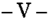
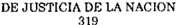

TOMO 319

Volumen 2

1996

932

ACUERDOS DE LA CORTE SUPREMA

319

Copyright (c) 1998 by Corte Suprema de Justicia de la Nación Queda hecho el depósito que previene la ley 11.723. Impreso en la Argentina Printed in Argentina I.S.B.N.

DE JUSTICIA DE LA NACION

319

933

## R E P U B L I C A A R G E N T I N A

FALLOS

DE  LA

C O R T E

S U P R E M A

DE

## J USTICIA DE LA N ACION

PUBLICACION A CARGO DE LA SECRETARIA DE JURISPRUDENCIA DEL TRIBUNAL

TOMO 319 - VOLUMEN 2

JUNIO - SEPTIEMBRE

LA LEY S.A.E. e I.

Tucumán 1471 (1050) Buenos Aires 1996

## HOJA COMPLEMENTARIA

Hoja incorporada a los efectos de permitir la búsqueda por página dentro del Volumen.

DE JUSTICIA DE LA NACION

319

935

## A C U E R D O S   D E   L A   C O R T E   S U P R E M A

## AÑO 1996

## JUNIO - SEPTIEMBRE

## CONFERENCIA MUNDIAL DE LA MUJER. COMISION AD-HOC. REPRESENTANTES.

## -N o 32-

En Buenos Aires, a los 3 días del mes de junio del año mil novecientos noventa y seis, reunidos en la Sala de Acuerdos del Tribunal, los señores Ministros que suscriben la presente,

## Consideraron:

Que por decreto 1013/95 se creó, una Comisión Ad-hoc para el seguimiento del Plan de Acción surgido de la IV Conferencia Mundial sobre la Mujer, realizada en Beijing -República Popular China-, durante el mes de septiembre de 1995.

Que en el art. 3  de ese decreto se invita a la Corte Suprema de Justicia de la o Nación a 'designar sendos representantes para integrar la Comisión Ad-hoc creada por el presente Decreto'.

Que la referida función no se encuentra contemplada entre las atribuciones que la Constitución Nacional otorga a este Tribunal (arts. 108, 113, 116 y 117 de la Ley Fundamental).

Por ello,

Acordaron:

- 1 o ) No designar el representante a que se alude en el art. 3  del decreto 1013/95. o
- 2 o ) Poner en conocimiento del Ministerio de Relaciones Exteriores, Comercio Internacional y Culto de la Nación, el contenido de la presente.

Todo lo cual dispusieron y mandaron, ordenando que se comunicase y registrase en el libro correspondiente, por ante mí, que doy fe.- JULIO S. NAZARENO - EDUARDO MOLINÉ O'CONNOR - CARLOS S. FAYT - ENRIQUE SANTIAGO PETRACCHI - GUILLERMO A. F. LÓPEZ - GUSTAVO A. BOSSERT Jorge Alejandro Magnoni (Secretario).

## ACUERDOS DE LA CORTE SUPREMA

## CONSEJO NACIONAL DE LA MUJER. REPRESENTANTES.

## -N o 33-

En Buenos Aires, a los 3 días del mes de junio del año mil novecientos noventa y seis, reunidos en la Sala de Acuerdos del Tribunal, los señores Ministros que suscriben la presente,

## Consideraron:

Que el art. 1  del decreto 41/96, que sustituyó al art. 4  del decreto 1426/92, estao o bleció  la  integración  del  Directorio  del  Consejo  Nacional  de  la  Mujer,  creado  por  el decreto citado en último término.

Que, de acuerdo con lo establecido en dicho cuerpo normativo, el aludido directorio estará integrado, entre otros, por 'un (1) representante del Poder Judicial de la Nación'.

Que la referida función no se encuentra contemplada entre las atribuciones que la Constitución Nacional otorga a este Tribunal (arts. 108, 113, 116 y 117 de la Ley Fundamental).

Por ello,

Acordaron:

- 1 o ) No designar el representante a que se alude en el art. 4  del decreto 1426/92 o (según texto decreto 41/96).
- 2 o ) Poner en conocimiento del Ministerio de Justicia de la Nación, el contenido de la presente.

Todo lo cual dispusieron y mandaron, ordenando que se comunicase y registrase en el libro correspondiente, por ante mí, que doy fe.- JULIO S. NAZARENO - EDUARDO MOLINÉ O'CONNOR - CARLOS S. FAYT - ENRIQUE SANTIAGO PETRACCHI - GUILLERMO A. F. LÓPEZ - GUSTAVO A. BOSSERT Jorge Alejandro Magnoni (Secretario)

## MEDIACION. NOTIFICACIONES. ARANCEL.

-N o 34-

En Buenos Aires, a los cuatro días del mes de junio del año mil novecientos noventa y seis, reunidos en la Sala de Acuerdos del Tribunal, el señor Presidente de la Corte Suprema de Justicia de la Nación, Doctor Don Julio S. Nazareno y los Señores Ministros que suscriben la presente,

## DE JUSTICIA DE LA NACION

## Consideraron:

Que por acordada N  26/96, se dispuso arancelar las notificaciones que se realicen o de conformidad con las prescripciones de la ley 24.573 o régimen que en el futuro la sustituya, en la suma de diez pesos ($10) cada una.

Que el Sr. Ministro de Justicia de la Nación solicita se reduzca el valor del arancelamiento dispuesto, a fin de no tornar excesivamente oneroso el procedimiento de mediación.

Que las argumentaciones expuestas se consideran razonables, por lo que corresponde acceder a lo solicitado -aún cuando ello significa un esfuerzo económico para este Poder Judicial de la Nación- como una contribución a este nuevo método de resolución de conflictos.

## Por ello,

## Acordaron:

Modificar el monto del arancelamiento dispuesto por acordada N  26/96, fijándolo o en la suma de tres pesos ($3) por cada notificación que se efectúe de conformidad con las prescripciones de la ley 24.573 o régimen que en el futuro la sustituya.

Todo lo cual dispusieron y mandaron, ordenando que se comunicase y registrase en el libro correspondiente, por ante mí, que doy fe.- JULIO S. NAZARENO - CARLOS S. FAYT - ENRIQUE SANTIAGO PETRACCHI - GUSTAVO A. BOSSERT - GUILLERMO A. F. LÓPEZ ADOLFO ROBERTO VÁZQUEZ Nicolás Alfredo Reyes (Administrador General).

## PODER JUDICIAL. REMUNERACIONES.

## -N o 35-

En Buenos Aires, a los 13 días del mes de junio del año mil novecientos noventa y seis, reunidos en la Sala de Acuerdos del Tribunal, los señores Ministros que suscriben la presente,

## Consideraron:

Que con fecha 27 de marzo ppdo., la Cámara Nacional de Apelaciones en lo Contencioso  Administrativo Federal se pronunció en la causa 'Erlich Moreno, Felipe Guillermo y otros c/Estado Nacional -Corte Suprema de Justicia de la Nación- s/empleo público', confirmando la sentencia dictada en primera instancia en lo atinente a la determinación del carácter remunerativo y bonificable del suplemento creado por la acordada 56/91 y sus modificatorias, revocándola en lo referente a la tasa de interés aplicada, la que fijó en la pasiva promedio a que se refiere el artículo 8  del decreto o

529/91, según texto aprobado por decreto 941/91 (conf. fallo del Tribunal en la causa 'López, Antonio' del 10/6/92).

Que es de conocimiento de esta Corte, que además de los demandantes en la causa 'Erlich Moreno', un gran número de magistrados y funcionarios han promovido pleitos de idéntica naturaleza que el citado, y que se encuentran en condiciones de ser fallados a la brevedad.

Que sin perjuicio de lo expuesto, y a fin de resguardar los principios de equidad e igualdad, se hace necesario contemplar la situación de los magistrados y funcionarios que por diversas razones no promovieron los mencionados juicios y que por ello se hallarían en una situación de notoria desigualdad frente a aquellos que han provocado decisiones jurisdiccionales.

Por ello,

Acordaron:

Encomendar al señor Administrador General Dr. Nicolás Alfredo Reyes y al señor Secretario de esta Corte Dr. Javier M. Leal de Ibarra, a iniciar gestiones con representantes del Poder Ejecutivo Nacional, tendientes a lograr una solución global a la situación que fuera expuesta en los considerandos de la presente.

Todo lo cual dispusieron y mandaron, ordenando que se comunicase y registrase en el libro correspondiente, por ante mí, que doy fe.- JULIO S. NAZARENO - CARLOS S. FAYT - AUGUSTO CÉSAR BELLUSCIO - ENRIQUE SANTIAGO PETRACCHI - GUILLERMO A. F. LÓPEZ - GUSTAVO A. BOSSERT Javier M. Leal de Ibarra (Secretario).

## EMPLEADOS JUDICIALES.

-N o 36-

En Buenos Aires, a los 20 días del mes de junio del año mil novecientos noventa y seis reunidos en la Sala de Acuerdos del Tribunal, los señores Ministros que suscriben la presente,

## Consideraron:

- 1 o ) Que la habilitada de la Cámara Nacional de Apelaciones en lo Criminal y Correccional consultó a este Tribunal sobre el criterio por seguir respecto de las designaciones de agentes en relación a lo dispuesto en las acordadas 57/93 y 37/94.
- 2 o ) Que es de conocimiento de esta Corte que en la actualidad existen en los distintos fueros dispares criterios, acerca de la interpretación de tales normas.

- 3 o ) Que, en consecuencia, es necesario establecer un criterio único, a fin de evitar situaciones desiguales en las distintas jurisdicciones, por lo que resulta pertinente realizar algunas aclaraciones destinadas a dar un tratamiento similar a la cuestión en todo el ámbito del Poder Judicial de la Nación.

Por ello,

Acordaron:

Hacer saber a las habilitaciones de los tribunales integrantes del Poder Judicial de la Nación que, a partir del día de la fecha, deberán sujetarse a las siguientes pautas, en la aplicación de las acordadas 57/93 y 37/94:

- a) El requisito de aprobación del curso de capacitación establecido por acordada 57/93, sólo será aplicable, cuando corresponda, a aquellos que sean nombrados en carácter de efectivos como auxiliares administrativos.
- El plazo de seis meses para realizar el curso citado (acordada 57/93), comenzará a regir a partir de la fecha de designación en carácter de efectivo, en la categoría mencionada.
- Una vez aprobado el citado curso, y transcurrido el período dispuesto en el punto 6 o , párrafo segundo de la acordada 37/94, automáticamente se transformará el cargo de auxiliar administrativo en el de auxiliar. Este plazo también comenzará a regir a partir de la designación efectiva como auxiliar administrativo.
- b) Los agentes designados como auxiliares administrativos suplentes, contratados o interinos, mientras se encuentren en esa condición, no realizarán el curso de capacitación (acordada 57/93) y su cargo no se transformará en el de auxiliar, aunque hayan pasado seis meses de su designación (acordada 37/94).

Deberá convalidarse la situación de los agentes designados como auxiliares administrativos en carácter de interinos, contratados o suplentes, cuyo cargo -a la fecha del dictado de la presente- haya sido transformado en el de auxiliar.

- c) El régimen que se adopta por la presente será aplicado tanto en los casos de agentes designados con categoría de auxiliar administrativo, como a los designados con categoría de auxiliar de servicio, salvo en lo que respecta al curso de capacitación establecido por la acordada 57/93, que sólo es aplicable a los agentes comprendidos en el Anexo II del escalafón del Poder Judicial.
- Todo lo cual dispusieron y mandaron, ordenando que se comunicase y registrase en el libro correspondiente, por ante mí, que doy fe.- JULIO S. NAZARENO - EDUARDO MOLINÉ O'CONNOR - CARLOS S. FAYT - GUSTAVO A. BOSSERT - ADOLFO ROBERTO VÁZQUEZ -Jorge Alejandro Magnoni (Secretario).

## DIRECCION GENERAL DE ARQUITECTURA Y SERVICIOS. INTERVENCION.

## -N o 37-

En Buenos Aires, a los veintisiete días del mes de junio de mil novecientos noventa y seis, reunidos en la Sala de Acuerdos del Tribunal el señor Presidente de la Corte Suprema de Justicia de la Nación Dr. Julio Nazareno y los señores Ministros que suscriben la presente,

## Consideraron:

Que por resolución del Alto Tribunal N  44/95, en estos mismos actuados, se dispuo so la intervención a la Dirección General de Arquitectura y Servicios.

Que el señor Administrador General somete a consideración de esta Corte Suprema, todo lo actuado por la Comisión Interventora que a tal efecto se designara, proponiendo un conjunto de medidas que estima necesarias adoptar y dar por finalizada la intervención.

Que los antecedentes que meritaron la adopción de una medida de excepción, y los informes receptados, demuestran un cuadro de situación administrativa que requiere una profunda transformación.

Que la labor de la Comisión Interventora y los sucesivos informes producidos, indican que se ha llegado a un estado de cosas que se requiere revertir inmediatamente. La Dirección General intervenida se había constituido en un organismo burocrático, que no pudo dar respuesta satisfactoria a los requerimientos en materia de infraestructura y servicios, incurriendo en importantes demoras y costos adicionales.

Que la organización de la dependencia creció en forma anacrónica y se constituyó en un ente complejo, disperso y heterogéneo cuya gestión es antieconómica; que duplicaba funciones y esfuerzos, perdiendo oportunidades y créditos, llegándose a desarrollar proyectos ambiciosos de difícil ejecución. Además, la falta de planificación, la improvisación y la no respuesta eficiente y rápida, frente al acuciante problema de los edificios  y  equipamientos para el asiento de los tribunales del Poder Judicial de la Nación, fue creando una situación que se torna insostenible, cuestiones no sólo atribuíbles a los organismos de conducción, sino también producto de la insuficiencia de recursos.

Que ante esta verdadera emergencia y la magnitud del problema, se requieren medidas que además de necesarias, deben calar hondo para la solución de los problemas, por lo cual, en primer término, se requiere la definición de los cursos de acción que se estimen aptos e idóneos para alcanzar los objetivos que permitan transitar de una situación a otra, por lo que se debe definir la política administrativa que constituirá el marco de referencia para la reorganización de la estructura funcional de la repartición y las dependencias relacionadas, dando en consecuencia por concluida la intervención de la misma.

Que en el marco de definiciones concretas y pragmáticas, debe privar la economía y el máximo aprovechamiento de los recursos humanos, técnicos y financieros, siendo

las propuestas de la Administración General y lo informado por la Comisión Interventora, consecuentes a tales principios.

Que en tal sentido ya se han adoptado las medidas que sobre la marcha se propusieron, en cuanto al Régimen de Intendencias, la desactivación de unidades operativas y talleres (resoluciones Nos. 32/96, 33/96 y 55/96).

Que se propone asimismo la disolución de la Comisión Liquidadora del Poder Judicial de la Nación - ley 12.910, cuya creación se dispusiera por acordada N  33/87 y su o modificatoria 36/89, fundado en razones de oportunidad y conveniencia, dado que ya no persisten las circunstancias que en su momento justificaran esa creación.

Que no obstante ello, y ante la eventualidad que pudiera ser necesario atender excepcionalmente gestiones que se encomendaran a la Comisión Liquidadora, estas quedarán a cargo de la Dirección de Infraestructura Judicial o bien de la dependencia o profesionales que disponga la Administración General.

Que por resolución C.S.J.N. N  414/91, se dispuso encomendar al señor Subdirector o General de Arquitectura, conjuntamente con el personal de colaboradores que proponga al efecto, atender con exclusividad el estudio y proyecto de las necesidades edilicias destinadas a los tribunales penales de la Capital Federal.

Que a la fecha se considera cumplido dicho cometido, por lo cual corresponde dar por finalizadas tales funciones, siendo conveniente redistribuir el personal de esa dependencia en la Dirección de Infraestructura Judicial, o bien en las intendencias que se ponen en marcha en los distintos fueros con sede en la Capital Federal.

Que deberá transformarse la actual estructura de los organismos de que se trata, sobre la base de las siguientes pautas: a) Reducción y desconcentración de actividades; b) Desactivación y eliminación de funciones antieconómicas o que se han asumido sin tener suficiente capacidad instalada y tecnología que no las hace competitivas en su costo y producto final en el mercado; c) Concentración de funciones normativas y de asesoramiento y desconcentración de funciones operativas; d) Especialización de las funciones que se mantengan; e) Rediseño de la organización para el máximo aprovechamiento del personal y los recursos disponibles; f) Aplicación de criterios modernos y tecnologías de punta en las funciones que se mantengan.

Por todo ello,

## Acordaron:

1) Dar por terminadas las funciones de la Comisión Interventora en la Dirección General de Arquitectura y Servicios.

2) Reorganizar la Dirección General de Arquitectura y Servicios que pasará a denominarse DIRECCION DE INFRAESTRUCTURA JUDICIAL, la que dependerá jerárquica y funcionalmente de la Administración General de la Corte Suprema de Justicia de la Nación, y se hará cargo de la actividad residual de la ex Dirección General, de la  Comisión Liquidadora del Poder Judicial de la Nación -ley 12.910- y de la Subdirección de Arquitectura -ley 23.984-, en todos los asuntos, estudios o trámites administrativos en curso.

- 3) La Dirección de Infraestructura Judicial tendrá por misión, intervenir y asesorar en todo lo referente a la infraestructura física y de servicios que requiera la instalación y funcionamiento de los tribunales y dependencias del Poder Judicial de la Nación.
- 4) Serán sus funciones:
- 4.1. Crear y mantener el sistema de información relativo a la infraestructura de edificios, equipamientos y servicios.
- 4.2. Formular y proponer políticas, objetivos, planes, programas y proyectos para el desarrollo de la actividad.
- 4.3.  Realizar  estudios  y  efectuar  propuestas  para  el  más  racional  y  económico aprovechamiento de los edificios y sus instalaciones.
- 4.4. Prestar asesoramiento y asistencia técnica en materia de su competencia y en todo asunto vinculado con la misma que le sea consultado.
- 4.5. Colaborar en la gestión de las Intendencias de los Tribunales dependientes del Poder Judicial de la Nación y de las que en el futuro se creen, proponiendo pautas, métodos y técnicas para su mejor funcionamiento.
- 4.6. Elaborar estándares de calidad para la normalización y catalogación de materiales e insumos de uso común en el Poder Judicial de la Nación.
- 4.7. Intervenir en todo procedimiento de contratación de obras, compraventa de bienes de uso, cesión o locación de inmuebles, o de servicios no personales relacionados con las funciones encomendadas, colaborando en la confección de pliegos y demás aspectos técnicos de la contratación.
- 4.8. Estudiar y proponer la aplicación de tecnologías en los procesos de su competencia y administración.
- 4.9. Prestar asistencia y asesoramiento a los cuerpos técnicos y dependencias administrativas del Poder Judicial de la Nación, proponiendo pautas para confección de informes, sus metodologías, cálculos explicitados y estimaciones objetivas.
- 4.10. Asesorar en los procesos de preadjudicación y/o recepción definitiva de bienes y servicios, cuando le sea requerido.
- 5) La Dirección de Infraestructura Judicial estará a cargo de un Director, del cual dependerán las siguientes áreas: 1-de Estudios y Proyectos, 2-Operativa, y 3-Administrativa.
- 6) El área de Estudios y Proyectos tendrá a su cargo:
- 6.1. Elaborar planes, programas y proyectos de obras, que les sean encomendados por la Dirección, preparando los estudios previos, cálculos, planos, especificaciones, pliegos y demás elementos necesarios para cada caso.

- 6.2. Analizar las necesidades generales en materia de estructura funcional y edilicia del Poder Judicial de la Nación.
- 6.3. Elevar las previsiones anuales de obras y demás trabajos con sus correspondientes requerimientos presupuestarios.
- 7) El área Operativa tendrá a su cargo:
- 7.1.  Ejecutar trabajos y obras que por su monto, características, oportunidad o urgencia, sea conveniente realizar excepcionalmente por administración y sean autorizados por la Corte Suprema, a solicitud de la Dirección ante la Administración General.
- 7.2. Colaborar con sus cuerpos técnicos y equipos de trabajo con las Intendencias.
- 7.3. Organizar depósitos o almacenes para la custodia de materiales, insumos y demás elementos que no puedan estar a cargo de las demás dependencias del Poder Judicial de la Nación, por razones de espacio, ubicación geográfica o conveniencia.
- 8)  El  área  Administrativa tendrá a su cargo el apoyo secretarial, de despacho, habilitación y demás actividades administrativas que se requieran para el funcionamiento de la Dirección.
- 9) Las funciones actualmente a cargo de la Prosecretaría de Abastecimiento, y su intervención en todo lo relativo al trámite de adquisición, acopio y distribución de materiales e insumos, quedará a cargo de las Secretarías de Superintendencia de las respectivas Cámaras, asistidos por cada Intendencia y por la Subsecretaría de Administración.
- 10) El área de asesoramiento jurídico de la ex Dirección General de Arquitectura y Servicios, pasará a integrarse a la Administración General de la Corte.
- 11) La Prosecretaría de Comunicaciones, pasará a depender de la Administración General de la Corte hasta tanto se resuelva su definitiva reubicación.
- 12) Dar por cumplidas las tareas encomendadas por la resolución C.S.J.N. No. 414/91, suprimiéndose la Subdirección General de Arquitectura - ley 23.984. El personal que fue afectado a dicha subdirección, pasará a desempeñarse en la Dirección de Infraestructura Judicial, o en las dependencias y funciones que proponga la Administración General.
- 13) Dejar sin efecto las acordadas Nros. 33/87 y 36/89, disponiéndose la disolución de la Comisión Liquidadora del Poder Judicial de la Nación - ley 12.910.
- 14) Dejar sin efecto las acordadas Nros. 32/89 que aprobó la estructura de la Dirección General de Arquitectura y Servicios; y su modificatoria 31/91.
- 15) En el marco de referencia de los considerandos precedentes, el Director de la Dirección de Infraestructura Judicial ajustará su acción inicial a las directivas que emita la Administración General.

16) Que con respecto al Régimen de Intendencias -resolución 33/95-, se mantiene su transitoriedad hasta tanto se den las condiciones para su definitiva implantación y se establezcan los reglamentos de su funcionamiento, traslado de personal y demás cuestiones conexas, a cuyo fin la Administración General, asistida por la Dirección de Infraestructura Judicial, continuarán prestando apoyo al régimen en esta Capital, La Plata, Gran Buenos Aires e interior del país.

16) Que todas las demás cuestiones no contempladas en la presente, se resolverán a propuesta del señor Administrador General, quien someterá a consideración del Presidente del Tribunal los resolutorios necesarios.

Todo lo cual dispusieron y mandaron, ordenando que se comunicase y registrase en el libro correspondiente, por ante mí, que doy fe.- JULIO S. NAZARENO - EDUARDO MOLINÉ O'CONNOR - CARLOS S. FAYT - AUGUSTO CÉSAR BELLUSCIO - ANTONIO BOGGIANO - GUILLERMO A. F. LÓPEZ - GUSTAVO A. BOSSERT - ADOLFO ROBERTO VÁZQUEZ Nicolás Alfredo Reyes (Administrador General).

## RECURSO DE QUEJA. DEPOSITO.

## -N o 38-

En Buenos Aires, a los 28 días del mes de junio del año mil novecientos noventa y seis, reunidos en la Sala de Acuerdos del Tribunal, los señores Ministros que suscriben la presente,

## Consideraron:

Que el depósito establecido en el artículo 286 del Código Procesal Civil y Comercial de la Nación ingresa a la cuenta 289/1 'Corte Suprema de Justicia de la Nación, arts. 8/10, ley 17.116' existente en el Banco de la Ciudad de Buenos Aires.

Que teniendo en cuenta la importancia de los montos que por tal concepto se recaudan, y sin perjuicio de mantener la finalidad de inversión que determina la segunda parte del artículo 9  de la aludida ley 17.116, en uso de las facultades establecidas en el o art. 8  de la ley 23.853 y visto el art. 12 de dicha norma, debe entenderse que la dotao ción de bibliotecas de los tribunales nacionales de todo el país implica considerar una universalidad de bienes, por lo que todo cuanto le atañe a su formación o mantenimiento -tanto los libros como las instalaciones, equipamiento y dependencias que les estuviere afectado directamente por cualquier naturaleza- queda comprendido en el concepto universal de 'bibliotecas', y en consecuencia para satisfacer este requerimiento es factible determinar un orden de prioridades por este Tribunal.

Que, igualmente, el mantenimiento del nivel jurídico de la biblioteca central exige que no se interrumpa la provisión de las colecciones de revistas, especialmente las extranjeras, pues la suspensión de las suscripciones puede ocasionar perjuicios luego

irreparables por no mantenerse la continuidad de las publicaciones y ser posteriormente más oneroso, difícil o aún imposible completarlas.

## Acordaron:

1) Disponer que las sumas que se recauden con motivo del depósito establecido en el artículo 286 del Código Procesal Civil y Comercial de la Nación, podrán ser destinados a atender las necesidades que, tengan las bibliotecas de este Poder Judicial de la Nación, según el orden de prioridades que en cada caso manifieste el señor Director de Bibliotecas al señor Administrador General.

- 2) Encomendar a la Dirección General de la Biblioteca Central y a la Secretaría Letrada de Informática el estudio urgente de la informatización de los archivos y ficheros de dicha biblioteca, a cuyo efecto deberán proponer en el plazo de sesenta (60) días el plan de adquisiciones de los elementos destinados a ese fin.
- 3) Disponer que la Dirección de Bibliotecas: a) tenga en cuenta en los planes de adquisiciones la necesidad de que no se produzca la discontinuación de las colecciones de publicaciones periódicas, especialmente las extranjeras; b) estudie la posibilidad de crear una biblioteca en cada uno de los edificios en que se encuentran instalados tribunales nacionales, la cual deberá contar con una o varias colecciones bibliográficas y de revistas jurídicas, limitándose la provisión individual de las dependencias a los códigos y, en caso necesario, a la legislación vigente y a las obras de uso cotidiano. Para ello, deberá proponer un plan dentro del mismo plazo fijado en el punto anterior.

Todo lo cual dispusieron y mandaron, ordenando se comunicase y registrase en el libro correspondiente, por ante mí, que doy fe.- JULIO S. NAZARENO - EDUARDO MOLINÉ O'CONNOR - CARLOS S. FAYT - AUGUSTO CÉSAR BELLUSCIO - ANTONIO BOGGIANO GUILLERMO A. F. LÓPEZ - GUSTAVO A. BOSSERT - ADOLFO ROBERTO VÁZQUEZ. Nicolás Alfredo Reyes (Administrador General).

## MORGUE JUDICIAL. ABLACION DE ORGANOS.

## -N o 39-

En Buenos Aires, a los 11 días del mes de julio del año mil novecientos noventa y seis reunidos en la Sala de Acuerdos del Tribunal, los señores Ministros que suscriben la presente,

## Consideraron:

Que con fecha 2 de julio del corriente año, el señor Presidente de la Corte Suprema de Justicia formalizó con el señor Presidente del Instituto Nacional Centro Unico Coordinador de Ablación e Implante (INCUCAI), doctor Daniel Neustadt un convenio para reglamentar la ablación de órganos y materiales anatómicos de los cadáveres deposita-

dos en la Morgue Judicial, conforme con lo dispuesto en la ley 24.193 y normas complementarias.

Por ello,

Acordaron:

Aprobar el convenio suscripto el 2 de julio pasado, por el señor Presidente de la Corte Suprema de Justicia de la Nación, doctor don Julio S. Nazareno y el señor Presidente del Instituto Nacional Centro Unico Coordinador de Ablación e Implante (INCUCAI), doctor Daniel Neustadt.

Todo lo cual dispusieron y mandaron, ordenando que se comunicase y registrase en el libro correspondiente, por ante mí, que doy fe.- JULIO S. NAZARENO - EDUARDO MOLINÉ O'CONNOR - AUGUSTO C. BELLUSCIO - ANTONIO BOGGIANO - GUILLERMO A. F. LÓPEZ - GUSTAVO A. BOSSERT - ADOLFO ROBERTO VÁZQUEZ Javier M. Leal de Ibarra (Secretario).

## VISITAS A LOS TRIBUNALES FEDERALES.

## -N o 40-

En Buenos Aires, a los 16 días del mes de julio del año mil novecientos noventa y seis, reunidos en la Sala de Acuerdos del Tribunal, los señores Ministros que suscriben la presente,

Consideraron:

Que la creación de nuevos tribunales federales, hace necesario adaptar las disposiciones de la acordada 35/86.

Por ello,

Acordaron:

1 o ) Modificar el punto 2  de la acordada 35/86 del 9 de septiembre de 1986, el cual o quedará redactado así:

'2 ) A los efectos de las visitas a realizarse, se considerará dividido el país en las o siguientes nueve zonas:

Zona 1: Cámaras Federales de La Plata; Mar del Plata y Bahía Blanca; Tribunales Orales en lo Criminal Federal de La Plata; Mar del Plata; Bahía Blanca y La Pampa y Juzgados Federales de La Plata; Lomas de Zamora; Junín; Mar del Plata; Azul; Dolores; Bahía Blanca y Santa Rosa.

Zona 2: Cámaras Federales de Mendoza y Rosario; Tribunales Orales en lo Criminal Federal de Mendoza; San Juan; San Luis; Rosario y Santa Fe y Juzgados Federales de Mendoza; San Rafael; San Juan; San Luis; Rosario; San Nicolás y Santa Fe.

Zona 3: Cámara Federal de General Roca; Tribunales Orales en lo Criminal Federal de General Roca y Neuquén y Juzgados Federales de General Roca; Viedma; San Carlos de Bariloche; Neuquén y Zapala.

Zona 4: Cámaras Federales de Paraná y Posadas; Tribunales Orales en lo Criminal Federal de Paraná y Posadas y Juzgados Federales de Paraná; Paso de los Libres; Concepción del Uruguay; Posadas y Eldorado.

Zona 5: Cámara Federal de Resistencia; Tribunal Oral en lo Criminal Federal de Formosa y Juzgados Federales de Resistencia; Formosa y Corrientes.

Zona 6: Cámara Federal de Córdoba; Tribunales Orales en lo Criminal Federal de Córdoba y La Rioja y Juzgados Federales de Córdoba; Bell Ville; Río Cuarto y La Rioja.

Zona 7: Cámara Federal de San Martín; Tribunales Orales en lo Criminal Federal de San Martín y Juzgados Federales de San Martín; San Isidro; Morón; Campana y Mercedes.

Zona 8: Cámaras Federales de Tucumán y Salta; Tribunales Orales en lo Criminal Federal de Tucumán; Catamarca; Salta y Jujuy y Juzgados Federales de Tucumán; Catamarca; Santiago del Estero; Salta y Jujuy.

Zona 9: Cámara Federal de Comodoro Rivadavia; Tribunales Orales en lo Criminal Federal de Comodoro Rivadavia y Tierra del Fuego, Antártida e Islas del Atlántico Sur; Juzgados Federales de Comodoro Rivadavia; Rawson; Río Gallegos; Ushuaia y Río Grande'.

2 o ) Distribuir el turno de visitas de la siguiente manera:

Zona 1: Dr. Eduardo Moliné O'Connor, 2: Dr. Gustavo Alberto Bossert, Zona 3: Dr. Guillermo A. F. López, Zona 4: Dr. Antonio Boggiano, Zona 5: Dr. Adolfo R. Vázquez, Zona 6: Dr. Julio Salvador Nazareno, Zona 7: Dr. Carlos Santiago Fayt, Zona 8: Dr. Enrique Santiago Petracchi, Zona 9: Dr. Augusto César Belluscio.

3 o ) La distribución dispuesta en el punto anterior regirá hasta el mes de agosto de 1997, en que se procederá a efectuar una nueva con arreglo a lo dispuesto en el punto 3 o de la acordada N  35/86. o

Todo lo cual dispusieron y mandaron, ordenando que se comunicase y registrase en el libro correspondiente, por ante mí, que doy fe.- JULIO S. NAZARENO - EDUARDO MOLINÉ O'CONNOR - CARLOS S. FAYT - AUGUSTO CÉSAR BELLUSCIO - ANTONIO BOGGIANO - GUILLERMO A. F. LÓPEZ - ADOLFO ROBERTO VÁZQUEZ Jorge Alejandro Magnoni (Secretario).

## JUZGADOS NACIONALES DE PRIMERA INSTANCIA DEL TRABAJO N o  81 A 90.

## -N o 45-

En Buenos Aires, a los 18 días del mes de julio del año mil novecientos noventa y seis, reunidos en la Sala de Acuerdos del Tribunal, los señores Ministros que suscriben la presente,

## Consideraron:

Que el art. 5  de la ley 24.655 transfiere a la Justicia Federal de la Seguridad o Social de la Capital Federal los juzgados nacionales de primera instancia del trabajo creados por el art. 1  de la ley 23.640, no instalados a la fecha. o

Que en su art. 7  dispone el pase inmediato a dichos juzgados de las causas cuyo o objeto esté comprendido en las disposiciones del art. 2 , que actualmente se hallan en o trámite ante la Justicia Nacional en lo Contencioso Administrativo Federal y otros fueros. Al efecto, atribuye en forma directa a la Cámara Federal de la Seguridad Social, la distribución de los expedientes cuyo objeto está comprendido en el art. 2  y de o las ejecuciones de sus sentencias que se hallan radicadas en otros fueros.

Que como ha decidido este Tribunal, en un supuesto que guarda una marcada analogía con el presente, la vigencia de una norma procesal se halla supeditada a la efectiva instalación y funcionamiento de los órganos jurisdiccionales que están llamados a asumir la competencia. Esta circunstancia, que hasta la fecha no se ha configurado, como lo ha reconocido el legislador en el art. 5  del texto citado, requiere el desarroo llo de un proceso que abarca diversos aspectos y etapas -designación del personal y su capacitación, provisión de muebles y útiles, puesta en funcionamiento de los sistemas de informática, etc., todos los cuales presentan mínimas exigencias a satisfacer a fin de posibilitar a los nuevos juzgados una adecuada administración de justicia, objetivo que esta Corte se encuentra empeñada en preservar (Fallos 312:8).

Que, además, la redistribución y consecuente remisión de actuaciones en trámite ante otros fueros, necesita de una ordenada coordinación de los distintos tribunales que ejercen las respectivas facultades de superintendencia.

Que esta Corte, como órgano supremo de la organización judicial, considera conveniente  dictar  medidas  complementarias  de  la  ley,  con  el  objeto  de  que  su implementación resulte lo más rápida y eficiente posible.

## Por ello,

## Acordaron:

1 o ) Disponer la transferencia, en los términos de los arts. 1  y 5  de la ley 24.655, de o o los Juzgados Nacionales de Primera Instancia del Trabajo Nros. 81 a 90, creados por el art. 1  de la ley 23.640. o

2 o ) Declarar que la operatividad del art. 7  de la ley 24.655 se halla supeditada a la o instalación y funcionamiento de los Juzgados Federales de Primera Instancia de la

Seguridad Social, y que hasta tanto esto ocurra la causas continuarán su tramitación ante los tribunales ante los cuales están actualmente radicadas.

- 3 o )  Ordenar que la Cámara Federal de la Seguridad Social distribuya entre los jueces de dicho fuero las causas previstas en el art. 2  de la ley 24.655, que se inicien a o partir de su entrada en vigencia.
- 4 o ) La Cámara Nacional de Apelaciones del Trabajo distribuirá entre los restantes juzgados de ese fuero los expedientes que hasta la fecha se encontrasen asignados a los juzgados transferidos.

Todo lo cual dispusieron y mandaron, ordenando que se comunicase y registrase en el libro correspondiente, por ante mí, que doy fe.- JULIO S. NAZARENO - CARLOS S. FAYT - AUGUSTO CÉSAR BELLUSCIO - ANTONIO BOGGIANO - GUILLERMO A. F. LÓPEZ - ADOLFO ROBERTO VÁZQUEZ Jorge Alejandro Magnoni (Secretario).

## DIA INHABIL.

## -N o 46-

En Buenos Aires, a los 8 días del mes de agosto del año mil novecientos noventa y seis, reunidos en la Sala de Acuerdos del Tribunal, los señores Ministros que suscriben la presente,

## Consideraron:

Que la forma irregular en que han funcionado los Tribunales Nacionales y Federales del país, en virtud del paro general decretado por la C.G.T., requiere tomar medidas que eviten perjuicio a los litigantes.

Por ello,

Acordaron:

Declarar el día de la fecha, inhábil para los Tribunales Nacionales y Federales del país, sin perjuicio de la validez de los actos procesales cumplidos que no hubiesen sido actuados en rebeldía.

Todo lo cual dispusieron y mandaron, ordenando que se comunicase y registrase en el libro correspondiente, por ante mí, que doy fe.- JULIO S. NAZARENO - EDUARDO MOLINÉ O'CONNOR - CARLOS S. FAYT - ENRIQUE SANTIAGO PETRACCHI - ANTONIO BOGGIANO - GUSTAVO A. BOSSERT - ADOLFO ROBERTO VÁZQUEZ Jorge Alejandro Magnoni (Secretario).

## ACUERDOS DE LA CORTE SUPREMA

## HONRAS DISPUESTAS CON MOTIVO DEL FALLECIMIENTO DEL DR. CARLOS ALFREDO RENOM.

## -N o 47-

En Buenos Aires, a los 8 días del mes de agosto del año mil novecientos noventa y seis, reunidos en la Sala de Acuerdos del Tribunal, los señores Ministros que suscriben la presente,

## Consideraron:

Que el día 27 de julio pasado ha ocurrido el sensible fallecimiento del Dr. Carlos Alfredo Renom, ex Ministro de la Corte Suprema de Justicia de la Nación.

Que es deber del Tribunal asociarse al duelo que provoca la desaparición del distinguido ex magistrado.

Por ello,

Acordaron:

1 o ) Adherir a la nota de condolencia a la familia del extinto, suscripta por el Dr. Guillermo A. F. López el 30 de julio último, en su carácter de Ministro de feria.

2 o )  Incluir  el  nombre  del  Dr.  Carlos  Alfredo  Renom  en  las  tablas  de  honor  del Tribunal.

Todo lo cual dispusieron y mandaron, ordenando que se comunicase y registrase en el libro correspondiente, por ante mí, que doy fe.- JULIO S. NAZARENO - EDUARDO MOLINÉ O'CONNOR - CARLOS S. FAYT - ENRIQUE SANTIAGO PETRACCHI - ANTONIO BOGGIANO - GUSTAVO A. BOSSERT - ADOLFO ROBERTO VÁZQUEZ Jorge Alejandro Magnoni (Secretario).

## INSCRIPCION DE PERITOS.

## -N o 48-

En Buenos Aires, a los 20 días del mes de agosto del año mil novecientos noventa y seis, reunidos en la Sala de Acuerdos del Tribunal, los señores Ministros que suscriben la presente,

## Consideraron:

Que corresponde fijar las fechas para el cumplimiento de los trámites previstos en la acordada N  25 de 1985 para la inscripción y reinscripción de peritos en las especiao

lidades determinadas en dicha acordada, ampliadas en las Nros. 45/85, 59/86, 24/87, 37/88, 41/89, 52/90, 41/91, 68/92, 28/95 y 44/95.

Por ello,

Acordaron:

- 1 o ) Fíjase el plazo del 1  al 29 de noviembre de 1996 inclusive, para que los profeo sionales de las especialidades cuyo registro se lleva en esta Corte procedan a su inscripción o reinscripción para el año 1997.
- 2 o ) La lista a que se refiere el punto 5  de la acordada N  25/85 se exhibirá por cinco o o días a partir del 10 de diciembre de 1996.
- 3 o ) Los trámites referidos en los puntos anteriores se efectuarán en la Dirección General Pericial de esta Corte, sita en Sarmiento 877, 12  piso, Capital Federal, durano te el plazo fijado y exclusivamente en el horario de 9 a 13 hs.
- 4 o ) Dése la publicidad pertinente por intermedio de la Dirección de Prensa.- JULIO S. NAZARENO - EDUARDO MOLINÉ O'CONNOR - AUGUSTO CÉSAR BELLUSCIO - ANTONIO BOGGIANO - GUILLERMO A. F. LÓPEZ - GUSTAVO A. BOSSERT - ADOLFO ROBERTO VÁZQUEZ -Javier M. Leal de Ibarra (Secretario).

## NOMINA DE ESPECIALIDADES

(Acordadas Nros. 25/85, 45/85, 59/86, 37/88, 41/89, 52/90, 41/91, 68/92, 28/95 y 44/95)

ACTUARIOS

AGRIMENSORES

ANALISTAS DE SISTEMAS

ARQUITECTOS

COMPUTADOR CIENTIFICO

DRES. EN CIENCIAS ECONOMICAS

DRES. EN QUIMICA

ENOLOGOS FRUTICULTORES

ESPECIALISTAS EN ESTADISTICAS

ESPECIALISTAS EN IMAGENES SATELITALES

ESPECIALISTAS EN LINGÜISTICA Y SEMIOLOGIA

FOTOINTERPRETES

GEOLOGOS

HIDROGEOLOGOS

ING. CIVILES

ING. ELECTRONICOS

ING. c/ ESPECIALIDAD EN HIDRAULICA

ING. INDUSTRIALES

ING. MECANICOS

ING. EN PETROLEO

ING. GEODESTAS GEOFISICOS

ING. QUIMICOS

ING. EN TELECOMUNICACIONES

ING. AGRONOMO

ING. ESPECIALIDAD MEDIO AMBIENTE Y CONTAMINACION DE ECOSISTEMAS

ING. TEXTILES

Javier M. Leal de Ibarra (Secretario)

## PRESUPUESTO.

## -N o 49-

En Buenos Aires, a los 20 días del mes de agosto del año mil novecientos noventa y seis, reunidos en la Sala de Acuerdos del Tribunal, los señores Ministros que suscriben la presente,

## Consideraron:

- I)  Que esta Corte Suprema de Justicia de la Nación, en su carácter de Organo Superior del Poder Judicial debe estimar las erogaciones correspondientes al ejercicio presupuestario 1997 a fin de remitir al Poder Ejecutivo Nacional y para su posterior envío al Honorable Congreso de la Nación según lo dispuesto en la ley 23.853 -art. 8  y o en el art. 14  del decreto 792/96, t.o. de la Ley Permanente de Presupuesto N  11.672. o o
- II) Que como se ha venido realizando históricamente, en esta ocasión, también se han tenido en cuenta las limitaciones impuestas por la situación general del país, por lo que el presente cálculo se ha efectuado siguiendo un criterio de absoluta austeridad.

Dentro de ese marco merece destacarse la descentralización de los servicios que prestaba la Ex-Dirección General de Arquitectura y Servicios, a través de la creación de intendencias en diversos edificios de Capital Federal y Gran Buenos Aires, lo que originó la desactivación o reducción de aquellos talleres considerados antieconómicos (herrería, encuadernación, carpintería, refrigeración, etc.). Generándose una economía funcional, liberación de espacios físicos, menores costos de traslado, entre otras importantes ventajas.

III) Que se han reducido los gastos corrientes a su mínima expresión, incluyéndose aquellas erogaciones imprescindibles como consecuencia de las contínuas postergaciones que las han afectado por la falta de créditos suficientes en ejercicios anteriores.

IV) Que corresponde señalar, una vez más, que el constante y permanente crecimiento que caracteriza al Poder Judicial, producto del aumento de la demanda del servicio de justicia, hace menester asignarle un tratamiento presupuestario diferenciado respecto de los organismos que componen el resto del Estado Nacional. En con-

cordancia con el criterio que se encuentra enunciado en la Ley de Reforma del Estado N o 24.629, donde se reafirma la política del Gobierno Nacional en cuanto a producir cambios estructurales fortaleciendo y otorgando prioridad a las funciones indelegables y esenciales del Estado.

Es por ello que se reitera la importancia de establecer un mecanismo anual de ajuste de la alícuota establecida por la ley 23.853 - de Autarquía en concordancia con el crecimiento del gasto de este poder del Estado en permanente expansión.

Se ha observado que las leyes de creación de tribunales no prevén el financiamiento necesario y específico para su habilitación y posterior funcionamiento, lo cual obliga a ejecutar créditos presupuestarios no previstos por este poder en detrimento de otras necesidades básicas del servicio de justicia. Motivo por el cual se hace necesario insistir en que se arbitren los medios para que en el futuro se contemple el financiamiento necesario.

Se  aprecia  imprescindible  tener  en  cuenta  esta  exigencia  legal  en  los emprendimientos en elaboración tal como, la reforma procesal civil, comercial y laboral.

- V) Que se han recibido los niveles de créditos comunicados por el Ministerio de Economía y Obras y Servicios Públicos de la Nación, los que por los motivos expuestos precedentemente y aun en el marco de la restricción antes comentada resultarán claramente insuficientes.

Como muestra de ello, basta señalar que la dotación de personal comunicada contempla únicamente los cargos efectivamente ocupados al mes de mayo de 1995, sin tener en cuenta las incorporaciones que se debieron realizar para dar cumplimiento a las leyes de creación de tribunales.

Si analizamos la ejecución presupuestaria año 1996, se concluye que la carencia de crédito adecuado ha obligado a realizar transferencias del inciso 1 al inciso 3 a fin de dar cumplimiento al pago de servicios imprescindibles para el normal funcionamiento de este poder, circunstancia que se agravará al final del ejercicio en caso de no mediar los refuerzos reiteradamente solicitados al Ministerio de Economía y Obras y Servicios Públicos de la Nación.

Con relación al financiamiento es necesario expresar la preocupación con que se observa la acordada N  49/96 constante diferencia que existe entre las estimaciones de o recursos que anualmente efectúa el mencionado Ministerio y lo efectivamente recaudado.

- VI) Que por la presente se aprueba una nueva apertura programática del presupuesto del Poder Judicial, la cual refleja más acabadamente la estructura actual de esta jurisdicción y facilita el mecanismo de análisis que redunda en una más adecuada ejecución y evaluación de la política del gasto.

VII) Que la planta de personal para el ejercicio presupuestario año 1997 se fija en 17.291 cargos, la que surge de computar la planta estimada en acordada 33/95, adicionando las dotaciones para la habilitación de diversos tribunales creados por ley, a sa-

ber: Juzgado Federal de Primera Instancia de Mar del Plata N  4 (ley N  23.735), Trio o bunal Oral en lo Penal Económico N  4, Tribunales Orales en lo Criminal Federal de o Santa Cruz, Rosario N  2 y Santiago del Estero (leyes N  24.121 y 24.134), Juzgados o o Federales de Primera Instancia de Roque Sáenz Peña (Chaco - ley 21.188), San Ramón de la Nueva Orán (Salta - ley 23.112), Reconquista (ley 24.164), Necochea (ley 24.368), Secretaría para el Juzgado Federal de Primera Instancia de Zapala (ley 24.501), y los organismos pendientes de habilitación del sistema penal oral instituido por la Ley 23.984.

El inciso 1 contempla el incremento vegetativo que ha sido estimado en el 2,68%, teniendo en cuenta los adicionales por antigüedad, permanencia en la categoría y ubicación no escalafonada de todo el personal del Poder Judicial de la Nación.

La tarea judicial se ve auxiliada por la existencia de 1300 meritorios, personas que realizan un proceso de aprendizaje absolutamente gratuito, conformando una reserva de aspirantes que por la experiencia adquirida y en base a las crecientes necesidades de esta jurisdicción, resultan altamente calificables para su ingreso a este Poder Judicial.

Asimismo se ha tenido en cuenta el costo de los suplementos por zona desfavorable y por tareas insalubres por no haber sido considerado en las leyes de Presupuesto N o 24.447 y 24.624, pese a los oportunos requerimientos formulados por el Tribunal. Corresponde señalar que existen juicios con sentencia favorable en segunda instancia con relación al suplemento por zona desfavorable.

El total solicitado para este inciso también se encuentra incrementado por el costo de las sentencias judiciales referidas a: 1) Amparos presentados por magistrados en actividad por la intangibilidad de las remuneraciones dispuesta por el artículo N  110 o de la Constitución Nacional y 2) Pago retroactivo del adicional acordada N  56/91, y el o reconocimiento mediante acordada 35/96 otorgando un trato igualitario al resto de los magistrados y funcionarios que no han efectuado demandas, evitando de este modo el desgaste jurisdiccional y la generación de costas.

VIII) Que se observa con suma preocupación que los niveles de crédito presupuestario  comunicado por el Ministerio de Economía y Obras y Servicios Públicos de la Nación para el inciso 4 -Bienes de Uso- resultarán claramente insuficientes. Algunas de las previsiones presupuestarias imprescindibles para el ejercicio año 1997 que ha tenido en cuenta este Poder Judicial pueden sintetizarse en :

a) Expropiaciones: leyes N  24.663 y 24.599, como así también la que se encuentra o en trámite correspondiente al Juzgado N  1 de Lomas de Zamora. o b) Refacción y mantenimiento en diversos edificios que se han venido postergando por no contar con el financiamiento necesario, siendo en la actualidad imprescindible su reparación pues de lo contrario se debería proceder a desalojar los mismos por los riesgos que representan. Merecen especial mención las obras de: reciclado integral del edificio del Palacio de Justicia implicando ello, aparte de la necesidad impostergable, la recuperación de un edificio histórico, terminación del edificio de General Roca-Pcia de Río Negro y refuerzo de estructura del edificio de Paraguay 923-Capital Federal. Resulta imprescindible además, realizar determinadas obras en edificios desocupados para dar traslado a otros tribunales que actualmente ocupan inmuebles alquilados.

Asimismo las construcciones o mejoras y adecuaciones de aquellos edificios que sean afectados por el Poder Ejecutivo Nacional aunque de momento no se esté en condiciones de poder apreciar su costo.

c) Llamado a licitación con financiamiento para adquisición de equipamiento, software y mantenimiento informático en reemplazo del que actualmente se arrienda, optando por el criterio de sistemas abiertos acordada N  49/96 que posibilitan los avano ces tecnológicos vigentes, superando anteriores alternativas de sistemas propietarios.

El crédito presupuestario para tal fin se incluye por el total en este ejercicio, a pesar que su financiamiento será previsto en tres años, de acuerdo a lo establecido por la ley N  24.156. o

IX) Que el cálculo de recursos necesario para financiar el gasto resultante de este proyecto, se ha estimado en base al total efectivamente percibido en concepto de ingresos propios de este Poder Judicial de la Nación al 31 de julio de 1996 dispuesto por la ley 23.853, proyectados hasta fin del presente ejercicio (suponiendo un comportamiento para 1997). De ello resulta un nivel de autofinanciamiento del 51,94% para el total de las erogaciones previstas por el presente, siendo necesario un financiamiento a cargo del Tesoro Nacional por el resto.

Por ello,

Acordaron:

1 o ) Fijar el Presupuesto de Gastos del Poder Judicial de la Nación para el ejercicio año 1997, en la suma de PESOS OCHOCIENTOS OCHENTA Y OCHO MILLONES NOVECIENTOS NOVENTA MIL DOSCIENTOS VEINTITRES ($ 888.990.223), conforme al siguiente detalle:

| INCISO 1   PERSONAL.....................................................                             | $ 679.082.223                                                                                        |
|------------------------------------------------------------------------------------------------------|------------------------------------------------------------------------------------------------------|
| INCISO 2   BIENES DE CONSUMO ...............................                                         | $ 10.816.000                                                                                         |
| INCISO 3   SERVICIOS NO PERSONALES ...................                                               | $ 65.034.000                                                                                         |
| INCISO 4   BIENES DE USO ...........................................                                 | $ 108.726.000                                                                                        |
| INCISO 5   TRANSFERENCIAS ......................................                                     | $ 25.332.000                                                                                         |
| TOTAL ................................................................................ $ 888.990.223 | TOTAL ................................................................................ $ 888.990.223 |

2 o ) Fijar en DIECISIETE MIL DOSCIENTOS NOVENTA Y UNO (17.291) los cargos de la planta de personal para el Poder Judicial de la Nación durante 1997.

- 3) Estimar la proyección de recursos dispuestos por ley 23.853 para el ejercicio 1997 en la cantidad de PESOS CUATROCIENTOS SESENTA Y UN MILLONES SETECIENTOS CINCUENTA Y UN MIL DOSCIENTOS VEINTISIETE ($ 461.751.227).
- 4) Aprobar la nueva apertura programática para el Presupuesto del Poder Judicial de la Nación que, como Anexo I, forma parte de la presente.

Todo lo cual dispusieron y mandaron, ordenando que se comunicase y registrase en el libro correspondiente, por ante mi que doy fe.- JULIO S. NAZARENO - EDUARDO MOLINÉ O'CONNOR - CARLOS S. FAYT - AUGUSTO CÉSAR BELLUSCIO - ENRIQUE SANTIAGO PETRACCHI - ANTONIO BOGGIANO - GUILLERMO A. F. LÓPEZ - GUSTAVO A. BOSSERT ADOLFO ROBERTO VÁZQUEZ Nicolás Alfredo Reyes (Administrador General).

## ADMINISTRACION GENERAL DE LA CORTE SUPREMA. SUPRESION DE SECRETARIAS.

## -N o 50-

En Buenos Aires, a los 27 días de agosto del año mil novecientos noventa y seis, reunidos en la Sala de Acuerdos del tribunal, los señores Ministros que suscriben la presente;

## Consideraron:

Que razones de eficacia -en mérito a la superposición de cargos y funciones actualmente existentes entre las dependencias administrativas de esta Corte- como así también de eficiencia y economía -en atención a los escasos recursos asignados al Poder Judicial para el ejercicio 1996 por la Ley de Presupuesto 24.624- determinan la necesidad de profundizar un curso de acción ya iniciado con el dictado de la acordada 32/95 y la resolución 1010/95. Además, la solución que aquí se propicia consulta los fines de reorganización administrativa que inspiraron la sanción de la ley 24.629, a cuyo logro fue expresamente invitado el Poder Judicial (art. 15) y se adecua a los instrumentos contemplados por dicho texto.

En este trance, corresponde suprimir la Secretaría de Superintendencia Administrativa, la Secretaría de Superintendencia Judicial, la estructura creada por acordada 63/92, transfiriendo sus atribuciones y competencias a la Administración General de la Corte Suprema de Justicia de la Nación.

Por ello;

## Acordaron:

- 1 - Suprimir la Secretaría de Superintendencia Administrativa, la Secretaría de Superintendencia Judicial y la estructura creada por la acordada 63/92.
- 2 - Disponer que las atribuciones y competencias de esas secretarías se transfieran a la Administración General de la Corte Suprema, sin perjuicio de lo dispuesto en la fecha por acordada 51/96 -puntos 1), 2) y 3)-.
- 3 - Instruir al Sr. Administrador General para que a la mayor brevedad, proponga la  nueva estructura administrativa de la dependencia a su cargo con arreglo a los

principios de economía y eficacia, y las medidas de racionalización aplicables al resto del Poder Judicial de la Nación.

Todo lo cual dispusieron y mandaron, ordenando que se comunicase y registrase en el libro correspondiente, por ante mi, que doy fe.- JULIO S. NAZARENO - EDUARDO MOLINÉ O'CONNOR - CARLOS S. FAYT - AUGUSTO CÉSAR BELLUSCIO - ANTONIO BOGGIANO - GUILLERMO A. F. LÓPEZ - ADOLFO ROBERTO VÁZQUEZ Nicolás Alfredo Reyes (Administrador General).

## CORTE SUPREMA. REORGANIZACION DEL PERSONAL LETRADO.

## -N o 51-

En Buenos Aires, a los 27 días de agosto del año mil novecientos noventa y seis, reunidos en la Sala de Acuerdos del Tribunal, los señores Ministros que suscriben la presente,

Visto:

La acordada 50/96 -suscripta en el día de hoy-, y la necesidad de reorganizar la dotación del personal letrado del Tribunal.

## Consideraron:

1) Que a los fines de dar acabado cumplimiento a los objetivos tenidos en mira por las leyes 10.903 y 22.278, con sus modificatorias, y la 24.660 en sus disposiciones relativas al ejercicio de la tutela en materia de minoridad y de ejecución de las penas, se considera conveniente la participación del Tribunal -como cabeza del Poder Judicial de la Nación- en los distintos organismos del Estado e instituciones con responsabilidades emanadas de las citadas disposiciones legales -sin perjuicio de las facultades de los señores magistrados competentes- o de las que se dicten al respecto.

En función de ello, se entiende necesario disponer las medidas apropiadas para llevar a cabo dicho cometido, entre las que se impone la designación de un funcionario judicial, al efecto, con experiencia en la administración tanto como en materia penal.

2) Que, por otra parte, se ha profundizado la gravedad de la situación considerada en la acordada 63/92, lo cual justifica acentuar la necesidad de contar con una supervisión especial de los numerosos pleitos iniciados contra el Poder Judicial.

Por ello;

## Acordaron:

1) Encomendar al Secretario de la Corte Suprema de Justicia de la Nación, Doctor Hugo Luis Mauro Piacentino, la elaboración de un programa para cumplir con los fines aludidos en el considerando primero.

- 2) Establecer que el Secretario de este Tribunal, doctor Jorge Alejandro Magnoni tendrá a su cargo la supervisión de:
- a) Las actuaciones en que, por avocación, deba intervenir el Tribunal en los términos del art. 22 del Reglamento para la Justicia Nacional.
- b) El funcionamiento de la Oficina de Matrícula y del Archivo General del Poder Judicial de la Nación.
- 3) Disponer que el Secretario de esta Corte, doctor Javier María Leal de Ibarra, tendrá a su cargo la supervisión de:
- a) Todos los juicios, promovidos o a iniciarse, contra el Poder Judicial.
- b) El funcionamiento de la Dirección General Pericial de este Tribunal.
- 4) Designar al doctor Jorge Alejandro Magnoni representante del Poder Judicial de la Nación en la Comisión de Selección y Contralor del Sistema de Mediación creada por el art. 19 de la ley 24.573, en sustitución del doctor Jorge Dal Zotto, nombrado por acordada 24/96. Poner en conocimiento del Ministerio de Justicia de la Nación el contenido de la presente.
- 5) Establecer que los Secretarios mencionados cumplirán las demás funciones que estimare el Tribunal.

Todo lo cual dispusieron y mandaron, ordenando que se comunicase y se registrase en el libro correspondiente, por ante mi, que doy fe.- JULIO S. NAZARENO - EDUARDO MOLINÉ O'CONNOR - CARLOS S. FAYT - AUGUSTO CÉSAR BELLUSCIO - ANTONIO BOGGIANO - GUILLERMO A. F. LÓPEZ - ADOLFO ROBERTO VÁZQUEZ Nicolás Alfredo Reyes (Administrador General).

SECRETARIA DE INVESTIGACION DE DERECHO COMPARADO DEL PODER JUDICIAL DE LA NACION.

## -N o 52-

En Buenos Aires, a los 29 días de agosto del año mil novecientos noventa y seis, reunidos en la Sala de Acuerdos del Tribunal, los señores Ministros que suscriben la presente,

## Consideraron:

1) Que los fundamentos que dieron lugar al dictado de la acordada 26/92 mantienen plena vigencia, ya que es imprescindible para este Tribunal contar con un órgano que cumpla las relevantes funciones destacadas en aquella decisión.

- 2) Que las razones que determinaron la derogación de dicha Acordada son susceptibles de ser eficazmente superadas sin ninguna erogación económica, pues la vacancia del  cargo  de  titular  de  la  Dirección  General  de  Bibliotecas  del  Poder  Judicial  de  la Nación, permite actualmente disponer un nuevo orden en las funciones asignadas a dicha estructura (Ac. 23/79).
- 3) Que, en este marco, procede disponer que la mencionada dependencia se transformará en la Secretaría de Investigación de Derecho Comparado del Poder Judicial de la Nación y, que entenderá:
- a) En la realización de un relevamiento de la información extranjera existente en el Poder Judicial de la Nación y en la información periódica a los Ministros de la Corte Suprema y a las Secretarías del Tribunal, de la doctrina y jurisprudencia existente en el  derecho comparado vinculada con temas jurídicos de trascendencia para la Corte Suprema de Justicia de la Nación.
- b) En la confección de las traducciones de leyes, sentencias y trabajos de doctrina que le sean requeridas para la resolución de causas judiciales.
- c) En la publicación periódica de resúmenes de las principales sentencias de tribunales extranjeros.
- d) En la elaboración de un archivo de los trabajos que realice.
- e) En la preparación de un banco de datos sobre las materias de su competencia en coordinación con las Secretarías de Jurisprudencia y Letrada de Informática.
- f) En las atribuciones a las que alude la acordada 23/79.
- g) En las demás atribuciones que estimare el Tribunal.

Por ello;

## Acordaron:

- 1)  Transformar el organismo creado por la acordada 23/79 en la Secretaría de Investigación de Derecho Comparado del Poder Judicial de la Nación.
- 2) Designar titular de esa dependencia al Secretario de esta Corte, doctor Rolando Edmundo Gialdino.
- 3) Transferir a la Secretaría de Derecho Comparado y de Bibliotecas del Poder Judicial de la Nación a las Dras. María Silvia Galíndez -Secretaria Letrada-, Mercedes Urioste -Prosecretaria Letrada- y al Sr. Víctor Hugo Accardi -Prosecretario Jefe-.

Todo lo cual dispusieron y mandaron, ordenando que se comunicase y se registrase en el libro correspondiente, por ante mi, que doy fe.- JULIO S. NAZARENO - EDUARDO MOLINÉ O'CONNOR - CARLOS S. FAYT - AUGUSTO CÉSAR BELLUSCIO - ENRIQUE SANTIAGO PETRACCHI ( en disidencia ) - ANTONIO BOGGIANO - GUILLERMO A. F. LÓPEZ - GUSTAVO A. BOSSERT ( en disidencia ) - ADOLFO ROBERTO VÁZQUEZ. Nicolás Alfredo Reyes (Administrador General).

## ACUERDOS DE LA CORTE SUPREMA

## CORTE SUPREMA. SUPRESION DE SECRETARIAS.

-N o 53-

En Buenos Aires, a los 29 días del mes de agosto del año mil novecientos noventa y seis, reunidos en la Sala de Acuerdos del Tribunal, los señores Ministros que suscriben la presente,

## Consideraron:

- 1) Que los fundamentos que sostienen la acordada 50/96 son inmediatamente aplicables a todas las estructuras de esta Corte, y en el caso justifican adoptar un temperamento de similar naturaleza con respecto a la Secretaría N  5, creada por acordao da 27/85.
- 2) Que, en efecto, las funciones originariamente asignadas a dicha secretaría, han quedado reducidas en forma sustancial al presente, pues gran parte de ellas han sido transferidas a la Secretaría de Jurisprudencia (acordadas 27/92 y 65/92), y la práctica ha llevado a que el resto de las secretarías judiciales lleve a cabo el control interno de la tramitación de los expedientes.
- 3) Que, por lo demás, la única función subyacente de las reglamentariamente previstas es la distribución de los expedientes judiciales, tarea que dada su menor importancia no justifica mantener la actual estructura, máxime cuando es susceptible de ser eficazmente cumplida en los términos del art. 84 del Reglamento para la Justicia Nacional.

## Por ello,

Acordaron:

- 1) Suprimir la Secretaría N  5 del Tribunal. o
- 2) Disponer que la distribución de los expedientes judiciales se efectúe conforme al art. 84 del Reglamento para la Justicia Nacional.
- 3) Ordenar que las causas en trámite ante dicha secretaría sean distribuidas entre las Secretarías 1 y 2.

Todo lo cual dispusieron y mandaron, ordenando que se comunicase y se registrase en el libro correspondiente, por ante mi, que doy fe.- JULIO S. NAZARENO - EDUARDO MOLINÉ O'CONNOR - CARLOS S. FAYT - AUGUSTO CÉSAR BELLUSCIO - ENRIQUE SANTIAGO PETRACCHI ( en disidencia ) - ANTONIO BOGGIANO - GUILLERMO A. F. LÓPEZ - GUSTAVO A. BOSSERT ( en disidencia ) - ADOLFO ROBERTO VÁZQUEZ.Nicolás Alfredo Reyes (Administrador General).

## DE JUSTICIA DE LA NACION 319

DISIDENCIA DE LOS SEÑORES MINISTROS DOCTORES ENRIQUE SANTIAGO PETRACCHI Y GUSTAVO A. BOSSERT

## Considerando:

1 o ) Que la supresión de la Secretaria Judicial N  5 y la distribución de sus expeo dientes entre las Secretarias Judiciales N  1 y N  2 importa, como es obvio, un recargo o o de tareas para los titulares de estas últimas, sin que se haya dado razones objetivas para adoptar tales medidas, lo que tampoco implica disminución alguna en el gasto. En efecto, los funcionarios que actualmente se desempeñan en la Secretaría Judicial N  5 o conservarán su rango y remuneración por el principio de estabilidad.

Por otra parte, no se han registrado, desde la creación de dicha Secretaría, objeciones ni quejas contra su funcionamiento. Asimismo, en cuanto a la distribución diaria de los expedientes entre los jueces de la Corte -que de acuerdo a lo resuelto por la mayoría se hará desde ahora conforme al artículo 84 del Reglamento para la Justicia Nacional- ha sido también hecha hasta ahora por la Secretaría Judicial N  5 con intao chable ecuanimidad, sin que tampoco en este aspecto haya mediado nunca reproche u objeción alguna.

2 o ) Que, en otro orden de ideas, la decisión de la mayoría implica un notorio desaprovechamiento de los recursos humanos de este Tribunal. El traslado del Secretario de la Corte, doctor Rolando Gialdino desde un área ligada a la labor esencial de la Corte -este es, la colaboración en la formulación de proyectos de sentencias particularmente en temas de derecho constitucional- a una secretaría cuya labor, en el estado actual de sobrecarga de trabajo jurisdiccional, no se revela como primordial ni urgente -la Secretaría de Investigación de Derecho Comparado (acordada N  26/92)- resulta en o extremo inconveniente dado el gran número de sentencias que esta Corte dicta por año.

Ello, a su vez, acentuará en muchos expedientes la espera hasta el dictado de la sentencia.

3 o ) Que la señalada inconveniencia se acentúa porque la medida lleva a prescindir de la experiencia y conocimientos del mencionado funcionario, quien ha dado siempre muestras de excelencia en el ejercicio de sus funciones durante más de una década, exhibiendo, en la ya mencionada tarea de colaboración, un destacable celo en la protección de los derechos y garantías amparados por la Constitución Nacional.

Por ello

Acordaron:

Rechazar la propuesta formulada por la mayoría en las acordadas hoy suscriptas.

Todo lo cual dispusieron y mandaron, ordenando que se comunicase y registrase en el libro correspondiente, por ante mí, que doy fe.- ENRIQUE SANTIAGO PETRACCHI GUSTAVO A. BOSSERT Nicolás Alfredo Reyes (Administrador General).

## JUZGADOS NACIONALES DE PRIMERA INSTANCIA DEL TRABAJO N o  69 A 80.

## -N o 54-

En Buenos Aires, a los 12 días del mes de septiembre del año mil novecientos noventa y seis, reunidos en la Sala de Acuerdos del Tribunal los señores Ministros que suscriben la presente,

## Consideraron:

Que por acordada 29/94 el Tribunal habilitó el funcionamiento de los Juzgados Nacionales de Primera Instancia del Trabajo números 69 a 80, en forma parcial y con dotación reducida. Ello constituyó una respuesta inmediata a las exigencias del fuero.

Que transcurridos más de dos años de tal habilitación, los titulares de esos juzgados solicitan que se les otorgue la competencia plena contenida en las leyes 18.345 y 23.640, petición que cuenta con la adhesión de la cámara.

Que la Corte, preocupada por asegurar todo lo conducente al mejoramiento de la administración de justicia, no encuentra inconvenientes para denegar el requerimiento.

## Por ello,

## Acordaron:

- 1 o . Modificar lo dispuesto en la acordada 29/94, en el sentido de que los juzgados citados pueden asumir la competencia plena contenida en las leyes 18.345 y 23.640, con la dotación que actualmente tienen asignada.
- 2 o . Delegar en la Cámara Nacional de Apelaciones del Trabajo la asignación de las causas que en el futuro se les atribuyan.

Todo lo cual dispusieron y mandaron, ordenando que se comunicase y registrase en el libro correspondiente, por ante mí, que doy fe.- JULIO S. NAZARENO - EDUARDO MOLINÉ O'CONNOR - AUGUSTO CÉSAR BELLUSCIO - GUILLERMO A. F. LÓPEZ - GUSTAVO A. BOSSERT - ADOLFO ROBERTO VÁZQUEZ Nicolás Alfredo Reyes (Administrador General)

## DIA INHABIL.

## -N o 55-

En Buenos Aires, a los 27 días del mes de septiembre del año mil novecientos noventa y seis, reunidos en la Sala de Acuerdos del Tribunal, los señores Ministros que suscriben la presente,

## Consideraron:

Que la forma irregular en que han funcionado los Tribunales Nacionales y Federales del país, en virtud del paro general decretado por la C.G.T., requiere tomar medidas que eviten perjuicio a los litigantes.

Por ello,

Acordaron:

Declarar el día de la fecha, inhábil para los Tribunales Nacionales y Federales del país, sin perjuicio de la validez de los actos procesales cumplidos que no hubiesen sido actuados en rebeldía.

Todo lo cual dispusieron y mandaron, ordenando que se comunicase y registrase en el libro correspondiente, por ante mí, que doy fe.- JULIO S. NAZARENO - EDUARDO MOLINÉ O'CONNOR - CARLOS S. FAYT - ENRIQUE SANTIAGO PETRACCHI - ANTONIO BOGGIANO - GUILLERMO A. F. LÓPEZ Nicolás Alfredo Reyes (Administrador General).

## IMPUESTO A LAS GANANCIAS.

## -N o 56-

En Buenos Aires, a los 27 días del mes de septiembre del año mil novecientos noventa y seis, reunidos en la Sala de Acuerdos del Tribunal, los señores Ministros que suscriben la presente,

## Consideraron:

1 o )  Que la ley 24.475 no deroga las deducciones o exenciones establecidas en el texto de la Ley de Impuesto a las Ganancias, al incorporar a la ley 20.628 el artículo (99.1).

- 2 o )  Que por consiguiente, habiéndose expresado esta Corte mediante resolución del 30 de abril de 1987-Expte. 413/86, en el sentido de calificar como 'reintegro de mayores gastos derivados del cumplimiento de la función', y por ende deducibles de la base imponible del impuesto en cuestión, los importes retributivos de los rubros que la propia resolución incluye, debe interpretarse, en consecuencia, que los mismos se encuentran incluidos dentro de los alcances del artículo 82  inc. e) de la norma legal. o
- 3 o ) Que dicha conclusión mantiene su vigencia en la actualidad, toda vez que, con abstracción de las distintas reglamentaciones evaluadas en esa oportunidad, lo cierto es que, en definitiva, tuvo como sustento a la citada norma de la ley de tributo e idéntico suplemento salarial (compensación jerárquica, dedicación funcional y bonificación por antigüedad proporcional a dichos rubros).

Por ello,

Acordaron:

Hacer saber al Sr. Administrador General que deberá instruir a la Subsecretaría de Administración, para que proceda al recálculo de las liquidaciones salariales.

Todo lo cual dispusieron y mandaron, ordenando que se comunicase y registrase en el libro correspondiente, por ante mí, que doy fe.- JULIO S. NAZARENO - EDUARDO MOLINÉ O'CONNOR - CARLOS S. FAYT - ENRIQUE SANTIAGO PETRACCHI - ANTONIO BOGGIANO - GUILLERMO A. F. LÓPEZ - GUSTAVO A. BOSSERT Nicolás Alfredo Reyes (Administrador General).

## DECLARACIONES JURADAS PATRIMONIALES.

## -N o 57-

En Buenos Aires, a los 27 días del mes de septiembre del año mil novecientos noventa y seis, reunidos en la Sala de Acuerdos del Tribunal, los señores Ministros que suscriben la presente,

## Consideraron:

Que resulta imprescindible establecer un régimen de Declaraciones Juradas Patrimoniales para los integrantes del Poder Judicial de la Nación. Ello es exigencia del sistema republicano, pues la transparencia de quienes ejercen responsabilidades de gobierno es un elemento constitutivo del requisito de idoneidad que impone la Constitución Nacional para el desempeño de la función pública.

Que a tales fines es adecuado aceptar la invitación formulada por el Poder Ejecutivo Nacional en el artículo 24 del decreto 494/95, fijando un régimen análogo al establecido en la norma citada.

Por ello,

Acordaron:

1 o ) Establecer la obligatoriedad de cumplir con la presentación de una declaración jurada patrimonial para:

- 1.1) Magistrados de la Corte Suprema de Justicia de la Nación, Juez de Cámara, Juez de Primera Instancia y cargos equiparados; funcionarios con rango de Secretario de Primera y Segunda Instancia;

- 1.2) Todos aquellos que por la índole de su tarea administren o participen en la gestión de fondos públicos; integren comisiones de adjudicación o licitatorios del Poder Judicial de la Nación en cualesquiera de sus formas;
- 1.3) Interventores o liquidadores de organismos pertenecientes o administrados por el Poder Judicial de la Nación.
- 2 o ) Disponer que la Administración General de la Corte Suprema (acordada N  50/ o 96) tenga a su cargo la recepción, custodia, archivo y registro de las declaraciones juradas patrimoniales.
- 3 o )  Con  el  fin  de  cumplir  con  las  obligaciones  que  se  disponen  se  entregará  un formulario de 'Declaración Jurada Patrimonial' que será remitido a los obligados a confeccionarlo, conjuntamente con el recibo de sueldo del mes de octubre del año en curso, debiendo ser presentado -en sobre cerrado y lacrado- directamente ante la Administración General de la Corte dentro de los sesenta (60) días de su efectiva recepción para los magistrados y funcionarios residentes en la Capital Federal y dentro de los noventa (90) días para el resto del país.
- El organismo receptor confeccionará anualmente una lista de los magistrados y demás funcionarios obligados que no hubieren dado cumplimiento a la presente acordada, quienes serán intimados perentoriamente a su presentación.
- El que omitiere la presentación de la declaración jurada en el término fijado al efecto, o el que ocultare o falseare su verdadera situación patrimonial al tiempo de dar cumplimiento a la intimación, incurrirá en falta disciplinaria grave y dará lugar a la formación del sumario respectivo, sin perjuicio de las demás acciones que correspondan.
- 4 o ) La declaración jurada patrimonial deberá contener:

La nómina y el detalle de todos los bienes, créditos, deudas e ingresos del declarante, de su cónyuge o del conviviente en aparente matrimonio e hijos menores, ubicados u originados en el país o en el extranjero, con especial individualización de los que se indican a continuación:

- a) Bienes inmuebles;
- b) Bienes muebles registrables;
- c)  Otros bienes muebles no registrables que por su costo, valor actual o monto, representen una cifra de importancia dentro de la suma global del patrimonio;
- d) Capital invertido en títulos, acciones y demás valores cotizables en Bolsa;
- e) Capitales invertidos en explotaciones unipersonales y sociedades que no coticen en Bolsa;

- f) Depósitos en Bancos y otras entidades financieras;
- g) Dinero en efectivo en moneda nacional o extranjera;
- h) Créditos hipotecarios, prendarios y personales;
- i) Deudas hipotecarias, prendarias y comunes;
- j) Rentas derivadas de la locación de inmuebles;
- k) Ingresos:
- 1. derivados del cargo y demás compatibles con lo dispuesto por el art. 8  del Reglao mento para la Justicia Nacional
- 2. derivados de los sistemas previsionales, jubilación, retiro o pensión.
- 5 o ) Los magistrados y demás funcionarios comprendidos en el artículo 1  deberán, o en el futuro, presentar la declaración jurada patrimonial en sobre cerrado y lacrado ante la Administración General de la Corte Suprema dentro de los cinco (5) días correspondientes a:
- a) La notificación del acto mediante el cual se produjo su designación, promoción o asignación de funciones;
- b)  Toda modificación sustancial de su patrimonio, así como de los patrimonios pertenecientes a las personas mencionadas en el primer párrafo del artículo 4 . o
- La declaración jurada patrimonial también deberá ser presentada dentro de los treinta (30) días siguientes al momento de cesar en la función.
- La referida dependencia extenderá recibo de su presentación y mantendrá actualizada la nómina de los magistrados y demás funcionarios obligados a dar cumplimiento a las previsiones de la acordada.
- 6 o ) La información volcada en la declaración jurada patrimonial revestirá carácter confidencial y secreta, no pudiendo ser requerida por otras autoridades que los magistrados judiciales, en el ámbito de su competencia, y los demás funcionarios autorizados por la ley o reglamentaciones de esta Corte, rigiendo a su respecto lo dispuesto por la parte final del primer párrafo del art. 268 (2) del Código Penal.
- 7 o ) Las declaraciones juradas se mantendrán en poder de la Administración General durante diez (10) años corridos contados a partir de la fecha de desvinculación del magistrado o funcionario, o el mayor lapso que resultare de la culminación de las actuaciones administrativas o judiciales que lo pudieran involucrar.
- 8 o ) Las declaraciones juradas ingresadas no podrán ser retiradas ni abiertas sino en los términos y condiciones que establezcan las leyes de la Nación y las reglamenta-

ciones de esta Corte. Será personal y directamente responsable, el funcionario que autorizare o cometiere cualquier violación a lo prescripto en este artículo.

Todo lo cual dispusieron y mandaron se comunicase a las áreas respectivas. Hágase saber a la Auditoría General de la Nación.- JULIO S. NAZARENO - EDUARDO MOLINÉ O'CONNOR - CARLOS S. FAYT - ENRIQUE SANTIAGO PETRACCHI - ANTONIO BOGGIANO GUILLERMO A. F. LÓPEZ - GUSTAVO A. BOSSERT Nicolás Alfredo Reyes (Administrador General).

## CORTE SUPREMA. EXPEDIENTES ADMINISTRATIVOS. MESAS DE ENTRADAS.

## -N o 58-

En Buenos Aires, a los 30 días del mes de septiembre del año mil novecientos noventa y seis reunidos en la Sala de Acuerdos del Tribunal, el Señor Presidente de la Corte Suprema de Justicia de la Nación, Doctor Julio S. Nazareno y los señores Ministros que suscriben la presente,

## Consideraron:

Que resulta necesario reglamentar el sistema de las Mesas de Entradas en el ámbito administrativo de la Corte Suprema de Justicia de la Nación.

Por ello,

Acordaron:

Artículo 1: Apruébanse las normas para el funcionamiento del 'Sistema General Unificado de Mesas de Entradas', que serán de aplicación obligatoria para todas las tramitaciones administrativas en el ámbito de la Corte Suprema de Justicia de la Nación.

## CAPITULO I

## DEL SISTEMA GENERAL UNIFICADO DE MESA DE ENTRADAS

Artículo 2: El Sistema General Unificado de Mesa de Entradas comprende el conjunto de normas, procedimientos, unidades de organización e instrucciones para la recepción, registro, caratulado y diligenciamiento de los expedientes y documentación administrativa.

Artículo 3: Establécense las siguiente funciones básicas comunes a todas las Mesas de Entradas de las dependencias administrativas del ámbito del Poder Judicial de la Nación:

1- Recibir documentación de acuerdo con las normas vigentes que regulan el funcionamiento de cada dependencia.

- 2- Caratular, registrar y distribuir expedientes y documentación administrativos.
- 3- Registrar el movimiento diario de los expedientes y documentación administrativos.
- 4- Atender e informar al público sobre el curso dado a los expedientes y a la documentación administrativos.
- 5- Llevar el archivo conforme a las normas vigentes.
- 6- Recibir, registrar y distribuir correspondencia.

## Código

Artículo 4: Para la identificación numérica de los expedientes administrativos se utilizará un código compuesto por nueve (9) dígitos, separados en tres grupos de dos (2), cinco (5) y dos (2) de ellos, respectivamente.

El primer grupo individualiza la dependencia en que se origina el asunto y corresponde al número asignado a dicha dependencia según detalle del Anexo N  1; el seguno do grupo indica el número correlativo de iniciación del asunto; y el tercer grupo corresponde a las dos últimas cifras del año calendario en que el expediente sea iniciado.

El código así formado en su conjunto, constituye la única identificación numérica del expediente desde su iniciación hasta su archivo o destrucción según corresponda, y no podrá ser reemplazado por otro ni se le podrán realizar aditamentos en ninguna dependencia del Poder Judicial de la Nación.

Procedimientos con los expedientes administrativos

Artículo 5: Los expedientes administrativos serán tramitados de acuerdo con lo especificado en la presente y en las demás normas referidas a la materia que resulten de aplicación.

## Iniciación de expedientes administrativos

Artículo 6: La documentación presentada por el iniciador o recurrente será cargada por la Mesa de Entradas receptora, dejando constancia de la fecha, hora y número de identificación del expediente, proporcionando dichos datos al iniciador o recurrente.

Los expedientes tendrán un trámite único, quedando prohibida la formación de 'correspondes'.

Numeración de expedientes administrativos

Artículo 7: Para la identificación numérica de los expedientes administrativos, las Mesas de Entradas procederán de la siguiente manera:

1- Colocarán siempre el número de la dependencia iniciadora o recurrente, o ante la cual se haya efectuado la presentación que origina las tramitaciones.

- 2- Luego, colocarán el número correlativo de iniciación del asunto, separado del anterior por un guión. Comenzarán con el N  00001 y del año, hasta llegar a 99.999, o luego de lo cual se comenzará nuevamente con el N  00001. o
- - Por último, se colocarán las dos últimas cifras del año calendario separadas del número anterior mediante una barra.

## Caratulado de expedientes administrativos

Artículo 8: Todo expediente administrativo deberá ser caratulado consignándose el número de expediente, fecha de iniciación, iniciador y asunto, en los lugares previstos a tal fin (Anexo N  2). La carátula no se foliará. o

En 'EXPEDIENTE ADMINISTRATIVO N o ' se deberá consignar el número asignado al expediente, según el procedimiento de numeración establecido en la presente.

En 'FECHA DE INICIACION' se estampará la correspondiente a la de la respectiva presentación.

En 'DEPENDENCIA' se consignará aquella ante la cual la gestión se inicia.

En 'INICIADOR' se señalará quién promueve la gestión, de conformidad con su presentación escrita, inscribiéndose su denominación o apellido y nombre, según corresponda y localidad a que pertenece, en caso de ser del interior del país.

En 'ASUNTO EL...' se reservará para la oportunidad en que dicho trámite se cumpla, completándose en ese momento los datos requeridos.

Artículo 9: El procedimiento de caratulado antes descripto deberá ser ejecutado a través del sistema de informática instalado en cada dependencia susceptible de iniciar actuaciones, operándose a tal fin y en concordancia con lo antes expuesto de la siguiente manera:

- 1. El código de dependencia lo asignará automáticamente el sistema en relación con el operador que registra la actuación.
- 2- El número será el correlativo al último asignado por el sistema. De no contarse con el servicio informático por razones de fuerza mayor, se podrá asignar en forma manual el número correlativo siguiente que corresponda para proceder luego a su carga de manera diferida en el sistema.
- 3. El año de la actuación será asignado por el sistema, y será el vigente al momento de caratular la actuación.
- 4- La fecha de iniciación será registrada automáticamente por el sistema, tomando la del día en que se efectúe la caratulación.
- 5- La dependencia de origen será asignada y registrada por el sistema, en base al operador que se encuentra realizando el ingreso del expediente.

- 6- El iniciador podrá ser una dependencia interna del Poder Judicial de la Nación, una dependencia oficial externa al Poder Judicial, una empresa privada, o una persona física, por su propio interés.
- 7- La descripción del asunto estará compuesta por una parte fija estandarizada a través de la tabla de temas disponible en el sistema, y una parte variable cuyo contenido será sugerido por el sistema y que deberá agregar la información necesaria para una óptima identificación del contenido y objetivo del trámite que se inicia.
- 8- La fecha de archivo surgirá de la carga del estado correspondiente y el pase al archivo que la dependencia registradora del trámite realice a pedido del órgano que resuelva finalizar el trámite del expediente.

Todo lo cual dispusieron y mandaron, ordenando que se comunicase y registrase en el libro correspondiente, por ante mí, que doy fe.- JULIO S. NAZARENO - EDUARDO MOLINÉ O'CONNOR - CARLOS S. FAYT - AUGUSTO CÉSAR BELLUSCIO - ENRIQUE SANTIAGO PETRACCHI - ANTONIO BOGGIANO - GUILLERMO A. F. LÓPEZ - GUSTAVO A. BOSSERT ADOLFO ROBERTO VÁZQUEZ.

DE JUSTICIA DE LA NACION

319

971

## R E S O L U C I O N E S   D E   L A   C O R T E   S U P R E M A

## AÑO 1996

## JUNIO - SEPTIEMBRE

## MEDIDAS PARA MEJOR PROVEER.

-Nº 835-

Buenos Aires, 12 de septiembre de 1996.

Vistas las presentes actuaciones, y

Considerando:

Que motivaciones basadas en un mejor ordenamiento de las causas a resolver por esta Corte, aconsejan dejar sin efecto lo establecido en la resolución 690/90 en lo atinente al dictado de medidas para mejor proveer, dado el carácter eminentemente jurisdiccional que revisten las decisiones de esa naturaleza.

Por ello, Se resuelve:

Dejar sin efecto lo decidido en la resolución 690/90 en lo relativo al dictado de medidas para mejor proveer, que deberán ser dispuestas por la mayoría del Tribunal.

Regístrese, hágase saber y archívese.- JULIO S. NAZARENO - EDUARDO MOLINÉ O'CONNOR - CARLOS S. FAYT - ANTONIO BOGGIANO - GUILLERMO A. F. LÓPEZ - GUSTAVO A. BOSSERT - ADOLFO ROBERTO VÁZQUEZ.

## HOJA COMPLEMENTARIA

Hoja incorporada a los efectos de permitir la búsqueda por página dentro del Volumen.

DE JUSTICIA DE LA NACION

319

## FALLOS DE LA CORTE SUPREMA

## JUNIO

## IDELFONSO BERDEJO V. LUIS ALBERTO GODNIC

## DEPRECIACION MONETARIA: Intereses.

El pago de intereses sobre un capital reajustado encierra una doble actualización y no comporta el examen circunstanciado de la realidad económica que se tuvo en mira determinar, aparte de que vulnera lo dispuesto por el art. 623 del Código Civil, con la consecuencia de lesionar los límites impuestos por la moral y las buenas costumbres (arts. 953 y 1071 del Código citado).

RECURSO EXTRAORDINARIO: Requisitos propios. Cuestiones no federales. Sentencias arbitrarias. Procedencia del recurso. Excesos u omisiones en el pronunciamiento.

Corresponde dejar sin efecto la sentencia que omitió tratar la extensión de la condena a la aseguradora citada en garantía no obstante tratarse de una cuestión oportunamente propuesta y conducente para la correcta solución del caso.

## FALLO DE LA CORTE SUPREMA

Buenos Aires, 3 de junio de 1996.

Vistos los autos: 'Recurso de hecho deducido por la demandada en la causa Berdejo, Idelfonso c/ Godnic, Luis Alberto', para decidir sobre su procedencia.

## Considerando:

1 o ) Que contra el pronunciamiento de la Sala A de la Cámara Nacional de Apelaciones en lo Comercial que, al revocar el fallo de primera instancia, hizo lugar a la demanda por indemnización de daños y perjuicios derivados de un accidente de tránsito, la demandada dedujo el recurso extraordinario cuyo rechazo origina esta presentación directa.

973

- 2 o ) Que los agravios de la apelante referentes a la responsabilidad que el tribunal le atribuye en el accidente y al monto del resarcimiento resultan ineficaces para habilitar la vía intentada, habida cuenta de que remiten al examen de cuestiones de hecho, prueba y derecho común, materia propia de los jueces de la causa y ajena -como regla y por su naturaleza- al remedio del art. 14 de la ley 48, máxime cuando la decisión se sustenta en argumentos suficientes de igual carácter que, más allá de su acierto o error, bastan para excluir la tacha de arbitrariedad alegada.
- 3 o ) Que, en cambio, el agravio relacionado con los intereses que se mandan a pagar sobre un capital actualizado a la fecha del fallo, que el a quo admite según tasa activa bancaria, capitalizable cada 90 días, justifica la apertura del recurso extraordinario pues la solución adoptada evidencia que el resultado patrimonial excede las razonables expectativas de lucro y desatiende la realidad económica que se tuvo en mira determinar (confr. arg. de Fallos: 315:2980).
- 4 o ) Que ello es así pues el pago de intereses previstos desde el 20 de abril de 1983 en la forma indicada y sobre la base de un capital reajustado, encierra una doble actualización y no comporta el examen circunstanciado de dicha realidad, aparte de que vulnera lo dispuesto por el art. 623 del Código Civil, con la consecuencia de lesionar en esta materia los límites impuestos por la moral y las buenas costumbres (arg. arts. 953 y 1071 del código citado).
- 5 o ) Que, del mismo modo, también debe ser admitido el agravio que se relaciona con la omisión de tratar la extensión de la condena a la aseguradora citada en garantía, toda vez que no obstante tratarse de una cuestión oportunamente propuesta y conducente para la correcta solución del caso, el a quo no la consideró en debida forma a pesar de que, al haber revocado el fallo de primera instancia, había hecho lugar a la demanda.
- 6 o ) Que, en tales condiciones, corresponde admitir el recurso extraordinario con el alcance indicado, pues en esa medida las garantías constitucionales que se dicen vulneradas guardan nexo directo e inmediato con lo resuelto (art. 15, ley 48).

Por ello, se declara procedente el recurso extraordinario y se deja sin efecto la sentencia de fs. 495/505 con el alcance señalado. Con costas en función de lo dispuesto por el art. 71 del Código Procesal Civil y

Comercial de la Nación. Vuelvan los autos al tribunal de origen a fin de que, por medio de quien corresponda, proceda a dictar nuevo fallo con arreglo a lo expresado. Reintégrese el depósito de fs. 1. Agréguese la queja al principal. Notifíquese y remítase.

JULIO S. NAZARENO - EDUARDO MOLINÉ O'CONNOR - CARLOS S. FAYT ENRIQUE SANTIAGO PETRACCHI - GUILLERMO A. F. LÓPEZ - GUSTAVO A. BOSSERT - ADOLFO ROBERTO VÁZQUEZ.

## CARLOS PEREYRA GONZALEZ Y OTROS

## SUPERINTENDENCIA.

La avocación de la Corte procede cuando media una manifiesta extralimitación de las cámaras de apelaciones en el ejercicio de las potestades que les son propias o cuando razones de superintendencia general la tornan conveniente.

## SUPERINTENDENCIA.

No corresponde sancionar a un magistrado si la vehemencia puesta de manifiesto en su descargo fue en pos de defender su accionar como juez, como así también su libertad de criterio.

## SUPERINTENDENCIA.

Corresponde recomendar a un magistrado que emplee mayor cuidado, mesura y moderación en todas aquellas presentaciones en las que alude a la gestión de otros magistrados.

## REGLAMENTACION DE LA LEY.

Resulta innecesaria la reglamentación del art. 30 de la ley 23.737 pues su texto resulta ser suficientemente claro y explícito acerca de la forma en que deben destruirse las sustancias estupefacientes secuestradas y la conservación de muestras que fueren necesarias para asegurar su utilización en etapas posteriores del proceso.

## RESOLUCION DE LA CORTE SUPREMA

Buenos Aires, 3 de junio de 1996.

Visto  el  expediente  de  Superintendencia  Judicial  N   1363/95 o caratulado 'Tribunal Oral en lo Criminal Federal de Mendoza N  1 o -avocación- Pereyra González Carlos y otros s/cuestión de superintendencia', y

## Considerando:

- 1 o ) Que el Tribunal Oral en lo Criminal Federal N  1 de la ciudad o de Mendoza solicitó la avocación de esta Corte a fin de que reasuma la superintendencia y corrija disciplinariamente al titular del Juzgado Federal N  1, de esa localidad, Dr. Luis Alberto Leiva y considere la o posibilidad de reglamentar el art. 30 de la ley 23.737.
- 2 o ) Que la primera solicitud se fundó en la actitud del mencionado magistrado que en las causas N  0226-U, caratulada 'Ubeda, José o Carlos y otro s/ Av. infr. ley 23.737' y N  0195-L, caratulada 'Luna, o Orlando y otros s/ Av. infr. 23.737', ordenó que se destruyese una parte considerable de la droga secuestrada, quedando una cantidad insuficiente para ser empleada en la actividad probatoria que debió cumplirse con posterioridad a la intervención de Leiva.
- 3 o ) Que, como consecuencia de ello, el tribunal oral por considerar que se había efectuado una interpretación del art. 30 de la ley 23.737 fuera del contexto legal (fs. 10/12), resolvió dirigirse al juez haciéndole conocer la inconveniencia de su proceder, a la vez que comunicó esa decisión a la cámara de la jurisdicción, que tiene a su cargo el ejercicio de la superintendencia.
- 4 o ) Que por su parte el juez federal (fs. 16/23) rechazó, en duros términos, lo sostenido por el tribunal de juicio, remitiéndole copia de su decisión, como así también al fiscal, a los efectos previstos en el art. 55, inc. 1  del Código Procesal Penal de la Nación, ello a más de inforo mar lo resuelto a la Cámara Federal de Mendoza.
- 5 o ) Que dicho tribunal de alzada al tomar intervención en las actuaciones (fs. 24/5) resolvió declarar 'inadmisible' el acto emitido por

el tribunal oral al cuestionar la actuación del juez de primera instancia y puso tal medida en conocimiento del referido tribunal como respuesta a su comunicación.

En consecuencia el tribunal oral solicitó la avocación de esta Corte, en los términos que ya fueron reseñados en el considerando 1 . o

- 6 o ) Que la avocación de esta Corte procede cuando media una manifiesta extralimitación en el ejercicio de las potestades que les son propias o cuando, razones de superintendencia general la tornan conveniente (conf. doctr. de Fallos: 303:413 y 304:1231, entre muchos otros).
- 7 o ) Que en consecuencia, es criterio de este Tribunal que no corresponde sancionar al magistrado, habida cuenta de que la vehemencia puesta de manifiesto en su descargo fue en pos de defender su accionar como juez, como así también su libertad de criterio. Sin perjuicio de lo cual esta Corte no puede soslayar algunos de los términos empleados por el juez para dirigirse hacia los integrantes del tribunal oral, razón por la cual corresponde recomendarle -dada su condiciónque emplee mayor cuidado, mesura y moderación en todas aquellas presentaciones en las que aluda a la gestión de otros magistrados.
- 8 o ) Que, por último, esta Corte no cree necesario reglamentar el art. 30 de la ley 23.737 dado que su texto resulta ser suficientemente claro y explícito acerca de la forma en que deben destruirse las sustancias estupefacientes secuestradas y la conservación de muestras que fueren necesarias para asegurar su utilización en etapas posteriores del proceso (ver fs. 47).

Por ello,

Se resuelve:

- 1) No hacer lugar a la avocación solicitada por los doctores Carlos M. Pereyra González, Juan Antonio González Macías y Eduardo Mestre Brizuela, integrantes del Tribunal Oral en lo Criminal Federal N  1 de o Mendoza.
- 2) Recomendar al Dr. Luis Alberto Leiva, titular del Juzgado Federal N  1 de Mendoza, que emplee mayor cuidado, mesura y moderao ción en todas aquellas presentaciones en las que alude a la gestión de otros magistrados.

3) Declarar innecesaria la reglamentación del art. 30 de la ley 23.737 por las razones expuestas en el considerando 8 . o

Regístrese, hágase saber y archívese.

EDUARDO MOLINÉ O'CONNOR - CARLOS S. FAYT - ENRIQUE SANTIAGO PETRACCHI - ADOLFO ROBERTO VÁZQUEZ - GUSTAVO A. BOSSERT.

## OSCAR ABEL FERRINI Y OTRO V. FRIGORIFICO SIRACUSA S.A.

## NOTIFICACION.

La adecuada notificación de las distintas etapas fundamentales del proceso, en especial la del pronunciamiento final y la atinente al trámite previsto en el art. 257 del Código Procesal Civil y Comercial de la Nación no tiene por objeto dar a los litigantes la oportunidad de ejercer sus defensas con la amplitud que exige el debido proceso y plantear las cuestiones conducentes para la correcta solución del litigio.

RECURSO EXTRAORDINARIO: Trámite.

Corresponde dejar sin efecto el auto de concesión del recurso extraordinario si la parte actora no fue notificada de la sentencia definitiva ni del traslado de dicho recurso.

## FALLO DE LA CORTE SUPREMA

Buenos Aires, 20 de junio de 1996.

## Autos y Vistos; Considerando:

1 o ) Que de las constancias agregadas a fs. 580 vta., 581, 616, 617, 618 vta. y 619 se desprende que la parte actora no ha sido notificada de la sentencia definitiva dictada por el Superior Tribunal de Justicia de la Provincia del Chubut a fs. 577/580, ni del traslado del recurso

extraordinario federal deducido por la demandada a fs. 582/615, ordenado a fs. 616, ni del auto de concesión de dicho remedio, obrante a fs. 618/618 vta.

- 2 o ) Que la adecuada notificación de las distintas etapas fundamentales del proceso, en especial la del pronunciamiento final y la atinente al trámite previsto en el art. 257 del Código Procesal Civil y Comercial de la Nación, tiene por objeto dar a los litigantes la oportunidad de ejercer sus defensas con la amplitud que exige el debido proceso y plantear las cuestiones conducentes para la correcta solución del litigio (Fallos: 313:848).
- 3 o ) Que, en consecuencia, corresponde dejar sin efecto el auto de concesión y devolver las actuaciones al tribunal de origen a fin de que, antes de dictar uno nuevo, proceda a dar cumplimiento a los actos de comunicación procesal omitidos.

Por ello, se resuelve: Dejar sin efecto el auto de fs. 618/618 vta. y devolver los autos al tribunal de origen a los fines expresados en el considerando tercero de la presente. Notifíquese.

EDUARDO MOLINÉ O'CONNOR - AUGUSTO CÉSAR BELLUSCIO - ENRIQUE SANTIAGO PETRACCHI - GUILLERMO A. F. LÓPEZ - ADOLFO ROBERTO VÁZQUEZ.

DARIO MENZAGHI Y OTRO V. BANCO CENTRAL DE LA REPUBLICA ARGENTINA

RECURSO EXTRAORDINARIO: Principios generales.

Es inadmisible (art. 280 del Código Procesal Civil y Comercial de la Nación) el recurso extraordinario deducido contra el pronunciamiento que rechazó la demanda deducida contra el Banco Central por cumplimiento de la garantía legal de los depósitos a plazo fijo.

RECURSO EXTRAORDINARIO: Resolución. Límites del pronunciamiento.

En el caso en que se controvierte la aplicación de normas federales, aun cuando los recurrentes no dedujeron la queja respectiva, corresponde también exami-

nar la impugnación referente a la arbitrariedad invocada, ya que ésta y lo atinente a la interpretación del derecho federal son dos aspectos que aparecen inescindiblemente ligados entre sí (Disidencia de los Dres. Eduardo Moliné O'Connor y Guillermo A. F. López).

## ENTIDADES FINANCIERAS.

A los efectos del funcionamiento de la garantía de los depósitos instrumentada en el art. 56 de la ley 21.526, el único requisito exigible por el Banco Central, además de la acreditación de la imposición, es la declaración jurada que la ley menciona (Disidencia de los Dres. Eduardo Moliné O'Connor y Guillermo A. F. López).

## ENTIDADES FINANCIERAS.

Si bien asiste al Banco Central la facultad de cuestionar el contenido de la declaración jurada para controlar, en ejercicio de su poder de policía financiero, la efectiva imposición de las sumas de que se trate, cuando no se trata de un supuesto en que la ley presume la simulación, es el ente rector quien debe probar los hechos en que se funde para sostener la existencia de un negocio simulado (Disidencia de los Dres. Eduardo Moliné O'Connor y Guillermo A. F. López).

## ENTIDADES FINANCIERAS.

Al ser el certificado de depósito un título de crédito que, aunque causal, se rige en lo pertinente por las reglas establecidas en el decreto-ley 5965/63 (art. 4 de la ley 20.663), goza de los caracteres de literalidad y autonomía que le otorgan eficacia para probar sin más la entrega del dinero a la entidad financiera y la consecuente obligación de ésta de atender la promesa de restituirlo en las condiciones establecidas en el documento (Disidencia de los Dres. Eduardo Moliné O'Connor y Guillermo A. F. López).

## ENTIDADES FINANCIERAS.

Corresponde revocar el pronunciamiento que rechazó la demanda por cumplimiento de la garantía legal de los depósitos, si la resistencia opuesta por el Banco Central, con sustento en la falta de genuinidad de ellos, importa una verdadera defensa de fondo enderezada a cuestionar la efectiva realización del negocio subyacente, cuya procedencia sólo hubiera podido admitirse si se hubiera producido la prueba necesaria para destruir la presunción de legitimidad que a éstos resulta inherente (Disidencia de los Dres. Eduardo Moliné O'Connor y Guillermo A. F. López).

## ENTIDADES FINANCIERAS.

El régimen de garantía de los depósitos consiste en asegurar a los depositantes la devolución de las imposiciones con más sus intereses (Disidencia de los Dres. Eduardo Moliné O'Connor y Guillermo A. F. López).

## ENTIDADES FINANCIERAS.

Los fines de índole macroeconómica que inspiraron la sanción del régimen de garantía de los depósitos a plazo fijo no podrían alcanzarse si no se asegurara la devolución a los depositantes sin exigirles condiciones más gravosas que las que son habitualmente necesarias para obtener el retiro de los depósitos en condiciones normales (Disidencia de los Dres. Eduardo Moliné O'Connor y Guillermo A. F. López).

## ENTIDADES FINANCIERAS.

Los defectos y omisiones en que puedan incurrir los depositarios, tales como la falta de contabilización de las operaciones por las entidades o de conservación de los duplicados de las boletas de depósito, no pueden perjudicar a los depositantes (Disidencia de los Dres. Eduardo Moliné O'Connor y Guillermo A. F. López).

## ENTIDADES FINANCIERAS.

Sería en exceso riguroso exigirle al particular el control de extremos tales como el sello de 'caja' cuando, por la forma en que se realizan las operaciones bancarias, quien debe cumplirlos es el depositario (Disidencia de los Dres. Eduardo Moliné O'Connor y Guillermo A. F. López).

## ENTIDADES FINANCIERAS.

Corresponde revocar el pronunciamiento que rechazó la demanda por cumplimiento de la garantía legal de los depósitos si las anomalías acreditadas no constituyen defectos particulares del depósito invocado por los ahorristas, sino que forman parte de las irregularidades que, de modo general, comprobó el Banco  Central en el funcionamiento de la entidad intervenida (Disidencia de los Dres. Eduardo Moliné O'Connor y Guillermo A. F. López).

## ENTIDADES FINANCIERAS.

La existencia de un concierto fraudulento entre el depositante y las autoridades de la entidad requiere para ser aceptada como excluyente de la garantía, si no prueba directa, por lo menos fuertes indicios de alguna vinculación dolosa entre el  personal  de  la  entidad  y  el  titular  del  certificado  (Disidencia  de  los  Dres. Eduardo Moliné O'Connor y Guillermo A. F. López).

## FALLO DE LA CORTE SUPREMA

Buenos Aires, 20 de junio de 1996.

Vistos los autos: 'Menzaghi, Darío y otro c/ Banco Central de la República Argentina s/ juicio de conocimiento'.

## Considerando:

Que el recurso extraordinario es inadmisible (art. 280 del Código Procesal Civil y Comercial de la Nación).

Por ello, se desestima el recurso planteado. Con costas. Notifíquese y devuélvase.

JULIO S. NAZARENO - EDUARDO MOLINÉ O'CONNOR ( en disidencia )  -CARLOS S. FAYT - AUGUSTO CÉSAR BELLUSCIO - GUILLERMO A. F. LÓPEZ ( en disidencia ) - GUSTAVO A. BOSSERT - ADOLFO ROBERTO VÁZQUEZ.

DISIDENCIA DEL SEÑOR VICEPRESIDENTE DOCTOR DON EDUARDO MOLINÉ O'CONNOR Y DEL SEÑOR MINISTRO DOCTOR DON GUILLERMO A. F. LÓPEZ

## Considerando:

1 o ) Que la sentencia de la Sala III de la Cámara Nacional de Apelaciones en lo Contencioso Administrativo Federal revocó lo resuelto en la primera instancia y rechazó la demanda deducida contra el Banco Central de la República Argentina por cumplimiento de la garantía legal de los depósitos a plazo fijo efectuados por los actores en la Cooperativa de Crédito Primavera Limitada. Contra ese pronunciamiento  éstos  interpusieron  recurso  extraordinario que fue parcialmente concedido a fs. 402/402 vta.

2 o ) Que el planteo efectuado por los apelantes resulta apto para habilitar la vía intentada, pues en el sub lite se controvierte la aplicación de normas federales, como lo son las leyes 21.526 y 22.051, y la decisión del superior tribunal de la causa ha sido contraria al derecho que aquéllos fundaron en ellas. Cabe precisar que, aun cuando éstos

no dedujeron la queja respectiva, corresponde también examinar la impugnación referente a la arbitrariedad invocada, ya que ésta y la atinente a la interpretación del derecho federal son dos aspectos que, en la especie, aparecen inescindiblemente ligados entre sí (Fallos: 307:493, 1824; 312:2407, entre otros).

- 3 o ) Que los apelantes sostienen que, contrariamente a lo manifestado por el a quo , en la faz administrativa ellos presentaron las declaraciones juradas que les exigió el demandado. Asimismo, aducen: a) haber acreditado la disponibilidad de los fondos invertidos al demostrar la envergadura de su patrimonio y su actividad laboral; b) que el sentenciante prescindió de valorar la prueba que acreditaba la entrega por su parte de dinero en efectivo en la caja correspondiente (fs. 64), como asimismo que los certificados habían sido firmados por quienes se encontraban autorizados al efecto por la entidad; y c) que no les resultaban oponibles las irregularidades detectadas en la contabilidad llevada por esta última.
- 4 o ) Que esta Corte reiteradamente ha dicho que a los efectos del funcionamiento de la garantía de los depósitos instrumentada en el art. 56 de la ley 21.526, el único requisito exigible por el Banco Central de la República Argentina, además de la acreditación de la imposición, es la declaración jurada que la ley menciona (Fallos: 311:2746 y 315:2223), cuya presentación en el caso, y más allá de lo dispuesto en las disposiciones reglamentarias vigentes al momento de realizarse los depósitos, no fue expresamente negada por aquél en su conteste y puede presumirse del tenor del intercambio epistolar habido entre las partes (fs. 9/11).
- 5 o )  Que si bien es cierto que asiste al ente rector la facultad de cuestionar el contenido de tal declaración a los efectos de controlar, en ejercicio de su poder de policía financiero, la efectiva imposición de las sumas de que se trate, lo cierto es que, al no tratarse de un supuesto en el que la ley presume la simulación, es aquél quien debe allegar al proceso la prueba de los hechos en que se funde para sostener la existencia de un negocio simulado.
- 6 o ) Que ello es así, no sólo por aplicación de las disposiciones que rigen la carga de la prueba, sino además por cuanto, en principio, frente a la ausencia de una norma que disponga lo contrario, no puede pretenderse que, a los efectos de facilitar el referido cometido del ente de control, sean alteradas las consecuencias de orden sustancial deri-

vadas de la relación jurídica nacida con motivo de la emisión de un certificado de depósito, consistentes en que, al ser dicho certificado un título de crédito que, aunque causal, se rige en lo pertinente por las reglas establecidas en el decreto-ley 5965/63 (art. 4 de la ley 20.663), goza de los caracteres de literalidad y autonomía que le otorgan eficacia para probar sin más la entrega del dinero a la entidad financiera y la consecuente obligación de ésta de atender la promesa de restituirlo en las condiciones establecidas en el documento.

7 o ) Que en tales condiciones, y si bien la garantía prevista en el art. 56 de la ley 21.526 no debe ser considerada en términos absolutos ni la reparación del ente rector de nuestro sistema financiero opera de manera automática, lo cierto es que la resistencia que, con sustento en la falta de genuinidad del depósito, fue opuesta por la entidad oficial, importó la oposición de una verdadera defensa de fondo enderezada a cuestionar la efectiva realización del negocio subyacente que había motivado el libramiento de los títulos, cuya procedencia sólo hubiera podido admitirse si se hubiera producido la prueba necesaria para destruir la presunción de legitimidad que a éstos resulta inherente.

8 o ) Que el conjunto de elementos reunidos a tal efecto en la causa, no permite concluir que tal prueba haya sido rendida en la especie, máxime si su valoración se efectúa a la luz de la interpretación que más se compadece con la finalidad de la que se informa el régimen de garantía establecido en las citadas normas, consistente en asegurar a los depositantes la devolución de las imposiciones con más sus intereses (Fallos: 310:1950 y 311:2063). Y ello, en razón de que los fines de índole macroeconómica que inspiraron la sanción de tal régimen no podrían alcanzarse si no se asegurara tal devolución a aquéllos sin exigirles condiciones más gravosas que las que son habitualmente necesarias para obtener el retiro de los depósitos en condiciones normales.

9 o ) Que, en tal orden de ideas, ha dicho esta Corte que los defectos y omisiones en que puedan incurrir los depositarios, tales como la falta de contabilización de las operaciones por las entidades o de conservación de los duplicados de las boletas de depósito, no pueden perjudicar a los depositantes (Fallos: 311:2746; 312:238; 315:2223); como así también que, en el caso de certificados expedidos en formularios utilizados habitualmente por la depositaria, no obsta al derecho invocado por el particular la circunstancia de que el sello no se corresponda con el de 'caja' utilizado generalmente por esta última, pues sería en ex-

ceso riguroso exigirle a aquél el control de tales extremos cuando, por la forma en que se realizan las operaciones bancarias, quien debe cumplirlos es el depositario (Fallos: 311:2746; 312:238).

10) Que, en el caso de autos, los actores fundaron su derecho en los certificados de depósito a plazo fijo, que en copia obran a fs. 2/4, emitidos por la Cooperativa de Crédito Primavera Ltda. Al contestar la demanda, el Banco Central de la República Argentina, negó que hubiere mediado un depósito efectivo de fondos por parte de aquéllos, alegando -como pautas indiciarias de la simulación denunciada-, que los referidos instrumentos no habían sido contabilizados y se habían comprobado graves irregularidades en el seno de la entidad liquidada.

- 11) Que tales anomalías -no obstante haber sido efectivamente acreditadas en la causa (v. entre otras, fs. 160, 241/252)-, carecen de entidad para permitir fundar en ellas la conclusión de que los ahorristas participaron en una maniobra dolosa de preconstitución de créditos ficticios, toda vez que -como lo admite el mismo ente rector-, ellas no constituyen defectos particulares del depósito invocados por éstos, sino que forman parte de las irregularidades que, de modo general, comprobó el Banco Central en el funcionamiento de la entidad financiera intervenida.
- 12) Que, en consecuencia, y si otros certificados emitidos en las mismas condiciones que los de autos fueron considerados idóneos para acreditar genuinas imposiciones (v. fs. 279/284), no se advierte cómo podría fundarse, sin prescindir de alguna de las premisas necesarias para efectuar un razonamiento lógico, una solución diversa para el presente caso, máxime cuando el demandado no alegó conducentemente la existencia de ninguna particularidad propia de él, susceptible de justificar la adopción en la especie, de un temperamento disímil al observado frente a los referidos supuestos similares.
- 13) Que, en tal sentido, no puede encontrarse tal justificación, en lo expresado por el sentenciante con referencia a las firmas insertas en los certificados invocados, dado que del peritaje caligráfico producido a fs. 77/80 surge su autenticidad; como así tampoco, en lo alegado en torno al origen y disponibilidad de los fondos por parte de los actores, habida cuenta que el demandado ni siquiera insinuó que ellos no contaran con patrimonio suficiente como para disponer del aludido importe.

14) Que, finalmente, el Banco Central atribuyó a lo actuado en la causa penal 2097 caratulada 'Manuele, Carlos A. y otros s/ defraudación' -en la que se investigan presuntas irregularidades cometidas en la administración de la depositaria- una importancia decisiva para la resolución de este expediente (al punto de plantear la existencia de una cuestión prejudicial), pese a lo cual, no allegó elemento alguno que permita involucrar al actor en las conductas allí investigadas (fs. 292 y 318).

15) Que tal circunstancia resulta dirimente para sellar la suerte del recurso, pues con prescindencia de la inconsecuencia con sus propios actos que ella revela en el demandado, lo cierto es que también demuestra la clara asistematicidad de su tesis, que no pudo ser sustentada -como lo fue- en la presunta connivencia delictiva del actor con los administradores de la entidad, sin aportar ningún elemento de prueba enderezado a otorgar sustento fáctico a la defensa.

16) Que la pretensión de que una determinada imposición protegida por el régimen de garantía no ha sido concretada, exige mucho más que las inferencias derivadas de una operación mediante la cual se pretende justificar el origen de los fondos: constituye la imputación de que el actor, pese al recibo del ingreso del dinero (una de las funciones que cumple el certificado de depósito), no concretó esa entrega a la entidad financiera. Este hecho supone materialmente un concierto fraudulento entre el depositante y las autoridades de la entidad, pues no puede concebirse el modo cómo podría haberse munido de su título (suscripto en este caso por el presidente y el tesorero de la institución) sin la cooperación activa de agentes de la deudora.

Tan reprochable -delictiva- maniobra, requiere para ser aceptada como excluyente de la garantía, si no prueba directa, por lo menos fuertes indicios de alguna vinculación dolosa entre el personal de la entidad y el titular del certificado, puesto que, de otro modo, resulta inverosímil cualquier planteo que pretenda justificar la tenencia de un certificado de depósito sin el correspondiente ingreso del dinero.

Por ello, se declara procedente el recurso extraordinario y se revoca la sentencia apelada en cuanto fue materia de recurso, con costas. Notifíquese y devuélvase.

EDUARDO MOLINÉ O'CONNOR - GUILLERMO A. F. LÓPEZ.

## DE JUSTICIA DE LA NACION

## ALEJANDRO RENEE AGUIRRE V. FRIGORIFICO FINEXCOR S.A.

RECURSO EXTRAORDINARIO: Principios generales.

Es inadmisible (art. 280 del Código Procesal Civil y Comercial de la Nación) el recurso extraordinario deducido contra el pronunciamiento que confirmó el de primera instancia en cuánto había hecho lugar a la pretensión del actor fundada en la ley 9688 y lo modificó en lo relacionado con la tasa de interés.

RECURSO EXTRAORDINARIO: Requisitos propios. Cuestiones no federales. Interpretación de normas y actos comunes.

Lo atinente a la tasa de interés aplicable para el lapso posterior al 1  de abril de o 1991 remite a la consideración de temas de derecho común, ajenos al recurso extraordinario (Voto del Dr. Adolfo Roberto Vázquez).

RECURSO EXTRAORDINARIO: Requisitos propios. Cuestiones no federales. Sentencias arbitrarias. Principios generales.

Cuando un asunto remite a la consideración de normas de derecho no federal, la jurisdicción extraordinaria de la Corte con apoyo en la doctrina de la arbitrariedad queda reservada para los supuestos en que se efectúe una inteligencia de las normas en juego que prescinda de éstas o las desvirtúe y vuelva inoperantes (Voto del Dr. Adolfo Roberto Vázquez).

RECURSO EXTRAORDINARIO: Requisitos propios. Cuestiones no federales. Interpretación de normas y actos comunes.

La determinación de la tasa de interés a aplicar en los términos del art. 622 del Código Civil como consecuencia de lo establecido por la ley 23.928, queda comprendida en el espacio de la razonable discreción de los jueces de la causa que interpreten dichos ordenamientos (Voto del Dr. Adolfo Roberto Vázquez y disidencia del Dr. Eduardo Moliné O'Connor).

RECURSO EXTRAORDINARIO: Requisitos propios. Cuestiones no federales. Sentencias arbitrarias. Procedencia del recurso. Excesos u omisiones en el pronunciamiento.

Es descalificable el pronunciamiento que, sin dar respuesta al agravio deducido contra la sentencia que había fijado un interés equivalente a la tasa activa, aplicó una tasa que, estimada en conjunto para todo el período, sería igual o mayor a la determinada en el fallo motivo de la apelación ordinaria (Disidencia del Dr. Eduardo Moliné O'Connor).

## FALLO DE LA CORTE SUPREMA

Buenos Aires, 20 de junio de 1996.

Vistos los autos: 'Recursos de hecho deducidos por Hermes Compañía Argentina de Seguros S.A. en la causa 'Aguirre, Alejandro Renée c/ Frigorífico Finexcor S.A.'; por S.A. Cía. de Seguros Los Andes en la causa A.644.XXV 'Alarcón, Francisco c/ Dinel S.A. y otro'; por la demandada en las causas: A.727.XXV 'Alemis, Juan Carlos c/ Situar S.A.'; B.602.XXVIII 'Barraza, José Santos Rufino c/ Obras Sanitarias de la Nación'; C.443.XXV 'Campicelli, Carlos Alberto y otros c/ Astillero Ministro Manuel Domecq García S.A.'; C.973.XXVIII 'Cardozo, Miguel Ernesto c/ Almafuerte S.A. de Transporte Automotor Comercial e Industrial - Línea 55'; por Eduardo Fernández -socio gerente y representante legal de Cerviño y Salguero S.R.L.- en la causa E.67.XXV 'Espósito, Luis Fernando c/ Restaurante El Canal de Cerviño y Salguero S.R.L. y otros'; por la demandada en las causas: F.457.XXV 'Fernández, Adolfo Juan c/ Compañía General de Fósforos Sudamericana S.A.'; G.664.XXV 'González, Patrocinio c/ Transportes Río Grande S.A.'; O.5.XXVII 'Ovelar, Lidia Margarita c/ Margues S.A. y otro' y por Daniel Rodolfo Zgong (codemandado) en la causa O.8.XXVII 'Ovelar, Lidia Margarita c/ Margues S.A. y otro'', para decidir sobre su procedencia.

## Considerando:

Que los recursos extraordinarios, cuya denegación motivó las presentes quejas, son inadmisibles (art. 280 del Código Procesal Civil y Comercial de la Nación).

Por ello, se desestiman las quejas. Decláranse perdidos los depósitos de fs. 74 en A.262.XXV; de fs. 1 en E.67.XXV; de fs. 18 en O.8.XXVII; de fs. 33 en A.644.XXV; de fs. 1 en F.457.XXV; de fs. 1 en C.443.XXV; de fs.  28  en  B.602.XXVIII; de fs. 58 en C.973.XXVIII; de fs. 12 en O.5.XXVII; de fs. 1 en G.664.XXV y de fs. 1 en A.727.XXV. Hágase saber y, previa devolución de los autos principales en A.262.XXV y E.67.XXV, archívense.

JULIO S. NAZARENO - EDUARDO MOLINÉ O'CONNOR ( en disidencia )  -AUGUSTO CÉSAR BELLUSCIO - ENRIQUE SANTIAGO PETRACCHI - GUSTAVO A. BOSSERT - ADOLFO ROBERTO VÁZQUEZ ( según su voto ).

VOTO DEL SEÑOR MINISTRO DOCTOR DON ADOLFO ROBERTO VÁZQUEZ

## Considerando:

- 1 o ) Que contra la sentencia de la Sala VI de la Cámara Nacional de Apelaciones del Trabajo que, confirmando la de primera instancia en cuanto había hecho lugar a la pretensión del actor fundada en la ley 9688, estableció como tasa de interés  -a devengar desde el 1  de abril o de 1991-  la del 2% mensual (24% anual), la citada en garantía interpuso el recurso extraordinario cuya denegación origina la presente queja.
- 2 o ) Que los agravios que se traen a conocimiento de la Corte vinculados a la tasa de interés aplicable para el lapso posterior al 1  de abril o de 1991, no constituyen cuestión federal susceptible de habilitar la instancia intentada, pues remiten a la consideración de temas de derecho común que, por su índole, son ajenos al recurso del art. 14 de la ley 48 y que han sido resueltos con fundamentos de igual naturaleza que, más allá de su acierto o error, revelan una razonable hermenéutica de los textos aplicables que es suficiente para excluir la arbitrariedad alegada.
- 3 o ) Que ello es así pues, cuando el asunto remite a la consideración de normas de derecho no federal, la jurisdicción extraordinaria de esta Corte con apoyo en la doctrina de la arbitrariedad queda reservada para los supuestos en que se efectúe una inteligencia de las normas en juego que prescinda de éstas o que las desvirtúe y vuelva inoperantes (Fallos: 301:865; 304:289), vicios que no se verifican en el sub examine ya que la determinación de la tasa de interés a aplicar en los términos del art. 622 del Código Civil como consecuencia de lo establecido por la ley 23.928, queda comprendida en el espacio de la razonable discreción de los jueces de la causa que interpreten dichos ordenamientos sin lesionar garantías constitucionales, en tanto sus normas no imponen una versión reglamentaria única del ámbito en cuestión (confr. disidencia  de  los  jueces  Belluscio,  Petracchi,  Nazareno  y  Moliné O'Connor en Fallos: 315:1209 y sentencia dictada en Fallos 317:507).
- 4 o ) Que en relación a los restantes agravios, el recurso extraordinario, cuya denegación origina la presente queja, es inadmisible (art. 280 del Código Procesal Civil y Comercial de la Nación).

Por ello, se desestiman las quejas. Decláranse perdidos los depósitos de fs. 74 en A.262.XXV; de fs. 1 en E.67.XXV; de fs. 18 en O.8.XXVII; de fs. 33 en A.644.XXV; de fs. 1 en F.457.XXV; de fs. 1 en C.443.XXV; de fs.  28  en  B.602.XXVIII; de fs. 58 en C.973.XXVIII; de fs. 12 en O.5.XXVII; de fs. 1 en G.664.XXV y de fs. 1 en A.727.XXV. Hágase saber y, previa devolución de los autos principales en A.262.XXV y E.67.XXV, archívense.

ADOLFO ROBERTO VÁZQUEZ.

DISIDENCIA DEL SEÑOR VICEPRESIDENTE DOCTOR DON EDUARDO MOLINÉ O'CONNOR

## Considerando:

1 o ) Que contra la sentencia de la Sala VI de la Cámara Nacional de Apelaciones del Trabajo que confirmó en lo principal la de primera instancia y dijo modificarla en lo relacionado con la tasa de interés aplicable, la citada en garantía dedujo el recurso extraordinario federal cuya denegación motivó la queja en examen.

Para así decidir, el a quo estimó 'razonable la tasa del 2% mensual (24% anual) en atención a la realidad económica y en uso de las facultades que...concede el art. 622 C.C.' (confr. fs. 222 vta. de los autos principales, foliatura que se citará en adelante).

2 o ) Que con sustento en la doctrina de la arbitrariedad de sentencias la recurrente expresa agravios vinculados tanto con el fondo del asunto como con la tasa de interés. Respecto de los primeros, a juicio de esta Corte no se advierte un caso de arbitrariedad que justifique su intervención en materias ajenas a su competencia extraordinaria, por lo cual cabe su desestimación. Por el contrario, corresponde hacer excepción a la doctrina según la cual lo atinente a la tasa de interés a aplicar en los términos del art. 622 del Código Civil como consecuencia del régimen establecido por la ley 23.928, queda ubicado en el espacio de la razonable discreción de los jueces de la causa que interpreten

dichos ordenamientos (confr. Fallos: 317:1090, voto concurrente y sus citas, entre otros), y habilitar esta instancia.

En efecto, tal como se puso de manifiesto en el precedente citado, tal regla debe ceder ante la lesión a garantías constitucionales. Dicho supuesto se configura cuando el acto judicial impugnado no cuenta con fundamentos suficientes que basten para sustentarlo y, en consecuencia, establece una obligación cuyos alcances no encuentran causa ni justificación más que la aparente, lo cual acontece en el sub examine .

- 3 o ) Que ello es así, habida cuenta de que la sentencia de primera instancia había fijado un interés equivalente a la tasa activa, aspecto que fue motivo de expresa apelación de la parte recurrente al plantear la inconstitucionalidad de la resolución de la cámara N  6/91; el o a quo , aunque dijo que modificaba tal criterio, no sólo no dio respuesta a los agravios planteados, sino que aplicó una tasa de interés fijo constante para todo el lapso posterior al 1  de abril de 1991 del 24 % anual que, o como manifiesta la recurrente, estimada en conjunto para todo el período, sería igual o mayor a la determinada en el fallo motivo de la apelación ordinaria.
- 4 o ) Que, en tales condiciones, la sola mención de la 'realidad económica' y la cita del art. 622 del Código Civil no justifican la solución a la que se arribó. Antes bien, implican un desconocimiento palmario del principio sentado por esta Corte en materia de intereses en precedentes en los cuales atendió a criterios económicos de ponderación de la realidad, pero impuso a los jueces de la causa evitar que la discrecionalidad judicial pudiera convertirse en arbitrariedad, debiendo adecuar sus sentencias en lo que respecta a la tasa de interés y a las demás cuestiones accesorias que hubiera, con el monto definitivo de condena, para prevenir el enriquecimiento sin causa o su efecto contrario (Fallos: 303:960, entre otros).
- 5 o ) Que, como consecuencia de lo expuesto, cabe dejar sin efecto el fallo apelado en lo que fue motivo de agravios vinculados con la tasa de interés, pues media relación directa e inmediata entre las cuestiones debatidas y resueltas y las garantías constitucionales que se dicen vulneradas (art. 15 de la ley 48).

Por ello, se hace lugar a las quejas, se declaran procedentes los recursos extraordinarios y se dejan sin efecto las sentencias con el

alcance indicado. Con costas. Vuelvan los autos al tribunal de origen a fin de que, por quien corresponda, se dicten nuevas con arreglo a la presente. Hágase saber, agréguense las quejas al principal, reintégrense los depósitos respectivos y, oportunamente, remítanse.

EDUARDO MOLINÉ O'CONNOR.

## MUNICIPALIDAD DE CATAMARCA V. EMPRESA NACIONAL DE TELECOMUNICACIONES

RECURSO EXTRAORDINARIO: Requisitos propios. Cuestiones no federales. Interpretación de normas locales de procedimientos. Costas y honorarios.

Si bien lo atinente a la regulación de honorarios resulta, en principio, ajeno al recurso extraordinario, cabe apartarse de la regla cuando la decisión carece de suficiente fundamentación exigible a los pronunciamientos judiciales, pues se limitó a confirmar en forma dogmática lo decidido en la instancia anterior, omitió todo examen sobre los planteos serios y conducentes que había introducido la parte - sin dar razones que lo justifiquen -, e incurrió en una clara prescindencia de la norma arancelaria que rige el caso.

HONORARIOS: Regulación.

La primera etapa aludida en el art. 40 de la ley 21.839 comprende todos los trámites establecidos por el Código Procesal Civil y Comercial de la Nación hasta la resolución que mande llevar la ejecución adelante -en todo o en parte- o su rechazo, en tanto la segunda abarca los actos previstos en los arts. 559 y siguientes de dicho código, concernientes al cumplimiento de la sentencia de remate.

RECURSO EXTRAORDINARIO: Requisitos propios. Cuestiones no federales. Sentencias arbitrarias. Procedencia del recurso. Apartamiento de constancias de la causa.

Es descalificable la resolución, si la retribución establecida por la labor del profesional que asistió al Estado en un juicio ejecutivo en que fue rechazada la demanda, implicó computar las dos etapas del proceso, en claro apartamiento de las constancias de la causa y con grave menoscabo del derecho de propiedad de la obligada al pago.

RECURSO EXTRAORDINARIO: Requisitos propios. Cuestiones no federales. Sentencias arbitrarias. Procedencia del recurso. Excesos u omisiones en el pronunciamiento.

Es descalificable la decisión si el planteo de la actora referido a que la regulación sólo debía comprender una etapa, era inequívocamente conducente para la fundada solución del caso, por lo que la omisión del tratamiento por parte de la cámara exhibe un ostensible vicio que impide considerar al fallo como constitucionalmente válido.

## FALLO DE LA CORTE SUPREMA

Buenos Aires, 20 de junio de 1996.

Vistos los autos: 'Recurso de hecho deducido por la actora en la causa Municipalidad de Catamarca c/ Empresa Nacional de Telecomunicaciones'.

## Considerando:

1 o ) Que contra la sentencia de la Cámara Federal de Apelaciones de Tucumán, en cuanto confirmó la regulación de honorarios del profesional que había asistido al Estado Nacional en un juicio ejecutivo en que fue rechazada la demanda con respecto a dicha parte, la actora -vencida en costas- interpuso el recurso extraordinario sustentado en la doctrina de la arbitrariedad que, al ser denegado, motivó la presente queja.

2 o ) Que los agravios relativos a la determinación del monto de los honorarios referidos suscitan cuestión federal suficiente para la apertura de esta instancia. En efecto, si bien la mencionada controversia resulta -en principio- ajena a esta vía excepcional, cabe el apartamiento de dicha regla cuando  -como se advierte en el sub lite -  la decisión impugnada carece de la suficiente fundamentación exigible a los pronunciamientos judiciales, pues se limitó a confirmar en forma dogmática lo decidido en la instancia anterior, omitió todo examen sobre los planteos serios y conducentes que había introducido la actora -sin dar razones que lo justifique-, e incurrió en una clara prescindencia de la norma arancelaria que rige el caso.

3 o ) Que, en tal sentido, ya este Tribunal ha establecido la arbitrariedad de decisiones que habían estimado cumplidas etapas sin consi-

derar circunstancias conducentes, como la resultante del agravio acerca de no haberse llegado a la resolución de llevar adelante la ejecución (Fallos: 303:798), o -del mismo modo- cuando advirtió que se habían ponderado deficientemente las etapas procesales cumplidas en la litis , al considerarse cumplidas alguna de ellas sin el respaldo en los trabajos necesarios para reputarlas completadas (Fallos: 303:866).

En igual sentido, esta Corte también desestimó planteos mediante los que se alegaba la tramitación de dos etapas  -circunstancia que hubiese implicado fijar una mayor remuneración-  pues consideró que la conclusión de la litis a raíz del acogimiento de una excepción tan sólo permitía considerar como cumplida una etapa (Fallos: 310:865).

- 4 o ) Que a la luz de lo expuesto, y con particular referencia a situaciones como las planteadas en el sub lite , esta Corte ha precisado que la primera etapa aludida en el art. 40 de la ley 21.839 comprende todos los trámites establecidos por el código de rito hasta la resolución que mande llevar la ejecución adelante -en todo o en parte- o su rechazo (circunstancia esta última que se configura en la causa), en tanto la segunda abarca los actos previstos en los artículos 559 y siguientes de dicho código, concernientes al cumplimiento de la sentencia de remate (Fallos: 311:1870; 312:249, en especial considerandos 1  y 2 o o respectivamente; y causa: R.33.XXV. 'Rivadavia Televisión S.A. c/ Estado Nacional', sentencia del 23 de febrero de 1995).
- 5 o ) Que en desmedro de las pautas señaladas, la suma establecida por la cámara como retribución de las labores en cuestión implicó computar las dos etapas del proceso, en claro apartamiento de las constancias de autos -en la medida en que la intervención de la parte asistida por el letrado beneficiario concluyó con la sentencia que rechazó la ejecución- y con grave menoscabo del derecho de propiedad de la obligada al pago.
- 6 o ) Que, con tal comprensión, el planteo que había introducido la actora en su memorial de fs. 27/29 vta. del expediente principal -con apoyo en que la regulación sólo debía comprender una etapa- era inequívocamente conducente para la fundada solución del caso, por lo que la omisión de tratamiento por parte de la cámara exhibe un ostensible vicio que impide considerar al fallo como acto constitucionalmente válido. En tales condiciones, corresponde -en el aspecto aludidodescalificar el pronunciamiento apelado, pues existe relación directa e

inmediata entre lo decidido y las garantías constitucionales invocadas.

- 7 o ) Que con respecto a los agravios suscitados por la imposición de costas, se torna inoficioso un pronunciamiento de esta Corte, en tanto -por la manera en que procede el presente- deberá recaer un nuevo pronunciamiento en el sub lite .

Por ello, se hace lugar a la queja, se declara procedente el recurso extraordinario y se deja sin efecto la sentencia recurrida con el alcance indicado. Con costas. Agréguese la queja al principal. Reintégrese el depósito de fs. 81/82. Notifíquese y remítanse los autos al tribunal de origen a fin de que proceda a dictar un nuevo fallo con arreglo al presente.

JULIO S. NAZARENO - EDUARDO MOLINÉ O'CONNOR - AUGUSTO CÉSAR BELLUSCIO - GUILLERMO A. F. LÓPEZ - GUSTAVO A. BOSSERT - ADOLFO ROBERTO VÁZQUEZ.

## ANA MARIA RODRIGUEZ V. CAJA NACIONAL DE PREVISION DE LA INDUSTRIA, COMERCIO Y ACTIVIDADES CIVILES

RECURSO EXTRAORDINARIO: Principios generales.

El recurso extraordinario contra la sentencia que denegó el beneficio de pensión es inadmisible (art. 280 del Código Procesal Civil y Comercial de la Nación).

RECURSO EXTRAORDINARIO: Requisitos propios. Cuestiones no federales. Sentencias arbitrarias. Procedencia del recurso. Defectos en la consideración de extremos conducentes.

Corresponde dejar sin efecto la sentencia que denegó el beneficio de pensión, si se  fundó en el dictamen médico para tener por no acreditada la incapacidad laboral de la peticionaria, sin considerar que la recurrente se encontraba a cargo de su hermano a la fecha de su deceso y que nunca había desarrollado actividad lucrativa alguna, lo que unido a su edad y a la ausencia de instrucción y aptitudes profesionales, ponía de manifiesto su imposibilidad de ingresar al mercado laboral (Disidencia de los Dres. Eduardo Moliné O'Connor y Guillermo A. F. López).

## JUBILACION Y PENSION.

Las leyes previsionales deben interpretarse conforme a la finalidad que persiguen, lo que impide fundamentar su interpretación restrictiva; en ellas el rigor de los razonamientos lógicos debe ceder ante la necesidad de que no se desnaturalicen los fines que las inspiran, que no son otros que la cobertura de riesgos de subsistencia, ancianidad y protección integral de la familia (art. 14 bis de la Constitución Nacional) (Disidencia de los Dres. Eduardo Moliné O'Connor y Guillermo A. F. López).

## JUBILACION Y PENSION.

En determinados supuestos es posible que la incapacidad laboral se presente como producto de las particulares circunstancias económico-sociales (Disidencia de los Dres. Eduardo Moliné O'Connor y Guillermo A. F. López).

## FALLO DE LA CORTE SUPREMA

Buenos Aires, 20 de junio de 1996.

Vistos los autos: 'Recurso de hecho deducido por la actora en la causa Rodríguez, Ana María c/ Caja Nacional de Previsión de la Industria, Comercio y Actividades Civiles', para decidir sobre su procedencia.

## Considerando:

Que el recurso extraordinario, cuya denegación origina la presente queja, es inadmisible (art. 280 del Código Procesal Civil y Comercial de la Nación).

Por ello,  se  desestima  esta  presentación  directa.  Notifíquese  y archívese, previa devolución de los autos principales.

JULIO S. NAZARENO - EDUARDO MOLINÉ O'CONNOR ( en disidencia )  -CARLOS S. FAYT - AUGUSTO CÉSAR BELLUSCIO - ENRIQUE SANTIAGO PETRACCHI - GUILLERMO A. F. LÓPEZ ( en disidencia )  -  GUSTAVO  A. BOSSERT - ADOLFO ROBERTO VÁZQUEZ.

DISIDENCIA DEL SEÑOR VICEPRESIDENTE DOCTOR DON EDUARDO MOLINÉ O'CONNOR Y DEL SEÑOR MINISTRO DOCTOR DON GUILLERMO A. F. LÓPEZ

## Considerando:

- 1 o ) Que contra el pronunciamiento de la Sala II de la Cámara Nacional de Apelaciones de la Seguridad Social que confirmó la resolución administrativa que había denegado el beneficio de pensión en razón de que la peticionaria no había acreditado encontrarse incapacitada a la fecha del fallecimiento de su hermano, la actora dedujo el recurso extraordinario cuya desestimación dio origen a la presente queja.
- 2 o ) Que aun cuando los agravios de la apelante remiten al examen de cuestiones de hecho, prueba y derecho común, ajenos -en principio y por su naturaleza- al remedio del art. 14 de la ley 48, ello no impide la apertura de la vía intentada cuando el a quo ha omitido la consideración de cuestiones oportunamente planteadas y conducentes para la solución del pleito y lo decidido conduce a la frustración de derechos que cuentan con amparo constitucional.
- 3 o ) Que, en efecto, la alzada fundó su decisión en el dictamen médico de fs. 72/74, sin entrar a considerar que la recurrente se encontraba a cargo de su hermano a la fecha del deceso (fs. 19/20 y 25) y nunca había desarrollado actividad lucrativa alguna ya que se había dedicado a las tareas domésticas y al cuidado del causante -diez años mayor que ella- en su ancianidad. Ello, unido a su edad  -67 años a la fecha del fallecimiento ocurrido en 1991- y a la ausencia de instrucción y aptitudes profesionales, ponía de manifiesto su imposibilidad de ingresar al mercado laboral.
- 4 o ) Que esta Corte ha resuelto que las leyes previsionales deben interpretarse conforme a la finalidad que persiguen, lo que impide fundamentar su interpretación restrictiva (Fallos: 266:19, 202, 299 y muchos otros), como también que en ellas el rigor de los razonamientos lógicos debe ceder ante la necesidad de que no se desnaturalicen los fines que las inspiran (Fallos: 266:107), que no son otros que la cobertura de riesgos de subsistencia, ancianidad y protección integral de la familia (art. 14 bis de la Constitución Nacional).
- 5 o ) Que, en consecuencia, frente a los argumentos de la apelante relacionados a sus circunstancias particulares y la eventual condena a

un estado de indigencia que se derivaría a su respecto de la privación del beneficio, resulta oportuno recordar la doctrina que esta Corte ha sustentado en Fallos: 286:93 y 314:250, en el sentido de que en determinados supuestos es posible que la incapacidad se presente como producto de las particulares circunstancias económico-sociales.

- 6 o ) Que, en tales condiciones, corresponde declarar procedente el recurso extraordinario y dejar sin efecto la sentencia apelada puesto que los agravios planteados ponen de manifiesto el nexo directo e inmediato entre lo decidido y las garantías constitucionales que se invocan como vulneradas.

Por ello, se declara procedente el recurso extraordinario y se deja sin efecto la sentencia. Vuelvan los autos al tribunal de origen a fin de que, por medio de quien corresponda, proceda a dictar un nuevo fallo con arreglo a lo expresado. Agréguese la queja al principal. Notifíquese y remítase.

EDUARDO MOLINÉ O'CONNOR - GUILLERMO A. F. LÓPEZ.

COMITE FEDERAL DE RADIODIFUSION V. PROVINCIA DEL NEUQUEN

## COMERCIO.

El vocablo comercio comprende, además del tráfico mercantil y la circulación de efectos visibles y tangibles por todo el territorio de la Nación, la conducción de personas y la transmisión por telégrafo, teléfono u otro medio, de ideas, órdenes y convenios.

## COMERCIO.

El poder para regular el comercio es propio del Congreso Nacional, cuyo ejercicio  le  corresponde de una manera tan completa como en un país de régimen unitario.

## COMERCIO.

Las facultades reservadas por las provincias y la autonomía de éstas dentro del sistema político federal no obstan a que el gobierno nacional pueda legislar so-

bre aspectos internos de las actividades provinciales susceptibles de menoscabar el comercio interprovincial y exterior.

## TELECOMUNICACIONES.

La regulación de las telecomunicaciones como facultad de la autoridad federal resulta compatible con la representación que la Nación ejerce en el ámbito de las relaciones exteriores y para acordar los diversos aspectos que su naturaleza propia impone a la comunidad jurídica internacional disciplinar por medio de un organismo específico, la Unión Internacional de las Telecomunicaciones de la que la República Argentina forma parte (ley 15.931).

## TRATADOS INTERNACIONALES.

El 'Convenio Internacional de Telecomunicaciones' de Nairobi de 1982 no sólo ratifica los anteriores sino que vincula las telecomunicaciones con el logro de finalidades superiores de la comunidad jurídica internacional como lo son la salvaguarda de la paz y el desarrollo social y económico de los países, reiterando como uno de sus propósitos fundamentales el de regular la distribución de frecuencias y evitar las interferencias.

## TRATADOS INTERNACIONALES.

La incorporación al régimen internacional de las telecomunicaciones, que integra -según el art. 1  de la ley 22.285- el marco jurídico al que quedan sometidos o esos servicios, importa una decisión que compete al gobierno nacional (art. 75, inc. 22, art. 99, inc. 11, de la Constitución Nacional).

CONSTITUCION NACIONAL: Constitucionalidad e inconstitucionalidad. Leyes provinciales.

Las normas de los arts. 1, 5, 7, 9, 11 y 14 de la ley 1646 de la Provincia del Neuquén contrarían la legislación de carácter federal existente, dictada en uso de facultades propias del gobierno nacional y las disposiciones de los convenios internacionales que conforman el marco jurídico del servicio de telecomunicaciones (art. 1  de la ley 22.285). o

## TELECOMUNICACIONES.

Las frecuencias deben ser sometidas al control del Estado Nacional, que es parte  de  los  convenios  internacionales  suscriptos  con  la  Unión  Internacional  de Telecomunicaciones ya que la adjudicación anárquica de una frecuencia sin intervención de la Administración Nacional puede provocar interferencias hacia y desde estaciones de otros países.

1000

## FALLOS DE LA CORTE SUPREMA 319

CONSTITUCION NACIONAL: Constitucionalidad e inconstitucionalidad. Leyes provinciales.

La ley 1646 de la Provincia del Neuquén es inconstitucional debido a la jurisdicción nacional en materia de regulación de telecomunicaciones.

DICTAMEN DEL PROCURADOR GENERAL

Suprema Corte:

I

A fs. 9/16, el Comité Federal de Radiodifusión demandó a la Provincia del Neuquén con el fin de obtener que se declare la inconstitucionalidad de la ley provincial N  1646, que reglamentó, dentro del o territorio de dicho Estado, los servicios de radiodifusión.

Sostuvo, en síntesis, que dicha ley provoca un gravísimo conflicto, con violación del art. 31 de la Constitución Nacional, desde que consagra principios opuestos a la legislación nacional en la materia.

Por otra parte, advirtió que el art. 1  de la ley en crisis declara al o 'Decreto Ley Nacional N  22.285', y a las normas dictadas en su conseo cuencia, como lesivas al régimen constitucional federal y a los derechos y poderes de la Provincia del Neuquén y de sus municipios, cuando el control de constitucionalidad corresponde al Poder Judicial.

Destacó que el sistema de radiodifusión del país tuvo siempre un régimen de jurisdicción federal, pues la Nación se reservó la representación de los foros internacionales que coordinan y regulan la actividad y legisló sobre todos los temas relativos a los medios de comunicación, tales como la adjudicación de licencias, el control de los servicios, el régimen sancionatorio, el cobro de retribuciones por el uso de licencias, etc.

Desde el punto de vista de la actora, admitir las jurisdicciones provinciales o municipales en la materia supone crear inconvenientes en el campo internacional, sobre todo mediante normas como las incluidas en la ley cuestionada, que otorgan a un Estado no soberano potestades para determinar discrecionalmente frecuencias y potencias.

Para que la población de los distintos países pueda usar, disfrutar y enriquecer su patrimonio cultural a través de los medios de comunicación es necesario respetar -dijo- los acuerdos internacionales que adjudican frecuencias y determinan potencias de emisión, pues alterarlos implicaría atentar contra el buen uso de los recursos propios y de los demás países.

Se explayó acerca del sistema de distribución de competencias entre el Estado Nacional y los provinciales y remarcó que, en materia de comunicaciones, la Constitución Nacional fijó la jurisdicción nacional para la creación de postas y correos generales (art. 67, inc. 13, texto anterior a la reforma) y para la regulación de los ferrocarriles y de las redes telegráficas nacionales. Por ello, al estimar que la radiodifusión es una especie del género comunicaciones a distancia -similar en ello a los telégrafos- concluyó que legislar sobre el punto también compete al Congreso Nacional, como lo demuestra la sanción por éste de las leyes 14.241 y 14.467, ratificatoria esta última del decreto-ley 15.460/57.

A fs. 36/42, la actora amplió los fundamentos de la demanda.

En primer lugar, expresó los motivos por los cuales, a su entender, los arts. 7, 8, 9, 10, 11, 12, 14 y 15 de la ley cuestionada suplantan, contradicen o duplican normas expresamente fijadas por la legislación nacional, para asegurar luego que su aplicación produciría una situación de caos jurídico institucional, al coexistir en una misma jurisdicción territorial dos regímenes legales sobre el mismo objeto.

Luego afirmó que el art. 67, inc. 12 de la Ley Fundamental (texto anterior a la reforma) estableció la jurisdicción nacional en materia de comunicaciones al prever que corresponde al Congreso Nacional reglar el comercio marítimo y terrestre con las naciones extranjeras y de las provincias entre sí, toda vez que, según jurisprudencia de la Corte, el vocablo 'comercio' comprende a la transmisión por telégrafo, teléfono u otros medios de comunicación desconocidos en el momento de sancionarse la Carta Magna.

## II

A fs. 51/70, el Procurador del Tesoro de la Nación se presentó en autos de acuerdo a lo dispuesto en el art. 90, inc. 2  del Código Procesal o y con el alcance, carácter y facultades previstos en el art. 91 del mismo ordenamiento.

Afirmó que la ley provincial N  1646, al establecer la jurisdicción o provincial en materia de radiodifusión, se contrapone a normas constitucionales y manifiesta múltiples conflictos institucionales, con posibles repercusiones en terceros países.

Destacó que gobiernos de las más variadas tendencias políticas coincidieron en todo momento en establecer la jurisdicción nacional en la materia, por intermedio de la ley 14.241; del decreto-ley 15.460/ 57; de la ley 17.282; de la ley 19.798 y de la ley 22.285.

Sostuvo que, aunque en 1853 no existían los medios constitutivos de la radiodifusión, surge del texto constitucional la voluntad de atribuir a la Nación la jurisdicción sobre los medios de difusión conocidos en la época y de todos aquellos aspectos vinculados directa o indirectamente con el exterior (art. 67, incisos 13; 9; 12; 1  y 28, texto anterior a o la reforma que es el que se menciona en los párrafos siguientes).

A su entender, uno de los más graves aspectos que plantea la ley provincial cuestionada es el relativo a la regulación internacional radiofónica y al cumplimiento de los convenios suscriptos con naciones extranjeras.

También afirmó que, a través del art. 1  de la ley N  1646, la Legiso o latura de la Provincia del Neuquén declaró  -pese a lo dispuesto por el art. 100 de la Constitución Nacional-  la inconstitucionalidad de la ley 22.285, además de consagrar en sus distintos artículos numerosas contradicciones con lo dispuesto por esa ley federal.

Dijo que, de acuerdo con la interpretación de la Corte, la expresión 'comercio' del art. 67, inc. 12, tiene tan vastos alcances como los que se le han atribuido en el art. I, sección 8, cl. 3a. de la Constitución Norteamericana, pues la estimó comprensiva, además del tráfico mercantil y de la circulación de efectos visibles y tangibles por todo el territorio de la Nación, de la conducción de personas y de la transmisión por telégrafo, teléfono u otros medios, de ideas, órdenes y convenios, por lo que sería facultad exclusiva del Congreso de la Nación legislar en materia de comunicaciones y de radiodifusión.

Aclaró que aquí se requiere una decisión de la Corte en ejercicio de su poder jurisdiccional -y no una mera opinión teórica o la adopción de una postura frente a casos hipotéticos- consistente en la declaración de inconstitucionalidad de la norma cuestionada y en la prohibi-

ción a la Provincia del Neuquén de aplicarla, como consecuencia de la promoción, por parte del Comité Federal de Radiodifusión y la intervención del Estado Nacional, de una demanda; esto es, que tampoco se persigue una declaración de inconstitucionalidad de oficio.

Por otro lado, destacó que, tanto su parte como el Comité Federal de Radiodifusión tienen interés para obrar, pues pretenden salvaguardar facultades conferidas por la Constitución Nacional, de las que no cabe desprenderse en beneficio de una provincia determinada, por hacer al bienestar general y a la integridad de la Nación.

De tal modo, la ley provincial atacada, lejos de constituir el comienzo de una serie de actos que, dadas determinadas condiciones, podrían llevar a la afectación de derechos de la Nación, constituye en forma tajante, inmediata y concreta, la negación de facultades de aquélla en materia de radiodifusión.

## III

El Fiscal de Estado de la Provincia del Neuquén contestó el traslado de la demanda a fs. 95/120.

Planteó, ante todo, que lejos de ser ilegítima la ley N  1646 -pues, o en función de la naturaleza de la actividad, del vehículo, de sus modalidades y del natural ámbito jurisdiccional, para nada interfiere con los poderes legítimos del Gobierno Federal- existe una manifiesta y proclamada inconstitucionalidad de la ley nacional N  22.285. o

Aclaró que la provincia dictó su ley porque considera lesionados los derechos que le corresponden de acuerdo al sistema federal de gobierno (arts. 1, 5, 104, 107, etc. de la Constitución Nacional, siempre texto anterior a la reforma de 1994).

De tal modo, las provincias pueden planificar sus servicios usando frecuencias locales o requerir del Poder Ejecutivo Nacional las que correspondan para instalar o conceder servicios, con la absoluta seguridad de no interferir el sistema nacional o el de otros países y, en caso de negativa, ocurrir ante la Corte.

Cabe pues el ejercicio intraprovincial de la actividad radiodifusora por cables o áreas, como facultad no delegada, sin perjuicio del poder

del Gobierno Federal de arreglar con exclusividad los sistemas de servicios generales.

En cuanto al escrito presentado por el Procurador del Tesoro de la Nación, dijo que la provincia no pretende crear o establecer jurisdicción con su ley, porque la tiene desde el nacimiento de la República, expresamente reconocida en la Convención Constituyente de 1853 al discutirse el art. 108, donde se pretendió introducir entre las prohibiciones a las provincias la de dictar leyes sobre correos, a lo cual Gorostiaga se opuso y pidió que se suprimiera el inciso para que no pudiera ponerse en duda que las provincias tienen la facultad de dictar las leyes que creyesen necesarias para su administración. El inciso fue aprobado por unanimidad.

Con respecto a la ley 14.241, al decreto-ley 15.460/57, a la ley 19.978 y a la ley 22.285, afirmó que evidencian el hecho común de atribuir jurisdicción al Gobierno Federal pero, curiosamente, el art. 11 del decreto 15.460/57 establece que las provincias, las municipalidades y las universidades requerirán al Poder Ejecutivo la adjudicación de frecuencias y especificaciones técnicas para la habilitación de emisoras, cuya redacción es prácticamente la del art. 7  de la ley 1646 de Neuquén. o

Por lo demás, tres de esas leyes son de gobiernos de facto y la derogación de la ley 22.285 fue esgrimida como factor de evolución federal en el punto segundo de la plataforma electoral del Partido Radical que llevó al gobierno al doctor Alfonsín, propósito que no se cumplió aunque la ley nunca fue ratificada.

En lo atinente al tema de las comunicaciones como acto comercial, adujo que la tesis nació en Estados Unidos como salida política e impositiva, pero que los tiempos han cambiado y que hoy el Pacto de San José de Costa Rica ampara los derechos humanos, cuyos arts. 13, numerales 1 y 3, y 28, resguardan los derechos económicos, de información y de comunicación en cuanto integrantes de la personalidad, como así su control, y obliga a los Estados Federales a respetar la jurisdicción de las entidades que los conforman, y al gobierno nacional a cumplir las disposiciones del Tratado.

Por ello, debe revisarse dicho concepto, hasta ayer válido, pues cada comunidad, esté donde esté localizada, tiene derecho a su propia identidad y a confrontarla e intercambiarla con las demás comunida-

des, formando una resultante común, no por control o imposición central, sino por comunión de las partes integrantes del país.

La ley busca llenar el vacío de comunicación-radiodifusión que padece la provincia, a cuyo respecto el COMFER no cambió su política de olvido respecto de la Patagonia, ni se recuerda que el Convenio de Torremolinos tiene por finalidad 'aumentar el rendimiento de los servicios, acrecentar su empleo y generalizar lo más posible su utilización por el público' (art. 4-13 b.).

Tampoco es inconstitucional la ley 1646, a su juicio, por la primacía de las leyes nacionales (art. 31 C.N.), dado que las facultades propias del Congreso referidas en el art. 67, inc. 13, son para arreglar y establecer las postas y correos generales de la Nación, quedando las internas de las provincias reservadas a ellas.

Y, aún aceptando que la radiodifusión es siempre actividad comercial, para quedar sujeta a la jurisdicción federal debe ser interprovincial. Por ello, la ley 1646 establece en su art. 10 que, cuando los servicios excedan el ámbito territorial de la provincia, deberán celebrarse oportunamente convenios interprovinciales, previo acuerdo de las condiciones de reciprocidad (art. 107 C.N.). Además, la ley obliga a dar conocimiento al Gobierno Nacional, quien determinará el camino a seguir, con lo cual, independientemente de su aprobación o falta de aprobación, quedan otras medidas a tomar, sin perjuicio de las facultades del Poder Ejecutivo Nacional.

Empero, debe darse el caso concreto de proyectarse la emisora, de realizarse el tratado y de hacérselo conocer al Congreso pues, mientras  tanto,  no  hay  agravio,  ni  conflicto  de  poderes,  ni  grave  daño institucional,  sino  una  norma  abstracta  que  no  genera  control  de constitucionalidad.

En cuanto al art. 1  de la ley 1646, expresó que, efectivamente, o contiene una declaración legislativa como tantas otras que hace el Congreso Nacional respecto de determinadas cuestiones y, si bien la Legislatura de Neuquén opinó que la ley 22.285 es lesiva al régimen constitucional federal, de ninguna manera declaró que dicha ley es inconstitucional y, por lo tanto, inaplicable, conclusión a la que tildó de 'descabellada'.

Sin embargo, destacó que la llamada ley 22.285 es en realidad un decreto-ley de un gobierno de facto, calificado de inconstitucional por el propio Interventor del COMFER en declaraciones periodísticas. En cambio, la ley 1646 es obra de una legislatura legítimamente constituida y en ejercicio de su jurisdicción en la materia.

Finalmente, reconvino a fin de que se declare la inconstitucionalidad de la ley 22.285 en cuanto establece que los servicios de radiodifusión estarán sujetos a la jurisdicción nacional (art. 2 ) y que la o administración de las frecuencias y la orientación, promoción y control de los servicios de radiodifusión son competencia exclusiva del Ejecutivo Nacional (art. 3 ) pues, así concebida, lesiona el art. 32 de la o Constitución Nacional, según el cual, el Congreso Nacional no dictará leyes que establezcan la jurisdicción federal en materia de imprenta.

Subsidiariamente, para el supuesto de sostenerse que el Estado Nacional detenta facultades por interpretación del art. 67, incisos 12 y 13, igualmente planteó la lesión a los arts. 1 , 5 , 104 y 107, ya que no o o existirían poderes para crear una jurisdicción nacional exclusiva que avance sobre facultades propias de los estados provinciales; que se afectaría el federalismo como forma de gobierno y que se coartaría la facultad de las provincias de dictar la educación primaria.

IV

En primer término, creo necesario referirme a las objeciones que la provincia demandada plantea respecto de la naturaleza de la acción instaurada y del carácter -que entiende genérico- de la solicitud de declaración de inconstitucionalidad.

En ese sentido, es necesario recordar que el Tribunal ha establecido que siempre que la petición no tenga un carácter simplemente consultivo, no importe una indagación meramente especulativa, sino que responda a un 'caso' que busque precaver los efectos de un acto en ciernes al que se atribuye ilegitimidad y lesión al régimen constitucional federal, constituye causa en los términos de la Ley Fundamental (conf. doctrina de Fallos: 310:606, 977; 310:2812 y sus citas). A mi modo de ver, no existen dudas de que la situación debatida en el sub lite se ajusta al principio expuesto, pues se trata, nada más ni nada menos,

que de establecer si el acto legislativo emitido por la provincia demandada invadió o no un ámbito que es de la competencia exclusiva del Estado Nacional.

V

En nuestro derecho constitucional, el art. 75, inc. 13, del Texto Fundamental confiere privativamente al Congreso la competencia de reglar el comercio entre provincias y con Estados extranjeros. La 'cláusula comercial', que se aprobó por unanimidad de los congresales según constancias de las actas (sesión del 28 de abril de 1853), es una réplica, en lo esencial, de la correspondiente a la Constitución federal norteamericana, aunque las potestades reconocidas al Congreso Nacional respecto del comercio son aún más amplias que las de su modelo del norte, desde que el inciso 12 del mismo artículo lo faculta a dictar el código respectivo, extremo que no acontece en los Estados Unidos. Pero, además, el tema se ratifica con lo dispuesto en el art. 126, que prohíbe a las provincias 'expedir leyes sobre comercio o navegación interior o exterior'.

V.E., también ha consagrado, como su par norteamericana, una constante jurisprudencia tendiente a interpretar de manera amplia los alcances de la llamada 'cláusula comercial'. En Fallos: 154:104, valga recordar para el caso, expresó que 'el vocablo comercio usado por la Constitución Americana igual al de nuestro inciso 12 del art. 67, ha sido interpretado en el sentido de comprender, además del tráfico mercantil y la circulación de efectos visibles y tangibles para todo el territorio de la Nación, la conducción de personas y la transmisión por telégrafo, teléfono u otro medio, de ideas, órdenes y convenios (122.U.S., 347). El poder para regular el comercio así comprendido es la facultad para prescribir las reglas a las cuales aquél se encuentra sometido y su ejercicio corresponde al Congreso de la Nación de una manera tan completa como podría serlo en un país unitario'. En idéntico sentido dijo la Corte que el 'Congreso puede legislar sobre los aspectos de las actividades interiores de las provincias susceptibles de menoscabar u obstruir el comercio interprovincial y exterior, o perturbar el bienestar general en el orden nacional, en ejercicio de la facultad que le asiste para arreglar aquéllas y fomentar a éste, en la medida que a tales fines fuese necesario' (conf. Fallos: 139: 259, 276; 188:248; 239:345, 349, etc. y dictamen emitido el 30 de abril de 1993 por el Procurador General, doctor Oscar Luján Fappiano, in re : Fallos: 317:397).

## VI

Sobre la base de lo expuesto, cabe destacar las especiales características que posee la actividad radiofónica de que se trata, máxime en la actualidad, a la luz de los adelantos técnicos puestos a su disposición.

Desde ya que no cabe aceptar el criterio puramente territorial pues esta única condición no sólo no faculta a ejercer esa potestad sino que, como lo veremos acto seguido, desde los tiempos de la Convención de Filadelfia y de El Federalista y de Marshall, así como desde los de nuestros constituyentes y Alberdi, Montes de Oca y González, se sabe que no pueden los Estados provinciales invocar, por ejemplo, la titularidad territorial para poner trabas de ninguna índole a las actividades que, en su esencia, se vinculan al tráfico interprovincial e internacional.

Otras peculiaridades de la actividad, en cambio, demostrarán a su vez que lo razonable apunta a que sea la Nación la encargada de administrar las frecuencias.

En efecto, es dable señalar, en este sentido, que la naturaleza de las ondas radiofónicas hace que sea imposible impedir que trasciendan los límites de una provincia a otra, con la consecuente fricción que se daría entre las provincias limítrofes que otorgasen los permisos pertinentes, todo lo cual implicaría una suerte de renacimiento de los conflictos del siglo pasado y principio del actual a raíz del tráfico de ganados y, especialmente, con motivo de la extracción del petróleo, de los que está tan poblada la jurisprudencia norteamericana y nacional y diese lugar a elocuentes trabajos de doctrina.

Basta, sobre el punto, recordar el juicio del clásico autor M. A. Montes de Oca, quien en su momento sostuvo que 'si se dejase a todos los Estados particulares la facultad de dictar disposiciones para el transporte e intercambio de mercaderías, no sería difícil ver reproducirse en la época contemporánea el hecho de que los derechos de tránsito mataron la producción industrial del país' ('Lecciones de Derecho Constitucional', Buenos Aires, 1896, p. 312), concepto similar al que vertió otro de nuestros agudos constitucionalistas, Joaquín V. González, con referencia al comercio exterior, al afirmar que 'si se dejase a cada provincia este poder, habría tantos sistemas distintos y tantas tarifas como provincias tuviesen vecindad con territorio extranjero. La in-

mensa extensión de nuestras fronteras exigía la unidad de la legislación para hacer práctico un sistema razonable' ('Manual de la Constitución Argentina', Buenos Aires, 1980, p. 407). Tales conceptos ya los había vertido en nuestro derecho público Juan Bautista Alberdi, para quien, según puede leerse en sus 'Elementos de Derecho Público Provincial' -Primera Parte, Capítulo I- ninguna provincia podía tener el poder de dañar a otra estableciendo derechos ínfimos de tránsito, internación o tonelaje, de modo de atraer al extranjero. Tras considerar, a su vez el autor de las 'Bases', que el comercio exterior e interprovincial era 'el grande agente de prosperidad de la República Argentina' sostenía que 'no debe estar, para su arreglo y gobierno, en manos de las autoridades de provincia, sí en las del gobierno central' ('Obras Completas'. Tomo V, Buenos Aires, 1886, pág. 13, párrafos 2  y 3 ). Esta o o doctrina, por lo demás, era la defendida por Hamilton, quien dejó escrito que 'la competencia entre los estados en materia de comercio sería otra fuente fecunda de contiendas,... alimentaríanse continuas animosidades que probablemente concluirían en graves perturbaciones de la tranquilidad pública...', así como por Madison, quien expresó que 'la necesidad de una autoridad de superintendencia sobre el comercio recíproco de los Estados Federados, ha sido demostrada con ejemplos de otros países y del nuestro mismo' (cf. 'El Federalista', nros. 7 y 42, págs. 25 y 185, respectivamente, Fondo de la Cultura Económica, México, 1943).

Asimismo, no parece ocioso poner de resalto que, en el actual desarrollo de la radiofonía, la propagación de las ondas puede extenderse fácilmente al espacio interprovincial y al internacional, todo lo cual torna aún más diáfana la regulación de la actividad en el marco del artículo 75 de la Constitución Nacional, no sólo con relación al referido inciso 13 , que faculta al Congreso a 'reglar el comercio marítimo y o terrestre con las naciones extranjeras, y de las provincias entre sí', sino también respecto del inciso 1 , 'establecer los derechos de imporo tación y exportación'; del 10 , 'crear o suprimir aduanas' y del 18 o o 'proveer lo conducente a la prosperidad del país,... promoviendo... la introducción y establecimiento de nuevas industrias... por leyes protectoras de estos fines...'.

## VII

La inteligencia de la cuestión suscitada a la luz de los preceptos constitucionales que, según indico, cabe interpretar que asignan la

potestad de reglamentar la radiofonía a la autoridad nacional, parte de consagrados principios de hermenéutica aplicados por V.E. Por lo pronto, se desprende de uno basal, cual es el que sostiene que la Constitución debe ser analizada como un conjunto armónico dentro del cual cada una de sus disposiciones ha de interpretarse de acuerdo con el contenido de las demás (Fallos: 167:121; 190:571; 194:371; 240:311; 296:432) o, dicho de otro modo, que las normas constitucionales no deben ser interpretadas en forma aislada e inconexa, sino como partes de una estructura sistemática considerada en su totalidad. Sobre esta base, corresponde ahora recordar que la Corte también ha dicho que 'la interpretación de la Constitución Nacional debe hacerse de manera que sus limitaciones no turben el eficaz ejercicio de los poderes del Estado para el cumplimiento de sus fines del modo más beneficioso para la comunidad' (Fallos: 277:147) y que 'las provincias, dada la posición que ocupan dentro del régimen constitucional, deben observar una conducta que no interfiera ni directa ni indirectamente, la satisfacción de servicios de interés público nacional. Las facultades de las provincias, por importantes y respetables que sean, no justifican la prescindencia de la solidaridad requerida por el destino común de los demás Estados autónomos y de la Nación toda (Fallos: 263:437; 267:159; 270:11, etc.)  y  que,  como  un  ilustrativo  ejemplo  expresó  en  Fallos: 154:104, que 'el poder para regular el comercio...corresponde al Congreso de la Nación de una manera tan completa como podría serlo en un país de régimen unitario'.

Este mismo criterio se reiteró en Fallos: 304: 1187, donde se sostuvo que 'si bien es muy cierto que todo aquello que involucre el peligro de limitar las autonomías provinciales ha de instrumentarse con la prudencia necesaria para evitar el cercenamiento de los poderes delegados de las provincias, no lo es menos que el ejercicio por parte de la Nación de las facultades referidas en el párrafo precedente no puede ser enervado por aquéllas, so pena de convertir en ilusorios los propósitos y objetivos de las citadas facultades que fincan en la necesidad de procurar eficazmente el bien común de la Nación toda, en el que necesariamente se encuentran engarzadas y del cual participan las provincias. A lo cual, añadió en el mismo precedente, que 'en este orden de ideas debe subrayarse que, conforme al principio de quien tiene el deber de procurar un determinado fin tiene el derecho de disponer de los medios necesarios para su logro efectivo y habida cuenta que los objetivos enunciados en el preámbulo y los deberes-facultades establecidos en los supra citados incisos del art. 75 de la Constitución Nacional tienen razón de causa final y móvil principal del Gobierno Federal,

no cabe sino concluir que éste no puede ser enervado en el ejercicio de estos poderes' (conf. dictamen citado, in re 'Harengus').

## VIII

Por lo demás, estimo que existe razón al actor y al Procurador del Tesoro en cuanto sostienen que la tradición legislativa de nuestro país en la materia siempre fue la de someterla a la jurisdicción nacional, solución que también han adoptado otros países.

Conforme señaló el doctor Carlos S. Fayt al emitir su voto en Fallos: 315:1943, la recepción de los medios audiovisuales de comunicación y su asimilación a la prensa no puede hacerse sin un examen de su naturaleza . Se trata para el Tribunal de un problema no previsto, diferente a la imprenta, con vertientes en lo científico que se relaciona con los magnetoscopios, la electrónica y la telemática, que ha provocado, en las décadas finales del siglo XX, una real conmoción en las costumbres, formas de vida y necesidades de los individuos y de las familias.

Los medios masivos de comunicación audiovisual están rodeados de cuestiones científicas y técnicas originales, que los convierten en objeto de regulaciones legislativas a las que se articulan problemas económicos relacionados con la producción de equipos, de programas, sus emisiones y efectos sobre los comportamientos y las conductas humanas. En su génesis se encuentra el mundo de la electricidad, del electromagnetismo, de las ondas hertzianas y los detectores de ondas, los radioconductores y las antenas de emisión y recepción; el uso de la lámpara de los dos electrodos; la telegrafía sin hilos y la telefonía.

La Primera regulación -la Radio Act de 1912- fue sancionada por el Congreso de los EE.UU. reservando al Estado el derecho a conceder licencias. En 1927, la proliferación de las estaciones que producían interferencias y caos, motivó que se creara por ley la Comisión Federal de Radio (F.A.R.) integrada por cinco miembros nombrados por el Presidente con acuerdo del Senado, antecedente directo de la Comisión Federal de Comunicaciones, creada a su semejanza en 1934, que hasta hoy regula todo lo concerniente a televisión, radio y comunicación en EE.UU.

En cuanto a la televisión, nació del enlace de la fotoelectricidad, esto es, la capacidad de convertir, por radiación, la energía eléctrica

en energía luminosa; la posibilidad de componer y descomponer las fotografías en líneas de puntos claros y oscuros; y la transmisión por las ondas hertzianas de los millares de puntos que restituyen la imagen emitida.

La televisión, a partir de 1950, se extendió a escala mundial, reglada por las mismas normas que la radio. Su multiplicación exponencial y extensión a todas las regiones del planeta afectaron todos los ámbitos de la vida humana.

Esa expansión, en los EE.UU., hizo necesario una normalización técnica y un mayor ordenamiento de las concesiones de licencias por parte de la Comisión Federal de Comunicaciones (F.C.C.), incluso una reglamentación contra la concentración, limitando a siete las estaciones que podía poseer una misma empresa, lo que no impidió que estas grandes sociedades -networks-, como la N.B.C., la C.B.S. y la A.B.C. dominaran el mercado mediante el sistema de estaciones afiliadas. En 1952 se dictó el Código de la National Association of Radio Television Broadcasters que impuso una serie de limitaciones a la emisión de los programas. En Inglaterra la British Broadcasting Company (B.B.C.) explotaba el único canal de televisión con programas de información, grandes obras de literatura y emisiones de variedades y pruebas deportivas. En julio de 1954, se dictó la Television Act que autorizó la explotación  de  una  nueva  cadena  de  televisión  a  la  Independent Television Authority (I.T.A.), que concedió a 14 empresas privadas, situadas en distintas regiones del país, autorización para producir programas. Otro tanto puede decirse de Italia y Alemania y de los restantes países occidentales. Es decir, en un principio todos los países europeos confiaron la regulación de la televisión y su monopolio a organismos públicos o mixtos, financiados por impuestos. Esta situación se modificó parcialmente al darse intervención a los intereses privados, lo que dio origen a un sistema mixto, de cadenas nacionales y de carácter privado para las estaciones provinciales o locales. Este sistema mixto existe en la mayoría de los países de América Latina. Francia mantiene el sistema del monopolio estatal, en tanto países como Bélgica, Italia y Alemania han conciliado monopolio y pluralismo. En cuanto a los que fueron países comunistas, es decir la U.R.S.S. y demás democracias populares, la televisión se consideró un servicio público, funcionalizado al servicio de la ideología y la estructura del sistema.

En nuestro país, el decreto-ley 15.460/57 (ley 14.467) inició la regulación de los servicios de radiodifusión y televisión, entendiendo por

tales los de radiocomunicaciones cuyas transmisiones estuvieran destinadas a ser recibidas por el público. Esto es, comprendían las transmisiones de sonidos, o por televisión, facsímil u otros medios de emisión. Tanto los servicios de radio como los de televisión, podían ser realizados por el Estado o por particulares mediante su adjudicación por concurso público. En el art. 8  del citado decreto ley se disponía o que no podían 'realizarse transmisiones que comprometan las buenas relaciones internacionales o provoquen desórdenes o perturben el orden público, que signifiquen competencia desleal, que resulten injuriosas o que ocasionen daño moral y/o material, dentro y/o fuera del territorio nacional'. En sus arts. 10, 11 y 12, se creaban el Consejo Nacional de Radio y Televisión y el Servicio Nacional de Radiodifusión y Televisión, a cargo del Estado Nacional, de las Provincias, de las Municipalidades y Universidades Nacionales, estableciéndose en los arts. 13 y 14, los casos en que los titulares de licencias debían realizar transmisiones sin cargo y el carácter individual de la explotación de las licencias, poniéndose a cargo del Ministerio de Comunicaciones la autoridad para asignar frecuencias, potencias y demás características técnicas de las estaciones de radiodifusión y televisión, de conformidad con los convenios y reglamentación internacional suscriptos por el país. Por el art. 16, el Consejo Nacional de Radiodifusión y Televisión tenía la supervisión e inspección de los servicios de radiodifusión y televisión y la promoción de su perfeccionamiento artístico y cultural.

El 15 de mayo de 1967 se dictó la ley de facto N  17.282 que modio ficó el decreto-ley 15.460/57, estableciendo nuevas condiciones para la adjudicación de licencias para la explotación y funcionamiento de emisoras de radio y televisión. El 22 de agosto de 1972 se dictó el decretoley N  19.798 al que se calificó de 'Ley Nacional de Telecomunicacioo nes',  que  en  lo  general  reproduce  las  disposiciones  del  decreto-ley 15.460/57, definiendo los diferentes sistemas de telecomunicaciones, a los que se consideraba de jurisdicción nacional, y la competencia del Poder Ejecutivo Nacional para establecer, explotar, autorizar y fiscalizar toda actividad o servicio de telecomunicaciones como así administrar las bandas de frecuencias radioeléctricas, prohibiendo la instalación o ampliación de medios o sistemas de telecomunicaciones sin la previa autorización pertinente. Se creó en jurisdicción del Ministerio de Obras y Servicios Públicos el Consejo Nacional de Telecomunicaciones (CONATEL) cuya función era la de orientar, coordinar, promover e intervenir en la autorización y fiscalización de las actividades de telecomunicaciones. Entre sus facultades estaba la de 'participar en el asesoramiento y coordinación en materia de censura, interferen-

cia u otras limitaciones, en el empleo de los sistemas de telecomunicaciones en caso de guerra, conmoción interna, y situaciones que afecten la seguridad nacional' (art. 9  inc. k). CONATEL podía 'disponer la o caducidad de las respectivas autorizaciones o permisos' (art. 14). En cuanto a la radiodifusión, además de declarar de interés público los servicios realizados por el Estado o particulares mediante su adjudicación por concurso público, el art. 78 del citado decreto-ley le asignaba 'la misión de contribuir al afianzamiento de la unidad nacional y a la elevación del nivel cultural de la población'. Debía tener carácter formativo e informativo, respetar los principios de la moral, la dignidad de la persona humana y de la familia, fortalecer las convicciones democráticas, la amistad y cooperación internacionales. Las emisoras podían ser explotadas por particulares mediante licencias otorgadas por concurso público. Las licencias de explotación se adjudicaban por un plazo de 10 años y las vinculaciones jurídico-comerciales entre dos o más emisoras debían ser autorizadas por el Comité Federal de Radiodifusión.

Por el art. 91 del decreto-ley 19.798 se creó el Comité Federal de Radiodifusión (COMFER) como organismo autárquico en jurisdicción de la Presidencia de la Nación, integrado por un presidente y ocho vocales. La designación del presidente estaba a cargo del Poder Ejecutivo de la Nación. Entre los actos de la competencia del organismo en pleno, se encontraban la adjudicación, caducidad y revocación de licencias y la modificación total o parcial de su titularidad. Entre sus atribuciones estaban la de supervisar, vigilar e inspeccionar los servicios de radiodifusión en sus aspectos culturales, artísticos, comerciales, administrativos y técnicos (art. 92, inc. a). Asimismo, aplicar las sanciones previstas de llamado de atención, apercibimiento, multa y suspensión, en tanto la caducidad de la licencia debía ser dispuesta por el Poder Ejecutivo Nacional, todo previa instrucción del respectivo sumario.

El marco regulatorio de la televisión argentina se completa con la ley de facto N  22.285, su reglamentación por decreto 286/81, el art. 65 o de la ley 23.696 y el decreto N  1357/89, y por último, el decreto 1771/91, o que modificó la reglamentación de la ley 22.285.

La ley de facto 22.285 regula, como las anteriores, las radiocomunicaciones cuyas emisiones sonoras de televisión o de otro género, estén destinadas a su recepción directa por el público en general. En

cuanto a la jurisdicción y competencias, establece que dichos servicios estarán sujetos a la jurisdicción nacional y que la administración de las frecuencias y la orientación, promoción y el control de los servicios de radiodifusión son competencia exclusiva del Poder Ejecutivo Nacional, declarándolos de interés público.

En cuanto a las licencias para las prestaciones de servicios de radiodifusión por parte de particulares, se establece que serán adjudicadas por el Poder Ejecutivo Nacional mediante concurso público sustanciado por el Comité Federal de Radiodifusión, para las estaciones de radio y televisión. Además de las condiciones y requisitos para el otorgamiento de las licencias, se regulan los servicios de frecuencia modulada, de antena comunitaria, de circuito cerrado comunitario, los límites de emisión de publicidad, las transmisiones sin cargo, los gravámenes, el régimen sancionatorio y la responsabilidad de los titulares de los servicios de radiodifusión y los actuantes, sanciones que pueden llegar a la caducidad de la licencia. Se reconoce por último, al Comité Federal de Radiodifusión, como autoridad de aplicación con funciones de contralor de los servicios de radiodifusión en todos sus aspectos, el otorgamiento de licencias, supervisión de la programación y el contenido de las emisiones, supervisión de los aspectos económicos y financieros de los servicios y aplicación de las sanciones previstas por la ley.

Lo expuesto significa, en lo que aquí importa, que: a) el servicio de televisión está sujeto a jurisdicción nacional y b) el control del servicio de la televisión es de competencia exclusiva del Poder Ejecutivo Nacional (conf. sentencia citada in re 'Servini de Cubría').

IX

Opino, por lo tanto, que V.E. debe hacer lugar a la demanda seguida  por  el  Comité  Federal  de  Radiodifusión,  declarando  la inconstitucionalidad de la ley local N  1646 y rechazar la reconvención o deducida por la Provincia del Neuquén. Consecuentemente, deberá disponer que esta última se abstenga de aplicar cualquier norma de dicha ley que se contraponga con las contenidas en la ley nacional 22.285. Buenos Aires, 18 de octubre de 1995. Angel Nicolás Agüero Iturbe.

## FALLO DE LA CORTE SUPREMA

Buenos Aires, 20 de junio de 1996.

Vistos los autos: 'Comité Federal de Radiodifusión c/ Provincia del Neuquén s/ inconstitucionalidad radiodifusión', de los que

Resulta:

I) A fs. 9/16 se presenta el Comité Federal de Radiodifusión solicitando la declaración de nulidad absoluta por inconstitucionalidad de la ley 1646 de la Provincia del Neuquén.

Dice que esa ley está destinada a reglamentar los servicios de radiodifusión en el ámbito provincial, lo que provoca un gravísimo conflicto al colisionar con la legislación nacional en la materia toda vez que muchas de sus disposiciones consagran principios opuestos a la ley 22.285, contrariándose así el art. 31 de la Constitución Nacional. A título de ejemplo menciona lo dispuesto por su art. 1 , en el cual la o legislatura provincial declara lesiva al régimen constitucional federal y  a  los  derechos  y  poderes  de  la  provincia  al  'decreto-ley  nacional 22.285' y a las normas dictadas en su consecuencia.

La sanción de inconstitucionalidad de una ley nacional -afirmano puede hacerse por vía legislativa en razón de que el control de constitucionalidad corresponde al Poder Judicial y más concretamente a la Corte Suprema por ser el intérprete final de la Ley Fundamental. En efecto, no es otro el propósito de la ley provincial aunque expresado de manera elíptica. Son igualmente agraviantes al orden constitucional el art. 3  que adjudica jurisdicción sobre los sistemas de radioo difusión a la provincia y a los municipios, el art. 7 , segundo apartado, o por medio del cual se arroga la provincia y se faculta a los municipios a autodeterminar frecuencias y potencias para adjudicar servicios ante la eventualidad de que su reclamo en tal sentido al gobierno nacional no se vea satisfecho dentro de un plazo de 90 días, el art. 9 , en cuanto o autoriza al gobierno provincial para otorgar licencias, el art. 10 en tanto crea un sistema de convenios interprovinciales para reglamentar servicios de radiodifusión, el art. 11 que dispone que las emisoras instaladas en el territorio provincial merced a la aplicación de planes y legislación nacional pierden el derecho a obtener la renovación de sus licencias si no se integran al régimen provincial y el art. 14 que

crea un régimen de sanciones que se superpone con el nacional. Esta enumeración evidencia la inacabable serie de conflictos de competencia que causaría la vigencia de la ley.

Sostiene que todo el sistema de radiodifusión en nuestro país está y ha estado sujeto a la jurisdicción federal. De tal modo, la Nación ha ejercido representación en los foros internacionales que coordinan y regulan la actividad y ha legislado sobre todos los aspectos atinentes a ella a partir del dictado de la ley 14.241 sancionada el 25 de setiembre de 1953 y hasta la fecha. Admitir la jurisdicción provincial significaría, asimismo, dificultar las relaciones internacionales y los acuerdos entre las naciones que son consecuencia de las características tan especiales de la radiodifusión.

Hace referencia a la distribución de competencias en un régimen federal y cita opiniones de doctrina y jurisprudencia de esta Corte Suprema que según sostiene avalan su posición y concluye que la ley provincial 1646 ha sido dictada en violación del principio de supremacía consagrado en el art. 31 de la Constitución Nacional. Sobre tales bases solicita una medida cautelar para que el gobierno del Neuquén se abstenga de aplicarla, la que es acogida a fs. 17.

II) A fs. 36/42 se amplía la demanda reiterándose la invasión de facultades que supone la ley local en abierta contradicción con las propias del gobierno nacional. Asimismo y en lo atinente a los reparos constitucionales que merece la ley, se recuerda la jurisprudencia del Tribunal interpretativa de la 'cláusula comercial' contenida en el inc. 12 del entonces art. 67. En otro orden de ideas y para reivindicar las atribuciones nacionales en la materia se señala que gran cantidad de estados federales han regulado los servicios de radiodifusión, los cuales, en el orden internacional, están regidos por convenios celebrados por  los  distintos  países.  Bastará  -sostiene-  una  interpretación analógica a la acordada por la Corte a los servicios de telegrafía, telefonía y comercio para que se advierta la necesidad de que lo atinente a esta actividad sea regulado por el Congreso Nacional.

III) A fs. 51/70 toma intervención el señor Procurador del Tesoro. En primer lugar hace referencia a las disposiciones de la ley provincial para enumerar luego la legislación nacional en materia de radiodifusión dictada a partir de la ley 14.241. Señala, asimismo, los fundamentos constitucionales de esa legislación, y se refiere a los aspectos de carácter internacional que guardan relación con la cuestión plan-

teada, destacando que nuestro país forma parte de la Unión Internacional  de  Telecomunicaciones, cuyas disposiciones -plasmadas en conferencias y convenios de cooperación- pueden verse afectadas si la Provincia del Neuquén regula la radiodifusión contrariando las facultades de la Nación, asumiendo al mismo tiempo atribuciones que sólo a ésta competen. Por otra parte, la ley 1646 indica que la legislatura provincial se ha adjudicado facultades propias del Poder Judicial, como lo evidencia el texto de su art. 1 . Destaca, asimismo, las contradiccioo nes que esa ley muestra respecto de la ley nacional 22.285. Pide, por último,  que  el  Tribunal  ejerza  el  control  jurisdiccional  de  constitucionalidad en un caso concreto que demuestra el desconocimiento de las potestades del Estado Nacional.

IV) A fs. 95/120 contesta la Provincia del Neuquén. Rechaza el planteo de inconstitucionalidad de la ley 1646, y sostiene que fue dictada en el ejercicio de sus facultades propias y que no interfiere con el ámbito de competencia del gobierno federal.

Se refiere a la naturaleza y a los elementos de la radiodifusión y reconoce que el conflicto normativo que enfrenta a las partes tiene su origen en las prerrogativas constitucionales de las provincias y la Nación. Dice que la Provincia del Neuquén dictó la ley 1646 porque consideró lesionados sus derechos que nacen del sistema federal de gobierno, los que le permiten planificar sus servicios usando frecuencias locales o requerir del gobierno nacional las que correspondan para la instalación o concesión de servicios, sin que ello implique afectar el sistema  nacional.  Por  lo  tanto,  resulta  procedente  el  ejercicio intraprovincial de la actividad radiodifusora por cable o aérea como facultad no delegada sin mengua del poder del gobierno federal de arreglar con carácter exclusivo los sistemas de servicios generales.

Afirma que la provincia no pretende crear una jurisdicción por ley toda vez que la tiene desde el nacimiento de la República y que fue expresamente reconocida en la Convención Constituyente de 1853 con motivo del debate acerca del art. 108.

En apoyo de esa postura señala que las normas nacionales que han regulado y regulan la actividad evidencian el rasgo común de atribuir jurisdicción al gobierno federal pero que, curiosamente, el decreto 15.460/57 establece que las provincias, las municipalidades y las universidades requerirán al Poder Ejecutivo la adjudicación de fre-

cuencias y especificaciones técnicas para la habilitación de emisoras, coincidiendo así con lo previsto en el art. 7  de la ley 1646. o

En lo que hace a la pretendida asimilación del caso de las comunicaciones como expresión del concepto de 'comercio' sostiene que si bien ese concepto se desarrolló en los Estados Unidos de Norte América por razones políticas e impositivas, la evolución ahora manifiesta, recogida, por ejemplo, en el Pacto de San José de Costa Rica, autoriza a aplicar otro criterio pues las diversas comunidades tienen derecho a su propia identidad y a confrontarla e intercambiarla con las demás comunidades, formando una resultante común, no por control o imposición central, sino por comunión de las partes integrantes del país.

Dice  que  la  ley  busca  llenar  el  vacío  que  deja  la  política  del C.O.M.F.E.R., que olvida a la Patagonia y no cumple con las finalidades del Convenio de Torremolinos.

En otro orden de ideas, niega la inconstitucionalidad que se le atribuye a la ley 1646 toda vez que la primacía que el art. 31 de la Constitución Nacional otorga a las leyes nacionales no impide que las provincias dicten su propia legislación en materia que le es reservada. Sostiene, también, que en el supuesto de admitirse que la radiodifusión constituya una actividad comercial, es necesario para su regulación por la autoridad nacional que sea interprovincial. Por ello, la ley 1646 establece en su art. 10 que, cuando los servicios excedan el ámbito  territorial  de  la  provincia,  deberán  celebrarse  convenios  interprovinciales, previo acuerdo de reciprocidad. Además, la ley obliga a dar conocimiento al gobierno federal, el que determinará los pasos a seguir, con lo cual, independientemente de su aprobación o no, pueden tomarse otras medidas sin perjuicio de las facultades del gobierno nacional.

En lo que se refiere al art. 1  de la ley 1646, niega que su contenido o importe la tacha de inconstitucionalidad respecto de la legislación nacional y añade que configura sólo una declaración como tantas otras que realiza el Congreso Nacional. No obstante ello, recuerda que la ley 22.285 es simplemente un decreto-ley emanado de un gobierno de facto, calificado de inconstitucional por el propio interventor del C.O.M.F.E.R., origen que no es el de la ley provincial, obra de una legislatura legítimamente constituida.

Por último, reconviene a fin de que se declare la inconstitucionalidad de la ley 22.285 en cuanto establece que los servicios de radiodifusión

estarán sujetos a la jurisdicción nacional y que la administración de las frecuencias y la orientación, promoción y control de los servicios de radiodifusión son competencia exclusiva del Ejecutivo Nacional (art. 3 o ) pues, así concebida, lesiona el art. 32 de la Constitución Nacional, según el cual el Congreso no dictará leyes que establezcan la jurisdicción federal en materia de imprenta.

De manera subsidiaria y para el supuesto de que se reconocieran facultades al Estado Nacional por medio del artículo 67, incisos 12 y 13 de la Constitución entonces vigente, afirma que igualmente se violan sus arts. 1, 5, 104 y 107, ya que no existen poderes delegados para crear una jurisdicción nacional exclusiva que avance sobre facultades propias de los estados provinciales.

V) A fs. 130/153 el señor Procurador del Tesoro contesta la reconvención.

## Considerando:

1 o ) Que este juicio es de la competencia originaria de la Corte Suprema (arts. 116 y 117 de la Constitución Nacional).

2 o ) Que al definir el concepto de 'comercio' en el trascendente e histórico caso Gibbons, la Corte Suprema de los Estados Unidos de Norte América sostuvo que 'el comercio sin duda es tráfico pero es algo más, es relación' y abrió así el camino para una interpretación dinámica -compatible y necesaria para la vivencia permanente del texto constitucional (Fallos: 178:9)- que le acordó contenido expansivo a un proceso de transformación económica con relaciones cada vez más complejas e interdependientes. Así se explica la doctrina que desarrolló y que recogió esta Corte en el caso registrado en Fallos: 154:104 cuando afirmó que el vocablo comercio comprende, 'además del tráfico mercantil y la circulación de efectos visibles y tangibles por todo el territorio de la Nación, la conducción de personas y la transmisión por telégrafo, teléfono u otro medio, de ideas, órdenes y convenios' definiendo el poder para regularlo como propio del Congreso Nacional, cuyo ejercicio se corresponde de una manera tan completa como en un país de régimen unitario. En ese sentido, la jurisprudencia del Tribunal, aunque reivindicó las facultades reservadas por las provincias y la autonomía de éstas dentro del sistema político federal, afirmó que el gobierno nacional puede legislar sobre aspectos internos de las actividades  provinciales  susceptibles  de  menoscabar  el  comercio

interprovincial y exterior. Este criterio fue utilizado para decidir la jurisdicción sobre las actividades pesqueras en Fallos: 317:397, donde se realzó la importancia que asume en el mundo contemporáneo tal actividad (considerando 4 ) y la significación de la materia en el orden o internacional manifestada en diversas convenciones como, por ejemplo, la de los Derechos del Mar (considerando 4 ). Este criterio encueno tra fácil analogía aplicado al caso en estudio, ya que aquí también puede relacionarse la regulación de las telecomunicaciones con fines federales de máxima jerarquía (caso citado y considerando 12 de Fallos: 252:39).

3 o ) Que esa regulación como facultad de la autoridad federal resulta compatible con la representación que la Nación ejerce en el ámbito de las relaciones exteriores y, en el caso concreto, para acordar los diversos aspectos que la naturaleza propia de las telecomunicaciones impone a la comunidad jurídica internacional disciplinar por medio de un organismo específico, la Unión Internacional de las Telecomunicaciones de la que la República Argentina forma parte (ver aprobación por ley 15.931). Esa organización tiene como finalidad 'facilitar las relaciones y la cooperación entre los pueblos por medio del buen funcionamiento de las telecomunicaciones' (ver preámbulo, ADLA, T XXI A, pág. 136), objetivo que se enuncia en el párrafo 1  de su art. 4 , en el o o cual se auspicia 'mantener y ampliar la cooperación internacional' (inc. a) y 'favorecer el desarrollo de los medios técnicos y su más eficaz explotación' (inc. b), y se materializa en su párrafo 2  que la faculta a o efectuar 'la distribución de las frecuencias del espectro' (inc. a) y coordinar los esfuerzos 'para eliminar toda interferencia perjudicial entre las estaciones de radiocomunicaciones de los diferentes países' (inc. b).

Esos objetivos se reafirman en las convenciones de Torremolinos de 1973 y Nairobi de 1982 (ver fs. 813/824 y agregados en secretaría). Es oportuno destacar que este último 'Convenio Internacional de Telecomunicaciones' no sólo ratifica los anteriores sino que vincula las telecomunicaciones con el logro de finalidades superiores de la comunidad jurídica internacional como lo son la salvaguarda de la paz y el desarrollo social y económico de los países (ver preámbulo), reiterando como uno de sus propósitos fundamentales el de regular la distribución de frecuencias y evitar las interferencias.

Ese acuerdo, aprobado por la República Argentina mediante la ley 23.478 (ver fs. 205/206), le impone el deber de velar por su cumpli-

miento (ver sobre el particular, peritaje técnico, fs. 311/311 vta.). Existen, por otro lado, otros convenios internacionales celebrados por la República que se individualizan a fs. 311.

La incorporación a este régimen internacional de las telecomunicaciones, que integra -según el art. 1  de la ley 22.285- el marco jurío dico al que quedan sometidos esos servicios, importa una decisión que compete al gobierno nacional (art. 75, inc. 22, art. 99, inc. 11, de la Constitución vigente).

4 o ) Que, como la demandada ha admitido como principio la coexistencia constitucionalmente válida de una legislación provincial y otra federal, sosteniendo al mismo tiempo que las frecuencias que autoriza la ley 1646 son de alcance intraprovincial, corresponde considerar si las normas que contiene son contrarias al principio de supremacía que consagra el art. 31 de la Ley Fundamental y si se acredita aquel supuesto de hecho.

A más del contenido de la declaración preliminar que consideraba lesiva al régimen constitucional federal la regulación nacional en la materia cuya validez, huelga decirlo, ha sido reconocida en los párrafos precedentes, controvierten esa prioridad normas como la del art. 5 o de la ley provincial que proclama el 'derecho imprescriptible e inalienable de utilizar frecuencias y posiciones orbitales de las asignadas a la República Argentina', lo previsto en el art. 7 sobre atribución de frecuencias, el art. 9 que determina la competencia provincial para el otorgamiento de licencias, el art. 11 en cuanto somete a las emisoras instaladas en la provincia bajo el régimen federal a la integración forzosa a la legislación local con el riesgo de perder la licencia respectiva, y el art. 14, cuyo contenido se superpone con las disposiciones nacionales en lo que hace al régimen sancionatorio. Esa legislación contraría la de carácter federal existente, dictada en uso de facultades propias del gobierno nacional y las disposiciones de los convenios internacionales que, como se ha dicho, conforman el marco jurídico del servicio de telecomunicaciones (art. 1  de la ley 22.285). o

5 o ) Que, por otro lado, ha quedado acreditado en autos que las frecuencias deben ser sometidas al control del Estado Nacional, que es parte de los convenios internacionales suscriptos con la Unión Internacional de Telecomunicaciones. Así lo expresa el perito Setton (fs. 305 vta.), quien destaca los inconvenientes de adjudicaciones efectua-

das sin control de la autoridad nacional que dificultan reclamos ante aquel organismo (fs. 305 vta.). Una planificación ordenada se justifica -al decir del experto- por los efectos que provoca la marcha de las ondas electromagnéticas que pueden provocar interferencias y no reconocen límites físicos fijados institucionalmente (fs. 308 vta./309, 311, 312). De tal manera, 'debido a que una onda electromagnética puede causar interferencias, la Unión Internacional de Telecomunicaciones (U.I.T.), ha establecido un Reglamento de Radiocomunicaciones y planes de adjudicación de frecuencias que permiten a las administraciones de telecomunicaciones compatibilizar sus asignaciones de frecuencias con otros países del mundo. A tal efecto, dentro de la U.I.T. se han celebrado conferencias administrativas mundiales y regionales de radiocomunicaciones para establecer acuerdos que contienen: a) criterios para fijar un patrón técnico aceptado por todos los firmantes del acuerdo para concretar sus asignaciones o adjudicaciones; b) establecimiento de un plan de adjudicación de frecuencias a las estaciones con indicación de las características técnicas de emisión de las mismas, las que no pueden ser modificadas sin la previa conformidad de las signatarias del acuerdo' (fs. 304/305)... Como el administrador del espectro es el Estado, actúa como parte en los convenios internacionales suscriptos por el país en el seno de la U.I.T. En consecuencia, la adjudicación anárquica de una frecuencia sin intervención de la Administración Nacional puede provocar interferencias hacia y desde estaciones de otros países . Al no haber tomado conocimiento la U.I.T. de estas adjudicaciones, no puede reclamarse ante la misma por cualquier interferencia perjudicial que reciban de otras adjudicaciones autorizadas, como así también debe garantizarse a las mismas contra cualquier otra emisión autorizada o no que interfiera la normal recepción...' (fs. 305 vta.). De hecho, y como surge de autos, existen emisoras no autorizadas en la Provincia del Neuquén (fs. 313 vta.) que, como señala el ingeniero Setton, penetran en la Provincia de Río Negro (fs. 313 vta. y 734). Esta última circunstancia invalida la afirmación de la demandada acerca del alcance sólo intraprovincial de su emisora.

6 o ) Que, admitida la jurisdicción nacional en la materia, cabe declarar la inconstitucionalidad de la ley provincial 1646 y, en atención a lo que resulta de los antecedentes reseñados, hacer lugar a la demanda y rechazar la reconvención.

Por ello, se decide: Hacer lugar a la demanda y, en consecuencia, declarar la inconstitucionalidad de la ley 1646 de la Provincia del

Neuquén. Rechazar la reconvención deducida por la demandada. Con costas (art. 68 del Código Procesal Civil y Comercial de la Nación).

Teniendo en cuenta la labor desarrollada en el principal y de conformidad con lo dispuesto por los arts. 6 , incs. b, c, y d; 9 , 37 y 38 de la o o ley 21.839, se regulan los honorarios de los doctores Mario Heffes y Mariano Angel Pérez Segade, en conjunto, en la suma de nueve mil pesos ($ 9.000); los del doctor Héctor Pedro Fassi en la de cincuenta y dos mil ochocientos pesos ($ 52.800); los del doctor Domingo Manuel Martínez en la de quinientos pesos ($ 500); los del doctor José Manuel Ugarte en la de tres mil quinientos pesos ($ 3.500); los del doctor César Arias en la de quinientos pesos ($ 500); los del doctor Carlos Alfredo García en la de mil quinientos pesos ($ 1.500); los del doctor Alberto Manuel García Lema en la de mil setecientos pesos ($ 1.700); los del doctor Fernando Raúl García Pulles en la de quinientos pesos ($ 500) y los del doctor Luis Alejandro Ugarte en la de treinta y tres mil pesos ($ 33.000).

Asimismo, se fijan los honorarios de los peritos: ingeniero en telecomunicaciones Isaac Setton en la suma de veintiséis mil pesos ($ 26.000) y los de la traductora pública María Elena Acuña Anzorena en la de veintidós mil pesos ($ 22.000). Notifíquese y, oportunamente, archívese.

JULIO S. NAZARENO - EDUARDO MOLINÉ O'CONNOR - CARLOS S. FAYT ENRIQUE SANTIAGO PETRACCHI - GUILLERMO A. F. LÓPEZ - GUSTAVO A. BOSSERT - ADOLFO ROBERTO VÁZQUEZ.

ZELEK MIEDZYLEWSKI V. PROVINCIA DE BUENOS AIRES Y OTRO

## CADUCIDAD DE LA INSTANCIA.

Corresponde desestimar el pedido de caducidad de instancia si, considerando el período en el que la parte actora se vio imposibilitada de formular peticiones por encontrarse el expediente en la Procuración del Tesoro de la Nación, entre la última actuación del Tribunal y el acuse de perención no transcurrió el lapso establecido por el inc. 1 , del art. 310 del Código Procesal Civil y Comercial de la o Nación.

## CADUCIDAD DE LA INSTANCIA.

Por ser la caducidad de la instancia un modo anormal de terminación del proceso y de interpretación restrictiva, la aplicación que de ella se haga debe adecuarse a ese carácter sin llevar ritualistamente el criterio que la preside más allá del ámbito que le es propio.

## CADUCIDAD DE LA INSTANCIA.

La remisión del expediente a otra dependencia no es por sí sola un hecho demostrativo de la imposibilidad absoluta de proseguir el trámite de la causa, ya que para la parte subsiste el deber de acudir a los medios que resulten eficaces a fin de demostrar su interés en la continuación del proceso e interrumpir así el curso de la caducidad de la instancia (Disidencia de los Dres. Augusto César Belluscio y Gustavo A. Bossert).

## CADUCIDAD DE LA INSTANCIA.

La circunstancia de que el letrado apoderado del actor invoque haber intentado durante ese período la citación de su mandante para notificarle su renuncia resulta irrelevante a los fines de la declaración de la caducidad de la instancia en virtud de lo dispuesto por el art. 53, inc. 2 , del Código Procesal Civil y Coo mercial de la Nación (Disidencia de los Dres. Augusto César Belluscio y Gustavo A. Bossert y del Dr. Adolfo Roberto Vázquez).

## CADUCIDAD DE LA INSTANCIA.

La remisión del expediente a la Procuración del Tesoro de la Nación no imposibilitó ni física ni jurídicamente la actuación del actor, si no tuvo ningún impedimento para impulsar el procedimiento requiriendo la devolución de la causa a la Corte (Disidencia del Dr. Adolfo Roberto Vázquez).

## FALLO DE LA CORTE SUPREMA

Buenos Aires, 20 de junio de 1996.

## Autos y Vistos; Considerando:

1 o ) Que a fs. 302 la codemandada Provincia de Buenos Aires solicita que se decrete la caducidad de la instancia sobre la base de considerar que desde el 13 de septiembre de 1994 -oportunidad en la que el

Tribunal proveyó el escrito de fs. 288- hasta el 17 de mayo de 1995 -fecha de su pedido-, ha transcurrido el plazo de seis meses previsto por el art. 310, inc. 1  del Código Procesal Civil y Comercial de la Nao ción.

El pedido es resistido por la actora, quien aduce que durante casi dos meses no pudo producir actividad útil alguna en virtud de encontrarse el expediente en la Procuración del Tesoro de la Nación.

- 2 o ) Que, con relación a la defensa que esgrime la demandante, el examen de las constancias de la causa permite verificar que, en efecto, el expediente fue oportunamente remitido a la Procuración del Tesoro de la Nación, permaneciendo fuera del Tribunal desde el 9 de noviembre de 1994 hasta el día 21 de diciembre de ese mismo año (confr. fs. 294 vta. y 295 vta.).
- 3 o ) Que, en esas condiciones, toda vez que durante el período antes señalado la parte actora se vio imposibilitada de formular peticiones (Fallos: 308:2219), no corresponde hacer lugar a lo solicitado por la incidentista en orden a la caducidad de la instancia pues, considerando aquella circunstancia, entre la última actuación del Tribunal (confr. fs. 289) y el acuse de perención (confr. fs. 302/303), no transcurrió el lapso establecido por el inc. 1  del art. 310 del Código Procesal Civil y o Comercial de la Nación.
- 4 o ) Que, a mayor abundamiento, cabe reiterar aquí la conocida jurisprudencia de esta Corte según la cual, por ser la caducidad de la instancia un modo anormal de terminación del proceso y de interpretación restrictiva, la aplicación que de ella se haga debe adecuarse a ese carácter sin llevar ritualistamente el criterio que la preside más allá del ámbito que le es propio (confr. Fallos: 308:2219 ya invocado y sus citas del considerando 5 , entre otros). o

Por ello, se resuelve: Desestimar el pedido de caducidad de instancia planteado. Provéase por la secretaría la solicitud formulada en el punto III de la presentación de fs. 305/305 vta. Notifíquese.

- JULIO S. NAZARENO - EDUARDO MOLINÉ O'CONNOR - CARLOS S. FAYT AUGUSTO CÉSAR BELLUSCIO ( en disidencia ) - ENRIQUE SANTIAGO PETRACCHI - GUILLERMO A. F. LÓPEZ - GUSTAVO A. BOSSERT ( en disidencia )  -ADOLFO ROBERTO VÁZQUEZ ( en disidencia ).

## DE JUSTICIA DE LA NACION

## DISIDENCIA DE LOS SEÑORES MINISTROS DOCTORES DON AUGUSTO CÉSAR BELLUSCIO Y DON GUSTAVO A. BOSSERT

## Autos y Vistos; Considerando:

- 1 o ) Que a fs. 302 la codemandada Provincia de Buenos Aires solicita que se decrete la caducidad de la instancia sobre la base de considerar que desde el 13 de septiembre de 1994, oportunidad en la que el Tribunal proveyó el escrito de fs. 288, hasta el 17 de mayo de 1995 -fecha de su pedido- ha transcurrido el plazo de seis meses previsto por el art. 310, inc. 1  del Código Procesal Civil y Comercial de la Nación. o

El pedido es resistido por la actora, quien aduce que durante casi dos meses no pudo producir actividad útil alguna en virtud de encontrarse el expediente en la Procuración del Tesoro de la Nación.

- 2 o ) Que desde el dictado de la providencia de fs. 289, última actuación que ha tenido por efecto impulsar el procedimiento, hasta la fecha de interposición del incidente en estudio ha transcurrido el plazo legal citado, por lo que el planteo debe prosperar.
- 3 o ) Que no es óbice para llegar a esta solución la defensa esgrimida por el actor, pues la aludida remisión del expediente a otra dependencia no es por sí sola un hecho demostrativo de la imposibilidad absoluta de proseguir el trámite de la causa, ya que para la parte subsiste el deber de acudir a los medios que resulten eficaces a fin de demostrar su interés en la continuación del proceso e interrumpir así el curso de la caducidad de la instancia.

En las presentes actuaciones, si bien es cierto que el expediente estuvo en la Procuración del Tesoro de la Nación durante casi un mes y medio -desde el 9 de noviembre de 1994 al 21 de diciembre de 1994no lo es menos que la parte actora, ni durante ese período ni con posterioridad, efectuó acto procesal idóneo alguno tendiente a hacer avanzar el juicio hacia el pronunciamiento definitivo.

Cabe señalar, asimismo, que la circunstancia señalada por el letrado apoderado del actor en el sentido de que durante ese período intentó la citación de su mandante para notificarle su renuncia tampoco resulta relevante en virtud de lo dispuesto por el artículo 53, inc. 2 o del citado código.

Por ello, se resuelve: Hacer lugar al pedido de caducidad de instancia planteado a fs. 302. Con costas (art. 69. Código Procesal Civil y Comercial de la Nación). Notifíquese.

AUGUSTO CÉSAR BELLUSCIO - GUSTAVO A. BOSSERT.

DISIDENCIA DEL SEÑOR MINISTRO DOCTOR DON ADOLFO ROBERTO VÁZQUEZ

## Autos y Vistos; Considerando:

1 o ) Que a fs. 302 la codemandada Provincia de Buenos Aires solicita que se decrete la caducidad de la instancia sobre la base de considerar que desde el 13 de septiembre de 1994, oportunidad en la que el Tribunal proveyó el escrito de fs. 288, hasta el 17 de mayo de 1995 -fecha de su pedido- ha transcurrido el plazo de seis meses previsto por el art. 310, inc. 1  del Código Procesal Civil y Comercial de la Nación. o

El pedido es resistido por la actora, quien aduce que durante casi dos meses no pudo producir actividad útil alguna en virtud de encontrarse el expediente en la Procuración del Tesoro de la Nación.

- 2 o ) Que desde el dictado de la providencia de fs. 289, última actuación que ha tenido por efecto impulsar el procedimiento, hasta la fecha de interposición del incidente en estudio ha transcurrido el plazo legal citado, por lo que el planteo debe prosperar.

3 o ) Que no es óbice para llegar a esta solución la defensa esgrimida por el actor, pues la aludida remisión del expediente a otra dependencia  no  impidió  ni  física  ni  jurídicamente  su  actuación,  quedando erradicada, por ende, toda idea de suspensión del plazo de caducidad de la instancia en curso. En este sentido, ningún impedimento tuvo el actor para impulsar el procedimiento requiriendo la devolución de la causa a esta Corte, extremo que, por cierto, se justificaba especialmente cumplir a partir del momento en que venció el plazo concedido en la providencia de fs. 294 vta. sin haberse producido la restitución del expediente por parte de la Procuración del Tesoro de la Nación. Diversa sería la solución, desde luego, si además de la remisión hubiera existido una causal convencional o legal de suspensión de los plazos procesales de la que se desprendiera una imposibilidad real de actuar,

o si el interesado hubiera requerido la devolución del expediente y ella hubiera sido negada, pues frente a tal hipótesis ya no se le podría exigir la realización de acto impulsatorio alguno, desde que la aludida denegatoria determina por sí misma la suspensión del plazo de caducidad. Pero ninguna de tales circunstancias se presentó en el sub examen.

Cabe señalar, asimismo, que la particularidad señalada por el letrado apoderado del actor en el sentido de que durante ese período intentó la citación de su mandante para notificarle su renuncia tampoco resulta relevante en virtud de lo dispuesto por el art. 53, inc. 2 , o del Código Procesal Civil y Comercial de la Nación.

Por ello, se resuelve: Hacer lugar al pedido de caducidad de la instancia planteado a fs. 302. Con costas (art. 69 del código citado). Notifíquese.

ADOLFO ROBERTO VÁZQUEZ.

## S.A. LUIS MAGNASCO MANTEQUERIA MODELO V. PROVINCIA DE BUENOS AIRES

## INTERESES: Generalidades.

Los intereses devengados con relación al rubro 'lucro cesante' deben ser computados desde el final de cada período objeto de reparación.

## CONSOLIDACION.

No existe razón para que la actora incluya en la cuenta presentada los réditos posteriores al 1  de abril de 1991, ya que el acreedor debe practicar liquidación o a la fecha referida y de allí en más ocurrir ante el Estado provincial a fin de lograr la percepción del capital e intereses adeudados.

## CONSOLIDACION.

El régimen de consolidación de deudas es aplicable a todos los daños reconocidos y por reconocerse que encuentren su causa o título en hechos o actos ocurri-

dos con anterioridad a la fecha referida, aun cuando sean reconocidos administrativa o judicialmente con posterioridad.

## FALLO DE LA CORTE SUPREMA

Buenos Aires, 20 de junio de 1996.

## Autos y Vistos; Considerando:

- 1 o ) Que a fs. 14/15 la actora practica liquidación, la que es impugnada a fs. 17 por el representante de la Provincia de Buenos Aires por las diversas razones que allí expone.
- 2 o ) Que la impugnación debe ser atendida, ya que el procedimiento seguido por la cuentadante para calcular los intereses devengados con relación al rubro 'lucro cesante' no se compadece con la oportunidad en que se configuró el perjuicio.
- En efecto, tal como lo ha resuelto el Tribunal en la causa A.647.XXI 'Alberto Urani S.A.I. y C. c/ Buenos Aires, Provincia de s/ daños y perjuicios', pronunciamiento del 27 de octubre de 1994, a cuyos fundamentos corresponde remitir en razón de brevedad, aquéllos deben ser computados desde el final de cada período objeto de reparación.
- 3 o ) Que también debe ser admitido el planteo del Estado provincial en virtud del cual considera que no existe razón para que la actora incluya en la cuenta presentada los réditos posteriores al 1  de abril de o 1991.
- 4 o ) Que ello es así pues, conforme a los términos de la sentencia dictada en la causa T.125.XXIV 'Telecinema S.A. c/ Formosa, Provincia de -Ministerio de Cultura, Educación y Comunicación Social- s/ ejecutivo', del 19 de agosto de 1993, el acreedor debe practicar liquidación a la fecha referida y de allí en más ocurrir ante el Estado provincial a fin de lograr la percepción del capital e intereses adeudados.
- 5 o ) Que, por último, asiste razón a la demandada en cuanto sostiene que no puede ser receptada la delimitación intentada en el punto d) del escrito de fs. 19 con relación a la indemnización otorgada por el período posterior al 1  de abril de 1991, ya que el régimen de consolio

dación de deudas es aplicable a todos los daños reconocidos y por reconocerse que encuentren su causa o título en hechos o actos ocurridos con anterioridad a la fecha referida, aun cuando sean reconocidos administrativa o judicialmente con posterioridad (art. 1  de la ley 11.192; o art. 1 , inc. d, apartado d.1. del decreto reglamentario 960/92 y proo nunciamiento recaído en el expediente principal de igual carátula con fecha 13 de junio de 1995).

Por ello se resuelve: Hacer lugar a la impugnación formulada y aprobar, en cuanto hubiere lugar en derecho, la liquidación practicada a fs. 17 por la suma de 230.828 pesos. Con costas (art. 69 del Código Procesal Civil y Comercial de la Nación).

Teniendo en cuenta la tarea cumplida en el incidente que se resuelve y de acuerdo con lo establecido por los arts. 6 , 7 , 9 , 33, 39 y o o o concs. de la ley 21.839, se regulan los honorarios del doctor Alejandro J. Fernández Llanos en la suma de mil quinientos pesos ($ 1.500). Notifíquese.

JULIO S. NAZARENO - AUGUSTO CÉSAR BELLUSCIO - ENRIQUE SANTIAGO PETRACCHI - GUSTAVO A. BOSSERT - ADOLFO ROBERTO VÁZQUEZ.

ADMINISTRACION NACIONAL DE LA SEGURIDAD SOCIAL V. INGENIO Y REFINERIA SAN MARTIN DEL TABACAL S.A.

JURISDICCION Y COMPETENCIA: Competencia federal. Por la materia. Causas excluidas de la competencia federal.

La Constitución Nacional no se opone a la exclusión de la competencia federal en caso de no existir los propósitos que la informan, siempre que no se trate de las causas previstas en el art. 117.

JURISDICCION Y COMPETENCIA: Competencia ordinaria. Por la materia. Cuestiones laborales.

Es competente la justicia del trabajo para entender en el caso en que se solicitó la homologación del convenio suscripto entre una empresa y la A.N.Se.S. por la deuda en concepto de seguro de desempleo, ya que la materia objeto del convenio es de naturaleza laboral.

## FALLOS DE LA CORTE SUPREMA

## DICTAMEN DEL PROCURADOR GENERAL

## Suprema Corte:

-I-

La Administración Nacional de la Seguridad Social (A.N.Se.S.) y el  Ingenio y Refinería San Martín del Tabacal S.A. se presentaron ante el Juzgado Nacional del Trabajo N  40, solicitando la homologao ción del convenio por ellos suscripto, por la deuda que dicha empresa mantenía con la A.N.Se.S. en concepto de seguro de desempleo, y en cuyo artículo 5  ambas partes se reservaban el derecho de solicitar su o homologación del acuerdo, ante la referida Justicia Nacional del Trabajo de la Capital Federal (fs. 26).

Como primer despacho, el titular del Juzgado mencionado declaró su incompetencia para entender en esta causa (fs. 36). Ante ello, la A.N.Se.S. solicitó la remisión de las actuaciones a la Cámara Nacional de Apelaciones en lo Civil y Comercial Federal. Llegados los autos al Juzgado N o 5 de dicho fuero, el titular del mismo, por los fundamentos vertidos por la señora fiscal a fs. 39, resolvió asimismo declararse incompetente para entender en los autos (fs. 39 vta.).

El órgano estatal apeló la decisión y expresó agravios a fs. 43; la Sala II de la referida Cámara la confirmó (fs. 47) y el señor juez federal devolvió las actuaciones al Juzgado Nacional del Trabajo N  40, o cuyo titular resolvió enviarlas a la Corte, ante el conflicto planteado.

Al  no  existir  un  superior  jerárquico  común  a  los  jueces  intervinientes, corresponde que V.E. resuelva el conflicto de competencia negativo suscitado (artículo 24, inciso 7 del decreto-ley 1285/58).

-II-

Es doctrina antigua de V.E. que, no obstante la generalidad de los términos en que están concebidos los artículos 67, inciso 11, 94 y 100 de la Constitución Nacional, tales disposiciones no se oponen a la exclusión de la competencia federal, en caso de no existir los propósitos que la informan, toda vez que sólo deben reputarse de jurisdicción federal exclusiva las causas sometidas a la Corte por el artículo 101 de aquélla (Fallos: 302:1643 y sus citas; 303:141; 305:193; 307:1208, entre otros).

Asimismo, tiene establecido V.E. que las personas que tienen derecho al fuero federal pueden válidamente prorrogar dicha jurisdicción, renuncia que es válida si no se opone a ella consideración alguna de orden público, como ocurre -a mi entender- en el caso de autos (Fallos: 300:1213; 304:616).

Atento a que en estas actuaciones ambas partes pactaron expresamente que cualquiera de ellas podría solicitar la homologación judicial del acuerdo mediante su presentación ante la Justicia Nacional del Trabajo de la Capital Federal (fs. 27 Quinto) y que ambas lo hicieron, estimo que es de aplicación al sub lite la doctrina de referencia.

No obstante, considero necesario resaltar que el convenio de pago suscripto por las partes y obrante a fs. 26/27, estableció cuatro cuotas que debía satisfacer Ingenio y Refinería San Martín del Tabacal S.A. a la A.N.Se.S. en concepto de reintegro por seguro de desempleo, en fechas 31 de agosto, 30 de septiembre, 31 de octubre y 30 de noviembre, todas de 1994. Habida cuenta de que dicho organismo estatal descentralizado no denunció en estos autos que la empresa deudora hubiera incumplido alguno de los pagos convenidos y dado el tiempo transcurrido desde la fecha en que debieron ser satisfechas tales obligaciones, V.E. podría estimar que se ha tornado abstracta la cuestión de competencia suscitada en torno a la homologación del convenio de que se trata. Ello es así por cuanto esa Corte tiene dicho que es requisito para que pueda ejercer sus atribuciones jurisdiccionales, que exista un interés jurídico legítimo y actual (Fallos: 275:396, entre otros).

Por tanto, con la salvedad expresada en el párrafo precedente, opino que el Juzgado Nacional del Trabajo N  40 es competente para coo nocer en esta causa. Buenos Aires, 7 de marzo de 1996. Angel Nicolás Agüero Iturbe.

## FALLO DE LA CORTE SUPREMA

Buenos Aires, 20 de junio de 1996.

Autos y Vistos; Considerando:

1 o ) Que en la causa sub examine -adecuadamente reseñada por el señor Procurador General- se ha suscitado un conflicto de competen-

cia entre los Juzgados Nacionales de Primera Instancia del Trabajo N o 40 y en lo Civil y Comercial Federal N  5, y la Sala II de la Cámara o Nacional de Apelaciones en lo Civil y Comercial Federal, que corresponde resolver a esta Corte Suprema.

- 2 o ) Que, como lo señala el señor Procurador General, es doctrina del Tribunal que la Constitución Nacional no se opone a la exclusión de la competencia federal en caso de no existir los propósitos que la informan, siempre que no se trate de las causas previstas en el art. 117 (Fallos: 302:1643, entre otros).
- 3 o ) Que, por otra parte, habrá que tener en cuenta para la resolución de la causa, la materia objeto del convenio a homologar, que, tal como expresa la Sala II de la Cámara Nacional de Apelaciones en lo Civil y Comercial Federal a fs. 47/47 vta., es de naturaleza laboral.

Por ello, y lo concordemente dictaminado por el señor Procurador General, se declara que el Juzgado Nacional del Trabajo N  40 resulta o competente para conocer en la causa, la que se le remitirá. Hágase saber al Juzgado Nacional de Primera Instancia en lo Civil y Comercial Federal N  5 y a la Sala II de la Cámara Nacional de Apelaciones o en lo Civil y Comercial Federal.

JULIO S. NAZARENO - AUGUSTO CÉSAR BELLUSCIO - ENRIQUE SANTIAGO PETRACCHI - GUSTAVO A. BOSSERT - ADOLFO ROBERTO VÁZQUEZ.

## JORGE CARLOS AIRES

## ADMINISTRACION PUBLICA.

Los funcionarios o empleados públicos en el ejercicio de sus respectivos cargos tienen responsabilidades civiles, penales y administrativas.

## FACULTAD DISCIPLINARIA.

La responsabilidad administrativa, que se hace efectiva a través del poder disciplinario, aparece cuando el agente comete una falta de servicio, transgrediendo reglas propias de la función pública; se hace efectiva a través de la potestad sancionatoria de la Administración Pública y tiende a mantener el debido funcionamiento de los servicios administrativos.

## FACULTAD DISCIPLINARIA.

En la relación disciplinaria intervienen dos sujetos: el pasivo, autor de la infracción, y el activo, que es el órgano que puede juzgar al funcionario incurso en la falta y aplicarle la sanción correspondiente, previa tramitación de un procedimiento determinado, que ha de desarrollarse con absoluto respeto de los principios inherentes al debido proceso legal para preservar los derechos del agente público.

## SANCIONES DISCIPLINARIAS.

La potestad sancionatoria es inherente a la administración pública y apareja un mínimo indispensable de autoridad jerárquica autónoma.

## SUMARIO ADMINISTRATIVO.

Si bien el sumario administrativo puede iniciarse a raíz de una denuncia formulada por un particular, éste no tiene la calidad de parte en él, por no tratarse de un proceso contencioso.

## RESPONSABILIDAD CIVIL.

La responsabilidad civil de los agentes públicos se produce cuando cierta actividad de ellos ocasiona un daño, sea a los administrados, a otros funcionarios o al propio Estado, supuesto específicamente contemplado en el art. 1112 del Código Civil.

## RESPONSABILIDAD CIVIL.

Si el abogado denunciante pretende hacer efectiva la responsabilidad civil de los agentes públicos en razón de haber sufrido algún daño, deberá actuar por la vía correspondiente y no demandar intervenciones improcedentes de la Corte en materia de superintendencia.

## RESOLUCION DE LA CORTE SUPREMA

Buenos Aires, 20 de junio de 1996.

Visto  el  expediente  de  Superintendencia  Judicial  N   1471/95, o caratulado 'Trámite Personal - denuncia - Aires, Jorge Carlos s/ denuncia contra oficial notificador', y

## Considerando:

- 1 o ) Que los funcionarios o empleados públicos en el ejercicio de sus respectivos cargos tienen responsabilidades civiles, penales y administrativas.
- 2 o ) Que la responsabilidad administrativa, que se hace efectiva a través del poder disciplinario, aparece cuando el agente comete una falta de servicio, transgrediendo reglas propias de la función pública: se hace efectiva a través de la potestad sancionatoria de la Administración Pública, y tiende a mantener el debido funcionamiento de los servicios administrativos.

Que en la relación disciplinaria intervienen dos sujetos: el pasivo, autor de la infracción, y el activo, que es el órgano que puede juzgar al funcionario incurso en la falta y aplicarle la sanción correspondiente, previa tramitación de un procedimiento determinado, que ha de desarrollarse con absoluto respeto de los principios inherentes al debido proceso legal para preservar los derechos del agente público.

Que la potestad sancionatoria es inherente a la administración pública -al Poder Judicial en este caso- y apareja un mínimo indispensable de autoridad jerárquica autónoma (Conf. Fallos: 250:418; 258:92).

Que, si bien el sumario administrativo puede iniciarse a raíz de una denuncia formulada por un particular éste no tiene la calidad de parte en él, por no tratarse de un proceso contencioso.

- 3 o ) Que, en cambio, la instrucción del sumario administrativo iniciado a raíz de la denuncia formulada por el abogado Jorge Carlos Aires, debe comprobar solamente si el funcionario judicial cumplió su tarea en forma irregular y le corresponde, por ende, la aplicación de alguna medida disciplinaria.
- 4 o ) Que la responsabilidad civil de los agentes públicos se produce cuando cierta actividad de ellos ocasiona un daño, sea a los administrados, a otros funcionarios o al propio Estado, supuesto específicamente contemplado en el art. 1112 del Código Civil.

Que, en consecuencia, si el denunciante pretende hacerla efectiva, en razón de haber sufrido algún daño, deberá actuar por la vía correspondiente y no demandar intervenciones improcedentes en materia de superintendencia.

Por ello,

Se resuelve:

Hacer saber el contenido de la presente al abogado Jorge Carlos Aires.

Regístrese, hágase saber y archívese.

JULIO S. NAZARENO - EDUARDO MOLINÉ O'CONNOR - CARLOS S. FAYT ENRIQUE SANTIAGO PETRACCHI - GUILLERMO A. F. LÓPEZ - ADOLFO ROBERTO VÁZQUEZ.

## JORGE LUIS BOUSQUET

RECURSO EXTRAORDINARIO: Requisitos formales. Interposición del recurso. Término.

Debe regir el plazo previsto por el art. 257 del Código Procesal Civil y Comercial de la Nación si, más allá del alcance que pudiera atribuirse al art. 61 del Código Electoral Nacional en materia de recurso extraordinario, la decisión apelada no participa del carácter de las resoluciones contempladas en dicha norma.

RECURSO EXTRAORDINARIO: Trámite.

Corresponde correr traslado del recurso extraordinario por el término de veinticuatro horas, en atención a la proximidad de la fecha en que se celebrarán las elecciones y a la necesidad de dictar un pronunciamiento en tiempo útil (arts. 65 y 71 de la ley 23.298).

## FALLO DE LA CORTE SUPREMA

Buenos Aires, 24 de junio de 1996.

Vistos  los  autos:  'Recurso  de  hecho  deducido  por  Jorge  Luis Bousquet en la causa Incidente de oficialización de candidatos de la

UCeDe (intervención) elección 30/06/96', para decidir sobre su procedencia.

## Considerando:

- 1 o )  Que contra la decisión de la Cámara Nacional Electoral que desestimó por extemporáneo el recurso extraordinario deducido contra la resolución número 2155/96 de dicho tribunal, interpusieron los recurrentes la presente queja.
- 2 o ) Que para así resolver, consideró el tribunal a quo que resultaba aplicable al caso lo dispuesto por el art. 61 del Código Electoral Nacional, penúltimo párrafo, en cuanto establece que las resoluciones que se dictan en materia de oficialización de listas de candidatos quedan firmes después de las cuarenta y ocho horas a contar desde la notificación.
- 3 o ) Que asiste razón al recurrente cuando afirma que rige en el caso el plazo previsto por el art. 257 del Código Procesal Civil y Comercial de la Nación pues, más allá del alcance que pudiera atribuirse al art. 61 del Código Electoral Nacional en materia de recurso extraordinario, lo cierto es que la decisión apelada no participa del carácter de las resoluciones contempladas en esta norma legal, que tienen como marco de referencia la comprobación de que los candidatos integrantes de las listas reúnen 'las condiciones propias del cargo para el cual se  postulan'  y  no  se  encuentran  'comprendidos  en  alguna  de  las inhabilidades legales'.
- 4 o ) Que, en efecto, como surge de sus propios fundamentos, la decisión atacada no importa juzgamiento sobre los extremos previstos en los arts. 60 y 61 del Código Electoral Nacional, sino que se vincula estrechamente con lo resuelto en el expediente número 2775/96, resolución número 2152/96  -respecto de la cual media un recurso extraordinario en trámite-  en tanto el tribunal declara que '...el actual interventor del partido de distrito es el señor Horacio Salaverri, quien en su calidad de única autoridad delegada local... tiene por consiguiente la atribución de presentar con exclusividad las listas de candidatos del partido de distrito' (considerando 5 o in fine ). Por tales consideraciones, el a quo dispuso que se procediera 'con la mayor urgencia en los términos de los arts. 60 y 61 del Código Electoral Nacional', con lo que dio curso -sobre nuevas bases- al procedimiento de oficialización de listas de candidatos previsto en esas normas legales.

Por ello, se hace lugar a la queja deducida. Córrase traslado del recurso extraordinario interpuesto, por el término de veinticuatro horas, en atención a la proximidad de la fecha en que se celebrarán las elecciones y a la necesidad de dictar un pronunciamiento en tiempo útil (arts. 65 y 71 de la ley 23.298). Notifíquese en el día, con habilitación de hora.

JULIO S. NAZARENO - EDUARDO MOLINÉ O'CONNOR - ANTONIO BOGGIANO - GUILLERMO A. F. LÓPEZ - ADOLFO ROBERTO VÁZQUEZ.

## JORGE LUIS BOUSQUET

RECURSO EXTRAORDINARIO: Trámite.

De acuerdo a lo dispuesto en el art. 499, segundo párrafo, del Código Procesal Civil y Comercial de la Nación, la interposición del recurso extraordinario federal suspende la ejecución de la sentencia hasta tanto el tribunal se pronuncie con respecto a su concesión o denegación.

RECURSO EXTRAORDINARIO: Requisitos formales. Interposición del recurso. Ante quien debe interponerse.

La competencia de la Corte en el caso en que se dio curso a la lista presentada por el interventor de la Unión del Centro Democrático sólo podría verse autorizada en el supuesto de que la apelación extraordinaria hubiese sido interpuesta ante el a quo , concedida o, de ser denegada, se hubiese deducido la respectiva queja (arts. 116 y 117 de la Constitución Nacional, 14 de la ley 48, 6 de la ley 4055 y 256, 280 y 285 del Código Procesal Civil y Comercial de la Nación) (Disidencia de los Dres. Carlos S. Fayt, Augusto César Belluscio y Gustavo A. Bossert).

## PODER JUDICIAL.

El ejercicio del Poder Judicial de la Nación requiere, para funcionar adecuadamente, del respeto por las leyes del Congreso que regulan el procedimiento de los recursos no como un tema meramente instrumental y accesorio, sino como una exigencia que se funda en las normas adoptadas por el constituyente para la pacífica y ordenada convivencia en la sociedad argentina (Disidencia de los Dres. Carlos S. Fayt, Augusto César Belluscio y Gustavo A. Bossert).

## FALLO DE LA CORTE SUPREMA

Buenos Aires, 24 de junio de 1996.

## Autos y Vistos:

Hágase saber lo resuelto en la fecha en los autos: I.62.XXXII. 'Incidente de oficialización de candidatos de la UCeDe (intervención) elección 30/06/96'.

En orden a lo dispuesto en el art. 499, segundo párrafo del Código Procesal Civil y Comercial de la Nación, y a lo reiteradamente resuelto por este Tribunal (Fallos: 314:1675; 318:541), la interposición del recurso extraordinario federal suspende la ejecución de la sentencia hasta tanto el tribunal se pronuncie con respecto a su concesión o denegación, por lo que carece de virtualidad proveer a lo peticionado en el punto III del petitorio, lo que así se declara. Hágase saber a la señora jueza federal de primera instancia y a la Cámara Nacional Electoral.

JULIO S. NAZARENO - EDUARDO MOLINÉ O'CONNOR - CARLOS S. FAYT ( en disidencia )  -  AUGUSTO CÉSAR BELLUSCIO ( en disidencia )  -  ANTONIO BOGGIANO - GUILLERMO A. F. LÓPEZ - GUSTAVO A. BOSSERT ( en disidencia ) - ADOLFO ROBERTO VÁZQUEZ.

DISIDENCIA DE LOS SEÑORES MINISTROS DOCTORES DON CARLOS S. FAYT, DON AUGUSTO CÉSAR BELLUSCIO Y DON GUSTAVO A. BOSSERT

## Considerando:

1 o ) Que la Cámara Nacional Electoral, al revocar la sentencia de la instancia anterior, dispuso dar curso a la lista presentada por el interventor de la Unión del Centro Democrático, en los términos de los artículos 60 y 61 del Código Electoral Nacional y dejar sin efecto la oficialización de toda otra lista de candidatos por el distrito de la Capital Federal.

2 o ) Que los apoderados del mencionado partido se presentaron ante esta Corte solicitando su avocación al caso, invocando la existencia de

gravedad institucional y de arbitrariedad en la resolución de la cámara. Expresaron que, de no hacerlo de manera urgente y con habilitación de días y horas inhábiles, ello implicará 'la frustración de la misma pretensión que se ejerce' pues 'quedan tan sólo dieciocho días hábiles y treinta corridos' para la celebración de las próximas elecciones en esta ciudad. Requirieron, en síntesis, que sin más trámite se decidiese la cuestión de fondo planteada en la causa.

- 3 o ) Que la competencia de esta Corte, en casos como el que originó las presentes actuaciones, sólo podría verse autorizada en el supuesto de que la apelación extraordinaria hubiese sido interpuesta ante el a quo , concedida o, de ser denegada, se hubiese deducido la respectiva queja (arts. 116 y 117 de la Constitución Nacional, 14 de la ley 48, 6 de la ley 4055 y 256, 280 y 285 del Código Procesal Civil y Comercial de la Nación).
- 4 o ) Que es claro que ninguna de las hipótesis señaladas se configura en el sub judice . Así lo reconocen los propios peticionarios cuando manifiestan que 'la vía que se intenta tiene por efectividad obviar la sustanciación del recurso extraordinario por los procedimientos fijados para los supuestos del art. 14 de la ley 48, que no implican menoscabo alguno para ninguna de las partes dado que las mismas han tenido oportunidad de manifestarse sobre el fondo de la cuestión en debate'.
- 5 o ) Que, asimismo, debe señalarse que el ejercicio del Poder Judicial de la Nación requiere, para funcionar adecuadamente, del respeto por las leyes del Congreso que regulan el procedimiento de los recursos no como un tema meramente instrumental y accesorio, sino como una exigencia que se funda en las normas adoptadas por el constituyente para la pacífica y ordenada convivencia en la sociedad argentina.
- 6 o ) Que, en estas condiciones, la pretensión traída ante los estrados de esta Corte, al margen de los recaudos exigidos por la Constitución y por la ley, resulta inadmisible, por lo que debe desestimársela.

Por ello, se rechaza la presentación directa de fs. 200/219. Notifíquese y, oportunamente, archívese.

CARLOS S. FAYT - AUGUSTO CÉSAR BELLUSCIO - GUSTAVO A. BOSSERT.

## FALLOS DE LA CORTE SUPREMA

## PEDRO BRUNO ARBUZ Y OTRO V. BANCO CENTRAL DE LA REPUBLICA ARGENTINA

RECURSO ORDINARIO DE APELACION: Tercera instancia. Juicios en que la Nación es parte.

Es formalmente procedente el recurso ordinario de apelación, si la Nación es parte en el pleito y el monto discutido en último término supera el mínimo que prevén el art. 24, inc. 6 , ap. a), del decreto-ley 1285/58 y la resolución N  767/90 o o de la Corte Suprema.

## ENTIDADES FINANCIERAS.

La garantía legal prevista en el art. 56 de la ley 21.526 sólo ampara a los depósitos genuinos y legítimos, y no a aquellos cuya causa u origen aparece como fraudulento.

## ENTIDADES FINANCIERAS.

Si  bien  no  corresponde imputar a los ahorristas las consecuencias del obrar irregular de los depositarios, ello no significa que la garantía establecida por el art. 56 de la ley 21.526 deba ser considerada en términos absolutos ni que la reparación que la ley encomienda al ente rector del sistema financiero se ponga en práctica de manera automática.

## ENTIDADES FINANCIERAS.

El Banco Central tiene la carga -atribuible también a los órganos judiciales- de velar por la legitimidad del reclamo de los ahorristas y sólo se encuentra obligado a garantizar las relaciones genuinas de depósito y no aquellas cuya causa u origen se demuestre que es fraudulento.

## ENTIDADES FINANCIERAS.

Al no tratarse de un caso en el que la ley presuma la simulación, es el Banco Central quien debe allegar la prueba de los hechos que constituyen presunciones, las que por su número, precisión, gravedad y concordancia pueden formar la convicción del juzgador sobre la existencia de un negocio simulado.

## ENTIDADES FINANCIERAS.

Corresponde revocar la sentencia que hizo lugar a la demanda por cumplimiento de la garantía legal de los depósitos si las pruebas incorporadas a la causa

-certificados emitidos en forma irregular- llevan a la conclusión de que no medió una genuina imposición de los fondos.

## FALLO DE LA CORTE SUPREMA

Buenos Aires, 25 de junio de 1996.

Vistos los autos: 'Arbuz, Pedro Bruno y otro c/ Banco Central de la República Argentina s/ cobro de australes'.

## Considerando:

- 1 o )  Que  la  Cámara  Nacional de Apelaciones en lo Contencioso Administrativo Federal, Sala II, revocó la sentencia de primera instancia que había rechazado las demandas instauradas por Pedro Bruno y Adolfo Simón Arbuz contra el Banco Central de la República Argentina, en procura del cumplimiento de la garantía legal -prevista por el artículo 56 de la ley 21.526-  respecto de los certificados de depósito a plazo fijo -números 00469 y 27.007- efectuados en la Caja de Crédito de los Centros Comerciales S.C.L.
- 2 o ) Que contra dicho fallo el Banco Central de la República Argentina interpuso recurso ordinario de apelación, que fue concedido (fs. 1181) y es formalmente procedente toda vez que la Nación es parte en el pleito y, según resulta de autos, el monto discutido en último término supera el mínimo que prevén el art. 24, inc. 6, ap. a, del decreto-ley 1285/58 y la resolución N  767/90 de esta Corte. o
- 3 o ) Que en su memorial de fs. 1191/1198, la demandada impugna el fallo apelado por entender que contiene una valoración incorrecta de los elementos probatorios reunidos en estos autos. Sostiene que el a quo no ponderó en forma adecuada las siguientes circunstancias, a saber: a) que como consecuencia del arqueo de fondos practicado en la entidad depositaria por la Policía Federal el 10 de noviembre de 1983, se detectó un faltante de $a 2.719.673,27 (fs. 17 vta. del expediente administrativo N  100.439 y 13 vta. del expediente administrativo N o o 100.476); b) que los peritajes contables arrojaron conclusiones atinentes a la falta de registración de los certificados reclamados y del ingreso de los fondos para su constitución; c) que las firmas de los actores no

constaban en el libro de apertura de cuentas; d) que los días 8, 9 y 10 de noviembre de 1983 fueron emitidos  -por personas desconocidas por el personal-  certificados de depósito que contenían sobretasas por interés; e) que los certificados N  27.007 y 00469 presentan caracteríso ticas coincidentes con las de los certificados emitidos en forma irregular; f) que en su contestación de demanda el Banco Central había negado tanto la existencia de los depósitos cuanto la autenticidad de los títulos, su contenido y las firmas insertas en ellos.

- 4 o ) Que este Tribunal ha sostenido que la garantía legal prevista en el artículo 56 de la ley 21.526 sólo ampara a los depósitos genuinos y legítimos, y no a aquellos cuya causa u origen aparece como fraudulento (Fallos: 311:769, considerando 5  y sus citas), es decir, asegura la o restitución de aquellas sumas de dinero que han ingresado efectivamente en el sistema financiero, en los términos de las normas legales y  reglamentarias vigentes. Si bien se ha dicho que no corresponde imputar a los ahorristas las consecuencias del obrar irregular de los depositarios (doctrina de Fallos 311:2746; 312:238), ello no significa que la garantía establecida por el artículo 56 de la ley 21.526 deba ser considerada en términos absolutos ni que la reparación que la ley encomienda al ente rector del sistema financiero se ponga en práctica de manera automática.
- 5 o )  Que en este orden de ideas, el Banco Central tiene la carga -atribuible también a los órganos judiciales- de velar por la legitimidad del reclamo de los ahorristas y sólo se encuentra obligado a garantizar las relaciones genuinas de depósito y no aquellas cuya causa u origen se demuestre que es fraudulento.

Ello sin perjuicio de que, al no tratarse de un caso en el que la ley presuma la simulación, es el Banco Central quien debe allegar la prueba de los hechos que constituyen presunciones, las que por su número, precisión, gravedad y concordancia pueden formar la convicción del juzgador sobre la existencia de un negocio simulado (Fallos: 316:1993, considerando 5 ). o

- 6 o ) Que se encuentra acreditado en autos que durante los días 8, 9 y 10 de noviembre de 1983, fueron emitidos por la Caja de Crédito de los Centros Comerciales S.C.L -por medio de personas incorporadas exclusivamente con esta función (conf. declaración testifical, respuesta 3 , fs. 1163/ 1163 vta.)- certificados de depósito a plazo fijo cuya o

constitución no se hallaba debidamente contabilizada, como tampoco lo estaba el ingreso de los fondos a que aluden (confr. respuesta 10, fs. 1168); incluían el sello correspondiente a una caja habilitada ad hoc , que no era la de uso en la entidad (confr. respuesta 3 , fs. 1163 vta.; o respuesta 3 , fs. 1167 vta.); presentaban el sello de caja coincidente o con la fecha de su emisión cuando, según la práctica de la entidad, era el de vencimiento de la operación (confr. respuesta 12, fs. 1165); fueron extendidos en forma mecanografiada (confr. respuesta 3 , fs. 1174) o y no manuscrita, como era lo habitual; carecían de número de cuenta, pues sus titulares no eran asociados de la entidad emisora (confr. respuesta 3 , fs. 1163 vta./1164), e incluían sobretasa por interés (confr. o respuesta 11, fs. 1164 vta.; respuesta 3 , fs. 1169 vta.; diligencia polio cial de fs. 995).

7 o ) Que los actores acompañaron a los respectivos escritos de demanda las copias de los certificados de depósito a plazo fijo N  27.007 o (fs. 2) y 00469 (fs. 267) emitidos por la Caja de Créditos de los Centros Comerciales S.C.L., con fecha 8 de noviembre de 1983, los que exhiben las  características  propias  de  los  emitidos  en  el  marco  irregular descripto en el considerando anterior, como fue reconocido en el contexto de la prueba testifical producida (confr. respuesta 12, fs. 1164 vta., 1167 vta., 1174 vta.). En tal sentido, aun cuando no puede tenerse por acreditado en forma directa que dichas inversiones incluyeran sobretasa por interés (confr. respuesta f, fs. 596 y respuesta f, fs. 792), lo cierto es que -según surge del peritaje realizado- no se encontraba contabilizada su emisión ni el ingreso de los fondos para su constitución (fs. 792, respuestas 4 y 5 y fs. 595 vta./596). No existía, tampoco, registro de firmas de sus respectivos titulares como asociados a la depositaria (confr. respuestas h, fs. 596 vta. y 792).

8 o ) Que las probanzas reseñadas llevan a la conclusión de que no medió una genuina imposición de los fondos a que se alude en los certificados nros. 27.007 y 00469, lo que justifica apartarse de la decisión contenida en la sentencia impugnada al considerar a ambas inversiones amparadas en el régimen de garantía legal de los depósitos.

9 o ) Que, por lo demás, si bien el actor Pedro Bruno Arbuz  -uno de los titulares del certificado N  27.007-  presentó la declaración jurada o requerida por el ente de control conforme a lo que autoriza el régimen legal específico (fs. 4 del expediente administrativo N  100.439), cabe o poner de relieve que este recaudo no fue cumplido -tal como expre-

samente se reconoce a fs. 402- por el señor Adolfo Simón Arbuz ni por los restantes cotitulares del certificado nominativo tranferible N  00469, o señores Abraham Isaac Arbuz y Ester Rubinstein de Arbuz (ver fs. 1 del expediente administrativo N  100.476/86) pese a hallarse citados o (fs. 3 del expediente precitado), lo cual obsta asimismo al progreso de la demanda referente a dicho certificado.

Por ello, se revoca la sentencia de fs. 1769/1771 vta. Las costas de todas las instancias se imponen a la vencida (artículo 68 del Código Procesal Civil y Comercial de la Nación). Notifíquese y, oportunamente, remítase.

JULIO S. NAZARENO - CARLOS S. FAYT - AUGUSTO CÉSAR BELLUSCIO GUSTAVO A. BOSSERT - ADOLFO ROBERTO VÁZQUEZ.

## EDUARDO RUBEN BATISTINI V. SECRETARIA DE INDUSTRIA Y COMERCIO DE LA NACION

RECURSO EXTRAORDINARIO: Requisitos propios. Cuestión federal. Cuestiones federales simples. Interpretación de las leyes federales. Leyes federales en general.

Procede el recurso extraordinario deducido contra la sentencia que hizo lugar al amparo promovido con el objeto de que se declarase la nulidad o la imposibilidad de aplicar al caso la resolución -de la Secretaría de Industria de la Nación300/94, en cuanto, por el alcance que asignó a lo dispuesto por el art. 9  del o decreto 683/94, pues ha sido contraria al derecho que la recurrente fundó en esas normas federales y ocasionó agravios de imposible o insuficiente reparación ulterior.

## INDUSTRIA AUTOMOTRIZ.

La importación de automotores se encontraba sujeta a un régimen propio, estructurado sobre la base de la ley 21.932 y de las normas reglamentarias dictadas en su consecuencia, conjunto normativo especial cuyas disposiciones no necesariamente deben sujetarse al ordenamiento de base previsto en el Código Aduanero (ley 22.415), pues las disposiciones de éste sólo son aplicables respecto de aquel régimen con carácter supletorio.

## INDUSTRIA AUTOMOTRIZ.

El prolongado tiempo que transcurrió desde que la prohibición que resulta del art. 9  del decreto 683/94 fue publicada en el Boletín Oficial hasta el momento o en que ella se haría efectiva -según los términos fijados en ese mismo decretoimpide afirmar que la resolución 300 de la Secretaría de Industria sea opuesta a la ratio que inspira el beneficio previsto por el art. 618 del Código Aduanero, consistente en excluir de las prohibiciones de carácter económico a la mercadería que a la fecha de entrada en vigencia de la medida hubiese sido ya cargada en el medio de transporte y expedida con destino final al territorio aduanero, o se hallase en zona primaria aduanera.

## INDUSTRIA AUTOMOTRIZ.

La resolución 300/94 de la Secretaría de Industria, en cuanto estableció que los vehículos no producidos localmente que se hallasen en condiciones de ser importados por personas físicas o jurídicas conforme a lo dispuesto por el último párrafo del art. 9  del decreto 683, debían al 31 de diciembre de 1994 estar en zona o primaria aduanera con el respectivo pedido de despacho de importación para consumo, y que dicha fecha tendría carácter 'perentorio', 'improrrogable' y operaría como plazo de caducidad para el ingreso de aquellos vehículos al territorio aduanero, no se presenta como un criterio manifiestamente ilegítimo o arbitrario en la aplicación de lo dispuesto en el citado decreto, ya que ha adoptado una de las soluciones posibles que aquél ofrecía en lo atinente a la determinación de sus alcances.

ACCION DE AMPARO: Actos u omisiones de autoridades públicas. Requisitos. Ilegalidad o arbitrariedad manifiestas.

No se configura en el caso -en que la resolución 300 de la Secretaría de Industria precisó el concreto ámbito de aplicación temporal de la prohibición resultante de lo establecido en el art. 9  del decreto 683- un supuesto en el que resulo te  procedente la vía excepcional del amparo (conf. art. 43 de la Constitución Nacional y art. 1  de la ley 16.986). o

## FALLO DE LA CORTE SUPREMA

Buenos Aires, 25 de junio de 1996.

Vistos los autos: 'Batistini, Eduardo Rubén c/ Secretaría de Industria y Comercio de la Nación s/ amparo'.

Considerando:

1 o ) Que la Cámara Federal de Apelaciones de Córdoba confirmó la sentencia de la anterior instancia que había hecho lugar al amparo promovido por la actora con el objeto de que se declarase la nulidad o la imposibilidad de aplicar al caso la resolución -de la Secretaría de Industria de la Nación-  300/94, en cuanto, por el alcance que asignó a lo dispuesto por el art. 9  del decreto 683/94, impedía al actor obtener o el despacho a plaza de ciertos automotores de origen extranjero que se encontraban depositados en zona primaria aduanera por no haberse documentado su importación para consumo al 31 de diciembre de 1994.

2 o ) Que para así decidir el tribunal a quo juzgó que la resolución impugnada, al establecer que los vehículos no producidos localmente y que se hallasen en condiciones de ser importados de acuerdo con el art. 9  del citado decreto, debían encontrarse en zona primaria aduao nera con el pertinente despacho de importación para consumo en la mencionada fecha, la que sería perentoria, improrrogable y operaría 'como plazo...de caducidad para el ingreso de los vehículos en el territorio nacional', no se ajusta a las reglas que fija el Código Aduanero respecto de los plazos y el modo como deben aplicarse las normas que prohíben la importación de mercaderías. Entendió que tales reglas son específicamente aplicables al caso y que, de otorgarse preeminencia a la resolución 300 por sobre ellas, no se cumpliría con el principio consagrado por el art. 31 de la Constitución Nacional. Entendió que al dictar la mencionada resolución la Secretaría de Industria actuó en exceso de sus facultades reglamentarias y que aquélla 'no resulta oponible a legítimos derechos adquiridos al amparo de legislación anterior' (fs. 125 vta.).

3 o ) Que contra tal decisión la demandada dedujo el recurso extraordinario que fue concedido a fs. 147/149. Sostiene el recurrente que no están acreditadas en autos las circunstancias habilitantes de la vía del amparo. Asimismo expresa que la ley 21.932 -que instauró el denominado 'régimen de reconversión de la industria automotriz'- confirió al Poder Ejecutivo una serie de facultades, entre las que se encuentra la de designar a la autoridad de aplicación de dicho régimen, carácter que fue otorgado a la Secretaría de Industria mediante el art. 26 del decreto 2677/91. En ese contexto, alega que las normas del Código Aduanero referentes a las prohibiciones a la importación y a la exportación no son aplicables al caso en examen pues el régimen de la industria automotriz se encuentra regido por sus propias disposiciones. Sin perjuicio de ello, afirma que la prohibición cuyos alcances se en-

cuentran en tela de juicio fue establecida por el decreto 683/94 -cuya publicación en el Boletín Oficial tuvo lugar el 13 de mayo de 1994por lo que la situación encuadra en el principio genérico del art. 616 del Código Aduanero; y, en lo que respecta al art. 618 -según el recurrente- no sólo sus disposiciones han sido respetadas, sino que el citado decreto estableció un plazo más amplio que el contemplado por los dos incisos de dicho artículo al permitir la importación hasta el 31 de diciembre de 1994.

- 4 o ) Que el recurso extraordinario resulta formalmente procedente pues se encuentra controvertida la inteligencia y validez de normas de carácter federal. Además, la sentencia apelada -dictada por el superior tribunal de la causa- es contraria al derecho que la recurrente funda en ellas, y ocasiona agravios de imposible o insuficiente reparación ulterior.
- 5 o ) Que la ley 21.932 instituyó un régimen de reconversión de la industria automotriz, cuya reglamentación encomendó al Poder Ejecutivo Nacional, al que otorgó asimismo la atribución de 'designar la autoridad de aplicación con sus atribuciones y responsabilidades' (inciso f del art. 4 ). Con invocación de las facultades concedidas por dio cha ley, el Poder Ejecutivo dictó el decreto 2677/91, por el que estableció un conjunto de normas con el propósito de reordenar y regular 'la industria automotriz argentina y...la importación de automotores', que regirían a partir del 1  de enero de 1992 y hasta el 31 de diciembre de o 1999 (art. 1 ), y dispuso que la autoridad de aplicación del régimen o sería la entonces Secretaría de Industria y Comercio, del Ministerio de Economía y Obras y Servicios Públicos, a la que facultó 'para dictar las normas reglamentarias, complementarias y aclaratorias' (art. 26).
- 6 o ) Que asimismo, dicho decreto -en cuanto guarda relación con el caso- estableció el procedimiento con arreglo al cual determinados modelos de automotores podrían ser importados libremente 'por cualquier persona física o jurídica' (conf. art. 15).
- 7 o ) Que en virtud de la modificación que el decreto 683/94 -publicado en el Boletín Oficial el 13 de mayo de 1994- introdujo en las disposiciones del citado 2677/91, tal posibilidad quedó limitada a los modelos que se produjesen localmente (conf. art. 9  del decreto o 683/94).

En efecto, en la última parte del citado art. 9  -que sustituyó el o texto del art. 15 del decreto 2677/91- se establece que a partir de la entrada en vigencia del mencionado decreto 683/94 'solamente podrán ser homologados los vehículos producidos en el territorio nacional'. Cabe señalar que los modelos homologados -en el sistema de dicho decreto- son los que podían ser importados libremente por cualquier persona física o jurídica.

Pese al nuevo esquema instaurado, el mencionado decreto dispuso que 'los vehículos no producidos localmente que a la fecha se encuentren en la condición de poder ser importados libremente por cualquier persona física o jurídica continuarán en esta condición hasta el 31 de diciembre de 1994'.

De tal manera, el Poder Ejecutivo, a la par que estableció normas que vedaban la libre importación de automóviles cuyos modelos no correspondiesen a los producidos en el territorio nacional -más allá de mecanismos específicos de excepción- otorgó un plazo superior a los seis meses  -que concluiría el 31 de diciembre de 1994-  en el cual aquellos automotores podían continuar siendo libremente importados de acuerdo con el sistema normativo entonces vigente.

- 8 o ) Que de lo hasta aquí expuesto resulta que la importación de automotores se encontraba sujeta a un régimen propio, estructurado sobre la base de la ley 21.932 y de las normas reglamentarias dictadas en su consecuencia, conjunto normativo especial cuyas disposiciones no necesariamente deben sujetarse al ordenamiento de base previsto en el Código Aduanero (ley 22.415), pues las disposiciones de éste sólo son aplicables respecto de aquel régimen con carácter supletorio.

En orden a tal conclusión corresponde poner de relieve que en la misma exposición de motivos del mencionado código, al hacerse referencia a la Sección VIII de dicho ordenamiento -referente a las 'prohibiciones a la importación y a la exportación', es decir, a la materia objeto de este pleito- se expresa: 'La sección establece un estatuto básico de las prohibiciones que contemplan los diversos aspectos que interesan aduaneramente. Con ello se persigue reunir los principios y reglas que regulan la materia como así también que ese estatuto se aplique en forma supletoria con relación a las normas que impongan prohibiciones.' Se agrega en ese orden de ideas: 'De esta manera, la tarea del legislador se verá facilitada notablemente en el futuro, pues al dictar la medida respectiva sólo deberá expresar el objeto de la pro-

hibición y los puntos en que quiera apartarse de las disposiciones generales y supletorias previstas en el código'.

9 o ) Que, sin perjuicio de ello, el prolongado tiempo que transcurrió desde que la prohibición que resulta del art. 9  del decreto 683/94 fue o publicada en el Boletín Oficial hasta el momento en que ella se haría efectiva  -según los términos fijados en ese mismo decreto-  impide afirmar que la resolución 300 de la Secretaría de Industria sea opuesta a la ratio que inspira el beneficio previsto por el art. 618 del Código Aduanero, consistente en excluir de las prohibiciones de carácter económico a la mercadería que a la fecha de entrada en vigencia de la medida hubiese sido ya cargada en el medio de transporte y expedida con destino final al territorio aduanero, o se hallase en zona primaria aduanera.

10) Que, por otra parte, la cuestionada resolución 300, en cuanto estableció que los vehículos no producidos localmente que se hallasen en condiciones de ser importados por personas físicas o jurídicas conforme a lo dispuesto por el último párrafo del art. 9  del decreto 683/94, o debían al 31 de diciembre de 1994 estar en zona primaria aduanera con el respectivo pedido de despacho de importación para consumo, y que dicha fecha tendría carácter 'perentorio', 'improrrogable' y operaría como plazo de caducidad para el ingreso de aquellos vehículos al territorio aduanero, no se presenta como un criterio manifiestamente ilegítimo o arbitrario en la aplicación de lo dispuesto en el citado decreto, ya que ha adoptado una de las soluciones posibles que aquél ofrecía en lo atinente a la determinación de sus alcances.

11) Que cabe concluir, por lo tanto, que no se configura en el caso un supuesto en el que resulte procedente la vía excepcional del amparo (conf. art. 43 de la Constitución Nacional y art. 1  de la ley 16.986). o

12) Que no obsta a tal conclusión el hecho de que anteriormente la Secretaría de Industria y Comercio hubiese dictado resoluciones por las que se contemplaba que cuando como consecuencia de la actualización de las listas de modelos, algunos de ellos quedasen eliminados, los vehículos correspondientes a tales modelos podrían ser despachados a plaza con la condición de que hubieran sido embarcados con destino al territorio nacional hasta quince días después de la comunicación efectiva a la Administración Nacional de Aduanas del listado actualizado (conf. art. 4  de la resolución 15/92, y en análogo sentido o bien que tomando como referencia la publicación de la nómina actua-

lizada en el Boletín Oficial- art. 3  de la resolución 195/92, criterio o ratificado por la resolución 274/94).

Al respecto cabe entender que era una facultad incuestionable de la autoridad de aplicación el dictar normas que precisasen el concreto ámbito de aplicación temporal de la prohibición resultante de lo establecido en el art. 9  del decreto 683 y que tal regulación no necesariao mente debía coincidir con el criterio hasta entonces aplicado en los casos precedentemente aludidos ya que los supuestos no eran los mismos. En tal sentido cobra especial relevancia el hecho de que en el que es materia de juzgamiento en este pleito el Poder Ejecutivo había anunciado con seis meses de anticipación el tratamiento aduanero que se otorgaría a los automotores extranjeros que no correspondiesen a modelos producidos en el territorio nacional.

13) Que tal circunstancia conduce asimismo a sostener que los interesados no tenían sino meras expectativas respecto de la posibilidad de que fuesen admitidas importaciones para consumo en condiciones distintas de las que finalmente fueron determinadas por la resolución 300, sin que el hecho de que ésta haya sido publicada el 29 de diciembre de 1994 pueda llevar a una conclusión distinta.

Por ello, se declara procedente el recurso extraordinario, se revoca la sentencia apelada y se rechaza la demanda de amparo (art. 16, segunda parte, de la ley 48). Con costas. Notifíquese y devuélvase.

JULIO S. NAZARENO - EDUARDO MOLINÉ O'CONNOR - AUGUSTO CÉSAR BELLUSCIO - ANTONIO BOGGIANO - GUILLERMO A. F. LÓPEZ - GUSTAVO A. BOSSERT - ADOLFO ROBERTO VÁZQUEZ.

HECTOR OSCAR CECCO V. MUNICIPALIDAD DE CONCORDIA

RECURSO EXTRAORDINARIO: Requisitos propios. Cuestiones no federales. Interpretación de normas y actos comunes.

Si bien los agravios deducidos contra la sentencia que modificó lo decidido en origen sólo en lo atinente a la ley aplicable a efectos de calcular la indemnización por accidente del trabajo reclamada, remiten al examen de materias -que

por su índole no federal- son regularmente ajenas a esta instancia extraordinaria, cabe hacer excepción a dicha doctrina en los supuestos en que el pronunciamiento, mediante una aserción meramente dogmática, elude el tratamiento de una cuestión que resultaba conducente para una adecuada solución del litigio.

RECURSO EXTRAORDINARIO: Requisitos propios. Cuestiones no federales. Sentencias arbitrarias. Procedencia del recurso. Excesos u omisiones en el pronunciamiento.

Es arbitraria la sentencia que omitió ponderar que la dilucidación del punto referido al encuadre del caso como enfermedad accidente o accidente de trabajo asumía especial relevancia ante las disposiciones de la ley 24.028, en cuyo ámbito ubicó la controversia, toda vez que en dicha regulación se establecen marcadas diferenciaciones entre ambos supuestos tanto en lo atinente al sistema de atribución de responsabilidad al empleador como en relación con la carga de la prueba (confr. art. 2  de la ley 24.028). o

## FALLO DE LA CORTE SUPREMA

Buenos Aires, 25 de junio de 1996.

Vistos los autos: 'Cecco, Héctor Oscar c/ Municipalidad de Concordia s/ accidente de trabajo'.

Considerando.

- 1 o ) Que el Superior Tribunal de Justicia de Entre Ríos, al admitir parcialmente el recurso local de inaplicabilidad de ley deducido, modificó lo decidido en origen sólo en lo atinente a la ley aplicable a efectos de calcular la indemnización por accidente de trabajo reclamada. Contra tal pronunciamiento la municipalidad demandada dedujo el recurso extraordinario que fue concedido a fs. 310/312.
- 2 o ) Que en su decisión el a quo puntualizó que, al haber quedado firme que la consolidación de la enfermedad padecida por el actor se produjo el 18 de febrero de 1992, resultaba aplicable la ley 24.028, vigente a esa fecha y no la ley 23.643 como lo habían entendido los jueces de la causa. En consecuencia, ordenó el dictado de un nuevo pronunciamiento a fin de que se practique la liquidación definitiva en base a las pautas contenidas en la norma señalada. Por otra parte, rechazó las restantes impugnaciones planteadas por la demandada, entre ellas, la vinculada con una supuesta violación del principio de

congruencia al haberse encuadrado el caso como enfermedad-accidente y no como accidente de trabajo, tal como había sido denunciado en el escrito de demanda.

- 3 o ) Que, con apoyo en la doctrina de la arbitrariedad de sentencias la  apelante  sostiene,  en  síntesis,  que  el  pronunciamiento  resulta autocontradictorio pues aplica la ley sólo en forma parcial, no pondera adecuadamente la prueba producida y se aparta de los términos de la litis en punto a la fecha de producción del infortunio denunciado.
- 4 o ) Que los agravios expresados suscitan cuestión federal bastante para su consideración por la vía elegida pues, si bien remiten al examen de materias que -por su índole no federal- son regularmente ajenas a esta instancia extraordinaria, cabe hacer excepción a dicha doctrina en los supuestos en que, como sucede en el sub lite , el pronunciamiento, mediante una aserción meramente dogmática, elude el tratamiento de una cuestión propuesta que, en el marco de la normativa que se dijo aplicar, resultaba conducente para una adecuada solución del litigio.
- 5 o ) Que, a fin de desestimar la impugnación relacionada con el incorrecto encuadre del caso como 'enfermedad-accidente' a pesar de que en la demanda se había alegado un accidente propiamente dicho, el tribunal, por toda fundamentación, invocó un precedente propio en el cual, ante un planteo similar, había resuelto que esa situación no vulneraba el principio de congruencia. Al proceder de ese modo, omitió ponderar que la dilucidación del punto asumía especial relevancia ante las disposiciones de la ley 24.028, en cuyo ámbito ubicó la controversia, toda vez que en dicha regulación se establecen marcadas diferenciaciones entre los supuestos de accidentes y enfermedades -cuyo origen o agravamiento se imputan al trabajo- tanto en lo atinente al sistema de atribución de responsabilidad al empleador como en relación con la carga de la prueba (confr. art. 2  de la ley 24.028). o
- 6 o ) Que, en tales condiciones, y sin que lo expresado implique abrir juicio acerca de la solución que en definitiva quepa atribuir sobre el fondo del asunto, corresponde hacer lugar a la apelación, por guardar, las garantías constitucionales que se dicen vulneradas, el nexo directo e inmediato a que se refiere el art. 15 de la ley 48.

El resultado a que se arriba torna innecesario el tratamiento de los restantes agravios planteados.

Por ello, se declara procedente el recurso extraordinario y se deja sin efecto la sentencia apelada con el alcance indicado. Vuelvan los autos al tribunal de origen para que, por medio de quien corresponda, proceda a dictar un nuevo fallo con arreglo al presente. Notifíquese y, oportunamente, remítase.

JULIO S. NAZARENO - EDUARDO MOLINÉ O'CONNOR - AUGUSTO CÉSAR BELLUSCIO - ANTONIO BOGGIANO - GUILLERMO A. F. LÓPEZ.

## ETAM S.A.

RECURSO EXTRAORDINARIO: Requisitos propios. Cuestiones no federales. Interpretación de normas locales de procedimientos. Costas y honorarios.

Lo concerniente a los honorarios regulados en las instancias ordinarias constituye materia ajena al recurso del art. 14 de la ley 48, toda vez que la determinación del monto del litigio, la apreciación de los trabajos profesionales cumplidos y la interpretación y aplicación de las normas arancelarias son, en razón del carácter fáctico y procesal de tales cuestiones, insusceptibles de tratamiento en la instancia extraordinaria, excepto en los supuestos en que la decisión apelada incurre en arbitrariedad.

RECURSO EXTRAORDINARIO: Requisitos propios. Cuestiones no federales. Sentencias arbitrarias. Procedencia del recurso. Falta de fundamentación suficiente.

Es descalificable lo decidido, si -no obstante que la cámara basó su regulación en la magnitud del activo concursal, en la necesidad de no frustrar por un monto excesivo el ejercicio del derecho de los acreedores y a la vez en el interés económico del impugnante que estaría dado no sólo por el crédito verificado sino por los sujetos a verificación-, el monto de los honorarios efectivamente regulados no resulta una derivación razonable de dichos criterios, dado que es ampliamente superior al crédito verificado y también supera lo que recibiría el apelante si se aceptara el sujeto a verificación.

## FALLO DE LA CORTE SUPREMA

Buenos Aires, 25 de junio de 1996.

Vistos los autos: 'Etam S.A. s/ concurso preventivo s/ inc. de impug. art. 59 L.C.'.

## Considerando:

1 o ) Que contra la sentencia de la Sala C de la Cámara Nacional de Apelaciones en lo Comercial de la Capital Federal, que confirmó la de primera instancia en lo relativo al rechazo del incidente de impugnación y la imposición de las costas y la modificó en la regulación de honorarios, la acreedora impugnante interpuso el recurso extraordinario que fue desestimado en lo relativo a la decisión principal y concedido con respecto a la regulación de honorarios.

- 2 o ) Que, en principio, lo concerniente a honorarios regulados en las instancias ordinarias constituye materia ajena al recurso del art. 14 de la ley 48, toda vez que la determinación del monto del litigio, la apreciación de los trabajos profesionales cumplidos y la interpretación y aplicación de las normas arancelarias son, en razón del carácter fáctico y procesal de tales cuestiones, insusceptibles de tratamiento en la instancia extraordinaria. Sin embargo, este principio reconoce como excepción los supuestos en que la decisión apelada incurre en arbitrariedad.
- 3 o ) Que esto es lo que ocurre en el pronunciamiento impugnado. La cámara basó su regulación en la magnitud del activo concursal, en la necesidad de no frustrar por un monto excesivo el ejercicio del derecho de los acreedores y a la vez en el interés económico del impugnante que estaría dado no sólo por el crédito verificado sino por los sujetos a verificación. Sin embargo, el monto de los honorarios efectivamente regulados no resulta una derivación razonable de dichos criterios, dado que es ampliamente superior al crédito verificado y también supera lo que recibiría la apelante si se aceptara el sujeto a verificación, especialmente si se tiene en cuenta que resultó aprobada por la junta de acreedores una quita del 60% de todos los créditos.
- 4 o ) Que, en las condiciones expuestas, la sentencia apelada -en lo que es motivo de agravio- no satisface sino en forma aparente la necesidad de ser una derivación razonada del derecho vigente con adecuada referencia a los hechos de la causa, por lo que es arbitraria y debe ser dejada sin efecto.

Por ello, se declara procedente el recurso extraordinario y se revoca la sentencia apelada con el alcance indicado, debiendo volver los

autos al tribunal de origen para que, por quien corresponda, se dicte un nuevo pronunciamiento. Con costas. Notifíquese y remítase.

EDUARDO MOLINÉ O'CONNOR - CARLOS S. FAYT - AUGUSTO CÉSAR BELLUSCIO - ANTONIO BOGGIANO - GUSTAVO A. BOSSERT.

## HILANDERIA FUEGUINA S.A.I.C. V. ADMINISTRACION NACIONAL DE ADUANAS

RECURSO EXTRAORDINARIO: Resolución. Límites del pronunciamiento.

Si el recurso extraordinario fue concedido en cuanto -a juicio del a quo - el recurrente cuestionó la interpretación de normas de carácter federal, y denegado en lo referente a los agravios fundados en la arbitrariedad del fallo, y el recurrente consintió tal decisión judicial ya que no dedujo la respectiva queja, la jurisdicción de la Corte ha quedado abierta, en principio, en la medida en que la ha otorgado el a quo .

RECURSO EXTRAORDINARIO: Requisitos propios. Cuestión federal. Cuestiones federales simples. Interpretación de las leyes federales. Leyes federales de carácter procesal.

La interpretación de normas procesales incluidas en leyes federales constituye, en principio, una cuestión ajena al ámbito del recurso extraordinario.

RECURSO EXTRAORDINARIO: Requisitos formales. Introducción de la cuestión federal. Oportunidad. Planteamiento en el escrito de interposición del recurso extraordinario.

Es tardía la cuestión introducida sólo en el recurso extraordinario.

RECURSO EXTRAORDINARIO: Requisitos propios. Sentencia definitiva. Resoluciones anteriores a la sentencia definitiva. Varias.

No constituye sentencia definitiva el pronunciamiento que estableció que, a falta de acuerdo de partes, lo referente al modo como debe cancelarse la obligación se resolvería en la etapa de ejecución.

## FALLO DE LA CORTE SUPREMA

Buenos Aires, 25 de junio de 1996.

Vistos los autos: 'Hilandería Fueguina S.A.I.C. c/ A.N.A. s/ cobro de australes'.

## Considerando:

- 1 o )  Que la Sala IV de la Cámara Nacional de Apelaciones en lo Contencioso Administrativo Federal confirmó la sentencia de la anterior instancia que había hecho lugar a la demanda tendiente a obtener el cobro de reembolsos correspondientes a exportaciones realizadas desde la Aduana de Río Gallegos al área aduanera especial de la Isla Grande de la Tierra del Fuego en el curso de los años 1989 y 1990. Dispuso asimismo que la deuda resultante quedaría alcanzada por el régimen de consolidación instaurado por la ley 23.982. Los alcances de este aspecto del fallo fueron luego precisados mediante la resolución de fs. 196.
- 2 o ) Que contra tal sentencia la Administración Nacional de Aduanas dedujo recurso extraordinario que fue concedido en cuanto -a juicio del a quo - el recurrente cuestionó la interpretación de normas de carácter federal, y denegado en lo referente a los agravios fundados en la arbitrariedad del fallo (confr. fs. 199/199 vta.).
- 3 o ) Que el recurrente consintió tal decisión judicial ya que no dedujo la respectiva queja, por lo que la jurisdicción de esta Corte ha quedado abierta, en principio, en la medida en que la ha otorgado el tribunal a quo (Fallos: 313:1391, entre muchos otros).
- 4 o ) Que, por lo tanto, no pueden ser considerados los agravios del organismo aduanero que, en definitiva, tienen sustento en impugnar lo afirmado por la cámara en el sentido de que no se encontraba en discusión en ese estado del proceso la legitimidad de las operaciones de exportación realizadas por la parte actora ni la procedencia de los reintegros reclamados ni el procedimiento seguido para ello, extremos que el a quo consideró que se encontraban expresamente reconocidos en virtud del resultado de las medidas para mejor proveer ordenadas en esa alzada.

- 5 o ) Que, por la misma razón antes enunciada, tampoco puede ser revisada por esta Corte la conclusión del a quo respecto de la mora en que incurrió el servicio aduanero, y que la conducta de éste obligó a la actora a iniciar el pleito.
- 6 o )  Que por otra parte, la Administración Nacional de Aduanas aduce en el recurso extraordinario que el demandante no se ajustó al procedimiento previsto en el Código Aduanero, ya que, según afirma, surge del art. 1053, inc. d, de dicho ordenamiento legal -en concordancia con sus arts. 835 y 836, y arts. 95 y 96 de su reglamento- que el reclamo debía ser efectuado ante el servicio aduanero, cuya resolución -en su caso- podía ser impugnada por las vías procesales pertinentes. Toda vez que el auto de fs. 199/199 vta. permite ser interpretado en el sentido de que en lo concerniente a tal planteo el recurso extraordinario ha sido concedido, corresponde que el Tribunal se pronuncie sobre su admisibilidad.
- 7 o ) Que, sin perjuicio de la conocida jurisprudencia según la cual la interpretación de normas procesales incluidas en leyes federales constituye, en principio, una cuestión ajena al ámbito del recurso extraordinario (Fallos: 310:903; 312:1913; 313:235), cabe destacar que la mencionada cuestión ha sido introducida por el organismo aduanero sólo en el recurso extraordinario, y además, importa una evidente contradicción con la tesis que había sostenido el ente demandado a lo largo del proceso, donde adujo que carecía de legitimación pasiva, pues el tema era de incumbencia de la Dirección General Impositiva (confr. fs. 61/62), o del Estado Nacional (Ministerio de Economía) (fs. 102/103 vta.). Por lo tanto, el aludido agravio resulta claramente improcedente.
- 8 o ) Que, por último, el recurso extraordinario resulta igualmente inadmisible en lo relativo a los agravios fundados en que para la cancelación de la deuda existía un mecanismo específico -conformado por el art. 20 de la ley 23.697, el art. 4  del decreto 1333/89 y la resolución o del Ministerio de Economía 629/90- que desplazaría a las normas de la  ley  23.982  que la cámara juzgó aplicables en la sentencia de fs. 175/178.

Al respecto cabe poner de relieve que el tribunal a quo , mediante la resolución de fs. 196 -que no fue objeto de recurso alguno-, aclaró la sentencia indicando que lo allí resuelto no significaba que debiera resolverse en ese estadio del proceso si el título que correspondía para saldar la deuda era el creado por el decreto 1333/89 y que, si no hubiere

acuerdo entre las partes, ese punto se resolvería en la etapa de ejecución. En tales condiciones, en lo referente al modo como debe cancelarse la obligación, la decisión contra la que se interpuso la apelación extraordinaria no reviste el carácter de sentencia definitiva en los términos del art. 14 de la ley 48.

Por ello, se declara mal concedido el recurso extraordinario. Con costas. Notifíquese y remítase.

JULIO S. NAZARENO - EDUARDO MOLINÉ O'CONNOR - AUGUSTO CÉSAR BELLUSCIO - ANTONIO BOGGIANO - GUILLERMO A. F. LÓPEZ.

IRMA O. LAVAGNINI DE MILLOC (EN REP. MILLOC, JAVIER H.) V. CAJA DE RETIROS, JUBILACIONES Y PENSIONES DE LA POLICIA FEDERAL

RECURSO EXTRAORDINARIO: Requisitos propios. Cuestión federal. Cuestiones federales simples. Interpretación de las leyes federales. Leyes federales en general.

Procede el recurso extraordinario contra la sentencia que desestimó el reclamo por diferencias originadas en el pago de un adicional no remunerativo, en tanto se ha puesto en tela de juicio la inteligencia de normas de carácter federal -art. 98, ap. 1 , del decreto-ley 333/58 y art. 113 de la ley 21.965- y la decisión definio tiva del superior tribunal de la causa ha sido contraria al derecho que en ellas funda el recurrente (art. 14 de la ley 48).

## RETIRO POLICIAL.

El adicional no remunerativo establecido por las resoluciones conjuntas del Ministerio de Economía N  18/90 y del Ministerio del Interior N  1/90 para el pero o sonal de la Policía Federal, debe ser pagado en la misma proporción con el que la  pensión es determinada respecto del salario que constituye su referencia, según lo previsto en el art. 113 de la ley 21.965 -setenta y cinco por ciento-, con prescindencia de las circunstancias personales del causante, que no inciden en la fijación del monto de dicho beneficio.

CONSTITUCION NACIONAL: Derechos y garantías. Igualdad.

Si en todos los casos el adicional no remunerativo establecido por las resoluciones conjuntas del Ministerio de Economía N  18/90 y del Ministerio del Interior o

N o 1/90 para el personal de la Policía Federal debe percibirse en la misma proporción con que se calculan los haberes de pensión, las diferencias de cálculo -que determinan el monto de los beneficios- se mantienen proporcionalmente en el cobro del suplemento y no consagran desigualdad respecto de otros beneficiarios.

## FALLO DE LA CORTE SUPREMA

Buenos Aires, 25 de junio de 1996.

Vistos los autos: 'Lavagnini de Milloc, Irma O (en rep. Milloc Javier H.) c/ Caja de Retiros, Jubilaciones y Pensiones de la Policía Federal'.

## Considerando:

- 1 o ) Que contra la sentencia de la Sala IV de la Cámara Nacional de Apelaciones en lo Contencioso Administrativo Federal que, al confirmar lo resuelto por la Caja de Retiros, Jubilaciones y Pensiones de la Policía Federal, desestimó el reclamo por diferencias originadas en el pago de un adicional no remunerativo, interpuso la actora recurso extraordinario, que fue concedido a fs. 255.
- 2 o ) Que el recurso extraordinario fue bien concedido por el a quo , en tanto se ha puesto en tela de juicio la inteligencia de normas de carácter federal (Fallos: 306: 1801) y la decisión definitiva del superior tribunal de la causa ha sido contraria al derecho que en ellas funda el recurrente (art. 14 de la ley 48).
- 3 o ) Que el beneficio de que goza la actora -concedido de acuerdo con el artículo 98, ap. 1  del decreto-ley 333/58- es liquidado en los o términos del artículo 113 de la ley 21.965, que establece como pensión global mínima para los familiares del personal superior, la suma equivalente al setenta y cinco por ciento del sueldo y suplementos generales del grado de ayudante con cuatro años de antigüedad de servicios.
- 4 o ) Que, por su parte, en las resoluciones conjuntas del Ministerio de Economía N  18/90 y del Ministerio del Interior N  1/90, se dispuso o o la creación de una 'Asignación Mensual no Remunerativa' para cada una de las distintas jerarquías que componen el personal de la Policía

Federal Argentina, según los montos indicados en una planilla anexa. Para el personal en situación de retiro y sus pensionistas, dicho adicional será percibido 'en la proporción que corresponda, de acuerdo a los porcentajes con que sus respectivos haberes de retiro y pensión son calculados' (art. 2  de las resoluciones citadas). o

- 5 o ) Que, en el caso, el porcentaje con que se calcula el haber de pensión que percibe la recurrente, se encuentra determinado por el art. 113 de la ley 21.965, por lo que no corresponde remitirse a otras disposiciones legales, que contienen pautas para calcular los beneficios cuando concurren circunstancias diferentes de las que autorizan a otorgar la pensión global mínima.
- 6 o ) Que, por consiguiente, asiste razón a la recurrente cuando afirma que el adicional no remunerativo debe ser pagado en la misma proporción con que su pensión es determinada respecto del salario que constituye su referencia, según lo previsto en el art. 113 de la ley 21.965 -setenta y cinco por ciento-, con prescindencia de las circunstancias personales del causante, que no inciden en la fijación del monto de dicho beneficio.
- 7 o ) Que las resoluciones que crean el adicional no remunerativo no contienen disposición alguna que vincule la determinación de su monto con elementos de índole particular del causante, sino en la medida en que esos elementos, indirectamente, influyen en los porcentajes con que son calculados los beneficios. Por ello, y dado que en el sub lite esa proporción ha sido legalmente fijada por tratarse de una pensión global mínima, debe descartarse la incorporación de factores ajenos a dicha pauta, que sólo habrían de desvirtuar el sentido de las normas aplicables.
- 8 o ) Que el criterio expuesto no consagra desigualdad respecto de otros beneficiarios, ya que en todos los casos el adicional no remunerativo debe percibirse en la misma proporción con que se calculan los haberes de pensión, de modo que esas diferencias de cálculo -que determinan el monto de los beneficios-  se mantienen proporcionalmente en el cobro del suplemento.
- 9 o ) Que, en mérito a las consideraciones precedentes, corresponde hacer lugar al recurso extraordinario interpuesto y revocar la sentencia apelada, que se funda en una interpretación de las normas federa-

les en juego que las priva de su verdadero sentido, con grave afectación de los derechos constitucionales que el recurrente dice lesionados.

Por ello, se hace lugar al recurso extraordinario deducido y se revoca la sentencia apelada. Vuelvan los autos al tribunal de origen a fin de que, por quien corresponda, se dicte nuevo pronunciamiento con arreglo a lo resuelto. Con costas. Notifíquese.

EDUARDO MOLINÉ O'CONNOR - AUGUSTO CÉSAR BELLUSCIO - ANTONIO BOGGIANO - GUILLERMO A. F. LÓPEZ - GUSTAVO A. BOSSERT.

LA RURAL VIÑEDOS Y BODEGAS S.A. LIMITADA V. PROVINCIA DE MENDOZA

RECURSO EXTRAORDINARIO: Requisitos propios. Resolución contraria.

Es admisible el recurso extraordinario en el caso en que media una resolución denegatoria del fuero federal oportunamente reclamado por la actora.

RECURSO EXTRAORDINARIO: Requisitos propios. Cuestiones no federales. Interpretación de normas y actos locales en general.

La acción de inconstitucionalidad deducida contra la ley de la Provincia de Mendoza que ratificó el tratado por el que se creó el 'Fondo Vitivinícola', mediante la imposición de una contribución obligatoria a los industriales que elaboren uvas, debe resolverse primero ante los estrados de la justicia provincial y, en su caso, llegar a la Corte por el recurso del art. 14 de la ley 48.

## PROVINCIAS.

Las provincias conservan todo el poder no delegado por la Constitución Nacional al Gobierno Federal, se dan sus propias instituciones y se rigen por ellas (art. 121, 122 y 123 de la Ley Fundamental).

## JUSTICIA PROVINCIAL.

La competencia de la justicia local no es sino consecuencia del ordenamiento constitucional cuya economía veda -como modo de preservar las autonomías de

los Estados locales- a los tribunales nacionales juzgar sobre aquellas instituciones, salvo la alegada violación de la Ley Fundamental o de normas de derecho federal, supuesto en cuya ocurrencia las eventuales cuestiones federales que hayan de suscitarse tendrán adecuada tutela por la vía del recurso previsto en el art. 14 de la ley 48.

DICTAMEN DEL PROCURADOR GENERAL

Suprema Corte:

I

A fs. 9/15, 'La Rural Viñedos y Bodegas S.A. Ltda.' dedujo acción de  inconstitucionalidad  contra  la  ley  N   6216  de  la  Provincia  de o Mendoza, en cuanto ratifica un tratado celebrado con la Provincia de San Juan el 17 de noviembre de 1994, por el que se crea un 'Fondo Vitivinícola' mediante la imposición de una contribución obligatoria de $ 0,01 por kilogramo a todos los industriales que elaboren uvas, cuyo pago sólo pueden evitar produciendo mosto con el 20% de la totalidad de las uvas que ingresen al establecimiento.

Sostuvo, en primer término, que la creación de un impuesto por un tratado que celebró el Poder Ejecutivo contraría el art. 74 de la Constitución local, que atribuye dicha iniciativa a la Cámara de Diputados y que los arts. 2 y 3 de ese tratado resultarían violatorios de la libertad de comercio garantizada por el art. 33, como así también los arts. 7, 8, 16, 29 y 32 de la misma Carta.

A mayor abundamiento, dijo que la ley impugnada colisiona con otro tratado suscripto por la Provincia de Mendoza y ratificado por ley N o 6072, que es el Pacto Fiscal Federal celebrado el 12 de agosto de 1993 con la casi totalidad de las provincias argentinas.

También adujo que resulta violatoria del principio de supremacía de las leyes nacionales establecido en el art. 31 de la Constitución Nacional, pues confronta claramente las normas de desregulación de la economía previstas por el decreto 2284/91 en sus arts. 1 y 53, que eliminan en forma expresa 'toda cupificación y bloqueo' de vinos, y de la libertad de comercio que contempla el art. 14 de la Ley Fundamental.

## II

La Provincia de Mendoza dedujo excepción de incompetencia a fs. 29/36.

A tal efecto, aseguró -en lo sustancial- que la acción de inconstitucionalidad promovida encierra, básica y exclusivamente, una cuestión federal, pues se trata de un acto de la legislatura de Mendoza que tiene la forma de una ley pero que, en su contenido, se limita a integrar la voluntad de la Provincia (reglada por los arts. 99, inc. 1 y 128, inc. 6 de la Constitución local) constitutiva de un tratado interprovincial que se rige por el art. 125 de la Constitución Nacional, cuya inteligencia se halla en juego y torna insustanciales las cuestiones de derecho local planteadas en la demanda.

Sostuvo, por todo ello, que la causa es de la jurisdicción originaria de la Corte Suprema de Justicia de la Nación.

## III

La Suprema Corte de Justicia de la Provincia de Mendoza rechazó dicha excepción a fs. 49/53.

A tal efecto consideraron sus integrantes, en lo sustancial, lo siguiente:

- a) que un vecino de la provincia invocó la violación concurrente de normas locales y federales, por lo que la causa debe comenzar en el orden local;

b) que la cuestión local no es irrelevante porque se denuncia la violación de normas constitucionales locales desvinculadas de las nacionales y, además de la ley que aprobó el tratado, se impugna el decreto local que fijó los cupos;

- c) que la jurisdicción originaria y exclusiva de la Corte Suprema se halla taxativamente enumerada en los arts. 116 y 117 de la Constitución Nacional, es excepcional y no puede ser ampliada, restringida ni modificada por normas legales ni acuerdo de partes;
- d) que consecuentemente, la jurisdicción originaria no puede otorgarse en las causas en que son partes las provincias cuando puedan caber dudas sobre su procedencia;

- e) que, según jurisprudencia de la Corte, los tribunales superiores de las provincias deben conocer en las cuestiones federales y, eventualmente, la Corte Suprema por vía del recurso extraordinario;
- f) que no empece a dicha solución la circunstancia de que la Corte Federal haya dicho que era de su competencia originaria una acción mediante la cual se peticionó la declaración de inconstitucionalidad de la ley provincial 6059 que modificó un tratado interprovincial (fallo del 9 de diciembre de 1993, in re : 'Antonio González S.A. c/ Provincia de Mendoza), toda vez que:
- -en ese precedente la materia federal era indiscutible, porque la ley regulaba la salida o traslado de vinos fuera del territorio provincial y, en el caso, se discute la imposición de una multa que será aplicada por una autoridad también provincial y favorecerá exclusivamente a la hacienda mendocina, sin interferencia de poderes de provincias distintas;

-no existe la posibilidad de sentencias contradictorias en distintas provincias, debido a que la eventual falta de uniformidad podrá ser corregida por la Corte Suprema por la vía del recurso extraordinario federal;

-la cuestión local referida a la extensión del poder de policía o reglamentación de la actividad que forma parte del proceso productivo de la principal industria local es de tal importancia que impone al tribunal mantener su competencia.

IV

Contra tal decisión, la demandada interpuso el recurso extraordinario obrante a fs. 57/67, donde reiteró los argumentos ya expuestos al interponer la excepción de incompetencia y cuya concesión trae el asunto a conocimiento de V.E.

V

A mi modo de ver, el recurso del art. 14 de la ley 48 es formalmente admisible en el caso, toda vez que media una resolución denegatoria

del fuero federal oportunamente reclamado por la actora (confr. Fallos: 298:441 y 581; 300: 839 y 302:258, entre otros).

## VI

En cuanto al fondo del asunto, contrariamente a lo sostenido por la apelante, pienso que no son aplicables los fundamentos expuestos por la Procuradora Fiscal, doctora María Graciela Reiriz, en su dictamen del 8 de noviembre de 1993 en la causa: A.229.XXVI. Originario , 'Antonio González S.A. c/ Mendoza, Provincia de s/ inconstitucionalidad', al que se remitió la Corte en su sentencia del 9 de diciembre del mismo año, para concluir que en el caso también procede su jurisdicción originaria.

Al respecto, creo oportuno señalar que, a diferencia de lo allí acontecido, pese a que aquí también se impugna la constitucionalidad de una ley provincial por resultar violatoria de distintas normas de orden nacional, el primer cuestionamiento introducido por la actora consiste en sostener que el Poder Ejecutivo provincial habría celebrado un tratado que impone una contribución obligatoria a los industriales locales, en franca violación del art. 74 de la Provincia de Mendoza, que atribuye tal iniciativa a la Cámara de Diputados.

Y, como este tema debe analizarse con prioridad, pues, en mi opinión, tornaría abstracto el tratamiento de todos los demás si fuera acogido por el juzgador, no me cabe duda que en el sub examine se ha configurado el supuesto que se enunció en el capítulo II, segundo párrafo del dictamen antes aludido; esto es, la doctrina que el Tribunal desarrolló en los fallos allí citados para los pleitos en que se cuestionan leyes y decretos provinciales, si se sostiene que los mismos son violatorios de las instituciones provinciales y nacionales. En esa hipótesis, V.E. preceptúa que debe irse primeramente ante los estrados de la justicia provincial y, en su caso, llegar a la Corte por el recurso extraordinario del art. 14 de la ley 48.

La razón de esta doctrina -que, desde mi punto de vista, es aplicable al sub lite para descartar la existencia de materia federal por el momento- se encuentra en el hecho de que las provincias conservan todo el poder no delegado por la Constitución Nacional al Gobierno Federal, se dan sus propias instituciones y se rigen por ellas (arts. 121,

122 y 123 de la Ley Fundamental). La competencia de la justicia local, en estos casos, no es sino consecuencia del ordenamiento constitucional cuya economía veda -como modo de preservar las autonomías de los Estados locales- a los tribunales nacionales juzgar sobre aquellas instituciones, salvo la alegada violación de la Ley Fundamental o de normas de derecho federal, supuesto en cuya ocurrencia las eventuales cuestiones federales que hayan de suscitarse tendrán adecuada tutela, como ya dije, por la vía del recurso previsto en el art. 14 de la ley 48 (confr. Fallos: 310:2341 y 311:1597, entre muchos otros).

## VII

Soy de opinión, por tanto, que corresponde confirmar la resolución de fs. 49/53 en cuanto fue materia de recurso extraordinario. Buenos Aires, 7 de febrero de 1996. Angel Nicolás Agüero Iturbe .

## FALLO DE LA CORTE SUPREMA

Buenos Aires, 25 de junio de 1996.

Vistos los autos: 'La Rural Viñedos y Bodegas S.A. Limitada c/ Gobierno de la Provincia de Mendoza s/ acción de inconstitucionalidad'.

## Considerando:

Que esta Corte comparte los fundamentos y conclusiones del dictamen precedente del señor Procurador General, al que se remite en razón de brevedad.

Por ello, se declara admisible el recurso extraordinario y se confirma la sentencia apelada en lo que fue materia de recurso. Con costas. Notifíquese y, oportunamente, remítase.

EDUARDO MOLINÉ O'CONNOR - CARLOS S. FAYT - ANTONIO BOGGIANO GUILLERMO A. F. LÓPEZ - ADOLFO ROBERTO VÁZQUEZ.

## DE JUSTICIA DE LA NACION

## PEREZ CUESTA S.A.C.I. V. NACION ARGENTINA

RECURSO EXTRAORDINARIO: Requisitos propios. Sentencia definitiva. Resoluciones anteriores a la sentencia definitiva. Medidas precautorias.

Si bien el pronunciamiento que hizo lugar a la medida cautelar y ordenó a la DGI. que se abstuviese de innovar la situación fiscal de la actora, y de iniciar contra ella cualquier procedimiento relacionado con el ahorro forzoso no reviste, en principio, el carácter de sentencia definitiva que haga viable el remedio federal, constituye un supuesto de excepción cuando lo decidido excede el interés individual de las partes y atañe también a la comunidad en razón de su aptitud para perturbar la oportuna percepción de la renta pública.

## MEDIDAS CAUTELARES.

La viabilidad de las medidas precautorias se halla supeditada a que se demuestre la verosimilitud del derecho invocado y el peligro en la demora.

## MEDIDA DE NO INNOVAR.

Dentro de las medidas cautelares la innovativa es una decisión excepcional porque altera el estado de hecho o de derecho existente al tiempo de su dictado, ya que configura un anticipo de jurisdicción favorable respecto del fallo final de la causa, lo que justifica una mayor prudencia en los recaudos que hacen a su admisión.

## MEDIDA DE NO INNOVAR.

La necesidad de mayor prudencia en la viabilidad de las medidas de no innovar deriva de la presunción de validez de los actos de los poderes públicos -en el caso de la impugnación al régimen del ahorro obligatorio se trata de una ley federal- y de la consideración del interés público en juego.

## MEDIDA DE NO INNOVAR.

La existencia de precedentes de la cámara a quo en los que habría declarado la inconstitucionalidad del régimen del ahorro obligatorio no es fundamento bastante para la concesión de la medida de no innovar solicitada.

## MEDIDA DE NO INNOVAR.

Si el contribuyente encauza su pretensión por la vía de la acción de mera certeza, no puede desconocer que ella está destinada, por su índole, a agotarse en la declaración del derecho, limitación que en principio obsta a que pueda configurarse el requisito del 'peligro en la demora', previsto en el art. 230, inc. 2 , del o Código Procesal Civil y Comercial de la Nación.

1070

IMPUESTO: Principios generales.

La resolución que admitió una medida cautelar que conlleva la suspensión de la exigibilidad de la deuda tributaria incurre en un grave defecto de fundamentación al no considerar que la percepción de las rentas públicas en el tiempo y modo dispuestos por la ley es condición indispensable para el funcionamiento regular del Estado.

## FALLO DE LA CORTE SUPREMA

Buenos Aires, 25 de junio de 1996.

Vistos los autos: 'Pérez Cuesta S.A.C.I. c/ Estado Nacional s/ acción declarativa de inconstitucionalidad (prohibición de innovar)'.

Considerando:

- 1 o ) Que la Cámara Federal de Apelaciones de Mendoza confirmó el pronunciamiento de la instancia anterior que había hecho lugar a la medida cautelar solicitada por la actora y, en consecuencia, ordenado a la Dirección General Impositiva que se abstuviese de innovar la situación fiscal de la actora, como asimismo de iniciar contra ella cualquier procedimiento relacionado con el ahorro forzoso -años 1986/ 1987 y 1987/1988-  hasta que recayese sentencia definitiva en el proceso.

Contra tal pronunciamiento el apoderado de la Dirección General Impositiva dedujo el recurso extraordinario que fue concedido a fs. 119/121.

- 2 o ) Que la medida cautelar a la que se hizo referencia fue adoptada en el marco de una acción meramente declarativa -art. 322 del Código Procesal Civil y Comercial de la Nación- entablada por la actora a fin de obtener la declaración de inconstitucionalidad de la ley 23.549 -arts. 1  al 29- en cuanto estableció un régimen de 'ahorro obligatorio'. o
- 3 o ) Que para confirmar el otorgamiento de la medida cautelar dispuesta por el juez de primera instancia el tribunal a quo se remitió a su propia jurisprudencia -favorable a la inconstitucionalidad de la ley citada- y sobre esa base, 'sin que ello implique anticipar opinión defi-

nitiva sobre el porvenir del proceso' (fs. 105) tuvo por acreditada la verosimilitud del derecho invocado por el demandante.

- 4 o ) Que aun cuando lo decidido en la causa no reviste, en principio, el carácter de sentencia definitiva que haga viable el remedio federal interpuesto (Fallos: 300: 1036; 308:2006; 312:553, entre otros), en el sub lite se configura un supuesto de excepción, tal como lo ha establecido este Tribunal en conocidos precedentes (Fallos: 312:1010; 313:1420 y 316:2922), pues lo decidido excede el interés individual de las partes y atañe también a la comunidad en razón de su aptitud para perturbar la oportuna percepción de la renta pública. En tales condiciones -y toda vez que se encuentra en juego la aplicación de una ley federalel planteo formulado por el recurrente constituye cuestión suficiente para justificar la intervención de la Corte por la vía elegida.
- 5 o ) Que cabe poner de relieve que los agravios expresados por el Fisco Nacional en el recurso extraordinario no radican en el hecho de que la actora haya encauzado su impugnación a la validez del régimen de ahorro obligatorio mediante la 'acción meramente declarativa' prevista en el art. 322 del Código Procesal Civil y Comercial de la Nación, sino que se centran en la consideración de que en el marco de aquel proceso no cabe el otorgamiento de la medida cautelar que ha sido concedida al demandante.
- 6 o )  Que  corresponde  señalar  que  la  viabilidad  de  las  medidas precautorias se halla supeditada a que se demuestre la verosimilitud del derecho invocado y el peligro en la demora, y que dentro de aquéllas la innovativa es una decisión excepcional porque altera el estado de hecho o de derecho existente al tiempo de su dictado, habida cuenta de que configura un anticipo de jurisdicción favorable respecto del fallo final de la causa, lo que justifica una mayor prudencia en los recaudos que hacen a su admisión (confr. Fallos: 316:1833).
- 7 o ) Que la necesidad de esa mayor prudencia deriva asimismo de la presunción de validez de los actos de los poderes públicos -en el caso se trata de una ley federal- y de la consideración del interés público en juego (confr. doctrina de Fallos: 310:1928 y sus citas), frente a lo cual la existencia de precedentes de la cámara a quo en los que habría declarado la inconstitucionalidad del régimen de ahorro obligatorio no es fundamento bastante para la concesión de la medida cautelar solicitada.

- 8 o ) Que, por otra parte, en lo referente al requisito del 'peligro en la demora', previsto en el art. 230, inc. 2 , del Código Procesal Civil y o Comercial de la Nación, corresponde destacar -sin que ello importe juicio alguno acerca de la posibilidad de iniciar acciones meramente declarativas en materias en las que resulta aplicable la ley 11.683que si el contribuyente encauza su pretensión por la vía de la acción de mera certeza, no puede desconocer que ella está destinada, por su índole, a agotarse en la declaración del derecho, limitación que en principio obsta a que pueda configurarse aquel recaudo (Fallos: 307:1804 y causa: E.121.XXVII. 'Electrometalúrgica Andina S.A.I.C. c/ Estado Nacional - Dirección General Impositiva', fallada el 10 de agosto de 1995).
- 9 o ) Que, por lo demás, la resolución apelada -en cuanto admitió una medida cautelar que conlleva la suspensión de la exigibilidad de la deuda tributaria- incurrió en un grave defecto de fundamentación al omitir considerar que la percepción de las rentas públicas en el tiempo y modo dispuestos por la ley es condición indispensable para el funcionamiento regular del Estado (confr. Fallos: 312:1010 y sus citas), y que el régimen de medidas cautelares de tal naturaleza en materia de reclamos y cobros fiscales debe ser examinado con particular estrictez (Fallos: 313:1420).

Por ello, se declara procedente el recurso extraordinario y se revoca el pronunciamiento apelado en cuanto fue objeto de agravios. Con costas. Notifíquese y devuélvase.

JULIO S. NAZARENO - EDUARDO MOLINÉ O'CONNOR - AUGUSTO CÉSAR BELLUSCIO - ANTONIO BOGGIANO - GUILLERMO A. F. LÓPEZ - ADOLFO ROBERTO VÁZQUEZ.

MARIO TAPIA MINA V. ARTES GRAFICAS VARELA HNOS. S.A. Y OTRO

RECURSO EXTRAORDINARIO: Requisitos propios. Cuestiones no federales. Interpretación de normas locales de procedimientos. Costas y honorarios.

Si bien lo atinente a los honorarios regulados en las instancias ordinarias constituye materia ajena al recurso extraordinario, toda vez que determinar el mon-

to del litigio, apreciar los trabajos profesionales cumplidos y la interpretación y aplicación de las normas arancelarias son, como principio, en virtud del carácter fáctico y procesal de tales cuestiones, insusceptibles de tratamiento en esa instancia, corresponde hacer excepción a dicha regla cuando la decisión exhibe una evidente falta de fundamentación y no toma en consideración las previsiones legales vigentes que fijan pautas específicas para determinar los emolumentos.

RECURSO EXTRAORDINARIO: Requisitos propios. Cuestiones no federales. Sentencias arbitrarias. Procedencia del recurso. Defectos en la fundamentación normativa.

Es descalificable el pronunciamiento que, sin invocar disposición legal alguna y omitiendo considerar las previsiones de los arts. 17 y 19 de la ley 24.028, concernientes al tema e invocadas por la demandada, se limitó a establecer porcentajes sobre el monto de la condena, sin reparar en la significativa proporción que la sumatoria de las retribuciones representaba respecto de dicho monto.

## FALLO DE LA CORTE SUPREMA

Buenos Aires, 25 de junio de 1996.

Vistos los autos: 'Tapia Mina, Mario c/ Artes Gráficas Varela Hnos. S.A. y otro s/ accidente - acción civil'.

Considerando:

1 o )  Que la Sala VIII de la Cámara Nacional de Apelaciones del Trabajo, al revocar parcialmente la sentencia dictada en primera instancia, redujo el monto de la condena fundada en las disposiciones del Código Civil y reguló los honorarios de los profesionales intervinientes en el pleito mediante porcentajes aplicables sobre aquél más intereses. Contra este último aspecto del pronunciamiento la demandada dedujo el recurso extraordinario que fue concedido a fs. 382.

2 o ) Que, con apoyo en la doctrina de la arbitrariedad, la recurrente sostiene que las retribuciones fijadas 'casi en un 80% del monto de condena' no se ajustan a las disposiciones de la ley 24.028  -cuya aplicación al caso había solicitado al apelar-  en cuanto establecen que los honorarios deben regularse con abstracción del valor del pleito y en función de los trabajos realizados.

3 o ) Que si bien lo atinente a los honorarios regulados en las instancias ordinarias constituye materia ajena al recurso extraordinario, toda vez que determinar el monto del litigio, apreciar los trabajos profesionales cumplidos y la interpretación y aplicación de las normas arancelarias son, como principio, en virtud del carácter fáctico y procesal de tales cuestiones, insusceptibles de tratamiento en esta instancia (Fallos: 270:388, 444; 296:168; 301:108; 302:253, 325, 334 y 1135; 305:311, entre muchos otros), corresponde hacer excepción a dicha regla cuando la decisión exhibe una evidente falta de fundamentación y no toma en consideración las previsiones legales vigentes que fijan pautas específicas para determinar los emolumentos.

4 o ) Que la regulación practicada en el sub examine adolece de tales defectos. Ello es así pues la cámara, sin invocar disposición legal alguna, se limitó a establecer porcentajes sobre el monto de condena, pero no reparó en la significativa proporción que la sumatoria de las retribuciones así determinadas representaba respecto de dicho monto, lo que demuestra que omitió tomar en consideración las previsiones de los arts. 17 y 19 de la ley 24.028 concernientes al tema pese a que, en su recurso de apelación, la demandada había solicitado expresamente su aplicación al caso (fs. 324/ 325).

En tales condiciones, la decisión no constituye derivación razonada del derecho vigente con adecuación a las constancias comprobadas de la causa por lo que se impone la descalificación del fallo, en el aspecto mencionado, toda vez que ha quedado comprobada la relación directa e inmediata entre lo debatido y resuelto y las garantías consagradas en los arts. 17 y 18 de la Constitución Nacional que se dicen vulneradas.

Por ello, se declara procedente el recurso extraordinario y se deja sin efecto la sentencia apelada con el alcance indicado. Con costas (art. 68 del Código Procesal Civil y Comercial de la Nación). Vuelvan los autos al tribunal de origen para que, por quien corresponda, se dicte un nuevo fallo con arreglo a lo expresado. Notifíquese y, oportunamente, remítase.

AUGUSTO CÉSAR BELLUSCIO - ANTONIO BOGGIANO - GUILLERMO A. F. LÓPEZ - GUSTAVO A. BOSSERT - ADOLFO ROBERTO VÁZQUEZ.

## DE JUSTICIA DE LA NACION

## TECNICAS CONSTRUCTIVAS INDUSTRIALIZADAS S.A.

RECURSO EXTRAORDINARIO: Requisitos propios. Cuestiones no federales. Interpretación de normas y actos comunes.

Los agravios vinculados con la selección de las normas que rigen el caso -arts. 915, 918 y 919 del Código Civil y la omisión de aplicar el art. 136 de la Ley de Concursos-, suscitan cuestión federal bastante como para habilitar el recurso extraordinario, pues, aunque se refieren a cuestiones de hecho, prueba y derecho común, materia ajena, en principio, a dicha instancia, ello no obsta a la admisión  del  recurso  cuando  lo  resuelto  no  constituye  la  adecuada fundamentación exigible a los fallos judiciales y lesiona el derecho de defensa.

RECURSO EXTRAORDINARIO: Requisitos propios. Cuestiones no federales. Sentencias arbitrarias. Procedencia del recurso. Defectos en la consideración de extremos conducentes.

Es descalificable el pronunciamiento que admitió la pretensión de que se impusiera a una financiera en liquidación el trámite establecido por la comunicación 'A' 1194 del Banco Central, para posibilitar el acceso de la demandante al régimen de cancelación de pasivos allí previsto, si lo decidido no se asienta en la valoración suficiente de los elementos incorporados al proceso, omite la consideración de extremos conducentes para la solución del litigio, prescinde de la normativa regulatoria del régimen de cancelación de pasivos y redescuentos para entidades en liquidación y se sustenta en pautas de excesiva latitud.

## ENTIDADES FINANCIERAS.

La eficacia del complejo régimen previsto para la cancelación de pasivos -comunicación 'A' 1194 del Banco Central- requiere que se hallen objetivamente reunidos todos los extremos que permiten su funcionamiento, de modo que no admite una artificial integración, en la que los recaudos faltantes se supongan cumplidos por imperio de normas especiales.

## FALLO DE LA CORTE SUPREMA

Buenos Aires, 25 de junio de 1996.

Vistos los autos: 'Técnicas Constructivas Industrializadas S.A. s/ acción de amparo s/ incidente recurso extraordinario'.

## Considerando:

1 o ) Que el Tribunal Superior de Justicia de la Provincia del Neuquén revocó la sentencia de la anterior instancia, y admitió la pretensión de la actora consistente en que se impusiera a la Compañía Financiera SIC S.A. (en liquidación) el cumplimiento del trámite establecido por la comunicación 'A' 1194 del Banco Central, de modo de posibilitar el acceso de la demandante al régimen de cancelación de pasivos allí previsto.

Para así decidir sostuvo el tribunal a quo -mediante el voto que conformó la mayoría- que era indudable que la demandada se encontraba comprendida dentro de los términos de aquella comunicación, pues se trata de una entidad financiera sujeta al control del Banco Central, sin que se hubiese acreditado que no tuviera préstamos o redescuentos con éste.

Entendió que el hecho de que se hubiese declarado la quiebra de la entidad financiera no modificaba tal conclusión pues su inclusión al sistema se hallaba prevista en la resolución del Directorio del Banco Central de fecha 12 de abril de 1989 y en la circular 'A' 1407.

Consideró, además, que el tribunal se encontraba avocado al conocimiento de la causa en razón del planteo de recursos de casación, y que tal supuesto no se encuentra comprendido en los términos del artículo 136 de la ley 19.551.

Finalmente, resolvió mantener -en forma parcial- la medida cautelar dispuesta a fs. 89/90.

2 o ) Que contra este pronunciamiento, el Banco Central de la República Argentina, en su carácter de síndico, inventariador y liquidador de la demandada fallida, planteó recurso extraordinario, que fue concedido a fs. 49/50 del incidente originado por la interposición de dicho recurso, en la causa 'Técnicas Constructivas Industrializadas S.A s/ acción de amparo s/ incidente de recurso extraordinario'.

En su remedio federal el recurrente sostiene que la conclusión a que se arribó en el fallo que impugna revela, por una parte, una inadecuada selección de las normas que rigen el caso -artículos 915, 918 y 919 in fine del Código Civil y 218 del Código de Comercio- y, por otra,

una omisión en la aplicación del artículo 136 de la Ley de Concursos. Asimismo, agregó que el fallo trasuntaba una contradicción entre sus asertos y el contenido de la presentación de una de las partes al considerar que el argumento de la sentencia de primera instancia relativo a la obligación de la Cía. Financiera SIC S.A de incluir a Técnicas Constructivas Industrializadas S.A en el régimen de cancelación de pasivos establecido en la comunicación 'A' 1194 con posterioridad a su liquidación,  había  pasado  en  autoridad  de  cosa  juzgada  -por  hallarse precluida la oportunidad de cuestionarlo- cuando este razonamiento había sido rebatido por la demandada en su presentación de fs. 445/ 448 vta.

Entendió que si la participación en este sistema de cancelación de pasivos no era obligatorio para las entidades financieras, al no surgir ello de norma alguna, en el caso de la demandada ello era imposible ya que ésta no mantenía líneas de préstamos con el Banco Central. Afirmó que se produjo el vencimiento del plazo previsto en la comunicación 'A' 1194, para ingresar en el citado régimen el día 28 de febrero de 1989 sin que éste se hubiera concretado entre las partes. Puso de relieve, además, que con posterioridad a esta fecha límite, la demandada cobró los importes correspondientes a los certificados de obra emitidos por el Instituto Provincial de Vivienda y Urbanismo de Neuquén, cedidos a favor de SIC S.A en pago de la deuda que se pretendía cancelar por el régimen, sin que ello mereciera reparos por parte de la actora.

Destacó que tampoco resultaba exigible a la Cía. Financiera SIC S.A. la obligación de incluir a la actora en el régimen de cancelación una vez decretada su liquidación, pues si bien la comunicación 'A' 1407 preveía la participación en él de entidades en tal situación, lo cierto es que ello se encontraba supeditado a la previa determinación, por parte de la gerencia de liquidaciones del Banco Central, de la nómina de entidades que podrían intervenir en cada llamado a licitación, lo que no se concretó.

Consideró que se había incurrido en una absurda valoración de la prueba producida y que se había invertido el onus probandi al hacer recaer sobre la demandada la carga de acreditar que la Cía. Financiera SIC S.A. no tenía préstamos con el Banco Central, cuando la prueba de tal extremo constituía el presupuesto fáctico para la aplicación de la norma invocada por la actora.

Destacó, con cita de doctrina de este Tribunal (Fallos: 303:1027; 306:546), que habiéndose decretado la quiebra de la demandada, el proceso de ejecución colectiva de bienes de la entidad fallida ejerce fuero de atracción y que la sentencia, al disponer la subsistencia de la medida cautelar, prescindió de considerar las consecuencias que se derivaban de la aplicación del artículo 136 de la ley 19.551 -vgr. la exclusiva competencia del juez interviniente en el proceso concursal para entender en lo referente a aquélla-.

3 o ) Que tales agravios suscitan cuestión federal bastante como para habilitar la vía elegida pues, aunque se refieren a cuestiones de hecho, prueba y derecho común, materia ajena, en principio, a la instancia del artículo 14 de la ley 48, tal extremo no constituye óbice decisivo para admitir el recurso cuando, como en el caso, lo resuelto no se asienta en la valoración suficiente de los distintos elementos incorporados al proceso, omite la consideración de extremos prima facie conducentes para la solución del litigio, prescinde de la normativa regulatoria del régimen de cancelación de pasivos y redescuentos para entidades en liquidación y se sustenta en pautas de excesiva latitud, todo lo cual redunda en menoscabo de la adecuada fundamentación exigible de los fallos judiciales y lesiona el derecho de defensa (confr. doctrina de Fallos: 306:712 y 1693; 308:640; 310:485 y 925 y 316:1873).

Por otra parte, el recurso extraordinario se dirige contra una sentencia definitiva -según surge inequívocamente de sus términos- dictada por el tribunal superior de la causa (art. 14 de la ley 48).

4 o ) Que como antecedentes relevantes de la cuestión, cabe consignar que la sociedad Técnicas Constructivas Industrializadas S.A. suscribió con la Cía. Financiera SIC S.A. contratos de mutuo que se hallaban garantizados por certificados de obra del Instituto Provincial de la Vivienda y Urbanismo de Neuquén. A su respecto, con fecha 5 de octubre de 1988, la sociedad mutuante y la compañía financiera celebraron un contrato de cesión de créditos (confr. fs. 20) por el que se transfirieron a ésta los créditos que a aquélla le correspondían por dichos certificados, el que fue posteriormente rectificado por escritura pública N  559, de fecha 30 de noviembre de 1988 (confr. fs. 21/22 vta.). o

El Banco Central emitió el 24 de mayo de 1988 la circular 'A' 1194 que posibilitaba la cancelación total o parcial de líneas de préstamo y de redescuentos otorgados a las entidades financieras y a las ex entidades en liquidación.

Por comunicación 'A' 1225 del 18 de julio de 1988 (confr. fs. 255/ 271), se puso en conocimiento de las entidades financieras comprendidas en la ley 21.526 el procedimiento a seguir en el marco del referido régimen cancelatorio, especificándose que, oportunamente, se divulgarían las normas que debían observar las entidades financieras en liquidación.

La actora envió el 26 de agosto de 1988 una nota a la financiera por la que le manifestaba su voluntad de cancelar su pasivo conforme al régimen de la precitada circular.

El 18 de abril de 1989, por resolución N  185 del Banco Central, se o dispuso la liquidación de la Cía. Financiera SIC S.A. (confr. fs. 286/ 290).

La comisión N  4 del directorio del Banco Central dispuso, con feo cha 12 de abril de 1989 que, frente a lo establecido en el punto 1 de la comunicación 'A' 1194, podrían participar del régimen especial de cancelación de préstamos y redescuentos las entidades financieras sin quiebra decretada y aquellas en cuyos procesos concursales existiera sentencia firme de verificación de las acreencias del ente de control, con el privilegio previsto en el artículo 54 de la ley 21.526.

Quedaron excluidas de tal procedimiento cancelatorio las entidades liquidadas sobre las que pesaran medidas de no innovar que impidiesen la cancelación de las acreencias del ente de control, las que se hallaban en proceso de quiebra, en cuyo contexto se encontrara verificado el crédito del ente rector, con privilegio absoluto, pero su prioridad de cobro debía ceder frente a acreedores de grado preferente y las entidades que no poseyeran recursos genuinos que les permitieran la cancelación de dichas obligaciones.

Se encomendó a la gerencia de liquidaciones el análisis y la determinación de las entidades financieras liquidadas cuya situación permitía su incorporación al régimen vinculado con la comunicación 'A' 1194.

Asimismo, se decidió que las delegaciones liquidadoras debían requerir de los juzgados intervinientes en los concursos de los intermediarios financieros fallidos, la expresa autorización para intervenir en el régimen de cancelación de pasivos.

En este orden de ideas, por comunicación 'A' 1407 del 28 de abril de 1989, se reglamentó la participación de las entidades en liquidación en el régimen previsto en la comunicación 'A' 1194, la que quedó supeditada a la previa evaluación que efectuaría el ente de control -por medio de su gerencia de liquidaciones- acerca de la situación legal de las entidades liquidadas y, conforme a ello, debía confeccionar la nómina de las autorizadas para participar en las licitaciones que se convocarían (confr. punto 1.1) en forma independiente a aquellas en las que participaban las entidades comprendidas en la ley de entidades financieras (confr. punto 1.2, fs. 275).

En el punto 3.7 de la mencionada comunicación (confr. fs. 275 vta.) se estableció que resultaba indispensable para que una oferta de cancelación se efectivizara la conformidad de la respectiva 'delegación liquidadora' en relación a la elegibilidad de la asistencia, el importe del ajuste e intereses devengados que correspondiesen al capital que se cancelaba y saldo contable de la deuda a la fecha de cada llamado a licitación.

5 o ) Que si bien el texto de la comunicación 'A' 1194 prevé la inclusión  en  el  régimen  que  instrumenta  de  las  líneas  de  préstamos  y redescuentos otorgadas a las entidades financieras en liquidación, lo cierto es que las sucesivas comunicaciones emitidas por el ente rector del sistema monetario -'A' 1225, 'B' 3432, 'A' 1266, 'A' 1293, 'A' 1300, 'A' 1351- circunscribieron la participación en las licitaciones que se convocaban a las entidades comprendidas en la ley 21.526. De tal modo, la reglamentación de la intervención de los entes fallidos o liquidados en dicho régimen sólo se concretó en la comunicación 'A' 1407 -de fecha 28 de abril de 1989- en la que fueron explicitados los recaudos a los que se hallaba supeditada su intervención.

6 o ) Que, en tales condiciones, cabe concluir que en autos no se encuentra acreditada la concurrencia de los presupuestos fácticos que permitirían la aplicación de las normas invocadas por la actora. En efecto, como surge de las constancias de la causa, la Cía. Financiera SIC S.A. no se encuentra comprendida en la nómina de entidades financieras liquidadas que podían actuar como entidades participantes en el procedimiento de cancelación de pasivos previsto en la comunicación 'A' 1194 (punto 1.1. de la comunicación 'A' 1407), pues no se cumplieron a su respecto los trámites necesarios a tal fin, ni cuando actuaba regularmente en su calidad de intermediaria financiera, ni después de haber sido declarada en estado de falencia, según las nor-

mas que regían para cada uno de esos supuestos, que fueron reseñadas supra . Tampoco se comprobó que dicha entidad registrara deuda con el ente rector por causa de préstamos o redescuentos -presupuesto de aplicabilidad del sistema de cancelación de pasivos, según lo previsto en los puntos 1 y 3.2. de la comunicación 'A' 1194 y 1.1. de la comunicación 'A' 1407-, a lo que cabe añadir que el Banco Central no efectuó la necesaria convocatoria a licitación para las entidades liquidadas, en los términos de lo previsto en la comunicación 'A' 1407, punto 1.2 (fs. 275), y que tampoco se verifican los restantes extremos allí exigidos para la participación en ese régimen (puntos 1.1.; 2.1.; 3.6 y 3.7).

- 7 o )  Que la pretensión de la actora reside en la aplicación de un sistema legal, reglamentado por precisas disposiciones dictadas por el Banco Central en su calidad de ente rector de la actividad financiera que, en el caso, no fueron cumplidos. La ausencia de los recaudos exigidos por esas normas no puede ser evaluada desde la perspectiva de la carga probatoria de los hechos en que se sustenta la demanda o se opone la defensa, a los efectos de suplir la concurrencia de tales requisitos por presunciones de índole procesal. Ello, en razón de que la eficacia de ese complejo régimen previsto para la cancelación de pasivos requiere que se hallen objetivamente reunidos todos los extremos que permiten su funcionamiento, de modo que no admite una artificial integración, en la que los recaudos faltantes se supongan cumplidos por imperio de normas procesales.

8 o ) Que lo expuesto conduce a la descalificación del pronunciamiento impugnado, que sólo satisface en forma aparente la exigencia de constituir derivación razonada del derecho vigente con aplicación a los hechos concretos de la causa, vicio que impone su descalificación como acto jurisdiccional válido, con arreglo a la doctrina de esta Corte en materia de arbitrariedad de sentencias.

Por ello, se hace lugar al recurso extraordinario interpuesto, se deja sin efecto el fallo y se rechaza la demanda (art. 16, segunda parte, de la ley 48). Costas a la vencida en todas las instancias. Notifíquese y devuélvase.

JULIO S. NAZARENO - EDUARDO MOLINÉ O'CONNOR - CARLOS S. FAYT AUGUSTO CÉSAR BELLUSCIO - ANTONIO BOGGIANO - GUILLERMO A. F. LÓPEZ - ADOLFO ROBERTO VÁZQUEZ.

## FALLOS DE LA CORTE SUPREMA 319

## LEONARDO MIGUEL VEGA Y OTROS V. D'ANGIOLA ARCUCCI

## SALARIO MINIMO VITAL Y MOVIL.

En el contexto de la ley 21.307 la determinación del monto que debía alcanzar el salario mínimo, vital y móvil se encontraba comprendida en el ejercicio de facultades conferidas al Poder Ejecutivo Nacional para determinar la política económica y social, a las que corresponde reconocer una razonable amplitud de criterio en aras del bienestar general y en concordancia con los lineamientos generales que la inspiran.

## SALARIO MINIMO VITAL Y MOVIL.

La amplitud de criterio que corresponde reconocer al Poder Ejecutivo para la fijación del salario mínimo vital y móvil puede cuestionarse cuando resultara probado que la remuneración mínima fijada configura la supresión o desnaturalización del derecho que se pretende asegurar, o cuando dicho importe hubiese sido establecido en forma absurda o arbitraria.

CONSTITUCION NACIONAL: Constitucionalidad e inconstitucionalidad. Resoluciones administrativas.

Es inconstitucional la resolución 7/89 del Consejo Nacional del Salario Mínimo Vital y Móvil, si su aplicación al tope legal del art. 76 del Régimen Nacional del Trabajo Agrario (ley 22.248), se tradujo en una pulverización del real significado económico de la indemnización por despido, con lesión del derecho de propiedad.

## FALLO DE LA CORTE SUPREMA

Buenos Aires, 25 de junio de 1996.

Vistos los autos: 'Vega, Leonardo Miguel y otros c/ D'Angiola Arcucci -apelación de sentencia- inconstitucionalidad y casación'.

## Considerando:

1 o ) Que la Sala Segunda de la Corte de Justicia de la Provincia de San Juan, al rechazar el recurso de casación deducido, dejó firme la sentencia dictada por la cámara de apelaciones en cuanto había rechazado en lo principal la demanda promovida por los actores. Contra tal

pronunciamiento éstos interpusieron el recurso extraordinario que fue concedido a fs. 79/79 vta.

2 o ) Que en estos autos los demandantes reclamaron diferencias en la indemnización por despido, prevista por el art. 76 del Régimen Nacional del Trabajo Agrario (ley 22.248). Sostuvieron que la demandada, para calcular las tarifas, se ciñó estrictamente a la disposición normativa mencionada, según la cual la base computable por cada año de antigüedad no puede superar el monto de tres veces el importe del salario mínimo vital y móvil. El módulo de referencia, vigente para el mes de agosto de 1990 en que se produjeron las desvinculaciones, resultó de 20.000, conforme con la resolución N  7/89 del Consejo Nao cional del Salario Mínimo Vital y Móvil dictada en junio del año anterior. De tal modo -señalaron- al no haber sido actualizado pese a la alta inflación registrada en dicho período, la base salarial escapó al criterio de equidad y justicia que debe imperar especialmente en el fuero laboral. Como ejemplo del envilecimiento del referido salario mínimo indicaron que el jornal diario de un obrero de la actividad, para julio de 1990, era sustancialmente superior -de 31.770- y que si se actualizara -como pretendieron- el salario establecido por la resolución N  7/89, se obtendría un importe o mensual de 1.241.545. Para el caso de que ese procedimiento de actualización no fuera aceptado en sede judicial solicitaron, en subsidio, que se declarase inconstitucional la citada resolución por vulnerar principios y derechos de raigambre constitucional.

3 o ) Que el fallo de primera instancia (fs. 95/105 del expediente principal) hizo lugar a la demanda, declarando inconstitucional la resolución 7/89. Esa sentencia fue apelada por la vencida (fs. 109 y 114/116), lo que dio lugar a que la alzada se expidiera (fs. 138/142) acogiendo igualmente el reclamo sobre la base de la actualización del salario mínimo y vital pero sin emitir opinión acerca de la constitucionalidad de la norma por considerar que el examen de ese punto constituía una cuestión académica. El superior tribunal provincial (fs. 148/152), al admitir el recurso local deducido por la demandada, dejó sin efecto la decisión de la cámara y, sin expedirse sobre el fondo del asunto, ordenó dictar uno nuevo en la inteligencia de que resultaba esencial un pronunciamiento concreto sobre el planteo de inconstitucionalidad que había sido preterido. En consecuencia, la sala del tribunal de alzada que siguió en orden de turno (fs. 164/166) decidió que la resolución N o 7/89 no era inconstitucional, temperamento que, en su segunda intervención, fue reafirmado por el a quo .

- 4 o ) Que el superior tribunal provincial fundó sus conclusiones en diversos precedentes propios, en los cuales había expresado que no corresponde la fijación del quantum del salario mínimo y vital por parte de los jueces, por más ponderable que fuese su intención en tal sentido, pues ello implica el ejercicio de una atribución de la cual carecen.
- 5 o ) Que en su apelación extraordinaria, los actores sostienen, entre otras consideraciones, que la circunstancia de que el salario mínimo vital y móvil haya permanecido inalterado desde el mes de julio de 1989 escapa y es ajena a criterios de equidad y justicia y, si los poderes públicos no actuaron, deben ser los órganos jurisdiccionales los que tienen que adecuar los preceptos legales a las circunstancias del caso en aras de los principios y derechos que nuestra Constitución garantiza a todos sus habitantes.
- 6 o ) Que el remedio federal resulta procedente, toda vez que en la causa se ha puesto en tela de juicio la inteligencia de cláusulas constitucionales y la decisión definitiva ha sido contraria a la pretensión que los apelantes fundaron en aquéllas (art. 14, inc. 3  de la ley 48). o
- 7 o ) Que en el precedente que se registra en Fallos: 306:1964, esta Corte decidió que la determinación del salario mínimo vital y móvil -originariamente a cargo del Consejo Nacional del Salario Mínimo Vital y Móvil- en el marco de la ley 21.307, constituía una atribución propia que el Poder Ejecutivo Nacional ejercía para fijar la política económica y social, por lo que correspondía reconocerle una razonable amplitud de criterio en aras del bienestar general y en concordancia con los lineamientos generales que la inspiran. Sin embargo, el Tribunal no descartó que en otros supuestos se pudieran presentar circunstancias que autorizasen una solución distinta. Tal es el caso en que se compruebe que la remuneración mínima fijada configura la supresión o desnaturalización del derecho que se pretende asegurar, o cuando dicho importe hubiese sido establecido en forma absurda o arbitraria (considerando 6 ). o
- 8 o ) Que, aunque la doctrina mencionada en el considerando anterior, como sus excepciones, han sido referidas a la facultad atribuida al Poder Ejecutivo, nada obsta a que resulte aplicable a los supuestos en los cuales, como ocurre en el caso, la fijación del salario mínimo vital y móvil (durante el período 1989/1990) estuvo a cargo del consejo, de integración paritaria, que originariamente había cumplido tal función.

9 o ) Que, en el precedente de Fallos: 316:3104, esta Corte hizo aplicación de la excepción a la doctrina mencionada en el considerando 7 o de la presente, toda vez que en ese caso constató que la utilización del salario mínimo vital y móvil establecido por la resolución N  7/89 para o el cálculo del tope indemnizatorio previsto en la ley de accidentes de trabajo, había implicado la pulverización del real significado económico del crédito del actor.

10) Que los fundamentos y conclusiones del fallo mencionado (en especial considerandos 10 a 12, a los que cabe remitir en razón de brevedad) resultan aplicables al sub examine . Ello es así pues en la especie se ha puesto en tela de juicio la validez constitucional de la misma resolución cuestionada en el referido precedente, cuya aplicación produjo efectos distorsivos que se proyectan en la determinación de un beneficio que, aunque destinado a resarcir un daño distinto (aquí las consecuencias de un despido injustificado y en el precedente citado las derivadas de un infortunio laboral), reconoce idéntica naturaleza indemnizatoria y presenta similares características en cuanto a su modo de cálculo tarifado.

Por ello, se declara procedente el recurso extraordinario y se deja sin efecto la sentencia en cuanto ha sido materia de recurso. Con costas. Vuelvan las actuaciones al tribunal de origen para que, por quien corresponda, se dicte un nuevo fallo con arreglo al presente. Glósese copia del precedente a que se hace referencia. Notifíquese y, oportunamente, remítase.

JULIO S. NAZARENO - EDUARDO MOLINÉ O'CONNOR - AUGUSTO CÉSAR BELLUSCIO - ANTONIO BOGGIANO - GUILLERMO A. F. LÓPEZ - GUSTAVO A. BOSSERT.

EMILIO ROQUE CONFORTI V. JUAN JOSE MEDINA Y OTROS

RECURSO EXTRAORDINARIO: Requisitos propios. Cuestiones no federales. Interpretación de normas y actos comunes.

Suscitan cuestión federal los agravios dirigidos contra la sentencia que modificó en forma parcial el fallo de primera instancia que había admitido una demanda

por indemnización de los daños y perjuicios causados en un accidente de tránsito,  pues  no  obstante  referirse  a  cuestiones  de  hecho  y  prueba,  ajenas  -como regla y por su naturaleza- al remedio del art. 14 de la ley 48, ello no resulta óbice decisivo para abrir el recurso cuando la sentencia recurrida sólo satisface de manera aparente la exigencia constitucional de adecuada fundamentación.

RECURSO EXTRAORDINARIO: Requisitos propios. Cuestiones no federales. Sentencias arbitrarias. Procedencia del recurso. Defectos en la consideración de extremos conducentes.

Es arbitrario el pronunciamiento que, sobre la base de las conclusiones de los informes de los peritos, estableció una suma que dista de ser una ponderación apropiada del daño inferido, ya que no concreta en la práctica los patrones señalados en la sentencia ni traduce los parámetros que condujeron al resultado obtenido, amén de que el a quo no fundamentó las razones por las que unificó en un solo rubro los reclamos que habían sido discriminados formalmente en la demanda.

DAÑOS Y PERJUICIOS: Determinación de la indemnización. Daño moral.

Corresponde admitir el agravio referente al daño moral, si la suma fijada por tal concepto no cubre mínimamente los requerimientos de la prudencia en la determinación del perjuicio causado en punto a lo que dispone el art. 165 del Código Procesal Civil y Comercial de la Nación, pues a pesar de reconocer el sufrimiento por las lesiones de la víctima el tribunal ha establecido su cuantía en términos que desvirtúan el principio de reparación integral propio de la materia en examen.

RECURSO EXTRAORDINARIO. Requisitos propios. Cuestiones no federales. Interpretación de normas y actos comunes.

Lo atinente a los montos fijados por daño estético y gastos médicos y de transporte y el rechazo del reclamo de resarcimiento por la pérdida de aptitud nupcial se vinculan con cuestiones de hecho, prueba y derecho común, materia propia de los jueces de la causa y ajena a la instancia del art. 14 de la ley 48, máxime cuando el a quo ha expuesto fundamentos suficientes de igual carácter que, más allá de su acierto o error, sirven para dar base jurídica a lo resuelto y para excluir la tacha de arbitrariedad.

RECURSO EXTRAORDINARIO. Principios generales.

Es inadmisible (art. 280 del Código Procesal Civil y Comercial de la Nación) el recurso extraordinario deducido contra la sentencia que admitió una demanda por indemnización de los daños y perjuicios causados en un accidente de tránsi-

to (Disidencia de los Dres. Julio S. Nazareno, Antonio Boggiano y Adolfo Roberto Vázquez).

## FALLO DE LA CORTE SUPREMA

Buenos Aires, 25 de junio de 1996.

Vistos los autos: 'Recurso de hecho deducido por la actora en la causa Conforti, Emilio Roque c/ Medina, Juan José y otros', para decidir sobre su procedencia.

## Considerando:

- 1 o ) Que contra la sentencia de la Sala D de la Cámara Nacional de Apelaciones en lo Comercial que modificó en forma parcial el fallo de primera instancia que había admitido una demanda por indemnización de los daños y perjuicios causados en un accidente de tránsito, la actora interpuso el recurso extraordinario cuya denegación origina esta presentación directa.
- 2 o ) Que los agravios del apelante suscitan cuestión federal para su consideración en la vía intentada, pues no obstante referirse a cuestiones de hecho y prueba, ajenas -como regla y por su naturaleza- al remedio del art. 14 de la ley 48, tal circunstancia no resulta óbice decisivo para abrir el recurso cuando la sentencia recurrida sólo satisface de  manera  aparente  la  exigencia  constitucional  de  adecuada fundamentación (Fallos: 307:2027; 312:287 y 315:2135).
- 3 o ) Que, en efecto, sobre la base de las conclusiones del informe del perito oftalmólogo -que dictaminó la presencia de una grave disminución concéntrica del campo visual de la víctima- y del peritaje médico que concluyó que el actor presentaba una incapacidad parcial y permanente del 45% en el plano psicológico, del 10% y 15% por secuencias nasal y auditiva, respectivamente, la alzada consideró que correspondía establecer en $ 27.500 el monto del resarcimiento por incapacidad sobreviniente y pérdida de chance o lucro cesante causados a la víctima.

- 4 o ) Que, como resultado de esa decisión, la suma establecida dista de ser una ponderación apropiada del daño inferido, ya que no concreta en la práctica los patrones señalados en la sentencia ni traduce los parámetros que condujeron al resultado obtenido (Fallos: 314:78), amén de que el a quo no fundamentó las razones por las que unificó en un solo rubro los reclamos que habían sido discriminados formalmente en la demanda.
- 5 o ) Que, de igual modo, corresponde admitir el agravio referente al daño moral, ya que la suma fijada por tal concepto no cubre mínimamente los requerimientos de la prudencia en la determinación del perjuicio causado en punto a lo que dispone el art. 165 del Código Procesal Civil y Comercial de la Nación, pues a pesar de reconocer el sufrimiento por las lesiones de la víctima el tribunal ha establecido su cuantía en términos que desvirtúan el principio de reparación integral propio de la materia en examen (Fallos: 313:944).
- 6 o ) Que, en cambio, las restantes quejas del actor -referentes a los montos fijados por el a quo por daños estéticos y gastos médicos y de transporte y por el rechazo del reclamo de resarcimiento por la pérdida de aptitud nupcial- se vinculan con cuestiones de hecho, prueba y derecho común, materia propia de los jueces de la causa y ajena  -como norma y por naturaleza-  a la instancia del art. 14 de la ley 48, máxime cuando el a quo ha expuesto fundamentos suficientes de igual carácter que, más allá de su acierto o error, sirven para dar base jurídica a lo resuelto y para excluir la tacha de arbitrariedad invocada.
- 7 o ) Que, en tales condiciones, en la medida señalada la garantía constitucional que se invoca como vulnerada, guarda relación directa e inmediata con lo resuelto (artículo 15, ley 48), por lo que corresponde descalificar la sentencia como acto jurisdiccional.

Por ello, se declara procedente el recurso extraordinario y, con el alcance indicado, se deja sin efecto el pronunciamiento en cuanto fue materia de agravios. Con costas según el artículo 71 del Código Procesal Civil y Comercial de la Nación. Vuelvan los autos al tribunal de origen a fin de que, por medio de quien corresponda, proceda a dictar nuevo fallo. Agréguese la queja al principal. Notifíquese y remítase.

- JULIO S. NAZARENO ( en disidencia )  -  EDUARDO MOLINÉ O'CONNOR CARLOS S. FAYT - AUGUSTO CÉSAR BELLUSCIO - ANTONIO BOGGIANO ( en disidencia ) - GUILLERMO A. F. LÓPEZ - GUSTAVO A. BOSSERT - ADOLFO ROBERTO VÁZQUEZ ( en disidencia ).

DISIDENCIA DEL SEÑOR PRESIDENTE DOCTOR DON JULIO S. NAZARENO Y DE LOS SEÑORES MINISTROS DOCTORES DON ANTONIO BOGGIANO Y DON ADOLFO ROBERTO VÁZQUEZ.

## Considerando:

Que el recurso extraordinario, cuya denegación origina esta presentación directa, es inadmisible (art. 280 del Código Procesal Civil y Comercial de la Nación).

Por ello,  se  desestima  la  queja.  Notifíquese  y,  oportunamente, archívese, previa devolución de los autos principales.

JULIO S. NAZARENO - ANTONIO BOGGIANO - ADOLFO ROBERTO VÁZQUEZ.

## ERNESTO DANIEL CAAMAÑO V. INTERIOR WEAR S.A. Y OTRO

RECURSO EXTRAORDINARIO: Requisitos propios. Cuestiones no federales. Interpretación de normas y actos comunes.

Si bien las impugnaciones acerca de los montos por los que prosperó una demanda laboral remiten al examen de materias ajenas -como regla y por su naturaleza- a la vía del art. 14 de la ley 48, procede el recurso extraordinario si el fallo ha prescindido de efectuar un tratamiento adecuado de la cuestión de acuerdo con las pruebas producidas en la causa y ha omitido considerar argumentos conducentes oportunamente planteados.

## CONTRATO DE TRABAJO.

Si  bien  los  artículos  55  y  56  de  la  Ley  de  Contrato  de  Trabajo,  56  de  la  Ley Orgánica y 165 del Código Procesal Civil y Comercial de la Nación crean una presunción a favor de las afirmaciones del trabajador y facultan, en verdad, a los magistrados a fijar el importe del crédito de que se trata, esto debe hacerse 'por decisorio fundado' y 'siempre que su existencia esté legalmente comprobada'.

RECURSO EXTRAORDINARIO: Requisitos propios. Cuestiones no federales. Sentencias arbitrarias. Procedencia del recurso. Falta de fundamentación suficiente.

Es descalificable el pronunciamiento que se limitó a aplicar los arts. 55 y 56 de la Ley de Contrato de Trabajo, 56 de la Ley Orgánica y 165 del Código Procesal

1090

Civil y Comercial de la Nación con prescindencia de los datos -exentos de impugnación- emergentes de la prueba pericial contable respecto de las remuneraciones de trabajadores de la empresa que, durante el período que interesa, desempeñaron tareas similares a las que el actor manifestó haber cumplido, y omitió considerar los argumentos que sobre este tema fueron específicamente planteados en la expresión de agravios.

## FALLO DE LA CORTE SUPREMA

Buenos Aires, 25 de junio de 1996.

Vistos los autos: 'Recurso de hecho deducido por la demandada en la causa Caamaño, Ernesto Daniel c/ Interior Wear S.A. y otro', para decidir sobre su procedencia.

Considerando:

1 o )  Que la Sala VIII de la Cámara Nacional de Apelaciones del Trabajo confirmó la sentencia de primera instancia que había hecho lugar al reclamo de indemnizaciones por despido y diferencias salariales.  Contra  tal  decisión  (fs.  220/221  de  los  autos  principales,  cuya foliatura será citada en lo sucesivo), la parte demandada dedujo el recurso extraordinario (fs. 223/231) que, al ser denegado, motivó la presente queja.

Para así decidir, el a quo tuvo en cuenta la desventajosa situación procesal en que había incurrido la demandada en la audiencia celebrada a los fines del art. 86 de la ley 18.345, y consideró que resultaban irrelevantes -como prueba en contrario de las afirmaciones del actor- 'los datos emanados de las propias registraciones contables' de la empresa. Agregó que debía tenerse 'especialmente en cuenta la facultad otorgada por el ordenamiento legal al magistrado, quien puede fijar el importe del crédito según las particularidades de cada caso (conf. art. 56 L.C.T.) como así también la presunción establecida por el art. 55 de la ley aludida', a cuyo texto se remitió.

2 o ) Que, en lo concerniente a la procedencia de los rubros reclamados, el recurso extraordinario es inadmisible (art. 280 del Código Procesal Civil y Comercial de la Nación).

- 3 o ) Que, en cambio, las impugnaciones acerca de los montos por los que prosperó la demanda, suscitan cuestión federal bastante para su tratamiento en esta instancia, sin que obste a ello que remitan al examen de materias ajenas -como regla y por su naturaleza- a la vía del art. 14 de la ley 48, toda vez que lo resuelto en temas de esa índole admite revisión en supuestos excepcionales en los que -como en el sub examineel fallo ha prescindido de efectuar un tratamiento adecuado de la cuestión de acuerdo con las pruebas producidas en la causa y ha omitido considerar argumentos conducentes oportunamente planteados (doctrina de Fallos: 311:1656, 2375).
- 4 o )  Que, al respecto, cabe recordar que esta Corte ha expresado que si bien los artículos 55 y 56 de la Ley de Contrato de Trabajo, 56 de la Ley Orgánica y 165 del Código Procesal Civil y Comercial de la Nación crean una presunción a favor de las afirmaciones del trabajador y facultan, en verdad, a los magistrados a fijar el importe del crédito de que se trata, esto debe hacerse 'por decisorio fundado' y 'siempre que su existencia esté legalmente comprobada' (Fallos: 308:1078). En cambio, el a quo se limitó a aplicar dichas disposiciones con prescindencia de los datos -exentos de impugnación- emergentes de la prueba pericial contable respecto de las remuneraciones de trabajadores de la empresa que, durante el período que interesa, desempeñaron tareas similares a las que el actor manifestó haber cumplido (fs. 106). A su vez, omitió  considerar  los  argumentos  que  sobre  este  tema  fueron específicamente planteados en la expresión de agravios (fs. 199). En consecuencia, sólo dogmáticamente pudo concluir en que no encontraba 'fundamentos válidos' como para apartarse 'de lo resuelto en origen sobre el particular'; máxime cuando tal conclusión condujo a un resultado desproporcionado e irrazonable en relación con las remuneraciones acordes con la índole de la actividad y el tiempo durante el cual se prolongó la prestación cuatro meses -.
- 5 o ) Que, en tales condiciones, el pronunciamiento en recurso sólo satisface en forma aparente la exigencia de constituir una derivación razonada del derecho aplicable con adecuada referencia a los hechos comprobados de la causa y, por ende, debe ser descalificado como acto jurisdiccional válido, toda vez que media en el caso la relación directa e inmediata entre lo debatido y resuelto y las garantías constitucionales que se dicen vulneradas (artículo 15 de la ley 48 y doctrina de Fallos: 312:287 y sus citas).

En virtud de lo expuesto, resulta insustancial el tratamiento de los restantes agravios.

Por ello, se hace lugar a la queja, se declara procedente el recurso extraordinario y se deja sin efecto la sentencia con el alcance indicado. Con costas (art. 68 del Código Procesal Civil y Comercial de la Nación). Vuelvan los autos al tribunal de origen a fin de que, por quien corresponda, proceda a dictar un nuevo pronunciamiento con arreglo al presente. Glósese la queja al principal. Reintégrese el depósito de fs. 1 del recurso de hecho. Notifíquese y, oportunamente, remítase.

EDUARDO MOLINÉ O'CONNOR - AUGUSTO CÉSAR BELLUSCIO - ANTONIO BOGGIANO - GUILLERMO A. F. LÓPEZ - GUSTAVO A. BOSSERT - ADOLFO ROBERTO VÁZQUEZ.

## MARIA CRISTINA CHALA V. CAJA NACIONAL DE PREVISION PARA EL PERSONAL DEL ESTADO Y SERVICIOS PUBLICOS

RECURSO EXTRAORDINARIO: Requisitos propios. Cuestiones no federales. Sentencias arbitrarias. Procedencia del recurso. Defectos en la consideración de extremos conducentes.

Corresponde descalificar la sentencia que denegó la jubilación por invalidez, basada en un informe del Cuerpo Médico Forense que -al expedirse sobre el grado de incapacidad- omitió ponderar la afección psíquica de la que era portadora la interesada tanto a la fecha del cese laboral como a la del examen.

RECURSO EXTRAORDINARIO: Principios generales.

Es inadmisible (art. 280 del Código Procesal Civil y Comercial de la Nación) el recurso extraordinario deducido contra la sentencia que denegó la jubilación por invalidez (Disidencia del Dr. Julio S. Nazareno).

## FALLO DE LA CORTE SUPREMA

Buenos Aires, 25 de junio de 1996.

Vistos los autos: 'Recurso de hecho deducido por María Cristina Chala en la causa Chala, María Cristina c/ Caja Nacional de Previsión

para el Personal del Estado y Servicios Públicos', para decidir sobre su procedencia.

## Considerando:

- 1 o ) Que contra el pronunciamiento de la Sala I de la Cámara Nacional de Apelaciones de la Seguridad Social que confirmó la decisión administrativa que había denegado el beneficio de jubilación por invalidez, la solicitante dedujo recurso extraordinario que, denegado, dio lugar a la presente queja.
- 2 o ) Que aun cuando los agravios de la recurrente remiten al examen de cuestiones de hecho, prueba y derecho común, ajenas -como regla y por su naturaleza- a la instancia extraordinaria, ello no impide la apertura de la vía intentada cuando lo decidido conduce a la frustración de derechos que cuentan con amparo constitucional.
- 3 o ) Que, al respecto, cabe señalar que el a quo basó su pronunciamiento en el informe emitido por el Cuerpo Médico Forense que, al expedirse sobre el grado de incapacidad de la interesada a la fecha del cese laboral, le adjudicó un porcentaje del 20% de la total obrera por patologías de carácter traumatológico, pero omitió ponderar la afección psíquica de que era portadora tanto a la fecha cuestionada como a la del examen (fs. 43/45 y 67/68, del expte. principal).
- 4 o ) Que al ser solicitado por este Tribunal un informe complementario al referido cuerpo médico, el dictamen respectivo confirmó el porcentaje de incapacidad física acreditado en autos sin hacer referencia al estado psíquico de la actora (fs. 50/53), omisión que -frente a la impugnación de parte-  dio lugar a la presentación de otro informe que estimó en un 60% la minusvalía psíquica, permitiendo inferir similar porcentaje a la fecha del cese laboral el 5 de abril de 1991 (fs. 65/75).
- 5 o ) Que, en consecuencia, sobre la base de lo informado respecto a la situación laboral de la recurrente que, por otro lado, acompañó constancia de telegrama de cese laboral por incapacidad a fs. 69 de los autos principales, corresponde declarar procedente el recurso extraordinario por mediar nexo directo e inmediato entre lo resuelto y las garantías constitucionales invocadas.

Por ello, se declara procedente el recurso de hecho y el recurso extraordinario y se deja sin efecto la sentencia. Vuelvan los autos al

1094

tribunal de origen para que, por medio de quien corresponda, dicte un nuevo pronunciamiento con arreglo a lo expuesto. Agréguese la queja al principal. Notifíquese y remítase.

JULIO S. NAZARENO ( en disidencia )  -  EDUARDO MOLINÉ O'CONNOR AUGUSTO CÉSAR BELLUSCIO - ANTONIO BOGGIANO - GUILLERMO A. F. LÓPEZ - GUSTAVO A. BOSSERT.

DISIDENCIA DEL SEÑOR PRESIDENTE DOCTOR DON JULIO S. NAZARENO

Considerando:

Que el recurso extraordinario, cuya denegación origina esta presentación directa, es inadmisible (art. 280 del Código Procesal Civil y Comercial de la Nación).

Por ello,  se  desestima  la  queja.  Notifíquese  y,  oportunamente, archívese, previa devolución de los autos principales.

JULIO S. NAZARENO.

## CLINICA MARINI S.A.

RECURSO DE QUEJA: Depósito previo.

No corresponde asimilar las multas procesales a las causas en las que está en juego una restricción a la libertad personal, pues ello implicaría ampliar -con el mero señalamiento de supuestas restricciones a diversos derechos constitucionales- el elenco de hipótesis en que puede ser formalizado el aplazamiento del depósito previsto por el art. 286 del Código Procesal Civil y Comercial de la Nación.

RECURSO DE QUEJA: Depósito previo.

La interpretación de las exenciones vinculadas a la obligación de efectuar el depósito que debe acompañar a la queja por apelación extraordinaria denegada,

## DE JUSTICIA DE LA NACION 319

ha de ser restrictiva, no admitiéndose otras que las previstas expresamente en la ley.

## RECURSO DE QUEJA: Depósito previo.

No corresponde asimilar las multas procesales a las causas en las que está en juego una restricción a la libertad personal, ya que bastaría con la invocación de restricciones a los derechos constitucionales de trabajar, ejercer libremente su profesión y de propiedad para obtener el aplazamiento del depósito, cosa muy distante de lo establecido por la ley 21.859 -art. 2 , inc. g)- (Disidencia parcial o del Dr. Gustavo A. Bossert).

## FALLO DE LA CORTE SUPREMA

Buenos Aires, 25 de junio de 1996.

## Autos y Vistos; Considerando:

- 1 o ) Que el recurrente fue intimado a satisfacer el depósito previsto en el art. 286 del Código Procesal Civil y Comercial de la Nación. Ante ello, solicitó que se lo tuviese por acogido al diferimiento de pago establecido en las acordadas 13 y 35 de 1990, petición esta última que le fue rechazada mediante providencia del Secretario, que hizo mérito de la doctrina de esta Corte según la cual las multas disciplinarias -materia que pone en juego el recurso extraordinario, cuya denegación origina esta queja- son de naturaleza resarcitoria y no penal.
- 2 o ) Que, contra tal auto el recurrente articuló una 'revocatoria con apelación extraordinaria por arbitrariedad en subsidio', la que entiende procedente porque, aun cuando no se trata la presente de una causa en la que se encuentre en juego una restricción a la libertad personal, la multa procesal impuesta por el a quo , torna viable su asimilación, por  cuanto  las  restricciones  a  la  libertad  personal  -en  las  que  el presentante considera fundadas las mencionadas acordadas-, se asemejarían por su entidad a la restricción que la aludida sanción procesal causa a sus derechos constitucionales de trabajar y de ejercer libremente su profesión, así como al derecho de propiedad.
- 3 o ) Que el diferimiento de que se trata ha sido establecido por el art. 286 del Código Procesal Civil y Comercial de la Nación y por la ley

de tasas judiciales (conf. arts. 2 y 10 de la derogada ley 21.859, y art. 13 de la ley 23.898), y no por las acordadas de esta Corte antes citadas, las que se han limitado a reglamentar lo que resulta de tales normas.

- 4 o )  Que,  por  otro  lado,  el  criterio  propiciado  por  el  recurrente exorbita el régimen legal indicado, desde que, de ser aceptado, implicaría ampliar -con el mero señalamiento de supuestas restricciones a diversos derechos constitucionales-  el elenco de hipótesis en que puede ser formalizado el aplazamiento del depósito previsto por el art. 286 de la ley de rito, lo que es inadmisible.
- 5 o ) Que, en ese orden de ideas, esta Corte ha resuelto en diversas oportunidades, que la interpretación de las exenciones vinculadas a la obligación de efectuar el depósito que debe acompañar a la queja por apelación extraordinaria denegada, ha de ser restrictiva, no admitiéndose otras que las previstas expresamente en la ley (Fallos: 305:1875; 317:159).

Por ello, se rechaza la revocatoria intentada, así como el recurso extraordinario articulado en subsidio por manifiestamente improcedente. Notifíquese.

EDUARDO MOLINÉ O'CONNOR - AUGUSTO CÉSAR BELLUSCIO - ANTONIO BOGGIANO - GUILLERMO A. F. LÓPEZ - GUSTAVO A. BOSSERT ( en disidencia parcial ) - ADOLFO ROBERTO VÁZQUEZ.

DISIDENCIA PARCIAL DEL SEÑOR MINISTRO DOCTOR DON GUSTAVO A. BOSSERT

## Considerando:

- 1 o ) Que el recurrente fue intimado a satisfacer el depósito previsto en el art. 286 del Código Procesal Civil y Comercial de la Nación. Ante ello, solicitó que se le tuviese por acogido al diferimiento de pago establecido en las acordadas 13 y 35 de 1990; la petición le fue rechazada mediante resolución del secretario, con arreglo a la doctrina de esta Corte según la cual las multas disciplinarias -materia que pone en juego el recurso extraordinario, cuya denegación origina esta quejason de naturaleza resarcitoria y no penal.

En tales condiciones, el recurrente 'interpone revocatoria con apelación extraordinaria por arbitrariedad en subsidio'.

- 2 o ) Que dicha parte sostiene que aun cuando no se trata de una causa penal, en la que de conformidad con las mencionadas acordadas se admite el diferimiento, el elevado monto de la multa impuesta por el a quo torna viable su asimilación por cuanto las restricciones a la libertad personal, en las que considera fundadas las mencionadas acordadas, se asemejan por su entidad a las restricciones que la sanción infiere a sus derechos constitucionales de trabajar, ejercer libremente su profesión y de propiedad.
- 3 o ) Que el diferimiento en juego ha sido establecido por la ley 21.859 -art. 2 , inc. g)- y no por las acordadas citadas, que se han limitado a o reglamentar la ley mencionada. Por otro lado, el criterio propiciado por el recurrente desbarataría el régimen legal recordado, ya que bastaría con la invocación de restricciones a los derechos constitucionales señalados para obtener el aplazamiento del depósito, cosa muy distante de lo establecido legalmente. A su vez, la Corte ha resuelto, en diversas oportunidades, que la interpretación de las excepciones aludidas debe atenerse a criterios restrictivos, no admitiéndose otras que las  previstas  expresamente en la ley (Fallos: 302:1116; 305:1875; 317:159).

Por ello, se rechaza la revocatoria intentada y se desestima la queja. Notifíquese.

GUSTAVO A. BOSSERT.

## DIRECCION GENERAL IMPOSITIVA V. PABLO ANDRES CHAMI

RECURSO EXTRAORDINARIO: Requisitos formales. Interposición del recurso. Fundamento.

Es improcedente el recurso extraordinario si, en lo que hace a las excepciones que el demandado denominó de 'pago total documentado' y de 'inhabilidad de título', los argumentos expuestos en el escrito del remedio federal, no refutan las razones que tuvo en cuenta el a quo para desestimarlas.

1098

## FALLOS DE LA CORTE SUPREMA

RECURSO EXTRAORDINARIO: Requisitos propios. Sentencia definitiva. Resoluciones anteriores a la sentencia definitiva. Juicios de apremio y ejecutivo.

Si bien las decisiones recaídas en juicios ejecutivos y de apremio no constituyen la sentencia definitiva a que alude el art. 14 de la ley 48, cabe hacer excepción a dicha regla si el fallo apelado desestimó la prescripción opuesta por la demandada y dio curso a la ejecución fiscal, ya que el agravio que de ello resulta no puede ser revisado en trámite ulterior, donde aquella defensa no sería ya admisible.

RECURSO EXTRAORDINARIO: Requisitos propios. Tribunal superior.

El pronunciamiento que rechazó las excepciones opuestas y mandó llevar adelante la ejecución ha sido dictado por el superior tribunal de la causa, puesto que no es apelable, según la reforma introducida en el art. 92 de la ley 11.683, por la ley 23.658.

RECURSO EXTRAORDINARIO: Requisitos propios. Cuestiones no federales. Sentencias arbitrarias. Procedencia del recurso. Excesos u omisiones en el pronunciamiento.

Es descalificable el pronunciamiento que rechazó la defensa de la prescripción sin atender el planteo referido a que, atento que el pago reclamado se vinculaba con anticipos, no correspondía tomar como fecha del comienzo del cómputo de la prescripción la del vencimiento del 'impuesto principal' sino la del anticipo.

RECURSO EXTRAORDINARIO: Requisitos propios. Cuestiones no federales. Sentencias arbitrarias. Procedencia del recurso. Defectos en la consideración de extremos conducentes.

Es arbitraria la sentencia que rechazó la excepción de prescripción opuesta ante el reclamo de pago de impuestos efectuado por el Fisco, si el argumento expresado por el a quo constituye sólo un fundamento aparente que ha pasado por alto la consideración del planteo central en que la demandada había sustentado dicha excepción, lo cual ha afectado el derecho de la defensa.

RECURSO EXTRAORDINARIO: Requisitos propios. Cuestiones no federales. Sentencias arbitrarias. Procedencia del recurso. Defectos en la consideración de extremos conducentes.

Corresponde revocar la sentencia  -y rechazar la ejecución promovida-  que denegó la excepción de prescripción opuesta ante el reclamo del pago de impuestos,  si  lo  decidido  omitió  considerar  el  planteo  central  en  que  la  demandada había sustentado la excepción, afectando el derecho de defensa (Disidencia parcial del Dr. Julio S. Nazareno).

## FALLO DE LA CORTE SUPREMA

Buenos Aires, 25 de junio de 1996.

Vistos los autos: 'Recurso de hecho deducido por la demandada en la causa Fisco Nacional (Dirección General Impositiva) c/ Chami, Pablo Andrés', para decidir sobre su procedencia.

## Considerando:

- 1 o ) Que el Juzgado Nacional de Primera Instancia en lo Contencioso Administrativo Federal N  5, al rechazar las excepciones de pago, o inhabilidad de título y prescripción opuestas por el demandado, mandó llevar adelante la ejecución.
- 2 o ) Que para adoptar tal decisión el juez consideró, en lo atinente a la excepción de 'pago documentado', que la ejecutada no cumplió con los requisitos exigidos por los arts. 30, 32 y 33 de la ley 11.683 (t.o. en 1978) y art. 38 de su decreto reglamentario. Con respecto a la excepción de inhabilidad de título, estimó que no era procedente en tanto la boleta de deuda reunía las formalidades extrínsecas requeridas como título ejecutivo. Finalmente, en lo referente a la prescripción, entendió que las sumas que en concepto de actualización pretendía obtener el organismo recaudador fueron ingresadas en el año 1988. Sobre la base de tal premisa, sostuvo que la prescripción comenzó a correr el 1 o de enero de 1989, por lo que el término de aquélla no se encontraba cumplido cuando el Fisco Nacional inició este pleito.
- 3 o ) Que contra tal pronunciamiento la demandada dedujo el recurso extraordinario, cuya denegación dio motivo a la queja en examen.
- 4 o ) Que en lo que hace a las excepciones que el demandado denominó de 'pago total documentado' y de 'inhabilidad de título', los argumentos expuestos en el recurso extraordinario no refutan las razones que tuvo en cuenta el a quo para desestimarlas, lo cual determina la improcedencia del remedio federal en lo atinente a tales aspectos de la litis.
- 5 o ) Que en lo que atañe a la defensa de prescripción, cabe señalar que si bien conforme a conocida jurisprudencia de este Tribunal las decisiones recaídas en juicios ejecutivos y de apremio no constituyen como regla la sentencia definitiva a la que alude el art. 14 de la ley 48, en el caso cabe hacer excepción a dicho principio, pues el fallo apelado

desestimó aquella defensa, lo que supone dar curso a la ejecución fiscal, sin que el agravio que de ello resulte pueda ser revisado en trámite ulterior, donde no sería ya admisible (Fallos: 271:158; 315:1916, entre otros). Por otra parte, el pronunciamiento impugnado ha sido dictado por el superior tribunal de la causa, puesto que no es apelable, según la reforma introducida en el art. 92 de la ley 11.683, por la ley 23.658, y los agravios formulados por la recurrente suscitan cuestión federal suficiente para ser considerada por la vía intentada.

- 6 o ) Que en lo concerniente a la aludida excepción, el argumento expresado por el a quo constituye sólo un fundamento aparente puesto que, además de ser contradictorio con lo que resolvió al rechazar la excepción de pago, y de no adecuarse a las constancias de la causa, ha pasado por alto la consideración del planteo central en que la demandada sustentó la defensa de prescripción, lo cual afecta el derecho de defensa.
- 7 o ) Que, en efecto, la ejecutada no articuló la prescripción por entender que estuviese cumplido el plazo referente al impuesto por el ejercicio fiscal del año 1987, sino que en razón de que el pago reclamado en estos autos se vincula con anticipos, sostuvo que no correspondía tomar como fecha del comienzo del cómputo de la prescripción el 1  de o enero de 1989  -como resultaría del art. 60 de la ley 11.683 si lo reclamado fuese el 'impuesto principal'-  sino el 1  de enero de 1988, dado o que el plazo para el pago del anticipo habría vencido en el mes de noviembre de 1987.
- 8 o ) Que, en tales condiciones, la sentencia apelada resulta -en dicho aspecto-, descalificable como acto judicial a la luz de la conocida doctrina elaborada por esta Corte en torno de las sentencias arbitrarias (Fallos: 312:1151; 314:733 y 740 y 318:643, entre otros).

Por ello, se hace lugar a la queja, se declara admisible el recurso extraordinario y se deja sin efecto la sentencia apelada con los alcances que resultan del presente fallo. Las costas de esta instancia se imponen a la vencida. Agréguese la queja al principal. Notifíquese y devuélvase al tribunal de origen a fin de que, por quien corresponda, dicte nuevo pronunciamiento.

JULIO S. NAZARENO ( en disidencia parcial ) - EDUARDO MOLINÉ O'CONNOR - CARLOS S. FAYT - AUGUSTO CÉSAR BELLUSCIO - ANTONIO BOGGIANO GUILLERMO A. F. LÓPEZ.

DISIDENCIA PARCIAL DEL SEÑOR PRESIDENTE DOCTOR DON JULIO S. NAZARENO

## Considerando:

- 1 o ) Que contra la sentencia del Juzgado Nacional de Primera Instancia en lo Contencioso Administrativo Federal N  5, que rechazó las o excepciones de pago, inhabilidad de título y prescripción opuestas por el demandado y mandó llevar adelante la ejecución fiscal, la mencionada parte dedujo el recurso extraordinario, cuya denegación dio motivo a la queja en examen.
- 2 o ) Que en lo que atañe a la defensa de prescripción, las cuestiones planteadas guardan sustancial analogía con las resueltas por esta Corte en Fallos: 318:643, a cuyas consideraciones cabe remitir -en lo pertinente- por razones de brevedad.
- 3 o ) Que, debido a la manera en que prospera el recurso, se torna irrelevante pronunciarse sobre los restantes agravios.

Por ello, se hace lugar a la queja, se declara procedente el recurso extraordinario y se revoca la sentencia apelada, rechazándose la ejecución promovida (art. 16, segunda parte, de la ley 48). Agréguese la queja al  principal.  Con  costas  de  ambas  instancias  a  la  vencida. Notifíquese con copia del precedente citado y remítase.

JULIO S. NAZARENO.

AIDA GONZALEZ DE VERDAGUER V. BANCO CENTRAL DE LA REPUBLICA ARGENTINA

RECURSO EXTRAORDINARIO: Requisitos propios. Cuestiones no federales. Interpretación de normas locales de procedimientos. Doble instancia y recursos.

Si bien las decisiones judiciales que declaran la improcedencia de recursos no justifican -como regla general- la apertura de la instancia excepcional, cabe apartarse de tal principio si el fallo impugnado causa una restricción sustancial al  derecho de defensa del apelante, que goza de protección constitucional, al

vedar el acceso a la instancia superior sin una apreciación razonada de los argumentos del demandado, frustrando así una vía apta y prevista legalmente para obtener el reconocimiento del derecho invocado.

RECURSO EXTRAORDINARIO: Requisitos propios. Sentencia definitiva. Resoluciones anteriores a la sentencia definitiva. Juicios de apremio y ejecutivo.

La resolución que decide acerca de cuestiones procesales suscitadas en el trámite de ejecución de sentencia, es equiparable al pronunciamiento definitivo exigido por el art. 14 de la ley 48, si el recurrente se encuentra impedido en el futuro de replantear la aplicación al caso de la ley 23.982, lo que le ocasiona un agravio de imposible reparación ulterior.

RECURSO EXTRAORDINARIO: Requisitos propios. Cuestiones no federales. Sentencias arbitrarias. Procedencia del recurso. Excesos u omisiones en el pronunciamiento.

Es descalificable la sentencia que -al declarar inapelable el pronunciamiento que había rechazado el levantamiento del embargo- clausuró el debate sin considerar que la demandada había invocado un régimen legal -ley 23.982- que, de resultar aplicable, implicaría la novación de la obligación a su cargo y su cancelación mediante un sistema diverso al vigente con anterioridad, como asimismo la derogación de toda disposición que se le opusiese; y significaría otorgar carácter meramente declarativo a la sentencia que reconoció la existencia de aquella obligación, lo que obstaría al procedimiento ejecutorio que se ordenó proseguir.

## JUICIO EJECUTIVO.

La restricción contemplada en el art. 560 del Código Procesal Civil y Comercial de la Nación está inequívocamente reservada para las resoluciones que sólo tiendan al desarrollo del trámite regular de cumplimiento de la sentencia, excluyendo las materias que, como la referida a la aplicación del régimen de la ley 23.982, son extrañas al mencionado ámbito y después de decididas ocasionan un gravamen que no es susceptible de reparación en el juicio ordinario posterior.

## FALLO DE LA CORTE SUPREMA

Buenos Aires, 25 de junio de 1996.

Vistos los autos: 'Recurso de hecho deducido por la demandada en la causa González de Verdaguer, Aída c/ Banco Central de la República Argentina', para decidir sobre su procedencia.

Considerando:

- 1 o ) Que contra la resolución de la Cámara Federal de Apelaciones de Tucumán que desestimó el recurso de hecho que dedujo la ejecutada, pues consideró inapelable el pronunciamiento que había rechazado el levantamiento del embargo que -con apoyo en que el crédito que se intentaba ejecutar estaba comprendido por el régimen establecido por la ley 23.982- había solicitado el Banco Central de la República Argentina, la vencida interpuso el recurso extraordinario cuya denegación motiva la presente queja.
- 2 o ) Que si bien las decisiones judiciales que declaran la improcedencia de recursos no justifican -como regla general- la apertura de esta instancia excepcional, cabe apartarse de tal principio si -como ocurre en el sub judice - el fallo impugnado causa una restricción sustancial al derecho de defensa del apelante, que goza de protección constitucional, al vedar el acceso a la instancia superior sin una apreciación razonada de los argumentos del demandado, frustrando así una vía apta y prevista legalmente para obtener el reconocimiento del derecho invocado (Fallos: 311:1721; 313:1267).
- 3 o ) Que, además, la resolución apelada, aun cuando decide acerca de cuestiones procesales suscitadas en el marco del trámite de ejecución de sentencia, es equiparable al pronunciamiento definitivo exigido por el art. 14 de la ley 48, pues el recurrente se encuentra impedido en lo futuro de replantear la aplicación al caso de la ley 23.982, lo que le ocasiona un agravio de imposible reparación ulterior.
- 4 o ) Que, en efecto, la sentencia impugnada clausuró el debate en torno a los planteos del interesado, sin considerar la decisiva circunstancia de que la pretensión no se agotaba en lo estrictamente atinente al levantamiento del embargo ordenado a fs. 5, sino que, por el contrario, esta cuestión sólo constituía una mera derivación de la materia principal ventilada, configurada por la aplicación del régimen de consolidación del crédito que se ejecutaba.

Ello es así, pues la demandada invocó un régimen legal que -de resultar aplicable en el sub lite , lo que es ajeno al actual ámbito decisorio de esta instancia- implicaría la novación de la obligación a su cargo (confr. art. 17, ley 23.982) y su cancelación mediante un sistema diverso al vigente con anterioridad, como asimismo la derogación de

toda disposición que se le opusiese (art. 23, ley cit.); y significaría -también- otorgar carácter meramente declarativo a la sentencia que reconoció la existencia de aquella obligación (art. 3, ley cit.), condición que obstaría al procedimiento ejecutorio que el juzgado de primera instancia ordenó proseguir.

- 5 o ) Que, con tal comprensión, el examen efectuado por la alzada de las disposiciones que regulan el acceso a la segunda instancia desvirtúa y vuelve inoperante el recto sentido de aquéllas, pues la restricción contemplada en el art. 560 del Código Procesal Civil y Comercial de la Nación está inequívocamente reservada para las resoluciones que sólo tiendan al desarrollo del trámite regular de cumplimiento de la sentencia, excluyendo las materias que, como la ventilada en el sub lite , son extrañas al mencionado ámbito y después de decididas ocasionan un gravamen que no es susceptible de reparación en el juicio ordinario posterior (art. citado, inc. 1 ; arg. art. 554, inc. 4 ). o o
- 6 o ) Que si bien este Tribunal tiene desde antiguo establecido que la multiplicidad de instancias no es una condición cuya ausencia vulnere per se la defensa en juicio (Fallos: 238:305; 244:480; 298:252; 301:1040 y 312:195, entre otros), esto no fue óbice para que, con igual énfasis, se haya decidido que se afectaba la mentada garantía en causas en las que se había provocado la irrazonable supresión de la instancia revisora cuando ésta se encontraba prevista legalmente (Fallos: 207:293; 232:664; 307:966, considerando 10 y 310:1424).
- 7 o ) Que, en consecuencia, y más allá de lo que en definitiva se decida sobre el particular, cabe invalidar lo decidido de conformidad con la doctrina de esta Corte sobre la arbitrariedad de sentencias, pues media relación directa e inmediata entre lo debatido y resuelto y las garantías que se dicen vulneradas (art. 15, ley 48).
- 8 o ) Que los restantes agravios no resultan atendibles, pues al no consistir sino en un gravamen eventual, y estar sujetos al resultado de un pronunciamiento posterior, no pueden sustentar la instancia extraordinaria (Fallos: 270:233).

Por ello, se hace lugar a la queja, se declara procedente el recurso extraordinario interpuesto y se deja sin efecto el pronunciamiento apelado. Las costas se distribuyen por su orden en todas las instancias, en atención a la naturaleza y complejidad de la cuestión planteada (art. 68 del Código Procesal Civil y Comercial de la Nación). Reintégrese el

depósito de fs. 47. Notifíquese, agréguese y vuelvan los autos al juzgado de primera instancia para que se provea el recurso interpuesto a fs. 19 del expediente de ejecución de sentencia (art. 16, segunda parte, ley 48).

JULIO S. NAZARENO - EDUARDO MOLINÉ O'CONNOR - CARLOS S. FAYT AUGUSTO CÉSAR BELLUSCIO - ANTONIO BOGGIANO - GUILLERMO A. F. LÓPEZ - GUSTAVO A. BOSSERT - ADOLFO ROBERTO VÁZQUEZ.

SINDICATO DE LUZ Y FUERZA DE MAR DEL PLATA V. MINISTERIO DE TRABAJO Y SEGURIDAD SOCIAL

RECURSO EXTRAORDINARIO: Requisitos propios. Cuestiones no federales. Sentencias arbitrarias. Procedencia del recurso. Defectos en la consideración de extremos conducentes.

Es arbitraria la sentencia que excluyó la aplicación en el ámbito representado por un sindicato del convenio celebrado por la federación, por entender que aquél había quedado desvinculado de la federación, sin reparar en que diversas constancias de la causa autorizaban a concluir que la referida desvinculación no había operado realmente.

## FALLO DE LA CORTE SUPREMA

Buenos Aires, 25 de junio de 1996.

Vistos los autos: 'Recursos de hecho deducidos por Federación Argentina de Trabajadores de Luz y Fuerza, la demandada y Empresa Social de Energía de Buenos Aires S.A. en la causa Sindicato de Luz y Fuerza de Mar del Plata c/ Ministerio de Trabajo y Seguridad Social', para decidir sobre su procedencia.

Considerando:

1 o ) Que contra la sentencia de la Sala VI de la Cámara Nacional de Apelaciones del Trabajo que excluyó la aplicación en el ámbito repre-

sentado por el Sindicato de Luz y Fuerza de Mar del Plata del convenio celebrado entre la Federación Argentina de Trabajadores de Luz y Fuerza y las empresas Eseba S.A., Eseba Distribución S.A y Eseba Generación S.A., el Ministerio de Trabajo, la Federación Argentina de Trabajadores de Luz y Fuerza y Eseba S.A. interpusieron los recursos extraordinarios cuya denegación motivó las quejas en examen, las cuales serán examinadas conjuntamente por razones de economía procesal.

- 2 o )  Que, para así decidir el a quo -mediante el voto del doctor Capón Filas, que alcanzó la mayoría-  sostuvo que en el caso no se discutían cuestiones vinculadas con la homologación del convenio colectivo 'como pareciera a simple vista sino aspectos estrictamente relacionados con las facultades sindicales para negociar colectivamente condiciones de trabajo e influir de ese modo en los intereses de los trabajadores del universo representado'. Asimismo afirmó que la administración del trabajo no podía aplicar el convenio homologado cuyos signatarios habían sido la Federación y las empresas de energía eléctrica- en el ámbito de representación de un sindicato de primer grado sin vínculo jurídico con la Federación, pues ello implicaba inmiscuirse en la esfera de la libertad sindical garantizada constitucionalmente y por tratados internacionales. Por dicha razón, entendió que la conducta ministerial vulneraba las directivas de la ley 23.551.
- 3 o ) Que los recurrentes consideran afectados sus derechos e imputan arbitrariedad a la sentencia; el Ministerio de Trabajo porque se ha desconocido su competencia en una materia atribuida específicamente por la ley aplicable, la Federación Argentina de Trabajadores de Luz y Fuerza, pues se desconocen sus facultades en la negociación colectiva y por ser la afirmación del a quo contradictoria con la medida cautelar por la cual se ordenó no innovar respecto del sindicato de primer grado; y la empresa, pues se ha negado su derecho a intervenir en la contienda con grave afectación patrimonial al dejarse sin efecto un convenio colectivo legalmente celebrado y homologado, en plena aplicación.
- 4 o ) Que los recursos son procedentes habida cuenta de que, no obstante que los temas propuestos remiten al examen de cuestiones de hecho, derecho común y procesal ajenos, en principio, a la vía del art. 14 de la ley 48, en el caso corresponde su habilitación con sustento en la conocida doctrina de la arbitrariedad de sentencias. Ello es así toda vez que el a quo otorgó carácter de certeza a la premisa a partir de la

cual construyó su principal argumento para sustentar la decisión sin considerar los serios y conducentes planteos de los interesados que demostraban la inexactitud de tal presupuesto, por lo que la decisión así dictada contiene un fundamento sólo aparente que la descalifica como acto jurisdiccional válido (confr. doctrina de Fallos: 295: 1010 y 310:485, entre otros).

5 o ) Que, en efecto, de la lectura de la sentencia impugnada se desprende que la cámara, como punto de partida de sus argumentaciones, consideró que el Sindicato de Luz y Fuerza de Mar del Plata había quedado desvinculado de la Federación Argentina de Trabajadores de Luz y  Fuerza  en  virtud  de  la  resolución  dictada  por  el  órgano deliberativo de ésta, el 10 de diciembre de 1992. Por tal razón, entendió que debía reconocérsele a la entidad de primer grado plena facultad para negociar colectivamente en el ámbito de su jurisdicción territorial. Pero, al sentar dicha premisa, omitió reparar en que diversas constancias de la causa autorizaban a concluir que la referida desvinculación no había operado realmente, tal como lo había puesto de manifiesto la Federación en su presentación ante la alzada (fs. 178/184 de los autos principales a cuya foliatura se hará referencia en lo sucesivo). Al respecto, dicha parte sostuvo que el propio sindicato de base había promovido ante la justicia federal de Mar del Plata una acción de amparo (confr. fs. 71/77) enderezada a obtener la nulidad de la decisión adoptada por la Federación el 10 de diciembre de 1992 -lo que ponía en evidencia la voluntad de mantener su afiliación- y que en esa causa se había dispuesto, como medida cautelar, la prohibición de innovar respecto de la situación existente entre ambas entidades gremiales a aquella fecha. De tal modo, la sentencia del a quo , además de no dar respuesta a los serios reparos articulados por el recurrente, tomó por cierta una situación fáctica cuya configuración, expresamente controvertida, no había sido demostrada en el caso.

6 o ) Que, de otro lado, resulta dogmática y provoca un grave menoscabo a derechos de raigambre constitucional la afirmación contenida en la sentencia acerca de que la Federación Argentina de Trabajadores de Luz y Fuerza carecía de facultades para negociar colectivamente en el ámbito territorial del sindicato de base. Ello es así pues el mencionado aserto no encuentra apoyo en las normas legales aplicables, que confieren amplias atribuciones al respecto a las asociaciones gremiales de segundo grado (confr. art. 34 de la ley 23.551, entre otros). Máxime cuando, como lo habían advertido los recurrentes, tales facultades no se hallaban limitadas por los estatutos de las entidades gre-

miales involucradas (fs. 21 vta. y 40), lo que había posibilitado la concreción del convenio colectivo que rigió la actividad hasta la celebración del que ahora se cuestiona.

- 7 o ) Que, por lo demás, resulta también objetable el razonamiento del tribunal en cuanto atribuyó a la resolución homologatoria del nuevo convenio un alcance que no se desprende de su texto ni es posible inferir de lo previsto al respecto por las normas que reglan esta materia, cual es que con esa decisión el sindicato local se hallaría impedido de acceder a una nueva negociación (fs. 68/69, 73/74 y 94/99).

En tales condiciones corresponde descalificar el pronunciamiento apelado por no constituir derivación razonada del derecho vigente con aplicación a las circunstancias comprobadas de la causa, toda vez que los agravios han demostrado la vinculación directa e inmediata entre lo debatido y resuelto y las garantías constitucionales que se dicen vulneradas (art. 15 de la ley 48). En razón de la solución a que se arriba, deviene insustancial el tratamiento de las restantes impugnaciones planteadas.

Por ello, se hace lugar a las quejas, se declaran procedentes los recursos extraordinarios deducidos y se deja sin efecto el pronunciamiento apelado. Vuelvan los autos al tribunal de origen a fin de que, por quien corresponda, se dicte nuevo fallo con arreglo a lo expresado. Con costas (art. 68 del Código Procesal Civil y Comercial de la Nación). Agréguense las quejas al principal, hágase saber, reintégrense los depósitos efectuados de acuerdo al art. 286 del Código Procesal Civil y Comercial de la Nación, y, oportunamente, remítanse.

EDUARDO MOLINÉ O'CONNOR - AUGUSTO CÉSAR BELLUSCIO - ANTONIO BOGGIANO - GUILLERMO A. F. LÓPEZ - ADOLFO ROBERTO VÁZQUEZ.

JOSE FRANCISCO SIKORA V. D.H.L. INTERNACIONAL S.A.

RECURSO EXTRAORDINARIO: Requisitos propios. Cuestiones no federales. Sentencias arbitrarias. Procedencia del recurso. Defectos en la fundamentación normativa.

Corresponde descalificar el pronunciamiento que rechazó la demanda -fundada en las normas del derecho común- por indemnización de los daños y perjuicios

emergentes de un infortunio laboral, si la cámara entendió que no se había producido prueba alguna tendiente a acreditar todos los recaudos condicionantes del  encuadre normativo elegido en la demanda y puso a cargo del actor una exigencia que equivale a invertir la carga de la prueba que sienta el art. 1113 del Código Civil.

## DAÑOS Y PERJUICIOS: Principios generales.

El art. 1113 del Código Civil establece -en materia de daños causados por el riesgo o vicio de las cosas- la presunción de culpabilidad del patrón, quien -para eximirse de responsabilidad- debe demostrar la culpa de la víctima o de un tercero por quien no debe responder.

## FALLO DE LA CORTE SUPREMA

Buenos Aires, 25 de junio de 1996.

Vistos los autos: 'Recurso de hecho deducido por la actora en la causa Sikora, José Francisco c/ D.H.L. Internacional S.A.', para decidir sobre su procedencia.

## Considerando:

- 1 o ) Que contra el pronunciamiento de la Sala VIII de la Cámara Nacional de Apelaciones del Trabajo que, al revocar el de la instancia anterior, rechazó la demanda -fundada en las normas del derecho común- por indemnización de los daños y perjuicios emergentes del infortunio laboral invocado por el actor, éste interpuso el recurso extraordinario federal cuya denegación dio origen a la presente queja.
- 2 o ) Que, para así decidir, la cámara entendió que no se había producido  prueba  alguna  tendiente  a  acreditar  todos  los  recaudos condicionantes del encuadre normativo elegido en la demanda, esto es, no se había demostrado 'la mecánica del siniestro' (sic), por cuanto los testigos sólo se habían limitado a describir el cuadro de situación operado luego de ocurrido aquél. Y que no podía adjudicarse peligrosidad a la escalera en cuestión por el solo hecho de que hubiera causado daño, ya que aquélla dependía de una calidad accidental de las cosas sujeta al modo de su utilización.

- 3 o ) Que los agravios del apelante suscitan cuestión federal bastante para su consideración en la vía elegida pues, aunque remiten al examen de cuestiones de hecho, prueba y derecho común y procesal, materia ajena -como regla y por su naturaleza- al remedio federal del artículo 14 de la ley 48, tal circunstancia no constituye óbice decisivo para invalidar lo resuelto, cuando en forma manifiesta se ha prescindido de dar un tratamiento adecuado a la controversia de acuerdo con los términos en que fue planteada por las partes, el derecho aplicable y la prueba producida.
- 4 o ) Que la interpretación efectuada por la alzada de las reglas que rigen el onus probandi es directamente contraria a las previsiones del artículo 1113 del Código Civil que establece -en materia de daños causados por el riesgo o vicio de las cosas- la presunción de culpabilidad del patrón, quien -para eximirse de responsabilidad- debe demostrar la culpa de la víctima o de un tercero por quien no debe responder.
- 5 o ) Que ello es así, ya que la cámara -después de ubicar el caso en dicho ámbito- llega a la conclusión de la ausencia de prueba de la relación de causalidad adecuada, no obstante que de las constancias de la causa surge que Sikora estaba trabajando en un entrepiso por orden de su empleadora, que estaba a unos dos metros y medio o tres de altura, que debía ascender y descender por una escalera 'de carpintero' que no estaba fija, que era de apoyar, y que no tenía barandas; y que -al oír los gritos- sus compañeros corrieron y lo encontraron caído en el piso (v., declaraciones testificales coincidentes de fs. 76/77).

Y pone a cargo del actor una exigencia -la demostración del modo en que fue usada la escalera- lo que equivale a invertir la carga de la prueba que sienta el precepto citado.

- 6 o ) Que, en tales condiciones, y sin que lo expresado implique abrir juicio acerca de la solución que en definitiva quepa atribuir sobre el fondo del asunto, corresponde hacer lugar a la apelación, por guardar, las garantías constitucionales que se dicen vulneradas, el nexo directo e inmediato a que se refiere el artículo 15 de la ley 48.

Por ello, se hace lugar a la queja, se declara procedente el recurso extraordinario, y se deja sin efecto la sentencia. Con costas (art. 68 del Código Procesal Civil y Comercial de la Nación). Vuelvan los autos al

tribunal de origen a fin de que, por quien corresponda, proceda a dictar un nuevo fallo con arreglo al presente. Agréguese la queja al principal. Notifíquese y, oportunamente, remítase.

JULIO S. NAZARENO - EDUARDO MOLINÉ O'CONNOR - CARLOS S. FAYT AUGUSTO CÉSAR BELLUSCIO - ANTONIO BOGGIANO - GUILLERMO A. F. LÓPEZ - ADOLFO ROBERTO VÁZQUEZ.

## LUCIA VICTORIA VILLANUEVA DE GAUNA V. ALICIA CELIA PERALES Y OTRA

RECURSO EXTRAORDINARIO: Requisitos propios. Cuestiones no federales. Interpretación de normas locales de procedimientos. Costas y honorarios.

Los agravios formulados respecto a la incorporación de los intereses a la base regulatoria, remiten al examen de temas de hecho, prueba y derecho común y procesal, materia propia de los jueces de la causa y extraña a la instancia extraordinaria.

RECURSO EXTRAORDINARIO: Requisitos propios. Cuestiones no federales. Sentencias arbitrarias. Procedencia del recurso. Falta de fundamentación suficiente.

Los agravios relativos a la actualización del monto del juicio después de la ley de convertibilidad, suscitan cuestión federal para su tratamiento por la Corte, pues aunque la determinación de las bases computables para las regulaciones de honorarios es cuestión ajena -en principio- a la instancia del art. 14 de la ley 48, ello  no  es  óbice  para  descalificar  lo  resuelto  cuando  el  fallo  carece  de fundamentación necesaria y se traduce en menoscabo de la integridad del patrimonio de la recurrente.

HONORARIOS: Regulación.

Aunque el art. 22 del arancel dispone que, a los efectos de la regulación de honorarios, la depreciación monetaria integrará el monto del juicio, la ley 23.928 ha vedado el cómputo de la actualización monetaria a partir del 1  de abril de o 1991, razón por la cual resulta inadecuada la referencia a la naturaleza de la obligación para justificar el reajuste del monto comprometido del juicio.

## FALLO DE LA CORTE SUPREMA

Buenos Aires, 25 de junio de 1996.

Vistos los autos: 'Recurso de hecho deducido por la demandada en la causa Villanueva de Gauna, Lucía Victoria c/ Perales, Alicia Celia y otra', para decidir sobre su procedencia.

## Considerando:

- 1 o ) Que contra el pronunciamiento de la Sala A de la Cámara Nacional de Apelaciones en lo Civil que determinó el monto del proceso a los  fines  regulatorios  y  fijó  las  retribuciones  de  los  profesionales intervinientes, las obligadas al pago interpusieron el recurso extraordinario cuya denegación origina la presente queja.
- 2 o ) Que los agravios formulados por las recurrentes respecto a la incorporación de los intereses a la base regulatoria, remiten al examen de temas de hecho, prueba y derecho común y procesal, materia propia de los jueces de la causa y extraña a la instancia extraordinaria (Fallos: 303: 1170 y su cita), máxime cuando no se aprecia razón de mérito para justificar su revisión en la vía intentada.
- 3 o ) Que, en cambio, los agravios de las apelantes relativos a la actualización del monto del juicio después de la ley de convertibilidad, suscitan cuestión federal para su tratamiento por esta Corte, pues aunque la determinación de las bases computables para las regulaciones de honorarios son cuestiones ajenas -en principio- a la instancia del art. 14 de la ley 48, ello no es óbice para descalificar lo resuelto cuando el fallo carece de la fundamentación necesaria y se traduce en menoscabo de la integridad del patrimonio de la recurrente (art. 17 de la Constitución Nacional; Fallos: 304:1050 y 316:57).
- 4 o ) Que, al respecto, el tribunal sostuvo que la obligación de pagar honorarios era una deuda de valor que sólo se cristalizaba con el dictado de la sentencia y pasaba a ser una deuda de dinero, motivo por el cual al no estar alcanzada por las previsiones de la ley de convertibilidad, correspondía actualizar las sumas en debate hasta el momento de practicarse la regulación.

5 o ) Que la decisión del a quo resulta objetable porque aunque el art. 22 del arancel dispone que, a los efectos de la regulación de honorarios, la depreciación monetaria integrará el monto del juicio, la ley 23.928 ha vedado el cómputo de la actualización monetaria a partir del 1  de abril de 1991, razón por la cual resulta inadecuada la refereno cia a la naturaleza de la obligación para justificar el reajuste del monto comprometido en el juicio.

6 o ) Que, por otra parte, la conclusión referente a que la condenada en costas debía adicionar, en cada caso, la alícuota correspondiente al impuesto al valor agregado también suscita cuestión federal para su tratamiento en la vía intentada, pues la alzada no realizó un examen suficiente de las constancias de la causa -especialmente de la manifestación obrante a fs. 301 vta., primer párrafo, relativo a que uno de los beneficiarios de la regulación era un responsable no inscripto- y dicha circunstancia podría conducir a la apelante a efectuar pagos que no se adecuen a las normas tributarias que rigen el funcionamiento del mencionado impuesto.

7 o ) Que, por lo demás, al desconocerse la situación de los otros beneficiarios de la regulación frente a la Dirección General Impositiva, la decisión de la alzada se sustenta en afirmaciones genéricas que no encuentran apoyo en las circunstancias comprobadas en la causa, por lo que el pronunciamiento apelado no se muestra como una derivación razonada del derecho vigente y afecta en forma directa e inmediata las garantías constitucionales de propiedad y de defensa en juicio.

Por ello, se hace lugar a la queja, se declara procedente el recurso extraordinario y se deja sin efecto, con el alcance indicado, la regulación de honorarios de fs. 389/393. Con costas en los términos del art. 71 del Código Procesal Civil y Comercial de la Nación. Vuelvan los autos al tribunal de origen a fin de que, por medio de quien corresponda, proceda a dictar un nuevo fallo con arreglo a lo expresado. Agréguese la queja al principal. Reintégrese el depósito. Notifíquese y remítase.

JULIO S. NAZARENO - EDUARDO MOLINÉ O'CONNOR - AUGUSTO CÉSAR BELLUSCIO - ANTONIO BOGGIANO - GUILLERMO A. F. LÓPEZ - GUSTAVO A. BOSSERT - ADOLFO ROBERTO VÁZQUEZ.

## FALLOS DE LA CORTE SUPREMA 319

## VICENTE VUOTO Y OTRO V. COMPAÑIA EMBOTELLADORA ARGENTINA S.A. Y OTROS

RECURSO EXTRAORDINARIO: Requisitos propios. Cuestiones no federales. Sentencias arbitrarias. Principios generales.

La prescindencia de elementos conducentes, la omisión de una adecuada exégesis de las normas invocadas y el apoyo en pautas de excesiva latitud, constituyen causales de procedencia del recurso extraordinario, ya que redundan en menoscabo de la adecuada fundamentación exigible a los fallos judiciales y, por ende, lesionan seriamente el derecho de defensa en juicio de la impugnante.

## CONTRATO DE TRABAJO.

La Ley de Contrato de Trabajo impone la solidaridad a las empresas -organización y gestión propia que asume los riesgos, obligaciones y responsabilidadesque, teniendo una actividad propia y normal y específica o habiéndose encargado de ella, estiman conveniente o pertinente no realizarla por sí en todo o en parte, sino encargar a otra u otros esa realización de bienes o servicios, lo que debe determinarse en cada caso atendiendo al tipo de vinculación y a las circunstancias particulares que se hayan acreditado.

RECURSO EXTRAORDINARIO: Requisitos propios. Cuestiones no federales. Sentencias arbitrarias. Procedencia del recurso. Valoración de circunstancias de hecho y prueba.

Es descalificable la decisión que ha extendido infundadamente el ámbito de aplicación del art. 30 de la Ley de Contrato de Trabajo, a partir de la prescindencia del material probatorio obrante en la causa, ya que ha omitido valorar elementos de trascendencia para el esclarecimiento de la cuestión controvertida.

## CONTRATO DE TRABAJO.

La mera participación en la cadena de comercialización, no lleva a concluir que se ha configurado una hipótesis de subcontratación de trabajos correspondientes a una actividad normal y específica propia del establecimiento.

## RECURSO EXTRAORDINARIO: Principios generales.

Es inadmisible (art. 280 del Código Procesal Civil y Comercial de la Nación) el recurso extraordinario deducido contra el pronunciamiento que extendió la condena en forma solidaria a la empresa codemandada (Disidencia de los Dres. Julio S. Nazareno y Carlos S. Fayt).

## FALLO DE LA CORTE SUPREMA

Buenos Aires, 25 de junio de 1996.

Vistos los autos: 'Recurso de hecho deducido por Pepsi Cola Argentina Sociedad Anónima, Comercial e Industrial en la causa Vuoto, Vicente y otro c/ Compañía Embotelladora Argentina S.A. y otros', para decidir sobre su procedencia.

## Considerando:

1 o ) Que, contra la sentencia de la Sala VI de la Cámara Nacional de Apelaciones del Trabajo, confirmatoria de la de primera instancia que había hecho lugar a la demanda por cobro de indemnización por despido, y extendido la condena en forma solidaria a la codemandada Pepsi Cola Argentina S.A.C.I., esta última dedujo el recurso extraordinario que, denegado, dio origen a la queja en examen.

En lo que es pertinente a la responsabilidad atribuida a la recurrente, el a quo consideró que el contrato de compraventa concertado entre las codemandadas encubría el modo de comercialización del producto, instrumentado con el fin de evitar los gastos de la cadena de distribución. Sostuvo que a través de la empresa interpuesta a la que le vendería el producto, se evitaban las erogaciones propias de las contrataciones laborales, cortina detrás de la cual se escudaba la subcontratación contemplada en el art. 30 de la Ley de Contrato de Trabajo. Agregó que la recurrente se desembarazaba así de una función que hace a la actividad normal, sin la cual perdería sentido el fabricado de concentrado.

2 o ) Que se agravia la codemandada Pepsi Cola Argentina e invoca la doctrina de la arbitrariedad porque sostiene que la cámara no valoró debidamente la prueba pericial contable, en la que se describió en forma clara cuál es su actividad propia y específica en los términos del art. 30 L.C.T. y de la que surge que no tiene licencia ni autorización para fabricar, embotellar ni comercializar gaseosas, por lo que mal podría ceder tal actividad a empresa alguna. Entiende que se ha asignado un alcance ilimitado a la norma en cuestión por falta de apreciación de los presupuestos de hecho y de derecho determinantes de su aplicación y del control de su efectiva concurrencia en el caso de autos, que privan de sustento a las conclusiones y, en tal medida, de validez a la sentencia con base en la doctrina invocada.

- 3 o ) Que, no obstante que las cuestiones traídas a conocimiento de esta Corte -las relacionadas con los alcances otorgados a una norma de derecho común y la consideración de las particulares circunstancias de la causa- son ajenas, por su naturaleza, a la esfera del recurso extraordinario, en el sub examine corresponde hacer excepción a dicho principio con sustento en la doctrina de la arbitrariedad. En efecto, la prescindencia de elementos conducentes, la omisión de una adecuada exégesis de las normas invocadas y el apoyo en pautas de excesiva latitud constituyen causales de procedencia de la apelación planteada, ya que redundan en menoscabo de la adecuada fundamentación exigible a los fallos judiciales y, por ende, lesionan seriamente el derecho de defensa en juicio de la impugnante.
- 4 o ) Que la Ley de Contrato de Trabajo impone la solidaridad a las empresas -organización y gestión propia que asume los riesgos, obligaciones y responsabilidades- que, teniendo una actividad propia y normal y específica o habiéndose encargado de ella, estiman conveniente o pertinente no realizarla por sí en todo o en parte, sino encargar a otra u otros esa realización de bienes o servicios. Ello debe determinarse en cada caso atendiendo al tipo de vinculación y a las circunstancias particulares que se hayan acreditado (confr. Fallos: 318:366 y su cita).
- 5 o ) Que en la decisión recurrida se ha extendido infundadamente el ámbito de aplicación de la norma invocada a partir de la prescindencia del material probatorio obrante en la causa. En efecto, se ha omitido valorar elementos de trascendencia para el esclarecimiento de la  cuestión  controvertida  tales  como  que  Pepsi  Cola  Argentina S.A.C.I. sólo produce y vende el concentrado base para la elaboración de bebidas gaseosas (confr. fs. 181, prueba pericial contable), que la única autorizada por Pepsico Inc. para embotellar en forma exclusiva las bebidas de la marca era desde 1968 Compañía Embotelladora Argentina S.A.I.C. (fs. 180 vta.), que los productos finales de ambas codemandadas son claramente distintos y que entre ellas no existe vinculación jurídica en los términos de los arts. 31, 32 y 33 de la Ley de Sociedades (fs. 181 vta., 186 y 214). La mera participación en la cadena de comercialización, que comenzaría con la fabricación del concentrado base, proceso que continuaría a cargo de otras empresas por contrato al que sería ajena la recurrente (fs. 180 vta.), no lleva a concluir que se ha configurado una hipótesis de subcontratación de trabajos correspondientes a una actividad normal y específica propia del establecimiento ni que la recurrente haya evitado así asumir las erogaciones

propias de las contrataciones laborales, si ni siquiera se han advertido las  diferencias  que  existirían  entre  los  productos  finales  que  las codemandadas elaboran ni los alcances de sus respectivas autorizaciones para participar en dicha cadena de producción.

De tal modo, la verificación de la incorrecta apreciación de la prueba en puntos que resultaron determinantes de la atribución de responsabilidad, así como la falta de tratamiento de cuestiones conducentes para la solución del litigio, determinan la admisión del recurso extraordinario con sustento en la doctrina de la arbitrariedad de sentencias.

6 o ) Que, habida cuenta de lo expuesto, media en el caso el nexo directo e inmediato entre lo debatido y resuelto y las garantías constitucionales que se dicen vulneradas (art. 15 de la ley 48), pues el a quo basó su pronunciamiento en afirmaciones dogmáticas que no constituyen fundamento suficiente y que, por su excesiva latitud y apartamiento de las constancias de la causa, lesionan el derecho de defensa de la recurrente. En consecuencia, se impone su descalificación con arreglo a la doctrina citada.

Por ello, se hace lugar a la queja, se declara procedente el recurso extraordinario y se deja sin efecto la sentencia apelada con el alcance indicado. Vuelvan los autos al tribunal de origen a fin de que, por quien corresponda, se dicte una nueva con arreglo a la presente. Con costas. Reintégrese el depósito de fs. 1. Agréguese al principal, hágase saber y, oportunamente, remítase.

JULIO S. NAZARENO ( en disidencia )  -  EDUARDO MOLINÉ O'CONNOR CARLOS S. FAYT ( en disidencia ) - AUGUSTO CÉSAR BELLUSCIO - ANTONIO BOGGIANO - GUILLERMO A. F. LÓPEZ - GUSTAVO A. BOSSERT - ADOLFO ROBERTO VÁZQUEZ.

DISIDENCIA DEL SEÑOR PRESIDENTE DOCTOR DON JULIO S. NAZARENO Y DEL SEÑOR MINISTRO DOCTOR DON CARLOS S. FAYT

## Considerando:

Que el recurso extraordinario, cuya denegación origina esta presentación directa, es inadmisible (art. 280 del Código Procesal Civil y Comercial de la Nación).

Por ello, se desestima la queja. Declárase perdido el depósito de fs. 1. Notifíquese y, oportunamente, archívese, previa devolución de los autos principales.

JULIO S. NAZARENO - CARLOS S. FAYT.

## JORGE LUIS BOUSQUET

## RECURSO DE REPOSICION.

Debe rechazarse el recurso de reposición interpuesto por el interventor de un partido político, que se funda en la presunta contradicción resultante de aplicar para el recurrente los plazos previstos en el Código Procesal Civil y Comercial de la Nación y para su parte los establecidos en el Código Electoral, si la abreviación de los plazos fue dispuesta en función de la necesidad de dictar pronunciamiento en tiempo útil debido a la proximidad de las elecciones, procedimiento autorizado por la ley 23.298.

## RECURSO DE REPOSICION.

Debe rechazarse la reposición, si el recurrente no concreta los perjuicios que le habría ocasionado la reducción de los plazos dispuesta por la Corte en función de la necesidad de dictar pronunciamiento en tiempo útil debido a la proximidad de las elecciones, ni invoca la eventual existencia de defensas que se habría visto privado de oponer.

## PARTIDOS POLITICOS.

Si  el  interventor  carecía  de  legitimación  para  presentar  listas  de  candidatos para su oficialización, corresponde dejar sin efecto la sentencia que ordenó proceder a la oficialización de las listas de candidatos presentadas por aquél.

## RECURSO EXTRAORDINARIO: Trámite.

La reducción a veinticuatro horas del plazo de diez días previsto para contestar el recurso extraordinario compromete irremediablemente el derecho de defensa del peticionario (Disidencia de los Dres. Carlos S. Fayt, Augusto César Belluscio y Gustavo A. Bossert).

## DE JUSTICIA DE LA NACION

CONSTITUCION NACIONAL: Derechos y garantías. Defensa en juicio. Procedimiento y sentencia.

Se ha irrogado un claro desequilibrio entre las partes si, mientras al apelante le ha sido otorgado el término de diez días para interponer el recurso extraordinario, al apelado sólo se le ha concedido el exiguo plazo de 24 horas para contestarlo (Disidencia de los Dres. Carlos S. Fayt, Augusto César Belluscio y Gustavo A. Bossert).

RECURSO EXTRAORDINARIO: Requisitos formales. Interposición del recurso. Fundamento.

Corresponde rechazar el recurso extraordinario deducido contra el pronunciamiento que ordenó proceder a la oficialización de las listas de candidatos presentadas por el interventor del distrito de Capital Federal de un partido político, si los agravios no demuestran, con el rigor necesario en esta clase de presentaciones, que la decisión de la Cámara Nacional Electoral se aparte de la solución normativa del caso, pues lo que el recurso revela no es sino una extensa discrepancia con el criterio adoptado por el a quo , lo cual es notoriamente insuficiente para descalificar lo resuelto a la luz de la doctrina de la arbitrariedad (Disidencia de los Dres. Carlos S. Fayt, Augusto César Belluscio y Gustavo A. Bossert).

## PARTIDOS POLITICOS.

La Corte Suprema debe ser sumamente cauta cuando interviene en cuestiones que hacen a la vida interna de los partidos políticos -instrumentos imprescindibles para la organización de los poderes de los gobiernos -máxime cuando lo hace con sustento en la doctrina de la arbitrariedad- (Disidencia de los Dres. Carlos S. Fayt, Augusto César Belluscio y Gustavo A. Bossert).

## FALLO DE LA CORTE SUPREMA

Buenos Aires, 27 de junio de 1996.

Vistos  los  autos:  'Recurso  de  hecho  deducido  por  Jorge  Luis Bousquet en la causa Inc. de oficialización de candidatos de la UCeDe (intervención) elección 30/06/96', para decidir sobre su procedencia y PVA 'Bousquet, Jorge L. s/ su sol. de avocación en autos: 'Inc. de oficialización de candidatos de la UCeDe' expte. 506.501/96'.

## Considerando:

- 1 o ) Que contra la decisión de la Cámara Nacional Electoral (fallo número 2155/96) que, al revocar la sentencia de primera instancia, ordenó proceder a la oficialización de las listas de candidatos presentadas por el interventor en el distrito de la Capital Federal, interpusieron los afectados el recurso extraordinario cuyo traslado fue contestado. Por su parte, y en la misma presentación, el apoderado del interventor dedujo recurso de reposición contra la decisión de este tribunal que corrió traslado del recurso extraordinario por el término de 24 horas.
- 2 o ) Que el recurso de reposición interpuesto por el letrado del interventor se funda en la presunta contradicción resultante de aplicar para el recurrente los plazos previstos en el Código Procesal Civil y Comercial de la Nación y para su parte los establecidos en el Código Electoral, de lo que deriva el supuesto agravio a las garantías constitucionales de debido proceso y de defensa en juicio.
- 3 o ) Que, tal como surge de lo resuelto por este Tribunal en fecha 24 de junio de 1996, la abreviación de los plazos fue dispuesta en función de la necesidad de dictar pronunciamiento en tiempo útil debido a la proximidad de la fecha en que se celebrarán las elecciones en la Capital Federal, procedimiento autorizado por la ley 23.298. Por otra parte, el recurrente no concreta los perjuicios que le habría ocasionado la reducción de tales plazos ni invoca la eventual existencia de defensas que se habría visto privado de oponer, falta de agravio que se evidencia en orden a la contestación del traslado dentro del término indicado. Por lo expuesto, el planteo sub examine será desestimado.
- 4 o ) Que la Cámara Nacional Electoral revocó lo resuelto por la jueza de primera instancia -que había desestimado la pretensión del interventor del distrito de la Capital Federal de oficializar las listas por él presentadas- sobre la base de las consideraciones vertidas en el fallo 2552/96 de ese tribunal. En dicho pronunciamiento el a quo había interpretado que el plazo de 120 días fijado por el Plenario del Comité Nacional en la sesión del 25 de noviembre de 1995, se refería a la actuación del interventor y no a la duración de la intervención. Sobre la base de tal razonamiento, concluyó en el sub lite que '...la intervención  producida por la Convención del 29 de julio de 1995 subsiste inalterada hasta la fecha'. Juzgó que no obstaba a tal conclusión la circunstancia de que la jueza de primera instancia hubiese suspendido los efectos de lo decidido por la Convención Nacional el 13 de abril

de 1996, ya que, al considerar que continuaba vigente la intervención dispuesta en 1995, estimó irrelevante su ulterior confirmación, efectuada en el mes de abril de 1996.

- 5 o )  Que, en orden a lo resuelto en la fecha por esta Corte en la causa B.315.XXXII 'Bousquet, Jorge Luis y otro s/ promueven nulidad de la resolución de fecha 12/6/95 de la Mesa Directiva del Comité Nacional (UCeDe Orden Nacional)', la intervención dispuesta por la Convención Nacional el 26 de julio de 1995 concluyó el día 25 de marzo de 1996. Por ello, y en virtud de la suspensión de los efectos de lo decidido en la Convención del 13 de abril de 1996, el interventor carece de legitimación para presentar listas de candidatos para su oficialización, por lo que corresponde admitir el recurso extraordinario deducido y dejar sin efecto la sentencia apelada.

Por ello, se resuelve: I) desestimar el recurso de reposición deducido; II) hacer lugar al recurso extraordinario interpuesto y dejar sin efecto lo resuelto. Con costas. Notifíquese y remítase.

- JULIO S. NAZARENO - EDUARDO MOLINÉ O'CONNOR - CARLOS S. FAYT ( en disidencia )  -  AUGUSTO CÉSAR BELLUSCIO ( en disidencia )  -  ANTONIO BOGGIANO - GUILLERMO A. F. LÓPEZ - GUSTAVO A. BOSSERT ( en disidencia ) - ADOLFO ROBERTO VÁZQUEZ.

DISIDENCIA DE LOS SEÑORES MINISTROS DOCTORES DON CARLOS S. FAYT, DON AUGUSTO CÉSAR BELLUSCIO Y DON GUSTAVO A. BOSSERT

## Considerando:

- 1 o ) Que notificado de lo resuelto el 24 de junio de 1996, el apoderado de la Unión del Centro Democrático -distrito Capital Federal- dedujo recurso de reposición y, subsidiariamente contestó el traslado que le fue conferido.
- 2 o ) Que corresponde señalar inicialmente que la reducción a veinticuatro horas del plazo de diez días previsto para contestar el recurso extraordinario compromete irremediablemente el derecho de defensa

del peticionario y así lo ha decidido esta Corte in re : Fallos: 316:2539, al declarar la inconstitucionalidad de idéntico plazo para recurrir en el ámbito del procedimiento administrativo, cuyos fundamentos son enteramente aplicables al caso frente a la complejidad del escrito cuya contestación se dispuso.

Esta situación ha irrogado, a su vez, un claro desequilibrio entre las partes pues, mientras al apelante le ha sido otorgado el término de diez días para interponer el recurso extraordinario, al apelado sólo se le ha concedido el exiguo plazo de 24 horas para contestar aquel recurso.

Más aún; dicha situación revela la autocontradicción en que ha incurrido el pronunciamiento de la mayoría contra el que se dirige la impugnación del apelado.

En efecto, no se advierten cuáles puedan ser las razones que tornen compatible que, por un lado, se le reconozca al recurrente la plena aplicación del art. 257 del Código Procesal Civil y Comercial de la Nación, y, por el otro, le sea esto desconocido a la contraparte.

Asimismo, ha sido explícito el impugnante en cuanto a los perjuicios que le produce a su derecho de defensa, la extrema limitación que se le impuso a su ejercicio.

- 3 o ) Que, sin perjuicio de ello, es preciso destacar que los agravios del recurrente no demuestran, con el rigor necesario en esta clase de presentaciones, que la decisión de la Cámara Nacional Electoral se aparte de la solución normativa del caso, pues lo que el recurso revela no es sino una extensa discrepancia con el criterio adoptado por el a quo , lo cual es notoriamente insuficiente para descalificar lo resuelto a la luz de la conocida doctrina de esta Corte en materia de arbitrariedad de sentencias.

4 o ) Que, por otra parte, así lo requería el caso planteado, pues con arreglo a su jurisprudencia este Tribunal tiene establecido que debe ser sumamente cauto cuando interviene en cuestiones que hacen a la vida interna de los partidos políticos -instrumentos imprescindibles para la organización de los poderes de los gobiernos- máxime cuando lo hace con sustento en la doctrina de la arbitrariedad (Fallos: 318:920).

5 o ) Que en estas condiciones, no se advierte razón alguna que justifique la intervención en asuntos que, por regla, son ajenos a su competencia extraordinaria.

Por ello, se rechaza la queja. Notifíquese y archívese.

CARLOS S. FAYT - AUGUSTO CÉSAR BELLUSCIO - GUSTAVO A. BOSSERT.

## JORGE LUIS BOUSQUET Y OTRO

RECURSO EXTRAORDINARIO: Requisitos propios. Cuestiones no federales. Sentencias arbitrarias. Procedencia del recurso. Apartamiento de constancias de la causa.

Es arbitraria la sentencia que no hizo lugar a la impugnación de nulidad deducida contra la reunión de la convención nacional de un partido político y declaró la validez de la intervención del distrito de la Capital Federal, si la interpretación que el pronunciamiento efectúa de la decisión del plenario, conduce a consagrar la conclusión opuesta a la prevista por el acto partidario.

## PARTIDOS POLITICOS.

Los poderes del Estado -entre ellos el judicial- tienen límites para evaluar las decisiones de los partidos, cuyo 'ámbito de reserva' ampara las opciones de eminente contenido político y encuentra una de sus formulaciones más claras en los arts. 1  y 21 de la ley 23.298, con los que se garantiza la autodeterminao ción y gestión de este especial tipo de asociaciones.

## PARTIDOS POLITICOS.

Dado que la facultad de intervención con respecto a los partidos de distrito -contemplada en forma expresa en el art. 11 de la ley 23.298- está sujeta a las disposiciones de la carta orgánica, la valoración de la causa de la intervención queda supeditada a la evaluación de mérito y conveniencia hecha por las autoridades partidarias y excluida del conocimiento de los tribunales de justicia, salvo manifiesta irrazonabilidad en lo decidido.

RECURSO EXTRAORDINARIO: Requisitos propios. Cuestiones no federales. Sentencias arbitrarias. Improcedencia del recurso.

Los argumentos desarrollados por el a quo para desestimar las pretensiones de los  apelantes, tanto en lo relativo a las causales por las cuales se dispuso la

intervención, como en relación a los alegados vicios que afectarían la convocatoria y el desarrollo de la reunión -formulados sobre la base de fundamentos que no compete a la Corte revisar-, resultan suficientes, al margen de su acierto o error, para descartar la tacha de arbitrariedad.

## CORTE SUPREMA.

La competencia de la Corte, cuando se cuestiona la legalidad de la intervención del distrito de la Capital Federal de un partido político, sólo podría verse autorizada en el supuesto de que la apelación extraordinaria hubiese sido interpuesta ante el a quo , concedida o no, de ser denegada, se hubiese deducido la respectiva queja (arts. 116 y 117 de la Constitución Nacional, 14 de la ley 48, 6 de la ley 4055 y 256, 280 y 285 del Código Procesal Civil y Comercial de la Nación) (Disidencia de los Dres. Carlos S. Fayt, Augusto César Belluscio y Gustavo A. Bossert).

## RECURSO EXTRAORDINARIO: Gravedad institucional.

El conflicto en el que se cuestiona la legalidad de la intervención del distrito Capital Federal de un partido político, no entraña cuestiones de gravedad institucional, máxime si no se advierte que el a quo haya actuado en abierto apartamiento de su competencia o alterado el equilibrio de funciones inherente a la forma republicana de gobierno (Disidencia de los Dres. Carlos S. Fayt, Augusto César Belluscio y Gustavo A. Bossert).

RECURSO EXTRAORDINARIO: Requisitos comunes. Cuestión justiciable.

Lo atinente a la legalidad de la intervención del distrito Capital Federal, dispuesta por un partido político, no justifica la intervención de la Corte Suprema en materias que, por regla, resultan ajenas a su conocimiento (Disidencia de los Dres. Carlos S. Fayt, Augusto César Belluscio y Gustavo A. Bossert).

RECURSO EXTRAORDINARIO: Requisitos propios. Cuestiones no federales. Sentencias arbitrarias. Improcedencia del recurso.

No es arbitraria la decisión que confirmó la intervención del distrito de la Capital Federal de un partido político, si el a quo ha desarrollado argumentos suficientes que colocan lo resuelto al abrigo de la mencionada tacha, máxime si los peticionarios sólo formulan una extensa discrepancia con el criterio adoptado (Disidencia de los Dres. Carlos S. Fayt, Augusto César Belluscio y Gustavo A. Bossert).

## PARTIDOS POLITICOS.

La Corte Suprema debe ser sumamente cauta cuando interviene en cuestiones que hacen a la vida interna de los partidos políticos instrumentos imprescindi-

bles para la organización de los poderes de los gobiernos -máxime cuando lo hace con sustento en la doctrina de la arbitrariedad- (Disidencia de los Dres. Carlos S. Fayt, Augusto César Belluscio y Gustavo A. Bossert).

## PODER JUDICIAL.

El ejercicio del Poder Judicial de la Nación requiere para funcionar adecuadamente del respeto por las leyes del Congreso que regulan el procedimiento de los recursos no como un tema meramente instrumental y accesorio, sino como una exigencia que se funda en las normas adoptadas por el constituyente para la pacífica y ordenada convivencia en la sociedad argentina (Disidencia de los Dres. Carlos S. Fayt, Augusto César Belluscio y Gustavo A. Bossert).

## CORTE SUPREMA.

No hay al margen de la Constitución y de la ley, caminos procesales transitables por todo litigante que pretenda, sin más, obtener una rápida definición de su litigio mediante un pronunciamiento por la Corte (Disidencia de los Dres. Carlos S. Fayt, Augusto César Belluscio y Gustavo A. Bossert).

## FALLO DE LA CORTE SUPREMA

Buenos Aires, 27 de junio de 1996.

Vistos los autos: 'Bousquet, Jorge L. y García Tuñón, Jorge E. s/ solicitud  de  avocación  en  autos:  'Bousquet,  Jorge  L.  s/  sol.  med. cautelar' - expte. 503.495'.

## Considerando:

1 o ) Que contra la sentencia dictada por la Cámara Nacional Electoral, que no hizo lugar a la impugnación de nulidad deducida contra la reunión de la Convención Nacional de la Unión del Centro Democrático efectuada en la ciudad de Santiago del Estero el 29 de julio de 1995 y declaró la validez de la intervención del distrito de la Capital Federal, interpusieron los actores el recurso extraordinario cuyo traslado fue contestado. En atención a la proximidad de la fecha en que se celebrarán las elecciones en la Capital Federal y a la necesidad de dictar un pronunciamiento en tiempo útil, este Tribunal resolvió -en la presentación directa efectuada por los recurrentes- que los trámi-

tes pendientes en la sustanciación del recurso, se cumplieran ante sus estrados.

2 o ) Que los recurrentes sostienen que el fallo presenta graves defectos de fundamentación, en razón de no decidirse cuestiones propuestas, resolverse cuestiones no planteadas, arrogarse el tribunal el papel de legislador, prescindir de textos legales sin razones plausibles, fundar la decisión en pautas de excesiva latitud, prescindir de pruebas decisivas e invocar otras inexistentes, contradecir constancias de autos, sustentar el fallo en afirmaciones dogmáticas e incurrir en autocontradicción. Por todo ello, solicitan la descalificación del pronunciamiento por aplicación de la doctrina de esta Corte en materia de arbitrariedad de sentencias, en tanto alegan la violación de las garantías constitucionales establecidas en los arts. 16, 17, 18, 33 y 38 de la Ley Fundamental, y la existencia de gravedad institucional.

3 o ) Que el tribunal a quo revocó lo resuelto por la jueza de primera instancia, que había declarado abstracta la cuestión referente a la validez de la reunión de la Convención Nacional por considerar que el plazo de la intervención había expirado el 25 de marzo de 1996. Para así resolver, juzgó la cámara que el plazo fijado por el Plenario del Comité Nacional el día 25 de noviembre de 1995, se refería exclusivamente a la actuación del interventor designado y no a la subsistencia de la intervención, medida que consideró extendida inclusive hasta la decretada por la Mesa Directiva el 23 de marzo de 1996 y la ratificación efectuada por la Convención Nacional reunida el 13 de abril de 1996.

4 o ) Que, según surge del acta respectiva, en el plenario del Comité Nacional se examinó la situación resultante de las intervenciones de diversos distritos y se puso a consideración la siguiente moción formulada por el doctor Agrelo: '...que se establezca a partir de hoy un plazo de 120 días para que se realice la regularización total de todos los distritos, fijándose un cronograma de trabajo que debe concluir en elecciones internas y en la asunción de las nuevas autoridades y pido también que se faculte a la Mesa Directiva a designar nuevos interventores o ratificar los anteriores'. (fs. 336 vta.).

A continuación, ante una sugerencia de que el mencionado plazo se extendiese hasta 150 días, expresó el doctor Agrelo que: '... se mantienen los 120 días porque está de por medio la elección de los futuros estatuyentes por la Capital Federal que tienen que ser elegidos conforme a las nuevas autoridades y no por el señor interventor.' La mo-

ción, con un aditamento referente a la posibilidad de designar un veedor en la Capital Federal, fue aprobada 'por absoluta mayoría'.

5 o ) Que los términos en que se expidió el plenario del Comité Nacional no dejan lugar a dudas de que el plazo fijado se refiere a la duración de la intervención y no a la de la actuación personal del interventor. En efecto, la fórmula empleada para expresar la moción, indica que se persigue la regularización de los distritos dentro del plazo en cuestión, con independencia de la persona del interventor; es precisamente para asegurar el cumplimiento de tales objetivos que se faculta a la Mesa Directiva a designar nuevos interventores o ratificar los anteriores. Esa interpretación se ve reforzada por la posterior aclaración efectuada por el proponente de la moción, quien destacó la necesidad de que los candidatos para las elecciones a estatuyentes por la Capital Federal no fueran designados por el interventor.

6 o ) Que, en cambio, el sentido que el tribunal a quo atribuye a la decisión del plenario, es incompatible con las razones dadas para fundamentarla. Ello, porque si sólo hubiese sido su intención fijar un plazo para la actuación de determinado interventor, no se hubiera previsto la posibilidad de reemplazarlo -como en el caso lo hizo la Mesa Directiva al sustituir al interventor Calvetti por Salaverri el 23 de marzo de 1996- antes del vencimiento de ese término. Por otra parte, los motivos expresados para no admitir la fijación de un plazo mayor, revelan inequívocamente que no se esperaba una actuación más prolongada de ningún interventor -no de uno en particular- pues se pretendía que los candidatos a estatuyentes para la Capital Federal fuesen 'elegidos conforme a las nuevas autoridades y no por el señor interventor'. Ese objetivo es inconciliable con la prolongación de la intervención y, más aún, con una sustitución ad libitum de las personas que la ejercían. Un elemento accesorio para garantizar el cumplimiento de las finalidades contempladas para decretarla -asegurar que el mal desempeño del interventor no las frustrara- se convertiría así en un factor para impedir que se concretase la intención institucional perseguida: que la elección de los estatuyentes se llevase a cabo por las autoridades naturales del partido, 'y no por el señor interventor'. Optar por una hermenéutica que conduzca precisamente a consagrar la conclusión opuesta a la prevista por el acto partidario en cuestión, constituye una solución inadmisible en los términos de la doctrina de la arbitrariedad que sostiene esta Corte. Por ello, el recurso será admitido en el aspecto sub examine , ya que la decisión del a quo , al apartarse  de  las  constancias  de  la  causa,  presenta  graves  defectos  de

fundamentación que imponen su descalificación por aplicación de esa conocida doctrina.

- 7 o ) Que lo resuelto precedentemente, conduce a la conclusión de que la intervención dispuesta por la Convención Nacional finalizó el 25 de marzo de 1996, sin perjuicio de la eventual validez de las decisiones adoptadas por la Mesa Directiva el 23 de marzo de 1996 y por la Convención Nacional del partido el 13 de abril de ese mismo año, cuyos efectos se encuentran suspendidos por decisión de la jueza de primera instancia. No obstante lo expuesto, corresponde emitir un pronunciamiento sobre los agravios formulados respecto de la validez de la Convención Nacional reunida en la ciudad de Santiago del Estero el 29 de julio de 1995, en orden a los efectos que pudo haber tenido la intervención durante el lapso de su eventual vigencia.
- 8 o ) Que, al respecto, las críticas de los apelantes no merecen admisión.

En efecto, esta Corte tiene resuelto que los poderes del Estado -entre ellos el judicial- tienen límites para evaluar las decisiones de los partidos, cuyo 'ámbito de reserva' ampara las opciones de eminente contenido político y encuentra una de sus formulaciones más claras en los arts. 1  y 21 de la ley 23.298, con los que se garantiza la autodeo terminación y gestión de este especial tipo de asociaciones (Fallos: 316:1673).

Dado que la facultad de intervención con respecto a los partidos de distrito -contemplada, por otra parte, en forma expresa en el art. 11 de la ley citada- está sujeta a las disposiciones de la carta orgánica -en el caso, artículo 20, inc. i- la valoración de la causa de la intervención queda supeditada a la evaluación de mérito y conveniencia hecha por las autoridades partidarias y, por lo tanto, en principio excluida del  conocimiento  de  los  tribunales  de  justicia,  salvo  manifiesta irrazonabilidad en lo decidido (confr. causa antes citada).

- 9 o ) Que, en tal sentido, considera el Tribunal que los argumentos desarrollados por el a quo para desestimar las pretensiones de los apelantes, tanto en lo relativo a las causales por las cuales se dispuso la intervención como en relación a los alegados vicios que afectarían la convocatoria y el desarrollo de la reunión -formulados sobre la base de fundamentos que no compete a esta Corte revisar-, resultan suficientes, al margen de su acierto o error, para descartar la arbitrariedad invocada.

Por ello, se hace lugar al recurso extraordinario deducido con el alcance que surge de los considerandos. En consecuencia, se revoca parcialmente la sentencia apelada y se declara que la intervención dispuesta por la Convención Nacional de la Unión del Centro Democrático en la reunión del 26 de julio de 1995, concluyó el 25 de marzo de 1996 (art. 16, segundo párrafo de la ley 48); y se la confirma en lo demás que decide. En atención a la forma en que se resuelve, las costas se imponen en el orden causado en todas las instancias. Agréguese la presentación a los autos principales. Notifíquese y remítase.

JULIO S. NAZARENO - EDUARDO MOLINÉ O'CONNOR - CARLOS S. FAYT ( en disidencia )  -  AUGUSTO CÉSAR BELLUSCIO ( en disidencia )  -  ANTONIO BOGGIANO - GUILLERMO A. F. LÓPEZ - GUSTAVO A. BOSSERT ( en disidencia ) - ADOLFO ROBERTO VÁZQUEZ.

DISIDENCIA DE LOS SEÑORES MINISTROS DOCTORES DON CARLOS S. FAYT, DON AUGUSTO CÉSAR BELLUSCIO Y DON GUSTAVO A. BOSSERT

## Considerando:

- 1 o ) Que, como ya se sostuvo en la causa, la competencia de esta Corte, en casos como el que originó las presentes actuaciones, sólo podría verse autorizada en el supuesto de que la apelación extraordinaria hubiese sido interpuesta ante el a quo , concedida o no, de ser denegada, se hubiese deducido la respectiva queja (arts. 116 y 117 de la Constitución Nacional, 14 de la ley 48, 6 de la ley 4055 y 256, 280 y 285 del Código Procesal Civil y Comercial de la Nación).
- 2 o ) Que ninguna de dichas situaciones se configuran en el sub judice y, en consecuencia, no corresponde que el Tribunal se avoque al tratamiento de las cuestiones planteadas.
- 3 o ) Que, en primer lugar, no se advierte ni se acredita que el conflicto planteado -expresado esto con palabras del voto de la mayoría en Fallos: 313:863- entrañe cuestiones de gravedad institucional 'en el sentido más fuerte que le han reconocido los antecedentes del Tribunal' ni que el a quo haya actuado 'en abierto apartamiento de su competencia' o 'alterado el equilibrio de funciones inherente a la forma republicana de gobierno'. En segundo lugar, y vista la cuestión desde la competencia apelada, tampoco se demuestra que exista moti-

vo que autorice su intervención en materias que, por regla, resultan ajenas a su conocimiento.

- 4 o ) Que, en efecto, todo el conflicto, en síntesis, finca en determinar la legalidad de la intervención del distrito de la Capital Federal, dispuesta por la Convención Nacional de la Unión del Centro Democrático, y la cámara, que decidió confirmarla, ha desarrollado argumentos suficientes que colocan lo resuelto al abrigo de la tacha de arbitrariedad invocada. En este sentido, debe señalarse que los peticionarios sólo formulan una extensa discrepancia con el criterio adoptado y ello es -dando por cierto que la presentación es formalmente admisible lo cual, como se expuso, no lo es- notoriamente insuficiente para descalificar lo resuelto.
- 5 o ) Que, por otra parte, así lo requería el caso planteado, pues con arreglo a su jurisprudencia este Tribunal tiene establecido que debe ser sumamente cauto cuando interviene en cuestiones que hacen a la vida interna de los partidos políticos -instrumentos imprescindibles para la organización de los poderes de los gobiernos- máxime cuando lo hace con sustento en la doctrina de la arbitrariedad (Fallos: 318:920).
- 6 o )  Que, en este marco, cualquiera que fuese la vía escogida, la Corte debe permanecer ajena a un conflicto interno de un partido político que ha encontrado, en las instancias pertinentes, cabal solución. Así, sólo resta señalar que el ejercicio del Poder Judicial de la Nación requiere para funcionar adecuadamente del respeto por las leyes del Congreso que regulan el procedimiento de los recursos no como un tema meramente instrumental y accesorio, sino como una exigencia que se funda en las normas adoptadas por el constituyente para la pacífica  y  ordenada  convivencia  en  la  sociedad  argentina  (Fallos: 313:863, disidencia del juez Carlos S. Fayt).
- 7 o ) Que, en fin, no hay al margen de la Constitución y de la ley, caminos procesales transitables por todo litigante que pretenda, sin más, obtener una rápida definición de su litigio mediante un pronunciamiento por la Corte.

Por ello, se rechaza la presentación efectuada. Notifíquese y, oportunamente, archívese.

CARLOS S. FAYT - AUGUSTO CÉSAR BELLUSCIO - GUSTAVO A. BOSSERT.

## JULIO

## FABRICA AMERICANA DE PLASTICOS S.A (TE 12595-1) v. DIRECCION GENERAL IMPOSITIVA

RECURSO EXTRAORDINARIO: Requisitos propios. Cuestión federal. Cuestiones federales simples. Interpretación de las leyes federales. Leyes federales en general.

Procede el recurso extraordinario cuando se controvierte la inteligencia de normas federales -arts. 62 y 29 de la ley 23.549y lo decidido por el superior tribunal de la causa ha sido adverso a la pretensión del recurrente, fundada en el derecho de tal carácter (art. 14, ine. 3 1l , ley 48).

## LEY: Interpretación y aplicación.

La primera regla de interpretación de un texto legal es la dé asignar pleno efecto a la voluntad del legislador, cuya fuente inicial es la letra de la ley.

## LEY, Interpretación y aplicación.

La inconsecuencia o falta de previsión del legislador no se suponen, por lo que la interpretación debe evitar asignar a la ley un sentido que ponga en pugna sus disposiciones, destruyendo las unas por las otras y adoptar como verdadero el criterio que las concilie y deje a todas con valor y efecto.

## AHORRO OBLIGATORIO.

La ley 23.549 estableció una regulación propia y peculiar -en función de pautas que no son técnicamente identificables con las de la ley 11.683en orden a los intereses que se devengarían por la mora en la constitución del ahorro.

## AHORRO OBLIGATORIO.

Para el caso de mora en la constitución del ahorro, la ley 23.549 ha concebido un particular método por el cual-en función del menor o mayor lapso de la demora en que incurra el responsable-, el devengamiento de los intereses resarcitorios se relaciona de modo secuencial con la sanción consistente en la pérdida del derecho al reintegro de una porción de las sumas depositadas.

## AHORRO OBLIGATORIO.

La falta de previsión del reajuste de los intereses no constituye un vacío que deba ser suplido con las disposiciones de la ley 11.683, desde que la misma ley 23.549 contiene sus propias reglas en lo atinente a las consecuencias derivarlas de la mora del responsable en la constitución del depósito.

## AHORRO OBLIGATORIO.

El hecho de que el art. 29 de la ley 23.549 haya dispuesto la aplicación de la ley 11.683 con excepción de las normas de ésta que expresamente menciona, no significa que los artículos no enumerarlos deban aplicarse automáticamente al régimen de ahorro obligatorio, pues tal reenvío se efectúa "en todo lo no previsto" en el título 1de la citada ley 23.549, y en lo referente a los intereses, la singular regulación efectuada por la ley citada en último término, impide sostener que la ausencia de su actualización monetaria implique un vacío legislativo.

## FALLO DE LA CORTE SUPREMA

Buenos Aires, 2 de julio de 1996.

Vistos los autos: "Fábrica Americana de Plásticos S.A.(T.F.12595-l) el D.G.!. sI apela resolución".

## Considerando:

1º) Que la Sala III de la Cámara Nacional de Apelaciones en lo Contencioso Administrativo Federal, al confirmar el pronunciamiento de la instancia anterior, dejó sin efecto la resolución de la Dirección General Impositiva en cuanto había establecido la procedencia de la actualización de los intereses calculados hasta el 30 de junio de 1988 y el 31 de mayo de 1989 sobre el monto del ahorro obligatorio determinado con arreglo a la ley 23.549, por los períodos de los años 1988 y 1989.

Para así resolver, consideró que la citada ley instrumentó un régi-" men específico para los supuestos de mora en el depósito del ahorro obligatorio, con normas propias relativas al pago de intereses y reajuste monetario. Sobre la base de tal premisa, desestimó la pretensión

fiscal de que los intereses sobre capital no actualizado -previstos en el arto 6 9 de aquéllasean a su vez reajustables hasta el día del pago, en tanto el específico sistema implementado por la ley 23.549 no permitía aplicar -como consecuencia del reenvío que dispone su arto 29el régimen previsto por la ley 11.683.

- 2 9 ) Que contra dicho pronunciamiento el Fisco Nacional dedujo el recurso extraordinario que fue concedido a fs. 104 y resulta procedente pues se controvierte la inteligencia de normas federales y lo decidido por el superior tribunal de la causa ha sido adverso a la pretensión del recurrente, fundada en el derecho de tal carácter (art. 14, inc. 39 de la ley 48).
- 3 9 ) Que de acuerdo con lo establecido por el artículo 69 de la ley 23.549, cuando el depósito del ahorro obligatorio se realice con posterioridad al vencimiento de los plazos respectivos, y hasta el último día del mes subsiguiente al de dicho vencimiento, los importes correspondientes deberán ingresarse con más un interés mensual igual al que rija al momento del ingreso para montos sin actualizar, de conformidad a lo previsto en el arto 42 de la ley 11.683 (t. O. en 1978 y sus modificaciones).

Por su parte, el arto 79 de la citada ley 23.549 -en lo que aquí interesa-, determina que si el ahorro se constituyere a partir del primer día del tercermes siguiente a aquel en que opere el vencimiento de los plazos a los que alude su arto 6 9 , sin peIjuicio de los intereses previstos en él, el monto del ahorro deberá ingresarse actualizado, considerando a ese fin la variación registrada en el índice mayorista nivel general, suministrado por el Instituto Nacional de Estadísticas y Censos, entre el mes del vencimiento y el penúltimo mes anterior a aquel en que se efectúe el ingreso.

A su vez, dicha norma agrega que si el ahorro se efectuare a partir del primer día del tercer mes siguiente a aquel en que opere el vencimiento de los plazos previstos en el articulo anterior, "el obligado al ahorro perderá el derecho al reintegro del importe que resulte de aplicar al monto del depósito actualizado el porcentaje que resulte de computar un 10 % mensual, hasta el límite del 50 %, por el lapso comprendido entre el tercer mes siguiente al del vencimiento y el mes en que se realice el depósito".

- 4 9 ) Que en sub lite corresponde dilucidar, a la luz del aludido marco normativo, si a raíz del silencio del legislador respecto de la revalorización de las sumas adeudadas en concepto de intereses, debe acudirse a las disposiciones que sobre tal materia contiene la ley 11.683; ello en virtud del reenvío que efectúa el arto 29 de la ley 23.549.

- 5º) Que en forma reiterada este Tribunal ha señalado que la primera regla de interpretación de un texto legal es la de asignar pleno efecto a la voluntad del legislador, cuya fuente inicial es la letra de la ley (Fallos: 297:142; 299:93; 301:460; 302:1600, entre muchos otros).

Por lo demás, debe ponderarse que la inconsecuencia o falta de previsión del legislador no se suponen, por lo que ]a interpretación debe evitar asignar a la ley un sentido que ponga en pugna sus disposiciones, destruyendo las unas por las otras y adoptar comoverdadero el criterio que las concilie y deje a todas con valor y efecto (Fallos: 306: 721; 307:518 y 993).

- 6º) Que, bajo tales principios interpretativos, cabe afirmar que la ley 23.549 estableció una regulación propia y peculiar en orden a los intereses que se devengarían por la mora en la constitución del ahorro.

En efecto, frente a dicha hipótesis, el legislador ha concebido un particular método por el cual --en función del menor o mayor lapso de la demora en que incurra el responsable-, el devengamiento de los intereses resarcitorios se relaciona de modo secuencial con la sanción. consistente en la pérdida del derecho al reintegro de una porción de las sumas depositadas.

Dicho régimen, por imperio de la propia ley, reconoce las singularidades que informan las obligaciones que regula, en función de pautas que no son técnicamente identificables con las de la ley 11.683.

- 7º) Que la conclusión precedente se encuentra corroborada por el hecho de que en el arto 4º de la resolución 10/88 de la Secretaría de Hacienda -disposición que, en lo que aquí interesa, se mantuvo en sus sucesivas modificaciones-, se fijó una tasa de interés resarcitorio sobre saldos sin actualizar "al solo efecto" de lo establecido por los arts. 18 de la ley 23.256 y 6º de la ley 23.549.
- 8 Q ) Que en tales condiciones, el sistema imbuido de tales características no permite inferir que la falta de previsión del reajuste de los intereses constituya un vacío que deba ser suplido con las disposiciones de la ley 11.683, sino que, antes bien, la solución que se impone es aplicarlo tal como fue concebido por el legislador.

En otros términos, no se verifica un supuesto en el que resulte pertinente la aplicación supletoria de las disposiciones de la ley 11.683,

desde que la misma ley 23.549 contiene sus propias reglas en lo atinente a las consecuencias derivadas de la mora del responsable en la constitución del depósito. Y en tal sentido, así como estableció que en el caso de que la obligación se cumpliese a partir del primer día del tercer mes siguiente al vencimiento "el monto del ahorro deberá ingresarse actualizado" (art. 7 0 ), no adoptó la misma solución respecto de los intereses previstos en su arto 60 .

9 0 ) Que, por último, el hecho de que el arto 29 de la ley 23.549 haya dispuesto la aplicación de la ley 11.683 con excepción de las normas de ésta que expresamente menciona no significa que los artículos no enumerados deban aplicarse automáticamente al régimen de ahorro obligatorio establecido por aquélla. Ello es así pues tal reenvío se efectúa "en todo lo no previsto" en el título 1 de la citada ley 23.549. En lo referente a los intereses -como ha quedado establecido en los considerandos que antecedenla singular regulación efectuada por la ley citada en último término, impide sostener que la ausencia de su actualización monetaria implique un vacío legislativo que deba suplirse de ese modo.

Por ello, se declara procedente el recurso extraordinario y se confirma la sentencia apelada. Con costas. Notifíquese y remítase.

EDUARDO MOLINÉ O'CONNOR -AUGUSTO CÉSAR BELLUSCIO -ANTONIO BOGGIANO GUILLERMO A. F. LÓPEZ -ADOLFO ROBERTO VÁZQUEZ.

HORACIO M. OZAFRAIN y OrROS V. BANCO CENTRAL' DE LA REPUBLICA ARGENTINA

RECURSO EXTRAORDINARIO: Requisitos propios. Cuestiones no federales. Interpretación de normas locales de procedimientos. Doble instancia y recursos.

La circunstancia de que el agravio remita al examen de materias de índole procesal no constituye óbice para revisar 10resuelto por la vía establecida en el arto 14 de la ley 48, si la alzada ha excedido el límite de su competencia apelada con menoscabo de garantías constitucionales (art. 17 y 18 de la Constitución Nacional).

RECURSO EXTRAORDINARIO: Requisitos propios. Cuestiones no federales. Sentencias arbitrarias. Procedencia del recurso. Excesos u omisiones en el pronunciamiento.

Es arbitraria la sentencia que estableció un mecanismo para el cálculo del crédito del que resulta un importe sensiblemente inferior al que correspondía según 10resuelto en la instancia precedente, apartándose de los límites de su competencia.

## RECURSO DE APELACION.

El arto 277 del Código Procesal Civil y Comercial de la Nación sólo atribuye al tribunal de segunda instancia la jurisdicción que resulta de los recursos deducidos por ante ella, limitación ésta que tiene jerarquía constitucional.

RECURSO EXTRAORDINARIO: Requisitos propios. Cuestiones no federales. Sentencias arbitrarias. Procedencia del recurso. Excesos u omisiones en el pronunciamiento.

Si lo referente a la determinación del importe del crédito sólo había sido objeto de apelación por parte de los actores, quienes pretendían que se fijase un monto superior al establecido por la sentencia del juez de primer grado, es descalificable lo decidido en cuanto impuso un método de cálculo distinto, determinando una disminución del importe reconocido.

RECURSO EXTRAORDINARIO: Requisitos propios. Cuestiones no federales. Sentencias arbitrarias. Procedencia del recurso. ExcesoS"u omisiones en el pronunciamiento.

Incurre en reformatio in pejus el pronunciamiento que colocó a los únicos apelantes en peor situación que la resultante de la sentencia recurrida, lo que constituye una violación en forma directa e inmediata a las garantías de defensa en juicio y de propiedad.

## NEGLIGENCIA

Si de la causa surge que la conducta procesal de la representación letrada del Banco Central resulta, en principio, cuanto menos, negligente y desaprensiva pues ha incurrido en omisiones e incoherencias que han generado una situación gravosa e irreversible para dicho ente, corresponde que la Corte lo ponga en conocimiento de la Procuración General del Tesoro, de la Fiscalía Nacional de Investigaciones Administrativas y del Directorio del Banco Central de la República Argentina, para que se proceda a las investigaciones pertinentes (Votodel Dr.Adolfo Roberto Vázquez).

## DE JUSTICIA DE LA NACION

## FALLODE LA CORTE SUPREMA

Buenos Aires, 2 de julio de 1996.

Vistos los autos: "Ozafraín, Horacio M. y otros cl B.C. KA. sI cobro de australes".

## Considerando:

1º) Que el Juzgado Federal de Primera Instancia Nº 2 de La Plata condenó al Banco Central de la República Argentina a pagar a los actores el valor de los depósitos a plazo fijo que habían sido constituidos en la Compañía Financiera SIC S.A., y dispuso que el crédito se liquidase del siguiente modo: "se repotenciará el importe de cada una de las imposiciones desde la fecha en que fueron exigibles y hasta su reembolso; en ese estado, se le restará el importe devuelto y la diferencia que pudiera resultar, se volverá a actualizar hasta el efectivo pago total. En ambos casos, se utilizará como coeficiente de actualización el que resulte de dividir el índice de precios minoristas (nivel general) del mes anterior a! que se practica la liquidación, con el índice correspondiente al mes anterior al de la imposición; en todos los casos se aplicará un interés puro del 6 % anual, sobre el capital actualizado" (fs. 71 vta.).

2º) Que el Banco Central de la República Argentina sólo apeló ante la alzada la imposición de las costas del juicio contenida en dicho pronunciamiento (confr.fs. 100/101 vta.). La actora, por su parte, se agravió del sistema liquidatorio establecido, en razón de considerar que debía aplicarse un índice diario de ajuste, de carácter financiero, que conducía a un incremento del importe del crédito (fs. 92/100).

3º) Que la Cámara Federal de Apelaciones de La Plata modificó la sentencia de primera instancia, estableciendo que, para determinar el monto de lo adeudado por el ente rector del sistema monetario a los actores, debía procederse -en lo que al caso interesade la siguiente manera: "...cada uno de los contratos de depósito a plazo fijo de autos se considerarán prorrogados hasta la fecha de cada pago parcial realizado por el RC.KA., plazo durante el cual los fondos depositados continuarán devengando intereses a la tasa pactada originariamente entre las partes. De la suma total así resultante -capital e interesesse restará el importe de aquel pago y el remanente se actualizará en el modo indicado al respecto en la sentencia apelada" (fs. 112).

- 4º) Que contra tal pronunciamiento los actores interpusieron recurso extraordinario que fue concedido a fs. 132/132 vta., en el que sostienen que el tribunal a quo impuso un método para calcular la deuda distinto al que había sido motivo de la controversia planteada ante la alzada, y que ello importó una disminución del importe reconocido por el juez de la instancia anterior.
- 5º) Que la circunstancia de que el agravio remita al examen de materias de índole procesal no constituye óbice para revisar lo resuelto por la vía establecida en el arto 14 de la ley 48, puesto que la alzada ha excedido el límite de su competencia apelada con menoscabo de garantías constitucionales (arts. 17 y 18 de la Constitución Naciana!) (Fallos: 230:478; 313:528, entre otros).
- 6º) Que, en efecto, al haber establecido la cámara a quo un mecanismo para el cálculo del crédito del que resulta un importe sensiblemente inferior al que correspondía según lo resuelto en la instancia precedente, aquel tribunal se apartó de los límites de su competencia, toda vez que el arto 277 del Código Procesal Civil y Comercial de la Nación sólo atribuye al tribunal de segunda instancia la jurisdicción que resulta de los recursos deducidos por ante ella, limitación ésta que tiene jerarquía constitucional (Fallos: 307:948; 313:528). En el caso, ello es así por cuanto, como se señaló, lo referente a la determinación del importe del crédito sólo había sido objeto de apelación por parte de los actores, quienes pretendían que se fijase un importe superior al establecido por la sentencia del juez de primer grado.
- 7º) Que, en tales condiciones, el tribunal a quo incurrió en una indebida reformatio in pejus al colocar a los únicos apelantes en peor situación que la resultante de la sentencia recurrida, lo que constituye una violación en forma directa e inmediata a las garantías de defensa en juicio y de propiedad --eonformea la jurisprudencia anteriormente citadaextremo que determina que corresponda dejar sin efecto el fallo.

Por ello, se declara procedente el recurso extraordinario y se deja sin efecto la sentencia apelada. Con costas. Vuelvan los autos al tribunal de origen a fin de que, por quien corresponda, se proceda a dictar nuevo fallo con arreglo a lo expresado. Notifíquese y remítase.

EDUARDO MOLINÉ O'CONNOR -AUGUSTO CÉSAR BELLUSCIO -ANTONIO BOGGIANO -GUILLERMO A. F. LÓPEZ -GUSTAVO A. BOSSERT -ADOLFO ROBERTO VÁZQUEZ (por su voto).

VOTO DEL SEÑOR MINISTRO DOCTOR DON ADOLFO ROBERTO VÁZQUEZ

## Considerando:

Que los considerandos 1º a 7º constituyen la opinión concurrente del juez que suscribe este voto con la de losjueces que integran la mayoría.

Que sin peIjuicio de la indicada conclusión, surge del examen de la causa que la conducta procesal que en ella ha tenido la representación letrada del Banco Central resulta, en principio, cuanto menos, negligente y desaprensiva pues ha incurrido en omisiones e incoherencias que han generado una situación gravosa e irreversible para el ente rector de la actividad bancaria, circunstancia que corresponde que el tribunal ponga en conocimiento de la Procuración General del Tesoro, de la Fiscalía Nacional de Investigaciones Administrativas y del Directorio del Banco Central de la República Argentina, para que se proceda, en su caso, a las investigaciones pertinentes.

Por ello, se declara admisible el recurso extraordinario y se deja sin efecto la sentencia apelada. Con costas. A los fines indicados precedentemente, líbrense los oficiosrespectivos, con copia de la presente. Notifiquese y devuélvase al tribunal de origen para que, por quien corresponda, se proceda a dictar un nuevo fallo con arreglo a lo expresado.

AoOLFO ROBERTO VÁZQUEZ.

ROBERTO ENRIQUE GORDON v. MINISTERIO DE SALUD y ACCION SOCIAL -SECRETARIA DE SALUD ylo INSTITUTO NACIONAL DE OBRA SOCIAL-

RECURSO EXTRAORDINARIO: Requisitos propios ..Cuestiones no federales. Sentencias arbitrarias. Procedencia del recurso. Defectos en la fundamentación normativa.

Corresponde dejar sin efecto la sentencia que, al hacer lugar a la demanda de daños y perjuicios, estableció que los intereses se liquiden según la tasa pasiva o la del 12 % anual si aquélla resultase inferior a ésta, pues el a qua prescindió de lo dispuesto por el arto 6º, de la ley 23.982, que prevé un interés equivalente .a la tasa promedio de la caja de ahorro común que publique el Banco Central de la República Argentina, capitalizable mensualmente.

## FALLODE LACORTE SUPREMA

Buenos Aires, 2 de julio de 1996.

Vistos los autos: "Recurso de hecho deducido por la demandada en la causa Gordon, Roberto Enrique cl Estado Nacional (Ministerio de Salud y Acción Social Secretaría de Salud y/o Instítuto Nacional de Obra Social)", para decidir sobre su procedencia.

## Considerando:

- 1º) Que la Sala JII de la Cámara Nacional de Apelaciones en lo Contencioso Administrativo Federal, al confirmar en lo principal la sentencia de primera instancia, hizo lugar a la demanda de daños y perjuicios y estableció que los intereses se liquiden según la tasa pasiva o la del 12 % anual si aquélla resultase inferior a ésta. Contra dicho pronunciamiento el Ministerio de Salud y Acción Social interpuso el recurso extraordinario cuya denegación originó la queja en examen.
- 2º) Que respecto de la procedencia del reclamo indemnizatorio el recurso extraordinario es inadmisible (art. 280 del Código Procesal Civil y Comercial de la Nación).
- 3º) Que, en cambio, con relación a los intereses el agravio de la recurrente reviste entidad para habilitar la instancia, pues el a quo prescindió de lo dispuesto por el arto 6 de la ley 23.982, que prevé un interés equivalente a la tasa promedio de la caja de ahorro común que publique el Banco Central de la República Argentina, capitalizable mensualmente (confr.Fallos: 316:2134, 2602).

Por ello, se hace lugar a la queja y al recurso extraordinario interpuestos y se deja sin efecto la sentencia con el alcance indicado. Costas por su orden en atención a la forma como se resuelve (art. 68, segunda parte del Código Procesal Civil y Comercial de la Nación). Vuelvan los autos al tribunal de origen a fin de que, por quien corresponda, se dicte un nuevo fallo con arreglo a lo expresado. Exímese a la recurrente de integrar el depósito cuyo pago se encuentra diferido de acuerdo con lo prescripto por la acordada Nº 47/91 (fs. 61 vta.). Notifíquese, agréguese la queja al principal y, oportunamente, remítase.

JULIO S. NAZARENO -EDUARDO MOLINÉ O'CONNOR -AUGUSTO CÉSAR BELLUSCIO ANTONIO BOGGIANO GUILLERMO A. F. LÓPEZ -GUSTAVO A. BOSSERT ADOLFO ROBERTO VÁZQUEZ.

## RODOLFO MIGUEL PADULA y OTROv. BANCO DE LA NACION ARGENTINA

RECURSO EXTRAORDINARIO: Requisitos comunes. Gravamen.

El depósito en calidad de pago del importe de la suma adeudada sin hacer reserva alguna de continuar el trámite de la queja, importa una renuncia o desistimiento tácito del recurso, de conformidad con lo dispuesto por los arts. 873, 915 y 918 del Código Civil.

RECURSO EXTRAORDINARIO .. Requisitos comunes. Subsistencia de los requisitos.

Dado que las sentencias de la Corte deben atender a las circunstancias existentes al momento de la decisión y que la actitud asumida por la recurrente, al depositar en calidad de pago el importe de la suma adeudada sin hacer reserva alguna, demuestra que carece de interés en su apelación, resulta inoficioso que el Tribunal se pronuncie.

## FALLO DE LA CORTE SUPREMA

Buenos Aires, 2 de julio de 1996.

Vistos los autos: "Recurso de hecho deducido por la demandada en la causa Padula, Rodolfo Miguel y otro el Banco de la Nación Argentina", para decidir sobre su procedencia.

## Considerando:

1°)Que de las constancias de fs. 414 y 415 de los autos principales se desprende que la demandada, sin efectuar reserva alguna, ha depositado el importe total de la condena impuesta por la sentencia que había resistido mediante el recurso extraordinario cuya denegación dio origen a esta presentación directa.

2°)Que, con arreglo a la doctrina del Tribunal, el depósito en calidad de pago del importe de la suma adeudada sin hacer reserva alguna de continuar el trámite de la queja, importa una.renuncia o desistimiento tácito del recurso, de conformidad con lo dispuesto por los arts. 873, 915 Y918 del Código Civil (Fallos: 311:2021; 312:631).

3°) Que, en tales condiciones, dado que las sentencias de la Corte deben atender a las circunstancias existentes al momento de la decisión y que la actitud asumida por la recurrente demuestra que carece de interés en su apelación, resulta inoficioso que el Tribunal se pronuncie (Fallos: 303:658; 305:637, entre muchos otros).

Por ello, se desestima la queja. Declárase perdido el depósito de fs. 3. Hágase saber y, previa devolución de los autos principales, archivese.

EDUARDO MOLINÉ O'CONNOR -AUGUSTO CÉSAR BELLUSCIO -ANTONIO BOGGIANO GUSTAVO A. BOSSERT -ADOLFO ROBERTO V ÁZQUEZ.

## MIGUEL ANGEL BALDA v. PROVINCIA DE BUENOS AIRES

## CADUCIDAD DE LA INSTANCIA.

Debe rechazarse el pedido de caducidad de la instancia, si las circunstancias del proceso impiden considerar que la parte haya incurrido en un abandono de las actuaciones que deba ser sancionado con la aplicación de tal instituto, ya que no puede ser computado el lapso en el que medió imposibilidad de obrar ante dificultades de hecho que han importado un obstáculo para el ejercicio del derecho.

## CADUCIDAD DE LA INSTANCIA.

La declaración de caducidad de la instancia debe responder a las circunstancias del proceso.

## CADUCIDAD DE LA INSTANCIA.

Si el incidente fue acompañando a los autos principales. una vez que se dispuso el llamado de autos para sentencia, a los que continuó agregado hasta la oportunidad en la que se dictó el pronunciamiento, cabe concluir que, ínterin, el curso de la caducidad estaba suspendido.

## CADUCIDAD DE LA INSTANCIA.

Por ser la caducidad de la instancia un modo anormal de terminación del proceso y de interpretación restrictiva, la aplicación que de ella se haga

debe adecuarse a ese carácter sin llevar ritualistamente el criterio que la preside más allá del ámbito que le es propio.

## CADUCIDAD DE LA INSTANCIA.

Corresponde hacer lugar a la caducidad de la instancia, desde el dictado de la resolución que dispuso la reiteración de un oficio, hasta el acuse de la caducidad por parte de la demandada, con exceso del plazo de tres meses (art. 310, inc. 2º, del Código Procesal Civil y Comercial de la Nación), sin que se haya realizado actividad procesal útil para impulsar el procedimiento (Disidencia de los Ores. Augusto César Belluscio y AdolfoJosé Vázquez).

## CADUCIDAD DE LA INSTANCIA.

La circunstancia de que el incidente haya sido agregado a los autos principales no es demostrativa, por sí sola, de que haya existido una imposibilidad jurídica absoluta de formular peticiones tendientes a activar la marcha del proceso incidental, especialmente cuando de la causa no surge que haya sido necesario para el dictado de la sentencia definitiva el examen de las constancias del incidente (Disidencia de los Ores. Augusto César Belluscio y Adolfo José Vázquez).

## CADUCIDAD DE LA INSTANCIA.

El criterio restrictivo que debe seguirse en la aplicación del instituto de la caducidad de la instancia, es útil y necesario cuando existen dudas sobre la inactividad que se aduce, pero no cuando aquélla resulta en forma manifiesta (Disidencia de los Dres.Augusto César Belluscio y AdolfoJosé Vázquez).

## FALLO DE LA CORTE SUPREMA

Buenos Aires, 2 de julio de 1996.

Autos y Vistos; Considerando:

1Q).Quea fs. 41la Provincia de Buenos Aires acusa la caducidad de la instancia "toda vez que han transcurrido con exceso los plazos previstos por el arto 310 del CPCC". Por su parte la actora, a fs. 44/45, contesta el planteo y solicita su rechazo por las distintas razones que ahí expone.

- 2 Q )Que, contrariamente a lo sostenido por el Estado provincial, en el caso no puede concluirse que haya transcurrido el plazo del inciso 2º del

artículo 310 citado,ya que las circunstancias del proceso, a las cuales debe responder la declaración pedida, impiden considerar que la parte actora haya incurrido en un abandono de las actuaciones que deba ser sancionado conla aplicación del instituto en examen. En efecto,tal comose expondrá seguidamente, no puede ser computado a los efectosrequeridos ellapso en el que medió imposibilidad de obrar ante dificultades de hecho que han importado un obstáculo para el ejerciciodel derecho esgrimido.

- 3º) Que, tal como surge de las constancias de la Secretaría de Juicios Originarios de esta Corte, el presente incidente fue acompañado a los autos principales una vez que se dispuso el llamado de autos para sentencia, a los que continuó agregado hasta el 19 de octubre de 1995, oportunidad en la que se dictó la sentencia correspondiente. Cabe concluir entonces que, ínterin, el curso de la caducidad estaba suspendido (arg. Fallos: 308:2219, considerando tercero).
- 4º) Que, por lo demás, esta conclusión también se impone si se tiene en cuenta que la actora pudo considerar concluida su carga de instar el incidente con la presentación efectuada a fs. 39 por medio de la cual solicitó su resolución defmitiva, máxime si se valora que el señor Procurador General había dado su conformidad con la prueba producida (ver fs. 27/28).
- 5º) Que, a mayor abundamiento, cabe reiterar aquí la conocidajurisprudencia de esta Corte en el sentido de que, por ser la caducidad de la instancia un modo anormal de termínación del proceso y de interpretación restrictiva, la interpretación que de ella se haga debe adecuarse a ese carácter sin llevar ritualistamente el criterio que la preside más allá del ámbito que le es propio (Fallos: 297:389; 308 ya citado, considerando cuarto; causa: P.417.XXIII. "Pérez, María Elisa y otra el San Luis, Provincia de y otro si daños y peIjuicios", del 10 de noviembre de 1992).

Por ello, se resuelve: Rechazar el pedido de declaración de caducidad de ínstancia. Costas por su orden porque la Provincia de Buenos Aires pudo considerarse con razón para efectuar el planteo (artículos 68, segundo párrafo y 69, Código Procesal Civil y Comercial de la Nación; contr. causa P.417.XXlIl citada en los considerandos). Notifiquese.

JULIO S. NAZARENO -EDUARDO MOLINÉ O'CONNOR -AUGUSTO CÉSAR BELLUSCIO (en disidencia) ANTONIO BOGGIANO -GUILLERMO A. F. LÓPEZ -GUSTAVO A. BOSSERT -ADOLFO ROBERTO V ÁZQUEZ (endisidencia).

## DISIDENCIA DE LOS SEÑORES MINISTROS DOCTORES DON AUGUSTO CÉSAR BELLUSCIO DON ADOLFOOBERTO ÁZQUEZ y R V

## Considerando:

1º) Que a fs. 41 del incidente de beneficio de litigar sin gastos la Provincia de Buenos Aires solicita que se declare la caducidad de la instancia, toda vez que transcurrió, con exceso, el plazo previsto por el arto 310, inc. 2º, del Código Procesal Civil y Comercial de la Nación. Por su parte, la actora se opone a tal planteo en cuanto considera que en el sub lite se configuró el supuesto contemplado en el arto 313, inc. 3º, del código citado. Además, aduce que existió imposibilidad fáctica de impulsar el incidente, por haber sido agregado éste a los autos principales, los que estaban a estudio de los señores ministros, desde junio de 1994.

- 2º) Que de las constancias de autos surge que desde el dictado de la resolución de fs. 39 vta.-deI22 de junio de 1994-, que dispuso la reiteración de un oficio bajo apercibimiento de ley por no haber sido contestado el ordenado como medida para mejor proveer a fs. 29, hasta el acuse de la caducidad por parte de la demandada -2 de noviembre de 1995ha transcurrido con exceso el plazo de tres meses (art. 310, inc. 2º, del código citado), sin que se haya realizado durante ese lapso actividad procesal útil para impulsar el procedimiento.
- 3º) Que las circunstancias fácticas sintetizadas precedentemente tienen su sustento legal en la excepción contemplada en el inc. 4º del arto 313 del CódigoProcesal Civil y Comercial de la Nación habida cuenta de que los letrados patrocinantes de la parte actora no sólo tuvieron conocimiento de la prueba ordenada de oficio a fs. 29 -retiraron personalmente los oficios para su diligenciamient(}sino que fueron expresamente autorizados para tramitar el que se dirigía al Regístro de la PrOpiedad Inmueble de la Provincia de Buenos Aires -ver fs. 31-. De aIú que el diligenciamiento del nuevo oficioordenado, por no haber sido contestado aquél, constituía una carga de los letrados de la actora.
- 4º) Que no constituye obstáculo a lo expresado la defensa de la demandante referente a que estuvo impedida fácticamente de impulsar el procedimiento porque el incidente había sido agregado a los autos principales -que desde fines de junio de 1994 se encontraban en estado de dictar sentenciatoda vez que tal circunstancia no es de-

mostrativa, por sí sola y frente a las particularidades del caso, de que haya existido una imposibilidad jurídica absoluta de formular peticiones tendientes a activar la marcha del proceso incidental, especialmente cuando de autos no surge que haya sido necesario para el dictado de la sentencia definitiva en la causa principal el examen de las constancias del presente incidente.

- 5º) Que el criterio restrictivo que debe seguirse en la aplicación del instituto, es útil y necesario cuando existen dudas sobre la inactividad que se aduce, pero no cuando -como sucede en el sub liteaquélla resulta en forma manifiesta (confr.Fallos: 317:369).

Por ello, se resuelve: Declarar operada la caducidad de la inst"\lcia. Con costas (arts. 68, 69 Y73 del Código Procesal Civil y Comercial de la Nación). Notifiquese.

AUGUSTO CÉSAR BELLUSCIO -ADOLFO ROBERTO VÁZQUEZ.

## CAMARA ARGENTINA DE SOCIEDADES DE AHORRO PREVIO v. PROVINCIA DE SANTA FE

CONSTITUCION NACIONAL: Constitucionalidad e in constitucionalidad. Resoluciones administrativas.

No es inconstitucional la resolución 202 de la Secretaría de Comercio Exterior de la Provincia de Santa Fe, que reglamenta en su territorio el funcionamiento de las sociedades de ahorro previo, si no surge de su texto que produzca interferencia en la esfera de control propia de la Inspección General de Justicia.

CONSTITUCION NACIONAL: Constitucionalidad e inconstitucionalidad. Resoluciones administrativas.

- Las exigencias contenidas en el arto 1"de la resolución 202 de la Secretaría de Comercio Exterior de la Provincia de Santa Fe, tienden a acreditar en el ámbito provincial la obtención de autorizaciones y el cumplimiento de trá~ mites ante la autoridad nacional (incs. 1" a 5º) y, a aspectos de carácter societario (incs. 6º y 7º) reservados a la órbita de competencia provincial, que por su especificidad, no controvierten el control sobre la actividad de "interés general" que es ejercido por la autoridad nacional.

## DICTAMEN DEL PROCURADOR GENERAL

## Suprema Corte:

-1-

La Cámara Argentina de Sociedades de Ahorro Previo demandó a la Provincia de Santa Fe a fin de obtener que se declare inconstitucionalla resolución Nº 202, emitida por la Secretaría de Comercio Exterior de dicha provincia, en cuanto, a su entender, reglamenta la actividad conocida como ahorro previo para fines determinados y similares.

Se basó para ello en los artículos 93 de la ley 11.672; 299, inciso 4º de la ley 19.550, 9º de la ley 22.315 y 4º de la ley 23.270, según los cuales la reglamentación y el contralor de esa actividad compete exclusivamente a la Inspección General de Justicia de la Nación y que fueron tenidos en cuenta por la Corte para declarar la inconstitucionalidad de una ley de la Provincia del Chubut en el precedente de Fallos: 314:1279.

Sostuvo que la resolución Nº 202 vulnera los artículos 7; 10; 11; 12; 14; 31; 67, incisos 11, 12, 16 Y 28; 104; 105 y 108 de la Constitución Nacional por supeditar la operatoria de las sociedades administradoras en la provincia -contrariamente a las normas contenidas en las leyes federales citadas, sus reglamentaciones o las dictadas por el organismo de controlal cumplimiento de una serie de requisitos; esto es: inscribirse en organismos locales, constituir domicilio y un representante legal en la provincia, acreditar su constitución, presentar la nómina de sus representantes y su contrato social, como así también al prever la imposición de sanciones ante la falta de inscripción.

-II-

Afs. 106/109,se presentó la Inspección General de Justicia, citada en la causa de acuerdo con lo dispuesto por el arto 94 del CódigoProcesal.

En lo atinente a si la Resolución Nº 202 fue dictada por el organismo provincial como autoridad de aplicación de la ley 20.680, aclaró que no compete a la Inspección General de Justicia juzgar sobre su acierto.

En segundo lugar, dijo que dicha resolución no lesiona el poder reglamentario federal pues los fines expresados en su "considerando" apuntan a la obtención de información relevante para el interés del público, para el conocimiento de los planes, empresas autorizadas, responsables y potenciales consumidores o adherentes a los sistemas de ahorro, de tal forma que se orientan a la tutela indirecta del público consumidor, subsumible en los fines genéricos de la ley 20.680 y en la prosperidad y bienestar generales que afianza la Constitución Naciona!. Además, la presentación de una declaración jurada (art. 1Q,res. cit.) se encuentra prevista por los arts. 22 , inc. "h" y 3º de esta ley.

Por lo tanto, estimó que la resolución NQ202 no obstaculiza ni impide el ejercicio -a su criteriode la competencia y atribuciones federales, que son de mayor amplitud, siendo claro que la provincia no ha . pretendido arrogárselas ni fiscalizar aspectos inherentes al funcionamiento de los sistemas de ahorro previo ni reglamentarios en sentido materia!.

Aclaró que distinta es la cuestión que suscita el régimen sancionatorio aludido en el arto 4 Q , cuya aplicación podría impedir la actividad en la provincia de entidades autorizadas por la Inspección General de Justicia, respecto de las cuales sería excluyente el poder regulatorio de ésta (art. 9, in fine de la ley 22.315). Empero, a diferencia de lo ocurrido con normas dictadas por otras provincias que disponían la clausura inmediata de entidades, consideró que, atento a los términos genéricos del citado arto 4 Q ,su inconstitucionalidad sólo podrá plantearse frente a una aplicación concreta que desplace atribuciones federales, sin perjuicio de los derechos que pudieren invocar los afectados.

Concluyó que, con tales alcances, dicho arto 4º contraviene los arts. 31 y 108 de la Constitución Nacional y el arto 9 de la ley 22.315.

-III-

La Provincia de Santa Fe contestó el traslado de la demanda a fs. 143/145.

Manifestó -en síntesisque la resolución NQ 202/91 no fue dictada con el ánimo de entorpecer sino de coadyuvar con los organismos nacionales de control y de aplicar, en caso de incumplimiento, las sancio-

nes de la ley 20.680, cuyo arto 3º establece que los gobiernos provinciales poseen atribuciones para requerir "declaraciones juradas", exigir presentación de libros, documentos y todo elemento relativo a la administración de los negocios.

Agregó que las exigencias cuestionadas sólo importan el control de cumplimiento, por parte de las quejosas, de los requisitos que les exigen las leyes 19.550 y 22.315 para funcionar comosociedades y entidades financieras.

Con relación al arto4º de la citada resolución, aclaró que sólo persigue denunciar al organismo nacional competente las irregularidades o transgresiones a las normas nacionales vigentes.

-IV-

Declarada la causa de puro derecho a fs. 146 vta., llega a esta Procuración General con motivo de la vista conferida a fs. 166 vta.

-V-

V.E. sigue siendo competente para entender en el sub lite, en virtud de lo dictaminado a fs. 35.

-VI-

Si bien la parte actora funda su planteo en sostener que la resolución provincial impugnada le impone el cumplimiento de ciertos requisitos no exigidos por las normas de carácter nacional que regulan su actuación y, por ende, que habría invadido un área que compete exclusivamente a la Inspección General de Justicia, entiendo que no le asiste razón.

Para concluir de ese modo, me parece decisivo lo manifestado por este último organismo, contrariamente a lo afirmado por los accionantes, en torno a que la resolución Nº 202 de ninguna manera interfiere su esfera de control, pues no se encuentra destinada a regular en sentido "material" la operatoria de los planes de ahorro, motivo que fue, precisamente, el que llevó a la Corte a declarar la inconstitu-

cionalidad de una ley de la Provincia del Chubut en el precedente de Fallos: 314:1279.

No obstante creo oportuno poner de resalto que, entre otros argumentos, se expresó allí que el sometimiento de actividades como la analizada a la autoridad nacional se justifica y reconoce fundamento constitucional porque se vinculan con el régimen del dinero y del crédito así como con lo atinente al comercio interprovincial, actividades relacionadas, a su vez, con las atribuciones del Gobierno Federal para proveer lo conducente a la prosperidad del país y el bienestar general (art. 67, incs. 5º, 10, 12 Y16 de la Constitución Nacional). Ello explica la necesidad de sujetar las operaciones que implican la captación de dinero del público a un régimen uniforme en concordancia con los propósitos de las normas constitucionales citadas (ver cons. 3º).

y, de acuerdo con lo expresado por la propia Inspección General de Justicia de la Nación, no me parece que esté encaminada a ese objetivo la exigencia prevista en la citada resolución Nº 202, consistente en la presentación de los siguientes documentos con carácter de declaración jurada: 1) comprobante de la inscripción en la Inspección General de Justicia de la Nación; 2) autorización para funcionaren el ámbito de la Provincia de Santa Fe, emitido por la Inspección de Justicia de la Nación o autoridad provincial delegada; 3) número de C.UI.T. con comprobante de inscripción en la Dirección General Impositiva; 4) copia del contrato social autenticada; 5) número de inscripción del contrato social en el Registro Público de Comercio; 6) domicilio legal en la Provincia de Santa Fe y 7) representante legal en la Provincia de Santa Fe y su domicilio.

En efecto, los cinco primeros no comportan exigencia alguna adicional pues consisten tan sólo en acreditar en el ámbito provincial la obtención de autorizaciones y el cumplimiento de trámites ante autoridades nacionales, y los dos restantes, entiendo que hacen, más bien, a "los aspectos estrictamente societarios" reservados al control local, pues la Inspección General de Justicia controla específicamente la actividad de "interés general"; de manera tal que en nada se interfiere, ni se lesiona, por ende, el reparto de competencias previsto por la Constitución Nacional (conf. dictamen de este Ministerio Público, emitido por la doctora María Graciela Reiriz el 23 de octubre de 1990, in re: L.33, LJeXIII, "La Primera Alborada S.A. sI denuncia").

## -VII-

Por último, aceptado que las atribuciones provinciales aquí discutidas devíenen de las disposiciones de la ley 20.680, la consiguiente aplicación de las sanciones allí previstas mal puede causar algún agravio basado en la invasión de la esfera de competencia nacional.

Ello es así, a mi modo de ver, toda vez que el poder sancionatorio de la Provincia sólo puede referirse al incumplimiento de los requisitos que hacen a su órbita de competencia; vale decir, a la falta de presentación de las declaraciones juradas aludidas, pero nunca al incumplimiento de los trámites ante autoridades nacionales que dichas declaraciones tienden a acreditar pues, en caso de comprobar la autoridad local alguna falta de esta índole -como ella misma expresódeberá limitarse a ponerla en conocimiento de la autoridad nacional competente para reprimirla.

## -VlII-

Lohasta aquí expuesto es suficiente, desde mi punto de vista, para rechazar la demanda en todas sus partes. Buenos Aires, 28 de diciembre de 1995. Angel Nicolás Agüero Iturbe.

## FALLODE LA CORTE SUPREMA

Buenos Aires, 2 de julio de 1996.

Vistos los autos; "Cámara Argentina de Sociedades de Ahorro Previo el Santa Fe, Provincia de sI inconstitucionalidad", de los que

## Resulta;

I) A fs. 28/34 se presenta la Cámara Argentina de Sociedades de Ahorro Prevío e inicia demanda contra la Provincia de Santa Fe a fin de que se declare la inconstitucionalidad de normas provinciales. Pide la citación como tercero de la Inspección General de Justicia de la Nación.

Hace referencia a las operaciones que desarrollan las sociedades de capitalización y ahorro previo y a las facultades de las autoridades federales para reglar la materia, y destaca que están fiscalizad as en todo el ámbito del territorio nacional por la Inspección General de Justicia de la Nación. Ese organismo fue creado para cumplir, entre otras, esas funciones y así lo ha reconocido la Corte Suprema en los precedentes que cita.

En cuanto al peIjuicio sufrido por la actora, que la lleva a plantear esta acción de inconstitucionalidad, radica en los términos de la resolución 202 dictada por la Secretaría de Comercio Exterior de la Provincia de Santa Fe, que reglamenta en su territorio el funcionamiento de las sociedades de ahorro previo y exige requisitos incompatibles con el régimen federal como son la inscripción en registros locales, constituir domicilio en la provincia, disponer de un representante, acreditar su constitución, la nómina de sus directivos y su contrato social.

Tal pretensión contraría el arto 67, inc. 12 del anterior texto constitucional y otras disposiciones de la Ley Fundamental, como asimismo lo dispuesto por el arto 9 inc. b) de la ley 22.315, el arto 299 inc. 4 de la ley 19.550 y el arto 93 de la ley 11.672.

II) A fs. 38 se adhiere a la demanda la sociedad El Buen Inversor S.A.

## 1m Afs. 45 hace lo mismo Reunas S.A.

IV)Afs. 51, 59, 67, 74, 80, 85, 90,103, distintas empresas dedicadas a la actividad de ahorro previo adhieren a la demanda.

V)A fs. 106/109 se presenta la Inspección General de Justicia.

Sostiene que la resolución impugnada no lesiona el poder reglamentario federal, como se desprende de sus considerandos, en los cuales se expresa que los fines perseguidos apuntan a la obtención de información relevante para el interés del público, para el conocimiento de los planes de las empresas autorizadas, responsables y potenciales consumidores o adherentes a los sistemas de ahorro de tal forma que se orientan a la tutela indirecta del público consumidor, objetivos que se subsumen en los propósitos de la ley 20.680 y principios constitucionales afines. De tal manera no advierte lesión alguna a la competencia y atribuciones federales.

"Hace referencia a lo dispuesto en el arto 4 Q de la resolución impugnada y sostiene que dado sus alcances sólo cabría un planteamiento al respecto de mediar una aplicación concreta que desplace facultades nacionales. En este último caso, la norma vendría opuesta a los arts. 31 y 108 del anterior texto de la Constitución Nacional y arto 9 de la ley 22.315.

VI) A fs. 143/145 contesta la demanda la Provincia de Santa Fe. Sostiene que la resolución 202/91 no fue dictada para contradecir la legislación y autoridad nacionales sino para colaborar con su sistema de control y aplicar, en caso de incumplimiento, las sanciones de laley 20.680 que dispone en su arto 3 Q que los gobiernos provinciales tienen atribuciones para requerir declaraciones juradas, exigir presentación de libros, documentos y todo otro elemento relativo a la administración de las sociedades. En suma -agregano se trata sino de velar por el acatamiento de los requisitos exigidos en las leyes 19.550 y 22.315. En cuanto al arto 4Q de la resolución citada, precisa que sólo tiene como propósito denunciar al organismo nacional las transgresiones a las normas vigentes.

## Considerando:

1 Q) Que este juicio es de la competencia originaria de la Corte Suprema (artículos 116 y 117 de la Constitución Nacional).

2 Q ) Que en su demanda los actores plantean la inconstitucionalidad de la resolución 202 de la Secretaría de Comercio Exterior de la provincia demandada por entender que su alcance invade atribuciones propias de un órgano de carácter federal como lo es la Inspección GBneral de Justicia de la Nación e invoca como antecedente favorable a su pretensión la sentencia dictada por el Tribunal en el caso publicado en Fallos: 314:1279.

3 Q ) Que si bíen en ese precedente se sostuvo que el sometimiento a la autoridad nacional de las actividades vinculadas con los sistemas de ahorro previo encuentra fnndamento constitucional por cuanto se vincula con el régimen del dinero y del crédito así como con lo atinente al comercio interprovincial, materias que hacen a las atribuciones del gobierno federal para proveer a la prosperidad del país y el bienestar general, no se advierte en la especie, tal como lo pone de resalto el díctamen del señor Procurador GBneral y lo admite la propia Inspección GBneral de Justicia, que la mentada resolución contraríe esas prerrogativas.

En tal sentido, cabe señalar que no surge de su texto que produzca interferencia en la esfera de control propia de este organismo nacional

y que justifique la aplicación de la doctrina establecida en ese precedente. En efecto, como se desprende de los requisitos enumerados en su arto 1 º, las exigencias allí contenidas tienden a acreditar en el ámbito provincial la obtención de autorizaciones y el cumplimiento de trá-. mites ante la autoridad nacional (incs. 1 a 5) y a aspectos de carácter societario (incs. 6 y 7) reservados a la órbita de competencia provincial, que por su especificidad, no controvierten el control sobre la actividad de "interé~ general" que es ejercido por la autoridad nacional.

Cabe señalar por lo demás, y como se destaca en el dictamen del señor Procurador General, que las atribuciones provinciales cuestionadas reconocen comofundamento la ley 20.680 (ver copia a fs. 24). En ese sentido, la aplicación de sanciones a que alude el arto 4º de la resolución 202 sólo puede referirse al incumplimiento de los recaudos que hacen a la órbita de competencia provincial, esto es, a la omisión de presentar las declaraciones juradas que exige su arto 1º pero no al incumplimiento de los trámites ante las autoridades nacionales que se tiende a acreditar con las susodichas declaraciones pues, en caso de comprobar la autoridad local faltas de esa naturaleza, deberá limitarse a ponerlas en conocimiento de aquélla.

Por ello, se decide: Rechazar la demanda. Con costas (art. 68, Código Procesal Civil y Comercial de la Nación).

Teniendo en cuenta la labor desarrollada en el principal y de conformidad con lo dispuesto parlas arts. 6º,incs. b,c,yd; 9º, 11, 37 Y38 de la ley 21.839, se regulan los honorarios de los doctores Alberto Ricardo González Arzac y Maria Cristina Tapia Sasot, en conjunto, en la suma de doscientos cincuenta pesos ($ 250); los del doctor Ramón C.A.Jueguen en la de ciento diez pesos ($ 110); los del doctor Mario Alberto Grinberg en la de ciento diez pesos ($ 110);los del doctor Julio Augusto Romero Krause en la de ciento diez pesos ($ 110);los del doctor Miguel Pedro Sasot en la de ciento diez pesos ($ 110); los del doctor Leopoldo O.Bruglia en la de ciento diez pesos ($ 110);los de los doctores Sergio Fabián Berta y María Aída Malina, en conjunto, en la de ciento diez pesos ($ 110); los de la doctora Angela Eisa Rey en la de ciento diez pesos ($ 110); los del doctor Héctor E. Berdichevsky en la de ciento diez pesos ($ 110); los del doctor Gustavo Rodolfo de Rosa en la de ciento diez pesos ($ 110), por el patrocinio y representación de Caypsa S.A. de Ahorro para Fines Determinados y en la de ciento diez pesos ($ 110), por el patrocinio y representación de Ahorrogar S.A. de Ahorro para Fines Determinados; los de la doctora Maria Nélida Puch

en la de mil pesos ($ 1.000);los de la doctora Susana Graciela Puch en la de cuatrocientos pesos ($ 400); los del doctor Rugo Enrique Rossi en la de mil cuatrocientos pesos ($ 1.400) Y los de las doctoras Liliana Rigamonti y Teresa Quintana, en conjunto, en la de cuatrocientos pesos ($ 400). Notifíquese y, oportunamente, archívese.

JULIO S. NAZARENO -EDUARDO MOLINÉ O'CONNOR -AUGUSTO CÉSAR BELLUSCIO -ANTONIO BOGGIANO -GUILLERMO A. F. LÓPEZ -GUSTAVO A. BOSSERT -ADOLFO ROBERTO VAzQUEZ.

## FERNANDO PAIS

JURISDICCION y COMPETENCIA: Competencia federal. Principios generales.

Es función específica de la justicia federal prestar resguardo y tutela a las instituciones nacionales y juzgar la validez de los actos de los funcionarios nacionales en provincia.

JURISDICCION y COMPETENCIA: Competencia federal. Causas penales. Delitos que obstruyen el normal funcionamiento de las instituciones nacionales.

Habida cuenta que la intervención a la Sociedad Francesa de Socorros Mutuos fue dispuesta por el Instituto Nacional de Acción Mutual, organismo descentralizado de la Secretaría de Desarrollo Social, dependiente de esta última, a su vez de la Presidencia de la Nación, y que la conducta a investigar podría resultar de aquellas que afectan o corrompen el buen servicio que presta una entidad nacional, corresponde a la justicia federal entender en la denuncia formulada por directivos y personal de aquella sociedad contra el interventor designado por dicho instituto.

DICTAMEN DEL PROCUBAOOR GENERAL

Suprema Corte:

Entre los titulares del Juzgado Federal con asiento en Río Cuarto, Provincia de Córdoba, y del Juzgado de Instrucción de la Primera No-

minación, de la misma ciudad, se suscitó la presente contienda negativa de competencia con motivo de la denuncia formulada por el ex director, un paramédico y un chofer, del servicio de emergencias de la Sociedad Francesa de Socorros Mutuos.

En ella imputan al interventor designado por el Instituto Nacional de Acción Mutual los delitos de abuso de autoridad, incumplimiento de los deberes de funcionario público y administración fraudulenta.

El magistrado nacional se declaró incompetente para conocer en la causa al entender que, a pesar de que el interventor cuestionado es un funcionario público nacional, los ilícitos que se le atribuyen no habrían afectado los intereses de la Nación o alguna de sus reparticiones, toda vez que el Instituto Nacional de Acción Social que lo designó es un organismo descentralizado de la Secretaría de Desarrollo Social de la Nación (fs. 21).

Por su parte, la justicia provincial no aceptó la competencia atribuida con base en que el Instituto Nacional de Acción Mutual que designó al interventor imputado está adscripto a la Presidencia de la Nación. Por lo demás, consideró que la conducta a investigar habría sido desplegada por el funcionario nacional en el ejercicio de las funciones propias de la intervención (fs. 28/29).

Con la insistencia de la justicia federal quedó formalmente trabada la contienda (fs. 30).

Al respecto, V.E. tiene establecido que es función específica de la justicia federal prestar resguardo y tutela a las instituciones nacionales yjuzgar de la validez de los actos de los funcionarios nacionales en provincia (Fallos: 286:153).

Habida cuenta que la intervención a la Sociedad Francesa fue dispuesta por el Instituto Nacional de Acción Mutual, organismo descentralizado de la Secretaría de Desarrollo Social, dependiente esta última, a su vez, de la Presidencia de la Nación -artículo 11, del decreto Nº 227/94Yque la conducta a investigar podría resultar de aquellas que afectan o corrompen el buen servicio que presta una entidad nacional (Fallos: 295:595; 306:1681; 307:2416 y 311:2335), opino que corresponde a la justicia de excepción proseguir con el trámite de las actuaciones. Buenos Aires, 30 de abril de 1996. Angel Nicolás Agüero Iturbe.

## DE JUSTICIA DE LA NACION 319

## FALLO DE LA CORTE SUPREMA

Buenos Aires, 2 de julio de 1996.

Autos y Vistos:

Por los fundamentos y conclusiones del dictamen del señor Procurador General, a los que cabe remitirse en razón de brevedad, se declara que deberá entender en la causa en la que se originó este incidente el Juzgado Federal de Río Cuarto, Provincia de Córdoba, al que se le remitirá. Hágase saber al Juzgado de Instrucción de Primera Nominación de la mencionada ciudad.

EDUARDO MOLINÉ O'CONNOR -AUGUSTO CÉSAR BELLUSCIO -GUILLERMO A. F LóPEZ -GUSTAVO A. BOSSERT -ADOLFO ROBERTO V ÁZQUEZ.

## HECTOR BOTTEGONl

JURISDICCIONY COMPETENCIA: Competencia ordinaria. Por la materia. Cuestiones penales. Pluralidad de delitos.

La sustracción de una pieza postal constituye un hecho distinto del uso ilícito que, posteriormente, se realice con su contenido.

JURISDICCION y COMPETENCIA: Compete11.ciaordinaria. Por la materia. Cuestiones penales. Prevención en la causa.

Si no es posible determinar si -el apoderamiento de la carta certificada que contenía un cheque tuvo lugar hallándose la pieza postal bajo la custodia o servicio de la Empresa Nacional de Correos y Telégrafos, corresponde continuar con la investigación del hecho al juez provincial, que previno.

JURISDICCION y COMPETENCIA: Competencia ordinaria. Por la materia. Cuestiones penales. Delitos en particular. Defraudación.

En lo vinculado al delito de estafa, cabe atenerse al lugar donde los documentos fueron entregados.

JURISDICCION y COMPETENCIA: Competencia federal. Causas penales. Deli. tos en perjuicio de los bienes y rentas de la Nación y de sus entidades autárquicas.

La referencia del arto 3º, ine. 3º, de la ley 48, y su concordante arto 33 del Código'Procesal Penal de la Nación, a los delitos que tiendan a la defraudación de las rentas de la Nación alude a los casos en que el daño sufrido por bienes del Estado Nacional es el que corresponde al resultado directo de la accióntípica de que se tr~ta.

## DICTAMEN DE LA PROCURADORA GENERAL SUSTITUTA

## Suprema Corte:

Entre los titulares del Juzgado Criminal y Correccional Nº 3 del departamento judicial de Morón, provincia de Buenos Aires, y del Juzgado Nacional en lo Criminal y Correccional Federal Nº 2,de la misma localidad, se suscitó la presente contienda negativa de competencia, con motivo de la denuncia efectuada por Héctor Bottegoni.

En ella manifestó ser socio gerente de la firma "Bottegoni Hnos. S.C.C."que, con fecha 2 de enero de 1995, despachó a través de ENCOTESA, sucursal San Justo, una carta certificada que contenía un cheque, de la cuenta corriente de la firma en el Banco de la Nación Argentina. Que el cartular fue emitido en pago de una factura, a la orden de "Iglesias Transportes S.A.",con domicilio en esta ciudad, por la suma de 401,20 pesos. Que el día 13 del mismo mes, tomó conocimiento que "Cytryn Bernhaut S.A."había presentado al cobro ese mismo cheque en el Banco Credicoop Cooperativo Limitado, sucursal Villa Crespo, por la suma de 4.101,20 pesos y que el documento fue debitado de la cuenta de la denunciante, constatando luego su adulteración tanto en las cifras comoen la orden de emisión.

El magistrado provincial, luego de realizar algunas diligencias probatorias y a pedido del apoderado del Banco Nación, declinó su competencia en favor de lajusticia federal con base en que se encontraría comprometido el patrimonio del Estado Nacional, atento la responsabilidad que le pudiera caber a la entidad girada por acreditar el pago del cheque en cuestión (fs.39).

Por su parte, el tribunal nacional rechazó ese criterio al entender que no se encontraría probada, hasta ese momento, la responsabilidad de algún empleado nacional. Además, sostuvo que no debía confundirse el

resultado directo de la conducta a investigar con el peIjuicio patrimonial que, eventualmente, podría derivar para la entidad estatal (fs. 43/44).

Finalmente, la justicia provincial consideró trabado el conflicto de competencia y elevó las actuaciones a la Corte (fs. 46).

Habida cuenta que V. E. tiene establecido que la sustracción de una pieza postal constituye un hecho distinto del uso ilícito que, posteriormente, se realizó con su contenido (Fallos: 311:1386 y 314:1003), entiendo que existen dos hipótesis delictivas a considerar a efectos de dirimir esta contienda.

En lo relativo a la sustracción del documento, toda vez que de las constancias del incidente no es posible determinar si su apoderamiento tuvo lugar hallándose la pieza postal que lo contenía bajo la custodia o servicio de la Empresa Nacional de Correos y Telégrafos, considero que corresponde al juez provincial, que previno, continuar con la investigación de este hecho (Fallos: 314:1248 y 318:2672), sin peIjuicio de lo que resulte del trámite ulterior.

En lo vinculado al delito de estafa, que concurriría idealmente con el de falsificación de instrumento privado, dado que la Corte tiene establecido que cabe atenerse, a fin de determinar el tribunal competente al lugar donde los documentos fueron entregados (Competencia Nº 120.xXV'n, in re: "Pentecoste,Angel si tentativa de estafa", resuelta el 23 de agosto de 1994), opino que corresponde a lajusticia nacional de instrucción, con jurisdicción sobre la sucursal del banco en el que fue depositado el cheque (ver.fs. 1,13 Y24), conocer de este delito, aunque no haya sido parte en la contienda (Fallos: 300:898; 303:1763; 308:1720, entre otros).

No obsta a lo expuesto, la posibilidad de que el Banco de la Nación Argentina deba eventualmente responder al cliente por pagar el cheque, cuya adulteración pudiera haber sido advertida de haber puesto su personal mayor diligencia en el control del cartular, toda vez que es doctrina del Tribunal que la referencia del artículo 3º, inciso 3º, de la ley 48, y su concordante artículo 33 del Código Procesal Penal de la Nación, a los delitos que tiendan a la defraudación de las rentas de la Nación alude a los casos en que el daño sufrido por bienes del Estado Nacional es el que corresponde al resultado directo de la acción típica de que se trata (Fallos: 304:1517, 1677; 306:1608 y 308:277).

Opino, pues, que en este sentido cabe dirimir la presente contienda. Buenos Aires, 23 de mayo de 1996. María Graciela Reiriz.

## ~;AtLOS DE LA CORTE SUPRgMA

## FALLÓ bE LA CORTE SUPREMA

Buenos Aires, 2 de julio de 1996.

## Autos y Vistos:

Por los fundamentos y conclusiones del dictamen de la señora Procuradora General sustituta, a los que cabe remitirse en razón de brevedad, se declara que deberá enviarse este incidente al Juzgado en lo Criminal y Correccional Nº 3 del Departamento Judicial de Morón, Provincia de Buenos Aires, para que coilozca la sustracción de pieza postal. Asimismo, ese tribunal deberá extraer cbpias de aquellas actuaciones que considere necesarias para que la justicia nacional de instrucción investigue los délitos de estafa y Ja,falsificación de instrumento privado denunciados; a tal fin, deberá enviarlas a la Cámara Nacional de Apelaciones en lo Criminal y Correccional para que proceda a desinsacular el juzgado competente. Hágase saber al Juzgado Nacional en lo Criminal y Correccional Federal Nº 2 de Morón, Provin. cia de Buenos Aires.

EDUARDO MOLINÉ O'COIlNOR -AUGUSTO CÉSAR BELLUSCIO -GUILLERMO A. F. LÓPEz -GUSTAVO A. BOSSERT -ADOLFO ROBERTO V ÁZQUEZ.

JUECES NACIONALES EN LO CRIMINAL y CORRECCIONAL FEDERAL DE LA CAPITAL FEDERAL

CONSTITUCION NACIONAL: Derechos y garantías. Defensa en juicio. Procedimiento y sentencia.

Las garantías constitucionales del debido proceso y de la defensa en juicio son de inexcusable observancia en todo tipo de actuaciones, inclusive en los procedimientos administrativos de n~turaleza disciplinaria -haya o no sumario-, de modo que el imputado p'uerla tener oportunidad de ser oído y de probar de algún modo los hechos que creyere conducentes a su descargo.

## SANCIONES DISCIPLINARIAS.

Corresponde dejar sin efecto la multa impuesta por la Cámara Nacional de Apelaciones en lo Criminal y Correccional Federal a los jueces del fuero

sobre la base de lo manifestado en un informe requerido a los magistrados tras una breve explicación de los miembros del tribunal, para cuya redacción se fijó el exiguo plazo de dos horas y sin que se hubiese comunicado a los jueces la existencia de imputaciones personales ni, en consecuencia, la necesidad de efectuar descargos respecto de su participación en los hechos investigados.

## SANCIONES DISCIPLINARlAS.

Qorresponde dejar sin efecto la multa impuesta sobre la base de lo manifestado en un informe si las preguntas formuladas fueron de orden general, tendientes a determinar el modo en que se desarrollaron los hechos que dieron lugar a las actuaciones y no a deslindar el grado de responsabilidad personal de cada uno de los jueces sancionados.

## SANaONESDmC~liNARMS.

Corresponde dejar sin efecto la multa impuesta sobre la base de lo manifestado en un "informe" si la índole del pedido, la forma en que se exteriorizó por el tribunal, el plazo concedido para su redacción y la falta de indagación acerca de la actuación personal de cada magistrado, determinan la carencia de idoneidad del informe para ser considerado un instrumento de descargo y,por ende, para configurar la base de la sanción aplicada.

## SANCIONES DISCIPliNARlAS.

Es descalificable la sanción impuesta a un grupo de jueces, si el tribunal omitió considerar la actuación particular de cada uno de los mag~strad9s a los que atribuyó algún grado de participación en los hechos.

## SANaONESDmC~LINARMS.

La naturaleza de la potestad disciplinaria exige que las sanciones de mayor gravedad sean aplicadas sobre la base del respeto a los principios del debido proceso, para lo cual es menester contar con una adecuada oportu-p.idad de audiencia y prueba.

## SANCIONES DISCIPliNARlAS.

Aun cuando el ejercicio de la potestad disdplinaria es, en principio, propio de los tribunales inferiores, cabe hacer excepción a esta regla cuando aqueo:. lla potestad fue ejercitada en forma arbitraria por las cámaras,

## RESOLUCION DE LA CORTE SUPREMA

Buenos.Áires, 2 de julio de 1996.

Vistos los pedidos de avocación formulados por los Sres. Jueces Nacionales en lo Criminal y Correccional Federal de la Capital Federal, Dres. Gustavo Adolfo Literas, Claudio Bonadío, Gabriel Rubén Cavallo, Juan José Galeano, Rodolfo Canicoba Corral, Carlos Daniel Liporaci, Carlos Jorge Branca, Jorge Alejandro Urso, Jorge Luis Ballestero yAdolfo Luis Bagnasco contra la resolución dictada el 27 de diciembre de 1995 por la Cámara Nacional deApelaciones en lo Criminal y Correccional Federal que impuso a los recurrentes la sanción de multa; y

## Considerando:

- 1º) Que los Sres. jueces recurrentes plantearon ante la Cámara Nacional de Apelaciones en lo Criminal y Correccional Federal la reconsideración de la sanción aplicada (fs. 67/101 del expedienteAA91 tramitado ante ese tribunal), recurso que, al ser desestimado por el a quo el8 de febrero de 1996 (fs. 104/106 del expediente mencionado), dio origen a los pedidos de avocación en examen.
- 2º) Que esta Corte ha sostenido en forma reiterada que las garantías constitucionales del debido proceso y de la defensa enjuicio son de inexcusable observancia en todo tipo de actuaciones, ,inclusive en los procedimientos administrativos de naturaleza discipiinaria -haya o no sumario-, de modo que el imputado pueda tener oportuÍlidad de ser 1 ·. oído y de probar de algún modo los hechos que creyere conducentes a su descargo (A4 74,XXII,"Agronorte S.AA.C.LF.L sI recurso de apelación", del 31 de octubre de 1989; causa SAJ-53 bis/91, "Juzgado del Fuero Civil (Nº 68) sI investigación de causas contra Ferrocarriles Argentinos", del 19 de agosto de 1992, entre otros).
- 3º) Que, en el caso, la Cámara Nacional de Apelaciones en lo Criminal y Correccional Federal dispuso la formación de actuaciones administrativas y la citación de los jueces del fuero cuyos juzgados tienen asiento en el edificio de Comodoro Py 2002 y que se encontraban en funciones el día 22 de diciembr~ de 1995 (fs. 2 del expediente AA91 m~ncionado supra). Según surge del acta suscripta por los integrantes

del tribunal a qua, el día 26 de diciembre de 1995 concurrieron los jueces Dres. Jorge Luis Ballestero, Carlos Daniel Liporaci, Gabriel Rubén Cavallo, Rodolfo Canicoba Corral, Adolfo Luis Bagnasco, Jorge Alejandro Ursa, Gustavo AdolfoLiteras, Claudia Bonadío y Carlos Jorge Branca, a quienes el presidente del tribunal les solicitó la confección de un informe individual, en el plazo de dos horas, a tenor del cuestionario que obra en fs. 4 del exp. citado.

4 9 ) Que dicho informe fue respondido por los jueces mencionados, en las presentaciones obrantes en fs. 6/17 cuya agregación dispuso el presidente de la cámara calificándolas de "descargos producidos por los Sres. Jueces de primera instancia", a la vez que ordenó la citación a prestar declaración testimonial del secretario de la Sala 1de la Cámara Nacional de Casación Penal (fs. 18 del exp. cit.).

59)Que la cámara de apelaciones ponderó lo informado por dicho secretario, así comolo comprobado en forma personal por los integrantes del tribunal el día en que sucedieron los hechos y tuvo en cuenta, asimismo, la presencia del Sr. Vicepresidente de la Cámara Nacional de Casación en esa oportunidad y otro episodio que habría sucedido entre dicho magistrado y un juez nacional de primera instancia en lo criminal y correccional federal. Sobre la base de tales elementos, arribó a la conclusión de que los informes suministrados por los magistrados del fuero habían sido plasmados de modo ''lacónico, evasivo, pretendiéndose ajenos a lo ocurrido e ignorantes de su gravedad ...". Juzgó que "la debilidad de los descargos revelan si no la participación activa, la connivencia con quienes actuaban", por lo cual e~timó que correspondía "corregir disciplinariamente a los responsables de mantener el orden y el decoro, esto es, a los titulares de los juzgados del fuero, con la sola exCepciónde los del Juzgado N91(aun en el Palacio de Justicia) y del Juzgado N9 5 (en uso de licencia), con la máxima sanción que puede aplicar este Tribunal, conforme lo dispone la ley orgánica para la Justicia Nacional", por todo lo cual resolvió aplicar la recurrida sanción de multa (fs. 45/47 del exp.A.A.91).

6 9 )Que resulta de lo expuesto que la cámara de apelaciones sancionó a los jueces del fuero sobre la base de lo manifestado en un "informe", que fue requerido a los magistrados tras una breve explicación de los miembros del tribunal, para cuya redacción se fijóel exiguo plazo de dos horas y sin que se hubiese comunicado a los jueces la existencia de imputaciones personales ni -en consecuenciala necesidad de efectuar descargos respecto de su participación en los hechos investigados.

7º) Que, por otra parte, las preguntas formuladas en el cuestionario son de orden general, tendientes a determinar el modo en que se desarrollaron los hechos que dieron lugar a estas actuaciones y no a deslindar el grado de responsabilidad personal de cada uno de los jueces requeridos. La índole del pedido, la forma en que se exteriorizó por el tribunal, el plazo concedido para su redacción y la falta de indagación acerca de la actuación personal de cada magistrado, determinan la carencia de idoneidad de dicho informe para ser considerado un instrumento de descargo y, por ende, para configurar la base de la sanción aplicada.

80) Que se ratifica lo expuesto si se advierte que el a qua no consideró ninguna de las situaciones invocadas en forma individual por algunos de losjueces que, por no haber tenido oportunidad de ser planteadas al responder el cuestionario, fueron introducidas en los pedidos de reconsideración, sin ser atendidas tampoco en esa oportunidad por el tribunal. Cabe destacar, a modo de ejemplo, el caso de un juez que manifestó que, por hallarse en uso de licencia y a cientos de kilómetros de la Capital Federal, no fue citado ni recibido por la cámara, no se le requirió un informe y tampoco lo presentó, a pesar de lo cual fue sancionado sin haber sido oído.Ante ese planteo, el a qua se limitó a expresar que "sus dichos no difieren de los expuestos por otros jueces imputados y no modifican por tanto la opinión ojuicio que los suscriptos tenían respecto de su proceder" (fs. 104 vta.), lo que patentiza la omisión del tribunal en la consideración de la actuación particular de cada uno de los magistrados a los que atribuyó algún grado de participación en los hechos.

9°)Que, en tal sentido, esta Corte ha señalado que la naturaleza de la potestad disciplinaria exige que las sanciones de mayor gravedad sean aplicadas sobre la base del respeto a los principios del debido proceso, para lo cual es menester contar con una adecuada oportunidad de audiencia y prueba (Fallos 295:726), extremos éstos que no se vieron satisfechos en el caso por la indebida restricción al derecho de defensa de los magistrados recurrentes.

la) Que, por ello, aun cuando el ejercicio de la potestad disciplinaria es, en principio, propio de los tribunales inferiores, cabe hacer excepción a esta regla cuando -como en el casoaquella potestad fue ejercitada en forma arbitraria por las cámaras (Fallos: 313:1498; 315:2099; Resolución 444/95 en la causa 8-1573, cit. supra).

Por ello, se hace lugar a los pedidos de avocación deducidos y se deja sin efecto lo resuelto por la Cámara Nacional de Apelaciones en lo Criminal y Correccional Federal. Notifíquese y comuníquese al tribunal a quo. Pasen las actuaciones al Cuerpo de Auditores de este tribunal a fin C!e que se investígue en debida forma lo sucedido en el edificio de Comodoro Py 2002 el día 22 de diciembre de 1995, con motivo de los hechos a que se refieren las presentes actuaciones y se deslinde la eventual responsabilidad personal de los participantes en el epísodio.

Regístrese, hágase saber y archívese.

JULIO S. NAZARENO -EDUARDO MOLINÉ O'CONNOR -AUGUSTO CÉSAR BELLUSCIO -ANTONIO BOGGIANO -GUILLERMO A. F. LÓPEZ -GUSTAVO A. BOSSERT -ADOLFO R. VÁZQUEZ.

## MARIO CARLOS GABRIELLI v. NACION ARGENTINA

RECURSO EXTRAORDINARIO: Requisitos propios. Cuestión federal. Cuestiones federales simples. Interpretación de las leyes federales. Leyes federales en general.

Es admisible el recurso extraordinario si se ha declarado la invalidez constitucional de normas federales -arts. 681del Códigode Ju~ticia Militar y 348 de la Reglamentación para la Justicia Militar(art. 14, inciso 1º, ley 48).

RECURSO EXTRAORDINARIO: Resolución. Límites del pronunciamiento.

Si bien el a quo concedióel recurso extraordinario con carácter general, corresponde tratar los ágravios que el recurrente ha fundado en la doctrina de la arbitrariedad, con la amplitud que exige la garantía de la defensa en j~icio.

CONSTITUCION NACIONAL: Derechos y garantías. perecho a casarse.

El derecho a casarse goza de protección constitucional pues se halla implícitamente comprendido en los arts. 33 y 19 de la Constitución Nacional, como también en el arto 20.

CONSTITUCION NACIONAL: Derf!chos y garantías. Derecho a casarse.

La reforma constitucional de 1994 ha incorporado c~lP ~erarquía constitu~ional, cpmo comp~ementarios qe los dere~hos y garantías reconocidos en,ja

primera parte de nuestra Carta Magna, los derechos consagrados en ciertos tratados internacionales, entre ellos, los que reconocen el derecho del hombre y la mujer a contraer matrimonio, con sujeción a las condiciones requeridas en las leyes internas.

## CONSTITUCION NACIONAL: Derechos y garantías. Derecho a casarse.

La circunstancia de que los pactos internacionales remitan a las condiciones establecidas en las leyes internas, no debe-ser entendida comouna concesión para que los Estados aborden la institución de cualquier manera y sin limitaciones, sino que debe respetarse la esencia del derecho.

## CONSTITUCION NACIONAL: Derechos y garantías. Generalidades.

Los derechos consagrados en la Constitución Nacional no son absolutos sino susceptibles de razonable reglamentación, de modo tal que su ejercicio puede verse sujeto a las restricciones razonables que determine el legislador, restricciones que derivan de la protección de otros derechos constitucionales o de otros bienes constitucionalmente protegidos.

## CONSTITUCION NACIONAL: Derechos y garantías. Igualdad.

No toda diferencia de trato implica discriminación pues nada impide un trato diferente cuando las circunstancias son distintas, siempre que el distingo no sea arbitrario o persecutorio.

## CONSTITUCION NACIONAL: Derechos y garantías. Derecho a casarse.

El Código Civil ha prohibido ciertas condiciones que importarían limitar la libertad de casarse (art. 531, incisos 3º y 4º), que comprende la de elegir la persona del cónyuge, por lo que se halla prohibida la condición que imponga casarse con aprobación de un tercero.

## CONSTITUCION NACIONAL: Derechos y garantías. Derecho a casarse.

La obligación que impone el derecho militar --exceptuando a los soldadosde solicitar autorización para contraer matrimonio constituye una limitación especifica para personas integrantes de una institución como el Ejército Argen~ tino, cuyos objetivos de defensa y seguridad son constitutivos del Estado NacionaL

## CONSTITUCION NACIONAL: Derechos y garantías. Derecho a casarse.

Las restricciones en el ejercicio de derechos personalísimos, se justifican por la relación de sujeción especial en que se encuentran ciertas categorías

de personas, y son admisibles constitucionalmente por cuanto no impiden al integrante de las fuerzas armadas contraer matrimonio o elegir libremente a su cónyuge, sino que imponen la obligación de requerir autorización previa a sus, superiores.

## MILITARES.

La obligación de requerir autorización previa a los superiores para contraer matrimonio, no consiste en una mera formalidad, pues entraña la sumisión al régimen disciplinario previsto por el derecho militar' para el caso de que el oficial contrajese matrimonio con persona no autorizada.

## MILITARES.

El derecho de las fuerzas armadas a no autorizar la celebración de un matrimonio no ha sido reglado en leyes o reglamentaciones, lo cual permite inferir que es acentuado el grado de discrecionalidad que el legislador ha dado a la institución en la estimación subjetiva -pero legal, jamás extralegalde los antecedentes y condiciones del candidato a ingresar a la familia militar.

## MILITARES.

El ejercicio del derecho de las fuerzas armadas a no autorizar la celebración de un matrimonio no es absoluto sino funcional, es decir, orientado a la protección del bien jurídico que legitima la existencia de-la restricción a la libertad de casarse.

## MILITARES.

La aceptación por el actor de la particular relación de sujeción en que se hallaba conforme a su estado militar, no implica su consentimiento al ejercicio abusivo de los derechos que correspondan a sus superiores jerárquicos, el cual puede ser objeto de revisión, con el alcance que permita el derecho militar, por las vías y en las oportunidades pertinentes.

## MILITARES.

La conclusión del sumario militar que tiene por configurada la infracción militar de desobediencia -pues, ante la denegación de la autorización, no esperó la resolución definitiva y contrajo matrimonioresulta compatible con las garantías constitucionales, sin que se hubiera demostrado la arbitrariedad de la sanción.

1168

## MILITARES.

El ingreso a las fuerzas armarlas comporta la voluntaria sujeción al régimen jurídico propio del estado castrense, con la aceptación necesaria de las leyes y reglamentos que lo conforman (Votos del Dr. Julio V.Reboredo y de los Dres. Eduardo Moliné O'Connor y Guillermo A. F. López).

## MILITARES

Si la falta sancionada por la superioridad -calificarla como graveha sido la de desobediencia, la sanción deriva del ejercicio de una potestad disciplinaria inherente a la estructura misma de las fuerzas armadas, e independiente del origen o entidad causal (Voto del Dr. Julio Víctor Reboredo).

## MILITARES.

Existe desobediencia si el militar solicitó la autorización reglamentaria para casarse, que le fue denegada y,sin esperar resolución definitiva, contrajo matrimonio y no ejercitó los medios que el ordenamiento militar le ofrecía para . impugnar la irrazonabilidad de la medida (Votodel Dr.Julio Víctor Reboredo).

## MILITARES.

La conclusión del sumario militar -que tiene por configurada la infracción militar de desobedienciaresulta compatible con las garantías constitucio~ nales, ya que no ha formado parte del contenido de la litis un cuestionamiento suficiente a la sanción por arbitrariedad, y las circunstancias reseñadas en el expediente administrativo, que fundaron la resolución del ejér~ cito, tampoco fueron cuestionadas por el actor (Votodel Dr. Gustavo A. Bossert).

RECURSO EXTRAORDINARIO: Requisitos propios. Cuestión federal. Generalidades.

En la tarea de interpretar y aplicar disposiciones de carácter federal, la Corte no se encuentra limitada por los argumentos de las partes ni por los aportados por la cámara, sino que le incumbe realizar una declaratoria sobre el punto disputado según la interpretación que ella rectamente le otorga (Votode los Dres. Eduardo Moliné O'Connor y Guillermo A. F. López).

CONSTITUCION NACIONAL: Constitucionalidad e inconstitucionalidad. Leyes nacionales.

Los arts. 681 del Código de Justicia Militar y 348 del Reglamento para la Justicia Militar no importan restricción' al derecho de contraer matrimonio

ni al de elegir libremente al cónyuge, sino que imponen el cumplimiento de ciertos recaudos en forma previa, que atienden a la eventual trascendencia que pueda tener ese acto -de naturaleza estrictamente personal~ en el desempeño funcional de las personas que revisten estado militar (Votosde los Dres. Eduardo Moliné O'Connor y Guillermo A. F. López).

CONSTITUCION NACIONAL: Constitucionalidad e inconstitucionaiidad. Leyes nacionales.

La negativa a conceder la autorización para casarse no produce efecto alguno sobre los derechos personales de los futuros contrayentes, que conservan en plenitud la facultad de casarse sobre la base de su libre elección (Votode los Dres. Eduardo Moliné O'Connor y Guillermo A. F López).

CONSTITUCION NACIONAL: Constitucionalidad e inconstitucionalidad. Leyes nacionales.

Los arts. 681 del Código de Justicia Militar y 348 del Reglamento para la Justicia Militar no afectan los derechos personalísimos de los integrantes de las fuerzas armadas, ya que no restringen el ámbito de decisión personal en la celebración del matrimonio ni en la elección de la persona, por lo que no se configura agravio constitucional (Voto de los Dres. Eduardo Moliné O'Connor y Guillermo A. F. López).

## MILITARES.

La aceptación de un régimen disciplinario que sanciona determinadas conductas, no implica conformidad con las penas que pudieran aplicarse en el futuro, ante la concreta comisión de una infracción (Votode los Dres. Eduardo Moliné O'Connor y Guillermo A. F. López).

## MILITARES.

El consentimiento del acto por el cual fue denegada la autorización para contraer matrimonio, no impide al militar afectado cuestionar, por la vía pertinente, la procedencia de la sanción y el acierto de su graduación, lo cual no implica -en modo algunola pretensión de revisar la.negativa que constituyó su antecedente (Voto los Dres. Eduardo Moliné O'Connor y Guillermo A. F. López). .

## MILITARES.

El derecho de la institución militar a negar la autorización para celebrar el matrimonio no es absoluto sino funcional, ya que adquier~ justificación sólo yen cuanto atienda la protección del bien jurídico que legitima su existen~

cia y cuando menos, obliga a que la objeción sobre la persona del futuro cónyuge se encuentre debidamente fundada sobre bases razonablemente objetivas y esté orientada a resguardar a la institución comopilar de la defensa nacional (Disidencia del Dr. Alberto Mansur).

## MILITARES

La arbitrariedad en que incurrió la reiterada denegatoria a la autorización para contraer matrimonio, basada en un vago informe sobre la vida privada de la contrayente,-liheró al destinatario de seguir postergando su enlace a la espera-de ser autorizado para contraerlo, máxime cuando su renovado pedido había sido rechazado sin comunicársele la causa de la denegatoria (Disidencia del Dr. Alberto Mansur).

## CONSTITUCION NACIONAL: Derechos y garantías. Generalidades.

La protección cada vez mayor a los derechos personalísimos en nuestra Carta Magna, debe inducir a las instituciones fundamentales del Estado a actuar en concordancia con esa evolución (Disidencia del Dr. Alberto Mansur).

## -CONSTITUCION NACIONAL: Derechos y garantías. Igualdad.

La aplicación arbitraria del arto 681 del Código de Justicia Militar, afecta sin sustento legal la libertad de elección del accionante y viola el principio constitucional de igualdad ante la ley porque implica un trato diferente no avalado por la dimensión relevante de la misma circunstancia que identifica en el punto a civiles y militares (art. 16, Constitución Nacional) (Disidencia del Dr.Alberto Mansur).

## NULIDAD DE ACTOS ADMINISTRATIVOS

El dictado del decreto que dispone la destitución del militar con fundamento en haberse desobedecido la aplicación inconstitucional del arto 681 del Código de Justicia Militar, es nulo de nulidad absoluta porque adolece de un vicio grave en uno de los elementos esenciales del HctO, como es la causa que motivó su dictado (art. 14, ley 19.549) (Disidencia deI.Dr. Alberto Mansur).

## MILITARES.

No puede interpretarse que el aceptar el estado militar conlleva elconsen~ timiento anticipado de cualquier supuesto, o la renuncia a derechos y garantías contenidos en los preceptos constitucionales, aun cuando se trate. de derechos personalísimos (Disidencia del Dr. Gabriel Chausovsky).

## LEY PENAL EN BLANCO.

La norma de fondo (art. 681 del Código de Justicia Militar) que define la pena remitiéndose a acciones prohibidas en una reglamentación (art. 348 Reglamento para la Justicia Militar), constituye un supuesto de ley penal en blanco (Disidencia del Dr. Gabriel Chausovsky).

## DELEGACION DE ATRIBUCIONES LEGISLATIVAS.

Si la materia es propia del Poder Legislativo, la delegación efectuada al poder administrador deviene inconstitucional (Disidencia del Dr. Gabriel Chausovsky).

## FALLODE LA CORTE SUPREMA

Buenos Aires, 5 de julio de 1996.

Vistos los autos: "Gabrielli, Mario Carlos c/ Estado Nacional s/ contenciosoadministrativo" .

Considerando:

- 1 Q) Que la Sala B de la Cámara Federal de Apelaciones de Córdoba declaró la invalidez del decreto 3323/84 -que había dispuesto la destitución de Mario Carlos Gabrielli comocapitán del Ejército-, por haber tenido comocausa una aplicación inconstitucional de los artículos 681 del Código de Justicia Militar y 348 del Reglamento para la Justicia Militar. Consecuentemente, hizo lugar a la pretensión de reincorporación del actor a la fuerza armada de origen, con sujeción a los artículos 24.2 y 25.2 de la ley 19.101, y condenó al pago de los haberes que hubiera debido percibir mientras estuvo de baja. Finalmente, distribuyó las costas del juicio, un 90 % a cargo del Estado Nacional y un 10 % a cargo del demandante. Contra ese pronunciamiento, el Estado Nacional -Ejército Argentinointerpuso el recurso extraordinario, que fue concedido a fs. 210/210 vta.

2Q ) Que el Estado Nacional reclamó la apertura del recurso extraordinario con fundamento en los siguientes agravios: a) la declaración de inconstitucionalidad es infundada pues las normas que se han

aplicado al sub lite imponen una restricción indispensable para preservar los fines específicos de la institución militar; b) se han ignorado constancias esenciales, tales como el consentimiento del actor al primer rechazo de la autorización para contraer matrimonio y la falta de impugnación administrativa o judicial en forma previa a la celebración del matrimonio; e) sin sustento legal, se desvirtuó la causa de un acto administrativo y se concedieron beneficios ilegales, como la reincorporación del actor y la condena a pagar salarios caídos, con lesión a la garantía de la inviolabilidad de la propiedad.

- 3º) Que el recurso extraordinario es formalmente admisible por cuanto se ha declarado la invalidez constitucional de normas federales -arts. 681 del Código de Justicia Militar y 348 de la Reglamentación para la Justicia Militar-, en su aplicación al sub lite (art. 14, inciso 1º, ley 48). Por lo demás, en atención a que el tribunal a qua concedió el recurso extraordinario con carácter general, corresponde tratar los agravios que el recurrente ha fundado en la doctrina de la arbitrariedad, con la amplitud que exige la garantía de la defensa en juicio.
- 4º)Que en su anterior pronunciamiento (fs. 146/168vta.), esta Corte estimó por mayoría que la cuestión constitucional debía ser tratada por los órganos judiciales de la primera instancia. Noobstante, y sobre la base de la remisión al tribunal de origen, la cámara juzgó el fondo de la controversia. En tales circunstancias, y puesto que no hay agravio al respecto y ha mediado consentimiento de las partes a la actividad jurisdiccional del a qua, corresponde entrar directamente en el juzgamiento del fondo del asunto.

5º) Que el derecho a casarse goza de protección constitucional pues se halla implícitamente comprendido en los artículos 33 y 19 de la Constitución Nacional, como también en el arto 20, en cuanto reconoce a los extranjeros todos los derechos civiles del ciudadano, entre ellos, el de "casarse conforme a las leyes". Además, la reforma constitucional de 1994ha incorporado conjerarquía constitucional, comocomplementarios de los derechos y garantías reconocidos en la primera parte de nuestra Carta Magna, los derechos consagrados en ciertos tratados internacionales. En lo que interesa en esta causa, reconocen el derecho del hombre y la mujer a contraer matrimonio, con sujeción a las condiciones requeridas en las leyes internas, la Declaración Universal de los Derechos Humanos (art. 16.1), el Pacto Internacional de Derechos Civiles y Políticos (art. 23.2) y la Convención Americana sobre

Derechos Humanos (art. 17.2). Dice este último precepto: "Se reconoce el derecho del hombre y la mujer a contraer matrimonio y a fundar una familia si tienen la edad y las condiciones requeridas para ello por las leyes internas, en la medida en que éstas no afecten el principio de no discriminación establecido en esta Convención".

La circunstancia de que los pactos internacionales remitan a las condiciones establecidas en las leyes internas, no debe ser entendida como una concesión para que los Estados aborden la institución de cualquier manera y sin limitaciones, puesto que debe respetarse la esencia del derecho. '

6º) Que ellq coincide con la doctrina del Tribunal, que sostiene que los derechos consagrados en la Constitución Nacional no son absolutos sino susceptibles de razonable reglamentación (Fallos: 296:372; 300:67; 312:318), de modo tal que su ejercicio puede verse sujeto a las restricciones razonables que determine el legislador, restricciones que derivan de la protección de otros derechos constitucionales o de otros bienes constitucionalmente protegidos. No toda diferencia de trato, implica discriminación pues nada impide un trato diferente cuando las circunstancias son distintas, siempre que el distingo no'sea' arbitrar,io o' persecutorio (Fallos: 312:840 entre otros).

7º) Que el Código Civil ha prohibido ciertas condiciones que importarían limitar la libertad de casarse (art. 531, incisos 3º y 4º), que comprende la de elegir la persona del cónyuge (Busso, Eduardo, Código Civil Anotado, Bs. As., 1958, T. IIl, pág. 470, Nº 17). Particularmente claro es el repudio a conferir facultades a un tercero para decidir la celebración. Así, se halla prohibida la condición que imponga "casarse con aprobación de un tercero".

8º) Que la obligación que impone el derecho militar -exceptuando a los soldadosde solicitar autorización para contraer matrimonio -pedido que se halla regulado en el Reglamento Servicio Interno RV 200-10, Sección IlI, Nº 12.019 a Nº 12.023 y cuyo incumplimiento está sancionado en los artículos 681 del Código de Justicia Militar y 348 del Reglamento para la Justicia Militarconstituye una limitación específica para personas integrantes de una institución como el Ejército Argentino, cuyos objetivos de defensa y de seguridad son constitutivos del Estado Nacional, como se expresa en el Preámbulo de la Constitución Nacional en cuanto señala entre sus finalidades la de "proveer a la defensa común".

- 9º) Que esas restricciones en el ejercicio de derechos personalísimas, hallan su justificativo en la relación de sujeción especial en que se encuentran ciertas categorías de personas, y son admisibles constitucionalmente por cuanto no impiden al integrante de las fuerzas armadas el contraer matrimonio o elegir libremente a su cónyuge, sino que imponen la obligación de requerir autorización previa a sus superiores, exigencia que no consiste en una mera formalidad pues entraña la sumisión al régimen disciplinario previsto por la institución para el caso de que el oficial contrajese matrimonio con persona no autorizada.
- 10) Que el ingreso del actor en las fuerzas armadas comportó la voluntaria sujeción al régimen jurídico propio del estado castrense, con la aceptación necesaria de las leyes y reglamentos que lo conforman. Incluso la conducta del actor revela aceptación de la obligación que pesaba sobre él, de requerir autorización a sus superiores para contraer matrimonio (conf pedido del 16/10/81, fs. 69 del expediente administrativo; nueva solicitud el 21 de mayo de 1982 y presentación del 3 de junio de 1982, en la que reclamó que se le informasen las causas de la negativa).

11) Que el derecho de las fuerzas armadas a no autorizar la celebración del matrimonio no ha sido reglado en leyes o reglamentaciones, lo cual permite inferir que es acentuado el grado de discrecionaIidad que el legislador ha dado a la institución en la estimación subjetiva -pero legal, jamás extralegalde los antecedentes y condiciones del candidato a ingresar a la familia militar. El ejercicio de tal derecho no es absoluto sino funcional, es decir, orientado a la protección del bien jurídico que legitima la existencia de la restricción a la libertad de casarse. Por su parte, ha sido reglado el régimen de sanciones a aplicar en el supuesto de que el casamiento tuviese lugar sin la debida autorización -arto 681 del Código de Justicia Military también se advíerte un margen de discrecionalidad en la graduación de la sanción (destitución o suspensión de empleo no menor de seis meses si es oficial).

12) Que en este sentido cabe destacar que la aceptación por el actor de la particular relación de sujeción en que se hallaba conforme a su estado militar, no implica su consentimiento al ejercicio abusivo de los derechos que correspondan a sus superiores jerárquicos, el cual puede ser objeto de revisión, con el alcance que permita el derecho militar, por las vías y en las oportunidades pertinentes.

13) Que si bien la revisión de la decisión en sede militar (dictámenes jurídicos de fs. 93/94 y 128/132 del expediente administrativo) revela escasa comprensión del tema, también debe ponderarse que el actor ha orientado sus impugnaciones a cuestionar la constitucionalidad de las normas del Código de Justicia Militar y del Reglamento para la Justicia Militar, a efectos de desvirtuar la configuración de la conducta de desobediencia (puntos 1º, 3º, 5º Y 8º del párrafo IV del escrito inicial, fs. 21 vta./23 vta.; fs. 81 y 83), en tanto hubiera debido destruir la razonabilidad de la sanción. Sus afirmaciones de fs. 22 vta. y 82 constituyen manifestaciones dogmáticas toda vez que el interesado ha relacionado la arbitrariedad en la aplicación de la norma con la ausencia de infracción.

14) Que las consideraciones precedentes permiten afirmar que la conclusión del sumario militar -que tiene por configurada la infracción militar de desobediencÍaresulta compatible con las garantías constitucionales, sin que se haya demostrado la arbitrariedad de la sanción. Ello entraña la admisión de los agravios reseñados en los puntos "a" y "e"del considerando 2º y la revocación de la sentencia apelada.

Por ello, se declara procedente el recurso extraordinario y se revoca la sentencia de fs. 177/185 vta. En uso de las facultades contempladas en el arto 16, segunda parte, de la ley 48, se rechaza la demanda. Con costas (art. 68 del Código Procesal Civil y Comercial de la Nación). Notifíquese y, oportunamente, devuélvase.

EDUARDO MOLINÉ O'CONNOR (en disidencia parcial] -AUGUSTO CÉSAR BELLUSCIO -ANTONIO BOGarANO -GUILLERMO A. F. LÓPEZ (endisidencia parcial] -GUSTAVO A. BOSSERT (por su voto)JULIO VíCTOR REBOREDO (por su voto) GABRIEL CHAUSOVSKY (en disidencia) -SANTIAGO KrERNAN -ALBERTO MANSUR (endisidencia).

VOTO DEL SEÑOR CONJUEZ DOCTOR DON JULIO VíCTOR REBOREDO

## Considerando:

1º) Que comparto lo expuesto en el voto que antecede. Estimo pertinente, no obstante, agregar que el ingreso del actor en las fuerzas

armadas comportó la voluntaria sujeción al régimen jurídico propio del estado castrense, con la aceptación necesaria de las leyes y reglamentos que lo conforman, Incluso'la conducta del actor revela aceptación de la obligación que pesaba sobre él, de requerir autorización de sus superiores para contraer matrimonio (conf pedido del 29 de setiembre 1981, fs, 1 de estos obrados, pedido del 16 de octubre 1981, fs, 69 del expte, administrativo; nueva solicitud del 21 de mayo 1982 y presentación del 3 de junio 1982 en la que informa su voluntad de casarse y reclama acerca de las causas de la negativa),

20)Que con fecha 29 de setiembre de 1981 por expte, 3R1-1013/13 el capitán Gabrielli solicitó autorización para contraer matrimonio, la que le fue denegada por disposición del Jefe del Regimiento de Infantería Aerotransportada 2 General Balearce por no ajustarse a las normas reglamentarias vigentes (ver fs, 1), Con fecha 16 de octubre de 1981, en el mismo expte, 1013/13,nuevamente solicita autorización, la que le fue denegada por disposición del Jefe 1 Personal (EMGE) de fecha 24 de noviembre de 1981, en cumplimiento de lo resuelto por el comandante en jefe del Ejército Argentino (ver fs, 78), que se basó en la opinión del comandante del Cuerpo del Ejército III, a su vez sustentada en el informe de antecedentes de fs, 8, El capitán médico Gabrielli se notificó de dicha disposición el 7 de diciembre de 1981, firmando el correspondiente enterado, no presentando ningún reclamo (ver fs, 78 al pie), El 21 de mayo de 1982 reiteró la solicitud para casarse con la misma persona que originaran sus anteriores pedidos, ya en otra unidad del Ejército y dando causa a un nuevo expte. el DA2 N0 0418/2, siéndole denegada por eljefe del GADAMixto 602 en razón de la disposición mencionada supra. El 3 de junio de 1982 el capitán Gabrielli informa aljefe del Grupo de Artillería de Defensa Aérea Mixto 602 su voluntad de contraer enlace con la misma señorita y pide se le informen las causas existentes por las cuales se le deniega la autorización, culminando las actuaciones de este último expediente con el asesoramiento jurídico legal solicitado por el ayudante general del Comando en Jefe del Ejército, el que con fecha 12 de agosto de 1982 concluye en que no procede hacer lugar a lo solicitado por el oficial Gabrielli, cuando ya éste había contraído matrimonio civil el 23 de julio de 1982 y religioso el 24 de julio de 1982.

30)Que la relación fáctica anterior pone de manifiesto que la falta sancionada por la superioridad de Gabrielli -ealificada comograve- ha sido la de desobediencia, y que la sanción deriva del ejercicio de una potestad disciplinaria inherente a la estructura misma de las fuerzas

armadas, e independiente del origen o entidad causal. La desobediencia existió, ya que solicitó la autorización reglamentaria; le fue denegada y, sin esperar resolución definitiva en el expte. DA2 Nº 0418/2 contrajo mátrimonio. En diciembre de 1981 Gabrielli no ejercitó los medios que el ordenamiento militar le ofrecía para impugnar la irrazonabilidad de la negativa, que ahí le estaban notificando con las actuaciones del expte, 3R1-1013/13, de solo quince fojas en cuya foja ocho (8)obraba el infórme de antecedentes que no pudo pasar inadvertido en esa oportunidad.

Por ello, se deClara procedente el recurso extraordinario y se revoca la sentencia de fs. 177/185 vta. En uso de las facultades contempladas en el arto 16, segunda parte, de la ley 48, se rechaza la demanda. Con costas (art. 68 del Código Procesal Civil y Comercial de la Nación). Notifíquese y, oportunamente, devuélvase.

JULIO VíCTOR REBOREDO.

VOTO DEL SEÑOR MINISTRO DOCTOR DON GUSTAvoA. BOSSERT

## Considerando:

Que comparto el voto que encabeza la presente sentencia con excepción de lo expuesto en el último considerando.

Que, a mi juicio, las consideraciones realizadas en los trece primeros considerandos permiten afirmar que la conclusión del sumario militar -que tiene por configurada la infracción militar de desobedienciaresulta compatible con las garantías constitucionales, ya que no ha formado parte del contenido de la litis un cuestionamiento suficiente a la sanción por arbitrariedad. Por otra parte, las circunstancias reseñadas en el informe de fs. 75 del expediente administrativo, que comprenden aspectos vinculados a las necesidades funcionales de la institución (ver punto 2, "c",de tal informe) y que fundaron la resolución del Ejército, no fueron tampoco objeto,de cuestionamiento por el actor tras su incorporación a los autos.

Por ello, se declara procedente el recurso extraordinario y se revoca la sentencia de fs. 177/185 vta. En uso de las facultades contempla-

das en el arto 16, segunda parte, de la ley 48, se rechaza la demanda. Con costas (art. 68 del CódigoProcesal Civil y Comercial de la Nación). Notifíquese y, oportunamente, remítase.

GUSTAVO A. BOSSERT ..

DISIDENCIA PARCIAL DEL SEÑOR VICEPRESIDENTE DOCTOR DON EDUARDO MOLINÉ O'CONNOR y DEL SEÑOR MINISTRO DOCTOR DON GUILLERMO A. F. LÓPEZ

## Considerando:

19) Que la Sala B de la Cámara Federal de Apelaciones de Córdoba declaró la invalidez del decreto 3323/84 -que había dispuesto la destitución de Mario Carlos Gabrielli comocapitán del Ejército-, por haber tenido comocausa una aplicación inconstitucional de los artículos 681 del Código de Justicia Militar y 348 del Reglamento para la Justicia Militar. Consecuentemente, hizo lugar a la pretensión de reincorporación del actor a la fuerza armada de origen, con sujeción a los artículos 24.2 y 25.2 de la ley 19.101, y condenó al pago de los haberes que hubiera debido percibirmientras estuvo de baja. Finalmente, distribuyó las costas del juicio, un 90 % a cargo del Estado Nacional y un 10 % a cargo del demandante. Contra ese pronunciamiento, el Estado Nacional-Ejército Argentinointerpuso el recurso extraordinario, que fue concedido a fs. 210/210 vta.

29) Que el Estado Nacional reclamó la apertura del recurso extraordinario con fundamento en los siguientes agravios: a) la declaración de inconstitucionalidad es infundada pues las normas que se han aplicado al sub lite imponen una restricción indispensable para preservar los fines específicos de la institución militar; b) se han ignorado constancias esenciales, tales como el consentimiento del actor al primer rechazo de la autorización para contraer matrimonio y la falta de impugnación administrativa ojudicial en forma previa a la celebración del matrimonio; e) sin sustento legal, se desvirtuó la causa de un acto administrativo y se concedieron beneficios ilegales, como la reincorporación del actor y la condena a pagar salarios caídos, con lesión a la garantía de la inviolabilidad de la propiedad.

3º) Que el recurso extraordinario es formalmente admisible por cuanto se ha declarado la invalidez constitucional de normas federales -arts. 681 del Código de Justicia Militar y 348 de la Reglamentación para la Justicia Militar-, en su aplicación al sub lite (art. 14, inciso 1 º, ley 48). Por lo demás, en atención a que el tribunal a qua concedió el recurso extraordinario con carácter general, corresponde tratar los agravios que el recurrente ha fundado en la doctrina de la arbitrariedad, con la amplitud que exige la garantía de la defensa en juicio.

4º) Que en la tarea de interpretar y aplicar disposiciones de carácter federal, este Tribunal no se encuentra limitado por los argumentos de las partes ni por los aportados por la cámara, sino que le incumbe realizar una declaratoria sobre el punto disputado según la interpretación que él rectamente le otorga (Fallos: 308:647;311:2688;312: 2254, entre otros).

- 5º) Que en su anterior pronunciamiento (fs. 146/168vta.), esta Corte estimó por mayoría que la cuestión constitucional debía ser tratada por los órganos judiciales de la primera instancia. Noobstante, y sobre la base de la remisión al tribunal de origen, la cámara juzgó el fondo de la controversia. En tales circunstancias, y puesto que no hay agravio al respecto y ha mediado consentimiento de las partes a la actividad jurisdiccional del a qua, corresponde entrar directamente en el juzgamiento del fondo del asunto.

6º) Que el actor pidió en la demanda que se declarase la invalidez del decreto que dispuso su destitución, por considerar que había dado cumplimiento a la obligación legal y reglamentaria de solicitar autorización para contraer matrimonio. Planteó, asimismo, la inconstitucionalidad de los arts. 681 del Código de Justicia Militar y 348 del Reglamento para la Justicia Militar para el caso en que se les diera "la extensión interpretativa otorgada por la Administración, en el sentido de que verdaderamente la norma exige no sólo la solicitud de autorización para contraer matrimonio, sino también que tal autorización sea expresamente concedida, bajo apercibimiento de destitución" (fs. 24 vta.), interpretación que consideró violatoria de los arts. 14,28 y 33 de la Constitución Nacional, por importar una restricción ilegal e irrazonable de las libertades esenciales. Sostuvo, en tal sentido, que no había incurrido en desobediencia al contraer matrimonio sin autorización, en virtud de que el derecho a la libertad en la elección del cónyuge está garantizado en los arts. 14, 16,20 y 44 y siguientes de la ley de matrimonio civil, y por el arto 531 del Código Civil.

- 7º) Que las normas en cuestión no importan restricción al derecho de contraer matrimonio ni al de elegir libremente al cónyuge, sino que imponen el cumplimiento de ciertos recaudos en forma previa, que atienden a la eventual trascendencia que pueda tener ese acto -de naturaleza estrictamente personalen el desempeño funcional de las personas que revisten estado militar.
- 8º) Que la negativa a conceder la referida autorización no produce efecto algUllosobre los derechos personales de los futuros contrayentes, que conservan en plenitud la facultad de casarse sobre la base de su libre elección. Sin embargo, la obligación de solicitar esa autorización no es puramente formal, en tanto ]a exteriorización de una eventual oposición por parte de la institución, coloca al solicitante en posición de asumir responsabilidad por la conducta que decida adoptar con posterioridad.
- 9º) Que, en tal sentido, el ingreso del actor en las fuerzas armadas comportó la voluntaria sujeción a un régimen jurídico propio del estado castrense, con la aceptación necesaria de las leyes y reglamentos que lo conforman, entre los que se encuentran los que son objeto de examen en el presente litigio. Desde esa perspectiva, la celebración del matrimonio sin contar con autorización de sus superiores, implica el sometimiento a la eventual aplicación de sanciones disciplinarias, que la ley gradúa entre seis meses de suspensión y la destitución.
- 10) Que ese régimen no afecta los derechos personalísimos de los iIitegrantes de las fuerzas armadas, ya que no restringe el ámbito de decisión perSiJiuil en la celebración del matrimonio ni en la elección de la persona. No se éonfi¡Wra, por ello, el agravio constitucional que invoca el actor, Em la hledida en que la denegación de la autorización no traduce prohibición de contraer enlace con la persona elegida, comolo comprueba el hecho de que él mismo haya celebrado su matrimonio a pesar de lio contar con dicha autorización.
- 11) Que, en ese orden de ideas, cabe admitir parcialmente los agravios del recurrente, en tanto se dirigen contra la decisión que juzgó inconstitucional la aplicación de tales normas en el caso y tuvo por configurada esa irregularidad dentro de un contexto en que la excesiVa amplitud de aquéllas habría desbordado hacia una indebida restricciÓIi del derecho de contraer matrimonio libremente.
- 12) Que la adthisión de ese agravio nó conduce, como lo pretende el recutrente, a la cdiífirmación de la sahción impuesta, ya que en el pro-

nuncÍamiento apelado el a qua hizo mérito de un conjunto de circunstancias para declarar la invalidez del decreto que dispuso la destitución del actor. Así, la ausencia de limitaciones objetivas en la legislación de referencia, constituyó sólo un elemento relevante para destacar su indebida aplicación al caso, conclusión a la que arribó el Tribunal ponderando elementos que resultan de la causa y componen la situación objeto dejuzgamiento, tales comola falta de alegación y prueba de circunstancias vinculadas con la seguridad y defensa de la Nación, la conducta respetuosa y activa del oficial frente a los requerimientos de orden reglamentario y su inquietud por conocer los motivos que obstaculizaban su aspiración de formar una familia con la persona elegida, impedida sin explicación alguna; por otro lado estimó también la falta de entidad del informe que constituyó el único fundamento de la desaprobación del matrimonio por parte del Ejército. Cabe añadir que la demandada atribuyó suficiente credibilidad a dicho informe para denegar al actor la autorización para contraer matrimonio, pero no le asignó igual relevancia para adoptar medidas en el área en que más riesgo podrían haber implicado esos antecedentes supuestamente desfavorables. En efecto, resulta poco explicable que, si ese informe era veraz -o si la demandada así lo creíase negase a que un oficial contrajera matrimonio con una persona que difundía "información sobre distintas actividades y personalidades militares", y que no hallara inconveniente en que esa misma persona continuase prestando servicios en la fuerza.

13) Que el recurrente no formuló controversia idónea de los fundamentos expuestos por el a quo, con aptitud para enervar su virtualidad y permitir el progreso del recurso en loprincipal que persigue. Los agravios se circunscriben a la falta de impugnación de las razones que llevaron a los superiores del actor a denegar la autorización para contraer matrimonio y a haber consentido aquél el rechazo de la primera solicitud, lo que -a criterio del apelantese habría erigido en decisivo obstáculo para cuestionar la sanción aplicada. Tales aspectos carecen de incidencia en orden al objetivo perseguido por el recurrente, ya que la aceptación de un régimen disciplinario que sanciona determinadas conductas, no implica conformidad con las penas que pudieran aplicarse en el futuro, ante la concreta comisión de una infracción.

14) Que, dentro del marco legal y reglamentario que impone a un oficial de las fuerzas armadas la obligación de requerir autorización para contraer matrimonio, se encuentran previstas las sanciones para el caso en que el acto se celebrase en defecto de tal recaudo. Denegada

la autorización, el interesado puede consentir la decisión o recurrirla, aunque en todo caso puede igualmente contraer matrimonio. Si lohace en infracción de dicha reglamentación, corresponde determinar si es pertinente la aplicación de sanciones y, en su caso, graduarlas según las circunstancias particulares que deban ser tenidas en cuenta.

15) Que, en el contexto descripto, el consentimiento del acto por el cual fue denegada la autorización, no impide al militar afectado cuestionar, por la vía pertinente, la procedencia de la sanción y el acierto de su graduación, lo cual no implica -&lt;ln modo algunola pretensión de revisar la negativa que constituyó su antecedente. Se trata, en efecto, de cuestiones diferentes, susceptibles de diverso tratamiento y en las que la postura del interesado ante la primera de ellas, no compromete la que pueda adoptar en la etapa subsiguiente del procedimiento.

16) Que, en orden a las razones expuestas, los agravios vertidos por el recurrente carecen de entidad para revertir la decisión apelada, por lo que corresponde desestimar el recurso en cuanto persigue la revocación de la sentencia.

Por ello, se declara procedente el recurso extraordinario, se revoca la sentencia en cuanto declara inconstitucionales los arts. 681 del Código de Justicia Militar y 348 del Reglamento para la Justicia Militar en su aplicación al caso, y se la confirma en lo demás que decide. Las costas se imponen en un 10 % a la actoray en un 90 % a la demandada, por resultar ésta sustancialmente vencida. Notifíquese y devuélvase.

EDUARDO MOLINÉ O'CONNOR GUILLERMO A. F. LóPEZ.

DISIDENCIA DEL SEÑOR CONJUEZ DOCTOR DON ALBERTO MANSUR

## Considerando:

1 º) Que la Sala B de la Cámara Federal de Apelaciones de Córdoba declaró la invalidez del decreto 3323/84 -que había dispuesto la destitución de Mario Carlos Gabrielli comocapitán del Ejércitopor haber tenido comocausa una aplicación inconstitucional de los artículos 681 del Código de Justicia Militar y 348 del Reglamento para la Justicia Militar. Consecuentemente, hizo lugar a la pretensión de reincorpora-

ción del actor a la fuerza armada de origen, con sujeción a los artículos 24.2 y 25.2 de la ley 19.101 y condenó al pago de los haberes quehubiera debido percibir mientras estuvo de baja. Finalmente, distribuyó las costas del juicio, un 90 % a cargo del Estado Nacional y un 10 % a cargo del demandante. Contra ese pronunciamiento, el Estado Nacional -Ejército Argentinointerpuso el recurso extraordinario, que fue concedido a fs. 210/210 vta.

2º) Que el Estado Nacional reclamó la apertura del recurso extraordinario con fundamento en los siguientes agravios: a) la declaración de inconstitucionalidad es infundada pues las normas que se han aplicado al sub lite imponen una restricción indispensable para preservar los fmes específicos de la institución militar; b) se han ignorado constancias esenciales, tales como el consentimiento del actor al primer rechazo de la autorización para contraer matrimonio y la falta de impugnación administrativa o judicial en forma previa a la celebración del matrimonio; c) sin sustento legal, se desvirtuó la causa de un acto administrativo y se concedieron beneficios ilegales, como la reincorporación del actor y la condena a pagar salarios caídos, con lesión a la garantía de la inviolabilidad de la propiedad.

3º) Que el recurso extraordinario es formalmente admisible por cuanto se ha declarado la invalidez constitucional de normas federales -arts. 681 del Código de Justicia Militar y 348 de la Reglamentación para la Justicia Militar-, en su aplicación al sub lite (art. 14, inciso 1º, ley 48). Por lo demás, en atención a que el tribunal a qua concedió el recurso extraordinario con carácter general, corresponde tratar los agravios que el recurrente ha fundado en la doctrina de la arbitrariedad, con la amplitud que exige la garantía de la defensa en juicio.

4º) Que en su anterior pronunciamiento (fs. 146/168vta.), esta Corte estimó por mayoría que la cuestión constitucional debía ser tratada por los órganos judiciales de la primera instancia. Noobstante, y sobre la base de la remisión al tribunal de origen, la cámara juzgó el fondo de la controversia. En tales circunstancias, y puesto que no hay agravio al respecto y ha mediado consentimiento de las partes a la actividad jurisdiccional del a qua, corresponde entrar directamente en el juzgamiento del fondo del asunto, esto es, la compatibilidad de la aplicación que se ha hecho de los artículos 681 del Código de Justicia Militar y 348 del Reglamento para la Justicia Militar, con el derecho de contraer matrimonio libremente.

5º) Que el derecho a casarse goza de protección constitucional pues se halla implícitamente comprendido en los artículos 33 y 19 de la Constitución Nacional, como también en el arto 20, en cuanto reconoce a los extranjeros todos los derechos civiles del ciudadano, entre ellos, el de "casarse conforme a las leyes". Además, la reforma constitucional de 1994 ha incorporado con jerarquía constitucional, como complementarios de los derechos y garantías reconocidos en la primera parte de nuestra Carta Magna, los derechos consagrados en ciertos tratados internacionales. En lo que interesa en esta causa, reconocen el derecho del hombre y la mujer a contraer matrimonio, con sujeción a las condiciones requeridas en las leyes internas, la Declaración Universal de los Derechos Humanos (art. 16.1), el Pacto Internacional de Derechos Civiles y Políticos (art. 23.2) Yla Convención Americana sobre Derechos Humanos (art. 17.2). Dice este último precepto: "Se reconoce el derecho del hombre y la mujer a contraer matrimonio y a fundar una familia si tienen la edad y las condiciones requeridas para ello por las leyes internas, en la medida en que éstas no afecten el principio de no discriminación establecido en esta Convención".

La circunstancia de que los pactos internacionales remitan a las condiciones establecidas en las leyes internas, no debe ser entendida como una concesión para que los Estados aborden la institución de cualquier manera y sin limitaciones, puesto que debe respetarse la esencia del derecho.

- 6º) Que ello coincide con la doctrina del Tribunal, que sostiene que los derechos consagrados en la Constitución Nacional no son absolutos sino susceptibles de razonable reglamentación (Fallos: 296:372; 300:67; 312:318), de modo tal que su ejercicio puede verse sujeto a las restricciones razonables que determine el legislador, restricciones que derivan de la protección de otros derechos constitucionales o de otros bienes constitucionalmente protegidos. No toda diferencia de trato implica discriminación pues nada impide un trato diferente cuando las circunstancias son distintas, siempre que el distingo no sea arbitrario o persecutorio (Fallos: 312:840 entre otros).

7º) Que el Código Civil ha prohibido ciertas condiciones que importarían limitar la libertad de casarse (art. 531, incisos 3º y 4º), que comprende la de elegir la persona del cónyuge (Busso, Eduardo, Código Civil Anotado, Bs. As., 1958, T IIl, pág. 470, Nº 17). Particularmente claro es el repudio a conferir facultades a un tercero para decidir la celebración. Así, se halla prohibida la condición que imponga "casarse con aprobación de un tercero".

8º) Que, sin embargo, la obligación que impone el derecho militar -exceptuando a los soldadosde solicitar autorización para contraer matrimonio -pedido que se halla regulado en el Reglamento Servicio Interno RV200-10, Sección In, Nº 12.019 a Nº 12.023 Ycuyo incumplimiento está sancionado en los artículos 681 del Código de Justicia Militar y 348 del Reglamento para la Justicia Militarconstituye una limitación específica para personas integrantes de una institución como el Ejército Argentino, cuyos objetivos de defensa y de seguridad son constitutivos del Estado Nacional, como se expresa en el Preámbulo de la Constitución Nacional en cuanto señala entre sus finalidades la de "proveer a la defensa común".

9º) Que el ingreso del actor en las fuerzas armadas comportó la voluntaria sujeción al régimen jurídico propio del estado castrense, con la aceptación necesaria de las leyes y reglamentos que lo conforman. Es más, su conducta revela el cumplimiento de la obligación que pesaba sobre él, de requerir autorización a sus superiores para contraer matrimonio (coní pedido del 16 de octubre de 1981, fs. 69 del expediente administrativo; nueva solicitud del 21 de mayo de 1982 y presentación del 3 de junio de 1982,en la que reclamó que se informasen las causas de la negativa).

10)Que de otro lado, si bien la contrapartida de esa obligación es el derecho de la institución militar a negar la autorización para celebrar el matrimonio, tal decisión nunca podrá fundarse en una estimación extralegal y sólo será válida en tanto no sea arbitraria ni tenga por causa o motivo un fundamento derivado de la pura subjetividad del proveyente. Ello así, por cuanto aun el legítimo ejercicio del derecho a casarse frente a una oposición abusiva, sujeta la desobediencia del militar a la eventual aplicación de severas sanciones disciplinarias, que van desde los seis meses de suspensión hasta la destitución. De ahi que es menester reiterar: tal facultad institucional no es absoluta sino funcional, es decir, adquiere justificación sólo y en cuanto atienda la protección del bien juridico que legítima su existencia y cuando menos, obliga a que la objeción sobre la persona del futuro cónyuge se encuentre debidamente fundada sobre bases razonablemente objetivas y esté orientada a resguardar a la institución como pilar de la defensa nacional.

11) Que a contrario, la pertinaz negativa dada por única respuesta a los pedidos de autorización deducidos por el actor para casarse con su novia, lo colocóinjustamente ante el riesgo de sufrir la destitución

del ejército si optaba por desobedecerla -como en definitiva ocurrió, con la grave afrenta que ello le significó a su vocación castrenS8y en este sentido, por tratarse de una resolución adoptada sin aludir a ninguna causal que induzca a pensar que la elección habría de afectar el desempeño funcional del militar o la seguridad nacional, constituyó una limitación inaceptable de la libertad para elegir a su cónyuge.

12) Que en efecto, es evidente la arbitrariedad en que incurrió la mentada denegatoria basada en un vago informe sobre la vida privada de la contrayente, provisto por fuentes no individualizadas (ver fs. 75) y en abierta contradicción con los impecables antecedentes profesionales y de servicio evaluados por sus superiores, tras integrar por más de veinte años la misma fuerza armada comoPersonal Civil de la Carrera Administrativa, Clase 1 (ver los antecedentes no desmentidos que obran consignados en los puntos 17, 18 Y23 de la solicitada revisión glosada a fs. 116/121). Por ende, liberó al destinatario de seguir postergando su enlace a la espera de ser autorizado para contraerlo. Máxime cuando su renovado pedido había sido rechazado en ambas ocasiones sin comunicársele la causa de la denegatoria, la última vez sólo por su jefe inmediato y dejando sin respuesta en tiempo hábil el resultado de la elevación a la instancia superior, a pesar de haber presentado la solicitud con suficiente antelación con relación a su boda -21 de mayo de 1982 respecto del 23 de julio de 1982-, a fin de que el Comando en Jefe del Ejército pudiera emitir la resolución respectiva y ésta le fuera notificada "...para que pueda realizar el acto" (así lo dispone el Reglamento del Servicio Interno RV 200-10, Sección lII, Nº 12.019).

13) Que la protección cada vez mayor de los derechos personalísimos en nuestra Carla Magna, debe inducir a las instituciones fundamentales del Estado a actuar en concordancia con esa evolución y,por lo apuntado ut supra, se advierte en el presente caso la aplicación arbitraria de la norma que sanciona a "El militar que contrajera matrimonio contrariando las leyes orgánicas o los reglamentos ... " (art. 681, Código de Justicia Militar), dado que la decisión desacatada fundamenta la denegatoria en la más pura subjetividad y en consecuencia, afecta sin sustento legal la libertad de elección del accionante y viola el principio constitucional de igualdad ante la ley porque implica un trato diferente no avalado por la dimensión relevante de la misma circunstancia que identifica en el punto a civiles y militares (art. 16, Constitución Nacional).

14) Que atento la inconstitucionalidad advertida en la aplicación de la norma impugnada, el acto administrativo determinado por el caso concreto perdió la presunción de legitimidad y su correlativa obligatoriedad, razón por la cual se ve justificada la desobediencia en que incurriera el actor; habida cuenta de que ni siquiera es posible hablar de un "mandato antijurídico obligatorio" tratándose de un acto ajeno al servicio militar, adquiriendo su mayor significación la preceptiva que descarta la subsistencia del deber de obediencia ante una orden manifiestamente ilegal. En estas condiciones y en el entendido de que los actos administrativos son siempre susceptibles de revisión cuando media violación de derechos o garantías constitucionales, no es óbice para el progreso de la acción la falta de oportuna impugnación de la resolución cuestionada; amén de que integra el orden público la noción de que ninguna omisión ritual puede implicar el consentimiento del interesado a la ilegitima limitación a su ejercicio de un derecho personalisimo. De donde se colige que el dictado del decreto 3324/84, que dispone la destitución de autos con fundamento en haberse desobedecido aquella aplicación inconstitucional de la norma, es nulo de nulidad absoluta porque adolece de un vicio grave en uno de los elementos esenciales del acto, comoes la causa que motivó su dictado (art. 14, ley 19.549).

15) Que en ese orden de ideas corresponde confinnar el pronnnciamiento apelado, ya que el a qua hizo mérito de las mismas circunstancias para declarar la invalidez del citado decreto. Así, la ausencia de limitaciones objetivas en la legislación de referencia constituyó sólo un elemento relevante para destacar su indebida aplicación al caso, conclusión a la que arribó el Tribunal ponderando elementos que resultan de la causa y componen la situación objeto deljuzgamiento, tales comola falta de alegación y pruebas de circunstancias vinculadas con la seguridad y defensa de la Nación, la conducta respetuosa y activa del oficial frente a los requerimientos de orden reglamentario y su inquietud por conocer los motivos que obstaculizaban su aspiración de formar una familia con la persona elegida, impedida sin explicación alguna; por otro lado, estimó tanlbién la falta de entidad del informe que constituyó el único fundamento de la desaprobación del matrimonio por parte del Ejército.

Por ello, se declara procedente el recurso extraordinario y se confirma la sentencia en todos sus términos. Con costas a la vencida (art. 68, Código Procesal Civil y Comercial de la Nación). Notifíquese y, oportunamente, devuélvase.

ALBERTO MANSUR.

DISIDENCIA DEL SENOR CONJUEZ DOCTOR DON GABRIEL CHAUSOVSKY

## Considerando:

- 1 º) Que la Sala B de la Cámara Federal de Apelaciones de Córdoba declaró la invalidez del decreto 3323/84 -que había dispuesto la destitución de Mario Carlos Gabrielli comocapitán del Ejército-, por haber tenidocomocausa una aplicacióninconstitucional de los artículos 681 del Códigode Justicia Militar y 348del Reglamento para la Justicia Militar. Consecuentemente, hizo lugar a la pretensión de reincorporación del actor a la fuerza armada de origen, con sujeción a los artículos 24.2 y 25.2 de la ley 19.101 y condenó al pago de los haberes que hubiera debido percibir mientras estuvo de baja. Finalmente, distribuyó las costas del juicio, un 90 % a cargo del Estado Nacional y un 10 % a cargo del demandante. Contra ese pronunciamiento, el Estado Nacional-Ejército Argentinointerpuso recurso extraordinario, que fue concedidoa fs. 210/210vta.
- 2º) Que el Estado Nacional reclamó la apertura del recurso extraordinario con fundamento en los siguientes agravios: a) la declaración de inconstitucionalidad es infundada, pues las normas que se han aplicado al sub lite imponen una restricción indispensable para preservar los fines específicos de la institución militar; b) se han ignorado constancias esenciales, tales como el conocimiento del actor del primer rechazo de la autorización para contraer matrimonio y la falta de impugnación administrativa ojudicial en forma previa a la celebración del matrimonio; c) sin sustento legal, se desvirtuó la causa de un acto administrativo y se concedieron beneficios ilegales, como la reincorporación del actor y la condena a pagar salarios caídos, con lesión a la garantía de la inviolabilidad de la propiedad.
- 3º) Que el recurso extraordinario es formalmente admisible por cuanto se ha declarado la invalidez constitucional de normas federales -arts. 681 del Código de Justicia Militar y 348 de la Reglamentación para la Justicia Militaren su aplicación al sub lite (art. 14, inciso 1 º, ley 48). Por lo demás, en atención a que el tribunal a qua concedió el recurso extraordinario con carácter general, corresponde tratar los agravios que el recurrente ha fundado en la doctrina de la arbitrariedad, con la amplitud que exige la garantía de la defensa en juicio.
- 4º) Que en su anterior pronunciamiento (fs. 146/168 vta.), esta Corte estimó por mayoría que la cuestión constitucional debía ser tratada por los

órganosjudiciales de la primera instancia. No obstante, y sobre la base de la remisión al tribunal de origen, la cámara juzgó el fondode la controversia. En tales circunstancias, y puesto que no hay agravio al respecto, ha mediado consentimiento de las partes a la actividad jurisdiccional del a qua, corresponde entrar directamente en el juzgamiento del fondo del asunto, esto es, la compatibildad de la aplicación que se ha hecho de los arts. 681 del Códigode Justicia Militar y 348 del Reglamento para la Justicia Militar, con el derecho de contraer matrimonio libremente.

59)Que el derecho a casarse goza de protección constitucional pues se halla implícitamente comprendido en los arts. 33 y 19 de la Constitución Nacional, como también en el arto 20, en cuanto reconoce a los extranjeros todos los derechos civiles del ciudadano, entre ellos, el de "casarse conforme a las leyes".

Que el Código Civil ha prohibido ciertas condiciones que importarían limitar la libertad de casarse (art. 531, incisos 3 9 y 4 9 ), que comprende la de elegir la persona del cónyuge (Busso, Eduardo, Código Civil Anotado, Bs. As., 1958, T. lII, pág. 470, N9 17). Particularmente claro es el repudio a conferir facultades a un tercero para decidir la celebración. Así, se halla prohibida la condición que imponga "casarse con aprobación de un tercero".

6 9 )Que, la obligación que impone el derecho militar -exceptuando a los soldadosde solicitar autorización para contraer matrimonio -pedido que se halla regulado en el Reglamento Servicio Intemo RV200-10, Sección lII, N912.019 a N912.023 y cuyo incumplimiento está sancionado en los arts. 681 del Código de Justicia Militar y 348 del Reglamento para la Justicia Militarconstituye una limitación específica para personas integrantes de una institución comoel Ejército Argentino, cuyos objetivos de defensa y de seguridad son constitutivos del Estado Nacional, comose expresa en el Preámbulo de la Constitución Nacional en cuanto señala entre sus finalidades la de "proveer a la defensa común".

7º) Que esas restricciones en el ejercicio de derechos personalísimas, hallarían su justificativo en la relación de sujeción especial en que se encuentran ciertas categorías de personas y serían admisibles constitucionalmente en la medida en que resultasen indispensables para el cumplimiento de la función derivada de aquella situación de dependencia particular. Deben, pues, respetar condiciones de proporcionalidad y de causalidad en relación a la protección del bien jurídico involucrado, cuestión que requiere no sólo el examen de la norma en sí

-efectuado en cámara en sentido favorable a la posición del recurrentesino de aplicación al caso concreto.

Que, en este aspecto, la causa alegada del rechazo es de tal vaguedad que impide toda consideración sobre si han mediado las mentadas razones de proporcionalidad y causalidad vinculadas a la protección del bien jurídico en juego. Esto dicho, conduce a la confirmación de la declaración de inconstitucionalidad en el caso concreto de la norma en cuestión, tal como lo ha hecho el a quo.

8º) Que el ingreso del actor en las fuerzas armadas comportó la voluntaria sujeción a un régimen jurídico propio del estado castrense, con la aceptación necesaria de las leyes y reglamentos que lo conforman. La conducta del actor revela aceptación de la obligación que pesaba sobre él, de requerir autorización a sus superiores para contraer matrimonio (conf. pedido del 16 de octubre de 1981, fs. 69 del expediente administrativo; nueva solicitud del 21 de mayo de 1982 y presentación del 3 de junio de 1982, en la que reclamó que se le informasen las causas de la negativa).

Que aun cuando se sostuviera que, por regla general, quien se somete voluntariamente a un régimen jurídico no podría luego cuestionarlo, su aplicación admite excepciones en casos como el presente. En efecto, no puede interpretarse que el aceptar el estado militar conlleva el consentimiento anticipado de cualquier supuesto, o la renuncia a derechos y garantías contenidos en los preceptos constitucionales, aun cuando se trate de derechos personalísimos.

Llevar la regla mentada a la categoría de principio importaría una elevación injustificada desde que no puede exigirse a una persona que cuestione a priori normas de aplicación hipotética dentro de un marco amplísimo de reglamentaciones de distinto tipo, contenido yjerarquía.

9º) Que los argumentos que han servido de sustento al a qua para determinar la inconstitucionalidad de la norma impugnada para el caso concreto, no han sido rebatidos específicamente por el recurrente.

Esto es así, toda vez que la tacha efectuada se sostiene en que las limitaciones o restricciones no están debidamente enunciadas, determinadas o delineadas; y que por ello la mentada ausencia de límites objetivos en cuanto a las cualidades del contrayente importa la violación de un derecho personalísimo, como es el de contraer matrimonio.

La remisión que hace el apelante a conceptos emitidos en un fallo de esta Corte, en la causa, anterior a la sentencia aquí impugnada no constituye la crítica que es menester exigir en estas situaciones, lo que ocasionaría, en todo caso, el rechazo por ausencia de concretos fundamentos críticos.

10) Que, en otro orden de ideas, es menester hacer notar que se trata el presente de un supuesto de ley penal en blanco, desde que en la norma de fondo (art. 681 Código de Justicia Militar) se define la pena remitiéndose a acciones prohibidas en una reglamentación (art. 348 Reglamento para la Justicia Militar).

Que, una corriente de pensamiento no admite que un reglamento administrativo pueda servir de complemento en la medida en que ello implica delegar una facultad legisferante a un poder que no la tiene, con 10 que la norma de análisis deviene inconstitucional.

Otra corriente, aunque admite un concepto de ley en sentido material suficientemente amplio que comprende un reglamento del poder administrador, en la medida en que exista al menos una disposición previa, no cuestiona su constitucionalidad en tanto su contenido sea de aquéllas en las que el poder administrador tiene facultades, pero siempre, sin excepción, será inconstitucional si se refiere a temas que sólo pueden ser legislados por ley del Congreso. Todolo dicho sometido, en los casos de viabilidad, a los límites de racionalidad impuestos por el principio de reserva. En este caso es evidente que la materia es propia del Poder Legislativo por lo que la delegacÍón efectuada al poder administrador deviene inconstitucional (Creus, Carlos, Derecho Penal, Parte General, Astrea, 1990, págs. 71 y sgtes.).

Comopodrá advertirse, también por este camino de análisis se arriba a la conclusión del a qua, aunque en un sentido más amplio.

Por ello, se declara procedente el recurso extraordinario y se confirma la sentencia de fs. 177/185 vta. Con costas (art. 68 del Código Procesal Civil y Comercial de la Nación). Notifíquese y,oportunamente, devuélvase.

GABRIEL CHAUSOVSKY.

## FALLOS DE LA CORTE SUPREMA 319

## NOEMI GLADYS ANTON v. POLICLINICO FERROVIARIO y OTRO

## RECURSO EXTRAORDINARIO: Principios generales.

Es inadmisible el recurso extraordinario contra la sentencia que no hizo lugar a las indemnizaciones por enfermedad accidente: arto 280 del Código Procesal Civil y Comercial de la Nación.

## RECURSO EXTRAORDINARIO: Principios generales.

Es inadmisible el recurso extraordinario respecto al porcentaje de incapacidad: (art. 280 del Código Procesal Civil y Comercial de la Nación) (Disidencia de los Dres. Eduardo Maliné O'Connor y Guillermo A. F. López).

RECURSO EXTRAORDINARIO: Requisitos propios. Cuestiones no federales. Interpretación de normas y actos comunes.

Es admisible el recurso extraordinario contra la sentencia que no hizo lu. gar a las indemnizaciones por enfermedad accidente, si no constituye derivación razonada del derecho vigente con adecuación a las circunstancias comprobadas de la causa (Disidencia de los Dres. Eduardo Moliné O'Connor y Guillermo A. F. López).

## ACCIDENTES DEL TRABAJO.

Para la procedencia de la reparación basta que el infortunio se haya producido durante el tiempo de prestación de servicios, ya sea por "el hecho o en ocasión del trabajo o por caso fortuito o fuerza mayor inherente al mismo"; en tales casos la responsabilidad del patrón se presume sin mas excepciones que las especificadas en la misma ley (Disidencia de los Dres. Eduardo MoUnéO'Connor y Guillermo A. F. López).

## ACCIDENTES DEL TRABAJO..

La sentencia que exige la demostración de que el daño comprobado resulte una consecuencia directa del obrar de la empleadora, ha introducido un presupuesto de responsabilidad no previsto en la norma aplicable, con lo cual la torna inoperante y desvirtúa sus propósitos tuitivos (Disidencia de los Dres. Eduardo Moliné O'Connor y Guillermo A. F. López).

RECURSO EXTRAORDINARIO: Requisitos propios. Cuestiones no federales. Sentencias a.rbitrarias. Procedencia del recurso. Va.loración de circunstancias de hecho y prueba.

Debe descalificarse el fallo que se limita a un análisis parcial y aislado de los diversos elementos de juicio pero no los integra ni armoniza debidamente en su conjunto (Disidencia de los Dres. Eduardo Moliné O'Connor y Guillermo A. F. López).

## DE JUSTICIA DE LA NACION 319

## FALLO DE LA CORTE SUPREMA

Buenos Aires, 11 de julio de 1996.

Vistos los autos: ''Antón, Noemí Gladys el Policlínico Ferroviario y otro si ordinario (ley 18.345)",

Considerando:

Que el recurso extraordinario es inadmisible (art. 280 del Código Procesal Civil y Comercial de la Nación).

Por ello, se declara improcedente el recurso extraordinario. Notifíquese y remítase.

EDUARDO MOLINÉ O'CONNOR (en disidencia) -CARLOS S. FAYT AUGUSTO CÉSAR BELLUSCIO -ANTONIO BOGGIANO -GUILLERMO A. F. LóPE.Z (en disidencia) -GUSTAVO A. BOSSERT -ADOLFO ROBERTO VÁZQUEZ.

DISIDENCIA DEL SEÑOR VICEPRESIDENTE DOCTOR DON EDUARDO MOLINÉ O'CONNOR y DEL SEÑOR MINISTRO DOCTOR DON GUILLERMO A. F. LÓPEZ

## Considerando:

- 1 º) Que la Sala A de la Cámara Federal de Apelaciones de la Cuarta Circunscripción de la Provincia de Córdoba confirmó la sentencia de primera instancia en cuanto rechazó las indemnizaciones por enfermedad accidente -de orden psíquicoreclamadas por las tres codemandantes con sustento en laley 9688 y mantuvo, a los fines indemnizatorios, el porcentaje de incapacidad por afecciones columnarias atribuido a la coactora María Magdalena C. Rodríguez.
- 2º) Que, para así decidir el a qua consideró que no había sido demostrado que frente al resultado positivo de los análisis practicados a las actoras para comprobar su posible afectación por síndrome de inmunodeficiencia la patronal hubiese adoptado alguna orden de segrega-

ción en el lugar de trabajo, en tanto que la difusión que se dio al hecho en los medios de prensa y radiofónicos no tuvo carácter oficial. Por tal razón, entendió que no se había probado el nexo de causalidad a que había hecho referencia el especialista entre el medio laboral y la patología psiquiátrica padecida por las demandantes comoconsecuencia de la alegada discriminación. En lo relativo al porcentaje de minusvalía atribuido a la coactora María Magdalena C. Rodríguez, sostuvo que no se había corroborado con la prueba testifical la totalidad de la plataforma fáctica valorada por el experto para atribuirle el 40 % de incapacidad por patalogía columnaria, por lo que cabía desestimar el agravio atinente al reconocimiento de sólo un 20 % de incapacidad por tal dolencia.

Contra dicho pronunciamiento las actoras interpusieron el recurso extraordinario que fue concedido a fs. 350/350 vta.

- 3º) Que, con apoyo en la doctrina de la arbitrariedad, las apelantes expresan que el fallo incurre en autocontradicción al afirmar primeramente que el empleador sólo debe responder por las consecuencias dañosas de las órdenes impartidas para luego sostener que su responsabilidad alcanza a las consecuencias de todo hecho ocurrido "en ocasión del trabajo".Aducen, asimismo, que la decisión, entre otros vicios que padece, omite el tratamiento de cuestiones oportunamente planteadas, valora arbitrariamente la prueba producida y omite considerar elementos de juicio dirimentes. Por su parte, la coactora Rodríguez impugna el pronunciamiento en lo atinente al porcentaje de incapacidad establecido por afecciones columnarias a los fines indemnizatorios.
- 4º) Que en lo relativo al agravio vinculado con el porcentual de incapacidad atribuido a la codemandante Rodríguez, el recurso extraordinario es inadmisible (art. 280 del Código Procesal Civil y Comercial de la Nación).

5º) Que si bien es cierto que los demás agravios reseñados remiten al examen de cuestiones de hecho, prueba y derecho común y procesal, ello no resulta óbice para habilitar esta vía de excepción cuando, como acontece en el caso, la decisión no constituye derivación razonada del derecho vigente con adecuación a las circunstancias comprobadas de la causa, lo cual la descalifica como acto jurisdiccional válido.

- 6º) Que en efecto, para descartar la responsabilidad atribuida a la empleadora, el a quo se limitó a expresar que no había mediado por parte de aquélla una conducta discriminatoria y que la difusión del

supuesto brote de inmunodeficiencia adquirida que se habría presentado en el hospíta!, por medio de la prensa y de las radios, no había tenido carácter oficial. Tal fundamentación entraña un apartamiento de la norma legal que se dice aplicar. Ello es así pues, con prescindencia de cuál fuera la teoría jurídica explicativa de la responsabilidad del empleador consagrada por la ley de accidente del trabajo, para la procedencia de la reparación basta -según sus términosque el infortunio se haya producido durante el tiempo de prestación de servicios, ya sea por "el hecho o en ocasión del trabajo o por caso fortuito o fuerza mayor inherente a! mismo". En tales casos, la responsabilidad del patrón se presume sin más excepciones que las especificadas en la propia ley (Fallos: 307:1979). De ahí que la sentencia, al exigir la demostración de que el daño comprobado resulte una consecuencia directa del obrar de la empleadora, ha introducido un presupuesto de responsabilidad no previsto en la norma aplicable con la cual la toma inoperante y desvirtúa sus propósitos tuitivos.

7 9 ) Que, por otra parte, los demás razonamientos del a quo tendientes a descartar la existencia de vinculación causal entre el daño y el medio laboral, revelan un examen parcializado de la cuestión en tanto ha soslayado la valoración de pruebas conducentes. Ello es así pues, al haber reparado exclusivamente en la ausencia de responsabilidad directa de la empleadora por las consecuencias dañosas por las que se reclama, el tribunal omitió ponderar la prueba testifical que, según las argumentaciones vertidas por las actoras en su recurso de apelación, daban acabada cuenta de la hostilidad del ambiente laboral a que se vieron sometidas. La adecuada valoración de ese extremo podía haber gravitado en la apreciación de las conclusiones del peritaje psicológico que la cámara desestimó en cuanto atribuían al factor laboral decisiva influencia sobre la salud psíquica de las reclamantes toda vez que los cuadros de depresión reactiva o neurótica que presentan aparecían relacionados de un modo concausal con aquél factor que actuó como desencadenante y exacerbante. De lo expuesto se desprende que la interpretación del a quo se limita a un análisis parcial y aislado de los diversos elementos de juicio pero no los integra ni armoniza debidamente en su conjunto (Fallos: 297:100).

En tales condiciones, se impone la descalificación del fallo apelado -sin que ello importe emitir opinión sobre la solución que, en definitiva, corresponda dar al litigiopues media en el caso la relación directa e inmediata entre lo debatido y resuelto y las garantías constitucionales que se dicen vulneradas.

Por ello, se declara procedente el recurso extraordinario y se deja sin efecto la sentencia con el alcance indicado. Con costas (art. 68 del Código Procesal Civil y Comercial de la Nación). Vuelvan los autos al tribunal de origen para que, por quien corresponda, se dicte un nuevo fallo con arreglo al presente. Notifíquese y remítase.

EDUARDOOLINÉ O'CONNOR M GUILLERMO . F. LÓPEZ. A

## JORGE LUIS CALCAGNO y OTROS v. E.N.TE.L .. EMPRESA NACIONAL DE TELECOMUNICACIONES

RECURSO EXTRAORDINARIO: Requisitos propios. Cuestiones no federales. Sentencias arbitrarias. Procedencia del recurso. Excesos u omisiones en el pronunciamiento.

Debe descalificarse la sentencia de cámara que resuelve sobre un tema no sometido a su jurisdicción, lesionando el derecho de defensa del apelante: arto 18 de la Constitución Nacional.

## FALLO DE LA CORTE SUPREMA

Buenos Aires, 11 de julio de 1996.

Vistos los autos: "Calcagno,Jorge Luis y otros el E.N.T.E.L. Empresa Nacional de Telecomunicaciones sI diferencias de salarios".

Considerando:

1 º) Que contra la sentencía de la Sala V de la Cámara Nacional de Apelaciones del Trabajo, que al modificar la de primera instancia, rechazó el reclamo de diferencias por horas extras devengadas a partir de enero de 1988 y declaró el derecho de los actores al cobro del mencionado rubro devengado por el período de junio a diciembre de 1987,

sobre la base del divisor 154, los actores dedujeron el recurso extraordinario (fs. 198/204) que fue concedido a fs. 211.

- 2º) Que, con apoyo en la doctrina de la arbitrariedad, los apelantes sostienen que la decisión del a qua ha incurrido en un exceso de jurisdicción toda vez que su reclamo se refería a las diferencias de haberes por el pago incorrecto de las vacaciones y de las licencias por enfermedad y accidentes de trabajo y no por horas extras. Manifiestan que, en consecuencia, lo único que debía resolver la nueva sala interviniente consistía en cuál era el divisor a aplicar (152 ó 154) para el cálculo de las horas extras en su incidencia en los haberes reclamados y no -como lo hizoel resto de las cuestiones que ya habían sido resueltas por la Sala III.
- 3º) Que corresponde admitir el agravio de los apelantes toda vez que el recurso extraordinario resulta hábil para demostrar el alegado vicio de exceso de jurisdicción, el cual, por lesionar el derecho de defensa del apelante (art. 18 de la Constitución Nacional) autoriza la descalificación del fallo como acto judicial válido (Fallos: 312:1298).
- 4º) Que, en efecto, la propia cámara en el auto de concesión del remedio federal admitió que "la decisión adoptada en la sentencia de fs. 193 está fuera de los términos del litigio". Tal situación se advierte con claridad pues la demandada interpuso recurso de inaplicabilidad de ley contra la sentencia de la Sala III de la Cámara Nacional de Apelaciones del Trabajo por considerar que existía contradicción entre lo dispuesto por ésta -relativo al divisor a aplicar para el cálculo de las horas extrasy lo resuelto por el plenario 282 "Soria, Isidoro Horacio y otros cl E.N.T.E.L.".La cámara, en pleno, revocó lo decidido por la mencionada sala y ordenó que se practicara sorteo a fin de dictar sentencia conforme al plenario citado, decisión cuyos alcances quedarían restringidos al único punto materia de debate en la instancia plenaria.

En tales condiciones, corresponde descalificar el fallo apelado con arreglo a la doctrina de esta Corte sobre arbitrariedad de sentencias, toda vez que media en el caso la relación directa e inmediata entre lo debatido y resuelto y las garantías constitucionales que se dicen vulneradas (art. 15 de la ley 48).

Por ello, se declara procedente el recurso extraordinario y se deja sin efecto la sentencia apelada con el alcance indicado. Con costas (art. 68 del Código Procesal Civil y Comercial de la Nación). Vuelvan

1198

los autos al tribunal de origen a fin de que, por quien corresponda, se dicte un nuevo pronunciamiento con arreglo al presente. Notifíquese y remítase.

JULIO S. NAZARENO -EDUARDO MOLINÉ O'CONNOR -AUGUSTO CÉSAR BELLUSCIO -ANTONIO BOGGIANO -GUILLERMO A. F. LÓPEZ -ADOLFO ROBERTO V ÁZQUEZ.

## COMPAÑIA ARGENTINA DE TRANSPORTES MARITIMOS S.A. v. SOCIEDAD MIXTA SIDERURGIA ARGENTINA S.A.

## CONSOLIDACION

Las normas referentes a los regímenes de consolidación de deudas en el ámbito federal no pueden ser interpretadas aisladamente.

## CONSOLIDACION.

Alos fines de la aplicación del arto 11 del decreto 1144/92, la deuda por flete se origina cuando el transportador pone la carga en destino a disposición del tenedor del conocimiento: arto 308 de la Ley de Navegación.

RECURSO EXTRAORDINARIO: Requisitos propios. Cuestión federal. Generali. dades.

En la tarea de establecer el alcance de normas de derecho federal, la Corte no se encuentra limitada en su decisión por los argumentos de las partes o del a quo.

## FALLO DE LA CORTE SUPREMA

Buenos Aires, 11 de julio de 1996.

Vistos los autos: "Compañía Argentina de Transportes Marítimos S.A. el Sociedad Mixta Siderurgia Argentina S.A. si cobro de fletes".

## Considerando:

1º) Que a bordo del vapor "Marfrío" -y al amparo del conocimiento de embarque Nº 501, de fecha 17 de diciembre de 1991-la Compañía Argentina de Transportes Marítimos S.A. transportó desde Bremen hasta Buenos Aires dos contenedores marca "Tolu"con mercaderías consignadas a la Sociedad Mixta Siderurgia Argentina S.A. (SOMISAl, los cuales llegaron a puerto el día 13 de enero de 1992.

Comoconsecuencia de la falta de pago del flete correspondí ente, la sociedad citada en primer término promovió demanda contra SOMISA.

Eljuez de primera instancia acogió el planteo de la actora y condenó a la demandada a pagar el monto del flete, con más intereses y costas. La sentencia fue confirmada por la Sala III de la Cámara Nacional de Apelaciones en lo Civil y Comercial Federal, tribunal que -a su vezconsideró que tal débito se encontraba excluido de la consolidación prevista en los decretos 1144/92 y 1923/92.

La demandada interpuso recurso extraordinario que fue concedido por haberse cuestionado el alcance de normas de índole federal.

2º) Que el recurso es formalmente admisible, toda vez que se ha cuestionado la inteligencia de una norma de naturaleza federal y la resolución recurrida es contraria al derecho que la recurrente sustenta en aquélla (art. 14, inc. 3º, ley 48).

En ese sentido, corresponde señalar que en la tarea de establecer el alcance de normas de derecho federal, la Corte no se encuentra limitada en su decisión por los argumentos de las partes o del a quo (Fallos: 312:529; 314:1834, sus citas y otros).

3º) Que el artículo 11 del decreto 1144/92 dispone, en lo pertinente, que: "Las deudas u obligaciones monetarias de SOMISA, contractuales o extracontractuales, principales o accesorias, que tuvieren origen, titulo o causa en hechos o actos ocurridos antes del 1º de enero de 1992, puras o condicionales, cualquiera fuere el tiempo de su vencimiento o exigibilidad, y cualquiera fueren las normas jurídicas reguladoras de las mismas quedan sometidas a las siguientes reglas: a) Las deudas alcanzadas por las previsiones de la ley Nº 23.982 serán satisfechas en las condiciones y momentos establecidos en ese cuerpo legal y sus decretos reglamentarios; b) Las deudas alcanzadas por el decre-

to Nº 211/92 serán pagadas por medio de los títulos creados por los artículos 2º y 3º de dicho decreto, según corresponda; c) Las deudas con personas jurídicas de carácter público y con las personas a que se refiere el artículo 1º de la ley Nº 23.696 quedan remitidas por este acto".

Asu vez, el arto 1º del decreto 1923/92 establece que: "Las deudas a que se refiere el artículo 11 del decreto 1144/92 no comprendidas en los incisos a), b) y c) del mismo originadas antes del 1º de enero de 1992 serán canceladas por el Estado Nacional en la forma y plazo que resulten adecuados a las posibilidades presupuestarias y financieras del Tesoro Nacional facultándose al señor Secretario de Hacienda a ofrecer a quienes resulten acreedores, Títulos de la Deuda Pública a la par, en cancelación de sus acreencias".

4º) Que el a qua entendió que el supuesto de autos no encuadraba en las previsiones de la norma federal transcripta en segundo término. La recurrente impugna esta interpretación, sobre la base de que: "el concepto de '...causa o titulo ...' mentado en el arto 11 del decreto 1144/92 (que permite determinar el ámbito de aplicación del decreto 1923/92) alude al concepto de causa fuente de la obligación, en el sentido de que a tal concepto aluden los arts. 499 a 502 del Código Civil, y no a la fecha de exigibilidad de la obligación".

5º) Que las normas referentes a los regimenes de consolidación de deudas en el ámbito federal no pueden ser interpretadas aisladamente. En este orden de ideas, a linde establecer el alcance de las disposiciones aplicables, se impone en el sub examine recurrir particulannente al arto 2º, inc. g), del decreto 2140/91-reglamentario de la ley 23.982-, según el cual se considera fecha de origen de la obligación: "el dia que hu biese debido cobrar su crédito el acreedor, de habérselo reconocido y pagado en su momento".

Desde esta perspectiva, la circunstancia de que el conocimiento de embarque haya sido emitido el 17 de diciembre de 1991 no basta para incluir al caso de autos en las previsiones del inc. 1Q del decreto Nº 1923/92. En efecto, según dispone el arto 308 de la Ley de Navegación, "...el transportador sólo puede exigir el flete poniendo la carga en destino a disposición del tenedor legítimo del conocimiento". De acuerdo a las constancias de la causa, esto último tuvo lugar el13 de enero de 1992. En consecuencia, es en esa fecha que se ha originado -en el preciso significado que debe atribuirse a este término den-

tro de las normas federales referentes a los regímenes de consolidación de deudasla obligación cuyo incumplimiento motivó este juicio.

- 6°) Que las restantes objeciones de la recurrente sólo se limitan a reiterar textualmente el contenido de la expresión de agravios presentada ante la cámara, lo cual determina que -respecto de ellasel recurso resulta insuficiente, ya que tal repetición no constituye una critica concreta y razonada del fallo (doctrina de Fallos: 307:2216).

Por ello, se hace lugar parcialmente al recurso extraordinario y se confirma la sentencia apelada. Con costas. Notifíquese y devuélvase.

JULIO S. NAZARENO -EDUARDO MOLINÉ O'CONNOR -CARLOS S. FAYT AUGUSTO CÉSAR BELLUSCIO -ANTONIO BOGGIANO -GUILLERMO A. F. LÓPEZ.

RENE E. CARO y OTROS v. MINISTERIO DE EDUCACION y JUSTICIA

RECURSO EXTRAORDINARIO: Requisitos propios. Cuestión federal. Generalidades.

En la tarea de esclarecer la inteligencia de las normas federales, la Corte no está limitada por las posiciones de la cámara ni del apelante, sino que le incumbe realizar una declaratoria sobre el punto disputado.

CONSTITUCION NACIONAL: Derechos y Garantías. Igual Remuneración por igual trabajo.

El decreto 1337/87 consideró un porcentaje referente a la dedicación exclusiva solamente para quienes podían gozar de ese derecho según el arto 49 del Estatuto del Docente; tal exégesis no resulta violatoria del arto 14 bis de la Constitución Nacional y del arto 6º, inc. a, de dicho estatuto toda vez que el derecho de los agentes estatales a una remuneración justa no significa el derecho a un escalafón pétreo, a la existencia de adicionales invariables o a un porcentaje fijo de bonificaciones, en la medida en que se respeten los principios constitucionales de igual remuneración por igual tarea y que tales variaciones no importen una disminución de haberes.

## ADMINISTRACION PUBLICA.

Excepción hecha de las hipótesis de arbitrariedad o ¡rrazonabilidad manifiesta, procede respetar las opciones valorativas y el margen de discrecionalidad indispensable de las autoridades administrativas, cuando actúan válidamente en la esfera de sus potestades constitucionales.

## DICTAMEN DEL PROCURADOR GENERAL

Suprema Corte:

-1-

Afs. 196/198, la Cámara Nacional de Apelaciones en lo Contenciosoadministrativo Federal-Sala 1- revocó el fallo de primera instancia y, en consecuencia, hizo lugar a la demanda promovida por René Caro y otros contra el entonces Ministerio de Educación y Justicia de la Nación a fin de obtener el pago de las diferencias en concepto de sobreasignación por dedicación exclusiva que prevé el arto 49 de la ley 14.473 (Estatuto del Docente) y que se les dejó de abonar a partir del 1Qde octubre de 1986.

Para así decidir, los jueces de dicho tribunal partieron del análisis de los presupuestos del arto 49 de la ley 14.473 que creó el "adicional" a favor del "personal directivo superior a cargo de servicios generales de la enseñanza y el personal de inspección en todas sus ramas, que se desempeñe con dedicación exclusiva sin acumular otros cargos rentados en el orden oficial o en los establecimientos de enseñanza privados";dedicación exclusiva que, conforme a los términos del decreto Nº 2939/64, implica una situación de incompatibilidad con cualquier otra función o tarea oficiala privada, rentada o no.

Los actores, que por desempeñarse como Inspectores de la Dirección N aciana] de Educación Media venían percibiendo dicho adicional, dejaron de cobrarlo en virtud del dictado de lo, decretos 163, 1103 Y 1337 y de la resolución conjunta Nº 42 de los Ministerios de Educación y Justicia y de Economía y de la Secretaría de la Función Pública, disposiciones todas del año 1986. El decreto NQ163/86 fijó un adicional no bonificable en concepto de "dedicación a la docencia" equivalente al

veinticinco por ciento (25 %) de la remuneración inicial, al personal "que de una manera preponderante y permanente, desempeña la función docente" y la resolución conjunta N942 del 14 de agosto de 1986 incorporó la sobreasignación por "dedicación exclusiva" al puntaje del cargo, estableciendo que el 15 % de los indices totales consignados en el Anexo 1,para los cargos docentes consignados en el Anexo II, corresponden a dicho adicional.

Con estos antecedentes, el tribunal a qua declaró que el adicional del arto 49 de la ley 14.4 73 requiere circunstancias diversas de las contempladas en el adicional creado por el decreto 163/86, toda vez que, en el primer caso, la incompatibilidad con otras funciones es absoluta, mientras que, en el segundo, no media tal incompatibilidad, ya que el ámbito subjetivo comprende al personal que de manera preponderante y permanente, o sea, no necesariamente exclusiva, pero sí continua, se dedique a la función docente.

Si, por consiguiente, se interpretara que el decreto Nº 163/86 pudo convalidar -cualquiera fuera el mecanismo finalmente arbitradola supresión del derecho al adicional por dedicación exclusiva y su reemplazo por el adicional "dedicación a la docencia" habría que descalificarlo, por cuanto es obvio que un decreto no puede derogar una disposición de rango legal (art. 31 de la Constitución Nacional).

Por lo demás, los decretos Nros. 1103/86 y 1337/87, así como la mencionada resolución conjunta Nº 42/86, no hicieron más -a criterio de los juecesque cerrar el círculo abierto con la interpretación conferida al decreto Nº 163/86, conclusión corroborada por el informe de fs. 164 que indica: a) que la resolución conjunta 42/86 incorporó la sobreasignación por "dedicación exclusiva" al puntaje del cargo; b) que los conceptos "dedicación exclusiva" y "dedicación a la docencia" presentan un distinto sentido y alcance y e)que los agentes comprendidos en el punto 1 9 del informe pudieron percibir ambos conceptos, no existiendo relación entre ambos.

Disconforme, la accionada interpone el recurso extraordinario de fs. 205/213, cuya concesión trae el asunto a conocimiento de V.E.

Sostiene, en síntesis, que por medio del decreto N91103/86, dictado en ejercicio de las facultades conferidas al Poder Ejecutivo Nacional

por la ley 21.307 para fijar la política salarial, y de la resolución conjunta Nº 42 antes citada, la asignación discutida fue incorporada a los índices totales, consideraciones que deben extenderse a la aplicación del decreto 1337/87, cuyo arto 4º dispuso que, en ningún caso, la aplicación de tales medidas de gobierno significaría una disminución de los sueldos del personal.

Argumenta que la norma del arto 49 de la ley 14.473 (Estatuto del Docente) se limita a señalar que el personal encuadrado dentro de la dedicación exclusiva gozará de una sobreasignación, sin indicar pautas ni porcentajes para determinarla, extremo que se lleva a cabo por medio de decretos reglamentarios del Poder Ejecutivo Nacional, pues la ley carece de operatividad propia e inmediata.

Califica de errónea la conclusión del a qua en torno a que el decreto 163/86 suprime el adicional por "dedicación exclusiva", reemplazándolo por el de "dedicación a la docencia", pues se trata de una sobre asignación con distinto sentido y alcance, establecida por el Poder Ejecutivo mediante todas las normas citadas, de acuerdo con las políticas salariales definidas para el sector. Sobre todo, cuando el derecho a la sobre asignación, no se traduce en un escalafón pétreo, en la existencia de adicionales invariables o en un porcentaje fijo de bonificaciones.

Por último, aduce que la causa encierra gravedad institucional ya que, de mantenerse el erróneo fallo, se originaría una "avalancha" de reclamos similares, cuyo monto provocaría grave detrimento al Tesoro Nacional.

V E. tiene declarado que el recurso extraordinario es formalmente improcedente si no se han expuesto fundamentos que sustenten una diversa inteligencia de la norma federal aplicada (conf.Fallos: 302:1519; 306:1011 y sentencia del 17 de noviembre de 1987, in re: y. 118, LXXI, "Vidal, Eduardo el Corporación del Mercado Central de Buenos Aires sI nulidad de resolución", entre otros pronunciamientos).

Ami modo de ver, ello es lo que acontece en el sub lite, puesto que la recurrente, más allá de reconocer que la sobreasignación establecida en el arto 49 del Estatuto del Docente fue incorporada en los índices

totales de remuneración por vía reglamentaria (ver fs. 210 vta., segundo y último párrafos), y de afirmar que los actores no experimentaron disminución alguna de sus haberes, en ningún momento mencionó y, por ende, menos demostró, que la solución así plasmada, mediante actos de inferior jerarquía que la ley 14.473 (Estatuto del Docente), según la escala prevista por el arto 31 de la Ley Fundamental, hubiere respetado el espíritu del arto 49 de aquélla en el sentido de contemplar el pago de la asignación por "dedicación exclusiva" sólo respecto del personal docente allí mencionado, en lugar de generalizarlo mediante su incorporación a los sueldos de todo el personal, como parece desprenderse de la lectura de la sentencia impugnada.

No obstante que dicha carencia de fundamentación basta para decidir la improcedencia del recurso deducido, a todo evento debo advertir que, en el sub lite, resultan aplicables los principios sentados en un caso que guarda cierta analogía con el presente, referido a un decreto del Poder Ejecutivo -dictado también en ejercicio de las facultades que le confiere la ley 21.307que había modificado los índices de remuneraciones para los cargos del personal docente comprendido en la ley 14.473, reduciendo el correspondiente a los maestros de enseñanza práctica, que se encontraban equiparados con los maestros de grado común conforme a la ley 16.445.

Declaró entonces la Corte que, si bien los reglamentos integran la ley, ello es así en la medida en que respeten su espíritu, ya que en caso contrario pueden ser invalidados como violatorios del arto99, inc. 2 Q de la Constitución Nacional. En efecto, esta cláusula -que fija los límites de la atribución reglamentaria del Poder Ejecutivoimpone que lo haga "cuidando de no alterar su espíritu con excepciones reglamentarias" que es lo que, en definitiva, importa (ver Fallos: 312:1484 y su cita).

Cabe señalar aquí, tal como en el mencionado precedente, que, aun cuando el Poder Judicial no está facultado a decidir sobre el acierto del Poder Ejecutivo al fijar la política salarial aplicable en el sector docente, el Poder Administrador excedió en forma notoria dichas facultades al incorporar al sueldo un rubro remunerativo acerca del cual fue clara y expresa la voluntad dellegíslador de establecerlo como una "sobreasignación" y no como integrante de aquél.

Por lo demás, no empece a lo expuesto el hecho de que los decretos impugnados no hayan significado en la práctica una disminución de

los haberes que percibían los actores antes de su dietado en virtud del aumento general de salarios por incorporación de la asignación "dedicación a la docencia". Ello es aSÍ, pues, en mi concepto, la solución que propone la recurrente equivale a neutralizar, por vía reglamentaria, la voluntad del legislador de otorgar un "plus" remunerativo, vale decir, de otorgar una sobreasignación distinta del sueldo que percibe el común de los docentes, a aquéllos que se dediquen con"exclusividad" a la función y, por ende, a la privación para los beneficiarios de un derecho adquirido en virtud del arto 49 de la ley 14.473.

-IV-

Pienso que no puede quedar fuera de análisis que el propio Poder Ejecutivo dietó, el 23 de agosto de 1990, el decreto Nº 1633 (ver copia glosada a fs. 137/139), que consideró necesario fijar, respecto del personal docente que desempeña cargos de supervisión, entre otros, a partir del 1º dejunio de 1990,la dedicación exclusiva que les corresponde por indice docente y que "esta situación se encuadra en lo determinado por el artículo 49 de la ley Nº 14.473 -Estatuto del Docente-, el que establece una sobreasignación por dedicación exclusiva a este personal" (conf segundo y tercer párrafo de su considerando).

Si bien el restablecimiento por dicho decreto del adicional reclamado -tal como allí fue dispuestotiene efectos sólo para el futuro, es un elemento más, empero, para admitir la procedencia del reclamo de los actores sobre la base de lo dispuesto por el Estatuto del Docente, que en ningún momento dejó de estar en vigencia.

-V-

En cuanto a la alegada gravedad institucional, sin perjuicio de advertir que no se ha demostrado que la solución dada al caso comprometa el interés generala afecte el adecuado funcionamiento de la educación nacional (com.Fallos: 312:1484, op. cit.), como tampoco que provoque "el grave detrimento del Tesoro Nacional" a que se refiere la apelante, procede señalar que en su caso dicha excepcional doctrina sólo puede servir para soslayar algún requisito del recurso extraordinario, como el de sentencia definitiva, pero en modo alguno para suplir la falta de debida fundamentación de los agravios federales, comoes el defecto que acontece en autos.

Opino, pues, que lo anteriormente expuesto basta, con independencia de los restantes argumentos expuestos, para confirmar la sentencia de fs. 196/198 en cuanto pudo ser materia de recurso extraordinario. Buenos Aires, 21 de octubre de 1994. Angel Nicolás Agüero !turbe.

## FALLODE LACORTE SUPREMA

Buenos Aires, 11 de julio de 1996.

Vistos los autos: "Caro, René E. y otros d Estado Nacional (Mrio. de Educación y Justicia) s/ cobro de australes".

## Considerando:

1º) Que la Sala 1de la Cámara Nacional de Apelaciones en lo Contencioso Administrativo Federal -al revocar el fallo de la instancia anteriorreconoció a los actores -inspectores de enseñanza de la Dirección Nacional de Educación Mediael derecho a percibir -por determinado período-la asignación por dedicación exclusiva establecida por el arto 49 del Estatuto del Docente. Contra ese pronunciamiento el Ministerio de Educación interpuso el recurso extraordinario que fue concedido sólo en cuanto estaba de por medio la interpretación de normas federales.

2º) Que los agravios de los apelantes suscitan cuestión federal bastante para su tratamiento por la vía elegida, pues se halla en tela de juicio la interpretación de normas de carácter federal-ley 14.473, decretos 163/86, 1103/86, 1337/87 y la resolución conjunta Nº 42 del 14 de agosto de 1986--y la decisión recaída en el sub lite ha sido adversa a las pretensiones que los recurrentes fundaron en ellas. Cabe recordar la doctrina según la cual, en la tarea de esclarecer la inteligencia de las normas federales, este Tribunal no está limitado por las posiciones de la cámara ni del apelante, sino que le incumbe realizar una declaratoria sobre el punto disputado (art. 16, ley 48) según la interpretación que rectamente le otorga (Fallos: 307:1457, entre otros).

3') Que la ley 14.473instituyó un sistema particular para la determinación de las remuneraciones de los agentes comprendidos en su régimen, ya que los haberes correspondientes a los distintos cargos se componen de varios rubros, los cuales no tienen una asignación directa en moneda sino un número de carácter abstracto llamado índice. El arto 49 instituyó una sobreasignación por dedicación exclusiva para los cargos directivos y de inspección en todas las ramas de la enseñanza que no acumule otros cargos rentados en el orden oficialoen los establecimientos privados, la cual tiene carácter irrenunciable -arto 2 del decreto 566/85-.

4') Que la norma citada reconoció el derecho a una sobreasignación en la medida en que se cumplan con los presupuestos que ella establece, sin precisar un porcentaje concreto ni la forma en que debía liquidarse tal ítem, aspectos que debían ser objeto de reglamentación por parte del Poder Ejecutivo Nacional en ejercicio de sus atribuciones por tener a su cargo la administración general del país (art. 99 inc. 1 de la Constitución Nacional).

5º) Que con tal alcance se dictaron los decretos 8188/59, 13.391/60, 898/80 y 566/85 que asignaron a la dedicación exclusiva un índice propio que, sumado al índice cargo, arrojaba el índice total. En febrero de 1986 se dictó el decreto 163/86 que creó un adicional diferente a la dedicación exclusiva, "dedicación a la docencia", sin que ello haya importado la exclusión del primer ítem mencionado, pues -según surge de los recibos de sueldos agregados a la causa por los actoresaquella asignación se pagó hasta octubre de 1986.

El decreto 1103/86 modificó algunos aspectos del adicional "dedicación a ]a docencia" y estableció índices totales para los meses de julio y octubre de 1986, habiéndose tenido en cuenta para fijar el índice cargo -que fue elevado-Ia dedicación exclusiva con respecto a los cargos que tenían derecho de cobrarla. De los anexos de este decreto surge que para los cargos que no gozaban de ese derecho se establecieron índices totales más reducidos.

6') Que en virtud de la facultad otorgada por el arto 3º del decreto citado en el considerando precedente, los Ministerios de Educación, Justicia y Economía y la Secretaría de la Función Pública dictaron la resolución conjunta Nº 42/86, que especificó que el 15 % de los índices totales consignados en el decreto 1103/86 correspondía a la dedicación exclusiva. En 1987, con el objeto de establecer un sistema simplificado que se ajustara a los términos del Estatuto del Docente, se dictó el

decreto 1337/87, el cual importó un cambio radical del sistema remuneratorio de los docentes. En efecto, si bien continuó con la política salarial de fijar índices totales para cargos y horas de cátedra de las distintas áreas de la enseñanza, modificó el valor unitario y el puntaje de cada cargo -reduciéndol(}pero en su estructuración no sólo consideró los diversos niveles de jerarquías (contr.Fallos: 318:817) sino también un porcentaje referente a la dedicación exclusiva pero solamente para quienes podían gozar de ese derecho según el arto 49 citado.

7°) Que la exégesis realizada de las normas federales en juego no resulta violatoria del art 14bis de la Constitución Nacional y del arto 6º, inc. a, del Estatuto del Docente toda vez que el derecho de los agentes estatales a una remuneración justa no significa el derecho a un escalafón pétreo, a la existencia de adicionales invariables o a un porcentaje fijo de bonificaciones, en la medida en que se respeten los principios constitucionales de igual remuneración por igual tarea y que tales variaciones no importen una disminución de haberes. Tales pautas han sido respetadas en el sub lite toda vez que de los recibos de haberes agregados a la causa surge que el pase de cada régimen remunerativo no importó una disminución de aquéllos, tal como fue garantizado por el arto 4º del decreto 1337/87.

8º) Que, además, y ante la ausencia, en el caso, de norma de rango legal que asegure inexorablemente una forma determinada de liquidación de la dedicación exclusiva, la autoridad administrativa puede, en ejercicio de sus propias atribuciones, dictar normas en la materia (según arto 99, inc. 1°de la Constitución Nacional citado). De ahí que la pretendida discordancia que pueda existir, cuando se trata de una ley y un decreto, no impone de por sí la descalificación de este último por violatorio del arto 31 de la Constitución Nacional, pues resulta indiscutible la competencia del Poder Ejecutivo para disponer la modificación o reestructuración de los índices preexistentes.

9º) Que ello es así ya que tales criterios ingresan en una materia en la cual, excepción hecha de las hipótesis de arbitrariedad o irrazonabilidad manifiesta, procede respetar las opciones valorativas y el margen de discrecionalidad indispensable de las autoridades administrativas, cuando actúan válidamente en la esfera de sus potestades constitucionales (confr.doctrina de Fallos: 318:554).

10) Que no obstan a lo expuesto los términos del decreto 1633/90, que vuelve a distinguir entre índice cargo e índice por dedicación ex-

elusiva, toda vez que su arto 39 derogó expresamente el arto 2 9 de la resolución conjunta Nº 42/86, lo que evidencia el reconocimiento de su existencia anterior y la necesidad de cambiar el porcentaje.

Por ello, y oído el Señor Procurador General, se deelara procedente el recurso extraordinario, se revoca la sentencia apelada y se rechaza la pretensión de los actores (art. 16, segunda parte, de la ley 48). Con costas por su orden pues las dificultades de los textos legales pudieron inducir a los recurrentes a sostener un criterio opuesto (art. 68, segundo párrafo, del Código Procesal Civil y Comercial de la NaciÓn).Notifíquese y oportunamente remítase.

JULIO S. NAZARENO -EDUARDO MOLINÉ O'CONNOR -CARLOS S. FAYT AUGUSTO CÉSAR BELLUSCIO -ANTONIO BOGGIANO -GUILLERMO A. F. LÓPEZ -AnOLFO ROBERTO V ÁZQUEZ.

## ANTONIO MARIA CASTILLO y OTROS

## TRIBUNALES ADMINISTRATIVOS.

El procedimiento recursivo previsto en el arto 56 de la ley 6392 de Córdoba satisface el recaudo de control judicial suficiente.

## FALTAS Y CONTRAVENCIONES.

En los procedimientos por faltas y contravenciones la garantía de la defensa lleva implícita la de que, quien se encuentre sometido a enjuiciamiento, pueda contar, al menos ante los tribunales de justicia, con asistencia profesional.

## FALLO DE LA CORTE SUPREMA

Buenos Aires, 11 de julio de 1996.

Vistos los autos: "Castillo, Antonio María y otros p. sS.aa. de infracción arto 10 inc. b ley 6393".

## Considerando:

- 1 9 ) Que contra la sentencia del Tribunal Superior de Justicia de Córdoba que, al confirmar la de la instancia anterior, rechazó el recurso de inconstitucionalidad interpuesto, los vencidos dedujeron la apelación extraordinaria que fue concedida a fs. 22/23.
- 2 9 ) Que para así decidir el a quo sostuvo que las leyes locales que persiguen los juegos de azar clandestinos y atribuyen el juzgamiento de tales faltas a las autoridades policiales de la provincia, fueron dictadas en ejercicio del poder de policía que, en la materia, constituye una facultad reservada de aquéllas. Desechó también las objeciones dirigidas a cuestionar la constitucionalidad de tales tribunales. Concluyó finalmente que "cuando los infractores fueron condenados por la Policía de la Provincia de Córdoba, por la aplicación de las leyes 6392, arto 13 y 6393, arto 51, no se vulneraron las garantías constitucionales del juez natural como así tampoco la defensa en juicio".
- 3 9 ) Que el recurso extraordinario deducido resulta procedente en tanto se ha puesto en cuestión la validez de dos leyes provinciales bajo la pretensión de ser repugnantes al arto 18 de la Constitución Nacional y la decisión ha sido en favor de su validez (art. 14, inc. 29 , ley 48).
- 4º) Que el recurrente considera contraria al orden constitucional la atribución conferida a una autoridad administrativa para juzgar las faltas provinciales. Se agravia también porque durante la sustanciación del sumario careció de asistencia letrada y porque la ulterior intervención judicial, por regla, no constituye una revisión adecuada de aquél con la amplitud que impone la Constitución Nacional.
- 59) Que, desde antiguo, esta Corte ha declarado admisible que cierto tipo de infracciones sea juzgado por organismos administrativos, como lo es, en el caso, la Policía de la Provincia de Córdoba, con la particularidad de que por tratase de pronunciamientos jurisdiccionales emanados de órganos administrativos debía garantizarse su sujeción a un control judicial suficiente, a fin de impedir que aquéllos ejerzan un poder absolutamente discrecional, sustraído a toda especie de revisión ulterior (Fallos: 305:129; 308:2236, considerando 69 ; 311:334).

- 6º) Que este recaudo resulta plenamente satisfecho en el sub judice con el procedimiento recursivo previsto en el artículo 56 de la ley 6392 -al que los apelantes se sujetaron~ en cuanto establece que si "el imputado no aceptare la condena de la autoridad administrativa, deberá elevar de inmediato el sumario con los detenidos que hubiere al juez competente, sin hacerse aquélla efectiva", tras lo cual éste "citará al imputado para realizar la audiencia del juicio" en la que podrá presentf;lT "las pruebas que hagan a su defensa". De aquí se sigue que, bajo este régimen, los encartados tuvieron oportunidad de revisar suficientemente la decisión de la autoridad policial mediante la intervención de un órgano del Poder Judicial que resguardase adecuadamente sus derechos.

7º) Que, asimismo, esta Corte ha precisado que en los procedimientos por faltas y contravenciones, la garantía de la defensa -cuyo respeto constituye una obligación elemental de aquellos organismoslleva implícita la de que, quien se encuentre sometido a enjuiciamiento puede contar, al menos ante los tribunales de justicia, con asistencia profesional (Fallos: 306:821; 308:1557). De este minimum, según dan cuenta las constancias de la causa, no se han visto privado los recurrentes pues, elevada la causa a sede judicial (fs. 321), propusieron defensor (fs. 323/324), que aceptó el cargo y constituyó domicilio (fs. 325) y ejerció su ministerio en todas las instancias (fs. 347, 383, 410).

- 8º) Que en estas condiciones corresponde desestimar la tacha de inconstitucionalidad fomulada respecto de las leyes 6392 y 6393 de la Provincia de Córdoba pues el procedimiento que establecen preserva la garantía fundamental de la defensa en juicio.

Por ello, se declara procedente el recurso extraordinario y se confirma la sentencia apelada. Con costas (art. 68 del Código Procesal Civil y Comercial de la Nación). Notifíquese y devuélvase.

JULIO S. NAZARENO -EDUARDO MOLlNÉ O'CONNOR -CARLOS S. FAYT -AUGUSTO CÉSAR BELLUSCIO -ANTONIO BOGGIANO GUILLERMO A. F. LÓPEZ ADOLFO ROBERTO V ÁZQUEZ.

## DE JUSTICIA DE LA NACION 319

## ARMANDO ESTEVEZ y OTROS

## RECURSO EXTRAORDINARIO: Trámite.

Si bien incumbe a la Corte juzgar sobre la existencia o inexistencia de un supuesto de arbitrariedad de sentencia, ello no exime a los órganos judiciales llamados a expedirse sobre la concesión de los recursos extraordinarios federales, de resolver circunstanciadamente si tal apelación, prima faeie \_ valorada, cuenta, respecto de cada uno de los agravios que los originan, con fundamentos suficientes para dar sustento, a la luz de conocida doctrina del Tribunal, a la invocación de un caso de inequívoco carácter excepcional, comolo es el de arbitrariedad.

## RECURSO EXTRAORDINARIO: Trámite.

No obstante que la concesión del recurso no resulta debidamente fundada, el cumplimiento de un adecuado servicio de justicia impone a la Córte aten~ der, por razones de economía procesal, y con el fin de hacer cesar el estado de incertidumbre que comporta un proceso penal cuyo trámite alcanza los veinte años de duración, los agravios de los apelantes para pronunciarse sobre la procedencia del recurso.

## FALLO DE LA CORTE SUPREMA

Buenos Aires, 11 de julio de 1996.

Vistos los autos: "Estévez, Armando y otros si supuesto contrabando".

## Considerando:

1 Q) Que la Cámara Federal de Apelaciones de Resistencia, Provincia del Chaco, al rechazar los recursos de apelación interpuestos por las defensas de Raúl Godoy,César Osear Franco, Juan Carlos López Ortiz, Armando Estévez, José Dante Ronconi y Tito Antonio Cheme, por un lado, y Guillermo Antonio De Mattía, por otro, contra la sentencia del Juzgado Federal NQ 1 de Corrientes, los condenó como coautores penalmente responsables del delito de contrabando agravado. Contra esta decisión, los nombrados dedujeron sendos recursos extraordi-

narios (fs. 3184/3191 vta. y 3195/3199 vta.) que les fueron concedidos, sin fundar el auto que así lo dispuso.

- 2º) Que sí bien incumbe a esta Corte juzgar sobre la existencia o inexistencia de un supuesto de arbitrariedad de sentencia, no es menos cierto que ello no exime a los órganos judiciales llamados a expedirse sobre la concesión de los recursos extraordinarios federales, de resolver circunstanciadamente si tal apelación -prima facie valoradacuenta, respecto de cada uno de los agravios que los originan, con fundamentos suficientes para dar sustento, a la luz de conocida doctrina de esta Corte, a la invocación de un caso de ineq1Úvoco carácter excepcional, como lo es el de arbitrariedad.
- 3º) Que tanto en este último aspecto como en el anteriormente tratado, de adoptarse un criterio opuesto, el Tribunal debería admitir que su jurisdicción extraordinaria se viese, en principio, habilitada o denegada sin razones que avalasen uno u otro resultado, lo cual irrogaría un claro perjuicio al derecho de defensa de los litigantes y al adecuado servicio de justicia de la Corte.
- 4º) Que, en tales condiciones, la concesión del remedio federal no resulta debidamente fundada, por lo que debería, en principio, ser' declarada su nulidad al no dar satisfacción a los requisitos idóneos para la obtención de la finalidad a la que se hallaba destinada (Fallos: 310:2122).
- 5º) Que, no obstante lo dicho, el cumplimiento de un adecuado servicio de justicia impone a esta Corte atender por razones de economía procesal y con el fin de hacer cesar el estado de incertidumbre que comporta un proceso penal cuyo trámite alcanza los veinte años de duración, los agravios de los apelantes para pronunciarse sobre la procedencia del recurso.
- 6º) Que las quejas introducidas en ambos remedios federales se dirigen tanto a señalar la violación de lo dispuesto en el arto 495 del Código de Procedimientos en Materia Penal toda vez que el pronunciamiento impugnado sólo efectúa una mención genérica del hecho investigado comoa la falta de pruebas suficientes para fundar la condena impuesta a los recurrentes, lo cual determina, a su juicio, la ta'cha de arbitrariedad del fallo y su descalificación como acto jurisdiccional válido.

7Q ) Que la tacha de arbitrariedad alegada por las defensas no puede prosperar en la medida en que el a qua, tras hacer un relato acabado y concreto del hecho investigado, fundó su decisión en elementos de prueba debidamente apreciados y valorados, de modo que no se observa violación alguna a las disposiciones procesales sino que éstos en definitiva no hacen más que demostrar una mera discrepancia con relación al criterio de selección y valoración de la prueba, aspectos que son propios de los jueces de la causa y ajenos al recurso del arto 14 de la ley 48.

Por ello, se declaran improcedentes los recursos extraordinarios. Notifíquese y devuélvase.

EDUARDO MOLINÉ O'CONNOR -AUGUSTO CÉSAR BELLUSCIO -GUILLERMO A. F. LóPEZ -GUSTAVO A. BOSSERTADOLFO ROBERTO VÁZQUEZ.

ROBERTO RAMON ESCRIBANO v. BANCO RIO DE LA PLATA S.A.

RECURSO EXTRAORDINARIO: Requisitos propios. Cuestiones no federales. Sentencias arbitrarias. Principios generales.

Es condición de validez de los fallos judiciales que sean fundados y que constituyan derivación razonada del derecho vigente con aplicación a las circunstancias comprobadas de la causa.

RECURSO EXTRAORDINARIO: Requisitos propios. Cuestiones no federales. Sentencias arbitrarias. Procedencia del recurso. Falta de fundamentación suficiente.

Es descalificable la sentencia que declara la inconstitucionalidad de una norma con la sola mención de precedentes de la sala, omitiendo verificar si resultaban aplicables al caso.

RECURSO EXTRAORDINARIO: Requisitos propios. Cuestiones no federales. Sentencias arbitrarias. Procedencia del recurso. Falta. de fundamentación suficiente.

Es descalificable la sentencia que condena por el total a la compañía aseguradora sin examinar los alcances de su responsabilidad conforme a los términos de la póliza.

## FALLO DE LA CORTE SUPREMA

Buenos Aires, 11 de julio de 1996.

Vistos los autos: "Escribano, Roberto Ramón cl Banco Río de la Plata S.A. si accidente -ley 9688-".

Considerando:

- 1º) Que la Sala V de la Cámara Nacional deApelaciones del Trabajo, al modificar parcialmente la sentencia de primera instancia, hizo lugar a la indemnización prevista por el arto 212 de la Ley de Contrato de Trabajo y declaró la inconstitucionalidad del tope legal del arto 8 de la ley 9688. Contra tal pronunciamiento, la citada en garantía dedujo el recurso extraordinario que fue concedido a fs. 426.
- 2º) Que en su decisión -con apoyo en precedentes propiosel a quo consideró, en lo que aquí interesa, que, si bien el tema del salario mínimo vital y móvil era un problema de política legislativa, en el presente caso se había configurado un supuesto de excepción pues se había acreditado una supresión o desnaturalización del derecho que se pretendía asegurar. En consecuencia, modificó el monto de la condena con prescindencia del tope indemnizatorio.
- 3º) Que sobre la base de la doctrina de la arbitrariedad, el recurrente cuestiona: la declaración de inconstitucionalidad del tope legal; el monto indemnizatorio resultante de computar una incapacidad del 100 % de la total obrera y no la del 70 % comprobada por el Cuerpo Médico Forense y la obligación de responder por la indemnización del arto212 de la Ley de Contrato de Trabajo. Por último, solicita la aplicación de la ley 24.283.
- 4º) Que los agravios expresados en el remedio federal suscitan cuestión federal bastante para habilitar la vía intentada, toda vez que es condición de validez de los fallos judiciales que éstos sean fundados y que constituyan derivación razonada del derecho vigente con aplicación a las circunstancias comprobadas de la causa (Fallos:274:60;283:86 y 415; entre muchos otros), requisito no cumplido por el pronunciamiento resistido.

5 Q ) Que, en efecto, mediante el fallo recurrido se ha ejercido la delicada atribución de declarar la inconstitucionalidad de una norma, con la sola mención de precedentes de la misma sala. Al proceder de ese modo, el a qua omitió verificar si lo decidido en ellos resultaba aplicable al caso, en que el debate no se centró en la validez constitucional de la resolución de la C.N.S.M.V.M. NQ7/89 -como parece haber entendido el a qua según se desprende de los términos utilizados en la sentencia apelada y en el auto de concesión; confr. fs. 426sino de la resolución 5/88 dictada varios meses antes y en circunstancias diversas.

- 6 Q ) Que, por lo demás, carece de fundamentación la decisión que sólo se limitó a incrementar el monto total por inclusión de la indemnización del arto 212 de la Ley de Contrato de Trabajo, dejando subsistente lo resuelto en primera instancia sobre los obligados al pago. Ello es así pues la condena por el total a la compañía aseguradora, revela que el a qua no ha examinado los alcances de su responsabilidad de conformidad con los términos de la póliza.
- 7 Q ) Que en las condiciones expuestas, lo decidido no ha dado adecuada respuesta a las cuestiones conducentes, oportunamente planteadas, por lo que adolece de una decisiva carencia de fundamentación que, al afectar de manera sustancial el derecho de defensa del apelante, conduce a su descalificación comoactojudicial válido (Fallos: 298:565; 308:264; 312:384; entre otros).

En razón del modo en que se resuelve resulta innecesario el tratamiento de los restantes agravios expresados.

Por ello, se declara procedente el recurso extraordinario y se deja sin efecto el fallo apelado con el alcance indicado. Con costas (art. 68 del Código Procesal Civil y Comercial de la Nación). Vuelvan las actuaciones al tribunal de origen a fin de que, por quien corresponda, se dicte un nuevo pronunciamiento con arreglo al presente. Notifíquese y, oportunamente, remítase.

EDUARDO MOLINÉ O'CONNOR -AUGUSTO CÉSAR BELLUSCIO. -ANTONIO. BOGGIANO GUlLLERMO A. F. LÓPEZ ADOLFO ROBERTO V ÁZQUEZ.

## FALLOS DE LA CORTE SUPREMA 319

## ROSEDA SALe. y DEL GOLFO SA v. ADMINISTRACION NACIONAL DE ADUANAS

RECURSO EXTRAORDINARIO: Requisitos propios. Cuestiones no federaLes. Interpretación de normas locales de procedimientos. Doble instancia y recursos.

Lo referente a los requisitos de la apelación ante los tribunales de la causa es punto de hecho y de derecho procesal irrevisable, comoprincipio, por la vía del recurso extraordinario.

RECURSO EXTRAORDINARIO: Requisitos comunes. Gravamen.

Es improcedente el recurso extraordinario cuando no existe un gravamen actual.

## FALLODE LACORTE SUPREMA

Buenos Aires, 11 de julio de 1996.

Vistos los autos: "Roseda S.A.LC. y Del Golfo S.A. cl Administración N aciana] de Aduanas sI demanda contenciosa".

Considerando:

- 1 º) Que la Sala III de la Cámara Nacional de Apelaciones en lo Contencioso Administrativo Federal modificó la sentencia de la anterior instancia, y dispuso que el crédito de las empresas actoras originado en reembolsos correspondientes a distintas operaciones de exportación realizadas entre los años 1987 y 1990 debía cancelarse del siguiente modo: a) respecto de las obligaciones devengadas con anterioridad al 25 de septiembre de 1989 correspondía el pago del precio técnico -valor nominal ajustado a la mencionada fechaque hubiese resultado de la cancelación delos reembolsos mediante los bonos a que se refiere el decreto 1333/89, con más la tasa "libor" de interés (art. 2º del citado decreto y arto 2º de la resolución -M. E.629/90), salvo que, respecto de los intereses posteriores al 1º de abril de 1991, la actora solicitase la sustitución de aquella tasa por la prevista en el arto 10 del decreto 941/91; otorgó asimismo a la parte actora la opción de exigir que la cancelación de los reembolsos fuese efectuada en los términos

- del arto 7º del decreto 1930/90; b) con relación a los beneficios devengados con posterioridad al25 de septiembre de 1989 dispuso que su cancelación se efectuase mediante el régimen impuesto por los arts. 1º del decreto 1333/89, 3º Y5º del decreto 296/90 y 7º del decreto 1930/90, por cuanto a su respecto "no hay elementos dejuicio para concluir que esté consumido el plazo de emisión de los títulos que debían haberse entregado" (fs. 149 vta.).
- 2º) Que para así decidir el a qua estableció, en primer término, que los créditos de los actores se encontraban incluidos en el régimen de emergencia establecido por la ley 23.697 -arts. 20 y 21-ypor el decreto 1333/89 -reglamentario de las disposiciones citadasque abarca tanto los pedidos pendientes de cancelación al momento en que entró en vigencia -25 de septiembre de 1989como los devengados dentro del plazo de 180 días contados desde ese momento. En lo atinente a los bonos -cuya emisión dispuso ese decretocomo medio cancelatorio de las obligaciones emergentes de regímenes de reembolsos, consideró que su aplicación resultaba obligatoria y sin excepciones.
- 3º) Que la sentencia consideró asimismo que el citado decreto 1333/89 unificó en dos años el plazo de vencimiento de los títulos cuya emisión dispuso para cancelar las obligaciones a las que se ha hecho referencia, y que si bien posteriormente el decreto 296/90 extendió a cuatro años el plazo de amortización de aquéllos para el supuesto de que se prorrogase la emergencia, ello no afectó la situación de las obligaciones previstas por el decreto citado en primer término. En ese orden de ideas, juzgó que el arto 7º del decreto 1930/90, en cuanto alude al pago de los beneficios pendientes de cancelación oque se devenguen durante el plazo que fija -un año a contar desde el 21 de septiembre de 1990- ha de entenderse en relación con lo dispuesto por los arts. 3º y 5º del citado decreto'296/90 que -según interpretó el a qua para sostener la conclusión enunciada en el párrafo que antecede"no regulan la situación de las obligaciones previstas por el decreto 1333/89 que a la fecha de entrada en vigor de dicho decreto 296/90 se hallaran pendientes de cancelación o que se hubieran devengado con anterioridad" (fs. 148/148 vta.).
- 4º) Que contra tal sentencia ambas partes dedujeron sendos recursos extraordinarios, que fueron concedidos mediante el auto de fs. 200.
- 5º) Que un orden lógico impone considerar en primer lugar la apelación interpuesta por la actora, porque ésta, además de tachar de ar-

bitrario al fallo por entender que la cámara debió haber declarado desierto al recurso que su contraparte dedujo ante esa alzada, niega que en el caso pneda resultar aplicable el régimen de cancelación de reembolsos mediante los bonos a que se refieren la ley 23.697 -arto 20- y el decreto 1333/89, ya que -según sostienepara ello se requiere el consentimiento del acreedor, pues ese sistema está contemplado por el arto 4º del citado decreto comouna novación de la primitiva obligación. En cambio, la demandada comparte la conclusión del a qua en cuanto a que los créditos de los actores estaban comprendidos entre aquellos a los que era aplicable el mencionado régimen cancelatorio, y sólo se agravia de que la sentencia haya establecido que respecto de ciertas exportaciones el plazo de los títulos se encontraba vencido, y haya autorizado a los demandantes a exigir el pago en efectivo de los reembolsos referentes a ellas; esto último -según lo entiende dicha parteimportó soslayar el sistema de consolidación de la deuda pública establecido por la ley 23.982.

6º) Que en lo atinente al aludido agravio de la actora, sustentado en que a su juicio el a qua -en virtud de lo dispuesto en el arto 265 del Código Procesal Civil y Comercial de la Nacióndebió haber declarado desierto el recurso que la demandada interpuso contra la sentencia del juez de primera instancia en razón de la insuficiencia de los argumentos expuestos en el memorial respectivo, resulta aplicable la conocida jurisprudencia de esta Corte, según la cual lo referente a los requisitos de la apelación ante los tribunales de la causa es punto de hecho y derecho procesal irrevisable, comoprincipio, por la vía del recurso extraordinario (Fallos: 305:538; 306:94, entre otros), sin que en el caso se configure un supuesto de arbitrariedad que justifique apartarse de esa regla.

7º)Que los agravios de los actores relacionados conla inteligencia que asignó el a qua al arto 20 de la ley 23.697 y al arto 4º del decreto 1333/89 encuentran respuesta en Fallos: 317:672, a cuyos fundamentos corresponde remitirse en razón de brevedad, y de los que resulta que no asistía derecho a las empresas demandantes a obtener la satisfacción de sus créditos al margen del régimen establecido por el citado decreto.

8º) Que, sentado ]0 que antecede, corresponde tratar el recurso deducido por la demandada que, como se indicó anteriormente, se dirige contra las conclusiones del a quo respecto de que, en relación con ciertas obligaciones, el plazo de los bonos con los que correspondía cancelar los reembolsos era de dos años, tal como originariamente lo

había previsto el mencionado decreto. Según el criterio sostenido por dicha parte, el decreto 296/90 -en virtud de la inteligencia que asigna a lo dispuesto en sus arts. 3º, 4º Y5ºha unificado el término de amortización de los bonos en cuatro años, incluso respecto de los anteriores al 25 de septiembre de 1989. Sobre la base de tal interpretación, se concluye en el recurso extraordinario "que no está consumido el plazo de emisión de los títulos" (fs. 174 vta.).

9º) Que la decisión del a quo -en el aspecto contra el que se dirigen las críticas precedentemente reseñadasno ocasiona un gravamen actual para la Administración Nacional deAduanas, circunstancia que determina la improcedencia del recurso extraordinario en el punto examinado (Fallos: 293:708, entre otros). Ello es así pues aun admitiendo la tesis del mencionado organismo en el sentido de que el plazo de todos los títulos fuese el establecido por el decreto 296/90, ese tiempo igualmente ya habría expirado con anterioridad a este pronunciamiento. A ello cabe agregar que el recurrente no ha indicado el perjuicio que, en tales condiciones, le produciría a la Administración Nacional de Aduanas que las sumas debidas se calculen sobre la base de considerar que respecto de ciertas operaciones el plazo de los bonos correspondientes había concluido con anterioridad al momento propiciado por dicho organismo.

10) Que tampoco resulta admisible el planteo que subsidiariamente formula la demandada, referente a la pretendida aplicación del régimen de la ley 23.982 pues -sin perjuicio de la falta de introducción oportuna del tema en el procesoel agravio carece del desarrollo suficiente como para que sea considerado por esta Corte, máxime en razón de lo dispuesto por el inciso b del arto 1 º de la citada ley,y por el inciso a del arto 42 del decreto 2140/91.

Por ello, se declaran formalmente improcedentes los recursos extraordinarios deducidos por las partes, excepto el interpuesto por los actores en lo referente al agravio tratado en el considerando 7º, aspec: to en el que se confirma la sentencia apelada. Costas por su orden en razón del resultado alcanzado. Notifiquese y devuélvase.

JULIO S. NAZARENO -EDUARDO MOLINÉ O'CONNOR -CARLOS S. FAYTAUGUSTO CÉSAR BELLUSCIO -ANTONIO BOGGIANO ~ GUILLERMO A. F. LóPEZ -ADOLFO ROBERTO VÁZQUEZ.

## FALLOS DE LA CORTE SUPREMA 319

## JOSE MARIA SOAJE PINTO

## PRIVILEGIOS PARLAMENTARIOS.

El arresto impuesto por el Senado por violación de sus privilegios es susceptible de control judiciaL

## PRIVILEGIOS PARLAMENTARIOS

Es inválido el arresto impuesto por el Senado, si la conducta reprochada no obstruyó directamente el funcionamiento legislativo.

DICTAMEN DEL PROCURADOR GENERAL

Suprema Corte:

-1- .

La Cámara Nacional de Apelaciones en lo Criminal y Correccional de la Capital Federal, resolvió a fs. 59/61, confirmar el fallo de primera instancia de fs. 39/39 vta., que hizo lugar a la acción de hábeas corpus, interpuesta en favor de Guillermo Jorge Cherashny

Para así decidir el tribunal consideró, en primer lugar, que el acto que estimó lesivo de los privilegios parlamentarios, estuvo dirigido, en principio, a uno de los miembros del Honorable Senado de la Nación y no al Cuerpo en su conjunto, no obstante que el arresto haya sido dispuesto por este último; por lo cual, aclaró, la cuestión quedaba delimitada al estricto marco personal del senador involucrado en el conflicto.

A partir de tal premisa, cuya importancia destacó, estimó que el caso trasuntaba una temática susceptible de tener estado judicial, y precisó que cabía determinar si, además, resultaba admisible una instancia parlamentaria paralela, aunque sólo se predicara de ella una naturaleza estrictamente correctiva o disciplinaria.

Afirmó, seguidamente, que aunque se sostuviera que se estaba en presencia de lo que ep..doctrina se denomina genéricamente "faculta-

des privativas de los poderes del Estado", el caso no se encontraba exento del contralor correspondiente que se ejercía con la presente acción, ya que, como lo enseña la doctrina, discrecionalidad no es arbitrariedad.

Si se entienden los privilegios parlamentarios comolos derechos e inmunidades que la Constitución otorga a las Asambleas Legislativas -agregósu violación se califica como desacato y genera la necesidad de una reprimenda para preservar la dignidad ofendida y desalentar su repetición.

Empero, añadió, según doctrina de la Corte Suprema de Justicia de la Nación, la facultad de arresto o sanción a personas ajenas al seno del Congreso, que hayan violado tales privilegios, será factible según que el desacato esté o no previsto y penado por la ley.En este último supuesto, con arreglo a la interpretación congruente de los fallos, resulta que es facultad exclusiva de los tribunales de justicia, aplicar la sanción correspondiente, sin margen alguno para su ejercicio paralelo por el órgano legislativo; cuando, en cambio, el hecho no estuviera previsto en la ley penal, entonces sí se habilitaría la plena jurisdicción parlamentaria, de modo de evitar que el desacato quede impune.

En el orden nacional, -sostuvoya sea en la Constitución, como en el Reglamento del Senado, no se encuentra previsto explícitamente el ejercicio de esa facultad parlamentaria, a pesar de que este último es el reflejo de los llamados "poderes implícitos", emanados de las facultades otorgadas en los artículos 58 y 67, inciso 28, de la Ley Fundamental.

A su criterio, la circunstancia de hallarse contempladas aquellas facultades en constituciones provinciales, sólo configura un apartamiento de los mandatos de la Ley Suprema y, en última instancia, una alteración del principio liminar de la división de los poderes, que requiere un equilibrio suficiente que impida el avance de un órgano sobre otro, más allá de la porción de poder asignada a cada uno constitucionalmente.

Señaló, por último, que las facultades parlamentarias admitidas por la doctrina judicial de los Estados Unidos de Norteamérica, siempre tuvieron un claro límite, cual es que el acto sancionado estuviera dirigido a impedir u obstruir los procedimientos legislativos. Consecuentemente, con base en tal doctrina, estimó que la imputada difa-

mación en que habría incurrido el amparado respecto de la persona del Senador Oraldo Norvel Britos, en la medida en que no produjo dicha consecuencia, inhabilitaba toda especulación en punto a la legitimación pasiva del periodista para ser sometido a la corrección por el Cuerpo.

Contra esa decisión, el Honorable Senado de la Nación interpuso a fs. 66/81, recurso extraordinario, el que fue concedido a fs. 98.

Alega el recurrente, que el fallo apelado se redujo a considerar que el acto lesivo que nos ocupa no fue dirigido al Cuerpo, sino a uno de sus miemhros en particular y que la Cámara de Senadores carecía de facultades para imponer penas de privación de la libertad, en virtud de no hallarse las mismas previstas en el texto constitucional, sin perjuicio de reconocer que sí lo están en algunos magnos textos provinciales.

En oposición a este criterio del Tribunal a quo, el Honorable Senado sostiene que el acto violatorio de las inmunidades no estuvo dirigido a un miembro en particular, pese a que sobre éste recayó la imputación, sino que lo fue contra la investidura parlamentaria que se asigna a cada uno de los integrantes del Congreso, por lo cual el agravio alcanzó a la totalidad del Cuerpo y, consecuentemente, es facultad privativa y excluyente del mismo tomar las medidas sancionatorias que considere pertinentes, las que por tal motivo han sido en el sub judice impuestas por el órgano y no por el senador.

El artículo 60 de la Constitución Nacional -afirmaestablece que ninguno de los miembros del congreso puede ser acusado, conducta que el amparado realizó sin fundamento alguno. Por ende, en la inteligencia de que el agravio resultó extensivo a todos los miembros de la Cámara, ésta no puede quedar sujeta a que uno de ellos procure la reparación a nivel personal, sino que, al constituir uno de los poderes del Estado, tiene el deber republicano de imponer las sanciones que estime adecuadas.

La reparación personal -agregaes una cuestión que está en manos de la decisión particular llevar a cabo, en virtud de su carácter delietual de instancia privada, por lo cual niega acierto a la califiea-

ción de los hechos que hace el tribunal, a los fines de ubicarlos en distinta órbita de la actividad parlamentaria, desde que la cuestión debatida en autos, es tangenciaImente opuesta a la que se puede discutir en sede correccional, ya que se trata de un infundado e innecesario agravio y una falta de respeto y reconocimiento a los privilegios consagrados en la Constitución Nacional, que hacen a la esencia del sistema republicano, y que se otorgan a los legisladores con el objeto de que actúen libremente en el ejercicio de sus funciones, ajenos a las presiones de los poderes y de los particulares.

Dichos privilegios -expresano constituyen en sí prerrogativas de carácter personal, sino que se otorgan a fin de asegurar el normal desenvolvimiento del Poder Legislativo, por lo cual no pueden ser renunciados por los legisladores afectados, y, en rigor,configuran "inmunidades parlamentarias".

Tras reseñar los precedentes históricos, cuyo origen se remontaría a Inglaterra, aduce que el resguardo y reconocimiento de los mismos, comode todos los otros derechos consagrados en la ley fundamental resulta irrenunciable, ya que su violación lesiona el sistema republicano, la Constitución y las instituciones creadas por ella.

En la especie -afirmano cabe duda de que las imputaciones, además de ser infundadas, afectan por su gravedad en forma indudable el marco de tranquilidad, dedicación, independencia y serenidad que deben tener los legisladores para cumplir con el mandato que los ciudadanos le otorgaron mediante el sufragio, todo lo cual no se subsana con la reparación que eventualmente obtuviese el legislador en forma particular, pues ésta no se hace extensiva a la totalidad del Cuerpo.

El Alto Tribunal-señalaha dejado sentada doctrina que admite la facultad de las Cámaras del Congreso de aplicar sanciones privativas de libertad sujetas a un principio de razonabilidad, y que ello surge de poderes implícitos que emanan de la Constitución Nacional, que de no existir, harían muy difícil la marcha del gobierno, entre los cuales está el de repeler el insulto y mantener incólume el principio de autoridad, poder éste que tienen los tribunales, "que con ley o sin ella lo ejercen y sería inconcebible negárselo a una asamblea que representa al pueblo de la Nación".

Comosucede en los Estados Unidos de Norteamérica, que tampoco tienen una disposición constitucional, ni legal que expresamente lo

autorice, está fuera de discusión en la doctrina nacional la existencia de los poderes implícitos, necesarios para el ejercicio de los que han sido en forma explícita conferidos.

Agrega que resulta impensable que se haya pretendido ejercer la función de juzgar el delito de desacato, por cuanto ello hubiera determinado la imposición de la pena prevista en el código específico para tal conducta delictiva, cuando en realidad se trata de la represión correccional de ofensas cometida contra la Cámara, capaces de dañar e imposibilitar el libre y seguro ejercicio de sus funciones públicas, la que no puede hallarse sometida a la espera de la reparación por otro poder.

Así comohay hechos que constituyen una infracción administrativa -aclaray a la par un tipo penal, y que por ello son susceptibles de ser sancionados en ambos ámbitos, en el caso el que se castiga constituye una violación a los fueros parlamentarios, sin perjuicio de que puedan tipificar a la vez un ilícito penal, cuyojuzgamiento compete al Poder Judicial.

La sanción impuesta por el Cuerpo, -enfatizaes materia de indiscutible competencia parlamentaria y, no importó sustraer al ofensor del procesamiento criminal, ya que el Poder Legislativo, al sancionar el código penal, estableció el marco para el enjuiciamiento de las conductas ilícitas por parte del Poder Judicial, pero no en cuanto éstas son perpetradas para vulnerar sus fueros o inmunidades. Por ende, no resulta razonable pretender que el poder jurisdiccional pudiese invadir el ámbito que es propio del Congreso, en lo referente a preservar sus privilegios, ello con fundamento en jurisprudencia del Tribunal y doctrina nacional calificada, que cita.

Finalmente, destaca que tal ejercicio de competencias propias, no puede estar sujeto a la autorización y control judicial, por constituir lo que en doctrina se ha dado en llamar cuestiones políticas no justiciables, máxime cuando ello no conforma un ejercicio jurisdiccional de imposición de penas, sino la aplicación de correcciones disciplinarias destinadas a mantener incólume la autoridad del órgano. Más aún, cuando para decidir la corrección no se violentaron garantías constitu~ cionales, ni el obrar ~e constituyó en arbitr'ario u opresivo, al verificarse en un trámite regular donde la sanción ha sido una consecuencia mesurada del mismo, que por otro lado encuentra sustento en precedentes parlamentarios de igual naturaleza que no han merecido objeción.

## -III-

El recurso resulta procedente, en tanto se hallan en juego, la aplicación e interpretación de normas constitucionales y la decisión fue contraria a las pretensiones del recurrente, sostenidas en la distinta inteligencia que le atribuye a las mismas (art. 14, inc. 3 Q , de la ley 48).

En cuanto al fondo del asunto, resulta útil establecer que las cuestiones discutidas en el sub lite son: 1 Q) si las manifestaciones que dieron lugar a la medida dispuesta por el Senado, han sido dirigidas y resultaron agraviantes o afectaron sólo a la persona del señor senador Oraldo Norvel Britos o también al alto Cuerpo legislativo que integra; 2Q ) en el supuesto de considerarse que ha mediado un agravio al órgano, si éste debe recurrir al Poder Judicial para sancionar esa inconducta opuede hacerlo directamente en el ejercicio de facultades que le son privativas y reconocidas en la Constitución;.3 Q ) si el hecho de hallarse la acción que se cuestiona al tiempo que se produce, tipificada en el Código Penal quitó capacidad al Senado para actuar en defensa del privilegio que se dice vulnerado, sobre la base de que'afecta el funcionamiento del Cuerpo; y 4º) si la afirmación en el sentido de que no se dio tal afectación, que hizo el tribunal interviniente, puede ser objeto de análisis judicial y, en su caso, si tal circunstancia se encuentra abonada con los elementos que obran en la causa.

-V-

Respecto de lo primero cabe coincidir con el recurrente en que la manifestación efectuada por el amparado en la publicación que dio lugar a la cuestión, no estuvo referida sólo a una conducta privada y personal del señor Oraldo Norvel Britos, sino a actos que tienen que ver específicamente con la actuación que le cupo y le corresponde por su calidad de legislador y, en forma precisa, respecto de una ley que se encontraba en tratamiento en el Senado y aparentemente a estudio de uno de sus miembros.

Es de interés recordar, en orden a lo expuesto, que un senador es un funcionario político del Estado, cuya actividad encuentra razón de ser dentro del órgano colegiado y complejo al que pertenece -Senado

de la Naciónque es un poder público de existencia necesaria, al que, comolo señala González Calderón en su clásico "Derecho Constitucional Argentino" (Tomo n, págs. 501/505, tercera edición, 1931), el Estatuto fundamental del Estado acuerda en forma expresa o incidental, así como a sus miembros, derechos e inmunidades denominados privilegios, con el objeto de asegurar un funcionamiento independiente y una libre acción en el desempeño de su misión constitucional. Como lo señalan otros autores, es este un requisito fundamental de su existencia y el medio adecuado para garantir la libertad e independencia de las asambleas representativas, ante los otros poderes del Estado y ante la ciudadanía toda.

Por su lado, Joaquín V González, en su Manual de la Constitución Argentina, los definió como poderes o inmunidades inherentes a la soberanía de donde proceden y los tienen en nombre y representación del pueblo, como una cualidad del gobierno republicano representativo y destacó que estos derechos y poderes peculiares, no pueden ser considerados como violatorios del principio de igualdad de todos los ciudadanos ante la ley,que establece el artículo 16 de la norma suprema (pág. 359).

Pablo Ramella, en su "Derecho Constitucional" De Palma, 1986, 3º edición, pág. 669, expresa, asimismo, que "El objeto de la inmunidades parlamentarias no es acordar un privilegio personal a los miembros del Parlamento, sino asegurar el normal funcionamiento del Poder Legislativo". En consonancia con lo expuesto, V E. ha sostenido que la Constitución no ha buscado otorgar a los miembros del Congreso una inmunidad que tienda a tutelar a sus personas, ni es por razones del individuo mismo que se garante su inmunidad. Son altos fines políticos los que se ha propuesto y si ha considerado esencial esa inmunidad, es precisamente para asegurar no sólo la independencia de los poderes públicos entre si, sino la existencia misma de las autoridades creadas por la constitución (in re Alem, Fallos: 54:463).

De tal forma, tanto la doctrina como la jurisprudencia es conteste, en que tales privilegios no son individuales o personales sino funcionales y por tal razón, irrenunciables por el legislador, salvo que sea autorizado por el Cuerpo a su renuncia; y ello porque el privilegio de un miembro es, en rigor, el privilegio de la Cámara, no sólo del senador por el título que inviste y para su protección, sino del órgano en su conjunto y para el resguardo de la función que orgánicamente cumple.

Si ello es así, más allá de que la conducta mencionada por el libelo, haya podido afectar el honor personal del Senador, no cabe duda que se dirigió al modo de ejercicio de su función dentro del órgano que integra.

Basta en lo vinculado a este último aspecto con recordar, que por caso,toda asamblea legislativa posee la llamada capacidad de autorreglamentación; es decir, la de establecer las normas a que someterá su actuación, el orden de los debates, la disciplina interna y externa del Cuerpo, donde se dispondrá el modo de tratamiento, oportunidad y decisión sobre los proyectos en estudio, etc. Por ende, un supuesto de demora o retención -como se afirmó que estaba ocurriendono puede imputarse a un legislador sin que a la par se involucre a la comisión que interviene en el estudio del proyecto y obviamente, al Senado en su conjunto.

Es de interés en el sub lite tomar en cuenta que el reglamento de la Cámara de Senadores, establece en su título VII, artículo 56, que es el Plenario de Labor Parlamentaria, constituido por los presidentes de los distintos bloques, el que prepara los planes de labor del Cuerpo, el que se informa del estado de los asuntos en las comisiones y quien promueve las medidas prácticas para la agilización de los debates; por otro lado, en su título VIII, artículo 114,dispone la reglamentación que el Presidente de la Cámara, por sí o por recomendación del Cuerpo o a indicación de algún senador, hará los requerimientos que sean necesarios, a la comisión que aparezca en retardo, y en el título XXVII, artículo 191, se determina que en el supuesto que algún se~ador incurra en faltas de mayor gravedad que las previstas en el título indicado, la Cámara, a invitación de su presidente o de cualquier miembro, decidirá por votación, sin discusión, si es del caso usar de la facultad que le acuerda el artículo 58, hoy 66 de la Constitución Naciana!.

De lo expuesto, surge con claridad que la acción de cada senador, no es aislada, ni ajena a la de los otros miembros, ya sea de la comisión a la que pertenece o del órgano en general y que el tratamiento de un proyecto está regido por normas, disposiciones y controles de las distintas autoridades del Senado.

Lo dicho lleva a concluir que el agravio del cuerpo no resulta ajeno a la manifestación efectuada por Guillermo Jorge Cherashny, que bien pudo interpretar fue destinada no sólo a afirmar la existencia de un hecho imputable a la persona, SirlO al funcionario que integra el Sena-

do;y por ende válidamente da lugar a que el órgano se sintiera afectado, ya que la imputación, al propio tiempo que resultó agraviante al miembro, presuponía el silencio, falta de control, omisión, y/o desidia del órgano (cabe destacar que los términos utilizados, constituyeron afirmaciones referidas a una demora premeditada, mediante la comisión de un ilícito).

En la inteligencia de que la imputación fue referida al modo de ejercicio de la función, que es la del Cuerpo, es ahora oportuno analizar, si éste tiene facultades o no, para corregir por sí una conducta de tal naturaleza. Es decir, si el Senado, en defensa de sus privilegios, debe recurrir, o no, a otro órgano de poder para lograr tal fin; en particular, cuando se alega que la actitud motivo de corrección estuvo destinada a afectar el funcionamiento del Cuerpo y de su actividad legislativa, lo cual constituye una cuestión doctrinaria que se ha venido planteado en diversas oportunidades tanto en el ámbito de nuestro derecho constitucional cuanto en el de los Estado Unidos de Norteamérica, a partir de los casos "Civit", "Acevedo" y "Anderson", respectivamente.

Aesta finalidad, cabe señalar que el sistema político nacional, basado en la división tripartita de los poderes, ha asignado, en su plexo básico, funciones privativas a cada órgano de poder; y a los fines de su ejercicio, ha otorgado facultades explícitas, y en el caso, dispuesto la capacidad del Poder Legislativo en las disposiciones comunes a ambas cámaras, "para hacer todas las leyes y reglamentos que sean convenientes para ejercer tales poderes y todos los concedidos por la Constitución Nacional" (Artículo 67, inciso 28 de la Constitución Nacional de 1853/60, hoy artículo 75, inciso 32 de la reforma de 1994).

Tal prescripción, ha venido a consagrar los denominados poderes implícitos del Congreso y de cada una de sus cámaras, a los fines del debido ejercicio y eficacia de los expresamente otorgados, debiendo destacarse que el adjetivo "conveniente" concede a tales facultades una amplitud suficiente, de manera de no tornar ilusoria la función encomendada por la norma constitucional.

Por otro lado, al haber la Constitución Nacional previsto, en forma expresa, la facultad disciplinaria del órgano en el artículo 58, hoy artículo 66 según la reforma de 1994, refiriéndola a la acción de sus

propios integrantes, tal capacidad sancionatoria -que 'noescapa al más inadvertido es de suma responsabilidad institucional, ya que en principio quedan a ella sometidos representantes de las provincias y Capital Federal elegidos por el pueblo para el desempeño de una función esencial a la vida de la Repúblicano puede pensársela comosólolimitada a dichos funcionarios, y extraña a la acción de terceros ajenos que, sin gozar de inmunidades especiales y privilegios que asisten a aquéllos, afecten el funcionamiento del órgano.

Se trata de facultades que surgen implícitas y resultan necesarias para realizar con eficacia la función -como se señaló en el precedente "Lino de la Torre"-, donde el Procurador General de la Nación, Carlos Tejedor, tuvo oportunidad de destacar en su dictamen que "la concesión de ese poder especial en la Constitución no excluye otros", y que tal facultad, en todo caso, mereció ser consignada en forma expresa, por ser de naturaleza delicada, tal comoes,la de garantir la acción del Cuerpo frente a sus propios miembros.

Alo cual agregó que no hay rama alguna de poderes concedidos en la Constitu~ión, que no envuelva otros no expresados y que, sin embargo, son vitales para su ejercicio, sin que esto entrañe un peligro de abuso en el origen del poder ejercido en nombre del pueblo, por quien debe someterse a éste a intervalos a fin de que le ratifique su representatividad.

Tal inteligencia sostenida por Tejedor fue aceptada por el Alto Tribunal al destacar que "es doctrina fuera de discusión la de los poderes implícitos, necesarios para el ejercicio de los que fueron expresamente concedidos; y sin los cuales, sino ~mposible sería sumamente dificil y embarazosa la marcha del Gobierno Constitucional en sus diferentes ramas", siendo del caso agregar que, en el citado fallo, aun el voto disidente de Satumino Laspiur, sostuvo que al tiempo que el Congreso de la Nación dictó la ley penal sobre desacatos, no podía una Cámara, por sí sola, reasumir las facultades de las cuales el Congreso se había desprendido, manifestación ésta que viene a tener en el sub lite especial significación en orden a que, una vez desaparecida la figura penal mencionada, que habilitaba la competencia de la autoridad judicial, se puede discutir ahora si el Congreso y sus Cámaras quedarían en disposición de corregir la conducta dentro del marco y límite de sus propias facultades.

Procede recordar que en el conocido caso de "D.Eliseo Acevedo si recurso de hábeas corpus", donde se analizó una similar situación a la

dada en autos, en su fallo del 1º de Agosto de 1885, si bien la Corte Suprema de Justicia de la Nación, desconoció tales facultades, entre otros fundamentos remitió a los dados por el señor Procurador General, Eduardo Costa, quien en uno de los párrafos de su dictamen, señaló que "alconferir el Congreso, es decir ambas Cámaras, la jurisdicción que la ley de Setiembre -se refiere a la ley de desacatoatribuye a los Tribunales de la Nación, se desprendió de la que cada una tenía o podía tener en virtud de los poderes implícitos; y no es posible sostener que pueda una, separadamente, reasumirla sin consentimiento de la otra, porque ello importaría la violación de un compromiso, y la anulación de una ley;por la acción de una sola de las partes que a su sanción concurrieron",

-VII-

Al analizar este problema la principal doctrina nacional ha llegado a la conclusión que, del criterio interpretativo de la Corte Suprema, surge que ésta ha atendido en lo substancial a la circunstancia de que haya o no mediado la previsión del desacato como figura típica en el marco del derecho penal.

En su clásica obra ya citada, González Calderón distingue entre los casos de desacato previstos y penados por la ley y los no previstos por ésta (pág. 536 Ysgtes.). Sostuvo, en consecuencia, que "cuando el desacato, pues, está previsto por la ley, su castigo, la aplicación de la pena correspondiente al que lo cometió, incumbe a los tribunales de justicia exclusivamente". "Si el caso no está previsto en la ley penal -agregael desacato no puede quedar impune, y como los tribunales no tendrían ley alguna que aplicar la jurisdicción parlamentaria surge como la más plena y evidente fuerza en nuestro sistema constitucional",

Esta misma observación es sostenida por Segundo V Linares Quintana en su tratado (T. VIII, pág. 383) como lo reseña el "Tratado de Derecho Penal Especial" dirigido por Enrique R.Aftalión, La Ley,1971, págs. 312/3, al expresar que "cuando el desacato se encuentra previsto y penado por la ley penal común corresponde exclusivamente al Poder Judicial el juzgamiento del hecho, desde que el propio Congreso, por acto legislativo expreso, ha transferido a los tribunales el poder de juzgar actos tales. En cambio, cuando el desacato no está previsto por la ley;es al cuerpo legislativo afectado por la violación de sus privile-

gios e inmunidades que le corresponde corregir a los responsables, toda vez que ha retenido el poder correspondiente y no lo ha transferido al Poder Judicial por medio de la ley". '

Puntualizando la aludida dicotomía, el citado Tratado de Mtalión sostiene lo que sigue: "...diríamos que, cuando el hecho sancionado encuadra en la figura penal desacato, la Cámara realiza función judicial e impone una pena. Mientras que, cuando la conducta del acusado no esté prevista en ia descripción de la ley penal, se trata meramente de la represión disciplinaria de ofensas cometidas contra el Parlamento" ",..desde el punto de vista del Parlamento y del que se da en llamar Derecho Parlamentario, la sanción, en cualquiera de los casos, tendría una finalidad eminentemente disciplinaria. La de resguardar el prestigio, el decorodel órgano legislativo, los privilegios indispensables para su actividad, de los ataques exteriores, realizados por cualquier individuo contra ellos" (Pág. 326).

Pero por otro lado, Ricardo C.Núñez, diferencia entre "la acción del órgano legislativo tendiente a proteger su propio desenvolvimiento funcional, frente a desórdenes que lesionan el ámbito de respeto necesario para la actuación material del órgano", de los "desacatos contra el cuerpo o sus miembros, los cuales, por atacar al órgano en sÍ, no caen en la órbita del derecho disciplinario, sino del derecho común, cuya aplicación corresponde sólo a los tribunales de justicia" (Derecho Penal Argentino, T.1,pág. 31).

En un sentido similar a este último autor se encuentra la postura de Rafael Bielsa, para quien no cabe discutir "el poder disciplinario y represivo de cada Cámara en el recinto, ni la facultad de ordenar el arresto por hechos cometidos en el mismo. Pero fuera de él los delitos cometidos contra los legisladores están sometidos a la jurisdicción penal judicial y a las leyes penales. Lo contrario implicaría constituir un fuero ralione personae y ratione materiae parecido al que tenían las universidades medievales ..." (Derecho Constitucional, Depalma, 1954).

Entre los que se oponen de modo pleno a la potestad disciplinaria que nos ocupa cabe mencionar a nuestro constitucionalista Montes de Oca, citado por Jiménez de Asúa que lo sigue, quien sostenía que las cámaras no son jueces ni pueden imponer penas por delitos que inventen (ver el Tratado de Derecho Penal Especial en cita, pág. 327).

## -VIII-

Con arreglo a estos precedentes jurisprudenciales y doctrinarios cabe observar que la cuestión no está del todo clara ni mucho menos uniforme.

Ami modo de ver, lo esencial radica en distinguir las diversas naturalezas de lo estrictamente penal y delictual, de lo puramente disciplinario aspecto que, sin embargo, no parece haber sido en todos los casos diferenciado.

Resulta obvio que si el Congreso Nacional decide incluir en el derecho penal la figura del desacato como delito específico, su juzgamiento en ninguno de los supuestos puede quedar a cargo de sus Cámaras, desde que esa función sólo le compete, por mandato constitucional, en el marco de la teoría de separación de poderes, al Poder Judicial.

Pero la previsión u omisión de la descripción de una figura determinada comodelito es una temática ajena al problema de las facultades disciplinarias de los poderes, las cuales están previstas no como un castigo tendiente a sancionar conductas antisociales sino meramente como un resguardo frente a las sanciones que afectan el buen funcionamiento de tales órganos.

Por ello es que, a mi modo de ver, un aspecto no anula al otro y pueden coexistir perfectamente sin que se perturbe en modo alguno el principio estricto de derecho penal de "non bis in idem", sólo válido en el exclusivo marco de los delitos tipificados y penados por esa rama del Derecho. A modo de símple ejemplo valga recordar que una persona puede no ser penada luego de procesársela por el delito de incumplimiento de los deberes de funcionario público y a la par puede ser sancionada hasta con la cesantía como consecuencia de un sumario administrativo.

De allí que afirmaciones como que si el desacato no está previsto en la ley penal torna procedente su sanción por el órgano de poder a efectos de evitar que quede impune no parecen apropiadas. Si una conducta no está prevista como delito justamente debe quedar impu~e, mas ello no obsta a que quien incurre en ella pueda ser sancionado desde la óptica de la corrección disciplinaria, sanción que no tiene la categoría de pena.

En elleading case ya citado de "Lino de la Torre", V.E. dejó esta diferenciación claramente expuesta: "...no se trata de la jurisdicción criminal propiamente dicha, ni del poder ordinario de imponer penas. Se trata simplemente de la represión correccional de ofensas cometidas contra las mismas cámaras ..."."...La ley penal habilita sin duda a los tribunales para conocer en los casos defmidos y penados, que de otro modo escaparán a su jurisdicción. Pero de esto no se sigue que la jurisdicción de los tribunales excluya la que corresponda a cada Cámara ...".

Es esta, a mi juicio, la doctrina correcta, reiterada a su vez por esa Exma. Corte en Fallos: 263:380, donde expresó que "Esta Corte ha establecido, en efecto, y desde antiguo, que las correcciones disciplinarias impuestas por las Cámaras legislativas para reprimir ofensas a los privilegios parlamentarios no configuran el ejercicio de la jurisdicción criminal propiamente dicha ni del poder ordinario de imponer penas-Fallos: 19:231;120:207;125:287;144:391;174:231;178:105;conf, también, doctrina de Fallos: 248: 462 y de la sentencia dictada el 4 de octubre pasado en la causa "Lizondo Felipe"-.

De todos modos, aunque se aplicase aquel razonamiento en el presente, en el sentido de que, cuando el desacato ha desaparecido como figura penal reprochable no cabría objetar que el Senado, en tal inteligencia, pudiese válidamente ejercer la facultad de corrección de una conducta no tipificada, que pudiera ser factible de constituirse en una valla a la acción del Cuerpo, la solución en principio podría ser la misma, desde que el referido órgano consideró que no pueden hallarse sus miembros en libertad de espiritu si median ataques infundados, gratuitos, desprotegidos de toda medida que los modere, para avocarse al estudio y decisión imparcial y serena, de una norma que afectará al conjunto de la sociedad.

En consonancia con ello, valga poner de resalto que el propio fallo que se cuestiona destaca que, si la conducta motivo de la corrección no constituyera delito y por tal razón no estuviera sujeto a su juzgamiento y sanción en la órbita del Poder Judicial, se habilitaría la jurisdicción del órgano legislativo.

Del espíritu y de la letra del texto constitucional surge claramente, como siempre se lo ha reconocido, que no existen poderes ni derechos absolutos, ya fueran de los funcionarios públicos o de las personas en particular y, consecuentemente, en uno u otro sentido, resulta inadmi-

sible que cualquiera de ellos, amparándose en una interpretación literal de tales normas, arbitren, condicionen o digiten, mediante una inteligencia encorsetada, y antojadiza, el ámbito del libre y apropiado accionar de los otros.

En el caso de las personas, además de la expresa consagración constitucional que garantiza el ejercicio pleno de sus derechos, cuentan con procedimientos específicos creados por la ley para su operatividad y protección, a ejercitar ante el Poder Judicial en el supuesto de que se vieran afectadas por la acción del poder público, de lo cual es prueba palpable el presente proceso.

Empero, en el supuesto de los poderes del Estado, si se trata de proteger su accionar, cuando es alterado, resulta impropio que se vean sometidos a la necesidad de requerir, de igual manera que el particular, a otro poder que le remueva tales obstáculos; por el contrario, el constituyente los habilitó también expresamente para darse a sí mismos los reglamentos, de manera de hacer viable el ejercicio de sus poderes.

En tal orden de ideas procede recordar que el legislador ha otorgado, mediante norma legal, esas facultades a los magistrados judiciales, a fin de que, de dars"e una acción obstructiva de su actividad, puedan disponer por sí medidas disciplinarias que permitan, inclusive, decidir el arresto por el lapso de cinco días, en supuestos de comunicaciones de cualquier índole que afecten su dignidad o decoro (conf arto 18 del decreto-ley 1285/58, texto actualizado según artículo 2º de la ley 24.289) razón por la cual los jueces no se ven precisados de recurrir a otro tribunal que resultase competente para lograr su objetivo. Corresponde, por ello, admitir con la misma razón que el legislador tiene las mencionadas atribuciones, máxime cuando su consagración se halla en la propia norma básica.

Ahora bien, en el sub lite, el Senado consideró que las manifestaciones del ampararlo constituían afirmaciones agraviantes para el Cuerpo, que impedían su normal funcionamiento al producir una afectación al estado espiritual de sus miembros, y, en consecuencia, adoptó una medida que entendió necesaria para corregir la conducta perturbadora, no sin antes hacer comparecer al indicado, dándole la oportunidad de hacer su descargo, y de dar las explicaciones que considerara pertinentes.

De tal proceder,por lo pronto, no se aprecia que hubiese mediado juzgamiento o sometimiento a proceso paralelo o sustitutivo de una acción judicial, sino un estricto trámite de carácter parlamentario, donde el órgano ha querido, según manifestó reiteradamente, reprimir faltas contra su autoridad y decoro y corregir una actitud que le impedía estar en condiciones de ejercer su función, sin que pueda inferirse que haya pretendido castigar injurias o calumnias tipificadas en el código represivo; en tal sentido, V.E. ha expresado, en varias oportunidades, que las correcciones disciplinarias no importan el ejercicio de jurisdicción criminal propiamente dicha, ni el poder ordinario de imponer penas, en tanto consistan en prevenciones, apercibimientos, multas y sólo por excepción en detenciones &lt;Fallos:19:231 y 116:99).

Porotra parte, tal actuación, no puede calificarse de arbitraria, en atención a que el amparado fue oído,circunstancia ésta que no se niega y quita sustento a la alegada violación de la defensa enjuicio, la que de ninguna manera cabe exigir se configure, en el procedimiento en análisis, mediante la aplicación de actos procedimentales que serían viables en un trámite judicial, mas no en el ámbito parlamentario, que al efecto se rige por los reglamentos respectivos.

-IX-

Empero, habiendo quedado establecido que, el órgano tiene poderes disciplinarios implícitos, imprescindibles para el ejercicio de su función, debe afirmarse acto seguido, sin hesitación, que dichas atribuciones deben por cierto ejercitarse de modo compatible con la Constitución Nacional, en particular en cuanto su uso pudiere afectar la distribución del poder o derechos y garantías de los individuos y, en tal caso, no cabe duda que no puede quedar sólo sujeta a su discreción y sin que medie un efectivo control de los límites de su ejercicio, a fin de determinar si la facultad ha sido ejercida de manera legítima.

En tal sentido V.E. ha destacado en reciente fallo in re: 318:1967, que el poder implícito de las cámaras del Congreso de la Nación para sancionar conductas de particulares se encuentra circunscripto a los actos que de un modo inmediato traduzcan una obstrucción o impedimento, serio y consistente, respecto de la existencia de dichos órganos o del ejercicio de sus funciones propias.

Por otra parte, no obstante que el Máximo Tribunal ha dicho que "La interpretación de la Constitución Nacional debe hacerse de manera que sus limitaciones no traben el eficaz ejercicio de los poderes del Estado para el cumplimiento de sus fines del modo más beneficioso para la comunidad ..." (Fallos: 277:147), y que "No incumbe a los jueces en el ejercicio de sus atribuciones sustituirse a los otros poderes del Estado en las funciones que le son propias" (Fallos: 270:169), ... "Está vedado a los tribunales el juicio sobre el mero acierto o conveniencia de disposiciones adoptadas por los otros poderes en el ejercicio de las facultades propias de ellos" (Fallos: 272:99, 277:25) y "La misión más delicada de la justicia nacional es la de saberse mantener dentro de la órbita de su jurisdicción, sin menoscabar las funciones que incumben a los otros poderes ojurisdicciones" (Fallos: 272:231); también ha señalado que un reconocimiento en exceso de algunas facultades podría aparejar la asuncíón por las Cámaras del Congreso, de aquéllas que expresamente la Constítución Nacional ha conferido al Poder Judicial, citando a tal efecto el relatado caso "Lino de la Torre", ya que el poder o facultad en discusión, no importa el ejercicio de la jurisdicción criminal propiamente dicha, ni del poder ordinario de imponer penas, sino simplemente de la represión correccional de ofensas cometidas contra las mismas cámaras, capaces de imposibilitar el libre y seguro ejercicio de sus funciones públicas.

Por tanto, cabe concluír que la aplicación de penas privativas de la libertad fuera de este supuesto, está más allá de estos límites permitidos y supondría tanto el traspaso del umbral de una competencia correctora, cuanto el ingreso en la órbita de las facultades que la Ley Fundamental, reservó, en definitiva, al Poder Judicial, con consecuente desmedro de la división de poderes, pilar del régimen republicano de gobiemo.

Tal facultad de control del Poder Judícial, se toma aun más necesaria en el caso, a poco que se advierta que podría hallarse en juego el ejercicio de uno de los derechos esenciales al sistema republicano, cual es el de la libertad de prensa, cuya naturaleza ha llevado al Constituyente, desde los albores mismos de la existencia de la Nación, a otorgarle una muy especial protección, reconocida en numerosos fallos de esa Corte Suprema.

Afin de no efectuar reiteraciones valga recordar que V E. ha dicho que" ...el retraimiento en este ámbito causaría efectos más perniciosos que los excesos o abusos de la libertad de informar, incluso por la circu-

lación anónima, clandestina o por la complicidad con irregularidades en la función pública (Fallos: 310:508, considerando 13).

Expresó también, que "...La libertad de prensa no es otra cosa que esa facultad de escribir y publicar lo que cada ciudadano piensa y puede decir con la lengua. Es tan justa dicha facultad, como lo es la de pensar y de hablar, y es tan injusto oprimirla, como lo sería el tener atados los entendimientos, las lenguas, las manos o los pies a todos los ciudadanos ...".

- "...Ias garantías que rodean al derecho de prensa impiden a las autoridades públicas controlar las ideas antes de su impresión; como así toda acción u omisión que restrinja la publicación y la circulación de la prensa. Estas garantías se extienden tanto a las restricciones previas ..., como a aquéllas encaminadas a castigar o reprimir la publicación una vez aparecida ..." (ver Fallos: 312:916).

Es cierto que tanto el ejercicio de los poderes concedidos, como el de los derechos reconocidos, no se pueden verificar de manera absoluta, so pena de anular los de los demás miembros de la sociedad o de impedir el funcionamiento armónico y eficaz del Estado. La convivencia social y política exige responsabilidad en sus componentes, ya se trate de particulares o funcionarios y no otorga un bill de indemnidad para ninguno de ellos "Los derechos fundados en cualquiera de las cláusulas de la Constitución Nacional tienen igual jerarquía. La interpretación debe armonizarlos, ya se trate de derechos individuales o de atribuciones estatales" (Fallos: 272:231).

Desde esta interpretación, resulta diáfano que, en el caso en análisis no cabe admitir la aplicación de una sanción que implique la privación de libertad, en tanto ésta no encuentra sustento en que la conducta reprochada por el órgano estatal hubiera, en rigor, impedido o entorpecido, efectiva y materialmente, las labores del Senado, sin perjuicio de que haya afectado su honor y el de uno de sus miembros.

Procede destacar que, en estas actuaciones, la Honorable Cámara afirmó que el libelo causante del agravio habría afectado los privilegios por imputación de inconductas sin fundamento alguno, pero ello, en todo caso, podría ser motivo de acciones de otro tenor, cuya apreciación no es susceptible de efectuarse en el sub judice, porque en esta causa, y al igual que en el precedente citado de reciente fallo, sólo se trata de determinar si la facultad que se cuestiona ha sido ejercida de

manera apropiada, dentro del marco constitucional, para lo cual debió probarse que existió ciertamente la obstrucción aludida en el ejercicio de la función, extremo que, como se dijo, no aparece configurado por el solo hecho de mediar comentarios periodísticos, al margen de que éstos puedan ser infamantes (conf el citado caso "Peláez"a cuyas consideraciones al respecto procede remitirse).

Por todo lo expuesto, estimo que el recurso de hábeas corpus resulta procedente, al tratarse de una reprimenda que escapa a los límites constitucionales permitidos en el marco de la corrección dispuesta por autoridad competente en el ejercicio de facultades disciplinarias y que, en consecuencia, configura en los hechos una condena, en los términos del Artículo 18 de la Constitución Nacional, por ende violatoria de la competencia exclusiva otorgada al Poder Judicial de la Nación.

En tales condiciones, opino que V E. debe rechazar el recurso extraordinario interpuesto, confirmando el fallo apelado. Buenos Aires, 11 de marzo de 1996. Angel Nicolás Agüero ¡turbe.

## FALLODE LA CORTE SUPREMA

Buenos Aires, 11 de julio de 1996.

Vistos los autos: "Soaje Pinto, José María sI rec. hábeas corpus preventivo".

## Considerando:

1 º) Que el 15 de octubre de 1992, el semanario "Call Money" publicó un artículo titulado "LaHistoria de una coima",escrito por su director, Guillermo J. Cherashny, en el que señalaba que el senador nacional Oraldo Britos habría reclamado la suma de un millón de dólares para impedir la sanción de la llamada "ley antitabáquica". A raíz de ello, dicho senador inició una querella por los delitos de calumnias e injurias y, simultáneamente, formuló ante el cuerpo parlamentario al que pertenecía, una cuestión de privilegio que, a la postre, concluyó en que el Senado impusiera a Cherashny un arresto domiciliario por 72 horas. En tales circunstancias, el defensor de Cherashny, doctor José

María Soaje Pinto, interpuso la presente acción de hábeas corpus preventivo.

- 2º) Que la Sala IV de la Cámara Nacional de Apelaciones en lo Criminal y Correccional confirmó la sentencia de primera instancia favorable al acogimiento de la acción. Sostuvo la alzada que la medida impugnada era susceptible de ser revisada por el Poder Judicial y que la invalidez del arresto derivaba, entre otras razones, de que la conducta reprochada al actor "en modo alguno obstruyó directamente el funcionamiento legislativo". Contra lo resuelto, el Senado interpuso el recurso extraordinario que fue concedido.
- 3º) Que los dos fundamentos del a qua antes reseñados se adecuan a la doctrina asentada por esta Corte, en fecha reciente, in re: Fallos: 318:1967. En consecuencia, y comodichas razones bastan para sustentar el pronunciamiento recurrido, corresponde remitir al precedente citado para desestimar la apelación.

Por ello, y lo concordemente dictaminado por el señor Procurador General, se declara admisible el recurso extraordinario y se confirma la sentencia apelada con los alcances indicados; con costas a la vencida (art. 68 del Código Procesal Civil y Comercial de la Nación). Hágase saber)T,oportunamente, devuélvase.

JULIO S. NAZARENO -EDUARDO MOLINÉ O'CONNOR -CARLOS S. FAYT .-AUGUSTO CÉSAR BELLUSCIO ANTONIO BOGGlANO GUSTAVO A. BOSSERT.

GRACIELA DE LOS ANGELES ACOSTA v. DIRECCION GENERAL IMPOSITIVA

RECURSO EXTRAORDINARIO: Requisitos propios. Cuestiones no federales. Interpretación de normas y actos comunes.

Es admisible el recurso extraordinario no obstante que los agravios remitan al examen de una cuestión de derecho común, como es la relativa al decreto que reguló las remuneraciones del personal de un organismo público comprendido en el régimen de convenciones colectivas de trabajo, si lo resuelto se apoya en pautas de excesiva latitud y se ha prescindido de la consideración de argumentos conducentes para la correcta solución del caso.

1242

## CONTRATO DE TRABAJO.

El principio de interpretación sentarlo en el arto 9º de la Ley de Contrato de Trabajo está reservado exclusivamente para los casos de duda y su aplicación exige una previa hermenéutica de la norma examinada.

RECURSO EXTRAORDINARIO: Requisitos propios. Cuestiones no federales. Sentencias arbitrarias. Procedencia del recurso. Defectos en la fundamentación normativa.

Corresponde dejar sin efecto la sentencia que hizo lugar a la demanda por diferencias salariales apoyándose en pautas de excesiva latitud y prescindiendo de la consideración de argumentos conducentes para la correcta solución del caso. .

## FALLODE LACORTE SUPREMA

Buenos Aires, 11 de julio de 1996.

Vistos los autos: "Recursos de hecho deducidos por la demandada en las causas 'Acosta, Graciela de los Angeles y otros cl Dirección General Impositiva'; P.49.XXXI. 'Peralta, José Miguel y otros cl Dirección General Impositiva'; S.12. XXXI.'Suazo, Alberto Arán y otros cl Dirección General Impositiva"', para decidir sobre su procedencia.

## Considerando:

- 1 Q) Que contra las sentencias de la Cámara Federal deApelaciones de Comodoro Rivadavia que, al modificar parcialmente lo decidido en primera instancia, hicieron lugar a las demandas por diferencias salariales, la demandada dedujo los recursos extraordinarios federales cuya denegación motivó las-presentes quejas.
- 2Q ) Que para así decidir, el a qua sostuvo que el nudo de la cuestión litigiosa consistía en determinar la naturaleza jurídica del decreto 2192/86 -en el cual se había basado la pretensión-o Definió después el concepto de salario con profusas citas de doctrina y efectuó consideraciones sobre la crisis del derecho del trabajo, la necesidad de

aplicar el artículo 9" de la Ley de Contrato de Trabajo en caso de duda y la significación jurídica del precepto aplicable. Citó expresamente los párrafos del mencionado decreto, en los cuales se calificó de "remunerativo y no bonificable" al adicional en cuestión y de otro decreto -el 2193/86en cuanto estableció que un complemento allí creado (que no era el que motivó el reclamo) tendría carácter remunerativo "no computable para el cálculo de cualquier otro adicional". Arribó así a la conclusión -en cuanto a la pretensión de los actoresde que no se trataba de un accesorio más, sino de "otro concepto remunerativo que pasa(ba) a engrosar la asignación escalafonaria por retribución básica". En consecuencia, ordenó el pago de las diferencias que surgían del nuevo cálculo salarial por el período reclamado (confr.fs. 351/357, 220/226 y 219/225 de los autos principales correspondientes a las causas "Acosta","Peralta" y "Suazo", respectivamente, a cuya foliatura se aludirá en lo sucesivo).

3º) Que la recurrente se agravia de tales decisiones con arreglo a la doctrina de la arbitrariedad y afirma -en síntesisque el tribunal basó sus fallos en afirmaciones dogroáticas que no se condicen con los antecedentes obran tes en las causas y omitió el tratamiento de planteas de ineludible consideración. Estima que ello condujo a un grave menoscabo de las garantías constitucionales del debido proceso, de la defensa enjuicio y de propiedad.

Aunque dichos agravios remiten al examen de una cuestión de derecho común -relativa a un decreto que reguló las remuneraciones del personal de un organismo público comprendido en el régimen de convenciones colectivas de trabajoajena, en principio, a la apelación extraordinaria, en el sub examine es de aplicación la doctrina según la cual un acto judicial es descalificable, a la luz de lo sustentado en materia de sentencias arbitrarias, cuando 10resuelto se apoya en pautas de excesiva latitud y se ha prescindido de la consideración de argumentos conducentes para la correcta solución del caso (Fallos: 298:195; 299:101; 300:1246; 302:1348; 308:941; 313:248; entre muchos otros), la que resultaba necesaria en atención a la forma en que se trabó la litis.

4") Que, en efecto, no fue objeto de controversias la naturaleza remuneratoria del adicional, sino el otro carácter atribuido por el decreto a dicho suplemento, esto es, su expresa denominación como ('nobonificable". De tal modo, la fundamentación dada por el a qua, basada en que no podía desconocerse el carácter remunerativo de los adicio-

nales que se originaron en el decreto motivo de examen y que '.'sostener lo contrario, implica afectar las condiciones más favorables al trabajador", unida a la innecesaria alusión al principio de interpretación sentado por el arto 9" de la Ley de Contrato de Trabajo -reservado exclusivamente para los casos de duda y cuya aplicación exige una previa hermenéutica de la norma examinada (confr.Fallos: 312:1234, considerando 4")- no da respuesta a los serios planteas efectuados por la apelante a lo largo de todo el pleito (confí-. fs. 124/126y 306/318,17/19 Y168/180, 22/25 y 171/183, respectivamente).

Por el contrario, para la adecuada solución del litigio resultaba ineludible examinar los argumentos de la D.G.!.respecto a que la norma -cuya constitucionalidad no fue cuestionada en la causarevelaba que su única finalidad fue reemplazar un adicional de origen legal -determinado según un porcentaje sobre los ingresos de la reparticiónpor otro -establecido en una suma fijamas no alterar las retribuciones básicas de las categorías contempladas en la convención colectiva; y que ello se desprendía de su texto expreso, en donde el uso de la expresión "no bonificable" significaba que no podía incluirse en la base de cálculo de ningún otro suplemento.

5") Que tampoco da sustento adecuado a la decisión la errónea alusión al arto 8" del decreto 2193/86, que no se refiere al adicional examinado sino a otro creado para el personal de la administración pública no incluido en convenciones colectivas de trabajo; ni la valoración de la conducta asumida por la demandada al incorporar, en forma progresiva y a partir de julio de 1988, dicho rubro a la retribución básica computable, en tanto el a qua hizo mérito de esta circunstancia sin explicar por qué cabía asignarle efectos retroactivos.

6") Que, en tales condiciones, corresponde la descalificación de las sentencias comoactos jurisdiccionales válidos con arreglo a la doctrina citada en el considerando tercero, pues media en el caso la relación directa e inmediata entre 10 debatido y resuelto y las garantías constitucionales que se dicen vulneradas (art. 15 de la ley 48).

Por ello, se hace lugar a las quejas, se declaran procedentes los recursos extraordinarios deducidos y se dejan sin efecto las sentencias con el alcance indicado. Con costas (art. 68 del Código Procesal Civil y Comercial de la Nación). Vuelvan los autos al tribunal de origen a fin de que, por quien corresponda, se dicten nuevos fallos con arreglo al

presente. Déjase sin efecto lo dispuesto a fs. 98 de la causaA.52.XXXI, a fs. 95 de la causa P.49.XXXI y a fs. 90 de la causa S.12.XXXI. Agréguense las quejas a los principales con copia de la presente, hágase saber, y, oportunamente, remítanse.

EDUARDO MOLINÉ O'CONNOR -AUGUSTO CÉSAR BELLUSCIO -ANTONIO BOGGIANO GUILLERMO A. F. LÓPEZ ~ ADOLFO ROBERTO V ÁZQUEZ.

## BOLIVAR INDUSTRIAS S.A.

## ANTICIPOS DE IMPUESTOS.

No existe óbice alguno en que los anticipos deban ser abonados antes de que se determine la obligación tributaria o que se produzca o perfeccione el hecho imponible que la origina, porque esa antelación es precisamente el rasgo característico de aquellos.

## ANTICIPOS DE IMPUESTOS.

Los anticipos de impuestos constituyen obligaciones de cumplimiento independiente, que tienen su propia individualidad y su propia fecha de vencimiento.

## ANTTCIPOS DE IMPUESTOS.

La exigencia de anticipos reposa en la razonable presunción de continuidad de la actividad que da lugar a los hechos imponibles.

## IMPUESTO AL VALOR AGREGADO.

No resulta objetable que las resoluciones generales 3624 y 3669 de la Dirección General Impositiva hayan estructurado los pagos a cuenta sobre la base de la cantidad de animales faenados, pues esta circunstancia resulta una pauta suficientemente indicativa de la continuidad de la actividad.

## FALLODE LACORTE SUPREMA

## Buenos Aires, 11 de julio de 1996.

Vistos los autos: "Recurso de hecho deducido por la Dirección General Impositiva en la causa Bolívar Industrias S.A. si acción de amparo -medida de no innovar-", para decidir sobre su procedencia.

## Considerando:

- 10) Que la Cámara Federal de Apelaciones de la ciudad de Mar del Plata revocó el pronunciamiento de la anterior instancia e hizo lugar a la demanda de amparo promovida por la empresa actora con el objeto de que no sean aplicadas a su respecto las disposiciones contenidas en los arts. 10y 2° de la resolución general 3384 y 5° de sus similares 3624 y 3669, todas emanadas de la Dirección General Impositiva.

Para así decidir, consideró que tales normas adolecían de una ilegalidad manifiesta al establecer un sistema de retención, percepción y pago a cuenta del impuesto al valor agregado para establecimientos faenadores que prescinde de la efectiva venta de la came, pues de tal modo se altera el contenido de la ley de dicho tributo y se afecta el juego armónico de los poderes del Estado. Ajuicio del a quo, tales resoluciones implican el ejercicio de facultades legislativas en desmedro del Congreso de la Nación y del principio de legalidad establecido por el arto 19 de la Constitución Nacional, al obligar a la empresa a tributar fuera de los períodos establecidos por la ley y por conceptos que no se ajustan a ella.

- 20) Que contra tal sentencia, el Fisco Nacional dedujo el recurso extraordinario cuya denegación -mediante el auto de fs. 291/291 vta. del expediente principal, al que se referirán las citas que se efectúen en lo sucesivodio motivo a la queja en examen.
- 30)Que el recurso deducido resulta formalmente procedente pues se encuentra controvertida la inteligencia y validez de normas de carácter federal. Además, la sentencia apelada -dictada por el superior tribunal de la causaes contraria al derecho que la recurrente funda en ellas y ocasiona agravios de imposible o insuficiente reparación ulterior.

4º) Que la ley 11.683, en su arto 7º, otorga facultades reglamentarias al director general de la Dirección General Impositiva en lo referente -entre otras materiasa los modos, plazos y formas extrínsecas de los pagos a cuenta y anticipos, así como en lo relativo a la "creación, actuación y supresión de agentes de retención, percepción e información".

Respecto del primero de tales aspectos, la autorización conferida se relaciona con lo dispuesto por el arto 28 de la misma ley,que faculta a la Dirección General Impositiva a "exigir, hasta el vencimiento del plazo generala hasta la fecha de presentación de la declaración jurada por parte del contribuyente, el que fuera posterior, el ingreso de importes a cuenta del tributo que se deba abonar por el período fiscal por el cual se liquidan los anticipos".Además, la última parte de este artículo autoriza al ente fiscal a "dictar las normas complementarias que considere necesarias, respecto del régimen de anticipos y en especial las bases de cálculo, cómputo e índices aplicables, plazos y fechas de vencimiento, actualización y requisitos a cubrir por los contribuyentes".

En lo,atinente al restante aspecto antes mencionado, el arto 29 del mismo cuerpo legal faculta a la Dirección General Impositiva a disponer -según lo considere conveniente"qué personas y en qué casos intervendrán como agentes de retención y/o percepción".

5º) Que el a qua, si bien ha admitido que el organismo recaudador ejerció facultades reglamentarias que le fueron otorgadas válidamente, entendió que los regímenes de retención, percepción y pagos a cuenta impugnados por la actora son ilegítimos porque obligan a efectuar ingresos al fisco aunque no se produzca la venta posterior de la carne, lo que importa -según su criterioun apartamiento de las disposiciones de la ley del impuesto al valor agregado, el que se aplica "sobre las 'ventas' de determinados bienes" (fs. 228). Juzgó que ello importaba contrariar "la disposición constitucional que manda ejercer la facultad reglamentaria cuidando de no alterar el espíritu de las leyes (C.N.arto 99 inc. 2)" (fs. 228 vta.).

6º) Que tal conclusión resulta equivocada. En efecto, por una parte, es evidente que no existe óbice alguno en que los anticipos deban ser abonados antes de que se determine la obligación tributaria o que se produzca o perfeccione el hecho imponible que la origina, porque esa antelación es precisamente el rasgo característico de aquéllos. En este sentido, cabe recordar que el Tribunal reiteradamente ha expresado

que los anticipos de impuestos constituyen obligaciones de cumplimiento independiente, que tienen su propia individualidad y su propia fecha de vencimiento (Fallos: 302:504; 303:1500; 306:1970; 308:919, entre otros).

7º) Que, por otra parte, corresponde poner de relieve que esta Corte ha indicado que la exigencia de anticipos reposa en la razonable presunción de continuidad de la actividad que da lugar a los hechos imponibles (Fallos: 303: 1496).Por lotanto, no resulta objetable que las resoluciones generales 3624 y 3669 hayan estructurado los pagos a cuenta sobre la base de la cantidad de animales faenados, pues esta circunstancia resulta una pauta suficientemente indicativa de tal co",tinuidad.

8º) Que, además, en razón de las particularidades del caso -que hacen aconsejable ejercer las atribuciones conferidas al Tribunal por el arto 16, segunda parte, de la ley 48resulta conveniente precisar que los argumentos del demandante fundados en la imposibilidad de cancelar los pagos a cuenta establecidos por las resoluciones generales 3624 y 3669 mediante la compensación de los saldos a su favor emergentes de las declaraciones juradas del impuesto no pueden ser ventilados en el marco del procedimiento sumarisimo del amparo, pues éste no es el medio idóneo para decidir controversias que requieren una mayor amplitud en el debate y la prueba (Fallos: 270:69; 312:2103, entre otros).

Tal situación se presenta en la especie pues la consideración de tales argumentos requeriria un exhaustivo examen de la actividad comercial desarrollada por la actora, ya que según los reglamentos antes citados los pagos a cuenta que se impugnan constituyen asimismo el medio de ingresar en las cuentas recaudadoras las sumas que los establecimientos faenadores han retenido de terceros o percibido de éstos (conf.arts. 7 y 11 de la resolución general 3624, y arts. 7, 11 Y 21 de la número 3669), circunstancia que otorga una peculiar complejidad al régimen impugnado. En este sentido debe ponderarse, por lo demás, que la posterior resolución general 4059 -que sustituyó a la número 3624si bien innovó el sistema precedentemente aludido, permite obtener la dispensa de efectuar pagos a cuenta -así comoretenciones o percepcionessi se demuestra fehacientemente ante el organismo recaudador que la aplicación del régimen genera, en forma permanente, saldo a favor del responsable (confr., asimismo, resolución general 4131, arto 21).

Por ello, se hace lugar a la queja, se declara admisible el recurso extraordinario, se revoca la sentencia apelada y se rechaza la demanda. Costas de todas las instancias a la actora vencida. Notifiquese, agréguese la queja al principal y devuélvase.

JULIO S. NAZARENO -EDUARDO MOLINÉ O'CONNOR -CARLOS S. FAYTAUGUSTO CÉSAR BELLUSCIO -ANTONIO BOGGIANO -GUILLERMO A. F. LóPEZ -GUSTAVO A. BOSSERT -ADOLFO ROBERTO V ÁZQUEZ.

## BOLIVAR INDUSTRIAS S.A.

RECURSO EXTRAORDINARIO: Requisitos propios. Cuestiones no federales. Sentencias arbitrarias. Procedencia del recurso. Falta de fundamentación suficie.n-te.

Corresponde dejar sin efecto la sentencia que, luego de relatar en .sus diez primeros párrafos antecedentes que no corresponden al caso, se funda en pautas de excesiva latitud y omite considerar los agravios que la demandada planteó al fundar su recurso.

## FALLO DE LA CORTE SUPREMA

Buenos Aires, 11 de julio de 1996.

Vistos los autos: "Recurso de hecho deducido por Víctor Manuel Montti (fiscal ante la Cámara Federal de Apelaciones de Mar del Plata) en la causa Bolívar Industrias S.A.si acción de amparo -medida de no innovar-", .para decidir sobre su procedencia.

## Considerando:

1 Q) Que la Cámara Federal de Apelaciones de la ciudad de Mar del Plata confirmó la sentencia de la anterior instancia que había admitido la demanda de amparo promovida por la empresa actora contra la Secretaría de Agricultura, Ganadería y Pesca y contra el Servicio Nacional de Sanidad Animal con el objeto de que fuese dejada sin efecto la aplicación de la resolución conjunta de aquellas reparticiones -número 754/92 en el registro de la primera de ellas y 699/92 en el de la segundaasí comola resolución general 3554 de la Dirección General Impositiva.

- 2º) Que contra dicho pronunciamiento el señor fiscal de cámara dedujo el recurso extraordinario cuya denegación -mediante el auto de fs. 120/120 vta. de los autos principalesdio origen a la queja en examen.
- 3º) Que el recurso deducido resulta procedente pues ha sido interpuesto contra una decisión --dictada por el superior tribunal de la causaque ocasiona un gravamen de imposible o insuficiente reparación ulterior, y los agravios planteados por el recurrente justifican la intervención del Tribunal por la vía elegida.
- 4º) Que, en efecto, la sentencia apelada, además de relatar en sus diez primeros párrafos antecedentes que no corresponden a! caso de autos, funda luego la decisión en pautas de excesiva latitud, y omite considerar los agravios que la demandada planteó a! fundar su recurso de fs.82/83 vta., todo lo cua! redunda en menoscabo de la adecuada fundamentación exigible a los fallos judiciales y lesiona el derecho de defensa enjuicio (confr.doctrina de Fallos:306:1282;308:281,entre muchos otros).

Por ello, se hace lugar a la queja, se declara admisible el recurso extraordinario y se deja sin efecto la sentencia apelada, con costas; debiendo volver los autos al tribunal de origen para que, por quien corresponda, se dicte un nuevo pronunciamiento. Agréguese la queja al principal, notifíquese y remítase.

JULIO S. NAZARENO -EDUARDO MOLINÉ O'CONNOR -CARLOS S. FAYTAUGUSTO CÉSAR BELLUSCIO ANTONIO BOGGIANO GmLLERMoA. F. LóPEZ -GUSTAVO A. BOSSERT -ADOLFO ROBERTO VÁZQUEZ.

JULIO JORGE CALVO GAlNZA v. CORPORACION DE DESARROLLO DE TARIJA

RECURSO EXTRAORDINARIO: Requisitos propios. Cuestión federal. Cuestiones federales simples. Interpretación de los tratados.

Suscita cuestión federal de trascendencia la interpretación de los tratados internacionales, ley suprema de la Nación: arto31 de la Constitución Nacional.

## TRATADOS INTERNACIONALES.

Conforme el arto 1º del Tratado de Derecho Procesal Internacional de Montevideo de 1889 (ley 3192) la solicitud de nulidad de la notificación de la demanda tramita de acuerdo a la ley de procedimiento de la nación en cuyo territorio se promueva.

## FALLO DE LA CORTE SUPREMA

Buenos Aires, 11 de julio de 1996.

Vistos los autos: "Recurso de hecho deducido por la actora en la causa Calvo Gainza, Julio Jorge cl Corporación de Desarrollo de Tarija", para decidir sobre su procedencia.

## Considerando:

- 1 º) Que contra la sentencia de la Cámara Federal de Apelaciones de San Miguel de Tucumán que, al confirmar la de primera instancia, declaró la nulidad de la notificación de la demanda y admitió la excepción de prescripción opuesta por la demandada, la parte aetora interpuso recurso extraordinario (fs. 145/148), cuya denegación originó la presente queja.
- 2º) Que el recurrente alega la existencia de caso federal que habilita la vía extraordinaria, suscitado por la aplicación del Tratado de Derecho Procesal Internacional de Montevideo de 1889. Afirma, asimismo, que el a qua prescindió de pruebas relevantes para la solución del litigio, a la vez que le imputa haber incurrido en excesivo rigor formal, por lo cual solicita la descalificación del fallo por aplicación de la doctrina de esta Corte en materia de arbitrariedad de sentencias.
- 3º) Que el recurso extraordinario es formalmente procedente, pues lo atinente a la interpretación de los tratados internacionales -ley suprema de la Nación (art. 31 de la Constitución Nacional)suscita cuestión federal de trascendencia a los efectos de la habilitación de esta vía (art. 14 inc. 3º de la ley 48 y arto 280 del Código Procesal Civil y Comercial de la Nación; confr. lo resuelto por el Tribunal, por mayoría, en Fallos: 315:1848 y 318:2639).

- 4º) Que, por otra parte, los agravios del apelante basados en la arbitrariedad están estrechamente relacionados con la cuestión federal típica planteada, lo cual genera la conveniencia del tratamiento conjunto de las cuestiones propuestas por el recurrente.
- 5º) Que conforme al artículo 1º del Tratado de Derecho Procesal Intemacional de Montevideo de 1889, aprobado por la ley 3192, en el que las repúblicas de Bolivia y Argentina son partes contratantes, las incidencias de los juicios -con prescindencia de su naturalezase tramitarán con arreglo a la ley de procedimiento de la nación en cuyo territorio se promuevan. La sencilla inteligencia del tratado remite, pues, a la aplicación de las normas locales para regir el trámite del incidente de nulidad de la notificación.
- 6º) Que, en tales condiciones, no es dudoso que la notificación de la demanda a una empresa domiciliada en un país extranjero debe llevarse a cabo de conformidad con las normas de derecho intemacional aplicables que, en el sub lite, están determinadas por el tratado citado, pero la solicitud de nulidad de la notificación debe sujetarse no ya a las normas de derecho internacional relativas a las notificaciones, sino a la ley procesal argentina.
- 7º) Que, en este sentido, es también admisible el recurso extraordinario basado en la arbitrariedad de la sentencia recurrida ya que, no obstante tratarse de cuestiones de hecho, prueba y derecho procesal, el tribunal a qua prescindió de dar un tratamiento adecuado a la controversia de acuerdo a las constancias de la causa y la normativa aplicable, lo cual frustra el derecho del recurrente a obtener una sentencia que sea derivación razonada del derecho vigente.
- 8Q ) Que, en efecto, de acuerdo a lo expuesto, el a qua efectuó una aplicación extensiva de las normas contenidas en los tratados internacionales para la notificación de los actos procesales al planteo de nulidad de la demanda, cuestión que debía regirse, en la especie, por lo establecido en el Código Procesal Civil y Comercial de la Nación, cuyo artículo 170 establece los recaudos para la promoción del incidente.
- 92 ) Que el a quo debió, pues, examinar si, pese a la notificación defectuosa, el demandarlo tuvo conocimiento del juicio, desde qué momento y, por lo tanto, si el planteo fue interpuesto en plazo. Cabe recordar a tal efecto que, según la norma citada, se entenderá que media

consentimiento tácito cuando no se promoviere el incidente de nulidad dentro de los cinco días subsiguientes al conocimiento del acto.

- 10) Que en el caso de autos surge claramente que la demandada tuvo efectivo conocimiento de la existencia del juicio. En efecto, a tal fin resultan relevantes no sólolas constancias emanadas del Consulado de Bolivia (fs. 47 y 49) -nunca desconocidas por la demandadasino también -lo que es determinante para acreditar el conocimiento-Ias obrantes a fs. 93, en la que se acredita la recepción de la carta documento por la que se notificó la declaración de rebeldía, y fs. 60, en la que obra copia del télex en el que la demandada manifiesta haber recibido una nota del cónsul de Bolivia adjuntando una cédula expedida por el Juzgado Federal de Salta, "dentro del juicio seguido por el doctor Julio Jorge Calvo en contra de CODETAR sobre regulación de honorarios profesionales". Mediante tales probanzas surge inequívocamente que la demandada tuvo conocimiento del juicio al menos desde el 1 Q de octubre de 1990 (contr.además, manifestaciones de la demandada a fs. 75).
- . El escrito en el que se planteó la nulidad y se opuso la excepción de prescripción data del 30 de octubre de 1990 (contr.cargo de fs. 78 vta.), por lo que surge claramente la extemporaneidad de la presentación, aun teniendo en cuenta la correspondiente ampliación del plazo por razón de la distancia, lo que determina el rechazo del incidente deducido.
- 11) Que, por derivación de lo expuesto, tampoco debió prosperar la excepción de prescripción, pues precluyó la oportunidad procesal para plantearla (art. 346, 4 Q Y5Q párrafos del Código Procesal Civil y Comercial de la Nación).

Por todo lo expuesto, se declara admisible la queja, procedente el recurso extraordinario interpuesto y -en ejercicio de las facultades del artículo 16, 2 Q párrafo de la ley 48se revoca el fallo apelado y se rechazan el planteo de nulidad y la excepción de prescripción. Reintégrese el depósito de fs. 30. Con costas. Agréguese la queja al principal, notifiquese y vuelvan los autos al tribunal de origen para que sigan según su estado.

JULIO S. NAZARENO -EDUARDO MOLINÉ O'CONNOR -AUGUSTO CÉSAR BELLUSCIO -ANTONIO BOGGrANo -GUILLERMO A. F. LÓPEZ -GUSTAVO A. BOSSERT -ADOLFO RORERTO VÁZQUEZ.

## FALLOS DE LA CORTE SUPREMA 319

## DIRECCION GENERAL IMPOSITIVA v. PABLO ANDRES CHAMI

RECURSO EXTRAORDINARIO: Requisitos propios. Sentencia definitiva. Resoluciones anteriores a la sentencia definitiva. Juicios de apremio y ejecutivo.

Es sentencia definitiva la decisión que desestimó la defensa de prescripción en un juicio de apremio.

RECURSO EXTRAORDINARIO: Requisitos propios. Tribunal superior.

La decisión del juzgado en lo contencioso administrativo federal en un juicio de apremio proviene del superior tribunal de la causa: arto 92 de la ley 11.683.

RECURSO EXTRAORDINARIO: Requisitos propios. Cuestiones noIederales. Sentencias arbitrarias. Procedencia del recurso. Falta de fundamentación suficiente.

Es arbitraria la sentencia que pasó por alto la consideración del planteo central en que la demandada sustentó la defensa de prescripción de la acción en un juicio de apremio.

## FALLODE LACORTE SUPREMA

Buenos Aires, 11 de julio de 1996.

Vistos los autos: "Recurso de hecho deducido por la demandada en la causa Fisco Nacional (Dirección General Impositiva) cl Chami, Pablo Andrés", para decidir sobre su procedencia.

## Considerando:

1º) Que el Juzgado Nacional de Primera Instancia en lo Contencioso Administrativo Federal Nº 2, al rechazar las excepciones de pago, inhabilidad de título y prescripción opuestas por el demandado, mandó llevar adelante la ejecución.

2º) Que para adoptar tal decisión el juez consideró, en lo atinente a la excepción de "pago documentado", que el ente recaudador se en-

contraba facultado para perseguir el cobro de actualización e intereses de anticipos, toda vez que la obligación de pago correspondiente se generaba como consecuencia de la mora en su ingreso, independientemente del vencimiento general del impuesto. Con respecto a la excepción de inhabilidad de título, estimó que no era procedente en tanto no se encontraba fundada en vicios relativos a la forma extrínseca del título ejecutivo. Finalmente, en lo referente a la prescripción, entendió que en atención a lo prescripto por los arts. 59 y 60 de la ley 11.683, su cómputo comenzó a correr el1 º de enero de 1989, por lo que el término de aquélla, no se encontraba cumplido cuando el Fisco Nacional inició este pleito.

- 3º) Que contra tal pronunciamiento la demandada dedujo el recurso extraordinario, cuya denegación dio motivo a la queja en examen.
- 4º) Que en lo que hace a las excepciones que el demandado denominó de "pago total documentado" y de "inhabilidad de título", los argumentos expuestos en el recurso extraordinario no refutan las razones que tuvo en cuenta el a qua para desestimarlas, lo cual determina la improcedencia del remedio federal en lo atinente a tales aspectos de la litis.
- 5º) Que en lo que atañe a la defensa de prescripción cabe señalar que si bien conforme a conocida jurisprudencia de este Tribunal las decisiones recaídas en juicios ejecutivos y de apremio no constituyen comoregla la sentencia definitiva a la que alude el arto 14 de la ley 48, en el caso cabe hacer excepción a dicho principio, pues el fallo apelado desestimó aquella defensa, lo que supone dar curso a la ejecución fiscal sin que el agravio que de ello resulte pueda ser revisado en trámite ulterior, donde no sería ya admisible (Fallos: 271:158; 315:1916, entre otros). Por otra parte, el pronunciamiento impuguado ha sido dictado por el superior tribunal de la causa, puesto que no es apelable, según la reforma introducida en el arto 92 de la ley 11.683, por la ley 23.658, y los agravios formulados por la recurrente suscitan cuestión federal suficiente para ser considerada por la vía intentada.
- 6º) Que en lo concerniente a la aludida excepción, el argumento expresado por el a qua constituye sólo un fundamento aparente puesto que ha pasado por alto la consideración del planteo central en que la demandada sustentó la defensa de prescripción, lo cual afecta el derecho de defensa.
- 7º) Que, en efecto, la ejecutada no articuló la prescripción por entender que estuviese cumplido el plazo referente al impuesto por el

ejercicio fiscal del año 1987, sino que en razón de que el pago reclam"ado en estos autos se vincula con anticipos, sostuvo que no correspondía tomar comofecha del comienzo del cómputo de la prescripción el1 9 de enero de 1989 -como resultaría del arto 60 de la ley 11.683 si lo reclamado fuese el "impuesto principal"sino el1 9 de enero de 1988, dado que el plazo para el pago del anticipo habría vencido durante el transcurso del año 1987.

89 ) Que, en tales condiciones, la sentencia apelada resulta -en dicho aspecto--, descalificable como acto judicial a la luz de la conocida doctrina elaborada por esta Corte en torno de las sentencias arbitrarias (Fallos: 312:1150; 314:733 y 740 y 318:643, entre otros).

Por ello, se hace lugar a la queja, se declara admisible el recurso extraordinario y se deja sin efecto la sentencia apelada con los alcances que resultan del presente fallo. Las costas de esta instancia se imponen a la vencida. Agréguese la queja al principal. Notifíquese y devuélvase al tribunal de origen a fin de que, por quien corresponda, dicte nuevo pronunciamiento.

JULIO S. NAZARENO (disidencia parcial) EDUARDO MOLINÉ O'CONNORCARLOS S. FAYT AUGUSTO CÉSAR BELLUSCIO -ANTONIO BOGGIANOGUILLERMO A. F. L6PEZ.

DISIDENCIA PARCIAL DEL SEÑOR PRESIDENTE DOCTOR DON JULIO S. NAZARENO

## Considerando:

19 ) Que contra la sentencia del Juzgado Nacional de Primera Instancia en lo Contencioso Administrativo Federal NQ2, que rechazó las excepciones de pago, inhabilidad de título y prescripción opuestas por el demandado y mandó llevar adelante la ejecución fiscal, la mencionada parte dedujo el recurso extraordinario, cuya denegación dio motivo a la queja en examen.

2º) Que en lo que atañe a la defensa de prescripción, las cuestiones planteadas guardan sustancial analogía conlas resueltas por esta Cbrte

en Fallos: 318:643, a cuyas consideraciones cabe remitir -en lo pertinentepor razones de brevedad.

3Q ) Que, debido a la manera en que prospera el recurso, se toma irrelevante pronunciarse sobre los restantes agravios.

Por ello, se hace lugar a la queja, se declara procedente el recurso extraordinario y se revoca la sentencia apelada, rechazándose la ejecución promovida (art. 16, segunda parte, de la ley 48). Agréguese la queja al principal. Con costas de ambas instancias a la vencida. Notifíquese con copia del precedente citado y remítase.

JULIO S. NAZARENO.

## FERROCARRILES ARGENTINOS v. COOPERATIVA DE ALMACENEROS MINORISTAS DE PUNTA ALTA

RECURSO EXTRAORDINARIO: Principios generales.

Es inadmisible el recurso extraordinario contra la sentencia que hizo lugar a la demanda por escrituración y daños y perjuicios: arto 280 del Código Procesal Civil y Comercial de la Nación.

RECURSO EXTRAORDINARIO: Requisitos propios. Cuestiones no federales. Sentencias arbitrarias. Procedencia del recurso. Defectos en la consideración de extremos conducentes.

Corresponde dejar sin efecto la sentencia que hizo lugar a la demanda por escrituración y daños y perjuicios omitiendo considerar cuestiones oportunamente propuestas y conducentes para la adecuada solución del juicio (Disidencia de los Dres. Eduardo Moliné O'Connor y Guillermo A.F. López).

## RECURSO DE APELACION.

La revocación de la sentencia del juez de grado impone a la alzada el deber de examinar las defensas que no hubiesen sido tratadas en el fallo revocado que había rechazado la acción (Disidencia de los Dres. Eduardo Moliné O'Connor y Guillermo A. F. López).

## FALLOS DE LA CORTE SUPREMA 319

## FALLO DE LA CORTE SUPREMA

Buenos Aires, 11 de julio de 1996.

Vistos los autos: "Recurso de hecho deducido por la demandada en la causa Ferrocarriles Argentinos el Cooperativa de Almaceneros Minoristas de Punta Alta", para decidir sobre su procedencia.

## Considerando:

Que el recurso extraordinario, cuya denegación origina la presente queja, es inadmisible (art. 280 del Código Procesal Civil y Comercial de la Nación).

Por ello, se desestima esta presentación directa y se da por perdido el depósito. Notifíquese, devuélvanse los autos principales y archívese.

JULIO S. NAZARENO -EDUARDO MOLINÉ O'CONNOR (en disidencia) -CARLOS S. FAYT -AUGUSTO CÉSAR BELLUSCIO -ANTONIO BOGGIANOGUILLERMO A. F. LÓPEZ (en disidencia) -ADOLFO ROBERTO VÁZQUEZ.

DISIDENCIA DEL SEÑOR VICEPRESIDENTE DOCTOR DON EDUARDO MOLINÉ O'CONNOR y DEL SEÑOR MINISTRO DOCTOR DON GUILLERMO A. F. LÓPEZ

## Considerando:

1°)Que contra la sentencia de la Sala II de la Cámara Federal de Apelaciones de Bahía Blanca que -al revocar la de primera instanciahizo lugar a la demanda por escrituración y daños y perjuicios, la demandada interpuso el recurso extraordinario cuya denegación origina la presente queja.

2°) Que los agravios vinculados con la invocación de la doctrina de los actos propios y con la declaración de deserción del recurso de la contraria, como también los cuestionamientos referentes a la conducta de la demandada, al cálculo de la indemnización, a la interpretación del pacto entre las partes y de sus modalidades y la falta de aplicación

de la ley 24.283, remiten al examen de temas de hecho, prueba y derecho común, materia propia de los jueces de la causa y extraña a la instancia extraordinaria, máxime cuando lo resuelto se apoya en argumentos de igual carácter que, más allá de su acierto o error, le confieren sustento jurídico y descartan la tacha de arbitrariedad invocada (Fallos: 305:2081; 306:357 y 721).

- 39 ) Que,en cambio,el restante agravio suscita cuestión federal para su tratamiento por esta Corte, ya que si bien es cierto que remite a la interpretación de un tema de derecho común y procesal ajeno, como principio, a la instancia del arto 14 de la ley 48, ello no es óbice para descalificar lo resuelto cuando el fallo impugnado omite considerar cuestiones oportunamente propuestas y conducentes para la adecuada solución del juicio (Fallos: 307:454 y 315: 790).
- 49 ) Que, en efecto, la demandada había invocado claramente en el punto 4.2. de su contestación de demanda y en el alegato respectivo la existencia de excesiva onerosidad sobreviniente producida después de la firma del contrato y, en particular, a partir de la nueva política adoptada respecto a las Fuerzas Armadas desde diciembre de 1983, hecho que tendría incidencia y que hacía necesario modificar la ecuación económica del contrato por la disminución de tráfico sufrida a partir de entonces por la ciudad de Punta Alta.
- 59) Que dicho argumento no fue considerado por el a qua en la resolución recurrida, sin que fuera óbice para ello la ausencia de mención de ese planteo en la contestación de la expresión de agravios presentada por la demandada, pues la revocación de la sentencia del juez de grado revertía la jurisdicción e imponía a la alzada el deber de examinar las defensas que no hubiesen sido tratadas en el fallo revocado que había rechazado la acción de escrituración (Fallos: 312:1309 y 313:1222).
- 6º) Que, en tales condiciones, corresponde hacer lugar parcialmente al recurso extraordinario con el alcance indicado, pues el pronunciamiento apelado no se muestra como una derivación razonada del derechovigente y afecta en forma directa e inmediata las garantías constitucionales invocadas por la recurrente.

Por ello, se hace lugar a la queja y se declara procedente, con el alcance indicado, el recurso extraordinario. Costas en los términos del arto 71 del CódigoProcesal Civil y Comercial de la Nación. Reintégrese

1260

el depósito de fs. 1. Agréguese a los autos principales y remítase al tribunal de origen para que, por quien corresponda, se dicte un nuevo fallo con arreglo a lo indicado. Notifíquese.

EDUARDOMOLINÉ O'CONNOR GUILLERMO A. F. LóPEZ.

## DIRECCION GENERAL IMPOSITIVA v. SILBERMAN S.A.

RECURSO EXTRAORDINARIO: Requisitos propios. Sentencia definitiva. Resoluciones anteriores a la sentencia definitiva. Juicios de apremio y ejecutivo.

Cuando resulta manifiesto de los autos la inexistencia de deuda exigible, corresponde hacer excepción al principio según el cual las decisiones recaídas en juicios ejecutivos y de apremio no constituyen sentencia definitiva.

## ANTICIPOS DE IMPUESTOS.

Sostener que los anticipos del impuesto a las ganancias no tienen cabidl:!. en el régimen de presentación espontánea del decreto 1646/90, no tiene respaldo en dicho sistema, pues el arto59 dispone lo contrario.

## FALLO DE LA CORTE SUPREMA

Buenos Aires, 11 de julio de 1996.

Vistos los autos: "Recurso de hecho deducido por la demandada en la causa Fisco Nacional (Dirección General Impositiva) el Silberman S.A.",para decidir sobre su procedencia.

Considerando:

1Q) Que el Juzgado Nacional de Primera Instancia en lo Contencioso Administrativo Federal NQ6rechazó las excepciones de pago e inhabili-

dad de título formuladas por la parte demandada y, en consecuencia, mandó llevar adelante la ejecución promovida por la Dirección General Impositiva. Para así decidir, en lo que al caso interesa, tras recordar que la jurisprudencia de esta Corte atenuó el rigorismo formal de los procesos de ejecución fiscal al sostener que no puede llegarse a una condena cuando la deuda es manifiestamente inexistente, consideró que de las constancias de autos no surgía que la configuración de tal extremo estuviese demostrada de modo convincente.

2º) Que contra tal decisión la demandada dedujo el recurso extraordinario cuya denegación dio motivo a la queja en examen. El recurrente se agravia de lo resuelto respecto de los intereses -y su actualización-liquidados sobre los anticipos 1º, 2º Y3º del impuesto a las ganancias (período fiscal 1990).Aduce que tales anticipos fueron cancelados mediante el acogimiento al régimen de presentación espontánea establecido por el decreto 1646/90, con la consecuente remisión de los intereses.

3º) Que si bien, conforme a conocidajurisprudencia, las decisiones recaídas en juicios ejecutivos y de apremio no constituyen, en principio, la sentencia definitiva a la que alude el arto 14 de la ley 48, el Tribunal ha establecido que cabe hacer excepción a dicho principio cuando -como ocurre en el sub lite~ resulta manifiesta de los autos la inexistencia de deuda exigible, pues lo contrario importaría privilegiar un excesivo rigor formal con grave menoscabo de garantías constitucionales (Fallos: 278:346; 298:626; 302:861; 318:1151, entre otras). Además, los agravios del recurrente justifican la intervención del Tribunal por la vía elegida, pues revelan que la decisión del a qua -que resulta inapelable en virtud de la reforma introducida al arto 92 de la ley 11.683 por la ley 23.658se funda en una apreciación notoriamente insuficiente de las circunstancias del caso, por lo que resulta descalificable a la luz de la doctrina elaborada en torno de las sentencias arbitrarias.

4º) Que, en efecto, surge de la documentación obrante en la causa -y no es motivo de controversia entre las partes~ que la demandada formuló su acogimiento al régimen de presentación espontánea instaurado por el decreto 1646/90 incluyendo en él al saldo de la declaración jurada del impuesto a las ganancias -período fiscal 1989, cuya obligación había vencido el 20 de noviembre de ese añoy a los anticipos 1º, 2º Y3º del mismo tributo, correspondientes al período fiscal de 1990 (confr.fs. 13 de los autos principales).

5º) Que tampoco se halla discutido que el mencionado régimen establecía la exención de los intereses respecto de los contribuyentes y responsables que regularizasen su situación dando cumplimiento a las obligaciones fiscales omitidas (confr. arto 3º del decreto 1646/90, modificado por el decreto 1809/90).

6º) Que la única objeción formulada por el representante del Fisco Nacional-en lo que es materia de debatepara desvirtuar la defensa que desde el mismo comienzo del pleito opuso la demandada consistió en sostener que las deudas por anticipos no podían tener cabida en el aludido régimen de presentación espontánea, pues ellas -según su criteriarevisten el carácter de "deuda exteriorizada", ya que su monto exacto se determina mediante la aplicación de los porcentajes correspondientes sobre el impuesto del ejercicio anterior, cuya cuantía es conocida por el organismo recaudador. Por lo tanto -afirma tanto al contestar la excepción (fs. 54 vta.) como al responder el recurso extraordinario (fs. 74)-la regularización sólo podía efectuarse mediante el plan de facilidades de pago previsto por el mismo decreto -no por el régimen de presentación espontánea-, y según el cual correspondía que se abonasen los intereses resarcitorios.

7º) Que la posición mantenida en este pleito por el Fisco Nacional no tiene respaldo en los términos del decreto citado, cuyo arto 5º dispone, por el contrario, que "los anticipos que tengan como base de cálculo la obligación impositiva correspondiente a ejercicios fiscales vencidos al 30 de junio de 1990, podrán ser regularizados por aplicación del régimen establecido por el presente decreto". Del mismo modo,la resolución general (D.G.I.) 3238 -reglamentaria de aquélestablece que el régimen de presentación espontánea comprende, entre otros supuestos, a las obligaciones tributarias por "anticipos de impuestos en tanto tengan comobase de cálculo obligaciones impositivas vencidas a130/6/90, inclusive, que se regularicen de conformidad al dec. 1646/90 y sus modificaciones" (confr. arto 2º inc. e). Este requisito se encuentra cumplido en la especie pues, según surge del formulario agregado a fs. 13 de los autos principales, junto con los referidos anticipos del período 1990, la demandada incluyó en su presentación la deuda emergente de la declaración jurada del ejercicio anterior.

8º) Que, por lo tanto, al a qua le hubiese bastado -sin desvirtuar el restringido marco en el que deben desarrollarse este tipo de procesosaplicar la solución que inequívocamente resulta de las normas que rigen el acogimiento invocado por la demandada, con referencia a los

hechos comprobados de la causa, para concluir que la deuda resultaba manifiestamente inexistente.

Por ello, se hace lugar a la queja, se declara procedente el recurso extraordinario y se deja sin efecto la sentencia apelada en cuanto ha sido materia de agravios. Vuelvan los autos al tribunal de origen a efectos de que, por quien corresponda, se diete un nuevo pronunciamiento con arreglo a lo expresado. Reintégrese el depósito. Agréguese la queja al principal, notifíquese y remítase.

EDUARDO MOLINÉ O'CONNOR -CARLOS S. FAYT AUGUSTO CÉSAR BELLUSCIO -ANTONIO BOGGIANO -GUILLERMO A. F. LÓPEZ.

## MARIA ISABEL GOMEZ v. HOGAR GERIATRICO SAN MARCOS DE LEON S.R.L.

RECURSO EXTRAORDINARIO; Requisitos propios. Cuestiones no federales. Interpretación de normas locales de procedimientos. Casos varios.

Es admisible el recurso extraordinario contra la sentencia que rechazó el incidente de nulidad de la notificación de una audiencia, prescindiendo de la norma que específicamente rige el caso.

RECURSO EXTRAORDINARIO; Requisitos propios. Cuestiones no federales. Sentencias arbitrarias. Procedencia del recurso. Defectos en la fundamentación normativa.

Corresponde dejar sin efecto la sentencia que desestimó la nulidad de la notificación bajo responsabilidad de una audiencia, fundándose en que no se había acreditado el perjuicio, conforme al arto 172 del Código Procesal, omitiendo aplicar el arto 339 último párrafo, que específicamente rige el caso.

## PROCEDIMIENTO

Las normas de procedimiento y sus reglamentarias no se limitan a una mera técnica de organización de procesos, sino que tienen por finalidad y objetivo, regular el ejercicio de los derechos y lograr la concreción del valor justicia, en cada caso, en salvaguarda de los derechos de defensa en juicio y de propiedad.

## RECURSO EXTRAORDINARIO: Principios generales.

Es inadmisible el recurso extraordinario contra la sentencia que desestimó la nulidad de la notificación bajo responsabilidad de una audiencia: arto 280 del Código Procesal (Disidencia del Dr. Carlos S. Fayt).

## FALLO DE LA CORTE SUPREMA

Buenos Aires, 11 de julio de 1996.

Vistos los autos: "Recurso de hecho deducido por la demandada en la causa Gómez, María Isabel el Hogar Geriátrico San Marcos de León S.R.L.", para decidir sobre su procedencia.

## Considerando:

1°)Que contra la sentencia de la Sala V de la Cámara Nacional de Apelaciones del Trabajo que, al confirmar el fallo de la instancia anterior, rechazó el incidente de nulidad promovido por la demandada, ésta interpuso el recurso extraordinario cuya denegación motivó la presente queja.

2°) Que los agravios del apelante suscitan cuestión federal para su examen por la vía elegida, sin que obste a ello que las cuestiones debatidas sean de hecho y derecho procesal y,como regla, ajenas al recurso del arto 14 de la ley 48, toda vez que lo resuelto sobre temas de esa índole admite revisión en supuestos excepcionales cuando -como en el presentese ha prescindido de la norma que específicamente rige el caso, máxime si el fallo impugnado resulta equiparable a sentencia definitiva, en la medida en que ocasiona un agravio de imposible reparación ulterior.

3º) Que, en efecto, la cámara consideró que aun cuando el domicilio en donde se había practicado la notificación de la audiencia prevista en el arto 68 de la ley 18.345, bajo responsabilidad de la parte actora, había sido cambiado de modo oponible a tercero, y por lo tanto era incorrecto el denunciado por aquél, debía desestimarse el incidente de nulidad habida cuenta de que el incidentista no había acreditado el peIjuicio que ello le acarreaba conforme a los términos del arto 172 del Código Procesal Civil y Comercial de la Nación.

- 4 2 ) Que tales fundamentos ponen en evidencia que sobre la base de un excesivo rigor formal en la interpretación del arto 172 del código citado, del art 58 de la ley 18.345 y de las circunstancias fácticas del sub lite, el a qua omitió aplicar el arto 339, último párrafo, del código procesal que específicamente contempla la situación configurada en el sub examine, particularmente si se tiene en cuenta que el principal objetivo de esa norma es sancionar la mala fe del actor.
- 52) Que resulta incompatible con el fundamental derecho que consagra el arto 18 de la Constitución Nacional un rigorismo que obligue al desarrollo de los argumentos defensivos concretos dentro del breve plazo en que procede solicitar la nulidad, cuando es evidente que el marco adecuado para tal pormenorizado tratamiento es aquel del que se vio privado en el proceso principal el afectado por la indefensión (confr.Fallos: 310:870).
- 6 Q ) Que con tales alcances este Tribunal ha resuelto que las normas de procedimiento y sus reglamentarias no se limitan a una mera técnica de organización de procesos, sino que tienen por finalidad y objetivo, regular el ejercicio de los derechos y lograr la concreción del valor justicia, en cada caso, en salvaguarda de los derechos de defensa enjuicio y de propiedad (confr. Fallos: 310:870, entre otros).
- 7º) Que, en tales condiciones, corresponde dejar sin efecto el pronunciamiento apelado pues, en respuesta a los planteas del recurrente, el a qua ha sustentado su decisión sólo aparentemente, lo que pone de manifiesto que existe relación directa e inmediata entre los agravios del recurrente y las garantías constitucionales invocadas.

Por ello, se declaran procedentes la queja y el recurso extraordinario interpuestos y se deja sin efecto la sentencia con el alcance indicado.Vuelvan los autos al tribunal de origen para que, por intermedio de quien corresponda, se dicte una nueva. Con costas. Reintégrese el depósito, agréguese la queja al principal, hágase saber y, oportunamente, remítase.

JULIO S. NAZARENO -EDUARDO MOLINÉ O'CONNOR -CARLOS S. FAYTAUGUSTO CÉSAR BELLUSCIO -ANTONIO BOGGIANO -GUILLERMO A. F. LóPEZ -GUSTAVO A. BOSSERT -ADOLFO ROBERTO VÁZQUEZ.

## FALLOS DE LA CORTE SUPREMA 319

## ALBERTO LOPEZ v.TELECOM ARGENTINA STET-FRANCE TELECOM S.A.

RECURSO EXTRAORDINARIO: Requisitos propios. Cuestiones no federales. Interpretación de normas y actos comunes.

Es admisible el recurso extraordinario contra la sentencia que hizo lugar a la demanda de indemnización por despido, apartándose de las reglas de la sana crítica judicial, consagrando una solución manifiestamente contraria a la lógica más elemental y al sentido común.

## Co.NTRATo. DE TRABAJO.

Ni el arto 242 de la Ley de Contrato de Trabajo, ni sus concordantes en el mismo cuerpo legal, condicionan el despido a la realización de sumario previo alguno.

## Co.NTRATo. DE TRABAJO.

La justificación de la injuria no queda librada a la actividad discrecional del juzgador, sino que debe apreciarse con toda objetividad, es decir, conforme a las circunstancias que el caso concreto exhibe.

RECURSO EXTRAORDINARIO: Requisitos propios. Cuestiones no federales. Sen. tencias arbitra-rias. Principios generales.

Procede el recurso extraordinario si el razonamiento argumentativo que sustenta la sentencia se aparta de la sana crítica judicial de modo tal que conduce a una solución manifiestamente contraria a las reglas de la lógica y la experiencia.

## FALLODE LA CORTE SUPREMA

Buenos Aires, 11 de julio de 1996.

Vistos los autos: "Recurso de hecho deducido por la demandada en la causa López, Alberto el Telecom Argentina Stet-France Telecom S.A.",para decidir sobre su procedencia.

## Considerando:

1') Que contra la sentencia de la Sala VIII de la Cámara Nacional de Apelaciones del Trabajo que, al revocar la de primera instancia, hizo lugar a la demanda de indemnizaciones por despido, la vencida dedujo el recurso extraordinario federal cuya denegación motivó la queja en examen.

Para así decidir, el a quo esgrimió dos argumentos. Por un lado, consideró que -ante la denuncia formulada por un usuario a la empresa telefónicano se había dado "al dependiente la posibilidad de dar las explicaciones que creyera convenientes", pues se le identificó sin darle intervención personal; por otro, entendió que la declaración de la testigo que ratificó las manifestaciones y reclamos efectuados en la oficina comercial de la empleadora, eran insuficientes para acreditar debidamente la injuria desencadenante del despido (confr.fs. 122/123 de los autos principales, foliatura que se citará en adelante).

2') Que la circunstancia de que los agravios del recurrente, expresados en la apelación extraordinaria de fs. 128/140 con sustento en la doctrina de la arbitrariedad de sentencias, remitan al examen de temas fácticos y de derecho común -tales comoel alcance que corresponda otorgar al artículo 242 de la Ley de Contrato de Trabajo y la suficiencia de la prueba rendidano constituye óbice decisivo para abrir dicho recurso, cuando la fundamentación que sustenta el fallo impugnado se aparta de las reglas de la sana crítica judicial, de modo que consagra una solución manifiestamente contraria a la lógica más elemental y al sentido común, esto es, al correcto entendimiento judicial. En tales condiciones, que son precisamente las que ocurren en el caso, es doctrina de esta Corte que corresponde habilitar la vía excepcional del arto 14 de la ley 48 (Fallos: 289:495; 292: 418; 294:338; 297:100; 304:1097;308:640, entre muchos otros).

3º) Que, en efecto, las constancias del expediente demuestran que el actor se desempeñó como empalmador en la zona correspondiente al domicilio de la usuaria del teléfono descompuesto; que ésta no sólo concurrió personalmente en varias oportunidades a la compañía sino que presentó por escrito, en sendas notas dirigidas a los jefes de la oficina, su denuncia acerca de que se le había requerido dinero para reparar el servicio, individualizando al operario que lo había hecho; que reconoció al actor -al exhibírsele varios legajos-

ante un testigo cuya presencia en ese acto fue ratificada ante el juez de la causa; que aquellas declaraciones fueron repetidas después bajo juramento de decir verdad en la audiencia testifical señalada al efecto; que ninguno de esos dichos ni la idoneidad de quienes declararon fueron impugnados durante las audiencias, a las cuales no concurrió la parte demandante, ni después, ya sea en la oportunidad prevista por la ley de procedimiento laboral (art. 90, ley 18.345) o antes de la sentencia, pues el actor no alegó sobre el mérito de la prueba rendida que, a su respecto, no existió; que, a pesar de la gravedad de los hechos denunciados por la usuaria, ninguna actitud tendiente a descalificarla fue ni siquiera intentada por el demandante y que, no obstante la precisión en el relato de circunstancias de modo y lugar contenidos en tales instrumentos, sólo fue esbozada una genérica negativa en el escrito de demanda y en los no menos genéricos agravios relacionados con la suficiencia de la prueba (confr. fs. 21/24; 61; 92; 104 y 110/112).

4º) Que, ante esas circunstancias comprobadas de la causa, colegir en que se había lesionado el derecho de defensa del actor pues antes de rescindir el contrato no se le permitió efectuar descargo alguno y que los elementos de prueba no eran suficientes para acreditar la injuria alegada al despedir, contraría toda regla del correcto entendimiento judicial. Ello es así, en primer término, pues es claro que el artículo 242 de la Ley de Contrato de Trabajo faculta a los jueces para evaluar las causas del despido y establece las pautas que "prudencialmente" deberán tener en consideración, esto es, "el carácter de las relaciones que resulta de un contrato de trabajo" y "las modalidades y circunstancias personales en cada caso", sin que tal norma ni sus concordantes en el mismo cuerpo legal condicionen el despido a la realización de sumario previo alguno. En segundo término, si bien ]a justificación de la injuria involucra aspectos tan generales como los indicados, a los que cabe agregar el principio de la buena fe consagrado por los artículos 62 y 63 de la Ley de Contrato de Trabajo, no queda, por razón de su generalidad, librada a la actividad discrecional deljuzgador. Por el contrario, como expresó esta Corte en Fallos: 289:495, considerando 6º, entre muchos otros, "un imperativo de nuestro sistema exige que tales extremos necesariamente sean apreciados con toda objetividad, es decir, conforme a las circunstancias que el caso concreto exhibe", pautas que, de haber sido observadas, habrían conducido a tener en cuenta que, por provenir del único testigo presencial del hecho, a la luz de las reglas de la sana crítica, ]a declaración tantas veces ratificada tenía fuerza probatoria innegable.

5º) Que es cierto que la tacha de arbitrariedad no es aplicable a las discrepancias del apelante con la apreciación critica de los hechos y la interpretación de las pruebas y normas de derecho común efectuadas por el tribunal de la causa, cualquiera sea su acierto o error. Pero también lo es que, si el razonamiento argumentativo que sustenta la sentencia se aparta de la sana crítica judicial de modo tal que conduce a una solución manifiestamente contraria a las reglas de la lógica y la experiencia, el recurso extraordinario es procedente pues, por esta vía, se tiende a resguardar la defensa en juicio y el debido proceso menoscabados cuando la decisión revela defectos graves de fundamentación o razonamiento (confr. Fallos: 308:2523, sus citas y muchos más). En consecuencia, corresponde declarar la procedencia de la apelación deducida pues media relación directa entre lo debatido y resuelto y las garantías constitucionales invocadas (art. 15 de la ley 48).

Por ello, se hace lugar a la queja, se declara procedente el recurso extraordinario y se deja sin efecto la sentencia apelada. Con costas. Vuelvan los autos al tribunal de origen a fin de que, por quien corresponda, se dicte nuevo pronunciamiento con arreglo a lo expresado. Reintégrese el depósito de fs. 23. Agréguese la queja al principal, hágase saber y, oportunamente remítase.

EDUARDO MOLINÉ O'CONNOR -CARLOS S. FAYT -AUGUSTO CÉSAR BELLUSCIO -ANTONIO BOGGIANO -GUILLERMO A. F. LÓPEZ -ADOLFO ROBERTO V ÁZQUEZ.

## MUNICIPALIDAD DE LA CIUDAD DE BUENOS AIRES v. EMPRESA NACIONAL DE TELECOMUNICACIONES

JURISDICCION y COMPETENCIA: Organismos administrativos con facultades jurisdiccionales.

El párrafo cuarto del arto 92 de la ley 11.683, incorporado por el punto 52, del arto 11, de la ley 23.871, que coloca los procedimientos de apremio al margen de la ley 19.983, sólo se refiere a las ejecuciones fiscales que trami~ ten de acuerdo con las disposiciones del capítulo XII del título 1 de la ley 11.683.

## FALLO DE LA CORTE SUPREMA

Buenos Aires, 11 de julio de 1996.

Vistos los autos: "Recurso de hecho deducido por la demandada en la causa Municipalidad de la Ciudad de Buenos Aires cl Empresa Nacional de Telecomunicaciones", para decidir sobre su procedencia.

Considerando:

1 Q) Que la Cámara Nacional de Apelaciones en lo Civil confirmó la resolución de la anterior instancia que habia rechazado el planteo de nulidad de la ejecución formulado por la demandada. Ello importó mantener la sentencia que había mandado llevar adelante el proceso ejecutivo iniciado con el objeto de obtener el cobro de la suma de $ 10.976.877 -con sus intereses y las costas del juicioque adeudaria aquella parte en concepto del impuesto a los ingresos brutos por el año 1986.

- 2Q ) Que contra tal resolución la empresa demandada dedujo el recurso extraordinario cuya denegación dio origen a la queja en examen. El recurrente sostiene -entre otros argumentosque el conflicto planteado entre las partes debe ser dirimido por el Poder Ejecutivo Nacional, en virtud de lo establecido por el arto 1 Q de la ley 19.983.
- 3Q ) Que si bien el tribunal a qua no se ha pronunciado expresamente sobre dicho planteo -incluido en el memorial presentado ante esa alzadadebe entenderse que ha mediado a su respecto una resolución contraria implícita (Fallos: 308:647; 310:1065; 311:95) en tanto la cámara dictó sentencia sobre el fondo del asunto, lo que supuso admitir que el Poder Judicial era competente para entender en él. Por otra parte, en razón de que la ley 19.983 "regula un aspecto de la competencia del Procurador del Tesoro y del Presidente de la Nación", el hecho de que la cuestión no haya sido planteada ante el juez de primera instancia no puede obstar a la procedencia del recurso extraordinario (doctrina de Fallos: 301:1163) ni a la consideración de que su planteo ante la cámara es suficiente para atribuir a su falta de tratamiento expreso por ésta la consecuencia antes indicada.
- 4Q ) Que la citada ley 19.983 dispone que no habrá lugar a reclamación pecuniaria de cualquier naturaleza o causa entre organismos administrativos del Estado Nacianal, centralizados o descentralizados,

incluidas las entidades autárquicas, empresas del Estado y la Municipalidad de la Ciudad de Buenos Aires, cuando el monto de la reclamación no sea mayor a una determinada cantidad -que el decreto 2481/93 fijó en $ 1.000- Y,en los casos en que la supere, atribuye competencia para decidir la cuestión al Procurador del Tesoro de la Nación o al Poder Ejecutivo, según el monto involucrado.

5º) Que resulta claro que el caso en examen tiene cabida en las previsiones de dicha ley, tanto por la calidad que revisten las partes como por la naturaleza -estrictamente pecuniariade la pretensión del demandante. Por otra parte, en atención al monto del reclamo la decisión del caso resulta de competencia del Poder Ejecutivo Nacional (collÍ arto 11 del decreto 2481/93).

6º) Que no obsta a ello lo establecido en el párrafo cuarto del arto 92 de la ley 11.683 -incorporado por el punto 5 del arto 11 de la ley 23.871pues con abstracción de la opinión que se sustente respecto de la vigencia de dicho agregado en orden a lo establecido por el arto 25 de la ley 23.990 (con&amp;.Fallos: 316:3091) lo cierto es que él sólo se refiere a las ejecuciones fiscales que tramiten de acuerdo con las disposiciones del capítulo XII del título 1de la ley 11.683,que no es el caso de autos. Esta conclusión se corrobora si se relaciona la mencionada disposición de la ley 23.871 con el párrafo que esa misma ley dispuso incorporar al arto 98 de la ley 11.683, según el cual "en los juicios de ejecución fiscal a que se refiere el cuarto párrafo del arto 92 no se devengarán honorarios en favor de los letrados que actúen como letrados o patrocinantes de la Dirección General Impositiva y de los sujetos mencionados en el último párrafo del arto 15". En efecto, surge claramente de la conjugación de ambas normas de la ley 23.871 que los procedimientos de apremio que se colocan al margen de la ley 19.983 son sólo aquellos que, en los términos antes indicados, promoviese la Dirección. General Impositiva.

Por ello, se hace lugar a la queja, se declara procedente el recurso extraordinario, se deja sin efecto la sentencia apelada y se declara la incompetencia del Poder Judicial para entender en estos autos. Sin costas en atención a las características del tema decidido. Agréguese la queja al príncipal, reintégrese el depósito, y devuélvase.

JULIO S. NAZARENO -EDUARDO MOLINÉ O'CONNOR -AUGUSTO CÉSAR BELLUSCIO -AmONIO BOGGlANO GUILLERMO A. F. LÓPEZ -GUSTAVO A. BOSSERT -ADOLFO ROBERTO V ÁZQUEZ.

## FALLOS DE LA CORTE SUPREMA 319

## NORBERTO DANIEL MASSO v.AGENCIA EFE S.A.

RECURSO EXTRAORDINARIO: Requisitos propios. Cuestiones no federales. Interpretación de normas y actos comunes.

Es admisible el recurso extraordinario respecto de los montos por los que prosperó la demanda de indemnización por despido y diferencias salariales, si el fallo se aparta inequívocamente de las constancias de la causa.

RECURSO EXTRAORDINARIO: Requisitos propios. Cuestiones no federales. Sentencias arbitrarias. Procedencia del recurso. Apartamiento de constancias de la causa.

Corresponde dejar sin efecto la sentencia que hizo lugar a la demanda de indemnización por despido y diferencias salariales, si las sumas reconocidas traslucen un apartamiento palmario de la realidad. con grave menoscabo de la verdad jurídica y de los derechos de propiedad y de defensa en juicio.

## FALLODE LA CORTE SUPREMA

Buenos Aires, 11 de julio de 1996.

Vistos los autos: "Recurso de hecho deducido por la demandada en la causa Masso, Norberto Daniel cl Agencia EFE S.A.",para decidir sobre su procedencia.

## Considerando:

1 º) Que la Sala VIII de la Cámara Nacional de Apelaciones del Trabajo confirmó la sentencia de primera instancia que había hecho lugar al reclamo de indemnizaciones por despido y diferencias salariales. Contra tal decisión, la parte demandada interpuso recurso extraordinario (fs. 149/157 de los autos principales, cuya foliatura será citada en lo sucesivo), el cual fue denegado y motivó la presente queja.

Para así decidir, el a qua tuvo en cuenta la prueba testifical aportada en relación con las circunstancias en que se produjo el mstracto, y consideró que del informe pericial contable, no observado por la demandada, surgían las diferencias que ésta le adeudaba al actor. Res-

pecto de esto último, agregó que en nada influía que el resto del personal no las hubiera percibido "pues una cosa es que no resultaran percibibles y otra que no fueran abonadas" (fs. 139/140).

2°) Que, en cuanto a la apreciación de la prueba referente a la decisión rescisoria adoptada por el empleador, y a la procedencia de diferencias salariales, el recurso extraordinario es inadmisible (art. 280 del Código Procesal Civil y Comercial de la Nación).

3º) Que, en cambio, las impugnaciones acerca de los montos por los que prosperó la demanda, suscitan cuestión federal bastante para su tratamiento por la vía intentada, sin que obste a ello que remitan al examen de materias ajenas ---comoregla y por su naturalezaa la instancia del arto 14 de la ley 48, toda vez que 10 resuelto en temas de esa índole admite revisión en supuestos excepcionales en los que -como en el sub examineel fallo se aparta inequívocamente de las constancias de la causa, de tal modo que no puede ser considerado aplicación razonada del derecho vigente en relación con las circunstancias comprobadas (doctrina de Fallos: 310:2091, entre muchos otros).

4°) Que ello es así por cuanto el a quo, al tener en cuenta los datos insertos en el informe pericial contable, admitió que durante el período transcurrido entre enero y junio de 1989, el actor -quien se desempeñó como redactor en una agencia de noticiasdebió percibir remuneraciones que pierden toda proporción y razonabilidad respecto de las denunciadas en dólares en el escrito de demanda. Cabe destacar que, en tanto el reclamante señaló en dicha oportunidad que los salarios mensuales convenidos para aquel semestre fueron inferiores a U$S 700 (confr.fs. 14, escrito de demanda), la decisión de cámara implica una condena -en concepto de indemnizaciones por despido y diferencias salariales correspondientes a seis meses de trabajode un monto aproximado a los U$S 270.000, según se desprende de fs. 171/171vta.

Frente a tal circunstancia la cámara no pudo concluir válidamente en que los montos informados eran "percibibles", sin efectuar un examen riguroso del peritaje en función de las restantes circunstancias comprobadas y por encima de cuestiones meramente formales, habida cuenta de que el informe pericial incluyó una doble actualización. Dicho examen resultaba conducente para una correcta solución dellitigio, pues las sumas reconocidas en favor del reclamante traslucen un apartamiento palmario de la realidad, con grave menoscabo de la verdad jurídica y de los derechos de propiedad y de defensa en juicio (Fallos: 315:672 y sus citas).

5º) Que, en tales condiciones, el pronunciamiento en recurso sólo satisface en forma aparente la exigencia de constituir una derivación razonada del derecho aplicable con adecuada referencia a los hechos comprobados de la causa y,por ende, debe ser descalificado como acto jurisdiccional válido, toda vez que media en el caso la relación directa e inmediata entre lo debatido y resuelto y las garantías constitucionales que se dicen vnlneradas (artículo 15 de la ley 48 y doctrina de Fallos: 312:287 y sus citas).

En virtud de lo expuesto, resulta insustancial el tratamiento de los restantes agravios.

Por ello, se hace lugar a la queja, se declara procedente el recurso extraordinario y se deja sin efecto la sentencia con el alcance indicado. Con costas (art. 68 del Código Procesal Civil y Comercial de la Nación). Vuelvan los autos al tribunal de origen a fin de que, por quien corresponda, proceda a dictar un nuevo pronunciamiento con arreglo al presente. Glósese la queja al principal. Reintégrese el depósito de fs. 1 del recurso de hecho. Notifíquese y, oportunamente, remítase.

EDUARDO MOLINÉ O'CONNOR -CARLOS S. FAYT -AUGUSTO CÉSAR BELLUSCIO -ANTONIO BOGGIANO -GUSTAVO A. BOSSERT -ADOLFO ROBERTO VAZQUEZ.

MARIA ROSA MATALONI DE PAULON v. ELECTRODOMESTICOS AURORA S.A. y OrRA.

RECURSO DE QUEJA: Principios generales.

La queja reglada en los arts. 285 y siguientes del Código Procesal requiere que se haya interpuesto y denegado una apelación ordinaria o extraordinaria para ante la Corte.

RECURSO DE QUEJA: Principios generales.

Es inadmisible la queja interpuesta contra la resolución de la cámara que ordenó el desglose, por extemporáneo, del escrito ampliatorio del recurso extraordinario.

## FALLODE LACORTE SUPREMA

Buenos Aires, 11 de julio de 1996.

Vistos los autos: "Recurso de hecho deducido por la actora en la causa Mataloni de Paulón, María Rosa por sí y en representación de sus hijos menores Gisela Soledad Paulón y Matias Nicolás Paulón el Electrodomésticos Aurora S.A. y Bencer S.A.",para decidir sobre su procedencia.

## Considerando:

1 9 ) Que en el escrito en examen (fs. 12/17) la parte actora impugna la providencia de la Cámara Nacional de Apelaciones del Trabajo, en la cual se ordenó el desglose -por extemporáneodel escrito ampliatorio del recurso extraordinario, dirigido a cuestionar, en lo pertinente, la denegación (fs. 8) de una aclaratoria (fs. 5) mediante la cual se intentaba la rectificación de un punto que habría influido en la determinación del monto controvertido.

2º) Que la recurrente sostiene que utilizó la vía de queja por cuanto "unrecurso aparte sobre la arbitrariedad de la resolución de la aclaratoria sería sobreabundante e improcedente, debido a que ya hemos deducido recurso extraordinario sobre el principal, considerando este agravio como accesorio, que debe seguir a lo principal, y así lo pedimos", metodología que entendió aplicable, según se advierte, al interponer el "escrito ampliatorio del recurso extraordinario".

3 9 ) Que la queja reglada en los arts. 285 y siguientes del Código Procesal Civil y Comercial de la Nación, requiere que se haya interpuesto y denegado una apelación -ordinariao extraordinariapara ante esta Corte (Fallos: 235:287; 255:169; 261:204; 269:405; 313:530; 315:2359 y causa G.533. XXIII. "Guzmán, Francisca y otros cl Benvenuto S.A.C.e 1.",fallada el 24 de marzo de 1992, entre muchos otros), sin que en el caso se haya dado cumplimiento a dicha exigencia, toda vez que los agravios que suscitan este pronunciamiento no han sido objeto de impugnación por esa via.

4 9 ) Que, aun cuando pudiera entenderse de excesivo rigor la orden de desglose dispuesta por la cámara, sin la consideración de que el escrito de ampliación importó una nueva apelación federal, con sus

respectivos plazos procesales, independientes de aquél en el cual se ventilaron las demás cuestiones, los temas sobre los cuales se requiere el pronunciamiento del Tribunal resultan inadmisibles (art. 280 del Código Procesal Civil y Comercial de la Nación).

Por ello, se desestima la queja. Hágase saber y, oportunamente, archívese, previa devolución de los autos principales.

EDUARDO MOLINÉ O'CONNOR (según mi voto) -CARLOS S. FAYT -AUGUSTO CÉSAR BELLUSCIO -ANTONIO BOGGIANO -GUILLERMO A. F. LÓPEZ (su voto) -GUSTAVO A. BOSSERT -ADOLFO ROBERTO VÁZQUEZ.

VOTO DEL SEÑOR VICEPRESIDENTE DOCTOR DON EDUARDO MOLINÉ O'CONNOR y DEL SEÑOR MINISTRO DOCTOR DON GUILLERMO A. F. LÓPEZ

## Considerando:

1º) Que en el escrito en examen (fs. 12117) la parte actora impugna la providencia de la Cámara Nacional de Apelaciones del Trabajo, en la cual se ordenó el desglose -por extemporáneodel escrito ampliatorio del recurso extraordinario, dirigido a cuestionar, en lo pertinente, la denegación (fs. 8) de una aclaratoria (fs. 5) mediante la cual se intentaba la rectificación de un punto que haqria influido en la determinación del monto controvertido.

- 2º) Que la recurrente sostiene que utilizó la vía de queja por cuanto "un recurso aparte sobre la arbitrariedad de la resolución de la aclaratoria sería sobreabundante e improcedente, debido a que ya hemos deducido recurso extraordinario sobre el principal, considerando este agravio como accesorio, que debe seguir a lo principal, y así lo pedimos", metodología que entendió aplicable, según se advierte, al interponer el "escrito ampliatorio del recurso extraordinario".
- 3º) Que la queja reglada en los arts. 285 y siguientes del Código Procesal Civil y Comercial de la Nación, requiere que se haya interpuesto y denegado una apelación -ordinaria o extraordinariapara ante esta Corte (Fallos: 235:287; 255:169; 261:204; 269:405; 313:530; 315:2359 y causa G.533. XXIII. "Guzmán, Francisca y otros cl Benvenuto S.A.C.e 1.",fallada el 24 de marzo de 1992, entre muchos otros),

sin que en el caso se haya dado cumplimiento a dicha exigencia, toda vez que los agravios que suscitan este pronunciamiento no han sido objeto de impugnación por esa vía.

4º) Que, aun cuando pudiera entenderse de excesivo rigor la orden de desglose dispuesta por la cámara, sin la consideración de que el escrito de ampliación importó una nueva apelación federal, con sus respectivos plazos procesales, independientes de aquél en el cual se ventilaron las demás cuestiones, los temas sobre los cuales se requier~ el pronunciamiento del Tribunal resultan inadmisibles (art. 280 del Código Procesal Civil y Comercial de la Nación). Ello, sin peIjuicio de lo que se resuelve en la fecha en el restante recurso de hecho articulado por la actora -expediente M.574, voto de losjueces Moliné O'Connor y López~.

Por ello, se desestima la queja. Hágase saber y, oportunamente, archívese, previa devolución de los autos principales.

EDUARDO MOLINÉ O'CONNOR -GUILLERMO A. F. I;óPEZ.

## DANIEL ROQUE MILANO v. MINISTERIO DE TRABAJO y SEGURIDAD SOCIAL DE LA NACION y OTRO

RECURSO EXTRAORDINARIO: Requisitos propios. Cuestiones no federales. Interpretación de normas locales de procedimientos. Caso.";varios.

El modo de emitir el voto de los tribunales colegiados es extraño a la apelación del arto 14 de la ley 48.

RECURSO EXTRAORDINARIO: Requisitos propios. Cuestiones no federales. Interpretación de normas locales de procedimientos. Casos varios.

Lo atinente a las formalidades de la sentencia es extraño a la apelación del arto 14 de la ley 48.

RECURSO EXTRAORDINARIO: Requisitos propios. Sentencia definitiva. Resoluciones anteriores a la sentencia definitiva. Medidas precautorias.

Es admisible el recurso extraordinario contra la sentencia que revocó las medidas cautelares decretadas, si causa un agravio de insuficiente, tardía o dificultosa reparación ulterior.

1278

RECURSO EXTRAORDINARIO: Requisitos propios. Cuestiones no federales. Sentencias arbitrarias. Procedencia del recurso. Falta de fundamentación suficiente.

Corresponde dejar sin efecto la sentencia que revocó las medidas cautelares decretadas, limitándose a sostener, sobre la base de la presunción de legitimidad de los actos administrativos, que no existían elementos que persuadieran cabalmente acerca delfurnus bonisjuris, 10cual aparece como una afirmación dogmática, basada en la sola voluntad de los jueces.

## MEDIDAS CAUTELARES.

El examen de la concurrencia del peligro en la demora pide una apreciación atenta de la realidad comprometida, con el objeto de establecer cabalmente si las secuelas que lleguen a producir los hechos que se pretenden evitar pueden restar eficacia al reconocimiento del derecho en juego, operado por una posterior sentencia.

RECURSO EXTRAORDINARIO: Requisitos propios. Sentencia definitiva. Resoluciones anteriores a la sentencia definitiva. Medidas precautorias.

No es sentencia definitiva la que revocó las medidas precautorias decretadas (Disidencia de los Ores. Augusto César Belluscio, Guillermo A. F. López, y Gustavo A. Bossert).

## FALLO DE LA CORTE SUPREMA

Buenos Aires, 11 de julio de 1996.

Vistos los autos: "Recurso de hecho deducido por la actora en la causa Milano, Daniel Roque el Estado Nacional (Mrio. de Trabajo y Seguridad Social de la Nación) y otro", para decidir sobre su procedencia.

## Considerando:

1 º) Que la Sala VIII de la Cámara Nacional de Apelaciones del Trabajo revocó las medidas cautelares decretadas en la anterior instancia que, por una parte, ordenaban suspender los efectos ejecutorios de la resolución de la Dirección Nacional de Asociaciones Sindicales del Ministerio del Trabajo que avaló el triunfo de una de las agrupa-

ciones que participó en el proceso de renovación de autoridades de la Asociaciónde Empleados de la Dirección General Impositiva (lista azul) y,por la otra, disponían la continuación en sus cargos de los integrantes de la mesa directiva de dicha asociación cuyos mandatos habían vencido. Contra ese pronunciamiento la demandante -otra de las agrupaciones que intervino en el comicio, lista blancainterpuso el recurso extraordinario de fs. 263/296 del incidente de apelación, cuya denegación (fs. 320), dio lugar a la presente queja.

2°) Que los agravios de la apelante vinculados a las supuestas deficiencias de forma del pronunciamiento apelado no pueden merecer admisión pues, al haber expresado de manera unánime su opinión los integrantes de la sala, haciendo suyos los fundamentos vertidos por el Procurador General del Trabajo en el dictamen que, según lo dispuesto expresamente, pasó a ser parte integrante de la decisión (fs. 259), no se advierten razones para hacer excepción al conocido principio general de esta Corte según el cual el modo de emitir el voto de los tribunales colegiados y lo atinente a las formalidades de la sentencia son materias extrañas a la apelación del arto 14 de la ley 48 (Fallos: 281: 306; 304:1699, entre otros).

3°) Que a igual conclusión corresponde llegar con relación a las críticas atinentes a la decisión del a qua relativa a la improcedencia de la continuación en sus cargos de los integrantes de la mesa directiva general de la asociación, una vez vencidos sus mandatos, porque, en este aspecto, la recurrente no cuestiona adecuadamente los fundamentos de la sentencia atacada.

4º) Que, por el contrario, las objeciones atinentes a la argumentación mediante la cual la cámara revocó la suspensión de los efectos de la resolución administrativa impugnada, decretada en primera instancia, resultan atendibles ya que si bien, en principio, las resoluciones referentes a medidas cautelares -ya sea que se las adopte, modifique o deje sin efectono constituyen sentencia definitiva o equiparable a tal, a los fines de habilitar esta instancia de excepción (Fallos: 303:1347; 304:1396; 305:678 y 1084; entre muchos otros), cabe obviar esta regla general cuando -como sucede en el sub liteaquéllas causan un agravio de insuficiente, tardía o dificultosa reparación ulterior (Fallos: 295:646; 308:90; entre otros) y se advierte cuestión federal suficiente para admitir la vía del arto 14 de la ley 48, toda vez que lo resuelto no constituye derivación razonada del derecho vigente con particular aplicación a las circunstancias de la causa (Fallos: 314:1968).

5") Que, en efecto, pese a que tanto las partes -en sus respectivos escritos de primera y segunda instanciacomola juez en su resolución (ver fs. 32/39 de las actuaciones principales), se han extendido en consideraciones de hecho, atinentes a las particularidades de la causa, y de derecho, relativas a las disposiciones aplicables, el fallo de la alzada, en cuanto se vincula directamente con el examen de la verosimilitud del derecho invocado, se limitó a sostener -sobre la base de la presunción de legitimidad de los actos administrativosque en el sub examine no existen elementos que persuadan cabalmente acerca del fumus bonis iuris (fs. 257 vta.), lo cual aparece como una afirmación dogmática basada en la sola voluntad de los jueces, toda vez que omite el más elemental análisis de las cuestiones esenciales planteadas con respecto a la pretensión cautelar; tales como la existencia de numerosas irregularidades producidas en el acto eleccionario, la formulación de impugnaciones, la resolución de la junta electoral nacional de la A.E. D.G.I. que declaró la nulidad de los comicios y los vicios que contendrían tanto la resolución final de la Dirección Nacional de Asociaciones Sindicales como el dictamen que la precedió (fs. 4/29 de las actuaciones principales).

62 ) Que análogo reproche merece la restante apreciación invocada por la cámara comosostén de su decisión en cuanto a "...que no existe un peligro cabal en la demora ya que, de admitirse la acción, luego del proceso de conocimiento, podría encauzarse nuevamente el trámite electoral sin imposibilidad de cumplir con lo resuelto en la eventual sentencia" (ídem fs. 257 vta.). Dicha conclusión, huérfana de todo apoyo, mueve necesariamente a recordar que el examen de la concurrencia del recaudo aludido pide una apreciación atenta de la realidad comprometida con el objeto de establecer cabalmente si las secuelas que lleguen a producir los hechos que se pretenden evitar pueden restar eficacia al reconocimiento del derecho en juego, operado por una posterior sentencia (doc. Fallos: 306:2060, consid. 10). De ahí que el pronunciamiento recurrido se vuelve, también en este aspecto, falto del necesario fundamento que respalde la desestimación dictada.

7º) Que, en las condiciones expresadas, la sentencia recurrida se apoya en argumentos que le otorgan fundamentación sólo aparente ,y,en consecuencia, ineficaces para sostener la solución adoptada, lo que se traduce en forma directa e inmediata en menoscabo de las garantías constitucionales invocadas por la recurrente (art. 15 de la ley 48 citada), por lo que corresponde hacer lugar a esta presentación directa.

Por ello, se declara procedente el recurso extraordinario y la queja interpuesta con el alcance indicado y se deja sin efecto la sentencia. Con costas en un 75 % a cargo de la demandada y el tercero. Vuelvan los autos al tribunal de origen a fin de que, por quien corresponda, se dicte nuevo pronunciamiento con arreglo al presente. Reintégrese el depósito de fs. 1. Acumúlese la queja al principal. Notifiquese y remítase.

JULIO S. NAZARENO -EDUARDO MOLINÉ O'CONNOR -CARLOS S. FAYTAUGUSTO CÉSAR BELLUSCIO (en disidencia) -ANTONIO BOGGIANO -GUILLERMO A. F. LÓPEZ (en disidencia) -GUSTAVO A. BOSSERT (disidencia) ADOLFO ROBERTO VÁZQUEZ.

DISIDENCIA DE LOS SEÑORES MINISTROS DOCTORES DON AUGUSTO CÉSAR BELLUSCIO, DON GUILLERMO A. F. LÓPEZ y DON GUSTAVO A. BOSSERT

## Considerando:

Que el recurso extraordinario, cuya denegación motivó la presente queja, no se dirige contra una sentencia definitiva o equiparable a tal (art. 14 de la ley 48).

Por ello, se desestima la queja. Declárase perdido el depósito de fs. l. Hágase saber y,previa devolución de los autos principales, arcWvese.

AUGUSTO CÉSAR BELLUSCIO -GUILLERMO A. F. LÓPEZ -GUSTAVO A. BOSSERT.

## MARIA ROSA MATALONI DEPAULON v. ELECTRODOMESTICOS AURORA S.A. y OTRA

RECURSO EXTRAORDINARIO: Princ~pios generales.

Es inadmisible el recurso extraordinario contra la sentencia que hizo lugar a la demanda por indemnización de los daños y perjuicios: arto 280 del Código Procesal Civil y Comercial de la Nación.

1282

RECURSO EXTRAORDINARIO: Requisitos propios. Cuestiones no federales. Interpretación de normas locales de procedimientos. Casos varios.

Es inadmisible el recurso extraordinario en lo referente a la liquidación practicada en autos por el perito' (Disidencia de los Dres. Eduardo Moliné O'eannor y Guillermo A. F. López).

RECURSO EXTRAORDINARIO: Requisitos propios. Cuestiones no federales. Interpretación de normas y actos comunes.

Es inadmisible el recurso extraordinario respecto a la consideración que merecieron en la sentencia los daños (Disidencia de los Dres. Eduardo Moliné O'eannor y Guillermo A. F. López).

RECURSO EXTRAORDINARIO: Requisitos propios. Cuestiones no federales. Interpretación de normas y actos comunes.

Es admisible ~l recurso extraordinario respecto a la indemnización establecida por el daño material, si la decisión satisface sólo en apariencia la exigencia constitucional de adecuada fundamentación (Disidencia de los Dres. Eduardo Moliné O'Connor y Guillermo A F. López).

RECURSO EXTRAORDINARIO: Requisitos propios. Cuestiones no federales. Sentencias arbitrarias. Procedencia del recurso. Falta de fundamentación suficiente.

Corresponde dejar sin efecto la sentencia que, más allá del empleo de pautas genéricas, no ha expuesto las razones justificantes de la reducción a más de la mitad de la suma otorgada en primera instancia como resarcimiento del daño material (Disidencia de los Dres. Eduardo Mohné O'Connor y Guillermo A F. López).

## FALLODE LA CORTE SUPREMA

Buenos Aires, 11 de julio de 1996.

Vistos los autos: "Recurso de hecho deducido por la actora y por derecho propio en la causa Mataloni de Paulón, María Rosa por sí y en representación de sus hijos menores llamados Gisela Soledad Paulón y Matías Nicolás Paulón el Electrodomésticos Aurora S.A. y Bencer S.A.", para decidir sobre su procedencia.

## Considerando:

Que el recurso extraordinario, cuya denegación motivó la presente queja, es inadmisible (art. 280 del Código Procesal Civil y Comercial de la Nación).

Por ello, se desestima la queja. Declárase perdido el depósito de fs. 55. Hágase saber y, oportunamente, archívese.

EDUARDO MOLINÉ O'CONNOR (en disidencia) -CARLOS S. FAYT -AUGUSTO CÉSAR BELLUSCIO -ANTONIO BOGGIANO -GUILLERMO A. F. LóPEZ (en disidencia) -GUSTAVO A. BOSSERT ADOLFO RoBERTO VÁZQUEZ.

DISIDENCIA DEL SEÑOR VICEPRESIDENTE DOCTOR DON EDUARDO MOLINÉ O'CONNOR y DEL SEÑOR MINISTRO DOCTOR DON GUILLERMO A. F. LÓPEZ

## Considerando:

- 1 º) Que la Sala II de la Cámara Nacional de Apelaciones del Trabajo confirmó, en lo principal, lo resuelto en primera instancia en cuanto a la procedencia de la demanda por cobro de indemnización de daños y perjuicios fundada en las normas del arto 1113 del Código Civil y redujo el monto total de la condena. Contra dicha sentencia la actora interpuso el recurso extraordinario (fs. 908/929), cuya denegación (fs. 960), dio lugar a la presente queja.
- 2º) Que los agravios de la apelante referentes tanto al apartamiento de la liquidación practicada en autos por el perito comoa la consideración que -aun cuando resultaron admitidosmerecieron determinados daños, remiten al examen de cuestiones de hecho, prueba y derecho común, materia propia de los tribunales de la causa y ajena -como regla y por su naturalezaa la instancia del artículo 14 de la ley 48, máxime cuando el fallo cuenta con fundamentos suficientes de igual carácter que, más allá de su acierto o error, impiden su descalificación como acto jurisdiccional.
- 3º) Que a igual conclusión corresponde llegar con relación a las críticas atinentes al ejercicio de las potestades prudenciales en mate-

ria de determinación del quantum indemnizatorio y, en particular, a la cuantía de la reparación otorgada en concepto de daño moral.

4º) Que, en cambio, la objeción relativa a la indemnización establecida por el daño material suscita materia federal bastante para su tratamiento en esta instancia excepcional, pues si bien es cierto que remite al análisis de extremos en principio ajenos a la VÍa intentada, ello no resulta óbice para invalidar lo resuelto cuando la decisión satisface sólo en apariencia la exigencia constitucional de adecuada fundamentación (Fallos: 308:1214).

- 5º) Que ello es así toda vez que la cámara, más allá del empleo de pautas genéricas (fs. 902 vta.l903), no ha expuesto las razones justificantes de la reducción a más de la mitad de la suma otorgada en primera instancia comoresarcimiento del daño material (doctrina de Fallos: 312:287; 314:423), máxime si se tiene en cuenta que fue la propia condenada quien, en oportunidad de contestar los agravios de su contraria, sostuvo que la liquidación practicada por el juez para la determinación del monto indemnizatorio correspondiente al rubro mencionado se ajustaba "a derecho en todos sus términos sin que pueda ser impugnada en ningnna de sus partes" (fs. 860).

6º) Que, en virtud de lo enunciado, las garantías constitucionales que se invocan como vulneradas, guardan -en el aspecto señaladorelación directa e inmediata con lo resuelto (art. 15 de la ley 48 cit.), por lo que corresponde descalificar la sentencia como acto jurisdiccional y mandar que se dicte una nueva con arreglo a lo expresado; sin que sea necesario, en esas condiciones, tratar los restante agravios relativos a la imposición de las costas en la alzada y a honorarios en mérito al alcance y proyección de lo decidido.

Por ello, se declara parcialmente procedente el recurso extraordinario y se deja sin efecto, con el alcance indicado, la sentencia apelada. Con costas en un 75 % a la codemandada vencida. Vuelvan los autos al tribunal de origen para que, por intermedio de quien corresponda, se dicte un nuevo pronunciamiento en la causa. Reintégrese el depósito de fs. 55. Agrégnese la queja al principal. Notifíquese y remítase.

EDUARDOMOLINÉ O'CONNOR GUILLERMO A. F..LóPEZ.

## JUAN JOSE QUEVEDO v. FABRICA DE CEMENTO EL GIGANTE

RECURSO EXTRAORDINARIO: Requisitos propios. Cuestiones no federales. Interpretación. de normas locales de procedimientos. Casos varios.

Es admisible el recurso extraordinario respecto' a la constitución y composición de los tribunales de la causa cuando las irregularidades observadas en el procedimiento por el cual se dictó el acto impugnado importan un grave quebrantamiento de las normas legales que determinan el modo en que deben emitirse las sentencias.

RECURSO EXTRAORDINARIO: Requisitos propios. Cuestiones no federales. Interpretación de normas locales de procedimientos. Casos varios.

Es admisible el recurso extraordinario respecto de las formalidades de la sentencia cuando las irregularidades observadas en el procedimiento por el cual se dictó importan un grave quebrantamiento de las normas legales que determinan el modo en que se deben emitir.

RECURSO EXTRAORDINARIO: Requisitos propios. Cuestiones no federales. Interpretación de normas locales de procedimientos. Casos varios.

Es admisible el recurso extraordinario respecto del modo de emitir el voto en los tribunales colegiados, cuando las irregularidades observadas en el procedimiento por el cual se dictó el acto impugnado importan un grave quebrantamiento de las normas legales que determinan el modo en que deben emitirse las sentencias.

SENTENCIA: Principios generales.

Integrado el tribunal por siete jueces, si la sentencia fue suscripta por cinco y tres votaron en un sentido y dos en otro, no se reunieron las mayorías legales necesarias para formar la decisión.

SENTENCIA: Principios generales.

Cuando al tribunal lo componen siete jueces, es preciso que al menos cuatro de ellos se expidan en sentido concordante en la sentencia.

## FALLOS DE LA CORTE SUPREMA 319

## FALLO DE LA CORTE SUPREMA

Buenos Aires, 11 de julio de 1996.

Vistos los autos: "Recurso de hecho deducido por Ismael Florentino Robledo en la causa Quevedo, Juan José cl Fábrica de Cemento El Gigante", para decidir sobre su procedencia.

## Considerando:

- 1 º) Que contra la sentencia del Superior Tribunal de Justicia de la Provincia de San Luis que, al hacer lugar al recurso de revisión interpuesto por la Fiscalía de Estado de esa provincia, declaró la nulidad de las sentencias de primera y segunda instancias dictadas en la causa "Quevedo Juan José cl Fábrica de Cemento 'El Gigante' -IaboralContienda de Competencia", interpuso la parte actora el recurso extraordinario cuya denegación ~otivó la presente queja.
- 2º) Que si bien es cierto que la jurisprudencia de esta Corte ha declarado que lo referente a la constitución y composición de los tribunales de la causa, al igual que las cuestiones vinculadas conlas formalidades de la sentencia y el modo de emitir el voto en dichos tribunales cuando son colegiados, constituyen materia ajena al recurso extraordinario (Fallos: 265:300; 273:289; 304:154 y 1639), ello no constituye óbice para que este Tribunal considere el caso cuando -como ocurre en el sub lite-las irregularidades observadas en el procedimiento por el cual se dictó el acto impugnado importan un grave quebrantamiento de las normas legales que determinan el modo en que deben emitirse las sentencias (Fallos: 308:2188; 316:609), de lo cual resulta severo agravio de las garantías constitucionales de debido proceso y de defensa enjuicio.
- 3º) Que, integrado el superior tribunal local por siete jueces, la sentencia recurrida fue suseripta por cinco de ellos, de los cuales tres votaron en un sentido y dos lo hicieron en otro. En tales condiciones, y dado que la corte provincial emitió su pronunciamiento en acuerdo plenario y no dividida en salas, forzoso es concluir que no se reunieron en el caso las mayorías legales necesarias para formar la decisión. En efecto. teniendo en cuenta el número de jueces que componen el tribunal, es preciso que al menos cuatro de ellos -que forman la mayoría absoluta de sus miembrosse expidan en sentido concordante, lo que no aconteció en el sub lite.

4°) Que el defecto señalado invalida el pronunciamiento recurrido como acto jurisdiccional, pues se han omitido en él los recaudos sustanciales para la formación de una sentencia judicial dictada por un tribunal colegiado, por lo que corresponde descalificar el fallo en mérito a la relación directa que existe entre lo resuelto y las garantías constitucionales que resultan vulneradas.

Por ello, se admite la queja, se declara procedente el recurso extraordinario deducido y se deja sin efecto el fallo. Las costas se imponen por su orden en atención a los fundamentos de la presente. Vuelvan los autos al tribunal de origen a fin de que, por quien corresponda, se dicte nuevo pronunciamiento con arreglo a lo resuelto. Agréguese la queja al principal. Notifíquese.

JULIO S. NAZARENO -EDUARDO MOLINÉ O'CONNOR -AUGUSTO CÉSAR BELLUSCIO -ANTONIO BOGGIANO -GUILLERMO A. F. LÓPEZ -ADOLFO ROBERTO VÁZQUEZ.

## S.A. ENERGOMACHEXPORT v. ESTABLECIMIENTOS MIRON S.A.1.C.1.I'A.

JURISDICCIONY COMPETENCIA: Competencia ordinaria. Por la materia. Cuestiones civiles y comerciales. Quiebra. Fuero de atracción.

El concurso preventivo del demandado ante el Tribunal General de Arbitraje de la Bolsa de Comercio de Buenos Aires no ejerce fuero de atracción sobre esta causa.

DICTAMEN DEL PROCURADOR GENERAL

Suprema Corte:

El señor juez a cargo del Juzgado Nacional de Comercio N° 7, resolvió en los autos "Establecimientos Mirón S.A. sI Concurso Preventi-

vo",hacer saber la apertura del proceso universal al Tribunal de Arbitraje General de la Bolsa de Comercio de Buenos Aires y,en su consecuencia, la aplicación de lo dispuesto en el artículo 22, inciso 1 Q Y2º de la ley 19.551, solicitando la suspensión de los procedimientos y la ulterior remisión de los autos "S.A. Energomachexport c/ Establecimientos Mirón S.A.s/ ejecutivo", allí en trámite (ver fs. 487).

Recibida la comunicación por el tribunal arbitral, ratificó su competencia para conocer en el litigio y resistió el pedido de suspensión de los procedimientos, así como su remisión al juzgado donde tramita el concurso, invocando para ello la aplicación al sub lite de lo establecido en el artículo 138 de la ley 19.551, que por analogia, dijo, se hace extensiva al caso de concurso preventivo. Citó en apoyo de su decisión, doctrina de la Corte Suprema de Justicia de la Nación, sentada in re: Fallos: 311:2223.

En tales condiciones se suscita una contienda de competencia positiva, que corresponde dirimir a V.E. de conformidad con lo dispuesto por el artículo 24, inciso 7º del decreto-ley 1285/58, texto según ley 21.708, al no existir un tribunal judicial común a ambos órganos en conflicto.

Aeste respecto, estimo que asiste razón al Tribunal General Arbitral de la Bolsa de Comercio de Buenos Aires, atento que, como lo sostuvo en su resolución de fs. 490/91, en el caso resulta aplicable la doctrina sustentada por V.E. en el precedente citado uf supra cuyos fundamentos doy aquí por reproducidos para evitar reiteraciones innecesarias.

Sin perjuicio de ello, no resulta ociosoponer de relieve que la razones alegadas por la demandada, para solicitar que el tribunal arbitral se desprenda de la causa, no resultan atendibles, en virtud de que se trata de la actuación de un árbitro ya existente y constituido, el que fuera designado por las parte en su convenio antes de la presentación de la demandada en su concurso preventivo, más allá de que todos, o algunos de sus miembros, pueda se alcanzado por las causales de recusación o excusación, razón por la cual no cabe considerar que se da el supuesto del párrafo final del primer apartado del artículo 138 de la ley de quiebras.

Así cabe interpretarlo en atención a que, conforme lo disponen el artículo 67 y siguientes del Estatuto de la Bolsa de Comercio de Buenos Aires, aprobado por el Ministerio de Justicia, por resolución de la LG.J. NQ371/69 Y sus modificatorias NQ 3239171, 676/91 Y 554/92, Y 67170 del reglamento orgánico del Tribunal de Arbitraje General, dicho organismo está formado por miembros permanentes y se constituye mediante decisión previa y reglamentaria del Consejo de la Bolsa de Comercio de Buenos Aires.

Por otra parte, en mi parecer, la disposición de la ley de quiebras que se alega, se refiere a supuestos como los previstos en los artículos 57, inciso "a"y 60 del Régimen Arbitral de la Bolsa de Comercio, y 743 y siguientes del Código Procesal Civil y Comercial de la Nación, donde las partes, contrariamente a los que ocurre en el caso de autos, intervienen en la constitución del tribunal a desempeñarse en el conflicto.

Por todo ello, soy de opinión que V E. habrá de dirimir la contienda, declarando que en el caso no resulta de aplicación el fuero de atracción previsto en el artículo 136 de la ley 19.551, debiendo continuar entendiendo en la causa el Tribunal General de Arbitraje de la Bolsa de Comercio. Buenos Aires, 16 de marzo de 1995. Angel NicolásAgüero [turbe.

## FALLO DE LA CORTE SUPREMA

Buenos Aires, 11 de julio de 1996.

## Autos y Vistos:

De conformidad con lo dictaminado por el señor Procurador General, declárase la competencia del Tribunal General de Arbitraje de la Bolsa de Comercio para seguir entendiendo en las actuaciones, las que se le remitirán. Hágase saber al Juzgado Nacional de Primera Instancia en lo Comercial NQ7.

EDUARDO MOLrNÉ O'CONNOR -AUGUSTO CÉSAR BELLUSCIO -ANTONIO BOGGIANO (según su voto) -GUILLERMO A. F. LÓPEZ -GUSTAVO.A. BOSSERT -ADOLFO ROBERTO VÁZQUEZ (por su voto).

## VOTO DE LOS SEÑORES MINISTROS DOCTORES DON ANTONIO BOGGIANO y DON ADOLFO ROBERTO VÁZQUEZ

## Considerando:

- 1º) Que la actora -Energomachexport S.A.- promoviódemanda ante el Tribunal de Arbitraje General de la Bolsa de Comercio de Buenos Aires contra Establecimientos Mirón S.A.,para que aquéllaudara la resolución -por incumplimiento de esta últimadel convenio de constitución de un consorcio empresario entre ambas firmas para la construcción de obras públicas y reclamó la reparación de los daños y perjuicios cuya fijación definitiva solicitó al tribunal.
- 2º) Que tanto el órgano citado, cuanto el señor juez a cargo del Juzgado Nacional de Primera Instancia en lo Comercial Nº 7 de la Capital Federal-ante el cual tramita el concurso preventivo de Establecimientos Mirón S.A.C.I.F.A.- sostuvieron su competencia para entender en estas actuaciones, lo que motiva la intervención del Tribunal a fin de dirimir el conflicto (art. 24, inc. 7º del decreto-ley 1285/58).
- 3º) Que el arto 134 de la ley de concursos -numeración correspondiente a la ley 24.522tiene carácter de norma específica en su relación con el arto 21 y también con el arto 132 de aquel ordenamiento. El arto 134 se refiere expresamente al arbitraje en la quiebra, que es el concurso con las mayores interferencias jurisdiccionales, pues aquí el deudor es desapoderado y sus bienes están destinados a la liquidación judicial. Pero aun en esa hipótesis, el arto 134 respeta el juicio arbitral si se hubiese constituido el tribunal de árbitros o arbitradores antes de la declaración de quiebra. Ello significa que aún hallándose en trámite un concurso preventivo puede constituirse el tribunal arbitral antes del auto de quiebra y, si así se constituye, el arto 134 respeta su competencia para entender en el asunto aun después de declarada la quiebra.
- 4º) Que importaría arbitraria prescindencia del arto 134 admitir que un tribunal arbitral pueda constituirse durante el concurso preventivo para actuar aun después de la quiebra y no admitir que pueda constituirse antes o durante el concurso preventivo para dirimir la controversia sin que sobrevenga la quiebra. Ello sería tanto comoadmitir que la declaración de quiebra aseguraría la competencia del tribunal arbitral constituido durante el concurso (art. 134) y, en cambio,

la continuación del concurso y el cumplimiento del concordato preventivo sin quiebra invalidaría la competencia del referido tribunal.

5º) Que una necesaria coordinación entre la función jurisdiccional del Estado y la jurisdicción arbitral permite lograr la más adecuada tutela de los intereses privados disponibles, respetando la voluntad de las partes para la solución de sus controversias con sujeción al orden jurídico que la Constitución Nacional y sus normas derivadas establecen. Es precisamente en el ámbito de tal coordinación que el arto 134 de la ley de concursos resulta aplicable a este caso pues, de no respetarse su solución, además de las contradicciones y prescindencia antes consideradas, le sería dado a una parte pedir su concurso preventivo para sustraerse a la jurisdicción arbitral que libremente acordó con la otra. La sola apertura del concurso produciría la ineficacia de la constitución del tribunal arbitral y, lo que sería más grave aún, la derogación por voluntad del concursado del art, 134 de la ley de concursos. En cambio, si el deudor pidiese su propia quiebra una vez constituido el tribunal arbitral ya no podría sustraerse a la jurisdicción de los árbitros. Y el orden jurídico no puede cobijar incoherencias que permitan a una parte, en situaciones de insolvencia, excluir unilateralmente la jurisdicción arbitral a la que por actos propios se sometió. Sería admitir un abuso del derecho a los beneficios del concurso preventivo y una desviación de su fin propio.

6 Q ) Que, por último, el principio de coordinación antes enunciado también justifica la subordinación arbitral al imperio jurisdiccional del Estado, pues es una norma internacionalmente reconocida que el tribunal arbitral pueda decidir las cuestiones suscitadas sobre su propia competencia, siendo revisables estas decisiones por el tribunal estatal competente (art. 16 ley modelo de arbitraje comercial internacional).

Por ello, y 10 dictaminado por el señor Procurador General, se declara la competencia del Tribunal de Arbitraje de la Bolsa de Comercio de Buenos Aires para seguir entendiendo en las presentes actuaciones, las que le serán remitidas. Notifíquese con copia de este pronunciamiento al señor juez en lo comercial.

ANTONIO BOGGIANO -ADOLFO ROBERTO VÁZQUEZ.

## FALLOS DE LA CORTE SUPREMA 319

## DOMINGO ANGELLINI S.A. v. INSTITUTO FLUVIO PORTUARIO PROVINCIAL

JURISDICCION y COMPETENCIA: Competencia federal. Competencia originaria de la Corte Suprema. Causas en que es parte una provincia. Causas civiles. Causas que versan sobre normas locales y.actos de las u\_utoridades provinciales regidas por aquéllas:

No es de la competencia originaria de la Corte la demanda contra una provincia tratándose de cuestiones vinculadas con el cumplimiento y rescisión del contrato administrativo que vincula a la actora con la provincia demandada.

JURISDICCION y COMPETENCIA: Competencia federal. Competencia originaria de la Corte Suprema. Causas en que es parte una provincia. Causas civiles. Causas que versan sobre normas locales y actos de las autoridades provinciales regidas por aquéllas.

Cuando se ponen en tela de juicio cuestiones concernientes al derecho público local, el litigio no debe ventilarse en la instancia prevista por el art. 117 de la Constitución Naciona!.

JURISDICCION y COMPETENCIA: Competencia federal. Competencia originaria de la Corte Suprema. Causas en que es parte una provincia. Causas que versan sobre cuestiones federales.

La jurisdicción originaria de la Corte en razón de la materia procede tan sólo cuando la acción entablada se funda "directa y exclusivamente" en prescripciones constitucionales de carácter nacional, leyes del Congreso o tratados, de tal suerte que la cuestión federal sea la predominante en la causa, pero no cuando se incluyen temas de índole local y de competencia de los poderes locales.

JURISDICCION y COMPETENCIA: Competencia federal. Por la materia. Causas regidas por normas federales.

La supuesta violación de las garantías constitucionales relativas a la propiedad, libertad y vida de los habitantes de la República no sujeta, por sí sola, las causas que de ella surjan, al fuero federal, pues éste sólo tendrá competencia cuando aquéllas sean lesionadas por o contra una autoridad nacional.

## Suprema Corte:

-1-

Domingo Angellini S.A.(D.A.S.A.)-invocando su calidad de concesionaria del Puerto de Ibicuy en la Provincia de Entre Rios en virtud de contratos celebrados con la Administración General de Puertos, Sociedad del Estado (v.fs. 10/20)- deduce la presente acción de amparo, con fundamento en la ley 16.986, contra el Instituto FluvioPortuario Provincial (IFP), a fin de que se deje sin efecto la Resolución Nº 2/95 de ese organismo que dispone la caducidad del permiso de uso anteriormente otorgado por el ente nacional (v.fs. 39 bis).

Dirige su pretensión contra dicho Instituto en su carácter de cesionario de la Administración General de Puertos (A.G.P.),al haber sido transferido por el Estado Nacional el Puerto de Ibicuy a la Provincia de Entre Rios para su administración y explotación, en virtud de un convenio celebrado en el marco de la ley 23.696, cesión que la Provincia reglamentó por decreto 3052/91 (v.fs. 24/32).

Cuestiona en su demanda el acto administrativo local-mencionado, en cuanto dispone -a su juicio en forma arbitraria e ilegítimala caducidad de la concesión, que tenia vigencia hasta cl31 de diciembre de 1995, con derecho a una prórroga automática por cuatro años, en violación -según sostienedel derecho de propiedad consagrado por el artículo 17 de la Constitución Naciona!.

Manifiesta, asimismo, que si bien ha interpuésto un recurso jerárquico contra la resolución impugnada, la demandada viene aplicando esa resolución antes de que se resuelva la apelación interpuesta, con diversos actos que afectan sus derechos contractuales, por lo que carece de otros medios para resolver la situación que no sea esta acción de amparo ante VE.

Interpone la demanda ante el fuero federal de la Capital Federal en atención a que en la cláusula trigésimo sexta del contrato celebrado con la A.G.P. se acordó que "...para los casos en que correspondiere recurrir a la VÍajudicial, serán competentes los Tribunales Federales de la Ciudad de Buenos Aires...".

## DE JUST[CIA DE LANACION 319

## DICTAMEN DEL PROCURADOR GENERAL

A fs. 69/71, la señora Jueza a cargo del Juzgado Nacional en lo ContenciosoAdministrativo Federal Nº 9 declaró su incompetencia para conocer en los autos, entendiendo que corresponden a la jurisdicción originaria de V E. por ser parte la Provincia de Entre Ríos -toda vez que el Instituto Fluvio Portuario no tiene carácter de entidad autárquicay revestir la materia en debate, a su juicio, carácter federal por impugnarse un acto administrativo local comocontrario a la Constitución N acianal.

Rechazó la magistrada la aplicación en el sub lite de la citada cláusula 36 del contrato originario celebrado por la actora con la A.G.P., por ser inoponible al Estado local que no la pactó.

En este contexto, VE. me corre vista a ,[s.92 vta. a fin de que dictamine si en el sub lite se dan los supuestos que habilitan la competencia originaria del Tribunal.

-II-

Cabe recordar, en principio, que V E. ha reconocido la posibilidad de que la acción de amparo, de manera general, tramite en esta instancia, en la medida en que se verifiquen las hipótesis que surtan la competencia originaria, toda vez que, de otro modo, en tales ocasiones quedarian sin protección los derechos de las partes en los casos contemplados por la ley 16.986 (Fallos: 307:1379; 311:489, 810 y 2154; 312:640; 313:127 y 1062).

Sentado lo expuesto, entiendo que la cuestión radica en determinar si en el sub lite se dan los requisitos que habilitan la tramitación de esta acción de amparo en la instancia originaria del Tribunal, según los artículos 116y 117de la Constitución Nacional reglamentados por el artículo 24, inciso 1º del decreto-ley 1285/58, o sea, que una provincia sea parte en un pleito de naturaleza civil o federal.

En cuanto al primero de los recaudos mencionados, cabe resaltar que para que una provincia pueda ser tenida por parte debe revestir ese carácter en sentido nominal y sustancial (Fallos: 307:2249; 311:879 y 1822; 312:1277,1457 y 313:144, entre otros).

En el sub examine podemos considerar como cumplido este requisito, prescindiendo del nomen iuris utilizado por la actora, ya que si

bien la pretensión está dirigida contra el Instituto Fluvioportuario de la Provincia de Entre Ríos -hoy, según el decreto 3705/95, Instituto Portuario Provincial de Entre Ríos (IPPER)en verdad apunta sustancialmente contra dicho Estado local, toda vez que, según este decreto que reglamenta la Ley de Puertos de Entre Ríos NQ8900, dicho Instituto, por sus facultades y funciones, puede ser identificado con la provincia al carecer de autarquía.

En lo que se refiere a la materia en debate cuadra advertir que en autos se ha puesto en tela de juicio un acto administrativo del Instituto provincial citado, como contrario a un contrato celebrado entre la actora y una entidad nacional anterior al traspaso de los puertos a la provincia, violándose presuntamente la garantía del artículo 17 de la Constitución Naciana!.

En su mérito, entiendo que el presente amparo, iniciado en esta instancia, no corresponde a la competencia de la Corte ratione materiae toda vez que, la circunstancia de que para resolver el pleito se requiera analizar la validez de un acto administrativo local, interpretándolo en su espíritu y en los efectos que la soberanía provincial ha querido darle hacen que la causa sea ajena a la competencia originaria de la Corte (Fallos: 312:282, 606, 622; 313:548; 314:810; 315:1892 y 1904, entre otros).

De los propios términos de la demanda se desprende que el recurso administrativo deducido con carácter previo a la presente acción estuvo dirigido a obtener una resolución favorable de la institución local, respecto de la decisión adoptada en ejercicio de sus potestades públicas de control y sanción, de tal forma que la cuestión reviste naturaleza pública local, por lo que el respeto del sistema federal exige que se reserve a los jueces locales el conocimiento y decisión de las causas que en lo sustancial versan sobre aspectos propios del derecho público local (Fallos: 314:94 y 810; 315:1892 y 1904).

No empece a ello,el cuestionamiento constitucional deducido toda vez que la nuda violación de garantías constitucionales provenientes de autoridades de provincia no sujeta, por sí sola, las causas que de ella surjan al fuero federal, pues éste sólo tendrá competencia cuando aquéllas sean lesionadas por o contra una autoridad nacional (Fallos: 307:2249, especialmente cons. 3 Q y sus citas y 318:2457, en especial considerando 6 Q con cita de Fallos: 236:559).

En este sentido, V.E. tiene declarado que el artículo 18,2º parte de la ley 16.986 limita su aplicación por losjueces federales de las provincias a "los casos en que el acto impugnado mediante la acCiónde amparo provenga de una autoridad nacional" (Fallos: 315:751).

Por tanto opino que la presente demanda es ajena a esta instancia. Buenos Aires, 28 de diciembre de 1995. Angel Nicolás Agüero Iturbe.

## FALLO DE LA CORTE SUPREMA

Buenos Aires, 11 de julio de 1996.

Autos y Vistos; Considerando:

1º) Que a fs. 1/6 vta. la firma Domingo Angellini S.A. (D.A.S.A.) inicia acción de amparo contra el Instituto Fluvioportuario Provincial de Entre Ríos (LF.P), a los efectos de que la demandada cese en la acción de impedir que su parte continúe cumpliendo el contrato de concesión suscripto el 4 de diciembre de 1989 con la Administración General de Puertos (A.G.P).

Sostiene que este contrato tenía por objeto la promoción y generación de tráfico del Puerto de Ibicuy, sito en la provincia mencionada. Allí se estableció que D.A.S.A. tenía derecho a percibir el 50 % del precio de los servicios portuarios y que la concesión duraría hasta el 31 de diciembre de 1995, con una prórroga automática de cuatro años, salvo que ocurriera alguna de las causales que permitían a la A.G.P. declarar la caducidad de la concesión.

Afirma que el 29 de julio de 1991, el LF.P le notificó a su parte que el Estado Nacional había transferido varios puertos -incluido el de Ibicuya la Provincia de Entre Ríos, por medio de un convenio en el cual se establecía que esta última asumiría las obligaciones y derechos de A.G.P.en los contratos que afectaran a aquellos puertos.

Pese a que D.A.S.A.no fue intimada al cumplimiento de ninguna obligación, el día 29 de junio de 1995 el LF.P.le comunicó que mediante la resolución Nº 2/95 había dispuesto la caducidad del contrato. Ello

motivó la interposición de un recurso jerárquico contra esa medida. Con posterioridad, el 9 de agosto del mismo año, la Administración de Puertos -dependiente del LF.P.- procedió a retirar de los galpones de la empresa los elementos de defensa del muelle y le indicó que su presencia en el puerto era inviable.

Puntualiza que la demandada rescindió unilateral e ilegítimamente el contrato de concesión, e imposibilitó que su parte continuara con su cumplimiento y obtuviera sus beneficios. Asimismo le impidió la realización de las obras de mantenimiento necesarias para la seguridad del puerto.

Toda esta situación -continúa diciendoevidencia una acción de la autoridad pública que viola el derecho que tiene su parte de explotar el puerto y obtener sus frutos, con lo que queda vulnerado el derecho de propiedad establecido en el artículo 17de la Constitución Nacional.

Expresa que la resolución citada no tiene ningún fundamento de validez,por cuanto se dictó violando lo que las mismas partes habían acordado.Además es manifiestamente arbitraria, ya que contraría principios juridicos básicos y sólo tiene sustento en la voluntad de quien la dictó.

También califica de arbitraria a la medida adoptada por el Administrador de Puertos, que a su juicio importa una vía de hecho incompatible con los derechos de su parte y compromete la seguridad del muelle, al tiempo que le impide continuar con la promoción del puerto y cobrar los importes pactados.

- 2º) Que a fs. 69/71 vta. la señora juez a cargo del Juzgado Nacional de Primera Instancia en lo Contencioso Administrativo Federal Nº 9 deClarósu incompetencia para conocer en la causa y dispuso elevar las actuaciones a esta Corte, por entender que el pleito correspondía a la jurisdicción origínaria del Tribunal, en atención al carácter de la demandada -que sería, en definitiva, la Provincia de Entre Ríosy al supuesto carácter federal que revestiría la materia en debate. Asimismo, consideró que la cláusula contractual invocada por la actora para fundar la competencia del juzgado federal era inoponible a la provincia, que no había sido parte en el acuerdo suscripto entre D.A.S.A. y la A.G.P.
- 3º) Que el presente caso no corresponde a la competencia origínaria de esta Corte, prevista en los artículos 116 y 117 de la Constitución Nacional.

4°)Que en hipótesis comola del sub lite, en las que se ponen en tela de juicio cuestiones concernientes al derecho público local, el litigio no debe ventilarse en la instancia prevista por el arto 117 citado, ya que el respeto de las autonomías provinciales requiere que se reserve a sus jueces el conocimiento y decisión de las causas que, en lo sustancial, versan sobre cuestiones propias del derecho provincial.

5°) Que resulta propicio recordar que la materia y las personas constituyen dos categorías distintas de casos cuyo conocimiento atribuye la Constitución Nacional a la justicia federal. En uno u otro supuesto dicha jurisdicción no responde a un mismo concepto o fundamento. En el primero lleva el propósito de afirmar atribuciones del gobierno federal en las causas relacionadas con la Constitución, tratados y leyes nacionales, así como las concernientes a almirantazgo y jurisdicción marítima. En el segundo procura asegurar, esencialmente, la imparcialidad de la decisión, la armonía nacional y las buenas relaciones con los países extranjeros (artículos 116, 117 y 127 de la Constitución Nacional; Fallos: 311:489 y 318:2457).

6°) Que el hecho de que la actora invoque que la privación de los beneficios derivados del contrato vulneraría su derecho de propiedad garantizado por la Constitución Nacional, no importa un óbice a lo expuesto, pues la jurisdicción originaria de esta Corte en razón de la materia procede tan sólo cuando la acción entablada se funda "directa y exclusivamente" en prescripciones constitucionales de carácter nacional, leyes del Congreso o tratados, de tal suerte que la cuestión federal sea la predominante en la causa (Fallos: 97:177; 183:160; 271:244 y sus citas), pero no cuando, como sucede en la especie, se incluyen temas de índole local y de competencia de los poderes locales (Fallos: 240:210; 249:165; 259:343; 277:365; 291:232; 292:625 y 318:2457). Esta última naturaleza revisten las cuestiones vinculadas con el cumplimiento y rescisión del contrato administrativo que vincula a la entidad provincial con D.A.S.A.

7 Q ) Que tampoco surge en el caso la competencia en razón de las personas, ya que este Tribunal "interpretando la Constitución Naciana!... ha respetado el admirable sistema representativo federal que es la base de nuestro gobierno, pues si bien ha hecho justiciables a las provincias ante la Nación en los casos en que por tratarse de un extranjero, o de un vecino de otra provincia, es necesario, por imperio de la jurisdicción nacional, eliminar la más lejana sospecha de parcialidad o de afectar las relaciones exteriores conforme a los enunciados

del preámbulo, jamás ha descuidado la esencial autonomía y dignidad de las entidades políticas por cuya voluntad y elección se reunieron los constituyentes argentinos, y cuyas facultades están claramente consignadas en los arts. 67, inc. 11, y 104 Ysgtes. (arts. 75, inc. 12, y 121 Y sgtes. del texto ordenado por la reforma de 1994) de la Carta Fundamental de la República. Si, so capa de un derecho lesionado o no suficientemente tutelado o garantido, la éorte pudiera traer ajuicio, ante sus estrados, a todos los actos administrativos, legislativos ojudiciales de las provincias, sería el régimen unitario el imperante y no el federal que menciona el artículo 1"(Fallos: 236:559).

- 8º) Que asimismo conviene recordar la doctrina de este Tribunal según la cual la supuesta violación de las garantías constitucionales relativas a la propiedad, libertad y vida de los habitantes de la República no sujeta, por sí sola, las causas que de ella sUljan, al fuero federal, pues éste sólotendrá competencia cuando aquéllas sean lesionadas por o contra una autoridad nacional (Fallos: 307: 2249; 315:751 y sus citas).
- 9º) Que en razón de lo expuesto, queda excluida la competencia prevista en el arto 117 de la Constitución Nacional, sin perjuicio de que este Tribunal entienda en las cuestiones federales que puedan plantearse por la vía prevista en el arto 14 de la ley 48 (Fallos: 311:2065).

Por ello y oído el señor Procurador General se resuelve: Declarar la incompetencia de esta Corte para conocer en instancia originaria. Notifiquese.

EDUARDO MOLINÉ O'CONNOR -CARLOS S. FAYT -AUGUSTO CÉSAR BELLUSClO -GUSTAVO A. BOSSERT -ADOLFO ROBERTO VÁZQUEZ.

## ALBERTO FERNANDO LARRONDOBUNO y OTROS

## SUPERINTENDENCIA.

Es privativo de las cámaras de apelaciones la adopción de medidas en ejercicio de la superintendencia directa, procediendo la avocación de la Corte sólo cuando media una manifiesta extralimitación en el ejercicio de las potestades que les son propias o cuando razones de superintendencia general lo tornan conveniente.

1300

## PERITOS.

No contando con el pronunciamiento del Ministerio de Cultura y Educación, que es la autoridad competente para expedirse sobre las incumbencias profesionales, decidir la a"ceptacián en la lista de peritos, de los egresados de los cursos de postgrado y carreras de especialización en higiene y seguridad del trabajo de la Facultad de Ingeniería y la de Ciencias Exactas y Naturales de la Universidad de Buenos Aires, colocándolos en un pie de igualdad con los ingenieros en seguridad e higiene del trabajo e ingenieros laborales, no resulta suficientemente fundado.

## RESOLUCION DE LACORTE SUPREMA

Buenos Aires, 11 de Julio de 1996.

Visto el expediente S-1783/94 "Larrondobuno, Alberto Fernando y otros s/ avocación (Aeta 457/93 Cámara Trabajo)", y

## Considerando:

1º) Que Alberto Fernando Larrondobuno, Carlos Enrique Cagnola, Tomás Fucci, Iván Jorge Agote, Manuel Sigüenza, Sergio Piskulic y Ricardo Carlos Aramburu, ingenieros laborales inscriptos como tales en la Cámara Nacional de Apelaciones del Trabajo, solicitan la intervención de esta Corte por vía de avocación para que deje sin efecto el aeta Nº 457 de fecha 15/12/93, dietada por el tribunal de superintendencia de la citada cámara, que dispuso incluir dentro de la lista integrada por los ingenieros en higiene y seguridad e ingenieros laborales, a los egresados de los cursos de post grado y de las carreras de especialización de higiene y seguridad en el trabajo de la Facultad de Ingeniería y la de Ciencias Exactas y Naturales (fs. 123/135).

Por aeta 476 del 19/10/94, a su vez, el tribunal de alzada desestimó los requerimientos efectuados por los nombrados (fs. 1/6, 18, 19/23, 31, 33/42,50,57/61,69,72/74,82,85/90,99,102/107,117/118 Y119).

Los afectados sostienen que la decisión -tomada por la cámara con motivo de un requerimiento del Consejo Superior de la Universidad de Buenos Aireses arbitraria, porque no tiene en cuenta la diferencia sustancial -cualitativa y cuantitativade formación académica que habría entre unos y otros.

Agregan que el título de ingeniero laboral lo obtuvieron en la Universidad Tecnológica Nacional y les otorga incumbencias específicas que no tienen los graduados en ingeniería de la UB.A. Sobre esa base -dicenresultaba razonable la resolución de la cámara NQ33/89, que en su momento contempló la intervención pericial de los egresados de la carrera de Higiene y Seguridad en él Trabajo únicamente por vía de excepción (fs. 130 y vta., 131 y vta., y 132).

Asimismo, tildan de falaces los argumentos utilizados en una resolución de fecha 16/12/93 por la Universidad de Buenos Aires, antecedente que tomó en cuenta la cámara para dictar el acta impugnada (fs. 132 y vta., 133 y vta.).

Expresan que la comisión de peritos que trató oportunamente el tema recomendó, el 7/12/93, que no se hiciera lugar a la presentación de la UB.A., y sugirió que esa casa de altos estudios se dirigiera a la autoridad competente para resolver el problema de la falta de otorgamiento de incumbencias legales, no obstante lo cual, la cámara se pronunció en sentido contrario (fs. 134).

Señalan que los expedientes que generaron sus presentaciones (34 a 401P/94) fueron remitidos a la misma comisión el 3110/94, la cual ratificó el dictamen anterior, aconsejó acoger lo pedido, denegar la solicitud de la UB.A. y derogar, consecuentemente, el acta 457 del 15/12/93. Empero, por resolución 476 (punto 10 Q ),el Tribunal de Superintendencia de la CNAT resolvió, sin fundamento alguno, no hacer lugar a la derogación requerida por los afectados ,(fs. 134 y vta.).

Por último, solicitan una medida innovativa tendiente a suspender la actuación profesional de quienes carecen de sus incumbencias profesionales (fs. 135).

- 2 Q ) Que es privativo de las cámaras de apelaciones la adopción de medidas en ejercicio de la superintendencia directa, procediendo la avocación de la Corte sólo cuando media una manifiesta extralimitación en el ejercicio de las potestades que le son propias o cuando razones de superintendencia general la tornan conveniente (Fallos 303:413).

3 Q ) Que, en el caso sub examine, concurren los supuestos de excepción que justifican su intervención, pues, examinados los argumentos

de los afectados y, de un modo especial, los vertidos en el dictamen proporcionado por la comisión ad hoc constituida para examinar el tema (fs. 153), la inclusión en la lista de peritos de las especialidades citadas en el acta 457/93 -suscripta en función de "los antecedentes agregados en el expediente S.G.3/U/93 y lo peticionado por el Consejo Superior de la Universidad de Buenos Aires" (fs. 156)- aparece desprovista de fundamento suficiente. (Vercopias de fs. 146/157).

En tales condiciones, por no contarse con el pronunciamiento del Ministerio de Cultura y Educación, que es la autoridad competente en la materia para expedirse sobre las incumbencias profesionales, decidir la aceptación en la lista de peritos del fuero de los egresados en los cursos de pos grado y carreras de especialización en Higiene y Seguridad del Trabajo de la Facultad de Ingeniería y la de Ciencias Exactas y Naturales de la Universidad de Buenos Aires, colocándolos en un pie de igualdad con los ingenieros en seguridad e higiene del trabajo e ingenieros laborales, no resulta suficientemente fundado. En consecuencia, este Tribunal estima prudente que se suspenda el pronunciamiento, hasta que se cumpla con la agregación del informe pertinente.

Por ello,

Se resuelve:

1 º) Hacer lugar a la avocación solicitada por los ingenieros laborales Alberto Fernando Larrondobuno, Carlos Enrique Cagnola, Tomas Fucci, Ivan Jorge Agote, Manuel Sigüenza, Sergio Piskulic y Ricardo Carlos Aramburu y suspender la decisíón adoptada por la Cámara Nacional de Apelaciones del Trabajo en el acta 457 de fecha 15 de dicíembre de 1993.

2º) Disponer que ese tribunal solicite la opinión del Ministerio de Cultura y Educación, antes de resolver la cuestión de fondo.

Registrese, hágase saber y archívese.

JULIO S. NAZARENO EDUARDO MOLINÉ O'CONNOR -CARLOS S. FAYTANTONIO BOGGlANO -GUILLERMO A. F. LÓPEZ -ADOLFO ROBERTO VÁZQUEZ.

## DE JUSTICIA DE LA NACION '19

## MANUEL HUMBERTO BLANCO

## SUPERINTENDENCIA.

La avocación sólo procede cuando existe manifiesta extralimitación en el ejercicio de sus atribuciones por los tribunales de alzada o cuando razones de superintendencia general lo tornan conveniente.

## SUPERINTENDENCIA.

En los supuestos de ejercicio de las facultades de superintendencia, no son aplicables las disposiciones sobre recusación.

## RECUSACION.

Es improcedente la solicitud de un juez de que en 10sucesivo, un juez de cámara no intervenga en recursos contra decisiones de su juzgado.

## SENTENCIA: Principios generales.

Si el propio Código de Procedimientos en Materia Penal (art. 494) le otorga al juez de sentencia un plazo de cuarenta días para dictar el fallo sin necesidad de pedir autorización a la cámara de apelaciones, no resulta lógico que ésta se arrogue la facultad de conceder una prórroga superpuesta a la que ya confirió el legislador.

## RESOLUCION DE LA CORTE SUPREMA

Buenos Aires, 11 de julio de 1996.

Visto el expediente de Superintendencia Judicial Nº 865/95 caratulado "Juzgado Federal de La Plata Nº 1 s/avocación Blanco, Manuel Humberto (juez) s/ avocación en causa 'Rumay, Julio y otros s/infr. 23.737'", y

## Considerando:

1º) Que el Dr. Manuel Humberto Blanco, titular del Juzgado Federa! Nº 1 de .la ciudad de La Plata, solicitó la avocación de esta Corte

(fs. 34/41) a fin de que deje sin efecto la resolución dictada por la Sala 1 de la Cámara Federal de Apelaciones de La Plata, el 8 de junio de 1995 en el expte. Nº 93.390, del registro del juzgado, caratulado "Rumay,Julio César; Gongora, Marcelo Claudio; Cuenca, Santiago s/ inf a la ley 23.737", por la cual ordenó la instrucción de un sumario administrativo a fin de establecer los motivos de la aparente desaparición de 500 gramos de drogas y aplicó un llamado de atención al Dr. Blanco por el retraso con que dictó sentencia, disponiendo, además, que en lo sucesivo, respete los plazos legales y las órdenes que en tal sentido emanen de ese tribunal (arts. 494 y 695 del Código de Procedimientos en Materia Penal).

- 2º) Que, con anterioridad a su presentación ante esta Corte, el Dr.Blanco solicitó a dicha cámara la revocación de la medida, pidió también que ellofuese resuelto en acuerdo de superintendencia apartándose al Dr.Alberto Ramón Durán -vocal de la citada cámarapor haber formulado recusación contra él, y que se dispusiera ~por los motivos expresados en la recusaciónque ese juez, en lo sucesivo, no interviniese al decidir recursos contra decisiones deljuzgado a su cargo (fs.10/17y 31/33).
- 3º) Que ello fue resuelto por la misma sala el 22 de junio, la que dispuso (fs. 18/30), por mayoría, rechazar la recusación pretendida por improcedente; ratificar lo decidido oportunamente en cuanto al lIamado de atención al Dr. Blanco y la formación de sumario administrativo. Como así también ordenó que se investigue respecto de presuntas irregularidades en las que se habría íncurrido al practicar allanamientos en la causa. Asimismo, resolvió comunicar al pleno de la cámara la nota del Dr. Blanco, sólo en cuanto a los términos allí utilizados.

4º) Que como consecuencia de ello el citado magistrado solicitó la avocación de esta Corte a fs. 34/41, en donde: a) recusó al Dr. Durán aduciendo que existían pedidos recíprocos de enjuiciamiento político; enemistad manifiesta entre ambos; que había sido denunciado por el citado vocal y por prejuzgamiento en ese caso concreto; b) sostuvo que fue incorrecto el cómputo de los plazos establecidos en la ley de rito (art. 494 Código de Procedimientos en Materia Penal) para el dictado de sentencias, utilizado por la cámara para imponerle el llamado de atención, al interpretar que el fallo había sido tardíamente emitido; e) cuestionó la decisión de la cámara de instruir un sumario administrativo destinado a deslindar responsabilidades por el faltante de cierta cantidad de alcaloides, por entender que se trataba de una falta inexistente, que resulta de un error aritmético en que habría incurrido

el Dr. Durán al examinar las cantidades mencionadas en las actuaciones y del cual extrajo como consecuencia la desaparición de cierta cantidad de sustancias estupefacientes; d) objetó también la nueva investigación ordenada por la cámara respecto de los allanamientos.

5º) Que esta Corte tiene dicho que la avocación sólo procede cuando existe manifiesta extralimitación en el ejercicio de sus atribuciones por los tribunales de alzada o cuando razones de superintendencia general lo tornan conveniente (Fallos 303:413; 304:1231 y 306:1620).

6º) Que respecto de la recusación del Dr. Durán, sin perjuicio de la seriedad de las razones que invoca el peticionante, las cuales -en condiciones diferentes a las que plantea el sub examine-, merecerían tratamiento adecuado, corresponde recordar que no son aplicables las disposiciones sobre recusación en los supuestos de ejercicio de las facultades de superintendencia conforme a la doctrina de Fallos 313:933.

Por otra parte, cabe referir que la misma medida anticipadamente solicitada por el Dr. Blanco en relación con las causas penales que tramitan en el juzgado a su cargo, que lleguen a la sala que integra el Dr.Durán, resulta improcedente. Ello, tanto por la oportunidad en que se la formuló, como por la vía por la cual se la solicita, como así también por la falta de legitimación del proponente, razones por las cuales corresponde disponer su rechazo.

7º) Que, en cambio, sí asiste razón al Dr. Blanco en cuanto a su solicitud de avocación por el llamado de atención que le fue impuesto. Ello es así dado que si bien esa medida no se encuentra prevista en el arto 16 del decreto ley 1285/58, esta Corte le ha reconocido el carácter de sanción cuando implica, como en el caso, una invocación al orden de carácter enérgico y conminatorio aplicada a magistrados y funcionarios (Fallos 313:622, entre muchos otros).

A más de ello y pasando a examinar los motivos de la sanción impuesta por la Cámara, cabe observar que la sentencia de primera instancia fue dictada en término habida cuenta de que -tal como se desprende del informe de fs. 86/7el artículo en cuestión establece la regla de veinte días para dictar sentencia (primer párrafo) más otros veinte días de prórroga legal (segundo párrafo). Por consiguiente, la cámara de apelaciones está facultada para otorgar prórrogas complementarias a partir de ese plazo con el que ya cuenta eljuez de primera instancia ex lege (día cuarenta y uno en adelante).

- 8º) Que, a mayor abundamiento, cabe destacar que si el propio código le otorga al juez de sentencia un plazo de cuarenta días para dictar el fallo sin necesidad de pedir autorización a la cámara de apelaciones, no resulta lógico que ésta se arrogue la facultad de conceder una prórroga superpuesta a la que ya confirió el legislador.
- 9º) Que, por otra parte, el pedido de prórroga para dictar sentencia dentro de los primeros veinte días tiene sólo un propósito administrativo consistente en contar con el tiempo suficiente para examinar la complejidad y voluminosidad de las actuaciones y la oportunidad y conveniencia de la solicitud y su concesión.
- 10) Que, por último, no ha de prosperar la avocación solicitada por el Dr. Blanco respecto de las investigaciones ordenadas por la cámara, habida cuenta de que -más allá del acierto o error de la medidaello implica el ejercicio propio de sus facultades de superintendencia, razón por la cual, por el momento, este Tribunal nada debe objetar.

Por ello,

Se resuelve:

- 1º) No hacer lugar a la avocación solicitada por el Dr. Manuel Humberto Blanco, en cuanto a las recusaciones formuladas respecto del Dr. Alberto Ramón Durán.
- 2º) Hacer lugar a la avocación deducida por el Dr. Manuel Humberto Blanco y dejar sin efecto el llamado de atención que la Cámara Federal de Apelaciones de La Plata -Sala 1-, le efectuó el8 de junio de 1995, en el expediente 93.390, caratulado "Rumay, Julio César; Gongora, Marcelo Claudio; Cuenca, Santiago sI inf a la ley 23.737".
- 3º) No hacer lugar a la avocación formulada por el Dr. Manuel Humberta Blanco por la que solicitó que se dejen sin efecto las medidas de investigación ordenadas por la Cámara Federal de Apelaciones de La Plata.
- Registrese, hágase saber, devuélvanse los expedientes solicitados y archívese.

JULIO S. NAZARENO -EDUARDO MOLINÉ O'CONNOR -CARLOS S. FAYTANTONIO BOGGIANO ADOLFO R. VÁZQUEZ.

## DE ",JUSTICIA DE LA NACION 319

## CARLOS VILLAFUERTE RUZO

## SUPERINTENDENCIA.

La avocaciónde la Corte Suprema sóloprocede cuando existe una manifiesta extralimitación en el ejercicio de sus atribuciones por los tribunales de alzada ocuando razones de superintendencia general la tornan conveniente.

## SECRETARIOS

Si el propuesto como secretario se había desempeñado desde catorce años atrás en el Poder Judicial de la Nación y en el Ministerio Público, y fue un colaborador inmediato del proponente en otras funciones, ello permite exceptuar tal designación de la exigenciá' contenida en el punto A. apartado a), del Anexo del Reglamento para la designación de funcionarios en los cargos que ,requieren título habilitante por disposición legal o reglamentaria (acordada 120/95 de la Cámara Federal de Rosario).

## SECRETARIOS

No resulta arbitraria ni una manifiesta extralimitación en el ejercicio de sus atribuciones la decisión de la 'cámara, que rechazó la propuesta para cubrir un cargo de secretario, si se ajusta al punto A., apartado a) del Anexo del Reglamento para la designación de funcionarios en los cargos que requieren título habilitante por disposición legal o reglamentaria: acordada 120/95 de la Cámara Federal de Rosario (Disidencia de los Dres. Augusto César Belluscio y Gustavo A. Bossért).

## RESOLUCION DE LA CORTE SUPREMA

## Buenos Aires, 11 de julio de 1996.

Visto el expediente de Superintendencia Judicial Nº 201/96 caratulado «Juzgado Federal de San Nicolás slavocación Villafuerte Ruzo Carlos s/aco. 16/96 Cámara Rosario", y

## Considerando:

- 1º) Que el titular del Juzgado Federal de San Nicolás solicitó la avocación de esta Corte a fin de que se deje sin efecto lo dispuesto por

la Cámara Federal de Apelaciones de Rosario en su acuerdo N° 16 de fecha veintinueve de febrero ppdo., en el cual resolvió no hacer lugar a su propuesta para que se designara como secretario de ese juzgado al doctor Miguel Ramiro Ariño, actual prosecretario administrativo de la Fiscalía Federal de San Isidro.

- 20)Que la Cámara Federal de Apelaciones de Rosario argumentó que la petición formulada no se condice con el criterio adoptado en sus acordadas mos. 184/93,189/93 Y238/94 Yel reglamento de concursos aprobado por esta Corte que, en lo sustancial, establece que para el caso de propuesta directa deberá contemplarse y dar preferencia en las propuestas a los empleados con título habilitante que se desempeñen en los Tribunales Federales de esta jurisdicción y que antes de preterir al personal de la jurisdicción con una persona extraña a ella, deberá examinarse si aquellos cumplen con amplia suficiencia e idoneidad.
- 30) Que la avocaciónde la Corte Suprema sóloprocede cuando existe una manifiesta extralimitación en el ejercicio de sus atribuciones por los tribunales de alzada o cuando razones de superintendencia generallo tornan conveniente (Fallos 303:413; 304:1231 y 306:1620), motivos -estos últimosque se dan en el presente caso.
- 4º) Que en tales circunstancias, la situación debe examinarse a tenor de lo dispuesto por la Corte Suprema en su acordada N° 3/95 sobre la reglamentación del régimen de concursos, toda vez que la citada cámara al resolver sobre el particular no se ajustó a ella.
- 50) Que, en efecto, al rechazar la propuesta del Dr.Villafuerte Ruzo y exigir la formulación de una nueva para la designación de secretario del tribunal, fundándose en que el indicado no ejercía funciones en la jurisdicción, dejó de tenerse en cuenta que sí las había desempeñado desde catorce años atrás en el Poder Judicial de la Nación y en el Ministerio Público y que fue -antes de la designación del proponenteun colaborador inmediato de éste en sus funciones cuando se desempeñaba comoprocurador fiscal federal en San Isidro.
- 60) Que ello permite exceptuar tal designación de la exigencia contenida en el punto A, apartado a) del Anexo del "Reglamento para la designación de funcionarios en los cargos que requieren título habilitante por disposición legal o reglamentaria" de la Cámara Federal de Rosario (acordada 120/95), razón por la cual corresponde hacer lugar a

la avocación solicitada y dejar sin efecto la acordada 16/96 de la Cámara Federal de Apelaciones de Rosario.

Por lo expuesto,

Se resuelve:

Hacer lugar a la avocación planteada por el doctor Carlos Villafuerte Ruzo, titular del Juzgado Federal de San Nicolás y, en consecuencia, dejar sin efecto la acordada Nº 16/96 dictada por la Cámara Federal de Apelaciones de Rosario.

Regístrese, hágase saber y archivese.

JULIO S. NAZARENO -EDUARDO MOLINÉ O'CONNOR -AUGUSTO CÉSAR BELLUSCIO (en disidencia)ANTONIO BOGGIANO -GUILLERMO A. F. LÓPEZ -GUSTAVO A. BOSSERT (en disidencia) -ADOLFO ROBERTO VÁZQUEZ.

DISIDENCIA DE LOS SEÑORES MINISTROS DOCTORES AUGUSTO C. BELLUSCIO y GUSTAVO A. BOSSERT

Considerando:

1º) Que el titular del Juzgado Federal de San Nicolás solicita la avocación de esta Corte a fin de que se deje sin efecto lo dispuesto por la Cámara Federal de Apelaciones de Rosario en su acuerdo Nº 16, de fecha veintinueve de febrero ppdo., en el cual se resolvió no hacer lugar a su propuesta para que se designara como secretario de ese juzgado al doctor Miguel Ramiro Ariño, actual prosecretario administrativo de la Fiscalía Federal de San Isidro. Sostiene que la decisión de la Cámara no se adecua a lo dispuesto por la acordada 3/95 de esta Corte que ha previsto como una de las formas de designación la propuesta directa, como así también que el candidato reúne las condiciones requeridas para su nombramiento.

2º) Que el tribunal al devolver la propuesta del juez, expresó que debía preservarse el criterio expuesto en sus acordadas nros. 184/93,

189/93 Y238/94, en cuanto a que debía darse prioridad para esa designación a los prosecretarios y empleados con título habilitante que se desempeñasen dentro de la jurisdicción de ese tribunal.

3º) Que la avocaciónde la Corte Suprema sóloprocede cuando existe una manifiest~ extralimitación en el ejercicio de sus atribuciones por los tribunales de alzada o cuando razones de superintendencia generallo tornan conveniente (Fallos 303:413; 304:1231; 306:1620 y resolución 83/96, entre muchas otras), motivos éstos que no se configuran en el caso.

- 4º) Que no se advierte en la decisión de la Cámara un apartamiento de la acordada Nº 3/95 de esta Corte, pues aquélla se ha limitado a aplicar lo establecido en el punto A, apartado a) del Anexo del "Reglamento para la designación de funcionarios en los cargos que requieren título habilitante por disposición legal o reglamentaria" de la Cámara Federal de Rosario (acordada 120/95), que reglamenta, precisamente, la opción por el sistema de propuesta directa contenida en la citada acordada 3/95.

El mencionado apartado a) expresamente dispone que: "Deberá contemplarse y dar preferencia en las propuestas a los empleados con título habilitante que se desempeñen en los Tribunales Federales de esta jurisdicción, teniendo en cuenta la idoneidad, conducta y antigüedad. Antes de preterir al personal de esta jurisdicción con persona extraña al mismo, deberá examinarse si aq~ellos cumplen con amplia suficiencia e idoneidad, con las condiciones y requisitos sustanciales y formales que exige el cargo a cubrir".

5º) Que la decisión de la Cámara que se cuestiona (acordada 16/96) no resulta, entonces, arbitraria ni una manifiesta extralimitación en el ejercicio de sus atribuciones, toda vez que su proceder se encuentra fundado no sólo en las razones de conveniencia expuestas. en las acordadas a las que se remite, sino en la reglamentación de la acordada 3/95, parcialmente transcripta en el considerando anterior, de cuyo contenido en su momento esta Corte tomó conocimiento -mediante circulación Nº 257/95sin formular objeción alguna al respecto.

Por otra parte, esta reglamentación de la Cámara que otorga fundamento a la devolución de la propuesta del juez, tampoco ha sido impugnada por éste.

Por lo expuesto,

Se resuelve:

No hacer lugar a la avocaClOnplanteada por el doctor Carlos Villafuerte Ruzo, titular del Juzgado Federal de San Nicolás.

Regístrese, hágase saber y archivese.

AUGUSTO CÉSAR BELLUSCIO GUSTAVOA. BOSSEET.

## BODEGAS y VIÑEDOS PEÑAFLOR S.A. v. DIRECCION GENERAL IMPOSITIVA

RECURSO EXTRAORDINARIO: Requisitos propios. Cuestión federal. Cuestiones federales simples. Interpretación de las leyes federales. Leyes federales en generaL

Procede el recurso extraordinario cuando se encuentra controvertida la inteligencia de normas de naturaleza federal -en el caso, leyes 23.150 y 23.350y la sentencia definitiva del superior tribunal de la causa ha sido adversa al derecho que el recurrente sustenta en ellas (art. 14, inc. 3" de la ley 48).

## VINOS.

La sobretasa establecida en el arto 53 de la ley de impuestos internos (reforma introducida por la ley 23.150) por el expendio de vino común fraccionádo en origen, es un tributo diferente respecto del impuesto interno al vino.

## VINOS

La sobretasa establecida en el arto 53 de la ley de impuestos internos (reforma introducida por la ley 23.150) por el expendio de vino común fraccionado en origen, ha sido creada con un destino específico: la atención de los gastos que demandase el funcionamiento del Instituto Nacional de Vitivinicultura, mientras que el producto del impuesto interno se asigna a rentas generales.

## DE JUSTICIA DE LANACION 319

IMPUESTO: Interpretación de normas impositivas.

La ley de impuestos internos dispone que no serán de aplicación respecto de los gravámenes contenidos en la misma, las exenciones genéricas de impuestos -presentes o futurasen cuanto no los incluyan taxativamente.

## LEY: Interpretación y aplicación.

Las excepciones a los principios generales de la ley, obra exclusiva del legislador, no pueden crearse por inducciones o extenderse por interpretación a casos no expresados en la disposición excepcionaL

## IMPUESTO: Interpretación de normas impositivas.

Las exenciones impositivas deben resultar de la letra de la ley,de la indudable intención del legislador o de la necesaria implicación de las normas que la establezcan y fuera de esos casos corresponde la interpretación estricta de las cláusulas respectivas.

## LEY. Interpretación y aplicación.

Ni de la letra de la ley 23.350 ni de la indudable intención del legislador expresada durante el debate que precedió a su sanción, surge que la exen~ ción prescripta por aquélla resulta de aplicación a la sobre tasa.

## VINOS.

Si el expendio de vinos comunes estaba alcanzado por dos tributos -el im~ puesto interno al vi.noy la sobretasano existe razón para suponer que la exención del pago de uno de ellos importe asimismo la liberación del otro.

## LEY. Interpretación y aplicación.

Si bien el arto 53 de la ley de impuestos internos (texto introducido por la ley 23.150) dispone que a la sobretasa le son aplicables todas las disposiciones legales que rigen para el impuesto interno nacional unificado al vino, y tal remisión no puede llevar a entender que la exención que con posterioriedad se establece para el primero de tales gravámenes deba ser extendida al segundo, pues ello importaría contradecir los principios con arreglo a los cuales deben ser interpretadas las normas que establecen tales beneficios.

VINOS.

La ley no condiciona la sobre tasa a que exista la efectiva obligación de pagar el restante impuesto, sino tan sólo a que se produzca la situación de hecho prevista por aquélla: el expendio de vino.

## LEY: Interpretación y aplicación.

La interpretación y aplicación de las leyes requiere no aislar cada norma por su fin inmediato y concreto, sino que debe procurarse que todas se entiendan teniendo en cuenta los fines de las demás y considerárselas como dirigidas a colaborar en su ordenada estructuración.

## FALLO DE LA CORTE SUPREMA

Buenos Aires, 16 de julio de 1996.

Vistos los autos: "Bodegas y Viñedos Peñaflor S.A. cl Dirección General Impositiva si demanda contenciosa -repetición".

## Considerando:

1º) Que la Sala III de la Cámara Nacional de Apelaciones en lo Contencioso Administrativo Federal confirmó el pronunciamiento de primera instancia que había rechazado la demanda tendiente a obtener la repetición de lo abonado en concepto de la "sobretasa" establecida en el arto 53 de la ley de impuestos internos -texto introducido por la ley 23.150por el expendio de vino común fraccionado en origen, correspondiente al mes de febrero de 1988. Contra dicha decisión la actora dedujo el recurso extraordinario de fs. 124/145 que fue concedido a fS.153.

2º) Que para así decidir, el tribunal a qua consideró que la exención dispuesta por el arto 52 (texto según ley 23.350) del citado ordenamiento legal tenía un alcance específico, ceñido al tratamiento fiscal que correspondía frente a los impuestos internos en función de la categoría del vino y el lugar de fraccionamiento. Afirmó en tal sentido que del debate parlamentario de la mencionada ley 23.350 no surgía que

se hubiera considerado expresa o implícitamente que el beneficio resultase extensivo a la sobretasa.

Expresó asimismo que el hecho de que el arto 53, inc. a (texto según ley 23.150) de la ley del impuesto declare aplicable a la sobretasa en discusión todas las disposiciones legales que rigen para el impuesto interno unificado al vino tiene exclusivamente "el sentido de evitar la reiteración de las normas que definen la configuración del hecho generador, los responsables, las modalidades de ingreso, etc., en la medida en que no sean previstas de modo distinto ... ", mas no el de liberar su pago si por una disposición posterior sólo se establece una exención específica para el impuesto interno.

- 3º) Que la recurrente se agravia de lo decidido pues sostiene -en lo esencialque lo dispuesto en el citado arto 53 inc. a, determina que la reforma que la ley 23.350 introdujo en aquel cuerpo normativo -al declarar exento del pago del tributo al expendio de los vinos comunes fraccionados en el lugar de origenimporta asimismo la liberación del pago de la sobretasa antes mencionada. Afirma en tal sentido que el a qua ha realizado un examen equivocado del debate parlamentario que precedió a la sanción de la ley 23.350.
- 4º) Que el recurso extraordinario resulta admisible pues se encuentra controvertida la inteligencia de normas federales y la sentencia definitiva del superior tribunal de la causa ha sido adversa al derecho que el recurrente sustenta en ellas (art. 14, inc. 3º, de la ley 48).
- 5º) Que a los efectos de la adecuada dilucidación del tema en debate corresponde puntualizar que la sobretasa es un tributo diferente respecto del impuesto interno al vino. Esta afirmación resulta por una parte del mismo texto legal que la instituyó en cuanto alude a "cada uno de los gravámenes" (coní arto 53, inc. a in fine de la ley de impuestos internos, texto introducido por la ley 23.150). Además, la mencionada "sobretasa" ha sido creada con un destino específico: la atención de los gastos que demandase el funcionamiento del Instituto Nacional de Vitivinicultura, mientras que el producto del impuesto interno se asigna a rentas generales.
- 6º) Que cabe poner de relieve que esta Corte ha establecido desde antiguo que las excepciones de los principios generales de la ley,obra exclusiva del legislador, no pueden crearse por inducciones o extenderse por interpretación a casos no expresados en la disposición excepcio-

nal (Fallos: 2:27; entre otros). Y sobre tales bases, en lo concemiente a la materia en examen, expresó reiteradamente que "las exenciones impositivas deben resultar de la letra de la ley,de la indudable intención del legislador o de la necesaria implicación de las normas que la establezcan y que fuera de esos casos corresponde la interpretación estricta de las cláusulas respectivas" (Fallos: 314:1842 y sus citas; 315: 807 y su cita, entre muchos otros).

- 7º) Que, con tal orientación, la misma ley de impuestos intemos dispone que "noserán de aplicación respecto de los gravámenes contenidos en esta ley, las exenciones genéricas de impuestos -presentes o futurasen cuanto no los incluyan taxativamente" (art. 89).
- 8º) Que en virtud de los principios enunciados cabe afirmar que ni de la letra de la citada ley 23.350 ni de "la indudable intención" del legislador expresada durante el debate que precedió a su sanción, surge que la exención prescripta por aquélla resulte de aplicación a la sobretasa debatida en este pleito.

El texto legal, en efecto, no deja margen de duda en el sentido de que la exención que establece se refiere a los impuestos intemos y no a aquel otro tributo.

- 9º) Que, por otra parte, la discusión parlamentaria -por la que se modificó el proyecto originario consistente en fijar una alícuota del 1,25 % para el expendio de los vinos comunes fraccionados en el lugar de origentampoco permite afirmar que la exención en definitiva establecida respecto del impuesto intemo haya sido dispuesta con la intención de liberar también el pago de la sobretasa.

La frustrada defensa de aquella alícuota realizada por el miembro informante del proyecto en la Cámara de Diputados (Diario de Sesiones, 1986, t. XI, pág. 8791), en la que pone énfasis la recurrente para sostener que ella tuvo por fin el "evitar que la exención total del impuesto repercutiese sobre la sobretasa, en la implícita pero segura y única conclusión de que la exención total" en examen "conllevaba la exención total de la sobretasa a su respecto" (foja 137 vta.; confr. también: fs. 136 vta. y 138),carece de la relevancia que pretende asignarle la mencionada parte.

En efecto,aun admitiendo que la intervención de ese diputado haya tenido el sentido que le asigna el recurrente, lo cierto es que esa su-

puesta dependencia de la sobretasa respecto de la suerte de la obligación por el impuesto interno, no fue un tema cuya discusión haya sido retomada en la Cámara Baja cuando se aprobó la modificación efectuada por la Cámara Alta, y tampoco fue considerado por esta última al debatirse la aludida enmienda. Tal circunstancia impide sostener -tal como se indicóque la sanción del texto definitivo contuviese la implícita intención legislativa de eximir también de la sobretasa al expendio de los vinos comunes fraccionados en origen (confr.Cámara de Diputados, Diario de Sesiones, 1986, t. V,págs. 3407/3414, y Cámara de Senadores, 1986, t. II págs. 864/866).

10) Que, en tales condiciones, habida cuenta de que dicho expendio estaba alcanzado por dos tributos --€I impuesto intemo al vino y la sobretasano existe razón para suponer que la exención del pago de uno de ellos importe asimismo la liberación del otro. Toda vez que no se supone la inconsecuencia o la falta de previsión del legislador (Fallos: 303:1041; 306:721, entre muchos otros) no cabe arribar a una conclusión distinta, pues si la finalidad hubiese sido la de eximir el pago de ambos, asi lo habría establecido la norma pertinente. Ello además resulta de la jurisprudencia antes citada respecto del modo como deben interpretarse las normas de tal naturaleza, y de lo dispuesto por el citado arto 89 de la ley de impuestos internos.

11) Que, por otra parte, si bien el arto 53 de ese ordenamiento legal dispone que a la sobretasa "le son aplicables todas las disposiciones legales que rigen para el impuesto intemo nacional unificado al vino", tal remisión -justificada porque ambos tributos reconocen el mismo hecho generador e idénticos sujetos pasivosno puede llevar a entender que la exención que con posterioridad se establece para el primero de tales gravámenes deba ser extendida al segundo, pues ello importaría contradecir los principios con arreglo a los cuales deben ser interpretadas las normas que establecen tales beneficios; principios que -como ha quedado establecido en anteriores considerandosllevan a otorgar una consecuencia inequívoca al hecho de que la ley 23.350 haya dispensado el pago sólo del impuesto interno.

12) Que, por lo demás, ninguna influencia puede tener en la decisión del caso que el citado arto 53 disponga que la sobretasa "será percibida juntamente" con el impuesto interno, pues tal disposición sólo atiende a simplificar el trámite de pago y la recaudación de los fondos, y se refiere obviamente al modo como habría de procederse en el supuesto en que ambos gravámenes fuesen exigibles.

En síntesis, la ley no condiciona la sobretasa a que exista la efectiva obligación de pagar el restante impuesto, sino tan sólo a que se produzca la situación de hecho prevista por aquélla: el expendio de vino.

Al respecto, es conveniente recordar que, según lo ha establecido esta Corte, la interpretación y aplicación de las leyes requiere no aislar cada norma por su fin inmediato y concreto, sino que debe procurarse que todas se entiendan teniendo en cuenta los fines de las demás y considerárselas como dirigidas a colaborar en su ordenada estructuración (Fallos: 315:38, su cita y muchos otros).

13)Que,finalmente, no cabe considerar que el arto4º de la ley 23.683 -citado por la recurrente a título subsidiario (confr.fs. 143)- haya tenido otro propósito que el de ratificar la solución que resulta del recto sentido atribuible a las normas ,examinadas en los considerandos que anteceden, por lo que lo en ella dispuesto es irrelevante para la decisión del caso.

Por ello,se declara formalmente procedente el recurso extraordinario y se confirma la sentencia apelada. Con costas. Notifíquese y devuélvase.

JULIO S. NAZARENO -EDUARDO MOLINÉ O'CONNOR -AUGUSTO CÉSAR BELLUSCIO -ANTONIO BOGGIANO -GUILLERMO A. F. LÓPEZ -ADOLFO ROBERTO VÁZQUEZ.

## FRIGORIFICO LITORAL ARGENTINO S.A. v. DIRECCION GENERAL IMPOSITIVA

RECURSO EXTRAORDINARIO: Requisitos propios. Sentencia definitiva. Resoluciones anteriores a la sentencia definitiva. Medidas precautorias.

- Si bien las resoluciones que decretan medidas cautelares no habilitan la instancia extraordinaria por no constituir sentencia definitiva en los términos del arto 14 de la ley 48, cabe hacer excepción a dicha regla si en el marco de una acción meramente declarativa en la que la pretensión de la actora consiste en que le sea reconocido su derecho a diferir los pagos a cuenta del impuesto al valor agregado, el a quo otorgó una medida de no innovar que 'implica impedir el ejercicio de las facultades de que goza el Estado Naci~nal respecto de la fiscalización y organización de la actividad de los establecimientos faenadores.

1318

## MEDIDAS CAUTELARES.

La viabilidad de las medidas precautorias se halla supeditada a que se demuestre la verosimilitud del derecho invocarlo y el peligro en la demora.

## MEDIDAS CAUTELARES.

La presunción de legitimidad de que gozan los actos de los poderes públicos, así como la consideración del interés público en juego -en el caso la regular percepción de los recursos tributarios y la preservación de la transparencia en el mercado de la carnehacen necesaria una especial prudencia en la apreciación de los recaudos que demuestren la viabilidad de las medidas precautorias.

RECURSO EXTRAORDINARIO: Requisitos propios. Cuestiones no federales. Sentencias arbitrarias. Procedencia del recurso. Falta de fundamentación suficiente.

Procede el recurso extraordinario y debe dejarse sin efecto la medida de no innovar dispuesta por el a qua, si la resolución apelada no contiene fundamento alguno que permita colegir que la negativa del organismo recaudador a admitir los diferimientos perseguidos por la actora, responda a un obrar ilegítimo o abusivo.

## ACCION DECLARATIVA.

La pretensión encauzada por la vía de la acción de mera certeza está destinada, por su Índole, a agotarse en la declaración del derecho.

## FALLO DELA CORTE SUPREMA

Buenos Aires, 16 de julio de 1996.

Vistos los autos: "Frigorífico Litoral Argentino S.A. cl D.G.!. si declaración de certeza".

## Considerando:

1 º) Que la Cámara Federal de Apelaciones de Rosario -al revocar lo decidido en la instancia anteriorresolvió hacer lugar a la medida cautelar solicitada por la actora, consistente en que el Estado Nacional (Servicio

Nacional de SanidadAnimal-SE.NA.S.A.-) se abstuviera de suspender el servicio de faena que se realiza en el frigorífico de aquélla o su inscripción comoestablecimiento faenador por falta de presentación de comprobantes de pagos de impuestos ode tomar medida alguna que --£ontal fundament(}-Ie impida el normal desenvolvimiento de sus tareas.

- 2º) Que contra lo asi resuelto, el apoderado del Servicio Nacional de Sanidad Animal interpuso el recurso extraordinario que fue concedido mediante el auto de fs. 165/166.
- 3º) Que si bien, en principio, las resoluciones que decretan medidas cautelares no habilitan la instancia extraordinaria por no constituir sentencia definitiva en los términos del arto 14 de la ley 48, esta Corte ha hecho excepción a dicha regla cuando lo decidido puede ocasionar un agravio de imposible o insuficiente reparación ulterior. Así, el Tribunal ha considerado que tal situación se configura cuando las medidas precautorias son susceptibles de enervar el ejercicio del poder de policía referente tanto a la comercialización o producción de alimentos (Fallos: 267:432, disidencia del doctor Roberto E. Chute y 307:1994) cuanto a la salubridad y promoción de los intereses económicos de la comunidad (Fallos:308:1107),o al control del sistema financiero (Fallos:312:409). Asimismo ha hecho excepción a aquel principio en supuestos en los que las decisiones apeladas pueden perturbar la oportuna percepción de la renta pública (Fallos: 312:1010; 313:1420).
- 4º) Que tal doctrina es aplicable al sub lite pues, en el marco de una acción meramente declarativa en la que la pretensión de la actora consiste en que le sea reconocido su derecho a diferir los pagos a cuenta del impuesto al valor agregado dispuestos por la resolución general (D.G.I.)3624, ela quo otorgó una medida de no innovar que implica impedir el ejercicio de las facultades de que goza el Estado Nacional respecto de la fiscalizacióny organización de la actividad de los establecimientos faenadores.
- 5º) Que, asimismo, es conveniente destacar que en la especie la Dirección General Impositiva, mediante la resolución que obra a fs. 2/16, rechazó la solicitud de la actora referente al diferimiento precedentemente aludido.
- 6º) Que la viabilidad de las medidas precautorias se halla supeditada a que se demuestre la verosimilitud del derecho invocado y el peligro de la demora (art. 230 del Código Procesal Civil y Comercial de la Nación).

7') Que la presunción de legitimidad de que gozan los actos de los poderes públicos, así como la consideración del iI1;terés público en juego -involucrado en el caso no sólo por la importancia que reviste para la comunidad la regular percepción de los recursos tributarios sino también, y preponderantemente, por la preservación de la transparencia en el mercado de la carnehacen necesaria una especial prudencia en la apreciación de tales recaudos (confr. doctrina de Fallos: 310:1928; 316:1833 y causa E. 121.XXVII. "ElectrometalúrgicaAndina S.A.!. C. cl Estado Nacional-D.G.!.-", fallada ellO de agosto de 1995).

8') Que, desde tal perspectiva, cabe destacar que la resolución apelada no contiene fundamento alguno que permita colegir -sin perder de vista al ámbito tan sólo provisional que es propio en el examen de la procedencia de las medidas cautelaresque la negativa del organismo recaudador a admitir los diferimientos perseguidos por la actora responda a un obrar ilegitimo o abusivo.

9') Que, por otra parte, en lo que atañe al requisito del "peligro en la demora" corresponde concluir que si el demandante encauza su pretensión por la vía de la acción de mera certeza, no puede desconocer que ella está destinada, por su indole, a agotarse en la declaración del derecho, limitación que, en principio, obsta a que pueda configurarse aquel recaudo (Fallos: 307:1804 y causa "ElectrometalúrgicaAndina", ya citada), máxime cuando, como en el caso, las consecuencias que podrían derivar para la actora son de estricto carácter patrimonial y ésta podría obtener la pertinente reparación -por el medio procesal que correspondaen el caso de que resultase de la decisión final de la causa que la actividad estatal le hubiera ocasionado un daño injustificado.

10) Que, en tales condiciones, la decisión apelada resulta descalificable como acto judicial, de acuerdo con la conocida doctrina elaborada por esta Corte respecto de las sentencias arbitrarias, pues lo resuelto no constituye derivación razonada del derecho vigente con referencia a las circunstancias concretas de la causa (Fallos: 310:799; 311:762; 312:682,888 y 951, entre muchos otros).

Por ello, se declara procedente el recurso extraordinario y se deja sin efecto la resolución apelada. Con costas. Notifíquese y devuélvase.

JULIO S. NAZARENO EDUARDO MOLINÉ O'CONNOR -CARLOS S. FAYTAUGUSTO CÉSAR BELLUSCIO -ANTONIO BOGGIANO -GUILLERMO A. F. LóPEZ -ADOLFO ROBERTO VÁZQUEZ.

## DE JUSTICIA DE LANACION 319

## CARNES DE VICTORIA S.A. v. SERVICIO NACIONAL DE SANIDAD ANIMAL y SECRETARIA DE AGRICULTURA, GANADERIA y PESCA DEL MINISTERIO DE ECONOMIA, OBRAS y SERVICIOS PUBLICOS DE LA NACION

RECURSO EXTRAORDINARIO: Requisitos propios. Cuestiones no federales. Interpretación de normas locales de procedimientos. Dqble instancia y recursos.

Si bien las resoluciones que declaran la improcedencia de los recursos deducidos por ante los tribunales de la causa no son revisables -como reglapor la vía del art. 14 de la ley 48 cabe hacer excepción a ese principio cuando lo decidído constituye un exceso de rigor formal, carece de adecuado sustento, y frustra una vía apta para el reconocimiento de los derechos invocados por el recurrente, fundados en normas de naturaleza federal.

RECURSO EXTRAORDINARIO: Requisitos propios. Cuestiones no federales. Sentencias arbitrarias. Procedencia del recurso. Falta de fundamer:tación suficiente.

Es arbitraria la decisión de cámara en cuanto dogmáticamente y sin una referencia concreta a los agravios expuestos por el apelante ni a los fundamentos de la sentencia, afirma que no han sido satisfechos los requisitos exigidos por el arto 265 del Código Procesal Civil y Comercial de la Nación.

## FALLODE LACORTE SUPREMA

Buenos Aires, 16 de julio de 1996.

Vistos los autos: "Recurso de hecho deducido por los demandados en la causa Carnes de Victoria S.A cl Servicio Nacional de Sanidad Animal y Secretaría de Agricultura, Ganadería y Pesca del Ministerio de Economía, Obras y Servicios Públicos de la Nación", para decidir sobre su procedencia. Considerando:

1 º) Que la Cámara Federal de Apelaciones de Paraná rechazó la apelación deducida por el señor Procurador Fiscal contra la sentencia de la anterior instancia que había hecho lugar a la demanda de amparo y dejado sin efecto -en consecuencia-la resolución 1266/93 del Servicio Nacional de Sanidad Animal (SE.NAS.A) -que había dispuesto la suspensión preventiva de la empresa actora, por un plazo de hasta sesenta días, en las inscripciones oportunamente otorgadasy la reso-

lución 2209/93 de la Secretaría de Agricultura, Ganadería y Pesca de la Nación, ratificatoria de la anterior.

- 2º) Que, para resolver en el sentido indicado, la cámara consideró que el memorial de agravios no satisfacía los extremos exigidos por el arto 265 del Código Procesal Civil y Comercial de la Nación, puesto que -según su criteriono constituía una crítica concreta y razonada de las partes de la sentencia del juez de grado respecto de las que el apelante manifestaba su disconformidad.
- 3º) Que contra dicho pronunciamiento el apoderado del SE.NA.S.A. y el señor Procurador Fiscal interpusieron los recursos extraordinarios cuya denegación originó la queja en examen.
- 4º) Que si bien las resoluciones que declaran la improcedencia de los recursos deducidos por ante los tribunales de la causa no son revisables --eomoreglapor la vía del arto 14 de la ley 48 cabe hacer excepción a ese principio cuando --eomoen el sub lite-lo decidido constituye un exceso de rigor formal (Fallos: 307:1430, 1978 y 2026; 311:2193), carece de adecuado sustento (Fallos: 311:1721; 314:1893) y frustra una vía apta para el reconocimiento de los derechos invocados por el recurrente, fundados en normas de naturaleza federal.
- 5º) Que el caso en examen tiene cabida en los mencionados supuestos de excepción, pues el recurso que el señor Procurador Fiscal presentó ante la alzada contiene serios argumentos críticos respecto de la decisión del juez de primera instancia, cuya consideración pormenorizada resultaba inexcusable para la cámara.
- 6º) Que, en efecto, en el mencionado escrito (fs. 98/99 vta. de los autos principales), se expusieron, entre otros, los siguientes argumentos: a) existen otras vías legales que permiten obtener la protección del derecho o garantía constitucional que pretende la accionante; b) en el caso la propia actora ha reconocido haber cometido las infracciones que se le imputan, situación que no se concilia con los supuestos para los que está prevista la acción de amparo; c) las transgresiones comprobadas revisten gravedad pues obstruyen o impiden la realización de las tareas de control, y posibilitan maniobras tendientes a ocultar el real volumen operado con fines de evasión de los tributos que gravan el faenamiento de animales y la comercialización de la came y sus productos resultantes; d) el acto administrativo no es arbitrario ni desmedido, ya que fue dictado de conformidad con las normas vigentes y

no afecta el derecho constitucional de propiedad; e) según jurisprudencia de esta Corte "nocabe considerar arbitraria ni manifiestamente ilegal la decisión que se funda en textos legales expresos" (fs. 99); Dcita jurisprudencia de la Cámara Nacional de Apelaciones en lo ContenciosoAdministrativo Federal en el sentido de que "cuando se trata de actos fundados en la facultad conferida por una ley que no ha sido atacada de inconstitucionalidad, no se da el rasgo de arbitrariedad manifiesta que es requisito necesario para la procedencia de la acción de amparo" (fs. 99); g) si bien la medida adoptada por el SE.NAS.A tiene en cuenta motivos de índole impositiva, ellos son complementarios de razones fundadas en la protección de la salud pública, puesto que la infracción referente a las tarjetas identificatorias de las haciendas depositadas en los corrales y la ausencia de los números de tropa en cada cuarto de las reses hace notoriamente dificultoso el control de sanidad.

7º) Que, en tales condiciones, resulta claramente arbitraria la decisión de la cámara en cuanto dogmáticamente -sin una referencia concreta a los agravios expuestos por el apelante ni a los fundamentos de la sentencia que no habrían sido refutados adecuadamenteafirma que no han sido satisfechos los requisitos exigidos por el arto 265 del Código Procesal Civil y Comercial de la Nación.

Por ello, se hace lugar a la queja, se declaran procedentes los recursos extraordinarios y se deja sin efecto la decisión apelada, con costas. Agréguese la queja a los autos principales y reintégrese el depósito.Vuelvan los autos al tribunal de origen a efectos de que, por quien corresponda, se dicte un nuevo pronunciamiento. Notifíquese y remítase.

EDUARDO MOLINÉ O'CONNOR (según mi voto) -CARLOS S. FAYT -AUGUSTO CÉSAR BELLUSCIO (según su voto) -ANTONIO BOGGIANO -GUILLERMO A F. LÓPEZ -ADOLFO ROBERTO V ÁZQUEZ.

VOTO DEL SEÑOR VICEPRESIDENTE DOCTOR DON EDUARDO MOLINÉ O'CONNOR y DEL SEÑOR MINISTRO DOCTOR DON AUGUSTO CÉSAR BELLUSCIO

## Considerando:

1º) Que los considerandos 1º al 5º constituyen la opinión concurrente de los jueces que suscriben este voto con la de los que integran la mayoría.

2º) Que, en efecto, en el mencionado escrito (fs. 98/99 vta. de los autos principales) se expusieron, entre otros, los siguientes argumentos: a) en el caso la propia actora ha reconocido haber cometido las infracciones que se le imputan, situación que no se concilia con los supuestos para los que está prevista la acción de amparo; b) las transgresiones comprobadas revisten gravedad pues obstruyen o impiden la realización de las tareas de control y posibilitan maniobras tendientes a ocultar el real volumen operado con fines de evasión de los tributos que gravan el faenamiento de animales y la comercialización de la carne y sus productos resultantes; c) el acto administrativo no es arbitrario ni desmedido, ya que fue dictado de conformidad con las normas vigentes y no afecta el derecho constitucional de propiedad; d) según jurisprudencia de esta Corte "no cabe considerar arbitraria ni manifiestamente ilegal la decisión que se funda en textos legales expresos" (fs. 99); e) cita jurisprudencia de la Cámara Nacional de Apelaciones en lo Contencioso Administrativo Federal en el sentido de que "cuando se trata de actos fundados en la facultad conferida por una ley que no ha sido atacada de inconstitucionalidad, no se da el rasgo de arbitrariedad manifiesta que es requisito necesario para la procedencia de la acción de amparo" (fs. 99); f) si bien la medida adoptada por el SENASA tiene en cuenta motivos de índole impositiva, ellos son complementarios de razones fundadas en la protección de la salud pública, puesto que la infracción referente a las taIjetas identificatorias de las haciendas depositadas en los corrales y la ausencia de los números de tropa en cada cuarto de las reses hace notoriamente dificultoso el control de sanidad.

3º) Que, en tales condiciones, resulta claramente arbitraria la decisión de la cámara en cuanto dogmáticamente -sin una referencia concreta a los agravios expuestos por el apelante ni a los fundamentos de la sentencia que no habrian sido refutados adecuadamenteafirma que no han sido satisfechos los requisitos exigidos por el arto 265 del Código Procesal Civil y Comercial de la Nación. Por ello, se hace lugar a la queja, se declaran procedentes los recursos extraordinarios y se deja sin efecto la decisión apelada, con costas. Agréguese la queja a los autos principales y reintégrese el depósito. Vuelvan los autos al tribunal de origen a efectos de que, por quien corresponda, se dicte un nuevo pronunciamiento. N otifiquese y remítase.

EDUARDO MOLINÉ O'CONNOR -AUGUSTO CÉSAR BELLUSCIO.

## DE JUSTICIA DE LA NACION

## LINEAS AEREAS WILLIAMS S.A. (LAWSA) v. PROVINCIA DE CATAMARCA (DIRECCION PROVINCIAL DE AERONAUTICA)

## MEDIDAS CAUTELARES.

Si bien el dictado de medidas precautorias no exige un ex'amen de certeza sobre la existencia del derecho pretendido, pesa sobre quien las solicita la carga de acreditar prima faeie la existencia de verosimilitud en el derecho invocadoy el peligro irreparable en la demora, ya que resulta exigible que se evidencien fehacientemente las razones que las justifiquen.

## MEDIDA DE NO INNOVAR.

La medida de no innovar, prevista en el arto 613 del CódigoProcesal Civil y Comercial de la Nación, que cuenta con fundamento en la norma genérica contenida en el arto 230 del mismo ordenamiento legal, no puede, como regla, interferir en el cumplimiento de pronunciamientos judiciales, ni ser empleada para impedir u obstaculizar el derecho de índole constitucional de ocurrir a la justicia para hacer valer los derechos de las partes.

## MEDIDA DE NO INNOVAR.

El adecuado respeto que merecen las decisiones judiciales, impide que se las obstaculice con medidas de no innovar dictadas en juicios diferentes.

DICTAMEN DEL PROCURADOR GENERAL

Suprema Corte:

-1-

LÍneas Aéreas Williams S.A. -LAWSA-, quien dice tener su domicilio en la Capital Federal, promueve el presente interdicto de retener contra la Dirección Provincial de Aeronáutica de Catamarca y contra la Provincia de Catamarca.

Manifiesta que, a raíz del contrato que celebró con la codemandada el 22 de abril de 1996, obrante en fotocopia a fs. 6, se comprometió a efectuar la reparación de un motor del avión Metro IIl, Matrícula LV- WEE, de pro-

piedad de la Provincia, por un importe de ciento catorce mil dólares estadounidenses (U$S 114.000), suma que sería abonada mediante el uso del referido avión, o uno similar, durante doscientas setenta y ocho horas de vuelo (278 hs.), debiendo concretar dicho uso en las primeras doscientas horas posteriores (200 hs.) a que el avión entrara en servicio efectivo y, el resto (78 hs.), en los 90 días subsiguientes (cláusulas 1º, 2º Y 3º).

Agrega, que la empresa cumplió con su compromiso alrededor del 20 de junio pasado pero, sin embargo, los pilotos de la Gobernación de Catamarca se llevaron la referida aeronave de los talleres del Aeropuerto de San Fernando a esa provincia sin su consentimiento.

Atento a ello, LAWSA ordenó a los pilotos su recuperación y el avión fue nuevamente conducido a sus hangares dado que, según dice, en virtud de lo dispuesto por el artículo 3939 del Código Civil tiene el derecho de retenerlo hasta que se haga efectivo el pago pactado, es decir, o se abone la suma en dólares, o sea utilizada la aeronave por la empresa las horas de vuelo estipuladas.

Señala que, el 3 de julio, recibió una carta documento de la Fiscal de Estado de la Provincia por cual se la intima a restituir el avión de propiedad de ese Estado local, bajo apercibimiento de ejercer las acciones penales y civiles correspondientes (v.fs. 13),lo cual constituye, a su entender, la más acabada prueba de que la pretensión de la provincia consiste en turbar la tenencia y retención de la aeronave que ostenta.

De ahí que interponga este interdicto de retener, en los términos del artículo 613 del Código Procesal Civil y Comercial de la Nación, a fin de que se decrete una medida de no innovar.

Por último, en el otrosí digo de fs. 18, agrega que en la tarde del 3 dejulio, ha sido informada que la Policía Aeronáutica Nacional habría removido la aeronave en cuestión, desde el taller de Aeroservice S.A. donde se encontraba hasta otra plataforma del mismo Aeropuerto de San Fernando, y que tal medida se habría dispuesto en virtud de una orden emanada de un Juez de Catamarca, en un procedimiento que, al haberse efectuado "inaudita parte" -según afirmaafectaría su derecho constitucional a la defensa en juicio (art. 18). Empero, para el caso de que se hubiera efectivizado el despojo que alude, solicita a VE. se transforme el presente interdicto de retener en un "interdicto de recobrar".

En virtud de lo expuesto y, a fin de evacuar la vista dispuesta a fs. 19, creo oportuno recordar que la competencia originaria de la Corte conferida por el artículo 117 de la Constitución Nacional y reglamentada por los artículos 1Qde la ley 48 y 24, inciso 1Qdel decreto-Iey 1285/58 (t. o.ley 21.708), procede en los casos en que una provincia es parte si, a la distinta vecindad de la otra parte, se une el carácter de "causa civil"de la materia en debate (Fallos:269:270;272:17; 294:217; 310:1074, cons. 2 Q ; 313:548; 315:1892, entre muchos otros).

Se ha atribuido tal carácter a los casos en los que su decisión torna sustancialmente aplicables disposiciones del derecho común, entendido comotal el que se relaciona con el régimen de legislación contenido en la facultad del artículo 75, inciso 12, de la Constitución Nacional (Fallos: 310:1074 y 2943; 311:1597 y 1791; 318:1365).

En el sub lite, de los términos de la demanda -a cuya exposición de los hechos se debe atender de modo principal para determinar la competencia (Fallos: 306:1056; 308: 229,1239 y 2230, entre otros), se desprende que la actora dirige su pretensión contra la Dirección Provincial de Aeronáutica por ser quien habría firmado el contrato para efectuar la reparación de la aeronave averiada y contra la Provincia de Catamarca, en atención a que reviste el carácter de propietaria de esa unidad aérea y es quien intenta perturbar la tenencia y retención a la que afirma tener derecho.

Por otro lado, la demanda de LAWSAse funda en normas de derecho común -como son los artículos 3939 y concordantes del Código Civil que regulan el derecho de retencióny si bien la reparación habría surgido como consecuencia de un contrato, de la simple lectura de dicho instrumento obrante a fs. 6 no se advierte, prima facie y dentro del limitado marco cognoscitivo propio de la cuestión a resolver, que surjan elementos que permitan considerarlo como un contrato de carácter administrativo, ni por su objeto, ni por la existencia de cláusulas exorbitantes a favor del Estado local (confr. Comp. NQ591.XXIV. "O.GA. S.A. el Ente Provincial de Turismo de la Provincia de Río Negro s/ sumario", sentencia del 24 de mayo de 1993).

En tales condiciones, de tener V.E. por acreditada la distinta vecindad de la sociedad actora con las constancias obrantes en el expediente a fs. 2/4, soy de opinión que el presente interdicto corresponde a

la competencia originaria del Tribunal. Buenos Aires, 5 dejulio de 1996. Angel Nicolás Agüero lturbe.

## FALLODE LA CORTE SUPREMA

Buenos Aires, 16 de julio de 1996.

Autos y Vistos; Considerando:

- 1°) Que Líneas Aéreas Williams Sociedad Anónima inicia el presente interdicto de retener contra "la Dirección Provincial de Aeronáutica de Catamarca ... y/o contra la Provincia de Catamarca", a fin de que "se condene a las demandadas a abstenerse de proseguir en su actitud perturbadora del derecho" que esgrime (ver fs. 17 vta.), con relación a la aeronave Metro IIl, matrícula LV-WEEde propiedad del Estado provincial.
- 2°) Que sobre la base de lo dispuesto por el arto 3939 del Código Civil, invoca "el derecho de retener la posesión de la aeronave hasta el pago de lo que es debido por razón de esa misma cosa", en virtud de que, según sostiene, habría realizado reparaciones en el avión en cuestión que no habrían sido pagadas por el responsable. En su mérito, conforme a la previsión contenida en el artículo 613 del Código Procesal Civil y Comercial de la Nación, requiere que el Tribunal dicte una prohibición de innovar a fm de "no perturbar la tenencia de la aeronave Fairchild Metro III matrícula LV- WEE que detenta la actora ..." (fs. 17).
- 3°) Que en el otrosí de fs. 18 manifiesta que el3 dejulio del corriente año "la Policía Aeronáutica Nacional habría removido la aeronave desde el taller de Aeroservice S.A. hasta otra plataforma del mismo aeropuerto de San Fernando". Según relata tal "medida se habría dispuesto en virtud de la orden dada por algún Juez de Catamarca por una denuncia de una persona ('Carlos Enrique Scalatritti cl autores desconocidos') mandando secuestrar la aeronave y entregarla a un señor Luis Moisés Córdoba".
- 4º) Que en atención a lo dictaminado por el señor Procurador General corresponde admitir la radicación de estas actuaciones ante este Tribunal por vía de su instancia originaria.

5º) Que con relación a la prohibición de innovar pedida cabe señalar que, si bien -como lo ha sostenido este Tribunalel dictado de medidas precautorias no exige un examen de certeza sobre la existencia del derecho pretendido (Fallos: 306:2060), pesa sobre quien las solicita la carga de acreditar prima facie la existencia de verosimilitud en el derecho invocado y el peligro irreparable en la demora, ya que resulta exigible que se evidencien fehacientemente las razones que las justifiquen (Fallos: 307:2267).

6º) Que, en el caso, este Tribunal considera que no se configuran los presupuestos necesarios para admitirla; pues frente a la decisión que habría adoptado eljuez en lo penal, a la que se ha hecho referencia en el considerando tercero, resulta aplicable el criterio según el cual la medida de no innovar, prevista en el artículo 613 del Código Procesal Civil y Comercial de la Nación que cuenta con fundamento en la norma genérica contenida en el articulo 230 del mismo ordenamiento legal, no puede, comoregla, interferir en el cumplimiento de pronunciamientos judiciales, ni ser empleada para impedir u obstaculizar el derecho de índole constitucional de ocurrir a la justicia para hacer valer los derechos que las partes interesadas consideran tener (conlT.argo causa P505.XXIX "Patagonian Rainbow S.A.el Neuquén, Provincia del y otros si cumplimiento de contrato", pronunciamiento del 26 de diciembre de 1995).

Por la via pretendida no es dable afectar el adecuado respeto que merecen las decisiones judiciales, extremo que impide que se las obstaculice con medidas de no innovar dictadas en juicios diferentes (arg. Fallos: 248:365, 368, 775; 254:95).

72 ) Que, por lo demás, es preciso señalar que en el caso, y siempre en el estrecho marco de conocimiento que ofrece el dictado de una medida cautelar, no resultarían aplicables los criterios de esta Corte desarrollados en materia de medidas precautorias en los precedentes de Fallos: 189:292; 194:99; 244:46 -citados por el interesado a fs. 18como así tampoco los que dan cuenta los publicados en Fallos: 182:317; 183:414; 270:431 y 254:95 ya citado, pues la relación y situaciónjurídica que se invoca es diversa a las consideradas en dichos pronunciamientos. En consecuencia, mal podría extenderse la doctrina emergente de esas sentencias a supuestos distintos a los ahí considerados.

Asimismo cabe poner de resalto que la jurisprudencia referida en el párrafo precedente, debe ser aplicada y calificada como excepcional (Fallos: 270:431, considerando 8º).

Por ello se resuelve: 1 º) Declarar la competencia de esta Corte para actuar en esta causa en jurisdicción originaria. 2º) De la demanda instaurada, que tramitará por las normas del proceso sumarísimo, correr traslado a los demandados, por el plazo de cinco días más otros seis que se fijan en razón de la distancia. A los [mes de su notificación líbrese oficio al señor fiscal de Estado de la Provincia de Catamarca, al señor gobernador y al director de la Dirección de Aeronáutica del Estado provincial (artículos 158, 341 Y498, Códígo Procesal Civil y Comercial de la Nación). 3º) No hacer lugar a la medida de no innovar. Notifíquese.

JULIO S. NAZARENO EDUARDO MOLINÉ O'CONNOR -CARLOS S. FATIAUGUSTO CÉSAR BELLUSCIO -ANTONIO BOGGIANO -GUILLERMO A. F. LóPEZ.

## AGOSTO

## JULIO MARIA OJEA QUINTANA y OTRO V. SECRETARIA DE EDUCACION V JUSTICIA

## PODER JUDICIAL.

La intangibilidad de las remuneraciones de los jueces ha sido establecida no por razón de la persona de los magistrados, sino en mira de la institución del Poder Judicial de la Nación, a la que los constituyentes han querido liberar de toda presión de parte de otros poderes, para preservar su absoluta independencia, por lo que sólo comprende a quienes están investi~ dos del poder de impartir justicia.

## PODER JUDICIAL.

La intangibilidad de las remuneraciones, establecida por la Constitución sólo comprende a quienes están investidos del poder de impartir justicia, consecuentemente, no alcanza a los secretarios de la Corte Suprema, porque cualquiera sea la equiparación de que hayan sido objeto, carecen de imperio, es decir, de "la potestad de dictar sentencias y hacerlas ejecutar".

## PODER JUDICIAL.

Aun cuando la equiparación de los secretarios de la Corte Suprema a jueces de cámara se haya dispuesto en ejercicio de facultades constitucionales del Tribunal y lleve aparejado el gocede los derechos propios de esas funciones -trato, sueldo, igual régimen jubilatoriono les comprende la de irreductibilidad de las remuneraciones prevista en la Constitución Nacional, atento al carácter restrictivo de esta garantía.

## ACTOS PROPIOS.

Si el Poder Ejecutivo dictó un decreto reconociendo a los secretarios de la Corte Suprema el derecho a percibir una remuneración equiparable a la de juez de las cámaras nacionales, no puede luego oponerse a que se tome como base del cálculo del reclamo de diferencias remunerativas el sueldo del mes durante el cual el actor no era juez sino que ostentaba el cargo de secretario mencionado.

## ACTOS PROPIOS.

No es admisible que un litigante pretenda aportar razones de derecho que contravengan su propia conducta anterior, cuando ésta ha sido adoptada de un modo formalmente relevante y jurídicamente eficaz.

1332

## ACTOS PROPIOS.

Cuando una actuación voluntaria crea o reconoce algún derecho a favor de un tercero, surge una relación jurídica entre éste y el agente que no puede ser arbitrariamente destruida o desconocida por actos posteriores.

## PODER JUDICIAL.

Corresponde admitir el agravio relacionado con la quita del 8 % mensual impuesta con fundamento en el deber de solidaridad de los jueces de compartir con el resto de la comunidad los embates de la inflación, ya que tal reducción aparece como un arbitrio ajeno al objeto del proceso que no es el de fijar los sueldos de los jueces, ni sustituir la política legislativa en la materia, todo lo cual incumbe al Congreso.

## PODER JUDICIAL.

No corresponde arbitrar en una sentencia reducción alguna de la remuneración adeudada a los jueces basándose en motivos de "solidaridad social", ya que ello significa lisa y llanamente atribuirse por el Poder Judicial facultades legislativas, al postular una contribución porcentual de emergencia que no ha creado el Congreso de la Nación.

## PODER JUDICIAL.

La independencia del Poder Judicial, necesaria para defender no sólo la Constitución sino los derechos individuales de influencias particulares a las que son tan proclives los hombres, sería minada si so pretexto de la igualdad establecida por el arto 16 de la Constitución Nacional, se aceptara la quita deIS % que establece la sentencia de la cámara, siendo además una innovación peligrosa al principio de intangibilidad de los sueldos.

## PODER JUDICIAL.

La prohibición constitucional de que la compensación de los jueces sea disminuida es absoluta, es decir, que no puede por ningún medio limitarse.

## CONSOLIDAClON.

La compatibilidad constitucional de un sistema como el establecido por la ley 23.982 depende de la adecuación del medio al fin perseguido, es decir que corresponde determinar si en el caso concreto no se destruye la sustancia del derecho reconocido en la sentencia.

CONSTITUCION NACIONAL: Constitucionalidad e inconstitucionalidad. Leyes nacionales.

La sustitución de un medio dinerario de pago por bonos cuyo actual valor de cambio en el mercado implica necesariamente una quita de su importe

nominal, para no esperar así su cobro al vencimiento que se ha de operar dentro de varios años, no se compadece con la letra ni con el espíritu del arto 110 de la Constitución Nacional, habida cuenta que no poder disponer en forma inmediata del estipendio recibido en la totalidad de su significado económico, afecta su intangibilidad tanto como la reducción de la remuneración.

## PODER JUDICIAL.

No corresponde suplir en sede judicial, la omisión del legislador en arbitrar los medios para que las remuneraciones de los jueces no se vean disminuidas de manera alguna, tal como reza la norma constitucional, ya que solo cabía decidir acerca de la observancia de esta última, y de sus alcances al caso concreto (Votode los Dres. Ricardo Lona y Miguel A. Vilar).

CONSTITUCION NACIONAL: Control de constitucionalidad. Facultades del Poder Judicial.

La inconstitucionalidad de una ley debe declararse sólo en casos extremos y cuando ésta no admite una interpretación que la haga compatible con la Ley Fundamental, por lo que son los jueces los llamados a efectuarla, aún de oficio (Votode los Dres. Ricardo Lona y Miguel A. Vilar).

## CONSOLlDAClON.

Corresponde apartase de la aplicación de la ley 23.982, sin que para ello sea menester declarar su inconstitucionalidad, pues la garantía del arto 96 -actual110~ de la Constitución Nacional y su carácter operativo, se verían desnaturalizados con el pago en la forma establecida en aquella (Voto de los Dres. Ricardo Lona y Miguel A. Vilar).

## CONSOLIDAClON.

Frente a los claros términos del arto 96 -actual 110de la Constitución Nacional, debe descartarse que el legislador haya tenido en mira que especialísimas situaciones como la del pago de diferencias remunerativas a los jueces, encuadren en el arto 19 , inc. a, en relación con el arto 2Q , de la ley 23.982, toda vez que lo contrario importaría privar de eficacia a la intangibilidad de las remuneraciones admitida (Votode los Dres. Ricardo Lona y Miguel A. Vilar).

## CONSOLIDAClON.

No corresponde aplicar la ley 23.982 al pago de diferencias remunerativas a los jueces, atento a que la percepción del crédito diferida en el tiempo, no significaría otra cosa que menguarlo, en abierta inobservancia del mandato constitucional que prohíbe disminuir los sueldos de los jueces "de manera alguna" (Votode los Dres. Ricardo Lona y Miguel A. Vilar).

## ACTOS PROPIOS.

Si el Poder Ejecutivo dictó un decreto reconociendo la intangibilidad de la remuneración de los secretarios de la Corte Suprema de Justicia de la Nación, comprendidos en el arto 88 del Reglamento para la Justicia Nacional, no puede luego oponerse a que se tome como base del cálculo del reclamo de diferencias remunerativas el sueldo del mes durante el cual el actor no era juez de cámara, sino que ostentaba el cargo de secretario mencionarlo (Voto del Dr. Santiago Bernardo Kiernan).

## PODER JUDICIAL.

No estando el cargo de secretario de la Corte Suprema alcanzado por la protección de la garantía de la intangibilidad de la remuneración establecida por el arto 110 de la Constitución Nacional, y no siendo exacto que el Estado Nacional a través del decreto 1770/91 así lo haya reconocido, la decisión que sólo reconoce las diferencias salariales debidas al actor a partir del mes en que pasó a desempeñarse comojuez de cámara, resulta ajustada a derecho y debe ser confirmada (Disidencia parcial del Dr. Diómedes Guillermo Rojas),

## PODER JUDICIAL.

La irreductibilidad de los sueldos de los jueces, reconocida por el arto 110 de la Constitución, es garantía de la independencia del Poder Judicial, frente al Legislativo (Disidencia parcial del Dr. Diómedes Guillermo Rojas),

## PODER JUDICIAL.

La inflación por su capacidad erosionad ora, representa un obstáculo para la vigencia del mandato constitucional de irreductibilidad de los sueldos de los jueces, pero debe destacarse que' es un vicio económico, que no tiene su origen en una deliberada intencionalidad de alguno de los poderes del Estado respecto de la remuneración de los jueces y su independencia, sino en el descontrol de la emisión monetaria, velocidad de circulación de la mone~ da y de otros factores extraños a aquel designio, con efecto sobre toda la sociedad (Disidencia parcial del Dr, Diómedes Guillermo Rojas).

## PODER JUDICIAL.

El legislador de 1853 no previó el envilecimiento de la moneda como causal de disminución económica, es decir de valor (Disidencia parcial del Dr. Diómedes Guillermo Rojas),

## PODER JUDICIAL.

El resguardo solidario del 8 % dispuesto por el a qua en cuanto tiende a compatibilizar la garantía de la cláusula de la compensación con la de la igualdad (art. 16 de la Constitución Nacional) y salvaguardar el principio de igual remuneración por igual tarea, que debe tener vigencia entre los jueces de la Nación, no aparece irrazonable ni desatinada, toda vez que

armoniza con la intención de asegurar el funcionamiento independiente del Poder Judicial más que el interés subjetivo del actor (Disidencia parcial del Dr. Diómedes Guillermo Rojas).

RECURSO EXTRAORDINARIO: Requisitos formales. Introducción de la cuestión federal. Oportunidad. Planteamiento en el escrito de interposición del recurso extraordinario.

No puede considerarse sorpresiva la decisión que se funda en argumentos formulados por el adversario, sin que el actor haya materializado el planteo ante la cámara en oportunidad de contestar los agravios de la demandada (Disidencia parcial del Dr. Diómedes Guilletmo Rojas).

## FALLODE LA CORTE SUPREMA

Buenos Aires, 7 de agosto de 1996.

Vistos los autos: "Ojea Quintana, Julio María y otro cl Estado Nacional-Secretaría de Educación y Justicíasi juicio de conocimiento".

Considerando:

1 Q) Que contra la sentencia de la Sala IV de la Cámara Nacional de Apelaciones en lo Contencioso Administrativo Federal que condena al Estado Nacional a pagar al doctor Julio María Ojea Quintana por su desempeño comojuez de la Cámara Nacional de Apelaciones en lo Civil de la Capital Federal, las diferencias remunerativas reclamadas por los períodos comprendidos entre el 27 de diciembre de 1984 y el 31 de mayo de 1985 y entre el 1º de noviembre de 1986 y el 31 de marzo de 1987, actualizadas hasta el1º de abril de 1991 inclusive, el actor interpuso recurso extraordinario que fue concedido en cuanto a la inteligencia y extensión que cabe asignar a normas de carácter federal y denegado respecto a la arbitrariedad aducida, aspecto éste contra el cual no se dedujo recurso de hecho.

2 Q ) Que los agravios consisten en: a) el mes que debe tomarse como base para el cálculo de las diferencias salariales que sufriera el actor, en violación a la intangibilidad de la remuneración de los jueces garantizada por el artículo 96 de la Constitución Nacional (art. no del texto vigente); b) la procedencia de la quita del 8 % mensual acumulativa sobre cada diferencia periódica fundada por el a qua en un "deber

de solidaridad social" y, en subsidio, en la omisión de fijar el tope del 30 % a dicha quita; y c) la aplicación de la ley 23.982 de consolidación de deudas a los créditos reconocidos.

- 3º) Que el recurso fue bien concedido, pues los agravios guardan relación directa e inmediata con la interpretación de preceptos constitucionales y federales (art. 14,inc. 3, de la ley 48).
- 4º) Que por el primer agravio indicado, el actor pretende que el salario a partir del cual deba determinarse el deterioro de los haberes que percibió comojuez, sea el de noviembre de 1983, oportunidad en la que se desempeñaba comosecretario de la Corte Suprema de Justicia de la Nación. Ello le fue desconocido por el a qua, con base en que la remuneración correspondiente a este último cargo no se encuentra protegida por la intangibilidad de las compensaciones previstas en los citados artículos de la Constitución Nacional.

En tal sentido, cabe tener presente que "la intangibilidad de las remuneraciones de los jueces ha sido establecida no por razón de la persona de los magistrados, sino en mira de la institución del Poder Judicial de la Nación, a la que los constituyentes han querido liberar de toda presión de parte de otros poderes, para preservar su absoluta independencia" (Fallos: 315:2386, entre otros), por lo que sólo comprende a quienes están investidos del poder de impartir justicia. Consecuentemente, no alcanza a los secretarios de la Corte Suprema, porque cualquiera sea la equiparación de que hayan sido objeto, carecen de imperio, es decir, de "la potestad de dictar sentencias y hacerlas ejecutar" (Escriche, "Diccionario de Legislación y Jurisprudencia", pág. 862; Y"Enciclopedia Jurídica Omeba", tomo XIV, pág. 987).

Por lo tanto, aun cuando la equiparación de dichos secretarios a jueces de cámara se haya dispuesto en ejercicio de facultades constitucionales de la Corte Suprema y lleve aparejado el goce de lo~derechos propios de esas funciones -trato, sueldo, igual régimen jubilatorio (Fallos: 248: 745)~ no les comprende la de irreductibilidad de las remuneraciones prevista en la Constitución Nacional, atento al señalado carácter restrictivo de esta garantía.

- 5º) Que, empero, mal puede el Estado Nacional oponerse a que se tome comobase del cálculo del reclamo el recordado sueldo de noviembre de 1983, en razón de que el doctor Ojea Quintana entonces no era

juez sino secretario de este Tribunal, comolo hizo al contestar la demanda el 17 de setiembre de 1991, ya que el Poder Ejecutivo había dictado el3 de ese mismo mes el decreto 1770, publicado en el Boletín Oficial el8 de octubre siguíente, mediante el cual reconoció a los secretarios de la Corte Suprema, el derecho a percibir una remuneración equiparable a la del juez de las cámaras nacionales (art. 2). Esto, sin duda, torna incoherente con la propia conducta anterior de su parte, la exhibida pocos días después en la presente causa, por lo que corresponde atenerse al reconocimiento puesto de relieve en el mencionado decreto (doctrina de Fallos: 7:139; 285:410 y 299:373, entre muchos otros).

En suma, sin perjuicio de que la intangibilidad de los sueldos de los magistrados es una garantía constitucional imposible de ser extendida a otros funcionarios mediante una norma de menor jerarquía, no resulta dudoso el reconocimiento por el demandado del derecho invocado en estos autos, a quien se encontraba en aquella misma situación funcional durante el período que va desde el mes de noviembre de 1983 hasta junio de 1984.

No es admisible que un litigante pretenda aportar razones de derecho que contravengan su propia conducta anterior, cuando ésta ha sido adoptada de un modo formalmente relevante yjurídicamente eficaz. ASÍ, cuando una actuación voluntaria crea o reconoce algún derecho a favor de un tercero, surge una relación jurídica entre éste y el agente que no puede ser arbitrariamente destruida o desconocida por actos posteriores. En consecuencia, cabe aceptar aquí la pretensión del actor por obra de la doctrina de los actos propios reconocida por esta Corte en los precedentes citados (arg. del arto 1111 del Código Civil y regla de derecho adversus faetum suum quis venire non potest -nadie puede ir válidamente contra sus propios actosaplicable por obra del arto 16 de aquel ordenamiento), y disponer que las diferencias salariales se liquiden teniéndose en cuenta la remuneración de noviembre de 1983.

69 ) Que también es atendible el agravio relacionado con la quita del 8 % mensual impuesta por el a quo sobre la base de lo resuelto por la Corte en Fallos: 313:1371, con fundamento en el deber de solidaridad de los jueces de compartir con el resto de la comunidad los embates de la inflación. Ello así, porque la reducción de que se agravia el demandante, aparece comoun arbitrio ajeno al objeto de este proceso que no es el de "fijar los sueldos de los jueces, ni sustituir la política

legislativa en la materia, todo lo cual incumbe al Congreso", sino "mantener el adecuado reajuste que exige el arto 96 de la Constitución, sin paralelismo alguno con otras remuneraciones ajenas al Poder Judicial" (confr.Fallos: 307:2174). Es decir, no corresponde arbitrar en una sentencia reducción alguna de la remuneración adeudada a los jueces basándose en motivos de "solidaridad social", ya que ello significa lisa y llanamente atribuirse por el Poder Judicial facultades legislativas, al postular una contribución porcentual de emergencia que no ha creado el Congreso de la Nación. Es conocida la facilidad con que se encuentran soluciones para los problemas del momento, sin advertir que a veces se afectan principios fundamentales, los que, por responder a intereses superiores y permanentes, merecen contemplarse con todo celo como garantía del correcto funcionamiento del Poder Judicial de la Nación antes que por la defensa del derecho de propiedad de sus miembros.

7º) Que la independencia del Poder Judicial, necesaria para defender no sólo la Constitución sino los derechos individuales de influencias particulares a la que son tan proclives los hombres, sería minada si so pretexto de la igualdad establecida por el arto 16 de la Constitución Nacional, se aceptara la quita del 8 % que establece la sentencia de la cámara, siendo además una innovación peligrosa al principio de intangibilidad de los sueldos.

La intangibilidad es una cláusula constitucional tomada casi textualmente de la Constitución Norteamericana, que además por ser tan clara, no necesitó discusión ni en la Convención Constituyente de 1853 ni en la de 1994 donde se vuelve a reproducir. Más aún: los constituyentes de 1994 no estaban ajenos a la erosión que realiza en la moneda el fenómeno de la inflación y sin perjuicio de ello volvieron a reiterar el texto anterior, sin ningún aditamento.

En resumen, la prohibición constitucional de que la compensación de los jueces sea disminuida es absoluta, es decir que no puede por ningún medio limitarse. Por ende, debe revocarse la quita impuesta por el a quo.

8º) Que, en el tercer agravio, el recurrente sostiene que la dilación del pago en dinero efectivo derivada de la ley 23.982, equivale a dejar sin efecto la operatividad del arto 110 de la Constitución Nacional y, por ello, peticiona que no se aplique esa norma en virtud de la jerar-

quía superior de la Constitución. Por su lado, el Estado Nacional opuso a tales argumentos, que la "operatividad directa" del derecho constitucionalmente protegido no impide su reglamentación, en tanto la intangibilidad de las remuneraciones de los jueces no resulta afectada por su pago en bonos. Así las cosas, la cuestión constitucional ha sido insertada plena e inequívocamente en el ámbito de decisión del Tribunal y resultaría un excesivo rigorismo formal entender lo contrario por la sola circunstancia de estar ausente en la expresión literal vertida por el accionante.

9º) Que la compatibilidad constitucional de un sistema comoel establecido por la ley 23.982 depende de la adecuación del medio al fin perseguido, es decir que corresponde determinar si en el caso concreto no se destruye la sustancia del derecho reconocido en la sentencia ("Escobar,H. O.",sentencia del 24 de agosto de 1995). Pues bien, la sustitución de un medio dinerario de pago por bonos cuyo actual valor de cambio en el mercado implica necesariamente una quita de su importe nominal, para no esperar así su cobro al vencimiento que se ha de operar dentro de varios años, no se compadece con la letra ni con el espíritu del arto no de la Constitución Naciana!, habida cuenta que no poder disponer en forma inmediata del estipendio recibido en la totalidad de su significado económico,afecta su intangibilidad tanto como la reducción de la remuneración.

10) Que las costas de la instancia deben ser.impuestas en el orden causado, en atención a que el carácter controvertible de las cuestiones planteadas, pudo inducir la creencia en la vencida de su derecho a litigar (art. 68, segundo párrafo, del Código Procesal Civil y Comercial de la Nación).

Por ello, se declara admisible el recurso extraordinario concedido y se revoca la sentencia apelada en cuanto fue materia de agravios, por lo que el expediente deberá ser devuelto a fin de que, por quien corresponda, sea dictada una nueva con arreglo a la presente; con costas por su orden en esta instancia. Hágase saber y, oportunamente, devuélvase.

OTILIO ROQUE ROMANO -ALBERTO MANSUR -MIRTA DELIA TYDEN DE SKANATA -RICARDO LONA (según su voto) -SANTIAGO BERNARDO KrERNAN (según su voto) ENRIQUE ROCCA -DIOMEDES GUILLERMO ROJAS (en disidencia parcial) -MIGUEL A. VILAR (según su voto).

## VOTO DE LOS SEÑORES CONJUECES DOCTORES DON RICARDO LONA y DON MIGUEL A. VILAR

## Considerando:

- 1º) Que contra la sentencia de la Sala IV de la Cámara Nacional de Apelaciones en lo Contencioso Administrativo Federal que condena al Estado Nacional a pagar al doctor Julio María Ojea Quintana por su desempeño comojuez de la Cámara Nacional de Apelaciones en lo Civil de la Capital Federal, las diferencias remunerativas reclamadas por los períodos comprendidos entre el 27 de diciembre de 1984 y el 31 de mayo de 1985y entre el1º de noviembre de 1986y el31 de marzo de 1987, actualizadas hasta el1º de abril de 1991 inclusive, el actor interpuso recurso extraordinario que fue concedido en cuanto a la inteligencia y extensión que cabe asignar a normas de carácter federal y denegado respecto a la arbitrariedad aducida, aspecto éste contra el cual no se dedujo recurso de hecho.
- 2º) Que los agravios consisten en: a) el mes que debe tomarse como base para el cálculo de las diferencias salariales que sufriera el actor, en violación a la intangibilidad de la remuneración de los jueces garantizada por el artículo 96 de la Constitución Nacional (art. 110 del texto vigente); b) la procedencia de la quita del 8 % mensual acumulativa sobre cada diferencia periódica fundada por el a qua en un "deber de solidaridad social" y, en subsidio, en la omisión de fijar el tope del 30 % a dicha quita; y c)la aplicación de la ley 23.982 de consolidación de deudas a los créditos reconocidos.
- 3º) Que el recurso fue bien concedido, pues los agravios guardan relación directa e inmediata con la interpretación de preceptos constitucionales y federales (art. 14, inc. 3, de la ley 48).
- 4º) Que en cuanto al primero de los agravios en examen, cabe tener presente que "la intangibilidad de las remuneraciones de los jueces ha sido establecida no por razón de la persona de los magistrados, sino en mira de la institución del Poder Judicial de la Nación, a la que los constituyentes han querido liberar de toda presión de parte de otros poderes, para preservar su absoluta independencia" (Fallos: 315:2386, entre otros), por lo que sólo comprende a quienes están investidos del poder de impartir justicia. Consecuentemente, no alcanza a los secretarios de la Corte Suprema, porque cualquiera sea la equiparación de

que hayan sido objeto, carecen de imperio, es decir, de "la potestad de dictar sentencias y hacerlas ejecutar" (Escriche, "Diccionario de Legislación y Jurisprudencia", pág. 862; y "Enciclopedia Jurídica Omeba", tomo XlV,pág. 987).

Por lo tanto, aun cuando la equiparación de dichos secretarios a jueces de cámara se haya dispuesto en ejercicio de facultades constitucionales de la Corte Suprema y lleve aparejado el goce de los derechos propios de esas funciones -trato, sueldo, igual régimenjubilatorio (Fallos: 248: 745)..- no les comprende la de irreductibilidad de las remuneraciones prevista en la Constitución Nacional, atento al señalado carácter restrictivo de esta garantía.

5º) Que, empero, mal puede el Estado Nacional oponerse a que se tome comobase del cálculo del reclamo el recordado sueldo de noviembre de 1983, en razón de que el doctor Ojea Quintana entonces no era juez sino secretario de este Tribunal, comolo hizo al contestar la demanda el 17 de setiembre de 1991, ya que el Poder Ejecutivo había dictado el3 de ese mismo mes el decreto 1770, publicado en el Boletín Oficial el8 de octubre siguiente, mediante el cual reconoció a los secretarios de la Corte Suprema, entre otros funcionarios equiparados a jueces, el derecho a percibir una indemnización "porincumplimiento de la garantía de intangibilidad de las remuneraciones judiciales que dispone el arto 96 de la Constitución Nacional". Esto, sin duda, toma incoherente con la propia conducta anterior de su parte, la exhibida pocos días después en la presente causa, por lo que corresponde atenerse al reconocimiento puesto de relieve en el mencionado decreto (doctrina de Fallos: 7:139; 285:410 y 299:373, entre muchos otros), y disponer que las diferencias se liquiden teniendo en cuenta la remuneración de noviembre de 1983.

6º) Que también es atendible el agravio relacionado con la quita del 8 % mensual impuesta por el a qua sobre la base de lo resuelto por la Corte en Fallos: 313:1371, con fundamento en el deber de solidaridad de los jueces de compartir con el resto de la comunidad los embates de la inflación, en la medida en que ello no ponga en peligro la independencia del Poder Judicial lo que impide aplicar en forma automática los índices del costo de vida.

En efecto, el objeto de la demanda consiste en obtener el pago de lo percibido en menos por el actor durante un determinado lapso, a raíz

del deterioro sufrido en sus remuneraciones por obra de la inflación, o sea, que se persigue recomponer el sueldo fijado por el Poder Legislativo, para corregir el déficit experimentado en su poder adquisitivo como consecuencia de aquel fenómeno.

Ello quiere decir, pues, que se procura suplir en sede judicial, la omisión del legislador en arbitrar los medios para que las remuneraciones de los jueces no se vean disminuidas de manera alguna, tal como reza la norma constitucional.

Siendo ello así, solo correspondía en autos decidir acerca de la observancia de esta última, y de sus alcances al caso concreto, teniendo en cuenta los haberes tomados como base de la recomposición perseguida.

Por consiguiente, la reducción de que se agravia el demandante, aparece como un arbitrio ajeno al objeto de este proceso que no es el de "[Jjar los sueldos de los jueces, ni sustituir la política legislativa en la materia, todo lo cual incumbe al Congreso", sino "mantener el adecuado reajuste que exige el arto 96 de la Constitución, sin paralelismo alguno con otras remuneraciones ajenas al Poder Judicial", y "sin que sea óbice para ello el carácter general del perjuicio que la depreciación monetaria proyecta sobre la sociedad" (confr. Fallos: 307:2174).

- 7º) Que por lo demás, la solución de referencia no encuentra apoyo en probanzas concretas y se exhibe edificada sobre la base de meras conjeturas, al extremo de que no se demostró y ni siquiera afirmó que otros sueldos de la actividad pública hayan sufrido una desprotección semejante al de los jueces durante el período de que se trata.
- 8º) Que, por último, en lo atinente al cumplimiento del fallo en los términos de la ley 23.982, cabe señalar, ante todo, que la inconstitucionalidad de una ley debe declararse sólo en casos extremos y cuando ésta no admite una interpretación que la haga compatible con la Ley Fundamental (doctrina de Fallos: 147:286;308:647 -consid. 8º- y 312:2467 -consid. 9º-), por lo que son los jueces los llamados a efectuarla, aún de oficio,realizando lo que Juan Francisco Linares ha denominado "Control de constitucionalidad mediante interpretación" Jurisprudencia Argentina 1961, Il, pág. 92.

En este orden de ideas, procede apartarse en el caso sub examine de la aplicación de la ley 23.982, sin que para ello sea menester declarar su inconstitucionalidad, pues la garantía del arto 96 -actualllOde la Constitución Nacional y su carácter operativo reconocido en Fallos: 307:2174, considerando 7º, y 310:2173, se verían desnaturalizados con el pago de la forma establecida en aquélla. Esto inclina a desestimar que, frente a los claros térmínos de dicho precepto constitucional, el legislador haya tenído en miras que especialísimas situaciones como la de autos, encuadraran en el arto 1 Q, inc. a, en relación con el arto 2º de la ley en cuestión, toda vez que lo contrario importaría privar de la eficacia a la intangibilidad de las remuneraciones aquí admitida, atento a que la percepción del crédito diferida en el tiempo, no significaría otra cosa que menguado, en abierta inobservancia del mandato constitucional que prohíbe disminuir los sueldos de los jueces "de manera alguna".

9º) Que las costas de la instancia deben ser impuestas en el orden causado, en atención a que las diferentes soluciones que se adoptaron respecto de análogas cuestiones, pudieron válidamente inclinar a la vencida a contradecir las alegaciones de su contraria.

Por ello, se declara admisíble el recurso extraordinario concedido y se revoca la sentencia apelada en cuanto fue materia de agravios, por lo que el expediente deberá ser devuelto a fin de que, por quíen corresponda, sea dictada una nueva con arreglo a la presente; con costas por su orden en esta instancia. Hágase saber y, oportunamente, devuélvase.

RICARDO LONA MIGUEL A. VILAR.

VOTO DEL SEÑOR CONJUEZ DOCTOR DON SANTIAGO BERNARDO KIERNAN

1 º) Que conforme a la presentación del caso formulada en el voto de la mayoría se debe examinar, en primer lugar, si corresponde que se practique la liquidación de las sumas debidas al actor, por violación a la cláusula de compensación de la Constitución, sobre la base de lo percibido en el mes de noviembre de 1983, cuando se desempeñaba en el cargo de secretario de la Corte Suprema, circunstancia a la que se

opone la demandada -fs. 220/227 vta.porque el arto 110 de la Carta Magna comprende sólo a los jueces y es de interpretación restrictiva, tal comolo reconoce el tribunal recurrido.

- 2º) Que en este aspecto, es decisivo el argumento del actor en cuanto sostiene que el demandado ha reconocido en el decreto 1770/91, la intangibilidad de la remuneración de los secretarios de la Corte Suprema de Justicia de la Nación, comprendidos en el arto 88 del Reglamento para la Justicia Nacional (acordada de la Corte del 17 de diciembre de 1952) a la luz de lo dispuesto por la garantía de que se trata.
- 3º) Que no es admisible que un litigante pretenda aportar razones de derecho, que contravengan sus propios actos. En toda relaciónjurídica, debe existir un comportamiento coherente. Nadie puede ponerse en contradicción, ejercitando en el litigio una conducta incompatible con otra deliberada, jurídicamente relevante y plenamente eficaz.

Consecuentemente cabe aceptar aquí la pretensión del actor, por obra de la doctrina de los actos propios, reconocida por esta Corte a partir de la sentencia publicada en Fallos: 7:139 (arg. del arto 1111 del Código Civil y regla de derecho adversus factum suum quis venire non potest -nadie puede ir válidamente contra sus propios actosaplicable por obra del arto 16 de aquel ordenamiento).

- 4º) Que, en lo atinente a la improcedencia de la quita del 8 % dispuesta por el a quo, y a la aplicación de la ley 23.982, el que suscribe comparte los fundamentos del voto de la mayoría.
- 5º) Que las costas de la instancia deben ser impuestas en el orden causado, en atención a que el carácter controvertible de las cuestiones planteadas, pudo inducir la creencia en la vencida de su derecho a litigar (art. 68, segundo párrafo, del Código Procesal Civil y Comercial de la Nación).

Por ello, se declara admisible el recurso extraordinario concedido y se revoca la sentencia apelada en cuanto fue materia de agravios, por lo que el expediente deberá ser devuelto a fin de que, por quien corresponda, sea dictada una nueva con arreglo a la presente; con costas por su orden en esta instancia. Hágase saber y, oportunamente, devuélvase.

SANTIAGO BERNARDO KIERNAN.

## DE JUSTICIA DE LANACION 319

## DISIDENCIA PARCIAL DEL SEÑOR CONJUEZ DOCTOR DON DIOMEDES GUILLERMO ROJAS

## Considerando:

1 º) Que contra la sentencia de la Sala IV de la Cámara Nacional de Apelaciones en lo ContenciosoAdministrativo Federal de fs. 193/201vta., el actor interpuso el recurso extraordinario de fs. 206/217 vta., el que fue concedido en cuanto a la inteligencia y extensión que cabe asignar a normas de carácter federal, y denegado en lo referente a la arbitrariedad aducida, aspecto éste contra el cual no se dedujo recurso de hecho.

2º) Que los agravios del apelante refieren al mes que debe tomarse como base para el cálculo de las diferencias salariales que se manda pagar; la procedencia de la quita del 8 % mensual acumulativa sobre cada diferencia periódica, fundada en el deber de solidaridad social; la omisión de fijación del tope del 30 % Yla condena en los términos de la ley 23.982, de consolidación de deudas.

3º) Que el primero de tales agravios remite al examen de si los sueldos de los secretarios de la Corte Snprema de Justicia de la Nación, comprendidos en el arto 88 del Reglamento para la Justicia Nacional (acordada C.S.J.N. del 17 de diciembre de 1952), están alcanzados por la garantía de intangibilidad consagrada por el actual arto no (anterior 96) de la Constitución Nacional. Ello porque en tal disposición fundamentó el recurrente su pretensión de que la liquidación de las diferencias salariales que le son debidas se practique sobre la base de lo percibido en el mes de nóviembre de 1983, cuando se desempeñaba en el referido cargo de secretario de la Corte, a lo que la demandada se opuso -fs. 220/227 vta.por considerar que el arto no de la Carta Magna comprende sólo a losjueces y es de interpretación restrictiva, y así lo reconoció el tribunal recurrido.

4º) Que en tal aspecto cabe señalar que la citada norma constitucionallimita las garantías de inamovilidad en el cargo e intangibilidad de las remuneraciones que allí se establecen, a "los jueces de la Corte Suprema y de los Tribunales Inferiores de la Nación", y es indudable que ellas han sido instituidas en resguardo de la indispensable independencia de aquéllos en el ejercicio del poder jurisdiccional que les es propio y privativo. De ello se sigue que nadie que no ostente tal

investidura puede invocar en su beneficio las mentadas garantías; ni aun quienes desempeñan cargos que por imperio de alguna disposición legal estén equiparados a aquéllos, como es el caso de los secretarios de la Corte Suprema de Justicia de la Nación a quienes el arto 88 del Reglamento para la Justicia Nacional equipara a "losjueces de las Cámaras Nacionales de Apelaciones en cuanto ajerarquía, remuneración, condición y trato". Es así porque tal equiparación no los convierte en jueces, ya que no les confiere, pues no puede hacerlo, aquel poder que -según queda dichoes el fundamento esencial de la protección constitucional.

5Q ) Que tampoco es exacto que el Estado Nacional a través del decreto 1770/91 haya reconocido a tales funcionarios la aludida protección. En efecto, por este instrumento el Poder Ejecutivo Nacional reconoció una indemnización fundada en el cumplimiento de la garantía de íntangibilidad de las remuneraciones "a todos los Magistrados Nacionales que se hubieren desempeñado como tales en el período comprendido entre el lº de abril de 1987 y el 31 de octubre de 1990, y por períodos anteriores no prescriptos a quienes hubieran accionado judicialmente por reconocimiento de compensación con tal fundamento" (art. 1 Q). Por su arto 2 Q (modificado por decreto 2024/91) hizo extensivo lo dispuesto en el anterior "a todos aquellos funcionarios judiciales que por remuneración o jerarquía se encuentren equiparados a los jueces nacionales" entre ellos los mencionados en el recordado arto 88 del Reglamento para la Justicia Nacional.

El hecho de que a los referidos secretarios no se los haya íncluido en el art. 1º Ysólo por extensión se les acuerde la indemnización prevista en aquél, es demostrativa de que el fundamento no es el mismo.

Loque ocurre es que por efectos de la equiparación toda alteración que afecte a las remuneraciones de los magistrados afectará también, y en igual medida, a las de los referidos funcionarios. De allí que por un indudable principio de equidad, toda medida que se adopte para corregir aquellas alteraciones deberá extenderse a éstos.

6Q ) Que en consecuencia, no estando el cargo de secretario de la Corte Suprema de Justicia de la Nación alcanzado por la protección de la garantía de intangibilidad de la remuneración establecida por el arto 110 de la Constitución Nacional, y no siendo exacto que el Estado Nacional a través del decreto 1770/91 así lo haya reconocido, la decisión del tribunal a qua en cuanto sólo reconoce las diferencias salaria-

les debidas al actor a partir del mes de junio de 1994, en que pasó a desempeñarse comojuez de cámara, resulta ajustada a derecho y debe ser confirmada.

- 7º) Que la irreductibilidad de los sueldos de los jueces reconocida hoy por el arto 110 de la Constitución idéntico al 96 vigente a la fecha de los hechos, es garantía de la independencia del Poder Judicial, frente al Legislativo (C.S.J.N., Fallos: 247:495; 254:1S4; 256:114; 274:76, etc.).

La inflación por su capacidad erosionadora, representa un obstáculo para la vigencia del mandato constitucional, pero es de destacar que es un vicio económico, que no tiene su origen en una deliberada intencionalidad de alguno de los poderes del Estado respecto de la remuneración de los jueces y su independencia, sino en el descontrol de la emisión monetaria, velocidad de circulación de la moneda y otros factores extraños a aquel designio, con efecto sobre toda la sociedad. El legislador de lS53 no previó el envilecimiento de la moneda como causal de disminución económica, es decir de valor.

En este contexto, el resguardo solidario del S % fijado por esta Corte en Fallos: 313:1371 y dispuesto por el a qua en cuanto tiende a compatibilizar la garantía de la cláusula de la compensación con la de la igualdad (art. 16 de la Constitución Nacional) y salvaguardar el principio de igual remuneración por igual tarea, que debe tener vigencia entre los jueces de la Nación, no aparece irrazonable ni desatinada, toda vez que armoniza con la intención de asegurar el funcionamiento índependiente del Poder Judicial más que el interés subjetivo del actor.

- Sº) Que el recurrente no ha demostrado que la aplicación del porcentaje perjudique la indemnización reconocida, en inferioridad con la que le hubiera correspondido a los otros magistrados de igual jerarquía y antigüedad, por lo que el agravio carece de la debida concreción.
- 9º) Que, en punto al tope del 30 %, de las deducciones sobre el capital dispuesto en la aclaratoria del fallo citado en último término -sentencia de la Corte en la causa V.271.XXIIdel1S de abril de 1991-la introducción de esta cuestión ante esta Corte es inoportuna, toda vez que no puede considerarse sorpresiva la decisión que se funda en argumentos formulados por el adversario, sin que el actor haya materializado el planteo ante la cámara en oportunidad de contestar los agravios de la

demandada (constancia de fs. 178/185 vta. y fallos de esta Corte en las causas: P.431.XXIV y C.387.XXIlI).

- 10) Que, en lo atinente a la no aplicación de la ley 23.982, el que suscribe comparte los fundamentos del voto de la mayoría.
- 11) Que las costas de la instancia deben ser impuestas en el orden causado, habida cuenta del vencimiento parcial y mutuo de las partes (art. 71 del Código Procesal Civil y Comercial de la Nación).

Por ello, se declara admisible el recurso extraordinario, se revoca la sentencia en cuanto a la aplicación de la ley 23.982 y se la confirma en lo restante que decide y fue materia de agravio, por lo que el expediente deberá ser devuelto a fin de que, por quien corresponda, sea dictada una nueva con arreglo a la presente; costas por su orden en esta instancia. Hágase saber y devuélvase.

DIOMEDES GUILLERMO ROJAS.

CARLOS SALVADOR CANTERO v. PREFECTURA NAVALARGENTINA

RECURSO EXTRAORDINARIO: Requisitos propios. Cuestión federal. Cuestiones federales simples. Interpretaci6n de las leyes federales. Leyes federales en general.

Es formalmente admisible el recurso extraordinario si se discute la inteligencia de las leyes federales 18.398 y 23.028 Yla decisión es contraria al derecho que se funda en ellas (art. 14, inc. 3 2 , ley 48).

DAÑOS Y PERJUICIOS: Responsabilic!ad del Estado. Generalidades.

No existe óbice para otorgar una indemnización fundada en normas del derecho común a un integrante de las fuerzas armadas o de seguridad -ya sea que su incorporación haya sido voluntaria o consecuencia de las disposiciones sobre el servicio militar obligatoriocuando las normas específi-cas\_que rigen las citadas instituciones no prevén una indemnización sino un haber de retiro de naturaleza previsional..

## RETIRO MILITAR.

El arto 2 2 de hi ley 23.028, que sustituyó al arto 11 de la ley 12.992 fija exclusivamente "haberes de retiro" 10 que es perfectamente compatible con la percepción de una indemnización fundada en las normas del derecho común.

## DAÑOS Y PERJUICIOS: Responsabilidad del Estado. Generalidades.

Corresponde dejar sin efecto la sentencia que excluyó la posibilidad de otorgar a un oficial de la Prefectura Naval Argentina una indemnización fundada en disposiciones del derecho común sobre la base de una errónea in~ terpretación de las leyes federales 18.398 y 23.028.

## DAÑOS Y PERJUICIOS: Responsabilidad del Estado. Generalidades.

Los integrantes de las Fuerzas Armadas -sea formando parte de su "cuerpo permanente" o de la denominada "reserva incorporada"no pueden reclamar la indemnización de daños sufridos en actos de servicio por la vía del derecho civil (Disidencia del Dr.Eduardo Moliné O'Con.nary del Dr. Carlos S. Fayt).

## FALLODE LA CORTE SUPREMA

Buenos Aires, 8 de agosto de 1996.

Vistos los autos: "Cantero, Carlos Salvador d Prefectura Naval Argentina sI accidente de trabajo -art. 1113 Código Civil".

## Considerando:

1 º) Que, según los hechos que han sido probados en la presente causa, el día 19 de julio de 1988 se produjo una explosión en el Guardacostas "GolfoSan Matías", de la prefectura Naval Argentina, en oportunidad en que se procedía a vaciar el tanque de combustible de dicha embarcación, que estaba ubicada en el dique seco del Astíllero Serviport del puerto de Mar del Plata. .

Como consecuencia de dicha explosión, el oficial principal de cubierta de la institución citada, Carlos Salvador Cantero -quien se en-

contraba prestando servicios en el guardacostassufrió diversas lesiones.

Afs. 12/16, el nombrado Cantero, quien continuó prestando servicios en la Prefectura Naval Argentina, inició demanda por daños y perjuicios contra este organismo, con fundamento en normas de derecho común.

2°) Que el señor juez a cargo del Juzgado Nacional de Primera Instancia en lo Civil y Comercial Federal N°9hizo lugar a la demanda y, con base en normas de derecho civil, condenó a la Prefectura Naval Argentina a pagar al actor la suma de ciento sesenta y tres mil pesos, en concepto de daño material, moral y psíquico.

En primer lugar, el juez sostuvo que las relaciones del personal de las fuerzas de seguridad con estas últimas se regian por los respectivos reglamentos dictados por el-Congreso y por tal razón aquéllos no estaban autorizados -en principioa reclamar la indemnización de daños sufridos en actos de servicio por la vía del derecho civil.

Sin embargo, agregó el magistrado, ante la ausencia en el caso de normas específicas para hacer efectivos los resarcimientos que correspondieran, cabía remitirse a tal fin a las normas del derecho civil, como legislación subsidiaria del derecho administrativo.

Este pronunciamiento fue apelado por la demandada.

3°)Que la Cámara Nacional de Apelaciones en lo Civil y Comercial Federal (Sala 3) revocó la sentencia de primera instancia y,en consecuencia, rechazó la demanda.

Para llegar a esa conclusión la cámara sostuvo que los oficiales de las fuerzas de seguridad, que hubiesen sufrido un daño personal durante la prestación del servicio, estaban sujetos a las normas del régimen específico del organismo al que pertenecían, lo que excluía la aplicación del sistema de responsabilidad del derecho común.

En opinióndel a qua, dichorégimen específicoestaba consagrado,para la Prefectura Naval Argentina, en las leyes Nros. 18.398y 23.028.Contra dicho pronunciamiento, el actor interpuso recurso extraordinario que fue concedido por la cámara en razón de encontrarse en juego la inteligencia de normas federales y lo denegó en punto a la arbitrariedad invocada:

- 4 9 ) Que el recurso es formalmente admisible pues en él se discute la inteligencia de las citadas leyes federales y la decisión ha sido contraria al derecho que se funda en ellas (art. 14,inc. 39 , ley 48).
- 59) Que este Tribunal ha establecido que no existe óbice para otorgar una indemnización fundada en normas del derecho común a un integrante de las fuerzas armadas o de seguridad -ya sea que su incorporación haya sido voluntaria o consecuencia de las disposiciones sobre el servicio militar obligatotiocuando las normas específicas que rigen a las citadas instituciones no prevén una indemnización sino un haber de retiro de naturaleza previsional (confr. Fallos: 318:1959).
- 6 9 ) Que en el presente caso resulta claramente aplicable la doctrina del fallo citado toda vez que -con independencia de que el actor esté cobrando suma alguna por el accidente suftido-la ley 23.028, en cuanto modifica la ley 12.992 (Régimen de Retiros y Pensiones del Personal de la Prefectura), no prevé un régimen autónomo de resarcimiento (o"indemnización") para los supuestos de lesiones sufridas por personal superior y subalterno, que se hayan originado en actos de servicio.

Por el contrario, el arto 2 9 de la ley 23.028, que sustituyó al arto 11 de la ley 12.992, fija para esos supuestos exclusivamente "haberes de retiro",lo que, en aplicación de la doctrina del citado caso "Menguar', es perfectamente compatible con la percepción de una indemnización fundada en las normas del derecho común.

Por lo expuesto, cabe concluir que resulta errónea la solución del a quo en tanto excluyó la posibilidad de otorgar al actor una indemnización fundada en disposiciones del derecho común, sobre la base de una errónea interpretación de las leyes federales antes citadas.

Por ello, se declara formalmente admisible el recurso interpuesto y se deja sin efecto la sentencia apelada. Costas por su orden. Notifíquese y devuélvase -con copia de la sentencia dictada en la causa "Mengual"\_ a fin de que, por quien corresponda, se dicte un nuevo pronunciamiento conforme a lo resuelto en la presente.

JULIO S. NAZARENO -EDUARDO MOLINÉ O'CONNOR (en disidencia) -CARLOS S. FAYT (en disidencia) -ENRIQUE SANTIAGO PETRACCHI -ANTONIO BOGGIANO GUILLERMO A. F. LÓPEZ GUSTAVO A. BOSSERT.

## FALLOS DE LA CORTE SUPREMA 319

## DISIDENCIA DEL SEÑOR VICEPRESIDENTE DOCTOR DON EDUARDO MOLINÉ O'CONNOR

## Considerando:

Que los agravios de la actora remiten a la consideración de cuestiones sustancialmente análogas a las examinadas y decididas por esta Corte en Fallos: 315:1731, voto del juez Moliné O'Connor, a cuyos fundamentos cabe remitirse por razón de brevedad.

Por ello, se hace lugar al recurso extraordinario y se confirma la sentencia apelada. Notifíquese y remítase.

EDUARDO MOLINÉ O'CONNOR.

DISIDENCIA DEL SEÑOR MINISTRO DOCTOR DON CARLOS S. FAYT

Considerando:

Que los agravios de la actora remiten a la consideración de cuestiones sustancialmente análogas a las examinadas y deciilidas por esta Corte en Fallos: 315:1731, voto de la mayoría, a cuyos fundamentos cabe remitirse por razón de brevedad.

Por ello, se hace lugar al recurso extraordinario y se confirma la sentencia apelada. Notifiquese y remítase.

CARLOS S. FAVT.

## RICARDO L. LITVACHKES

RECURSO EXTRAORDINARIO: Resolución. Límites del pronunciamiento.

Si la recurrente no interpuso recurso de queja respecto de los agravios que no fueron incluidos en el auto de concesión del recurso extraordinario, la jurisdicción de la Corte quedó abierta en la medida en que la otorgó el a quo.

## JUECES.

Los principios elaborados por la Corte al descalificar el fallo que se hahía limitado a tener en cuenta el deterioro salarial sufrido por un magistrado durante un mes, no resultan aplicables al caso en que se hizo expresa mención de que se advertía una reducción también significativa en los meses intermedios y dicha conclusión no fue impugnada.

## JUECES.

Si el procedimiento de practicar una quita del 8 % mensual sobre cada diferencia mensual fue reconocido por la Corte en el ámbito federal comocompatible con la garantía de la intangibilidad salarial de los jueces, la decisión del superior tribunal provincial en el mismo sentido se ajusta a las exigencias mínimas que el arto 110 de la Constitución Nacional impone a las provincias.

## FALLO DE LA CORTE SUPREMA

Buenos Aires, 8 de agosto de 1996.

Vistos los autos: "Litvachk.es, Ricardo L. si mandamus".

## Considerando:

1 º) Que, con fecha 13 de marzo de 1991, Ricardo Luis Litvachkes promovió contra la Provincia de Río Negro acción de ~~mandamus", reglada por los arts. 44 y 45 de la constitución local, ante el superior tribunal de justicia de la citada provincia con el objeto de que la demandada le abonara las diferencias salariales que le correspondían desde ell º de noviembre 1985 hasta el 30 de agosto de 1990 comojuez de instrucción con asiento en San Carlos de Bariloche y, a partir de esa fecha hasta el momento de la demanda, como juez de cámara en lo criminal. Sostuvo que, a partir de su ingreso en el poder judicial provincial, "...en muy raras ocasiones se respetó, en lo que hace a las remuneraciones abonadas a los magistrados judiciales rionegrinos, el principio de la 'intangibilidad e irreductibilidad de los salarios', reconocido, en cuanto a la protección del valor económico de los mismos, del fenómeno inflacionario que sufre, desde tiempo atrás, nuestro pais e, inclusive, a mediados y fines del año 1989, con picos hiperinflaciona-

nos tan acentuados, que ya pueden considerarse como hechos 'públicos y notorios', que no necesitan siquiera acreditarse en juicio..." (fs. 43/43 vta.). Fundó su planteo en el arto 96 (actual 110) de la Constitución Nacional y sus equivalentes locales, artículos 130 (Constitución de 1957) y 199 inc. 4 Q (Constitución de 1988).

2Q ) Que el superior tribunal, integrado por conjueces, hizo lugar parcialmente -por mayoríaa la acción deducida, disponiendo el reajuste de las remuneraciones mensuales percibidas por el actor a partir de la correspondiente al mes de febrero de 1991 hasta la fecha de aceptación de su renuncia (l Q de abril de 1992), excluidas las asignaciones familiares, en proporción directa al aumento del índice de precios al consumidor registrado en cada período mensual anterior informado por el Instituto Nacional de Estadística y Censos de la Nación y a partir del mes en que asumió el cargo de juez de cámara. El a quo agregó que sobre cada diferencia mensual que resultara debía efectuarse una quita acumulativa del 8 %, la que no podía superar el 30 % del monto que arrojara la liquidación total del deterioro sufrido por tales remuneraciones (fs. 138/145).

Al fundar su decisión, el conjuez que votó en primer lugar -cuya opinión mereció la adhesión sustancial de los restantes que integraron la mayoríaseñaló: "...el actor al momento de interponer la demanda se desempeñaba comojuez de cámara desde el 30 de agosto de 1990, correspondiéndole por el mes de septiembre del mismo año una remuneración total de A 22.776.648...Por el mes de marzo de 1991 percibió A 40.346.133, apreciándose un incremento del 70,99 % sobre aquélla. En el mismo período el costo de vida aumentó el 110,2 % (PC. INDEC). La diferencia del 39,21 % significa que el valor económico del sueldo de marzo de 1991 tuvo una importante disminución, advirtiéndose una reducción también significativa en los meses intermedios, lo que habilita al Tribunal para efectuar los reajustes necesarios..." (fs. 140). Contra dicho pronunciamiento interpusieron sendos recursos extraordinarios la letrada apoderada de la fiscalía de estado provincial y el representante del actor, los que fueron concedidos por encontrarse en juego la inteligencia del arto 96 (actual 110) de la Constitución Nacional (fs.237/242).

3Q ) Que corresponde examinar en primer lugar los agravios de la demandada. En tal sentido, cabe advertir que ésta no interpuso recurso de queja respecto de sus restantes agravios que no fueron incluidos en el auto de concesión de fs. 237/242. Ello determina que la jurisdic-

ción de la Corte haya quedado abierta en la medida en que la ha otorgado el a quo, es decir, únicamente en tanto se controvierte la inteligencia del arto no (antiguo 96) de la Constitución Nacional (confr.Fallos: 313:1202 y su cita; entre muchos otros).

4º) Que, sobre el punto, la representante del Estado provincial considera que el superior tribunal ha efectuado una interpretación equivocada de la citada disposición constitucional. Sostiene que resulta "...palmaria la auto contradicción del discurso del fallo en crisis, en cuanto pretende, al estructurar su silogismo judicial, como premisa mayor, que los jueces deben soportar parcialmente los embates de la inflación, y luego concluir, que ante un mero 30 %, aproximadamente, de desfasaje en el total del período a tomarse en cuenta, entre el incremento del índice de precios y el aumento de la remuneración del actor, debe cubrirse dicho porcentaje, otorgándose la correspondiente indemnización, mediante la respectiva 'indexación' ..." (fs. 166/167). Cita en apoyode su posición el pronunciamiento de la Corte en Fallos: 316:2379.

5º) Que en la mencionada causa "Donate" la Corte descalificó el pronunciamiento del Superior Tribunal de Justicia de la Provincia de Río Negro que había hecho lugar parcialmente a la acción de amparo promovida por un juez local y había condenado al Estado provincial a abonar al magístrado la diferencia entre el monto percibido como salario del mes de febrero de 1991 y el desfase producido en ese período en el valor real de la moneda como consecuencia del proceso inflacionario.

Si bien en dicha oportunidad la Corte reconoció que en el salario del actor correspondiente al mes de febrero de 1991 había existido una pérdida no compensada del valor monetario real de un 21,3 % respecto de la inflación producida en la provincia durante ese período, agregó que dicha "...constancia no supone automáticamente que se haya configurado una transgresión al principio de intangíbilidad de las remuneraciones de los magistrados, tal como está consagrado en la Constitución NacionaL." (considerando 4º).

Así, el tribunal consideró que la ratio del principio de irreductibilidad de los sueldos de los jueces quedaba desvirtuada si se la consideraba una mera cláusula indexatoria automática y no se lo jerarquizaba como garantía de funcionamiento independiente de un poder del Estado (considerando 5º). El tribunal agregó que la forma de ponderar la mencionada garantía en coherencia con la voluntad de los constituyentes, consistía en ponderar períodos más o menos prolongados en

los que la remuneración real podía experimentar altibajos propios de las circunstancias pero que, en su globalidad, mantenían la intangibilidad querida por el texto constitucional, sin perjuicio de admitir un cierto desfase mensual que no incidiera con entidad significativa en el aspecto patrimonial de la garantía en cuestión (íd.).

6Q ) Que el tribunal considera que la demandada no ha logrado demostrar que los supuestos fácticos de autos y los de "Donate" sean equiparables a los efectos de poder concluir que el a qua no ha respetado los principios elaborados en este último.

En efecto, mientras que en "Dona te" el tribunal tuvo en cuenta, a efectos de descalificar el fallo apelado, la circunstancia de que el a qua se había limitado a tener en cuenta el deterioro salarial sufrido por el actor durante un mes, en el sub lite se ha hecho expresa mención -además del desfase del mes de marzo de 1991de que se advertía "una reducción también significat~va en los meses intermedios" (conf considerando 2Q supra), conclusión ésta que no fue impugnada por la recurrente.

Por tal razón, corresponde rechazar el planteo de la demandada.

7Q ) Que corresponde a continuación proceder al examen del recurso del actor, el cual debe quedar limitado -tal comose resolvió respecto de los planteas de la demandada (conf considerando 3Q supra)al único agravio por el cual se concedió el recurso extraordinario.

En 10que a este punto se refiere, el actor sostiene que el descuento mensual del 8 % dispuesto por el a qua sobre cada diferencia mensual reconocida en favor del actor resulta violatorio del artículo 96 (actual nO) de la Constitución Nacional.

## 8Q ) Que el citado planteo debe ser rechazado.

En efecto, si se advierte que el procedimiento de practicar una quita del 8 % mensual sobre cada diferencia mensual ha sido reconocida por el tribunal en el ámbito federal comocompatible con la garantía de la intangibilidad (caso "Vilela", Fallos: 313:1371), cabe concluir que la decisión del a qua en el mismo sentido se ajusta a las exigencias mínimas que el arto 110 de la Constitución Nacional impone a las provincias en 10que se refiere al respeto de la irreductibilidad salarial de sus magistrados.

Por ello, se declaran formalmente admisibles los recursos interpuestos por la demandada y ei actor con el alcance señalado precedentemente. Se confirma el pronunciamiento apelado. Costas por su orden. Notifíquese y devuélvase.

JULIO S. NAZARENO EDUARDO MOLINÉ O'CONNOR -CARLOS S. FAYTENRIQUE SANTIAGO PETRACCHI -ANTONIO BOGGIANO GUILLERMO A. F. LÓPEZ GUSTAVO A. BOSSERT.

ZULMA L. LOPEZ DE LEDESMA v. ROBERTO OSCAR MONTECINO y OTRO

RECURSO EXTRAORDINARIO: Requisitos formales. Introducción de la cuestión federal. Oportunidad. Generalidades.

Corresponde desestimar el recurso extraordinario si la cuestión federal aleM gada no fue introducida oportunamente en el proceso.

RECURSO EXTRAORDINARIO: Requisitos propios. Cuestión federal. Cuestiones federales simples. Interpretación de las leyes federales. Leyes federales en general.

Es formalmente admisible el recurso extraordinario si se encuentra en juego el alcance de las leyes federales 19.101 y 22.511 Yla decisión fue contraM ria al derecho fundado en aquéllas (art. 14, inc. 3º, ley 48) (Disidencia del Dr. Adolfo Roberto Vázquez).

RECURSO EXTRAORDINARIO: Requisitos formales. Introducción de la cuestión federal. Oportunidad. Planteamiento en el escrito de interposición del recurso extraordinario.

No puede ser considerada como inoportuna la cuestión federal introdúcida por primera vez al articularse el recurso extraordinario si el presupuesto fáctico que le da sustento nació con la concesión por parte de la autoridad militar de la pensión militar y ésta tuvo lugar con posterioridad a la presentación de la expresión de agravios y cuando la causa se encontraba suje. ta a la providencia de autos para sentencia (Disidencia del Dr. Adolfo ROM berta Vázquez).

1358

## DAÑOS Y PERJUICIOS: Responsabilidad del Estado. Generalidades.

Cuando los deudos tienen derecho a pensión, aun'que el accidente se haya producido por la culpa de uno de los dependientes del Estado, no se encuen~ tran autorizados para obtener de este último, fundándose en ella, otro resarcimiento que el que la pensión constituye, ya que el Estado toma a su cargo la asistencia de los deudos del militar fallecido en actos de servicio con la liberalidad adecuada, en el entendimiento de que a la condición militar debe acordársele, por su naturaleza, dicha prerrogativa (Disidencia del Dr. Adolfo Roberto Vázquez).

## PENSIONES MILITARES.

En función del régimen al que se encuentran sometidas las fuerzas armadas es congruente con una adecuada hermenéutica excluir la pretensión resarcitoria cuanto la ley militar específica establece el derecho de pensión en las hipótesis expresamente contempla~as, ya que lo contrario importaría tanto como acumular dos beneficios que responden a la misma finalidad resarcitoria del daño producido (Disidencia del Dr.AdolfoRoberto Vázquez).

## ACTOS PROPIOS.

No constituye argumento válido para hacer lugar a la pretensión resarcitoria la afirmación del recurrente señalando que decidió no percibir la pensión militar otorgada ya que ello significa colocarse en contradicción, en forma inadmisible, .con los propios actos anteriores relativos al pedido de su otorgamiento que, evidentemente, hubo de formalizar ante la autoridad pensionaria (Disidencia del Dr. Adolfo Roberto Vázquez).

## FALLO DE LA CORTE SUPREMA

Buenos Aires, 8 de agosto de 1996.

Vistos los autos: "López de Ledesma, Zulma L. el Montecino, Roberto Osear y otro sI cobro de australes por indemnización daños y perjuicjos".

## Considerando:

Que la cuestión federal alegada en el recurso extraordinario no ha sido introducida oportunamente en el proceso.

Por ello, se desestima el recurso. Con costas. Notifíquese y devuélvase.

JULIO S. NAZARENO -CARLOS S. F AYT ENRIQUE SANTIAGO PETRACCH! -ANTONIO BOGGlANO -GUILLERMO A. F. LóPEZ -GUSTAVO A. BOSSERT -ADOLFO ROBERTO VÁZQUEZ (en disidencia).

DISIDENCIA DEL SEÑOR MINISTRO DOCTOR DON ADOLFO ROBERTO V ÁZQUEZ

## Considerando:

1 Q) Que la Cámara Federal de Apelaciones de Mar del Plata confirmó la sentencia de primera instancia que, haciendo lugar a la demanda de la actora, condenó al Estado Nacional a pagar una indemnización -fijada en $ 150.000, con más los intereses y las costasresarcitoria de los daños y perjuicios derivados de la muerte del hijo de aquélla, que se produjo en ocasión del cumplimiento del servicio militar obligatorio en la Fuerza Aérea Argentina.

Que el a qua fundamentó su pronunciamiento en los arts. 1109 y 1113 del Código Civil, señalando de paso, a los fines de excluir la aplicación de la legislación militar, que "...toda vez que el soldado no es el que demanda el resarcimiento en cuestión y sus herederos no están comprendidos dentro de las previsiones de las leyes 19.101 y 22.511 para el cobro de la pensión, resulta válido aplicar las reglas que rigen la responsabilidad extracontractual del Estado ..." (fs. 334, primer párrafo).

- 2º) Que contra esa decisión el Estado Nacional interpuso recurso extraordinario, que fue concedido a fs. 353.

Que el recurrente solicita la revocación del fallo por considerar que al haberse otorgado a la actora una pensión militar con motivo del fallecimiento de su hijo, se encuentra impedida de recibir una indemnización del derecho común fundada en igual circunstancia, ya que tal reparación es excluida por la percepción de.aquel beneficio de acuerdo a la legislación militar aplicable.

- 3º) Que el recurso extraordinario es formalmente admisible toda vez que en autos se encuentra enjuego el alcance de normas federales (leyes 19.101 y 22.511) Yla decisión ha sido contraria al derecho fundado en aquéllas (art. 14, inc. 3º, ley 48), sin que forme óbice a ello la circunstancia de que la cuestión federal hubiera sido puesta de relieve por primera vez al articularse aquél, ya que el presupuesto fáctico que le da sustento a ella nació con la concesión por parte de la autoridad militar de la pensión militar de que da cuenta la constancia de fs. 345, hecho este que ocurrió el día 9 de mayo de 1995 (segón lo señaló el Estado Nacional sin desconocimiento de la actora; fs. 342 y escrito de fs. 348/351), o sea, con posterioridad a la presentación de la expresión de agravios de fs. 322/324 y cuando la causa se encontraba sujeta a la providencia de autos para sentencia de fs. 332 (cooo. doctrina de Fallos: 240:96). En otras palabras, la cuestión federal fue introducida en la primera oportunidad que fue posible, por lo que no puede ser considerada como inoportuna.
- 4º) Que, por otra parte, cabe observar que es pertinente hacer mérito de los hechos extintivos de la pretensión producidos durante la sustanciación del juicio, es decir, de aquellos que desvirtúan el derecho de la parte actora, y llevan a la emisión de un fallo favorable a su contraria (arts. 163, inc. 6º, segundo párrafo, y 164 del Código Procesal Civil y Comercial de la Nación).
- 5º) Que esta Corte ha resuelto que cuando los deudos tienen derecho a pensión, aunque el accidente se haya producido por la culpa de uno de los dependientes del Estado, no se encuentran autorizados para obtener de este último, fundándose en ella, otro resarcimiento que el que la pensión aludida constituye. Y ello es así, porque el Estado toma a su cargo la asistencia de los deudos del militar fallecido en actos de servicios con la liberalidad adecuada, en el entendimiento de que a la condición militar debe acordársele, por su naturaleza, dicha prerrogativa (Fallos: 207: 176).

Que, dicho con otros términos, en función del régimen al que se encuentran sometidas las fuerzas armadas, es congruente con una adecuada hermenéutica excluir la pretensión resarcitoria cuando la ley militar específica establece el derecho de pensión en las hipótesis expresamente contempladas, pues lo contrario importaría tanto como acumular dos beneficios que responden a la misma finalidad resarcitoria del daño producido (Fallos: 291:280).

- 6º) Que, en función de lo expuesto, cabe concluir que habiéndose acordado a la aetora una pensión militar, la pretensión resarcitoria incoada en

el sub examine no puede prosperar, sin que constituya argumento válido para resolver lo contrario de la afirmación de fs. 349 vta. en el sentido de que ha decidido no percibir el apuntado beneficio,pues ello significa colocarse en contradicción, en forma inadmisible, con los propios actos anteriores relativos al pedido de otorgamiento de la pensión que, evidentemente, la demandante hubo de formalizar ante la autoridad pensionaria.

Por ello, se declara admisible el recurso extraordinario, se deja sin efecto el fallo del a quo y se rechaza la demanda. Con costas por su orden en todas las instancias, habida cuenta de las particularidades del caso (art. 68, segunda parte, del Código Procesal Civil y Comercial de la Nación). Notifíquese y remítase.

ADOLFO ROBERTO VÁZQUEZ.

## JOSE ALBERTO MUÑOZ v. MINISTERIO DE DEFENSA -EJERCITO ARGENTINO-

RECURSO EXTRAORDINARIO: Requisitos propios. Cuestión federal. Cuestiones federales simples. Interpretación de las leyes federales. Leyes federales en general.

Resulta admisible el recurso extraordinario si se puso en tela de juicio la interpretación de normas de carácter federal ~leyes 19.101 y 22.511Yla decisión definitiva es contraria a las pretensiones que la recurrente fundó en tales disposiciones (art. 14, inc. 3º de la ley 48).

## DAÑOS Y PERJUICIOS: Responsabilidad del Estado. Generalidades.

Noexiste óbice para otorgar una indemnización fundada en normas de derecho común a un integrante de las fuerzas armadas o de seguridad -ya sea que su incorporación haya sido voluntaria o consecuencia de las disposiciones sobre el servicio militar obligatoriocuando las normas específicas que rigen a las citadas instituciones no prevén una indemnización sino un ha. ber de retiro de naturaleza previsional.

## RETIRO MILITAR.

Si el soldarlo conscripto sufrió, a raiz de una dolencia adquirida mientras cumplía con el servicio militar obligatorio una incapacidad del 66 %, las

normas específicas fijan un haber de naturaleza previsional (art. 78, ine. 3º, de la ley 19;101, texto según ley 22.511) que es perfectamente compatible con la percepción de una indemnización fundada en normas de derecho común.

## FALLODE LACORTE SUPREMA

Buenos Aires, 8 de agosto de 1996.

Vistos los autos: "Muñoz, José Alberto cl Estado Nacional-Ministerio de DefensaEjército Argentino sI daños y perjuicios varios".

## Considerando:

- 1 º) Que la Sala III de la Cámara Nacional de Apelaciones en lo Civil y Comercial Federal, al confirmar la sentencia de primera instancia, admitió la demanda por daños y perjuicios iniciada por el actor, a fin de obtener resarcimiento por la incapacidad derivada de las manifestaciones de una dolencia adquirida mientras cumplía con el servicio militar obligatorio, que fue calificada por la autoridad administrativa militar como "acto de servicio". Contra tal pronunciamiento el Estado Nacional interpuso recurso extraordinario que fue concedido por el a qua a fs. 162.
- 2º) Que para así decidir, el tribunal de alzada señaló -con arreglo a precedentes de la misma salaque el régimen resarcitorio de la ley 19.101 sólo es aplicable a quienes voluntariamente eligen la carrera de las armas, lo que no ocurre en el caso del servicio militar, que constituye una carga pública, y estimó que la impugnación de inconstitucionalidad de la legislación militar -que la apelante consideró indispensableno lo es en el sub lite, por cuanto a la fecha de interposición de la demanda la jurisprudencia de este Tribunal daba la razón al demandante.
- 3º) Que en el remedio federal intentado, la recurrente sostiene que sobre la base del precedente dictado por este Tribunal en Fallos: 315:2207, la decisión recurrida vulnera el principio constitucional de ignaldad ante la ley al reconocer un monto resarcitorio adicional al haber de retiro previsto en la ley 19.101 esencialmente distinto al de sede civil, máxime cuando la actora no ha impugnado de inconstitucionales esas disposiciones.

- 4 Q ) Que el recurso interpuesto resulta admisible, en tanto se ha puesto en tela de juicio la interpretación de normas de carácter federal--&lt;:omosucede en la especie con las leyes 19.101 y 22.511Yla decisión definitiva es contraria a las pretensiones que la recurrente fundó en tales disposiciones (art. 14, inc. 3 Q de la ley 48).
- 5 Q ) Que, con respecto al fondo de la cuestión debatida, este Tribunal ha establecido que no existe óbice para otorgar una indemnización fundada en normas de derecho común a un integrante de las fuerzas armadas o de seguridad -ya sea que su incorporación haya sido voluntaria o consecuencia de las disposiciones sobre el servicio militar obligatoriocuando las normas específicas que rigen a las citadas instituciones no prevén una indemnización sino un haber de retiro de naturaleza previsional (confe.Fallos: 318:1959).
- 6Q ) Que, en el sub examine, al haber sufrido el soldado conscripto una incapacidad del 66 %, es aplicable la doctrina sentada en el considerando anterior, toda vez que las normas específicas fijan ~para casos comoel presenteun haber de naturaleza previsional (art. 78, inc. 3 Q , de la ley 19.101, texto según ley 22.511) que es perfectamente compatible con la percepción de una indemnización fundada en normas de derecho común.

Por ello, se declara procedente el recurso extraordinario y se confirma la sentencia apelada. Con costas (art. 68 del Código Procesal Civil y Comercial de la Nación). Notifíquese y remítase.

JULIO S. NAZARENO ENRIQUE SANTIAGO PETRACCHI AmONIO BooolANO ~ GUILLERMO A. F. LÓPEZ -GUSTAVO A. BOSSERT.

PRESTACIONES MEDICO ASISTENCIALES S.A.

LEGITIMACION PROCESAL.

La sentencia que negó al paciente legitimación para recurrir de la decisión que había denegado la autorización solicitada por el sanatorio para que no se le practiquen transfusiones de sangre por pertenecer a la religión Testigos de Jehová soslayó la consideración de una circunstancia procesal de

carácter decisivo, que irrogó un agravio directo a la garantía constitucional de la defensa en juicio (art. 18 de la Constitución Nacional) por privación del acceso a una instancia revisora prevista para el caso.

## LEGITIMACION PROCESAL.

El trámite de la autorización solicitada por un sanatorio para que no se le practiquen transfusiones de sangre a un paciente resultaría de más que incierta utilidad si se desarrollase sin la intervención de nada menos que la persona titular de los derechos personalísimos sobre los cuales, a la postre, descansa la petición del sanatorio.

## LEGITIMACION PROCESAL.

Negar al paciente legitimación para recurrir de la decisión que denegó la autorización solicitada por el sanatorio para que no se le practiquen transfusiones de sangre implicaría someterlo a la necesidad de promover un trámite judicial que, además de injustificado, produciría demoras que, dada la situación de salud por la que aquél atraviesa, serían de difícil cuando no imposible reparación ulterior.

## RECURSO EXTRAORDINARIO: Requisitos comunes. Juicio.

Si no se reconociera al paciente la facultad de negarse a recibir el tratamiento médico aconsejado no podría tomarse esa negativa como sustento de la falta de controversia con el sanatorio que pidió permiso para no practicarle transfusiones de sangre ya que ese extremo supone que se esté fren~ te a derechos disponibles y la determinación de ese carácter es, en última instancia, la cuestión sometida a decisión judicial que, lejos de importar una indagación meramente especulativa, constituye un caso que autoriza la intervención judicial (Votode los Dres. Carlos S. Fayt y Antonio Boggiano),

## RECURSO EXTRAORDINARIO: Requisitos comunes. Juicio.

Existe caso,juicio o pleito a los efectos del arto 14 de la ley 48 si el pronunciamiento que rechazó la autorización requerida e indicó al sanatorio que debía suministrarle al paciente transfusiones de sangre es potencialmente apto para constituirse en causa de una restricción a su derecho a disponer del propio cuerpo y a su libertad religiosa (Votodel Dr. AdolfoRoberto Vázquez).

## RECURSO EXTRAORDINARIO: Requisitos comunes. Juicio.

No es exigible para que se configure un "caso" que la disputa tenga carácter contencioso en el sentido técnico, pero a la vez limitativo, del derecho procesal como controversia contradictoria entre partes, de acuerdo a una de

las interpretaciones posibles de los alcances del arto 2 de la ley 27 ya que es suficiente que se esté frente a un conflicto en el cual el recurrente tenga un interés concreto, punto decisivo para que la cuestión merezca resolución judicial (Votodel Dr.Adolfo Roberto Vázquez).

## RECURSO EXTRAORDINARIO: Requisitos comunes. Juicio.

Resulta manifiestamente ajeno al cometido del Poder Judicial de la Nación el pedido de autorización para no efectuar trasfusiones de sangre a un paciente que pertenece a la religión "Testigos de Jehová" si sus propios términos demuestran, con toda claridad, la inexistencia de conflicto de intereses entre el establecimiento médico y el paciente (Disidencia del Dr. Eduardo Moliné O'Connor).

## RECURSO EXTRAORDINARIO: Requisitos comunes. Juicio.

La existencia de controversias entre partes con intereses jurídicos contrapuestos es uno de los requisitos fundamentales para autorizar el ejercicio de la potestad judicial (Disidencia del Dr. Eduardo Moliné O'Connor).

## RECURSO EXTRAORDINARIO: Requisitos comunes. Juicio.

La petición de autorización de un sanatorio para no efectuar transfusiones de sangre a quien pertenece a la religión Testigos de Jehová es en realidad una consulta a los órganos judiciales acerca de la legitimidad de su eventual actitud de hacer lugar a los deseos del paciente y no constituye una "causa" susceptible de ser decidida por los tribunales de la Nación (art. 116 de la Constitución Nacional) (Disidencia del Dr. Eduardo Moliné O'Connor).

## ACCION DECLARATIVA

Las acciones previstas en el arto 322 del Código Procesal Civil y Comercial de la Nación sólo constituyen causa en los términos de la Ley Fundamental en tanto no tengan carácter simplemente consultivo, no importen una indagación meramente especulativa y respondan a un "caso" que busque precaver los efectos de un acto en ciernes al que se atribuye ilegitimidad y lesión al régimen constitucional federal (Disidencia de los Dres. Enrique Santiago Petracchi y Gustavo A. Bossert).

## RECURSO EXTRAORDINARIO: Requisitos comunes. Juicio.

Los intereses capaces de suscitar una verdadera "causa" o "caso" deben ser de concreción e inmediatez bastantes y el grado de gravamen debe ser suficientemente directo (Disidencia de los Dres. Enrique Santiago Petracchi y Gustavo A. Bossert).

1366

RECURSO EXTRAORDINARIO: Requisitos comunes. Juicio.

La facultad de la Corte de determinar si se ha planteado ante ella una causa es extensible a lo actuado en las instancias anteriores (Disidencia de los Ores. Enrique Santiago Petracchi y Gustavo A. Bossert).

## FALLO DE LA CORTE SUPREMA

Buenos Aires, 8 de agosto de 1996.

Vistos los autos: "Prestaciones MédicoAsistenciales S.A. sI autorización",

## Considerando:

1 Q) Que Prestaciones MédicoAsistenciales S.A.solicitó ante la Justicia N aciana] en lo Civil que se le "conceda autorización para que no se le practiquen ... transfusiones de sangre" al señor Osvaldo Pablo Zarrillo, internado en el Sanatorio San Patricio, que aquélla explota. Sostuvo, en tal sentido, que el mencionado paciente padece las enfermedades que enumera, las cuales podrían hacer necesario que se le transfunda sangre, máxime cuando también le está indicado el sometimiento a una intervención quirúrgica por el carcinoma renal que presenta. Agregó que Zarrillo, debido a pertenecer a la religión Testigos de Jehová, había manifestado, incluso por escrito, su negativa a recibir dichas transfusiones y exonerado de toda responsabilidad al nosocomio así como a los profesionales que participen en su tratamiento. Empero, añadió, la concurrencia de la obligación de respetar la voluntad del paciente, por un lado, y, por el otro, el deber de "agotar todos los medios posibles que tengan a su alcance en el arte de curar", ha originado una "disyuntiva" por lo que, concluyó, a efectos "de dar certidumbre a la cuestión por eventuales responsabilidades que pudieren caber", solicitaba la autorización ya mencionada. El juez de primera instancia dio traslado de la petición al paciente; con posterioridad, denegó lo solicitado con arreglo a consideraciones sobre el fondo de la cuestión. En tales condiciones, Zarrillo apeló y, aun cuando el recurso le fue concedido, a la postre resultó rechazado por la alzada -Sala L- con base en que aquél no se encontraba "legitimado" para recurrir en tanto "tratándose de un proceso voluntario en el que no existe conflicto de intereses entre partes, la legitimación procesal se encuentra circunscripta a Prestaciones Médicas Asistenciales". Ello dio lugar al recurso extraordinario de Zarrillo, que fue concedido "en atención a los intereses en juego".

29 ) Que la sentencia apelada ha incurrido en un supuesto de descalificación como acto judicial, de acuerdo con conocida doctrina de esta Corte, desde el momento en que ha soslayado la consideración de una circunstancia procesal de carácter decisivo para la suerte de la cuestión sub lite, lo cual ha irrogado un agravio directo a la garantía constitucional de defensa enjuicio (art. lS), por privación del acceso a una instancia revisora prevista para el caso. Esto es así, por el muy sencillo motivo de que el traslado dispuesto por el juez de primera instancia, antes recordado, entrañó la incorporación al proceso del ahora recurrente, lo cual se explicaría, a las claras, por el hecho de que un trámite de las características del sub examine resultaría de más que incierta utilidad si se desarrollase sin la intervención de nada menos que la persona titular de los derechos personalísimos sobre los cuales, a la postre, descansa la petición del sanatorio. No cabe olvidar que esta última se basa e impulsa, principalmente, a partir de lo que el paciente entiende como un legítimo ejercicio del derecho a la elección del tratamiento terapéutico aplicable a su persona.

39 ) Que,por otro lado, aun cuando se considerase que el pronunciamiento del a quo permite que el recurrente pueda iniciar una acción tendiente a que le sea reconocido su derecho a no ser transfundido en contra de su voluntad, ello no le evitaría un serio gravamen. En efecto, tal razonamiento implicaría someter al apelante a la necesidad de promover un trámite judicial que, además de injustificado, por lo expresado en el considerando anterior, produciría demoras que, dada la situación de salud por la que aquél atraviesa, serían de difícil cuando no imposible reparación ulterior. Más incluso: la acción mencionada podría conducir a situaciones jurídicamente indeseables o, por lo menos, de compleja solución. En efecto, de obtener la petición una favorable acogída, cabría preguntarse sobre cuál habrá de ser la conducta a seguir por el nosocomio ante dos sentencias que le impondrían conductas contrarias.

Por ello, se declara admisible el recurso extraordinario y se deja sin efecto la sentencia apelada, por lo que el expediente deberá ser devuelto a fin de que, por quien corresponda, sea dictada una nueva con arreglo a la presente. Hágase saber y remítase.

JULIO S. NAZARENO -EDUARDO MOLINÉ O'CONNOR (en disidencia) -CARLOS S. FAYT (por su voto) ENRIQUE SANTIAGO PETRACCHI (en disidencia) -ANTONIO BOGGIANO (su voto) GUILLERMO A. F. LÓPEZ -GUSTAVOA. BOSSERT (endisidencia) ADOLFO ROBERTO VÁZQUEZ (suvoto).

## VOTO DE LOS SEÑORES MINISTROS DOCTORES DON CARLOS S. FAYT y DON ANTONIO BOGOIANO

## Considerando:

10) Que Prestaciones MédicoAsistenciales S.A.solicitó ante la Justicia Nacional en lo Civil que se le "conceda autorización para que no se le practiquen ... transfusiones de sangre" al señor Osvaldo Pablo Zarrillo, intemado en el Sanatorio San Patricio, que aquélla explota. Sostuvo, en tal sentido, que el mencionado paciente padece las enfermedades que enumera, las cuales podrían hacer necesario que se le transfunda sangre, máxime cuando también le está indicado el sometimiento a una intervención quirúrgica por el carcinoma renal que presenta. Agregó que Zarrillo, debido a pertenecer a la religión Testigos de Jehová, había manifestado, incluso por escrito, su negativa a recibir dichas transfusiones y exonerado de toda responsabilidad al nosocomio así como a los profesionales que participen en su tratamiento. Empero, añadió, la concurrencia de respetar la voluntad del paciente, por un lado, y,por el otro, el deber de "agotar todos los medios posibles que tengan a su alcance en el arte de curar", ha originado una disyuntiva por lo que, concluyó, a efectos "de dar certidumbre a la cuestión por eventuales responsabilidades que pudieren caber", solicitaba la autorización ya mencionada.

2°) Que el magistrado de primera instancia denegó lo solicitado con arreglo a consideraciones sobre el fondo de la cuestión. En tales condiciones, Zarrillo apeló y,aun cuando el recurso le fue concedido, a la postre resultó rechazado por la cámara con base en que aquél no se encontraba legitimado para recurrir en tanto "tratándose de un proceso voluntario en el que no existe conflicto de intereses entre partes, la legitimación procesal se encuentra circunscripta a Prestaciones Médicas Asistenciales". Ello dio lugar al recurso extraordinario de Zarrillo, que fue concedido "en atención a los intereses en juego".

30) Que corresponde analizar inicialmente si, dadas las particularidades con que fue solicitada la autorización judicial, existe en la especie causa en los términos del arto 2° de la ley 27. En efecto, una primera lectura de la cuestión permitiría arribar a la respuesta negativa pues no existe -en realidadcontroversia entre las partes. Así, la actora solicitó autorización judicial para no transfundir y el paciente manifestó tanto antes de aquella solicitud como en autos, su intención en idéntico sentido.

- 4º) Que, ello no obstante, esa respuesta importa reconocer validez a la negativa del paciente a recibir transfusiones sanguíneas pues, de lo contrario, no se advierte de qué modo podría ponderársela a los fines indicados. Dicho en otros términos, si no se reconociera al recurrente la facultad de negarse a recibir el tratamiento médico aconsejado,no podría tomarse esa negativa comosustento de la falta de controversia entre las partes, pues este extremo supone que se esté frente a derechos disponibles y -justamente-la determinación de ese carácter es, en última instancia, la cuestión sometida a decisión judicial en esta causa. Consecuentemente, la presente, lejos de importar una indagación meramente especulativa, constituye un caso que autoriza la intervención judicial.
- 59) Que sentado lo que antecede corresponde atender a los agravios desarrollados por el apelante y, en este sentido, es palmario que el a qua ha soslayado la consideración de una circunstancia procesal de carácter decisivo para la suerte de la cuestión, lo cual irroga un agravio directo a la garantía constitucional de la defensa en juicio y torna aplicable la conocida doctrina de esta Corte en materia de arbitrariedad de sentencias.
- 69 ) Que ello es así pues el traslado que le fue conferido al señor Zarrillo, entrañó la incorporación al proceso del ahora recurrente, lo cual no puede desconocerse sobre la base de que se trata de "un proceso voluntario, en el que no existe conflicto de intereses entre partes" (fs. 27), a poco que se advierta que la sentencia recurrida ante la alzada reconocía que "la actitud asumida por el paciente, va más allá de un acto personal" y autorizaba a que "se le efectúen transfusiones de sangre en caso de ser necesario".
- 79 ) Que, en estas condiciones, el desconocimiento de la legitimación de aquél conculca de modo elemental la garantía consagrada en el arto 18 de la Constitución Nacional e impone su descalificación como acto judicial válido.

Por ello, se declara procedente el recurso extraordinario y se deja sin efecto la sentencia. Vuelvan los autos al tribunal de origen a fin de que, por quien corresponda, emita un nuevo pronunciamiento con arreglo a la presente. Notifíquese y remítase.

CARLOS S. FAYT ANrONIOBoGGIANo.

## VOTO DEL SEÑOR MINISTRO ADOLFO ROBERTO V ÁZQUEZ

## Considerando:

1º) Que Prestaciones MédicoAsistenciales S.A.solicitó ante la Justicia N acianal en lo Civil que se le "conceda autorización para que no se le practiquen ...transfusiones de sangre" al señor Osvaldo Pablo Zarrillo internado en el Sanatorio San Patricio, que aquélla explota. Sostuvo, en tal sentido, que las enfermedades que padece podrían hacer necesarias transfusiones de sangre, máxime cuando le está indicado el sometimiento a una intervención quirúrgica por el carcinoma renal que presenta. Agregó que al pertenecer Zarrillo a la religión Testigos de Jehová, ha manifestado, incluso por escrito, su negativa a recibir dichas transfusiones y exonerado de toda responsabilidad al nosocomio así como a los profesionales que participen en su tratamiento. Empero, añadió, la concurrencia de la obligación de respetar la voluntad del paciente y el deber de "agotar todos los medios posibles que tengan a su alcance en el arte de curar", la ha enfrentado a una "disyuntiva" que quisiera que los jueces resuelvan, a efectos "de dar certidumbre a la cuestión por eventuales responsabilidades que pudieran caber",

2º) Que el juez a cargo del Juzgado Nacional de Primera Instancia en lo Civil Nº 16 resolvió -luego de dar traslado al señor Zarrillo de la solicitud, quien nada dijo al respectodenegar la autorización solicitada por la actora, en razón de considerar que "...la actitud asumida por el paciente va más allá de un acto personal, ya que si bien es una acción privada, la misma está referida a una vida, a la responsabilidad y ética médica de los profesionales que lo atienden, a su propia familia, a la maquinaria judicial; en síntesis estaría afectando el orden y la moral pública, (art. 19 de la Constitución Nacional) que va más allá de la libertad de culto contemplada por el arto 14 de la citada Constitución ..."y que "...el derecho a la vida es el primero de los derechos de la persona humana que resulta reconocido y garantizado en nuestra Constitución ..." (fs. 16 vta./ 17).

3º) Que el nombrado interpuso recurso de apelación contra tal pronunciamiento y, aunque el recurso le fue concedido, a la postre resultó rechazado por la alzada (Sala L). En tal sentido, consideró el a qua que Zarrillo no se encontraba legitimado para apelar pues "...tratándose de un proceso voluntario, en el que no existe conflicto de intereses

entre partes, la legitimación procesal se encuentra circunscripta a Prestaciones Médico Asistenciales, sin que quepa agraviarse de ella a quien no fue parte en estas actuaciones ..."(fs. 27). Contra dicho pronunciamiento Zarrillo interpuso recurso extraordinario que fue concedido.

- 4º) Que el señor juez de primera instancia dispuso "rechazar la autorización requerida en este proceso ...".

Que, al así decidir, implícita pero claramente indicó a la actora cuál era la actitud que debía asumir en relación al tratamiento médico del señor Zarrillo, a saber, que debía suministrarle transfusiones de sangre si ellas resultaban terapéuticamente necesarias.

Que no otra conclusión es posible extraer si se pondera que lo que el magistrado decidió fue, según sus propias palabras, "...sobre la posibilidad de que los médicos traten de salvar la vida del señor Zarrillo posibilitando que se le efectúen transfusiones de sangre en caso de ser necesario, o impedírselo convalidando la exoneración de responsabilidad en cuestión ...",siendo claro, en tal sentido, que la denegatoria de la autorización solicitada importó, implícita pero claramente, optar por lo primero.

Que, en tales condiciones, al ser el referido pronunciamiento potencialmente apto para constituirse en causa de una restricción al derecho a disponer del propio cuerpo y a la libertad religiosa del señor Zarrillo, y siendo que este último ha manifestado en el sub lite la decisión de no prestar su consentimiento para que se le practiquen transfusiones de sangre, existe -sin dudascaso, juicio o pleito a 10$efectos del arto 14 de la ley 48.

Cabe recordar, al respecto, que no es exigible para que se configure un "caso",que la disputa tenga carácter contencioso en el sentido técnico, pero a la vez limitativo, del derecho procesal como controversia contradictoria entre partes, de acuerdo a una de las interpretaciones posibles de los alcances del arto 2 de la ley 27. Ello es así, pues es suficiente que se esté frente a un conflicto en el cual el recurrente, tenga un interés concreto, punto decisivo para que la cuestión merezca resolución judicial (confr.Fallos: 308:2268, considerando 3º del primer voto; 317:1548, voto del juez Fayt).

5º) Que al concluir que el señor Zarrillo carecía de legitimación para apelar el pronunciamiento de primera instancia, la cámara omi-

tió ponderar que el juez le había conferido traslado de la petición de la actora, lo cual independientemente de la actitud que entonces adoptó aquél, importó su incorporación al proceso y el reconocimiento de su condición de parte en él.

Que al haber soslayado la apuntada circunstancia procesal, negando legitimación para recurrir a quien es parte en la litis, el tribunal a qua provocó un agravio directo a la garantía constitucional del derecho de defensa del señor Zarrillo, al privarlo injustificadamente del acceso a una instancia revisora prevista para el caso (art. 18 de la Constitución Nacional).

Que, de tal manera, lo decidido por la cámara no constituye acto judicial válido, por lo que debe ser descalificado con arreglo a la doctrina sobre arbitrariedad de sentencias.

Por ello, se declara admisible el recurso extraordinario y se deja sin efecto la sentencia apelada. Vuelvan los autos a fin de que por quien corresponda se dicte nuevo pronunciamiento con arreglo al presente. Hágase saber y remítase.

ADOLFO ROBERTO VÁZQUEZ.

DISIDENCIA DEL SEÑOR VICEPRESIDENTE DOCTOR DON EDUARDO MOLINÉ O'CONNOR

## Considerando:

1 º) Que Prestaciones MédicoAsistenciales S.A.solicitó ante la Justicia Nacional en lo Civil que se le "conceda autorización para que no se le practiquen ... transfusiones de sangre" al señor Osvaldo Pablo Zarrillo internado en el Sanatorio San Patricio, que aquélla explota. Sostuvo, en tal sentido, que las enfermedades que padece podrían hacer necesarias transfusiones de sangre, máxime cuando le está indicado el sometimiento a una intervención quirúrgica por el carcinoma renal que presenta. Agregó que al pertenecer Zarrillo a la religión Testigos de Jehová, ha manifestado, incluso por escrito, su negativa a recibir dichas transfusiones y exonerado de toda responsabilidad al nosocomio así como a los profesionales que participen en su tratamiento.

Empero, añadió, la concurrencia de la obligación de respetar la voluntad del paciente y el deber de "agotar todos los medios posibles que tengan a su alcance en el arte de curar",la ha enfrentado a una "disyuntiva" que quisiera que los jueces resuelvan, a efectos "de dar certidumbre a la cuestión por eventuales responsabilidades que pudieran caber".

2º) Que el juez a cargo del Juzgado Naciona! de Primera Instancia en lo Civil Nº 16 resolvió -luego de dar traslado al señor Zarrillo de la solicitud, quien nada dijo al respectodenegar la autorización solicitada por la actora, en razón de considerar que "...la actitud asumida por el paciente va más a!lá de un acto personal, ya que si bien es una acción privada, la misma está referida a una vida, a la responsabilidad y ética médica de los profesionales que lo atienden, a su propia familia, a la maquinaria judicial; en síntesis estaría afectando el orden y la moral pública, (art. 19de la Constitución Nacional) que va más allá de la libertad de culto contemplada por el arto 14 de la citada Constitución..."y que "...el derecho a la vida es el primero de los derechos de la persona humana que resulta reconocido y garantizado en nuestra Constitución ..." (fs. 16 vta.l17).

3º) Que el nombrado interpuso recurso de apelación contra tal pronunciamiento y, aunque el recurso le fue concedido,a la postre resultó rechazado por la alzada (Sala L). En tal sentido, consideró el a qua que Zarrillo no se encontraba legitimado para apelar pues "...tratándose de un proceso voluntario, en el que no existe conflicto de intereses entre partes, la legitimación procesal se encuentra circunscripta a Prestaciones Médico Asistenciales, sin que quepa agraviarse de ella a quien no fue parte en estas actuaciones ..." (fs. 27). Contra dicho pronunciamiento Zarrillo interpuso recurso extraordinario que fue concedido.

- 4º) Que de manera previa corresponde resolver si se está en presencia de una cuestión justiciable.

Al respecto, la descripción de los hechos efectuada en el considerando 1º revela que la petición formulada por Prestaciones Médico Asistenciales S.A. es manifiestamente ajena al cometido del Poder Judicial de la Nación. En efecto, los propios términos de dicha petición, al incluir un pedido de autorización judicial para no efectuar transfusiones de sangre al paciente, demuestran, con toda claridad, la inexistencia de conflicto de intereses entre Zarrillo y el establecimiento médico.

En consecuencia, falta en autos uno de los requisitos fundamentales para autorizar el ejercicio de la potestad judicial, tal es la existencia de "controversias entre partes con intereses jurídicos contrapuestos y propios para la dilucidación jurisdiccional" (Fallos: 256:144, considerando 3º y su cita; entre otros).

5º) Que de lo expuesto corresponde concluir que la petición formulada por Prestaciones Médicas es en realidad una consulta a los órganos judiciales acerca de la legitimidad de su eventual actitud de hacer lugar a los deseos del paciente. Solicitudes de esta naturaleza han sido invariablemente rechazadas desde antiguo por este Tribunal (Fallos: 2:253; 28:404; 34:62; 52:432; 188:179; 277:363; entre otros).

Por ello, se declara que las cuestiones planteadas, tal como han sido propuestas en este caso, no constituyen una "causa" susceptible de ser decidida por los tribunales de la Nación (art. 116 de la Constitución Nacional), por lo que se deja sin efecto todo lo actuado (art. 16, segunda parte, de la ley 48). Notifíquese y devuélvase.

EDUARDO MOLINÉ O'CONNOR.

DISIDENCIA DE LOS SEÑORES MINISTROS DOCTORES DON ENRIQUE SANTIAGO PETRACCHI y DON GUSTAVO A. BOSSERT

## Consíderando:

1 º) Que Prestaciones MédicoAsistenciales S.A.solicitó ante la Justicia Nacional en lo Civil que se le "conceda autorización para que no se le practiquen ...transfusiones de sangre" al señor Osvaldo Pablo Zarrillo internado en el Sanatorio San Patricio, que aquélla explota. Sostuvo, en tal sentido, que las enfermedades que padece podrían hacer necesarias transfusiones de sangre, máxime cuando le está indicado el sometimiento a una intervención quirúrgica por el carcinoma renal que presenta. Agregó que al pertenecer Zarrillo a la religión Testigos de Jehová, ha manifestado, incluso por escrito, su negativa a recibir dichas transfusiones y exonerado de toda responsabilidad al nosocomio así como a los profesionales que participen en su tratamiento. Empero, añadió, la concurrencia de la obligación de respetar la voluntad del paciente y el deber de "agotar todos los medios posibles que ten-

gan a su alcance en el arte de curar",la ha enfrentado a una "disyuntiva"que quisiera que los jueces resuelvan, a efectos "dedar certidumbre a la cuestión por eventuales responsabilidades que pudieran caber".

2º) Que el juez a cargo del Juzgado Nacional de Primera Instancia en lo Civil Nº 16 resolvió -después de dar traslado al señor Zarrillo de la solicitud, quien nada dijo al respectodenegar la autorización solicitada por la actora, en razón de considerar que "...la actitud asumida por el paciente va más allá de un acto personal, ya que si bien es una acción privada, la misma está referida a una vida, a la responsabilidad y ética médica de los profesionales que lo atienden, a su propia familia, a la maquinaria judicial; en síntesis estaría afectando el orden y la moral pública, (art. 19de la Constitución Naciona!) que va más allá de la libertad de culto contemplada por el arto 14 de la citada Constitución..."y que" ...el derecho a la vida es el primero de los derechos de la persona humana que resulta reconocidoy garantizado en nuestra Constitución ..."(fs. 16 vta.l17).

3º) Que el nombrado interpuso recurso de apelación contra tal pronunciamiento y; aunque el recurso le fue concedido, a la postre resultó rechazado por la alzada (Sala L). En tal sentido, consideró el a qua que Zarrillo no se encontraba legitimado para apelar pues "...tratándose de un proceso voluntario, en el que no existe conflicto de intereses entre partes, la legitimación procesal se encuentra circunscripta a Prestaciones Médico Asistenciales, sin que quepa agraviarse de ella a quien no fue parte en estas actuaciones ..."(fs.27). Contra dicho pronunciamiento Zarrillo interpuso recurso extraordinario que fue concedido.

4º) Que corresponde analizar con algún detalle la "disyuntiva" planteada por ('Prestaciones Médico Asistenciales S.A."en su escrito inicial (fs. 10/12).

En dicho escrito se destacó que existía, por una parte, la expresa voluntad del paciente en el sentido de que no se le realizaran transfusiones de sangre por sus convicciones religiosas. A lo que debía sumarse la obligación legal que pesa sobre los médicos de respetar la negativa de los pacientes a ser tratados o internados, salvo supuestos excepcionales comolos de inconsciencia y alienación (art.19, inc.3º, de la ley 17.132). Por fin, debía tenerse presente un fallo del fuero civil que, con sustento en los arts. 14 y 19 de la Constitución Nacional, consideró que las convicciones religiosas y el derecho a la dignidad se encuentran por encima del derecho a la vida y a la salud.

Por otro lado, la peticionaria expresó que la no realización de transfusiones de sangre a Zarrillo, podría traer aparejada su responsabilidad o la de los profesionales dependientes, porque es sabido que estos últimos deben utilizar todos los medios que tengan a su alcance en el arte de curar.

5º) Que, como cuestión previa, es preciso señalar que corresponde resolver de oficio ~' ... si se dan en cada caso los requisitos del recurso y entre ellos lo primero si la decisión recurrida es propia de los jueces ..." (caso "Flota Mercante del Estado"; Fallos: 215:492 y sus citas).

Desde esta perspectiva, cabe examinar si en el sub examine se configura un "caso", "causa" o "controversia" que habilite la intervención de los jueces nacionales (confr.arts. 108, 116Y117 de la Constitución Nacional).

69 ) Que, al respecto, la "disyuntiva" reseñada supra en el considerando 49 , revela que la petición formulada por Prestaciones Médico Asistenciales S.A.es manifiestamente ajena al cometido del Poder Judicial de la Nación.

SiNen es cierto que la peticionaria apunta a obtener "certidumbre" -y, en este sentido, su pedido podría ser entendido como una acción de las previstas en el arto 322 del Código Procesal Civil y Comercial de la Naciónno lo es menos que, en esa clase de hipótesis, el Tribunal exige una serie de recaudos para que pueda configurarse un "caso" o "controversia". Las pretensiones de tal naturaleza sólo constituyen causa en los términos de la Ley Fundamental, en tanto no tengan carácter simplemente consultivo, no importen una indagación meramente especulativa, y respondan a un "caso" que busque precaver los efectos de un acto en ciemes al que se atribuye ilegitimidad y lesiÓn al régimen constitucional federal (Fallos:310:606,considerando 49 y los allí citados; 310:2812; 311:421 y 1835; 312:1003; 314: 1186; 315:1013).

En el mismo orden de ideas, ha expresado el Tribunal que los intereses capaces de suscitar una verdadera "causa" o "caso" deben ser de concreción e inmediatez bastantes (Fallos: 307:2384) y que el grado de gravamen ha de ser suficientemente directo (Fallos: 311:2104).

En el sub examine en ningún momento se aduce que existan inte:.. reses o posturas contrapuestas entre Zarrillo y Prestaciones Médico Asistenciales S.A. Esta última lo único que persigue es obtener una autorización que la cubra de las eventuales responsabilidades en que

-estimapodría incurrir si, aceptando la voluntad expresada por el paciente, no lo transfunde.

Sin embargo, no ha siquiera mencionado que existan manifestaciones concretas que revelen la posibilidad de un actuar -estatal o privadoenderezado al establecimiento de su responsabilidad si aceptara la voluntad de Zarrillo de no ser transfundido.

De lo expuesto es fácil concluir que la petición formulada por Prestaciones Médicas Asistenciales S. A. es en realidad una consulta a los órganos judiciales acerca de la legitimidad de su eventual actitud de hacer lugar a los deseos del paciente. Solicitudes de esta naturaleza han sido desde antiguo invariablemente rechazadas por el Tribunal (Fallos: 2:253; 28:404; 34:62; 52:432; 188:179; 277:363; entre otros).

y, dado que la facultad de esta Corte de determinar si se ha planteado ante ella una causa es extensible a lo actuado en las instancias anteriores (confr. caso "Flota Mercante del Estado", cit.), corresponde dejar sin efecto lo decidido por dichas instancias en el presente caso.

Por ello, se declara que la petición de fs. 10/12 no es de las que compete decidir a los jueces nacionales; en consecuencia, se anula todo lo actuado en autos y se rechaza aquélla. Notifíquese y remítase.

ENRIQUE SANTIAGO PETRACCHI -GUSTAVO A. BOSSERT.

AIGLEN TERESA BERETTA v. CAJA NACIONAL DE PREVISION SOCIAL PARA TRABAJADORES AUTONOMOS

RECURSO EXTRAORDINARIO: Requisitos propios. Cuestiones no federales. Sentencias arbitrarias. Procedencia del recurso. Excesos u omisiones en el pronunciamiento.

No es óbice para la apertura del recurso extraordinario la circunstancia de que los agravios remitan al examen de cuestiones de hecho y derecho común si, con menoscabo de la garantía de la defensa en juicio, la alzada omitió considerar un tema oportunamente planteado y conducente para la correcta decisión del caso

RECURSO EXTRAORDINARIO: Requisitos propios. Cuestion.es no federales. Sentencias arbitrarias. Procedencia del recurso. Excesos u omisiones en el pronunciamiento.

Corresponde dejar sin efecto la sentencia que denegó el beneficio de pensión omitiendo toda referencia al planteo referido a que la resolución administrativa Nº 565/80, que exceptuaba a las solicitudes de pensión de lo dispuesto en el arto 31 de la ley 18.038, resultaba aplicable por encontrarse vigente a la fecha del fallecimiento del causante, si el mismo fue introducido en la presentación inicial y mantenido ante la cámara.

## FALLODE LA CORTE SUPREMA

Buenos Aires, 8 de agosto de 1996.

Vistos los autos: "Recurso de hecho deducido por la aetora en la causa Beretta, Aiglen Teresa el Caja Nacional de Previsión Social para Trabajadores Autónomos", para decidir sobre su procedencia.

Considerando:

- 1º) Que la Sala II de la Cámara Nacional de Apelaciones de la Seguridad Social confirmó la resolución administrativa que habia denegado el beneficio de pensión, en razón de que no se había cancelado la deuda por aportes según lo previsto por el arto 31 de la ley 18.038. Contra ese pronunciamiento la solicitante dedujo el recurso extraordinario cuya denegación motiva la presente queja.
- 2º) Que aun cuando los agravios de la apelante remiten al examen de cuestiones de hecho y derecho común, temas ajenos -como regla y por su naturalezaal remedio del arto 14 de la ley 48, ello no es óbice para la apertura de la vía intentada cuando, con menoscabo de la garantía de defensa en juicio, la alzada omitió considerar un tema oportunamente planteado y conducente para la correcta decisión del caso (Fallos: 303:757, 874, 1510, 304:810; 305:1616).
- 3º) Que, en efecto, la titular sostuvo desde su presentación inicial que la resolución administrativa Nº 565/80, que exceptuaba a las solicitudes de pensión de lo dispuesto en el artículo 31 de la ley 18.038, resultaba aplicable en autos por encontrarse vigente a la fecha del fallecimiento del causante, planteo que fue mantenido ante la cámara y respecto del cual el fallo omitió toda referencia.

4") Que, en tales condiciones, y sin que lo decidido importe emitir opinión sobre el fondo del asunto, corresponde declarar procedente el recurso extraordinario y dejar sin efecto la sentencia apelada, dado que los agravios ponen de manifiesto el nexo directo e inmediato entre lo decidido y las garantías constitucionales que se dicen vulneradas.

Por ello, se declara procedente el recurso extraordinario y se deja sin efecto la sentencia. Vuelvan los autos al tribunal de origen a fin de que, por medio de quien corresponda, proceda a dictar nuevo fallo con arreglo a lo expresado. Agréguese la queja al principal. Notifíquese y remítase.

JULIO S. NAZARENO EDUARDO MOLINÉ O'CONNOR -CARLOS S. FAYTENRIQUE SANTIAGO PETRACCHI -ANTONIO BOGGIANO -GUSTAVO A. BOSSERT GUILLERMO A. F. LÓPEZ ADOLFO ROBERTO VÁZQUEZ.

## EDUARDO LUIS BECHARA v. MUNICIPALIDAD DE LA CIUDAD DE BUENOS AIRES

RECURSO EXTRAORDINARIO: Requisitos propios. Cuestiones no federales. Sentencias arbitrarias. Procedencia del recurso. Exceso ritual manifiesto.

Constituye un ritualismo descalificante de lo resuelto requerir del intendente la expresa motivación que exige el arto 7º, inc. e) de la ley 19.549 al disponer el cese del actor en su función de conducción en la Municipalidad de la Ciudad de Buenos Aires, ya que comporta crear una exigencia incompatible con la amplia potestad reconocida a la autoridad administrativa para renovar el plantel de conducción por razones de oportunidad.

## FALLO DE LA CORTE SUPREMA

Buenos Aires, 8 de agosto de 1996.

Vistos los autos: "Recurso de hecho deducido por la demandada en la causa Bechara, Eduardo Luis el Municipalidad de la Ciudad de Buenos Aires"l para decidir sobre su procedencia.

## Considerando:

l0) Que la Sala B de la Cámara Nacional de Apelaciones en lo Civil revocó la sentencia de primera instancia e hizo lugar a la demanda, condenando a la Municipalidad de la Ciudad de Buenos Aires a otorgarle al actor -ex jefe del Departamento Registro dependiente de la Subsecretaría de Inspección Generaluna función de conducción similar a la que desempeñaba en el momento en que fue privado de ella por los decretos 3242/90 y 3856/90 Ya reparar los daños y perjuicios derivados de tal limitación de funciones. Contra este pronunciamiento, el municipio interpuso el recurso extraordinario cuya denegación origina la presente queja.

2º) Que, según consta en autos, el actor se desempeñaba comojefe del Departamento Registro de la Subsecretaría de Inspección General, dependiente de la secretaría de gobierno de la comuna. Por decreto Nº 3242 del 12 de julio de 1990 se dispuso su cese en la función de conducción que desempeñaba con asignación de partida presupuestaria 20.05. S.22.347 (c.98)N22, continuando comotécnico administrativo. Mediante el decreto 3856/90, el ,agente pasó a disponibilidad de la Dirección General de Normas Laborales y Control.

3°) Que para declarar la invalidez del acto de limitación el tribunal invocó la doctrina del plenario "Boaglio, Carlos J. A. el M.C.B.A.",del 6 de diciembre de 1993, según la cual el acto por el que se priva de la función de conducción a un agente no satisface el requisito de motivación, si sólo se funda en la mera cita de la norma que no reconoce estabilidad en el ejercicio de tales funciones. Señaló, en consecuencia, que los decretos impugnados eran inválidos porque no expresaban las razones concretas de la limitación del actor; destacando que a tal fin resultaba insuficiente ]a referencia a la nueva estructura o reordenamiento de las dependencias de la Subsecretaría de Inspección General dispuesta en el decreto 769/90, pues no explicaba los motivos de la limitación ni por qué no se le había atribuido igual tarea en algún otro destino.

4°) Que los agravios de la apelante suscitan cuestión federal para habilitar la vía intentada, pues aunque se refieren a cuestiones de hecho y derecho público local, materia ajena -en principioa la instancia del arto 14 de la ley 48, tal circunstancia no configura óbice decisivo para abrir el recurso cuando, como en el caso, la solución de la cámara no constituye derivación razonada del derecho vigente.

5º) Que, en efecto, en la especie se configura una situación análoga a la resuelta por esta Corte en el precedente de Fallos: 311:1206, al que corresponde remitirse, pues el a qua no ha dado nuevos argumentos que autoricen apartarse de dicha solución. En el citado precedente, se sostuvo que constituía un ritualismo descalificante de lo resuelto requerir del intendente la expresa motivación del acto como requisito de validez en función de lo dispuesto en el arto 7º, inc. e de la ley 19.549, pues importaba desconocer que la invocación del arto 9º de la ordenanza 33.640 en el acto de limitación -precepto que no reconocía estabilidad en las funciones de conducciónrevelaba inequívocamente el ejercicio de las amplias facultades discrecionales conferidas a la administración para reestructurar y renovar sus cuadros directivos por razones de oportunidad, mérito o conveniencia que, como regla, no son revisables en sede judicial (conf. considerandos 4º y 5º Ysus citas).

6º) Que tal criterio es aplicable en el presente caso aun cuando se considere que la situación del actor resultase alcanzada por el arto 9º del estatuto aprobado por la ordenanza 40.401 -como lo sostuvieron ambas partes en el curso del procesopues si bien dicho precepto reconoce estabilidad en las funciones de conducción, hace excepción a dicha regla cuando el departamento ejecutivo "procediere por fundadas razones a realizar cualquier modificación en las estructuras orgánicas, misión y funciones, totales o parciales, de las unidades de organización centralizadas y/o descentralizadas bajo su dependencia".

7º) Que, en tales condiciones, sostener que el acto de limitación se encuentra infundado porque no explica cuál es la relación existente entre dicha medida y la decisión de reordenar las dependencias del área en la que cumplía funciones el actor -contenida en el decreto 769/90no es derivación razonada del derecho vigente en tanto comporta crear una exigencia incompatible con la amplia potestad reconocida a la autoridad administrativa para renovar el plantel de conducción por razones de oportunidad.

Por ello, se hace lugar a la queja, se declara procedente el recurso extraordinario y se deja sin efectola sentencia apelada. Vuelvan al tribunal de origen a fin de que, por quien corresponda, se dicte nuevo pronunciamiento. Exímese a la Municipalidad de la Ciudad de Buenos Aires de efectuar el depósito correspondiente al arto 286 del Código Procesal Civily Comercial de la Nación cuyopago se encuentra diferido de acuer-

do con lo prescripto en la acordada 47/91 (confr.fs. 73 vta.). Notifiquese, agréguese la queja al principal y remítase.

JULIO S. NAZARENO CARLOS S. FAYT ENRIQUE SANTIAGO PETRACCHIANTONIO BOGGIANO -GUILLERMO A. F. LóPEZ -GUSTAVO A. BOSSERT -ADOLFO ROBERTO VÁZQUEZ.

## CANTERA PIGüE SA v. MARENGO S.A.

RECURSO EXTRAORDINARIO: Principios generales.

Es inadmisible (art. 280 del Código Procesal Civil y Comercial de la Nación) el recurso extraordinario deducido contra el pronunciamiento que admitió parcialmente los agravios de la demandada en cuanto a la prueba del pago del crédito reclamado y los descuentos realizados sobre el precio facturado.

RECURSO EXTRAORDINARIO: Requisitos propios. Cuestiones no federales. Interpretación de normas y actos comunes.

Lo resuelto sobre temas de derecho común admite revisión en supuestos excepcionales cuando el tribunal omite considerar elementos relevantes del expediente y prescinde de aplicar las normas conducentes para su solución correcta, todo lo cual redunda en evidente menoscabo del derecho de defensa garantizado por el arto 18 de la Constitución Nacional (Disidencias de los Dres. Eduardo Moliné O'Connor y Guillermo A. F. López y del Dr. Antonio Boggiano).

RECURSO EXTRAORDINARIO: Requisitos propios. Cuestiones no federales. Sentencias arbitrarias. Procedencia del recurso. Valoración de circunstancias de hecho y prueba.

Es arbitrario el pronunciamiento que no sólo prescindió de valorar adecuadamente la prueba analizada, sino que además, citó normas que no aplicó, lo que lo llevó a incurrir en la contradicción de tener por acreditado un hecho sobre la base de un elemento probatorio cuya eficacia legal expresamente refirió, y al mismo tiempo a desconocer sus consecuencias (Disiden~ cias de los Dres. Eduardo Moliné O'Connor y Guillermo A. F. López y del Dr. Antonio Boggiano).

## LIBROS DE COMERCIO.

Las normas que exigen a los comerciantes llevar una contabilidad completa y ordenada, se inspiran en la finalidad de proporcionar la comprobación rápida del contenido de sus operaciones, con proyecciones indudables en el ámbito de los procedimientos judiciales, del ejercicio del poder de policía y de la percepción de la renta pública, lo que obliga a extremar la atención en su particular observancia (Disidencias de los Ores. Eduardo Moliné O'Connor y Guillermo A. F. López y del Dr. Antonio Boggiano).

RECURSO EXTRAORDINARIO: Requisitos propios. Cuestiones no federales. Sentencias arbitraria\_s. Procedencia del recurso. Defectos en la consideración de extremos conducentes.

Es descalificable el pronunciamiento que, al desestimar la defensa articulada, prescindió de constancias documentales -cuya autenticidad reconoció la actora al contestar el traslado de la documentaciónespecíficamente ofrecidas para acreditar el pago, lo que se tradujo en una desviada consideración de las alegaciones formuladas por la demandada y de las normas aplicables al caso (Disidencias de los Ores. Eduardo Moliné O'Connor y Guillermo A. F. López y del Dr. Antonio Boggiano).

RECURSO EXTRAORDINARIO: Requisitos propios. Cuestiones no federales. Interpretación de normas y actos comunes.

Si bien lo atinente a la determinación de la tasa de interés efectuada por los tribunales de la causa no constituye, en principio, cuestión que habilite la via extraordinaria, cabe hacer excepción a dicho principio cuando la aplicación mecánica del criterio sostenido en la sentencia conduce a una situación notoriamente injusta, que resta razonabilidad a la condena (Disidencias de los Ores. Eduardo Moliné O'Connor y Guillermo A. F. López y del Dr. Antonio Boggiano).

RECURSO EXTRAORDINARIO: Requisitos propios. Cuestiones no federales. Sentencias arbi.trarias. Procedencia del recurso. Defectos en la consideración de extremos conducentes.

Es descalificable el pronunciamiento que impuso la tasa activa durante el tiempo que insumió la tramitación del expediente, ya que lleva a la consecuencia paradójica de restar significación al éxito obtenido en la defensa, toda vez que, en términos económicos, al recurrente le hubiese convenido allanarse a la acción antes de resistir parcialmente su progreso y vencer en este aspecto (Disidencias de los Dres. Eduardo Moliné O'Connor y Guillermo A. F. López y del Dr. Antonio Boggiano).

RECURSO EXTRAORDINARIO: Requisitos propios. Cuestiones no federales. Sentencias arbitrarias. Procedencia del recurso. Falta de fundamentación suficiente.

Es descalificable lo decidido si el a qua condujo su razonamiento de un modo que lo llevó a prescindir de ponderar prueba producida en el proceso, conducente para la solución del litigio, a la vez que aplicó normas legales privándolas de su verdadero sentido (Disidencias de los Dres. Eduardo Moliné O'Connor y Guillermo A. F. López y del Dr. Antonio Boggiano).

## INTERESES: Liquidación. Tipo de intereses.

Si no se advierte que hayan variado las circunstancias que llevaron a la Corte a establecer en punto a la aplicación, a partir dell!! de abril de 1991, de la tasa de interés pasiva promedio mensual que publica el Banco Central, no se justifica modificarla (Disidencia del Dr. Antonio Boggiano),

## INTERESES: Liquidación. Tipo de intereses.

La vigencia de la ley de convertibilidad permite reafirmar la necesidad de que se fijen intereses compatibles con la letra y el espíritu de la ley que, al prohibir a partir del 1º de abril de 1991 todo procedimiento de actualización monetaria según índice de precios -como medio coadyuvante a la estabilidad perseguida por el legisladorha vedado también que, de modo encubierto, se revaloricen las deudas mediante el recurso indirecto de la aplicación de tasas de interés excesivamente elevadas (Disidencia del Dr.Antonio Boggiano).

INTERESES: Liquidación. Tipo de intereses.

En las actuales circunstancias de la realidad económica,la desindexación perseguida por la ley de convertibilidad quedaría desvirtuada por la aplicación indiscriminada de la tasa de interés activa, que aún hoy supera sustancialmente los índices de precios, lo que supondría no sólo consentir un enriquecimiento incausado en beneficiodel acreedor, sino que importaría introducir un mecanismo de neta connotación indexatoria, en abierta contradicción con la voluntad del legislador (Disidencia del Dr.Antonio Boggiano).

## FALLO DE LA CORTE SUPREMA

Buenos Aires, 8 de agosto de 1996.

Vistos los autos: "Recurso de hecho deducido por la demandada en la causa Cantera Pigüé S.A. d Marengo S.A.", para decidir sobre su procedencia.

## Considerando:

Que el recurso extraordinario, cuya denegación origina la presente queja, es inadmisible (art. 280 del Código Procesal Civil y Comercial de la Nación).

Por ello, se desestima esta presentación directa y se da por perdido el depósito. Notifíquese, devuélvanse los autos principales y,oportunamente, archívese.

JULIO S. NAZARENO -EDUARDO MOLINÉ O'CONNOR (en disidencia) -CARLOS S. FAYT ENRIQUE SANTIAGO PETRACCHI -ANTONIO BOGGIANO (en disidencia) -GUILLERMO A. F. LÓPEZ (en disidencia) -GUSTAVO A. BOSSERT -ADOLFO ROBERTO VÁZQUEZ.

DISIDENCIA DEL SEÑOR VICEPRESIDENTE DOCTOR DON EDUARDO MOLINÉ O'CONNOR y DEL SEllOR MINISTRO DOCTOR DON GUILLERMO A. F. LÓPEZ

## Considerando:

- 1 º) Que contra la sentencia de la Sala E de la Cámara Nacional de Apelaciones en lo Comercial que, al modificar la de primera instancia, admitió parcialmente los agravios de la demandada, dedujo ésta recurso extraordinario cuyo rechazo motivó la presente queja.
- 2º) Que el recurrente afirma que el a qua incurrió en arbitrariedad al omitir considerar las constancias probatorias que acreditaban el pago del crédito reclamado y los descuentos que sobre el precio facturado la actora había realizado, cuestionando asimismo la tasa activa según la cual el tribunal de grado mandó que se calcularan intereses.
- 3º) Que las impugnaciones traídas a conocimiento de esta Corte suscitan cuestión federal para su examen por la vía elegida, sin que obste a ello que las cuestiones debatidas sean de hecho, prueba y derecho común, y como regla, ajenas al recurso del arto 14.de la ley 48, toda vez que lo resuelto sobre temas de esa índole admite revisión en supuestos excepcionales cuando, como en el caso sub examine, el tribunal omite considerar elementos relevantes del expediente y prescinde de

aplicar las normas conducentes para su solución correcta, todo ]0 cual redunda en evidente menoscabo del derecho de defensa garantizado por el arto 18 de la Constitución Nacional (Fallos: 308:980; 311:1949, entre otros).

- 4º) Que, al contestar la demanda, la recurrente alegó haber pagado las facturas 11.573 y 11.631 cuyo cobro reclamó la actora en autos. Con relación a la primera dé ellas -Nº 11.573adujo que ésta le había reconocido un descuento del 25 % sobre el precio facturado, con lo que dicha factura debía considerarse cancelada en virtud de los dos pagos parciales cuya existencia acreditó a través de recibos reconocidos por aquélla.

El tribunal de grado consideró que de las pruebas aportadas surgía que tal descuento había sido convenido por las partes para todas las operaciones entre ellas realizadas. Y,luego de analizar la prueba pericial contable, estimó que también había sido practicado sobre la factura 11.573. No obstante, y pese a atribuir a dicha prueba la eficacia prevista en el arto 63 del Código de Comercio, consideró que no debía computarse sobre el precio allí facturado en razón de que su pago había sido efectuado fuera del plazo acordado de 30 días.

- 5º) Que, al concluir de tal modo, la cámara no sólo prescindió de valorar adecuadamente la prueba analizada, sino que además, citó normas que no aplicó, lo que la llevó a incurrir en la contradicción de tener por acreditado un hecho sobre la base de un elemento probatorio cuya eficacia legal expresamente refirió, y al mismo tiempo a desconocer sus consecuencias.
- 6º) Que, de lo informado por el perito contador a fs. 230 vta. surge que la actora asentó en su libro diario una nota de crédito por la suma de $ a 1.009.109,25 (folio 20, asiento 6), con la aclaración "crédito del 25 % efectuado sobre factura Nº 11.573". Ello llevó al perito a considerar que dicha registración implicaba un crédito a favor de la demandada (v.fs. 230 vta., punto 4.2), consideración que no motivó impugnación por parte de aquélla.
- 7º) Que, dentro de tal contexto, fue deber omitido de la cámara valorar los alcances de tal registración a la luz de lo establecido en la norma que expresamente refirió (art. 63, segundo párrafo, del Código de Comercio); omisión que no puede entenderse justificada por la circunstancia de que el pago de la factura hubiera sido efectuado unos días después de vencido el plazo respectivo, sin ponderar, en los térmi-

nos del arto218, inc. 4º, del mismo código, que dicho registro también había sido realizado luego de producido tal vencimiento y durante el mismo mes en que se produjo el pago (v. informe pericial citado).

- 8º) Que esta omisión no puede ser soslayada, no solamente en amparo de la garantía constitucional del debido proceso, sino también porque las normas que exigen a los comerciantes llevar una contabilidad completa y ordenada, se inspiran en la finalidad de proporcionar la comprobación rápida del contenido de sus operaciones, con proyecciones indudables en el ámbito de los procedimientos judiciales, del ejercicio del poder de policía y de la percepción de la renta pública, lo que obliga a extremar la atención en su particular observancia (causa: P.92.XXIV "Paz,José María si quiebra sI inc. de revisión por la sindicatura respecto al crédito de Drema S.A.",del 6 de octubre de 1992).
- 9º) Que, en cuanto a la factura Nº 11.631, el a qua desestimó la defensa articulada por entender que los recibos copiados a fs. 76 y 91 no eran eficaces para acreditar la cancelación pretendida, sin advertir que tales recibos no eran los que habían sido invocados por la demandada en sustento de dicha defensa que, en cambio, había sido fundada en los que en copia obran a fs. 99 y 100.
- 10) Que tal equivocación llevó al tribunal de grado a prescindir de las constancias documentales -cuya autenticidad reconoció la actora al contestar el traslado de dicha documentación (fs. 144 vta.)específicamente ofrecidas para acreditar el pago, lo que se tradujo en una desviada consideración de las alegaciones formuladas por la demandada y de las normas aplicables al caso, que impone la descalificación del fallo también en este aspecto.
- 11) Que, finalmente, igual suerte corresponde hacer seguir al agravio expresado con relación a la tasa activa impuesta en la sentencia, toda vez que si bien esta Corte ha decidido que lo atinente a la determinación de la tasa de interés efectuada por los tribunales de la causa no constituye, en principio, cuestión que habilite la vía extraordinaria (Fallos: 317:507), cabe hacer excepción a dicho principio cuando, como en el caso, la aplicación mecánica del criterio sostenido en la sentencia conduce a una situación notoriamente injusta, que resta razonabilidad a la condena.
- 12) Que ello es así por cuanto la aplicación en el sub lite de aquella tasa durante el tiempo que insumió la tramitación del expediente, lle-

va a la consecuencia paradójica de restar significación al éxito obtenido en la defensa, toda vez que, en términos económicos, al recurrente le hubiese convenido allanarse a la acción antes que resistir parcialmente su progreso y vencer en este aspecto, resultado absurdo que configura un supuesto de arbitrariedad que habilita la intervención de esta Corte.

- 13) Que, en mérito de las consideraciones expuestas, el recurso extraordinario deducido ha de prosperar, ya que el a qua condujo su razonamiento de un modo que lo llevó a prescindir de ponderar prueba producida en el proceso, conducente para la solución del litigio, a la vez que aplicó normas legales privándolas de su verdadero sentido, todo lo cual impone la descalificación del fallo por aplicación de la conocida doctrina de esta Corte en materia de arbitrariedad de sentencias (Fallos: 310:927, 2114; 311:1171; 312: 1234, entre otros).

Por ello, se hace lugar a la queja, se declara procedente el recurso extraordinario y se deja sin efecto el fallo. Vuelvan los autos al tribunal de origen a fin de que, por quien corresponda, se dicte nuevo fallo con arreglo a lo resuelto. Con costas. Notifiquese.

EDUARDOMOLINÉ O'CONNOR GUILLERMO A. F. LóPEZ.

DISIDENCIA DEL SEÑOR MINISTRO DOCTOR DON ANTONIO BOGGIANO

## Considerando:

- 1 Q) Que el suscripto coincide con los considerandos 1 Q al 10 de la disidencia de los jueces Moliné O'Connor y López.
- 2Q ) Que, en relación al agravio relativo a la tasa de interés aplicada en la sentencia, las cuestiones traídas a conocimiento de esta Corte son sustancialmente análogas a las debatidas y resueltas in re: Fallos: 317:1090 -disidencia de los jueces Levene (h.) y Boggiano-, a cuyas conclusiones corresponde remitirse por razón de brevedad.
- 3º) Que, en mérito de las consideraciones expuestas, el recurso extraordinario deducido ha de prosperar, ya que el a qua condujo su ra-

zonamiento de un modo que lo llevó a prescindir de ponderar prueba producida en el proceso, conducente para la solución del litigio, a la vez que aplicó normas legales privándolas de su verdadero sentido, todo lo cual impone la descalificación del fallo por aplicación de la conocida doctrina de esta Corte en materia de arbitrariedad de sentencias (Fallos: 310:927, 2114; 311:1171; 312: 1234, entre otros).

Por ello, se hace lugar a la queja, se declara procedente el recurso extraordinario y se deja sin efecto el fallo. Vuelvan los autos al tribunal de origen a fin de que, por quien corresponda, se dicte nuevo fallo con arreglo a lo resuelto. Con costas. Notifíquese.

ANTONIO BOGGIANO.

## SUSANA MAGDALENA URDlALES v. FRANCO COSSAR1N1 y OTRO

RECURSO DE QUEJA: Depósito previo.

Si el recurrente no cumplió con la intimación del ingreso del depósito previsto por el arto286 del Código Procesal Civil y Comercial de la Nación debe tenérserlo por desistido de la queja.

## CONSTITUCION NACIONAL: Derechos y garantías. Generalidades.

Cuando la Constitución Nacional reconoce una serie de derechos individuales esenciales y (ya sea en forma expresa o implícita) para nosotros, para nuestra posteridad y para todos los hombres del mundo que quieran habitar el suelo argentino, e instrumenta al propio tiempo diversas garantías como medios a través de los cuales poder reclamar el respeto de tales derechos si son lesionados o desconocidos, lo hace en la inteligencia de que se trata de derechos operativos que, por tanto, pueden ser ejercidos por el individuo con su sola invocación y sin dependencia del cumplimiento de requisito previo alguno (Disidencia del Dr.Adolfo Roberto Vázquez).

CONSTITUCION NACIONAL: Derechos y garantías. Generalidades.

Las garantías individuales existen y protegen a las personas por el sólo hecho de estar consagradas en la Constitución, independientemente de las leyes que las reglamenten (Disidencia del Dr.Adolfo Roberto Vázquez).

1390

CONSTITUCION NACIONAL: Derechos y garantías. Derecho al acceso a Iajusticia.

El derecho al acceso a la justicia es un derecho operativo que es una natural derivación del derecho a la defensa en juicio, y que encierra una potestad que se desarrolla en varios y sucesivos momentos: derecho de acceder al órgano judicial; de deducir las pretensiones; de producir pruebas; de obtener un pronunciamiento justo y de ejecutarlo y de recurrir a las instancias superiores para obtener una revisión de lo decidido (Disidencia del Dr. Adolfo Roberto Vázquez).

CONSTITUCION NACIONAL: Derechos y garantías. Derecho al acceso a la justicia.

La operatividad y efectividad del derecho al acceso a la justicia sufre una severa restricción si se interpreta que, por ser un requisito de admisibilidad de la queja por denegación del recurso extraordinario, la falta del depósito previsto en el arto 286 del Código Procesal Civil y Comercial de la Nación obsta al tratamiento del recurso por la Corte (Disidencia del Dr.Adolfo Roberto Vázquez).

RECURSO DE QUEJA: Depósito previo.

Si bien los recursos que se interponen ante la Corte revisten características excepcionales y, en virtud de ello, la ley la faculta para que los deniegue o admita según sus propias pautas de trascendencia y sana discreción, ello no implica que tal desestimación pueda concretarse sin un previo examen de las cuestiones propuestas a su conocimientoque podrían revestir naturaleza constitucional, lo cual sucedería en caso de que la falta de depósito obstara a la prosecución del trámite (Disidencia del.Dr.AdolfoRoberto Vázquezl.

CONSTITUCION NACIONAL: Derechos y garantías. Derecho al acceso a la justicia ..

Del propósito de "afianzar la justicia" que se encuentra incorporado al Preámbulo de la Carta Magna resulta la consecuencia de que el servicio de justi~ cía debe ser irrestricto, por donde a tal carácter "irrestricto" las leyes de fondo y de forma deben ajustarse, y con mucha más razón la interpretación jurisprudencial (Disidencia del Dr.Adolfo Roberto Vázquez).

CONSTITUCION NACIONAL: Derechos y garantías. Derecho al Qcceso a la justicia.

El medio más propicio para asegurar que el servicio de justicia sea irrestricto para toda y cualquier persona sólo se logra mediante su gratuidad, cuando menos desde el acceso a él y hasta que el derecho sea decidido, es

decir, hasta el momento en que los jueces se expidan definitivamente en la causa, dando a cada uno lo suyo (Disidencia del Dr. Adolfo Roberto Vázquez).

CONSTITUCION NACIONAL: Derechos y garantías. Derecho al acceso a la justicia.

El principio del acceso a la jurisdicción sin pago previo alguno tiene raigambre constitucional, porque de ese modose asegura efectivamente a cada persona la posibilidad de recurrir a los estrados de los tribunales, brindándose, en consecuencia, un amparo igual para todos en el ejercicio del derecho (Disidencia del Dr. Adolfo Roberto Vázquez).

## RECURSO DE QUEJA: Depósito previo.

El recurrente, en caso de resultar vencido, está obligado a oblar el depósito previsto por el arto 286 del Código Procesal Civil y Comercial de la Nación ya que el hecho de prevalerse de una garantía constitucional incondicionada al acceso a la justicia no puede ser óbice para burlar la ley que lo ha establecido (Disidencia del Dr. Adolfo Roberto Vázquez).

## RECURSO DE QUEJA: Depósito previo.

El depósito previo tiende más que a desalentar la utilización indebida del recurso de queja por denegatoria del recurso extraordinario, a penalizar pecuniariamente a quien peticionó sin derecho poniendo en marcha una nueva instancia judicial -con su consiguiente costo para la comunidady dilatando en el tiempo, si ese fuera el caso, el cumplimiento de su obligación (Disidencia del Dr. Adolfo Roberto Vázquez).

CONSTITUCION NACIONAL: Derechos y garantías. Defensa en juicio. Principios generales.

Es claro que hay desconocimientode la inviolabilidad de la defensa enjuicio si ésta se condiciona al previo pago de sumas, cualquiera sea el fundamento con que ellas son exigidas (Disidencia del Dr.AdolfoRoberto Vázquez)..

## RECURSO DE QUEJA: Depósito previo.

Si el derecho al acceso a la justicia es uno de aquellos que resultan operativos con su sola invocación e irrestricto en su ejercicio, necesariamente cabe concluir que cualquier condicionamiento del trámite judicial, tal como el que se deriva de la falta de abono del depósito del arto 286 del Código Procesal Civil y Comercial de la Nación, resulta violatorio de esa garantía constitucional (Disidencia del Dr. Adolfo Roberto Vázquez).

## RECURSO DE QUEJA: Trámite.

En caso de no haberse efectuado el depósito previo la Corte debe igualmente examinar los planteos traídos a su conocimiento y, si los desestimare y el obligado no pagare o garantizare el mismo, previa intimación para su cancelación bajo apercibimiento de ley, deberá proceder a su ejecución por vía de apremio, sin perjuicio de cualquier acción que pudiera eventualmente corresponder, incluso la concursal del obligado (Disidencia del Dr. Adolfo Roberto Vázquez).

## FALLO DE LA CORTE SUPREMA

Buenos Aires, 8 de agosto de 1996.

## Autos y Vistos:

Por no haber cumplido el letrado recurrente con la intimación de fs. 62, tiéneselo por desistido de la presente queja (art. 286 del Código Procesal Civil y Comercial de la Nación). Hágase saber y, oportunamente, archívese.

JULIO S. NAZARENO -EDUARDO MOLINÉ O'CONNOR -CARLOS S. FAYTENRIQUE SANTIAGO PETRACCHI -ANTONIO BOGGIANO -GUILLERMO A. F. LóPEZ -ADOLFO RoBERTO V ÁZQUEZ (en disidencia).

DISIDENCIA DEL SENOR MINISTRO DOCTOR DON ADOLFO ROBERTO VÁZQUEZ

## Considerando:

1 º) Que en autos se ha intimado el ingreso del depósito previsto por el arto 286 del Código Procesal Civil y Comercial de la Nación, sin que el interesado cumpliera con esa exigencia en el término de la ley.

2º) Que quien suscribe este voto no comparte la interpretación que tradicionalmente ha efectuado esta Corte respecto de la norma citada,

en el sentido de que, por ser un requisito de admisibilidad de la queja por denegación del recurso extraordinario, la falta del depósito allí previsto obsta al tratamiento del recurso por el Tribunal.

Que, ello es así, por cuanto esa interpretación conduce a una inadmisible denegación del derecho constitucional de acceso a la jurisdicción.

- 3º) Que cuando la Constitución Nacional reconoce una serie de derechos individuales esenciales (ya sea en forma expresa O implícita) para nosotros, para nuestra posteridad y para todos los hombres del mundo que quieran habitar en el suelo argentino, e instrumenta al propio tiempo diversas garantías comomedios a través de los cuales poder reclamar el respeto de tales derechos si son lesionados o desconocidos, lo hace en la inteligencia de que se trata de derechos operativos que, por tanto, pueden ser ejercidos por el individuo con su sola invocación y sin dependencia del cumplimiento de requisito previo alguno. Con esa inteligencia es que, precisamente, al resolver los precedentes "Siri, Angel" (Fallos: 239:459) y "S.R.L. Samuel Kot" (Fallos: 241:291), esta Corte ha sostenido que las garantías individuales existen y protegen a las personas por el solo hecho de estar consagradas en la Constitución, independientemente de las leyes que las reglamenten.
- 42 ) Que uno de esos derechos operativos es el relativo al acceso a la justicia, que es una natural derivación del derecho de defensa en juicio, y que encierra una potestad que se desarrolla en varios y sucesivos momentos, a saber: derecho de acceder al órgano judicial; de deducir las pretensiones; de producir pruebas; de obtener un pronunciamiento justo y de ejecutarlo; y, en lo que aquí interesa, de recurrir a las instancias superiores para obtener una revisión de lo decidido.
- 5º) Que, sin embargo, la operatividad y, por tanto, efectividad de tal derecho constitucional, sufre una severa restricción con motivo de la interpretación aludida en el considerando 2º.

y si bien los recursos que se interponen ante este tribunal constitucional revisten características excepcionales y, en virtud de ello, la ley faculta a esta Corte para que los deniegue o admita según sus propias pautas de trascendencia y sana discreción, ello no implica que tal desestimación pueda concretarse sin un previo examen de las cuestiones propuestas a su conocimiento que -por ciertopodrían revestir

naturaleza constitucional, lo cual sucedería en caso de que la falta de depósito obstara a la prosecución del trámite.

6º) Que, en este punto, no es ocioso recordar que del propósito de "afianzar la justicia" que se encuentra incorporado al Preámbulo de la Carta Magna, resulta la consecuencia de que el servicio de justicia debe ser irrestricto, por donde a tal carácter "irrestricto" las leyes de fondo y de forma deben ajustarse, y con mucha más razón la interpretación jurisprudencia!.

En efecto, el mandato constitucional concerniente a "afianzar la justicia" tiene una connotación que debe ser entendida en el sentido más amplio del valor justicia, es decir, comocomprensivo de la justicia conmutativa, distributiva y aún social, así como de consecuencias lógicas de lo anterior, tales como la garantía de la creación de un órgano judicial imparcial e independiente que se ocupe de administrar justicia y de la facultad irrestricta de los individuos de recurrir a ella en base a un plexo normativo que le brinde suficiente apoyatura.

7º) Que el medio más propicio para asegurar que el servicio de justicia sea irrestricto para toda y cualquier persona, sólo se logra mediante su gratuidad, cuanto menos desde el acceso a él y hasta que el derecho sea decidido, es decir, hasta el momento en que losjueces se expidan definitivamente en la causa, dando a cada uno lo suyo.

En tal sentido, el principio del acceso a la jurisdicción sin pago previo alguno, tiene raigambre constitucional, porque de ese modo se asegura efectivamente a cada persona la posibilidad de recurrir a los estrados de los tribunales, brindándose, en consecuencia, un amparo igual para todos en el ejercicio del derecho (confr. Rocco, "IJlnterpretazione delle leggi processuali", pág. 46, Roma, 1906, citado por Eduardo Couture, "Protección constitucional de la justicia gratuita en caso de pobreza", reg. en Estudio de Derecho Procesal Civil, t. 1, "La Constitución y el proceso civil", pág. 113, Nº 3, texto y nota Nº 3, Bs. As. 1948).

Pero debe aquí aclararse que el recurrente, en caso de resultar vencido, está obligado a oblar el depósito de que se trata, pues el hecho de prevalerse de una garantía constitucional incondicionada, no puede ser óbice para burlar la ley que lo ha establecido y que, a no dudarlo, tiende mas que a desalentar la utilización indebida del recurso de queja por denegatoria del recurso extraordinario, a penalizar pecuniaria-

mente a quien peticionó sin derecho poniendo en marcha una nueva instancia judicial -con su consiguiente costo para la comunidady dilatando en el tiempo, si ese fuera el caso, el cumplimiento de su obligación.

- 8º) Que, por cierto, lo anterior es la conclusión que necesariamente se desprende de una interpretación finalista de la garantía de la inviolabilidad de la defensa en juicio de la persona que consagra el arto 18 de la Constitución Nacional, pues es claro que hay desconocimiento de esa inviolabilidad si la defensa en juicio se condiciona al previo pago de sumas, cualquiera sea el fundamento con que ellas son exigidas.
- 9º) Que la cuestión abordada por este voto, lejos de ser novedosa, encuentra antecedentes de antigua data, tal comolas ilustrativas palabras de la Corte de Casación de Venezuela en sus Memorias de los años 1897 y 1909 (transcriptas por Silvestre Tovar Lange en su obra "Lacasación en lo civil y mercantil", Caracas, 1941), acerca de los depósitos previos como requisitos formales de la procedencia de recursos de casación.

En el año 1897 dijo ese tribunal: "Tocante al depósito previo, es sabido que la primera Ley de Casación que se dictó en la república lo exigió para los juicios civiles y que después fue abolido por haberse reputado opuesto a los principios esenciales de la buena administración de justicia, que debe ser gratuita y estar al alcance de todos los ciudadanos. La consignación antedicha establece una desigualdad odiosa entre el litigante rico y el que pleitea con escasos medios pecuniarios, y privaría algunas veces al pobre de conseguir la reparación de la injusticia de que es víctima, por no poder llegar hasta esta Corte".

Y, concordantemente, en el año 1909 ese mismo tribunal señaló: "Nocaben en la organización política de un país, las trabas al ejercicio del derecho. Para el litigante temerario, la ley tiene una pena: la imposición de costas. Y es esa la única racional y jurídica, puesto que la temeridad no aparece generalmente sino después de sentenciado el pleito. En vano se arredrará por la obligación de depositar una suma el que pretenda incoar un juicio o interponer un recurso: sabido es que, con rarísimas excepciones, todo el que recurre a los tribunales en defensa de 10 suyo, es porque está firmemente convencido de la justicia que le asiste, y en ese caso, ninguna consideración sería capaz de detenerlo, ya que nada hiere tan íntimamente a la dignidad del ciudadano, como el arrebato que se le hace a su derecho -parte integrante de su

ser moralen nombre de la fuerza, de la injusticia y la mala fe ...".Así, concluía la citada corte, "... la obligación del depósito no vendría pues, a constituir sino una tiránica imposición de la ley, desdicente en el plan amplio y libre de las tramitaciones de nuestro derecho procesal ...".

- 10) Que, a partir de las premisas e ideas desarrolladas si, como ha sido señalado, el derecho de acceso a la justicia es uno de aquellos que resultan operativos con su sola invocación e irrestricto en su ejercicio, necesariamente cabe concluir que cualquier condicionamiento del trámite judicial, tal comoel que se deriva de la falta de abono del depósito del arto 286 del Código Procesal Civil y Comercial de la Nación, resulta violatorio de esa garantía constitucional.
- 11) Que lo expuesto es así no obstante la existencia de ciertas excepciones consagradas por la ley (art. 13 de la ley 23.898), pues no se trata de que el Estado -que el Poder Judicial integrabrinde excepciones a sujetos o en causas determinadas, sino que se garantice a todos los individuos, sin írritas discriminaciones, el acceso -en las condiciones autorizadas por la ley o la jurisprudenciaa una instancia superior de revisión.
- 12) Que lo desarrollado no es sino la necesaria inferencia del único sentido que el derecho de acceso a la justicia tiene en la Constitución Nacional, tal como lo idearon los constituyentes de 1853, y que fue mantenido en iguales términos, sin excepciones, en las sucesivas reformas constitucionales (particularmente en la de 1994 mediante la adopción -con jerarquía constitucionalde diversos pactos y tratados internacionales que se refieren a la materia), es decir, como un derecho ejercible con prescindencia de restricciones de tipo monetario, operativo por sí mismo; y ello con el elevado fin de que la seguridad jurídica y el estado de derecho no se conviertan en ilusorios.

ComodecíaAlberdi, "donde lajusticia es cara, nadie la busca, y todo se entrega al dominio de la iniquidad. Entre la injusticia barata y la justicia cara, no hay término para elegir ..."(autor cit., "Bases y puntos de partida para la organización política de la República Argentina", cap. 16).

- 13) Que, como se dijo en el considerando 7°,lo expuesto hasta aquí no significa que deba tenerse por letra muerta el arto 286 del código de rito, sino que solamente implica que, en caso de no haberse efectuado el depósito, esta Corte deba igualmente examinar los planteos traídos a su conocimiento, y si los desestimare, y el obligado no pagare o ga-

rantizare el mismo, previa intimación para su cancelación bajo apercibimiento de ley, se proceda a su ejecución por vía de apremio. Todo sin perjuicio de cualquier acción que pudiera eventualmente corresponder, incluso la concursal del obligado.

- 14) Que el recurso extraordinario cuya denegación motivó la queja en examen es inadmisible (art. 280 del Código Procesal Civil y Comercial de la Nación). .

Por ello, se desestima la queja. Intímese al recurrente a integrar el depósito que determina el arto 286 del Código Procesal Civil y ComercÍal de la Nación, bajo el apercibimiento indicado precedentemente. Cumplidos que sean los actos procesales pertinentes, archÍvese.

ADOLFO ROBERTO VÁZQUEZ.

ASOCIACION TRABAJADORES DEL ESTADO v. PROVINCIA DE CORRIENTES

JURISDICCION y COMPETENCIA: Competencia federal. Principios generales.

La competencia federal en razón de la materia es improrrogable,'privativa y excluyente de las jurisdicciones provinciales, sin que el consentimiento ni el silencio de las partes sean hábiles para derogar esos principios.

JURISDICCION y COMPETENCIA: Competencia federal. Competencia originaria de la Corte Suprema. Generalidades.

La Corte Suprema admite la prórroga de su competencia en causas que corresponden a su instancia originaria, en tanto tal competencia surja sólo en razón de las personas (arto 12, inc. 4º, ley 48), ya que ha sido instituida en favor de los particulares quienes pueden, en consecuencia, renunciar a dicho privilegio.

JURISDICCION y COMPETENCIA: Competencia federal. Competencia originaria de la Corte Suprema. Causas en que es parte una provincia. Causas que versan sobre cuestiones federales.

Corresponde rechazar la excepción de incompetencia si la demanda corresponde a la competencia originaria de la Corte ratione materiae, por ser

1398

parte de un Estado provincial y tener el pleito un manifiesto contenido federal, siendo la misma improrrogable, privativa y excluyente de las jurisdicciones provinciales.

## EXCEPCIONES: Clases. Litispendencia.

Corresponde admitir la excepción de litispendencia, aunque no concurra la triple identidad de sujeto, objeto y causa, si se evidencia la posibilidad de fallos contradictorios, caso en el cual la solución se logra, por razones de conexidad, por medio de la acumulación de procesos (art. 188 y sgtes. del CódigoProcesal Civil y Comercial de la Nación).

## ACUMULAClON DE AUTOS.

La acumulación de procesos sólo procede cuando los procesos se encuentran en la misma instancia (art. 188,inc. 1 º, CódigoProcesal Civil y Comercial de la Nación)

## ACUMULACION DE AUTOS.

El mero dictado de sentencia en la causa que tramita en sede provincial -aunque no existan constancias de que se encuentre firmehace imposible la acumulación de procesos en la instancia originaria de la Corte.

## ACUMULACION DE AUTOS.

Descartada la acumulación de procesos, cualquier duda que pudiese albergar acerca de la posibilidad de sentencias contradictorias se soslaya requi~ riendo fotocopias de las piezas que se consideren necesarias para evitar que se incurra en la situación apuntada.

## DICTAMEN DEL PROCURADOR GENERAL

## Suprema Corte:

-1-

V.E. me corre nuevamente vista en estos autos, habida cuenta de las excepciones previas de incompetencia y litispendencia opuestas

por la Provincia de Corrientes a fs. 156/161, con fundamento en los artículos 347 y concordantes del Código Procesal Civil y Comercial de la Nación, respecto de las cuales la actora solicita su rechazo por las distintas razones que expone a fs. 171/177.

En la primera de ellas, la accionada se opone a que el sub lite tramite en forma originaria ante los estrados del Tribunal, toda vez que la Asociación de Trabajadores del Estado ha optado expresamente, en forma previa a la interposición de la demanda, por la competencia de la justicia provincial. A su entender, ello es así puesto que ha deducido idéntica pretensión contra dicha provincia, primero ante el fuero civil y comercial y luego, sucesivamente, ante la justicia federal y ante el fuero laboral local, al declararse incompetentes aquéllos, continuando en trámite actualmente ante este último (v.fotocopias de dichas actuaciones obran tes a fs. 68/154).

En síntesis entiende que, con su opción, A.T.E. ha prorrogado expresamentela competencia originaria de V.E. en favor de los tribunales locales.

Por otra parte, la excepción de litispendencia halla su fundamento en que esta causa y la que tramita en sede local, guardarían identidad, puesto que -en ambas-la actora es A.T.E. y la demandada, la Provincia de Corrientes; en las dos, la causa es la alegada inconstitucionalidad del decreto provincial 2361/94 y su objeto consiste en pretender su anulación.

En base a ello, entiende que por aplicación del artículo 354 del Código Procesal Civil y Comercial de la Nación correspondería el archivo de estas actuaciones.

-Il-

A mi modo de ver, las excepciones opuestas por el Estado local demandado no deben prosperar.

En efecto, de los términos de mi anterior dictamen de fs. 58/59, que fue compartido por V.E. en su sentencia del 13 de diciembre de 1994, se desprende que la presente demanda corresponde a la competencia originaria del Tribunal ratione materiae, por ser parte un Estado provincial y tener el pleito un manifiesto contenido federal, toda vez que

se ha cuestionado la legislación aprobada por la Provincia de Corrientes, sobre una materia delegada a la Nación.

En consecuencia, entiendo que resulta aplicable al caso la doctrina reiteradamente expuesta por la Corte en casos análogos al presente, en el sentido de que la competencia federal en razón de la materia es improrrogable, privativa y excluyente de las jurisdicciones provinciales, sin que el consentimiento ni el silencio de las partes sean hábiles para derogar esos principios (confr.Fallos: 66:222; 146:49; 149:210; 180:378; 181:326 y 343; 311:1812; 312:2010; 314: 100, entre otros).

Sobre el punto, es conveniente aclarar que desde sus inicios la Corte ha admitido la prórroga de su competencia en causas que corresponden a su instancia originaria, en tanto tal competencia surja sólo en razón de las personas (art. 12, inciso 42 , ley 48). Ello así, con sustento en que ha sido instituida en favor de los particulares quienes pueden, en consecuencia, renunciar a dicho privilegio (Fallos: 120:74; 148:417; 173:429; 256:188; 298:665; 300:1213; 311:1812).

-III-

En cuanto a la excepción de litispendencia es preciso recordar que, en principio, es procedente cuando se configura, entre ambos juicios, la triple identidad de sujeto, objeto y causa, y tiende a evitar eventuales fallos contradictorios que puedan generar un verdadero escándalo juridico (confr. sentencia in re: C.965.XXVI.Originario, "Club Atlético Brown el Copabras Limitada y otros sI daños y peIjuicios", del 29 de noviembre de 1994).

Dicho presupuesto, a mi juicio, no se da en el caso de autos. En efecto, el cotejo de los procesos en cuestión permite concluir que, si bien en ambos coinciden los sujetos, no ocurre lo mismo respecto del objeto y la causa que son diferentes.

En eljuicio radicado ante esta Corte la pretensión de la actora consiste en que se califique comopráctica desleal la conducta de la empleadora -Provincia de Corrientessegún el arto 53, inc. j) de la ley 23.551, presuntamente ocasionada a partir del dictado del decreto provincial 2361/94, que obliga a los afiliados a actualizar la voluntad de agremiarse, por lo que, al establecerse condiciones no previstas en la ley

nacional para dar cumplimiento a la obligación de retener, resultaría una norma írrita, cuya declaración de inconstitucionalidad se pretende, a través de una demanda que, tal comolo decidió V E. a fs. 60 vta. tramita por las normas del proceso ordinario.

En cambio, la causa que se sustancia ante al Juzgado en lo Laboral Nº 2 de la Provincia de Corrientes es una acción de amparo, que tramita por las reglas del proceso sumarísimo, cuyo objeto es obtener el cese inmediato del acto lesivo -el decreto 2361/94para lo cual se solicita al Poder Ejecutivo que suspenda su ejecución.

Es decir, no existe impedimento en que por un lado se reclame -en sede localun rápido restablecimiento de la vigencia de la ley 23.551 de alcance nacional mediante el amparo y, por otro, se procure un pronunciamiento de fondo mediante la promoción de la acción ordinaria por práctica desleal, para lo cual se solicita la declaración de inconstitucionalidad de la norma provincial.

En suma, el alcance de las pretensiones en ambos procesos es diverso, por lo que nada impide que una sea declarada procedente y la otra rechazada, sin posibilidad de pronunciamientos contradictorios, que es lo que se busca evitar con la excepción de litispendencia.

Por todo lo expuesto, soy de opinión que corresponde rechazar las excepciones opuestas al progreso de esta demanda, debiendo continuar su trámite en esta instancia. Buenos Aires, 21 de julio de 1995. Angel Nicolás Agüero Iturbe.

## FALLODE LA CORTE SUPREMA

Buenos Aires, 8 de agosto de 1996.

Autos y Vistos; Considerando:

1°) Que a fs. 45/57 la Asociación Trabajadores del Estado inicia demanda por "práctica desleal" contra la Provincia de Corrientes. Solicita que se tipifique comotalla: actitud de la demandada, que por medio del decreto local N° 2361/94 obliga a una reafiliación de todos los

miembros de la mencionada asociación gremial y condiciona la percepción de la "cuota sindical" al cumplimiento de esa medida. Pide que, por vía de la declaración de inconstitucionalidad de aquel decreto, se haga cesar la conducta antisindical de la demandada y se deje de lado toda modificación a las condiciones que impone la ley 23.551 para la percepción del aporte mencionado.

- 2º) Que a fs. 156/161 la Provincia de Corrientes opone las excepciones previas de incompetencia y litispendencia. Funda la primera defensa en la jurisprudencia de esta Corte que cita, y en la circunstancia de que la actora habría optado en forma expresa por la jurisdicción local, al iniciar previamente una acción de amparo ante un tribunal de aquella provincia. En cuanto a la segunda excepción, estima que resulta procedente por configurarse la triple identidad de sujeto, objeto y causa, entre este proceso y el que tramita en sede provincial.
- 3º) Que de conformidad con lo expuesto en el capítulo II del dictamen de fs. 178/180 -a cuyos fundamentos cabe remitir en razón de brevedadcorresponde rechazar la excepción de incompetencia.
- 42 ) Que, en principio, la defensa de litispendencia procede cuando se configura la triple identidad antes referida. Noobstante, en determinadas situaciones corresponde admitirla aunque no concurran aquellos presupuestos si se evidencia la posibilidad de fallos contradictorios, caso en el cual la solución se logra, habida cuenta de razones de conexidad, por medio de la acumulación de procesos (arts.188 y sgtes., Código Procesal Civil y Comercial de la Nación).
- 5º) Que en el caso, el cotejo de los procesos en cuestión permite concluir en que, si bien existe identidad de sujetos, no se configura la misma coincidencia respecto del objeto.

En efecto, el juicio radicado ante esta Corte es una "querella por práctica desleal" de las previstas en el artículo 54 de la ley 23.551, donde se persigue que se califique de ese modo la conducta de la demandada y se haga cesar su proceder supuestamente "antisindical". En cambio, en la causa que tramita en la Provincia de Corrientes se han acumulado dos acciones de amparo en las cuales se invoca la ley provincial 2903/70, según la cual "la sentencia que haga lugar al amparo se limitará a declarar que se ha probado sumariamente la existencia de un derecho cierto y exigible y de un acto que

lo lesiona con arbitrariedad o ilegalidad manifiesta y ordenará las medidas oportunas para proteger a aquel", y no impide a las partes "usar otras vías procesales posteriormente, conforme a derecho" (art. 12).

- 69 ) Que, como se ha señalado en el considerando cuarto, la forma de canalizar la supuesta conexidad es por medio de la acumulación de procesos, instituto que no corresponde aplicar en la especie, dado que sólo procede cuando los procesos se encuentran en la misma instancia (artículo 188, inciso 19 , del códigocitado). Este requisito no se configura en el presente caso, pues en la causa que tramita en sede provincial ya ha recaído sentencia del juez de grado. Si bien no existen constancias de que ese pronunciamiento se encuentre firme, lo cierto es que su mero dictado hace imposible la acumulación en la instancia originaria de este Tribunal.
- 79 ) Que,por lo demás, cualquier duda que se pudiese albergar acerca de la posibilidad de sentencias contradictorias, se soslaya requiriendo fotocopias de las piezas que se consideren necesarias para evitar que se incurra en la situación apuntada (Fallos: 314:811).

Por ello y oído el señor Procurador General, se resuelve: Desestimar las excepciones opuestas, con costas a la demandada (arts. 68 y 69 del código mencionado). Notifíquese.

EDUARDO MOLINÉ O'CONNOR -CARLOS S. FAYT ENRIQUE SANTIAGO PETRACCHI ANTONIO BOGGIANO ADOLFO ROBERTO VÁZQUEZ.

MARIA RAQUEL HOLWAYy OTRA v. PROVINCIA DE SANTIAGO DEL ESTERO

PRESCRIPCION: Comienzo.

El cómputo de la prescripción en el caso en que se reclaman los perjuicios ocasionados por una obra pública hidráulica provincial comienza a partir de que los daños asumen un carácter cierto y susceptible de apreciación, no obstando a ello la circunstancia de que los perjuicios pudieran presentar un proceso de duración prolongada o indefinida.

## FALLODE LACORTE SUPREMA

Buenos Aires, 8 de agosto de 1996.

Vistos los autos: "Holway,María Raquel y otra el Santiago del Estero, Provincia de si daños y perjuicios", de los que

Resulta:

I) A fs. 45/56 se presentan Tomás Jorge Holway y María Raquel Holway por medio de apoderado e inician demanda contra la Provincia de Santiago del Estero por "reparación de daños y perjuicios, por los daños materiales y morales que a mis mandantes ha ocasionado y sigue ocasionando la obra pública hidráulica provincial...que dejó y que deja sin caudal hídrico el arroyo Saladillo o Utis o Saladillo del Rosario que atraviesa el fundo rural de propiedad de los actores".

La obra tuvo como propósito modificar la cuenca hídrica del Río Dulce mediante diversos taponamientos, los que ocasionaron daños necesarios en su propiedad. "Este supuesto expropiatorio" -dicen más adelante"causante de los gravísimos daños que padece el campo 'El Prado', en el año 1982 por la desviación del cauce del arroyo SchujSchuj afluente del Saladillo o sea del arroyo que cruza el campo...mediante un importante terraplén ubicado en las cercanías de Sabagasta, aparte de otro importante dique o terraplén ubicado en el paraje denominado 'Cañitas Boca' y sin peIjuicio de nuevos terraplenes ejecutados a fin de evitar que las aguas del Río Dulce fluyan hacia el Este a la altura del campo ubicado, llegando al campo 'Talayaen', obras ejecutadas en 1988, importaron las obras privar de todos los recursos de aguas al arroyo" (sic, fs. 46/46 vta.).

Acreditan ser propietarios del inmueble de que se trata y reiteran los perjuicios que atribuyen a las obras realizadas que impiden su explotación. Dicen así que en el año 1982 comenzó la obra pública y que siguieron realizándose taponamientos en el año 1988, lo que constituyó un nuevo daño, y que a partir de aquella fecha las autoridades hídricas provinciales tomaron medidas para reencauzar las aguas del Río Dulce conlos resultados peIjudiciales para su propiedad que describe.

Sostienen que el daño configura un supuesto expropiatorio al que no cabe subsumir en la prescripción bienal del arto 4037 del Código

Civil que, por lo demás, entiende no se ha cumplido. Funda su derecho en el arto 17 de la Constitución y arts. 2340 y concs. del Código Civil.

II) A fs. 68la actora, al contestar el traslado de las conclusiones del dictamen del señor Procurador General, afirma que no se debaten en el caso cuestiones vinculadas con el derecho público local por lo que se trata de una causa civil que es de la competencia del Tribunal.

IID A fs. 72 esta Corte admite su competencia toda vez que el contenido del escrito de fs. 68 permite "apreciar que se demanda por reparación de los daños y perjuicios que se dicen ocasionados a la propiedad de la actora".

IV) A fs. 941102contesta la Provincia de Santiago del Estero. Realiza una negativa de carácter general, sostiene que el inmueble no tiene aptitud para la explotación agropecuaria y que ninguna responsabilidad le cabe en los daños que se invocan. Afirma que la actora reclama los peIjuicios que dice sufridos en su explotación y que, por lo tanto, el supuesto encuadra en el arto 4037 del Código Civil por lo que su derecho se encuentra prescripto.

Considerando:

- 1 º) Que este juicio corresponde a la competencia originaria de la Corte Suprema (arts. 116 y 117 de la Constitución Nacional).
- 2º) Que así lo ha declarado esta Corte a fs. 72 sosteniendo para ello que la actora precisó en su escrito de fs. 68 que reclamaba los daños y perjuicios sufridos, superando así el confuso encuadre normativo que manifestaba la demanda. Por consiguiente, corresponde comprobar si ha cumplido el plazo de prescripción del arto 4037 del Código Civil.
- 3º) Que en el caso publicado en Fallos: 307:771, se ha señalado, a los fines de fijar el comienzo del cómputo de la prescripción ante una situación de marcada analogía comola aquí debatida, que aquél comienza a partir de que los daños asumen un carácter cierto y susceptible de apreciación, y, por consiguiente esas fechas constituyen el punto de partida del plazo respectivo. Por otra parte -se sostuvo"no obsta a ello la circunstancia de que los peIjuicios pudieran presentar un proceso de duración prolongada o indefinida, pues --&lt;oomoa establecido h en casos similares el Tribunalel curso del plazo de prescripción comienza cuando sea cierto y susceptible de apreciación el daño futuro (Fallos: 207:333;

300:143). Cierto es que también se ha admitido, en los casos citados, que para las etapas nuevas y no previsibles del perjuicio pueden admitirse prescripciones independientes, mas no es ésa la situación de autos, donde el perjuicio resulta de las inundaciones producidas en un tiempo que ha quedado determinado en la demanda. No altera esa conclusión la circunstancia de que la extensión de la inundación se haya modificarlo en los años siguientes, pues el hecho de que el daño no haya quedado determinado en forma defmitiva por la eventualidad de que resulte agravarlo por la derivación de un proceso ya conocido, no es óbice para el curso de la prescripción, ya que esa agravación no implica la existencia de una nueva causa generadora de responsabilidad ni da lugar a una nueva acción que pudiera prescribir a partir de entonces."(considerando 3º).

4º) Que del propio escrito de demanda surge que los daños que se atribuyen a las obras comenzaron a producirse en el año 1982 y continuaron en el curso de los años subsiguientes sin que se acredite que hayan mediado "etapas nuevas y no previsibles" del perjuicio.

Pero aun en la hipótesis más favorable a los actores, es de señalar que en la carta documento corriente a fs. 32 y que fue acompañada con la demanda atribuyen responsabilidad a la obra efectuada "a mediados dejulio de 1988,... aparte de los taponamientos odiques realizados a partir de 1982, en diversas épocas".

Toda vez que la demanda fue iniciada el 1º de octubre de 1990, aparece cumplido el plazo de la prescripción. Por otro lado, si bien en esa pieza se adjudica a otro documento similar remitido el 3 de agosto de 1990 y recibido por la demandada el 10 de ese mes (ver fs. 27/29) efectos interruptivos en los términos del arto 3986 del Código Civil, basta para desestimar tal planteo recordar que a esas fechas el plazo del arto 4037 de ese cuerpo estaba ya vencido.

Por ello, se decide: Hacer lugar a la defensa de prescripción y, en consecuencia, rechazar la demanda. Con costas (art. 68, Código Procesal Civil y Comercial de la Nación).

Teniendo en cuenta la labor desarrollada en el principal y de conformidad con lo dispuesto por los arts. 6º, incs. a, b, e y d; 7º, 9º, 22, 37 Y 38 de la ley 21.839, se regulan los honorarios de los doctores Alberto G. Spota, María José Teresa Spota y Gustavo A. Spota, en conjunto, en la suma de seis mil quinientos pesos ($ 6.500); los del doctor Washington Inca Cardoso en la de mil cuatrocientos pesos ($ 1.400); los de la docto-

ra Maria Josefina Zabala en la de cuatro mil cuatrocientos pesos ($ 4.400); los del doctor Julio Carlos González en la de mil doscientos pesos ($ 1.200); los del doctor José Manuel del Campo en la de ciento cincuenta pesos ($ 150);los del doctor Manuel Luis de Palacios en la de mil pesos ($ 1.000) Ylos del doctor Luis A. Carabajal Campos en la de dos mil quinientos pesos ($ 2.500).

Asimismo, se fija la retribución de los peritos: ingeniero agrónomo Carlos Alberto Rossi en la suma de dos mil pesos ($ 2.000) Ylos del ingeniero civilAndrés Corsino González en la de dos mil pesos ($ 2.000). Notifíquese y, oportunamente, archivese.

JULIO S. NAZARENO CARLOS S. FAYT ENRIQUE SANTIAGO PETRACCHIANTONIO BOGGIANO GUILLERMO A. F LóPEZ -ADOLFO ROBERTO V ÁZQUEZ.

## CAYETANO V1CTORINO PACIFICO v, PROVINCIA DE CORDOBA y OTRA

JURISDICCION y COMPETENCIA: Competencia federal. Competencia originaria de la Corte Suprema. Causas en que es parte una provincia. Generalidades.

Los entes municipales con asiento en las provincias no resultan identificables con los Estados provinciales a los fines de la competencia originaria de la Corte.

JURISDICCION y COMPETENCIA: Competencia federal. Competencia originaria de la Corte Suprema. Causas en que es parte una provincia. Causas civiles. Distinta vecindad.

La competencia originaria de la Corte, conferida por el arto 117 de la Constitución Nacional y reglamentada por el arto 24, inc. 1º del decreto-ley 1285/58, procede en los juicios en que una provincia es parte si, a la distinta vecindad de la otra parte, se une el carácter de causa civil de la materia en debate.

JURISDICCION y COMPETENCIA: Competencia federal. Competencia originaria de la Corte Suprema. Causas en que es parte una provincia. Causas civiles. Causas regidas por el derecho común.

Se atribuye el carácter de causa civil a los casos en los que su decisión hace sustancialmente aplicables disposiciones del derecho común, entendido como tal el que se relaciona con el régimen de legislación enunciado en el arto 75, inc. 12 de la Constitución NacionaL

JURISDICCION y COMPETENCIA: Competencia federal. Competencia originaria de la Corte Suprema. Causas en que es parte una provincia. Causas civiles. Causas que versan sobre normas locales y actos de las autoridades provinciales regida\_s por aquellas.

Noes causa civil aquella en que, a pesar de demandarse restituciones, compensaciones o indemnizaciones de carácter civil, tiende al examen y revisión de actos administrativos, legislativos ojudiciales de las provincias en que éstas procedieron dentro de las facultades propias reconocidas por los arts. 121 y siguientes de la Constitución Nacional, ya que para resolver la cuestión tendrían que examinarse los antecedentes del caso a la luz de la ley local y sus reglamentaciones, interpretándolas en su espíritu y en los efectos que la soberanía local ha querido darles.

## JURISDICCION y COMPETENCIA: Principios generales.

Para determinar la competencia corresponde atender de modo principal a la exposición de los hechos que surge de los términos de la demanda (art. 4º del Código Procesal Civil y Comercial de la Nación).

JURISDICCION y COMPETENCIA: Competencia federal. Competencia originaria de la Corte Suprema. Causas en que es parte una provincia. Causas civiles. Causas que versan sobre normas locales y actos de las autoridades provinciales regidas por aquellas.

Es ajena a la competencia de la Corte la demanda que pretende la acumulación judicíal de un acto administrativo de la Municipalidad de Córdoba que reputa ilícito, a cuya sanción y éjecución habrían contribuido agentes provinciales de la División de Bomberos y de la Brigada de Explosivos de la Policía Provincial, con dictámenes e informes técnicos que dieron sustento jurídico a la medida adoptada por la autoridad municipal.

DICTAMEN DE LA PROCURADORA GENERAL SUSTITUTA

Suprema Corte:

~I-

Cayetano Victorino Pacífico -quien invoca ser propietario de la Fábrica de Juegos Artificiales marca registrada Hong-Kong y tener su

domicilio en la Provincia de Tucumán-, interpone la presente demanda contenciosoadministrativa contra la Municipalidad de la Ciudad de Córdoba, a fin de obtener la anulación del decreto 2378 dictado por el señor Intendente que, según dice, confirmó la resolución de la señora Jueza de Faltas y dispuso el decomiso de la mercaderia de su propiedad que se encontraba depositada en un local que no contaba aún con la habilitación correspondiente. Acumula, a dicha acción, la pretensión resarcitoria por los daños y perjuicios que le ocasionó dicha medida.

Dirige, asimismo, su pretensión contra la Provincia de Córdoba por los daños y perjuicios derivados de la actuación que tuvieron, en esa oportunidad, los agentes de la División de Bomberos y de la Brigada de Explosivos de la Policía de ese Estado local en cuanto, a su entender, en ejercicio de sus funciones falsearon y distorsionaron sus respectivos dictámenes sobre las posibles consecuencias de un eventual siniestro en el local, coadyuvando así a la sanción de la medida cuestionada.

En este contexto,V E. me corre vista por la competencia a fs. 28 vta.

-II-

Ante todo, cuadra advertir que, en el sub lite, no sólo se ha demandado a la Municipalidad de la Ciudad de Córdoba -cuestión que, según tiene dicho reiteradamente el Tribunal no haría surgir su .competencia originaria en autos toda vez que los entes municipales con asiento en las provincias no resultan identificables con los Estados provinciales (Fallos: 312:1457; 314:405, entre otros)..-sino que también el actor se dirige contra la Provincia de Córdoba fundando su pretensión en el hecho de que agentes dependientes de esa jurisdicción contribuyeron con su accionar a la sanción del acto administrativo impugnado. En consecuencia, entiendo que la provincia puede estimarse sustancialmente demandada.

No obstante ello, la Corte ha dicho reiteradamente que su competencia originaria, conferida por el artículo 117 de la Constitución Nacional y reglamentada por el artículo 24, inciso 1º del decreto-ley 1285/58; procede en los juicios en que una provincia es parte si, a la distinta vecindad de la otra parte, se une el carácter de

causa civil de la materia en debate (Fallos: 269:270; 272:17; 294:217; 310: 1074 y 313:548, entre muchos otros).

Se ha atribuido tal carácter a los casos en los que su decisión hace sustancialmente aplicables disposiciones del derecho común, entendido comotal el que se relaciona con el régimen de legislación enunciado en el artículo 75, inciso 12 de la Constitución Nacional, según la doctrina que surge de Fallos: 310:1074, cons. 39 ; 311:1588, 1597 y 1791; 313:548; 314:810.

A la luz de tales principios, se ha sostenido que no es causa civil aquélla en que, a pesar de demandarse restituciones, compensaciones o indemnizaciones de carácter civil, tiende al examen y revisión de actos administrativos, legislativos o judiciales de las provincias en que éstas procedieron dentro de las facultades propias reconocidas por los artículos 121y siguientes de la Constitución Nacional (Fallos: 311:1597 y sus citas), ya que para resolver la cuestión tendrían que examinarse los antecedentes del caso a la luz de la ley local y sus reglamentaciones, interpretándolas en su espíritu y en los efectos que la soberanía local ha querido darles, todo lo cual no es del resorte de la Corte Suprema (Fallos: 312:65, 606, 622; 313:548; 314:810).

Este último resulta el supuesto de autos, toda vez que de los términos de la demanda sub examine -a cuya exposición de los hechos corresponde atender de modo principal para determinar la competencia, según el artículo 49 del Código Procesal Civil y Comercial de la Nación-, se desprende que la actora pretende -de modoprincipal-la anulación judicial de un acto administrativo de la Municipalidad de Córdoba que reputa ilícito, a cuya sanción y ejecución habrían contribuido agentes provinciales de la División de Bomberos y de la Brigada de Explosivos de la Policía provincial, con dictámenes e informes técnicos que dieron sustento jurídico a la medida adoptada por la autoridad municipal.

Adicha demanda contencioso-administrativa (v. fs. 19) acumula la petisión resarcitoria, que resultaría como consecuencia de ser declarada la nulidad que impetra del acto administrativo cuestionado, por lo que implica una pretensión accesoria de la principal.

Habida cuenta de lo expuesto, opino que la presente demanda es ajena a esta instancia. Buenos Aires, 7 de mayo de 1996. María Graciela Reiriz.

## DE JUSTICIA DE LA NACION 319

## FALLO DE LA CORTE SUPREMA

Buenos Aires, 8 de agosto de 1996.

Autos y Vistos; Considerando:

Que el Tribunal comparte los argumentos y conclusiones del dictamen de la señora Procuradora General sustituta a los que corresponde remitir en razón de brevedad.

Por ello, se resuelve: Declarar la incompetencia de esta Corte para entender en esta causa por vía de su instancia originaria. Notifiquese y, oportunamente, archÍvese.

EDUARDO MOLINÉ O'CONNOR -CARLOS S. FAYT -ENRIQUE SANTIAGO PETRACCHI -GUSTAVO A. BOSSERT -ADOLFO ROBERTO VÁZQUEZ.

CIELOS DEL SUR S.A. v. MINISTERIO DE DEFENSA y OTRO

JURISDICCION y COMPETENCIA: Cuestiones de competencia. Generalidades.

Alos fines de resolver cuestiones de competencia, se ha de tener en cuenta, en primer lugar, la exposición de los hechos que el actor hace en su demanda y después, sólo en la medida en que se adecue a ellos, el derecho que invoca como fundamento de su pretensión.

JURISDICCION y COMPETENCIA: Competencia federal. Por la materia. Causas regidas por normas federales.

Corresponde encuadrar entre las causas contenciosoadministrativas aludidas por el arto 45, inc. a), de la ley 13.998, la acción tendiente a obtener bonos de consolidación por deudas originadas en la prestación de actividades regidas por el derecho aeronáutico.

## DICTAMEN DE LA PROCURADORA GENERAL SUSTITUTA

Suprema Corte:

-1-

En estos autos, "Cielos del Sur S.A."demandó al Ministerio de Defensa de la Nación y al Ejército Argentino a fin de obtener la entrega de títulos que le son debidos por esta última institución en virtud de la ley 23.982 y sus decretos reglamentarios.

-II-

Afs. 166, la titular del Juzgado Nacional de Primera Instancia en lo Contencioso Administrativo Federal Nº 8 se declaró incompetente sobre la base de sostener -mediante remisión al dictamen fiscal de fs. 165que la suma reclamada corresponde a saldos exigibles, vencidos e impagos, por la prestación del servicio aéreo de transporte de pasajeros y carga y que, por lo tanto, la cuestión de fondo se halla regida directamente por las normas específicas del derecho aeronáutico.

Dicha decisión fue confirmada por la cámara del fuero a fs. 179 con similares fundamentos.

-III-

El señor Juez a cargo del Juzgado Nacional de Primera Instancia en lo Civil y Comercial Federal Nº 8 también se declaró incompetente a fs. 188.

Entendió, a tal efecto, que si se tienen en cuenta las normas que habrán de emplearse de manera preponderante para resolver el conflicto, el objeto del litigio -según lo expuesto por la actorano se refiere a la prestación efectiva del servicio de pasajeros y carga por ella efectuado, sino que se ajusta a las previsiones de los arts. 26 y 27 de la ley 24.447, pues exíste un trámite realizado en sede administrativa, sustanciado con motivo de la solicitud de reconocimiento y pago de

deudas de causa otítulo anterior al1 Q de abril de 1991 y la demanda se dedujo contra la denegatoria de ésta.

-IV-

En tales condiciones, quedó trabado un conflicto de competencia que corresponde a la Corte dirimir en los términos del arto24, inc. 7º del decreto-ley 1285/58.

-V-

Cabe señalar que, a los fines de resolver cuestiones de competencia, se ha de tener en cuenta en primer lugar la exposición de los hechos que el actor hace en su demanda y después, sólo en la medida en que se adecue a ello, el derecho que invoca como fundamento de su pretensión (Fallos: 303:1453, 1645; 306:1056 y 308:2230, entre otros).

Ala luz de tal premisa, observo que la única y exclusiva pretensión de la actora en el sub lite consiste en obtener que se le entreguen los bonos de consolidación -en los términos de la ley 23.982de deudas que, si bien tuvieron origen en la prestación de actividades que se hallan regidas por el derecho aeronáutico, nada plantea en este último aspecto.

En tales condiciones, ya que sólo se trata de obtener por vía judicial la entrega de dichos bonos ante el resultado adverso que obtuvo dicha parte en sede administrativa, pienso que el tema de fondo excede el marco de aplicación del mencionado código y, consecuentemente, la competencia atribuida en la materia al fuero federal en lo civil y comercial, circunstancia que autoriza a encuadrar la acción entre las causas contenciosoadministrativas aludidas por el arto 45, inc. a) de la ley 13.998.

Por lo tanto, opino que corresponde declarar la competencia de la Justicia Nacional en lo Contencioso Administrativo Federal para seguir conociendo en autos. Buenos Aires, 6 de mayo de 1996. Maria Graciela Reiriz.

## FALLOS DE LA CORTE SUPREMA

319

## FALLO DE LA CORTE SUPREMA

Buenos Aires, 8 de agosto de 1996.

## Autos y Vistos:

De conformidad con lo dictaminado por la señora Procuradora General sustituta, se declara que el Juzgado Nacional en lo Contencioso Administrativo Federal Nº 8 resulta competente para conocer en las actuaciones, las que se le remitirán. Hágase saber al Juzgado Nacional de Primera Instancia en lo Civil y Comercial Federal Nº 8 Ya la Sala II de la Cámara Nacional de Apelaciones en lo Contencioso Administrativo Federal.

ENRIQUE SANTIAGO PETRACCHI -ANTONIO BOGGIANO -GUILLERMO A. F. LÓPEZ -GUSTAVO A. BOSSERT -ADOLFO ROBERTO VÁZQUEZ.

## FRANCISCO MIGUEL TROVATO

## SUPERINTENDENCIA

La jurisdicción de superintendencia no es vía hábil para la revisión de actos jurisdiccionales en cuanto a su acierto y validez.

## SUPERINTENDENCIA

Las disposiciones sobre recusación contenidas en los códigos de procedimientos para el trámite ordinario de las causas no son aplicables cuando se trata del ejercicio de facultarles de superintendencia.

## RESOLUCION DE LA CORTE SUPREMA

Buenos Aires, 9 de agosto de 1996.

Visto el expediente de Superintendencia Judicial Nº 923/96 caratulado "Cámara Nacional de Apelaciones en lo Criminal y Correccional -ComunicacionesTrovato Francisco MigUel s/sanción", y

## Considerando:

- 1º) Que el Dr. Francisco Miguel Angel Trovato recurrió ante esta Corte solicitando su avocación (fs. 22/50), a fin de que se requiera a la Dra. Silvia Nora Ramond, titular del Juzgado Nacional en lo Criminal de Instrucción N2 37, los sumarios caratulados "Cuerpode Auditores de la Corte Suprema de Justicia de la Nación su denuncia de cohecho", expediente 49.112/96 e "Ibarra, Aníbal su denuncia de enriquecimiento ilícito, imputado Dr. Francisco Trovato" Nº 46.607/96, por considerar que constituían -algunas medidas allí ordenadasuna inaceptable extralimitación de las facultades de la juez, razón por la cual requirió a esta Corte que ordenara la cesación de los actos que consideró abusivos.
- 2°)Que, asimismo, a fs. 53/4 y por los argumentos allí vertidos planteó la recusación del Presidente de este Tribunal, para seguir entendiendo en las presentes actuaciones.
- 3º) Que habida cuenta de que esta Corte tiene decidido en reiteradas oportunidades que la jurisdicción de superintendencia no es vía hábil para la revisión de actos jurisdiccionales en cuanto a su acierto y validez (Fallos 302:893), corresponde rechazar sin más trámite la avocación impetrada.
- 4 Q ) Que, por otra parte, las disposiciones sobre recusación contenidas en los códigos de procedimientos para el trámite ordinario de las causas no son aplicables cuando se trata, como en el caso, del ejercicio de facultades de superintendencia (conf.Fallos: 245:26;265:377;302:372: 307:2338; 308:814 y 314:294).

Por ello,

Se resuelve:

1º) No hacer lugar a la avocación solicitada.

2º) No hacer lugar al pedido de recusación formulado.

Regístrese, hágase saber y vuelva a despacho.

EDUARDO MOLINÉ O'CONNOR -CARLOS S. FAYT ENRIQUE S. PETRACCHI -

ANTONIO BOGGIANO -GUILLERMO A. F. LóPEZ -GUSTAVO A. BOSSERT-

R.

ADOLFO VAzQUEZ.

## FALLOS DE LA CORTE SUPREMA 319

## CARROCERIAS SAN MIGUEL S.R.L. v. MINISTERIO DE TRABAJO y SEGURIDAD SOCIAL

RECURSO EXTRAORDINARIO: Requisitos propios. Cuestiones no federales. Interpretación de normas y actos comunes.

Si bien lo atinente a la interpretación de las convenciones colectivas de trabajo y laudos arbitrales, es una materia de derecho común, propia de los jueces de la causa, ello no constituye óbice decisivo para la apertura del recurso cuando la sentencia que resuelve tales cuestiones, omite pronunciarse sobre puntos oportunamente propuestos, siempre que así se afecte de manera sustancial el derecho del apelante y lo silenciado sea conducente para la adecuada solución de la causa.

RECURSO EXTRAORDINARIO: Requisitos propios. Cuestiones no federales. Sentencias arbitrarias. Procedencia del recurso. Defectos en la fundamentación normativa.

Es descalificable el pronunciamiento que, tras descartar que por el solo hecho de haber sido dictado con posterioridad, el laudo 29175tuviera preeminencia sobre las disposiciones de la convención colectiva de trabajo Nº 260175,concluyóque eran éstas las que debían regir las relaciones laborales entre la actora y su personal pues, a diferencia de las de aquél, hacían expresa referencia a su actividad específica.

RECURSO EXTRAORDINARIO: Requisitos propios. Cuestiones no federales. Sentencias arbitrarias. Procedencia del recurso. Defectos en la fundamentación normativa.

Es descalificable el pronunciamiento que se circunscribió a un examen meramente literal de las normas enjuego sin contemplar la posibilidad de que las circunstancias que precedieron y motivaron la sentencia arbitral pudieran tener alguna influencia en su decisión ni atender a las posibles consecuencias que derivarían del criterio elegido, pes€"a que la importancia de tales extremos había sido puesta de relieve por las recurrentes, mediante argumentaciones fundadas.

RECURSO EXTRAORDINARIO: Requisitos propios. Cuestiones no federales. Sen. tencias arbitrarias. Procedencia del recurso. Excesos u omisiones en el pronunciamiento.

Es arbitraria la sentencia que no dio respuesta a diversas cuestiones expresamente llevadas a conocimiento del a qua.

## FALLODE LACORTE SUPREMA

Buenos Aires, 13 de agosto de 1996.

Vistos los autos; "Recursos de hecho deducidos por la demandada y por la Unión Obrera Metalúrgica de República Argentina en la causa Carrocerías San Miguel S.R.L. el Ministerio de Trabajo y Seguridad Social", para decidir sobre su procedencia.

## Considerando;

1º) Que contra la sentencia de la Sala III de la Cámara Nacional de Apelaciones del Trabajo que, al confirmar la dictada en primera instancia, declaró inaplicable al establecimiento de la actora la resolución ministerial del 9 de diciembre de 1991 relativa al encuadre convencional de su actividad, el Ministerio de Trabajo y Seguridad Social y la Unión Obrera Metalúrgica de la República Argentina dedujeron los recursos extraordinarios, fundados en la doctrina de la arbitrariedad, cuya denegación dio origen a las quejas en examen que serán resueltas en forma conjunta.

2º) Que en su decisión el a qua consideró que Carrocerías San Miguel S.R.L., empresa dedicada a la fabricación de carrocerías para el transporte público de pasajeros, había impugnado la resolución administrativa que dispuso el encuadre de su actividad dentro de las disposiciones del arto 1º del laudo 29/75. Refirió que el capítulo 10 del convenio colectivo de trabajo Nº 260/75 comprendía las tareas de fabricación, reparación, armado y montaje de carrocerías destinadas al transporte público de pasajeros en general, en tanto que lo atinente a la rama automotor se difirió hasta el dictado del mencionado laudo que incluyó, entre otras, las actividades relacionadas con "fabricación y reparación de carrocerías". Señaló, con base en un precedente propio, que no cabía interpretar que el laudo derogó las disposiciones convencionales por el solo hecho de ser posterior ya que no tenía como finalidad suplir o suceder a las normas genéricas de la convención sino sólo expedirse sobre la única rama (de veintiuna) que no había sido definida. En consecuencia, concluyó -con el objeto de armonizar dichas regulacionesque si bien las actividades descriptas en ambas normas se superponían -en cuanto ambas refieren a fabricación, armado y reparación de carroceríasindudablemente sólo el convenio

alude en forma expresa al transporte público de pasajeros por lo que una interpretación que excluya de su ámbito a la rama carrocería conduciría a aceptar la derogación de las previsiones de su capítulo 10º a ella referido.

3º) Que los agravios expresados por las recurrentes suscitan cuestíón federal bastante para su tratamiento por la vía elegida pues, si bien lo atinente a la interpretación de las convenciones colectivas de trabajo y laudos arbitrales, es una materia de derecho común, propia de los jueces de la causa (Fallos: 255:129; 301:1006; 302:333, entre muchos otros), ello no constituye óbice decisivo para la apertura del recurso cuando la sentencia que resuelve tales cuestiones, omite pronunciarse sobre puntos oportunamente propuestos, siempre que así se afecte de manera sustancial el derecho del apelante y lo silenciado sea conducente para la adecuada solución de la causa (Fal1os: 307:2198; 311: 512; 313:1222, entre otros).

4 Q ) Que esa situación se configura en el sub lite. En efecto, para decidir la controversia planteada el a quo, tras descartar que por el solo hecho de haber sido dictado con posterioridad, el laudo 29/75 tuviera preeminencia sobre las disposiciones de la convención colectiva de trabajo Nº 260/75, concluyóque eran éstas las que debían regir las relaciones laborales entre la actora y su personal pues, a diferencia de las de aquél, hacían expresa referencia a su actividad específica (fabricación, reparación y montaje de carrocerías destinadas al transporte público de pasajeros). Comose advierte, el razonamiento de la cámara se circunscribió a un examen meramente literal de las normas en juego sin contemplar la posibilidad de que las circunstancias que precedieron y motivaron la sentencia arbitral pudieran tener alguna influencia en su decisión ni atender a las posibles consecuencias que derivarían del criterio elegido, pese a que la importancia de tales extremos había sido puesta de relieve por las recurrentes, mediante argumentaciones fundadas en sus recursos de apelación (fs. 162/163 y 164/173 de los autos principales).

5º) Que, al proceder de ese modo, la sentencia no ha dado respuesta a diversas cuestiones expresamente llevadas a conocimiento del a quo, entre las cuales cabe mencionar, la introducida por ambas recurrentes, relativa a que en las etapas previas al dictado del laudo 29/75 las partes habían acordado que la actividad carrocera debía estar incluida en la rama automotor. Tampoco fueron atendi-

dos los argumentos del sindicato recurrente tendientes a demostrar que el encuadre de la actividad de la demandante en el marco del capítulo décimo de la convención colectiva -como lo había determinado el juez de primera instanciaconducía a introducir "peligrosas diferenciaciones entre empresas dedicadas a una misma actividad: la carrocera" con la consiguiente vulneración del régimen laboral y de los principios constitucionales que preservan la identidad salarial por igualdad de tareas. Por lo demás, ninguna reflexión merecieron al tribunal de alzada las restantes consideraciones del apelante que, por un lado, aludían a los agravios que el acogimiento de la pretensión de la actora generaría tanto para los trabajadores del sector (que quedarían privados de una mejora cualitativa y cuantitativa en sus salarios) comopara su parte (al verse reducidos los aportes sindicales) y,por otro, propiciaban la solución de la controversia mediante la aplicación de la pauta interpretativa del arto9º, primer párrafo, de la Ley de Contrato de Trabajo.

En tales condiciones, la sentencia apelada no constituye derivación razonada del derecho vigente con adecuación a las constancias comprobadas de la causa por lo que corresponde su descalificación, con arreglo a la doctrina de esta Corte en materia de arbitrariedad de sentencias toda vez que media en el caso la relación directa e inmediata entre lo debatido y resuelto y las garantías constitucionales que se dicen vulneradas (art. 15 de la ley 48).

Por ello, se hace lugar a las quejas, se declaran procedentes los recursos extraordinarios y se deja sin efecto la sentencia apelada con los alcances expresados. Con costas (art. 68 del Código Procesal Civil y Comercial de la Nación).

Vuelvan los autos al tribunal de origen para que, por quien corresponda, se dicte un nuevo fallo con arreglo al presente. Glósense las quejas al principal, reintégrese el depósito de fs. 41 de la causa C.338.XXXI.Notifíquese y, oportunamente, remítase.

JULIO S. NAZARENO EDUARDO MOLINÉ O'CONNOR -ENRIQUE SANTIAGO PETRACCHI -GUILLERMO A. F. LóPEZ -ADOLFO ROBERTO V ÁZQUEZ.

## FALLOS DE LA CORTE SUPREMA 319

## SINDICATO DE TRABAJADORES DE LA INDUSTRIA DE LA ALIMENTACION v. MINISTERIO DE TRABAJO

RECURSO EXTRAORDINARIO: Requisitos propios. Cuestiones no federales. Exclusión de las cuestiones de hechO.Varias.

Si bien lo atinente a la participación de una empresa en las cuestiones de encuadramiento sindical se refiere a temas de hecho, prueba y derecho común, ajenas al recurso extraordinario, éste procede si el pronunciamiento se sustenta en una fundamentación sólo aparente, y omite la consideración de argumentos oportunamente propuestos y conducentes para la correcta dilucidación del caso, cercenando las garantías constitucionales de la propiedad y de la defensa en juicio.

RECURSO EXTRAORDINARIO: Requisitos propios. Cuestiones no federales. Sentencias arbitrarias. Procedencia del recurso. Excesos u omisiones en el pronunciamiento.

Es descalificable el pronunciamiento que, sobre la sola base de una desestimación genérica y dogmática de los argumentos de la interesada, omitió pronunciarse previamente con respecto a una cuestión sustancial, planteada en tiempo y forma, cual es la existencia de legitimación 'activa de la empresa para formular peticiones en la causa, tanto en sede administrativa comojudicial, en una cuestión de encuadramiento sindical.

RECURSO EXTRAORDINARIO: Requisitos propios. Cuestiones no federales. Sentencias arbitrarias. Procedencia del recurso. Excesos u omisiones en el pronunciamiento.

Es arbitraria la decisión que prescindió de valorar que, con el cambio de encuadramiento del personal de la empresa, se induce a ésta al acatamiento de una convención colectiva en cuya negociación y suscripción no había participado, desplazándose a la interesada del ámbito específico de otro convenio en cuya contratación sí estuvo representada.

RECURSO EXTRAORDINARIO: Requisitos propios. Cuestiones no federales. Sentencias arbitrarias. Procedencia del recurso. Excesos u omisiones en el pronunciamiento.

Es descalificable el pronunciamiento que -al negar intervención a la empresa en el pleito entre los sindicatosno tuvo en cuenta que del solo encuadramiento sindical fijado administrativamente surge, en virtud de la ley 23.551, la obligación de la empleadora de recibir delegados en representación de la asociación sindical beneficiaria, así como la de negociar colectivamente con ella, que puede tener un compromiso de muy distinta entidad con la actividad que desarrolla la empresa.

## ASOCIACIONES GREMIALES DE TRABAJADORES.

Las empresas tienen interés legítimo para intervenir cuando dos o más sindicatos discuten la representación de los trabajadores de un establecimiento.

RECURSO EXTRAORDINARIO: Requisitos formales. Introducción de la cuestión federal. Oportunidad. Generalidades.

Es descalificable el pronunciamiento que estableció que el planteo de in~ constitucionalidad del arto 3º de la ley 14.546 habría sido extemporáneo, expresión, ésta, que no constituye una tácita desestimación de aquel agravio, sino una omisión de pronunciamiento.

CONSTITUCION NACIONAL: Control de constitucionalidad. Facultades del Poder Judicial.

Los planteas de inconstitucionalidad no pueden llevarse a cabo -con imperiumpor la autoridad administrativa, sino sólo por el Poder Judicial.

RECURSO EXTRAORDINARIO: Requisitos propios. Cuestiones no federales. Sentencias arbitrarias. Procedencia del recurso. Falta de fundamentación suficiente.

Es descalificableel pronunciamientoque, al negar legitimaciónactiva a la empresa apelante, prescindióde losargumentos conducentesque había desarrollado en el recurso previsto en el arto62 de la ley 23.551(Votodel Dr.Carlos S. Fayt).

RECURSO EXTRAORDINARIO: Requisitos propios. Cuestiones no federales. Sentencias arbitrarias. Procedencia del recurso. Falta de fundamentación suficiente.

Es arbitrario lo decidido con relación a la' extemporaneidad del planteo de invalidez constitucional de la apelante, ya que el artificioso fundamento de no haber sido éste "materia de tratamiento de la cuestión principal" jamás pudo eximir al a quo de establecer si concurría o no un supuesto en el que explícitamente debía declararse la supremacía de la Constitución Nacional frente a la ley (Votodel Dr. Carlos S. FayO.

## FALLO DE LA CORTE SUPREMA

Buenos Aires, 13 de agosto de 1996.

Vistos los autos: "Recurso de hecho deducido por Cafés La Virginia SA en la causa Sindicato de Trabajadores de la Industria de la Alimentación el Ministerio de Trabajo", para decidir sobre su procedencia.

## Considerando:

1 º) Que contra la sentencia de la Sala III de la Cámara Nacional de Apelaciones del Trabajo (confirmatoria de la resolución 859/93 del Ministerio de Trabajo y Seguridad Social de la Nación), por la que se estableció que el ámbito y el encuadramiento sindicales de los trabajadores corredores de Cafés La Virginia S.A. correspondían a la Asociación de Viajantes de Industria y Comercio, la empresa nombrada interpuso el recurso extraordinario basado en la doctrina de la arbitrariedad y en el arto 14, incs. 1º Y2º de la ley 48, cuya denegación motivó esta queja.

2º) Que sobre el particular, el a qua sostuvo (en síntesis y en lo que interesa) que si bien en sede administrativa no se había determinado en forma expresa si la recurrente tenía, o no, legitimación activa para intervenir en esta causa, esto resultaba irrelevante porque los argumentos de la interesada no eran conducentes para modificar los fundamentos centrales del pronunciamiento apelado -por los que se había resuelto el pleit(}-.

Por estos fundamentos, que el tribunal de grado anterior calificó de decisivos, se estableció que "...el establecimiento inspeccionado tiene como actividad la venta de cafés, tés y especias, actividad que cumple en tres secciones: administrativa, depósito y ventas. Se realizan en ellos tareas de carga, de ventas y administrativas, pero no se elaboran productos ...".

Se resolvió, también, que para solucionar la cuestión debatida debía tenerse en cuenta la ley 14,546 "...en función de las disposiciones de la ley 23.551..,", Por lo tanto, se consideró que para el caso específico de los viajantes se imponía, por el arto 3º de la ley 14.546, un criterio legal de preferencia de la representación horizontal sobre la vertical, por lo que el sindicato que tenía legitimación excluyente para representar a todos los trabajadores del sector era la Asociación de Viajantes de Industria y Comercio, cualquiera que fuese el lugar en el que aquéllos se desempeñaran -y éste era el sentido que debía darse al encuadramiento sindical-. De lo contrario (continuó expresando el a qua), por vía de la determinación del encuadramiento sindical se afectaría el ejercicio de la personería gremial de una asociación horizontal preexistente, en beneficio de un sindicato de actividad.

Por último, la cámara entendió que el planteo de inconstitucionalidad del arto 3º de la ley 14,546, formulado por la apelante, no había

sido materia de examen "en la cuestión principal", por lo que era extemporáneo.

3 Q ) Que existe cuestión federal suficiente para su examen por la vía elegida, pues si bien los temas debatidos son de hecho, prueba y derecho común y,comoregla general, ajenos a la vía del arto 14 de la ley 48, cabe haber excepción a este principio si (como sucede en el caso) el pronunciamiento apelado (equiparable a una sentencia definitiva, pues con lo resuelto se genera un perjuicio de tardía y muy dificultosa reparación ulterior) se sustenta en fundamentación sólo aparente, y al decidir se omitió la consideración de argumentos oportunamente propuestos y conducentes para la correcta dilucidación del caso, con notable cercenamiento de las garantías constitucionales de la propiedad y de la defensa enjuicio (arts. 14, 17 Y18 de la Constitución Nacional).

4Q ) Que, en efecto, sobre la sola base de una desestimación genérica y dogmática de los argumentos de la interesada, el tribunal a quo omitió pronunciarse previamente con respecto a una cuestión sustancial (planteada en tiempo y forma), cual es la existencia de legitimación activa de la apelante para formular peticiones en la causa (tanto en sede administrativa comojudicial).

En consecuencia, al resolver de tal modo se prescindió de valorar que, con el cambio de encuadramiento del personal de la empresa, se induce a ésta al acatamiento de una convención colectiva en cuya negociación y suscripción no había participado (ni siquiera en forma fictal, desplazándose a la interesada del ámbito específico de otro convenio en cuya contratación sí estuvo representada.

De la misma manera, tampoco se tuvo en cuenta que del solo encuadramiento sindical fijado administrativamente surge, por imperio de la ley 23.551, la obligación de la empleadora de recibir uno o más delegados en representación de la asociación sindical beneficiaria, así comola de negociar colectivamente con ella, que puede tener un compromiso de muy distinta entidad con la actividad que desarrolla la empresa.

En ambos casos, la obligación no le viene impuesta a la empresa como consecuencia de la libre decisión de los trabajadores de organizarse de uno u otro modo sino por mandato de la decisión administrativa que interpreta la ley.

5º) Que, asimismo, también se omitió considerar que, por la decisión administrativa confirmarla en la instancia anterior, se induce también a un abrupto y sorpresivo viraje referente a la alteración de los regímenes salariales y de retenciones y aportes con finalidad sindical y asistencial; y, específicamente, por la imposición de un fondo de contribución directa a cargo del empleador (para investigación y perfeccionamiento sindicales), establecido por el convenio de los viajantes e inexistente en el gremio del personal de la alimentación.

6º) Que, por lo tanto, en el sub examine se advierte sin hesitación el interés claro, concreto y, en consecuencia, legítimo, de la apelante. Y es por este interés legítimo que se justifica el derecho de aquélla a ser oída, a argumentar y a formular peticiones en la forma y por las vías utilizadas.

En efecto, dadas las particularidades de la causa -máxime si se tiene en cuenta la inusitada extensión de la etapa administrativa del proceso, iniciada el 18 de julio de 1983 (confr.fs. 2 del expediente principal) y concluida el 25 de abril de 1994 (confr.fs. 299, también de la causa principal), o sea de once años de duraciónsi se apartara a la apelante de esta litis (comose hizo por la resolución recurrida) y se exigiera a aquélla la promoción de una acción ordinaria posterior, se frustraría el derecho de la interesada (comotambién el de las demás partes intervinientes) a obtener una rápida y eficaz decisión judicial apta para poner fin a este conflicto y a esta situación de incertidumbre, dilatándose sin término la resolución del tema sometido a juzgamiento (doctrina de Fallos: 269:131).

De este modo, el pronunciamiento judicial a obtenerse no sería una solución oportuna, beneficiosa y proporcionada al conflicto; ni un medio efectivo y real de aplicación del orden jurídico que, en este caso, quedaría reducido a expresiones meramente formales y abstractas (confr.doctrina de Fallos: 311:1644, considerando 6º).

7º) Que, en consecuencia, para resolver adecuadamente el punto de la legitimación activa de la recurrente, se deberían haber considerado la totalidad de los argumentos conducentes planteados por ésta. Entre otros, el relativo a tener en cuenta la actividad principal de toda la empresa apelante (no sólo la del establecimiento que fue inspeccionado); y el atinente a valorar la existencia (y aplicación concreta al personal de la interesada) de convenios colectivos espe-

cíficos para los corredores del gremio de la industria de la alimentación, en cuya suscripción (se reitera) participó la apelante (por contraposición a las convenciones genéricas para viajantes, en cuya creación aquélla no intervino).

8 Q ) Que resulta especialmente censurable lo establecido por la decisión impugnada con respecto a que el planteo de inconstitucionalidad del arto 3 Q de la ley 14.546 habría sido extemporáneo (expresión, ésta, que no constituye una tácita desestimación de aquel agravio, sino una omisión de pronunciamiento).

En efecto, al resolverse así se desconoció el principio de que una declaración de esta naturaleza no puede llevarse a cabo -con imperiumpor la autoridad administrativa, sino sólo por el Poder Judicial.

Por lo tanto, no cabía exigir -como lo hizo la sala de la cámara a quoel examen de este punto "en la cuestión principal", ya que la primera oportunidad en la que el tema podía y debería haber sido resuelto era, precisamente, por la resolución recurrida.

9Q ) Que, por todas las razones establecidas, corresponde la descalificación íntegra de la sentencia cuestionada (pues guarda nexo directo e inmediato con las garantías constitucionales que se consideran vulneradas, en los términos del arto 15 de la ley 48) y la oportuna consideración de la totalidad de los agravios conducentes expresados por la apelante.

Por ello, se declaran procedentes la queja y el recurso extraordinario y se deja sin efecto la sentencia recurrida, con los alcances del presente pronunciamiento. Costas en el orden causado, en atención a que las partes vencidas pudieron creerse con derecho a litigar (art. 68, segunda parte, del Código Procesal Civil y Comercial de la Nación). Vuelvan los autos al tribunal de origen a fin de que, por medio de quien corresponda, se dicte una nueva decisión con arreglo a]o expresado en ésta. Agréguese la queja al expediente principal, notifiquese y remítase.

JULIO S. NAZARENO -EDUARDO MOLINÉ O'CONNOR -CARLOS S. FAYT (por su voto) ENRIQUE SANTIAGO PETRACCHI -ANTONIO BOGGIANO GUILLERMO A. F. LóPEZ -ADOLFO ROBERTO VÁZQUEZ.

## FALLOS DE LA CORTE SUPREMA 319

## VOTO DEL SEÑOR MINISTRO DOCTOR DON CARLOS S. FAYT

## Considerando:

1º) Que contra la sentencia de la Sala III de la Cámara Nacional de Apelaciones del Trabajo confirmatoria de la resolución 859/93 del Ministerio de Trabajo y Seguridad Social de la Nación, que había establecido que el encuadramiento sindical de los trabajadores corredores de Cafés La Virginia S.A.correspondía a la Asociación de Viajantes de la Industria y Comercio, la empresa nombrada dedujo el recurso extraordinario federal cuya denegación dio origen a la queja en examen.

2º) Que aun cuando los agravios de la recurrente se vinculan con cuestiones de hecho, prueba y derecho común, ajenas -como regla y por su naturalezaa la vía de excepción intentada, ello no resulta óbice para habilitar la instancia federal cuando lo decidido prescinde de la consideración de argumentos oportunamente propuestos y conducentes para la correcta dilucidación del caso, y lleva a la frustración de derechos que cuentan con protección constitucional.

3º) Que, en efecto, corresponde acoger los agravios expuestos frente a los fundamentos que intentan sostener aquella conclusión. El a qua expresó -en lo que interesaque si bien en sede administrativa no se había determinado en forma expresa si la recurrente tenía o no legitimación activa para intervenir en la causa, esto resultaba irrelevante porque las motivaciones de la interesada no eran conducentes para modificar los fundamentos centrales del pronunciamiento apelado. De tal manera, la cámara desarrolló diversos argumentos en apoyo a la conclusión a la que había arribado la autoridad de aplicación y,por último, entendió que el planteo de inconstitucionalidad del arto 3º de la ley 14.546 formulado por la apelante era extemporáneo, porque no había sido materia de examen "en la cuestión principal".

4º) Que de aquella negativa del tribunal a atender el tópico de la legitimación activa de la apelante, resultó un razonamiento inconsistente, pnes se prescindió de los argumentos conducentes que ésta había desarrollado en el recurso previsto por el arto 62 de la ley 23.551. Así, se omitió considerar el relativo a la actividad principal de la empresa y no sólo la del establecimiento inspeccionado, comotambién el atinente a la existencia -y aplicación concreta al personal de la interesadade convenios colectivos específicos para los corredores del

gremio de la industria de la alimentación en cuya suscripción participó el apelante. De tal manera, fueron pasadas por alto las consecuencias que el cambio de encuadramiento sindical determinaba -de modo concretoen el ámbito de las relaciones laborales de la empresa de la cual dependen los trabajadores involucrados.

59) Que, por último, igualmente arbitrario resulta lo decidido ~on relación a la extemporaneidad del planteo de invalidez constitucional de la apelante. El artificioso fundamento de no haber sido éste "materia de tratamiento en la cuestión principal" jamás pudo eximir al a qua de establecer si concurría o no en la especie un supuesto en el que explícitamente debía declararse la supremacía de la Constitución Nacional frente a la ley (Fallos: 310:1401, disidencia del juez Fayt).

6º) Que, por lo expresado, corresponde la descalificación íntegra de la sentencia impugnada, pues guarda nexo directo e inmediato con las garantías constitucionales que se dicen vulneradas.

Por ello, se declaran procedentes la queja y el recurso extraordinario y se deja sin efecto la sentencia recurrida, con los alcances del presente pronunciamiento. Costas en el orden causado, en atención a que las partes vencidas pudieron creerse con derecho a litigar (art. 68, segunda parte del Código Procesal Civil y Comercial de la Nación). Vuelvan los autos al tribunal de origen .a fin de que, por medio de quien corresponda, se dicte una nueva decisión con arreglo a lo expresado en ésta. Agréguese la queja al principal, notifíquese y remítase.

CARLOS S. FAYT.

## MAXIMO GIOVANNI DI PIETRO

EXTRADICION: Extradición con países extranjeros. Procedimiento.

Según surge del arto659 de la ley 2372 -vigente por expresa disposición del arto538 de la ley 23.984una vez dictada sentencia en un procedimiento de extradición por el último tribunal llamado a intervenir -según las vías recursivas que usaren las partesel punto debe considerarse definitivamente resuelto.

## EXTRADICION: Extradición con países extranjeros. Procedimientu.

La"sentencia denegatoria de la extradición no impide que se reabra la instancia con nuevos documentos y nuevas pruebas, si el rechazo se fundó en el defecto o insuficiencia de las piezas presentadas.

## EXTRADICION: Extradición con países extranjeros. Procedimiento.

La reapertura del procedimiento es posible cuando se intenta reexaminar una condición impuesta a una extradición concedida, rechazándola si con ello se tratara de revisar una decisión denegatoria.

## EXTRADICION: Extradición con países extranjeros. Procedimiento.

Mas allá del acierto o error en que haya incurrido la cámara al sujetar la viabilidad de la entrega a un juicio con la presencia del reo, no es admisible la re apertura del procedimiento sobre la base de argumentos tendientes a demostrar que la ausencia del requerido en el juicio que culminó con su condena fue salvada por la actuación amplia de su letrado, ya que la solución contraria sobre ese punto había quedado firme.

## EXTRADICION: Extradición con países extranjeros. Procedimiento.

Según dispone el arto 659 de la ley 2372 -vigente por expresa disposición del arto 538 de la ley 23.984una vez dictada sentencia en un procedimiento de extradición por el último tribunal llamado a intervenir, el punto debe considerarse definitivamente resuelto, siempre que no se incorporen nuevos hechos, como lo es el derecho extranjero, que exijan su tratamiento por la justicia requerida (Votode los Dres. Eduardo Moliné O'Connor y Carlos S. Fayt).

## EXTRADICION: Extradición con países extranjeros. Procedimiento.

La sentencia denegatoria de la extradición no impide que se reabra la instancia con nuevos documentos y nuevas pruebas, si el rechazo se fundó en el defecto o insuficiencia de los recaudos legales exigibles (art. 22 de la ley 1612) (Votode los Dres. Eduardo Moliné O'Connor y Carlos S. FayO.

EXTRADICION: Extradición con países extranjeros. Procedimiento.

Corresponde confirmar el pronunciamiento que rechazó el pedido de extradición si el Estado requirente fundó su nuevo pedido en la modificación de las previsiones del Código Procesal Penal Italiano respecto del régimen procesal vigente al momento de dictarse la anterior sentencia denegatoria si no logró acreditar que el requerido tenga derecho a un nuevo juicio con

## DE JUSTICIA DE LA NACION 319

amplitud de debate y prueba si se concediese su extradición (Voto de los Dres. Eduardo Moliné O'Connor y Carlos S. Fayt).

EXTRADICION: Extradición con países extranjeros. Procedimiento.

El gobierno italiano no ha satisfecho lás requisitos a los que supeditó la cámara la posibilidad de acceder a un nuevo pedido de extradición si las nuevas disposiciones acompañadas son sustancialmente idénticas a las examinadas en el anterior pronunciamiento y tampoco se alegó que los tribunales italianos las hayan interpretado de manera tal de permitir que el condenado por contumacia tenga derecho a "un nuevo juicio" (Voto del Dr. Enrique Santiago Petracchi).

CONSTITUCION NACIONAL: Derechos y garantías. Defensa en juicio. Procedimiento y sentencia.

La razón del derecho del procesado a ser juzgado en su presencia estriba, particularmente en el juicio oral o por jurado, en que las circunstancias del delito, la prueba y la personalidad del acusado son de crucial importancia para determinar la culpa y sus grados y su presencia puede ser esencial para influir en la decisión del tribunal especialmente cuando serias restricciones a la libertad pueden resultar de la pena impuesta (Disidencias de los Dres. Antonio Boggiano, Guillermo A. F. López y del Dr. Adolfo Roberto Vázquez).

CONSTITUCION NACIONAL: Derechos y garantías. Defensa en juicio. Procedimiento y sentencia.

El derecho del acusado a ser juzgado en su presencia originariamente incluido en la garantía de la defensa en juicio del arto 18 de la Constitución Nacional se encuentra actualmente reconocido con "jerarquía constitucional" por el Pacto fnternacional de Derechos Civiles y Políticos que'en su arto 14.3.d. consagra como garantía mínima de la persona acusada de un delito el derecho a "hallarse presente en el proceso y a defenderse personalmente o ser asistida por un defensor de su elección" (Disidencias de los Dres. Antonio Boggiano, Guillermo A. F. López y del Dr. Adolfo Roberto Vázquez).

EXTRADICION: Extradición con palses extranjeros. Procedimiento.

Noes posible sostener, con apoyo en la reglamentación que el proceso penal en rebeldía tiene en la ley argentina, que un procedimiento extranjero en ausencia comprometa,per se, el principio de defensa garantizado en la Constitución Nacional y los tratados, con prescindencia de las particularidades de la reglamentación y alcance que le asignen las autoridades competentes de la República de Italia, que también es parte de tratados internacionales

de protección de derechos humanos, conjurisdicción de la Corte Europea de Derechos Humanos a la cual el requerido podría eventualmente acudir (Disidencias de los Dres. Antonio Boggiano, Guillermo A. F. López y del Dr. Adolfo Roberto Vázquez).

## EXTRADICJON: Extradición con países extranjeros. Generalidades .

- . La extradición es un procedimiento de asistencia judicial internacional, cuyo fundamento radica en el interés común a todos los estados de que los delincuentes sean juzgarlos en el país a cuya jurisdicción internacional corresponde el conocimiento de los respectivos hechos delietuosos (Disidencias de los Dres. Antonio Boggiano, Guillermo A. F. López y del Dr. Adolfo Roberto Vázquez).

EXTRADICION: Extradición con países extranjeros. Generalidades.

En las actuaciones sobre extradición el criterio judicial debe ser favorable al propósito de beneficio universal que la inspira (Disidencias de los Dres. Antonio Boggiano, Guillermo A. F. López y del Dr. Adolfo Roberto Vázquez).

## TRATADOS INTERNACIONALES.

La Corte debe velar porque la buena fe que rige la actuación del Estado Nacional en el orden internacional para el fiel cumplimiento de las obliga. dones emanadas de los tratados y de otras fuentes del derecho internacio~ nal no se vea afectada a causa de actos u omisiones de sus órganos internos (Disidencias de los Dres. Antonio Boggiano, Guillermo A. F. López y del Dr. Adolfo Roberto Vázquez).

EXTRADICION: Extradición con países extranjeros. Procedimiento.

Además de abrir un juicio de reproche acerca del proceso penal del país requirente con el que nos vincula un tratado internacional, con el rechazo de la extradición se liberaría al requerido de todo proceso efectivo, ya que no podrá penarse en Italia ni podrá ser sometido a juicio en la Argentina, ya que no existe jurisdicción internacional para juzgarlo aquí (art. 1 º, Código Penal Argentino) (Disidencias de los Dres. Antonio Boggiano, Guillermo A. F. López y del Dr. Adolfo Roberto Vázquez).

EXTRADICION: Extradición con países extranjeros. Procedimiento.

Si la Argentina no extraditase al requerido porque juzgara que no gozaría de un justo juicio en Italia, nacería la obligación internacional de juzgarlo en el país, ya que sólo asumiendo esta obligación de juzgar podría evitar las

## consecuencias de no extraditar (Disidencias de los Dres. Antonio Boggiano, Guillermo A. F. López y del Dr. Adolfo Roberto Vázquez).

## EXTRADICION: Extradición con países extranjeros. Procedimiento.

La decisión de acceder a la solicitud de extradición de un ciudadano italia~ no se ve también avalada por la Convención de Asistencia Judicial en Materia Penal suscripta con Italia en la Ciudad de Roma el 9 de enero de 1987 y aprobada por la ley 23.707 en la cual las partes signatarias se obligaron a prestarse mutua asistencia para las investigaciones y procedimientos penales de competencia de la autoridad judicial de la parte requirente (Disidencia del Dr. Adolfo Roberto Vázquez).

## EXTRADICION: Extradición con países extranjeros. Procedimiento.

- Sería deseable, con el fin de evitar las continuas discrepancias en la interpretación del término "condenado" contenido en el arto 1 º, primer párrafo del tratado de extradición con Italia aprobado por ley 3035, que las cancillerías de ambos países mediante el intercambio de notas reversales precisaran el alcance de dicha expresión, estableciendo expresamente si comprende o no a los requeridos de extradición condenados en rebeldía en el país requirente, así comola expresa garantía del debido proceso a favor del extraditable, acorde con la legislación del Estado requerido (Disidencia del Dr. Adolfo Roberto Vázquez).

## DICTAMEN DEL PROCURADOR GENERAL SUSTITUTO

Suprema Corte:

-1-

Llegan estas actuaciones a conocimiento de V.E. con motivo del recurso de apelación ordinaria interpuesto por el Sr. Fiscal de Cámara contra el auto de fs. 679/682 que, al revocar el de la instancia anterior, denegó la extradición solicitada por la República de Italia respecto de Máximo Giovanni Di Pietro por los delitos de secuestro de persona con fines de extorsión, seguido por la muerte del secuestrado como consecuencia no deseada, hurtos y lesiones.

-II-

La República de Italia introdujo, el9 de octubre de 1979, el pedido de extradición de Máximo Giovanni Di Pietro, que quedó radicado bajo el NQ1748 ante el Juzgado Federal de Primera Instancia del Departamento Judicial de Mar del Plata, Provincia de Buenos Aires.

La requisitoria tuvo su origen en la orden de arresto provisorio NQ1474178,dispuesta por la Fiscalía General de Catania el 21 de julio de 1978, con motivo de la sentencia a treinta años de prisiónno definitiva a esa fechadictada a su respecto por el Tribunal de Catania (fs. 1/2 y 101).

Por resolución del 7 de mayo de 1985 la Cámara Federal de La Plata denegó la entrega del requerido (fs. 361/2).

Valoró para así decidir, la circunstancia de que la condena recaída contra Di Pietro, en su país de origen y cuyo cumplimiento motivó el pedido de extradición, fue dictada en rebeldía, según los artículos 497 y siguientes del Código Penal Italiano.

y concluyó, con apoyo en la doctrina de Fallos: 217:314,228:640 y 291:154 que procedimientos de esa naturaleza repugnan principios de orden público protegidos por la Constitución Nacional Argentina (artículos 18 y 29), en tanto se encuentra excluida, en el régimen procesal extranjero, la posibilidad que el condenado sea sometido a un nuevo juzgamiento con su intervención personal, en detrimento de la garantía constitucional de la defensa en juicio.

Sostuvo que tal óbiceno se ve superado por la existencia del recurso de revisión previsto por el artículo 553 del cuerpo procesal extranjero (con£informe de fs.322/324) desde que más allá de que las eventuales defensas que, en tales condiciones, podría oponer el requerido contra la sentencia condenatoria, no sólo éstas son más restringidas que las que le brinda el artículo 500 de ese Código sino que, además, tampoco el caso de autos encuadraría en las hipótesis de revisión previstas por la norma.

Se pronunció así por denegar la entrega de Di Pietro, sin perjuicio de lo cual destacó, en el considerando IV,"Quede dicho, por fin, que este pronunciamiento, por su naturaleza, no causa estado por lo que la extradición que aquí se deniega puede reeditarse en caso que la justi-

cia italiana requirente demuestre inequívocamente los derechos a un nuevo juicio de Di Pietro ...".

Esta resolución, notificada al Ministerio Público y al requerido (fs. 36214),quedó firme.

Empero, al tomar conocimiento de que Di Pietro había recuperado su libertad, el país requirente solicitó, el 28 de mayo de 1985, copia de la correspondiente resolución judicial (fs. 388), recabada la cual presentó, siempre por intermedio del Ministerio de Relaciones Exteriores y Culto, la nota verbal 477, del 26 de junio de 1985 (fs. 398/404).

Así, hízo saber al juez de la causa que no podía aceptarse el argumento de que "...habiendo sido la condena dictada en rebeldía (por parte de un órgano jurisdiccional de la República Italiana), decae la garantía constitucional de la defensa de la persona durante el proceso y de sus derechos".

Sostuvo, al respecto, que el juicio en contumacia previsto en el Código de Procedimientos italiano (arts. 497-500), garantiza el derecho a la defensa enjuicio del imputado, "...puesto que éste es representado a todos los efectos por su defensor (art. 499, último inc. del C.PP) y ...el juicio se desarrolla, tanto en primer grado, que en grado de apelación, con las formas prescriptas (art. 499, inc. 1 Q del C.PP)".

Hizo saber, por lo demás, que "'En particular, en el juicio mencionado el derecho a la defensa se ha manifestado concretamente con la impugnación de Di Pietro, ya sea la sentencia de primer grado, apelada ante la Corte de Apelaciones de Catania y resuelta el 6/5/80, como de aquella de segundo grado (recurso de casación) rechazado en fecha 28/1/81 a raíz de un recurso interpuesto por el defensor personal del reclamado".

También agregó, con apoyo en la Convención de Extradición ItaloArgentina, suscripta en Roma el 16/6/1886 que "...la entrega del reclamado está prevista sólo después de una sentencia definitiva, nada objetando dicha Convención sobre el eventual origen contumaz de tal sentencia ... Por lo tanto, en ausencia de cualquier referencia normativa de origen convencional, resulta ilegítimo toda observación sobre si el juicio en rebeldía es o no adecuado, tratándose de consideraciones que no pueden de ningún modo repercutir sobre el procedimiento de extradición".

Puntualizó, asimismo, que "...el carácter definitivo de la sentencia de condena de Di Pietro, emitida por la Corte de Apelación de Catania en fecha 6/5/80 como consecuencia del recurso de casación de fecha 28/1/81 no puede ser más puesto en discusión, salvo que se verifiquen los requisitos taxativamente previstos para el juicio de revisión, indicados en el arto 554 del Código de Procedimiento Penal".

Finalizó, por último, diciendo que "Esta Embajada mucho agradecería si el Ministerio de Relaciones Exteriores y Culto querría tener a bien interceder ante las competentes autoridades argentinas a los efectos de que se. contemplen los considerandos expuestos ...".

Ante tales expresiones, el juez interviniente proveyó "Por recibido, agréguese, téngase presente y estése a la comunicación cursada a fs. 385", esto es, la que ponía en conocimiento de esa representación diplomática la resolución denegatoria recaida (fs. 405).

En términos similares se despacharon las presentaciones del Ministerio de Relaciones Exteriores y Culto de fs. 417 y 421 (fs. 418 y 422).

Posteriormente, con motivo de otra orden de detención distinta de la que originó el trámite anterior, esta vez la NQ45/81 emitida por las autoridades italianas de Catania e125 de febrero de 1981 a los efectos de que Di Pietro cumpla con la sentencia condenatoria ya firme, éste fue arrestado provisoriamente, sustanciándose el presente proceso que tramitó ante el Juzgado Nacional de Primera Instancia en lo Criminal y Correccional Federal NQ6.

En la oportunidad, ante el requerimiento del juez interviniente (fs. 45), la Embajada de Italia confirmó su interés por la extradición del nombrado (fs.61) e introdujo formalmente el pedido a fs. 470/1, con la documentación correspondiente (fs. 96/302) debidamente traducida (fs. 303/466), denegándose -en segunda instancia-la entrega.

Ello con fundamento en que el requerimiento extraditario se basa en los mismos hechos ilícitos que motivaron el que tramitó bajo el NQ1748 ante el Juzgado Federal de Primera Instancia de Mar del Plata, por lo cual su admisión importaría desconocer la calidad de "cosa juzgada" que emana de esta última decisión que rechazó el pedido, supeditando su reedición sólo en el supuesto de que la justicia italiana "...demuestre inequívocamente los derechos a un nuevo juicio de Di Pietro", extremo que no consideró cumplimentado en autos (fs. 679/682).

## -III-

En el marco de tales antecedentes y toda vez que el a qua entendió aplicable la garantía de la cosa juzgada para fundar la denegatoria del pedido de extradición formulado por la República de Italia, advierto, sobre el punto, que ya en el precedente publicado en Fallos: 42:409 (1891), el entonces Procurador General, Dr.Antonio E. Malaver, dictaminó que "La cosa Juzgada es una ficción del derecho, por.la que debe tenerse como expresión de la verdad lo que ha sido juzgado por sentencia, contra la que no existe ya recurso alguno".

Que "El fundamento de tal ficción no era, comoha dicho el doctor Tejedor, erigir en dogma la infalibilidad judicial, sino evitar los peligros de un debate sin fin (Derecho Criminal, tomo 2°,página 37".

Especificando que "...esto se entiende solamente cuando se trata de una verdadera sentencia, esto es, de una decisión legitima y definitiva del Juez respecto de las acciones o acusación deducida en el juicio, declarando el derecho de los litigantes, y condenando o absolviendo de la demanda o de la acción a los que han sido partes en el mismo juicio".

y concluyó diciendo que no reviste el carácter de sentencia la resolución del juez interviniente que deniega la extradición, fundándose, en ese caso, en la falta del auto judicial que originó el pedido. Y que, por ende, correspondía darle curso a la nueva petición que acompañaba el único documento que faltaba cuando hizo su anterior gestión el país requirente.

Por su parte, la Corte Suprema consideró, en la ocasión, sobre el punto, "Que el procedimiento judicial en los casos de extradición, no constituye un juicio, propiamente hablando, contra el reo, cuya decisión causa estado e impida la apertura de una nueva instancia con nuevos documentos y nuevas pruebas en los casos de haberse denegado el pedido por defecto o insuficiencia de las piezas presentadas, pues él no envuelve en el sistema de la legislación nacional sobre la materia, el conocimiento del proceso en el fondo ni implica decisión alguna sobre la culpabilidad o inculpabilidad del individuo reclamado en los hechos que dan lugar al reclamo" (párrafo primero).

Asimismo, en Fallos: 91:440, con remisión al dictamen del Procurador General que aconsejaba recoger las expresiones vertidas por el Ministerio Público en la instancia de grado, se sostuvo que en procedi-

mientas de esta naturaleza" ...el juez no juzga ni termina el juicio de extradición ni hace cosa juzgada por cuanto siempre subsiste el derecho de una nación amiga de insistir sobre un pedido de extradición ...", recordando que" ...la Suprema Corte ha establecido claramente la doctrina de que el procedimiento judicial para una extradición no constituye en rigor un juicio contra el reclamado y la decisión del tribunal no importa sentencia, ni causa estado, mayormente ...cuando se ha negado la extradición por defecto o insuficiencia de los documentos presentados (tomo 42, página 444)" (pág. 441).

Expresiones que fueron reiteradas en Fallos: 111: 35 para rever una condición impuesta en una extradición concedida. Y si bien se sostuvo que esto último "...afecta en menor grado los derechos del requerido que el procedimiento legal se propone resguardar ...", no se desconocieron los principios que venían siendo expuestos en Fallos: tomo 42:página 409;tomo 91: página 440 antes citados, en el sentido de que una resolución denegatoria de la extradición no causa instancia ni se opone a la reapertura del procedimiento tendiente a concederla, mayormente cuando se la ha negado por defecto o insuficiencia de los documentos presentados.

En análogos términos ya se había pronunciado el entonces Procurador General, Dr. Julio Botet, al dictaminar en el caso publicado en Fallos: 108:181, referido a un trámite extraditorio iniciado por la legación de Italia respecto de Pablo Viscussi (a) Antonio Fornichella (1907), en el que el requerimiento había sido denegado por no acompañarse la copia de la diligencia de notificación, de la sentencia y de las disposiciones legales aplicadas por las autoridades extrajeras (pág. 185).

Sostuvo, en la oportunidad, que "...no habiendo los procedimientos anteriores causado instancia, ni motivado un pronunciamiento definitivo contra el reclamado que nunca pudo ser un reo para el Juez de la extradición, los del segundo pedido, fueron y son perfectamente procedentes y legitimas, estando el Ministro requirente en su derecho de iniciarlos, y en su obligación la autoridad judicial de sustanciar!os" (acápite II, pág. 198/9).

Asu turno, la Corte Suprema admitió la formación de nuevas diligencias para la extradición del requerido después de haber terminado por negativa las anteriores introducidas por el país requirente, con fundamento en la circunstancia de"...no tratarse de unjuicio criminal, porque él no sería legalmente posible en el país, dada la naturaleza del

delito y lugar en que se ha cometido, y porque así lo tiene expresamente declarado esta Suprema Corte en los casos citados por el señor Procurador General y la Cámara de La Plata, Suprema Corte T.42, página 409; 91, página 440, Fallos".

Por último, las publicaciones de fallos de ese Tribunal registran el caso del Tomo 229, página 124 en el que V E. recordó -con apoyo en las consideraciones vertidas en Fallos: 212:5que "... dada la naturaleza y finalidad de la extradición, lo resuelto acerca de ella ... pone fin al procedimiento en la forma en que se lo ha seguido, con prescindencia de la posibilidad de su reiteración" (el subrayado me pertenece).

-IV-

La doctrina que surge de estos precedentes encuentra sustento en la "especial naturaleza" (Fallos: 311:1925, cons. 10º) de los procedimientos de extradición, lo que han sido calificados de auxiliares o complementarios en la medida en que su objetivo es una demanda de mérito (Leone, Giovanni "Tratado de Derecho Procesal Penal", Tomo 1, pág. 147/52, Ed. E.J.E.A., Buenos Aires, 1963) que presupone ya definitivamente concluida una relación procesal instaurada por efecto del ejercicio de la acción penal principal o se refiere a una relación procesal de esa naturaleza por instaurar y persigue someter a su jurisdicción a la persona procesada o condenada que se encuentra 'en el extranjero (Clariá Olmedo, Jorge A., "Tratado de Derecho Procesal Penal, T.VI, "El procedimiento penal", pág. 335, Ediar, Bs. As., 1967).

En igual sentido se ha dicho que "...Ia extradición es un juicio, ni especial ni ordinario y sí tan sólo un procedimiento auxiliar" (con£' Niceto Alcalá-Zamora y Castillo y Ricardo Levene (h.), "Derecho procesal penal", Tomo lII, p. 376, Editorial Guillermo Kraft Ltda., Buenos Aires, 1945).

Apunto tal que V E. ha hecho referencia a ellos como una "actuación preliminar", "...que sólo tiene por objeto hacer posible el juicio ..." (Fallos: 225:179).

De ahí que sostuvo, en Fallos: 106:20, que" ...Iospedidos de extradición no son sometidos a un verdadero juicio, sino a un simple procedimiento como lo llama la ley, en el que, sin resolver sobre la culpabilidad y su grado o sobre la inocencia del inculpado, se limita a verificar

la observancia de ciertas formalidades extemas que hacen presumir la perpetración de un delito común, de alguna gravedad y la identidad del inculpado que es requerido". (cons. 4º).

-V-

Los principios hasta aquí expuestos no fueron desconocidos por la Cámara Federal de La Plata que expresamente hizo referencia a que el pronunciamiento denegatorio que dictaba "... por su naturaleza, no causaba estado", lo cual fue consentido por las partes legitimadas para ello.

Ni tampoco para la Cámara Federal de la Capital Federal que expresamente dijo compartir "...que ese pronunciamiento no causa estado, pudiendo en consecuencia encontrar acogida favorable un nuevo reclamo si la justicia italiana aportase otros elementos que permitan variar los fundamentos denegatorios allí contemplados..." (fs. 681).

Sin embargo, consideró improcedente la reedición del pedido toda vez que, de un lado, el rechazo "...por la Cámara Federal de La Plata, no lo fue por ausencia o deficiencia de requisitos formales ..." (fs. 680) en virtud de que "...en ese fallo se resolvió acerca del fondo del reclamo extraditarío ..."(fs. 681 cit.). Y, de otra parte, a su juicio, no se modificaron "...las circunstancias allí contempladas ..."(fs. 681 cit.) "...tampoco han remitido las autoridades del país requirente nuevos elementos que modifiquen la situación ya juzgada ..." (fs. 680).

Sentado ello,opino que asiste razón al Tribunal de Alzada en cuanto, recogiendo la tesis de la asistencia técnica del requerido, sostiene que el precedente de V E., publicado en Jurisprudencia Argentina, TomoXXXVIIy XXXVIII(páginas 848 y 30, respectivamente) y que dio fundamento al juez de primera instancia para rechazar la excepción de cosa juzgada, no resultaría de estricta aplicación al caso.

Ello desde que se refiere a un supuesto en que la denegatoria se fundó en la "...insuficiencia de las pruebas de identidad referidas al sujeto contra el cual se dictó la resolución ..." y el Tribunal admitió que el Estado requirente supliera, con posterioridad, tal óbice (extradición solicitada, por la República de Italia, respecto de Luis Nervi o Luis Manzoni -1932-, sentencia publicada en Fallos: 164:429).

Sin embargo, es mi parecer que, aunque las razones que motivaron originariamente el rechazo de ese pedido no son análogas a las de autos, ello no basta, por sí, para considerar que la doctrina que emana de ese precedente y de los restantes hasta aquí reseñados (acápíte III) no resulte de aplícación a hipótesis comolas del sub lite, dada las circunstancias que aquí confluyen.

Al respecto, encuentro significativo destacar, por un lado, que la denegatoria en sede de la justicia federal de provincia se basó en la salvaguarda al requerido del recto ejercicio de la defensa en juicio. '

Para así decidir el tribunal interviniente no consideró que el Estado requirente omitió cumplir con un recaudo que, según el Tratado de Extradición aplícable al caso, tenía a su cargo acreditar (conf arto 12 del convenio entonces vigente, Ley Nº 3035), sin que el nuevo acuerdo de voluntades aprobado por ley Nº 23.719, cuya entrada en vigor durante la elaboración de este dictamen importó el fenecimiento del anterior aprobado por ley Nº 3055 (art. 25),modifique tal extremo, pese a las reformas introducidas en la redacción de la cláusula citada.

Por el contrario, esa decisión respondió a apreciaciones que reconocen fundamento en la aplicación de principios legales y jurisprudenciales que rigen la sustanciación de procesos en ausencia en el ordenamiento procesal argentino.

Habida cuenta de ello, admitida como se encuentra la posibilidad de acompañar documentación exigible por el acuerdo de voluntades con posterioridad a la denegatoria, no considero razonable que tal posibilidad aparezca vedada cuando, como sucede en el sub lite, el Estado requirente se ajustó, en lo que al punto respecta, al marco convencional que rige el caso.

Toda vez que en la medida en que el tratado de extradición fue aprobado por ley; confiere primacía, en el caso, al derecho intemacional convencional sobre las diposiciones de derecho interno, según lo dispuesto por el artículo 27 de la Convención de Viena sobre el Derecho de los Tratados (in re E.64, L.xXIII, "Ekmekdjian", cons. 18).

Principio cuyo reconocimiento en el artículo 27 no fue sino la recepción normativa de la hasta ese entonces práctica internacional, según ya lo venía consagrando la Corte Permanente de Justicia de La Haya al pronunciarse en el caso de las "Comunidades Greco-Búlgaras"

(Ser. B., NQ17,p.23, 1930)Yde los "Nacionales Polacos en Danzig" (Ser. AIB,NQ44, p. 21, 1931) donde dijo que "...un Estado no puede aducir contra otro Estado su propia Constitución para el propósito de evadir las obligaciones que le incumben bajo el derecho internacional a los tratados en vigor...".

Es también la opinión de la Comisión Interamericana de Derechos Humanos, expuesta al someter el caso NQ10.150 "Aloeboetoe cl Surinam", ante la Corte Interamericana de Derechos Humanos, invocando, incluso, el artículo 27 de la Convención de Viena sobre el Derecho de los Tratados (CIDH, Memoria citando CIDH, Resolución NQ 3/90, OFAlSer. UV/ll, 77. Doc. 23, 15 de mayo de 1990).

Aresultas de lo cual y en virtud de las obligaciones asumidas por el Estado Nacional frente a la comunidad internacional, sus órganos han de asignar primacía al tratado ante un eventual conflicto con cualquier norma interna contraria (in re E.64, LXXIII, "Ekmekdjian", cons. 19).

-VI-

Unido a ello que el país requirente hizo saber al tribunal del trámite, inmediatamente de tomar conocimiento del contenido de la resolución denegatoria y a través del Ministerio de Relaciones Exteriores y Culto, por intermedio de quien el Poder Ejecutivo establece y mantiene relaciones diplomáticas (in re P.294, LXXII, "Testimonio del pedido de cese de detención de Fernando Pruna Bertot", del 28 de noviembre de 1989) la regulación normativa del instituto en su país y la efectiva defensa que había tenido Di Pietro en el proceso principal (fs. 398/404).

En plazos por demás inferiores -menos de un mes (conf. fs. 388 y 398/404)a los previstos por el artículo 22 de la ley 1612 para suplir deficiencias en los documentos que por exigencia convencional deben acompañarse con este tipo de pedidos.

Consideración que estimo valiosa, como parámetro de referencia, ante la ausencia de previsión convencional sobre el punto aquí analizado ya que es otra la hipótesis contemplada por el artículo 13 del tratado vigente y en la inteligencia de que no sólo no se contradice con las estipulaciones del convenio (art. 32 de la ley NQ1612) sino que, además, respeta las previsiones del artículo 33 de la misma ley que fue

dictada para establecer criterios generales para los tratados que la República Argentina suscribiese (conf, en lo pertinente, doctrina de Fallos: 293:64).

-VII-

De otra parte, de la documentación agregada a este trámite surgen una serie de hechos -invocados en su oportunidad por el país requirente una vez conocida la denegatoriacon atingencia directa respecto del extremo que fundó esta última: si medió o no respeto de la garantía del debido proceso.

Así,que MáximoGiovanni DiPietro fue sometido ajuicio por elTribunal Penal de Catania y que el decreto de procesamiento emitido a su respecio, el 15 de febrero de 1979, en los términos del arto 406, 407 Y408 del CódigoProcesal Penal Italiano (com.fs. 369 y asimismo fs. 370/372), "no se ha podido notificar al imputado ...porque se hallaba prófugo de la justicia y ha sido notificado mediante depósito del acta en la Secretaría (art. 173 C.P.P.)en fecha 7/3/79, dando de esto regular aviso al defensor de confianza del imputado, Abog.Goffredo Giorgi..."(fs. 367/9).

Que su situación procesal durante la tramitación deljuicio fue la de latitante contumace (fs. 100 y 304), según surge del acta de la audiencia pública llevada a cabo el 18 de abril de 1979,obrante a fs. 373/4, para lo cual el Tribunal consideró "...la regularidad de la notificación del decreto de procesamiento y la injustificada no comparecencia del imputado ...", luego de lo cual y "...a petición conforme del M.P., nada oponiéndose la defensa, ordena procederse en contumacia del susodicho imputado".

Que, en tales condiciones, recayó a su respecto, el 10 de mayo de 1979, sentencia condenatoria del tribunal de primera instancia, a treinta años de prisión por el delito de secuestro de persona con fines de extorsión, del cual derivó la muerte del secuestrado como consecuencia no deseada por ellos (fs. 303/363).

Que" ...el extracto de la susodicha sentencia, también por la rebeldía de Di Pietro, fue notificada con las mismas modalidades del decreto de procesamiento ...se dio aviso al defensor de confianza ..."y que "...el defensor del imputado, dentro de los términos del ritual, presentó apelación (el 11.5.1979) contra la sentencia ...".

Que "...del depósito de la sentencia original en la Secretaría ...se dio aviso al imputado (también con las modalidades previstas por el arto 173 CPP) y a su defensor quien presentó los motivos de impugnación..." (fs. recién cit. Conf asimismo, fs. 375/384).

Que según surge de esa expresión de agravios, cuya traducción está agregada a fs. 385/87, una de las causales que fundaba la apelación era la "Nulidad de la instructoria y del juicio de primera instancia por violación de los arts. 170 y 173 C.P.P.".

Criticó allí el defensor el fundamento brindado en la instancia anterior para rechazarle tal agravio, en cuanto los jueces reputaron" ... que razones de secreto sumarial de la orden de captura no permitieron cumplir conla combinación de disposiciones de los arts. 170 y 173 GP.P., en sintonía con una actitud anterior de la Corte Suprema". En disidencia con "...la orientación corriente de la misma Corte, según la cual la falta de respeto de las citadas normas implica nulidad absoluta e irresoluble de todos los actos".

Citó, en apoyo de la nulidad, un pronunciamiento de la Corte Suprema, sentencia de la Segunda Sección fechada 20.3.78, que habría puntualizado que las razones de secreto "...no pueden autorizar la falta de un conocimiento por lo menos legal y formal de la providencia".

Solicitó, en consecuencia, "...la nulidad absoluta e irresoluble de los actos sumariales, de la solicitud de citación, del consiguiente decreto, como también de todo el juicio de primera instancia".

y que, a su turno, la Corte de Apelación de Catania, Sección primera de lo criminal, dictó sentencia NQ520/80 en la audiencia del 6 de mayo de 1980 (fs. 391/447) y rechazó el agravio del recurrente de que "...la orden de captura, emitida contra él y no llevada a cabo, no fue depositada en la Secretaría, con arreglo al arto 173 C.P.P.".

Consideró, para ello, que tal precepto se refiere" ...a la notificación de otras eventuales providencias que, para los que se hallan prófugos, deberá llevarse a cabo con las modalidades establecidas por los arts. 170 y 173 C.P.P.,como puntualmente sucedió ...". Más no para la orden o el mandato de captura que deberán ser notificados "...solo si el imputado se encuentra, por otra causa, detenido (art. 266 C.P.P.) mientras, en los otros casos, los alguaciles de la policía judicial, no notifican la orden, sino que cumplen con la captura y entregan al acu-

.

sado copia de la orden del mandato ocompilan el acta de vanas pesquisas, como se hizo en el caso en examen".

Concluyó, así, que "El arto 173 C.P.P.no se puede pues aplicar a la pretendida notificación de la orden o del mandato de captura al imputado que se halla prófugo, a lo cual corresponde, para otros efectos, el arto 10 de las normas de aplicación con arreglo a la ley 18/6/55 Nº 517" (fs.413/414).

## -VIII-

Las circunstancias reseñadas en el acápite que antecede deben ser consideradas como hechos, según ya lo consagró el Tribunal Permanente de Justicia Internacional al sostener, el 25 de mayo de 1926, que "Enrelación conel derechointernacional. ..las leyes nacionales son simples hechos, manifestaciones de la voluntad y de la autoridad de los Estados, lo mismo que las decisionesjudiciales ..."(conf "Asunto relativo a ciertos intereses alemanes en la Alta Silesia polaca",PC.I.J., Serie A, núm. 7, pág. 19).

Sin que fueran objeto ni de análisis ni de valoración anterior al no estar incluidos entre los antecedentes que brindaron al tribunal interviniente el contexto fáctico sobre el que apoyó su decisión, pese a su indudable significación ya que la aplicación del Tratado de Extradición con la República de Italia, como toda "...regla de derecho internacional, convencional o consuetudinario, no se aplica en el vacío; se aplica en relación con hechos y dentro del marco de un conjunto más amplio de normas jurídicas, del cual ella no es más que una parte" (Corte Interamericana de Derechos Humanos, Opinión Consultiva O.C. Nº 3/83, "Restricciones a la Pena de Muerte", parágrafo 44).

En este sentido, no sólo no integraron los antecedentes de la petición originaria (conf.fs. 19/100) sino que tampoco fueron incorporados durante la sustanciación del pedido ya que la prueba de informes dispuesta a fs. 302 por el Sr. Juez Federal de La Plata, los términos en que fue formulado el pedido al país requirente (fs. 304) y el tenor de la respuesta obrante a fs. 316/320 (traducida a fs. 321124),sólo versaron sobre la posibilidad de revisar la sentencia condenatoria en el marco del recurso de revisión previsto por el artículo 553 del Código Procesal Italiano.

Ni merecieron consideración una vez dictada la denegatoria pese, reitero, a la insistencia del país requirente; sin que la providencia de fs. 405 del expediente que corre por cuerda (conf. acápite ID pueda considerarse que reúne siquiera mínimamente la fundamentación que es dable exigir a una providencia judicial, más aún frente al tenor de la cuestión planteada, a punto tal que la representación diplomática de la República de Italia puso en juego el cumplimiento de las obligaciones internacionales asumidas por el Estado Nacianal de admitirse una denegatoria que reconozca esas bases (fs. 417 y 421).

Tampoco puede asignársele ese carácter a las expresiones de la Cámara Federal de la Capital Federal de fs. 680 vta. que circunscribió el debate al cumplimiento de la condición impuesta oportunamente por su par provincial: la revisión de la sentencia condenatoria en un marco más amplio que el previsto por ese tipo de recurso en la legislación extranjera.

Empero, es mi parecer que insistir en el cumplimiento de esta condición importa pasar por alto que el Estado requirente trató en la primera oportunidad que tuvo y procura aún demostrar, con la incorporación de la serie de hechos antes reseñados, la falacia del presupuesto fáctico que da fundamento a esa condición.

En la inteligencia de que ella perdería virtualidad en la medid a en que el Estado extranjero sostiene, fundadamente, que el orden normativo procesal que rigió el proceso en su país de origen, como así también su aplicación al caso, respetó cabalmente la garantía de la defensa en juicio de Máximo Giovanni Di Pietro. Con lo cual, la revisión que se exige como condición sine qua non para la procedencia de la solicitud de extradición, devendría ociosa.

Y,toda vez que el Estado requirente no hace sino tratar, en tales condiciones, de incorporar documentación de la que surgen estos extremos corresponde asignarle el carácter de hechos nuevos, que en trámites de esta índole no son sólo aquellos que surgen con posterioridad al dictado de la resolución que pone fin al procedimiento, sino también los que existiendo en esa instancia procesal no pudieron ser puestos en conocimiento de los jueces intervinientes por circunstancias no imputables al país requirente comosucede en el sub lite.

Las apreciaciones hasta aquí efectuadas permiten sostener, a mi juicio y dadas las circunstancias que confluyen en autos, que al admitir el tribunal que nuevos elementos modificatorios de la situación original autorizan la reedición del pedido -fs. 680/681-, no corresponde cerrar la cuestión bajo el supuesto de la garantía de cosa juzgada, sino por el contrario y previamente, atender si los presupuestos novedosos introducidos al proceso, modifican las bases sobre las que se formuló la denegatoria; ello con el alcance propuesto en el acápite que antecede y no circunscripto a la sola configuración de la revisión.

Al respecto, cabe recordar que con la garantía de la cosa juzgada se busca fijar definitivamente no tanto el texto formal del fallo cuanto la solución real prevista por el juez a través de éste (Fallos: 294:434). En el caso, si con el aporte inédito del requirente se demostraba que se había salvaguardado el recto ejercicio de la defensa en juicio.

Para ello,el examen de la concurrencia de las tres identidades clásicas -partes, objeto y causaa que hace mención el a quo (fs.681) -de por sí morigeradas por la doctrina y la jurisprudenciano debe aplicarse con una rigidez absoluta (conf in re: L.393, L.XXII,Originario, "Lavao Vidal, Osvaldo Walter si nulidad", del 28 de septiembre de 1989, cons. 2Q ).

De ahí que, frente a la posible configuración de un supuesto de esa naturaleza el juez no debe limitarse a una simple comparación de partes, causa y objeto, sino que debe agotar el examen de los antecedentes para que resulte con claridad si se trata o no de una misma situación jurídica, pues lo esencial es "...determinar si los litigios, considerados en su conjunto, son idénticos o no, contradictorios o susceptibles de coexistir" (cons. 2º recién citado).

Corresponde, pues, a mi juicio un pronunciamiento a fin de establecer si las razones que llevaron al tribunal de alzada de La Plata a sostener que, en el caso, lo principios de cortesía y cooperación internacional que informan el Tratado de Extradición vigente con Italia "...hoy ceden ante el de la salvaguarda del recto ejercicio de la defensa enjuicio ... ", resultan modificadas con los hechos nuevos antes reseñados y que surgen de la documentación complementaria acompañada.

En la inteligencia de que la solución aquí aconsejada resulta la más adecuada ya que garantiza el auxilio al Estado requirente, en la

medida en que -dentro de los mecanismos que real y efectivamente le proporciona el régimen legal y convencional a su alcanceempleó todas las diligencias "...para presentar las pruebas que los tribunales argentinos juzgaron indispensables para la extradición ..." (Fallos: 164:429 y P.294, L.xXII, "Testimonio del pedido de cese de detención de Fernando Pruna Bertot", del 28 de noviembre de 1989).

y con ello, la posibilidad de que el juez con competencia en el trámite, según la asignada por VE. (fs. 673/4), entienda de estas actuaciones complementarias para examinar y valorar en que medida habrán de incidir o no los nuevos elementos aportados a los fines extraditorios (conf.doctrina de Fallos: 314:1662, cons. 4 Q , último párrafo).

Lo contrario no se conciliaría con el espíritu de cooperación que inspira a los convenios de extradición ya que importaría desatender el principio de asistencia jurídica internacional sobre la que reposa y cuyo fundamento radica en el interés común a todos los Estados de que los delincuentes sean juzgados, y eventualmente castigados, por el país a cuya jurisdicción corresponde el conocimiento de los respectivos hechos delictuosos, sin admitirse otros reparos que los derivados de la soberanía de la Nación requerida y de las leyes o tratados que rijan el caso (Fallos: 308:887, cons. 2 Q y sus citas).

Por lo demás, podría comprometer, llegado el caso, la seriedad de una de las partes contratantes en el cumplimiento de sus obligaciones convencionales internacionales (in re: P.294, L.xXII, cons. 9Q y Fallos: 315:1492, cons. 16, 17, 18, 19 y 20) desde que está en juego el principio de buena fe que informa el cumplimiento de las obligaciones contraídas convencionalmente.

Principio que, si bien, en el orden internacional, recién aparece consagrado en el arto 26 de la Convención de Viena sobre Derecho de los Tratados, ello no importó sino su recepción normativa dado su reconocimiento universal. Así lo recordó este Ministerio Público al dictaminar e15 de mayo ppdo. en la causa, "Canda, Alejandro G. sI extradición" (cons. VII) (Fallos: 318:79), con remisión a las consideraciones desarrolladas al dictaminar en la causa, "Arena,Jorge América si extradición" (acápite VII), el 24 de marzo de 1993 (Fallos: 318:595).

Es por ello que, concordantemente, la posición que corresponde a la justicia en este tipo de procedimientos no es sino aquella que" ...sin afectar los derechos y garantías individuales y la soberanía del país, debe

interpretar con amplitud el derecho de las naciones afectadas por el delito y con jurisdicción para esclarecerlo y penarlo, cuando reclaman la entrega de un delincuente o procesado, ya que ningún interés legítimo auspicia el amparo territorial de esas personas" (Fallos: 164:429).

La solución aqui propiciada no importa un apartamiento de la jurisprudencia de V.E. en el sentido de que la "especial naturaleza" de esta clase de procedimientos no puede llevar a la conclusión que el sujeto requerido no se encuentre amparado por la garantía constitucional de la defensa en juicio, cuya protección no puede ser omitida, so pretexto de las especiales características que revisten tales procedimientos (cons. 10 de Fallos: 311:1925).

Por el contrario, importa su cabal respeto en la medida en que podrá entablar aún respecto de esta actuaciones complementarias todas las defensas -como de hecho lo hizo-- para oponerse a la entrega.

En efecto,"...no se trata aquí de la condenación de un individuo; se trata únicamente de resolver si la persona reclamada ha de ser ó no remitida, al país que la reclama, para ser sujetada á la acciónde losTribunales de ese país. Se trata pues de un interés menor del que se ventila cuando se trata de la aplicación de penas en virtud de sentencia definitiva ... "(manifestaciones del Diputado Lagos García en la Sesión del 8 de julio 1881, al debatirse la sanción de la ley 1612.Diario de Sesiones, pág. 337).

Ello toda vez que "...un pedido de extradición pone en presencia uno de otro, dos intereses antagónicos; por una parte el interés de la justicia represiva ...y por otra, el interés individual del acusado ... Por consiguiente, el mejor de los sistemas será aquél que mejor pueda equilibrar estos dos intereses contradictorios entre sÍ..." (expresiones del Miembro Informante ante la Cámara de Diputados, Diario de Sesiones del 22 de junio de 1881, pág. 210).

Ya que, como recordó el entonces Procurador General, Dr. Malaver, al dictaminar en el caso publicado en Fallos: 42:409 antes citado "...la extradición es una medida de alta administración y no de justicia; y entra esencialmente en los dominios del poder Ejecutivo ..."y aun cuando "...la ley de Procedimientos ha puesto en manos de la justicia ordinaria la observancia de los trámites que prescribe para que la extradi-

ción pueda ser acordada, esto no altera la esencia de aquel acto, que se verifica de Gobierno á Gobierno, como que pertenece al mantenimiento de las relaciones internacionales ...".

"Y si la extradición es un acto de alta administración, no ha podido invocarse con acierto la autoridad de la cosa juzgada, para negarse a la reiteración de una solicitud que viene con todos los requisitos que la ley exige",

Por todo lo expuesto, mantengo el recurso interpuesto por el Fiscal de Cámara y aconsejo que se revoque la sentencia apelada en cuanto, al hacer lugar a la excepción de cosa juzgada interpuesta por la asistencia técnica de Máximo Giovanni Di Pietro, dispone no hacer lugar a la extradición solicitada, a su respecto, por la República de Italia. Buenos Aires, 18 de mayo de 1993. Luis Santiago González Warcalde.

## FALLO DE LA CORTE SUPREMA

Buenos Aires, 20 de agosto de 1996.

Vistos los autos: "Di Pietro, Giovanni si extradición".

Considerando:

1º) Que el juez a cargo del Juzgado Nacional de Primera Instancia en lo Criminal y Correccional Federal Nº 6 concedió la extradición de Giovanni Massimo Di Pietro, que había sido solicitada por la República de Italia con el fin de que cumpliera la condena a treinta años de prisión que se le había impuesto en orden a su participación en los delitos de secuestro de persona con fines de extorsión seguido de muerte como consecuencia no deseada, hurtos y lesiones, rechazándola respecto a los restantes hechos ilícitos -tenencia y porte de armas de guerra y daños-o Sostuvo el magístrado que no era obstáculo para su decisión la circunstancia de que la Cámara Federal de Apelaciones de La Plata hubiera rechazado con anterioridad una solicitud similar ni que el requerido haya sido condenado en contumacia en el país de origen (fs. 601/609).

- 2º) Que la Sala 1de la Cámara Nacional de Apelaciones en lo Criminal y CorreccionalFederal revocó la decisión del juez de primera instancia al entender que la cuestión ya había sido resuelta por la Cámara Federal de La Plata y no se daban los supuestos fácticos a los que aquel tribunal había subordinado la reapertura del caso (fs. 679/682).
- 3º) Que contra ese pronunciamiento el señor fiscal de cámara dedujo recurso de apelación ordinaria (art. 24 inc. 6º apartado b del decreto-ley 1285/58),que fue concedido (fs. 695).
- 4º) Que el Procurador General sustituto solicitó que se revocara la sentencia y se devolvieran las actuaciones a su origen para que en esa instancia se examinara si las nuevas cuestiones introducidas por la República de Italia -que tendieron a demostrar que el juicio seguido en el país requirente no había importado violación alguna al derecho de defensa del requeridoeran aptas para variar la anterior decisión denegatoria. Al respecto sostuvo que la sentencia que recae en un procedimiento de extradición no produce efectos de cosa juzgada, por lo que las argumentaciones introducidas por la parte requirente -que deben ser consideradas como hechos para los jueces del paíspermiten reiterar el pedido y, en consecuencia, examinar si ellas modifican las bases sobre las que se rechazó la primera solicitud (fs. 700/714).
- 5º) Que la defensa impetró que se confIrmarala sentencia recurrida sobre la base de plantear, sustancialmente, que en autos se había demostrado que el pedido de la República de Italia tuvo comofin hacer cumplir una condena dictada en rebeldía, lo que fue rechazado con anterioridad por la Cámara Federal de La Plata (fs. 717/719).

6º) Que el 7 de mayo de 1985 ese tribunal denegó la extradición de Giovanni Massimo Di Pietro al considerar que la sentencia en contumacia que se le había dictado en la República de Italia era contraria a principios de orden público que protege nuestra Constitución en la medida en que no existía la posibilidad de un nuevo juzgamiento con intervención personal del reo, ya que sus eventuales defensas sólo serían las que contemplaba el arto 553 (recurso de revisión) del código procesal de aquel país con vigencia en esa oportunidad, y no las de su arto 500 que garantizaba la más amplia impugnación del fallo. El tribunal, no obstante, advirtió que su pronunciamiento no había causado estado por lo que podría rectificarse si se demostraba inequívocamente el derecho a un nuevo juicio del requerido (fs. 361/362 de la causa

5210"Di Pietro Giovanni s/incidente de extradición" que fue solicitada por el a qua como medida para mejor proveer).

- 7º) Que según surge del arto 659 de la ley 2372 -vigente aún por expresa disposición del arto 538 de la ley 23.984una vez dictada sentencia en un procedimiento de extradición por el último tribunalllamado a intervenir -según las vías recursivas que usaren las partesel punto debe considerarse definitivamente resuelto.
- 8º) Que en ese sentido esta Corte ha señalado que la sentencia que recae en tales actuaciones tiene carácter definitivo, pues pone fin al procedimiento en la forma en que se lo ha seguido y con prescindencia de la posibilidad de su reiteración (Fallos: 212:5; 229:124); hipótesis esta última que el Tribunal ha aceptado -por aplicación de lo dispuesto en el arto 22 de la ley 1612al admitir que la sentencia denegatoria de la extradición no impide que se reabra la instancia con nuevos documentos y nuevas pruebas, si el rechazo se ha fundado en el defecto o insuficiencia de las piezas presentadas (Fallos: 42:409; 91:440; 108:181).
- 9') Que la reapertura del procedimiento también se consideró posible cuando se intenta reexaminar una condición impuesta a una extradición concedida, rechazándola si con ello se tratara de revisar una decisión denegatoria (Fallos: 111:35).
- 10)Que, más allá del acierto o error en que haya incurrido la cámara al sujetar la viabilidad de la entrega a un juicio con la presencia del reo --euyosextremos debia acreditar el país requirente-, no es admisible la reapertura del procedimiento sobre la base de argumentos tendientes a demostrar que la ausencia del requerido en el juicio que culminó consu condena fue salvada por la actuación amplia de su letrado, ya que la solucióncontraria sobre ese punto había quedado firroe (Fallos:287:475 considerando 2 Q ) sin que resulten aplicables, en el caso, las excepciones mencionadas en los considerandos precedentes.

Por ello,se confirroa la sentencia recurrida. Notifíquese y devuélvase.

- JULIO S. NAZARENO -EDUARDO MOLINÉ O'CONNOR (por mi voto) ~ CARLOS S. FAYT (por su voto) AUGUSTO CÉSAR BELLUSCIO -ENRIQUE SANTIAGO PETRACCHI (según mi voto) ANTONIO BOGGIANO (en disidencia) GUILLERMO A. F. L6PEZ (en disidencia) -GUSTAVO A. BOSSERT -ADOLFO ROBERTO VÁZQUEZ (endisidencia).

VOTO DEL SEÑOR VICEPRESIDENTE DOCTOR DON EDUARDO MOLINÉ O'CONNOR y DEL SEÑOR MINISTRO DOCTOR DON CARLOS S. FAYT

## Considerando:

- 1 Q) Que los considerandos 10 al 6 Q constituyen la opinión concurrente de los jueces Nazareno, Belluscio y Bossert con los que suscriben este voto.
- 2 Q ) Que según dispone el arto 659 de la ley 2372 -vigente aún por expresa disposición del arto 538 de la ley 23.984una vez dictada sentencia en un procedimiento de extradición por el último tribunalllamado a intervenir, el punto debe considerarse definitivamente resuelto, siempre que -obvio es decirlono se incorporen nuevos hechos, como lo es el derecho extranjero, que exijan su tratamiento por la justicia requerida.
- 3 Q ) Que en ese sentido, esta Corte ha señalado que la sentencia que recae en tales actuaciones tiene carácter definitivo, pues pone fin al procedimiento en la forma en la que se lo ha seguido con prescindencia de la posibilidad de reiteración del pedido (Fallos: 212:5; 229:124). En tales hipótesis el Tribunal ha admitido ~por aplicación de lo dispuesto en el arto 22 de la ley 1612que la sentencia denegatoria de la extradición no impide que se reabra la instancia con nuevos documentos y nuevas pruebas, si el rechazo se ha fundado en el defecto o insuficiencia de los recaudos legales exigibles (Fallos: 42:409; 91:440; 108:181).
- 4Q ) Que en el caso, el Estado requirente ha fundado su nuevo pedido en la modificación de las previsiones del Código Procesal Penal Italiano, respecto del régimen procesal vigente al momento de dictarse el pronunciamiento de la Cámara Federal de La Plata. Mas no ha logrado acreditar, como lo exigía esa sentencia, que Di Pietro tenga derecho a un nuevo juicio con amplitud de debate y prueba si se concediese su extradición.
- 5Q ) Que, por otra parte -y más allá del acierto o error en que haya incurrido la cámara al sujetar la viabilidad de la entrega a la existencia de un juicio con la presencia del reo-, no son admisibles los agravios sustentados en que la ausencia del requerido haya sido salvada por la amplia actuación de su letrado, ya que la solución contraria sobre ese punto había quedado firme (Fallos: 287:475, considerando

2'). De tal modo, no resultan aplicables las excepciones mencionadas en los considerandos precedentes.

Por ello, se confirma la sentencia recurrida. Notifíquese y devuélvase.

EDUARDO MOLINÉ O'CONNOR -CARLOS S. FAYT.

VOTO DEL SEÑOR MINISTRO DOCTOR DON ENRIQUE SANTIAGO PETRACCHI

## Considerando: .

- 1 º) Que coincido con el voto de la mayoría en tanto decide confirmar la sentencia de la Cámara Nacional de Apelaciones en lo Criminal y Correccional Federal de la Capital que denegó el segundo pedido de extradición efectuado por la República de Italia respecto de Giovanni Massimo Di Pietro.

Sin embargo, he decidido elaborar mi propio voto pues considero que los precedentes de esta Corte relacionados con la cuestión de la cosa juzgada en los juicios de extradición, que la mayoría menciona en su voto, son irrelevantes para la solución del caso.

- 2') Que en efecto, al emitir su dictamen de fs. 700/714 en apoyo del segundo pedido de extradición respecto de Di Pietro, el Procurador General sustituto no cuestiona el carácter de "cosa juzgada" del fallo de la Cámara Federal de La Plata que denegó el primer pedido de extradición efectuado respecto del nombrado sino que sostiene que, en su segunda presentación, el gobierno italiano habría aportado "hechos nuevos" que justificarían, conforme los propios términos de la sentencia del citado tribunal, hacer lugar al pedido de extradición.
- 3º) Que no coincido con esa argumentación por las razones que a continuación paso a exponer.

En su sentencia del 7 de mayo de 1985, la Cámara Federal de La Plata consideró que el procedimiento penal italiano, conforme al cual el requerido había sido juzgado y -£Ondenado en contumacia-,

era contrario a los "...principios de orden público protegidos por nuestra Constitución Nacional (arts. 18 y 29), en tanto que se encuentra excluida la posibilidad de un nuevo juzgamiento del reo con su intervención personal en detrimento de la defensa en juicio ..." (fs. 361 del expediente Nº 1748 agregado por cuerda).

La cámara agregó que la reparación de los errores judiciales que pudieran surgir de la condena dictada por la justicia italiana le estaba vedada al condenado pues sus eventuales defensas" ...solo serían las que le brinda el arto 553 y siguientes del Código Procesal Penal Italiano y no las del arto 500 que garantiza la más amplia impugnación del fallo. Empero el recurso de revisión, (art. 553) a estar al informe glosado a fs. 322/324, limita su funcionamiento y efectos a nuevos elementos de convicción, o que 'el juez los tome en consideración por primera vez'. Es obvio que aquí la revisión no procedería puesto que la propia ley admite como quedó dicho el procedimiento 'contumacia]' -para el juez la rebeldía ya era conociday que, por otra parte, la taxativa enumeración de sus supuestos no alcanza a quien fuera condenado en esas condiciones..."(fs. 361/361 vta.).

El tribunal concluyó: "...este pronunciamiento, por su naturaleza, no causa estado por lo que la extradición que aquí se deniega puede reeditarse en caso de que la justicia italiana requirente demuestre inequívocamente los derechos a un nuevo juicio de Di Pietro lo que traería aparejado su rectificación, circunstancia que posibilitaría, rescatar los principios de cortesía y cooperación internacional que informan la ley Nº 3035 que hoy ceden ante el de la salvaguarda del recto ejercicio de la defensa en juicio ..." (fs. 361/361 vta.).

- 4º) Que la transcripción efectuada indica claramente que la Cámara Federal de La Plata supeditó la posibilidad de acceder a un nuevo pedido del gobierno italiano únicamente en el supuesto de que éste demostrara "inequívocamente" que, una vez otorgada la extradición de Di Pietro, el nombrado tendría derecho a "unnuevo juicio"el cual, obviamente, no estaría configurado con la mera posibilidad del recurso de revisión previsto en los arts. 553 y sgts. del Códigode Procedimiento Penal italiano de 1930 que, con sus modificaciones, estaba vigente en 1985.
- 5º) Que en su nueva solicitud de extradición el país requirente ha acompañado -con fecha 19 de febrero de 1991- copia de las disposiciones del Código Procesal Penal italiano de 1989 que regulan el recurso de revisión (confr.fs. 525/526 de los autos principales).

Si se advierte que dichas normas son sustancialmente idénticas a las del código de 1930 examinadas por la Cámara Federal de La Plata en su pronunciamiento, y tampoco se ha alegado que los tribunales italianos hayan interpretado esas disposiciones de manera tal de permitir que el condenado por contumacia tenga derecho a "un nuevo juicid', cabe concluir que el gobierno italiano no ha satisfecho los requisitos impuestos por la sentencia de la Cámara Federal de La Plata para hacer lugar al pedido de extradición del nombrado.

Por e110, habiendo dictaminado el señor Procurador General sustituto, se confirma la sentencia recurrida. Notifíquese y devuélvase.

ENRIQUE SANTIAGO PETRACCHI.

DISIDENCIA DE LOS SEÑORES MINISTROS DOCTORES DON ANTONIO BOGGIANO y GUILLERMO A. F. LóPEZ

## Considerando:

1 Q)Que el Juzgado Nacional de Primera Instancia en lo Criminal y Correccional Federal NQ 6 concedióla extradición de Giovanni Massimo Di Pietro, solicitada por la República de Italia para hacer cumplir la condena a treinta años de prisión que se le había impuesto por su participación en los delitos de secuestro de persona con fines de extorsión seguido de muerte como consecuencia no deseada, hurtos y lesiones.

2 Q ) Que la Sala 1 de la Cámara Nacional de Apelaciones en lo Criminal y Correccional Federal revocó la decisión del juez de primera instancia por entender que la cuestión ya había sido resuelta por la Cámara Federal de La Plata y no se daban los supuestos a los que aquel tribunal había subordinado la re apertura del caso reservándose la opinión sobre la situación de los ciudadanos italianos que pretenden buscar asilo en este país y que han sido condenados en rebeldía en Italia.

3º) Que contra ese pronunciamiento el señor fiscal de cámara dedujo recurso de apelación ordinaria (art. 24, ¡nc. 6º, apartado b, del decreto-ley 1285/58), que fue concedido.

- 4º) Que la defensa solicitó la confirmación de la sentencia recurrida porque el pedido de la República de Italia se dirigió a hacer cumplir una condena dictada en rebeldía, y que la solicitud había sido rechazada con anterioridad por la Cámara Federal de La Plata, por lo que se habría configurado cosa juzgada.
- 5º) Que, con respecto a la objeción del carácter de cosa juzgada de lo resuelto por la Cámara Federal de La Plata, las nuevas cuestiones introducidas por la República de Italia son eficientes para modificar el pronunciamiento recurrido que la cámara funda en la lesión del derecho de defensa en juicio provocada por la condena en rebeldía.
- 6º) Que la razón del derecho del procesado a ser juzgado en su presencia estriba, particularmente en el juicio oral o por jurado, en que las circunstancias del delito, la prueba y la personalidad del acusado son de crucial importancia para determinar la culpa y sus grados y su presencia puede ser esencial para influir en la decisión del tribunal, especialmente cuando serias restricciones a la libertad pueden resultar de la pena impuesta.
- 7º) Que el derecho del acusado a ser juzgado en su presencia, originariamente incluido en la garantía de la defensa en juicio del artículo 18 de la Constitución Nacional en cuanto "no puede aplicarse ninguna pena sin previa audiencia del interesado" (Fallos: 51:205), se encuentra actualmente reconocido con "jerarquía constitucional" por el Pacto Internacional de Derechos Civiles y Políticos que en su artículo 14.3.d. consagra comogarantía mínima de la persona acusada de un delito el derecho a "hallarse presente en el proceso y a defenderse personalJ!lente o ser asistida por un defensor de su elección".
- 8º) Que estos principios y las demás garantías del debido proceso no conducen a la conclusión inexorable según la cual jamás se reconoce a los fines de la extradición las actuaciones extranjeras in absentia, independientemente de su particular regulación para hacer efectivos los principios enunciados en el considerando precedente y las razones que justifiquen o no, en cada caso, la conducta contumaz del requerido.
- 9º) Que la República de Italia presentó la documentación según la cual, en las condiciones en que se desarrolló el juicio en contumacia contra Di Pietro, la garantía de la defensa enjuicio fue salvaguardada. En virtud de aquellos instrumentos fue el mismo imputado quien decidióno comparecer físicamente al proceso penal (fs. 18 del expediente

que corre por cuerda, 29/30 y 80 de la causa principal), mas no abandonar la defensa de sus derechos, al designar "defensor de confianza" y tomar conocimiento de todas las incidencias del proceso, e interponer todos los recursos previstos para su defensa. La misma designación de un defensor de su coleto parece haber sido eficaz ejercicio de su derecho de defensa.

10) Que, en tales condiciones, sería inapropiado admitir la invocación de la tradicional jurisprudencia de esta Corte (Fallos: 158:250; 217:340 y 228:640), establecida con el fin de garantizar el derecho de defensa de los que resultaran efectivamente privados de justicia, pero no de aquéllos cuya condena en rebeldía fue provocada por su propia conducta evasiva de la jurisdicción del lugar del delito.

11) Que, en este caso, la República de Italia ha convencido a esta Corte de que Di Pietro fue el artífice de su propia incomparecencia y, por ende, de su rebeldía. El requerido debería, pues, haber cuestionado los extremos de hecho antes señalados con el fin de desvirtuar la confianza depositada por la República Argentina, cuando regula sus relaciones internacionales de cooperación internacional por medio de tratados de extradición, en que los tribunales del país requirente aplicaron o han de aplicar con "justicia la ley de la tierra" (Fallos: 187:371), en armonía con su Constitución (Chiavario, Processo e garanzie della persona, Milán, 1976, pág. 355 sobre el "giusto processo" y el mismo autor, Un salto qualitativo (."con cautela) nella giurisprudenza della Corte Constituzionale: !'interrogatorio instrutorio e la presenza del di 4 tensare, en Giurisprudenza constituzionale, 1970, pág. 2189), Empero, nada de esto ha insinuado siquiera el requerido.

12)Que, además, el procedimiento en rebeldía tampoco está contemplado en el tratado de extradición con Italia, aprobado por la ley 3035 y aplicable al caso, como causal para no extraditar, En él ambos países se obligan a conceder la extradición de todos los individuos "procesados o condenados", sin distinguir sobre si la condena se dictó en rebeldía o no. En las disposiciones subsiguientes, en las que se contemplan varias excepciones a la obligación de extraditar, nada se prevé sobre la rebeldía como óbice a la extradición.

13) Que la República de Italia ha acompañado, en su nueva solicitud de extradición, copia de las disposiciones del Código de Procedimiento Penal y normas complementarias bajo las cuales se rigió el juicio como así también las del Código Procesal Penal italiano de 1989

al que estaría sujeto el recurso de revisión previsto contra sentencias pasadas en autoridad de cosa juzgada.

14) Que en tales circunstancias, no es posible sostener, con apoyo en la reglamentación que el proceso penal en rebeldía tiene en la ley argentina, que un procedimiento extranjero en ausencia comprometa, per se, el principio de defensa garantizado en la Constitución Nacional y los tratados, con prescindencia de las particularidades de la reglamentación y alcance que le asignen las autoridades competentes del país requirente, que también es parte de tratados internacionales de protección de derechos humanos, conjurisdicción de la Corte Europea de Derechos Humanos a la cual el requerido podría eventualmente acudir (Chiavario, La Convenzione europea dei diritti dell'uomo nel sistema delle (onte normativi en materia penale, Milán, 1969; H. van der Wilt, Apres Soering: The relationship between extradition and human rights in the legal practice o{ Germany, the Netherlands and the United States, in Netherlands International Law Review,XLII, 1995, 53-80;S. Stavros, The Guarantees for Accused Persons under Artiele 6 of the European Convention on Human Rights, Dordrecht, Boston, Londres, 1993,véase especialmente las páginas 194 y siguientes y 262 y siguientes).

15) Que lo contrario implicaría tanto comodescalificar gravemente un procedimiento extranjero con potencial menoscabo de las buenas relaciones bilaterales con la otra parte contratante del tratado de extradición aplicable al caso cuya finalidad quedaría frustrada por una interpretación de excesivo apego al rigor formal oriundo de la ley interna argentina y no del principio de defensa en juicio en sí mismo (arts. 18 y 27 de la Constitución Nacional).

16) Que la extradición es un procedimiento de asistencia judicial intemacional, cuyo fundamento radica en el interés común a todos los estados de que los delincuentes sean juzgados en el país a cuya jurisdicción internacional corresponde el conocimiento de los respectivos hechos delictuosos (Fallos: 308:887, considerando 2º; 318:373), y en las actuaciones sobre extradición el criterio judicial debe ser favorable al propósito de beneficio universal que la inspira (Fallos: 261:285).

17) Que, como se ha sostenido reiteradamente, compete a esta Corte velar porque la buena fe que rige la actuación del Estado Nacional en el orden internacional para el fiel cumplimiento de las obligaciones emanadas de los tratados y de otras fuentes del derecho internacional

no se vea afectada a causa de actos u omisiones de sus órganos internos, cuestión a la que no es ajena la jurisdicción de esta Corte en cuanto pueda constitucionalmente evitarla (causa "Priebke" citada, entre otros).

18) Que no pueden quedar ocultos los injustos resultados a los que conduciría el rechazo de la extradición. Además de abrir un juicio de reproche acerca del proceso penal del país requirente con el que nos vincula un tratado internacional, se libera al requerido de todo proceso efectivo pues no podrá penarse en Italia ni podrá ser sometido a juicio en la Argentina, ya que no existe jurisdicción internacional para juzgarlo aquí (artículo 1Qdel Código Penal Argentino). El resultado sería en todo caso la impunidad. Consecuencia que puede razonablemente prevenirse según los fundamentos antes considerados que armonizan los derechos humanos del requerido y los intereses de la comunidad internacional a no quedar impotente para juzgar serios delitos comunes. En rigor, si la Argentina no extraditase al requerido porque juzga que no gozará de un justo juicio en Italia, nacería la obligación internacional de juzgarlo en el país (véase JenningsWatts, Oppenheim's International Law, 9a. ed., 1992, pág. 953 Ysiguiente sobre el principio aut dedere autjudicare). Sólo asumiendo esta obligación de juzgar podría evitar las consecuencias de no extraditar.

Por ello, se revoca la sentencia apelada y se hace lugar a la extradición de Giovanni Massimo Di Pietro por su participación en los delitos de secuestro de persona con fines de extorsión seguido de muerte como consecuencia no deseada, hurtos y lesiones. Notifíquese y remítase.

ANTONIO BOGGIANO -GUILLERMO A. F. LÓPEZ.

DISIDENCIA DEL SEÑOR MINISTRO DOCTOR DON ADOLFO ROBERTO VÁZQUEZ

## Considerando:

1Q) Que el Juzgado Nacional de Primera Instancia en lo Criminal y Correccional Federal NQ6 concedió la extradición de Giovanni Massimo Di Pietro, solicitada por la República de Italia para hacer cumplir la condena a treinta años de prisión que se le había impuesto por su

participación en los delitos de secuestro de persona con fines de extorsión seguido de muerte como consecuencia no deseada, hurtos y lesiones.

- 2") Que la Sala 1de la Cámara Nacional de Apelaciones en lo Criminal y Correccional Federal revocó la decisión del juez de primera instancia por entender que la cuestión ya habia sido resuelta por la Cámara Federal de La Plata y no se daban los supuestos a los que aquel tribunal había subordinado la reapertura del caso reservándose la opinión sobre la situación de los ciudadanos italianos que pretenden buscar asilo en este país y que han sido condenados en rebeldia en Italia.
- 3") Que contra ese pronunciamiento el señor fiscal de cámara dedujo recurso de apelación ordinaria (art. 24, inc. 6", apartado b, del decreto-ley 1285/58),que fue concedido.
- 4") Que la defensa solicitó la confirmación de la sentencia recurrida porque el pedido de la República de Italia se dirigió a hacer cumplir una condena dictada en rebeldía, y que la solicitud había sido rechazada con anterioridad por la Cámara Federal de La Plata, por lo que se habría configurado cosajuzgada.
- 5") Que, con respecto a la objeción del carácter de cosa juzgada de lo resuelto por la Cámara Federal de La Plata, las nuevas cuestiones introducidas por la República de Italia son eficientes para modificar el pronunciamiento recurrido que la cámara funda en la lesión del derecho de defensa en juicio provocada por la condena en rebeldía.
- 6") Que la razón del derecho del procesado a ser juzgado en su presencia estriba, particularmente en el juicio oral o por jurado, en que las circunstancias del delito, la prueba y la personalidad del acusado son de crucial importancia para determinar la culpa y sus grados y su presencia puede ser esencial para influir en la decisión del tribunal, especialmente cuando serias restricciones a la libertad pueden resultar de la pena impuesta.
- 7") Que el derecho del acusado a ser juzgado en su presencia, originariamente incluido en la garantía de la defensa en juicio del artículo 18 de la Constitución Nacional en cuanto "no puede aplicarse ninguna pena sin previa audiencia del interesado" (Fallos: 51:205),

se encuentra actualmente reconocido con "jerarquía constitucional" por el Pacto Internacional de Derechos Civiles y Políticos que en su artículo 14.3.d. consagra como garantía mínima de la persona acusada de un delito el derecho a "hallarse presente en el proceso y a defenderse personalmente o ser asistida por un defensor de su elección".

89 ) Que estos principios y las demás garantías del debido proceso no conducen a la conclusión inexorable según la cual jamás se reconoce a los fines de la extradición las actuaciones extranjeras in absentia, independientemente de su particular regulación para hacer efectivos los principios enunciados en el considerando precedente y las razones que justifiquen o no, en cada caso, la conducta contumaz del requerido.

99 ) Que la República de Italia presentó la documentación según la cual, en las condiciones en que se desarrolló el juicio en contumacia contra Di Pietro, la garantía de la defensa enjuicio fue salvaguardada. En virtud de aquellos instrumentos fue el mismo imputado quien decidió no comparecer físicamente al proceso penal (fs. 18 del expediente que corre por cuerda, 29/30 y 80 de la causa principal), mas no abandonar la defensa de sus derechos, al designar "defensor de confianza" y tomar conocimiento de todas las incidencias del proceso, e interponer todos los recursos previstos para su defensa. La misma designación de un defensor de su coleto parece haber sido eficaz ejercicio de su derecho de defensa.

10) Que, en tales condiciones, sería inapropiado admitir la invocación de la tradicional jurisprudencia de esta Corte (Fallos: 158:250; 217:340 y 228:640), establecida con el fin de garantizar el derecho de defensa de los que resultaran efectivamente privados de justicia, pero no de aquéllos cuya condena en rebeldía fue provocada por su propia conducta evasiva de la jurisdicción del lugar del delito.

11) Que, en este caso, la República de Italia ha convencido a esta Corte de que Di Pietro fue el artífice de su propia incomparecencia y, por ende, de su rebeldía. El requerido debería, pues, haber cuestionado los extremos de hecho antes señalados con el fin de desvirtuar la confianza depositada por la República Argentina, cuando regula sus relaciones internacionales de cooperación internacional por medio de tratados de extradición, en que los tribunales del país requirente aplicaron o han de aplicar con "justicia la ley de la tierra" (Fallos: 187:371),

en armonía con su Constitución (Chiavario, Processo e garanzie della persona, Milán, 1976, pág. 355 sobre el "giusto processo" y el mismo autor, Un salto qualitativo (...con cautela) nella giurisprudenza della Corte Constituzionale: l'interrogatorio instrutorio e la presenza del di(ensore, en Giurisprudenza constituzionale, 1970, pág. 2189). Empero, nada de esto ha insinuado siquiera el requerido.

12) Que, además, el procedimiento en rebeldía tampoco está contemplado en el tratado de extradición con Italia, aprobado por la ley 3035 y aplicable al caso, como causal para no extraditar. En él ambos países se obligan a conceder la extradición de todos los individuos "procesados o condenados", sin distinguir sobre si la condena se dictó en rebeldía o no. En las disposiciones subsiguientes, en las que se contemplan varias excepciones a la obligación de extraditar, nada se prevé sobre la rebeldía comoóbice a la extradición.

13)Que la República de Italia ha acompañado, en su nueva solicitud de extradición, copia de las disposiciones del Código de Procedimiento Penal y normas complementarias bajo las cuales se rigió el juicio comoasí también las del Código Procesal Penal italiano de 1989 al que estaría sujeto el recurso de revisión previsto contra sentencias pasadas en autoridad de cosa juzgada.

14) Que en tales circunstancias, no es posible sostener, con apoyo en la reglamentación que el proceso penal en rebeldía tiene en la ley argentina, que un procedimiento extranjero en ausencia comprometa, per se, el principio de defensa garantizado en la Constitución Nacional y los tratados, con prescindencia de las particularidades de la reglamentación y alcance que le asignen las autoridades competentes del país requirente, que también es parte de tratados intemacionales de protección de derechos humanos, conjurisdicción de la Corte Europea de Derechos Humanos a la cual el requerido podría eventualmente acudir (Chiavario, La Convenzione europea dei diritti dell'uomo nel sistema delle (onte normativi en materia penale, Milán, 1969; H. van der Wilt, Apres Soering: The relationship between extradition and human rights in the legal practice o{ Germany, the Netherlands and the United States, in Netherlands Intemational Law Review,XLII, 1995, 53-80; S. Stavros, The Guarantees for Accused Persons under Artiele 6 of the European Convention on Human Rights, Dordrecht, Bastan, Londres, 1993,véase especialmente las páginas 194y siguientes y 262 Ysiguientes).

15) Que lo contrario implicaría tanto comodescalificar gravemente un procedimiento extranjero con potencial menoscabo de las buenas relaciones bilaterales con la otra parte contratante del tratado de extradición aplicable al caso cuya finalidad quedaría frustrada por una interpretación de excesivo apego al rigor formal oriundo de la ley interna argentina y no del principio de defensa en juicio en sí mismo (arts. 18 y 27 de la Constitución Nacional).

16) Que la extradición es un procedimiento de asistencia judicial internacional, cuyo fundamento radica en el interés común a todos los estados de que los delincuentes sean juzgados en el país a cuya jurisdicción internacional corresponde el conocimiento de los respectivos hechos delictuosos (Fallos: 308:887, considerando 2º; 318:373), y en las actuaciones sobre extradición el criterio judicial debe ser favorable al propósito de beneficio universal que la inspira (Fallos: 261:285).

17) Que, como se ha sostenido reiteradamente, compete a esta Corte velar porque la buena fe que rige la actuación del Estado Nacional en el orden internacional para el fiel cumplimiento de las obligaciones emanadas de los tratados y de otras fuentes del derecho internacional no se vea afectada a causa de actos u omisiones de sus órganos internos, cuestión a la que no es ajena lajurisdicción de esta Corte en cuanto pueda constitucionalmente evitarla (causa "Priebke" citada, entre otros).

18) Que no pueden quedar ocultos los injustos resultados a los que conduciría el rechazo de la extradición. Además de abrir un juicio de reproche acerca del proceso penal del país requirente con el que nos vincula un tratado internacional, se libera al requerido de todo proceso efectivo pues no podrá penarse en Italia ni podrá ser sometido a juicio en la Argentina, ya que no existe jurisdicción internacional para juzgarlo aquí (artículo 1º del Código Penal Argentino). El resultado sería en todo caso la impunidad. Consecuencia que puede razonablemente prevenirse según los fundamentos antes considerados que armonizan los derechos humanos del requerido y los intereses de la comunidad internacional a no quedar impotente para juzgar serios delitos comunes. En rigor, si la Argentina no extraditase al requerido porque juzga que no gozará de un justo juicio en Italia, nacería la obligación internacional de juzgarlo en el país (véase Jennings-Watts, Oppenheim's International Law, 9a. ed., 1992, págs. 953 y siguiente sobre el principio aut dedere autjudicare). Sólo asumiendo esta obligación de juzgar podría evitar las consecuencias de no extraditar.

- 19)Que ello se ve robustecido ante la nota verbal (compromiso) del Estado Italiano, mediante la cual se obliga a respetar o replantear el derecho de legítima defensa, requisito al cual quedó supeditado según la anterior sentencia denegatoria de la Cámara Federal de Apelaciones de La Plata la aceptación del pedido de extradición.
- 20) Que tal carácter de salvaguarda a la concesión de la extradición que se acepta, lo es frente a la obligación supletoria a la ley 3035, que tiene el Estado requirente de no aplicar al imputado una ley más perjudicial que la que pudiera haber correspondido por aplicación de la legislación del Estado requerido: tanto respecto de la legislación de fondo comola de forma.
- 21) Que también avala el temperamento que se propicia la Convención de Asistencia Judicial en Materia Penal suscripta con Italia, en la ciudad de Roma, el9 de enero de 1987 y aprobada por ley 23.707 en la cual las partes signatarias se han obligado a prestarse mutua asistencia para las investigaciones y procedimientos penales de competencia de la autoridad judicial de la parte requirente.
- 22) Que por último cabe señalar con el carácter de obiter dictum que sería deseable, con el fin de evitar las continuas discrepancias en la interpretación del término "condenado" contenido en el artículo 1 º, primer párrafo del tratado de extradición con Italia aprobado por ley 3035, que las cancillerias de ambos países mediante el intercambio de notas reversales precisaran el alcance de dicha expresión, estableciendo expresamente si comprende o no a los requeridos de extradición condenados en rebeldía en el país requirente, así como la expresa garantía del debido proceso a favor del extraditable, acorde con la legislación del Estado requerido. Esto pues a cuyo compromiso previo por parte del Estado requirente, esta Corte somete la concesión de esta extradición.
- Por ello, se resuelve: Revocar la sentencia apelada y acceder a la solicitud de extradición del ciudadano italiano Giovanni Massimo Di Pietro, con la condición de que las autoridades de su país ofrezcan previa garantía suficiente por escrito de que el reclamado gozará de un efectivo derecho de defensa en juicio. Hágase saber y devuélvase.

ADOLFO ROBERTO VÁZQUEZ.

## FALLOS DE LA CORTE SUPREMA 319

## SAMUEL .MEDINA JARAM1LLO

EXTRADICION: Extradición con países extranjeros. Procedimiento.

La intervención del Ministerio Público en el procedimiento de extradición -arto 656 del Código de Procedimientos en Materia Penalno lo es en ejercicio de la acción pública sino para vigilar el fiel cumplimiento de las leyes y reglas del procedimiento -arto 118, ine. 4º del citado código-o

## EXTRADICION: Extradición con países extranjeros. Procedimiento.

Si bien en el procedimiento de extradición el Ministerio Público no está obligarlo a impugnar decisiones contra las cuales no tiene agravios que expresar, el control del fiel cumplimiento de las leyes y reglas de procedimiento -arto 118, ine. 4º del Códigode Procedimientos en Materia Penal~ no es facultativo sino que emana de un deber del cargo que no pueden declinar a voluntad.

## EXTRADICION: Extradición con paises extranjeros. Pena aplicable.

Corresponde confirmar la sentencia que concedió una extradición excepto en cuanto impuso la condición de que no se aplicara una pena mayor a veinticinco años de prisión (art. 667 del Código de Procedimientos en Materia Penal ~Iey 2372-) ya que, al regirse el pedido por las cláusulas del tratado con Esta~ dos Unidos de Norteamérica aprobado por ley 19.764, no debe aplicarse a la entrega del requerido condiciones que el instrumento bilateral no contiene.

EXTRADICION: Extradición con países extranjeros. Generalidades.

Si la Corte Suprema estableciera para la entrega del requerido condiciones que el instrumento bilateral no contiene, ello podría determinar la responsabilidad del Estado Argentino por el incumplimiento de sus deberes de cooperación y asistencia jurídica internacionales en materia de represión deJ delito.

## TRATADOS INTERNACIONALES.

El tratado, que es un acto emanado del acuerdo de dos naciones, tiene que primar sobre las normas que en la materia consagra el derecho interno y que son el acto de una sola parte.

## TRATADOS INTERNACIONALES.

La buena fe debe regir la actuación del Estado Nacional en orden al fiel cumplimiento de las obligaciones emanadas de los tratados y demás fuentes del derecho internacional.

## DE JUSTICIA DE LA NACION 319

## DICTAMEN DEL PROCURADOR GENERAL

## Suprema Corte:

Samuel Medina Jaramillo interpuso el presente recurso de apelación ordinaria (fs. 176 vta.) contra la resolución de la Cámara Nacional de Apelaciones en lo Criminal y Correccional Federal de esta Capital (fs. 152/61) que, al confirmar la dictada por eljuez de grado, hizo lugar a la extradición solicitada a su respecto por los Estados Unidos de Norteamérica.

Concedido a fs. 187, V.E. dictó la providencia de autos a fs. 192 y la defensa no hizo uso de la facultad que le brinda el artículo 280 del Código Procesal Civil y Comercial de la Nación y la doctrina de Fallos: 310:1510, para presentar su memoria.

Si bien ese Tribunal tiene dicho que, ante esa omisión corresponde tener por desierto el recurso ordinario de apelación ante la Corte Suprema (tercer párrafo del artículo 280 cit. y doctrina de Fallos: 289:329, consid. 9º y sus citas, entre muchos otros), este principio general reconoce excepción en casos en que como en el presente, V E. sostuvo su especial naturaleza, por lo que cabe revisar el pronunciamiento recurrido sobre la base de los agravios de la instancia anterior (conforme doctrina de Fallos: 311:2521).

-1-

En primer lugar, la recurrente solicita, que V E. declare la nulidad del acto de identificación obrante a fs. 20 y todo lo actuado en consecuencia por violación del derecho de defensa y del debido proceso de su asistido porque -según sus términosse aplicó la ley 23.984 para resolver alguna de las cuestiones suscitadas cuando, a su juicio, mantiene vigencia en la materia la ley 2372 (artículo 538, segundo párrafo, del Código Procesal Penal de la Nación).

No vaya detenerme en el análisis de este punto a poco que reparo que esta cuestión de derecho, cuyo esclarecimiento pugna la defensa con tanta vehemencia, no es sino un intento por remediar la omisión en que ella misma incurrió en la oportunidad prevista por el artículo 656 de la ley 2372, conforme artículo 538 de la ley 23.984.

En efecto, su silencio sobre la incorrecta aplicación de las disposiciones legales respecto al procedimiento aplicable subsanó cualquier defecto que, en este aspecto, podía llegar a tener el procedimiento. Sea de acuerdo al régimen procesal que pretende la Señora Defensora Oficial sea por el de la ley 2372 cuya aplicación cuestiona.

En consecuencia, el intento de esa parte por hacer valer un agravio en estos términos recién a fs. 121/27, dictada ya la resolución de entrega de fs. 93/99, deviene tardío.

Por otra parte, no demuestra el recurrente en qué lo perjudicó el régimen procesal aplicado y cuáles son las defensas u agravios que, en definitiva, se vio privado de esgrimir siendo tal fundamentacíón insoslayable cuando de la afectación de la garantía de defensa en juicio se trata.

-Il-

En otro orden de ideas el apelante considera también víolentado el principio de "doble subsunción" pues, la sentencia recurrida, a su criterio, dispuso la concesión de la extradición, en idénticos términos a los de tal solicitud, sin que hubiera analizado, a la luz de nuestra legislación, la ajustada calificación legal.

En tales condiciones señala que el magistrado nacional estableció que la acción penal, cuyo juzgamiento se reclama, es procedente a la luz de las normas del tratado celebrado con la potencia extranjera requirente, mas nada ha dicho de la calificación legal de los hechos para nuestra legislación.

A su vez, sostiene el recurrente que, no sólo se hizo lugar al pedido por hechos que no constituyen infracción penal para nuestro orden jurídico sino que también se otorgó en franca violación al principio {{non bis in idem JJ pues, los hechos de una y otra demanda, se corresponden en identidad.

Ello así pues, los ilícitos que se imputan en los procesos donde se juzgará a Jaramillo resultan una única conducta criminal comprendida por el comercio de estupefacientes dado que, de la sustancia de la acción endilgada, se desprende con claridad que todos los actos emprendidos por el extraditado resultan estar comprendidos en el

iter cirminis de la figura conglobante que la ley nacional tipifica como comercio de estupefacientes.

De ahí que, encuadrando la conducta reprochable a su defendido dentro del tipo del artículo 2, inciso c, de la ley 20.771 o 5, inc. c, de la ley 23.737, forzoso es concluir que no existe concurso alguno entre esa actividad y el manejo de las ganancias en la forma que prescribe el artículo 277 inc. 39 del Código Penal O 25 de las últimas leyes citadas y por ello, descartar esta última figura y centrar la persecución penal al ilícito comprobado.

En relación con este último punto agrega, se descarte el análisis de la figura prevista en el artículo 25 de la ley 23.737 por cuanto, ese tipo penal, efectúa el distingo entre el autor de esa conducta y el ejecutor de las previstas por el artículo 5º de esa ley,al establecer el primero de ellos que el sujeto activo no debe haber tenido participación en las acciones prescriptas por el segundo.

-III-

Noobstante haber dado el a qua respuesta adecuada a los planteas oportunamente articulados, resulta conveniente analizar, si la entrega se ajusta a las condiciones previstas por la legislación de la parte requerida o por los tratados de extradición aplicables entre las que cabe incluir el principio de "dobleincriminación" consagrado en el párrafo 1 Q del artículo 2º del Tratado de Extradición con Estados Unidos de América, que supedita la entrega a que el delito que la motiva sea punible según las leyes de las Partes Contratantes.

Al respecto, cabe recordar que V.E. dijo, en el recurso ordinario del 7 de abril de 1992, L.6.XXIII."Larrain Cruz, Carlos Alberto sI extradición", que el principio de la doble incriminación exige, de un lado, una doble subsunción por el juez del país requerido, en los términos del dictamen del Procurador General de Fallos: 291:195, según los cuales "debe compararse el hecho imputado al requerido con las normas de ambos estados que resultarían violadas por aquél" (consid. 5º).

De otra parte, la doble incriminación "...presupone también que para juzgar la existencia de este recaudo los tribunales del país requerido no están afectados por la calificación (Fallos: 306:67) o el nomen juris del delito (Fallos: 284:59), sino que lo decisivo es la "sustancia de

la infracción" (confr.fallos citados). En otros términos, lo relevante es que las normas del país requirente y requerido prevean y castiguen en sustancia la misma infracción penaL." (confr.Fallos: 284:59).

En ese contexto, es mi parecer que ambas legislaciones contemplan comodelictivos los hechos que motivan la requisitoria consistentes en que "...el Señor Jaramillo y otras personas se asociaron para distribuir cocaína y transportar fondos fuera del país como así también que el requerido de extradición tenía en su poder cocaína para distribuir y armas de guerra ...." (fs. 5/9).

Para así opinar cabe recordar, conforme lo dijera V.E. al fallar en el primero de los precedentes mencionados, que el principio de la doble subsunción no debe ser aplicado en un mismo plano valorativo. Es decir que, "...mientras que para el país requirente la existencia del hecho es hipotética, para el país requerido lo hipotético es que el hecho caiga bajo su jurisdicción. En el caso de autos la hipótesis del país requirente es que el sujeto pedido cometió varios hechos subsumibles realmente en su ley penal, mientras que para el país requerido el hecho valorado debe ser también valorado hipotéticamente como comprendido en su ley penal interna" (consid. cit.).

En ese marco, advierto que los hechos atribuidos al requerido y calificados por el país requirente como asociación ilícita para distribuir cocaína, para transportar fondos fuera de los Estados Unidos, para poseer con la intención de distribuir cocaína, intento por posesión con el fin de distribuir cocaína, asociación ilícita para lavar instrumentos monetarios que representan las ganancias de actividades ilegales, llevar a cabo e intentar llevar a cabo una transacción de lavado de dinero y por último portación y uso de armas en relación a delitos de estupefacientes estarían, hipotéticamente alcanzados, según las disposiciones de nuestra legislación penal, en las figuras previstas en los ~rtículos 189 bis párrafo tercero, 210, 277 inc. 3º del Código Penal, artículo 2 inc. c, 8º de la ley 20.771 Yartículo 5 inc. c, II inc. c y 25 de la ley 23.737.

En tales condiciones, no puede negarse que las normas aplicables prevén, en sustancia, las mismas infracciones en ambas legislaciones represivas. Sin que obste a ello la circunstancia, como lo señala la alzada, de que el magistrado de primera instancia no haya contemplado para resolver la entrega las disposiciones de nuestro orden interno toda vez, que, ya habían sido correctamente contempladas por el Se-

ñor Fiscal de la instancia al efectuar la doble calificación y así pronunciarse afirmativamente respecto de la extradición solicitada.

En otro orden de ideas, entiendo necesario señalar que, tanto el Juez de Primera Instancia comola Cámara, consideraron aplicable al caso no sólo el Tratado de Extradición celebrado por nuestro país con los Estados Unidos de Norteamérica, aprobado por ley 19.764, sino también la Convención Unica sobre Estupefacientes suscripta en Ginebra en 1961, aprobada por decreto-ley 7672/63 (art. 7º) (ratificada por ley 16.478)Yreformada por el Protocolo de Ginebra de 1972, aprobado por ley 20.449.

La aplicación de la Convención Unica sobre Estupefacientes y su protocolo, deviene obligatoria al haber sido aprobada por ley al extremoque, en virtud del principio de derecho internacional receptado por el artículo 27 de la Convención de Viena sobre Derecho de los Tratados,corresponde -dada las obligaciones asumidas por el Estado Nacional frente a la comunidad internacional pretensoraque sus órgános asignen primacía a los tratados constitucionales celebrados ante un eventual conflicto con cualquier norma intema contraria (in re: Fallos: 315:1492, consid. 10).

Ello sentado, el artículo 36 de la Convención Unica dispone -de acuerdo a su redacción modificada por el Protocolo de 1972que los delitos en ella enumerados se considerarán incluidos entre los que dan lugar a la extradición en todo tratado de esa naturaleza celebrado entre las partes, comprometiéndose a incluirlos en los que celebren entre sí en el futuro (párrafo 2.b.I).

Solución que no se ve desvirtuada a partir de la análoga redacción que reconoce el artículo 6º de la Convención de las Naciones Unidas contra el Tráfico Ilícito de Estupefacientes y Sustancias Sicotrópicas, concluida en Viena el 20 de diciembre de 1988 y vigente a partir del 13 de septiembre de 1990. De aplicación al sub lite toda vez que fue ratificado por el país requirente el20 de febrero de 1990 y por la República Argentina, luego de su aprobación por ley 24.072, el 28 de junio de 1993 y entró en vigencia para cada una de las partes que aquí concurren a partir del 20 de febrero de 1990y el 26 de septiembre de 1993, respectivamente.

Establecido así el marco normativo que rige el trámite, opino que cabe considerar como delito incluido entre los pasibles de extradición para las partes que aquí concurren la figura del lavado de dinero proveniente del narcotráfico.

Ello así toda vez que el artículo 36 de la Convención Unica de Ginebra, invocada por los magistrados actuantes en sustento de sus resoluciones, incluye en la tipificación de los delitos sujetos a extradición las operaciones financieras relativas a los delitos a que se refiere el artículo (párrafo 2.a.II). Y si bien el artículo 39 de la de Viena de 1988 . no reconoce idéntica redacción, recoge de todos modos la misma hipótesis cuando le asigna entidad delictual, con fines extraditorios, a la conversión o la transferencia de bienes a sabiendas de que proceden de alguno de los delitos allí enumerados o de un acto de participación en tal delito o delitos -entre otros, el transporte, la importación o la exportación de cualquier estupefaciente o sustancia sicotrópica "...con objeto de ocultar o encubrir el origen ilícito de los bienes o de ayudar a cualquier persona que participe en la comisión de tal delito o delitos a eludir las consecuencias jurídicas de sus acciones" (artículo 3.l.b.1.)--.

Por todo lo expuesto, entiendo que pierden así sustento los reparos, que sobre el particular, tuvo la defensa al entender comocomprendido en la actividad de comercio de estupefacientes la obtención del lucro respectivo que caracteriza el tipo penal de comercio.

Descartada, por lo ya dicho, la afectación del principio de la "doble incriminación" entiendo que tampoco existe menoscabo al principio non bis in idem por la identidad que, según la defensa, media entre los hechos investigados en el Estado de Texas y los considerados en Nueva York.

Sobre el punto, advierto que desde un inicio las instancias anteriores trataron este agravio con suficiente claridad. Eljuez interviniente, si bien señaló la relación de los hechos entre sí, dejó claramente sentada su diferenciación.

Por su parte la alzada, arribó a igual conclusión al efectuar el magistrado preopinante una primera señalización de los delitos por los que ambos Estados solicitan la presencia de Jaramillo y a posteriori,

cuando efectuó una nueva enunciación de ellos, para valorar cuál ley debía aplicarse a los efectos de la pena que en definitiva pudiera corresponder.

Simultáneamente, el segundo de esos jueces, dio respuesta al reparo invocado por la defensa al precisar que, conforme surge del formal pedido de extradición, en la causa Nº 92-1009 (RR) de Nueva York se vincula al requerido de extrailición con la distribución de 5 kg. de cocaína y armas de guerra, mientras que en la Nº CR3-90-034-g (Ol) de Texas, se lo relaciona con el secuestro de 291 kg. de material estupefaciente y más de 2.000.0000 de dólares en efectivo.

-VI-

En último lugar, comparto la tesis sustentada en la instancia anterior respecto de la cuestión traída por la defensa comoconsecuencia de la omisión, del magistrado de primera instancia, de calificar los hechos objeto de esta requisitoria de conformidad con nuestra legislación interna, a saber, que no se pueda conocer cuál sería la justa sanción aplicable al caso.

Ello así pues, más allá de la errónea aplicación que eljuez actuante pudo haber efectuado del artículo 667 de la ley 2372 (conforme artículo 538 de la ley 23.984) la falta de recurso fiscal respecto de este punto me impide pronunciarme a su respecto (Fallos: 284:459, 306:386 entre otros).

- VII-

Habida cuenta de lo hasta aquí expuesto dejo contestada la vista conferida y aconsejo, por los fundamentos que surgen de este dictamen, el rechazo del recurso de apelación ordinaria interpuesto por Samuel Jaramillo (fs. 176 vta.) contra el auto de fs. 152/61.

Y,en consecuencia, propongo confirmar la resolución dictada en la instancia anterior en cuanto declaró procedente el pedido de extradición que del nombrado efectuaron los Estados Unidos de Norteamérica, subordinando su entrega a las condiciones del cumplimiento de la condena que ya ha recaído en su contra, por sentencia firme, en la causa Nº 17.449 "Medina Jaramillo y otros sI contrabando de estupefa-

cientes" del Juzgado Nacional en lo Penal EconómicoNº 2. Buenos Aires, 29 de febrero de 1996. Angel Nicolás Agüero Iturbe.

## FALLODE LA CORTE SUPREMA

Buenos Aires, 20 de agosto de 1996.

Vistos los autos: "Medina Jaramillo, Samuel sI extradición".

Considerando:

1º) Que la Sala Ir de la Cámara Nacional de Apelaciones en lo Criminal y Correccional Federal concedió el recurso de apelación interpuesto por Samuel Medina Jaramillo (fs. 187) contra la sentencia que, al confirmar la dictada en la instancia anterior, hizo lugar a la extradición del nombrado solicitada por los Estados Unidos de Norteamérica en orden a los cargos que le fueron formulados por el gran jurado del Distrito Narte de Texas, Fort Worth, y el del Distrito Este de Brooklyn, NewYork, con la condición de que no se impusiera al extraditado pena mayor a 25 años de prisión, en virtud de lo dispuesto por el artículo 667 del Código de Procedimíentos en Materia Penal-ley 2372-.

2º) Que al no haber expresado agravios la defensa en esta instanciay haber solícitado el señor Procurador General a fs. 197/203 la confirmación de la resolución apelada por compartir sus fundamentos, sólo corresponde considerar la cuestión por él señalada en cuanto a la errónea aplícación al sub lite del mencionado artículo 667.

3º) Que las razones invocadas en ese dictamen para aconsejar la subsistencia de la condición impuesta por el a qua, son inadmisibles toda vez que la intervención del Ministerio Público en el procedimiento de extradición -artículo 656 del Código de Procedimientos en Materia Penalno lo es en ejercicio de la acción pública sino para vigilar el fiel cumplímiento de las leyes y reglas del procedimiento -artículo 118, inciso 4º del citado código-. De ello se deriva, por una parte, que no están oblígados a impugnar decisiones contra las cuales no tienen agravios que expresar (Fallos: 311:1925, considerando 12 in fine), pero, por la otra, que ese control no es facultativo sino que emana de un deber del cargo que no pueden declinar a voluntad (Fallos: 316:1853).

4º) Que al regirse el presente pedido de extradición por las cláusulas del tratado con Estados Unidos de Norteamérica aprobado por ley 19.764, no corresponde aplicar a la entrega del requerido condiciones que el instrumento bilateral no contiene (confr. sentencia del 26 de marzo de 1996 en la causa T.173.XXIX,"Terruzzi, Guillermo Carlos sI extradición", considerando 4º y sus citas de Fallos: 110:361, 111:35 y 145:402, y Fallos: 59:146; 96:305; 108:14 y 164:42).

5º) Que una decisión de esta Corte en el sentido de mantener el beneficio del artículo 667 del Código de Procedimientos en Materia Penal en el sub examine podría determinar la responsabilidad del Estado Argentino por el incumplimiento de sus deberes de cooperación y asistencia jurídica internacionales en materia de represión del delito porque tal proceder importaría desconocer que el tratado, que es un acto emanado del acuerdo de dos naciones, tiene que primar sobre las normas que en la materia consagra el derecho interno y que son el acto de una sola parte (Fallos: 35:207,215 y artículo 75, inciso 22, de la Constitución Nacional).

6º) Que, por lo demás, el Tribunal se apartaría del principio de buena fe que debe regir la actuación del Estado Nacional en orden al fiel cumplimiento de las obligaciones emanadas de los tratados y demás fuentes del derecho internacional, si supeditase el examen de la cuestión a la existencia de una observación de tipo diplomático como la que tuvo lugar en el citado precedente de Fallos: 111:35 y que, de acuerdo a las reglas citadas en el considerando 3º, tendría que concluir por relevar al Estado requirente de la condición impuesta por el tribunal apelado.

Por ello y de conformidad, en lo concordante, con lo dictaminado por el señor Procurador General se confirma la resolución apelada con excepción del punto lB, en cuanto impone la condición prevista por el artículo 667 del Código de Procedimientos en Materia Penal, que se revoca. Notifiquese y devuélvase. .

JULIO S. NAZARENO -EDUARDO MOLINÉ O'CONNOR -CARLOS S. FAYTAUGUSTO CÉSAR BELLUSCIO -ANTONIO BOGGIANO -GUILLERMO A. F. LÓPEZ GUSTAVO A. BOSSERT -ADOLFO ROBERTO VÁZQUEZ.

## AL1TER SA

RECURSO EXTRAORDINARIO: Requisitos propios. Sentencia definitiva. Concepto y generalidades.

Nocorresponde a la Corte pronunciarse sobre sentencias incompletas, pues su consideración le impondría la resolución de la causa por partes y no de manera final.

RECURSO EXTRAORDINARIO: Requisitos propios. Sentencia definitiva. Resoluciones anteriores a la sentencia definitiva. Varias.

Es improcedente el recurso extraordinario respecto de sentencias incompletas. Tal la decisión que ordenó devolver las aduaciones al Tribunal Fiscal a efectos de que se pronuncie expresamente sobre el modo de cálculo del impuesto al valor agregado y tuvo en cuenta que el tribunal administrativo no había considerado los agravios de la actora consistentes en que el organismo recaudador no pudo válidamente aplicar a las ventas efectuadas por aquélla a los distribuidores de la revista en cuestión, el acrecentamiento a que se refiere el segundo párrafo del arto 20 de la ley del impuesto al valor agregado (t. o. en 1977).

## FALLO DE LA CORTE SUPREMA

Buenos Aires, 20 de agosto de 1996.

Vistos los autos: "Aliter S.A. sI recurso de apelación -IVA.".

Considerando:

lQ) Que la Sala 11de la Cámara Nacional de Apelaciones en lo Contencioso Administrativo Federal confirmó la sentencia del Tribunal Fiscal de la Nación que mantuvo la determinación de oficio efectuada por la Dirección General Impositiva respecto del impuesto al valor agregado correspondiente a los períodos fiscales 1980 a 1983. Para así decidir, consideró que la comercialización de la revista "Segundamano" -editada por la aetorano se encontraba alcanzada por la exención establecida por el arto 26 de la ley 20.631 en razón de que su finalidad era esencialmente publicitaria.

- 2º) Que, sin embargo, la cámara resolvió asimismo, a efectos de mantener su carácter de instancia revisora respecto del Tribunal Fiscal, devolver las actuaciones a este organismo para que se pronunciase expresamente sobre el modo de cálculo del tributo. La alzada decidió en el sentido indicado en virtud de los agravios de la actora consistentes en que el organismo recaudador no pudo válidamente aplicar a las ventas efectuadas por aquélla a los distribuidores de la revista el acrecentamiento a que se refiere el segundo párrafo del arto 20 de la ley del impuesto al valor agregado (t. o. en 1977), y habida cuenta de que el tribunal administrativo no había considerado tal extremo.
- 3º) Que contra tal sentencia la actora dedujo el recurso extraordinario que fue concedido mediante el auto de fs. 361/361 vta.
- 4º) Que, según resulta de lo expresado, la sentencia de la cámara ha resuelto sólo parcialmente este juicio, ya que dispuso que el Tribunal Fiscal se pronunciase respecto del cuestionamiento que realizó la actora sobre uno de los aspectos de la determinación de oficioefectuada por la Dirección General Impositiva, cuya revisión constituye el objeto de este pleito.
- 5º) Que, por lo tanto, resulta aplicable la jurisprudencia de esta Corte atinente a las sentencias incompletas, respecto de las cuales el recurso extraordinario es inadmisible pues su consideración impondría a la Corte la resolución de la causa por partes y no de manera final (Fallos: 206:301; 215:248; 252:236, entre otros).

Porello, se declara improcedente el recurso extraordinario. Costas por su orden en razón del modo como se resuelve y las particularidades que presenta el caso. Notifíquese y devuélvase.

EDUARDO MOLINÉ O'CONNOR -CARLOS S. FAYT -AUGUSTO CÉSAR BELLUSCIO -ENRIQUE SANTIAGO PETRACCHI -ANTONIO BOGGIANO GUILLERMO A. F. LÓPEZ -GUSTAVO A. BOSSERT -ADOLFO ROBERTO VÁZQUEZ.

## ~'ALLOS DE LA CORTE SUPREMA 319

## PEDRO ALCANTARA DlAZ COLODRERO v. BANCO DE LA NACION ARGENTINA

RECURSO EXTRAORDINARIO: Requisitos propios. Cuestión federal. Cuestiones federales simples. Interpretación de las leyes federales. Leyes federales en general.

Procede el recurso extraordinario si se halla en tela de juicio la interpretación y aplicación del arto 25 de la ley 19.549 y la"decisión fue contraria al derecho que en ella fundó la recurrente (art. 14, ine. 3º, ley 48).

RECURSO EXTRAORDINARIO: Resolución. Límites del 'pronunciamiento.

No corresponde a la Corte pronunciarse sobre los planteas formulados por el recurrente con sustento en la tacha de arbitrariedad si ante la denegatoria del recurso en este aspecto, no dedujo queja alguna.

## ACTOS ADMINISTRATIVOS.

Los actos administrativos no impugnados judicialmente 'en el plazo que establece el arto 25 de la ley 19.549 devienen firmes e irrevisables a pedido del interesado debido a la caducidad operarla.

## ACTOS ADMINISTRATIVOS.

La acción por cobro de pesos o el reclamo de los daños y perjuicios basarlos en el accionar ilícito de la administración tienen naturaleza accesoria respecto de la acción de nulidad.

## ACTOS ADMINISTRATIVOS

En virtud de la presunción de ilegitimidad que ostentan los actos administrativos (art. 12 de la ley 19.549) se presume que toda la actividad de la administración guarda conformidad con el ordenamiento jurídico, presunción que subsiste en tanto no se declare lo contrario por el órgano competente.

## ACTOS ADMINISTRATIVOS

Si no se cuestionaron judicialmente en término las resoluciones del Banco de la Nación Argentina y del Ministerio de Economía ~que tuvieron por no aprobada la subasta del inmueble en la cual el recurrente ofreció el precio más altoni se declaró su ilegitimidad, no es posible demandar, con posterioridad, el pago de los daños y perjuicios, la devolución doblada del monto abonado en concepto de seña y a cuenta de precio y la suma pagada en concepto de comisión.

## DE JUSTICIA DE LA NACION 319

## FALLODE LA CORTE SUPREMA

Buenos Aires, 20 de agosto de 1996.

Vistos los autos: "Alcántara Díaz Colodrero, Pedro el Banco de la Nación Argentina sI juicios de conocimientos".

## Considerando:

1 º) Que según consta en autos, el Banco de la Nación Argentina, ante el incumplimiento en el pago de la deuda contraída por un deudor de dicha institución, dispuso -en función de los privilegios y régimen de ejecución especial previsto en el arto 29 de su carta orgánicasubastar un inmueble gravado con preanotación hipotecaria en primer grado a su favor de propiedad del ejecutado. El 28 de enero de 1986 se realizó el remate en el cual el señor Pedro Alcántara Díaz Colodrero resultó adjudicatario del bien subastado. Conforme a lo determinado en las condiciones de la subasta, el actor abonó las sumas correspondientes en concepto de comisión y de seña y a cuenta de precio.El saldo debía integrarse una vez aprobada la subasta.

29 ) Que el remate fue oportuna y fundadamente impugnado por el deudor. Por tal motivo, el 19 de mayo de 1986 la entidad bancaria resolvió no aprobar la subasta y restituir al demandante el importe total abonado. Expresó, comofundamento de la decisión, que la liquidación de la deuda no se ajustó a lo pactado y que la intimación efectuada por la sucursal consignó un importe superior al debido. Contra dicho acto interpuso el actor recurso de revocatoria y alzada, los cuales fueron rechazados por la demandada y el Ministerio de Economía, Obras y Servicios Públicos.

3 9 ) Que, ante la situación expuesta, la actora demandó al Banco de la Nación Argentina reclamando el pago de los daños y petjuicios derivados de la no aprobación dilatada y arbitraria del remate y la restitución doblada de la seña y la comisión abonadas.

La Sala IV de la Cámara Nacional de Apelaciones en lo Contencioso Administrativo Federal, al rechazar el recurso de apelación deducido por la demandante, confirmó el fallo de primera instancia mediante el cual se declaró la caducidad del plazo para demandar y expresó que no es admisible la acción por cobro de pesos o indemnización de daños

sin impugnar dentro del plazo del arto 25 de la ley 19.549 la legitimidad del acto administrativo que desestimó la pretensión o cuyo contenido exclnye el pago de 10 reclamado. Contra dicho pronunciamiento aquélla dedujo el recurso extraordinario de fs. 199/209, que fue parcialmente concedido a fs. 227/228 por estar cuestionado el alcance de una norma de naturaleza federal, como es el arto 25 de la ley de procedimientos administrativos, y denegado en lo relativo a la tacha de arbitrariedad.

- 4º) Que los agravios planteados por el recurrente, consistentes en la inaplicabilidad del plazo para demandar, previsto en la citada disposición legal por no consistir el objeto de la pretensión entablada en la anulación de actos administrativos sino en la devolución de sumas de dinero y el pago de daños y perjuicios, suscitan cuestión federal, pues se halla en tela de juicio la interpretación y aplicación de la norma federal antes indicada y la decisión de la alzada ha sido contraria al derecho que en ella fundó la apelante (art. 14, inc. 3 Q , ley 48). Por tanto, corresponde habilitar la instancia extraordinaria, sin que el Tribunal se encuentre limitado, al decidir las cuestiones planteadas en autos, por los argumentos de las partes o del a quo (Fallos: 307:1457; 308:647).

Cabe señalar que no corresponde a la Corte pronunciarse sobre los planteos formulados por el apelante con sustento en la tacha de arbitrariedad, si ante la denegatoria del recurso en este aspecto, no dedujo queja alguna (Fallos: 306:1558 y 312:866).

- 5Q ) Que los actos administrativos no impugnados judicialmente en el plazo que establece el arto 25 de la ley 19.549, devienen firmes e irrevisables a pedido del interesado debido a la caducidad operada (doctrina de Fallos: 179: 249, especialmente págs. 279/280), razón por la cual, en tal caso, no es admisible la acción por cobro de pesos o el reclamo de los daños y perjuicios basados en el accionar ilícito de la administración.
- 6º) Que dicha conclusión es una consecuencia lógica de la naturaleza accesoria -en el ámbito del derecho administrativode pretensiones como las antes indicadas respecto de la acción de nulidad, en virtud de la presunción de legitimidad que ostentan los actos administrativos (art. 12 de la ley 19.549), por cuyo mérito se presume que toda la actividad de la administración guarda conformidad con el ordenamiento jurídico, presunción que subsiste en tanto no se declare lo contrario por el órgano competente.

Por lo demás, al no mediar declaración de ilegitimidad no puede haber resarcimiento o pago de suma de dinero alguna pues falta la causa de tales obligaciones.

7') Que en el caso de autos, al no haberse cuestionado judicialmente en término las resoluciones del Banco de la Nación Argentina y del Ministerio de Economía -que tuvieron por no aprobada la subasta del inmueble en la cual el actor ofreció el precio más altoni haberse declarado su ilegitimidad, no es posible demandar, con posterioridad, el pago de los daños y perjuicios, la devolución doblada del monto abonado en concepto de seña y a cuenta de precio y la suma pagada en concepto de comisión.

Una solución contraria importaría un atentado contra la seguridad jurídica, por cuanto implicaría hacer revivir un derecho extinguido y porque la acción deducida constituiría un recurso contra pronunciamientos de la adminístración firmes por la falta de impugnación adecuada.

Por ello, se declara admisible el recurs"O extraordinario y se confirma la sentencia apelada. Con costas (art. 68 del Código Procesal Civil y Comercial de la Nación). Hágase saber y devuélvase.

JULIO S. NAZARENO EDUARDO MOLINÉ O'CONNOR -CARLOS S. FAYTAUGUSTO CÉSAR BELLUSCIO -ENRIQUE SANTIAGO PETRACCHI -ANTONIO BOGGIANO GUILLERMO A. F. LÓPEZ -GUSTAVO A. BOSSERT -ADOLFO ROBERTO VÁZQUEZ.

JULIO O. BUSTOS v. SERVICIOS ESPECIALES SAN ANTONIO S.A

## VETO PARCIAL.

De conformidad con el antiguo arto72 de la Constitución Nacional, el Poder Ejecutivo se encontraba facultado para promulgar una ley en forma parcial, supeditando la validez de tal promulgación a que permaneciese inalterado el objeto central de la norma, de forma que las partes observadas pudiesen escindirse del texto del proyecto sancionado por el Congreso, sin detrimento de aquéL

1480

## VETO PARCIAL.

El arto 80 del texto constitucional sancionado en 1994 permite la promulgación parcial de las partes no observadas "si tienen autonomía normativa y su aprobación parcial no altera el espíritu ni la unidad del proyecto sancionado por el Congreso".

## VETO PARCIAL.

El veto parcial y la promulgación del texto no observado de la ley 24.013, de conformidad con el decreto 2565/91 dejaron incólume el"objetivo de la ley que, de conformidad con su arto 2 consistió, en lo sustancial, en promover la creación, movilidad, regularización y protección eficaz del empleo, prevenir y regular las repercusiones de los procesos de reconversión productiva, promover la formación profesional e implementar mecanismos de participación tripartita.

## VETO PARCIAL.

No se advierte que las observaciones del Poder Ejecutivo a la ley 24.013 hayan quebrado la unidad temática ni su estructura fundamental.

## EMPLEADOS PUBLICOS: Principios generales.

El arto 153 de la ley 24.013 es normativamente autónomo del resto de la ley y, por tanto, perfectamente escindible del cuerpo legal sin mengua de las restantes disposiciones que lo integran.

## EMPLEADOS PUBLICaS: Principios generales.

Refuerza la calificación de autónoma de la norma contenida en el arto 153 de la ley 24.013 la circunstancia de que el arto 245 de la ley 20.744 -que aquella modificó- había sido ya parcialmente modificado por la ley 23.697, de Emergencia Económica del Estado (art. 48), cuyas disposiciones no tuvieron comofinalidad primordial la regulación de las instituciones básicas del derecho del trabajo.

## CONSTITUCION NACIONAL: Constitucionalidad e in constitucionalidad. Leyes nacionales.

La caracterización de la norma contenida en el arto 153 de la ley 24.013 como disposición autónoma excluye la posibilidad de tachar de inconstitucional el precepto individualmente considerado, máxime cuando no fue alcanzado por el veto presidencial que afectó a otras disposiciones de la ley en que se halla inserto.

319

## VETO PARCIAL.

Las promulgaciones parciales tienen validez constitucional siempre y cuando el proyecto sancionado no constituya "un todo inescindible" de m'orloque las normas promulgadas hayan podido separarse del texto total sin detrimento de la unidad de éste (Disidencia del Dr. Enrique Santiago Petracchi).

RECURSO EXTRAORDINARIO: Requisitos propios. Cuestiones no federales. Interpretación de normas y actos comunes.

- Determinar si un acto de promulgación parcial de un proyecto de leyes válido, exige la interpretación de dicho proyecto, pero cuando esta última tarea recae sobre materias de derecho no federal se encuentra regularmente vedada a la competencia extraordinaria de la Corte y es propia de los jueces de la causa (arts. 14 y 15 de la ley 48).

## FALLODE LACORTE SUPREMA

Buenos Aires, 20 de agosto de 1996.

Vistos los autos: "Bustos, Julio O. el Servicios Especiales San Antonio S.A.si ordinario si inaplic. de ley'.

## Considerando:

- 1 º) Que el Superior Tribunal de Justicia de la Provincia de Rio Negro, al rechazar el recurso de inaplicabilidad de ley deducido, dejó firme la sentencia dictada en origen que había declarado inconstitucionalla Ley Nacional de Empleo (24.013) en la inteligencia de que su promulgación parcial-y el veto de algunas de sus disposicionespugnaba con lo establecido por el antiguo arto 72 de la Ley Fundamental. Contra tal pronunciamiento la demandada interpuso el recurso extraordinario que fue concedido a fs. 114/115.
- 2º) Que el remedio federal es procedente pues ha sido puesta en tela de juicio la validez constitucional de una norma y la decisión impugnada resulta contraria a esa validez (art. 14 de la ley 48).
- 3º) Que esta Corte ha afirmado que, de conformidad al antiguo arto 72 de la Constitución Nacional, el Poder Ejecutivo se encontraba

facultado para promulgar una ley en forma parcial, supeditando la validez de tal promulgación a que permaneciese inalterado el objeto central de la norma, de forma que la8 partes observadas pudiesen escindirse del texto del proyecto sancionado por el Congreso, sin detrimento de aquél (Fallos: 318:445, -en especial considerando 7ºcon cita de Fallos: 268:352).

Tal doctrina se ha visto confirmada por el texto constitucional sancionado en 1994, cuyo arto 80 permite la promulgación parcial de las partes no observadas "si tienen autonomía normativa y su aprobación parcial no altera el espíritu ni la unidad del proyecto sancionado por el Congreso".

4º) Que, admitida la constitucionalidad del veto parcial, es preciso determinar si el arto 153 de la ley 24.013 tiene autonomía normativa o si, por el contrario, el proyecto sancionado por el Congreso constituía un todo inescindible, de modo que las disposiciones no promulgadas no hubieran podido separarse del texto total sin detrimento de la unidad de éste (confr.doctrina de Fallos: 256:556). Al respecto, esta Corte considera que el veto parcial y la promulgación del texto no observado de la ley 24.013, de conformidad con el decreto 2565/91, han dejado incólume el objetivo de la ley que, de conformidad con su arto 2º consistió, en lo sustancial, en promover la creación, movilidad, regularización y protección eficaz del empleo, prevenir y regular las repercusiones de los procesos de reconversión productiva, promover la formación profesional e implementar mecanismos de participación tripartita. Tampocose advierte que las observaciones del Poder Ejecutivo hubieran quebrado la unidad temática ni la estructura fundamental de la norma legal.

5º) Que, por lo demás, la norma precitada es normativamente autónoma del resto de la ley y, por tanto, perfectamente escindible del cuerpo legal sin mengua de las restantes disposiciones que lo integran. Ello es así habida cuenta de su carácter modificatorio del arto 245 del régimen general de contrato de trabajo (20.744) cuyas directivas, acerca de la indemnización por despido arbitrario, son aplicables a la generalidad de las relaciones contractuales laborales y no sólo a las previstas en la Ley Nacional de Empleo. Tal caracterización de la norma autoriza a concluir que se trata de una disposición autónoma (que, eventualmente, pudo ser sancionada como ley independiente). Refuerza esa conclusión la circunstancia de que el precepto mencionado había sido ya parcialmente modificado por la ley 23.697, de Emer-

gencia Económica del Estado (art. 48), cuyas disposiciones no tuvieron como finalidad primordial la regulación de las instituciones básicas del derecho del trabajo. En tales condiciones, quedaría excluida la posibilidad de tachar de inconstitucional al precepto individualmente considerado, máxime cuando no fue alcanzado por el veto presidencial que afectó a otras disposiciones de la ley en que se halla inserto.

En consecuencia, corresponde dejar sin efecto la sentencia recurrida y declarar que la ley 24.013, en su aplicación al caso, no es inconstitucionaL

Por ello, oído el señor Procurador General de la Nación, se declara procedente el recurso extraordinario y se deja sin efecto la sentencia apelada. Con costas (art. 68 del Código Procesal Civil y Comercial de la Nación). Vuelvan los autos al tribunal de origen para que, por quien corresponda, se dicte un nuevo fallo con arreglo a la presente. Notifíquese y devuélvase.

JULIO S. NAZARENÓ EDUARDO MOLINÉ O'CONNOR -CARLOS S. FAYT AUGUSTO CÉSAR BELLUSCIO -ENRIQUE SANTIAGO PETRACCHI (en disidencia) AmONIO BOGGIANO GUILLERMO A. F. LÓPEZ -ADOLFO ROBERTO VÁZQUEZ.

DISIDENCIA DEL SEÑOR MINISTRO DOCTOR DON ENRIQUE SANTIAGO PETRACCHI

## Considerando:

1 º) Que la actora percibió la indemnización por despido injustificado con los alcances previstos en el arto 153 de la ley 24.013, que modificó al arto 245 de la Ley de Contrato de Trabajo (t. o.), estableciendo limitaciones a la base según la cual debía determinarse la reparación. Ahora bien, como la misma actora estimó que la citada ley 24.013 era inconstitucional por haber sido promulgado el proyecto de ley respectivo sólo parcialmente (decreto 2565/91), reclamó a la empleadora, ante la Justicia de la Provincia de Río Negro, la diferencia indemnizatoria que surgiría entre lo percibido y lo que, a su entender, debió haber cobrado según el texto del arto 245 citado anterior a la mencionada

reforma. El litigio fue fallado, en último término, por el Superior Tribunal de Justicia de Río Negro, que hizo lugar a la demanda acogiendo favorablemente el planteo de inconstitucionalidad formulado. Sostuvo principalmente el a qua, en síntesis, que el arto 72 de la Ley Fundamental (1853-1860) impedía que el Poder Ejecutivo pudiese promulgar parcialmente un proyecto sancionado por el Congreso: "objetado el proyecto -afirmódebe retornar a la cámara de origen. El reenvío comprende lo vetado y lo no vetado".

La decisión motivó el recurso extraordinario de la demandada, que fue concedido.

- 2º) Que la apelación promueve una cuestión federal, pues atañe a la inteligencia de la Constitución Nacional y a la validez de una norma dictada por el Congreso, y el resultado del litigio ha sido adverso a los derechos que la vencida funda en aquéllas (art. 14, incs. 1 y 3, de la ley 48). En consecuencia, y hallándose reunidos los restantes requisitos de admisibilidad, el recurso extraordinario ha sido correctamente concedido.
- 3Q ) Que, en cuanto al fondo del asunto, la sentencia sub examine debe ser revocada toda vez que la doctrina de este Tribunal ha reconocido expresamente la validez constitucional de las promulgaciones parciales, siempre y cuando el proyecto sancionado no constituya "un todo inescindible" de modo que las normas promulgadas hayan podido "separarse del texto total sin detrimento de la unidad de éste" (Fallos: 268:352).

La controversia suscitada en el caso, por otro lado, no adelanta elementos quejustifiquen un replanteo del problema, mayormente ante el decisivo peso que, para su solución en el futuro, proporciona la reciente reforma de la Constitución Nacional, en cuanto dispone: "Los proyectos desechados parcialmente no podrán ser aprobados en la parte restante. Sin embargo, las partes no observadas solamente podrán ser promulgadas si tienen autonomía normativa y su aprobación parcial no altera el espíritu ni la unidad del proyecto sancionado por el Congreso ..." (art. 80).

- 4Q ) Que, desde luego, la aplicación de la doctrina constitucional del precedente debe estar referida a la precisa y concreta materia puesta en debate. No se trata, por cierto, de juzgar la validez de normas con prescindencia de las cuestiones cuya resolución haga preciso tan deli-

cado cometido. Una promulgación parcial puede ser válida en un determinado contexto, e inválida en otros. Para el particular tema sobre el que versa esta causa, cabe observar que en un proyecto de leyes posible, vgr., comprender objetos diversos e independientes, por lo que resulta claro que el "todo"antes mencionado no se superpone o confunde, necesariamente, con todo lo que aquél pueda contener. Una cosa es la unidad en un proyecto, y otra, muy distinta, es que un proyecto sea una y sólo una unidad. El supuesto de las llamadas leyes "ómnibus" resulta, quizá, un ejemplo paradigmático, aunque no único, de una de las variadas modalidades legislativas en las que suelen ser discernibles entidades diferentes, en un mismo proyecto.

Síguese de esto que, en el caso, el estándar enunciado requeria el examen y determinación de cuál es la unidad normativa en la que se encuentra inserto el arto 153 citado, así como de la repercusión que en dicha unidad pudiese haber producido la separación de las partes observadas. De ahí que las consideraciones del a quo que pudieran entenderse vinculadas con el mencionado estándar resultan, por lo menos, insuficientes. En efecto, aquéllas conciemen a la situación originada con motivo de haber sido observado el arto 32 del proyecto citado ("para poder contratar bajo las modalidades promovidas, el empleador no deberá tener deudas exigibles con los organismos previsionales, de asignaciones familiares, obra social, FO.NA.VI., Fondo Nacional del Empleo y asociaciones sindicales") pues, para eljuzgador, la promulgación del proyecto, con descarte de ese punto, habría modificado las condiciones de "acceso al sistema". Empero, y sin que esto abra juicio sobre esa conclusión, lo cierto es que el pronunciamiento ha omitido señalar en qué medida, si hay alguna, el arto 153citado formaba parte del aludido sistema.

5º) Que determinar si un acto de promulgación parcial de un proyecto de ley se adecua a los requerimientos enunciados, exige la interpretación de dicho proyecto. Pero cuando esta última tarea recae sobre materias de derecho no federal se encuentra regularmente vedada a la competencia extraordinaria de esta Corte y es propia de los jueces de la causa (arts. 14y 15 de la ley 48; Fallos: 136:131, sus citas y otros). En una reciente oportunidad, el Tribunal ha destacado "el impacto a la seguridad jurídica que lleva consigo la revisión por la Corte de sentencias de tribunales de las instancias anteriores fundadas en disposiciones de derecho común" (Fallos: 316:2723, y su cita).

Consecuentemente, dado que el sub examine remite a un tema de la índole últimamente señalada (ley 24.013), corresponde que el Tri-

bunal se limite a dejar sin efecto la sentencia apelada en cuanto se aparta de la doctrina constitucional que debe regir el caso, para que los jueces provinciales procedan a aplicarla en el litigio.

Por ello, y lo concordemente dictaminado por el señor Procurador General, se declara admisible y procedente el recurso extraordinario y, con los alcances indicados, se revoca la sentencia apelada y se devuelve la causa a fin de que, por quien corresponda, sea nuevamente fallada. Costas a la actora (art. 68 del Código Procesal Civil y Comercial de la Nación). Hágase saber y, oportunamente, remítase.

ENRIQUE SANTIAGO PETRACCHI.

JUAN MIGUEL CARELLO y OTRO v. CAMBA CUA S.AAG.M.8. y OTRO

RECURSO EXTRAORDINARIO: Requisitos propios. Relación directa. Sentencias con fundamentos no federa-les o federales consentidos.

Los presuntos agravios federales no guardan relación directa e inmediata con lo resuelto por la alzarla si se halla en juego la interpretación, alcance y aplicación de la ley 24.283 -que no reviste naturaleza ferleraly la materia fue resuelta con argumentos de derecho común irrevisables en la instancia extraordinaria.

RECURSO EXTRAORDINARIO: Requisitos propios. Cuestión federal. Cuestiones federales simples. Interpretación de las leyes federales. Leyes federales en general.

La ley 24.283 no reviste naturaleza federaL

RECURSO EXTRAORDINARIO: Principios generales.

El recurso extraordinario contra la sentencia que declaró que la ley 24.283 no era aplicable al límite de responsabilidad del transportador aéreo es inadmisible (art. 280 del Código Procesal Civil y Comercial de la Nación) (Votodel Dr. Carlos S. Fayt).

DEPRECIACION MONETARIA: Principios generales.

Corresponde descartar cualquier discusión posible respecto de la fecha de conversión de los pesos argentinos oro ante la claridad de los términos utilizados a ese fin por el legislador al establecer que debe tenerse en cuenta

su cotización a la época del hecho generador de la responsabilidad (arts. 144 y 163 del Código Aeronáutico), sin que ello obste a la actualización de la suma resultante (Disidencia de los Dres. Eduardo Moliné O'Connor, Guillermo A. F. López y Adolfo Roberto Vázquez).

## DEPRECIACION MONETARIA: Principios generales.

La falta de pago en tiempo de la indemnización derivada de la responsabilidad del transportador aéreo da derecho al acreedor a percibir intereses y, de producirse un deterioro del valor de la moneda, se debe compensar a aquél de modo de mantener incólume el principio de reparación integral (Disidencia de los Dres. Eduardo Moliné O'Connor, Guillermo A. F.López y Adolfo Roberto Vázquez).

## TRANSPORTE AEREO.

En el supuesto previsto en el arto 163 del Código Aeronáutico la obligación a cargo del transportador aéreo nunca consiste estrictamente en el pago de "trescientos argentinos oro n sino en la suma de dinero de curso legal en la república que resulte de la conversión de aquéllos, según la cotización vigente en la fecha en que ocurrió el hecho generador de la responsabilidad (Disidencia de los Dres. Eduardo Moliné O'Connor, Guillermo A. F.López y Adolfo Roberto Vázquez).

## DEPRECIACION MONETARIA: Principios generales.

Toda fluctuación ulterior de la cotización vigente en la fecha en que ocurrió el hecho generador de la responsabilidad del transportador aéreo, en sí misma considerada o en acompañamiento o desvinculación que traduzca respecto a los índices que reflejan las variaciones del poder adquisitivo de la moneda de curso legal, es una contingencia que resulta por completo indiferente al momento en el cual se debecumplir conla condena (Disidenciade losOres. Eduardo Moliné O'Connor,Guillermo A. F.López y AdolfoRoberto Vázquez).

## DESINDEXACION.

La disposición contenida en la ley 24.283 es ajena al supuesto de responsabilidad del transportador aéreo del arto 163 del Código Aeronáutico (Disidencia de los Ores. Eduardo Moliné O'Connor, Guillermo A. F. López y Adolfo Roberto Vázquez).

## DESINDEXACION.

Si el legislador consideró conveniente crear un reglmen de limitación de responsabilidad que tiene por finalidad proteger a las partes vinculadas

por relaciones jurídicas del ámbito específico del transporte aeronáutico, no parece posible agudizar las restricciones que la aplicación de ese sistema provoca con apoyo en disposiciones de orden general que no lo tiene en cuenta, como la que surge de la ley 24.283 (Disidencia de los Dres. Eduardo Moliné O'Connor, Guillermo A. F. López y Adolfo Roberto Vázquez),

## FALLODE LACORTE SUPREMA

Buenos Aires, 20 de agosto de 1996.

Vistos los autos: "Carello, Juan Miguel y otro e/ Camba Cua S.A.A.G.M.S.y otro s/lesión y/o muerte de pasajero transporte aéreo".

## Considerando:

- 1 Q) Que contra la sentencia de la Sala II de la Cámara Nacional de Apelaciones en lo Civil y Comercial Federal que, al confirmar el fallo de la instancia anterior, declaró que la ley 24.283 no era aplicable al límite de responsabilidad del transportador aéreo, la codemandada Camba Cua S.A.A.G.M.S.interpuso el recurso extraordinario que fue concedido parcialmente a fs. 402.
- 2 Q ) Que el tribunal a qua concedió la apelación federal sólo en cuanto se había puesto en tela de juicio el mecanismo de cálculo del tope indemnizatorio establecido por el arto 163 del Código Aeronáutico, en razón de la eventual incidencia que podría tener la ley de desindexación. Al haber sido consentida tal resolución, por no haber deducido el recurrente la respectiva queja, la jurisdicción de este Tribunal ha quedado limitada en la medida en que la ha otorgado la alzada.
- 3Q ) Que, con tal alcance, los presuntos agravios federales planteados por la codemandada no guardan relación directa e inmediata con lo resuelto por la alzada, en los términos del arto 15 de la ley 48 (confr.Fallos: 308:1478 y 311:2753). En efecto, la cuestión que se halla enjuego en el presente recurso versa sobre la interpretación, alcance y aplicación de la ley 24.283 -que no reviste naturaleza federal (como surge del considerando 2Q de Fallos: 318:1012)y la materia ha sido resuelta por el a qua con argumentos de derecho común irrevisables

en esta instancia dados los limites en que se ha abierto la jurisdicción de esta Corte.

Por ello, se declara mal concedido el recurso extraordinario, con costas a la vencida. Notifiquese y remítase.

JULIO S. NAZARENO EDUARDO MOLlNÉ O'CONNOR (en disidencia) -CARLOS S. FAYT (por su voto) AUGUSTO CÉSAR BELLUSCIO -ENRIQUE SANTIAGO PETRACCHI -ANTONIO BOGGIANO GUILLERMO A. F. LÓPEZ (en disidencia) -GUSTAVO A. BOSSERT -ADOLFO ROBERTO VÁZQUEZ (en disidencia).

VOTO DEL SENOR MINISTRO DOCTOR DON CARLOS S. FAYT

Considerando:

Que el recurso extraordinario es inadmisible (art. 280 del Código Procesal Civil y Comercial de la J;"ación).

Por ello, se declara improcedente el recurso extraordinario, con costas. Notifíquese y remítase.

CARLOS S. FAYT.

DISIDENCIA DEL SEÑOR VICEPRESIDENTE DOCTOR DON EDUARDO MOLINÉ O'CONNOR y DE LOS SEÑORES MINISTROS DOCTORES DON GUILLERMO A. F. LÓPEZ y DONADOLFO ROBERTO VÁZQUEZ

## Considerando:

1 º) Que la sentencia de la Sala II de la Cámara Nacional de Apelaciones en lo Civil y Comercial confirmó el pronunciamiento de primera instancia que había declarado inaplicables las disposiciones de la ley 24.283 al limite de responsabilidad que establece el artículo 163 del CódigoAeronáutico. Contra esa decisión, la codemandada Camba

Cua S.A.A.G.M.S.interpuso el recurso extraordinario de fs. 383/393, que fue concedido por el a quo, únicamente, "habida cuenta del carácter que reviste la citada ley 24.283 y lo atinente al tope de responsabilidad propio de la actividad de aeronavegación" (fs. 402/402 vta.).

- 2º) Que en ese aspecto, sin embargo, aun con los límites que fija el auto de concesión respecto a la jurisdicción apelada de esta Corte, el remedio federal es formalmente procedente sólo en cuanto se vincula, de manera directa e inmediata, con la interpretación de normas de aquella naturaleza -las que versan sobre navegación aérea (Fallos: 294: 236)-, en tanto la decisión recaida en la causa ha sido adversa a las pretensiones que la apelante fundó en ellas.
- 3º) Que, en consecuencia, la cuestión debatida en esta instancia consiste en determinar si la limitación de responsabilidad del transportador por persona dañada, establecida en el artículo 163 del Código Aeronáutico -hasta trescientos argentinos oro--debe, a su vez, quedar ceñida al valor del argentino oro a la fecha del pago; ello, de acuerdo con el régimen que resultaria de la ley 24.283.
- 4º) Que, como principio, corresponde recordar que con anterioridad a la sanción de la ley mencionada, esta Corte ha descartado cualquier discusión posible respecto de la fecha de conversión de los pesos argentinos oro, ante la claridad de los términos utilizados a ese fin por el legislador al establecer que debe tenerse en cuenta su cotización a la época del hecho generador de la responsabilidad (arts. 144 y 163 del CódigoAeronáutico) (Fallos:315:1199,considerando 7º).Asimismo este Tribunal ha reconocido que ello no obstaba a la actualización de la suma resultante en moneda nacional (sentencia del 6 de agosto de 1971 recaída en los autos "Castro y Abelli o Castro AImeyra y Abelli, Eloísa C. y otros cl Provincia de Entre Ríos"; Fallos: 297:445 y 315: 1199 antes citado).
- 5º) Que, en ese sentido, se sostuvo que el límite que sientan las normas del Código Aeronáutico, valedero al momento en que nace el derecho a la debida indemnización, no debe proyectar sus efectos a través del transcurso del tiempo si aquélla no es oportunamente satisfecha; "de ahí que la falta de pago en tiempo de la pertinente suma dé derecho al acreedor a percibir intereses y de ahí también que, de producirse un deterioro del valor de la moneda, se deba compensar a aquél de modo de mantener incólume el principio de reparación integral" (Fallos: 297:445 citado; dictamen del Procurador General).

6º) Que, ello sentado, es preciso advertir que aun en los supuestos en los cuales la condena judicial se ve alcanzada por el tope que fijan las normas del Código Aeronáutico -concretamente, en el caso, el arto 163, a cuyos ténninos se aludirá en lo que sigue-, la obligación a cargo del transportador aéreo nunca consiste, estrictamente, en el pago de "trescientos argentinos oro", sino en la suma de dinero de curso legal en la república que resulte --&lt;oomoa se vio- de la conversión y de aquéllos, según la cotización vigente en la fecha en que ocurrió el hecho generador de la responsabilidad; operación que cristaliza, de acuerdo con la clara voluntad del legislador, el verdadero contenido de la indemnización para esa época adeudada.

7º) Que, al ser ello asi, toda fluctuación ulterior de dicha cotización, en sí misma considerada o en el acompañamiento o desvinculación que traduzca respecto a los indices que reflejan las variaciones del poder adquisitivo de la moneda de curso legal, es una contingencia que, en el sistema previsto por el legislador, resulta por completo indiferente al momento en el cual se debe cumplir con la condena y que, por lo tanto, no puede ser válidamente invocada por quien -como en el caso, el transportadoraduce un supuesto pezjuicio basado en los resultados que arrojan aquellas variables en un período determinado pero que, en rigor, sólo responde a su propia conducta discrecional, al no haber cancelado su deuda en tiempo oportuno.

8º) Que, en esas condiciones, en la medida en que el valor "real y actual...al momento del pago"de los argentinos oro que fija el artículo 163 del Código Aeronáutico constituye un extremo cuya comprobación es irrelevante, resulta claro que la disposición contenida en la ley 24.283 es ajena al supuesto debatido en el sub lite; en el cual, lo que verdaderamente se encuentra en juego es la indemnización que corresponde satisfacer al transportista aéreo por los daños sufridos a raíz de la muerte de dos menores de edad y sobre cuya cuantía -respecto de las sumas oportunamente establecidas por el sentenciante, en relación a las que resultan de la aplicación del límite de responsabilidad en la forma por él ordenadano se ha invocado, siquiera, la existencia de distorsión alguna susceptible de ser alcanzada por la llamada ley de "desindexación" .

Una interpretación contraria, al otorgar en provecho del responsable del daño un beneficio adicional no previsto por el legislador, vendría a trastrocar de manera inadmisible el régimen de limitación de responsabilidad propio de la actividad aeronáutica.

9º) Que, en efecto, si el legislador ha considerado conveniente crear un régimen de limitación de responsabilidad que tiene por finalidad proteger a las partes vinculadas por relaciones jurídicas de un ámbito específico --€I transporte aeronáutico-, no parece posible agudizar las restricciones que la aplicación de ese sistema provoca con apoyo en disposiciones de orden general que no lo tiene en cuenta. La naturaleza excepcional de este tipo de políticas legislativas no admite interpretaciones extensivas; de ahí que no cabe una doble limitación si no procede de normas especialmente dictadas para la actividad de que se trata.

Por ello, se declara procedente el recurso extraordinario con el alcance expresado en el considerando 2º de este pronunciamiento y se confirma la sentencia apelada. Con costas a la recurrente (art. 68 del Código Procesal Civil y Comercial de la Nación). Notifíquese y remítase.

EDUARDO MOLINÉ O'CONNOR -GUILLERMO A. F. LÓPEZ -ADOLFO ROBERTO VÁZQUEZ.

## CANTERAS TIMOTEO S.A. v. MYBIS SIERRA CHICA S.A. y OTROS

RECURSO EXTRAORDINARIO: Requisitos propios. Sentencia definitiva. Resolu~ ciones anteriores a la sentencia definitiva. Medidas precautorias.

Si bien en principio las resoluciones referentes a medidas cautelares no constituyen sentencia definitiva o equiparable a tal a los fines de habilitar la instancia de excepción, cabe obviar esta regla general cuando el pronunciamiento causa un agravio que, por su magnitud y circunstancias de hecho, resulta de tardía, insuficiente o imposible reparación ulterior.

RECURSO EXTRAORDINARIO: Requisitos propios. Cuestione.e¡no federales. Sentencias arbitrarias. Procedencia del recurso. Defectos en la consideración de extremos con.ducentes.

- Corresponde dejar sin efecto la sentencia que omitió hacerse cargo de la índole provisoi-ia que regularmente revisten las medidas cautelares, otorgando a la decretada una extensión temporal que, por su desmesura, desnaturaliza aquella provisoriedad con riesgo de frustrar el derecho federal de ocurrir a la ju~ticia en procura del reconocimiento de sus derechos.

## DE JUSTICIA DE LA NACION 319

RECURSO EXTRAORDINARIO: Requisitos propios. Cuestiones no federales. Sentencias arbitrarias. Procedencia del recurso. Defectos en la consideración de extremos conducentes.

Corresponde dejar sin efecto el pronunciamiento qUE' "e circunscribió a expresar que no existía decisión del juez penal que levantara la medida cautelar, sin considerar el largo tiempo transcurrido desde que ella fuera dispuesta ni los demás elementos a su alcance para a~alizar la razonabilidad de mantenerla.

RECURSO EXTRAORDINARIO: Requisitos propios. Cuestiones no federales. Sentencias arbitrarias. Procedencia del recurso. Exceso ritual manifiesto.

Aparece dotado de un excesivorigor formal el pronunciamiento que mantuvo la paralización del proceso a la espera de una decisión del juez penal sin analizar siquiera si éste último la consideraba necesaria y sin indagar tampoco si en aquella sede hahía sido dictada alguna medida que involucrara a la recurrente en los delitos allí enunciados, suspendiendo sine die el derecho de ésta a obtener un pronunciamiento jurisdiccional que resuélva sus pretensiones, congrave afectación de la garantía que consagra el arto 18 de la Constitución NacionaL

CONSTITUCION NACIONAL: Derechos y garantías. Defensa en juicio. Procedimiento y sentencia.

Si las sentencias pudieran dilatar sin término la decisión referente al caso controvertido, los derechos quedarían indefinidamente sín su debida aplicación, con grave e injustificado perjuicio de quienes lo invocan y vulneración de la garantía de la defensa en juicio.

RECURSO EXTRAORDINARIO: Principios generales.

El recurso extraordinario contra la sentencia que anuló la resolución que había levantado la suspensión de la subasta es inadmisible (art. 280 del Código Procesal Civil y Comercial de la Nación) (Disidencia de los Dres. Augusto César Belluscio, Enrique Santiago Petracchi, y Gustavo A. Bossert).

## FALLO DE LA CORTE SUPREMA

Buenos Aires, 20 de agosto de 1996.

Vistos los autos:"Canteras Timoteo S.A. c1Mybis Sierra Chica S.A. y otros si ejecución".

## Considerando:

1 º) Que contra la sentencia de la Sala C de la Cámara Nacional de Apelaciones en lo Civil que anuló la resolución del juez de grado que

había levantado la suspensión de la subasta decretada en autos y rechazó el pedido de levantamiento de tal medida efectuado por la actora, ésta interpuso recurso extraordinario federal que fue concedido a fs.2179.

- 2º) Que, para decidir del modo en que lo hizo, el a qua consideró que la aludida resolución violaba el derecho de defensa de la denunciante en sede penal, al haber sido dictada sin conferirle traslado de la respectiva petición del actor. Asimismo, estimó improcedente la pretensión de éste de obtener el levantamiento de la suspensión cuestionada pues, al haber sido ella dispuesta por el juez a cargo del Juzgado de Primera Instancia en lo Criminal Nº 7 de La Plata, sólo dicho magistrado podía dejarla sin efecto.
- 3º) Que si bien en principio las resoluciones referentes a medidas cautelares no constituyen sentencia definitiva o equiparable a tal a los fines de habilitar esta instancia de excepción (Fallos: 303:1347; 304:1396; 305:678 y 1084; entre muchos otros), cabe obviar esta regla general cuando -como sucede en el sub liteel pronunciamiento causa un agravio que, por su magnitud y circunstancias de hecho, resulta de tardía, insuficiente o imposible reparación ulterior (Fallos: 295:646; 303:625; 314:1202).
- 4º) Que ello ocurre en la especie en razón de que, al argumentar de aquel modo, el a qua omitió hacerse cargo de la índole provisoria que regularmente revisten las medidas cautelares, otorgando a la decretada en autos una extensión temporal que, por su desmesura, desnaturaliza aquella provisoriedad con riesgo de frustrar el derecho federal invocado por el actor de ocurrir a la justicia en procura del reconocimiento de sus derechos.
- 5º) Que para así decidir, el tribunal se circunscribió a expresar que no existía decisión del juez penal que levantara la medida, sin considerar el largo tiempo transcurrido desde que ella fuera dispuesta -el 3 de agosto de 1988- ni los demás elementos a su alcance para analizar la razonabilidad de mantenerla, esgrimidos por el actor en sustento de la privación de justicia en la que adujo haber sido colocado como consecuencia de aquella suspensión.
- 6º) Que, en tal sentido, omitió ponderar las constancias que surgen del informe que el mismo tribunal requirió del magistrado penal que decretó la medida, del que se desprende que este último, luego de to-

mar conocimiento de que ella había sido dejada sin efecto por el juez civil, rechazó un pedido de similar naturaleza efectuado por la denunciante, tendiente a suspender el trámite a través de una medida de no innovar (fs. 2087).

79 ) Que, en tales condiciones, el argumento del a qua aparece dotado de un excesivo rigor formal, toda vez que mantuvo la paralización del proceso a la espera de una decisión del juez penal, sin analizar siquiera si este último la consideraba necesaria. Y, sin indagar tampoco si en aquella sede había sido dictada alguna medida que involucrara a la actora en los delitos allí denunciados -cuya investigación viene llevándose a cabo desde hace más de ocho años-, suspendió sine die el derecho de ésta a obtener un pronunciamiento jurisdiccional que resuelva sus pretensiones, con grave afectación de la garantía que consagra el arto 18 de la Constitución Nacional (Fallos: 303:2063).

8 9 ) Que ello es así pues, conforme tíene dicho esta Corte, si las sentencias pudieran dilatar sin término la decisión referente al caso controvertido, los derechos quedarían indefinidamente sin su debida aplicación, con grave e injustificado perjuicio de quienes los invocan y vulneraCÍón de la garantía de defensa en juicio (Fallos: 244:34; 308:694).

99 ) Que de tal modo la sentencia recurrida se apoya en argumentos que le otorgan fundamentación sólo aparente, ineficaces para sostener la solución adoptada; y, al colocar a la recurrente en una situación lindante con la privación dejusticia, se traduce en forma directa e inmediata en menoscabo de las garantías constitucionales invocadas por aquélla (art. 15 de la ley 48 citada).

Por ello, se hace lugar al recurso extraordinario deducido y se deja sin efecto el fallo, con costas. Remítanse los autos al tribunal de origen a fin.de que, por quien corresponda, se dicte nuevo pronunciamiento con arreglo a lo resuelto. Notifíquese.

JULIO S. NAZARENO EDUARDO MOLINÉ O'CONNOR -CARLOS S. FAYTAUGUSTO CÉSAR BELLUSCIO (en disidencia) -ENRIQUE SANTIAGO PETRACCHI (en disidencia) -ANTONIO BOGGIANO -GUILLERMO A. F. LÓPEZ -GUSTAVO A. BOSSERT (en disidencia) -ADOLFO ROBERTO VÁZQUEZ.

## DISIDENCIA DE LOS SEÑORES MINISTROS DOCTORES DON AUGUSTO CÉSAR BELLUSCIO, DON ENRIQUE SANTIAGO PETRACCHI y DON GUSTAVO A..BOSSERT

## Considerando:

Que el recurso extraordinario es inadmisible (art. 280 del Código Procesal Civil y Comercial de la Nación).

Por ello, se declara mal concedido el recurso extraordinario. Notifíquese y, oportunamente, devuélvase.

AUGUSTO CÉSAR BELLUSCIO -ENRIQUE SANTIAGO PETRACCHI -GUSTAVO A. BOSSERT.

## DENIS MANUEL FERNANDEZ y OTROS

RECURSO EXTRAORDINARIO: Resolución. Límites del pronunciamiento.

Si bien las sentencias de la Corte deben limitarse a lo peticionado por las partes en el recurso extraordinario, constituye un requisito previo emanado de su función jurisdiccional el control-aun de oficio- del desarrollo del procedimiento cuando se encuentran involucrados aspectos que atañen al orden público, toda vez que la eventual existencia de un vicio capaz de provocar una nulidad absoluta y que afecte una garantía constituCional no podría ser confirmada.

CONSTITUCION NACIONAL: Derechos y garantías. Defensa en juicio. Procedimiento y sentencia.

- En materia criminal, en la que se encuentran en juego los derechos esenciales de la libertad y el honor, deben extremarse los recaudos que garanticen plenamente el ejercicio del derecho de defensa.

CONSTITUCION NACIONAL: Derechos y garantías. Defensa en juicio. Procedimiento y sentencia.

Quien sufre un proceso penal ha de ser provisto de un adecuado asesoramiento legal, que le asegure la realidad sustancial de la defensa en juicio.

## DE JUSTICIA DE LA NACION 319

## RECURSO DE APELAClON

Los reclamos de quienes se encuentran privados de su libertad, más allá de los reparos formales que pudieran merecer, deben ser considerados como una manifestación de voluntad de interponer los recursos de ley,y es obligación de los tribunales suministrar la debida asistencia letrada que permita ejercer la defensa sustancial que corresponda.

CONSTITUCION NACIONAL: Derechos y garantías. Defensa en juicio. Principios generales.

Los tribunales locales deben asegurar la garantía de la defensa enjuicio, al conocer respecto de la procedencia de los recursos previstos en los ordenamientos provinciales.

RECURSO EXTRAORDINARIO: Requisitos propios. Cuestiones no federales. Sentencias arbitrarias. Procedencia del recurso. Varias.

Corresponde descalificar el fallo de Cámara que concedió el recurso extraordinario sin considerar que el mismo carecía de la debida fundamentación, pues importa un inadmisible menoscabo a la garantía de la defensa en juicio del condenado.

RECURSO EXTRAORDINARIO: Requisitos formales. Interposición del recurso. Fundamento.

Corresponde hacer lugar al recurso extraordinario, no obstante la insuficiencia de fundamentación, si la Corte declaró la nulidad del fallo de condena en virtud del estado de indefensión del recurrente y extendió los efectos del pronunciamiento a la situación procesal del otro coprocesado por un elemental principio de equidad.

## FALLO DE LA CORTE SUPREMA

Buenos Aires, 20 de agosto de 1996.

Vistos los autos: "Fernández, Denis Manuel y otros p. ss.aa. de robo calificado etc."\_

Considerando:

1 º) Que contra el pronunciamiento de la Cámara Navena en lo Criminal de la Provincia de Córdoba que declaró inadmisible el escrito

de casación interpuesto por los condenados Denis Manuel Fernández y Clemente Benjamín Juárez, el primero de los nombrados presentó un recurso extraordinario in forma pauperis ante esta Corte.

2º) Que una vez remitido ese escrito al superior tribunal provincial para que le imprimiese el trámite de ley,éste dispuso correr traslado a las partes interesadas en los términos del arto 257 del Código Procesal Civil y Comercial de la Nación. A su turno, el asesor letrado efectuó la presentación de fs. 13/14 en la que peticionó la concesión del recurso mas no lo proveyó de la debida fundamentación. No obstante ello, el a qua concedió el remedio federal (fs. 15/16).

- 3º) Que ese vicio en la habilitación de la competencia de la Corte importa un inadmisible menoscabo a la garantía de la defensa en juicio del acusado que determina la declaración de nulidad de lo así resuelto y devolución de los autos con el fin de que se garantice la efectiva asistencia letrada con carácter previo a la decisión sobre la procedencia del recurso extraordinario.
- 4º) Que, sin embargo, el cumplimiento de un adecuado servicio de justicia impone a esta Corte no circunscribir su intervención al examen del procedimiento seguido en la sustanciación de la apelación extraordinaria, habida cuenta del estado de indefensión padecido por el encartado durante la tramitación de la vía recursiva local.
- 5º) Que, en efecto, si bien es doctrina de este Tribunal que sus sentencias deben limitarse a lo peticionado por las partes en el recurso extraordinario, constituye un requisito previo emanado de su función jurisdiccional el control-aun de oficio- del desarrollo del procedimiento cuando se encuentran involucrados aspectos que atañen al orden público, toda vez que la eventual existencia de un vicio capaz de provocar una nulidad absoluta y que afecte una garantía constitucional no podría ser confirmada (T,209.XXII"Tarifeño, Francisco sI encubrimiento en concurso ideal con abuso de autoridad", considerando 2 Q , del 28 de diciembre de 1989).
- 6º) Que la resolución de la cámara que declaró inadmisible la petición informal presentada por Fernández y Juárez como recurso de casación se fundó en la inobservancia de "... elementales exigencias de forma taxativamente enunciadas por la ley procesal, tales como la indicación de los motivos que avalan el recurso, y la firma de letrado defensor o patrocinante" (fs. 600).

- 7º) Que esta Corte tiene dicho que en materia criminal, en la que se encuentran en juego los derechos esenciales de la libertad y el honor,deben extremarse los recaudos que garanticen plenamente el ejercicio del derecho de defensa. La tutela de dicha garantía ha sido preocupación del Tribunal desde sus orígenes, en los que señaló que el ejercicio de'Ia defensa debe ser cierto, de modo tal que quien sufre un proceso penal ha de ser provisto de un adecuado asesoramiento legal, que asegure la realidad sustancial de la defensa enjuicio (Fallos:5:459; 237:158, entre otros).
- 8º) Que es por ello que los reclamos de quienes se encuentran privados de su libertad, más allá de los reparos formales que pudieren merecer, deben ser considerados como una manifestación de voluntad de interponer los recursos de ley, y que es obligación de los tribunales suministrar la debida asistencia letrada que permita ejercer la defensa sustancial que corresponda (doctrina de Fallos: 311:2502).

Asimismo, en el precedente de Fallos: 310:1934 esta Corte afirmó que este principio también debía ser cumplido por los tribunales locales al conocer respecto de la procedencia de los recursos previstos por los ordenamientos provinciales (confr.considerandos 4º del voto de la mayoría y 6º del voto de los jueces Caballero y Belluscio).

- 9º) Que la reseña efectuada en los considerandos 1º, 2º y 6º permite advertir claramente que a partir de la sentencia condenatoria pronunciada por la cámara el recurrente ha padecido un estado de indefensión que invalida todo lo actuado con posterioridad. En efecto, la sola presentación del escrito "evacua traslado" de fs. 13/14 no satisface las exigencias de un auténtico patrocinio exigido por la garantía consagrada en el arto 18 de la Constitución Nacional, cuya protección no es función exclusiva de esta Corte sino que debió ser resguardada por aquel tribunal salvando la falta de asistencia técnIca.
- 10) Que, por un elemental principio de equidad, corresponde extender los efectos de este pronunciamiento a la situación procesal de Clemente Benjamín Juárez pues, de no seguirse este criterio, se llegaría a la consecuencia inadmisible de que pese a existir respecto de ambos condenados idéntica afectación de la defensa en juicio, sólo fuese reparado el vicio respecto de uno de ellos (confr.doctrina de Fallos: 308:733; 311:2502).

Por ello, se declara procedente el recurso extraordinario, y la nulidad del fallo de fs. 600 y de los actos procesales dictados en su consecuencia, debiéndose dictar nuevo pronunciamiento después de haberse dado efectiva intervención a la defensa de los encartados. Hágase saber y vuelvan los autos al tribunal de origen para el cumplimiento de lo dispuesto.

JULIO S. NAZARENO EDUARDO MOLINÉ O'CONNOR -CARLOS S. FAYTAUGUSTO CÉSAR BELLUSCIO -ENRIQUE SANTIAGO PETRACCHI -ANTONIO BOGGIANO GUILLERMO A. F. L6PEZ -GUSTAVO A. BOSSERT -ADOLFO ROBERTO VÁZQUEZ.

## FUNDACION ENRIQUE NAVARROVIOLA v. DlRECCION GENERAL IMPOSITIVA

RECURSO EXTRAORDINARIO: Requisitos propios. Cuestión federal. Cuestiones federales simples. Interpretación de las leyes federales. Leyes federales en general.

Procede el recurso extraordinario si se encuentra controvertida la inteli. gencia de una norma de carácter federal -arto 20, ine. f), de la ley del impuesto a las gananciasy la sentencia definitiva del superior tribunal de la causa ha sido contraria al derecho que el recurrente sustenta en ella.

RECURSO EXTRAORDINARIO: Resolución. Límites del pronunciamiento.

Si la ponderación de los agravios referentes a la valoración de determinados extremos fácticos de la causa se presenta inescindiblemente unida a la interpretación de la ley federal, corresponde que la Corte examine los agravios con la amplitud que exige la garantía de la defensa en juicio.

## IMPUESTO A LAS GANANCIAS.

En virtud de la derogación del arto 26 del decreto 2126174-que limitaba el beneficio establecido por el arto 20, inc. D,de la ley de impuesto a las ganancias (texto anterior a la modificación dispuesta por ley 23.658) a los dividendos que correspondiesen a "utilidades impositivas del ejercicio"-, cabe entender que los dividendos cuya percepción da lugar al beneficio pueden

responder a utilidades de ejercicios anteriores, que las sociedades de las que provienen hayan dispuesto acumular.

## IMPUESTO A LAS GANANCIAS.

Atento a lo dispuesto por el arto 20, inc. O, de la ley de impuesto a las ganancias (texto anterior a la modificación dispuesta por ley 23.658) corresponde abonar al beneficiario el 33 % de los montos percibidos por éste en concepto de dividendos, en una medida que no puede superar la magnitud real del impuesto a las ganancias pagado al Fisco Nacional por la sociedad de la que aquéllos provienen.

## IMPUESTO A LAS GANANCIAS

Atento a lo dispuesto por el arto 20, inc. D, de la ley de impuesto a las ganancias (texto anterior a la modificación dispuesta por ley 23.658), resulta exigible al demandante la prueba del pago, ya que su pretensión consiste en hacer efectiva la obligación de restituir qu~ la ley impone al organismo recaudador, sin que la existencia de utilidades presuponga necesariamente el efectivo pago del tributo.

IMPUESTO: Interpretación de normas impositiva.s.

La exégesis de las leyes fiscales debe efectuarse mediante una razonable y discreta interpretación de los preceptos propios del régimen impositivo y de las razones que lo informan, con miras a determinar la voluntad legislativa.

## IMPUESTO A LAS GANANCIAS.

Corresponde revocar el pronunciamiento que efectuó un examen fragmentario del material probatorio incorporado a la causa, e inadecuado a la luz de la recta inteligencia que corresponde atribuir a la norma que otorgaba el beneficio.

## IMPUESTO A LAS GANANCIAS.

Si la acumulación de utilidades ha sido demostrada y admitida, no cabe prescindir de la ponderación de las sumas pagadas en concepto de impuesto a las ganancias en ejercicios anteriores, a efectos de decidir la procedencia del beneficio solicitado, y de determinar el importe por el que habrá de ser admitido.

## FALLOS DE LA CORTE SUPRErvlA 319

## FALLODE LACORTE SUPREMA

Buenos Aires, 20 de agosto de 1996.

Vistos los autos: "Fundación Enrique Navarro Viola cl D.G.!. si repetición D.G.!.".

## Considerando:

l°) Que la Sala 1de la Cámara Nacional de Apelaciones en lo Contencioso Administrativo Federal confirmó la sentencia de la instancia anterior que había admitido la demanda formulada por la actora, tendiente a obtener el cobro de distintas sumas de dinero con sustento en lo establecido por el arto 20, inc. f, de la ley del impuesto a las ganancias -texto anterior a la modificación dispuesta por la ley 23.658-- por dividendos percibidos en el año 1988, con excepción de los provenientes de la empresa Sucesores S.A.cuya distribución fue dispuesta por la asamblea celebrada el 28 de diciembre de ese año.

2°) Que para rechazar en este aspecto la pretensión de la fundación demandante, sostuvo que el beneficio establecido por la citada norma exigía para su procedencia la demostración de que la sociedad anónima de la que provenían los divídendos hubiese pagado "formal y efectivamente" el impuesto por las ganancias relacionadas con aquéllos. Afirmó que dicha carga probatcria incumbe a la actora, y que en el caso no había sido cumplida, pues de las constancias agregadas a la causa no "es posible establecer fehacientemente si sobre las utilidades distribuidas en la Asamblea del 28-1288 se ha tributado realmente el gravamen, o bien, cuál ha sido el montante de impuesto ingresado -según se aduce--por la sociedad con relación a los divídendos percibidos por la Fundación" (fs. 240 vta.). En tal sentido, negó que existiese una presunción del pago del tributo por los divídendos percibidos pues, debido a los ajustes que deben realizarse en el balance comercial para conformar el balance impositivo, puede resultar la inexistencia de obligación fiscal a satisfacer aun cuando el resultado del primero fuese positivo.

3º) Que contra dicho pronunciamiento la actora interpuso recurso extraordinario, que fue concedido en cuanto a la interpretación del arto 20, inc. f, de la ley del impuesto a las ganancias y denegado con respecto a la arbitrariedad. Tal denegación parcial motivó el planteo de la queja que corre agregada por cuerda.

4º) Que la actora se agravia de la decisión recaída en cuanto le impone la carga de probar el pago del impuesto a las ganancias por los dividendos percibidos, por cuanto -según sostieneel legislador -quien no podía ignorar la diferencia entre la ganancia comercial y la sujeta al impuestooptó por un criterio presuntivo y fijo -consistente en la devolución del 33 % del dividendo puesto a disposición de la entidad de bien públicofundado en razones prácticas, cuyo acierto o error no corresponde examinar al Poder JudiciaL Sin perjuicio de ello, afirma que la sentencia ha prescindido de las pruebas reunidas en autos que acreditan el pago del tributo por tales dividendos; manifiesta además que el Fisco Nacional, al contestar la demanda, expresó que no se había pagado el impuesto a las ganancias por el ejercicio cerrado el 31 de octubre de 1988 -que arrojó quebrantopero no negó que se hubiera abonado el gravamen por los períodos anteriores.

5º) Que el recurso extraordinario resulta procedente -incluso en el aspecto en que fue denegado por el a qua y que motivó el planteo de la pertinente quejapues se encuentra controvertida la inteligencia de una norma de carácter federal-como lo es el arto 20, inc. f,de la ley del impuesto a las gananciasy la sentencia definitiva del superior tribunal de la causa ha sido contraria al derecho que el recurrente sustenta en ella. Además, en el caso, la ponderación de los agravios referentes a la valoración de determinados extremos fácticos de la causa se presenta inescindiblemente unida a tal cuestión interpretativa, por lo que corresponde que la Corte examine los agravios con la amplitud que exige la garantía de la defensa en juicio (Fallos: 312:2407; 313:664; 314:629; 315:411).

6º) Que resulta relevante señalar que el decreto 830/78, del 13 de abril de 1978, en su arto 1º, punto 43, derogó el artículo 26 del reglamento de la ley del impuesto a las ganancias entonces vigente -decreto 2126/74que limitaba el beneficio a los dividendos que correspondiesen a "utilidades impositivas del ejercicio".En virtud de tal derogación -y dado que tampoco resulta del texto legal una restricción de tal naturalezacabe entender que los dividendos cuya percepción da lugar al beneficio pueden responder a utilidades de ejercicios anteriores, que las sociedades de las que provienen hayan dispuesto acumular.

7º) Que, por otra parte, debe ponderarse que el inciso f del arto 20 de la ley del impuesto a las ganancias -texto anterior a la modificación dispuesta por la ley 23.658definía al beneficio sobre el que versa este pleito como una devolución que, en determinadas condiciones, debería

.

efectuar la Dirección General Impositiva. Tal definición legislativa implica esencialmente que corresponde abonar al beneficiario el 33 % de los montos percibidos por éste en concepto de dividendos, en una medida que no puede superar la magnitud real del impuesto a las ganancias pagado al Fisco Nacional por la sociedad de la que aquéllos provienen.

8') Que asimismo, se deriva de tal definición legal que resulta exigible al demandante la prueba del pago a que se ha hecho referencia ya que, precisamente, su pretensión consiste, en defmitiva, en hacer efectiva la obligación de restituir que la ley impone al organismo recaudador, sin que ]a existencia de utilidades presuponga necesariamente el efectivo pago del tributo. Por lo demás, es necesario que se demuestre la cuantia de lo abonado pues -según ha sido establecido en el considerando que antecedela prerrogativa legal sólo procede hasta la concurrencia de tal importe. En efecto, por encima de él no podría operar el beneficio, pues supondría una sinrazón obligar al Fisco Nacional a devolver lo que nunca ha percibido.

9') Que tal conclusión se ajusta a reiterada doctrina de esta Corte según la cual la exégesis de las leyes fiscales debe efectuarse mediante una razonable y discreta interpretación de los preceptos propios del régimen impositivo y de las razones que ]0 informan, con miras a determinar la voluntad legislativa (Fallos: 307:412, 871, entre otros).

10)Que, sentado lo que antecede, cabe señalar que en las actuaciones administrativas agregadas obran los balances comerciales de Sucesores S.A. correspondientes al ejercicio anual cerrado el 30 de junio de 1988 y al posterior cerrado el 31 de octubre del mismo año. Si bien este último arroja un quebranto, da cuenta de la existencia de utilidades acumuladas durante los ejercicios anteriores, cuya distribución parcial fue dispuesta por la asamblea celebrada el 28 de diciembre de ese año. Asimismo, se encuentran incorporadas a tales actuaciones las declaraciones juradas del impuesto a las ganancias de la sociedad Sucesores S.A.del período fiscal 1988.

ll) Que del peritaje contable (confr. fs. 141/ 141 vta.) surge que Sucesores S.A. -sociedad de la que la fundación actora es titular del 99,995 % de sus accionespagó al Fisco Nacional en concepto de impuesto a las ganancias por los ejercicios cerrados el 30 dejunio de 1982, 1987Y1988,losimportes de A1.053.799,29;1.364.207,24Y2.018.554,56, respectivamente (actualizados al mes de diciembre de 1988).

12) Que, en tales condiciones, la objeción del a qua, fundada en que el peritaje contable no precisa cómo estaban conformadas las utilidades acumuladas que fueron distribuidas -que lo llevó a sostener que no es posible determinar fehacientemente si se ha tributado realmente el gravamen con relación a los dividendos percibidos por la fundaciónevidencia un examen fragmentario del material probatorio incorporado a la causa, e inadecuado a la luz de la recta inteligencia que corresponde atribuir a la norma que otorgaba el beneficio, pues dada la acumulación de utilidades que ha sido demostrada y admitida, no cabe prescindir de la ponderación de las sumas pagadas en concepto de impuesto a las ganancias en ejercicios anteriores -con la detracción de la cantidad por la que se hizo lugar al reclamo referente a los dividendos votados en la asamblea del 23 de septiembre de 1988- a efectos de decidir la procedencia del beneficio solicitado, y de determinar el importe por el que habrá de ser admitido.

Por ello, se declara procedente el recurso extraordinario, se hace lugar a la queja y se revoca la sentencia apelada, debiendo volver los autos al tribunal a qua a fin de que, por quien corresponda, se dicte un nuevo pronunciamiento con arreglo a lo resuelto. Costas por su orden en razón de que los agravios del apelante han sido acogidos sólo parcialmente. Agréguese la queja al principal, reintégrese el depósito, notifíquese y, oportunamente, remítase.

JULIO S. NAZARENO -EDUARDO MOLINÉ O'CONNOR -CARLOS S. FAYT -AUGUSTO CÉSAR BELLUSCIO ENRIQUE SANTIAGO PETRACCHI -ANTONIO BOGGIANO GUILLERMO A. F. LÓPEZ -GUSTAVO A. BOSSERT -ADOLFO ROBERTO VÁZQUEZ.

MARIO DANIEL LAPEGNA v. MINISTERIO DE DEFENSA DE LA NACION -PREFECTURA NAVALARGENTINAy OTRO

RECURSO EXTRAORDINARIO: Requisitos propios. Cuestión federal. Cuestiones federales simples. Interpretación de las leyes federales. Leyes federales en general.

Es admisible el recurso extraordinario si se ha puesto en tela de juicio la inteligencia de normas de carácter federal -ley 12.992 y sus modificatorias 20.281 y 23.028Yla decisión definitiva es contraria a las pretensiones que la recurrente fundó en ellas.

1506

## DANOS Y PERJUICIOS: Responsabilidad del Estado. Generalidades.

No existe óbice alguno para otorgar una indemnización basada en normas de derecho común a un integrante de las fuerzas armadas o de seguridad -ya sea que su incorporación haya sido voluntaria o consecuencia de las disposiciones sobre el servicio militar obligatoriocuando las normas específicas que rigen a las citadas instituciones no prevén una indemnización sino un haber de retiro de naturaleza previsional.

## RETIRO MILITAR

Si la ley 12.992 (modificada por las leyes 20.218 y 23.028) para el personal de la Prefectura Naval Argentina no prevé un régimen autónomo de resarcimiento o indemnización para los supuestos de lesiones sufridas por los integrantes de la fuerza que se hayan originado en actos de servicio, sino que fija exclusivamente "haberes de retiro", estos son perfectamente compatibles con la percepción de una indemnización fundada en normas de derecho privado.

## FUERZAS ARMADAS.

Quien se incorpora a las fuerzas armadas o de seguridad según las leyes dictadas en virtud del arto 75, inc. 27, de la Constitución Nacional, queda sometido específicamente a las reglamentaciones y ordenanzas que rigen la actividad de que se trate, las cuales desenvuelven sus principios propios en la órbita del derecho público, constitucional y administrativo (Disiden~ cia del Dr. Adolfo Roberto Vázquez).

## FUERZAS ARMADAS.

Las relaciones de quienes integran las filas militares, entre sí y con la Nación, se gobiernan por los respectivos reglamentos que al efecto se dicten por el Congreso y en la medida y extensión que se establezca (Disidencia del Dr. Adolfo Roberto Vázquez).

## FUERZAS ARMADAS

Quienes forman las fuerzas armadas y de seguridad no pueden reclamar la indemnización de daños sufridos en actos de servicio por vía del derecho común (Disidencia del Dr. Adolfo Roberto Vázquez).

## FUERZAS ARMADAS.

En lo que permiten, vedan o conceden las leyes militares o paramilitares (de seguridad), son irrenunciables (Disidencia del Dr.Adolfo Roberto Vázquezl.

## FUERZAS ARMADAS.

Que la ley conceda un "haber de retiro" no significa que se esté frente a una liberalidad carente de contenido indemniza torio, y que sólo tenga connotación asistencial y previsional, sino que ambas finalidades (inrlemnizatoria y asistencial.previsional) se logran con la concesión del referido "haber", que constituye una reparación en forma de renta pública (Disidencia del Dr. Adolfo Roberto Vázquez).

## FUERZAS ARMADAS.

Atento que la normativa militar es esencialmente ajena al campo del derecho privado, ello regularmente aventa toda posibilidad de aplicación de sus normas por vía de integración analógica (Disidencia del Dr.AdolfoRobertoVázquez).

## DAÑOS Y PERJUICIOS: Responsabilidad del Estado. Generalidades.

El ejercicio por parte del gobierno de sus poderes de guerra no puede ser fuente de derecho a indemnización alguna, máxime en la hipótesis de daño causado en acciones de guerra, ya que el acto bélico enemigo constituye un supuesto de caso fortuito o fuerza mayor, que excluye la responsabilidad del Estado (Disidencia del Dr.Adolfo Roberto Vázquez).

## FUERZAS ARMADAS.

Los miembros de las fuerzas armadas no tienen a su a.lcance la posibilidad de reclamar con fundamento en la ley de accidentes de trabajo, la cual no ha dejado sin efecto el régimen que, para este tipo de accidentes y personas, regula en forma específica la ley especial que rige el vínculo que se anuda entre el Estado y los oficiales y suboficiales que se incorporan voluntariamente a ellas y aceptan sujetarse al régimen cerrado y autónomo que aquélla prevé (Disidencia del Dr. Adolfo Roberto Vázquez).

## FALLO DE LA CORTE SUPREMA

Buenos Aires, 20 de agosto de 1996.

Vistos los autos: "Lapegna, Mario Daniel el Ministerio de Defensa de la Nación -Prefectura Naval Argentina y otro si aeeidente-ley 9688".

## Considerando:

1 9 ) Que la Sala V de la Cámara Nacional de Apelaciones del Trabajo, al confirmar la sentencia de primera instancia, admitió la demanda

fundada en la ley de accidentes de trabajo iniciada por el actor ~marinero de primeracontra el Ministerio de Defensa (Prefectura Naval Argentina), en virtud del accidente sufrido, que fue calificado por la autoridad administrativa como "aeto de servicio". Contra tal pronunciamiento la parte demandada interpuso el recurso extraordinario (fs. 81/84), que fue concedido a fs. 92.

- 2Q ) Que para así decidir,el tribunal de alzada señaló -eon arreglo a precedentes de la misma salaque la aplicación del régimen particular de retiros y pensiones que beneficia al personal de seguridad (ley 12.992 con sus modificatorias, leyes 20.281 y 23.028) no excluye las directivas en la materia establecidas por el arto 2 de la ley 9688. Afirmó, asimismo, que en el precedente "Valenzuela", se declaró la incompatibilidad del sistema de tutela previsto por la ley 19.101 con las indemnizaciones perseguidas por la vía del derecho civil, sin abrir juicio sobre las emergentes de la ley de accidentes de trabajo.
- 3Q ) Que en el remedio federal el recurrente sostiene que el fallo impugnado viola el derecho de defensa en juicio y el de propiedad. Se agravia de la falta de aplicación al caso de la jurisprudencia de este Tribunal, al dar -el a quapreeminencia a normas de derecho común sobre las reglamentaciones que rigen la actividad policial, de eminente carácter público, a las cuales el actor se adhirió sin reservas y que resarcen el daño acaecido mediante un régimen específico que excluye el común que consagra el derecho privado.
- 4Q ) Que el recurso interpuesto resulta admisible, en tanto se ha puesto en tela de juicio la inteligencia de una norma de carácter federal -como sucede en la especie con las leyes 12.992 y sus modificatorias 20.281 y 23.028- y la decisión definitiva es contraria a las pretensiones que la recurrente fundó en tales disposiciones (art. 14, ine. 3º, de la ley 48).
- 5Q ) Que con respecto al fondo de la cuestión debatida, este Tribunal ha establecido que no existe óbice alguno para otorgar una indemnización basada en normas de derecho común a un integrante de las fuerzas armadas o de seguridad -ya sea que su incorporación haya sido voluntaria o consecuencia de las disposiciones sobre el servicio militar obligatoriocuando las normas específicas que rigen a las citadas instituciones no prevén una indemnización sino un haber de retiro de naturaleza previsional (confr. Fallos: 318:1959, y sus citas).

6º) Que en el sub examine resulta claramente aplicable la doctrina del fallo citado, toda vez que la ley 12.992 modificada por las leyes 20.281 y 23.028 para el personal de la Prefectura Naval Argentina, no prevé un régimen autónomo de resarcimiento o indemnización para los supuestos de lesiones sufridas por los integrantes de la fuerza que se hayan originado en casos como el de autos.

Por el contrario, el arto 11, inc. a) apartado 1) de la ley 12.992, modificada por la ley 23.028, fija para estos supuestos -relativos a accidentes ocurridos en y por actos de servicioexclusivamente "haberes de retiro", los cuales, por aplicación de la doctrina del citado caso "Mengual", son perfectamente compatibles con la percepción de una indemnización fundada en normas de derecho privado, como la reclamada en el caso.

Por ello, se declara formalmente admisible el recurso interpuesto y se confirma la sentencia apelada. Con costas (artículo 68 del Código Procesal Civil y Comercial de la Nación). Notifíquese y remítase.

JULIO S. NAZARENO -AUGUSTO CÉSAR BELLUSCIO -ENRIQUE SANTIAGO PETRACCHI -ANTONIO BOGGlANO -GUILLERMO A. F. LÓPEZ -GUSTAVO A. BOSSERT -ADOLFO ROBERTO VÁZQUEZ (en disidencia).

DISIDENCIA DEL SEÑOR MINISTRO DOCTOR DON ADOLFO ROBERTO VÁZQUEZ

## Considerando:

1 º) Que la Sala V de la Cámara Nacional de Apelaciones del Trabajo confirmó la sentencia de primera instancia que, con fundamento en lo dispuesto por la ley 9688, condenó al Estado Nacional a pagar al actor una indemnización por los daños y perjuicios derivados de la lesión que sufriera en ocasión de cumplir actos del servicio como marinero de primera de la Prefectura Naval Argentina.

2º) Que contra ese pronunciamiento el Estado Nacional interpuso el recurso extraordinario previsto por el arto 14 de la ley 48, el que fue concedido por el a quo.

Que el recurrente impugna el faBa de la cámara por entender que, tratándose de lesiones sufridas en el cumplimiento de los actos del servicio por quien tenía estarlo militar, resultan inaplicables las normas de derecho común para responsabilizar al Estado Nacional, ya que la cuestión está regida en forma especial por la legislación militar pertinente (eu este caso, la ley 12.992 y sus modificatorias 20.281 y 23.028) que excluye otra reparación que no sea la que eBa misma prevé.

- 3º) Que el recurso extraordinario es admisible habida cuenta de que se ha puesto en tela de juicio la inteligencia de una ley de naturaleza federal, y la decisión ha sido contraria al derecho fundado en eBa (art. 14,inc. 1º de la ley 48).
- 4º) Que, en cumplimiento de uno de los fines esenciales del Estado como es el de "proveer a la defensa común" según se expresa en el Preámbulo de la Constitución Nacional, ésta dispone que corresponde al Congreso "fijar las fuerzas armadas en tiempo de paz y guerra, y dictar las normas para su organización y gobierno" (art. 75~ inciso 27).
- 5º) Que quien se incorpora a las fuerzas armadas o de'seguridad -en el caso voluntariamentesegún las leyes dictadas én virtud del citado arto75, inc. 27, queda sometido específicamente a las reglamentaciones y ordenanzas que rigen la actividad de que se trate, las cuales desenvuelven sus principios propios en la órbita del derecho público, constitucional y administrativo.

Y,en tal sentido, las relaciones de quienes integran las filas militares, entre sí y con la Nación, se gohieman por los respectivos reglamentos que al efecto se dicten por el Congreso y en la medida y extensión que se establezca.

Que, sobre tal base, quienes forman las fuerzas armadas y de seguridad no pueden reclamar la indemnización de daños sufridos en actos de servicio por vía del derecho común, siendo del caso recordar que, como se señaló en el precedente registrado en FaBos: 184:378, en lo que permiten, vedan o conceden tales leyes militares o paramilitares (de seguridad), son irrenunciables.

Que tal ha sido la doctrina de esta Corte mantenida por diversos precedentes (in re: Fallos: 315:1731, y sus citas).

6º) Que una conclusión interpretativa diversa, que autorizara a sumar a la reparación que conceden las leyes militares y análogas, una compensación pecuniaria fundada en las normas del derecho común, conduce a acumular dos beneficios que responden a una misma finalidad, lo que es inadmisible en el esquema de un adecuado sistema de reparación de daños (doctrina de Fallos: 291:280, considerando 12).

7º) Que a lo señalado precedentemente no forma óbice el hecho de que la ley 12.992 y modificatorias, concedan -para los casos de accidentes en y por actos del servicio del personal comprendidoexclusivamente "haberes de retiro".

Que, ello es así, porque los beneficios acordados por regímenes tales como el aquí considerado tienen carácter polivalente -previsional y resarcitorio al mismo tiempo-lo que es fruto de la especialidad de tales regulaciones. Y,en tal sentido, que la ley conceda un "haber de retiro" no significa que se esté frente a una liberalidad carente de contenido indemnizatorio, y que sólo tenga connotación asistencial y previsional. Antes bien, ambas finalidades (indemnizatoria y asistencial-previsionaI) se logran con la concesión del referido "haber", que así se lo llama pura y exclusivamente porque la reparación se da en forma de renta periódica, lo cual constituye una solución que no es ajena al sistema de indemnización de daños del derecho privado (arg. arto 1084 in fine, del Código Civil), y que, en los hechos, puede exceder sobradamente la indemnización que otorgarían los jueces en nuestro medio.

8º) Que, por lo demás, no se debe, so color de suplir eventuales omisiones de los "reglamentos u ordenanzas" a que alude la Constitución, transportar el caso al campo del derecho privado al que la normativa militar es esencialmente ajena, circunstancia que regularmente aventa toda posibilidad de aplicación de sus normas por vía de integración analógíca (Fallos: 315:1731, considerando 7º y su cita).

9º) Que, en el orden de ideas de que se viene hablando, es útil observar -sólo como elemento de juicio orientador, pero no por sí mismo decisivoque la improcedencia de demandas como la de autos, constituye una solución igualmente admitida por la doctrina de la Corte Suprema de los Estados Unidos.

En efecto, en el caso "Feres, Executrix vs. United States", fallado el 4 de diciembre de 1950 (340 U.S. 135, 1950), dicho tribunal declaró

-siguiendo el voto del justice Jacksonque los individuos en servicio militar y en servicio activo no pueden entablar demandas contra los EE.UU. por daños y perjuicios ocurridos durante el servicio activo, constituyendo ello una excepción a la Ley Federal de Reclamaciones de Daños de 1948.

Cabe observar que tal doctrina fue reafirmada por la corte federal estadounidense en el año 1977, señalándose que los beneficios que se otorgan a veteranos proporcionan compensación, y su otorgamiento debe ser considerado como el límite de la obligación a cargo del gobierno (causa "Stencel Aero Engineering Corp. vs. United States", 431 US., 666, espec. pág. 673, citada por Thomas E. Szykowny, "Duty to warn as an inroad to the Feres doctrine: a theory of tort recovery for the veteran", reg. en Ohio State Law Journal, N° 43, pág. 267, Cap. II, punto 2, año 1982; sobre el tema, además véase: H.P.M. McClure, "Liability of administration officials", reg. en The George Washington Law Review,vol. 53, pág. 223 y sgtes., año 1984; E. Roy Hawkins, "The justiciability of claims brought by national guardsmen under the civil rights status for injuries suffered in the course of military service", Mil. Law Review, 125, pág. 99, año 1989; David E. Seidelson, "From Feres v. United States to Boyle v.United Technologies Corp.: an examination of Supreme Court jurisprudence and couple of suggestions", Duquesne University Law Review, Nº 32, pág. 219, año 1994).

10) Que ]0 pretendido es, según se ha sostenido, ",..evitar que en caso de accidente los contribuyentes paguen el doble, una vez en concepto de daños y perjuicios y otra a modo de pensión por incapacidad, a la persona lesionada o a los que dependan de ella ...La disposición principal consiste en que si existe derecho a una pensión, ni. ..(el Estado) ...ni el que causó el daño son responsables pecuniariamente de la muerte o del daño personal causado en el desempeño de sus funciones por un miembro de las fuerzas armadas a otro miembro de las mismas, que esté al servicio o que se halle en cualquier país, local, barco, avión o vehículos que en ese momento se estén utilizando para cumplir con los fines del servicio. De igual modo,...(el Estado) ...y sus funcionarios, en cuanto propietarios ti ocupantes de cualquier terreno de este tipo, etc., se encuentran exentos siempre que exista derecho a pensión y la parte lesionada sea un miembro de las fuerzas armadas ..." (conf.H.W.R.Wade,"Administrative Law", Oxford, 1967;íd. edición en español bajo el título "Derecho Administrativo", Instituto de Estudios Políticos, Madrid, 1971,pág. 427).

11) Que, por cierto, el esquema legal que sostiene el presente pronunciamiento no se aplica cuando la ley militar no concede un amparo específico al miembro del cuadro permanente de la fuerza armada o de seguridad de que se trate (vgr. porque a pesar del daño ocurrido en el cumplimiento de los actos del servicio no se otorgó el beneficio específico establecido por la ley especia!), pues si ese fuera el caso, la posibilidad de obtener una indemnización del derecho común queda indudablemente abierta. Bien entendido que ello sujeto a la comprobación de que concurren los extremos que hacen jugar la responsabilidad civil del Estado.

Igualmente, no existe óbice para accionar por la vía del derecho común en la hipótesis de siniestros que no sean consecuencia directa del riesgo propio de la actividad militar o de seguridad, es decir, que no reconocen causa en la especial naturaleza de la actividad de que se tratay de las condiciones de tiempo, modo y lugar según las cuales se desarrolla, sino que responden a un agravamiento culposo o doloso de dicho riesgo originado en una conducta imputable a un miembro del arma -es decir, a un dependiente del Estado; arts. 43, 1112 Y 1113 del Código Civilobien a un abuso en el cometido encomendado. En este caso, y sin peIjuicio de la corresponsabilidad solidaria del autor de la falta personal, la responsabilidad de la Nación puede ser juzgada según los principios del derecho común, porque los beneficios especiales acordados por la ley militar sólo se vinculan a lesiones que reconocen normalmente un origen típicamente accidental y que se han producido en el cumplimiento de los actos del servicio que no superen el álea propia del riesgo militar.

12) Que, en un afín pero diverso orden de ideas, es decir, como situación también especial pero, en este caso, con una solución distinta de las señaladas en el considerando anterior, ya que se releva al Estado de toda obligación indemnizatoria fundada en el derecho común, se ubica el daño personal sufrido por miembro del cuadro permanente de una fuerza armada o de seguridad que es mera consecuencia del cumplimiento de misiones específicas del servicio público de defensa (doctrina de Fallos: 312:989, voto concurrente del juez Petracchi; in re: Fallos: 318:1959, voto de los jueces Nazareno, Petracchi y Bossert). Ello es así, por aplicacíón del principio de que el ejercicio por parte del gobierno de sus poderes de guerra no pueden ser fuente de derecho a indemnización alguna (doctrina de Fallos: 245:146), máxime en la hipótesis de daño causado en acciones de guerra, ya que el acto bélico enemigo constituye un supuesto de caso fortuito o fuerza mayor, que excluye la responsabilidad del Estado (coní Miguel S.Marienhoff, "Tratado de Derecho Administrativo", t. IV,pág. 781, Buenos Aires, 1980).

13) Que, en síntesis, cabe concluir que el actor no tiene a su alcance la posibilidad de reclamar con fundamento en la ley de accidentes de trabajo, la cual no ha dejado sin efecto el régimen que, para este tipo de accidentes y personas, regula en forma específica la ley especial que rige el vínculo que se anuda entre el Estado y los oficiales y suboficiales de las fuerzas armadas y de seguridad, que se incorporan voluntariamente a ellas y aceptan, por tanto, sujetarse al régimen cerrado y autónomo que aquélla prevé.

Por ello, se declara admisible el recurso interpuesto, se revoca la sentencia apelada y se rechaza la demanda (art. 16, segunda parte, de la ley 48). Con costas por su orden en razón de que el actor pudo haberse creido con derecho para formular su pretensión. Notifiquese y devuélvase.

ADOLFO ROBERTO VÁZQUEZ.

METALURGlCA BADIA S.A MINERA IND. y COMo v. RESOL. 61/89 DE LA SECRETARIA DE MINERIA

## MINERIA.

Correspond~ confirmar la resolución de la Secretaría de Minería que dispuso suspender la inscripción de una empresa en el registro de beneficiarios del régimen de promociónminera -por el término de tres añosy declaró -con carácter de sanciónla caducidad total de los beneficios promocionales que le habrían sido otorgados mediante una resolución anterior de dicha secretaría.

RECURSO EXTRAORDINARIO: Requisitos formales. Interposición. del recurso. Fundamento.

Es improcedente el recurso extraordinario si no surge del escrito de apelación cuáles serían los planteas conducentes para decidir el pleito de un mododistinto a como10ha hecho el a quo que éste haya omitido considerar.

RECURSO EXTRAORDINARIO: Requisitos propios. Cuestión federal. Cuestiones federales simples. Interpretación de las leyes federales. Leyes federales en general.

Es admisible el recurso extraordinario si se controvierte la aplicación e inteligencia de normas de carácter federal -leyes 22.095 y 22.294y la sentencia definitiva del superior tribunal de la causa ha sido contraria al derecho que la recurrente sustenta en ella.

## IMPUESTO AL VALOR AGREGADO.

La interpretación armónica de las leyes 22.095, 22.294 Y 20.631, permite entender que para los beneficiarios del régimen de promoción minera, las operaciones con el metal plata, que se encontraban objetivamente excluidas del impuesto al valor agregado, resultaron luego alcanzadas por una exención subjetiva, lo cual no importó -en definitivamodificación alguna de su tratamiento fiscaL

## IMPUESTO AL VALOR AGREGADO.

El tratamiento fiscal de la "plata a granalla" no tuvo modificación -en lo concerniente a la recurrentecon respecto a la situación existente con anterioridad a la ley 22.294, ya que permaneció exento del impuesto en virtud de lo dispuesto por el arto 1º, punto 18, inciso e). Por lo tanto, no se advierte inconveniente alguno en que la empresa, pese a que había manifestado con anterioridad su voluntad de acogerse a los beneficios establecidos por el art. 11 de la ley 22.095, haya pasado luego a estar beneficiada por la citada norma de la ley 22.294.

## LEY: Interpretación y aplicación.

Aceptar una ley en cuanto extiende el alcance del impuesto a las operaciones realizadas con un determinado producto, y simultáneamente rechazar la exención subjetiva que concede -en razón de preferir el sistema establecido en una norma de promoción anterior que permitiría reconocer prerrogativas fiscales de distinta magnitudimportaría transgredir la regla de la aplicación integral de la ley vigente, que impide a losjueces construir una nueva con los aspectos que estimen más convenientes de leyes sucesivas.

## FALLO DE LA CORTE SUPREMA

Buenos Aires, 20 de agosto de 1996.

Vistos los autos: "Metalúrgica Badía S.A. Minera Ind. y Como el resol. 61/89 de la Secode Minería si apel. arto 29 ley 22.095".

## Considerando:

1º) Que la Sala II de la Cámara Nacional de Apelaciones en lo Contencioso Administrativo Federal confirmó la resolución de la Secreta-

ría de Minería que dispuso suspender la inscripción de la empresa actora en el registro de beneficiarios del régimen de promoción minera -por el término de tres añosy declaró -con carácter de sanciónla caducidad total de los beneficios promocionales que le habían sido otorgados mediante una resolución anterior de dicha secretaría.

La autoridad administrativa consideró que la empresa había hecho un uso indebido de las prerrogativas concedidas por el régimen de promoción minera instaurado por la ley 22.095 con respecto a las operaciones realizadas con el metal de plata, al haber facturado y retenido el impuesto al valor agregado por las ventas efectuadas desde el año 1980, cuando debió haber actuado como exenta de dicho tributo.

2º) Que el tribunal a qua, para decidir del modo indicado, afirmó que la conducta de la actora "implicó la utilización de los beneficios promocionales en forma que excedió las previsiones de la ley y creó una situación de hecho, al facturar a sus adquirentes de plata el impuesto generando un crédito fiscal de éstos frente a la D.G.!. con consecuencias y magnitud tal que no admite la descalificación de la sanción aplicada" (fs. 87 vta.). Arribó a tal conclusión en virtud de ponderar que los beneficios instituidos por aquella ley habían sido "automáticamente sustituidos" por la exención del impuesto al valor agregado establecida por el arto 27, inc. e, de la ley de ese tributo, según el texto introducido por la ley 22.294. Agregó a ello que el arto 7º de esta ley "supeditó la vigencia del nuevo inciso e del arto 27 a dos circunstancias: la fecha de comunicación del acogimiento a la ley de promoción y la calidad de exento o no del producto minero" (fs. 86).

Por otra parte, desestimó el planteo de nulidad formulado por la empresa respecto de la resolución sancionatoria de la Secretaría de Minería. En tal sentido, la cámara destacó que dicha resolución efectuó la necesaria referencia a los antecedentes de hecho y de derecho del caso y especificó la conducta por la que se imponía la sanción con base en el correspondiente dictamen previo. Expresó el a quo que si bien en la instancia administrativa no habían sido suficientemente rebatidos los argumentos desarrollados por la empresa en su descargo, los agravios expuestos ante ese tribunal se sustentaban en aquéllos. En tales condiciones, juzgó que las deficiencias procesales argüidas -"en caso de existir" -eran subsanables en la instancia judicial, y que no cabía decretar la nulidad por la nulidad misma. Sustentó tal conclusión en el precedente publicado en Fallos: 292:15.

32 ) Que contra dicho pronunciamiento la actora interpuso el recurso extraordinario que fue concedido mediante el auto de fs. 137/137 vta. Aduce el recurrente que la sentencia ha aplicado erróneamente la norma contenida en el arto 27, inc. e, de la ley 20.631-texto introducido por el art. 1Q, punto 18, de la ley 22.294ya que el articulo 7Q , inc. 5, de la ley citada en último término excluye de la exención allí establecida a los beneficiarios que comunicaron su acogimiento al régimen de la ley 22.095 antes del 6 de octubre de 1980 -tal el caso de la recurrentepor lo que a éstos les son aplicables las disposiciones de esta ley,y no la norma en la que la cámara sustentó su decisión.

Asimismo se agravia de que la sentencia haya rechazado el planteo de nulidad del acto administrativo. Sostiene que los vicios que lo afectan no son subsanables, y que el a quo -pese a lo indicado en la sentenciaomitió tratar los argumentos desarrollados en el descargo presentado ante la Secretaría de Minería, y que no habían sido suficientemente refutados en la instancia cumplida ante dicho organismo.

4º) Que en lo referente al planteo mencionado en el último párrafo del considerando que antecede, el recurso deducido resulta improcedente pues no surge del escrito de apelación cuáles serían los planteas conducentes para decidir el pleito de un modo distinto a como lo ha hecho el a quo que éste haya omitido considerar. En este sentido, resulta claramente de dicho escrito que el recurrente sustenta su derecho en la consideración de que al haberse acogido al plan de promoción mediante una comunic.ación anterior a que entrara en vigencia la ley 22.294, no le era aplicable ésta sino la ley 22.095, y tal cuestión ha sido considerada por la cámara, más allá de las críticas expresadas por el recurrente respecto de la interpretación que el a quo asignó a las disposiciones contenidas en aquellas leyes. Por lo demás, la actora no ha refutado la afirmación del a quo respecto de la aplicación al caso de la jurisprudencia de este Tribunal establecida, entre otros precedentes, en el registrado en Fallos: 292:15.

52) Que, en cambio, el recurso extraordinario resulta admisible en cuanto a los agravios reseñados en la primera parte del considerando 3º, pues se controvierte la aplicación e inteligencia de normas de carácter federal y la sentencia definitiva del superior tribunal de la causa ha sido contraria al derecho que la recurrente sustenta en ellas.

6Q ) Que el arto 11 de la ley 22.095 establece que los beneficiarios de esa ley "gozarán, con relación al impuesto al valor agregado sobre los

productos de las explotaciones mineras, de una reducción del impuesto resultante a que se refiere la primera parte del párrafo primero del arto 16 de la ley 20.631 (t. O. 1977), sin perjuicio de su sujeción a las restantes disposiciones de dicho régimen legal". Tal reducción tendría lugar según la escala fijada en el mismo artículo, que establece porcentajes decrecientes en orden a los sucesivos ejercicios fiscales. La última parte de la citada norma establece que "la empresa beneficiaria deberá facturar en caso de corresponder, el monto del impuesto devengado por sus ventas, de conformidad con lo fijado en el arto 19 de la ley 20.631 (t. O. 1977), teniendo éste el alcance del impuesto tributado a fin de constituirse en crédito fiscal en las etapas siguientes".

7') Que si bien por resolución 221/83 de la entonces Secretaría de Industria y Minería se tuvo a la actora por acogida al beneficio establecido en el arto 11 de la ley 22.095 con relación, en lo que al caso interesa, a la producción de "plata a granalla" (confr. fs. 263 del expediente administrativo), lo cierto es que en la oportunidad en que fue comunicada a la autoridad administrativa la adhesión de la empresa al régimen establecido por aquella norma, la que tuvo lugar en el mes de abril de 1980 (confr.fs. 27 y 28 del citado expediente), las operaciones con dicho metal-producto que se clasifica en la partida 71.05 conforme a la planilla anexa al arto 26 de la ley 20.631estaban objetivamente exentas del tributo al valor agregado.

En consecuencia, hasta el día 6 de octubre de 1980 -fecha de publicación del decreto 2118/80- no correspondió la liquidación, facturación, ni percepción del impuesto, ~ por ende, las ventas efectuadas no generaban crédito fiscal alguno al adquirente de dicho metal.

Con posterioridad a esa fecha, en virtud de la modificación introducida por la ley 22.294 a la ley 20.631, el metal plata quedó alcanzado por el gravamen; empero, el arto 1', punto 18, de aquella ley-que atribuyó un nuevo texto al arto 27 de la ley 20.631estableció la exención de "las operaciones efectuadas por los beneficiarios a que alude el arto 11 de la ley 22.095, durante el lapso que rija su acogimiento al mismo, en tanto dichas operaciones pudieran gozar del tratamiento preferencial previsto en la citada norma, el que quedará automáticamente sustituido por el de la presente" (inc. e).

En tales condiciones, la interpretación armónica de las normas mencionadas, permite entender que para los beneficiarios del régimen de promoción a que se ha hecho referencia, las operaciones con el me-

tal plata, que se encontraban objetivamente excluidas del impuesto, resultaron luego alcanzadas por una exención subjetiva, lo cual no importó -en definitivamodificación alguna de su tratamiento fiscal.

El informe de la Secretaria de Mineria que examinó la conducta asumida por la empresa actora, concluyó que ésta utilizó indebidamente el beneficiootorgado por el art.11 de la ley 22.095, puesto que al encontrarse obligada a actuar como exenta, facturaba y retenía el impuesto al valor agregado sobre las operaciones de ventas del producto plata.

- 8º) Que tal conclusión -compartida por el tribunal a quoresulta correcta, pues no asiste razón al recurrente en cuanto afirma que la sustitución del beneficio establecido en el arto 11 de la ley 22.095 por la exención dispuesta por el inciso e del punto 18 del arto 1º de la ley 22.294 no resulta aplicable para las empresas que hubiesen comunicado su acogimiento al régimen de la norma citada en primer lugar con anterioridad al 6 de octubre de 1980.

9º) Que al respecto cabe poner de relieve que el punto 5 del arto 7º de la ley 22.294 sólo difiere la aplicación de lo establecido en el inciso e del citado punto 18 en lo que respecta a operaciones que no estuviesen beneficiadas con exenciones objetivas con antelación a la entrada en vigencia de esa ley;"en cuyo caso el aludido inciso sólo producirá efectos en relación a comunicaciones de acogimiento efectuadas a partir de los cinco años contados desde la fecha que fijare el Poder Ejecutivo". Consecuentemente, ninguna influencia puede tener el citado punto 5 del arto 7º respecto de casos como el de autos donde -como se indicólas operaciones en examen estaban objetivamente exentas ti el tributo con anterioridad a la ley 22.294. Por lo demás, dicha norma se refiere a la situación de quienes hubieran comunicado su acogimiento al régimen con posterioridad a la fecha determinada a tales efectos por el Poder Ejecutivo, de manera que atiende -en todo casoa supuestos distintos al configurado respecto de la empresa actora.

10) Que, en orden a ello, cabe recordar que el tratamiento fiscal del producto de que se trata no tuvo modificación ~en lo que concierne a dicha empresacon respecto a la situación existente con anterioridad a la ley 22.294, ya que permaneció exento del impuesto en virtud de lo dispuesto por el arto 1º, punto 18, inciso e. Por lo tanto, no se advierte inconveniente alguno en que dicha empresa, pese a que había manifestado con anterioridad su voluntad de acogerse a los beneficios establecidos por el arto 11 de la ley 22.095, haya pasado luego a estar beneficiada por la citada norma de la ley 22.294.

Por otra parte, aceptar una ley en cuanto extiende el alcance del impuesto a las operaciones realizadas con un determinado producto, y simultáneamente rechazar la exención subjetiva que concede -en razón de preferir el sistema establecido en una norma de promoción anterior que permitiría reconocer prerrogativas fiscales de distinta magnitudimportaría transgredir la regla de la aplicación integral de la ley vigente, que impide a los jueces construir una nueva con los aspectos que estimen más convenientes de leyes sucesivas.

Por ello, se declara procedente el recurso extraordinario con el alcance que resulta de lo expresado, y se confirma la sentencia apelada en cuanto pudo ser materia de dicho recurso. Sio costas en razón de que no fue contestado el traslado comerido a fs. 134 vta. Notifiquese y devuélvase.

JULIO S. NAZARENO -EDUARDO MOLINÉ O'CONNOR -CARLOS S. FAYTAUGUSTO CÉSAR BELLUSCIO -ENRIQUE SANTIAGO PETRACCHI -ANTONIO BOGGIANO -GUILLERMO A. F. LÓPEZ -GUSTAVO A. BOSSERT -ADOLFO ROBERTO VÁZQUEZ.

## MUNICIPALIDAD DEL DEPARTAMENTO GENERAL BELGRANO

## RECURSO EXTRAORDINARIO: Principios generales.

Es inadmisible (art. 280 del Código Procesal Civil y Comercial de la Nación) el recurso extraordinario deducido contra el pronunciamiento del Tribunal Superior de Justicia de la Provincia de La Rioja que desestimó el recurso de casación interpuesto contra la sentencia de cámara que había lugar a la demanda de daños y perjuicios contra una municipalidad.

RECURSO EXTRAORDINARIO: Requisitos propios. Cuestiones no federales. Sentencias arbitrarias. Improcedencia del recurso.

No resulta descalificable el fallo que desestimó la tacha de arbitrariedad de la sentencia que juzgó irrelevante considerar la conducta de la víctima para disminuir o exonerar de responsabilidad a la demandada, sobre la base de un razonamiento que contempla la totalidad de las circunstancias que rodearon el hecho que produjo el daño y las valora de modo coherente con las normas jurídicas aplicables al caso (Voto del Dr. Eduardo Moliné O'Connor).

RECURSO EXTRAORDINARIO: Requisitos propios. Cuestiones no federales. Sentencias arbitrarias. Improcedencia del recurso.

Es inadmisible la pretensión tendiente a que se pondere la conducta de la víctima en forma aislada de todas aquellas constancias de la causa que vinculan, inequívocamente, su accionar con la culpa de la demandada (Voto del Dr. Eduardo Moliné ü'Connor).

## FALLO DE LA CORTE SUPREMA

Buenos Aires, 20 de agosto de 1996.

Vistos los autos: "Municipalidad del Departamento General Belgrano -{:asación(autos: UbilIa, Elena GuilIermina el Municipalidad del Departamento General Belgrano si daños y perjuicios)".

## Considerando:

Que el recurso extraordinario es inadmisible (art. 280 del Código Procesal Civil y Comercial de la Nación).

Por ello, se declara improcedente el recurso extraordinario, con costas. Notifiquese y remítase.

EDUARDO MOLINÉ O'CONNOR (por mi voto) CARLOS S. FAYT ENRIQUE SANTIAGO PETRACCHI -ANTONIO BOGGIANO GUILLERMO A. F. LÓPEZ -GUSTAVO A. BOSSERT -ADOLFO ROBERTO VÁZQUEZ.

VOTO DEL SENOR VICEPRESIDENTE DOCTOR DON EDUARDO MOLINÉ O'CONNOR

## Considerando:

1 º) Que contra la sentencia del Tribunal Superior de Justicia de la Provincia de La Rioja que desestimó el recurso de casación interpuesto contra el pronunciamiento dictado por la Cámara de la Tercera Circunscripción Judicial, dedujo la demandada el recurso extraordinario que fue concedido por el a quo en [s. 69/75.

29 ) Que la actora había reclamado la indemnización de los daños y perjuícíos originados en el fallecimiento del señor Pedro Amador Palma, en ocasión de realizar una reparación en el alumbrado público encomendada por la demandada. Fundó el reclamo en lo dispuesto en el arto 1113 del Código Civil, y atribuyó a la demandada la calidad de propietaria de la cosa riesgasa que ocasionó el daño, como así también su condición de empleadora de la víctima.

39 ) Que la Cámara de la Tercera Circunscripción Judicial de la Provincia de La Rioja condenó a la demandada a abonar la indemnización pedida, por hallarla responsable por el acto de su dependiente -el jefe de servicios públicos de la municipalidadque, con culpa o negligencia, impartió la orden que causó el hecho dañoso. Fundó la existencia de tal responsabilidad en lo prescripto en los arts. 33, 43 y 1113 del Código Civil. Ponderó asimísmo que el accidentado, en el momento en que sufrió el daño, "cumplía un cometido encomendado por el Estadoempleador", y atribuyó en un 100 % la producción del daño a la negligencia de la demandada, con independencia de la conducta asumida por la víctima. Para así resolver, tuvo en cuenta que la demandada no había proveído a su empleado los elementos de seguridad mínimamente necesarios para efectuar la tarea riesgasa que le había sido encomendada y que no había dado intervención al organismo competente para que, con personal especializado, efectuara la reparación.

49 ) Que, contra dicho pronunciamiento, dedujo la demandada recurso de casación local, fundado en la presunta arbitrariedad en que habría incurrido el tribunal en la valoración de la prueba, conforme a las reglas de la sana crítica. Adujo que el deceso de Palma se había producido como consecuencia de una descarga eléctrica, y que ese hecho no era sino el resultado de una conducta imprudente de la víctima, consistente en haber pasado sus manos entre los cables para efectuar la reparación. Alegó que tal maniobra era totalmente innecesaria y que fue producto de haber colocadodel lado equivocado la escalera para acceder al lugar donde debía efectuar el trabajo. En orden a tales circunstancias, la recurrente estima carente de rigor lógico el razonamiento del tribunal de mérito, que prescindió de la valoración de la conducta de la víctima para juzgar la medida de su responsabilidad en la producción del daño.

59) Que el Superior Tribunal de Justicia desestimó el recurso deducido, por estimar que la cámara local había seleccionado con objetividad las pruebas, y en base a ellas había elaborado un juicio ajustado a los principios de la lógica formal y con fundamentos en el sistema

legal imperante. Contra dicho pronunciamiento dedujo la demandada el remedio federal concedido por el a quo.

- 6 Q ) Que la recurrente afirma que el Superior Tribunal de Justicia incurrió en el mismo defecto que invalida el fallo de la anterior instancia, al no haberse hecho cargo de la premisa sobre la que sustenta su defensa. Sostiene al respecto que, si su parte imputa a la víctima una conducta negligente, cuya existencia objetiva fue admitida por el tribunal de mérito, resulta arbitrario el pronunciamiento que omite considerar esa circunstancia. Tal defecto se traduce, en el caso, en el apartamiento de la ley aplicable y en la violación de las garantías constitucionales de defensa en juicio y debido proceso, ya que la culpa de la víctima es el único eximente de responsabilidad que la ley prevé en supuestos como el que motiva el presente litigio.
- 7 Q ) Que el razonamiento en que el apelante sustenta sus agravios prescinde de considerar que, en orden a las pruebas producidas en la causa y ponderadas por el tribunal de mérito y por el a quo, fue su propia conducta negligente la que colocóa la víctima en la situación en que se produjo el accidente.
- 8Q ) Que ello es así en razón de que no ha sido cuestionada la valoración de la prueba que condujo a determinar la existencia de culpa de la demandada y las características de la situación que se configuró como consecuencia de esa conducta. Para arribar a esa conclusión se tuvo en cuenta que el jefe de servicios de la municipalidad impartió una orden fuera del marco de competencia del ente y designó para realizarla a una persona que carecía de los conocimientos especiales que eran requeridos para llevarla a cabo, a la vez que toleró que no se le suministrara elemento alguno que enervara el grave riesgo en que se vio inmersa. La impericia oimprudencia de Palma al ejecutar esa orden, en las condiciones descriptas, no puede ser considerada en forma autónoma -como lo pretende la recurrentesino en su inescindible relación con la culpa de la demandada, sea que sejuzgue ésta desde la perspectiva de su responsabilidad por el hecho del dependiente o de su calidad de empleadora de la víctima, tal comolohizo la cámara local.
- 9º) Que, en consecuencia, no resulta descalificable el fallo recurrido, en tanto el Tribunal Superior de Justicia desestimó la tacha de arbitrariedad de la sentencia que juzgó irrelevante considerar la conducta de Palma para disminuir o exonerar de responsabilidad a la demandada, sobre la base de un razonamiento que contempla la totali-

dad de las circunstancias que rodearon el hecho que produjo el daño y las valora de modo coherente con las normas jurídicas aplicables al caso. Por el contrario, resulta inadmisible la pretensión de la recurrente, tendiente a que se pondere la conducta de la víctima en forma aislada de todas aquellas constancias de la causa que vinculan, inequívocamente, su accionar con la culpa de la demandada.

Por ello, se declara inadmisible el recurso extraordinario concedido en fs. 69/75. Con costas. Notifíquese y remítase.

EDUARDO MOLrNÉ O'CONNOR.

## MORIXE HNOS. S.A.e.!.

## AHo.RRo. o.BLIGATo.RIo.

La ley 23.549 define un presupuesto de hecho que al verificarse en la realidad del caso concreto da origen a la obligación de ingresar al erario público una suma de dinero, en las condiciones que establece el texto legal. Tal obligación tiene por fuente un acto unilateral del Estado -justificarlo por el poder tributario que la Constitución Nacional otorga al Congresoy su cumplimiento se impone coactivamente a los particulares cuya voluntad carece, a esos efectos, de toda eficacia.

RECURSO EXTRAORDINARIO: Requisitos propios. Cuestiones no federales. Sentencias arbitrarias. Procedencia del recurso. Falta de fundamentación suficiente.

Si la actora conocía concretamente la vigencia del régimen jurídico que infringió, que su situación encuadraba en los términos contemplados en sus disposiciones y, al mismo tiempo, las consecuencias que ellas preveían ante su incumplimiento, la decisión del a qua de revocar la sanción aplicada por el organismo recaudador en los términos del arto 7 2 , de la ley 23.549, con el solo fundamento de que la sancionada, al cuestionar la validez constitucional de la ley que lo contiene, incurrió en error excusable, no resulta una derívación razonada del derecho vigente.

RECURSO EXTRAORDINARIO: Requisitos propios. Cuestiones no federales. Sentencias arbitrarias. Procedencia del recurso. Defectos en la fundamentación normativa.

Es descalificable el pronunciamiento que, ante el mero hecho de que el contribuyente sostuviera que la ley que estableció el régimen de ahorro obliga-

torio carecía de validez constitucional, prescindió de aplicar una de las normas que lo integran -esto es, su art. 7ºconclusión a la que sólo podría haber arribado si efectivamente, en el caso, se declaraba su inconstitucionalidad, 10que no ocurrió.

## CONSTITUCION NACIONAL: Control de constitucionalidad. Principios generales.

La opinión del afectado acerca de la falta de validez constitucional de una ley sancionada por el Congreso -en tanto no obtenga en el pleito una decisión judicial firme que declare la inconstitucionalidad aducidano puede servir de motivo para excusar su incumplimiento y excluir la sanción legal correspondiente.

CONSTITUCION NACIONAL: Control de constitucionalidad. Principios generales.

La declaración de invalidez constitucional no supone la derogación de la ley sino tan sólo la imposibilidad de aplicarla al caso que ha sido materia de juzgamiento.

## AHORRO OBLIGATORIO.

Si el responsable no invocó la imposibilidad real y efectiva de ajustar su conducta individual a los mandatos de la ley 23.549ni adujo oscuridad en las disposiciones de la ley ni que de su texto surgieran dudas acerca de su situación frente al tributo; tampoco puso en tela de juicio la razonabilidad de la consecuencia sancionatoria prevista en el art. 7º de la ley,es descalificable el pronunciamiento que -ante el planteo de inconstitucionalidad efectuadoentendió que la omisión de constituir el "ahorro obligatorio" obedecía a un error excusable que debía operar comocausal eximente de responsabilidad.

RECURSO EXTRAORDINARIO: Requisitos propios. Cuestiones no federales. Exclusión de las cuestiones de hecho. Varias.

Si bien las cuestiones de hecho y prueba son ajenas al remedio del art. 14 de la ley 48, ello no impide a la Corte conocer del planteo del apelante a los efectos de verificar si en el caso se han respetado los principios que hacen a la garantía de la defensa en juicio y a la correcta fundamentación exigible a los fallos judiciales (Votode los Dres. Julio S. Nazareno, Carlos S. Fayt y Adolfo Roberto Vázquez).

## IMPUESTO: Principios generales.

En determinadas circunstancias, el error o ignorancia respecto de las obligaciones impuestas por el organismo fiscal puede constituir una causal de exculpación (Votode los Dres. Julio S. Nazareno, Carlos S. Fayt y Adolfo Roberto Vázquez).

## IMPUESTO: Principios generales.

El principio de culpabilidad -que exige, como presupuesto ineludible para la aplicación de una sanción, la posibilidad real y efectiva de ajustar la conducta individual a los mandatos de las normas jurídicasrige en el campo del derecho represivo tributario (Votode los Dres. Julio S. Nazareno, Carlos S. Fayt y Adolfo Roberto Vázquez).

## IMPUESTO; Principios generales.

Quien pretenda exculparse en el campo fiscal, con fundamento en la ignorancia o error acerca del carácter ilegítimo de su conducta, deberá acreditar de modo fehaciente que, a pesar de haber actuado con.la debida diligencia, no tuvo la posibilidad real y efectiva de comprender el carácter antijurídico de su conducta (Votode los Dres. Julio S. Nazareno, Carlos S. Fayt y Adolfo Roberto Vázquez).

RECURSO EXTRAORDINARIO: Requisitos propios. Cuestiones no federales. Sentencias arhitrarias. Procedencia del recurso. Falta de fundamentación suficiente.

Si no se ha comprobado ni ignorancia ni error en la conducta del contribuyente, pues no puede atribuirse tal alcance al mero disenso sobre la constitucionalidad de las disposiciones que establecen la gabela, la decisión de absolver a la empresa con fundamento en la existencia de tal error, no satisface sino en forma aparente la necesidad de ser derivación razonada del derecho vigente con adecuada referencia a los hechos de la causa (Voto de los Dres. Julio S. Nazareno, Carlos S. Fayt y Adolfo Roberto Vázquez).

## FALLO DE LA CORTE SUPREMA

Buenos Aires, 20 de agosto de 1996.

Vistos los autos: "Morixe Hnos. SAC.!. - T.F.10460-1- - TF. 10460-1si res. apel. de la D.G.!.".

## Considerando:

1 º) Que la Sala II de la Cámara Nacional de Apelaciones en lo Contencioso Administrativo Federal confirmó la sentencia de la anterior instancia en cuanto había revocado la sanción aplicada por la Dirección General Impositiva a la actora con arreglo a lo previsto en el arto 7º de la ley 23.549.

Para así resolver consideró que la conducta de aquélla -omisión de constituir el "ahorro obligatorio" regulado en dicha leyobedeció a un error excusable que, en tanto esencial e inculpable, debía operar como causal eximente de responsabilidad. En este orden de ideas, ponderó que tanto en sede administrativa como ante el Tribunal Fiscal de la Nación la sancionada había cuestionado la constitucionalidad del régimen con sustento en las disímiles interpretaciones doctrinales y jurisprudenciales que se expresaron al respecto.

2º) Que contra dicho pronunciamiento el Fisco Nacional dedujo el recurso extraordinario que fue concedido a fs. 123 y resulta procedente pues se dirige contra la sentencia definitiva dictada por el superior tribunal de la causa, y los agravios expresados justifican la intervención de esta Corte por la vía elegida.

3º) Que la ley 23.549 instituyó un régimen al que denominó "ahorro obligatorio" por el que se impuso a las personas comprendidas en sus disposiciones la obligación de ingresar sumas de dinero al Estado Naciana!. La determinación de tales importes se efectuaría sobre la "capacidad de ahorro" de los obligados al pago, que la ley presumió sobre la base de la ganancia neta de los ejercicios fiscales 1986, 1987 Y 1988-en las condiciones previstas en los arts. 12y 13 de la citada leyy de los montos de los capitales imponibles y de los patrimonios netos -sujetos a los respectivos impuestoscorrespondientes a dichos ejercicios fiscales, con las adiciones, detracciones y ajustes establecidos en la mencionada ley 23.549.

Por su parte, el arto 7º de dicho ordenamiento normativo dispuso que si el ahorro se constituyera a partir del primer día del tercer mes siguiente a aquél en que operase el vencimiento de los plazos previstos en el artículo anterior, "elobligado al ahorro perderá el derecho al reintegro del importe que resulte de aplicar al monto del depósito actualizado el porcentaje que resulte de computar un 10 % mensual, hasta el límite del 50 %, por el lapso comprendido entre el tercer mes siguiente al del vencimiento y el mes en que se realice el depósito".

4º) Que tal como lo ha decidido esta Corte en Fallos: 318:676, en relación con la ley 23.256 cabe afirmar que la ley 23.549 -en cuanto al caso interesadefine un presupuesto de hecho que al verificarse en la realídad del caso concreto da origen a la obligación de ingresar al erario público una suma de dinero, en las condiciones que establece el texto lega!. Tal obligación tiene por fuente un acto unilateral del Esta-

do -justificado por el poder tributario que la Constitución Nacional otorga al Congresoy su cumplimiento se impone coactivamente a los particulares, cuya voluntad carece, a esos efectos, de toda eficacia.

- 5º) Que, sentado ello, cabe poner de relieve que la tesis que ha desarrollado la actora a fin de justificar su negativa a constituir el ahorro, se sostiene en la falta de validez constitucional de la ley 23.549. De un lado, afirmó que no puede admitirse la inclusión de los empréstitos forzosos dentro de las facultades que tiene la Nación para "contraer empréstitos" según los artículos 4º y 67 (hoy artículo 75), inc. 3º, de la Constitución Nacional. De otro, consideró que el sistema implementado viola derechos adquiridos, en tanto pretende gravar retroactivamente la riqueza liberada por el oportuno pago de los impuestos que recaían sobre la renta o el capital durante el período base; por último, expresó que el sistema cercena el derecho de propiedad, pues impide la traslación de quebrantos de ejercicios anteriores. Corresponde dejar establecido que tales impugnaciones fueron desestimadas en el caso por el Tribunal Fiscal de la Nación, cuya decisión en este aspecto fue consentida por la actora, y ha pasado en autoridad de cosa juzgada.

En lo que atañe a la sanción aplicada por el organismo recaudador, sostuvo la actora que la invocada inconstitucionalidad de la ley 23.549 conducía a que debiera ser dejada sin efecto.Respecto a esta cuestión, si bien el Tribunal Fiscal revocó el acto administrativo, lo hizo con sustento en que la conducta de aquella parte a lo largo del proceso evidenciaba un error excusable. Este aspecto de la decisión del mencionado organismo administrativo motivó la apelación que el Fisco Nacional dedujo ante la cámara, y que fue resuelta del modo que se indica en el considerando 1 Q.

- 6º) Que, como se advierte, la actora conocía concretamente la vigencia del régimen jurídico que infringió, que su situación encuadraba en los términos contemplados en sus disposiciones y, al mismo tiempo, las consecuencias que ellas preveían ante su incumplimiento.

7º) Que en tales condiciones,la decisión del tribunal a qua de revocar la sanción aplicada por el organismo recaudador en los términos del arto 7º de la ley 23.549, con el solo fundamento de que la sancionada, al cuestionar la validez constitucional de la ley que lo contiene, incurrió en error excusable, no resulta una derivación razonada del derecho vigente.

En efecto,loresuelto por la cámara es descalificable -con arreglo a la conocida doctrina establecida en torno de las sentencias arbitrariastoda vez que por el mero hecho de que el contribuyente haya sostenido que la ley que estableció el régimen de ahorro obligatorio carecía de validez constitucional, prescindió de aplicar una de las normas que lo integran -esto es, su artículo 7ºconclusión a la que sólo podría haber arribado si efectivamente, en el caso, se declaraba su inconstitucionalidad, lo que no ocurrió.

8°) Que en este orden de ideas corresponde destacar que la opinión del afectado acerca de la falta de validez constitucional de una ley sancionada por el Congreso -en tanto no obtenga en el pleito una decisión judicial firme que declare la inconstitucionalidad aducidano puede servir de motivo para excusar su incumplimiento y excluir la sanción legal correspondiente, ya que no puede tener cabida esa situación en las reducidas hipótesis en las que el error de derecho extrapenal -en cuanto equiparable a "error de hecho"pudiere resultar admisible. Una conclusión distinta implicaría suponer que las disposiciones dictadas por el Congreso queden sujetas en cuanto a la obligatoriedad de su cumplimiento a la opinión que le merezca a la persona comprendida en sus términos el mérito de la medida legislativa. El hecho de que tal opinión encuentre respaldo en fallos de tribunales inferiores en sentido favorable a la inconstitucionalidad del régimen de ahorro obligatorio -que, por lo demás, distan de configurar una jurisprudencia uniforme con tal orientación pues, sin perjuicio del criterio establecido por esta Corte en el ya citado caso "Horvath",la misma cámara a qua se ha pronunciado por la validez constitucional de la obligación que dicho régimen impone a los parlicularesy en opiniones doctrinales en esa misma línea de pensamiento, carece de aptitud para alterar la conclusión expresada.

Ello es así pues debe entenderse que admitir que en tal supuesto pueda prescindirse de las consecuencias que la misma ley establece para el caso de su inobservancia no es compatible conla firme presunción de validez de que gozan las leyes ni con la suma gravedad que revisten las decisiones judiciales que declaran su inconstitucionalidad ni --en definitivacon el principio de nuestra organización institucional, según el cual la declaración de invalidez constitucional -que se reitera, en el caso no ha existidono supone la derogación de la ley sino tan sólola imposibilidad de aplicarla al caso que ha sido materia dejuzgamiento.

- 9º) Que, asimismo, debe puntualizarse que el responsable no invocó la imposibilidad real y efectiva de ajustar su conducta individual a los mandatos de la ley 23.549 ni adujo oscuridad en las distintas disposiciones de la ley cuestionada ni que de la inteligencia de su texto surgieran dudas acerca de su situación frente al tributo; tampoco puso en tela dejuicio la razonabilidad de la consecuencia sancionatoria prevista en el arto 7º de aquella ley.

Por ello, se declara procedente el recurso extraordinario y se revoca la sentencia de fs. 104/106. Con costas de todas las instancias a la actora vencida en lo referente al tema que ha sido examinado. Notifíquese y remítase.

JULIO S. NAZARENO (por mi voto) -EDUARDO MOLINÉ O'CONNOR -CARLOS S. FAYT (por su voto) -AUGUSTO CÉSAR BELLUSCIO -ANTONIO BOGGIANO -GUILLERMO A. F. LÓPEZ -GUSTAVO A. BOSSERT -ADOLFO ROBERTO V ÁZQUEZ (por su voto).

VOTO DEL SEÑOR PRESIDENTE DOCTOR DON JULIO S. NAZARENO, y DE LOS SEliORES MINISTROS DOCTORES DON CARLOS S. FAYT y DON ADOLFO ROBERTO V ÁZQUEZ

## Considerando:

1 º) Que contra la sentencia de la Sala II de la Cámara Nacional de Apelaciones en lo Contencioso Administrativo Federal que dejó sin efecto la sanción aplicada a la actora por la Dirección General Impositiva con arreglo a lo previsto en el arto 7º de la ley 23.549, el Fisco Nacional dedujo el recurso extraordinario que fue concedido a fs. 123.

- 2Q ) Que para así decidir consideró que "Morixe Hermanos S.A.e.l." incurrió en un 81Torde derecho excusable, pues "los institutos creados por las leyes 23.256 y 23.549 -por los escasos antecedentes nacionales en la materiaoriginaron criterios interpretativos disímiles, no sólo en cuanto a su naturaleza jurídica, sino también respecto a la inteligencia de sus normas a la luz de los derechos y garantías amparados por nuestro ordenamiento constitucional".

3º) Que los agravios suscitan cuestión federal bastante para su tratamiento por la vía intentada pues si bien remiten al análisis de cuestiones de hecho y prueba, ajenas al remedio del artículo 14de la ley 48,ello no impide a esta Corte conocer del plaoteo del apelaote a los efectos de verificar si en el caso se han respetado los principios que hacen a la garaotía de la defensa en juicio y a la correcta fundamentación exigible a los fallos judiciales (Fallos: 301:426; 307:1346, entre otros).

- 4º) Que la ley 23.549 impuso a las personas comprendidas en sus clisposiciones la obligaciónde ingresar sumas de dinero al Estado Nacional. La determinación de tales importes se efectuaría sobre la "capacidad de ahorro" de los obligados al pago, que la ley presumió sobre la base de la gaoaocia neta de los ejerciciosfiscales 1986, 1987Y1988-€n las concliciones previstas en los arts. 12 y 13 de la citada ley- y de los montos de los capitales imponibles y de los patrimonios netos -sujetos a los respectivos impuestos-- correspondientes a dichos ejercicios fiscales, con las adiciones, detracciones y ajustes establecidos en la mencionada ley.
- 5º) Que por su parte, el art. 7º dispuso que si el ahorro se constituyera a partir del primer día del tercer mes siguiente a aquél en que se operase el vencimiento de los plazos previstos en el artículo anterior, "el obligado al ahorro perderá el derecho al reintegro del importe que resulte de aplicar al monto del depósito actualizado el porcentaje que resulte de computar un 10 % mensual, hasta el límite del 50 %, por el lapso comprendido entre el tercer mes siguiente al del vencimiento y el mes en que se realice el depósito".
- 6º) Que, conforme ha resuelto este Tribunal, en determinadas circunstancias, el error o ignorancia respecto de las obligaciones impuestas por el organismo fiscal puede constituir una causal de exculpación, toda vez que esta Corte ha reconocido en numerosas oportunidades que el principio de culpabilidad -que exige, comopresupuesto ineludible para la aplicación de una sanción, la posibilidad real y efectiva de ajustar la conducta individual a los mandatos de las normas jurídicasrige en el campo del derecho represivo tributario (Fallos: 303:1548 y sus citas; 312:149 y su cita; 312:447 y sus citas).
- 7º) Que, sin embargo, quien pretenda exculparse en el campo fiscal, con fundamento en la ignorancia o error acerca del carácter ilegítimo de su conducta, deberá acreditar de modo fehaciente que, a pesar de haber actuado con la debida diligencia, no tuvo la posibilidad real y efectiva de comprender el carácter antijurídico de su conducta.

82 ) Que, según surge de las constancias de la causa, la empresa, tanto al responder la vista que le fuera conferida por la Dirección General Impositiva (fs. 28/30 del expte. agregado por cuerda) como al deducir el recurso de apelación ante el Tribunal Fiscal de la Nación (fs. 9/16 de esta causa), sostuvo que el ahorro obligatorio resultaba inconstitucional. Ello, evidentemente, denota que conocía la existencia de la obligación y las consecuencias que ocasionaba su incumplimiento.

92 ) Que es palmario entonces que no se ha comprobado ni ignorancia ni error en la conducta del contribuyente pues no puede atribuirse tal alcance al mero disenso sobre la constitucionalidad de las disposiciones que establecen la gabela. Considerarlo así -como lo ha hecho la cámarasupone dejar librado al interesado la posibilidad de exculparse mediante ese simple arbitrio, conclusión que resulta inadmisible.

10) Que, en estas condiciones,la decisión del a quo de absolver a la empresa con fundamento en la existencia de tal error, no satisface sino en forma aparente la necesidad de ser derivación razonada del derecho vigente con adecuada referencia a los hechos de la causa, por lo que corresponde atender a los agravios de la apelante en cuanto a la arbitrariedad que imputa a lo resuelto.

Por ello, se declara procedente el recurso extraordinario y se revoca la sentencia de fs. 1041106. Concostas. Notifíquese y remítase.

JULIO S. NAZARENOCARLOS S. FAYT -ADOLFO ROBERTO VÁZQUEZ.

ALBERTO EMILIO NAVA v. SECRETARIA DE INTELIGENCIA DEL ESTADO -8.I.D.E.-

RECURSO EXTRAORDINARIO: Requisitos propios. Cuestión federal. Cuestiones federales simples. Interpretación de las leyes federales. Leyes federales en general.

Procede el recurso extraordinario si se ha cuestionado la inteligencia de una norma federal-arto 25 de la ley 19.549- y la decisión ha sido contraria al derecho fundado en ella (art. 14, inc. 3º de la ley 48) sin que el Tribunal se encuentre limitado, al decidir las cuestiones planteadas, por los argumentos de las partes o del a qua.

## DI&lt;;JUSTICIA DE LA NACION 319

## PRo.CEDIMIENTo. ADMINISTRATIVO

Corresponde confirmar la sentencia que no hizo lugar a la demanda de daños y perjuicios, si el planteo de nulidad del acto administrativo que dispuso la cesantía del actor fue desestimado en otra causa por un pronunciamiento judicial, ya que al encontrarse firme dicha decisión, no corresponde volver a examinarla, pues ello importaría hacer revivir un derecho que se encuentra extinguido debido a la caducidad operada a raíz de la falta de impugnación oportuna.

## DICTAMEN DEL PROCURADOR GENERAL

## Suprema Corte:

-1-

El actor inició esta demanda contra la Secretaría de Inteligencia del Estado a fin de obtener el pago de una indemnización por los daños y perjuicios emergentes de su baja de dicho organismo, dispuesta por resolución confidencial NQ278/84, a la que tildó de ilegítima por considerarla dictada en violación de normas establecidas en la ley "S" 19.373, en el decreto "S"4639, en las leyes 20.172 y 22.140 Y en la Constitución Nacional (arts. 14,14 bis, 16, 17,28,31 Yconcordantes).

Losjueces de la causa, tanto de primera como de segunda instancia, declararon que no estaba habilitada la instancia judicial, toda vez que aquella resolución -destacaronfue motivo oportuno de recurso jerárquico, el cual, según surge de las constancias de la causa (fs.37/40), fue rechazado mediante decreto 1160/85, que se notificó al actor el 30 de octubre de 1985 y,desde esta fecha, en que se agotó la vía administrativa, hasta el momento de la promoción de la presente demanda (5 de octubre de 1987), transcurrió holgadamente el plazo de caducidad previsto por el arto 25 de la ley 19.549.

Contra este pronunciamiento dedujo el accionante el recurso extraordinario de fs. 57/62. En lo substancial, califica al fallo de arbitrario, pues -dicemediante la presente acción no impugna la legitimidad de la mentada resolución NQ278 -cuestión que ya planteó

en otra demanda donde a su vez se declaró la caducidadsino que acciona por la vía de la ley 3952, extremo que en lugar de los arts. 23, 24 y 25 de la ley de procedimientos administrativos, torna aplicables sus arts. 30, 31 Y 32, que requieren únicamente el reclamo administrativo previo, no necesario, además, cuando como en el caso, se reclamaron daños y perjuicios contra el Estado (art. 32, inc. d) de la citada ley).

Afs. 70 el a qua declaró que no podía conceder el recurso federal en cuanto se funda en la arbitrariedad del pronunciamiento y en la consiguiente violación de garantías constitucionales. No obstante, por hallarse en tela de juicio -a su entender-la aplicación e interpretación de normas de carácter federal, lo concedió con alcance limitado a este aspecto.

Si nos ceñimos a la literalidad del planteo expuesto en el escrito de interposición del recurso federal, parecería, en principio, atendible la postura del apelante, en tanto sostiene, como queda dicho, que el sub lite consiste en una demanda contra la Nación en el marco de la ley 3952, que no requiere del plazo de caducidad del arto 23 de la ley 19.549. Empero, de la lectura plena de los fallos de los jueces de la causa, emerge sin duda una inteligencia terminante, de la cual no se hace cargo en ningún momento el recurrente, cual es la afirmación que la demanda aquí deducida, de daños y perjuicios por la supuesta invalidez del acto que dispuso la cesantía del actor, no puede ser substanciada al haber consentido éste la validez de dicho acto, por no haberlo impugnado en término.

Ello así y al margen del grado de acierto o desacierto de esta conclusión, estimo que el recurso interpuesto no cumple con el requisito de debida fundamentación que establece el arto 15 de la ley 48, pues la mera insistencia en el distingo entre lo que es una demanda contra la Nación y la impugnación judicial de los actos administrativos no implica enunciar crítica contra dicha decisión de los jueces de la causa, suficiente para estimar satisfecho ese recaudo.

- Opino, por tanto, que el recurso extraordinario interpuesto en autos es improcedente. Buenos Aires, 24 de julio de 1989. Andrés José D'Alessio.

## FALLO DE LACORTE SUPREMA

Buenos Aires, 20 de agosto de 1996.

Vistos los autos: "Nava, Alberto Emilio el Estado Nacional (Secretaria de Inteligencia del Estado -S.I.D.E.-) si cobro".

Considerando:

1°) Que Alberto Emilio Nava promovió demanda contra el Estado Nacional (Secretaría de Inteligencia de Estado -S.I.D.E.-) por los daños y perjuicios que le produjo su cese de funciones en dicho organismo, dispuesta por el entonces secretario de inteligencia mediante la resolución confidencial N° 278 del 29 de febrero de 1984.

El juez a cargo del Juzgado. Nacional de Primera Instancia en lo Contencioso Administrativo Federal N° 1 declaró no habilitada la instancia judicial en autos en virtud de haberse operado el plazo previsto en el arto 25 de la ley 19.549. Citó en apoyo de su decisión el plenario dictado por la cámara del fuero en la causa "Petracca e Hijos S.A. y otros el Gobiemo NacionalEnte autárquíco Mundial 78 si cobro de pesos", del 24 de abril de 1986.

2°) Que apelado dicho pronunciamiento por el actor, la Cámara Nacional deApelaciones en loContenciosoAdministrativo Federal (Sala II) lo confirmó. Para llegar a esa conclusión el a qua tuvo en cuenta que, al haberse notificado al actor el decreto 1160/85 -que rechazó su recurso jerárquico interpuesto contra la resolución 278con fecha 30 de octubre 1985 y dado que la demanda había sido promovida el 5 de octubre 1987, correspondía resolver que había transcurrido holgadamente el plazo de caducidad previsto en el arto 25 de la ley 19.549.

Contra dicho pronunciamiento el representante del actor interpuso recurso extraordinario que fue concedido.

3°) Que el recurrente sostiene que la aplicación al caso del arto 25 de la ley 19.549 resulta arbitraria pues el actor no cuestiona judicialmente en autos la legitimidad de la resolución que dispuso su cese. Agrega que dicho planteo fue realizado en otra causa -"Nava A.E. cl Estado Nacional (SIDE) si nulidad de resolución"en la cual la sala IV de la cámara del fuero declaró no habilitada la instancia judicial por

encontrarse vencido el plazo previsto en la citada norma. Señala que no recurrió dicho pronunciamiento ",..ante el convencimiento que la caducidad operada, le impedía en sede judicial la revisión de la medida administrativa que dispuso su cesantía ..."(fs. 39).

Considera, entonces, que no resulta aplicable al caso el plazo de caducidad del citado arto 25 "...porque la presentación del actor es una demanda contra la Nación regida por la ley 3952, no tratándose aquí de un recurso contencioso administrativo propiamente dicho, para cuya deducción se haya fijado un término por la ley, dado que la norma citada no contiene plazos de caducidad, sin perjuicio de lo que corresponda en materia de prescripción, circunstancia ajena al caso ..." (íd.). En consecuencia, concluye que en el caso existe "...una demanda contra la Nación, a la que no es de aplicación los arts. 23, 24 y 25 de la LPA., sino en cambio los arts. 30, 31 y 32 de la misma ..." (íd), lo que determina, en su opinión, que no sea necesario el reclamo administrativo previo a los fines de habilitar la instancia judicial.

- 4º) Que el recurso interpuesto es formalmente admisible pues el apelante ha cuestionado la inteligencia de una norma federal y la decisión ha sido contraria al derecho fundado en ella (art. 14, inc. 3º, ley 48).Por lo tanto, corresponde habilitar la instancia extraordinaria, sin que el Tribunal se encuentre limitado, al decidir las cuestiones planteadas en autos, por los argumentos de las partes odel a quo (caso "Municipalidad de Laprida", Fallos: 308:647,considerando 5º y su cita; entre otros).
- 5º) Que a los fines de resolver los planteas del apelante resulta innecesario -contrariamente a lo decidido por la cámaraexaminar si en el caso resulta aplicable el plazo previsto en el arto 25 de la ley 19.549.
- 6º) En efecto, tal como surge de lo manifestado en el recurso extraordinario (conf. considerando 3º), el planteo de nulidad del acto administrativo que dispuso la cesantía del actor fue desestimado en otra causa por un pronunciamiento judicial -que se encuentra firmeen razón de encontrarse cumplido el plazo previsto en el arto 25 de la ley 19.549.
- 79 ) Que al encontrarse firme dicha decisión administrativa no corresponde volver a examinarla en la presente causa pues ello importa-

ría hacer revivir un derecho que se encuentra extinguido debido a la caducidad operada a raíz de la falta de impugnación oportuna.

En consecuencia, si se advierte que la ilegitimidad del acto administrativo de cesantía resulta ser la causa de la obligación de reparar los daños reclamados, cabe concluir que el carácter firme e irrevisable de dicho acto constituye un obstáculo insalvable para la procedencia de dicha acción.

Por ello, habiendo dictaminado el señor Procurador General, se declara formalmente admisible el recurso interpuesto y se confirma la sentencia apelada en tanto rechazó la acción intentada. Notifíquese y devuélvase.

JULIO S. NAZARENO EDUARDO MOLINÉ O'CONNOR -CARLOS S. FAYTAUGUSTO CÉSAR BELLUSCIO -ENRIQUE SANTIAGO PETRACCHI -ANTONIO BOGGIANO GUILLERMO A. F. LÓPEZ -GUSTAVO A. BOSSERT -ADOLFO ROBERTO VÁZQUEZ.

## SANTIAGO STEIMAN v. PEDRO JOSE SARRIBLE

## CONVERTIBILIDAD.

La voluntad del legislador al sancionar la ley 23.928 fue dar un paso audaz para superar la crisis prolongada que abatía al país e implementar un mecanismo de desindexación de la economía que eliminara un fenómeno considerado perverso -el trasladar al mes siguiente, de manera automática, la suba de precios del mes anteriory,a la vez, asegurar una razonable rentabilidad al capital que los propietarios colocaban en el mercado de la locación, mediante una renta genuina del uno por ciento mensual.

CONSTITUCION NACIONAL: Control de constitucionalidad. Facultades del Poder Judicial.

No corresponde a los jueces juzgar sobre la oportunidad, conveniencia o eficacia de las medidas implementadas por los otros poderes del Estado en ejercicio de las funciones que les son propias, sino que es su misión esencial efectuar el control de compatibilidad de la ley o reglamento en juego con las garantías y derechos amparados por la Constitución Nacional.

1538

## LEYES DE EMERGENCIA.

En situaciones de emergencia los derechos patrimoniales pueden ser suspendidos o limitados de manera razonable, en aras del bien general de la comunidad, en tanto no se altere su sustancia.

## CONVERTIBILIDAD.

No se demostró que la desindexación que resulta de aplicar el mecanismo previsto en el arto 9º de la ley 23.928 exceda el sacrificio razonable que es posible exigir en aras del bien común en tiempos excepcionales si no se aniquiló en su sustancia el derecho de propiedad del locador sino que el legislador modificó el mecanismo de indexación previsto contractualmente, que constituye un instrumento de protección de ese derecho, de valor relativo y proporcionado a la existencia y mantenimiento de una realidad económicadada.

## DESINDEXACION.

La desindexación prevista por el arto 9" de la ley 23.928 debe conjugarse necesariamente con lo dispuesto por la ley 24.283 ya que ambas normas tienen una innegable finalidad desindexatoria y responden a un mismo objetivo: mantener la racionalidad de las relaciones económicas, quebrada por la aplicación indiscriminada de índices de ajuste (Votode los Dres. Julio S. Nazareno, Carlos S. Fayt y Adolfo Roberto Vázquez).

CONSTITUCION NACIONAL: Derechos y garantías. Derecho de propiedad.

Nopuede sin más afirmarse que la modificación para el futuro de una cláusula de ajuste sea violatoria de la garantía de la propiedad si ella no importó sino una previsión de las partes en orden a preservar el valor de las prestaciones (Votode los Dres. Julio S. Nazareno, Carlos S. Fayt y Adolfo Roberto Vázquez).

## CONVERTIBILIDAD.

'La pauta a tener en cuenta para medir la razonabilidad de una disposición legal no es la reducción del numerario en que se traduce el pago del canon locativo, sino que hace falta demostrar que, en el caso, el nuevo alquiler resultante de la aplicación de la limitación legal sea irrazonable (Votodé los Dres. Julio S. Nazareno, Carlos S. Fayt y Adolfo Roberto Vázquez).

## CONVERTIBILIDAD.

El resultado al que se arriba por aplicación de la ley 23.928 no es confiscatorio si resulta similar al recálculo del precio original de la locación por el

Índice oficial de precios mayoristas nivel generala por el indicador correspondiente al costo de la construcción (Voto de los Dres. Julio S. Nazareno, Carlos S. Fayt y Adolfo Roberto Vázquez).

## DICTAMEN DEL PROCURADOR GENERAL

Suprema Corte:

-1-

El actor, señor Santiago Steiman, a fs. 53/56 vta. promovió demanda de pago por consignación de alquileres y tasas y contribuciones municipales y sanitarias, contra el señor Pedro José Sarrible ante la negativa de éste a recibir los importes por considerar que los montos son inferiores a los pactados contractualmente, en virtud de haberse calculado los mismos aplicando la normativa establecida en la ley 23.928 (ley de convertibilidad del Austral).

El demandado, al corrérsele traslado, planteó la inconstitucionalidad de los artículos 7º, 8º, 9º, 10 y 13 de la ley 24.928, del decreto 529/91 y de los comunicados y resoluciones del Ministerio de Economía que conciernen a las referidas normas (fs. 111/121).

El señor Juez hizo lugar al planteo de la actora y resolvió tener por cancelados, con fuerza de pago, los cánones locativos devengados, y lo propio respecto de las contribuciones y servicios sanitarios, sin perjuicio de la determinación -en la etapa de ejecuciónde algún saldo restante (fs. 587 vta.).

El demandado apeló la sentencia (fs. 591) y la aclaratoria (fs. 602) siendo concedidos los recursos por el a quo a fs. 592 y 602 vta. Fundó sus agravios en que la normativa impugnada se encuentra en contradicción con los artículos 16 y 17 de la Constitución Nacional al ser violatorios del derecho de propiedad, afectar la igualdad ante la ley y violar derechos adquiridos.

Afs. 638 la Sala "C"de la Excma. Cámara Nacional de Apelaciones en lo Civil hizo lugar parcialmente al planteo de inconstitucionalidad,

declarándola respecto del articulo 9º de la ley 23.928 y confirmando la sentencia de primera instancia en lo restante. Refiriéndose a la diferencia entre el monto del canon locativo según se localculara de acuerdo a las pautas contractuales o empleando la normativa cuestionada, la Sala expresó: "...la notable diferencia entre ambos valores importa una merma en el derecho de propiedad garantizado por el arto 17 de la Constitución Nacional, que justifica en el caso la alegación de inconstitucionalidad del citado arto 9º de la ley de convertibilidad".

Ante este decisorio, el actor dedujo a fs. 651 Recurso Extraordinario contra la sentencia de fs. 625/631 que tacha de inconstitucional al referido artículo, agraviándose además por considerarla arbitraria al fallar extra petitio sobre cuestiones no sometidas por las partes y que se encontraban firmes.

Afs. 678 se concedió el recurso de acuerdo con lo normado por el arto 14 inc. 1º de la ley 48, no haciéndose lugar a la aclaratoria intentada a fs. 682 respecto del planteo de arbitrariedad.

Elevados los autos a la Suprema Corte de Justicia de la Nación, se corre vista al suscripto.

-II-

Estimo que el recurso resulta formalmente procedente toda vez que se encuentra en discusión la constitucionalidad de una norma de naturaleza federal y la sentencia definitiva ha sido contraria a su validez (art. 14 inc. 1º ley 48), destacándose que si el recurrente se hubiese agraviado por lo resuelto en la sentencia de fs. 683, respecto de su planteo de arbitrariedad, debió haber deducido la queja pertinente, por lo que, encontrándose firme la misma, el suscripto habrá de pronunciarse solamente acerca del planteo de inconstitucionalidad del arto 9º de la ley 23.928.

-III-

Sin duda la cuestión planteada, ha dividido no sólo a los litigantes, sino a caracterizada doctrina. Ha merecido fundadas decisiones en ambos sentidos, tanto del señor Juez de grado cuanto de la Alzada, sin dejar de mencionar el elaborado dictamen del señor Fiscal de Cámara.

Ambas instancias coincidieron en que la normativa puesta en crisis fue sancionada por el Congreso comola herramienta adecuada para superar una situación de emergencia, conforme lo había solicitado el Poder Ejecutivo Nacional en su mensaje de elevación del proyecto.

Debemos recordar que la ley 23.928 fue concebida en circunstancias excepcionales, la situación económica del país estaba envuelta en una profunda crisis, siendo una de sus manifestaciones más elocuente, y a la vez alarmante, el fenómeno hiperinflacionario que se desarrollaba.

Esta situación llevó al órgano legislativo a sancionar un conjunto de normas de estas características con el propósito de corregir el descalabro económico.

Dentro de este panorama los legisladores consideraron idónea, para hacer frente a la emergencia, aprobar la norma en cuestión, sin desconocer que ella podría llegar a restringir derechos individuales, y que de hecho, la sanción del artículo 9 Q significaba una reducción en los importes del pre'cio,cuota o alquiler a pagar.

Así lo sostuvo el miembro informante por el despacho de la mayoría en la Cámara de origen, senador Juan Carlos Romero, quien expresó: El artículo 9º constituye la aplicación de los mecanismos desindexatorios previstos en los artículos anteriores. La técnica normativa elegida en primer lugar parte del concepto amplio de las relaciones jurídicas, acotándolo segnidamente con la exigencia de que las relaciones jurídicas sometidas a desindexación retroactiva involucren prestaciones pendiente de cumplimiento por ambas partes ..." (sesión del 22/23 de marzo de 1991).

En la misma sesión el representante de la Provincia de Santa Fe, senador Luis Rubeo, expresó refiriéndose a lo normado en el artículo en cuestión: "Osea, que por vía de este mecanismo vamos a lograr una reducción sustancial, que en algnnos casos puede llegar al 30 % del precio de la locación".

Con este mecanismo desindexatorio, el legislador, atendiendo al ejecutivo, entendió en lo que al caso atañe, que se recomponía la ecuación económica de la relación entre el locador y el locatario, que fue modificada en peIjuicio de este último por la actualización mensual sólo de los valores locativos, no así de los salarios, y que provocó un

.marcado desfasaje, que llevó a que la incidencia del alquiler en el salario fuera mucho mayor.

Debemos recordar que la ley en cuestión es el producto de las voluntades coincidentes de los Poderes del Estado que han sido elegidos por el voto popular, y que, por lo tanto, son la expresión de la voluntad de sus representados, y que comolotiene dichoV.E. "...no incumbe a losjueces, en el ejercicio regular de sus atribuciones, sustituirse a los otros poderes del Estado en las funciones que le son propias" (Fallos: 270:168).

Como V. E. ha señalado a través de pacifica jurisprudencia, no corresponde a los jueces juzgar sobre la oportunidad o conveniencia, ni por lo eficaz que pueda ser la medida implementada. Pero que es facultad de los magistrados evaluar sobre la razonabilidad de los medios empleados para superar la situación de crisis y que "La declaración de inconstitucionalidad de una norma es un acto de suma gravedad que debe ser considerado como 'última ratio' del ordenjurídico" (Fallos 312:437).

V.E. ha desarrollado desde antaño la doctrina a través de la cual ha reputado constitucionales a las leyes dictadas en el marco de situaciones de emergencia que suspenden o limitan, de manera razonable, derechos patrimoniales.

Así ha declarado constitucionales regulaciones legales, sancionadas en situaciones de emergencia, como la prórroga de los contratos de locación (Fallos: 136:161; 199: 466; 206:158 entre otros); rebaja de los alquileres convenidos por las partes -como en el caso bajo examen(Fallos: 136:161), se haya o no formalizado el contrato (Fallos: 172:21; 204:359; 207:182); moratoria hipotecaria (Fallos: 172:21 y 291); suspensión de juicios de desalojo (Fallos: 204:195), por sólo enumerar las materias más afines al presente caso.

En Fallos: 243:473 ha reiterado: "Que esta Corte ha reconocido, en situaciones de emergencia, la constitucionalidad de las leyes que suspenden temporalmente tanto los efectos de los contratos libremente convenidos por las partes como los efectos de las sentencias firmes, siempre que no se altere la sustancia de unos y otras ('¡salvando su sustancia", Fallos: 204:195; además, 172:21, entre otros), a fin de proteger el interés público en presencia de desastres o graves perturbaciones de carácter físico, económico o de otra índole (Fallos: 238:76). En estos casos, ha dicho, el gobierno "está facultado para establecer la

legislación que considere conveniente, tanto en las situaciones ordinarias como en las de emergencia, con límite de que tal legislación sea razonable y no desconozca las garantías individuales o las restricciones que la misma Constitución contiene en salvaguarda de las instituciones libres".

Es particularmente ilustrativo el voto de los señores ministros, doctores Aristóbulo D.Aráoz de Lamadrid y Julio Oyhanarte en el considerando 7º, donde expresaron: "...la legítima esfera de ese control jurisdiccional necesita ser definida con claridad. Ello es así por cuanto la extralimitación de los jueces podría entorpecer la acción del Estado, inhabilitándolo para afrontar y, en su caso, superar la crisis o perturbación social. A este respecto, interesa recordar que, de acuerdo con una firme doctrina, el uso de la policía de emergencia requiere el cumplimiento de cuatro requisitos, a saber:

a) Situación de emergencia defmida por el Congreso (Fallos: 173:65).

- b) Persecución de un fin público que consulte los superiores y generales intereses del país (Fallos: 202:456).
- c)Transitoriedad de la regulación excepcional impuesta a los derechos individuales o sociales (Fallos: 200: 450).
- d) Razonabilidad del medio elegido por el legislador, o sea adecuación de ese medio al fin público perseguido (Fallos: 199:483) y respeto del límite infranqueable trazado por el arto 28 en orden a las garantías constitucionales (Fallos: 68:20, considerando 8º).

Estimo que en el sub lite, estos requisitos son cumplidos por la norma descalificada por la Cámara. Respecto al punto c), el único que podría plantear alguna discusión, procede destacar que no sólo el medio empleado ha sido razonable para detener el fenómeno inflacionario, sino que además resultó eficaz -basta ver los índices actuales de variación de precios-, reiterando que las modificaciones introducidas por la legislación de emergencia de ninguna manera alteran la sustancia de los derechos reconocidos en la Constitución Naciana!.

Por lo expuesto, considero que V. E. debe revocar la sentencia apelada. Buenos Aires, 31 de agosto de 1995. Angel Nicolás Agüero Iturbe.

## FALLODE LACORTE SUPREMA

Buenos Aires, 20 de agosto de 1996.

Vistos los autos: "Steiman, Santiago cl Sarrible, Pedro José si consigode alquileres".

## Considerando':

19 ) Que la sentencia de la Cámara Nacional de Apelaciones en lo Civil, al revocar parcialmente la decisión de la instancia anterior, declaró la inconstitucionalidad del arto 99 de la ley 23.928 y rechazó la demanda por consignación en razón de la insuficiencia de los montos depositados. Contra ese pronunciamiento, la parte actora interpuso el recurso extraordinario federal, que fue parcialmente concedido (fs. 678).

29 ) Que el recurso resulta admisible toda vez que se encuentra en discusión la constitucionalidad de una norma de naturaleza federal y la sentencia definitiva ha sido contraria a su validez (art. 14, inciso 1 º, ley 48). Cabe señalar que el recurrente no dedujo queja respecto del planteo de arbitrariedad -que le fue rechazado en el auto de fk 683-, por lo cual la jurisdicción de este Tribunal se halla abierta en la medida en que fue concedida la apelación (doctrina de L.164.XXIl"Lacoste, Leda y Nélida cl Caja de Retiros y Jubilaciones de la Policía Federal", fallada el 18 de diciembre de 1990).

39 ) Que en el sub lite se halla firme lo resuelto por el tribunal a quo en cuanto a la compatibilidad constitucional de la prohibición contenida en la ley 23.928 de todo mecanismo de actualización monetaria o de repotenciación de créditos, con posterioridad al 1 9 de abril de 1991 (arts. 79 y 89 de la citada ley). El actor reprocha al fallo de cámara el haber declarado la inconstitucionalidad del arto 9 9 , con sustento en que implementaría una "desindexación legal retroactiva" que conculcaría el derecho de propiedad del locador. Con apoyo en doctrina coincidente, la cámara afirmó: "...la ley 23.928 no es inconstitucional en cuanto-prohibe todo reajuste, pero sí lo es en tanto pretende revisar el monto de créditos fijados antes del 1 9 de abril, importe que constituye un derecho adquirido para el acreedor" (fs. 642 vta.).

4º) Que, en lo que interesa en esta causa, el arto 9º dispone que el precio del alquiler por el período posterior a la vigencia de la convertibilidad del austral, se determinará por aplicación de los mecanismos previstos contractualmente, salvo que dicho ajuste fuera superior en más de un doce por ciento (12 %) anual al que surja de la evolución de la cotización del austral en dólares estadounidenses entre su origen o el mes de mayo de 1990, lo que fuere posterior, y el dia 1º del mes de abril de 1991. "En este último caso la obligación de quien debe pagar la suma de dinero, se cancelará con la cantidad de australes que corresponda a la actualización por la evolución del dólar estadounidense por el período indicado, con más un doce por ciento (12 %) anual, siéndole inoponibles las estipulaciones o condiciones originales" (art. 9º citado).

Consta en autos que el precio del alquiler correspondiente al mes de marzo de 1991 ascendió aA 6.572.760 (fs.49, fs. 112).El mes siguiente, el locatario pretendió cancelar su obligación según las pautas del arto 9º de la ley 23.928 y, ante la negativa del locador,dedujo demanda de consignación calculando un monto de A 5.274.288,60 (fs.54 vta.) como precio de la locación correspondiente al mes de abril de 1991 y meses sucesivos.

5º) Que toda cláusula de ajuste supone una previsión de las partes en orden a preservar el valor de las prestaciones en tiempos de una economía distorsionada por la inflación monetaria. Al cambiar las condiciones de la realidad, la expectativa contenida en el método automático de ajuste previsto en el contrato, desborda la racionalidad de la relación. Para justificar su impugnación constitucional, al demandado no le bastaba la evidente reducción del numerario que percibía mes a mes, sino que debía demostrar que el nuevo alquiler resultante de la aplicación del mecanismo del arto 9º de la ley 23.928, constituía una contraprestación irrazonable para el bien que colocaba en el mercado inmobiliario. Por lo demás, el citado artículo 9º no dispuso el congelamiento del valor en dólares del alquiler al mes de marzo de 1990, sino que previó un incremento anual del doce por ciento (12 %).

6º) Que, según resulta de los debates parlamentarios, la voluntad del legislador al sancionar la ley 23.928 fue dar un paso audaz para superar la crisis prolongada que abatía al país e implementar un mecanismo de desindexación de la economía que eliminara un fenómeno considerado perverso --el trasladar al mes sigUiente, de manera automática, la suba de precios del mes anteriory, a la vez, asegurara una razo-

nable rentabilidad al capital que los propietarios colocaban en el mercado de la locación, mediante una renta genuina del uno por ciento mensual (Diario de Sesiones del Senado, 22/23 marzo 1991,pág. 5815).

7º) Que es doctrina del Tribunal que no corresponde a los jueces juzgar sobre la oportunidad, conveniencia o eficacia de la medidas implementadas por los otros poderes del Estado en ejercicio de las funciones que les son propias, sino que es su misión esencial efectuar el control de compatibilidad de la ley o reglamento en juego con las garantías y derechos amparados por la Constitución Nacional. También se ha dicho que en situaciones de emergencia, los derechos patrimoniales pueden ser suspendidos o limitados de manera razonable, en aras del bien general de la comunidad, en tanto no se altere su sustancia (doctrina de Fallos: 172: 21; 204:195 y 359; 243:449). Esta doctrina fue expresamente utilizada por esta Corte al efectuar el control de constitucionalidad de reglamentaciones que imponían reducciones legales a los precios de la locación de inmuebles, afectando el convenio de partes (Fallos: 136:161; 207:182, entre otros).

89 ) Que en este orden de ideas cabe concluir que no se ha demostrado que la desindexación que resulta de aplicar al sub lite el mecanismo previsto en el arto 9º de la ley 23.928 exceda el sacrificio razonable que es posible exigir en aras del bien común en tiempos excepcionales. Ello es así pues no se ha aniquilado en su sustancia el derecho de propiedad del locador sino que el legislador ha modificado el mecanismo de indexación previsto contractualmente, que constituye un instrumento de protección de ese derecho, de valor relativo y proporcionado a la existencia y mantenimiento de una realidad económica dada.

Por ello, habiendo dictaminado el señor Procurador General, se declara procedente el recurso extraordinario y se deja sin efecto el fallo apelado en cuanto declaró la inconstitucionalidad del arto 9º de la ley 23.928. Costas en el orden causado en razón de la dificultadjurídica de la cuestión debatida. Vuelvan los autos al tribunal de origen a fin de que, por quien corresponda, se dicte un nuevo pronunciamiento con arreglo a lo resuelto. Notifíquese y remítase.

JULIO S. NAZARENO (según su voto) -EDUARDO MOLINÉ O'CONNOR -CARLOS S. FAYT (por su voto) -AUGUSTO CÉSAR BELLUSCIO -ENRIQUE SANTIAGO PETRACCHI ANTONIO BOGGIANO GUILLERMO A. F. L6PEZ -ADOLFO ROBERTO VÁZQUEZ (su voto).

VOTO DEL SEÑOR PRESIDENTE DOCTOR DON JULIO S. NAZARENO y DE LOS SEÑORES MINISTROS DOCTORES DON CARLOS S. FAYT y DON ADOLFO ROBERTO VÁZQUEZ

## Considerando:

- 1 º) Que contra la sentencia de la Sala C de la Cámara Nacional de Apelaciones en lo Civil que -al revocar la decisión de primera instanciadeclaró la inconstitucionalidad del arto9º de la ley 23.928 en cuanto establece la modificación del ajuste convenido contractualmente y, en consecuencia, rechazó la consignación de alquileres, la parte actora dedujo recurso extraordinario que fue concedido.
- 2º) Que el remedio federal interpuesto resulta formalmente procedente toda vez que se cuestiona la constitucionalidad de una ley federal y la decisión ha sido contraria a la pretensión que el apelante sustentó en ella (art. 14, inc. 1º, de la ley 48).
- 3º) Que el a qua -tras reconocer la validez de la prohibición de ajustes posteriores al 1º de abril de 1991consideró inconstitucional la previsión contenida en el arto 9º de la ley 23.928 en cuanto establece la forma en que habría de determinarse el canon locativo correspondiente al citado mes de abril. Sostuvo que se trataba de un supuesto de desindexación legal retroactiva; que el importe vigente a esa fecha constituía un derecho adquirido para el acreedor que la nueva ley no podía modificar; que las cláusulas de ajuste no incorporan expectativas inflacionarias sino que cumplen la función de adecuación a la realidad económica. Concluyó en que la aplicación de la citada disposición legal importaría una diferencia en peIjuicio del propietario del 40,70 % que por afectar sustancialmente su derecho de propiedad, era inconstitucional.
- 4º) Que los agravios traídos en el recurso extraordinario hacen necesario reseñar los distintos precedentes del Tribunal en materia de disposiciones legales que -aun con una metodología diversahan afectado el precio de las locaciones contractualmente pactado, de cuyas consideraciones no puede prescindirse en el caso.
- 5º) Que en Fallos: 136:161 -causa "Ercolano" del 28 de abril de 1922- la Corte consideró constitucional la ley 11.157, que prohibía cobrar durante dos años contados desde su promulgación, un canon 10-

cativo mayor al que se pagaba por los mismos ell Q de enero de 1920. Sostuvo el Tribunal que ni el derecho de usar y disponer de la propiedad ni ningún otro reconocido por la Constitución, reviste el carácter de absoluto, por lo cual se encuentra sujeto a la potestad reglamentaria que importa necesariamente limitarlo, hacerlo compatible con el derecho de los demás dentro de la comunidad y con los intereses superiores de esta última. Reconoció que -en principiola determinación del precio es una facultad privativa del propietario, un atributo del derecho de usar y disponer de sus bienes y un aspecto de su libertad civil, por lo cual el Estado no tiene el poder general de fijar o limitar el precio de las cosas del dominio particular. Pero agregó que "Existen, sin embargo, circunstancias muy especiales en que por la dedicación de la propiedad privada a objetos de intenso interés público y por las condiciones en que ella es explotada, justifican y hacen necesario la intervención del Estado en los precios, en protección de intereses vitales de la comunidad ... ", para agregar luego que en ciertas situaciones, la competencia no es eficiente para regular los precios, de donde "el propietario se hallaria en aptitud de imponer a la sociedad verdaderas exacciones bajo el nombre de precios". Tras señalar que la edificación de viviendas no ha guardado relación con las exigencias derivadas del aumento progresivo de la población, el Tribunal sostuvo que como consecuencia fatal de ese hecho, ha sobrevenido el encarecimiento y la especulación en el precio de los alquileres, circunstancia que legitima la adopción de medidas como la en ese caso cuestionada, descartando por otra parte que la legislación tuviera por finalidad la de favorecer a un grupo o a una clase social, sino liberar a la sociedad de las consecuencias de carácter general que fatalmente debian resultar de la irregular condición en que se hallaba gran parte de sus miembros. Destacó a continuación un principio liminar en materia de control judicial de constitucionalidad, esto es, que no es de resorte del Poder Judicial decidir el acierto de los otros poderes públicos en la elección del medio empleado para conjurar esa situación crítica, ni de las consecuencias de orden económico que puedan derivar de la aplicación de la ley.Ya en el estudio de la razonabilidad de la limitación que resultaba de la norma, sostuvo el Tribunal que no se había acreditado en juicio que el alquiler devengado en el mes al que se refiere la ley para la determinación de los futuros no fuese razonable en el momento de su promulgación, por lo que consideró que cabía presumir que la limitación satisfacía en el caso las condiciones necesarias de razonabilidad y que, por consiguiente, no se habia vulnerado la garantía del arto 17 de la Constitución Naciana!.

6º) Que a partir del precedente de Fallos: 172:21 -causa "Avico"esta Corte sostuvo que no es violatorio del derecho de propiedad la modificación transitoriamente introducida por una ley en las estipulaciones contractuales cuando circunstancias excepcionales a las que son ajenos los deudores lo autoricen. Deesta doctrina hizo específica aplicación en materia de reducciones legales a los precios de las locaciones de inmuebles fijados en los contratos, tal como resulta de los precedentes de Fallos: 204:195, 359;207:182; 243:449; 264:53; 266:206. Este criterio fue reiterado en el precedente registrado en Fallos: 270:462, oportunidad en la que sostuvo que no se había demostrado que el tope legal fuera irrazonable, para agregar en Fallos: 276:355 que no era arbitraria una reducción legal del alquiler superior al 50 % (considerando sexto).

7º) Que, por otra parte, en Fallos: 207:182, el Tribunal descartó la posibilidad de sustraer del conjunto de las locaciones urbanas comprendidas en la rebaja legal del precio, un cierto número de ellas en razón de la magnitud del interés en juego, pues ello es de competencia del legislador comoacto de política económica y social y lo único propio de los jueces es la apreciación de la constitucionalidad del sistema.

8º) Que más allá de la perduración de la situación de hecho de la que hizo mérito el Tribunal en el recordado precedente de Fallos: 136:161 de la que son acabado testimonio las sucesivas leyes de locaciones que alteraron las condiciones normales del mercado, debe tenerse presente el contexto en que la disposición atacada ha sido dictada y el objetivo que la preside.

9º) Que en el precedente de Fallos: 315:158 esta Corte recordó -en primer lugarque conforme a lo dispuesto por el arto 67, inc. 10, de la Constitución Nacional, es al Congreso a quien compete "Hacer sellar moneda, fijar su valor y el de las extranjeras ...". Concordantemente, puede disponer la emisión de billetes a través de un Banco Nacional (art. 67, inc. 5º) (considerando 13).

Agregó que la ley 23.928 constituía una decisión clara y terminante del Congreso Nacional de ejercer las funciones que le encomienda el arto 67, inc. 10, citado y que ante tal acto legislativo no sólo habían quedado derogadas disposiciones legales sino que además debían ser revisadas soluciones de origen pretoriano que admitían el ajuste por depreciación en cuanto, precisamente, se fundaron en la falta de decisiones legislativas destinadas a frenar el fenómeno de la inflación (considerando 14).

Tras la reseña de la evolución de la doctrina y la jurisprudencia "nominalista"(considerandos 15 a 18), el Tribunal recordó el nacimiento de la actualización de las deudas, que concluyó con la aceptación generalizada de tal temperamento mediante la aplicación de índices oficiales, método que posteriormente reemplazó a la utilización de la tasa de interés bancaria como forma de cubrir el deterioro del valor de la moneda (considerandos 19 a 23).

10) Que, no obstante, en ese mismo precedente, el Tribunal sostuvo que la ecuación entre ajuste por depreciación e "indexación" no constituía sino un remedio que en modo alguno podría adquirir el estatuto de derecho sustancial. Recordó que la Corte había tenido oportunidad de constatar que los resultados más disparatados pueden obtenerse de la aplicación de los indices, por lo que observó que si bien éstos pueden ser utilizados para obtener un resultado que se acerque, en la mayor medida posible, a una realidad económica dada, cuando ello determina resultados injustos o incluso absurdos frente a esa realidad, ella debe prevalecer sobre abstractas fórmulas matemáticas (considerandos 28 y 29 y sus citas).

11) Que luego de reseñar los objetivos de la ley 23.928, sostuvo este Tribunal que la asociación entre derecho de propiedad y depreciación monetaria pudo elaborarse como defensa eficaz de los derechos patrimoniales en determinados períodos, pero que su perduración sine die no sólo postergaría expresas disposiciones constitucionales sino que además causaria un daño profundo en la esfera de los derechos patrimoniales todos, al alimentar esa grave patología que tanto los afecta: la inflación.

12) Que, de lo hasta aquí expuesto, pueden derivarse importantes conclusiones.

La primera de ellas es que la fmalidad de la ley en este punto no ha sido otra que conjurar los resultados alejados de la realidad económica que producía en muchos casos la aplicación de mecanismos automáticos de ajuste, extremo que había sido comprobado en los casos recordados en el precedente de Fallos: 315:158.Así, el Tribunal descalificó procedimientos de actualización por arrojar resultados alejados de la realidad económica, tanto cuando ésta demostraba no haber sido completamente reflejada por el cálculo previsto, como cuando éste desbordaba su finalidad y se transformaba en nna fuente de enriquecimiento del acreedor.

13) Que, en este orden de ideas, la desindexación prevista por el arto 9º de la ley de convertibilidad debe conjugarse necesariamente con lo dispuesto por la ley 24.283 de desindexación.

Ambas normas tienen una innegable finalidad desindexatoria y responden a un mismo objetivo: mantener la racionalidad de las relaciones económicas, quebrada por la aplicación indiscriminada de índices de ajuste tal como el Tribunal ha tenido oportunidad de comprobarlo en los casos antes citados.

La pauta escogida a ese fin por el arto 9º de la ley 23.928, más allá de guardar congruencia con el sistema de convertibilidad de nuestra moneda con el dólar estadounidense que allí se establece, no ha sido ajena a los remedios arbitrados por esta Corte con miras a evaluar la razonabilidad de los sistemas de indexación. Así, en Fallos: 317:377, el Tribunal sostuvo que no se puede ignorar que en los hechos el mercado inmobiliario, especialmente en épocas de fuerte inflación, expresa los montos negociados en dólares. Si se tiene en cuenta la época que en este caso debe ponderarse -mayo de 1990 a abril de 1991no parece irrazonable el camino elegido por el legislador, máxime si se pondera que la previsión legal cuestionada no importa el congelamiento del valor en dólares del alquiler al mes de mayo de 1990, pues a tal resultado se le adiciona un incremento equivalente al 12 % anual.

14) Que, en un segundo nivel de reflexión, debe tenerse presente que no puede sin más afirmarse que la modificación para el futuro de una cláusula de ajuste sea violatoria de la garantía de la propiedad, por cuanto ella no importó sino una previsión de las partes en orden a preservar el valor de las prestaciones. La ley supone que tal finalidad ha sido desbordada, esto es, que los mecanismos indexatorios contractualmente convenidos han superado la razonable expectativa de conservación patrimonial del locador.

15) Que, en este orden de ideas, debe recordarse que como antes se indicó, la pauta a tener en cuenta para medir la razonabilidad de la disposición legal no es la reducción del numerario en que se traduce el pago del canon locativo sino que hace falta demostrar que, en el caso, el nuevo alquiler resultante de la aplicación de la limitación legal sea irrazonable (Fallos: 276:355 antes citado, entre otros).

Mas aun cuando así no fuera, el recálculo del precio original de la locación por otros índices de precios permite concluir en que el resultado al que se arriba por aplicación de la norma cuestionada no es confiscatorio. En efecto, si se actualiza el valor contractual del alquiler originalmente pactado por el índice oficial de precios mayoristas nivel general, o el indicador correspondiente al costo de la construcción, se

observa que -siempre al1 º de abril de 1991el monto de la prestación asciende a una suma si se quiere similar a la que resulta de la aplicación de la norma cuestionada y -obviamentesensiblemente inferior a la que se obtiene mediante el empleo de la pauta contractual.

Estos elementos -que no han sido ponderados en la decisión apeladapermiten sostener que del mero cálculo del canon locativo por el índice de precios al consumidor nivel general, no pueda extraerse sin más la conclusión de que la previsión legal sea inconstitucional por violar la propiedad. Ello por cuanto tal afirmación supondría, por un lado, que el remedio indexatorio constituía propiedad en el sentido constitucional del término y que además, sólo el índice escogido por las partes -que arroja resultados sensiblemente superiores a todos los demás indicadores de la economíarefleja el real valor del dinero. Y este extremo -bien que en una materia diversano ha sido considerado por esta Corte como violatorio de garantías constitucionales (Fallos: 304:263).

Por ello, y de acuerdo a lo dictaminado por el señor Procurador General, se declara procedente el recurso extraordinario y se deja sin efecto la sentencia apelada. Con costas en el orden causado. Vuelvan los autos a la instancia de grado para que, por quien corresponda, se dicte un nuevo pronunciamiento con arreglo al presente. Notifiquese y remítase.

JULIO S. NAZARENO -CARLOS S. FAYT ADOLFO ROBERTO V ÁZQUEZ.

## SUCESION EMILIA NAMEN DECHEHUAN v. DIRECCION NACIONAL DELAZUCAR

RECURSO EXTRAORDINARIO: Requisitos propios. Cuestión federal. Cuestiones federales simples. Interpretación de las leyes federales. Leyes federales en general.

Procede el recurso extraordinario si se encuentra en cuestión el alcance del arto 2" de la ley federal 21.360 que prevé el régimen para la asignación de cupos individuales de producción de azúcar, y la decisión recaída es contraria al derecho invocado por la apelante.

## AZUCAR.

La ley que rige la producción azucarera establece las pautas a seguir para fijar los cupos de producción, sin dejar al arbitrio de la autoridad administrativa la posibilidad de apartarse del mecanismo establecido.

## AZUCAR.

Ante la claridad del arto 2º, de la ley 21.360,no resulta razonable sostener que la Dirección Nacional del Azúcar tenga facultades para fijar reajustes a los cupos de producción, pues su misión es vigilar el cumplimiento de la ley.

## AZUCAR.

La necesidad de superar una situación de excepción, por loable que sea el propósito perseguido, no puede justificar el apartamiento del régimen de la ley 21.360, ya que admitir tal criterio podría implicar la adopción de soluciones parciales o temporarias, contrapuestas y muchas veces indebidamente valoradas dentro del contexto general, máxime existiendo la posibilidad de modificar dicho régimen.

RECURSO EXTRAORDINARIO: Requisitos formales. Introducción de la cuestión federal. Mantenimiento.

Aun cuando la ,cuestión federal haya sido oportuna y correctamente introducida en el juicio, no podrá ser objeto de consideración por la Corte si la recurrente ha hecho abandono de dicha cuestión federal, al omitir incluirla entre los puntos sometidos,a la decisión del tribunal de segunda instancia.

RECURSO EXTRAORDINARIO: Requisitos formales. Introducción de la cuestión federal. Mantenimiento.

Si la actora no contestó la expresión de agravios presentada por la demandada, es indudable que "abandonó" en segunda instancia la cuestión federal introducida.

## FALLO DE LA CORTE SUPREMA

Buenos Aires, 20 de agosto de 1996.

Vistos los autos: "Sucesión Emilia Namen de Chehuan el D.N.A. si restitución, asignación de cupos de azúcar y daños y perjuicios".

## Considerando:

1 º) Que la actora demandó a la Dirección Nacional del Azúcar con el fin, básicamente, de que incremente su cupo de producción de azúcar para la zafra del año 1977.

Fundó esta pretensión en que es ilegal el método que empleó dicha dirección para calcular el aludido cupo, porque, a juicio de la demandante, tal procedimiento viola la ley nacional 21.360, por las razones que se indican infra (ver considerando 4º).

En subsidio de esta pretensión -es decir, el incremento del cupo mencionado-Ia demandante solicitó ser indemnizada por los daños y perjuicios que tal disminución le habría originado.

- 2º) Que la Cámara Federal de Apelaciones de Tucumán, al revocar la sentencia del juez de primera instancia, rechazó la demanda, sostuvo que el cupo del actor para la zafra del año 1977debe ser" ... igual a la cantidad de azúcar producida con su caña en la zafra de 1976 ..." (fs.212).

El a qua fundó su posición en el texto del artículo 2º de la citada ley 21.360 y en lo expresado sobre el punto en la nota -que acompañó a esta ley cuando aún era proyectodirigida al Poder Ejecutivo de facto.

- 3º) Que la actora interpuso recurso extraordinario federal contra la sentencia esbozada en el considerando anterior. Recurso que fue bien concedido por el a qua pues se configura en autos la hipótesis prevista en el inciso 3º de la ley 48. Porque en este pleito se encuentra en cuestión el alcance del artículo 2º de la ley federal 21.360 que prevé el "Régimen para la asignación de cupos individuales de producción [de azúcar]";y la decisión recaída es contraria al derecho invocado por la apelante.

## 4º) Que los agravios de la recurrente son los siguientes:

a) que es cierto que el artículo 2º de la ley 21.360 prevé que el cupo de producción de azúcar de cada productor cañero, para la zafra del año 1977, será igual a la cantidad de azúcar producida con su caña en la zafra 1976. Sin embargo, este principio no puede ser aplicado en el caso sub examine, en razón de que en 1976 la demandante produjo una cantidad de azúcar inusualmente baja, a raíz de que ese año renovó su plantación de cañas; pues en 1974 y 1975 ésta había sido destruida por motivos ajenos a su control (tales como torrenciales lluvias).

En consecuencia, argumenta, el cupo para la zafra del año 1977 debe ser determinado en autos -3 raíz de las circunstancias de hecho

de este pleito-" ... conforme a la producción potencial [de azúcar] que derivaba de los surcos en condiciones de cosecha ... en el año 197.6" (fs.217.);

b) que es inconstitucional la aplicación al caso del artículo 2º de la ley 21.360. Porque esta norma ha sido interpretada de un modo que limita, de modo irrazonable, el derecho de la actora a ejercer una industria lícita, como es la azucarera (arts. 14 y 28 de la Constitución Nacional).

59) Que es tiempo de abordar el primer agravio de la recurrente. Este plantea el siguiente problema: ¿Cuál debe ser," la luz del artículo 2º de la ley 21.360, el método de cálculo del cupo de producción de azúcar para la zafra del año 197.7. de una persona que se encuentre en las circunstancias de hecho señaladas (ver apartado "a" del considerando 4º)?

6º) Que con el fin de dilucidar este interrogante, es necesario transcribir el texto de la norma en examen. Ella prevé, en lo pertinente, que: "... El cupo de producción de azúcar de cada productor cañero para la zafra 197.7. será igual a la cantidad de azúcar producida con su caña en la zafra 197.6.." (artículo 2º de la ley 21.360; énfasis agregado).

La norma transcripta emplea, ciertamente, un lenguaje prescriptivo. En efecto, establece que el cupo en examen "... será igual ..." a la cantidad de azúcar producida en la zafra de 197.6.Y no admite excepciones para una situación de hecho como la que se plantea en. el sub lite.

7.º)Que, asimismo, la jurisprudencia de esta Corte ha interpretado a dicha cláusula de un modo restrictivo. Sobre este punto es oportuno reseñar el caso "Ingenio y Refinería San Martín del Tabacal S.A. cl Dirección Nacional del Azúcar" (el sumario de esta sentencia, que fue dictada el 13 de diciembre de 1984, se encuentra publicado en Fallos: 306:2001).

Este pleito se originó a raíz de que cierta plantación de caña de azúcar, ubicada en la Provincia de Tucumán, fue dañada en el año 197.6 por la guerrilla subversiva. Ello originó que dicha plantación tuviera una baja producción de azúcar en dicho año. La cámara sostuvo, a pesar de lo ordenado por el artículo transcripto, que la producción de 197.6no

era válida comobase de cálculo para establecer el cupo para la zafra del año 1977. Pues la aplicación al caso de dicha norma no era equitativa, en razón de los hechos acontecidos en 1976 (ver considerando 39 del citado caso "Ingenio y Refinería San Martín del Tabacal S.A.").

Esta sentencia fue impugnada ante la Corte mediante recurso de queja, y el Tribunal la revocó porque "... la ley que rige la producción azucarera establece las pautas a seguir para fijar los cupos de producción, sin dejar al arbitrio de la autoridad administrativa la posibilidad de apartarse del mecanismo establecido ... ".

Agregó que "... ante la claridad de la solución legal prevista para el caso, no resulta razonable sostener -como lo hace el a quoque la Dirección Nacional del Azúcar tenía facultades para fijar los reajustes cuestionados, pues su misión es vigilar el cumplimiento de la ley ...".

Finalmente esta Corte sostuvo que "...la necesidad de superar una situación de excepción, por loable que sea el propósito perseguido, no puede justificar el apartamiento del régimen legal previsto. Admitir tal criterio podría implicar la adopción de soluciones parciales o temporarias, contrapuestas y muchas veces indebidamente valoradas dentro del contexto general, máxime existiendo la posibilidad, no ejercida en el caso, de modificar dicho régimen ..." (considerandos 4º, 5º Y6º del caso "Ingenio y Refinería San Martín del Tabacal S.A.").

Los hechos del precedente citado y los del caso en estudio son notablemente análogos. Pues las causas que originaron el daño en ambos pleitos estuvieron fuera del control de los productores de caña de azúcar; es decir, la guerrilla subversiva -por un ladoy las torrenciales lluvias -por el otro-o Por esta razón parece forzoso concluir que el holding de la causa mencionada debe ser extendido al caso sub examine.

8º) Que cabe señalar, asimismo, que el apelante no ha expresado razón alguna que justifique que esta Corte deba apartarse del precedente indicado en el considerando anterior (sobre qué causas pueden justificar el cambio de la jurisprudencia, ver el caso "Miguel Baretta cl Provincia de Córdoba", Fallos: 183:409; en el derecho extranjero ver a Henry Paul Monaghan, "Stare Decisis and Constitutianal Adjudication", Columbia Law Review, volumen 88, pág. 723).

En consecuencia) el agravio en estudio debe ser.rechazado por los motivos desarrollados (ver supra considerandos 6º a 8º).

9º) Que debe abordarse abara el planteo que se sintetiza en el apartado b) del considerando 4º.

Uno de los requisitos de admisibilidad del recurso extraordinario establece que, en principio, la cuestión federal alegada por el apelante debe haber sido mantenida en todas las instancias del litigio. Y esta condición surge de las palabras "... en disputa ...", empleadas en el artículo 15 de la ley 48.

Una derivación de la regla señalada en el párrafo anterior establece lo siguiente: aun cuando la cuestión federal haya sido oportuna y correctamente introducida en el juicio, no podrá ser objeto de consideración por esta Corte Suprema si la recurrente ha hecho abandono de dicha cuestión federal, a raíz de haber omitido incluirla entre los puntos sometidos a la decisión del tribunal de segunda instancia. Pues tal omisión importa tácitamente consentir, respecto de ese punto, la decisión de la sentencia impugnada ante esta Corte (caso "Doña Laurinda", Fallos: 158:299 -año 1930-; considerando 4º del caso "Clean", Fallos: 286:221 -año 1973-; considerando 2º del caso "Armando Salvo", Fallos: 298:452 -año 1977-).

La hipótesis señalada en el párrafo anterior se confignra en autos. Porque la actora ni siquiera contestó la expresión de agravios presentada por la demandada. En consecuencia, parece indudable que "abandonó"en segunda instancia la cuestión federal en estudio. Y este abandono impide, por las razones indicadas, que esta Corte examine el agravio de la demandante resumido en el apartado b) del considerando 4º.

Por ello, sólo se declara formalmente admisible el agravio que se sintetiza supra en el apartado a) del considerando 4º y se confirma la sentencia apelada. Con costas. Notifíquese y devuélvase con copia del precedente "Ingenio y Refinería San Martín del Tabacal S.A.",citado en el considerando 7º.

EDUARDO MOLINÉ O'CONNOR -AUGUSTO CÉSAR BELLUSCIO -ENRIQUE SANTIAGO PETRACCHI -ANTONIO BOGGIANO GUILLERMO A. F. LÓPEzGUSTAVO A. BOSSERT -ADOLFO ROBERTO VÁZQUEZ.

## TOMAS GUARINO E HIJOSS.A. COMo C.I.F.I. y A. V. FUERZA AEREAARGENTINA -SECRETARIA DE HACIENDA DE LA NACION-

## CORTE SUPREMA.

La Corte sólo puede ejercer sus atribuciones jurisdiccionales, cuando se somete a su decisión un caso concreto y no cuando este haya devenido abstracto.

RECURSO EXTRAORDINARIO: Requisitos comunes. Subsistencia de los requisitos.

Las sentencias de la Corte Suprema deben ceñirse a las circunstancias existentes al momento de ser dictadas, inclusive en aquellos pleitos en los que dichas circunstancias sean sobrevinientes al día en que haya sido inter~ puesto el recurso extraordinario.

RECURSO EXTRAORDINARIO: Requisitos comunes. Subsistencia de los requisitos.

Resulta inoficioso que la Corte examine si es correcto o no, el modo en que el a qua interpretó al arto 22-de la ley 23.982, si de acuerdo a la lectura que de dicho artículo ha realizado la cámara, los recurrentes se encuentran habilitados, a la fecha del pronunciamiento del tribunal, para solicitar la ejecución judicial de su crédito, atenta la clausura del período de sesiones ordinarias del Congreso de la Nación del año 1995.

## FALLO DE LA CORTE SUPREMA

Buenos Aires, 20 de agosto de 1996.

Vistos los autos: "Tomás Guarino e Hijos S.A. ComoC.I. F.I. y A. el Fuerza Aérea Argentina -Seco de Hacienda de la Naciónsi amparo por mora".

## Considerando:

1 º) Que la Sala II de la Cámara Nacional de Apelaciones en lo Contencioso Administrativo Federal sostuvo, en el marco de un incidente de ejecución de honorarios, lo siguiente: que los letrados de la parte

actora iban a estar legitimados para peticionar judicialmente el cobro de sus estipendios, a partir de la clausura del período de sesiones ordinarias del año 1995 del Congreso Naciana!. Y el a qua fundó esta tesis en el artículo 22 de la ley de consolidación de deudas del Estado Nacional Nº 23.982.

Los abogados de la demandante interpusieron recurso extraordinario federal contra el mencionado pronunciamiento; y afirmaron que era erróneo el modo en que la cámara había interpretado al citado artículo 22; porque no surge de esta cláusula que sea necesario esperar -para poder válídamente iniciar la ejecución de sus honorariosa que finalícen las aludidas sesiones ordinarias del Congreso (fs. 177/179 vta.).

El recurso extraordinario en cuestión fue parcialmente concedido por el a quo, confundamento en el inciso 3º del artículo 14 de la ley 48 (fs. 186/187).

2º) Que es oportuno recordar que una larga línea de precedentes sostiene que, por regla, este Tribunal sólo puede ejercer sus atribuciones jurisdiccionales cuando se somete a su decisión un caso concreto; es decir, carece de jurisdicción cuando éste haya devenido abstracto (artículo 2º de la ley 27; caso "Klein",considerando 8º y sus citas, registrado en Fallos: 308:1489 -año 1986entre otros. Ver sobre este punto, a Enrique García Mérou -hijo"El recurso extraordinario ante la Corte Suprema de Justicia", págs. 68 a 69, Buenos Aires, Imprenta Coni Hermanos, 1915; en el derecho extranjero este asunto ha sido examinado por Paul M. Bator y otros en "The Federal Courts and the Federal System", pág. 231 Y sgtes., tercera edición, University Casebook series, The Foundation Press, Inc., 1988).

Asimismo, consolidadajurisprudencia sostiene que las sentencias de esta Corte Suprema deben ceñirse a las circunstancias existentes al momento de ser dictadas. Y este principio se aplica, inclusive, en aquellos pleitos en los que dichas circunstancias sean sobrevinientes al día en que haya sido interpuesto el recurso extraordinario (caso"Hotelería Ríodela Plata", Fallos:301:947,considerando 5º-año 1979-; caso "Chaperon", Fallos: 306:1160 -1984-).

3º) Que resulta inoficioso que esta Corte examine si es correcto o no, el modo en que el a qua interpretó al artículo 22 de la ley 23.982.

Ello es así, pues según la lectura que de dicho artículo ha realizado la cámara, los recurrentes se encuentran habilitados, a la fecha del presente pronunciamiento, para solicitar la ejecuciónjudicial de su crédito; porque ya fue clausurado el período de sesiones ordinarias del Congreso de la Nación del año 1995.

En consecuencia, el sub lite se ha transformado en abstracto, en los términos de la jurisprudencia esbozada en el considerando anterior; y por ello, se encuentra fuera de la jurisdicción de este Tribunal.

La proposición señalada en este considerando encuentra sustento en el precedente "Meneguzzi", cuyos hechos son análogos a los del caso en examen (ver caso M.366.xXVI "Meneguzzi, Guillermo Daría y Calcaguo, José Oscar el Ministerio de Salud y Acción Social si amparo por mora", resuelto el 13 de octubre de 1994).

Por ello, resulta inoficioso que esta Corte se pronuncie en la presente causa, sobre cuál es la correcta interpretación del artículo 22 de la ley 22.982. En atención a esta circunstancia, las costas se imponen por su orden (art. 68, segunda parte, del Código Procesal Civil y Comercial de la Nación). Notifiquese y devuélvase con copia del precedente "Meneguzzi" (citado supra en el considerando 3 Q ).

JULIO S. NAZARENO -EDUARDO MOLINÉ O'CONNOR -AUGUSTO CÉSAR BELLUSCIO -ENRIQUE SANTIAGO PETRACCHI -ANTONIO BOGGlANO -GUILLERMO A. F. LÓPEZ.

HILDAAQUINO DE TOLEDO y OTRAS v. EMPRESA DE TRANSPORTES GONZALEZ HNOS. y OTROS

RECURSO EXTRAORDINARIO: Requisitos propios. Sentencia definitiva. Resoluciones anteriores a la sentencia definitiva. Varias.

Procede el recurso extraordinario contra la resolución que decretó la perención de la instancia si la decisión pone fin al pleito o causa un agravio de imposible reparación ulterior.

RECURSO EXTRAORDINARIO: Requisitos propios. Cuestiones no federales. Sentencias arbitrarias. Procedencia del recurso. Apartamiento de las constancias de la causa.

Corresponde dejar sin efecto la resolución que decretó la perención de la instancia, si sus conclusiones importan un apartamiento de las constancias de la causa, a la vez que prescindió en los hechos de la no"rmaprocesal inequívocamente aplicable al caso (arts. 135, inc. 15 del Có"digoProcesal Civil y ComerciaD.

## CADUCIDAD DE LA INSTANCIA.

Siendo la caducidad de la instancia un modo anormal de terminación del proceso, la aplicación que de ella se haga debe adecuarse a ese carácter sin llevar con excesivo ritualismo el criterio que la preside más allá de su ámbito propio (Votodel Dr. Gustavo A. Bossert).

## RECURSO EXTRAORDINARIO: Principios generales.

Es inadmisible el recurso extraordinario deducido contra la resolución que decretó la perención de la instancia (art. 280 del Código Procesal Civil y Comercial de la Nación) (Disidencia de los Dres. Julio S. Nazareno, Augusto César Belluscio, Enrique Santiago Petracchi y Antonio Boggiano).

## FALLO DE LA CORTE SUPREMA

Buenos Aires, 20 de agosto de 1996.

Vistos los autos: "Recurso de hecho deducido por la actora en la causa Aquino de Toledo, Hilda y otras el Empresa de Transportes González Hnos. y otros", para decidir sobre su procedencia.

## Considerando:

- 1 º) Que contra la sentencia de la Sala Dde la Cámara Nacional de Apelaciones en lo Comercial que confirmó la decisión que había decretado la perención de la instancia, la actora interpuso el recurso extraordinario cuya denegación motiva la presente queja.
- 2º) Que si bien lo atinente a la caducidad de la instancia es materia procesal ajena a la vía del arto 14 de la ley 48, esta doctrina reconoce

excepción en los supuestos en que la decisión pone fin al pleito o causa un agravio de imposible o insuficiente reparación ulterior (Fallos: 298:420; 306:1693; 308:397), lo que sucede en el caso de autos, en el que la caducidad de la instancia determinaria la prescripción de la acción por indemnización de daños y peIjuicios (conf.arto3987 Código Civil;Fallos: 310:1782; 318:1047), con lo cual la recurrente perdería la posibilidad de reiterar eficazmente su reclamo en las instancias ordinarias.

- 3") Que en el sub lite la alzada consideró que desde la providencia de fs. 133 -que admitió la radicación de la causa en el juzgado donde tramitó la liquidación de la aseguradora citada en garantíahasta el acuse de la perención por los liquidadores, había transcurrido el plazo establecido por el arto 310 inc. 2" del Código Procesal Civil y Comercial de la Nación, sin advertir que se había omitido notificar por cédula el auto que hacía saber el juez que conocería en la causa, a pesar de que ello se había ordenado expresamente en el proveído correspondiente.
- 4") Que, de este modo, lo resuelto por el a qua importó un apartamiento de las constancias de la causa, a la vez que prescindió en los hechos de la norma procesal inequívocamente aplicable al caso (art. 135, inc. 15" del Código Procesal Civil y Comercial de la Nación), de forma tal que no constituye derivación razonada del derecho vigente con aplicación a las circunstancias propias del sub examine.
- 5º) Que, por consiguiente, corresponde admitir el recurso extraordinario e invalidar el fallo, pues media relación directa e inmediata entre lo resuelto y las garantías constitucionales que se dicen vulneradas (art. 15 de la ley 48).

Por ello, se hace lugar a la queja y al recurso extraordinario y se deja sin efecto la sentencia recurrida, con costas. Agréguese la queja al principal. Devuélvase al tribunal de origen a fin de que, por quien corresponda, se dicte otra nueva con arreglo a derecho. Notifíquese.

- JULIO S. NAZARENO (en disidencia) -EDUARDO MOLINÉ O'CONNOR -CARLOS S. FAYT -AUGUSTO CÉSAR BELLUSCIO (en disidencia) -ENRIQUE SANTIAGO PETRACCHI (en disidencia) -ANTONIO BOGGIANO (en disidencia) -GUILLERMO A. F. LÓPEZ GUSTAVO A. BOSSERT (por su voto) ADOLFO ROBERTO VÁZQUEZ.

## VOTO DEL SEÑOR MINISTRO DOCTOR DON GUSTAVO A. BOSSERT

## Considerando:

- 1º) Que contra el pronunciamiento de la Cámara Nacional de Apelaciones en lo Comercial Sala D que confirmó la resolución que había declarado la caducidad de la instancia, la actora dedujo recurso extraordinario cuyo rechazo originó la presente queja.
- 2º) Que los agravios de la apelante suscitan cuestión federal bastante para su consideración en la vía intentada, pues si bien es cierto que el tema involucrado en el recurso remite al examen de cuestiones de hecho y de derecho procesal, extrañas a la instancia del arto 14 de la ley 48, tal doctrina admite excepción en aquellos supuestos en que lo resuelto importa un apartamiento de las constancias de la causa y un excesivo rigor formal, con evidente menoscabo del debido proceso garantizado por el arto 18 de la Constitución Naciona!.
- 3º) Que este Tribunal ha resuelto reiteradamente que, por ser la caducidad de la instancia un modo anormal de terminación del proceso de indudable interpretación restrictiva, la aplicación que de ella se haga debe adecuarse a esas características sin llevar con excesivo ritualismo el criterio que la preside más allá de su ámbito propio (Fallos: 304:660 y 950). El a quo debió tener en cuenta las particulares circunstancias que acontecieron en la tramitación del juicio que iniciado en el Juzgado Civil y Comercial Nº 10, Secretaría Nº 14 del Departamento Judicial de San Isidro, Provincia de Buenos Aires, debió ser remitido para su ulterior tramitación al Juzgado Nacional de Primera Instancia en lo Comercial Nº 20, Secretaria Nº 39, donde está radicada la quiebra de la compañía aseguradora, y no advirtió que pesaba sobre el tribunal el deber de hacer saber a las partes el juez que va a conocer (fs. 133).
- 4º) Que en este caso, la caducidad de instancia puede ocasionar un agravio de imposible o insuficiente reparación ulterior, ya que tal como la recurrente sostiene, la acción podría hallarse prescripta por lo que perderia la posibilidad de reiterar eficazmente su reclamo en las instancias ordinarias (Fallos: 307:146, considerando 3º).
- 5º) Que, en tales condiciones,se advierte que la interpretación de la alzada constituye un excesivorigor formal que resulta lesivodel adecuado servicio dejusticia garantizado por el arto 18 de la Constitución Naciona!.

Por ello, se hace lugar a la queja, se declara procedente el recurso extraordinario y se deja sin efecto la decisión de fS.178/180, con costas. Vuelvan los autos al tribunal de origen. Agréguese la queja al principal. Notifíquese y devuélvase.

GUSTAVO A. BOSSERT.

DISIDENCIA DEL SEÑOR PRESIDENTE DOCTOR DON JULIO S. NAZARENO y DE LOS SEÑORES MINISTROS DOCTORES DON AUGUSTO CÉSAR BELLUSCIO, DON ENRIQUE SANTIAGO PETRACCHI y DON ANTONIO BOGGIANO

## Considerando:

Que el recurso extraordinario, cuya denegación origina esta presentación directa, es inadmisible (art. 280 del Código Procesal Civil y Comercial de la Nación).

Por ello, se desestima la queja. Notifíquese y, oportunamente, archívese, previa devolución de los autos principales.

JULIO S. NAZARENO -AUGUSTO CÉSAR BELLUSCIO -ENRIQUE SANTIAGO PETRACCHI -ANTONIO BOGGIANO.

## ACROW ARGENTINA S.A

RECURSO EXTRAORDINARIO: Principios generales.

Es inadmisible Cart. 280 del Código Procesal Civil y Comercial de la Nación) el recurso extraordinario interpuesto contra la resolución que ordenó llevar adelante la ejecución de los alquileres impagos contra las sociedades adjudicatarias de la explotación de la planta industrial de la fallida.

RECURSO EXTRAORDINARIO: Requisitos propios. Cuestiones no federales. Interpretación de normas locales de procedimientos. Casos varios.

Es improcedente el recurso extraordinario deducido contra la sentencia que ordenó el pago de los alquileres devengados con anterioridad al vencimiento del contrato que desvinculaba a la actora, pues remite al examen de

cuestiones de hecho, prueba y derecho común, ajenas al remedio del arto 14 de la ley 48 (Disidencia de los Dres. Eduardo Moliné O'Connor, Guillermo A. F. López y Adolfo Roberto Vázquez).

RECURSO EXTRAORDINARIO: Requisitos propios. Sentencia definitiva. Resoluciones anteriores a la sentencia definitiva. Juicios de apremio y ejecutivo.

Corresponde hacer excepción al principio según el cual las resoluciones recaídas enjuicio ejecutivo no constituyen la sentencia definitiva, cuando las cuestiones que la motivaron no podrán ser debatidas nuevamente en un juicio ordinario posterior, lo que ocasiona un gravamen de imposible reparación ulterior (Disidencia de los Ores. Eduardo Moliné O'Connor, Guillermo A. F. López y AdolfoRoberto Vázquez).

RECURSO EXTRAORDINARIO: Requisitos propios. Cuestiones no federales. Sentencias arbitrarias. Procedencia del recurso. Falta de fundamentación suficiente.

Procede el recurso extraordinario deducido contra la sentencia que condenó al pago de los cánones locativos incumplidos luego de producido el contrato que los desvinculaba a la actora si lo resuelto no constituye una derivación razonada del derecho vigente con particular aplicación a las circunstancias del caso (Disidencia de los Ores. Eduardo Moliné O'Connor,Guillermo A. F. López y Adolfo Roberto Vázquez).

RECURSO EXTRAORDINARIO: Requisitos propios. Cuestiones no federales. Sentencias arbitrarias. Procedencia del recurso. Falta de fundamentación suficiente.

Corresponde dejar sin efecto la sentencia que ordenó la ejecución de los alquileres impagos si, para así decidir, valoró de un modo definitivo un hecho que no podría ya ser alegado en otro juicio, otorgándole una solución que no satisface el requisito de debida fundamentación exigible en las"decisiones judiciales, con grave menoscabo de la garantía de la defensa en juicio (Disidencia de los Dres. Eduardo Moliné O'Connor, Guillermo A. 1&lt;'. López y Adolfo Roberto Vázquez).

## FALLO DE LA CORTE SUPREMA

Buenos Aires, 20 de agosto de 1996.

Vistos los autos: "Recurso de hecho deducido por Edfan Sociedad de Responsabilidad Limitada en la causa Acrow Argentina S.A. sI quiebra sI incidente de continuación de empresa incidente de ejecución de alquileres", para decidir sobre su procedencia.

## Considerando:

Que el recurso extraordinario, cuya denegación origina esta queja, es inadmisible (art. 280 del Código Procesal Civil y Comercial de la Nación).

Por ello, se desestima la queja. DecIárase perdido el depósito. Notifíquese y, oportunamente, archívese, previa. devolución de los autos principales.

JULIO S. NAZARENO -EDUARDO MOLINÉ O'CONNOR (en disidencia) -CARLOS S. FAYT AUGUSTO CÉSAR BELLUSCIO -ENRIQUE SANTIAGO PETRACCHI -ANTONIO BOGGIANO -GUILLERMO A. F. LÓPEZ (en disidencia) GUSTAVO A. BOSSERT -ADOLFO ROBERTO VÁZQUEZ (endisidencia).

DISIDENCIA DEL SEÑOR VICEPRESIDENTE DOCTOR DON EDUARDO MOLINÉ O'CONNOR y DE LOS SENORES MINISTROS DOCTORES DON GUILLERMO A. F. LÓPEZ y DON ADOLFO ROBERTO V ÁZQUEZ

## Considerando:

- 1 º) Que contra la sentencia de la Sala D de la Cámara Nacional de Apelaciones en lo Comercial que, al confirmar la dictada en primera instancia, ordenó llevar adelante la ejecución de los alquileres impagos contra las sociedades consorciadas adjudicatarias de la explotación de la planta industrial de la fallida, una de éstas -Edfan S.R.L.interpuso recurso extraordinario cuyo rechazo motiva la presente queja.
- 2º) Que la recurrente solicita la descalificación del pronunciamiento por aplicación de la doctrina de esta Corte en materia de arbitrariedad de sentencias, pues sostiene que el fallo recurrido vulnera las garantías consagradas en los arts. 17y 18de la Constitución Nacional, al prescindir de considerar que su parte se había desvinculado del contrato cuyo incumplimiento fundó la aludida decisión del tribunaL
- 3º) Que la crítica así ensayada contra los argumentos que llevaron al a qua a considerar procedente la ejecución de los alquileres

devengados con anterioridad al vencimiento de aquel contrato, no resulta eficaz para habilitar la vía intentada pues, con prescindencia de que los argumentos de la impugnante no conmueven los fundamentos expuestos en la sentencia atacada, los agravios vertidos sobre el punto remiten al examen de cuestiones de hecho, prueba y derecho común, ajenas -como regla y por naturalezaal remedio del arto 14 de la ley 48.

4 2 ) Que, en cambio, la objeción vinculada con la condena al pago de los cánones locativos incumplidos luego de producido el referido vencimiento, resulta apta para su tratamiento en esta instancia excepcional, pues si bien en principio las decisiones adoptadas en proceso ejecutivo no constituyen sentencia definitiva que habilite la instancia extraordinaria, tal principio reconoce excepción cuando, como en el caso, el pronunciamiento apelado causa un gravamen de imposible reparación ulterior, pues las cuestiones que lo motivan no podrán debatirse nuevamente en un juicio ordinario posterior (Fallos: 300:945; 301:1029; 302:1272; 307:1449, entre otros) y se advierte cuestión federal suficiente para admitir la vía del arto 14 de la ley 48, al no constituir lo resuelto derivación razonada del derecho vigente con particular aplicación a las circunstancias de la causa (Fallos: 314:1968).

52) Que, en efecto, para fundar la improcedencia del reclamo efectuado a su parte, la recurrente sostuvo que la pretensión comprendía los alquileres devengados durante dos períodos diferentes: uno, transcurrido hasta la finalización del contrato; y otro, operado con posterioridad a esa fecha. Dentro de tal marco, afirmó que ninguno de ellos le resultaban exigibles: los primeros, en razón de que ella se había desvinculado del contrato de locación, al cederlo a las restantes consorciadas; y los segundos, debido a que la ocupación del inmueble había sido continuada exclusivamente por éstas, en mérito de una renovación del contrato, concertada sin su intervención.

62 ) Que las defensas así ensayadas fueron desestimadas por el tribunal de grado con el argumento de que, si bien la peticionaria había denunciado la cesión del convenio a favor de las otras dos sociedades que integraban el consorcio empresario, no mediaba resolución expresa del juzgador que permitiese tenerla por desvinculada de la obligación solidaria que había asumido en el momento de la adjudicación.

- 72 ) Que al circunscribir de tal modo su desarrollo argumental, el a qua englobó injustificadamente ambas cuestiones sometidas a juzgamiento, omitiendo dar respuesta a lo alegado por aquélla en tomo a la improcedencia del reclamo atinente a los alquileres devengados con posterioridad al vencimiento del plazo locativo.

8º) Que, de tal modo, al someter ambas defensas a idéntico tratamiento, el a quo eludió el pronunciamiento específico que cada una de ellas le imponía en razón de su diversidad sustancial; pues, al limitarse a ponderar que la cesión operada no resultaba eficaz para desvincular a la recurrente de las obligaciones que había asumido en el contrato, dejó sin sustento el rechazo de lo argumentado por ella en tomo a la inexistencia de título para reclamar a su parte los alquileres que excedían dicho marco contractual.

9º) Que tal omisión implicó una violación del principio de congruencia que imponía al tribunal pronunciar una decisión expresa, positiva y precisa sobre todas las cuestiones planteadas, colocando de tal modo a la demandada en estado de indefensión al impedirle verificar el proceso lógico empleado por aquél para decidir del modo en que lo hízo.

10)Que, en tales condiciones, y dado que el a quo hizo suyo el mismo criterio empleado en primera instancia y valoró de un modo definitivo un hecho que no podrá ya ser alegado en otro juicio, otorgándole una solución que no satisface el requisito de debida fundamentación exigible en las decisiones judiciales, con grave menoscabo de la garantía de defensa enjuicio, se impone la descalificación del fallo por aplicación de la conocida doctrina de esta Corte en materia de arbitrariedad de sentencias (Fallos: 310:927, 2114; 311:1171; 312:1234, entre otros).

Por ello, se declara parcialmente procedente el recurso extraordinario y, con tales alcances, se deja sin efecto la sentencia recurrida. Costas por su orden en atención al modo en que prosperan las respectivas pretensiones. Reintégrese el depósito y agréguese la queja al principal. Vuelvan los autos al tribunal de origen a fin de que, por quien corresponda, proceda a dictar un nuevo pronunciamiento con arreglo a lo aquí resuelto. Notifíquese y remítase.

EDUARDO MOLINÉ O'CONNOR -GUILLERMO A. F. LÓPEZ -ADOLFO ROBERTO VÁZQUEZ.

## BARRIO JUNIORS S.RL. v. SANTIAGO MARICH

RECURSO EXTRAORDINARIO: Requisitos propios. Cuestiones no federales. Sentencias arbitrarias. Procedencia del recurso. Falta de fundamentación suficiente.

Resulta un dispendio de actividad jurisdiccional diferir para un segundo juicio el eventual desalojo de los ocupantes si pudieron ejercer plenamente su derecho de defensa en juicio y no lo hicieron, lo cual debió haber llevado a la alzada a considerar que si la efectividad de la sentencia dependía de la condena respecto de aquéllos, los convocados se habían convertido en parte principal y el fallo a dictarse debía alcanzarlos en la plenitud de sus efectos en caso de que mediara obligación de restituir por razón de la resolución de la venta.

## TERCEROS.

Si el tercero es citado a través de una decisión fundada del juez, comparece a juicio, contesta demanda, se opone a las pretensiones del actor, solicita su rechazo y a su vez reclama, en caso de corresponder, la citación en garantía de su asegurador, todo lo cual le es proveido de conformidad teniéndoselo por parte, tanto sea por un principio de economía procesal como por virtud de disposiciones legales, cabe admitirlo comoparte demandada en el pleito yen la medida del alcance de su responsabilidad incluirlo en la sentencia, la que debe afectarlo como a los litigantes principales de conformidad con 1.0 que establece el arto 96 del Código Procesal Civil y Comercial de la Nación (Votodel Dr.Adolfo Roberto Vázquez).

## RECURSO EXTRAORDINARIO: Principios generales.

El recurso extraordinario contra la sentencia que hizo lugar a la demanda por cumplimiento de contrato de compraventa y rechazó la extensión de la condena a los terceros es inadmisible (art. 280 del Código Procesal Civil y Comercial de la Nación) (Disidencia de los Ores. Julio S. Nazareno, Augusto César Belluscio, Enrique Santiago Petracchi y Antonio Boggiano).

## FALLO DE LA CORTE SUPREMA

Buenos Aires, 20 de agosto de 1996.

Vistos los autos; "Recurso de hecho deducido por la actora en la causa Barrio Juniors S.R.L. cl Marich, Santiago", para decidir sobre su procedencia.

## Considerando:

- 1') Que contra la sentencia de la Sala L de la Cámara Nacional de Apelaciones en lo Civil que -al confirmar la de primera instanciahizo lugar a la demanda por cumplimiento de contrato de compraventa de un lote a plazos y rechazó la extensión de la condena a los terceros, la actora dedujo el recurso extraordinario cuya denegación origina la presente queja.
- 2') Que los agravios de la apelante suscitan cuestión federal para su consideración en la vía intentada, pues aunque se refieren a temas de hecho, prueba y derecho común, ajenos -£omo regla y por su naturalezaal remedio del arto 14 de la ley 48, tal circunstancia no constituye óbice para abrir el recurso cuando, con menoscabo de las garantias superiores invocadas, el tribunal ha dictado una sentencia con defectos de fundamentación que justifican descalificarla como acto jurisdiccional (Fallos: 314:180).
- 3º) Que, en efecto, debía tenerse en cuenta en el presente caso que la actora -previo diligenciamiento del mandamiento de constatación de fs. 28/29- había citado a los actuales ocupantes del bien con anterioridad a la traba de la litis en los términos del arto 96 del Código Procesal Civil y Comercial de la Nación; que la controversia revestía el carácter de común y que los poseedores contestaron la demanda sin alegar título alguno sobre el inmueble y fueron tenidos en calidad de parte mediante la providencia de fs. 59 vta.
- 4') Que, por consiguiente, resulta un dispendio de actividad jurisdiccional diferir para un segundo juicio el eventual desalojo de tales ocupantes, ya que pudieron ejercer plenamente su derecho de defensa en juicio y no lo hicieron, lo cual debió haber llevado a la alzada a considerar que si la efectividad de la sentencia dependía de la condena respecto de aquéllos, los convocados se habían convertido en parte principal y el fallo a dictarse -tal como dispone la norma ritual citadadebía alcanzarlos en la plenitud de sus efectos en caso de que mediara obligación de restituir por razón de la resolución de la venta en los términos en que se ha admitido (confr.Fallos: 318:1459).
- 5º) Que, en tales condiciones, corresponde hacer lugar al recurso extraordinario, pues el pronunciamiento apelado no se muestra como una derivación razonada del derecho vigente y afecta en forma directa e inmediata las garantías constitucionales invocadas por la recurrente.

Por ello, se declara procedente el recurso extraordinario y se deja sin efecto la sentencia apelada. Con costas. Agréguese la queja a los antos principales y vuelvan al tribunal de origen a fin de que, por medio de quien corresponda, proceda a dictar una nueva sentencia con arreglo a lo expresado. Notifíquese, reintégrese el depósito y remítase.

JULIO S. NAZARENO (en disidencia) -EDUARDO MOLINÉ O'CONNOR ~ CARLOS S. FAYT -AUGUSTO CÉSAR BELLUSCIO (en disidencia) -ENRIQUE SANTIAGO PETRACCHI (en disidencia) ~ ANTONIO BOGGIANO (en disidencia) -GUILLERMO A. F. LÓPEZ -GUSTAVO A. BOSSERT -ADOLFO ROBERTO VÁZQUEZ (su voto).

VOTO DEL SENOR MINISTRO DOCTOR DON ADOLFO ROBERTO VÁZQUEZ

## Considerando:

1°)Que contra la sentencia de la Sala L de la Cámara Nacional de Apelaciones en lo Civil qne -al confirmar la de primera instanciahizo lugar a la demanda por cumplimiento de contrato de compraventa de un lote a plazo y rechazó la extensión de la condena a terceros, la actora dedujo el recurso extraordinario cuya denegación origina la presente queja.

2°) Que los agravios de la apelante suscitan cuestión federal para su consideración en la vía intentada, pues aunque se refieren a temas de hecho, prueba y derecho común, ajenos -como regla y por su naturaleza-, al remedio del arto 14 de la ley 48, tal circunstancia no constituye óbice para abrir el recurso cuando, con menoscabo de las garantías superiores invocadas, el tribunal ha dictado una sentencia con defectos de fundamentación que justifican descalificarla comoacto jurisdiccional (Fallos: 314:180).

3°) Que ello es así, en virtud de que en el presente caso, debió ponderarse que luego de diligenciado el mandamiento de constatación y antes de quedar trabada la litis, la actora citó en los términos de los artículos 94 y 96 del Código Procesal Civil y Comercial de la Nación, a los actuales ocupantes del inmueble, -adviértase que en el escrito de inicio, para el caso de que hubiera intrusos en el bien, se solicitó que la

sentencia los alcanzara en cuanto a la obligación de desalojarlo y restituirlo-, que se presentaron a contestar demanda sin alegar titulo alguno y se los tuvo por parte en la providencia de fs. 59 vta., por revestir la controversia carácter común.

- 4') Que sobre la procedencia y el alcance de la condena al tercero citado traido a juicio en los términos del artículo 94 del código citado, a pesar de que dicha normativa carece de la necesaria claridad, la exposición de motivos arroja luz sobre la cuestión, cuando dice que "la fórmula utilizada para conceptualizar la figura de la intervención obligada comprende aquellas hipótesis en las cuales la parte eventualmente vencida tenga una acción regresiva contra el tercero, o medie conexidad entre la relación controvertida en el proceso y otra relación existente entre el tercero y alguna de las partes originarias",

Que por ello debe interpretarse que: si el tercero es citado a través de una decisión fundada del juez; comparece ajuicio; contesta demanda; se opone a las pretensiones del actor; solicita su rechazo y a su vez reclama en caso de corresponder la citación en garantía de su asegurador; todo lo cual le es proveído de conformidad teniéndoselo por parte, tanto sea por un principio de economía procesal, como por virtud de disposiciones legales, cabe admitirlo comoparte demandada en el pleito y en la medida del alcance de su responsabilidad incluirlo en la sentencia; la que sin duda debe afectarlo comoa los litigantes principales de conformidad con lo que establece el arto 96 ya citado.

Que, es desde tal perspectiva que se advierte sobre la conveniencia de integrar a la litis al tercero llamado a juicio, con el objeto de que la sentencia definitiva le sea oponible en la medida que vincule a las partes mediante los efectos de la cosa juzgada, siempre que haya sido resguardada la garantía de la defensa en juicio (art. 18 de la Constitución Naciana!), como un modo de evitar el dispendio jurisdiccional y la reiteración de pleitos en función de una mayor economía procesal.

5') Que por consiguiente, resulta un dispendio diferir para un segundo juicio el eventual desalojo de los ocupantes, ya que pudieron ejercer plenamente su derecho de defensa en juicio y no lo hicieron, lo cual debió haber llevado a la alzada a considerar que si la efectividad de la sentencia dependía de la condena respecto de aquéllos, los convocados se habían convertido en parte principal y el fallo a dictarse -tal

comodispone la norma ritualdebía alcanzarlos en la plenitud de sus efectos en caso de que mediara obligación de restituir por razón de la resolución de la venta en los términos en que se ha admitido (confr. Fallos: 318:1459).

- 6º) Que, en tales condiciones, corresponde hacer lugar al recurso extraordinario, pues el pronunciamiento apelado no se muestra como una derivación razonada del derecho vigente y afecta en forma directa e inmediata las garantías constitucionales invocadas por la recurrente.

Por ello, se declara procedente el recurso extraordinario y se deja sin efecto la sentencia apelada. Con costas. Agréguese la queja a los autos principales y vuelvan al tribunal de origen a fin de que, por medio de quien corresponda, proceda a dictar una nueva sentencia con arreglo a lo expresado. Notifíquese, reintégrese el depósito y remítase.

ADOLFO ROBERTO VÁZQUEZ.

DISIDENCIA DEL SEÑOR PRESIDENTE DOCTOR DON JULIO S. NAZARENO y DE LOS SEÑORES MINISTROS DOCTORES DON AUGUSTO CÉSAR BELLUSCIO, DON ENRIQUE SANTIAGO PETRACCHI y DON ANTONIO BOGGIANO

## Considerando:

Que el recurso extraordinario cuya denegación origina la presente queja, es inadmisible (art. 280 del Código Procesal Civil y Comercial de la Nación).

Por ello, se desestima esta presentación directa y se da por perdido el depósito. Notifíquese y arcWvese,previa devolución de los autos principales.

JULIO S. NAZARENO -AUGUSTO CÉSAR BELLUSCIO -ENRIQUE SANTIAGO PETRACCHI -ANTONIO BOGGIANO.

## BANCO REPUBL1CA S.A.

RECURSO EXTRAORDINARIO: Requisitos propios. Sentencia definitiva. Resoluciones anteriores a la sentencia definitiva. Varias.

No procede el recurso extraordinario contra el pronunciamiento que declaró bien denegados los recursos de nulidad y de inaplicabilidad de ley instaurados en el marco de un proceso concursal, pues no se dirige contra una sentencia definitiva o equiparable a tal.

RECURSO EXTRAORDINARIO: Requisitos propios. Cuestiones no federales. Interpretación de normas locales de procedimientos. Doble instancia y recursos.

Procede el recurso extraordinario contra el pronunciamiento que declaró bien denegados los recursos de nulidad y de inaplicabilidad de ley,pues tal decisión frustra la vía utilizada por el justiciable sin fundamentación idónea suficiente, lo que se traduce en una violación de la garantía del debido proceso consagrada en el art. 18 de la Constitución Nacional (Disidencia de los Dres. Eduardo Moliné O'eonnor, Antonio Boggiano y Guillermo A. F. López).

RECURSO EXTRAORDINARIO: Requisitos propios. Cuestiones no federales. Sentencias arbitrarias. Procedencia del recurso. Defectos en la consideración de extremos conducentes.

Corresponde dejar sin efecto el pronunciamiento que declaró bien denegados los recursos de nulidad y de inaplicabilidad de ley,sobre la base del carácter no definitivo del fallo recaído en un pedido de reconocimiento de un crédito en un pasivo concursal, sin hacerse cargo de lo expuesto por el apelante en cuanto a que la decisión impugnada, al no poder ser revisada por otra vía, producía los efectos de la cosa juzgada formal y material (Disidencia de los Dres. Eduardo Moliné O'eonnor, Antonio Boggiano y Guillermo A. F. López).

RECURSO EXTRAORDINARIO: Requisitos propios. Sentencia definitiva. Resoluciones anteriores a la sentencia definitiva. Varias.

Constituyen sentencias definitivas las decisiones recaídas en incidentes de revisión y verificación de créditos en los procesos concursales, cuando lo decidido causa un agravio de imposible o difícil reparación ulterior (Disidencia de los Dres. Eduardo Moliné O'Connor, Antonio Boggiano y Guillermo A. F. López).

RECURSO EXTRAORDINARIO: Requisitos propios. Sentencia definitiva. Resoluciones anteriores a la sentencia definitiva. Varias.

Carece de significación -para negar el carácter de sentenciala circunstancia de que se trate de un incidente tramitado en el contexto de un proceso concur-

sal, pues ello no priva de singularidad a la contienda cuya resolución produce los efectos de la cosa juzgada en lo concerniente al crédito en discusión (art. 38, ley 19.551), con prescindencia de las alternativas del proceso universal (Disidencia de los Dres. Eduardo Moliné O'Connor,Antonio Boggiano y' Guillermo A. F.López).

## FALLODE LA CORTE SUPREMA

Buenos Aires, 20 de agosto de 1996.

Vistos los autos: "Recurso de hecho deducido por Banco República S.A.en la causa Banco República S.A. sI incidente de revisión en autos: Casa Marroquín S.A. sI quiebra", para decidir sobre su procedencia.

## Considerando:

Que el recurso extraordinario, cuya denegación origina la presente queja, no se dirige contra una sentencia definitiva o equiparable a tal (art. 14 de la ley 48).

Por ello, se desestima la queja y se da por perdido el depósito. Notifíquese y, previa devolución de los autos principales, archívese.

JULIO S. NAZARENO -EDUARDO MOLINÉ O'CONNOR (en disidencia) -CARLOS S. FAYT AUGUSTO CÉSAR BELLUSCIO -ENRIQUE SANTIAGO PETRACCHI -ANTONIO BOGGIANO (en disidencia) -GUILLERMO A. F. LóPEZ (en disidencia) -ADOLFO ROBERTO V ÁZQUEZ.

DISIDENCIA DEL SEÑOR VICEPRESIDENTE DOCTOR DON EDUARDO MOLINÉ O'CONNOR y DE LOS SEÑORES MINISTROS DOCTORES DON ANTONIO BOGGIANO y DON GUILLERMO A. F. LÓPEZ

## Considerando:

1 Q) Que contra el pronunciamiento de la Suprema Corte de Justicia de la Provincia de Buenos Aires que, al declarar bien denegados los recursos locales de nulidad y de inaplicabilidad de ley, dejó firme el

fallo de la instancia anterior que había desestimado el pedido de reconocimiento de un crédito en el pasivo concursal, la actora interpuso el planteo federal cuyo rechazo origina la presente queja.

2Q ) Que si bien, como regla, las decisiones que declaran la improcedencia de los recursos planteados por ante los tribunales locales no justifican el otorgamiento de la apelación extraordinaria -en virtud del carácter fáctico y procesal de las cuestiones que suscitancabe hacer excepción a ese principio cuando la decisión frustra la vía utilizarla por el justiciable sin fundamentación idónea suficiente, lo que se traduce en una violación de la garantía del debido proceso consagrada en el arto lS de la Constitución Nacional.

- 3Q ) Que tal situación se ha configurado en el sub lite cuando el tribunal superior de la provincia desestimó los recursos locales sobre la base del carácter no definitivo del fallo sin hacerse cargo de lo expuesto por la apelante -con cita de jurisprudencia de esta Corteen cuanto a que la decisión impugnada, al no poder ser revisada por otra vía, producía los efectos de la cosa juzgada formal y material.
- 4Q ) Que, sobre el particular, cabe recordar que esta Corte atribuyó el carácter de sentencias definitivas a decisiones recaídas en incidentes de revisión y de verificación de créditos en los procesos concursales, cuando se demuestra que lo decidido causa un agravio de imposible o difícil reparación ulterior (causa: C.S26.XIX."Casa Paletta S.A. sI quiebra" fallada el 27 de junio de 1985 y Fallos: 310:2833 y, en forma más reciente, en Fallos: 313:474 y 315:2364. Cabe agregar, en tal sentido, que el tribunal, por remisión al dictamen del señor Procurador General, señaló en Fallos: 30S:1250 que "carece de significación la circunstancia de que se trate de un incidente tramitado en el contexto de un proceso concursal, pues ello no priva de singularidad a la contienda cuya resolución produce los efectos de la cosa juzgada en lo concerniente al crédito en discusión (art. 3S, ley 19.551), con prescindencia de las alternativas del proceso universal".
- 5Q ) Que, en tales condiciones, corresponde declarar procedente el recurso extraordinario e invalidar lo decidido, pues media relación directa e inmediata entre lo resuelto y las garantías constitucionales que se dicen vulneradas (art. 15, ley 4S).

Por ello, se hace lugar a la queja, se declara admisible el recurso extraordinario y se deja sin efecto la sentencia con el alcance indicado.

Con costas. Vuelvan los autos al tribunal de origen a fin de que, por medio de quien corresponda, proceda a dictar un nuevo fallo con arreglo a lo expresado. Agréguese la queja al principal. Reintégrese el depósito de fs. 1. Notifíquese y remítase.

EDUARDO MOLINÉ O'CONNOR -ANTONIO BOGGIANO GUILLERMO A. F. L(¡PEZ.

## VICTOR FLORINDO BAIADERA

RECURSO EXTRAORDINARIO: Requisitos propios. Cuestiones no federales. Sentencias arbitrarias. Procedencia del recurso. Exceso ritual manifiesto.

Si bien es cierto que la prueba de los hechos está sujeta a ciertas limitaciones en cuanto a su forma y tiempo y que es propio de los jueces de la causa determinar cuándo existe negligencia procesal sancionable de las partes así comodisponer lo conducente para el respeto de la igualdad en la defensa de sus derechos, ninguna de estas consideraciones basta para excluir de la solución a dar al caso, su visible fundamento de hecho, porque la renuncia consciente a la verdad es incompatible con el servicio de justicia.

RECURSO EXTRAORDINARIO: Requisitos propios. Cuestiones no federales. Sentencias arbitrarias. Procedencia del recurso. Exceso ritual manifiesto.

Las reglas atinentes a la carga de la prueba deben ser apreciadas en función de la Índole y características del asunto sometido a la decisión del órgano jurisdiccional en función de la necesidad de dar primacía -por sobre la interpretación de las normas procesalesa la verdad jurídica objetiva, de modo que su esclarecimiento no se vea perturbado por un excesivo rigor formal.

RECURSO EXTRAORDINARIO: Requisitos propios. Cuestiones no federales. Sentencias arbitrarias. Procedencia del recurso. Exceso ritual manifiesto.

La sentencia que rechazó la indemnización prevista por el arto 1113 del Código Civil sobre la base de que no obraba en autos el título original de propiedad o una constancia de la exhibición de aquél, configura una renuncia consciente a la verdad en orden a un hecho decisivo para resolver el litigio si el demandado alegó y acreditó ante las autoridades policiales la calidad de propietario del rodado.

## FALLODE LACORTE SUPREMA

Buenos Aires, 20 de agosto de 1996.

Vistos los autos: "Recurso de hecho deducido por el representante promiscuo del incapaz Héctor Alfredo Laurenti en la causa Baiadera, Víctor Florindo sI homicidio culposo", para decidir sobre su procedencia.

## Considerando:

1 Q) Que contra la sentencia de la Sala Penal del Tribunal Superior de Justicia de Córdoba, por la que no hizo lugar al recurso de casación deducido en relación al rechazo de la acción civil, interpusieron los demandantes Lilian Norma Laurenti y Héctor Alfredo Laurenti recurso extraordinario, cuya denegación dio origen a la presente queja.

2Q ) Que a raíz del accidente de tránsito por el que falleció Angela Leonor Flores de Laurenti, sus hijos ejercieron ]a acción civil en el proceso penal y demandaron a Florindo Víctor Baiadera como autor del hecho dañoso (art. 1109 del Código Civil) y como titular registral del vehículo que habría ocasionado la muerte de la damnificada (art. 1113 del código citado).

En la audiencia de debate el demandado opuso la excepción de falta de acción basada en la inexistencia del título original del automotor.

El tribunal de juicio rechazó la demanda en todas sus partes. En relación con el arto 1113 del Código Civil expresó que se hallaba controvertida la titularidad del dominio, contándose con sólo una fotocopia simple del título del automotor que -a juicio del tribunalno resultaba idónea para acreditar que Baiadera fuera el propietario del vehículo.

3Q ) Que el tribunal superior de la Provincia de Córdoba rechazó el recurso de casación deducido respecto del rechazo de la demanda sustentada en el arto 1113 del Código Civil. Para así'decidir sostuvo que "...el régimen registra! que regula lo atinente a la propiedad de los automotores, creado por el decreto-ley 6582/58 y modificado por la ley 22.977 del 16 de noviembre de 1983, es de carácter constitutivo,

conforme surge de sus arts. 1º y 2º ..., el documento público o auténtico presentado en copia, que haya sido expedido sin citación de parte, en los casos en que el derecho la requiere, necesita para su eficacia que sea compulsado con el original previa la expresa formalidad, siempre que sea contradicho".

Añadió que "es cierto que Florindo Víctor Baiadera dijo ser el propietario del automóvil de marras en la etapa prevencional y luego resulta desdiciéndose, lo que permitiría pensar en la vulneración de la teoría de los actos propios. Sin embargo, adviértase que aquel reconocimiento en esa etapa tenía por finalidad la recuperación del bien y alegándose la titularidad de la propiedad, Baiadera fue reconocido en su derecho a tenerlo, más allá de que en realidad fuera propietario y lo obtuvo en calidad de depositario judicial, pero tal situación no era definitiva a fm de crear, constituir o modificar derechos y consecuentemente, no podía ser el presupuesto adverso a su situación posterior (es decir cuando negó que se hubiere acreditado la calidad de propietario -fs. 457-), hábil para vulnerar la teoría de los actos propios y por ello no la violó ..."

4º) Que los recurrentes deducen recurso extraordinario con sustento en la doctrina de esta Corte sobre arbitrariedad por violación de las garantías constitucionales de la propiedad y defensa enjuicio. Aducen que el a quo ha incurrido en contradicción al reconocer que el demandado invocó y probó la calidad de propietario del rodado, no obstante lo cual concluyó afirmando que no se había vulnerado la teoría de los actos propios, razonamiento que -según entiendenimplicaría que sin razón suficiente se habría omitido aplicar el arto 213, segundo párrafo, del Código Procesal Penal de Córdoba en cuanto establece que los automotores únicamente se entregarán en depósito a sus propietarios. Se agravian por la carga impuesta a los actores en relación a la prueba de la titularidad del dominio, recaudo que estiman acreditado por la confesión del demandado de su calidad de propietario y por la agregación de una fotocopia del título del automotor.

5º) Que esta Corte tiene decidido que la apreciación de la prueba constituye, como principio, facultad propia de los jueces de la causa y no es susceptible de revisión en la instancia extraordinaria. Sin embargo, esta regla no es óbice para que el Tribunal conozca en los casos cuyas particularidades hacen excepción a ella con base en la doctrina de la arbitrariedad, toda vez que con ésta se tiende a resguardar la garantía de la defensa en juicio y el debido proceso, al exigirse que las

sentencias sean fundadas y constituyan una derivación razonada del derecho vigente con aplicación de las circunstancias comprobadas de la causa.

- 6º) Que en Fallos: 238:550 esta Corte expresó que si bien es cierto que la prueba de los hechos está sujeta a ciertas limitaciones en cuanto a su forma y tiempo y que es propio de los jueces de la causa determinar cuándo existe negligencia procesal sancionable de las partes asi como disponer lo conducente para el respeto de la igualdad en la defensa de sus derechos, ninguna de estas consideraciones basta "para excluir de la solución a dar al caso, su visible fundamento de hecho, porque la renuncia consciente a la verdad es incompatible con el servicio dejusticia".
- 7º) Que asimismo, y en relación a las reglas atinentes a la carga de la prueba, cabe aclarar que deben ser apreciadas en función de la índole y características del asunto sometido a la decisión del órgano jurisdiccional, principio éste que se encuentra en relación con la necesidad de dar primacía -por sobre la interpretación de las normas procesalesa la verdad jurídica objetiva, de modo que su esclarecimiento no se vea perturbado por un excesivo rigor formal.
- 8º) Que esto último es lo que ocurre en el sub examine pues no obstante que el demandado alegó y acreditó ante las autoridades policiales la calidad de propietario del rodado, el tribunal anterior en grado rechazó la indemnización prevista por el arto 1113 del Código Civil, sobre la base de que no obraba en autos el título original o una constancia de la exhibición de aquél, lo cual configura la aludida renuncia consciente a la verdad en orden a un hecho decisivo para decidir el litigio, que ha sido reiteradamente descalificado por este Tribunal (Fallos: 308:949; 314:493, -entre otros-l.
- 9º) Que el excesivo rigor formal a que se ha hecho referencia determinó que el a quo desconociera la eficacia de la confesión judicial del demandado a los efectos probatorios. Ello es así al surgir de autos que obtuvo la entrega del vehículo mediante la expresa invocación de la calidad de propietario y la exhibición del documento del cual surgia de modo indudable la titularidad del dominio, tal como surge de las actas de fs. 16,24 vta., 26 y 27 en las que los preventores -en cumplimiento de lo dispuesto por el arto 213, segundo párrafo, del Código Procesal Penal de Córdobahicieron entrega a aquél del rodado "de su propiedad". Alo expuesto cabe agregar que en la audien-

cia del debate se agregaron las constancias de fs. 16,26 Y27 sin oposición del demandado.

10) Que portas motivos expuestos carece de razonabilidad la carga impuesta a los actores en lo referente a la acreditación de la titularidad del rodado, al tratarse de hechos no impugnados que, como se dijo, resultan de la libre manifestación del demandado ante las autoridades de la prevención. Por ello, carece de sustento legal la afirmación del a qua en cuanto a que el reconocimiento de la calidad de propietario no habria resultado definitiva a los efectos de vulnerar la teoría de los actos propios.

11) Que los vicios señalados justifican en el caso la apertura de la instancia extraordinaria toda vez que la sentencia impugnada no configura derivación razonada del derecho vigente con arreglo a las circunstancias comprobadas de la causa, lo cual pone de manifiesto la relación directa e inmediata entre lo resuelto y la garantía constitucional que se dice vulnerada.

Por eIlo, se hace lugar a la queja, se declara procedente el recurso extraordinario y se deja sin efecto la sentencia recurrida, con costas, disponiéndose que por quien corresponda se dicte un nuevo pronunciamiento con arreglo a derecho (art. 16, primera parte, de la ley 48). Notifíquese, acumúlese al principal y devuélvase.

JULIO S. NAZARENO EDUARDO MOLINÉ O'CONNOR -CARLOS S. FAYTAUGUSTO CÉSAR BELLUSCIO -ENRIQUE SANTIAGO PETRACCHI ~ ANTONIO BOGGIANO GUILLERMO A. F. LÓPEZ -GUSTAVO A. BOSSERT -ADOLFO ROBERTO VÁZQUEZ.

COMERCIO E INDUSTRIA DEL PAPEL S.A.C.I.F.I. y A. v. MIGUEL ANGEL SOPRANO S.A.

RECURSO EXTRAORDINARIO: Principios generales.

Es inadmisible el recurso extraordinario contra la sentencia que hizo lugar a la demanda ejecutiva intentada para obtener el cobro de un pagaré (art. 280 del Código Procesal Civil y Comercial de la Nación).

RECURSO EXTRAORDINARIO: Requisitos propios. Sentencia definitiva. Resoluciones anteriores a la sentencia definitiva. Juicios de apremio y ejecutivo.

Corresponde hacer mérito en el proceso ejecutivo, de las probanzas producidas en una causa penal en la cual se ha denunciado la comisión de un delito con motivo del documento cuya ejecución se intenta, atendiendo a las particularidades del caso, en homenaje a la verdad objetiva para evitar la posible consumación del ilícito denunciado (Disidencia de los Dres. Eduardo Moliné O'Connor, Carlos S. Fayt y Guillermo A. F. López).

## LETRA DE CAMBIO.

La presunción de buena fe del endosatario de un título de crédito puede destruirse por un conjunto de hechos, aunque aisladamente no sean prueba concluyente de su complicidad en un fraude (Disidencia de los Dres. Eduardo Moliné O'Connor, Carlos S. Fayt y Guillermo A. F. López).

## LETRA DE CAMBIO.

Los principios cambiarios de literalidad, autonomía y abstracción, cuyo rigor tiene por objeto facilitar la circulación de los papeles de comercio asegurando el crédito y la confianza de los terceros, no pueden ser invocados sin reservas cuando están referidos a operaciones cuya legalidad ha sido puesta en tela de juicio en sede criminal (Disidencia de los Dres. Eduardo Moliné O'Connor, Carlos S. Fayt y Guillermo A. F. López).

RECURSO EXTRAORDINARIO ..Requisitos propios. Sentencia definitiva. Resoluciones anteriores a la sentencia definitiva. Juicios de apremio y ejecutivo.

Procede el recurso extraordinario no obstante la inexistencia de sentencia definitiva por tratarse de juicios ejecutivos, cuando el progreso de la acción podría ser el medio apto para la comisión de un delito que se investiga ante la justicia penal (Disidencia de los Dres. Eduardo Moliné O'Connor, Carlos S. Fayt y Guillermo A. F. López).

RECURSO EXTRAORDINARIO: Requisitos propios. Cuestiones no federales. Sentencias arbitrarias. Procedencia del recurso. Excesos u omisiones en el pronunciamiento.

Corresponde dejar sin efecto la sentencia que hizo lugar a la demanda ejecutiva intentada para obtener el cobro de un pagaré sin considerar las constancias de una causa penal promovida por el damnificado con anterioridad al inicio de la acción ejecutiva (Disidencia de los Dres. Eduardo Moliné O'Connor, Carlos S. Fayt y Guillermo A. F. López).

## DE JUSTICIA DE LA NACION 319

## FALLO DE LA CORTE SUPREMA

Buenos Aires, 20 de agosto de 1996.

Vistos los autos: "Recurso de hecho deducido por la demandada en la causa Comercio e Industria del Papel S.A.C.I.FI. yA. cl Miguel Angel Soprano S.A.",para decidir sobre su procedencia.

## Considerando:

Que el recurso extraordinario, cuya denegación origina esta presentación directa, es inadmisible (art. 280 del Código Procesal Civil y Comercial de la Nación).

Por ello, se desestima la queja. Declárase perdido el depósito. Notifíquese y, archívese, previa devolución de los autos principales.

JULIO S. NAZARENO -EDUARDO MOLINÉ O'CONNOR (en disidencia) -CARLOS S. FAYT (en disidencia) -AUGUSTO CÉSAR BELLUSCIO -ENRIQUE SANTIAGO PETRACCHI -ANTONIO BOGG1ANO GUILLERMO A. F. LÓPEZ (en disidencia) -GUSTAVO A. BOSSERT -ADOLFO ROBERTO VAZQUEZ.

DISIDENCIA DEL SENOR VICEPRESIDENTE DOCTOR DON EDUARDO MOLINÉ O'CONNOR y DE LOS SEÑORES MINISTROS DOCTORES DON CARLOS S. FAYT y DON GUILLERMO A. F. LÓPEZ

## Considerando:

1 Q) Que contra la sentencia de la Sala A de la Cámara Nacional de Apelaciones en lo Comercial que, al confirmar la de primera instancia, hizo lugar a la demanda ejecutiva intentada para obtener el cobro de un pagaré, la demandada interpuso el recurso extraordinario que, al ser desestimado, motivó la presente queja.

2º) Que la recurrente se agravia por considerar que la cámara de apelaciones ha prescindido de la aplicación del derecho material con-

tenido en el decreto-ley 5965/63, en favor de normas meramente rituales, con afectación de lo dispuesto en el arto 31 de la Constitución Naciana!. Añade que la sentencia es arbitraria por apartarse de los hechos alegados en la causa y no ser derivación razonada del derecho vigente, por lo que solicita su descalificación por aplicación de la conocida doctrina de esta Corte en materia de arbitrariedad de sentencias.

- 3º) Que, en el caso, la demandada opuso excepciones de inhabilidad de título, falsedad y litispendencia y articuló también la exceptio doli. Adujo que el título en ejecución fue suscripto bajo coacción, en virtud de que el presidente del directorio de la actora habría golpeado y amenazado con arma de fuego al firmante -presidente de la demandada-, en un episodio sucedido en las oficinas de la sociedad que figura como beneficiaria del pagaré y es, a su vez, endosante en favor de la actora. Invocó las constancias de una causa penal promovida por el damnificado con anterioridad al inicio de la presente acción ejecutiva y solicitó la apertura a prueba de las actuaciones.
- 4º) Que las excepciones opuestas fueron desestimadas en ambas instancias, sobre la base de los principios que rigen el proceso ejecutivo y vedan indagar la causa de la obligación. Por esa razón, la cámara de apelaciones no dio tratamiento concreto a los agravios de la demandada, referentes a la supuesta vinculación entre la beneficiaria del título y la ejecutante, y la consiguíente inexistencia de perjuicio a terceros de buena fe que pudíesen haber intervenido en la circulación.Tampoco se hízo cargo de las críticas dirigidas contra la sentencia de primera instancia en lo relativo a la excepción de falsedad, y se limitó a aplicar las reglas rituales para desestimar las restantes defensas opuestas, sin consideración de las particularidades que presenta el sub lite.

5º) Que esta Corte ha sostenido que corresponde hacer mérito, en el proceso ejecutivo, de las probanzas producidas en una causa penal en la cual se ha denunciado la comisión de un delito con motivo del documento cuya ejecución se intenta, atendiendo a las particularidades del caso, en homenaje a la verdad objetiva y para evítar la posible consumación del ilícito denunciado (Fallos: 275:389).

6º) Que también ha señalado este Tribunal que la presunción de buena fe del endosatario de un título de crédito puede destruirse por

un conjunto de hechos, aunque aisladamente no sean prueba concluyente de su complicidad en un fraude. En tal sentido, expresó que los principios cambiarios de literalidad, autonomía y abstracción, cuyo rigor tiene por objeto facilitar la circulación de los papeles de comercio asegurando el crédito y la confianza de los terceros, no pueden ser invocados sin reservas cuando están referidos a operaciones cuya legalidad ha sido puesta en tela de juicio en sede criminal (Fallos: 301:1015).

- 7º) Que, en el caso, concurren diversos elementos que surgen de esta causa y de la que tramita ante la justicia penal, que justifican una indagación más profunda de las circunstancias alegadas por la demandada, en tanto se invoca la existencia de un ilícito comohecho determinante de la suscripción del pagaré, se ha producido al respecto prueba en sede penal y se ha ofrecido producirla en este proceso. Tal prueba resulta, en principio, idónea para esclarecer extremos conducentes que no han sido objeto de consideración en la causa, como -entre otros-la violencia que habría sido ejercida sobre el suscriptor del pagaré, la presunta vinculación entre la beneficiaria del título y la ejecutante, el empleo de un sello que no corresponde a la demandada y las alteraciones en la firma del suscriptor.
- 8º) Que una solución contraria a la expuesta, fundada en una inteligencia más formalista de los principios que rigen el sistema cambiario, podría aparejar la convalidación de actividades sobre las que pesa una seria sospecha de ilegalidad, lo cual ha llevado a esta Corte a declarar procedente el recurso extraordinario no obstante la inexistencia de sentencia definitiva por tratarse de juicios ejecutivos, a fin de evitar que el progreso de la acción pudiera constituir el medio apto para la comisión de un delito (Fallos: 279:137; 301:1015 entre otros).

Por ello, se admite la queja, se hace lugar al recurso extraordinario deducido y se deja sin efecto el fallo.Vuelvan los autos a fin de que, por quien corresponda, se diete un nuevo pronunciamiento con arreglo a lo resuelto. Con costas. Reintégrese el depósito, agréguese la queja al principal y notifíquese.

EDUARDO MOLINÉ O'CONNOR -CARLOS S. FAYT GUILLERMO A. F. LÓPEZ.

## FALLOS DE LA CORTE SUPREMA 319

## JUAN CLAUDIO CHAVANNE -SU QUIEBRAV. JUAN GRAlVER y OTRO

RECURSO EXTRAORDINARIO: Requisitos propios. Cuestiones no federales. Interpretación de normas locales de procedimientos. Casos varios.

Si bien lo relativo a la aplicación de medidas disciplinarias, así como lo atinente a la valoración de la conducta de las partes y sus letrados, constituyen materias reservarlas a los jueces de la causa y ajenas al recurso extraordinario, cabe apartarse de esta regla en casos excepcionales en que median particulares circunstancias que tornan excesiva la sanción.

## MEDIDAS DISCIPLINARIAS.

La ausencia de temeridad, comola de malicia, deja sin sustento la sanción, la cual no puede tener comoúnico fundamento la discrecionalidad del órgano con facultades para sancionar.

RECURSO EXTRAORDINARIO: Requisitos propios. Cuestiones no federales. Sentencias arbitrarias. Procedencia del recurso. Falta de fundamentación suficiente.

Corresponde dejar sin efecto el 'pronunciamiento que impuso a una letrada la sanción de multa si, descartada la existencia de temeridad o malicia, la decisión carece de fundamentación suficiente y constituye una seria ofensa a la garantía de la defensa en juicio, pues configura un reproche por el sólo hecho de litigar, insuficiente como fundamento de la sanción.

## FALLO DE LA CORTE SUPREMA

Buenos Aires, 20 de agosto de 1996.

Vistos los autos: "Recurso de hecho deducido por Hebe Mirtha Martínez en la causa Chavanne, Juan Claudio -su quiebrad Graiver, Juan y otro",para decidir sobre su procedencia.

## Considerando:

1 º) Que contra el pronunciamiento de la Sala A de la Cámara Nacional de Apelaciones en lo Comercial por el cual se confirmó, aunque reduciéndose su porcentaje, la sanción de multa impuesta al síndico

de la quiebra actora y a su letrada, esta última interpuso recurso extraordinario, el que, denegado, origina la presente queja.

- 2º) Que si bien lo relativo a la aplicación de medidas disciplinarias, así como lo atinente a la valoración de la conducta de las partes y sus letrados, constituyen materias reservadas a los jueces de la causa y ajenas a la instancia extraordinaria, es doctrina de esta Corte que en casos excepcionales en que median particulares circunstancias que toman excesiva la sanción impuesta por el a quo es posible apartarse de dicha regla (Fallos: 311:756 y sus citas; 315:882).
- 3º) Que en el caso en examen, de los fundamentos de la sentencia apelada resulta una serie de reproches a la letrada recurrente que señalan, en todo caso, actitudes que podrían calificarse comonegligentes pero que no constituyen la conducta temeraria que el a quo ha alegado como fundamento de la sanción impuesta. En efecto, de los argumentos de aquélla sólo se desprenden faltas que hacen a una actividad profesional desacertada -£Onducta errática, línea argumental deambulante, falta de claridad, planteamientos infundadospero que no alcanzan a configurar la temeridad ni la malicia que la ley procesal exige para la aplicación de sanciones a los letrados. Yla ausencia de temeridad, comola de malicia, deja sin sustento la medida, la cual no puede tener comoúnico fundamento la discrecionalidad del órgano con facultades para sancionar (caso citado de Fallos: 315:882, considerando 3º).
- 4º) Que, así descartada la existencia de temeridad o demalicia, el pronunciamiento carece de fundamentación suficiente y constituye una seria ofensa a la garantía de defensa en juicio, pues configura un reproche por el solo hecho de litigar, insuficiente como fundamento de la sanción impugnada. Ello justifica la revocación de la medida sobre la base de la doctrina de la arbitrariedad.

Por ello, se hace lugar a la queja y al recurso extraordinario, y se deja sin efecto la sentencia apelada en lo que fue materia de recurso. Agréguese la queja al principal, reintégrese el depósito de fs. 83, notifíquese y devuélvase.

JULIO S. NAZARENO EDUARDO MOLlNÉ O'CONNOR -CARLOS S. FAYT AUGUSTO CÉSAR BELLUSCIO -ENRIQUE SANTIAGO PETRACCHI -ANTONIO BOGGIANO GUILLERMO A. F. LÓPEZ ADOLFO ROBERTO VÁZQUEZ.

## FALLOS DE LA CORTE SUPREMA

## : RODOLFO ANTONIO CARLINO y OTROS V. ASOCIACION CIVlL UNIVERSIDAD DEL SALVADOR

## RECURSo" EXTRAORDINARIO: Principios generales.

Es inadmisible el recurso extraordinario contra la sentencia que hizo lugar a la demanda de conceptos salariales e inrlemnizatorios con sustento en el Estatuto del Periodista Profesional.

RECURSO EXTRAORDINARIO: Requisitos propios. Cuestiones no federales. Sentencias arbitrarias. Procedencia del recurso. Defectos en la fundamentación normativa.

Corresponde dejar sin efecto la sentencia que hizo lugar a la demanda de conceptos salariales e inrlemnizatorios con sustento en el Estatuto del Periodista Profesional si incurrió en una deficiente fundamentación al extender inadecuadamente el ámbito de aplicación de dicha norma (Disidencia de los Dres. Eduardo Moliné O'Connor y Guillermo A. F. López).

## FALLO DE LA CORTE SUPREMA

Buenos Aires, 20 de agosto de 1996.

Vistos los autos: "Recurso de hecho deducido por la demandada en la causa Carlino, Rodolfo Antonio y otros cl Asociación Civil Universidad del Salvador", para decidir sobre su procedencia.

## Considerando:

Que el recurso extraordinario, cuya denegación origina esta presentación directa, es inadmisible (art. 280 del Código Procesal Civil y Comercial de la Nación).

Por ello, se desestima la queja. Declárase perdido el depósito de fs. 1. Notifíquese y, oportunamente, archívese, previa devolución de los autos principales.

JULIO S. NAZARENO -EDUARDO MOLINÉ O'CONNOR (en disidencia) -CARLOS S. FAYT AUGUSTO CÉSAR BELLUSCIO -ENRIQUE SANTIAGO PETRACCHI -ANTONIO BOGGIANO -GUILLERMO A. F. LÓPEZ (en disi. dencia) GUSTAVO A. BOSSERT -ADOLFO ROBERTO VÁZQUEZ.

DISIDENCIA DEL SEÑOR VICEPRESIDENTE DOCTOR DON EDUARDO MOLINÉ O'CONNOR y DEL SEÑOR MINISTRO DOCTOR DON GUILLERMO A. F. L6PEZ

## Considerando:

- 1 º) Que la Sala V de la Cámara Nacional de Apelaciones del Trabajo confirmó la sentencia dictada en primera instancia que, tras declarar que la relación habida entre las partes había revestido carácter laboral, hizo lugar a la demanda de conceptos salariales e indemnizatorios con sustento en el Estatuto del Periodista Profesional. Contra tal pronunciamiento la demandada dedujo el recurso extraordinario cuya denegación dio origen a esta queja.
- 2º) Que, para determinar la índole de la vinculación existente entre las partes, el a qua valoró la prueba producida -en especial la testificalcuyos resultados lo condujeron a admitir la postura de los actores acerca de que habían estado ligados a la Universidad del Salvador por un contrato de trabajo en virtud del cual pusieron a disposición su capacidad laboral para que dicha entidad la dirigiera. Asimismo, con el fin de precisar el encuadre normativo de dicho contrato, examinó diversas declaraciones testificales en las cuales se había hecho alusión a la índole periodística de los programas para los que habían sido requeridos los demandantes -camarógrafo y ayudante-o Frente a ello, entendió que no cabían dudas respecto de que su actividad había sido abarcada por el Estatuto del Periodista Profesional (ley 12.908) con las reformas introducidas por la ley 15.532. Destacó, por último, que "aun cuando en el convenio colectivo que regula la actividad específica de la demandada se contempla el servicio prestado por los actores, debe entenderse que esta previsión apunta a prestaciones de carácter general-camarógrafo-, mientras el brindado por ellos encuadra en un estatuto profesional que debe prevalecer, dado su carácter de norma especial",
- 3º) Que, con apoyo en la doctrina de la arbitrariedad de sentencias, la apelante sostiene, en síntesis, que el fallo reconoce una relación laboral inexistente en base a una apreciación absurda de la prueba y aplica la ley en forma incorrecta.
- 4º) Que, en lo concerniente a los agravios vinculados con el carácter de la relación habida entre las partes, el recuso extraordinario es inadmisible (art. 280 del CódigoProcesal Civil y Comercial de la Nación).

5º) Que, por el contrario, las restantes impugnaciones de la recurrente suscitan cuestión federal bastante que justifican su examen por la vía elegida pues, si bien lo atinente a la valoración de la prueba como a la interpretación del derecho común es materia regularmente ajena al recurso extraordinario, cabe hacer excepción a ese principio cuando la sentencia no constituye derivación razonada del derecho vigente con aplicación a las circunstancias comprobadas del proceso (Fallos: 312:888, entre muchos otros).

Esa situación se configura en el sub examine pues el fallo apelado extendió inadecuadamente el ámbito de aplicación del Estatuto del Periodista Profesional.

6º) Que, en efecto, el arto 2º de la ley 12.908 (reformado por la ley 15.532) considera periodistas profesionales, a los fines de dicha ley, a "las personas que realicen en forma regular, mediante retribución pecuniaria, las tareas que le son propias en publicaciones diarias, o periódicas, y agencias noticiosas. Tales el director, codirector, subdirector, jefe de redacción, secretario general, secretario de redacción, prosecretario de redacción, jefe de noticias, editorialista, corresponsal, redactor, cronista, reportero, dibujante, traductor, corrector de pruebas, reportero gráfico, archivero y colaborador permanente. Se incluyen las empresas radiotelefónicas, cinematográficas o de televísión que propalen, exhiban o televisen informativos onoticias de carácter periodístico, y únicamente con respecto al personal ocupado en esas tareas".

Frente a tan clara disposición legal, a fin de decidir la aplicación al caso del Estatuto, se imponía examinar si las tareas desarrolladas por los actores fueron de carácter específicamente periodistico o si sólo estaban enderezadas a auxiliar la labor propiamente de esa índole. Sin embargo, en este punto la sentencia exhibe una deficiente fundamentación pues, en lugar de analizar ese extremo, el a qua orientó exclusivamente su indagación a determinar la naturaleza periodística de la "activídad" desplegada en el departamento de televisión de la Universidad en que se insertó la labor de los demandantes, lo cual no resultaba conducente.

7º) Que, en tales condiciones, corresponde descalificar este aspecto del pronunciamiento apelado -sin que ello implique emitir juicio sobre la solución que, en definitiva, quepa dar al litigiopues media en el caso la relación directa e inmediata entre lo debatido y resuelto y las garantias constitucionales que se dicen vulneradas (art. 15 de la ley 48).

Por ello, se hace lugar a la queja, se declara procedente el recurso extraordinario y se deja sin efecto la sentencia apelada con los alcances indicados. Con costas (art. 68 del Código Procesal Civil y Comercial de la Nación). Vuelvan los autos al tribunal de origen para que, por quien corresponda, se dicte un nuevo fallo con arreglo al presente. Reintégrese el depósito de fs. 1. Notifíquese y, oportunamente, remítase.

EDUARDO MOLINÉ O'CONNOR GUILLERMO A. F. LóPEZ.

## CLINICA ESPORA S.A. v. CAJA DE SUBSIDIOS FAMILIARES PARA EMPLEADOS DE COMERCIO

RECURSO EXTRAORDINARIO: Principios generales.

Es inadmisible el recurso extraordinario contra la sentencia que estableció que los médicos que prestaban servicios en una clínica, lo hacían en relación de dependencia (art. 280 del Código Procesal Civil y Comercial de la Nación).

RECURSO EXTRAORDINARIO: Requisitos propios. Cuestiones no federales. Sentencias arbitrarias. Procedencia del recurso. Falta de fundamentación suficiente.

Procede el recurso extraordinario contra la sentencia que estableció que los médicos que prestaban servicios en una clínica, lo haCÍan en relación de dependencia si ha omitido la debida fundamentación exigible a los fallos judiciales (Disidencia del Dr. Eduardo Moliné O'Connor, Guillermo A. F. López y Adolfo Roberto Vázquez).

RECURSO EXTRAORDINARIO: Requisitos propios. Cuestiones no federales. Sentencias arbitrarias. Procedencia del recurso. Excesos u omisiones en €;l pronunciamiento.

Corresponde dejar sin efecto la sentencia que al establecer que los médicos que prestaban servicios en una clínica, lo hacían en relación de dependencia desconoció la existencia de un pronunciamiento anterior dictado en la misma causa por otro tribunal de justicia (Disidencia del Dr. Eduardo Moliné O'Connor, Guillermo A. F. López y Adolfo Roberto Vázquez).

## FALLODE LACORTE SUPREMA

Buenos Aires, 20 de agosto de 1996.

Vistos los autos: "Recurso de hecho deducido por la actora en la causa Clínica Espora S.A. c/ Caja de Subsidios Familiares para Empleados de Comercio", para decidir sobre su procedencia.

## Considerando:

Que el recurso extraordinario, cuya denegación origina esta presentación directa, es inadmisible (art. 280 del Código Procesal Civil y Comercial de la Nación).

Por ello, se desestima la queja. Declárase perdido el depósito de fs. 29. Notifiquese y, oportunamente, archívese, previa devolución de los autos principales.

JULIO S. NAZARENO -EDUARDO MOLINÉ O'CONNOR (en disidencia) -CARLOS S. FAYT AUGUSTO CÉSAR BELLUSCIO -ENRIQUE SANTIAGO PETRACCHI -ANTONIO BOGG1ANO -GUILLERMO A. F. LÓPEZ (en disidencia) ADOLFO ROBERTO VÁZQUEZ (en disidencia).

DISIDENCIA DEL SENOR VICEPRESIDENTE DOCTOR DON EDUARDO MOLINÉ O'CONNOR y DE LOS SENORES MINISTROS DOCTORES DON GUILLERMO A. F. LÓPEZ y DON ADOLFO ROBERTO V ÁZQUEZ

## Considerando:

1 º) Que, contra la sentencia de la Sala III de la Cámara Nacional de Apelaciones de la Seguridad Social que, al confirmar la resolución 23.570/89 de la Caja de Subsidios Familiares para Empleados de Comercio, determinó que los médicos que prestaban servicios en la Clínica Espora S.A. lo hacían en relación de dependencia, la citada firma dedujo el recurso extraordinario federal cuya denegación motivó la queja en examen.

Para así decidir, el a quo consideró que los profesionales "son elementos de que la clínica dispone para la consecución de los fines que le son propios"ya que allí se presta asistencia médica a pacientes de obras sociales, se reciben en pago sus bonos por los honorarios de aquéllos y "sin el auxilio de los facultativos de referencia, la clínica no podría hacer frente a las obligaciones contraídas frente a las obras sociales con las cuales se contratara". Se adhirió, además, a las consideraciones del dictamen que basó la resolución recurrida (confr. fs. 520/521 de los autos principales, foliatura que se citará en lo sucesivo).

- 2º) Que la Clínica Espora S.A. se alza contra dicho pronunciamiento con sustento en la doctrina de la arbitrariedad de sentencias y considera conculcadas sus garantías constitucionales de la defensa enjuicio y de propiedad. Dichos agravios resultan atendibles en esta instancia, habida cuenta de que -no obstante que las impugnaciones traídas a conocimiento de esta Corte remiten al examen de cuestiones de hecho y prueba y derecho común y son, por ello, ajenas a la vía del art. 14 de la ley 48cabe hacer excepción a dicha regla en supuestos como el de autos, en los cuales se ha desconocido la existencia de un pronunciamiento anterior dictado en la misma causa por otro tribunal de justicia y se ha omitido la debida fundamentación exigible a los fallos judiciales (confr., -Fallos: 312:184en especial, considerando 4º).
- 3º) Que, cabe poner de relieve que la primera resolución administrativa dictada en la causa fue revocada mediante sentencia firme de la Sala VII de la Cámara Nacional de Apelaciones del Trabajo, con sustento en dos argumentos: a) en el caso -reclamo de aportes por profesionales que se desempeñaban en la clínicala carga de la prueba de la existencia de relación subordinada recayó sobre quien la afirmó, y b) el carácter alegado por CASFEC debía ser acreditado por prueba circunstanciada respecto de cada una de las personas incluidas en la nómina, en cada caso en que se pretendía que la vinculación laboral generaba obligaciones por aportes ocontribuciones. Ajuicio de la cámara laboral, ninguna de esas pautas había sido cumplida en los autos examinados.
- 4º) Que, no obstante lo decididoy sobre la misma base fáctica y probatoria -sin que se sustanciara medida de prueba algunaCASFEC dictó una nueva resolución en la cual reprodujo los argumentos y conclusiones que el tribunal de apelaciones había revocado expresamen-

te. Ello motivó un nuevo recurso ordinario de la clínica cuyo principal agravio consistió, precisamente, en la existencia de dicho pronunciamiento judicial firme en el que se amparó en defensa de sus derechos. Sin embargo, el fallo apelado no se hizo cargo de las conclusiones sentadas por la cámara en su anterior intervención ni de las consecuencias jurídicas que tal pronunciamiento implicaba en relación con la evaluación de la modalidad de trabajo empleada por la demandada para la atención de sus pacientes. En tales condiciones, las escuetas afirmaciones formuladas en la sentencia acerca de la consecución de los fines de la empresa frente a las obras sociales, no configuran razones suficientes para sustentar lo decidido en sentido contrario al pronunciamiento judicial firme que se había emitido en la causa, máxime cuando aquéllas son pautas comunes a otras formas de vinculación jurídica.

- 5Q ) Que, habida cuenta de lo expuesto, corresponde descalificar la sentencia impugnada con fundamento en la doctrina citada en el considerando segundo, pues media relación directa entre lo debatido y resuelto y las garantías constitucionales que se dicen conculcadas (art. 15 de la ley 48).

Por ello, se hace lugar a la queja, se declara procedente el recurso extraordinario deducido y se deja sin efecto la sentencia. Con costas. Agréguese la queja al principal, hágase saber, reintégrese el depósito de fs. 29 y,oportunamente, remítase.

EDUARDO MOLINÉ O'CONNOR -GUILLERMO A. F. LÓPEZ -ADOLFO ROBERTO VÁZQUEZ.

CONSORCIO DE PROPIETARIOS DE GUIDO 2658/60/62 v. SALOMON SCHACHTER

RECURSO EXTRAORDINARIO: Principios generales.

Es inadmisible el recurso extraordinario deducido contra la sentencia que condenó al demandado a demoler las construcciones existentes en el patio de su unidad (art. 280 del Código Procesal Civil y Comercial de la Nación).

## RECURSO EXTRAORDINARIO: Principios generales.

La desestimación de un recurso extraordinario mediante la aplicación del arto 280 del Código Procesal Civil y Comercial de la Nación no importa confirmar ni afirmar la justicia o el acierto de la decisión recurrida sino que el recurso deducido no ha superado el examen de la Corte Suprema encaminado a seleccionar los casos en los que entenderá, según las pautas establecidas en ese precepto (Votodel Dr.Antonio Boggiano).

RECURSO EXTRAORDINARIO: Requisitos propios. Cuestiones no federales. Sentencias arbitrarias. Procedencia del recurso. Falta de fundamentación suficiente.

Procede el recurso extraordinario deducido contra la sentencia que condenó al demandado a demoler las construcciones existentes en el patio de su unidad, si tal decisión es el resultado de afirmaciones dogmáticas sustentadas en la sola voluntad de los jueces (Disidencia de los Dres. Eduardo Moliné O'Connor y Adolfo Roberto Vázquez).

RECURSO EXTRAORDINARIO: Requisitos propios. Cuestiones no federales. Sentencias arbitrarias. Procedencia del recurso. Valoración de circunstancias de hecho y prueba.

Es arbitraria la sentencia que realizó un análisis parcial y aislado de los diversos elementos dejuicio obrantes en la causa, sin haberlos armonizado debidamente en su conjunto, defecto que lleva a desvirtuar la eficacia que, según las reglas de la sana crítica, corresponde a los distintos medios probatorios (Disidencia de los Dres. Eduardo Moliné O'Connor y Adolfo Roberto Vázquez).

RECURSO EXTRAORDINARIO: Requisitos propios. Cuestiones no federales. Sentencias arbitrarias. Procedencia del recurso. Valoración de circunstancias de hecho y prueba.

Corresponde dejar sin efecto la sentencia que condenó al demandado a demoler las construcciones existentes en el patio de su unidad si para así resolver prescindió de las conclusiones de los peritajes técnicos producidos en la causa, cuya consideración resultaba necesaria para la adecuada solución del litigio (Disidencia de los Dres. Eduardo Moliné O'Connor y Adolfo ~oberto Vázquez).

## PERITOS.

El perito, en su calidad de auxiliar de la justicia, cumple la función específica de asesorar al juzgador en aquellas cuestiones científicas, artísticas, o prácticas ajenas a su saber (art. 457 y 458 del Código Procesal Civil y Comercial de la Nación).

## FALLOS DE LA CORTE SUPREMA

## FALLO DE LA CORTE SUPREMA

Buenos Aires, 20 de agosto de 1996.

Vistos los autos: "Recurso de hecho deducido por la demandada en la causa Consorcio de Propietarios de Guido 26581 60/62 cl Schachter, Salomón", para decidir sobre su procedencia.

## Considerando:

Que el recurso extraordinario cuya denegación origina la presente queja, es inadmisible (art. 280 del Código Procesal Civil y Comercial de la Nación).

Por ello, se desestima esta presentación directa y se da por perdido el depósito. Notifíquese y archívese, previa devolución de los autos principales.

JULIO S. NAZARENO EDUARDO MOLINÉ O'CONNOR (en disidencia) -CARLOS S. FAYT AUGUSTO CÉSAR BELLUSCIO -ENRIQUE SANTIAGO PETRACCHI -ANTONIO BOGGIANO (su voto) -GUSTAVO A. BOSSERT -ADOLFO ROBERTO VÁZQUEZ (en disidencia).

VOTO DEL SEÑOR MINISTRO DOCTOR DON ANTONIO BOGGIANO

## Considerando:

Que el recurso extraordinario, cuya denegación origina esta presentación directa es inadmisible (art. 280 del Código Procesal Civil y Comercial de la Nación).

Que no obstante tal conclusión, es conveniente que esta Corte ponga de relieve -3 fin de evitar interpretaciones erróneas acerca del alcance de sus fallosque la desestimación de un recurso extraordinario mediante la aplicación de dicha norma no importa confirmar ni afirmar la justicia o el acierto de la decisión recurrida. En rigor, la conclusión que cabe extraer de un pronunciamiento fundado en el citado

artículo 280, es que el recurso deducido no ha superado el examen de este Tribunal encaminado a seleccionar los casos en los que entenderá, según las pautas establecidas en ese precepto del Código Procesal Civil y Comercial de la Nación (confr. disidencia del juez Boggiano en Fallos: 316:2824).

Por ello, se desestima la queja y se da por perdido el depósito. Notifíquese y archívese, previa devolución de los autos principales.

ANTONIO BOGGIANO.

DISIDENCIA DEL SEÑOR VICEPRESIDENTE DOCTOR DON EDUARDO MOLINÉ O'CONNOR y DEL SEÑOR MINISTRO DOCTOR DON ADOLFO ROBERTO VÁZQUEZ

## Considerando:

- 1°)Que contra el pronunciamiento de la Sala G de la Cámara Nacional de Apelaciones en lo Civil que -al revocar lo resuelto en la instancia precedentecondenó al demandado a demoler las construcciones existentes en el patio de su unidad, el vencido interpuso el recurso extraordinario cuya denegación motiva la presente queja.
- 2°) Que los agravios del apelante suscitan cuestión federal para habilitar la vía intentada, pues aunque remiten al examen de cuestiones de hecho, prueba y derecho común, materia ajena -como regla y por su naturalezaal remedio del arto 14 de la ley 48, ello no resulta óbice decisivo para invalidar la sentencia recurrida cuando es el resultado de afirmaciones dogmáticas sustentadas en la sola voluntad de losjueces (Fallos: 311:1337), y ha prescindido de aspectos sustanciales para la correcta dilucidación del litigio.
- 3°) Que, en efecto, la alzada efectuó un tratamiento inadecuado de la defensa fundada en el carácter abusivo de la pretensión incoada en autos, toda vez que realizó un análisis parcial y aislado de los diversos elementos de juicio obrantes en la causa, sin haberlos armonizado debidamente en su conjunto, defecto que llevaría a desvirtuar la eficacia

que, según las reglas de la sana crítica, corresponde a los distintos medios probatorios (Fallos: 310:1903; 311: 948, 1484 Y2314).

- 4") Que, en este sentido, el tribunal prescindió -sin fundamento suficientede las categóricas y decisivas conclusiones de los peritajes técnicos producidos en la causa, cuya consideración resultaba necesaria para la adecuada solución del litigio (Fallos: 315:502; causa PI85.XXVIII. "Peleriti, Humberto Rosario sI homicidio culposo", del 13 de febrero de 1996), en tanto eran conducentes para apreciar la real existencia de un interés legítimo en la pretensión.
- 5") Que ello es así pues, de acuerdo con los dichos informes técnicos, se trataría de una obra de primera calidad -destinada a escritorioy de similares características constructivas a las del edificio (fs. 332 vta.), y que, atento encontrarse situada en el contrafrente y por su reducida superficie, no modifica el proyecto original (fs. 336 vta.). Esta construcción,está demostrado, cumple con las exigencias del arto2658 del CódigoCivil,no disminuye el aire y luz de los pisos superiores (fs.340 vta.) ni afecta fundamentalmente la estética, tranquilidad, patrimonio, privacidad o seguridad del edificio o sus moradores (fs.340 vta.), siendo que, por el contrario, importaría una mejora en el aspecto y terminaciones del patio en cuestión (fs. 341).
- 6") Que en particular referencia a la supuesta afectación de la privacidad y seguridad de otros copropietarios, la sentencia recurrida también presenta marcado dogmatismo, ya que ambos aspectos deberían vincularse necesariamente con las características de la azotea de la construcción, la que fue definida técnicamente como "inaccesible" -por no tener baranda ni protección(fs. 340 y 353), condición que marca un destino específico sin que hubiera mediado alegación alguna en el sentido de su transgresión por el demandado. Por lo demás, las posibilidades fácticas de acceso a otras unidades por medio de lo edificado estarían subordinadas exclusivamente al mantenimiento de ciertas vigas de madera que, a modo de pérgola, dan terminación a la obra (coní fotografías y reconocimiento judicial, fs. 401) y de la que pueden disociarse, eventualmente, a fin de satisfacer el interés legítimo del único copropietario potencialmente afectado.
- 7") Que, con referencia a la seguridad estructural del edificio, el tribunal se atuvo -sin justificación razonablea los dichos de testigos que, sin perjuicio de sus conocimientos especializados en la materia, no resultaban idóneos para reemplazar las conclusiones del perito, quien

cumple -en calidad de auxiliar de lajusticia-la función específica de asesorar al juzgador en aquellas cuestiones científicas, artísticas oprácticas ajenas a su saber (arts. 457 y 458 del Código Procesal Civil y Comercial de la Nación), ello máxime cuando en autos solamente la opinión del perito ingeniero exhibe un desarrollo de las operaciones científicas demostrativas de su conclusión.

8º) Que, precisamente, el informe pericial afirmó -sin margen de dudasque la sobrecarga que importaba la obra nueva "de modo alguno pone en peligro la estabilidad del edificio y es compatible con las franquicias de cálculo que autoriza el Código de Edificación" (fs. 399), toda vez que el incremento que representa la construcción equivale a un 0,36 % de la carga total que soporta el edificio,"absolutamente insignificante para los valores que se toman por exceso para el cálculo estructural", concluyendo por ello que no existe afectación del coeficiente de seguridad estructural (fs. 399 vta.), aserto que, por otra parte, se encuentra corroborado por el dictamen del organismo técnico competente en el ámbito municipal (fs. 325).

9 2 ) Que en función de tales elementos dejuicio correspondería evaluar la existencia oentidad de los intereses lesionados por la obra cuestionada, a fin de relacionarlos con el perjuicio que ocasionaría al infractor su remoción, premisa insoslayable para determinar si la acción entablada excede los fines previstos por la legislación y los reglamentos aplicables en la materia, poniendo de manifiesto un ejercicio antifuncional del derecho (Fallos: 310:1705), y por ende un menoscabo del derecho constitucional de propiedad.

10) Que, en tales condiciones, lo resuelto no constituye derivación razonada del derecho vigente conrelación a las circunstancias comprobadas de la causa, por lo que media relación directa e inmediata con las garantías constitucionales que se invocan comovulneradas (art. 15de la ley 48).

Por ello, se declara procedente el recurso extraordinario y se deja sin efecto la decisión apelada. Con costas. Vuelvan los autos al tribunal de origen a fin de que, por medio de quien corresponda, proceda a dictar un nuevo fallo con arreglo a lo expresado. Reintégrese el depósito y agréguese la queja al principal. Notifíquese y devuélvase.

EDUARDO MOLINÉ O'CONNOR -ADOLFO ROBERTO V ÁZQUEZ.

1600

## FALLOS DE LA CORTE SUPREJ\¡[A 319

## MABEL ALEJANDRA ESQUIVEL v. ILDA SANTAYA

RECURSO EXTRAORDINARIO: Requisitos propios. Cuestiones no federales. Interpretación de normas locales de procedimientos. Doble instancia y recursos.

Si bien el pronunciamiento que desestimó el incidente de nulidad, se refiere a cuestiones de naturaleza fáctica y procesal, tal circunstancia no constituye óbice decisivo para la apertura del recurso extraordinario, cuando lo deducido importa un tratamiento inadecuado del planteo propuesto y redunda en menoscabo de los derechos constitucionales invocarlos.

RECURSO EXTRAORDINARIO: Requisitos propios. Cuestiones no federales. Sentencias arbitrarias. Procedencia del recurso. Exceso ritual manifiesto.

Corresponde dejar sin efecto la sentencia que rechazó el pedido de nulidad de la notificación de la audiencia de conciliación y de la contestación de la demanda si, al decidir de ese modo, la cámara actuó dogmáticamente aplicando en forma mecánica un principio procesal fuera del ámbito que le es propio, lo que expresa un ciego ritualismo incompatible con el debido proceso.

CONSTITUCION NACIONAL: Derechos y garantías. Defensa en juicio. Principios generales.

La garantía constitucional de la defensa en juicio requiere que se confiera al litigante la oportunidad de ser oído y de ejercer sus derechos en la forma y con las solemnidades que establecen las leyes procesales.

RECURSO EXTRAORDINARIO: Requisitos propios. Cuestiones no federales. Sentencias arbitrarias. Procedencia del recurso. Exceso ritual manifiesto.

Si el demandado, debido a una irregular notificación, sólo tomó conocimiento de las actuaciones con el mandamiento de embargo,y al verse privado de defensa en la litis planteó la nulidad de lo actuado, la cámara, al exigir que el inciden- . tista además del planteo de nulidad por la notificación,hubiera debido recurrir la sentencia dictada en rebeldía, incurrió en un excesivorigor formal que revela una escasa comprensión de las nulidades procesales que -por su índole- se extienden a todos los actos posteriores dependientes del que se nulifica.

CONSTITUCION NACIONAL. Derechos y garantías. Defensa en juicio. Principios generales.

Debe dejarse sin efecto el pronunciamiento que desestimó el planteo de nulidad de lo actuado, que la parte fundó en la irregularidad de la notificación practicada en un falso domicilio real, pues determinó que al incidentista se le dictara una sentencia adversa que le provocó una seria lesión de los derechos de defensa en juicio y de propiedad.

## DE JUSTICIA DE LA NACION 319

RECURSO EXTRAORDINARIO: Requisitos propios. Sentencia definitiva. Resoluciones anteriores a la. sentencia definitiva. Varias.

La resolución que desestimó el planteo de nulidad no constituye sentencia definitiva o equiparable a tal (art. 14, ley 48) (Disidencia del Dr. Enrique Santiago Petracchi).

## FALLO DE LA CORTE SUPREMA

Buenos Aires, 20 de agosto de 1996.

Vistos los autos: "Recurso de hecho deducido por la demandada en la causa Esquivel, Mabel Alejandra cl Santaya, Ilda", para decidir sobre su procedencia.

## Considerando:

- 1°)Que contra la sentencia de la Sala VII de la Cámara Nacional de Apelaciones del Trabajo que confirmó la decisión de primera instancia, que había rechazado la nulidad de la notificación de la audiencia de conciliación y contestación de la demanda, la demandada interpuso el recurso extraordinario cuya denegación motiva la presente queja.
- 2°)Que los agravios del apelante suscitan cuestión federal bastante para su consideración en la vía intentada, pues no obstante referirse a cuestiones de naturaleza fáctica y procesal, tal circunstancia no constituye óbice decisivo para la apertura del recurso cuando lo decidido importa un tratamíento inadecuado del planteo propuesto y redunda en menoscabo de los derechos constitucionales invocados (Fallos:310:1638).
- 3°) Que, en efecto, la demandada había planteado la nulidad de la referida notificación en virtud de que se había denunciado un falso domicilio real, circunstancia que le impidió comparecer y contestar la demanda, lo que determinó su declaración de rebeldía y el pronunciamiento de una sentencia adversa. Alegó que sólo tomó conocimiento de las actuaciones con el mandamiento de embargo, que se diligenció en el verdadero domicilio de la parte.

Expresó también que por la irregular notificación se vio privada de toda defensa en esta litis, motivo por el que solicitó que se extendie-

ran los efectos de la nulidad a todo lo actuado a partir del acto viciado -incluida la sentencia de fs. 15y que se fijara una nueva audiencia a los fines del arto 68 de la ley de procedimiento laboral.

- 49 ) Que a juicio de la alzada, las manifestaciones referentes a la invocación genérica de violación al derecho de defensa, "sin precisar sobre bases concretas las razones que hubieren obstado a la admisión de la pretensión de la actora, impide tener por cumplido el principio de trascendencia", ya que el arto 58 de la ley 18.345 impone a quien promueve el incidente de nulidad la carga de expresar "no sólo el perjuicio sufrido del que deriva el interés en obtener la declaración de nulidad", sino también la de "indicar, concretamente, las defensas y alegaciones que se vio impedido de oponer" (fs. 63 vta.).
- 59)Que, al decidir de este modo, la cámara actuó dogmáticamente, aplicando en forma mecánica un principio procesal fuera del ámbito que le es propio, lo que expresa un ciego ritualismo incompatible con el debido proceso (Fallos: 312:61).
- 69 ) Que ello es así pues, al no haber tomado conocimiento del objeto de la pretensión instaurada con anterioridad a su presentación en la causa, la demandada se hallaba impedida -razonablementede especificar las defensas que se habría visto privada de oponer,y -menos aúnde contestar acabadamente la demanda cuyo contenido ignoraba; de alú que la exigencia impuesta por el tribunal con fundamento en el arto 58 de la ley 18.345 resulte de imposible cumplimiento en la especie, máxime cuando --deprosperar el incidente de nulidaddebería darse nuevo cumplimiento al acto viciado y tal sería la oportunidad en que correspondería al demandado la satisfacción de la pertinente carga procesal.
- 79 ) Que, por el contrario, dada la particular significación que reviste el acto impugnado -{!n tanto de su regularidad depende la válida constitución de la relación procesal y la efectiva vigencia del principio de bilateralidadcabe inferir la existencia del perjuicio por el solo incumplimiento de los recaudos legales, solución que se compadece con la tutela de la garantía constitucional comprometida, cuya vigencia requiere que se confiera al litigante la oportunidad de ser oído, y de ejercer sus derechos en la forma y con las solemnidades que establecen las leyes procesales (Fallos: 280:72; 283:88, 326, entre otros).
- 89 ) Que, por otra parte, al exigir del incidentista que, además del planteo de nulidad habría debido recurrir de la sentencia, la cámara

incurrió en un excesivo rigor formal, revelador al mismo tiempo de una escasa comprensión de los efectos propios de las nulidades procesales, que -por sUíndolese extienden a todos los actos posteriores dependientes del que se nulifica.

- 9º) Que, en tales condiciones, al irrogar el pronunciamiento apelado un gravamen insusceptible de ulterior reparación, corresponde hacer lugar al remedio federal deducido, pues lo resuelto se traduce de manera directa e inmediata en una seria lesión de los derechos de defensa en juicio y de propiedad (art. 15 de la ley 48), lo que justifica la descalificación del fallo con el alcance señalado.

Por ello, se hace lugar a la queja, se declara procedente el recurso extraordinario y se deja sin efecto la sentencia en cuanto fue materia de recurso; con costas. Agréguese la queja al principal y reintégrese el depósito de fs. 35. Vuelvan los autos al tribunal de origen a fin de que, por quien corresponda, proceda a dictar nuevo fallo con arreglo a lo expresado. Notifíquese y remítase.

EDUARDO MOLINE O'CONNOR -CARLOS S. FAYT -AUGUSTO CESAR BELLUSCIO -ENRIQUE SANTIAGO PETRACCHI (en disidencia) -ANTONIO BOGGIANO -GUILLERMO A. F. LÓPEZ -GUSTAVO A. BOSSERT -ADOLFO ROBERTO VÁZQUEZ.

DISIDENCIA DEL SEÑOR MINISTRO DOCTOR DON ENRIQUE SANTIAGO PETRACCHI

Considerando:

Que el recurso extraordinario, cuya denegación origina esta queja, no se dirige contra una sentencia definitiva o equiparable a tal (art. 14 de la ley 48).

Por ello, se desestima la queja. Declárase perdido el depósito de fs. 35. Hágase saber y, oportunamente, archívese, previa devolución de los autos principales.

ENRIQUE SANTIAGO PETRACCHI.

## OMAR JORGE EL ARNAB v. BANCO DE CREDITO LINIERS S.A.

RECURSO EXTRAORDINARIO: Requisitos propios. Cuestiones no federales. Interpretación de normas locales de procedimientos. Doble instancia y recursos.

Si bien las decisiones que declaran la improcedencia de los recursos ante los tribunales de la causa, por su carácter fáctico y procesal, no justifican el otorgamiento de la apelación extraordinaria, cabe hacer excepción a tal principio si lo decidido restringe indebidamente el derecho de defensa en juicio y causa la frustración del derecho federal invocado.

RECURSO EXTRAORDINARIO: Requisitos propios. Cuestiones no federales. Sentencias arbitrarias. Procedencia del recurso. Exceso ritual manifiesto.

Es arbitrario el pronunciamiento que consideró inapelable el fallo de primera instancia por entender que el valor cuestionado no cumplía con la exigencia del arto 242 del Código Procesal, y luego fijó la retribución de los profesionales intervinientes en una suma que revelaba inequívocamente que había adoptado como base de regulación un importe que superaba el monto mínimo establecido por dicha norma, pues las afirmaciones de la alzada resultan autocontradictorias, teñidas de exceso ritual y desvinculadas de la realidad económica del pleito.

RECURSO EXTRAORDINARIO: Requisitos propios. Cuestiones no federales. Sentencias arbitrarias. Procedencia del recurso. Exceso ritual manifiesto.

Es descalificable la sentencia que -al no actualizar los montos reclamados de acuerdo a la evolución del Índice aplicableimpidió al apelante el acceso a la segunda instancia.

## FALLO DE LA CORTE SUPREMA.

Buenos Aires, 20 de agosto de 1996.

Vistos los autos: "Recurso de hecho deducido por la aetora en la causa El Arnab, Ornar Jorge el Banco de Crédito Liniers S.A.", para decidir sobre su procedencia.

## Considerando:

1 º) Que contra el pronunciamiento de la Sala J de la Cámara Nacional de Apelaciones en lo Civil que declaró mal concedido el recurso

que había deducido el actor respecto de la sentencia dictada en primera instancia y elevó la retribución que había sido fijada a favor de los letrados del demandado y del perito contador, el demandante interpuso el recurso extraordinario cuya desestimación dio motivo a la presente queja.

- 2º) Que los agravios del apelante suscitan cuestión federal para su examen en la vía intentada, pues aunque las decisiones que declaran la improcedencia de los recursos ante los tribunales de la causa por su carácter fáctico y de derecho procesal, no justifican el otorgamiento de la apelación extraordinaria, cabe hacer excepción a tal principio cuando lo decidido restringe indebidamente el derecho de defensa en juicio y causa la frustración del derecho federal invocado (arl. 18 de la Constitución Nacional; Fallos: 314:629 y 317:1669).
- 3º) Que, al respecto, cabe destacar que la alzada consideró que el valor cuestionado en las presentes actuaciones no sobrepasaba el monto establecido por el arto 242 del Código Procesal Civil y Comercial de la Nación, motivo por el cual sostuvo que el fallo de primera instancia resultaba inapelable. A continuación y después de señalar que hacía mérito del monto reclamado en la demanda, fijó la retribución correspondiente a'los letrados del demandado y del perito contador en una suma que revelaba inequívocamente que se había adoptado comobase de la regulación un imporle que superaba el mínimo establecido en la norma antes citada.
- 4º) Que, de tal modo, las afirmaciones efectuadas por la alzada no sólo resultan autocontradictorias, sino que aparecen teñidas de exceso ritual y desvinculadas de la realidad económica del pleito, pues si se actualizan los mont'os reclamados en la demanda -de acuerdo con la evolución del índice de precios mayoristas no agropecuariosdesde la fecha en que fueron rechazados cada uno los cheques emitidos por el demandado hasta el 31 de marzo de 1991, se obtiene una suma que excede holgadamente el mínimo vigente en la norma procesal a la fecha en que se dictó la resolución y permite al apelante el acceso a la segunda instancia.
- 5º) Que, en tales condiciones, las garantías constitucionales que se invocan como vulneradas guardan relación directa e inmediata con lo resuelto (art. 15 de la ley 48), por lo que corresponde descalificar la resolución recurrida, y mandar que se dicte una nueva con arreglo a lo expresado.

Por ello, se declara procedente el recurso extraordinario y se deja sin efecto la decisión apelada en cuanto fue materia de agravios. Con costas. Vuelvan los autos al tribunal de origen a fin de que, por medio de quien corresponda, proceda a dictar un nuevo faIJo.Agréguese la queja al principal. Reintégrese el depósito. Notifíquese y devuélvase.

JULIO S. NAZARENO -EDUARDO MOLINÉ O'CONNOR -AUGUSTO CÉSAR BELLUSCIO -ENRIQUE SANTIAGO PETRACCHI -ANTONIO BOGGIANO GUILLERMO A. F. LÓPEZ.

## JOSE RICARDO ELIASCHEV v. ARGENTINA TELEVISORA COLOR L. S. 82 CANAL 7 S.A

RECURSO EXTRAORDINARIO: Requisitos propios. Cuestiones no federales. Sentencias arbitrarias. Procedencia del recurso. Excesos u omisiones en el pronunciamiento.

Procede el recurso extraordinario si la decisión impugnada .ha excedido los límites de la jurisdicción apelada.

RECURSO EXTRAORDINARIO: Requisitos propios. Cuestiones no federales. Sentencias arbitrarias. Procedencia del recurso. Excesos u omisione8 en el pronunciamiento.

Es arbitraria la sentencia que, con apartamiento del principio "tantum deuolutum quantun apellatum", revocó la sentencia de primera instancia que había tenido por acreditada la relación laboral del recurrente, dejando de lado los fundamentos del sentenciante relativos a las notas características del vínculo laboral que concurrían en la especie y que habían quedado firmes, en flagrante desmedro de los principios generales que rigen el proceso y con el consiguiente menoscabo de la garantía de la defensa en juicio.

RECURSO EXTRAORDINARIO: Principios generales.

El recurso extraordinario contra la sentencia que revocó la de primera instancia que había hecho lugar en forma parcial al reclamo de diferencias salariales, es inadmisible: arto 280 del Código Procesal Civil y Comercial de la Nación (Disidencia de los Ores. Julio S. Nazareno, Eduardo Moliné O'Connor y Adolfo Roberto Vázquez).

## FALLODE LA CORTE SUPREMA

Buenos Aires, 20 de agosto de 1996.

Vistos los autos: "Recurso de hecho deducido por la actora en la causa Eliaschev, José Ricardo el Argentina Televisora Color L. S. 82 Canal 7 S.A.",para decidir sobre su procedencia.

## Considerando:

1 º) Que la Sala 1de la Cámara Nacional de Apelaciones del Trabajo revocó la sentencia de primera instancia que -en 10que interesahabía hecho lugar en forma parcial al reclamo de diferencias salariales, de lo que resultó el rechazo de la demanda en todas sus partes. Contra esa decisión del a quo, el actor dedujo el recurso extraordinario federal, cuya denegación motivó la queja en examen.

Que para decidir de ese modo, el a qua estimó, en primer lugar, que el memorial de apelación de la demandada cumplía "con los requisitos de admisibilidad y suficiente fundamentación". Sobre esa base, adelantó su convicción según la cual entre las partes no existió sino "una locación de obra, regida por las normas del derecho común". Expuso seguidamente su apreciación acerca de los contratos celebrados entre las partes; caracterizó -con cita de autoresaquella figura; continuó con el examen de las declaraciones de los testigos y reiteró -como conclusiónque todos los reclamos "se fundamentan en un contrato de trabajo inexistente, y en normas del derecho del trabajo inaplicables al caso (art. 499 del Código Civil)" (confr.fs. 179/182).

2º) Que los agravios del apelante suscitan cuestión federal bastante para descalificar el fallo con sustento en la doctrina de la arbitrariedad, pues aunque remiten al examen de cuestiones de hecho y derecho común, materia ajena -como regla y por su naturalezaal remedio del arto 14 de la ley 48, tal circunstancia no impide la apertura del recurso cuando, como sucede en el caso, la decisión que se impugna ha excedido los límites de la jurisdicción apelada (Fallos: 305:1624 y 2119; 307:156; 310:236; 313:556, entre muchos otros).

3º) Que, en efecto, la sentencia de primera instancia sostuvo que había sido demostrada la naturaleza laboral del vinculo que ligó a las partes, para lo cual ponderó -entre otras circunstanciasque la demandada había reconocido que impartió directivas al actor por medio del gerente ejecutivo de la empresa. Asimismo -entre otros fundamentos basados en la prueba documentalconstituyeron motivaciones del

fallo de origen que esta última tenía la libre disposíción del producido de las tareas de aquél (confr. fs. 142).

Dichos argumentos no fueron controvertidos en la apelación ordinaria de la demandada, toda vez que de su lectura surge que ésta se limitó a negar la inserción del actor dentro de su organización empresaria y a formular apreciaciones que --en la especiedesarticulan esa premisa, a la vez que revelan una seria confusión conceptual entre relación de dependencia e indeterminación temporal del contrato. Tal, la que pretende abonar aquella tesis mediante la afirmación según la cual "las relaciones laborales televisivas, radiales, cinematográficas oteatrales son puramente eventuales" (confr. fs. 161 vta./162; asimismo fs. 31/31 vta. y 32 vta.).

- 4 Q ) Que, en consecuencia, aquellos fundamentos del sentenci~te de primera instancia relativos a las notas características del vínculo laboral que concurrían en la especie habían quedado firmes, lo que significa -según lo expresado precedentementeque la alzada se apartó de la regla tantum devolutum quantum appellatum, en flagrante desmedro de los principios generales que rigen el proceso, con el consiguiente menoscabo de la garantía de la defensa en juicio.

Por ello, se declara procedente el recurso extraordinario y se deja sin efecto la sentencia. Vuelvan los autos al tribunal de origen a fu de que, por medio de quien corresponda, proceda a dictar un nuevo fallo con arreglo a la presente. Agréguese la queja al principal, notifiquese y remítase.

JULIO S. NAZARENO (en disidencia) -EDUARDO MOLINÉ O'CONNOR (en disidencia) -CARLOS S. FAYT AUGUSTO CÉSAR BELLUSCIO -ENRIQUE SANTIAGO PETRACCHI -ANTONIO BOGGlANO -GUILLERMO A. F. LÓPEZ ADOLFO ROBERTO VÁZQUEZ (en disidencia).

DISIDENCIA DEL SEÑOR PRESIDENTE DOCTOR DON JULIO S. NAZARENO DEL SEÑOR VICEPRESIDENTE DOCTOR DON EDUARDO MOLINÉ O'CONNOR y DEL SEÑOR MINISTRO DOCTOR DON ADOLFO ROBERTO VÁZQUEZ

## Considerando:

Que el recurso extraorclinario, cuya denegación motivó .la presente queja, es inadmisible (art. 280 del Código Procesal Civil y Comercial de la Nación).

Por ello se desestima la queja. Hágase saber y, oportunamente, archívese, previa devolución de los autos principales.

JULIO S. NAZARENO -EDUARDO MOLINÉ O'CONNOR -ADOLFO ROBERTO VÁZQUEZ.

## NESTOR HERlBERTO FORGlONE v.INSTITUTO MUNICIPAL DE PREVISION SOCIAL

RECURSO EXTRAORDINARIO: Requúitos propios. Cuestiones no federales. Sentencias arbitrarias. Procedencia del recurso. Falta de fundamentación suficiente.

- La circunstancia de que los agravios del recurrente remitan al examen de cuestiones de hecho y de derecho público local,ajenas ~comoregla y por su naturalezaa la vía del arto 14 de la ley 48, no resulta óbice para habilitarla cuando, con menoscabo del derecho de defensa en juicio, el a quo ha sustentado su decisión en afirmaciones dogmáticas, 10 cual descalifica la sentencia comoacto jurisdiccional.

RECURSO EXTRAORDINARIO: Requisitos propios. Cuestiones no federales. Sentencias arbitrarias. Procedencia del recurso. Defectos en la consideración de extremos conducentes.

Es descalificable la sentencia que confirmó la resolución administrativa que había rechazado el pedido de redeterminación del haber jubilatorio formulado por el actor, si la cámara. omitió el tratamiento de normas oportunamente propuestas a su consideración -y conducentes para la solución del casoy se limitó a transcribir parcialmente lo dispuesto en un artículo del texto legal invocado, sin analizarlo en relación a las particulares circunstancias de la causa ni expresar las razones que tuvo en cuenta al decidir.

RECURSO EXTRAORDINARIO: Principios generales.

El recurso extraordinario contra la sentencia que confirmó la decisión del Instituto Municipal de Previsión Social que había rechazado el reclamo del actor relacionado con la redeterminación de su haber de pasividad, es inadmisible: arto 280 del Código Procesal Civil y Comercial de la Nación (Disidencia de los Dres. Julio S. Nazareno, Carlos S. Fayt y Antonio Boggiano).

## FALLODE LACORTE SUPREMA

Buenos Aires, 20 de agosto de 1996.

Vistos los autos: "Recurso de hecho deducido por Néstor Heriberto Forgione en la causa Forgione, Néstor Heriberto cl Instituto Municipal de Previsión Social", para decidir sobre su procedencia.

Considerando: .

- 1 º) Que la Sala III de la Cámara Nacional de Apelaciones de la Seguridad Social confumó la decisión del Instituto Municipal de Previsión Social que habia rechazado el pedido del actor relacionado con la redeterminación de su haber de pasividad. Contra dicho pronunciamiento el interesado dedujo el recurso extraordinario que, denegado, dio origen a la presente queja.
- 2º) Que aun cuando los agravios del recurrente remiten al examen de cuestiones de hecho y de derecho público local, ajenas -como regla y por su naturalezaa la via del arto 14 de la ley 48, ello no resulta óbice para habilitarla cuando, con menoscabo del derecho de defensa en juicio, el a qua ha sustentado su decisión en afirmaciones dogmáticas, lo cual descalifica la sentencia como acto jurisdiccional (Fallos: 297:63; 301:268; 311:609 y 2004, entre otros).
- 3º) Que, según consta en autos, entre 1975 y 1977 el peticionario desempeñó el cargo de director administrativo (confr.fs. 156 vta.). Por decreto municipal 6134/78 fue designado jefe de sección con funciones de conducción y después, por decreto 3732/80, se dispuso su cese en las referidas funciones, situación de revista que se mantuvo hasta la fecha del otorgamiento del beneficiojubilatorio en 1986 (confí-. fs. 154 vta.; 156 vta.; 158/158 vta.).
- 4º) Que el actor invocó la ordenanza 43.662 a fin de que se redeterminara su haber de pasividad tomando en consideración el cargo de director general. Con posterioridad a la denegación del instituto, que se sustentó en que la norma referida regulaba la situación del personal en actividad, se sancionó la ordenanza 44.391 cuya aplicación fue solicitada expresamente por el interesado en el recurso de revocatoria deducido en sede administrativa. El organismo previ-

sional no consideró el recurso, por lo que tampoco se pronuncIO respecto a este nuevo planteo y elevó las actuaciones a la cámara para que se resolviera la apelación que había sido deducida en subsidio.

- 5º) Que el arto 1º de la ordenanza 44.391 reconoce a los agentes municipales que hubiesen sido limitados sin sumario previo, y únicamente a los efectos de la determinación del haber jubiJatorio, el total de la remuneración que por todo concepto corresponda al cargo máximo alcanzado previo a la limitación. En el arto 3º se dispone que los beneficios otorgados por el1adeberán ser liquidados a partir de la presentación del interesado ante el Instituto Municipal de Previsión Social, dando lugar a reajustes retroactivos, por períodos anteriores a su vigencia.
- 6º) Que, a pesar de lo manifestado por el recurrente en el sentido de que la norma municipal referida contempla específicamente su reclamo y de resultar el planteo conducente para la solución del caso, la cámara omitió toda consideración sobre el artículo 3º de la ordenanza citada y se limitó a transcribir parcialmente lo dispuesto en el artículo 1 Q, sin analizarlo en relación a las particulares circunstancias de la causa ni expresar las razones que tuvo en cuenta al decidir.
- 7º) Que, en tales condiciones, procede hacer lugar al recurso extraordinario respecto de los agravios señalados, pues ponen de manifiesto el nexo directo e inmediato entre lo decidido y las garantías constitucionales que se invocan comovulneradas. Atento el modo en que se resuelve no corresponde que este Tribunal se pronuncie sobre el resto de las cuestiones planteadas por el recurrente.

Por e110, se declara procedente el recurso extraordinario y se deja sin efecto la sentencia apelada. Vuelvan los autos al tribunal de origen para que, por quien corresponda, se dicte un nuevo pronunciamiento. Agréguese la queja al principal. Notifíquese y remítase.

JULIO S. NAZARENO (en disidencia) -EDUARDO MOLINÉ O'CONNOR -CARLOS S. FAYT (en disidencia) -AUGUSTO CÉSAR BELLUSCIO -ENRIQUE SANTIAGO PETRACCHI -ANTONIO BOGGIANO (en disidencia) -GUILLERMO A. F. LÓPEZ -GUSTAVO A. BOSSERT -ADOLFO ROBERTO VÁZQUEZ.

## FALLOS DE LA CORTE SUPRI&lt;:MA 319

DISIDENCIA DEL SEÑOR PRESIDENTE DOCTOR DON JULIO S. NAZARENO y DE LOS SEÑORES MINISTROS DOCTORES DON CARLOS S. FAYT y DON ANTONIO BOGGIANO

Considerando:

Que el recurso extraordinario, cuya denegación origina la presente queja, es inadmisible (art. 280 del Código Procesal Civil y Comercial de la Nación).

Por ello, se desestima esta presentación directa. Notifiquese y archívese, previa devolución de los autos principales.

JULIO S. NAZARENO -CARLOS S. FAYT -ANTONIO BOGGIANo.

FEDERACION DE ASOCIACIONES DE TRABAJADORES DE LA SANIDAD ARGENTINA v. ASOCIACION ISRAELITA DE BENEFICENCIA y SOCORROS MUTUOS "EZRAH" HOSPITAL ISRAELITA

RECURSO EXTRAORDINARIO: Requisitos propios. Cuestiones no federales. Sentencias arbitrarias. Procedencia del recurso. Falta de fundamentación suficiente.

Procede el recurso extraordinario respecto de los honorarios regulados en las instancias ordinarias cuando lo decidido no se encuentra suficientemente fundado de conformidad con las circunstancias concretas de la causa y pres~ cinde del predominio de las normas sustanciales sobre las procesales.

RECURSO EXTRAORDINARIO: Requisitos propios. Cuestiones no federales. Sentencias arbitrarias. Procedencia del recurso. Defectos en la fundamentación normativa.

Corresponde dejar sin efecto la sentencia que redujo los honorarios regu~ lados a la perito contadora, acordando eficacia vinculante a un acuerdo conciliatorio en el cual no tuvo participación, ya que ello importaría desconocer la aplicación al caso de normas expresas de derecho sustancial (arts. 851, 1195, 1199 del Código Civil) y significaría menoscabar el derecho a una justa retribución consagrado en el arto 14 de la Constitución Nacional.

## HONORARIOS DE PERITOS

El monto consignado en la conciliación es inoponible al perito, que no fue parte en ella, cuando se ha dictado previamente una sentencia de condena por una suma determinada y sensiblemente superior a lo acordado con posterioridad por las partes.

## RECURSO EXTRAORDINARIO: Prin.cipios generales.

Es inadmisible el recurso extraordinario contra la decisión que reguló los honorarios al perito (art. 280 del Código Procesal Civil y Comercial de la Nación) (Disidencia de los Dres. Julio S. Nazareno y Antonio Boggianol.

## HONORARIOS DE PERITOS.

No existe razón alguna para que los auxiliares de la justicia obtengan una regulación económica distinta de la que resulta de la sentencia o transacción con la que hubiera concluido el pleito, ya que los aranceles vinculan el monto del honorario no sólo con el valor disputado, sino también con el modo de terminación del proceso (Disidencia del Dr. Adolfo Roberto Vázquez).

## HONORARIOS DE PERITOS.

Corresponde confirmar la sentencia que al homologar el acuerdo conciliatorio al que habían llegado las partes, redujo los honorarios de la perito contadora si no existe ningún impedimento para adecuarlos al definitivo resultado económico del pleito con fundamento en lo dispuesto por el arto 279 del Código Procesal Civil y Comercial de la Nación (Disidencia del Dr. Adolfo Roberto Vázquez).

## FALLO DE LA CORTE SUPREMA

Buenos Aires, 20 de agosto de 1996.

Vistos los autos: "Recurso de hecho deducido por la actora en la causa Federación de Asociaciones de Trabajadores de la Sanidad Argentina el Asociación Israelita de Beneficencia y Socorros Mutuos "Ezrah" Hospital Israelita", para decidir sobre su procedencia.

## Considerando:

- 1º) Que la Sala V1II de la Cámara Nacional de Apelaciones del Trabajo, al homologar el acuerdo conciliatorio al que habían llegado las partes, procedió a regular nuevamente los honorarios de los profesíonales ínterviníentes con fundamento en lo díspuesto por el arto 279 del Código Procesal Civil y Comercial de la Nación. Contra ese pronunciamiento la perito contadora interpuso el recurso extraordinario, cuya desestimación motivó la presente queja.
- 2º) Que si bien es cierto que lo referente a los honorarios regulados en las instancias ordinarias es materia ajena -como regla y por su naturalezaa la vía del arto 14 de la ley 48, tal circunstancia no constituye óbice decisivo para invalidar lo resuelto cuando, como ocurre en el caso, lo decidido no se encuentra suficientemente fundado de conformidad con las circunstancias concretas de la causa y prescinde del predominio de las normas sustanciales sobre las procesales (Fallos: 300:1246 y 303:578, entre otros).
- 3º) Que, en efecto, al otorgar eficacia vinculante al acuerdo conciliatorio al que habían llegado las partes en la segunda instancia -en el cual no había tenido participación la perito contadorala cámara ha desconocido la aplicación de normas expresas de derecho sustancial (arts. 851, 1195 Y1199 del Código Civil) y de tal manera ha menoscabado el derecho a una justa retribución consagrado en el artículo 14 bis de la Constitución Nacional, sin que, por otro lado, haya invocado la facultad excepcional que prevé el arto 38 de la ley 18.345 (confr.Fallos: 318:399 y causa M.113 XXVI "Maqui, Eduardo Miguel y otro cl Sulfatos Argentinos S.A. si despido", del 4 de octubre de 1994).
- 4º) Que, en tales condiciones, corresponde hacer lugar al recurso extraordinario, ya que sin haber dado fundamentos adecuados el a qua ha considerado como base a los efectos regulatorios el monto consignado en la conciliación, la cual, por las particularidades del sub lite resulta inoponible a la recurrente, especialmente cuando ya se había dietado una sentencia de condena por una suma determinada y sensiblemente superior a lo acordado con posterioridad por las partes.

Por ello, se hace lugar a la queja, se declara procedente el recurso extraordinario y se deja sin efecto la sentencia. Con costas a la vencida. Vuelvan los autos al tribunal de origen a fin de que, por medio de

quien corresponda, proceda a dictar nuevo pronunciamiento. Reintégrese el depósito. Agréguese la queja al principal, notifíquese y remitase.

JULIO S. NAZARENO (en disidencia) -EDUARDO MOLINÉ O'CONNOR -AUGUSTO CÉSAR BELLUSCIO -ENRIQUE SANTIAGO PETRACCHI -AmONIO BOGGIANO (en disidencia) -GUILLERMO A. F. LÓPEZ -GUSTAVO A. BOSSERT -ADOLFO ROBERTO VÁZQUEZ (en disidencia).

DISIDENCIA DEL SEÑOR PRESIDENTE DOCTOR DON JULIO S. NAZARENO y DEL SEÑOR MINISTRO DOCTOR DON ANTONIO BOGGIANO

## Considerando;

Que el recurso extraordinario, cuya denegación origina esta presentación directa, es inadmisible (art. 280 del Código Procesal Civil y Comercial de la Nación).

Por ello, se desestima la queja. Declárase perdido el depósito de fs. 2. N otifíquese y,oportunamente, archívese, previa devolución de los autos principales.

JULIO S. NAZARENO ANTONIO BOGGIANO.

DISIDENCIA DEL SEÑOR MINISTRO DOCTOR DON ADOLFO ROBERTO V ÁZQUEZ

## Considerando;

1 º) Que contra el pronunciamiento de la Sala VlII de la Cámara Nacional de Apelaciones del Trabajo que, al homologar el acuerdo conciliatorio al que habían llegado las partes, redujo los honorarios de la perito contadora en los términos del arto 279 del Código Procesal Civil y Comercial de la Nación, ésta interpuso el recurso extraordinario por arbitrariedad, cuya denegación motiva esta presentación directa.

- 2") Que, para asi resolver el a qua atendió al monto resultante del convenio. procesal celebrado entre las partes, sin intervención del perito.
- 3") Que los agravios vertidos por la perito contadora remiten al examen de cuestiones sustancialmente análogas a las debatidas y resueltas -en sentido adverso a sus planteosen FaJlos: 315:2575, a cuyos fundamentos y conclusiones cabe remitir por razones de brevedad, en el sentido de que, como principio general, no existe razón alguna para que los auxiliares de la justicia obtengan una regulación sobre una base económica distinta de la que resulta de la sentencia o transacción con la que hubiera concluido el pleito, ya que los aranceles vinculan normalmente el monto del honorario no sólo con el valor disputado, sino también con el modo de terminación del proceso.

Por lo demás, no se ha invocado en la especie el carácter fraudulento o doloso del acuerdo celebrado por las partes, siendo pertinente destacar, por otra parte, que la sentencia de primera instancia no se hallaba firme al tiempo de ser concluido aquél (conf. apelación y expresión de agravios de fs. 200/202 de los autos principales), de modo que el a quo no tenía ningún impedimento para adecuar los honorarios al definitivo resultado económico del pleito con fundamento en lo dispuesto por el arto 279 del Código Procesal Civil y Comercial de la Nación.

Por eJlo, se desestima la queja. Declárase perdido el depósito de fs. 2. Hágase saber, devuélvanse los autos principales y archivese.

ADOLFO ROBERTO VÁZQUEZ.

ROSA HOYOS GONZALEZ v. CONSORCIO DE PROPIETARIOS CORONEL DIAZ 1865 y OTROS

RECURSO EXTRAORDINARIO: Requisitos propios. Sentencia definitiva. Resoluciones anteriores a la sentencia definitiva. Varias.

Es sentencia definitiva la decisión de la cámara que hizo lugar a la perención de instancia si lo decidido pone fin al pleito o causa un agravio de imposible reparación ulterior.

## CADUCIDAD DE LA INSTANCIA.

La caducidad de la instancia sólo halla justificación en la necesidad de conferir un instrumento al Estado para evitar la indefinida prolongación de los juicios, pero no un artificio tendiente a impedir un pronunciamiento sobre el fondo del pleito o a prolongar las situaciones de conflicto.

## CADUCIDAD DE LA INSTANCIA.

Siendo la caducidad de la instancia un modoanormal de terminación del proceso,la aplicación que de ella se haga debe adecuarse a ese carácter sin llevar ritualistamente el criterio que la preside más allá de su ámbito propio.

RECURSO EXTRAORDINARIO: Requisitos propios. Cuestiones no federales. Sentencias arbitrarias. Procedencia del recurso. Excesos u omisiones en el pronunciamiento.

Corresponde dejar sin efecto la sentencia que hizo lugar 'a la perención de instancia si omitió examinar constancias de las cuales podía inferirse que había sido purgada la perención ocurrida (art. 315 del Código Procesal Civil y Comercial de la Nación)

## RECURSO EXTRAORDINARIO: Principios generales.

Es inadmisible el recurso extraordinario deducido contra la sentencia que hizo lugar a la caducidad de la instancia (art. 280 del CódigoProcesal Civil y Comercial de la Nación) (Disidencia de los Dres. Julio S. Nazareno, Augusto César Belluscio y Adolfo Roberto Vázquez).

## FALLO DE LA CORTE SUPREMA

Buenos Aires, 20 de agosto de 1996.

Vistos los autos: "Recurso de hecho deducido por la actora en la causa González, Rosa Hoyos elConsorcio de Propietarios Coronel Díaz 1865 y otros", para decidir sobre su procedencia.

## Considerando:

1 º) Que a raíz del fallecimiento del señor Mario Concepción González, que cayó diez pisos por el hueco de un ascensor, la actora inició

demanda de daños y perjuicios contra el consorcio, su administradora la señora María Mercedes Anitúa y la empresa de mantenimiento de dicho ascensor.

Junto conla demanda la actora inició un incidente de beneficio de litigar sin gastos.

Después de ser notificada la demanda, los demandados dedujeron la perención de la instancia, que fue acogida por el juez (fs. 163) y confirmada por la cámara en el fallo del 6 de setiembre de 1994.

- 2º) Que contra esta resolución la actora interpuso el recurso extraordinario que, denegado por la cámara, dio origen a la correspondiente queja ante este Tribunal.
- 3º) Que si bien lo atinente a la caducidad de la instancia es materia ajena a la vía del arto 14 de la ley 48 por su carácter procesal, tal doctrina reconoce excepción en aquellos supuestos en que la decisión que se dicte pone fin al pleito o causa un agravio de imposible reparación ulterior (Fallos: 298:420; 308:397) circunstancia en que el fallo de la cámara es asimilable a sentencia definitiva (Fallos: 306:851), cuando por el tiempo transcurrido se produciría la prescripción de los créditos que originan la demanda (Fallos: 307:146; 310:1782).
- 42 ) Que las circunstancias expuestas se dan en el caso de autos, toda vez que el accidente que se denuncia y origina el pleito se produjo el 22 de agosto de 1990y la demanda se inició el21 de agosto de 1992, un día antes de que se produjera la prescripción de la acción, según lo dispuesto por el arto 4037 del CódigoCivil, lo que lleva a considerar la decisión de la cámara recurrida como sentencia definitiva a los efectos del recurso extraordinario, ya que la acción no podrá intentarse nuevamente en virtud de la referida prescripción.
- 5º) Que en el incidente del beneficio de litigar sin gastos, agregado a esta causa, se fijó una audiencia de testigos y se ordenó la citación "a la contraria en el principal a los efectos de su fiscalización" (fs. 22, énfasis agregado).

Dicha citación se diligenció, por la parte actora respecto de la demandada señora María Mercedes Anitúa, el día 18 de febrero de 1993 mediante la cédula de fs. 31 del referido incidente, en la cual se consignó la carátula del expediente principal de estas actuaciones.

En consecuencia, la nombrada tomó conocimiento del proceso principal -por el cual se le iniciaba una demandaa raíz de esa cédula.

6Q ) Que el 26 de marzo y el2 de abril de 1993 (fs. 55 y 57 del expediente principal) la actora denunció los domicilios de dos demandados (ASCALI S.R.L. y señora Anitúa), que se tuvieron presentes por las resoluciones de fechas 31 de marzo y 6 de abril de 1993 (fs. 56 y 57 vta. del expediente principal).

7Q ) Que este Tribunal tiene resuelto "que la caducidad de la instancia sólo halla justificación en la necesidad de conferir un instrumento al Estado para evitar la indefinida prolongación de los juicios (Chiovenda, Exposición de Motivos del Proyecto de la Comisión de Post Guerra, en 'Ensayos ...', tomo n, pág. 323, traducción de Sentís Melendo) pero no un artificio tendiente a impedir un pronunciamiento sobre el fondo del pleito o a prolongar las situaciones de conflicto" (Fallos: 313:1156) y que "siendo la caducidad de la instancia un modo anormal de terminación del proceso, la aplicación que de ella se haga debe adecuarse a ese carácter sin llevar ritualistamente el criterio que la preside más allá de su ámbito propio" (Fallos: 297:389 considerando 4Q y precedente allí citado).

8Q ) Que, siguiendo esa doctrina, cabe observar que el a qua, en el fallo apelado, omitió considerar la notificación efectuada a la señora Anitúa a fs. 31 del beneficio de litigar sin gastos y las denuncias de nuevos domicilios realizadas por la parte aetora a fs. 55 y 57 del expediente principal. De estas constancias el a qua pudo inferir -si las hubiera examinado-que la perención deducida por esa demanda fue tardía, por haber consentido estas presentaciones y quedar, con ello, purgada la perención ocurrida (art. 315 CódigoProcesal Civil y Comercial de la Nación).

9Q ) Que por ello, lo decidido por el a qua no resulta derivación razonada del derecho vigente, con especial aplicación a los hechos de la causa (Fallos: 236:27; 238:550; 244:521 y 523; 249:275 entre otros), por lo que carece de validez, al vulnerar el derecho de defensa que le garantiza a la aetora el arto 18 de la Constitución Naciana!.

10) Que lo que antecede hace innecesario el tratamiento de los restantes agravios de la apelante.

Por ello, se declara procedente el recurso extraordinario y se deja sin efecto la sentencia apelada, con costas. Vuelvan los autos al tribu-

1620

nal de origen a fin de que, por medio de quien corresponda, proceda a dictar un nuevo fallo con arreglo a lo expresado. Notifíquese, agréguese la queja al principal y remítase.

JULIO S. NAZARENO (en disidencia) -EDUARDO MOLINÉ O'CONNOR -CARLOS S. FAYT AUGUSTO CÉSAR BELLUSCIO (endisidencia) -ENRIQUE SANTIAGO PETRACCHI -AmONIO BOGGIANO GUILLERMO A. F LÓPEZ -GUSTAVO A. BOSSERT -ADOLFO ROBERTO V ÁZQUEZ (endisidencia).

DISIDENCIA DEL SEÑOR PRESIDENTE DOCTOR DON JULIO S. NAZARENO y DE LOS SEÑORES MINISTROS DOCTORES DON AUGUSTO CÉSAR BELLUSCIO y DON ADOLFO ROBERTO V ÁZQUEZ

## Considerando:

Que el recurso extraordinario, cuya denegación origina esta presentación directa, es inadmisible (art. 280 del Código Procesal Civil y Comercial de la Nación).

Por ello, se desestima la queja. Notifíquese y, oportunamente archívese, previa devolución de los autos principales.

JULIO S. NAZARENO -AUGUSTO CÉSAR BELLUSCIO -ADOLFO ROBERTO VÁZQUEZ.

## FEDERICO ARTURO GREENE y OTRA v. DIRECCION DE VIALIDAD DE LA PROVINCIA DE BUENOS AIRES

RECURSO EXTRAORDINARIO: Principios generales.

Es inadmisible (art. 280 del Código Procesal Civil y Comercial de la Nación) el recurso extraordinario deducido contra la sentencia que rechazó la demanda promovida por rescisión de un contrato y, en subsidio, por el cobro del valor actual de las superficies involucradas, más los respectivos intereses y los restantes perjuicios.

RECURSO EXTRAORDINARIO: Requisitos propios. Cuestiones no federales. Sentencias arbitrarias. Improcedencia del recurso.

Es inadmisible el recurso extraordinario cuando la solución acordada se encuentra en contradicción con jurisprudencia anterior del tribunal (Disidencia de los Dres. Eduardo Moliné O'Connor,Antonio Boggiano, Guillermo A. F. López y Adolfo Roberto Vázquez)

RECURSO EXTRAORDINARIO: Requisitos propios. Cuestiones no federales. Interpretación de normas y actos comunes.

Es admisible el recurso extraordinario cuando losjueces asignan a las cláusulas de un contrato un alcance reñido con la literalidad de sus términos y la clara intención de las partes, llegando -con manifiesto menoscabo de garantías constitucionalesa una inteligencia de lo convenido carente de razonabilidad (Disidencia de los Dres. Eduardo Moliné O'Connor, Antonio Boggiano, Guillermo A. F. López y Adolfo Roberto Vázquez)

RECURSO EXTRAORDINARIO: Requisitos propios. Cuestiones no federales. Sentencias arbitrarias. Procedencia del recurso. Falta de fundamentación suficiente.

Corresponde dejar sin efecto la sentencia que rechazó la demanda promovida por rescisión de un contrato si los argumentos del a quo resultan inadecuados para fundar el pronunciamiento, ya que además de prescindir de lo estipulado por las partes, la solución a la que se arriba resulta violatoria del derecho de propiedad (Disidencia de los Dres. Eduardo MoUnéO'Connor, Antonio Boggiano, Guillermo A. F.López y Adolfo Roberto Vázquez)

## FALLO DE LA CORTE SUPREMA

Buenos Aires, 20 de agosto de 1996.

Vistos los autos: "Recurso de hecho deducido por la actora en la causa Greene, Federico Arturo y otra el Dirección de Vialidad de la Provincia de Buenos Aires", para decidir sobre su procedencia.

## Considerando:

Que el recurso extraordinario, cuya denegación origina esta presentación directa, es inadmisible (art. 280 del Código Procesal Civil y Comercial de la Nación).

Por ello, se desestima la queja. Declárase perdido el depósito de fs. 60. Notifíquese y, oportunamente, archívese, previa devolución de los autos principales.

JULIO S. NAZARENO -EDUARDO MOLINÉ O'CONNOR (en disidencia) -CARLOS S. FAYT AUGUSTO CÉSAR BELLUSCIO -ENRIQUE SANTIAGO PETRACCHI -ANTONIO BOGGIANO (en disidencia) -GUILLERMO A. F. LÓPEZ (en disidencia) -GUSTAVO A. BOSSERT -ADOLFO ROBERTO VÁZQUEZ (en disidencia).

DISIDENCIA DEL SEÑOR VICEPRESIDENTE DOCTOR DON EDUARDO MOLINÉ O'CONNOR y DE LOS SEÑORES MINISTROS DOCTORES DON ANTONIO BOGGIANO, DON GUILLERMO A. F. LÓPEZ y DON ADOLFO ROBERTO VÁZQUEZ

## Considerando:

1 Q) Que la Suprema Corte de Justicia de la Provincia de Buenos Aires rechazó la demanda contenciosoarlministrativa promovida contra la Dirección de Vialidad de esa misma provincia por rescisión del contrato celebrado el 19 dejulio de 1960y,en subsidio, por el cobro del valor actual de las superficies involucradas, más losrespectivos intereses desde la desposesión y los restantes peIjuicios. Contra dichopronunciamiento, el actor interpuso el recurso extraordinario de fs.237/251, cuya denegación (fs. 312/312 vta.), dio lugar a la presente queja.

2Q ) Que, para resolver del modo indicado, entendió el a quo que si bien el acto jurídico celebrado entre las partes revestía carácter oneroso, en él se impuso un cargo consistente en la obligación del fisco provincial de acreditar el valor total de la operación al pago de la contribución de mejoras, cuya satisfacción debía admitirse pues, al haber sido derogadas las normas que imponían el pago de dicho tributo, sobrevino una imposibilidad legal para el cumplimiento, circunstancia que liberó al deudor en los términos que surgen de la doctrina del artículo 565 del Código Civil. Sostuvo, asimismo, que el demandante ha gozado de una obra -camino de General Arenales a Lincolnque lo benefició de modo particular por el mayor valor que ha adquirido su propiedad, hecho que enerva la calificación de desapropio con que cali-

fica el comportamiento de la Provincia en la medida en que el valor de la franja de terreno voluntariamente cedida, "puede considerarse equitativamente compensado con el mayor obtenido por la construcción vial efectuada y la efectiva dispensa del pago de la contribución" (fs. 225/ 228).

3 Q ) Que los agravios del apelante vinculados a la supuesta oposición que existiría entre lo decidido en el fallo dictado en la causa y el criterio seguido en un caso anterior resultan inadmisibles pues, como reiteradamente lo ha sostenido esta Corte, no abre la instancia extraordinaria el hecho de que la solución acordada se encuentre en contradicción con jurisprudencia anterior del tribunal (Fallos: 279:16; 301:970; 302:315; 314:1349).

- 4º) Que, por el contrario, las críticas encaminadas a cuestionar la calificación de la obligación asumida por la demandada y las consecuencias que de ella hizo derivar la decisión impugnada, suscitan materia federal bastante para su tratamiento en esta instancia excepcional, pues aun cuando aquéllas conducen al examen de cuestiones de hecho, derecho común y público local, materia propia del tribunal de la causa y ajena por su naturaleza a la vía del arto 14 de la ley 48, ello no es óbice para apartarse de tal principio cuando, como sucede en autos, los jueces han asignado a las cláusulas de un contrato un alcance reñido con la literalidad de sus términos y la clara intención de las partes, llegando -con manifiesto menoscabo de garantías constitucionalesa una inteligencia de lo convenido carente de razonabilidad.

5º) Que, en efecto, pese a las razones ensayadas por el a qua para prescindir de esa circunstancia, es de advertir desde el inicio que la calidad de "cargo" atribuida a la obligación asumida por la demandada encuentra decidido obstáculo en los propios términos del acta respectiva pues de ellos surge que la cesión de una fracción del terreno de su propiedad efectuada por el actor en favor de la Dirección de Vialidad, se hizo expresamente "bajo la condición de que el valor de la tierra cedida determinada en base a la valuación fiscal para el pago del impuesto inmobiliario aumentada en un 30 % comoloestablece el arto 80 del Decreto 17.486/956, sea acreditado a favor del propietario al pago de la Contribución de Mejoras" (v.cláusula sexta; fs. 3 vta. del expediente administrativo NQ 241O-14.164/61-Alcance 13-).

6Q ) Que tal calificación fue mantenida en oportunidad de aprobarse el aludido convenio mediante resolución NQ 879, del 15 de julio de

1964, pues allí el Director de Vialidad expresó "que la cesión se ha hecho condicionada a que el valor de esa tierra, determinado en la suma de $ 49.173 m/n., se compute a favor del propietario para el pago de la contribución por mejoras" (v.fs. 27 y fs. 29/31 -testimoniodel expediente administrativo citado).

7º) Que, más allá de los esfuerzos del tribunal por encuadrar el caso en uno de los supuestos contemplados por el arto 80 del decreto 17.486/56, de ello se desprende -como única interpretación posible del real alcance de lo convenido entre las partesque lejos de configurar una liberalidad y aun de estar vinculada meramente a un cargo, la desposesión a la cual se vio sometido el demandante se encontraba sujeta a una contraprestación en dinero, precisamente prevista inclusive en su cuantía, circunstancia que excluye -por principiola posibilidad de un incumplimiento definitivo.

82 ) Que, en esas condiciones, al resultar claramente ajena a la expresa voluntad de las partes que a la obligación asumida por la demandada se le asigne el carácter de un cargo, la liberación de esta última con pretendido apoyo en la disposición contenida en el arto 565 del Código Civil aparece como una conclusión desprovista de sustento, máxime cuando la supuesta imposibilidad de cumplimiento a raíz de la derogación de la contribución por mejoras -medio previsto para la satisfacción del crédito del actoremana, en sentido amplio, de un acto del propio deudor: la administración.

92 ) Que, por lo expuesto, los argumentos del a quo por los que se desestima la demanda resultan inadecuados para fundar el pronunciamiento ya que, además de prescindir de lo estipulado por las partes, la solución a la que se arriba resulta violatoria del derecho de propiedad del demandante, al convalidar la apropiación de tierras por parte de la provincia desconociendo el derecho del actor a percibir la prestación pactada, lo cual en modo alguno puede considerarse satisfecho mediante un supuesto aumento del valor de su fundo ni por la dispensa de una contribución cuyo cobro, en todo el período que aquí interesa, nunca se hizo efectivo para la generalidad de los contribuyentes.

Por ello, se hace lugar a la queja, se declara procedente el recurso extraordinario y se deja sin efecto la sentencia apelada con el alcance indicado. Con costas. Vuelvan los autos al tribunal de origen para que, por quien corresponda, se dicte un nuevo pronunciamiento con arreglo

al presente. Agréguese la queja al principaL Reintégrese el depósito de fs. 60. Notifíquese y remítase.

EOUARDoMoLINÉ O'CONNOR -ANTONIO BOGGIANO GUILLERMO A. F. LóPEZ -ADOLFO ROBERTO VÁZQUEZ.

## MARCELA PAULINA LAGUNAS AGUILLON v. ALEJANDRO D'AGOSTINO y OTROS

RECURSO EXTRAORDINARIO: Requisitos propios. Cuestiones no federa-les. Interpretación de normas y actos comunes.

Si bien los agravios deducidos contra el pronunciamiento que rechazó una demanda de daños y p~rjuicios remiten al examen de cuestiones de hecho, prueba y derecho común, propias de los jueces de la causa y ajenas al recurso extraordinario, éste procede cuando la sentencia contiene una autocontradicción que la descalifica comoacto jurisdicciona1.

RECURSO EXTRAORDINARIO: Requisitos propios. Cuestiones no federa-les. Sentencias arbitrarias. Procedencia del recurso. Contradicción.

Es contradictorio afirmar por un lado que -con arreglo a las pruebasel conductor de uno de los vehículos intervinientes en la colisión circulaba habilitado por el semáforo y que, a la vez, el restante protagonista también lo hacía en idénticas condiciones, ello en función de la versión proporcionada por la actora.

## RENUNCIA.

La circunstancia de que la actora hubiese expresado su creencia en una versión determinada de los hechos no puede razonablemente ser entendida con el alcance de una renuncia -que debe ser interpretada restrictivamente (art. 874 del Código Civil)-.

## RENUNCIA.

La intención de renunciar no se presume y la interpretación de los actos que induzca a probarla debe ser restrictiva (art. 874 del Código Civil) (Voto del Dr. Gustavo A. Bossert).

## DAÑOS Y PERJUICIOS: Culpa. Generalidades.

La circunstancia de que el actor hubiera dado su versión de los hechos y expresado su creencia acerca de cuál de los automotores había provocado el choque, no implica su renuncia a su derecho a reclamar contra todos los que participaron en la colisión, ya que la víctima no está obligada a investigar, previamente a la demanda, cómo se produjo el hecho (Voto del Dr. Gustavo A. Bossert).

## RECURSO EXTRAORDINARIO: Principios generales.

Es inadmisible (art. 280 del Código Procesal Civil y Comercial de la Nación) el recurso extraordinario deducido contra el pronunciamiento que rechazó una demanda de daños y perjuicios (Disidencia de los Dres. Carlos S. Fayt, Augusto César Belluscio, Antonio Boggiano y Adolfo Roberto Vázquez),

## FALLODE LACORTE SUPREMA

Buenos Aires, 20 de agosto de 1996.

Vistos los autos: "Recurso de hecho deducido por Marcela Paulina Lagunas Aguillón en la causa Lagunas Aguillón, Marcela Paulina cl D'Agostino, Alejandro y otros", para decidir sobre su procedencia.

## Considerando:

1 º) Que contra el pronunciamiento de la Sala 1 de la Cámara Nacional de Apelaciones en lo Civil que -al revocar el de primera instanciarechazó la demanda de daños y perjuicios promovida por la actora, esta parte interpuso el recurso extraordinario cuya denegación motiva la presente queja.

2º) Que la actora -víctima de un accidente de tránsitohabía demandado por reparación de daños y perjuicios tanto al conductor y propietario del vehículo que la transportaba, comoal del rodado que lo embistió en una intersección de calles regulada por semáforos. Mientras que en primera instancia se admitió la pretensión y se distribuyó la responsabilidad por partes iguales entre los codemandados, la alzada revocó ese pronunciamiento desestimando el reclamo respecto de ambos (fs. 430/432).

3") Que, para así decidir, en primer lugar el a qua hizo mérito de dos declaraciones testificales, a las que atribuyó "pleno valor probatorio" y consideró suficientes para eximir de responsabilidad al conductor del vehículo embistente, ya que, a tenor de esos dichos, habría cruzado habilitado por la luz verde del semáforo.

En cuanto al conductor del rodado en que la actora era transportada, el tribunal expresó que aquélla lo había "eximido de responsabilidad", toda vez que, tanto en sede penal como en estas actuaciones (fs. 236), había sostenido que inició el cruce con luz verde.

- 4º) Que los agravios de la apelante suscitan cuestión federal para su tratamiento por la vía elegida pues, si bien remiten al examen de cuestiones de hecho, prueba y derecho común propias de los jueces de la causa y ajenas, como regla y por su naturaleza, a la instancia extraordinaria, corresponde apartarse de tal principio cuando, como en el caso, la sentencia contiene una autocontradicción que la descalifica como acto jurisdiccional (Fallos: 310:233), a la vez que incurrió en una renuncia consciente a la verdad jurídica objetiva, incompatible con el adecuado servicio de justicia que garantiza el arto 18 de la Constitución Nacional (Fallos: 311:509).
- 59) Que, en efecto, importa una contradicción con la lógica más elemental y el sentido común afirmar por un lado que -con arreglo a las pruebas conducentesel conductor de uno de los vehículos intervinientes en la colisión circulaba habilitado por la señal lumínica y que, a la vez, el restante protagonista también lo hacía en idénticas condiciones, ello en función de una versión proporcionada por la actora. Tal conclusión -a menos que se hubiera demostrado el irregular funcionamiento del semáforoimporta una falacia argumental que se traduce en un apartamiento palmario de las constancias de la causa y una renuncia consciente al esclarecimiento de la verdad de los hechos controvertidos, misión primaria del juzgador.
- 6") Que, por lo demás, la circunstancia de que la aetora hubiera expresado su creencia en una versión determinada de los hechos no podía razonablemente ser entendida conel alcance de una renuncia -que debe ser interpretada restrictivamente (art. 874 del CódigoCivil)-. Por el contrario, lo cierto es que la parte -que no tenía necesidad de investigar la mecánica del hecho al decir de la cámarahabía enderezado su pretensión indemnizatoria contra ambos conductores, lo que implicaba someter la cuestión a la decisión del órgano jurisdiccional de conformidad con

las pruebas producidas en la causa; a la vez que consintió la sentencia que había atribuido una responsabilidad igualitaria a los partícipes de la colisión, elementos que no permiten inferir una "exoneración de responsabilidad" incompatible con la actitnd de la demandante en el proceso.

7º) Que, en tales condiciones, las garantías constitucionales que se invocan como vulneradas guardan relación directa e inmediata con lo resuelto (art. 15 de la ley 48), por lo que corresponde descalificar la sentencia y mandar que se dicte una nueva con arreglo a lo expresado.

Por ello, se declara procedente el recurso extraordinario y se deja sin efecto la decisión apelada. Con costas. Vuelvan los autos al tribunal de origen a fin de que, por medio de quien corresponda, proceda a dictar un nuevo fallo con arreglo a lo expresado. Agréguese la queja al principal. Notifíquese y remítase.

JULIO S. NAZARENO -EDUARDO MOLINÉ O'CONNOR -CARLOS S. FAYT (en disidencia) -AUGUSTO CÉSAR BELLUSCIO (en disidencia) -ENRIQUE SANTIAGO PETRACCHI -ANTONIO BOGGIANO (en disidencia) -GUILLERMO A. F. LÓPEZ -GUSTAVO A. BOSSERT (por su voto) -ADOLFO ROBERTO V ÁZQUEZ (en disidencia).

VOTO DEL SEÑOR MINISTRO DOCTOR DON GUSTAVO A. BOSSERT

## Considerando:

1 º) Que contra la sentencia de la Sala 1de la Cámara Nacional de Apelaciones en lo Civil, que revocó el fallo de primera instancia y rechazó la demanda, la actora dedujo el recurso extraordinario cuya denegación origina este recurso de hecho.

2º) Que la actora viajaba como acompañante en un automóvil Ford Falcon, conducido por uno de los demandados, que colisionó con un vehículo Renault 18. Como consecuencia del accidente, la actora sufrió lesiones, por las que reclamó indemnización contra los propietarios y conductores de ambos vehículos.

3º) Que si bien la sentencia de primera instancia condenó a todos los demandados, por considerar que hubo culpa concurrente, la cáma-

ra, al re)locar dicho fallo y rechazar la demanda, no analizó la responsabilidad del propietario y del dueño del Ford Falcon, por considerar que la actora los había "exculpado" en sus declaraciones formuladas en sede civil y en sede penal.

- 4º) Que si bien los temas referidos a la apreciación de la culpa y la determinación de la responsabilidad, por tener base fáctica son ajenos, en principio, a la instancia extraordinaria, resulta arbitraria y descalificable como acto jurisdiccional válido la sentencia que se funda en un supuesto elemento extintivo de la obligación, como es la renuncia del acreedor, cuando tal elemento no existe en autos.
- 5º) Que el a quo ha otorgado a la supuesta "exculpación" el alcance de una renuncia al derecho a reclamar la indemnización del daño contra el propietario y el conductor del Ford Falcon. La intención de renunciar no se presume y la interpretación de los actos que induzca a probarla debe ser restrictiva (art. 874 Código Civil); tal renuncia no surge de manifestación alguna del actor, quien se ha limitado a dar su versión de los hechos y a expresar su creencia acerca de cuál de los automotores habría provocado el choque, pero sin renunciar a su derecho a reclamar contra todos los que participaron en la colisión, tal como efectivamente hizo, ya que la víctima no está obligada a investigar, previamente a la demanda, cómo se produjo el hecho.

Por ello, se declara procedente el recurso extraordinario y se revoca la sentencia con el alcance indicado. Con costas. Vuelvan los autos a fin de que, por medio de quien corresponda, se dicte un nuevo pronunciamiento con arreglo a la presente. Agréguese la queja al principal. Notifíquese y, oportunamente, remítase.

GUSTAVO A. BOSSERT.

DISIDENCIA DE LOS SEÑORES MINISTROS DOCTORES DON CARLOS S. FAYT, DON AUGUSTO CÉSAR BELLUSCIO, DON ANTONIO BOGGIANO y DON ADOLFO ROBERTO V ÁZQUEZ

## Considerando:

Que el recurso extraordinario, cuya denegación origina esta presentación directa, es inadmisible (art. 280 del Código Procesal Civil y Comercial de la Nación).

Por ello, se desestima la queja. Notifíquese y, oportunamente, archívese, previa devolución de los autos principales.

CARLOS S. FAYT AUGUSTO CÉSAR BELLUSCIO -ANTONIO BOGGlANOADOLFO ROBERTO VÁZQUEZ.

## BEATRIZ AMALIA MOSCOSO v. INSTITUTO MUNICIPAL DE PREVISION SOCIAL

RECURSO EXTRAORDINARIO: Requisitos propios. Cuestión federal. Cuestiones federales complejas. lnconstitucionalidad de normas y actos municipales y policiales.

Procede el recurso extraordinario cuando se articuló la inconstitucionalidad del arto 1º, inc. b), de la ordenanza NQ40.464, bajo la pretensión de ser contraria a la Constitución Nacional y a las leyes dictadas por el Congreso, y lo resuelto por el superior tribunal de la causa ha sido a favor de su vali. dez.

## JUBILACION y PENSION.

Ante la ausencia de una disposición expresa que permita aplicar las prescripciones de las leyes 23.226 o 23.570 a los agentes municipales y su grupo conviviente, deben rechazarse los argumentos tendientes a demostrar la invalidez del arto 1º, inc. b), de la ordenanza Nº 40.464.

CONSTITUCION NACIONAL: Derechos y garantías. Igualdad.

La garantía del arto 16 de la Constitución Nacional no impone la uniformidad de la legislación en materia de jubilación y pensión.

## CONSTITUCION NACIONAL: Derechos y garantías. Igualdad.

La garantía del arto 16 de la Constitución Nacional no impide la existencia de regímenes jubilatorios distintos en tanto no exista una discriminación irrazonable o propósitos persecutorios, extremo que no concurre en el caso en que todos los potenciales beneficiarios dentro de la órbita municipal se encuentran en la misma situación.

## JUBILACION y PENSION

El ordenamiento previsional de la comuna tiene como base el régimen general instituido en el ámbito de la Nación por la ley 18.037, adaptado a la naturaleza y estructura municipal, que por el hecho de provenir del ejercicio de facultades delegadas con una orientación precisa, su contenido no puede encontrarse en pugna con las pautas básicas establecidas por la norma superior ni derivar en una lesión al derecho de igualdad ante la ley, pues de lo contrario se produciría un menoscabo al referido derecho y el principio del arto31 de la Constitución Nacional (Disidencia de los Ores. Julio S.Nazareno y Adolfo Roberto Vázquez).

CONSTITUCION NACIONAL: Constitucionalidad e inconstitucionali.dad. Ordenanzas municipales.

Es inconstitucional el art.1 Q , inc. c), de la ordenanza 40.464 de la Municipalidad de la Ciudad de Buenos Aires, en cuanto para reconocer el derecho a pensión del conviviente, mantiene recaudos de naturaleza sustancial que son incompatibles -en perjuicio del peticioriariocon los exigidos por la ley 18.037, modificada por la ley 23.570 (Disidencia de los Ores. Julio S. Nazareno y Adolfo Roberto Vázquez).

## DICTAMEN DEL PROCURADOR GENERAL SUSTITUTO

## Suprema Corte:

El titular de estas actuaciones solicitó, ante el Instituto Municipal de Previsión Social, la pensión derivada del beneficio otorgado a una ex agente con quien había convivido en aparente matrimonio.

Las autoridades del ente, si bien admitieron que las pruebas producidas acreditaban que el solicitante cumplía con el plazo de convivencia establecido por la Ordenanza Nº 40.464, no hicieron lugar al pedido pues, según expresaron, obstaba a su procedencia que nojustificóhallarse incapacitado en forma total y permanente para el trabajo y estar a cargo de la causante al momento de su deceso, según lo exigía el inciso c),del artículo 1º, de la citada disposición local (v.fs. 143 vta., del principal, foliatura a citar en adelante).

El interesado apeló tal decisorio, ante la Cámara Nacional de Apelaciones de la Seguridad Social y los miembros de su Sala II -por ma-

yoríaa tenor de los fundamentos expuestos en la sentencia obrante a fs. 154/158, resolvieron confirmar la resolución impugnada. Esta circunstancia motivó el recurso extraordinario interpuesto a fs. 161/168, el que, previo traslado de ley que la contraria no contestó, fue denegado a fs. 171, lo cual dio origen a la presente queja.

En principio, estimo que no debe prosperar la tacha tendiente a impugnar la exégesis que de la norma aplicable efectuaron los magistrados cuyos votos conformaron mayoría. Ello es así, en tanto tal criterio, al encontrar sustento en reiterados principios doctrinarios de la Corte se presenta cornouna inteligencia posible de una disposición de carácter local, materia propia del tribunal de la causa y ajena a esta instancia (Fallos: 297:173; 302:236; 306:464, entre muchos otros).

Empero, advierto que la apelación en examen resulta procedente desde que en autos se articuló la inconstitucionalidad del inciso c), del artículo 1º de la ordenanza Nº 40.464, bajo la pretensión de ser contrario a la Constitución Nacional y a las leyes del Congreso, y lo resuelto por el superior tribunal de la causa ha sido a favor de la validez (art. 14, inc. 2º, ley 48).

En cuanto al fondo del asunto, frente a las claras pautas que ilustran la doctrina sentada en Fallos: 305:1780, reiterada posteriormente por V E. en Fallos: 313.407; 315:482, que considero de indudable aplicación al caso, creo que el referido planteo de inconstitucionalidad no puede prosperar.

Así lo considero, pues como bien se expuso en dichos precedentes, es válido que el Congreso condicione la obtención de las prestaciones previsionales a las que no se tenía derecho (Fallos: 259:15; considerando 6º; 294:119 y 307:2044), razón que impide buscar la solución del caso en regimenes extraños al que rige en el ámbito municipal, que cuenta con disposiciones propias.

Además, y cornolo pone de relieve la sentencia apelada, es de recordar que la garantía que consagra el artículo 16 de la Constitución Nacional no impone la uniformidad de la legislación en esta materia (Fallos: 247:185; 263: 545), no impide la existencia de regimenesjubilatorios distintos mientras no exista una discriminación irrazonable o propósitos persecutorios (Fallos: 266:230, sus citas y 304: 1495), extremos que desde luego no concurren en este caso, puesto que todos los potenciales beneficiarios dentro de la órbita municipal se encuen-

tran en idéntica situación (v. Fallos: 284:341, considerando 9', y 313:407).

Por último, debo poner de resalto, que si bien es plausible la intención de mitigar el rigorismo de la ley en la materia cuando lo consiente una razonable interpretación del 'derecho aplicable (Fallos: 242:483; 269:45; 305:611; 308:1104), tal propósito no puede cumplirse al precio del apartamiento de la norma en debate (Fallos: 312:1278).

Opino, por lo expuesto, que corresponde hacer lugar parcialmente a la queja y confirmar la sentencia apelada en cuanto fue materia de recurso. Buenos Aires, 7 de septiembre de 1993. Felipe Daniel Obarrio.

## FALLODE LACORTE SUPREMA

Buenos Aires, 20 de agosto de 1996.

Vistos los autos: "Recurso de hecho deducido por Ernesto Aurelio Calominoen la causa Moscoso,Beatriz Amalia cl Instituto Municipal de Previsión Social", para decidir sobre su procedencia.

## Considerando:

Que los agravios del recurrente remiten al análisis de cuestiones sustancialmente análogas a las resueltas por el Tribunal en las causas: "Cavanna" (Fallos: 313:407) y "Maroñas" (Fallos: 315:482).

Por ello,y habiendo dictaminado el señor Procurador General sustituto, se declara procedente el recurso extraordinario y se confirma la sentencia apelada. Agréguese la queja al principal. Notifíquese y devuélvase el expediente.

JULIO S. NAZARENO (en disidencia) -EDUARDO MOLINÉ O'CONNOR -AUGUSTO CÉSAR BELLUSCIO -ENRIQUE SANTIAGO PETRACCHI -ANTONIO BOGGIANO GUILLERMO A. F. LÓPEZ ADOLFO ROBERTO V ÁZQUEZ (endisidencia).

DISIDENCIA DEL SEÑOR PRESIDENTE DOCTOR DON JULIO S. NAZARENO y DEL SEÑOR MINISTRO DOCTOR DON ADOLFO ROBERTO VÁZQUEZ

## Considerando:

- 1 º) Que contra el pronunciamiento de la Sala II de la Cámara Nacional de Apelaciones de la Seguridad Social que confirmó la resolución del Instituto Municipal de Previsión Social que -por aplicación del arto 1º, inciso c, de la ordenanza 40.464había denegado el beneficio de pensión requerido por el conviviente, este último dedujo el recurso extraordinario cuyo rechazo origina la presente queja.
- 2º) Que los agravios del apelante que se refieren a la interpretación de la aludida ordenanza municipal remiten al examen de cuestiones de derecho público local y común, materia propia del tribunal de la causa y ajena -como regla y por su naturalezaal remedio del arto 14 de la ley 48, máxime cuando la decisión se basa en argumentos de igual carácter que, más allá de su acierto o error,bastan para sustentar lo resuelto y excluir la descalificación del fallo.
- 3º) Que, en cambio, el recurso resulta procedente respecto del planteo de inconstitucionalidad del arto 1º, inciso c, de la ordenanza 40.464, deducido con fundamento en que habría mediado lesión al derecho de igualdad y al principio de supremacía de la ley superior consagrados por los arts. 16 y 31 de la Constitución Nacional, pues la alzada se ha pronunciado a favor de la validez de la norma impugnada y en forma adversa a los derechos del recurrente (art. 14, inciso 2º, ley 48).
- 4º) Que el tratamiento del agravio hace necesario recordar que la ley 18.259 declaró" ...de aplicación en el ámbito de la Municipalidad de la Ciudad de Buenos Aires el régimen dejubilaciones y pensiones para trabajadores que presten servicios en relación de dependencia instituido por la ley 18.037" (art. 1º) y dispuso que la intendencia, "sobre la base del régimen mencionado", sometería a la consideración del Poder Ejecutivo el cuerpo de disposiciones que constituiría el régimen de previsión social de la comuna, "adaptado a la naturaleza y estructura de la misma" (art. 2º).
- 5º) Que, sin perjuicio de precisar que serían también de aplicación en el ámbito municipal otras normas que especifica, la ley 18.259 derogó expresamente numerosas ordenanzas y decretos que regían allí en

esta materia, así como todas las prescripciones que resultaran explícita e implícitamente incompatibles con ese régimen, para concluir señalando que entraría en vigor al día siguiente de su publicación (arts. 8º, 10Y11;B.O.del 30 de junio de 1969).

6º) Que en cumplimiento de lo dispuesto por el mencionado arto 2º, el Poder Ejecutivo Nacional dictó el decreto 995/70 y,después de sancionada la ley 21.314, el decreto 1645/78, que tuvo por objeto conciliar su contenido conlas normas nacionales de la ley 18.037 -t. 0.1976en el cual y en lo que al caso interesa se verifica en ambos una sustancial identidad de beneficiarios, según surge de los arts. 38 de esta última y 31 del citado decreto; régimen que se ha integrado y complementado con las leyes nacionales 19.580, 21.388, 22.453, 23.081 y 23.263, que tienen una clara incidencia en el sistema municipal de seguridad social.

7º) Que dichos antecedentes son elocuentes para demostrar que el ordenamiento previsional de la comuna tiene como base el régimen general instituido en el ámbito de la Nación por la ley 18.037, adaptado a la naturaleza y estructura municipal; que por el hecho de provenir del ejercicio de facultades delegadas con una orientación precisa, su contenido no puede encontrarse en pugna conlas pautas básicas establecidas por la norma superior ni derivar en una lesión al derecho de igualdad ante la ley,pues de lo contrario se produciría un menoscabo al referido derecho y al principio del arto 31 de la Constitución Nacional.

8º) Que tal es lo que sucede en el caso traído al conocimiento del Tribunal, habida cuenta de que la ley 18.037 fue reformada por la ley 23.570, cuyo arto 1º modificóel arto38 de aquélla y estableció el derecho del conviviente a la pensión de su concubina sin condicionamientos y en términos amplios que contrastan con la restricción que contiene al respecto la ordenanza 40.464,que sóloreconocetal derecho al varón que hubiere convivido en aparente matrimonio con la jubilada o afiliada -soltera oviudasiempre que hubiera estado a cargo de ella e incapacitado en forma total y permanente para el trabajo a su muerte.

9º) Que por integrar la referida ordenanza el sistema previsional de la comuna, su contenido no puede desvirtuar la base a que se refiere el arto 2º de la ley 18.259, lo que equivale a decir que la incorporación de un mejor derecho para el conviviente en la forma indicada, priva de legitimidad a la norma correlativa en el ámbito municipal que, desatendiendo la mayor protección normativa surgida de nuevas

ideas tutelares de la familia, admite una limitación sustancial al derecho de pensión mediante la imposición de condiciones que conspiran contra la igualdad objetiva y razonable que se encuentra en la entraña de la delegación legislativa.

10) Que, frente a las razones expresadas y al irrazonable tiempo transcurrido sin que el estado municipal haya adecuado los recaudos condicionantes del beneficio -de contenido esenciala la legislación sancionada por el Congreso de la Nación, el Tribunal encuentra motivo suficiente para modificar el criterio de los precedentes a que se refiere el señor Procurador General Sustituto en su dictamen de fs. 29/30,ya que no hay razón que permita actualmente legitimar la norma de menor jerarquía, cuya aplicación llevaría -en el caso-a quebrar el derecho de igualdad y a negar la pensión de la causante al conviviente no incapacitado, en contraposición con la previsión del arto 38, inciso 1Q, de la ley 18.037.

Por ello, y oído el señor Procurador General Sustituto, se declara procedente el recurso extraordinario y, revocando la sentencia apelada, se declara la inconstitucionalidad del arto 1 Q, inciso c, de la Ordenanza 40.464 de la Municipalidad de la Ciudad de Buenos Aires, en cuanto para reconocer el derecho a pensión del conviviente, mantiene recaudos de naturaleza sustancial que son incompatibles -en perjuicio del peticionariocon los exigidos por la ley 18.037, modificada por la ley 23.570. Vuelvan los autos al tribunal de origen a fin de que examine la cuestión de fondo restante y se expida sobre el derecho alegado.Agréguese la queja al principal. Notifíquese y devuélvase.

JULIO S. NAZARENO -AoOLFO ROBERTO VÁZQUEZ.

MAGDALENA LUISA PlANA DE PAGANO y OTRO v. PROPIETARIO AVENIDA R1VADAVIA 2676/78/90

RECURSO EXTRAORDINARIO: Principios generales.

Es inadmisible (art. 280 del Código Procesal Civil y Comercial de la Nación) el recurso extraordinario deducido contra la sentencia que rechazó la demanda por usucapión de un departamento.

## DE JU8T[CIA DE LA NACION 319

## RECURSO EXTRAORDINARIO: Principios generales.

La desestimación del recurso extraordinario mediante la aplicación del arto 280 del CódigoProcesal Civil y Comercial, no importa confirmar ni afirmar la justicia o el acierto de la decisión recurrida, sino que el recurso no ha superado el examen de la Corte Suprema encaminado a seleccionar los casos en los que entenderá, según las pautas establecidas en ese precepto (Votodel Dr. Antonio Boggiano).

RECURSO EXTRAORDINARIO: Requisitos propios. Cuestiones no federales. Sentencias arbitrarias. Procedencia del recurso. Defectos en la fundamentación normativa.

Corresponde dejar sin efecto la sentencia que rechazó la demanda por usucapión de un departamento si se sustenta tan sólo en la voluntad de quienes la suscriben, ya que carece de base normativa y no se compadece con las circunstancias de la causa (Disidencia de los Dres. Eduardo Moliné O'Connor, Guillermo A. F. López y Adolfo Roberto Vázquez).

## FALLO DE LA CORTE SUPREMA

Buenos Aires, 20 de agosto de 1996.

Vistos los autos: "Recurso de hecho deducido por la actora en la causa Piana de Pagano, Magdalena Luisa y otro el Propietario Avenida Rivadavia 2676/78/90", para decidir sobre su procedencia.

## Considerando:

Que el recurso extraordinario, cuya denegación origina la presente queja, es inadmisible (art. 280 del Código Procesal Civil y Comercial de la Nación).

Por ello, se desestima esta presentación directa y se da por perdido el depósito. Notifíquese y archívese, previa devolución de los autos principales.

JULIO S. NAZARENO -EDUARDO MOLINÉ O'CONNOR (en disidencia) ~ CARLOS S. FAYT -AUGUSTO CÉSAR BELLUSCIO -ENRIQUE SANTIAGO PETRACCHI -ANTONIO BOGGIANO (su voto) GUILLERMO A. F. LÓPEZ (en disidencia) GUSTAVOA. BOSSERT ADOLFO ROBERTO VÁZQUEZ (endisidencia).

VOTO DEL SEÑOR MINISTRO DOCTOR DON ANTONIO BOGGIANO

## Considerando:

Que el recurso extraordinario, cuya denegación origina la presente queja, es inadmisible (art. 280 del Código Procesal Civil y Comercial de la Nación).

Que no obstante tal conclusión, es conveniente que esta Corte ponga de relieve -a fin de evitar interpretaciones erróneas acerca del alcance de sus fallosque la desestimación de un recursO extraordinario mediante la aplicación de dicha norma no importa confIrmar ni afirmar la justicia o el acierto de la decisión recurrida. En rigor,la conclusión que cabe extraer de un pronunciamiento fundado en el citado artículo 280, es que el recurso deducido no ha superado el examen de este Tribunal encaminado a seleccionar los casos en los que entenderá, según las pautas establecidas en ese precepto del Código Procesal Civil y Comercial de la Nación (confr. disidencia del juez Boggiano en Fallos: 316:2824).

Por ello, se desestima la presentación directa y se da por perdido el depósito. Notifíquese y, oportunamente, archívese, previa devolución de los autos principales.

ANTONIO BOGGlANo.

DISIDENCIA DEL SEÑOR VICEPRESIDENTE DOCTOR DON EDUARDO MOLINÉ Q'CONNOR y DE LOS SEÑORES MINISTROS DOCTORES DON GUILLERMO A. F. LÓPEZ y DON ADOLFO ROBERTO V ÁZQUEZ

## Considerando:

1 Q) Que contra el pronunciamiento de la Sala A de la Cámara Nacional de Apelaciones en lo Civil que, al revocar el fallo de primera instancia, rechazó la demanda por usucapión de un departamento sito en esta capital, la actora dedujo el recurso extraordinario cuyo rechazo origina esta presentación directa.

- 2º) Que los agravios del recurrente suscitan cuestión federal para su tratamiento en la vía intentada, habida cuenta de que no obstante referirse a cuestiones de hecho y de derecho común, ajenas -como regia y por su naturalezaa la instancia del arto 14 de la ley 48, tal circunstancia no resulta óbice para abrir el recurso cuando la sentencia se sostiene en una afirmación dogmática, que sólo satisface en forma aparente la necesidad de ser derivación razonada del derecho vigente con adecuada referencia a los hechos de la causa,]o que descalifica la decisión como acto judicial válido (Fallos: 311:609).
- 3º) Que, en efecto,tras reseñar los presupuestos de la prescripción adquisitiva, el a quo señaló que faltaba en el caso la intención de tener la cosa para sí sin reconocer la propiedad en otro, toda vez que Héctor Oscar Pagano había demandado oportunamente por escrituración al propietario del inmueble, acto que importó el reconocimiento en otro de su propiedad, de modo que hasta ese momento no se pudo efectuar la ocupación animus domini sino comouna mera tenencia.
- 4º) Que tal afirmación de la alzada se sustenta tan sólo en la voluntad de quienes suscriben el pronunciamiento, ya que carece de base normativa y no se compadece con las circunstancias de la causa. Ello es así pues la demanda por escrituración del inmueble -"Pagano, Héctor Oscar el Miserere S.C.A. sI escrituración"solo tradujo el ejercicio de una pretensión nacida en el boleto de compraventa suscripto por las partes, tendiente a obtener del vendedor -Miserere S.GA.- el título al dominio, esto es el instrumento público idóneo para producir la transmisión del derecho de propiedad (art. 1184, inc. 1 º del Código Civil).
- 5º) Que dícha pretensión -otorgamiento de la escritura públicaen modo alguno pudo implicar para los ocupantes el reconocimiento de un derecho superior al suyo, ello en tanto la posesión en nombre propio requerida a los fines de la usucapíón (arts. 4015 y 2351 del Código Civil) no supone la real convicciónde ser el propietario de la cosa -eondición que en nuestro régimen se perfecciona con el título de dominiosino la voluntad de disponer de hecho comolo haría el mismo, por medio de actos inequívocos que traduzcan dicha pretensión.
- 6°) Que, en este sentido, el tribunal prescindió de considerar que los demandantes recibieron la posesión en virtud de un boleto de compraventa -con la implicancia que le atribuye el arto 2355 del Código Civil- y que mediaron actos materiales que encuadraban en la catego-

ría prevísta en el arto 2384 del mismo ordenamiento, a la vez que soslayó la circunstancia de que la vendedora, al haberse desprendido de la posesión, no pudo transmitirla al nuevo adquirente -el aquí demandadoquien tampoco ejerció en este período las acciones reales pertinentes.

7º) Que, en tales condiciones, las garantías constitucionales invocadas guardan nexo directo e inmediato con lo resuelto, según exige el art.15 de la citada ley 48, por lo que corresponde declarar la procedencia del remedio federal y descalificar el fallo.

Por ello, se declara procedente el recurso extraordinario y se deja sin efecto la sentencia de fs. 869/871. Con costas. Vuelvan los autos al tribunal de origen a fin de que, por medio de quien corresponda, dicte nuevo fallo con arreglo a lo expresado. Agréguese la queja al principal. Reintégrese el depósito. Notifíquese y remítase.

EDUARDO MOLINÉ O'CONNOR -GUILLERMO A. F. LÓPEZ ADOLFO ROBERTO VÁZQUEZ.

## PARTIDO ALTERNATIVA PROGRESISTA DE CORRIENTES

RECURSO EXTRAORDINARIO: Requisitos propios. Cuestión federal. Cuestiones federales simples. Interpretación de las leyes federales. Leyes federales en general.

Existe cuestión federal suficiente para su tratamiento por la vía extraordinaria si se halla en tela de juicio la interpretación de una ley federal -la 23.298, orgánica de los partidos políticosy la decisión ha sido adversa a las pretensiones que la apelante fundó en ellas.

RECURSO EXTRAORDINARIO: Requisitos propios. Cuestión federal. Generalidades.

En la tarea de esclarecer la inteligencia de normas federales que le asigna el arto 14, inc. 3º, de la ley 48, la Corte Suprema no se encuentra limitada por las posiciones del tribunal apelado ni del recurrente, sino que le incumbe "realizar una declaratoria sobre el punto disputado", (art. 16, ley 48) según la interpretación que rectamente le otorga.

## PARTIDOS POLITICOS.

El arto 16 de la ley 23.298, impone que el nombre de los partidos políticos se distinga del de otros razonable y claramente y,en caso de una escisión partidaria, establece que el grupo desprendido carece del derecho a emplear tótal o parcialmente el nombre originario del partido o agregarle aditamentos.

CONSTITUCION NACIONAL: Control de constitucionalidad. Facultades del Poder Judicial.

No incumbe a los tribunales el examen de la conveniencia o acierto del criterio adoptado por el legislador en el ámbito propio de sus atribuciones y no corresponde sustituirlo, sino aplicar la norma tal como éste la concibió.

## PODER JUDICIAL.

Está vedado a los magistrados eljuicio sobre el mero acierto o conveniencia de disposiciones adoptadas por los otros poderes en ejercicio de sus propias facultades.

## PARTIDOS POLITICOS.

El sistema de la ley 23.298 procura eliminar la confusión del electorado y la captación indebida de adherentes mediante una restricción más intensa del principio de la libre elección del nombre.

## PARTIDOS POLITICOS.

Corresponde revocar la sentencia que rechazó la oposición formulada por un partido político al uso del nombre por parte de otra agrupación, si se dan las tres condicionesmentadas por la ley 23.298:existencia de una agrupación escindida, uso parcial del nombre originario y aditamento de nuevas expresiones.

## FALLO DE LA CORTE SUPREMA

Buenos Aires, 20 de agosto de 1996.

Vistos los autos: "Recurso de hecho deducido por el Partido Demócrata Progresista en la causa Partido A!temativa Progresista de Corrientes si reconocimiento de personería jurídico-política como partido de distrito", para decidir sobre su procedencia.

## Considerando:

1 º) Que contra la sentencia de la Cámara Nacional Electoral que, al revocar la de primera instancia, rechazó la oposición formulada por el "Partido Demócrata Progresista" al uso de la denominación "Partido Alternativa Progresista de Corrientes", aquél interpuso el recurso extraordinario cuya denegación dio lugar a esta queja.

2º) Que para así decidir, el a qua consideró que del nombre elegido por la agrupación política que procura su reconocimiento en autos no derivaba confusión alguna para el electorado. Señaló que "la distinción no debe hacerse comparando vocablo por vocablo sino tomando el nombre en su integridad, pues es de la impresión de conjunto de donde ha de resultar si se produce o no confusión". Juzgó que el progresismo designa ''una tendencia política avanzada de carácter innovador y matiz izquierdista", definiéndose como progresistas a "aquellos partidos que propugnan el desenvolvimiento de las libertades públicas". Por ello -concluyóno es admisible impedir la identificación del partido conla corriente de pensamiento que la inspira. Añadió, finalmente, que la decisión no variaba en virtud de la prohibición establecida por el arto 16 in fine de la ley 23.298 pues ésta ha quedado relativizada a la luz de los precedentes de esta Corte que cita.

3º) Que los agravios del recurrente suscitan cuestión federal suficiente para su tratamiento por la vía elegida, pues se halla en tela de juicio la interpretación de una ley federal -la 23.298, orgánica de los partidos políticos- y la decisión recaída en el sub lite ha sido adversa a las pretensiones que la apelante fundó en ellas.

- 4º) Que, inicialmente, corresponde señalar que esta Corte, en la tarea de esclarecer la inteligencia de norm,as federales que le asigna el arto 14,inciso 3º, de la ley 48, no se encuentra limitada por las posiciones del tribunal apelado ni del recurrente, sino que le incumbe "realizar una declaratoria sobre el punto disputado" (art. 16,ley 48) según la interpretación que rectamente le otorga (Fallos:307:1457;313:1714,entre otros).

5º) Que el régimen establecido por el artículo 13 de la ley 23.298 asigna al nombre de los partidos políticos, entre sus principales caracteres, el de la exclusividad de su uso, disponiendo que "no podrá ser usado por ningún otro, ni asociación o entidad de cualquier naturaleza dentro del territorio de la Nación".A su vez el artículo 16establece que aquél "no podrá contener designaciones personales, ni derivadas de

ellas, ni las expresiones 'argentino', 'nacionar, 'internacionar ni sus derivados, ni aquellas cuyo significado afecten o puedan afectar las relaciones internacionales de la Nación, ni palabras que exterioricen antagonismos raciales, de clases, religiosos o conduzcan a provocarlos. Deberá distinguirse razonable y claramente del nombre de cualquier otro partido, asociación o entidad. En caso de escisión, el grupo desprendido no tendrá derecho a emplear, total oparcialmente, el nombre originario del partido o agregarle aditamentos".

- 6 Q ) Que es claro que la última disposición transcripta contempla, en lo que aquí importa, dos supuestos. El primero, concebido como una prohibición genérica dirigida a todos los partidos, impone que el nombre de éstos se distinga del de otros razonable y claramente. El segundo, de carácter específico, considera que dado el caso de una escisión partidaria el grupo desprendido carece de derecho a emplear total o parcialmente el nombre originario del partido o agregarle aditamentos. Se advierte pues, que el legislador ha sometido a exigencias diversas una misma cuestión -la del nombre partidariosegún se trate de una agrupación originaria o escindida.
- 7 Q ) Que esta Corte ha sostenido con relación al precepto examinado-reiterando principios elaborados desde antiguoque no incumbe a los tribunales el examen de la conveniencia o acierto del criterio adoptado por el legislador en el ámbito propio de sus atribuciones y que no corresponde sustituirlo, sino aplicar la norma tal como éste la concibió, ya que está vedado a los magistrados el juicio sobre el mero acierto o conveniencia de disposiciones adoptadas por los otros poderes en ejercicio de sus propias facultades (Fallos: 312:72).
- 8º) Que se encuentra fuera de discusión que quienes persiguen el reconocimiento de su personería jurídico-política comopartido de distrito (art. 7Q , ley 23.298) bajo la denominación "Partido Alternativa Progresista de Corrientes" constituyen una escisión del "Partido Demócrata Progresista" (fs. 162 y 163). Por otra parte, la comparación de ambas expresiones revela que a esta última se le añadió el término "alternativa", se le suprimió la palabra "demócrata" y se mantuvo la voz "progresista". De aquí se sigue que se dan las tres condiciones mentadas por la ley: existencia de una agrupación escindida; uso parcial del nombre originario y aditamento de nuevas expresiones.
- 9Q ) Que es exacto, como recuerda el a qua a propósito del vocablo "progresista", que esta Corte ha decidido que resulta inconveniente,

por principio, que dentro de ese marco de protección absoluta, pueda quedar integrada una ideología o concepción filosófico-política, desde que ello no coadyuva a proteger lo que es inmanente a la propia concepción filosófica y política del sistema republicano y democrático: el pluralismo. Añadió también que el precepto procura la nítida identificación de los partidos, a fin de evitar que la confusión en sus nombres pueda transformarse en una vía inaceptada de captación de adherentes y que, frente a la común utilización de vocablos que mentan concepciones ideológícas o político-filosóficas, dicho equívoco debe soslayarse mediante el aditamento de expresiones, esta vez sí de uso exclusivo,con que se completa la denominación partidaria (Fallos: 311:2666).

10) Que, sin embargo, no lo es menos que en tal precedente no fue abordada la cuestión referente a la condición de escindida de la nueva agrupación (dictamen de la señora Procuradora Fiscal, fs. 2673 in fine) que en autos, por el contrario, se encuentra aeabadamente demostrada. Es pertinente recordar aquí que el régímen establecido por la ley 16.652 para los partidos políticos omitía la regulación del nombre en el caso de agrupaciones disidentes (arts. 16y 17)pero la ley 19.102, que la derogó, regló en concreto el punto (art. 21 in (ine). Posteriormente, con la saución de la ley 22.627 volvió a silenciarse este aspecto y, finalmente, con la actual ley 23.298, se retomó la redacción consagrada en la ley 19.102.

11) Que lo expuesto traduce, con suficiente claridad, la voluntad del legíslador de tutelar de un modomás enérgíco el nombre de los partidos políticos cuando éstos se enfrentan con fracciones que se independizan. Este propósito resulta razonable pues, según revela la experiencia, tales circunstancias dan pábulo a la confusión del electorado y a la captación indebida de adherentes que son, precisamente, las desviaciones que el sistema de la ley 23.298 procura eliminar mediante una restricción más intensa al principio de la libre elección del nombre que, así, constituye un arbitrio proporcionado a los fines perseguidos.

12) Que en estas condiciones, pues, corresponde, con el alcance que deriva de los considerandos precedentes, la aplicación lisa y llana del arto 16, última parte, de la ley 23.298 y, en consecuencia, revocar el pronunciamiento apelado en cuanto rechazó la oposición formulada por el "Partido Demócrata Progresista".

Por ello, se hace lugar a la queja, se declara procedente el recurso extraordinario y se revoca la sentencia apelada. Vuelvan los autos al

tribunal de origen a fin de que, por quien corresponda, proceda a dictar nuevo pronunciamiento con arreglo al presente. Agréguese la queja al principal. Costas por su orden porque la parte recurrida pudo considerarse con derecho a litigar comolo ha hecho (artículo 68, segunda parte, del Código Procesal Civil y Comercial de la Nación). Notifíquese y remítase.

JULIO S. NAZARENO -EDUARDO MOLINÉ O'CONNOR -CARLOS S. FAYTANTONIO BOGGIANO -GUILLERMO A. F. LóPEZ -GUSTAVO A. BOSSERT -ADOLFO ROBEBTO VÁZQUEZ.

## PARTIDO JUSTICIALISTA -DISTRITO NEUQUEN-

## RECURSO EXTRAORDINARIO: Principios generales.

Los agravi9s relativos a la existencia de cosa juzgada, omisión de trata~ miento de cuestiones planteadas en la causa y falta de cumplimiento de la exigencia legal del depósito para la procedencia del recurso local, son inadmisibles (art. 280 del Código Procesal Civil y Comercial de la Nación).

## PROVINCIAS.

El ejercicio de facultades propias de las instituciones provinciales debe sujetarse al respeto de la Constitución Nacional a la que esas mismas provincias han acordado someterse al concurrir a su establecimiento.

## SISTEMA REPRESENTATNo.

En la forma representativa de gobierno el pueblo, comoentidad política, es la fuente originaria de la soberanía, que se pone en ejercicio a traves de la elección de los representantes por el cuerpo electoral sobre la base de la representación libre.

## SUFRAGIO.

El sufragio es la base de la organización del poder; y el derecho que tienen los ciudadanos de formar parte del cuerpo electoral y,a través de éste, cons. tituir directa o indirectamente a las autoridades'de la Nación.

1646

## SISTEMA REPRESENTATIVO.

El carácter representativo de las autoridades depende de que su designación haya tenido o no origen en las elecciones.

## ELECCIONES.

La función electoral del sufragio se cumple mediante las elecciones, que son procedimientos a través de los cuales el pueblo elige a sus autoridades.

## PARTIDo.S Po.LlTlCo.S.

Los partidos políticos son instituciones fundamentales del sistema democrático, libres en su creación y en el ejercicio de sus actividades, y cuya organización, funcionamiento democrático. y competencia para la postulación de candidatos a cargos públicos electivos garantiza la propia Constitución.

## SISTEMA REPRESENTATIVO..

La defensa jurisdiccional del régimen representativo exige que los partidos políticos no excedan su normalidad funcional.

## PARTIDo.S Po.LlTICo.S.

Los partidos políticos constituyen auxiliares del Estado, organizaciones del derecho público no estatal, necesarias para el desenvolvimiento de la democracia, y, por tanto, instrumentos de gobierno cuya institucionalización genera vínculos y efectos jurídicos entre los miembros del partido, entre éstos y el partido en su relación con el cuerpo electoral y la estructura del Estado.

## PARTIDo.S Po.LlTICo.S.

Habiendo presentado dos partidos políticos idéntica nómina de candidatos, el total de los votos obtenidos por una lista debe sumarse a la idéntica, aun cuando hayan sido nominadas por distintos partidos.

## ELECCIONES'

La espina dorsal de todo sistema electoral y de todo sistema político es el ciudadano elector, que forma en conjunto el cuerpo electoral, constituido por hombres y mujeres comunes que tienen el derecho de sufragar y que poseen discernimiento como para elegir a sus representantes.

## DE JUSTICIA m~ LA NACION :H9

## FALLO DE LA CORTE SUPREMA

Buenos Aires, 20 de agosto de 1996.

Vistos los autos: "Recurso de hecho deducido por el Movimiento Popular Neuquino en la causa Partido Justicialista -Distrito NeuquénsI presentación suma de candidatos boletas P.J. U.C.D.",para decidir sobre su procedencia.

## Considerando:

- 1 º) Que contra la sentencia del Tribunal Superior de Justicia de la Provincia del Neuquén que, al revocar la decisión de la Junta Electoral provincial, admitió la sumatoria de votos obtenidos por las listas presentadas por el Partido Justicialista y la Unión de Centro Democrático en los comicios del 8 de octubre de 1995 para los cargos de intendente y concejal del Municipio de Villa La Angostura, y un cargo de diputado provincial, el apoderado del Movimiento Popular Neuquino interpuso recurso extraordinario que, denegado, dio lugar a la presente queja.
- 2º) Que los agravios del recurrente relativos a la existencia de cosa juzgada, omisión de tratamiento de cuestiones planteadas en la causa y falta de cumplimiento de la exigencia legal de depósito para la procedencia del recurso local, son inadmisibles (art. 280 del Código Procesal Civil y Comercial de la Nación).
- 3º) Que respecto del fondo del asunto, y tal comolo señaló el a qua, resultan de aplicación en la especie las consideraciones formuladas por esta Corte en Fallos: 312: 2192, sin que sea óbice para esta conclusión el hecho de que en autos se esté frente a la elección de autoridades locales y no nacionales.
- 4º) Que, en efecto, los principios básicos del sistema representativo en que dicha decisión se fundó no pueden ser desconocidos por la legislación provincial, pues el ejercicio de facultades propias de las instituciones provinciales debe sujetarse al respeto de la Constitución Nacional a la que esas mismas provincias han acordado someterse al concurrir a su establecimiento (Fallos: 311:200).
- 5º) Que en el caso, como en el precedente registrado en Fallos: 312:2192, la cuestión en examen -en conexión con la procedencia

1648

o no de la suma de los votos de una misma y única boleta electoral oficializada por dos partidos diferentes y si los partidos prevalecen o no sobre los candidatosse sitúa en la tutela del principio de sinceridad comofin último del proceso electoral.

6º) Que, tal como se sostuvo en la sentencia de esta Corte antes citada, en la forma representativa de gobierno consagrada por los arts. 1º Y22 de la Ley Fundamental, el pueblo, como entidad política, es la fuente originaria de la soberanía. El modo de ponerla en ejercicio es la elección de los representantes por el cuerpo electoral sobre la base de la representación libre. De este modo, el sufragio es la base de la organización del poder; y el derecho que tienen los ciudadanos de formar parte del cuerpo electoral y, a través de éste, constituir directa o indirectamente a las autoridades de la Nación (Fallos: 168:130).

El carácter representativo de las autoridades depende de que su designación haya tenido o no origen en las elecciones. La función electoral del sufragio se cumple mediante las elecciones, que son procedimientos a través de los cuales el pueblo elige a sus autoridades. Se realiza así la relación entre quienes aspiran a ser designados y quienes con su voto realizan la designación. El primero es, individualmente considerado, el candidato; el segundo, se denomina elector y en su conjunto forman el cuerpo electoral.

7º) Que el régimen representativo dio origen a la existencia de los partidos políticos organizados, los que virtualmente se convirtieron en órganos indispensables para el funcionamiento del sistema al punto de haber sido incorporados por la reciente reforma en una específica previsión constitucional (art. 38) que los define -en un todo de acuerdo con la interpretación que al punto asignaba con anterioridad este Tribunal (Fallos: 310:819)comoinstituciones fundamentales del sistema democrático, libres en su creación y en el ejercicio de sus actividades, y cuya organización, funcionamiento democrático, y competencia para la postulación de candidatos a cargos públicos electivos -entre otros extremosla propia Constitución garante.

8º) Que ello no obstante, el hecho de que los sistemas electorales estén relacionados con el régimen de partidos políticos y que éstos sean órganos intermedios entre gobernantes y gobernados y pieza clave para la existencia del régimen representativo, no significa sino reconocer que los partidos existen por y para el régimen representativo y no éste por y para aquéllos. Y esto exige establecer claramente las

funciones y límites de los partidos políticos y defender el régimen representativo en todo cuanto tienda a debilitarlo, des naturalizarlo o destruirlo, teniendo en cuenta que la Nación -como antes se recordóadoptó para su gobierno la forma representativa y que el pueblo no delibera ni gobierna sino por medio de sus representantes (arts. 1Q Y 22 de la Constitución Nacional) (Fallos: 312:2192 antes citado).

9Q ) Que la defensa jurisdiccional del régimen representativo exige que los partidos no excedan su normalidad funcional. Es decir, que se limiten a proveer la dirección política y la alta jerarquía del Estado, formular los planes para la realización de la política nacional, seleccionar lo mejor de su dirigencia para la nominación de candidatos a ocupar cargos públicos electivos (arts. 38 Constitución Nacional y 2 Q de la ley 23.298); canalizar la voluntad popular y la opinión mediante una constante labor de información política al pueblo. A estas tareas se le suman como implícitas la de preparar al ciudadano para el buen uso de la herramienta de trabajo CÍvicoque es el voto, respetar los marcos del sistema político y cumplir su función de órganos intermediarios entre el cuerpo electoral y el elegido, entre el gobierno y los gobernantes.

10) Que, por ello y como se recordó en el citado precedente de Fallos: 312:2192, esta Corte ha reconocido a los partidos políticos la condición de auxiliares del Estado, organizaciones de derecho público no estatal, necesarias para el desenvolvimiento de la democracia y, por tanto, instrumentos de gobiemo cuya institucionalización genera vínculos y efectos jurídicos entre los miembros del partido, entre éstos y el partido en su relación con el cuerpo electoral y la estructura del Estado.

- 11) Que si bien la actividad de los partidos influye en el proceso político y en el gubernamental, y ha producido cambios en los procesos electorales y aun en la teoría de la representación, esas transformaciones -incluida la nueva previsión constitucional del arto 38no importan, tal como se recordó en Fallos: 312:2192, una modificación de tanta magnitud como para admitir o consagrar que el cuerpo electoral elige como sus representantes a partidos y no a los candidatos postulados por ellos, sea esto de modo uninominal o plurinominal.

12) Que más allá de que las normas locales no podrían modificar estos principios que regulan el sistema representativo de gobierno por un lado y, por el otro, la regularidad funcional de los partidos políticos (arts. 5Q , 28 y 31 de la Constitución Nacional), las disposiciones provinciales aplicables al caso son sustancialmente coincidentes con la regu-

lación legal nacional cuya interpretación permitió a esta Corte en el citado precedente de Fallos: 312:2192 concluir en que -habiendo presentado dos partidos políticos idéntica nómina de candidatosel total de los votos obtenidos por una lista deba sumarse a la idéntica aun cuando hayan sido nominadas por distintos partidos.

Así, este Tribunal sostuvo en aquel caso que nada en la ley orgánica de partidos políticos permitía suponer que se hubiera prohibido que dos o más partidos políticos formulen una alianza transitoria mediante la oficialización de sus respectivas boletas electorales de una misma y única lista de candidatos a los efectos de la suma en el acto del escrutinio. A idéntica conclusión ha arribado en la especie el a qua sobre la base de las normas locales, razonamiento que no ha merecido crítica alguna en el remedio federal.

13)Que,finalmente, conviene recordar que comose sostuvo en aquel precedente, el principio de normalidad funcional preserva la existencia del sistema de partidos y el cumplimiento de sus fines, operando así como garantía de que su inserción en el régimen representativo no producirá indebidos avances en espacios de poder, incompatibles con su condición de instrumentos para la designación de candidatos y la formulación y realización de la política nacional. Según el preámbulo de la Constitución Nacianal, los ('representantes" son "del pueblo de la Nación Argentina", y es deber de los partidos evitar la partidocracia, enriquecer con su acción el régimen representativo y fortalecer en el elector la mentalidad democrática. La espina dorsal de todo sistema electoral y de todo sistema político es el ciudadano elector, que forma en conjunto el cuerpo electoral, constituido por hombres y mujeres comunes que tienen el derecho de sufragar y que poseen discernimiento como para elegir a sus representantes.

14) Que, en tales condiciones, la cuestión planteada en el remedio federal resulta insustancial, por lo que corresponde desestimar la presente queja.

Por ello, se desestima esta presentación. directa. Reintégrese el depósito de fs. 1 (arts. 286 del citado códigoy 13,inc. c,de la ley 23.898). Notifíquese y ,archívese.

EDUARDO MOLINÉ O'CONNOR -CARLOS S. FAYT ANTONIO BOGGIANOGUILLERMO A. F. LóPEZ -ADOLFO ROBERTO VÁZQUEZ.

## DE JUSTICIA DE LA NACJON 319

## ANDREA MARCELA TRAVAGLIN1 v. BEST ANDES S.R.L.

RECURSO EXTRAORDINARIO: Requisitus propios. Cuestión federal. Cuestiones federales simples. Interpretación de otras normas y actos federales.

La procedencia sustancial del recurso extraordinario, cuando está en tela de juicio la inteligencia de pronunciamientos de la Corte Suprema, está condicionada a que la resolución impugnarla consagre un inequívoco apartamiento de lo dispuesto por el Tribunal.

RECURSO EXTRAORDINARIO: Requisitos propios. Cuestión feJeral. Cuestiones federales si.mples. Interpretaci.ón de otra.~ normas y actos federales.

Corresponde dejar sin efecto la sentencia que, al establecer la tasa de interés a devengar sobre el capital, ignoró abiertamente que la Corte en su anterior intervención, estableció en forma precisa el tipo de interés que debía aplicarse sobre el capital de condena.

## SENTENCIA DE LA CORTE SUPREMA.

Las sentencias de la Corte Suprema debe ser lealmente acatadas tanto por las partes como.por los organismos jurisdiccionales que intervienen en las causas (Votode los Dres. Gustavo A. Bossert y Guillermo A. F. López).

## SENTENCIA DE LA CORTE SUPREMA.

Acertadas o no las sentencias de la Corte, el resguardo de su integridad interesa fundamentalmente tanto a la vida de la Nación, su orden público y la paz social como a la estabilidad de sus instituciones y,especialmente a la supremacía de la Constitución en la que aquéllas se sustentan (Votode los Dres. Gustavo A. Bossert y Guillermo A. F. López).

## FALLO DE LA CORTE SUPREMA

Buenos Aires, 20 de agosto de 1996.

Vistos los autos: "Recurso de hecho deducido por la demandada en la causa Travaglini, Andrea Marcela el Best Andes S.R.L.", para decidir sobre su procedencia.

## Considerando:

- 1º) Que a fs. 184/185 esta Corte dejó sin efecto la sentencia dictada por la Sala V de la Cámara Nacional de Apelaciones del Trabajo que había establecido comotasa de interés a devengar sobre el capital de condena a partir del 1º de abril de 1991, la contemplada en la resolución 6/91 de ese tribunal.
- 2º) Que en el nuevo fallo dietado por la Sala VI de la misma cámara, el juez cuyo voto fundó el pronunciamiento, expresó: "Como he sostenido en reiteradas oportunidades, considero adecuado aplicar la tasa del 2 % mensual (24 % anual), atento las variables del mercado y lo establecido por el arto 622 del C.C."(fs. 196 de los autos principales). Contra lo decidido, y con invocación del desconocimiento de la anterior sentencia de este Tribunal, la demandada dedujo la apelación extraordinaria cuya denegación motivó la queja en examen.
- 3º) Que con arreglo a lo previsto por el arto 14 de la ley 48, siempre que esté en tela de juicio la inteligencia de pronunciamientos de la Corte Suprema en los que el recurrente funde el derecho que estima asistirle, se configura una hipótesis que torna viable el recurso extraordinario (Fallos: 189:205; 233:32; 297:149; 306:1195). Cabe agregar que la procedencia sustancial de dicha apelación está condicionada -como también se ha puntualizadoa que la resolución impugnada consagre un inequívoco apartamiento de lo dispuesto por la Corte (Fallos: 253:408; 254:189; 258:46, entre otros).
- 4º) Que la sentencia impugnada constituye una indubitable inobservancia del pronunciamiento dictado en autos por este Tribunal, que no dejaba librado al criterio de la alzada la determinación de los accesorios en cuestión. Antes bien, en su anterior intervención, la Corte estableció en forma precisa el tipo de interés que debía aplicarse sobre el capital de condena, lo que ha sido abiertamente ignorado en el fallo que se impugna.
- 5º) Que, en tales condiciones, el recurso interpuesto constituye la vía indicada para restablecer el imperio de la decisión desconocida. Corresponde, pues, descalificar el fallo impugnado y ordenar que se dicte uno nuevo con arreglo al presente.

Por ello, se hace lugar a la queja, se declara procedente el recurso extraordinario y se deja sin efecto la sentencia apelada. Vuelvan los

autos al tribunal de origen para que, por quien corresponda, se dicte un nuevo fallo. Reintégrese el depósito de fs. 53. Agréguese la queja al principal, hágase saber y, oportunamente, remítase.

JULIO S. NAZARENO -CARLOS S. F AYTANTONIO BOGGIANO GUILLERMO A. F. LÓPEZ (su voto) GUSTAVO A. BOSSERT (por su voto).

VOTO DE LOS SEÑORES MINISTROS DOCTORES DON GUSTAVO A. BOSSERT y DON GUILLERMO A. F. LÓPEZ

## Considerando:

- 1°)Que contra la sentencia de la Sala VI de la Cámara Nacional de Apelaciones del Trabajo, que dispuso aplicar a partir del 31 de marzo de 1991 la tasa de interés del 2 % mensual (24 % anual), el recurrente dedujo recurso extraordinario cuya denegación dio origen a la presente queja.
- 2°) Que la apelante se queja por cuanto considera que dicho pronunciamiento se apartó de lo decidido por este Tribunal, en la sentencia del 15 de abril de 1993, obrante a fs. 184, en la que se dispuso la remisión al precedente de Fallos: 315:1209.
- 3 Q ) Que este recurso es procedente, pues la interpretacióri de las sentencias de la Corte Suprema en las mismas causas en que ellas han sido dictadas constituye cuestión federal suficiente para ser examinada en la instancia extraordinaria, cuando como en el sub lite, la decisión impugnada consagra un inequívoco apartamiento de lo dispuesto por el Tribunal y desconoce en lo esencial aquella decisión (Fallos: 307:483; 308:215, entre otros).
- 4°)Que, en efecto,el pronunciamiento dictado a fs. 196 por el a qua constituye un claro e inequívoco apartamiento de lo dispuesto anteriormente por este Tribunal, con absoluto desconocimiento del principio de prec!usión que impide que se renueve el debate respecto de aquellas cuestiones, que -como en el casohan sido decididas en la causa mediante una sentencia firme, que señala concretamente cómo debe ser dictado el nuevo fallo.Ello, sin perjuicio del criterio que, sobre

el fondo del asunto, actualmente sustenta este Tribunal de acuerdo con la doctrina de fallos: 317:507.

52) Que tal apartamiento del a quo se asienta en el desconocimiento de lo resuelto por la jurisprudencia de la Corte Suprema -derivada de la recta interpretación de la Constitución Nacional y de la leyen el sentido de que sus sentencias deben ser lealmente acatadas tanto por las partes comopor los organismos jurisdiccionales que intervienen en las causas (Fallos: 245:429; 252:186; 255:119; 270:335 y otros). Este principio, basado en la necesaria estabilidad de toda resolución firme de los tribunales de justicia (Fallos: 264:443), debe ser preservado con el mayor énfasis por este Tribunal, pues, acertadas o no sus sentencias, el resguardo de su integridad interesa fundamentalmente tanto a la vida de la Nación, su orden público y la paz social como a la estabilidad de sus instituciones y, especialmente, a la supremacía de la Constitución en la que aquéllas se sustentan (Fallos: 205:614; 307:468 y 1779, 312:2187).

6 2 ) Que en tales condiciones corresponde descalificar el fallo impuguado y ordenar que se dicte uno nuevo con arreglo al presente.

Por ello, se hace lugar a la queja, se declara procedente el recurso extraordinario y se deja sin efecto la sentencia apelada con los alcances indicados. Vuelvan los autos al tribunal de origen a fin de que, por quien corresponda, se dicte nuevo fallo. Reintégrese el depósito de fs. 53. Agréguese la queja al principal, hágase saber y,oportunamente remítase.

GUILLERMO A. F. LÓPEZ -GUSTAVO A. BOSSERT.

## ALDO RICO y OTROS

## PODER JUDICIAL.

La misión de un tribunal dejusticia es aplicar las leyes a los casos ocurrentes, y su facultad de explicarlas e interpretarlas se ejerce sólo aplicándolas a las controversias que se susciten ante ellos para el ejercicio de los derechos y cumplimiento de las obligaciones.

## PODER JUDICIAL.

No puede pedirse que un tribunal emita su opinión sobre una ley,sino aplicándola a un hecho señalando al contradictor.

## PODER JUDICIAL.

Debe desestimarse la presentación efectuada para que la Corte Suprema "otorgue certeza respecto de cuál es el texto real y completo de la Constitución Nacional vigente ...", ya que los órganos del Poder Judicial de la Nación están llamados a decir qué es el derecho, pero en el seno de una "causa" o "controversia", y no en el marco de las llamadas opiniones consultivas.

JURISDICCION y COMPETENCIA: Competencia federal. Competencia originaria de la Corte Suprema. Generalidades.

La presentación efectuada para que la Corte Suprema "otorgue certeza respecto de cual es el texto real y completo de la Constitución Nacional vigente ...", es ajena a la competencia originaria del Tribunal (Voto de los Dres. Augusto César Belluscio, Enrique Santiago Petracchi, Antonio Boggianoy AdolfoRoberto Vázquez).

## CONVENCION CONSTITUYENTE.

Los poderes conferidos a la Convención Constituyente no pueden reputarse ilimitados, porque el ámbito de aquéllos se halla circunscripto por los términos de la norma que la convocay le atribuye competencia (Disidencia del Dr. Carlos S. Fayt).

## CONVENCION CONSTITUYENTE.

Las facultades de las convenciones constituyentes están condicionadas al examen y crítica de los puntos sometidos a su resolución dentro de los principios cardinales sobre los que descansa la Constitución Nacional (Disidencia del Dr. Carlos S. Fayt).

## CONVENCION CONSTITUYENTE.

Toda vez que la ley 24.309, que declaró la necesidad de la reforma constitucional, dispuso expresamente que serán nulas de nulidad absoluta todas las modificaciones, derogaciones y agregados que realice la Convención Constituyente apartándose de la competencia establecida en los arts. 2º y 3º de la ley de declaración, resulta incuestionable que el Poder Judicial, en su carácter de intérprete de la Constitución Nacional, se halla facultado a cumplir con ese mandato (Disidencia del Dr. Carlos S. Fayt).

1656

## CORTE SUPREMA

La presentación efectuarla para que la Corte Suprema "otorgue certeza respecto de cuál es el texto real y completo de la Constitución Nacional vigente ... " no es de la competencia del Tribunal al no hallarse comprendida en las prescripciones de los arts. 116 y 117 de la Constitución Nacional (Disidencia del Dr. Carlos S. Fayt).

## FALLODE LACORTE SUPREMA

Buenos Aires, 20 de agosto de 1996.

## Autos y Vistos; Considerando:

Que los señoresAldo Rico,RobertoA.Etchenique, Hilaría Raúl Muruzábal, José Luis Núñez y Fernando Raúl Del Castillo, con patrocinio letrado, se presentan ante esta Corte, solicitándole que "otorgue certeza respecto de cuál es el texto real y completo de la Constitución Nacional vigente y declare que la Ley Fundamental de nuestro país incluye el texto debatido, votado y aprobado por la Convención Nacional Constituyente el día 1 Q de agosto de 1994 y que incluye la norma que en esa ocasión fuera numerada provisionalmente como artículo '68 bis' ...".

Que la petición formulada es inadmisible a la luz de la doctrina ya enunciada por esta Corte en 1865:"la misión de un tribunal de justicia es aplicar las leyes a los casos ocurrentes, y su facultad de explicarlas e interpretarlas se ejerce sólo aplicándolas a las controversias que se susciten ante ellos para el ejercicio de los derechos y cumplimiento de las obligaciones; y no puede pedirse que el tribunal emita su opinión sobre una ley, sino aplicándola a un hecho señalando al contradictor" (Fallos: 2:253). Los órganos del Poder Judicial de la Nación están llamados a decir qué es el derecho, pero en el seno de una "causa" o "controversia" (Fallos: 307:2384; 308:1489 y otros;Aetna Lite Insurance Ca. v. Haworth, 300 US. 227, 240) Yno, como aquí ocurre, en el marco de las llamadas opiniones consultivas (Fallos: 28:404; 34:62; 52:432; 277:363, entre otros; Muskrat v. United States, 219 US. 346).

Parella, se desestima lo peticionado. Hágase saber y archívese.

JULIO S. NAZARENoEDUARDO MOLINÉ O'CONNORCARLOS S. FAYT (endisidencia) AUGUSTO CÉSAR BELLUSCIO (según su voto) ENRJQUE SANTIAGO PETRAccm (según su voto) ANTONIO BOGGIANO (su voto) GUILLERMO A. F LóPEZ -GUSTAVO A. BOSSERT -ADOLFO ROBERTO V ÁZQUEZ (su voto).

## DE ,JUSTICIA DE LA NACION 319

## VOTO DE LOS SEÑORES MINISTROS DOCTORES DON AUGUSTO CÉSAR BELLUSCIO, DON ENRIQUE SANTIAGO PETRACCHI, DON ANTONIO BOGGIANO y DON ADOLFO ROBERTO V ÁZQUEZ

## Considerando:

Que lo peticionado es ajeno a la competencia originaria de esta Corte Suprema.

Por ello, se desestima lo peticionado. Hágase saber y, oportunamente, archívese.

AUGUSTO CÉSAR BELLUSCIO -ENRIQUE SANTIAGO PETRACCHI -ANTONIO BOGGIANO -ADOLFO ROBERTO V ÁZQUEZ.

DISIDENCIA DEL SEÑOR MINISTRO DOCTOR DON CARLOS S. FAYT

## Considerando:

- 1 º) Que los señores Aldo Rico,Roberto A. Etchenique, Hilario Raúl Muruzábal, José Luis Núñez y Femando Raúl Del Castillo, se presentan ante esta Corte, solicitándole que "otorgue certeza respecto de cuál es el texto real y completo de la Constitución Nacional vigente y declare que la Ley Fundamental de nuestro país incluye el texto debatido, votado y aprobado por la Convención Nacional Constituyente el día 1º de agosto de 1994 y que incluye la norma que en esa ocasión fuera numerada provisionalmente como artículo '68 bis'...".
- 2º) Que, antes de examinar en este supuesto el cumplimiento de los requisitos que impone el trámite de una causa ante el Tribunal, corresponde reiterar que es doctrina de esta Corte que los poderes conferidos a la Convención Constituyente no pueden reputarse ilimitados, porque el ámbito de aquéllos se halla circunscripto por los términos de la norma que la convoca y le atribuye competencia. En ese orden de razonamiento, se ha dicho que las facultades de las convenciones constituyentes están condicionadas al examen y crítica de los puntos sometidos a su resolución dentro de los principios cardinales sobre los que descansa la Constitución Nacional (Fallos: 316:2743 y sus citas).

- 3º) Que, en estas circunstancias, la cuestión resulta aún más senci1Ia. Esto es así, toda vez que la ley 24.309 que declaró la necesidad de la reforma constitucional, dispuso expresamente -en su artículo sextoque "serán nulas de nulidad absoluta todas las modificaciones, derogaciones y agregados que realice la Convención Constituyente apartándose de la competencia establecida en los arts. 2 Q y 3 Q de la presente ley de declaración", por lo que resulta incuestionable que el Poder Judicial en su carácter de intérprete de la Constitución Nacional, se ha1la facultado a cumplir con ese mandato.
- 4 Q ) Que, sin perjuicio de lo afirmado hasta aquí, corresponde declarar que la presente causa no es de la competencia de esta Corte al no ha1larse comprendida en las prescripciones de los arts. 116 y 117 de la Constitución Naciona!.

Por e1l0, se declara la competencia del juez federal contenciosoadministrativo que corresponda. Notifíquese y remítase.

CARLOS S. FAYT.

O.CA SA v. ENTE PROVINCIAL DF. TURISMO DF. lA PROVINCIA "" RJO NEGRO

JURISDICCION y COMPETENCIA: Competencia federal. Competencia originaria de la Corte Suprema. Caluws en que es parte una provincia. Causas civiles.

Es de la competencia originaria de la Corte Suprema la demanda contra el Ente Provincial de Turismo de la Provincia de Río Negro por cobro de las sumas adeudadas a la actora por servicios de transporte efectuados.

DAÑOS Y PERJUICIOS: Responsabilidad del Estado. Casos varios,·.

Si la provincia no acreditó que la funcionaria firmante del contrato carecía de competencia para obligarla, debe rechazarse la eximiciónde su responsabilidad.

## CONTRATOS.

El reconocimiento de la existencia del contrato efectuado por la gerente general de administración del ente de turismo provincial en la nota por la cual lo deja sin efecto y la demás prueba aportada por la aetora, resultan elementos de suficiente convicciónpara acreditar la relación jurídica que unió a las partes.

## DE JUSTICIA DE LA NAClON 319

## DEPRECIACION MONETARIA: Principios generales.

El reconocimiento del reajuste por depreciación monetaria deriva.de la variación del valor de la moneda, doctrina que se funda en la inviolabilidad de la propiedad tutelada por el arto 17 de la Constitución Nacional.

## DEPRECIACION MONETARIA: Principios generales.

La actualización de las sumas de dinero adeudadas por la provincia a la empresa de transporte debe ser admitida desde la oportunidad en que cada una de las facturas resultó exigible, de conformidad con lo estipulado en el contrato celebrado entre las partes y hasta el J2 de abril de 1991 (art. 8, ley 23.928) por el índice de precios al consumidor que elabora el Instituto Nacional de Estadística y Censos.

INTERESES: Relación jurídica entre las partes. Contratos.

Debe prosperar el reclamo de intereses si la demandada se encuentra en mora en el cumplimiento de su obligación.

## DEPRECIAClON MONETARIA: Indices oficiales.

La actualización de las sumas de dinero adeudadas por la provincia a la empresa de transporte por servicios efectuados, debe ser admitida desde la oportunidad en que cada una de las facturas fue emitida. A ese fin se aplica el índice de precios al consumidor que elabora el Instituto Nacional de Estadística y Censos (Disidencia parcial de los Dres. Julio S.Nazareno y Eduardo Moliné ü'Connor).

## FALLO DE LA CORTE SUPREMA

Buenos Aires, 20 de agosto de 1996.

Vistos los autos: "O.c.A. S.A. cl Ente Provincial de Turismo de la Provincia de Río Negro si sumario", de los que

Resulta:

I) A fs. 23 se presenta la Organización Coordinadora Argentina S.A. e inicia demanda contra el Ente Provincial de Turismo de la Provincia de Río Negro por cobro de la suma de A 5.296,85 ($ 0,52) con

más su actualización monetaria, intereses y costas. Manifiesta que su actividad radica en el transporte de documentación comercial y papeles de negocios,por lo que la institución demandada contrató y utilizó sus servicios, los que no fueron abonados a pesar de' las intimaciones cursadas. Ante tal circunstancia se ve en la necesidad de promover la presente acción. Realiza un detalle de las facturas que reclama, funda en derecho su pretensión y pide se haga lugar a la demanda, con costas.

II)A fs. 56/58 la Provincia de Río Negro plantea la caducidad de la instancia, opone excepción de incompetencia y contesta demanda en subsidio. Aclara que el Ente Provincial de Turismo fue disuelto por la ley 2449 y reemplazado por la Secretaría de Turismo, integrante de la administración centralizada provincial. Desconoce la relación contractual entre el ex ente y O.e.A. S.A.,comoasí también la documentación acompañada y la deuda alegada. Expresa que para la celebración de un contrato por parte de la administración con un tercero se deben seguir ciertos procedimientos que en el presente caso no se han cumplido. Por otra parte, ni en las oficinas centrales de Viedma ni en la delegación de San Carlos de Bariloche se encontró documentación alguna relacionada con la deuda que se menciona. Agrega, finalmente, que si alguna funcionaria del ente desaparecido hubiera contratado con la actora sólo ella es la responsable. Pide se rechace la demanda, con costas.

UI) A fs. 74 se rechaza la caducidad de instancia pedida por la Provincia de Río Negro.

## Considerando:

1 º) Que la presente causa es de la competencia originaria de la Corte Suprema de Justicia de la Nación, conforme se resolvió a fs. 69.

- 2º) Que O.C.A. S.A. reclama el pago de la suma de A 5.296,85 ($ 0,52) que dice adeudarle el Ente provincial de Turismo de Río Negro por los servicios prestados, ]0 que, a su vez, es desconocido por la provincia.
- 3º) Que en atención a los términos en qne ha quedado trabada la litis y a la prueba producida únicamente por la parte actora, corresponde tener por acreditada la relación contractual que unió a las partes, destinada al transporte de documentación y papeles de negocio.

Es de destacar que la provincia demandada nojustificó ninguno de los extremos invocados, al punto que ni siquiera se encuentra agregado en autos el supuesto informe del 30 de junio de 1992 suscripto por el señor Antonio Torrejón, secretario de turismo, y que dice acompañar (fs. 58).

Tampoco puede ser atendida la defensa que introduce en la última parte de su contestación de demanda (fs. 58), toda vez que el Estado provincial debió acreditar que la directora general del Ente Provincial de Turismo -firmante del contratocarecía de competencia para obligar a la provincia (Fallos: 303:1317; 313:1265; 316:3199, entre otros).

Además, en el caso, resulta elemento de suficiente convicción el reconocimiento de la existencia del contrato efectuado por la gerente general de administración del ente en la nota NQ723/88, que se encuentra reservada y que en copia obra a fs. 29, por la cual se lo deja sin efecto a partir del 1Qde julio de 1988 pero por una causa totalmente ajena a la falta de facultades de la señora Gabriela Vivas.

4 Q ) Que a fs. 15/19 obra la copia del contrato NQ102-0064/0, celebrado por las partes el día 10 de febrero de 1988, cuya existencia se corrobora con la nota citada en el considerando anterior.

Asu vez, del peritaje contable obrante a fs. 102/106, no observado por ninguna de las partes interesadas, y del cual el Tribunal no encuentra razones para apartarse (conf arto 477, Código Procesal Civil y Comercial de la Nación), surge que las facturas Nros. 563.851, 572.381, 580.828, 590.558, 591.279 Y600.641 han sido contabilizadas en los libros copiadores de cuentas corrientes Nros. 4, 5 Y6, rubricados por la Inspección General de Justicia, pertenecientes a la parte actora. El importe de lo adeudado que totaliza la suma de A 5.296,55 ($ 0,52) se encuentra registrado en el libro copiador de inventarios y balances NQ2 al folio 738.

Asimismo, con el telegrama obrante a fs. 92, la carta de fs. 22, su acuse de recibo de fs. 21, cuyos originales se encuentran reservados, y la contestación del informe de E.N.Co.Tel. S.A. de fs. 94, se acreditan las intimaciones de pago cursadas al Ente Provincial de Turismo.

5 Q ) Que corresponde, entonces, hacer lugar a la demanda y establecer la compensación de la depreciación monetaria que resulta admisible y los intereses devengados sobre las sumas adeudadas.

6º) Que ya en reiteradas oportunidades esta Corte ha sostenido que el reconocimiento del ajuste por depreciación monetaria deriva de la variación del valor de la moneda, doctrina que se funda en la inviolabilidad de la propiedad tutelada por el arto 17 de la Constitución Nacional (Fallos: 310:689 y 1706; 311:947;y 316:3199, ya citado, entre otros).

En consecuencia, la actualización de las sumas adeudadas debe ser admitida desde la oportunidad en que cada una de las facturas resultó exigible de conformidad con lo estipulado en el contrato celebrado entre las partes y hasta el1 º de abril de 1991 (art. 8º, ley 23.928), por el índice de precios al consumidor que elabora el Instituto Nacional de Estadística y Censos. Según tales pautas se fija la deuda en la suma de trescientos doce pesos ($ 312) para la factura Nº 563.851, la de trescientos cuarenta pesos ($ 340) para la factura Nº 572.381, la de trescientos veintisiete pesos ($ 327) para la factura Nº 580.828, la de sesenta y cinco pesos ($ 65) para la factura Nº 590.558, la de trescientos veinticuatro pesos ($ 324) para la factura Nº 591.279, y la de trescientos treinta y cinco pesos ($ 335) para la factura Nº 600.641, lo que totaliza la suma de mil setecientos tres pesos ($ 1.703).

7º) Que el reclamo de intereses debe prosperar pues la demandada se encuentra en mora a partir del vencimiento del plazo para el pago de cada factura y las partes han acordado que el retardo en el cumplimiento de la obligación del pago del precio habilitará a la acreedora "a liquidar un interés punitorio mensual sobre los importes adeudados y hasta su efectiva cancelación conforme a la tasa de punitorios que cobre el Banco de la Nación Argentina" (cláusula tercera). El Tribunal considera, sobre la base de lo dispuesto en el artículo 953 del Código Civil, que la tasa debe ser morigerada a la del 15 % anual por tratarse de valores actualizados, la que será calculada hasta el 31 de marzo de 1991. De allí en más se aplicarán los que correspondan según la legislación que resulte aplicable (confr.Fallos: 316:165).

Por ello se resuelve: Hacer lugar a la demanda seguida por la Organización Coordinadora Argentina S.A. condenando a la Provincia de Río Negro a pagar, dentro del plazo de treinta días, la suma de mil setecientos tres pesos ($ 1.703), con más sus intereses los que deberán ser calculados de conformidad con las pautas fijadas en el considerando 7º. Con costas (art. 68, Código Procesal Civil y Comercial de la Nación).

En atención a la labor desarrollada en el expediente y de conformidad con lo dispuesto por los arts. 6º, incs. a, b, c y d; 7º, 9º, 22, 37 y 39 de

la ley 21.839, se regulan los honorarios del doctor Juan Carlos Gamas, letrado apoderado de la parte actora, en la suma de trescientos ochenta pesos ($ 380) y los del doctor Julio Marcelo Cante Grand, letrado patrocinante de la parte demandada, en la suma de ciento ochenta pesos ($ 180).

Asimismo,se fija la retribución de la perito contadora Malvina Dain, por el trabajo realizado a fs. 102/106, en la suma de cien pesos ($ 100). Notifíquese y, oportunamente, archívese.

JULIO S. NAZARENO (disidencia parcial) -EDUARDO MOLINÉ O'CONNOR (endisidencia parcial) AUGUSTO CÉSAR BELLUSCIO -ENRIQUE SANTIAGO PETRACCHI -ANTONIO BOGGIANO GUILLERMO A. F. LÓPEZ ~ GUSTAVO A. BOSSERT -ADOLFO ROBERTO VÁZQUEZ.

DISIDENCIA PARCIAL DEL SENOR PRESIDENTE DOCTOR DON JULIO S. NAZARENO y DEL SEÑOR VICEPRESIDENTE DOCTOR DON EDUARDO MOLINÉ O'CONNOR

## Considerando:

- 1") Que los considerandos 1º al 5º constituyen la opinión concurrente de los jueces que integran la mayoría con los que suscriben este voto.
- 2º) Que ya en reiteradas oportunidades esta Corte ha sostenido que el reconocimiento del ajuste por depreciación monetaria deriva de la variación de la moneda, doctrina que se funda en la inviolabilidad de la propiedad tutelada por el arto 17 de la Constitución Nacional (Fallos: 310:689 y 1706;311:947; 316:3199, entre otros).

En consecuencia la actualización de las snmas adeudadas debe ser admitida desde la oportunidad en que cada una de las facturas fue emitida -29 de febrero, 30 de marzo, 24 de abril, 18 de mayo, 31 de mayo y 24 de junio de 1988, respectivamentehasta el 1º de abril de 1991 (art. 8, ley 23.928).A ese fin se aplica el índice de precios al consumidor que elabora el Instituto Nacional de Estadística y Censos. Según tales pautas se fijan las deudas en las sumas de trescientos cuarenta y cinco pesos ($ 345) para la factura Nº 563.851, la de tres-

cientos noventa pesos ($ 390) para la factura Nº 572.381, la de trescientos ochenta y cuatro pesos ($ 384) para la factura Nº 580.828, la de setenta y cuatro pesos ($ 74) para la factura Nº 590.558, la de trescientos setenta y cinco pesos ($ 375) para la factura Nº 591.279 Y la de trescientos noventa y cinco pesos ($ 395) para la factura Nº 600.641, lo que totaliza la suma de mil novecientos sesenta y tres pesos ($ 1.963).

3º) Que el reclamo de intereses debe prosperar pues la demandada se encuentra en mora a partir del vencimiento del plazo para el pago de cada factura y las partes han acordado que el retardo en el cumplimiento de la obligación del pago del precio habilitará a la acreedora "a liquidar un interés punitorio mensual sobre los importes adeudados y hasta su efectiva cancelación conforme a la tasa de punitorios que cobre el Banco de la Nación Argentina" (cláusula tercera). El Tribunal considera, sobre la base de lo dispuesto en el articulo 953 del Código Civil, que la tasa debe ser morigerada a la del 15 % anual por tratarse de valores actualizados, la que será calculada hasta el 31 de marzo de 1991. De alli en más se aplicarán los que correspondan según la legislación que resulte aplicable (confr.Fallos: 316:165).

Por ello se resuelve: Hacer lugar a la demanda seguida por la Organización Coordinadora Argentina S.A.condenando a la Provincia de Río Negro a pagar, dentro del plazo de treinta días, la suma de mil novecientos sesenta y tres pesos ($ 1.963), con más sus intereses los que deberán ser calculados de conformidad con las pautas fijadas en el considerando 3º. Con costas (art. 68, Código Procesal Civil y Comercial de la Nación). Notifíquese y, oportunamente, archívese.

JULIO S. NAZARENO EDUARDO MOLINÉ O'CONNOR.

## PREVlMAR SOCIEDAD ANONIMA ARGENTINA v. PROVINCIA DE BUENOS AIRES

## HONORARIOS DE PERITOS.

No puede calificarse de "crédito lahoral" a la retribución del perito, pues más allá de las connotaciones atribuibles a su trabajo, tiene su origen en el ejercicio liberal de la profesión.

## HONORARIOS DE PERITOS

La obligación de pagar los honorarios del perito que actuó en un juicio contra la Provincia de Buenos Aires en el que se reclamaron daños y perjuicios, debe ser alcanzada por la consolidación aunque en la medida en que corresponde a la retribución de la tarea profesional cumplida hasta el! º de abril ¡je 1991.

## COSTAS: Resultado del litigio.

Corresponde distribuir las costas por su orden si se trata de una cuestión novedosa (art. 68, segunda parte, del Código Procesal Civil y Comercial de la Nación).

## HONORARIOS DE PERITOS ..

La circunstancia de que la obligación sobre la que versó la sentencia se encuentre eventualmente alcanzada por las previsiones de la ley 23.982 no es decisiva para considerar que igual suerte deben correr los honorarios regulados judicialmente (Votodel Dr.Adolfo Roberto Vázquez).

## HONORARIOS DE PERITOS.

La obligación de pagar honorarios quedará o no sometida al régimen de consolidación según que por sí misma constituya o no una obligación consolidable de acuerdo a la ley 23.982, lo cual determinará sin consideración alguna acerca del carácter consolidable del capital de condena y aunque tal capital de condena no exista, porque los emolumentos se devengaron en un proceso que carece de pronunciamiento condenatorio (Votodel Dr. Adolfo Roberto Vázquez).

## FALLO DE LA CORTE SUPREMA

Buenos Aires, 20 de agosto de 1996.

Autos y Vistos; Considerando:

1 º) Que a fs. 600/603 la Provincia de Buenos Aires se opone a que la actora, el letrado apoderado de ésta y los peritos ejecuten sus créditos derivados de los pronunciamientos de fs. 543/548 y 591/592. A fs. 618/619 y 637 los peritos ingeniero y contador, respectivamente,

cuestionan la aplicación de la ley provincial 11.192 con relación a sus créditos. La actora, en cambio, admite el sometimiento a ese régimen (fs. 615 y 623).

- 2º) Que mediante el dictado de la ley citada la provincia demandada se ha adherido a la ley nacional 23.982 de conformidad con lo dispuesto en el artículo 19 de esta última. Así ha consolidado las obligaciones a su cargo, extremo que impone la carga de que los interesados se ajusten a los mecanismos administrativos previstos en la ley a fin de percibir los créditos reconocidos administrativa ojudicialmente.
- 3º) Que, contrariamente a lo argüido por el perito ingeniero, no existe razón para excluir su crédito de la particular situación que regula la ley provincial, ya que no resulta aplicable al caso el artículo 3º, apartado e, del decreto reglamentario 960/92 del 22 de abril de 1992. En efecto, dicha disposición, que determina las situaciones excluidas del régimen de consolidación de la deuda pública provincial, contempla '']os créditos laborales o nacidos con motivo de la relación de empleo público que, individualmente, aunque existiere litisconsorcio, no superen, por todo concepto para cada acreedor, la suma de diez mil pesos ($ 10.000), así como los honorarios profesionales y sus accesorios, proporcionales a tales importes" y no puede caber duda alguna de que el crédito emergente de la regulación de honorarios recaída a fs. 591/592 no tuvo su origen en vínculos laborales o nacidos con motivo de una relación de empleo público. El peticionario actuó como perito designado de oficio en un pleito donde se reclamaron los daños y peIjuicios derivados de errores cometidos por el Registro de la Propiedad Inmueble de la Provincia de Buenos Aires.

Por lo demás, mal puede calificarse de "crédito laboral" a la retribución del perito, pues más allá de las connotaciones atribuibles a su trabajo, tiene su origen en el ejercicio liberal de su profesión.

- 4º) Que la obligación de pagar los honorarios regulados al perito contador debe considerarse alcanzada por la consolidación, aunque en la medida en que corresponda a la retribución de la tarea profesional cumplida hasta el1 º de abril de 1991.

Ello es así, toda vez que el arto 3º de la ley 11.192 -similar al arto 3º de la ley 23.982restringe inequívocamente el efecto de la resolución judicial a una mera condición declarativa que, por un lado, excluye la alternativa de que la sentencia sea constitutiva del título al que alude

el arto 2" de la ley y, por el otro, exige indagar el momento o la época en que se cumplió el hecho, acto o relación jurídica que engendró y dio fundamento a la obligación -arto 499 del Código Civil(confr. Fallos: 317:1820).

Con tal comprensión, el pronunciamiento de fs. 591/592 -al que alude el perito contadorsólo tuvo en mira, en lo que aquí interesa, la determinación del contenido patrimonial de la retribución debida por las partes al perito contador, por un servicio profesional prestado durante un lapso que sólo parcialmente fue anterior a la recordada fecha de corte, situación que exige determinar cuál es el porcentaje de la retribución correspondiente a la tarea anterior al 1"de abril de 1991.

Sobre el particular, el Tribunal estima que de los siete mil doscientos pesos cuyo pago está a cargo de la demandada en razón de la condenación en costas de fs. 548, seis mil quinientos pesos ($ 6.500) están afectados por el régimen de consolidación de deudas, de manera que la Provincia de Buenos Aires debe afrontar en este proceso la suma de setecientos pesos ($ 700) que corresponden a los trabajos de fs. 579/580, posteriores a la mencionada fecha de corte.

Por ello, se resuelve admitir el planteo de fs. 600/603 con el alcance indicado en el considerando 3º. Las costas se distribuyen por su orden por tratarse de una cuestión novedosa (art. 68, segunda parte, del Código Procesal Civil y Comercial de la Nación). Notifíquese.

CARLOS S. FAYT AUGUSTO CÉSAR BELLUSCIO -ENRIQUE SANTIAGO PETRACCHI -ANTONIO BOGGIANO ADOLFO ROBERTO VÁZQUEZ (su voto).

VOTO DEL SEÑOR MINISTRO DOCTOR DON ADOLFO ROBERTO V ÁZQUEZ

## Considerando:

1")Que a fs. 600/603 la Provincia de Buenos Aires se opone a que la actora, el letrado apoderado de ésta y los peritos ejecuten sus créditos derivados de los pronunciamientos de fs. 543/548y 591/592.A fs. 618/619 y 637 los peritos ingeniero y contador, respectivamente, cuestionan la aplicación de la ley provincial 11.192 con relación a sus créditos. La actora,en cambio, admite el sometimiento a ese régimen (fs.615 y 623).

- 2º) Que mediante el dictado de la ley citada la provincia demandada se ha adherido a la ley nacional 23.982 de conformidad con lo dispuesto en el artículo 19 de esta última. Así ha consolidado las obligaciones a su cargo, extremo que impone la carga de que los interesados se ajusten a los mecanismos administrativos previstos en la ley a fin de percibir los créditos reconocidos administrativa o judicialmente.
- 3º) Que, contrariamente a lo argüido por el perito ingeniero, no existe razón para excluir su crédito de la particular situación que regula la ley provincial, ya que no resulta aplicable al caso el artículo 3º, apartado e, del decreto reglamentario 960/92 del 22 de abril de 1992. En efecto, dicha disposición, que determina las situaciones excluidas del régimen de consolidación de la deuda pública provincial, contempla "los créditos laborales o nacidos con motivo de la relación de empleo público que, individualmente, aunque existiere litis consorcio, no superen, por todo concepto para cada acreedor, la suma de diez mil pesos ($ 10.000), así como los honorarios profesionales y sus accesorios, proporcionales a tales importes" y no puede caber duda alguna de que el crédito emergente de la regulación de honorarios recaída a fs. 591/592 no tuvo su origen en vínculos laborales o nacidos con motivo de una relación de empleo público. El peticionario actuó comoperito designado de oficio en un pleito donde se reclamaron los daños y peIjuicios derivados de errores cometidos por el Registro de la Propiedad Inmueble de la Provincia de Buenos Aires.

Por lo demás, mal puede calificarse de "crédito laboral" a la retribución del perito, pues más allá de las connotaciones atribuibles a su trabajo, tiene su origen en el ejercicio liberal de su profesión.

- 4º) Que la obligación de pagar los honorarios regulados al perito contador debe considerarse alcanzada por la consolidación, aunque en la medida en que corresponda a la retribución de la tarea profesional cumplida hasta e11º de abril de 1991.

Ello es así, toda vez que el arto 3º de la ley 11.192 -similar al arto 3º de la ley 23.982restringe inequívocamente el efecto de la resolución judicial a una mera condición declarativa que, por un lado, excluye la alternativa de que la sentencia sea constitutiva del título al que alude el arto2º de la ley y, por el otro, exige indagar el momento ola época en que se cumplió el hecho, acto o relación juridica que engendró y dio fundamento a la obligación-arto 499 del CódigoCivil-(confr. Fallos: 317:1820, y del 21 de mayo de 1996, en la causa: B.693.xXVI. "Battaglia, Vicente

y otros c/ Estado Nacional -Ministerio de Educación y Justicias/ empleo público", voto del juez Vázquez).

Con tal comprensión, el pronunciamiento de fs. 591/592 -al que alude el perito contadorsólo tuvo en mira, en lo que aquí interesa, la determinación del contenido patrimonial de la retribución debida por las partes al perito contador, por un servicio profesional prestado durante un lapso que sólo parcialmente fue anterior a la recordada fecha de corte, situación que exige determinar cuál es el porcentaje de la retribución correspondiente a la tarea anterior al 1 Q de abril de 1991.

Sobre el particular, el Tribunal estima que de los siete mil doscientos pesos cuyo pago está a cargo de la demandada en razón de la condenación en costas de fs. 548, seis mil quinientos pesos ($ 6.500) están afectados por el régimen de consolidación de deudas, de manera que la Provincia de Buenos Aires debe afrontar en este proceso la suma de setecientos pesos ($ 700) que corresponden a los trabajos de fs. 579/580, posteriores a la mencionada fecha de corte.

Por ello, se resuelve admitir el planteo de fs. 600/603 con el alcance indicado en el considerando 3Q · Las costas se distribuyen por su orden por tratarse de una cuestión novedosa (art. 68, segunda parte, del Código Procesal Civil y Comercial de la Nación). Notifiquese.

ADOLFO ROBERTO VÁZQUEZ.

## CRISTIAN ARIEL PEDERGNANA

JURISDICCION y COMPETENCIA: Competencia federal. Causas penalett Gene. ralidades.

Las reglas de acumulación por conexidad sólo pueden invocarse en conflic~ tos en los que participan únicamente jueces nacionales.

JURISDICCION y COMPETENCIA: Competencia ordinaria, Por la materia. Cu.estiones penales. Pluralidad de delitos.

En los supuestos en los que se. investiga una pluralidad de delitos, corres. ponde separar el juzgamiento de los delitos de índole federal de los de índo. le común, aunque medie entre ellos una relación de conexidad.

## FALLOS DE LA CORTE SUPREMA 319

JURISDICCION y COMPETENCIA: Competencia ordinaria. Por la materia. Cuestiones penales. Pluralidad de delitos.

Corresponde a la justicia provincial, proseguir el trámite de las actuaciones motivadas por un presunto infractor a la ley 23.737 de estupefacientes quien, al ser detenido por personal policial de la Provincia de Córdoba, entregó al sargento a cargo del operativo una suma de dinero, a cuenta de otra mayor, para evitar su detención.

## DICTAMEN DEL PROCURADOR GENERAL

## Suprema Corte:

Entre los titulares del Juzgado de Instrucción de la Quinta Nominación, con asiento en Córdoba, y del Juzgado Federal N° 2, de la misma ciudad, se suscitó la presente contienda negativa de competencia por el delito de cohecho imputado a Cristian Ariel Pedergnana.

De los antecedentes incorporados a la causa se desprende que el nombrado, al ser detenido por personal policial de la provincia de Córdoba por presunta infracción a la ley 23.737, ofreció al sargento a cargodel operativo la suma de quinientos pesos para evitar su detención, entregándole en ese acto veinte pesos a cuenta del resto que le iba a hacer efectivo en su domicilio.

El magistrado local, se declaró incompetente para conocer en la causa con base en la relación de conexidad que existiría entre este delito y la infracción a la ley de estupefacientes, materia de proceso en el fuero federal. Sostuvo, además, que la conducta reprochada al imputado se habría perpetrado en contra de la administración pública nacional, porque los agentes de la policía provincial habrían actuado en represión de un delito de competencia federal (fs. 29/30).

El tribunal nacional, por su parte, rechazó ese criterio al entender que la justicia federal es un fuero de excepción, cuya competencia se encuentra taxativamente establecida en el artículo 116 de la Constitución Nacional y la ley 48. Por lo demás, el magistrado observó que los funcionarios policiales no habrian actuado bajo alguna directiva expresa de ese juzgado (fs. 33/34).

Conla insistencia de la justicia provincial quedó trabada esta contienda (fs.35).

Según mi parecer, habida cuenta que las reglas de acumulación por conexidad sólo son aplicables a los delitos en los que participan jueces nacionales (Fallos: 303:532; 305:707 y 954 Y314:374), y que de la lectura de las constancias reunidas en el incidente surge que la patrulla que detuvo al procesado habria actuado en cumplimiento de las funciones propias que le competen como policia local, entiendo que resulta de aplicación al caso la doctrina del Tribunal en el sentido de que en aquellos supuestos en los que se investiga una pluralidad de delitos, corresponde separar el juzgamiento de aquéllos de naturaleza federal de los de indole común, aunque mediare entre ellos una relación de conexidad (Fallos: 302:1220; 308:2522 y 318:2675).

Sobre la base de estas consideraciones, opino que corresponde a la justicia provincial, que previno, proseguir con el trámite de las actuaciones. Buenos Aires, 25 de junio de 1996. Angel Nicolás Agüero [turbe.

## FALLODE LACORTE SUPREMA

Buenos Aires, 20 de agosto de 1996.

Autos y Vistos:

Por los fundamentos y conclusiones del dictamen del señor Procurador General, a los que cabe remitirse en razón de brevedad, se declara que deberá entender en la causa en la que se originó este incidente el Juzgado de Instrucción de la Quinta Nominación de Córdoba, provincia homónima, al que se le remitirá. Hágase saber al Juzgado Federal N° 2 con asiento en la mencionada ciudad.

EDUARDO MOLINÉ O'CONNOR -AUGus1'O CÉSAR BELLUSCIO -ANTONIO BOGGIANO GUSTAVO A. BOSSERT -ADOLFO ROBERTO VÁZQUEZ.

## FALLOS DE LA CORTE SUPREMA 319

## MARCOS ALBERTO DEVlCENSE y OTROS

JURISDICCION y COMPETENCIA: Competencia ordinaria. Por el territorio. Lugar del delito.

Para determinar la competencia territorial, el tribunal no debe atenerse estrictamente a la calificación efectuada por el magistrado a tal fin, sino a la que efectivamente corresponda a los hechos que, en principio, se reputan cometidos.

JURISDICCION y COMPETENCIA: Competencia federal. Causas penales. Delitos que obstruyen el normal funcionamiento de las instituciones nacionales.

Corresponde a la justicia federal investigar el presunto delito de lesiones leves cometido contra un empleado de la Dirección General Impositiva -Inspectormientras se desempeñaba en un procedimiento de control del cumplimiento de disposiciones legales en materia fiscal, habida cuenta de la inequívoca relación existente entre el hecho investigado y el entorpecimiento del legítimo ejercicio de las funciones de carácter federal que la víctima cumplía al momento de los sucesos y a que resulta evidente que el delito presuntamente cometido, es de aquellos que corrompen el buen servicio de los empleados de la Nación en los términos del art. 32 , inc. 3º de la ley 48.

DICTAMEN DEL PROCURADOR GENERAL

## Suprema Corte:

Entre los titulares del Juzgado Federal N° 1 de la Ciudad de Mar del Plata y el Juzgado en lo Criminal y Correccional N° 2 del Departamento Judicial de Necochea, se suscitó la presente contienda positiva de competencia, con motivo de los hechos acaecidos en esa última ciudad, el 21 de octubre de 1995, y de los que resultara damnificado personal de la Secretaría de Comercio,dependiente del Ministerío de la Producción de la Provincia de Buenos Aires y de la Dirección General Impositiva, en ocasión de un operativo fiscal dispuesto por el organismo nacional.

Afs.41 eljuez federal subrogante hizo lugar al planteo de inhibitoría presentado por el Fiscal ante la Excelentísima Cámara Federal de Apelaciones de la ciudad de Mar del Plata, en orden a los delitos de

lesiones leves y atentado a la autoridad. Fundó su decisión en que con motivo de los hechos investigados se encuentran afectados funcionarios públicos nacionales, quienes actuaron dentro de la órbita funcional de la Dirección General Impositiva.

Asu tumo el magistrado provincial no aceptó la inhibición planteada. Sustentó su tesis en el carácter local de las funciones que desempeñaba el único funcionario que sufrió lesiones.

Con la insistencia del titular del Juzgado Federal quedó trabada formalmente la presente contienda de competencia.

V.E. tiene establecido que para determinar la competencia territorial, el Tribunal no debe atenerse estrictamente a la calificación efectuada por el magistrado a tal [m, sino a la que efectivamente corresponda a los hechos que, en principio, se reputan cometidos (Fallos 227:81; 242: 529; 244:303 y 310:2755).

En tal sentido, del estudio médico practicado sobre Marcos Alberto Devincenze se desprende que las lesiones que sufriera pueden calificarse comoleves, de conformidad con lo normado por el artículo 89 del Código Penal (fs. 3 vta.). A ello cabe agregar que el nombrado al deponer testimonialmente se reservó el derecho de instar la acción penal para el momento que considere oportuno (fs. 4), por lo que al no verificarse esa condición objetiva de procedibilidad, resulta imposible ejercitar la acción penal contra persona alguna, en orden a la conducta típica aludida (artículo 72, inciso 2º "ibidem").

Conforme lo expuesto, limitado el objeto sometido a decisión, al delito de atentado a la autoridad, previsto y reprimido por el artículo 238, en función del 237 del Código Penal, considero que asiste razón al magistrado federal, en cuanto a que resulta la justicia de excepción la competente para seguir entendiendo en la presente investigación.

Pienso que ello es así pues, al momento de los sucesos, Marcos A. Devincenze se hallaba afectado a un procedimiento coordinado por el Jefe de la División Fiscal Extema Nº 2 de la Región Mar del Plata de la Dirección General Impositiva, Contador Hugo Horacio Cerrudo, cuya finalidad consistía en la fiscalización del cumplimiento de las disposiciones legales de carácter nacional en materia impositiva -leyes 20.680 y 11.683(fs. 4, 5, 6 y 7).

Dicho procedimiento se vio frustrado por los hechos motivo de autos, razón por la cual, aquel funcionario federal se vio compelido a suspenderlo, a los efectos de garantizar la seguridad de los inspectores que en él intervenían.

Habida cuenta, entonces, de la inequívoca relación existente entre el hecho investigado, y el entorpecimiento del legítimo ejercicio de las funciones de carácter federal, que las víctimas cumplían al momento de los sucesos, resulta evidente que, el delito presuntamente cometido, es de aquellos que corrompen el buen servicio de los empleados de la Nación en los términos del artículo 3 Q , inciso 3 Q , de la ley 48 (Fallos 300:794,1243; 306:1681, entre otros).

Sobre la base de estas consideraciones, opino que corresponde al Juzgado Federal de Mar del Plata, proseguir con la tramitación de la presente causa. Buenos Aires, 20 de junio de 1996. Angel Nicolás Agüero Iturbe.

## FALLODE LACORTE SUPREMA

Buenos Aires, 20 de agosto de 1996.

## Autos yVistos:

Por los fundamentos y conclusiones del dictamen del señor Procurador General, a los que cabe remitirse en razón de brevedad, se declara que deberá entender en la causa que dio origen al presente incidente el Juzgado Federal N° 1 de Mar del Plata, al que se le remitirá. Hágase saber al Juzgado en lo Criminal y Correccional NQ2 del Departamento Judicial de Necochea, Provincia de Buenos Aires.

JULIO S. NAZARENO EDUARDO MOLINÉ O'CONNOR -AUGUSTO CÉSAR BELLUSCIO -GUSTAVO A. BOSSERT ADOLFO RORERTO VÁZQUEZ.

## DE JUSTICIA DE LA NACION 319

## HUGO ROBERTO MIGUENS

## JURISDICCION y COMPETENCIA: Principios generales.

Las leyes modificatorias de la jurisdicción y competencia, por ser de orden público y aun en el caso de silencio de las mismas, se aplican de inmediato a las causas pendientes, siempre que de ese modo no se deje sin efecto lo actuado de conformidad a las leyes anteriores, toda vez que ello importaría un obstáculo para la pronta tramitación de los procesos que exige una buena administración de justicia.

## JURlSDICCION y COMPETENCIA: Principios generales.

Las leyes modificatorias de la jurisdicción y competencia, aun en el caso de silencio de las mismas, se aplican de inmediato a las causas pendien. tes, siempre que no importen privar de validez a los actos procesales cumplidos o que no contengan disposiciones de las que resulte un criterio distinto.

## JURISDICCION y COMPETENCIA: Competencia federal. Por la materia. Varias.

Habiendo existido radicación de la causa y más allá de la demora incurrida en su trámite, corresponde a la Cámara Federal de Apelaciones de Bahía Blanca seguir entendiendo en las actuaciones iniciadas 2. raíz de una denuncia formulada contra el Instituto Provincial de la Salud de la Provincia de Río Negro por infracción a la ley de defensa de la competencia.

## DICTAMEN DE LA PROCURADORA GENERAL SUSTITUTA

## Suprema Corte:

Llegan estas actuaciones a consideración de esta Procuración en virtud de la elevación dispuesta, a [s. 44, por la Sala IV de la Cámara Nacional de Casación Penal, por considerar que ella, atento la naturaleza de la materia en análisis, no es la competente para resolver el conflicto existente entre la Cámara Federal de Apelaciones de Bahía Blanca y la Cámara Federal de Apelaciones de General Roca.

El origen del presunto conflicto, radica en la declinación de competencia que el primero de los tribunales mencionados efectuara en favor de la segunda Cámara, a fin de entender del recurso de nulidad y apelación en subsidio interpuesto a fs. 48, por el Señor Miguens, contra la resolución dictada por la Secretaria de Comercio Interior (fs. 65 y 73175).

Tal como lo manifestara este Ministerio Público, al pronunciarse en la causa "Curtiembre la Favorita" Comp. 131.XXXII.el 30 de abril del corriente, conforme se desprende de lo resuelto por el Tribunal en Fallos: 316:1524, es la Cámara Nacional de Casación Penal quien debe entender en los conflictos planteados, en el orden nacional, entre aquellos tribunales de los que emanan resoluciones examinables por vía de los recursos de casación, inconstitucionalidad -arts. 457 y 574 del Código Procesal Penaly aún de revisión -arto 479-.

Asimismo se señaló que, dentro de este tipo de resoluciones, con previsión de recurso ante la Cámara Nacional de Casación Penal, cabe incluir también las dictadas por las Cámaras Nacionales de Apelaciones en lo Criminal y Correccional sin que obste a ello la circunstancia que tanto, los jueces de Cámara entre los que se trabe la contienda y los de la Casación, sean considerados jueces de Cámara -ley 24.121-, pues lo que importa no es la jerarquía de los magistrados, sino la competencia funcional que a estos últimos les atribuye expresamente el legislador (conforme considerando 9º del precedente mencionado uf-supra).

Abara bien, de conformidad con lo establecido por el arto 27 de la ley 22.262 -reguladora del correcto funcionamiento de los mercados con previsión de figuras típicas sancionables penalmente-, la resolución del Secretario de Estado de Comercio y Negociaciones Económicas Internacionales puede ser objeto de apelación ante la Cámara Nacional en lo Penal Económico de la Capital Federal o las Cámaras Federales en las provincias.

En tales condiciones, toda vez que lo que pudiere resolverse por ellas, eventualmente puede ser objeto, a su vez, de recurso de casación considero que al no quedar este caso excluido de los principios que primigeniamente sentara V E. en el precedente López, corresponde a la Casación conocer en el presente conflicto. Buenos Aires, 14 de mayo de 1996. María Graciela Reiriz.

319

## FALLODE LACORTE SUPREMA

Buenos Aires, 20 de agosto de 1996.

Autos y Vistos; Considerando:

- 1 º) Que contra la resolución de la Secretaría de Comercio Interior del Ministerio de Economía que desestimó la denuncia formulada por Rugo R. Miguens por infracción a la ley de defensa de la competencia contra el Instituto Provincial del Seguro de Salud de la Provincia de Río Negro, aquél interpuso recurso de apelación. En consecuencia, las actuaciones fueron elevadas a la Cámara Federal de Apelaciones de Bahía ~Ianca, de conformidad con lo dispuesto por el arto 27 de la ley 22.262, y recibidas en esa sede el 1º de septiembre de 1989. Tras efectuar, el 24 de abril de 1990, el sorteo de práctica, ese tribunal decidió, el 3 de abril de 1991, devolver las actuaciones al organismo de origen por entender que no había radicación de la causa en esa jurisdicción con anterioridad a la instalación de la Cámara Federal de Apelaciones de General Roca (fs. 65).
- 2º) Que este tribunal, al recibirla, el 14 de febrero de 1992 rechazó su competencia con fundamento en la falta de integración a la fecha de la radicación de las actuaciones en jurisdicción del tribunal remitente (fs. 73/75).
- 3º) Que la Cámara Federal de Apelaciones de Bahía Blanca insistió en su postura y procedió a la remisión de las actuaciones a ]a Cámara Nacional de Casación Penal con el fin de que dirimiese el conflicto planteado (ver fs. 83/85 vta.).
- 4º) Que, por su parte, la Sala IV de ese tribunal dispuso a fs. 94/95, la elevación a esta Corte por no resultar, en su opinión, aplicable al conflicto la doctrina de este Tribunal sentada en las competencias Nº 736.XXIV "López"y Nº ll5.XXVI. "Almaraz",en atención a que la índole de la cuestión planteada en autos resultaba ajena a la jurisdicción criminal.
- 5º) Que, más allá de la naturaleza de las conductas aquí investigadas, lo cierto es que estas actuaciones se iniciaron bajo el régimen previsto en la ley 2372, y toda vez que hasta el momento ninguna de las partes ha hecho planteo alguno sobre el particular, esta Corte

Suprema resulta el tribunal habilitado para resolver el presente conflicto.

- 6º) Que, en ese sentido, corresponde señalar que es uniforme y reiterada la doctrina de este Tribunal acerca de que las leyes modificatorias de la jurisdicción. y competencia, por ser de orden público, aun en el caso de silencio de ellas, se aplican de inmediato a las causas pendientes (Fallos: 306:1223, 1615 y 2101, entre muchos otros), siempre que de ese modo no se deje sin efecto lo actuado de conformidad a las leyes anteriores (Fallos: 200:180), toda vez que ello importaría un obstáculo para la pronta tramitación de los procesos que exige una buena administración de justicia (Fallos: 303:688 y 883), principio que reconoce como límite el supuesto de que esas leyes contengan disposiciones de las que resulte un criterio distinto (Fallos: 267:19; 275:109; 287:200).
- 7º) Que, sobre el particular, la ley 23.158 dispone en su arto 4º que "La Cámara Federal de Apelaciones con asiento en la ciudad de General Roca tendrá competencia para entender en las causas que se inicien a partir de su instalación. Las iniciadas con anterioridad y que no han tenido radicación en la Cámara Federal de Apelaciones con asiento en la Ciudad de Bahía Blanca, serán consideradas, al solo efecto de esta ley, como iniciadas con posterioridad a su instalación".
- 8º) Que la cita de fechas efectuada uf supra, lo ha sido al efecto de advertir la injustificada demora en que se incurrió en la tramitación de la causa por parte de los tribunales intervinientes (Fallos:315:2664). En ese sentido, la situación planteada en autos acarrea una verdadera privación de justicia.
- 9º) Que, sobre el punto, corresponde señalar que con anterioridad a la acordada 37/90 en la que, en ejercicio de sus funciones de superintendencia judicial, esta Corte fijó comofecha de habilitación de la Cámara Federal de Apelaciones de General Roca el día 1º de agosto de 1990, la Cámara Federal de Apelaciones de Bahía Blanca había radicado expresamente en su jurisdicción las presentes actuaciones, al efectuar el sorteo de práctica.

Por ello, y oída la señora Procuradora General sustituta, se declara que deberá seguir entendiendo en la presente causa la Cámara Federal de Apelaciones de Bahía Blanca, Provincia de Buenos Aires, a la

que se le remitirá. Hágase saber a la Cámara Federal de Apelaciones de General Roca y a la Sala IV de la Cámara Nacional de Casación Penal.

EDUARDO MOLlNÉ O'CONNOR -AUGUSTO CÉSAR BELLUSCIO -GUILLERMO A. F. LóPEZ -GUSTAVO A. BOSSERT -ADOLFO ROBERTO V ÁZQUEZ.

## ALBERTO MOLINA y OTROS

JURISDICCION y COMPETENCIA: Competencia federal. Causas penales. Delitos en perjuicio de los bienes y rentas de la Nación y de sus entidades autárquicas.

Corresponde a la justicia federal entender en la causa en la que se investiga la sustracción de un conjunto de prendas de vestir entre las que había un uniforme del Servicio Penitenciario Federal. Ello así, pues el hecho denunciado ocasiona un perjuicio -si bien de escasa consideraciónal Estado Nacional.

JURISDICCION y COMPETENCIA: Competencia federal. Causas penales. Delitos en perjuicio de los bienes y rentas de la Nación y de sus entidades autárquicas.

Corresponde al Juez Federal de Morón, entender en la causa en la que se investiga el robo de un conjunto de prendas de vestir entre las que había un uniforme correspondiente al Servicio Penitenciario Federal -bien propiedad del Estadopues la conducta desarrollada por los autores generó una acción delictiva que no puede ser escindida por la naturaleza de los objetos robados,pues este sup~esto resultaría violatorio del principio non bis in idem.

## DICTAMEN DEL PROCURADOR GENERAL

Suprema Corte;

Entre los titulares del Juzgado Nacional en lo Criminal y Correccional Federal Nº 1 de Morón, y del Juzgado en lo Criminal y Correccional Nº 8 del Departamento Judicial del mismo nombre, se ha susci-

tada la presente contienda negativa de competencia, con motivo de la denuncia incoada por Rosa Florentina Ibarra, en orden al delito de robo.

La misma refirió en el momento de la denuncia, que con fecha 24 de junio de 1995, le fueron sustraídos de su domicilio particular, diversos objetos de valor, entre los que se hallaban varias prendas de vestir correspondientes al uniforme que utiliza su hijo como miembro del Servicio Penitenciario Federal, donde cumple funciones (fs. 4).

La señora Juez Federal declinó su competencia en favor de la justicia provincial, y remitió las actuaciones a dicha jurisdicción. Para ello sostuvo que en los hechos de mención no se encuentra afectado el patrimonio nacional, ni tampoco se ha visto entorpecido el funcionamiento de alguna institución de la Nación (fs. 44).

El magistrado provincial, a su turno, rechazó la declinatoria. Fundó ello en la circunstancia de que dentro del detalle de elementos sustraídos en el robo, se encontraban prendas utilizadas por el personal del Servicio Penitenciario, que pertenecen al Estado Nacional y que, por lo tanto, lo perjudican (fs. 46).

Finalmente, con la insistencia de la señórajuez federal, quedó trabada la contienda (fs. 48).

En mi opinión, es indudable el perjuicio patrimonial que ocasiona al Estado Nacional el hecho de la sustracción de vestimenta perteneciente al Servicio Penitenciario Federal, aunque el bien sea de escasa consideración (Fallos: 306:727).

Del mismo modo, en razón de hallarse la mencionada indumentaria dentro de la lista de objetos despojados a la denunciante, corresponde que el hecho sea investigado comoúnico.

Al respecto, tiene establecido el Tribunal, que la conducta desarrollada por los autores, generó una acción delictiva que no puede ser escindida por la naturaleza de los objetos robados, pues este supuesto resultaría violatorio del principio non bis in idem, razón por la cual, habiendo sido objeto del robo, entre otros elementos, un bien de propiedad del Estado, cabe atribuir el conocimiento del proceso a lajusticia de excepción (Fallos: 307:223).

En razón de lo expuesto y por aplicación de los principios referidos, entiendo que corresponde declarar la competencia de la señora Juez Federal, que previno. Buenos Aires, 20 de junio de 1996.Angel Nicolás Agüero Iturbe.

## FALLO DE LA CORTE SUPREMA

Buenos Aires, 20 de agosto de 1996.

## Autos y Vistos:

Por los fundamentos y conclusiones del dictamen del señor Procurador General, a los que cabe remitirse en razón de brevedad, se declara que deberá entender en la causa en la que se originó este incidente el Juzgado Federal NQ1de Morón, al que se le remitirá. Hágase saber al Juzgado en lo Criminal y Correccional NQ8 con asiento en la mencionada localidad.

EDUARDO MOLINÉ O'CONNOR -AUGUSTO CÉSAR BELLUSCIO -ANTONIO BOGGIANO GUSTAVO A. BOSSERT -ADOLFO ROBERTO VÁZQUEZ.

## J. J. CHEDlAK S.A v. FUERZA AEREA ARGENTINA

## CONTRATO DE OBRAS PUBLICAS.

El art. 39 de la ley 13.064 solamente pone a cargo de la administración la reparación de los perjuicios ocasionados al contratista por actos de la propia comitente o por acontecimientos de origen natural extraordinarios, procurando de tal modo mantener el equilibrio financiero del contrato.

## CONTRATO DE OBRAS PUBLICAS.

No corresponde poner a cargo de la administración el perjuicio sufrido por el contratista si no se trata de hechos de origen natural extraordinarios ni de actos de la administración.

## CONTRATO DE OBRAS PUBLICAS.

No corresponde poner a cargo de la administración los hechos originados por una situación particular del mercado que habrían impedido a la contratista obtener el material para la construcción de la obra.

## CONTRATO DE OBRAS PUBLICAS.

Adiferencia de lo que sucede en el derecho civil, en el que el caso fortuito o la fuerza mayor implican una situación jurídica en la cual, a pesar de mediar inejecución, el deudor queda exento de responsabilidad por incumplimiento' de sus obligaciones -arto 513 del Código Civilen el contrato de obra pública se otorga al contratista estatal, además, el derecho a ser indemnizado.

## CONTRATOS ADMINISTRATIVOS.

Si bien la teoría de la imprevisión ha sido receptada en materia de contratos administrativos en los casos en que el desequilibrio se origina en causas ajenas a la voluntad del Estado (álea económica), para que ella sea admisible deben concurrir circunstancias extraordinarias, anormales e imprevisibles -posteriores a la celebración del contratoy que se trate de alteraciones que no se hayan podido prever por las partes, o bien de eventos que, de haberse conocido, hubieran determinado la celebración del contrato en otras condiciones.

## CONTRATO DE OBRAS PUBLICAS.

Si al momento de la firma del contrato o aun con anterioridad, la aetora no tenía asegurada la provisión de la totalidad del material que necesitaba para la realización de la obra pública, debe rechazarse el reclamo de los daños producidos en el cumplimiento del contrato.

## CONTRATO DE OBRAS PUBLICAS.

La magnitud de toda obra pública y de los intereses en ellas enjuego, imponen a los contratistas actuar de modo de prever cualquier eventualidad que pudiese incidir negativamente sobre sus derechos.

## FALLODE LACORTE SUPREMA

Buenos Aires, 27 de agosto de 1996.

Vistos los autos: "J. J. Chediak S.A. cl Estado Nacional (Fuerza AéreaArgentina) sI nulidad de resolución".

Considerando:

1 º) Que la Sala IV de la Cámara Nacional de Apelaciones en lo Contencioso Administrativo Federal, al revocar lo resuelto en la instancia anterior, rechazó la demanda por la que se perseguía la nulidad de las resoluciones de la Dirección de Infraestructura de la Fuerza Aérea y del Ministerio de Defensa en cuanto denegaron al actor sus pedidos de resarcimiento de los daños producidos en el cumplimiento de la licitación privada Nº 5/74, referente a la ejecución de obras de ampliación de pista, plataforma y carreteas de la Base Militar Río Gallegos. Contra tal pronunciamiento el actor interpuso el recurso ordinario de apelación, que fue concedido a fs. 887 y fundado a fs. 923.

2º) Que el recurso es formalmente admisible pues se dirige contra una sentencia definitiva recaída en una causa en que la Nación es parte y el valor cuestionado supera el mínimo establecido en el arto 24, inc. 6º apartado a) del decreto-ley 1285/58, con más la actualización prevista por la ley 21.708 y resolución Nº 1360/91 de este Tribunal.

3º) Que, según consta en autos, la actora dedujo demanda para que se dejaran sin efecto -por nulidadlas resoluciones de la Dirección de Infraestructura de la Fuerza Aérea y del Ministerio de Defensa que le denegaron el derecho al cobro de los daños y perjuicios sufridos ante el desabastecimiento de cemento portland ocurrido entre fines de 1974 y el primer semestre de 1975, circunstancia que provocó un atraso en los trabajos, justificado por la demandada mediante la prórroga que le otorgó. Encuadró tal situación crítica del mercado como un caso fortuito o fuerza mayor, indemnizable por vía del arto 39 de la ley de obras públicas.

4º) Que el tribunal a qua sostuvo que el desabastecimiento de cemento no encuadraba en ninguno de los supuestos previstos en el arto 39 de la ley 13.064 pues no se debió a actos de la administración (inc. a) ni a hechos de origen natural extraordinarios insalvables para

el contratista (inc. b). Agregó que, contrariamente a lo sostenido por el juez de primera instancia, no resultaba aplicable al caso lo previsto en el arto5º de la ley 12.910, reglamentado por el arto 14 del decreto 3772/64 y por el decreto 2874/75, pues dichas normas contemplaban el caso de obras paralizadas, que no era el supuesto de autos.

5 Q ) Que, asimismo, la cámara interpretó que, aun cuando se entendiera que las normas citadas alcanzaban a las obras que sin haberse paralizarlo sufrían demoras en su desarrollo normal, era exigencia ineludible que el hecho fuera sobreviniente e imprevisible y que resultara imposible la solución por aplicación de los términos del contrato.

6º) Que, con sustento en las probanzas de autos, entendió que la situación en que se encontró la actora al no obtener el cemento necesario para continuar en término normal la obra fue debida, en parte, a su propia falta de diligencia para prever el adecuado suministro del material que le era exigible, habida cuenta de la magnitud de la necesidad de cemento en razón de la naturaleza de la obra encomendada. Agregó que su conducta coadyuvó en el acaecimiento del hecho, por lo que no podía sostenerse que éste resultó imprevisible o inevitable de manera de calificarlo como caso fortuito o fuerza mayor que hiciera nacer la responsabilidad del Estado de reparar los daños producidos.

7º) Que, en el memorial, el apelante sostiene que el tribunal a quo: a) efectúa afirmaciones dogmáticas al sostener -sobre la base de que antes del contrato existía un anormal mercado de materialesque los hechos invocados por la actora no fueron imprevisibles; b) prescindió del dictamen producido a fs. 650/734 del que se desprende que el desabastecimiento comenzó a vislumbrarse en la segunda semana de octubre de 1974 Yse manifestó marcadamente a partir de noviembre de 1974, es decir, con posterioridad a la fecha de apertura de la licitación, presentación de la oferta y firma del contrato (lO de octubre de 1974); c) atribuye a la carta de Petroquímica Comodoro Rivadavia, que contesta la nota que oportunamente envió su parte solicitando cemento, un alcance que no tiene; d) desatiende la inusitada actividad desplegada por la actora para superar el desabastecimiento del cemento, lo cual fue puesto de manifiesto por la comitente y que determinó la prórroga del plazo de obra; e) efectúa un razonamiento carente de sustento normativo al prescindir de una interpretación integrativa de la ley 13.064 y las leyes 12.910, 21.250 Ysus decretos reglamentarios; Dno ha tenido en cuenta las reglas de la teoría de la imprevisión.

- 8º) Que el recurrente intenta encuadrar su pretensión en el arto 39 de la ley 13.064, norma que establece un régimen especial en esta materia, poniendo a cargo de la administración el peIjuicio sufrido por el contratista en los casos en que ella taxativamente determina, que son aquellos que provengan de fuerza mayor o caso fortuito, entendiéndose por tales; '''a) los que tengan causa directa en actos de la administración pública, no previstos en los pliegos de licitación" y"b) los acontecimientos de origen natural extraordinarios y de características tales que impidan al contratista la adopción de las medidas necesarias para prevenir sus efectos".
- 9º) Que, como se advierte, la norma citada solamente pone a cargo de la administración la reparación de los perjuicios ocasionados al contratista por actos de la propia comitente o por acontecimientos de origen natural extraordinarios, procurando de tal modo mantener el equilibrio financiero del contrato.
- 10) Que la situación que invoca el recurrente -el desabastecimiento de cementono encuadra, tal como lo señaló el a quo, en ninguno de los supuestos mencionados por la norma transcripta, pues no se trató en el caso de hechos de origen natural extraordinarios ni de actos de la administración; por el contrario, los hechos fueron originados por una situación particular del mercado que habrían impedido a la actora obtener el material para la construcción de la obra.
- 11) Que, en tales condiciones, al establecer el arto39 de la ley 13.064 un régimen de excepción -modificatorio de los principios del derecho comÚll- éste debe ser interpretado en forma restrictiva. Ello es así ya que, a diferencia de lo que sucede en el derecho civil, en el que el caso fortuito o la fuerza mayor implican una situación jurídica en la cual, a pesar de mediar inejecución, el deudor queda exento de responsabilidad por incumplimiento de sus obligaciones -arto 513 del Código Civilen el contrato de obra pública se otorga al contratista estatal, además, el derecho a ser indemnizado.
- 12) Que el recurrente sostiene que el a quo prescindió de una interpretación integrativa de la ley 13.064 y las leyes 12.910, 21.250 y sus decretos reglamentarios. Los argumentos que el apelante vierte en el memorial no son más que una mera reiteración de los expuestos en anteriores presentaciones y no resultan suficientes para abonar una conclusión en sentido contrario frente a los sólidos fundamentos expuestos por la cámara respecto a la in aplicabilidad de

tales normas -referentes a obras paralizadasa un supuesto como el de autos.

- 13)Que, por lo demás, cabe señalar que la aplicación analógica de normas -como pretende el recurrenteno resulta procedente. En efecto, tal técnica de integración normativa conlleva una adecuación de las disposiciones legales y reglamentarias, que sóloresulta admisible en el supuesto de que aquéllas sean compatibles con el sustrato fáctico del caso.
- 14) Que el recurrente manifiesta, asimismo, que el a quo debió aplicar la teoría de la imprevisión invocada al demandar. Al respecto cabe señalar que si bien es cierto que dicha doctrina ha sido receptada en materia de contratos administrativos en aquellos supuestos en que la alteración del equilibrio se origina en causas ajenas a la voluntad del Estado (álea económica), también lo es que para que ella sea admisible deben concurrir circunstancias extraordinarias, anormales e imprevisibles -posteriores a la celebración del contrato administrativoy que se trate de alteraciones de tal naturaleza que no se hayan podido prever por las partes, o bien de eventos que, de haberse conocido,hubieran determinado la celebración del contrato en otras condiciones.
- 15) Que la cuestión se circunscribe, entonces, a determinar si la falta de cemento portland que se habría verificado durante el tiempo de la obra constituyó un hecho que reúna las características señaladas, que son similares a las que deben concurrir en los supuestos de caso fortuito y fuerza mayor.
- 16) Que de las constancias de la causa surge que aquella circunstancia no resultó imprevisible para la empresa recurrente. En efecto, de la documentación acompañada por el arquitecto Kalinsky se evidencia que con anterioridad a la celebración del contrato regían precios máximos en el mercado de la construcción, incluyendo al cemento portland (fs. 736), como así también la grave crisis por la que atravesaba el citado sector (fs. 718), con escasez de ciertos materiales, que sólo se explicaba como una consecuencia de maniobras especulativas (confr.fs. 707 y siguientes). Es igualmente ilustrativa la documentación obrante a fs. 723 de la que surge el grave problema emergente de la situación de falta de materiales en plaza, entre otros el cemento, 10 cual determinaba el agravamiento en la obtención de las provisiones para la ejecución de las obras (fs. 725, con-

frontar en el mismo sentido fs. 727). Asimismo, se exponen las dificultades que en aquel momento debió enfrentar la industria argentina del cemento portland que se remontaban -al menosal año 1973 (fs. 719 y 726).

17) Que las críticas tendientes a cuestionar la relevancia que la cámara acordó a la nota de fs. 56 -del 20 de agosto de 1974- dirigida a la empresa recurrente por Petroquímica Comodoro Rivadavia S.A., no logran desvirtuar lo manifestado por el a qua -si bien al examinar la configuración del caso fortuito y la fuerza mayoren el sentido de que aquélla sólo se interesó por la provisión del cemento portland unos días antes de la firma del contrato, y que la nota resultaba clara en cuanto a que el abastecimiento del material podía verse reducido por razones de fuerza mayor, de las que no se responsabilizaba la empresa proveedora. Cabe advertir al respecto que ya para esa época la contratista pudo prever el desabastecimiento de dicho material toda vez que la empresa estatal le informó que sólo podría proveerle 500 toneladas mensuales de cemento frente a las 2.000 solicitadas por la contratista, y que ello no implicaba compromiso de su parte.

18)Que de ello se concluye que al momento de la firma del contrato o aun con anterioridad, la aetora no tenía asegurada la provisión de la totalidad del cemento que necesitaba para la realización de una obra pública de la envergadura de la contratada.

19) Que al ser la actora una empresa especializada en construcción de obras, lo cual le otorga un acceso indudable a toda la información referida al rubro en el cual opera, no podía desconocer la evolución del mercado y los signos de alto riesgo que aquél presentaba con anterioridad a la celebración del contrato. La magnitud de toda obra pública y de los intereses en ellas en juego, imponen a los contratistas actuar de modo de prever cualquier eventualidad que pudiese incidir negativamente sobre sus derechos.

20) Que por ello no puede admitirse que el actor invoque la imprevisibilidad del hecho en que sustenta su pretensión -desabastecimiento del cemento portlandy,por lo tanto, al no configurarse uno de los requisitos de la teoría de la imprevisión, no es procedente la aplicación de dicho instituto.

21) Que, a ello no obsta la "inusitada" actividad desplegada por el contratista ni que se le haya acordado un plazo de prórroga para llevar

a cabo las obras, pues ello sólo hace al cumplimiento del contrato y no incide en el derecho de aquél a la reparación del daño.

Por ello, se confirma la sentencia. Con costas. Notifíquese y devuélvase.

JULIO S. NAZARENO -EDUARDO MOLINÉ O'CONNOR -CARLOS S. FAYTAUGUSTO CÉSAR BELLUSCIO -ANTONIO BOGGIANO -GUILLERMO A. F. LóPEZ -GUSTAVO A. BOSSERT ADOLFO ROBERTO V ÁZQUEZ.

EDUARDO PEYON v. BANCO CENTRAL DE LA REPUBLICA ARGENTINA (COOPERATIVA DE CREDITO, CONSUMO y VIVlENDA RUTA DEL SOL LTDA.)

RECURSO ORDINARIO DE APELACIQN: Tercera instancia. Juicios en que la Nación es parte.

Es formalmente inadmisible el recurso deducido por el Banco Central si la sustancia económica discutirla no alcanza el mínimo legal establecido en el arto 24, inciso 6º, ap. a, del decreto-ley 1285/58, reajustado por resolución 1360/91 de la Corte, teniendo en cuenta que el interés de la Nación apreciable en dinero está dado por el valor disputado en último término, o sea el monto por el cual el recurrente pretende la modificación de la sentencia apelada

RECURSO ORDINARIO DE APELACION: Tercera instancia. Juicios en que la Nación es parte.

Son formalmente admisibles los recursos ordinarios que se dirigen contra una sentencia definitiva, recaída en un proceso en que la Nación es parte indire~ta, y los valores disputados en último término superan el mínimo legaL

CONSTITUCION NACIONAL: Derechos y garantías. Defensa en juicio. Procedimiento y sentencia.

La Corte Sup:t:emano puede tratar -al conocer a través del recurso ordinario de apelación en tercera instanciael fundamento de la responsabilidad atribuida por la cámara al Banco Central, si la cuestión ha quedado firme, en razón de la inadmisibilidad del recurso de dicha entidad y en virtud de la prohibición de modificar el fallo en perjuicio de los impugnantes, lo cual constituiría una violación de la garantía de la defensa en juicio.

## DE JUSTICIA DE LA NACION

## RECURSO ORDINARIO DE APELACION: Tercera instancia. Generalidades.

Corresponde declarar desiertos los recursos ordinarios si los recurrentes no se hacen cargo del hilo argumental del tribunal, centrado en el perjuicio que tuvo por comprobado, lo que les impide advertir que los jueces han hecho uso de las facultades comprendidas dentro de su función de juzgar y que se hallan expresamente reconocidas en el arto 165, in fine, del Código Procesal Civil y Comercial de la Nación.

## RECURSO ORDINARIO DE APELACION: Tercera instancia. Generalidades.

Son insustanciales los agravios relativos a que el banco demandado no habría observado las conclusiones del dictamen pericial, pues ello no obsta a las facultades del tribunal para apartarse fundadamente de dicho informe, máxime cuando la cámara descartó el concepto del perjuicio que orientó la actividad del experto

## RECURSO ORDINARIO DE APELACION: Tercera instancia. Generalidades.

Corresponde rechazar los agravios relativos a la imposición de los gastos causídicos, en tanto son meras discrepancias con el criterio del tribunal, que ponderó razonablemente los vencimientos recíprocos.

RECURSO ORDINARIO DE APELACION: Tercera instancia. Juicios en que la Nación es parte.

Son formalmente procedentes los recursos ordinarios que se dirigen contra una sentencia definitiva, recaída en una causa en que es parte indirectamente la Nación Argentina y en la cual el valor cuestionado, actualizado a la fecha de interposición de los recursos, supera el mínimo previsto por el arto 24, inc. 6º, apartado a), del decreto-ley 1285/58, ajustado por la resolución 1360/91 de la Corte Suprema (Disideu'cia de los Dres. Eduardo Moliné O'Connor y Adolfo Roberto Vázquez).

RECURSO ORDINARIO DE APELACION: Tercera instancia. Juicios en que la Nación es parte.

Corresponde revocar la sentencia que declaró la responsabilidad del Banco Central por ejercicio irregular de sus funciones como síndico y liquidador de la quiebra de una entidad, si en la celebración de la transacción no cabe atribuirle -en principiola realización de acto alguno que hubiese podido comprometer patrimonialmente a otras entidades que no fueron parte en la concertación del convenio (Disidencia de los D'res. Eduardo Moliné O'Connor y Adolfo Roberto Vázquez).

1690

319

## CONTRATOS.

La interpretación de las palabras de los contratos y convenciones debe efectuarse en el sentido que les da el uso general aunque se pretenda haberlas entendido de otro modo (con£'arto 217 del Código de Comercio) (Disidencia de los Dres. Eduardo Moliné O'Connor y Adolfo Roberto Vázquez),

## CONTRATOS

Cuando los términos o expresiones empleados en un contrato son claros y terminantes, sólo cabe limitarse a su aplicación, sin que resulte necesario realizar una labor hermenéutica adicional (Disidencia de los Dres. Eduardo Moliné O'Connor y Adolfo Roberto Vázquez).

## CONTRATOS

Es inconducente recurrir a otras pautas interpretativas, si no existe ambigüedad ni oscuridad en los términos empleados en la convención (Disidencia de los Dres. Eduardo Moliné O'Connor y Adolfo Roberto Vázquez).

RECURSO ORDINARIO DE APELACION: Tercera instancia. Juicios en que la Nación es parte.

Corresponde hacer lugar al recurso deducido por el Banco Central y revocar lo decidido si no surge de los términos de la transacción celebrada que el avalista haya sido liberado por la totalidad de la deuda, hipótesis que constituyó, para el a quo, la base de la responsabilidad en que fundó la condena (Disidencia de los Dres. Eduardo Moliné O'Cannor y Adolfo Roberto Vázquez).

## FALLO DE LA CORTE SUPREMA

Buenos Aires, 27 de agosto de 1996.

Vistos los autos: "Peyón, Eduardo el Banco Central de la República Argentina (Cooperativa de Crédito, Consumo y Vivienda Ruta del Sol Ltda.) sI sumario".

## Considerando:

1 º) Que la Sala C de la Cámara Nacional de Apelaciones en lo Comercial confirmó parcialmente el fallo de la anterior instancia en cuanto

declaró la responsabilidad del Banco Central de la República Argentina por ejercicio irregular de sus funciones como síndico y liquidador de la quiebra de la Cooperativa de Crédito, Consumo y Vivienda Ruta del Sol Ltda. Modificó el fallo en lo relativo al monto de la reparación, que limitó por entender que el perjuicio había consistido en la pérdida de una mera posibilidad de cobro por parte del acreedor contra el avalista. En cuanto a las costas, las distribuyó por su orden e impuso las comunes por mitades, en razón de la importante reducción que la condena importó respecto de la pretensión del demandante.

- 2 2 ) Que contra ese pronunciamiento, el actor (fs. 598/599), la representación residual de la Cooperativa de Crédito, Consumo y Vivienda Ruta del Sol S.R.L. -que intervino en el proceso en calidad de tercero (fs. 402/408, 435, 438 y 637)- y el Banco Central de la República Argentina, dedujeron sendos recursos ordinarios de apelación, los que fueron concedidos a fs. 602 y 637 vta.
- 3 Q ) Que el recurso ordinario deducido por el Banco Central de la República Argentina persigue la revocación total de la decisión del a qua y ataca el fundamento de la responsabilidad que se le imputa. El interés de la Nación apreciable en dinero, está dado por el valor disputado en último término, es decir, por el monto por el cual el recurrente pretende la modificación de la sentencia apelada. En atención a que la condena dispuesta en cámara asciende a $ 300.000 al 11 de febrero de 1993, cabe concluir que la sustancia económica discutida en este recurso no alcanza el mínimo legal establecido en el arto24, inciso 6, ap. a, del decreto-ley 1285/58, reajustado por resolución 1360/91 de esta Corte. Ello determina la inadmisibilidad formal del remedio procesal intentado por la entidad oficial demandada (doctrina de Fallos: 276:362; 308:1118, entre otros).
- 4 Q ) Que los recursos ordinarios interpuestos por el actor y por la representación residual de la Cooperativa de Crédito, Consumo y Vivienda Ruta del Sol S.R.L., son formalmente admisibles toda vez que se dirigen contra una sentencia defmitiva, recaída en un proceso en que la Nación es parte indirecta, y los valores disputados en último término superan el mínimo legal.
- 52) Que los apelantes plantean agravios similares que serán tratados en conjunto y que pueden sintetizarse así: a) la cámara no ha respetado los límites de la relación procesal y, con la mera invocación del principio iura curia novit, ha argumentado sobre materias no debati-

das, como la solvencia del avalista; b) el a qua ha incurrido en exceso en la jurisdicción apelada, por cuanto se apartó, sin que mediara agravio, de las conclusiones del dictamen pericial; e) a pesar de reconocer el obrar antijurídico del demandado, la sentencia lesionó el principio de reparación integral.

62 ) Que, en primer lugar, cabe destacar que este Tribunal no puede tratar el fundamento de la responsabilidad atribuida por la cámara al Banco Central, por cuanto la cuestión ha quedado firme tal como fue resuelta en la instancia anterior, en razón de ]a inadmisibilidad del recurso del demandado y en virtud de la prohibición de modificar el fallo del a qua en peIjuicio de los propios impugnantes, lo cual constituiria una violación de la garantía de defensa en juicio (doctrina de Fallos: 300:708; 307:948; 308:890 y otros).

7º) Que los reproches de los recurrentes se dirigen a cuestionar el considerando III del fallo, en cuanto el tribunal se apartó del método destinado a ponderar la extensión del resarcimiento pedido por el actor y procedió a fijar una compensación, determinada según prudente apreciación judicial, y destinada a reparar la pérdida de la posibilidad de cobro frente al avalista, que se habría malogrado por la liberación resultante de la transacción.

8º) Que la argumentación presenta serias deficiencias, por cuanto, en el esfuerzo por fundar los vicios constitucionales de la sentencia -incongruencia, exceso en el ejercicio de la jurisdicción apeladalos recurrentes no se hacen cargo, como era menester, del hilo argumental del tribunal, centrado en el perjuicio que tuvo por comprobado, y elIo les impide advertir que los jueces han hecho uso de las facuItades comprendidas dentro de su función de juzgar y que se hallan expresamente reconocidas en el arto 165, in fine, del Código Procesal Civil y Comercial de la Nación.

9º) Que al proceder como lo hizo, el a qua no excedió la jurisdicción devuelta por el recurso, toda vez que el Banco Central había cuestionado en su apelación (fs. 521/525), no sólo el principio de atribución de la responsabilidad, sobre la base del debido ejercicio de sus funciones como administrador y liquidador del patrimonio desafectado del Banco Español y como síndico liquidador de la entidad faUida, sino también la existencia misma del daño resarcible y, en especial, el importe por el cual en la primera instancia se había admitido la demanda.

10) Que habida cuenta de que los apelantes no desvirtúan los fundamentos por los cuales la cámara limitó el perjuicio a la pérdida de una chance indemnizable. resultan insustanciales los agravios relativos a que el banco demandado no habría observado las conclusiones del dictamen pericial, pues ello no obsta a las facultades del tribunal para apartarse fundadamente de dicho informe, máxime cuando, como en el caso, la cámara descartó el concepto del perjuicio que orientó la actividad del experto.

11) Que, finalmente, los agravios relativos a la imposición de los gastos causídicos son meras discrepancias con el criterio del tribunal, que ponderó razonablemente los vencimientos recíprocos. En tales condiciones, las argumentaciones contenidas en los memoriales de fs. 652/668 vta. y de fs. 669/674 vta. no constituyen una crítica concreta y razonada de los fundamentos desarrollados por el a qua para arribar a la solución impugnada, lo cual conlleva la deserción de los recursos (Fallos: 305:1667; 310:2914 entre muchos).

Por ello, se declara inadmisible el recurso ordinario interpuesto por el Banco Central de la República Argentina y se declaran desiertos los recursos ordinarios interpuestos a fs. 598/599 y 601. Con costas. Notifíquese y devuélvase.

JULIO S. NAZARENO -EDUARDO MOLINÉ O'CONNOR (en disidencia) -CARLOS S. FAYT -AUGUSTO CÉSAR BELLUSCIO -ENRIQUE SANTIAGO PETRACCHI -ANTONIO BOGGIANO -ADOLFO ROBERTO VAZQUEZ (en disidencia).

DISIDENCIA DEL SEÑOR VICEPRESIDENTE DOCTOR DON EDUARDO MOLINÉ O'CONNOR y DEL SEÑOR MINISTRO DOCTOR DON ADOLFO ROBERTO VÁZQUEZ

## Considerando:

1 º) Que la Sala C de la Cámara Nacional de Apelaciones en lo Comercial confirmó parcialmente el fallo de la anterior instancia que había admitido la demanda intentada contra el Banco Central de la República Argentina, tendiente a obtener la reparación de un perjuicio originado en la actuación de dicha entidad. Ese perjuicio fue estimado por

la demandante en la diferencia entre el monto actualizado de los créditos que la Cooperativa de Crédito, Consumo y Vivienda Ruta del Sol Ltda. tenía contra Establecimientos Metalúrgicos O. H. S.R.L. Y su avalista, y la suma efectivamente percibida en el concurso preventivo de la sociedad mencionada en último término.

2Q ) Que el tribunal a qua confirmó la sentencia de primera instancia en cuanto consideró que la celebración de una transacción entre el Banco Central y Establecimientos Metalúrgicos O. H. S.R.L. importó un ejercicio irregular de las funciones que competen a la entidad mencionada, en la medida en que privilegió los intereses de su actuación como administrador del Banco Español por sobre su función y responsabilidades como síndico y liquidador del concurso de la Cooperatíva de Crédito, Consumo y Vivienda Ruta del Sol Ltda. Ese accionar, según la cámara de apelaciones, tuvo como efecto privar a la cooperativa de la posibilidad de cobro que implicaba perseguír judicialmente al fiador de Establecimientos Metalúrgicos O.H. S.R.L.

El a qua modificó el pronunciamiento recurrido en lo relativo al monto del resarcimiento, que redujo al evaluar el perjuicio como la pérdida de una "chance" por el obrar antijurídico del Banco Central. Juzgó que la pérdida no residía en el beneficio frustrado sino en la cancelación de la posibilidad de percepción del crédito, que relativizó en razón de la insolvencia del fiador y avalista, que se encontraba entonces en estado de quiebra.

Contra esa decisión dedujeron recurso ordinario de apelación el actor, en su calidad de ex accionista y ex director de la Cooperativa de Crédito, Consumo y Vivienda Ruta del Sol S.R.L. (fs. 598/599), la representación residual de la misma cooperativa -interviniente en el proceso en calidad de tercero(fs. 60l), y el Banco Central de la República Argentina (fs. 637).

3Q ) Que los recursos ordinarios deducidos son formalmente procedentes, en tanto se dirigen contra una sentencia definitiva, recaída en una causa en que es parte indirectamente la Nación Argentina y en la cual el valor cuestionado, actualizado a la fecha de interposición de los recursos, supera el mínimo previsto por el arto24,inc. 6 Q , apartado a) del decreto-ley 1285/58, ajustado por la resolución 1360/91 de esta Corte Suprema.

4Q ) Que un orden lógico impone tratar en primer término el recurso deducido por el Banco Central de la República Argentina, que persi-

gue la revocación de la sentencia en su totalidad y la absolución de su parte respecto de los cargos formulados por la actora, de los que derivaría la responsabilidad que se le imputa. Ello, en razón de que si tal recurso prosperase, resultaría inoficioso el tratamiento de los restantes, que se dirigen a obtener el incremento de la reparación fijada por la cámara de apelaciones.

52) Que el Banco Central de la República Argentina se agravia contra la sentencia, en razón de que ésta le atribuye haber obrado irregularmente al suscribir una transacción con Establecimientos Metalúrgicos O.H. S.R.L., de la que habría resultado un perjuicio para la Cooperativa de Crédito, Consumo y Vivienda Ruta del Sol, en la que actuaba en calidad de liquidador. Alega el recurrente que contaba con amplias facultades otorgadas por las leyes 21.526 y 22.529 para formalizar arreglos de pago en las condiciones que estimase más convenientes, incluso concediendo quitas o celebrando todo tipo de transacciones. Expresa que, en su calidad de rector del sistema financiero, debió considerar prioritariamente la defensa global de dicho sistema -dado que existían varias entidades fmancieras que tenían intereses contrapuestos ya la vez interrelacionadosy que desde tal perspectiva, actuó atendiendo satisfactoriamente a todos ellos.Reitera, además, que en la transacción se convino la liberación del avalista por las sumas efectivamente abonadas por la concursada y en la medida de tales pagos, y agrega que no efectuar esa liberación hubiese importado un ejercicio abusivo de sus derechos.

6º) Que la transacción que motiva el litigio fue celebrada entre el Banco Central de la República Argentina, "en su carácter de Liquidador del Patrimonio Desafectado Nº 4" YEstablecimientos Metalúrgicos O. H. S.R.L. (copias de fs. 15/17). En lo que aquí interesa, la sociedad mencionada reajustó las pretensiones deducidas en tres procesos seguidos contra el Banco Español del Río de la Plata Ltdo. S.A.~individualizados en la cláusula primera de la transacciónen una suma establecida de común acuerdo con el Banco Central, que sería actualizada conforme al índice de ajuste financiero previsto en la Comunicación A 185, hasta el día de la firma del convenio. Establecimientos Metalúrgicos O.H. se comprometió a desistir de la acción y del derecho en cada uno de losjuicios mencionados y prestó su conformidad con el levantamiento de todas las medidas cautelares trabadas contra el Banco Español. Por su parte, el Banco Central debía adquirir Bonex serie 1982 por el total de dicha suma -con algunas deducciones expresamente establecidasque mantendría en su poder hasta la fecha del

efectivo pago. La sociedad prestó conformidad para que el Banco Central retuviese en caución la cantidad de Bonex "necesarios y suficientes para garantizar la cancelación de todas y cada una de las deudas que la empresa y el señor Juan José Ordas o ambos, mantienen con las entidades financieras liquidadas a la fecha por el banco, según el detalle que se agrega como Anexo 1 y que se considera formando parte de este convenio", (cláusula décima). Finalmente, se estableció que: "El pago por parte de la empresa de las obligaciones con las entidades financieras indicadas en el Anexo 1, implicará la liberación de los avales y/o garantías cambiarias establecidas respecto de tales obligaciones". (cláusula decimocuarta in (ine).

- 7º) Que, según surge de lo expuesto, el Banco Central celebró la transacción de referencia invocando únicamente su calidad de liquidador del patrimonio desafectado perteneciente al Banco Español, por lo cual no cabe atribuirle -en principiola realización de acto alguno que hubiese podido comprometer patrimonialmente a otras entidades que no fueron parte en ]a concertación del convenio.

En ese orden de ideas, ha de puntualizarse que el Banco Central cuidó de que el pago efectuado a la concursada Establecimientos Metalúrgicos O. H. S.R.L. fuese destinado a la atención de las deudas que esa sociedad tenía con otras entidades financieras en liquidación, para lo cual mantuvo bajo caución la cantidad de Bonex equivalente a lo adeudado según los términos del concordato homologado (cláusula décima citada supra). Esas previsiones no sólo no importaron compromiso alguno para dichas entidades financieras, sino que éstas se vieron beneficiadas por la garantía que implicaba la aplicación de los fondos a la satisfacción de sus acreencias concursales.

8º) Que, desde otra perspectiva, ha de examinarse el alcance de las cláusulas décima y decimocuarta de la transacción, a efectos de determinar si el Banco Central liberó al señor Juan José Ordas, en su calidad de fiador y avalista de Establecimientos Metalúrgicos O. H. S.R.L., de la totalidad de la deuda que ésta tenía con Cooperativa de Crédito, Consumo y Vivíenda Ruta del Sol Ltda., o si -como lo afirma la recurrentesólo lo hizo en la medida de los pagos efectuados por la concursada.

9º) Que en la cláusula décima de la transacción se mencionan expresamente las deudas que Establecimíentos Metalúrgicos O. H. S.R.L. tenía con las entidades financieras "según el detalle que se agrega como Anexo 1".En la cláusula decimocuarta se alude, igualmente, a 'hs obligaciones con las

entidades financieras indicadas en el Anexo 1".En la parte pertinente de dichoanexo,el delegado liquidador de Cooperativa de Crédito Ruta del Sol individualizó la "deuda actualizada de acuerdo a los términos del concordato homologado oportunamente" (copia de fs.20).

- 10) Que, en las condiciones descriptas, resulta evidente que la negociación sólo tuvo por objeto la deuda determinada según los términos del concordato homologado en el concurso de Establecimientos Metalúrgicos O.H., detallada en el anexo al cual remiten las cláusulas de la transacción que se refieren a ellas.

Por consiguiente, la liberación de los avales y garantías establecida respecto de tales obligaciones (cláusula decimocuarta in fine) no puede ser interpretada en forma extensiva, hasta alcanzar el saldo insoluto originado en la diferencia entre lo ofrecido en el concordato y lo realmente adeudado, comolopretendió la actora y fue admitido por el a qua.

11) Que la claridad de las disposiciones contractuales mencionadas exime de formular mayores consideraciones, ya que la interpretación de las palabras de los contratos y convenciones debe efectuarse en el sentido que les da el uso general -que, en el caso, no ofrece dificultadesaunque se pretenda haberlas entendido de otro modo (conf.arto 217 del Código de Comercio). Así, ha sostenido esta Corte que cuando los términos o expresiones empleados en un contrato son claros y terminantes, sólo cabe limitarse a su aplicación, sin que resulte necesario realizar una labor hermenéutica adicional (Fallos 307:2216; 314:363). De ahí que, en el sub lite, sea inconducente recurrir a otras pautas interpretativas, en tanto no existe ambigüedad ni oscuridad en los términos empleados en la convención.

12) Que, en tal sentido, ni la participación del avalista en la transacción, ni la maguitud de la quita efectuada respecto de las deudas del Banco Español, constituyen elementos suficientes para atribuir a las cláusulas examinadas un siguificado diferente del que literalmente expresan. Se ratifica lo expuesto si se advierte que el juez del concurso autorizó la transacción teniendo en cuenta que las sumas percibidas permitirían el cumplimiento del acuerdo y mejorarían el margen de operaciones de la deudora, sin afectar los derechos de los acreedores (fs. 111/112 y 372/373). Cabe agregar que el avalista era, a su vez, socio gerente de Establecimientos Metalúrgicos O.H. S.R.L., cuya representación legal ejercía (ver fs. 4), por lo que no resulta inexplicable su presencia en el acto, máxime si se tiene en cuenta que se vería

directamente beneficiado con el pago -aún parcialde las deudas y mucho más aun si a la transacción se le asignase el alcance pretendido por la parte actora.

- 13)Que es materia ajena al objeto de este litigio juzgar si ha existido equivalencia entre las concesiones efectuadas por ambas partes contratantes y las ventajas obtenidas por cada una de ellas. Sin perjuicio de ello, y ponderados los términos de la transacción al sólo efecto de examinar las alegaciones del avalista y la concursada, ha de concluirse que el acto no carece de explicación lógica si se le asigna el alcance pretendido por la demandada. En efecto, el pago realizado por el Banco Central permitió a Establecimientos Metalúrgicos O. H. cumplir con el concordato, a la vez que le reportó otros beneficios (ver resolución del juez del concurso citada supra, fs. 372/373); por otra parte permitió el levantamiento de las medidas cautelares que pesaban sobre el patrimonio desafectado perteneciente al Banco Español y garantizó el pago de las acreencias concursales a varias entidades financieras en liquidación por el Banco Central. Si tales prestaciones eran insuficientes y debían completarse, además, conla liberación del fiador, no es cuestión que deba ser dilucidada en el sub lite, en el que basta con tener en cuenta que aquél tuvo noticias de la transacción, que participó en las negociaciones previas (ver fs. 115, 120) Yque, en definitiva, la suscribió en los términos que han sido materia de examen en este proceso.
- 14) Que, en tales condiciones, el recurso deducido por el Banco Central de la República Argentina ha de prosperar, ya que no surge de los términos de la transacción celebrada que el avalista haya sido liberado por la totalidad de la deuda, hipótesis que constituyó, para el a quo, la base de la responsabilidad en que fundó la condena.

Por tal motivo, y dado que la conclusión expuesta conduce a la revocación de la sentencia y al rechazo de la demanda deducida, resulta inoficioso el tratamiento de los restantes recursos interpuestos.

Por ello, se hace lugar al recurso ordinario deducido por la demandada, se revoca la sentencia recurrida y se rechaza la demanda intentada. Con costas entodas las instancias a cargo de los vencidos. Notifíquese y devuélvase.

EDUARDO MOLINÉ O'CONNOR -ADOLFO ROBERTO VÁZQUEZ.

## DE JUSTICIA DE LA NACION 319

## EDUARDO MARlO FAVIER DUBOlS (H.)

RECURSO EXTRAORDINARIO: Requisitos propios. Cuestión federal. Cuestiones federales simples. ITlterpretación de la Constitución Nacional.

Es admisible el recurso extraordinario en el que se cuestiona la doctrina de la previa destitución mediante el juicio político para someter a un magistrado nacional a la jurisdicción de los tribunales ordinarios en procesos que se le sigan por actos realizados en el ejercicio de sus funciones, toda vez que ponen en juego la inteligencia de normas constitucionales (art. 14, inc. 3 9 , ley 48) y, además, la decisión apelada resulta equiparable a definitiva pues la tutela de los derechos constitucionales que se invocan no podría hacerse efectiva en una oportunidad procesal posterior.

## JUICIO POLlTICo.

Sólola Cámara de Diputados de la Nación ejerce el derecho de acusar ante el Senado a los Jueces de la Nación por mal desempeño o por delito en el ejercicio de sus funciones.

## JUICIO POLlTICO.

Es requisito indispensable para someter a un magistrado nacional a la jurisdicción de los tribunales ordinarios en procesos civiles o penales -que se le sigan por actos realizados en el ejercicio de sus funcionesla previa des+ titución de aquél por vía del juicio político regulado en los artículos 45, 51 y 52 de la Constitución o el cese en sus funciones por cualquier otra causa.

## JUICIO POLlTICO.

La exención de proceso previa a la destitución por el Senado no tiende a establecer un privilegio contrario al arto 16 de la Constitución Nacional en favor de los magistrados judiciales, toda vez que se funda en razones de orden público, relacionadas con la marcha regular del gobierno creado por la Ley Fundamental.

## JUICIO POLITICo.

Es actividad puramente judicial de los jueces competentes para la instrucción de los sumarios la apreciación de si se dan o no los motivos para sospechar que los magistrados son autores, cómplices o encubridores de un delito a los fines de resolver si procede la remisión de las actuaciones a la Cámara de Diputados, a diferencia de lo que ocurre cuando se trata de apre+ ciar la existencia de mala conducta.

RECURSO EXTRAORDINARIO: Requisitos propios. Cuestiones no federales. Exclusión de las cuestiones de hecho. Varias.

El agravio referido a la omisión de valorar los antecedentes del caso antes de ordenar su remisión al órgano legislativo, remite al examen de cuestiones de hecho y prueba, que son propias de los jueces de la causa.

RECURSO EXTRAORDINARIO: Requisitos formales. IntroduccióJi de la cuestión federal. Oportunidad. Planteamiento en el escrito de interposición del recurso extraordinario.

La Corte Suprema no puede tratar los agravios que no fueron introducidos en la instancia anterior.

RECURSO EXTRAORDINARIO: Requisitos propios. Cuestiones no federales. Interpretación de normas y actos comunes.

Si la invocada inconstitucionalidad del arto 269 del Código Penal no es sino un cuestionamiento contra la interpretación que habría hecho el a quo de esa norma de derecho común, sin que esa supuesta interpretación resulte violatoria de la Constitución Nacional, la materia resulta ajena al ámbito del recurso extraordinario (Votode los Dres. Guillermo A. F. López y Gustavo A. Bossert).

DICTAMEN DEL PROCURADOR GENERAL SUSTITUTO

Suprema Corte:

-1-

El doctor Carlos Garber, en representación de Portofino S.A.LC., efectuó una denuncia contra el señor juez a cargo del Juzgado Nacional de Primera Instancia en lo Comercial NQ9, doctor Eduardo Mario Favier Dubois (h.), a quien acusó de cometer el delito de prevaricato que prevé el arto 269 del Código Penal, tanto respecto del derecho como de los hechos, durante su intervención en los autos "Compañía Embotelladora Argentina S.A. si quiebra".

A fs. 243, el señor Juez Nacional en lo Criminal y Correccional Letra J, consideró que no cabía pronunciarse con relación al "prevaricato de derecho", dado que la Sala Cde la Cámara Nacional de Apela-

ciones en lo Comercial había concedido el recurso extraordinario con efecto suspensivo, motivo por el que, en ese momento, se estaba a la espera de la resolución definitiva. En cuanto al "prevaricato de hecho", llegó a la conclusión de que hubo una grave irregularidad en la remoción de la síndico, y que se encontraban reunidos los requisitos establecidos por el arto 236, 1Q parte, del C.P.M.P.,por lo que ordenó el procesamiento del doctor Eduardo Mario Favier Dubois (h.), pero al mismo tiempo, al tener en cuenta la condición de juez del imputado, dispuso que lo fuera con carácter suspensivo y elevó los autos a la Corte Suprema, a fin de que ésta determinase si correspondía remitir los antecedentes a la Comisión de Juicio Político del Poder Legislativo.

Contra tales medidas el denunciante interpuso recurso de reposición con apelación en subsidio. Tras explicar el modelo constitucional norteamericano, citó numerosa doctrina y jurisprudencia de ese país a efectos de fundar su desacuerdo con lo dispuesto por el juez de grado en lo que hace al carácter suspensivo de la orden de procesamiento del querellado y en cuanto decidió remitir la causa a la Corte Suprema. Alegó que ya no se puede seguir sosteniendo la interpretación que llama "tradicional", a la que vino a plegarse -dijo-la sentencia recurrida, pues mientras las Cámaras del Congreso no alcancen las mayorías necesarias para acusar y culpar a un juez -enfatizó-losjueces probos y honestos tendrán que tolerar que el juez delincuente siga administrando justicia. Asimismo, y dada la gravedad institucional que presenta el caso, hizo reserva de la cuestión federal.

Ante esta presentación, el juez interviniente no hizo lugar al recurso y mantuvo en todos sus puntos el auto de fs. 243,

Tampoco consideró viables los recursos de apelación y nulidad interpuestos por el querellado contra el referido auto interlocutorio, al entender que éste no le causa gravamen. A raíz de dichas denegatorias, ambas partes acudieron en queja ante la Cámara del fuero.

Afs. 361/362, la Sala II de la Cámara Nacional de Apelaciones en lo Criminal y Correccional, resolvió revocar la decisión recurrida en cuanto dispuso el procesamiento del magistrado, basándose, fundamentalmente, en dos argumentos: a) que la Corte Suprema reconoció a los jueces criminales la facultad de disponer medidas instructorias, en tanto ellas no importen actos coercitivos contra el juez imputado, desde que el llamado a prestar declaración indagatoria implica una lesión a la inmunidad de procesos que garantizan los arts. 45 y 51 de la

Constitución Nacional; b) que la acordada de la Corte Suprema de Justicia Nº 19/87, punto 3º, dispone que ese Tribunal sólo resuelve sobre la remisión de antecedentes vinculados con el comportamiento de los jueces a la Honorable Cámara de Diputados de la Nación, y dado que en el sub judice se investiga presuntos delitos cometidos por un juez nacional en el ejercicio de su función, procede la remisión de copia de las actuaciones a aquel cuerpo legislativo a los fines previstos por el arto 45 de la Constitución Naciana!.

-II-

Afs. 368/377, el querellado presenta recurso extraordinario, en los términos del art.14 de la ley 48. Alega que mediante jurisprudencia de la Corte Suprema, en especial la acordada Nº 19/87, quedó sentado que es ella quien tiene exclusiva autoridad para resolver la remisión de los antecedentes cuando se trata dejueces de los tribunales inferiores de la Nación. Agrega que, teniendo en cuenta las facultades superintendenciales que el decreto-ley 1285/58 (ratificado por ley 14.476) otorga a V. E., necesariamente la imputación a los jueces de un "delito en ejercicio de sus funciones" comporta, cuando menos, una "falta disciplinaria" o "mal desempeño" que excita su previo conocimiento por la Corte Suprema.

También remarcó la ausencia de una valoración de los antecedentes del caso por parte del a qua, que lleven a la convicción inequívoca de la existencia de una conducta más grave que justifique remitirlos a la Honorable Cámara de Diputados de la Nación. Esta falta se ve agravada por el hecho de que la Justicia penal -añadese convierte en una "novísima" instancia jurisdiccional del acierto o error de las decisiones que adoptan otros magistrados en ejercicio de sus funciones, atribuyéndose una facultad que la ley no le otorga y sospechando la existencia del delito de prevaricato cada vez que una decisión de un juez de igual jerarquía fuese revocada por su Superior o por la Corte Suprema.

Sostiene que en la presente causa se da un supuesto de gravedad institucional, ya que no sólo se amenaza el reparto de competencias jurisdiccionales normativamente reglamentadas, sino también la división y distribución de los poderes prevista en la Constitución Nacional, puesto que la sentencia cuestionada avanza sobre aquellas propias de otros magistrados de idéntica jerarquía y, aún, sobre aquéllas

constitucionalmente reservadas a la Cámara de Diputados. Esta situación de gravedad institucional autoriza por sí misma la apertura del recurso que plantea ante V E., en tanto se trata del procedimiento constitucionalmente normado para la acusación de los jueces de los tribunales inferiores de la Nación (art. 45 de la C. N.).También la sentencia recurrida -arguyeresulta equiparable a sentencia definitiva del superior tribunal de la causa, ya que la misma pone fm al debate jurisdiccional que se remite a la Cámara acusadora del Congreso de la Nación.

-III-

## Afs. 502/533 interpuso recurso extraordinario la parte querellante.

Tras analizar los aspectos que se vinculan a la admisibilidad de dicho recurso y reseñar, ante todo, los antecedentes del caso, efectúa una síntesis de la principal doctrina nacional respecto de lo que titula "la supuesta inmunidad procesal de los jueces", con citas de Estrada, Montes de Oca, Linares Quintana y otros destacados juristas, poniendo de relieve que "la idea de antejuicio prevalece sobre toda especulación atinente a la existencia de algún género de inmunidad en los escritos de los penalistas Sebastián Soler, Ricardo C. Núñez y Carlos Fontán Balestra y en los de los muy vigentes constitucionalistas Germán J. Bidart Campos y Néstor P. Sagües" ... para concluir con la cita de Quiroga Lavié, quien dice que "hay argumentos ...para sostener la tesis contraria al juicio político como antejuicio necesario y previo al proceso penal".

Luego reseña dos dictámenes de la Procuración General de la Nación, de los Dres. Marquard y Guastavino y pasa a analizar los casos "Imbelloni" y "Cuervo", para luego extenderse a lo largo de varias páginas -prácticamente el grueso del recursoen el estudio del "modelo jurisprudencial norteamericano", destacando que el caso presenta "gravedad institucional".

-IV-

Corresponde, en primer término, tratar el recurso deducido por la denunciante toda vez que, en el supuesto de resultar admisible, el interpuesto por el juez denunciado devendría abstracto.

En cuanto a los requisitos que hacen a su procedencia, considero que se encuentran cumplidos, desde que se discute la inteligencia de normas constitucionales y la decisión en recurso, al respecto de esta parte, cabe que sea equiparada a sentencia definitiva, como V E. ya lo decidió, entre otros, en el caso de Fallos: 300:58 por las razones que allí vertió y que doy por reproducidas a fin de evitar su innecesaria reiteración.

Respecto del problema de fondo que se trae mediante este recurso, estimo que la reconocible enjundia de sus fundamentos, principalmente en lo que respecta al derecho constitucional norteamericano, no alcanza a conmover la inveterada doctrina de V E., que en ningún momento puso en duda la necesidad del desafuero del juez acusado de cometer delitos como paso previo indefectible para posibilitar su ulterior procesamiento.

Cualquier interpretación contraria implicaría, a mi modo de ver, violentar la claridad del precepto fundamental que rige esta materia, que incluye entre sus términos la expresa referencia al "delito en el ejercicio de sus funciones", e incluso a los "crímenes comunes" (art. 45 de la Constitución Nacional).

Comolo señaló la contraparte en su escrito de contestación (fs. 545/546) la sustancial diferencia entre la Constitución de los Estados Unidos y la nuestra en este tema pasa por la omisión de aquélla de referirse de modo puntual a los jueces de grado, a quienes la nacional por el contrario particularmente incluye.

De allí que el mayor discurso de la apelación federal se torne inhábil porque las posibilidades interpretativas de las que da cuenta la doctrina y la jurisprudencia estadounidenses, que el recurrente reseña, cobran fuerza en el marco de dicha omisión, mas se debilitan, hasta el extremo de agotarse, cuando se las refiere a nuestro texto constitucional que contempla también a los jueces entre los funcionarios sujetos a juicio político.

De su lado, el arto 45 de la Constitución Nacional no puede sino concebirse como que establece un antejuicio o privilegio procesal, en los términos utilizados por el Tribunal en Fallos: 311:2195, desde que ello es precisamente la única razón de ser del aquí controvertido instituto constitucional, el cual, como es obvio, no importa un inadmisible privilegio personal en favor del funcionario, sino uno institucional que tiende a proteger las delicadas funciones sociales que tales magistrados cumplen y a manifes-

tar, a su vez, el principio de la separación de poderes (confr.Joaquín V González, Manual de la Constitución Argentina, Buenos Aires, 1959, p. 366, citado por V.E. en el consid. 9" del referido caso de Fallos: 311:2195).

Porque n-ente a las, en principio,justificables quejas que el apelante ensaya acerca de lo nocivo que viene a resultar la posibilidad de que un presunto juez delincuente continúe, sin que pueda ser procesado, a cargo de su delicada misión, el constituyente ha venido a preferir esto último antes del mayor grado de malignidad que puede derivarse de las presiones y manipuleos a que podrían estar sometidos quienes ejercen tan expectables cargos, por la vía inescrupulosa de procesamientos indebidos y tendenciosos o bien por denuncias falsas, inspiradas por motivaciones personales opolíticas. Yes ante esta última y nada hipotética posibilidad que cobra sentido el denominado juicio político, ya que cualquier denuncia al respecto -que puede incluir nada menos que al Presidente de la Repúblicaes ante todo ponderada y juzgada por los dos tercios de las mayorías nacionales, al decir de Story, seguido en este punto por Manuel A. Montes de Oca. "Son los Estados que conforman la federación -dijo el gran jurista norteamericanoquienes, por intermedio de sus mandatarios o representantes en el congreso -los senadoresdeciden en definitiva" ("Comentario sobre la Constitución Federal de los Estados Unidos traducida del comentario abreviado de J. Story, Buenos Aires, 1888, pág. 469 Y sgtes.). "Si se piensa que su fin primordial es la destitución del mal funcionario -expresó de su parte el gran constitucionalista argentinosi dos tercios de la cámara de diputados ...son los que pueden acusar; si dos tercios de la cámara de senadores ...tienen facultad para juzgar, y si estos dos tercios en ambas cámaras del poder legislativo se manifiestan en un sentido determinado, se colige que esa mayoría parlamentaria responde a las tendencias nacionales en el momento en que la medida se dicta" ("Lecciones de Derecho Constitucional", Buenos Aires, 1927, págs. 210 y 211); conn-.dictamen del Procurador General de la Nación Dr. Osear Luján Fappiano, del 1" del corriente mes y año, en la causa "García Folcaut Maria Rosa el Senado de la Nación si amparo").

Con arreglo, entonces, a estas consideraciones, pienso que el recurso extraordinario deducido por la querellante no puede prosperar.

-v-

Tócale el turno, en consecuencia, al recurso que ha interpuesto el juez comercial querellado en esta causa.

Si se toma en cuenta que su pretensión en punto a que su caso sea previamente analizado por la Corte Suprema de Justicia de la Nación antes que por el Poder Legislativo, desechada por la cámara a qua, no podrá replantearse, cabe concluir que esta cuestión incidental puede ser equiparada a definitiva en los términos del arto 14 de la ley 48. Si a ello se suma el carácter institucional del problema, vinculado a un proceso de raigambre constitucional, opinoque en loformal el remedio que se intenta es procedente.

Pero en cuanto al fondo de la cuestión que se suscita, debe seguir la suerte del anterior.

En efecto, por lo pronto, los agravios del recurrente dirigidos a obtener eLgiro de las actuaciones a la Corte Suprema encuentran, como valladar, la no controvertida distinción que V.E. ha efectuado entre las denuncias contra un juez que implican cuestionar el buen desempeño en sus funciones, y las que, como en el caso, importan atribuirle la comisión de un delito. Sólo respecto de las primeras --&lt;!ijo el Tribunalestán en juego las funciones de superintendencia no delegadas por la Corte en los tribunales inferiores. Por el contrario, al respecto de las segundas, se trata de actividad puramente judicial de los jueces competentes para la instrucción de los sumarios, en cuyo trámite no procede a V.E. inmiscuirse (doctrina de Fallos: 312:381 y resolución 891/88).

En tales condiciones, despliega todo su efecto la actual norma del nuevo ordenamiento adjetivo -arto 190- que resulta de aplicación al caso en virtud del principio~ue sustenta que, por ser de orden público, corresponde aplicar en forma inmediata las leyes procesales, aún en el caso de que no contengan una cláusula expresa en tal sentido (Fallos: 17:22; 163:231; 242:308; 275:459 y 499; 281:92 y 310:2049).

Resta, por ende, tratar el otro de los agravios que expresa el Dr. Favier Dubois, cual es el que se desenvuelve en torno de la inteligencia del arto 269 del Código Penal, cuya inconstitucionalidad, en lo que se refiere a la "calificación culposa", esgrime.

Empero, considero que este planteo no le fue propuesto, como era de rigor, a la cámara a qua y que, por tanto, su tratamiento en esta instancia de excepción no es posible.

Ello es así pues no puede aceptarse que 1a mera enunciación que contiene el punto 12 in fine del informe de fs. 318/336 configure de

ningún modo un planteo de inconstitucionalidad, que requiere formalidades más exigentes que cualquier otro reclamo por la delicada finalidad que persigue, al extremo de que V E. ha dicho que ni siquiera una escueta y genérica impugnación de inconstitucionalidad basta para que la Corte ejerza esa función tan extrema, que debe ser considerada como la ultima ratio del orden jurídico (Fallos: 301:904; 302:355).

Si se tiene en cuenta, además, que el propio recurrente en su escrito de interposición del recurso federal, al señalar las tres materias que le propuso a la cámara, no menciona este planteo (ver fs. 369 vta.) es diáfano que sus actuales especulaciones a ese respecto aparecen según los términos varias veces utilizados por V E., como el estéril fruto de una reflexión tardía (Fallos: 303:1328; entre muchos otros).

De todos modos, creo importante señalar que al ser las Cámaras legislativas quienes, por mandato expreso de la Constitución Nacional, habrán de constituirse en acusadores yjuzgadores de la conducta del juez, éste podrá plantear, ante esas instancias excluyentes, todas las defensas que estime valederas para resguardar sus derechos.

En razón de lo expuesto, opino que los recursos extraordinarios deducidos en el sub judice deben ser rechazados y que debe confirmarse la sentencia apelada. Buenos Aires, 8 de julio de 1993.Felipe Daniel Obarrio.

## FALLO DE LA CORTE SUPREMA

Buenos Aires, 27 de agosto de 1996.

Vistos los autos: "Dubois, Eduardo Mario Favier (h.) si prevaricato -&lt;;ausa Nº 23.855-".

## Considerando:

1º) Que Carlos A. Garber presentó denuncia contra el señor juez a cargo del Juzgado Nacional de Primera Instancia en lo Comercial Nº 9, doctor Eduardo Mario Favier Dubois (h.), ante el Juzgado Nacional en lo Correccional Letra 1,por los delitos de prevaricato de derecho y de hecho, ambos previstos en el arto 269 del Código Penal.

Posteriormente, Santiago L.Feder -en representación del nombrado Garberfue tenido por parte querellante.

2 Q ) Que el 6 de mayo de 1991 el juez en lo correccional dictó resolución en la causa (fs. 243), Respecto del alegado prevaricato de derecho, el magistrado señaló que era necesario aguardar que en la causa judicial con la que se vinculaba la acusación recayera resolución final de la Corte Suprema toda vez que, con fecha 16 de abril de 1991, la Sala C de la Cámara Nacional de Apelaciones en lo Comercial había concedido un recurso extraordinario con efecto suspensivo.

En lo concerniente al prevaricato de hecho, el juez decidió lo siguiente: "..,se encuentran reunidos los requisitos establecidos en el arto 236, primera parte del C.P.C.por lo cual se ordena el procesamiento del Dr. Eduardo Mario Favier Dubois (h.), pero dada la condición de Juez del imputado, se ordena suspensivamente y a tales efectos, se elevan los autos a la Corte Suprema, para que se determine si corresponde elevar los antecedentes a la Comisión de Juicio Político del Poder Legislativo ..." (fs. 243). Este aspecto del pronunciamiento fue recurrido por el querellante y el doctor Favier Dubois (h.).

3 Q ) Que la Cámara Nacional de Apelaciones en lo Criminal y Correccional -Sala IIrevocó el pronunciamiento de primera instancia en tanto decretaba el procesamiento del doctor Favier Dubois (h.) y dispuso, sin más trámite, que el juez en lo correccional remitiese copia íntegra de las actuaciones a la Honorable Cámara de Diputados de la Nación, a los fines dispuestos por el arto 45 de la Constitución Nacional (texto 1853/1860).

Para llegar a esa conclusión, el a quo señaló, en primer lugar, que "...Ia Corte Suprema ha reconocido a los jueces criminales la facultad de disponer medidas instructorias, en tanto ellas no importen actos coercitivoscontra el Magistrado imputado, en razón de que de así procederse se lesionaría la inmunidad de procesos que garantizan los arts. 45 y 51 de la Constitución Nacional...En la especie, resulta claro que el llamado a prestar declaración indagatoria en los términos del arto236, primera parte, del Códigoadjetivo importa un notorio allanamiento a la investidura del Juez y de su consiguiente inmunidad en clara infracción a la doctrina constitucional emergente de los arts. 45y 51 de la Carta Fundamental..." (fs. 361/362).

Por otra parte, juzgó que en casos como el de autos, en los que se investigaba la presunta comisión de delitcs por parte de un juez, no debía intervenir la Corte Suprema sino la Cámara de Diputados de la Nación.

Contra esta resolución, el querellante y el imputado interpusieron sendos recursos extraordinarios, que fueron concedidos a fs. 554.

- 4º) Que el querellante sostiene, en primer lugar, la necesidad de que la Corte abandone su jurisprudencia, según la cual la previa destitución mediante el juicio político -reglado en los arts. 45, 51 Y52 de la Constitución Nacionales un requisito indispensable para someter a un magistrado nacional a la jurisdicción de los tribunales ordinarios en procesos civiles o penales que se le sigan por actos realizados en el ejercicio de sus funciones. Para el querellante, la citada jurisprudencia se basa en precedentes "escasos" y "tenuemente fundados" y, por tal razón, considera que "...nada hay en el arto45 ni en ninguna otra norma constitucional que establezca, en favor de los jueces nacionales en funciones, inmunidad de proceso ..." (fs. 509).

En reemplazo de la jurisprudencia tradicional, propone adoptar la doctrina imperante en el derecho estadounidense, para la que no existiría óbice constitucional alguno en procesar y condenar penalmente a un juez federal por delitos cometidos en el ejercicio de sus funciones sin necesidad de someterlo previamente al procedimiento del juicio político.

Por otra parte, cita el precedente del Tribunal en la causa "Cuervo" (Fallos: 308:2091), con el objeto de demostrar que -aun de aceptarse la existencia de un obstáculo de procebilidad en favor de losjueces nacionalesel llamado a prestar declaración no constituiría un allanamiento de tal obstáculo.

- 5º) Que los agravios reseñados son aptos para habilitar el recurso extraordinario toda vez que ponen en juego la inteligencia de normas constitucionales (art. 14, inc. 3º, ley 48) y, además, la decisión apelada resulta equiparable a detmitiva en el sentido de la norma citada pues la tutela de los derechos constitucionales que se invocan no podría hacerse efectiva en una oportunidad procesal posterior (Fallos: 300:75, entre otros).
- 6º) Que desde los inicios de su gestión, esta Corte ha resuelto -fundada en el texto del arto 45 de la Constitución Nacionalque sólo

la Cámara de Diputados de la Nación ejerce el derecho de acusar ante el Senado a los jueces de la Nación por mal desempeño o por delito en el ejercicio de sus funciones (caso "Bilbao", Fallos: 1:302, del 19 de septiembre 1864).

La aplicación de este precedente a casos posteriores ha llevado al Tribunal a elaborar la pacífica doctrina según la cual resulta ser un requisito indispensable para someter a un magistrado nacional a la jurisdicción de los tribunales ordinarios en procesos civiles o penales -que se le sigan por actos realizados en el ejercicio de sus funcionesla previa destitución de aquél por vía del juicio político regulado en los artículos 45, 51 Y52 de la Ley Fundamental o el cese en sus funciones por cualquier otra causa (Fallos: 8:466; doctrina de Fallos: 113:317; 116:409; 300:75 y 317:365, voto de la mayoría -considerando 4ºYvoto en disidencia del juez Fayt -considerando 3º-).

Esta doctrinajurisprudencial también encuentra sustento normativo en el pasaje final del arto 52 de la Constitución Nacional pues, al disponer que la "parte condenada quedará, no obstante, sujeta a acusación,juicio y castigo, conforme a las leyes, ante los tribunales ordinarios", "hace suponer que si después del fallo del Senado el funcionario queda sometido a la jurisdicción común, antes de ser destituido estaba exento de proceso" (dictamen del Procurador General en Fallos: 300:75, págs. 78/79 y sus citas; el subrayado es del original).

Cabe señalar, por último, que la citada exención no tiende a establecer un privilegio contrario al arto 16 de la Constitución Nacional en favor de los magistrados judiciales, toda vez que se funda en razones de orden público, relacionadas con la marcha regular del gobierno creado por la Ley Fundamental (caso "Irurzun", citado, voto de la mayoría, considerando 5º y sus citas).

- 7º) Que, en consecuencia, corresponde rechazar el planteo del querellante en este punto y mantener la doctrina judicial reseñada sobre la cuestión, máxime cuando los argumentos del querellante, fundados parcialmente en un fallo judicial estadounidense, encuentran acabada respuesta en los principios enunciados supra.
- 8") Que, por otra parte, tampoco resulta aplicable en el sub lite -contrariamente a lo que sostiene el querellantelo resuelto por el Tribunal en el citado caso "Cuervo", toda vez que en esa ocasión la Corte resolvió que no existía un allanamiento al fuero parlamentario

en razón de que la audiencia para recibir declaración indagatoria al legislador había sido fijada para después del cese de éste en sus funciones (considerando 3º). Resulta pertinente, en cambio, la doctrina del caso "Ceballos" (Fallos: 312:380), en el cual se resolvió que "...no es posible recibir declaración indagatoria a magistrados del Poder Judicial de la Nación sin previa condena dictada por el Senado en juicio político (arts. 51 y 52 de la Constitución) ...".

9º) Que, por su lado, el doctor Favier Dubois (h.) considera, en primer lugar, que no corresponde la elevación de las actuaciones a la Honorable Cámara de Diputados pues, en su opinión, esta Corte se habría reservado dicha facultad. También alega que la cámara omitió valorar los antecedentes del caso antes de ordenar su remisión al órgano legislativo. Por último, sostiene la inconstitucionalidad de la interpretación otorgada por el a qua al arto 269 del Código Penal.

10) Que el primero de los agravios reseñados no es idóneo para habilitar la instancia extraordinaria pues el Tribunal ya ha resuelto, ante un idéntico planteo del doctor Favier Dubois (h.) en actuaciones conexas con el sub lite, que era actividad puramente judicial de los jueces competentes para la instrucción de los sumarios la apreciación de si se daban o no los motivos para sospechar que aquéllos eran autores, cómplices o encubridores de un delito a los fines de resolver si procedía la remisión de las actuaciones a la Honorable Cámara de Diputados, a diferencia de lo que ocurría cuando se trataba de apreciar la existencia de mala conducta por parte de los magistrados (resoluciones Nros. 1963/91 y 1012/94 del expediente de Superintendencia 1406/91, que corre agregado por cuerda).

Tampoco corresponde al Tribunal examinar el segundo de los agravios mencionados ya que remite al examen de cuestiones de hecho y prueba, que son propias de los jueces de la causa.

Por otra parte, también cabe desestimar el último de los planteas del mencionado apelante, vinculado con la inconstitucionalidad del arto 269 del Código Penal pues, tal comolo señala el señor Procurador General sustituto, aquéllos no fueron introducidos en la instancia anterior, lo que obsta a su tratamiento por el Tribunal (Fallos: 312:1470 y sus citas; entre muchos otros).

Por último, resulta innecesario resolver la presentación de fs. 566 atento el resultado del presente recurso.

Por ello,y lo dictaminado por el señor Procurador General sustituto, se declara: a) admisible el recurso extraordinario interpuesto por el querellante y se confirma el pronunciamiento apelado; b) inadmisible el recurso extraordinario interpuesto por el doctor Favier Dubois (h.). Costas por su orden respecto de ambos recursos. Notifiquese y devuélvase.

JULIO S. NAZARENO -EDUARDO MOLINÉ O'CONNOR -AUGUSTO CÉSAR BELLUSCIO -ENRIQUE SANTIAGO PETRACCHI -GUILLERMO A. F. LÓPEZ (por su voto) GUSTAVO A. BOSSERT (por su voto) ADOLFO ROBERTO VÁZQUEZ.

VOTO DE LOS SEÑORES MINISTROS DOCTORES DON GUILLERMO A. F. LÓPEZ y DON GUSTAVO A. BOSSERT

## Considerando:

Que los que suscriben, comparten la opinión precedente de la mayoría, con excepción del tercer párrafo del considerando 10.

Que, al respecto, en el tercer agravio, el doctor Favier Dubois (h.) sostiene la "inconstitucionalidad del delito de prevaricato en su interpretación culposa". En primer lugar, la invocada inconstitucionalidad no es sino un cuestionamiento que formula el recurrente contra la interpretación que, según sostiene, habría hecho el a quo de una norma de derecho común como es el arto 269 del Código Penal, sin que esa supuesta interpretación resulte violatoria de la Constitución Nacional, por lo que la materia resulta ajena al ámbito del recurso extraordinario; además, el cuestionamiento a dicha interpretación, tal como lo señala el señor Procurador General sustituto, no fue introducido en la instancia anterior, lo que obsta a su tratamiento por el Tribunal. Cabe agregar que la "interpretación culposa" invocada no surge de la resolución de fs. 243 que dispone la remisión de los autos a la Honorable Cámara de Diputados de la Nación para la investigación de los hechos que describe.

Por ello,y lo dictaminado por el señor Procurador General sustituto, se declara: a) admisible el recurso extraordinario interpuesto por el

querellante y se confirma el pronunciamiento apelado; b) inadmisible el recurso extraordinario interpuesto por el doctor Favier Dubois (h.). Costas por su orden respecto de ambos recursos. Notifiquese y devuélvase.

GUILLERMO A. F. LÓPEZ -GUSTAVO A. BOSSERT.

## DANIEL LORENZO FICETTI v. UNIVERSIDAD NACIONAL DE CORDOBA

RECURSO EXTRAORDINARIO: Requisitos propios. Cuestiones no federales. Sentencias arbitrarias. Procedencia del recurso. Defectos en la consideración de extremos conducentes.

Corresponde dejar sin efecto la sentencia que ordenó la reincorporación del actor por encontrar su situación comprendida en el arto 10 de la ley 23.068 si la aplicación del mismo supone que la renuncia obedeció a razones políticas, gremiales o conexas y las mismas no aparecen justificadas ya que las actuaciones no revelan sino el propósito de determinar su eventual responsabilidad por faltas administrativas.

## FALLODE LA CORTE SUPREMA

Buenos Aires, 27 de agosto de 1996.

Vistos los autos: "Ficetti, Daniel Lorenzo el Universidad Nacional de Córdoba s/ ordinario".

## Considerando:

19 ) Que contra la sentencia de la Cámara Federal de Apelaciones de Córdoba que, por mayoría, hizo lugar parcialmente a la demanda promovida por Daniel Lorenzo Ficetti y, en consecuencia, declaró la nulidad de las resoluciones 1315/88 y 170/89 de la Universidad Nacional de Córdoba y ordenó su reincorporación al cargo que ocupaba en la "Escuela Superior de Comercio Manuel Belgrano" dependiente de aqué-

lla, la vencida interpuso el recurso extraordinario de fs. 348/374 que fue concedido a fs. 391.

2º) Que para así decidir el a quo sostuvo que la situación del actor se encontraba comprendida en el arto 10 de la ley 23.068 pues quedaron probadas en la causa la persecución y la discriminación de que fue objeto de modo tal que "se encontró compelido y forzado a renunciar". El voto en minoría, en cambio t estimó que ésta fue un acto voluntario, al que precedió un sumario administrativo promovido con el fin de determinar su responsabilidad por presuntas faltas cometidas en el cumplimiento de su función.

3º) Que los agravios del recurrente suscitan cuestión federal suficiente para su examen por la vía elegida, sin que obste a ello que las cuestiones debatidas en el sub judiee sean, comoregla, ajenas al recurso federal, pues lo resuelto sobre temas de esta índole admite revisión en casos excepcionales cuando -como sucede en el presentese ha omitido la consideración de elementos esenciales para la correcta dilucidación de la litis, de un modo que resulta lesivo a la garantía de la defensa en juicio.

4º) Que la ley 23.068 estableció un régimen provisorio de normalización en las universidades nacionales (art. 1).Para ello restableció la vigencia de los estatutos que regian en el año 1966 (art. 2), derogó la ley 22.207 (art. 3) y confirió facultades a los rectores (art. 5), consejos (art. 6) y decanos (art. 7) para llevar a cabo su cometido en el plazo de un año, prorrogable por otro no mayor de 180 días (art. 1).Asimismo -y es lo que interesa para la decisión del casodispuso que "cada universidad asegurará la existencia de un régimen de reincorporación que contemple la situación del personal docente y no docente cesanteado, prescindido u obligado a renunciar por motivos políticos, gremiales o conexos" (art. 10).

5º) Que las constancias de la causa dan cuenta de que el actor ingresó en la Universidad Nacional de Córdoba en el año 1958. Tras desempeñarse en distintas funciones, las autoridades de facto lo designaron el 29 de abril de 1976 intendente de la "Escuela Superior de Comercio Manuel Belgrano". A raíz de distintos episodios se promovieron dos sumarios administrativos en los que resultó imputado; el primero por irregularidades cometidas en el ejercicio de sus funciones y el segundo por haber incurrido en abandono de cargo al no reintegrarse a prestar servicios en la dependencia de origen después de ha-

ber finalizado su pase en comisión en otro organismo (fs. 519/521, 539, expte.01-76-1966).

6º) Que surge también, claramente, que en su trámite se respetaron los principios del debido proceso. Desde su comienzo tuvo noticia cierta de las imputaciones que se le dirigían, ofreció y produjo la prueba pertinente y presentó el correspondiente alegato (fs. 556/560, 738/739 Ysiguientes, 818/819). En su etapa final, la Oficina de Sumarios emitió sus conclusiones aconsejando aplicar la sanción de cesantía por haberse comprobado la comisión de "una falta grave incompatible con el ejercicio del empleo público" -retirar personal de la institución a su cargo para realizar trabajos ajenos a ellay "una desobediencia grave a una orden legítima y legalmente impartida por la máxima autoridad universitaria", esto es, no retomar al lugar habitual de tareas (fs. 799/807). Notificadas éstas, catorce días después presentó su dimisión al cargo, la que fue aceptada (fs. 839 y 841).

7º) Que la aplicación del mencionado arto 10 supone, en el caso, que se pruebe que la renuncia obedeció a razones políticas, gremiales o conexas. Sin embargo, en el sub judice éstas no aparecen justificadas o, lo que es igual, el actor no ha acreditado, siquiera de modo indiciario, que aquélla respondió a motivos diversos de los que consignó en su propio texto. Por el contrario, las actuaciones sustanciadas ante la demandada no revelan sino el propósito de determinar su eventual responsabilidad por faltas administrativas y aparecen desvinculadas de toda finalidad ilegítima. En este contexto, la renuncia -colofón de estos episodiossólo traduce ]a libre determinación de concluir ]a relación juridica con la universidad y de sustraerse a su poder disciplinario.

8º) Que, en estas condiciones, la cámara, al concluir que el actor fue víctima del hostigamiento del interventor militar de la "Escuela Superior Manuel Belgrano", que fue calificado de subversivo por las autoridades de inteligencia a su pedido, y que, por último, fue obligado a dimitir, ha efectuado un análisis fragmentario de las pruebas conducentes para la recta decisión del pleito. En consecuencia, corresponde descalificar la sentencia apelada como acto judicial, en la medida en que ello pone de manifiesto que media relación directa e inmediata entre lo decidido y las garantías constitucionales que se dicen vulneradas (art. 15 de la ley 48).

Por ello, se declara procedente el recurso extraordinario y se deja sin efecto la sentencia. Con costas (art. 68 del Código Procesal Civil y

Comercial de la Nación). Vuelvan los autos al tribunal de origen a fin de que, por medio de quien corresponda, proceda a dictar un nuevo fallo con arreglo a lo expresado. Notifíquese y remítase.

JULIO S. NAZARENO -CARLOS S. FAYT AUGUSTO CÉSAR BELLUSCIOANTONIO BOGGIANO ADOLFO ROBERTO VÁZQUEZ.

## RICARDO MUÑOZ y OTROS V. e.a.N.E.T. y OTRO

RECURSO EXTRAORDINARIO: Requisitos propios. Cuestión federal. Cuestiones federales simples. Interpretación de las leyes federales. Leyes federales en general.

Procede el recurso extraordinario si se halla en tela de juicio la interpretación de normas de carácter federal -ley 19.514, modificada por su similar 22.416y la decisión fue adversa a las pretensiones que los recurrentes fundaron en ellas.

RECURSO EXTRAORDINARIO: Resolución. Límites del pronunciamiento.

Si el vicio de arbitrariedad fundaría la prescindencia de las normas federales cuya interpretación se halla en tela de juicio, corresponde tratar en forma conjunta ambos aspectos ya que se encuentran inescindiblemente unidos.

RECURSO EXTRAORDINARIO: Requisitos propios. Cuestión federal. Generalidades.

En la tarea de establecer la inteligencia de las normas federales la Corte no se e'ncuentra limitada por las posiciones del tribunal apelado ni por los argumentos del recurrente, sino que le incumbe realizar una decIa.ratoria sobre el punto disputado (art. 16 de la ley 48) según la interpretación que rectamente le otorga.

## DOCENTE.

En el ordenamiento que rige el complemento bonificable destinado al personal que desempeñaba cargos de dirección en establecimientos comprendidos en el "proyecto 13"-ley 19.514, modificada por ley 22.416- no se estableció una referencia rígida en relación a otros emolumentos de la misma actividad ni se fijó una pauta permanente para su modificación que obligue a una adecuación a su relación primitiva, tomando comobase el valor de la hora cátedra del profesor.

## CONSTITUCION NACIONAL: Derechos y garantías. Igualdad.

El Poder Ejecutivo puede valorar en el tiempo -dentro de sus facultades discrecionales ejercidas razonablemente-- de una manera diferente las tareas de los directores y vicedirectores de las escuelas de educación técnica con iguales funcionarios regidos por la ley 14.473, sin que ello configure -en la medida en que esa relación no está obligatoriamente garantizada por leyuna violación al principio de igualdad establecido en el arto 16 de la Constitución Nacional.

## DICTAMEN DEL PROCURADOR GENERAL

## Suprema Corte:

-1-

Los actores, profesores designados en un régimen experimental implantado por la ley 18.614 en la esfera del Ministerio de Cultura y Educación, posteriormente conocido en el ámbito del Consejo Nacional de Educación Técnica como"proyecto 13",demandaron a este organismo y al Estado Nacional el pago de diferencias salariales.

Dijeron que dicho proyecto introdujo un nuevo régimen laboral de tiempo completo para los cuadros docentes y que la experiencia desarrollada se consolidó luego a través de la ley 19.514, mOdificada por la ley 22.416. Ese régimen creó un sistema especial de remuneraciones para el personal que desempeñaba cargos de dirección en establecimientos comprendidos en el proyecto, según el cual, el Rector o Director-Vicerrector o Vicedirector, además de las remuneraciones correspondientes al cargo, percibirian un complemento bonificable cuyo módulo se consignaba en el Anexo 1(art. 12, ley cit.).

El valor monetario de los índices que componían ese complemento -destinado a compensar la mayor obligación horaria generadaresultaba del valor índice unidad que debía establecer el Poder Ejecutivo Nacional, quien determinaría los sucesivos ajustes, tanto de los índices como de los complementos bonificables (art. 15). La bonificación inicial equivalía a 14,4 horas de cátedra para los Directores y 11,8 horas de cátedra para los Vicedirectores.

La autoridad administrativa sólo ajustó razonablemente el referido complemento en 1983, momento a partir del cual lo dejó virtualmente congelado, situación que provocó -a criterio de los actoresuna disminución en términos reales de sus remuneraciones y una lesión a sus derechos de propiedad.

Posteriormente, al ampliar la demanda, adujeron -en sin tesisque se ha configurado una lesión al derecho a la retribución justa, consagrado por el arto 14 bis de la Constitución Nacional, en virtud de lo siguiente: a) la mayor responsabilidad horaria es onerosa y retribuida por un complemento bonificable; b) la remuneración no podía nunca ser inferior a la del ingreso al "proyecto 13",ni a la cantidad de 14,4 horas cátedra que debió declinar el personal jerárquico para insertarse en el referido régimen y c) la falta de adecuación del módulo sobre el cual se liquidaba el suplemento constituyó una disminución de la remuneración ante la imposibilidad de compensar los ingresos con otras actividades, atento el tiempo que insumían las tareas jerárquicas encomendadas.

-II-

A fs. 54/56, el apoderado del C.O.N.E.T.contestó el traslado de la demanda.

Tras reconocer los antecedentes legislativos relatados por la acto.ra en tomo al "complemento bonificable" en cuestión, negó que el Poder Ejecutivo haya omitido reajustarlo.

Por el contrario, dijo que siempre estuvo en el ánimo del Gobiemo consolidar la situación laboral emanada del nuevo régimen. Así, ajustó el índice en 1983, al advertir que no compensaba con suficiente equidad la mayor obÚgación que la aplicación del proyecto generaba en el personal directivo, como también lo hizo a través del decreto 1337/87, al fijar nuevos índices e incorporar el complemento bonificable al índice por cargo.

Además, señaló que, pese a que el nuevo régimen laboral tendió a compensar esa mayor obligación horaria sobre la base de lo que representaban las 12horas de cátedra del nivel medio, en ningún momento estuvo en el ánimo del legislador establecer una igualdad exacta, sino que el valor del complemento bonificable guardase una relativa equi-

valencia con dicha base, pues sólo en un lapso de tiempo podía reflejarse su evolución y, a partir de allí, tendría el Poder Administrador la posibilidad de corregirlo.

Entendió que por ello, tal como sostuvo su contraria, la bonificación para los di,rectores superó en su momento aquella relación, al equivaler a 14,4 horas de cátedra, extremo que demuestra que nunca existió la obligación de mantener en términos exactos una igualdad con el valor de 12 horas cátedra del nivel medio, sino la de compensar la imposibilidad de sumar dichas horas con un complemento que reflejase una remuneración adecuada, que el Poder Administrador ajustaría en la medida que comprobase su alteración.

Aseguró que éste, lejos de proceder en forma arbitraria, ejerció su facultad discrecional en materia de política salarial para el sector docente y que, por lo tanto, no violó el arto 14 bis de la Constitución Nacional ni la garantía de igual remuneración por igual tarea, inaplicable cuando ~omo en el casoentre los directores y vicedirectores de establecimientos educativos y los profesores de horas-cátedra existe diferencia de labores en razón de la especialidad.

-III-

El señor Juez de Primera Instancia en lo Contencioso Administrativo Federal hizo lugar a la demanda a fs. 218, mediante remisión a la sentencia obrante en copia a fs. 216/217 bis.

Consideró, al efecto,el resultado del peritaje practicado en el precedente, según el cual, el puntaje en favor de los actores fue variando desde marzo de 1981en adelante, pues comenzócon un índice favorable de 0,0179, para aumentar a veces y disminuir, incluso sensiblemente, en otros períodos.

Señaló que no se trata, naturalmente, de considerar que ese emolumento inicial goza de una absoluta intangibilidad, porque lo que en verdad se ha tenido en cuenta ha sido, por el contrario, una intangibilidad relativa, es decir, un puntaje que se determinó en relación a otro (sistema de la ley 14.473 con el de la ley 22.416); ello, aún contemplando las parciales recomposiciones de 1983 y 1987.

## -IV-

La Cámara Nacional de Apelaciones en lo Contencioso Administrativo Federal-Sala IV- revocó dicha sentencia a fs. 234/236.

Para así decidir, expresaron sus integrantes -entre otros conceptosque de las normas pertinentes no resulta, d~ modo alguno, que el legislador haya fijado una pauta permanente para el establecimiento del complemento bonificable para determinados cargos, ni una referencia rígida en relación a otros emolumentos referidos a distintos cargos docentes y,por ende, que carece de fundamento normativo la pretensión de que se declare que el complemento en cuestión deba ser adecuado a su relación primitiva, tomando como base el valor de la hora cátedra del profesor que no resulta del propio .texto de la ley.

Señalaron que, por el arto 15 de la ley bajo examen, en texto de la ley 12.416, se delegó en el Poder Ejecutivo la eventual modificación del complemento bonificable, pero sin establecérsele pauta o referencia alguna que permita llevar a sostener la existencia de una equivalencia rígida con algún otro emolumento de la misma actividad. Por lo demás, tal facultad está contenida en la ley 21.307, que dispone que los incrementos de carácter general de las remuneraciones -del sector público y privadosolamente pueden ser dispuestas por el Poder Ejecutivo Nacional (art. 5).

Concluyeron que tal indicación podía dar lugar razonablemente a una alteración en las relaciones existentes entre las retribuciones de los distintos cargos pues basta con recordar las oportunidades en que debieron decidirse aumentos consistentes en sumas de dinero fijas -que no podían.guardar una estricta proporción con el salario concretopara atender a la situación de quienes más lo necesitaban:

Respecto de las conclusiones que pueden derivarse del informe pericial, dijeron que guardan relación directa con lo anterior y que, en rigor, lo único que señala dicho dictamen es que el Poder Ejecutivo -dentro de sus facultades discrecionales ejercidas razonablementevaloró, según los tiempos, de manera diferente las tareas de los directores y vicedirectores de las escuelas de educación técnica con iguales funcionarios regidos por la ley 14.473, sin que ello,por su sola existencia, pueda configurar violación al principio de la igualdad establecido en el arto 16 de la Constitución Naciona!.

-v-

Disconformes, los actores dedujeron el recurso extraordinario obrante a fs. 239/247.

Señalaron -en síntesisque en ningún momento sostuvieron al promover la acción que existiera una equivalencia rígida en relación a otros emolumentos referidos a distintos cargos docentes; sino que el Poder Ejecutivo omitió cumplir el mandato legislativo de actualizar un complemento destinado a recompensar una mayor responsabilidad y obligación horaria ya que, obviamente, no era percibido por aquellos directivos ajenos al "Proyecto 13"que no tenían mayor carga horaria y sí la facultad de dictar horas cátedra.

Adujeron que el criterio de la sentencia vulnera el principio de igualdad ante la ley por cuanto durante años existió una grosera discriminación entre aquellos docentes incluidos en el Proyecto y quienes fueron mantenidos en el régimen anterior.

Además, tildaron de arbitraria a la sentencia por evidenciar, desde su punto de vista, una absoluta falta de tratamiento de las normas que rigen la cuestión (leyes 19.514 y 22.416), sus fundamentos y motivos de su dictado, que redunda en el desconocimiento del derecho de propiedad.

-VI-

Según quedó expuesto supra, los apelantes reconocieron expresamente (ver fs. 244 vta., tercer párrafo y fs. 245, primer párrafo) que nunca sostuvieron "queexistiera una equivalencia rígida"entre el "Proyecto 13" y el régimen anterior.

Y,si bien pretenden demostrar que "el Poder Ejecutivo omitió cumplir con el mandato legislativo que le establecía la obligación de actualizar el complemento bonificable concebido por la norma", pienso que ello ya no es posible frente al reconocim.iento mencionado, si se tiene en cuenta que, de acuerdo con lo declarado por el a quo, las difere.ncias salariales a las que se consideran acreedores los recurrentes no se originan en la pretendida falta de actualización, sino en el hecho de habérsela practicado dentro de márgenes discrecionales autorizados por la norma y que, por lo tanto, no da derecho a reclamo alguno.

En tales condiciones, es mi parecer que resulta aplicable al sub lite aquella doctrina de V. E., según la cual el recurso extraordinario es improcedente si no se han expuesto fundamentos que sustenten una diversa inteligencia de la norma federal aplicada (confr.Fallos: 302:1519; 306:1011 y 310:2277, entre muchos otros).

Ello, por cuanto también es doctrina de la Corte que, para la apelación por vía del recurso extraordinario, no basta sostener un criterio interpretativo distinto del seguido en la sentencia, sino que es preciso desarrollar una crítica razonada y concreta de todos y cada uno de los argumentos expuestos en la misma (confr. Fallos: 302:418).

Por lo demás, cabe poner de resalto que los recurrentes, más allá de sostener la existencia de "una merma sustancial de ingresos" y de una "grosera discriminación", no han intentado siquiera demostrar en términos concretos el presunto menoscabo patrimonial, cuando también es sabido que la falta de fundamentación del recurso extraordinario no se salva ni aun mediante la remisión a otros escritos del expediente (confr. Fallos: 286:133 y 278, entre otros), extremo que, valga la pena destacar, tampoco acontece en el caso.

La deficiencia apuntada configura, a mi modo de ver, un escollo insalvable para la procedencia del remedio federal, pues, al no mencionar siquiera mínimamente los actores la magnitud monetaria del perjuicio que dicen sufrir, se ven imposibilitados de demostrar que el Poder Ejecutivo haya excedido los límites discrecionales dentro de los que se podía mover para actualizar el "complemento bonificable" de que se trata -esto, teniendo en cuenta que los propios interesados reconocen la inexistencia de una "equivalencia rígida" con las horas cátedra del régimen anterioro, en su defecto, que, como sostienen, hubiere omitido dicho organismo practicar actualización alguna.

- VIII-

Opino,por tanto, al no guardar las garantías constitucionales invocadas relación directa ni inmediata con lo resuelto, que corresponde declarar improcedente la apelación extraordinaria interpuesta a fs. 239/247. Buenos Aires, 9 de mayo de 1995. Angel Nicolás Agüero !turbe.

## DE JUSTICIA DE LA NACION

319

## FALLODE LACORTE SUPREMA

Buenos Aires, 27 de agosto de 1996.

Vistos los autos: "Muñoz, Ricardo y otros cl C.O.N.E.T.y otro sI empleo público".

## Considerando:

- 1 Q) Que la Sala IV de la Cámara Naciana! de Apelaciones en lo Contencioso Administrativo Federal-al revocar la sentencia de la instancia anteriorrechazó la demanda por la que se reclamaban diferencias en el complemento bonificable establecido en el anexo 1 de la ley 22.416. Contra ese pronunciamiento, los interesados dedujeron el recurso extraordinario que fue concedido con los alcances del auto de fs. 252/252 vta.
- 2Q ) Que los agravios de los recurrentes suscitan cuestión federal bastante para su tratamiento por la vía elegida, pues se halla en tela de juicio la interpretación de normas de carácter federal-ley 19.514, modificada por su similar 22.416y la decisión recaída en el sub lite ha sido adversa a las pretensiones que los apelantes fundaron en ellas. Por lo demás, el recurso fue también deducido con apoyo en la doctrina de esta Corte en materia de arbitrariedad y toda vez que este vicio fundaría la prescindencia de las normas federales en cuestión, resulta procedente tratar en forma conjunta ambos aspectos-no obstante los términos del auto de fs. 252/252 vta.dado que se hallan inescindiblemente unidos (doctrina de Fallos: 308:1076 entre otros).
- 3Q ) Que cabe recordar que en la tarea de establecer la inteligencia de las normas federales, esta Corte no se encuentra limitada por las posiciones del tribunal apelado ni por los argumentos del recurrente, sino que le incumbe realizar una declaratoria sobre el punto disputado (art. 16 de la ley 48) según la interpretación que rectamente le otorga (doctrina de Fallos: 307:1457 entre otros).
- 4 Q ) Que las mencionadas leyes, así como su predecesora 18.614, instituyeron un régimen laboral de profesores designados por cargos docentes en establecimientos de enseñanza media dependientes del Ministerio de Cultura y Educación, conocido en el ámbito del Consejo Nacional de Educación Técnica como"proyecto 13".

Este régimen estableció un sistema de remuneraciones para cargos de dirección según el cual, además de percibir la remuneración correspondiente al cargo recibían un complemento bonificable cuyo módulo se consignó en el anexo 1(art. 12, ley 22.416).

- 5Q ) Que en el artículo 15 de este ordenamiento se estableció que el valor monetario de los índices que componían ese complemento -destinado a compensar la mayor obligación horaria generadaresultaba del valor índice unidad que debía fijar el Poder Ejecutivo Nacional, el que debía -ademásdeterminar los sucesivos ajustes de los índices y de la bonificación en cuestión.
- 6Q ) Que, inicialmente, el complemento bonificable ascendía a 192 puntos para rector o director de establecimiento de nivel medio, y 150 puntos para vicerrector o vicedirector, lo cual equivalía a 14,43 horas y 11,28 horas respectivamente, conforme el puntaje asignado por hora cátedra.

Posteriormente, esa proporcionalidad fue variando desde marzo de 1981 en adelante, ya sea aumentando o disminuyendo, hasta que, mediante el dictado del decreto 1337/87, se fijaron nuevos índices para la docencia y se incorporó el complemento al índice reconocido por cargo.

- 7Q ) Que no se encuentra discutido en autos que el fm perseguido por el legislador no fue establecer una equivalencia rígida -expresamente lo sostiene la actoraentre el complemento de que se trata y la hora cátedra, sino que -según lo pretende dicha parte-- el ajuste de los índices y de la bonificación en cuestión no debía ser inferior a la cantidad de horas cátedra que el personal jerárquico declinó al insertarse en el "proyecto 13".
- 8Q ) Que, sin perjuicio de que sobre aquel aspecto no existe controversia, cabe recordar -pues es aplicable al sub liteque en Fallos: 318:554, esta Corte declaró que, con relación a la remuneración de los profesores designados por cargos docentes, la proporcionalidad pretendida no se encuentra garantizada por disposición legal alguna que determine en forma positiva y expresa que la relación entre los índices asignados deba ser preservada por ser ese el interés del legislador. Ello determina que tal articulación interjerárquica sea básicamente fáctica, por lo que no existe impedimento alguno para su alteración o modificación.

9°) Que lo mismo cabe decir respecto del complemento bonificable en cuanto a que en el ordenamiento que lo rige -ley 19.514, modificada por ley 22.416no se ha establecido una referencia rígida en relación a otros emolumentos de la misma actividad; ni que -en lo que es materia de interpretación y debatese haya fijado una pauta permanente para su modificación que obligue a una adecuación a su relación primitiva, tomando comobase el valor de la hora cátedra del profesor. Ello determina, sin perjuicio de la delegación que resulta del artículo 15 antes mencionado, que el Poder Ejecutivo puede valorar en el tiempo -dentro de sus facultades discrecionales ejercidas razonablementede manera diferente las tareas de los directores y vicedirectores de las escuelas de educación técnica con iguales funcionarios regidos por la ley 14.473, sin que ello configure -en la medida en que esa relación no está obligatoriamente garantizada por leyuna violación al principio de igualdad establecido en el artículo 16 de la Constitución Naciona!.

Por ello, y oído el señor Procurador General de la Nación, se declara procedente el recurso extraordinario y se confirma la sentencia apelada. Con costas (art. 68 del Código Procesal Civil y Comercial de la Nación). Notifíquese y devuélvase.

JULIO S. NAZARENO -EDUARDO MOLINÉ O'CONNOR -AUGUSTO CÉSAR BELLUSCIO -ENRIQUE SANTIAGO PETRACCHI -ANTONIO BOGGIANO -GUILLERMO A. F. LÓPEZ -ADOLFO ROBERTO V ÁZQUEZ.

## SAN TELMO S.A.A.I.C. v. NACION ARGENTINA

## AHORRO OBLIGATORIO.

El "ahorro obligatorio" instituido por las leyes 23.256 y 23.549 es válido desde el punto de vista constitucional, ya que el Congreso se encontraba facultado para establecerlo en virtud del inc. 2º del arto67 de la Constitución Nacional-texto anterior a la reforma de 1994-, sin perjuicio de que el contribuyente pueda demostrar que alguna cláusula en particular en su concreta aplicación al caso, resulte lesiva de garantías consagradas en-el texto constitucional.

## AHORRO OBLIGATORIO.

Si bien el sistema de presunciones previsto en las leyes 23.256 y 23.549 resulta razonable, el particular puede aportar elementos probatorios orientados a destruir la presunción que la ley contiene y a demostrar que en el período concreto de que se trata ha disminuido o ha desaparecido la capacidad contributiva tomada como base a los fines de aplicar los efectos previstos por el propio legislador.

## FALLO DE LA CORTE SUPREMA

Buenos Aires, 27 de agosto de 1996..

Vistos los autos: "San Telmo S.A.A.LC. d Nación Argentina sI sumario acción declarativa de inconstitucionalidad".

## Considerando:

1 Q) Que la Cámara Federal de Apelaciones de Mendoza, al rechazar el recurso de apelación que la Dirección General Impositiva dedujo ante esa alzada, mantuvo la sentencia de la instancia anterior que había hecho lugar a la demanda promovida por la actora, y declarado -a surespecto-la inconstitucionalidad de las disposiciones de la ley 23.549 referentes al régimen de "ahorro obligatorio", y de sus normas reglamentarias.

Para así decidir consideró, entre otros fundamentos, que del peritaje contable producido en autos -fs. 146/167resultaba que la actora "carecía de capacidad de ahorro al momento de devengarse la obligación de pago del ahorro obligatorio, hecho que se confirma al empeorar con posterioridad su situación patrimonial, económica y financiera" (fs. 167). Al respecto, juzgó el a qua que si bien, pese a ello, la empresa demandante sería igualmente un sujeto obligado al pago, puesto que su situación no tendría cabida en las "limitadísimas excepciones" que la ley 23.549 contempla en su arto 26, el mantenimiento de la exigencia fiscal, en tales circunstancias, importaría colocar a la aludida empresa en desigualdad respecto de aquellas que sí tenían "capacidad de ahorro",y supondría, además,-el desconocimiento del principio de razonabilidad.

- 2º) Que contra tal sentencia el Fisco Nacional planteó el recurso extraordinario que fue concedidoa fs. 285/286.
- 3º) Que en el escrito de interposición del remedio federal (fs. 266/274 vta.) el recurrente expone argumentos tendientes a demostrar que el Congreso de la Nación contaba con facultades para establecer válidamente el régimen de ahorro obligatorio, pero omite hacerse cargo del fundamento de la sentencia precedentemente reseñado, que se apoya en la valoración efectuada por el a que del material probatorio reunido en la causa, y que lo llevó a afirmar que resultaría lesivo de principios constitucionales exigir a la actora el depósito legalmente previsto en razón de la concreta situación económica de ésta al momento en que se devengó la aludída obligación.
- 4º) Que si bien esta Corte, al examinar el régimen de "ahorro obligatorio" instituido por la ley 23.256, sostuvo que éste era, en términos generales, válido desde el punto de vista constitucional, pues el Congreso se encontraba facultado para establecerlo en virtud del ínciso 2º del arto 67 de la Constitución Nacional-texto anterior a la reforma del año 1994- aclaró que tal conclusión era sin perjuicio de que el contribuyente pudiese demostrar que alguna cláusula en particular, en su concreta aplicación al caso, resultara lesiva de garantías consagradas en el texto constitucional (confr. Fallos: 318:676). Del mismo modo, aunque afirmó en dicho precedente que el sistema de presunciones previsto en ese régimen resultaba razonable, precisó que el particular podía aportar elementos probatorios orientados a destruir la presunción que la ley contiene y a demostrar que en el período concreto de que se trata ha disminuido o ha desaparecido la capacidad contributiva tomada comobase a los fines de aplicar los efectos previstos por el propio legislador. Es indudable que las salvedades formuladas por el Tribunal en ese caso son también pertinentes en lo que respecta al régimen establecido luego por la ley 23.549, máxime teniendo en consideración la mayor rigidez de este último en el aspecto precedentemente aludido.
- 5º) Que por lo tanto, al haber arribado el a que a la conclusión de que en la especie la concreta aplicación del sistema de presunciones contemplado en dicha ley, ante la situación de hecho probada por la actora, afectaría principios constitucionales, la ausencia de una crítica razonada respecto de dicho extremo sella la suerte

1728

del recurrente y determina la inoficiosidad de la consideración de los argumentos expresados en el recurso extraordinario.

Por ello, se declara improcedente el recurso extraordinario deducido a fs. 266/274 vta. Con costas. Notifíquese y devuélvase.

JULIO S. NAZARENO -AUGUSTO CÉSAR BELLUSCIO -ANTONIO BOGGlANOGUSTAVO A. BOSSERT -ADOLFO ROBERTO VÁZQUEZ.

## JORGE VICTOR VIGNATl

RECURSO EXTRAORDINARIO: Requisitos propios. Cuestiones no federales. Ex. clusión de las cuestiones de hecho. Varias.

Lo atinente a la prueba del acceso carnal remite al examen de cuestiones de hecho, prueba y derecho procesal, materia propia de los jueces de la causa y ajena -como regla y por su naturaleza~ al recurso del arto 14 de la ley 48, máxime cuando la decisión se funda en argumentos fácticos y jurídicos suficientes que eliminan la tacha de arbitrariedad.

RECURSO EXTRAORDINARIO: Requisitos propios. Cuestiones no federales. Sentencias arbitrarias. Improcedencia del recurso.

Las objeciones parcializadas de la recurrente sobre los elementos de convicción analizados por el a qua para concluir en la autoría y responsabilidad por el delito de violación, sólo traducen meras divergencias con el criterio de selección y ponderación de la prueba, que no resultan idóneas para abrir el recurso extraordinario.

RECURSO EXTRAORDINARIO: Requisitos propios. Cuestiones no federales. Sentencias arbitrarias. Principios generales.

Con la doctrina de la arbitrariedad se tiende a resguardar la garantía de la defensa en juicio y del debido proceso, exigiendo que las sentencias sean fundadas y constituyan derivación razonada del derecho vigente con aplicación a las circunstancias comprobadas de la causa.

RECURSO EXTRAORDINARIO: Requisitos propios. Cuestiones no federales. Sentencias arbitrarias. Procedencia del recurso. Valoración de circunstancias de hecho y p"rueba.

Es arbitrario el pronunciamiento si la conclusión adoptada por la cámara fue posible merced a una consideración fragmentaria y aislada de las pruebas, indicios y presunciones reseñados por el juez de primera instancia, incurriéndose en omisiones y falencias respecto a la verificación de hechos conducentes para la decisión del litigio, lo que impidió una visión en conjunto de la prueba reunida.

RECURSO EXTRAORDINARIO: Requisitos propios. Cuestiones no federales. Sentencias arbitrarias. Procedencia del recurso. Valoración de circunstancias de hecho y prueba.

El pronunciamiento que consideró inaplicable la agravante del arto 122 del Código Penal por entender que la sola circunstancia de la convivencia no basta para afirmar que el procesado hubiese ejercido de hecho la función de encargado de la guarda del menor, ha soslayado diversas pruebas producidas en la causa que ponen en evidencia una postura diametralmente opuesta a la resuelta, por lo que tal argumento resulta el fruto de una mera afirmación dogmática, que autoriza a descalificar el fallo como acto judicial válido.

RECURSO EXTRAORDINARIO: Requisitos propios. Cuestiones no federales. Sentencias arbitrarias. Procedencia del recurso. Valoración de circunstancias de hecho y prueba.

Es arbitrario el pronunciamiento que absolvió al procesado por el delito de homicidio, ya que, al haber iniciado su razonamiento sobre la base de una premisa falsa -"no se acreditó la materialidad del hecho"-la cámara dictó un fallo liberatorio que está en contradicción con lo que surge racional y objetivamente de la valoración en conjunto de las diversas pruebas, indicios y presunciones que constan en la .causa y que fueron admitidos por la magistrada de la instancia anterior.

RECURSO EXTRAORDINARIO: Requisitos propios. Cuestiones no federales. Exclusión de las cuestiones de hecho. Varias.

Corresponde rechazar los agra~ios 'del fiscal de cámara atinentes a la absolución del procesado por el delito de homicidio, en tanto remiten al exa. men de cuestiones de hecho y prueba, ajenas a la instancia de excepción, más aun cuando la resolución se basa en argumentos razonables en los que no se advierte arbitrariedad (Disidencia del Dr. Eduardo Moliné O'Connor).

1730

## FALLOS DE LA CORTE SUPREMA

## DICTAMEN DEL PROCURADOR GENERAL

## Suprema Corte:

Coincidiendo con los fundamentos expuestos por el señor Fiscal de Cámara, mantengo en todos sus términos el recurso interpuesto, razón por la que no me pronunciaré respecto a la viabilidad del que dedujera la defensa de Jorge Víctor Vignati.

Por ello, opino que V.E. debe declarar procedente el recurso extraordinario interpuesto por el señor Fiscal, revocar la sentencia apelada y ordenar el dictado de una nueva conforme a derecho. Buenos Aires, 21 de febrero de 1996. Angel Nicolás Agüero Iturbe.

## FALLODE LA CORTE SUPREMA

Buenos Aires, 27 de agosto de 1996.

- . Vistos los autos: "Vignati, Jorge Víctor p/ homicidio criminis en concurso real con el delito de violación agravado".

## Considerando:

1º) Que contra el pronunciamiento de la Sala IV de la Cámara Nacional de Apelaciones en lo Criminal y Correccional que, al confirmar parcialmente el fallo de la instancia anterior, condenó a Jorge Víctor Vignati como autor responsable del delito de violación y lo absolvió en orden al delito de homicidio criminis causae, el defensor de aquél y el fiscal de cámara interpusieron los recursos extraordinarios de fs. 943/964 y 965/972,respectivamente, que fueron concedidos a fs. 978.

- 2º) Que los hechos que motivaron esta causa pueden sintetizarse en los siguientes términos: el8 de octubre de 1990, en la habitación 33 del hotel Guadarrama, sito en Carlos Calvo 1107, entre las 20 y las 20.40, el menor Lucas Fuenzalida -de un año y nueve mesesmientras estaba bajo el cuidado de Vignati, fue accedido carnalmente por vía anal, a la par que sufrió diversas lesiones equimóticas en el cuerpo y un golpe en la cabeza que le ocasionó la muerte.

39 ) Que en primera instancia el procesado fue condenado a la pena de prisión perpetua, inhabilitación absoluta y accesorios legales, por habérselo encontrado autor pEmalmente responsable del delito de homicidio criminis causae en concurso real con el de violación agravada. La cámara, en definitiva, condenó a aquél a la pena de nueve años de prisión y accesorios legales en razón de que sólo se había acreditado la materialidad y responsabilidad de Vignati por el delito de violación.

- 49 ) Que tanto la defensa del procesado como el fiscal de cámara fundaron sus apelaciones extraordinarias en la doctrina de la arbitrariedad. El primero de los nombrados alegó que, al no haberse acreditado el acceso carnal, el hecho no podía tipificarse en el arto 119 del Código Penal, a la par que adujo la nulidad del procedimiento por no haber sido oída la defensa. Por su parte, el fiscal atribuyó al fallo falta de fundamentación toda vez que el a qua omitió analizar en conjunto las diversas pruebas producidas en el sub lite, 10 que afectó las garantías de la defensa en juicio y del debido proceso.
- 59) Que los agravios de la defensa resultan ineficaces para habilitar la vía intentada, habida cuenta de que remiten al examen de cuestiones de hecho, prueba y derecho procesal, materia propia de los jueces de la causa y ajena -como regla y por su naturalezaal recurso del arto 14 de la ley 48, máxime cuando la decisión se funda en argumentos fácticos y juridicos suficientes que eliminan la tacha de arbitrariedad invocada (Fallos: 279:171; 294:331; 301:909, entre otros).
- 69 ) Que, por otra parte, no se advierte que en el proceso se haya incurrido en la violación de la defensa del procesado ni en una valoración caprichosa de la prueba o en otro defecto de razonamiento que autorice a descalificar 10 resuelto, sin que las objeciones parcializadas de la recurrente sobre los elementos de convicción analizados por el a qua para concluir en la autoría y responsabilidad por el delito de violación, traduzcan otra cosa que meras divergencias con el criterio de selección y ponderación de la prueba, por 10 que no resultan idóneas para abrir el recurso.
- 79 ) Que, en cambio, las objeciones del fiscal de cámara atinentes al cambio de la calificación jurídica del delito de violación y a la absolución del procesado por el delito de homicidio, suscitan cuestión federal para su tratamiento por la via intentada, sin que obste a ello que las cuestiones debatidas participen de las características señaladas en el considerando 59, toda vez que 10 resuelto sobre temas de esa índole

admite revisión en supuestos excepcionales -en razón a las particularidades del casosobre la base de la doctrina de la arbitrariedad, ya que con ésta se tiende a resguardar la garantia de la defensa en juicio y del debido proceso, exigiendo que las sentencias sean fundadas y constituyan derivación razonada del derecho vigente con aplicación a las circunstancias comprobadas de la causa (confr.Fallos: 316:1717).

8º) Que tal situación se ha configurado en el sub lite dado que frente a las pruebas, indicios y presunciones reseñados por el juez de primera instancia, la conclusión adoptada por la cámara fue posible merced a una consideración fragmentaria y aislada de tales elementos, incurriéndose en omisiones y falencias respecto a la verificación de hechos conducentes para la decisión del litigio, lo que impidió una visión en conjunto de la prueba reunida (Fallos: 311:948, entre otros).

9º) Que, en efecto, al considerar inaplicable la agravante del arto 122 del Código Penal en razón de que la sola circunstancia de la convivencia no basta para afirmar que el procesado hubiese ejercido de hecho la función de encargado de la guarda del menor, la cámara ha soslayado diversas pruebas producidas en la causa que ponen en evidencia una postura diametralmente opuesta a la resuelta, por lo que tal argumento resulta el fruto de una mera afirmación dogmática, que autoriza a descalificar el fallo como acto judicial válido.

- 10) Que ello es así toda vez que de las declaraciones testificales de fs. 666,667,668,669 y de la indagatoria de Vignati de fs. 76/81 y 536/540 surge que el procesado, quien convivía con la madre del menor desde cuatro meses atrás, aproximadamente, se comportaba de hecho como padre del menor, pues no sólo se encargaba de su manutención económica sino que en diversas oportunidades lo alimentaba, lo llevaba a pasear y le prodigaba los cuidados propios de quien tiene la guarda.

11) Que a igual solución corresponde llegar con respecto a la absolución del procesado por el delito de homicidio, ya que, al haber iniciado su razonamiento sobre la base de una premisa falsa ~ "nose acreditó la materialidad del hecho"- la cámara dictó un fallo liberatorio que está en contradicción con lo que surge racional y objetivamente de la valoración en conjunto de las diversas pruebas, indicios y presunciones que constan en autos y que fueron admitidos por la magistrada de la instancia anterior.

12) Que, en efecto, en el sub lite se acreditó por pruebas directas e inmediatas que el fallecimiento del menor se produjo como consecuencia del golpe que recibió en la cabeza -con o contra una superficie de consistencia duray que previamente había sido violado, ejerciéndose fuerza a tales fines, lo que le produjo varias equimosis en el cuerpo. Además está probado que durante el lapso que el niño estuvo con Vignati -en el cual se produjo el acceso camalno se sintieron llantos (ver fs. 156 y 446) Yque al salir aquél de su habitación a las 20.50 estaba en un estado emocional abrumado (fs. 193, 811, 166 Y 168). La cámara destacó, por otro lado, que no existía el menor indicio de que otra persona -ajena a la parejahubiese entrado en la habitación 33.

13) Que, por otro lado, de los peritajes médicos de los doctores Frontini (fs. 14 y 151), Lunati (fs. 48, 117/118 Y680), Riu y Hachmanian (autopsia de fs. 84/89, 245/246),declaraciones testificales de fs. 275/276, 277 Y 645/647 Y de los médicos forenses doctores Navari y Ravioli (fs. 744/747), en correlación con las declaraciones de fs. 118, 119, 166 Y 193 -ratificada a fs. 811se infiere de manera concluyente e inequívoca, que existió un nexo de continuidad temporal entre el acceso camal, algunas equimosis producidas en el cuerpo y el golpe fatal en la cabeza del menor.

14) Que, en tales condiciones, aun cuando no se haya determinado precisamente la etiología del golpe fatal, o si hubo o no hubo intencionalidad de quien se lo causó, de la valoración unívoca ,de las constancias a las que se ha hecho mención en los considerandos precedentes surge que existió una estrecha conexión entre la violación y la muerte del infante. Por ello, lo afirmado por la alzada en cuanto a que no se probó el homicidio resulta ser una mera afirmación subjetiva impregnada de un excesivo rigor formal, particularmente cuando el a quo destacó que en este tipo de delitos "la ausencia de prueba directa sobre el acto comisivo se cubre con la presuncional que emana de juzgar los hechos con lógíca y sentido común".

15) Que, por otro lado, si la cámara hubiese ponderado debidamente las pruebas producidas en autos, habría advertido que la causa del golpe nunca pudo haber sido que éste se cayera de la cuna, pues el propio Vignati, en su declaración indagatoria de fs. 76/81 y 538/540, manifestó que ello sería imposible en razón de que las barandas de la cuna le llegan al niño a la parte superior del pecho. De ahí que la situación de incertidumbre en que incurrió el a qua -"queda la duda acerca de si medió un golpe intencional, si lo fue involuntario, si el

1734

menor se zafó de los brazos de quien lo tenía, si cayó de la cuna"se circunscribe a si el hecho fue dolosoo culposo,valoraciones éstas que, por lo demás, no inciden en la materialidad del hecho ni en su autoría.

16) Que, en tales condiciones, resultan admisibles las impugnaciones del señor fiscal de cámara, pues al haber omitido examinar en forma unívoca el material probatorio, la cámara ha sustentado su fallo en meras afinnaciones dogmáticas, lo que autoriza a descalificarlo como acto judicial válido, pues con tal alcance media relación directa e inmediata entre lo decidido y las garantías constitucionales invocadas.

Por ello, se desestima el recurso extraordinario deducido por la defensa y se declara procedente al interpuesto por el señor fiscal de cámara, dejándose sin efecto la sentencia de cámara con los alcances que surgen de los considerandos precedentes, con costas. Vuelvan los autos al tribunal de origen a fin de que por medio de quien corresponda se dicte un nuevo pronunciamiento. Notifiquese y,oportunamente, remítase.

JULIO S. NAZARENO ~ EDUARDO MOLINÉ O'CONNOR (en disidencia parcial) -CARLOS S. FAYT -AUGUSTO CÉSAR BELLUSCIO -ANTONIO BOGGIANO -GUILLERMO A. F. L6PEZ -GUSTAVO A. BOSSERT -ADOLFO ROBERTO VAZQUEZ.

DISIDENCIA PARCIAL DEL SEÑOR VICEPRESIDENTE DOCTOR DON EDUARDO MOLINÉ O'CONNOR

## Considerando:

Que los considerandos 1Q al 10 constituyen la opinión concurrente de los jueces que integran la mayoría con el que suscribe este voto, excepto en lo referente al acogimiento de los agravios del fiscal de cámara atinentes a la absolución del procesado por el delito de homicidio, en tanto remiten al examen de cuestiones de hecho y prueba, ajenas a la instancia de excepción, más aun cuando la resolución se basa en argumentos razonables en los que no se advierte arbitrariedad.

Por ello, se desestima el recurso extraordinario deducido por la defensa y se declara procedente el interpuesto por el señor fiscal de cámara, con el limitado alcance indicado. Vuelvan los autos al tribunal de origen a fin de que, por intermedio de quien corresponda, se diete nuevo pronunciamiento. Notifíquese y, oportunamente, remítase.

EDUARDOMOLINÉ O'CONNOR.

## AEROMECANICA S.R.L. y OTROSv. AIRCOM S.A.A.C.L y F

## RECURSO EXTRAORDINARIO: Principios generales.

Es inadmisible (art. 280 del Código Procesal Civil y Comercial de la Nación) el recurso extraordinario deducido contra el pronunciamiento que admitió la constitución de una servidumbre de paso respecto de la "calle de rodaje" que conecta los predios de la aetora con una "calle de rodaje interna" de la pista de aterrizaje de un aeropuerto internacional.

RECURSO EXTRAORDINARIO: Requisitos propios. Cuestiones no federales. Sentencias arbitrarias. Procedencia del recurso. Defectos en la fundamentación normatiua.

Es arbitrario el pronunciamiento que, mediante una inadecuada aplicación de normas que vienen a desvirtuar su contenido con afectación del derecho de propiedad, admitió la constitución de una servidumbre legal de tránsito en un supuesto no contemplado por el Código Civil (Disidencia de los Dres. Eduardo Moliné O'Connor, Guillermo A. F. López y Adolfo Roberto Vázquez).

## SERVIDUMBRE.

No existen razones de utilidad pública para que deba tenerse por configurada una servidumbre legal en favor de un predio que tiene salida a la vía pública, respecto a la cual sólo se invoca que resulta relativamente insuficiente -con relación a una actividad determinada que no es la única que hace al objeto social de los demandantes y que también es desarrollada por el titular del fundo que se pretende someter en beneficio de los demandantes (Disidencia de los Dres. Eduardo Moliné O'Connor, Guillermo A. F. López y Adolfo Roberto Vázquez).

1736

## SERVIDUMBRE.

Toda duda sobre la existencia de una servidumbre, sea personal o real, sobre su extensión o sobre el modode ejecutarla, debe ser interpretada a favor del propietario del fundo sirviente (Disidencia de los Dres. Eduardo Maliné o'eonuor, Guillermo A F. López y Adolfo Roberto Vázquez).

## FALLO DE LA CORTE SUPREMA

. Buenos Aires, 27 de agosto de 1996.

Vistos los autos: "Recurso de hecho deducido por la demandada en la causa Aeromecánica S.R.L. y otros cl Aircom S.A.A.C.I. y F.", para decidir sobre su procedencia.

## Considerando:

Que el recurso extraordinario cuya denegación origina la presente queja, es inadmisible (art. 280 del Código Procesal Civil y Comercial de la Nación).

Por ello, se desestima esta presentación directa y se da por perdido el depósito. Notifíquese y archívese, previa devolución de los autos principales.

JULIO S. NAZARENO -EDUARDO MOLINÉ O'CONNOR (en disidencia) -CARLOS S. FAYT AUGUSTO CÉSAR BELLUSCIO -ENRIQUE SANTIAGO PETRACCHI -ANTONIO BOGGIANO -GUILLERMO A. F. LÓPEZ (en disidencia) GUSTAVO A. BOSSERT ADOLFO ROBERTO VÁZQUEZ (en disidencia).

DISIDENCIA DEL SEÑOR VICEPRESIDENTE DOCTOR DON EDUARDO MOLINÉ O'CONNOR y DE LOS SEl"lORES MINISTROS DOCTORES DON GUILLERMO A. F. LÓPEZ y DON ADOLFO ROBERTO V ÁZQUEZ

## Considerando:

1 º) Que la Sala I de la Cámara Federal de Apelaciones de San Martín, al revocar parcialmente el pronunciamiento de primera instancia,

admitió la constitución de una servidumbre de paso respecto de la "calle de rodaje" que conecta los predios de la actora con una "calle de rodaje interna" de la pista de aterrizaje del aeropuerto internacional de Don Torcuato y estableció, asimismo, los alcances de la correspondiente indemnización. Contra dicha sentencia, la demandada -propietaria del mencionado aeródromodedujo el recurso extraordinario de fs. 1333/1355, cuya denegación (fs. 1362), dio lugar a la presente queja.

29 ) Que para decidir del modo indicado el a quo consideró que del peritaje obrante a fs. 631/636 y de las constancias de la inspección ocular oportunamente realizada (fs. 649), surgía que -en relación a los terrenos de los demandantes-la arteria que puede llegar a tener salida a la vía de rodaje o a la pista principal de aquel aeropuerto -calle Sargento Cabrales sólo un camino terrestre y no apto para el paso de aeronaves.

Sobre esa base, recordó el tribunal que para constituir la servidumbre de paso prevista por los artículos 3068 y 3069 del Código Civil se requería que se tratase de un fundo encerrado por heredades vecinas o con salida insuficiente, que se satisfaga el valor del terreno y que se indemnizara todo otro perjuicio, requisitos estos que -a su criteriose presentaban en el caso.

En particular, afirmó la alzada que para explotar su. negocio de reparación y mantenimiento de aeronaves, la actora necesitaba la salida a la calle de rodaje para que pudieran entrar o salir así de sus predios, ya que se había demostrado en autos que dicho paso es el único que le daría la utilidad necesaria a su actividad.

Concluyó la cámara sosteniendo que su interpretación de las normas del Código Civil era la que mejor armonizaba conlas garantías de transitar y de trabajar y ejercer toda industria lícita mencionadas en el artículo 14 de la Constitución Nacional (fs. 1326/1328).

3 9 ) Que los agravios traídos a conocimiento de esta Corte configuran un supuesto que promueve su intervención con arreglo a la doctrina de la arbitrariedad de sentencias, pues el fallo impugnado propone -en su concreta vinculación con las circunstancias del casouna inadecuada aplicación de normas que viene a desvirtuar su contenido (Fallos: 302:1112; 310:927, entre otros), con afectación del derecho de propiedad garantizado por nuestra Ley Fundamental, en tanto implica,

en definitiva, la constitución de una servidumbre legal de tránsito en un supuesto no contemplado por el Código Civil.

- 4º) Que, en efecto, admitir la pretensión contenida en la demanda con único sustento en las normas de los artículos 3068 y 3069 de dicho cuerpo legal sólo es posible mediante una inadmisible interpretación de aquello que, para el legislador, constituye el recaudo básico para la procedencia del derecho real allí creado; esto es, la existencia de "una heredad destituida de toda comunicación con el camino público" o que no tenga "una salida suficiente para su explotación".
- 5º) Que, en ese sentido, aun admitiendo -corno implícitamente resulta del fallo apeladoque la pista principal de aterrizaje del aeropuerto internacional de Don Torcuato revista el carácter de via pública, no cabe sostener que los predios de los demandantes estén encerrados ono tengan una salida suficiente para su explotación en los términos expresados en las normas en cuestión, pues se encuentra acreditado -y no median discrepancias sobre el puntoque dichos terrenos cuentan, a los fines contemplados por el legislador, con una vía de acceso -inequívocamente de aquellas característicassobre la cual están asentados, la ya aludida calle "Sargento Cabral".
- 6º) Que, en esas condiciones, la conveniencia o aun la necesidad de los demandantes de contar con un acceso directo al aeropuerto en razón del particular negocio que han encarado -explotación de hangares y mecánica y mantenimiento de avionesno configuran circunstancias que alcancen para justificar una restricción en el dominio de la demandada, quien, por otra parte, además de cumplir con otras directamente vinculadas al servicio esencial que presta corno titular del aeropuerto de DOJ;1 Torcuato, se dedica a las mismas actividades de su contraria.
- 7º) Que es cierto que en la servidumbre de tránsito contemplada en los preceptos invocados por la cámara -no obstante ser establecida en beneficio directo de un particularse encuentran comprometidas evidentes razones de interés general, mas de ello no se sigue que la desestimación de la pretensión contenida en la demanda afecte de manera directa a la comunidad. Ello así aun cuando, con aquel resultado, se llegase a frustrar a los actores la posibilidad de continuar con la adecuada explotación de su establecimiento por ser técnicamente imposible mantenerla empleando para ello la calle antes indicada.

8 2 ) Que, desde esa perspectiva, corresponde advertir que en el sub examine el conflicto se limita a la puja de intereses comerciales entre dos particulares dedicados a una actividad parcialmente común, en la cual, el perjuicio que pueda causar a los demandantes una restricción del acceso al predio de la demandada no tiene porqué comprometer necesariamente el desarrollo de las actividades que se cumplen en un aeropuerto de cierta relevancia y que, en principio, resultan beneficiosas para la Nación, pues no se advierten motivos por los cuales, aquéllas que eventualmente dejen de realizar los demandantes, no puedan ser encaradas por la propia demandada o por alguna de las restantes empresas que allí operan.

92 ) Que, aun desde tal enfoque, pues, no existen en el sub lite razones de utilidad pública como para que deba tenerse por configurada una servidumbre legal en favor de un predio que tiene salida a la via pública, respecto a la cual únicamente se invoca que resulta relativamente insuficiente; esto es, en relación a una actividad determinada, que no es la única que hace al objeto social de los demandantes (v.copias dél respectivo contrato a fs. 9/16) y que -vale reiterarloes desarrollada también por el titular del fundo que se pretende someter en beneficio de los demandantes.

10)Que,sin peIjuicio de la conclusiónalcanzada, corresponde señalar que, aun si se vacilara en relación a la solución a adoptar en el caso, el resultado final no podría variar pues en tal hipótesis debería necesariamente recurrirse a lo establecido por el artículo 3011 del Código Civil, disposición conforme con la cual, toda duda sobre la exístencia de una servidumbre, sea personal o real, sobre su extensión, o sobre el modo de ejercerla, debe ser interpretada a favor del propietario del fundo sirviente.

11) Que en razón de las consideraciones efectuadas, cabe sostener que la sentencia recurrída no constituye derivación razonada del derecho vigente con referencia a las circunstancias concretas de la causa ya que, en definitiva, con afectación del derecho de propiedad garantizado por la Constitución Nacional, ha venido ordenar la constitución de una servidumbre en un caso que no encuadra en el supuesto contemplado por las normas que se invocan. Se presenta aquí, de tal modo, la relación directa e inmediata entre lo debatido y resuelto y las garantías constitucionales que se dicen vulneradas (art. 15 de la ley 48), requerida para la procedencia del recurso extraordinario; sin que sea necesario, en esas condiciones, tratar los restantes agravios de la apelante en mérito al alcance y proyección de lo decidido.

Por ello, se hace lugar a la queja y al recurso extraordinario deducidos y se deja sin efecto la sentencia. Con costas (art. 68 del Código Proce~al Civil y Comercial de la Nación). Vuelvan los autos al tribunal de origen para que, por quien corresponda, se dicte nuevo pronunciamiento con arreglo a lo expresado.Agréguese la queja al principal. Reintégrese el depósito de fs. 1. Hágase saber y, oportunamente, remítase.

EDUARDO MOLINÉ O'CONNOR -GUILLERMO A. F. LÓPEZ -ADOLFO ROBERTO VÁZQUEZ.

ESTEBAN JUSTO ANTONIO RIGHI v. MINISTERIO DEL lNTERIOR

RECURSO EXTRAORDINARIO: Principios generales.

El recurso extraordinario contra la sentencia que revocó la dictada en primera instancia e hizo lugar a la acción por daños y perjuicios es inadmisible (art. 280 del Código Procesal Civil y Comercial de la Nación)

RECURSO EXTRAORDINARIO: Requisitos propios. Cuestiones no federales. Interpretación de normas locales de procedimientos. Doble instancia y recursos.

Si bien lo atinente al alcance y naturaleza de los recursos admitidos por los tribunales de la causa -incluso el de ac1aratoriaasí comola extensión de las facultades jurisdiccionales con motivo de su planteamiento, no constituye cuestión federal que justifique el otorgamiento de la apelación extraordinaria, cabe hacer excepción a dicha regla cuando la aclaratoria excede el ejercicio de la facultad prevista en las normas rituales aplicables (Disidencia de los Ores. Eduardo Moliné O'Connor y Antonio Boggiano).

## ACLARATORIA.

El arto 166 del Código Procesal Civil y Comercial de la Nación no habilita a los jueces a introducir modificaciones substanciales que contradigan lo decidido en la sentencia (Disidencia de los Ores. Eduardo Moliné O'Connor y Antonio Boggiano y del Dr. Gustavo A. Bossert).

## ACLARATORIA.

El pronunciamiento aclaratorio rebasó claramente el marco de atribuciones previsto en el arto 166 del CódigoProcesal Civil y Comercial de la Nación si en

vez de ceñirse a la corrección de un mero error material redujo la indemnización cuestionada y en consecuencia dictó una nueva decisión sustancialmente diversa de la que pretendió aclarar (Disidencia de los Dres. Eduardo Moliné O'Connor y Antonio Boggiano y del Dr. Gustavo A. Bossert).

RECURSO EXTRAORDINARIO: Requisitos propios. Cuestiones no federales. Sentencias arbitrarias. Procedencia del recurso. Falta de fundamentación suficiente.

La aclaratoria que redujo el monto indemnizatorio del daño moral a un tercio sin suministrar ningún argumento que demostrara su adecuación a la entidad de las circunstancias valoradas por la misma cámara al efectuar la estimación inicial, no satisface la exigencia constitucional de adecuada fundamentación y, al contradecir el claro resultado al que se había arribado en la sentencia sobre la base de merituar las constancias de la causa, desvirtúa el principio de reparación integral propio de la materia (Disidencia de los Dres. Eduardo Moliné O'Connor y Antonio Boggiano y del Dr. Gustavo A. Bossert).

RECURSO EXTRAORDINARIO: Requisitos propios. Cuestiones no federales. Interpretación de normas y actos comunes.

Si bien lo atinente al monto indemnizatorio establecido por los jueces de la causa remite al examen de cuestiones de hecho, prueba y'derecho común, ajenas -como principioa la vía del arto 14 de la ley 48, ello no constituye óbice para que la Corte habilite esa instancia cuando la decisión no se encuentra debidamente fundada (Disidencia de los Dres. Eduardo Moliné O'Connor y Antonio Boggiano).

RECURSO EXTRAORDINARIO: Requisitos propios. Cuestiones no federales. Sentencias arbitrarias. Procedencia del recurso.Apartamiento de constancias de la causa.

Al haber sido expresado en el escrito inaugural que el resarcimiento pretendido involucraba tanto el lucro cesante cuanto el daño emergente,.fue deber incumplido del tribunal discriminar cada uno de dichos rubros a los efectos de fijar por un lado el quantum de la efectiva privación de los ingresos derivada de la prohibición de ejercer la abogacía y por el otro el correspondiente a la pérdida de la clientela (Disidencia de los Dres. Eduardo Moliné O'Connor y Antonio Boggiano).

RECURSO EXTRAORDINARIO: Requisitos propios. Cuestiones no federales. Sentencias arbitrarias. Procedencia del recurso. Falta de fundamentación suficiente.

La genérica presunción relativa a que los réditos derivados del ejercicio profesional sufren oscilaciones, carece de eficacia para excluir que las declaraciones impositivas pudieran demostrar el real perjuicio sufrido, máxime cuando no fue efectuada una ponderación razonada de la restante prueba producida a fin de corroborar su eficacia como pauta demostrativa del daño (Disidencia de los Dres. Eduardo Moliné O'Connor y Antonio Boggiano).

RECURSO EXTRAORDINARIO: Requisitos propios. Cuestiones no federales. Sentencias arbitrarias. Procedencia del recurso. Falta de fundamentación suficiente.

La mención al ejercicio de una facultad discrecional no constituye eximente del deber de fundar el pronunciamiento (Disidencia de los Dres. Eduardo Moliné O'Connor y Antonio Boggiano),

## FALLO DE LA CORTE SUPREMA

Buenos Aires, 27 de agosto de 1996.

Vistos los autos: "Recurso de hecho deducido por Esteban Justo Antonio Righi en la causa Righi, Esteban Justo Antonio el Estado NacionalMinisterio del Interior", para decidir sobre su procedencia.

## Considerando:

Que el recurso extraordinario, cuya denegación origina esta presentación directa, es inadmisible (art. 280 del Código Procesal Civil y Comercial de la Nación).

Por ello, se desestima la queja. Notifíquese y, oportunamente, archívese, previa devolución de los autos principales.

JULIO S. NAZARENO -EDUARDO MOLINÉ O'CONNOR (en disidencia) -CARLOS S. FAYT AUGUSTO CÉSAR BELLUSCIO -ENRIQUE SANTIAGO PETRACCHI -ANTONIO BOGGIANO (en disidencia) -GUILLERMO A. F. LóPEZ -GUSTAVO A. BOSSERT (en disidencia).

DISIDENCIA DEL SEÑOR VICEPRESIDENTE DOCTOR DON EDUARDO MOLINÉ O'CONNOR y DEL SEÑOR MINISTRO DOCTOR DON ANTONIO BOGGIANO

## Considerando:

1 Q) Que contra la sentencia de la Sala 1de la Cámara de Apelaciones en 10 Contencioso Administrativo Federal que revocó la dictada en primera instancia e hizo lugar a la acción por daños y perjuicios pro-

movida en autos, el actor interpuso recurso extraordinario cuyo rechazo motivó la presente queja.

2") Que el recurrente requirió por vía de aclaratoria que el a quo corrigiera el error de cálculo contenido en la parte dispositiva del fallo impugnado, derivado de haber fijado en $ 200.000 el monto de la indemnización que en los considerandos había sido reconocida a su parte en la suma de $ 300.000. Al resolver el planteo, la cámara admitió la existencia de un error material, pero señaló que no era de cálculo --&lt;:omo entendía el recurrente-, sino que se había producido al fijar equivocadamente el monto indemnizatorio del daño moral, que alcanzaba ala suma de $ 50.000 yno ala de $150.000 comose había consignado en la sentencia.

3") Que si bien lo atinente al alcance y naturaleza de los recursos admitidos por los tribunales de la causa -incluso el de aclaratoriaasí comola extensión de las facultades jurisdiccionales con motivo de su planteamiento, no constituye -en razón de su carácter fáctico y procesalcuestión federal que justifique el otorgamiento de la apelación extraordinaria, cabe hacer excepción a dicha regla cuando, como en el caso, esa aclaratoria excede el ejercicio de la facultad prevista en las normas rituales aplicables (Fallos: 310:2313).

4") Que el arto 166 del Código Procesal Civil y Comercial de la Nación no habilita a los jueces a introducir modificaciones sustanciales que contradigan lo decidido en la sentencia (Fallos: 308:755; 312:570, 2086, entre otros), con lo que el pronunciamiento aclaratorio cuestionado rebasó claramente el marco de atribuciones previsto en la citada norma, ya que en vez de ceñirse el a qua a la corrección de un mero error material, redujo la indemnización cuestionada y en consecuencia dictó una nueva decisión sustancialmente diversa de la que pretendió aclarar (Fallos: 310:2313).

5") Que, de otro lado, la posibilidad de admitir que el error denunciado se haya producido al fijar el monto indemnizatorio del daño moral, tampoco resulta conciliable con la circunstancia de que, al fijar la suma inicialmente reconocida, el tribunal de grado efectuó una serie de consideraciones tendientes a fundamentar la real magnitud del peIjuicio sufrido. Dentro de tal contexto, la aclaratoria que redujo tal monto a un tercio sin suministrar ningún argumento que demostrara su adecuación a la entidad de las circunstancias valoradas por la misma cámara en oportunidad de efectuar la estimación inicial, no satis-

face la exigencia constitucional de adecuada fundamentación y, al contradecir el claro resultado al que se había arribado en la sentencia sobre la base de merituar las constancias de la causa, desvirtúa el principio de reparación integral propio de la materia en examen (Fallos: 313:944).

6º) Que, en tales condiciones, y dado que al efectuar la enmienda el fallo impugnado se apartó de las referidas circunstancias de la causa y de la específica norma aplicable (art. 166 inc. 1, código citado), corresponde su descalificación como acto jurisdiccional válido por menoscabar los derechos de defensa en juicio y de propiedad consagrados por los arts. 17 y 18 de la Constitución Nacional.

7º) Que a igual conclusión corresponde arribar con relación a los fundamentos que llevaron al a quo a establecer en la suma de $ 100.000 la indemnización reclamada en concepto de daño emergente y lucro cesante, pues si bien lo atinente al monto indemnizatorio establecido por los jueces de la causa remite al examen de cuestiones de hecho, prueba y derecho común, ajenas -como principioa la vía del arto 14 de la ley 48, ello no constituye óbice para que esta Corte habilite la instancia cuando, como en el caso, la decisión no se encuentra debidamente fundada (Fallos: 312:287), por haber ignorado planteas oportunamente introducidos y conducentes para la solución integral del caso, con manifiesto apartamiento de las constancias de la causa.

8º) Que al fijar el monto resarcitorio cuestionado, el a quo expresó condenar al Estado a pagar dicha suma en concepto de "lucro cesante derivado de la prohibición de ejercer la profesión de abogado, la pérdida de la clientela de que gozaba el actor y la fiustración de la expectativa de rehacerla", sin especificar las pautas que lo conduCÍan al resultado obtenido y englobando injustificadamente bajo un mismo concepto rubros que, por su misma naturaleza y por el modo en que fueron reclamados por el actor, integraban el objeto de dos pretensiones diferentes.

9º) Que dado que la prohibición de ejercer la abogacía a que se vio sometido el accionante no solamente le trajo como consecuencia la efectiva privación de los ingresos que constituían su medio de vida, sino que le acarreó asimismo la pérdida de la clientela que entonces tenía, el perjuicio económico así causado por el accionar de la demandada, debió ser estimado por el a quo conforme lo manda el arto 165 del Código Procesal Civil y Comercial de la Nación, máxime cuando la sentencia impugnada admitió que tales daños habían sido acreditados.

10)Que al omitir tal pronunciamiento el a quo se apartó de los términos de la litis, habida cuenta que, al haber sido expresado en el escrito inaugural que el resarcimiento pretendido involucraba tanto el lucro cesante experimentado por la aludida prohibición, cuanto el daño emergente de ella derivado,fue deber incumplido deltribunal de grado discriminar cada uno de dichos rubros a los efectosde fijar por un lado el quantum de la ganancia frustrada y por el otro el correspondiente a la pérdida sufrida.

- 11) Que la ausencia de una decisión expresa, positiva y precisa sobre todas las cuestiones planteadas, importó violación del principio procesal de congruencia, aspecto que reviste entidad suficiente para descalificar el fallo con arreglo a la doctrina de este Tribunal sobre arbitrariedad (Fallos: 252:13; 298:642; 307:510, entre otros).

12) Que análogo reproche merecen los argumentos que llevaron al tribunal de grado a considerar que las declaraciones impositivas ofrecidas comobase para la determinación de la indemnización reclamada, sólo debian admitirse como meros indicios. Ello por cuanto, la genérica presunción efectuada en la sentencia relativa a que los réditos derivados del ejercicioprofesional sufren oscilaciones, carece per se de eficacia para excluir que aquéllas pudieran demostrar el real perjuicio sufrido, máxime cuando no fue efectuada, como hubiera correspondido,una ponderación razonada de la restante prueba producida a fin de corroborar su eficacia como pauta demostrativa del daño.

En tal sentido, el a quo prescindió de merituar que la demandada no habia cuestionado la procedencia de utilizar tal parámetro de valuación, y no sólo omitió valorar que ella misma había admitido la validez de tales declaraciones como prueba de los ingresos denunciados (fs. 207/210), sino además que era ése el criterio que había adoptado a otros efectos (fs. 358). Dentro de tal contexto, lo resuelto constituye formulación dogmática producto de la sola voluntad de quienes suscriben el fallo, máxime cuando tampoco fue expresado ningún argumento concreto para descartar la posibilidad que hubiera tenido el accionante de continuar con la percepción de aquellos réditos si no le hubiera sido ilegítimamente impedido el ejercicio de su profesión.

13) Que, de tal modo, la solución de la alzada no satisface el requisito de debida fundamentación exigible en las decisiones judiciales, toda vez que de los términos del pronunciamiento no se desprende una apreciación convincente del criterio empleado ni de las pautas que condujeron al resultado obtenido, de modo que no resulta posible

desentrañar cómo fueron evaluados los perjuicios cuya reparación se ordena (Fallos: 300:768), con grave menoscabo de la garantía de defensa en juicio del damnificado.

14) Que, en tal sentido, la mención al ejercicio de una facultad discrecional no constituye eximente del deber de fundar el pronunciamiento (Fallos: 311:66) el que, en su defecto, satisface en forma aparente la exigencia de constituir una derivación razonada del derecho vigente, aplicable a los hechos concretos de la causa (Fallos: 302:1033).

Por ello, se declara procedente el recurso extraordinario y se deja sin efecto la sentencia recurrida. Con costas. Agréguese la queja al principal. Vuelvan los autos al tribunal de origen a fin de que, por quien corresponda, proceda a dictar un nuevo pronunciamiento con arreglo a lo aquí resuelto. Notifíquese y remítase.

EDUARDO MOLINÉ O'CONNOR -ANTONIO BOGGIANO.

DISIDENCIA DEL SEÑOR MINISTRO DOCTOR DON GUSTAVO A. BOSSERT

## Considerando:

Que los considerandos 1º a 6º constituyen la opinión concurrente del voto de los jueces Moliné O'Connor y Boggiano con el que suscribe este voto.

Que los restantes agravios refieren al examen de cuestiones de hecho, prueba y derecho común, ajenas a la instancia extraordinaria (art. 14, ley 48).

Por ello, se declara procedente el recurso extraordinario y se deja sin efecto la sentencia recurrida, con el alcance indicado. Costas por su orden en atención al distinto resultado de los agravios en que se fundó el recurso. Agréguese la queja al principal. VUelvanlos autos al tribunal de origen a fin de que por quien corresponda, proceda a dictar nuevo pronunciamiento con arreglo a lo aquí resuelto. Notifíquese y remítase.

GUSTAVO A. BOSSERT.

## DE JUSTICIA DE LA NACION 319

## ANTONlO RUFINO TRUJILLO y OTROS V. MUNICIPALIDAD DE SAN SALVADOR DE JUJUY

RECURSO EXTRAORDINARIO: Requisitos propios. Cuestiones no federales. Interpretación de normas y actos locales en general.

Si bien las cuestiones de derecho público local ~en el caso, diferencias salariales adeudadas por una municipalidad de provinciason ajenas al recurso extraordinario, corresponde hacer excepción a dicha regla cuando la sentencia que las resuelve se sustenta en la enunciación de reglas de carácter genérico y desconoce las particularidades de la materia en cuestión.

RECURSO EXTRAORDINARIO: Requisitos propios. Cuestiones no federales. Sentencias arbitrarias. Procedencia del recurso. Falta de fundamentación suficiente.

Es arbitraria la sentencia que -mediante argumentos aparentesdesconoció la voluntad claramente exteriorizada en la ordenanza municipal en el sentido de sujetar la aplicación del sistema de remuneraciones a la provisión por parte del gobierno provincial de los recursos necesarios para incrementar las partidas presupuestarias correspondientes, máxime si la constitución de la provincia contiene disposiciones que sustentan este criterio al consagrar la necesidad de que se determine la fuente de financiamiento de los gastos, y se evite autorizar erogaciones que no cuenten con la partida suficiente para atenderlas.

## FALLODE LA CORTE SUPREMA

Buenos Aires, 27 de agosto de 1996.

Vistos los autos: "Recurso de hecho deducido por la demandada en la causa Trujillo, Antonio Rufino y otros cl Municipalidad de San Salvador de Jujuy", para decidir sobre su procedencia.

## Considerando:

1 º) Que el Superior Tribunal de Justicia de Jujuy rechazó la "acción autónoma declarativa de nulidad de cosa juzgada írrita", deducida por la Mmiicipalidad de San Salvador de Jujuy con el fin de impugnar la sentencia que la había condenado a pagar a los actores -empleados de la comuna-las diferencias salariales adeudadas por haber

omitido calcular sus remuneraciones según el régimen de la ordenanza Nº 243/76, ratificada por la Nº 585/85. Contra este pronunciamiento, el municipio interpuso el recurso extraordinario cuya denegación origina la presente queja.

2º) Que para así decidir, el a quo sostuvo que no podía considerarse que dicha ordenanza había sido derogada por las de presupuesto de los años 1982 y 1992, ni que en su arto 3º se hubiese supeditado la aplicación del régimen de remuneraciones a que el gobierno de la provincia proveyese los recursos necesarios. Señaló que esta última previsión debía interpretársela "en armonía" con la finalidad de recomponer los salarios; que no resulta admisible establecer condiciones "que dependan de la voluntad de alguna de las partes"; y que no cabe atribuir al legislador el empleo de términos equívocos, pues de lo contrario se caería en el absurdo de considerar a la ordenanza como una "mera manifestación dec1amativa y abstracta de la voluntad legislativa".

- 3º) Que aun cuando los agravios del recurrente remiten al examen de cuestiones de derecho público local, ajenas en principio a esta instancia extraordinaria, corresponde hacer excepción a dicha regla cuando, como acontece en el sub lite, la sentencia que las resuelve se sustenta en la enunciación de reglas de carácter genérico y desconoce las particularidades de la materia en cuestión; lo cual comporta satisfacer sólo de manera aparente la exigencia de que los pronunciamientos judiciales constituyan derivación razonada del derecho vigente, con arreglo a los hechos comprobados en la causa (Fallos: 311: 1435; 315:49 y 316:2382, entre otros).
- 4º) Que, en efecto, la corte local, mediante argumentos aparentes, desconoce la voluntad claramente exteriorizada en la ordenanza Nº 243/76 en el sentido de sujetar la aplicación del sistema de remuneraciones a la provisión por parte del gobierno provincial de los recursos necesarios para incrementar las partidas presupuestarias correspondientes (coní arto3º de la ordenanza); sujeción o condicionamiento que nada tiene de obscuro e irrazonable en ordenamientos que imponen al erario una mayor carga económica, y que traduce el seguimiento de una regla apropiada dentro de una racional administración del presupuesto público. Sobre el particular -y tal como lo invoca el apelante-la Constitución de la Provincia de Jujuy contiene disposiciones que sustentan dicho criterio al consagrar la necesidad de que se determine la fuente de financiamiento de los gastos, y se evite autorizar erogaciones que no cuenten con la partida suficiente para atenderlas.

De tal modo, se prohibe a la legislatura "sancionar leyes que importen gastos sin crear los recursos necesarios para satisfacerlos", o "autorizar por ley de presupuesto una suma mayor que los recursos", previéndose además que las leyes especiales "dejarán de cumplirse si no hubiere partida" para afrontar los gastos que autoricen (art. 80, incs. 1º y 3º); y con especial referencia a los municipios, se declara que en el presupuesto deberá cuidarse "que los gastos destinados al pago de las retribuciones de los funcionarios y empleados guarden adecuada proporción con los recursos" (art. 195, inc. 5º).

5º) Que, en tales condiciones, no se advierte que las ordenanzas que regularon el presupuesto municipal entre los años 1982 y 1992, hubiesen excedido el ámbito que les es propio al establecer un sistema de remuneraciones distinto para el ejercicio respectivo. Basta observar a tal fin, que la ordenanza Nº 243/76 subordinó su aplicación al incremento de "las partidas específicas de Presupuesto" en la suma que confiriese el gobierno provincial (art. 3º) en tanto que aquellas ordenanzas dispusieron que los sueldos se liquidarán en los importes y conceptos que por decreto fijase el departamento ejecutivo de la comuna "de conformidad a las pautas impartidas por el Superior Gobierno de la Provincia", o siempre y cuando se siguieran tales pautas; lo que revela un criterio consecuente con la previsión contenida en el citado artículo 3º.

- 6º) Que, de acuerdo a ello, carece de sentido privar de toda consecuencia jurídica a las ordenanzas de presupuesto, ya sea mediante el argumento de que son equivalentes a leyes formales y tienen, además, el carácter de generales con relación a la Nº 243/76, o acudiendo a la aplicación analógica de una ley provincial que, de modo genérico, prohibe incluir en las normas sobre presupuesto disposiciones que deroguen ordenamientos en vigor o cuya vigencia exceda a la del ejercicio presupuestario.
- 7º) Que, en consecuencia, lo decidido afecta de manera directa e inmediata las garantías constitucionales invocadas (conf arto 15 de la ley 48), por lo que corresponde descalificar el fallo de acuerdo con la reiterada doctrina del Tribunal en materia de arbitrariedad de sentencias.

Por ello, se hace lugar a la queja, se declara procedente el recurso extraordinario y se deja sin efecto la sentencia. Con costas. Vuelvan los autos al tribunal de origen a fin de que, por quien corresponda, se dicte

1750

un nuevo fallo. Reintégrese el depósito de fs. 111, agréguese la queja al principal, notifíquese y remítase.

EDUARDO MOLINÉ O'CONNOR -AUGUSTO CÉSAR BELLUSCIO -ENRIQUE SANTIAGO PETRACCHI -ANTONIO BOGGIANO -GUILLERMO A. F. LóPEZ.

## PROVINCIA DEL NEUQUEN v. HIDRONOR S.A

COSTAS: Desarrollo dél juicio. Desistimiento.

Aún tratándose de un desistimiento, las costas deben ser soportadas en el orden causarlo, si se trata de una cuestión novedosa. En el caso, pedido de exclusión de honorarios profesionales del régimen de la ley 23.982.

COSTAS: Desarrollo del juicio. Desistimiento.

No cabe hacer excepción al principio según el cual'/deben imponerse las costas de un desistimiento a la parte que introdujo la pretensión ulteriormente renunciarla, si los presentantes no han invocarlo ninguna disposición en juego que justifique dejar de lado la regla general señalada, ni ha habido cambios en la jurisprudencia ni en la legislación invocada -ley 23.982 y decreto 2140/91(Disidencia parcial de los Dres. Julio S. Nazareno y Antonio Boggiano).

## FALLO DE LA CORTE SUPREMA

Buenos Aires, 27 de agosto de 1996.

Autos y Vistos: Considerando:

1 Q) Que a fs. 1163/1164 los doctores Carlos A. Sánchez Herrera y Federico A. Rúa solicitan que se los tenga por desistidos de la pretensión formulada a fs. 875/879, respecto de la exclusión de sus honorarios del régimen de la ley 23.982. A su vez, la demandada presta con-

formidad a aquella solicitud y pide que se impongan a los mencionados letrados las costas del incidente.

- 2º) Que en atención a la naturaleza disponible de los derechos debatidos en el incidente y a que se cumple en el sub lite con los presupuestos subjetivos de este modo anormal de conclusión del proceso, corresponde hacer lugar al desistimiento formulado (art. 305 del Código Procesal Civil y Comercial de la Nación).
- 3º) Que las costas deben ser soportadas en el orden causado por tratarse de una cuestión novedosa (arts. 68, segundo párrafo y 69 del código citado).

Por ello,se resuelve: Tener a los doctores Carlos A. Sánchez Herrera y Federico A. Rúa por desistidos de la pretensión deducida a fs. 875/879, con costas por su orden. En mérito a la labor desarrollada en el incidente resuelto a fs. 1012/1013, se regulan los honorarios del doctor Eduardo A. Loustaunau en la suma de dieciséis mil pesos ($ 16.000). Asimismo, por los trabajos realizados a fs. 910/917 y 1154/1155, se fijan los honorarios del referido profesional en las sumas de veintiséis mil pesos ($ 26.000) Yquinientos pesos ($ 500),respectivamente (arts. 6º, 7º, 9º, 39 Yeones. de la ley 21.839). Notifíquese.

JULIO S. NAZARENO (en disidencia parcial) -EDUARDO MOLINÉ O'CONNORAUGUSTO CÉSAR BELLUSCIO -ENRIQUE SANTIAGO PETRACCHI -ANTONIO BOGGIANO (en disidencia parcial) -GUILLERMO A. F. LÓPEZ -ADOLFO ROBERTO VÁZQUEZ.

DISIDENCIA PARCIAL DEL SEÑOR PRESIDENTE DOCTOR DON JULIO S. NAZARENO y DEL SEÑOR MINISTRO DOCTOR DON ANTONIO BOGGIANO

## Considerando:

.

Que los considerandos 1º Y2º constituyen la opinión concurrente de losjueces que suscriben este voto con la de los que integran la mayoría.

Que en cuanto a la imposición de las costas, cabe atenerse al principio que el arto 73 del Código Procesal Civil y Comercial de la Nación

contempla para el caso de desistimiento, según el cual debe afrontar dicha condena la parte que introdujo la pretensión ulteriormente renunciada.

Ello es así, pues más allá de que los presentantes de fs. 875/879 no han invocado en el escrito en el cual desisten (fs. 1163/1164) ninguna de las circunstancias contempladas en la disposición en juego quejustifique dejar de lado la regla general señalada, cabe puntualizar que no concurre en el sub lite ningún supuesto de excepción en la medida en que desde la introducción del proceso incidental hasta su desistimiento, no han habido cambios en la legislación invocada (ley 23.982 y decreto 2140/91) ni en la jurisprudencia.

Por ello, se resuelve: Tener a los doctores Carlos A. Sánchez Herrera y Federico A. Rúa por desistidos de la pretensión deducida a fs. 875/879, con costas. En mérito a la labor cumplida por el doctor Eduardo A. Loustaunau y de conformidad con lo establecido por los arts. 6º, 7º, 9º Y 39 de la ley 21.839, se regulan sus honorarios en la suma de cien mil pesos ($ 100.000). Por el incidente resuelto a fs. 101211013,se fijan los honorarios de dicho profesional en la suma de dieciséis mil pesos ($ 16.000). Notifiquese.

JULIO S. NAZARENO -ANTONIO BOGGIANO.

## CARLOS FRANCISCO ADIMARI

JURISDICCION y COMPETENCIA: Principios generales.

Corresponde declarar la competencia del tribunal que realmente la tenga, aunque no sea parte en la contienda.

JURISDICCION y COMPETENCIA: Competencia ordinaria. Por la materia. Cuestiones penales. Delitos en particular. Secuestro extorsivo.

Si los hechos denunciados no se encuentran controvertidos por los magistrados intervinientes en la contienda, y están presuntamente vinculados con el secuestro de un empresario, corresponde que el juez que está a cargo de la investigación del secuestro y desaparición de aquel, continúe con la investigación en la causa.

## DE JUSTICIA DE LANACION 319

## DICTAMEN DEL PROCURADOR GENERAL

## Suprema Corte:

Entre lostitulares del Juzgado Nacional en lo Criminal y Correccional Federal Nº 7 de esta ciudad, y del Juzgado de Instrucción Nº 3 de Gualeguaychú, Provincia de Entre Ríos, se ha suscitado la presente contienda negativa de competencia, conmotivo de la denuncia formulada por Carlos Francisco Adimari ante la Fiscalía Federal Nº 3 de la ciudad de Córdoba, provincia del mismo nombre, por ser víctima de diversos delitos.

En ella señaló, sin recordar la fecha, que en una oportunidad -mientras se dirigía a Campanafue interceptado por una camioneta con personas desconocidas y armadas en la Ruta Provincial Nº 6, de la localidad de Cardales, provincia de Buenos Aires, quienes le exigieron comunicarse con la familia del empresario Cluterback; cosa que no realizó. Que tres meses después del hecho descripto le ocurrió lo mismo, esta vez en la Ruta Panamericana, donde se lo intimó para que cumpliera con lo exigido. Según el denunciante, por estos sucesos habria tomado intervención el Juez CardiDali. También relató -entre otras cosashaber sido secuestrado, amenazado y golpeado y llevado a un campo, sin precisar el lugar, donde observó al desaparecido empresario. Que con posterioridad a estos acontecimientos recibió 17 documentos falsos que, según sus dichos, eran para moverse dentro del territorio de la República del Paraguay. Por último, el accionante fue obligado mediante amenazas a cumplir diligencias en la ciudad de Villa Carlos Paz de la Provincia de Córdoba; agrega que los eventos acaecidos lo fueron con la única finalidad de obligar al denunciante de intermediar en el cobro del rescate del privado ilegítimamente de su libertad.

Afs. 11, el Juez a cargo del Juzgado Federal Nº 3 de la ciudad de Córdoba declinó su competencia en favor del Juzgado Nacional en lo Criminal y Correccional Federal Nº 7 de esta Capital, por entender que los hechos mencionados tendrían estrecha relación con los investigados por la justicia de excepción de esta ciudad en el caso del secuestro del empresario Cluterback.

Por su parte a fs. 35/6 este último, no aceptó la competencia y remitió las actuaciones al Juzgado de Instrucción Nº 3 del Departamento Judicial de Gualeguaychú, provincia de Entre Ríos. Fundó ello, en lo informado a fs. 23 por el señor Juez a cargo del Juzgado Nacional en lo

Criminal de Instrucción N° 30, relativo a la denuncia efectuada con anterioridad a las presentes actuaciones por Carlos Francisco Adimari ante aquella jurisdicción. Por otra parte, también remitió testimonios al Juzgado Federal N°3 de la ciudad de Córdoba relativos al documento nacional de identidad del denunciante, pues -según su criteriopodría resultar apócrifo.

Afs. 40/1, el magistrado provincial tampoco aceptó la competencia y devolviólo actuado al Juez de esta Capital. Según el mismo, dicho decisorio se sustenta en lo resuelto oportunamente confecha 5 de diciembre de 1995, donde se declaró incompetente en la causa Nº 508/94 caratulada "Adimari, Carlos Francisco si denuncia" por los hechos ocurridos en la Ruta N° 9, Km. 65, de la ciudad de Campana, Provincia de Buenos Aires yen la localidad de Cardales, en la misma provincia, remitiendo en consecuencia aquellas actuaciones a las respectivas jurisdicciones.

Finalmente, con la insistencia por parte del magistrado federal quedó trabada la contienda (fs. 48).

Habida cuenta que los hechos denunciados por Adimari no se encuentran controvertidos por los magistrados intervinientes en la contienda ni que el magistrado federal declinante discuta la naturaleza del hecho denunciado y, toda vez que aquellos están presuntamente vinculados con el secuestro del empresario Cluterback, entiendo corresponde al señor juez a cargo del Juzgado de Instrucción N° 30 -que es quien está a cargo de la investigación del secuestro y desaparición del empresario-, continuar con la investigación en la causa, aunque no sea parte en la contienda (Fallos: 300:899, 301:728). Buenos Aires, 4 de julio de 1996. Angel Nicolás Agüero [turbe.

## FALLODE LACORTE SUPREMA

Buenos Aires, 27 de agosto de 1996.

## Autos y Vistos:

Por los fundamentos y conclusiones del dictamen del señor Procurador General, a los que cabe remitirse en razón de brevedad, se declara que deberán enviarse las presentes actuaciones al Juzgado Nacio-

nal en lo Criminal y Correccional Federal Nº 7 a sus efectos. Hágase saber al Juzgado de Instrucción Nº 3 de Gualeguaychú, Provincia de Entre Ríos.

EDUARDO MOLlNÉ O'CONNOR -CARLOS S. FAYT ENRIQUE SANTIAGO PETRACCHI -GUSTAVO A. BOSSERT -ADOLFO ROBERTO V ÁZQUEZ.

## ROMINA EVAAMOEDO y OTROv,SECRETARIA DE RECURSOS NATURALES y AMBIENTE HUMANO y OTROS

JURISDICCION y COMPETENCIA ..Competencia federal. Competencia originaria de la Corte Suprema. Causas en que es parte una provincia. Generalidades.

Los estados provinciales pueden prorrogar, bajo determinadas condiciones, la competencia originaria de la Corte en favor de la justicia federal de grado.

JURISDICCION y COMPETENCIA ..Competencia federal. Competencia originaria de la Corte Suprema. Causas en que es parte una provincia. Generalidades.

En la demanda por daños y perjuicios promovida contra el Estado Nacional y la Provincia de Buenos Aires tendiente a obtener una reparación por la muerte de los padres y abuelos de la demandante producida por una ema. nación de gases tóxicos provenientes de aguas cloacales que habían sido contaminadas en forma ilegal, deberá, hasta tanto sea citada a juicio la Provincia de Buenos Aires, seguir entendiendo el juzgado en lo civil y comercial federal de origen.

DICTAMEN DEL PROCURADOR GENERAL

Suprema Corte;

Ramina Eva Amoedo, por sí e invocando la representación de su media hermana menor de edad, Valeria Mariana Muin -por razones de urgencia ante la inminente prescripción de la acción y dado que

1756

está en trámite el discernimiento de la tutela a su favorpromueve la presente demanda por daños y perjuicios, en forma solidarla contra el Estado Nacional -Secretaria de Recursos Naturales y Ambiente Humanoy la Provincia de Buenos Aires, entre otros.

Su pretensión consiste, en obtener una reparación por la muerte de sus padres y abuelos mientras estaban en su vivienda de Avellaneda, como consecuencia de la emanación de ácido cianhídrico proveniente de las aguas cloacales, las cuales estaban contaminadas con ácidos peligrosos' y sales de cianuro que habían sido volcados en ellas en forma ilegal.

Se dirige contra dichos organismos públicos por entender que han omitido ejercer adecuadamente el deber de policía que les compete (v.especialmente fs. 124 vta. y 125).

Afs. 142, el señor juez a cargo del Juzgado Nacional en lo Civil y Comercial Federal N° 6 se declaró incompetente para entender en estas actuaciones en razón de las personas demandadas.

En este contexto V E. me corre vista a fs. 146 vta. para que dictamine sobre su competencia originaria.

-I1-

Al respecto, cabe poner de relieve que, en atención que la presente demanda ha sido instaurada por la actora ante el fuero federal, por aplicación de la doctrina sentada en el precedente de V E. publicado en Fallos: 315:2157, que admitió la posibilidad de que los Estados provinciales puedan prorrogar, bajo determinadas condiciones, la competencia originaria de V E. en favor de la justicia federal de grado, tengo para mí que, hasta tanto no sea citada a juicio la Provincia de Buenos Aires ~única que puede invocar en autos el arto 117 de la Constitución Nacionalresulta prematura la declaración de incompetencia decretada, debiendo continuar el trámite ante el Juzgado de origen (conf. sentencia in re: Comp. 528.XXXI."Distribuidora Química S.A. el Subsecretaría de Puertos y Vías Navegables -P.E.N.y otros si amparo ley 16.986", sentencia del 26 de diciembre de 1995). Buenos Aires, 16 de febrero de 1996. Angel Nicolás Agüero Iturbe.

## DE JUSTICIA DE LA NAcrON 319

## FALLO DE LA CORTE SUPREMA

Buenos Aires, 27 de agosto de 1996.

## Autos y Vistos:

De conformidad con lo dictaminado por el señor Procurador General y jurisprudencia del Tribunal que cita, declárase que -€n el estado procesal de la causa en trámiteel Juzgado Nacional de Primera Instancia en lo Civil y Comercial Federal Nº 6 resulta competente para. seguir conociendo en las actuaciones, las que se le remitirán.

EDUARDO MOLINÉ O'CONNOR -CARLOS S. FAYT -AUGUSTO CÉSAR BELLUSCIO -GUSTAVO A. BOSSERT -ADOLFO ROBERTO VÁZQUEZ.

## CUERPO DE CALlGRAFOS OFICIALES

## SUPERINTENDENCIA.

La avocación procede cuando existe manifiesta extralimitación en el ejercicio de sus atribuciones por los tribunales de alzada o cuando razones de superintendencia general lo tornan conveniente.

## LLAMADO DE ATENCION

Si bien el llamado de atención no se encuentra previsto cornomedida disciplinaria en el arto 16 del decreto-ley 1285/58, la Corte le ha reconocido la naturaleza de sanción cuando implica una invocación al orden de carácter enérgico y conminatorio aplicada a magistrados y funcionarios.

## CUERPOS TECNICOS PERICIALES.

El decano del Cuerpo de Calígrafos Oficiales, por su condición de máxima autoridad administrativa, debe velar por el buen funcionamiento de él.

175S

## SUPERINTENDENCIA.

Corresponde dejar sin efecto el severo llamado de atención que se impuso, si la responsabilidad respecto del extravío de documentación no puede ser atribuida, ni directa, ni indirectamente a la actividad del decano del cuerpo de calígrafos.

## SUPERINTENDENCIA.

La avocación no procede si no ha existido una manifiesta extralimitación en el ejercicio de sus atribuciones por los tribunales de alzada ni obran razones que 10 tornen conveniente (Disidencia del Dr. Enrique Santiago Petracchi).

## LLAMADO DE ATENCION.

El llamado de atención no constituye sanción en los términos del arto 16 del decreto-ley 1285/58 e implica sólo una observación o recomendación que no se anota en el legajo personal (Disidencia del Dr.Augusto César Belluscio).

## RESOLUCION DE LA CORTE SUPREMA

Buenos Aires, 27 de agosto de 1996.

Visto el expediente de Superintendencia Judicial Nº 1105/95, caratulado"Cuerpo de Calígrafos Oficiales s/ avocación Noguera BIas Emilio", y

## Considerando:

- 1º) Que el señor Decano del Cuerpo de Calígrafos Oficiales, BIas Emilio Noguera, solicitó la avocación de esta Corte (fs. 4/5) a fin de que se deje sin efecto la resolución 1102 de fecha 2 de septiembre de 1995 dictada por el director general de los cuerpos periciales en el expediente de esa dependencia 202/95, caratulado "Dirección General de Cuerpos Periciales -Corte Suprema si Comunicación con relación a la causa Nº 452/93 'Salinas si pta. inf arto 292 y 296 C.P.' si instrucciones".

2º) Que por el acto impugnado se aplicó un severo llamado de atención al citado funcionario, y se impusieron similares medidas a otros

integrantes del mencionado cuerpo pericial; con la advertencia de "que deberán aumentar su contracción e idoneidad en el cumplimiento de sus funciones ya que en caso contrario podrían ser pasibles en el futuro sanciones de mayor gravedad". Ello a más de exhortarlos en el punto dispositivo segundo para que "en el futuro ajusten su actuar al cumplimiento de las normas administrativas en vigencia procurando evitar mediante un adecuado y estricto control situaciones análogas a la presente".

- 3 Q ) Que dicha medida fue adoptada debido a que en el cuerpo pericial se extravió la documentación de la que da cuenta el oficio de fs. 40 y respecto de Noguera por considerar "quepor su posición es la máxima autoridad del instituto y quien por tal condición debe hacer extremar los controles que obvien situaciones como la presente, la que podría haberse soslayado si se hubiera ejercido un debido y efectivo control administrativo, tarea de imprescindible cumplimiento por parte del citado funcionario judicial".
- 4 Q ) Que la avocación procede cuando existe manifiesta extralimitación en el ejercicio de sus atribuciones por los tribunales de alzada o cuando razones de superintendencia general lo tornan conveniente (Fallos 303:413; 304:1231 y 306:1620), comosucede en el presente caso.
- 5Q ) Que, ello es así porque si bien el llamado de atención no se encuentra previsto comomedida disciplinaria en el arto 16 del decreto ley 1285/58, esta Corte le ha reconocido el carácter de sanción cuando implica, como en el caso, "una invocación al orden de carácter enérgico y conminatorio aplicada a magistrados y funcionarios" (Fallos 313:622, sus citas y resolución NQ 374/94, dictada en el expediente de superintendencia NQ 627/93, caratulado "Gerome, Carlos (juez nacional) llamado de atención").
- 6Q ) Que, de las constancias de autos surge que fueron seguidos el procedimiento y los controles dispuestos por el reglamento interno del cuerpo y que si bien esta Corte coincide con el argumento esgrimido a fs. 46 en el sentido de que el decano del cuerpo pericial, por su condición de máxima autoridad administrativa debe velar por el buen funcionamiento de él no se advierte que esa función haya sido descuidada, habida cuenta de que el citado funcionario supervisó la asignación del expediente a un calígrafo y que, con posterioridad a su intervención, la documentación extraviada fue recibida por la señorita Móller Madueño, ignorándose su ulterior destino, según resulta del informe del de-

cano de fs. 10; la declaración de la citada empleada (fs. 18 vta.), tenida en cuenta para formularle el llamado de atención a dicha agente y la declaración de la prosecretaria administrativa Giorno de Gnieco efectuada a fs. 29.

Es así que la responsabilidad respecto del extravío de la citada documentación no puede ser atribuida, ni directa ni indirectamente a la actividad del decano del cuerpo de calígrafos.

Por ello,

Se resuelve:

Hacer lugar a la avocación solicitada por el decano del Cuerpo de Calígrafos Oficiales, Bias Emilio Noguera, dejando sin efecto el severo llamado de atención que se le impusiera por resolución 1102 dictada por el director general de los cuerpos periciales, con fecha 2 de septiembre de 1995.

Regístrese, hágase saber y archívese.

JULIO S. NAZARENO EDUARDO MOLINÉ O'CONNOR -CARLOS S. FAYTAUGUSTO CÉSAR BELLUSCIO (en disidencia) -ENRIQUE SANTIAGO PETRACCHI (en disidencia) -ANTONIO BOGGIANO -ADOLFO ROBERTO VÁZQUEZ.

DISIDENCIA DEL DR. ENRIQUE SANTIAGO PETRACCHI

## Considerando:

1º) Que el señor Decano del Cuerpo de Calígrafos Oficiales, Bias Emilio Noguera, solicitó la avocación de esta Corte (fs. 4/5) a fin de que se deje sin efecto la resolución 1102 de fecha 2 de septiembre de 1995 dictada por el director general de los cuerpos periciales en el expediente de esa dependencia 202/95, caratulado "Dirección General de Cuerpos Periciales -Corte Suprema si Comunicación con relación a la causa Nº 452/93 'Salinas si pta. inf. arto 292 y 296 c.P.' si instrucciones".

2º) Que por el acto impugnado se aplicó un severo llamado de atención al citado funcionario, y se impusieron similares medidas a otros

integrantes del mencionado cuerpo pericial; con la advertencia de "que deberán aumentar su contracción e idoneidad en el cumplimiento de sus funciones ya que en caso contrario podrían ser pasibles en el futuro sanciones de mayor gravedad". Ello a más de exhortarlos enel punto dispositivo segundo para que "en el futuro ajusten su actuar al cumplimiento de las normas administrativas en vigencia procurando evitar mediante un adecuado y estricto control situaciones análogas a la presente".

3º) Que dicha medida fue adoptada debido a que en el cuerpo pericial se extravió la documentación de la que da cuenta el oficio de fs. 40 y respecto de Noguera por considerar "que por su posición es la máxima autoridad del instituto y quien por tal condición debe hacer extremar los controles que obvien situaciones como la presente, la que podría haberse soslayado si se hubiera ejercido un debido y efectivo control administrativo, tarea de imprescindible cumplimiento por parte del citado funcionario judicial".

- 4º) Que, sin perjuicio de que el llamado de atención no se encuentra previsto como medida disciplinaria en el arto 16 del decreto ley 1285/58, esta Corte le ha reconocido el carácter de sanción cuando implica, ('una invocación al orden de carácter enérgico y conminatorio aplicada a magistrados y funcionarios" (Fallos 313:622, sus citas y resolución Nº 374/94, dictada en el expediente de superintendencia Nº 627/93, caratulado "Gerome, Carlos (juez nacional) llamado de atención"), circunstancia que no se da en el presente caso.

5º) Que la avocación no procede dado que no ha exi~tido una manifiesta extralimitación en el ejercicio de sus atribuciones por los tribunales de alzada ni obran razones que lo tornen conveniente (Fallos 303:413; 304:1231 y 306:1620).

Por ello,

Se resuelve:

No hacer lugar a la avocación solicitada por el decano del Cuerpo de Calígrafos Oficiales, BIas Emilio Noguera.

Registrese, hágase saber y archívese.

ENRIQUE SANTIAGO PETRACCHI.

## FALLOS DE LA CORTE SUPREMA 319

## DISIDENCIA DEL DR. AUGUSTO CÉSAR BELLUSCIO:

## Considerando:

1º) Que el decano del Cuerpo de Calígrafos Oficiales, BIas Emilio Noguera, solicitó la avocación de esta Corte, a fin de que se deje sin efecto la resolución 1102 de fecha 2 de septiembre de 1995 dictada por el director general de los cuerpos periciales en el expediente de esa dependencia 202, caratulado "Dirección General de Cuerpos Periciales Corte Suprema s/ comunicación con relación a la causa Nº 452/93 'Salinas s/pta. inf. arto 292 y 296 C. P.' s/instrucciones", por la que se le aplicó un severo llamado de atención.

2º) Que en tales condiciones y habida cuenta de que conocidajurisprudencia de esta Corte ha señalado que el "llamado de atención" no constituye sanción en los términos del arto 16 del decreto ley 1285/58 y que implica sólo una observación o recomendación que no se anotaen el legajo personal, corresponde rechazar la solicitud formulada y ordenar el archivo de las actuaciones.

Por ello,

Se resuelve:

No hacer lugar a lo solicitado y archivar las presentes actuaciones.

Registrese, hágase saber y archívese.

AUGUSTO CÉSAR BELLUSCIO.

## AGUSTlN PEDRO DAVID

## EMPLEADOS JUDICIALES.

No corresponde hacer lugar al adicional por título solicitado por un oficial mayor -secretario privado-, por no encontrarse cumplidos los reql;lisitos establecidos en la acordada 39/85, si el título presentado -además de carecer de validez en nuestro país por no estar revalidado en una universidad nacionalno tiene relación con la tarea a cargo del peticionario.

## RESOLUCION DE LA CORTE SUPREMA

Buenos Aires, 27 de agosto de 1996.

Visto el expediente de Superintendencia Judicial N° 569/96, caratulado "Prosecretaría de la Corte Suprema de Justicia -haberes -bonificación adicional por títuloDavid Agustín Pedro", y

Considerando:

- 1°)Que el oficial mayor -secretario privadode la Vocalía N° 7 de la Cámara Nacional de Casación Penal, Agustín Pedro David, solicitó que se le abone el adicional por el título de "bachelor'sof science in foreign service", expedido por la Georgetown University de Washington D. C., Estados Unidos ¡le América.
- 2°) Que, según lo manifestado por el titular de la vocalía donde se desempeña el nombrado, Dr. Pedro A. David, los conocimientos adquiridos por el agente implican una concentración de asignaturas en el área de Relaciones Internacionales y sistemas jurídicos comparados que mejoran su desempeño en las tareas que realiza (v. fs. 2).
- 3°) Que no obstante ello, resulta del caso destacar que el decreto 4107/84, establece que para ser bonificados, los títulos obtenidos deberán estar relacionados con las tareas que realiza el agente y posibilitar que éste las cumpla con mayor eficacia, aclarando en el párrafo cuarto del punto III que únicamente se bonificarán los títulos reconocidos por los organismos oficiales competentes.

Siendo ello así, y ante lo informado por el Ministerio de Educación en el sentido de que el título presentado carece de validez en nuestro país y, a ese efecto, debe ser revalidado en una universidad nacional, rindiendo el interesado las materias correspondientes (v. fs. 8/9).

- 4°) Que, más allá de lo expuesto, este Tribunal no advierte que el título presentado tenga relación con la tarea que habitualmente desempeña un secretario privado, por lo que no corresponde hacer lugar a la bonificación solicitada, por no encontrarse cumplidos los requisitos establecidos en la acordada 39/85.

1764

Por ello,

Se resuelve:

Hacer saber a la Prosecretaría del Tribunal que no corresponde liquidar el adicional por título, en favor del agente Agustín Pedro David que se desempeña en la Cámara Nacional de Casación Penal.

Regístrese, hágase saber y archívese.

JULIO S. NAZARENO CARLOS S. FAYT AUGUSTO CÉSAR BELLUSCIOENRIQUE SANTIAGO PETRACCHI ANTONIO BOGGIANO.

## FALLOS DE LA CORTE SUPREMA 319

## SEPTIEMBRE

## MIGUEL ANGEL CASIER v. CORPORACION DEL MERCADO CENTRAL DE BUENOS AIRES

RECURSO EXTRAORDINARIO: Requisitos propios. Cuestión federal. Cuestiones federales simples. Interpretación de las leyes federales. Leyes federales en general.

Existe cuestión federal suficiente para su tratamiento en la instancia extraordinaria si se encuentra en tela de juicio la interpretación que corresponde asignar a una norma de carácter federal -ley 23.982y la decisión cuestionada ha sido contraria al derecho que en ella fundó la apelante.

## LEY: Interpretación y aplicación.

Es propio de la interpretación indagar 10que las leyes dicen jurídicamente, sin que esto signifique apartarse del texto legal, pero, tampoco, sujetarse rigurosamente a él cuando la interpretación razonable y sistemática así lo requiere.

## LEY: Interpretación y aplicación.

La interpretación de las leyes debe practicarse teniendo en cuenta el contexto legal y los fines que las informan.

## LEY: Interpretación y aplicación.

La primera regla en materia de interpretación de la ley consiste en dar pleno efecto a la intención del legislador.

## LEY: Interpretación y aplicación.

En la interpretación de la ley no debe prescindirse de las consecuencias que derivan de cada criterio, pues ellas constituyen uno de los índices más seguros para verificar su razonabilidad y su coherencia con el sistema en que está engarzada la norma.

## CONSOLIDACION.

Corresponde revocar la sentencia que excluyó a la Corporación del Mercado Central del régimen de consolidación, ya que lo decidido, al amparo de una posible imperfección técnica de la instrumentación legal, quiebra la unidad del sistema y otorga a un acreedor, respecto del cual el Estado debe responder, una situación de privilegio que, además de apartarse de la vo. luntad del1egislador, le otorga un beneficio que carece de justificación racional frente a otros acreedores respecto de cuyas obligaciones la legislación ha tratado de brindar un trato preferente pero dentro del sistema de consolidación, en razón de su particular naturaleza (art. 79 , ley 23.982).

## CONSOLIDACION.

Corresponde incluir a la Corporación del Mercado Central en el régimen de consolidación, ya que -sin desconocer que el ente se distingue de los miembros que lo componencada uno de ellos está alcanzado por su respectivo régimen de consolidación de los pasivos a su cargo y, tomados conjuntamente, tienen participación mayoritaria tanto en el capital como en las decisiones.

## INTERESES: Liquidación. Tipo de intereses.

Al ser los intereses un accesorio del crédito reconocido y encontrarse éste alcanzado por el régimen de consolidación, la tasa de interés aplicable es la tasa promedio de la caja de ahorro común que publique el Banco Central, capitalizable mensualmente.

## FALLO DE LA CORTE SUPREMA

Buenos Aires, 3 de septiembre de 1996.

Vistos los autos: "Casier, Miguel Angel el Corporación del Mercado Central de Bs. AB. sI empleo público".

## Considerando:

1 Q) Que contra la sentencia de la Sala III de la Cámara Nacional de Apelaciones en lo Contencioso Administrativo Federal que -al confirmar la de la instancia anteriordesestimó la aplicación del régimen de consolidación (ley 23.982) al crédito reconocido en autos, y fijó la

tasa de interés aplicable a partir dellº de abril de 1991, ambas partes interpusieron los respectivos recursos extraordinarios que fueron concedidos a fs. 351.

- 2º) Que los agravios planteados por la demandada suscitan cuestión federal suficiente para su tratamiento por la vía elegida, pues se encuentra en tela de juicio la interpretación que corresponde asignar a una ley de carácter federal, como lo es la ley antes citada, y la decisión cuestionada ha sido contraria al derecho que en ella fundó la apelante.
- 3º) Que, de acuerdo con su convenio de creación -ratificado por la ley nacional 17.422, por la ley de la Provincia de Buenos Aires 7310 y por la ordenanza de la Municipalidad de la Ciudad de Buenos Aires 22.817-, la Corporación del Mercado Central es una entidad interestadual integrada-en partes igualespor el Gobierno de la Nación, la provincia y el municipio citados; y por cuyas operaciones responden sus integrantes (arts. 1º, 5º y 10 del convenio).
- 4º) Que, a su vez, tanto el Estado Nacional y la Municipalidad de Buenos Aires, mediante la ley 23.982, como la Provincia de Buenos Aires (ley 11.192) cuentan, en forma individual, con un régimen de consolidación de las obligaciones a su cargo, vencidas o de causa o título anterior al 1º de abril de 1991, en las condiciones respectivamente señaladas en dichos ordenamientos.
- 5º) Que la cuestión sometida a consideración requiere la exégesis del artículo 2º de la ley 23.982, el cual formula una enumeración de los sujetos comprendidos en su régimen, entre los que no se encuentra el ente de que se trata, ni -como lo exige el preceptoel Estado Nacional tiene participación total o mayoritaria en la formación de sus decisiones.
- 6º) Que la exclusión de la corporación del régimen de esa ley,por la sola falta de su enumeración en la norma citada o por no reunir aquellas condiciones -lo que responde a un criterio de interpretación gramatical del texto legalno condice con la adecuada interpretación de las disposiciones dietadas por el legislador en el marco de la emergencia económica y de la consolidación.
- 7º) Que, enesa tarea, este Tribunal ha sostenido que es propio de la interpretación indagar lo que las leyes dicen jurídicamente, sin que

esto signifique apartarse del texto legal, pero tampoco, sujetarse rigurosamente a él cuando la interpretación razonable y sistemática así lo requiere (Fallos: 283:239; 303:612, entre otros), por lo que ella debe practicarse teniendo en cuenta el contexto general y los fines que informan a aquéllas (Fallos: 265:256; 301:1149). Esto es así ya que, en definitiva, la primera regla en la materia consiste en dar pleno efecto a la intención del legislador (Fallos: 312:2075).Yha dicho también que, además de ello,no debe prescindirse de las consecuencias que derivan de cada criterio, pues ellas constituyen uno de los índices más seguros para verificar su razonabilidad y su coherencia con el sistema en que está engarzada la norma (Fallos: 303:917; 307:1018 y 2200).

En ese sentido debe ponderarse no sólo que las personas jurídicas excluidas se encuentran expresamente determinadas por la ley sino, desde otro aspecto, que resulta perfectamente claro el sentido de no incluir a los créditos comoel de autos entre las excepciones a la regla general.

Por ello, no puede ser compartido un criterio interpretativo como el seguido por el tribunal a qua que, al amparo de una posible imperfección técnica de la instrumentación legal del supuesto examinado, quiebre la unidad del sistema y otorgue a un acreedor, respecto del cual el Estado debe responder, una situación de privilegio que, además de representar un apartamiento de la voluntad del legislador, le otorga un beneficio que carece dejustificación racional frente a otros acreedores respecto de cuyas obligaciones la legislación ha tratado de brindar un trato preferente pero dentro del sistema de consolidación, en razón de su particular naturaleza (art. 7º, ley 23.982).

Máxime como en el caso, en que -sin desconocer que el ente en cuestión se distingue de los miembros que lo componencada uno de ellos está alcanzado por su respectivo régimen de consolidación de los pasivos a su cargo, y en que, tomados conjuntamente, tienen participación mayoritaria tanto en el capital como en las decisiones.

8º) Que, en lo que respecta a los agravios planteados en el recurso extraordinario de la parte actora, no corresponde su tratamiento pues, al ser los intereses un accesorio del crédito reconocido en autos y encontrarse éste alcanzado por el régimen de consolidación, la tasa de interés aplicable es la tasa promedio de la caja de ahorro común que publique el Banco Central de la República Argentina, capitalizable mensualmente (art. 6º, ley 23.982; confr. Fallos: 316:2134).

Por ello, se decide: a) declarar procedente el recurso extraordinario de la demandada y revocar la sentencia apelada; b) declarar abstracta la cuestión planteada en el recurso extraordinario de la actora. Vuelvan los autos al tribunal de origen a fin de que, por quien corresponda, se dicte un nuevo fallo con arreglo a lo expresado. Costas por su orden en atención a la forma en que se resuelve (art. 68, segunda parte del Código Procesal Civil y Comercial de la Nación). Notifíquese y remítase.

JULIO S. NAZARENO -CARLOS S. FAYT AUGUSTO CÉSAR BELLUSCIOANTONIO BOGGIANO -GUSTAVO A. BOSSERT -ADOLFO ROBERTO VÁZQUEZ.

## LUIS LANARI y OTROv. PROVINCIA DEL CHUBUT

## CADUCIDAD DE LA INSTANCIA.

Para decidir el planteo de caducidad es preciso determinar si todos los suje. tos que integran el litis consorcio activo se encuentran en condiciones de impulsar el procedimiento.

## CADUCIDAD DE LA INSTANCIA.

Corresponde tener por no operada la caducidad de la instancia si -habiendo admitido la propia demandada la ineficacia de las citaciones con anterioridad a la acusación de caducidaddos de los sujetos que integraban el litisconsorcio se vieron imposibilitados de impulsar el procedimiento.

## LITISCONSORCIO.

La existencia de partes múltiples no altera la unidad del proceso, ni de la instancia, la cual es insusceptible de fraccionarse con base en el número de sujetos que actúan en una misma posición de parte, ya sea como actores o demandados.

## CADUCIDAD DE LA INSTANCIA.

Por ser la instancia indivisible, la caducidad corre, Be suspende o se interrumpe para todas las partes.

## CADUCIDAD DE LA INSTANCIA.

Por ser la caducidad de la instancia un modo anormal de terminación del proceso y de interpretación restrictiva, la aplicación que de ella se haga debe adecuarse a ese carácter sin llevar ritualistamente el criterio que la preside "másallá del ámbito que le es propio.

## FALLO DE LA CORTE SUPREMA

Buenos Aires, 3 de septiembre de 1996.

Autos y Vistos; Considerando:

- 1º) Que a fs. 1/15 el doctor Daniel Enrique Butlow se presentó como apoderado de Luis Lanari y Juan Ludovico Peani y, en tal carácter, demandó a la Provincia del Chubut por los daños y perjuicios que atribuye a "la utilización ilegítima y plagío del proyecto de arquitectura del Centro Nacional Patagónico".
- 2º) Que con posterioridad a la apertura a prueba de la causa, el doctor Plácido Mario Bustos -también apoderado de la parte actoradenunció el fallecimiento de los demandantes (fs. 101). Por ello se intimó a los herederos a fin de que comparecieran a tomar la intervención que les correspondía (fs. 103 vta. y 109 vta.).
- 3º) Que a fs. 104/104 vta. la Provincia del Chubut planteó la nulidad de lo actuado en representación del señor Peani sobre la base de que el proceso había sido iniciado después de su fallecimiento.
- 4º) Que el 7 de octubre de 1991 se notificó la intimación antes mencionada a los herederos de Luis Lanari, Mario, Silvia y Marcelo Lanari y María A. Caviglia (fs. 110/113). El día 21 del mismo mes y año se presentó en la causa la señora Caviglia (fs. 121).
- 5º) Que a fs. 1411a demandada pidió que se decretase la caducidad de la instancia, por considerar que desde el último acto impulsorio había transcurrido el plazo previsto en el arto 310, inciso 1, del Código Procesal Civil y Comercial d" la Nación.
- 6º) Que al notificarse el traslado pertinente se presentó Marcelo Lanari, otro de los herederos de Luis Lanari, y devolvió la cédula diri-

gida a sus hermanos Mario y Silvia, informando que éstos vivian desde hacía varios años en la Provincia de Catamarca y en Zurich (Suiza), respectivamente (fs. 150). Asimismo, se opuso a la caducidad por los fundamentos desarrollados a fs. 151/152.

- 7 Q ) Que a fs. 174 Y en atención a "los resultados negativos para notificar en sus domicilios reales" a algunos de los herederos, la demandada solicitó la notificación por edictos de las providencias que disponían la intimación a comparecer al proceso y el traslado de la acusación de caducidad, lo que así se dispuso, según surge de fs. 174 vta.
- 8 Q ) Que después de realizada la publicación se presentó Mario Lanari y también se opuso al pedido de caducidad en los términos expuestos a fs. 184/185 vta. En cuanto a Silvia Lanari, el señor defensor oficial asumió su representación e igualmente resistió aquel pedido por las razones expresadas a fs. 194/194 vta.
- 9 Q ) Que para decidir el planteo de caducidad es preciso determinar si todos los sujetos que integraban ellitisconsorcio activo se encontraban en condiciones de impulsar el procedimiento, ya que tanto Mario Lanari comoSilvia Lanari han alegado que les fue imposible activarlo porque ignoraban su existencia.

Al respecto es oportuno señalar que -según surge de la reseña efectuada precedentementela propia demandada admitió la ineficacia de las citaciones cursadas a Mario y Silvia Lanari con anterioridad a la acusación de caducidad, al punto que consideró necesario efectuar nuevas notificaciones para convocarlos a comparecer al proceso.

Por ende, corresponde tener por no operada la caducidad de la instancia, ya que -en atención a las circunstancias indicadas-Ios herederos mencionados se vieron imposibilitados de impulsar el procedimiento durante el lapso a que se hace referencia a fs. 141.

- 10) Que no resulta óbice a esta conclusión el hecho de que en el proceso intervinieran otros litisconsortes.

En efecto, la existencia de partes múltiples no altera la unidad del proceso, ni la de la instancia, la cual es insusceptible de fraccionarse con base en el número de sujetos que actúan en una misma posición de parte, ya sea como actores o demandados (causa C.30S.xXIV "Corzo, Malvina A.TelloVda. de y otros cl Misiones, Provincia de Dos Santos,

Waldemar H.; Benítez, Darío V y/o quien resulte responsable s/ daños y pmjuicios", sentencia del 13 de junio de 1995). Por ser la instancia indivisible, la caducidad corre, se suspende o se interrumpe para todas las partes.

En tales condiciones, la suspensión del plazo de caducidad de la instancia provocada por la imposibilidad de actuar que afectó a Mario y Silvia Lanari también benefició a sus litisconsortes.

- 11) Que, a mayor abundamiento, cabe reiterar aquí la conocida jurisprudencia de esta Corte en el sentido de que, por ser la caducidad de la instancia un modo anormal de terminación del proceso y de interpretación restrictiva, la aplicación que de ella se haga debe adecuarse a ese carácter sin llevar ritualistamente el criterio que la preside más allá del ámbito que le es propio (Fallos: 308:2219 y sus citas).

Por ello, se resuelve: Rechazar el pedido de declaración de la caducidad de la instancia acusada; con costas en el orden causado, pues en atención a las particularidades del caso la demandada pudo considerarse con mejor derecho para plantear la cuestión (art. 68, 2" párrafo, del código citado). Notifiquese.

CARLOS S. FAYT AUGUSTO CÉSAR BELLUSCIO -ENRIQUE SANTIAGO PETRACCHI -G1]STAVO A. BOSSERT -ADOLFO ROBERTO VÁZQUEZ.

## L.T. 80 T.V.CANAL 13 DE CORRIENTES v. NACION ARGENTINA

## CUESTION ABSTRACTA.

Es inoficioso pronunciarse sobre el decreto 2204/92 del Poder Ejecutivo Nacional por el cual se autorizó la instalación de una estación televisiva para ser utilizada por el gobierno de una provincia si la aetora admitió el cese de las transmisiones de dicho canal y el interventor federal desafectó del patrimonio provincial los bienes de la emisora, lo que descartó toda posibilidad material de reinicio de ras transmisiones.

Suprema Corte:

-1-

Afs. 62/79, Río Paraná TVSRL, en su carácter de licenciataria de LT80TV Canal 13 de Corrientes, demandó al Comité Federal de Radiodifusión a fin de obtener que se declare la nulidad del decreto NQ2204/92 del Poder Ejecutivo Nacional, en cuanto autorizó la instalación ilegítima -a su juiciode una estación televisiva en la ciudad de Corrientes a operarse por el gobierno de esta Provincia, así como también de estaciones repetidoras.

Solicitó, además, la reparación de los daños y perjuicios que genere la expectativa de instalación, como así también la eventual operación de un canal ilícitamente instalado.

Dijo -en lo sustancialque dicho decreto carece de causa, pues no se fundó en la ley 22.285 -a la que ni siquiera mencionay que la única cita legal que contiene es el decreto 890/89, que autoriza a las provincias la prestación de los servicios de radiodifusión de televisión abierta, cuando cuenten con zonas de fomento o de frontera; siempre y cuando "la cobertura integral de dichas zonas no esté provista por la actividad privada, con emisoras de igual categoría", requisito que no se cumple pues en el lugar prestan ese servicio los canales privados 13 de Corrientes y 9 de Resistencia.

También son falsos -asegurólos hechos invocados en los considerandos del decreto 2204/92, en cuanto aluden a que la zona carece "en la actualidad de cobertura integral por los medios de radiodifusión privados existentes" ya que, por el contrario, concurren medios estatales y privados en la prestación de tal servicio.

Afirmó que se han violado los arts. 14, 16, 17 Y31 de la Constitución Nacional; el ap. 3 del arto 13 del Pacto de San José de Costa Rica y el régímen de la radiodifusión, ya que la ley 22.285 establece el sistema de los concursos públicos para acceder a las estaciones de TV;que las autorizaciones directas a organismos estatales -como en el casose encuentran restringídas en dicha ley y que la falta de previsión en el Plan Naciona! de Radiodifusión de frecuencias y localizaciones en Corrientes y Resistencia no puede sustituirse por simples informes de

## DICTAMEN DEL PROCURADOR GENERAL

un organismo, mientras se compromete la estabilidad y funcionamiento de Canal 13 de Corrientes.

Peticionó, por último, la declaración de inconstitucionalidad del decreto 2204192.

-Il-

El Estado Nacional, en oportunidad de contestar el traslado de la demanda, a fs. 132/133, solicitó que se la declare de "objeto abstracto e innecesaria", por cuanto la Intervención Federal de Corrientes, mediante el decreto N° 465 del 30 de marzo de 1993, dispuso el cese de las emisiones del servicio de radiodifusión motivo de la litis, denominado "T.C.C.(Televisión Cultural Correntina)", a partir del día 31 del mismo mesyaño.

Asimismo, dispuso la finalización de todos los contratos celebrados en consecuencia, que vencieran a esa fecha, la disolución de la Dirección del Centro de Producción y Capacitación Audiovisual de la Cultura, el cese de todo su personal y la derogación de las normas dictadas para el cumplimiento e instrumentación del decreto 2204192.

Agregó que el Poder Ejecutivo Naciona! no cuestionó tal decisión de la Intervención Federal, lo que evidencia la falta de agravio para la actora, pues cesaron "en los hechos y en el derecho", sin "posibilidad alguna de renacer", los motivos del juicio, atentO.'8 la peculiar situación del Poder Ejecutivo provincial, intervenido por el órgano emisor del acto.

Afirmó, finalmente, que sería impensable concebir que un Interventor Federal, que adoptó una decisión en su carácter de delegado del Gobierno Nacional, sea desautorizado por éste a través de un acto ratificatorio del cuestionado.

-III-

A fs. 158/159 se presentó el Fiscal de Estado de la Provincia de Corrientes y, luego de aclarar que ésta no fue demandada en autos, hizo saber ~además de lo manifestado por el Estado Nacionalque el Interventor Federal, por decreto N° 2384/93, desafectó del patrimonio

provincial los bienes de la ex T.C.C.(Televisara Cultural Correntina) y los donó a la Universidad Nacional del Nordeste y al Centro Cultural Correntino.

Por ello, aclaró que la Provincia de Corrientes no tiene interés en discutir la materia objeto del presente proceso ni en propiciar el mantenimiento de la norma jurídica cuya nulidad pretende la accionante.

Afs. 161, la actora solicitó, en atención al estado de autos y "toda vez que no existen hechos controvertidos que deban probarse",.que se declare la causa de puro derecho en los términos del arto 359 del Código Procesal.

-v-

Declarada la causa de puro derecho a fs. 161 vta. -resolución que consintió la demandada (ver fs. 162)-la actora contestó el correspondiente traslado a fs. 163.

Expresó que la contraparte, lejos de cuestionar su planteo, sólo manifestó que el decreto 2204192 no se aplicó debido al desinterés del gobiemo provincial.

Sin embargo, señaló: 1º) que, a pesar del supuesto desinterés, el canal se puso en funcionamiento y se comenzó su explotación comercial y 2º) que el decreto cuestionado aún tiene vigencia pues no se dejó formalmente sin efecto. Además, ninguna resolución provincial tiene fuerza para derogarlo, por lo que nada impide que en el futuro se pretenda instalar nuevamente el canal de televisión.

Por ello, concluyó que es absolutamente necesaria su declaración de nulidad y así lo solicitó.

-Vl-

Como surge del relato precedentemente efectuado, la propia actora ha reconocido a fs. 163 y vta. que cesaron las transmisiones del

canal que funcionó en virtud de la autorización conferida por el decreto 2204/92 del Poder Ejecutivo Nacional, cuya impugnación de legitimidad e inconstitucionalidad efectuó en estas actuaciones.

A mi modo de ver, dicha circunstancia sobreviniente toma inoficioso emitir un pronunciamiento acerca de la cuestión materia de la litis. Máxime, cuando de las constancias de autos se desprende que, por el decreto Nº 2384 del 19 de noviembre de 1993, el Interventor Federal en la Provincia de Corrientes dispuso desafectar del patrimonio provinciallos bienes de la "ex T.C.C.(Televisora Cultural Correntina)" y donarlos a dos instituciones locales (ver fs. 151/157), extremos que, desde mi punto de vista, descartan toda posibilidad de reinicio de las transmisiones.

-VlI-

Noobstante, cabe señalar que no corresponde hacer lugar a la pretensión de la actora enderezada a obtener que, de todas maneras, se declare la nulidad del decreto 2204/92, con fundamento en que no fue formalmente derogado y, por lo tanto, que permitiría instalar nuevamente el canal de televisión.

Así lo pienso, en primer lugar, porque dicha parte fundó la invocada nulidad en la presunta falsedad de los hechos invocados en los considerandos del decreto, con relación a la falta de cobertura del servicio por medios privados en la zona, aserto que, en mi concepto, requería ser acreditado en una etapa procesal que nunca se llevó a cabo, atento a que la causa se declaró de puro derecho a pedido de la propia interesada en la declaración de nulidad.

Cabe señalar que ese motivo también obstaría a la procedencia de la pretensión inicial al cobro de eventuales daños y perjuicios, que la accionante no mantuvo en su escrito de fs. 163.

En segundo término, es mi parecer que el decreto 2204/92 estuvo concretamente referido, al tiempo de su dictado ("en la actualidad ..."), a la falta de cobertura integral por los medios de radiodifusión privados que entonces existían ("existentes ..."), en zonas de frontera, para la protección de la soberanía nacional, la difusión de aspectos culturales y la promoción del desarrollo provincial (conf.segundo párrafo de los considerandos, a fs. 4).

En tales condiciones, pienso que el objeto del acto cuestionado se agotó en la especie atento las limitaciones que surgen de los artículos 2 2 y 3 2 del mismo decreto, y que no podría reinstalarse el canal entonces autorizado sin que medie, por lo menos, un nuevo acto que evalúe o declare la persistencia o configuración, a su tiempo, de aquellas circunstancias fácticas.

## -VIII-

Opino, por tanto, que resulta inoficioso un pronunciamiento de 'VE. acerca de la pretensión de autos. Buenos Aires, 18 de octubre de 1995. Angel Nicolás Agüero Iturbe.

## FALLO DE LA CORTE SUPREMA

Buenos Aires, 3 de septiembre de 1996.

Vistos los autos: "L.T.80 T.VCanal 13 de Corrientes cf Estado Nacional sI nulidad de acto administrativo", de los que

## Resulta:

I) A fs. 62/79 se presenta Río Paraná T.Y S.R.L. e inicia demanda contra el Comité Federal de Radiodifusión y el Estado Nacional a fin de que se declare la nulidad del decreto 2204192 dictado por el Poder Ejecutivo Nacional por el cual se autorizó la instalación de una estación televisiva en la ciudad de Corrientes para ser utilizada por el gobierno de esa provincia, que juzga ilegítima. Reclama, asimismo, los daños y perjuicios que le ocasiona la eventual instalación y operación del canal respectivo.

Considera que la norma impugnada carece de causa toda vez que no tiene fundamento en la ley 22.285 y reconoce como única cita legal la del decreto 890/89, que autoriza a las provincias la prestación de los servicios de radiodifusión de televisión abierta cuando cuenten con zonas de fomento o de frontera, siempre que "la cobertura integral de dichas zonas no esté provista por la actividad privada, con

emisoras de igual categoría" l requisito que no se cumple pues en el lugar prestan ese servicio los canales privados 13 de Corrientes y 9de Resistencia.

Destaca la falsedad de los hechos invocados en los considerandos del decreto y afirma que se han violado los arts. 14, 16, 17 Y31 de la Constitución Nacional, el ap. 3 del arto 13 del Pacto de San José de Costa Rica y el régimen nacional de radiodifusión, ya que la ley 22.285 impone el régimen de concursos públicos para el otorgamiento de li. cencias de televisión a la vez que las autorizaciones directas a organismos estatales son objeto de un tratamiento restrictivo. Por otro lado -afirma-la falta de previsión en el Plan Nacional de Radiodifusión de frecuencias y localizaciones en Corrientes y Resistencia no puede sustituirse por simples informes de la Comisión Nacional de Telecomunicaciones en abierta lesión de los derechos del Canal 13 de Corrientes. Por todo ello, pide la declaración de inconstitucionalidad del decreto 2204/92.

ID A fs. 92 la actora amplía la demanda contra la Provincia de Corrientes.

lID A fs. 100/102 este Tribunal admitió su competencia originaria para entender en la presente causa.

IV)A fs. 132/133 se presentan el Estado Nacional y el Comité Federal de Radiodifusión y contestan la demanda. Solicitan que se la declare de "objeto abstracto e innecesaria" por cuanto la intervención federal de la Provincia de Corrientes dispuso, mediante el decreto 465/93, el cese de las emisiones del servicio de radiodifusión motivo de este juicio.

Consecuentemente con ello -agreganfinalizaron los contratos celebrados y se dispuso la disolución y cese de la estructura funcional del canal. Esta determinación, que no fue cuestionada por el Poder Ejecutivo Nacional, evidencia la falta de agravio actual para la actora pues cesaron "en los hechos y en el derecho" sin "posibilidad alguna de renacer" las razones que justificaron la iniciación de la demanda.

V)Afs. 158/159 el fiscal de Estado de la Provincia de Corrientes hizo saber que el interventor federal había desafectado del patrimonio provincial los bienes de la Televisora Cultural Correntina donándolos

a la Universidad Nacional del Nordeste y al Centro Cultural Correntino. Manifiesta el desinterés de la provincia en el litigio.

VI)Afs. 1631a actora, al contestar el traslado ordenado después de ser declarada la causa de puro derecho, insistió en la necesidad de declarar la nulidad del decreto impugnado. Sostuvo para ello que, pese al desinterés alegado por el gobierno provincial, los hechos indican que el canal se puso en funcionamiento y que el decreto 2204/92 no ha sido derogado, sin que norma alguna de carácter local tenga virtualidad efectiva a ese fin.

## Considerando:

Que en su presentación de fs. 163 la actora ha admitido el cese de las transmisiones del canal creado por el decreto 2204/92. Tal circunstancia toma inoficioso pronunciarse sobre la materia del litigio, tal comolo sostiene el señor Procurador General en su dictamen. A ello se une la recordada desafectación del patrimonio provincial de los bienes de la emisora televisiva, lo que descarta toda posibilidad material de reinicio de las transmisiones.

Que no modifica este criterio la reiterada pretensión de la actora para que se declare la inconstitucionalidad del mencionado decreto sobre la base de que no se habría producido su formal derogación, lo que permitiría la reinstalación de la emisora. En ese sentido, el Tribunal comparte el criterio expuesto en el recordado dictamen en cuanto a los efectos sobre el punto de la ausencia de prueba de la presunta falsedad de los hechos invocados en los considerandos del decreto, extremo este último que -a los fines perseguidosdebió ser acreditado, lo que no aconteció en virtud del pedido de la propia actora de que se declarase la causa comode puro derecho. Por otro lado, debe observarse que el decreto 890/89 en que pretendió encontrar fundamento la norma impugnada, tal como se desprende de su considerando, alude a motivos específicos y temporales quejustificarían el acto pero que a la vez agotan su objeto. En efecto, la reinstalación de la emisora, que no parece voluntad actual de los órganos competentes, requeriría un nuevo apoyo en la evaluación de la persistencia de los extremos de hecho allí invocados.

Por ello y lo dictaminado por el señor Procurador General, se decide: Rechazar la demanda toda vez que resulta inoficioso un pronunciamiento del Tribunal. Con costas por su orden en razón de que la actora

1780

tuvo fundamentos para considerarse con derecho a efectuar el reclamo (art. 68, segundo párrafo del Código Procesal Civil y Comercial de la Nación). Notifíquese y, oportunamente, archívese.

JULIO S. NAZARENO -AUGUSTO CÉSAR BELLUSCIO -ENRIQUE SANTIAGO PETRACCHI -ANTONIO BOGGlANO -GUILLERMO A. F. LÓPEZ -GUSTAVO A. BOSSERT -ADOLFO ROBERTO V ÁZQUEZ.

JOSE MARIA CANTOS v. PROVINCIA DE SANTIAGO DEL ESTERO v/u OTRA

## SOCIEDADES.

Las sociedades tienen, como sujetos de derecho, una personalidad distinta a la de sus integrantes individuales (arts. 33, aparto 29, ine. 22 y 39 del Código Civil).

EXCEPCIONES: Clases. Falta de legitimación para obrar.

Corresponde hacer lugar a la excepción de falta de legitimación si el actor no resulta titular de la relación jurídica sustancial en que se basa la pretensión.

EXCEPCIONES: Clases. Falta de legitimación para obrar.

La autorización conferida por el arto 268 de la ley 19.550 al presidente del directorio para representar a la sociedad requiere que actúe en su condición de tal y no por derecho propio.

EXCEPCIONES: Clases. Falta de legitimación para obrar.

Corresponde hacer lugar a la excepción de falta de legitimación respecto del reclamo relacionado con los perjuicios de los integrantes del núcleo familiar del demandante, en cuya representación dice actuar, toda vez que no ha acreditado esta condición.

## DE JUSTICIA DE LA NACION 319

## GOBIERNO DE FACTO.

Si bien los gobernadores "defacto"no son funcionarios legales de las provincias, en cuanto su designación emana del gobierno nacional y sus atribuciones como su responsabilidad, se relacionan con el poder que representan, ello no obsta que tengan la facultad de proveer a las necesidades de orden económico,social y administrativo de aquéllas, asumiendo así un doble carácter de representante ocasional de las provincias y delegado del gobierno nacional que deberá ser meritado, en cuanto a sus consecuencias, en cada caso.

## GOBIERNO DE FACTo.

La actividad de los gobernadores "de facto" debe desarrollarse en el respeto de las normas legales y constitu,cionales vigentes en el territorio en que actúan, ya que de lo contrario, el patrimonio de la provincia no sería responsable de los actos producidos por el Interventor o por el Gobierno de la Nación en la hipótesis de que ellos no se ajustaran, como se pretende, a la ley o a la Constitución.

## GOBIERNO DE FACTo.

- Si los actos de naturaleza local emanados de los gobernadores "de facto" no pierden ese carácter por razón de invocarse el origen de su investidura, dichos actos están sujetos al cumplimiento de las exigencias sustanciales que establece la ley locaL

## GOBIERNO DE FACTO.

Si los gobernadores "de facto", en sustitución de la- autoridad provincial, ejercen las facultades que la Constitución Nacional, provincial y las leyes respectivas les reconocen, deben cumplirlas adecuadamente y en la medida de ese reconocimiento, ya que lo contrario importaría reconocerles una autoridad omnímoda, con absoluto olvido de la legislación vigente.

## DAÑOS Y PERJUICIOS: Responsabilidad del Estado. Generalidades.

No comprometen la responsabilidad del Estado Nacional los actos de naturaleza local que proveen al orden administrativo provincial efectuado por un gobernador "de facto".

## ACTOS ADMINISTRATIVOS.

Carece de eficacia, y es inoponible a la provincia, el convenio que sólo trasunta la determinación personal manifestada por el gobernador "de facto", expresada al margen de las más elementales formalidades que deben reunir los actos jurídicos que lleva a cabo el Estado.

1782

## ACTOS ADMINISTRATIVOS.

La voluntad del órgano administrador debe manifestarse dentro de los lí~ mites de una competencia determinada, por medios formales y mediante una representación regularmente instituida por la ley formal o material.

## FALLO DE LA CORTE SUPREMA

Buenos Aires, 3 de septiembre de 1996.

Vistos los autos: "Cantos, José Maria el Santiago del Estero, Provincia de y/o Estado Nacional s/ cobro de pesos", de los que

## Resulta:

1)A fs. 120/135 se presenta José Maria Cantos "en ejercicio de mi propio derecho" e inicia demanda contra la Provincia de Santiago del Estero y/o el Estado Naciana!.

Dice que al mes de marzo del año 1972 y comoincuestionable producto de años de sacrificio y fecundo trábajo personal y familiar, resultaba titular de un grupo empresario de singular envergadura en la provincia demandada comprendido por las firmas Citricola Norte, Canroz S.A.,José Maria Cantos S.R.L., Rumbo S.A., José Maria Cantos S.A., Miguel Angel Cantos S.A., Marta Inés S.A.y principal accionista en Radiodifusora Santiago del Estero S.A.C.e 1.y del Nuevo Banco de Santiago del Estero. Era, asimismo, propietario de diversos inmuebles urbanos y rurales. La actividad económica movilizada constituía fuente de trabajo para más de 700 personas y de progreso y desarrollo para la provincia.

Señala que al asumir el gobierno de la provincia el doctor Carlos Alberto Jensen Viano al tiempo que lo hacía el general Levingston en el orden nacional, comenzó en su contra una política persecutoria que se manifestó por medio de las presiones tendientes a inducir la transferencia del paquete accionario de la empresa Marta Inés S.A., adjudicataria de un importante conjunto de obras públicas en la provincia y en las de Tucumán y Catamarca, a favor de allegados al gobernador. Esas presiones que llegaron hasta la falsificación de un contrato de transferencia de la empresa fueron seguidas de una serie de

medidas tendientes a la destrucción del grupo económico protagonizadas por diversos organismos de la administración de los cuales la Dirección General de Rentas fue el ariete y principal instrumento.

A mediados del mes de marzo de 1972 --eontinúael Director de Rentas, doctor Luis María Peña, prevalido de la gestión directa del juez Aldo Argibay, pretextando un procedimiento administrativo tendiente a la determinación de oficiode posibles obligaciones tributarias, llevó a cabo desaprensivos allanamientos y violaciones de los locales en los cuales funcionaban las empresas en cuestión. En estos procedimientos se secuestró, sin confeccionarse inventarios ni informes previos, la absoluta totalidad de la documentación obrante en sus dependencias de manera que las firmas comerciales reseñadas quedaron totalmente indocumentadas sin que a la fecha de la presente demanda ese estado de cosas haya variado. Esa verdadera confiscación en la que el secuestro fue un simple medio para fines ilícitos, motivó de su parte una serie de reclamos ante las autoridades nacionales y provinciales y la iniciación de un recurso de amparo.

Esa situación condujo a las empresas a un inevitable desequilibrio financiero y a un estado de absoluta indefensión, lo que fue aprovechado por personeros del gobernador creando créditos que se ejecutaban y comprando bienes en remates públicos amañados. Por otro lado, la Dirección de Rentas dirigida por el doctor Luis María Peña, junto a funcionarios de la Fiscalía de Estado, emplazó el pago de presuntas deudas determinadas de oficiofrente a lo cual era imposible el descargo pertinente por carecerse de la documentación necesaria. Las liquidaciones y notificaciones fiscales se practicaban en el asiento jurídico de las empresas y era imposible tomar conocimiento de ellas por cuanto estaban intervenidas y bajo el control de personal policial y de Rentas. Tal estado de cosas fue denunciado en la quiebra de Rumbo S.A. tal comose transcribe a fs. 122 vta.

Tampoco fue ajeno a estas maniobras el Banco de Santiago del Estero que cerró todos los créditos al grupo Cantos y al mismo tiempo, se desató una sistemática persecución policial contra el actor que resultó privado reiteradamente de su libertad en razón de causas criminales antojadizamente instruidas las que se extendieron contra los integrantes de su núcleo familiar.

Todo lo expuesto -agregarevela el procedimiento y la causa de la destrucción económica de las empresas del grupo Cantos de las

que resulta titular el actor. De ese incalificable proceder, quedan testimonios válidos que lo demuestran como las publicaciones del 16 y 18 de marzo de 1972 en el diario "El Liberal", el recurso de amparo deducido para esas mismas fechas y un conjunto de notas y publicaciones periodísticas mencionadas en su escrito. Por otro lado, el 10 de setiembre de 1973 hizo un reclamo administrativo ante el gobierno provincial, ratificado el 23 de mayo de 1974, una vez electo gobernador el doctor Carlos Juárez y enumera diversas presentaciones ante las autoridades nacionales efectuadas entre los años 1973 y 1976.

Que frente al nuevo advenimiento del siempre "triste y recordado periplo de la dictadura militar" el actor se vio impedido de realizar reclamaciones hasta que al amparo de las fuerzas militares el doctor Jensen Viano volvió en 1982 a hacerse cargo de la gobernación provincial. En tales circunstancias y previa intervención de terceros, requirió en forma directa y personal ante el gobernador la reparación de los daños sufridos. Fue así que el 15 dejulio de 1982 se confecciona y suscribe por parte del doctor Carlos A.Jensen Viano en representación de la Provincia de Santiago del Estero, un acto que por su naturaleza, esencialmente, constituye un reconocimiento de la responsabilidad directa de la coaccionada, por los daños y peIjuicios causados por un órgano de ese Estado provincial a un grupo de empresas del suscripto. Por ese acto, la provincia se obligaba a indemnizar a las firmas Rumbo S.A., Canroz S.A., José María Cantos S.R.L., Miguel Angel Cantos S.A. y al propio José María Cantos -de acuerdo a los reclamos administrativos de fecha la de setiembre de 1973 y 23 de mayo de 1974- las sumas que se indican y a entregar en devolución un inmueble urbano. El doctor Jensen se comprometía, asimismo, "a elevar el presente decreto, comunicar y publicar en el Boletín Oficial y comunicar al Ministerio de Economía a sus efectos" (sic).

Ante el tiempo transcurrido sin que se cumplieran las obligaciones contraídas el 24 de marzo de 1986 hizo un nuevo reclamo al gobernador Juárez, el que reiteró en abril de ese año sin resultado.

Entiende que los hechos constitutivos de la maniobra contra el grupo Cantos, configuran supuestos de responsabilidad en los términos del arto 1112 del Código Civil y cita jurisprudencia de esta Corte al respecto y aclara que han sido el resultado de la actividad de funcionarios provinciales y nacionales, fundándose para sostener esta última opinión en la condición que según jurisprudencia del Tribunal

cabe atribuir a los gobernadores "de facto". En cuanto a la provincia encuentra su responsabilidad en el accionar del Director de Rentas.

Alude, por último, a los alcances del convenio que entraña en los términos del arto 1197 del Código Civil la responsabilidad solidaria de ambos demandados. Ese convenio-agregaconstituye el reconocimiento de los reclamos efectuados tanto en sede loca! como nacional.

1I)A fs. 162/172 se presenta la Provincia de Santiago del Estero y opone las excepciones de falta de legitimación para obrar en el actor y en la codemandada y de prescripción.

En cuanto a la primera, destaca que el actor dijo actuar en ejercicio de su propio derecho sin perjuicio de lo cual basa su reclamo en agravios y quebrantos experimentados por miembros de su familia y por sociedades respecto de las cuales no invocó -ni mucho menos acreditóser representante, presidente, directivo, gerente, socio ni accionista. Por otro lado, si sufrió algún daño en su patrimonio no lo individualizó, precisó, ni diferenció. Asimismo, destaca que el amparo que se habria promovido y que surgiria de las fotocopias de fs. 213, no aparece deducido a nombre del actor sino en representación de "MiguelAngel Cantos S.A.","Rumbo S.A.","Marta Inés S.A."Y"José Maria Cantos S.R.L."de manera que debe entenderse que eran esas empresas y no José María Cantos las titulares de los derechos que se dicen vulnerados. Idéntica situación -se agregase repitió a! formularse la denuncia ante el Superior Tribunal de Justicia (ver fs. 4/6).

Hace consideraciones sobre la personalidad jurídica de las sociedades y su diferenciación de la de cada uno de sus integrantes y destaca que, en el caso, el actor ha promovido la demanda en ejercicio de un hipotético derecho personal y propio, pero respecto de daños que el mismo ha puesto en cabeza de otras personas, tanto de existencia ideal como física. Ello hace procedente la excepción opuesta.

Plantea asimismo la falta de legitimación pasiva. En primer lugar -sostieneel propio actor ha utilizado el criterio desarrollado por el Tribunal según el cual los gobernadores de provincia designados por los regímenes de "facto"son funcionarios federales cuya actuación compromete a! gobierno nacional y no a la provincia intervenida. Ello implica que Santiago del Estero es ajena a toda vinculación jurídica con relación a los hechos imputados a Jensen Viano. Pero por otro lado, aún en el caso de resultar auténticas las firmas que se le atribuyen al

gobernador y al ministro de gobierno, doctor Cantizano, el convenio resulta ineficaz y solo traduciría determinaciones personales de los nombrados ya que el acuerdo y su refrendación aparecen suscriptos al margen de las más elementales formalidades que deben cumplir los actosjurídicos que lleva a cabo el Estado. En ese sentido, realiza consideraciones sobre los contratos que celebra la administración y sus formalidades que no han sido cumplidas, por lo que el suscrípto por el gobernador Jensen Viano no vincula jurídicamente ni obliga a la Provincia de Santiago del Estero por carecer intrínsecamente de toda eficacia.

Plantea, asimismo, la prescripción. Cita fallos del Tribunal sobre la aplicación del plazo del arto 4037 del Código Civil en todos los casos de responsabilidad extracontractual estatal y recuerda que la actora encuadró la que atribuye a las codemandadas en el arto 1112 del Código Civil. Ese plazo aparece plenamente cumplido en el caso sin que quepa admitir la existencia de actos interruptivos previos. En ese sentido niega aptitud al convenio firmado el 15 de julio de 1982 tanto desde ese punto de vista como en cuanto a la modificación del plazo por invocación del arto 4023.

UI) A fs. 174/181 el Estado Nacional plantea las mismas excepciones fundando la de falta de legitimación activa en iguales consideraciones que la provincia.

En lo que se refiere a la legitimación pasiva rechaza la responsabilidad del Estado Nacional. En ese aspecto dice que la doctrína de la Corte no establece de manera alguna que la totalidad de los actos que realice un gobernador "de facto" deban ser considerados como actos del gobierno federal al punto que en el caso registrado en Fallos: 302:732 que cita la propia actora se admite que esos funcionarios lleven válidamente a cabo actos administrativos de naturaleza local. Quiere decir, entonces, que la posibilidad de equipararlos con funcionarios de carácter federal no excluye que ejerzan la necesaria representación de las provincias y que en tal sentido provean al orden administrativo local.

En ese mismo orden de ideas sostiene que aún en la hipótesis de admitir la validez del convenio que se atríbuye a Jensen Viano, lo que rechaza, tampoco considera obligado al Estado Nacional. En efecto,los convenios invocados a más de contener numerosos vicios que determinarían su nulidad, no han sido llevados a cabo mediando intervención o instrucción alguna del gobierno nacional. El compromiso previsto en

los supuestos convenios lo ha sido por el gobemador de la provincia y de manera provisoria toda vez que nunca fue convalidado por la vía legislativa pertinente ni se exteriorizó la voluntad del Estado provincial de cumplirlo. Mal puede entonces pretenderse responsabilizar a la parte que representan.

En cuanto a la defensa de prescripción destaca que resulta de aplicación el plazo del arto4037 que rige la responsabilidad extracontractual del Estado lo que indicaría, habida cuenta de los antecedentes reseñados, que la prescripción se habría cumplido. En ese sentido no reconoce efectos interruptivos al convenio del 15 de julio de 1982, invoca la facultad otorgada por el arto 3963 del Código Civil y niega que exista alguna causal suspensiva del curso de la prescripción.

IV) A fs. 195/207 contesta la Provincia de Santiago del Estero. En primer lugar, realiza una negativa de los hechos expuestos en la demanda y en consecuencia niega que mediaran daños por cuya reparación pueda resultar responsable.

En particular, alega la falsedad del que califica como pretendido convenio de fecha 15 de julio de 1982, la que motivó una denuncia penal interpuesta por el Fiscal de Estado ante los tribunales provinciales. No obstante para el caso de que se admitiera la autenticidad de esas piezas, sostiene la nulidad, invalidez, ineficacia o inoponibilidad del pretendido convenio cuyos alcances pasa a estudiar. Dice que contiene diversos reconocimientos y que mediante concesiones recíprocas extinguía, además, presuntas obligaciones litigiosas o dudosas. Importaría, por consiguiente, una transacción y como tal, un verdadero contrato cuyas características encuadran en el arto 1137 del Código Civil. Pero debe advertirse -continúaque se dice celebrado por el entonces gobernador y en representación de la provincia de manera que el cumplimiento de las prestaciones debería obviamente hacerse con los fondos del tesoro provincial (arts. 63 de la Constitución provincial vigente y 35 de la anterior).

En tales condiciones, por tratarse de un acto juridico bilateral concertado por la Administración Pública provincial por medio de un interventor federal, le resultan aplicables todas las normas constitucionales y legales que, en el ámbito de la provincia, regulan ineludiblemente la validez, eficacia y oponibilidad de los actos de ese carácter de los cuales deriven transformaciones o variaciones en la hacienda pública (art. Fde la Ley de Contabilidad, Nº 3742) como así

también aquellas que establecen el mecanismo para obtener una decisión de la administración que individualice una norma jurídica, o declare, reconozca o proteja un derecho o un interés (art. 1º Ley de Procedimiento Administrativo Nº 2296).

Los contratos que imponen erogaciones a cargo del Estado, requieren la existencia de créditos o partidas disponibles en el presupuesto respectivo. Así surge de la Ley de Contabilidad cuyos artículos reproduce. Alude también a las normas reguladoras de las funciones de los gobernadores provinciales bajo los regímenes de facto y niega la competencia del órgano celebrante para comprometer a la provincia.

Los alcances del convenio en cuanto importan el reconocimiento de los daños y perjuicios sólo se explican comopropios de una sentencia judicial O en su caso mediante resolución fundada de la autoridad pertinente. En cambio, del texto del que invoca el actor surge que importa sólo la voluntad personal del entonces gobernador.

Hace otras referencias al régimen legal administrativo y menciona los principios de la ley nacional 19.549 y sostiene que ninguno de los requisitos usualmente exigibles aparece cumplido en la especie al extremo que ni siquiera fueron satisfechos aquellos a los cuales las propias partes sometieron su efectividad. Niega, asimismo, efectos al pretendido refrendo y a la validez de las cláusulas accesorias. Por todo ello, rechaza toda responsabilidad extracontractual de la provincia.

V) A fs. 212/221 contesta el Estado Nacional. Tras realizar una negativa general de los hechos expuestos en la demanda plantea, al igual que la provincia codemandada, la falsedad del convenio invocado desconociendo la autenticidad de la firma atribuida al doctor Jensen a la vez que alega su nulidad.

Expone que el documento en cuestión sería, de resultar válido, un contrato entre el entonces gobernador de la provincia y el actor que no implica reconocer derechos y obligaciones que se encontraban prescriptos. Por otro lado, sea cual fuere la naturaleza de ese convenio, es decir civil o administrativo, debieron cumplirse recaudos necesarios para su eventual validez los que no fueron satisfechos. En ese sentido, recuerda que el doctor Jensen celebró el convenio en ejercicio de la representación local de la provincia y que tal conducta no tuvo repercusión en el ámbito nacional. Mirma que la vía administrativa no es idónea para reconocer la responsabilidad estatal por daños y

perjuicios y que se ha cumplido la prescripción del presunto derecho de Cantos. Cuestiona asimismo las cláusulas accesorias.

## Considerando:

- 1 º) Que este juicio es de la competencia originaria de la Corte Suprema (artículos 116 y 117 de la Constitución Nacional).
- 2º) Que corresponde en primer lugar resolver la falta de legitimación activa en el actor planteada con fundamentos similares por ambos codemandados.
- Que según los términos del escrito de iniciación de demanda obrante a fs. 120/135 el señor José Maria Cantos se presenta "en ejercicio de mi propio derecho" (ver encabezamiento) para reclamar ante el incumplimiento de"las obligaciones de pago emergentes del reconocimiento efectuado e instrumentado en fecha 15 de octubre de 1975..."circunstancia ante la cual "se ve impelido al ejercicio de la presente acción, para lograr la efectivización del crédito del que resulta titular" (fs. 128 vta.).

A su vez, en la exposición de hechos contenida en ese mismo escrito, invoca ser titular de un conjunto de empresas comprendido por las firmas "Citrícola Norte", "Canroz S.A.", "José María Cantos S.R.L.", "Rumbo S.A.","José María Cantos S.A.","Miguel Angel Cantos S.A.", "Marta Inés S.A." y principal accionista de la empresa Radiodifusora Santiago del Estero S.A.C. e I. y del Nuevo Banco de Santiago del Estero y que en ese carácter sufrió el hostigamiento de las autoridades de la provincia. Así surge de su descripción que se intentó imponerle la transferencia del paquete accionario de la empresa Marta Inés S.A. (fs. 120 vta.) y que con posterioridad se inició "un inédito proceso de persecución contra el grupo económico representado por las empresas de las que el infrascripto resultaba titular tendiente a la destrucción económica de las mismas" (fs. 121) lo que "indujo a las empresas reseñadas a un inevitable desequilibrio financiero" (fs. 122), situación a lo que no fue ajeno el Banco de Santiago del Estero y que tendía al "vaciamiento de las empresas del grupo Cantos" (fs. 123/123 vta.). De lo expuesto -agrega más adelantese desprende "el procedimiento y causa de la destrucción económica del grupo de empresas del que resultaba titular".

Asimismo denuncia la interposición de un recurso de amparo iniciado, según las copias de fs. 2/4, a nombre de las "sociedades Miguel

Angel Cantos; Rumbo S.A.,Marta Inés S.A.y José María Cantos S.R.L.", lo que se pone en conocimiento del entonces Ministro del Interior informándole que tal recurso se planteó "en defensa de las empresas Cantos". A fs. 24 obra otra nota dirigida al mismo funcionario anunciando que se ha "iniciado ejecución contra las empresas Cantos". A fs. 4/6 el apoderado de aquellas empresas efectúa una denuncia ante el Superior Tribunal de Justicia.

Acompaña también copias de actas notariales levantadas en las firmas José María Cantos S.R.L. y Miguel Angel Cantos S.A.C.I.F. (fs. 32/33 y 37/38) yde una presentación ante el gobierno de la Provincia de Santiago del Estero reclamando los peIjuicios sufridos "por las empresas que representan al grupo Cantos" (fs. 45) ya que "no pudieron cumplir con los acreedores" (fs. 50).

Ca,be señalar, asimismo, que la actora invoca en favor de su reclamo un convenio celebrado con el doctor Jensen Viano el 15 de julio de 1982 al que atribuye los alcances de "un reconocimiento de la responsabilidad directa de la coaccionada, por los daños y perjuicios causados por un órgano de ese estado provincial a un grupo de empresas del suscripto" (ver fs. 127 vta.). Ese convenio, cuya validez es cuestionada por los demandados, alude "a los daños y perjuicios causados por la Dirección General de Rentas de la Provincia de Santiago del Estero a las empresas Rumbo S.A.; Canroz S.A., José María Cantos S.R.L. y Miguel Angel Cantos S. R.L.".

3º) Que es prip.cipiorecibido en nuestro derecho que las sociedades tienen como sujetos de derecho una personalidad distinta a la de sus integrantes individuales (arts. 33 aparto 2º, inc. 2º, y 39 del Código Civil). En el caso y en lo atinente a los reclamos concernientes a las empresas integrantes del llamado "grupo Cantos" la presentación del señor José María Cantos, tal como se la define en el escrito inicial, indica que son aquéllas y no éste las legitimadas -como titulares del derecho invocadopara demandar.

Se configura entonces a la luz de lo expuesto, la falta de legitimación alegada por ambas codemandadas toda vez que el actor no resulta titular de la relación jurídica sustancial en que se basa la pretensión. No obsta a ello y en lo que respecta a las sociedades anónimas, la norma contenida en el arto 268 de la ley 19.550 ya que la autorización allí conferida al presidente del directorio para representar a la sociedad -admitido que ése sea el carácter del actorobviamente requiere que

actúe en su condición de tal y no por derecho propio como sucede en el presente proceso (arg. del caso: S.79.XXII "Salaberri, Pedro Miguel y otra el Tucumán, Provincia de y Ferrocarriles Argentinos sI daños y perjuicios", resolución del 19 de diciembre de 1989).A igual conclusión cabe arribar en el supuesto de la empresa José María Cantos S.R.L. (art. 157de la citada ley).

La falta de legitimación del actor se manifiesta, asimismo, respecto del reclamo relacionado con los perjuicios de los integrantes de su núcleo familiar en cuya representación dice actuar toda vez que no ha acreditado esta condición. Empero, como invoca maniobras que lo habrian afectado personalmente (ver fs. 123) resultaría autorizado a demandar a título personal.

- 4º) Que corresponde, y en lo que concierne al reclamo subsistente, examinar la legitimación pasiva argüida con fundamentos, ahora diversos, por las codemandadas y en ese contexto juzgar la eficacia del convenio del 15 de julio de 1982 suscripto por el actor y el entonces gobernador Jensen la que gravitaría sobre la prescripción también alegada.

En lo atinente a la invocada por el Estado Nacional resulta necesario para esclarecer el punto tener presente la doctrina elaborada por esta Corte en lo atinente a la condición que asumen los gobernadores "de facto", asimilable a la atribuida a los interventores federales (Fallos: 297:384).

Si bien los gobernadores "de facto" no son funcionarios legales de las provincias, en cuanto su designación emana del gobierno nacional y sus atribuciones como su responsabilidad, se relacionan con el poder que representan, ello no obsta que tengan la facultad de proveer a las necesidades de orden económico, social y administrativo de aquéllas (Fallos: 272:250 y sus citas) asumiendo así un doble carácter de representante ocasional de las provincias y delegado del gobierno nacional que deberá ser meritado, en cuanto a sus consecuencias, en cada caso (considerando 9 del fallo citado).

Por tal razón, su actividad debe desarrollarse en el respeto de las normas legales y constitucionales vigentes en el territorio en que actúa, ya que de lo contrario, comoloha sostenido esta Corte, el patrimonio de la provincia no sería responsable "de los actos producidos por el Interventor o por el Gobierno de la Nación en la hipótesis de que ellos

no se ajustaran, como se pretende, a la ley o la Constitución" (Fallos: 178:193; 272:250 ya citado; 300:615).

5º) Que si los actos de naturaleza local emanados de los gobernadores "de facto" no pierden ese carácter por razón de invocarse el origen de su investidura (Fallos: 314:1857) dichos actos están sujetos al cumplimiento de las exigencias sustanciales que establece la ley local; ya que si esos funcionarios, en sustitución de la autoridad provincial, ejercen las facultades que la Constitución Nacional, provincial y las leyes respectivas les reconocen (Fallos: 314:1437) deben cumplirlas adecuadamente y en la medida de ese reconocimiento. Lo contrario importaría reconocerles una autoridad omnímoda, con absoluto olvido de la legislación vigente.

En esa inteligencia debe juzgarse la intervención atribuida al doctor Jensen Viano, la que en la hipótesis de admitirse su validez, cuestión que se considerará más adelante, habría sido ejercida respecto de actos de naturaleza local que proveen al orden administrativo provincial y que, por lo tanto, no comprometen la responsabilidad del Estado Nacional.

6º) Que cabe ahora estudíar igual defensa opuesta por la Provincia de Santiago del Estero. Si bien las conclusiones precedentes bastarian para desvirtuar el argumento acerca de la condición de funcionarios federales de los gobemadores "de facto" en virtud del cual se invoca la inoponibilidad de los actos que se le atribuyen al doctor Jensen Viano, corresponde considerar la restante alegación que descansa en la falta de eficacia del convenio del 15 de julio de 1982, toda vez que sólo trasuntaría una determinación personal de aquél manifestada -en el supuesto de admitirse la autenticidad de las firmas que lo suscribenal margen de "las más elementales formalidades que deben reunir los actosjuridicos que lleva a cabo el Estado" (fs. 166).Es necesario entonces examinar si vincula jurídicamente a la provincia de manera de considerarla legitimada pasiva de la pretensión, esto es si se han cumplido los requisitos fundamentales por medio de los cuales se manifiesta regularmente la voluntad del órgano administrador, para lo cual es necesario recordar que esa voluntad debe manifestarse en los límites de una competencia determinada, por medios formales y mediante una representación regularmente instituida por la ley formal o material. Ello lleva al examen de la validez del acto instrumentado mediante el documento del 15 de julio dill»'&lt;l,.,Q.!!y"Q-W.,,;to be -ca anticiparlolleva insertos reparog'I~les parn-su admisión.

En efecto, de su propio contenido surge la evidencia del carácter contingente que trasunta la cláusula 6a. titulada "decreto" por la cual "el doctor Carlos Alberto Jensen Viano, como gobernador de la Provincia de Santiago del Estero se compromete en un plazo prudencial a elevar el presente a decreto, comunicar y publicar en el Boletín Oficial y comunicar al Ministerio de Economía de la Provincia para sus demás efectos". Esa determinación no se efectivizó con jerarquía administrativa en ningún acto oficial aprobatorio por medio del cual debía evidenciarse la voluntad integradora del órgano competente y menos aún conforme al procedimiento condicionante previsto en el propio acuerdo. En ese sentido, resulta ilustrativa la contestación al oficio librado al gobierno provincial sus cripta por el doctor Luis María Peña en su carácter de secretario general de la gobernación en el cual se informa que no existen antecedentes con relación al convenio del 15 de julio de 1982 (ver fs. 1702).

Aeste óbice decisivo se unen los matices singulares que presenta la controvertida pieza. Habría sido suscripto en una fecha en la cual, según las constancias de fs. 1701/1703, el entonces gobernador delegó la atención del Poder Ejecutivo en la persona del ministro de gobierno, en folios que, pese a indicar que eran de uso oficial y ostentar un membrete de la gobernación, no se correspondían con los usuales (peritaje caligráfico fs. 2226) y que, no obstante la mención asentada en la parte final del texto que indicaba su expedición en la ciudad de Santiago del Estero, se admitió por propia confesión del señor Cantos que fue firmado fuera del ámbito de la gobernación y de manera por cierto desacostumbrada para un acto que se pretende oficial, en la confitería "El Reloj" sita en las calles Lavalle y Maipú de la ciudad de Buenos Aires (ver absolución de posiciones, fs. 1499). Y para agregar otro detalle curioso: su texto había sido redactado por el actor y escrito en su propia máquina de escribir (fs. 1491).Por otro lado, cláusulas comolas que contemplan la devolución de propiedades inmuebles (4a.) y el compromiso del actor de no denunciar por sus actos al doctor Jensen (5a.) completan este documento tan particular y lo descalifican en cuanto a la licitud de su objeto.Parece por cierto insólito que una persona ungida en dos oportunidades gobernador de Santiago del Estero -si bien por sendos gobiernos de factoasumiera la convicción de que un reconocimiento en esos términos podría generar' responsabilidad para la provincia.

Ausente, por lo tanto, una voluntad expresada conforme las exigencias reseñadas, cabe concluir que resulta procedente la defensa opuesta.

Que, por consiguiente, carente de eficacia .eLdocumento del 15 de julio de 1982 e inoponible a la provincia demandada, ningún efecto pudo tener sobre ia prescripción operada por lo que: habida cuenta de la naturaleza extracontractual que el propio actor reconoce al ~ccionar de los funcionarios provinciales, corresponde tener por largamente cumplido, al tiempo de iniciarse la demanda, el plazo del arto 4037 del Código CiviL

Por ello, se decide: Rechazar la demanda. Con costas (art. 68, Código Procesal Civil y Comercial de la Nación). Notifiquese.

JULIO S. NAZARENO -CARLOS S. F AYT ENRIQUE SANTIAGO PETRACCHI -ANTONIO BOGGIANO -GUILLERMO A. F. LÓPEZ -GUSTAVO A. BOSSERT -ADOLFO ROBERTO VÁZQUEZ.

## DRESDNER FORFAITIRUNGS ACTIENGESELLSCHAFTv. PROVINCIA DE SAN LUIS

## ACLARATORIA.

Corresponde admitir el recurso de aclaratoria en el caso en que la Corte Suprema omitió imponer las costas, ya que se configura la situación prevista en el arto 166, inc. 2º, del Código Procesal Civil y Comercial de la Nación.

## COSTAS: Resultado del litigio.

En el caso en que la Corte Suprema omitió pronunciarse respecto de las costas no existe razón suficiente para apartarse del principio objetivo de la derrota establecido en el arto 68 del Código Procesal Civil y Comercial de la Nación.

## COSTAS: Resultado del litigio.

La omisión de pronunciamiento sobre las costas implica que deben soportarse por su orden (Disidencia de los Ores. Antonio Boggiano y Adolfo Roberto Vázquez).

## FALLO DE LA CORTE SUPREMA

Buenos Aires, 3 de septiembre ¡le 1996.

Autos y Vistos; Considerando:

Que la parte actora interpone recurso de aclaratoria con relación a la resolución dictada a fs. 33/34, dado que, según afirma, se omitió imponer las costas a la demandada Provincia de San Luis.

Que en mérito a que en la resolución referida se ha incurrido en la omisión apuntada corresponde admitir el recurso interpuesto, ya que se configura la situación prevista en el artículo 166, inciso 2º, del Código Procesal Civil y Comercial de la Nación. En efecto, no existe en el caso razón suficiente para apartarse del principio objetivo de la derrota establecido en el artículo 68 de la ley adjetiva, toda vez que fue la omisión en que incurrió el Estado provincial, al no cumplir la carga procesal impuesta por el artículo 369 del ordenamiento referido, la que determinó la necesidad de introducir el planteo en el que, en definitiva, la actora resultó ganadora (confr.Fallos: 316:193).

Por ello se resuelve: Admitir el recurso interpuesto e imponer las costas a la codemandada Provincia de San Luis (artículo 68, código citado). Notifíquese.

JULIO S. NAZARENO -CARLOS S. FAYT AUGUSTO CÉSAR BELLUSCIOENRIQUE SANTIAGO PETRACCHI -ANTONIO BOGGIANO (en disidencia) -GUILLERMO A. F. LÓPEZ -GUSTAVO A. BOSSERT -ADOLFO ROBERTO V ÁZQUEZ (en disidencia).

DISIDENCIA DE LOS SEÑORES MINISTROS DOCTORES DON ANTONIO BOGGIANO y DON ADOLFO ROBERTO VÁZQUEZ

Considerando:

Que la parte aetora interpone recurso de aclaratoria con relación a la resolución dictada a fs. 33/34, dado que, según afirma, se omitió imponer las costas a la demandada Provincia de San Luis.

Que la omisión de pronunciamiento sobre las costas implicó que deben soportarse por su orden (Fallos: 293:409; 303:1041; 304:1921; 305:2199; 306:150-disidencia de losjueces Carrió y Caballero-; 306:241 -disidencia del juez Fayt-).

Por ello, no corresponde aclaratoria alguna de la sentencia de fS.33/34.

Así se resuelve. Notifiquese.

ANTONIO BOGGIANO -ADOLFO ROBERTO VÁZQUEZ.

ERNESTO MENDIETA &lt;U.E.J.N. EN REPRESENTACIÓN)

## SUPERINTENDENCIA.

La previa determinación de los requisitos de idoneidad que deben reunir los aspirantes a los fines de la promoción constituye materia de superintendencia directa de las cámaras y es sólo revisable por vía de avocación en supuestos de manifiesta arbitrariedad.

## SUPERINTENDENCIA.

La intervención de la Corte es procedente con el objeto de preservar la observancia de sus disposiciones reglamentarias, a las cuales deben adecuarse las normas que dictan las cámaras (arts. 104 del RJN., 102 de la ley 1893 y 11 Y 22 de la 4055).

## SUPERINTENDENCIA.

El arto 15 del decreto~ley 1285/58, el 15 del Reglamento para la Justicia Nacional y la acordada dictada el 3 de marzo de 1958 aseguran el derecho de los agentes al ascenso en la carrera, prescribiendo la confección de escalafones anuales sobre la base de determinadas pautas objetivas y estableciendo la preferencia de quienes se desempeñan en las categorías inmediatamente anteriores y se encuentran debidamente calificados.

## SUPERINTENDENCIA.

Para que la preterición de los candidatos que se desempeñan en las categorías inmediatamente anteriores y se encuentran debidamente calificados no resulte arbitraria y antirreglamentaria deben existir motivos graves o excepcionales, debidamente valorados.

## SUPERINTENDENCIA.

Corresponde dejar sin efecto la designación dispuesta por la Cámara Federal de Apelaciones de Comodoro Rivadavia si ni la propuesta contiene fundamento, ni la resolución de la cámara resulta suficiente para rechazar las impugnaciones efectuadas por el empleado preterido.

## RESOLUCION DE LA CORTE SUPREMA

Buenos Aires, 3 de septiembre de 1996.

Vistas: Las actuaciones S-918/95, caratuladas "Mendieta Ernesto (UE.J.N. en representación) sI exp. 31/94 -Juz. Fed. Ushuaia -avocación", y

## Considerando:

1 º) Que la UE.J.N. solicita la avocación del Tribunal, invocando las facultades que le confiere la ley 23.551, en representación del agente Ernesto Mendieta, quien se desempeña como oficial notificador en el Juzgado Federal de Ushuaia (ver fs. 31/7).

- 2º) Que, según expresa, la Cámara Federal de Apelaciones de Comodoro Rivadavia, por acuerdo 277/94, dispuso la designación de la señora Zulema Saltzman en el cargo de oficial mayor, vacante por renuncia del titular. Tal nombramiento transgrede las disposiciones del arto 15 del R.J.N., el espíritu de la resolución 1840/92 y la acordada 84/92, ambas de la Corte Suprema. Aclara que las propuestas para cubrir el cargo debieron "recaer necesariamente en personal escalafonado que se encuentra ocupando un cargo inmediatamente anterior".

Señala que el agente Mendieta planteó oportunamente recursos de reconsideración y jerárquico en subsidio ante el superior inmedia-

to, y apeló la decisión adversa; pero la cámara rechazó su petición, por entender que la impugnación se había dirigido contra una propuesta de ascenso y no contra el acuerdo 277/94, en el cual se había dispuesto la designación.

Funda sus argumentos en las normas de la acordada de FalIos: 240:107, en las de la ley 22.140 y resoluciones del Tribunal dictadas en casos análogos.

Considera que el ascenso de la empleada debe ser revocado pues ha saltado una categoría, y la manifiesta extralimitación en el ejerciciode las facultades de superintendencia delegadas es suficiente para justificar la intervención del Tribunal a los fines pretendidos.

3º) Que a raíz del pedido formulado, la cámara remitió los antecedentes que obran agregados de fs. 40 a 46 y 51 a 61. De elIos surge:

- a) que producida la vacante por renuncia del oficial mayor Juan Antonio Soro, la doctora Chamorro Alaman, por nota del 17 de octubre de 1994, propuso a la escribiente Zulema Saltzman, y, consecuentemente, por promoción de esta agente, a otras escribientes de la jurisdicción (ver fs. 45);

b) que el 3 de noviembre del mismo año -acuerdo 277/94- la cámara hizo lugar a la propuesta y efectuó las designaciones (ver fs. 46);

e) que según las planillas de calificaciones confeccionadas de acuerdo con la reglamentación vigente, había un solo oficial en condiciones de ascender -Ernesto Mendieta-, con una calificación de 9,66 puntos en el año 1993 y 9,77 en el año 1994 -ver fs. 51-; con una antigüedad de más de 5 años en la justicia y 10 puntos en los rubros conducta, asistencia y puntualidad, contracción al cargo y aptitud para el ascenso (ver fs. 52 y 53). Las restantes planillas de calificaciones corresponden a quienes desempeñaban el cargo de escribientes; dentro de esta categoría Alejandra Verdura y Alejandra De Souza Obispo tenían mayor puntaje, pero menor antigüedad que la empleada propuesta, y Carlos Flores igual puntaje pero menor antigüedad; el resto había renunciado o ascendido (ver fs. 51 vta. y 52 a 61);

d) que la vacante se produjo el 26 de setiembre de 1994, y la propuesta no tuvo ningún tipo de fundamentación. El arto 66 del regla-

mento vigente para la jurisdicción establece que la promoción de empleados se regirá en forma preferente por el orden de méritos obtenido a través de los años de desempeño en cada función "...además de considerar las calificaciones realizadas por las disposiciones legales ...se ha de estar a las pautas fijadas a continuación y lo dispuesto por acordada de la Corte Suprema de Justicia de la Nación del 3/3/58" (ver fs. 43).

- 4º) Que de las constancias obrantes de fs. 1 a 30, se desprende que el oficial Mendieta impugnó la propuesta efectuada por nota 152/94 el día 7 de noviembre, formándose expediente administrativo (fs. 8), y la magistrada la declaró improcedente, por no revestir la calidad de acto administrativo (fs. 10). La apelación consecuente (fs. 13), fue concedida en relación y elevada al superior (fs. 14).

La cámara, en el acuerdo 84/95, resolvió que la apelación "...fue incoada contra una propuesta de ascenso de personal y no contra el Acuerdo de designación dictado por este Cuerpo en fecha 03 de noviembre de 1994... el agravio debió haberse manifestado en ocasión de conocer el agente el pronunciamiento vertido en el acuerdo Nº 277/94, único acto administrativo válido susceptible de impugnación ... cualquier reclamo que intente el quejoso frente a lo expuesto y al tiempo transcurrido resulta improcedente y extemporáneo ..." (ver fs. 21).

- 5º) También contribuye a valorar los antecedentes del empleado Mendieta, la documentación que en fotocopias agregó la entidad gremial, relativa a la asunción por parte del señor Mendieta de las tareas correspondientes al oficial de justicia Miguel Rosado, quien fue destinado a cumplir horario reducido (ver fs. 24 a 30).
- 6º) Que, por último, cabe tener en cuenta los distintos cargos que desempeñó desde su designación eroel año 1988 como auxiliar principal de 6a. (ver fs. 213).La reseña que allí se efectúa tiende a demostrar que la empleada Saltzman alcanzó el de escribiente por sucesivos reescalafonamientos dispuestos por la Corte Suprema, nunca por promoción; el preterido, en cambio, fue ascendido en 1989 a auxiliar principal de 5a., promovido por acuerdo 152/90, y luego, por reescalafonamientos dispuestos durante el año 1992, pasó a ocupar el de escribiente auxiliar; por acuerdo 219/92 fue designado escribiente con funciones de notificador, y por reescalafonamiento dispuesto por acordada 37/94 se transformó su cargo en el de oficial.

7º) Que la previa determinación de los requisitos de idoneidad que deben reunir los aspirantes a los fines de la promoción constituye materia de superintendencia directa de las cámaras, y es sólo revisable por vía de avocación en supuestos de manifiesta arbitrariedad (conf. doctr. Fallos: 306:131; 308:176; res. 1011/90, entre muchos otros).

8º) Que la intervención de la Corte es procedente con el objeto de preservar la observancia de sus disposiciones reglamentarias, a las cuales deben adecuarse las normas que dictan las cámaras (conf. arts. 104 del R.J.N., 102 de la ley 1893 y 11 Y22 de la 4055; doctr. de Fallos: 248:522 y 302:427).

9º) Que el arto 15 del decreto ley 1285/58, el 15 del R.J.N. y la acordada dictada el3 de marzo de 1958,aseguran el derecho de los agentes al ascenso en la carrera, prescribiendo la confección de escalafones anuales sobre la base de determinadas pautas objetivas. De esta forma, se establece la preferencia de quienes se desempeñan en las categorías inmediatamente anteriores y se encuentran debidamente calificados. Para que la preterición de estos candidatos no resulte arbitraria y antirreglamentaria, deben existir motivos graves o excepcionales, debidamente valorados (conf.res. 1011/90 y 1119/94).

10) Que la situación planteada en las actuaciones evidencia tales extremos, pues ni la propuesta contiene fundamento, ni la resolución de la cámara resulta suficiente para rechazar las impugnaciones efectuadas por el empleado Mendieta. En definitiva, se han transgredido normas reglamentarias y, con un extremo rigorismo formal, no se han considerarlo los argumentos de quien intentaba ejercer sus derechos.

11) Que de lo hasta aquí expuesto se deduce que está justificada la intervención del Tribunal por la vía intentada (conf. Fallos: 306:80, 131,245 y 358; y 308:176, entre otros).

Por lo expuesto,

Se resuelve:

Hacer lugar a la avocación pedida y, en consecuencia, dejar sin efecto lo dispuesto por la Cámara Federal de Apelaciones de Comodoro Rivadavia en su acuerdo 277/94. Por otra parte, deberá cubrir la vacante originada en el Juzgado Federal de Ushuaia por renuncia del

oficial mayor Juan A. Soro, de acuerdo con las normas reglamentarias vigentes.

Regístrese, hágase saber y archívese.

JULIO S. NAZARENOCarlos S. Fayt -AUGUSTOCESAR BELLUSCIOANTONIOBOGGIANOGUILLERMOA. F. LÓPEZ GUSTAVO A. BOSSERTADOLFOROBERTOVÁZQUEZ.

## MURCOT SA v. YACIMIENTOS PETROLIFEROS FISCALES

RECURSO ORDINARIO DE APELACION: Tercera instancia. Juicios en que la Nación es parte.

Es formalmente procedente el recurso ordinario de apelación en el caso en que se trata de una sentencia definitiva, recaída en una causa en que es parte la Nación Argentina -a través de la demandada YPFY el valor cues. tianado supera el mínimo establecido por el arto 24, inc. 6 2 , ap. a, del decreto-ley 1285/58 y sus modificaciones.

CONSTITUCION NACIONAL: Derechos y garanUas. Derecho de propiedad.

En el caso en que el dueño del campo reclama por la extracción y utilización indebida de materiales de tercera categoría, las obligacionesy derechos de las partes nacen de la ley,sin que exista relación contractual alguna.

## DERECHO MINERO.

El legislador ha distinguido -y puede reformarlas categorías de sustancias minerales y ha fijado cuáles son concesibles, instituyendo los derechos del propietario del campo sobre tales sustancias, derechos que son, pues, de origen minero y no civil.

CONSTITUCION NACIONAL: Derechos y garantías. Derecho de propiedad.

Aun cuando los amplios términos en que fue concebido el primer párrafo del arto 100 de la ley 17.319 permitan comprender todo reclamo del propie-

1802

tario, es evidente que el plazo de prescripción a que se refiere el arto 58 del Código de Minería no concierne a la acción del dueño del campo por la extracción y utilización indebida de materiales de tercera categoría, la cual no ha recibido una reglamentación particular en las leyes específicas.

## DERECHa MINERO.

Lo relativo a una prescripción en derecho minero participa de la naturaleza del derecho minero, no obstante la necesidad de integrar el sistema no completo mediante el recurso a instituciones de derecho civil.

## PRESCRIPCION: Principios generales.

El mero carácter extracontractual de la acción es insuficiente para tornar aplicable automáticamente el plazo de prescripción bienal; antes bien, es necesario integrar la laguna con el criterio de la mayor proximidad analógica que, en el caso, conduce el plazo ordinario del arto 4023 del Código Civil.

CONSTITUCION NACIONAL: Derechos y garantías. Derecho de propiedad.

El reclamo del dueño del campo por la extracción y utilización indebida de materiales de tercera categoría es similar al derecho del propietario a pedir la restitución de los productos (art. 2444 del Código Civil) o su equivalente en caso de que éstos fuesen irrecuperables. La obligación de la demandada reconoce como verdadera causa jurídica el derecho de propiedad de su contraria y no la responsabilidad aquiliana del deudor.

INTERESES: Liquidación. Tipo de intereses.

A partir del 1º de abril de 1991 debe computarse la tasa que percibe el Banco de la Nación Argentina en sus operaciones ordinarias de descuento.

INTERESES: Liquidación. Tipo de intereses.

A partir del 1º de abril de 1991 debe computarse la tasa pasiva promedio que mensualmente publica el Banco Central de la República Argentina (Disidencia parcial del Dr. Antonio Boggiano).

PRESCRIPCION: Tiempo de la prescripción. Materia civil.

La acción deducida por el dueño del campo por la extracción y utilización indebida de materiales es de indudable carácter extracontractual, regida por el arto 4037 del Código Civil,.aplicable supletoriamente en el campo del derecho administrativo (Disidencia de los Dres. Julio S. Nazareno y Eduardo Moliné O'Connor).

## DE JUSTICIA DE LA NACION 319

## PRESCRIPCION; Tiempo de la prescripción. Materia civil.

Con posterioridad a la reforma introducida por la ley 17.711, la prescripción de los reclamos sustentados en la responsabilidad extracontractual del Es~ tado -ya sea por actividad lícita o ilícitase opera en el plazo de dos años previsto en el arto 4037 del Código Civil (Disidencia de los Dres. Julio S. Nazareno y Eduardo Moliné O'Connor).

## RECURSO ORDINARIO DE APELACION Tercera instancia. Generalidades.

Si la defensa referida a la interrupción del plazo. por el ejercicio de la opción del arto 100 de la ley 17.319, no fue introducida oportunamente en la instancia precedente, no puede ser considerada -al exceder el ámbito de conocimiento de la Cortedado que sólo constituye el fruto de una reflexión tardía sobre el punto (Disidencia de los Dres. Julio S. Nazareno y Eduardo Moliné O'eannor). /'

## RECURSO ORDINARIO DE APELACION Tercera instancia. Generalidades.

Corresponde declarar desierto el recurso si no se aportó ningún nuevo elemento de convicción u otra razón que justifique una solución distinta a la adoptada por el a quo, consistiendo en una mera discrepancia con el criterio del tribunal apelado, lo cual no constituye una crítica concreta y razonada de la sentencia (Disidencia de los Dres. Julio S. Nazareno y Eduardo Moliné O'Connor).

## FALLO DE LA CORTE SUPREMA

Buenos Aires, 12 de septiembre de 1996.

Vistos los autos: "Murcot S.A.

c1Y.P.F. sI cobro".

## Considerando:

1 Q) Que la sentencia de la Sala 1de la Cámara Nacional de Apelaciones en lo Civil y Comercial Federal, al modificar parcialmente la decisión de la primera instancia, calificó la acción intentada comouna acción resarcitoria de carácter extracontractual y aplicó el plazo de prescripción del arto 4037 del Código Civil. En consecuencia limitó el derecho de la actora a ser indemnizada por Y.P.F.por la utilización indebida del ripio a los períodos posteriores al 27 de octubre de 1983.

Asimismo, modificó el cálculo de la depreciación monetaria y fijó la fecha de inicio del cómputo de los intereses. Contra ese pronunciamiento, los señores José Roberto Fernández y Orlando Elbio Escribano O'Connor -en su calidad de cesionarios de Murcot S.A., confr. fs. 245/246interpusieron el recurso ordinario de apelación, el que fue concedido a fs. 872 y fundado a fs. 908/913 vta. La parte demandada contestó el respectivo traslado a fs. 918/922.

2') Que el recurso es formalmente procedente toda vez que se trata de una sentencia definitiva, recaída en una causa en que es parte la Nación Argentina -a través de la demandada Y,P.F.-y el valor cuestionado supera el mínimo establecido por el arto 24, inciso 6º, apartado a, del decreto-ley 1285/58 y sus modificaciones.

3') Que el 29 de septiembre de 1986 Murcot S.A.demandó a Yacimientos Petrolíferos Fiscales por cobro de la indemnización correspondiente a la extracción y utilización indebida de materiales de tercera categoria (ripio, arena, arcilla y otras materias áridas) del campo de la actora denominado "El Gualán", ubicado en el Departamento de Maipú, Provincia de Mendoza.

La actora sostuvo que Y,P.F.,a partir de la transacción concertada el 21 de febrero de 1979 -que puso término a largos litigios de la titular de la explotación minera con el anterior propietario del campocontinuó utilizando sustancias de la tercera categoría para la construcción de represas, pozos, caminos y otros fines, sin la aprobación del propietario del terreno, lo cual configuraba una utilización indebida que generaba la obligación de reparar. La actora señaló que tuvo conocimiento pleno del alcance de la conducta de la demandada a partir del informe elaborado por el experto Horacio Luis rsola en mayo de 1986, en razón de que el ingreso en el campo y la verificación de su estado sólo podían realizarse con la prevía autorización de la titular de la explotación minera, que había negado reiteradamente todo gesto conciliatorio. Murcot S.A. sometió el quantum concreto de su pretensión al resultado de la prueba que se produjera en autos y reclamó reajuste por desvalorización monetaria e intereses, más la imposición de las costas del juicio a la demandada.

4') Que eljuez de primera instancia (fs. 782/787 vta.) distinguió la acción ejercida en estos autos de la resuelta en las tres causas cuya reserva se dispuso a fs. 254 (sentencia del 13 de noviembre de 1978 del entonces juez federal Carlos Manuel Grecco, a fs. 1397/1433 del expe-

diente ''Yacimientos Petroliferos Fiscales cl Alvarez Zudaire, Leopoldo sI nulidad de transacción"), y estimó que en el sub judiee se trataba de una acción propia del régimen legal de los hidrocarburos (art. 100 de la ley 17.319), que no contenía disposición particular en materia de prescripción liberatoria. Aefectos de integrar la laguna juzgó pertinente aplicar el plazo general decenal del arto 4023 del Código Civil y, consecuentemente, desestimó la defensa de prescripción presentada por Yacimientos Petrolíferos Fiscales. En cuanto al fondo y sobre la base de los dictámenes periciales, encontró procedente la demanda por utilización irrecuperable de sustancias de tercera categoría que se hallaban en el campo de los actores, fijó el monto de la condena, ordenó que los intereses a la tasa del 6%se calcularan a partir de la notificación de la demanda e impuso a la demandada la totalidad de las costas del juicio.

5Q ) Que la cámara (fs. 854/865 vta.), al conocer por la apelación de ambas partes, confirmó la decisión en cuanto a la obligación de Y.P.F. de reparar el daño causado por la utilización indebida de materias áridas de propiedad de la actora, pero revocó el fundamento de tal solución.En efecto,estimó que se habia deducido una acciónresarcitoria de carácter extracontractual, que carecía de regulación específica en la ley 17.319, razón por la cual correspondía aplicar el régimen del derecho civil como legislación subsidiaria. En el caso, ello significaba la aplicación del plazo de dos años del arto 4037 del Código Civil y, puesto que se trataba de daños independientes provocados por cada utilización del ripio, redujo el monto de la indemnización a los peIjuicios ocurridos con posterioridad al 27 de octubre de 1983, fecha del único reclamo que consideró útil para suspender el término de la prescripción. Rechazó el argumento relativo a que el conocimiento pleno de la actora respecto del daño se había producido en ocasión del informe Isola y rechazó asimismo por falta de prueba la pretensión de recuperar el equivalente a otros volúmenes correspondientes a "explotación de ripieras".

En síntesis, sobre la base de los dictámenes periciales, la cámara estableció en 668.200m3 la cantidad de ripio que fue ilegítimamente utilizado por la demandada y calculó el monto de la condena según un precio de * 12 el metro cúbico de ripio (a valores de agosto de 1988). Dispuso la actualización monetaria de la suma obtenida según las pautas del considerando 8Q (fs. 863) y,en cuanto a la fecha inicial para el cálculo de los intereses, la fijó en ell Q de abril de 1986, en virtud de la "propuesta de la actora en sentido de promediar el punto de arranque" (fs. 863 vta.).

6") Que la apelación de fs. 908/913 vta. se fundamenta en tres críticas esenciales: a) en primer lugar, la actora insiste en la aplicación del plazo de prescripción de diez años del arto 4023 del Código Civil, correspondiente a toda acción personal por deuda exigible que no estuviese regulada por una disposición especial; en otro orden de ideas, pero sobre el mismo tema, aduce que el ejercicio de la opción prevista en el arto 100 de la ley 17.319 interrumpió el curso de la prescripción hasta que se dictó la decisión en sede administrativa; reitera también la imposibilidad de tomar pleno conocimiento del perjuicio hasta la inspección del terreno efectuada por el técnico Isola, que dio fundamentos para la demanda; b) en segundo lugar, la actora se agravia por la que considera una absurda imposición de los gastos causídicos, con apartamiento del principio objetivo de derrota, en atención a que en ambas instancias fue reconocido su derecho a cobrar la reparación del peIjuicio, a pesar de la obstinada negativa de la demandada; e) finalmente, califica de "contradictoria, incongruente y contraria a derecho" la decisión de la cámara de promediar las fechas de los peIjuicios a los efectos de la liquidación de los accesorios, habida cuenta -sostienede que constan en autos las fechas precisas de cada una de las utilizaciones indebidas de ripio.

7") Que el instituto de la prescripción liberatoria integra el sistema que corresponde a la relación de derecho que se establece en este concreto litigio entre Yacimientos Petrolíferos Fiscales y el propietario del campo -en el caso, los cesionarios de este último-o Por tanto, resulta relevante dilucidar cuál es esta relación jurídica y cuál ha sido la pretensión jurídicamente demandable (Fallos: 308:1101).

8") Que la acción ejercida no es la de resarcimiento por el peIjuicio causado con motivo de la explotación minera. Aun cuando pueda estar comprendida en los amplios términos del arto 100 de la ley 17.319: "...indemnizar ... de los perjuicios que se causen a los fundos afectados por las actividades de aquéllos" (los permisionarios y concesionarios), no se trata de la responsabilidad civil, objetiva, por riesgo minero, que ha recibido una regulación específica en el arto58 del Código de Minería y cuyo régimen de privilegio en cuanto a la prueba ha sido compensado por la ley con una prescripción liberatoria breve de seis meses. Esta fue la conclusión a la que arribó el fallo del 13 de noviembre de 1978 -eitado en el considerando 4ºy es ajustada a la presente causa, si bien existen diferencias entre el objeto de la pretensión de Murcot S.A.en este litigio y las pretensiones que dedujeron en aquella causa quienes la precedieron en el dominio del campo.

9º) Que el actor expresa con claridad que la reparación que reclama "involucra el ripio, arcilla, arena y todo otro material de tercera categoría perteneciente a mi mandante y extraído del campo ocupado por Y.P.F. por parte de esta Empresa, quien lo ha utilizado en construcciones de pozos, u otras instalaciones, caminos u otros fines, sin la aquiescencia del propietario ..." (fs. 115). Dado que tales producciones minerales son irrecuperables pues "aunque el ripio no haya sido sacado del campo ha sido empleado para fines que obstan a su recuperación ulterior, produciéndose de ese modo la pérdida que legítima a su dueño para reclamar la indemnización consecuente" (cita del fallo de cámara, considerando 4º, in (ine, fs. 860). Ello significa que más allá de la denominación de "resarcimiento" dada por la aetora, de lo que efectivamente se trata en este juicio es de un crédito por el equivalente de las sustancias de tercera categoría usadas ilegítimamente por Yacimientos Petrolíferos Físcales y que han devenido irrecuperables para su dueño en razón de las diferentes obras a las que fueron destinadas.

Esta conclusión es totalmente coherente con el fundamento jurídicodado por la cámara y que no ha sido objeto de crítica en esta instancia, a saber, los derechos del dueño según el artículo 2444 del Código Civil (comorecuerda Vélez Sársfield en la nota pertinente, los productos no son sino una porción desprendida de la sustancia misma de la cosa y el dueño tiene derecho a solicitar su restitución).

10) Que lo expuesto se ve ratificado por las precisiones que la actora formula a fs. 115 (tercer párrafo), donde destaca que no reclama la indemnización debida porY.P.F.por "contaminación, ya sea por derrames de petróleo u otras causas, sufrida sobre importantes cantidades de ripio y otros materiales de valor económico existentes en el campo, y polución existente en toda el área del campo por las actividades realizadas por la Empresa demandada", lo cual hubiese comportado el ejercicio de una acción de responsabilidad aquiliana.

11) Que indudablemente en el sub judiee las obligaciones y derechos de las partes nacen de la ley, sin que exista relación contractual alguna. En efecto, ellegíslador ha distinguido -y puede reformar-las categorías de sustancias minerales y ha fijado cuáles son concesibles, instituyendo los derechos del propietario del campo sobre tales sustancias, derechos que son, pues, de origen minero y no civiL Como se ha dicho precedentemente, aun cuando los amplios términos en que fue concebido el primer párrafo del arto 100 de la ley 17.319 permitan comprender todo reclamo del propietario, es evidente que el plazo de

prescripción a que se refiere el arto 58 del Código de Minería no concierne a la acción que se dedujo en autos, la cual no ha recibido una reglamentación particular en las leyes específicas.

12) Que lo relativo a una prescripción en derecho minero participa de la naturaleza del derecho minero, no obstante la necesidad de integrar el sistema no completo mediante el recurso a instituciones de derecho civil (doctrina de Fallos: 300:143). Como se recordó en Fallos: 305:2098, el mero carácter extracontractual de la acción es insuficiente para tornar aplicable automáticamente el plazo de prescripción bienal; antes bien, es necesario integrar la laguna con el criterio de la mayor proximidad analógica que, en el caso, conduce al plazo ordinario del arto 4023 del Código Civil. Ello es así por la similitud del supuesto en juzgamiento con el derecho del propietario a pedir la restitución de los productos (art. 2444 del Código Civil) o su equivalente en caso de que éstos fuesen irrecuperables. La obligación de la demandada reconoce, pues, como verdadera causa jurídica el derecho de propiedad de su contraria y no la responsabilidad aquiliana del deudor.

13) Que las consideraciones precedentes llevan a concluir que a la fecha de la interposición de la demanda (fs. 116 vta.) no había transcurrido el plazo general del arto 4023 del Código Civil, lo que determina el rechazo de la defensa de prescripción liberatoria opuesta por la demandada. Consecuentemente, y por falta de gravamen, resulta inoficioso el tratamiento de otros agravios traídos por la actora con relación al tema de la prescripción.

14) Que lo resuelto determina la revocación de la decisión del tribunal a qua en cuanto al monto por el que progresa la demanda. En atención a que la actora no se ha agraviado por el razonamiento seguido por la cámara en el considerando 7º del fallo apelado, sino sólo por la limitación debida al acogimiento parcial de la defensa de la prescripción, cabe estar al dictamen pericial del ingeniero Petrina -especialmente anexos 3,9, 13Y14Yaclaraciones de fs. 444/444 vta.que comprende un período extendido entre septiembre de 1979y agosto de 1988.

Tales constancias arrojan la utilización de 1.329.067m3 de ripio en la construcción de las diferentes obras, según la siguiente discriminación (fs.444):pozos, 1.126.300m'; caminos, 710m3 ; represas, 137.930m3 ; playas y equipos, 64.127m 3 (esta cantidad ha sido reducida respecto de la que aparece a fs. 444 vta. debido a la exclusión de ciertas construcciones realizadas en los años 1976 y 1978, fs. 358).

Dado que el valor del metro cúbico de ripio no ha sido cuestionado en esta instancia, la demanda progresa por la suma de A 15.948.804 (1.329.067xA 12),a valores de agosto de 1988.Corresponde repotenciar este monto mediante la aplicación de los índices que publica el INDEC para precios mayoristas nivel general (considerando 8º del fallo de cámara, que no fue motivo de recurso) hasta el 1º de abril de 1991 (art. 8º, ley 23.928), lo que arroja un total de $ 1.931.520,73 (coeficiente de actualización: 1211,07560).

15) Que asiste razón a los recurrentes en cuanto al agravio relativo al momento a partir del cual se devengan los intereses. En primer lugar, la actora demandó la liquidación de estos accesorios desde la producción de cada perjuicio y, subsidiariamente, sólo en el supuesto de que resultase imposible la determinación de la fecha de cada daño, sugirió el criterio jurisprudencial consistente en establecer una fecha promedio (fs.829). De las constancias de la causa resulta que esta última hipótesis -la imposibilidad de conocer las fechas de los usos indebidos de las sustancias de tercera categoríasólo se verifica con relación a la construcción de caminos, es decir,exclusivamente respecto de un volumen de 710m 3 de ripio (anexo 9 de fs. 353). De ello se infiere que en lo que concierne a este rubro, corresponde estar al 27 de octubre de 1983, fecha del reclamo de fs. 337/338 del expediente administrativo Nº 4018, que los litigantes han reconocido y que constituye una clara interpelación anterior a la que sería la fecha promedio respecto del íntegro período reclamado. En cuanto al resto, los intereses se devengarán a partir de la fecha de producción de cada perjuicio, según resulta de la pericia del ingeniero Petrina y de las limitaciones efectuadas en el considerando 14 del presente, todo lo cual se determinará concretamente en la etapa de ejecución de la sentencia.

16) Que finalmente, en atención al modo en que se resuelve resulta que Yacimientos Petrolíferos Fiscales ha sido vencida no sólo en cuanto a su obligación de responder por el uso ilegítimo de materiales áridos -aspecto que negó obstinadamentesino también en cuanto a los rubros esenciales reclamados por la actora, lo que conduce a la imposición de la totalidad de los gastos causídicos a la parte demandada, conforme al principio objetivo de derrota (art. 68 del Código Procesal Civil y Comercial de la Nación).

Por ello, se hace lugar al recurso ordinario de apelación, se revoca la sentencia de fs. 854/865 vta. en lo que fue materia de agravio y se condena a Yacimientos Petrolíferos Fiscales a abonar a los recurrentes

la suma de $ 1.931.520,73 (pesos un millón novecientos treinta y un mil quinientos veinte con setenta y tres centavos). Los intereses respectivos se deberán computar según las pautas del considerando 15 y hasta el1Q de abril de 1991 a la tasa del 6% anual. Desde entonces y hasta el efectivo pago según la tasa que percibe el Banco de la Nación Argentina en sus operaciones ordinarias de descuento (confr. disidencia de los jueces Belluscio, Petracchi y Moliné O'Connor en Fallos: 315:158). Las costas del litigio se imponen a la demandada vencida (art. 68 del CódigoProcesal Civil y Comercial de la Nación). Notifiquese y, oportunamente, devuélvase.

JULIO S. NAZARENO (en disidencia) -EDUARDO MOLINÉ O'CONNOR (en disidencia) -AUGUSTO CÉSAR BELLUSCIO -ENRIQUE SANTIAGO PETRACCHI ANTONIO BOGGlANO (en disidencia parcial) GUILLERMO A. F. LÓPEZ -GUSTAVO A. BOSSERT -ADOLFO ROBERTO V ÁZQUEZ.

## DISIDENCIA PARCIAL DEL SEÑOR MINISTRO DOCTOR DON ANTONIO BOGGIANO

## Considerando:

Que el suscripto coincide con los considerandos 1 Q a 16 del voto de la mayoria.

Por ello, se hace lugar al recurso ordinario de apelación, se revoca la sentencia de fs. 854/865 vta. en lo que fue materia de agravio y se condena aYacimientos Petrolíferos Fiscales a abonar a los recurrentes la suma de $ 1.931.520,73 (pesos un millón novecientos treinta y un mil quinientos veinte con setenta y tres centavos). Los intereses respectivos se deberán computar según las pautas del considerando 15, y hasta el1 Q de abril de 1991, a la tasa del 6 % anual. Desde entonces y hasta el efectivo pago según la tasa pasiva promedio que mensualmente publica el Banco Central de la República Argentina (Fallos: 315:1209). Las costas del litigio se imponen a la demandada vencida (art. 68 del CódigoProcesal Civil y Comercial de la Nación). Notifiquese y, oportunamente, devuélvase.

ANTONIO BOGGlANO.

DISIDENCIA DEL SEÑOR PRESIDENTE DOCTOR DON JULIO S. NAZARENO y DEL SEÑOR VICEPRESIDENTE DOCTOR DON EDUARDO MOLlNÉ O'CONNOR

## Considerando:

l°) Que contra el pronunciamiento de la Sala l de la Cámara Nacional de Apelaciones en lo Civil y Comercial Federal que modifica la de primera instancia -reduciendo el monto de la condena; imponiendo las costas de ambas instancias en el orden causado y las comunes por mitades; y variando el índice de actualización y la liquidación de los interesesJosé Roberto Femández y Orlando Elbio Escribano O'Connor (en su calidad de cesionarios de Murcot S.A.,confr. fs. 245) interpusieron el recurso ordinario de apelación que autoriza el artículo 24, inciso 6°, apartado a, del decreto-ley 1285/58 (fs. 871), el que fue concedido a fs. 872. Afs. 908/913 vta. obra el memorial que prescribe el artículo 280 del Código Procesal Civil y Comercial de la Nación, el que mereció la contestación de fs. 918/922.

- 2°) Que el recurso es formalmente procedente toda vez que se trata de una sentencia definitiva, recaída en una causa en la que la Nación Argentina -a través de Y.P.F.- reviste el carácter de parte y el valor cuestionado supera el mínimo previsto por el arto24, inc. 6 Q , apartado a, del decreto-ley 1285/58, modificado por la ley 21.708 Y resolución del Tribunal N° 767/90.
- 3°) Que a fs. 113/116, Murcot S.A.promovió demanda por daños y p€ljuicios contra Yacimientos Petrolíferos Fiscales. Solicitó la reparación de los peljuicios causados por la extracción y utilización -por parte de la demandadade ripio, arcilla, arena y otros materiales de tercera categoría del establecimiento "El Gualán" (de su propiedad), sito en el Distrito Barrancas, Departamento de Maipú, Provincia de Mendoza.

Según relata la actora, con fecha 25 de octubre de 1985, adquirió de "Tío Pugio S.C.A." dos fracciones de campo (ocupadas y explotada -desde 1939por Y.P.F.en virtud de una servidumbre destinada a la explotación del petróleo aHí existente), incluyendo todos los derechos, acciones y créditos que aquéHa detentaba contra la demandada provenientes de indemnizaciones, cánones, extracción y utilización de materiales y todo otro concepto pendiente.

Con motivo de la explotación petrolera, Y.P.F.dirimió judicialmente, con el anterior propietario del campo (señor Leopoldo A1varez

Zudaire), cuestiones relacionadas con el pago de cánones, reajuste de regalías y la intensiva y extensiva explotación y extracción de materiales de tercera categoría existentes en el campo.

Habiendo finalizado la última de estas cuestiones el 13 de noviembre de 1978 (mediante una transacción concretada el21 de febrero de 1979), YP.F. comunicó a los propietarios que cesaría de explotar las ripieras y no extraería más materia!. No cumplida esta decisión, los sucesivos propietarios de "El Gualán" reclamaron continua y reiteradamente el pago de los materiales utilizados, extraídos y/o inutilizados por derrames o polución.

Ante la negativa constante de YP.F., negándose incluso a la realización de un relevamiento conjunto, reconocimiento y verificación del campo propuesto por la actora (a quien le resultaba imposible el acceso al campo, dado el carácter de establecimiento de interés público, sujeto a control exclusivo y excluyente por parte de YP.F.) y surgiendo del informe final de aquélla que la demandada había desmontado cerros con ripio y arcilla, utilizando gran cantidad de estos materiales (cantidad detallada y descripta a fs. 90/92), Murcot S.A. reclamó los materiales utilizados y extraídos desde la transacción hasta la presentación de la demanda, aplicándole intereses desde la producción del daño, por tratarse de actos ilícitos.

4º) Que a fs. 204/211 vta., YP.F.contestó la demanda (previo rechazo, a fs. 139/140, de la excepción de defecto legal que había opuesto a fs. 130/131 vta.).

Opuso, en tanto la actora fundó su demanda en las normas del derecho civil-más precisamente en el arto 1109 del Código Civilexcepción de prescripción sustentada en el vencimiento de los términos previstos por los arts. 4037 del Código Civil y 58 del Código de Minería.

En subsidio, solicitó el rechazo de la demanda, negando: ocupar todo el campo en forma exclusiva y excluyente; permitir el acceso sólo a su personal y/o contratistas; haber explotado "en forma alguna" el campo en el período reclamado; el alcance dado por la actora a la transacción celebrada con el anterior propietario (a la que atribuye el pago íntegro de lo entonces reclamado); haber explotado las ripieras, extraído y/o utilizado ripio con posterioridad al 28 de septiembre de 1979; que la actora haya solicitado un relevamiento conjunto; la procedencia

y validez del informe (desconociéndolo por no haber intervenido en él); la procedencia del reclamo; la valuación de la indemnización; la aplicabilidad de las normas invocadas por la actora y la aplicación de intereses y actualización monetaria.

Señaló que, con posterioridad a la transacción celebrada conel propietario de "El Gualán", ofreció pagar el valor del ripio extraído en el período comprendido entre el 2 de marzo (fecha en que aquélla se hizo efectiva) y el 28 de septiembre de 1979. Esta oferta fue aceptada por la actora el 5 de marzo de 1980, efectivizándose su pago el 15 de abril de 1980.

Afirmó que a partir del 28 de septiembre de 1979 cesó toda extracción de material de tercera categoría, destacando que el desmonte de cerros señalado por la actora obedeció a razones técnicas (para el montaje de los equipos de perforación) provocando "sólo un movimiento posicional de suelos compuesto no exclusivamente de material de tercera categoría", actividad incluida en la indemnización prevista por el decreto 504/86 (arts. 6º, 7º Y24), a efectivizarse hasta cinco años después de abandonado el pozo "como resarcimiento por el cambio operado en el terreno".

Sostuvo que, de haber extraído materiales, no por ello debía indemnizar al propietario del campo, en tanto esa situación se halla expresamente contemplada por los arts. 251, 252 Y 253 del Código de Minería, aplicables a supuestos comoel de autos en virtud de la remisión dispuesta por el arto 38 de la ley de hidrocarburos Nº 17.319.

52) Que en la sentencia recurrida, el a quo sostuvo que la demandada -cuasi poseedora del derecho de servidumbre minerano estaba habilitada para extraer ripio, resultando ilegítima su posesión respecto de éste. Señaló que esta circunstancia había sido así determinada en la causa incoada entre Y.P.F. y el anterior propietario del campo, señor Leopoldo Alvarez Zudaire (en la que se discutía la nulidad de la transacción entre ellos celebrada) y que las conclusiones allí vertidas no sólo no habían sido controvertidas por las partes, sino expresamente invocadas conforme las expresiones de fs. 113 vta., 114 y 831.

Por esa razón, encuadró el caso de autos en los términos de la responsabilidad extracontractual y, en consecuencia, consideró que resultaba aplicable la prescripción bienal dispuesta por el artículo 4037 del

Código Civil, al que remitió en tanto el derecho de la actora sólo se hallaba reconocido por el arto 100 de la ley 17.319 "sin establecer plazo alguno" (fs. 857).

Consideró alcanzados por la suspensión e interrupción de la prescripción los daños posteriores al 27 de octubre de 1983 (fecha de la única interpelación que, a juicio del a quo, reúne los requisitos exigidos para suspender la prescripción), rechazando el argumento por el que la actora alegaba el desconocimiento de la utilización de los materiales hasta la verificación efectuada en el campo.

Declaró desierto el recurso en lo atinente al reclamo de material extraído por corte y desmonte de cerros (para la construcción de los pozos), dado que eljuez de primera instancia reseñó la prueba obrante en autos y esa afirmación no mereció crítica fundada por parte deY.P.F. Al respecto, destacó que la amplitud de los términos de la demanda permitía incluir el material así obtenido, en oposición al extraído de las ripieras (en la medida en que fue probado que Y.P.F.no efectuó extracción alguna a la fecha de la pericia).

Rechazó las críticas referidas al valor del metro cúbico de ripio (exiguo para la actora y erróneo para la demandada, quien consideraba que correspondía tener en cuenta el establecido por la Secretaría de Energía) dado que, si bien reconoció que algunas firmas informaron un precio mayor, el básico determinado en la primera instancia deviene de la apreciación de las características reales efectuada por los peritos (confr.fs. 391), no considerando el precio "oficial"por carecer del necesario acuerdo de partes.

Luego de calcular la indemnización básica, repotenció dicha suma conforme el índice de precios al por mayor nivel general hasta el mes de agosto de 1989 (fecha que precede al dictado de la sentencia de primera instancia), determinando que se actualizará, a su vez, hasta su efectivo pago.

En materia de intereses, consideró que la determinación de la fecha de producción de cada peIjuicio en el caso de autos "no sólo sería una tarea compleja sino en algunos casos de imposible concreción" (fs. 863 vta.) y,por esa razón, adoptó el criterio propuesto por la actora y promedió las fechas. Consecuentemente, determinó que el crédito devengaría intereses desde el 1º de abril de 1986.

En materia de costas, fundándose en el vencimiento parcial y mutuo -determinado, a su juicio, por los límites del progreso de la demanda, las particularidades y la complejidad de la controversiaimpuso las de ambas instancias por su orden, y los gastos comunes por mitades.

## 6º) Que a fs. 908/913 vta. expresa agravios la actora.

Señalando que su reclamo tramitó por la vía administrativa en "ejercicio de la opción prevista en el arto 100 de la ley 17.319" (fs. 909), invoca esta circunstancia (que "impedía el acceso a cualquier otra vía") comoacto interrnptivo de la prescripción. Califica de contradictorio el razonamiento del a quo quien, tras afirmar que la prescripción debe interpretarse con criterio restrictivo, dispone que para el caso de autos (supuesto de falta de previsión legal expresa) resulta aplicable el término breve del arto 4037 del Código Civil. Asimismo, destaca que no pudo tomar conocimiento de la magnitud de los daños hasta la verificación de fs. 77/95 -cuyo informe "da lugar a este juicio"-; por esa razón, considera que aun aplicando el plazo referido a la responsabilidad extracontractual, en tanto el vencimiento del mismo está subordinado al conocimiento real y efectivo del hecho dañoso por parte del acreedor, es irrazonable "hacer pesar sobre nuestra parte la carga del transcurso del término liberatorio, cuando la realidad nos indica que se desconocían las circunstancias de la explotación llevada a cabo por YP.F." (fs. 911/911 vta.).

En lo atinente a la imposición de las .costas, sostiene que no cabe duda sobre la procedencia del reclamo de la actora, y, atento la constante negativa de la demandada ante los reclamos efectuados, "no se explica el apartamiento que se hace en el fallo recurrido de la utilización del criterio objetivo para la imposición de las costas del juicio" (fs. 912).

En materia de intereses, califica de "contradictoria, incongruente y contraria a derecho"la decisión de la cámara por la que se promedian las fechas de los perjuicios, ya que reconoce que de los informes periciales surgen las fechas de las extracciones y utilización del resto del material y distribuye los montos por los que prospera la acción conforme dichas fechas.

7º) Que contestando su traslado, YP.F. destaca que la opción a la que se refiere el arto 100 de la ley de hidrocarburos no se refiere a

optar entre el reclamo judicial y el reclamo administrativo sino a la vía para proceder a la fijación de los montos indemnizatorios en caso de no haber acuerdo entre las partes.

Con base en el carácter extracontractual de la indemnización reclamada y recurriendo al derecho civil -ante el silencio del derecho administrativo-sostiene que la prescripción (el plazo bienal) fue correctamente interpretada y aplicada, afirmando que "basta con saber del daño" (con prescindencia de la gravedad del mismo) para poder reclamar judicialmente.

Considera que la imposición de las costas no puede ser objetada atento al resultado de la causa y, con relación al rubro intereses, señala que no ha sido sino expuesta la discrepancia de la actora con el criterio adoptado por el sentenciante, por lo cual no debe ser considerado como un agravio en concreto.

8 2 ) Que, en orden al análisis del primero de los agravios de la actora, cabe aquí determinar si procedía o no aplicar el plazo bienal de prescripción conforme lo hizo la cámara a qua y si -aun cuando procediese aplicarlo-- hallábase interrumpido por el ejercicio de la opción consagrada en el arto 100 de la ley de hidrocarburos tal comosostiene la recurrente.

Con relación a la primera de estas cuestiones, debe advertirse que se demanda en autos la reparación de los perjuicios derivados de la explotación petrolera, donde las obligaciones y derechos de las partes nacen de la ley sin que exista relación contractual alguna. Por ello, la acción promovida es de indudable carácter extracontractual, regida, en lo que importa, por el arto 4037 del Código Civil, aplicable supletoriamente en el campo del derecho administrativo.

Alrespecto, después de la reforma introducida por la ley 17.711, no cabe efectuar distinción alguna entre supuestos en los cuales las consecuencias dañosas son producto de hechos o actos administrativos -sin que corresponda distinguir entre actividad lícita o ilícitatal como ha sido sostenido por esta Corte en Fallos: 300:143; 302:159; 304:721; 310:626, 647,1774 Y1932; 311:1478, 2018 y 2236; 312:1063 y 1075; 314:137 y 1862.

En lo concerniente a la segunda de estas cuestiones, referida a la interrupción del plazo por el ejercicio de la opción del arto 100 de la ley

17.319, tal defensa no fue introducida oportunamente en la instancia precedente, por lo que no puede ser considerada -al exceder el ámbito de conocimiento de esta Cortedado que sólo constituye el fruto de una reflexión tardia sobre el punto (Fallos: 211:593; 222:284; 235:639; 237:865; 240:286, 302 y 351; 242:389; 243:237; 248:139 y 624; 284:243; 289:329; 298:492 y 308:1597, entre muchos otros).

9") Que a fin de determinar cuál ha sido el término ad quem de dicha prescripción, y siguiendo los lineamientos establecidos por este Tribunal en Fallos: 256:87; 259:261; 293:347; 304:1872 y 310:1774, entre otros, debe partirse del momento en que los daños han sido conocidos por el reclamante y asumido, por tanto, un carácter cierto y susceptible de apreciación, destacándose asimismo que la circunstancia de que puedan presentar un proceso de duración prolongada O indefinida no es inconveniente para ello. Asi también, en esos precedentes se estableció que ese conocimiento no requiere una noticia subjetiva y rigurosa sino que tal exigencia se satisface con una razonable posibilidad de información toda vez que ese plazo no puede sujetarse a la discreción del acreedor supliendo incluso su propia inactividad.

Sentados estos principios, la presentación de las notas de junio y agosto de 1979 en las que la actora reclama el ripio extraído, torna verosímil suponer que conocía desde entonces la existencia del daño, no resultando atendible su invocación de la "toma de conocimiento fehaciente de la decisión administrativa mediante la carta documento de fecha 25 de abril de 1984".

10) Que, interpuesta que fue la demanda el 29 de septiembre de 1986 (confr.fs. 116 vta.) y compartiendo el criterio del a quo por el que se considera que sólo el requerimiento del 27 de octubre de 1983 -en el que se reclama concretamente la indemnización solicitadaha cumplido con los requisitos establecidos por el arto 3986 del Código Civil para suspender el referido término, cabe confirmar también la sentencia en orden a la aplicación concreta del término dispuesto en el arto 4037 del Código Civil.

11) Que en materia de intereses, en el escrito de expresión de agravios ante la cámara, el recurrente había señalado que debían computarse los intereses desde el 27 de octubre de 1983, "fecha que coincide apxte. con la fecha promedio del período en reclamo". Ante esta Corte, critica la aceptación de ese criterio, considerando que las fechas de las extracciones y utilización del material surgen de los in-

formes periciales con una claridad que él mismo califica de "mediana".

Atento el texto de los anexos 3,9 Y14 del peritaje de fs. 344/345/ 353 Y 358 -de los que surge la complejidad a la que aludió el sentenciantey los términos de la crítica efectuada por el actor, cabe declarar desierto el recurso en lo atinente a este agravio en tanto no aportó ningún nuevo elemento de convicción u otra razón que justifique una solución distinta a la adoptada por el a qua, consistiendo en una mera discrepancia con el criterio del tribunal apelado, lo cual no constituye una crítica concreta y razonada de la sentencia (conforme la doctrina de Fallos: 303:1776;304:1444; 308:818;310:1766 y 312:1599, entre otros).

12) Que habida cuenta del resultado al que se ha arribado, corresponde imponer las costas de esta instancia a la recurrente vencida (art. 68 de la ley de rito), y confirmar lo decidido en la materia por el a quo, en tanto el recurso no contiene, en este aspecto, fundamentos suficientes para apartarse de lo decidido por el a qua, que se ajusta al resultado del pleito y del recurso de apelación, con arreglo a lo prescripto en el arto 71 del Código Procesal Civil y Comercial de la Nación.

Por ello, se declara admisible el recurso ordinario y se confirma la sentencia apelada en cuanto fue materia de agravios ante esta Corte. Costas de esta instancia a la actora vencida. Notifíquese y devuélvase.

JULIO S. NAZARENO -EDUARDO MOLINÉ Ü'CONNOR.

MUNICIPALIDAD DE CATAMARCA V. EMPRESA NACIONAL DE TELECOMUNICACIONES y OTRA

RECURSO ORDINARIO DE APELACION: Tercera instancia. Juicios en que la Nación es parte.

Procede el recurso ordinario de apelación si el valor cuestionado, actualizado a la fecha de interposición, supera el mínimo establecido en el arto 24, inc. 6 Q , apartado a), del decreto-ley 1285/58.

## RECURSO ORDINARIO DE APELACION: Tercera instancia. Sentencia definitiva. Resoluciones anteriores.

Procede el recurso ordinario de apelación en una ejecución fiscal, si la sentencia que pone fin a la controversia impide su continuación, privando al interesado de otros medios legales para la tutela de su derecho, atento a la limitación contenida en el arto 553, cuarto párrafo, del Código Procesal Civil y Comercial de la Nación.

## IMPUESTO: Principios generales.

El arto 1º de la ley 22.016, que derogó "...todas las disposiciones de leyes nacionales ya sean generales, especiales o estatutarias, en cuanto eximen o permiten capitalizar el pago de tributos nacionales, provinciales y municiw pales ..." alcanza a las exenciones del arto 39 de la ley 19.798.

## IMPUESTO: Facultades impositivas de la Nación, provincias y municipalidades.

No existe óbice, como principio, para que la Nación acepte que las provincias, y necesariamente sus municipalidades, ejerzan sus poderes concurrenw tes de imposición, porque ningún precepto constitucional acuerda, a quiew nes realicen actividades de interés nacional, una inmunidad fiscal oponible al gobierno central.

## LEY' Interpretación y aplicación.

Corresponde la consideración sistemática del régimen aplicable al caso -ejecución fiscal en la que se desestimó la excepción de inhabilidad de título fundada en la exención establecida en la ley 22.016para lo cual ha de atenderse al contexto general de las leyes y a los fines que las informan.

## LEY: Interpretación y aplicación.

Se debe privilegiar la interpretación más acorde con las normas constitu. cionales: con la forma federal adoptada por la Nación Argentina para su Gobierno (arto 1º de la Constitución Nacional) y con el régimen municipal, cuyo aseguramiento constituye un recaudo inexcusable de la garantía que la Nación asume en el arto 5º de la Ley Fundamental.

## RECURSO ORDINARIO DE APELACION: Tercera instancia. Generalidades.

No pueden considerarse los agravios que aparecen como el fruto de una reflexión tardía de la apelante, dado que no fueron propuestos a la decisión de los tribunales anteriores.

1820

319

COSTAS: Derecho para litigar.

Corresponde imponer las costas en la ejecución fiscal en que se desestimó la excepción de inhabilidad de título fundada en la exención impositiva establecida por la ley 22.016.

## FALLO DE LA CORTE SUPREMA

Buenos Aires, 12 de septiembre de 1996.

Vistos los autos: "Municipalidad de Catamarca cl E.N.Te!.y Estado Nacional sI ejecutivo".

Considerando:

- 1 Q) Que la Municipalidad de la Ciudad de San Fernando del Valle de Catamarca promovió demanda ejecutiva contra la Empresa Nacional de Telecomunicaciones (E.N.Te!.) por el cobro de $ 439.811,32, más actualización, intereses y costas. Esta suma sería debida por E.N.Te!. en concepto de '1a contribución por ocupación del espacio aéreo del dominio público municipal por el tendido de líneas telefónicas correspondiente al período comprendido desde el primero dejulio de 1980 al treinta dejunio de 1990"(conf.fs. 4); dicho municipio dirigió asimismo la demanda contra el Estado Nacional, al.que consideró responsable en razón de lo establecido por el arto 10 de la ley 13.653 (fs. 17).
- 2Q ) Que el juez federal de Catamarca rechazó íntegramente la pretensión de la actora, decisión que fue revocada parcialmente por la Cámara Federal de Apelaciones de Tucumán, que -por una parteconfirmó el pronunciamiento en cuanto había admitido la excepción deducida por el Estado Nacional y -por la otralo modificó haciendo lugar a la ejecución contra E.N.Te!. (fs. 205/206).

Contra dicho fallo E.N.Te!. dedujo el recurso ordinario de apelación que fue concedido a fs. 227. El memorial de agravios obra a fs. 235/246, y su contestación lo hace a fs. 249/254 vta.

- 3') Que el mencionado recurso resulta procedente, por cuanto se lo deduce en un juicio en que la Nación es parte y el valor disputado en

último término, sin sus accesorios, supera el mínimo establecido en el arto 24, inciso 6', apartado a, del decreto-ley 1285/58, modificado por la ley 21.708 (conf resolución de esta Corte N' 1360/91).

La admisibilidad del aludido recurso ordinario resulta de las normas citadas y de la jurisprudencia del Tribunal, conforme a la cual la apelación en tercera instancia procede contra la sentencia que pone fin a la controversia o impide su continuación, privando al interesado de otros medios legales para la tutela de su derecho (Fallos: 305:141; 312:1017, entre otros), requisito que se cumple en el caso, atento a la limitación contenida en el arto 553, cuarto párrafo, del Código Procesal Civil y Comercial de la Nación.

4') Que los agravios de la recurrente guardan sustancial analogía con los tratados y resueltos por esta Corte en Fallos: 315:1169, a cuyos fundamentos cabe remitirse por motivos de brevedad. Ello, en razón de que la mencionada empresa se encuentra incluida entre las aludidas por el arto l' de la ley 22.016.

En cuanto a que la solución del caso lesionaría el principio de igualdad tributaria (a cuyo efecto se invoca el arto 16 de la Constitución Naciana]), por la situación en que se habría hallado E.N.Tel. en comparación con otras entidades privadas, debe rechazarse el agravio, en atención a que la apelante no lo desarrolló adecuadamente ante las instancias inferiores, apareciendo como el fruto de una reflexión tardía (Fallos: 305:724; 310:2475, entre muchos otros).

5') Que, por fm, la imposición de costas a E.N.TeJ. decidida por el fallo del a qua debe ser confirmada en razón de lo establecido por el arto 68 del Código Procesal Civil y Comercial de la Nación, y la doctrina que surge de la disidencia parcial de los jueces Belluscio, Petracchi, Moliné O'Connor y Boggíano, en Fallos: 315:1169 ya citado.

Por ello, se confirma la sentencia apelada en cuanto pudo ser materia de agravios por la recurrente. Costas de esta instancia a la venci. da. Notifíquese y devuélvase.

EDUARDO MOLINÉ O'CONNOR' -AUGUSTO CÉSAR BELLUSCIO -ENRIQUE SANTlAGO PETRACCHI -ANTONIO BOGGlANO -GUILLERMO A. F. LÓPEZ -ADOLFO ROBERTO VÁZQUEZ.

## MARGARITAATlENI v. CARLOS L. LAGOS

## LITISCONSORCIO.

Tanto en el litisconsorcio pasivo como"en el necesario, los litisconsortes conservan su autonomía de gestión procesal, ya que pueden adoptar distintas actitudes frente a la sentencia.

## LITISCONSORCIO.

En el supuesto de litisconsorcio necesario, el fallo definitivo beneficia o perjudica a todos por igual, pues al principio de unicidad formal, que es propio de todo litisconsorcio, se le debe sumar la unicidad valorativa -una única sentencia, formal y sustancial, para todos los litisconsortes necesarios-.

RECURSO EXTRAORDINARIO: Requisitos formales. Introducción de la cuestión federal. Oportunidad. Planteamiento en. el escrito de interposición del recurso extraordinario.

Es tardía la interposición del recurso extraordinario efectuada por quien consintió la denegación del recurso deducido ante la Corte local.

## DICTAMEN DEL PROCURADOR GENERAL

## Suprema Corte:

Contra la decisión de la Corte Suprema de Justicia de la Provincia de Santa Fe que declaró improcedentes los recursos interpuestos frente a la sentencia de la anterior instancia, don Carlos María Amadeo Lagos -con el patrocinio de Héetor Supertiinterpuso el recurso extraordinario federal de fojas 1103/1140 el que, en primer lugar, fue concedido por el máximo tribunal local exclusivamente respecto del planteo relativo a "la consecuencia disvaliosa determinada por la negativa del demandado a someterse a las pruebas hematológicas en este juicio de filiación"; y en segundo lugar, denegado en cuanto a los restantes argumentos referidos a vicios de los decisorios de las instancias anteriores, sin que sobre este último aspecto se haya incoado la correspondiente queja.

Ello aSÍ, el marco cognoscitivo de la cuestión a considerar por el Tribunal queda limitado al primer punto que refiero en el párrafo que antecede. Sobre el particular se agravió, primero, el apelante en tanto la sentencia impugnada estimó constitucional apreciar su negativa a someterse a un análisis hematológico como un indicio en contra de quien la formula; en segundo lugar, en particular pues ese pronunciamiento sostiene que dicho indicio no es considerado como determinante y relevante en la decisión que hace lugar a la demanda de filiación.

El apelante atribuyó arbitrariedad normativa al fallo atacado en tanto los votantes coincidieron en la aplicabilidad al caso de marras de la presunción consagrada por el artículo 4º de la ley 23.511, circunstancia que, según interpreta, afecta su derecho de defensa enjuicio,desde que dicho precepto legal fue dictado -según sostieney sólo resulta aplicable, para reparar las secuelas de los casos de niños hijos de desaparecidos o nacidos en cautiverio -tema éste totalmente ajeno a la presente litis-o Confirma su criterio -observalos antecedentes que precedieron a la sanción del referido cuerpo legal que concluyó en la norma que crea el Banco Nacional de Datos Genéticos (85.B.N.D.G.).

Observó que el legislador buscó una distinción entre las situaciones que el recurrente denomina "filiaciones ordinarias", reguladas por la ley 23.264 y las "especiales" o extremas que dieron lugar al mencionado artículo 4º de la ley 23.511.

Agregó que su agravio constitucional se presenta a nivel del ejercicio del derecho de defensa en juicio, desde que el máximo tribunal local otorgó a la negativa a someterse a los análisis de sangre el carácter de plena prueba. Sostiene que una persona que se niega a ser agredida en su integridad corporal ejerce un derecho constitucional, antecedente que nOpuede constituir un indicio en su contra.

Observó especialmente la falta de cumplimiento en el caso de las formalidades impuestas por la ley 23.511 en relación a que los jueces deben requerir el examen al Banco Nacional de Datos Genéticos.

Puso de relieve su derecho a la integridad personal y corporal, a la no autoincriminación y a la intimidad consagrados por la Constitución Nacional (artículos 18 y 19). Observó la imprecisión y posibilidad de error respecto de los estudios a que se lo pretendía someter.

A mi modo de ver, los agravios de naturaleza constitucional traÍdos a esta instancia extraordinaria no pueden prosperar.

De un lado, pues parte de los integrantes de la Corte Suprema de Justicia de la Provincia de Santa Fe coincidieron en señalar que la materia vinculada a la aplicabilidad -o noal caso del artículo 4 de la ley 23511 resultaba ajena al recurso extraordinario local.

En tales condiciones y toda vez que tiene reiteradamente dicho V.E. que examinar si están o no reunidos los requisitos que hacen a la procedencia de un recurso local es irrevisable en la instancia extraordinaria federal, correspondería desde esta perspectiva desestimar la apelación incoada especialmente si se tiene en cuenta que el recurrente no demuestra en este punto la arbitrariedad del fallo (v. sobre el particular Fallos: 305:690 y precedentes allí citados).

Por otro lado, creo conducente poner de resalto que el mencionado tribunal de la Provincia de Santa Fe desestimó el recurso local interpuesto sobre la base, entre otros aspectos, de que la presunción o el índicio incluido en el artículo 4º de la ley 23.511 fue considerado, en el caso, como corroborante de otros elementos de juicio, esto es que esa cuestión, no constituyó el único ni el fundamento central que dio lugar al acogimiento de la demanda de filiación, circunstancia que viene a ser reconocida por el propio apelante a fojas 1124 segundo párrafo.

Es del caso señalar que -como lo indica el máximo tribunallocal-, las restantes argumentaciones de la anterior instancia se referían a antecedentes de hecho, prueba y derecho común, también ajenos a la vía extraordinaria del Tribunal, en especial pues, según ya indiqué el recurso fue denegado en este aspecto, sin que el interesado incoara la pertinente queja.

Creo propicio poner de resalto que el criterio expuesto por la Corte provincial, más allá de resultar irrevisable por la vía del remedio federal intentado -desde que en este punto los agravios se refieren a meras discrepancias con la hermenéutica que efectúa dicho tribunal en orden a cuál es la argumentación central, base de las conclusiones de la sentencia del a qua (materia ésta de naturaleza eminentemente fáctica y procesal)-, se ve confirmado por el contenido del pronunciamiento emanado del Tribunal de Primera Instancia Nº 5 de Rosario (v. fojas 369/ 497) del que surge que la aplicación de la ley 23.511 es a mayor abundamiento y como corroborante de los restantes elementos de prue-

ba existentes en el juicio, que fueron estudiados sobre la base de aspectos de hecho y derecho común ajenos a esta instancia extraordinaria.

Además, la citada sentencia de fojas 369/497, en sus fundamentos fácticos y de derecho común quedó firme en mérito de la denegación de sendos recursos locales interpuestos por las partes que reseñó y cuya omisión de tratamiento puso de resalto esta Procuración General a fojas 1185/1188, deficiencia subsanada a fojas 1241 y vta., pronunciamiento que no fue observado por los interesados (v. asimismo sentencia de fojas 750/754).

No está demás señalar que la presunción o indicio de la que hace mérito, como mero coadyuvante la citada primera instancia, parte en primer lugar de principios generales procesales -algunos de naturaleza local- y doctrinarios y sólo subsidiariamente remite a los principios consagrados por el ya mencionado artículo 4 de la ley 23.511 -cuya inconstitucionalidad no fue directamente debatida en el juicio ni siquiera invocada en esta instancia extraordinaria-o

En tales condiciones, a mi juicio, no se verifica la relación directa que la ley exige -artículo 15 de la ley 48entre lo decidido por los jueces de la causa -y que el recurrente atacay las garantías por él invocadas (v.Fallos: 304:210, entre otros).

Finalmente, en atención al marco de referencia en el que se desenvuelve el debate no considero que la cuestión exceda del interés individual de las partes ni justifique la invocación de gravedad institucional desde que no atañe de modo directo a la comunidad (v.doctrina de Fallos: 303:221, 261, 962, 304:335,848, entre muchos otros).

Portodo ello, soy de opinión que corresponde desestimar el recurso extraordinario interpuesto. Buenos Aires, 9 de mayo de 1995. Angel Nicolás Agüero Iturbe.

## FALLO DE LA CORTE SUPREMA

Buenos Aires, 12 de septiembre de 1996.

Vistos los autos: "Atieni, Margarita el Lagos, Carlos L. filiación (expedientes D.S.J. Nros. 195/90 y 202/90) s/ recurso de inconstitucionalidad (quejas admitidas)".

## Considerando:

1 Q) Que la Corte Suprema de Justicia de Santa Fe, al declarar improcedentes los recursos de inconstitucionalidad locales interpuestos por la cónyuge supérstite y por uno de los coherederos del demandado, dejó firme la sentencia de la Sala Segunda de la Cámara de Apelaciones en lo Civil y Comercial de Rosario que había desestimado una apelación extraordinaria contra la sentencia del Tribunal Colegiado de Familia NQ 5, que a su vez había hecho lugar a la demanda de filiación. Contra tal pronunciamiento, el coheredero Carlos María Amadeo Lagos interpuso el recurso extraordinario de fs. 1103/1140, que fue concedido parcialmente a fs. 1174/1178.

2Q ) Que trabada la litis entre la actora, su presunto padre y uno de los hijos de éste -como tercero adhesivo simpleel Tribunal Colegiado de Familia NQ 5 hizo lugar a la pretensión de filiación extramatrimonial. Contra tal resolución la parte demandada interpuso simultáneamente recursos de apelación extraordinario y de inconstitucionalidad, suspendidos éstos últimos hasta que se resolvieran los primeros. Al fallecer el demandado, la litis quedó integrada por la cónyuge y sus dos hijos -el que había intervenido comotercero y Carlos María Amadeoquienes -al ser desestimada la apelación extraordinaria deducida por Leopoldo Lagosdedujeron recurso de queja ante la Corte Suprema de Santa Fe. Este tribunal desestimó el recurso directo deducido por Carlos María y, al hacer lugar parcialmente a los deducidos por los otros dos coherederos, se expidió acerca de la constitucionalidad de la consecuencia de la negativa del demandado a someterse a las pruebas hematológicas.

Aquella resolución no fue recurrida por quienes habían logrado la apertura de la última instancia, mientras que quien en su momento había consentido el rechazo del recurso de queja, interpuso el recurso extraordinario federal.

3Q ) Que en razón de lo expuesto, ya sea que en el sub lite se hubiese configurado un litisconsorcio pasivo facultativo o uno necesario -sucesión a título universal por fallecimiento de la parte-lo cierto es que en ambos supuestos los litisconsortes conservan su autonomía de gestión procesal, en tanto pueden adoptar distintas actitudes frente a la sentencia. Pero ello no obsta a que, una vez dictado el fallo definitivo, en el supuesto de tratarse de un litisconsorcio necesario, éste beneficie o perjudique a todos por igual, pues al principio de unicidad formal, que

es propio de todo litisconsorcio, se le debe sumar la unicidad valorativa -una única sentencia, formal y sustancial, para todos los litisconsortes necesarios-o

- 4º) Que, en tales condiciones, el recurso extraordinario deducido por Carlos María Amadeo Lagos -quien consintió la denegación del recurso directo deducido ante la Corte localresulta ser el fruto de una reflexión tardia, toda vez que, al no haber abierto oportunamente y por la vía adecuada la instancia extraordinaria local, ya había precluido su facultad de recurrir contra lo decidido por la Corte Suprema de Justicia de Santa Fe con motivo de los recursos de queja deducidos por los otros dos litisconsortes, sin que ello constituya óbice a que lo resuelto por ese tribunal tenga efecto de cosajuzgada conrespecto a él, atento a la naturaleza de la cuestión controvertida -efecto extensivo del recurso-o
- 59) Que aun cuando por vía de hipótesis el tribunal-al conceder el recurso extraordinariohubiese considerado que el aquí recurrente mantenía su facultad recursiva en razón de que al haberse realizado una integración lógica entre las sentencias del tribunal colegiado y la de la cámara se había resuelto implícitamente el recurso de inconstitucionalidad local deducido por el demandado -cuyo tratamiento había sido suspendido (fs. 516/537 y 1241/1241 vta.)en el cual se había planteado la cuestión constitucional-no así en la queja desestimada a que se ha hecho referencia en el considerando precedentecorresponde igualmente declarar inadmisible la apelación federal.
- 69 ) Que, en efecto, al haber quedado abierta la jurisdicción de esta Corte en la medida en que fue otorgado el recurso extraordinario, es decir, en cuanto a las consecuencias de la negativa del demandado a someterse a las pruebas hematológicas en eljuicio de filiación, sin que el recurrente dedujera recurso de queja, del examen de las actuaciones surge que el tratamiento de aquella cuestión constitucional no constituyó el fundamento exclusivo para la admisión de la demanda en las instancias anteriores, sino que -como surge de los diversos votos de la sentencia recurridael tribunal no lo consideró con exclusión de los demás elementos de juicio sino a "mayor abundamiento por si quedaba un ápice de duda en el establecimiento de la filiación ..."(ver fs. 1042 vta.). Por lo que no media relación directa e inmediata entre las cuestiones constitucionales invocadas y la resolución impugnada (Fallos: 308:1478 y 311:2753, entre otros).

Por ello, y oído el señor Procurador General, se declara mal concedido el recurso extraordinario, con costas (art. 68 del Código Procesal Civil y Comercial de la Nación). Notifíquese y remítase.

JULIO S. NAZARENO -EDUARDO MOLINÉ O'CONNOR -CARLOS S. FAYTAUGUSTO CESAR BELLUSCIO -ENRIQUE SANTIAGO PETRACCHI -ANTONIO BOGGIANO -GUILLERMO A. F LÓPEZ -GUSTAVO A. BOSSERT -ADOLFO ROBERTO VÁZQUEZ.

## NELIDA NIEVES FRIAS Mo.LINA v. I.N.P.S. - CAJA NACIONAL DE PREVISION PARA EL PERso.NAL DEL ESTADO. y SERVICIOS PUBLICo.S

## DEFENSo.R DEL PUEBLO..

El arto 16 de la ley 24.284 dispone que el Poder Judicial queda exceptuado del ámbito de competencia de la Defensoría del Pueblo.

## DEFENSo.R DEL PUEBLO..

El arto 20 de la ley 24.284 establece que si la queja del afectado se formula contra personas, actos, hechos u omisiones que no están bajo la competencia del Defensor del Pueblo, o si se formula fuera del término previsto legalmente, el mencionado funcionario estará facultado para derivar la queja a la autoridad competente.

## DEFENSo.R DEL PUEBLO.

Si el Defensor del Pueblo no está legalmente autorizado en su competencia para investigar la actividad concreta del Poder Judicial, menos aún lo estaría para promover acciones o formular peticiones ante el órgano jurisdiccional respecto a actuaciones desarrolladas en el ámbito de dicho poder.

## DEFENSo.R DEL PUEBLO..

Debe desestimarse la solicitud del Defensor del Pueblo de ser tenido por parte en los juicios en trámite ante la Corte Suprema vinculados a pedidos de actualización de haberes previsionales, ya que resulta improcedente la asimilación pretendida respecto a derechos de'incidencia colectiva en general, dadas las particularidades de cada pretensión y que los beneficiarios pueden efectuar las peticiones que estimen procedentes ante el TribunaL

## DE JUSTICIA DE LA NACION 319

## FALLO DE LA CORTE SUPREMA

Buenos Aires, 12 de septiembre de 1996.

Autos y Vistos; Considerando:

- 1°)Que el señor Defensor del Pueblo solicita ser tenido por parte en los juicios que se encuentren en trámite por ante este Tribunal vinculados a pedidos de actualización de haberes previsionales y formula un pedido de pronto despacho con relación a esas causas.
- 2 Q ) Que el peticionario funda su presentación en los requerimientos que se le habrían formulado y que lo legitimarían -según entiende- para reclamar en favor de los afectados por tal demora en resguardo de los derechos de incidencia colectiva en general que hoy son tutelados por el arto 43 de la Constitución Naciana!.
- 3°) Que el arto 16 de la ley 24.284, dispone que el Poder Judicial queda exceptuado del ámbito de competencia de la Defensoría del Pueblo y concretamente el arto 20 del mismo ordenamiento establece que si la queja del afectado se formula contra personas, actos, hechos u omisiones que no están bajo la competencia del Defensor del Pueblo, o si se formula fuera del término previsto legalmente, el Defensor del Pueblo estará facultado para derivar la queja a la autoridad competente.
- 4°) Que, a la luz de la citada norma, el Defensor del Pueblo no está legalmente autorizado en su competencia para investigar la actividad concreta del Poder Judicial, con lo que menos aún estaría legalmente autorizado para promover acciones o formular peticiones ante el órgano jurisdiccional respecto a actuaciones de cualquier tipo desarrolladas en el ámbito de dicho poder.
- 5°) Que no resulta óbice a lo expresado la justificación formulada con sustento en lo dispuesto por el arto 43 de la Constitución Nacional, toda vez que resulta improcedente la asimilación pretendida respecto a derechos de incidencia colectiva en general, habida cuenta de las particularidades de cada una de las pretensiones formuladas por los beneficiarios y de que éstos se encuentran facultados para efectuar las peticiones que estimaran procedentes ante esta Corte.

Por ello, se resuelve: Desestimar la presentación del señor Defensor del Pueblo de fs. 101/108. Notifiquese.

JULIO S. NAZARENO -EDUARDO MOLlNÉ O'CONNOR -CARLOS S. FAYT -AUGUSTO CÉSAR BELLUSCIO -ANTONIO BOGGIANO -GUILLERMO A. F. LóPEZ -GUSTAVO A. BOSSERT -ADOLFO ROBERTO VÁZQUEZ.

LEON RODOLFO KATZ v. BANCO CENTRAL DE LA REPUBLICAARGENTlNA

RECURSO EXTRAORDINARIO: Requisitos formales. Interposición del recurso. Fundamento.

Es inadmisible el recurso extraordinario si el escrito de interposición no controvierte la inteligencia, interpretación y aplicación de normas federales.

RECURSO EXTRAORDINARIO: Resolución. Limites del pronunciamiento.

Es inadmisible el recurso extraordinario si la apelación fue denegada por la cámara -en tanto se sustentó en la arbitrariedad de la sentenciasin que el recurrente hubiera deducido queja al respecto.

RECURSO EXTRAORDINARIO: Requisitos propios. Cuestión federal. Cuestiones federales simples. Interpretación de las leyes federales. Leyes federales en general.

Es formalmente procedente el recurso extraordinario cuando se halla en tela de juicio la inteligencia de normas federales, comoson las leyes 21.526 y 22.051 Yla conclusión a la que arriba el a qua resulta adversa al derecho que el recurrente fundó en dichas disposiciones (Disidencia de los Dres. Ju~ lio S. Nazareno, Carlos S. Fayt y Gustavo A. Bossert).

RECURSO EXTRAORDINARIO: Resolución. Límites del pronunciamiento.

Si las cuestiones referentes a la interpretación de las leyes federales y a la arbitrariedad atribuida a la sentencia impugnada se encuentran inescindiblemente ligadas entre sí, corresponde examinar los agravios con la amplitud que exige la garantía de la defensa en juicio (Disidencia de los Dres. Julio S. Nazareno, Carlos S. Fayt y Gustavo A. Bossert).

## RECURSO EXTRAORDINARIO: Requisitos propios. Cuestión federal. Generalidades.

En la tarea de establecer la inteligencia y aplicación de las normas federales, la Corte no se encuentra limitada por los argumentos de las partes ni por los aportados por la cámara, sino que le incumbe realizar una declaratoria sobre el punto disputado según la interpretación que ella rectamente le otorga (Disidencia de los Dres. Julio S.Nazareno, Carlos S. Fayt y Gustavo A. Bossert).

## ENTIDADES FINANCIERAS

La ley 21.526, que sustituyó a la 18.061 y sus complementarias, constituye la continuación de una larga trayectoria en la materia, en cuanto coloca al Banco Central de la República Argentina como eje del sistema financiero, estableciendo normativamente sus atribuciones exclusivas e indelegables en lo que se refiere a la política monetaria y crediticia, la aplicación y reglamentación de la ley y la fiscalización de su cumplimiento (Disidencia de los Ores. Julio S. Nazareno, Carlos S. Fayt y Gustavo A. Bossert).

## ENTIDADES FINANCIERAS

La actividad bancaria se caracteriza por la necesidad de ajustarse a las disposiciones y al contralor del Banco Central, pues los vastos intereses económicosque se hallan involucrados en ella, imponen la existencia de un sistema de reglamentación y control permanente (Disidencia de los Dres. Julio.s. Nazareno, Carlos S. Fayt y Gustavo A. Bossert).

## ENTIDADES FINANCIERAS.

La garantía legal sólo ampara a las operaciones autorizadas por las normas reglamentarias pertinentes y celebradas de acuerdo a lo prescripto en éstas (Disidencia de los Ores. Julio S.Nazareno, Carlos S.Fayt y Gustavo A. Bossert).

## ENTIDADES FINANCIERAS

Los datos que se deben incluir en el certificado de depósito de acuerdo a la reglamentación respectiva, en particular, los referentes a la entidad depositaria, al titular del depósito, al capital impuesto, a la tasa pactada y al plazo de vencimiento, no importan meros recaudos formales, pues le permiten al Banco Central-en la medida en que correspondan a la realidad de la operación~ controlar el cumplimiento, por parte de la entidad financiera, de las normas que rigen las operaciones pasivas y hacer efectiva, en lo pertinente, la garantía legal (Disidencia de los Ores. Julio S. Nazareno, Carlos S. Fayt y Gustavo A. Bossert).

## ENTIDADES FINANCIERAS.

La garantía legal no debe ser entendida en términos absolutos ni debe hacerse efectiva de manera automática, pues ella ha sido establecida para asegurar a los depositantes que vieron frustradas sus expectativas y en peligro sus ahorros por causas que no les son imputables, la devolución de los depósitos genuinos y legítimos, es decir, aquellas sumas de dinero que han ingresado efectivamente al sistema financiero, mediante una operación celebrada de acuerdo a las nOTillas legales y reglamentarias en vigor (Disidencia de los Dres. Julio S. Nazareno, Carlos S. Fayt y Gustavo A. Bossert).

## ENTIDADESFINANcmRAS

Los supuestos en los cuales las partes han encubierto los términos reales en que se convino la operación, resultan excluidos de la garantía legal, pues tales maniobras sólo pueden llevarse a cabo mediante la inclusión de datos falsos en el certificado, lo que importa una deliberada violación de disposiciones reglamentarias cuyo cabal cumplimiento radica en la veracidad de la información que debe consignarse en el título (Disidencia de los Dres. Julio S. Nazareno, Carlos S. Fayt y Gustavo A. Bossert).

## ENTIDADES FINANCIERAS.

La garantía de los depósitos fue instituida para promover la canalización del ahorro "hacia el circuito autorizado" (Exposición de motivos de la ley 21.526); además, concilia ese régimen legal con el poder de policía bancario y financiero que ejerce el Banco Central, al no convalidar las conductas que transgredan las disposiciones reglamentarias dictadas por esa entidad (Disidencia de los Dres. Julio S. Nazareno, Carlos S. Fayt y Gustavo A. Bossert).

## ENTIDADES FINANCIERAS.

El Banco Central tiene la carga -atribuible también a los órganos judicialesde velar por la legitimidad del reclamo de los ahorristas, y sólo se en. cuentra obligado a garantizar las operaciones genuinas de depósito y no aquéllas donde se demuestra que la causa u origen es fraudulento (Disidencia de los Dres. Julio S. Nazareno, Carlos S. Fayt y Gustavo A. Bossert).

## ENTIDADES FINANCIERAS.

Corresponde revocar la sentencia que hizo lugar a la demanda por cumplimiento de la garantía legal de los depósitos bancarios, si la entidad depositaria, -consignando en el título un capital nominal superior al efectivamente ingresado, que multiplicado por la tasa autorizada arrojaba el monto verdaderamente pactado entre las partescaptó recursos financieros a tasas superiores a las autorizadas por el Banco Central, violando expresas disposiciones reglamentarias (Disidencia de los Ores. Julio S. Nazareno, Carlos S. Fayt y Gustavo A. Bossert).

## FALLO DE LA CORTE SUPREMA

Buenos Aires, 12 de septiembre de 1996.

Vistos los autos: "Katz, León Rodolfo d B.C.R.A.sI ordinario".

## Considerando:

Que el recurso extraordinario es inadmisible, toda vez que, contrariamente a lo que se sostiene en el auto de concesión parcial del remedio federal intentado, el escrito de interposición no controvierte la inteligencia, interpretación y aplicación de normas federales, y que la apelación del artículo 14 de la ley 48 fue denegada por la cámara-en tanto se sustentó en la arbitrariedad de la sentenciasin que el representante del Banco Central hubiera deducido queja al respecto.

Por ello, se desestima el recurso extraordinario. Con costas. Notifíquese y devuélvase.

JULIO S. NAZARENO (en disidencia) -EDUARDO MOLlNÉ O'CONNOR -CARLOS S. FAYT (en disidencia) -AUGUSTO CÉSAR BELLUSCIO -ENRIQUE SANTIAGO PETRACCHI -ANTONIO BOGGIANO -GUILLERMO A. F. LóPEZ -GUSTAVO A. BOSSERT (en disidencia).

DISIDENCIA DEL SEÑOR PRESIDENTE DOCTOR DON JULIO S. NAZARENO y DE LOS SEÑORES MINISTROS DOCTORES DON CARLOS S. FAYT y DON GUSTAVO A. BOSSERT

## Considerando:

1 º) Que la Cámara Nacional de Apelaciones en lo Contencioso Administrativo Federal, Sala n, confirmó la sentencia de primera instancia que había admitido la demanda contra el Banco Central de la República Argentina por el cumplimiento de la garantía legal de los depósitos bancarios, respecto de un. certificado a plazo fijo impuesto el 10 de noviembre de 1983 en la Caja de Créditos de los Centros Comerciales, Sociedad Cooperativa Limitada. Contra ese pronunciamiento la entidad oficial demandada interpuso el recurso extraordinario que

le fue concedido en lo atinente a la interpretación y aplicación de las normas federales en juego y denegado en lo relativo a la arbitrariedad invocada (fs. 1085).

- 2º) Que para fundar su decisión la cámara consideró que la demandada, al expresar agravios, se había limitado a la reiteración de cuestiones adecuadamente resueltas en la instancia anterior, por lo que remitió brevitatis causa a los fundamentos expresados por el juez de primera instancia y a las pautas sentadas por esta Corte en la materia en los precedentes de Fallos: 312:92 y 320. Además sostuvo que las irregularidades en las que había incurrido la entidad depositaria no tenían entidad suficiente para tener por acreditada la simulación ilícita argüida por el Banco Central si se las evaluaba a la luz de la prueba pericial contable producida en autos.

3º) Que el recurrente se agravia de la interpretación efectuada por el a qua del arto 56 de la ley 21.526, pues a su juicio la garantía establecida en dicha norma no "ampara irrestrictamente cualquier depósito" (fs. 1073 vta.), sino sólo a aquellos que han sido constituidos de conformidad con las disposiciones reglamentarias pertinentes. En este sentido afirma que el actor, bajo la apariencia de un depósito regular, concertó en realidad una operación con una tasa de interés superior a la permitida por el Banco Central de la República Argentina, por lo que queda excluida del citado régimen legal.

4º) Que el recurso extraordinario deducido por la demandada, resulta formalmente admisible por hallarse en tela de juicio la inteligencia de normas federales, como son las leyes 21.526 y 22.051 (Fallos: 302:1116), y la conclusión a la que arriba el tribunal a qua resulta adversa al derecho que el recurrente fundó en dichas disposiciones (art. 14, inc. 3º, de la ley 48). Por otra parte, en el caso, las cuestiones referentes a la interpretación de las leyes federales citadas y a la arbitrariedad atribuida a la sentencia impugnada se encuentran inescindiblemente ligadas entre sí, y por esto corresponde examinar los agravios con la amplitud que exige la garantía de la defensa en juicio (doctrina de Fallos: 301:1194 y 307:493, considerando 3º, reiterada en 315:411 y A.70.xXIV "Alonso,Francisco Héctor cl Estado NacionalMrio. de Obras y Servicios Públicos. Dirección Nacional de Construcciones Portuarias y Vías Navegables", fallado el 7 de julio de 1992).

5º) Que en la tarea de establecer la inteligencia y aplicación de las normas federales, el Tribunal no se encuentra limitado por los argu-

mentos de las partes ni por los aportados por la cámara, sino que le incumbe realizar una declaratoria sobre el punto disputado según la interpretación que él rectamente le otorga (Fallos: 308:647; 311:2688 y 312:2254).

6º) Que la ley 21.526, que sustituyó a la ley 18.061 y sus complementarias, constituye la continuación de una larga trayectoria en la materia, en cuanto coloca al Banco Central de la República Argentina como eje del sistema financiero, estableciendo normativamente sus atribuciones exclusivas e indelegables en lo que se refiere a la política monetaria y crediticia, la aplicación y reglamentación de la ley y la fiscalización de su cumplimiento (Fallos: 303:1776). En ejercicio de las facultades que le fueron conferidas, el Banco Central dispuso por medio de la ComunicaciónA364 del 9 de agosto de 1983 -modificatoria de la OPASI I (Com.A 145}- que "...a partir del 10 de agosto de 1983,las entidades financieras no podrán captar imposiciones dentro del sistema de depósitos a plazo fijo nominativo intransferible a tasa libre ...".Consecuente con esa prohibición, la autoridad monetaria fijólas tasas máximas a las que debían ajustarse las inversiones a plazo fijo (conf.Comunicación B 781 del 3 de setiembre de 1983). Las normas citadas, de conocimiento público, se hallaban vigentes en las fechas que interesan en este litigio.

7º) Que la actividad bancaria se caracteriza, precisamente, por la necesidad de ajustarse a las disposiciones y al contralor del Banco Central (Fallos: 275:265, considerando 10) pues los vastos intereses económicos que se hallan involucrados en ella, imponen la existencia de un sistema de reglamentación y control permanente. Desde esta premisa cabe concluir que la garantía legal sólo ampara a las operaciones autorizadas por las normas reglamentarias pertinentes y celebradas de acuerdo a lo prescripto en éstas.

En este aspecto es menester señalar que los datos que se deben incluir en el certificado de depósito de acuerdo a la reglamentación respectiva (Comunicación A 59 del Banco Central de la República Argentina, puntos 3.1.5 y sgtes. y sus modificatorias), en particular, los referentes a la entidad depositaria, al titular del depósito, al capital impuesto, a la tasa pactada y al plazo de vencimiento, no importan meros recaudos formales, pues le permiten al Banco Central -en la medida en que correspondan a la realidad de la operacióncontrolar el cumplimiento, por parte de la entidad fmanciera, de las normas que rigen las operaciones pasivas y hacer efectiva, en lo pertinente, la garantía legal.

8º) Que sobre la base de lo expuesto, los principios sentados por esta Corte en los precedentes de Fallos: 312:92 y 320 respecto de la inteligencia que cabe asignar al arto 56 de la ley 21.526 y sus modificatorias, no implican que la garantía legal deba ser entendida en términos absolutos o que deba hacerse efectiva de manera automática, pues ella ha sido establecida para asegurar a los depositantes que vieron frustradas sus expectativas y en peligro sus ahorros por causas que no les son imputables la devolución de los depósitos genuinos (Fallos: 311:769, considerando 5º y sus citas) y legítimos, es decir, aquellas sumas de dinero que han ingresado efectivamente al sistema financiero mediante una operación celebrada de acuerdo a las normas legales y reglamentarias en vigor (Fallos: 277:63).

9º) Que, en consecuencia, los supuestos en los cuales las partes han encubierto los términos reales en que se convino la operación, resultan excluidos de la garantía legal, pues tales maniobras sólo pueden llevarse a cabo mediante la inclusión de datos falsos en el certificado, lo que importa una deliberada violación de disposiciones reglamentarias cuyo cabal cumplimiento radica en la veracidad de la información que debe consignarse en el título. Además, en la hipótesis mencionada la simulación obedece al propósito de la entidad depositaria de transgredir las normas a las que debe ajustar su actividad y sustraer del control del Banco Central tales irregularidades, en tanto que el inversor intenta beneficiarse injustamente con la garantía legal en perjuicio del Banco Central, lo que determina la ilicitud del acto (arts. 957 y 1045 del Código Civil).

10) Que la conclusión a la que se arriba en el considerando precedente, armoniza con la finalidad de la garantía de los depósitos, pues ésta fue instituida para promover la canalización del ahorro ''hacia el circuito autorizado" (exposición de motivos de la ley 21.526 y Fallos: 310:1950); además, concilia ese régimen legal con el poder de policía bancario y financiero que ejerce el Banco Central, al no convalidar las conductas que transgredan las disposiciones reglamentarias dictadas por esa entidad. De este modo se evita la injusta equiparación del ahorrista de buena fe con el de mala fe; pues mientras el primero se ajusta a las normas que establece la autoridad monetaria y limita el rédito de su inversión, el segundo las viola a fin de beneficiarse con la situación legal del acto aparente, sin desmedro del provecho que le reporte el acto encubierto.

11) Que, por lo demás el Banco Central tiene la carga -atribuible también a los órganos judicialesde velar por la legitimidad del recla-

mo de los ahorristas, y sólo se encuentra obligado a garantizar las operaciones genuinas de depósito y no aquéllas donde se demuestra que la causa u origen es fraudulento.

- · Sin embargo, al no tratarse de un caso en que la ley presume la simulación, es el Banco Central quien debe allegar al proceso la prueba de los hechos que constituyen presunciones, las que por su número, precisión, gravedad y concordancia, pueden formar la convicción del juzgador sobre la existencia de un negocio simulado, sin perjuicio del deber de colaborar que pesa sobre el depositante en el esclarecimiento de la operación cuyo cobro pretende.
- 12)Que al omitir estas consideraciones, en especial las concernientes a la extensión que se le debe dar a la garantía legal y a la carga que le incumbe a todo tribunal de velar por la legitimidad de los reclamos de los depositantes, la cámara le asignó a la norma en examen una errónea inteligencia a la luz de la cual valoró la prueba producida.
- A los fines de ejercer las atribuciones conferidas por el arto 16, in fine, de la ley 48, corresponde examinar -de acuerdo a la interpretación dada por esta Cortesi la imposición de autos se encuentra garantizada en los términos de la ley 21.526 y sus modificatorias.
- 13) Que sin peIjuicio de señalar que en el sub lite no ha sido controvertida la existencia de irregularidades en la entidad depositaria (confr. alegato parte actora, fs. 962, segundo párrafo), quedó probado que ésta captó recursos financieros a tasas superiores a las autorizadas por el Banco Central de la República Argentina, violando de ese modo expresas disposiciones reglamentarias de conocimiento público. En esos casos se consignaba en el título un capital nominal superior al efectivamente ingresado, el cual, multiplicado por la tasa autorizada, arrojaba el monto verdaderamente pactado entre las partes. Esas operaciones presentaron las siguientes características: a) se llevaron a cabo ante personal contratado temporariamente a tal fin por la cooperativa; b) los certificados diferían de los que emitía de ordinario la entidad, por las personas que los firmaban y porque se completaban a máquina; c) los titulares de los depósitos no eran socios de la cooperativa; d) los cálculos aritméticos atinentes a la inversión se hicieron mediante una máquina de calcular cuyas tiras contenían los nombres de los depositantes; e) la mayor parte de los depósitos se efectuaron los días 8, 9 y 10 de noviembre de 1983, período durante el cual concurrió una gran cantidad de público; Dlas operaciones no se contabilizaron y se llevaron a cabo ante una caja especialmente habilitada (prue-

ba informativa de fs. 381/432, 440/449, 510/536, 538/552, 554/585, 586/ 605 Y694/800; testifical de fs. 471/474,487/488,489/490,501/502,504/ 506 Y906/907). Tales anomalías en el obrar de la entidad depositaria no pueden reputarse comomeros defectos u omisiones sólo atribuibles a ésta, pues examinadas en conjunto revelan en forma inequívoca. la existencia de una actividad irregular que no hubiera podido llevarse a cabo sin la voluntaria participación del inversor.

14) Que de la abundante prueba producida surge que la operación efectuada por el actor se llevó a cabo en las circunstancias mencionadas (documental de fs. 209, 325,Y347,testifical de fs. 471/474,487/488, 489/490,501/502,906/907, en todas ellas ver respuesta a la pregunta décima y fs. 504/506, respuesta a la pregunta tercera y peritaje contable de fs. 336/342, especialmente fs. 339 y 340/340 vta., puntos d) y f) lo que permite concluir que dicha imposición se encuentra excluida de la garantía legal establecida en el arto 56 de la ley 21.526.

15) Que en atención al modo en que se resuelve la cuestión resulta innecesario pronunciarse sobre el ámbito de aplicación del decreto 2076/93 invocado por el recurrente a fs. 1098/1098 vta.

Por ello se declara procedente el recurso extraordinario y se revoca la sentencia apelada rechazándose la demanda (art. 16, in {ine, de la ley 48). Costas a la actora vencida (art. 68, primera parte, del Código Procesal Civil y Comercial de la Nación). Notifíquese y devuélvase.

JULIO S. NAZARENO -CARL08 S. FAYT GUSTAVO A. BOS8ERT.

MARIA JULIA VILALTELLA y OTROS v. PROVINCIA DE BUENOS AIRES (CAMARA DE DIPUTADOS)

CONSTITUCION NACIONAL: Derechos y garantías. Defensa en juicio. Procedinúento y sentencia.

Las cesantías de empleados dispuestas por el Poder Legislativo son revisables judicialmente.

## PODER JUDICIAL.

El Poder Judicial no debe abstenerse de ejercer el control de razonabilidad respecto de las cesantías dispuestas por el Poder Legislativo y, por consiguiente, éste no puede verse eximido de acreditar, mediante el pertinente sumario, los supuestos fácticos en que funda la sanción.

## FALLODE LA CORTE SUPREMA

## Buenos Aires, 12 de septiembre de 1996.

Vistos los autos: "Vilaltella, Maria Julia y otros cl Provincia de Buenos Aires (Cámara de Diputados) si demanda contenciosoadministrativa".

## Considerando:

10) Que María Julia Vilaltella y otros agentes iniciaron demanda contenciosoadministrativa con el objeto de que se dejen sin efecto las resoluciones 3101/93, 339/94, 341/94, 342/94, 344/94 Y 346/94, todas ellas dictadas por el presidente de la Honorable Cámara de Diputados de la Provincia de Buenos Aires. Mediante la primera de las citadas resoluciones se declaró la cesantía de los actores y, por las otr.as, se rechazaron los recursos de revocatoria interpuestos contra dichas medidas.

2°) Que la Suprema Corte de Justicia de la Provincia de Buenos Aires, por el voto de la mayoría de sus integrantes, desestimó in limine la demanda. Para llegar a esa solución consideró, en primer lugar,"...que las decisiones del Poder Legislativo comola cuestionada en autos, si bien revisten el carácter de actos administrativos, no son impugnables por vía de la acción contenciosoadministrativa, por no tratarse aquél de la 'autoridad administrativa' a que se refiere el precepto contenido en el artículo 149,inc. 3° de la Constitución de la Provincia de Buenos Aires..." (fs. 118).Por tal razón, concluyó que "...la facultad conferida a la Presidencia de la Honorable Cámara de Diputados para remover a sus empleados, es de aquéllas insusceptibles de revisión judicial..." (fs. 118 vta.). Contra dicho pronunciamiento el representante de los actores interpuso recurso extraordinario que fue concedido.

3º) Que el pronunciamiento reseñado, en tanto resuelve que las cesantías de empleados dispuestas por el Poder Legislativo son irrevisables judicialmente, contradice la conocida doctrina de esta Corte en el sentido que el Poder Judicial no debe abstenerse de ejercer el control de razonabilidad respecto de lo resuelto por dicho poder y que, por consiguiente, éste no puede verse eximido de acreditar, mediante el pertinente sumario, los supuestos fácticos en que funda una sanción como la de cesantía (confr. caso "Persoglia", Fallos: 311:260; 317:668, 682, y los pronunciamientos dictados en las causas: Z.91.xXIl. "Zibecchi, Euclides Adolfo", del 26 de octubre de 1989; K.70.XXV "Katzman, Hebe Judith", del 16 de diciembre de 1993).

Por ello, se declara procedente el recurso extraordinario interpuesto y se deja sin efecto la sentencia apelada. Con costas. Notífíquese y devuélvase a fin de que, por quien corresponda, se dicte un nuevo pronunciamiento conforme a lo resuelto en la presente.

JULIO S. NAZARENO -CARLOS S. FAYT AUGUSTO CÉSAR BELLUSCIO -ANTONIO BOGGIANO -GUILLERMO A. F. L6PEZ -GUSTAVO A. BOSSERT -ADOLFO ROBERTO VÁZQUEZ.

## HERNAN JAVIER BRAMAJO

## RECURSO EXTRAORDINARIO: Gravedad institucional.

La resolución que concedió la excarcelación aplicando el arto 1º de la ley 24.390 es equiparable a sentencia definitiva ya que reviste gravedad institucional, en tanto el criterio adoptado compromete la administración de justicia al afectar la forma de aplicación de la ley procesal penal.

## CORTE SUPREMA.

La Corte debe ponderar cuidadosamente los principios constitucionales a fin de evitar que la aplicación mecánica e indiscriminada de una norma aislada del contexto de la disposición que reglamenta, conduzca a prescindir de la preocupación por arribar a una decisión objetivamente justa en el caso concreto, lo cual iría en desmedro del propósito de "afianzar la justicia" enunciado en el Preámbulo de la Constitución Nacional.

## COMISION INTERAMERICANA SOBRE DERECHOS HUMANOS.

Alos efectos de determinar si la ley 24.390 armoniza con el arto 7º, inc. 5º, de la Convención Americana sobre Derechos Humanos, resulta de significativa importancia la opinión de la Comisión Interamericana de Derechos Humanos al fijar las pautas a tener en cuenta al reglamentar el "plazo razonable de detención sin juzga miento" .

## EXCARCELACION

El espíritu que determinó la sanción de la ley 24.390 y el fin último por ella perseguido, surge del debate parlamentario, el que puede sintetizarse en la necesidad de resolver la situación de los detenidos en prisión preventiva sin haber sido juzgados, los cuales, no obstante gozar de la presunción de . inocencia por no haber sido condenados, continúan detenidos sin sentencia definitiva, más allá de lo que la Convención Americana sobre Derechos Humanos denomina "plazo razonable de detención",

## EXCARCELACION

Si bien la ley 24.390 fija plazos para la procedencia de la libertad caucionada, de ello no se deriva que vulnere lo establecido por el arto 7º, inc. 5º de la Convención Americana sobre Derechos Humanos, ya que la comisión no prohibe que cada Estado Parte establezca plazos de duración de la deten. ción sinjuzgamiento, lo que no admite es la aplicación de aquellos en forma automática sin valorar otras circunstancias.

## EXCARCELACION

La ley 24.390 no derogó las normas que rigen el instituto de la excarcela. ción, razón por la cual las disposiciones de aquélla deben ser interpretadas a la luz de las normas respectivas del Códigode Procedimientos en Materia Penal y del Código Procesal PenaL

CONSTITUCION NACIONAL: Constitucionalidad e inconstitucionalidad. Leyes nacionales.

La validez del art. 1º, de la ley 24.390 se halla supeditada a la circunstancia de que los plazos fijados en dicha norma no resulten de aplicación automática por su mero transcurso, sino que han ser valorados en relación a las pautas establecidas en los arts, 380 y 319 del Código de Procedimientos en Materia Penal y Código Proces"iJ Penal, respectivamente, a los efectos de establecer si la detención ha dejado de ser razonable.

LEY' Interpretación y aplicación.

Cuando la inteligencia de un precepto, basada exclusivamente en la literalidad de uno de sus textos, conduzca a resultados concretos que no armonicen con los principios axiológicos enunciarlos en otro de rango superior y produzca consecuencias notoriamente disvaliosas, resulta necesario dar preeminencia al espíritu de la ley, a sus fines, al conjunto armonioso del ordenamiento jurídico y a los preceptos fundamentales del derecho en el grado y jerarquía en que éstos son valorarlos por el ordenamiento normativo.

## EXCARCELACION.

Corresponde revocar el pronunciamiento que concedió la excarcelación por aplicación del arto 1 Q, de la ley 24.390, si el examen de las condiciones personales del procesado, la gravedad de los hechos que se le imputan, la condena anterior que registra, así como la pena solicitada por el fiscal, hacen presumir que en caso de obtener la libertad intentará burlar la acción de la justicia.

RECURSO EXTRAORDINARIO: Requisitos propios. Sentencia definitiva. Resoluciones anteriores a la sentencia definitiva. Varias.

El recurso extraordinario contra la resolución que concedió la excarcelación por aplicación del arto 1 Q de la ley 24.390 no se dirige contra una sentencia definitiva o equiparable a tal (art. 14 de la ley 48) (Disidencia de los Ores. Carlos S. Fayt, Augusto César Belluscio y Gustavo A. Bossert).

## FALLO DE LA CORTE SUPREMA

Buen08 Aires, 12 de septiembre de 1996.

Vist08 los autos: "Recurso de hecho deducido por Norberto Julio Quantin (fiscal ante la Cámara Nacional de Apelaciones en lo Criminal y Correccional) en la causa Bramajo, Hemán Javier sI incidente de excarcelación -causa Nº 44.891-", para decidir sobre su procedencia.

Considerando:

1 º) Que contra la resolución de la Sala IV de la Cámara Nacional deApelacione8 en lo Criminal y Correccional de la Capital Federal que

concedió la excarcelación de Hernán Javier Bramajo, el señor fiscal de cámara dedujo recurso extraordinario, cuya denegación dio lugar a la presente queja.

## 2') Que de las constancias de la causa surge:

- a) que el procesado Bramajo fue detenido el l' de julio de 1992, habiendo sido excarcelado por aplicación del arto l' de la ley 24.390, al cumplir tres años de detención en prisión preventiva.
- b) que el fiscal acusó al procesado por el delito de homicidio calificado criminis causae en concurso material con el de robo doblemente agravado por haber sido cometido con armas, en poblado y en banda y requirió la pena de reclusión perpetua con la accesoria de reclusión portiempo indeterminado.
- 3') Que el tribunal anterior en grado concedió la excarcelación por estricta aplicación de lo dispuesto por el arto l' de la ley 24.390. En relación a este aspecto estimó que "los plazos fijados por la ley 24.390 no resultan irrazonables ya que el propio legislador es quien los ha establecido y tampoco se vislumbra que esa determinación conculque alguna garantia fundamental". No obstante lo expuesto concedió la excarcelación bajo caución real debido a la gravedad de los delitos atribuidos al procesado,la pena solicitada por el fiscal y la circunstancia de que registra una condena.
- 4') Que en el escrito de apelación federal el representante del Ministerio Público cuestiona la validez del arto l' de la ley 24.390 debido a que se hallaría en colisión con lo dispuesto por el arto7º, inc. 5º, de la Convención Americana sobre Derechos Humanos. Al respecto aduce que bajo el pretexto de reglamentar un tratado internacional la ley 24.390 lo ha desvirtuado, pues "convierte una cuestión subjetiva, como es el determinar cuál plazo es razonable, en una cuestión netamente objetiva, supeditada al simple cumplimiento de un plazo fijo".Añade que al establecer la ley 24.390 plazos fijos la excarcelación se ha convertido "en algo automático y en un beneficio que debe otorgárseles sin importar la indole o mayor omenor gravedad del delito que se les impute". Considera que continúa siendo aplicable la jurisprudencia de este Tribunal en la causa "Firmenich" (Fallos: 310:1476).
- 5') Que el recurso federal resulta procedente en la medida en que se ha cuestionado la validez de una ley nacional (24.390) por ser con-

traria a un tratado internacional y la decisión ha sido contraria al derecho fundado en la última (art.14, inc. 3º, de la ley 48), a lo que cabe agregar que la resolución impugnada es equiparable a sentencia definitiva pues se trata de una cuestión que reviste gravedad institucional, en tanto el criterio adoptado por el a quo compromete la administración de justicia al afectar la forma de aplicación de la ley procesal penal.

- 6º) Que bajo esos supuestos, corresponde señalar que las consecuencias de la aplicación de la doctrina cuestionada por el recurrente comprometen al Tribunal-en su específica misión de velar por la vigencia real y efectiva de los principios constitucionalesa ponderar cuidadosamente aquéllos a fm de evitar que la aplicación mecánica e indiscriminada de una norma aislada del contexto de la disposición que reglamenta, conduzca a prescindir de la preocupación por arribar a una decisión objetivamente justa en el caso concreto, lo cual iría en desmedro del propósito de "afianzar la justicia" enunciado en el Preámbulo de la Constitución Nacional, propósito liminar y de por sí operativo, que no sólo se refiere al Poder Judicial sino a la salvaguarda del valor justicia en los conflictosjuridicos concretos que se plantean en el seno de la comunidad.
- 7º) Que la Convención Americana sobre Derechos Humanos dispone en el arto 7º, inc. 5º, que "toda persona detenida o retenida debe ser llevada, sin demora, ante un juez ti otro funcionario autorizado por la ley para ejercer funciones judiciales y tendrá derecho a ser juzgada dentro de un plazo razonable o a ser puesta en libertad, sin peIjuicio de que continúe el proceso".

Por su parte la ley 24.390, que se autodefine como reglamentaria del arto 7º, inc. 5º, de la Convención Americana sobre Derechos Humanos (art. 9º) determina un plazo fijo de dos años, con una prórroga de un año y otra de seis meses para los procesados que habiendo cumplido aquel lapso de detención en prisión preventiva no hubiesen sido juzgados en forma definitiva (arts. 1º Y2º).Además dispone que transcurrido el plazo mencionado, se computará por un día de prisión preventiva dos de prisión o uno de reclusión (art. 7º).

- 8º) Que la 'jerarquía constitucional" de la Convención Americana sobre Derechos Humanos ha sido establecida por voluntad expresa del constituyente, "en las condiciones de su vigencia" (art. 75, inc. 22, 2º párrafo) esto es, tal como la convención citada efectivamente rige

en el ámbito intemacional y considerando particularmente su efectiva aplicación jurisprudencial por los tribunales internacionales competentes para su interpretación y aplicación.

De ahí que la opinión de la Comisión Interamericana de Derechos Humanos debe servir de guía para la interpretación de los preceptos convencionales en la medida en que el Estado argentino reconoció la competencia de aquélla para conocer en todos los casos relativos a la interpretación y aplicación de la Convención Americana, arto 2" de la ley 23.054 (confr. doctrina de Fallos: 318:514).

9") Que sobre la base de tales pautas y a los efectos de determinar si la ley 24.390 armoniza con el arto 7", inc. 5", del tratado internacional mencionado, resulta pertinente reseñar la opinión de la Comisión Interamericana de Derechos Humanos, desarrollada en el informe sobre el caso 10.037 de la República Argentina del 13 de abril de 1989 el que, si bien es anterior a la vigencia de la ley 24.390 resulta de significativa importancia para el caso debido a que el mencionado organismo internacional ha fijado las pautas que los Estados Partes deben tener en cuenta al reglamentar lo que se ha denominado "plazo razonable de detención sin juzgamiento".

Así, consideró la Comisión que "...la determinación del plazo razonable en el derecho interno argentino surge en cada caso de la consideración armoniosa de estas dos disposiciones -hizo referencia al arto 379, inc. 6" y al arto 380 del Código de Procedimientos en lo Criminalquedando librada esa consideración al criterio del juez que debe decidir en base a los parámetros que la ley le marca taxativamente para que los valore en forma conjunta".

10) Que en el informe citado en el párrafo anterior la comisión continuó refiriendo que "la razonabilidad del plazo se encuentra fijada por los extremos del arto 380 del Código de Procedimientos Penal de la Argentina, junto con la apreciación que de ellos hace eljuez de la causa", temperamento que -según dijocoincide con lo manifestado por la Corte Europea cuando dice: "El Tribunal opina igualmente que para apreciar si, en un determinado caso, la detención de un acusado no sobrepasa el límite razonable, corresponde a las autoridades judiciales nacionales investigar todas las circunstancias que, por su naturaleza, lleven a admitir o a rechazar que existe una verdadera exigencia de interés público que justifique la derogación de la regla del respeto a la libertad individual (caso "Neumeister", sentencia del 27 de

junio de 1968, TEDH-5, pág. 83, "Fundamentos de Derecho", parágrafo 5).

Concluyó expresando que "si bien cuatro años no sería un plazo razonable, en el presente caso por las circunstancias propias del mismo y por la complejidad de las causas envueltas en su desarrollo, ello no constituiría un retardo injustificado en la administración de justicia" (el Ministerio Público había solicitado la pena de reclusión perpetua, accesorias legales y costas).

11) Que en tales condiciones, cabe tener pre8ente que.el espíritu que determinó la sanción de la ley 24.390 y el fin último por ella perseguido, surge del debate parlamentario, el que puede sintetizarse en la necesidad de resolver la situación de los detenidos en prisión preventiva sin haber sido juzgados, los cuales, no obstante gozar de la presunción de inocencia por no haber sido condenados, continúan detenidos sin sentencia defmitiva, más allá de lo que la Convención Americana sobre Derechos Humanos denomina "plazo razonable de detención". En relación a este último concepto, en la Cámara de Senadores se expresó que "el origen de la razonabilidad de este plazo de d08 añ08 debe buscarse en el antiguo Código de Procedimient08 en lo Criminal, que establecía que la instrucción debía durar dos años".

12) Que si bien la ley 24.390 fija plazos para la procedencia de la libertad caucionada, de ello no 8e deriva que vulnere lo establecido por el arto 7", inc. 5", de la Convención Americana sobre Derechos Humanos, puesto que la comisión no prohíbe que cada Estado Parte establezca plazos de duración de la detención sin juzgamiento, lo que no admite es la aplicación de aquéllos en forma automática sin valorar otras circunstancias. Así, en el informe del caso 10.037 de la República Argentina la comisión expresó que "...el Estado Parte no está obligado (por la convención) a fijar un plazo válido para todos los casos con independencia de sus circunstancias ... quedando el concepto de plazo razonable sujeto a la apreciación de la gravedad de la infracción, en cuanto a los efectos de establecer si la detención ha dejado de ser razonable".

A ello corresponde agregar que la ley 24.390 no ha derogado las normas que rigen el instituto de la excarcelación, razón por la cual las disposiciones de aquélla deben ser interpretadas a la luz de las normas respectivas del Código de Procedimientos en Materia Penal y del Código Procesal Penal.

- 13) Que bajo los presupuestos enunciados, este Tribunal considera que la validez del arto 1º de la ley 24.390 se halla supeditada a la circunstancia de que los plazos fijados en aquella norma no resulten de aplicación automática por el mero transcurso de los plazos fijados, sino que han de ser valorados en relación a las pauta8 establecidas en los arts. 380 y 319 del Código de Procedimientos en Materia Penal y Código Procesal Penal, respectivamente, a los efectos de establecer si la detención ha dejado de ser razonable.
- 14) Que la conclusión expuesta no significa desconocer las palabras de la ley,sino interpretarla a la luz del tratado conjerarquía constitucional que aquélla reglamenta.

Además, cuando la inteligencia de un precepto, basada exclusivamente en la literalidad de uno de sus textos conduzca a resultados concretos que no armonicen con los principios axiológicos enunciados en otro de rango 8uperior y produzca consecuencias notoriamente disvaliosas, resulta necesario dar preeminencia al espíritu de la ley, a sus fines, al conjunto armonioso del ordenamiento jurídico y a los preceptos fundamentales del derecho en el grado yjerarquía en que éstos son valorados por el ordenamiento normativo.

De lo contrario aplicar la ley se convertiría en una tarea mecánica incompatible con la naturaleza misma del derecho y con la función específica de los magistrados que les exige siempre conjugar los principios contenidos en la ley con los elementos fácticos del caso, pues el consciente desconocimiento de unos u otros no se compadece con la misión de administrar justicia (confr.doctrina de Fallos: 302:1284 y la jurisprudencia allí citada).

15) Que por los argumentos expuestos, en el caso sometido a estudio del Tribunal, el examen de las condiciones personales del procesado, la gravedad de los hechos que se le imputan, la condena anterior que registra -que eventualmente ha de ser unificada con la que pueda resultar en la presenteasí comola pena solicitada por el fiscal, hacen presumir que en caso de obtener la libertad intentará burlar la acción de la justicia, razón por la cual debe revocarse la resolución impugnada, puesto que la interpretación efectuada por el a qua del arto 1º de la ley 24.390 ha sido incompatible con la jurisprudencia elaborada por la Comisión Interamericana de Derechos Humanos y la establecida por esta Corte en la causa "Firmenich" (Fallos: 310:1476).

Por ello, se rechaza la inconstitucionalidad del arto 1º de la ley 24.390 y se revoca la resolución impugnada. Hágase saber y vuelva al tribunal de origen para que se dicte nuevo fallo con arreglo a derecho. Agréguese la queja al principal.

JULIO S. NAZARENO EDUARDO MOLINÉ O'CONNOR -CARLOS S. FAYT (en disidencia) -AUGUSTO CÉSAR BELLUSCIO (en disidencia) -ANTONIO BOGGIANO GUILLERMO A. F. LÓPEZ -GUSTAVO A. BOSSERT (en disidencia) -ADOLFO ROBERTO VÁZQUEZ.

DISIDENCIA DE LOS SENORES MINISTROS DOCTORES DON CARLOS S. FAYT, DON AUGUSTO CÉSAR BELLUSCIO y DON GUSTAVO A. BOSSERT

Considerando:

Que el recurso extraordinario cuya denegación motiva esta queja no se dirige contra una sentencia definitiva o equiparable a tal (art. 14 de la ley 48).

Por ello, se rechaza la queja. Notifíquese, devuélvanse los autos principales y, oportunamente, archívese.

CARLOS S. FAYT -AUGUSTO CÉSAR BELLUSCIO -GUSTAvoA. BOSSERT.

DISTELECINE S.A. v. DICON DIFUSION CONTEMPORANEA S.A.

RECURSO EXTRAORDINARIO: Requisitos propios. Cuestión federal. Cuestiones federales simples. Interpretación de las leyes federales. Leyes federales en general.

Existe cuestión federal si se halla en juego la inteligencia de las disposiciones de la ley 23.982, que reviste aquel carácter, y el pronunciamiento im. pugnado fue contrario a la pretensión que la recurrente fundó en dichos preceptos.

## CONSOLIDACION.

El hecho de que las obligaciones materia del pleito hubieran sido pagadas en moneda corriente antes de que entrase en vigencia la ley 23.982, no impide que esta última sea aplicada al pago de la tasa de justicia pendiente, debida en razón del trámite de actuaciones judiciales promovidas con anterioridad a11º de abril de 1991, ya que dicha obligación fiscal constituye por sí misma un crédito comprendido en los términos del arto 1º, inc. c), de aquella norma.

## CONSOLIDACION.

No existe en el texto de la ley 23.982 ni en su reglamentación precepto alguno que autorice a calificar de obligación accesoria a las costas del pro. ceso (Votodel Dr. Antonio Boggiano).

## CONSOLIDACION.

Cuando se menciona a las obligaciones accesorias a una obligación consolidada, se alude evidentemente a obligaciones pendientes, por ser éste el sentido general con el cual se emplea el concepto en todo el arto 1º de la ley 23.982 (Votodel Dr.Antonio Boggiano).

## OBLIGACIONES.

El concepto de obligación accesoria y las características del nexo que la vincula a la obligación principal, son esencialmente ajenos a la relación que existe entre las diversas condenas contenidas. en una sentencia (Voto del Dr. Gustavo A. Bossert).

## OBLIGACIONES.

El concepto de accesoriedad de una obligación es, en materia obligacional, una excepción al principio general conforme al cual las vicisitudes que experimente una obligación no afecta, a otras obligaciones (Votodel Dr. Gustavo A. Bossert).

## OBLIGACIONES.

La accesoriedad es un concepto genérico, que como tal abarca distintas manifestaciones específicas entre las que se encuentra, en materia obligacional, el concepto de obligación principal y obligación accesoria (Voto del Dr. Gustavo A. Bossert).

1850

319

## CONSOLIDACION.

No resulta jurídicamente apropiado calificar a la obligación de pagar la tasa de justicia comoaccesoria de la obligaciónde cancelar el capital de condena sobre el que versó la sentencia (Voto del Dr. Adolfo Roberto Vázquez).

## CONSOLlDACION.

El crédito por tasa de justicia a cargo del Estado tipifica en el ine. c} del arto 1 º de la ley 23.982, y no en el siguiente que,justamente, alude a la conso. lirlación de las obligaciones que sean accesorias de una consolidada (Votodel Dr. Adolfo Roberto Vázquez).

## CONSOLIDACION.

La obligación de pagar la tasa de justicia estará o no sometida al régimen de la consolidación según que ella misma constituya o no una obligación consolidable de acuerdo a la ley 23.982, lo cual se determinará sin conside~ ración alguna acerca del carácter consolidable del capital de condena (Voto del Dr. Adolfo Roberto Vázquez).

## CONSOLlDACION

El carácter accesorio de la tasa de justicia -al igual que el de las demás costas del procesorespecto del capital sobre el que versa la sentencia, encuentra su fundamento en la voluntad del legislador. Ese carácter surge del decreto 1105/89, reglamentario de la ley 23.696, dictada con base en los poderes de emergencia del Estado (Disidencias de los Dres. Augusto César Belluscio y Enrique Santiago Petracchi y del Dr.Eduardo Moliné O'Connor).

## CONSOLIDACION

El carácter accesorio de la tasa de justicia debe entenderse que se mantiene en la ley 23.982, toda vez que su similar 23.696 constituye un antece~ dente de ella y ambas integran un marco normativo general, dentro de la política trazada, destinado al logro del objetivo de poner fin o remediar la situación de gravedad económica (Disidencias de los Dres. Augusto César Belluscio y Enrique Santiago Petracchi y del Dr.Eduardo Moliné O'Connor).

## CONSTITUCION NACIONAL: Derechos y garantías. Igualdad.

Una decisión que desconozca la relación existente entre deuda o condena principal y una deuda o condena accesoria traería aparejada situaciones de Írrita desigualdad vedadas por la Constitución Nacional (Disidencias de los Dres. Augusto César Belluscio y del Dr. Enrique Santiago Petracchi).

CONSOLIDACION.

En el arto16 de la ley 23.982, inspirado claramente en el principio de igualdad y justicia, el legislador consagró lá accesoriedad (Disidencias de los Dres. Augusto César Belluscio y del Dr. Enrique Santiago Petracchi).

## CONSOLIDACION.

Los créditos por tasa de justicia pendiente debido en razón del trámite de actuaciones judiciales promovidas con anterioridad al lQ de abril de 1991 sólo son consolidables si acceden a una obligación principal consolidable, ya que la propia ley ha condicionado la consolidación de las obligaciones accesorias a la circunstancia de que se encuentre consolidada la obligación principal a la que acceden (art. F, inc. d, ley 23.982) (Disidencias de los Ores. Augusto César Belluscio y del Dr.Enrique Santiago Petracchi).

## FALLO DE LA CORTE SUPREMA

Buenos Aires, 12 de septiembre de 1996.

Vistos los autos: "Recurso de hecho deducido por la demandada en la causa Distelecine S.A. el Dicon Difusión Contemporánea S.A.",para decidir sobre su procedencia.

Considerando:

- 1 º) Que la Sala D de la Cámara Nacional de Apelaciones en lo Comercial confirmó el pronunciamiento mediante el cual había sido desestimado el pedido de aplicación de la ley 23.982 formulado por la parte demandada, obligada al pago de las costas del proceso, respecto de la resolución que la emplazó a integrar el importe de la tasa de justicia cuyo pago había omitido el actor al promover el litigio, iniciado en el año 1988. Contra dicho pronunciamiento la interesada -sociedadanónima de propiedad estatal en liquidación, según lo dispuesto por el decreto 830/89dedujo el recurso extraordinario cuya denegación dio lugar a la presente queja.

2º) Que, para decidir así, el tribunal de alzada expresó que la tasa referida debía ser excluida del régimen de consolidación en razón de su calidad de accesorio de los créditos motivo del litigio, los cuales ha-

bían sido pagados en moneda corriente con anterioridad a la entrada en vigencia de la ley 23.982.

- 3°) Que los agravios expuestos por la apelante susdtan cuestión federal suficiente para habilitar la instancia extraordinaria, toda vez que en la especie se halla en juego la inteligencia de las disposiciones de la ley 23.982, que reviste aquel carácter; y el pronunciamiento impugnado ha sido contrario a la pretensión que la interesada fundó en dichos preceptos.
- 4°)Que, respecto de la cuestión planteada, cabe señalar que el hecho de que las obligaciones materia del pleito hubieran sido pagadas en moneda corriente antes de que entrase en vigencia la ley 23.982, no impide que esta última sea aplicada al pago de la tasa de justicia pendiente, debida en razón del trámite de aetuacionesjudiciales promovidas con anterioridad al1 ° de abril de 1991, pues dicha obligación fiscal constituye por sí misma un crédito comprendido en los términos del arto 1°,inc. c) de aquella norma (confr.Fallos: 317:779).

Por ello, se hace lugar a la queja, se declara procedente el recurso extraordinario, y se revoca la sentencia apelada. En los términos del arto 16 de la ley 48, se declara que la obligación de pagar la tasa de justicia adeudada se halla comprendida en el ámbito de la ley 23.982. Costas por su orden. Devuélvase el depósito de fs. 24. Agréguese la queja al principal. Notifíquese y remítase.

JULIO S. NAZARENO -EDUARDO MOLINÉ O'CONNOR (en disidencia) -CARLOS S. FAYT AUGUSTO CÉSAR BELLUSCIO (en disidencia) -ENRIQUE SANTIAGO PETRACCHI (en disidencia) -ANTONIO BOGGlANO (su voto) GUSTAVO A. BOSSERT (su voto) ADOLFO ROBERTO V ÁZQUEZ (su voto).

VOTO DEL SEÑOR MINISTRO DOCTOR DON ANTONIO BOGGIANO

Considerando:

Que la cuestión planteada en la presente causa es sustancialmente análoga a la resuelta por esta Corte en Fallos: 317:779 -voto del juez Boggiano-, a .cuyos fundamentos corresponde remitirse por razón de brevedad.

Por ello, se hace lugar a la queja, se declara procedente el recurso extraordinario, se revoca el pronunciamiento impugnado y se declara que el crédito en cuestión se encuentra incluido en el régimen de consolidación previsto en la ley 23.982. Costas por su orden. Reintégrese el depósito de fs. 24. Agréguese la queja al principal. Notifiquese y devuélvase.

## ANTONIO BOGGlANO.

VOTO DEL SEÑOR MINiSTRO DOCTOR DON GUSTAVO A. BOSSERT

## Considerando:

Que la cuestión planteada en la presente causa es sustancialmente análoga a la resuelta por esta Corte en Fallos: 317:779 -voto del juez Bossert-, a cuyos fundamentos corresponde remitirse por razón de brevedad.

Por ello, se hace lugar a la queja, se declara procedente el recurso extraordinario, se revoca el pronunciamiento impugnado y se declara que el crédito en cuestión se encuentra incluido en el régimen de consolidación previsto en la ley 23.982. Costas por su orden. Reintégrese el depósito de fs. 24. Agréguese la queja al principal. Notifiquese y devuélvase.

## GUSTAVO A. BOSSERT.

VOTO DEL SEÑOR MINISTRO DOCTOR DON ADOLFO ROBERTO V ÁZQUEZ

## Considerando:

Que la cuestión planteada en la presente causa es sustancialmente análoga a la resuelta por esta Corte el 30 de abril de 1996 in re: L.109.XXIX. "López, José Facundo el Ferrocarril General Belgrano" -voto del juez Vázquez(Fallos: 319:660) a cuyos fundamentos corresponde remitirse por razones de brevedad.

Por ello, se declara procedente el recurso extraordinario, se revoca el pronunciamiento impugnado y se declara que el crédito en cuestión se encuentra incluido en el régimen de consolidación previsto en la

ley 23.982. Costas por su orden. Reintégrese el depósito de fs. 24. Notifíquese, agréguese la queja al principal y remítase.

ADOLFO ROBERTO VÁZQUEZ.

DISIDENCIA DE LOS SEÑORES MINISTROS DOCTORES DON AUGUSTO CÉSAR BELLUSCIO y DON ENRIQUE SANTIAGO PETRACCHI

Considerando:

Que la cuestión planteada en la presente causa es sustancialmente análoga a la resuelta por esta Corte en Fallos: 317:779 -disidencia de los jueces Belluscio y Petracchi-, a cuyos fundamentos corresponde remitirse en razón de brevedad.

Por ello, se hace lugar a la queja y se declara procedente el recurso extraordinario y se confirma la sentencia apelada. Costas por su orden, pues la dificultad del texto legal pudo inducir al recurrente a sostener un criterio opuesto. Reintégrese el depósito de fs. 24. Agréguese al queja al principal. Notifíquese y,oportunamente, devuélvase.

AUGUSTO CÉSAR BELLUSCIO -ENRIQUE SANTIAGO PETRACCHI.

DISIDENCIA DEL SEÑOR VICEPRESIDENTE DOCTOR DON EDUARDO MOLINÉ O'CONNOR

Considerando:

Que la cuestión planteada en la presente causa es sustancialmente análoga a la resuelta por esta Corte en Fallos: 317:779 -disidencia del juez Moliné O'Connor-, a cuyos fundamentos corresponde remitirse por razones de brevedad.

Por ello, se hace lugar a la queja, se declara procedente el recurso extraordinario y se confirma la sentencia apelada. Costas por su orden. Reintégrese el depósito de fs. 24. Agréguese la queja al principal. Notifíquese y, oportunamente, devuélvase.

EDUARDO MOLINÉ O'CONNOR.

## AURELIO FLORES

RECURSO EXTRAORDINARIO: Requisitos propios. Cuestiones no federales. Interpretación de normas locales de procedimientos. Casos varios.

Si bien las controversias suscitadas en torno de la aplicación de la tasajudicial en procesos sustanciados ante los tribunales ordinarios de la Capital Federal son ajenas, en principio, al ámbito del recurso extraordinario, corresponde hacer excepción a tal principio si el planteo formulado con base en la doctrina de la arbitrariedad justifica la intervención de la Corte.

## MINISTERIO PUBLICO

Corresponde desestimar los reparos formulados respecto de la legitimación del fiscal de cámara para apelar la sentencia del a qua, ya que la ley encomienda al Ministerio Público la función de defender el orden jurídico en su integridad, conclusión que también encuentra sustento en el arto 120 de la Constitución Nacional.

RECURSO EXTRAORDINARIO: Requisitos propios. Cuestiones no federales. Sentencias arbitrarias. Procedencia del recurso. Defectos en la fundamentación normativa.

Revela un manifiesto y querido apartamiento de la ley la decisión que admitió como posibles interpretaciones del arto 123 de la ley 19.551 que el mismo tribunal reconoció que importaban "mutilar" o "alterar" el texto de la ley.

RECURSO EXTRAORDINARIO: Requisitos propios. Cuestiones no federales. Sentencias arbitrarias. Procedencia del recurso. Contradicción.

Incurrió en autocontradicción la decisión que, tras haber expresado enfáticamente que la tasa de justicia no es un "tributo previo", fundó la exención en el arto 123de la ley 19.551, que dispone que la acciónrevocatoria concursal no está "sometida a tributo previo".

IMPUESTO: Interpretación de normas impositivas.

Las exenciones tributarias deben resultar de la letra de la ley,de la indudable intención del legislador o de la necesaria implicación de las normas que las establezcan, y fuera de esos casos corresponde la interpretación estricta de las cláusulas respectivas.

## FALLO DE LA CORTE SUPREMA

Buenos Aires, 12 de septiembre de 1996.

Vistos los autos: "Recurso de hecho deducido por Raúl Alberto Manuel Calle Guevara (Procurador Fiscal) en la causa Flores, Aurelio si concurso civil sI incidente de pago de tasa de justicia", para decidir sobre su procedencia.

Considerando:

1 º) Que la Cámara Nacional de Apelaciones en lo Comercial de la Capital Federal -Sala B- al confirmar lo decidido en la anterior instancia, resolvió -en cuanto interesa al casoque las acciones revocatorias concursales que había deducido el síndico de la quiebra de Aurelio Flores -concluida por avenimientoestaban exentas del pago de la tasa de justicia.

Sustentó tal conclusión en la inteligencia que asignó al arto 123 de la ley 19.551. Consideró para ello que el texto de dicha norma es "confuso y equívoco" pues menciona un inexistente "tributo previo" (fs. 776 de los autos principales), cuando dicho calificativo -según surge de la exposición de motivosdebe referirse sólo a la autorización que dicha ley dispensa, eliminando el requisito que anteriormente exigía el arto 153 de la ley 11.719. Afirmó el a qua que la tasa de justicia no es un "tributo previo" a la iniciación del juicio, pues su hecho imponible se configura sólo en ese momento, y no es exigible con anterioridad a él. Sostuvo que el error que, según su juicio, contiene el texto del mencionado artículo se corrobora si se lo compara con las disposiciones contenidas en los arts. 296, inc. 8º, y 175 in fine del mismo ordenamiento legal. Consideró que es analógicamente aplicable al caso lo establecido en el arto 50, inc. e, de la ley de entidades financieras.

Contra tal decisión el señor fiscal de cámara dedujo el recurso extraordinario cuya denegación dio origen a la queja en examen.

2º) Que si bien las controversias suscitadas en torno de la aplicación de la tasa judicial en procesos sustanciados ante los tribunales ordinarios de la Capital Federal son ajenas, en principio, al ámbito del recurso extraordinario (confr. Fallos: 303:1898; 306:726, entre otros), en el caso cabe hacer excepción a tal principio puesto que el planteo

que el recurrente formula con base en la doctrina de la arbitrariedad justifica la intervención de esta Corte por la vía elegida. Por otra parte, la decisión apelada es equiparable a sentencia definitiva, a los fines del arto 14 de la ley 48, ya que la cuestión no podría ser planteada nuevamente en juicio ni los agravios disiparse con posterioridad.

3 Q ) Que los reparos que el sucesor del ex fallido formula respecto de la legitimación del señor fiscal de cámara para apelar la sentencia del a qua deben desestimarse ya que la ley encomienda al Ministerio Público la función de defender el orden jurídico en su integridad (coufr. Fallos: 311:593 y 315:2255), conclusión que actualmente encuentra asimismo sustento en lo establecido en el arto 120 de la Constitución Nacional.

4 Q ) Que en lo que hace al fondo del asunto, la decisión apelada, además de apartarse de la doctrina que surge del precedente de Fallos: 305:406 -en cuanto a que el arto 123 de la ley de concursos no especifica una exención legal respecto de la tasa de justicia sino un diferimiento en su pagoexhibe deficiencias en su fundamentación que conducen a descalificarla como acto judicial con arreglo a conocida jurisprudencia de esta Corte.

5 Q ) Que, en efecto, por una parte la cámara ha ensayado interpretaciones del mencionado arto 123 que pese a que el mismo tribunal. reconoció que importaban "mutilar" o "alterar" el texto de la ley -ya que suponen tener por no escrita la palabra "previo"o cambiar su lugar en la norma-las admitió luego comoposibles para dar sustento a su decisión (confr. fs. 784), lo cual constituye un clarísimo ejemplo de arbitrariedad en cuanto revela un manifiesto y querido apartamiento de la ley (confr. Fallos: 306:1472).

6º) Que, por la otra, incurrió en autocontradicción puesto que tras haber expresado enfáticamente que la tasa de justicia no es un "tributo previo", fundó la exención en el citado arto 123 de la ley 19.551, que dispone que la acción revocatoria concursal no está "sometida a tributo previo". Es evidente que esa primera afirmación no es compatible con la referida conclusión dado que -más allá de su acierto o erroraquélla importa la exclusión de dicha tasa del ámbito de las previsiones de la citada norma, en tanto tampoco fue aceptada por la cámara la tesis -que encuentra sustento en el precedente de Fallos: 305:406de que el sentido del arto 123 es el de permitir un diferimiento en el pago del tributo. .

7º) Que, por lo demás, resulta claro que el arto 50 inc. e de la ley de entidades financieras regula un supuesto distinto al configurado en el caso en examen, por lo que su invocación por el a quo es ineficaz para otorgar sustento válido a la decisión, habida cuenta del constante criterio conforme al cual las exenciones tributarias deben resultar de la letra de la ley,de la indudable intención del legislador, o de la necesaria implicación de las normas que la establezcan, y que fuera de esos casos corresponde la interpretación estricta de las cláusulas respectivas (Fallos: 277:373; 279:226; 283:61; 284:341; 286:340; 289:508; 292:129; 302:1599).

Por ello, se hace lugar a la queja, se declara admisible el recurso extraordinario y se deja sin efecto la sentencia apelada en el punto que ha sido materia de agravios. Sin costas, atento a las particularidades del caso. Agréguese la queja a los autos principales y devuélvase al tribunal de origen a fin de que, por quien corresponda, se dicte nuevo pronunciamiento. Notifíquese y remítase.

JULIO S. NAZARENO -EDUARDO MOLINÉ O'CONNOR -AUGUSTO CÉ8AR BELLUSCIO -ENRIQUE SANTIAGO PETRACCHI -GUILLERMO A. F. LóPEZ -GUSTAVO A. BOSSERT -ADOLFO ROBERTO VÁZQUEZ.

## SALVADOR FONTANA v. COMPAÑIA STANDART ELECTRIC ARGENTINA SOCIEDAD ANONIMA INDUSTRIAL y COMERCIAL v OTRO

RECURSO EXTRAORDINARIO: Requisitos formales. Interposición del recurso. Fundamento.

Debe rechazarse la queja si el recurso extraordinario no cumple con el requisito de fundamentación autónoma.

## CONTRATO DE TRABAJO.

El arto 35 de la ley 22.250 autoriza la aplicación de las normas contenidas en la Ley de Contrato de Trabajo a las relaciones contractuales comprendidas en su ámbito -industria de la construcciónsólo cuando se refieran a aspectos no contemplados en el régimen especial que instituye y, en lo de~ más, cuando resulten compatibles y no se opongan a sus disposiciones (Disidencia del Dr. Guillermo A. F. López).

RECURSO EXTRAORDINARIO: Requisitos propios. Cuestiones no federales. Sentencias arbitrarias. Procedencia del recurso. Defectos en la consideración de extremos conducentes.

Es descalificable el pronunciamiento que rechazó los rubros salariales e indemnizatorios reclamados con fundamento en la Ley de Contrato de Trabajo, en la convención colectiva NQ73/75 y en la ley 9688, si el a qua omitió desentrañar la real naturaleza jurídica de la indemnización pretendida a fin de juzgar sobre su compatibilidad total o parcial con el régimen de la industria de la construcción (Disidencia del Dr. Guillermo A. F. López).

## FALLODE LACORTE SUPREMA

Buenos Aires, 12 de septiembre de 1996.

Vistos los autos: "Recurso de hecho deducido por la actora en la causa Fontana, Salvador cl Compañía Standart Electric Argentina Sociedad Anónima Industrial y Comercial y otro", para decidir sobre su procedencia.

## Considerando:

Que el recurso extraordinario, cuya denegación motivó la queja en examen, no cumple con el requisito de fundamentación autónoma.

Por ello, se desestima la queja. Hágase saber y, oportunamente, archívese. Devuélvanse los autos principales.

EDUARDO MOLINÉ O'CONNOR -CARLOS S. FAVT AUGUSTO CÉSAR BELLUSCIO -ENRIQUE SANTIAGO PETRACCHI -ANTONIO BOGGIANO -GUILLERMO A. F. LÓPEZ (en disidencia) -GUSTAVO A. BOSSERT -ADOLFO ROBERTO VÁZQUEZ.

DISIDENCIA DEL SEÑOR MINISTRO DOCTOR DON GUILLERMO A. F. LÓPEZ

## Considerando:

1 Q) Que contra la sentencia de la Sala II de la Cámara Nacional de Apelaciones del Trabajo, confirmatoria de la dictada en primera ins-

tancia que había dispuesto el rechazo de los rubros salariales e indemnizatorios reclamados con fundamento en la Ley de Contrato de Trabajo, en la convención colectiva Nº 73/75 yen la ley 9688, el actor dedujo el recurso extraordinario cuya denegación dio origen a esta queja.

- 2º) Que, para decidir de tal modoel a quo consideró que la relación laboral que existió entre las partes debía entenderse reglada por la ley 22.250 pues la actividad desarrollada por la empleadora, Codel S.A., vinculada con la instalación y tendido de líneas telefónicas, es complementaria o coadyuvante de la industria de la construcción. Descartó la existencia de solidaridad entre dicha empresa y Standard Electric S.A., para la cual, ocasionalmente, el actor había prestado servicios, por no configurarse en el caso los presupuestos generadores de este tipo de responsabilidad, establecidos por los arts. 29 y 31 de la Ley de Contrato de Trabajo. Asimismo, entendió inaplicables a la mencionada relación contractual las disposiciones de la convención colectiva de trabajo Nº 73/75 que regía en Standard Electric S.A. habida cuenta de la ausencia de vinculación directa entre ambos sujetos. Por otra parte, con base en el dictamen del Cuerpo Médico Forense, consideró que las afecciones padecidas por el demandante no guardaban vinculación con las tareas cumplidas, por lo que la indemnización reclamada con base en la ley 9688 no podía prosperar. Finalmente, puntualizó que el resarcimiento previsto en el arto212, párrafo cuarto, de la Ley de Contrato de Trabajo, no resultaba compatible con las disposiciones de la ley 22.250, por lo que correspondía su rechazo. Todos los aspectos mencionados son objeto de agravios que el actor sustenta en la doctrina de la arbitrariedad.
- 3º) Que, en relación con las impugnaciones deducidas en tomo al régimen legal y convencional colectivo aplicable al caso, a la existencia de solidaridad entre las codemandadas y a la configuración de una enfermedad-accidente indemnizable de conformidad con la ley de accidentes de trabajo, el recurso extraordinario es inadmisible (art. 280 del Código Procesal Civil y Comercial de la Nación).
- 4º) Que, por el contrario, el agravio motivado por el rechazo del beneficio establecido en el arto 212, cuarto párrafo, de la Ley de Contrato de Trabajo suscita cuestión federal bastante que habilita su tratamiento por la vía elegida pues, no obstante que lo atinente a la determinación de la' compatibilidad de disposiciones de derecho común -cuales son la referida y las de la ley 22.250es una materia ajena a

la instancia extraordinaria, cabe hacer excepción a esa regla cuando la decisión se sustenta en una inteligencia inadecuada que desvirtúa la fmalidad de la nonna fundante de la pretensión y la torna inoperante lo cual se traduce en la frustración del derecho reclamado (doctrina de Fallos: 304:1904, 312:1496, entre otros).

5º) Que tal situación se configura en el caso. En efecto, el arto 35 de la ley 22.250 autoriza la aplicación de las normas contenidas en la Ley de Contrato de Trabajo a las relaciones contractuales comprendidas en su ámbito -industria de la construcciónsólo cuando se refieran a aspectos no contemplados en el régimen especial que instituye y, en lo demás, cuando resulten compatibles y no se opongan a sus disposiciones. Frente a tal premisa, correspondía determinar si la indemnización prevista en el arto212, cuarto párrafo, de la Ley de Contrato de Trabajo, por su naturaleza y finalidad, resultaba ono compatible con el sistema instaurado por el estatuto de la construcción, interrogante respecto del cual el a qua no ha dado una respuesta suficientemente fundada.

6º) Que, comoindica la sentencia apelada, es cierto que la ley 22.250, mediante la creación del fondo de desempleo, ha establecido un régimen especial de resarcimiento para el caso de extinción del vínculo laboral que reemplaza al previsto para los supuestos de despido por la Ley de Contrato de Trabajo, circunstancia que determina la incompatibilidad entre ambos. Pero no menos cierto es que el resarcimiento contemplado en el arto 212 mencionado, pese a que coincide en su forma de cálculo con la indemnización por antigüedad, no tiene por finalidad resarcir las consecuencias del despido injustificado sino que constituye una prestación propia del ámbito de la seguridad social -aunque a cargo del empleadora la cual el trabajador tiene derecho por la pérdida de su empleo y su marginación del mercado laboral en razón de encontrarse incapacitado en forma total.

7º) Que, en tales condiciones, el pronunciamiento apelado, en cuanto omitió desentrañar la real naturaleza jurídica de la indemnización pretendida a fin de juzgar sobre su compatibilidad total o parcial con el régimen de la industria de la construcción, no constituye derivación razonada del derecho vigente con aplicación a las circunstancias comprobadas de la causa. En consecuencia, corresponde la descalificación del fallo, en dicho aspecto, COlí base en la doctrina de esta Corte en materia de arbitrariedad, toda vez que media en el caso la relación directa e inmediata entre lo debatido y resuelto y las garantías constitucionales que se dicen vulneradas (art. 15 de la ley 48).

Por ello, se hace lugar a la queja, se declara procedente el recurso extraordinario y se deja sin efecto la sentencia apelada con el alcance indicado. Con costas (art. 68 del Código Procesal Civil y Comercial de la Nación). Vuelvan los autos al tribunal de origen para que, por quien corresponda, se dicte un nuevo fallo con arreglo al presente. Notifíquese y, oportunamente, remítase.

GUILLERMO A. F. LÓPEZ.

## FEDERICO JULIAN FREYSSELINARD y OTRO Y. CONFEDERACION GENERAL DEL TRABAJO y OTRO

RECURSO EXTRAORDINARIO: Requisitos propios. Cuestiones no federales. Sentencias arbitrarias. Procedencia del recurso. Defectos en la fundamentación normativa.

Corresponde dejar sin efecto el pronunciamiento que, al declarar operada la caducidad de la instancia, prescindió de la aplicación de lo dispuesto en el arto 135, inc. 7º y 13 del Código Procesal Civil y Comercial de la Nación, al considerar que el actor se hallaba en condiciones de impulsar el procedimiento a pesar de no haber sido notificado de la decisión i~terlocutoria dictada por la cámara, ni de la devolución de los autos al juzgado de primera instancia.

## NOTIFICACION.

No resulta una conducta exigible al recurrente el emplear otros medios para averiguar si el tribunal se había expedido en el recurso y si los autos habían retornado a la instancia de origen, si existen normas legales expresas que imponen la notificación en forma personal o por cédula.

RECURSO EXTRAORDINARIO: Requisitos propios. Cuestiones no federales. Sentencias arbitrarias. Procedencia del recurso. Defectos en la consideración de extremos conducentes.

Corresponde dejar sin efecto el pronunciamiento que declaró operada la caducidad de instancia sin ponderar adecuadamente la circunstanda de que en los libros del juzgado no había sido consignada la devolución de la causa, lo que traducía la existencia de una adicional dificultad para que la recurrente tomase conocimiento de que podía impulsar el procedimiento hacia una etapa ulterior.

## RECURSO EXTRAORDINARIO: Principios generales.

El recurso extraordinario contra el pronunciamiento que declaró operada la caducidad de instancia es inadmisible (art. 280 del Código Procesal Civil y Comercial de la Nación) (Disidencias de los Dres. Julio S. Nazareno y del Dr. Antonio Boggiano).

## RECURSO EXTRAORDINARIO: Principios generales.

La desestimación de un recurso extraordinario mediante la aplicación del arto 280 del Código Procesal Civil y Comercial de la Nación no importa confirmar ni afirmar la justicia o el acierto de la decisión recurrida, sino que el recurso no ha superado el examen de la Corte Suprema encaminado a seleccionar los.casos en los que entenderá, según las pautas establecidas en ese precepto (Disidencia del Dr. Antonio Boggiano).

## FALLO DE LA CORTE SUPREMA

Buenos Aires, 12 de septiembre de 1996.

Vistos los autos: "Recurso de hecho deducido por la actora en la causa Freysselinard, Federico Julián y otro el Confederación General del Trabajo y otro", para decidir sobre su procedencia.

## Considerando:

- 1 º) Que contra el pronunciamiento dictado por la Sala A de la Cámara Nacional de Apelaciones en lo Civil de la Capital Federal que, al confirmar el de primera instancia, declaró operada la caducidad de instancia en este proceso, dedujo la actora el recurso extraordinario cuya desestimación dio lugar a la presente queja.
- 2º) Que el caso en examen es de aquellos en que puede ocasionarse un agravio de imposible reparación ulterior, en razón de que la situación podría encuadrarse, a los efectos de la prescripción, en lo dispuesto por el arto 3987 del Código Civil, con lo cual el recurrente perdería la posibilidad de reiterar eficazmente su reclamo en las instancias ordinarias (Fallos: 306:851).
- 3º) Que, en cuanto al fondo del asunto, los agravios del recurrente suscitan cuestión federal que habilita su consideración por la vía in-

tentada, pues aunque remiten al examen de cuestiones fácticas y de índole procesal, tal circunstancia no resulta óbice para abrir el recurso cuando lo resuelto satisface sólo de manera aparente la exigencia de constituir derivación razonada del derecho vigente con aplicación a los hechos de la causa y se proyecta en menoscabo de las garantías que tutelan los arts. 17 y 18 de la Constitución Naciana!.

- 4º) Que ello es así en razón de que el a qua prescindió de la aplicación de lo dispuesto en el arto 135,inc. 7º y 13 del Código Procesal Civil y Comercial de la Nación, al considerar que el actor se hallaba en condiciones de impulsar el procedimiento a pesar de no haber sido notificado de la decisión interlocutoria dictada por la cámara, ni de la devolución de los autos al juzgado de primera instancia.
- 5º) Que, sin perjuicio de la interpretación que el tribunal asigna a la providencia que ordenó notificar en forma conjunta ambas decisiones -en cuanto no le atribuye al juzgado la carga de darle cumplimientúlo cierto es que la falta de noticia de que se hallaba concluido el trámite recursivo se constituye en obstáculo insalvable para hacer renacer en cabeza del actor la carga de instar el curso del proceso.
- 6º) Que tal conclusión no se ve enervada por las consideraciones efectuadas por el a qua, en el sentido de que el recurrente debió haber empleado otros medios para averiguar si el tribunal se había expedido en el recurso y si los autos habían retornado a la instancia de origen. Ello, porque tal conducta no resulta exigible cuando existen normas legales expresas que imponen la notificación en forma personal o por cédula del pronunciamiento interlocutorio o de la devolución de los autos, cuando no hubiese mediado notificación de la resolución de alzada.
- 7º) Que a lo expuesto se suma la circunstancia de que en los libros del juzgado no había sido consignada la devolución de la causa, elemento que no fue adecuadamente ponderado por la cámara en orden a las circunstancias del caso, y que traduce la existencia de una adicional dificultad para que la actora tomase conocimiento de que podía impulsar el procedimiento hacia una etapa ulterior.
- 8º) Que, en tales condiciones, existe relación directa entre lo resuelto y los derechos constitucionales que el recurrente estima vulnerados, lo que impone la descalificación del fallo por aplicación de la conocida doctrina de esta Corte en materia de arbitrariedad de sentencias.

Por ello, se admite la queja y se hace lugar al recurso extraordinario deducido, con costas. Remítanse los autos al tribunal de origen a fin de que, por quien corresponda, se dicte nuevo pronunciamiento con arreglo a lo resuelto. Reintégrese el depósito y agréguese la queja al principal. Notifíquese.

JULIO S. NAZARENO (en disidencia) -EDUARDO MOLlNÉ O'CONNOR -CARLOS S. FAYT -AUGUSTO CÉSAR BELLUSCIO -ANTONIO BOGGIANO (en disidencia) GUILLERMO A. F. L6PEZ -ADOLFO RoBERTO VÁZQUEZ.

DISIDENCIA DEL SEÑOR PRESIDENTE DOCTOR DON JULIO S. NAZARENO

## Considerando:

Que el recurso extraordinario, cuya denegación origina la presente queja, es inadmisible (art. 280 del Código Procesal Civil y Comercial de la Nación).

Por ello, se desestima esta presentación directa y se da por perdido el depósito. Notifíquese y archívese, previa devolución de los autos principales.

JULIO S. NAZARENO.

DISIDENCIA DEL SEÑOR MINISTRO DOCTOR DON ANTONIO BOGGIANO

## Considerando:

Que el recurso extraordinario, cuya denegación origína la presente queja, es inadmisible (art. 280 del Código Procesal Civil y Comercial de la Nación).

Que no obstante tal conclusión, es conveniente que esta Corte ponga de relieve ~a fin de evitar interpretaciones erróneas acerca del alcance de sus fallosque la desestimación de un recurso extraordinario mediante la aplicación de dicha norma no importa confirmar ni afirmar la justicia o el acierto de la decisión recurrida. En rigor, la conclu-

sión que cabe extraer de un pronunciamiento fundado en el citado artículo 280, es que el recurso deducido no ha superado el examen de este Tribunal encaminado a seleccionar los casos en los que entenderá, según las pautas establecidas en ese precepto del Código Procesal Civil y Comercial de la Nación (confr. disidencia del juez Boggíano en Fallos: 316:2824).

Por ello, se desestima esta presentación directa y se da por perdido el depósito. Notifiquese y archívese, previa devolución de los autos principales.

ANTONIO BOGGIANo.

## RICARDO PABLO GOTELLI y OrROS

RECURSO EXTRAORDINARIO: Requisitos propios. Sentencia definitiva. Resoluciones anteriores a la sentencia definitiva. Varias.

El pronunciamiento que convirtió la detención del imputado en prisión pre. ventiva no se dirige contra una sentencia definitiva en los términos del arto 14 de la ley 48.

## FALLO DE LA CORTE SUPREMA

Buenos Aires, 12 de septiembre de 1996.

Vistos los autos: "Recurso de hecho deducido por el defensor de Ricardo Pablo Gotelli en la causa Gotelli, Ricardo Pablo y otros sI procesamiento --causa NQ11.894--",para decidir sobre su procedencia.

Considerando:

Que el recurso extraordinario, cuya depegación origína esta queja, no se dirige contra una sentencia definitiva o equiparable a tal (art. 14 de la ley 48).

Por ello, se desestima la queja. Intímese a la parte recurrente a que dentro del quinto día efectúe el depósito que díspone el artículo 286 del Código Procesal Civil y Comercial de la Nación, en el Banco de la Ciudad de Buenos Aires, a la orden de esta Corte y bajo apercibimiento de ejecución. Hágase saber y archívese.

EDUARDO MOLINÉ O'CONNOR -CARLOS S. FAYT AUGUSTO CÉSAR BELLUscIO -ENSIQUE SANTIAGO PETRACCHI -GUSTAVO A. BOSSERT.

## RICARDO LOPEZ v. PANIFICACION ARGENTINA S.A.

RECURSO EXTRAORDINARIO: Requisitos propios. Cuestiones no federales. Interpretación de normas y actos comunes.

Si bien lo atinente a la existencia o inexistencia de vínculo laboral entre las partes y la apreciación de elementos demostrativos de ella, remite al examen de cuestiones de hecho y prueba y de derecho común, propias de los jueces de la causa y ajenas al recurso extraordinario, corresponde apartarse de ese principio cuando lo resuelto no constituye una.derivación razona~ da del derecho vigente con aplicación a las circunstancias comprobadas de la causa.

CONSTITUCION NACIONAL: Derechos y garantías. Defensa en juicio. Procedimiento y sentencia.

Los fallos de los jueces han de ser fundados, esto es, contener una exposi~ ción suficiente y clara de las razones que, con arreglo al régimen normativo vigente y a las circunstancias de la causa den sustento a su decisión.

RECURSO EXTRAORDINARIO: Requisitos propios. Cuestiones no federales. Sentencias arbitrarias. Procedencia del recurso. Excesos u omisiones en el pronunciamiento.

Es arbitrario el pronunciamiento que -al rechazar la demanda por considerar inexistente el vínculo laboralsólo se fundó en un informe pericial y en los contratos firmados por las partes, sin atender las impugnaciones que, respecto de tales elementos, había vertido el actor.

1868

## RECURSO EXTRAORDINARIO: Principios generales.

Es inadmisible (art.' 280 del Código Procesal Civil y Comercial de la Nación) el recurso extraordinario deducido contra el pronunciamiento que rechazó la demanda por considerar inexistente el vínculo laboral (Disidencia del Dr. Carlos S. Fayt).

## FALLO DE LACORTE SUPREMA

Buenos Aires, 12 de septiembre de 1996.

Vistos los autos: "Recurso de hecho deducido por la actora en la causa López, Ricardo el Panificación Argentina S.A.",para decidir sobre su procedencia.

Considerando:

- 1 º) Que la Sala VI de la Cámara Nacional de Apelaciones del Trabajo, al revocar por el voto de la mayoría la sentencia dictada en primera instancia, rechazó la demanda por créditos salariales e indemnizatorios -fundada en la ley de contrato de trabajopor considerar inexistente el vínculo laboral invocado. Contra tal pronunciamiento, el actor interpuso el recurso extraordinario cuya denegación dio origen a la presente queja.
- 2º) Que con apoyo en la doctrina de la arbitrariedad la apelante sostiene, en síntesis, que el fallo recurrido carece de la debida fundamentación, se aparta de la prueba producida, omite pronunciarse sobre cuestiones oportunamente introducidas y formula apreciaciones dogmáticas carentes de respaldo probatorio.
- 3º) Que si bien lo atinente a la existencia o inexistencia de vínculo laboral entre las partes y la apreciación de elementos demostrativos de ella, remite al examen de cuestiones de hecho y prueba y de derecho común que, comoregla, son propios de los jueces de la causa y ajenas a esta instancia extraordinaria, corresponde en el caso apartarse de ese principio toda vez que lo resuelto no constituye una derivación razonada del derecho vigente con aplicación a las circunstancias comprobadas en la causa (Fallos: 312:184, entre muchos otros).

4º) Que, como fue enunciado en el precedente que se registra en Fallos: 112:384 y desarrollado en una copiosa jurisprudencia por la que ha sido elaborada la doctrina de la arbitrariedad de sentencias es principio, con apoyo en la garantía de defensa en juicio, que los fallos de los jueces han de ser fundados, esto es, contener una exposición suficiente y clara de las razones que, con arreglo al régimen normativo vigente y a las circunstancias de la causa den sustento a su decisión (Fallos:312:182).

5º) Que tal exigencia no ha sido satisfecha por el a quo. En efecto, como único sustento de su conclusión acerca de la inexistencia de la relación laboral alegada, la cámara, mediante el voto de uno de sus integrantes que fundó la decisión -Dr. Capón Filas-, sostuvo que "en autos obrauna serie de contratos de concesión firmados entre ambos sujetos del proceso. Por otra parte, el informe contable indica que el actor operaba comercialmente con el demandado, señalándose una serie de compras facturadas a su nombre (fs. 134 vta). Tales elementos no han sido cuestionados por el actor quien se ha limitado a afirmar que eran 'ficciones' sin aportar razones objetivas y reales" (£s. 253/254 de los autos principales cuya foliatura se citará en lo sucesivo). Como se advierte, la referencia a los contratos firmados por las partes, sin mención del punto controvertido que con tales instrumentos se dilucidaría, constituye un mero enunciado insusceptible de proporcionar sustento a la decisión (confr. Fallos: 317:1852; considerando 2º).

6º) Que, por lo demás, resultan infundadas las conclusiones de la alzada basadas en que de las constancias del informe pericial contable surgía que el actor operaba con la demandada en carácter de comerciante. Ello es así toda vez que, tanto en su escrito inicial (fs. 4/10 vta.) como en sus sucesivas presentaciones (fs. 183/188 y 245/246), el demandante había controvertido expresamente el carácter no laboral que se le pretendió asignar a la relación que mantuvo con la empresa demandada. De alú que, para el esclarecimiento de tan relevante cuestión, el examen de la prueba producida no podia circunscribirse a la de libros. Pese a ello el a qua decidió el rechazo de la demanda mediante la sola alusión a la referida prueba -y a los contratos mencionados en el considerando precedentesin atender las impugnaciones que respecto de tales elementos unilaterales había vertido el actor en tanto las caracterizó dogmáticamente como una simple denuncia de "ficciones" .

En tales condiciones, corresponde ~ejar sin efecto el fallo con sustento en la doctrina de esta Corte en materia de arbitrariedad, sin que ello signifique emitir juicio sobre la solución que, en defmitiva, quepa otorgar al litigio pues media en el caso la relación directa e inmediata entre lo debatido y resuelto y las garantías constitucionales que se dicen vulneradas (art. 15 de la ley 48).

Por ello, se hace lugar a la queja, se declara procedente el recurso extraordinario y se deja sin efecto la sentencia apelada con el alcance indicado. Con costas. Vuelvan los autos al tribunal de origen para que, por quien corresponda, se dicte un nuevo pronunciamiento con arreglo al presente.

Agréguese la queja al principal. Notifíquese y, oportunamente, remítase.

JULIO S. NAZARENO -EDUARDO MOLINÉ O'CONNOR -CARLOS S. FAYT (en disidencia) -AUGUSTO CÉSAR BELLUSCIO -ANTONIO BOGGIANO -GUILLERMO A. F. L6PEZ -ADOLFO ROBERTO VÁZQUEZ.

DISIDENCIA DEL SEÑOR MINISTRO DOCTOR DON CARLOS S. FAYT

## Considerando:

Que el recurso extraordinario, cuya denegación motivó la presente queja, es inadmisible (art. 280 del Código Procesal Civil y Comercial de la Nación).

Por ello, se desestima la queja. Hágase saber y, oportunamente, archívese, previa devolución de los autos principales.

CARLOS S. FAYT.

## DE JUSTICIA DE LA NACION 319

## ODISA OBRAS DE INGENIERIA S.A.C.C. E 1.y E.M. CONSULTORA S.R.L. v. MUNICIPALIDAD DE LOMAS DE ZAMORA

## RECURSO EXTRAORDINARIO: Principios generales.

El recurso extraordinario contra el pronunciamiento que rechazó la demanda mediante la cual se reclamó el pago de las diferencias adeudadas en concepto de honorarios y gastos por la realización de un anteproyécto para la construcción de un sistema de desagües pluviales es inadmisible (art. 280 del Código Procesal Civil y Comercial de la Nación).

RECURSO EXTRAORDINARIO: Requisitos propios. Cuestiones no federales. Sentencias arbitrarias. Procedencia del recurso. Defectos en la consideración de extremos conducentes.

Corresponde dejar sin efecto el pronunciamiento que omitió efectuar un examen critico tendiente a esclarecer si los trabajos ejecutados por las contratistas reportaron a la comitente un beneficio cuya prestación debía ser reconoéida, si esa indagación resultaba imprescindible, ya que las recurrentes invocaron que su proyecto fue utilizado para licitar obras públicas y postularon que la nulidad del contrato no afectaba su derecho al cobro de sumas debidas, en razón del provecho que obtuvo la administración (Disidencia de los Dres. Eduardo Moliné O'Connor, Antonio Boggiano y Guillermo A. F. López).

## FALLO DE LA CORTE SUPREMA

Buenos Aires, 12 de septiembre de 1996.

Vistos los autos: "Recurso de hecho deducido por la actora en la causa Odisa Obras de Ingeniería S.A.C.C.e I. y E.M. Consultora S.R.L. e! Municipalidad de Lomas de Zamora", para decidir sobre su procedencia.

## Considerando:

Que el recurso extraordinario, cuya denegación origina esta presentación directa, es inadmisible (art. 280 del Código Procesal Civil y Comercial de la Nación).

Por ello, se desestima la queja. Declárase perdido el depósito de fs. 2. Notifíquese y, oportunamente, archívese, previa devolución de los autos principales con copia de este pronunciamiento.

- JULIO S. NAZARENO -EDUARDO MOLINÉ O'CONNOR (en disidencia) -CARLOS S. FAYT -AUGUSTO CÉSAR BELLUSCIO -ENRIQUE SANTIAGO PETRACCHI -ANTONIO BOGGIANO (en disidencia) -GUILLERMO A. F. LóPEZ (en disidencia) ~ GUSTAVO A. BOSSERT.

DISIDENCIA DEL SEÑOR VICEPRESIDENTE DOCTOR DON EDUARDO MOLINÉ O'CONNOR y DE LOS SEÑORES MINISTROS DOCTORES DON ANTONIO BOGGIANO y DON GUILLERMO A. F. LÓPEZ

## Considerando:

- 1 º) Que la Suprema Corte de Justicia de la Provincia de Buenos Aires rechazó la demanda mediante la cual se reclamó el pago de las diferencias adeudadas en concepto de honorarios y gastos por la realización de un anteproyecto para la construcción del sistema de desagües pluviales del partido de Lomas de Zamora. Contra dicho pronunciamiento las empresas aetoras interpusieron el recurso extraordinario cuya denegación motivó la queja en examen.
- 2º) Que para así decidir el a qua afirmó que la contratación era nula porque no se habían observado las normas de procedimiento aplicables y que las prestaciones parciales cumplidas por la administración carecían de eficacia para sanear tales vicios.
- 3º) Que en lo atinente a lo resuelto sobre la nulidad del contrato el recurso extraordinario es inadmisible (art. 280 del Código Procesal Civil y Comercial de la Nación).
- 4º) Que, en cambio, los demás agravios suscitan cuestión federal suficiente para su consideración por la vía intentada sin que obste a ello que conduzcan al examen de cuestíones de hecho y de derecho común, toda vez que lo resuelto sobre temas de esa índole admite revisión en supuestos excepcionales cuando, como en el sub examine, la sentencia impugnada ha omitido pronunciarse sobre articulaciones oportunamente propuestas y conducentes para la adecuada solución del litigio (Fallos: 296:743; 300:1246; 303:578; 314:632, entre otros).

5º) Que ello es así, habida cuenta de que el a qua omitió efectuar un examen crítico tendiente a esclarecer si los trabajos ejecutados por las contratistas, en la medida en que fueron ordenados por la comitente, reportaron a ésta un beneficio cuya prestación debía ser reconocida. Esa indagación resultaba imprescindible, por cuanto las actoras -en planteo expresamente admitido como hecho nuevoinvocaron que su proyecto fue utilizado para licitar obras públicas y, asimismo, postularon al alegar que la nulidad del contrato no afectaba su derecho al cobro de las sumas debidas, en razón del provecho que obtuvo la administración (fs. 214/217,222,372/378 de los autos principales).

6º) Que, en función de lo expuesto, cabe concluir que lo resuelto guarda nexo directo e inmediato con las garantías constitucionales que se invocan comovulneradas (art. 15 de la ley 48) por lo que corresponde su descalificación como acto jurisdiccional en los términos de conocida doctrina de esta Corte sobre arbitrariedad, sin que ello importe emitir juicio sobre la solución que en definitiva quepa adoptar sobre el fondo de la cuestión.

Por ello, se declara procedente la queja y el recurso extraordinario interpuestos y se deja sin efecto la sentencia. Con costas (art. 68 del Código Procesal Civil y Comercial de la Nación). Vuelvan los autos al tribunal de origen a fin de que, por quien corresponda, se dicte un nuevo pronunciamiento con arreglo a lo expresado. Agréguese la queja al principal. Reintégrese el depósito de fs. 2. Notifíquese y, oportunamente, remít~se.

EDUARDO MOLINÉ O'CONNOR -ANTONIO BOGGIANO GUILLERMO A. F. LóPEZ.

## PAPELERA PAYSANDU S.A.1.y C. v.CAJA DE CREDITO VERSAILLES COOPERATIVA LIMITADA y OTRO

RECURSO EXTRAORDINARIO: Requisitos propios. Cuestión federal. Cuestiones federales simples. Interpretación de las leyes federales. Leyes federales en general.

Procede el recurso extraordinario si se halla en tela de juicio la interpretación de normas federales -leyes 21.526 y 22.529, comunicación OPASI 1, circular R.F. 664Yla resolución fue contraria al derecho que en ella sustentó el recurrente.

1874

## FALLOS DE LA CORTE SUPREMA 319

## RECURSO EXTRAORDINARIO: Resolución. Límites del pronunciamiento.

Si las cuestiones fácticas que agravian al recurrente, y que son traídas en el recurso, se encuentran inescindiblemente ligadas a la materia federal, deben ser tratadas en forma conjunta.

## ENTIDADES FINANCIERAS.

La obligación que asume el Banco Central de la República Argentina en razón del régimen legal de garantía (art. 56 de la ley 21.526 y sus modificatorias) no tiene por fuente el contrato de depósito sino la ley y fue establecida con fines de regulación económica y no para asegurar su cobro por parte de un acreedor particular.

## ENTIDADES FINANCIERAS.

El cumplimiento de la garantía de los depósitos no implica que el Banco Central sustituya a la entidad depositaria en el vínculo que ésta mantenía con el depositante ya que, si bien no corresponde imputar a los ahorristas las consecuencias del obrar irregular de los depositarios, el sistema de reparación que la ley instauró no funciona de manera automática.

## ENTIDADES FINANCIERAS.

El Banco Central tiene la carga -atribuible también a los órganos judicialesde velar por la legitimidad del reclamo de los ahorristas, y sólo se encuentra obligado a garantizar las relaciones genuinas de depósito y no aqué~ lIas en donde la suma de dinero objeto del depósito no haya ingresado efectivamente en el sistema financiero en razón de un negocio que aparece como fraudulento o simulado.

## RECURSO EXTRAORDINARIO: Principios generales.

El recurso extraordinario contra la decisión que hizo lugar a la demanda por devolución de fondos depositados a plazo fijo es inadmisible (art. 280 del Código Procesal Civil y Comercial de la Nación) (Disidencia de los Dres. Eduardo Mariné O'Connor, Guillermo A. F. López y Gustavo A. Bossert).

## FALLO DE LA CORTE SUPREMA

Buenos Aires, 12 de septiembre de 1996.

Vistos los autos: "Recurso de hecho deducido por el Banco Central de la República Argentina en la causa Papelera Paysandú S.A.l. y C. el

Caja de Crédito Versailles Cooperativa Limitada y Banco Central de la República Argentina", para decidir sobre su procedencia.

## Considerando:

1 º) Que la sentencia de la Cámara Nacional de Apelaciones en lo Comercial, al confirmar la decisión de la instancia anterior, hizo lugar a la demanda promovida por Papelera Paysandú S.A.I. y C. contra el Banco Central de la República Argentina y la Caja de Crédito Versailles Cooperativa Limitada, por devolución de los fondos depositados en esa entidad a plazo fijo,certificados nominativos transferibles Nros. 95054 y 95055 (fs. 49 y 51 en copia). Contra ese pronunciamiento el Banco Central interpuso el recurso extraordinario federal, cuya denegación por el auto de fs. 982 dio motivo a la presente queja.

2º) Que los agravios de la entidad oficial suscitan cuestión federal bastante para justificar la intervención del Tribunal por cuanto se halla en tela de juicio la interpretación de normas federales -leyes 21.526 y 22.529, comunicación OPASI 1, circular R.F. 664y la resolución ha sido contraria al derecho que en ellas sustentó el recurrente. Por lo demás, las cuestiones fácticas que agravian al recurrente y que han sido traidas en el recurso de hecho se encuentran inescindiblemente ligadas a la materia federal, razón por la cual serán tratadas en forma conjunta.

3º) Que el Banco Central de la República Argentina reclamó la apertura del recurso extraordinario con fundamento en los siguientes agravios: a) la cámara efectuó una inadecuada interpretación de la ley 21.526 y desconoció que el ente oficial sólo respondía en virtud de una garantía legal; por lo demás, la posición del banco debía ser estricta tratándose de una entidad como la ex Caja Versailles, donde se comprobaron numerosas irregularidades; b) el a qua ponderó indebidamente las constancias de la causa y falló por remisión automática a un precedente; c) prescindió de las características con que fue emitido el cheque, a la orden y sin imputación concreta; se equivocó al interpretar el informe de fs. 497; d) no valoró debidamente que además de las deficiencias formales de los certificados, también fue dudosa la operatoria relativa a la emisión y acreditación del cheque, que finalmente ingresó en la cuenta personal del señor Romera, directivo de la ex entidad; e) la cámara omitió la circunstancia de que el monto de los dos certificados cuyo pago se reclamó en autos no ingresó en la caja de la entidad financiera el día de la supuesta imposición.

4 Q ) Que este Tribunal ha sostenido que la obligación que asumió el Banco Central de la República Argentina en razón del régimen legal de garantía (art. 56 de la ley 21.526 y sus modificatorias) no tenía por fuente el contrato de depósito sino la ley,y fue establecida con fines de regulación económica y no para asegurar su cobro por parte de un acreedor particular (Fallos: 307:534, considerando 5Q ). El cumplimiento de dicha garantía no implica que la demandada sustituya a la entidad depositaria en el vínculo que ésta mantenía con el depositante. Si bien se ha dicho que no corresponde imputar a los ahorristas las consecuencias del obrar irregular de los depositarios (Fallos: 311:2746 considerando 6Q , entre otros muchos), también cabe destacar que el sistema de reparación que la ley instauró no funciona de manera automática.

5 Q ) Que el Banco Central tiene la carga -atribuible también a los órganos judicialesde velar por la legitimidad del reclamo de los ahortistas, y sólo se encuentra obligado a garantizar las relaciones genuinas de depósito (Fallos: 311:769 considerando 5Q ) y no aquellas en donde la suma de dinero objeto del depósito no haya ingresado efectivamente en el sistema financiero en razón de un negocio que aparece como fraudulento o simulado.

6 Q ) Que de las constancias del expediente resulta que el 22 de diciembre de 1983 había fondos acreditados en la cuenta corriente NQ 2908/5 que Papelera Paysandú S.A.I. y C. tenía en el Banco Almafuerte Cooperativo Ltdo. (fs. 404/405). Ese día el señor Pedro Pompilio solicitó que el Banco Almafuerte librara un cheque propio -contra la cuenta interna NQ 66001/5 de la sucursal centro, fs. 405, 409,818a favor de la Caja de Crédito Versailles. Es así que se emitió el cheque NQ 00302692 de fecha 22 de diciembre de 1983 a la orden de Caja de Crédito Versailles Cooperativa Ltda. (fs. 497), por el importe de $a 7.500.000, sin imputación específica. También se ha demostrado que el Banco Mayo lo presentó al cobro en cámara compensadora y que el 23 de diciembre de 1983 el importe del cheque fue acreditado en la cuenta personal del señor Pablo Manuel Nicasio Romera, caja de ahorro 45503/9, tal como figura en el endoso del título (fs. 496 vta.). Ese mismo día el monto de $a 7.500.000 fue debitado de la cuenta de Romera por nota de extracción 3510 (fs. 834).

7 Q ) Que si bien hubo fondos en la cuenta corriente que la aetora tenía en el Banco Almafuerte el día de la emisión de la orden de pago a favor de la Caja de Crédito Versailles Cooperativa Ltda., no se respe-

tó el trámite previsto en el anexo de la circular R.F. 664 del 30 de marzo de 1979 para el supuesto de que la entidad recibiera cheques al cobro.El certificado fue constituido sin adecuación a la realidad de los hechos puesto que se trataba de valores por acreditar y no de "imposición de fondos" (párrafo 3.1.2. de la Comunicación OPAS! 1 del 11 de setiembre 1981). Dicho en otros términos, no hubo una constitución válida del depósito pues ello se habría producido sólo después de la efectiva acreditación del cheque en la cuenta de la Caja de Crédito Versailles Coop.Ltda., circunstancia que no sucedió (conf.informe del perito contador a fs. 864) pues el cheque fue acreditado en la cuenta personal de un directivo de la entidad.

8º) Que en este orden de ideas es equivocado el juicio del a qua que sostiene que "lo acontecido posteriormente con referencia a este título -cheque 00302692- constituye una cuestión completamente ajena a la actora que no le puede ser imputada". Por el contrario, la suerte del cheque afecta el derecho de Papelera Paysandú S.A.l. y C. que no entregó dinero sino una orden de pago en favor de la entidad financiera y que debía saber que el certificado de depósito a plazo fijo es un título causal y la operación no quedaba constituida sino hasta la recepción de los fondos por la entidad. Desde esta óptica, no se requiere la prueba fehaciente de la necesaria participación del ahorrista en la maniobra que desvió los fondos destinados a la entidad financiera. La utilización de un cheque a la orden introdujo un factor de riesgo que juega en contra del depositante, máxime cuando éste no tomó resguardos para evitar que la persona del beneficiario pudiera ser fácilmente sustituida por las reglas de la circulación del título. En suma: En las circunstancias de la causa, los certificados cuyo cobro reclama el actor no corresponden a depósitos que gocen de la garantía legal.

Por ello, se hace lugar a la queja, se declara procedente el recurso extraordinario, se deja sin efecto el fallo de fs. 942/943 y se rechaza la demanda (art. 16, segunda parte, ley 48). Con costas a la vencida. Reintégrese el depósito de fs. 33. Notifiquese y oportunamente devuélvase.

JULIO S. NAZARENO -EDUARDO MOLINÉ O'CONNOR (en disidencia) -CARLOS S. FAYT AUGUSTO CÉSAR BELLUSCIO -ANTONIO BOGGIANOGUILLERMO A. F. LÓPEZ (en disidencia) -GUSTAVO A. BOSSERT (en disidencia) ADOLFO ROBERTO VÁZQUEZ.

DISIDENCIA DEL SEÑOR VICEPRESIDENTE DOCTOR DON EDUARDO MOLINÉ O'CONNOR y DE LOS SEÑORES MINISTROS DOCTORES DON GUILLERMO A. F. LÓPEZ y DON GUSTAVO A. BOSSERT

Considerando:

Que el recurso extraordinario, cuya denegación origina la presente queja, es inadmisible (art. 280 del Código Procesal Civil y Comercial de la Nación).

Por ello, se desestima el recurso de hecho planteado. Declárase perdido el depósito de fs. 33. Notifíquese y, oportunamente, archivese, previa devolución de los autos principales.

EDUARDO MOLINÉ O'CONNOR -GUILLERMO A. F. LÓPEZ -GUSTAVO A. BOSSERT.

## RAUL ERASTO PIÑERO PACHECO y OTROS

RECURSO EXTRAORDINARIO: Requisitos propios. Cuestiones no federales. Interpretación de normas locales de procedimientos. Casos varios.

La apreciación de la prueba constituye, por vía de principio, facultad de los jueces de la causa y no es susceptible de revisión en la instancia extraordinaria, aun en el caso de las presunciones.

RECURSO EXTRAORDINARIO: Requisitos propios. Cuestiones no federales. Sentencias arbitrarias. Principios generales.

Con la doctrina de la arbitrariedad se tiende a resguardar la garantía de la defensa en juicio y el debido proceso, al exigirse que las sentencias sean fundadas y constituyan una derivación razonada del derecho vigente con aplicación a las circunstancias comprobadas en la causa.

RECURSO EXTRAORDINARIO: Requisitos propios. Cuestiones no federales. Sen\_o tencias arbitrarias. Procedencia del recurso. Valoración de circunstancias de hecho y prueba.

Es arbitraria la sentencia absolutoria que valoró la prueba en forma fragmentada y aislada, incurriendo en omisiones y falencias respecto de la verificación de hechos conducentes para la decisión del litigio, en especial cuando por falta de adecuación al objeto constitutivo del cuerpo del delito prescindió de una visión de conjunto y de la necesaria correlación entre los peritajes, la prueba informativa y la testifical, y de todos ellos con otros elementos indiciarios.

## FALLO DE LA CORTE SUPREMA

## Buenos Aires, 12 de septiembre de 1996.

Vistos los autos: "Recurso de hecho deducido por el Banco Central de la República Argentina (querellante) en la causa Piñero Pacheco, Raúl Erasto y otros sI administración fraudulenta", para decidir sobre su procedencia.

## Considerando:

- 1 º) Que contra la sentencia de la Sala 1 de la Cámara en lo Criminal y Correccional Federal que absolvió a Raúl Erasto Piñero Pacheco del delito de subversión económica calificada en grado de partícipe necesario en concurso ideal con subversión económica calificada en grado de coautor (art. 6º, párrafo 2º, inc. b), y párrafo 3º, inc. a), de la ley 20.840) por el que había sido condenado en primera instancia, el Banco Central de la República Argentina -en su calidad de querellanteinterpuso el recurso extraordinario por arbitrariedad cuya denegación dio origen a la presente queja.
- 2º) Que esta causa se inició el 12 de mayo de 1980 con la presentación de la Intervención Liquidadora del Banco Central de la República Argentina en el Banco de Intercambio Regional, efectuada ante la División Bancos de la Policía Federal, y versa sobre la determinación de la responsabilidad de Piñero Pacheco en el libramiento de un cheque de una de sus empresas, Mutuos S.A., contra una cuenta que ésta tenía en el Banco de Intercambio Regional. Se investiga si el cheque fue dado a José Rafael Trozzo -titular de esa entidad bancariaa su pedi-

do y utilizado por éste, junto con otros valores, para falsear el balance de diciembre de 1979 con el fin de engañar al Banco Central de la República Argentina encubriendo su quebranto. Ese valor habría sido entregado a requerimiento de Trozzo en enero de 1980,pero con fecha 28 de diciembre; librado contra una cuenta corriente con abultado saldo deudor; con el pretexto de adquirir acciones del Banco de Intercambio Regional por parte de Piñero Pacheco, para lo cual el mismo banco le habría otorgado un crédito, acordado en el mes de febrero siguiente, a sola firma, sin garantía o aval alguno, con una finalidad distinta de la expresada -adquisición de mercaderíasque se hizo pasar como renovación de los créditos anteriores que sí tenían garantías y que superaba el patrimonio de la empresa Mutuos S.A.

En la misma situación se encuentran otras empresas del "grupo" de Piñero Pacheco, quien, por otra parte, a principios de 1980 pasó a integrar el Banco de Intercambio Regional comodirector delegado hasta que en marzo fue liquidado por el Banco Central de la República Argentina. En este período se le imputa el haber acordado nuevos créditos a sus empresas, sin garantías y con finalidades distintas, de modo que no constituirían renovaciones de los existentes.

3º) Que para resolver como lo hizo, la mayoría de la cámara tuvo por objetivamente comprobados los hechos, mas no así la responsabilidad subjetiva del encartado en ellos. Respecto de la participación en el balance falso, dio crédito a la versión de Piñero Pacheco en cuanto a su desconocimiento del quebranto del Banco de Intercambio Regional y del destino que daría Trozzo al cheque de Mutuos S.A. -el balance fals&lt;&gt;-así como que accedió a tal entrega para capitalizar el banco y como contrapartida lograr y mantener los créditos para financiar el funcionamiento de sus empresas. El a qua valoró que en ese balance falso también se contabilizaron cheques entregados en iguales condiciones por otros empresarios y de cuentas con titulares inexistentes. A ello agregó que otros grupos económicos fueron interesados en la compra del Banco de Intercambio Regional pero que tal transferencia no se llevó a cabo porque quisieron hacerlo bajo reserva de cancelar las operaciones después de la realización de una auditoría sobre el estado real de la institución, lo cual Trozzo no permitió. Interpretó que fue Piñero Pacheco quien se hizo cargo de la entidad sin esa reserva y que sólo gracias a la auditoría que él dispuso se descubrió el real estado económico del Banco de Intercambio Regional, todo lo cual era contradictorio con una posición dolosa de su parte. Concluyó en que las operaciones entre el Banco de Intercambio Regional y las empresas bene-

ficiarias de créditos eran habituales y no podía imputárseles a estas últimas una participación en el quebranto del primero.

4º) Que los recurrentes sostienen que el fallo es arbitrario por haber prescindido de elementos de prueba conducentes para una correcta solución del litigio, tales comoque Piñero Pacheco no poseía los certíficados de las acciones que adujo haber adquirido con el cheque de Mutuos S.A.,y la diferencia existente entre la fecha de libramiento del cheque y su registración contable; que los otros cheques acreditados en el balance falso surgieron de cuentas corrientes de titulares inexistentes abiertas en enero de 1980por orden de Trozzo;que no hay coincidencia entre Piñero Pacheco y otros deudores que compraron acciones pues aquél pagó casi cinco veces más por cada una, cuyo valor fue fijado discrecionalmente; que en una de sus declaraciones Piñero Pacheco manifestó saber que el cheque de Mutuos S.A. por U$S 10.000.000 fue a enjugar una pérdida en el balance de 1979, que dijo no haber sido extorsionado por Trozzo y que había accedido a su pedido porque el crédito era muy importante para sus empresas; que estas últimas pasaban por una situación económica harto comprometida desde hacía varios ejercicios,y que las facilidades crediticias acordadas eran totalmente desproporcionadas en relación a las ventas declaradas y no existía la mínima capacidad de pago para hacer frente a las obligaciones.

Agregaron los recurrentes que, según los peritos, se había convertido un quebranto -cuya declaración quedó oculta mediante el balance falsoen un activo -lo efectivamente registrado-mediante operaciones muy difíciles de detectar; que las acciones suscriptas por U$S 10.000.000 eran de las que no pagaban dividendos y Piñero Pacheco explicó que con esa inversión había obtenido beneficios diferenciales en su trato comercial con el banco; que su aporte representó el 20% del quebranto del Banco de Intercambio Regional; que nunca discutió el valor de cada acción, sino el monto de su aporte, lo cual revelaba que el objetivo no había sido la compra de acciones; que también tenía una abultada deuda conotras entidades bancarias, por ejemplo, U$S 4.000.000 con el Banco Rural.

5º) Que los recurrentes también se agravian de los razonamientos y conclusiones del fallo relativos a la gestión al frente del Banco de Intercambio Regional pues, alegan, mediante peritajes contables y testimonios había quedado comprobado que cuando Piñero Pachecho se hizo cargo debía al Banco de Intercambio Regional unos

U$S 50.000.000, lo cual superaba ampliamente los patrimonios de sus empresas, por lo que debía saber que se trataba de una deuda impagable. Traen a colación la versión que dio en su libro "La degeneración del 80" donde escribió que el panorama no era tan espantoso, que sólo confirmaba lo que presumía, que no conocía la situación del Banco de Intercambio Regional, bastaba el sentido común para prever un colapso, todo el mundo lo sabía. Argumentan que tampoco pudo desconocer que otros grupos se interesaron en la compra del Banco de Intercambio Regional pero la supeditaron a la realización de auditorías; que Piñero Paeheco mantuvo en sus cargos a varios directores que habían participado en la gestión de Trozzo, por lo que debió contar con la información que aquéllos le proporcionaron; que estaba probado que no fue a él a quien se le ocurrió hacer la auditoria, sino a la propia consultora que se presentó al enterarse que había adquirido el banco, y que pasaron varios días desde su asunción hasta la contratación de ese estudio, todo lo cual era demostrativo de su falta de previsión al respecto y que sólo había intentado transferir la deuda del banco al sector público mediante una salida política.

6.) Que esta Corte tiene dicho reiteradamente que la apreciación de la prueba constituye, por vía de principio, facultad de los jueces de la causa y no es susceptible de revisión en la instancia extraordinaria, aun en el caso de las presunciones (Fallos: 264:301; 269:43; 279:171 y 312; 292:564; 294:331 y 425; 301:909, entre muchos otros).

7.) Que, sin embargo, esta regla no es óbice para que el Tribunal haga excepción a ella con base en la doctrina de la arbitrariedad, toda vez que con ésta se tiende a resguardar la garantía de la defensa en juicio y el debido proceso, al exigirse que las sentencias sean fundadas y constituyan una derivación razonada del derecho vigente con aplicación a las circunstancias comprobadas en la causa (Fallos: 311:948, 2402 y 2547 Ysus citas, entre otros).

8.) Que el presente es uno de esos casos, porque si de la simple lectura de las actuaciones resulta la comprobación de circunstancias tales comolas indicadas en el considerando 2., la conclusión liberatoria adoptada sólo es posible cuando aquéllas se han considerado en forma fragmentaria y aislada, iocurriéndose en omisiones y falencias respecto de la verificación de hechos conducentes para la decisión del litigio, en especial cuando por falta de adecuación al objeto constitutivo del cuerpo del delito se ha prescindido de una visión de conjunto y de la necesaria correlación entre los peritajes, la prueba informativa

y la testifical, y de todos ellos con otros elementos indiciarios, que desvirtúa la esencia de la tarea de valoración de la prueba reunida y presta al fallo un sustento sólo aparente (Fallos: 311:948, 2402 y 2547).

9º) Que en primer lugar, el pronunciamiento apelado no tiene en cuenta que el objeto procesal de la causa consiste en determinar la intervención objetiva y subjetiva en una cadena causal delictiva ya iniciada, para cuya comprobación aparecen como trascendentes circunstancias no valoradas adecuadamente por el a quo, tales comoque las sociedades del grupo económico del imputado eran totalmente deficitarias y carecían de capacidad de pago de las obligaciones contraídas con anterioridad; que la compra de acciones del Banco de Intercambio Regional se realizó sin desprendimiento de capital alguno mediante el libramiento de un cheque por U$S 10.000.000 en descubierto y sin garantías, y que ello implicaba comológica contrapartida que el Banco de Intercambio Regional no registró ingresos y que el cobro de los créditos renovados sin aval alguno resultaría pocomenos que imposible; que el libramiento de un cheque en enero con fecha de diciembre, genera la seria presunción de un intento de hacer pasar por real lo falso; y que hubo otros cheques de cuentacorrentistas inexistentes que integraron el balance falso, lo cual no condice con la necesidad de Trozzo de recurrir a Piñero Pacheco para obtener el cheque de Mutuos S.A.que era de una cuenta real.

10) Que si al cuadro probatorio expuesto se suma que ela quo tuvo por probado que el accionar de Piñero Pacheco contribuyó objetivamente a la confección del balance falso de 1979 del Banco de Intercambio Regional, y que ello así como su actividad posterior al frente del Banco de Intercambio Regional comodirector delegado, introdujo condiciones que no disminuyeron sino que aumentaron el riesgo patrimonial de la institución al comprometerla injustificadamente, carecía de relevancia la exigencia de demostrar, además del conocimiento y voluntad de realización de las propias acciones ya descriptas, que sabía cuál era la concreta situación del banco y la presencia de una convergencia intencional o de una asociación criminal con Trozzo, ante cuya ausencia lo liberó de reproche. A efectos de afirmar la tipicidad resultaba suficiente que el agente hubiese introducido una o varias condiciones para mantener o aumentar el riesgo ya creado -inclusive por otras personasque finalmente se realizó en el resultado previsto en el tipo penal; y que sólo esas conductas fueran regidas por su conocimiento y voluntad.

11) Que, en tales condiciones, cabe concluir en que la sentencia se apoya en fundamentos aparentes, que no constituyen una derivación razonada del derecho vigente de acuerdo con las circunstancias comprobadas en la causa, las que fueron seleccionadas y valoradas fragmentariamente, todo lo cual importa franquear el límite de razonabilidad a que está subordinada la valoración de la prueba y, en esas circunstancias, el pronunciamiento que contiene esos defectos no constituye un acto jurisdiccional válido, por violar las garantías constitucionales invocadas.

Por ello, se hace lugar a la queja y al recurso extraordinario interpuestos y se deja sin efecto la sentencia apelada. Vuelva al tribunal de origen para que, por intermedio de quien corresponda, se dicte un nuevo fallo con arreglo a derecho. Agréguese al principal, hágase saber y devuélvase.

JULIO S. NAZARENO EDUARDO MOLINÉ O'CONNOR -CARLOS S. FAYTAUGUSTO CÉSAR BELLUSCIO -ANTONIO BOGGIANO -GUILLERMO A. F. LóPEZ -GUSTAVOA. BOSSERT ADOLFO ROBERTO VÁZQUEZ.

## RAUL ERASTO PIÑERO PACHECO y OrRos

## RECUSACION.

Resultan improcedentes las recusaciones contra los ministros de la Corte Suprema fundadas en el juicio político que el recurrente dijo haber solicitado.

## FALLO DE LA CORTE SUPREMA

Buenos Aires, 12 de septiembre de 1996.

Vistos los autos: "Recurso de hecho deducido por los querellantes particulares en la causa Piñero Pacheco, Raúl Erasto y otros si administración fraudulenta (causa 2108)", para decidir sobre su procedencia.

## Considerando:

Que, conforme se ha resuelto en reiterados pronunciamientos, resultan improcedentes las recusaciones contra los ministros del Tribunal fundadas en el juicio político que el recurrente dijo haber solicitado (Fallos: 220:780; 225:577; 260:206, entre muchos otros).

Que en cuanto al fondo del recurso, la cuestión traída a conocimiento del Tribunal es análoga a la tratada y resuelta en la fecha por esta Corte en los autos P.llO.XXXI. "Pi5ero Pacheco, Raúl Erasto y otros sI administración fraudulenta (causa 2108)", a cuyos fundamentos cabe remitirse en razón de brevedad.

Por ello, se deniega la recusación formulada, se hace lugar a la queja y al recurso extraordinario interpuestos y se deja sin efecto la sentencia apelada. Vuelva al tribunal de origen para que, por intermedio de quien corresponda, se dicte un nuevo fallo con arreglo a derecho. Agréguese al principal, hágase saber y remítase.

JULIO S. NAZARENO -EDUARDO MOLINÉ O'CONNOR -CARLOS S. FATI -AUGUSTO CÉSAR BELLUSCIO -ANTONIO BOGGIANO -GUILLERMO A. F. LóPEZ -GUSTAVO A. BOSSERT -ADOLFO ROBERTO VAzQUEZ.

## JOSE RAFAEL TROZZO y OTRO Y. BANCO CENTRAL DE LA REPUBLICA ARGENTINA

RECURSO EXTRAORDINARIO: Requisitos propios. Sentencia definitiva. Resoluciones anteriores a la sentencia definitiva. Varias.

Si bien el pronunciamiento que decretó la suspensión del trámite del proceso principal, no constituye, como principio, sentencia definitiva en los términos del arto 14 de la ley 48, cabe hacer excepción a dicha regla si el fundamento del recurso extraordinario radica en que lo resuelto importa un apartamiento palmario del fallo dictado en la causa, en términos que, por vulnerar el principio de la cosa juzgada, causan lesión a derechos tutelados por expresas garantías constitucionales.

1886

## FALLOS DE LA CORTE SUPREMA 319

RECURSO EXTRAORDINARIO: Requisitos propios. Cuestiones no federales. Sentencias arbitrarias. Procedencia del recurso. Excesos u omisiones en el pronunciamiento.

Es des calificable el pronunciamiento que, so pretexto de tutelar la garantía de la defensa en juicio, se niega a decretar las consecuencias que emanan de una decisión que el mismo tribunal ha dictado y que se encuentra firme.

CONSTITUCION NACIONAL: Derechos y garantías. Derecho de propiedad.

La estabilidad de las sentencias, en la medida en que constituye un presupuesto ineludible de la seguridad jurídica, es exigencia de orden público y tiene jerarquía constitucional.

## BENEFICIO DE LITIGAR SIN GASTOS.

El libre acceso a la instancia judicial para el planteamiento del beneficio de litigar sin gastos (artículo 78 del Código Procesal Civil y Comercial de la Nación) no puede implicar la liberación de las obligaciones impuestas por sentencias judiciales anteriores pasadas en autoridad de cosa juzgada (Voto de los Dres. Julio S. Nazareno y Eduardo Moliné O'eonnor).

CONSTITUCION NACIONAL: Derechos y garantías. Defensa en juicio. Procedimiento y sentencia.

Las normas procesales no se reducen a una mera técnica de organización formal de los procesos sino que, en su ámbito específico, tienen por finalidad y objetivo ordenar adecuadamente el ejercicio de los derechos en aras de lograr la concreción del valor justicia en cada caso y salvaguardar la garantía de la defensa en juicio (Voto de los Dres. Julio S. Nazareno y Eduardo Moliné O'Connor).

RECURSO EXTRAORDINARIO: Requisitos propios. Cuestiones no federales. Sentencias arbitrarias. Principios generales.

Cuando el recurso remite a la interpretación de normas de derecho no federal, la jurisdicción extraordinaria de la Corte con apoyo en la doctrina de la arbitrariedad queda reservada a los supuestos en que se efectúe una inteligencia de las normas en juego que prescinda de ésta, o que las desvirtúe o las vuelva inoperantes (Votode los Dres. Julio S. Nazareno y Eduardo Moliné O'Connor).

RECURSO EXTRAORDINARIO: Requisitos propios. Cuestiones no federales. Sentencias arbitrarias. Procedencia del recurso. Defectos en la fundamentación normativa.

Si el beneficio de litigar sin gastos fue planteado en forma posterior y sepa~ rada del escrito introductorio de la pretensión, carece de efecto inter!uptivo

de la tramitación del pleito, por lo que el fallo que le asigna este efecto, resulta descalificable a la luz de la doctrina sobre sentencias arbitrarias, pues manifiesta una total prescindencia del texto legal que trasunta su carencia de sustento normativo (Voto de los Dres. Julio S. Nazareno y Eduardo Moliné O'Connor).

## FALLO DE LA CORTE SUPREMA

Buenos Aires, 12 de septiembre de 1996.

Vistos los autos: "Recurso de hecho deducido por la demandada en la causa Trozzo, José Rafael y Banco de Intercambio Regional S.A. el Banco Central de la República Argentina", para decidir sobre su procedencia.

## Considerando:

- 1 º) Que contra la sentencia de la Sala I de la Cámara Nacional en lo Contencioso Administrativo Federal que, al confirmar la de primera instancia, suspendió el trámite de los autos principales a resultas de la decisión que se adopte en el beneficio de litigar sin gastos planteado por el actor, la demandada interpuso el recurso extraordinario cuya denegación dio lugar a esta queja.
- 2º) Que para así decidir consideró que la segunda parte del artículo 83 del Código Procesal Civil y Comercial de la Nación que establece que el trámite del beneficio de litigar sin gastos no suspenderá el del principal no resultaba aplicable al caso de autos. Ello -afirmóproduciría "un efecto contrario, afectando el derecho de defensa constitucionalmente consagrado", motivo por el cual la suspensión decretada "mantiene incólume la garantía constitucional citada" (fs. 283).
- 3º) Que si bien la sentencia apelada, en tanto decreta la suspensión del trámite del proceso principal, no constituye, como principio, sentencia definitiva en los términos del artículo 14 de la ley 48, cabe en el caso hacer excepción a dicha regla toda vez que el fundamento del recurso extraordinario radica en que lo resuelto importa un apartamiento palmario del fallo dictado en la causa, en términos que, por vulnerar el principio de la cosa juzgada, causan lesión a derechos tutelados por expresas garantías constitucionales (Fallos: 311:651).

- 4 Q ) Que en efecto, el actor promovió demanda persiguiendo la anulación de distintas resoluciones del Banco Central de la República Argentina y el pago de una indemnización por los daños y perjuicios ocasionados. Conferido el traslado de ley, la demandada opuso excepción de arraigo en los términos del artículo 348 del Código Procesal Civil y Comercial de la Nación pues -sostuvoel demandante no tiene domicilio ni bienes inmuebles en el país.
- 5 Q ) Que la cámara (fs. 242/243) confirmó el pronunciamiento de primera instancia (fs. 211) que hizo lugar a la excepción articulada y que, consecuentemente, intimó a la aetora a depositar en el término de diez días la suma de dos millones de pesos que, a su elección, podría hacer efectiva en moneda nacional, dólares estadounidenses o títulos valores, bajo apercibimiento de lo dispuesto por el arto 354 inciso 4Q , del mencionado código.
- 6 Q ) Que, firme la sentencia y vencido el plazo allí fijado, la demandada solicitó que se hiciera efectivo el apercibimiento contenido en aquélla, se tuviera al actor por desistido del proceso y se le aplicaran las costas. Esta petición fue desestimada en ambas instancias con fundamento, como se expuso, en la ulterior promoción de un beneficio para litigar sin gastos y en los efectos suspensivos que ello generaba sobre el proceso principal.
- 7 Q ) Que el precedente relato denota claramente que el a qua, so pretexto de tutelar la garantía de la defensa en juicio, se niega a decretar las consecuencias que emanan de un pronunciamiento que él ha dictado y que se encuentra firme. En estas condiciones, la decisión cuestionada importa preterir el valor de la cosa juzgada, del que no cabe apartarse -no obstante los motivos que sustentan el criterio de la cámarapues la estabilidad de las sentencias, en la medida que constituye un presupuesto ineludible de la seguridad jurídica, es exigencia de orden público y tiene jerarquía constitucional (Fallos: 301:762 y sus citas; 308:117).
- 8 Q ) Que, siendo esto así, lo decidido no satisface la necesidad de ser derivación razonada del derecho aplicable con referencia a los hechos de la causa, razón por la cual corresponde descalificárselo en los términos de conocida doctrina de esta Corte sobre sentencias arbitrarias.

Por ello, se hace lugar a la queja, se declara procedente el recurso extraordinario interpuesto y se revoca la sentencia (art. 16, ley 48).

Con costas (art. 68 del Código Procesal Civil y Comercial de la Nación). Notifíquese, agréguese la queja al principal y, oportunamente, remítase.

JULIO S. NAZARENO (por su voto) EDUARDO MOLINÉ O'CONNOR (por mi voto) -CARLOS S. FAYT AUGUSTO CÉSAR BELLUSCIO -ANTONIO BOGGIANO -GUILLERMO A. F. LÓPEZ -GUSTAVO A. BOSSERT -ADOLFO ROBERTO VÁZQUEZ.

VOTO DEL SEÑOR PRESIDENTE DOCTOR DON JULIO S. NAZARENO y DEL SEÑOR VICEPRESIDENTE DOCTOR DON EDUARDO MOLINÉ Q'CONNOR

## Considerando:

1 Q) Que la Cámara Nacional en lo Contencioso Administrativo Federal, Sala I, confirmó la sentencia de la instancia anterior por la que se hizo lugar a la suspensión del trámite de las actuaciones principales del juicio que plantearon el señor José Rafael Trozzo y el Banco de Intercambio Regional S.A.-con el objeto de que se declare la nulidad de los actos administrativos dictados por el Banco Central por los que se dispuso la liquidación de la entidad bancaria y la apertura del sumario en lo financiero y se ordene la reparación de los daños y perjuicios ocasionados por el accionar de dicho ente oficiala resultas de la decisión que se adopte en el beneficio de litigar sin gastos planteado por el actor después de haber acogido el tribunal la excepción de arraigo opuesta por el Banco Central.

Para así decidir, ponderó que la continuación del trámite del juicio principal, establecida en la segunda parte del artículo 83 del Código Procesal Civil y Comercial de la Nación, era un beneficio para el demandante que alegaba carencia económica y, por tanto, no resultaba aplicable al supuesto de autos, ya que en este caso produciría el efecto contrario afectando el derecho de defensa constitucionalmente consagrado.

Consideró que las circunstancias del caso obligaban a mantener el pronunciamiento recurrido, en la medida en que sólo postergaba la decisión acerca del cumplimiento de la caución exigida a la parte actora y mantenía incólume la garantía constitucional citada.

Contra dicha sentencia el Banco Central interpuso recurso extraordinario, el que fue denegado a fs. 302, lo que dio motivo a la interposición del pertinente recurso de queja.

En el remedio federal intentado se endilga arbitrariedad a la sentencia sobre la base de sostener que el tribunal a quo obviótoda consideración a que el derecho de defensa del actor no se encontraba conculcado en la medida en que podía, eventualmente, ejercitar su derecho en un futuro proceso. Se sostuvo que el fallo impugnado obliga al Banco Central a mantener una relación procesal y sustancial de la que, de haberse aplicado las normas que hacen específicamente al caso de autos, se habría liberado si se considera que existe un pronunciamiento firme que declaró la procedencia de la excepción de arraigo planteada e intimó a su constitución, y que el tribunal a qua incurrió en un apartamiento de la solución normativa prevista para el caso, la que se hallaba plasmada en el apercibimiento de fecha 3 de julio de 1992 obrante a fs. 211/211 vta.

- 2º) Que si bien la decisión recurrida no reviste, en principio, el carácter de definitiva, resulta equiparable a tal, confignrándose un supuesto de excepción que torna viable el recurso extraordinario pues es ésta la oportunidad pertinente para el ejercicio y salvaguarda del derecho invocado por el Banco Central y, por otra parte, porque lo resuelto por el a quo prescinde de lo decidido con autoridad de cosa juzgada (confr. fs. 211/211 vta.), lo que importa una lesión a derechos tutelados por expresas garantías constitucionales.
- 3º) Que en este orden de ideas, el libre acceso a la instancia judicial para el planteamiento del beneficio de litigar sin gastos (artículo 78 del Código Procesal Civil y Comercial de la Nación) no puede implicar la liberación de las obligaciones impuestas por sentencias judiciales anteriores pasadas en autoridad de cosajuzgada (doctrina de Fallos:314:146).
- 4º) Que, sentado ello, cabe recordar que este Tribunal tiene dicho que las normas procesales "no se reducen a una mera técnica de organización formal de los procesos sino que, en su ámbito específico, tienen por fmalidad y objetivo ordenar adecuadamente el ejercicio de los derechos en aras de lograr la concreción del valor justicia en cada caso y salvaguardar la garantía de la defensa enjuicio" (Fallos: 317:1759).
- 5º) Que, por otra parte, ha sido sostenido que cuando el recurso remite a la interpretación de normas de derecho no federal, lajurisdic-

ción extraordinaria de la Corte con apoyo en la doctrina de la arbitrariedad queda reservada a los supuestos en que se efectúe una inteligencia de las normas en juego que prescinda de ésta, o que las desvirtúe o las vuelva inoperantes (Fallos: 317:1271).

- 6º) Que el artículo 83, segundo párrafo, del Código Procesal Civil y Comercial de la Nación establece que el trámite para obtener el beneficio de litigar sin gastos no suspenderá el procedimiento, salvo que se pidiera en el escrito de demanda.
- 7º) Que toda vez que en las presentes actuaciones, dicho trámite incidental fue planteado en forma posterior y separada del escrito introductorio de la pretensión, carece del efecto interruptivo de la tramitación del pleito que le ha asignado el tribunal a qua, por lo que el fallo impugnado resulta descalificable a la luz de la doctrina de este Tribunal sobre sentencias arbitrarias, pues manifiesta una total prescindencia del texto legal que trasunta su carencia de sustento normativo (Fallos: 310:192).

Por ello, se hace lugar a la queja y al recurso extraordinario interpuesto y se revoca la sentencia motivo de la apelación (artículo 16 in fine, de la ley 48). Con costas (artículo 68 del Código Procesal Civil y Comercial de la Nación). Notifíquese y,agregada que sea la queja al principal, remítase.

JULIO S. NAZARENOEDUARDOMOLINÉ O'CONNOR.

OSCAR ARMANDO TORRILLA v. CAJA NACIONAL DE PREVISION DE LA INDUSTRIA, COMERCIO y ACTIVIDADES CIVILES

RECURSO EXTRAORDINARIO: Requisitos propios. Cuestiones no federales. Sen. tencias arbitrarias. Procedencia del recurso. Defectos en la fundamentación normativa.

Si se hallaba acreditada la existencia de una incapacidad con jerarquía invalidante a la fecha de cesar el recurrente en el servicio, en nada podía

obstar al otorgamiento del beneficio instituido por el arto 33 de la ley 18.037 la circunstancia de su vuelta a la actividad en relación de dependencia, ya que este hecho sólo podía importar la suspensión y aplicación del régimen de incompatibilidades en el goce de la prestación jubilatoria durante el período en el que había desarrollado esas tareas (art. 65 de la ley citada).

## FALLO DE LA CORTE SUPREMA

Buenos Aires, 12 de septiembre de 1996.

Vistos los autos: "Recurso de hecho deducido por Oscar Armando Torrilla en la causa Torrilla, Oscar Armando el Caja Nacional de Previsión de la Industria, Comercio y Actividades Civiles", para decidir sobre su procedencia.

## Considerando:

- 1º) Que contra el pronunciamiento de la Sala II de la Cámara Nacional de Apelaciones de la Seguridad Social que confirmó la resolución del organismo previsional que había desestimado el pedido de jubilación por invalidez, el actor dedujo el recurso extraordinario cuyo rechazo dio origen a la presente queja.
- 2º) Que aun cuando los agravios invocados se vinculan con cuestiones de hecho, prueba y derecho común, ajenas -como regla y por su naturalezaa la via del arto 14 de la ley 48, ello no resulta óbice para la procedencia del recurso extraordinario cuando lo decidido se aparta de los hechos comprobados de la causa y se sustenta en una inteligencia de las normas en juego que desvirtúa su alcance, ]0 que conduce a la frustración de un derecho de naturaleza alimentaria, que cuenta con amparo constitucional, a pesar de que se habían reunido las exigencias requeridas legalmente.
- 3º) Que el recurrente ha intentado obtener, desde el año 1982, el otorgamiento del beneficio de jubilación por invalidez que le fue sucesivamente denegado por el organismo previsional en razón de que la incapacidad alegada a esa fecha -en la que se había producido el cese laboralsólo alcanzaba al 40 % de la total obrera, porcentaje inferior al requerido por el arto 33 de la ley 18.037 para acceder a esa prestación, que se mantuvo sin variaciones -en opinión de la autori-

dad administrativaal tiempo de reingresar a la actividad por el lapso transcurrido entre el2 de enero de 1987 y el6 de septiembre de 1988 (fs. 1/2,9/10,13/19,24,27,30,48/50).

- 40)Que, apelada la resolución administrativa, el a quo remitió las actuaciones al Cuerpo MédicoForense a fin de que practicara un nuevo examen de salud al afiliado y, a pesar de estimar correctas y fundadas las conclusiones del dictamen respecto de que las distintas afecciones detectadas -epilepsia, hipertensión arterial severa complicada, síndrome "psico-orgánico" y depresivo y espondiloartrosis cervicalle habían producido una incapacidad física, parcial y permanente del 90 % de la total obrera a la fecha de la revisación -30 de junio de 1994- y del 70 % al 7 de julio de 1982 -fecha del ceseel tribunal desestimó la prestación sobre la base de que dicha invalidez subsistía al "reinicio" de actividades, motivo por el cual el apelante no cumplía con el requisito exigido por el arto33 de la ley 18.037 (fs. 53/55,64,66/ 83 y 87).
- 5°)Que lo decidido en tales condiciones se aparta manifiestamente de las normas que rigen la cuestión y no constituye una derivación razonada del derecho vigente con aplicación a las circunstancias comprobadas de la causa, pues, acreditada como estaba -según la apreciación efectuada por el mismo tribunalla existencia de una incapacidad con jerarquía invalidante a la fecha de cesar el recurrente en el servicio -7 dejulio de 1982- en nada podía obstar al otorgamiento del beneficio instituido por el arto 33 de la ley citada, la circunstancia de su vuelta a la actividad en relación de dependencia, desde que este hecho sólo podía importar la suspensión y aplicación del régimen de incompatibilidades en el goce de la prestación jubilatoria durante el período en que había desarrollado esas tareas (confr. arto 65 de la ley 18.037),mas no impedía el reconocimiento del derecho a la prestación derivada de haber cumplido el requisito de invalidez durante la relación de trabajo desarrollada con anterioridad.
- 6°) Que, por ser ello así, el argumento expresado por la cámara referente a que la incapacidad también existía al tiempo de iniciar los nuevos servicios, carece de razonabilidad para privar de la prestación al recurrente ya que, además de implicar un peIjuicio al afiliado por haber intentado desempeñar una actividad productiva acorde con sus aptitudes físicas e intelectuales restantes -frente a la falta de reconocimiento oportuno de la jubilaciónes contrario a la lógica y desnaturaliza la finalidad que persiguen las leyes previsionales, a la par que

desconoce que el solo cumplimiento del extremo de invalidez -en un grado superior al mínimo legaldurante la relación laboral finalizada el 7 de julio de 1982, resultaba determinante del amparo del arto 33 de la léy 18.037.

7º) Que, en consecuencia, por no ser necesaria mayor sustanciación, dado que Se encuentran suficientemente acreditadas las exigencias legales para acceder a la jubilación por invalidez -fs. 9/10y a fin de evítar una nueva dilación en el reconocimiento del derecho invocado, cuya protección constitucional requiere de una tutela oportuna y eficaz, corresponde admitir el recurso extraordinario, revocar la sentencia apelada y, de cOnformidad con el arto 16, segunda parte de la ley 48, declarar el derecho del actor al beneficio solicitado, sin perjuicio de la aplicación del régimen de incompatibilidad por el período en que se produjo sil reingreso al servício y de la fecha inicial de pago que cotrespotida fijar según las nOrmas pertinentes.

Por ello, se declara procedente el recurso extraordinario, se revoca la sentencia y se declara el derecho del apelante a obtener el beneficio dejubilación por invalidez, de acuerdo a las consideraciones que anteceden. Agréguese la queja al principal. Notifíquese y remítase.

JULIO S. NAZARENO EDUARDO MOLINÉ O'CONNOR -CARLOS S. FAYT AUGUSTO CÉSAR BELLUSCIO -ENRIQUE SANTIAGO PETRACCHI -ANTONIO BOGGIANO -GUILLERMO A. F LÓPEZ -GUSTAVO A. BOSSERT -ADdLFO ROBERTO VÁZQUEZ.

## RUBEN ALBERTO UGIN v. S.A PROTTO HERMANOS vio QUIEN RESULTE RESPONSABLE

RECURSO DE QUEJA: Plazo.

La ampliación del plazo en razón de la distancia que prevé el segundo párrafo del arto 282 del Código Procesal Civil y Comercial de la Nación, debe determinarse con respecto al lugar de asiento del tribunal que desestimó el recurso extraordinario.

## FALLO DE LA CORTE SUPREMA

Buenos Aires, 12 de septiembre de 1996 .

## . Autos y Vistos; Considerando:

Que el recurrente solicita que se deje sin efecto la resolución de fs. 109 que desestimó la queja por haber sido interpuesta extemporáneamente.

Que la ampliación del plazo en razón de la distancia que prevé el segundo párrafo del arto 282 del Código Procesal Civil y Comercial de la Nación debe determinarse con respecto al lugar de asiento del tribunal que desestimó el recurso extraordinario (Fallos: 302:1520 y 313:105, entre otros) que, en el caso, fue la Suprema Corte de la Provincia de Buenos Aires. En atención a ello, la queja interpuesta el 15 de mayo de 1996 contra la denegación notificada el 6 de ese mismo mes, ha sido extemporánea.

Por ello, se mantiene la desestimación de fs. 109. Hágase saber y cúmplase con lo allí ordenado.

EDUARDO MOLINÉO'CONNOR AUOUSTO CÉSAR BELLUSCIO -ANTONIO BOGGIANO GUILLERMO . F L6PEz--A GUSTAVO. BossERT. A

DAVID VERCHIK y OTROSv. BANCO DE LA PROVINCIA DE BUENOS AIRES

RECURSO EXTRAORDINARIO: Principios generales.

Es inadmisible (art. 280 del Código Procesal Civil y Comercial de la Nación), el recurso extraordinario deducido contra el pronunciamiento que -por entender que los demandantes no habían demostrado la existencia de autorización formal para girar en descubiertorechazó el reclamo por los daños ocasionados por el cierre intempestivo de la cuenta corriente.

1896

## FALLOS DE LA CORTE SUPREMA 319

RECURSO EXTRAORDINARIO: Requisitos propios. Cuestiones no federales. Exclusión de las cuestiones de hecho. Varias.

Si bien el rechazo de .los daños ocasionados 'por el cierre intempestivo de una cuenta corriente a'taiie a extremos de índolé fáctica y procesal, ello no resulta óbice para que la Corte pueda conocer en un planteo de esa naturaleza cuando existe omisión de tratamiento de aspectos conducentes para la resolución de la causa que privan a lo resuelto de adecuada fundamentación (Disidencia de los Dres. Eduardo Moliné Q'Connor y Guillermo A. F. López).

RECURSO EXTRAORDINARIO: Requisitos propios. Cuestiones no federales. Sentencias arbitrarias. Procedencia del recurso. Defectos en la consideración de extremos conducentes.

Es descalificable el pronunciamiento que -por entender que los demandantes no habían demostrado la existencia de autorización formal para girar en descubierto~ rechazó el reclamo por los daños ocasionados por el cierre intempestivo de la cuenta corriente, si consta en la causa que los recurrentes habían girado en descubierto más de cuatrocientos cheques, que fueron atendidos por el banco sin formular objeciones (Disidencia de los Dres. Eduardo Moliné O'Connor y Guillermo A. F. López).

RECURSO EXTRAORDINARIO: Requisitos propios. Cuestiones no federales. Sentencias arbitrarias. Procedencia del recurso. Defectos en la consideración de extremos conducentes.

Es descalificable el pronunciamiento que -por entender que)os demandantes no habían demostrado la existencia de autorización formal para girar eh descubiertorechazó el reclamo por los daños ocasionados poi ei cierre intempestivo de la cuenta corriente"si no analizó si la facultad del banco de disponer el menCionado cierre podía ejercerse sin previa comunicación a los clientes (Dis¡(léncia de los Dres, Eduardo Moliné O'eonnor y Guillermo A. F. López).

## FALLO DE LA COnTE SUPREMA

Buenos Aires, 12 de septiembre de 1996.

Vistos los autos: "Recurso de hecho deducido por Berta Marilea Dolinsky por sí y por la actora en la causa Verchik,David y otros el Banco de la Provincia de Buenos Aires", para decidir sobr~ su procedencia.

Considerando:

Que el recurso extraordinario, cuya denegación origina esta queja, es inadmisibl~ (art. 280 del Código Procesal Civil y Comercial de i~ Nación).

Pór ello, se desestima la queja. Declárase perdido el depósito de fs. 108. Notifíquese y, oportunamente, archívese, previa devolución de los autos principales.

JULIO S. NAZARENO -EDUARDO MOLINÉ O'CONNOR (en disidencia) -CARLOS S. FAYT -AUGUSTO CÉSAR BELLUSCIO -ENRIQUE SANTIAGO PETRACCHI -ANTONIO BOGGIANO -GUILLERMO A. F. LÓPEZ (en disidencia) -GUSTAVO A. BOSSERT -ADOLFO ROBERTO V AzQUEZ.

DISIDENCIA DEL SE:N'ORVICEPRESIDENTE DOCTOR DON EDUARDO MOLINJ!: O'CONNOB y DEL SEÑOR MINISTRO DOCTOR DON GUILLERMO A. F. LÓPEZ

Considerando:

1º) Que contra la sentencia de la Salá CdeJa Cámara"Nacional de Apelaciones en lo Comercial que, al confirmar la dictada en primera instancia, rechazó la acción promovida en autos, los vencidos interpusieron recurso extraordinario cuyo rechazo motivó la presente queja.

2º) Que, en autos, los actores reclamaron la indemnización del daño que, según expresaron, les ocasionó el banco demandado al cerrarles intempestivamente la cuenta corriente bancaria con la que venían operando desde hacía varios años. Adujeron que, durante dicho lapso, la operatoria se desarrolló sobre la base de cheques girados por ellos en descubierto hasta que, sin previo aviso, la entidad procedió a rechazarlos y a clausurar por tal motivo la aludida cuenta.

3º) Que, para desestimar la pretensión, el tribunal de grado consideró que los demandantes no habían demostrado la existencia de autorización formal para girar en descubierto, con lo que el cierre de la cuenta -efectuado por el banco luego de rechazar por falta de fondos el número de cheques exigido por la reglamentaciónno podía ser cuestionado.

- 4') Que la crítica ensayada por los recurrentes contra dicho pronunciamiento suscita materia federal bastante para su tratamiento en esta instancül excepcional, pues si bien atañe a extremos de índole fáctica y procesal, tal circunstancia no resulta óbicepara que esta Corte pueda conocer en un planteo de esa naturaleza cuando, como en el caso, existe omisión de tratamiento de aspectos conducentes para la resolución de la causa que privan, a lo así resuelto, de adecuada fundamentación (Fallos: 311:1439).
- 5') Que ello es así por cuanto, al efectuar el desarrollo argumental vertido en la sentencia, el a quo se circunscribió a ponderar que no había mediado autorización formal del banco para que los actores utilizaran el giro en descubierto, omitiendo analizar conducentemente la posibilidad -invocada por aquéllosde que tal modalidad operativa pudiera ser convenida por las partes sin sujetarse a ninguna formalidad, como sostuvieron había ocurrido en el caso.
- 6º) Que, conforme surge de las constancias de la causa, los recurrentes giraron en descubierto más de cuatrocientos cheques contra la cuenta corriente que tenían abierta en el banco demandado, los que fueron atendidos por éste sin formular ninguna objeción por medio fehaciente (fs. 1660/1670; fs. 1385 resp. a la pos. 11a. y a la pos. I3a.). Asimismo, ha sido acreditado que, sin notificar previamente a los actores, la entidad bancaria modificó tal temperamento, procediendo al rechazo de los cheques y a la clausura de la cuenta con sustento en esa causa (fs. 1388 resp. a la pos. 22a.; fs. 1397, resp. a la pos. 44a.)
- 7') Que, dentro de tal marco, no pudo el a qua decidir del modo en que lo hizo, sin considerar la conducta observada por las partes con posterioridad a la apertura de la cuenta, analizando en función de ella la cuestionada decisión del banco de cambiar de temperamento sin aviso previo, como así también la validez de su alegación referente a que no existía autorización a aquéllos para proceder de ese modo.
- 8º) Que, aun cuando se estimara que asistía a la entidad bancaria la facultad de decidir en cualquier tiempo el cese de tal modalidad operativa, debió el a qua analizar si tal facultad podía ser ejercida sin previa comunicación a los clientes, máxime cuando su desconocimiento por parte de éstos los colocaba en situación de seguir librando cheques que serían rechazados por falta de fondos.

9º) Que la aludida omisión no encuentra justificación en lo invocado por el sentenciante conreferencia a la facultad contractual del banco de proceder al cierre sin preaviso, toda vez que, al así razonar, el tribunal desatendió que no fue ése el motivo que invocó la entidad para clausurar la cuenta, sino la existencia del número de cheques rechazados que prevé la reglamentación vigente.

10) Que de tal suerte, y toda vez que tales omisiones llevaron al tribunal a decidir la desestimación de la demanda sin ponderar los elementos obrantes en el expediente conducentes a su adecuada solución, el fallo impugnado satisface sólo en forma aparente la exigencia de constituir una derivación razonada del derecho vigente, aplicable a los hechos concretos de la causa (Fallos: 301:472; 302:1033), lo que trasunta un grave menoscabo de la garantía de defensa en juicio.

Por ello, se declara procedente el recurso extraordinario y, con tales alcances, se deja sin efecto la sentencia recurrida. Con costas. Vuelvan los autos al tribunal de origen a fin de que, por quien corresponda, proceda a dictar un nuevo pronunciamiento con arreglo a lo aquí resuelto. Reintégrese el depósito de fs. 108. Notifíquese.

EDUARDO MOLINÉ O'CONNOR -GUILLERMO A. F. LóPEZ.

## ALClDES JUAN VERA GONZALEZ v. ESTADO PROVINCIAL y DlRECClON DE ENERGIA DE CATAMARCA

RECURSO EXTf(,AORDINARIO: Requisitos propios. Cuesti011:.esno federales. Interpretación de normas y actos locales en general.

Si bien los agravios dirigidos contra el pronunciamiento que desestimó la demanda promovida por nulidad de resolución administrativa, remiten al examen de materias de índole fáctica y de derecho público local, ajenas al recurso extraordinario, éste procede cuando lo decidido contiene una funda. mentación sólo aparente, omite la consideración de extremos conducentes e implica un inequívoco apartamiento de lo resuelto en la sentencia anterior de la Corte Suprema.

1900

## FALLOS DE LA CORTE SUPREMA 319

RECURSO EXTRAORDINARIO: Requisitos propios. Cuestiones no federales. Sentencias arbitrarias. Procedencia del recurso. Excesos u omisiones en el pronuncia,miento.

Es descalificable el pronunciamiento que desestimó la demanda promovida por nulidad de resolución administrativa si no se ha considerado que, aun tratándose de actos de carácter precario, su revocación se encuentra condicionada a la existencia de motivos serios y razonables que lo justifiquen, máxime si se advierte que las circunstancias de hecho iniciales se mantuvieron inalteradas al tiempo de la revocación.

RECURSO EXTRAORDINARIO: Requisitos propios. Cuestiones no federales. Sentencias arbitrarias. Procedencia del recurso. Defectos en la consideración de extremos conducentes.

Es arbitrario el pronunciamiento que no examinó el planteo de la actora relativo a que la resolución impugnada carecía del dictamen que, con carácter esencial, contempla el art. 27, inc. d), de la ley 3559 de la Provincia de Catamarca, que resultaba conducente para la decisión del caso.

## RECURSO EXTRAORDINARIO: Principios generales.

Es inadmisible (art. 280 del Código Procesal Civil y Comercial de la Nación) el recurso extraordinario deducido contra el pronunciamiento que rechazó el reclamo por nulidad de'resolución y resarcimiento de daños y perjuicios (Disidencia del Dr. Carlos S. Fayt).

## FALLO DE LA CORTE SUPREMA

Buenos Aires, 12 de septiembre de 1996.

Vistos los autos: "Recurso de hecho deducido por Alcides Juan Vera González en la causa Vera González,Alcides Juan el Estado provincial y Dirección de Energía de Catamarca", para decidir sobre su procedencia.

## Considerando:

1 º) Que contra el pronunciamiento de la Corte de Justicia de Catamarca --dictado a raíz de la anulación por este Tribunal de una decisión anterior del a quopor el que se desestimó la demanda pro-

movida contra dicha provincia y contra la Dirección de Energía (D.E.Ca.) por nulidad de la resolución 225/87 -dictada por este organismoy por el resarcimiento de los daños y perjuicios causados por su aplicación, la actora dedujo el recurso extraordinario cuya denegación origina la presente queja.

2º) Que los agravios del apelante suscitan una cuestión federal que justifica su consideración por la via intentada, pues aunque remiten -en \In primer aspectoal examen de materias de índole fáctica y de derecho público local que, comoregla, son ajenas al recurso extraordinario, ello no es óbice para habilitar la instancia del arto 14 de la ley 48 cuando la decisión del a quo contiene una fundamentación sólo aparente, omite la consideración de extremos conducentes para la solución del litigio -que fueron puntualizados por esta Corte en su anterior intervención en estos autosy además implica un inequívoco apartamiento de lo resuelto en dicho pronunciamiento (Fallos: 317:142).

3º) Que, en efecto, resultan dogmáticas por ausencia de una adecuada fundamentación las afirmaciones de la corte local concernientes a la naturaleza precaria de la autorización provisoria otorgada para la utilización de postes del tendido eléctrico de la ciudad de Catamarca, y a la justificación del ejercicio de la facultad revocatoria de la Dirección de Energia. Ello es así, pues no se ha considerado que aun tratándose de actos de carácter precario, su revocación se encuentra condicionada a la existencia de motivos serios y razonables que lo justifiquen; máxime, si se advierte que las circunstancias de hecho iniciales se mantuvieron inalteradas al tiempo de la revocación.

En tal sentido cabe destacar que, según surge de los elementos obrantes en la causa, la autorización fue otorgada en forma provisoria sujeta a la aprobación de los planos y a la presentación de documentación pertinente, la cual, si bien fue oportunamente acompañada por la actora, no mereció consideración alguna por la entidad demandada.

- 4') Que, por otra parte y no obstante lo resuelto por esta Corte en su anterior actuación, tampoco se examinó el planteo de la actora relativo a que la resolución impugnada carecía del dictamen que, con carácter esencial, contempla el arto 27, inc. d, de la ley provincial 3559, argumento que resultaba conducente para la decisión del caso en la medida que, más allá de la infracción legal señalada, la resolución que había otorgado la autorización tuvo como antecedente un dictamen favorable de la asesoría cuya intervención fue omitida por la deman-

dada al dictar el acto cuya nulidad se pretende. No basta a tal fin la exposición que con pautas genéricas y de excesiva latitud efectúa el a quo, las cuales, por lo demás, se refieren a los dictámenes técnicos y jurídicos que precedieron a la resolución 125/87 por la que se otorgó la autorización provisoria.

- 5º) Que, en tales condiciones, habida cuenta de que las impugnaciones del recurrente ponen de manifiesto la existencia de nexo directo e inmediato entre lo resuelto y las garantías constitucionales que se invocan como vulneradas (art. 15, ley 48), corresponde admitir el recurso.
- Por ello, se declara procedente el recurso extraordinario y se deja sin efecto la sentencia apelada. Con costas (art. 68 del Código Procesal Civil y Comercial de la Nación). Vuelvan los autos al tribunal de origen a fin de que, por medio de quien corresponda, proceda a dictar un nuevo fallo con arreglo a lo resuelto. Reintégrese el depósito de fs. 1. Agréguese la queja al principal. Notifíquese y remítase.

JULIO S. NAZARENO -EDUARDO MOLINÉ O'CONNOR -CARLOS S. FAYT (en disidencia) -ANTONIO BOGGIANO -GUILLERMO A. F. LÓPEZ -ADOLFO ROBERTO VÁZQUEZ.

DISIDENCIA DEL SEÑOR MINISTRO DOCTOR DON CARLOS S. F AYT

## Considerando:

Que el recurso extraordinario, cuya denegación origina esta presentación directa, es inadmisible (art. 280 del Código Procesal Civil y Comercial de la Nación).

Por ello, se desestima la queja. Declárase perdido el depósito de fs. 1. Notifíquese y, oportunamente, archívese, previa devolución de los autos principales.

CARLOS S. FAYT.

## DE JUSTICIA DE LANACION 319

## JORGE VILCHES y OTROSV. PUBLIEXITO S.A. y OTRO

RECURSO EXTRAORDINARIO: Requisitos propios. Cuestiones no federales. Interpretación de normas y actos comunes.

Si bien lo atinente al despido motivado por medidas de acción directa remi. te al estudio de cuestiones de hecho, prueba y derecho común ajenas, en principio, a la vía del arto 14 de la ley 48, dicha regla cede en casos excepcionales en los que la sentencia apelada se sustenta en afirmaciones dogmáticas y pautas de excesiva latitud, a la vez que omite la debida valoración de elementos probatorias de la causa, lo que impide considerarla derivación razonada del derecho vigente con especial aplicación a las circunstancias de la litis.

RECURSO EXTRAORDINARIO: Requisitos propios. Cuestiones no federales. Sentencias arbitrarias. Procedencia del recurso. Valoración de circunstancias de hecho y prueba.

Es descalificable el pronunciamiento que hizo lugar a la demanda por despido motivado en medidas de acción directa si, ignorando absolutamente la prueba testifical, concluyó que no se había comprobado en la especie ningu. na medida de aquella naturaleza.

RECURSO EXTRAORDINARIO: Requisitos propios. Cuestiones no federales. Sentencias arbitrarias. Procedencia del recurso. Valoración de circunstancias de hecho y prueba.

Es descalificable el pronunciamiento que -al hacer lugar al despido motivado por medidas de acción directadescartó la existencia de perjuicios derivados de las actitudes cuestionadas, ya que la decisión prescindió de las prue~ bas documental y testimonial.

## FALLO DE LA CORTE SUPREMA

Buenos Aires, 12 de septiembre de 1996.

Vistos los autos: "Recurso de hecho deducido por Impreba S.A. y Publiéxito S.A. (codemandadas) en la causa Vilches, Jorge y otros el Publiéxito S.A. y otro", para decidir sobre su procedencia.

## Considerando:

1 º) Que contra la sentencia dictada por la Sala VI de la Cámara Nacional de Apelaciones del Trabajo, que, por mayoría de votos, confirmó la de primera instancia que había hecho lugar a la demanda de indemnizaciones por despido motivado por medidas de accióndirecta, la parte demandada interpuso el recurso extraordinario sustentado en la doctrina de la arbitrariedad, cuya denegación originó la presente queja.

2º) Que, para así decidir, el vocal que votó en primer término entendió -en síntesis y en lo que interesaque "en la época del despido no regia norma alguna que habilitara a la autoridad de aplicación a declarar ilegal una medida de fuerza". Asimismo, agregó que no se había probado que los actores hubieran tenido intervención en actos de esa índole, y que una asamblea de personal no es una medida de fuerza. Concluyó, por lo tanto, que el despido no se había basado "en motivos reales y con relieve jurídico". El magistrado que se adhirió a los fundamentos precedentes, después de abundar en consideraciones respecto de los objetivos de una asamblea de trabajadores, expresó que lo que importaba era determinar si había concurrido en la especie una situación impeditiva de la prosecución del vínculo laboral, según lo establecido en el arto 242 de la Ley de Contrato de Trabajo. Puntualizó al respecto que no se había originado daño alguno, y que no se advertía un propósito dolosotendiente a impedir la salida de la edición, y finalizó indicando que aun de considerarse que los actos en cuestión constituyeran un paro, no se había cumplido con el requisito de la intimación previa desoída para luego disponer una sanción justificada, lo que -a su entenderexcluiría la hipótesis de la norma laboral citada.

3º) Que los agravios del apelante suscitan cuestión federal suficiente para su examen por la vía intentada. No obsta a ello que las cuestiones en debate -por ser de hecho, prueba y derecho comúnresulten ajenas, en principio, a la vía del arto 14 de la ley 48, pues dicha regla cede en casos excepcionales en los que -como ocurre en el sub lite-la sentencia apelada se sustenta en afirmaciones dogmáticas y pautas de excesiva latitud, a la vez que omite la debida valoración de elementos probatorios de la causa, lo que impide considerarla derivación razonada del derecho vigente con especial aplicación a las circunstancias de la litis.

4º) Que, en primer término, corresponde poner de relieve que lo afirmado acerca de la ausencia de atribuciones de la autoridad de apli-

cación para calificar una medida de acción directa, se encuentra en abierta contradicción con el criterio que en reiteradas ocasiones ha sostenido esta Corte (Fallos: 242:353; 250:418; 251:472; 254:51, 56, 58, 224; 256:24, 310; 263:51).

5º) Que, por otra parte, constituye una afirmación claramente dogmática la conclusión según la cual no se comprobó en la especie medida de acción directa alguna.

En efecto,se observa que fue ignorada abiertamente la prueba testifical relativa a los hechos ocurridos en la noche del 7 de abril de 1985, de la que puede extraerse que los demandantes participaron en diversas acciones que atentaron seriamente contra la salida de la publicación periodística, conforme las numerosas y concordantes declaraciones de fs. 241/246, 262/269, 479 vta./481, 507/508 vta., 530/532 vta., entre otras.

De alú que las reflexiones relativas a las asambleas de trabajadores -que, en su recta comprensión, constituyen una expresión inalienable y trascendente de la asociación gremialresulten inconducentes, porque prescinden de una adecuada confrontación con las circunstancias comprobadas que, en el sub lite, excedieron notoriamente de un razonable ejercicio de la autotutela sindical.

Asimismo, resulta fruto de una aserción dogmática el reproche por la falta de intimación del cese de las medidas de acción directa, pues, en concordancia con lo que se acaba de expresar, la sentencia ha soslayado el más elemental examen de las circunstancias en las que se produjeron los hechos respecto de los cuales se afirmó que debió realizarse tal emplazamiento.

6º) Que en lo relativo a lo afirmado por el a quo sobre la inexistencia de perjuicios derivados de las actitudes señaladas, como así también de propósitos tendientes a impedir la salida de la edición, resulta manifiesta la ausencia de fundamento de tales aseveraciones. En efecto, como ut supra se destacá, la decisión sobre dichos puntos ha prescindido de las contundentes declaraciones citadas en el considerando anterior, de las que se desprende -en forma concordante con el sólido respaldo de la prueba documentalque la edición correspondiente al dia 8 de abril de 1985 contuvo graves defectos de corrección. Asimismo,con respecto al atraso en la salida del periódico, resultan especialmente esclarecedoras las declaraciones obrantes a fs. 403/404,460/461,

479 vta.l481 y 530/532, expresivas del perjuicio que, en la empresa periodística, irrogó esa tardía y deteriorada publicación.

7') Que, en tales condiciones, cabe descalificar el fallo apelado con arreglo a la conocida doctrina de este Tribunal sobre arbitrariedad de sentencias, pues media en el caso la relación directa e inmediata entre lo debatido y resuelto y las garantías constitucionales que se dicen vulneradas (art. 15 de la ley 48).

Por ello, se hace lugar a la queja, se declara procedente el recurso extraordinario deducido y se deja sin efecto la sentencia impugnada. Cón costas. Vuelvan los autos al tribunal de origen a fin de que, por quien corresponda, se dicte un nuevo pronunciamiento con arreglo a la presente. Agréguese la queja al principal, notifíquese y remítase. Reintégrese el depósito de fs. 1 del recurso de hecho.

JULIO S. NAZARENO -EDUARDO MOLINÉ O'CONNOR -AUGUSTO CÉSAR BELLUSCIO ENRIQUE SANTIAGO PETRACCHI ANToNIo BOGGIANO ADOLFO ROBERTO VÁZQUEZ.

## WU RENG WEN v.PREFECTURA NAVALARGENTINA

RECURSO EXTRAORDINARIO: Principios generales.

Es inadmisible (arto 280 del Código Procesal Civil y Comercial de la Nación) el recurso extraordinario deducido contra el pronunciamiento que declaró la nulidad de la multa y decomiso impuestos a un buque por disposición del Prefecto Nacional Naval.

RECURSO EXTRAORDINARIO: Requisitos propios. Cuestiones no federales. Exclusión de las cuestiones de hecho. Varias.

Si bien los agravios deducidos contra el pronunciamiento que declaró la nulidad de la multa y decomiso impuestos a un buque por el Prefecto Nacio-

nal Naval, remiten a cuestiones de hecho, prueba y derecho procesal, ajenas al recurso extraordinario, éste procede cuando el a qua ha omitido la consideración de planteos oportunamente introducidos y conducentes para la co~ rrecta decisión del litigio, y ha efectuado una deficiente valoración de la prueba, que se traduce en una decisiÓn de fundamento sólo aparente, con grave menoscabo de los derechos constitucionales de la recurrente (Disidencias de los Dres. Eduardo Moliné O'Connor,Antonio Boggiano y Guillermo A. F.Ló~ pez y del Dr.AdolfoRoberto Vázquez).

RECURSO EXTRAORDINARIO: Requisitos propios. Cuestiones no federales. Sentencias arbitrarias. Procedencia del recurso. Excesos u omisiones en el pronunciamiento.

Es descalificable el pronunciamiento que admitió el recurso deducido por la aetora con apoyo en las conclusiones del dictamen producido por el perito naval, sin advertir que -contrariamente a lo expresado en la sentenciaese dictamen había sido fundadamente impugnado por la Prefectura Naval Argentina, y sin que en la decisión se hiciese mérito alguno de tales observaciones (Disidencias de los Dres. Eduardo Moliné O'Connor, Antonio Boggiano y Guillermo A. F.López y del Dr. Adolfo Roberto Vázquez).

RECURSO EXTRAORDINARIO: Requisitos propios. Cuestiones no federales. Sentencias arbitraria.':. Procedencia del recurso. Excesos u omisiones en el pronunciamiento.

Es descalificable el pronunciamiento que no trató las cuestiones planteadas por la demandada al impugnar el dictamen pericial, que resultan trascendentes para la correcta decisión del litigio, ya que se refieren al método por el cual fue determinada por el guardacostas la posición del buque pesquero, lo cual constituye el eje de los temas en debate, pues del acierto y exactitud de las mediciones efectuarlas, resultará si se hallaba configurada la infracción que sancionó el Prefecto Nacional Naval (Disidencias de los Dres. Eduardo MoUnéO'Connor, Antonio Boggiano y Guillermo A. F.López y del Dr. Adolfo Roberto Vázquez).

RECURSO EXTRAORDINARIO: Requisitos propios. Cuestiones no federales. Sentencias arbitrarias. Procedencia del recurso. Excesos u omisiones en el pronunciamiento.

Es arbitrario el pronunciamiento que contiene una inadecuada valoración de las constancias de la causa, en orden a los planteas formulados por las partes, por haber omitido el a quo formular una ponderación crítica de la prueba producida, de modo que la fundamentación de la sentencia resulta sólo aparente e impone su descalificación como acto jurisdiccional (Disidencias de los Dres. Eduardo Moliné O'Connor,Antonio Boggiano y GuillermoA. F. López y del Dr.Adolfo Roberto Vázquez).

RECURSO EXTRAORDINARIO: Requisitos comunes. Gravamen.

La descalificación del pronunciamiento impugnado de conformidad con la doctrina de la arbitrariedad torna abstracto el tratamiento de la queja deducida en el incidente de ejecución de sentencia formado en la misma causa (Disidencia de los Dres. Eduardo Moliné O'Connor, Antonio Boggiano y Guillermo A. F. López).

## FALLO DE LA CORTE SUPREMA

Buenos Aires, 12 de septiembre de 1996.

Vistos los autos: "Recurso de hecho deducido por la Prefectura Naval Argentina en la causa Wu Reng Wen d Prefectura Naval Argentina", para decidir sobre su procedencia.

Considerando:

Que el recurso extraordinario, cuya denegación origina esta presentación directa, es inadmisible (art. 280 del Código Procesal Civil y Comercial de la Nación).

Por ello, se desestima la queja. Declárase perdido el depósito de fs. 1. Notifiquese, devuélvanse los autos principales, y, oportunamente, atchívese.

JULIO S. NAZARENO -EDUARDO MOLINÉ O'CONNOR (en disidencia) -CARLOS S. FAYT AUGUSTO CÉSAR BELLUSCIO -ENRIQUE SANTIAGO PETRACCHI -ANTONIO BOGGIANO (en disidencia) -GUILLERMO A. F. LÓPEZ (en disidencia) GUSTAVO A. BOSSERT -ADOLFO ROBERTO VÁZQUEZ (en disidencia).

DISIDENCIA DEL SEÑOR VICEPRESIDENTE DOCTOR DON EDUARDO MOLINÉ O'CONNOR y DE LOS SEÑORES MINISTROS DOCTORES DON ANTONIO BOGGIANO y DON GUILLERMO A. F. LÓPEZ

Considerando:

1 º) Que contra la sentencia dictada por el juez a cargo del Juzgado Naciana! de Primera Instancia en lo Contencioso Administrativo Fe-

deral Nº 2 de la Capital Federal, que declaró nula la disposición del Prefecto Nacional Naval que impuso al armador y al propietario del buque Shung Chen 66, en forma solidaria, la multa de U$S 700.000 y el decomiso de 13.320 Kg. de calamares, dedujo la Prefectura Naval Argentina recurso extraordinario el que, al ser denegado, originó la presente queja. Asimismo, la demandada interpuso recurso extraordinario contra la resolución de fecha 13 de julio de 1992, dictada por el a qua en el incidente de ejecución de sentencia formado en las mismas actuaciones, cuya desestimación motivó la queja que actualmente se encuentra sometida a consideración de esta Corte en la causa W.22.XXIV

- 2º) Que los agravios de la apelante suscitan cuestión federal bastante para su examen mediante la VÍaintentada ya que, si bien remiten a cuestiones de hecho, prueba y derecho procesal, materia ajena -como regla y por naturalezaal remedio del arto 14 de la ley 48, ello no resulta óbice para invalidar lo resuelto cuando, como en el sub lite, el a qua ha omitido la consideración de planteas oportunamente introducidos y conducentes para la correcta decisión del litigio, y ha efectuado una deficiente valoración de la prueba producida, que se traduce en una decisión de fundamento sólo aparente, con grave menoscabo de los derechos constitucionales de la recurrente.
- 3º) Que el recurso deducido por la parte actora, fue admitido por el juez con apoyo en las conclusiones del dictamen producido en la causa por el perito naval, sin advertir que -contrariamente a lo expresado en la sentenciaese dictamen había sido fundadamente impugnado por la Prefectura Naval Argentina (fs. 145/164),y sin que -por endeen la decisión se hiciese mérito alguno de tales observaciones.
- 4º) Que las cuestiones planteadas por la demandada al impugnar el dictamen pericial, resultan trascendentes para la correcta decisión del litigio, ya que se refieren al método por el cual fue determinada por el guardacostas la posición del buque pesquero, lo que constituye precisamente el eje de los temas en debate, pues del acierto y exactitud de las mediciones efectuadas, resultará si se hallaba configurada la infracción que sancionó el Prefecto Nacional Naval.
- 5º) Que, en las condiciones descriptas, el pronunciamiento contiene una inadecuada valoración de las constancias de la causa, en orden a los planteas formulados por las partes, por haber omitido el a qua formular una ponderación crítica de la prueba producida, de modo que

la fundamentación de la sentencia resulta sólo aparente e impone su descalificación como acto jurisdiccional, de conformidad con la conocida doctrina de esta Corte en materia de arbitrariedad (Fallos: 313:835; 316:693, entre otros).

6º) Que las conclusiones precedentemente expuestas tornan abstracto el tratamiento de la queja deducida en el incidente de ejecución de sentencia formado en la misma causa.

Por ello, se admite la queja deducida y se hace lugar a! recurso extraordinario interpuesto, dejándose sin efecto la sentencia. Con costas. En atención a lo resuelto, declárase inoficioso el tratamiento de la queja que tramita ante este Tribuna! en las actuaciones W.22.XXIV "Wu Reng Wen el Prefectura Naval Argentina", y agréguese en dicha causa copia certificada de la presente decisión. Vuelvan los autos al tribunal de origen a fin de que, por quien corresponda, se dicte nuevo pronunciamiento con arreglo a lo resuelto. Reintégrese el depósito de fs. 1, agréguese la queja al principal y remítase.

EDUARDO MOLlNÉ O'CONNOR -AmONIO BOGGIANO -GUILLERMO A. l". LóPEZ.

DISIDENCIA DEL SEÑOR MINISTRO DOCTOR DON ADOLFO ROBERTO VÁZQUEZ

Considerando:

- 1º) Que contra la sentencia dictada por el juez a cargo del Juzgado Nacional de Primera Instancia en lo Contencioso Administrativo Federal Nº 2 de la Capital Federal, que declaró nula la disposición del Prefecto Nacional Naval que impuso a! armador y al propietario del buque Shung Chen 66, en forma 'solidaria, la multa de U$S 700.000 y el decomiso qe 13.320 Kg. de calamare~, dedujo la Prefectura Naval Argentina recurso extraordinario el que, al ser denegado, originó la presente queja. ' '
- 2º) Que los agravios de la apelante suscitan cuestión federal bastante para su examen mediante la vía intentada ya que, si bien remiten a cuestiones de hecho, prueba y derecho procesal, materia ajena

-como regla y por naturalezaal remedio del arto 14 de la ley 48, ello no resulta óbice para invalidar lo resuelto cuando, como en el sub lite, el a qua ha omitido la consideración de planteas oportunamente introducidos y conducentes para la correcta decisión del litigio, y ha efectuado una deficiente valoración de la prueba producida, que se traduce en una decisión de fundamento sólo aparente, con grave menoscabo de los derechos constitucionales de la recurrente.

- 3º) Que el recurso deducido por la parte actora, fue admitido por el juez con apoyo en las conclusiones del dictamen producido en la causa por el perito naval, sin advertir que -contrariamente a lo expresado en la sentenciaese dictamen habia sido fundadamente impugnado por la Prefectura Naval Argentina (fs. 145/164), y sin que -por endeen la decisión se hiciese mérito alguno de tales observaciones.
- 4º) Que las cuestiones planteadas por la demandada al impugnar el dictamen pericial, resultan trascendentes para la correcta decisión del litigio, ya que se refieren al método por el cual fue determinada por el guardacostas la posición del buque pesquero, lo que constituye precisamente el eje de los temas en debate, pues del acierto y exactitud de las mediciones efectuadas, resultará si se hallaba configurada la infracción que sancionó el Prefecto Nacional Naval.
- 5º) Que, en las condiciones descriptas, el pronunciamiento contiene una inadecuada valoración de las constancias de la causa, en orden a los planteas formulados por las partes, por haber omitido el a qua formular una ponderación critica de la prueba producida, de modo que la fundamentación de la sentencia resulta sólo aparente e impone su descalificación como acto jurisdiccional, de conformidad con la conocida doctrina de esta Corte en materia de arbitrariedad (Fallos: 313:835; 316:693, entre otros).

Por ello, se admite la queja deducida y se hace lugar al recurso extraordinario interpuesto, dejándose sin efecto la sentencia. Con costas. Vuelvan los autos al tribunal de origen a fin de que, por quien corresponda, se dicte nuevo pronunciamiento con arreglo a lo resuelto. Reintégrese el depósito de fs. 1, agréguese la queja al principal y remítase.

ADOLFO ROBERTO VAzQUEZ.

## YEH WEN JINN v. REGISTRO DE LA PREFECTURA NAVALARGENTINA

## CONSOLlDACION

La obligación de restituir el importe de una multa por haberse declarado la nulidad de la medida, se halla comprendida en la ley de consolidación pues reúne los requisitos establecidos a dicho efecto, vale decir, es de causa anterior al 1º de abril de 1991, su objeto se refiere al pago de una suma de dinero, se halla a cargo del Estado Nacional y no está contemplada entre las excepciones previstas en aquel régimen.

## CONSOLlDACION.

La manifestación de la voluntad de repetir el pago, la naturaleza del vÍnculo que lo ocasionó, o el modo en que hubieran sido contabilizados los fondos recaudados no,constituyen extremos que, según el texto legal, autoricen a introducir excepciones al régimen de consolidación.

## COSTAS: Principios generales.

Corresponde imponer las costas por su orden, si la naturaleza de la cuestión (aplicación de la ley de consolidación a la restitución de una multa declarada nula) pudo crear en el actor la convicción de que contaba con razón suficiente para litigar (art. 68, párrafo segundo, del Código Procesal Civil y Comercia) de la Nación) (Disidencia del Dr. Gustavo A. Bossert).

## FALLO DE LA CORTE SUPREMA

Buenos Aires, 12 de septiembre de 1996.

Vistos los autos: "Recurso de hecho deducido por la demandada en la causa YehWen Jinn d Registro de la Prefectura Naval Argentina", para decidir sobre su procedencia.

## Considerando:

- 1 º) Que al resolver la incidencia suscitada en el proceso de ejecución de la sentencia de fecha 16 de mayo de 1990, que admitió el recurso deducido en los términos previstos por la ley 22.018, el magistrado -que intervino en calidad de tribunal de instancia únicadispuso que

la restitución del importe de la multa cuya nulidad fue declarada en la causa se halla excluida de las disposiciones de la ley 23.982, de consolidación de la deuda pública. Contra esta decisión, la demandada interpuso el recurso extraordinario cuya denegación dio lugar a la presente queja.

- 2")Que, para decidir como lo hizo, el juez expresó que el pago de la multa fue realizado "bajo protesto", vale decir, con el propósito inequívoco de repetir lo pagado y agregó que, por lo demás, los interesados habían depositado el importe de la sanción al solo fin de obtener la liberación del buque. Sostuvo que, en tales condiciones, la entrega del dinero debía ser considerada como efectuada a título de "caución",sujeta a la condición de que la medida fuese confirmada en sede judicial y concluyó en que, anulada la multa, no cabía reputar que aquellos fondos llegaron a ingresar al Tesoro de la Nación, el cual, en consecuencia, no resulta afectado por la restitución.
- 3") Que los agravios expuestos por la apelante suscitan cuestión federal suficiente para habilitar la instancia extraordinaria, toda vez que la decisión cuestionada desconoce los derechos derivados para su parte de la ley 23.982, cuyas disposiciones revisten el carácter señalado.
- 4") Que, en cuanto al caso atañe, eSmenester destacar que la obligación de restituir el importe de la multa se origina en la nulidad de la medida declarada por la sentencia, que ha invalidado la causa del pago. En consecuencia, dicha obligación se halla comprendida en la ley de consolidación pues reúne los requisitos establecidos a dicho efecto, vale decir, es de causa anterior al1 de abril de 1991, su objeto se refiere al pago de una suma de dinero, se halla a cargo del Estado Nacional y no está contemplada entre las excepciones previstas en aquel régimen.
- 5")Que, en este último orden de ideas, cabe añadir que las apreciaciones formuladas en el pronunciamiento recurrido con relación a los términos en que fue realizado el pago de la multa, al título en consideración al que fue efectuado y al hecho de que los fondos no llegaron a ingresar al1'esoro de la Nación, carecen de toda relevancia. Ello es así pues la manifestación de la voluntad de repetir el pago, la naturaleza del vínculo que lo ocasionó, o el modo en que hubieran sido contabilizados los fondos recaudados no constituyen extremos que, según el texto legal, autoricen a introducir excepciones al régimen en cuestión. Por lo demás, según surge de fs. 70 de los autos principales, el importe de la multa fue inmediatamente remitido por la Prefectura Naval Argenti-

na a la Tesorería General de la N ación, en cumplimiento de lo prescripto por el arto 21 de la Ley de Contabilidad.

- 69 ) Que, en virtud de lo expuesto, corresponde dejar sin efecto la resolución objetada y declarar que la devolución de la multa percibida por el Estado Nacional se deberá ajustar a los términos previstos por la ley 23.982.

Por ello, se resuelve: Hacer lugar a la queja, declarar procedente el recurso extraordinario y dejar sin efecto el fallo apelado. Con costas. Vuelvan los autos al tribunal de origen a fm de que, por medio de quien corresponda, se dicte un nuevo fallo con arreglo a lo dispuesto en el presente. Devuélvase el depósito de fs. 35. Notifíquese, agréguese la queja al principal y remítanse.

JULIO S. NAZARENO -EDUARDO MOLINÉ O'CONNOR -CARLOS S. FATIAUGUSTO CÉSAR BELLUSCIO -GUSTAVO A. BOSSERT (disidencia parcial) -ADOLFO ROBERTO VÁZQUEZ.

DISIDENCIA PARCIAL DEL SEÑOR MINISTRO DOCTOR DON GUSTAVO A. BOSSERT

Considerando:

Que los considerandos 1º al 6º constituyen la opinióh concurrente de los jueces que integran la mayoría con el que suscribe este voto.

Por ello, se resuelve: Hacerlugar a la queja, declarar procedente el recurso extraordinario y dejar sin efecto el fallo apelado. Costas por su orden, ya que la naturaleza de la cuestión pudo crear en el actor la convicción de que contaba con razón suficiente para litigar (art. 68, párrafo segundo, del Código Procesal Civil y Comercial de la Nación). Vuelvan los autos al tribunal de origen a fin de que, por medio de quien corresponda, se dicte un nuevo fallo con arreglo a lo dispuesto en el presente. Devuélvase el depósito de fs. 35. Notifiquese, agréguese la queja al principal y remítanse.

GUSTAVO A. BOSSERT.

## DE JUSTICIA DE LA NACION 319

## FRANCISCO COSTA E HIJOS AGROPECUARIA v. PROVINCIA DE BUENOS AlRES

## LEY: Vigencia.

La Constitución Nacional no impone una versión reglamentaria en materia de validez intertemporal de leyes, por lo que el legislador o el juez, en sus respectivas esferas, pueden establecer o resolver que la ley nueva destruya o modifique un mero interés, una simple facultad o un derecho en expecta~ tiva ya existente.

## CONSTITUCION NACIONAL: Derechos y garantías. Derecho de propiedad.

Ni el legislador ni el juez pueden, en virtud de una ley nueva o de su interpretación, arrebatar o alterar un derecho patrimonial adquirido al amparo de la legislación anterior, ya que en ese caso el principio de la nQ retroactividad deja de ser una norma infraconstitucional para confundirse con la garantía de la inviolabilidad de la propiedad reconocida por la Ley Suprema.

## LEY: Vigencia.

Para que exista derecho adquirido y, por tanto, se encuentre vedada la apli. cación de la nueva ley, es necesario que su titular haya cumplido -bajo la vigencia de la norma derogada o modificadatodas las condiciones sustanciales y los requisitos formales previstos en esa ley para ser titular del derecho de que se trata, aun cuando falte la declaración formal de una sen~ tencia o acto administrativo.

## LEY: Vigencia.

No existe afectación de derechos adquiridos cuando la aplicación de la nue. va norma tan solo afecta los efectos en curso de una relación jurídica, aun nacida bajo el imperio de la ley "antigua, es decir que la ley derogada sólo rige respecto de los actos o hechos ocurridos durante ese tiempo, y hasta la fecha en que entra en vigor la nueva ley,lo que descarta la iliconstitucionalidad de una norma por su aplicación inmediata.

## CONSTITUCION NACIONAL: Derechos y garantías. Derecho de propiedad.

En el caso de los trabajos profesionales el derecho se constituye en la oportunidad en que se los realiza, más allá de la época en que se practique la regulación. A partir de ahí nace una situación jurídica concreta e indivi. dual en cabeza del sujeto, que se hace inalterable y no puede ser suprimida, o modificada por ley posterior sin agravio al derecho de propiedad consagrado en el arto 17 de la Constitución Nacional.

## CON8TITUCION NACIONAL: Derechos y garantias. Derecho de propiedad.

No deben aplicarse las nuevas disposiciones legales con relación a los trabajos profesionales realizados con anterioridad a su vigencia, ya que ello traería aparejada una afectación de derechos adquiridos en la medida en que la situa~ dón general creada por el anterior arto 505 del Código Civil y las normas pertinentes de la ley 21.839, con anterioridad a que modificaciones introducidas por la ley 24.432, se transformó en una situación jurídica concreta e individual que no puede ser alterada sin riesgo de afectar el derecho de propiedad.

## CONSTITUCION NACIONAL: Derechos y garantías. Derecho de propiedad.

La facultad de legislar sobre hechos pasados no es ilimitarla y la ley nueva no puede modificar o alterar derechos incorporados al patrimonio al amparo de una legislación anterior, ya que, en tal caso, los poderes legislativos se enfrentan con la protección del derecho de propiedad consagrado por el art. 17 de la Constitución Nacional.

## CON8TITUCION NACIONAL: Derechos y garantías, Derecho de propiedad.

A los efectos del nacimiento de la protección constitucional del derecho de propiedad no es imprescindible la existencia de una sentencia firme anterior a la nueva ley, siendo suficiente para ello que el particular haya cumplido todos los actos y condiciones sustanciales y los requisitos formales previstos por la ley anterior para ser titular del derecho.

## LEY. Vigencia.

Si una situación se ha desarrollado íntegramente con anterioridad a la entrada en vigencia de la ley 24.432 y frente al amparo de determinadas normas, mal puede valorarse el mérito, la extensión, la cuantificación del trabajo y las responsabilidades derivadas de la imposición de costas de acuerdo al nuevo régimen legal.

## HONORARIOS DE ABOGADOS Y PROCURADORES.

La norma contenida en el arto ¡Q de la ley 24.432 alteró el alcance del deber de reparar que los arts. 520, 622, 901, 903 Y904 del Código Civil atribuyen al responsable (Votodel Dr. Julio S. Nazareno).

## COSTAS: Principios generales.

El arto 1Q de la ley 24.432 modificó el contenido del daño resarcible a cargo del deudor por uno de los conceptos -las costasque integran el resarcimiento (Votodel Dr. Julio S. Nazareno).

## LEY: Vigencia.

Noresulta aplicable la restricción incorporada por el arto 1 Q de la ley 24.432 si tanto la causa generadora del deber de reparar como los daños que se ordena indemnizar se verificaron con ,anterioridad a la vigencia del nuevo régimen (Votodel Dr. Julio S. Nazareno).

## COSTAS: Principios generales.

La ley 24.432 (art. F) incorporó al arto 505 del Código Civil una previsión de eminente carácter procesal, pues limita el alcance de la obligación que resulta de la condena en costas al 25 % del monto de la sentencia o transacción en el supuesto de incumplimiento de la obligación, cualquiera sea su fuente (Disidencias de los Dres. Carlos S. Fayt y del Dr. Adolfo.lRoberto Vázquez). .

## HONORARIOS: Regulación.

El arto 1Q de la ley 24.432 no contiene limitación alguna en lo que al monto de los honorarios a regular judicialmente se refiere, sino que alude exclusivamente al alcance de la responsabilidad por las costas, cuestión distinta de la relativa al monto de los honorarios (Disidencias de los Dres ..Carlos S. Fayt y del Dr. Adolfo Roberto Vázquez).

## CONSTITUCION NACIONAL: Constitucionalidad e inconstitucionalidad. Leyes nacionales.

Tienen validez constitucional las disposiciones de carácter procesal que dicte el Congreso de la Nación como consecuencia del art. 75, inc. 12, de la Gons. titución Nacional (Disidencia del Dr. Carlos S. Fayt).

## LEY: Vigencia.

La ley 24.432 resulta aplicable con total independencia de la oportunidad en que nació la obligación reconocida en la sentencia o de aquella en la que se cumplieron los trabajos que dan lugar a las regulaciones de honorarios practicadas en calidad de costas (Disidencia del Dr. Carlos S. Fayt).

## LEY: Vigencia.

Las normas que revisten naturaleza procesal son de aplicación inmediata, aun en caso de silencio de ellas (Disidencias de los Dres. Carlos S..Fayt, Antonio Boggiano y Adolfo Roberto Vázquez).

## CONSTITUCION NACIONAL: Derechos y garantías. Derecho de propiedad.

No deben aplicarse las nuevas disposiciones legales típicamente arancelarias con relación a los trabajos profesionales realizados con anterioridad a su vigencia, en la medida en que la situación general creada por las normas pertinentes de la ley 21.839, con anterioridad a las modificaciones introducidas por la ley 24.432, se transformó en una situación jurídica concreta e individual que no puede ser alterada sin riesgo de afectar el derecho de propiedad (Disidencia del Dr. Adolfo Roberto Vázquez).

## FALLO DE LA CORTE SUPREMA

Buenos Aires, 12 de septiembre de 1996.

Autos y Vistos; Considerando:

- 19 ) Que contra la sentencia definitiva recaida a fs. 2250/2256 se interpone el recurso de aclaratoria del que da cuenta el escrito obrante a fs. 2266, y pedidos interpuestos en el punto n de fs. 2271 y en el punto b de fs. 2257/2258.
- 2 9 ) Que el pedido efectuado por el doctor Roque Juan Adorante a fs. 2271, punto n, debe ser admitido ya que en la decisión referida se omitió fijar sus emolumentos por la tarea cumplida en autos.
- 3 9 ) Que en cuanto a lo solicitado en el punto b del escrito de fs. 2257/2258, aclárase la sentencia aludida en el sentido de que las retribuciones allí establecidas deberán ser abonadas en el plazo de treinta días.
- 49 ) Que, por el contrario, el recurso de fs. 2266 debe ser rechazado pues en el fallo dictado ellO de agosto de 1995 no se ha incurrido en error material, omisión o concepto obscuro que permita modificarlo en los términos del artículo 166 del Código Procesal Civil y Comercial de la Nación.

En efecto, en el caso no resultan aplicables las modificaciones introducidas por la ley 24.432 a la ley 21.839 y al artículo 505 del Código Civil. Los trabajos realizados por los distintos profesionales intervinientes fueron llevados a cabo íntegramente con anterioridad a la entrada en vigencia de las nuevas disposiciones legales por lo que mal

pueden ser aplicados sin afectar derechos amparados por garantías constitucionales.

5º) Que, al respecto, este Tribunal ha decidido en forma reiterada que la Constitución Nacional no impone una versión reglamentaria en materia de validez intertemporal de leyes, por lo que el legislador o el juez, en sus respectivas esferas, podrán establecer oresolver que la ley nueva destruya o modifique un mero interés, una simple facultad oun derecho en expectativa ya existente. Pero, en cada oportunidad en que se ha sentado dicho principio, esta Corte ha expresado con particular énfasis que ni el legislador ni el juez podrían, en virtud de una ley nueva o de su interpretación, arrebatar o alterar un derecho patrimonial adquirido al amparo de la legislación anterior, pues en este caso el principio de la no retroactividad deja de ser una norma infraconstitucional para confundirse con la garantía de la inviolabilidad de la propiedad reconocida por la Ley Suprema (Fallos: 137:47; 152:268; 163:155; 178:431; 238:496; 317:218).

6º) Que es necesario recordar que esta Corte ha señalado que para que exista derecho adquirido y, por tanto, se encuentre vedada la aplicación de la nueva ley, es necesario que su titular haya cumplido -bajo la vigencia de la norma derogada o modificadatodas las condiciones sustanciales y los requisitos formales previstos en esa ley para ser titular del derecho de que se trata, aun cuando falte la declaración formal de una sentencia oacto administrativo (Fallos: 296:723;298:472; 304:871; 314:481). En cambio, no existe afectación de derechos adquiridos cuando la aplicación de la nueva norma tan sólo afecta los efectos en curso de una relación jurídica, aun nacida bajo el imperio de la ley antigua; es decir que la ley derogada sólo rige respecto de los actos o hechos ocurridos durante ese tiempo, y hasta la fecha en que entra en vigor la nueva ley, lo que descarta la inconstitucionalidad de una norma por su aplicación inmediata (Fallos: 306:1799).

7º) Que, en consecuencia, es necesario en cada caso indagar el momento o la época en que se cumplió el hecho, acto o relación jurídica que engendró y sirvió de fundamento a la obligación, ya que esta circunstancia determinará cuál es la legislación aplicable. En el caso de los trabajos profesionales el derecho se constituye en la oportunidad en que se los realiza, más allá de la época en que se practique la regulación. Es a partir de ahí que nace una situación jurídica concreta e individual en cabeza del sujeto que, como tal, se hace inalterable y no puede ser suprimida, o modificada, por ley posterior sin agravio al

derecho de propiedad consagrado en el artículo 17 ya citado (Fallos: 306:1799). La decisión que recae tiene un mero carácter declarativo y no constitutivo del derecho, por lo que mal puede considerarse que deba aplicarse la ley vigente a esa época sin afectar, inconstitucionalmente, derechos ya nacidos y consolidados al amparo de una legislación anterior.

8º) Que de resultas de estos principios debe concluirse que en el sub lite no deben aplicarse las nuevas disposiciones legales con relación a los trabajos profesionales realizados con anterioridad a su vigencia, pues ello traería aparejada una afectación de derechos adquiridos que integran el patrimonio de los intervinientes, en la medida en que la situación general creada por el anterior artículo 505 del Código Civil y las normas pertinentes de la ley 21.839, con anterioridad a la.s modificaciones introducidas por la ley 24.432, se ha transformado en la situación jurídica concreta e individual referida en el considerando anterior, que no puede ser alterada sin riesgo de afectar el derecho de propiedad (Fallos: 306:1799).

9º) Que en dicho orden de ideas se expidió esta Corte en el precedente de Fallos: 305:899, frente a una situación similar a la planteada, también vinculada con la legislación aplicable en materia de regulación de honorarios, y en dicha ocasión se sostuvo, con remisión al dictamen del entonces señor Procurador General Mario Justo López, que "la facultad de legislar sobre hechos pasados no es ilimitada y que la ley nueva no puede modificar o alterar derechos incorporados al patrimonio al amparo de una legislación anterior, pues, en tal caso, los poderes legislativos se enfrentan con la protección del derecho de propiedad consagrado por el artículo 17 de nuestra Constitución (Fallos: 137:47; 163:155; 178:431; 238:496; 251:78, entre muchos)". En la misma ocasión se dijo que, para examinar si ha nacido la protección constitucional -se refiere al derecho de propiedad"no es imprescindible la existencia de una sentencia firme anterior a la nueva ley, siendo suficiente para ello que el particular haya cumplido todos los actos y condiciones sustanciales y los requisítos formales previstos por la ley anterior para ser titular del derecho (Fallos: 296:719 y 723; 300:225)".

10) Que, en consecuencia, por estricta aplicación de la doctrina recordada, cuando, como en el caso, una situación se ha desarrollado íntegramente con anterioridad a la entrada en vigencia de un nuevo régimen y frente al amparo de determinadas normas mal puede valorarse el mérito, la extensión, la cuantificación del trabajo y las res-

ponsabilidades derivadas de la imposición de costas de acuerdo al nuevo régimen legal comolo pretende el Estado provincial.

Por ello, se resuelve: 1.- Rechazar el recurso de fs. 2266; II.Aclarar que las retribuciones deben ser abonadas en el plazo de treinta días. IILFijar los honorarios del doctor Roque Juan Adorante en la suma de setecientos pesos ($ 700). Notifíquese.

- JULIO S. NAZARENO (por su voto) -EDUARDO MOLlNÉ O'CONNOR -CARLOS S. FAYT (en disidencia) -AUGUSTO CÉSAR BELLUSCIO -ENRIQUE SANTIAGO PETRACCHI -AmONIO BOGGlANO (en disidencia) -GUILLERMO A. F. LÓPEZ -GUSTAVO A. BOSSERT ~ ADOLFO ROBERTO VÁZQUEZ (en disidencia).

VOTO DEL SEÑOR PRESIDENTE DOCTOR DON JULIO S. NAZARENO

## Considerando:

- 19 ) Que contra la sentencia definitiva recaída a fs. 2250/2256 se interpone el recurso de aclaratoria del que da cuenta el escrito obrante a fs. 2266, y pedidos interpuestos en el punto II de fs. 2271 y en el punto b de fs. 2257/2258.
- 29 ) Que el pedido efectuado por el doctor Roque Juan Adorante a fs. 2271, punto II, debe ser admitido ya que en la decisión referida se omitió fijar sus emolumentos por la tarea cumplida en autos.
- 39 ) Que en cuanto a lo solicitado en el punto b del escrito de fs. 2257/2258, aclárase la sentencia aludida en el sentido de que las retribuciones allí establecidas deberán ser abonadas en el plazo de treinta días.
- 49 ) Que, por el contrario, el recurso de fs. 2266 -en el cual la demandada solicita que se aplique la limitación de su responsabilidad por las costas con el alcance contemplado por el arto 19 de la ley 24.432debe ser rechazado, pues en el fallo dictado ellO de agosto de 1995 no se ha incurrido en error material, omisión o concepto obscuro que permita modificarlo en los términos del arto 166 del Código Procesal Civil y Comercial de la Nación.

5º) Que, en efecto, la sentencia dictada por este Tribunal declaró que el hecho cuya responsabilidad se dilucidaba en el sub lite reconocía -parcialmentecomo causa la actividad desplegada por los organismos dependientes de la demandada y,en consecuencia, hizo lugar a la pretensión resarcitoria deducida, condenando a la obligada a pagar el monto de los daños y perjuicios sufridos por la damnificada a partir del año 1987, con más los intereses según el método establecido y el 75 % de las costas.

6º) Que en el caso de que el incumplimiento del deudor derivasecomo en el sub judiceen un litigio judicial, el artículo 1º de la ley 24.432 ha introducido una modificación en el régimen de los efectos de las obligaciones, consistente en limitar la extensión del resarcimiento a cargo del deudor en lo que atañe al pago de las costas, para lo cual ha incorporado un párrafo final en el texto del arto 505 del Código Civil.

7º) Que, en lo que hace al concepto puntualizado, dicha norma legal ha alterado el alcance del deber de reparar que los arts. 520, 622, 901,903 y 904 del Código Civil atribuyen al responsable.

Ello es así, no solamente porque el nuevo texto normativo ha sido integrado, dentro de la metodologia del Código Civil, con las disposiciones que regulan las obligaciones en general en la Parte Primera, Sección Primera, Libro Segundo del ordenamiento mencionado, sino porque los vocablos utilizados por el legislador en cuanto a que la "responsabilidad por el pago de las costas ... no excederá ..."tienen un inequívoco sentido de incorporar una limitación con respecto al daño resarcible que debe afrontar el deudor en lo que concierne a este rubro de la cuenta indemnizatoria.

8º) Que, por lo demás, el examen de los antecedentes parlamentarios de la reforma introducida por la ley 24.432, son concordes con la conclusión alcanzada. En efecto, al remitir el proyecto de ley al Congreso de la Nación, el Poder Ejecutivo afirmó en el mensaje de elevación que"...se ha previsto la incorporación de modificaciones a la legislación de fondo para lo cual se ha tenido fundamentalmente en cuenta disposiciones contenidas en la legislación civil, en cuanto derecho común, de proyección y aplicación a las restantes ramas y especialidades jurídicas. Esto resulta de singular importancia en los supuestos referidos al campo de las obligaciones ...".

En igual sentido, en la exposición que precedió al dictamen de la mayoría en el Senado de la Nación, se puntualizó que "...se establece un tope... del monto del proceso en la responsabilidad por el pago de las costas ..." (parágrafo 10), agregándose que la responsabilidad por este ítem sufría una "...limitación porcentual" (parágrafo 30) y que ''' ..la . normativa alcanza a las obligaciones contractuales, extracontractuales y legales" (parágrafo 31).

Por último, es definitoria la intervención en el debate del senador De la Rúa, que en su exposición detalló con toda precisión la validez y necesidad de sancionar una norma "...de fondo y de carácter sustancial que limite en todo el país el monto .de las costas con relación al monto del litigio ...", pues se presentaban casos graves en que se estaba alterando "...la naturaleza sustancial de la obligación, desVÍrtuando su contenido ..." (parágrafo 87). Ulteriormente, dicho legislador señaló que la modificación que se pretendía introducir incidía sobre "...la estructura del sistema de responsabilidad civil...", que el concepto de reparación integral "...tiene su propia plenitud, ceñida a las consecuencias dañosas que están en cierta relación causal jurídicamente relevante ..." y que "...incumbe al derecho establecer en qué alcances es captada para atribuir al deudor el deber de reparar ..." (parágrafo 90). Con particular referencia a las costas, el senador De la Rúa sostuvo que "...cuando la cuestión da lugar a un proceso, al rubro capital de la cuenta indemnizatoria -fijado conforme ese criterio legal de imputación de consecuencias inmediatas y, en su caso, mediatas-, suele anexársele un monto de costas desproporcionado..." (parágrafo 90), por lo que estimaba prudente "...determinar que la incidencia de los honorarios en el monto indemnizatorio no podrá exceder de un determinado porcentaje...",lo cual tutelaría la seguridad jurídica puesto que "...el causante del daño podrá saber que, además de las consecuencias inmediatas, y en su caso mediatas, del incumplimiento obligacional o del hecho ilícito, su responsabilidad por las costas estará acotada a parámetros coherentes con su carácter accesorio ..." (parágrafo 90 bis).

9º) Que, con esta comprensión de que el nuevo texto legal ha modificado el contenido del daño resarcible a cargo del deudor por uno de los conceptos -las costasque integran el resarcimiento, cabe decidir el conflicto que se presenta con relación a si el régimen en vigencia debe ser aplicado para determinar la extensión del deber de reparar los daños y perjuicios reconocidosen la sentencia que, comose puntualizó en el considerando 5º, tienen su causa generadora en una activi-

dad desplegada por la responsable con anterioridad a la disposición limitativa invocada.

la) Que, al respecto, este Tribunal ha decidido en forma reiterada que la Constitución Nacional no impone una versión reglamentaria en materia de validez intertemporal de leyes, por lo que el legislador o el juez, en sus respectivas esferas, podrán establecer o resolver que la ley nueva destruya omodifique un mero interés, una simple facultad oun derecho en expectativa ya existente. Pero, en cada oportunidad en que se ha sentado dicho principio, esta Corte ha expresado con particular énfasis que ni el legislador ni el juez podrían, en virtud de una ley nueva o de su interpretación, arrebatar o alterar un derecho patrimonial adquirido al amparo de la legislación anterior, pues en este caso el principio de la no retroactividad deja de ser una norma infraconstitucional para confundirse con la garantía de la inviolabilidad de la propiedad reconocida por la Ley Suprema (Fallos: 317:218, y sus citas).

En consecuencia, es necesario en cada caso indagar el momento o la época en que se cumplió el hecho, acto o relación jurídica que engendró y sirvió de fundamento a la obligación, ya que esta circunstancia determinará cual es la legislación aplicable.

11) Que, al respecto, este Tribunal ha tenido oportunidad de conciliar las reglas interpretativas enunciadas con las particularidades que presentan los supuestos en que se reclama el pago de indemnizaciones.

En efecto, en un caso en que el demandante pretendió percibir de su empleadora un concepto de la indemnización por despido que sólo era reconocido por una ley que entró en vigencia con posterioridad a la extinción del vinculo laboral, elTribunal declaró la inconstitucionalidad del texto legal que ordenaba la aplicación del nuevo régimen a una situación concluida con anterioridad a su vigencia, para lo cual sostuvo que al imponerse retroactivamente determinada indemnización -como igualmente resultaría en los casos de disminuirse o suprimirsea quien despidió cuando regían normas que le permitían hacerlo sin verse obligado al pago de ella, se vulneran derechos defmitivamente incorporados al patrimonio de la persona a quien se pretende aplicar la nueva ley, en transgresión del arto 17 de la Constitución Nacional (Fallos: 251:78 y sus citas). La indemnización, enfatizó la Corte, debía ser liquidada de acuerdo con las disposiciones legales vigentes al momento del despido (causa citada, considerando 5º).

Este principio fue reiterado por la Corte en un supuesto en que debió examinar la aplicación de un nuevo régimen de indemnizaciones por accidentes de trabajo, con respecto no sólo a hechos que habían ocurrido con anterioridad a su vigencia sino a una incapacidad que también se encontraba consolidada para dicha época (Fallos: 314:481). En ese pronunciamiento, el Tribunal afirmó que el fallo judicial que impone el pago de una indemnización sólo declara la existencia del hecho que lo funda que es anterior a ese pronunciamiento, por lo que la compensación económica debe determinarse conforme a la ley vigente cuando ese derecho se concreta, lo que ocurre en el momento en que se integra el presupuesto fáctico previsto en la norma para obtener el resarcimiento, con independencia de la efectiva promoción del pleito (considerando 69 ); de ahí, la Corte concluyó en que la aplicación retroactiva de la ley nueva a situaciones cuyas consecuencias se habían producido con anterioridad a ser dictada, afectaba en forma directa e inmediata el derecho de propiedad garantizado por la Constitución Nacional (considerando 79 ).

12) Que estos pronunciamientos reconocen en su estructura argumental un fundamento común que no puede ser desconocido sin afectar la seguridad jurídica, como lo enfatizó el Tribunal en Fallos: 251:78 y en la precitada causa J.13.xXVI "Jawetz" (Fallos: 317:218).

La adquisición y extinción de derechos no pueden, por ser hechos pasados, caer bajo la aplicación de la ley nueva, estando regulados -en cuanto a su validez y modalidadespor la legislación vigente para el momento en que se produjeron los hechos; la aplicación de este principio a la adquisición de derechos patrimoniales como los ventilados en el sub lite, sostiene la conclusión de que la actividad desplegada por los dependientes de la demandada hizo nacer en cabeza del damnificado el derecho a la reparación del daño que -por cualquier conceptoera entonces resarcible, sin que la obligación resultante pueda ser agravada en perjuicio del deudor ni retace ada en contra del acreedor.

13) Que, con tal comprensión del contenido de los derechos adquiridos que asisten a los sujetos de una relación creditoria en lo que atañe a la extensión del resarcimiento adeudado, cabe concluir que la restricción incorporada por el artículo 19 de la ley 24.432 no es aplicable en el sub lite, pues tanto la causa generadora del deber de reparar como los daños que se ordena indemnizar se han verificado con anterioridad a la vigencia del nuevo régimen legal.

Por ello, se resuelve: 1.Rechazar el recurso de fs. 2266. lI. Aclarar que las retribuciones deben ser abonadas en el plazo de treinta días. lII. Fijar los honorarios del doctor Roque Juan Adorante en la suma de setecientos pesos ($ 700). Notifiquese.

## JULIO S. NAZARENO.

DISIDENCIA DEL SEÑOR MINISTRO DOCTOR DON CARLOS S. FAYT

## Considerando:

- 1 Q) Que contra la sentencia defmitiva recaída a fs. 2250/2256 se interpone el recurso de aclaratoria del que da cuenta el escrito obrante a fs. 2266, y pedidos interpuestos en el punto II de fs. 2271 y en el punto b de fs. 2257/2258.
- 2 Q ) Que en cuanto a lo solicitado en el punto b del escrito de fs. 2257/2258, aclárase la sentencia aludida en el sentido de que las retribuciones allí establecidas deberán ser abonadas en el plazo de treinta días.
- 3 Q ) Que el recurso de fs. 2266 debe ser rechazado pues en el fallo dictado ellO de agosto de 1995 no se ha incurrido en error material, omisión o concepto obscuro alguno que permita modificarlo en los términos del arto 166 del Código Procesal Civil y Comercial de la Nación.
- 4 Q ) Que, en efecto, la ley 24.432 (art. 1 Q ) incorporó al arto 505 del Código Civil una previsión de eminente carácter procesal, pues limita el alcance de la obligación que resulta de la condena en costas al 25 % del monto de la sentencia o transacción en el supuesto de incumplimiento de la obligación, cualquiera sea su fuente.

En cambio, la citada disposición no contiene limitación alguna en lo que al monto de los honorarws a regular judicialmente se refiere. Antes bien, se alude exclusivamente al alcance de la responsabilidad por las costas, cuestión distinta de la relativa al monto de los honorarios.

Una inteligencia diversa, por otra parte, llevaría a concluir que la previsión allí contenida en orden al prorrateo careciera de sentido u

obedeciera a un error de técnica legislativa, pues es evidente que si lo que la ley estuviera disponiendo fuera un tope para el importe de las regulaciones judiciales de honorarios, sobreabundante resultaría la disposición del segundo párrafo según el cual "Si las regulaciones de honorarios practicadas conforme a las leyes arancelarias o usos locales, correspondientes a todas las profesiones y especialidades superan dicho porcentaje, el juez procederá a prorratear los montos entre los beneficiarios".

y como tales extremos no pueden suponerse de acuerdo a la conocida doctrina de esta Corte en materia de interpretación de la ley, corresponde desechar toda inteligencia que -al entender que la norma dispone un tope para las regulaciones de honorariosdescarte de plano la posible existencia del supuesto de hecho que regula el párrafo antes transcripto.

- 5º) Que, no obstante, corresponde que esta Corte se pronuncie sobre la procedencia de ese prorrateo, lo que conduce a determinar si la ley en cuestión es o no aplicable al caso.
- 6º) Que el estudio de la vigencia temporal de esta disposición no puede desatender el carácter procesal de la norma, al que no es obstáculo su inclusión en el Código Civil. Es así que este Tribunal ha reconocido reiteradamente la validez constitucional de disposiciones de ese carácter en la legislación que dicta el Congreso de la Nación como consecuencia del arto 75, inc. 12, de la Constitución Nacional (Fallos: 227:387; 297:458; 299:45).

En este sentido, debe tenerse presente que esta Corte se ha pronunciado reiteradamente sobre el punto, señalando que lo atinente a la carga de las costas constituye una cuestión procesal (Fallos: 296:155; 306:323, entre muchísimos otros).

Es así que tanto el Código Procesal Civil y Comercial de la Nación como las legislaciones procesales provinciales consagran como criterio general para la imposición de costas el hecho objetivo de la derrota en el proceso, sin atender a la causa generadora de la obligación que -en su casoen aquél se ventila. Se trata de que quien triunfa en el proceso no sufra detrimento por la necesidad de servirse de ese proceso, pero nada más. Por ello la condena en costas no indemniza los daños que sean consecuencia del pleito sino sólo los gastos -en la medida que la ley señalaocasionados por éste.

En este orden de ideas, es evidente que la titularidad del derecho a resultar incólume del pleito no es una consecuencia del incumplimiento de la obligación sustancial allí debatida sino del pronunciamiento que -atendiendo no ya a la causa originaria de aquella obligación sino al carácter de vencedor en juicio-- así lo disponga. Por ello, para justificar su inclusión en el Código Civil, el senador De La Rúa sostuvo que la ley viene a formar un "criterio racional para crear igualdad en las obligaciones que derivan de los litigios".

7º) Que, ello establecido, corresponde concluir en que la disposición en cuestión es aplicable al caso, con total independencia de la oportunidad en que nació la obligación reconocida en la sentencia o de aquélla en la que se cumplieron los trabajos que dan lugar a las regulaciones de honorarios practicadas en calidad de costas.

Tal conclusión se asienta en la conocida doctrina de este Tribunal, a tenor de la cual las normas que -como la del arto 10de la ley 24.432revisten naturaleza procesal son de aplicación inmediata (Fallos: 215:470 y sus citas; 217:12; 220:30; 241:123; entre otros y,más recientemente, Fallos: 317:499), aun en caso de silencio de ellas (Fallos: 242:308; 246:183).

Tal principio debe ser aplicado en la especie, sin que a ese fin sea menester pronunciarse sobre la vigencia temporal de las disposiciones de la citada ley en cuanto modifican regimenes arancelarios, cuestión diversa de la contemplada en la norma invocada por la Provincia de Buenos Aires en sustento de su planteo.

8 Q ) Que, en consecuencia, si bien no corresponde acceder a la petición de fs. 2266 -el Tribunal no tiene que adecuar las regulaciones al tope previsto por el arto 505 del Código Civildebe en cambio hacerse efectivo el prorrateo que para situaciones comola de autos contempla la citada norma legal.

A ese fin, corresponde intimar a la Provincia de Buenos Aires para que en el plazo de cinco días formule la liquidación correspondiente bajo apercibimiento de autorizar a que la practiquen los profesionales interesados.

Por ello, se resuelve: 1.Rechazar el recurso de fs. 2266, sin perjuicio de hacer saber a la Provincia de Buenos Aires que -en el plazo de cinco díasdeberá formular la correspondiente liquidación en orden al pro-

rrateo previsto por el arto 505 del Código Civil. n. Aclarar que las retribuciones deben ser abonadas en el plazo de treinta días. In. Fijar los honorarios del doctor Roque Juan Adorante en la suma de setecientos pesos ($ 700). Notifiquese.

CARLOS S. FAYT.

DISIDENCIA DEL SEÑOR MINISTRO DOCTOR DON ANTONIO BOGGIANO

## Considerando:

- 1º) Que contra la sentencia definitiva recaída a fs. 2250/2256 se interpone el recurso de aclaratoria, del que da cuenta el escrito obrante a fs. 2266 y pedidos interpuestos en el punto n de fs. 2271 y en el punto b de fs. 2257/2258.
- 2º) Que el pedido efectuado por el doctor Roque Juan Adorante a fs. 2271, punto n, debe ser admitido ya que en la decisión referida se omitió fijar sus emolumentos por la tarea cumplida en autos.
- 3º) Que en cuanto' a lo solicitado en el punto b del escrito de fs. 2257/2258, aclárase la sentencia aludida en el sentido de que las retribuciones allí establecidas deberán ser abonadas en el plazo de treinta días.
- 4º) Que el recurso de fs. 2266 resulta procedente pues en el fallo dictado ellO de agosto de 1995 se ha incurrido en un error material en los términos del artículo 166 del Código Procesal Civil y Comercial de la Nación.

En efecto, las disposiciones invocadas por la Provincia de Buenos Aires sobre la base de lo dispuesto en la ley 24.432 son de neto carácter procesal y, por tanto, de aplicación inmediata conforme a la doctrina de esta Corte (Fallos: 211:589; 215:470 y sus citas; 217:12; 220:30; 241:123; entre otros y, más recientemente, Fallos: 317:499, aun en el caso de silencio de ellas (Fallos: 242:308; 246:183).

Por ello, se resuelve: 1.Admitir el recurso de fs. 2266, y en consecuencia, aclarar la sentencia de fs. 2250/2256 con el alcance indicado en los considerandos precedentes. n. Fijar la retribución del doctor

Roque Juan Adorante en la suma de trescientos pesos ($ 300) Y IILAdecuar los honorarios de los profesionales y peritos intervinientes de la siguiente manera: doctor Vicente B. Rumolo en diecinueve mil ochocientos pesos ($ 19.800); doctor Héctor Oscar Pessolani en mil novecientos pesos ($ 1.900); doctora Luisa Margarita Petcoff en cuatro mil setecientos pesos ($ 4.700); doctor Alejandro J. Fernández Llanos en cinco mil ochocientos pesos ($ 5.800); doctor Pedro Mario Zubillaga en mil seiscientos pesos ($ 1.600); doctor Gerardo Amadeo Cante Grand en cuatro mil pesos ($ 4.000);doctor Fernando José Cante Grand en cuatro mil novecientos pesos ($ 4.900); doctor Jorge O. Jaimovich en dos mil novecientos pesos ($ 2.900);doctor Luis F.Ferraro en mil setecientos cincuenta pesos ($ 1.750); doctor Ricardo Yofre en tres mil setecientos pesos ($ 3.700); doctora Francisca C.Bravo en mil ciento cincuenta pesos ($ 1.150) Y doctor Juan Manuel Juárez Torres en mil ciento cincuenta pesos ($ 1.150).

Por el incidente resuelto a fs. 146: a los doctores Héctor Oscar Pessolani y Luisa Margarita Petcoff, en conjunto, en mil pesos ($ 1.000) Y por el incidente resuelto a fs. 1420, al doctor Vicente B. Rumolo en mil pesos ($ 1.000). Finalmente, se adecuan los honorarios de los peritos: ingeniero Pablo Mario Bronstein en cinco mil ochocientos pesos ($ 5.800); ingeniero agrónomo Eduardo O. Vaquer en cinco mil ochocientos pesos ($ 5.800); geólogoNorberto Gabriel Bucich en cinco mil ochocientos pesos ($ 5.800); ingeniero mecánico Carlos María Dionisia Mozzoni en cuatro mil novecientos pesos ($ 4.900) Y los del ingeniero civil Mario Roberto Salomone en cinco mil pesos ($ 5.000). Notifíquese.

A'lTONIO BOGGlANo.

DISIDENCIA DEL SEÑOR MINISTRO DOCTOR DON ADOLFO ROBERTO VÁZQUEZ

## Considerando:

Que el suscripto coincide con los considerandos 1º a 5 Q del voto en disidencia del juez Fayt.

60) Que, ello establecido, corresponde concluir en que la disposición en cuestión es aplicable al caso, con total independencia de la

oportunidad en que nació la obligación reconocida en la sentencia o de aquélla en la que se cumplieron los trabajos que dan lugar a las regulaciones de honorarios practicadas en calidad de costas.

Tal conclusión se asienta en la conocida doctrina de este Tribunal, a tenor de la cual las normas que -como la del arto 1 Q de la ley 24.432revisten naturaleza procesal son de aplicación inmediata (Fallos: 215:470 y sus citas; 217:12; 220:30; 241:123; entre otros y, más recientemente, Fallos: 317:499), aún en caso de silencio de ellas (Fallos: 242:308; 246:183).

7º) Que, en consecuencia, si bien no corresponde acceder a la petición de fs. 2266 -el Tribunal no tiene que adecuar las regulaciones al tope previsto por el arto 505 del Código Civildebe 'en cambio hacerse efectivo el prorrateo que para situaciones comola de autos contempla la citada norma legaL

Aese fin, corresponde intimar a la Provincia de Buenos Aires para que en el plazo de cinco días formule la liquidación correspondiente bajo apercibimiento de autorizar a que la practiquen los profesionales interesados.

8 Q ) Que cuestión diversa de la anterior es la atinente a las reformas introducidas por la ley 24.432 en materia típicamente arancelaria, pues tales reformas no admiten una aplicación inmediata, extremo este último que las diferencias de aquéllas otras de naturaleza eminentemente procesal que, en cambio, sí pueden ser aplicadas inmediatamente de acuerdo a las razones anteriormente expuestas en relación a la modificación que su arto 1 Q provocó en el texto del arto 505 del Código CiviL

9 Q ) Que, al respecto, este Tribunal ha decidido en forma reiterada que la Constitución Nacional no impone una versión reglamentaria en materia de validez intertemporal de leyes, por lo que el legislador o el juez, en sus respectivas esferas, podrán establecer o resolver que la ley nueva destruya o modifique un mero interés, una simple facultad oun derecho en expectativa ya existente. Pero, en cada oportunidad en que se ha sentado dicho principio, esta Corte ha expresado con particular énfasis que ni el legislador ni el juez podrían, en virtud de una ley nueva o de su interpretación, arrebatar o alterar un derecho patrimonial adquirido al amparo de la legislación anterior, pues en este caso

el principio de la no retroactividad deja de ser una norma infraconstitucional para confundirse con la garantía de la inviolabilidad de la propiedad reconocida por la Ley Supremá (Fallos: 137:47; 152:268; 163:155; 178:431; 238:496; 317:218).

10) Que es necesario recordar que esta Corte ha señalado que para que exista derecho adquirido y,por tanto, se encuentre vedada la aplicación de la nueva ley, es necesario que su titular haya cumplido -bajo la vigencia de la norma derogada omodificadatodas las condiciones sustanciales y los requisitos formales previstos en esa ley para ser titular del derecho de que se trata, aun cuando falte la declaración formal de una sentencia o acto administrativo (Fallos: 296:723; 298:472; 304:871; 314:481). En cambio, no existe afectación de derechos adquiridos cuando la aplicación de la nueva norma tan sólo afecta los efectos en curso de una relación jurídica, aun nacida bajo el imperio de la ley antigua; es decir que la ley derogada sólo rige respecto de los actos o hechos ocurridos durante ese tiempo, y hasta la fecha en que entra en vigor la nueva ley,lo que descarta la inconstitucionalidad de una norma por su aplicación inmediata (Fallos: 306:1799).

11) Que, en consecuencia, es necesario en cada caso indagar el momento ola época en que se cumplió el hecho, acto o relaciónjurídica que engendró y sirvió de fundamento a la obligación, ya que esta circunstancia determinará cuál es la legislación aplicable. En el caso de los trabajos profesionales el derecho se constituye en la oportunidad en que se los realiza, más allá de la época en que se practique la regulación. Es a partir de ahí que nace una situación jurídica concreta e individual en cabeza del sujeto que, como tal, se hace inalterable y no puede ser suprimida, o modificada, por ley posterior sin agravio al derecho de propiedad consagrado en el artículo 17ya citado (Fallos: 306:1799). La decisión que recae tiene un mero carácter declarativo y no constitutivo del derecho, por lo que mal puede considerarse que deba aplicarse la ley vigente a esa época sin afectar, inconstitucionalmente, derechos ya nacidos y consolidados al amparo de una legislación anterior.

12) Que de resultas de estos principios debe concluirse que en el sub lite no deben aplicarse las nuevas disposiciones legales típicamente arancelarias con relación a los trabajos profesionales realizados con anterioridad a su vigencia, pues ello traería aparejada una afectación

de derechos adquiridos que integran el patrimonio de los intervinientes, en la medida en que la situación general creada por las normas pertinentes de la ley 21.839, con anterioridad a las modificaciones introducidas por la ley 24.432, se ha transformado en una situación jurídica concreta e individual referida en el considerando anterior, que no puede ser alterada sin riesgo de afectar el derecho de propiedad (Fallos: 306:1799).

13) Que en dicho orden de ideas se expidió esta Corte en el precedente de Fallos: 305:899, frente a una situación similar a la planteada, también vinculada con la legislación aplicable en materia de regulación de honorarios, y en dicha ocasión se sostuvo, con remisión al dictamen del entonces señor Procurador General Mario Justo López, que "la facultad de legislar sobre hechos pasados no es ilimitada y que la ley nueva no puede modificar o alterar derechos incorporados al patrimonio al amparo de una legislación anterior, pues, en tal caso, los poderes legislativos se enfrentan con la protección del derecho de propiedad consagrado por el artículo 17 de nuestra Constitución (Fallos: 137:47; 163:155; 178:431; 238:496; 251:78, entre muchos)". En la misma ocasión se dijo que, para examinar si ha nacido la protección constitucional -se refiere al derecho de propiedad"no es imprescindible la existencia de una sentencia firme anterior a la nueva ley,sien. do suficiente para ello que el particular haya cumplido todos los actos y condiciones sustanciales y los requisitos formales previstos por la ley anterior para ser titular del derecho (Fallos: 296:719 y 723; 300:225)".

Por ello, se resuelve: 1- Rechazar el recurso de fs. 2266, sin perjuicio de hacer saber a la Provincia de Buenos Aires que -en el plazo de cinco díasdeberá formular la correspondiente liquidación en orden al prorrateo previsto por el arto 505 del Código Civil. II.Aclarar que las retribuciones deben ser abonadas en el plazo de treinta días. III.Fijar los honorarios del doctor Roque Juan Adorante en la suma de setecientos pesos ($ 700). Notifiquese.

ADOLFO ROBERTO VÁZQUEZ.

## FALLOS DE LA CORTE SUPREMA 319

## JOSE MANUEL lRlZAR v. PROVINCIA DE MISIONES

JURISDICCION y COMPETENCIA: Competencia federal. Competencia originaria de la Corte Suprema. Generalidades.

El acceso a la jurisdicción originaria de la Corte no debe quedar subordinado en los supuestos en que se basa en razón de la materia o de las personas en el cumplimiento de recaudos exigidos por las normas locales como los can~ernientes al agotamiento de la vía administrativa o judicial que regulan esos preceptos.

## PROVINCIAS.

- Corresponde reconocer a los Estados provinciales poderes para el cumplimiento de sus fines por los que les es dable intervenir por vía reglamentaria en el desenvolvimiento de ciertas industrias y actividades en la medida en que lo exijan la defensa y el afianzamiento de la salud, el orden público o los intereses económicos de la comunidad.

IMPUESTO: Facultades impositivas de la Nación, provincias y municipalidades.

Las facultades impositivas de las provincias para establecer tributos locales y todas las contribuciones que conduzcan al logro de su bienestar y desarrollo (arts. 121 y 122 de la Constitución Nacional) conllevan la elección de los objetos imponibles, la determinación de los medios para distribuirlos en la forma y alcance que les parezca más conveniente y, en tanto no contraríen principios consagrados en la Ley Fundamental, pueden ser ejercidas en forma amplia y discrecional.

## PODER DE POLICIA.

Las guías forestales tienen como propósito legitimar la circulación de productos de esa naturaleza (arts. 56 y 57 de la ley 854 de la Provincia de Misiones) y su expedición y tenencia está impuesta por razones de policía, de higiene y de seguridad en el tráfico de los bienes.

## PODER DE POLICIA.

El poder de policía se define como la potestad reguladora del ejercicio de los derechos y del cumplimiento de los deberes constitucionales del individuo, la que para asumir validez constitucional debe reconocer un principio de razonabilidad que disipe toda iniquidad y que relacione los medios elegidos con los propósitos perseguidos.

## PODER DE POLICIA.

Constituye un exceso de las facultades reglamentarias del ejercicio del poder de policía de seguridad del tráfico de bienes (arts. 104, 108 Y67, inc. 11, de la Constitución Nacional, texto anterior) que el procedimiento establecido a dichos fines opere en sí mismo como una causa de ingresos fiscales o modo de controlar el pago de otros gravámenes.

## CONSTITUCION NACIONAL: Constitucionalidad e inconstitucionalidad. Leyes provinciales.

La ley 2256 de la Provincia de Misiones, en cuanto impone como condición necesaria para el otorgamiento de las guías de tránsito la acreditación del cumplimiento de las obligaciones impositivas, excede el marco de razonabilidad y encubre bajo la apariencia del poder de policía, una pretensión fiscal que obra, en los hechos, comouna suerte de impedimento para la circulación de los productos forestales de modo tal que gravita negativamente sobre la actividad productiva al punto de dificultarla, en contradicción con los planes de desarrollo que la legislación específica debe perseguir. .

## IMPUESTO: Principios generales.

La valiosa función del impuesto justifica que las leyes pertinentes contemplen medios coercitivos para lograr la satisfacción oportuna de las deudas fiscales cuya existencia afecta de manera directa al interés de la comunidad porque gravitan en la percepción de la renta pública (Disidencia de los Dres. Eduardo Moliné O'Connor, Carlos S. Fayt y Adolfo Roberto Vázquez).

## CONSTITUCION NACIONAL: Constitucionalidud e inconstitucionalidad. Leyes provinciales.

La exigencia de acreditar el pago de tributos como requisito para la expedición de las guías forestales prevista en la ley 2256 de la Provincia de Misiones no peca de irrazonabilidad ya que el pago puntual y ajustado a las normas tributarias no configura sino una de las variadísimas expresiones del deber jurídico de todos los ciudadanos de someterse al cumplimiento del orden jurídico vigente (Disidencia de los Dres. Eduardo Moliné O'Connor, Carlos S. Fayt y Adolfo Roberto Vázquez).

CONSTITUCION NACIONAL: Control de constitucionalidad. Facultades del Poder Judicial.

- No es de resorte del Poder Judicial el examen de la conveniencia o acierto . del criterio adoptado por el legislador en el ámbito propio de sus atribuciones (Disidencia de los Dres. Eduardo Moliné O'Connor, Carlos S. Fayt y Adolfo Roberto Vázquez).

## FALLOS DE LA CORTE SUPREMA 319

CONSTITUCION NACIONAL: Constitucionalidad e inconstitucionalidad. Leyes provinciales.

La ley 2256 de la Provincia de Misiones no afecta sustancialmente derechos constitucionales si no crea una tasa o impuesto que tenga como hecho imponible el tránsito o el comercio interprovincial, sino que se limita a vedar la expedición de guías forestales a quienes no acreditan el pago de los tributos inmobiliarios municipales y provinciales (Disidencia del Dr. Antonio Boggiano).

CONSTITUCION NACIONAL: Derechos y garantías. Libertad de comercio e industria.

La ley 2256 ulo la Provincia de Misiones no vulnera el derecho a comerciar reconocido en el arto 14 de la Constitución Nacional si no se acreditó que el cumplimiento de la exigencia que aquélla impone torne económicamente imposible el desenvolvimiento de la explotación forestal (Disidencia del Dr. Antonio Boggiano).

CONSTITUCION NACIONAL: Constitucionalidad e inconstitucionalidad. Leyes provinciales.

El fin de la ley 2256 de la Provincia de Misiones es impedir que la utilización y extracción de los recursos naturales se realice sin la adecuada contraprestación de los particulares y dicha finalidad está de acuerdo con la Constitución provincial cuando declara que el bosque será protegido con el fin de asegurar su explotación racional y lograr su mejor aprovechamiento social (art. 56) y con el arto 1 Q de la ley provincial 854 de forestación.

IMPUESTO: Principios generales.

Escapa a la competencia de los jueces pronunciarse sobre la conveniencia o equidad de los impuestos o contribuciones creados por el Congreso Nacionalo las legislaturas provinciales (Disidencia del Dr. Antonio Boggiano).

CONSTITUCION NACIONAL: Control de constitucionalidad. Facultades del Poder Judicial.

El control de constitucionalidad que incumbe a los tribunales no incluye el examen de la conveniencia o acierto del criterio adoptado por el legislador en el ámbito propio de sus atribuciones (Disidencia del Dr. Antonio Boggiano).

CONSTITUCION NACIONAL~ Control de constitucionalidad. Facultades del Poder Judicial.

El análisis de la eficacia de los medios arbitrados para alcanzar los fines que el legislador se propuso es ajeno a la competencia de la Corte Suprema, a la cual sólo incumbe pronunciarse acerca de la razonabilidad de los medios elegidos (Disidencia del Dr. Antonio Boggiano).

## DICTAMEN DEL PROCURADOR GENERAL

## Suprema Corte:

-1-

Juan Manuel !rizar inicia la presente acción,en los términos del artículo 322 del Código Procesal Civil y Comercial, contra la Provincia de Misiones,tendiente a obtener la declaración de inconstitucionalidad de la ley local Nº 2256, en cuanto supedita el trámite de solicitudes de guía forestal a que el peticionante acredite que ha satisfecho las tasas municipales e impuestos provinciales que afectan a las tierras donde se realiza la explotación.

Manifiesta que es titular de un inmueble ubicado en jurisdicción de la referida Provincia, al que decidió transformar de un bosque degradado e improductivo a una estructura de producción agrícola-forestal, en el marco de una serie de planes aprobados por el Ministerio de Ecología y recursos Naturales Renovables de ese Estado.

Señala que, en pleno desarrollo las labores de forestación, la autoridad provincial-con apoyo en la ley Nº 2256 citadase negó a extenderle nuevas guías forestales necesarias para la extracción y comercialización de madera de su propiedad, actividad que le provee los fondos indispensables para la realización de los mencionados pIanes forestales.

Pone en conocimiento de V.E.que, si bien las últimas guías le fueron extendidas por Resolución de dicho Ministerio, el 23 de noviembre de 1989, se aclaró, con referencia a una carta documento suya que había remitido, que "...vencido el plazo allí señalado de 60 días a partir de la extinción de las guías y cupones forestales se exigiría un

convenio de pago con la Municipalidad ... para continuar extendiendo las guías correspondientes de acuerdo a lo que exige la ley..." (fs. 17/8).

Considera violentados los derechos emergentes de los artículos 9º, 10,11,14,17,18 Y28 de la Constitución Nacional, no obstante puntualizar que "...no discute la procedencia del pago de la tasa exigida por la provincia demandada para la extensión de las guías forestales, sino la exigencia de la previa comprobación del pago de los impuestos provinciales y municipales que afectan las tierras donde se realiza la explotación forestal" (fs. 18).

Sin peIjuicio de lo cual y con cita del precedente de VE. "Urrutia Hermanos S.C.A. el Pcia. de Misiones" (E.D., tomo 74:286), argumenta que toda vez que ",..las guías constituyen el único instrumento habilitante para la salida de la madera fuera de los límites de mi propiedad y para el tránsito dentro y fuera de la provincia ..."(arts. 56 y 57 de la Ley Forestal Nº 854), consagrándose comoinfracción todo acto u omisión relativo "...al pago de las tasas o afInes al transporte de la madera ..." (art. 68, modifIcado por la ley Nº 1129), la ley en cuestión "...al hacer que todos los tributos provinciales y municipales de hecho constituyan un obstáculo al tránsito intra e interprovincial, aunque ese no fuere el carácter de los tributos, acarrea la inconstitucionalidad de tales gravámenes ..." (fs. 79 vta.). Empero, circunscribe su planteo de inconstitucionalidad a la ley Nº 2256.

Tacha esta disposición legal de irrazonable dado que, a su juicio, no existe adecuación entre el medio empleado por la ley y la fInalidad que persigue desde que si el propósito de la normativa es asegurar el pago de las contribuciones provinciales y municipales, no considera racional la consecución de dichos objetivos por la vía de obstaculizar ilegitimamente el ejercicio del comercio y la libre circulación de las mercaderías por el territorio de la Nación, ya que el fIsco tiene a su alcance, a los efectos de la normal percepción de la renta pública, medios expeditos como el procedimiento de ejecución fiscal.

Estima que ello viola, incluso, su derecho de defensa enjuicio, al no permitirle, como contribuyente, ejercer, siquiera de manera limitada, las defensas que podría articular en ese marco procesal. Mecta, además, -diceel derecho de trabajar y ejercer todo comercio o industria lícita pues la exigencia consagrada en la ley Nº 2256 "...hace que, de hecho, todos los tributos provinciales y municipales funcionen como gravámenes a la mera circulación territoriaL.",

## -Il-

La Provincia de Misiones contestó la demanda a fs. 59/71 y cuestionó, en primer lugar, la configuración de los recaudos que el articulo 322 del Código Procesal en lo Civil y Comercial de la Nación exige respecto de la vía intentada.

Puso de relieve, en este sentido, la ausencia de incertidumbre en la relación jurídica sobre la que reposa la impugnación; la inexistencia de interés para efectuar el planteo de inconstitucionalidad, dado que responsabilizó al actor, por su obrar -que calificó de negligente y renuente en el cumplimiento de sus obligaciones fiscales-, de cualquier gravamen que pudiera sufrir; y la existencia de vías idóneas en el orden local para ventilar la cuestión.

Luego de negar todos y cada uno de los hechos invocados en la demanda, especialmente argumentó que la ley en cuestión no vulnera derechos constitucionales, sino que importa el ejercicio del poder consagrado en el artículo 104 de la Constitución Nacional, en virtud del cual los estados provinciales poseen amplias facultades para establecer guías comorequisito sobre el transporte en la medida en que no se cree un derecho al tránsito. Extremo que consideró que no se configura en autos desde que lo que se exige mediante la normativa local es el cumplimiento de "...la obligación tributaria (tasa), que no tiene la naturaleza de un derecho de tránsito, sino que pretende que aquel que ejerce la actividad forestal, usufructuando la riqueza nativa y sus vías de comunicación cumpla con sus obligaciones fiscales ..."(fs. 67).

Asignó carácter ordenatorio a la legislación cuestionada ya que "...a la vez que tiende a proteger la riqueza natural, exige el cumplimiento de los tributos provinciales y municipales que son obligaciones legales anteriores y preexistentes ... legitimas manifestaciones de las potestades tributarias de la Provincia y del Municipio..."y que, unido a la realidad ecológica y económica de la Provincia "...obliga al legislador provincial a acudir en apoyo de los municipios a fin de evitar que la extracción de la riqueza natural disminuya las garantías del fisco cuando éste pretenda hacer efectivas sus pretensiones tributarias sobre los inmuebles de cada jurisdicción" (fs. 67).

Dijo que "...el objeto perseguido por la Ley Provincial... es impedir que la utilización y extracción de los recursos naturales del territorio provincial se realice sin la adecuada contraprestación de los particu-

lares, quienes deben contribuir al sostenimiento, progreso y desarrollo de la Provincia" (fs. 67 vta.).

Y, si bien reconoce que tal recaudo debió establecerse como requisito previo a la aprobación del plan forestal en cuyo marco desarrolla su actividad la actora, explica que la oportunidad consagrada por la norma respondió a que solamente así el particular pondría en evidencia "... un interés serio en la explotación forestaL." (fs. recién citada).

Contestó, por último, los restantes agravios de la demandante con fundamento en la violación de la garantía de la defensa en juicio y de los derechos de trabajar y ejercer comercio o industria lícita (fs. 68/9) y propuso también su rechazo.

-I1I-

Producida la prueba y clausurado el período a ella destinado (fs. 225), las partes presentaron sus alegatos (fs. 227/235), tras lo cual se remitió el expediente a esta Procuración General para que conteste la vista conferida a fs. 236.

-IV-

Corresponde, en primer lugar, expedirse en tomo al planteo que efectúa la Provincia de Misiones respecto a la viabilidad de la acción intentada. En tal sentido, es criterio de VE., reiteradamente expuesto, que el acceso a esa jurisdicción no puede quedar subordinado, en aquellos supuestos en que surte en razón de la materia o de las personas, al cumplimiento de requisitos exigidos por leyes locales, como el haber agotado la vía administrativa o judicial que regulan tales preceptos (doctrina de Fallos: 273:269; 279:33; 285:209; 304:1129; 307:1302, entre muchos otros) ya que ese tipo de reglamentación "...no se puede referir sino al propio gobierno provincial y, por lo tanto, a los juicios a seguirse ante los tribunales locales" (doctrina de Fallos: 57:337; 205:87, entre otros).

Por otro lado, los restantes agravios vinculados a la procedencia formal de la vía elegida han sido planteados, en mi parecer, sobre extremos que constituyen materia propia de los jueces de la causa y,por ende, ajena al alcance de este dictamen.

\

Paso a pronunciarme, entonces, respecto de la cuestión de fondo que motiva esta vista. Así, del análisis de la norma cuestionada surge que, con el objeto de obtener la satisfacción de obligaciones tributarias -cuya existencia y exigibilidad exceden el marco de esta litiscondiciona el transporte de los productos forestales propios y esenciales a la actividad de la industria lícita que el actor ejerce en el marco del plan forestal aprobado por la propia demandada.

Para fundar la legitimidad de esa disposición, el poder público local invocó el ejercicio de atribuciones propias.

En lo que a ello concieme, V.E.ha reconocido a los estados provinciales poderes atribuidos para el cumplimiento de sus fines, en virtud de los cuales puede intervenir, por vía reglamentaria, en el desenvolvimiento de ciertas industrias y actividades a efectos de restringirlo o encauzarlo en la medida en que 10exijan la defensa y el afianzamiento de la salud, el orden público o aún los intereses económicos de la colectividad (Fallos: 200:450 y 217:468).

Así también, es reconocida la facultad de los estados provinciales para establecer impuestos locales y,en general, todas las contribuciones que juzguen conducentes a su bienestar y prosperidad, sin más limitaciones que las enumeradas en el artículo 108 de la Constitución y con exclusión de aquellas que han sido reservadas para el Gobiemo de la Nación.

Al respecto, de acuerdo con los artículos 104 y 105 de la Constitución Nacional, las provincias se hallan facultadas para crear impuestos sobre todas las cosas que forman parte de su riqueza general, la elección de objetos imponibles, la determinación de los medios para distribuirlos en la forma y alcance que les parezca más conveniente e incluso las formalidades de percepción y las acciones judiciales para hacerlo efectivo (Fallos: 187:317; 189:135; 194:56 citados en Fallos: 209:487; Fallos: 187:306, cons. 4º citando Fallos: 154:337; 191:460 y sus citas de Fallos: 137:212; 150:419; 154:104; 298:341, cons. 8º, entre muchos otros). A punto tal que sobre su conveniencia o inconveniencia, así como sobre su monto, el Poder Judicial de la Nación es incompetente para pronunciarse y lo atinente a ello queda librado a la sabiduría y prudencia de la Legislatura local (Fallos: 179:98, cons. 3º).

Empero, los principios hasta aquí expuestos no obstan a que, como ocurre con toda norma jurídica, las disposiciones legales y los actos de las autoridades de provincia, llevados a cabo en ejercicio de las facultades recién descriptas, sean susceptibles de ser cuestionadas en cuanto a su constitucionalidad.

Examen que no ha de incluir la eficacia de los medios arbitrados para alcanzar los fmes propuestos o si debieron elegirse esos u otros procedimientos (Fallos: 199:483; 277:147, entre otros), sino que sólo cabe un pronunciamiento acerca de la razonabilidad de los medios empleados, es decir, si son o no proporcionados a los fmes que ellegislador se propuso conseguir, y, en consecuencia, si es o no admisible la consiguiente restricción de los derechos individuales afectados.

Ya que como dijo VE. en Fallos: 171:349, nunca ha entendido que pueda sustituir su criterio de conveniencia o eficacia económica o social por el del legislador para pronunciarse sobre la validez oinvalidez constitucional de las leyes, sea de las que regulan trabajos, comercios o industrias con fines de policía, sea de las que establecen impuestos o tasas (Fallos: 98:20; 147:402; 150:89; 160:247).

Debe radicar su examen y pronunciamiento en la conformidad que de acuerdo con los artículos 28 y 31 de la Constitución Nacional deben guardar con ella las leyes, de modo tal que el ejercicio de esas amplias facultades discrecionales, sea dentro de la esfera del poder de policía o de la del poder impositivo, se compatibilicen con el respeto a las garantías individuales que consagra la Constitución Nacional (Fallos: 187:306).

Aun cuando estas últimas, también es sabido, no son absolutas (Fallos: 199:149 y 483; 200:450; 249:252; 262:205, entre muchos otros) sino que están sujetas, en su ejercicio, a reglas y limitaciones indispensables para el orden y la convivencia social (Fallos: 188:105) y que precisó el juez Harlan al sostener que "la libertad asegurada por la Constitución no importa un derecho absoluto para cada persona de estar, en todo tiempo y en todas las circunstancias, enteramente libre de restricciones. Hay múltiples restricciones a las cuales las personas se hallan necesariamente sujetas para el bien común... La verdadera libertad para todos no podrá existir bajo la acción del principio que reconociera el derecho de cada individuo para usar el propio, sea con"respec-

to a su persona o a su propiedad, con prescindencia del daño que pudiera ocasionar a los demás. Esta Corte ha reconocido más de una vez que es un principio fundamental el de que las personas y la propiedad están sujetas a toda clase de cargas y restricciones, en orden a asegurar el bienestar, salud y prosperidad del Estado" (197 US 11,26).

Principio que ya la Declaración Universal de los Derechos del Hombre, aprobada por Naciones Unidas en 1948, reconocía cuando consagró que "...en el ejercicio de sus derechos y en el disfrute de sus libertades, toda persona estará sujeta a las limitaciones establecidas por la ley con el único fin de asegurar el reconocimiento y el respeto de los derechos y libertades de los demás y de satisfacer las justas exigencias de la moral, del orden público y del bienestar general en una sociedad democrática" (artículo 29), y que fue recogido en análogos términos por el apartado 2º del artículo 32 de la Convención Americana sobre Derechos Humanos, aprobada por ley 23.054.

Es por ello que la interpretación del instrumento político que rige el ordenamiento jurídico argentino no debe efectuarse de tal modo que queden frente a frente los derechos y deberes por él enumerados, para que se destruyan recíprocamente. Antes bien y comoV.E. lo recordó en Fallos: 312:496, ha de procurarse su armonía dentro del espíritu que les dio vida; cada una de sus partes ha de entenderse a la luz de las disposiciones de todas las demás, de tal modo de respetar la unidad sistemática de la Carta Fundamental (Fallos: 167:211; 171:348;181:343; 199:483; 240:311; 242:353; 246:345; 251:86; 253:133; 255:293; 258:267; 272:99 y 231; 276:265; 280:311; 289:200; 300:596; 301:771, entre muchos otros).

Como consecuencia de lo cual, la mencionada relatividad de los derechos no puede ser de tal naturaleza que consagre una violación a los fines tenidos en mira al reconocerlos ya que si bien el poder político tiene tal facultad con el objeto de preservar otros bienes también ponderados en la Ley Fundamental, esa atribución -que constituye la esencia misma de las potestades del órgano legislativodebe ser ejercida en forma razonable: esto es,justificada por los hechos y las circunstancias que le han dado origen y por la necesidad de salvaguardar el interés público comprometido y proporcionado a los fines que se procura alcanzar, de tal modo de coordinar el interés privado con el público y los derechos individuales con el de la sociedad (Fallos: 136:161; 172:21 y 291; 199:483; 200:450; 201:71; 204:195;243:449 y 467; 263:83; 269:416; 297:201 citados en Fallos: 312:496, cons. 7º).

## -VII-

Cabe entonces analizar, a la luz de los principios antes expuestos, si la condición requerida en la ley Nº 2256 de la Provincia de Misiones, en cuanto establece que "La Dirección General de Bosques y Forestación, para dar curso a las solicitudes de guía forestal, que presenten los interesados en explotaciones madereras, requerirá la acreditación en forma fehaciente que se han abonado las Tasas Municipales e Impuestos Provinciales, que afectan a las tierras donde se realiza la explotación, sin cuyo requisito no se dará curso a petición alguna" (fs. 14) se encuentra dentro de dichos límites.

Ello es así toda vez que el actor puntualiza que "...no discute la procedencia del pago de la tasa exigida por la provincia demandada para la extensión de las guías forestales ..." cuestión sometida a consideración en Fallos: 101:8 (cons.30º), ni tampoco las facultades del estado provincial para emitir, en el ejercicio de su poder de policía, las guías forestales "...sino la exigencia de la previa comprobación del pago de los impuestos provinciales y municipales que afectan las tierras donde se realiza la explotación forestal" (fs. 18 vta.)

Circunscripta así la cuestión, procede considerar que las guías forestales tienen por objeto legitimar la circulación de productos de esa naturaleza, tal como surge del arto 56 de la ley Nº 854 de Forestación (Anuario de Legislación 1977-B, pág. 1904/1913) en cuanto establece que "Los productos forestales no podrán ser transportados fuera del lugar de extracción o apeo sin: a) Estar marcados o individualizados, y b) Sin las correspondientes guías parciales, expedidas por la Dirección General de Bosques, que tendrán carácter de documento público".

Principio que concuerda con lo estipulado en el segundo párrafo de esa misma disposición legal en cuanto dispone que ''Alos propietarios, concesionarios, transportistas y/o empresas de transporte, establecimientos industriales y comerciantes de la madera, les está prohibido liberar, transportar y/o aceptar cargas de productos forestales que no se encuentren amparados por las respectivas guías, o cuando su naturaleza o cantidad no coincidan con las especificaciones contenidas en la citada documentación". Y, con el artículo 57, que crea la guía fluvial con el fm de "...amparar los productos y/o subproductos forestales a ser transportados por vía fluvial".

N o es ocioso recordar que las guías tienen, también, como propósito fundamental permitir la individualización del propietario de la cosa estableciendo una presunciónjuris tantum frente al control que ejercen las autoridades públicas durante la circulación económica y territorial, dentro del ámbito local o interjurisdiccional. Apunto tal que el artículo 70 de la ley de forestación de la Provincia de Misiones establece que "Se presume que los productos forestales transportados sin amparo de guías son de origen fiscal, salvo la prueba en contrario que podrá producir el propietario ...".

Asimismo, se le asigna el carácter de instrumento público acreditante de la habilitación para aqael que sea tenedor o poseedor del bien durante su circulación o tránsito, sujeto a las infracciones y penalidades tipificadas en el Título XII de la Ley de Forestación provincial, entre las que se incluye la prohibición de su transporte fuera del lugar de extracción o apeo sin la portación de la guía (conf.arto 56, inc. "b"antes citado, la misma ley).

Habida cuenta de lo expuesto, la exigencia de su expedición y tenencia aparece impuesta, en hipótesis como la de autos, por razones de policía, de higiene y de seguridad en el tráfico de los bienes.

## -VIII-

Sin embargo, el legitimo ejercicio del poder de policía exige proporcionalidad entre los medios arbitrados para ese fin y la consecución de los propósitos perseguidos, de modo tal que la relación entre ambos extremos se presenta como indispensable (doctrina de Fallos: 98:20; 147:402; 150:89; 160:247; 171:349) examen para el cual deberá demostrarse que la ley impugnada le impide al actor ejercer su actividad, no bastaildo la sola limitación o la reglamentación de las condiciones en que la misma debe ser ejercida.

Es de toda evidencia que los términos del condicionamiento para la tramitación de la solicitud de guías, no sólo impide al actor su obtención sino que ¡'asconsecuencias que necesariamente de ello se derivan conducen a la imposibilidad de ejercer su industria lícita de manera que los bienes producto de la explotación a su cargo puedan circular y ser comercializados.

Así, entonces, advierto que este gravamen se vincula directamente con la condición impuesta por la norma impugnada, y si bien aquélla

guarda relación con facultades propias de la provincia cuales son la que se refiere al ejercicio del poder impositivo -potestad no controvertida en autosla modalidad escogida por el poder público provincial para hacerla valer, esto es dentro de la órbita de su poder de policía y como condicionante de él excede el marco de relación de medio a fin que resulta indispensable para asignarle razonabilidad a la disposición legal en cuestión.

En tal inteligencia cabe poner de relieve que habrá de distinguirse, siguiendo el criterio de los tribunales norteamericanos sobre el punto, entre el poder de policía y el poder impositivo, ya que mientras este último es ejercido con el propósito de obtener rentas, sujeto a las limitaciones constitucionales, aquél se ejerce únicamente con el fin de promover el bienestar público, y, aunque este fin puede ser alcanzado mediante la imposición de gravámenes o la exigencia de permisos para el ejercicio de una actividad industrial o comercial, el objeto debe ser siempre la regulación y no la obtención de renta; por consiguiente, las restricciones del poder impositivo no le son aplicables (conf. Linares Quintana, Segundo V. "Tratado de la Ciencia del Derecho Constitucional", Tomo JII, "Libertad Constitucional", pág. 294, Ed. Macland S.R.L., Buenos Aires, 1956. En igual sentido American Jurisprudence 2d, Tomo 16A, pág. 42/44 Y Tomo 71, pág. 395/7, The Lawyers Cooperative Publishing Co., Rochester, New York 1979).

Y si bien V.E. ha destacado que, conjuntamente con su esencial propósito de allegar fondos al tesoro público, los tributos constituyen un valioso instrumento de regulación de la economía, complemento necesario del principio, con raigambre constitucional, que prevé atender al bien general (art. 67, inc. 2º de la Constitución Nacional) al que conduce la finalidad de impulsar el desarrollo pleno yjusto de las fuerzas económicas (Fallos: 151:359; 243:98, citados en el cons. 8º de Fallos: 298:311), tal finalidad no puede reconocer, en mi parecer, un alcance de tal entidad que desnaturalice los principios que informan a una y otra potestad y en virtud de los cuales el poder de policía se ejerce para obtener el bienestar público en forma directa.

De esto resulta que ambos poderes coexisten pero de ninguna manera el poder de policía depende del impositivo (confr. Linares Quintana, ob. cit., pág. cit.) aun cuando lo recaudado en virtud de este último pueda ser destinado a regulaciones de aquella índole (American Jurisprudence antes cit., Tomo 16A, pág. 42, jurisprudencia citada en nota 24), a fm de evitar que bajo una medida de policía se encubra el

ejercicio del poder impositivo (confr. Marienhoff, Miguel S., "Tratado de Derecho Administrativo", T. IV, pág. 549, Abeledo-Perrot, Buenos Aires, 1973).

Ala luz de los principios hasta aquí expuestos, es mi parecer que corresponde acoger el planteo de inconstitucionalidad deducido en autos desde que no advierto que los medios escogidos por la legislatura local para obtener la percepción de tributos tenga una relación real y substancial ("Nebbia vs. New York"291 US 502) con el objeto perseguido de proveer a la policía, higiene y seguridad en el tráfico de los bienes sometidos a circulación.

Yaque, comoVE. lo destacó al dictar sentencia en la causa publicada en Fallos: 311:2593, constituye un exceso al ámbito de las facultades reglamentarias propias de las provincias en el marco del ejercicio del poder de policía de seguridad del tráfico de bienes (artículos 104, 108 Y 67, inciso 11, de la Constitución Nacional), que el procedimiento establecido a dichos fines" ...sea en sí mismo una causa de ingresos fiscales, o el modo de controlar el pago de otros gravámenes ...",agregando que ello"...no es razón suficiente para allanar el contenido de cláusulas constitucionales de cumplimiento ineludible ..." (cons. 7").

La solución aquí propiciada no importa desconocerle a los estados provinciales ni a sus municipios el ejercicio de potestades impositivas, las que incluyen la selección de los medios que considere más convenientes para su percepción. Mas la modalidad elegida por la ley cuestionada resulta irrazonable y, en tal sentido, violatoria del artículo 28 de la Ley Fundamental, en hipótesis en que, como la del sub lite, torna inoperante el ejercicio de derechos constitucionales en el marco de una actividad previamente autorizada por el propio estado provincial y respecto de la cual la guía forestal aparece como indispensable para que los bienes producto de la explotación puedan circular y ser comercializados.

Criterio que aparece corroboradoa poco que se repare en las expresiones vertidas por el estado local demandado en su conteste de fs. 59/71 al manifestar que "En realidad la Ley debió establecer, como requisito previo para la aprobación por la Dirección General de Bosques del Ministerio de la Provincia, de los 'Planes de Rozado' y/u 'Ordenamiento' forestal, la acreditación de haber pagado sus impuestos y

tasas que gravan el inmueble en que se realiza la explotación forestal" y que no lo hizo porque "...la Provincia de Misiones no desea trabar su desarrollo, sino fomentarlo, por lo que recién después que un particular ha evidenciado un interés serio en la explotación forestal, exige la acreditación del pago de los tributos" (fs. 67 vta., párrafo 3º y 4º).

-x-

Por todo lo expuesto, soy de opinión que corresponde hacer lugar al plimteo de inconstitucionalidad de la ley Nº 2256 de la Provincia de Misiones. Buenos Aires, 3 de junio de 1993. Osear Luján Fappiano.

## FALLO DE LA CORTE SUPREMA

Buenos Aires, 12 de septiembre de 1996.

Vistos los autos: "!rizar, José Manuel el Misiones, Provincia de sI inconstitucionalidad" de los que

Resulta:

1)A fs. 16/27 se presenta José Manuel Irizar e inicia demanda en los términos del arto 322 del Código Procesal Civil y Comercial de la Nación contra la Provincia de Misiones a fin de que se declare la in constitucionalidad de la ley 2256 que contraria, a su juicio, los arts. 9º, 10, 11, 14, 17, 18 Y28 de la Constitución Nacional por cuanto supedita el trámite de las solicitudes de guias forestales a que el peticionario acredite que ha satisfecho las tasas municipales e impuestos provinciales que afectan las tierras en las que se realiza la explotación.

Dice que es propietario de un inmueble, ubicado en el departamento de El Dorado, donde lleva a cabo una producción agrícola forestal en el marco de una serie de planes aprobados por el gobierno de esa provincia. Dice que en pleno desarrollo de los trabajos de forestación, las autoridades pertinentes, basándose en la norma legal citada, se negaron a extenderle las guías forestales necesarias para la extracción y comercialización de la madera de su propiedad, con el consiguiente peljuicio para la explotación.

Expresa que la ley 2256, al exigir como condición indispensable para el otorgamiento de las guías la comprobación del pago de todos los impuestos provinciales y municipales, afecta el comercio y la libre circulación de mercaderías amparados por la Constitución Nacional en sus arts. 9º a 11 toda vez que en los hechos los tributos cuyo pago se requiere funcionan como un derecho aduanero que interfiere la entrada, el tránsito y la salida de un producto. Tal efecto, y no la procedencia del pago de las tasas exigidas para la expedición de las guías, es lo que justifica la tacha de inconstitucionalidad.

No obstante, y con la cita del caso registrado en Fallos: 298:341, sostiene que dado que esos documentos constituyen el único instrumento habilitante para la salida de la madera fuera de los límites de su propiedad y para el tránsito dentro y fuera de la provincia según lo imponen los arts. 56 y 57 de la Ley Forestal 854, la exigencia de la ley 2256 hace que todos los tributos provinciales y municipales constituyan de hecho un obstáculo al tránsito intra o interprovincial que acarrea la tacha de inconstitucionalidad.

Sostiene que este texto legal es irrazonable por cuanto no existe relación adecuada entre el medio propugnado y la finalidad que persigue, desde que si el propósito es asegurar el pago de las contribuciones provinciales y municipales, no es correcto el logro de esos objetivos obstaculizando ilegitimamente el ejercicio del comercio y la libre circulación de las mercaderías ya que existen otros medios eficaces para la percepción de las rentas públicas como,por ejemplo, el procedimiento de ejecución fiscal. Por otro lado, el temperamento adoptado viola, asimismo, el derecho a la defensa en juicio ya que le priva de utilizar las defensas que, aunque de manera limitada, le acuerda ese marco procesal. Fínalmente, reitera que la ley afecta el derecho de trabajar y ejercer toda industria lícita ya que hace que los tributos funcionen comogravámenes a la mera circulación territorial.

II) A fs. 59/71 contesta la demanda la Provincia de Misiones. Sostiene, en primer término, que no se encuentran configurados los recaudos exigidos por el arto 322 del Código Procesal Civil y Comercial de la Nación y,tras negar los hechos invocados por la actora, afirma que la ley en cuestión ha sido dictada en ejercicio de las facultades que las provincias se han reservado en el marco del arto 104 de la Constitución Nacional (art. 121, texto según reforma de 1994) y que su aplicación en modo alguno afecta el derecho de tránsito sino que persigue por parte de quienes ejercen la actividad forestal el cumplimiento de

sus obligaciones fiscales e impedir que la utilización y extracción de los recursos naturales del territorio provincial se realice sin la adecuada contraprestación de los particulares, quienes deben contribuir al sostenimiento, progreso y desarrollo de la provincia. Reconoce que si bien el recaudo legal debió establecerse comorequisito previo a la aprobación 'delplan forestal, la oportunidad escogida en la norma atiende a provocar la evidencia de un real interés en la explotación. Niega que la legislación impugnada contravenga los derechos constitucionales invocados.

## Considerando:

- 1º) Que este juicio es de la competencia originaria de la Corte Suprema (arts.116 y 117 de la Constitución Nacional). En efecto,como se ha dicho reiteradamente en casos semejantes y lo destaca el dictamen del señor Procurador General, el acceso a esta jurisdicción no debe quedar subordinado en los supuestos en que se basa en razón de la materia o de las personas al cumplimiento de recaudos exigidos por las normas locales como los concernientes al agotamiento de la via administrativa ojudicial que regulan esos preceptos.
- 2º) Que el Tribunal ya se ha expedido sobre la procedencia de la acción declarativa en supuestos semejantes al presente a partir del caso de Fallos: 307:1139 y,más especificamente, en Fallos: 310:606, por lo que cabe desestimar las objeciones planteadas por la demandada con fundamento en las razones alli expuestas.
- 3º) Que la cuestión de fondo a resolver radica en decidir si la ley 2256, con el objeto de asegurar el cumplimiento de obligaciones tributarias, condiciona el transporte de los productos forestales que en el ejercicio de su actividad específica explota la parte actora. Para ello es necesario considerar si esa disposición fue dictada en el marco de las atribuciones propias de la Provincia de Misiones.
- 4º) Que esta Corte ha reconocido a los estados provínciales poderes para el cumplimiento de sus fines por los que les es dable intervenir por VÍa reglamentaria en el desenvolvimiento de ciertas industrias y actividades en la medida en que lo exijan la defensa y el afianzamiento de la salud, el orden público o los intereses económicos de la comunidad.
- 5º) Que por otro lado, se han admitido desde antiguo sus facultades impositivas para establecer tributos locales y todas las contri-

buciones que conduzcan al logro de su bienestar y desarrollo provenientes de lo dispuesto en los arts. 121 y 122 de la Constitución Nacional, los que pueden recaer sobre todas las cosas que forman parte de su riqueza general. Esas facultades conllevan la elección de los objetos imponibles, la determinación de los medios para distribuirlos en la forma y alcance que les parezca más conveniente y, en tanto no contraríen principios consagrados en la Ley Fundamental, pueden ser ejercidas en forma amplia y discrecional (Fallos: 310:2443 y sus citas).

69 ) Que,por consiguiente, el tema por decidir consiste en determinar si la ley 2256, en cuanto impone como condición necesaria para el otorgamiento de las guías de tránsito la acreditación del cumplimiento de las obligaciones impositivas, es compatible con las garantías individuales que la Constitución consagra.

79 ) Que,comolo señala el dictamen del señor Procurador General, que recoge en ese sentido doctrina de esta Corte, las guías -en este caso las forestalestienen comopropósito legitimar la circulación de productos de esa naturaleza, tal como surge de los arts. 56 y 57 de la ley local 854, a la vez que facilitan la individualización de sus propietarios estableciendo una presunciónjuris tantum frente al control que ejercen las autoridades públicas durante la circulación económica dentro del ámbito local o interjurisdiccional, tal como se desprende del arto 70 de la recordada ley 854. Por otra parte, se les asigna la condición de instrumentos públicos acreditan tes de la habilitación para el tenedor o poseedor del bien durante su tránsito, sujeto a las infracciones y penas previstas en el Título XII de la Ley de Forestación, entre las que cabe señalar la prohibición de su transporte fuera del lugar de extracción o apeo sin la portación de la guía (conf. arto 56 inc. b, ley 854).

Todo ello indica claramente -eomo dice el dictamenque la exigencia de su expedición y tenencia está impuesta por razones de policía, de higiene y de seguridad en el tráfico de los bienes.

89 ) Que el poder de policía ha sido definido como la potestad reguladora del ejercicio de los derechos y del cumplimiento de los deberes constitucionales del individuo, la que para asumir validez constitucional debe reconocer un principio de razonabilidad que disipe toda iniquidad y que relacione los medios elegidos con los propósitos

perseguidos (Fallos: 160:247; 171:349; 243:98). En el presente, la irrazonabilidad aparecería manifiesta si el requisito exigido para la obtención de la guías forestales -documento indispensable para la circulación de los productosimportara para el actor la imposibilidad de ejercer la industria lícita que es su actividad (art. 14 de la Constitución Nacional).

9 Q ) Que la modalidad escogida, ejercitada dentro de la órbita de lo que es materia del poder de policía, excede el marco de razonabilidad antes señalado y encubre bajo esa apariencia una pretensión fiscal que obra, en los hechos, como una suerte de impedimento para la circulación de los productos forestales de modo tal que gravita negativamente sobre la actividad productiva al punto de dificultarla, en contradicción con los planes de desarrollo que la legislación específica debe perseguir. De esa manera, los medios escogidos para la recaudación de tributos carecen de relación real con el objetivo perseguido por la legislación forestal de proveer a la policía, higiene y seguridad en el tráfico de los bienes.

10) Que, por último, cabe recordar -eomo lo hace el dictamen precedenteque en Fallos: 311:2593, el Tribunal ha establecido que constituye un exceso de las facultades reglamentarias del ejercicio del poder de policía de seguridad del tráfico de bienes (arts. 104, 108 Y67, inc. 11, de la Constitución Nacional y texto anterior) que el procedimiento establecido a dichos fines opere en sí mismo como "una causa de ingresos fiscales, o modo de controlar el pago de otros gravámenes". Ello -se sostuvo en esa oportunidad"no es razón suficiente para allanar el contenido de cláusulas constitucionales de cumplimiento ineludible".

Por ello se decide: Hacer lugar a la demanda y declarar la inconstitucionalidad de la ley 2256. Con costas.

Teniendo en cuenta la labor desarrollada en el principal y de conformidad con lo dispuesto por los arts. 6Q , incs. b, e, y d; 10, 37, 38 y concs. de la ley 21.839, se regulan los honorarios del doctor José Manuel Irizar en la suma de mil doscientos pesos ($ 1.200) Ylos del doctor Rodolfo R. Spisso en la de tres mil pesos ($ 3.000).

Asimismo, por la tarea cumplida en el incidente resuelto a fs. 78 y 84, se fija la retribución de los doctores Humberto Augusto Schiavoni

- y María de los Angeles Azuaga, en conjunto, en la suma de cuatrocientos pesos ($ 400) (art. 33 de la ley citada). Notifíquese y oportunamente, archívese.

JULIO S. NAZARENO -EDUARDO MOLINÉ O'CONNOR (en disidencia) -CARLOS S. FAYT (en disidencia) -AUGUSTO CÉSAR BELLUSCIO -ENRIQUE SANTIAGO PETRACCHI -ANTONIO BOGGIANO (en disidencia) -GUILLERMO A. F. LÓPEZ -GUSTAVO A. BOSSERT -ADOLFO ROBERTO VÁZQUEZ (en disidencia).

DISIDENCIA DEL SEÑOR VICEPRESIDENTE DOCTOR DON EDUARDO MOLINÉ Q'CONNOR y DE LOS SEÑORES MINISTROS DOCTORES DON CARLOS S. FAYT y DON ADOLFO ROBERTO VÁZQUEZ

## Considerando:

- 19 ) Que este juicio es de la competencia originaria de la Corte Suprema (arts. 116 y 117 de la Constitución Nacional). En efecto,como se ha dicho reiteradamente en casos semejantes y lo destaca el dictamen del señor Procurador General, el acceso a esta jurisdicción no debe quedar subordinado en los supuestos en que se basa en razón de la materia o de las personas en el cumplimiento de recaudos exigidos por las normas locales como los concernientes al agotamiento de la vía administrativa ojudicial que regulan esos preceptos.
- 29 ) Que en "Newland, Leonardo Lorenzo Antonio el Santiago del Estero, Provincia de" (Fallos: 310:606), el Tribunal ha reconocido la procedencia de las acciones declarativas cuando se discute la constitucionalidad de normas provinciales impositivas, por lo que cabe desestimar las objeciones planteadas por la demandada con fundamento en las razones allí expuestas.
- 39 ) Que la cuestión de fondo a resolver radica en decidir si la ley 2256, con el objeto de asegurar el cumplimiento de obligaciones tributarias, condiciona de manera inconstitucional la explotación forestal, al exigir la acreditación del cumplimiento de determinadas cargas fiscales provinciales y municipales como requisito para expedir las guías forestales. En cambio, en autos no se ha cuestionado la constitucionalidad de tributo alguno, ya que la ley cuestionada no

crea una tasa oimpuesto que tenga comohecho imponible el tránsito o el comercio interprovincial. De\_allí que no resulte procedente que este Tribunal se pronuncie sobre la existencia de potestades impositivas reservadas por la provincia a fin de imponer los tributos de cuyo cumplimiento se trata.

- 4º) Que, en consecuencia, el único punto a considerar es la constitucionalidad de la exigencia de acreditar el pago de los tributos, contenida en la disposición cuestionada comorequisito para la expedición de las guías forestales.
- 59) Que esta Corte ha reconocido que la valiosa función del impuesto justifica que las leyes pertinentes contemplen medios coercitivos para lograr la satisfacción oportuna de las deudas fiscales cuya existencia afecta de manera directaal interés de la comunidad, porque gravitan en la percepción de la renta pública (Fallos: 316:42 y sus citas).
- 69 ) Que el medio elegido por la disposición atacada no peca -a juiciodel Tribunalde irrazonabilidad alguna ni vulnera derechos constitucionales.

En efecto, el pago puntual y ajustado a las normas tributarias no configura sino una de las variadísimas expresiones del deber jurídico de todos los ciudadanos de someterse al cumplimiento del orden jurídico vigente. En este sentido, su demostración en la situación prevista en la ley local 2256 no supone más que acreditar ese ajuste; situación normal en la que -no puede presumirse de otra maneradeben encontrarse quienes habitan una nación en que rige el estado de derecho.

- 79 ) Que, en este orden de ideas, es de advertir que el deber de cumplir el ordenamiento jurídico vigente crea la presunción de que los habitantes se encuentran en esa situación, por lo que la exigencia de su comprobación no aparece como un recaudo excesivo ni se han invocado dificultades administrativas para obtenerlo que justificaran su cuestionamiento.
- 89 ) Que, por lo demás, el instrumento legislado a través de la norma impugnada no configura sino uno más de aquéllos utilizados por el legislador para asegurar la efectividad de la recaudación impositiva. Tal como la regla solve et repete y otras de similares características,

cuya constitucionalidad -como principioha sido pacíficamente aceptada.

y no es de resorte del Poder Judicial el examen de la conveniencia o acierto del criterio adoptado por el legislador en el ámbito propio de sus atribuciones (Fallos: 306:655), lo que descarta la tacha de i nconstitucionalidad con sustento en que la legislatura local tenía a su disposición otros medios idóneos para lograr el cumplimiento de las cargas fiscales.

- 99 ) Que lo hasta aquí expuesto no excluye la posibilidad de que-en determinadas hipótesis ajenas a la situación de autosla aplicación de la norma pueda operar comoun mecanismo que dificulte en grado intolerable el ejercicio de derechos constitucionales.

Con todo, tal posibilidad sólo puede justificar que frente a esas situaciones se dispongan las medidas tendientes a remover el obstáculo inconstitucional al ejercicio de los derechos del afectado, por las vías procesales pertinentes.

- 10) Que, por lo demás, la norma en cuestión no priva al peticionario del derecho de plantear por la vía pertinente las cuestiones atinentes a la validez constitucional de los tributos de cuyo pago se trata. Serían esas cargas, en su caso, y no la demostración de su pago, las que ocasionarían las lesiones constitucionales que -por esta víapretendieron relnediarse.

Por ello, se rechaza la demanda. Con costas (art. 68 del Código Procesal Civil y Comercial de la Nación). Notifiquese.

EDUARDO MOLINÉ O'CONNOR -CARLOS S. FAYT ADOLFO ROBERTO VAzQUEZ.

DISIDENCIA DEL SEÑOR MINISTRO DOCTOR DON ANTONIO BOGGIANO

Considerando:

- 19 ) Que este juicio es de la competencia originaria de la Corte Suprema (arts. 116 y 117 de la Constitución Nacional). Como se ha

dicho reiteradamente en casos semejantes y lo destaca el dictamen del señor Procurador General, el acceso a esta jurisdicción no debe quedar subordinado en los supuestos en que se basa en razón de la materia o de las personas al cumplimiento de recaudos exigidos por las normas locales como los concernientes al agotamiento de la vía administrativa ojudicial que regulan esos preceptos.

- 2°) Que en "Newland, Leonardo Lorenzo Antonio el Santiago del Estero, Provincia de" (Fallos: 310:606), el Tribunal ha reconocido la procedencia de las acciones declarativas cuando se discute la constitucionalidad de normas provinciales impositivas, por lo que cabe desestimar las objeciones que sobre este punto plantea la demandada con fundamento en las razones allí expuestas.
- 3°) Que esta Corte ha reconocido desde antiguo a los estados provinciales sus facultades impositivas para establecer tributos locales y todas las contribuciones que conduzcan al logro de su bienestar y desarrollo con sustento en lo dispuesto en los arts. 121 y 122 de la Constitución Nacional, los que pueden recaer sobre todas las cosas que forman parte de su riqueza general. Esas facultades implican la elección de los objetos imponibles, la determinación de los medios para distribuirlos en la forma y con el alcance que les parezca más conveniente y, en tanto no contraríen principios consagrados en la Ley Fundamental, pueden ser ejercidas amplia y discrecionalmente (Fallos: 310:2443 y sus citas). Como consecuencia de tales poderes, las provincias están también facultadas para elegir los medios que consideren apropiados para asegurar la percepción de los tributos que imponen.
- 4°)Que la ley 2256 de la Provincia de Misiones supedita el trámite de las solicitudes de las guías forestales -único instrumento habilitante para la salida de madera fuera de los límites de una propiedad y para el tránsito dentro y fuera de la provincia, de acuerdo con lo dispuesto por los arts. 56 y 57 de la ley provincial 854, de forestacióna que el peticionario acredite que ha satisfecho las tasas municipales e impuestos provinciales que afectan las tierras en que se realiza la explotación.
- 5°) Que el actor sostiene que son irrazonables las restricciones impuestas por la citada ley provincial al derecho de comerciar, al derecho de libre tránsito y al derecho al libre comercio interprovincial, consagrados en los arts. 9°, 10, 11, 14 y 67 inc. 12 de la Constitución Nacional (texto anterior). Para resolver adecuadamente estos agra-

vios es menester verificar, en primer término, si la norma impugnada limita sustancialmente los derechos mencionados. En segundo lugar, corresponde constatar la existencia de una relación proporcionada entre el medio empleado por la ley y los fines que el legislador persiguió mediante su dictado. Esto es así porque la constitucionalidad está condicionada, por una parte, a la circunstancia de que los derechos afectados sean respetados en su sustancia y, por la otra, a la adecuación de las restricciones que se les impone a las necesidades y fines públicos que las justifican, de manera que no aparezcan infundadas o arbitrarias, sino razonables, esto es, proporcionadas a las circunstancias que las originan y a los fines que se procuran alcanzar con ellas (Fallos: 200:450).

6º) Que corresponde considerar la aplicabilidad al caso en examen de las doctrinas de los precedentes "Urrutia" (Fallos: 298:341)y "Transportes Vidal S.A. cl Provincia de Mendoza" (Fallos: 306:516), relativos a las condiciones necesarias para que una ley impositiva local respete en su sustancia los derechos de libre comerciointerprovincial y de tránsito.

En el caso "Urrutia", esta Corte se pronunció acerca de la constitucionalidad de una ley provincial de Misiones que gravaba con una tasa del 2 % la expedición de guías para la circulación del té destinado a la exportación. Sostuvo que: "al conferir al Gobiemo Nacional la facultad de 'reglar el comercio marítimo y terrestre con las naciones extranjeras y de las provincias entre sí' (art. 67, inc. 12), se han limitado las atribuciones provinciales, que no pueden afectar el comercio o la libre circulación de mercaderías (arts. 9º a 11 de la Constitución Naciana!), eventualidad invalidante que se produce cuando el tributo establecido por las autoridades locales funciona de hecho y aunque no se le acuerde formalmente tal carácter, como un derecho aduanero afectando la entrada, tránsito o salida de un producto o cuando las mercaderías son gravadas en forma diferencial en razón de su destino", concluyéndose finalmente que la tasa, tal como era aplicada -únicamente a las mercaderías que salían de la provincia-, importaba "un ejercicio inconstitucional del poder tributario local sobre el comercio interprovincial". Esta doctrina fue reiterada recientemente, para un supuesto análogo, en Fallos: 316:1962.

En el caso registrado en Fallos: 306:516, se discutía la constitucionalidad de las leyes de la Provincia de Mendoza que creaban y regulaban el impuesto provincial a los ingresos brutos, que el actor se

había visto obligado a pagar en razón de desenvolverse como transportador interjurisdiccional. Se dijo entonces, al rechazarse la demanda, que: '10s arts. 9º, 10, 11, 12, 67, inc. 12 y 108 de la Constitución Nacional no fueron concebidos para invalidar absolutamente todos los tributos locales que inciden sobre el comercio interprovincial, reconociendo a éste una inmunidad oprivilegio que lo libere de la potestad de imposición general que corresponde a las provincias". Asimismo, se afirmó que la protección que acuerdan los artículos citados: "sólo alcanza a preservar el comercio interprovincial de los gravámenes discriminatorios, de la superposición de tributos locales y de aquellos que encarezcan su desenvolvimiento al extremo de dificultar o impedir la libre circulación territorial".

Como se observa, entre los casos "Urrutia" y "Transportes Vida}", y el sub examine existen diferencias decisivas. En efecto, del análisis de aquéllos surge como presupuesto inicial para considerar que una ley impositiva afecta sustancialmente los derechos de libre comercio interprovincial o de libre tránsito que lo cuestionado sea el tributo en sí mismo; solamente a partir de esa hipótesis es posible afirmar la inconstitucionalidad de una norma sobre la base de lo dispuesto en los arts. 9º, 10, 11 Y 75, inc. 13 de la Carta Magna. Ese requisito -de índole fácticano se encuentra satisfecho en estas actuaciones, pues lo que se procura es la abolición de un medio para facilitar el cobro de diversos tributos, y no de los tributos en sí mismos. Conviene destacar -para aclarar el puntoque la ley cuestionada no crea una tasa o impuesto que tenga como hecho imponible el tránsito o el comercio interprovincial, sino que se limita a vedar la expedición de guías forestales a quienes no acrediten el pago de los tributos inmobiliarios municipales y provinciales. En este orden de ideas, cabe resaltar que la aplicación de la ley 2256 no significa para el actor un aumento económico de las obligaciones fiscales a su cargo, aunque lo constriña fuertemente a cumplirlas. El examen precedente permite concluir que la ley de la Provincia de Misiones no afecta sustancialmente los derechos constitucionales citados al comienzo de este considerando.

7º) Que la norma en crisis tampoco vulnera el derecho a comerciar, reconocido en el arto 14 de la Constitución Nacional. Ello es así en razón de que no se ha acreditarlo en autos que el cumplimiento de la exigencia que aquélla impone tome económicamente imposible el desenvolvimiento de la explotación forestal. Por otra parte, la satisfacción de este requerimiento hubiera conducido necesariamente al actor a pedir la declaración de inconstitucionalidad de las tasas e impuestos

inmobiliarios municipales y provinciales, petición ésta que ha ha sido formulada.

Sº) Que de acuerdo con lo expresado por la demandada, el fin de la leyes impedir que la utilización y extracción de los recursos naturales se realice sin la adecuada contraprestación de los particulares, quienes deberían contribuir al sostenimiento, progreso y desarrollo de la provincia. Asimismo, conviene tener en cuenta que dicha finalidad está de acuerdo con la Constitución de la Provincia de Misiones, cuando declara que el bosque será protegido con el fin de asegurar su explotación racional y lograr su mejor aprovechamiento social (art. 56), y con el arto 1 de la ley provincialS54, de forestación, que declara "...de interés público el uso óptimo de los bosques, la defensa, enriquecimiento y ampliación de los mismos y tierras forestales, así como el fomento de los bosques de implantación y de la industria forestal".

9º) Que existe relación entre los medios arbitrados por la ley provincial en análisis y los propósitos perseguidos por el legislador al dictarla. En efecto, la norma sólo exige la acreditación del pago de las tasas municipales y de los impuestos provinciales que afectan las tierras en que se realiza la explotación para la cual se solicitaren las guías forestales. Se advierte de este modo una adecuada proporción entre el requisito exigido y su finalidad, por un lado, y los derechos que se limitan para el logro de esta última, por el otro.

10) Que no obstante lo dicho en el considerando anterior, parece cierto que la legislatura de la Provincia de Misiones tenía a su disposición otros medios idóneos para alcanzar los fines aludidos. El actor afirma al respecto que uno de dichos medios -el procedimiento de ejecución fiscales menos gravoso para los derechos constitucionales que el mecanismo de la ley 2256. Al considerar este agravio es necesario recordar que: "escapa a la competencia de los jueces pronunciarse sobre la conveniencia o equidad de los impuestos o contribuciones creados por el Congreso Nacional o las legislaturas provinciales" (Fallos: 314:1293). De ello se sigue también la no justiciabilidad de la conveniencia o equidad de los medios seleccionados por el legislador para asegurar el cobro de los impuestos o contribuciones. De lo contrario, so capa de juzgar sobre el mérito de aquéllos, se estaría examinando la conveniencia de éstos.

Esta doctrina, por otra parte, coincide con el postulado general, reiteradamente expuesto por esta Corte, según el cual: "...el control

de constitucionalidad que incumbe a los tribunales no incluye el examen de la conveniencia o acierto del criterio adoptado por el legisladar en el ámbito propio de sus atribuciones,pues el análisis de la eficacia de los medios arbitrados para alcanzar los fines que el legisladar se ha propuesto es ajeno a la competencia de la Corte Suprema, a la cual sólo incumbe pronunciarse acerca de la razonabilidad de los medios elegidos..." (Fallos: 306:655).

- 11) Que en tales condiciones, las restricciones impuestas por la ley 2256 de la Provincia de Misiones a los derechos de tránsito y de comercio no son -contrariamente a lo afirmado por el actorirrazonables.

Por lo expuesto, se rechaza la demanda. Con costas. Notifiquese.

ANTONIO BOGGIANO.

MARIA ESTHER PONCE v. PROVINCIA DE BUENOS AIRES y OTROS

## PRESCRIPCION: Comienzo.

Si bien en los casos de responsabilidad extracontractual el plazo de prescripción se computa, en principio, desde la producción del hecho generador del reclamo, su nacimiento está subordinado al conocimiento por parte del acreedor de él, conocimiento que debe ser real y efectivo, asumiendo desde ese momento el perjuicio carácter cierto y susceptible de apreciación para el reclamante.

## PRESCRIPCION: Comienzo.

Corresponde rechazar la excepción de prescripción si sólo al consumarse la cirugía mutilante la víctima pudo tomar conocimiento cierto y efectivo del daño producido por la mala praxis médica que atribuye a la demandada, aun cuando la intervención ~u omisiónde ésta datara de una fecha anterior.

## DE JUSTICIA DE LA NACION 319

## EXCEPCIONES: Clases. Falta de legitimación para obrar.

La falta de legitimación sustancial se configura cuando alguna de las par. tes no es titular de la relación jurídica sustancial en que se sustenta la pretensión, con prescindencia de la fundabilidad de ésta.

EXCEPCIONES: Clases. Falta de legitimación para obrar.

No se configura falta de legitimación sustancial si el Estado provincial reconoceser el destinata'rio natural de la acción promovida contra el hospital dependiente de su Ministerio de Salud, limitándose a señalar la falta de capacidad para estar en juicio de un ente centralizado correspondiente a su esfera administrativa.

## EXCEPCIONES: Clases. Defecto legal.

Para que la excepción de defecto legal sea admitida es menester que la omisión u oscuridad de la demanda coloquen al contrario en verdadero es. tado de indefensión, al no permitirle oponer las defensas adecuadas u ofre. cer las pruebas conducentes.

## PRESCRIPCION: Comienzo.

El plazo de prescripción por responsabilidad extracontractual del Estado, que es de dos años, comienza a correr desde el momento de producido el daño pero si la víctima lo ignoraba, el plazo corre desde que llega a su conocimiento (Votodel Dr. Gustavo A. Bossert).

## FALLO DE LA CORTE SUPREMA

Buenos Aires, 12 de septiembre de 1996.

Autos y Vistos: para resolver la cuestión planteada a fs. 56, cuyo traslado se contesta a fs. 79.

## Considerando:

1 Q) Que la Provincia de Buenos Aires opone contra la demanda instaurada por María Esther Ponce las excepciones de prescripción, falta de legitimación para obrar y defecto legal. La primera por considerar que se encuentra cumplido el plazo previsto por el arto 4037 del Código Civil. La segunda porque la acción no fue dirigida contra ella

sino contra el Hospital lnterzonal General de Agudos Pedro Fiorito, ente centralizado del Ministerio de Salud, el que, a su vez, depende del gobierno provincial y la tercera, por esta misma causa y porque también se demandó a la "municipalidad de la cual dependa" el citado nosocomIO.

- 2Q) Que si bien es cierto que en los casos de responsabilidad extracontractual el plazo de prescripción se computa, en principio, desde la producción del hecho generador del reclamo, su nacimiento está subordinado al conocimiento por parte del acreedor de ese hecho y del daño proveniente de él, conocimiento que debe ser real y efectivo (Fallos: 289:267; 293:347; 303:384; 308:2494), asumiendo desde ese momento el perjuicio carácter cierto y susceptible de apreciación para el reclamante (Fallos: 307:771 y 2048; 317:1437).

En el sub examine la actora, tras sufrir un accidente, recibió atención médica en el Hospital Fiorito el día 1 Q de febrero de 1992, donde se le aplicaron cuatro puntos de sutura en el dedo índice de la mano derecha y yeso desde la mitad de la mano derecha hasta el codo. De acuerdo con lo expuesto en la demanda, los días siguientes -3 y 4 de febreropadeció fuertes dolores en el mencionado dedo índice y concurrió a los consultorios externos del nosocomio sin recibir la respuesta adecuada a los síntomas expresados. Ante el progreso del sufrimiento, la actora se internó el mismo 4 de febrero en el Hospital de Clínicas "José de San Martín" con un cuadro de "impotencia funcional de la mano derecha, tenosinovitis supurada de dedo índice derecho", el que fue objeto de infructuoso tratamiento hasta que se impuso la amputación del dedo afectado el día 7 de febrero (historia clínica y protocolo quirúrgico, fs. 1/5).

Con arreglo a las pautas sentadas ut supra, el plazo de prescripción no había vencido a la época de iniciación de la demanda, que fue presentada el 3 de febrero de 1994, toda vez que sólo al consumarse la cirugía mutilante la víctima pudo tomar conocimiento cierto y efectivo del daño producido por la mala praxis médica que atribuye a la demandada, aun cuando la intervención -u omisiónde ésta datara de una fecha anterior. Ello es así pues -de acuerdo a las manifestaciones de la demandaa raíz de su accionar culpable habría de gestarse un proceso de duración prolongada, cuyas consecuencias se hicieron ostensibles con la amputación terapéutica, momento a partir del cual la damnificada pudo ejercer la pretensión indemnizatoria.

3º) Que la excepción de falta de legitimación para obrar tampoco puede prosperar, pues no obstante que la demanda fue incoada contra el Hospital Interzonal de Agudos Pedro Fiorito y que dicho establecimiento no es un ente autárquico sino que integra la administración central de la provincia, lo cierto es que la Fiscalía de Estado de la Provincia de Buenos Aires se presentó en autos (fs. 30) y planteó la nulidad de la notificación cursada al hospital antes citado, oportunidad en que adujo que el traslado de la demanda debió haberse conferido al Estado provincial, solicitando que se enderezara la acción en la forma señalada y con arreglo a lo prescripto por los arts. 486 y 341 del Código Procesal Civil y Comercial de la Nación. Posteriormente (fs. 35/40) el presentante se notificó espontáneamente del traslado de la demanda, opuso excepciones previas y contestó la demanda en forma subsidiaria.

En efecto, la falta de legitimación sustancial se configura cuando alguna de las partes no es titular de la relación jurídica sustancial en que se sustenta la pretensión, con prescindencia de la fundabilidad de ésta (Fallos: 310:2943), extremo que no se configura en el caso de autos, donde el Estado provincial reconoce ser el destinatario natural de la acción promovida contra el hospital dependiente de su Ministerio de Salud. En tales condiciones, el presentante admite ser la persona habilitada por la ley para discutir el objeto sobre el que versa la litis, de modo que la excepción previa articulada carecería de virtualidad perentoria a su respecto, limitándose a señalar la falta de capacidad para estar enjuicio de un ente centralizado correspondiente a su esfera administrativa, cuestión que -más allá del error en la denominación del demandado (art. 330, inc. 2º del Código Procesal Civil y Comercial de la Nación)- resulta ajena al ámbito propio de la defensa en análisis.

4º) Que, por último, cabe señalar que para que la excepción de defecto legal sea admitida es menester que la omisión u oscuridad de la demanda coloquen al contrario en verdadero estado de indefensión, al no permitirle oponer las defensas adecuadas u ofrecer la pruebas conducentes (Fallos: 311:1995).

Tal circunstancia no se presenta en estas actuaciones pues, si bien la demanda fue erróneamente encauzada, tal deficiencia no le impidió de manera alguna a la Provincia de Buenos Aires el ejercicio amplio de su derecho de defensa, tal como se desprende de la contestación de demanda presentada a fs. 56/61. Por lo que su rechazo se impone.

Por ello, se resuelve: Rechazar las excepciones de prescripción, de falta de legitimación para obrar y defecto legal. Con costas (arts. 68 y 69, Código Procesal Civil y Comercial de la Nación). Notifíquese.

- JULIO S. NAZARENO -EDUARDO MOLINÉ O'CONNOR -CARLOS S. FAYT (según su voto) AUGUSTO CÉSAR BELLUSCIO -ANTONIO BOGGlANO -GUILLERMO A. F. LÓPEZ -GUSTAVO A. BOSSERT (por su voto) ADOLFO ROBERTO VÁZQUEZ.

VOTO DEL SENOR MINISTRO DOCTOR DON CARLOS S. FAYT

## Considerando:

- 1 2 ) Que la Provincia de Buenos Aires opone contra la demanda instaurada por María Esther Ponce las excepciones de prescripción, falta de legitimación para obrar y defecto legal. La primera por considerar que se encuentra cumplido el plazo previsto por el arto 4037 del Código Civil. La segunda porque la acción no fue dirigida contra ella sino contra el Hospital Interzonal General de Agudos Pedro Fiorito, ente centralizado del Ministerio de Salud, el que, a su vez, depende del gobierno provincial y la tercera, por esta misma causa y porque también se demandó a la "municipalidad de la cual dependa" el citado nosocomio.
- 22 ) Que si bien es cierto que en los casos de responsabilidad extracontractual el plazo de prescripción se computa, en principio, desde la producción del hecho generador del reclamo, su nacimiento está subordinado al conocimiento por parte del acreedor de ese hecho y del daño proveniente de él, conocimiento que debe ser real y efectivo (Fallos: 289:267; 293:347; 303:384; 308:2494), asumiendo desde ese momento el peIjuicio carácter cierto y susceptible de apreciación para el reclamante (Fallos: 307:771 y 2048; 317:816, 1437).

En el sub examine la actora, tras sufrir un accidente, recibió atención médica en el Hospital Fiorito el día 12 de febrero de 1992, donde se le aplicaron cuatro puntos de sutura en el dedo índice de la mano derecha y yeso desde la mitad de la mano derecha hasta el codo. De acuerdo con lo expuesto en la demanda, los días siguientes -3 y 4 de febreropadeció fuertes dolores en el mencionado dedo índice y concurrió

a los consultorios externos del nosocomio sin recibir la respuesta adecuada a los síntomas expresados. Ante el progreso del sufrimiento, la actora se internó el mismo 4 de febrero en el Hospital de Clínicas "José de San Martín" con un cuadro de "impotencia funcional de la mano derecha, tenosinovitis supurada de dedo índice derecho", el que fue objeto de infructuoso tratamiento hasta que se impuso la amputación del dedo afectado el día 7 de febrero (historia clínica y protocolo quirúrgico, fs. 1/5).

Con arreglo a las pautas sentadas uf supra, el plazo de prescripción no había vencido a la época de iniciación de la demanda, que fue presentada el 3 de febrero de 1994, toda vez que sólo al consumarse la cirugia mutilante la víctima pudo tomar conocimiento cierto y efectivo del daño producido por la mala praxis médica que atribuye a la demandada, aun cuando la intervenci6n -u omisi6nde ésta datara de una fecha anterior. Ello es así pues -de acuerdo a las manifestaciones de la demandaa raíz de su accionar culpable habría de gestarse un proceso de duraci6n prolongada, cuyas consecuencias se hicieron ostensibles con la amputación terapéutica, momento a partir del cual la damnificada pudo ejercer la pretensión indemnizatoria.

39 ) Que la excepción de falta de legitimación para obrar tampoco puede prosperar, pues no obstante que la demanda fue incoada contra el Hospital Interzonal de Agudos Pedro Fiorito y que dicho establecimiento no es un ente autárquico sino que integra la administración central de la provincia, lo cierto es que la Fiscalía de Estado de la Provincia de Buenos Aires se presentó en autos (fs. 30) y planteó la nulidad de la notificación cursada al hospital antes citado, oportunidad en que adujo que el traslado de la demanda debió haberse conferido al Estado provincial, solicitando que se enderezara la acción en la forma señalada y con arreglo a lo prescripto por los arts. 486 y 341 del Código Procesal Civil y Comercial de la Nación. Posteriormente (fs. 35/40) el presentante se notificó espontáneamente del traslado de la demanda, opuso excepciones previas y contestó la demanda en forma subsidiaria.

En efecto, la falta de legitimación sustancial se configura cuando alguna de las partes no es titular de la relación jurídica sustancial en que se sustenta la pretensión, conprescindencia de la fundabilidad de ésta (Fallos: 310:2943), extremo que no se configura en el caso de autos, donde el'Estado provincial reconoce ser el destinatario natural de la acción promovida contra el hospital dependiente de su Ministerio

de Salud. En tales condiciones, el presentante admite ser la persona habilitada por la ley para discutir el objeto sobre el que versa la litis, de modo que la excepción previa articulada carecería de virtualidad perentoria a su respecto, limitándose a señalar la falta de capacidad para estar enjuicio de un ente centralizado correspondiente a su esfera administrativa, cuestión que -más allá del error en la denominación del demandado (art. 330, inc. 2' del Código Procesal Civil y Comercial de la Nación)resulta ajena al ámbito propio de la defensa en análisis.

- 4º) Que, por último, cabe señalar que para que la excepción de defecto legal sea admitida es menester que la omisión u oscuridad de la demanda coloquen al contrario en verdadero estado de indefensión, al no permitirle oponer las defensas adecuadas u ofrecer la pruebas conducentes (Fallos: 311:1995).

Tal circunstancia no se presenta en estas actuaciones pues, si bien la demanda fue erróneamente encauzada, tal deficiencia no le impidió de manera alguna a la Provincia de Buenos Aires el ejercicio amplio de su derecho de defensa, tal como se desprende de la contestación de demanda presentada a fs. 56/61. Por lo que su rechazo se impone.

Por ello, se resuelve: Rechazar las excepciones de prescripción de falta de legitimación para obrar y defecto legal. Con costas (arts. 68 y 69, Código Procesal Civil y Comercial de la Nación). Notifíquese.

CARLOS S. FAYT.

VOTO DEL SEÑOR MINISTRO DOCTOR DON GUSTAVO A. BOSSERT

## Considerando:

- 1') Que la Provincia de Buenos Aires opone contra la demanda instaurada por María Esther Ponce las excepciones de prescripción, falta de legitimación para obrar y defecto legal. La primera por considerar que se encuentra cumplido el plazo previsto por el arto 4037 del Código Civil. La segunda porque la acción no fue dirigida contra ella sino contra el Hospital Interzonal General de Agudos Pedro Fiorito,

ente centralizado del Ministerio de Salud, el que, a su vez, depende del gobierno provincial y la tercera, por esta misma causa y porque también se demandó a la "municipalidad de la cual dependa" el citado nosocomio.

2Q ) Que el plazo de prescripción por responsabilidad extracontractual del Estado, que es de dos años, comienza a correr desde el momento de producido el daño (confr.Fallos: 316:2136; 317:1437). Pero si la víctima lo ignoraba, el plazo corre desde que llega a su conocimiento (Fallos: 303:384; 303:851; 304:1872; 316:2137).

Ell Q de febrero de 1992, tras sufrir un accidente, la actora recibió atención médica en el Hospital Fiorito. Como surge no sólo de las manifestaciones vertidas en la demanda sino de la historia clínica emitida por el Hospital de Clínicas José de San Martín y del protocolo operatorio, cuyas copias obran a fs. 1/2 y 4, respectivamente, el 7 de febrero de 1992la actora fue sometida a intervención quirúrgica, oportunidad en la que tomó conocimiento de la presunta mala praxis recibida en el hospital dependiente del Estado provincial. Por tanto, el plazo de prescripción no había vencido a la época de iniciación de la demanda, la que fue presentada el 3 de febrero de 1994 (ver cargo fs. 27 vta.).

3Q ) Que la excepción de falta de legitimación para obrar no puede prosperar, pues no obstante que la demanda fue incoada contra el Hospital Interzonal de Agudos Pedro Fiorito, la circunstancia de que éste no sea un ente autárquico sino que integre la administración central de la provincia -razón por la que se admitió la competencia originaria de esta Corte (art. 117 de la Constitución Nacional)y el pedido de la propia provincia de que se enderezase la demanda en su contra (fs. 30), permiten inferir sin lugar a dudas la correcta identidad de la persona contra quien se persigue el reclamo, esto es, el Estado provincial (confr.Fallos: 311:1154; S.86 XXIV"Servicios Eléctricos del Gran Buenos Aires Sociedad Anónima cl Buenos Aires, Província de (Ministerio de Obras y Servicios Públicos) sI ejecución fiscal" del 16 de febrero de 1993). La excepcionante no se vio impedida de ejercer su derecho de defensa, según surge de su escrito de contestación de demanda (fs. 56161).

4Q ) Que, por último, cabe señalar que para que la excepción de defecto legal sea admitida es menester que la omisión u oscuridad de la demanda coloquen al contrario en verdadero estado de indefensión, al

no permitirle oponer las defensas adecuadas u ofrecer las pruebas conducentes (Fallos: 311:1995).

Tal circunstancia no se presenta en estas actuaciones pues, si bien la demanda fue erróneamente encauzada, tal deficiencia no le impidió de manera alguna a la Provincia de Buenos Aires el ejercicio amplio de su derecho de defensa, tal como se desprende de su contestación de demanda. Por lo que su rechazo se impone.

Por ello se resuelve: Rechazar las excepciones de prescripción, falta de legitimación para obrar, y defecto legal. Con costas (art. 68 del Código Procesal Civil y Comercial de la Nación) Notifiquese.

GUSTAVO A. BOSSERT.

PROViNCIA DE SANTIAGO DEL ESTERO v. NACION ARGENTINA

JURISDICCION y COMPETENCIA: Competencia federal. Competencia originaria de la Corte Suprema. Causas en que es parte una provincia. Causas que versan sobre cuestiones federales.

Si la cuestión se suscita entre una provincia y la Nación misma y tiene naturaleza federal, es de la competencia originaria de la Corte Suprema.

ACCJON DE AMPARO; Actos u omisiones de autoridades públicas. Principios generales.

- No corresponde acoger el amparo si se trata de un problema atinente a la determinación de las órbitas de competencia entre los poderes del gobierno federal y los de un Estado provincial, ya que la acción declarativa es un medio plenamente eficaz y suficiente para satisfacer el interés de la actora con una declaración de certeza.

## MEDIDAS CAUTELARES

Las medidas cautelares no exigen del tribunal examen de certeza sobre la existencia del derecho pretendido, pero pes.asobre quien las solicita la car. ga de acreditar prima faeie la existencia de verosimilitud en el derecho invocado y el peligro irreparable en la demora, ya que resulta exigible que se evidencien fehacientemente las razones que la justifiquen.

## FALLO DE LA CORTE SUPREMA

Buenos Aires, 12 de septiembre de 1996.

Autos y Vistos; Considerando:

- 1º) Que el señor gobernador de la Provincia de Santiago del Estero promueve la presente acción de amparo sobre la base de lo dispuesto en el artículo 43 de la Constitución Nacional y lo previsto en la ley 16.986 -en cuanto sea aplicable y no se oponga a la vía intentadaa fin de que se declare la inconstitucionalidad e inaplicabilidad de las leyes6032,6138,6024,6025,6073,6119,6125,6136,6142,6194,6196, 6212,6214,6215,6221,6229,6239,6240,6244 y 6245, dictadas por el señor interventor federal, dado que, según sostiene, se contraponen a "lo establecido por los artículos 42 y 46 de la Constitución Provincial, y que afectan indefinidamente el patrimonio de la provincia de Santiago del Estero y su futuro institucional". Asimismo arguye que "corresponde su declaración de nulidad y la consecuente exigencia al Gobierno Nacional de que asuma la responsabilidad de los actos de su interventor y mandatario en la Provincia de Santiago del Estero, en cuanto implicaron en base a las leyes cuestionadas un endeudamiento desmesurado del patrimonio provincial" (ver fs. 72 vta.).
- 2º) Que asimismo requiere que se disponga una prohibición de innovar, "hasta que se dicte sentencia definitiva en la presente acción de amparo", en virtud de la cual "el Gobierno Nacional deberá abstenerse de efectuar, por sí o por quien correspondiere, para entidades u organismos de su dependencia o para particulares, retenciones o descuentos de los fondos de coparticipación ... con motivo de las leyes y créditos cuestionados en el presente" (fs. 81 vta.l 82).
- 3º) Que la cuestión planteada, en tanto se suscita entre una provincia y la Nación misma, y tiene naturaleza federal, es de la competencia originaria de la Corte Suprema. Empero, cabe indagar si el tipo de acción deducida resulta admisible.
- 4º) Que la pretensión de la Provincia de Santiago del Estero procura tutela jurisdiccional ante la actitud del Estado Nacional de retener de los fondos coparticipables las sumas que se habrian comprometido durante la intervención federal mediante el dictado de las leyes cuya inconstitucionalidad plantea.

- 5º) Que se está, por consiguiente, frente a una solicitud que no tiene carácter meramente consultivo ni importa una indagación meramente especulativa, sino que responde a un "caso" y busca precaver los efectos de actos en ciernes -a los que se atribuye ilegitimidady fijar las relaciones legales que vinculan a las partes en conflicto, extremos que aconsejan subsumir la cuestión por la vía prevista en el artículo 322 del Código Procesal Civil y Comercial de la Nación.
- 6º) Que la acción de amparo, de manera general, es procedente en los Iitigíos que caen dentro de la competencia origínaria porque de otro modo en tales controversias quedarían sin protección los derechos de la partes en los supuestos contemplados por el actual artículo 43 de la Constitución Nacional y por la ley 16.986. Sin embargo, en el caso, no se encuentran dadas las mencionadas circunstancias toda vez que al tratarse de un problema atinente a la determinación de las órbitas de competencia entre los poderes del gobierno federal y los de un Estado provincial para cuya solución -que cuenta entre una de las más trascendentes funciones jurisdiccionales que ejerce esta Corte por vía de su instancia origínariaparece poco compatible el régímen invocado y los mecanismos procesales previstos en la ley 16.986 (Fallos: 307:1379; 316:2855).
- 7º) Que la acción declarativa -&lt;¡ue, al igual que el amparo, tiene una finalidad preventivaes un medio plenamente eficaz y suficiente para satisfacer el interés de la actora.
- 8º) Que en lo atinente a la medida cautelar, si bien -como lo ha sostenido este Tribunalsu dictado no exige un examen de certeza sobre la existencia del derecho pretendido (Fallos: 306:2060), pesa sobre quien las solicita la carga de acreditar prima faeie la existencia de verosimilitud en el derecho invocado y el peligro irreparable en la demora, ya que resulta exigíble que se evidencien fehacientemente las razones que la justifiquen (Fallos: 307:2267).
- 9º) Que, en el sub lite, el Tribunal considera que no se configuran los presupuestos necesarios para acceder a la prohibición de innovar pedida.

Por ello se resuelve: 1.- Correr traslado de la demanda interpuesta, que se sustanciará por la vía del proceso ordinario, por el plazo de sesenta días (artículos 338 y concordantes, Código Procesal Civil y Comercial de la Nación). Para su comunicación líbrese el oficiocorres-

pondiente; II.No hacer lugar a la medida cautelar solicitada. Notifiquese personalmente o por cédula a la interesada.

JULIO S. NAZARENO -EDUARDO MOLINÉ O'CONNOR -AUGusro CÉSAR BELLUSCIO -ANTONIO BOGGIANO -GUILLERMO A. F. LÓPEZ -GUSTAVO A. BOSSERT -ADOLFO ROBERTO VÁZQUEZ.

## JAVIER MOZO y OTRO

## EMPLEADOS JUDICIALES.

El arto7º del Reglamento para la Justicia Nacional permite la habilitación de día y hora en aquellos asuntos que no admiten demora, supuesto aplicable a la peligrosa situación originada por el exceso de peso que presentan algunos edificios judiciales.

## EMPLEADOS JUDICIALES

El arto 8º del Reglamento para la Justicia Nacional, al mencionar la conducta irreprochable que deben observar los empleados judiciales, comprende el diligente acatamiento de las órdenes dictadas por el superior con facultad para emitirlas.

## EMPLEADOS JUDICIALES

No corresponde hacer lugar al pago de horas extras, si la tarea cumplida obedeció a una efectiva obligación de los empleados.

## RESOLUCION DE LA CORTE SUPREMA

Buenos Aims, 12 de septiembre de 1996.

Visto el expediente de Superintendencia Judicial Nº 555/96, caratulado "Juzgado Nacional de Ira. Instancia en lo Comercial Nº 12 si haberes horas extraordinarias MozoJavier - Borda Guillermo si reclamo administrativo",

## Considerando:

1º) Que los agentes del Juzgado Nacional de Primera Instancia en lo Comercial Nº 12,Javier Mozo,Guillermo A.Borda, Natalia de Bernardi

y Dora Burgos, solicitaron que se les abonen las horas extras trabajadas los días 20 y 22 de febrero de 1995. Asimismo, los mencionados Mozo y Borda peticionaron la liquidación correspondiente a las horas cumplidas los días 27 de febrero, 2 y 8 de marzo de 1995; 21 Y 27 de febrero y 8 de marzo de ese año, respectivamente, a raíz de la habilitación de día y hora efectuada por el titular de ese juzgado, a fin de realizar las tareas respectivas para cumplir con lo ordenado por la cámara del fuero, en orden a aligerar el peso del edificio (ver fs. 1/14, 17/20, 22 Y24).

- 2°) Que, dada la transitoriedad de la medida cuestionada y la urgencia de la causa que la motivó, ésta encuentra suficiente sustento en lo dispuesto por los arts. 6º y 7º del Reglamento para la Justicia Nacional, toda vez que este último permite la habilitación de día y hora en aquellos asuntos que no admitan demora, supuesto aplicable al presente caso, máxime si se tiene en cuenta la peligrosa situación que se originaría en razón del exceso de peso que presentan algunos edificios judiciales (collÍ arto88 del Reglamento de la Justicia en lo Comercial de la Capital Federal).
- 3º) Que, a mayor abundamiento, corresponde señalar que el arto 8º del Reglamento para la Justicia Nacional, al mencionar la conducta irreprochable que deben observar los empleados judiciales, comprende el diligente acatamiento de las órdenes dictadas por el superior con facultad para emitirlas (conf. arto 87 del Reglamento de la Justicia en lo Comercial de la Capital Federal).
- 4º) Que sentado ello, y en tanto la tarea cumplida obedeció a una efectiva obligación de los empleados, no corresponde hacer lugar a lo solicitado.

Por ello,

Se resuelve:

Nohacer lugar al reclamo interpuesto por los agentes Javier Mozo, Guillermo Borda, Natalia de Bernardi y Dora Burgos, del Juzgado Nacional de Primera Instancia en lo Comercial Nº 12.

Regístrese, hágase saber y archívese.

JULIO S. NAZARENO CARLOS S. FAYT AUGUSTO CÉSAR BELLUSCIOGUILLERMO A. F. LÓPEZ GUSTAVO A. BOSSERT -ADOLFO R. VÁZQUEZ.

## DE JUSTICIA DE LA NACION 319

## ANTONIO JESUS GARRIDO PADILLA

## SUPERINTENDENCIA.

La avocación procede en casos excepcionales, cuando media una manifiesta extralimitación en el uso de las facultades de superintendencia por parte de los tribunales respectivos, o cuando razones de orden general lo hacen conveniente.

## CORTE SUPREMA.

La Corte, como cabeza del Poder Judicial de la Nación, tiene la augusta misión de asegurar la indispensable unidad y orden jerárquico en lo que hace al personal que integra dicho poder.

## SUPERINTENDENCIA.

La Corte no debe desatender, en la medida de sus posibilidades, la situación personal de cada uno de sus agentes en lo que respecta a su bienestar.

## RESOLUCION DE LACORTE SUPREMA

Buenos Aires, 16 de septiembre de 1996.

Visto el expediente de la Secretaría de Superintendencia Judicial S-854/96 caratulado "Trámite Personal -AvocaciónGarrido Padilla Antonio Jesús si exp. P-308/96 C.N.E.",y

## Considerando:

1 Q) Que el auxiliar escribiente de la Secretaría Electoral del Juzgado Federal de Viedma, Antonio Jesús Garrido Padilla solicitó la avocación del Tribunal para que se deje sin efecto la resolución del Secretario de la Cámara Nacional Electoral del 29 de mayo del corriente año, que dispuso no continuar con el trámite de las actuaciones por la cual el peticionario había solicitado su adscripción al Juzgado Federal de Bariloche, ello atento a la negativa de la titular deljuzgado del cual depende.

- 2º) Que, la petición de Garrido Padilla obedeció a que su esposa fue designada en forma definitiva en uno de los bancos de esa ciudad y que la distancia existente entre Viedma y Bariloche atenta contra la unidad de su familia que, está compuesta además, por dos hijos menores de edad.
- 3º) Que la avocación procede en casos excepcionales, cuando media una manifiesta extralimitación en el uso de las facultades de superintendencia por parte de los tribunales respectivos, o cuando razones de orden general lo hacen conveniente (Fallos: 303:413; 304:1231 y 306:1620, entre otros).
- 4º) Que en tales circunstancias y más allá de lo establecido por la resolución 1279179del Tribunal, esta Corte, comocabeza del Poder Judicial de la Nación, tiene la augusta misión de asegurar la indispensable unidad y orden jerárquico en lo que hace al personal que integra dicho Poder. Así, vela por la adecuada organización y rangos escalafonarios y por la dotación a estos de la retribución pertinente (Fallos: 308:1519), de lo que se deriva como consecuencia necesaria, que no debe desentender, en la medida de sus posibilidades, la situación personal de cada uno de sus agentes en lo que respecta a su bienestar.
- 5º) Que, sentado ello, esta Corte estima que en atención a la categoríajerárquica del peticionario, que no es de las más elevadas -Auxiliar Escribiente-, su prescindencia diflcilmente pueda llegar a resentir el buen servicio de la Secretaría Electoral del Juzgado Federal de Viedma, razón por la cual debe hacerse lugar a la avocación solicitada y adscribir al agente Garrido Padilla al Juzgado Federal de Bariloche.

Por ello,

Se resuelve:

Hacer lugar al pedido de avocación formulado por el Escribiente Auxiliar Antonio Jesús Garrido Padilla en los términos señalados en el considerando 5º.

Regístrese, hágase saber y archívese.

JULIO S. NAZARENO -EDUARDO MOLINÉ O'CONNOR -AUGUSTO CÉSAR BELLUSCIO AmONIO BOGGlANO GUILLERMO A. F. LÓPEZ -GUSTAVO A. BOSSERT.

## DE JUSTICIA DE LA NACION 319

## EMPRESA FERROCARRILES ARGENTINOS v. ORLANDO GALVEZ y OrRos

## DAÑOS Y PERJUICIOS: Culpa. Extracontractual.

La inexistencia de barreras en el lugar no determina automáticamente la responsabilidad de la empresa ferroviaria, si no se advierte, además, que haya omitido instalar aquellas señales de alarma que, por las características del paso a nivel, resulten indispensables para proporcionar seguridad al cruce.

RECURSO EXTRAORDINARIO: Requisitos formales. Interposición del, recurso. Fundamento.

Si el recurrente se limita a expresar su disconformidad con 10resuelto, en términos similares a los empleados en la expresión de agravios, no constituye la crítica puntual del pronunciamiento apelado.

DAÑOS Y PERJUICIOS: Determinación de la indemnización. Generalidades.

La posibilidad de reducir la indemnización con sustento en el arto 1069 del Código Civil es de aplicación restrictiva.

DAÑOS Y PERJUICIOS: Determinación de la indemnización. Generalidades.

En torno al examen del arto 1069 del Código Civil que establece la posibili. dad de reducir la indemnización, no cabe considerar únicamente la situación del deudor, sino también la del acreedor.

DAÑOS Y PERJUICIOS: Determinación de la indemnización. Daño material.

Si se trata de un automotor afectado al uso particular, la sola privación de su uso produce una pérdida susceptible de apreciación pecuniaria.

DAÑOS Y PERJUICIOS: Determinación de la indemnización. Daño material.

Tratándose de una empresa de transporte de pasajeros o de carga, que cuenta con un número plural de unidades afectadas al servicio, la sola circunstancia de que una deba permanecer fuera de circulación no significa que ello constituya un lucro cesante o una pérdida para la empresa; se trata de una cuestión sujeta a la prueba específica pertinente.

INTERESES: Liquidación. Tipo de intereses.

Con posterioridad al 12de abril de 1991 corresponde aplicar la tasa pasiva promedio mensual que publica el Banco Central (Disidencia parcial del Dr. Antonio Boggiano). .

1976

DAÑOS Y PERJUICIOS: Determinación de la indemnización. Daño material.

La sola privación del uso de una cosa afectada a una tarea lucrativa provoca a quien legítimamente se vale de ella a título propio, sea como dueño o tenedor, un daño económico cierto y concreto en su patrimonio (Disidencia 'parcial del Dr. Adolfo Roberto Vázquez).

DAÑOS Y PERJUICIOS: Determinación de la indemnización. Daño material.

La inmovilización de una o más unidades destinadas al transporte público de pasajeros provoca, en el orden normal de las cosas, un daño consistente en la frustración de ingresos por la falta de explotación, incumbiendo a quien alegue lo contrario la demostración de circunstancias tendientes a desvirtuar la presunción de pérdidas que deriva de la desafectación de aquéllas a la producción de ganancias (Disidencia parcial del Dr. Adolfo Roberto Vázquez).

## JURISPRUDENCIA.

Los jueces de las anteriores instancias tienen el deber de conformar sus resoluciones a las de la Corte (Disidencia parcial del Dr. Adolfo Roberto Vázquez).

INTERESES: Liquidación. Tipo de intereses.

Con posterioridad all º de abril de 1991 corresponde aplicar la tasa activa, que es la que cobra el Banco de la Nación Argentina en sus operaciones corrientes de crédito (Disidencia parcial del Dr.Adolfo Roberto Vázquez).

## FALLO DE LA CORTE SUPREMA

Buenos Aires, 17 de septiembre de 1996.

Vistos los autos: "Empresa Ferrocarriles Argentinos el Gálvez, Orlando y otros sI daños y perjuicios".

Considerando:

1 Q) Que la Cámara Federal de Apelaciones de San Martín -Sala Iconfirmó la sentencia de primera instancia en cuanto había admitido la demanda de daños y perjuicios promovida por la Empresa Ferro-

carriles Argentinos, y la modificó en lo referente al índice fijado para la actualización monetaria del resarcimiento. Contra tal pronunciamiento, la demandada vencida y la citada en garantía interpusieron sendos recursos ordinarios de apelación (fs. 475/47¡J y 477) que les fueron concedidos (fs. 491). Las recurrentes presentaron los memoriales a fs. 507/526 y 527/531 Yla actora contestó los traslados pertinentes a fs. 533/535.

- 2º) Que los recursos mencionados resultan formalmente procedentes, toda vez que fueron deducidos contra una sentencia definitiva en una causa en que la Nación es parte (Fallos: 311:1018; 312:696,1597 y 2412, entre otros) y el monto del agravio, debidamente actualizado, supera el mínimo legal previsto por el arto 24, inc. 6º, aparto a, del decreto-ley 1285/58,con más la actualización dispuesta por la ley 21.708 Ypor la resolución Nº 1360/91 de esta Corte.
- 3º) Que a raíz de un choque entre un tren y un camión con acoplado, ocurrido el 4 de abril de 1988 en el paso a nivel sin barreras sito en la intersección de las vías del Ferrocarril Gral. San Martín -kilómetro 85,271con la Ruta Nacional Nº 7, Partido de Luján, Provincia de Buenos Aires, la empresa Ferrocarriles Argentinos promovió demanda de daños y perjuicios contra la propietaria del camión y solicitó la citación en garantía de la compañía aseguradora de ésta.
- 4º) Que la cámara confirmó el fallo de la instancia inferior sobre la base de los mismos fundamentos dados por el juez de primer grado -que estimó no refutados por las apelantes-o Así,juzgó que correspondía admitir la demanda y desestimar la responsabilidad de la actora por el riesgo de la cosa, pues el evento se había producido por la culpa exclusiva del conductor del rodado; afirmó que éste no había tomado las prevenciones del caso prescriptas por la ley, en particular, las referentes al cruce de los pasos a nivel; expresó -con apoyo en el arto 51 de la ley 13.893que todo aquel que inicia el cruce de una vía férrea debe cerciorarse sobre la proximidad de algún convoy y detenerse en su caso, pues en tales supuestos se invade un lugar reservado a los trenes; consideró que el conductor del camión pudo haber advertido la proximidad del tren, en razón de las señales fonoluminosas con cruz de San Andrés y de cruce instaladas en la zona, cuya existencia surgía de las constancias de la causa penal agregada por cuerda; sostuvo que los trenes, a diferencia de otros vehículos, circulan únicamente por las vías ferroviarias, sin posibilidad de efectuar maniobras que les permitan salirse de los carriles a fm de evitar colisiones; por último, fijó el

monto de la indemnización sobre la base de las sumas que surgían de la documentación administrativa eInafíáda 'de la actora, pues interpretó que el valor probatorio de dicha documental, se sustentaba en la presunción de validez y regularidad de los actos de los funcionarios públicos y que, además, no se hallaba controvertida por ningún otro elemento de prueba.

5º) Que la demandada se agravia, en primer término, por la plena responsabilidad que el a qua le atribuyó al conductor del camión; imputa la responsabilidad del hecho a la actora y afirma que, en todo caso, ésta debe cargar en forma preponderante con las consecuencias dañosas del choque, por haber observado una conducta negligente y por ser propietaria de una cosa riesgosa en los términos del arto 1113 del Código Civil. Sostiene, en este aspecto, que el a quo ha fundado el pronunciamiento sólo en consideraciones genéricas y ha soslayado importante prueba producida, como ser, el dictamen de su propio consultor técnico, el sobreseimiento provisional recaído en la causa penal y las contradicciones en que, a su juicio, habría incurrido uno de los testigos en cuanto narró ciertos detalles del hecho y, por otra parte, afirmó que no recordaba si el tren circulaba con las luces de cabecera encendidas.

6º) Que también se agravia del monto del resarcimiento por considerarlo elevado. Afirma que los importes fijados para indemnizar el daño emergente no se corresponden conlos realmente desembolsados por la actora, en tanto que la suma referente al lucro cesante fue estimada sobre la base de documentación aportada por la propia demandante que no se encuentra respaldada por ningún otro elemento de la causa; sostiene que dicho rubro constituye el noventa por ciento del reclamo y que semejante desproporción ilustra sobre el carácter abstracto de las ganancias dejadas de percibir; funda sus alegaciones en las conclusiones de su propio consultor técnico y pretende una reducción del monto de la indemnización con sustento en el artículo 1069, segunda parte, del Código Civil, pues expresa que deberá afrontar el pago de la indemnización sin auxilio del seguro, debido a que la compañía aseguradora citada en garantía se encuentra en estado de liquidación (fs.515 vta.). Finalmente, impugna el mes base tomado para la revalorización de la deuda, la tasa de interés fijada a partir del 1º de abril de 1991 y los honorarios regulados a los peritos y a los abogados de la actora y de la citada en garantía por considerarlos excesivamente altos y, en su conjunto, desproporcionados con el monto de la condena.

7°)Que, a su vez, la citada en garantía también cuestiona el grado de responsabilidad que el a qua le atribuyó al conductor del camión y el elevarlo monto del resarcimiento; enuncia las pruebas que, a su juicio, serían aptas para responsabilizar a la actora y afirma que la obligación de colocar barreras en los pasos a nivel pesaba sobre ésta, por lo que su incumplimiento determina su responsabilidad; agrega que respecto de la demandante rige la presunción de culpabilidad por haber sido la parte embistente en el choque.

8°) Que corresponde rechazar el agravio concerniente a la plena responsabilidad que la cámara le atribuyó al conductor del camión, toda vez que ninguna de las apelantes efectúa la crítica concreta y razonada de los fundamentos en los que se sustenta la decisión. En tal sentido, cabe advertir que la prueba indicada por ellas no es relevante para arribar a la solución que propician, pues en autos quedó acreditado que en el momento en que se produjo el choque -7 :20 hs. del día mencionadoen el paso a nivel funcionaba un sistema de señales luminosas y sonoras (fs. 1 vta. de la causa penal nro. 23.533, agregada por cuerda, acta de fs. 8 y prueba informativa obrante a fs. 111 y fs. 149, punto 3°), en tanto que en el cruce, desde las vías hasta una distancia de 20 mts en sentido perpendicular a éstas, la visibilidad sólo estaba limitada por las condiciones atmosféricas (fs. 2, 4, 5, 6, 21, 22,23,25,26,27,29,30,31,32,33 Y34 del peritaje confeccionado por el ingeniero naval y mecánico Víctor Antonio Irureta, agregado por cuerda); frente a tales circunstancias -no desvirtuadas por las probanzas enunciadas por las recurrentesno se advierte que el conductor del camión haya observado una conducta diligente, sobre todo, teniendo en cuenta su carácter de conductor profesional (fs. 13 y 19 de la causa penal).

9°) Que, por otra parte, la inexistencia de barreras en el lugar no determina automáticamente la responsabilidad de la empresa actora si no se advierte, además, que ésta haya omitido instalar aquellas señales de alarma que, por las características del paso a nivel, resulten indispensables para proporcionar seguridad al cruce (Fallos: 312:1597). En cuanto a la presunción de culpabilidad que se invoca respecto de la demandante por haber sido la parte embestidora en el choque, la recurrente no se hace cargo del argumento dado por la cámara para desestimar su aplicación en autos, ni tampoco repara que aun cuando se quisiera forzadamente hacerla valer en el sub judice, perdería virtualidad ante los elementos probatorios referidos precedentemente (Fallos: 297:122). En suma, las impugnantes no suministran argumentos

válidos para atribuir a la actora algún grado de responsabilidad en la producción del daño.

- 10) Que asimismo cabe desestimar los cuestionamientos del fallo relativos a la determinación del daño emergente y al mes base tomado por el a qua para actualizar la deuda, pues las recurrentes se limitan a expresar su disconformidad con lo resuelto en términos similares a los empleados en sus respectivas expresiones de agravios, lo que tampoco configura la crítica puntual del pronunciamiento apelado (doctrina de Fallos: 304:1444; 307:2216; 310:2278; 313:396; 315:865).
- 11) Que respecto de la pretensión de la demandada de reducir la indemnización con sustento en el arto 1069 del Código Civil que dispone que "Los jueces, al fijar las indemnizaciones por daños, podrán considerar la situación patrimonial del deudor, atenuándola si fuere equitativo ...", es dable señalar que la apelante -una sociedad comercial regularmente constituida (fs. 36/38 y 44)- no demuestra que su situación encuadre en el supuesto de hecho contenido en la norma citada, lo cual resulta suficiente para descartar su aplicación al sub lite, sobre todo si se advierte que el principio que debe regir en la materia es el de la reparación integral de los daños sufridos -que tiene raigambre constitucional (Fallos: 297:445; 299:125; 300:936; 301:472; 302:1016, entre otros)y que la atenuación de dicha reparación con sustento en el texto legal citado configura, obviamente, una excepción a dicho principio, por lo que es de aplicación restrictiva. Por lo demás, en torno al examen de la disposición mentada no cabe considerar únicamente la situación del deudor sino también la del acreedor -en el sub lite, una empresa estatal deficitaria (ver dictamen pericial a fs. 215 y 245)pues de lo que se trata es de evaluar ambos extremos de la relación creditoria a fin de fijar una indemnización basada en la equidad, y no de mermar una justa reparación integral a expensas del patrimonio en crisis del acreedor, sobre la base de las presuntas dificultades económicas del deudor.

12) Que, en cambio, corresponde admitir la impugnación atinente al reconocimiento del lucro cesante reclamado, toda vez que los elementos tenidos en cuenta para su determinación no revelan, de un modo serio y objetivo, la ganancia que dejó de percibir la empresa estatal a raíz del evento.

Según surge de autos, el rubro relativo a los ingresos caídos fue admitido por la totalidad de las sumas estimadas por la propia actora,

por medio de una operación aritmética que consistió en multiplicar todas las horas en que las unidades afectadas -una locomotora, dos vagones de pasajeros y un furgón de encomiendaestuvieron fuera de servicio para su reparación, por un valor expresado en moneda corriente vinculado a las tarifas de transporte ferroviario (fs. 11/23, 134/ 149, peritaje contable de fs. 211/215, especialmente fs. 214 y ver considerando 10, punto 6 de la sentencia de primera instancia a fs. 349 vta.).

Al respecto debe recordarse que si bien la sola privación del uso de un vehículo produce una pérdida susceptible de apreciación pecuniaria, ello es así en tanto se trate de automotores afectados al uso particular. Cuando el damnificado es una empresa de transporte de pasajeros o de carga, que cuenta con un número plural de unídades afectadas al servicio, la sola circunstancia de que una deba permanecer fuera de circulación no significa que ello constituya un lucro cesante ouna pérdida para la empresa. Se trata de una cuestión sujeta a la prueba específica pertinente, ya que, en principio, cabe admitir que los horarios y diagramación de frecuencia de circulación se cumplen igual, ya sea por la mayor actividad de las restantes unidades, ya sea por la utilización de otra unidad de repuesto destinada a esos fines. Si la privación o suspensión de una unidad hace que para la prestación de iguales servicios deban utilizarse las demás en una proporción mayor, con mayores gastos operativos, prescindiendo de la atención mecánica y de mantenimiento que implica marcada incidencia en el lapso de reposición del material, ello determina una muy fundada posibilidad de que se produzca la pérdida que deba ser indemnizada, pero, dado que no corresponde la presunción de la existencia de lucro cesante, el cual debe probarse en forma concreta, el rubro en cuestión debe ser rechazado, toda vez que dicha circunstancia no surge de constancia alguna de la causa.

13) Que en lo atinente a la tasa de interés aplicable con posterioridad al 1º de abril de 1991, atento al criterio adoptado por esta Corte in re Fallos: 317:1921,y a los límites de la competencia devuelta a este Tribunal por los términos del agravio, corresponde confirmar el doble régimen de tasas establecido por la alzada.

14) Que, finalmente, es atendible el planteo relativo a la reducción de los honorarios profesionales cuyas regulaciones han sido materia de apelación (fs. 523/525), en razón de que los montos fijados no guardan relación con la naturaleza y complejidad del asunto ni con la ex-

tensión y calidad del trabajo. En consecuencia, corresponde tener presente la admisión de este agravio al adecuar las regulaciones de honorarios al monto por el cual prospera la demanda de autos (art. 279 del Código Procesal Civil y Comercial de la Nación).

Por ello, se resuelve: Modificar la sentencia apelada en los términos que surgen de los considerandos 12 y 14. En consecuencia, se rechaza el rubro lucro cesante identificado como"Inactividad del material rodante" (fs. 349 vta., ítem 6 a, b y c).Y,en atención a lo resuelto, se ajustan las regulaciones de honorarios al monto de condena y al mérito, calidad y eficacia de la labor realizada. Por los trabajos efectuados en primera instancia se regulan los honorarios del letrado apoderado de la actora doctor Eduardo R. Grigera en la suma de trece mil setecientos diez pesos ($ 13.710), los del letrado apoderado de la demandada doctor Ernesto Moyano en nueve mil ciento cuarenta pesos ($ 9.140), los de los apoderados y letrados de la aseguradora citada en garantía doctores Juan Carlos Marchetti, EIsa Marcelli yVíctor Manuel Minoldo, en conjunto, en diez mil cincuenta y cinco pesos ($ 10.055), los del perito contador y licenciado en economía Alfredo Uriarte Rebaudi en tres mil seiscientos cincuenta y seis pesos ($ 3.656), los del perito ingeniero mecánico Víctor Antonio Irureta en cuatro mil ciento trece pesos ($ 4.113), los del contador Leopoldo José Gard en mil ochocientos veintiocho pesos ($ 1.828), los del ingeniero Horacio Luis Killinger en mil ochocientos veintiocho pesos ($ 1.828) Y los del ingeniero .mecánico Juan Manuel Grigera en mil ochocientos veintiocho pesos ($ 1.828), (arts. 6 Q , 7 Q , 9 Q , 10, 19,38 Y concs. de la ley 21.839; arts. 1 Q y 3 Q del decreto-ley 16.638/57 y arts. 86 y sgtes. del decreto-ley 7887/57). Por los trabajos realizados en segunda instancia se regulan los honorarios del doctor Eduardo R. Grigera en tres mil setecientos pesos ($ 3.700), los del doctor Ernesto Moyano en dos mil doscientos ochenta y cinco pesos ($ 2.285) y los del doctor Víctor Manuel Minoldo en dos mil doscientos ochenta y cinco pesos ($ 2.285), (art. 14 de la ley 21.839). Las costas de esta instancia se imponen -por el modo en que prospera el recursoen el 75 % a cargo de la actora y en el 25 % a cargo de las recurrentes (arts. 68 y 71 del Código Procesal Civil y Comercial de la Nación). Notifíquese y devuélvase.

JULIO S. NAZARENO EDUARDO MOLINÉ O'CONNOR -CARLOS S. FATI (en disidencia parcial) -AUGUSTO CÉSAR BELLUSCIO -ENRIQUE SANTIAGO PETRACCHI -ANTONIO BOGGIANO (en disidencia parcial) -GUILLERMO A. F. L6PEZ -GUSTAVO A. BOSSERT -ADOLFO ROBERTO VÁZQUEZ (en disidencia parcial).

DISIDENCIA PARCIAL DEL SEÑOR MINISTRO DOCTOR DON CARLOS S. FAYT

## Considerando:

- 1º) Que la Cámara Federal de Apelaciones de San Martín -Sala Iconfirmó la sentencia de primera instancia en cuanto había admitido la demanda de daños y perjuicios promovida por la Empresa Ferrocarriles Argentinos, y la modificó en lo referente al índice fijado para la actualización monetaria del resarcimiento. Contra tal pronunciamiento, la demandada vencida y la citada en garantía interpusieron sendos recursos ordinarios de apelación (fs. 475/476 y 477) que les fueron concedidos (fs. 491). Las recurrentes presentaron los memoriales a fs. 507/526 y 527/531 Yla actora contestó los traslados pertinentes a fs. 533/535.
- 2º) Que los recursos mencionados resultan formalmente procedentes, toda vez que fueron deducidos contra una sentencia definitiva en una causa en que la Nación es parte (Fallos: 311:1018; 312:696,1597 y 2412, entre otros) y el monto del agravio, debidamente actualizado, supera el mínimo legal previsto por el arto26, inc. 6º, aparto a, del decreto-ley 1285/58, con más la actualización dispuesta por la ley 21.708 y por la resolución Nº 1360/91 de esta Corte.
- 3º) Que a raíz de un choque entre un tren y un camión con acoplado, ocurrido el 4 de abril de 1988 en el paso a nivel sin barreras sito en la intersección de las vías del Ferrocarril Gral. San Martín -kilómetro 85,271con la Ruta Nacional Nº 7, Partido de Luján, Provincia de Buenos Aires, la empresa Ferrocarriles Argentinos promovió demanda de daños y peIjuicios contra la propietaria del camión y solicitó la citación en garantía de la compañía aseguradora de ésta.

4º) Que la cámara confirmó el fallo de la instancia inferior sobre la base de los mismos fundamentos dados por el juez de primer grado -que estimó no refutados por las apelantes-o Así,juzgó que correspondía admitir la demanda y desestimar la responsabilidad de la actora por el riesgo de la cosa, pues el evento se había producido por la culpa exclusiva del conductor del rodado; afirmó que éste no había tomado las prevenciones del caso prescriptas por la ley,en particular, las referentes al cruce de los pasos a nivel; expresó -con apoyo en el arto 51 de la ley 13.893que todo aquel que inicia el cruce de una vía férrea debe cerciorarse sobre la proximidad de algún convoy y detenerse en su

caso, pues en tales supuestos se invade un lugar reservado a los trenes; consideró que el conductor del camión pudo haber advertido la proximidad del tren, en razón de las señales fonoluminosas con cruz de San Andrés y de cruce instaladas en la zona, cuya existencia surgía de las constancias de la causa penal agregada por cuerda; sostuvo que los trenes, a diferencia de otros vehículos, circulan únicamente por las vías ferroviarias, sin posibilidad de efectuar maniobras que les permitan salirse de los carriles a fin de evitar colisiones; por último, fijó el monto de la indemnización sobre la base de las sumas que surgían de la documentación administrativa emanada de la actora, pues interpretó que el valor probatorio de dicha documental, se sustentaba en la presunción de validez y regularidad de los actos de los funcionarios públicos y que, además, no se hallaba controvertida por ningún otro elemento de prueba.

5º) Que la demandada se agravia, en primer término, por la plena responsabilidad que el a qua le atribuyó al conductor del camión; imputa la responsabilidad del hecho a la actora y afirma que, en todo caso, ésta debe cargar en forma preponderante con las consecuencias dañosas del choque, por haber observado una conducta negligente y por ser propietaria de una cosa riesgosa en los términos del arto 1113 del Código Civil. Sostiene, en este aspecto, que el a qua ha fundado el pronunciamiento sólo en consideraciones genéricas y ha soslayado importante prueba producida, como ser, el dictamen de su propio consultor técnico, el sobreseimiento provisional recaído en la causa penal y las contradicciones en que, a su juicio, habría incurrido uno de los testigos en cuanto narró ciertos detalles del hecho y, por otra parte, afirmó que no recordaba si el tren circulaba con las luces de cabecera encendidas.

6º) Que también se agravia del monto del resarcimiento por considerarlo elevado. Afirma que los importes fijados para indemnizar el daño emergente no se corresponden con los realmente desembolsados por la actora, en tanto que la suma referente al lucro cesante fue estimada sobre la base de documentación aportada por la propia demandante que no se encuentra respaldada por ningún otro elemento de la causa; sostiene que dicho rubro constituye el noventa por ciento del reclamo y que semejante desproporción ilustra sobre el'carácter abstracto de las ganancias dejadas de percibir; funda sus alegaciones en las conclusiones de su propio consultor técnico y pretende una reducción del monto de la indemnización con sustento en el artículo 1069, segunda parte, del Código Civil, pues expresa que deberá afrontar el

pago de la indemnización sin auxilio del seguro, debido a que la compañía aseguradora citada en garantía se encuentra en estado de liquidación (fs. 515 vta.). Finalmente, impugna el mes base tomado para la revalorización de la deuda, la tasa de interés fijada a partir dellº de abril de 1991 y los honorarios regulados a los peritos y a los abogados de la actora y de la citada en garantía por considerarlos excesivamente altos y,en su conjunto, desproporcionados con el monto de la condena.

7º) Que, a su vez, la citada en garantía también cuestiona el grado de responsabilidad que el a qua le atribuyó al conductor del camión y el elevado monto del resarcimiento; enuncia las pruebas que, a sujuicio,serían aptas para responsabilizar a la actora y afirma que la obligación de colocarbarreras en los pasos a nivel pesaba sobre ésta, por lo que su incumplimiento determina su responsabilidad; agrega que respecto de la demandante rige la presunción de culpabilidad por haber sido la parte embistente en el choque.

8º) Que corresponde rechazar el agravio concerniente a la plena responsabilidad que la cámara le atribuyó al conductor del camión, toda vez que ninguna de las apelantes efectúa la crítica concreta y razonada de los fundamentos en los que se sustenta la decisión. En tal sentido, cabe advertir que la prueba indicada por ellas no es relevante para arribar a la solución que propician, pues en autos quedó acreditado que en el momento en que se produjo el choque -7:20 hs. del día mencionadoen el paso a nivel funcionaba un sistema de señales luminosas y sonoras (fs. 1 vta. de la causa penal nro. 23.533, agregada por cuerda, acta de fs. 8 y prueba informativa obrante a fs. 111 y fs. 149, punto 3º), en tanto que en el cruce, desde las vias hasta una distancia de 20 mts en sentido perpendicular a éstas, la visibilidad sólo estaba limitada por las condiciones atmosféricas (fs. 2, 4, 5, 6, 21, 22,23,25,26,27,29,30,31,32,33 y 34 del peritaje confeccionado por el ingeniero naval y mecánico Víctor Antonio lrureta, agregado por cuerda); frente a tales circunstancias -no desvirtuadas por las probanzas enunciadas por las recurrentesno se advierte que el conductor del camión haya observado una conducta diligente, sobre todo, teniendo en cuenta su carácter de conductor profesional (fs. 13 y 19 de la causa penal).

9º) Que, por otra parte, la inexistencia de barreras en el lugar no determina automáticamente la responsabilidad de la empresa actora si no se advierte, además, que ésta haya omitido instalar aquellas se-

ñales de alarma que, por las características del paso a nivel, resulten indispensables para proporcionar seguridad al cruce (Fallos: 312: 1597). En cuanto a la presunción de culpabilidad que se invoca respecto de la demandante por haber sido la parte embestidora en el choque, la recurrente no se hace cargo del argumento dado por la cámara para desestimar su aplicación en autos, ni tampoco repara que aun cuando se quisiera forzadamente hacerla valer en el subjudice, perderia virtualidad ante los elementos probatorios referidos precedentemente (Fallos: 297:122). En suma, las impugnantes no 8umini8tran argumentos válidos para atribuir a la actora algún grado de responsabilidad en la producción del daño.

- 10) Que asimismo cabe desestimar los cuestionamientos del fallo relativos a la determinación del daño emergente y al mes base tomado por el a quo para actualizar la deuda, pues las recurrentes se limitan a expresar su disconformidad con lo resuelto en términos similares a los empleados en sus respectivas expresiones de agravios, lo que tampoco configura la critica puntual del pronunciamiento apelado (doctrina de Fallos: 304:1444; 307:2216; 310:2278; 313:396; 315:865).

11) Que respecto de la pretensión de la demandada de reducir la indemnización con sustento en el arto 1069 del Código Civil que dispone que "Los jueces, al fijar las indemnizaciones por daños, podrán considerar la situación patrimonial del deudor, atenuándola si fuere equitativo...", es dable señalar que la apelante -una sociedad comercial regularmente constituida (fs. 36/38 y 44)no demuestra que su situación encuadre en el supuesto de hecho contenido en la norma citada, lo cual resulta suficiente para descartar su aplicación al sub lite, sobre todo si se advierte que el principio que debe regir en la materia es el de la reparación integral de los daños sufridos -que tiene raigambre constitucional (Fallos: 297:445; 299:125; 300:936; 301:472; 302:1016, entre otros)y que la atenuación de dicha reparación con sustento en el texto legal citado configura, obviamente, una excepción a dicho principio, por lo que es de aplicación restrictiva. Por lo demás, en torno al examen de la disposición mentada no cabe considerar únicamente la situación del deudor sino también la del acreedor -en el sub lite, una empresa estatal deficitaria (ver dictamen pericial a fs. 215 y 245)pues de lo que se trata es de evaluar ambos extremos de la relación creditoria a fin de fijar una indemnización basada en la equidad, y no de mermar una justa reparación integral a expensas del patrimonio en crisis del acreedor, sobre la base de las presuntas dificultades económicas del deudor.

12) Que, en cambio, corresponde admitir la impugnación atinente al reconocimiento del lucro cesante reclamado, toda vez que los elementos tenidos en cuenta para su determinación no revelan, de un modo serio y objetivo, la ganancia que dejó de percibir la empresa estatal a raíz del evento.

Según surge de autos, el rubro relativo a los ingresos caídos fue admitido por la totalidad de las sumas estimadas por la propia actora, por medio de una operación aritmética que consistió en multiplicar todas las horas en que las unidades afectadas -una locomotora, dos vagones de pasajeros y un furgón de encomiendaestuvieron fuera de servicio para su reparación, por un valor expresado en moneda corriente vinculado a las tarifas de transporte ferroviario (fs. 11/23, 134/149, peritaje contable de fs. 211/215, especialmente fs. 214 y ver considerando 10, punto 6 de la sentencia de primera instancia a fs. 349 vta.).

Al respecto debe recordarse que si bien la sola privación del uso de un vehículo produce una pérdida susceptible de apreciación pecuniaria, ello es así en tanto se trate de automotores afectados al uso particular. Cuando el damnificado es una empresa de transporte de pasajeros o de carga, que cuenta con un número plural de unidades afectadas al servicio, la sola circunstancia de que una deba permanecer fuera de circulación no significa que ello constituya un lucro cesante o una pérdida para la empresa. Se trata de una cuestión sujeta a la prueba específica pertinente, ya que, en principio, cabe admitir que los horarios y diagramación de frecuencia de circulación se cumplen igual, ya sea por la mayor actividad de las restantes unidades, ya sea por la utilización de otra unidad de repuesto destinada a esos fines. Si la privación o suspensión de una unidad hace que para la prestación de iguales servicios deban utilizarse las demás en una proporción mayor, con mayores gastos operativos, prescindiendo de la atención mecánica y de mantenimiento que implica marcada incidencia en el lapso de reposición del material, ello determina una muy fundada posibilidad de que se produzca la pérdida que deba ser indemnizada, pero, dado que no corresponde la presunción de la existencia de lucro cesante, el cual debe probarse en forma concreta, el rubro en cuestión debe ser rechazado, toda vez que dicha circunstancia no surge de constancia alguna de la causa.

13) Que, en lo atinente a la tasa de interés aplicable con posterioridad al1 º de abril de 1991, corresponde revocar lo decidido y remitir a

los fundamentos y conclusiones pertinentes de fallos: 317:1921 (voto de los jueces Levene y Fayt).

14) Que, por último, es atendible el planteo relativo a la reducción de los honorarios profesionales cuyas regulaciones han sido materia de apelación (fs. 523/525), en razón de que los montos fijados no guardan relación con la naturaleza y complejidad del asunto ni con la extensión y calidad del trabajo. En consecuencia, corresponde admitir el agravio, lo que será ponderado al momento de la regulación de honorarios por los jueces de grado, dadas las modificaciones que esta Corte decide efectuar en cuanto al fondo del asunto.

Por ello se resuelve: Modificar la sentencia apelada en los términos que surgen de los considerandos precedentes. En cpnsecuencia, se rechaza el rubro lucro cesante identificado como "Inactividad del material rodante" (fs. 349 vta., ítem 6 a, b y c) y se deja sin efecto el doble régimen de tasas determinado por la alzada, debiéndose aplicar -desde ell Q de abril y hasta el efectivo pago-la tasa de interés establecida en el considerando 13, con las costas de esta instancia en un 65 % a cargo de la actora y en un 35 % a cargo de las recurrentes (art. 71 del Código Procesal Civil y Comercial de la Nación). Los honorarios serán regulados una vez practicadas las regulaciones previas, según lo decidido en el considerando precedente. Notifíquese y devuélvase.

CARLOS S. FAVT.

DISIDENCIA PARCIAL DEL SEÑOR MINISTRO DOCTOR DON ANTONIO BOGGIANO

Considerando:

Que el suscripto coincide con los considerandos 1Q a 12 del voto de la mayoria.

13) Que en lo atinente a la tasa de interés aplicable con posterioridad all Q de abril de 1991 hasta el momento del efectivo pago, corresponde revocar el doble régimen de tasas establecido por la alzada, debiéndose aplicar la tasa pasiva promedio mensual que publica el Banco Central de la República Argentina (Fallos: 315:158, disidencia parcial del juez Boggiano; 315:1209; 317:1090, disidencia de los jueces Levene (h.) y Boggiano; 317:1921, disidencia parcial del juez Boggiano).

14) Que, finalmente, es atendible el planteo relativo a la reducción de los honorarios profesionales cuyas regulaciones han sido materia de apelación (fs. 523/525), en razón de que los montos fijados no guardan relación con la naturaleza y complejidad del asunto ni con la extensión y calidad del trabajo. En consecuencia, corresponde tener presente la admisión de este agravio al adecuar las regulaciones de honorarios al monto por el cual prospera la demanda de autos (art. 279 del Código Procesal Civil y Comercial de la Nación).

Por ello, se resuelve: Modificar la sentencia apelada en los términos que surgen de los considerando s 12, 13 Y14. En consecuencia, se rechaza el lucro cesante identificado como"Inactividad del material rodante" (fs. 349 vta., ítem 6 a, b y c) y se deja sin efecto el doble régimen de tasas determinado por la alzada, debiéndose aplicar -desde el 1º de abril de 1991 y hasta el efectivo pagola tasa de interés establecida en el considerando 13.Y, en atención a lo resuelto, se ajustan las regulaciones de honorarios al monto de condena y al mérito, calidad y eficacia de la labor realizada. Por los trabajos efectuados en primera instancia se regulan los honorarios del letrado apoderado de la actora doctor Eduardo R. Grigera en la suma de trece mil setecientos diez pesos ($ 13.710), los del letrado apoderado de la demandada doctor Ernesto Moyana en nueve mil ciento cuarenta pesos ($ 9.140), los de los apoderados y letrados de la aseguradora citada en garantía doctores Juan Carlos Marchetti, EIsa Marcelli y Víctor Manuel Minoldo, en conjunto, en diez mil cincuenta y cinco pesos ($ 10.055), los del perito contador y licenciado en economía Alfredo Uriarte Rebaudi en tres mil seiscientos cincuenta y seis pesos ($ 3.656), los del perito ingeniero mecánico Víctor Antonio Irureta en cuatro mil ciento trece pesos ($ 4.113), los del contador Leopoldo José Gard en mil ochocientos veintiocho pesos ($ 1.828), los del ingeniero Horacio Luis Killinger en mil ochocientos veintiocho pesos ($ 1.828) Ylos del ingeniero mecánico Juan Manuel Grigera en mil ochocientos veintiocho pesos ($ 1.828), (arts. 6º, 7º, 9º, 10, 19,38 y concs. de la ley 21.839; arts. 1º y 3º del decreto-ley 16.638/57 y arts. 86 y sgtes. del decreto-ley 7887/57). Por los trabajos realizados en segunda instancia se regulan los honorarios del doctor Eduardo R. Grigera en tres mil setecientos pesos ($ 3.700), los del doctor Ernesto Moyana en dos mil doscientos ochenta y cinco pesos ($ 2.285) y los del doctor Víctor Manuel Minoldo en dos mil doscientos ochenta y cinco pesos ($ 2.285), (art. 14 de la ley 21.839). Las costas de esta instancia se imponen -por el modo en que prospera el recursoen el 65 % a cargo de la actora y en el 35 % a cargo de las recurren-

tes (arts. 68 y 71 del Código Procesal Civil y Comercial de la Nación). Notifíquese y devuélvase.

AmONIO BOGGlANo.

DISIDENCIA PARCIAL DEL SEÑOR MINISTRO DOCTOR DON ADOLFO ROBERTO VÁZQUEZ

Considerando:

Que el suscripto coincide con los considerandos 1º a 11 del voto de la mayoría.

12) Que corresponde desestimar el agravio vinculado a la procedencia del lucro cesante derivado de la privación de uso, durante el tiempo que insumió la reparación del material rodante de la actora -una locomotora, dos vagones de pasajeros y un furgón de encomiendasque resultó afectado en virtud del siniestro.

Que ello es así, porque la sola privación del uso de una cosa afectada a una tarea lucrativa -tal el caso de autosprovoca a quien legítimamente se vale de ella a título propio, sea como dueño o tenedor, un daño económico cierto y concreto en su patrimonio, que podrá ser "positivo" si ha sido menester efectuar gastos para reemplazar el objeto afectado; y "negativo" desde el punto de vista de las actividades que debieron suspenderse o modificarse en su normal y habitual desarrollo.

Que en tal sentido, la situación es la misma que en el caso de privación de un capital en dinero, hipótesis en la cual el perjuicio que sufre quien tiene la disposición de ese capital se indemniza, comoregla, con el importe de los intereses que se pagan en plaza, sin que se exija para ello prueba específica de la necesidad de haber recurrido al crédito de terceros o de que no se pudo dar al dinero un destino determinado. Es el solo hecho de la privación lo que justifica la reparación mediante el pago de intereses, con independencia de toda prueba acerca de la existencia del daño moratoria (véase sobre este aspecto lo que se dirá en los considerandos 15 a 22). Del mismo modo, cuando se destruye una cosa y la reparación debe hacerse en dinero por no ser viable la reparación en especie, la indemnización quedará integrada, en principio, y

salvo acreditación de un daño mayor, por el pago del capital (valor de la cosa) y de los intereses (que compensarán la privación del uso en tanto no se satisfaga el capital), sin que la procedencia de esto último esté supeditada a alguna prueba específica.

Que, en síntesis, la mera privación de una cosa o bien de capital que se tiene afectada a un uso determinado provoca un daño indemnizable (lucro cesante), lo cual es más claro aún en aquellos casos en que tal cosa o bien se encuentra sometida a una actividad comercial, como es el transporte público de pasajeros, desde que dicha utilización supone la existencia de un ánimo de lucro que no cabe desconocer, En efecto, la inmovilización de una o más unidades destinadas a tal actividad económica provoca, en el orden normal de las cosas, un daño consistente en la frustración de ingresos por la falta de explotación, incumbiendo a quien alegue lo contrario la demostración de circunstancias tendientes a desvirtuar la presunción de pérdida que deriva de la desafectación de aquéllas a la producción de ganancias.

Que, desde el punto de vista indicado, la falta o insuficiencia de elementos probatorios referidos al daño de que se trata, incide en la cuantificación de la indemnización debida, pero no determina su rechazo, debiendo eventualmente acudirse a lo dispuesto por el arto 165 del Código Procesal Civil y Comercial de la Nación, tal como ocurre en la especie según se verá seguidamente'-

13) Que desestimado el agravio concerniente a la admisibilidad del lucro cesante derivado de la privación de uso del material rodante de la actora, corresponde acoger,en cambio,la impugnación atinente a la suma fijada por tal concepto, toda vez que los elementos tenidos en cuenta para su determinación no revelan, de modo serio y objetivo, la entidad de la ganancia que dejó de percibir la empresa estatal a raíz del evento. En efecto, según surge de autos, el rubro relativo a los ingresos caídos fue admitido por la totalidad de las sumas calculadas por la propia actora por medio de una operación aritmética que consistió en multiplicar todas las horas en que las unidades afectadas estuvieron fuera de servicio para su reparación, por un valor expresado en moneda corriente vinculado a las tarifas de transporte ferroviario (fs. 11/23,1341149, peritaje contable de fs. 211/215, especialmente fs. 214 y considerando 10, punto 6, de la sentencia de primera instancia de fs. 349 vta.).

Que al computar comotiempo útil todo el período en que las unidades mencionadas permanecieron en reparación, la aetora no ha ponde-

rado la frecuencia del servicio interrumpido, esto es, el lapso verdaderamente productivo atinente a los viajes programados, frustrados en virtud del evento. Tampoco ha considerado la demanda real de pasajes y encomiendas referente a las unidades afectadas ni ha tenido en cuenta el carácter deficitario de su propia situación económica (fs. 215), aspecto éste que no debe ser omitido a fin de determinar la verdadera extensión de las ganancias dejadas de percibir (Fallos:298:223;310:981).

Que frente a los defectos que presenta la metodología adoptada por la actora en este TIlbro, se debe concluir que los importes referentes a la inactividad del material rodante admitidos en la sentencia (fs.349, ítem 6 a, b y c, y fs. 461 vta.), configoran un resultado aritmético teórico no sólo ajeno a las contingencias inherentes a toda actividad económica (Fallos: 307:1515), sino también desvinculado de las circunstancias en las que se desarrolla la explotación comercial del ramal afectado.

14) Que, por otra parte, no cabe soslayar que el daño se produjo en una época que regístró elevados índices de inflación que se reflejaban tardía y parcialmente en las tarifas ferroviarias (ver consideraciones del perito contador a fs. 240 vta.), lo que implica que la actualización monetaria de la deuda por medio de tales índices supera la entidad real de los ingresos no percibidos. Sobre la base de las conclusiones precedentes, corresponde hacer uso de las facultades conferidas por el arto 165 del Código Procesal Civil y Comercial de la Nación y fijar el rubro identificado como "Inactividad del material rodante" (confr. fs. 349 vta., ítem 6 a, by c) en $ 275.000, al1º de abril de 1991, para todas las unidades afectadas.

15) Que en lo atinente a la tasa de interés aplicable con posterioridad al 1º de abril de 1991, corresponde señalar que esta Corte está obligada a emitir en esta causa un pronunciamiento sobre el particular, habida cuenta de que su intervención se enmarca en el ámbito de un recurso ordinario de apelación que le otorga jurisdicción plena para decidir lo que estime procedente; situación que cabe distinguir de aquélla en que la cuestión pretende ser sometida a conocimiento del Tribunal por la vía del recuso extraordinario del arto 14 de la ley 48, supuesto en el cual no corresponde tal intervención en razón de su carácter no federal (disidencia de los jueces Belluscio, Petracchi, Nazareno y Moliné O'Connor en Fallos: 315:1209).

16) Que es doctrina de esta Corte que los jueces de las anteriores instancias tienen el deber de conformar sus resoluciones a las de ella,

por cuanto por disposición de la Constitución Nacional y de la correspondiente ley Teglamentaria, el Tribunal tiene autoridad definitiva para la justicia de la República (art. 116 de la Constitución Nacional y arto 14 de la ley 48; Fallos: 212:51; 312:2007), sin que ello importe la imposición de un puro y simple acatamiento a sus fallos, sino el reconocimiento de la autoridad que inviste (confr. Fallos: 312:2007).

Que, en función de lo anterior, y sin perjuicio de las convicciones personales que se tenían sobre el particular, el suscripto aceptó como juez de la Cámara Nacional de Apelaciones en lo Civil y Comercial Federal el criterio adoptado por esta Corte a partir de Fallos: 315:158, en orden a cuál debía ser la tasa de interés a computar en los términos del artículo 622 del Código Civil con posterioridad al 1Q de abril de 1991, votado en diversos acuerdos porque fuera la tasa pasiva promedio mencionada en el artículo 10 del decreto 941/41, reglamentario de la ley 23.928.

Que, sin embargo, cuando la propia Corte abandonó esa postura y dejó librada la cuestión a lo que decidiesen los jueces de la causa en el espacio de su razonable discreción en tanto las normas en juego no imponían una versión reglamentaria única (in re: Fallos: 317:507), el suscripto retomó en sus votos como integrante de la citada cámara federal la orientación según la cual lo que correspondía era la aplicación de una tasa activa, que debía ser fijada en la que cobra el Banco de la Nación Argentina en sus operaciones corrientes de crédito.

17) Que, aclarado lo anterior, cabe precisar cuáles son las razones que conducen a propiciar la aplicación, con carácter general a todas las obligaciones dinerarias en mora, de la citada tasa activa, no sin antes advertir que tal es la solución observada por la mayoría de los jueces de esta Corte, en causas propias de su competencia originaria, inclusive con anterioridad a la incorporación del suscripto comomiembro de ella (confr. Fallos: 317:1921).

18) Que el efecto fundamental de la mora está dado por la obligación que pesa sobre el deudor de indemnizar el daño que ella irroga al acreedor (art. 508 del Código Civil); indemnización que en el caso de la mora en la obligación de dar una suma de dinero, se traduce siempre en el pago de intereses, los que la ley instituye comoreparación específica del retardo en el cumplimiento (art. 622 del Código Civil). En este sentido, el interés es debido por el deudor aun cuando nada se hubiera estipulado al respecto (Fallos: 192:399), y ello es así porque,

en tal caso, se trata de una indemnización de base legal, propia del estatuto de las obligaciones pecuniarias, fijada por el legislador en función de la presunción de que la privación de una suma de dinero es siempre dañosa para quien la sufre; presunción que es absoluta y que releva al acreedor de la producción de toda prueba relativa a la efectiva existencia de un daño (confr.Ambrosio Colin y Henry Capitant, "Curso Elemental de Derecho Civil",t. 3º, pág. 49, Madrid, 1924;Marcel Planiol, "Traité Elementaire de Droit Civil",Tome deuxieme, Nº 265, pág. 95, 9a. ed., París 1923).

19) Que, en ese orden de ideas, a falta de intereses convenidos, dice el artículo 622 del Código Civil, el deudor debe los intereses legales que las leyes especiales hubiesen determinado, y si no se hubiere fijado el interés legal, el que determinen los jueces.

Que en nuestro país nunca fue sancionada una ley especial referida a la tasa de interés legal que pudiera ser aplicable, con carácter general, a las obligaciones dinerarias en mora, de manera que dicha tasa ha sido siempre la que los jueces han fijado en sus fallos.

Que, por ello, desde antiguo, en tiempos en que el principio nominalista consagrado por el artículo 619 del Código Civil conservaba toda su vigencia, la jurisprudencia se inclinó de modo uniforme por aplicar la regla que brinda el artículo 565 del Código de Comercio, es decir, que a falta de estipulación de intereses, debía mandarse pagar al deudor los que cobrasen los bancos públicos, habiendo sido de rutina referir específicamente a los que percibía el Banco de la Nación Argentina en sus operaciones de descuento.

Que esta Corte, valga señalarlo, tempranamente adhirió a tal parecer (confr.entre otras, sentencia del 27 de agosto de 1881,registrada en Fallos: 23:483).

20) Que la soluciónjurisprudencial reseñada precedentemente, al margen de que resuelve convenientemente la cuestión mediante la aplicación de la ley análoga a que hace referencia el arto 16 del Código Civil, goza de una buena dosis de razonabilidad.

En efecto, frente a la privación del goce del dinero, el daño que sufre el acreedor está conceptualmente dado por el interés bancario que debe abonar para reemplazar la suma que no se le ha pagado,

siendo claro que el deudor, al retenerla, se benefició en el tanto que hubiera debido pagar para obtenerla (confr. Juan A. Bibiloni "Reforma del Código Civil", t. II, pág. 47, nota al arto 1092 del anteproyecto de ese autor, Buenos Aires, 1939).Así, lajusta medida de la indemnización moratoria debe necesariamente estar referida a los intereses que el banco cobra (intereses de tasa activa) y no a los que el banco paga (intereses de tasa pasiva) porque son los primeros los que el acreedor debería afrontar si hubiese recurrido al crédito bancario (confr. Alfredo Colmo, "De las obligaciones en general", Nº 431, pág. 308, Bs. As., 1920).

21) Que tales intereses, por cierto, se deben sin necesidad de alegación y prueba específica acerca de que el acreedor se vio en la necesidad de recurrir al circuito financiero. Como fue señalado con anterioridad, la ley hace jugar en este aspecto una presunción absoluta de existencia de un perjuicio derivado de la falta de oportuno cumplimiento de la obligación dineraria. El criterio contrario, expuesto por esta Corte en anterior ocasión consistente en exigir, como presupuesto de aplicación de una tasa activa, la alegación y prueba concreta de la circunstancia reseñada (Fallos: 315:158, considerando 36), no resulta congruente con los principios que informan el específico régimen relativo al incumplimiento de las obligaciones de dar sumas de dinero, en el cual la indemnización del daño moratorio -por vía del pago de interesesse da independientemente del daño efectivamente sufrido por el acreedor, al par que niega la función resarcitoria que tienen los accesorios previstos por el arto 622 del Código Civil y que se llena cabalmente sólo mediante el abono de una tasa activa, que es la que representa el costo del dinero que el deudor no pagó.

Que, por otra parte, la inconveniencia de condenar al pago de la tasa que pagan los bancos (tasa pasiva), se aprecia ni bien se advierte que ella posee una función principalmente compensatoria, en tanto sólo conduce a "mantener incólume el contenido económico de la sentencia" (arg. arto 10 del decreto 941/91); función esa que es ajena, por tanto, a la resarcitoria que jurídicamente tiene el interés moratoria.

22) Que, en fin, la elección de la tasa activa que percibe el Banco de la Nación Argentina en sus operaciones de descuento, para nada viola los objetivos tenidos en cuenta al sancionarse la Ley de Convertibilidad Nº 23.928, debiendo ser entendida la referencia contenida por el arto 10 del decreto 941/91 como una pauta meramente orientativa

pero no obligatoria para los jueces, desde que tal norma no es la ley especial a que alude el arto 622 del Código Civil. A lo que no es inapropiado agregar, que si el interés de tasa activa que debe pagar el deudor supera en alguna medida el índice de precios, ello responde exclusivamente a su propia culpa, negligencia o incluso dolo, no pudiendo cargar el acreedor con las consecuencias que se derivan de la conducta discrecional de aquél, las cuales pudieron ser evitadas mediante el cumplimiento de la obligación en término.

Que, en síntesis, en lo atinente a la tasa de interés aplicable con posterioridad al1 º de abril de 1991, atento al criterio precedentemente expuesto y a los límites de la competencia devuelta a este Tribunal por los términos del agravio, corresponde confirmar el doble régimen de tasas establecido por la alzada.

23) Que en cuanto a las costas de esta instancia y honorarios regulados por el a qua, la admisión del lucro cesante que se propone en los considerandos 12 a 14, llevaría a imponerlas y a adecuarlos con alcances distintos a los determinados por la mayoría del Tribunal. Mas como tal imposición y adecuación no tendría ningún sentido práctico frente a la solución alcanzada por los restantes integrantes de esta Corte, júzgase apropiado omitir toda decisión sobre el punto y señalar, en cambio, que desde la perspectiva que brinda la solución mayoritariamente adoptada por el Tribunal, la imposición de las costas de esta instancia en el 75 % a la actora y en el 25 % a cargo de las recurrentes, resulta correcta, como así también el monto de los respectivos honorarios profesionales que se ajustan en [unción de lo previsto por el artículo 279 del Código Procesal Civil y Comercial de la Nación.

Por ello, se resuelve: Modificar la sentencia apelada en los términos que surgen de los considerandos 12a 14.En cuanto a la imp6sición de costas y regulaciones de honorarios, corresponde estar a lo que se señala en el considerando 23. Notifíquese y devuélvase.

ADOLFO ROBERTO VÁZQUEZ.

## DE JUSTICIA DF; LA NACION 3]9

## GRACIELA MIRlAN GlMENEZ y OTRO

RECURSO EXTRAORDINARIO: Requisitos formales. Interposici6n del recurso. Fundamento.

Alos fines de la adecuada fundamentación del recurso no basta con señalar el alcance indebido que se atribuye a un precedente, sino que es preciso demostrar su inconducencia, para así variar el resultado de la cuestión.

RECURSO EXTRAORDINARIO: Resolución. Límites del pronunciamiento.

Si el recurrente se agravia tanto de lo que considera una violación de garantías constitucionales como de la arbitrariedad del fallo, corresponde entender en primer término sobre esta objeción, ya que de existir arbitrariedad no habría sentencia propiamente dicha.

RECURSO EXTRAORDINARIO .. Principios generales.

La constante jurisprudencia adversa a la postura del apelante torna insubstancial la cuestión.

DICTAMEN DEL PROCURADOR GENERAL

Suprema Corte:

-1-

El Dr. Carlos Alberto Dansey, por derecho propio, planteó la inconstitucionalidad de la ley 3146 de la Provincia de Corrientes por considerarla violatoria del artículo 14 de la Constitución Nacional, que garantiza el derecho de libre asociación, en razón de que le fue requerido el depósito del 10 % de sus honorarios regulados en los autos principales, con destino al Instituto de Obra Social de Abogados y Procuradores (LO.S.A.P.),en virtud de lo dispuesto en los artículos 5, 23, 29 Yconcordantes del referido cuerpo legal.

Alegó que el derecho de libre asociación que consagra el citado artículo de la Carta Magna de la Nación, está expresado en forma llana y directa, que no admite tergiversación alguna. Allí se enuncia -dijoun derecho de asociarse a todos los habitantes de la Nación, mientras que la ley atacada impone la obligación de integrar un instituto por

ella creado. Tal sistema compulsivo vulnera asimismo, a su criterio, el derecho de defensa en juicio de las partes intervinientes en todo proceso (artículo 18 de la Constitución Nacional), ya que el citado artículo 29 dispone que los tribunales no podrán dar por terminado ningún expediente, disponer su archivo, etc. sin que se hayan regulado los honorarios y se cumpla con el pago del aporte correspondiente.

Añadió que la ley 3146 es, asimismo, violatoria del artículo 17de la Constitución Nacional, porque la legislatura provincial no puede disponer de un porcentaje de los honorarios regulados judicialmente, por más que se esgriman altos propósitos de organizar un sistema integral de seguridad social. En tal sentido, el "principio de solidaridad" que se invoca en el artículo 2° como fundamento de esta compulsiva asociación, no es más que un recurso para enmascarar la violación de las garantías mencionadas.

Invocó en respaldo de su reclamo la "Carta Internacional de los derechos de defensa" (arts. 13 y 19), elaborada por la Unión Internacional de Abogados e hizo reserva del recurso extraordinario federal (fs. 113).

La titular del Juzgado en lo Civil y Comercial N° 2 de la ciudad de Corrientes, invocando la doctrina de VE. según la cual las provincias pueden, en ejercicio de poderes no delegados, crear organismos con fmes de asistencia y previsión social y establecer su régimen estatutario en el que queden comprendidas determinadas categorías de personas en razón de su actividad profesional, en ejercicio del poder de policía a aquellas conferido, no hizo lugar al planteo del actor (fs. 15/16).

Apelado el decisorio por el incidentista, la Cámara de Apelaciones en lo Civil y Comercial N° 1 de la ciudad de Corrientes hizo lugar al recurso y declaró la inconstitucionalidad de la obligación de asociarse, contenida en el artículo 59de la ley 3146 y la rechazó en cuanto pretendía la declaración de inconstitucionalidad de "todo el resto de la ley".

Los señores camaristas que constituyeron mayoría sostuvieron, en primer lugar, que la libertad de asociación que garantiza el artículo 14 de la Constitución Nacional implica la facultad de no asociarse. Al respecto citaron a Ulpiano, a Valiente Noailles y al precedente jurisprudencial de VE. en el caso "Sogga" (Fallos: 203:100). Luego sostuvieron que la libertad de no asociarse no puede soslayarse o suprimirse con

fundamento en el bien común. Citaron, asimismo, otro fallo de la Corte, en el que afirmó VE. que la Constitución Nacional es individualista, en el sentido de que se reconocen al hombre derechos anteriores al Estado y de los que éste no puede privarlo (Fallos: 179:113). De alli que el argumento de la solidaridad social no otorga suficiente andamiaje dentro del marco de nuestra Ley Fundamental. Siendo la solidaridad un sentimiento o una virtud, quedaría fuera de los limites de lo compulsivo. Por tanto, dentro de un régimen liberal como el de la Constitución Nacional, el poder público tiene limites dados por los derechos de los individuos, que son previos al Estado, los que no pueden ser vulnerados. La ley objetada ignora esos limites, porque impone un acto de asociación y porque el ingreso a una entidad es un acto contractual y, al ser impuesto se viola esa libertad de contratación. En este conflicto entre un derecho constitucional y su supresión en virtud del poder de policía; entre la libertad y su limitación -dicense expiden en favor de la libertad, porque la libertad es cosa inestimable (citan al Digesto, a Pomponio y a las leyes de Partida). No consideran necesario declarar la inconstitucionalidad de toda la ley 3146, sino sólo de la norma que impone la obligatoriedad de asociación (fs. 34/40).

Ante tal resolución el LO.S.A.P.interpuso recurso de revisión por ante el Superior Tribunal de Justicia de la Provincia, el cual lo declaró formalmente admisible (fs. 53/56). La recurrente expresó agravios a fs. 59/62, los que no fueron contestados por el Dr. Dansey y el a qua hizo lugar a la apelación, dejando sin efecto la sentencia de la Cámara (fs. 72/76). El incidentista interpuso recurso extraordinario (fs. 80/84) que fue contestado por la contraria a fs. 86/89 y concedido a fs. 94.

-II-

El fallo del Superior Tribunal de Justicia de Corrientes sostiene la constitucionalidad del artículo 5" de la ley provincial 3146, desestimando la pretensión del actor, que afirmó que dicha norma -y también toda la leyson contrarios a los artículos 14 y 17 de la Constitución Nacional, lo que hace procedente el recurso extraordinario interpuesto (artículo 14, inciso 2" de la ley 48).

En cuanto al fondo del asunto, la sentencia del a qua se apoya en la doctrina de VE. sobre el tema, trazada desde Fallos: 286:187 y confirmada en diversos fallos posteriores, con distinta integración del Tribunal. Señala que al apartarse la Cámara local de dicha doctrina no

esgrimió argumentos suficientes, ya que los dados fueron considerados y rebatidos por la Corte. Tal el caso de la invocación de la libertad de asociación, que no es pertinente cuando se trata de la incorporación compulsiva a organismos de previsión y seguridad social, por ende con fmes de bien común (confr.Fallos: 286:187 citado).

Expresa que la Constitución Nacianal, como contexto fundamental de una comunidad organizada, no exalta el derecho individual absolutizado, que pudiere herir los deberes a su vez esenciales a que los individuos se ven obligados entre sí como integrantes de la comunidad.

Resalta asimismo que, en el campo del derecho constitucional ciertas normas no pueden permanecer inalterables dentro de su limitada literalidad, siendo esto un principio aceptado. Si así no fuera, la indudable realidad de la evolución de la cultura implicaría la constante necesidad de la reforma de la Constitución. De consiguiente, concluye que la interpretación estrictamente literal del artículo 14 de la Constitución Nacional no aparece tan compacta como lo sostiene la Cámara a qua, en el ámbito de la captación de la actual realidad socio política. Ergo, absolutizar el principio de la libertad de no asociarse -reflejo negativo del derecho que consagra la norma constitucional citadacomo si fuera un precepto estanco y exclusivo, es un error de bulto.

Noconsidera válido teñir la discusión jurídica sobre la materia con prejuicios ideológicos, tildando a los partidarios de la afiliación compulsiva a institutos como el de autos, como inmersos en una suerte de perversión fascista. Cita para desmentir "semejante tremendismo" la aceptación constitucional que ha tenido en los Estados Unidos la colegíación obligatoria, asimismo también gran cantidad de autores nacionales en igual sentido.

Concluye el tribunal superior províncial expresando que corresponde aceptar la restricción al derecho de no asociarse al instituto de autos por las razones a las que el mismo responde: exige aportes para cumplir con la misión de efectivizar "el sistema integral de seguridad social y previsión profesional" (art. 3º ley 3146). Ello lo hace un cuerpo intermedio del cual se vale el Estado para cumplir su función de "otorgar los beneficios de la seguridad social" (artículo 14 bis de la Constitución Nacional). Ergo, en la afiliación obligatoria de abogados y procuradores al LO.S.A.P.no se encontrará afectado el aspecto negativo

del derecho de asociarse, en tanto esa entidad se mantenga en la órbita de sus funciones específicamente delegadas por el Estado.

o sea, que el derecho de no asociarse, como todos lo otros que la Constitución garantiza, está sujeto a las leyes que reglamentan su ejercicio. Y no alcanza a sociedades cuya existencia sea requerida por el buen orden y el bienestar superior de la colectividad dentro de la cual se constituyen por la decisión legislativa de delegar en tales entidades servicios propios del Estado. Opción que hace a la esencia de la filosofía liberal de nuestra Constitución Nacional: que el Estado se achique y que sea la propia sociedad la que recupere la gestión de sus asuntos.

El recurrente invoca arbitrariedad en la sentencia reseñada. Sostiene la inaplícabilidad del precedente de V.E. en autos "Sánchez Marcelino y otro" (Fallos: 286:187), tildándolo de inicuo y dictado por una Corte cuya composición califica de populista. Tal fallo no puede ser confundido con los posteriores del Tribunal que -con distinta composiciónse pronunció por la validez constitucional de las leyes de colegiación obligatoria de abogados porque -dicese trata de dos temas completamente diferentes. No existe pues un lazo de unión entre el fin previsional que motiva la causa "Sánchez, Marcelino y otro"y la exigencia de la matriculación profesional a que se refiere la nutrida cita jurisprudencial y doctrinaria que hace la sentencia atacada.

El Dr. Dansey se agravia largamente de que el fallo tiene un fundamento político: la "democracia social", que lo descalifica y lo hace arbitrario, porque tal política no es un postulado constitucional, sino que contradice el derecho de libre asociación, que sí lo es. Así el fallo impone caprichosamente un falso solidarismo en aras de la citada política, en desmedro de derechos y garantías de la Constitución Nacional, que terminan siendo literalmente eliminados.

## -III-

La doctrina jurisprudencial de V.E.tiene establecido desde larga data que la libertad de asociación no tiene características que la pongan a cubierto de las reglamentaciones, restricciones y cargas que puedan imponerse a las demás que la Constitución reconoce, cuando sean requeridas por el bienestar, salud y prosperidad comunes (Fallos: 199:483).

Tal doctrina dejó señalado, más adelante, en cuanto a la obligación de efectuar aportes, que ella queda legitimada cuando existe la posibilidad de que los obligados a contribuir obtengan un beneficio concreto, específico y diferenciado y haya vínculos de solidaridad entre quienes practican una misma profesión, circunstancia ésta que justifica razonablemente la exacción (Fallos: 250:610, consid. 39 y 258:315, consid. 49 a 79 ).

La argüida violación de los derechos de asociación, con la incorporación compulsiva de los profesionales inscriptos en cajas o institutos similares al I.O.S.A.P.,fue también descartada en diversos precedentes jurisprudenciales de V.E.. La invocación de tal cláusula constitucional no es pertinente cuando se trata de la incorporación solidaria a organismos de previsión y seguridad social, por ende con fines de bien común, que imponen obligaciones económicas para su sustento. Todos los miembros efectúan su aporte, más también obtendrán sus beneficios; aquél puede representar un sacrificio, variable porcentualmente, pero tiene la contrapartida de la oportuna prestación necesaria; las exigencias del bien común o ''bienestar general" obliga a prever necesidades futuras de uno mismo o de todos los demás (Fallos: 286:187, consid. 89 y sus citas).

La doctrina reseñada es, a mi entender, de aplicación al sub lite, ya que los agravios que expresa el recurrente contra la sentencia del a qua se hallan comprendidos en los argumentos que fueron considerados y rebatidos en la formulación de la misma. Por otra parte, el precedente de Fallos: 286:187, tan denostado por el apelante, que le adjudica un fuerte tinte político, no hizo más que corroborar la doctrina de la Corte en la materia, trazada desde mucho antes y con distinta composición del Tribunal.

Cabe añadir que tal doctrina fue sostenida una vez más por V. E.,al decidir que el derecho de asociación no es absoluto y debe conformarse a las leyes que lo reglamentan y que el poder de no asociarse o de no contratar -sobre el que debe privar el poder de policíano obsta a la incorporación solidaria a organismos de previsión y seguridad social, con fines de bien común que imponen obligaciones económicas para su sustento (Fallos: 289:238).

Por tanto, opino que corresponde confirmar la sentencia apelada, en ]0 que pudo ser materia de recurso extraordinario. Buenos Aires, 7 de marzo de 1996. Angel Nicolás Agüero ¡turbe.

## FALLO DE LA CORTE SUPREMA

Buenos Aires, 17 de septiembre de 1996.

Vistos los autos: "Giménez, Graciela Mirian y Jorge Rubén Portillo sI divorcio vincular -incidente de planteo de inconstitucionalidad".

## Considerando:

- 1º) Que contra el pronunciamiento del Superior Tribunal de Justicia de Corrientes que -al revocar el fallo de la Cámara de Apelaciones en lo Civil y Comercial Nº 1 de esa circunscripción judicialdeclaró la constitucionalidad del artículo 5 de la ley de esa provincia 3146, el interesado dedujo el recurso extraordinario federal que fue concedido a fs. 94/94 vta.
- 2º) Que, para así decidir, el tribunal consideró -'Confundamento en nutrida doctrina sentada desde antiguo por esta Corte Supremaque: "a) las provincias pueden, en ejercicio de poderes no delegados, crear organismos con fines de asistencia y previsión social y establecer su régimen estatutario en el que, iure imperii, queden comprendidas determinadas categorías de personas en razón de la actividad profesional que desarrollan en sede provincial; b) la invocación de la libertad de asociación no es pertinente cuando se trata de la incorporación solidaria a organismos de previsión y seguridad social, con fines por ende de bien común; y c) dicha libertad no tiene características que la pongan a cubierto de reglamentaciones. Sobre el derecho de no asociarse o de no contratar debe primar el poder de policía (in re: 'Sánchez, Marcelino y otro v. Caja Forense de la Provincia del Chaco', 21 de agosto de 1973, Fallos 199:483; 203:100)".
- 3º) Que el recurrente se agravia tanto de lo que considera una violación de las garantías previstas por los artículos 14y 17 de la Constitución Nacional -en cuanto al derecho de libre asociación y de la propiedadcomo de la arbitrariedad del fallo apelado. En tales condiciones, corresponde entender en primer término sobre esta objeción, ya que de existir arbitrariedad no habría sentencia propiamente dicha (Fallos: 228:473; 311:1602, entre \!tros).
- 4º) Que en lo que respecta a la pretendida inaplicabilidad al sub lite del precedente "Sánchez" antes citado (Fallos: 286:187), al que

el apelante tilda de inicuo y de imponer caprichosamente un falso solidarismo, no basta con señalar -a los fines de la adecuada fundamentación del recursoel alcance indebido que se le atribuye, sino que es preciso demostrar su inconducencia para así variar el resultado de la cuestión.

5 Q ) Que, contrariamente a lo sostenido, ese precedente -que reitera la doctrina trazada desde mucho antes por este Tribunal y confirmada en diversos fallos posteriores con distinta integraciónexamina la argüida violación del derecho de asociación con la incorporación compulsiva de los profesionales inscriptos en cajas o institutos similares al creado por la ley 3146, cuya constitucionalidad se discute, y la impertinencia de la invocación de la cláusula constitucional que garantiza aquel derecho, cuando -como en el caso del I.O.S.A.P.- se trata de organismos de previsión y seguridad social, con fines de bien común, que imponen obligaciones económicas para su sustento.

6 Q ) Que ello impide descalificar la decisión adoptada, y es así, pues la situación jurídica juzgada en la causa "Sánchez", y aun en otras invocadas por el a qua, guarda analogía con la dirimida en estos autos; y -por otra parteporque el recurrente no alcanza a demostrar de modo adecuado que las conclusiones que ilustran las citas jurisprudendaIes complementarias, relacionadas con los casos de matriculación profesional -cuya eventual exclusión no resta validez a lo decididono resulten aplicables al caso en examen, ni que los magistrados intervinientes hayan actuado en forma irrazonable o arbitraria.

7º) Que, en cuanto a la supuesta vulneración de las garantías constitucionales invocadas, la cuestión deviene insustancial en razón de la constante jurisprudencia de este Tribunal adversa a la postura del apelante (confr. Fallos: 199:483; 250:610; 258:315; 286:187; 289:238; 308:987; 310:418).

Por ello, oído el señor Procurador General de la Nación, se declara improcedente el recurso extraordinario. Con costas (art. 68 del Código Procesal Civil y Comercial de la Nación). Notifiquese y devuélvase.

JULIO S. NAZARENO EDUARDO MOLINÉ O'CONNOR -CARLOS S. FAYTAUGUSTO CÉSAR BELLUSCIO -ANTONIO BOGGIANO -GUILLERMO A. F. LóPEZ -GUSTAVO A. BOSSERT.

## EDUARDO ALCIDES BENITEZ v. MUNICIPALIDAD DE CONCEPClüN DEL URUGUAY

## RECURSO EXTRAORDINARIO: Principios generales.

Es inadmisible el recurso extraordinario contra la sentencia que declaró la nulidad del decreto que había dejado sin efecto la designación del actor en la planta permanente del personal municipal y dispuso su reincorporación y que se le abonaran los salarios dejados de percibir (art. 280 del Código Procesal Civil y Comercial de la Nación).

RECURSO EXTRAORDINARIO: Requisitos propios. Cuestiones no federales. Interpretación de normas locales de procedimientos. Casos varios.

El principio según el cual lo atinente a las 'facultades de los órganos jurisdiccionales provinciales, al alcance de su jurisdicción y a la forma en que ejercen su ministerio es materia que de ordinario no puede reverse en la instancia del arto 14 de la ley 48 sólo cede en los casos en que la interpretación de las normas en juego realizada por el máximo tribunal local adolece de excesivo rigor formal en los razonamientos y desvirtúa el espíritu que las ha inspirado (Disidencia de los Dres. Guillermo A. F. López y Adolfo Roberto Vázquez),

## CONTRATOS ADMINISTRATIVOS.

Los contratos administrativos constituyen una ley para las partes en los que el principio es siempre el cumplimiento de lo pactado (Disidencia de los Dres. Guillermo A. F. López y Adolfo Roberto Vázquez).

## CONTRATOS ADMINISTRATIVOS.

Los contratos administrativ~.s deben celebrarse, interpretarse y ejecutarse de buena fe y de acuerdo con lo verosímilmente las partes entendieron o pudieron entender obrando con,cuidado y previsión: arto 1198 del Código Civil (Disidencia de los Dres, Guillermo A. F. López y Adolfo Roberto Vázquez).

## ACTOS ADMINISTRATIVOS.

Si aparecían en el acto una serie de anomalías que superaban el terreno de lo jurídicamente opinable, el municipio estaba válidamente habilitado para revocarlo (Disidencia de los Dres. Guillermo A. F. López y Adolfo Roberto Vázquez).

2006

319

## ESTADO.DE DERECHO.

El denominado principio de legalidad, resulta esencial al estado de derecho, y postula el sometimiento del Estado moderno no sólo a la norma jurídica en sentido formal, sino a todo el ordenamiento jurídico, entendido como una realidad dinámica (Disidencia de los Dres. Guillermo A. F. López y Adolfo Roberto Vázquez).

## ACTas ADMINISTRATIvas.

Constituye el necesario correlato del principio de legalidad la potestad de que disponen los órganos administrativos para enmendar sus actos anteriores emitidos de manera irregular, vale decir, aquellos que carecen de las condiciones esenciales de validez por hallarse afectados de vicios graves y ostensibles en su forma, competencia o contenido (Disidencia de los Dres. Guillermo A. F. López y Adolfo Roberto Vázquez).

## ACTas ADMINISTRATIvas.

La exigencia de que, pese a la irregularidad del acto, el municipio demandado tuviera que deducir la acción de lesividad para obtener la anulación judicial del acto viciado, aparece como un recaudo formal excesivo que desvirtúa los postulados que dan sustento al estado de derecho (Disidencia de los Dres. Guillermo A. F. López y Adolfo Roberto Vázquez).

## FALLO DE LA CORTE SUPREMA

Buenos Aires, 17 de septiembre de 1996.

Vistos los autos: "Recurso de hecho deducido por la demandada en la causa Benitez, Eduardo Alcides el Municipalidad de Concepción del Uruguay", para decidir sobre su procedencia.

## Considerando:

Que el recurso extraordinario, cuya denegación origina la queja, es inadmisible (art. 280 del Código Procesal Civil y Comercial de la Nación).

Por ello, se desestima la queja. Téngase por perdido el depósito de fs. 58. Notifiquese, devuélvanse los autos principales agregados y,oportunamente, archívese,

JULIO S. NAZARENO -EDUARDO MOLINÉ O'CONNOR -CARLOS S. FATIAUGUSTO CÉSAR BELLUSCIO -ENRIQUE SANTIAGO PETRACCHI -ANTONIO BOGGIANO GUILLERMO A. F. LóPEZ (en disidencia) -GUSTAVOA. BOSSERTADOLFO RoBERTO VÁZQUEZ (en disidencia).

DISIDENCIA DEL SEÑOR MINISTRO DOCTOR DON GUILLERMO A, F. LÓPEZ y DEL SEÑOR MINISTRO DOCTOR DON ADOLFO ROBERTO VÁZQUEZ

## Considerando:

- 1 Q) Que el Superior Tribunal de Justicia de Entre Ríos declaró la nulidad del decreto número 9803, del 29 de diciembre de 1987, que había dejado sin efecto la designación del actor en la planta permanente del personal de la Municipalidad de Concepción del Uruguay, dispuso su reincorporación y condenó a la comuna a abonarle los salarios dejados de percibir desde la fecha de su separación ilegítima. Contra ese pronunciamiento la vencida interpuso el recurso extraordinario, cuya denegación origina la presente queja.
- 2Q ) Que para admitir la demanda, el tribunal provincial sostuvo -con remisión a sus propios precedentesque la comuna no se encontraba habilitada para revocar en sede administrativa el decreto 9803/87, en tanto que de dicho acto se habían derivado derechos subjetivos en favor del actor. Afirmó que, a tal efecto, se requería deducir la acción de lesividad prevista en el Código Procesal Administrativo de la provincia (decreto-ley 7061, ratificado por la ley 7504), establecida para impugnar judicialmente los actos administrativos amparados por la irrevocabilidad o cosa juzgada administrativa.
- 3 Q ) Que es doctrina reiterada de esta Corte que los órganos jurisdiccionales provinciales son los naturales intérpretes del derecho público local, puesto que lo atinente a sus facultades, al alcance de su jurisdicción y a la forma en que ejercen su ministerio es materia que de ordinario no puede reverse en la instancia del artículo 14 de la ley 48, en virtud del respeto debido a las provincias de darse sus pro-

pias instituciones y regirse por ellas (doctrina de Fallos: 248:240; 261:103; 299:421; 306:614, entre otros).

Sin embargo, tal principio sólo cede en casos como el presente, en la medida que la interpretación de las normas en juego realizada por el máximo tribunal local adolece de excesivo rigor formal en los razonamientos y desvirtúa el espíritu que las ha inspirado (Fallos:304:1340 y sus citas).

- 4º) Que, para un mayor esclarecimiento de las cuestiones debatidas en la causa, resulta conveniente exponer los hechos relevantes. En este sentido, en el año 1986 el abogado Eduardo Alcides Benítez fue contratado por la Municipalidad de Concepción del Uruguay para el cumplimiento de tareas jurídicas específicas,sin que -conforme se asentara en el respectivo contrato y los que lo sucedieronmediara "ninguna relación de dependencia con la municipalidad, en razón de corresponder a relaciones del derecho administrativo, sujetas al pago de honorarios",

La relación contractual, iniciada el 12 de mayo del año 1986, fue renovada por sucesivos períodos, el último de los cuales vencía el31 de diciembre de 1987. En septiembre del año 1987, durante la vígencia del último contrato, el actor solicitó que se lo nombrara en forma permanente en virtud de haber transcurrido el mínimo legal establecido en los artículos 21 de la Constitución provincial, 18 de la ley 3001 -régimen orgánico de los municipiosy 14 de la ordenanza 2660 -"estatuto de estabilidad y escalafón", del municipio demandado-. Merece ponerse de resalto que durante el último año había desempeñado el cargo de director de asuntos jurídicos interino -cargo de índole política, de acuerdo al artículo 2º, inciso a, de la ordenanza 2660, y los decretos 8786/86 y 9212/86-.

La denegación consecuente motivó su impugnación, la que dio lugar al dictado del decreto 9745, del 2 de diciembre de 1987, por el que se hizo lugar al recurso, se reconoció la estabilidad invocada y se dispuso la incorporación del actor a la planta permanente, con la categoría 24 del escalafón comunal.

Pocosdías después, al asumir ellO de diciembre las nuevas autoridades municipales, por el decreto 9782, del 14 de diciembre de 1987, se dejaron sin efecto todas las designaciones de personal municipal, cualquiera fuera la naturaleza de su función, forma de retribución y carác-

ter, dispuestas entre el1 Q de enero y ellO de diciembre de 1987. Asimismo, por el decreto 9803, del 29 de diciembre de ese año, se anuló el decreto 9745/87, antes citado.

Los fundamentos principales expresados en el decreto 9803 fueron que la categoría conferida al actor y la imputación financiera asignada a la designación correspondía -de acuerdo a la ordenanza de presupuesto del año 1987- únicamente para el cargo de director de asuntos juridicos, cuya naturaleza era política y no de planta permanente. Ello significaba, según se expresó, admitir la posibilidad de que la autoridad municipal saliente nombrara a los funcionarios políticos del gobierno que la sucediera. Finalmente, se sostuvo que el actor no reunía los requisitos temporales necesarios para adquirir la estabilidad en el empleo, en virtud de haberse desempeñado comocontratado. Tal decisión motivó la impugnación judicial de los decretos 9782 y 9803.

5Q ) Que el articulo 21 de la Constitución provincial asegura la estabilidad de los empleados provinciales y municipales que hayan cumplido más de un año de servicios, conforme la reglamentación de la ley pertinente. A su vez, en virtud de lo establecido en el artículo 18 de la ley 3001, que delegó a los municipios la reglamentación de la garantía constitucional, la demandada dictó la ordenanza 2660 que aseguró en su artículo 14 la estabilidad a quienes cumplieran noventa días de servicios continuos e ininterrumpidos. Sin embargo, de acuerdo a lo establecido en el artículo 2º, incisos a y d, estaban excluidos, entre otros, el personal que ocupaba cargos electivos y los contratados.

6Q ) Que, la invocación por parte del actor de dicha preceptiva para justificar su estabilidad, en base al mero transcurso del tiempo previsto en el ordenamiento local para adquirir estabilidad en el empleo, resultaba manifiestamente carente de sustento jurídico ~ asimismo, constituía una actitud contraria a lo estipulado en los contratos que celebró con el municipio local.

En efecto,vale recordar al respecto que los contratos administrativos constituyen una ley para las partes (Fallos: 313:376, voto del juez Fayt; 315:1760), en los que el principio es siempre el cumplimiento de lo pactado: pacta sunt servanda (Fallos: 314:491). Además, el Tribunal ha dicho en forma constante que los contratos deben celebrarse, interpretarse y ejecutarse de buena fe y de acuerdo con lo que verosímilmente las partes entendieron o pudieron entender obrando con cuidado y previsión (artículo 1198.del Código Civil), principios que

son extensivos a los contratos administrativos (doctrina de Fallos: 298:265; 311:971 y 2831, entre otros).

Por otra parte, la designación del actor, efectuada mediante el decreto 9745/87, ostentaba una doble irregularidad: en primer lugar, por sustentarse en un falso fundamento juridico, cual era su desempeño por un término superior al mínimo legal-omitiendo mencionar que lo había sido en calidad de profesional contratad(}y, en segundo término, por el encuadre del nombramiento en una categoría inexistente en la planta permanente, y que, como ya se expuso, sólo correspondía a un cargo no permanente, de naturaleza política.

7º) Que, en consecuencia, aparecían en la designación una serie de anomalías que superaban el terreno de lo jurídicamente opinable, las cuales el actor, como letrado del municipio no las pudo razonablemente ignorar. De ello se sigue que el municipio estaba, en esas condiciones, válidamente habilitado para revocar el acto (doctrina del dictamen del entonces Procurador General de la Nación recaído en Fallos: 310:1045, a cuyos fundamentos adhirió el Tribunal).

89) Que, a su vez, dicha potestad estuvo justificada, en primer lugar, en el principio de legalidad administrativa, columna vertebral que sustenta la actuación de los poderes públicos. En esta inteligencia, cabe destacar que "el estado de derecho se caracteriza no sólo por su elemento sustantivo, es decir el reconocimiento y la tutela de los derechos públicos subjetivos, sino también por la forma como este objetivo intenta alcanzarse. En ese propósito, un segundo elemento, de índole formal, el denominado principio de legalidad -integrado en forma indivisible con el de razonabilidad ojusticiaresulta esencial, y postula como tal el sometimiento del Estado modemo no sólo a la norma jurídica en sentido formal, sino a todo el ordenamiento jurídico -entendido éste comouna realidad dinámicao, como lo denominó un recordado publicista francés, al 'bloque de legalidad'. C..) Como consecuencia de él, los mandatos y órdenes en el Estado modemo, no responden ya más a la voluntad omnímoda del gobernante, sino a la normatividad previamente formulada ..."(del voto en disidencia del juez Belluscio en Fallos: 312:1686).

En segundo lugar, constituye el necesario correlato del principio de legalidad la potestad de que disponen los órganos administrativos para enmendar sus actos anteriores emitidos de manera irregular, vale decir, aquellos que carecen de las condiciones esenciales de validez por

hallarse afectados de vicios graves y ostensibles en su forma, competencia o contenido (Fallos: 316:3157 y sus citas).

9º) Que, en esa inteligencia, los actos impugnados en el sub lite encontraron suficiente justificación en la necesidad de restablecer sin dilaciones el imperio de la juridicidad, comprometida por la existencia de un acto afectado de nulidad absoluta y que, por esa razón, carecía de la estabilidad propia de los actos regulares y que no podía generar legítimos derechos subjetivos del actor frente al orden público interesado en la vigencia de la legalidad (Fallos: 314:322, considerando 7º y sus citas).

No obsta lo dicho la invocación de derechos adquiridos al amparo del acto anulado, puesto que la restricción que, por vía de principio, se elaborara respecto a esta potestad revocatoria de la administración para tales casos (doctrina de Fallos: 228:186; 264:314), debe ser interpretada con carácter estricto, toda vez que -en la medida que el afectado conocía el vicio del actosu aplicación acarrearía la subsistencia en el mundo jurídico de un acto viciado de nulidad absoluta hasta tanto se produzca la declaración judicial pertinente (doctrina de Fallos: 314:322, considerando 10 y sus citas).

10) Que, en el contexto señalado, la exigencia por parte del superior tribunal provincial de que, pese a la irregularidad del acto -conocida por el actorel municipio demandado tuviera que deducir la acción de lesividad para obtener la anulación judicial de un acto viciado, aparece como un recaudo formal excesivo, que desvirtúa los postulados que dan sustento al estado de derecho. No debe olvidarse que hace más de un siglo esta Corte sentó el principio de que la administración "debe ser franca, leal y pública en sus actuaciones" (Fallos: 10:203) y que esto supone el deber de observar estrictamente el cumplimiento del ordenamiento jurídico y, también, con igual intensidad, el de asegurar, a través de los medios jurídicos idóneos -como los utilizados en la ocasión por el municipio demandadola vigencia de la juridicidad.

Por ello, se hace lugar a la queja, se declara procedente el recurso extraordinario y se deja sin efecto la sentencia apelada. Vuelvan los autos al tribunal de origen a fin de que se dicte un nuevo pronunciamiento. Reintégrese el depósito de fs.58. Notifiquese, agréguese la queja al principal y remítase.

GUILLERMO A. F LÓPEZ -ADOLFO ROBERTO V ÁZQUEZ.

## FALLOS DE LA CORTE SUPREMA 319

## ENRIQUE OSVALDO BAUERLE v. MIRELLA LIV1A EMMA RlGHI

## RECURSO EXTRAORDINARIO: Principios generales.

Es inadmisible el recurso extraordinario contra la sentencia que no hizo lugar a la repetición de los gastos de última enfermedad que el actor solventó en favor de su concubina (art. 280 del Código Procesal Civil y Comercial de la Nación)

RECURSO EXTRAORDINARIO: Requisitos propios. Cuestiones no federales. Interpretación de normas y actos comunes.

Es admisible el recurso extraordinario tratándose de la interpretación y aplicación del derecho común, cuando el tribunal de la causa prescinde de integrar debidamente el marco normativo que rige el caso, provocando así un agravio al derecho constitucional de defensa (Disidencia del Dr.AdolfoRoberto Vázquez).

## OBLIGACIONES.

El concubino que solventó los gastos de última enfermedad de la fallecida puede accionar por repetición contra su heredero (Disidencia del Dr. Adolfo Roberto Vázquez).

## DEMANDA.

No es propio de las decisiones judiciales expedirse sobre el contenido ético de las demandas (Disidencia del Dr. Adolfo Roberto Vázquez).

## FALLO DE LA CORTE SUPREMA

Buenos Aires, 17 de septiembre de 1996.

Vistos los autos: "Recurso de hecho deducido por la actora en la causa Bauerle, Enrique Osvaldo cl Righi, Mirella Livia Emma", para decidir sobre su procedencia.

## Considerando:

Que el recurso extraordinario, cuya denegación origina la presente queja, es inadmisible (art. 280 del Código Procesal Civil y Comercial de la Nación).

Por ello, se desestima esta presentación directa y se da por perdido el depósito. Notifíquese y archívese.

JULIO S. NAZARENO -EDUARDO MOLINÉ O'CONNOR -CARLOS S. FATI -AUGUSTO CÉSAR BELLUSCIO -ANTONIO BOGGIANO -ADOLFO ROBERTO V ÁZQUEZ (en disidencia).

DISIDENCIA DEL SEÑOR MINISTRO DOCTOR DON ADOLFO ROBERTO V ÁZQUEZ

## Considerando:

19 ) Que la Sala G de la Cámara Nacional de Apelaciones en lo Civil revocó la sentencia de primera instancia en cuanto había admitido la demanda del actor tendiente a obtener, entre otras pretensiones, la repetición de los gastos de última enfermedad que solventó en favor de quien hasta su muerte había convivido con él en concubinato por quince años; reclamo que el actor dirigió contra la hermana de la fallecida, en virtud de su condición de única y universal heredera.

Que, para así decidir, el a qua estimó que los gastos de última enfermedad reclamados representaron, en el contexto de la relación concubinaria invocada, el cumplimiento de una obligación natural que, como tal, obstaba a toda posibilidad de repetición ulterior en función de lo previsto por los arts. 515 y concs., y 791, inc. 59,del Código Civil. En ese sentido, señaló que la apuntada irrepetibilidad se da no sólo entre los propios concubinas, sino también entre uno de ellos y los her~deros del otro, porque el carácter "natural"de la obligación pasa, por causa de muerte, a los últimos. Asimismo, valoró la cámara que una solución contraria repugna a la conciencia recta y a la moral media, ya que no es concebible que el aparente esposo afligido por la salud de su también aparente esposa, intente luego de fallecida, repetir contra los herederos de ella, lo que gastó para subvenir elementales normas de sentimiento, amor y comunidad de vida.

- 29 ) Que contra esa decisión el actor interpuso el recurso extraordinario previsto en el arto 14 de la ley 48, cuya denegación origina la presente queja.

Que en la presentación directa el actor' critica por arbitraria la sentencia de la cámara. Sobre el particular, expone que el fallo excluyó

el reintegro de los gastos de última enfermedad mediante una interpretación inadecuada del arto 791, inc. 5', del Código Civil, habiendo prescindido, además, de ponderar que el crédito resultante del pago de aquéllos constituye una deuda de la sucesión (art. 3474 Ysu nota del cit. cód.) que goza del privilegio previsto en el arto 3880, inc. 2', Yque puede ser repetido de conformidad a las normas sobre pago por tercero.

3') Que si bien las cuestiones vinculadas a la interpretación y aplicación del derecho común son ajenas al ámbito del recurso previsto por el arto 14 de la ley 48, cabe hacer excepción a ello cuando --eomo ocurre en la especieel tribunal de la causa prescinde de integrar debidamente el marco normativo que rige el caso, provocando así un agravio al derecho constitucional de defensa del reclamante, que debe ser reparado mediante la descalificación de la sentencia dictada en tales términos, con fundamento en la doctrina de la arbitrariedad.

4') Que el crédito al cual se refieren los denominados gastos de última enfermedad, es aquél originado en la asistencia y atención que recibió el fallecido para atender las dolencias o lesiones que lo llevaron a la muerte, y que puede estar referido a los honorarios de los facultativos, costo de tratamientos terapéuticos, medicamentos, alimentos especiales prescriptos, o a otros conceptos distintos según la apreciación amplia que pudieran hacer los jueces.

Que el deudor de tales erogaciones es el propio enfermo y,luego de su muerte, lo es su sucesión si el causante dejase bienes o, en caso de no dejarlos, las personas mencionadas en el arto 2308 del Código Civil, norma esta última que aunque se refiere a los gastos funerarios, se aplica también a los de última enfermedad (conf.Lisandro Segovia, "El Código Civil de la República Argentina, su explicación y críticas bajo la forma de notas", t. 1, pág. 634, nota 47, Buenos Aires, 1881). Los acreedores, en cambio, son todos aquellos que han prestado en favor del fallecido sus servicios y asistencia, o suministrado las medicinas, los tratamientos, etc.

5') Que en caso de que una persona haya desinteresado, con fondos propios, a uno o más de los referidos acreedores, se subroga en los derechos del que ha sido pagado, sea que hubiere existido o no consentimiento del deudor, y aun en ignorancia del obligado (arts. 727 y 768, inc. 3', del Código Civil). Y ante el fallecimiento del causante, el subrogante puede, como efecto propio de la subrogación, reclamar la devolución de lo pagado por él contra los titulares de los bienes trans-

mitidos mortis causa, y en el caso de que se trate de una sucesión insolvente, contra el cónyuge supérstite o, en su defecto, contra los que tenían obligación de alimentar al muerto -cit. arto 2308-. Aese fin, el subrogante contará, además, con el privilegio que la ley confería a los acreedores a quienes pagó (art. 771 y 3880, inc. 2º, del Código Civil).

6º) Que el régimen descripto precedentemente se aplica igualmente si quien cancela los gastos de que se trata es un concubino, porque la obligación que paga tal concubino no es propia sino, como fuera dicho, de su compañera enferma. En la urgencia, el concubina actúa como un tercero que cancela una deuda ajena, siendo claro que por el mérito del respectivo pago él se sustituye al acreedor desinteresado en la relación de éste con el deudor, sin que interese si el abono fue hecho en su propio nombre o a nombre de la concubina convaleciente.

Que ese pago -vinculado al cumplimiento de una obligación civil que, como se dijo, pesaba sobre la enfermafuera el fruto o respondiera, a su vez, al cumplimiento de la obligación natural que tenía el concubina sano de asistir económicamente a su pareja en la delicada situación que atravesaba, es una circunstancia que ninguna influencia proyecta tratándose del reclamo de repetición de lo pagado contra los sujetos mencionados en el considerando anterior. Ello es así, en efecto, por cuanto admitida comohipótesis la existencia de tal obligación natural, la irrepetibilidad de lo solventado se daría solamente respecto del concubino enfermo en beneficio del cual el sano hizo el pago de los gastos, ya que lo previsto por el arto 516 del Código Civil se aplicaría solamente a las relaciones entre ellos, en razón de que es sobre ellos que, justamente, juega el deber de conciencia que da lugar al cumplimiento de tal obligación. Pero, en cambio, la apuntada irrepetibilidad no es aplicable en cuanto concierne al concubina solvens y a los aludidos sujetos, a quienes, por cierto, no alcanzan las razones de conciencia antes referidas, y contra los cuales el primero actúa como acreedor de una obligación civil a cuya titularidad llegó en virtud del pago con subrogación efectuado.

7º) Que, en las condiciones expuestas, adviértese que la cámara ha omitido integrar adecuadamente el marco normativo que exigia la resolución del caso, pues desatendió a las normas relativas al pago por tercero -que conlleva la pertinente subrogación en función de la cual el reclamo de autos se sustentay argumentó una supuesta irrepetibilidad del abono invocado por el actor con base en razones que no son predicables respecto de la demandada.

Que, por lo demás, el juicio de valor expuesto por el a qua en el sentido de que el reclamo intentado repugna a la conciencia recta y a la moral media, importó hacer pesar sobre el actor -con la finalidad de justificar desde un punto de vista axiológico el rechazo de la pretensión-la especial y respetable concepción ética de quienes formularon tal juicio, lo que es inadmisible en el marco de un estado constitucional, toda vez que no es propio de las decisiones judiciales expedirse sobre el contenido ético de las demandas, sino sobre la admisibilidad de ellas conforme al derecho vigente. Lo contrario, importa reemplazar la opción ética personal realizada por el justiciable a la hora de decidir el contenido del reclamo que incoa, selección que se encuentra amparada por el ámbito de privacidad que garantiza el arto 19 de la Constitución Nacional (doctrina de Fallos: 308:1160).

Que, así las cosas, el pronunciamiento recurrido no constituye una derivación razonada del derecho vigente, por lo que debe ser revocado de conformidad con la doctrina de la arbitrariedad.

Por ello, déjase sin efecto el fallo del a qua en el aspecto aquí considerado. Con costas. Vuelvan los autos al tribunal de origen para que por quien corresponda se dicte nueva decisión con arreglo a la presente. Reintégrese el depósito de fs. 1. Notifiquese y remítase.

ADOLFO ROBERTO VÁZQUEZ.

## INDOLFO ARGIDlO DlAZ v. ZEIT S.R.L. y OTRO

RECURSO EXTRAORDINARIO: Requisitos propios. Cuestiones no federales. Interpretación de normas y actos comunes.

Es admisible el recurso extraordinario aunque los agravios remiten al examen de cuestiones de hecho, prueba y derecho común, cuando resulta aplicable la doctrina de la arbitrariedad.

RECURSO EXTRAORDINARIO: Requisitos propios. Cuestiones no federales. Sentencias arbitrarias. Principios generales.

Un acto judicial es descalificable cuando 10resuelto se apoya en pautas de excesiva latitud y se ha prescindido de la consideración de argumentos conducentes para la correcta solución del caso.

RECURSO EXTRAORDINARIO: Requisitos propios. Cuestiones no federales. Sentencias arbitrarias. Procedencia del recurso. Defectos en la consideración de extremos conducentes.

Corresponde dejar sin efecto la sentencia que rechazó la demanda por indemnización de un accidente del trabajo fundada en el derecho común, omitiendo examinar serios planteas relativos a la seria lesión producida por una máquina que no cumplía con las normas sobre higiene y seguridad del trabajo y a que el daño fue provocado por el riesgo de la cosa.

## FALLO DE LA CORTE SUPREMA

Buenos Aires, 17 de septiembre de 1996.

Vistos los autos; "Recurso de hecho deducido por la actora en la causa Díaz, rndolfo Argidio el Zeit S.R.L. y otro", para decidir sobre su procedencia.

## Considerando;

1 Q) Que contra la sentencia de la Sala VI de la Cámara Nacional de Apelaciones del Trabajo que, al confirmar lo decidido en primera instancia, rechazó la demanda de indemnización por accidente de trabajo fundada en el derecho común, la parte actora dedujo el recurso extraordinario federal cuya denegación motivó la presente queja.

2Q ) Que para así decidir, el a qua sostuvo que la "apelación del actor debe rechazarse porque no ha demostrado los extremos fácticos del accidente descripto en la demanda", y que la "queja se dedica a indicar la naturaleza riesgosa de la máquina con que operaba pero no contradice la sentencia en cuanto ésta rechaza la demanda por no haber probado los extremos mencionados" (confr.fs. 229 de los autos principales, a cuya foliatura se aludirá en lo sucesivo).

3º) Que la recurrente se agravia de tal decisión con arreglo a la doctrina de la arbitrariedad y afirma -en lo que interesaque no constituye derivación razonada del derecho vigente con arreglo a las circunstancias comprobadas de la causa y omite el tratamiento de planteas de ineludible consideración. Estima que ello conduce a un grave menoscabo de las garantías constitucionales del debido proceso y de la defensa en juicio.

Aunque dichos agravios remiten al examen de cuestíones -de hecho, prueba y derecho comúnajenas, en principio, a la apelación extraordinaria, en el sub examine es de aplicación la doctrina según la cual un acto judicial es descalificable, a la luz de lo sustentado en materia de sentencias arbitrarias, cuando lo resuelto se apoya en pautas de excesiva latitud y se ha prescindido de la consideración de argumentos conducentes para la correcta solución del caso (Fallos: 298:195; 299:101; 300:1246; 302:1348; 308:941; 313:248; entre muchos otros).

4º) Que, en efecto, el a qua basó la sentencia apelada, exclusivamente, en la lacónica alusión -transcripta en el considerando segundo de este pronunciamientoa la falta de demostración de los extremos fácticos del accidente descripto en la demanda. Sin embargo, no había sido objeto de controversías que el actor sufrió un infortunio al quedar atrapada su mano izquierda por los rodillos de una máquina mezcladora de caucho en la que trabajaba (fs. 3 vta. y 25).

En tales condiciones, para la adecuada solución del litigio, resultaba ineludible examinar los serios planteas, articulados en la demanda y llevados a conocimiento de la alzada -con fundamento en la prueba testifical y los peritajes médico y técnico(fs. 3/7 y 202/205 vta.), en cuanto a que el actor sufrió una grave lesión (pérdida casi total de las funciones de la mano), que la máquina era antigua y no cumplía con las exigencias impuestas por las normas de seguridad e higiene en el trabajo -dada la ausencia de una barrera protectora frente a los rodillos y de un sistema de corte al alcance del operarioy que ello comprometía la responsabilidad del principal en los términos de los arts. 1109 del Código Civil y 75 de la Ley de Contrato de Trabajo. Como así también los relativos a que el daño fue provocado por el riesgo de la cosa y que incumbía a la contraria la demostración de la negligencia de la víctima como eximente prevista en el segundo párrafo del arto 1113 del Código Civil.

En consecuencia, es evidente que la sentencia no contiene fundamentación suficiente exigible a todo fallo judicial, que explicite, partiendo de los agravios de los apelantes y de las circunstancias relevantes de la causa, las razones que le dan sustento (Fallos: 308:230, 281; 310:302; 312:173).

5°) Que, por tal motivo, -y sin que ello implique pronunciamiento alguno sobre la solución que, en definitiva, merezca el pleitocorresponde la descalificación del fallo como acto jurisdiccional válido con arreglo a la doctrina citada en el considerando tercero, pues media en el caso la relación directa e inmediata entre lo debatido y resuelto y las garantías constitucionales que se dicen vulneradas (art. 15de la ley 48).

Por ello, se hace lugar a la queja, se declara procedente el recurso extraordinario deducido y se deja sin efecto la sentencia con el alcance indicado. Con costas (art. 68 del Código Procesal Civil y Comercial de la Nación). Vuelvan los autos al tribunal de origen a fin de que, por quien corresponda, se dicte nuevo fallo con arreglo al presente. Agréguese la queja al principal, hágase saber, y, oportunamente, remítase.

JULIO S. NAZARENO -EDUARDO MOLINÉ O'CONNOR -CARLOS S. FAYT (en disidencia) -AUGUSTO CÉSAR BELLUSCIO -ANTONIO BOGGIANO -GUILLERMO A. F. L6PEZ -ADOLFO ROBERTO V ÁZQUEZ (en disidencia).

DISIDENCIA DE LOS SEÑORES MINISTROS DOCTORES DON CARLOS S. FAYT y DON ADOLFO ROBERTO VÁZQUEZ

## Considerando:

Que el recurso extraordinario, cuya denegación origina esta presentación directa, es inadmisible (art. 280 del Código Procesal Civil y Comercial de la Nación).

Por ello, se desestima la queja. Notifíquese y, oportunamente, archívese, previa devolución de los autos principales.

CARLOS S. FAYT ADOLFO ROBERTO VÁZQUEZ.

2020

## FALLOS DE LA CORTE SUPREMA 319

## ELPIDIO TOMAS NIEVE v. EMPRESA NACIONAL DE CORREOS y TELEGRAFOS SA

RECURSO EXTRAORDINARIO: Requisitos propios. Resoluci6n contraria.

Es admisible el recurso extraordinario, si se denegó el fuero federal invocado.

JURISDICCION y COMPETENCIA: Competencia federal. Por las personas. Nación.

Es competente la justicia federal, pues en la actual etapa de transición Encotesa es de hecho y de derecho una empresa del Estado Nacional, ya que todo su capital le pertenece y su directorio y administración se hallan a su vez en cabeza del Estado.

DICTAMEN DEL PROCURADOR FISCAL

## Suprema Corte:

-1-

El superior Tribunal de Justicia de la Provincia de Jujuy rechazó el recurso de casación e inconstitucionalidad local, interpuesto por la demandada en autos, contra el fallo de segunda instancia, que desestimó su pretensión de que la causa tramite ante la justicia federal.

Alegó el Superior Tribunal local, que el recurso no era admisible por tanto la accionada había aceptado la competencia local en otras actuaciones. Al ser así -Bxpresósu conducta resultaba incongruente y venía a contradecir sus propios actos, desoyendo la doctrina que postula que no se puede ejercer un derecho que no se compadece con el sentido que la buena fe atribuye a la conducta anterior. Agregó el sentenciador que el vínculo jurídico que se hallaba en juego en autos se encuentra amparado por el convenio colectivo de trabajo, lo cual provocaba la competencia laboral local.

Contra dicha resolución la demandada interpuso recurso extraordinario, el que desestimado, dio lugar a esta presentación directa.

Sostiene el recurrente que la apelación federal procede en el sub lite y que su denegación, con fundamento en que los agravios expuestos no difieren de los ya planteados en el recurso local, resulta arbitraria. Expresa que tales razones son las que viene esgrimiendo desde el inicio de la causa y no han sido atendidas, por lo que ha devenido indispensable su mantenimiento en todas las instancias y recursos. Objeta también el fallo en cuanto pretende erigir al tribunal local en último y definitivo intérprete de cuestiones constitucionales, cuya competencia final es materia propia del Máximo Tribunal del Estado.

Respecto de la cuestión de competencia en sí misma, expresa el apelante que adujo y sostuvo desde el inicio de su intervención en juicio,la competencia federal en orden a la persona y a la distinta vecindad.

Agrega en tal sentido, que ENCOTESA es una empresa estatal, no obstante su carácter de sociedad anónima, circunstancia que torna procedente la competencia federal y que la decisión del Superior Tribunallocal, no consideró las razones que demuestran que es procedente el fuero federal, e impidió, mediante el rechazo del recurso de casación e inconstitucionalidad, acceder al fuero de excepción.

-II-

Estimo que el recurso extraordinario es admisible en tanto la decisión del Superior Tribunal local denegó la competencia federal que invocó la demandada.

Debo señalar, a este respecto, que la razón que hizo valer el a qua para rechazarlo carece de validez, por cuanto no se está en autos ante un supuesto de falta de debida fundamentación, en el que la parte se limitase a insistir, eventualmente, en argumentaciones que hubiesen sido contestadas por el sentenciador, sin hacerse cargo de estas respuestas. Ello es así toda vez que en la especie, el Superior Tribunal de provincia no analizó en momento alguno el tenor de aquellas fundamentaciones, sino que declaró improcedente el remedio local sobre la exclusiva base de la doctrina de los actos propios. Por ende, la reiteración de dichos argumentos de naturaleza federal en el contenido del recurso del arto 14 de la ley 48 es una actitud tan correcta, comoindispensable, para su viabilidad.

Por lo pronto, más allá de que la accionada niega haber consentido la jurisdicción local en el caso citado por el a quo, sosteniendo haber articulado la excepción de incompetencia, deducidos los recursos de casación del Tribunal del Trabajo y extraordinario -aun sin resoluciónante el Superior Tribunal de la Provincia, lo decisivo a este respecto es que, como asimismo lo afirma, aunque hubiese consentido la jurisdicción local en un juicio distinto, ello no torna aplicable la teoría que invoca el fallo recurrido, ya que la jurisdicción federal es prorrogable en razón de la persona y de la distinta vecindad de las partes, por quien inviste la titularidad del interés federal, y esa facultad procesal puede ono utilizarse en cada pleito, a criterio de la parte a quien le asiste el derecho de invocar una jurisdicción distinta a aquella en que ha sido demandada, sin que pueda válidamente colegirse que al hacerlo en una oportunidad se lo debe reiterar fatalmente en ocasiones sucesivas.

Al ser así, procede advertir que el Decreto Nro 214/92 que creó a ENCOTESA (artículo 69 ), dispuso que el Estado Nacional conservará, como mínimo, el cincuenta y uno por ciento de las acciones con derecho a voto de la empresa (art. 9º, primer párrafo) cuya titularidad ejercerá el Ministerio de Economía y Obras y Servicios Públicos y también de las restantes, hasta su transferencia (art. 11).Actualmente, el capital de ENCOTESA está íntegramente en poder del Estado Nacional. De primordial importancia resulta a su vez el Decreto Nº 2793/92 que aprobó el estatuto de la empresa demandada y modificó el artículo 22 del decreto 214/92. En su nueva redacción, esta norma dispone que, mientras las acciones de la sociedad permanezcan en su totalidad en poder del Estado, lapso que se denominará "período de transición", el directorio estará integrado por el interventor y el subinterventor de la Empresa Nacional de Correos y Telégrafos (ENCOTEL), los que respectivamente ostentarán los cargos de presidente y vicepresidente ejecutivo. El Directorio se completará con un director designado por el Ministerio de Economía y Obras y Servicios Públicos.

Del estatuto de ENCOTESA cabe destacar que la sociedad será el Correo Oficial de la República Argentina y como tal será miembro de la Unión Postal Universal, con todas las obligaciones y derechos inherentes a ese carácter. En cuanto a su objeto, tendrá el de la prestación del servicio público postal y telegráfico nacional e internacional de la

República, para la admisión, recolección, transporte, transmisión y entrega de mensajes, información, fondos y bienes dentro del territorio nacional y desde el mismo hacia el exterior (art. 4º). Por otra parte, el arto 7º del decreto 214/92 dispone que ENCOTESA será titular de los derechos y obligaciones atribuidos a la administración de correos por la ley 20.216.

Todoellopermite afirmar que, en la actual "etapa de transición", la sociedad accionada continúa siendo -de hecho y de derechouna empresa del Estado Nacional, ya que todo su capital le pertenece y su directorio y administración se hallan a su vez en cabeza del Estado. Cabe entonces, aplicar al sub lite la reiterada doctrina de la Corte en juicios de la misma naturaleza, según la cual, con arreglo a lo dispuesto en los artículos 100(hoy 116)de la Constitución Nacional, 2º, incisos 6 y 12 de la ley 48, corresponde a la justicia federal y no a la provincial, conocer en las causas en que la Nación o una entidad nacional sean parte, aun en aquéllas emergentes de relaciones laborales (Fallos: 308:655 y sus citas; 318:1816, entre otros).

-IV-

Por lo expuesto, opino que corresponde admitir esta presentación directa, aceptar el recurso extraordinario deducido, revocar la sentencia y declarar que el señor juez a cargo del Juzgado Federal de Primera Instancia de San Salvador de Jujuy es el competente para conocer en esta causa. Buenos Aires, 2 de noviembre de 1995. Felipe Daniel Obarrio.

## FALLO DE LA CORTE SUPREMA

Buenos Aires, 17 de septiembre de 1996.

Vistos los autos: "Recurso de hecho deducido por la demandada en la causa Nieve, Elpidio Tomás el Empresa Nacional de Correos y Telégrafos S.A.",para decidir sobre su procedencia.

## Considerando:

Que esta Corte comparte los fundamentos y conclusiones del dictamen del señor Procurador Fiscal que antecede y al que se remite en razón de brevedad.

Por ello, de conformidad con lo dictaminado por el señor Procurador Fiscal, se hace lugar al recurso extraordinario interpuesto, se revoca la sentencia apelada y se declara la competencia del Juzgado Federal de Primera Instancia de Jujuy, para seguir conociendo en la causa. Notifíquese y hágase saber al Superior Tribunal de Justicia de la Provincia de Jujuy. Reintégrese el depósito de fs. 1 y, oportunamente, remítase.

EDUARDO MOLINÉ O'CONNOR -ENRIQUE SANTIAGO PETRACCHI -GUILLERMO A. F. L6PEZ -GUSTAVO A. BOSSERT -ADOLFO ROBERTO VÁZQUEZ.

OSVALDO ANTONIO PICCOLO v. MINISTERIO DE SALUD y ACCION SOCIAL

RECURSO EXTRAORDINARIO: Requisitos propios. Cuestiones no federales. Exclusión de las cuestiones de hecho. Reglas generales.

Es admisible el recurso extraordinario respecto de cuestiones de hecho y prueba cuando el fallo carece de la fundamentación mínima exigible a las decisiones judiciales, por lo que vulnera garantías constitucionales.

RECURSO EXTRAORDINARIO: Requisitos propios. Cuestiones no federales. Sentencias arbitrarias. Procedencia del recurso. Falta de fundamentación suficiente.

Corresponde dejar sin efecto la sentencia que, ante la ausencia de prueba directa de la producción del accidente, fundó su condena exclusivamente en la convicción de que no era posible suponer que el demandante, atento a sus denuncias en sede policial y administrativa, haya tenido la intención de invocar hechos que no eran ciertos, pues se funda en pautas de excesiva latitud y se presenta como un acto de mera voluntad de los jueces.

## DE JUSTICIA DE LA NACION 319

## FALLO DE LA CORTE SUPREMA

Buenos Aires, 17 de septiembre de 1996.

Vistos los autos: "Recurso de hecho deducido por la demandada en la causa Piccolo, Osvaldo Antonio d Ministerio de Salud y Acción Social", para decidir sobre su procedencia.

Considerando:

1 º) Que la Sala II de la Cámara Nacional de Apelaciones en lo Civil y Comercial Federal, al revocar la sentencia de primera instancia, hizo lugar a la demanda de daños y peIjuicios y dispuso que a partir del 1º de abril de 1991 se apliquen los accesorios establecidos en el arto 10 del decreto 941/91 y, una vez que el pronunciamiento pase en autoridad de cosa juzgada, los contemplados en la ley 23.982 y el decreto 2140/91. Contra dicha sentencia, el demandado interpuso el recurso extraordinario cuya denegación dio origen a esta queja.

- 2º) Que los agravios mediante los cuales el recurrente impugna la sentencia en cuanto considera demostrada la existencia del hecho generador del daño, revisten cuestión federal para su examen en la instancia excepcional del arto 14 de la ley 48. Ello es así, pues si bien remiten al estudio de cuestiones de hecho y prueba -ajenas comoregla a tal instancia-, el fallo carece de la fundamentación mínima exigible a las decisiones judiciales, por lo que vulnera las garantías constitucionales invocadas (Falros:301:108, 865; 304:289; 307:1054; 312:1036, entre otros).
- 3º) Que, en efecto, el a qua, ante la ausencia de toda prueba directa sobre la producción del accidente -caída del actor en un pozo existente en una vereda interna del Hospital Braulio Moyano-, fundó su condena exclusivamente en la convicción de que no era posible suponer que el demandante, atento a sus denuncias en sede policial y administrativa, haya tenido la intención de invocar hechos que no eran ciertos. Se advierte así, que el pronunciamiento se funda en pautas de excesiva latitud y se presenta como un acto de mera voluntad de los jueces (Fallos: 313:1267; 314:312; 315:856; 316:2033, 3215).
- 4º) Que en tales condiciones, lo resuelto guarda relación directa e inmediata con las garantías constitucionales que se invocan como vulneradas (art. 15 de la ley 48), por lo que corresponde su descalificación como acto jurisdiccional.

5°) Que en razón de lo expuesto, resulta inoficioso el tratamiento de las demás cuestiones traídas a conocimiento del Tribunal.

Por ello, se declara procedente la queja y el recurso extraordinario interpuesto y se deja sin efecto la sentencia. Con costas (art. 68 del Código Procesal Civil y Comercial de la Nación). Vuelvan los autos al tribunal de origen a fin de que, por medio de quien corresponda, se dicte un nuevo pronunciamiento con arreglo al presente. Exímese a la demandada de integrar el depósito, cuyo pago se encuentra diferido de acuerdo con lo prescripto por la acordada 47/91, fs. 89. Agréguese la queja al principal, notifiquese y, oportunamente, remítase.

JULIO S. NAZARENO -EDUARDO MOLINÉ O'CONNOR -CARLOS S. FAYTAUGUSTO CÉSAR BELLUSCIO -ANTONIO BOGGlANO -GUILLERMO A. F. LÓPEZ -GUSTAVO A. BOSSERT -ADOLFO ROBERTO VÁZQUEZ.

## PARQUES INTERAMA SA

RECURSO EXTRAORDINARIO: Principios generales.

Es inadmisible el recurso extraordinario contra la sentencia que redujo los honorarios del abogado (art. 280 del Código Procesal Civil y Comercial de la Nación).

RECURSO EXTRAORDINARIO: Requisitos propios. Cuestiones no federales. Interpretación de normas locales de procedimientos. Costas y honorarios.

Es admisible el recurso extraordinario respecto de las retribuciones profesionales fijadas en las instancias ordinarias cuando se apartan del marco de las posibilidades previstas por la ley (Disidencia de los Dres. Eduardo Moliné O'Connor, Augusto César Belluscio, Enrique Santiago Petracchi y Guillermo A. F. López).

RECURSO EXTRAORDINARIO: Requisitos propios. Cuestiones no federales. Sentencias arbitrarias. Procedencia del recurso. Defectos en la fundamentaci6n normativa.

Debe descalificarse la regulación que se encuentra por debajo de los mínimos legales, sin que los argumentos relativos a la desproporcionalidad de los esti~

pendios con los trabajos efectuados justifiquen un apartamiento de la norma aplicable (Disidencia de los Dres. Eduardo Moliné O'Connor, Augusto César Belluscio, Enrique Santiago Petracchi y Guillermo A. F. López).

## FALLO DE LA CORTE SUPREMA

Buenos Aires, 17 de septiembre de 1996.

Vistos los autos: "Recurso de hecho deducido por Pedro Weisstaub en la causa Parques Interama S.A. sI concurso preventivo sI incidente de verificación por Fisco Nacional (D.G.!.)",para decidir sobre su procedencia.

## Considerando:

Que el recurso extraordinario, cuya denegación origina esta presentación directa, es inadmisible (art. 280 del Código Procesal Civil y Comercial de la Nación).

Por ello, se desestima la queja. Declárase perdido el depósito de fs. 1. Notifíquese )', oportunamente. archívese, previa devolución de los autos principales.

JULIO S. NAZARENO -EDUARDO MOLINÉ O'CONNOR (en disidencia) -CARLOS S. FAYT AUGUSTO CÉSAR BELLUSCIO (en disidencia) -ENRIQUE SANTIAGO PETRACCHI (en disidencia) -ANToNIO BOGGIANO GUILLERMO A. F. L6PEZ (en disidencia) -GUSTAVO A. BOSSERT -JORGE EDUARDO BARRAL.

DISIDENCIA DEL SEÑOR VICEPRESIDENTE DOCTOR DON EDUARDO MOLINÉ O'CONNOR y DE LOS SEÑORES MINISTROS DOCTORES DON AUGUSTO CÉSAR BELLUSCIO, DON ENRIQUE SANTIAGO PETRACCHI y DON GUILLERMO A.F. L6PEZ

Considerando:

1 º) Que contra la sentencia de la Sala B de la Cámara Nacional de Apelaciones en lo Comercial que elevó los honorarios del síndico y re-

dujo los de su abogado, éste interpuso el recurso extraordinario cuya denegación dio origen a la presente queja.

- 2º) Que si bien lo relativo a las retribuciones profesionales fijadas en las instancias ordinarias constituye como principio, materia extraña a la via del arto 14 de la ley 48, cabe hacer excepción a dicha regla general cuando la sentencia apelada se aparta en su solución del marco de las posibilidades previstas por la ley (Fallos: 307:1157 y sus citas).
- 3º) Que toda vez que la base regulatoria resulta del monto del crédito verificado (art. 31, inc. c, de la ley 21.839 y doctrina de Fallos: 316:1808), los cálculos efectuados por ela quo se encuentran por debajo de los mínimos legales; sin que los argumentos dados en punto a la desproporcionalidad de los estipendios con los trabajos efectuados justifiquen un apartamiento de la norma aplicable. Por lo demás, los precedentes del Tribunal que cita son anteriores al criterio que sustenta esta Corte en la actualidad.
- 4º) Que, por las razones expuestas, la sentencia resulta descalificable por aplicación de la doctrina de esta Corte en materia de arbitrariedad.

Por ello, se hace lugar a la queja y al recurso extraordinario y se deja sin efecto el fallo apelado. Con costas. Vuelvan los autos al tribunal de origen a fin de que, por quien corresponda, se dicte nuevo pronunciamiento con arreglo a lo resuelto. Reintégrese el depósito de f,. 1, agréguese la queja al principal. Notifíquese y remitase.

EDUARDO MOLINÉ O'CONNOR -AUGUSTO CÉSAR BELLUSCIO -ENRIQUE SANTIAGO PETRACCHI -GUILLERMO A. F. LÓPEZ.

JORGE TEMPESTA v. CAJA NACIONAL DE PREVISION PARA El PERSONAL DEL ESTADO y SERVICIOS PUBLICOS

## JUBlLACION y PENSION.

El arto 25 de la ley 18.037 sólo es aplicable a los períodos posteriores al año 1976 y en la medida en que el interesado tenga un cabal conocimiento de la falta de retención o incumplimiento de las obligaciones por parte del empleador.

## DE JUSTICIA DE LA NACION 319

## FALLO DE LA CORTE SUPREMA

Buenos Aires, 17 de septiembre de 1996.

Vistos los autos: "Recurso de hecho deducido por la actora en la causa Tempesta, Jorge cl Caja Nacional de Previsión para el Personal del Estado y Servicios Públicos", para decidir sobre su procedencia.

## Considerando:

1º) Que el actor solicitó a la Caja Nacional de Previsión para el Personal del Estado y Servicios Públicos el reconocimiento de su derecho a jubilación ordinaria. Denunció que había prestado servicios dependientes desde el 18 de enero de 1954 hasta el 2 de octubre de 1991 en la empresa Yacimientos Petrolíferos Fiscales, a la vez que acompañó un reconocimiento de servicios que la Caja Nacional de Previsión para Trabajadores Autónomos había realizado respecto del período transcurrido entre el1º de octubre y el 31 de diciembre de 1991 (fs. 12/13 y 29/30).

2º) Que a fin de obtener reconocimiento de los servicios dependientes el interesado invocó la aplicación del los decretos 1825/87 y 4257/68 -tareas diferencialespara los períodos trabajados desde el 1º de diciembre de 1955 hasta el1º de junio de 1970 y desde el1º de enero de 1972 hasta el 24 de junio de 1979, respectivamente, y ofreció como prueba las certificaciones sobre la calidad de esos servicios que había extendido la empresa empleadora, constancias documentales, fotos y dos notas firmadas por ex compañeros de trabajo que daban cuenta de que el peticionario se había desempeñado en las instalaciones de la Usina III de la destilería La Plata.

3º) Que después de ordenar una verificación laboral sobre el legajo personal del interesado en las oficinas de Y.P.F. en la ciudad de La Plata -fs. 36/37el organismo previsional concluyó que la totalidad de los servicios prestados para dicha firma lo habían sido en calidad de "comunes", por lo que correspondía reconocer 37 años, 6 meses y 1 día de servicios con aportes y denegar la jubilación ordinaria en razón de que el actor no reunía el requisito dé edad -60 añosexigido por el artículo 28 de la ley 18.037.

4º) Que el peticionario dedujo el recurso de apelación de la ley 23.473 en el que demandó que se dejara sin efecto dicha resolución adminis-

trativa fundando su derecho en que el carácter diferencial de las tareas que había prestado para Y.P.F.no sólo quedaba acreditado por estar incluidas en las prescripciones de los decretos 4257/68 y 1825/87, sino también por las certificaciones y calificaciónque esa empresa había realizado respecto de dichos servicios -fs. 14115 y 20/21- al tiempo que planteó la inaplicabilidad al caso del artículo 25 de la ley 18.037.

- 5°) Que con fundamento en el artículo 25 de la ley 18.037 la Sala III de la Cámara Nacional de Apelaciones de la Seguridad Social confirmó la resolución administrativa porque los aportes y contribuciones ingresados por la empleadora para dichos períodos habían sido sobre la base de servicios comunes, de modo que el apelante debería haber realizado la denuncia a que resultaba obligado por dicha norma si entendía que se trataba de tareas diferenciales.
- 6°) Que contra ese pronunciamiento el actor dedujo el recurso extraordinario cuya desestimación dio origen a la presente queja. Se agravia de que el a quo haya omitido pronunciarse respecto de cuestiones que habían sido oportunamente planteadas y que eran conducentes para la resolución de la causa; de que no haya valorado las pruebas producidas en la instancia administrativa que daban cuenta del carácter especial de los servicios en discusión; de que haya fundado su fallo en una inteligencia arbitraria del artículo 25 de la ley 18.037 y de que lo haya aplicado con retroactividad y con criterio restrictivo, comotambién por la diversidad de criterios de los jueces acerca de la validez de dicha norma.
- 7°) Que la alzada omitió tratar los planteas del actor referentes al carácter especial de las tareas desarrolladas durante los lapsos 1955/1970 y 1972/1979, pese a que tal cuestión había sido correctamente introducida, fundada en elementos de prueba obrantes en la causa y constituía el aspecto principal del remedio ante ella articulado. Tal aspecto cobraba particular relevancia si se atiende a la cantidad de años de servicios con aportes verificados en favor del peticionario -más de 37y a que de la determinación del carácter de los servicios dependía el reconocimiento de un beneficio de naturaleza alimentaria, máxime cuando la empleadora era una empresa del Estado Nacional cuya actividad petrolera ocupa una gran cantidad de personal amparado por normas previsionales diferenciales.
- 8°) Que la invocación y aplicación al caso del artículo 25 de la ley 18.037 como fundamento legal del fallo, además de no resultar

suficiente para salvar la omisión de tratamiento antes puntualizada, aparece arbitraria puesto que dicha norma sólo es aplicable a los períodos posteriores al año 1976 y en la medida en que el interesado tenga un cabal conocimiento de la falta de retención oincumplimiento de dichas obligaciones por parte del empleador, aspecto que en el caso no se verifica puesto que al recurrente se le hacían descuentos previsionales en sus haberes que -como ha expresado la alzadafiguraban en los recibos de sueldo.

99) Que no resulta razonable exigir al trabajador que conozca el códigointerno por el cual se hacían dichas retenciones ni imponerle el deber de denunciar ante las autoridades previsionales la falta indicada, máxime cuando en esta especie de regímenes diferenciales -en generallo que se incrementa es solamente la contribución patronal permaneciendo inalterada la alícuota del aporte previsional del trabajador, razón por la cual es improbable que el dependiente se pueda imponer del monto aportado por el empleador como contribución patronal al sistema y verificar si se ha cumplido con dicha obligación (artículo 99 , decreto 4257/68).

10)Que, en tales condiciones, resulta inconducente el tratamiento de la alegada autocontradicción entre los votos de los jueces de la alzada, por lo que aun cuando lo resuelto no implica abrir juicio sobre la calificación del carácter que corresponde asignar a los servicios prestados entre los años 1955 a 1970 y 1972 a 1979, cuestión de hecho que deberá discernir el tribunal de la causa, corresponde declarar procedente el recurso extraordinario y dejar sin efecto la sentencia apelada.

Por ello, con el alcance indicado, se declara procedente el recurso extraordinario y se deja sin efecto la sentencia apelada. Vuelvan los autos al tribunal de origen a fin de que, por medio de la sala que corresponda, proceda a dictar un nuevo fallo con arreglo a lo expresado. Agréguese la queja al principal. Notifíquese y remítase.

JULIO S. NAZARENO -EDUARDO MOLINÉ O'CONNOR -AUGUSTO CÉSAR BELLUSCIO -ENRIQUE SANTIAGO PETRACCHI -ANTONIO BOGGIANO -GUILLERMO A. F. LÓPEZ -GUSTAVO A. BOSSERT -ADOLFO ROBERTO VÁZQUEZ.

## FALLOS DE LA CORTE SUPREMA 319

## FRANCISCO RETONDO v. MINISTROS DE LA CORTE SUPREMA DE JUSTICIA DE LA NACION y OTROS

JURISDICCION y COMPETENCIA: Competencia federal. Competencia originaria de la Corte Suprema. Generalidades.

No es de la competencia originaria de la Corte la demanda por daños y perjuicios contra magistrados nacionales por responsabilidad civil en el ejercicio de sus funciones públicas.

JURISDICCION y COMPETENCIA: Competencia federal. Competencia originaria de la Cor.teSuprema. Generalidades.

No es de la competencia originaria de la Corte la demanda por daños y perjuicios contra el Estado Nacional por la responsabilidad extracontractual que le cabría por la falta de servicio del Poder Judicial de la Nación a través del actuar, que se entiende erróneo, negligente y/o culpable, de sus magistrados en dictado de sus sentencias.

JURISDICCION y COMPETENCIA: Competencia federal. Competencia originaria de la Corte Suprema. Generalidades.

No es de la 'competencia originaria de la Corte la demanda por daños y perjuicios contra los miembros de la Corte Suprema de la Nación.

JURISDICCIÓN Y COMPETENCIA: Competencia federal. Competencia originaria de la Corte Suprema. Generalidades.

La competencia originaria de la Corte, por ser de raigambre constitucional, es de naturaleza restrictiva y no es susceptible de ser ampliada ni modificada siquiera mediante normas legales.

DICTAMEN DEL PROCURADOR GENERAL SUSTITUTO

Suprema Corte:

-1-

Francisco Retando -en su condición de abogado en causa propiainterpone la presente demanda, en forma solidaria, contra los Minis-

tras de la Corte Suprema de Justicia de la Nación, los Magistrados integrantes de la Sala" J" de la Cámara Nacional de Apelaciones en lo Civil de la Capital Federal, el Juez a cargo del Juzgado Naciana! de Primera Instancia en lo Civil Nº 63 Yel Estado Nacional, a fin de obtener una indemnización por los daños y perjuicios que le han ocasionado -según dice-- el "error, negligencia y/o culpa" en el actuar de los demandados, al dictar sentencia en los autos caratulados "Retando, Francisco cl Italgenco S.PA (hoy Bonifica S.P.A.) sI regulación de honorarios".

Alega que su pretensión consiste en obtener la responsabilidad civil de todos los jueces intervinientes en el proceso y la responsabilidad extracontractual del Estado Nacional por los actos realizados por sus funcionarios públicos -dichos magistradosen el ejercicio de sus funciones específicas en el Poder Judicial de la Nación.

Lo expuesto en su extensa demanda halla fundamento, a su entender, en los artículos 1º, 5º, 14, 15,16,17,18,19,31,75, inciso 22 y 100 deja Constitución Nacional, en los artículos 30; 31, 32, 33, 42, 43, 699,700, 902, 1078, 1109, 1112 y 1113 del Código Civil, en los artículos 8º, 10, 24 y 25 de la Convención Americana sobre Derechos Humanos (Ley 23.054 -Pacto de San José de Costa Rica) y en el decreto-ley 1285/58 del Poder Ejecutivo Naciana!.

Interpone su demanda ante la Corte por estimar que, "...dado que entre quienes son destinatarios de la acción están los miembros de V.E., sus errores y omisiones no pueden ser juzgados por un Tribunal de menor jerarquía, ya que ello importaría introducir un desorden institucional inadmisible dentro de un sistema organizado de administración de justicia ..." (v.fs.140 vta.).

Esto significa que, -continúa"...los errores de v.E. deben ser juzgados por sus pares, funcionarios del mismo rango, y estos sólo pueden ser sus Reemplazantes Legales, conforme al ordenamiento jurídico vigente ...", pidiendo así la recusación con causa de los miembros del Tribunal según el artículo 17,inciso 2º del Código Procesal Civil y Comercial de la Nación y 22 del decreto-ley 1285/58.

En este contexto, v.E. corre vista a este Ministerio Público por la competencia a fs. 152.

Corresponde analizar, pues, si en el sub lite se dan los supuestos que habilitan la competencia del Tribunal, ante la actitud procesal del demandante de pretender abrir la jurisdicción originaria de V.E.,prescindiendo, en virtud de los límites de la vista conferida, de abrir juicio alguno acerca de la admisibilidad de la demanda. Para ello, vale una breve reseña de las normas que la rigen.

La Corte Suprema de Justicia de la Nación, comocabeza del Poder Judicial, tiene en los artículos 116 y 117 de la Constitución Nacional un enunciado de las materias y personas que caen bajo su competencia.

Del contexto de cada uno de ellos se desprende que existen, en lo sustancial sólo dos vías de acceso a los estrados de V.E.:la de apelación o recursiva y la originaria o directa.

La competencia por apelación --en la que conoce causas que llegan de un Tribunal inferior, donde han sido juzgadasestá prevista en el artículo 117, que establece que en los casos enumerados en el artículo 116 -entre los que se encuentran los asuntos en que la Nación sea parte-la Corte ejercerá su jurisdicción por apelación.

En estos casos, la intervención del Tribunal puede producirse, básicamente, a través de dos recursos: el extraordinario y el ordinario. Por medio del primero, la Corte desempeña el papel de órgano supremo de contralor de la legalidad constitucional y custodio de las garantías individuales y actúa como una instancia de excepción, limitada exclusivamente al estrecho margen de conocimiento que le otorga la cuestión federal (v.arts. 14, 15 Y16 de la ley 48). A través del segundo, el Tribunal se comporta como superior tribunal de la justicia federal e interviene como una tercera instancia del fuero federal, resolviendo, no solamente cuestiones eminentemente jurídicas, sino que también entra al conocimiento de los hechos y la prueba de la causa, con la misma amplitud que lo hacen las instancias inferiores (v. arto 24 del decreto-ley 1285/58).

A estos casos deben añadirse otros supuestos de competencia del Tribunal, como son a) los recursos de revisión o de aclaratoria de sus propias sentencias, b) los recursos de queja por retardo de justicia en contra de las cámaras nacionales de apelación, c) los recursos directos

o de hecho por apelación denegada y, por último, d) las cuestiones de competencia y los conflictos que en juicio se planteen entre jueces y tribunales del país que no tengan un superior jerárquico común que deba resolverlos.

La segunda de las vías enumeradas, o sea la competencia originaria de la Corte -en la que ésta conoce comotribunal de instancia únicaestá enunciada en el artículo 117 in fine de la Constitución Nacional, el cual determina que ella sólo procede en los casos de competencia federal previstos en el artículo 116 en los que intervengan embajadores, ministros y cónsules extranjeros o en los que alguna provincia fuese parte.

## -III-

Ahora bien, a fin de hacer jugar estas normas con relación a la presente demanda, corresponde acto seguido analizar los hechos expuestos en ella, a los que se debe atender de modo principal para determinar la competencia, según el artículo 4' del Código Procesal Civil y Comercial de la Nación y doctrina de Fallos: 306:1056; 308:229,1238 y 2230, entre otros).

De sus enunciados se desprende que, en el sub examine, el actor demanda por daños y perjuicios a los Magistrados nacionales, por responsabilidad civil en el ejercicio de sus funciones públicas y al Estado Nacional por la responsabilidad extracontractual que le cabría, por la falta de servicio de uno de sus órganos -el Poder Judicial de la Nacióna través del actuar, a su entender, erróneo, negligente y/o culpable de sus magistradosen el dictado de sus sentencias en los autos "Retondo, Francisco el Italgenco S. PA. (hoy Bonifica S.P.A.) sI regulación de honorarios".

En síntesis, y tal comolo expresa a fs. 143/144, no interpone aquí un recurso de reposición, ni de nulidad en contra de lo fallado en esa causa cuya validez cuestiona, sino que, por el contrario, lo que ha venido a entablar es una nueva demanda autónoma, que tiene diverso objeto y partes que aquélla anterior en la que, a su juicio, se cometió el "error judicial" que da origen a estos autos, y la deduce contra el Estado Nacional y sus funcionarios públicos.

En su mérito, al no estar en ella demandada una provincia, ni un agente con "status diplomático" -únicos casos que suscitan la compe-

tencia originaria del Tribunal, como quedó dicho ut supra-, el presente caso es ajeno a la competencia originaria de la Corte.

No obsta a lo expuesto, la circunstancia de que la pretensión también se dirija contra los miembros de la Corte -lo que ajuicio del actor determinaría dicha competenciatoda vez que tiene dicho desde antiguo Y.E. que su competencia originaria, por ser de raigambre constitucional, es de naturaleza restrictiva y no es susceptible de ser ampliada, ni modificada ni siquiera mediante normas legales (Fallos: 32: 120; 162:8Q; 180:176; 271:145; 285:209; 302:63; 308:2356; 311:640 y 2788; 313:213 y 397, 314:94; 315:1892, entre muchos otros).

Tampoco varía lo expuesto, finalmente, el hecho de que se haya incorporado a la Constitución Nacional, en la reforma de 1994, la Convención Americana de Derechos Humanos, puesto que ello, también aludido por el demandante, en nada ha cambiado, a mi entender, las reglas enunciadas sobre competencia originaria del Tribunal, materia sobre la cual debo exclusivamente expedirme en esta vista.

Por ello, opíno que la causa no debe tramitar ante sus estrados. Buenos Aires, 2 de noviembre de 1995. Felipe Daniel Obarrio.

## FALLO DE LA CORTE SUPREMA

Buenos Aires, 19 de septiembre de 1996.

Autos y Vistos; Considerando:

Que esta Corte comparte los fundamentos y conclusiones del dictamen del señor Procurador General sustituto (fs. 153/155), al que se remite en razón de brevedad.

Por ello, se rechaza la presentación. Notifiquese y, oportunamente, archívese.

ADOLFO ROBERTO VÁZQUEZ LEANDRO S. COSTAS -MARTA HERRERACARLOS A. MÜLLER -EDUARDO LURAsCHI -RODOLFO EMILIO MUNNE -MARtA DELIA TYnEN DE SKANATA RAÜL DAVID MENDER.

## DE JUSTICIA DE LA NACION 319

## CALDERAS SALCOR CAREN S.A.v. COMISION NACIONAL DE ENERGIAATOMICA y ÜTRA

## CONTRATO DE OBRAS PUBLICAS.

Losjueces deben actuar con suma prudencia al examinar las pretensiones deducidas, verificando si efectivamente se han producido los perjuicios que se reclaman y, en su caso, constatar si estos fueron consecuencia directa e inmediata de la obra pública, cuidando de no otorgar reparaciones que.puedan derivar en soluciones manifiestamente irrazonables.

## CONTRATO DE OBRAS PUBLICAS.

Una adecuada hermenéutica del régimen de mayores costos establecido en la ley 12.910 y sus decretos reglamentarios, conduce a admitir sólo la recomposición de aquellos desfases que, además de desquiciar la economía general del contrato, deriven de acontecimientos sobrevinientes e imprevisibles al tiempo de la firma del acuerdo.

## CONTRATO DE OBRAS PUBLICAS.

Noes admisible responsabilizar exclusivamente al ente estatal por los per. juicios derivados de la falta de previsión de deficiencias que no fueron advertidas por ninguna de las partes al contratar.

## TEORIA DE LA IMPREVISION.

La reiteración de períodos de alta inflación con la consiguiente distorsión de las variables económicas, no resultaba UD hecho imprevisible.

## DAÑOS Y PERJUICIOS: Culpa. Contractual.

Quien adhirió a los términos contractuales que luego impugnó no observó la conducta debida, por lo cual no cabe excluirlo de la carga de soportar, al menos, una parte de los daños.

## CONTRATO DE OBRAS PUBLICAS.

Las características inusuales de la obra obligaban a actuar con la mayor prudencia al momento de asumir compromisos.

## CONTRATOS ADMINISTRATIVOS.

La buena fe debe animar la ejecución de los contratos administrativos.

2038

## CONTRATOS ADMINISTRATIVOS.

La buena fe impone que cada contratante soporte las consecuencias desfa. vorables de su propia conducta discrecional.

## CONTRATO DE OBRAS PUBLICAS.

Si el propósito de las partes al modificar el contrato original fue recomponer equitativamente los intereses afectados por la falta de previsión común a ambas, las reservas por el daño financiero efectuadas por el contratista sólo pueden vincularse con aquellas facultades que resulten compatibles con el propósito enunciado y no con derechos cuyo ejercicio fuese inconci. liable con la manifestación de voluntad común.

## CONTRATO DE OBRAS PUBLICAS.

El contratista sufrió un daño, representado por los intereses que pagó para obtener el dinero que no recibió de su contratante, o que se vio privado de percibir por no disponer libremente de su capital de giro, si sufrió una mer. ma en la disponibilidad de capital, atribuible al desequilibrio provocado por la falta de compensación de las diferencias reconocidas al reformularse el contrato y para superar esas deficiencias de efectivo aportó fondos propios otomados en el mercado (Disidencias de los Dres. Eduardo Moliné O'Connor y Guillermo A. F. López y del Dr. Antonio Boggiano).

## DAÑOS Y PERJUICIOS: Principios generales.

La afectación del patrimonio comercial, en disponibilidades de capital o por la obtención de créditos en la plaza financiera, representaper se un daño suscepti~ ble de ser reparado, más allá de la prueba concreta de cada una de las operaciones concertadas para el aporte de fondos (Disidencias de los Ores. Eduardo Moliné O'Connor,Guillermo A.F L6pez y del Dr.Antonio Boggiano).

## DAÑOS Y PERJUICIOS: Principios generales.

Cada uno de los componentes del patrimonio comercial se encuentra destinado al fin de lucro, y la desviación de tal propósito ocasiona una pérdida que se traduce, en principio, en la falta de los réditos generados por el dinero de que se dispuso en beneficio ajeno (Disidencias de los Ores. Eduardo Moliné O'Connor, Guillermo A. F. López y del Dr.Antonio Boggiano).

## CONTRATO DE OBRAS PUBLICAS.

Si es notorio que el deterioro patrimonial que sufrió la contratista redundó en beneficio del contratante, en la medida en que afrontó un costo financiero

que, de otro modo, le hubiese afectado, resulta indudable que el patrimonio comercial de aquélla fue empleado útilmente en favor de éste, lo cual impone la reparación del emprobrecimiento que ocasionó esa afectación: arts. 2306 y 2309 del Código Civil (Disidencias de los Ores. Eduardo Moliné O'Connor, Guillermo A. F. López y del Dr.Antonio Boggiano).

## CONTRATO DE OBRAS PUBLICAS.

Si el empleo del dinero de la contratista se convirtió en utilidad del ente oficial en cuanto evitó que afectara su propio capital, o acudiera al mercado financiero para procurarse los fondos necesarios, la medida de tal utilidad está determinada por el costo financiero que éste hubiese soportado en idénticas condiciones (Disidencias de los Ores. Eduardo MoUné O'Connor, Guillermo A. F. López y del Dr.Antonio Boggiano).

## CONTRATO DE OBRAS PUBLICAS.

Si la contratista tomó créditos a tasas muy elevadas a causa de su endeudamiento y de sus dificultades patrimoniales, para determinar la reparación por su empobrecimiento que benefició al ente oficial, cabe prescindir de las tasas establecidas en los préstamos tomados, y medir las diferencias entre el ajuste efectivamente realizado y las tasas vigentes en el mercado, según las aplicadas por el Banco de la Nación en sus operaciones de descuento a treinta días, tomando la tasa regulada en los períodos en que haya regido en el mercado financiero. Las diferencias se incrementarán desde que fueron determinadas, con los intereses que cobró el Banco de la Nación en sus operaciones de descuento a treinta días, a tasa regulada, en los pe~ ríodos en que fue de aplicación (Disidencias de los Ores. Eduardo Moliné O'Connor, Guillermo A. F.López y del Dr.Antonio Boggiano).

## INTERESES: Liquidación. Anatocismo.

Cuando el resultado logrado con la capitalización de intereses se vuelve objetivamente injusto, debe dejarse de lado, en tanto la realidad económica debe prevalecer sobre abstractas fórmulas matemáticas (Disidencias de los Ores. Eduardo Moliné O'Connor, Guillermo A. F.López y del Dr.Antonio Boggiano).

## INTERESES: Liquidación. Anatocismo.

La capitalización de intereses no puede ser admitida cuando su aplicación ~máxime cuando se efectúa en forma permanente y por lapsos breveslleva a una consecuencia patrimonial que equivale a un despojo del deudor, acrecentando su obligación hasta un límite que excede los de la moral y las buenas costumbres (Disidencia de los Dres. Eduardo Moliné O'Connor y Guillermo A. F. López).

2040

## FALLOS DE LA CORTE SUPREMA 319

## DAÑOS Y PERJUICIOS: Culpa. Contractual.

Si bien cabe admitir en ciertas condiciones el reclamo de perjuicios financieros derivados de la mora del deudor, se requiere para ello su concreta demostración (Disidencia del Dr. Antonio Boggiano).

INTERESES: Liquidación. Anatocismo.

La capitalización permanente y en breves lapsos lleva a una consecuencia patrimonial equivalente a un despojo del deudor, cuya obligación no puede exceder el crédito actualizado con un interés que no trascienda los límites de la moral y buenas costumbres (Disidencia del Dr. Antonio Boggiano).

## FALLO DE LA CORTE SUPREMA

Buenos Aires, 24 de septiembre de 1996.

Vistos los autos: "Calderas Salcor Caren S.A. cl Estado Nacional -Comisión Nacional de Energía Atómica y otra sI cobro de australes".

## Considerando:

- 1 Q ) Que la Cámara Nacional de Apelaciones en lo Contencioso Administrativo Federal -Sala 1- confirmó la sentencia de primera instancia en cuanto había admitido el daño financiero reclamado por la actora respecto de un contrato de obra pública, al tiempo que la modificó en lo atinente al modo de actualizar el monto del resarcimiento por el lapso comprendido entre el 29 de marzo de 1985 y la fecha de su efectivo pago. Contra tal pronunciamiento la demandada interpuso el recurso ordinario de apelación, que fue concedido a fs. 616 y fundado a fs.619/635.
- 2º) Que el recurso es formalmente admisible pues se dirige contra una sentencia defmitiva recaída en una causa en la que la Nación es parte y el valor cuestionado -actualizado a la fecha de interposición de la apelaciónsupera el mínimo establecido en el arto 24, inc. 6 Q , apartado a, del decreto-ley 1285/58, con más la actualización prevista por la ley 21.708 y resolución NQ 552 de este Tribunal.

3 Q ) Que la empresa contratista promovió la demanda de autos por el cobro del daño financiero que -a su juiciohabría sufrido como con-

secuencia de la falta de representatividad de la fórmula pactada en el contrato. En su escrito inicial sostuvo que por medio de la cuarta modificación contractual -llevada a cabo el 16 de agosto de 1984las partes habían acordado reemplazar la fórmula de ajuste que regia hasta ese momento por otra que importó una completa recomposición del precio de la obra; sin embargo, expresó que no le fue reconocido el perjuicio financiero operado desde la firma del contrato hasta la modificación antedicha. En suma, afirmó que la cantidad de valor recibida en concepto de remuneración desde el comienzo de los trabajos hasta la modificación mencionada fue inferior a la inversión realizada (fs. 9 vta.), lo que determinó el endeudamiento con terceros a las tasas de mercado (fs. 10 vta. y sgtes.).

- 42 ) Que la cámara juzgó que, a los lmes de examinar la procedencia del perjuicio financiero reclamado, cabía distinguir el reajuste del precio de la obra por la existencia de mayores costos, de los daños sufridos por la tardía aplicación de tal reajuste. Sostuvo que las sucesivas modificaciones contractuales pactadas por las partes reconocían mayores costos mas no contemplaban el daño financiero pretendido por la actora, el cual había sido objeto de expresa reserva en la renegociación; además, interpretó que las modificaciones antedichas implicaban el reconocimiento de la Comisión Nacional de EnergiaAtómica de la falta de representatividad de la fórmula prevista en el contrato.
- 52) Que, por otra parte, el a quo rechazó el planteo de la entidad estatal relativo a que el acogimiento de la pretensión importaba la violación al principio de igualdad de los oferentes, pues entendió que las sucesivas renegociaciones llevadas a cabo por las partes habían configurado una modificación sustancial de los términos del convenio originario, de modo tal que ninguno de los oferentes se habría hallado en situación equiparable a la del actor.
- 62 ) Que con respecto al agravio dirigido a cuestionar el apartamiento de la ley 21.392, la cámara consideró que al renegociar el contrato las partes habían elegido un procedimiento para restablecer el equilibrio de las prestaciones que no podía "tener la virtualidad de impedir que para las situaciones no previstas en el convenio se apliquen procedimientos establecidos en disposiciones vigentes" (fs.608 vta. considerando 103, parte final).

En este orden de ideas, destacó que la contratista se había visto constreñida -a causa de las demoras de la comitente en el pago de las

cuotas por imperio de las circunstancias propias del momentoa contraer obligaciones que no podían ser enjugadas en su real magnitud mediante la aplicación de la ley 21.392.

- 7º) Que también desestimó la tacha de arbitrariedad que la demandada le atribuyó al fallo de primera instancia en lo atinente a la apreciación de la prueba y a la capitalización de los intereses por entender que, en este aspecto, no se trataba de liquidar intereses sobre intereses de acuerdo a la definición legal de anatocismo, sino tan sólo de establecer un método que permitiera reparar integralmente los perjuicios sufridos.
- 8º) Que, por último, admitió el agravio de la actora concerniente al método para actualizar el monto de la indemnización a partir del 29 de marzo de 1985, disponiendo que se aplicara el mismo procedimiento que la sentencia de primera instancia preveía para el lapso anterior a esa fecha --que consistía en la capitalización periódica de los intereses de acuerdo a las tasas de mercadolo cual importaba dejar de lado el sistema de ajuste establecido por la ley 21.392. La cámara entendió que si la entidad del daño estaba representada por el precio del dinero que la contratista habia pagado, no correspondía limitar a un periodo de tiempo determinado la capitalización de los intereses pagados, máxime si se había advertido la insuficiencia de la metodología prevista en la ley 21.392 para paliar el perjuicio sufrido.
- 9º) Que en su memorial ante esta Corte la demandada expresa los siguientes agravios: a) el fallo asignó a las reservas contractuales un alcance que no tienen; b) el a qua se apartó del régímen legal aplicable, el cual no fue tachado de inconstitucional por la actora ni demostrada su irrepresentatividad; e) no se probó el daño invocado; d) no se consideró adecuadamente que -de acuerdo al dictamen pericialla actora había incluido el daño financiero al ofertar violando asi la igualdad de oferentes; e) se efectuó una interpretación tergíversada de las cláusulas insertas en las renegociaciones y se ha omitido valorar la prueba documental en su integridad; f) tanto eljuez de la causa comola cámara ampararon el anatocismo, contrariando de ese modo el arto 623 del CódigoCivil;g) admitió el agravio de la demandante referente al modo de repotenciar el daño desde la cancelación de cada factura hasta el efectivopago,incrementando indebidamente el monto del resarcimiento y violando el régímen de actualización de deudas previsto en la ley.
- 10) Que en materia de contratos de obra pública este Tribunal ha sostenido que los jueces deben actuar con suma prudencia al exami-

nar las pretensiones deducidas, verificando si efectivamente se han producido los perjuicios que se reclaman y, en su caso, constatar si éstos fueron consecuencia directa e inmediata de la obra pública, cuidando de no otorgar reparaciones que puedan derivar en soluciones manifiestamente irrazonables (Fallos:313:278).Tal premisa cobra particular relevancia en el sub lite, no sólopor la entidad del perjuicio que se reclama (fs. 614/615), sino también por la importancia de la obra contratada. En este sentido, cabe señalar que la empresa actora tuvo a su cargo la construcción del "conformado de la esfera de contención para la central nuclear Atucha II" cuya finalidad era contener el efecto de la radiación en caso de fallas eventuales registradas en cualquiera de los equipos e instalaciones de la central mencionada.

11) Que la cuestión a dilucidar consiste en determinar si los perjuicios derivados de la falta de representatividad de la fórmula originaria deben ser soportados integramente por la Comisión Nacional de Energia Atómica. En el sub judice, los daños cuya reparación se pretende se traducen en los intereses bancarios que habria tenido que afrontar el particular para obtener el monto de la inversión comprometida en virtud de la merma sufrida en su remuneración.

12) Que liminarmente corresponde recordar que -con arreglo a la jurisprudencia de esta Corteel régimen de mayores costos establecido por la ley 12.910 y sus decretos reglamentarios no establece que la mera irrepresentatividad de las fórmulas convenidas determinará, sin más, el reajuste de la remuneración del contratista; en efecto, una adecuada hermenéutica de las normas citadas conduce a admitir sólo la recomposición de aquellos desfases que -además de desquiciar la economía general del contrato-- deriven de acontecimientos sobrevinientes e imprevisibles al tiempo de la firma del acuerdo (confr.Fallos: 316:729, considerando 7º y sus citas).

13) Que, en lo que interesa al caso, cabe señalar que hubo cinco modificaciones a la fórmula contractual, cuatro de las cuales fueron aplicadas retroactivamente al origen del contrato (fs.468 vta./469, dictamen pericial contable, respuestas a las preguntas 3 y 4 del cuestionario de la actora); tal circunstancia fue valorada por el juez de la causa como un elemento claramente indicativo de la falta de representatividad de la fórmula primigenia (fs. 544/545), conclusión que fue compartida por la cámara (fs. 607 vta., considerando 97) y que concuerda con la linea argumental empleada por la contratista, pues ésta -al promover la demanda de autosexpresó, reiteradamente, que

el petjuicio había existido "desde el comienzo del contrato" (fs. 10 vta. último párrafo; en igual sentido, fs. 12, punto a; fs. 20, último párrafo; puntos 19 y sgtes. de la prueba pericial contable pedidos a fs. 222; y expresiones de fs. 507, entre otras).

De ello se deduce que los daños cuyo resarcimiento se pretende no son consecuencia de un hecho sobreviniente a la celebración del acuerdo -pues de lo contrario, no se comprendería la aplicación retroactiva de las fórmulassino que encuentran su origen en los propios términos de la contratación inicial libremente aceptados por la actora.

14) Que al ser ello así, las sucesivas modificaciones referidas -en la medida en que aumentaron progresivamente la remuneración del empresario (fs. 468 vta., último párrafoJtuvieron el propósito de compensar las deficiencias que no habían sido advertidas por ninguna de las partes al momento de contratar; por ende, no es admisible responsabilizar exclusivamente al ente estatal por los perjuicios derivados de aquella falta de previsión, toda vez que el actor también conocía -al tiempo de suscribir el acuerdola magnitud y complejidad del emprendimiento (fs. 8 y 9/9 vta.) y el sistema de ajuste de su retribución; por otra parte, la reiteración de períodos de alta inflación con la consiguiente distorsión de las variables económicas no resultaba un hecho imprevisible (Fallos: 296:546 y 300:1131).

En tales circunstancias, debió haber puesto en conocimiento de la comitente los reparos que la fórmula prevista le merecía o,en todo caso, haberse abstenido de contratar en condiciones que le resultaban -a su juiciodesfavorables. Máxime si se repara en que las partes, después de suscribir el contrato en las condiciones originales y (17 de febrero de 1981)hasta la firma del acta acuerdo que dio origen a la cuarta modificación de aquél (16 de agosto de 1984),renegociaron de común acuerdo el compromiso asumido en tres ocasiones y, en éstas, la contratista siempre manifestó no tener nada "más que reclamar por ningún concepto" (carpeta de modificaciones contractuales "B",fs. 87 y 124).

Alno obrar de ese modo y adherir a los términos contractuales que luego impugnó, el actor no observó la conducta debida, por lo cual no cabe excluirlo de la carga de soportar, al menos, una parte de los daños (arts. 512,902 Y929 del Código Civil; y Fallos: 314:491).

15) Que la conclusión a la que se arriba en el considerando anterior no queda desvirtuada por las características inusuales de la obra,

pues ellas obligaban -como allí se dijoa actuar con la mayor prudencia al momento de asumir compromisos. Tampoco corresponde atender a la inexperiencia que la demandante le atribuyó a la comitente en la construcción de plantas de ingeniería avanzada y en la formulación de los planes de obra (fs. 9 vta.), pues aquélla tampoco tenía experiencia para realizar trabajos que -según sus propios dichosse emprendían por primera vez en el país (fs. 8 vta., segundo párrafo) a pesar de lo cual asumió el riesgo de llevarlos a cabo en los términos propuestos inicialmente, por lo que, aun desde este punto de vista, resulta ecuánime que los perjuicios sean afrontados sobre la base de una responsabilidad compartida. Ello armoniza con la buena fe que debe animar la ejecución de los contratos administrativos (Fallos: 305:1011; 315:1299, entre otros), la cual impone que cada contratante soporte las consecuencias desfavorables de su propia conducta discrecional.

16) Que en el fallo apelado se efectuó una inadecuada interpretación de las modificaciones contractuales, pues ninguna de ellas prevé el reconocimiento del daño financiero a favor de la contratista. Con particular referencia a la cláusula quinta del convenio celebrado el 1 9 de noviembre de 1985 a la que aludió la sentencia, no surge de su texto que el rubro pretendido en esta causa haya sido admitido por la comitente "en términos de inequívoco significado" (fs. 608 y 596 vta.l597).

En efecto, del hecho de que al suscribir el convenio aludido la contratista haya manifestado que el pago de las sumas allí pactadas implicaba no tener "...nada más que reclamar, con la sola excepción del rubro daño financiero" (ver fs. 4 de la carpeta de modificaciones contractuales identificada con la letra B), no se deriva la aceptación por parte de la demandada de esa reserva, en tanto sólo traduce una manifestación de voluntad unilateral hecha por la parte que se considera acreedora al ítem reclamado.

Tampoco cabría inducir -como lo pretende la actora a fs. 20que ha mediado un reconocimiento del "daño financiero" por parte de la comitente, al suscribir la modificación contractual Nº 4 -en especial cláusula 9, punto 1- el4 de septiembre de 1984.

En dicha cláusula, con respecto a la reclamación que la contratista consideraba "una compensación adecuada" por la mora en los pagos en que la comitente "ha incurrido e incurra", solamente se estableció lo siguiente: "9.1. La contratista presentará y documentará su reclamo al respecto"; "9.2. Enace aceptará la facturación que la COIl-

tratista presentará ... referente a la aplicación de la Ley NO21.392 por mora en pagos anteriores y pendientes de liquidación, las cuales serán actualizadas ... con la variación experimentada en el índice de Precios al Por Mayor Nivel General-INDEC, todo sin peIjuicio de la resolución que se tome al punto 9.1.";"9.3. La mora en los pagos solamente dará derechos a la contratista a demorar y/o paralizar los trabajos ..." en los supuestos que allí se detallan. Más aún, en esta cláusula se consignó: "La no resolución del punto 9.1. no dará derecho alguno a la contratista salvo a la reiteración de su reclamo y recursos correspondientes" (fs. 23 de la carpeta de modificaciones antes aludida).

Conviene agregar que -como se expuso anteriormente-el propósito que tuvieron las partes al modificar varias veces el contrato original fue el de recomponer equitativamente los intereses afectados por la falta de previsión común a ambos contratantes; en consecuencia, las reservas por el daño financiero efectuadas por la actora en la cuarta y quinta modificación (confr. fs. 4 y 23 del cuaderno referido) sólo pueden vincularse con aquellas facultades que resulten compatibles con el propósito enunciado y no con derechos cuyo ejercicio fuese inconciliable con la manifestación de voluntad común (Fallos: 298:265).

17) Que por otra parte, la cámara -al concluir que los pagos efectuados al actor en los términos de la ley 21.392 eran insuficientes para resarcir el peIjuicio fmancierono tuvo en cuenta el verdadero contenido de la pretensión y,por ende, se pronunció sobre un aspecto que no guarda relación con la cuestión debatida. En efecto, en autos no se ha impugnado el sistema de ajuste previsto en dicho régimen para la mora del comitente (ver las inequívocas expresiones de la actora al contestar el recurso ordinario a fs. 642, tercer párrafo y sgtes.), sino que se han demandado los daños derivados del cumplimiento de términos contractuales desfavorables.

Con toda nitidez la actora ha dicho que aun cuando en la modificación contractual NQ4 "...se ha logrado una debida fórmula de reconocimiento de mayores costos ..." que prevé "...lo que antes no existía, esto es, el corrector financiero, no es menos cierto que esto se produce a tres años y medio de la iniciación de los trabajos". De manera que, aunque esta fórmula es "...retributiva de la inversión ..." y se aplicó tanto "...para el pasado como para el futuro, siempre quedará un aspecto que para el período que nos ocupa fue de sustancial importancia...":"...el costo del dinero que Calderas Salcor Caren S.A.no recibió en tiempo y forma" (fs. 16; ver también fs. 17/17 vta. y 20).

De manera que la actora, lejos de discutir aquí "...la justicia o injusticia de la ley 21.392" para los pagos producidos en mora (ver expresiones mencionadas en el primer párrafo de este considerando), reclama aquel costo del dinero que -en palabras suyasconstituye un "daño distinto e independiente" (fs. 640 vta.).

18) Que sin perjuicio de lo expuesto, este Tribunal estima conveniente destacar que los daños reclamados no fueron acreditados. En primer término, la comitente reliquidó todos los certificados de acuerdo con las cuatro modificaciones sucesivas del contrato, la última de las cuales contemplaba la fórmula pretendida por la actora (fs. 14 vta.); empero no fue probado que tales reconocimientos retroactivos resultaran insuficientes para compensar el perjuicio financiero reclamado y mantener, de este modo, indemne la remuneración del contratista. Ello es así, en razón de que el perito contador -al responder este aspectoexpresó: "Este perito reitera la dificultad existente para determinar linealmente los efectos que corresponden a determinadas causas ..." (fs. 470, respuesta a la pregunta undécima), términos que ya había empleado en dos ocasiones; la primera al preguntársele si la demora en aplicar las fórmulas posteriores había deteriorado el capital de gíro de la demandante (fs. 469/469 vta., pregunta 6ta.); y la segunda, para indicar la imposibilidad de relacionar la iliquidez de la contratista con la fórmula inicial (fs. 469 vta., pregunta novena). Si bien es cierto que el experto agregó: "Resulta evidente que la actora dejó de percibir sumas de dinero y que para cubrir dichas carencias recurrió al endeudamiento. Surge además del punto 23º del cuestionario de la actora que los intereses pagados, resultan muy significativos en relación a la situación económica de la actora", tales expresiones son meramente estimativas, por lo que no permiten formar convicción sobre la insuficiencia de los reconocimientos retroactivos.

En suma, a partir de dicho informe no es posible establecer si los importes reclamados en el sub lite -en caso de ser admitidosindemnizarán al empresario por un daño efectivamente padecido o terminarán por beneficiarlo indebidamente.

19)Que a ello cabe agregar que los intereses cuyocobrose pretende corresponden a préstamos obtenidos por la demandante (fs. 471), de los que no exíste comprobante alguno en razón de que habrían sido concertados en el mercado "interempresario" o "interbancario" a tasas muy elevadas (fs.452 vta., 455, 456 vta., 457 vta.,458 y 471).Por este motivo, el perito no pudo relacionar las tasas regístradas en los libros de comercio de la actora -las cuales sirvíeron de base para calcular el daño re-

clamado (conf. anexos 9, 10 Y 11 del dictamen pericial}con ningún préstamo concreto; sólo se limitó a cotejarlas con aquellas que publicaban los diarios y con las que informaron algunas entidades financieras en la causa (fs. 470/470 vta. Y471 vta.). Los únicos elementos aportados por el demandante con el propósito de compensar la falta de documentación respaldatoria son una serie de cuademos (fs. 25, punto XV), sin rúbrica, algunos de ellos con tiras de máquinas de calcular incorporadas, manuscritos por los propios dependientes del contratista, que sólo cubren una parte del lapso a indemnizar, pues habrían comenzado a llevarse "a partir de fines de 1983, 1984" (fs. 452 vta., 454 vta., respuesta a la sexta pregunta). En atención a la naturaleza de los actos que se pretende probar (art. 2246 del Código Civil y arts. 207, 208 Y 209 del Código de Comercio) y a la eficacia probatoria que cabe asignar a los libros de comercio de la actora en el contexto indicado (art. 43, in fine, del Código de Comercio y arto 61 de la ley 19.550) -sobre todo, teniendo en cuenta que la demandada no participa del carácter de comerciante (art. 63, primera parte, del Código de Comercio}no corresponde tener por acreditadas a las operaciones aludidas. De ello se desprende que la estimación del daño efectuada por el experto sobre esas bases (fs. 471 vta. y 472, repuestas a la vigésima y vigesimo primera preguntas, y anexos 9, 10 Y 11, entre otros, del dictamen pericial) no configura la objetiva evaluación del perjuicio efectivamente sufrido, sino el resultado de una serie de operaciones abstractas sin sustento alguno.

Por ello, se revoca la sentencia apelada y se rechaza la demanda. Costas por su orden, en atención a la complejidad de las cuestiones debatidas (art. 68, segunda parte, del Código Procesal Civil y Comercial de la Nación). Notifíquese y devuélvase.

JULIO S. NAZARENO -EDUARDO MOLINÉ O'CONNOR (en disidencia) -CARLOS S. FAYTENRIQUE SANTIAGO PETRACCHI -ANTONIO BOGGIANO (en disidencia) -GUILLERMO A. F. LÓPEZ (en disidencia) -GUSTAVO A. BOSSERT -ADOLFO ROBERTO VÁZQUEZ.

DISIDENCIA DEL SEÑOR VICEPRESIDENTE DOCTOR DON EDUARDO MOLINÉ O'CONNOR y DEL 8EÑOR MINISTRO DOCTOR DON GUILLERMO A. F. LÓPEZ

## Considerando:

Que los con~iderandos 1" al 16 constituyen la opinión concurrente de los jueces que suscriben este voto en disidencia con la de los que integran la mayoría.

17) Que, sobre la base de lo expuesto, cabe precisar que la reparación pretendida por la actora no encuentra sustento dentro del marco contractual que unió a las partes ya que, como se dijo, éstas hallaron un modo razonable de recomponer lo pactado de conformidad con la legislación aplicable al caso.

Ello, sin embargo, no basta para rechazar la demanda comolo sostiene la recurrente, ya que debe determinarse si existe otro perjuicio susceptible de ser indemnizado en la forma pretendida por la accionante, para lo cual se requiere determinar si, en el caso, la actora logró demostrar el daño aducido, la relación de causalidad entre el hecho y el daño y la prueba efectiva del peIjuicio.

18) Que la demandada sostiene que no se ponderó lo informado en el dictamen pericial con relación a la inclusión del costo financiero en la oferta formulada por la actora al presentarse en la licitación. Cabe señalar al respecto que en la respuesta tercera del cuestionario formulado por la demandada (fs. 473), se aclaró que si bien el costo financiero formó parte del precio que la actora cotizó en la licitación, éste sólo cubría el lapso existente entre la efectiva realización de la inversión y "el tiempo de cobro definido contractualmente, al que se obligaba la demandada". Por consiguiente, el agravio de la demandada no puede prosperar, ya que la previsión por ella invocada no se proyecta sobre los períodos que son objeto del reclamo. Resulta evidente que, al haber sido modificado el contrato cinco veces, sus términos no pudieron contemplar la incidencia de un eventual costo financiero producido por circunstancias sobrevinientes a su concertación.

19) Que, en lo relativo a la existencia del costo financiero originado en la tardía recomposición del contrato, cabe puntualizar que, según surge del informe pericial presentado en la causa, "hasta arribar a la última modificación contractual, las anteriores no resolvían adecuadamente la incidencia de los mayores costos" (respuesta a 5a. pregunta, in (ine, fs. 469).

Dijo también el experto que el reconocimiento de la mora en que había incurrido la demandada no había compensado el costo del dinero (fs. 470/470 vta. pregunta 13).

Requerido el perito para que indicase si la diferencia reconocida más tarde por la demandada fue sufrida por la actora en demérito de su capital de trabajo o en la obtención de créditos, descuentos u otro

sistema adoptado por la actora, respondió que, aunque le resultaba difícil "determinar, linealmente, los efectos que corresponden a determinadas causas", la aplicación de las distintas fórmulas a un mismo valor base, arroja resultados diferentes. Concluyó el perito que: "de haberse aplicado la modificación N° 4 a la fórmula de mayores costos, en la oportunidad de la aplicación de la fórmula original, la actora hubiera contado con mayor capital de trabajo." (fs. 469/469 vta.).

- 20) Que de las actas de directorio y documentación contable surge que la falta de efectivo sufrida por la actora se cubrió parcialmente con capital de giro de la empresa, que después se recurrió a la plaza bancaria con esa fmalidad y posteriormente a los préstamos obtenidos en la plaza extrabancaria (Anexo 5 del dictamen pericial contable).
- 21) Que, en orden a lo expuesto, se encuentra probado en la causa que la actora sufrió una merma en la disponibilidad de capital, atribuible al desequilibrio provocado por la falta de compensación de las diferencias reconocidas al reformularse el contrato. Para superar esas deficiencias de efectivo, aportó fondos propios o tomados en el mercado, a las diferentes tasas que regian en plaza, según la oportunidad y las condiciones en que tales fondos eran solicitados y los créditos concedidos.
- 22) Que con tales elementos de juicio ha quedado debidamente demostrado que la actora sufrió un daño, representado por los intereses que pagó para obtener el dinero que no recibió de su contratante, o que se vio privada de percibir por no disponer libremente de su capital de giro. Resulta evidente que la privación de tales sumas como consecuencia del tardío reconocimiento de que le eran adeudadas, trajo como consecuencia el compromiso del capital propio de la demandante y -después-la necesidad de recurrir al endeudamiento, originándose de tal modo un perjuicio que -como se dijo- no pudo ser compensado por medio de la mecánica de reajuste prevista en la ley 21.392.

23) Que, en tal sentido, la afectación del patrimonio comercial de la actora -en disponibilidades de capital opor la obtención de créditos en la plaza financierarepresenta per se un daño susceptible de ser reparado, más allá de la prueba concreta de cada una de las operaciones concertadas para el aporte de fondos, ya que cada uno de los componentes de ese patrimonio se encuentra destinado al fin de lucro, y la desviación de tal propósito ocasiona una pérdida que se traduce, en principio, en la falta de los réditos generados por el dinero de que se dispuso en beneficio ajeno.

24) Que, en orden a determinar el grado de responsabilidad que compete a la demandada en la atención de tales perjuicios, debe tenerse en cuenta que -como se dijo suprala falta de previsión adecuada de las condiciones contractuales es una circunstancia a la que no resulta ajena la demandante, de modo que no existe un nexo causal que permita atribuir la producción de esos daños en forma exclusiva a la conducta de la contratante.

25) Que, sin perjuicio de lo expuesto, es notorio que el deterioro patrimonial que sufrió la actora redundó en beneficio de la demandada, en la medida en que afrontó un costo fmanciero que, de otro modo,hubiese afectado a la contratista. En tal sentido, resulta indudable que el patrimonio comercial de la demandante fue empleado útilmente en favor de la demandada, lo cual impone la reparación del empobrecimiento que ocasionó esa afectación (arts. 2306 y 2309 del Código Civil).

26) Que, desde esa perspectiva, el empleo del dinero de la actora se convirtió en utilidad de la demandada en cuanto evitó que ésta afectara su propio capital, o acudiera al mercado financiero para procurarse los fondos necesarios. La medida de tal utilidad está, en consecuencia, determinada por el costo financiero que la contratante hubiese soportado en idénticas condiciones.

A esos fines, las circunstancias particulares en que se vio inmersa la actora, en virtud de las cuales tomó créditos a tasas muy elevadas a causa del margen de endeudamiento creciente y de las dificultades patrimoniales que afrontaba, no son oponibles a la demandada, en tanto no inciden en su propia posición personal, aspecto que constituye una de las pautas básicas para medir la reparación adeudada.

27) Que, por consiguiente, cabe prescindir de las tasas establecidas en los préstamos tomados por la actora conforme a sus registraciones contables, que -según informa el peritoen general "corresponden a operaciones realizadas por empresas de segunda línea y fuera del mercado bancario, en especial con mesas de dinero o en el mercado interempresario" (fs. 470 vta., respuesta a la 14a. pregunta).

Deben, en cambio, medirse las diferencias entre el ajuste efectivamente realizado y las tasas vigentes en el mercado, según las aplicadas por el Banco de la Nación Argentina en sus operaciones de descuento a treinta días, tomando la tasa regulada en los períodos en que haya regido en el mercado financiero, solución adecuada conforme a

la naturaleza del ente contratante. Las diferencias así obtenidas, se incrementarán desde la fecha en que cada una de ellas haya sido determinada, con los intereses que cobró el Banco de la Nación Argentina en sus operaciones de descuento a treinta días, a tasa regulada, en los períodos en que haya sido de aplicación.

28) Que si bien la capitalización mensual constituye una práctica usual en el mercado, seguida aun en épocas en que rigieron altísimas tasas de interés, esta Corte ha sostenido en forma reiterada que tal método sólo constituye un arbitrio tendiente a obtener una pond~ración objetiva de la realidad económica, pero ha advertido que cuando el resultado logrado se vuelve objetivamente injusto, debe ser dejado de lado, en tanto dicha realidad debe prevalecer sobre abstractas fórmulas matemáticas (Fallos: 315:2980).

29) Que, igualmente, ha dicho este Tribunal que la capitalización de intereses no puede ser admitida cuando su aplicación -máxime cuan-. do se efectúa en forma permanente y por lapsos breveslleva a una consecuencia patrimoníal que equivale a un despojo del deudor, acrecentando su obligación hasta un límite que excede los límites de la moral y las buenas costumbres (Fallos: 318:1345; en el mismo sentido: Fallos: 316:3054).

30) Que tal es lo que acontece en el sub lite, ya que la aplicación de las tasas de.interés vigentes en el mercado durante lapsos muy superiores a los que-corresponden a una operación financiera usual, lleva a una severa distorsión si se capitalizan mensualmente, a punto tal que su resultado final aparece absolutamente desvinculado de la magnitud de la operación originaria. Cabe recordar que, en el caso, sólo se persigue la reparación del daño financiero causado por la falta de oportuna adecuación de los términos económicos de un contrato que se encuentra íntegramente cumplido, inclusive en lo que respecta a las actualizaciones debidas como consecuencia de la mora de la contratante, por lo que en modo alguno esa reparación podría traducirse en un equivalente dinerario totalmente alejado de las prestaciones convenidas por las partes.

Por ello, en el aspecto sub examine, serán admitidos los agravios de la demandada.

31) Que la eventual aplicación al caso de lo prevísto en la ley 24.283, planteada por la demandada en su presentación de fs. 843/849 vta.,

deberá ser propuesta en la oportunidad pertinente, ante los tribunales de la causa.

32) Que las consideraciones expuestas tornan inconducente el tratamiento de los restantes agravios formulados, ya que su suerte no habria de incidir en el sentido de la decisión adoptada.

Por ello, se confirma la sentencia recurrida en lo principal que decide, y se la modifica en lo relativo al monto de la condena, que deberá ser determinado de conformidad con lo establecido en los considerandos 27 a 30 de la presente. Las costas se imponen, en esta instancia, en el orden causado, en orden al resultado del recurso y a las particularidades del caso. Notifíquese y devuélvase.

EDUARDO MOLINÉ O'CONNOR -GUILLERMO A. F. LÓPEZ.

DISIDENCIA DEL SEl'10R MINISTRO DOCTOR DON ANTONIO BOGGIANO

Considerando:

1º) Que la Sala 1de la Cámara Nacional de Apelaciones en lo Contencioso Administrativo Federal confirmó la sentencia de primera instancia en cuanto admitió el daño financiero reclamado por la aetora en relación al contrato suscripto con Enace, por cuenta y orden de la Comisión Naciona! de Energía Atómica, y la modificó respecto al modo de repotenciar el daño desde la cancelación de cada factura hasta su efectivo pago.

Contra tal pronunciamiento, la demandada interpuso el recurso ordinario de apelación, que fue concedido a fs. 616 y fundado a fs. 619/635.

- 2º) Que el recurso es formalmente procedente toda vez que se trata de una sentencia definitiva, recaída en una causa en que la Nación es parte, y el valor cuestionado actualizado a la fecha de la interposición de la apelación, supera el minimo establecido en el arto 24, inc. 6º, del decreto-ley 1285/58, modificado segíin la ley 21.708 Yresolución 552/89 de esta Corte.

3º) Que la actora sostuvo en su demanda que las características de la obra -encaminada a conformar la esfera de contención para la Cen-

tral Nuclear Atucha IIhicieron necesaria la incorporación de numerosos adicionales de alta complejidad técnica que alteraron los planes de obra y en sucesivas modificaciones, se fueron solucionando aspectos referentes a la forma de calcular mayores costos. Señaló que estos reconocimientos fueron tardíos y generaron un daño financiero de alta significación para la contratista el cual estaba representado por el costo del dinero que no se recibió y que hubo de obtenerse del propio giro comercial de la actora y luego de la plaza bancaria.

- 4º) Que, al admitir la demanda, el juez de primera instancia tuvo en cuenta que durante el contrato se firmaron cinco modificaciones reformulando la mecánica para calcular mayores costos, reconociendo en ellas la administración las reales condiciones de ejecución, así como los ajustes y correcciones que no fueron adecuadamente previsibles en origen. Estimó que el convenio de una nueva mecánica de variaciones de costos sustituyendo a la originaria, así como para evaluar los numerosos adicionales incorporados a la obra, implicó que la demandada encontró acreditada la existencia de distorsiones de tal magnitud que desquiciaron la economía del contrato. Agregó que la misma comitente reconoció que este daño no se encontraba cubierto con las reformulaciones efectuadas al firmar la quinta modificación en la que pactó específicamente la reserva del daño financiero.
- 5º) Que, para admitir la pretensión, tuvo especialmente en cuenta el informe pericial del que surgia la pertinencia del reclamo y su cuantificación, representado por la diferencia entre el costo real del dinero cobrado en menos en cada oportunidad por el contratista y la actualización e intereses reconocidos en los términos de la ley 21.392.
- 6º) Que el sentenciante sostuvo que en el anexo 10 el perito capitalizaba en períodos de 30 días las diferencias no cobradas en su momento, desde la fecha en que hubieran debido pagarse y hasta la fecha en que fueron reconocidas, con su actualización e intereses en los términos de la ley 21.392. Si bien se adicionaban cada 30 días los intereses a las diferencias no percibidas y se calculaban nuevos intereses sobre el resultado de la adición, incurriéndose así en una suerte de anatocismo, ésta era la forma en que, como era público y notorio, se procedía en el mercado financiero.
- 7º) Que, finalmente, en cuanto a la actualización y a los efectos de potenciar ese daño financiero hasta su efectivo pago, entendió que no

obraban en autos elementos jurídicos ni suficiente análisis del tema que permitiera apartarse de la ley 21.392, teniendo en cuenta que de su texto no surgían exclusiones.

8Q ) Que, al confirmar lo resuelto en la instancia anterior, el a qua sostuvo que no debía confundirse, comolo hacía la demandada, lo que por un lado constituía el reajuste del precio de la obra originalmente convenido, con los daños que ocasionó ese tardío reconocimiento. Agregó que la recomposición del contrato si bien contuvo un reconocimiento de los mayores costos, no incluyó el daño financiero que soportó la actora con motivo de la aplicación de fórmulas de ajuste dejadas de lado retro activamente -lo cual sí importó un reconocimiento de su falta de adecuación a la realidad económica del contratomáxime si se tenía en cuenta que su reclamo en concepto de daño había sido expresamente reservado en la negociación.

- 9Q ) Que desestimó el agravio de la demandada referente a que se habría violado el principio de igualdad de los oferentes, pues entendió que las sucesivas renegociaciones del contrato que vinculaba a ambas partes importaron una modificación sustancial en los términos del convenio, de modo tal que ninguno de los oferentes se hallaba en situación equiparable a la actora.
- 10) Que, con relación al agravio dirigido a cuestionar el apartamiento de la ley 21.392, el tribunal consideró que al renegociar el contrato las partes eligieron un procedimiento para restablecer el equilibrio de las prestaciones, que no pudo tener la virtualidad de impedir que para las situaciones no previstas en el convenio se apliquen procedimientos establecidos en disposiciones vigentes. La contratista se vio constreñida a causa de las demoras de la comitente en el pago de las cuotas, por imperio de las circunstancias propias del momento, a contraer obligaciones que no podían ser enjugadas en su real magnitud mediante la aplicación de dicho texto legal.
- 11) Que rechazó la tacha de arbitrariedad en cuanto a la apreciación de la prueba y la queja referente a que se trataba de una "suerte de anatocismo" en el modo de capitalizar los intereses pues, a su juicio, no se trataba en el caso de liquidar intereses sobre intereses, según la definición legal, sino tan sólo de establecer un método que permitiera alcanzar la reparación integral de los perjuicios sufridos a que tenía derecho la actora.

12) Que, finalmente, admitió la queja de la actora por entender que nada autorizaba a establecer topes temporales sin una explicación valedera que justificara la modificación que introducia el sentenciante; máxime si se admitió la insuficiencia de la recomposición que pudiera obtenerse a través del reajuste regulado por la ley 21.392.

13) Que en su memorial la demandada se agravia -en lo sustancialpor cuanto el tribunal: a) otorga a las reservas un alcance que no tienen; b) se aparta del régimen legal, el cual no fue tachado de inconstitucional por la actora ni demostrada su irrepresentatividad; e) no se probó el daño aducido; d) resta importancia a que, de acuerdo con el informe pericial, la actora incluyó el daño financiero al ofertar violando asi el principio de igualdad de los oferentes; e) realiza una tergiversada interpretación de las cláusulas de las sucesivas renegociaciones y formula una valoración arbitraria al no considerar la documental en su integridad; f) ambos magistrados ampararon el anatocismo, vulnerando así el arto623 del Código Civil; g) admite el agravio de la demandada -en cuanto al modo de repotenciar el daño desde la cancelación de cada factura hasta el efectivo pagoviolando el régimen de actualización de deudas previsto en la ley.

14) Que, de manera preliminar, cabe señalar que el tribunal no interpretó -como sostiene el recurrenteque la existencia de las reservas contenidas en las negociaciones implicó un reconocimiento del rubro reclamado sino que, de acuerdo a lo convenido por las partes, el daño financiero había sido expresamente excluido de la negociación y que, por otra parte -determinante para resolver la cuestión-la admisión de la demanda no resultaba de la interpretación otorgada a tales reservas sino de la prueba rendida en la causa, en especial el informe pericial, del que surgia de modo manifiesto el peIjuicio sufrido por la aetora.

15) Que no se encuentra en discusión que el contrato original sufrió cinco modificaciones, que como parte de esas modificaciones se varió la forma de calcular los mayores costos y que recién con la cuarta modificación se logró una fórmula para el reconocimiento de los mayores costos que incorporó un factor financiero desagregado. Lo que se discute en autos es si ese reconocimiento tardío originó un daño que la comitente deba reparar y que la actora alega está representado por la diferencia entre el costo real del dinero -dinero que la actora se habría visto obligada a obtener del crédito privadoy lo que recibió de la demandada con los accesorios de la ley 21.392.

16) Que mientras la contratista sostiene que las sucesivas renegociaciones no cubrieron el daño financiero, no obstante haber sido aplicadas desde el origen de la relación contractual, en la medida en que hasta arribar a la última modificación las anteriores no resolvían adecuadamente la incidencia de los mayores costos, la demandada entiende que abonó a la contratista las sumas que en tales conceptos le adeudaba a la actora aplicando la actualización prevista en la ley 21.392 con los intereses en ella estipulados.

17) Que toda vez que la indemnización de daños y perjuicios lleva implícita la realidad de los mismos, y que su determinación requiere la comprobación de tal extremo (Fallos: 273:269; 302:1339), corresponde determinar si en el caso la actora logró demostrar el daño aducido, la relación de causalidad entre el hecho y el daño y la prueba efectiva del perjuicio. Ello por cuanto, si bien cabe admitir en ciertas condiciones el reclamo de perjuicios financieros derivados de la mora del deudor, se requiere para ello su concreta demostración.

18) Que la demandada sostiene que no se ponderó lo informado en el dictamen pericial con relación a la inclusión del costo financiero en la oferta formulada por la actora al presentarse en la licitación. Cabe señalar al respecto que en la respuesta 3a del cuestionario formulado por la demandada (fs. 473), se aclaró que si bien el costo financiero formó parte del precio que la actora cotizó en la licitación, éste sólo cubría el lapso existente entre la efectiva realización de la inversión y "el tiempo de cobro definido contractualmente al que se obligaba la demandada". Por consiguiente, el agravio de la demandada no puede prosperar, ya que la previsión por ella invocada no se proyecta sobre los períodos que son objeto del reclamo. Resulta evídente que, al haber sido modificado el contrato cinco veces, sus términos no pudieron contemplar la incidencia de un eventual costo financiero producido por las circunstancias sobrevinientes a su concertación.

19)Que, en lo relativo a la existencia del costo fmanciero originado en la tardía recomposición del contrato, cabe puntualizar que, según surge del informe pericial presentado en la causa, ''hasta arribar a la última modificación contractual, las anteriores no resolvían adecuadamente la incidencia de los mayores costos" (respuesta 5a. pregunta, in {ine, fs. 469).

Dijo también el experto que el reconocimiento de la mora en que había incurrido la demandada no había compensado el costo del dinero (fs. 470/470 vta., pregunta 13).

Requerido el perito para que indicase si la diferencia reconocida más tarde por la demandada fue sufrida por la actora en demérito de su capital de trabajo o en la obtención de créditos, descuentos, u otro sistema adoptado por la actora, respondió que aunque le resultaba difícil "determinar, linealmente, los efectos que corresponden a determinadas causas", la aplicación de las distintas fórmulas a un mismo valor base, arroja resultados diferentes. Concluyó el perito que: "de haberse aplicado la modificación N° 4 a la fórmula de mayores costos, en la oportunidad de la aplicación de la fórmula original, la actora hubiera contado con mayor capital de trabajo" (fs. 469/469 vta.).

20) Que de las actas de directorio y documentación contable surge que la falta de efectivo sufrida por la actora se cubrió parcialmente con capital de giro de la empresa, que después se recurrió a la plaza bancaria con esa finalidad y posteriormente a los préstamos obtenidos en la plaza extrabancaria (Anexo 5 del dictamen pericial contable).

21) Que, en orden a lo expuesto, se encuentra probado en la causa que la actora sufrió una merma en la disponibilidad de capital, atribuible al desequilibrio provocado por la falta de compensación de las diferencias reconocidas al reformularse el contrato. Para superar esas deficiencias de efectivo, aportó fondos propios o tomados en el mercado, a las diferentes tasas que regian en plaza, según la oportunidad y las condiciones en que tales fondos eran solicitados y los créditos concedidos.

22) Que con tales elementos de juicio ha quedado debidamente demostrado que la actora sufrió un daño, representado por los intereses que pagó para obtener el dinero que no recibió de su contratante, o que se vio privada de percibir por no disponer libremente de su capital de giro. Resulta evidente que la privación de tales sumas como consecuencia del tardío reconocimiento de que le eran adeudadas, trajo como consecuencia el compromiso del capital propio de la demandante y -despuésla necesidad de recurrir al endeudamiento, originándose de tal modo un perjuicio que --&lt;:omose dijono pudo ser compensado por medio de la mecánica de reajuste prevista en la ley 21.392.

23) Que en tal sentido la afectación del patrimonio comercial de la actora -en disponibilidades de capital opor la obtención de créditos en la plaza financierarepresenta per se un daño susceptible de ser reparado, más allá de la prueba concreta de cada una de las operaciones concertadas para el aporte de fondos, ya que cada uno de los compo-

nentes de ese patrimonio se encuentra destinado al fin de lucro y la desviación de tal propósito ocasiona una pérdida que se traduce, en principio, en la falta de los réditos generados por el dinero de que se dispuso en beneficio ajeno.

24) Que es notorio que el deterioro patrimonial que sufrió la actora redundó en beneficio de la demandada en la medida en que aquélla afrontó un costo fmanciero que de otro modo hubiese afectado a la comitente. En tal sentido, resulta indudable que el patrimonio comercial de la demandante fue empleado útilmente en favor de la demandada, lo cual impone la reparación del empobrecimiento que ocasionó esa afectación (arts. 2306 y 2309 del Código Civil).

25) Que desde esa perspectiva, el empleo del dinero de la actora se convirtió en utilidad de la demandada en cuanto evitó que ésta afectara su propio capital, o acudiera al mercado financiero para procurarse los fondos necesarios. La medida de tal utilidad está, en consecuencia, determinada por el costo financiero que la comitente hubiera soportado en idénticas condiciones.

A esos fines, las circunstancias particulares en que se vio inmersa la actora, en virtud de las cuales tomó créditos a tasas muy elevadas a causa del margen de endeudamiento creciente y de las dificultades patrimoniales que afrontaba, no son oponibles a la demandada en tanto no inciden en su propia posición personal, aspecto que constituye una de las pautas básicas de la reparación adeudada.

26) Que por consiguiente cabe prescindir de las tasas establecidas en los préstamos tomados por la actora conforme a sus registraciones contables, que -según informa el peritoen general "corresponden a operaciones realizadas por empresas de segunda linea y fuera del mercado bancario, en especial con mesas de dinero o en el mercado interempresario" (fs. 470 vta., respuesta a la 14a. pregunta).

Deben, en cambio, medirse las diferencias entre.el ajuste efectivamente realizado y las tasas vigentes en el mercado, según las aplicadas por el Banco de la Nación Argentina en sus operaciones de descuento a 30 días, tomando la tasa regulada en los períodos en que haya regido en el mercado financiero, solución adecuada conforme a la naturaleza del ente contratante. Las diferencias así obtenidas, se incrementarán desde la fecha en que cada una de ellas haya sido determinada, con los intereses que cobró el Banco de la Nación Argenti-

na en sus operaciones de descuento a 30 días, a tasa regulada, en los períodos en que haya sido de aplicación.

27) Que si bien la capitalización mensual constituye una práctica usual en el mercado, seguida aun en épocas en que rigieron altísimas tasas de interés, esta Corte ha sostenido en forma reiterada que tal método sólo constituye un arbitrio tendiente a obtener una ponderación objetiva de la realidad económica, pero ha advertido que cuando el resultado logrado se vuelve objetivamente injusto, debe ser dejado de lado, en tanto dicha realidad debe prevalecer sobre abstractas fórmulas matemáticas (Fallos: 315:2980).

28) Que, igualmente, ha dicho este Tribunal que la capitalización permanente y en breves lapsos lleva a una consecuencia patrimonial equivalente 'aun despojo del deudor, cuya obligación no puede exceder el crédito actualizado -en el caso, de acuerdo a la ley 21.392con un interés que no trascienda los límites de la moral y las buenas costumbres (arts. 953 y 1071 del Código Civil, confr. Fallos: 315:2980, cit.).

29) Que tal es lo que acontece en el sub lite, ya que la aplicación de las tasas de interés en el mercado durante lapsos muy superiores a los que corresponden a una operación fmanciera usual sobre montos actualizados lleva a una severa distorsión si los intereses se capitalizan mensualmente, a punto tal que su resultado fmal aparece absolutamente desvinculado de la magnitud de la operación originaria.

Por ello, en el aspecto sub examine, serán admitidos los agravios de la demandada.

30) Que la eventual aplicación al caso de autos de la ley 24.283, planteada por la demandada en su presentación de fs. 843/849 vta., deberá ser propuesta, en la oportunidad pertinente, ante los tribunales de la causa.

Por ello, se confirma la sentencia recurrida en lo principal que decide y se la modifica en lo relativo al monto de la condena, que deberá ser determinado de conformidad conlo establecido en los considerandos 26 a129. Las costas se imponen, en esta instancia, en el orden causado, en orden al resultado del recurso y a las particularidades del caso. Notifíquese y devuélvase.

ANTONIO BOGGIANo.

## DE JUSTICIA DE LA NACION 319

## FABIAN ADRIAN HERRERA

RECURSO EXTRAORDINARIO: Requisitos propios. Cuestiones no federales. Sentencias arbitrarias. Procedencia del recurso. Varias.

Corresponde dejar sin efecto la sentencia que absolvió del delito de tenencia de estupefacientes, fundada en que la escasa cantidad secuestrada no afectaba el bien jurídico protegido por la ley, apartándose del criterio de la Corte sin proporcionar nuevos argumentos que lo justificasen.

## JURISPRUDENCIA.

Es obligación de los jueces inferiores conformar sus decisiones a las conclusiones de la Corte, en su carácter de intérprete supremo de la Constitución Nacional y de las leyes dictadas en su consecuencia, a menos que sustenten su discrepancia en razones no examinadas o resueltas por el Tribunal (Voto del Dr.Adolfo Roberto Vázquez).

## DICTAMEN DEL PROCURADOR GENERAL

## Suprema Corte:

La cuestión planteada en autos es sustancialmente análoga a la considerada en Fallos: 318:2103, en la que dictaminé con fecha 17 de mayo de 1995, por lo que, manteniendo el recurso interpuesto por el Sr. Fiscal de Cámara, me remito a aquellos fundamentos en orden a la brevedad.

Por ello, soy de la opinión que VE. debe revocar el pronunciamiento impugnado, ordenando el dictado de uno nuevo conforme a derecho. Buenos Aires, 29 de marzo de 1996. Angel Nicolás Agüero Iturbe.

## FALLO DE LA CORTE SUPREMA

Buenos Aires, 24 de septiembre de 1996.

Vistos los autos: "Herrera, Fabián Adrián sI infracción a la ley 23.737".

## Considerando:

Que la cuestión debatida en la presente causa es sustancialmente análoga a la tratada en los autos D.146.XXXI"DiPrato, Sergio Marcelo y otro sI infr.ley 23.737" y Fallos: 318:2103, resueltos el 24 de octubre de 1995, a cuyas conclusiones cabe remitirse en razón de brevedad.

Por ello, de conformidad con lo dictaminado por el señor Procurador General se declara procedente el recurso extraordinario concedido a fs. 332 y se deja sin efecto la sentencia apelada. Notifíquese y devuélvanse los autos al tribunal de origen para que por quien corresponda, se dicte nuevo pronunciamiento con arreglo a lo aquí resuelto.

JULIO S. NAZARENO -EDUARDO MOLINÉ O'CONNOR -CARLOS S. FAYTAmONIO BOGGIANO -GUILLERMO A. F. LÓPEZ -ADOLFO RoBERTO V AzQUEZ (por su voto).

VOTO DEL SEÑOR MINISTRO DOCTOR DON ADOLFO ROBERTO VÁZQUEZ

## Considerando:

- 1º) Que contra la sentencia de la Sala 1 de la Cámara Nacional de Apelaciones en lo Criminal y Correccional Federal que revocó la dictada en primera instancia que había condenado a Fabián Adrián Herrera como autor penalmente responsable del delito de tenencia de estupefacientes para consumo personal (art. 14, segunda parte, de la ley 23.737) a la pena de dos meses de prisión en suspenso, el fiscal de cámara interpuso el recurso extraordinario federal concedido a fs. 332.
- 2º) Que para resolver de ese modo, el a qua -según el voto de la mayoríaconsideró que cuando la tenencia para consumo personal no trasciende a terceros, no alcanza a afectar el bien jurídico tutelado, ya que la escasa cantidad encuentra su límite inferior en la afectación al menos potencial de la salud pública.
- 3º) Que lo planteado suscita cuestión federal suficiente en base a la doctrina de la arbitrariedad, por cuanto es obligación de los jueces inferiores conformar sus decisiones a las conclusiones de la Corte, en su carácter de intérprete supremo de la Constitución Nacional y de las leyes dictadas en su consecuencia, a menos que sustenten su dis-

crepancia en razones no examinadas o resueltas por el Tribunal (Fallos: 311:1644; 312:2007).

- 4")Quela cuestión debatida en la presente causa es sustancialmente análoga a la tratada en Fallos: 318:2103, y en autos D.146.XXXI "Di Prato, Sergio Marcelo y otro si infr.ley 23.737", resueltas el 24 de octubre de 1995, a cuyas conclusiones cabe remitirse en razón de la brevedad.
- 5") Que no obstante ello, la particular situación que presenta el acusado, deviene la necesidad de que el a qua cumplimente también la prescripción del artículo 21 de dicha ley,consistente en el cumplimiento de una medida de seguridad educativa, que comprenda el acatamiento obligatorio de un programa especializado, relativo al comportamiento responsable frente al uso y tenencia indebida de estupefacientes. Ello con el fin de alejarlo de este flagelo social.

Por ello,se declara procedente el recurso extraordinario concedido a fs. 332 y se deja sin efecto la sentencia apelada. Notifíquese y devuélvanse los autos para que por quien corresponda, se dicte nuevo pronunciamiento con arreglo a lo aquí resuelto.

ADOLFO ROBERTO VÁZQUEZ.

## IRENE MARIA DE LUJAN MARTINEZ ALCORTA v. MIGUEL ANGEL RICARDO RUEDA

RECURSO EXTRAORDINARIO: Requisitos propios. Cuestiones no federales. Interpretación de normas locales de procedimientos. Casos varios.

Es admisible el recurso extraordinario si el tribunal se ha apartado inequívocamente de las constancias de la causa y aplicado mecánicamente principios procesales fuera del ámbito que le es propio, omitiendo por esa vía la adecuada comprensión de la particular estructura del proceso de rendición de cuentas.

2064

## RENDICION DE CUENTAS.

Es prematuro e inconducente reclamar sumas de dinero y sus accesorios, en el escrito en que se demanda que se declare la obligación de rendir cuentas.

## RECURSO EXTRAORDINARIO: Principios generales.

Es improcedente el recurso extraordinario contra la sentencia que, en un juicio de rendición de cuentas, desestimó la inclusión de intereses: arto 280 del Código Procesal Civil y Comercial de la Nación (Disidencia del Dr. Adolfo Roberto Vázquez),

## FALLO DE LA CORTE SUPREMA

Buenos Aires, 24 de septiembre de 1996.

Vistos los autos: "Martinez Alcorta, Irene María de Luján el Rueda, Miguel Angel Ricardo sI rendición de cuentas -sumario".

## Considerando:

- 1º) Que contra el pronunciamiento de la Sala Cde la Cámara Nacional de Apelaciones en lo Civil que, al confirmar la sentencia apelada, desestimó la inclusión de intereses en la condena, la actora interpuso el recurso extraordinario que fue concedido a fs. 287.
- 2º) Que la sentencia de primera instancia había admitido la acción promovida por rendición de cuentas, al tiempo que rechazó las cuentas presentadas por el demandado y lo condenó a practicar otras nuevas -de conformidad con las pautas allí establecidascon costas.

Respecto de los int~reses, la alzada consideró que su condena era sólo factible si se había formulado una petición expresa en ese sentido en la demanda, pues el artículo 277 del Código Procesal Civil y Comercial de la Nación inhibe al tribunal para fallar sobre capítulos no propuestos a la decisión del juez de primera instancia. Concluyó que, en el caso, sólo se había solicitado explícitamente "el pago de las sumas adeudadas con arreglo a la rendición de cuentas que se apruebe", re-

ferencia que sólo comprendería al capital ya que el reclamo de los intereses requería de una petición "en términos claros y positivos" (art. 330, inc. 6º, del código citado).

- 3º) Que los agravios de la apelante suscitan cuestión federal pues si bien es cierto que se vinculan con cuestiones fácticas y procesales, ajenas -como regla y por su naturalezaa la instancia extraordinaria, ello no es óbice para habilitar la vía intentada cuando -como en el casoel tribunal se ha apartado inequívocamente de las constancias de la causa -al limitarse a un análisis fragmentario del escrito de inicio- y ha aplicado mecánicamente principios procesales fuera del ámbito que le es propio, omitiendo por esa vía la adecuada comprensión de la particular estructura del proceso de rendición de cuentas.
- 4º) Que, en efecto, el proceso de rendición de cuentas consta básicamente de dos etapas -claramente distinguibles aunque reconocen una estrecha vinculación-; en la primera se establece, por vía del proceso sumario (art. 652 del Código Procesal Civil y Comercial de la Nación), si existe la obligación de rendir cuentas, y en la segunda -reconocida esa obligacióncomo derivación de la anterior se examinan las cuentas efectivamente rendidas bajo el trámite correspondiente a los incidentes (art. 653 del código citado), restando -en todo casouna eventual ejecución de los saldos activos por el procedimiento de ejecución de sentencia.
- 5º) Que, en el escrito de inicio, el objeto de la pretensión (fs. 5) se circunscribió al reconocimiento de la obligación de rendir cuentas, y a la intimación para su rendición bajo apercibimiento de tener por aprobada la que presente la actora de modo que, al limitarse la controversia a una obligación de hacer, devenía prematuro e inconducente el reclamo de sumas de dinero y -específicamentede sus accesorios.
- 6º) Que, por el contrario, producido el allanamiento del demandado y su rendición de cuentas (fs. 25/28), la actora concretó su impugnación (fs. 41/50), oportunidad en la que reclamó los intereses con fundamento en el arto 1913 del Código Civil (punto VII, fs. 48 vta.), petición que habilitaba -e imponíasu consideración por el a qua en virtud del principio de congruencia.
- 7º) Que, en tales condiciones, lo resuelto no se presenta como derivación concreta y razonada del derecho vigente con relación a los hechos comprobados de la causa, por lo que media relación directa e

2066

## FALLOS DE LA CORTE SUPREMA

inmediata con las garantías constitucionales que se dicen vulneradas (art. 15 de la ley 48).

Por ello, se hace lugar al recurso extraordinario y se deja sin efecto la sentencia apelada. Con costas. Vuelvan los autos al tribunal de origen a fin de que, por medio de quien corresponda, proceda a dictar un nuevo pronunciamiento con arreglo a la presente. Notifíquese y remítase.

JULIO S. NA2ARENO -EDUARDO MOLINÉ O'CONNOR -CARLOS S. FATIANTONIO BOGGIANO -GUILLERMO A. F. LÓPEZ -ADOLFO ROBERTO V ÁZQUEZ (en disidencia).

DISIDENCIA DEL SEÑOR MINISTRO DOCTOR DON ADOLFO ROBERTO V ÁZQUEZ

Considerando:

Que el recurso extraordinario es inadmisible (art. 280 del Código Procesal Civil y Comercial de la Nación).

Por ello, se declara improcedente el recurso extraordinario, con costas. Notifíquese y remítase.

ADOLFO ROBERTO V ÁZQUEZ.

SANTIAGO MARTIN CESAR v. FARMACIA GALENICA y OTRO

RECURSO EXTRAORDINARIO: Principios generales.

Es inadmisible el recurso extraordinario en relación a los agravios vinculados con la errónea apreciación de las cuestiones comprendidas en la litis y el monto de la indemnización fijada (art. 280 del Código Procesal Civil y Comercial de la Nación).

RECURSO EXTRAORDINARIO: Requisitos propios. Cuestiones no federales. Sentencias arbitrarias. Procedencia del recurso. Excesos u omisiones en el pronunciamiento.

Corresponde dejar sin efecto la sentencia que omitió pronunciarse sobre la procedencia de los intereses, expresamente solicitados en su oportunidad.

RECURSO EXTRAORDINARIO: Requisitos propios. Cuestiones no federales. Interpretación de normas y actos comunes.

Es admisible el recurso extraordinario cuando la solución alcanzada desvirtúa y torna inoperante la finalidad de las normas que regulan la reparación de los daños, al establecer por ese concepto una suma de dinero que, con total evidencia, no cubre el desmedro del damnificado (Disidencia parcial de los Dres. Eduardo Moliné O'Connor y Guillermo A. F. López).

RECURSO EXTRAORDINARIO: Requisitos propios. Cuestiones no federales. Sentencias arbitrarias. Procedencia del recurso. Varias.

Corresponde dejar sin efecto la sentencia que estableció un valor sumamente exiguo para la reparación del daño moral, que no guarda una razonable relación proporcional con la intensidad de la lesión producida en las afecciones legítimas del perjudicado (Disidencia parcial de los Dres. Eduardo Moliné O'Connor y Guillermo A. F. López).

## FALLO DE LA CORTE SUPREMA

Buenos Aires, 24 de septiembre de 1996.

Vistos los autos: "Recurso de hecho deducido por la actora en la causa César, Santiago Martín el Farmacia Galénica y otro", para decidir sobre su procedencia.

Considerando:

1Q ) Que contra la sentencia de la Sala Mde la Cámara Nacional de Apelaciones en lo Civil que, al revocar la dictada en primera instancia, hizo lugar a la demanda por daños y perjuicios, la parte actora dedujo el recurso extraordinario cuya denegación dio origen a esta queja.

2068

- 2º) Que, en relación a los agravios vinculados con la errónea apreciación de las cuestiones comprendidas en la litis y el monto de la indemnización fijada, el recurso extraordinario .es inadmisible (art. 280 del Código Procesal Civil y Comercial de la Nación).
- 3º) Que, en cambio, debe admitirse la queja relativa a la falta de condena al pago de intereses pues, no obstante haberse admitido la demanda, el a quo omitió pronunciarse sobre la procedencia de aquellos réditos, expresamente solicitados en su oportunidad por el recurrente (fs. 19), lo que autoriza a descalificar la sentencia como acto judicial válido con arreglo a la conocida doctrina de esta Corte en materia de pronunciamientos arbitrarios.

Por ello, se hace lugar parcialmente a la queja, se declara procedente el recurso extraordinario y se deja sin efecto la sentencia apelada, con el alcance indicado. Con costas en el orden causado (art. 71 del Código Procesal Civil y Comercial de la Nación). Vuelvan los autos al tribunal de origen para que, por quien corresponda, sea dictado un nuevo fallo con arreglo al presente. Agréguese la queja a los autos principales. Reintégrese el depósito de fs. 1. Notifíquese y remítase.

JULIO S. NAZARENO -EDUARDO MOLINÉ O'CONNOR (en disidencia parcial) -CARLOS S. FAYT -ENRIQUE SANTIAGO PETRACCHI -ANTONIO BOGGIANO -GUILLERMO A. F. LÓPEZ (en disidencia parcial) -GUSTAVO A. BOSSERT -ADOLFO ROBERTO VÁZQUEZ.

DISIDENCIA PARCIAL DEL SEÑOR VICEPRESIDENTE DOCTOR DON EDUARDO MOLINÉ O'CONNOR y DEL SEÑOR MINISTRO DOCTOR DON GUILLERMO A. F. LÓPEZ

## Considerando.

1 º) Que contra la sentencia de la Sala Mde la Cámara Nacional de Apelaciones en 10Civil que, al revocar la dictada en primera instancia, hizo lugar a la demanda por daños y perjuicios, la parte actora dedujo el recurso extraordinario cuya denegación dio origen a esta queja.

2º) Que para así decidir el a quo, después de examinar las pruebas producidas, determinó la existencia de nexo causal entre el daño su-

frido por el entonces menor y el producto medicinal ingerido, que había sido elaborado y proporcionado por el establecimiento farmacéutico demandado. En consecuencia, al hallar configurado en el caso el presupuesto generador de la obligación de reparar (art. 1109 del CÓdígo Civil), fijó el resarcimiento en la suma de $ 1.000 en concepto de daño moral dado que, según expresó, sólo ese rubro había sido reclamado en la demanda.

- 3Q ) Que, con apoyo en la doctrina de la arbitrariedad, la recurrente sostiene, en síntesis, que lo decidido se aparta de los términos en que quedó trabada la litis ya que la demanda incluía tanto el reclamo por daño moral como por el perjuicio material. Asimismo, impugna el monto de la indemnización por considerarlo bajo y se agravia por la falta de condena en concepto de intereses.
- 4Q ) Que, en relación con los agravios vinculados con la errónea apreciación de las cuestiones comprendidas en la litis, el recurso extraordinario es inadmisible (art. 280 del Código Procesal Civil y Comercial de la Nación).
- 5Q ) Que, en lo que respecta a las restantes impugnaciones de la apelante cabe señalar que, si bien los criterios para fijar el resarcimiento de daños remiten al examen de una cuestión de hecho y derecho común, materia propia de los jueces de la causa y ajena a la instancia del arto 14 de la ley 48, la tacha de arbitrariedad resulta procedente cuando la solución alcanzada desvirtúa y torna inoperante la finalidad de las normas que regulan la reparación al establecer por ese concepto una suma de dinero que, con total evidencia, no cubre el desmedro del damnificado (doctrina de Fallos: 307:933; 314:729, entre muchos otros).

6Q ) Que tal situación se configura en el sub lite pues la cámara, tras ponderar solamente los padecimientos provocados en forma inmediata por la ingesta de la nociva medicina (confr. fs. 335 vta. de los autos principales, cuya foliatura se citará en lo sucesivo), estableció un valor sumamente exiguo para la reparación del daño moral reclamado, que no guarda una razonable relación proporcional con la intensidad de la lesión producida en las afecciones legítimas del perjudicado.

Por otra parte, obsta al cumplimiento del requisito de debida fundamentación del pronunciamiento apelado la ausencia de motivación para excluir de la condena a los intereses moratorias, cuando tales

accesorios fueron expresamente solicitados por la aetora en su presentación inicial (fs. 19).

7º) Que, en tales condiciones, el fallo en recurso no satisface sino en forma aparente la necesidad de ser derivación razonada del derecho aplicable con adecuada referencia a los hechos comprobados de la causa, por lo que corresponde su descalificación -en los términos expresados en el considerando 6ºpues media en el caso la relación directa e inmediata entre lo debatido y resuelto y las garantías constitucionales que se dicen vulneradas (art. 15 de la ley 48).

Por ello, se hace lugar a la queja, se declara procedente el recurso extraordinario y se deja sin efecto la sentencia con los alcances indicados. Con costas (art. 68 del Código Procesal Civil y Comercial de la Nación). Reintégrese el depósito de fs. 1.Vuelvan los autos al tribunal de origen para que, por quien corresponda, se dicte un nuevo fallo con arreglo al presente. Glósese la queja al principal. Notifíquese y remítase.

EDUARDO MOLINÉ O'CONNOR -GUILLERMO A. F. LÓPEZ.

## ROBERTO JORGE MAZZAFERRI v. LUIS RICARDO AGUIRRE

RECURSO EXTRAORDINARIO: Principios generales.

Es inadmisible el recurso extraordinario contra la sentencia que rechazó la acción promovida con hase en un contrato de agencia (art. 280 del Código Procesal Civil y Comercial de la Nación).

RECURSO EXTRAORDINARIO: Requisitos propios. Cuestiones no federales. Exclusión de las cuestiones de hecho. Varias.

Es admisible el recurso extraordinario cuando el tribunal prescinde de dar un tratamiento adecuado a la controversia, de acuerdo con las constancias de la causa y las normas aplicables y formula una consideración fragmentaria de los elementos conducentes para la decisión del juicio (Disidencia del Dr. Eduardo Moliné O'Connor).

RECURSO EXTRAORDINARIO: Requisitos propios. Cuestiones no federales. Sentencias arbitrarias. Procedencia del recurso. Apartamiento de constancias de la causa.

Corresponde dejar sin efecto la sentencia que condujo su razonamiento de un modo que la llevó a prescindir de la ponderación de la prueba producida en el proceso, conducente para la solución del litigio (Disidencia del Dr. Eduardo Moliné O'Connor).

## FALLO DE LA CORTE SUPREMA

Buenos Aires, 24 de septiembre de 1996.

Vistos los autos: "Recurso de hecho deducido por la actora en la causa Mazzaferri, Roberto Jorge el Aguirre, Luis Ricardo", para decidir sobre su procedencia.

## Considerando:

Que el recurso extraordinario, cuya denegación origina la presente queja, es inadmisible (art. 280 del CódigoProcesal Civil y Comercial de la Nación).

Por ello, se desestima esta presentación directa. y se da por perdido el depósito. Notifiquese y archívese, previa devolución de los autos principales.

JULIO S. NAZARENO -EDUARDO MOLINÉ O'CONNOR (en disidencia) -CARLOS S. FAYT ENRIQUE SANTIAGO PETRACCHI -ANTONIO BOGGIANO -GUSTAVO A. BOSSERT -AoOLFO ROBERTO V ÁZQUEZ.

DISIDENCIA DEL SEÑOR VICEPRESIDENTE DOCTOR DON EDUARDO MOLINÉ O'CONNOR

## Considerando:

1 º) Que contra la sentencia de la Sala E de la Cámara Nacional de Apelaciones en lo Comercial que al confirmar la dictada en prime-

ra instancia rechazó la acción promovida en autos, el actor interpuso recurso extraordinario cuyo rechazo motivó la presente queja.

- 2 2 ) Que el recurrente solicita la descalificación del pronunciamiento por aplicación de la doctrina de esta Corte en materia de arbitrariedad de sentencias, pues sostiene que el fallo recurrido no constituye derivación razonada del derecho vigente y, en consecuencia, vulnera las garantías consagradas en los arts. 17 y 18 de la Constitución Nacional, al prescindir de considerar prueba decisiva para la solución del litigio.
- 32 ) Que si bien los agravios del quejoso remiten al examen de cuestiones de hecho, prueba y derecho común, en principio ajenas al recurso extraordinario previsto en el arto 14 de la ley 48, ello no constituye óbice para habilitar esta instancia cuando el tribunal a qua prescinde de dar un tratamiento adecuado a la controversia de acuerdo con las constancias de la causa y las normas aplicables (Fallos: 310:927, 2114; 311:1171, entre otros) y formula una consideración fragmentaria de los elementos conducentes para la decisión del juicio (Fallos: 311:608, 621,880).
- 4 2 ) Que para decidir del modo en que lohizo, el a qua consideró que ante la inexistencia de contrato escrito, y aun cuando se admitiera que ello constituía una costumbre en el medio, el actor debió extremar su diligencia probatoria y acreditar que había sido el agente artístico del demandado y que su actuación era exclusiva, pues de otra manera su pretensión carecía de sustento fáctico al igual que el reclamo indemnizatorio.
- 52) Que, conforme surge del escrito inicial, el demandante afirmó haberse vinculado con el demandado a través de un contrato de agencia por el cual su parte asumió la representación artística de este último. Esa afirmación sólo fue parcialmente controvertida por el emplazado quien, tras admitir las aludidas gestiones del demandante realizadas en su nombre, negó que ellas hubieran sido efectuadas por él con exclusividad.
- 62 ) Que, dentro de tal marco, al haber el demandado limitado su defensa a controvertir esta última circunstancia, no pudo el a qua considerar que sobre el actor recaía la carga de su prueba, sin advertir que lo alegado por aquél en tomo a la aludida ausencia de exclusividad había importado de su parte la oposición de una verdadera defensa de fondo cuyos presupuestos de hecho debía acreditar.

7°) Que, por lo demás, y pese a tratarse de un vínculo contractual no instrumentado por escrito, el sentenciante desestimó el valor probatorio de los testimonios aportados por el demandante a fin de probar su desempeño exclusivo, sin mencionar cuáles eran las pruebas que a esos efectos aquél debió producir, omitiendo asimismo ponderar que, al controvertir la aludida exclusividad, el demandado ni siquiera habia expresado el nombre de las personas que, además del actor, también habrían asumido su representación.

8°) Que, en mérito de ello, el recurso extraordinario deducido ha de prosperar, ya que la cámara condujo su razonamiento de un modo que la llevó a prescindir de la ponderación de la prueba producida en el proceso, conducente para la solución del litigio. Por todo ello, y en tanto dicho tribunal omitió efectuar un tratamiento adecuado de la controversia, de conformidad con la normativa aplicable y las constancias de la causa con grave menoscabo del derecho de defensa en juicio del recurrente, se impone la descalificación del fallo por aplicación de la conocida doctrina de esta Corte en materia de arbitrariedad de sentencias (Fallos: 310:927, 2114; 311:1171; 312:1234, entre otros).

Por ello, se declara procedente el recurso extraordinario y se deja sin efecto la sentencia recurrida. Con costas. Vuelvan los autos al tribunal de origen a fm de que, por quien corresponda, proceda a dictar un nuevo pronunciamiento con arreglo a lo aquí resuelto. Reintégrese el depósito y agréguese la queja al principal. Notifíquese.

EDUARDO MOLINÉ O'CONNOR.

FERROCARRILES ARGENTINOS v. PROVINCIA DEL CHACO y OTRO

JURISDICCIONY COMPETENCIA: Competencia federal. Competencia originaria de la Corte Suprema. Causas en que es parte una provincia. Generalidades.

Es de la competencia originaria de la Corte la demanda contra una provincia sobre el alcance del régimen de garantías previsto en legislación provincial, si en el juicio concurre una empresa residual del Estado Nacional, pues ello permite satisfacer las exigencias constitucionales que emanan de los arts. 116 y 117 de la Constitución Nacional.

## FALLOS DE LA CORTE SUPREMA 319

## DICTAMEN DEL PROCURADOR FISCAL

Suprema Corte:

-1-

Afs. 178 VE. corre nuevamente vista a esta Procuración General en virtud de las excepciones de incompetencia opuestas por el Banco del Chaco Sociedad de Economía Mixta (a fs. 122/126) y la Provincia del Chaco (a fs. 142/143), a las que se opone la actora a fs. 164/172 y 173/177 vta., respectivamente.

Manifiestan las demandadas que este proceso es ajeno a la instancia originaria de la Corte toda vez que la Provincia del Chaco -única que podria generar la competencia del Tribunal, según el artículo 117 de la Constitución Nacional y 24, inciso 1º del decreto-ley 1285/58- no reviste el carácter de parte sustancial en el pleito puesto que quien contrajo la deuda que se reclama en autos ha sido el Banco del Chaco S.E.M. que goza de autarquía. Sostiene, además, que se intenta traer a juicio al Estado local en su carácter de garante de las operaciones del referido banco que se deriva del arto 17 de la ley provincial 2002 y, en consecuencia se deberá analizar una norma que integra el derecho público local, lo cual está vedado a VE.

Por lo expuesto, concluyen que, al no estar legitimada la Provincia del Chaco para ser demandada en autos no se dan las condiciones necesarias para que el Tribunal sea competente en el sub lite.

Al sustanciarse las defensas opuestas, la actora contesta el traslado oponiéndose a su procedencia sobre la base de insistir en que la Provincia resulta codemandada en forma directa y sustancial toda vez que es garante de las operaciones del Banco del Chaco S.E.M. según el artículo 17 de la ley 2002.

-II-

En oportunidad de dictaminar a fs. 170 este Ministerio Público sostuvo, ateniéndose antes que a las cuestiones planteadas en el escrito inicial, a la circunstancia de que entre las partes se encuentran una entidad nacional y una provincia, que la causa quedaba COffi-

prendida dentro de las que, prima faeie, son de la competencia originaria de la Corte, según los artículos 116 y 117 de la Constitución Nacional. Entiendo que ninguno de los elementos de juicio incorporados con motivo de las excepciones que articularon las demandadas exige rever la cuestión.

En efecto, si bien lo expuesto por éstas no resulta en sí mismo incorrecto, ello es así cuando se lo circunscribe al marco de una demanda entre un Estado provincial y un vecino de otra jurisdicción, extremo donde media el requisito de "causa civil" y se excluye el análisis, por parte del Tribunal, del derecho público local.

Pero en el sub judice las excepciones no se han hecho cargo, en momento alguno, del hecho de que la competencia federal se impone por la persona de la actora, una empresa autárquica residual del Estado Nacional y que, por ende, por virtud de lo dispuesto en los referidos preceptos fundamentales, el juez competente de la causa es esa Corte Suprema en instancia originaria, sin que obste a ello que se deban analizar normas de derecho público provincial, annque, obviamente, si se planteara y procediese una defensa de falta de legitimación por parte del Estado local, el caso dejaría de ser de la competencia de v.E.

Por tanto, estimo que corresponde el rechazo de las excepciones deducidas y la ratificación del dictamen de este Ministerio Público a fs. 170. Buenos Aires, 21 de mayo de 1996. Felipe Daniel Obarrio.

## FALLO DE LA CORTE SUPREMA

Buenos Aires, 24 de septiembre de 1996.

Autos y Vistos; Considerando:

- 1 Q) Que a fs. 122/126 y 142/143 el Banco del Chaco S.E.M. y la Provincia del Chaco, respectivamente, oponen excepción de incompetencia. La contraria, por su parte, solicita su rechazo.
- 2 Q ) Que, tal como surge del escrito inicial, la Empresa Ferrocarriles Argentinos ha interpuesto demanda a fin de que se declare la inconstitucionalidad de las leyes provinciales 3857, 3873 y 3922, dado que, según sostiene, sus disposiciones menoscaban los derechos con-

sagrados en los artículos 16, 17,28,31,75, inciso 13 dela Constitución Nacional; y de que se condene a los codemandados a reintegrar las sumas que surgen de los certificados de depósito acompañados en su oportunidad y sus correspondientes intereses.

3º) Que, por su p"rte, las codemandadas solicitan el rechazo de la pretensión y, al interponer las excepciones de incompetencia, arguyen que '1a Provincia del Chaco no responde por las operaciones del Banco del Chaco S.E.M. en virtud de los acuerdos arribados entre ambos, que determinaron la reconversión de la banca provincial y la entrada en Autoliquidación de esta últíma. Tales actos se enmarcaron dentro del ámbito del derecho público provincial, por lo que la competencia de las cuestiones derivadas de los mismos escapa manifiestamente a la co¡npetencia originaria de la Corte y aún de la jurisdicción federal de los tribunales inferiores de la Nación, debiendo entender la justicia provincial" (fs.124 vta. y argumentos desarrollados a fs. 142/143).

4º) Que es preciso puntualizar que si bien este Tribunal ha establecido que no corresponden a su jurisdicción originaria las causas en las que, demandado un Estado provincial, se tienda al examen y revisión de actos administrativos, legislativos yjudiciales en los que dichos estados actuaron dentro de las facultades reservadas en la Constitución Nacional, tal el caso del alcance del régimen de garantías previsto en la legislación provincial (Fallos: 307:534; 317:1013), el principio cede, sobre la base de lo dispuesto en el artículo 116 de la Ley Fundamental, frente a la concurrencia en el juicio del Estado Nacional o de una entidad autárquica nacional -en el sub lite Ferrocarriles Argentinos, empresa residual del Estado Nacionaldado que sólo la radicación del proceso en la instancia en cuestión permite satisfacer las exigencias constitucionales que emanan de los artículos 116y 117 de la Constitución Nacional (Fallos: 308:2054; 311:489, 2725; 312:389; C.548 XXXI "Compañía Argentina de Construcciones S.A.LC. e/ Catamarca, Provincia de s/ daños y peIjuicios" del 27 de febrero de 1996).

Por elloy de conformidad con lo dictaminado por el señor Procurador Fiscal se resuelve: Rechazar las excepciones opuestas. Con costas (artículos68y 69,CódigoProcesal Civily Comercial de la Nación).Notifiquese.

EDUARDO MOLINÉ O'CONNOR -CARLOS S. FAYT -ENRIQUE SANTIAGO PETRACCHI -GUSTAVO A. BOSSERT -ADOLFO ROBERTO V ÁZQUEZ.

NOMBRES DE LAS PARTES

## INDICE POR LOS NOMBRES DE LAS PARTES

A

Asociación Trabajadores del Estado c/ Provincia de

Acosta, Graciela de los Angeles y otros c/ Dirección General Impositiva: p. 1241.

Acrow Argentina S.A.: p. 1564. Adimari, Carlos Francisco: p. 1752. Administración Nacional de Aduanas (Hilandería Fueguina S.A.I.C. c/): p. 1057. Administración  Nacional  de Aduanas  (Roseda S.A.I.C. y Del Golfo S.A. c/): p. 1218. Administración Nacional de la Seguridad Social c/ Ingenio y Refinería San Martín del Tabacal S.A.: p. 1031. AeromecÆnica S.R.L. y otros c/ Aircom S.A.A.C.I. y F.: p. 1735.  Agencia EFE S.A. (Masso, Norberto Daniel c/): p. 1272. Agencia EFE S.A. (Masso, Norberto Daniel c/): p. 1272. Aguirre, Alejandro RenØe c/ Frigorífico Finexcor S.A.: p. 987. Aguirre, Luis Ricardo (Mazzaferri, Roberto Jorge c/): p. 2070. Aircom S.A.A.C.I. y F. (AeromecÆnica S.R.L. y otros c/): p. 1735. Aires, Jorge Carlos: p. 1034. AlcÆntara Díaz Colodrero, Pedro c/ Banco de la Nación Argentina: p. 1476. Aliter S.A.: p. 1474. Amoedo, Romina Eva y otro c/ Secretaria de Recursos Naturales y Ambiente Humano y otros: p. 1755. Antón, Noemí Gladys c/ Policlínico Ferroviario y otro: p. 1192. Aquino de Toledo, Hilda y otras c/ Empresa de Transportes GonzÆlez Hnos. y otros: p. 1560. Arbuz, Pedro Bruno y otro c/ Banco Central de la Repœblica Argentina: p. 1042. Argentina Televisora Color L.S. 82 Canal 7 S.A. (Eliaschev, JosØ Ricardo c/): p. 1606. Artes GrÆficas Varela Hnos. S.A. y otro (Tapia Mina, Mario c/): p. 1072. Asociación Civil Universidad del Salvador (Carlino, Rodolfo Antonio y otros c/): p. 1588.

Asociación Israelita de Beneficencia y Socorros Mutuos 'Ezrah' - Hospital Israelita (Federación de Asociaciones de Trabajadores de la Sanidad Argentina c/): p. 1612.

Corrientes: p. 1397. Atieni, Margarita c/ Lagos, Carlos L.: p. 1822.

## B

Baiadera, Víctor Florindo: p. 1577.

Balda, Miguel Angel c/ Provincia de Buenos Aires:

p. 1142.

- Banco Central de la Repœblica Argentina (Arbuz, Pedro Bruno y otro c/): p. 1042.
- Banco Central de la Repœblica Argentina (GonzÆlez de Verdaguer, Aída c/): p. 1101.
- Banco Central de la Repœblica Argentina (Katz, León Rodolfo c/): p. 1830.
- Banco  Central  de  la  Repœblica  Argentina (Menzaghi, Darío y otro c/): p. 979.
- Banco Central de la Repœblica Argentina (Ozafraín, Horacio M. y otros c/): p. 1135.
- Banco Central de la Repœblica Argentina (Trozzo, JosØ Rafael y otro c/): p. 1885.

Banco Central de la Repœblica Argentina (Cooperativa de CrØdito Consumo y Vivienda Ruta del Sol Ltda.) (Peyón, Eduardo c/): p. 1688.

Banco de CrØdito Liniers S.A. (El Arnab, Omar Jorge c/): p. 1604.

Banco de la Nación Argentina (AlcÆntara Díaz Colodrero, Pedro c/): p. 1476.

- Banco de la Nación Argentina (Padula, Rodolfo Miguel y otro c/): p. 1141.
- Banco de la Provincia de Buenos Aires (Verchik, David y otros c/): p. 1895.

Banco Repœblica S.A.: p. 1574.

Banco Río de la Plata S.A. (Escribano, Roberto Ramón c/): p. 1215.

Barrio Juniors S.R.L. c/ Marich, Santiago: p. 1569. Batistini, Eduardo RubØn c/ Secretaría de Industria y Comercio de la Nación: p. 1046.

Bauerle, Enrique Osvaldo c/ Righi, Mirella Livia Emma: p. 2012.

Bechara, Eduardo Luis c/ Municipalidad de la Ciudad de Buenos Aires: p. 1379.

Benítez, Eduardo Alcides c/ Municipalidad de Concepción del Uruguay: p. 2005.

Berdejo, Idelfonso c/ Godnic, Luis Alberto: p. 973. Beretta, Aiglen Teresa c/ Caja Nacional de Previsión  Social  para  Trabajadores Autónomos: p. 1377.

Best Andes S.R.L. (Travaglini, Andrea Marcela c/): p. 1651.

(1)

Blanco, Manuel Humberto: p. 1303. Bodegas y Viæedos Peæaflor S.A. c/ Dirección General Impositiva: p. 1311. Bolívar Industrias S.A.: ps. 1245, 1249. Bottegoni, HØctor: p. 1157. Bousquet, Jorge Luis: ps. 1037, 1039, 1118. Bousquet, Jorge Luis y otro: p. 1123. Bramajo, HernÆn Javier: p. 1840. Bustos, Julio O. c/ Servicios Especiales San Antonio S.A.: p. 1479.

## C

C.O.N.E.T. y otro  (Muæoz,  Ricardo  y  otros  c/): p. 1716.

- Caamaæo, Ernesto Daniel c/ Interior Wear S.A. y otro: p. 1089.

Caja de CrØdito Versailles Cooperativa Limitada y otro (Papelera Paysandœ S.A.I. y C. c/): p. 1873. Caja de Retiros, Jubilaciones y Pensiones de la Policía Federal (Lavagnini de Milloc, Irma O. (en rep. Milloc, Javier H.) c/): p. 1060.

Caja de Subsidios Familiares para Empleados de Comercio (Clínica Espora S.A. c/): p. 1591.

- Caja Nacional de Previsión de la Industria, Comercio y Actividades Civiles (Rodríguez, Ana María c/): p. 995.

Caja Nacional de Previsión de la Industria, Comercio y  Actividades Civiles (Torrilla, Oscar  Armando c/): p. 1891.

Caja Nacional de Previsión para el Personal del Estado y Servicios Pœblicos (Chala, María Cristina c/): p. 1092.

Caja Nacional de Previsión para el Personal del Estado y Servicios Pœblicos (Tempesta, Jorge c/): p. 2028.

- Caja Nacional de Previsión Social para Trabajadores Autónomos (Beretta, Aiglen Teresa c/): p. 1377.
- Calcagno, Jorge Luis y otros c/ E.N.Tel. Empresa Nacional de Telecomunicaciones: p. 1196.

Calderas Salcor Caren S.A. c/ Comisión Nacional de Energía Atómica y otra: p. 2037.

- Calvo Gainza, Julio Jorge c/ Corporación de Desarrollo de T arija: p. 1250.
- CÆmara Argentina de Sociedades de Ahorro Previo c/ Provincia de Santa Fe: p. 1146.
- Camba Cua S.A.A.G.M.S. y otro (Carello, Juan Miguel y otro c/): p. 1486.

Cantera PiguØ S.A. c/ Marengo S.A.: p. 1382.

- Canteras Timoteo S.A. c/ Mybis Sierra Chica S.A. y otros: p. 1492.
- Cantero, Carlos Salvador c/ Prefectura Naval Argentina: p. 1348.
- Cantos, JosØ María c/ Provincia de Santiago del Estero y/u otra: p. 1780.
- Carello, Juan Miguel y otro c/ Camba Cua S.A.A. G.M.S. y otro: p. 1486.
- Carlino, Rodolfo Antonio y otros c/  Asociación Civil Universidad del Salvador: p. 1588.
- Carnes de Victoria S.A. c/ Servicio Nacional de Sanidad Animal y Secretaría de Agricultura, Ganadería y Pesca del Ministerio de Economía, Obras y Servicios Pœblicos de la Nación: p. 1321.
- Caro, RenØ E. y otros c/ Ministerio de Educación y Justicia: p. 1201.
- Carrocerías San Miguel S.R.L. c/ Ministerio de Trabajo y Seguridad Social: p. 1416.
- Casier, Miguel Angel c/ Corporación del Mercado Central de Bs.As.: p. 1765.
- Castillo,  Antonio María y otros: p. 1210.
- Cecco, HØctor Oscar c/ Municipalidad de Concordia: p. 1052.
- CØsar, Santiago Martín c/ Farmacia GalØnica y otro: p. 2066.
- Chala, María Cristina c/ Caja Nacional de Previsión para el Personal del Estado y Servicios Pœblicos: p. 1092.
- Chami, Pablo  AndrØs (Dirección General Impositiva c/): ps. 1097, 1254.
- Chavanne, Juan Claudio -su quiebra- c/ Graiver, Juan y otro: p. 1586.
- Cielos del Sur S.A. c/ Ministerio de Defensa y otro: p. 1411.

Clínica Espora S.A. c/ Caja de Subsidios Familia- res para Empleados de Comercio: p. 1591.

Clínica Marini S.A.: p. 1094.

- Comercio e Industria del Papel S.A.C.I.F.I. y A. c/ Miguel Angel Soprano S.A.: p. 1581.
- Comisión Nacional de Energía Atómica y otra (Calderas Salcor Caren S.A. c/): p. 2037.
- ComitØ Federal de Radiodifusión c/ Provincia del NeuquØn: p. 998.
- Compaæía Argentina de Transportes Marítimos S.A. c/ Sociedad Mixta Siderurgia Argentina S.A.: p. 1198.
- Compaæía Embotelladora Argentina S.A. y otros (Vuoto, Vicente y otro c/): p. 1114.
- Compaæía Standart Electric Argentina Sociedad Anónima Industrial y Comercial y otro (Fontana, Salvador c/): p. 1858.
- Confederación  General  del  Trabajo  y  otro (Freysselinard,  Federico  JuliÆn  y  otro  c/): p. 1862.
- Conforti, Emilio Roque c/ Medina, Juan JosØ y otros: p. 1085.
- Consorcio de Propietarios Coronel Díaz 1865 y otros (GonzÆlez, Rosa Hoyos c/): p. 1616.
- Consorcio de Propietarios de Guido 2658/60/62 c/ Schachter, Salomón: p. 1594.
- Cooperativa de Almaceneros Minoristas de Punta Alta (Ferrocarriles Argentinos c/): p. 1257.
- Corporación de Desarrollo de Tarija (Calvo Gainza, Julio Jorge c/): p. 1250.
- Corporación del Mercado Central de Bs.As. (Casier, Miguel Angel c/): p. 1765.

Cossarini, Franco y otro (Urdiales, Susana Magdalena c/): p. 1389.

Cuerpo de Calígrafos Oficiales: p. 1757.

## D

D.H.L. Internacional S.A. (Sikora, JosØ Francisco c/): p. 1108.

D'Agostino, Alejandro y otros (Lagunas Aguillón, Marcela Paulina c/): p. 1625.

D'Angiola Arcucci (Vega, Leonardo Miguel y otros c/): p. 1082.

David, Agustín Pedro: p. 1762.

Devicense, Marcos Alberto y otros: p. 1672.

Di Pietro, MÆximo Giovanni: p. 1427

Díaz, Indolfo Argidio c/ Zeit S.R.L. y otro: p.2016.

Dicon Difusión ContemporÆnea S.A. (Distelecine

S.A. c/): p. 1848.

Dirección de Vialidad de la Provincia de Buenos Aires (Greene, Federico Arturo y otra c/): p. 1620.

Dirección General Impositiva (Acosta, Graciela de los Angeles y otros c/): p. 1241.

Dirección General Impositiva (Bodegas y Viæedos Peæaflor S.A. c/): p. 1311.

Dirección General Impositiva c/ Chami, Pablo AndrØs: ps. 1097, 1254.

Dirección General Impositiva (FÆbrica Americana de PlÆsticos S.A. (T.F. 12595-I) c/): p. 1131.

Dirección General Impositiva (Frigorífico Litoral Argentino S.A. c/): 1317.

Dirección General Impositiva (Fundación Enrique Navarro Viola c/): p. 1500.

Dirección General Impositiva c/ Silberman S.A.: p. 1260.

Dirección Nacional del Azœcar (Namen de Chehuan, Emilia (Sucesión) c/): p. 1552.

Distelecine S.A. c/ Dicon Difusión ContemporÆnea S.A.: p. 1848.

Domingo Angellini S.A. c/ Instituto Fluvioportuario Provincial: p. 1292.

Dresdner, Forfaitirungs A. c/ Provincia de San Luis: p. 1794.

Dubois, Eduardo Mario Favier (h): p. 1699.

## E

E.N.Tel. Empresa Nacional de Telecomunicaciones (Calcagno, Jorge Luis y otros c/): p. 1196.

- El Arnab, Omar Jorge c/ Banco de CrØdito Liniers S.A.: p. 1604.

ElectrodomØsticos Aurora S.A. y otra (Mataloni de Paulón, María Rosa y otros c/): ps. 1274, 1281. Eliaschev,  JosØ  Ricardo  c/ Argentina Televisora Color L.S. 82 Canal 7 S.A.: p. 1606.

Empresa de Transportes GonzÆlez Hnos. y otros (Aquino de Toledo, Hilda y otras c/): p. 1560.

Empresa Ferrocarriles Argentinos  c/  GÆlvez, Orlando y otros: p: 1975. Empresa Nacional de Correos y TelØgrafos S.A. (Nieve, Elpidio TomÆs c/): p. 2020. Empresa Nacional de Telecomunicaciones (Municipalidad de Catamarca c/): p. 992. Empresa Nacional de Telecomunicaciones (Municipalidad de la Ciudad de Buenos Aires c/): p. 1269. Empresa Nacional de Telecomunicaciones y otra (Municipalidad de Catamarca c/): p. 1818. Ente Provincial de Turismo de la Provincia de Rio Negro (O.C.A. S.A. c/): p. 1658. Escribano, Roberto Ramón c/ Banco Río de la Plata S.A.: p. 1215. Esquivel, Mabel Alejandra c/ Santaya, Ilda: p. 1600. Establecimientos  Mirón  S.A.I.C.I.F.A.  (S.A. Energomachexport c/): p. 1287. Estado  Provincial  y  Dirección  de  Energía  de Catamarca (Vera GonzÆlez, Alcides Juan c/): p. 1899.

EstØvez, Armando y otros: p. 1213.

Etam S.A.: p. 1055.

## F

FÆbrica Americana de PlÆsticos S.A. (T.F. 12595-I) c/ Dirección General Impositiva: p. 1131.

- FÆbrica de Cemento El Gigante (Quevedo, Juan JosØ c/): p. 1285.
- Farmacia GalØnica y otro (CØsar, Santiago Martín c/): p. 2066.

Federación de Asociaciones de Trabajadores de la Sanidad Argentina c/ Asociación Israelita de Beneficencia y Socorros Mutuos 'Ezrah' - Hospital Israelita: p. 1612.

FernÆndez, Denis Manuel y otros: p. 1496.

Ferrini, Oscar  Abel y otro c/ Frigorífico Siracusa S.A.: p. 978.

- Ferrocarriles Argentinos c/ Cooperativa de Almaceneros Minoristas de Punta Alta: p. 1257.
- Ferrocarriles Argentinos c/ Provincia del Chaco y otro: p. 2073.

Ficetti, Daniel Lorenzo c/ Universidad Nacional de Córdoba: p. 1713.

Flores,  Aurelio: p. 1855.

Fontana, Salvador c/ Compaæía Standart Electric Argentina Sociedad Anónima Industrial y Comercial y otro: p. 1858.

- Forgione, NØstor Heriberto c/ Instituto Municipal de Previsión Social: p. 1609.
- Francisco Costa e Hijos Agropecuaria c/ Provincia de Buenos Aires: p. 1915.
- Freysselinard, Federico JuliÆn y otro c/ Confederación General del Trabajo y otro: p. 1862.

Frías Molina, NØlida Nieves c/ I.N.P.S. - Caja Nacional de Previsión para el Personal del Estado

y Servicios Pœblicos: p. 1828. Frigorífico Finexcor S.A. (Aguirre,  Alejandro RenØe c/): p. 987. Frigorífico Litoral Argentino S.A. c/ Dirección General Impositiva: p. 1317. Frigorífico Siracusa S.A. (Ferrini, Oscar Abel y otro c/): p. 978. Fuerza AØrea Argentina (J.J. Chediak S.A. c/): p. 1681. Fuerza AØrea Argentina -Secretaria de Hacienda de la Nación- (TomÆs Guarino e Hijos S.A. Com. C.I.F.I. y  A. c/): p. 1558. Fundación Enrique Navarro Viola c/ Dirección General Impositiva: p. 1500.

## G

Gabrielli, Mario Carlos c/ Nación  Argentina: p. 1165. GÆlvez, Orlando y otros (Empresa Ferrocarriles Argentinos c/): p. 1975.

Garrido Padilla, Antonio Jesœs: p. 1973.

Gauna, Lucía Victoria Villanueva de c/ Perales, Ali- cia Celia y otra: p. 1111.

GimØnez, Graciela Mirian y otro: p. 1997.

Godnic, Luis Alberto (Berdejo, Idelfonso c/): p. 973.

Gómez, María Isabel c/ Hogar GeriÆtrico San Mar- cos de León S.R.L.: p. 1263.

GonzÆlez, Rosa Hoyos c/ Consorcio de Propietarios Coronel Díaz 1865 y otros: p. 1616.

GonzÆlez de Verdaguer, Aída c/ Banco Central de la Repœblica Argentina: p. 1101.

Gordon, Roberto Enrique c/ Ministerio de Salud y Acción Social - Secretaría de Salud y/o Instituto Nacional de Obra Social): p. 1139.

Gotelli, Ricardo Pablo y otros: p. 1866.

Graiver, Juan y otro (Chavanne, Juan Claudio -su quiebra- c/): p. 1586.

Greene, Federico Arturo y otra c/ Dirección de Vialidad de la Provincia de Buenos Aires: p. 1620.

## H

Herrera, FabiÆn AdriÆn: p. 2061.

Hidronor S.A. (Provincia del NeuquØn c/): p. 1750. Hilandería Fueguina S.A.I.C. c/ Administración Nacional de Aduanas: p. 1057.

Hogar GeriÆtrico  San  Marcos  de  León  S.R.L. (Gómez, María Isabel c/): p. 1263.

Holway, María Raquel y otra c/ Provincia de Santiago del Estero: p. 1403.

I

I.N.P.S. - Caja Nacional de Previsión para el Personal  del  Estado  y  Servicios  Pœblicos  (Frías

Molina, NØlida Nieves c/): p. 1828. Ingenio y Refinería San Martín del Tabacal S.A. (Administración Nacional de la Seguridad Social c/): p. 1031. Instituto  Fluvioportuario  Provincial  (Domingo Angellini S.A. c/): p. 1292. Instituto Municipal de Previsión Social (Forgione, NØstor Heriberto c/): p. 1609. Instituto Municipal de Previsión Social (Moscoso, Beatriz Amalia c/): p. 1630.

Interior Wear S.A. y otro (Caamaæo, Ernesto Daniel c/): p. 1089.

- Irizar,  JosØ  Manuel  c/  Provincia  de  Misiones: p. 1934.

J

- J.  J.  Chediak  S.A.  c/  Fuerza AØrea Argentina: p. 1681.
- Jueces Nacionales en lo Criminal y Correccional Federal de la Capital Federal: p. 1160.

K

Katz, León Rodolfo c/ Banco Central de la Repœblica Argentina: p. 1830.

L

L.T. 80 T.V. Canal 13 de Corrientes c/ Nación Argentina: p. 1772.

- La Rural Viæedos y Bodegas S.A. Limitada c/ Provincia de Mendoza: p. 1063.

Lagos, Carlos L. (Atieni, Margarita c/): p. 1822.

Lagunas Aguillón, Marcela Paulina c/ D'Agostino,

Alejandro y otros: p. 1625.

Lanari, Luis y otro c/ Provincia del Chubut: p. 1769.

Lapegna, Mario Daniel c/ Ministerio de Defensa de la Nación -Prefectura Naval Argentina- y otro:

p. 1505.

Larrondobuno, Alberto Fernando y otros: p. 1299. Lavagnini de Milloc, Irma O. (en rep. Milloc, Javier H.) c/ Caja de Retiros, Jubilaciones y Pensiones de la Policía Federal: p. 1060.

Ledesma, Zulma L. López de c/ Montecino, Roberto Oscar y otro: p. 1357.

- Líneas AØreas Williams S.A. (Lawsa) c/ Provincia de Catamarca (Dirección Provincial de AeronÆutica): p. 1325.

Litvachkes, Ricardo L.: p. 1352.

López, Alberto c/ Telecom Argentina Stet-France Telecom S.A.: p. 1266.

López, Ricardo c/ Panificación Argentina S.A.: p. 1867.

López de Ledesma, Zulma L. c/ Montecino, Roberto Oscar y otro: p. 1357.

## M

Marengo S.A. (Cantera PiguØ S.A. c/): p. 1382. Marich, Santiago (Barrio Juniors S.R.L. c/): p. 1569. Martínez Alcorta, Irene María de LujÆn c/ Rueda, Miguel Angel Ricardo: p. 2063.

Masso, Norberto Daniel c/ Agencia EFE S.A.: p. 1272.

Mataloni de Paulón, María Rosa y otros c/ ElectrodomØsticos Aurora S.A. y otra: ps. 1274, 1281. Mazzaferri, Roberto Jorge c/ Aguirre, Luis Ricardo:

p. 2070.

- Medina, Juan JosØ y otros (Conforti, Emilio Roque c/): p. 1085.

Medina Jaramillo, Samuel: p. 1464.

Mendieta, Ernesto (U.E.J.N. en representación): p. 1796.

Menzaghi, Darío y otro c/ Banco Central de la Repœblica Argentina: p. 979.

Metalœrgica Badía S.A. Minera Ind. y Com. c/ Resolución 61/89 de la Secretaría de Minería: p. 1514.

Miedzylewski, Zelek c/ Provincia de Buenos Aires y otro: p. 1024.

Miguel Angel Soprano S.A. (Comercio e Industria del Papel S.A.C.I.F.I. y A. c/): p. 1581.

Miguens, Hugo Roberto: p. 1675.

Milano, Daniel Roque c/ Ministerio de Trabajo y Seguridad Social de la Nación) y otro: p. 1277. Milloc, Irma O. Lavagnini de (en rep. Milloc, Javier H.) c/ Caja de Retiros, Jubilaciones y Pensiones de la Policía Federal: p. 1060.

Ministerio  de  Defensa  de  la  Nación  -Prefectura Naval Argentina- y otro (Lapegna, Mario Daniel c/): p. 1505.

Ministerio de Defensa -EjØrcito Argentino- (Muæoz, JosØ Alberto c/): p.1361.

Ministerio de Defensa y otro (Cielos del Sur S.A. c/): p. 1411.

Ministerio de Educación y Justicia (Caro, RenØ E.

y otros c/): p. 1201.

Ministerio  de  Salud  y Acción  Social  (Piccolo, Osvaldo Antonio c/): p. 2024.

Ministerio de Salud y Acción Social - Secretaría de Salud y/o Instituto  Nacional  de  Obra  Social (Gordon, Roberto Enrique c/): p. 1139.

Ministerio de Trabajo (Sindicato de Trabajadores de la Industria de la Alimentación c/): p. 1420.

Ministerio de Trabajo y Seguridad Social (Carroce- rías San Miguel S.R.L. c/): p. 1416.

Ministerio de Trabajo y Seguridad Social (Sindicato de Luz y Fuerza de Mar del Plata c/): p. 1105. Ministerio de Trabajo y Seguridad Social de la Nación y otro (Milano , Daniel Roque c/): p. 1277.

Ministerio del Interior (Righi, Esteban Justo Antonio c/): p. 1740.

Ministros de la Excelentísima Corte de Justicia de la Nación, Miembros de la CÆmara Civil Sala 'J', Juez de 1' Instancia en lo Civil de la Cap. Fed. y Nación Argentina (Retondo, Francisco c/): p. 2032.

Molina, Alberto y otros: p. 1679.

Montecino,  Roberto  Oscar  y  otro  (López  de Ledesma, Zulma L. c/): p. 1357.

Morixe Hnos. S.A.C.I. (T.F. 10460-I): p. 1524.

Moscoso, Beatriz Amalia c/ Instituto Municipal de

Previsión Social: p. 1630.

Mozo, Javier y otros: p.1971.

- Municipalidad de Catamarca c/ Empresa Nacional de Telecomunicaciones: p. 992.

Municipalidad de Catamarca c/ Empresa Nacional de Telecomunicaciones y otra: p. 1818.

- Municipalidad de Concepción del Uruguay (Benítez, Eduardo Alcides c/): p. 2005.
- Municipalidad de Concordia (Cecco, HØctor Oscar c/): p. 1052.
- Municipalidad de Lomas de Zamora (Odisa Obras de Ingeniería S.A.C.C. e I. y E.M. Consultora S.R.L. c/): p. 1871.

Municipalidad de San Salvador de Jujuy (Trujillo, Antonio Rufino y otros c/): p. 1747.

Municipalidad  de  la  Ciudad  de  Buenos  Aires (Bechara, Eduardo Luis c/): p. 1379.

Municipalidad de la Ciudad de Buenos Aires c/ Empresa Nacional de Telecomunicaciones: p. 1269.

- Municipalidad del Departamento General Belgrano: p. 1520.
- Muæoz, JosØ Alberto c/ Ministerio de Defensa -EjØrcito Argentino-: p. 1361.
- Muæoz, Ricardo y otros c/ C.O.N.E.T. y otro: p. 1716. Murcot S.A. c/ Yacimientos Petrolíferos Fiscales: p. 1801.
- Mybis Sierra Chica S.A. y otros (Canteras Timoteo S.A. c/): p. 1492.

## N

Nación Argentina (Gabrielli, Mario Carlos c/): p. 1165. Nación Argentina (L.T. 80 T.V. Canal 13 de Corrientes c/): p. 1772. Nación Argentina  (PØrez  Cuesta  S.A.C.I.  c/): p. 1069. Nación Argentina (Provincia de Santiago del Estero c/): p. 1968. Nación Argentina (San Telmo S.A.A.I.C. c/): p. 1725. Nava, Alberto Emilio c/ Secretaría de Inteligencia del Estado -S.I.D.E.-: p. 1532.

Nieve, Elpidio TomÆs c/ Empresa Nacional de Correos y TelØgrafos S.A.: p. 2020.

O

O.C.A. S.A. c/ Ente Provincial de Turismo de la Provincia de Rio Negro: p. 1658.

Odisa Obras de Ingeniería S.A.C.C. e I. y E.M. Consultora S.R.L. c/ Municipalidad de Lomas de Zamora: p. 1871.

Ojea Quintana, Julio María y otro c/ Secretaría de Educación y Justicia: p. 1331.

Ozafraín, Horacio M. y otros c/ Banco Central de la Repœblica Argentina: p. 1135.

P

Pacífico, Cayetano Victorino c/ Provincia de Córdoba y otra: p. 1407.

Padula, Rodolfo Miguel y otro c/ Banco de la Nación Argentina: p. 1141. Pagano, Magdalena Luisa Piana de y otro c/ Propietario  Avenida Rivadavia 2676/78/90: p. 1636. País, Fernando: p. 1155. Panificación Argentina S.A. (López, Ricardo c/): p. 1867. Papelera Paysandœ S.A.I. y C. c/ Caja de CrØdito Versailles Cooperativa Limitada y otro: p. 1873. Parques Interama S.A.: p. 2026. Partido Alternativa  Progresista  de  Corrientes: p. 1640. Partido Justicialista -Distrito NeuquØn-: p. 1645. Paulón, María Rosa Mataloni de y otros c/ ElectrodomØsticos Aurora S.A. y otra: ps. 1274, 1281. Pedergnana, Cristian Ariel: p. 1669. Perales, Alicia Celia y otra (Villanueva de Gauna, Lucía Victoria c/): p. 1111. Pereyra GonzÆlez, Carlos y otros: p. 975. PØrez Cuesta S.A.C.I. c/ Nación Argentina: p. 1069. Peyón, Eduardo c/ Banco Central de la Repœblica Argentina (Cooperativa de CrØdito Consumo y Vivienda Ruta del Sol Ltda.): p. 1688. Piana de Pagano, Magdalena Luisa y otro c/ Propietario  Avenida Rivadavia 2676/78/90: p. 1636. Piccolo, Osvaldo Antonio c/ Ministerio de Salud y Acción Social: p. 2024. Piæero Pacheco, Raœl Erasto y otros: ps. 1878, 1884. Policlínico Ferroviario y otro (Antón, Noemí Gladys c/): p. 1192. Ponce, María Esther c/ Provincia de Buenos Aires y otros: p. 1960. Prefectura Naval Argentina (Cantero, Carlos Salvador c/): p. 1348. Prefectura Naval Argentina (Wu Reng Wen c/):

- p. 1906.
- Prestaciones MØdico Asistenciales S.A.: p. 1363. Previmar Sociedad Anónima Argentina c/ Provincia de Buenos Aires: p. 1664.

Propietario Avenida Rivadavia 2676/78/90 (Piana

- de Pagano, Magdalena Luisa y otro c/): p. 1636. Provincia de Buenos Aires (Balda, Miguel Angel c/): p. 1142.
- Provincia de Buenos Aires (CÆmara de Diputados) (Vilaltella, María Julia y otros c/): p. 1838.
- Provincia de Buenos Aires (Francisco Costa e Hijos Agropecuaria c/): p. 1915.
- Provincia  de  Buenos Aires  (Previmar  Sociedad Anónima Argentina c/): p. 1664.
- Provincia de Buenos Aires (S.A. Luis Magnasco Mantequería Modelo c/): p. 1029.
- Provincia de Buenos Aires y otro (Miedzylewski, Zelek c/): p. 1024.
- Provincia de Buenos Aires y otros (Ponce, María Esther c/): p. 1960.
- Provincia de Catamarca (Dirección Provincial de AeronÆutica)  (Líneas AØreas  Williams  S.A. (Lawsa) c/): p. 1325.
- Provincia de Córdoba y otra (Pacífico, Cayetano Victorino c/): p. 1407.
- Provincia de Corrientes (Asociación Trabajadores del Estado c/): p. 1397.
- Provincia de Mendoza (La Rural Viæedos y Bodegas S.A. Limitada c/): p. 1063.
- Provincia  de  Misiones  (Irizar,  JosØ  Manuel  c/): p. 1934.
- Provincia de San Luis (Dresdner, Forfaitirungs A. c/): p. 1794.
- Provincia de Santa Fe (CÆmara Argentina de Sociedades de Ahorro Previo c/): p. 1146.
- Provincia de Santiago del Estero (Holway, María Raquel y otra c/): p. 1403.
- Provincia de Santiago del Estero c/ Nación Argentina: p. 1968.
- Provincia de Santiago del Estero y/u otra (Cantos, JosØ María c/): p. 1780.
- Provincia del Chaco y otro (Ferrocarriles Argentinos c/): p. 2073.
- Provincia del Chubut (Lanari, Luis y otro c/): p. 1769. Provincia del NeuquØn (ComitØ Federal de Radiodifusión c/): p. 998.

Provincia del NeuquØn c/ Hidronor S.A.: p. 1750. PubliØxito S.A. y otro (Vilches, Jorge y otros c/): p. 1903.

Q

Quevedo, Juan JosØ c/ FÆbrica de Cemento El Gigante: p. 1285.

R

Registro de la Prefectura Naval Argentina (Yeh Wen

Jinn c/): p. 1912.

- Resolución 61/89 de la Secretaría de Minería (Metalœrgica Badía S.A. Minera Ind. y Com. c/): p. 1514.

Retondo, Francisco c/ Ministros de la Excelentisima Corte de Justicia de la Nación, Miembros de la CÆmara Civil Sala 'J', Juez de 1' Instancia en lo  Civil  de  la  Cap.  Fed.  y  Nación Argentina: p. 2032.

Rico, Aldo y otros: p. 1654.

Righi, Esteban Justo Antonio c/ Ministerio del Interior: p. 1740.

Righi,  Mirella  Livia  Emma  (Bauerle,  Enrique Osvaldo c/): p. 2012.

Rodríguez, Ana María c/ Caja Nacional de Previsión  de  la  Industria,  Comercio  y Actividades Civiles: p. 995.

Roseda S.A.I.C. y Del Golfo S.A. c/ Administración Nacional de Aduanas: p. 1218.

Rueda, Miguel Angel Ricardo (Martínez Alcorta, Irene María de LujÆn c/): p. 2063.

## S

S.A. Energomachexport c/ Establecimientos Mirón S.A.I.C.I.F.A.: p. 1287.

- S.A. Luis Magnasco Mantequería Modelo c/ Provincia de Buenos Aires: p. 1029.
- S.A. Protto Hermanos y/o quien resulte responsable (Ugin, RubØn Alberto c/): p. 1894.

San Telmo S.A.A.I.C. c/ Nación Argentina: p. 1725. Santaya, Ilda (Esquivel, Mabel  Alejandra c/): p. 1600. Sarrible, Pedro JosØ (Steiman, Santiago c/): p. 1537. Schachter, Salomón (Consorcio de Propietarios de Guido 2658/60/62 c/): p. 1594.

Secretaría de Educación y Justicia (Ojea Quintana, Julio María y otro c/): p. 1331.

Secretaría de Industria y Comercio de la Nación

(Batistini, Eduardo RubØn c/): p. 1046.

Secretaría de Inteligencia  del  Estado  -S.I.D.E.(Nava, Alberto Emilio c/): p. 1532.

Secretaría de Recursos Naturales y Ambiente Humano y otros (Amoedo, Romina Eva y otro c/): p. 1755.

Servicio Nacional de Sanidad Animal y Secretaría de Agricultura, Ganadería y Pesca del Ministerio de Economía, Obras y Servicios Pœblicos de  la  Nación  (Carnes  de  Victoria  S.A.  c/): p. 1321.

Servicios Especiales San Antonio S.A. (Bustos, Julio O. c/): p. 1479.

- Sikora, JosØ Francisco c/ D.H.L. Internacional S.A.: p. 1108.
- Silberman S.A. (Dirección General Impositiva c/): p.1260.

Sindicato de Luz y Fuerza de Mar del Plata c/ Mi- nisterio de Trabajo y Seguridad Social: p. 1105.

Sindicato de Trabajadores de la Industria de la Ali- mentación c/ Ministerio de Trabajo: p. 1420.

Soaje Pinto, JosØ María: p. 1222.

Sociedad Mixta Siderurgia Argentina S.A. (Com- paæía Argentina de Transportes Marítimos S.A. c/): p. 1198.

Steiman, Santiago c/ Sarrible, Pedro JosØ: p. 1537. Sucesión Emilia Namen de Chehuan c/ Dirección Nacional del Azœcar: p. 1552.

## T

Tapia Mina, Mario c/ Artes GrÆficas Varela Hnos. S.A. y otro: p. 1072.

- TØcnicas  Constructivas  Industrializadas  S.A.: p. 1075.
- Telecom Argentina  Stet-France Telecom  S.A. (López, Alberto c/): p. 1266.
- Tempesta, Jorge c/ Caja Nacional de Previsión para el  Personal del Estado y Servicios Pœblicos: p. 2028.

Toledo, Hilda Aquino de y otras c/ Empresa de

Transportes GonzÆlez Hnos. y otros: p. 1560.

- TomÆs Guarino e Hijos S.A. Com. C.I.F.I. y A. c/ Fuerza AØrea Argentina -Secretaría de Hacienda de la Nación-: p. 1558.

Torrilla, Oscar  Armando c/ Caja Nacional de Previsión  de  la  Industria,  Comercio  y Actividades Civiles: p. 1891.

Travaglini, Andrea Marcela c/ Best Andes S.R.L.: p. 1651.

Trovato, Francisco Miguel: p. 1414.

Trozzo, JosØ Rafael y otro c/ Banco Central de la Repœblica Argentina: p. 1885.

- Trujillo, Antonio Rufino y otros c/ Municipalidad de San Salvador de Jujuy: p. 1747.

## U

Ugin, RubØn Alberto c/ S.A. Protto Hermanos y/o quien resulte responsable: p. 1894.

Universidad Nacional de Córdoba (Ficetti, Daniel Lorenzo c/): p. 1713.

Urdiales, Susana Magdalena c/ Cossarini, Franco y otro: p. 1389.

## V

Vega, Leonardo Miguel y otros c/ D'Angiola Arcucci: p. 1082.

- Vera GonzÆlez, Alcides Juan c/ Estado Provincial y Dirección de Energía de Catamarca: p. 1899. Verchik, David y otros c/ Banco de la Provincia de Buenos Aires: p. 1895.

Verdaguer, Aída GonzÆlez de c/ Banco Central de la Repœblica Argentina: p. 1101.

Vignati, Jorge Víctor: p. 1728.

Vilaltella, María Julia y otros c/ Provincia de Buenos Aires (CÆmara de Diputados): p. 1838.

Vilches,  Jorge  y  otros  c/  PubliØxito  S.A.  y  otro: p. 1903. Villafuerte Ruzo, Carlos: p. 1307. Villanueva de Gauna, Lucía Victoria c/ Perales, Ali-

- cia Celia y otra: p. 1111.

Vuoto, Vicente y otro c/ Compaæía Embotelladora Argentina S.A. y otros: p. 1114.

## W

Wu Reng Wen c/ Prefectura Naval Argentina: p. 1906.

Y

Yacimientos Petrolíferos Fiscales (Murcot S.A. c/): p. 1801. Yeh Wen Jinn c/ Registro de la Prefectura Naval Argentina: p. 1912.

Z

Zeit S.R.L. y otro (Díaz, Indolfo  Argidio c/): p. 2016.

## INDICE ALFABETICO POR MATERIAS

A

## ABOGADO

Ver: Caducidad de la instancia, 3; Extradición, 8; Negligencia, 1; Recurso extraordinario, 125, 163, 172, 219.

## ABSOLUCION DEL ACUSADO

Ver: Recurso extraordinario, 135, 228, 229.

## ACCIDENTES DE TRANSITO

Ver: Daños y perjuicios, 4; Recurso extraordinario, 28, 78, 94, 269; Renuncia, 1, 2.

## ACCIDENTES DEL TRABAJO (1)

- 1. Para la procedencia de la reparación basta que el infortunio se haya producido durante el tiempo de prestación de servicios, ya sea por el hecho o en ocasión del trabajo o por caso fortuito o fuerza mayor inherente al mismo; en tales casos la responsabilidad del patrón se presume sin mas excepciones que las especificadas en la misma ley (Disidencia de los Dres. Eduardo Moliné O'Connor y Guillermo A. F. López): p. 1192.
- 2.  La  sentencia  que  exige  la  demostración  de  que  el  daño  comprobado  resulte  una consecuencia directa del obrar de la empleadora, ha introducido un presupuesto de responsabilidad no previsto en la norma aplicable, con lo cual la torna inoperante y desvirtúa sus propósitos tuitivos (Disidencia de los Dres. Eduardo Moliné O'Connor y Guillermo A. F. López): p. 1192.

(1) Ver también: Fuerzas armadas, 7; Recurso extraordinario, 1, 7, 8, 66, 80, 84, 176, 214, 235.

(9)

## ACCIDENTES FERROVIARIOS

Ver: Daños y perjuicios, 7.

## ACCION DE AMPARO (1)

## Actos u omisiones de autoridades pœblicas

## Principios generales

- 1. No corresponde acoger el amparo si se trata de un problema atinente a la determinación de las órbitas de competencia entre los poderes del gobierno federal y los de un Estado provincial, ya que la acción declarativa es un medio plenamente eficaz y suficiente para satisfacer el interés de la actora con una declaración de certeza: p. 1968.

## Requisitos

Ilegalidad o arbitrariedad manifiestas

- 2. No se configura en el caso -en que la resolución 300 de la Secretaría de Industria precisó el concreto ámbito de aplicación temporal de la prohibición resultante de lo establecido en el art. 9  del decreto 683- un supuesto en el que resulte procedente la vía o excepcional del amparo (conf. art. 43 de la Constitución Nacional y art. 1  de la ley o 16.986): p. 1046.

## ACCION DECLARATIVA (2)

- 1. La pretensión encauzada por la vía de la acción de mera certeza está destinada, por su índole, a agotarse en la declaración del derecho: p. 1317.
- 2.  Las acciones previstas en el art. 322 del Código Procesal Civil y Comercial de la Nación sólo constituyen causa en los términos de la Ley Fundamental en tanto no tengan carácter simplemente consultivo, no importen una indagación meramente especulativa y respondan a un caso que busque precaver los efectos de un acto en ciernes al que se atribuye ilegitimidad y lesión al régimen constitucional federal (Disidencia de los Dres. Enrique Santiago Petracchi y Gustavo A. Bossert): p. 1363.

## ACCION DECLARATIVA DE INCONSTITUCIONALIDAD

Ver: Acción de amparo, 1.

(1) Ver también: Defensor del pueblo, 4; Recurso extraordinario, 67.

(2) Ver también: Acción de amparo, 1; Medida de no innovar, 4.

## ACLARATORIA (1)

- 1. El art. 166 del Código Procesal Civil y Comercial de la Nación no habilita a los jueces a introducir modificaciones substanciales que contradigan lo decidido en la sentencia (Disidencia de los Dres. Eduardo Moliné O'Connor y Antonio Boggiano y del Dr. Gustavo A. Bossert): p. 1740.
- 2. El pronunciamiento aclaratorio rebasó claramente el marco de atribuciones previsto en el art. 166 del Código Procesal Civil y Comercial de la Nación si en vez de ceñirse a la corrección de un mero error material redujo la indemnización cuestionada y en consecuencia dictó una nueva decisión sustancialmente diversa de la que pretendió aclarar (Disidencia de los Dres. Eduardo Moliné O'Connor y Antonio Boggiano y del Dr. Gustavo A. Bossert): p. 1740.
- 3. Corresponde admitir el recurso de aclaratoria en el caso en que la Corte Suprema omitió imponer las costas, ya que se configura la situación prevista en el art. 166, inc. 2 o , del Código Procesal Civil y Comercial de la Nación: p. 1794.

## ACORDADAS Y RESOLUCIONES

## Acordadas

- 1. Conferencia Mundial de la Mujer. Comisión Ad-hoc. Representantes. -N  32-: o p. 935.
- 2. Consejo Nacional de la Mujer. Representantes. -N  33-: p. 936. o
- 3. Mediación. Notificaciones. Arancel. -N  34-: p. 936. o
- 4. Poder Judicial. Remuneraciones. -N  35-: p. 937. o
- 5. Empleados judiciales. -N  36-: p. 938. o
- 6. Dirección General de Arquitectura y Servicios. Intervención. -N  37-: p. 940. o
- 7. Recurso de queja. Depósito. -N  38-: p. 944. o
- 8. Morgue Judicial. Ablación de órganos. -N  39-: p. 945 o
- 9. Visitas a los Tribunales Federales. -N  40-: p. 946 o
- 10. Juzgados Nacionales de Primera Instancia del Trabajo N  81 a 90. -N  45-: p. 948 o o
- 11. Día Inhábil. -N  46-: p. 949. o
- 12.  Honras dispuestas con motivo del fallecimiento del Dr. Carlos Alfredo Renom. -N o 47-: p. 950.
- 13. Inscripción de Peritos. -N  48-: p. 950. o
- 14. Presupuesto. -N  49-: p. 952. o

(1) Ver también: Recurso extraordinario, 111, 171.

(12)

- 15. Administración General de la Corte Suprema. Supresión de Secretarías. -N  50-: o p. 956.
- 16. Corte Suprema. Reorganización del Personal Letrado. -N  51-: p. 957. o
- 17. Secretaría de Investigación de Derecho Comparado del Poder Judicial de la Nación. -N o 52-: p. 958.
- 18. Corte Suprema. Supresión de Secretarías. -N  53-: p. 960. o
- 19. Juzgados Nacionales de Primera Instancia del Trabajo N  69 a 80. -N  54-: p. 962. o o
- 20. Día Inhábil. -N  55-: p. 962. o
- 21. Impuesto a las ganancias. -N  56-: p. 963. o
- 22. Declaraciones Juradas Patrimoniales. -N  57-: p. 964. o
- 23. Corte Suprema. Expedientes Administrativos. Mesas de Entradas. -N  58-: p. 967. o

## Resoluciones

- 1. Medidas para mejor proveer. -N  835-: p. 971. o

## ACTOS ADMINISTRATIVOS (1)

- 1. Los actos administrativos no impugnados judicialmente en el plazo que establece el art. 25 de la ley 19.549 devienen firmes e irrevisables a pedido del interesado debido a la caducidad operada: p. 1476.
- 2. La acción por cobro de pesos o el reclamo de los daños y perjuicios basados en el accionar ilícito de la administración tienen naturaleza accesoria respecto de la acción de nulidad: p. 1476.
- 3. En virtud de la presunción de ilegitimidad que ostentan los actos administrativos (art. 12 de la ley 19.549) se presume que toda la actividad de la administración guarda conformidad con el ordenamiento jurídico, presunción que subsiste en tanto no se declare lo contrario por el órgano competente: p. 1476.
- 4.  Si  no  se  cuestionaron  judicialmente  en  término  las  resoluciones  del  Banco  de  la Nación Argentina y del Ministerio de Economía -que tuvieron por no aprobada la subasta del inmueble en la cual el recurrente ofreció el precio más alto- ni se declaró su ilegitimidad, no es posible demandar, con posterioridad, el pago de los daños y perjuicios, la devolución doblada del monto abonado en concepto de seña y a cuenta de precio y la suma pagada en concepto de comisión: p. 1476.
- 5. Carece de eficacia, y es inoponible a la provincia, el convenio que sólo trasunta la determinación personal manifestada por el gobernador de facto , expresada al margen

(1) Ver también: Nulidad de actos administrativos, 1; Procedimiento administrativo, 1; Recurso extraordinario, 41, 66.

de las más elementales formalidades que deben reunir los actos jurídicos que lleva a cabo el Estado: p. 1780.

- 6. La voluntad del órgano administrador debe manifestarse dentro de los límites de una competencia determinada, por medios formales y mediante una representación regularmente instituida por la ley formal o material: p. 1780.
- 7. Si aparecían en el acto una serie de anomalías que superaban el terreno de lo jurídicamente opinable, el municipio estaba válidamente habilitado para revocarlo (Disidencia de los Dres. Guillermo A. F. López y Adolfo Roberto Vázquez): p. 2005.
- 8. Constituye el necesario correlato del principio de legalidad la potestad de que disponen los órganos administrativos para enmendar sus actos anteriores emitidos de manera irregular, vale decir, aquellos que carecen de las condiciones esenciales de validez por hallarse afectados de vicios graves y ostensibles en su forma, competencia o contenido (Disidencia de los Dres. Guillermo A. F. López y Adolfo Roberto Vázquez): p. 2005.
- 9. La exigencia de que, pese a la irregularidad del acto, el municipio demandado tuviera que deducir la acción de lesividad para obtener la anulación judicial del acto viciado, aparece como un recaudo formal excesivo que desvirtúa los postulados que dan sustento al estado de derecho (Disidencia de los Dres. Guillermo A. F. López y Adolfo Roberto Vázquez): p. 2005.

## ACTOS DE SERVICIO

Ver: Daños y perjuicios, 10; Fuerzas armadas, 7; Recurso extraordinario, 66; Retiro militar, 1.

## ACTOS JURIDICOS

Ver: Actos administrativos, 5.

## ACTOS PROPIOS

- 1.  Si  el  Poder  Ejecutivo  dictó  un  decreto  reconociendo  a  los  secretarios  de  la  Corte Suprema el derecho a percibir una remuneración equiparable a la de juez de las cámaras nacionales, no puede luego oponerse a que se tome como base del cálculo del reclamo de diferencias remunerativas el sueldo del mes durante el cual el actor no era juez sino que ostentaba el cargo de secretario mencionado: p. 1331.
- 2. No es admisible que un litigante pretenda aportar razones de derecho que contravengan su propia conducta anterior, cuando ésta ha sido adoptada de un modo formalmente relevante y jurídicamente eficaz: p. 1331.
- 3. Cuando una actuación voluntaria crea o reconoce algún derecho a favor de un tercero, surge una relación jurídica entre éste y el agente que no puede ser arbitrariamente destruida o desconocida por actos posteriores: p. 1331.

- 4. Si el Poder Ejecutivo dictó un decreto reconociendo la intangibilidad de la remuneración de los Secretarios de la Corte Suprema de Justicia de la Nación, comprendidos en el art. 88 del Reglamento para la Justicia Nacional, no puede luego oponerse a que se tome como base del cálculo del reclamo de diferencias remunerativas el sueldo del mes durante el cual el actor no era juez de cámara, sino que ostentaba el cargo de secretario mencionado (Voto del Dr. Santiago Bernardo Kiernan): p. 1331.
- 5.  No  constituye  argumento válido para hacer lugar a la pretensión resarcitoria la afirmación del recurrente señalando que decidió no percibir la pensión militar otorgada ya que ello significa colocarse en contradicción, en forma inadmisible, con los propios actos anteriores relativos al pedido de su otorgamiento que, evidentemente, hubo de formalizar ante la autoridad pensionaria (Disidencia del Dr. Adolfo Roberto Vázquez): p. 1357.

## ACUMULACION DE AUTOS (1)

- 1. La acumulación de procesos sólo procede cuando los procesos se encuentran en la misma instancia (art. 188, inc. 1 , Código Procesal Civil y Comercial de la Nación): p. o 1397.
- 2. El mero dictado de sentencia en la causa que tramita en sede provincial -aunque no existan constancias de que se encuentre firme- hace imposible la acumulación de procesos en la instancia originaria de la Corte: p. 1397.
- 3. Descartada la acumulación de procesos, cualquier duda que pudiese albergar acerca de la posibilidad de sentencias contradictorias se soslaya requiriendo fotocopias de las piezas que se consideren necesarias para evitar que se incurra en la situación: p. 1397.

## ADMINISTRACION PUBLICA (2)

- 1. Los funcionarios o empleados públicos en el ejercicio de sus respectivos cargos tienen responsabilidades civiles, penales y administrativas: p. 1034.
- 2. Excepción hecha de las hipótesis de arbitrariedad o irrazonabilidad manifiesta, procede respetar las opciones valorativas y el margen de discrecionalidad indispensable de las autoridades administrativas, cuando actúan válidamente en la esfera de sus potestades constitucionales: p. 1201.

## AEROPUERTOS

Ver: Recurso extraordinario, 32.

(1) Ver también: Excepciones, 7.

(2) Ver también: Facultad disciplinaria, 1; Recurso extraordinario, 260; Responsabilidad civil, 1, 2; Sanciones disciplinarias, 1.

## AGRAVANTES

Ver: Recurso extraordinario, 227.

## AHORRO OBLIGATORIO (1)

- 1. La ley 23.549 estableció una regulación propia y peculiar -en función de pautas que no son técnicamente identificables con las de la ley 11.683- en orden a los intereses que se devengarían por la mora en la constitución del ahorro: p. 1131.
- 2. Para el caso de mora en la constitución del ahorro, la ley 23.549 ha concebido un particular método por el cual -en función del menor o mayor lapso de la demora en que incurra el responsable-, el devengamiento de los intereses resarcitorios se relaciona de modo secuencial con la sanción consistente en la pérdida del derecho al reintegro de una porción de las sumas depositadas: p. 1131.
- 3. La falta de previsión del reajuste de los intereses no constituye un vacío que deba ser suplido con las disposiciones de la ley 11.683, desde que la misma ley 23.549 contiene sus propias reglas en lo atinente a las consecuencias derivadas de la mora del responsable en la constitución del depósito: p. 1131.
- 4. El hecho de que el art. 29 de la ley 23.549 haya dispuesto la aplicación de la ley 11.683 con excepción de las normas de ésta que expresamente menciona, no significa que los artículos no enumerados deban aplicarse automáticamente al régimen de ahorro obligatorio, pues tal reenvío se efectúa en todo lo no previsto en el título I de la citada ley 23.549, y en lo referente a los intereses, la singular regulación efectuada por la ley citada en último término, impide sostener que la ausencia de su actualización monetaria implique un vacío legislativo: p. 1131.
- 5. La ley 23.549 define un presupuesto de hecho que al verificarse en la realidad del caso concreto da origen a la obligación de ingresar al erario público una suma de dinero, en las condiciones que establece el texto legal. Tal obligación tiene por fuente un acto unilateral del Estado -justificado por el poder tributario que la Constitución Nacional otorga al Congreso- y su cumplimiento se impone coactivamente a los particulares cuya voluntad carece, a esos efectos, de toda eficacia: p. 1524.
- 6. Si el responsable no invocó la imposibilidad real y efectiva de ajustar su conducta individual a los mandatos de la ley 23.549 ni adujo oscuridad en las disposiciones de la ley ni que de su texto surgieran dudas acerca de su situación frente al tributo; tampoco puso en tela de juicio la razonabilidad de la consecuencia sancionatoria prevista en el art.  7   de  la  ley,  es  descalificable  el  pronunciamiento  que  -ante  el  planteo  de o inconstitucionalidad efectuado- entendió que la omisión de constituir el ahorro obligatorio obedecía a un error excusable que debía operar como causal eximente de responsabilidad: p. 1524.

(1) Ver también: Constitución Nacional, 1; Medida de no innovar, 2, 3; Recurso extraordinario, 66, 132, 169, 170, 185, 290.

- 7. El ahorro obligatorio instituido por las leyes 23.256 y 23.549 es válido desde el punto de vista constitucional, ya que el Congreso se encontraba facultado para establecerlo en virtud del inc. 2  del art. 67 de la Constitución Nacional -texto anterior a la reforma o de 1994-, sin perjuicio de que el contribuyente pueda demostrar que alguna cláusula en particular en su concreta aplicación al caso, resulte lesiva de garantías consagradas en el texto constitucional: p. 1725.
- 8.  Si  bien  el  sistema  de  presunciones  previsto  en  las  leyes  23.256  y  23.549  resulta razonable, el particular puede aportar elementos probatorios orientados a destruir la presunción que la ley contiene y a demostrar que en el período concreto de que se trata ha disminuido o ha desaparecido la capacidad contributiva tomada como base a los fines de aplicar los efectos previstos por el propio legislador: p. 1725.

## ALQUILERES

Ver: Recurso extraordinario, 13, 124, 160 161, 287.

## ANALOGIA

Ver: Constitución Nacional, 50; Fuerzas armadas, 6; Prescripción, 1.

## ANTICIPOS

Ver: Recurso extraordinario, 236.

## ANTICIPOS DE IMPUESTOS (1)

- 1.  No  existe  óbice  alguno  en  que  los  anticipos  deban  ser  abonados  antes  de  que  se determine la obligación tributaria o que se produzca o perfeccione el hecho imponible que la origina, porque esa antelación es precisamente el rasgo característico de aquellos: p. 1245.
- 2. Los anticipos de impuestos constituyen obligaciones de cumplimiento independiente, que tienen su propia individualidad y su propia fecha de vencimiento: p. 1245.
- 3. La exigencia de anticipos reposa en la razonable presunción de continuidad de la actividad que da lugar a los hechos imponibles: p. 1245.
- 4. Sostener que los anticipos del impuesto a las ganancias no tienen cabida en el régimen de presentación espontánea del decreto 1646/90, no tiene respaldo en dicho sistema, pues el art. 5  dispone lo contrario: p. 1260. o

(1) Ver también: Impuesto al valor agregado, 1.

## APORTES

Ver: Recurso extraordinario, 243.

## ARANCEL

Ver: Constitución Nacional, 47.

## ARRESTO

Ver: Privilegios parlamentarios, 1, 2.

## ASOCIACIONES GREMIALES DE TRABAJADORES ( 1)

1. Las empresas tienen interés legítimo para intervenir cuando dos o más sindicatos discuten la representación de los trabajadores de un establecimiento: p. 1420.

## AUTOMOTORES

Ver: Daños y perjuicios, 17, 18; Recurso extraordinario, 263.

## AUTONOMIA PROVINCIAL

Ver: Comercio, 3; Constitución Nacional, 76, 77.

## AUXILIARES DE LA JUSTICIA

Ver: Peritos, 2.

## AVOCACION

Ver:  Llamado  de  atención,  2;  Sanciones  disciplinarias,  2  a  5,  7;  Secretarios,  1; Superintendencia, 1, 5 a 10, 13.

## AZUCAR (2)

- 1. La ley que rige la producción azucarera establece las pautas a seguir para fijar los cupos de producción, sin dejar al arbitrio de la autoridad administrativa la posibilidad de apartarse del mecanismo establecido: p. 1552.

(1) Ver también: Recurso extraordinario, 131, 158, 245 a 247.

(2) Ver también: Recurso extraordinario, 66.

(18)

- 2. Ante la claridad del art. 2 , de la ley 21.360, no resulta razonable sostener que la o Dirección Nacional del Azúcar tenga facultades para fijar reajustes a los cupos de producción, pues su misión es vigilar el cumplimiento de la ley: p. 1552.
- 3. La necesidad de superar una situación de excepción, por loable que sea el propósito perseguido, no puede justificar el apartamiento del régimen de la ley 21.360, ya que admitir tal criterio podría implicar la adopción de soluciones parciales o temporarias, contrapuestas y muchas veces indebidamente valoradas dentro del contexto general, máxime existiendo la posibilidad de modificar dicho régimen: p. 1552.

B

## BANCO

Ver: Recurso extraordinario, 38, 211, 212.

## BANCO CENTRAL

Ver: Entidades financieras, 1 a 4, 11 a 20, 23 a 27; Intereses, 3; Negligencia, 1; Recurso extraordinario, 70, 82, 199, 237; Recurso ordinario de apelación, 9 a 12.

## BENEFICIO DE LITIGAR SIN GASTOS (1)

- 1. El libre acceso a la instancia judicial para el planteamiento del beneficio de litigar sin gastos (artículo 78 del Código Procesal Civil y Comercial de la Nación) no puede implicar la liberación de las obligaciones impuestas por sentencias judiciales anteriores pasadas en autoridad de cosa juzgada (Voto de los Dres. Julio S. Nazareno y Eduardo Moliné O'Connor): p. 1885.

## BUENA FE

Ver: Contratos administrativos, 3 a 5; Letra de cambio, 1; Tratados internacionales, 6.

## BUQUE

Ver: Recurso extraordinario, 39, 137, 256.

(1) Ver también: Recurso extraordinario, 190.

C

## CADUCIDAD

Ver: Actos administrativos, 1; Procedimiento administrativo, 1; Recurso extraordinario, 66.

## CADUCIDAD DE LA INSTANCIA (1)

- 1. Corresponde desestimar el pedido de caducidad de instancia si, considerando el período en el que la parte actora se vio imposibilitada de formular peticiones por encontrarse el expediente en la Procuración del Tesoro de la Nación, entre la última actuación del Tribunal y el acuse de perención no transcurrió el lapso establecido por el inc. 1 o , del art. 310 del Código Procesal Civil y Comercial de la Nación: p. 1024.
- 2. Por ser la caducidad de la instancia un modo anormal de terminación del proceso y de interpretación restrictiva, la aplicación que de ella se haga debe adecuarse a ese carácter sin llevar ritualistamente el criterio que la preside más allá del ámbito que le es propio: ps. 1024, 1142, 1616, 1769.
- 3.  La  circunstancia  de  que  el  letrado  apoderado  del  actor  invoque  haber  intentado durante ese período la citación de su mandante para notificarle su renuncia resulta irrelevante a los fines de la declaración de la caducidad de la instancia en virtud de lo dispuesto por el art. 53, inc. 2 , del Código Procesal Civil y Comercial de la Nación o (Disidencia de los Dres. Augusto César Belluscio y Gustavo A. Bossert y del Dr. Adolfo Roberto Vázquez): p. 1024.
- 4. La remisión del expediente a otra dependencia no es por sí sola un hecho demostrativo de la imposibilidad absoluta de proseguir el trámite de la causa, ya que para la parte subsiste el deber de acudir a los medios que resulten eficaces a fin de demostrar su interés en la continuación del proceso e interrumpir así el curso de la caducidad de la instancia (Disidencia de los Dres. Augusto César Belluscio y Gustavo A. Bossert): p. 1024.
- 5. La remisión del expediente a la Procuración del Tesoro de la Nación no imposibilitó ni física ni jurídicamente la actuación del actor, si no tuvo ningún impedimento para impulsar el procedimiento requiriendo la devolución de la causa a la Corte (Disidencia del Dr. Adolfo Roberto Vázquez): p. 1024.
- 6.  Debe rechazarse el pedido de caducidad de la instancia, si las circunstancias del proceso impiden considerar que la parte haya incurrido en un abandono de las actuaciones que deba ser sancionado con la aplicación de tal instituto, ya que no puede ser computado el lapso en el que medió imposibilidad de obrar ante dificultades de hecho que han importado un obstáculo para el ejercicio del derecho: p. 1142.

(1) Ver también: Recurso extraordinario, 14, 26, 189, 209, 218, 252, 296.

(20)

- 7. La declaración de caducidad de la instancia debe responder a las circunstancias del proceso: p. 1142.
- 8. Si el incidente fue acompañando a los autos principales una vez que se dispuso el llamado de autos para sentencia, a los que continuó agregado hasta la oportunidad en la que se dictó el pronunciamiento, cabe concluir que, ínterin, el curso de la caducidad estaba suspendido: p. 1142.
- 9. Corresponde hacer lugar a la caducidad de la instancia, si de las constancias de la causa surge que desde el dictado de la resolución que dispuso la reiteración de un oficio, hasta el acuse de la caducidad por parte de la demandada, ha transcurrido con exceso el plazo de tres meses (art. 310, inc. 2 , del Código Procesal Civil y Comercial de o la Nación), sin que se haya realizado actividad procesal útil para impulsar el procedimiento (Disidencia de los Dres. Augusto César Belluscio y Adolfo José Vázquez): p. 1142.
- 10. La circunstancia de que el incidente haya sido agregado a los autos principales no es demostrativa, por si sola, de que haya existido una imposibilidad jurídica absoluta de formular peticiones tendientes a activar la marcha del proceso incidental, especialmente cuando de la causa no surge que haya sido necesario para el dictado de la sentencia definitiva el examen de las constancias del incidente (Disidencia de los Dres. Augusto César Belluscio y Adolfo José Vázquez): p. 1142.
- 11. El criterio restrictivo que debe seguirse en la aplicación del instituto de la caducidad de la instancia, es útil y necesario cuando existen dudas sobre la inactividad que se aduce, pero no cuando aquélla resulta en forma manifiesta (Disidencia de los Dres. Augusto César Belluscio y Adolfo José Vázquez): p. 1142.
- 12. Siendo la caducidad de la instancia un modo anormal de terminación del proceso, la aplicación que de ella se haga debe adecuarse a ese carácter sin llevar con excesivo ritualismo el criterio que la preside más allá de su ámbito propio (Voto del Dr. Gustavo A. Bossert): p. 1560.
- 13. La caducidad de la instancia sólo halla justificación en la necesidad de conferir un instrumento al Estado para evitar la indefinida prolongación de los juicios, pero no un artificio tendiente a impedir un pronunciamiento sobre el fondo del pleito o a prolongar las situaciones de conflicto: p. 1616.
- 14. Para decidir el planteo de caducidad es preciso determinar si todos los sujetos que integran el litisconsorcio activo se encuentran en condiciones de impulsar el procedimiento: p. 1769.
- 15. Corresponde tener por no operada la caducidad de la instancia si -habiendo admitido la propia demandada la ineficacia de las citaciones con anterioridad a la acusación de caducidad-  dos de los sujetos que integraban el litisconsorcio se vieron imposibilitados de impulsar el procedimiento: p. 1769.
- 16. Por ser la instancia indivisible, la caducidad corre, se suspende o se interrumpe para todas las partes: p. 1769.

## CAMARA DE DIPUTADOS

Ver: Juicio político, 1.

## CAMARA NACIONAL DE APELACIONES

Ver: Superintendencia, 5, 9.

## CAMARA NACIONAL ELECTORAL

Ver: Recurso extraordinario, 316.

## CARGA DE LA PRUEBA

Ver: Recurso extraordinario, 176, 262.

## CARNES

Ver: Medidas cautelares, 3.

## CARTAS

Ver: Jurisdicción y competencia, 7.

## CASO FORTUITO

Ver: Contrato de obras públicas, 4; Daños y perjuicios, 12.

## CAUSA

Ver: Acción declarativa, 2; Recurso extraordinario, 49, 52 a 54.

## CESANTIA

Ver: Constitución Nacional, 29; Poder Judicial, 19; Procedimiento administrativo, 1; Recurso extraordinario, 66.

## CHEQUE

Ver: Jurisdicción y competencia, 7; Recurso extraordinario, 38, 211, 212.

(22)

COMISION INTERAMERICANA DE DERECHOS HUMANOS

## CITACION EN GARANTIA

Ver: Recurso extraordinario, 232.

## CODIGO ADUANERO

Ver: Industria automotriz, 1.

## CODIGO CIVIL

Ver: Constitución Nacional, 33; Honorarios de abogados y procuradores, 1.

## CODIGO ELECTORAL NACIONAL

Ver: Recurso extraordinario, 316.

## COMERCIANTE

Ver: Libros de comercio, 1.

## COMERCIO

- 1.  El  vocablo  comercio  comprende, además del tráfico mercantil y la circulación de efectos visibles y tangibles por todo el territorio de la Nación, la conducción de personas y la transmisión por telégrafo, teléfono u otro medio, de ideas, órdenes y convenios: p. 998.
- 2. El poder para regular el comercio es propio del Congreso Nacional, cuyo ejercicio le corresponde de una manera tan completa como en un país de régimen unitario: p. 998.
- 3.  Las  facultades  reservadas por las provincias y la autonomía de éstas dentro del sistema político federal no obstan a que el gobierno nacional pueda legislar sobre aspectos internos de las actividades provinciales susceptibles de menoscabar el comercio interprovincial y exterior: p. 998.

## COMERCIO INTERPROVINCIAL

Ver: Constitución Nacional, 72.

## COMISION INTERAMERICANA DE DERECHOS HUMANOS

- 1.  A  los  efectos  de  determinar si la ley 24.390 armoniza con el art. 7 , inc. 5 , de la o o Convención Americana sobre Derechos Humanos, resulta de significativa importancia

la opinión de la Comisión Interamericana de Derechos Humanos al fijar las pautas a tener en cuenta al reglamentar el plazo razonable de detención sin juzgamiento: p. 1840.

## CONCUBINATO

Ver: Constitución Nacional, 56, 57, 74; Jubilación y pensión, 3; Obligaciones, 4; Recurso extraordinario, 75.

## CONCURSO PREVENTIVO

Ver: Jurisdicción y competencia, 13.

## CONCURSOS

Ver: Recurso extraordinario, 82, 188, 199, 203, 270, 297 a 299.

## CONEXIDAD

Ver: Acumulación de autos, 2; Excepciones, 7; Jurisdicción y competencia, 9, 21.

## CONFISCATORIEDAD

Ver: Convertibilidad, 4.

## CONGRESO NACIONAL

Ver: Ahorro obligatorio, 7; Comercio, 2; Constitución Nacional, 67; Ley, 1; Veto parcial, 1.

## CONSOLIDACION (1)

## INDICE SUMARIO

Constitución Nacional: 5, 6.

Corporación del Mercado Central: 9, 10.

Decreto reglamentario: 12.

Emergencia económica: 18.

Flete: 4.

(1) Ver también: Constitución Nacional, 59, 64; Honorarios de peritos, 5 a 7; Intereses, 6; Juicio ejecutivo, 1; Obligaciones, 1; Recurso extraordinario, 66, 237, 284.

Honorarios de abogados y procuradores:

18, 20.

Interpretación de la ley: 3.

Jueces: 6 a 8.

Leyes de emergencia: 17, 18.

Multas: 22.

Pago: 22.

Remuneraciones: 6 a 8.

Repetición: 22.

Tasa de justicia: 11, 15 a 17.

- 1. No existe razón para que la actora incluya en la cuenta presentada los réditos posteriores al 1  de abril de 1991, ya que el acreedor debe practicar liquidación a la fecha o referida y de allí en más ocurrir ante el Estado provincial a fin de lograr la percepción del capital e intereses adeudados: p. 1029.
- 2. El régimen de consolidación de deudas es aplicable a todos los daños reconocidos y por reconocerse que encuentren su causa o título en hechos o actos ocurridos con anterioridad al 1  de abril de 1991, aun cuando sean reconocidos administrativa o judicialo mente con posterioridad: p. 1029.
- 3.  Las  normas referentes a los regímenes de consolidación de deudas en el ámbito federal no pueden ser interpretadas aisladamente: p. 1198.
- 4.  A  los  fines  de  la  aplicación  del  art.  11  del  decreto  1144/92,  la  deuda  por  flete  se origina cuando el trasportador pone la carga en destino a disposición del tenedor del conocimiento: art. 308 de la Ley de Navegación: p. 1198.
- 5. La compatibilidad constitucional de un sistema como el establecido por la ley 23.982 depende de la adecuación del medio al fin perseguido, es decir que corresponde determinar si en el caso concreto no se destruye la sustancia del derecho reconocido en la sentencia: p. 1331.
- 6. Corresponde apartarse de la aplicación de la ley 23.982, sin que para ello sea menester declarar su inconstitucionalidad, pues la garantía del art. 96 -actual 110- de la Constitución Nacional y su carácter operativo, se verían desnaturalizados con el pago en la forma establecida en aquella(Voto de los Dres. Ricardo Lona y Miguel A. Vilar): p. 1331.
- 7. Frente a los claros términos del art. 96 -actual 110- de la Constitución Nacional, debe descartarse que el legislador haya tenido en miras que especialísimas situaciones como la del pago de diferencias remunerativas a los jueces, encuadren en el art. 1 , inc. o a, en relación con el art. 2 , de la ley 23.982, toda vez que lo contrario importaría privar o de eficacia a la intangibilidad de las remuneraciones admitida (Voto de los Dres. Ricardo Lona y Miguel A. Vilar): p. 1331.
- 8.  No  corresponde aplicar la ley 23.982 al pago de diferencias remunerativas a los jueces, atento a que la percepción del crédito diferida en el tiempo, no significaría otra cosa que menguarlo, en abierta inobservancia del mandato constitucional que prohíbe disminuir los sueldos de los jueces de manera alguna (Voto de los Dres. Ricardo Lona y Miguel A. Vilar): p. 1331.

- 9. Corresponde revocar la sentencia que excluyó a la Corporación del Mercado Central del régimen de consolidación, ya que lo decidido, al amparo de una posible imperfección técnica de la instrumentación legal, quiebra la unidad del sistema y otorga a un acreedor, respecto del cual el Estado debe responder, una situación de privilegio que, además de apartarse de la voluntad del legislador, le otorga un beneficio que carece de justificación racional frente a otros acreedores respecto de cuyas obligaciones la legislación ha tratado de brindar un trato preferente pero dentro del sistema de consolidación, en razón de su particular naturaleza (art. 7 , ley 23.982): p. 1765. o
- 10. Corresponde incluir a la Corporación del Mercado Central en el régimen de consolidación, ya que -sin desconocer que el ente se distingue de los miembros que lo componen- cada uno de ellos está alcanzado por su respectivo régimen de consolidación de los pasivos a su cargo y, tomados conjuntamente, tienen participación mayoritaria tanto en el capital como en las decisiones: p. 1765.
- 11. El hecho de que las obligaciones materia del pleito hubieran sido pagadas en moneda corriente antes de que entrase en vigencia la ley 23.982, no impide que esta última sea aplicada al pago de la tasa de justicia pendiente, debida en razón del trámite de actuaciones judiciales promovidas con anterioridad al 1  de abril de 1991, ya que dicha o obligación fiscal constituye por sí misma un crédito comprendido en los términos del art. 1 , inc. c), de aquella norma: p. 1848. o
- 12. No existe en el texto de la ley 23.982 ni en su reglamentación precepto alguno que autorice a calificar de obligación accesoria a las costas del proceso (Voto del Dr. Antonio Boggiano): p. 1848.
- 13. Cuando se menciona a las obligaciones accesorias a una obligación consolidada, se alude evidentemente a obligaciones pendientes, por ser éste el sentido general con el cual se emplea el concepto en todo el art. 1  de la ley 23.982 (Voto del Dr. Antonio o Boggiano): p. 1848.
- 14. No resulta jurídicamente apropiado calificar a la obligación de pagar la tasa de justicia como accesoria de la obligación de cancelar el capital de condena sobre el que versó la sentencia (Voto del Dr. Adolfo Roberto Vázquez): p. 1848.
- 15. El crédito por tasa de justicia a cargo del Estado tipifica en el inc. c) del art. 1  de la o ley 23.982, y no en el siguiente que, justamente, alude a la consolidación de las obligaciones que sean accesorias de una consolidada (Voto del Dr. Adolfo Roberto Vázquez): p. 1848.
- 16. La obligación de pagar la tasa de justicia estará o no sometida al régimen de la consolidación según que ella misma constituya o no una obligación consolidable de acuerdo a la ley 23.982, lo cual se determinará sin consideración alguna acerca del carácter consolidable del capital de condena (Voto del Dr. Adolfo Roberto Vázquez): p. 1848.
- 17. El carácter accesorio de la tasa de justicia -al igual que el de las demás costas del proceso- respecto del capital sobre el que versa la sentencia, encuentra su fundamento en la voluntad del legislador. Ese carácter surge del decreto 1105/89, reglamentario de

(26)

la ley 23.696, dictada con base en los poderes de emergencia del Estado (Disidencias de los  Dres.  Augusto César Belluscio y Enrique Santiago Petracchi y del Dr. Eduardo Moliné O'Connor): p. 1848.

- 18. El carácter accesorio de la tasa de justicia debe entenderse que se mantiene en la ley 23.982, toda vez que su similar 23.696 constituye un antecedente de ella y ambas integran un marco normativo general, dentro de la política trazada, destinado al logro del objetivo de poner fin o remediar la situación de gravedad económica (Disidencias de los  Dres.  Augusto César Belluscio y Enrique Santiago Petracchi y del Dr. Eduardo Moliné O'Connor): p. 1848.
- 19. En el art. 16 de la ley 23.982, inspirado claramente en el principio de igualdad y justicia, el legislador consagró la accesoriedad (Disidencias de los Dres. Augusto César Belluscio y Enrique Santiago Petracchi): p. 1848.
- 20. Los créditos por tasa de justicia pendiente debido en razón del trámite de actuaciones judiciales promovidas con anterioridad al 1  de abril de 1991 sólo son consolidables o si acceden a una obligación principal consolidable, ya que la propia ley ha condicionado la consolidación de las obligaciones accesorias a la circunstancia de que se encuentre consolidada la obligación principal a la que acceden (art. 1 , inc. d, ley 23.982) (Disideno cias de los Dres. Augusto César Belluscio y Enrique Santiago Petracchi): p. 1848.
- 21. La obligación de restituir el importe de una multa por haberse declarado la nulidad de la medida, se halla comprendida en la ley de consolidación pues reúne los requisitos establecidos a dicho efecto, vale decir, es de causa anterior al 1  de abril de 1991, su o objeto se refiere al pago de una suma de dinero, se halla a cargo del Estado Nacional y no está contemplada entre las excepciones previstas en aquel régimen: p. 1912.
- 22. La manifestación de la voluntad de repetir el pago, la naturaleza del vínculo que lo ocasionó, o el modo en que hubieran sido contabilizados los fondos recaudados no constituyen extremos que, según el texto legal, autoricen a introducir excepciones al régimen de consolidación: p. 1912.

## CONSTITUCION NACIONAL (1)

## INDICE SUMARIO

Cesantía: 29.

Código Civil: 33.

Comercio interprovincial: 72.

Concubinato: 56, 57, 74.

Ahorro obligatorio: 1. Analogía: 50.

Arancel: 47.

Autonomía provincial: 76, 77.

- (1) Ver también: Ahorro obligatorio, 7; Consolidación, 5, 6; Convención Constituyente, 3; Corte Suprema, 2; Jurisdicción y competencia, 28; Ley, 1; Poder Judicial, 18; Recurso de queja, 8, 11; Recurso extraordinario, 75, 169, 170, 185, 307; Veto parcial, 1.

Congreso Nacional: 67.

Consolidación: 59, 64.

Convertibilidad: 5.

Contratos: 48.

Corte Suprema: 9, 37.

Cosa juzgada: 51.

Culpa: 22.

Debido proceso: 15, 19.

Defensa en juicio: 16, 24, 36.

Depósito previo: 37.

Depreciación monetaria: 41.

Derecho a casarse: 55, 61 a 63.

Derecho a ejercer industria lícita: 70.

Derecho a la intimidad: 30.

Derecho de propiedad: 16, 75.

Derecho minero: 48 a 50.

Derechos adquiridos: 44.

Derechos no enumerados: 30.

Derechos operativos: 12, 37.

Derechos personalísimos: 35, 63.

Derogación de la ley: 2.

Desindexación: 41.

Despido: 75.

Docente: 52, 58.

Domicilio: 16.

Empleados públicos: 65.

Extradición: 66.

Extranjeros: 30.

Facultades discrecionales: 58. Fuerzas armadas: 34, 35, 55, 61 a 63.

Honorarios: 43, 44, 47. 43, 44, 47.

Honorarios de abogados y procuradores:

Igualdad: 52, 56, 74.

Impuesto: 70 a 72.

Incidentes: 16.

Inspección General de Justicia: 76, 77.

Jubilación de empleados municipales: 56, 57, 74. Jubilación y pensión: 53, 56, 57, 74. Jueces: 64. Juicio criminal: 24, 25. Jurisprudencia: 38.

Leyes procesales: 67.

Leyes provinciales: 76, 77.

Matrimonio: 30 a 35, 55. Militares: 34, 35, 55, 61 a 63. Municipalidad de la Ciudad de Buenos Aires: 56, 57.

## Nulidad procesal: 16.

Pacto Internacional de Derechos Civiles y

Políticos: 23. Plazo: 18. Poder de policía: 70, 71. Poder Ejecutivo: 58. Poder Judicial: 29. Poder Legislativo: 7, 29. Preámbulo: 38. Privación de justicia: 21. Procedimiento administrativo: 19. Provincias: 70, 71, 76, 77.

Recurso extraordinario: 18.

Recurso de queja: 37.

Recurso ordinario de apelación: 26.

Reforma constitucional: 31.

Reglamentación de los derechos: 10, 12,

13, 32, 33, 61.

Remuneraciones: 64.

Responsabilidad extracontractual: 50.

Retardo de justicia: 21.

Retiro policial: 53.

Retroactividad de la ley: 42 a 44, 46, 47.

Salario mínimo vital y móvil: 75.

Sanciones disciplinarias: 19.

Sentencia: 27, 45, 51. Sumario administrativo: 19. Superintendencia: 19.

Supremacía de la Constitución Nacional y leyes nacionales: 74.

Telecomunicaciones: 68, 69. Tratados internacionales: 31, 68.

Veto parcial: 65.

Vigencia de la ley: 42 a 44, 46, 47.

## Control de constitucionalidad

## Principios generales

- 1. La opinión del afectado acerca de la falta de validez constitucional de una ley sancionada por el Congreso -en tanto no obtenga en el pleito una decisión judicial firme que declare la inconstitucionalidad aducida- no puede servir de motivo para excusar su incumplimiento y excluir la sanción legal correspondiente: p. 1524.
- 2. La declaración de invalidez constitucional no supone la derogación de la ley sino tan sólo la imposibilidad de aplicarla al caso que ha sido materia de juzgamiento: p. 1524.

## Facultades del Poder Judicial

- 3. La inconstitucionalidad de una ley debe declararse sólo en casos extremos y cuando ésta no admite una interpretación que la haga compatible con la Ley Fundamental, por lo que son los jueces los llamados a efectuarla, aún de oficio (Voto de los Dres. Ricardo Lona y Miguel A. Vilar): p. 1331.
- 4. Los planteos de inconstitucionalidad no pueden llevarse a cabo -con imperium - por la autoridad administrativa, sino sólo por el Poder Judicial: p. 1420.
- 5. No corresponde a los jueces juzgar sobre la oportunidad, conveniencia o eficacia de las medidas implementadas por los otros poderes del Estado en ejercicio de las funciones que les son propias, sino que es su misión esencial efectuar el control de compatibilidad de la ley o reglamento en juego con las garantías y derechos amparados por la Constitución Nacional: p. 1537.
- 6. El control de constitucionalidad que incumbe a los tribunales no incluye el examen de la conveniencia o acierto del criterio adoptado por el legislador en el ámbito propio de sus atribuciones (Disidencia del Dr. Antonio Boggiano): p. 1934.
- 7. No incumbe a los tribunales el examen de la conveniencia o acierto del criterio adoptado por el legislador en el ámbito propio de sus atribuciones y no corresponde sustituirlo, sino aplicar la norma tal como éste la concibió: p. 1640.
- 8. No es del resorte del Poder Judicial el examen de la conveniencia o acierto del criterio adoptado por el legislador en el ámbito propio de sus atribuciones (Disidencia de los Dres. Eduardo Moliné O'Connor, Carlos S. Fayt y Adolfo Roberto Vázquez): p. 1934.
- 9.  El  análisis  de  la  eficacia  de  los  medios  arbitrados  para  alcanzar  los  fines  que  el legislador se propuso es ajeno a la competencia de la Corte Suprema, a la cual sólo incumbe pronunciarse acerca de la razonabilidad de los medios elegidos (Disidencia del Dr. Antonio Boggiano): p. 1934.

## Derechos y garantías

## Generalidades

- 10. Los derechos consagrados en la Constitución Nacional no son absolutos sino susceptibles de razonable reglamentación, de modo tal que su ejercicio puede verse sujeto

- a las restricciones razonables que determine el legislador, restricciones que derivan de la protección de otros derechos constitucionales o de otros bienes constitucionalmente protegidos: p. 1165.
- 11. La protección cada vez mayor a los derechos personalísimos en nuestra Carta Magna, debe inducir a las instituciones fundamentales del Estado a actuar en concordancia con esa evolución (Disidencia del Dr. Alberto Mansur): p. 1165.
- 12. Cuando la Constitución Nacional reconoce una serie de derechos individuales esenciales y (ya sea en forma expresa o implícita) para nosotros, para nuestra posteridad y para todos los hombres del mundo que quieran habitar el suelo argentino, e instrumenta al propio tiempo diversas garantías como medios a través de los cuales poder reclamar el respeto de tales derechos si son lesionados o desconocidos, lo hace en la inteligencia de que se trata de derechos operativos que, por tanto, pueden ser ejercidos por el individuo con su sola invocación y sin dependencia del cumplimiento de requisito previo alguno (Disidencia del Dr. Adolfo Roberto Vázquez): p. 1389.
- 13. Las garantías individuales existen y protegen a las personas por el sólo hecho de estar consagradas en la Constitución, independientemente de las leyes que las reglamenten (Disidencia del Dr. Adolfo Roberto Vázquez): p. 1389.

## Defensa en juicio

## Principios generales

- 14. Es claro que hay desconocimiento de la inviolabilidad de la defensa en juicio si ésta se condiciona al previo pago de sumas, cualquiera sea el fundamento con que ellas son exigidas (Disidencia del Dr. Adolfo Roberto Vázquez): p. 1389.
- 15. La garantía constitucional de la defensa en juicio requiere que se confiera al litigante la oportunidad de ser oído y de ejercer sus derechos en la forma y con las solemnidades que establecen las leyes procesales: p. 1600.
- 16. Debe dejarse sin efecto el pronunciamiento que desestimó el planteo de nulidad de lo actuado, que la parte fundó en la irregularidad de la notificación practicada en un falso  domicilio  real,  pues  determinó  que  al  incidentista  se  le  dictara  una  sentencia adversa que le provocó una seria lesión de los derechos de defensa en juicio y de propiedad: p. 1600.
- 17. Los tribunales locales deben asegurar la garantía de la defensa en juicio, al conocer respecto de la procedencia de los recursos previstos en los ordenamientos provinciales: p. 1496.

## Procedimiento y sentencia

- 18. Se ha irrogado un claro desequilibrio entre las partes si, mientras al apelante le ha sido otorgado el término de diez días para interponer el recurso extraordinario, al apelado sólo se le ha concedido el exiguo plazo de 24 horas para contestarlo (Disidencia de los Dres. Carlos S. Fayt, Augusto César Belluscio y Gustavo A. Bossert): p. 1118.

(30)

- 19. Las garantías constitucionales del debido proceso y de la defensa en juicio son de inexcusable observancia en todo tipo de actuaciones, inclusive en los procedimientos administrativos de naturaleza disciplinaria -haya o no sumario-, de modo que el imputado pueda tener oportunidad de ser oído y de probar de algún modo los hechos que creyere conducentes a su descargo: p. 1160.
- 21. Si las sentencias pudieran dilatar sin término la decisión referente al caso controvertido, los derechos quedarían indefinidamente sin su debida aplicación, con grave e injustificado perjuicio de quienes los invocan y vulneración de la garantía de la defensa en juicio: p. 1492.
- 22. La razón del derecho del procesado a ser juzgado en su presencia estriba, particularmente en el juicio oral o por jurado, en que las circunstancias del delito, la prueba y la personalidad del acusado son de crucial importancia para determinar la culpa y sus grados y su presencia puede ser esencial para influir en la decisión del tribunal especialmente cuando serias restricciones a la libertad pueden resultar de la pena impuesta (Disidencias de los Dres. Antonio Boggiano, Guillermo A. F. López y del Dr. Adolfo Roberto Vázquez): p. 1427.
- 23. El derecho del acusado a ser juzgado en su presencia originariamente incluido en la garantía de la defensa en juicio del art. 18 de la Constitución Nacional se encuentra actualmente reconocido con jerarquía constitucional por el Pacto Internacional de Derechos Civiles y Políticos que en su art. 14.3.d. consagra como garantía mínima de la persona acusada de un delito el derecho a hallarse presente en el proceso y a defenderse personalmente o ser asistida por un defensor de su elección (Disidencias de los Dres. Antonio Boggiano, Guillermo A. F. López y del Dr. Adolfo Roberto Vázquez): p. 1427.
- 24. En materia criminal, en la que se encuentran en juego los derechos esenciales de la libertad y el honor, deben extremarse los recaudos que garanticen plenamente el ejercicio del derecho de defensa: p. 1496.
- 25. Quien sufre un proceso penal ha de ser provisto de un adecuado asesoramiento legal, que le asegure la realidad sustancial de la defensa en juicio: p. 1496.
- 26. La Corte Suprema no puede tratar -al conocer a través del recurso ordinario de apelación en tercera instancia- el fundamento de la responsabilidad atribuida por la cámara al Banco Central, si la cuestión ha quedado firme, en razón de la inadmisibilidad del recurso de dicha entidad y en virtud de la prohibición de modificar el fallo en perjuicio de los impugnantes, lo cual constituiría una violación de la garantía de la defensa en juicio: p. 1688.
- 27. Los fallos de los jueces han de ser fundados, esto es, contener una exposición suficiente y clara de las razones que, con arreglo al régimen normativo vigente y a las circunstancias de la causa den sustento a su decisión: p. 1867.
- 28. Las normas procesales no se reducen a una mera técnica de organización formal de los procesos sino que, en su ámbito especifico, tienen por finalidad y objetivo ordenar adecuadamente el ejercicio de los derechos en aras de lograr la concreción del valor justicia en cada caso y salvaguardar la garantía de la defensa en juicio (Voto de los Dres. Julio S. Nazareno y Eduardo Moliné O'Connor): p. 1885.

- 29. Las cesantías de empleados dispuestas por el Poder Legislativo son revisables judicialmente: p. 1838.

## Derecho a casarse

30. El derecho a casarse goza de protección constitucional pues se halla implícitamente comprendido en los arts. 33 y 19 de la Constitución Nacional, como también en el art. 20: p. 1165.

- 31.  La  reforma constitucional de 1994 ha incorporado con jerarquía constitucional, como complementarios de los derechos y garantías reconocidos en la primera parte de nuestra Carta Magna, los derechos consagrados en ciertos tratados internacionales, entre ellos, los que reconocen el derecho del hombre y la mujer a contraer matrimonio, con sujeción a las condiciones requeridas en las leyes internas: p. 1165.
- 32. La circunstancia de que los pactos internacionales remitan a las condiciones establecidas en las leyes internas, no debe ser entendida como una concesión para que los Estados aborden la institución de cualquier manera y sin limitaciones, sino que debe respetarse la esencia del derecho: p. 1165.
- 33. El Código Civil ha prohibido ciertas condiciones que importarían limitar la libertad de casarse (art. 531, inciso 3  y 4 ), que comprende la de elegir la persona del cónyuge, o o por lo que se halla prohibida la condición que imponga casarse con aprobación de un tercero: p. 1165.
- 34. La obligación que impone el derecho militar -exceptuando a los soldados- de solicitar autorización para contraer matrimonio constituye una limitación especifica para personas integrantes de una institución como el Ejército Argentino, cuyos objetivos de defensa y seguridad son constitutivos del Estado Nacional: p. 1165.
- 35.  Las  restricciones  en  el  ejercicio  de  derechos  personalísimos,  se  justifican  por  la relación de sujeción especial en que se encuentran ciertas categorías de personas, y son admisibles constitucionalmente por cuanto no impiden al integrante de las fuerzas armadas contraer matrimonio o elegir libremente a su cónyuge, sino que imponen la obligación de requerir autorización previa a sus superiores: p. 1165.

## Derecho al acceso a la justicia

- 36. El derecho al acceso a la justicia es un derecho operativo que es una natural derivación del derecho a la defensa en juicio, y que encierra una potestad que se desarrolla en varios y sucesivos momentos: derecho de acceder al órgano judicial; de deducir las pretensiones; de producir pruebas; de obtener un pronunciamiento justo y de ejecutarlo y de recurrir a las instancias superiores para obtener una revisión de lo decidido (Disidencia del Dr. Adolfo Roberto Vázquez): p. 1389.
- 37. La operatividad y efectividad del derecho al acceso a la justicia sufre una severa restricción si se interpreta que, por ser un requisito de admisibilidad de la queja por denegación del recurso extraordinario, la falta del depósito previsto en el art. 286 del Código Procesal Civil y Comercial de la Nación obsta al tratamiento del recurso por la Corte (Disidencia del Dr. Adolfo Roberto Vázquez): p. 1389.

(32)

- 38. Del propósito de afianzar la justicia que se encuentra incorporado al Preámbulo de la Carta Magna resulta la consecuencia de que el servicio de justicia debe ser irrestricto, por donde a tal carácter irrestricto las leyes de fondo y de forma deben ajustarse, y con mucha más razón la interpretación jurisprudencial (Disidencia del Dr. Adolfo Roberto Vázquez): p. 1389.
- 39. El medio más propicio para asegurar que el servicio de justicia sea irrestricto para toda y cualquier persona sólo se logra mediante su gratuidad, cuando menos desde el acceso a él y hasta que el derecho sea decidido, es decir, hasta el momento en que los jueces se expidan definitivamente en la causa, dando a cada uno lo suyo (Disidencia del Dr. Adolfo Roberto Vázquez): p. 1389.
- 40.  El  principio  del  acceso  a  la  jurisdicción  sin  pago  previo  alguno  tiene  raigambre constitucional, porque de ese modo se asegura efectivamente a cada persona la posibilidad de recurrir a los estrados de los tribunales, brindándose, en consecuencia, un amparo igual para todos en el ejercicio del derecho (Disidencia del Dr. Adolfo Roberto Vázquez): p. 1389.

## Derecho de propiedad

- 41. No puede sin más afirmarse que la modificación para el futuro de una cláusula de ajuste sea violatoria de la garantía de la propiedad si ella no importó sino una previsión de las partes en orden a preservar el valor de las prestaciones (Voto de los Dres. Julio S. Nazareno, Carlos S. Fayt y Adolfo Roberto Vázquez): p. 1537.
- 42. Ni el legislador ni el juez pueden, en virtud de una ley nueva o de su interpretación, arrebatar o alterar un derecho patrimonial adquirido al amparo de la legislación anterior,  ya  que  en  ese  caso  el  principio  de  la  no  retroactividad  deja  de  ser  una  norma infraconstitucional para confundirse con la garantía de la inviolabilidad de la propiedad reconocida por la Ley Suprema: p. 1915.
- 43. En el caso de los trabajos profesionales el derecho se constituye en la oportunidad en que se los realiza, más allá de la época en que se practique la regulación. A partir de ahí nace una situación jurídica concreta e individual en cabeza del sujeto, que se hace inalterable y no puede ser suprimida, o modificada por ley posterior sin agravio al derecho de propiedad consagrado en el art. 17 de la Constitución Nacional: p. 1915.
- 44. No deben aplicarse las nuevas disposiciones legales con relación a los trabajos profesionales realizados con anterioridad a su vigencia, ya que ello traería aparejada una afectación de derechos adquiridos en la medida en que la situación general creada por el  anterior  art.  505  del  Código  Civil  y  las  normas  pertinentes  de  la  ley  21.839,  con anterioridad a que modificaciones introducidas por la ley 24.432, se transformó en una situación jurídica concreta e individual que no puede ser alterada sin riesgo de afectar el derecho de propiedad: p. 1915.
- 45. A los efectos del nacimiento de la protección constitucional del derecho de propiedad no es imprescindible la existencia de una sentencia firme anterior a la nueva ley, siendo suficiente para ello que el particular haya cumplido todos los actos y condiciones sustanciales y los requisitos formales previstos por la ley anterior para ser titular del derecho: p. 1915.

- 46. La facultad de legislar sobre hechos pasados no es ilimitada y la ley nueva no puede modificar o alterar derechos incorporados al patrimonio al amparo de una legislación anterior, ya que, en tal caso, los poderes legislativos se enfrentan con la protección del derecho de propiedad consagrado por el art. 17 de la Constitución Nacional: p. 1915.
- 47. No deben aplicarse las nuevas disposiciones legales típicamente arancelarias con relación a los trabajos profesionales realizados con anterioridad a su vigencia, en la medida en que la situación general creada por las normas pertinentes de la ley 21.839, con anterioridad a las modificaciones introducidas por la ley 24.432, se transformó en una situación jurídica concreta e individual que no puede ser alterada sin riesgo de afectar el derecho de propiedad (Disidencia del Dr. Adolfo Roberto Vázquez): p. 1915.
- 48. En el caso en que el dueño del campo reclama por la extracción y utilización indebida de materiales de tercera categoría, las obligaciones y derechos de las partes nacen de la ley, sin que exista relación contractual alguna: p. 1801.
- 49. Aun cuando los amplios términos en que fue concebido el primer párrafo del art. 100 de la ley 17.319 permitan comprender todo reclamo del propietario, es evidente que el plazo de prescripción a que se refiere el art. 58 del Código de Minería no concierne a la acción del dueño del campo por la extracción y utilización indebida de materiales de tercera categoría, la cual no ha recibido una reglamentación particular en las leyes específicas: p. 1801.
- 50. El reclamo del dueño del campo por la extracción y utilización indebida de materiales de tercera categoría es similar al derecho del propietario a pedir la restitución de los productos (art. 2444 del Código Civil) o su equivalente en caso de que éstos fuesen irrecuperables. La obligación de la demandada reconoce como verdadera causa jurídica el derecho de propiedad de su contraria y no la responsabilidad aquiliana del deudor: p. 1801.
- 51. La estabilidad de las sentencias, en la medida en que constituye un presupuesto ineludible de la seguridad jurídica, es exigencia de orden público y tiene jerarquía constitucional: p. 1885.

## Igual remuneración por igual trabajo

- 52. El decreto 1337/87 consideró un porcentaje referente a la dedicación exclusiva solamente para quienes podían gozar de ese derecho según el art. 49 del Estatuto del Docente; tal exégesis no resulta violatoria del art. 14 bis de la Constitución Nacional y del art. 6 , inc. a, de dicho estatuto toda vez que el derecho de los agentes estatales a o una remuneración justa no significa el derecho a un escalafón pétreo, a la existencia de adicionales invariables o a un porcentaje fijo de bonificaciones, en la medida en que se respeten los principios constitucionales de igual remuneración por igual tarea y que tales variaciones no importen una disminución de haberes: p. 1201.

## Igualdad

- 53. Si en todos los casos el adicional no remunerativo establecido por las resoluciones conjuntas del Ministerio de Economía N  18/90 y del Ministerio del Interior N  1/90 o o para el personal de la Policía Federal debe percibirse en la misma proporción con que

(34)

se calculan los haberes de pensión, las diferencias de cálculo -que determinan el monto de los beneficios- se mantienen proporcionalmente en el cobro del suplemento y no consagran desigualdad respecto de otros beneficiarios: p. 1060.

- 54. No toda diferencia de trato implica discriminación pues nada impide un trato diferente cuando las circunstancias son distintas, siempre que el distingo no sea arbitrario o persecutorio: p. 1165.
- 55. La aplicación arbitraria del art. 681 del Código de Justicia Militar, afecta sin sustento legal la libertad de elección del accionante y viola el principio constitucional de igualdad ante la ley porque implica un trato diferente no avalado por la dimensión relevante de la misma circunstancia que identifica en el punto a civiles y militares (art. 16, Constitución Nacional) (Disidencia del Dr. Alberto Mansur): p. 1165.
- 56. La garantía del art. 16 de la Constitución Nacional no impone la uniformidad de la legislación en materia de jubilación y pensión: p. 1630.
- 57.  La  garantía del art. 16 de la Constitución Nacional no impide la existencia de regímenes jubilatorios distintos en tanto no exista una discriminación irrazonable o propósitos persecutorios, extremo que no concurre en el caso en que todos los potenciales beneficiarios dentro de la órbita municipal se encuentran en la misma situación: p. 1630.
- 58. El Poder Ejecutivo puede valorar en el tiempo -dentro de sus facultades discrecionales ejercidas razonablemente- de una manera diferente las tareas de los directores y vicedirectores de las escuelas de educación técnica con iguales funcionarios regidos por la ley 14.473, sin que ello configure -en la medida en que esa relación no está obligatoriamente garantizada por ley- una violación al principio de igualdad establecido en el art. 16 de la Constitución Nacional: p. 1716.
- 59. Una decisión que desconozca la relación existente entre deuda o condena principal y una deuda o condena accesoria traería aparejada situaciones de írrita desigualdad vedadas por la Constitución Nacional (Disidencias de los Dres. Augusto César Belluscio y Enrique Santiago Petracchi): p. 1848.

## Libertad de comercio e industria

60. La ley 2256 de la Provincia de Misiones no vulnera el derecho a comerciar reconocido en el art. 14 de la Constitución Nacional si no se acreditó que el cumplimiento de la exigencia que aquélla impone torne económicamente imposible el desenvolvimiento de la explotación forestal (Disidencia del Dr. Antonio Boggiano): p. 1934.

## Constitucionalidad e inconstitucionalidad

## Leyes nacionales

- 61. Los arts. 681 del Código de Justicia Militar y 348 del Reglamento para la Justicia Militar no importan restricción al derecho de contraer matrimonio ni al de elegir libremente al cónyuge, sino que imponen el cumplimiento de ciertos recaudos en forma previa, que atienden a la eventual trascendencia que pueda tener ese acto -de natura-

leza estrictamente personal- en el desempeño funcional de las personas que revisten estado militar (Votos de los Dres. Eduardo Moliné O'Connor y Guillermo A. F. López): p. 1165.

- 62. La negativa a conceder la autorización para casarse no produce efecto alguno sobre los derechos personales de los futuros contrayentes, que conservan en plenitud la facultad de casarse sobre la base de su libre elección (Voto de los Dres. Eduardo Moliné O'Connor y Guillermo A. F. López): p. 1165.
- 63. Los arts. 681 del Código de Justicia Militar y 348 del Reglamento para la Justicia Militar no afectan los derechos personalísimos de los integrantes de las fuerzas armadas, ya que no restringen el ámbito de decisión personal en la celebración del matrimonio ni en la elección de la persona, por lo que no se configura agravio constitucional (Voto de los Dres. Eduardo Moliné O'Connor y Guillermo A. F. López): p. 1165.
- 64. La sustitución de un medio dinerario de pago por bonos cuyo actual valor de cambio en el mercado implica necesariamente una quita de su importe nominal, para no esperar así su cobro al vencimiento que se ha de operar dentro de varios años, no se compadece con la letra ni con el espíritu del art. 110 de la Constitución Nacional, habida cuenta que no poder disponer en forma inmediata del estipendio recibido en la totalidad de su significado económico, afecta su intangibilidad tanto como la reducción de la remuneración: p. 1331.
- 65.  La  caracterización de la norma contenida en el art. 153 de la ley 24.013 como disposición autónoma excluye la posibilidad de tachar de inconstitucional el precepto individualmente considerado, máxime cuando no fue alcanzado por el veto presidencial que afectó a otras disposiciones de la ley en que se halla inserto: p. 1479.
- 66. La validez del art. 1 , de la ley 24.390 se halla supeditada a la circunstancia de que o los plazos fijados en dicha norma no resulten de aplicación automática por su mero transcurso, sino que han de ser valorados en relación a las pautas establecidas en los arts. 380 y 319 del Código de Procedimientos en Materia Penal y Código Procesal Penal, respectivamente, a los efectos de establecer si la detención ha dejado de ser razonable: p. 1840.
- 67.  Tienen validez constitucional las disposiciones de carácter procesal que dicte el Congreso de la Nación como consecuencia del art. 75, inc. 12, de la Constitución Nacional (Disidencia del Dr. Carlos S. Fayt): p. 1915.

## Leyes provinciales

- 68. Las normas de los arts. 1, 5, 7, 9, 11 y 14 de la ley 1646 de la Provincia del Neuquén contrarían la legislación de carácter federal existente, dictada en uso de facultades propias del gobierno nacional y las disposiciones de los convenios internacionales que conforman el marco jurídico del servicio de telecomunicaciones (art. 1  de la ley 22.285): o p. 998.
- 69. La ley 1646 de la Provincia del Neuquén es inconstitucional debido a la jurisdicción nacional en materia de regulación de telecomunicaciones: p. 998.

- 70. La ley 2256 de la Provincia de Misiones, en cuanto impone como condición necesaria para el otorgamiento de las guías de tránsito la acreditación del cumplimiento de las obligaciones impositivas, excede el marco de razonabilidad y encubre bajo la apariencia del poder de policía, una pretensión fiscal que obra, en los hechos, como una suerte de impedimento para la circulación de los productos forestales de modo tal que gravita negativamente sobre la actividad productiva al punto de dificultarla, en contradicción con los planes de desarrollo que la legislación específica debe perseguir: p. 1934.
- 71. La exigencia de acreditar el pago de tributos como requisito para la expedición de las  guías  forestales  prevista  en  la  ley  2256  de  la  Provincia  de  Misiones  no  peca  de irrazonabilidad ya que el pago puntual y ajustado a las normas tributarias no configura sino una de las variadísimas expresiones del deber jurídico de todos los ciudadanos de someterse al cumplimiento del orden jurídico vigente (Disidencia de los Dres. Eduardo Moliné O'Connor, Carlos S. Fayt y Adolfo Roberto Vázquez): p. 1934.
- 72. La ley 2256 de la Provincia de Misiones no afecta sustancialmente derechos constitucionales si no crea una tasa o impuesto que tenga como hecho imponible el tránsito o el comercio interprovincial, sino que se limita a vedar la expedición de guías forestales a quienes no acreditan el pago de los tributos inmobiliarios municipales y provinciales (Disidencia del Dr. Antonio Boggiano): p. 1934.
- 73. El fin de la ley 2256 de la Provincia de Misiones es impedir que la utilización y extracción de los recursos naturales se realice sin la adecuada contraprestación de los particulares y dicha finalidad está de acuerdo con la constitución provincial cuando declara que el bosque será protegido con el fin de asegurar su explotación racional y lograr su mejor aprovechamiento social (art. 56) y con el art. 1 de la ley provincial 854 de forestación: p. 1934.

## Ordenanzas municipales

- 74. Es inconstitucional el art. 1 , inc. c), de la ordenanza 40.464 de la Municipalidad de o la Ciudad de Buenos Aires, en cuanto para reconocer el derecho a pensión del conviviente, mantiene recaudos de naturaleza sustancial que son incompatibles -en perjuicio del peticionario- con los exigidos por la ley 18.037, modificada por la ley 23.570 (Disidencia de los Dres. Julio S. Nazareno y Adolfo Roberto Vázquez): p. 1630.

## Resoluciones administrativas

- 75.  Es  inconstitucional la resolución 7/89 del Consejo Nacional del Salario Mínimo Vital y Móvil, si su aplicación al tope legal del art. 76 del Régimen Nacional del Trabajo Agrario (ley 22.248), se tradujo en una pulverización del real significado económico de la indemnización por despido, con lesión del derecho de propiedad: p. 1082.
- 76. No es inconstitucional la resolución 202 de la Secretaría de Comercio Exterior de la Provincia de Santa Fe, que reglamenta en su territorio el funcionamiento de las sociedades de ahorro previo, si no surge de su texto que produzca interferencia en la esfera de control propia de la Inspección General de Justicia: p. 1146.
- 77.  Las  exigencias contenidas en el art. 1  de la resolución 202 de la Secretaría de o Comercio Exterior de la Provincia de Santa Fe, tienden a acreditar en el ámbito pro-

vincial la obtención de autorizaciones y el cumplimiento de trámites ante la autoridad nacional (incs. 1  a 5 ) y a aspectos de carácter societario (incs. 6  y 7 ) reservados a la o o o o órbita de competencia provincial, que por su especificidad, no controvierten el control sobre la actividad de interés general que es ejercido por la autoridad nacional: p. 1146.

## CONTRADICCION

Ver: Recurso extraordinario, 94.

## CONTRATO DE AGENCIA

Ver: Recurso extraordinario, 46.

## CONTRATO DE OBRAS PUBLICAS

- 1. El art. 39 de la ley 13.064 solamente pone a cargo de la administración la reparación de los perjuicios ocasionados al contratista por actos de la propia comitente o por acontecimientos de origen natural extraordinarios, procurando de tal modo mantener el equilibrio financiero del contrato: p. 1681.
- 2. No corresponde poner a cargo de la administración el perjuicio sufrido por el contratista si no se trata de hechos de origen natural extraordinarios ni de actos de la administración: p. 1681.
- 3. No corresponde poner a cargo de la administración los hechos originados por una situación particular del mercado que habrían impedido a la contratista obtener el material para la construcción de la obra: p. 1681.
- 4. A diferencia de lo que sucede en el derecho civil, en el que el caso fortuito o la fuerza mayor implican una situación jurídica en la cual, a pesar de mediar inejecución, el deudor queda exento de responsabilidad por incumplimiento de sus obligaciones -art. 513 del Código Civil- en el contrato de obra pública se otorga al contratista estatal, además, el derecho a ser indemnizado: p. 1681.
- 5. Si al momento de la firma del contrato o aun con anterioridad, la actora no tenía asegurada la provisión de la totalidad del material que necesitaba para la realización de la obra pública, debe rechazarse el reclamo de los daños producidos en el cumplimiento del contrato: p. 1681.
- 6. La magnitud de toda obra pública y de los intereses en ellas en juego, imponen a los contratistas actuar de modo de prever cualquier eventualidad que pudiese incidir negativamente sobre sus derechos: p. 1681.
- 7. Los jueces deben actuar con suma prudencia al examinar las pretensiones deducidas, verificando si efectivamente se han producido los perjuicios que se reclaman y, en su caso, constatar si estos fueron consecuencia directa e inmediata de la obra pública,

cuidando de no otorgar reparaciones que puedan derivar en soluciones manifiestamente irrazonables: p. 2037.

- 8.  Una adecuada hermenéutica del régimen de mayores costos establecido en la ley 12.910 y sus decretos reglamentarios, conduce a admitir sólo la recomposición de aquellos desfases que, además de desquiciar la economía general del contrato, deriven de acontecimientos sobrevinientes e imprevisibles al tiempo de la firma del acuerdo: p. 2037.
- 9.  No  es  admisible  responsabilizar exclusivamente al ente estatal por los perjuicios derivados de la falta de previsión de deficiencias que no fueron advertidas por ninguna de las partes al contratar: p. 2037.
- 10. Las características inusuales de la obra obligaban a actuar con la mayor prudencia al momento de asumir compromisos: p. 2037.
- 11. Si el propósito de las partes al modificar el contrato original fue recomponer equitativamente los intereses afectados por la falta de previsión común a ambas, las reservas por el daño financiero efectuadas por el contratista sólo pueden vincularse con aquellas facultades que resulten compatibles con el propósito enunciado y no con derechos cuyo ejercicio fuese inconciliable con la manifestación de voluntad común: p. 2037.
- 12. El contratista sufrió un daño, representado por los intereses que pagó para obtener el  dinero  que  no  recibió  de  su  contratante,  o  que  se  vio  privado  de  percibir  por  no disponer libremente de su capital de giro, si sufrió una merma en la disponibilidad de capital, atribuible al desequilibrio provocado por la falta de compensación de las diferencias reconocidas al reformularse el contrato y para superar esas deficiencias de efectivo aportó fondos propios o tomados en el mercado (Disidencias de los Dres. Eduardo Moliné O'Connor y Guillermo A. F. López y del Dr. Antonio Boggiano): p. 2037.
- 13.  Si  es  notorio  que  el  deterioro  patrimonial  que  sufrió  la  contratista  redundó  en beneficio del contratante, en la medida en que afrontó un costo financiero que, de otro modo, le hubiese afectado, resulta indudable que el patrimonio comercial de aquélla fue  empleado  útilmente  en  favor  de  éste,  lo  cual  impone  la  reparación  del emprobrecimiento que ocasionó esa afectación: arts. 2306 y 2309 del Código Civil (Disidencias de los Dres. Eduardo Moliné O'Connor y Guillermo A. F. López y del Dr. Antonio Boggiano): p. 2037.
- 14. Si el empleo del dinero de la contratista se convirtió en utilidad del ente oficial en cuanto evitó que afectara su propio capital, o acudiera al mercado financiero para procurarse los fondos necesarios, la medida de tal utilidad está determinada por el costo financiero que éste hubiese soportado en idénticas condiciones (Disidencias de los Dres. Eduardo Moliné O'Connor y Guillermo A. F. López y del Dr. Antonio Boggiano): p. 2037.
- 15. Si la contratista tomó créditos a tasas muy elevadas a causa de su endeudamiento y de sus dificultades patrimoniales, para determinar la reparación por su empobrecimiento que benefició al ente oficial, cabe prescindir de las tasas establecidas en los préstamos tomados, y medir las diferencias entre el ajuste efectivamente realizado y las tasas vigentes en el mercado, según las aplicadas por el Banco de la Nación en sus

operaciones de descuento a treinta días, tomando la tasa regulada en los períodos en que haya regido en el mercado financiero. Las diferencias se incrementarán desde que fueron determinadas, con los intereses que cobró el Banco de la Nación en sus operaciones de descuento a treinta días, a tasa regulada, en los períodos en que fue de aplicación (Disidencias de los Dres. Eduardo Moliné O'Connor y Guillermo A. F. López y del Dr. Antonio Boggiano): p. 2037.

## CONTRATO DE TRABAJO (1)

- 1. Si bien los artículos 55 y 56 de la Ley de Contrato de Trabajo, 56 de la Ley Orgánica y 165 del Código Procesal Civil y Comercial de la Nación crean una presunción a favor de las afirmaciones del trabajador y facultan, en verdad, a los magistrados a fijar el importe del crédito de que se trata, esto debe hacerse por decisorio fundado y siempre que su existencia esté legalmente comprobada: p. 1089.
- 2. La Ley de Contrato de Trabajo impone la solidaridad a las empresas -organización y gestión propia que asume los riesgos, obligaciones y responsabilidades- que, teniendo una actividad propia y normal y específica o habiéndose encargado de ella, estiman conveniente o pertinente no realizarla por sí en todo o en parte, sino encargar a otra u otros esa realización de bienes o servicios, lo que debe determinarse en cada caso atendiendo al tipo de vinculación y a las circunstancias particulares que se hayan acreditado: p. 1114.
- 3. La mera participación en la cadena de comercialización, no lleva a concluir que se ha configurado una hipótesis de subcontratación de trabajos correspondientes a una actividad normal y específica propia del establecimiento: p. 1114.
- 4. El principio de interpretación sentado en el art. 9  de la Ley de Contrato de Trabajo o está reservado exclusivamente para los casos de duda y su aplicación exige una previa hermenéutica de la norma examinada: p. 1241.
- 5. Ni el art. 242 de la Ley de Contrato de Trabajo, ni sus concordantes en el mismo cuerpo legal, condicionan el despido a la realización de sumario previo alguno: p. 1266.
- 6. La justificación de la injuria no queda librada a la actividad discrecional del juzgador, sino que debe apreciarse con toda objetividad, es decir, conforme a las circunstancias que el caso concreto exhibe: p. 1266.
- 7. El art. 35 de la ley 22.250 autoriza la aplicación de las normas contenidas en la Ley de Contrato de Trabajo a las relaciones contractuales comprendidas en su ámbito -industria de la construcción- sólo cuando se refieran a aspectos no contemplados en el régimen especial que instituye y, en lo demás, cuando resulten compatibles y no se opongan a sus disposiciones (Disidencia del Dr. Guillermo A. F. López): p. 1858.

(1) Ver también: Recurso extraordinario, 6, 34, 81, 85, 86, 97, 146, 208, 217, 221, 253.

## CONTRATO DE TRANSPORTE

Ver: Jurisdicción y competencia, 38.

## CONTRATOS (1)

- 1. El reconocimiento de la existencia del contrato efectuado por la gerente general de administración del ente de turismo provincial en la nota por la cual lo deja sin efecto y la demás prueba aportada por la actora, resultan elementos de suficiente convicción para acreditar la relación jurídica que unió a las partes: p. 1658.
- 2. La interpretación de las palabras de los contratos y convenciones debe efectuarse en el  sentido que les da el uso general aunque se pretenda haberlas entendido de otro modo (conf. art. 217 del Código de Comercio) (Disidencia de los Dres. Eduardo Moliné O'Connor y Adolfo Roberto Vázquez): p. 1688.
- 3. Cuando los términos o expresiones empleados en un contrato son claros y terminantes, sólo cabe limitarse a su aplicación, sin que resulte necesario realizar una labor hermenéutica adicional (Disidencia de los Dres. Eduardo Moliné O'Connor y Adolfo Roberto Vázquez): p. 1688.
- 4. Es inconducente recurrir a otras pautas interpretativas, si no existe ambigüedad ni oscuridad en los términos empleados en la convención (Disidencia de los Dres. Eduardo Moliné O'Connor y Adolfo Roberto Vázquez): p. 1688.

## CONTRATOS ADMINISTRATIVOS

- 1. Si bien la teoría de la imprevisión ha sido receptada en materia de contratos administrativos en los casos en que el desequilibrio se origina en causas ajenas a la voluntad del Estado (álea económica), para que ella sea admisible deben concurrir circunstancias extraordinarias, anormales e imprevisibles -posteriores a la celebración del contrato- y que se trate de alteraciones que no se hayan podido prever por las partes, o bien de eventos que, de haberse conocido, hubieran determinado la celebración del contrato en otras condiciones: p. 1681.
- 2. Los contratos administrativos constituyen una ley para las partes en los que el principio es siempre el cumplimiento de lo pactado (Disidencia de los Dres. Guillermo A. F. López y Adolfo Roberto Vázquez): p. 2005.
- 3. Los contratos administrativos deben celebrarse, interpretarse y ejecutarse de buena fe y de acuerdo con lo que verosímilmente las partes entendieron o pudieron entender obrando con cuidado y previsión: art. 1198 del Código Civil (Disidencia de los Dres. Guillermo A. F. López y Adolfo Roberto Vázquez): p. 2005.
- 4. La buena fe debe animar la ejecución de los contratos administrativos: p. 2037.

(1) Ver también: Constitución Nacional, 48; Recurso extraordinario, 93, 168.

- 5. La buena fe impone que cada contratante soporte las consecuencias desfavorables de su propia conducta discrecional: p. 2037.

## CONVENCION AMERICANA SOBRE DERECHOS HUMANOS

Ver: Comisión Interamericana de Derechos Humanos, 1; Excarcelación, 1, 2.

## CONVENCION CONSTITUYENTE

- 1. Los poderes conferidos a la Convención Constituyente no pueden reputarse ilimitados, porque el ámbito de aquéllos se halla circunscripto por los términos de la norma que la convoca y le atribuye competencia (Disidencia del Dr. Carlos S. Fayt): p. 1654.
- 2. Las facultades de las convenciones constituyentes están condicionadas al examen y critica de los puntos sometidos a su resolución dentro de los principios cardinales sobre los que descansa la Constitución Nacional (Disidencia del Dr. Carlos S. Fayt): p. 1654.
- 3. Toda vez que la ley 24.309, que declaró la necesidad de la reforma constitucional, dispuso expresamente que serán nulas de nulidad absoluta todas las modificaciones, derogaciones y agregados que realice la Convención Constituyente apartándose de la competencia establecida en los arts. 2  y 3  de la ley de declaración, resulta incuestionao o ble que el Poder Judicial, en su carácter de intérprete de la Constitución Nacional, se halla facultado a cumplir con ese mandato (Disidencia del Dr. Carlos S. Fayt): p. 1654.

## CONVENCION  DE  ASISTENCIA  JUDICIAL  EN  MATERIA  PENAL SUSCRIPTA CON ITALIA

Ver: Extradición, 16.

## CONVENIOS COLECTIVOS DE TRABAJO

Ver: Recurso extraordinario, 91, 181, 182, 198, 244, 246, 247.

## CONVERTIBILIDAD (1)

- 1. La voluntad del legislador al sancionar la ley 23.928 fue dar un paso audaz para superar la crisis  prolongada que abatía al país e implementar un mecanismo de desindexación de la economía que eliminara un fenómeno considerado perverso -el trasladar al mes siguiente, de manera automática, la suba de precios del mes anteriory, a la vez, asegurar una razonable rentabilidad al capital que los propietarios coloca-

(1) Ver también: Constitución Nacional, 5; Desindexación, 3; Honorarios, 2; Intereses, 4, 5; Leyes de emergencia, 1; Recurso extraordinario, 77, 148, 178.

(42)

ban en el mercado de la locación, mediante una renta genuina del uno por ciento mensual: p. 1537.

- 2. No se demostró que la desindexación que resulta de aplicar el mecanismo previsto en el art. 9  de la ley 23.928 exceda el sacrificio razonable que es posible exigir en aras o del bien común en tiempos excepcionales si no se aniquiló en su sustancia el derecho de propiedad del locador sino que el legislador modificó el mecanismo de indexación previsto contractualmente, que constituye un instrumento de protección de ese derecho, de valor relativo y proporcionado a la existencia y mantenimiento de una realidad económica dada: p. 1537.
- 3. La pauta a tener en cuenta para medir la razonabilidad de una disposición legal no es la reducción del numerario en que se traduce el pago del canon locativo, sino que hace falta demostrar que, en el caso, el nuevo alquiler resultante de la aplicación de la limitación legal sea irrazonable (Voto de los Dres. Julio S. Nazareno, Carlos S. Fayt y Adolfo Roberto Vázquez): p. 1537.
- 4. El resultado al que se arriba por aplicación de la ley 23.928 no es confiscatorio si resulta similar al recálculo del precio original de la locación por el índice oficial de precios mayoristas nivel general o por el indicador correspondiente al costo de la construcción (Voto de los Dres. Julio S. Nazareno, Carlos S. Fayt y Adolfo Roberto Vázquez): p. 1537.

## CORPORACION DEL MERCADO CENTRAL

Ver: Consolidación, 9, 10; Recurso extraordinario, 66.

## CORTE EUROPEA DE DERECHOS HUMANOS

Ver: Extradición, 13.

## CORTE SUPREMA (1)

- 1. La competencia de la Corte, cuando se cuestiona la legalidad de la intervención del distrito de la Capital Federal de un partido político, sólo podría verse autorizada en el supuesto de que la apelación extraordinaria hubiese sido interpuesta ante el a quo , concedida o no, de ser denegada, se hubiese deducido la respectiva queja (arts. 116 y 117 de la Constitución Nacional, 14 de la ley 48, 6 de la ley 4055 y 256, 280 y 285 del

(1) Ver también: Caducidad de la instancia, 4, 5; Constitución Nacional, 9, 37; Intereses, 3; Jurisdicción y competencia, 32; Partidos políticos, 3; Recurso de queja, 8; Recurso extraordinario, 54, 336, 338; Recusación, 2; Reglamentación de la ley, 1; Sentencia de la Corte, 1, 2; Superintendencia, 2, 14; Tratados internacionales, 4.

Código Procesal Civil y Comercial de la Nación) (Disidencia de los Dres. Carlos S. Fayt, Augusto César Belluscio y Gustavo A. Bossert): p. 1039.

- 2. No hay al margen de la Constitución y de la ley, caminos procesales transitables por todo litigante que pretenda, sin más, obtener una rápida definición de su litigio mediante un pronunciamiento por la Corte (Disidencia de los Dres. Carlos S. Fayt, Augusto César Belluscio y Gustavo A. Bossert): p. 1123.
- 3. La presentación efectuada para que la Corte Suprema 'otorgue certeza respecto de cuál es el texto real y completo de la Constitución Nacional vigente...' no es de la competencia del Tribunal al no hallarse comprendida en las prescripciones de los arts. 116 y 117 de la Constitución Nacional (Disidencia del Dr. Carlos S. Fayt): p. 1654.
- 4. La Corte sólo puede ejercer sus atribuciones jurisdiccionales, cuando se somete a su decisión un caso concreto y no cuando este haya devenido abstracto: p. 1558.
- 5. La Corte debe ponderar cuidadosamente los principios constitucionales a fin de evitar que la aplicación mecánica e indiscriminada de una norma aislada del contexto de la disposición que reglamenta, conduzca a prescindir de la preocupación por arribar a una decisión objetivamente justa en el caso concreto, lo cual iría en desmedro del propósito de afianzar la justicia enunciado en el Preámbulo de la Constitución Nacional: p. 1840.
- 6. La Corte, como cabeza del Poder Judicial de la Nación, tiene la augusta misión de asegurar la indispensable unidad y orden jerárquico en lo que hace al personal que integra dicho poder: p. 1973.

## COSA JUZGADA

Ver: Beneficio de litigar sin gastos, 1; Constitución Nacional, 51; Recurso extraordinario, 254, 303.

## COSTAS (1)

## Principios generales

- 1. El art. 1  de la ley 24.432 modificó el contenido del daño resarcible a cargo del deudor o por uno de los conceptos -las costas- que integran el resarcimiento (voto del Dr. Julio S. Nazareno): p. 1915.
- 2. La ley 24.432 (art. 1 ) incorporó al art. 505 del Código Civil una previsión de emineno te carácter procesal, pues limita el alcance de la obligación que resulta de la condena en costas al 25% del monto de la sentencia o transacción en el supuesto de incumpli-

(1) Ver también: Aclaratoria, 3; Honorarios, 3; Honorarios de abogados y procuradores, 1; Ley, 4, 6.

(44)

miento de la obligación, cualquiera sea su fuente (Disidencias de los Dres. Carlos S. Fayt y del Dr. Adolfo Roberto Vázquez): p. 1915.

- 3. Corresponde imponer las costas por su orden, si la naturaleza de la cuestión (aplicación de la ley de consolidación a la restitución de una multa declarada nula) pudo crear en el actor la convicción de que contaba con razón suficiente para litigar (art. 68, párrafo  segundo, del Código Procesal Civil y Comercial de la Nación) (Disidencia del Dr. Gustavo A. Bossert): p. 1912.

## Derecho para litigar

- 4. Corresponde imponer las costas en la ejecución fiscal en que se desestimó la excepción de inhabilidad de título fundada en la exención impositiva establecida por la ley 22.016: p. 1818.

## Desarrollo del juicio

## Desistimiento

- 5.  Aún tratándose de un desistimiento, las costas deben ser soportadas en el orden causado, si se trata de una cuestión novedosa. En el caso pedido de exclusión de honorarios profesionales del régimen de la ley 23.982: p. 1750.
- 6. No cabe hacer excepción al principio según el cual deben imponerse las costas de un desistimiento a la parte que introdujo la pretensión ulteriormente renunciada, si los presentantes no han invocado ninguna disposición en juego que justifique dejar de lado la regla general señalada, ni ha habido cambios en la jurisprudencia ni en la legislación invocada -ley 23.982 y decreto 2140/91- (Disidencia parcial de los Dres. Julio S. Nazareno y Antonio Boggiano): p. 1750.

## Resultado del litigio

- 7. Corresponde distribuir las costas por su orden si se trata de una cuestión novedosa (art. 68, segunda parte, del Código Procesal Civil y Comercial de la Nación): p. 1664.
- 8. En el caso en que la Corte Suprema omitió pronunciarse respecto de las costas no existe razón suficiente para apartarse del principio objetivo de la derrota establecido en el art. 68 del Código Procesal Civil y Comercial de la Nación: p. 1794.
- 9. La omisión de pronunciamiento sobre las costas implica que deben soportarse por su orden (Disidencia de los Dres. Antonio Boggiano y Adolfo Roberto Vázquez): p. 1794.

## CUENTA CORRIENTE

Ver: Recurso extraordinario, 38, 136, 211, 212.

## CUERPO DEL DELITO

Ver: Recurso extraordinario, 229.

## CUERPO MEDICO FORENSE

Ver: Recurso extraordinario, 194.

## CUERPOS TECNICOS PERICIALES

1. El decano del Cuerpo de Calígrafos Oficiales, por su condición de máxima autoridad administrativa, debe velar por el buen funcionamiento de él: p. 1757.

## CUESTION ABSTRACTA (1)

1. Es inoficioso pronunciarse sobre el decreto 2204/92 del Poder Ejecutivo Nacional por el cual se autorizó la instalación de una estación televisiva para ser utilizada por el gobierno de una provincia si la actora admitió el cese de las transmisiones de dicho canal y el interventor federal desafectó del patrimonio provincial los bienes de la emisora, lo que descartó toda posibilidad material de reinicio de las transmisiones: p. 1772.

## CULPA

Ver: Constitución Nacional, 22; Recurso extraordinario, 29, 94, 269, 277, 278; Renuncia, 1, 2.

D

## DAÑO EMERGENTE

Ver: Recurso extraordinario, 219.

## DAÑO MORAL

Ver: Recurso extraordinario, 171, 272.

(1) Ver también: Corte Suprema, 4; Recurso extraordinario, 58, 61.

## DAÑOS Y PERJUICIOS (1)

## INDICE SUMARIO

Accidentes de tránsito: 4. Accidentes ferroviarios: 7. Actos de servicio: 10. Automotores: 17, 18.

Caso fortuito: 12.

Derecho civil: 10.

Derecho común: 8 a 11.

Fuerza mayor: 12. Fuerzas armadas: 8, 10. Funcionarios públicos: 14.

Gobernadores de provincia: 13. Gobierno de facto: 13.

Guerra: 12.

Incapacidad: 10. Indemnización: 8 a 10.

Lucro cesante: 17, 18, 20.

Militares: 10.

Mora: 6.

Pensiones militares: 11. Provincias: 13, 14. Prueba: 4, 20.

Renuncia: 4. Retiro militar: 8, 9, 11. Riesgo de la cosa: 1.

Servicio militar: 8.

## Principios generales

- 1. El art. 1113 del Código Civil establece -en materia de daños causados por el riesgo o vicio de las cosas- la presunción de culpabilidad del patrón, quien -para eximirse de responsabilidad- debe demostrar la culpa de la víctima o de un tercero por quien no debe responder: p. 1108.
- 2. La afectación del patrimonio comercial, en disponibilidades de capital o por la obtención de créditos en la plaza financiera, representa per se un daño susceptible de ser reparado, más allá de la prueba concreta de cada una de las operaciones concertadas para el aporte de fondos (Disidencias de los Dres. Eduardo Moliné O'Connor y Guillermo A. F. López y del Dr. Antonio Boggiano): p. 2037.
- 3. Cada uno de los componentes del patrimonio comercial se encuentra destinado al fin de lucro, y la desviación de tal propósito ocasiona una pérdida que se traduce, en principio, en la falta de los réditos generados por el dinero de que se dispuso en beneficio ajeno (Disidencias de los Dres. Eduardo Moliné O'Connor y Guillermo A. F. López y del Dr. Antonio Boggiano): p. 2037.

(1) Ver también: Actos administrativos, 2, 4; Contrato de obras, 1 a 5, 7, 9; Costas, 1; Depreciación monetaria, 3, 4; Fuerzas armadas, 3 a 7; Intereses, 1; Jurisdicción y competencia, 30 a 32; Ley, 5; Prescripción, 2, 4, 5; Procedimiento administrativo, 1; Recurso extraordinario, 5, 9, 11, 27 a 29, 38, 44, 78, 79, 87, 88, 94, 101, 154, 172, 176, 195, 200 ,211, 212, 214, 219, 263, 269, 277, 278; Renuncia, 1, 2; Responsabilidad civil, 1, 2; Retiro militar, 1; Transporte aéreo, 1.

## Culpa

## Generalidades

- 4. La circunstancia de que el actor hubiera dado su versión de los hechos y expresado su creencia acerca de cuál de los automotores había provocado el choque, no implica su renuncia a su derecho a reclamar contra todos los que participaron en la colisión, ya que la víctima no está obligada a investigar, previamente a la demanda, cómo se produjo el hecho (Voto del Dr. Gustavo A. Bossert): p. 1625.

## Contractual

- 5. Quien adhirió a los términos contractuales que luego impugnó no observó la conducta debida, por lo cual no cabe excluirlo de la carga de soportar, al menos, una parte de los daños: p. 2037.
- 6. Si bien cabe admitir en ciertas condiciones el reclamo de perjuicios financieros derivados de la mora del deudor, se requiere para ello su concreta demostración (Disidencia del Dr. Antonio Boggiano): p. 2037.

## Extracontractual

- 7. La inexistencia de barreras en el lugar no determina automáticamente la responsabilidad de la empresa ferroviaria, si no se advierte, además, que haya omitido instalar aquellas señales de alarma que, por las características del paso a nivel, resulten indispensables para proporcionar seguridad al cruce: p. 1975.

## Responsabilidad del Estado

## Generalidades

- 8.  No  existe  óbice  para  otorgar  una  indemnización fundada en normas del derecho común a un integrante de las fuerzas armadas o de seguridad -ya sea que su incorporación haya sido voluntaria o consecuencia de las disposiciones sobre el servicio militar obligatorio- cuando las normas específicas que rigen a las citadas instituciones no prevén una indemnización sino un haber de retiro de naturaleza previsional: ps. 1348, 1361, 1505.
- 9. Corresponde dejar sin efecto la sentencia que excluyó la posibilidad de otorgar a un oficial de la Prefectura Naval Argentina una indemnización fundada en disposiciones del derecho común sobre la base de una errónea interpretación de las leyes federales 18.398 y 23.028: p. 1348.
- 10. Los integrantes de las Fuerzas Armadas -sea formando parte de su 'cuerpo permanente' o de la denominada 'reserva incorporada'- no pueden reclamar la indemnización de daños sufridos en actos de servicio por la vía del derecho civil (Disidencias del Dr. Eduardo Moliné O'Connor y del Dr. Carlos S. Fayt): p. 1348.
- 11. Cuando los deudos tienen derecho a pensión, aunque el accidente se haya producido por la culpa de uno de los dependientes del Estado, no se encuentran autorizados

(48)

para obtener de este último, fundándose en ella, otro resarcimiento que el que la pensión constituye, ya que el Estado toma a su cargo la asistencia de los deudos del militar fallecido en actos de servicios con la liberalidad adecuada, en el entendimiento de que a la condición militar debe acordársele, por su naturaleza, dicha prerrogativa (Disidencia del Dr. Adolfo Roberto Vázquez): p. 1357.

- 12. El ejercicio por parte del gobierno de sus poderes de guerra no puede ser fuente de derecho a indemnización alguna, máxime en la hipótesis de daño causado en acciones de guerra, ya que el acto bélico enemigo constituye un supuesto de caso fortuito o fuerza mayor, que excluye la responsabilidad del Estado (Disidencia del Dr. Adolfo Roberto Vázquez): p. 1505.
- 13. No comprometen la responsabilidad del Estado Nacional los actos de naturaleza local que proveen al orden administrativo provincial efectuados por un gobernador de facto: p. 1780.

## Casos varios

- 14. Si la provincia no acreditó que la funcionaria firmante del contrato carecía de competencia para obligarla, debe rechazarse la eximición de su responsabilidad: p. 1658.

## Determinación de la indemnización

## Generalidades

- 15. La posibilidad de reducir la indemnización con sustento en el art. 1069 del Código Civil es de aplicación restrictiva: p. 1975.
- 16. En torno al examen del art. 1069 del Código Civil que establece la posibilidad de reducir la indemnización, no cabe considerar únicamente la situación del deudor, sino también la del acreedor: p. 1975.

## Daæo material

- 17. Si se trata de un automotor afectado al uso particular, la sola privación de su uso produce una pérdida susceptible de apreciación pecuniaria: p. 1975.
- 18. Tratándose de una empresa de transporte de pasajeros o de carga, que cuenta con un número plural de unidades afectadas al servicio, la sola circunstancia de que una deba permanecer fuera de circulación no significa que ello constituya un lucro cesante o una pérdida para la empresa; se trata de una cuestión sujeta a la prueba específica pertinente: p. 1975.
- 19. La sola privación del uso de una cosa afectada a una tarea lucrativa provoca a quien legítimamente se vale de ella a título propio, sea como dueño o tenedor, un daño económico cierto y concreto en su patrimonio (Disidencia parcial del Dr. Adolfo Roberto Vázquez): p. 1975.
- 20. La inmovilización de una o más unidades destinadas al transporte público de pasajeros provoca, en el orden normal de las cosas, un daño consistente en la frustración de

ingresos por la falta de explotación, incumbiendo a quien alegue lo contrario la demostración de circunstancias tendientes a desvirtuar la presunción de pérdidas que deriva de la desafectación de aquéllas a la producción de ganancias (Disidencia parcial del Dr. Adolfo Roberto Vázquez): p. 1975.

## Daæo moral

- 21. Corresponde admitir el agravio referente al daño moral, si la suma fijada por tal concepto no cubre mínimamente los requerimientos de la prudencia en la determinación del perjuicio causado en punto a lo que dispone el art. 165 del Código Procesal Civil y Comercial de la Nación, pues a pesar de reconocer el sufrimiento por las lesiones de la víctima el tribunal ha establecido su cuantía en términos que desvirtúan el principio de reparación integral propio de la materia en examen: p. 1085.

## DEBIDO PROCESO

Ver: Constitución Nacional, 15, 19; Extradición, 11, 17; Facultad disciplinaria, 2; Notificación, 1; Recurso extraordinario, 143, 267, 338; Sanciones disciplinarias, 6.

## DECOMISO

Ver: Recurso extraordinario, 39, 137, 256.

## DECRETO REGLAMENTARIO

Ver: Consolidación, 12.

## DEFENSA DE LA COMPETENCIA

Ver: Jurisdicción y competencia, 19.

## DEFENSA EN JUICIO

Ver: Constitución Nacional, 16, 24, 36; Extradición, 8, 11 a 13, 17; Faltas y contravenciones, 1; Legitimación procesal, 1; Notificación, 1; Recurso de apelación, 3; Recurso extraordinario, 105, 109, 131, 132, 143, 162, 163, 167, 217, 240 ,241, 251, 254, 261, 264, 279, 319, 330, 335, 339; Sanciones disciplinarias, 2 a 6; Terceros, 1.

## DEFENSOR

Ver: Recurso de apelación, 3.

## DEFENSOR DEL PUEBLO

- 1. El art. 16 de la ley 24.284 dispone que el Poder Judicial queda exceptuado del ámbito de competencia de la Defensoría del Pueblo: p. 1828.
- 2. El art. 20 de la ley 24.284 establece que si la queja del afectado se formula contra personas, actos, hechos u omisiones que no están bajo la competencia del Defensor del Pueblo, o si se formula fuera del término previsto legalmente, el mencionado funcionario estará facultado para derivar la queja a la autoridad competente: p. 1828.
- 3.  Si  el  Defensor  del  Pueblo  no  está  legalmente  autorizado en su competencia para investigar la actividad concreta del Poder Judicial, menos aún lo estaría para promover acciones o formular peticiones ante el órgano jurisdiccional respecto a actuaciones desarrolladas en el ámbito de dicho poder: p. 1828.
- 4. Debe desestimarse la solicitud del Defensor del Pueblo de ser tenido por parte en los juicios  en  trámite  ante  la  Corte  Suprema vinculados a pedidos de actualización de haberes previsionales, ya que resulta improcedente la asimilación pretendida respecto a derechos de incidencia colectiva en general, dadas las particularidades de cada pretensión y que los beneficiarios pueden efectuar las peticiones que estimen procedentes ante el Tribunal: p. 1828.

## DEFRAUDACION

Ver: Jurisdicción y competencia, 24.

## DELEGACION DE ATRIBUCIONES LEGISLATIVAS

- 1. Si la materia es propia del Poder Legislativo, la delegación efectuada al poder administrador deviene inconstitucional (Disidencia del Dr. Gabriel Chausovsky): p. 1165.

## DEMANDA

- 1. No es propio de las decisiones judiciales expedirse sobre el contenido ético de las demandas (Disidencia del Dr. Adolfo Roberto Vázquez): p. 2012.

## DEMANDAS CONTRA EL ESTADO

Ver: Honorarios de peritos, 5.

## DEMOCRACIA

Ver: Partidos políticos, 8.

## DENUNCIA

Ver: Sumario administrativo, 1.

## DEPOSITO

Ver: Recurso extraordinario, 56, 59.

## DEPOSITO PREVIO

Ver: Constitución Nacional, 37.

## DEPRECIACION MONETARIA (1)

## Principios generales

- 1. El reconocimiento del reajuste por depreciación monetaria deriva de la variación del valor de la moneda, doctrina que se funda en la inviolabilidad de la propiedad tutelada por el art. 17 de la Constitución Nacional: p. 1658.
- 2. La actualización de las sumas de dinero adeudadas por la provincia a la empresa de transporte debe ser admitida desde la oportunidad en que cada una de las facturas resultó exigible, de conformidad con lo estipulado en el contrato celebrado entre las partes y hasta el 1  de abril de 1991 (art. 8, ley 23.928) por el índice de precios al o consumidor que elabora el Instituto Nacional de Estadística y Censos: p. 1658.
- 3. Corresponde descartar cualquier discusión posible respecto de la fecha de conversión de los pesos argentinos oro ante la claridad de los términos utilizados a ese fin por el legislador al establecer que debe tenerse en cuenta su cotización a la época del hecho generador de la responsabilidad (arts. 144 y 163 del Código Aeronáutico), sin que ello obste a la actualización de la suma resultante (Disidencia de los Dres. Eduardo Moliné O'Connor, Guillermo A. F. López y Adolfo Roberto Vázquez): p. 1486.
- 4. La falta de pago en tiempo de la indemnización derivada de la responsabilidad del trasportador aéreo da derecho al acreedor a percibir intereses y, de producirse un deterioro del valor de la moneda, se debe compensar a aquél de modo de mantener incólume el principio de reparación integral (Disidencia de los Dres. Eduardo Moliné O'Connor, Guillermo A. F. López y Adolfo Roberto Vázquez): p. 1486.
- 5. Toda fluctuación ulterior de la cotización vigente en la fecha en que ocurrió el hecho generador de la responsabilidad del transportador aéreo, en sí misma considerada o en acompañamiento o desvinculación que traduzca respecto a los índices que reflejan las variaciones del poder adquisitivo de la moneda de curso legal, es una contingencia que resulta por completo indiferente al momento en el cual se debe cumplir con la condena (Disidencia de los Dres. Eduardo Moliné O'Connor, Guillermo A. F. López y Adolfo Roberto Vázquez): p. 1486.

(1) Ver  también: Constitución Nacional, 41; Convertibilidad, 1, 2, 4; Desindexación, 1 a 3; Honorarios, 2; Intereses, 4; Jueces, 1, 2; Poder Judicial, 12, 13;  Recurso extraordinario, 266; Teoría de la imprevisión, 1; Transporte aéreo, 1.

## Indices oficiales

6. La actualización de las sumas de dinero adeudadas por la provincia a la empresa de transporte por servicios efectuados, debe ser admitida desde la oportunidad en que cada una de las facturas fue emitida. A ese fin se aplica el índice de precios al consumidor que elabora el Instituto Nacional de Estadística y Censos (Disidencia parcial de los Dres. Julio S. Nazareno y Eduardo Moliné O'Connor): p. 1658.

## Intereses

7. El pago de intereses sobre un capital reajustado encierra una doble actualización y no comporta el examen circunstanciado de la realidad económica que se tuvo en mira determinar, aparte de que vulnera lo dispuesto por el art. 623 del Código Civil, con la consecuencia de lesionar los límites impuestos por la moral y las buenas costumbres (arts. 953 y 1071 del Código citado): p. 973.

## DERECHO A CASARSE

Ver: Constitución Nacional, 55, 61 a 63; Ley penal en blanco, 1; Militares, 1 a 5, 7, 9, 11 a 13; Nulidad de actos administrativos, 1.

## DERECHO A EJERCER INDUSTRIA LICITA

Ver: Constitución Nacional, 70.

## DERECHO A LA INTIMIDAD

Ver: Constitución Nacional, 30.

## DERECHO A LA JUSTA RETRIBUCION

Ver: Recurso extraordinario, 184.

## DERECHO AERONAUTICO

Ver: Jurisdicción y competencia, 17.

## DERECHO AL ACCESO A LA JUSTICIA

Ver: Recurso de queja, 9, 11, 12.

## DERECHO CIVIL

Ver: Daños y perjuicios, 10; Recurso extraordinario, 176.

## DERECHO COMUN

Ver: Actos propios, 5; Daños y perjuicios, 8 a 11; Pensiones militares, 1; Recurso extraordinario, 310; Retiro militar, 2, 3.

## DERECHO DE PROPIEDAD

Ver: Constitución Nacional, 16, 75; Depreciación monetaria, 1; Recurso extraordinario, 105, 131, 148, 168, 187, 215, 217, 240; Servidumbre, 1.

## DERECHO MINERO (1)

- 1. El legislador ha distinguido -y puede reformar- las categorías de sustancias minerales  y  ha  fijado  cuáles  son  concesibles,  instituyendo  los  derechos  del  propietario  del campo sobre tales sustancias, derechos que son, pues, de origen minero y no civil: p. 1801.
- 2.  Lo  relativo  a  una  prescripción  en  derecho  minero  participa  de  la  naturaleza  del derecho minero, no obstante la necesidad de integrar el sistema no completo mediante el recurso a instituciones de derecho civil: p. 1801.

## DERECHOS ADQUIRIDOS

Ver: Constitución Nacional, 44; Ley, 2, 3.

## DERECHOS EN EXPECTATIVA

Ver: Ley, 1.

## DERECHOS NO ENUMERADOS

Ver: Constitución Nacional, 30.

## DERECHOS OPERATIVOS

Ver: Constitución Nacional, 12, 36, 37; Recurso de queja, 11.

## DERECHOS PERSONALISIMOS

Ver: Constitución Nacional, 35, 63; Militares, 1 a 4, 12, 14.

(1) Ver también: Constitución Nacional, 48 a 50.

## DERECHOS Y GARANTIAS

Ver: Militares, 14.

## DEROGACION DE LA LEY

Ver: Constitución Nacional, 2; Impuesto a las ganancias, 1.

## DESALOJO

Ver: Recurso extraordinario, 162.

## DESINDEXACION (1)

- 1. La disposición contenida en la ley 24.283 es ajena al supuesto de responsabilidad del trasportador aéreo del art. 163 del Código Aeronáutico (Disidencia de los Dres. Eduardo Moliné O'Connor, Guillermo A. F. López y Adolfo Roberto Vázquez): p. 1486.
- 2. Si el legislador consideró conveniente crear un régimen de limitación de responsabilidad que tiene por finalidad proteger a las partes vinculadas por relaciones jurídicas del ámbito específico del transporte aeronáutico, no parece posible agudizar las restricciones que la aplicación de ese sistema provoca con apoyo en disposiciones de orden general que no lo tiene en cuenta, como la que surge de la ley 24.283 (Disidencia de los Dres. Eduardo Moliné O'Connor, Guillermo A. F. López y Adolfo Roberto Vázquez): p. 1486.
- 3. La desindexación prevista por el art. 9  de la ley 23.928 debe conjugarse necesariao mente con lo dispuesto por la ley 24.283 ya que ambas normas tienen una innegable finalidad desindexatoria y responden a un mismo objetivo: mantener la racionalidad de las relaciones económicas, quebrada por la aplicación indiscriminada de índices de ajuste (Voto de los Dres. Julio S. Nazareno, Carlos S. Fayt y Adolfo Roberto Vázquez): p. 1537.

## DESISTIMIENTO

Ver: Recurso extraordinario, 56, 59.

## DESOBEDIENCIA

Ver: Ley penal en blanco, 1; Militares, 5, 7 a 9, 13; Nulidad de actos administrativos, 1.

(1) Ver también: Constitución Nacional, 41; Convertibilidad, 2; Depreciación monetaria, 5; Recurso extraordinario, 69, 280.

## DESPIDO

Ver: Constitución Nacional, 75; Contrato de trabajo, 5, 6; Recurso extraordinario, 81, 85, 86, 98, 217, 230, 231.

## DIRECCION NACIONAL DEL AZUCAR

Ver: Azúcar, 2.

## DIVISION DE LOS PODERES

Ver: Poder Judicial, 1.

## DOCENTE (1)

- 1. En el ordenamiento que rige el complemento bonificable destinado al personal que desempeñaba cargos de dirección en establecimientos comprendidos en el proyecto 13 -ley 19.514, modificada por ley 22.416- no se estableció una referencia rígida en relación a otros emolumentos de la misma actividad ni se fijó una pauta permanente para su modificación que obligue a una adecuación a su relación primitiva, tomando como base el valor de la hora cátedra del profesor: p. 1716.

## DOMICILIO

Ver: Constitución Nacional, 16.

## DOS POR UNO

Ver: Excarcelación, 1 a 4.

E

## EDICTO POLICIAL

(1) Ver también: Constitución Nacional, 52, 58.

Ver: Tribunales administrativos, 1.

(56)

EMPLEADOS JUDICIALES

## EDICTOS

Ver: Tribunales administrativos, 1.

## EFECTO SUSPENSIVO DEL RECURSO EXTRAORDINARIO

Ver: Recurso extraordinario, 328.

## EJECUCION DE SENTENCIA

Ver: Recurso extraordinario, 328.

## EJECUCION FISCAL

Ver: Costas, 4; Jurisdicción y competencia, 48; Ley, 19; Recurso extraordinario, 196, 197, 236, 283, 304, 317; Recurso ordinario de apelación, 7.

## ELECCIONES (1)

- 1. La función electoral del sufragio se cumple mediante las elecciones, que son procedimientos a través de los cuales el pueblo elige a sus autoridades: p. 1645.
- 2. La espina dorsal de todo sistema electoral y de todo sistema político es el ciudadano elector, que forma en conjunto el cuerpo electoral, constituido por hombres y mujeres comunes que tienen el derecho de sufragar y que poseen discernimiento como para elegir a sus representantes: p. 1645.

## EMBARGO

Ver: Recurso extraordinario, 237.

## EMERGENCIA ECONOMICA

Ver: Consolidación, 18; Empleados públicos, 2.

## EMPLEADOS JUDICIALES (2)

- 1. No corresponde hacer lugar al adicional por título solicitado por un oficial mayor -secretario privado-, por no encontrarse cumplidos los requisitos establecidos en la

(1) Ver también: Partidos políticos, 8, 10; Recurso de reposición, 1, 2; Recurso extraordinario, 315, 316, 318, 329, 330; Sistema representativo, 2.

(2) Ver también: Superintendencia, 9, 11 a 14.

acordada 39/85, si el título presentado -además de carecer de validez en nuestro país por no estar revalidado en una universidad nacional- no tiene relación con la tarea a cargo del peticionario: p. 1762.

- 2. El art. 7  del Reglamento para la Justicia Nacional permite la habilitación de día y o hora en aquellos asuntos que no admiten demora, supuesto aplicable a la peligrosa situación originada por el exceso de peso que presentan algunos edificios judiciales: p. 1971.
- 3. El art. 8  del Reglamento para la Justicia Nacional, al mencionar la conducta irreo prochable que deben observar los empleados judiciales, comprende el diligente acatamiento de las órdenes dictadas por el superior con facultad para emitirlas: p. 1971.
- 4. No corresponde hacer lugar al pago de horas extras, si la tarea cumplida obedeció a una efectiva obligación de los empleados: p. 1971.

## EMPLEADOS PROVINCIALES

Ver: Recurso extraordinario, 103, 174.

## EMPLEADOS PUBLICOS (1)

## Principios generales

- 1. El art. 153 de la ley 24.013 es normativamente autónomo del resto de la ley y, por tanto, perfectamente escindible del cuerpo legal sin mengua de las restantes disposiciones que lo integran: p. 1479.
- 2. Refuerza la calificación de autónoma de la norma contenida en el art. 153 de la ley 24.013 la circunstancia de que el art. 245 de la ley 20.744 -que aquella modificó- había sido ya parcialmente modificado por la ley 23.697, de Emergencia Económica del Estado (art. 48), cuyas disposiciones no tuvieron como finalidad primordial la regulación de las instituciones básicas del derecho del trabajo: p. 1479.

## EMPLEO UTIL

Ver: Contrato de obras públicas, 13 a 15.

## ENCOTESA

Ver: Jurisdicción y competencia, 20.

(1) Ver también: Constitución Nacional, 65; Recurso extraordinario, 83, 103, 174, 179; Veto parcial, 3, 4.

## ENFERMEDAD ACCIDENTE

Ver: Recurso extraordinario, 80, 235.

## ENRIQUECIMIENTO SIN CAUSA

Ver: Intereses, 5.

## ENTIDADES FINANCIERAS (1)

## INDICE SUMARIO

Banco Central: 1 a 4, 11 a 20, 23 a 27.

Garantía de los depósitos: 1 a 15, 19, 20,

22 a 27.

Poder de policía: 2, 23.

Prueba: 4.

Simulación: 2.

Títulos de crédito: 3.

- 1. A los efectos del funcionamiento de la garantía de los depósitos instrumentada en el art. 56 de la ley 21.526, el único requisito exigible por el Banco Central, además de la acreditación de la imposición, es la declaración jurada que la ley menciona (Disidencia de los Dres. Eduardo Moliné O'Connor y Guillermo A. F. López): p. 979.
- 2. Si bien asiste al Banco Central la facultad de cuestionar el contenido de la declaración jurada para controlar, en ejercicio de su poder de policía financiero, la efectiva imposición de las sumas de que se trate, cuando no se trata de un supuesto en que la ley presume la simulación, es el ente rector quien debe probar los hechos en que se funde para sostener la existencia de un negocio simulado (Disidencia de los Dres. Eduardo Moliné O'Connor y Guillermo A. F. López): p. 979.
- 3. Al ser el certificado de depósito un título de crédito que, aunque causal, se rige en lo pertinente por las reglas establecidas en el decreto-ley 5965/63 (art. 4 de la ley 20.663), goza de los caracteres de literalidad y autonomía que le otorgan eficacia para probar sin más la entrega del dinero a la entidad financiera y la consecuente obligación de ésta de atender la promesa de restituirlo en las condiciones establecidas en el documento (Disidencia de los Dres. Eduardo Moliné O'Connor y Guillermo A. F. López): p. 979.
- 4. Corresponde revocar el pronunciamiento que rechazó la demanda por cumplimiento de la garantía legal de los depósitos, si la resistencia opuesta por el Banco Central, con sustento en la falta de genuinidad de ellos, importa una verdadera defensa de fondo enderezada a cuestionar la efectiva realización del negocio subyacente, cuya procedencia  sólo  hubiera  podido  admitirse si se hubiera producido la prueba necesaria para

(1) Ver también: Recurso extraordinario, 2, 70, 82, 199; Recurso ordinario de apelación, 11.

destruir la presunción de legitimidad que a éstos resulta inherente (Disidencia de los Dres. Eduardo Moliné O'Connor y Guillermo A. F. López): p. 979.

- 5. El régimen de garantía de los depósitos consiste en asegurar a los depositantes la devolución de las imposiciones con más sus intereses (Disidencia de los Dres. Eduardo Moliné O'Connor y Guillermo A. F. López): p. 979.
- 6. Los fines de índole macroeconómica que inspiraron la sanción del régimen de garantía de los depósitos a plazo fijo no podrían alcanzarse si no se asegurara la devolución a los depositantes sin exigirles condiciones más gravosas que las que son habitualmente necesarias para obtener el retiro de los depósitos en condiciones normales (Disidencia de los Dres. Eduardo Moliné O'Connor y Guillermo A. F. López): p. 979.
- 7. Los defectos y omisiones en que puedan incurrir los depositarios, tales como la falta de contabilización de las operaciones por las entidades o de conservación de los duplicados de las boletas de depósito, no pueden perjudicar a los depositantes (Disidencia de los Dres. Eduardo Moliné O'Connor y Guillermo A. F. López): p. 979.
- 8. Sería en exceso riguroso exigirle al particular el control de extremos tales como el sello de 'caja' cuando, por la forma en que se realizan las operaciones bancarias, quien debe cumplirlos es el depositario (Disidencia de los Dres. Eduardo Moliné O'Connor y Guillermo A. F. López): p. 979.
- 9. Corresponde revocar el pronunciamiento que rechazó la demanda por cumplimiento de la garantía legal de los depósitos si las anomalías acreditadas no constituyen defectos particulares del depósito invocado por los ahorristas, sino que forman parte de las irregularidades que, de modo general, comprobó el Banco Central en el funcionamiento  de  la  entidad  intervenida  (Disidencia  de  los  Dres.  Eduardo  Moliné  O'Connor  y Guillermo A. F. López): p. 979.
- 10. La existencia de un concierto fraudulento entre el depositante y las autoridades de la entidad requiere para ser aceptada como excluyente de la garantía, si no prueba directa, por lo menos fuertes indicios de alguna vinculación dolosa entre el personal de la entidad y el titular del certificado (Disidencia de los Dres. Eduardo Moliné O'Connor y Guillermo A. F. López): p. 979.
- 11. La garantía legal prevista en el art. 56 de la ley 21.526 sólo ampara a los depósitos genuinos y legítimos, y no a aquellos cuya causa u origen aparece como fraudulento: p. 1042.
- 12. Si bien no corresponde imputar a los ahorristas las consecuencias del obrar irregular de los depositarios, ello no significa que la garantía establecida por el art. 56 de la ley 21.526 deba ser considerada en términos absolutos ni que la reparación que la ley encomienda al ente rector del sistema financiero se ponga en práctica de manera automática: p. 1042.
- 13. El Banco Central tiene la carga -atribuible también a los órganos judiciales- de velar por la legitimidad del reclamo de los ahorristas y sólo se encuentra obligado a garantizar las relaciones genuinas de depósito y no aquellas en donde la suma de dinero  objeto  del  depósito  no  haya  ingresado  efectivamente en el sistema financiero en razón de un negocio que aparece como fraudulento o simulado: ps. 1042, 1873.

- 14.  Al  no  tratarse  de  un  caso  en  el  que  la  ley  presuma  la  simulación,  es  el  Banco Central quien debe allegar la prueba de los hechos que constituyen presunciones, las que por su número, precisión, gravedad y concordancia pueden formar la convicción del juzgador sobre la existencia de un negocio simulado: p. 1042.
- 15. Corresponde revocar la sentencia que hizo lugar a la demanda por cumplimiento de la garantía legal de los depósitos si las pruebas incorporadas a la causa -certificados emitidos en forma irregular- llevan a la conclusión de que no medió una genuina imposición de los fondos: p. 1042.
- 16. La eficacia del complejo régimen previsto para la cancelación de pasivos -comunicación 'A' 1194 del Banco Central- requiere que se hallen objetivamente reunidos todos los extremos que permiten su funcionamiento, de modo que no admite una artificial integración, en la que los recaudos faltantes se supongan cumplidos por imperio de normas especiales: p. 1075.
- 17. La ley 21.526, que sustituyó a la 18.061 y sus complementarias, constituye la continuación de una larga trayectoria en la materia, en cuanto coloca al Banco Central de la República Argentina como eje del sistema financiero, estableciendo normativamente sus atribuciones exclusivas e indelegables en lo que se refiere a la política monetaria y crediticia, la aplicación y reglamentación de la ley y la fiscalización de su cumplimiento (Disidencia de los Dres Julio S. Nazareno, Carlos S. Fayt y Gustavo A. Bossert): p. 1830.
- 18. La actividad bancaria se caracteriza por la necesidad de ajustarse a las disposiciones y al contralor del Banco Central, pues los vastos intereses económicos que se hallan involucrados en ella, imponen la existencia de un sistema de reglamentación y control permanente (Disidencia de los Dres Julio S. Nazareno, Carlos S. Fayt y Gustavo A. Bossert): p. 1830.
- 19. La garantía legal sólo ampara a las operaciones autorizadas por las normas reglamentarias pertinentes y celebradas de acuerdo a lo prescripto en éstas (Disidencia de los Dres Julio S. Nazareno, Carlos S. Fayt y Gustavo A. Bossert): p. 1830.
- 20. Los datos que se deben incluir en el certificado de depósito de acuerdo a la reglamentación respectiva, en particular, los referentes a la entidad depositaria, al titular del depósito, al capital impuesto, a la tasa pactada y al plazo de vencimiento, no importan meros recaudos formales, pues le permiten al Banco Central -en la medida en que correspondan a la realidad de la operación- controlar el cumplimiento, por parte de la entidad financiera, de las normas que rigen las operaciones pasivas y hacer efectiva, en lo pertinente, la garantía legal (Disidencia de los Dres Julio S. Nazareno, Carlos S. Fayt y Gustavo A. Bossert): p. 1830.
- 21.  La  garantía legal no debe ser entendida en términos absolutos ni debe hacerse efectiva de manera automática, pues ella ha sido establecida para asegurar a los depositantes que vieron frustradas sus expectativas y en peligro sus ahorros por causas que no les son imputables, la devolución de los depósitos genuinos y legítimos, es decir, aquellas sumas de dinero que han ingresado efectivamente al sistema financiero, mediante una operación celebrada de acuerdo a las normas legales y reglamentarias en vigor (Disidencia de los Dres Julio S. Nazareno, Carlos S. Fayt y Gustavo A. Bossert): p. 1830.

22. Los supuestos en los cuales las partes han encubierto los términos reales en que se convino la operación, resultan excluidos de la garantía legal, pues tales maniobras sólo pueden llevarse a cabo mediante la inclusión de datos falsos en el certificado, lo que importa una deliberada violación de disposiciones reglamentarias cuyo cabal cumplimiento radica en la veracidad de la información que debe consignarse en el título (Disidencia de los Dres Julio S. Nazareno, Carlos S. Fayt y Gustavo A. Bossert): p. 1830.

23. La garantía de los depósitos fue instituida para promover la canalización del ahorro hacia el circuito autorizado (Exposición de motivos de la ley 21.526); además, concilia ese régimen legal con el poder de policía bancario y financiero que ejerce el Banco Central, al no convalidar las conductas que transgredan las disposiciones reglamentarias dictadas por esa entidad (Disidencia de los Dres Julio S. Nazareno, Carlos S. Fayt y Gustavo A. Bossert): p. 1830.

- 24. El Banco Central tiene la carga -atribuible también a los órganos judiciales- de velar por la legitimidad del reclamo de los ahorristas, y sólo se encuentra obligado a garantizar las operaciones genuinas de depósito y no aquéllas donde se demuestra que la causa u origen es fraudulento (Disidencia de los Dres Julio S. Nazareno, Carlos S. Fayt y Gustavo A. Bossert): p. 1830.
- 25. Corresponde revocar la sentencia que hizo lugar a la demanda por cumplimiento de la garantía legal de los depósitos bancarios, si la entidad depositaria, -consignando en el título un capital nominal superior al efectivamente ingresado, que multiplicado por la tasa autorizada arrojaba el monto verdaderamente pactado entre las partes- captó recursos financieros a tasas superiores a las autorizadas por el Banco Central, violando expresas disposiciones reglamentarias (Disidencia de los Dres Julio S. Nazareno, Carlos S. Fayt y Gustavo A. Bossert): p. 1830.

26. La obligación que asume el Banco Central de la República Argentina en razón del régimen legal de garantía (art. 56 de la ley 21.526 y sus modificatorias) no tiene por fuente el contrato de depósito sino la ley y fue establecida con fines de regulación económica y no para asegurar su cobro por parte de un acreedor particular: p. 1873.

27. El cumplimiento de la garantía de los depósitos no implica que el Banco Central sustituya a la entidad depositaria en el vínculo que ésta mantenía con el depositante ya que, si bien no corresponde imputar a los ahorristas las consecuencias del obrar irregular de los depositarios, el sistema de reparación que la ley instauró no funciona de manera automática: p. 1873.

## EQUIDAD

Ver: Impuesto, 6; Recurso extraordinario, 319.

## ERROR

Ver: Aclaratoria, 2; Impuesto, 2; Recurso extraordinario, 169, 170.

## ESCRITURACION

Ver: Recurso extraordinario, 9, 200.

## ESTABILIDAD DEL EMPLEADO PUBLICO

Ver: Recurso extraordinario, 260.

## ESTADO DE DERECHO (1)

1. El denominado principio de legalidad, resulta esencial al estado de derecho, y postula el sometimiento del Estado moderno no sólo a la norma jurídica en sentido formal, sino a todo el ordenamiento jurídico, entendido como una realidad dinámica (Disidencia de los Dres. Guillermo A. F. López y Adolfo Roberto Vázquez): p. 2005.

## ESTAFA

Ver: Jurisdicción y competencia, 11.

## ESTATUTO DEL PERIODISTA PROFESIONAL

Ver: Recurso extraordinario, 18, 183.

## ESTUPEFACIENTES

Ver: Recurso extraordinario, 273; Reglamentación de la ley, 1.

## EXCARCELACION (2)

- 1. El espíritu que determinó la sanción de la ley 24.390 y el fin último por ella perseguido, surge del debate parlamentario, el que puede sintetizarse en la necesidad de resolver la situación de los detenidos en prisión preventiva sin haber sido juzgados, los cuales, no obstante gozar de la presunción de inocencia por no haber sido condenados, continúan detenidos sin sentencia definitiva, más allá de lo que la Convención Americana sobre Derechos Humanos denomina plazo razonable de detención: p. 1840.
- 2. Si bien la ley 24.390 fija plazos para la procedencia de la libertad caucionada, de ello no se deriva que vulnere lo establecido por el art. 7 , inc. 5 , de la Convención Americao o na sobre Derechos Humanos, ya que la comisión no prohíbe que cada Estado Parte

(1) Ver también: Actos administrativos, 9.

(2) Ver también: Comisión Interamericana sobre Derechos Humanos, 1; Recurso extraordinario, 301, 326.

establezca plazos de duración de la detención sin juzgamiento; lo que no admite es la aplicación de aquellos en forma automática sin valorar otras circunstancias: p. 1840.

- 3. La ley 24.390 no derogó las normas que rigen el instituto de la excarcelación, razón por la cual las disposiciones de aquélla deben ser interpretadas a la luz de las normas respectivas del Código de Procedimientos en Materia Penal y del Código Procesal Penal: p. 1840.
- 4. Corresponde revocar el pronunciamiento que concedió la excarcelación por aplicación del art. 1 , de la ley 24.390, si el examen de las condiciones personales del procesao do, la gravedad de los hechos que se le imputan, la condena anterior que registra, así como la pena solicitada por el fiscal, hacen presumir que en caso de obtener la libertad intentará burlar la acción de la justicia: p. 1840.

## EXENCIONES

Ver: Costas, 4; Impuesto, 7, 9; Ley, 19.

## EXCEPCION DE INCOMPETENCIA

Ver: Jurisdicción y competencia, 46.

## EXCEPCION DE LITISPENDENCIA

Ver: Acumulación de autos, 2.

## EXCEPCION DE PRESCRIPCION

Ver: Prescripción, 4.

## EXCEPCIONES (1)

## Clases

## Defecto legal

- 1. Para que la excepción de defecto legal sea admitida es menester que la omisión u oscuridad de la demanda coloquen al contrario en verdadero estado de indefensión, al no permitirle oponer las defensas adecuadas u ofrecer las pruebas conducentes: p. 1960.

(1) Ver también: Costas, 4; Ley, 19, Recurso extraordinario, 196, 197, 236, 283, 304, 317.

(64)

## Falta de legitimación para obrar

- 2. Corresponde hacer lugar a la excepción de falta de legitimación si el actor no resulta titular de la relación jurídica sustancial en que se basa la pretensión: p. 1780.
- 3. La autorización conferida por el art. 268 de la ley 19.550 al presidente del directorio para representar a la sociedad requiere que actúe en su condición de tal y no por derecho propio: p. 1780.
- 4. Corresponde hacer lugar a la excepción de falta de legitimación respecto del reclamo relacionado con los perjuicios de los integrantes del núcleo familiar del demandante, en cuya representación dice actuar, toda vez que no ha acreditado esta condición: p. 1780.
- 5. La falta de legitimación sustancial se configura cuando alguna de las partes no es titular de la relación jurídica sustancial en que se sustenta la pretensión, con prescindencia de la fundabilidad de ésta: p. 1960.
- 6. No se configura falta de legitimación sustancial si el Estado provincial reconoce ser el  destinatario natural de la acción promovida contra el hospital dependiente de su Ministerio de Salud, limitándose a señalar la falta de capacidad para estar en juicio de un ente centralizado correspondiente a su esfera administrativa: p. 1960.

## Litispendencia

- 7.  Corresponde admitir la excepción de litispendencia, aunque no concurra la triple identidad de sujeto, objeto y causa, si se evidencia la posibilidad de fallos contradictorios, caso en el cual la solución se logra, por razones de conexidad, por medio de la acumulación de procesos (art. 188 y sgtes. del Código Procesal Civil y Comercial de la Nación): p. 1397.

## EXCESO RITUAL MANIFIESTO

Ver: Actos administrativos, 9; Recurso extraordinario, 107.

## EXPRESION DE AGRAVIOS

Ver: Recurso extraordinario, 146, 155, 314.

## EXTRADICION (1)

## Extradición con países extranjeros

## Generalidades

- 1. La extradición es un procedimiento de asistencia judicial internacional, cuyo fundamento radica en el interés común a todos los Estados de que los delincuentes sean

(1) Ver también: Constitución Nacional, 66.

juzgados en el país a cuya jurisdicción internacional corresponde el conocimiento de los respectivos hechos delictuosos (Disidencias de los Dres. Antonio Boggiano, Guillermo A. F. López y del Dr. Adolfo Roberto Vázquez): p. 1427.

- 2. En las actuaciones sobre extradición el criterio judicial debe ser favorable al propósito de beneficio universal que la inspira (Disidencias de los Dres. Antonio Boggiano, Guillermo A. F. López y del Dr. Adolfo Roberto Vázquez): p. 1427.
- 3. Si la Corte Suprema estableciera para la entrega del requerido condiciones que el instrumento bilateral no contiene, ello podría determinar la responsabilidad del Estado argentino por el incumplimiento de sus deberes de cooperación y asistencia jurídica internacionales en materia de represión del delito: p. 1464.

## Pena aplicable

- 4. Corresponde confirmar la sentencia que concedió una extradición excepto en cuanto impuso la condición de que no se aplicara una pena mayor a veinticinco años de prisión (art. 667 del Código de Procedimientos en Materia Penal -ley 2372-) ya que, al regirse el pedido por las cláusulas del tratado con Estados Unidos de Norteamérica aprobado por ley 19.764, no debe aplicarse a la entrega del requerido condiciones que el instrumento bilateral no contiene: p. 1464.

## Procedimiento

- 5. Según surge del art. 659 de la ley 2372 -vigente por expresa disposición del art. 538 de la ley 23.984- una vez dictada sentencia en un procedimiento de extradición por el último tribunal llamado a intervenir -según las vías recursivas que usaren las partesel punto debe considerarse definitivamente resuelto: p. 1427.
- 6. La sentencia denegatoria de la extradición no impide que se reabra la instancia con nuevos documentos y nuevas pruebas, si el rechazo se fundó en el defecto o insuficiencia de las piezas presentadas: p. 1427.
- 7. La reapertura del procedimiento es posible cuando se intenta reexaminar una condición impuesta a una extradición concedida, rechazándola si con ello se tratara de revisar una decisión denegatoria: p. 1427.
- 8. Más allá del acierto o error en que haya incurrido la cámara al sujetar la viabilidad de la entrega a un juicio con la presencia del reo, no es admisible la reapertura del procedimiento sobre la base de argumentos tendientes a demostrar que la ausencia del requerido en el juicio que culminó con su condena fue salvada por la actuación amplia de su letrado, ya que la solución contraria sobre ese punto había quedado firme: p. 1427.
- 9. Según dispone el art. 659 de la ley 2372 -vigente por expresa disposición del art. 538 de la ley 23.984- una vez dictada sentencia en un procedimiento de extradición por el último tribunal llamado a intervenir, el punto debe considerarse definitivamente resuelto, siempre que no se incorporen nuevos hechos, como lo es el derecho extranjero, que exijan su tratamiento por la justicia requerida (Voto de los Dres. Eduardo Moliné O'Connor y Carlos S. Fayt): p. 1427.

(66)

- 10. La sentencia denegatoria de la extradición no impide que se reabra la instancia con nuevos documentos y nuevas pruebas, si el rechazo se fundó en el defecto o insuficiencia de los recaudos legales exigibles (art. 22 de la ley 1612) (Voto de los Dres. Eduardo Moliné O'Connor y Carlos S. Fayt): p. 1427.
- 11. Corresponde confirmar el pronunciamiento que rechazó el pedido de extradición si el Estado requirente fundó su nuevo pedido en la modificación de las previsiones del Código Procesal Penal Italiano respecto del régimen procesal vigente al momento de dictarse la anterior sentencia denegatoria si no logró acreditar que el requerido tenga derecho a un nuevo juicio con amplitud de debate y prueba si se concediese su extradición (Voto de los Dres. Eduardo Moliné O'Connor y Carlos S. Fayt): p. 1427.
- 12. El gobierno italiano no ha satisfecho los requisitos a los que supeditó la cámara la posibilidad de acceder a un nuevo pedido de extradición si las nuevas disposiciones acompañadas son sustancialmente idénticas a las examinadas en el anterior pronunciamiento y tampoco se alegó que los tribunales italianos las hayan interpretado de manera tal de permitir que el condenado por contumacia tenga derecho a un nuevo juicio (Voto del Dr. Enrique Santiago Petracchi): p. 1427.
- 13. No es posible sostener, con apoyo en la reglamentación que el proceso penal en rebeldía tiene en la ley argentina, que un procedimiento extranjero en ausencia comprometa, per se , el principio de defensa garantizado en la Constitución Nacional y los tratados, con prescindencia de las particularidades de la reglamentación y alcance que le asignen las autoridades competentes de la República de Italia, que también es parte de tratados internacionales de protección de derechos humanos, con jurisdicción de la Corte Europea de Derechos Humanos a la cual el requerido podría eventualmente acudir (Disidencias de los Dres. Antonio Boggiano, Guillermo A. F. López y del Dr. Adolfo Roberto Vázquez): p. 1427.
- 14. Además de abrir un juicio de reproche acerca del proceso penal del país requirente con el que nos vincula un tratado internacional, con el rechazo de la extradición se liberaría al requerido de todo proceso efectivo, ya que no podrá penarse en Italia ni podrá ser sometido a juicio en la Argentina, ya que no existe jurisdicción internacional para juzgarlo aquí (art. 1 , Código Penal Argentino) (Disidencias de los Dres. Antonio o Boggiano, Guillermo A. F. López y del Dr. Adolfo Roberto Vázquez): p. 1427.
- 15. Si la Argentina no extraditase al requerido porque juzgara que no gozaría de un justo juicio en Italia, nacería la obligación internacional de juzgarlo en el país, ya que sólo asumiendo esta obligación de juzgar podría evitar las consecuencias de no extraditar (Disidencias de los Dres. Antonio Boggiano, Guillermo A. F. López y del Dr. Adolfo Roberto Vázquez): p. 1427.
- 16. La decisión de acceder a la solicitud de extradición de un ciudadano italiano se ve también avalada por la Convención de Asistencia Judicial en Materia Penal suscripta con Italia en la Ciudad de Roma el 9 de enero de 1987 y aprobada por la ley 23.707, en la cual las partes signatarias se obligaron a prestarse mutua asistencia para las investigaciones y procedimientos penales de competencia de la autoridad judicial de la parte requirente (Disidencia del Dr. Adolfo Roberto Vázquez): p. 1427.

- 17. Sería deseable, con el fin de evitar las continuas discrepancias en la interpretación del término 'condenado' contenido en el art. 1 , primer párrafo del Tratado de Extradio ción con Italia aprobado por ley 3035, que las cancillerías de ambos países mediante el intercambio de notas reversales precisaran el alcance de dicha expresión, estableciendo expresamente si comprende o no a los requeridos de extradición condenados en rebeldía en el país requirente, así como la expresa garantía del debido proceso a favor del extraditable, acorde con la legislación del Estado requerido (Disidencia del Dr. Adolfo Roberto Vázquez): p. 1427.
- 18. La intervención del Ministerio Público en el procedimiento de extradición -art. 656 del Código de Procedimientos en Materia Penal- no lo es en ejercicio de la acción pública sino para vigilar el fiel cumplimiento de las leyes y reglas del procedimiento -art. 118, inc. 4  del citado código-: p. 1464. o
- 19. Si bien en el procedimiento de extradición el Ministerio Público no está obligado a impugnar decisiones contra las cuales no tiene agravios que expresar, el control del fiel cumplimiento de las leyes y reglas de procedimiento -art. 118, inc. 4  del Código de o Procedimientos en Materia Penal- no es facultativo sino que emana de un deber del cargo que no pueden declinar a voluntad: p. 1464.

## EXTRANJEROS

Ver: Constitución Nacional, 30.

F

## FACULTAD DISCIPLINARIA

- 1. La responsabilidad administrativa, que se hace efectiva a través del poder disciplinario, aparece cuando el agente comete una falta de servicio, transgrediendo reglas propias de la función pública; se hace efectiva a través de la potestad sancionatoria de la Administración Pública y tiende a mantener el debido funcionamiento de los servicios administrativos: p. 1034.
- 2. En la relación disciplinaria intervienen dos sujetos: el pasivo, autor de la infracción, y el activo, que es el órgano que puede juzgar al funcionario incurso en la falta y aplicarle la sanción correspondiente, previa tramitación de un procedimiento determinado, que ha de desarrollarse con absoluto respeto de los principios inherentes al debido proceso legal para preservar los derechos del agente público: p. 1034.

## FACULTAD REGLAMENTARIA

Ver: Poder de policía, 3.

## FACULTADES DELEGADAS

Ver: Jubilación y pensión, 4.

## FACULTADES DISCRECIONALES

Ver: Administración pública, 2; Constitución Nacional, 58; Militares, 2, 4, 12.

## FACULTADES NO DELEGADAS

Ver: Comercio, 3.

## FALTAS Y CONTRAVENCIONES (1)

- 1. En los procedimientos por faltas y contravenciones la garantía de la defensa lleva implícita la de que, quien se encuentre sometido a enjuiciamiento, pueda contar, al menos ante los tribunales de justicia, con asistencia profesional: p. 1210.

## FEDERALISMO

Ver: Ley, 20.

## FISCALIA NACIONAL DE INVESTIGACIONES ADMINISTRATIVAS

Ver: Negligencia, 1.

## FLETE

Ver: Consolidación, 4.

## FUERZA MAYOR

Ver: Contrato de obras públicas, 4; Daños y perjuicios, 12.

## FUERZAS ARMADAS (2)

- 1. Quien se incorpora a las fuerzas armadas o de seguridad según las leyes dictadas en virtud del art. 75, inc. 27, de la Constitución Nacional, queda sometido específicamente

(1) Ver también: Tribunales administrativos, 1.

- (2) Ver también: Constitución Nacional, 34, 35, 55, 61 a 63; Daños y perjuicios, 8, 10; Ley penal en blanco, 1; Militares, 1 a 7, 9, 10, 12 a 14; Nulidad de actos administrativos, 1; Pensiones militares, 1; Recurso extraordinario, 66; Retiro militar, 2.

- a las reglamentaciones y ordenanzas que rigen la actividad de que se trate, las cuales desenvuelven sus principios propios en la órbita del derecho público, constitucional y administrativo (Disidencia del Dr. Adolfo Roberto Vázquez): p. 1505.
- 2. Las relaciones de quienes integran las filas militares, entre si y con la Nación, se gobiernan por los respectivos reglamentos que al efecto se dicten por el Congreso y en la medida y extensión que se establezca (Disidencia del Dr. Adolfo Roberto Vázquez): p. 1505.
- 3. Quienes forman las fuerzas armadas y de seguridad no pueden reclamar la indemnización de daños sufridos en actos de servicio por vía del derecho común (Disidencia del Dr. Adolfo Roberto Vázquez): p. 1505.
- 4. En lo que permiten, vedan o conceden las leyes militares o paramilitares (de seguridad), son irrenunciables (Disidencia del Dr. Adolfo Roberto Vázquez): p. 1505.
- 5. Que la ley conceda un haber de retiro no significa que se esté frente a una liberalidad carente  de  contenido  indemnizatorio,  y  que  sólo  tenga  connotación  asistencial  y previsional, sino que ambas finalidades (indemnizatoria y asistencial-previsional) se logran con la concesión del referido haber , que constituye una reparación en forma de renta pública (Disidencia del Dr. Adolfo Roberto Vázquez): p. 1505.
- 6. Atento que la normativa militar es esencialmente ajena al campo del derecho privado, ello regularmente aventa toda posibilidad de aplicación de sus normas por vía de integración analógica (Disidencia del Dr. Adolfo Roberto Vázquez): p. 1505.
- 7. Los miembros de las fuerzas armadas no tienen a su alcance la posibilidad de reclamar con fundamento en la ley de accidentes de trabajo, la cual no ha dejado sin efecto el régimen que, para este tipo de accidentes y personas, regula en forma específica la ley especial que rige el vínculo que se anuda entre el Estado y los oficiales y suboficiales que se incorporan voluntariamente a ellas y aceptan sujetarse al régimen cerrado y autónomo que aquélla prevé (Disidencia del Dr. Adolfo Roberto Vázquez): p. 1505.

## FUERZAS DE SEGURIDAD

Ver: Fuerzas armadas, 4.

## FUNCIONARIOS PUBLICOS

Ver: Daños y perjuicios, 14; Jurisdicción y competencia, 14.

G

## GARANTIA DE LOS DEPOSITOS

Ver: Entidades financieras, 1 a 15, 19, 20, 22 a 27; Recurso extraordinario, 2.

## GASTOS DE ULTIMA ENFERMEDAD

Ver: Obligaciones, 4.

## GOBERNADORES DE PROVINCIA

Ver: Actos administrativos, 5; Daños y perjuicios, 13; Gobierno de facto, 1 a 4.

## GOBIERNO DE FACTO (1)

- 1. Si bien los gobernadores de facto no son funcionarios legales de las provincias, en cuanto su designación emana del gobierno nacional y sus atribuciones como su responsabilidad, se relacionan con el poder que representan, ello no obsta que tengan la facultad de proveer a las necesidades de orden económico, social y administrativo de aquellas, asumiendo así un doble carácter de representante ocasional de las provincias y delegado del gobierno nacional que deberá ser meritado, en cuanto a sus consecuencias, en cada caso: p. 1780.
- 2.  La actividad de los gobernadores de facto debe desarrollarse en el respeto de las normas legales y constitucionales vigentes en el territorio en que actúan, ya que de lo contrario, el patrimonio de la provincia no sería responsable de los actos producidos por el Interventor o por el Gobierno de la Nación en la hipótesis de que ellos no se ajustaran, como se pretende, a la ley o a la Constitución: p. 1780.
- 3. Si los actos de naturaleza local emanados de los gobernadores de facto no pierden ese carácter por razón de invocarse el origen de su investidura, dichos actos están sujetos al cumplimiento de las exigencias sustanciales que establece la ley local: p. 1780.
- 4. Si los gobernadores de facto, en sustitución de la autoridad provincial, ejercen las facultades que la Constitución Nacional, provincial y las leyes respectivas les reconocen, deben cumplirlas adecuadamente y en la medida de ese reconocimiento, ya que lo contrario importaría reconocerles una autoridad omnímoda, con absoluto olvido de la legislación vigente: p. 1780.

## GUERRA

Ver: Daños y perjuicios, 12.

## HOMICIDIO

Ver: Recurso extraordinario, 135, 228.

(1) Ver también: Actos administrativos, 5; Daños y perjuicios, 13.

## HONORARIOS (1)

## Regulación

- 1. La primera etapa aludida en el art. 40 de la ley 21.839 comprende todos los trámites establecidos por el Código Procesal Civil y Comercial de la Nación hasta la resolución que mande llevar la ejecución adelante -en todo o en parte- o su rechazo, en tanto la segunda abarca los actos previstos en los arts. 559 y siguientes de dicho código, concernientes al cumplimiento de la sentencia de remate: p. 992.
- 2. Aunque el art. 22 del arancel dispone que, a los efectos de la regulación de honorarios, la depreciación monetaria integrará el monto del juicio, la ley 23.928 ha vedado el cómputo de la actualización monetaria a partir del 1  de abril de 1991, razón por la cual o resulta inadecuada la referencia a la naturaleza de la obligación para justificar el reajuste del monto comprometido del juicio: p. 1111.
- 3. El art. 1  de la ley 24.432 no contiene limitación alguna en lo que al monto de los o honorarios a regular judicialmente se refiere sino que alude exclusivamente al alcance de la responsabilidad por las costas, cuestión distinta de la relativa al monto de los honorarios (Disidencias de los Dres. Carlos S. Fayt y del Dr. Adolfo Roberto Vázquez): p. 1915.

## HONORARIOS DE ABOGADOS Y PROCURADORES (2)

- 1.  La  norma contenida en el art. 1  de la ley 24.432 alteró el alcance del deber de o reparar que los arts. 520, 622, 901, 903 y 904 del Código Civil atribuyen al responsable (Voto del Dr. Julio S. Nazareno): p. 1915.

## HONORARIOS DE PERITOS (3)

- 1. El monto consignado en la conciliación es inoponible al perito, que no fue parte en ella, cuando se ha dictado previamente una sentencia de condena por una suma determinada y sensiblemente superior a lo acordado con posterioridad por las partes: p. 1612.
- 2. No existe razón alguna para que los auxiliares de la justicia obtengan una regulación económica distinta de la que resulta de la sentencia o transacción con la que hubiera concluido el pleito, ya que los aranceles vinculan el monto del honorario no sólo

(1) Ver también: Constitución Nacional, 43, 44, 47; Costas, 2; Ley, 4, 6; Recurso extraordinario, 166.

(2) Ver también: Consolidación, 18, 20; Constitución Nacional, 43, 44, 47; Costas, 1, 2; Honorarios, 1, 3; Ley, 4, 6; Recurso extraordinario, 43, 112, 114, 147, 148, 177, 192, 215, 234.

(3) Ver también: Recurso extraordinario, 24, 184.

(72)

con el valor disputado, sino también con el modo de terminación del proceso (Disidencia del Dr. Adolfo Roberto Vázquez): p. 1612.

- 3. Corresponde confirmar la sentencia que, al homologar el acuerdo conciliatorio al que habían llegado las partes, redujo los honorarios de la perito contadora si no existe ningún impedimento para adecuarlos al definitivo resultado económico del pleito con fundamento en lo dispuesto por el art. 279 del Código Procesal Civil y Comercial de la Nación (Disidencia del Dr. Adolfo Roberto Vázquez): p. 1612.
- 4. No puede calificarse de crédito laboral a la retribución del perito, pues más allá de las connotaciones atribuibles a su trabajo, tiene su origen en el ejercicio liberal de la profesión: p. 1664.
- 5.  La  obligación de pagar los honorarios del perito que actuó en un juicio contra la Provincia de Buenos Aires en el que se reclamaron daños y perjuicios, debe ser alcanzada por la consolidación aunque en la medida en que corresponde a la retribución de la tarea profesional cumplida hasta el 1  de abril de 1991: p. 1664. o
- 6. La circunstancia de que la obligación sobre la que versó la sentencia se encuentre eventualmente alcanzada por las previsiones de la ley 23.982 no es decisiva para considerar que igual suerte deben correr los honorarios regulados judicialmente (Voto del Dr. Adolfo Roberto Vázquez): p. 1664.
- 7. La obligación de pagar honorarios quedará o no sometida al régimen de consolidación según que por sí misma constituya o no una obligación consolidable de acuerdo a la  ley  23.982,  lo  cual  se  determinará  sin  consideración  alguna  acerca  del  carácter consolidable del capital de condena y aunque tal capital de condena no exista, porque los emolumentos se devengaron en un proceso que carece de pronunciamiento condenatorio (Voto del Dr. Adolfo Roberto Vázquez): p. 1664.

I

## IGNORANCIA

Ver: Impuesto, 2; Recurso extraordinario, 170.

## IGUAL REMUNERACION POR IGUAL TRABAJO

Ver: Poder Judicial, 14.

## IGUALDAD

Ver: Constitución Nacional, 52, 56, 74; Jubilación y pensión, 4; Juicio político, 3; Poder Judicial, 14; Recurso extraordinario, 261.

## IMPORTACION

Ver: Industria automotriz, 1, 3; Recurso extraordinario, 67.

## IMPUESTO (1)

## Principios generales

- 1.  La  resolución que admitió una medida cautelar que conlleva la suspensión de la exigibilidad de la deuda tributaria incurre en un grave defecto de fundamentación al no considerar que la percepción de las rentas públicas en el tiempo y modo dispuestos por la ley es condición indispensable para el funcionamiento regular del Estado: p. 1069.
- 2. En determinadas circunstancias, el error o ignorancia respecto de las obligaciones impuestas por el organismo fiscal puede constituir una causal de exculpación (Voto de los Dres. Julio S. Nazareno, Carlos S. Fayt y Adolfo Roberto Vázquez): p. 1524.
- 3. El principio de culpabilidad -que exige, como presupuesto ineludible para la aplicación de una sanción, la posibilidad real y efectiva de ajustar la conducta individual a los mandatos de las normas jurídicas- rige en el campo del derecho represivo tributario (Voto de los Dres. Julio S. Nazareno, Carlos S. Fayt y Adolfo Roberto Vázquez): p. 1524.
- 4. Quien pretenda exculparse en el campo fiscal, con fundamento en la ignorancia o error acerca del carácter ilegítimo de su conducta, deberá acreditar de modo fehaciente que, a pesar de haber actuado con la debida diligencia, no tuvo la posibilidad real y efectiva de comprender el carácter antijurídico de su conducta (Voto de los Dres. Julio S. Nazareno, Carlos S. Fayt y Adolfo Roberto Vázquez): p. 1524.
- 5. La valiosa función del impuesto justifica que las leyes pertinentes contemplen medios coercitivos para lograr la satisfacción oportuna de las deudas fiscales cuya existencia afecta de manera directa al interés de la comunidad porque gravitan en la percepción de la renta pública (Disidencia de los Dres. Eduardo Moliné O'Connor, Carlos S. Fayt y Adolfo Roberto Vázquez): p. 1934.
- 6. Escapa a la competencia de los jueces pronunciarse sobre la conveniencia o equidad de los impuestos o contribuciones creados por el Congreso Nacional o las legislaturas provinciales (Disidencia del Dr. Antonio Boggiano): p. 1934.
- 7. El art. 1  de la ley 22.016, que derogó '...todas las disposiciones de leyes nacionales o ya sean generales, especiales o estatutarias, en cuanto eximen o permiten capitalizar el pago de tributos nacionales, provinciales y municipales...' alcanza a las exenciones del art. 39 de la ley 19.798: p. 1818.

## Interpretación de normas impositivas

- 8.  La  ley  de  impuestos  internos  dispone que no serán de aplicación respecto de los gravámenes contenidos en la misma, las exenciones genéricas de impuestos -presentes o futuras- en cuanto no los incluyan taxativamente: p. 1311.

(1) Ver también: Constitución Nacional, 70 a 72; Poder de policía, 3.

(74)

- 9.  Las  exenciones impositivas deben resultar de la letra de la ley, de la indudable intención del legislador o de la necesaria implicación de las normas que las establezcan y fuera de esos casos corresponde la interpretación estricta de las cláusulas respectivas: ps. 1311, 1855.
- 10. La exégesis de las leyes fiscales debe efectuarse mediante una razonable y discreta interpretación de los preceptos propios del régimen impositivo y de las razones que lo informan, con miras a determinar la voluntad legislativa: p. 1500.

## Facultades impositivas de la Nación, provincias y municipalidades

- 11. Las facultades impositivas de las provincias para establecer tributos locales y todas las contribuciones que conduzcan al logro de su bienestar y desarrollo (arts. 121 y 122 de la Constitución Nacional) conllevan la elección de los objetos imponibles, la determinación de los medios para distribuirlos en la forma y alcance que les parezca más conveniente y, en tanto no contraríen principios consagrados en la Ley Fundamental, pueden ser ejercidas en forma amplia y discrecional: p. 1934.
- 12. No existe óbice, como principio, para que la Nación acepte que las provincias, y necesariamente sus municipalidades, ejerzan sus poderes concurrentes de imposición, porque ningún precepto constitucional acuerda, a quienes realicen actividades de interés nacional, una inmunidad fiscal oponible al gobierno central: p. 1818.

## IMPUESTO A LAS GANANCIAS (1)

- 1. En virtud de la derogación del art. 26 del decreto 2126/74 -que limitaba el beneficio establecido por el art. 20, inc. f), de la ley de impuesto a las ganancias (texto anterior a la modificación dispuesta por ley 23.658) a los dividendos que correspondiesen a utilidades impositivas del ejercicio-, cabe entender que los dividendos cuya percepción da lugar al beneficio pueden responder a utilidades de ejercicios anteriores, que las sociedades de las que provienen hayan dispuesto acumular: p. 1500.
- 2. Atento a lo dispuesto por el art. 20, inc. f), de la ley de impuesto a las ganancias (texto anterior a la modificación dispuesta por ley 23.658) corresponde abonar al beneficiario  el  33%  de  los  montos percibidos por éste en concepto de dividendos, en una medida que no puede superar la magnitud real del impuesto a las ganancias pagado al Fisco Nacional por la sociedad de la que aquéllos provienen: p. 1500.
- 3. Atento a lo dispuesto por el art. 20, inc. f), de la ley de impuesto a las ganancias (texto anterior a la modificación dispuesta por ley 23.658), resulta exigible al demandante la prueba del pago, ya que su pretensión consiste en hacer efectiva la obligación de restituir que la ley impone al organismo recaudador, sin que la existencia de utilidades presuponga necesariamente el efectivo pago del tributo: p. 1500.
- 4. Corresponde revocar el pronunciamiento que efectuó un examen fragmentario del material probatorio incorporado a la causa, e inadecuado a la luz de la recta inteligencia que corresponde atribuir a la norma que otorgaba el beneficio: p. 1500.

(1) Ver también: Anticipos de impuestos, 4; Recurso extraordinario, 66, 339.

- 5. Si la acumulación de utilidades ha sido demostrada y admitida, no cabe prescindir de la ponderación de las sumas pagadas en concepto de impuesto a las ganancias en ejercicios anteriores, a efectos de decidir la procedencia del beneficio solicitado, y de determinar el importe por el que habrá de ser admitido: p. 1500.

## IMPUESTO AL VALOR AGREGADO (1)

- 1.  No  resulta  objetable  que  las  resoluciones  generales  3624  y  3669  de  la  Dirección General Impositiva hayan estructurado los pagos a cuenta sobre la base de la cantidad de animales faenados, pues esta circunstancia resulta una pauta suficientemente indicativa de la continuidad de la actividad: p. 1245.
- 2. La interpretación armónica de las leyes 22.095, 22.294 y 20.631, permite entender que para los beneficiarios del régimen de promoción minera, las operaciones con el metal plata, que se encontraban objetivamente excluidas del impuesto al valor agregado,  resultaron luego alcanzadas por una exención subjetiva, lo cual no importó -en definitiva- modificación alguna de su tratamiento fiscal: p. 1514.
- 3. El tratamiento fiscal de la plata a granalla no tuvo modificación -en lo concerniente a la recurrente- con respecto a la situación existente con anterioridad a la ley 22.294, ya que permaneció exento del impuesto en virtud de lo dispuesto por el art. 1 , punto o 18, inciso e). Por lo tanto, no se advierte inconveniente alguno en que la empresa, pese a  que  había  manifestado con anterioridad su voluntad de acogerse a los beneficios establecidos por el art. 11 de la ley 22.095, haya pasado luego a estar beneficiada por la citada norma de la ley 22.294: p. 1514.

## IMPUESTOS INTERNOS

Ver: Impuesto, 8; Ley, 11, 12; Recurso extraordinario, 66; Vinos, 1 a 3.

## INCAPACIDAD

Ver: Daños y perjuicios, 10; Jubilación y pensión, 2; Recurso extraordinario, 191, 193, 194.

## INCIDENTE DE NULIDAD

Ver: Recurso extraordinario, 110.

## INCIDENTES

Ver: Constitución Nacional, 16; Recurso extraordinario, 268, 299; Tratados internacionales, 3.

(1) Ver también: Recurso extraordinario, 295.

## INCOMPATIBILIDAD

Ver: Recurso extraordinario, 191.

## INDEMNIZACION

Ver: Aclaratoria, 2; Daños y perjuicios, 8 a 10; Pensiones militares, 1; Recurso extraordinario, 18, 96, 171, 263; Retiro militar, 2, 3.

## INDICES OFICIALES

Ver: Convertibilidad, 4.

## INDICIOS

Ver: Recurso extraordinario, 229.

## INDUSTRIA AUTOMOTRIZ (1)

- 1. La importación de automotores se encontraba sujeta a un régimen propio, estructurado sobre la base de la ley 21.932 y de las normas reglamentarias dictadas en su consecuencia, conjunto normativo especial cuyas disposiciones no necesariamente deben sujetarse al ordenamiento de base previsto en el Código Aduanero (ley 22.415), pues las disposiciones de éste sólo son aplicables respecto de aquel régimen con carácter supletorio: p. 1046.
- 2. El prolongado tiempo que transcurrió desde que la prohibición que resulta del art. 9 o del decreto 683/94 fue publicada en el Boletín Oficial hasta el momento en que ella se haría efectiva -según los términos fijados en ese mismo decreto- impide afirmar que la resolución 300 de la Secretaría de Industria sea opuesta a la ratio que inspira el beneficio previsto por el art. 618 del Código Aduanero, consistente en excluir de las prohibiciones de carácter económico a la mercadería que a la fecha de entrada en vigencia de la medida hubiese sido ya cargada en el medio de transporte y expedida con destino final al territorio aduanero, o se hallase en zona primaria aduanera: p. 1046.
- 3.  La  resolución  300/94  de  la  Secretaría  de  Industria,  en  cuanto  estableció  que  los vehículos no producidos localmente que se hallasen en condiciones de ser importados por personas físicas o jurídicas conforme a lo dispuesto por el último párrafo del art. 9 o del decreto 683, debían al 31 de diciembre de 1994 estar en zona primaria aduanera con el respectivo pedido de despacho de importación para consumo, y que dicha fecha tendría carácter perentorio, improrrogable y operaría como plazo de caducidad para el ingreso de aquellos vehículos al territorio aduanero, no se presenta como un criterio manifiestamente ilegítimo o arbitrario en la aplicación de lo dispuesto en el citado

(1) Ver también: Acción de amparo, 2; Recurso extraordinario, 67.

decreto, ya que ha adoptado una de las soluciones posibles que aquél ofrecía en lo atinente a la determinación de sus alcances: p. 1046.

## INDUSTRIA DE LA CONSTRUCCION

Ver: Contrato de trabajo, 7; Recurso extraordinario, 208.

## INFLACION

Ver: Poder Judicial, 12, 13.

## INJURIAS

Ver: Contrato de trabajo, 6.

## INSPECCION GENERAL DE JUSTICIA

Ver: Constitución Nacional, 76, 77.

## INSTITUTO NACIONAL DE VITIVINICULTURA

Ver: Vinos, 2.

## INTENDENTE MUNICIPAL

Ver: Recurso extraordinario, 260.

## INTERESES (1)

## Generalidades

1. Los intereses devengados con relación al rubro lucro cesante deben ser computados desde el final de cada período objeto de reparación: p. 1029.

## Relación jurídica entre las partes

## Contratos

2. Debe prosperar el reclamo de intereses si la demandada se encuentra en mora en el cumplimiento de su obligación: p. 1658.

(1) Ver también: Ahorro obligatorio, 1 a 4; Recurso extraordinario, 1, 27, 45, 66, 74, 76, 77, 90, 115, 178, 202, 233, 259; Rendición de cuentas, 1.

## Liquidación

## Tipo de intereses

- 3.  Si  no  se  advierte que hayan variado las circunstancias que llevaron a la Corte a establecer en punto a la aplicación, a partir del 1  de abril de 1991, de la tasa de interés o pasiva promedio mensual que publica el Banco Central, no se justifica modificarla (Disidencia del Dr. Antonio Boggiano): p. 1382.
- 4. La vigencia de la ley de convertibilidad permite reafirmar la necesidad de que se fijen intereses compatibles con la letra y el espíritu de la ley que, al prohibir a partir del 1 o de  abril  de  1991  todo  procedimiento  de  actualización  monetaria según índice de precios -como medio coadyuvante a la estabilidad perseguida por el legislador- ha vedado también que, de modo encubierto, se revaloricen las deudas mediante el recurso indirecto de la aplicación de tasas de interés excesivamente elevadas (Disidencia del Dr. Antonio Boggiano): p. 1382.
- 5. En las actuales circunstancias de la realidad económica, la desindexación perseguida por la ley de convertibilidad quedaría desvirtuada por la aplicación indiscriminada de la tasa de interés activa, que aún hoy supera sustancialmente los índices de precios, lo que supondría no sólo consentir un enriquecimiento incausado en beneficio del acreedor, sino que importaría introducir un mecanismo de neta connotación indexatoria, en abierta  contradicción  con  la  voluntad  del  legislador  (Disidencia  del  Dr.  Antonio Boggiano): p. 1382.
- 6. Al ser los intereses un accesorio del crédito reconocido y encontrarse éste alcanzado por el régimen de consolidación, la tasa de interés aplicable es la tasa promedio de la caja de ahorro común que publique el Banco Central, capitalizable mensualmente: p. 1765.
- 7. A partir del 1  de abril de 1991 debe computarse la tasa que percibe el Banco de la o Nación Argentina en sus operaciones ordinarias de descuento: p. 1801.
- 8. A partir del 1  de abril de 1991 debe computarse la tasa pasiva promedio que meno sualmente publica el Banco Central de la República Argentina (Disidencia parcial del Dr. Antonio Boggiano): ps. 1801, 1975.
- 9. Con posterioridad al 1  de abril de 1991 corresponde aplicar la tasa activa, que es la o que cobra el Banco de la Nación Argentina en sus operaciones corrientes de crédito (Disidencia parcial del Dr. Adolfo Roberto Vázquez): p. 1975.

## Anatocismo

- 10. Cuando el resultado logrado con la capitalización de intereses se vuelve objetivamente injusto, debe dejarse de lado, en tanto la realidad económica debe prevalecer sobre abstractas fórmulas matemáticas (Disidencias de los Dres. Eduardo Moliné O'Connor y Guillermo A. F. López y del Dr. Antonio Boggiano): p. 2037.
- 11. La capitalización de intereses no puede ser admitida cuando su aplicación -máxime cuando se efectúa en forma permanente y por lapsos breves- lleva a una consecuencia patrimonial que equivale a un despojo del deudor, acrecentando su obligación hasta un

límite que excede los de la moral y las buenas costumbres (Disidencias de los Dres. Eduardo Moliné O'Connor y Guillermo A. F. López): p. 2037.

12. La capitalización permanente y en breves lapsos lleva a una consecuencia patrimonial equivalente a un despojo del deudor, cuya obligación no puede exceder el crédito actualizado con un interés que no trascienda los límites de la moral y buenas costumbres (Disidencia del Dr. Antonio Boggiano): p. 2037.

## INTERPRETACION DE LA CONSTITUCION NACIONAL

Ver: Convención Constituyente, 3.

## INTERPRETACION DE LA LEY

Ver:  Ahorro obligatorio,  5;  Azúcar,  2,  3;  Consolidación,  3;  Contrato  de  trabajo,  4; Convertibilidad, 1; Corte Suprema, 5; Excarcelación, 1; Impuesto, 9, 10; Impuesto a las ganancias, 2 a 5; Impuesto al valor agregado, 2; Jubilación y pensión, 1, 3; Ley, 8, 9, 15 a 17, 19; Recurso extraordinario, 63, 169, 185, 187, 188; Reglamentación de la ley, 1; Retiro policial, 1.

## INTERPRETACION DE LOS CONTRATOS

Ver: Contratos, 2 a 4; Recurso extraordinario, 93.

J

## JUBILACION DE EMPLEADOS MUNICIPALES

Ver: Constitución Nacional, 56, 57, 74; Jubilación y pensión, 3, 4; Recurso extraordinario, 75.

## JUBILACION POR INVALIDEZ

Ver: Recurso extraordinario, 4, 191, 194.

## JUBILACION Y PENSION (1)

1. Las leyes previsionales deben interpretarse conforme a la finalidad que persiguen, lo que impide fundamentar su interpretación restrictiva; en ellas el rigor de los razona-

(1) Ver también: Constitución Nacional, 53, 56, 57, 74; Defensor del pueblo, 4; Recurso extraordinario, 66, 75, 193, 194, 206, 243; Retiro policial, 1.

(80)

mientos lógicos debe ceder ante la necesidad de que no se desnaturalicen los fines que las inspiran, que no son otros que la cobertura de riesgos de subsistencia, ancianidad y protección integral de la familia (art. 14 bis de la Constitución Nacional) (Disidencia de los Dres. Eduardo Moliné O'Connor y Guillermo A. F. López): p. 995.

- 2. En determinados supuestos es posible que la incapacidad laboral se presente como producto de las particulares circunstancias económico-sociales (Disidencia de los Dres. Eduardo Moliné O'Connor y Guillermo A. F. López): p. 995.
- 3. Ante la ausencia de una disposición expresa que permita aplicar las prescripciones de las leyes 23.226 o 23.570 a los agentes municipales y su grupo conviviente, deben rechazarse los argumentos tendientes a demostrar la invalidez del art. 1 , inc. b), de la o Ordenanza N o 40.464: p. 1630.
- 4. El ordenamiento previsional de la comuna tiene como base el régimen general instituido en el ámbito de la Nación por la ley 18.037, adaptado a la naturaleza y estructura municipal, que por el hecho de provenir del ejercicio de facultades delegadas con una orientación precisa, su contenido no puede encontrarse en pugna con las pautas básicas establecidas por la norma superior ni derivar en una lesión al derecho de igualdad ante la ley, pues de lo contrario se produciría un menoscabo al referido derecho y el principio del art. 31 de la Constitución Nacional (Disidencia de los Dres. Julio S. Nazareno y Adolfo Roberto Vázquez): p. 1630.
- 5. El art. 25 de la ley 18.037 sólo es aplicable a los períodos posteriores al año 1976 y en la medida en que el interesado tenga un cabal conocimiento de la falta de retención o incumplimiento de las obligaciones por parte del empleador: p. 2028.

## JUECES (1)

- 1. Los principios elaborados por la Corte al descalificar el fallo que se había limitado a tener en cuenta el deterioro salarial sufrido por un magistrado durante un mes, no resultan aplicables al caso en que se hizo expresa mención de que se advertía una reducción también significativa en los meses intermedios y dicha conclusión no fue impugnada: p. 1352.
- 2.  Si  el  procedimiento de practicar una quita del 8% mensual sobre cada diferencia mensual fue reconocido por la Corte en el ámbito federal como compatible con la garantía de la intangibilidad salarial de los jueces, la decisión del superior tribunal provincial en el mismo sentido se ajusta a las exigencias mínimas que el art. 110 de la Constitución Nacional impone a las provincias: p. 1352.

(1) Ver también: Aclaratoria, 1; Actos propios, 1, 4; Consolidación, 6 a 8; Constitución Nacional, 64; Juicio político, 1, 3, 4; Ley, 1; Poder Judicial, 2 a 6, 8 a 15; Recurso extraordinario, 65, 95, 127, 133, 173; Superintendencia, 2, 3.

## JUEGOS DE AZAR

Ver: Tribunales administrativos, 1.

## JUICIO CRIMINAL

Ver: Constitución Nacional, 24, 25; Recurso extraordinario, 248.

## JUICIO DE APREMIO

Ver: Recurso extraordinario, 152.

## JUICIO EJECUTIVO (1)

- 1. La restricción contemplada en el art. 560 del Código Procesal Civil y Comercial de la Nación está inequívocamente reservada para las resoluciones que sólo tiendan al desarrollo del trámite regular de cumplimiento de la sentencia, excluyendo las materias que, como la referida a la aplicación del régimen de la ley 23.982, son extrañas al mencionado ámbito y después de decididas ocasionan un gravamen que no es susceptible de reparación en el juicio ordinario posterior: p. 1101.

## JUICIO POLITICO (2)

- 1. Sólo la Cámara de Diputados de la Nación ejerce el derecho de acusar ante el Senado a los jueces de la Nación por mal desempeño o por delito en el ejercicio de sus funciones: p. 1699.
- 2. Es requisito indispensable para someter a un magistrado nacional a la jurisdicción de los tribunales ordinarios en procesos civiles o penales -que se le sigan por actos realizados en el ejercicio de sus funciones- la previa destitución de aquél por vía del juicio político regulado en los artículos 45, 51 y 52 de la Constitución o el cese en sus funciones por cualquier otra causa: p. 1699.
- 3. La exención de proceso previa a la destitución por el Senado no tiende a establecer un privilegio contrario al art. 16 de la Constitución Nacional en favor de los magistrados judiciales, toda vez que se funda en razones de orden público, relacionadas con la marcha regular del gobierno creado por la Ley Fundamental: p. 1699.
- 4. Es actividad puramente judicial de los jueces competentes para la instrucción de los sumarios la apreciación de si se dan o no los motivos para sospechar que los magistrados son autores, cómplices o encubridores de un delito a los fines de resolver si procede

(1) Ver también: Honorarios, 1; Recurso extraordinario, 20, 215, 237, 248.

(2) Ver también: Recurso extraordinario, 65, 95, 133; Recusación, 2.

(82)

JURISDICCION Y COMPETENCIA

la remisión de las actuaciones a la Cámara de Diputados, a diferencia de lo que ocurre cuando se trata de apreciar la existencia de mala conducta: p. 1699.

## JURISDICCION Y COMPETENCIA (1)

## INDICE SUMARIO

Cartas: 7. Cheque: 7. Concurso preventivo: 13. Conexidad: 9, 21. Constitución Nacional: 28. Contrato de transporte: 38. Corte Suprema: 32.

Daños y perjuicios: 30 a 32. Defensa de la competencia: 19. Defraudación: 24. Derecho aeronáutico: 17.

Ejecución fiscal: 48. Encotesa: 20.

Estafa: 11.

Excepción de incompetencia: 46.

Funcionarios públicos: 14.

Municipalidades: 34.

Nación: 14.

Poder Ejecutivo: 48. Procurador del Tesoro: 48. Prórroga: 15. Provincias: 14, 34, 38.

Reforma constitucional: 28.

Tribunal arbitral: 13.

## Principios generales

- 1. Para determinar la competencia corresponde atender de modo principal a la exposición de los hechos que surge de los términos de la demanda (art. 4  del Código Procesal o Civil y Comercial de la Nación): p. 1407.
- 2. Las leyes modificatorias de la jurisdicción y competencia, por ser de orden público y aun en el caso de silencio de las mismas, se aplican de inmediato a las causas pendientes, siempre que de ese modo no se deje sin efecto lo actuado de conformidad a las leyes anteriores, toda vez que ello importaría un obstáculo para la pronta tramitación de los procesos que exige una buena administración de justicia: p. 1675.
- 3. Las leyes modificatorias de la jurisdicción y competencia, aun en el caso de silencio de las mismas, se aplican de inmediato a las causas pendientes, siempre que no importen privar de validez a los actos procesales cumplidos o que no contengan disposiciones de las que resulte un criterio distinto: p. 1675.
- 4. Corresponde declarar la competencia del tribunal que realmente la tenga, aunque no sea parte en la contienda: p. 1752.

## Cuestiones de competencia

## Generalidades

- 5.  A  los  fines  de  resolver  cuestiones  de  competencia,  se  ha  de  tener  en  cuenta,  en primer lugar, la exposición de los hechos que el actor hace en su demanda y después, sólo en la medida en que se adecue a ellos, el derecho que invoca como fundamento de su pretensión: p. 1411.

## Competencia ordinaria

## Por el territorio

Lugar del delito

- 6. Para determinar la competencia territorial, el tribunal no debe atenerse estrictamente a la calificación efectuada por el magistrado a tal fin, sino a la que efectivamente corresponda a los hechos que, en principio, se reputan cometidos: p. 1672.

## Por la materia

Cuestiones penales

## Prevención en la causa

- 7. Si no es posible determinar si el apoderamiento de la carta certificada que contenía un cheque tuvo lugar hallándose la pieza postal bajo la custodia o servicio de la Empresa Nacional de Correos y Telégrafos, corresponde continuar con la investigación del hecho al juez provincial, que previno: p. 1157.

## Pluralidad de delitos

- 8. La sustracción de una pieza postal constituye un hecho distinto del uso ilícito que, posteriormente, se realice con su contenido: p. 1157.
- 9. En los supuestos en los que se investiga una pluralidad de delitos, corresponde separar el  juzgamiento de los delitos de índole federal de los de índole común, aunque medie entre ellos una relación de conexidad: p. 1669.
- 10. Corresponde a la justicia provincial, proseguir el trámite de las actuaciones motivadas por un presunto infractor a la ley 23.737 de estupefacientes quien, al ser detenido por personal policial de la Provincia de Córdoba, entregó al sargento a cargo del operativo una suma de dinero, a cuenta de otra mayor, para evitar su detención: p. 1669.

## Delitos en particular

Defraudación

- 11. En lo vinculado al delito de estafa, cabe atenerse al lugar donde los documentos fueron entregados: p. 1157.

(84)

Secuestro extorsivo

- 12.  Si  los  hechos  denunciados no se encuentran controvertidos por los magistrados intervinientes en la contienda, y están presuntamente vinculados con el secuestro de un empresario, corresponde que el juez que está a cargo de la investigación del secuestro y desaparición de aquel, continúe con la investigación en la causa: p. 1752.

Cuestiones civiles y comerciales

Quiebra

Fuero de atracción

- 13. El concurso preventivo del demandado ante el Tribunal General de Arbitraje de la Bolsa de Comercio de Buenos Aires no ejerce fuero de atracción sobre esta causa: p. 1287.

## Competencia federal

## Principios generales

- 14. Es función específica de la justicia federal prestar resguardo y tutela a las instituciones nacionales y juzgar la validez de los actos de los funcionarios nacionales en provincia: p. 1155.
- 15. La competencia federal en razón de la materia es improrrogable, privativa y excluyente de las jurisdicciones provinciales, sin que el consentimiento ni el silencio de las partes sean hábiles para derogar esos principios: p. 1397.

## Por la materia

Causas regidas por normas federales

- 16. La supuesta violación de las garantías constitucionales relativas a la propiedad, libertad y vida de los habitantes de la República no sujeta, por sí sola, las causas que de ella surjan, al fuero federal, pues este sólo tendrá competencia cuando aquéllas sean lesionadas por o contra una autoridad nacional: p. 1292.
- 17. Corresponde encuadrar entre las causas contenciosoadministrativas aludidas por el art. 45, inc. a), de la ley 13.998, la acción tendiente a obtener bonos de consolidación por deudas originadas en la prestación de actividades regidas por el derecho aeronáutico: p. 1411.

Causas excluidas de la competencia federal

- 18. La Constitución Nacional no se opone a la exclusión de la competencia federal en caso de no existir los propósitos que la informan, siempre que no se trate de las causas previstas en el art. 117: p. 1031.

## Varias

- 19. Habiendo existido radicación de la causa y más allá de la demora incurrida en su trámite, corresponde a la Cámara Federal de Apelaciones de Bahía Blanca seguir entendiendo en las actuaciones iniciadas a raíz de una denuncia formulada contra el Instituto Provincial de la Salud de la Provincia de Río Negro por infracción a la ley de defensa de la competencia: p. 1675.

## Por las personas

Nación

20. Es competente la justicia federal, pues en la actual etapa de transición Encotesa es de hecho y de derecho una empresa del Estado Nacional, ya que todo su capital le pertenece y su directorio y administración se hallan a su vez en cabeza del Estado: p. 2020.

## Causas penales

Generalidades

- 21. Las reglas de acumulación por conexidad sólo pueden invocarse en conflictos en los que participan únicamente jueces nacionales: p. 1669.

Delitos que obstruyen el normal funcionamiento de las instituciones nacionales

- 22. Habida cuenta que la intervención a la Sociedad Francesa de Socorros Mutuos fue dispuesta por el Instituto Nacional de Acción Mutual, organismo descentralizado de la Secretaría de Desarrollo Social, dependiente esta última, a su vez de la Presidencia de la  Nación, y que la conducta a investigar podría resultar de aquellas que afectan o corrompen el buen servicio que presta una entidad nacional, corresponde a la justicia federal entender en la denuncia formulada por directivos y personal de aquella sociedad contra el interventor designado por dicho instituto: p. 1155.
- 23.  Corresponde a la justicia federal investigar el presunto delito de lesiones leves cometido contra un empleado de la Dirección General Impositiva, mientras se desempeñaba en un procedimiento de control del cumplimiento de disposiciones legales en materia fiscal, habida cuenta de la inequívoca relación existente entre el hecho investigado y el entorpecimiento del legítimo ejercicio de las funciones de carácter federal que la víctima cumplía al momento de los sucesos y a que resulta evidente que el delito presuntamente cometido, es de aquellos que corrompen el buen servicio de los empleados de la Nación en los términos del art. 3 , inc. 3  de la ley 48: p. 1672. o o

Delitos en perjuicio de los bienes y rentas de la Nación y de sus entidades autárquicas

- 24. La referencia del art. 3 , inc. 3 , de la ley 48, y su concordante art. 33 del Código o o Procesal Penal de la Nación, a los delitos que tiendan a la defraudación de las rentas de la Nación alude a los casos en que el daño sufrido por bienes del Estado Nacional es el que corresponde al resultado directo de la acción típica de que se trata: p. 1157.

(86)

- 25. Corresponde a la justicia federal entender en la causa en la que se investiga la sustracción de un conjunto de prendas de vestir entre las que había un uniforme del Servicio Penitenciario Federal. Ello así, pues el hecho denunciado ocasiona un perjuicio -si bien de escasa consideración- al Estado Nacional: p. 1679.
- 26. Corresponde al Juez Federal de Morón, entender en la causa en la que se investiga el robo de un conjunto de prendas de vestir entre las que había un uniforme correspondiente al Servicio Penitenciario Federal -bien propiedad del Estado- pues la conducta desarrollada por los autores generó una acción delictiva que no puede ser escindida por la naturaleza de los objetos robados, pues este supuesto resultaría violatorio del principio non bis in idem : p. 1679.

## Competencia originaria de la Corte Suprema

## Generalidades

- 27. La Corte Suprema admite la prórroga de su competencia en causas que corresponden a su instancia originaria, en tanto tal competencia surja sólo en razón de las personas (art. 12, inc. 4 , ley 48), ya que ha sido instituida en favor de los particulares quieo nes pueden, en consecuencia, renunciar a dicho privilegio: p. 1397.
- 28. La presentación efectuada para que la Corte Suprema otorgue 'certeza respecto de cual es el texto real y completo de la Constitución Nacional vigente...', es ajena a la competencia originaria del tribunal (Voto de los Dres. Augusto César Belluscio, Enrique Santiago Petracchi, Antonio Boggiano y Adolfo Roberto Vázquez): p. 1654.
- 29. El acceso a la jurisdicción originaria de la Corte no debe quedar subordinado en los supuestos en que se basa en razón de la materia o de las personas en el cumplimiento de recaudos exigidos por las normas locales como los concernientes al agotamiento de la vía administrativa o judicial que regulan esos preceptos: p. 1934.
- 30. No es de la competencia originaria de la Corte la demanda por daños y perjuicios contra magistrados nacionales por responsabilidad civil en el ejercicio de sus funciones públicas: p. 2032.
- 31. No es de la competencia originaria de la Corte la demanda por daños y perjuicios contra el Estado Nacional por la responsabilidad extracontractual que le cabría por la falta de servicio del Poder Judicial de la Nación a través del actuar, que se entiende erróneo, negligente y/o culpable, de sus magistrados en el dictado de sus sentencias: p. 2032.
- 32. No es de la competencia originaria de la Corte la demanda por daños y perjuicios contra los miembros de la Corte Suprema de la Nación: p. 2032.
- 33. La competencia originaria de la Corte, por ser de raigambre constitucional, es de naturaleza restrictiva y no es susceptible de ser ampliada ni modificada siquiera mediante normas legales: p. 2032.

Causas en que es parte una provincia

## Generalidades

- 34. Los entes municipales con asiento en las provincias no resultan identificables con los Estados provinciales a los fines de la competencia originaria de la Corte: p. 1407.
- 35. Los Estados provinciales pueden prorrogar, bajo determinadas condiciones, la competencia originaria de la Corte en favor de la justicia federal de grado: p. 1755.
- 36. En la demanda por daños y perjuicios promovida contra el Estado Nacional y la Provincia de Buenos Aires tendiente a obtener una reparación por la muerte de los padres y abuelos de la demandante producida por una emanación de gases tóxicos provenientes de aguas cloacales que habían sido contaminadas en forma ilegal, deberá, hasta tanto sea citada a juicio la Provincia de Buenos Aires, seguir entendiendo el juzgado en lo civil y comercial federal de origen: p. 1755.
- 37. Es de la competencia originaria de la Corte la demanda contra una provincia sobre el alcance del régimen de garantías previsto en legislación provincial, si en el juicio concurre una empresa residual del Estado Nacional, pues ello permite satisfacer las exigencias constitucionales que emanan de los arts. 116 y 117 de la Constitución Nacional: p. 2073.

## Causas civiles

Distinta vecindad

- 38. Es de la competencia originaria de la Corte Suprema la demanda contra el Ente Provincial de Turismo de la Provincia de Río Negro por cobro de las sumas adeudadas a la actora por servicios de transporte efectuados: p. 1658.
- 39. La competencia originaria de la Corte, conferida por el art. 117 de la Constitución Nacional y reglamentada por el art. 24, inc. 1  del decreto-ley 1285/58, procede en los o juicios en que una provincia es parte si, a la distinta vecindad de la otra parte, se une el carácter de causa civil de la materia en debate: p. 1407.

Causas regidas por el derecho común

- 40.  Se  atribuye  el  carácter  de  causa  civil  a  los  casos  en  los  que  su  decisión  hace sustancialmente aplicables disposiciones del derecho común, entendido como tal el que se relaciona con el régimen de legislación enunciado en el art. 75, inc. 12 de la Constitución Nacional: p. 1407.

Causas que versan sobre normas locales y actos de las autoridades provinciales regidas por aquéllas

- 41. No es de la competencia originaria de la Corte la demanda contra una provincia tratándose de cuestiones vinculadas con el cumplimiento y rescisión del contrato administrativo que vincula a la actora con la provincia demandada: p. 1292.
- 42. Cuando se ponen en tela de juicio cuestiones concernientes al derecho público local, el litigio no debe ventilarse en la instancia prevista por el art. 117 de la Constitución Nacional: p. 1292.

- 43. No es causa civil aquella en que, a pesar de demandarse restituciones, compensaciones o indemnizaciones de carácter civil, tiende al examen y revisión de actos administrativos, legislativos o judiciales de las provincias en que éstas procedieron dentro de las facultades propias reconocidas por los arts. 121 y siguientes de la Constitución Nacional, ya que para resolver la cuestión tendrían que examinarse los antecedentes del caso a la luz de la ley local y sus reglamentaciones, interpretándolas en su espíritu y en los efectos que la soberanía local ha querido darles: p. 1407.
- 44. Es ajena a la competencia de la Corte la demanda que pretende la acumulación judicial de un acto administrativo de la Municipalidad de Córdoba que reputa ilícito, a cuya sanción y ejecución habrían contribuido agentes provinciales de la División de Bomberos y de la Brigada de Explosivos de la Policía Provincial, con dictámenes e informes técnicos que dieron sustento jurídico a la medida adoptada por la autoridad municipal: p. 1407.

## Causas que versan sobre cuestiones federales

- 45. La jurisdicción originaria de la Corte en razón de la materia procede tan sólo cuando la acción entablada se funda directa y exclusivamente en prescripciones constitucionales de carácter nacional, leyes del Congreso o tratados, de tal suerte que la cuestión federal sea la predominante en la causa, pero no cuando se incluyen temas de índole local y de competencia de los poderes locales: p. 1292.
- 46. Corresponde rechazar la excepción de incompetencia si la demanda corresponde a la  competencia originaria de la Corte ratione materiae ,  por  ser  parte  de  un  Estado provincial y tener el pleito un manifiesto contenido federal, siendo la misma improrrogable, privativa y excluyente de las jurisdicciones provinciales: p. 1397.
- 47. Si la cuestión se suscita entre una provincia y la Nación misma y tiene naturaleza federal, es de la competencia originaria de la Corte Suprema: p. 1968.

## Organismos administrativos con facultades jurisdiccionales

- 48. El párrafo cuarto del art. 92 de la ley 11.683, incorporado por el punto 5 , del art. 11, o de la ley 23.871, que coloca los procedimientos de apremio al margen de la ley 19.983, sólo se refiere a las ejecuciones fiscales que tramiten de acuerdo con las disposiciones del capítulo XII del título I de la ley 11.683: p. 1269.

## JURISPRUDENCIA (1)

- 1. Los jueces de las anteriores instancias tienen el deber de conformar sus resoluciones a las de la Corte (Disidencia parcial del Dr. Adolfo Roberto Vázquez): p. 1975.
- 2. Es obligación de los jueces inferiores conformar sus decisiones a las conclusiones de la Corte, en su carácter de intérprete supremo de la Constitución Nacional y de las

(1) Ver también: Constitución Nacional, 38; Recurso extraordinario, 150, 273, 276.

leyes dictadas en su consecuencia, a menos que sustenten su discrepancia en razones no examinadas o resueltas por el Tribunal (Voto del Dr. Adolfo Roberto Vázquez): p. 2061.

## JUSTICIA PROVINCIAL (1)

- 1. La competencia de la justicia local no es sino consecuencia del ordenamiento constitucional cuya economía veda -como modo de preservar las autonomías de los Estados locales- a los tribunales nacionales juzgar sobre aquellas instituciones, salvo la alegada violación de la Ley Fundamental o de normas de derecho federal, supuesto en cuya ocurrencia las eventuales cuestiones federales que hayan de suscitarse tendrán adecuada tutela por la vía del recurso previsto en el art. 14 de la ley 48: p. 1063.

L

## LAUDO ARBITRAL

Ver: Recurso extraordinario, 91, 181, 182, 244.

## LEGITIMACION PROCESAL

- 1. La sentencia que negó al paciente legitimación para recurrir de la decisión que había denegado la autorización solicitada por el sanatorio para que no se le practiquen transfusiones de sangre por pertenecer a la religión Testigos de Jehová soslayó la consideración de una circunstancia procesal de carácter decisivo, que irrogó un agravio directo a la garantía constitucional de la defensa en juicio (art. 18 de la Constitución Nacional) por privación del acceso a una instancia revisora prevista para el caso: p. 1363.
- 2. El trámite de la autorización solicitada por un sanatorio para que no se le practiquen transfusiones de sangre a un paciente resultaría de más que incierta utilidad si se desarrollase sin la intervención de nada menos que la persona titular de los derechos personalísimos sobre los cuales, a la postre, descansa la petición del sanatorio: p. 1363.
- 3. Negar al paciente legitimación para recurrir de la decisión que denegó la autorización solicitada por el sanatorio para que no se le practiquen transfusiones de sangre implicaría someterlo a la necesidad de promover un trámite judicial que, además de injustificado, produciría demoras que, dada la situación de salud por la que aquél atraviesa, serían de difícil cuando no imposible reparación ulterior: p. 1363.

(1) Ver también: Recurso extraordinario, 102.

## LETRA DE CAMBIO

- 1. La presunción de buena fe del endosatario de un título de crédito puede destruirse por un conjunto de hechos, aunque aisladamente no sean prueba concluyente de su complicidad en un fraude (Disidencia de los Dres. Eduardo Moliné O'Connor, Carlos S. Fayt y Guillermo A. F. López): p. 1581.
- 2. Los principios cambiarios de literalidad, autonomía y abstracción, cuyo rigor tiene por objeto facilitar la circulación de los papeles de comercio asegurando el crédito y la confianza de los terceros, no pueden ser invocados sin reservas cuando están referidos a operaciones cuya legalidad ha sido puesta en tela de juicio en sede criminal (Disidencia de los Dres. Eduardo Moliné O'Connor, Carlos S. Fayt y Guillermo A. F. López): p. 1581.

## LEY (1)

## INDICE SUMARIO

Congreso Nacional: 1. Constitución Nacional: 1.

Costas: 4, 6.

Daños y perjuicios: 5. Derechos adquiridos: 2, 3. Derechos en expectativa: 1.

Ejecución fiscal: 19.

Excepciones: 19. Exenciones: 19.

Federalismo: 20.

Honorarios: 4, 6. Honorarios de abogados y procuradores:

4, 6.

Impuestos internos: 11, 12. Interpretación de la ley: 8, 9, 15 a 17, 19, 20.

Jueces: 1.

Leyes impositivas: 19, 20. Leyes procesales: 7.

Municipalidades: 20.

Retroactividad: 1.

Retroactividad de la ley: 2, 3, 5, 7.

Vigencia de la ley: 14.

Vinos: 12.

## Vigencia

- 1. La Constitución Nacional no impone una versión reglamentaria en materia de validez intertemporal de leyes, por lo que el legislador o el juez, en sus respectivas esferas, pueden establecer o resolver que la ley nueva destruya o modifique un mero interés, una simple facultad o un derecho en expectativa ya existente: p. 1915.
- 2. Para que exista derecho adquirido y, por tanto, se encuentre vedada la aplicación de la nueva ley, es necesario que su titular haya cumplido -bajo la vigencia de la norma derogada o modificada- todas las condiciones sustanciales y los requisitos formales

previstos en esa ley para ser titular del derecho de que se trata, aún cuando falte la declaración formal de una sentencia o acto administrativo: p. 1915.

- 3. No existe afectación de derechos adquiridos cuando la aplicación de la nueva norma tan sólo afecta los efectos en curso de una relación jurídica, aun nacida bajo el imperio de la ley antigua, es decir que la ley derogada sólo rige respecto de los actos o hechos ocurridos durante ese tiempo, y hasta la fecha en que entra en vigor la nueva ley, lo que descarta la inconstitucionalidad de una norma por su aplicación inmediata: p. 1915.
- 4. Si una situación se ha desarrollado íntegramente con anterioridad a la entrada en vigencia de la ley 24.432 y frente al amparo de determinadas normas, mal puede valorarse el mérito, la extensión, la cuantificación del trabajo y las responsabilidades derivadas de la imposición de costas de acuerdo al nuevo régimen legal: p. 1915.
- 5. No resulta aplicable la restricción incorporada por el art. 1  de la ley 24.432 si tanto o la causa generadora del deber de reparar como los daños que se ordena indemnizar se verificaron con anterioridad a la vigencia del nuevo régimen (Voto del Dr. Julio S. Nazareno): p. 1915.
- 6. La ley 24.432 resulta aplicable con total independencia de la oportunidad en que nació la obligación reconocida en la sentencia o de aquella en la que se cumplieron los trabajos que dan lugar a las regulaciones de honorarios practicadas en calidad de costas (Disidencia del Dr. Carlos S. Fayt): p. 1915.
- 7. Las normas que revisten naturaleza procesal son de aplicación inmediata, aún en caso de silencio de ellas (Disidencias de los Dres. Carlos S. Fayt, Antonio Boggiano y Adolfo Roberto Vázquez): p. 1915.

## Interpretación y aplicación

- 8. La primera regla de interpretación de un texto legal es la de asignar pleno efecto a la voluntad del legislador, cuya fuente inicial es la letra de la ley: ps. 1131, 1765.
- 9. La inconsecuencia o falta de previsión del legislador no se suponen, por lo que la interpretación debe evitar asignar a la ley un sentido que ponga en pugna sus disposiciones, destruyendo las unas por las otras y adoptar como verdadero el criterio que las concilie y deje a todas con valor y efecto: p. 1131.
- 10. Las excepciones a los principios generales de la ley, obra exclusiva del legislador, no pueden crearse por inducciones o extenderse por interpretación a casos no expresados en la disposición excepcional: p. 1311.
- 11. Ni de la letra de la ley 23.350 ni de la indudable intención del legislador expresada durante el debate que precedió a su sanción, surge que la exención prescripta por aquélla resulta de aplicación a la sobretasa: p. 1311.
- 12. Si bien el art. 53 de la ley de impuestos internos (texto introducido por la ley 23.150) dispone que a la sobretasa le son aplicables todas las disposiciones legales que rigen para el impuesto interno nacional unificado al vino, y tal remisión no puede llevar a entender que la exención que con posterioridad se establece para el primero de tales

(92)

gravámenes deba ser extendida al segundo, pues ello importaría contradecir los principios con arreglo a los cuales deben ser interpretadas las normas que establecen tales beneficios: p. 1311.

- 13. La interpretación y aplicación de las leyes requiere no aislar cada norma por su fin inmediato y concreto, sino que debe procurarse que todas se entiendan teniendo en cuenta los fines de las demás y considerárselas como dirigidas a colaborar en su ordenada estructuración: p. 1311.
- 14. Aceptar una ley en cuanto extiende el alcance del impuesto a las operaciones realizadas con un determinado producto, y simultáneamente rechazar la exención subjetiva que concede -en razón de preferir el sistema establecido en una norma de promoción anterior que permitiría reconocer prerrogativas fiscales de distinta magnitudimportaría transgredir la regla de la aplicación integral de la ley vigente, que impide a los jueces construir una nueva con los aspectos que estimen más convenientes de leyes sucesivas: p. 1514.
- 15. Es propio de la interpretación indagar lo que las leyes dicen jurídicamente, sin que esto signifique apartarse del texto legal, pero, tampoco, sujetarse rigurosamente a él cuando la interpretación razonable y sistemática así lo requiere: p. 1765.
- 16. La interpretación de las leyes debe practicarse teniendo en cuenta el contexto legal y los fines que las informan: p. 1765.
- 17. En la interpretación de la ley no debe prescindirse de las consecuencias que derivan de cada criterio, pues ellas constituyen uno de los índices más seguros para verificar su razonabilidad y su coherencia con el sistema en que está engarzada la norma: p. 1765.
- 18. Cuando la inteligencia de un precepto, basada exclusivamente en la literalidad de uno de sus textos, conduzca a resultados concretos que no armonicen con los principios axiológicos enunciados en otro de rango superior y produzca consecuencias notoriamente disvaliosas, resulta necesario dar preeminencia al espíritu de la ley, a sus fines, al conjunto armonioso del ordenamiento jurídico y a los preceptos fundamentales del derecho en el grado y jerarquía en que éstos son valorados por el ordenamiento normativo: p. 1840.
- 19. Corresponde la consideración sistemática del régimen aplicable al caso -ejecución fiscal en la que se desestimó la excepción de inhabilidad de título fundada en la exención establecida en la ley 22.016- para lo cual ha de atenderse al contexto general de las leyes y a los fines que las informan: p. 1818.
- 20. Se debe privilegiar la interpretación más acorde con las normas constitucionales: con la forma federal adoptada por la Nación Argentina para su Gobierno (art. 1  de la o Constitución Nacional) y con el régimen municipal, cuyo aseguramiento constituye un recaudo inexcusable de la garantía que la Nación asume en el art. 5  de la Ley Fundao mental: p. 1818.

## LEY DE CONTRATO DE TRABAJO

Ver: Empleados públicos, 2.

## LEY PENAL EN BLANCO

- 1. La norma de fondo (art. 681 del Código de Justicia Militar) que define la pena remitiéndose a acciones prohibidas en una reglamentación (art. 348 Reglamento para la Justicia Militar), constituye un supuesto de ley penal en blanco (Disidencia del Dr. Gabriel Chausovsky): p. 1165.

## LEYES DE EMERGENCIA (1)

- 1. En situaciones de emergencia los derechos patrimoniales pueden ser suspendidos o limitados de manera razonable, en aras del bien general de la comunidad, en tanto no se altere su sustancia: p. 1537.

## LEYES FEDERALES

Ver: Medida de no innovar, 2; Recurso extraordinario, 62.

## LEYES IMPOSITIVAS

Ver: Ahorro obligatorio, 5; Impuesto a las ganancias, 3 a 5; Ley, 19; Recurso extraordinario, 169, 185.

## LEYES PENALES

Ver: Ley penal en blanco, 1.

## LEYES PREVISIONALES

Ver: Jubilación y pensión, 3.

## LEYES PROCESALES

Ver: Constitución Nacional, 67; Ley, 7; Poder Judicial, 1; Recurso extraordinario, 262.

## LEYES PROVINCIALES

Ver: Constitución Nacional, 76, 77; Recurso extraordinario, 102.

(1) Ver también: Consolidación, 17, 18; Convertibilidad, 2.

## LIBROS DE COMERCIO

- 1. Las normas que exigen a los comerciantes llevar una contabilidad completa y ordenada, se inspiran en la finalidad de proporcionar la comprobación rápida del contenido de sus operaciones, con proyecciones indudables en el ámbito de los procedimientos judiciales, del ejercicio del poder de policía y de la percepción de la renta pública, lo que obliga a extremar la atención en su particular observancia (Disidencias de los Dres. Eduardo Moliné O'Connor y Guillermo A. F. López y del Dr. Antonio Boggiano): p. 1382.

## LIQUIDACION

Ver: Recurso extraordinario, 120.

## LITISCONSORCIO (1)

- 1. La existencia de partes múltiples no altera la unidad del proceso, ni de la instancia, la cual es insusceptible de fraccionarse con base en el número de sujetos que actúan en una misma posición de parte, ya sea como actores o demandados: p. 1769.
- 2. Tanto en el litisconsorcio pasivo como en el necesario, los litisconsortes conservan su autonomía de gestión procesal, ya que pueden adoptar distintas actitudes frente a la sentencia: p. 1822.
- 3. En el supuesto de litisconsorcio necesario, el fallo definitivo beneficia o perjudica a todos por igual, pues al principio de unicidad formal, que es propio de todo litisconsorcio, se le debe sumar la unicidad valorativa -una única sentencia, formal y sustancial, para todos los litisconsortes necesarios-: p. 1822.

## LLAMADO DE ATENCION (2)

- 1. Si bien el llamado de atención no se encuentra previsto como medida disciplinaria en el art. 16 del decreto-ley 1285/58, la Corte le ha reconocido la naturaleza de sanción cuando implica una invocación al orden de carácter enérgico y conminatorio aplicada a magistrados y funcionarios: p. 1757.
- 2. El llamado de atención no constituye sanción en los términos del art. 16 del decretoley  1285/58 e implica sólo una observación o recomendación que no se anota en el legajo personal (Disidencia del Dr. Augusto César Belluscio): p. 1757.

## LOCACION DE COSAS

Ver: Convertibilidad, 1 a 4.

- (1) Ver también: Caducidad de la instancia, 14, 15.
- (2) Ver también: Superintendencia, 7.

## LUCRO CESANTE

Ver: Intereses, 1; Daños y perjuicios, 17, 18, 20; Recurso extraordinario, 219.

M

## MANDATO

Ver: Caducidad de la instancia, 3.

## MATRIMONIO

Ver: Constitución Nacional, 30 a 35, 55; Ley penal en blanco, 1; Militares, 1, 3, 4; Nulidad de actos administrativos, 1; Recurso extraordinario, 66.

## MEDIDA DE NO INNOVAR (1)

- 1. Dentro de las medidas cautelares, la innovativa es una decisión excepcional porque altera el estado de hecho o de derecho existente al tiempo de su dictado, ya que configura un anticipo de jurisdicción favorable respecto del fallo final de la causa, lo que justifica una mayor prudencia en los recaudos que hacen a su admisión: p. 1069.
- 2.  La  necesidad de mayor prudencia en la viabilidad de las medidas de no innovar deriva de la presunción de validez de los actos de los poderes públicos -en el caso de la impugnación al régimen del ahorro obligatorio se trata de una ley federal- y de la consideración del interés público en juego: p. 1069.
- 3.  La  existencia  de  precedentes de la cámara a quo en  los  que  habría  declarado  la inconstitucionalidad del régimen del ahorro obligatorio no es fundamento bastante para la concesión de la medida de no innovar solicitada: p. 1069.
- 4. Si el contribuyente encauza su pretensión por la vía de la acción de mera certeza, no puede desconocer que ella está destinada, por su índole, a agotarse en la declaración del derecho, limitación que en principio obsta a que pueda configurarse el requisito del 'peligro en la demora', previsto en el art. 230, inc. 2 , del Código Procesal Civil y Coo mercial de la Nación: p. 1069.
- 5. La medida de no innovar, prevista en el art. 613 del Código Procesal Civil y Comercial de la Nación, que cuenta con fundamento en la norma genérica contenida en el art. 230 del mismo ordenamiento legal, no puede, como regla, interferir en el cumplimiento

(1) Ver también: Recurso extraordinario, 156, 290, 293.

(96)

de pronunciamientos judiciales, ni ser empleada para impedir u obstaculizar el derecho de índole constitucional de ocurrir a la justicia para hacer valer los derechos de las partes: p. 1325.

- 6. El adecuado respeto que merecen las decisiones judiciales, impide que se las obstaculice con medidas de no innovar dictadas en juicios diferentes: p. 1325.

## MEDIDAS CAUTELARES (1)

- 1. La viabilidad de las medidas precautorias se halla supeditada a que se demuestre la verosimilitud del derecho invocado y el peligro en la demora: ps. 1069, 1317.
- 2. El examen de la concurrencia del peligro en la demora pide una apreciación atenta de la realidad comprometida, con el objeto de establecer cabalmente si las secuelas que lleguen a producir los hechos que se pretenden evitar pueden restar eficacia al reconocimiento del derecho en juego, operado por una posterior sentencia: p. 1277.
- 3. La presunción de legitimidad de que gozan los actos de los poderes públicos, así como la consideración del interés público en juego -en el caso la regular percepción de los recursos tributarios y la preservación de la transparencia en el mercado de la carnehacen necesaria una especial prudencia en la apreciación de los recaudos que demuestren la viabilidad de las medidas precautorias: p. 1317.
- 4. Si bien el dictado de medidas precautorias no exige un examen de certeza sobre la existencia del derecho pretendido, pesa sobre quien las solicita la carga de acreditar prima facie la existencia de verosimilitud en el derecho invocado y el peligro irreparable en la demora, ya que resulta exigible que se evidencien fehacientemente las razones que las justifiquen: ps. 1325, 1968.

## MEDIDAS DE ACCION DIRECTA

Ver: Recurso extraordinario, 98, 230, 231.

## MEDIDAS DISCIPLINARIAS (2)

- 1. La ausencia de temeridad, como la de malicia, deja sin sustento la sanción, la cual no puede tener como único fundamento la discrecionalidad del órgano con facultades para sancionar: p. 1586.

(1) Ver también: Impuesto, 1; Medida de no innovar, 1 a 6; Recurso extraordinario, 153, 204, 205.

(2) Ver también: Recurso extraordinario, 125, 163; Sanciones disciplinarias, 2 a 5.

## MEDIDAS PRECAUTORIAS

Ver: Medidas cautelares, 3.

## MILITARES (1)

- 1. La obligación de requerir autorización previa a los superiores para contraer matrimonio, no consiste en una mera formalidad, pues entraña la sumisión al régimen disciplinario previsto por el derecho militar para el caso de que el oficial contrajese matrimonio con persona no autorizada: p. 1165.
- 2. El derecho de las fuerzas armadas a no autorizar la celebración de un matrimonio no ha sido reglado en leyes o reglamentaciones, lo cual permite inferir que es acentuado el grado de discrecionalidad que el legislador ha dado a la institución en la estimación subjetiva -pero legal, jamás extralegal- de los antecedentes y condiciones del candidato a ingresar a la familia militar: p. 1165.
- 3. El ejercicio del derecho de las fuerzas armadas a no autorizar la celebración de un matrimonio no es absoluto sino funcional, es decir, orientado a la protección del bien jurídico que legitima la existencia de la restricción a la libertad de casarse: p. 1165.
- 4. La aceptación por el actor de la particular relación de sujeción en que se hallaba conforme a su estado militar, no implica su consentimiento al ejercicio abusivo de los derechos que correspondan a sus superiores jerárquicos, el cual puede ser objeto de revisión, con el alcance que permita el derecho militar, por las vías y en las oportunidades pertinentes: p. 1165.
- 5. La conclusión del sumario militar que tiene por configurada la infracción militar de desobediencia -pues, ante la denegación de la autorización, no esperó la resolución definitiva y contrajo matrimonio- resulta compatible con las garantías constitucionales, sin que se hubiera demostrado la arbitrariedad de la sanción: p. 1165.
- 6. El ingreso a las fuerzas armadas comporta la voluntaria sujeción al régimen jurídico propio del estado castrense, con la aceptación necesaria de las leyes y reglamentos que lo conforman (Votos del Dr. Julio V. Reboredo y de los Dres. Eduardo Moliné O'Connor y Guillermo A. F. López): p. 1165.
- 7.  Si  la  falta  sancionada  por  la  superioridad  -calificada  como  grave-  ha  sido  la  de desobediencia, la sanción deriva del ejercicio de una potestad disciplinaria inherente a la  estructura misma de las fuerzas armadas, e independiente del origen o entidad causal (Voto del Dr. Julio Víctor Reboredo): p. 1165.
- 8. Existe desobediencia si el militar solicitó la autorización reglamentaria para casarse, que le fue denegada y, sin esperar resolución definitiva, contrajo matrimonio y no

(1) Ver también: Constitución Nacional, 34, 35, 55, 61 a 63; Daños y perjuicios, 10; Fuerzas armadas, 1 a 7; Ley penal en blanco, 1; Militares, 2, 12; Nulidad de actos administrativos, 1; Recurso extraordinario, 66.

(98)

ejercitó  los  medios  que  el  ordenamiento  militar  le  ofrecía  para  impugnar  la irrazonabilidad de la medida (Voto del Dr. Julio Víctor Reboredo): p. 1165.

- 9. La conclusión del sumario militar -que tiene por configurada la infracción militar de desobediencia- resulta compatible con las garantías constitucionales, ya que no ha formado parte del contenido de la litis un cuestionamiento suficiente a la sanción por arbitrariedad, y las circunstancias reseñadas en el expediente administrativo, que fundaron la resolución del ejército, tampoco fueron cuestionadas por el actor (Voto del Dr. Gustavo A. Bossert): p. 1165.
- 10. La aceptación de un régimen disciplinario que sanciona determinadas conductas, no implica conformidad con las penas que pudieran aplicarse en el futuro, ante la concreta comisión de una infracción (Voto de los Dres. Eduardo Moliné O'Connor y Guillermo A. F. López): p. 1165.
- 11. El consentimiento del acto por el cual fue denegada la autorización para contraer matrimonio, no impide al militar afectado cuestionar, por la vía pertinente, la procedencia de la sanción y el acierto de su graduación, lo cual no implica -en modo algunola pretensión de revisar la negativa que constituyó su antecedente (Voto los Dres. Eduardo Moliné O'Connor y Guillermo A. F. López): p. 1165.
- 12. El derecho de la institución militar a negar la autorización para celebrar el matrimonio no es absoluto sino funcional, ya que adquiere justificación sólo y en cuanto atienda la protección del bien jurídico que legitima su existencia y cuando menos, obliga a que la objeción sobre la persona del futuro cónyuge se encuentre debidamente fundada sobre bases razonablemente objetivas y esté orientada a resguardar a la institución como pilar de la defensa nacional (Disidencia del Dr. Alberto Mansur): p. 1165.
- 13. La arbitrariedad en que incurrió la reiterada denegatoria a la autorización para contraer matrimonio, basada en un vago informe sobre la vida privada de la contrayente, liberó al destinatario de seguir postergando su enlace a la espera de ser autorizado para  contraerlo,  máxime  cuando  su  renovado  pedido  había  sido  rechazado  sin comunicársele la causa de la denegatoria (Disidencia del Dr. Alberto Mansur): p. 1165.
- 14. No puede interpretarse que el aceptar el estado militar conlleva el consentimiento anticipado de cualquier supuesto, o la renuncia a derechos y garantías contenidos en los preceptos constitucionales, aun cuando se trate de derechos personalísimos (Disidencia del Dr. Gabriel Chausovsky): p. 1165.

## MINERIA (1)

- 1. Corresponde confirmar la resolución de la Secretaría de Minería que dispuso suspender la inscripción de una empresa en el registro de beneficiarios del régimen de

(1) Ver también: Impuesto al valor agregado, 2, 3; Recurso extraordinario, 66.

promoción minera -por el término de tres años- y declaró -con carácter de sanción- la caducidad total de los beneficios promocionales que le habrían sido otorgados mediante una resolución anterior de dicha secretaría: p. 1514.

## MINISTERIO PUBLICO (1)

- 1. Corresponde desestimar los reparos formulados respecto de la legitimación del fiscal de cámara para apelar la sentencia del a quo , ya que la ley encomienda al Ministerio Público la función de defender el orden jurídico en su integridad, conclusión que también encuentra sustento en el art. 120 de la Constitución Nacional: p. 1855.

## MONEDA

Ver: Poder Judicial, 12, 13; Recurso extraordinario, 266.

## MORA

Ver: Ahorro obligatorio, 1 a 4; Daños y perjuicios, 6, Intereses, 2.

## MORAL

Ver: Depreciación monetaria, 7.

## MULTAS

Ver: Consolidación, 22; Recurso extraordinario, 39, 137, 163, 256; Sanciones disciplinarias, 2 a 5.

## MUNICIPALIDAD DE LA CIUDAD DE BUENOS AIRES

Ver: Constitución Nacional, 56, 57; Jubilación y pensión, 3; Recurso extraordinario, 75.

## MUNICIPALIDADES

Ver: Ley, 20; Jurisdicción y competencia, 36; Recurso extraordinario, 41, 174.

(1) Ver también: Extradición, 18, 19.

N

## NACION

Ver: Comercio, 2, 3; Jurisdicción y competencia, 14.

## NEGLIGENCIA (1)

1. Si de la causa surge que la conducta procesal de la representación letrada del Banco Central resulta, en principio, cuanto menos, negligente y desaprensiva pues ha incurrido en omisiones e incoherencias que han generado una situación gravosa e irreversible  para  dicho  ente,  corresponde  que  la  Corte  lo  ponga  en  conocimiento  de  la Procuración General del Tesoro, de la Fiscalía Nacional de Investigaciones Administrativas y del Directorio del Banco Central de la República Argentina, para que se proceda a las investigaciones pertinentes (Voto del Dr. Adolfo Roberto Vázquez): p. 1135.

## NOMBRE

Ver: Partidos políticos, 5 a 7.

## NOTIFICACION (2)

- 1. La adecuada notificación de las distintas etapas fundamentales del proceso, en especial la del pronunciamiento final y la atinente al trámite previsto en el art. 257 del Código Procesal Civil y Comercial de la Nación no tiene por objeto dar a los litigantes la oportunidad de ejercer sus defensas con la amplitud que exige el debido proceso y plantear las cuestiones conducentes para la correcta solución del litigio: p. 978.
- 2. No resulta una conducta exigible al recurrente el emplear otros medios para averiguar si el tribunal se habla expedido en el recurso y si los autos habían retornado a la instancia de origen, si existen normas legales expresas que imponen la notificación en forma personal o por cédula: p. 1862.

## NULIDAD DE ACTOS ADMINISTRATIVOS (3)

- 1.  El  dictado  del  decreto  que  dispone,  la  destitución  del  militar  con  fundamento  en haberse desobedecido la aplicación inconstitucional del art. 681 del Código de Justicia

(1) Ver también: Recurso extraordinario, 261.

(2) Ver también: Recurso extraordinario, 10, 117, 180, 189, 209, 268, 316, 327; Tratados internacionales, 3.

(3) Ver también: Actos administrativos, 2, 4; Procedimiento administrativo, 1; Recurso extraordinario, 37, 104, 213, 255.

Militar, es nulo de nulidad absoluta porque adolece de un vicio grave en uno de los elementos esenciales del acto, como es la causa que motivó su dictado (art. 14, ley 19.549) (Disidencia del Dr. Alberto Mansur): p. 1165.

## NULIDAD DE CONTRATOS

Ver: Recurso extraordinario, 210.

## NULIDAD DE SENTENCIA

Ver: Recurso extraordinario, 319.

## NULIDAD PROCESAL

Ver: Constitución Nacional, 16; Recurso extraordinario, 180, 268, 300; Tratados internacionales, 3.

O

## OBRAS PUBLICAS

Ver: Contrato de obras públicas, 1 a 6; Prescripción, 2; Recurso extraordinario, 210.

## OBLIGACIONES

- 1. El concepto de obligación accesoria y las características del nexo que la vincula a la obligación principal, son esencialmente ajenos a la relación que existe entre las diversas condenas contenidas en una sentencia (Voto del Dr. Gustavo A. Bossert): p. 1848.
- 2. El concepto de accesoriedad de una obligación es, en materia obligacional, una excepción al principio general conforme al cual las vicisitudes que experimente una obligación no afecta, a otras obligaciones (Voto del Dr. Gustavo A. Bossert): p. 1848.
- 3. La accesoriedad es un concepto genérico, que como tal abarca distintas manifestaciones específicas entre las que se encuentra, en materia obligacional, el concepto de obligación principal y obligación accesoria (Voto del Dr. Gustavo A. Bossert): p. 1848.
- 4.  El  concubino que solventó los gastos de última enfermedad de la fallecida puede accionar por repetición contra su heredero (Disidencia del Dr. Adolfo Roberto Vázquez): p. 2012.

(102)

## ORDEN PUBLICO

Ver: Recurso extraordinario, 338.

## ORDENANZAS MUNICIPALES

Ver: Jubilación y pensión, 3, 4; Recurso extraordinario, 75, 103, 174.

P

## PACTO INTERNACIONAL DE DERECHOS CIVILES Y POLITICOS

Ver: Constitución Nacional, 23.

## PAGARE

Ver: Recurso extraordinario, 20, 248.

## PAGO

Ver: Consolidación, 22; Impuesto a las ganancias, 3; Recurso extraordinario, 56, 59.

## PARTES

Ver: Legitimación procesal, 1 a 3; Recurso extraordinario, 162; Sumario administrativo, 1; Terceros, 1.

## PARTIDOS POLITICOS (1)

- 1. Los poderes del Estado -entre ellos el judicial- tienen límites para evaluar las decisiones de los partidos, cuyo 'ámbito de reserva' ampara las opciones de eminente contenido político y encuentra una de sus formulaciones más claras en los arts. 1  y 21 de o la ley 23.298, con los que se garantiza la autodeterminación y gestión de este especial tipo de asociaciones: p. 1123.

(1) Ver también: Corte Suprema, 1; Elecciones, 2; Recurso de reposición, 1, 2; Recurso extraordinario, 55, 66, 216, 274, 275, 315, 318, 325, 330; Sistema representativo, 3.

- 2. Dado que la facultad de intervención con respecto a los partidos de distrito -contemplada en forma expresa en el art. 11 de la ley 23.298- está sujeta a las disposiciones de la carta orgánica, la valoración de la causa de la intervención queda supeditada a la evaluación de mérito y conveniencia hecha por las autoridades partidarias y excluida del conocimiento de los tribunales de justicia, salvo manifiesta irrazonabilidad en lo decidido: p. 1123.
- 3. La Corte Suprema debe ser sumamente cauta cuando interviene en cuestiones que hacen a la vida interna de los partidos políticos instrumentos imprescindibles para la organización de los poderes de los gobiernos -máxime cuando lo hace con sustento en la doctrina de la arbitrariedad- (Disidencia de los Dres. Carlos S. Fayt, Augusto César Belluscio y Gustavo A. Bossert): ps. 1118, 1123.
- 4. Si el interventor carecía de legitimación para presentar listas de candidatos para su oficialización,  corresponde  dejar  sin  efecto  la  sentencia  que  ordenó  proceder  a  la oficialización de las listas de candidatos presentadas por aquél: p. 1118.
- 5. El art. 16 de la ley 23.298, impone que el nombre de los partidos políticos se distinga del de otros razonable y claramente y, en caso de una escisión partidaria, establece que el  grupo  desprendido carece del derecho a emplear total o parcialmente el nombre originario del partido o agregarle aditamentos: p. 1640.
- 6. El sistema de la ley 23.298 procura eliminar la confusión del electorado y la captación indebida de adherentes mediante una restricción más intensa del principio de la libre elección del nombre: p. 1640.
- 7. Corresponde revocar la sentencia que rechazó la oposición formulada por un partido político al uso del nombre por parte de otra agrupación, si se dan las tres condiciones mentadas por la ley 23.298: existencia de una agrupación escindida, uso parcial del nombre originario y aditamento de nuevas expresiones: p. 1640.
- 8. Los partidos políticos son instituciones fundamentales del sistema democrático, libres en su creación y en el ejercicio de sus actividades, y cuya organización, funcionamiento democrático, y competencia para la postulación de candidatos a cargos públicos electivos garantiza la propia Constitución: p. 1645.
- 9. Los partidos políticos constituyen auxiliares del Estado, organizaciones del derecho público no estatal, necesarias para el desenvolvimiento de la democracia, y, por tanto, instrumentos de gobierno cuya institucionalización genera vínculos y efectos jurídicos entre los miembros del partido, entre éstos y el partido en su relación con el cuerpo electoral y la estructura del Estado: p. 1645.
- 10. Habiendo presentado dos partidos políticos idéntica nómina de candidatos, el total de los votos obtenidos por una lista debe sumarse a la idéntica aún cuando hayan sido nominadas por distintos partidos: p. 1645.

## PENSION

Ver: Jubilación y pensión, 2.

(104)

## PENSIONES MILITARES (1)

- 1.  En  función  del  régimen  al  que  se  encuentran  sometidas las fuerzas armadas es congruente con una adecuada hermenéutica excluir la pretensión resarcitoria cuanto la ley militar específica establece el derecho de pensión en las hipótesis expresamente contempladas, ya que lo contrario importaría tanto como acumular dos beneficios que responden a la misma finalidad resarcitoria del daño producido (Disidencia del Dr. Adolfo Roberto Vázquez): p. 1357.

## PERICIA

Ver: Recurso extraordinario, 225.

## PERITO CONTADOR

Ver: Recurso extraordinario, 184.

## PERITOS

- 1. No contando con el pronunciamiento del Ministerio de Cultura y Educación, que es la autoridad competente para expedirse sobre las incumbencias profesionales, decidir la aceptación en la lista de peritos, de los egresados de los cursos de postgrado y carreras de especialización en higiene y seguridad del trabajo de la Facultad de Ingeniería y la de Ciencias Exactas y Naturales de la Universidad de Buenos Aires, colocándolos en un pie de igualdad con los ingenieros en seguridad e higiene del trabajo e ingenieros laborales, no resulta suficientemente fundado: p. 1299.
- 2. El perito, en su calidad de auxiliar de la justicia, cumple la función específica de asesorar al juzgador en aquellas cuestiones científicas, artísticas, o prácticas ajenas a su saber (art. 457 y 458 del Código Procesal Civil y Comercial de la Nación): p. 1594.

## PLAZO

Ver: Constitución Nacional, 18; Recurso extraordinario, 330; Sentencia, 3.

## PODER DE POLICIA (2)

- 1. Las guías forestales tienen como propósito legitimar la circulación de productos de esa naturaleza (arts. 56 y 57 de la ley 854 de la Provincia de Misiones) y su expedición

(1) Ver también: Actos propios, 5; Daños y perjuicios, 11; Recurso extraordinario, 310.

(2) Ver también: Constitución Nacional, 70, 71; Entidades financieras, 2, 23; Libro de comercio, 1; Tribunales administrativos, 1.

- y tenencia está impuesta por razones de policía, de higiene y de seguridad en el tráfico de los bienes: p. 1934.
- 2. El poder de policía se define como la potestad reguladora del ejercicio de los derechos y del cumplimiento de los deberes constitucionales del individuo, la que para asumir validez constitucional debe reconocer un principio de razonabilidad que disipe toda iniquidad y que relacione los medios elegidos con los propósitos perseguidos: p. 1934.
- 3.  Constituye un exceso de las facultades reglamentarias del ejercicio del poder de policía de seguridad del tráfico de bienes (arts. 104, 108 y 67, inc. 11, de la Constitución Nacional, texto anterior) que el procedimiento establecido a dichos fines opere en sí mismo como una causa de ingresos fiscales o modo de controlar el pago de otros gravámenes: p. 1934.

## PODER EJECUTIVO

Ver: Constitución Nacional, 58; Jurisdicción y competencia, 48; Veto parcial, 1, 4.

## PODER JUDICIAL (1)

- 1. El ejercicio del Poder Judicial de la Nación requiere, para funcionar adecuadamente, del respeto por las leyes del Congreso que regulan el procedimiento de los recursos no como un tema meramente instrumental y accesorio, sino como una exigencia que se funda en las normas adoptadas por el constituyente para la pacífica y ordenada convivencia en la sociedad argentina (Disidencia de los Dres. Carlos S. Fayt, Augusto César Belluscio y Gustavo A. Bossert): ps. 1039, 1123.
- 2.  La  intangibilidad de las remuneraciones de los jueces ha sido establecida no por razón de la persona de los magistrados, sino en mira de la institución del Poder Judicial de la Nación, a la que los constituyentes han querido liberar de toda presión de parte de otros poderes, para preservar su absoluta independencia, por lo que sólo comprende a quienes están investidos del poder de impartir justicia: p. 1331.
- 3. La intangibilidad de las remuneraciones, establecida por la Constitución sólo comprende a quienes están investidos del poder de impartir justicia, consecuentemente, no alcanza a los secretarios de la Corte Suprema, porque cualquiera sea la equiparación de que hayan sido objeto, carecen de imperio, es decir, de la potestad de dictar sentencias y hacerlas ejecutar: p. 1331.
- 4.  Aún cuando la equiparación de los secretarios de la Corte Suprema a jueces de cámara se haya dispuesto en ejercicio de facultades constitucionales del Tribunal y lleve aparejado el goce de los derechos propios de esas funciones -trato, sueldo, igual

(1) Ver también: Constitución Nacional, 29; Convención Constituyente, 3; Defensor del pueblo, 1 a 3; Partidos políticos, 1, 2.

(106)

régimen jubilatorio- no les comprende la de irreductibilidad de las remuneraciones prevista en la Constitución Nacional, atento al carácter restrictivo de esta garantía: p. 1331.

- 5.  No  corresponde arbitrar en una sentencia reducción alguna de la remuneración adeudada a los jueces basándose en motivos de solidaridad social , ya que ello significa lisa y llanamente atribuirse por el Poder Judicial facultades legislativas, al postular una contribución porcentual de emergencia que no ha creado el Congreso de la Nación: p. 1331.
- 6. Corresponde admitir el agravio relacionado con la quita del 8% mensual impuesta con fundamento en el deber de solidaridad de los jueces de compartir con el resto de la comunidad los embates de la inflación, ya que tal reducción aparece como un arbitrio ajeno al objeto del proceso que no es el de fijar los sueldos de los jueces, ni sustituir la política legislativa en la materia, todo lo cual incumbe al Congreso: p. 1331.
- 7. La independencia del Poder Judicial, necesaria para defender no sólo la Constitución sino los derechos individuales de influencias particulares a las que son tan proclives los hombres, seria minada si so pretexto de la igualdad establecida por el art. 16 de la Constitución Nacional, se aceptara la quita del 8% que establece la sentencia de la cámara, siendo además una innovación peligrosa al principio de intangibilidad de los sueldos: p. 1331.
- 8. La prohibición constitucional de que la compensación de los jueces sea disminuida es absoluta, es decir, que no puede por ningún medio limitarse: p. 1331.
- 9. No corresponde suplir en sede judicial, la omisión del legislador en arbitrar los medios para que las remuneraciones de los jueces no se vean disminuidas de manera alguna, tal como reza la norma constitucional, ya que solo cabía decidir acerca de la observancia de esta última, y de sus alcances al caso concreto (Voto de los Dres. Ricardo Lona y Miguel A. Vilar): p. 1331.
- 10. No estando el cargo de secretario de la Corte Suprema alcanzado por la protección de la garantía de la intangibilidad de la remuneración establecida por el art. 110 de la Constitución Nacional, y no siendo exacto que el Estado Nacional a través del decreto 1770/91 así lo haya reconocido, la decisión que sólo reconoce las diferencias salariales debidas al actor a partir del mes en que pasó a desempeñarse como juez de cámara, resulta ajustada a derecho (Disidencia parcial del Dr. Diómedes Guillermo Rojas): p. 1331.
- 11. La irreductibilidad de los sueldos de los jueces, reconocida por el art. 110 de la Constitución, es garantía de la independencia del Poder Judicial, frente al Legislativo (Disidencia parcial del Dr. Diómedes Guillermo Rojas): p. 1331.
- 12. La inflación por su capacidad erosionadora, representa un obstáculo para la vigencia  del  mandato constitucional de irreductibilidad de los sueldos de los jueces, pero debe destacarse que es un vicio económico, que no tiene su origen en una deliberada intencionalidad de alguno de los poderes del Estado respecto de la remuneración de los jueces y su independencia, sino en el descontrol de la emisión monetaria, velocidad de circulación de la moneda y de otros factores extraños a aquel designio, con efecto sobre toda la sociedad (Disidencia parcial del Dr. Diómedes Guillermo Rojas): p. 1331.

- 13.  El  legislador  de  1853  no  previó  el  envilecimiento  de  la  moneda  como  causal  de disminución económica, es decir de valor (Disidencia parcial del Dr. Diómedes Guillermo Rojas): p. 1331.
- 14. El resguardo solidario del 8% dispuesto por el a quo en cuanto tiende a compatibilizar la garantía de la cláusula de la compensación con la de la igualdad (art. 16 de la Constitución Nacional) y salvaguardar el principio de igual remuneración por igual tarea, que debe tener vigencia entre los jueces de la Nación, no aparece irrazonable ni desatinada, toda vez que armoniza con la intención de asegurar el funcionamiento independiente del Poder Judicial más que el interés subjetivo del actor (Disidencia parcial del Dr. Diómedes Guillermo Rojas): p. 1331.
- 15. Está vedado a los magistrados el juicio sobre el mero acierto o conveniencia de disposiciones adoptadas por los otros poderes en ejercicio de sus propias facultades: p. 1640.
- 16. La misión de un tribunal de justicia es aplicar las leyes a los casos ocurrentes, y su facultad de explicarlas e interpretarlas se ejerce sólo aplicándolas a las controversias que se susciten ante ellos para el ejercicio de los derechos y cumplimiento de las obligaciones: p. 1654.
- 17. No puede pedirse que un tribunal emita su opinión sobre una ley, sino aplicándola a un hecho señalando al contradictor: p. 1654.
- 18. Debe desestimarse la presentación efectuada para que la Corte Suprema 'otorgue certeza respecto de cuál es el texto real y completo de la Constitución Nacional vigente...', ya que los órganos del Poder Judicial de la Nación están llamados a decir qué es el derecho, pero en el seno de una causa o controversia, y no en el marco de las llamadas opiniones consultivas: p. 1654.
- 19. El Poder Judicial no debe abstenerse de ejercer el control de razonabilidad respecto de las cesantías dispuestas por el Poder Legislativo y, por consiguiente, éste no puede verse eximido de acreditar, mediante el pertinente sumario, los supuestos fácticos en que funda la sanción: p. 1838.

## PODER LEGISLATIVO

Ver: Constitución Nacional, 7, 29; Poder Judicial, 5, 6, 9, 19.

## PREAMBULO

Ver: Constitución Nacional, 38.

## PREFECTURA NAVAL ARGENTINA

Ver: Recurso extraordinario, 39, 66, 137, 256; Retiro militar, 1, 2.

(108)

## PRESCRIPCION (1)

## Principios generales

- 1. El mero carácter extracontractual de la acción es insuficiente para tornar aplicable automáticamente el plazo de prescripción bienal; antes bien, es necesario integrar la laguna con el criterio de la mayor proximidad analógica que, en el caso, conduce el plazo ordinario del art. 4023 del Código Civil: p. 1801.

## Comienzo

- 2. El cómputo de la prescripción en el caso en que se reclaman los perjuicios ocasionados por una obra pública hidráulica provincial comienza a partir de que los daños asumen un carácter cierto y susceptible de apreciación, no obstando a ello la circunstancia de que los perjuicios pudieran presentar un proceso de duración prolongada o indefinida: p. 1403.
- 3. Si bien en los casos de responsabilidad extracontractual el plazo de prescripción se computa, en principio, desde la producción del hecho generador del reclamo, su nacimiento está subordinado al conocimiento por parte del acreedor de él, conocimiento que debe ser real y efectivo, asumiendo desde ese momento el perjuicio carácter cierto y susceptible de apreciación para el reclamante: p. 1960.
- 4. Corresponde rechazar la excepción de prescripción si sólo al consumarse la cirugía mutilante la víctima pudo tomar conocimiento cierto y efectivo del daño producido por la mala praxis médica que atribuye a la demandada, aun cuando la intervención -u omisión- de ésta datara de una fecha anterior: p. 1960.
- 5. El plazo de prescripción por responsabilidad extracontractual del Estado, que es de dos años, comienza a correr desde el momento de producido el daño pero si la víctima lo ignoraba, el plazo corre desde que llega a su conocimiento (Voto del Dr. Gustavo A. Bossert): p. 1960.

## Tiempo de la prescripción

## Materia civil

- 6. La acción deducida por el dueño del campo por la extracción y utilización indebida de materiales es de indudable carácter extracontractual, regida por el art. 4037 del Código Civil, aplicable supletoriamente en el campo del derecho administrativo (Disidencia de los Dres. Julio S. Nazareno y Eduardo Moliné O'Connor): p. 1801.
- 7. Con posterioridad a la reforma introducida por la ley 17.711, la prescripción de los reclamos sustentados en la responsabilidad extracontractual del Estado -ya sea por actividad lícita o ilícita- se opera en el plazo de dos años previsto en el art. 4037 del

(1) Ver también: Derecho minero, 2; Recurso extraordinario, 152, 196, 197, 236, 283, 286.

(109)

PROCEDIMIENTO

Código Civil (Disidencia de los Dres. Julio S. Nazareno y Eduardo Moliné O'Connor): p. 1801.

## PRESUNCIONES

Ver: Ahorro obligatorio, 8; Contrato de trabajo, 1; Renuncia, 2; Recurso extraordinario, 127.

## PREVARICATO

Ver: Recurso extraordinario, 95.

## PRINCIPIO DE CONGRUENCIA

Ver: Recurso extraordinario, 161.

## PRINCIPIO DE INOCENCIA

Ver: Excarcelación, 1.

## PRISION PREVENTIVA

Ver: Excarcelación, 1; Recurso extraordinario, 302.

## PRIVACION DE JUSTICIA

Ver: Constitución Nacional, 21; Recurso extraordinario, 204, 264.

## PRIVILEGIOS PARLAMENTARIOS

- 1. El arresto impuesto por el Senado por violación de sus privilegios es susceptible de control judicial: p. 1222.
- 2. Es inválido el arresto impuesto por el Senado, si la conducta reprochada no obstruyó directamente el funcionamiento legislativo: p. 1222.

## PROCEDIMIENTO

- 1. Las normas de procedimiento y sus reglamentarias no se limitan a una mera técnica de organización de procesos, sino que tienen por finalidad y objetivo, regular el ejercicio de los derechos y lograr la concreción del valor justicia, en cada caso, en salvaguarda de los derechos de defensa en juicio y de propiedad: p. 1263.

## PROCEDIMIENTO ADMINISTRATIVO (1)

- 1.  Corresponde confirmar la sentencia que no hizo lugar a la demanda de daños y perjuicios, si el planteo de nulidad del acto administrativo que dispuso la cesantía del actor fue desestimado en otra causa por un pronunciamiento judicial, ya que al encontrarse firme dicha decisión, no corresponde volver a examinarla, pues ello importaría hacer revivir un derecho que se encuentra extinguido debido a la caducidad operada a raíz de la falta de impugnación oportuna: p. 1532.

## PROCURACION DEL TESORO DE LA NACION

Ver: Caducidad de la instancia, 1, 4, 5; Negligencia, 1.

## PROCURADOR DEL TESORO

Ver: Jurisdicción y competencia, 48.

## PROFESOR

Ver: Docente, 1.

## PROMULGACION DE LA LEY

Ver: Veto parcial, 1, 5.

## PRONUNCIAMIENTO INOFICIOSO

Ver: Recurso extraordinario, 58, 59.

## PRORROGA

Ver: Jurisdicción y competencia, 15, 46.

## PROVINCIAS (2)

- 1. Las provincias conservan todo el poder no delegado por la Constitución Nacional al Gobierno Federal, se dan sus propias instituciones y se rigen por ellas (art. 121, 122 y 123 de la Ley Fundamental): p. 1063.

(1) Ver también: Actos administrativos, 1; Constitución Nacional, 19.

(2) Ver también: Actos administrativos, 5; Comercio, 2, 3; Constitución Nacional, 70, 71, 76, 77; Contratos, 1; Cuestión abstracta, 1; Daños y perjuicios, 13, 14; Excepciones, 6; Gobierno de facto, 1 a 4; Impuesto, 11; Jueces, 2; Jurisdicción y competencia, 14, 34, 38; Justicia provincial, 1; Poder de policía, 1; Recurso extraordinario, 102, 103, 174.

- 2. El ejercicio de facultades propias de las instituciones provinciales debe sujetarse al respeto de la Constitución Nacional a la que esas mismas provincias han acordado someterse al concurrir a su establecimiento: p. 1645.
- 3. Corresponde reconocer a los Estados provinciales poderes para el cumplimiento de sus fines por los que les es dable intervenir por vía reglamentaria en el desenvolvimiento de ciertas industrias y actividades en la medida en que lo exijan la defensa y el afianzamiento de la salud, el orden público o los intereses económicos de la comunidad: p. 1934.

## PRUEBA

Ver: Ahorro obligatorio, 7, 8; Contrato de trabajo, 1; Contratos, 1; Daños y perjuicios, 4, 20; Entidades financieras, 4; Extradición, 6, 10; Impuesto a las ganancias, 3 a 5, Letra de cambio, 1; Recurso extraordinario, 81, 94, 127, 134, 137, 146, 172, 175, 176, 194, 220, 222, 224, 225, 258, 261, 262, 269, 279; Renuncia, 1, 2.

## PRUEBA DE TESTIGOS

Ver: Recurso extraordinario, 230, 231.

## PRUEBA DOCUMENTAL

Ver: Recurso extraordinario, 231.

## PRUEBA INFORMATIVA

Ver: Recurso extraordinario, 229.

## PRUEBA PERICIAL

Ver: Recurso extraordinario, 229.

## QUIEBRA

Ver: Recurso extraordinario, 82, 199.

(112)

R

## RAZONABILIDAD

Ver: Convertibilidad, 3; Poder Judicial, 19, Recurso extraordinario, 90, 93.

## REALIDAD ECONOMICA

Ver: Depreciación monetaria, 7.

## REBELDIA

Ver: Extradición, 8, 11 a 13, 17.

## RECURSO DE APELACION (1)

- 1. El art. 277 del Código Procesal Civil y Comercial de la Nación sólo atribuye al tribunal de segunda instancia la jurisdicción que resulta de los recursos deducidos por ante ella, limitación ésta que tiene jerarquía constitucional: p. 1135.
- 2. La revocación de la sentencia del juez de grado impone a la alzada el deber de examinar las defensas que no hubiesen sido tratadas en el fallo revocado que había rechazado la acción (Disidencia de los Dres. Eduardo Moliné O'Connor y Guillermo A. F. López): p. 1257.
- 3.  Los  reclamos  de  quienes  se  encuentran privados de su libertad, más allá de los reparos formales que pudieran merecer, deben ser considerados como una manifestación de voluntad de interponer los recursos de ley, y es obligación de los tribunales suministrar la debida asistencia letrada que permita ejercer la defensa sustancial que corresponda: p. 1496.

## RECURSO DE INAPLICABILIDAD DE LEY

Ver: Recurso extraordinario, 109, 203, 297.

## RECURSO DE NULIDAD

Ver: Recurso extraordinario, 109, 203, 297.

(1) Ver también: Recurso extraordinario, 105, 155, 238 a 240, 266.

## RECURSO DE QUEJA (1)

## Principios generales

- 1. La queja reglada en los arts. 285 y siguientes del Código Procesal requiere que se haya interpuesto y denegado una apelación ordinaria o extraordinaria para ante la Corte: p. 1274.
- 2. Es inadmisible la queja interpuesta contra la resolución de la cámara que ordenó el desglose, por extemporáneo, del escrito ampliatorio del recurso extraordinario: p. 1274.

## Plazo

- 3. La ampliación del plazo en razón de la distancia que prevé el segundo párrafo del art. 282 del Código Procesal Civil y Comercial de la Nación, debe determinarse con respecto al lugar de asiento del tribunal que desestimó el recurso extraordinario: p. 1894.

## Depósito previo

- 4. No corresponde asimilar las multas procesales a las causas en las que está en juego una restricción a la libertad personal, pues ello implicaría ampliar -con el mero señalamiento de supuestas restricciones a diversos derechos constitucionales- el elenco de hipótesis en que puede ser formalizado el aplazamiento del depósito previsto por el art. 286 del Código Procesal Civil y Comercial de la Nación: p. 1094.
- 5. La interpretación de las exenciones vinculadas a la obligación de efectuar el depósito que debe acompañar a la queja por apelación extraordinaria denegada, ha de ser restrictiva, no admitiéndose otras que las previstas expresamente en la ley: p. 1094.
- 6. No corresponde asimilar las multas procesales a las causas en las que está en juego una restricción a la libertad personal, ya que bastaría con la invocación de restricciones a los derechos constitucionales de trabajar, ejercer libremente su profesión y de propiedad para obtener el aplazamiento del depósito, cosa muy distante de lo establecido por la ley 21.859 -art. 2 , inc. g)- (Disidencia parcial del Dr. Gustavo A. Bossert): o p. 1094.
- 7. Si el recurrente no cumplió con la intimación del ingreso del depósito previsto por el art. 286 del Código Procesal Civil y Comercial de la Nación debe tenérselo por desistido de la queja: p. 1389.
- 8. Si bien los recursos que se interponen ante la Corte revisten características excepcionales y, en virtud de ello, la ley la faculta para que los deniegue o admita según sus propias pautas de trascendencia y sana discreción, ello no implica que tal desestimación pueda concretarse sin un previo examen de las cuestiones propuestas a su conoci-

(1) Ver también: Constitución Nacional, 37; Corte Suprema, 1; Recurso extraordinario, 315, 334, 336.

(114)

miento que podrían revestir naturaleza constitucional, lo cual sucedería en caso de que la  falta  de  depósito  obstara  a  la  prosecución  del  trámite  (Disidencia  del  Dr.  Adolfo Roberto Vázquez): p. 1389.

- 9. El recurrente, en caso de resultar vencido, está obligado a oblar el depósito previsto por el art. 286 del Código Procesal Civil y Comercial de la Nación ya que el hecho de prevalerse de una garantía constitucional incondicionada al acceso a la justicia no puede ser óbice para burlar la ley que lo ha establecido (Disidencia del Dr. Adolfo Roberto Vázquez): p. 1389.
- 10. El depósito previo tiende más que a desalentar la utilización indebida del recurso de queja por denegatoria del recurso extraordinario, a penalizar pecuniariamente a quien peticionó sin derecho poniendo en marcha una nueva instancia judicial -con su consiguiente costo para la comunidad- y dilatando en el tiempo, si ese fuera el caso, el cumplimiento de su obligación (Disidencia del Dr. Adolfo Roberto Vázquez): p. 1389.
- 11. Si el derecho al acceso a la justicia es uno de aquellos que resultan operativos con su sola invocación e irrestricto en su ejercicio, necesariamente cabe concluir que cualquier condicionamiento del trámite judicial, tal como el que se deriva de la falta de abono del depósito del art. 286 del Código Procesal Civil y Comercial de la Nación, resulta violatorio de esa garantía constitucional (Disidencia del Dr. Adolfo Roberto Vázquez): p. 1389.

## TrÆmite

- 12. En caso de no haberse efectuado el depósito previo la Corte debe igualmente examinar los planteos traídos a su conocimiento y, si los desestimare y el obligado no pagare o garantizare el mismo, previa intimación para su cancelación bajo apercibimiento de ley, deberá proceder a su ejecución por vía de apremio, sin perjuicio de cualquier acción que pudiera eventualmente corresponder, incluso la concursal del obligado (Disidencia del Dr. Adolfo Roberto Vázquez): p. 1389.

## RECURSO DE REPOSICION

- 1. Debe rechazarse el recurso de reposición interpuesto por el interventor de un partido político,  que  se  funda  en  la  presunta  contradicción resultante de aplicar para el recurrente los plazos previstos en el Código Procesal Civil y Comercial de la Nación y para su parte los establecidos en el Código Electoral, si la abreviación de los plazos fue dispuesta en función de la necesidad de dictar pronunciamiento en tiempo útil debido a la proximidad de las elecciones, procedimiento autorizado por la ley 23.298: p. 1118.
- 2. Debe rechazarse la reposición, si el recurrente no concreta los perjuicios que le habría ocasionado la reducción de los plazos dispuesta por la Corte en función de la necesidad de dictar pronunciamiento en tiempo útil debido a la proximidad de las elecciones, ni invoca la eventual existencia de defensas que se habría visto privado de oponer: p. 1118.

## RECURSO EXTRAORDINARIO (1)

## INDICE SUMARIO

Abogado: 125, 163, 172, 219.

Absolución del acusado: 135, 228, 229.

Accidentes de tránsito: 28, 78, 94, 269.

Accidentes del trabajo: 1, 7, 8, 66, 80, 84,

176, 214, 235.

Acción de amparo: 67.

Aclaratoria: 111, 171.

Actos administrativos: 41, 66.

Actos de servicio: 66.

Administración pública: 260.

Aeropuertos: 32.

Agravantes: 227.

Ahorro obligatorio: 66, 132, 169, 170, 185, 290.

Alquileres: 13, 124, 160, 161, 287.

Anticipos: 236.

Aportes: 243.

Asociaciones gremiales de trabajadores: 131, 158, 245 a 247.

Automotores: 263.

Azúcar: 66.

Banco: 38, 211, 212. Banco Central: 70, 82, 199, 237. Beneficio de litigar sin gastos: 190. Buque: 39, 137, 256.

Caducidad: 66.

Caducidad de la instancia: 14, 26, 189, 209, 218, 252, 296.

Cámara Nacional Electoral: 316.

Carga de la prueba: 176, 262.

Causa: 49, 52 a 54.

Cesantía: 66.

Cheque: 38, 211, 212.

Citación en garantía: 232.

Código Electoral Nacional: 316.

Concubinato: 75.

Concursos: 82, 188, 199, 203, 270, 297 a 299.

Consolidación: 66, 237, 284.

Constitución Nacional: 75, 169, 170, 185, 307.

Contradicción: 94. Contrato de agencia: 46. Contrato de trabajo: 6, 34, 81, 85, 86, 97, 146, 208, 217, 221, 253. Contratos: 93, 168. Convenios colectivos de trabajo: 91, 181, 182, 198, 244, 246, 247. Convertibilidad: 77, 148, 178. Corporación del Mercado Central: 66. Corte Suprema: 54, 336, 338. Cosa juzgada: 254, 303. Cuenta corriente: 38, 136, 211, 212. Cuerpo del delito: 229. Cuerpo médico forense: 194. Cuestión abstracta: 58, 61. Culpa: 29, 94, 269, 277, 278.

Daño emergente: 219.

Daño moral: 171, 272.

Daños y perjuicios: 5, 9, 11, 27 a 29, 38, 44, 78, 79, 87, 88, 94, 101, 154, 172, 176, 195, 200, 211, 212, 214, 219, 263, 269, 277, 278.

Debido proceso: 143, 267, 338.

Decomiso: 39, 137, 256.

Defensa en juicio: 105, 109, 131, 132, 143, 162, 163, 167, 217, 240, 241, 251, 254, 261, 264, 279, 319, 330, 335, 339.

Depósito: 56, 59.

Depreciación monetaria: 266.

Derecho a la justa retribución: 184.

Derecho civil: 176.

Derecho común: 310.

Derecho de propiedad: 105, 131, 148, 168, 187, 215, 217, 240.

Desalojo: 162.

Desindexación: 69, 280.

Desistimiento: 56, 59.

Despido: 81, 85, 86, 98, 217, 230, 231.

Efecto suspensivo del recurso extraordinario: 328.

Ejecución de sentencia: 328.

(1) Ver también: Constitución Nacional, 18; Corte Suprema, 1; Notificación, 1.

(116)

Ejecución fiscal: 196, 197, 236, 283, 304, 317.

Elecciones: 315, 316, 318, 329, 330. Embargo: 237.

Empleados provinciales: 103, 174. Empleados públicos: 83, 103, 174, 179. Enfermedad accidente: 80, 235. Entidades financieras: 2, 70, 82, 199. Equidad: 319.

Error: 169, 170.

Escrituración: 9, 200.

Estabilidad del empleado público: 260. Estatuto del periodista profesional: 18, 183.

Estupefacientes: 273.

Excarcelación: 301, 326.

Excepciones: 196, 197, 236, 283, 304, 317. Exceso ritual manifiesto: 107.

Expresión de agravios: 146, 155, 314.

Fuerzas armadas: 66.

Garantía de los depósitos: 2.

Honorarios de abogados y procuradores: 43, 112, 114, 147, 148, 177, 192, 215,

Homicidio: 135, 228. Honorarios: 166. 234.

Honorarios de peritos: 24, 184.

Ignorancia: 170. Igualdad: 261. Importación: 67. Impuesto a las ganancias: 66, 339. Impuesto al valor agregado: 295. Impuestos internos: 66. Incapacidad: 191, 193, 194. Incidente de nulidad: 110. Incidentes: 268, 299. Incompatibilidad: 191. Indemnización: 18, 96, 171, 263. Indicios: 229. Industria automotriz: 67. Industria de la construcción: 208. Intendente municipal: 260. Intereses: 1, 27, 45, 66, 74, 76, 77, 90, 115, 178, 202, 233, 259. Interpretación de la ley: 63, 169, 185, 187, 188.

Interpretación de los contratos: 93.

Jubilación de empleados municipales: 75. Jubilación por invalidez: 4, 191, 194. Jubilación y pensión: 66, 75, 193, 194, 206, 243.

Jueces: 65, 95, 127, 133, 173. Juicio criminal: 248. Juicio de apremio: 152. Juicio ejecutivo: 20, 215, 237, 248. Juicio político: 65, 95, 133. Jurisprudencia: 150, 273, 276. Justicia provincial: 102.

Laudo arbitral: 91, 181, 182, 244.

Leyes federales: 62.

Leyes impositivas: 169, 185.

Leyes procesales: 262.

Leyes provinciales: 102.

Liquidación: 120.

Lucro cesante: 219.

Matrimonio: 66.

Medida de no innovar: 156, 290, 293.

Medidas cautelares: 153, 204, 205.

Medidas de acción directa: 98, 230, 231.

Medidas disciplinarias: 125, 163.

Militares: 66.

Minería: 66.

Moneda: 266.

Multas: 39, 137, 163, 256.

Municipalidad de la Ciudad de Buenos Aires: 75.

Municipalidades: 41, 174.

Negligencia: 261.

Notificación: 10, 117, 180, 189, 209, 268, 316, 327.

Nulidad de actos administrativos: 37, 104, 213, 255.

Nulidad de contratos: 210.

Nulidad de sentencia: 319.

Nulidad procesal: 180, 268, 300.

Obras públicas: 210.

Orden público: 338.

Ordenanzas municipales: 75, 103, 174.

Pagaré: 20, 248.

Pago: 56, 59.

Partes: 162.

Partidos políticos: 55, 66, 216, 274, 275, 315, 318, 325, 330.

Pensiones militares: 310.

Pericia: 225.

Perito contador: 184.

Plazo: 330.

Prefectura Naval Argentina: 39, 66, 137, 256.

Prescripción: 152, 196, 197, 236, 283, 286. Presunciones: 127.

Prevaricato: 95.

Principio de congruencia: 161.

Prisión preventiva: 302.

Privación de justicia: 204, 264.

Pronunciamiento inoficioso: 58, 59.

Provincias: 102, 103, 174.

Prueba: 81, 94, 127, 134, 137, 146, 172, 176, 194, 220, 222, 224, 225, 258, 261, 262, 269, 279.

Prueba de testigos: 230, 231.

Prueba documental: 231.

Prueba informativa: 229.

Prueba pericial: 229.

Quiebra: 82, 199.

Razonabilidad: 90, 93.

Recurso de apelación: 105, 155, 238 a 240, 266.

Recurso de inaplicabilidad de ley: 109, 203, 297.

Recurso de nulidad: 109, 203, 297.

Recurso de queja: 315, 334, 336.

Religión: 48, 50.

Rendición de cuentas: 45, 129.

Renuncia: 56, 59, 207.

Rescisión de contrato: 27.

Resolución administrativa: 37, 104, 213, 255.

Retiro militar: 66, 68, 310.

Retiro policial: 66.

Riesgo de la cosa: 176.

Salario: 18, 103, 174.

Sana crítica: 85, 224.

Seguro: 151, 232.

Sentencia: 119, 122, 132, 141, 143.

Sentencia arbitraria: 81, 83 a 86, 88, 94, 99 a 101, 103, 107, 114, 116, 117, 121 a 123, 128, 129, 130, 138, 142, 149 a 153, 166, 167, 175, 179, 192, 200, 206, 217, 222, 241, 259, 267, 272, 318, 331, 333, 335, 342.

Sentencia de la Corte Suprema: 60, 73, 273, 338.

Sentencia definitiva: 154, 326.

Servidumbre: 32, 187.

Sindicato: 131, 158, 245 a 247.

Sistema republicano: 325.

Solidaridad: 6, 221.

Sumario administrativo: 207.

Supremacía de la Constitución Nacional y leyes nacionales: 159.

Suspensión del juicio: 254, 303.

Tasa de interés: 74.

Tasa de justicia: 126, 188, 270.

Temeridad y malicia: 163.

Terceros: 162.

Testigos de Jehová: 47, 48, 50, 52.

Título de propiedad: 263.

Transacción: 184.

Traslado: 327.

Tratados internacionales: 72.

Tribunales colegiados: 118, 123.

Universidad: 207.

Usucapión: 31, 186.

Verdad jurídica objetiva: 262. Verificación de créditos: 298. Veto parcial: 92. Vinos: 66, 102. Violación: 134, 227, 279.

## Principios generales

- 1. Es inadmisible (art. 280 del Código Procesal Civil y Comercial de la Nación) el recurso extraordinario deducido contra el pronunciamiento que confirmó el de primera instancia en cuánto había hecho lugar a la pretensión del actor fundada en la ley 9688 y lo modificó en lo relacionado con la tasa de interés: p. 987.

(118)

- 2. Es inadmisible (art. 280 del Código Procesal Civil y Comercial de la Nación) el recurso extraordinario deducido contra el pronunciamiento que rechazó la demanda deducida contra el Banco Central por cumplimiento de la garantía legal de los depósitos a plazo fijo: p. 979.
- 3. El recurso extraordinario contra la sentencia que denegó el beneficio de pensión es inadmisible (art. 280 del Código Procesal Civil y Comercial de la Nación): p. 995.
- 4. Es inadmisible (art. 280 del Código Procesal Civil y Comercial de la Nación) el recurso extraordinario deducido contra la sentencia que denegó la jubilación por invalidez (Disidencia del Dr. Julio S. Nazareno): p. 1092.
- 5. Es inadmisible (art. 280 del Código Procesal Civil y Comercial de la Nación) el recurso extraordinario deducido contra la sentencia que admitió una demanda por indemnización de los daños y perjuicios causados en un accidente de tránsito (Disidencia de los Dres. Julio S. Nazareno, Antonio Boggiano y Adolfo Roberto Vázquez): p. 1085.
- 6. Es inadmisible (art. 280 del Código Procesal Civil y Comercial de la Nación) el recurso extraordinario deducido contra el pronunciamiento que extendió la condena en forma solidaria a la empresa codemandada (Disidencia de los Dres. Julio S. Nazareno y Carlos S. Fayt): p. 1114.
- 7. Es inadmisible el recurso extraordinario contra la sentencia que no hizo lugar a las indemnizaciones por enfermedad accidente: art. 280 del Código Procesal Civil y Comercial de la Nación: p. 1192.
- 8. Es inadmisible el recurso extraordinario respecto al porcentaje de incapacidad: (art. 280 del Código Procesal Civil y Comercial de la Nación) (Disidencia de los Dres. Eduardo Moliné O'Connor y Guillermo A. F. López): p. 1192.
- 9.  Es  inadmisible el recurso extraordinario contra la sentencia que hizo lugar a la demanda por escrituración y daños y perjuicios: art. 280 del Código Procesal Civil y Comercial de la Nación: p. 1257.
- 10. Es inadmisible el recurso extraordinario contra la sentencia que desestimó la nulidad de la notificación bajo responsabilidad de una audiencia: art. 280 del Código Procesal (Disidencia del Dr. Carlos S. Fayt): p. 1263.
- 11. Es inadmisible el recurso extraordinario contra la sentencia que hizo lugar a la demanda por indemnización de los daños y perjuicios: art. 280 del Código Procesal Civil y Comercial de la Nación: ps. 1281, 1740.
- 12.  Es  inadmisible (art. 280 del Código Procesal Civil y Comercial de la Nación) el recurso extraordinario deducido contra el pronunciamiento que admitió parcialmente los agravios de la demandada en cuanto a la prueba del pago del crédito reclamado y los descuentos realizados sobre el precio facturado: p. 1382.
- 13.  Es  inadmisible (art. 280 del Código Procesal Civil y Comercial de la Nación) el recurso extraordinario interpuesto contra la resolución que ordenó llevar adelante la ejecución de los alquileres impagos contra las sociedades adjudicatarias de la explotación de la planta industrial de la fallida: p. 1564.
- 14. Es inadmisible el recurso extraordinario deducido contra la resolución que decretó la perención de la instancia (art. 280 del Código Procesal Civil y Comercial de la Na-

- ción)  (Disidencia de los Dres. Julio S. Nazareno, Augusto César Belluscio, Enrique Santiago Petracchi y Antonio Boggiano): p. 1560.
- 15.  El  recurso  extraordinario contra la sentencia que hizo lugar a la demanda por cumplimiento de contrato de compraventa y rechazó la extensión de la condena a los terceros es inadmisible (art. 280 del Código Procesal Civil y Comercial de la Nación) (Disidencia de los Dres. Julio S. Nazareno, Augusto César Belluscio, Enrique Santiago Petracchi y Antonio Boggiano): p. 1569.
- 16. El recurso extraordinario contra la sentencia que anuló la resolución que había levantado la suspensión de la subasta es inadmisible (art. 280 del Código Procesal Civil y Comercial de la Nación) (Disidencia de los Dres. Augusto César Belluscio, Enrique Santiago Petracchi, y Gustavo A. Bossert): p. 1492.
- 17. El recurso extraordinario contra la sentencia que declaró que la ley 24.283 no era aplicable al limite de responsabilidad del transportador aéreo es inadmisible (art. 280 del Código Procesal Civil y Comercial de la Nación) (Voto del Dr. Carlos S. Fayt): p. 1486.
- 18. Es inadmisible el recurso extraordinario contra la sentencia que hizo lugar a la demanda de conceptos salariales e indemnizatorios con sustento en el Estatuto del Periodista Profesional: p. 1588.
- 19. Es inadmisible el recurso extraordinario contra la sentencia que estableció que los médicos que prestaban servicios en una clínica, lo hacían en relación de dependencia (art. 280 del Código Procesal Civil y Comercial de la Nación): p. 1591.
- 20. Es inadmisible el recurso extraordinario contra la sentencia que hizo lugar a la demanda ejecutiva intentada para obtener el cobro de un pagaré (art. 280 del Código Procesal Civil y Comercial de la Nación): p. 1581.
- 21. Es inadmisible el recurso extraordinario deducido contra la sentencia que condenó al demandado a demoler las construcciones existentes en el patio de su unidad (art. 280 del Código Procesal Civil y Comercial de la Nación): p. 1594.
- 22. La desestimación del recurso extraordinario mediante la aplicación del art. 280 del Código Procesal Civil y Comercial, no importa confirmar ni afirmar la justicia o el acierto de la decisión recurrida, sino que el recurso no ha superado el examen de la Corte Suprema encaminado a seleccionar los casos en los que entenderá, según las pautas establecidas en ese precepto (Disidencia del Dr. Antonio Boggiano): ps. 1594, 1636, 1862.
- 23. El recurso extraordinario contra la sentencia que revocó la de primera instancia que había hecho lugar en forma parcial al reclamo de diferencias salariales, es inadmisible: art. 280 del Código Procesal Civil y Comercial de la Nación (Disidencia de los Dres. Julio S. Nazareno, Eduardo Moliné O'Connor y Adolfo Roberto Vázquez): p. 1606.
- 24. Es inadmisible el recurso extraordinario contra la decisión que reguló los honorarios al perito (art. 280 del Código Procesal Civil y Comercial de la Nación) (Disidencia de los Dres. Julio S. Nazareno y Antonio Boggiano): p. 1612.
- 25. El recurso extraordinario contra la sentencia que confirmó la decisión del Instituto Municipal de Previsión Social que había rechazado el reclamo del actor relacionado con

(120)

la redeterminación de su haber de pasividad, es inadmisible: art. 280 del Código Procesal Civil y Comercial de la Nación (Disidencia de los Dres. Julio S. Nazareno, Carlos S. Fayt y Antonio Boggiano): p. 1609.

- 26.  Es  inadmisible el recurso extraordinario deducido contra la sentencia que hizo lugar a la caducidad de la instancia (art. 280 del Código Procesal Civil y Comercial de la Nación) (Disidencia de los Dres. Julio S. Nazareno, Augusto César Belluscio y Adolfo Roberto Vázquez): p. 1616.
- 27. Es inadmisible (art. 280 del Código Procesal Civil y Comercial de la Nación) el recurso extraordinario deducido contra la sentencia que rechazó la demanda promovida por rescisión de un contrato y, en subsidio, por el cobro del valor actual de las superficies involucradas, más los respectivos intereses y los restantes perjuicios: p. 1620.
- 28.  Es  inadmisible (art. 280 del Código Procesal Civil y Comercial de la Nación) el recurso extraordinario deducido contra el pronunciamiento que rechazó una demanda de daños y perjuicios (Disidencia de los Dres. Carlos S. Fayt, Augusto César Belluscio, Antonio Boggiano y Adolfo Roberto Vázquez): p. 1625.
- 29.  Es  inadmisible (art. 280 del Código Procesal Civil y Comercial de la Nación) el recurso extraordinario deducido contra el pronunciamiento del Tribunal Superior de Justicia de la Provincia de La Rioja que desestimó el recurso de casación interpuesto contra la sentencia de cámara que había hecho lugar a la demanda de daños y perjuicios contra una municipalidad: p. 1520.
- 30. Los agravios relativos a la existencia de cosa juzgada, omisión de tratamiento de cuestiones planteadas en la causa y falta de cumplimiento de la exigencia legal del depósito para la procedencia del recurso local, son inadmisibles (art. 280 del Código Procesal Civil y Comercial de la Nación): p. 1645.
- 31.  Es  inadmisible (art. 280 del Código Procesal Civil y Comercial de la Nación) el recurso extraordinario deducido contra la sentencia que rechazó la demanda por usucapión de un departamento: p. 1636.
- 32.  Es  inadmisible (art. 280 del Código Procesal Civil y Comercial de la Nación) el recurso extraordinario deducido contra el pronunciamiento que admitió la constitución de una servidumbre de paso respecto de la calle de rodaje que conecta los predios de la actora con una calle de rodaje interna de la pista de aterrizaje de un aeropuerto internacional: p. 1735.
- 33. El recurso extraordinario contra el pronunciamiento que declaró operada la caducidad de instancia es inadmisible (art. 280 del Código Procesal Civil y Comercial de la Nación) (Disidencias de los Dres. Julio S. Nazareno y del Dr. Antonio Boggiano): p. 1862.
- 34.  Es  inadmisible (art. 280 del Código Procesal Civil y Comercial de la Nación) el recurso extraordinario deducido contra el pronunciamiento que rechazó la demanda por considerar inexistente el vínculo laboral (Disidencia del Dr. Carlos S. Fayt): p. 1867.
- 35. El recurso extraordinario contra el pronunciamiento que rechazó la demanda mediante la cual se reclamó el pago de las diferencias adeudadas en concepto de honora-

rios y gastos por la realización de un anteproyecto para la construcción de un sistema de desagües pluviales es inadmisible (art. 280 del Código Procesal Civil y Comercial de la Nación): p. 1871.

- 36. El recurso extraordinario contra la decisión que hizo lugar a la demanda por devolución de fondos depositados a plazo fijo es inadmisible (art. 280 del Código Procesal Civil y Comercial de la Nación) (Disidencia de los Dres. Eduardo Moliné O'Connor, Guillermo A. F. López y Gustavo A. Bossert): p. 1873.
- 37.  Es  inadmisible (art. 280 del Código Procesal Civil y Comercial de la Nación) el recurso extraordinario deducido contra el pronunciamiento que rechazó el reclamo por nulidad de resolución y resarcimiento de daños y perjuicios (Disidencia del Dr. Carlos S. Fayt): p. 1899.
- 38. Es inadmisible (art. 280 del Código Procesal Civil y Comercial de la Nación), el recurso extraordinario deducido contra el pronunciamiento que -por entender que los demandantes no habían demostrado la existencia de autorización formal para girar en descubierto- rechazó el reclamo por los daños ocasionados por el cierre intempestivo de la cuenta corriente: p. 1895.
- 39.  Es  inadmisible (art. 280 del Código Procesal Civil y Comercial de la Nación) el recurso extraordinario deducido contra el pronunciamiento que declaró la nulidad de la multa y decomiso impuestos a un buque por disposición del Prefecto Nacional Naval: p. 1906.
- 40. Es inadmisible el recurso extraordinario contra la sentencia que no hizo lugar a la repetición de los gastos de última enfermedad que el actor solventó en favor de su concubina (art. 280 del Código Procesal Civil y Comercial de la Nación): p. 2012.
- 41. Es inadmisible el recurso extraordinario contra la sentencia que declaró la nulidad del decreto que había dejado sin efecto la designación del actor en la planta permanente del personal municipal y dispuso su reincorporación y que se le abonaran los salarios dejados de percibir (art. 280 del Código Procesal Civil y Comercial de la Nación): p. 2005.
- 42. La constante jurisprudencia adversa a la postura del apelante torna insubstancial la cuestión: p. 1997.
- 43. Es inadmisible el recurso extraordinario contra la sentencia que redujo los honorarios del abogado: (art. 280 del Código Procesal Civil y Comercial de la Nación): p. 2026.
- 44. Es inadmisible el recurso extraordinario en relación a los agravios vinculados con la errónea apreciación de las cuestiones comprendidas en la litis y el monto de la indemnización fijada (art. 280 del Código Procesal Civil y Comercial de la Nación): p. 2066.
- 45. Es improcedente el recurso extraordinario contra la sentencia que, en un juicio de rendición de cuentas, desestimó la inclusión de intereses: art. 280 del Código Procesal Civil y Comercial de la Nación (Disidencia del Dr. Adolfo Roberto Vázquez): p. 2063.

(122)

- 46. Es inadmisible el recurso extraordinario contra la sentencia que rechazó la acción promovida con base en un contrato de agencia (art. 280 del Código Procesal Civil y Comercial de la Nación): p. 2070.

## Requisitos comunes

## Juicio

- 47. Si no se reconociera al paciente la facultad de negarse a recibir el tratamiento médico aconsejado no podría tomarse esa negativa como sustento de la falta de controversia  con  el  sanatorio  que  pidió  permiso  para  no  practicarle  transfusiones  de sangre ya que ese extremo supone que se esté frente a derechos disponibles y la determinación de ese carácter es, en última instancia, la cuestión sometida a decisión judicial que, lejos de importar una indagación meramente especulativa, constituye un caso que autoriza la intervención judicial (Voto de los Dres. Carlos S. Fayt y Antonio Boggiano): p. 1363.
- 48. Existe caso, juicio o pleito a los efectos del art. 14 de la ley 48 si el pronunciamiento que rechazó la autorización requerida e indicó al sanatorio que debía suministrarle al paciente transfusiones de sangre es potencialmente apto para constituirse en causa de una restricción a su derecho a disponer del propio cuerpo y a su libertad religiosa (Voto del Dr. Adolfo Roberto Vázquez): p. 1363.
- 49. No es exigible para que se configure un caso que la disputa tenga carácter contencioso en el sentido técnico, pero a la vez limitativo, del derecho procesal como controversia contradictoria entre partes, de acuerdo a una de las interpretaciones posibles de los alcances del art. 2 de la ley 27 ya que es suficiente que se esté frente a  un  conflicto  en  el  cual  el  recurrente  tenga  un  interés  concreto,  punto  decisivo para  que  la  cuestión  merezca  resolución  judicial  (Voto  del  Dr.  Adolfo  Roberto Vázquez): p. 1363.
- 50. Resulta manifiestamente ajeno al cometido del Poder Judicial de la Nación el pedido de autorización para no efectuar transfusiones de sangre a un paciente que pertenece a la religión Testigos de Jehová si sus propios términos demuestran, con toda claridad, la inexistencia de conflicto de intereses entre el establecimiento médico y el paciente (Disidencia del Dr. Eduardo Moliné O'Connor): p. 1363.
- 51. La existencia de controversias entre partes con intereses jurídicos contrapuestos es uno de los requisitos fundamentales para autorizar el ejercicio de la potestad judicial (Disidencia del Dr. Eduardo Moliné O'Connor): p. 1363.
- 52. La petición de autorización de un sanatorio para no efectuar transfusiones de sangre a quien pertenece a la religión Testigos de Jehová es en realidad una consulta a los órganos judiciales acerca de la legitimidad de su eventual actitud de hacer lugar a los deseos del paciente y no constituye una causa susceptible de ser decidida por los tribunales de la Nación (art. 116 de la Constitución Nacional) (Disidencia del Dr. Eduardo Moliné O'Connor): p. 1363.

- 53. Los intereses capaces de suscitar una verdadera causa o caso deben ser de concreción e inmediatez bastantes y el grado de gravamen debe ser suficientemente directo (Disidencia de los Dres. Enrique Santiago Petracchi y Gustavo A. Bossert): p. 1363.
- 54. La facultad de la Corte de determinar si se ha planteado ante ella una causa es extensible a lo actuado en las instancias anteriores (Disidencia de los Dres. Enrique Santiago Petracchi y Gustavo A. Bossert): p. 1363.

## Cuestión justiciable

55. Lo atinente a la legalidad de la intervención del distrito Capital Federal, dispuesta por un partido político, no justifica la intervención de la Corte Suprema en materias que, por regla, resultan ajenas a su conocimiento (Disidencia de los Dres. Carlos S. Fayt, Augusto César Belluscio y Gustavo A. Bossert): p. 1123.

## Gravamen

56. El depósito en calidad de pago del importe de la suma adeudada sin hacer reserva alguna de continuar el trámite de la queja, importa una renuncia o desistimiento tácito del recurso, de conformidad con lo dispuesto por los arts. 873, 915 y 918 del Código Civil: p. 1141.

- 57. Es improcedente el recurso extraordinario cuando no existe un gravamen actual: p. 1218.
- 58. La descalificación del pronunciamiento impugnado de conformidad con la doctrina de la arbitrariedad torna abstracto el tratamiento de la queja deducida en el incidente de ejecución de sentencia formado en la misma causa (Disidencias de los Dres. Eduardo Moliné O'Connor, Antonio Boggiano y Guillermo A. F. López): p. 1906.

## Subsistencia de los requisitos

- 59. Dado que las sentencias de la Corte deben atender a las circunstancias existentes al momento de la decisión y que la actitud asumida por la recurrente, al depositar en calidad de pago el importe de la suma adeudada sin hacer reserva alguna, demuestra que carece de interés en su apelación, resulta inoficioso que el Tribunal se pronuncie: p. 1141.
- 60. Las sentencias de la Corte Suprema deben ceñirse a las circunstancias existentes al momento de ser dictadas, inclusive en aquellos pleitos en los que dichas circunstancias sean sobrevinientes al día en que haya sido interpuesto el recurso extraordinario: p. 1558.
- 61. Resulta inoficioso que la Corte examine si es correcto o no, el modo en que el a quo interpretó al art. 22 de la ley 23.982, si de acuerdo a la lectura que de dicho artículo ha realizado la cámara, los recurrentes se encuentran habilitados, a la fecha del pronunciamiento del tribunal, para solicitar la ejecución judicial de su crédito, atenta la clausura del período de sesiones ordinarias del Congreso de la Nación del año 1995: p. 1558.

(124)

## Requisitos propios

## Cuestión federal

Generalidades

62. En la tarea de interpretar y aplicar disposiciones de carácter federal, la Corte no se encuentra limitada por los argumentos de las partes ni por los aportados por la cámara, sino que le incumbe realizar una declaratoria sobre el punto disputado según la interpretación que ella rectamente le otorga (Voto de los Dres. Eduardo Moliné O'Connor y Guillermo A. F. López): p. 1165.

63. En la tarea de esclarecer la inteligencia de las normas federales, la Corte no está limitada por las posiciones de la cámara ni del apelante, sino que le incumbe realizar una declaratoria sobre el punto disputado: ps. 1198, 1201, 1640, 1716.

64. En la tarea de establecer la inteligencia y aplicación de las normas federales, la Corte no se encuentra limitada por los argumentos de las partes ni por los aportados por la cámara , sino que le incumbe realizar una declaratoria sobre el punto disputado según la interpretación que ella rectamente le otorga (Disidencia de los Dres Julio S. Nazareno, Carlos S. Fayt y Gustavo A. Bossert): p. 1830.

Cuestiones federales simples

Interpretación de la Constitución Nacional

65.  Es  admisible el recurso extraordinario en el que se cuestiona la doctrina de la previa destitución mediante el juicio político para someter a un magistrado nacional a la jurisdicción de los tribunales ordinarios en procesos que se le sigan por actos realizados en el ejercicio de sus funciones, toda vez que ponen en juego la inteligencia de normas constitucionales (art. 14, inc. 3 , ley 48) y, además, la decisión apelada resulta o equiparable a definitiva pues la tutela de los derechos constitucionales que se invocan no podría hacerse efectiva en una oportunidad procesal posterior: p. 1699.

Interpretación de las leyes federales

Leyes federales en general

66. Procede el recurso extraordinario, si se halla en juego la interpretación y aplicación de normas de carácter federal, y la sentencia ha sido adversa a las pretensiones que la recurrente fundó en sus disposiciones.

CODIGOS

-Código de Justicia Militar (art. 681): p. 1165

LEYES

-12.992 (Régimen de retiros y pensiones del personal de la Prefectura General Marítima) (modificada según ley 20.281): p. 1505.

-12.992 (Régimen de retiros y pensiones del personal de la Prefectura General Marítima) (modificada según ley 23.028): p. 1505.

- -18.398 (Ley general de la Prefectura Naval Argentina): p. 1348.
- -19.101 (Ley del Personal Militar): p. 1361.
- -19.514 (modificada por ley 22.416) (Docentes - Régimen laboral de profesores designados por cargos docentes en establecimientos de enseñanza media): p. 1716.
- -19.549 (art. 25) (Ley de Procedimientos Administrativos): ps. 1476, 1532.
- -20.628 (art. 20, inc. f) (Impuesto a las ganancias).- p. 1500.
- o
- -21.360 (art. 2 ) (Azúcar - Régimen para la asignación de cupos individuales de producción - Modificación de lo establecido por dec.-ley 19.597/72 (ley 19.597): p. 1552. -21.526 (Ley de Entidades Financieras): p. 1873.
- -21.965 (art. 113) (Ley para el personal de la Policía Federal Argentina): p. 1060.
- -22.511 (Fuerzas Armadas - Mayor permanencia en actividad del personal militar Modificación de la ley 19.101): p. 1361.
- -22.529 (Ley de consolidación y redimensionamiento del sistema financiero - Modificación de las leyes 21.526 y 22.267): p. 1873.
- -22.095 (Nuevo régimen de promoción minera - Derogación de la ley 20.551): p. 1514. -22.294 (Impuesto al valor agregado - Generalización de su aplicación - Incremento de la tasa general - Exenciones - Reestructuración del régimen - Derogación de tributos y aportes): p. 1514.
- -23.028 (Prefectura Naval Argentina - Modificación de la ley 18.398): p. 1348.
- -23.150 (Amnistía por infracciones vitivinícolas - Sustitución de los arts. 9 , inc. a) de o la ley 14.878 y 53, inc. a) de la ley 3764 (t.o. 1979): p. 1311.
- -23.298 (Ley orgánica de los Partidos Políticos): p. 1640.
- -23.350 (Ley de Impuestos Internos (t.o. 1979) - Modificación): p. 1311.
- -23.549 (art. 6 y 29) (Ahorro obligatorio por los períodos anuales 1988 y 1989 - Modificación de la ley 23.256 - Impuesto sobre los débitos bancarios - Se establece hasta el 31/12/92 - Impuesto a las ganancias, procedimiento impositivo, impuestos internos e impuesto sobre los beneficios eventuales - Cheque - Modificación de las leyes respectivas - Combustibles - Precios diferenciales por zonas): p. 1131.
- -23.982 (Deuda pública - Consolidación en el Estado Nacional de obligaciones de pagar sumas de dinero devengadas hasta el 1/4/91 reconocidas en sede administrativa o judicial - Modificación del dec. 1757/90): p. 1848.

## DECRETO-LEY

-333/58 (art. 98, ap. 1 ) (Ley Orgánica de la Policía Federal): p. 1060. o

## REGLAMENTACIONES

- -Reglamentación del Banco Central de la República Argentina (Comunicación OPASI 1, circular R.F. 664): p. 1873.
- -Reglamentación para la Justicia Militar (art. 348): p. 1165.
- 67. Procede el recurso extraordinario deducido contra la sentencia que hizo lugar al amparo promovido con el objeto de que se declarase la nulidad o la imposibilidad de aplicar al caso la resolución -de la Secretaría de Industria de la Nación- 300/94, en cuanto, por el alcance que asignó a lo dispuesto por el art. 9  del decreto 683/94, pues ha o

(126)

sido contraria al derecho que la recurrente fundó en esas normas federales y ocasionó agravios de imposible o insuficiente reparación ulterior: p. 1046.

- 68.  Es  formalmente admisible el recurso extraordinario si se encuentra en juego el alcance de las leyes federales 19.101 y 22.511 y la decisión fue contraria al derecho fundado en aquéllas (art. 14, inc. 3 , ley 48) (Disidencia del Dr. Adolfo Roberto Vázquez): o p. 1357.
- 69. La ley 24.283 no reviste naturaleza federal: p. 1486.
- 70. Es formalmente procedente el recurso extraordinario cuando se halla en tela de juicio la inteligencia de normas federales, como son las leyes 21.526 y 22.051 y la conclusión a la que arriba el a quo resulta adversa al derecho que el recurrente fundó en dichas disposiciones (Disidencia de los Dres Julio S. Nazareno, Carlos S. Fayt y Gustavo A. Bossert): p. 1830.

Leyes federales de carácter procesal

- 71. La interpretación de normas procesales incluidas en leyes federales constituye, en principio, una cuestión ajena al ámbito del recurso extraordinario: p. 1057.

Interpretación de los tratados

- 72. Suscita cuestión federal de trascendencia la interpretación de los tratados internacionales, ley suprema de la Nación: art. 31 de la Constitución Nacional: p. 1250.

Interpretación de otras normas y actos federales

73. La procedencia sustancial del recurso extraordinario, cuando está en tela de juicio la inteligencia de pronunciamientos de la Corte Suprema, está condicionada a que la resolución impugnada consagre un inequívoco apartamiento de lo dispuesto por el Tribunal: p. 1651.

- 74. Corresponde dejar sin efecto la sentencia que, al establecer la tasa de interés a devengar sobre el capital, ignoró abiertamente que la Corte en su anterior intervención, estableció en forma precisa el tipo de interés que debía aplicarse sobre el capital de condena: p. 1651.

Cuestiones federales complejas

Inconstitucionalidad de normas y actos municipales y policiales

- 75. Procede el recurso extraordinario cuando se articuló la inconstitucionalidad del art. 1 o , inc. b), de la Ordenanza N  40.464, bajo la pretensión de ser contraria a la Constituo ción Nacional y a las leyes dictadas por el Congreso, y lo resuelto por el superior tribunal de la causa ha sido a favor de su validez: p. 1630.

## Cuestiones no federales

Interpretación de normas y actos comunes

76. Lo atinente a la tasa de interés aplicable para el lapso posterior al 1  de abril de o 1991 remite a la consideración de temas de derecho común, ajenos al recurso extraordinario (Voto del Dr. Adolfo Roberto Vázquez): p. 987.

- 77. La determinación de la tasa de interés a aplicar en los términos del art. 622 del Código Civil como consecuencia de lo establecido por la ley 23.928, queda comprendida en el espacio de la razonable discreción de los jueces de la causa que interpreten dichos ordenamientos (Voto del Dr. Adolfo Roberto Vázquez y disidencia del Dr. Eduardo Moliné O'Connor): p. 987.
- 78. Suscitan cuestión federal los agravios dirigidos contra la sentencia que modificó en forma parcial el fallo de primera instancia que había admitido una demanda por indemnización de los daños y perjuicios causados en un accidente de tránsito, pues no obstante referirse a cuestiones de hecho y prueba, ajenas -como regla y por su naturaleza- al remedio del art. 14 de la ley 48, ello no resulta óbice decisivo para abrir el recurso cuando la sentencia recurrida sólo satisface de manera aparente la exigencia constitucional de adecuada fundamentación: p. 1085.
- 79. Lo atinente a los montos fijados por daño estético y gastos médicos y de transporte y el rechazo del reclamo de resarcimiento por la pérdida de aptitud nupcial se vinculan con cuestiones de hecho, prueba y derecho común, materia propia de los jueces de la causa y ajena a la instancia del art. 14 de la ley 48, máxime cuando el a quo ha expuesto fundamentos suficientes de igual carácter que, más allá de su acierto o error, sirven para dar base jurídica a lo resuelto y para excluir la tacha de arbitrariedad: p. 1085.
- 80. Si bien los agravios deducidos contra la sentencia que modificó lo decidido en origen sólo en lo atinente a la ley aplicable a efectos de calcular la indemnización por accidente del trabajo reclamada, remiten al examen de materias -que por su índole no federal- son regularmente ajenas a esta instancia extraordinaria, cabe hacer excepción a dicha doctrina en los supuestos en que el pronunciamiento, mediante una aserción meramente dogmática, elude el tratamiento de una cuestión que resultaba conducente para una adecuada solución del litigio: p. 1052.
- 81. Si bien las impugnaciones acerca de los montos por los que prosperó una demanda laboral remiten al examen de materias ajenas -como regla y por su naturaleza- a la vía del art. 14 de la ley 48, procede el recurso extraordinario si el fallo ha prescindido de efectuar un tratamiento adecuado de la cuestión de acuerdo con las pruebas producidas en la causa y ha omitido considerar argumentos conducentes oportunamente planteados: p. 1089.
- 82. Los agravios vinculados con la selección de las normas que rigen el caso -arts. 915, 918 y 919 del Código Civil y la omisión de aplicar el art. 136 de la Ley de Concursos-, suscitan cuestión federal bastante como para habilitar el recurso extraordinario, pues, aunque se refieren a cuestiones de hecho, prueba y derecho común, materia ajena, en principio, a dicha instancia, ello no obsta a la admisión del recurso cuando lo resuelto no constituye la adecuada fundamentación exigible a los fallos judiciales y lesiona el derecho de defensa: p. 1075.
- 83.  Es  admisible el recurso extraordinario no obstante que los agravios remitan al examen de una cuestión de derecho común, como es la relativa al decreto que reguló las remuneraciones del personal de un organismo público comprendido en el régimen de convenciones colectivas de trabajo, si lo resuelto se apoya en pautas de excesiva latitud y se ha prescindido de la consideración de argumentos conducentes para la correcta solución del caso: p. 1241.

(128)

- 84. Es admisible el recurso extraordinario contra la sentencia que no hizo lugar a las indemnizaciones por enfermedad accidente, si no constituye derivación razonada del derecho vigente con adecuación a las circunstancias comprobadas de la causa (Disidencia de los Dres. Eduardo Moliné O'Connor y Guillermo A. F. López): p. 1192.
- 85. Es admisible el recurso extraordinario contra la sentencia que hizo lugar a la demanda de indemnización por despido, apartándose de las reglas de la sana crítica judicial, consagrando una solución manifiestamente contraria a la lógica más elemental y al sentido común: p. 1266.
- 86. Es admisible el recurso extraordinario respecto de los montos por los que prosperó la demanda de indemnización por despido y diferencias salariales, si el fallo se aparta inequívocamente de las constancias de la causa: p. 1272.
- 87. Es inadmisible el recurso extraordinario respecto a la consideración que merecieron en la sentencia los daños (Disidencia de los Dres. Eduardo Moliné O'Connor y Guillermo A. F. López): p. 1281.
- 88. Es admisible el recurso extraordinario respecto a la indemnización establecida por el daño material, si la decisión satisface sólo en apariencia la exigencia constitucional de adecuada fundamentación (Disidencia de los Dres. Eduardo Moliné O'Connor y Guillermo A. F. López): p. 1281.
- 89. Lo resuelto sobre temas de derecho común admite revisión en supuestos excepcionales cuando el tribunal omite considerar elementos relevantes del expediente y prescinde de aplicar las normas conducentes para su solución correcta, todo lo cual redunda en evidente menoscabo del derecho de defensa garantizado por el art. 18 de la Constitución Nacional (Disidencias de los Dres. Eduardo Moliné O'Connor y Guillermo A. F. López y del Dr. Antonio Boggiano): p. 1382.
- 90. Si bien lo atinente a la determinación de la tasa de interés efectuada por los tribunales de la causa no constituye, en principio, cuestión que habilite la vía extraordinaria, cabe hacer excepción a dicho principio cuando la aplicación mecánica del criterio sostenido en la sentencia conduce a una situación notoriamente injusta, que resta razonabilidad a la condena (Disidencias de los Dres. Eduardo Moliné O'Connor y Guillermo A. F. López y del Dr. Antonio Boggiano): p. 1382.
- 91. Si bien lo atinente a la interpretación de las convenciones colectivas de trabajo y laudos arbitrales, es una materia de derecho común, propia de los jueces de la causa, ello no constituye óbice decisivo para la apertura del recurso cuando la sentencia que resuelve tales cuestiones, omite pronunciarse sobre puntos oportunamente propuestos, siempre que así se afecte de manera sustancial el derecho del apelante y lo silenciado sea conducente para la adecuada solución de la causa: p. 1416.
- 92. Determinar si un acto de promulgación parcial de un proyecto de ley es válido, exige la interpretación de dicho proyecto, pero cuando esta última tarea recae sobre materias de derecho no federal se encuentra regularmente vedada a la competencia extraordinaria de la Corte y es propia de los jueces de la causa (arts. 14 y 15 de la ley 48): p. 1479.

- 93. Es admisible el recurso extraordinario cuando los jueces asignan a las cláusulas de un contrato un alcance reñido con la literalidad de sus términos y la clara intención de las partes, llegando -con manifiesto menoscabo de garantías constitucionales- a una inteligencia de lo convenido carente de razonabilidad (Disidencia de los Dres. Eduardo Moliné O'Connor, Antonio Boggiano, Guillermo A. F. López y Adolfo Roberto Vázquez): p. 1620.
- 94. Si bien los agravios deducidos contra el pronunciamiento que rechazó una demanda de daños y perjuicios remiten al examen de cuestiones de hecho, prueba y derecho común, propias de los jueces de la causa y ajenas al recurso extraordinario, éste procede cuando la sentencia contiene una autocontradicción que la descalifica como acto jurisdiccional: p. 1625.
- 95.  Si  la  invocada  inconstitucionalidad del art. 269 del Código Penal no es sino un cuestionamiento contra la interpretación que habría hecho el a quo de esa norma de derecho común, sin que esa supuesta interpretación resulte violatoria de la Constitución Nacional, la materia resulta ajena al ámbito del recurso extraordinario (Voto de los Dres. Guillermo A. F. López y Gustavo A. Bossert): p. 1699.
- 96. Si bien lo atinente al monto indemnizatorio establecido por los jueces de la causa remite al examen de cuestiones de hecho, prueba y derecho común, ajenas -como principio- a la vía del art. 14 de la ley 48, ello no constituye óbice para que la Corte habilite esa instancia cuando la decisión no se encuentra debidamente fundada (Disidencia de los Dres. Eduardo Moliné O'Connor y Antonio Boggiano): p. 1740.
- 97. Si bien lo atinente a la existencia o inexistencia de vínculo laboral entre las partes y la apreciación de elementos demostrativos de ella, remite al examen de cuestiones de hecho y prueba y de derecho común, propias de los jueces de la causa y ajenas al recurso extraordinario, corresponde apartarse de ese principio cuando lo resuelto no constituye una derivación razonada del derecho vigente con aplicación a las circunstancias comprobadas de la causa: p. 1867.
- 98. Si bien lo atinente al despido motivado por medidas de acción directa remite al estudio de cuestiones de hecho, prueba y derecho común ajenas, en principio, a la vía del art. 14 de la ley 48, dicha regla cede en casos excepcionales en los que la sentencia apelada se sustenta en afirmaciones dogmáticas y pautas de excesiva latitud, a la vez que omite la debida valoración de elementos probatorios de la causa, lo que impide considerarla derivación razonada del derecho vigente con especial aplicación a las circunstancias de la litis: p. 1903.
- 99. Es admisible el recurso extraordinario tratándose de la interpretación y aplicación del derecho común, cuando el tribunal de la causa prescinde de integrar debidamente el marco normativo que rige el caso, provocando así un agravio al derecho constitucional de defensa (Disidencia del Dr. Adolfo Roberto Vázquez): p. 2012.
- 100. Es admisible el recurso extraordinario aunque los agravios remiten al examen de cuestiones de hecho, prueba y derecho común, cuando resulta aplicable la doctrina de la arbitrariedad: p. 2016.
- 101. Es admisible el recurso extraordinario cuando la solución alcanzada desvirtúa y torna inoperante la finalidad de las normas que regulan la reparación de los daños, al

(130)

establecer por ese concepto una suma de dinero que, con total evidencia, no cubre el desmedro del damnificado (Disidencia parcial de los Dres. Eduardo Moliné O'Connor y Guillermo A. F. López): p. 2066.

Interpretación de normas y actos locales en general

102. La acción de inconstitucionalidad deducida contra la ley de la Provincia de Mendoza que ratificó el tratado por el que se creó el 'Fondo Vitivinícola', mediante la imposición de una contribución obligatoria a los industriales que elaboren uvas, debe resolverse primero ante los estrados de la justicia provincial y, en su caso, llegar a la Corte por el recurso del art. 14 de la ley 48: p. 1063.

- 103. Si bien las cuestiones de derecho público local -en el caso, diferencias salariales adeudadas por una municipalidad de provincia- son ajenas al recurso extraordinario, corresponde hacer excepción a dicha regla cuando la sentencia que las resuelve se sustenta en la enunciación de reglas de carácter genérico y desconoce las particularidades de la materia en cuestión: p. 1747.

104. Si bien los agravios dirigidos contra el pronunciamiento que desestimó la demanda promovida por nulidad de resolución administrativa, remiten al examen de materias de índole fáctica y de derecho público local, ajenas al recurso extraordinario, éste procede cuando lo decidido contiene una fundamentación sólo aparente, omite la consideración de extremos conducentes e implica un inequívoco apartamiento de lo resuelto en la sentencia anterior de la Corte Suprema: p. 1899.

Interpretación de normas locales de procedimientos

## Dobla instancia y recursos

105. La circunstancia de que el agravio remita al examen de materias de índole procesal no constituye óbice para revisar lo resuelto por la vía establecida en el art. 14 de la ley 48, si la alzada ha excedido el límite de su competencia apelada con menoscabo de garantías constitucionales (art. 17 y 18 de la Constitución Nacional): p. 1135.

106. Lo referente a los requisitos de la apelación ante los tribunales de la causa es punto de hecho y de derecho procesal irrevisable, como principio, por la vía del recurso extraordinario: p. 1218.

- 107. Si bien las resoluciones que declaran la improcedencia de los recursos deducidos por ante los tribunales de la causa no son revisables -como regla- por la vía del art. 14 de la ley 48, cabe hacer excepción a ese principio cuando lo decidido constituye un exceso de rigor formal, carece de adecuado sustento, y frustra una vía apta para el reconocimiento de los derechos invocados por el recurrente, fundados en normas de naturaleza federal: p. 1321.

108. Si bien las decisiones que declaran la improcedencia de los recursos ante los tribunales de la causa, por su carácter fáctico y procesal, no justifican el otorgamiento de la apelación extraordinaria, cabe hacer excepción a tal principio si lo decidido restringe indebidamente el derecho de defensa en juicio y causa la frustración del derecho federal invocado: ps. 1101, 1604.

109. Procede el recurso extraordinario contra el pronunciamiento que declaró bien denegados los recursos de nulidad y de inaplicabilidad de ley, pues tal decisión frustra la vía utilizada por el justiciable sin fundamentación idónea suficiente, lo que se traduce en una violación de la garantía del debido proceso consagrada en el art. 18 de la Constitución Nacional (Disidencia de los Dres. Eduardo Moliné O'Connor, Antonio Boggiano y Guillermo A. F. López): p. 1574.

110. Si bien el pronunciamiento que desestimó el incidente de nulidad, se refiere a cuestiones de naturaleza fáctica y procesal, tal circunstancia no constituye óbice decisivo para la apertura del recurso extraordinario, cuando lo deducido importa un tratamiento inadecuado del planteo propuesto y redunda en menoscabo de los derechos constitucionales invocados: p. 1600.

111. Si bien lo atinente al alcance y naturaleza de los recursos admitidos por los tribunales de la causa -incluso el de aclaratoria- así como la extensión de las facultades jurisdiccionales con motivo de su planteamiento, no constituye cuestión federal que justifique el otorgamiento de la apelación extraordinaria, cabe hacer excepción a dicha regla cuando la aclaratoria excede el ejercicio de la facultad prevista en las normas rituales  aplicables  (Disidencia  de  los  Dres.  Eduardo  Moliné  O'Connor  y  Antonio Boggiano): p. 1740.

## Costas y honorarios

112. Si bien lo atinente a la regulación de honorarios resulta, en principio, ajeno al recurso extraordinario, cabe apartarse de la regla cuando la decisión carece de suficiente fundamentación exigible a los pronunciamientos judiciales, pues se limitó a confirmar en forma dogmática lo decidido en la instancia anterior, omitió todo examen sobre los planteos serios y conducentes que había introducido la parte - sin dar razones que lo justifiquen -, e incurrió en una clara prescindencia de la norma arancelaria que rige el caso: p. 992.

113. Lo concerniente a los honorarios regulados en las instancias ordinarias constituye materia ajena al recurso del art. 14 de la ley 48, toda vez que la determinación del monto del litigio, la apreciación de los trabajos profesionales cumplidos y la interpretación y aplicación de las normas arancelarias son, en razón del carácter fáctico y procesal de tales cuestiones, insusceptibles de tratamiento en la instancia extraordinaria, excepto en los supuestos en que la decisión apelada incurre en arbitrariedad: p. 1055.

114. Si bien lo atinente a los honorarios regulados en las instancias ordinarias constituye materia ajena al recurso extraordinario, toda vez que determinar el monto del litigio, apreciar los trabajos profesionales cumplidos y la interpretación y aplicación de las normas arancelarias son, como principio, en virtud del carácter fáctico y procesal de tales  cuestiones,  insusceptibles de tratamiento en esa instancia, corresponde hacer excepción a dicha regla cuando la decisión exhibe una evidente falta de fundamentación y no toma en consideración las previsiones legales vigentes que fijan pautas específicas para determinar los emolumentos: p. 1072.

115. Los agravios formulados respecto a la incorporación de los intereses a la base regulatoria, remiten al examen de temas de hecho, prueba y derecho común y procesal, materia propia de los jueces de la causa y extraña a la instancia extraordinaria: p. 1111.

(132)

- 116. Es admisible el recurso extraordinario respecto de las retribuciones profesionales fijadas en las instancias ordinarias cuando se apartan del marco de las posibilidades previstas por la ley (Disidencia de los Dres. Eduardo Moliné O'Connor, Augusto César Belluscio, Enrique Santiago Petracchi y Guillermo A. F. López): p. 2026.

## Casos varios

- 117. Es admisible el recurso extraordinario contra la sentencia que rechazó el incidente  de  nulidad  de  la  notificación  de  una  audiencia,  prescindiendo  de  la  norma  que específicamente rige el caso: p. 1263.
- 118. El modo de emitir el voto de los tribunales colegiados es extraño a la apelación del art. 14 de la ley 48: p. 1277.
- 119. Lo atinente a las formalidades de la sentencia es extraño a la apelación del art. 14 de la ley 48: p. 1277.
- 120. Es inadmisible el recurso extraordinario en lo referente a la liquidación practicada en autos por el perito (Disidencia de los Dres. Eduardo Moliné O'Connor y Guillermo A. F. López): p. 1281.
- 121. Es admisible el recurso extraordinario respecto a la constitución y composición de los tribunales de la causa cuando las irregularidades observadas en el procedimiento por el cual se dictó el acto impugnado importan un grave quebrantamiento de las normas legales que determinan el modo en que deben emitirse las sentencias: p. 1285.
- 122. Es admisible el recurso extraordinario respecto de las formalidades de la sentencia cuando las irregularidades observadas en el procedimiento por el cual se dictó importan un grave quebrantamiento de las normas legales que determinan el modo en que se deben emitir: p. 1285.
- 123. Es admisible el recurso extraordinario respecto del modo de emitir el voto en los tribunales colegiados, cuando las irregularidades observadas en el procedimiento por el cual se dictó el acto impugnado importan un grave quebrantamiento de las normas legales que determinan el modo en que deben emitirse las sentencias: p. 1285.
- 124. Es improcedente el recurso extraordinario deducido contra la sentencia que ordenó el pago de los alquileres devengados con anterioridad al vencimiento del contrato que desvinculaba a la actora, pues remite al examen de cuestiones de hecho, prueba y derecho común, ajenas al remedio del art. 14 de la ley 48 (Disidencia de los Dres. Eduardo Moliné O'Connor, Guillermo A. F. López y Adolfo Roberto Vázquez): p. 1564.
- 125. Si bien lo relativo a la aplicación de medidas disciplinarias, así como lo atinente a la valoración de la conducta de las partes y sus letrados, constituyen materias reservadas a los jueces de la causa y ajenas al recurso extraordinario, cabe apartarse de esta regla en casos excepcionales en que median particulares circunstancias que tornan excesiva la sanción: p. 1586.

126. Si bien las controversias suscitadas en torno de la aplicación de la tasa judicial en procesos sustanciados ante los tribunales ordinarios de la Capital Federal son ajenas,

en principio, al ámbito del recurso extraordinario, corresponde hacer excepción a tal principio si el planteo formulado con base en la doctrina de la arbitrariedad justifica la intervención de la Corte: p. 1855.

- 127. La apreciación de la prueba constituye, por vía de principio, facultad de los jueces de la causa y no es susceptible de revisión en la instancia extraordinaria, aun en el caso de las presunciones: p. 1878.

128. El principio según el cual lo atinente a las facultades de los órganos jurisdiccionales provinciales, al alcance de su jurisdicción y a la forma en que ejercen su ministerio es materia que de ordinario no puede reverse en la instancia del art. 14 de la ley 48 sólo cede en los casos en que la interpretación de las normas en juego realizada por el máximo tribunal local adolece de excesivo rigor formal en los razonamientos y desvirtúa el espíritu que las ha inspirado (Disidencia de los Dres. Guillermo A. F. López y Adolfo Roberto Vázquez): p. 2005.

129. Es admisible el recurso extraordinario si el tribunal se ha apartado inequívocamente de las constancias de la causa y aplicado mecánicamente principios procesales fuera del ámbito que le es propio, omitiendo por esa vía la adecuada comprensión de la particular estructura del proceso de rendición de cuentas: p. 2063.

Exclusión de las cuestiones de hecho

## Reglas generales

130. Es admisible el recurso extraordinario respecto de cuestiones de hecho y prueba cuando el fallo carece de la fundamentación mínima exigible a las decisiones judiciales, por lo que vulnera garantías constitucionales: p. 2024.

## Varias

131. Si bien lo atinente a la participación de una empresa en las cuestiones de encuadramiento sindical se refiere a temas de hecho, prueba y derecho común, ajenas al recurso  extraordinario,  éste  procede  si  el  pronunciamiento  se  sustenta  en  una fundamentación sólo aparente, y omite la consideración de argumentos oportunamente propuestos y conducentes para la correcta dilucidación del caso, cercenando las garantías constitucionales de la propiedad y de la defensa en juicio: p. 1420.

132. Si bien las cuestiones de hecho y prueba son ajenas al remedio del art. 14 de la ley 48, ello no impide a la Corte conocer del planteo del apelante a los efectos de verificar si en el caso se han respetado los principios que hacen a la garantía de la defensa en juicio y a la correcta fundamentación exigible a los fallos judiciales (Voto de los Dres. Julio S. Nazareno, Carlos S. Fayt y Adolfo Roberto Vázquez): p. 1524.

133. El agravio referido a la omisión de valorar los antecedentes del caso antes de ordenar su remisión al órgano legislativo, remite al examen de cuestiones de hecho y prueba, que son propias de los jueces de la causa: p. 1699.

134. Lo atinente a la prueba del acceso carnal remite al examen de cuestiones de hecho, prueba y derecho procesal, materia propia de los jueces de la causa y ajena -como

(134)

regla y por su naturaleza- al recurso del art. 14 de la ley 48, máxime cuando la decisión se funda en argumentos fácticos y jurídicos suficientes que eliminan la tacha de arbitrariedad: p. 1728.

135. Corresponde rechazar los agravios del fiscal de cámara atinentes a la absolución del procesado por el delito de homicidio, en tanto remiten al examen de cuestiones de hecho y prueba, ajenas a la instancia de excepción, más aun cuando la resolución se basa en argumentos razonables en los que no se advierte arbitrariedad (Disidencia del Dr. Eduardo Moliné O'Connor): p. 1728.

136. Si bien el rechazo de los daños ocasionados por el cierre intempestivo de una cuenta corriente atañe a extremos de índole fáctica y procesal, ello no resulta óbice para que la Corte pueda conocer en un planteo de esa naturaleza cuando existe omisión de tratamiento de aspectos conducentes para la resolución de la causa que privan a lo resuelto de adecuada fundamentación (Disidencia de los Dres. Eduardo Moliné O'Connor y Guillermo A. F. López): p. 1895.

137. Si bien los agravios deducidos contra el pronunciamiento que declaró la nulidad de la multa y decomiso impuestos a un buque por el Prefecto Nacional Naval, remiten a  cuestiones de hecho, prueba y derecho procesal, ajenas al recurso extraordinario, éste procede cuando el a quo ha omitido la consideración de planteos oportunamente introducidos y conducentes para la correcta decisión del litigio, y ha efectuado una deficiente valoración de la prueba, que se traduce en una decisión de fundamento sólo aparente, con grave menoscabo de los derechos constitucionales de la recurrente (Disidencias de los Dres. Eduardo Moliné O'Connor, Antonio Boggiano y Guillermo A. F. López y del Dr. Adolfo Roberto Vázquez): p. 1906.

138. Es admisible el recurso extraordinario cuando el tribunal prescinde de dar un tratamiento adecuado a la controversia, de acuerdo con las constancias de la causa y las normas aplicables y formula una consideración fragmentaria de los elementos conducentes para la decisión del juicio (Disidencia del Dr. Eduardo Moliné O'Connor): p. 2070.

## Sentencias arbitrarias

## Principios generales

139. Cuando un asunto remite a la consideración de normas de derecho no federal, la jurisdicción extraordinaria de la Corte con apoyo en la doctrina de la arbitrariedad queda reservada para los supuestos en que se efectúe una inteligencia de las normas en juego que prescinda de éstas o las desvirtúe y vuelva inoperantes (Voto del Dr. Adolfo Roberto Vázquez): p. 987.

140. La prescindencia de elementos conducentes, la omisión de una adecuada exégesis de las normas invocadas y el apoyo en pautas de excesiva latitud, constituyen causales de procedencia del recurso extraordinario, ya que redundan en menoscabo de la adecuada fundamentación exigible a los fallos judiciales y, por ende, lesionan seriamente el derecho de defensa en juicio de la impugnante: p. 1114.

- 141. Es condición de validez de los fallos judiciales que sean fundados y que constituyan derivación razonada del derecho vigente con aplicación a las circunstancias comprobadas de la causa: p. 1215.
- 142. Procede el recurso extraordinario si el razonamiento argumentativo que sustenta la sentencia se aparta de la sana crítica judicial de modo tal que conduce a una solución manifiestamente contraria a las reglas de la lógica y la experiencia: p. 1266.
- 143. Con la doctrina de la arbitrariedad se tiende a resguardar la garantía de la defensa en juicio y del debido proceso, exigiendo que las sentencias sean fundadas y constituyan derivación razonada del derecho vigente con aplicación a las circunstancias comprobadas de la causa: ps. 1728, 1878.
- 144. Cuando el recurso remite a la interpretación de normas de derecho no federal, la jurisdicción extraordinaria de la Corte con apoyo en la doctrina de la arbitrariedad queda reservada a los supuestos en que se efectúe una inteligencia de las normas en juego que prescinda de ésta, o que las desvirtúe o las vuelva inoperantes (Voto de los Dres. Julio S. Nazareno y Eduardo Moliné O'Connor): p. 1885.
- 145. Un acto judicial es descalificable cuando lo resuelto se apoya en pautas de excesiva latitud y se ha prescindido de la consideración de argumentos conducentes para la correcta solución del caso: p. 2016.

Procedencia del recurso

Falta de fundamentación suficiente

- 146. Es descalificable el pronunciamiento que se limitó a aplicar los arts. 55 y 56 de la Ley de Contrato de Trabajo, 56 de la Ley Orgánica y 165 del Código Procesal Civil y Comercial de la Nación con prescindencia de los datos -exentos de impugnación- emergentes de la prueba pericial contable respecto de las remuneraciones de trabajadores de la empresa que, durante el período que interesa, desempeñaron tareas similares a las  que  el  actor  manifestó  haber  cumplido, y omitió considerar los argumentos que sobre este tema fueron específicamente planteados en la expresión de agravios: p. 1089.
- 147. Es descalificable lo decidido, si -no obstante que la cámara basó su regulación en la magnitud del activo concursal, en la necesidad de no frustrar por un monto excesivo el ejercicio del derecho de los acreedores y a la vez en el interés económico del impugnante que estaría dado no sólo por el crédito verificado sino por los sujetos a verificación-, el monto de los honorarios efectivamente regulados no resulta una derivación razonable de dichos criterios, dado que es ampliamente superior al crédito verificado y también supera lo que recibiría el apelante si se aceptara el sujeto a verificación: p. 1055.
- 148. Los agravios relativos a la actualización del monto del juicio después de la ley de convertibilidad, suscitan cuestión federal para su tratamiento por la Corte, pues aunque la determinación de las bases computables para las regulaciones de honorarios es cuestión ajena -en principio- a la instancia del art. 14 de la ley 48, ello no es óbice para descalificar lo resuelto cuando el fallo carece de fundamentación necesaria y se traduce en menoscabo de la integridad del patrimonio de la recurrente: p. 1111.

(136)

- 149. Corresponde dejar sin efecto la sentencia que, luego de relatar en sus diez primeros párrafos antecedentes que no corresponden al caso, se funda en pautas de excesiva latitud y omite considerar los agravios que la demandada planteó al fundar su recurso: p. 1249.
- 150. Es descalificable la sentencia que declara la inconstitucionalidad de una norma con la sola mención de precedentes de la sala, omitiendo verificar si resultaban aplicables al caso: p. 1215.
- 151. Es descalificable la sentencia que condena por el total a la compañía aseguradora sin examinar los alcances de su responsabilidad conforme a los términos de la póliza: p. 1215.
- 152. Es arbitraria la sentencia que pasó por alto la consideración del planteo central en que la demandada sustentó la defensa de prescripción de la acción en un juicio de apremio: p. 1254.
- 153. Corresponde dejar sin efecto la sentencia que revocó las medidas cautelares decretadas, limitándose a sostener, sobre la base de la presunción de legitimidad de los actos administrativos, que no existían elementos que persuadieran cabalmente acerca del fumus bonis juris , lo cual aparece como una afirmación dogmática, basada en la sola voluntad de los jueces: p. 1277.
- 154. Corresponde dejar sin efecto la sentencia que, más allá del empleo de pautas genéricas, no ha expuesto las razones justificantes de la reducción a más de la mitad de la suma otorgada en primera instancia como resarcimiento del daño material (Disidencia de los Dres. Eduardo Moliné O'Connor y Guillermo A. F. López): p. 1281.
- 155. Es arbitraria la decisión de cámara en cuanto dogmáticamente y sin una referencia concreta a los agravios expuestos por el apelante ni a los fundamentos de la sentencia, afirma que no han sido satisfechos los requisitos exigidos por el art. 265 del Código Procesal Civil y Comercial de la Nación: p. 1321.
- 156. Procede el recurso extraordinario y debe dejarse sin efecto la medida de no innovar dispuesta por el a quo , si la resolución apelada no contiene fundamento alguno que permita colegir que la negativa del organismo recaudador a admitir los diferimientos perseguidos por la actora, responda a un obrar ilegítimo o abusivo: p. 1317.
- 157. Es descalificable lo decidido si el a quo condujo su razonamiento de un modo que lo llevó  a  prescindir  de  ponderar  prueba  producida en el proceso, conducente para la solución del litigio, a la vez que aplicó normas legales privándolas de su verdadero sentido (Disidencias de los Dres. Eduardo Moliné O'Connor y Guillermo A. F. López y Antonio Boggiano): p. 1382.
- 158. Es descalificable el pronunciamiento que, al negar legitimación activa a la empresa apelante, prescindió de los argumentos conducentes que había desarrollado en el recurso previsto en el art. 62 de la ley 23.551 (Voto del Dr. Carlos S. Fayt): p. 1420.
- 159. Es arbitrario lo decidido con relación a la extemporaneidad del planteo de invalidez constitucional de la apelante, ya que el artificioso fundamento de no haber sido

éste materia de tratamiento de la cuestión principal jamás pudo eximir al a quo de establecer si concurría o no un supuesto en el que explícitamente debía declararse la supremacía de la Constitución Nacional frente a la ley (voto del Dr. Carlos S. Fayt): p. 1420.

- 160. Procede el recurso extraordinario deducido contra la sentencia que condenó al pago  de  cánones  locativos  incumplidos  luego  de  producido  el  contrato  que  los desvinculaba a la actora si lo resuelto no constituye una derivación razonada del derecho vigente con particular aplicación a las circunstancias del caso (Disidencia de los Dres. Eduardo Moliné O'Connor, Guillermo A. F. López y Adolfo Roberto Vázquez): p. 1564.
- 161. Corresponde dejar sin efecto la sentencia que ordenó la ejecución de los alquileres impagos si, para así decidir, valoró de un modo definitivo un hecho que no podría ya ser alegado en otro juicio, otorgándole una solución que no satisface el requisito de debida fundamentación exigible en las decisiones judiciales, con grave menoscabo de la garantía de la defensa en juicio (Disidencia de los Dres. Eduardo Moliné O'Connor, Guillermo A. F. López y Adolfo Roberto Vázquez): p. 1564.
- 162. Resulta un dispendio de actividad jurisdiccional diferir para un segundo juicio el eventual desalojo de los ocupantes si pudieron ejercer plenamente su derecho de defensa en juicio y no lo hicieron, lo cual debió haber llevado a la alzada a considerar que si la efectividad de la sentencia dependía de la condena respecto de aquéllos, los convocados se habían convertido en parte principal y el fallo a dictarse debía alcanzarlos en la plenitud de sus efectos en caso de que mediara obligación de restituir por razón de la resolución de la venta: p. 1569.
- 163. Corresponde dejar sin efecto el pronunciamiento que impuso a una letrada la sanción de multa si, descartada la existencia de temeridad o malicia, la decisión carece de fundamentación suficiente y constituye una seria ofensa a la garantía de la defensa en juicio, pues configura un reproche por el sólo hecho de litigar, insuficiente como fundamento de la sanción: p. 1586.
- 164. Procede el recurso extraordinario contra la sentencia que estableció que los médicos que prestaban servicios en una clínica, lo hacían en relación de dependencia si ha omitido la debida fundamentación exigible a los fallos judiciales (Disidencia del Dr. Eduardo Moliné O'Connor, Guillermo A. F. López y Adolfo Roberto Vázquez): p. 1591.
- 165. Procede el recurso extraordinario deducido contra la sentencia que condenó al demandado a demoler las construcciones existentes en el patio de su unidad, si tal decisión es el resultado de afirmaciones dogmáticas sustentadas en la sola voluntad de los jueces (Disidencia de los Dres. Eduardo Moliné O'Connor y Adolfo Roberto Vázquez): p. 1594.
- 166. Procede el recurso extraordinario respecto de los honorarios regulados en las instancias ordinarias cuando lo decidido no se encuentra suficientemente fundado de conformidad con las circunstancias concretas de la causa y prescinde del predominio de las normas sustanciales sobre las procesales: p. 1612.
- 167. La circunstancia de que los agravios del recurrente remitan al examen de cuestiones de hecho y de derecho público local, ajenas -como regla y por su naturaleza- a la

(138)

vía del art. 14 de la ley 48, no resulta óbice para habilitarla cuando, con menoscabo del derecho de defensa en juicio, el a quo ha sustentado su decisión en afirmaciones dogmáticas, lo cual descalifica la sentencia como acto jurisdiccional: p. 1609.

- 168. Corresponde dejar sin efecto la sentencia que rechazó la demanda promovida por rescisión de un contrato si los argumentos del a quo resultan inadecuados para fundar el pronunciamiento, ya que además de prescindir de lo estipulado por las partes, la solución a la que se arriba resulta violatoria del derecho de propiedad (Disidencia de los Dres. Eduardo Moliné O'Connor, Antonio Boggiano, Guillermo A. F. López y Adolfo Roberto Vázquez): p. 1620.
- 169. Si la actora conocía concretamente la vigencia del régimen jurídico que infringió, que su situación encuadraba en los términos contemplados en sus disposiciones y, al mismo tiempo, las consecuencias que ellas preveían ante su incumplimiento, la decisión del a quo de revocar la sanción aplicada por el organismo recaudador en los términos del art. 7 , de la ley 23.549, con el solo fundamento de que la sancionada, al cuestioo nar la validez constitucional de la ley que lo contiene, incurrió en error excusable, no resulta una derivación razonada del derecho vigente: p. 1524.
- 170. Si no se ha comprobado ni ignorancia ni error en la conducta del contribuyente, pues no puede atribuirse tal alcance al mero disenso sobre la constitucionalidad de las disposiciones que establecen la gabela, la decisión de absolver a la empresa con fundamento en la existencia de tal error, no satisface sino en forma aparente la necesidad de ser derivación razonada del derecho vigente con adecuada referencia a los hechos de la causa (Voto de los Dres. Julio S. Nazareno, Carlos S. Fayt y Adolfo Roberto Vázquez): p. 1524.
- 171. La aclaratoria que redujo el monto indemnizatorio del daño moral a un tercio sin suministrar ningún argumento que demostrara su adecuación a la entidad de las circunstancias valoradas por la misma cámara al efectuar la estimación inicial, no satisface la exigencia constitucional de adecuada fundamentación y, al contradecir el claro resultado al que se había arribado en la sentencia sobre la base de merituar las constancias de la causa, desvirtúa el principio de reparación integral propio de la materia (Disidencia de los Dres. Eduardo Moliné O'Connor y Antonio Boggiano y del Dr. Gustavo A. Bossert): p. 1740.
- 172. La genérica presunción relativa a que los réditos derivados del ejercicio profesional sufren oscilaciones, carece de eficacia para excluir que las declaraciones impositivas pudieran demostrar el real perjuicio sufrido, máxime cuando no fue efectuada una ponderación razonada de la restante prueba producida a fin de corroborar su eficacia como pauta demostrativa del daño (Disidencia de los Dres. Eduardo Moliné O'Connor y Antonio Boggiano): p. 1740.
- 173. La mención al ejercicio de una facultad discrecional no constituye eximente del deber de fundar el pronunciamiento (Disidencia de los Dres. Eduardo Moliné O'Connor y Antonio Boggiano): p. 1740.
- 174. Es arbitraria la sentencia que -mediante argumentos aparentes- desconoció la voluntad claramente exteriorizada en la ordenanza municipal en el sentido de sujetar la aplicación del sistema de remuneraciones a la provisión por parte del gobierno pro-

vincial de los recursos necesarios para incrementar las partidas presupuestarias correspondientes, máxime si la constitución de la provincia contiene disposiciones que sustentan este criterio al consagrar la necesidad de que se determine la fuente de financiamiento de los gastos, y se evite autorizar erogaciones que no cuenten con la partida suficiente para atenderlas: p. 1747.

- 175. Corresponde dejar sin efecto la sentencia que, ante la ausencia de prueba directa de la producción del accidente, fundó su condena exclusivamente en la convicción de que no era posible suponer que el demandante, atento a sus denuncias en sede policial y administrativa, haya tenido la intención de invocar hechos que no eran ciertos, pues se funda en pautas de excesiva latitud y se presenta como un acto de mera voluntad de los jueces: p. 2024.

Defectos en la fundamentación normativa

- 176. Corresponde descalificar el pronunciamiento que rechazó la demanda -fundada en las normas del derecho común- por indemnización de los daños y perjuicios emergentes de un infortunio laboral, si la cámara entendió que no se había producido prueba alguna tendiente a acreditar todos los recaudos condicionantes del encuadre normativo elegido en la demanda y puso a cargo del actor una exigencia que equivale a invertir la carga de la prueba que sienta el art. 1113 del Código Civil: p. 1108.
- 177. Es descalificable el pronunciamiento que, sin invocar disposición legal alguna y omitiendo considerar las previsiones de los arts. 17 y 19 de la ley 24.028, concernientes al tema e invocadas por la demandada, se limitó a establecer porcentajes sobre el monto de la condena, sin reparar en la significativa proporción que la sumatoria de las retribuciones representaba respecto de dicho monto: p. 1072.
- 178. Corresponde dejar sin efecto la sentencia que, al hacer lugar a la demanda de daños y perjuicios, estableció que los intereses se liquiden según la tasa pasiva o la del 12% anual si aquélla resultase inferior a ésta, pues el a quo prescindió de lo dispuesto por el art. 6 , de la ley 23.982, que prevé un interés equivalente a la tasa promedio de o la  caja  de  ahorro  común que publique el Banco Central de la República Argentina, capitalizable mensualmente: p. 1139.

179. Corresponde dejar sin efecto la sentencia que hizo lugar a la demanda por diferencias salariales apoyándose en pautas de excesiva latitud y prescindiendo de la consideración de argumentos conducentes para la correcta solución del caso: p. 1241.

- 180. Corresponde dejar sin efecto la sentencia que desestimó la nulidad de la notificación bajo responsabilidad de una audiencia, fundándose en que no se había acreditado el  perjuicio,  conforme  al  art.  172  del  Código  Procesal,  omitiendo  aplicar  el  art.  339 último párrafo, que específicamente rige el caso: p. 1263.
- 181. Es descalificable el pronunciamiento que, tras descartar que por el solo hecho de haber sido dictado con posterioridad, el laudo 29/75 tuviera preeminencia sobre las disposiciones de la convención colectiva de trabajo N  260/75, concluyó que eran éstas o las que debían regir las relaciones laborales entre la actora y su personal pues, a diferencia de las de aquél, hacían expresa referencia a su actividad específica: p. 1416.

(140)

- 182. Es descalificable el pronunciamiento que se circunscribió a un examen meramente literal de las normas en juego sin contemplar la posibilidad de que las circunstancias que precedieron y motivaron la sentencia arbitral pudieran tener alguna influencia en su decisión ni atender a las posibles consecuencias que derivarían del criterio elegido, pese a que la importancia de tales extremos había sido puesta de relieve por las recurrentes, mediante argumentaciones fundadas: p. 1416.
- 183. Corresponde dejar sin efecto la sentencia que hizo lugar a la demanda de conceptos salariales e indemnizatorios con sustento en el Estatuto del Periodista Profesional si incurrió en una deficiente fundamentación al extender inadecuadamente el ámbito de aplicación de dicha norma (Disidencia de los Dres. Eduardo Moliné O'Connor y Guillermo A. F. López): p. 1588.
- 184. Corresponde dejar sin efecto la sentencia que redujo los honorarios regulados a la perito contadora, acordando eficacia vinculante a un acuerdo conciliatorio en el cual no tuvo participación, ya que ello importaría desconocer la aplicación al caso de normas expresas de derecho sustancial (arts. 851, 1195, 1199 del Código Civil) y significaría menoscabar el derecho a una justa retribución consagrado en el art. 14 de la Constitución Nacional: p. 1612.
- 185. Es descalificable el pronunciamiento que, ante el mero hecho de que el contribuyente sostuviera que la ley que estableció el régimen de ahorro obligatorio carecía de validez constitucional, prescindió de aplicar una de las normas que lo integran -esto es, su art. 7 - conclusión a la que sólo podría haber arribado si efectivamente, en el o caso, se declaraba su inconstitucionalidad, lo que no ocurrió: p. 1524.
- 186. Corresponde dejar sin efecto la sentencia que rechazó la demanda por usucapión de un departamento si se sustenta tan sólo en la voluntad de quienes la suscriben, ya que carece de base normativa y no se compadece con las circunstancias de la causa (Disidencia de los Dres. Eduardo Moliné O'Connor, Guillermo A. F. López y Adolfo Roberto Vázquez): p. 1636.
- 187. Es arbitrario el pronunciamiento que, mediante una inadecuada aplicación de normas que vienen a desvirtuar su contenido con afectación del derecho de propiedad, admitió la constitución de una servidumbre legal de tránsito en un supuesto no contemplado por el Código Civil (Disidencia de los Dres. Eduardo Moliné O'Connor, Guillermo A. F. López y Adolfo Roberto Vázquez): p. 1735.
- 188. Revela un manifiesto y querido apartamiento de la ley la decisión que admitió como posibles interpretaciones del art. 123 de la ley 19.551 que el mismo tribunal reconoció que importaban mutilar o alterar el texto de la ley: p. 1855.
- 189. Corresponde dejar sin efecto el pronunciamiento que, al declarar operada la caducidad de la instancia, prescindió de la aplicación de lo dispuesto en el art. 135, inc. 71 y 13 del Código Procesal Civil y Comercial de la Nación, al considerar que el actor se hallaba en condiciones de impulsar el procedimiento a pesar de no haber sido notificado de la decisión interlocutoria dictada por la cámara, ni de la devolución de los autos al juzgado de primera instancia: p. 1862.

190. Si el beneficio de litigar sin gastos fue planteado en forma posterior y separada del escrito introductorio de la pretensión, carece de efecto interruptivo de la tramitación

del pleito, por lo que el fallo que le asigna este efecto, resulta descalificable a la luz de la doctrina sobre sentencias arbitrarias, pues manifiesta una total prescindencia del texto legal que trasunta su carencia de sustento normativo (Voto de los Dres. Julio S. Nazareno y Eduardo Moliné O'Connor): p. 1885.

191. Si se hallaba acreditada la existencia de una incapacidad con jerarquía invalidante a la fecha de cesar el recurrente en el servicio, en nada podía obstar al otorgamiento del beneficio instituido por el art. 33 de la ley 18.037 la circunstancia de su vuelta a la actividad en relación de dependencia, ya que este hecho sólo podía importar la suspensión y aplicación del régimen de incompatibilidades en el goce de la prestación jubilatoria durante el período en el que había desarrollado esas tareas (art. 65 de la ley citada): p. 1891.

192. Debe descalificarse la regulación que se encuentra por debajo de los mínimos legales, sin que los argumentos relativos a la desproporcionalidad de los estipendios con los trabajos efectuados justifiquen un apartamiento de la norma aplicable (Disidencia de los Dres. Eduardo Moliné O'Connor, Augusto César Belluscio, Enrique Santiago Petracchi y Guillermo A. F. López): p. 2026.

Defectos en la consideración de extremos conducentes

193. Corresponde dejar sin efecto la sentencia que denegó el beneficio de pensión, si se fundó en el dictamen médico para tener por no acreditada la incapacidad laboral de la peticionaria, sin considerar que la recurrente se encontraba a cargo de su hermano a la fecha de su deceso y que nunca había desarrollado actividad lucrativa alguna, lo que unido a su edad y a la ausencia de instrucción y aptitudes profesionales, ponía de manifiesto su imposibilidad de ingresar al mercado laboral (Disidencia de los Dres. Eduardo Moliné O'Connor y Guillermo A. F. López): p. 995.

194. Corresponde descalificar la sentencia que denegó la jubilación por invalidez, basada en un informe del Cuerpo Médico Forense que -al expedirse sobre el grado de incapacidad- omitió ponderar la afección psíquica de la que era portadora la interesada tanto a la fecha del cese laboral como a la del examen: p. 1092.

195. Es arbitrario el pronunciamiento que, sobre la base de las conclusiones de los informes de los peritos, estableció una suma que dista de ser una ponderación apropiada del daño inferido, ya que no concreta en la práctica los patrones señalados en la sentencia ni traduce los parámetros que condujeron al resultado obtenido, amén de que el a quo no fundamentó las razones por las que unificó en un solo rubro los reclamos que habían sido discriminados formalmente en la demanda: p. 1085.

196. Es arbitraria la sentencia que rechazó la excepción de prescripción opuesta ante el reclamo de pago de impuestos efectuado por el Fisco, si el argumento expresado por el a quo constituye sólo un fundamento aparente que ha pasado por alto la consideración del planteo central en que la demandada había sustentado dicha excepción, lo cual ha afectado el derecho de la defensa: p. 1097.

197. Corresponde revocar la sentencia -y rechazar la ejecución promovida- que denegó la excepción de prescripción opuesta ante el reclamo del pago de impuestos, si lo decidido omitió considerar el planteo central en que la demandada había sustentado la

(142)

excepción, afectando el derecho de defensa (Disidencia parcial del Dr. Julio S. Nazareno): p. 1097.

198. Es arbitraria la sentencia que excluyó la aplicación en el ámbito representado por un sindicato del convenio celebrado por la federación, por entender que aquél había quedado desvinculado de la federación, sin reparar en que diversas constancias de la causa autorizaban a concluir que la referida desvinculación no había operado realmente: p. 1105.

- 199. Es descalificable el pronunciamiento que admitió la pretensión de que se impusiera a una financiera en liquidación el trámite establecido por la comunicación A 1194 del Banco Central, para posibilitar el acceso de la demandante al régimen de cancelación de pasivos allí previsto, si lo decidido no se asienta en la valoración suficiente de los elementos incorporados al proceso, omite la consideración de extremos conducentes para la solución del litigio, prescinde de la normativa regulatoria del régimen de cancelación de pasivos y redescuentos para entidades en liquidación y se sustenta en pautas de excesiva latitud: p. 1075.
- 200.  Corresponde dejar sin efecto la  sentencia  que  hizo  lugar  a  la  demanda  por escrituración y daños y perjuicios omitiendo considerar cuestiones oportunamente propuestas y conducentes para la adecuada solución del juicio (Disidencia de los Dres. Eduardo Moliné O'Connor y Guillermo A. F. López): p. 1257.
- 201. Es descalificable el pronunciamiento que, al desestimar la defensa articulada, prescindió de constancias documentales -cuya autenticidad reconoció la actora al contestar el traslado de la documentación- específicamente ofrecidas para acreditar el pago, lo que se tradujo en una desviada consideración de las alegaciones formuladas por la demandada y de las normas aplicables al caso (Disidencias de los Dres. Eduardo Moliné O'Connor y Guillermo A. F. López y del Dr. Antonio Boggiano): p. 1382.
- 202. Es descalificable el pronunciamiento que impuso la tasa activa durante el tiempo que insumió la tramitación del expediente, ya que lleva a la consecuencia paradójica de restar significación al éxito obtenido en la defensa, toda vez que, en términos económicos, al recurrente le hubiese convenido allanarse a la acción antes de resistir parcialmente su progreso y vencer en este aspecto (Disidencias de los Dres. Eduardo Moliné O'Connor y Guillermo A. F. López y del Dr. Antonio Boggiano): p. 1382.
- 203. Corresponde dejar sin efecto el pronunciamiento que declaró bien denegados los recursos de nulidad y de inaplicabilidad de ley, sobre la base del carácter no definitivo del fallo recaído en un pedido de reconocimiento de un crédito en un pasivo concursal, sin hacerse cargo de lo expuesto por el apelante en cuanto a que la decisión impugnada, al no poder ser revisada por otra vía, producía los efectos de la cosa juzgada formal y material (Disidencia de los Dres. Eduardo Moliné O'Connor, Antonio Boggiano y Guillermo A. F. López): p. 1574.
- 204. Corresponde dejar sin efecto la sentencia que omitió hacerse cargo de la índole provisoria que regularmente revisten las medidas cautelares, otorgando a la decretada una extensión temporal que, por su desmesura, desnaturaliza aquella provisoriedad con riesgo de frustrar el derecho federal de ocurrir a la justicia en procura del reconocimiento de sus derechos: p. 1492.

205. Corresponde dejar sin efecto el pronunciamiento que se circunscribió a expresar que no existía decisión del juez penal que levantara la medida cautelar, sin considerar el largo tiempo transcurrido desde que ella fuera dispuesta ni los demás elementos a su alcance para analizar la razonabilidad de mantenerla: p. 1492.

- 206. Es descalificable la sentencia que confirmó la resolución administrativa que había rechazado el pedido de redeterminación del haber jubilatorio formulado por el actor, si la cámara omitió el tratamiento de normas oportunamente propuestas a su consideración -y conducentes para la solución del caso- y se limitó a transcribir parcialmente lo dispuesto en un artículo del texto legal invocado, sin analizarlo en relación a las particulares circunstancias de la causa ni expresar las razones que tuvo en cuenta al decidir: p. 1609.
- 207. Corresponde dejar sin efecto la sentencia que ordenó la reincorporación del actor por encontrar su situación comprendida en el art. 10 de la ley 23.068 si la aplicación del mismo supone que la renuncia obedeció a razones políticas, gremiales o conexas y las mismas no aparecen justificadas ya que las actuaciones no revelan sino el propósito de determinar su eventual responsabilidad por faltas administrativas: p. 1713.
- 208.  Es  descalificable  el  pronunciamiento  que  rechazó  los  rubros  salariales  e indemnizatorios reclamados con fundamento en la Ley de Contrato de Trabajo, en la convención colectiva N  73/75 y en la ley 9688, si el o a quo omitió desentrañar la real naturaleza jurídica de la indemnización pretendida a fin de juzgar sobre su compatibilidad total o parcial con el régimen de la industria de la construcción (Disidencia del Dr. Guillermo A. F. López): p. 1858.
- 209. Corresponde dejar sin efecto el pronunciamiento que declaró operada la caducidad de instancia sin ponderar adecuadamente la circunstancia de que en los libros del juzgado no había sido consignada la devolución de la causa, lo que traducía la existencia  de  una  adicional  dificultad  para  que  la  recurrente  tomase  conocimiento  de  que podía impulsar el procedimiento hacia una etapa ulterior: p. 1862.
- 210. Corresponde dejar sin efecto el pronunciamiento que omitió efectuar un examen crítico tendiente a esclarecer si los trabajos ejecutados por las contratistas reportaron a  la  comitente  un  beneficio  cuya  prestación debía ser reconocida, si esa indagación resultaba imprescindible, ya que las recurrentes invocaron que su proyecto fue utilizado para licitar obras públicas y postularon que la nulidad del contrato no afectaba su derecho al cobro de sumas debidas, en razón del provecho que obtuvo la administración (Disidencia de los Dres. Eduardo Moliné O'Connor, Antonio Boggiano y Guillermo A. F. López): p. 1871.
- 211. Es descalificable el pronunciamiento que -por entender que los demandantes no habían demostrado la existencia de autorización formal para girar en descubiertorechazó el reclamo por los daños ocasionados por el cierre intempestivo de la cuenta corriente, si consta en la causa que los recurrentes habían girado en descubierto más de cuatrocientos cheques, que fueron atendidos por el banco sin formular objeciones (Disidencia de los Dres. Eduardo Moliné O'Connor y Guillermo A. F. López): p. 1895.

212. Es descalificable el pronunciamiento que -por entender que los demandantes no habían demostrado la existencia de autorización formal para girar en descubierto-

(144)

rechazó el reclamo por los daños ocasionados por el cierre intempestivo de la cuenta corriente, si no analizó si la facultad del banco de disponer el mencionado cierre podía ejercerse sin previa comunicación a los clientes (Disidencia de los Dres. Eduardo Moliné O'Connor y Guillermo A. F. López): p. 1895.

- 213. Es arbitrario el pronunciamiento que no examinó el planteo de la actora relativo a que la resolución impugnada carecía del dictamen que, con carácter esencial, contempla el art. 27, inc. d), de la ley 3559 de la Provincia de Catamarca, que resultaba conducente para la decisión del caso: p. 1899.
- 214. Corresponde dejar sin efecto la sentencia que rechazó la demanda por indemnización de un accidente del trabajo fundada en el derecho común, omitiendo examinar serios planteos relativos a la seria lesión producida por una máquina que no cumplía con las normas sobre higiene y seguridad del trabajo y a que el daño fue provocado por el riesgo de la cosa: p. 2016.

Apartamiento de constancias de la causa

- 215. Es descalificable la resolución, si la retribución establecida por la labor del profesional que asistió al Estado en un juicio ejecutivo en que fue rechazada la demanda, implicó computar las dos etapas del proceso, en claro apartamiento de las constancias de la causa y con grave menoscabo del derecho de propiedad de la obligada al pago: p. 992.
- 216. Es arbitraria la sentencia que no hizo lugar a la impugnación de nulidad deducida contra la reunión de la convención nacional de un partido político y declaró la validez de la intervención del distrito de la Capital Federal, si la interpretación que el pronunciamiento efectúa de la decisión del plenario, conduce a consagrar la conclusión opuesta a la prevista por el acto partidario: p. 1123.
- 217. Corresponde dejar sin efecto la sentencia que hizo lugar a la demanda de indemnización por despido y diferencias salariales, si las sumas reconocidas traslucen un apartamiento palmario de la realidad, con grave menoscabo de la verdad jurídica y de los derechos de propiedad y de defensa en juicio: p. 1272.
- 218. Corresponde dejar sin efecto la resolución que decretó la perención de la instancia, si sus conclusiones importan un apartamiento de las constancias de la causa, a la vez que prescindió en los hechos de la norma procesal inequívocamente aplicable al caso (art. 135, inc. 15 del Código Procesal Civil y Comercial): p. 1560.
- 219. Al haber sido expresado en el escrito inaugural que el resarcimiento pretendido involucraba tanto el lucro cesante cuanto el daño emergente, fue deber incumplido del tribunal discriminar cada uno de dichos rubros a los efectos de fijar por un lado el quantum de la efectiva privación de los ingresos derivada de la prohibición de ejercer la abogacía y por el otro el correspondiente a la pérdida de la clientela (Disidencia de los Dres. Eduardo Moliné O'Connor y Antonio Boggiano): p. 1740.
- 220. Corresponde dejar sin efecto la sentencia que condujo su razonamiento de un modo que la llevó a prescindir de la ponderación de la prueba producida en el proceso, conducente para la solución del litigio (Disidencia del Dr. Eduardo Moliné O'Connor): p. 2070.

Valoración de circunstancias de hecho y prueba

221. Es descalificable la decisión que ha extendido infundadamente el ámbito de aplicación del art. 30 de la Ley de Contrato de Trabajo, a partir de la prescindencia del material probatorio obrante en la causa, ya que ha omitido valorar elementos de trascendencia para el esclarecimiento de la cuestión controvertida: p. 1114.

222. Debe descalificarse el fallo que se limita a un análisis parcial y aislado de los diversos elementos de juicio pero no los integra ni armoniza debidamente en su conjunto (Disidencia de los Dres. Eduardo Moliné O'Connor y Guillermo A. F. López): p. 1192.

223. Es arbitrario el pronunciamiento que no sólo prescindió de valorar adecuadamente la prueba analizada, sino que además, citó normas que no aplicó, lo que lo llevó a incurrir en la contradicción de tener por acreditado un hecho sobre la base de un elemento probatorio cuya eficacia legal expresamente refirió, y al mismo tiempo a desconocer sus consecuencias (Disidencias de los Dres. Eduardo Moliné O'Connor y Guillermo A. F. López y del Dr. Antonio Boggiano): p. 1382.

- 224. Es arbitraria la sentencia que realizó un análisis parcial y aislado de los diversos elementos de juicio obrantes en la causa, sin haberlos armonizado debidamente en su conjunto, defecto que lleva a desvirtuar la eficacia que, según las reglas de la sana crítica, corresponde a los distintos medios probatorios (Disidencia de los Dres. Eduardo Moliné O'Connor y Adolfo Roberto Vázquez): p. 1594.

225. Corresponde dejar sin efecto la sentencia que condenó al demandado a demoler las construcciones existentes en el patio de su unidad si para así resolver prescindió de las conclusiones de los peritajes técnicos producidos en la causa, cuya consideración resultaba necesaria para la adecuada solución del litigio (Disidencia de los Dres. Eduardo Moliné O'Connor y Adolfo Roberto Vázquez): p. 1594.

226. Es arbitrario el pronunciamiento si la conclusión adoptada por la cámara fue posible merced a una consideración fragmentaria y aislada de las pruebas, indicios y presunciones reseñados por el juez de primera instancia, incurriéndose en omisiones y falencias respecto a la verificación de hechos conducentes para la decisión del litigio, lo que impidió una visión en conjunto de la prueba reunida: p. 1728.

- 227. El pronunciamiento que consideró inaplicable la agravante del art. 122 del Código Penal por entender que la sola circunstancia de la convivencia no basta para afirmar que el procesado hubiese ejercido de hecho la función de encargado de la guarda del menor, ha soslayado diversas pruebas producidas en la causa que ponen en evidencia una postura diametralmente opuesta a la resuelta, por lo que tal argumento resulta el fruto de una mera afirmación dogmática, que autoriza a descalificar el fallo como acto judicial válido: p. 1728.

228. Es arbitrario el pronunciamiento que absolvió al procesado por el delito de homicidio, ya que, al haber iniciado su razonamiento sobre la base de una premisa falsa -no se acreditó la materialidad del hecho- la cámara dictó un fallo liberatorio que está en contradicción con lo que surge racional y objetivamente de la valoración en conjunto de las  diversas pruebas, indicios y presunciones que constan en la causa y que fueron admitidos por la magistrada de la instancia anterior: p. 1728.

(146)

229. Es arbitraria la sentencia absolutoria que valoró la prueba en forma fragmentada y aislada, incurriendo en omisiones y falencias respecto de la verificación de hechos conducentes para la decisión del litigio, en especial cuando por falta de adecuación al objeto constitutivo del cuerpo del delito prescindió de una visión de conjunto y de la necesaria correlación entre los peritajes, la prueba informativa y la testifical, y de todos ellos con otros elementos indiciarios: p. 1878.

- 230. Es descalificable el pronunciamiento que hizo lugar a la demanda por despido motivado en medidas de acción directa si, ignorando absolutamente la prueba testifical,  concluyó que no se había comprobado en la especie ninguna medida de aquella naturaleza: p. 1903.
- 231. Es descalificable el pronunciamiento que, al hacer lugar al despido motivado por medidas de acción directa, descartó la existencia de perjuicios derivados de las actitudes cuestionadas, ya que la decisión prescindió de las pruebas documental y testimonial: p. 1903.

Excesos u omisiones en el pronunciamiento

- 232. Corresponde dejar sin efecto la sentencia que omitió tratar la extensión de la condena a la aseguradora citada en garantía no obstante tratarse de una cuestión oportunamente propuesta y conducente para la correcta solución del caso: p. 973.
- 233. Es descalificable el pronunciamiento que, sin dar respuesta al agravio deducido contra la sentencia que había fijado un interés equivalente a la tasa activa, aplicó una tasa que, estimada en conjunto para todo el período, sería igual o mayor a la determinada en el fallo motivo de la apelación ordinaria (Disidencia del Dr. Eduardo Moliné O'Connor): p. 987.
- 234. Es descalificable la decisión si el planteo de la actora referido a que la regulación sólo debía comprender una etapa, era inequívocamente conducente para la fundada solución del caso, por lo que la omisión del tratamiento por parte de la cámara exhibe un ostensible vicio que impide considerar al fallo como constitucionalmente válido: p. 992.

235. Es arbitraria la sentencia que omitió ponderar que la dilucidación del punto referido al encuadre del caso como enfermedad accidente o accidente de trabajo asumía especial relevancia ante las disposiciones de la ley 24.028, en cuyo ámbito ubicó la controversia, toda vez que en dicha regulación se establecen marcadas diferenciaciones entre ambos supuestos tanto en lo atinente al sistema de atribución de responsabilidad al empleador como en relación con la carga de la prueba (confr. art. 2  de la ley o 24.028): p. 1052.

236. Es descalificable el pronunciamiento que rechazó la defensa de la prescripción sin atender el planteo referido a que, atento que el pago reclamado se vinculaba con anticipos, no correspondía tomar como fecha del comienzo del cómputo de la prescripción la del vencimiento del impuesto principal sino la del anticipo: p. 1097.

237. Es descalificable la sentencia que -al declarar inapelable el pronunciamiento que había rechazado el levantamiento del embargo- clausuró el debate sin considerar que

la demandada había invocado un régimen legal -ley 23.982-  que, de resultar aplicable, implicaría la novación de la obligación a su cargo y su cancelación mediante un sistema diverso al vigente con anterioridad, como asimismo la derogación de toda disposición que se le opusiese; y significaría otorgar carácter meramente declarativo a la sentencia que reconoció la existencia de aquella obligación, lo que obstaría al procedimiento ejecutorio que se ordenó proseguir: p. 1101.

- 238. Es arbitraria la sentencia que estableció un mecanismo para el cálculo del crédito del que resulta un importe sensiblemente inferior al que correspondía según lo resuelto en la instancia precedente, apartándose de los límites de su competencia: p. 1135.
- 239. Si lo referente a la determinación del importe del crédito sólo había sido objeto de apelación por parte de los actores, quienes pretendían que se fijase un monto superior al establecido por la sentencia del juez de primer grado, es descalificable lo decidido en cuanto impuso un método de cálculo distinto, determinando una disminución del importe reconocido: p. 1135.
- 240. Incurre en reformatio in pejus el pronunciamiento que colocó a los únicos apelantes en peor situación que la resultante de la sentencia recurrida, lo que constituye una violación en forma directa e inmediata a las garantías de defensa en juicio y de propiedad: p. 1135.
- 241. Debe descalificarse la sentencia de cámara que resuelve sobre un tema no sometido a su jurisdicción, lesionando el derecho de defensa del apelante: art. 18 de la Constitución Nacional: p. 1196.
- 242. No es óbice para la apertura del recurso extraordinario la circunstancia de que los agravios remitan al examen de cuestiones de hecho y derecho común si, con menoscabo de la garantía de la defensa en juicio, la alzada omitió considerar un tema oportunamente planteado y conducente para la correcta decisión del caso: p. 1377.
- 243. Corresponde dejar sin efecto la sentencia que denegó el beneficio de pensión omitiendo toda referencia al planteo referido a que la resolución administrativa N  565/80, o que exceptuaba a las solicitudes de pensión de lo dispuesto en el art. 31 de la ley 18.038, resultaba aplicable por encontrarse vigente a la fecha del fallecimiento del causante, si el  mismo fue introducido en la presentación inicial y mantenido ante la cámara: p. 1377.
- 244. Es arbitraria la sentencia que no dio respuesta a diversas cuestiones expresamente llevadas a conocimiento del a quo : p. 1416.
- 245. Es descalificable el pronunciamiento que, sobre la sola base de una desestimación genérica y dogmática de los argumentos de la interesada, omitió pronunciarse previamente con respecto a una cuestión sustancial, planteada en tiempo y forma, cual es la existencia de legitimación activa de la empresa para formular peticiones en la causa, tanto en sede administrativa como judicial, en una cuestión de encuadramiento sindical: p. 1420.
- 246. Es arbitraria la decisión que prescindió de valorar que, con el cambio de encuadramiento del personal de la empresa, se induce a ésta al acatamiento de una convención

(148)

colectiva en cuya negociación y suscripción no había participado, desplazándose a la interesada del ámbito específico de otro convenio en cuya contratación sí estuvo representada: p. 1420.

- 247. Es descalificable el pronunciamiento que -al negar intervención a la empresa en el pleito entre los sindicatos- no tuvo en cuenta que del solo encuadramiento sindical fijado  administrativamente surge, en virtud de la ley 23.551, la obligación de la empleadora de recibir delegados en representación de la asociación sindical beneficiaria, así como la de negociar colectivamente con ella, que puede tener un compromiso de muy distinta entidad con la actividad que desarrolla la empresa: p. 1420.
- 248. Corresponde dejar sin efecto la sentencia que hizo lugar a la demanda ejecutiva intentada para obtener el cobro de un pagaré sin considerar las constancias de una causa penal promovida por el damnificado con anterioridad al inicio de la acción ejecutiva (Disidencia de los Dres. Eduardo Moliné O'Connor, Carlos S. Fayt y Guillermo A. F. López): p. 1581.
- 249. Corresponde dejar sin efecto la sentencia que al establecer que los médicos que prestaban servicios en una clínica, lo hacían en relación de dependencia desconoció la existencia de un pronunciamiento anterior dictado en la misma causa por otro tribunal de justicia (Disidencia del Dr. Eduardo Moliné O'Connor, Guillermo A. F. López y Adolfo Roberto Vázquez): p. 1591.
- 250. Procede el recurso extraordinario si la decisión impugnada ha excedido los limites de la jurisdicción apelada: p. 1606.
- 251. Es arbitraria la sentencia que, con apartamiento del principio tantum devolutum quantun apellatum revocó la sentencia de primera instancia que había tenido por acreditada  la  relación  laboral  del  recurrente,  dejando  de  lado  los  fundamentos  del sentenciante relativos a las notas características del vínculo laboral que concurrían en la especie y que habían quedado firmes, en flagrante desmedro de los principios generales que rigen el proceso y con el consiguiente menoscabo de la garantía de la defensa en juicio: p. 1606.
- 252. Corresponde dejar sin efecto la sentencia que hizo lugar a la perención de instancia si omitió examinar constancias de las cuales podía inferirse que había sido purgada la perención ocurrida (art. 315 del Código Procesal Civil y Comercial de la Nación): p. 1616.
- 253. Es arbitrario el pronunciamiento que -al rechazar la demanda por considerar inexistente el vínculo laboral- sólo se fundó en un informe pericial y en los contratos firmados por las partes, sin atender las impugnaciones que, respecto de tales elementos, había vertido el actor: p. 1867.
- 254. Es descalificable el pronunciamiento que, so pretexto de tutelar la garantía de la defensa en juicio, se niega a decretar las consecuencias que emanan de una decisión que el mismo tribunal ha dictado y que se encuentra firme: p. 1885.
- 255. Es descalificable el pronunciamiento que desestimó la demanda promovida por nulidad de resolución administrativa si no se ha considerado que, aun tratándose de

actos de carácter precario, su revocación se encuentra condicionada a la existencia de motivos serios y razonables que lo justifiquen, máxime si se advierte que las circunstancias de hecho iniciales se mantuvieron inalteradas al tiempo de la revocación: p. 1899.

256. Es descalificable el pronunciamiento que admitió el recurso deducido por la actora con apoyo en las conclusiones del dictamen producido por el perito naval, sin advertir que  -contrariamente  a  lo  expresado  en  la  sentencia-  ese  dictamen  había  sido fundadamente impugnado por la Prefectura Naval Argentina, y sin que en la decisión se hiciese mérito alguno de tales observaciones (Disidencias de los Dres. Eduardo Moliné O'Connor, Antonio Boggiano y Guillermo A. F. López y del Dr. Adolfo Roberto Vázquez): p. 1906.

257. Es descalificable el pronunciamiento que no trató las cuestiones planteadas por la demandada al impugnar el dictamen pericial, que resultan trascendentes para la correcta decisión del litigio, ya que se refieren al método por el cual fue determinada por el guardacostas la posición del buque pesquero, lo cual constituye el eje de los temas en debate, pues del acierto y exactitud de las mediciones efectuadas, resultará si se hallaba configurada la infracción que sancionó el Prefecto Nacional Naval (Disidencias de los Dres. Eduardo Moliné O'Connor, Antonio Boggiano y Guillermo A. F. López y del Dr. Adolfo Roberto Vázquez): p. 1906.

258. Es arbitrario el pronunciamiento que contiene una inadecuada valoración de las constancias de la causa, en orden a los planteos formulados por las partes, por haber omitido el a quo formular una ponderación crítica de la prueba producida, de modo que la fundamentación de la sentencia resulta sólo aparente e impone su descalificación como acto jurisdiccional (Disidencias de los Dres. Eduardo Moliné O'Connor, Antonio Boggiano y Guillermo A. F. López y del Dr. Adolfo Roberto Vázquez): p. 1906.

259. Corresponde dejar sin efecto la sentencia que omitió pronunciarse sobre la procedencia de los intereses, expresamente solicitados en su oportunidad: p. 2066.

Exceso ritual manifiesto

260. Constituye un ritualismo descalificante de lo resuelto requerir del intendente la expresa motivación que exige el art. 7 , inc. e) de la ley 19.549 al disponer el cese del o actor en su función de conducción en la Municipalidad de la Ciudad de Buenos Aires, ya que comporta crear una exigencia incompatible con la amplia potestad reconocida a la autoridad administrativa para renovar el plantel de conducción por razones de oportunidad: p. 1379.

261. Si bien es cierto que la prueba de los hechos está sujeta a ciertas limitaciones en cuanto a su forma y tiempo y que es propio de los jueces de la causa determinar cuándo existe negligencia procesal sancionable de las partes así como disponer lo conducente para el respeto de la igualdad en la defensa de sus derechos, ninguna de estas consideraciones basta para excluir de la solución a dar al caso, su visible fundamento de hecho, porque la renuncia consciente a la verdad es incompatible con el servicio de justicia: p. 1577.

262. Las reglas atinentes a la carga de la prueba deben ser apreciadas en función de la índole y características del asunto sometido a la decisión del órgano jurisdiccional en

(150)

función de la necesidad de dar primacía -por sobre la interpretación de las normas procesales- a la verdad jurídica objetiva, de modo que su esclarecimiento no se vea perturbado por un excesivo rigor formal: p. 1577.

- 263. La sentencia que rechazó la indemnización prevista por el art. 1113 del Código Civil sobre la base de que no obraba en autos el título original de propiedad o una constancia de la exhibición de aquél, configura una renuncia consciente a la verdad en orden a un hecho decisivo para resolver el litigio si el demandado alegó y acreditó ante las autoridades policiales la calidad de propietario del rodado: p. 1577.
- 264. Aparece dotado de un excesivo rigor formal el pronunciamiento que mantuvo la paralización del proceso a la espera de una decisión del juez penal sin analizar siquiera si éste último la consideraba necesaria y sin indagar tampoco si en aquella sede había sido dictada alguna medida que involucrara a la recurrente en los delitos allí enunciados, suspendiendo sine die el derecho de ésta a obtener un pronunciamiento jurisdiccional que resuelva sus pretensiones, con grave afectación de la garantía que consagra el art. 18 de la Constitución Nacional: p. 1492.
- 265. Es arbitrario el pronunciamiento que consideró inapelable el fallo de primera instancia por entender que el valor cuestionado no cumplía con la exigencia del art. 242 del Código Procesal, y luego fijó la retribución de los profesionales intervinientes en una suma que revelaba inequívocamente que había adoptado como base de regulación un importe que superaba el monto mínimo establecido por dicha norma, pues las afirmaciones de la alzada resultan autocontradictorias,  teñidas  de  exceso  ritual  y desvinculadas de la realidad económica del pleito: p. 1604.
- 266. Es descalificable la sentencia que -al no actualizar los montos reclamados de acuerdo a la evolución del índice aplicable- impidió al apelante el acceso a la segunda instancia: p. 1604.
- 267. Corresponde dejar sin efecto la sentencia que rechazó el pedido de nulidad de la notificación de la audiencia de conciliación y de la contestación de la demanda si, al decidir de ese modo, la cámara actuó dogmáticamente aplicando en forma mecánica un principio procesal fuera del ámbito que le es propio, lo que expresa un ciego ritualismo incompatible con el debido proceso: p. 1600.

268. Si el demandado, debido a una irregular notificación, solo tomó conocimiento de las actuaciones con el mandamiento de embargo, y al verse privado de defensa en la litis planteó la nulidad de lo actuado, la cámara, al exigir que el incidentista además del planteo de nulidad por la notificación, hubiera debido recurrir la sentencia dictada en rebeldía, incurrió en un excesivo rigor formal que revela una escasa comprensión de las nulidades procesales que -por su índole- se extienden a todos los actos posteriores dependientes del que se nulifica: p. 1600.

Contradicción

269. Es contradictorio afirmar por un lado que - con arreglo a las pruebas - el conductor  de  uno  de  los  vehículos  intervinientes  en  la  colisión  circulaba  habilitado  por  el semáforo y que, a la vez, el restante protagonista también lo hacía en idénticas condiciones, ello en función de la versión proporcionada por la actora: p. 1625.

270. Incurrió en autocontradicción la decisión que, tras haber expresado enfáticamente que la tasa de justicia no es un tributo previo , fundó la exención en el art. 123 de la ley 19.551, que dispone que la acción revocatoria concursal no está sometida a tributo previo: p. 1855.

Varias

271. Corresponde descalificar el fallo de Cámara que concedió el recurso extraordinario sin considerar que el mismo carecía de la debida fundamentación, pues importa un inadmisible menoscabo a la garantía de la defensa en juicio del condenado: p. 1496.

- 272. Corresponde dejar sin efecto la sentencia que estableció un valor sumamente exiguo para la reparación del daño moral, que no guarda una razonable relación proporcional con la intensidad de la lesión producida en las afecciones legítimas del perjudicado (Disidencia parcial de los Dres. Eduardo Moliné O'Connor y Guillermo A. F. López): p. 2066.
- 273. Corresponde dejar sin efecto la sentencia que absolvió del delito de tenencia de estupefacientes, fundada en que la escasa cantidad secuestrada no afectaba el bien jurídico protegido por la ley, apartándose del criterio de la Corte sin proporcionar nuevos argumentos que lo justificasen: p. 2061.

## Improcedencia del recurso

- 274. Los argumentos desarrollados por el a quo para desestimar las pretensiones de los apelantes, tanto en lo relativo a las causales por las cuales se dispuso la intervención, como en relación a los alegados vicios que afectarían la convocatoria y el desarrollo de la reunión -formulados sobre la base de fundamentos que no compete a la Corte revisar-, resultan suficientes, al margen de su acierto o error, para descartar la tacha de arbitrariedad: p. 1123.
- 275. No es arbitraria la decisión que confirmó la intervención del distrito de la Capital Federal de un partido político, si el a quo ha desarrollado argumentos suficientes que colocan lo resuelto al abrigo de la mencionada tacha, máxime si los peticionarios sólo formulan una extensa discrepancia con el criterio adoptado (Disidencia de los Dres. Carlos S. Fayt, Augusto César Belluscio y Gustavo A. Bossert): p. 1123.
- 276. Es inadmisible el recurso extraordinario cuando la solución acordada se encuentra en contradicción con jurisprudencia anterior del tribunal (Disidencia de los Dres. Eduardo Moliné O'Connor, Antonio Boggiano, Guillermo A. F. López y Adolfo Roberto Vázquez): p. 1620.
- 277. No resulta descalificable el fallo que desestimó la tacha de arbitrariedad de la sentencia que juzgó irrelevante considerar la conducta de la víctima para disminuir o exonerar de responsabilidad a la demandada, sobre la base de un razonamiento que contempla la totalidad de las circunstancias que rodearon el hecho que produjo el daño y las valora de modo coherente con las normas jurídicas aplicables al caso (Voto del Dr. Eduardo Moliné O'Connor): p. 1520.

278. Es inadmisible la pretensión tendiente a que se pondere la conducta de la víctima en forma aislada de todas aquellas constancias de la causa que vinculan, inequívoca-

(152)

mente, su accionar con la culpa de la demandada (Voto del Dr. Eduardo Moliné O'Connor): p. 1520.

279. Las objeciones parcializadas de la recurrente sobre los elementos de convicción analizados por el a quo para concluir en la autoría y responsabilidad por el delito de violación, sólo traducen meras divergencias con el criterio de selección y ponderación de la prueba, que no resultan idóneas para abrir el recurso extraordinario: p. 1728.

## Relación directa

Sentencias con fundamentos no federales o federales consentidos

280. Los presuntos agravios federales no guardan relación directa e inmediata con lo resuelto por la alzada si se halla en juego la interpretación, alcance y aplicación de la ley 24.283 -que no reviste naturaleza federal- y la materia fue resuelta con argumentos de derecho común irrevisables en la instancia extraordinaria: p. 1486.

## Resolución contraria

281. Es admisible el recurso extraordinario en el caso en que media una resolución denegatoria del fuero federal oportunamente reclamado por la actora: ps. 1063, 2020.

## Sentencia definitiva

Concepto y generalidades

282. No corresponde a la Corte pronunciarse sobre sentencias incompletas, pues su consideración le impondría la resolución de la causa por partes y no de manera final: p. 1474.

Resoluciones anteriores a la sentencia definitiva

Juicios de apremio y ejecutivo

283. Si bien las decisiones recaídas en juicios ejecutivos y de apremio no constituyen la sentencia definitiva a que alude el art. 14 de la ley 48, cabe hacer excepción a dicha regla si el fallo apelado desestimó la prescripción opuesta por la demandada y dio curso a la ejecución fiscal, ya que el agravio que de ello resulta no puede ser revisado en trámite ulterior, donde aquella defensa no sería ya admisible: p. 1097.

- 284. La resolución que decide acerca de cuestiones procesales suscitadas en el trámite de ejecución de sentencia, es equiparable al pronunciamiento definitivo exigido por el art. 14 de la ley 48, si el recurrente se encuentra impedido en el futuro de replantear la aplicación al caso de la ley 23.982, lo que le ocasiona un agravio de imposible reparación ulterior: p. 1101.

285. Cuando resulta manifiesto de los autos la inexistencia de deuda exigible, corresponde hacer excepción al principio según el cual las decisiones recaídas en juicios ejecutivos y de apremio no constituyen sentencia definitiva: p. 1260.

286. Es sentencia definitiva la decisión que desestimó la defensa de prescripción en un juicio de apremio: p. 1254.

- 287. Corresponde hacer excepción al principio según el cual las resoluciones recaídas en juicio ejecutivo no constituyen la sentencia definitiva, cuando las cuestiones que la motivaron no podrán ser debatidas nuevamente en un juicio ordinario posterior, lo que ocasiona un gravamen de imposible reparación ulterior (Disidencia de los Dres. Eduardo Moliné O'Connor, Guillermo A. F. López y Adolfo Roberto Vázquez): p. 1564.
- 288. Corresponde hacer mérito en el proceso ejecutivo, de las probanzas producidas en una causa penal en la cual se ha denunciado la comisión de un delito con motivo del documento cuya ejecución se intenta, atendiendo a las particularidades del caso, en homenaje a la verdad objetiva para evitar la posible consumación del ilícito denunciado (Disidencia de los Dres. Eduardo Moliné O'Connor, Carlos S. Fayt y Guillermo A. F. López): p. 1581.

289. Procede el recurso extraordinario no obstante la inexistencia de sentencia definitiva por tratarse de juicios ejecutivos, cuando el progreso de la acción podría ser el medio apto para la comisión de un delito que se investiga ante la justicia penal (Disidencia de los Dres. Eduardo Moliné O'Connor, Carlos S. Fayt y Guillermo A. F. López): p. 1581.

## Medidas precautorias

290. Si bien el pronunciamiento que hizo lugar a la medida cautelar y ordenó a la DGI. que se abstuviese de innovar la situación fiscal de la actora, y de iniciar contra ella cualquier procedimiento relacionado con el ahorro forzoso no reviste, en principio, el carácter de sentencia definitiva que haga viable el remedio federal, constituye un supuesto de excepción cuando lo decidido excede el interés individual de las partes y atañe también a la comunidad en razón de su aptitud para perturbar la oportuna percepción de la renta pública: p. 1069.

- 291. Es admisible el recurso extraordinario contra la sentencia que revocó las medidas cautelares decretadas, si causa un agravio de insuficiente, tardía o dificultosa reparación ulterior: ps. 1277, 1492.

292. No es sentencia definitiva la que revocó las medidas precautorias decretadas (Disidencia de los Dres. Augusto César Belluscio, Guillermo A. F. López, y Gustavo a. Bossert): p. 1277.

293. Si bien las resoluciones que decretan medidas cautelares no habilitan la instancia extraordinaria por no constituir sentencia definitiva en los términos del art. 14 de la ley 48, cabe hacer excepción a dicha regla si en el marco de una acción meramente declarativa en la que la pretensión de la actora consiste en que le sea reconocido su derecho a diferir los pagos a cuenta del impuesto al valor agregado, el a quo otorgó una medida de no innovar que implica impedir el ejercicio de las facultades de que goza el Estado Nacional respecto de la fiscalización y organización de la actividad de los establecimientos faenadores: p. 1317.

(154)

Varias

294. No constituye sentencia definitiva el pronunciamiento que estableció que, a falta de acuerdo de partes, lo referente al modo como debe cancelarse la obligación se resolvería en la etapa de ejecución: p. 1057.

- 295. Es improcedente el recurso extraordinario respecto de sentencias incompletas. Tal la decisión que ordenó devolver las actuaciones al Tribunal Fiscal a efectos de que se pronuncie expresamente sobre el modo de cálculo del impuesto al valor agregado y tuvo en cuenta que el tribunal administrativo no había considerado los agravios de la actora consistentes en que el organismo recaudador no pudo válidamente aplicar a las ventas efectuadas por aquélla a los distribuidores de la revista en cuestión, el acrecentamiento a que se refiere el segundo párrafo del art. 20 de la ley del impuesto al valor agregado (t.o. en 1977): p. 1474.

296. Procede el recurso extraordinario contra la resolución que decretó la perención de la instancia si la decisión pone fin al pleito o causa un agravio de imposible reparación ulterior: ps. 1560, 1616.

- 297. No procede el recurso extraordinario contra el pronunciamiento que declaró bien denegados los recursos de nulidad y de inaplicabilidad de ley instaurados en el marco de un proceso concursal, pues no se dirige contra una sentencia definitiva o equiparable a tal: p. 1574.
- 298. Constituyen sentencias definitivas las decisiones recaídas en incidentes de revisión y verificación de créditos en los procesos concursales, cuando lo decidido causa un agravio de imposible o difícil reparación ulterior (Disidencia de los Dres. Eduardo Moliné O'Connor, Antonio Boggiano y Guillermo A. F. López): p. 1574.
- 299. Carece de significación -para negar el carácter de sentencia- la circunstancia de que se trate de un incidente tramitado en el contexto de un proceso concursal, pues ello no priva de singularidad a la contienda cuya resolución produce los efectos de la cosa juzgada en lo concerniente al crédito en discusión (art. 38, ley 19.551), con prescindencia de las alternativas del proceso universal (Disidencia de los Dres. Eduardo Moliné O'Connor, Antonio Boggiano y Guillermo A. F. López): p. 1574.

300. La resolución que desestimó el planteo de nulidad no constituye sentencia definitiva o equiparable a tal (art. 14, ley 48) (Disidencia del Dr. Enrique Santiago Petracchi): p. 1600.

- 301. El recurso extraordinario contra el pronunciamiento que concedió la excarcelación por aplicación del art. 1  de la ley 24.390 no se dirige contra una sentencia definio tiva o equiparable a tal (art. 14 de la ley 48) (Disidencia de los Dres. Carlos S. Fayt, Augusto César Belluscio y Gustavo A. Bossert): p. 1840.

302. El pronunciamiento que convirtió la detención del imputado en prisión preventiva no se dirige contra una sentencia definitiva en los términos del art. 14 de la ley 48: p. 1866.

303. Si bien el pronunciamiento que decretó la suspensión del trámite del proceso principal, no constituye, como principio, sentencia definitiva en los términos del art. 14 de

la ley 48, cabe hacer excepción a dicha regla si el fundamento del recurso extraordinario radica en que lo resuelto importa un apartamiento palmario del fallo dictado en la causa, en términos que, por vulnerar el principio de la cosa juzgada, causan lesión a derechos tutelados por expresas garantías constitucionales: p. 1885.

## Tribunal superior

304. El pronunciamiento que rechazó las excepciones opuestas y mandó llevar adelante la ejecución ha sido dictado por el superior tribunal de la causa, puesto que no es apelable, según la reforma introducida en el art. 92 de la ley 11.683, por la ley 23.658: p. 1097.

305. La decisión del juzgado en lo contencioso administrativo federal en un juicio de apremio proviene del superior tribunal de la causa: art. 92 de la ley 11.683: p. 1254.

## Requisitos formales

## Introducción de la cuestión federal

Oportunidad

Generalidades

306. Corresponde desestimar el recurso extraordinario si la cuestión federal alegada no fue introducida oportunamente en el proceso: p. 1357.

307. Es descalificable el pronunciamiento que estableció que el planteo de inconstitucionalidad del art. 3  de la ley 14.546 habría sido extemporáneo, expresión, ésta, que no o constituye una tácita desestimación de aquel agravio, sino una omisión de pronunciamiento: p. 1420.

Planteamiento en el escrito de interposición del recurso extraordinario

308. Es tardía la cuestión introducida sólo en el recurso extraordinario: p. 1057.

309. No puede considerarse sorpresiva la decisión que se funda en argumentos formulados por el adversario, sin que el actor haya materializado el planteo ante la cámara en oportunidad de contestar los agravios de la demandada (Disidencia parcial del Dr. Diómedes Guillermo Rojas): p. 1331.

310. No puede ser considerada como inoportuna la cuestión federal introducida por primera vez al articularse el recurso extraordinario si el presupuesto fáctico que le da sustento nació con la concesión por parte de la autoridad militar de la pensión militar y  ésta  tuvo  lugar  con  posterioridad  a  la  presentación  de  la  expresión  de  agravios  y cuando la causa se encontraba sujeta a la providencia de autos para sentencia (Disidencia del Dr. Adolfo Roberto Vázquez): p. 1357.

311. La Corte Suprema no puede tratar los agravios que no fueron introducidos en la instancia anterior: p. 1699.

(156)

312. Es tardía la interposición del recurso extraordinario efectuada por quien consintió la denegación del recurso deducido ante la Corte local: p. 1822.

## Mantenimiento

- 313. Aun cuando la cuestión federal haya sido oportuna y correctamente introducida en el juicio, no podrá ser objeto de consideración por la Corte si la recurrente ha hecho abandono de dicha cuestión federal, al omitir incluirla entre los puntos sometidos a la decisión del tribunal de segunda instancia: p. 1552.
- 314. Si la actora no contestó la expresión de agravios presentada por la demandada, es indudable que abandonó en segunda instancia la cuestión federal introducida: p. 1552.

## Interposición del recurso

Ante quien debe interponerse

- 315. La competencia de la Corte en el caso en que se dio curso a la lista presentada por el interventor de la Unión del Centro Democrático sólo podría verse autorizada en el supuesto de que la apelación extraordinaria hubiese sido interpuesta ante el a quo , concedida o, de ser denegada, se hubiese deducido la respectiva queja (arts. 116 y 117 de la Constitución Nacional, 14 de la ley 48, 6 de la ley 4055 y 256, 280 y 285 del Código Procesal Civil y Comercial de la Nación) (Disidencia de los Dres. Carlos S. Fayt, Augusto César Belluscio y Gustavo A. Bossert): p. 1039.

## Término

- 316. Debe regir el plazo previsto por el art. 257 del Código Procesal Civil y Comercial de la Nación si, más allá del alcance que pudiera atribuirse al art. 61 del Código Electoral Nacional en materia de recurso extraordinario, la decisión apelada no participa del carácter de las resoluciones contempladas en dicha norma: p. 1037.

## Fundamento

- 317. Es improcedente el recurso extraordinario si, en lo que hace a las excepciones que el demandado denominó de pago total documentado y de inhabilidad de título, los argumentos expuestos en el escrito del remedio federal, no refutan las razones que tuvo en cuenta el a quo para desestimarlas: p. 1097.
- 318. Corresponde rechazar el recurso extraordinario deducido contra el pronunciamiento que ordenó proceder a la oficialización de las listas de candidatos presentadas por el interventor del distrito de Capital Federal de un partido político, si los agravios no demuestran, con el rigor necesario en esta clase de presentaciones, que la decisión de la Cámara Nacional Electoral se aparte de la solución normativa del caso, pues lo que el recurso revela no es sino una extensa discrepancia con el criterio adoptado por el a quo , lo cual es notoriamente insuficiente para descalificar lo resuelto a la luz de la doctrina de la arbitrariedad (Disidencia de los Dres. Carlos S. Fayt, Augusto César Belluscio y Gustavo A. Bossert): p. 1118.

319. Corresponde hacer lugar al recurso extraordinario, no obstante la insuficiencia de fundamentación, si la Corte declaró la nulidad del fallo de condena en virtud del estado

de indefensión del recurrente y extendió los efectos del pronunciamiento a la situación procesal del otro coprocesado por un elemental principio de equidad: p. 1496.

320. Es improcedente el recurso extraordinario si no surge del escrito de apelación cuáles serían los planteos conducentes para decidir el pleito de un modo distinto a como lo ha hecho el a quo que éste haya omitido considerar: p. 1514.

321. Debe rechazarse la queja si el recurso extraordinario no cumple con el requisito de fundamentación autónoma: p. 1858.

322. Es inadmisible el recurso extraordinario si el escrito de interposición no controvierte la inteligencia, interpretación y aplicación de normas federales: p. 1830.

323. Si el recurrente se limita a expresar su disconformidad con lo resuelto, en términos similares a los empleados en la expresión de agravios, no constituye la crítica puntual del pronunciamiento apelado: p. 1975.

324. A los fines de la adecuada fundamentación del recurso no basta con señalar el alcance indebido que se atribuye a un precedente, sino que es preciso demostrar su inconducencia, para así variar el resultado de la cuestión: p. 1997.

## Gravedad institucional

325. El conflicto en el que se cuestiona la legalidad de la intervención del distrito Capital  Federal de un partido político, no entraña cuestiones de gravedad institucional, máxime si no se advierte que el a quo haya actuado en abierto apartamiento de su competencia o alterado el equilibrio de funciones inherente a la forma republicana de gobierno (Disidencia de los Dres. Carlos S. Fayt, Augusto César Belluscio y Gustavo A. Bossert): p. 1123.

326. La resolución que concedió la excarcelación aplicando el art. 1  de la ley 24.390 es o equiparable a sentencia definitiva ya que reviste gravedad institucional, en tanto el criterio adoptado compromete la administración de justicia al afectar la forma de aplicación de la ley procesal penal: p. 1840.

## TrÆmite

327. Corresponde dejar sin efecto el auto de concesión del recurso extraordinario si la parte actora no fue notificada de la sentencia definitiva ni del traslado de dicho recurso: p. 978.

328. De acuerdo a lo dispuesto en el art. 499, segundo párrafo, del Código Procesal Civil y Comercial de la Nación, la interposición del recurso extraordinario federal suspende la  ejecución  de  la  sentencia  hasta  tanto  el  tribunal  se  pronuncie  con  respecto  a  su concesión o denegación: p. 1039.

329. Corresponde correr traslado del recurso extraordinario por el término de veinticuatro horas, en atención a la proximidad de la fecha en que se celebrarán las elecciones y a la necesidad de dictar un pronunciamiento en tiempo útil (arts. 65 y 71 de la ley 23.298): p. 1037.

(158)

330. La reducción a veinticuatro horas del plazo de diez días previsto para contestar el recurso extraordinario compromete irremediablemente el derecho de defensa del peticionario (Disidencia de los Dres. Carlos S. Fayt, Augusto César Belluscio y Gustavo A. Bossert): p. 1118.

331. Si bien incumbe a la Corte juzgar sobre la existencia o inexistencia de un supuesto de arbitrariedad de sentencia, ello no exime a los órganos judiciales llamados a expedirse sobre  la  concesión  de  los  recursos  extraordinarios  federales,  de  resolver circunstanciadamente si tal apelación, prima facie valorada, cuenta, respecto de cada uno de los agravios que los originan, con fundamentos suficientes para dar sustento, a la luz de conocida doctrina del Tribunal, a la invocación de un caso de inequívoco carácter excepcional, como lo es el de arbitrariedad: p. 1213.

332. No obstante que la concesión del recurso no resulta debidamente fundada, el cumplimiento de un adecuado servicio de justicia impone a la Corte atender, por razones de economía procesal, y con el fin de hacer cesar el estado de incertidumbre que comporta un proceso penal cuyo trámite alcanza los veinte años de duración, los agravios de los apelantes para pronunciarse sobre la procedencia del recurso: p. 1213.

## Resolución

## Límites del pronunciamiento

333. En el caso en que se controvierte la aplicación de normas federales, aun cuando los recurrentes no dedujeron la queja respectiva, corresponde también examinar la impugnación referente a la arbitrariedad invocada, ya que ésta y lo atinente a la interpretación del derecho federal son dos aspectos que aparecen inescindiblemente ligados entre sí (Disidencia de los Dres. Eduardo Moliné O'Connor y Guillermo A. F. López): p. 979.

334. Si el recurso extraordinario fue concedido en cuanto -a juicio del a quo - el recurrente cuestionó la interpretación de normas de carácter federal, y denegado en lo referente a los agravios fundados en la arbitrariedad del fallo, y el recurrente consintió tal decisión judicial ya que no dedujo la respectiva queja, la jurisdicción de la Corte ha quedado abierta, en principio, en la medida en que la ha otorgado el a quo : p. 1057.

335. Si bien el a quo concedió el recurso extraordinario con carácter general, corresponde tratar los agravios que el recurrente ha fundado en la doctrina de la arbitrariedad, con la amplitud que exige la garantía de la defensa en juicio: p. 1165.

336. Si la recurrente no interpuso recurso de queja respecto de los agravios que no fueron incluidos en el auto de concesión del recurso extraordinario, la jurisdicción de la Corte quedó abierta en la medida en que la otorgó el a quo : p. 1352.

337. No corresponde a la Corte pronunciarse sobre los planteos formulados por el recurrente con sustento en la tacha de arbitrariedad si ante la denegatoria del recurso en este aspecto, no dedujo queja alguna: p. 1476.

338. Si bien las sentencias de la Corte deben limitarse a lo peticionado por las partes en el recurso extraordinario, constituye un requisito previo emanado de su función juris-

diccional el control -aun de oficio- del desarrollo del procedimiento cuando se encuentran involucrados aspectos que atañen al orden público, toda vez que la eventual existencia de un vicio capaz de provocar una nulidad absoluta y que afecte una garantía constitucional no podría ser confirmada: p. 1496.

339. Si la ponderación de los agravios referentes a la valoración de determinados extremos fácticos de la causa se presenta inescindiblemente unida a la interpretación de la ley federal, corresponde que la Corte examine los agravios con la amplitud que exige la garantía de la defensa en juicio: p. 1500.

- 340. Si las cuestiones fácticas que agravian al recurrente, y que son traídas en el recurso, se encuentran inescindiblemente ligadas a la materia federal, deben ser tratadas en forma conjunta: p. 1873.
- 341. Si el vicio de arbitrariedad fundaría la prescindencia de las normas federales cuya interpretación se halla en tela de juicio, corresponde tratar en forma conjunta ambos aspectos ya que se encuentran inescindiblemente unidos: p. 1716.
- 342. Es inadmisible el recurso extraordinario si la apelación fue denegada por la cámara -en tanto se sustentó en la arbitrariedad de la sentencia- sin que el recurrente hubiera deducido queja al respecto: p. 1830.
- 343. Si las cuestiones referentes a la interpretación de las leyes federales y a la arbitrariedad atribuida a la sentencia impugnada se encuentran inescindiblemente ligadas entre sí, corresponde examinar los agravios con la amplitud que exige la garantía de la defensa en juicio (Disidencia de los Dres Julio S. Nazareno, Carlos S. Fayt y Gustavo A. Bossert): p. 1830.
- 344. Si el recurrente se agravia tanto de lo que considera una violación de garantías constitucionales como de la arbitrariedad del fallo, corresponde entender en primer término sobre esta objeción, ya que de existir arbitrariedad no habría sentencia propiamente dicha: p. 1997.

## RECURSO ORDINARIO DE APELACION (1)

## Tercera instancia

## Generalidades

- 1. Corresponde declarar desiertos los recursos ordinarios si los recurrentes no se hacen cargo del hilo argumental del tribunal, centrado en el perjuicio que tuvo por comprobado, lo que les impide advertir que los jueces han hecho uso de las facultades comprendidas dentro de su función de juzgar y que se hallan expresamente reconocidas en el art. 165 in fine , del Código Procesal Civil y Comercial de la Nación: p. 1688.

(1) Ver también: Constitución Nacional, 26.

(160)

- 2. Son insustanciales los agravios relativos a que el banco demandado no habría observado las conclusiones del dictamen pericial, pues ello no obsta a las facultades del Tribunal para apartarse fundadamente de dicho informe, máxime cuando la cámara descartó el concepto del perjuicio que orientó la actividad del experto: p. 1688.
- 3. Corresponde rechazar los agravios relativos a la imposición de los gastos causídicos, en tanto son meras discrepancias con el criterio del tribunal, que ponderó razonablemente los vencimientos recíprocos: p. 1688.
- 4. Si la defensa referida a la interrupción del plazo por el ejercicio de la opción del art. 100 de la ley 17.319, no fue introducida oportunamente en la instancia precedente, no puede ser considerada -al exceder el ámbito de conocimiento de la Corte- dado que sólo constituye el fruto de una reflexión tardía sobre el punto (Disidencia de los Dres. Julio S. Nazareno y Eduardo Moliné O'Connor): p. 1801.
- 5. Corresponde declarar desierto el recurso si no se aportó ningún nuevo elemento de convicción u otra razón que justifique una solución distinta a la adoptada por el a quo , consistiendo en una mera discrepancia con el criterio del tribunal apelado, lo cual no constituye una crítica concreta y razonada de la sentencia (Disidencia de los Dres. Julio S. Nazareno y Eduardo Moliné O'Connor): p. 1801.
- 6. No pueden considerarse los agravios que aparecen como el fruto de una reflexión tardía de la apelante, dado que no fueron propuestos a la decisión de los tribunales anteriores: p. 1818.

## Sentencia definitiva

Resoluciones anteriores

- 7. Procede el recurso ordinario de apelación en una ejecución fiscal, si la sentencia que pone fin a la controversia impide su continuación, privando al interesado de otros medios legales para la tutela de su derecho, atento a la limitación contenida en el art. 553, cuarto párrafo, del Código Procesal Civil y Comercial de la Nación: p. 1818.

## Juicios en que la Nación es parte

- 8. Son formalmente admisibles los recursos ordinarios que se dirigen contra una sentencia definitiva, recaída en un proceso en que la Nación es parte indirecta, y los valores disputados en último término superan el mínimo legal: ps. 1042, 1688, 1801, 1818.
- 9. Es formalmente inadmisible el recurso deducido por el Banco Central si la sustancia económica discutida no alcanza el mínimo legal establecido en el art. 24, inciso 6 , ap. o a, del decreto-ley 1285/58, reajustado por resolución 1360/91 de la Corte, teniendo en cuenta que el interés de la Nación apreciable en dinero está dado por el valor disputado en último término, o sea el monto por el cual el recurrente pretende la modificación de la sentencia apelada: p. 1688.
- 10.  Son formalmente procedentes los recursos ordinarios que se dirigen contra una sentencia definitiva, recaída en una causa en que es parte indirectamente la Nación Argentina y en la cual el valor cuestionado, actualizado a la fecha de interposición de

los recursos, supera el mínimo previsto por el art. 24, inc. 6 , apartado a), del decretoo ley 1285/58, ajustado por la resolución 1360/91 de la Corte Suprema (Disidencia de los Dres. Eduardo Moliné O'Connor y Adolfo Roberto Vázquez): p. 1688.

- 11. Corresponde revocar la sentencia que declaró la responsabilidad del Banco Central por ejercicio irregular de sus funciones como síndico y liquidador de la quiebra de una entidad, si en la celebración de la transacción no cabe atribuirle -en principio- la realización  de  acto  alguno  que  hubiese  podido  comprometer patrimonialmente a otras entidades que no fueron parte en la concertación del convenio (Disidencia de los Dres. Eduardo Moliné O'Connor y Adolfo Roberto Vázquez): p. 1688.
- 12.  Corresponde hacer lugar al recurso deducido por el Banco Central y revocar lo decidido si no surge de los términos de la transacción celebrada que el avalista haya sido liberado por la totalidad de la deuda, hipótesis que constituyó, para el a quo , la base de la responsabilidad en que fundó la condena (Disidencia de los Dres. Eduardo Moliné O'Connor y Adolfo Roberto Vázquez): p. 1688.

## RECURSOS

Ver: Legitimación procesal, 1, 3; Poder Judicial, 1.

## RECUSACION (1)

- 1. Es improcedente la solicitud de un juez de que en lo sucesivo, un juez de cámara no intervenga en recursos contra decisiones de su juzgado: p. 1303.
- 2. Resultan improcedentes las recusaciones contra los ministros de la Corte Suprema fundadas en el juicio político que el recurrente dijo haber solicitado: p. 1884.

## REFORMA CONSTITUCIONAL

Ver: Constitución Nacional, 31; Convención Constituyente, 3; Jurisdicción y competencia, 28; Poder Judicial, 18.

## REGLAMENTACION DE LA LEY

- 1.  Resulta innecesaria la reglamentación del art. 30 de la ley 23.737 pues su texto resulta ser suficientemente claro y explícito acerca de la forma en que deben destruirse las sustancias estupefacientes secuestradas y la conservación de muestras que fueren necesarias para asegurar su utilización en etapas posteriores del proceso: p. 975.

(1) Ver también: Superintendencia, 4.

(162)

RESCISION DE CONTRATO

## REGLAMENTACION DE LOS DERECHOS

Ver: Constitución Nacional, 10, 12, 13, 32, 33, 61; Militares, 2 a 4, 7.

## RELIGION

Ver: Recurso extraordinario, 48, 50.

## REMUNERACIONES

Ver: Actos propios, 1, 4; Consolidación, 6 a 8; Constitución Nacional, 64; Docente, 1; Jueces, 1, 2; Poder Judicial, 2 a 6, 8 a 14.

## RENDICION DE CUENTAS (1)

- 1. Es prematuro e inconducente reclamar sumas de dinero y sus accesorios, en el escrito en que se demanda que se declare la obligación de rendir cuentas: p. 2063.

## RENUNCIA (2)

- 1.  La  circunstancia de que la actora hubiese expresado su creencia en una versión determinada de los hechos no puede razonablemente ser entendida con el alcance de una renuncia - que debe ser interpretada restrictivamente (art. 874 del Código Civil)-: p. 1625.
- 2. La intención de renunciar no se presume y la interpretación de los actos que induzca a  probarla debe ser restrictiva (art. 874 del Código Civil) (Voto del Dr. Gustavo A. Bossert): p. 1625.

## REPETICION

Ver: Consolidación, 22; Obligaciones, 4.

## RESCISION DE CONTRATO

Ver: Recurso extraordinario, 27.

(1) Ver también: Recurso extraordinario, 45, 129.

(2) Ver también: Caducidad de la instancia, 3; Daños y perjuicios, 4; Militares, 14; Recurso extraordinario, 56, 59, 207.

(163)

RETIRO MILITAR

## RESOLUCION ADMINISTRATIVA

Ver: Recurso extraordinario, 37, 104, 213, 255.

## RESPONSABILIDAD DEL ESTADO

Ver: Contrato de obras públicas, 1 a 5; Fuerzas Armadas, 7; Retiro militar, 1.

## RESPONSABILIDAD CIVIL

- 1. La responsabilidad civil de los agentes públicos se produce cuando cierta actividad de ellos ocasiona un daño, sea a los administrados, a otros funcionarios o al propio Estado, supuesto específicamente contemplado en el art. 1112 del Código Civil: p. 1034.
- 2.  Si  el  abogado  denunciante pretende hacer efectiva la responsabilidad civil de los agentes públicos en razón de haber sufrido algún daño, deberá actuar por la vía correspondiente y no demandar intervenciones improcedentes de la Corte en materia de superintendencia: p. 1034.

## RESPONSABILIDAD EXTRACONTRACTUAL

Ver: Constitución Nacional, 50.

## RESPONSABILIDAD EXTRACONTRACTUAL DEL ESTADO

Ver: Prescripción, 3, 5.

## RESPONSABILIDAD MEDICA

Ver: Prescripción, 4.

## RETARDO DE JUSTICIA

Ver: Constitución Nacional, 21.

## RETIRO MILITAR (1)

1. Si la ley 12.992 (modificada por las leyes 20.218 y 23.028) para el personal de la Prefectura Naval Argentina no prevé un régimen autónomo de resarcimiento o indem-

(1) Ver también: Actos propios, 5; Daños y perjuicios, 8, 9, 11; Recurso extraordinario, 66, 68, 310.

(164)

nización para los supuestos de lesiones sufridas por los integrantes de la fuerza que se hayan originado en actos de servicio, sino que fija exclusivamente haberes de retiro estos son perfectamente compatibles con la percepción de una indemnización fundada en normas de derecho privado: p. 1505.

- 2. El art. 2  de la ley 23.028, que sustituyó al art. 11 de la ley 12.992 fija exclusivamente o 'haberes de retiro' lo que es perfectamente compatible con la percepción de una indemnización fundada en las normas del derecho común: p. 1348.
- 3. Si el soldado conscripto sufrió, a raíz de una dolencia adquirida mientras cumplía con el servicio militar obligatorio una incapacidad del 66%, las normas especificas fijan un haber de naturaleza previsional (art. 78, inc. 3 , de la ley 19.101, texto según ley o 22.511) que es perfectamente compatible con la percepción de una indemnización fundada en normas de derecho común: p. 1361.

## RETIRO POLICIAL (1)

- 1. El adicional no remunerativo establecido por las resoluciones conjuntas del Ministerio de Economía N  18/90 y del Ministerio del Interior N  1/90 para el personal de la o o Policía Federal, debe ser pagado en la misma proporción con el que la pensión es determinada respecto del salario que constituye su referencia, según lo previsto en el art. 113 de la ley 21.965 -setenta y cinco por ciento-, con prescindencia de las circunstancias personales del causante, que no inciden en la fijación del monto de dicho beneficio: p. 1060.

## RETROACTIVIDAD

Ver: Ley, 1.

## RETROACTIVIDAD DE LA LEY

Ver: Constitución Nacional, 42 a 44, 46, 47; Ley, 2, 3, 5.

## REVOCACION

Ver: Actos administrativos, 7.

## RIESGO DE LA COSA

Ver: Daños y perjuicios, 1; Recurso extraordinario, 176.

(1) Ver también: Constitución Nacional, 53; Recurso extraordinario, 66.

## SALARIO

Ver: Recurso extraordinario, 18, 103, 174.

## SALARIO MINIMO VITAL Y MOVIL (1)

- 1. En el contexto de la ley 21.307 la determinación del monto que debía alcanzar el salario mínimo vital y móvil se encontraba comprendida en el ejercicio de facultades conferidas al Poder Ejecutivo Nacional para determinar la política económica y social, a las que corresponde reconocer una razonable amplitud de criterio en aras del bienestar general y en concordancia con los lineamientos generales que la inspiran: p. 1082.
- 2. La amplitud de criterio que corresponde reconocer al Poder Ejecutivo para la fijación del salario mínimo vital y móvil puede cuestionarse cuando resultara probado que la remuneración mínima fijada configura la supresión o desnaturalización del derecho que se pretende asegurar, o cuando dicho importe hubiese sido establecido en forma absurda o arbitraria: p. 1082.

## SANA CRITICA

Ver: Recurso extraordinario, 85, 224.

## SANCIONES DISCIPLINARIAS (2)

- 1.  La  potestad sancionatoria es inherente a la administración pública y apareja un mínimo indispensable de autoridad jerárquica autónoma: p. 1034.
- 2. Corresponde dejar sin efecto la multa impuesta por la Cámara Nacional de Apelaciones en lo Criminal y Correccional Federal a los jueces del fuero sobre la base de lo manifestado en un informe requerido a los magistrados tras una breve explicación de los miembros del tribunal, para cuya redacción se fijó el exiguo plazo de dos horas y sin que se hubiese comunicado a los jueces la existencia de imputaciones personales ni, en consecuencia, la necesidad de efectuar descargos respecto de su participación en los hechos investigados: p. 1160.
- 3. Corresponde dejar sin efecto la multa impuesta sobre la base de lo manifestado en un informe si las preguntas formuladas fueron de orden general, tendientes a determi-

(1) Ver también: Constitución Nacional, 75.

(2) Ver también: Constitución Nacional, 19; Facultad disciplinaria, 1; Llamado de atención, 1, 2; Superintendencia, 2, 7.

(166)

nar el modo en que se desarrollaron los hechos que dieron lugar a las actuaciones y no a deslindar el grado de responsabilidad personal de cada uno de los jueces sancionados: p. 1160.

- 4. Corresponde dejar sin efecto la multa impuesta sobre la base de lo manifestado en un informe si la índole del pedido, la forma en que se exteriorizó por el tribunal, el plazo concedido para su redacción y la falta de indagación acerca de la actuación personal de cada magistrado, determinan la carencia de idoneidad del informe para ser considerado un instrumento de descargo y, por ende, para configurar la base de la sanción aplicada: p. 1160.
- 5.  Es  descalificable  la  sanción  impuesta  a  un  grupo  de  jueces,  si  el  tribunal  omitió considerar la actuación particular de cada uno de los magistrados a los que atribuyó algún grado de participación en los hechos: p. 1160.
- 6. La naturaleza de la potestad disciplinaria exige que las sanciones de mayor gravedad sean aplicadas sobre la base del respeto a los principios del debido proceso, para lo cual es menester contar con una adecuada oportunidad de audiencia y prueba: p. 1160.
- 7. Aun cuando el ejercicio de la potestad disciplinaria es, en principio, propio de los tribunales inferiores, cabe hacer excepción a esta regla cuando aquella potestad fue ejercitada en forma arbitraria por las cámaras: p. 1160.

## SECRETARIO DE LA CORTE SUPREMA

Ver: Actos propios, 1, 4; Poder Judicial, 3, 4, 10.

## SECRETARIOS

- 1. Si el propuesto como secretario se había desempeñado desde catorce años atrás en el Poder Judicial de la Nación y en el Ministerio Público, y fue un colaborador inmediato del proponente en otras funciones, ello permite exceptuar tal designación de la exigencia contenida en el punto A. apartado a), del Anexo del Reglamento para la designación de funcionarios en los cargos que requieren título habilitante por disposición legal o reglamentaria (acordada 120/95 de la Cámara Federal de Rosario): p. 1307.
- 2. No resulta arbitraria ni una manifiesta extralimitación en el ejercicio de sus atribuciones la decisión de la cámara que rechazó la propuesta para cubrir un cargo de secretario, si se ajusta al punto A., apartado a) del Anexo del Reglamento para la designación de funcionarios en los cargos que requieren título habilitante por disposición legal o reglamentaria: acordada 120/95 de la Cámara Federal de Rosario (Disidencia de los Dres. Augusto César Belluscio y Gustavo A. Bossert): p. 1307.

## SEGUNDA INSTANCIA

Ver: Recurso de apelación, 1.

## SEGURIDAD SOCIAL

Ver: Jubilación y pensión, 1.

## SEGURO

Ver: Recurso extraordinario, 151, 232.

## SENTENCIA (1)

## Principios generales

- 1. Integrado el tribunal por siete jueces, si la sentencia fue suscripta por cinco y tres votaron en un sentido y dos en otro, no se reunieron las mayorías legales necesarias para formar la decisión: p. 1285.
- 2. Cuando al tribunal lo componen siete jueces, es preciso que al menos cuatro de ellos se expidan en sentido concordante en la sentencia: p. 1285.
- 3. Si el propio Código de Procedimientos en Materia Penal (art. 494) le otorga al juez de sentencia un plazo de cuarenta días para dictar el fallo sin necesidad de pedir autorización a la cámara de apelaciones, no resulta lógico que esta se arrogue la facultad de conceder una prórroga superpuesta a la que ya confirió el legislador: p. 1303.

## SENTENCIA ARBITRARIA

Ver: Partidos políticos, 3; Recurso extraordinario, 81, 83 a 86, 88, 94, 99 a 101, 103, 107, 114, 116, 117, 121 a 123,, 128, 129, 130, 138, 142, 149 a 153, 166, 167, 175, 179, 192, 200, 206, 217, 222, 241, 259, 267, 272, 318, 331, 333, 335, 342; Renuncia, 1, 2.

## SENTENCIA DE LA CORTE SUPREMA (2)

- 1.  Las  sentencias de la Corte Suprema deben ser lealmente acatadas tanto por las partes como por los organismos jurisdiccionales que intervienen en las causas (Voto de los Dres. Gustavo A. Bossert y Guillermo A. F. López): p. 1651.
- 2. Acertadas o no las sentencias de la Corte, el resguardo de su integridad interesa fundamentalmente tanto a la vida de la Nación, su orden público y la paz social como a la estabilidad de sus instituciones y, especialmente a la supremacía de la Constitución

(1) Ver también: Beneficio de litigar sin gastos, 1; Corte Suprema, 27, 45, 51; Honorarios de peritos, 2; Recurso extraordinario, 119, 122, 132, 141, 143.

(2) Ver también: Corte Suprema, 2; Jueces, 1; Jurisprudencia, 2; Recurso extraordinario, 60, 73, 273, 338.

(167)

(168)

en la que aquéllas se sustentan (Voto de los Dres. Gustavo A. Bossert y Guillermo A.F. López): p. 1651.

## SENTENCIA DEFINITIVA

Ver: Extradición, 5, 9, 10; Recurso extraordinario, 154, 326.

## SERVICIO MILITAR

Ver: Daños y perjuicios, 8; Retiro militar, 3.

## SERVIDUMBRE (1)

- 1. No existen razones de utilidad pública para que deba tenerse por configurada una servidumbre legal en favor de un predio que tiene salida a la vía pública, respecto a la cual sólo se invoca que resulta relativamente insuficiente - con relación a una actividad determinada que no es la única que hace al objeto social de los demandantes y que también es desarrollada por el titular del fundo que se pretende someter en beneficio de los demandantes (Disidencia de los Dres. Eduardo Moliné O'Connor, Guillermo A. F. López y Adolfo Roberto Vázquez): p. 1735.
- 2.  Toda duda sobre la existencia de una servidumbre, sea personal o real, sobre su extensión o sobre el modo de ejecutarla, debe ser interpretada a favor del propietario del fundo sirviente (Disidencia de los Dres. Eduardo Moliné O'Connor, Guillermo A. F. López y Adolfo Roberto Vázquez): p. 1735.

## SIMULACION

Ver: Entidades financieras, 2.

## SINDICATO

Ver: Asociaciones gremiales de trabajadores, 1; Recurso extraordinario, 131, 158, 245 a 247.

## SISTEMA REPRESENTATIVO (2)

- 1. En la forma representativa de gobierno el pueblo, como entidad política, es la fuente originaria de la soberanía, que se pone en ejercicio a través de la elección de los representantes por el cuerpo electoral sobre la base de la representación libre: p. 1645.

(1) Ver también: Recurso extraordinario, 32, 187.

(2) Ver también: Elecciones, 2.

(169)

SUFRAGIO

- 2. El carácter representativo de las autoridades depende de que su designación haya tenido o no origen en las elecciones: p. 1645.
- 3. La defensa jurisdiccional del régimen representativo exige que los partidos políticos no excedan su normalidad funcional: p. 1645.

## SISTEMA REPUBLICANO

Ver: Recurso extraordinario, 325.

## SOBERANIA

Ver: Sistema representativo, 1.

## SOBRETASA

Ver: Vinos, 3.

## SOCIEDAD ANONIMA

Ver: Excepciones, 3.

## SOCIEDADES (1)

- 1. Las sociedades tienen, como sujetos de derecho, una personalidad distinta a la de sus integrantes individuales (arts. 33, apart. 2 , inc. 2  y 39 del Código Civil): p. 1780. o o

## SOLIDARIDAD

Ver: Contrato de trabajo, 2, 3; Recurso extraordinario, 6, 221.

## SUBASTA

Ver: Actos administrativos, 4.

## SUFRAGIO (2)

- 1. El sufragio es la base de la organización del poder; y el derecho que tienen los ciudadanos de formar parte del cuerpo electoral y, a través de éste, constituir directa o indirectamente a las autoridades de la Nación: p. 1645.

(1) Ver también: Excepciones, 3.

(2) Ver también: Elecciones, 2; Sistema representativo, 2.

(170)

## SUMARIO ADMINISTRATIVO (1)

- 1. Si bien el sumario administrativo puede iniciarse a raíz de una denuncia formulada por un particular, éste no tiene la calidad de parte en él, por no tratarse de un proceso contencioso: p. 1034.

## SUPERINTENDENCIA (2)

- 1. La avocación de la Corte Suprema sólo procede cuando existe una manifiesta extralimitación de las cámaras de apelaciones en el ejercicio de las potestades que les son propias o cuando razones de superintendencia general la tornan conveniente: ps. 975, 1303, 1307, 1757, 1973.
- 2. No corresponde sancionar a un magistrado si la vehemencia puesta de manifiesto en su descargo fue en pos de defender su accionar como juez, como así también su libertad de criterio: p. 975.
- 3.  Corresponde recomendar a un magistrado que emplee mayor cuidado, mesura y moderación en todas aquellas presentaciones en las que alude a la gestión de otros magistrados: p. 975.
- 4. En los supuestos de ejercicio de las facultades de superintendencia, no son aplicables las disposiciones sobre recusación: ps. 1303, 1414.
- 5. Es privativo de las cámaras de apelaciones la adopción de medidas en ejercicio de la superintendencia directa, procediendo la avocación de la Corte sólo cuando media una manifiesta extralimitación en el ejercicio de las potestades que les son propias o cuando razones de superintendencia general lo tornan conveniente: p. 1299.
- 6. La jurisdicción de superintendencia no es vía hábil para la revisión de actos jurisdiccionales en cuanto a su acierto o error y validez: p. 1414.
- 7.  Corresponde dejar sin efecto el severo llamado de atención que se impuso, si la responsabilidad respecto del extravío de documentación no puede ser atribuida, ni directa, ni indirectamente a la actividad del decano del cuerpo de calígrafos: p. 1757.
- 8. La avocación no procede si no ha existido una manifiesta extralimitación en el ejercicio de sus atribuciones por los tribunales de alzada ni obran razones que lo tornen conveniente (Disidencia del Dr. Enrique Santiago Petracchi): p. 1757.
- 9. La previa determinación de los requisitos de idoneidad que deben reunir los aspirantes a los fines de la promoción constituye materia de superintendencia directa de las
- (1) Ver también: Constitución Nacional, 19; Poder Judicial, 19; Recurso extraordinario, 207.
- (2) Ver también: Constitución Nacional, 19; Corte Suprema, 6; Empleados judiciales, 2 a 4; Llamado de atención, 1, 2; Responsabilidad civil, 2; Sanciones disciplinarias, 2 a 7; Secretarios, 1, 2.

cámaras y es sólo revisable por vía de avocación en supuestos de manifiesta arbitrariedad: p. 1796.

- 10. La intervención de la Corte es procedente con el objeto de preservar la observancia de sus disposiciones reglamentarias, a las cuales deben adecuarse las normas que dictan las cámaras (arts. 104 del RJN., 102 de la ley 1893 y 11 y 22 de la 4055): p. 1796.
- 11. El art. 15 del decreto-ley 1285/58, el 15 del Reglamento para la Justicia Nacional y la acordada dictada el 3 de marzo de 1958 aseguran el derecho de los agentes al ascenso en la carrera, prescribiendo la confección de escalafones anuales sobre la base de determinadas pautas objetivas y estableciendo la preferencia de quienes se desempeñan en las categorías inmediatamente anteriores y se encuentran debidamente calificados: p. 1796.
- 12.  Para que la preterición de los candidatos que se desempeñan en las categorías inmediatamente anteriores y se encuentran debidamente calificados no resulte arbitraria y antirreglamentaria deben existir motivos graves o excepcionales, debidamente valorados: p. 1796.
- 13. Corresponde dejar sin efecto la designación dispuesta por la Cámara Federal de Apelaciones de Comodoro Rivadavia si ni la propuesta contiene fundamento, ni la resolución de la cámara resulta suficiente para rechazar las impugnaciones efectuadas por el empleado preterido: p. 1796.
- 14. La Corte no debe desatender, en la medida de sus posibilidades, la situación personal de cada uno de sus agentes en lo que respecta a su bienestar: p. 1973.

## SUPREMACIA  DE  LA  CONSTITUCION  NACIONAL  Y  LEYES NACIONALES

Ver: Constitución Nacional, 74; Jubilación y pensión, 4; Recurso extraordinario, 159.

## SUSPENSION DEL JUICIO

Ver: Recurso extraordinario, 254, 303.

## TASA DE INTERES

Ver: Recurso extraordinario, 74.

(172)

## TASA DE JUSTICIA

Ver: Consolidación, 11, 15 a 17; Obligaciones, 1; Recurso extraordinario, 126, 188, 270.

## TELECOMUNICACIONES (1)

- 1. La regulación de las telecomunicaciones como facultad de la autoridad federal resulta compatible con la representación que la Nación ejerce en el ámbito de las relaciones exteriores y para acordar los diversos aspectos que su naturaleza propia impone a la comunidad jurídica internacional disciplinar por medio de un organismo específico, la Unión Internacional de las Telecomunicaciones de la que la República Argentina forma parte (ley 15.931): p. 998.
- 2. Las frecuencias deben ser sometidas al control del Estado Nacional, que es parte de los convenios internacionales suscriptos con la Unión Internacional de Telecomunicaciones ya que la adjudicación anárquica de una frecuencia sin intervención de la Administración Nacional puede provocar interferencias hacia y desde estaciones de otros países: p. 998.

## TEMERIDAD Y MALICIA

Ver: Medidas disciplinarias, 1; Recurso extraordinario, 163.

## TEORIA DE LA IMPREVISION (2)

- 1.  La  reiteración  de  períodos  de  alta  inflación  con  la  consiguiente  distorsión  de  las variables económicas, no resultaba un hecho imprevisible: p. 2037.

## TERCEROS (3)

- 1. Si el tercero es citado a través de una decisión fundada del juez, comparece a juicio, contesta demanda, se opone a las pretensiones del actor, solicita su rechazo y a su vez reclama, en caso de corresponder, la citación en garantía de su asegurador, todo lo cual le  es  proveído de conformidad teniéndoselo por parte, tanto sea por un principio de economía procesal como por virtud de disposiciones legales, cabe admitirlo como parte demandada en el pleito y en la medida del alcance de su responsabilidad incluirlo en la sentencia, la que debe afectarlo como a los litigantes principales de conformidad con lo que establece el art. 96 del Código Procesal Civil y Comercial de la Nación (Voto del Dr. Adolfo Roberto Vázquez): p. 1569.

(1) Ver también: Constitución Nacional, 68, 69; Cuestión abstracta, 1; Impuesto, 7; Tratados internacionales, 1, 2.

(2) Ver también: Contrato de obras públicas, 8; Contratos administrativos, 1.

(3) Ver también: Recurso extraordinario, 162.

## TESTIGOS DE JEHOVA

Ver: Legitimación procesal, 1 a 3; Recurso extraordinario, 47, 48, 50, 52.

## TITULO DE PROPIEDAD

Ver: Recurso extraordinario, 263.

## TITULO DE CREDITO

Ver: Entidades financieras, 3; Letra de cambio, 1.

## TRANSACCION

Ver: Honorarios de peritos, 1, 2; Recurso extraordinario, 184; Recurso ordinario de apelación, 11, 12.

## TRANSPORTE

Ver: Comercio, 1.

## TRANSPORTE AEREO (1)

1. En el supuesto previsto en el art. 163 del Código Aeronáutico la obligación a cargo del trasportador aéreo nunca consiste estrictamente en el pago de trescientos argentinos oro sino en la suma de dinero de curso legal en la república que resulte de la conversión de aquéllos, según la cotización vigente en la fecha en que ocurrió el hecho generador de la responsabilidad (Disidencia de los Dres. Eduardo Moliné O'Connor, Guillermo A. F. López y Adolfo Roberto Vázquez): p. 1486.

## TRANSPORTE DE PASAJEROS

Ver: Comercio, 1.

## TRASLADO

Ver: Recurso extraordinario, 327.

(1) Ver también: Depreciación monetaria, 3 a 5; Desindexación, 1, 2.

## TRATADOS INTERNACIONALES (1)

- 1. El Convenio Internacional de Telecomunicaciones de Nairobi de 1982 no sólo ratifica los anteriores sino que vincula las telecomunicaciones con el logro de finalidades superiores de la comunidad jurídica internacional como lo son la salvaguarda de la paz y el desarrollo social y económico de los países, reiterando como uno de sus propósitos fundamentales el de regular la distribución de frecuencias y evitar las interferencias: p. 998.
- 2. La incorporación al régimen internacional de las telecomunicaciones, que integra -según el art. 1  de la ley 22.285- el marco jurídico al que quedan sometidos esos o servicios, importa una decisión que compete al gobierno nacional (art. 75, inc. 22, art. 99, inc. 11, de la Constitución Nacional): p. 998.
- 3. Conforme el art. 1  del Tratado de Derecho Procesal Internacional de Montevideo de o 1889 (ley 3192) la solicitud de nulidad de la notificación de la demanda tramita de acuerdo a la ley de procedimiento de la nación en cuyo territorio se promueva: p. 1250.
- 4. La Corte debe velar porque la buena fe que rige la actuación del Estado Nacional en el orden internacional para el fiel cumplimiento de las obligaciones emanadas de los tratados y de otras fuentes del derecho internacional no se vea afectada a causa de actos u omisiones de sus órganos internos (Disidencias de los Dres. Antonio Boggiano, Guillermo A. F. López y del Dr. Adolfo Roberto Vázquez): p. 1427.
- 5. El tratado, que es un acto emanado del acuerdo de dos naciones, tiene que primar sobre las normas que en la materia consagra el derecho interno y que son el acto de una sola parte: p. 1464.
- 6. La buena fe debe regir la actuación del Estado Nacional en orden al fiel cumplimiento de las obligaciones emanadas de los tratados y demás fuentes del derecho internacional: p. 1464.

## TRIBUNAL ARBITRAL

Ver: Jurisdicción y competencia, 13.

## TRIBUNALES ADMINISTRATIVOS

- 1. El procedimiento recursivo previsto en el art. 56 de la ley 6392 de Córdoba satisface el recaudo de control judicial suficiente: p. 1210.

(1) Ver también: Comisión Interamericana sobre Derechos Humanos, 1; Constitución Nacional, 31, 68; Excarcelación, 1, 2; Extradición, 3, 4, 13, 14, 16, 17; Recurso extraordinario, 72; Telecomunicaciones, 1, 2.

(175)

VETO PARCIAL

## TRIBUNALES COLEGIADOS

Ver: Recurso extraordinario, 118, 123; Sentencia, 1, 2.

U

## UNION INTERNACIONAL DE LAS TELECOMUNICACIONES

Ver: Telecomunicaciones, 1, 2.

## UNIVERSIDAD

Ver: Recurso extraordinario, 207.

## USUCAPION

Ver: Recurso extraordinario, 31, 186.

## VERDAD JURIDICA OBJETIVA

Ver: Recurso extraordinario, 262.

## VERIFICACION DE CREDITOS

Ver: Recurso extraordinario, 298.

## VETO PARCIAL (1)

1. De conformidad con el antiguo art. 72 de la Constitución Nacional, el Poder Ejecutivo se encontraba facultado para promulgar una ley en forma parcial, supeditando la

(1) Ver  también: Constitución Nacional, 65; Empleados públicos, 1; Recurso extraordinario, 92.

V

(176)

validez de tal promulgación a que permaneciese inalterado el objeto central de la norma, de forma que las partes observadas pudiesen escindirse del texto del proyecto sancionado por el Congreso, sin detrimento de aquél: p. 1479.

- 2. El art. 80 del texto constitucional sancionado en 1994 permite la promulgación parcial de las partes no observadas si tienen autonomía normativa y su aprobación parcial no altera el espíritu ni la unidad del proyecto sancionado por el Congreso: p. 1479.
- 3. El veto parcial y la promulgación del texto no observado de la ley 24.013, de conformidad con el decreto 2565/91 dejaron incólume el objetivo de la ley que, de conformidad con su art. 2 consistió, en lo sustancial, en promover la creación, movilidad, regularización y protección eficaz del empleo, prevenir y regular las repercusiones de los procesos de reconversión productiva, promover la formación profesional e implementar mecanismos de participación tripartita: p. 1479.
- 4.  No  se  advierte  que  las  observaciones  del  Poder  Ejecutivo  a  la  ley  24.013  hayan quebrado la unidad temática ni su estructura fundamental: p. 1479.
- 5. Las promulgaciones parciales tienen validez constitucional siempre y cuando el proyecto sancionado no constituya un todo inescindible de modo que las normas promulgadas hayan podido separarse del texto total sin detrimento de la unidad de éste (Disidencia del Dr. Enrique Santiago Petracchi): p. 1479.

## VIGENCIA DE LA LEY

Ver: Constitución Nacional, 42 a 44, 46, 47; Ley, 14.

## VINOS (1)

- 1. La sobretasa establecida en el art. 53 de la ley de impuestos internos (reforma introducida por la ley 23.150) por el expendio de vino común fraccionado en origen, es un tributo diferente respecto del impuesto interno al vino: p. 1311.
- 2. La sobretasa establecida en el art. 53 de la ley de impuestos internos (reforma introducida por la ley 23.150) por el expendio de vino común fraccionado en origen, ha sido creada con un destino específico: la atención de los gastos que demandase el funcionamiento del Instituto Nacional de Vitivinicultura, mientras que el producto del impuesto interno se asigna a rentas generales: p. 1311.
- 3.  Si  el  expendio  de  vinos  comunes  estaba  alcanzado por dos tributos -el impuesto interno al vino y la sobretasa- no existe razón para suponer que la exención del pago de uno de ellos importe asimismo la liberación del otro: p. 1311.

(1) Ver también: Ley, 12; Recurso extraordinario, 66, 102.

(177)

4.  La  ley  no  condiciona  la  sobretasa  a  que  exista  la  efectiva  obligación  de  pagar  el restante impuesto, sino tan sólo a que se produzca la situación de hecho prevista por aquélla: el expendio de vino: p. 1311.

## VIOLACION

Ver: Recurso extraordinario, 134, 227, 279.

VIOLACION

INDICE DE LEGISLACION

## INDICE DE LEGISLACION (*)

## LEGISLACION NACIONAL CONSTITUCION NACIONAL

## Preámbulo: 1389 (-), 1840 (-).

## Art.

1º: 1292 (-), 1645 (a), 1818 (-).

4º:

1524 (-).

5º:

1645 (a), 1818 (-).

9º:

1934 (-).

10:

1934 (-).

11:

1934 (-).

14:

1420 (-), 1934 (-).

14 bis:

995 (-), 1201 (-), 1612 (-).

16:

1331 (-), 1630 (-), 1699 (a),

1716 (-),  1818  (-),  2073  (-).

17:

1072 (-),  1135  (-),  1292  (-),

1420 (-),  1537  (-),  1658  (-),

1740 (-),  1862  (-),  1915  (-),

2070 (-), 2073 (-).

18:

1072 (-),  1135  (-),  1210  (-),

1263 (-),  1363  (-),  1382  (-),

1389 (-),  1420  (-),  1427  (-),

1492 (-),  1496  (-),  1560  (-),

1574 (-),  1604  (-),  1616  (-),

1625 (-),  1740  (-),  1862  (-), 2070 (-).

19:

1165 (a), 1245 (-), 1363 (-),

2012 (-).

20:

1165 (a).

22:

1645 (a).

27:

1427 (-).

28:

1645 (a), 2073 (-).

31:

998 (-), 1201 (-), 1250 (-),

1630 (-), 1645 (-), 2073 (-).

33:

1165 (a).

38:

1645 (a).

43:

1046 (-), 1828 (a), 1968 (-).

45:

1699 (a).

51:

1699 (a).

52:

1699 (a).

67, inc. 2º:

1725 (-).

37, inc. 5º:

1146 (-).

67, inc. 10:

1146 (-), 1537 (-).

67, inc. 11:

1292 (-), 1934 (-).

67, inc. 12:

1146 (-), 1934 (-).

67, inc. 16:

1146 (-).

72:

1479 (a).

75:

1524 (-).

75, inc. 12: 1292 (-), 1407 (-).

75, inc. 13:

2073 (-).

75, inc. 22:

998 (-), 1464 (-), 1840 (-).

75, inc. 27:

1505 (-).

80:

1479 (a).

99, inc. 1º:

1201 (-).

99, inc. 2º:

1245 (-).

99, inc. 11:

998 (-).

104:

1292 (-), 1934 (-).

108:

1363 (-), 1934 (-).

110:

1331 (a), 1352 (a).

116:

998 (-), 1039 (-), 1123 (-),

1146 (-), 1292 (-), 1363 (-),

1403 (-), 1654 (-), 1780 (-),

## (*) NOTA:

Se deja constancia que el Indice de Legislación, que lleva las citas legales efectuadas por la Corte Suprema y la Procuración General -excluyendo las invocadas por las partes y no tratadas por el Tribunal-, contiene una triple clasificación, segœn el tratamiento dado a la norma citada:

- (c): Si se impugnó su constitucionalidad, sea declarada vÆlida o inconstitucional;
- (a): Si se efectuó una interpretación, sin tratar la constitucionalidad;
- (-): Cuando es una mera cita.

(179)

INDICE DE LEGISLACION

(180)

Art.

1934 (-), 1975 (-), 2020 (-), 2032 (-), 2073 (a).

117:

998 (-), 1031 (-), 1039 (-), 1123 (-), 1146 (-), 1292 (-), 1363 (-), 1403 (-), 1407 (-), 1654 (-), 1755 (-), 1780 (-), 1934 (-), 2032 (a), 2073 (a).

120:

1855 (-).

121:

1063 (-), 1292 (-), 1407 (-), 1934 (-).

122:

1063 (-), 1934 (-).

123:

1063 (-).

127:

1292 (-).

## TRATADOS Y CONVENCIONES INTERNACIONALES

CONVENCION CONTRA EL TRAFICO ILICITO DE ESTUPEFACIENTES Y SUSTANCIAS SICOTROPICAS

-Viena 1988-

Art.

-: 1464 (-).

## CONVENCION DE ASISTENCIA JUDICIAL EN MATERIA PENAL SUSCRIPTA CON ITALIA -Roma 1987-

Art.

-: 1427 (-).

## CONVENCION DE VIENA SOBRE EL DERECHO DE LOS TRATADOS

Art.

27:

1464 (a).

## CONVENCION UNICA SOBRE ESTUPEFACIENTES -Ginebra 1961-

Art.

7º:

1464 (-).

36: 1464 (-).

## CONVENIO INTERNACIONAL DE TELECOMUNICACIONES -Nairobi 1982-

Art.

-:

998 (-).

## CONVENIO INTERNACIONAL DE TELECOMUNICACIONES -Torremolinos 1973-

Art.

-:

998 (-).

## DECLARACION UNIVERSAL DE LOS DERECHOS HUMANOS

Art.

16:

1165 (-).

## PACTO DE SAN JOSE DE COSTA RICA

Art.

7º, inc. 5º: 1840 (-).

17:

1165 (-).

INDICE DE LEGISLACION

(181)

## PACTO INTERNACIONAL DE DERECHOS CIVILES Y POLITICOS

Art.

14:

1427 (-).

23:

1165 (-).

| CODIGOS        | CODIGOS   |
|----------------|-----------|
| Art. 618:      | 1046 (-). |
| 835:           | 1057 (-). |
| 836:           | 1057 (-). |
| 1053, inc. d): | 1057 (-). |

## PROTOCOLO DE GINEBRA - 1972

Art.

-:

1464 (-).

## TRATADO DE DERECHO PROCESAL INTERNACIONAL DE MONTEVIDEO DE 1889

Art.

1º: 1250 (-).

| TRATADO DE EXTRADICION ENTRE ARGENTINA E ITALIA   |           |
|---------------------------------------------------|-----------|
| Art. -:                                           | 1427 (-). |

## TRATADO DE EXTRADICION ENTRE ESTADOS UNIDOS DE NORTEAMERICA Y ARGENTINA

Art.

-:

2º:

1464 (-).

1464 (-).

## CODIGO AERONAUTICO

Art.

144:

1486 (-).

163:

1486 (a).

| CODIGO CIVIL   | CODIGO CIVIL                 |
|----------------|------------------------------|
| Art.           |                              |
| 16:            | 1975 (-).                    |
| 33:            | 1520 (-).                    |
| 33, inc. 2º:   | 1780 (a).                    |
| 39:            | 1780 (a).                    |
| 43:            | 1520 (-).                    |
| 499:           | 1198 (-), 1664 (-).          |
| 500:           | 1198 (-).                    |
| 501:           | 1198 (-).                    |
| 502:           | 1198 (-).                    |
| 505:           | 1915 (a).                    |
| 508:           | 1975 (-).                    |
| 512:           | 2037 (-).                    |
| 513:           | 1681 (-).                    |
| 516:           | 2012 (a).                    |
| 520:           | 1915 (-).                    |
| 531, inc. 3º:  | 1165 (a).                    |
| 531, inc. 4º:  | 1165 (a).                    |
| 565:           | 1620 (-).                    |
| 619:           | 1975 (-).                    |
| 622:           | 987 (a), 1915 (-), 1975 (a). |
| 623:           | 973 (-), 2037 (-).           |
| 727:           | 2012 (a).                    |

Art.

| 768, inc. 3º:   | 2012 (a).                     |
|-----------------|-------------------------------|
| 771:            | 2012 (a).                     |
| 851:            | 1612 (-).                     |
| 873:            | 1141 (-).                     |
| 874:            | 1625 (a).                     |
| 901:            | 1915 (-).                     |
| 902:            | 2037 (-).                     |
| 903:            | 1915 (-).                     |
| 904:            | 1915 (-).                     |
| 915:            | 1075 (-), 1141 (-).           |
| 918:            | 1075 (-), 1141 (-).           |
| 919:            | 1075 (-).                     |
| 929:            | 2037 (-).                     |
| 953:            | 973 (-), 1658 (-), 2037 (-).  |
| 957:            | 1830 (-).                     |
| 1045:           | 1830 (-).                     |
| 1069:           | 1975 (a).                     |
| 1071:           | 973 (-), 2037 (-).            |
| 1084:           | 1505 (-).                     |
| 1109:           | 1801 (-), 2016 (-), 2066 (-). |
| 1111:           | 1331 (-).                     |
| 1112:           | 1034 (-).                     |
| 1113:           | 1108 (a), 1281 (-), 1520 (-), |
| 1184, inc. 1º:  | 1636 (-).                     |
| 1195:           | 1612 (-).                     |
| 1198:           | 2005 (-).                     |
| 1199:           | 1612 (-).                     |
| 1913:           | 2063 (-).                     |
| 2246:           | 2037 (-).                     |
| 2306:           | 2037 (-).                     |
| 2308:           | 2012 (a).                     |
| 2309:           | 2037 (-).                     |
| 2351:           | 1636 (-).                     |
| 2355:           | 1636 (-).                     |
| 2384:           | 1636 (-).                     |
| 2444:           | 1801 (-).                     |
| 3011:           | 1735 (a).                     |
| 3068:           | 1735 (a).                     |
| 3069:           | 1735 (a).                     |
| 3880, inc. 2º:  | 2012 (a).                     |
| 3986:           | 1801 (-).                     |
| 3987:           | 1862 (-).                     |
| 4015:           | 1636 (-).                     |
| 4023:           | 1801 (a).                     |
| 4037:           | 1403 (-), 1616 (-), 1780 (-), |

| CODIGO DE COMERCIO                                   | CODIGO DE COMERCIO                                   |
|------------------------------------------------------|------------------------------------------------------|
| Art.                                                 |                                                      |
| 45:                                                  | 2037 (-).                                            |
| 63:                                                  | 1382 (-).                                            |
| 207:                                                 | 2037 (-).                                            |
| 208:                                                 | 2037 (-).                                            |
| 209:                                                 | 2037 (-).                                            |
| 217:                                                 | 1688 (a).                                            |
| 218:                                                 | 1382 (-).                                            |
| 565:                                                 | 1975 (-).                                            |
| CODIGO DE JUSTICIA MILITAR                           | CODIGO DE JUSTICIA MILITAR                           |
| Art. 681:                                            | 1165 (c).                                            |
| CODIGO DE MINERIA                                    | CODIGO DE MINERIA                                    |
| Art. 58:                                             | 1801 (a).                                            |
| CODIGO DE PROCEDIMIENTOS EN MATERIA PENAL (Ley 2372) | CODIGO DE PROCEDIMIENTOS EN MATERIA PENAL (Ley 2372) |
| Art. 118, inc. 4º:                                   | 1464 (-).                                            |
| 379, inc. 6º:                                        | 1840 (-).                                            |
| 380:                                                 | 1840 (-).                                            |
| 494:                                                 | 1303 (-).                                            |
| 495:                                                 | 1213 (-).                                            |
| 656:                                                 | 1464 (a).                                            |
| 659:                                                 | 1427 (-).                                            |
| 667:                                                 | 1464 (a).                                            |

## CODIGO ELECTORAL NACIONAL

Art.

60:

1037 (-), 1039 (-).

61:

1037 (-), 1039 (-).

## CODIGO PENAL

| Art.          | Art.      |
|---------------|-----------|
| 1º:           | 1427 (-). |
| 72, inc. 2º:  | 1672 (-). |
| 89:           | 1672 (-). |
| 119:          | 1728 (a). |
| 122:          | 1728 (-). |
| 189 bis:      | 1464 (-). |
| 210:          | 1464 (-). |
| 237:          | 1672 (-). |
| 238:          | 1672 (-). |
| 269:          | 1699 (a). |
| 277, inc. 3º: | 1464 (-). |

## CODIGO PROCESAL CIVIL Y COMERCIAL DE LA NACION

| Art. 4º: 53, inc. 2º: 68:   | 1407 (-), 2032 (-). 1024 (-). 1042 (-), 1072 (-), 1089 (-),   |
|-----------------------------|---------------------------------------------------------------|
|                             | 1476 (-), 1479 (-), 1505 (-),                                 |
|                             | 1105 (-), 1108 (-), 1139 (-),                                 |
|                             | 1142 (-), 1146 (-), 1165 (-),                                 |
|                             | 1192 (-), 1196 (-), 1210 (-),                                 |
|                             | 1215 (-), 1241 (-), 1272 (-),                                 |
|                             | 1357 (-), 1361 (-), 1397 (-),                                 |
|                             | 1403 (-), 1416 (-), 1420 (-),                                 |
|                             | 1558 (-), 1658 (-), 1664 (-),                                 |
|                             | 1713 (-), 1716 (-), 1735 (-),                                 |
|                             | 1750 (-), 1765 (-), 1769 (-),                                 |
|                             | 1772 (-), 1794 (-), 1801 (-),                                 |
|                             | 1818 (-), 1822 (-), 1830 (-),                                 |
|                             | 1858 (-), 1871 (-), 1885 (-),                                 |
|                             | 1899 (-), 1912 (-), 1934 (-),                                 |
|                             | 1960 (-), 1975 (-), 1997 (-),                                 |

|      |               | 2016 (-), 2024 (-), 2037 (-),   |
|------|---------------|---------------------------------|
|      |               | 2066 (-), 2073 (-).             |
| 69:  |               | 1142 (-), 1397 (-), 1750 (-),   |
|      |               | 1960 (-), 2073 (-).             |
| 71:  |               | 973 (-), 1085 (-), 1111 (-),    |
|      |               | 1257 (-), 1801 (-), 1975 (-),   |
|      |               | 2066 (-).                       |
| 73:  |               | 1142 (-), 1750 (a).             |
| 78:  |               | 1885 (a).                       |
| 83:  |               | 1885 (a).                       |
| 94:  |               | 1569 (-).                       |
| 96:  |               | 1569 (-).                       |
|      | 135, inc. 7º: | 1862 (-).                       |
|      | 135, inc. 13: | 1862 (-).                       |
|      | 135, inc. 15: | 1560 (-).                       |
| 158: |               | 1325 (-).                       |
|      | 163, inc. 6º: | 1357 (-).                       |
| 164: |               | 1357 (-).                       |
| 165: |               | 1085 (-), 1089 (a), 1688 (-),   |
|      |               | 1740 (-), 1975 (-).             |
| 166: |               | 1740 (a), 1915 (-).             |
|      | 166, inc. 2º: | 1794 (-).                       |
| 170: |               | 1250 (-).                       |
| 172: |               | 1263 (-).                       |
| 188: |               | 1397 (-).                       |
|      | 188, inc. 1º: | 1397 (a).                       |
| 230: |               | 1317 (-), 1325 (-).             |
|      | 230, inc. 2º: | 1069 (a).                       |
| 242: |               | 1604 (-).                       |
| 256: |               | 1039 (-), 1123 (-).             |
| 257: |               | 978 (-), 1037 (-), 1118 (a).    |
| 265: |               | 1218 (-), 1321 (a).             |
| 277: |               | 1135 (a), 2063 (-).             |
| 279: |               | 1612 (-), 1975 (-).             |
| 280: |               | 979 (-),  987  (-),  995  (-),  |
|      |               | 1039 (-), 1085 (-), 1089 (-),   |
|      |               | 1092 (-), 1114 (-), 1123 (-),   |
|      |               | 1139 (-), 1192 (-), 1250 (-),   |
|      |               | 1257 (-), 1263 (-), 1272 (-),   |
|      |               | 1274 (-), 1281 (-), 1382 (-),   |
|      |               | 1389 (-), 1464 (-), 1486 (-),   |
|      |               | 1492 (-), 1520 (-), 1560 (-),   |
|      |               | 1564 (-), 1569 (-), 1581 (-),   |
|      |               | 1588 (-), 1591 (-), 1594 (-),   |
|      |               | 1606 (-), 1609 (-), 1612 (-),   |
|      |               | 1620 (-), 1625 (-), 1636 (a),   |
|      |               | 1645 (-), 1735 (-), 1740 (-),   |
|      |               | 1858 (-), 1862 (a), 1867 (-),   |
|      |               | 1871 (-), 1873 (-), 1895 (-),   |
|      |               | 1899 (-), 1906 (-), 2005 (-),   |

(184)

Art.

|                    | 2012 (-), 2016 (-), 2026 (-), 2063 (-), 2066 (-), 2070 (-).   |
|--------------------|---------------------------------------------------------------|
| 282:               | 1894 (a).                                                     |
| 285:               | 1039 (-), 1123 (-), 1274 (-).                                 |
| 286:               | 1094 (a), 1105 (-), 1379 (-), 1389 (c), 1645 (-), 1866 (-).   |
| 305:               | 1750 (-).                                                     |
| 310, inc. 1º:      | 1024 (-), 1769 (a).                                           |
| 310, inc. 2º: 322: | 1142 (a).                                                     |
|                    | 1069 (a), 1363 (-), 1968 (-).                                 |
| 330, inc. 2º:      | 1960 (-).                                                     |
| 330, inc. 6º:      | 2063 (-).                                                     |
| 339:               | 1263 (-).                                                     |
| 341:               | 1325 (-), 1960 (-).                                           |
| 346:               | 1250 (-).                                                     |
| 457:               | 1594 (-).                                                     |
| 458:               | 1594 (-).                                                     |
| 477:               | 1658 (-).                                                     |
| 486:               | 1960 (-).                                                     |
| 498:               | 1325 (-).                                                     |
| 499:               | 1039 (-).                                                     |
| 553:               | 1818 (a).                                                     |
| 554, inc. 4º:      | 1101 (-).                                                     |
| 559:               | 992 (a).                                                      |
| 560:               | 1101 (a).                                                     |
| 613:               | 1325 (a).                                                     |
| 652:               | 2063 (a).                                                     |
| 653:               | 2063 (a).                                                     |

## CODIGO PROCESAL PENAL (Ley 23.984)

## Art.

33:

1157 (a).

319:

1840 (-).

538:

1427 (-), 1464 (a).

## LEYES

## 27

## Art. 2º: 1363 (a).

## 48

| Art.         |                                 |
|--------------|---------------------------------|
| 2º, inc. 6º: | 2020 (-).                       |
| 2º, inc. 12: | 2020 (-).                       |
| 3º, inc. 3º: | 1157 (a), 1672 (-).             |
| 12, inc. 4º: | 1397 (-).                       |
| 14:          | 973 (-),  995  (-),  1039  (-), |
|              | 1055 (-), 1057 (-), 1060 (-),   |
|              | 1063 (-), 1075 (-), 1085 (-),   |
|              | 1089 (-), 1097 (-), 1105 (-),   |
|              | 1108 (-), 1111 (-), 1135 (-),   |
|              | 1213 (-), 1254 (-), 1257 (-),   |
|              | 1260 (-), 1263 (-), 1266 (-),   |
|              | 1272 (-), 1277 (-), 1281 (-),   |
|              | 1292 (-), 1317 (-), 1321 (-),   |
|              | 1363 (-), 1377 (-), 1382 (-),   |
|              | 1420 (-), 1505 (-), 1524 (-),   |
|              | 1558 (-), 1560 (-), 1564 (-),   |
|              | 1569 (-), 1574 (-), 1591 (-),   |
|              | 1594 (-), 1600 (-), 1606 (-),   |
|              | 1609 (-), 1616 (-), 1620 (-),   |
|              | 1630 (-), 1636 (-), 1640 (-),   |
|              | 1651 (-), 1728 (-), 1740 (-),   |
|              | 1747 (-), 1830 (-), 1840 (-),   |
|              | 1855 (-), 1866 (-), 1885 (-),   |
|              | 1899 (-), 1903 (-), 1906 (-),   |
|              | 1975 (-), 2005 (-), 2012 (-),   |
|              | 2020 (-), 2024 (-), 2026 (-),   |
|              | 2032 (-), 2066 (-), 2070 (-).   |
| 14, inc. 1º: | 1165 (-), 1479 (-), 1505 (-),   |
|              | 1537 (-).                       |
| 14, inc. 2º: | 1210 (-), 1630 (-).             |
| 14, inc. 3º: | 1082 (-), 1131 (-), 1198 (-),   |
|              | 1250 (-), 1311 (-), 1331 (-),   |
|              | 1348 (-), 1357 (-), 1361 (-),   |
|              | 1476 (-), 1479 (-), 1505 (-),   |
|              | 1532 (-), 1699 (-), 1830 (-),   |
|              | 1840 (-).                       |
| 15:          | 973 (-),  987  (-),  1052  (-), |
|              | 1089 (-), 1101 (-), 1105 (-),   |
|              | 1108 (-), 1196 (-), 1241 (-),   |
|              | 1266 (-), 1272 (-), 1277 (-),   |
|              | 1281 (-), 1416 (-), 1420 (-),   |
|              | 1479 (-), 1486 (-), 1492 (-),   |
|              | 1552 (-), 1560 (-), 1574 (-),   |
|              | 1588 (-), 1591 (-), 1594 (-),   |

1636 (-), 1713 (-), 1735 (-),

1747 (-), 1858 (-), 1867 (-),

1871 (-), 1899 (-), 1903 (-),

2016 (-), 2024 (-), 2032 (-),

2063 (-), 2066 (-).

16:

1097 (-), 1123 (-), 1165 (-),

1201 (-), 1245 (-), 1250 (-),

1254 (-), 1363 (-), 1505 (-),

1577 (-), 1640 (-), 1716 (-),

1830 (-), 1848 (-), 2032 (-).

Art.

## 1612

| Art. 22:   | 1427 (-).   |
|------------|-------------|
| 1893       | 1893        |
| Art. 102:  | 1796 (-).   |
| 2372       | 2372        |
| Art. -:    | 1675 (-).   |
| 3035       | 3035        |
| Art. -:    | 1427 (-).   |
| 3192       | 3192        |
| Art. -:    | 1250 (-).   |

(185)

| 3764                     | 3764                     |
|--------------------------|--------------------------|
| Art.                     |                          |
| 53:                      | 1311 (a).                |
| 89:                      | 1311 (a).                |
| (texto según ley 23.150) | (texto según ley 23.150) |
| Art.                     | Art.                     |
| 53, inc. a): 1311 (-).   | 53, inc. a): 1311 (-).   |
| 4055                     | 4055                     |
| Art.                     | Art.                     |
| 6º:                      | 1039 (-), 1123 (-).      |
| 11:                      | 1796 (-).                |
| 22:                      | 1796 (-).                |
| 9688                     | 9688                     |
| Art.                     | Art.                     |
| -:                       | 1505 (-), 1858 (-).      |
| 8º:                      | 1215 (c).                |
| 11.157                   | 11.157                   |
| Art.                     | Art.                     |
| -:                       | 1537 (-).                |
| 11.192                   | 11.192                   |
| Art. 1º:                 | 1029 (-).                |

(186)

| 11.683                   | 11.683                   |
|--------------------------|--------------------------|
| Art.                     |                          |
| -:                       | 1672 (-).                |
| 7º:                      | 1245 (a).                |
| 28:                      | 1245 (a).                |
| 29:                      | 1245 (a).                |
| 59:                      | 1254 (-).                |
| 60:                      | 1254 (-).                |
| 92:                      | 1254 (-).                |
| (texto según ley 23.658) | (texto según ley 23.658) |
| Art. 92:                 | 1254 (-), 1260 (-).      |
|                          | (texto según ley 23.871) |
| Art.                     |                          |
| 92:                      | 1269 (a).                |
| 98:                      | 1269 (-).                |
|                          | (modificada en 1989)     |
| Art.                     |                          |
| 92:                      | 1097 (a).                |
|                          | (t.o. en 1978)           |
| Art.                     |                          |
| 30:                      | 1097 (-).                |
| 32:                      | 1097 (-).                |
| 33:                      | 1097 (-).                |
| 42:                      | 1131 (-).                |
| 60:                      | 1097 (-).                |
| 12.908                   | 12.908                   |
| Art. 2º:                 | 1588 (a).                |

| 12.910               |                      |
|----------------------|----------------------|
| Art.                 |                      |
| -:                   | 2037 (a).            |
| 12.992               | 12.992               |
| Art.                 |                      |
| 11:                  | 1348 (-).            |
| 11, inc. a):         | 1505 (-).            |
| (modificada en 1973) | (modificada en 1973) |
| Art.                 |                      |
| -:                   | 1505 (-).            |
| (modificada en 1983) | (modificada en 1983) |
| Art. -:              | 1505 (-).            |
| 13.064               | 13.064               |
| Art. 39:             | 1681 (a).            |
| 13.893               | 13.893               |
| Art.                 |                      |
| 51:                  | 1975 (-).            |
| 13.998               | 13.998               |

| 14.473      | 14.473                        |
|-------------|-------------------------------|
| Art. -: 49: | 1201 (a), 1716 (-). 1201 (a). |
| 14.546      | 14.546                        |
| Art. 3º:    | 1420 (-).                     |
| 15.532      | 15.532                        |
| Art. -:     | 1588 (-).                     |
| 15.931      | 15.931                        |
| Art. -:     | 998 (-).                      |
| 16.445      | 16.445                        |
| Art. -:     | 1201 (-).                     |
| 16.478      | 16.478                        |
| Art. -:     | 1464 (-).                     |
| 16.652      | 16.652                        |
| Art. -:     | 1640 (-).                     |

|               | 16.986    |
|---------------|-----------|
| Art.          |           |
| -:            | 1292 (-). |
| 1º:           | 1046 (-). |
| 18: 1292 (-). |           |
| 17.132        |           |
| Art.          |           |
| 19, inc. 3º:  | 1363 (-). |
| 17.319        |           |
| Art.          |           |
| 100:          | 1801 (a). |
| 17.422        |           |
| Art.          |           |
| -:            | 1765 (-). |
|               | 17.711    |
| Art.          |           |
| -:            | 1801 (-). |
| 18.037        |           |
| Art.          |           |
| 1º:           | 1630 (a). |
| 25:           | 2028 (a). |
| 28:           | 2028 (-). |
| 33:           | 1891 (a). |
| 65:           |           |
|               | 1891 (-). |

(188)

| (t.o. en 1976)   | (t.o. en 1976)   |
|------------------|------------------|
| Art.             |                  |
| -:               | 1630 (-).        |
| 18.038           | 18.038           |
| Art.             |                  |
| 31:              | 1377 (-).        |
| 18.061           | 18.061           |
| Art. -:          | 1830 (-).        |
| 18.259           | 18.259           |
| Art.             |                  |
| -:               | 1630 (-).        |
| 1º:              | 1630 (a).        |
| 2º:              | 1630 (a).        |
| 18.345           | 18.345           |
| Art.             |                  |
| 38:              | 1612 (-).        |
| 58:              | 1600 (-).        |
| 68:              | 1263 (-).        |
| 86:              | 1089 (-).        |
| 90:              | 1266 (-).        |
| 18.398           | 18.398           |
| Art. -:          | 1348 (a).        |

| 19.101                      | 19.101                      |
|-----------------------------|-----------------------------|
| Art. -:                     |                             |
| Art.                        |                             |
| 78, inc. 3º: 1361 (a).      | 1640 (-).                   |
| 19.102                      | 19.102                      |
| Art. -:                     |                             |
| 19.514 (modificada en 1981) | 19.514 (modificada en 1981) |
| Art. -:                     | 1716 (a).                   |
| 19.549                      | 19.549                      |
| Art. -:                     | 1476 (a), 1780 (-).         |
| 7º, inc. e):                | 1379 (a).                   |
| 12:                         | 1476 (-). 1532 (-).         |
| 19.550                      |                             |
| Art. 31:                    | 1114 (-).                   |
| 32:                         | 1114 (-).                   |
| 33: 1114 (-). 61:           | 2037 (-).                   |
| 157:                        | 1780 (-).                   |
| 268:                        |                             |
|                             | 1780 (a).                   |

| 19.551   | 19.551              |
|----------|---------------------|
| Art.     |                     |
| 38:      | 1574 (-).           |
| 123:     | 1855 (a).           |
| 132:     | 1287 (-).           |
| 134:     | 1287 (a).           |
| 136:     | 1075 (-), 1287 (-). |
| 19.580   | 19.580              |
| Art.     | 1630 (-).           |
| 19.764   | 19.764              |
| Art.     | 1464 (-).           |
| 19.798   | 19.798              |
| Art. 39: | 1818 (-).           |
| 19.983   | 19.983              |
| Art. -:  | 1269 (a).           |
| 1º:      | 1269 (-).           |
| Art.     |                     |
| 308:     |                     |
|          | 1198 (-).           |
|          | 20.094              |

| 20.216            | 20.216                         |
|-------------------|--------------------------------|
| Art.              |                                |
| -:                | 2020 (-).                      |
|                   | 20.281                         |
| Art. -:           | 1505 (-).                      |
|                   | 20.449                         |
| Art. -:           | 1464 (-).                      |
|                   | 20.628                         |
| Art. 20, inc. f): | 1500 (a).                      |
|                   | 20.631                         |
| Art. -:           |                                |
| 26:               | 1514 (a).                      |
| Art. 27:          | 1514 (-). (modificada en 1980) |

(190)

| 20.663               | 20.663               |
|----------------------|----------------------|
| Art.                 | Art.                 |
| 4º:                  | 979 (a).             |
| 20.680               | 20.680               |
| Art. -:              | 1146 (a), 1672 (-).  |
| 20.744               | 20.744               |
| Art.                 |                      |
| 9º:                  | 1241 (a), 1416 (-).  |
| 29:                  | 1858 (-).            |
| 30:                  | 1114 (a).            |
| 31:                  | 1858 (-).            |
| 55:                  | 1089 (a).            |
| 56:                  | 1089 (a).            |
| 62:                  | 1266 (-).            |
| 63:                  | 1266 (-).            |
| 75:                  | 2016 (-).            |
| 212:                 | 1215 (-), 1858 (a).  |
| 242:                 | 1266 (a), 1903 (a).  |
| 245:                 | 1479 (-).            |
| (modificada en 1989) | (modificada en 1989) |
| Art. 245:            | 1479 (-).            |
| 20.771               | 20.771               |
| Art. 2º, inc. c):    | 1464 (-).            |
| 8º:                  | 1464 (-).            |

| 20.840                         |                                   |
|--------------------------------|-----------------------------------|
| Art. 6º, inc. a): 6º, inc. b): | 1878 (-). 1878 (-).               |
| 21.250                         | 21.250                            |
| Art. -:                        | 1681 (-).                         |
| 21.314                         | 21.314                            |
| Art. -:                        | 1630 (-).                         |
| 21.360                         | 21.360                            |
| Art. 2º:                       | 1552 (a).                         |
| 21.388                         | 21.388                            |
| Art. -:                        | 1630 (-).                         |
| 21.392                         | 21.392                            |
| Art. -:                        | 2037 (-).                         |
| 21.526                         | 21.526                            |
| Art. -:                        | 979  (a),  1075  (-),  1688  (-), |

Art.

1830 (a), 1873 (-).

54:

1075 (-).

56:

979 (a), 1042 (a), 1830 (a), 1873 (a).

## 21.708

Art.

-:

1287 (-), 1681 (-), 1818 (-), 1975

(-), 2037 (-).

## 21.839

| Art. -: 6º:   | 1403 (-), 1915 (-), 1934 (-), 1975 (-). 1029 (-), 1146 (-), 1750 (-). 1658 (-). 1658 (-). 1658 (-). 1658 (-).   |
|---------------|-----------------------------------------------------------------------------------------------------------------|
| 6º, inc. a):  |                                                                                                                 |
| 6º, inc. b):  |                                                                                                                 |
| 6º, inc. c):  |                                                                                                                 |
| 6º, inc. d):  |                                                                                                                 |
| 7º:           | 1029 (-), 1658 (-), 1750 (-).                                                                                   |
| 9º:           | 1029 (-), 1146 (-), 1658 (-), 1750 (-).                                                                         |
| 11:           | 1146 (-).                                                                                                       |
| 22:           | 1111 (a), 1658 (-).                                                                                             |
| 31, inc. c):  | 2026 (-).                                                                                                       |
| 33:           | 1029 (-).                                                                                                       |
| 37:           | 1146 (-), 1658 (-).                                                                                             |
| 38:           | 1146 (-).                                                                                                       |
| 39:           | 1029 (-), 1658 (-), 1750 (-).                                                                                   |
| 40:           | 992 (a).                                                                                                        |

| 21.859   | 21.859    |
|----------|-----------|
| Art. 2º: | 1094 (-). |
| 10:      | 1094 (-). |

(191)

| 21.932    | 21.932             |
|-----------|--------------------|
| Art. -:   | 1046 (a).          |
| 21.965    | 21.965             |
| Art. 113: | 1060 (a).          |
| 22.016    | 22.016             |
| Art. 1º:  | 1818 (a).          |
| 22.018    | 22.018             |
| Art. -:   | 1912 (-).          |
| 22.051    | 22.051             |
| Art. -:   | 979 (a), 1830 (a). |
| 22.095    | 22.095             |
| Art. -:   | 1514 (a).          |
| 11:       | 1514 (a).          |
| 22.207    | 22.207             |
| Art. -:   | 1713 (-).          |

| 22.248   | 22.248              |
|----------|---------------------|
| Art. 76: | 1082 (a).           |
| 22.250   | 22.250              |
| Art. 35: | 1858 (a).           |
| 22.294   | 22.294              |
| Art. -:  | 1514 (a).           |
| 1º:      | 1514 (-).           |
| 7º:      | 1514 (-).           |
| 22.415   | 22.415              |
| Art. -:  | 1046 (-).           |
| 22.416   | 22.416              |
| Art. -:  | 1716 (a).           |
| 12:      | 1716 (-).           |
| 22.453   | 22.453              |
| Art. -:  | 1630 (-).           |
| 22.511   | 22.511              |
| Art. -:  | 1357 (-), 1361 (a). |

|              | 22.529              |
|--------------|---------------------|
| Art.         |                     |
| -:           | 1688 (-), 1873 (-). |
| 50, inc. e): | 1855 (-).           |
|              | 22.627              |
| Art.         |                     |
| -:           | 1640 (-).           |
|              | 23.028              |
| Art.         |                     |
| -:           | 1505 (-).           |
| 2º:          | 1348 (a).           |
| 11:          | 1348 (a).           |
|              | 23.054              |
| Art.         |                     |
| 2º:          | 1840 (-).           |
|              | 23.068              |
| Art.         |                     |
| 1º:          | 1713 (-).           |
| 2º:          | 1713 (-).           |
| 3º:          | 1713 (-).           |
| 5º:          | 1713 (-).           |
| 6º:          | 1713 (-).           |
| 7º:          | 1713 (-).           |
| 10:          | 1713 (a).           |
|              | 23.081              |
| -:           | 1630 (-).           |

| 23.158       | 23.158              |
|--------------|---------------------|
| Art. 4º:     | 1675 (-).           |
| 23.226       | 23.226              |
| Art. -:      | 1630 (-).           |
| 23.256       | 23.256              |
| Art. -:      | 1524 (-), 1725 (c). |
| 23.263       | 23.263              |
| Art. -:      | 1630 (-).           |
| 23.298       | 23.298              |
| Art. -:      | 1118 (a).           |
| 1º:          | 1123 (-).           |
| 2º:          | 1645 (-).           |
| 7º:          | 1640 (-).           |
| 11:          | 1123 (-).           |
| 13:          | 1640 (a).           |
| 16:          | 1640 (a).           |
| 20, inc. i): | 1123 (-).           |
| 21:          | 1123 (-).           |
| 65:          | 1037 (-).           |
| 71:          | 1037 (-).           |

(193)

| 23.350   | 23.350              |
|----------|---------------------|
| Art.     |                     |
| 52:      | 1311 (a).           |
| 23.473   | 23.473              |
| Art.     |                     |
| -:       | 2028 (-).           |
| 23.478   | 23.478              |
| Art. -:  | 998 (-).            |
| 23.549   | 23.549              |
| Art.     |                     |
| -:       | 1069 (-), 1725 (c). |
| 6º:      | 1131 (a).           |
| 7º:      | 1131 (a), 1524 (a). |
| 12:      | 1524 (-).           |
| 13:      | 1524 (-).           |
| 29:      | 1131 (a).           |
| 23.551   | 23.551              |
| Art.     |                     |
| -:       | 1105 (-), 1420 (-). |
| 54:      | 1397 (-).           |
| 62:      | 1420 (-).           |
| 23.570   | 23.570              |
| Art. 1º: | 1630 (a).           |

(194)

| 23.643   | 23.643                                  |
|----------|-----------------------------------------|
| Art.     |                                         |
| -:       | 1052 (-).                               |
| 23.658   | 23.658                                  |
| Art. -:  | 1097 (-), 1254 (-), 1260 (-), 1500 (-). |
| 23.683   | 23.683                                  |
| Art. 4º: | 1311 (a).                               |
| 23.696   | 23.696                                  |
| Art. 1º: | 1198 (-).                               |
| 23.697   | 23.697                                  |
| Art.     | 1057 (-).                               |
| -: 20:   | 1218 (-).                               |
| 21:      | 1218 (-).                               |
| 48:      | 1479 (-).                               |
| 23.707   | 23.707                                  |
| Art. -:  | 1427 (-).                               |

|                      | 23.737                        |
|----------------------|-------------------------------|
| Art.                 |                               |
| 5º:                  | 1464 (-).                     |
| 5º, inc. c):         | 1464 (-).                     |
| 11, inc. c):         | 1464 (-).                     |
| 25:                  | 1464 (-).                     |
| 30:                  | 975 (a).                      |
| 23.871               | 23.871                        |
| Art. 11:             | 1269 (-).                     |
| 23.898               | 23.898                        |
| Art. 13:             | 1094 (-), 1389 (-).           |
| 13, inc. c):         | 1645 (-).                     |
| 23.928               | 23.928                        |
| Art. -:              | 987 (-), 1111 (-), 1975 (-).  |
| 7º:                  | 1537 (-).                     |
| 9º: 1537 (c). 23.982 | 9º: 1537 (c). 23.982          |
|                      | 1057 (-), 1198 (-), 1218 (-), |
|                      | 1331 (a), 1411 (-), 1750 (-), |
| 8º:                  | 1537 (-), 1658 (-), 1801 (a). |
| Art.                 |                               |
| -:                   |                               |
|                      | 1765 (a), 1848 (a), 1912 (-), |
| 1º:                  | 2024 (-). 1848 (-).           |
| 1º, inc. a):         |                               |
|                      | 1331 (-).                     |
| 1º, inc. b):         | 1218 (-).                     |

1269 (-).

## 24.013

1479 (-).

1479 (-).

1479 (c).

INDICE DE LEGISLACION

(195)

Art.

1º, inc. c):

1848 (a).

1º, inc. d):

1848 (a).

2º:

1331 (-), 1765 (a).

3º:

1101 (-), 1664 (a).

6º:

1139 (a), 1765 (-).

7º:

1765 (a).

17:

1101 (-).

19:

1664 (-).

22:

1558 (-).

23:

1101 (-).

## 23.990

Art.

25:

Art.

2º:

32:

153:

## 24.028

Art.

2º:

1052 (a).

17:

1072 (-).

19:

1072 (-).

| 24.072   |           |
|----------|-----------|
| Art. -:  | 1464 (-). |

| 24.283   | 24.283                                  |
|----------|-----------------------------------------|
| Art.     |                                         |
| -:       | 1257 (-), 1486 (a), 1537 (-), 2037 (-). |
| 24.284   | 24.284                                  |
| Art.     |                                         |
| 16:      | 1828 (a).                               |
| 20:      | 1828 (a).                               |
| 24.301   | 24.301                                  |
| Art.     |                                         |
| 2º:      | 1654 (-).                               |
| 3º:      | 1654 (-).                               |
| 6º:      | 1654 (a).                               |
| 24.390   | 24.390                                  |
| Art.     |                                         |
| -:       | 1840 (a).                               |
| 1º:      | 1840 (c).                               |
| 2º:      | 1840 (-).                               |
| 7º:      | 1840 (-).                               |
| 9º:      | 1840 (-).                               |
| 24.432   | 24.432                                  |
| Art.     |                                         |
| -:       | 1915 (a).                               |
| 1º:      | 1915 (a).                               |
| 24.522   | 24.522                                  |
| Art. -:  | 1287 (-).                               |

| DECRETOS-LEYES       | DECRETOS-LEYES                   | DECRETOS-LEYES       |
|----------------------|----------------------------------|----------------------|
| 7.887/57             | 7.887/57                         | 7.887/57             |
| Art.                 |                                  |                      |
| 86:                  | 1975 (-).                        |                      |
| 16.638/57            | 16.638/57                        | 16.638/57            |
| Art.                 |                                  |                      |
| 1º:                  | 1975 (-).                        |                      |
| 3º:                  | 1975 (-).                        |                      |
| 333/58               | 333/58                           | 333/58               |
| Art. 98:             | 1060 (a).                        |                      |
| 1285/58              | 1285/58                          | 1285/58              |
| Art.                 |                                  |                      |
| 15:                  | 1796 (-).                        |                      |
| 16:                  | 1303 (-), 1757 (a).              |                      |
| 24:                  | 2032 (-).                        |                      |
|                      | 24, inc. 1º: 1292 (-), 1407 (-). |                      |
| 24, inc. 6º:         | 1042 (-), 1427 (-), 1801 (-).    |                      |
| (modificado en 1978) | (modificado en 1978)             | (modificado en 1978) |
| Art.                 |                                  |                      |
| 24, inc. 6º:         | 1681 (-), 1818 (-), 1975 (-),    |                      |
| 24, inc. 7º:         | 2037 (-). 1287 (-).              |                      |
| (modificado en 1991) | (modificado en 1991)             | (modificado en 1991) |
| Art. 24, inc. 6º:    | 1681 (-), 1688 (-), 1975 (-).    |                      |

| 5965/63   | 5965/63   |
|-----------|-----------|
| Art. -:   | 979 (a).  |
| 7672/63   | 7672/63   |
| Art. -:   | 1464 (-). |
| DECRETOS  | DECRETOS  |
| 941/41    | 941/41    |
| Art. 10:  | 1975 (-). |
| 8188/59   | 8188/59   |
| Art. -:   | 1201 (-). |
| 13.391/60 | 13.391/60 |
| Art. -:   | 1201 (-). |
| 2935/64   | 2935/64   |
| Art. -:   | 1201 (-). |
| 3772/64   | 3772/64   |
| Art. 14:  | 1681 (-). |

|          | 4257/68              | 2118/80             |
|----------|----------------------|---------------------|
| Art. 9º: | 2028 (a). Art. -:    | 1514 (-).           |
|          | 995/70               | 4107/84             |
| Art. -:  | 1630 (-). Art. -:    | 1762 (a).           |
|          | 2126/74              | 566/85              |
| Art. -:  | 1500 (-). Art. -:    | 1201 (-).           |
| Art. -:  | 1681 (-).            | 163/86              |
|          | 830/78 Art. -:       | 1201 (a).           |
| Art. 1º: | 1500 (-).            | 504/86              |
|          | 1645/78 Art. 6º: 7º: | 1801 (-). 1801 (-). |
| Art. -:  | 24:                  | 1801 (-).           |
|          | 898/80               | 1103/86             |
| Art.     | Art. -:              |                     |
| -:       | 1201 (-).            | 1201 (a).           |

| 2193/86   | 2193/86             | 2193/86   |
|-----------|---------------------|-----------|
| Art.      |                     |           |
| 8º:       | 1241 (a).           |           |
| 1337/87   | 1337/87             | 1337/87   |
| Art.      |                     |           |
| -:        | 1201 (a).           |           |
| 4º:       | 1201 (-).           |           |
| 1825/87   | 1825/87             | 1825/87   |
| Art. -:   | 2028 (-).           |           |
| 890/89    | 890/89              | 890/89    |
| Art. -:   | 1772 (-).           |           |
| 1333/89   | 1333/89             | 1333/89   |
| Art.      |                     |           |
| 1º:       | 1218 (-).           |           |
| 2º:       | 1218 (-).           |           |
| 4º:       | 1057 (-), 1218 (-). |           |
| 296/90    | 296/90              | 296/90    |
| Art.      |                     |           |
| 3º:       | 1218 (a).           |           |
| 4º:       | 1218 (a).           |           |
| 5º:       | 1218 (a).           |           |

| 769/90                | 769/90               |
|-----------------------|----------------------|
| Art. -:               | 1379 (-).            |
| 1633/90               | 1633/90              |
| Art. -:               | 1201 (-).            |
| 1646/90               | 1646/90              |
| Art. 2º, inc. c): 5º: | 1260 (-).            |
| (modificado en 1990)  | (modificado en 1990) |
| Art. 3º:              | 1260 (-).            |
| 1809/90               | 1809/90              |
| Art. -:               | 1260 (-).            |
| 1930/90               | 1930/90              |
| Art. 7º:              | 1218 (-).            |
| 941/91                | 941/91               |
| Art. 10:              | 1218 (-), 2024 (-).  |

| 1770/91           | 1770/91             |
|-------------------|---------------------|
| Art.              | Art.                |
| Art. -:           | 1750 (-), 2024 (-). |
| 2º, inc. g):      | 1198 (a).           |
| 4º:               | 1218 (-).           |
| 2565/91           | 2565/91             |
| Art. -: 1479 (-). | Art. -: 1479 (-).   |
| 2677/91           | 2677/91             |
| Art. -: 1198 (-). | Art. -: 1198 (-).   |
| 214/92            | 214/92              |
| Art.              | Art.                |
| 6º:               | 2020 (a).           |
| 7º:               | 2020 (a).           |
| 9º:               | 2020 (a).           |
| 11:               | 2020 (a).           |
| 22:               | 2020 (a).           |

| 960/92                      |           |
|-----------------------------|-----------|
| Art. 1º, inc. d): 1029 (-). |           |
| 1144/92                     | 1144/92   |
| Art.                        |           |
| 11:                         | 1198 (a). |
| 11, inc. a):                | 1198 (-). |
| 11, inc. b):                | 1198 (-). |
| 11, inc. c):                | 1198 (-). |
| 1923/92                     | 1923/92   |
| Art.                        |           |
| -: 1198 (a).                |           |
| 2204/92                     | 2204/92   |
| Art. -:                     | 1772 (c). |
| 2793/92                     | 2793/92   |
| Art.                        |           |
| -:                          | 2020 (-). |
| 2481/93                     | 2481/93   |
| Art. -:                     | 1269 (-). |

(200)

|                                 | 227/94    | REGLAMENTOS                                                            |
|---------------------------------|-----------|------------------------------------------------------------------------|
| Art. 11:                        | 1155 (-). | REGLAMENTO DE LA JUSTICIA EN LO COMERCIAL DE LA CAPITAL FEDERAL        |
| Art. 9º:                        | 1046 (a). | REGLAMENTO PARA LA JUSTICIA MILITAR                                    |
|                                 | ACORDADAS | REGLAMENTO PARA LA JUSTICIA                                            |
| CORTE SUPREMA DE JUSTICIA DE LA | NACION    | NACIONAL                                                               |
| Art. -:                         | 1796 (-). | 7º: 1971 (a). 8º: 1971 (a). 15: 1796 (-). 88: 1331 (a). 104: 1796 (-). |
| Art. -:                         | 1762 (-). | RESOLUCIONES BANCO CENTRAL DE LA REPUBLICA ARGENTINA 185/89            |
|                                 | 37/90     | Art. -: 1075 (-).                                                      |
| Art. -:                         | 1675 (-). | CORTE SUPREMA DE JUSTICIA DE LA NACION                                 |
| 47/91                           | Art. -:   | 767/90                                                                 |
| Art. -:                         | 2024 (-). | 1042 (-).                                                              |

| 1360/91   | 1360/91   |
|-----------|-----------|
| Art.      | Art.      |
| Art. -:   | 1260 (-). |
| 3384      | 3384      |
| Art.      |           |
| 1º:       | 1245 (a). |
| 2º:       | 1245 (a). |
| 3624      | 3624      |
| Art.      | 1245 (a). |
| 5º: 7º:   | 1245 (a). |
| 11:       | 1245 (a). |
| 3669      | 3669      |
| Art. 5º:  | 1245 (a). |
| 7º:       | 1245 (a). |
| 11:       | 1245 (a). |
| 21:       | 1245 (a). |
| 4059      | 4059      |
| Art. -:   | 1245 (-). |

(201)

| 4131                    | 4131                    |
|-------------------------|-------------------------|
| Art. 21:                | 1245 (-).               |
| MINISTERIO DE ECONOMIA  | MINISTERIO DE ECONOMIA  |
| 18/90                   | 18/90                   |
| Art. -:                 | 1060 (-).               |
| 629/90                  | 629/90                  |
| Art. -:                 | 1057 (-).               |
| MINISTERIO DEL INTERIOR | MINISTERIO DEL INTERIOR |
| Art. -:                 | 1060 (-).               |
| SECRETARIA DE INDUSTRIA | SECRETARIA DE INDUSTRIA |
| Art. -:                 | 1514 (-).               |
| 300/94                  | 300/94                  |
| Art. 9º:                | 1046 (a).               |

(202)

| RESOLUCION CONJUNTA MINISTERIO DE EDUCACION, JUSTICIA Y ECONOMIA Y SECRETARIA DE LA FUNCION PUBLICA 42/86   | RESOLUCION CONJUNTA MINISTERIO DE EDUCACION, JUSTICIA Y ECONOMIA Y SECRETARIA DE LA FUNCION PUBLICA 42/86   |
|-------------------------------------------------------------------------------------------------------------|-------------------------------------------------------------------------------------------------------------|
| Art. 2º:                                                                                                    | 1201 (-).                                                                                                   |
| ORDENANZAS MUNICIPALES DE LA CIUDAD DE BUENOS AIRES                                                         | ORDENANZAS MUNICIPALES DE LA CIUDAD DE BUENOS AIRES                                                         |
| Art. -:                                                                                                     | 1765 (-).                                                                                                   |
| 33.640                                                                                                      | 33.640                                                                                                      |
| Art. 9º:                                                                                                    | 1379 (a).                                                                                                   |
| 40.401                                                                                                      | 40.401                                                                                                      |
| Art. -:                                                                                                     | 1379 (-).                                                                                                   |
| 40.464                                                                                                      | 40.464                                                                                                      |
| Art. 1º, inc. c): 1630 (c).                                                                                 | Art. 1º, inc. c): 1630 (c).                                                                                 |
| Art. -:                                                                                                     | 1609 (-).                                                                                                   |

| 44.391                                                     |                                                            |
|------------------------------------------------------------|------------------------------------------------------------|
| Art. 1º: 3º:                                               | 1609 (a). 1609 (a).                                        |
| CONVENIO COLECTIVO DE TRABAJO                              | CONVENIO COLECTIVO DE TRABAJO                              |
| Art. -:                                                    | 1416 (-).                                                  |
| CIRCULARES DEL BANCO CENTRAL DE LA REPUBLICA ARGENTINA     | CIRCULARES DEL BANCO CENTRAL DE LA REPUBLICA ARGENTINA     |
| Art. -:                                                    | 1873 (-).                                                  |
| R.F. 664                                                   | R.F. 664                                                   |
| Art. -:                                                    | 1873 (-).                                                  |
| COMUNICACIONES DEL BANCO CENTRAL DE LA REPUBLICA ARGENTINA | COMUNICACIONES DEL BANCO CENTRAL DE LA REPUBLICA ARGENTINA |
| Art. -:                                                    | 1075 (a).                                                  |

|         | A-1225    | LEGISLACION PROVINCIAL                 |
|---------|-----------|----------------------------------------|
| Art. -: | 1075 (-). | PROVINCIA DE BUENOS AIRES CONSTITUCION |
|         | A-1266    | Art. 149, inc. 3º: 1838 (a).           |
| Art. -: | 1075 (-). | LEYES                                  |
|         | A-1293    | 7310                                   |
| Art. -: | 1075 (-). | Art. -: 1765 (-).                      |
|         | A-1300    | 11.192                                 |
| Art. -: | 1075 (-). | Art. -: 1765 (-). 3º: 1664 (a).        |
|         | A-1351    | DECRETO                                |
| Art. -: | 1075 (-). | 960/92                                 |
|         | A-1407    | Art. 3º: 1664 (a).                     |
| Art. -: | 1075 (-). | PROVINCIA DE CATAMARCA LEY             |
|         | B-3432    | 3559                                   |
| Art. -: | 1075 (-). | Art. 27, inc. d): 1899 (a).            |

(204)

| PROVINCIA DE CORDOBA CODIGO PROCESAL PENAL   | PROVINCIA DE CORDOBA CODIGO PROCESAL PENAL   | PROVINCIA DE ENTRE RIOS CONSTITUCION           |
|----------------------------------------------|----------------------------------------------|------------------------------------------------|
|                                              |                                              | Art. 21:                                       |
| Art. 213:                                    | 1577 (-).                                    | 2005 (a).                                      |
|                                              |                                              | LEYES                                          |
|                                              | LEYES                                        |                                                |
|                                              | 6352                                         | 3001                                           |
| Art.                                         |                                              | 18: 2005 (a).                                  |
| 13: 56:                                      | 1210 (c). 1210 (c).                          |                                                |
|                                              |                                              | 8900                                           |
|                                              | 6353                                         | Art. -:                                        |
| Art.                                         |                                              | 1292 (-).                                      |
|                                              |                                              | PROVINCIA DE JUJUY                             |
|                                              |                                              | CONSTITUCION                                   |
| PROVINCIA DE CORRIENTES                      | PROVINCIA DE CORRIENTES                      | Art.                                           |
|                                              | LEYES                                        | 3º: 1747 (a).                                  |
|                                              |                                              | 80, inc. 1º: 1747 (a). 195, inc. 5º: 1747 (a). |
| Art.                                         |                                              |                                                |
| -:                                           | 2903                                         | LEY                                            |
| Art.                                         | 1397 (a).                                    | PROVINCIA DE MENDOZA 6216                      |
|                                              | 3146                                         |                                                |
|                                              | 1997 (-).                                    | Art. 1063 (-).                                 |
| -:                                           |                                              | -:                                             |

INDICE DE LEGISLACION

(205)

| PROVINCIA DE MISIONES                             | PROVINCIA DE MISIONES                             |
|---------------------------------------------------|---------------------------------------------------|
| LEYES                                             | LEYES                                             |
| 854                                               | 854                                               |
| Art. 56:                                          | 1934 (-).                                         |
| 57:                                               | 1934 (-).                                         |
| 70:                                               | 1934 (-).                                         |
| 2256                                              | 2256                                              |
| Art. -:                                           | 1934 (c).                                         |
| PROVINCIA DE SANTA FE                             | PROVINCIA DE SANTA FE                             |
| RESOLUCION SECRETARIA DE COMERCIO EXTERIOR 202/91 | RESOLUCION SECRETARIA DE COMERCIO EXTERIOR 202/91 |
| -:                                                | 1146 (c).                                         |
| PROVINCIA DE SANTIAGO DEL ESTERO                  | PROVINCIA DE SANTIAGO DEL ESTERO                  |
| Art.                                              | 1968 (-).                                         |
| 42:                                               |                                                   |
| 46:                                               | 1968 (-).                                         |

| LEYES    | LEYES     |
|----------|-----------|
| 2296     | 2296      |
| Art. 1º: | 1780 (-). |
| 3742     | 3742      |
| Art. 1º: | 1780 (-). |
| 6023     | 6023      |
| Art. -:  | 1968 (c). |
| 6025     | 6025      |
| Art. -:  | 1968 (c). |
| 6032     | 6032      |
| Art. -:  | 1968 (c). |
| 6073     | 6073      |
| Art. -:  | 1968 (c). |

(206)

Art.

-:

Art.

-:

Art.

-:

Art.

-:

Art.

-:

Art.

-:

Art.

-:

6119

1968 (c).

6125

1968 (c).

6136

1968 (c).

6138

1968 (c).

6142

1968 (c).

6194

1968 (c).

6196

1968 (c).

| 6212    | 6212      |
|---------|-----------|
| Art. -: | 1968 (c). |
| 6214    | 6214      |
| Art. -: | 1968 (c). |
| 6215    | 6215      |
| Art. -: | 1968 (c). |
| 6221    | 6221      |
| Art. -: | 1968 (c). |
| 6229    | 6229      |
| Art. -: | 1968 (c). |
| 6239    | 6239      |
| Art. -: | 1968 (c). |
| 6240    | 6240      |
| Art. -: | 1968 (c). |

## INDICE DE LEGISLACION

(207)

| 6244    | 6245              |
|---------|-------------------|
| Art. -: | Art. -: 1968 (-). |

## HOJA COMPLEMENTARIA

Hoja incorporada a los efectos de permitir la búsqueda por página dentro del Volumen.

INDICE DE LEGISLACION

## INDICE GENERAL

## Tomo 319

## Volumen II

|                                                                                                                  | Pág.   |
|------------------------------------------------------------------------------------------------------------------|--------|
| Acuerdos de la Corte Suprema ...............................................................                     | 935    |
| Resoluciones de la Corte Suprema .........................................................                       | 971    |
| Fallos de la Corte Suprema ....................................................................                  | 973    |
| Junio .........................................................................................................  | 973    |
| Julio .......................................................................................................... | 1131   |
| Agosto .......................................................................................................   | 1331   |
| Setiembre .................................................................................................      | 1765   |
| Indice por los nombres de las partes ......................................................                      | (1)    |
| Indice alfabético por materias ................................................................                  | (9)    |
| Indice de legislación ................................................................................           | (179)  |

(209)